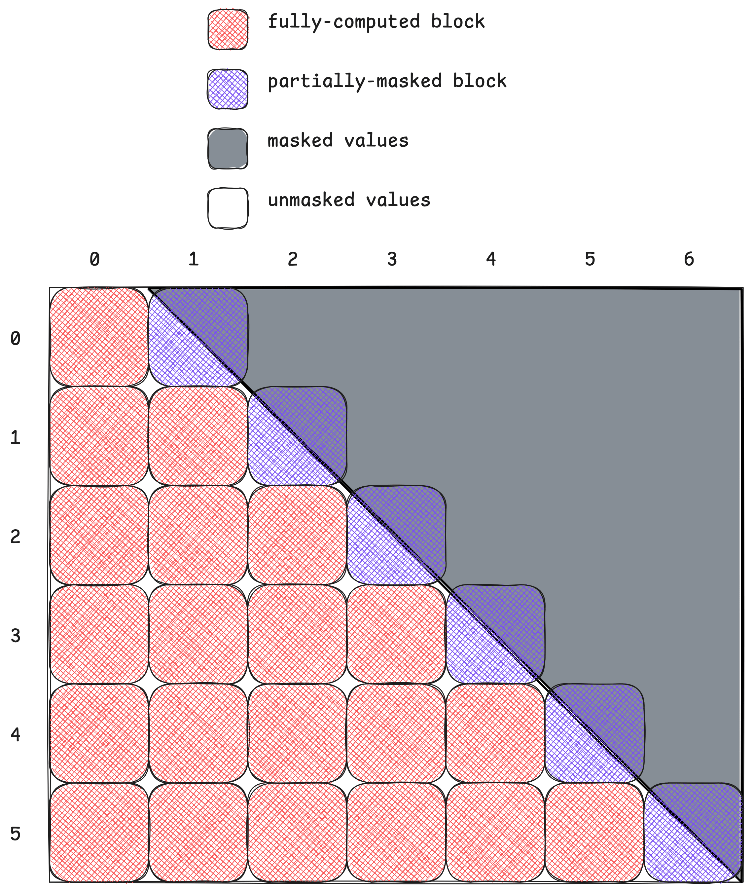
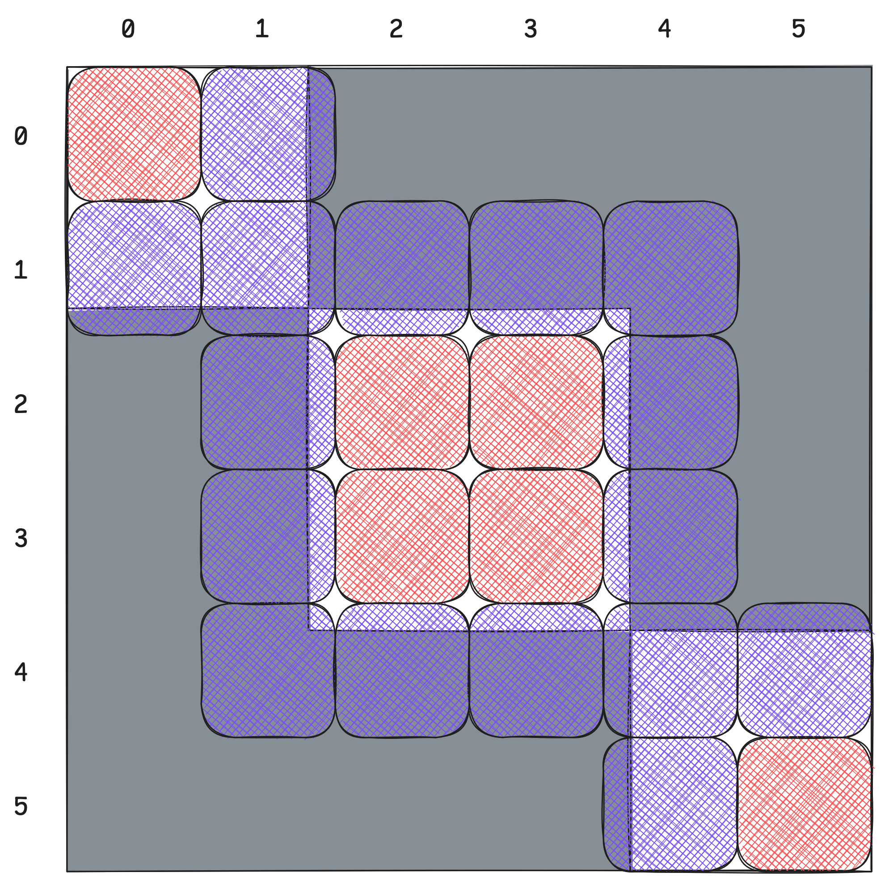
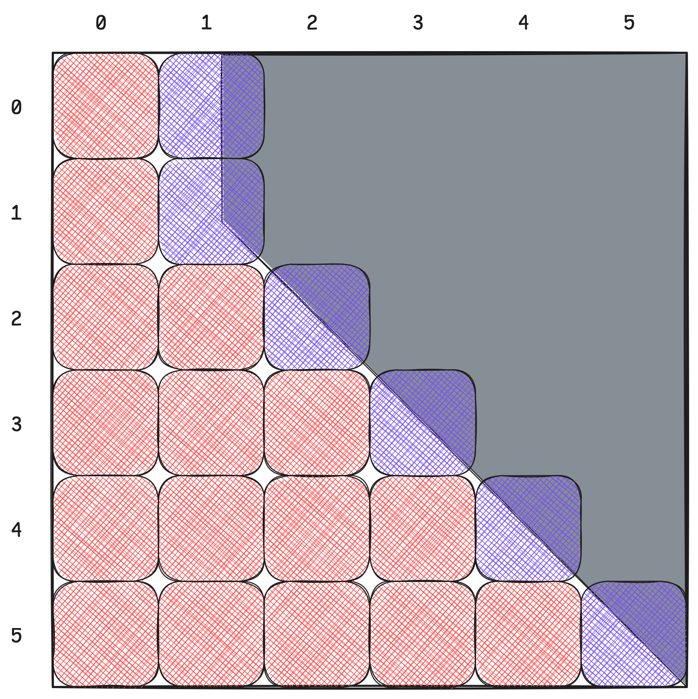

# A User’s Guide to FlexAttention in FlashAttention CuTe DSL

**Date:** November 14, 2025

**Source:** [https://research.colfax-intl.com/a-users-guide-to-flexattention-in-flash-attention-cute-dsl/](https://research.colfax-intl.com/a-users-guide-to-flexattention-in-flash-attention-cute-dsl/)

---

Many variants of attention ([Vaswani et al., 2017](https://arxiv.org/abs/1706.03762)) have become popular in recent years, for reasons related to performance and model quality. These include:

- **Causal attention** for autoregressive language modeling, where a token only attends to those prior;
- **Sliding window attention** for long-context language modeling, where a token only attends to those prior within a predefined window, reducing computational complexity of attention from $\mathcal{O}(n^2 d)$ to $\mathcal{O}(nwd)$ where $w$ is the window size;
- **ALiBi** ([Press et al., 2021](https://arxiv.org/abs/2108.12409)), which uses a positional bias linear in distance to encode relative position without explicit embeddings, improving extrapolation to longer sequences;
- **T5 bias and PrefixLM** ([Raffel et al., 2020](https://arxiv.org/pdf/1910.10683)), which introduce learned additive biases or prefix tokens that condition attention structure on task semantics rather than strict sequence order and allow partial bidirectional (non-causal) attention, respectively; and
- **Attention sink** ([Xiao et al., 2023](https://arxiv.org/abs/2309.17453)), which significantly boosts the quality of sliding window attention by adding a fixed set of cached KV tokens to which all tokens attend, preserving global context while maintaining linear computational complexity.

The PyTorch team at Meta recognized that most of these variants (including all of the above) can be unified under one elegant framework, dubbed **FlexAttention** ([Guessous et al., 2024](https://pytorch.org/blog/flexattention/)). This simple API allows users to define and work with a large collection of attention variants, including novel combinations of existing ones, with relatively little development overhead and decent performance.

FlexAttention adds two options for customization: a `score_mod` callable that modifies pre-softmax attention scores and a `mask_mod` callable that masks out pre-softmax attention scores. Altogether, FlexAttention takes the form

$$
\text{FlexAttention}(Q, K, V) = \text{Softmax}\left({\color{orange}\text{mask\_mod}}\left({\color{red}\text{score\_mod}}\left(QK^T\right)\right)\right) V
$$
Note that `mask_mod` is a special case of `score_mod` where scores are set to `-inf`; we keep the two separate for efficiency reasons, as will be explained when discussing block sparsity.

The original FlexAttention implementation is in Triton. While this implementation comes within 90% of FlashAttention 2 performance on Ampere GPUs, the performance on Hopper is significantly worse in comparison to FlashAttention 3.

In this blog post, we discuss our recent implementation of FlexAttention integrated into FlashAttention-4 CuTe DSL, done in collaboration with Driss Guessous (Meta) and Tri Dao (Princeton; Together AI), achieving **95% of the performance of FlashAttention 3 in the forward pass**. This is a roughly 50% speedup over the Triton version in most cases. The FlashAttention-4 backend is implemented for Hopper (SM90) and Blackwell (SM100), both for the forward and the backward pass.

We focus on explaining the API so that developers can quickly integrate FlexAttention into their workflows.

## Score Modification

The `score_mod` callable modifies pre-softmax attention scores based on position and optional auxiliary tensors. The generic signature is:

```
generic_score_mod(
    score: float,
    batch_idx: int,
    head_idx: int,
    q_idx: int,
    kv_idx: int,
    aux_tensors: Optional[list[tensor]],
) -> float
```

On the PyTorch side, `score_mod`s also accept `aux_integers`, frequently used to parametrize offsets, like in non-square causal masking. We opt to simplify the signature somewhat by including sequence length info by default, as will be demonstrated below.

### Examples

**Example 1: T5 (Relative Positional) Bias**

```
def rel_bias_score_mod(score, batch_idx, head_idx, q_idx, kv_idx, aux_tensors):
    bias_tensor = aux_tensors[0]
    rel_pos = math.abs(q_idx - kv_idx)
    return score + bias_tensor[batch_idx, head_idx, rel_pos]
```

**Example 2: ALiBi**

```
def alibi_score_mod(score, batch_idx, head_idx, q_idx, kv_idx, aux_tensors):
    slope = math.exp2(-(head_idx + 1))
    dist = math.abs(q_idx - kv_idx)
    return score - slope * dist
```

### CuTe DSL Implementation

In the CuTe DSL implementation, we require that `score_mod` be defined in terms of the `TensorSSA` abstraction (see the [CUTLASS TensorSSA notebook](https://github.com/NVIDIA/cutlass/blob/main/examples/python/CuTeDSL/notebooks/tensorssa.ipynb)). For example, T5 bias could take the following form:

```
@cute.jit
def rel_bias_score_mod_cute(
    tSrS_ssa: cute.TensorSSA,
    batch_idx: cute.TensorSSA,
    head_idx: cute.TensorSSA,
    q_idx: cute.TensorSSA,
    kv_idx: cute.TensorSSA,
    seqlen_info: SeqlenInfoQK,
    aux_tensors: Optional[list]
) -> cute.TensorSSA:
    bias_tensor = aux_tensors[0]
    rel_pos = cute.TensorSSA(
        mlir_math.absi(q_idx - kv_idx), 
        q_idx.shape, 
        q_idx.dtype
    )
    bias = bias_tensor[batch_idx[0], head_idx[0], rel_pos[0]].to(cutlass.Float32)
    return tSrS_ssa + bias
```

Application of `score_mod` is expensive, as it requires looping over all entries in the scores matrix; `TensorSSA` accordingly allows for easy vectorized and broadcasted instructions. In the [score mod application in the attention mainloop](https://github.com/Dao-AILab/flash-attention/blob/701ebe05783a3f83041a3f4604de083a328b20c1/flash_attn/cute/softmax.py#L334), we compute modified scores in groups of `vec_size`, a tunable hyperparameter. We note that without further assumptions, vectorization of `score_mod` application is not feasible when using `aux_tensors`.

### Usage

Once a user has defined a `score_mod` function, they can easily pass it into the FlashAttention interface.

**Direct CuTe DSL interface**:

```
from flash_attn.cute.interface import _flash_attn_fwd

out, _ = _flash_attn_fwd(
    q, k, v,  # torch.Tensor
    score_mod=rel_bias_score_mod_cute,
    aux_tensors=aux_tensors,  # Optional[list[torch.Tensor]]
)
```

Torch tensors are converted to `cute.Tensor`s within the `_flash_attn_fwd` method. Many optional arguments have been omitted here for brevity.

**PyTorch integrated interface:**

The CuTe DSL implementation of FlexAttention is also integrated into PyTorch when built from source; it will be incorporated into the stable build in the near future. Instead of defining a `TensorSSA`-compatible `score_mod` function, one can define `score_mod` within PyTorch and rely on TorchInductor to properly generate the CuTe DSL code:

```
from torch.nn.attention.flex_attention import flex_attention

compiled_fn = torch.compile(flex_attention)
out = compiled_fn(
    q, k, v,
    score_mod=rel_bias_score_mod,
    kernel_options={"force_flash": True},  # Use CuTe DSL backend
)
```

## Mask Modification

Defining `mask_mod` callables is almost identical to the `score_mod` case, with some simplifications. The mask application logic is contained in the FlashAttention forward kernel, so our `mask_mod` callable need only return a Boolean indicating whether or not a certain score needs to be masked (set to `-inf`):

```
generic_mask_mod(
    batch_idx: cute.TensorSSA,
    head_idx: cute.TensorSSA,
    q_idx: cute.TensorSSA,
    kv_idx: cute.TensorSSA,
    seqlen_info: SeqlenInfoQK
    aux_tensors: Optional[list],
) -> cute.TensorSSA  # dtype == cutlass.Boolean
```

Note that unlike `score_mod`, we don’t pass in the score itself—we only need the positional information to determine whether a particular attention element should be masked.

### Examples

**Example 1: Causal Mask with Offset**

To create a causal mask with the proper offset (`seqlen_k - seqlen_q`), utilize the properties built into the `SeqlenInfoQK` class ([defined here](https://github.com/Dao-AILab/flash-attention/blob/main/flash_attn/cute/seqlen_info.py)):

```
@cute.jit
def causal_mask_mod(batch_idx, head_idx, q_idx, kv_idx, seqlen_info, aux_tensors):
    offset = seqlen_info.seqlen_k - seqlen_info.seqlen_q
    return kv_idx <= q_idx + offset # TensorSSA will broadcast scalars
```

**Example 2: Document Masking**

When sequences from multiple documents have been concatenated, tokens should only attend within their document. To prevent information leakage across document boundaries, we do the following:

```
@cute.jit
def document_mask_mod(batch_idx, head_idx, q_idx, kv_idx, seqlen_info, aux_tensors):
    doc_ids = aux_tensors[0]
    doc_id_q = doc_ids[batch_idx[0], head_idx[0], q_idx[0]]
    doc_id_kv = doc_ids[batch_idx[0], head_idx[0], kv_idx[0]]
    q_doc = utils.scalar_to_ssa(doc_id_q, cutlass.Int32)
    kv_doc = utils.scalar_to_ssa(doc_id_kv, cutlass.Int32)
    return q_doc == kv_doc
```

Here, `doc_ids` is an `Int32` tensor of shape `(B, H, seqlen)` representing to which document a given token belongs, with the assumption that documents are contiguous. For simplicity, we may also sometimes assume it is non-negative and non-decreasing, though this is not strictly required.

### Usage

```
out, _ = _flash_attn_fwd(
    q, k, v,
    mask_mod=document_mask_mod,
    aux_tensors=[doc_ids],
)
```

## Block Sparsity

The conceptual simplicity of FlexAttention belies the need for thoughtful optimizations. When large portions of the scores matrix are to be masked, we would like to intelligently *avoid* these regions where possible, skipping unnecessary data movement and computation. To do so, FlexAttention implements **block sparsity** with mask mods.

Take for example the case of causal masking. Consider the problem with batch size 1, one head, `seqlen_q = 768`, `seqlen_kv = 896`, and work tile size `128×128`. There are 42 total blocks to handle:

- **6 blocks** along the main diagonal (note that in causal masking, the diagonal is offset to meet the bottom-right corner, rather than the top-left) are split in half by the causal mask; these need `mask_mod` application
- **21 blocks** below the diagonal have no masking at all; these do not need `mask_mod` application (though they do need `score_mod`), so we should skip applying `mask_mod` on these blocks
- The remaining **15 blocks** are to be skipped entirely; it would be wasteful even to load them



### Block Sparsity Tensors

Each work tile in the FlashAttention kernel corresponds to one `(batch, head, q_block)` coordinate. To compute only the tiles needed, we need to know the coordinates of each partially-masked tile and the coordinates of each fully-computed tile. We encapsulate these in two tensors:

- `mask_block_idx: [B, H, num_q_blocks, num_kv_blocks]` representing blocks that require application of `mask_mod` and
- `full_block_idx: [B, H, num_q_blocks, num_kv_blocks]` representing fully-computed blocks.

Here, `num_q_blocks = ceil_div(seqlen_q, tile_m)` is the number of work tiles in the `q` dimension, and `num_kv_blocks = ceil_div(seqlen_kv / tile_n`) is the number of work tiles in the `kv` dimension.

To index properly into these tensors, we also keep track of two “count” tensors:

- `mask_block_cnt: [B, H, num_q_blocks]` representing the total number of partially-masked `kv_blocks` and
- `full_block_cnt: [B, H, num_q_blocks]` representing the total number of fully-computed `kv_blocks`.

We assume that for any `(b, h, q_block)`:

1. Setting `mask_cnt = mask_block_cnt[b, h, q_block]`, the tensor `mask_block_idx[b, h, q_block, :mask_cnt]` is strictly increasing, and the remainder `mask_block_idx[b, h, q_block, mask_cnt:]` is identically 0
2. Setting `full_cnt = full_block_cnt[b, h, q_block]`, the tensor `full_block_idx[b, h, q_block, :full_cnt]` is strictly increasing, *disjoint from* `mask_block_idx[b, h, q_block, :mask_cnt]`, and the remainder `full_block_idx[b, h, q_block, full_cnt:]` is identically 0.

The disjointness condition in 2 guarantees that no block is processed twice.

For cleanliness, these tensors are wrapped in a `BlockSparseTensors` class:

```
class BlockSparseTensors(NamedTuple):
    mask_block_cnt: cute.Tensor
    mask_block_idx: cute.Tensor
    full_block_cnt: Optional[cute.Tensor]
    full_block_idx: Optional[cute.Tensor]
```

Note that `full_block_cnt` and `full_block_idx` can be optional; `mask_mod` will be applied to all blocks in that case.

**Example: Causal Masking Block Sparsity**

For causal masking with the parameters above, the block sparsity tensors are:

```
mask_block_cnt = [[[1, 1, 1, 1, 1, 1]]]
mask_block_idx = [[[[1, 0, 0, 0, 0, 0, 0],
                    [2, 0, 0, 0, 0, 0, 0],
                    [3, 0, 0, 0, 0, 0, 0],
                    [4, 0, 0, 0, 0, 0, 0],
                    [5, 0, 0, 0, 0, 0, 0],
                    [6, 0, 0, 0, 0, 0, 0]]]]
full_block_cnt = [[[1, 2, 3, 4, 5, 6]]]
full_block_idx = [[[[0, 0, 0, 0, 0, 0, 0],
                    [0, 1, 0, 0, 0, 0, 0],
                    [0, 1, 2, 0, 0, 0, 0],
                    [0, 1, 2, 3, 0, 0, 0],
                    [0, 1, 2, 3, 4, 0, 0],
                    [0, 1, 2, 3, 4, 5, 0]]]]
```

### Computing Block Sparsity

Computing `BlockSparseTensors` for a given `mask_mod`, sequence length, and tile size can be computationally expensive; this is unavoidable. It is, however, generally amortized across all layers of a model, so it is not too problematic in practice.

PyTorch possesses a similar, more robust class `BlockMask` that can be converted into `BlockSparseTensors`:

```
from torch.nn.attention.flex_attention import create_block_mask

block_mask_torch = create_block_mask(
    mask_mod_fn,  # PyTorch mask function
    B, H, seqlen_q, seqlen_kv,
    device="cuda",
    BLOCK_SIZE=(tile_m, tile_n),
)

# Convert to CuTe DSL format
_, _, mask_cnt, mask_idx, full_cnt, full_idx, *_ = block_mask_torch.as_tuple()
block_sparse_tensors = BlockSparseTensorsTorch(
    mask_block_cnt=mask_cnt,
    mask_block_idx=mask_idx,
    full_block_cnt=full_cnt,
    full_block_idx=full_idx,
)
```

**Warning:** The tile size used to compute block sparsity must be the same as the tile size used in the kernel. 

## Complete API Call

Altogether, FlexAttention can be used in FlashAttention CuTe DSL by calling

```
_flash_attn_fwd(
    q, k, v,  # torch.Tensor
    score_mod=score_mod,  # Callable
    mask_mod=mask_mod,  # Callable
    block_sparse_tensors_torch=block_sparse_tensors,  # BlockSparseTensorsTorch
    aux_tensors=aux_tensors,  # Optional[list[torch.Tensor]]
)
```

Within `_flash_attn_fwd`, `block_sparse_tensors_torch` is converted into a `BlockSparseTensors` object via

```
sparse_tensors = flash_attn.cute.block_sparsity.to_cute_block_sparse_tensors(
    block_sparse_tensors_torch
)
```

### Examples

#### Example 1: Document Masking with Relative Positional Bias

This example demonstrates a combination of a `score_mod` and a `mask_mod` that both use `aux_tensors`.

We assume given a `doc_ids` tensor as well as a `rel_bias` tensor with shapes `[B, H, max_seqlen]`, where `max_seqlen = max(seqlen_kv, seqlen_q)`. For example, we may have `B = 1, H = 1, max_seqlen = 640`, and a `doc_ids` tensor where

```
# 3 documents at positions [0:230], [230:410], [410:640]
doc_ids = torch.zeros((1, 1, 640), dtype=torch.int32)
doc_ids[0, 0, :230] = 0
doc_ids[0, 0, 230:410] = 1
doc_ids[0, 0, 410:] = 2
```

The full implementation combining `score_mod` and `mask_mod` is

```
@cute.jit
def doc_rel_bias_score_mod(
    tSrS_ssa, 
    b_idx, 
    h_idx, 
    q_idx, 
    kv_idx, 
    seqlen_info, 
    aux_tensors
):
    rel_bias = aux_tensors[0]
    distance = cute.TensorSSA(
        mlir_math.absi(q_idx - kv_idx),
        q_idx.shape, q_idx.dtype
    )
    bias = rel_bias[b_idx[0], h_idx[0], distance[0]].to(cutlass.Float32)
    return tSrS_ssa + bias

@cute.jit
def document_mask_mod(
    b_idx, 
    h_idx, 
    q_idx, 
    kv_idx, 
    seqlen_info, 
    aux_tensors
):
    doc_ids = aux_tensors[1]  # Second aux tensor
    q_doc = doc_ids[b_idx[0], h_idx[0], q_idx[0]]
    kv_doc = doc_ids[b_idx[0], h_idx[0], kv_idx[0]]
    q_doc_ssa = utils.scalar_to_ssa(q_doc, cutlass.Int32)
    kv_doc_ssa = utils.scalar_to_ssa(kv_doc, cutlass.Int32)
    return q_doc_ssa == kv_doc_ssa

rel_bias = torch.randn((1, 1, 640), dtype=torch.float32)
aux_tensors = [rel_bias, doc_ids]

# Compute block sparsity
block_sparse_tensors = compute_block_sparsity(...)

out, _ = _flash_attn_fwd(
    q, k, v,
    score_mod=doc_rel_bias_score_mod,
    mask_mod=document_mask_mod,
    block_sparse_tensors_torch=block_sparse_tensors,
    aux_tensors=aux_tensors,
)
```

The block sparsity tensors for this mask show the structure of the three document blocks clearly, with tokens only attending within their respective documents.



### Example 2: PrefixLM with Per-Head Bias

PrefixLM ([Raffel et al., 2020](https://arxiv.org/pdf/1910.10683)) combines causal and non-causal attention by having all tokens attend to a fixed-length prefix in addition to ordinary causal masking. This is useful for tasks where the input should be processed bidirectionally (like in an encoder) while the output remains autoregressive.

The `mask_mod` function is as follows:

```
def create_prefix_lm_mask(prefix: int):
    @cute.jit
    def _prefix_lm_mask_mod(
        b_idx, 
        h_idx, 
        q_idx, 
        kv_idx, 
        seqlen_info, 
        aux_tensors
    ):
        prefix_ssa = utils.scalar_to_ssa(prefix, cutlass.Int32)
        offset = seqlen_info.seqlen_k - seqlen_info.seqlen_q
        offset_ssa = utils.scalar_to_ssa(offset, cutlass.Int32)
        # Allow bidirectional attention in prefix OR causal after
        in_prefix = kv_idx < prefix_ssa
        causal = kv_idx <= q_idx + offset_ssa
        return in_prefix | causal
    
    return _prefix_lm_mask_mod
```

The `score_mod` function is a simple one, taking a per-head bias tensor `head_bias`:

```
@cute.jit
def head_bias_score_mod(
    tSrS_ssa, 
    b_idx, 
    h_idx, 
    q_idx, 
    kv_idx, 
    seqlen_info,
    aux_tensors
):
    head_bias = aux_tensors[0]
    bias_val = head_bias[h_idx[0]].to(cutlass.Float32)
    return tSrS_ssa + bias_val
```

With batch size 1, 1 head, tile size 128×128, sequence length 768, and prefix 204, the block sparsity structure shows the characteristic pattern of PrefixLM: all tokens can attend bidirectionally to the first block (the prefix), while subsequent tokens follow causal masking.

```
head_biases = torch.randn(num_heads, dtype=torch.float32)
mask_mod = create_prefix_lm_mask(prefix=204, offset=0)

out, _ = _flash_attn_fwd(
    q, k, v,
    score_mod=head_bias_score_mod,
    mask_mod=mask_mod,
    block_sparse_tensors_torch=block_sparse_tensors,
    aux_tensors=[head_biases],
)
```



### Quick Reference

<table class="has-fixed-layout"><tbody><tr><td>Feature</td><td>Type</td><td>Example</td></tr><tr><td>ALiBi</td><td><code>score_mod</code></td><td><code>-slope * distance</code></td></tr><tr><td>Causal</td><td><code>mask_mod</code></td><td><code>kv_idx &lt;= q_idx</code></td></tr><tr><td>Sliding window</td><td><code>mask_mod</code></td><td><code>abs(q_idx - kv_idx) &lt;= w</code></td></tr><tr><td>T5 bias</td><td><code>score_mod</code></td><td><code>score + bias[rel_pos]</code></td></tr><tr><td>Document mask</td><td><code>mask_mod</code></td><td><code>doc[q] == doc[kv]</code></td></tr><tr><td>PrefixLM</td><td><code>mask_mod</code></td><td><code>kv &lt; prefix | kv &lt;= q</code></td></tr></tbody></table>

## Getting Started

Here is a minimal working example to get started with FlexAttention:

```
# 1. Define mods
import flash_attn.cute.utils as utils
@cute.jit
def my_score_mod(score, b_idx, h_idx, q_idx, kv_idx, seqlen_info, aux_tensors):
	scale = utils.scalar_to_ssa(1.1, cutlass.Float32)
    return score * scale  # Example: scale scores

@cute.jit  
def my_mask_mod(b_idx, h_idx, q_idx, kv_idx, seqlen_info, aux_tensors):
    return kv_idx <= q_idx  # Example: causal w/o offset

# 2. Compute block sparsity
from torch.nn.attention.flex_attention import create_block_mask
block_mask = create_block_mask(
    my_mask_mod, 
    B, H, seqlen_q, seqlen_kv, 
    device="cuda", 
    BLOCK_SIZE=(128, 128)
)

# 3. Run attention
from flash_attn.cute.interface import _flash_attn_fwd
out, lse = _flash_attn_fwd(
    q, k, v, 
    score_mod=my_score_mod,
    mask_mod=my_mask_mod,
    block_sparse_tensors_torch=block_mask
)
```

The key steps are: (1) define your attention modifications as callables, (2) compute block sparsity once for your mask pattern and tile size, and (3) call the forward function with your modifications. The block sparsity computation can be cached and reused across layers and iterations.

For more details on the native CuTe DSL API (without PyTorch), see the **Appendix**.

## References

- Vaswani et al., “Attention Is All You Need”, 2017. Attention is all you need. In Proceedings of the 31st International Conference on Neural Information Processing Systems (NIPS’17). Curran Associates Inc., Red Hook, NY, USA, 6000–6010.
- Press et al., “Train Short, Test Long: Attention with Linear Biases Enables Input Length Extrapolation”, 2021. https://arxiv.org/abs/2108.12409
- Raffel, Colin et al. “Exploring the Limits of Transfer Learning with a Unified Text-to-Text Transformer.” *J. Mach. Learn. Res.* 21 (2019): 140:1-140:67.
- Xiao et al., “Efficient Streaming Language Models with Attention Sinks”, 2023. https://arxiv.org/abs/2309.17453
- Guessous et al., “FlexAttention: The Flexibility of PyTorch with the Performance of FlashAttention”, 2024. https://pytorch.org/blog/flexattention/

## Appendix: CuTe DSL-native API

In this appendix, we present the API to use FlexAttention without referencing torch tensors. We provide a CuTe DSL-native block sparsity computation kernel in `flash_attn.cute.compute_block_sparsity` with interface `compute_blocksparse_tensors`, which has the signature

```
compute_block_sparsity(
    tile_m,
    tile_n,
    batch_size,
    num_heads,
    seqlen_q,
    seqlen_k,
    mask_mod: Callable,
    aux_tensors: Optional[list],  # list[cute.Tensor]
    device,
    compute_full_blocks: bool = True,
    use_fast_sampling: bool = False,
) -> Tuple[BlockSparseTensors, BlockSparseTensorsTorch]:
```

With this kernel in hand, we can present a complete example workflow using the native API, for `compute_capability in [9, 10, 11]`:

```
from flash_attn.cute.compute_block_sparsity import compute_blocksparse_tensors
from flash_attn.cute.flash_fwd import FlashAttentionForwardSm90
from flash_attn.cute.flash_fwd_sm100 import FlashAttentionForwardSm100

tile_m, tile_n = 128, 128
batch_size, num_heads, seqlen_q, seqlen_k = 2, 8, 8192, 8192
mask_mod = user_defined_mask_mod
score_mod = user_defined_score_mod
aux_tensors = user_provided_aux_tensors
device = "cuda"

# Compute block sparsity
blocksparse_tensors, blocksparse_torch_tensors = compute_blocksparse_tensors(
    tile_m,
    tile_n,
    batch_size,
    num_heads,
    seqlen_q,
    seqlen_k,
    mask_mod, 
    aux_tensors,
    device,
)

# Instantiate kernel
if compute_capability == 9:
    fa_fwd = FlashAttentionForwardSm90(
        dtype,
        head_dim,
        head_dim_v,
        qhead_per_kvhead,
        is_causal=False,
        is_local=False,
        pack_gqa=False,
        tile_m=tile_m,
        tile_n=tile_n,
        num_stages=2,
        num_threads=384,
        Q_in_regs=False,
        intra_wg_overlap=True,  # tunable hyperparameter for optimizations
        mma_pv_is_rs=True,  # tunable hyperparameter for optimizations
        mask_mod=mask_mod,
        score_mod=score_mod,
        has_aux_tensors=aux_tensors is not None,  # known at compile time
        q_subtile_factor=None,
    )
elif compute_capability in [10, 11]:
    fa_fwd = FlashAttentionForwardSm100(
        head_dim,
        head_dim_v,
        qhead_per_kvhead=qhead_per_kvhead,
        is_causal=causal,
        is_local=local,
        is_split_kv=is_split_kv,
        pack_gqa=pack_gqa,
        m_block_size=m_block_size,
        n_block_size=n_block_size,
        q_stage=q_stage,
        is_persistent=not causal
            and not local
            and cu_seqlens_q is None
            and seqused_q is None
            and not is_split_kv,
        score_mod=score_mod,
        mask_mod=mask_mod,
        has_aux_tensors=aux_tensors is not None,
        paged_kv_non_tma=page_size not in [None, 128],
        is_varlen_q=cu_seqlens_q is not None
            or seqused_q is not None,
        q_subtile_factor = None,
    )
else:
    raise ValueError(
        f"Unsupported compute capability: {compute_capability}. Supported: 9.x, 10.x, 11.x"
    )

# Assume relevant tensors are easily accessible
q_tensor, k_tensor, v_tensor, o_tensor, lse_tensor = get_tensors(...)

# Compile kernel; in a real use case, compiled kernels will be cached
fa_fwd_compiled = cute.compile(
    fa_fwd,
    q_tensor,
    k_tensor,
    v_tensor,
    o_tensor,
    lse_tensor,
    softmax_scale,
    current_stream,
    cu_seqlens_q_tensor,
    cu_seqlens_k_tensor,
    seqused_q_tensor,
    seqused_k_tensor,
    page_table_tensor,
    None,  # window size left
    None,  # window size right
    learnable_sink_tensor,
    blocksparse_tensors,
    aux_tensors,
)

# Run kernel with new arguments if needed
fa_fwd_compiled(
    q_tensor_new,
    k_tensor_new,
    v_tensor_new,
    o_tensor_new,
    lse_tensor_new,
    softmax_scale_new,
    current_stream_new,
    cu_seqlens_q_tensor_new,
    cu_seqlens_k_tensor_new,
    seqused_q_tensor_new,
    seqused_k_tensor_new,
    page_table_tensor_new,
    None,  # window size left
    None,  # window size right
    learnable_sink_tensor_new,
    blocksparse_tensors_new,
    aux_tensors_new,
)
```
