# Categorical Foundations for CuTe Layouts

**Date:** September 21, 2025

**Source:** [https://research.colfax-intl.com/categorical-foundations-for-cute-layouts/](https://research.colfax-intl.com/categorical-foundations-for-cute-layouts/)

---

In GPU programming, performance depends critically on how data is stored and accessed in memory. While the data we care about is typically multi-dimensional, the GPU’s memory is fundamentally one-dimensional. This means that when we want to load, store, or otherwise manipulate data, we need to map its multi-dimensional logical coordinates to one-dimensional physical coordinates. This mapping, known as a **layout**, is essential for reading from and writing to memory correctly and efficiently. Moreover, with respect to the GPU’s SIMT execution model, layouts are used to describe and manipulate partitionings of threads over data. This is important to ensure optimized memory access patterns and correct invocation of specialized hardware instructions, such as those used to target tensor cores.

CUTLASS pioneered a novel approach to layouts that both features shape and stride tuples of arbitrary nesting and depth, and a “layout algebra” formed out of certain fundamental operations, such as composition, complementation, logical division and logical product. These **CuTe layouts** are incredibly expressive, allowing one to describe partitioning patterns for all generations of tensor core instructions, for example. They are also fascinating from a mathematical perspective, since they feature an unusual and subtle notion of function composition that demands a theoretical explanation.

In a new paper, we develop a robust mathematical theory underlying this approach, connecting CuTe layouts and their algebra to the theory of **categories** and **operads** and developing a new graphical calculus of layout diagrams for computing their operations. An up-to-date pdf version of our paper is linked [here](https://research.colfax-intl.com/download/categories-of-layouts/), and the companion git repository may be found [here](https://github.com/ColfaxResearch/layout-categories).

[Categories of Layouts 09/24/25](https://research.colfax-intl.com/download/categories-of-layouts/?tmstv=1774608021)

In this blog post, we give a concise overview of the main ideas and results of our paper, referring the reader to the paper for a comprehensive treatment, many worked examples, and proofs. To state our results, we assume the reader knows the basic idea of a [category](https://en.wikipedia.org/wiki/Category_(mathematics)) and a [functor](https://en.wikipedia.org/wiki/Functor); cf. Appendix A of our paper for a quick introduction. We also assume that the reader is familiar with the basics of CuTe layouts, which we henceforth simply refer to as layouts.

## Tractable layouts

While defining and computing layout operations for arbitrary layouts is difficult, we can develop an intuitive framework for working with layouts by restricting to **tractable layouts**. These include almost all layouts one encounters in practice, such as

- **row-major**and **column-major** layouts, which are ubiquitous,
- **compact** layouts, which store data in consecutive memory addresses,
- **projections**, which broadcast multiple copies of data, and
- **dilations**, which enable padded loads and stores.

For now, let’s focus on the **flat** case, where the shape and stride of our layouts are tuples $(x_1, \ldots, x_n)$, rather than more general nested tuples. Throughout this article, we always suppose that shape tuples are comprised of positive integers and stride tuples are comprised of non-negative integers.

First, we define an ordering $\preceq$ on integer pairs $s : d$ by

$$
s : d \preceq s^{\prime} : d^{\prime} \: \text{ if and only if } \: d < d^{\prime} \: \text{ or } \: d = d^{\prime} \text{ and } s \leq s^{\prime}.
$$

**Definition:**We say that a flat layout

$$
L = (s_1, \ldots, s_m) : (d_1, \ldots, d_m)
$$

is ***tractable*** if for all pairs of integers $1 \leq i, j \leq m,$ the following condition holds:

$$
\text{if } s_i : d_ i \preceq s_j : d_j \text{ and } d_i, d_j \neq 0, \text{ then } s_i d_i \text{ divides } d_j.
$$

If *L* is tractable, then *L* can be encoded by a **diagram.**For example,

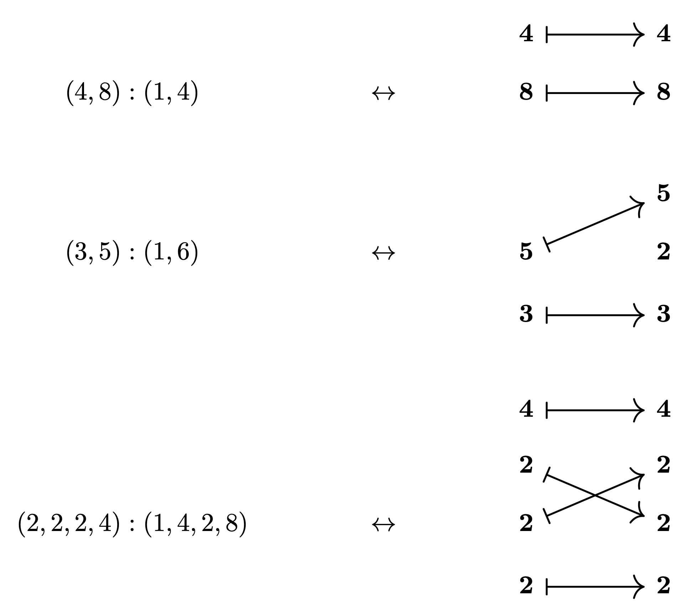

The shape of the encoded layout is the tuple on the left, and the stride of the encoded layout is determined by the arrows and the tuple on the right by taking prefix products:

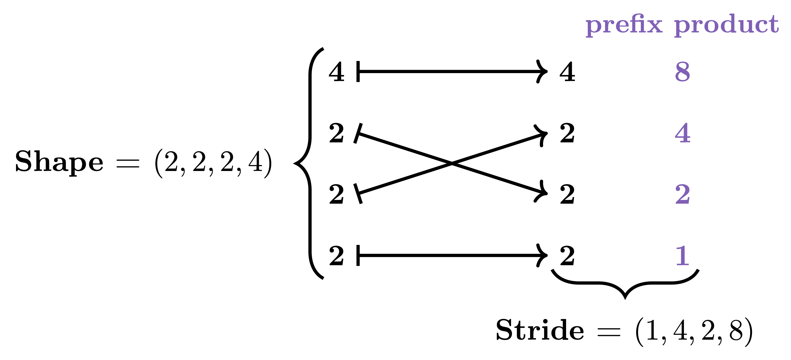

These diagrams are visual depictions of **morphisms** in a category **Tuple**:

**Definition:**Let **Tuple** denote the category in which

1. an object is a tuple $(s_1, \ldots, s_m)$ of positive integers, and
2. a morphism $f : (s_1, \ldots, s_m) \to (t_1, \ldots, t_n)$ is specified by a map of finite pointed sets

$$
\alpha: \{ \ast, 1, \ldots, m \} \to \{ \ast, 1, \ldots, n\}
$$

subject to the conditions

1. $\alpha(*) = *$,
2. if $\alpha(i) \neq *$ and $\alpha(i) = \alpha(i^{\prime})$, then $i = i^{\prime}$,
3. if $\alpha(i) = j \neq *$, then $s_i = t_j$.

We say such a morphism *f* lies over *α*, and refer to *f* as a ***tuple morphism***.

Each of the previously depicted diagrams was obtained from a tuple morphism *f* by depicting the domain $(s_1, \ldots, s_m)$ and codomain $(t_1, \ldots, t_n)$ of *f* vertically, and drawing an arrow from $s_i$ to $t_j$ if $\alpha(i) = j$. We can now give a precise definition of the layout encoded by a tuple morphism.

**Definition:** If *f* is a tuple morphism, then the ***layout encoded by*** *f* is the layout

$$
L_f = (s_1, \ldots, s_m) : (d_1, \ldots, d_m)
$$

whose shape is the domain of *f*, and whose stride is given by

$$
d_i = \begin{cases} t_1 \cdots t_{j-1} & \text{if } \alpha(i) = j \\ 0 & \text{if } \alpha(i) = *. \end{cases}
$$

An important subtlety is that there are many different tuple morphisms which encode the same layout. For example, each of the tuple morphisms

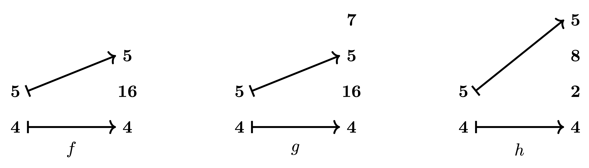

encodes the layout *L* = (4, 5) : (1, 64). The morphism *f* is clearly the simplest: it does not contain superfluous entries (like the “7” in *g*), and the entries not hit by *f* are consolidated (unlike the “2” and “8” in *h*). When a morphism *f* satisfies these properties, we say *f* has **standard form**.

If we further assume that our layouts *L* and morphisms *f* are **non-degenerate,**which corresponds to the conditions

$$
s_i = 1 \quad \Rightarrow \quad d_i = 0,
$$

$$
s_i = 1 \quad \Rightarrow \quad \alpha(*) = *,
$$

on the layout side and morphism side, respectively, then we can prove the following correspondence theorem.

**Theorem:**There is a one-to-one correspondence between **non-degenerate tractable flat layouts** and **non-degenerate tuple morphisms of standard form**.

If *L* is a non-degenerate tractable layout, we write $f_L$ for the tuple morphism corresponding to *L*, and refer to $f_L$ as the **standard representation** of *L*.

## Layout functions and the realization functor

The most important invariant of a layout *L* is its **layout function**$\Phi_L$. When *L* is tractable, its layout function arises naturally from the category **Tuple** through a **realization functor**

$$
| \cdot | : \textbf{Tuple} \to \textbf{FinSet}
$$

Let’s recall the definition of layout functions. In order to do so, we must first recall the definition of **colexicographic isomorphisms** and their inverses. It will be convenient to use the notation $[0, N) = \{ 0, 1, \ldots, N – 1 \}$.

**Definition**: If $S = (s_1, \ldots, s_m)$ is a tuple of positive integers of size *M*, then the ***colexicographic isomorphism*** is the function

$$
\mathrm{colex}_S: [0, s_1) \times \cdots \times [0, s_m) \to [0, M)
$$

given by

$$
\mathrm{colex}_S(x_1, \ldots, x_m) = \sum_{i=1}^m x_i \cdot s_1 \cdots s_{i-1}.
$$

The ***inverse colexicographic isomorphism*** is the function

$$
\mathrm{colex}_S^{-1}: [0, M) \to [0, s_1) \times \cdots \times [0, s_m)
$$

given by

$$
\mathrm{colex}_S^{-1}(x) = (x_1, \ldots, x_m)
$$

where

$$
x_i = \lfloor x / (s_1 \cdots s_{i-1} ) \rfloor \: \mod s_1 \cdots s_i.
$$

When *L* is tractable, we can recover its layout function by means of a **realization functor**from **Tuple** to the category of finite sets.

**Theorem:** There is a functor

$$
| \cdot | : \textbf{Tuple} \to \textbf{FinSet},
$$

which we call *realization*, satisfying the following properties:

1. If *S* is a tuple of size *M*, then $|S| = [0, M)$.
2. If *S* and *T* are tuples of size *M* and *N*, respectively, and $f: S \to T$ is a tuple morphism, then its realization $|f|: [0, M) \to [0, N) \subset \mathbb{Z}$ is the layout function of $L_f$.

In particular, this result provides an easy proof that the composition of tuple morphisms is compatible with composition of layouts, which we will discuss below.

## Layout Operations

Many important layout operations, such as coalesce, complement, and composition, have analogues in the category **Tuple**. Let’s take a closer look at each of these operations.

### Coalesce

If $L = (s_1, \ldots, s_m) : (d_1, \ldots, d_m)$ is a layout, then we can coalesce *L* by iteratively replacing any instance of

$$
(\ldots, s_i, s_{i+1}, \ldots) : (\ldots, d_i, s_i d_i, \ldots)
$$

with

$$
(\ldots, s_i s_{i+1}, \ldots) : (\ldots, d_i, \ldots)
$$

We denote the resulting layout by *coal*(*L*). For example, if

$$
L = (2, 2, 5, 5, 5) : (1, 2, 8, 40, 200)
$$

then

$$
\mathit{coal}(L) = (4, 125) : (1, 8).
$$

This construction has a direct analogue in the category **Tuple**. If *f* is a tuple morphism, then we can coalesce *f* by collapsing parallel arrows, and multiplying the corresponding entries. For example:

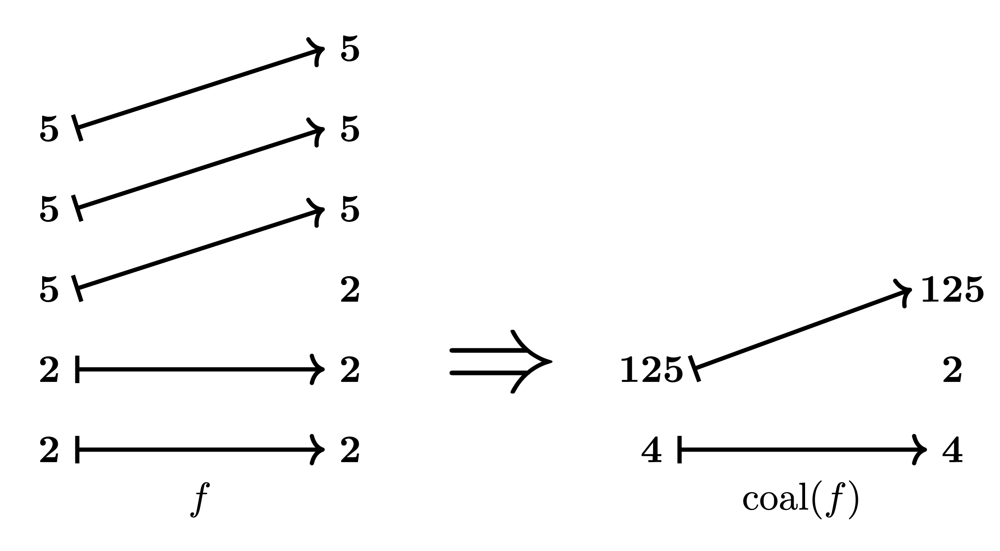

We prove that the coalesce operation in **Tuple** is compatible with layout coalesce.

**Theorem:** If *f* is a tuple morphism, then the layout encoded by *coal*(*f*) is

$$
L_{\mathit{coal}(f)} = \mathit{coal}(L_f).
$$

### Complement

If *L* is a layout and *N* is a positive integer, then *comp*(*L*, *N*) is a sorted, coalesced layout whose concatenation with *L* is compact. This means that the layout function of the concatenation is an isomorphism onto its image. There is a minimal integer *N* with respect to which *L* admits a complement, and in this case, we write *comp*(*L*) = *comp*(*L*, *N*). For example, if

$$
L = (2, 2, 2):(1, 6, 60)
$$

then

$$
comp(L) = (3, 5) : (2, 12).
$$

Again, there is an analogue of complements in the category **Tuple**. We can compute the complement $f^c$ of a tuple morphism *f* by including the entries not hit by *f*. For example,

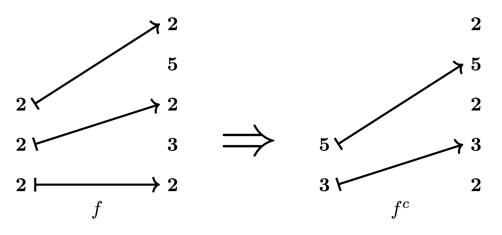

We prove that complements in the category **Tuple**are compatible with layout complements.

**Theorem:** If *f* is an injective tuple morphism of standard form, then

$$
L_{f^c} = \mathit{comp}(L_f).
$$

### Composition

If *A* and *B* are layouts, then the **composition** *B* ∘ *A* is a layout such that for any *x* ∈ [0, *size*(*B* ∘ *A*)), we have

$$
\Phi_{B \circ A}(x) = \Phi_B ( \Phi_A(x)).
$$

There are other properties which uniquely characterize the layout *B* ∘ *A*, and we refer the reader to Definition 2.3.7.1 of the paper for full details. For example, if *A* = (2, 2) : (5, 50) and *B* = (5, 2, 5, 2) : (1, 25, 5, 50), then the composition of *A* and *B* is (2, 2) : (25, 50).

If *f* and *g* are tuple morphisms with *codomain*(*f*) = *domain*(*g*), then we can compose *f* and *g* to form the tuple morphism *g* ∘ *f*. For example, the tuple morphisms

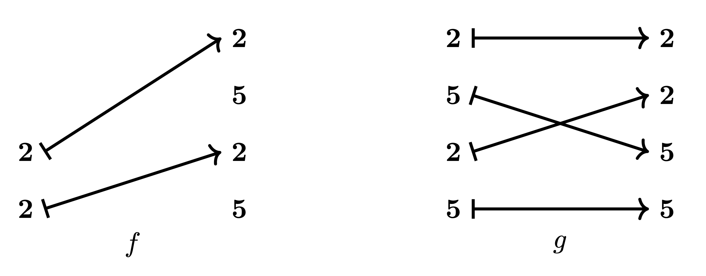

are composable, and their composite is as depicted below.

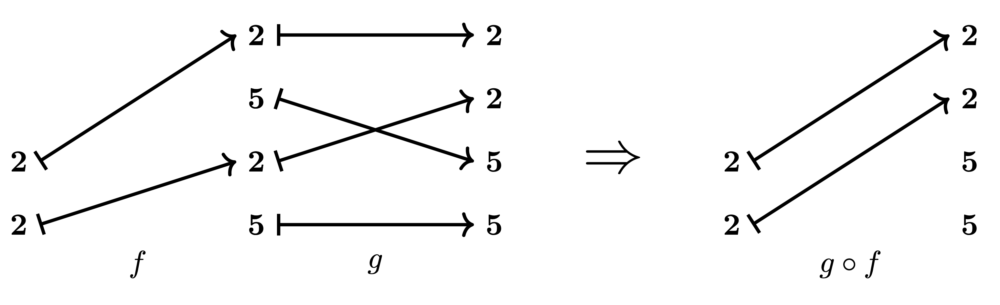

We prove that composition in the category **Tuple** is compatible with layout composition.

**Theorem:** If *f* and *g* are composable tuple morphisms, then

$$
L_{g \circ f} = L_g \circ L_f.
$$

This theorem provides a tool for computing the composition of flat, tractable layouts *A* and *B*. Namely, we can take the standard representations $f = f_A$ and $g = f_B$ of *A* and *B*, and if these morphisms happen to be composable, we can obtain the composite of *A* and *B* via the formula

$$
B \circ A = L_{g \circ f}.
$$

However, it is not often the case that the standard representations *f* and *g* of some arbitrarily chosen tractable layouts *A* and *B* are composable, even if the layouts themselves are. Instead, we may aim to compute the composition of *A* and *B* by

1. starting with the standard representations *f* and *g* of *A* and *B*,
2. modifying *f* and *g* to obtain composable morphisms *f’* and *g’* which realize to the same layout functions as for *f* and *g*, and
3. composing *f’* and *g’* to obtain the morphism *g’* ∘ *f’*, which encodes *B* ∘ *A*.

In order to make this procedure both rigorous and general, we must broaden our scope to consider *nested* or *hierarchical* layouts.

## Nested layouts and nested tuple morphisms

Let’s fix some notation and terminology. A ***profile*** is a nested tuple each of whose entries is the symbol ∗. For example *P* = (∗, (∗, ∗)) and *Q* = ((∗, ∗), ∗, (∗, ∗)) are profiles. A ***nested tuple*** *S* is uniquely determined by its***flattening*** $(s_1, \ldots, s_m)$, which is an ordinary tuple, and its profile *P*. It is convenient to write

$$
S = (s_1, \ldots s_m)_P
$$

when working with nested tuples. For example, if *S* = ((2, 2), (5, 5)), then we can write

$$
S = (2, 2, 5, 5)_P
$$

where *P* = ((∗, ∗), (∗, ∗)). If *L* = *S* : *D* is a layout, then *S* and *D* are required to have the same profile, so we may write a general layout as

$$
L = (s_1, \ldots, s_m)_P : (d_1, \ldots, d_m)_P.
$$

We refer to the layout

$$
L^\flat = (s_1, \ldots, s_m) : (d_1, \ldots, d_m)
$$

as the ***flattening*** of *L*. Much of our story about flat layouts may be easily ported to the nested case.

**Definition:** We say a layout *L* is ***tractable*** if its flattening *L*♭ is tractable.

Again, if *L* is tractable, then *L* can be encoded by a **diagram.**For example,

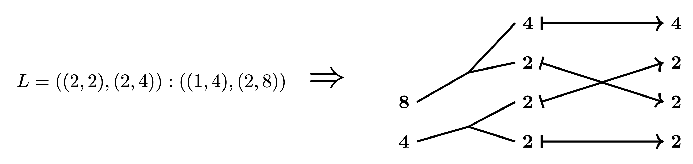

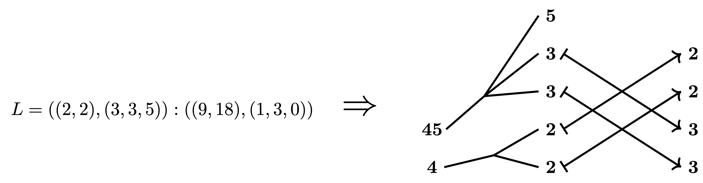

These diagrams represent morphisms in a category **Nest**.

**Definition:**Let **Nest** denote the category in which

1. an object is a nested tuple $(s_1, \ldots, s_m)_P$ of positive integers, and
2. a morphism $f : (s_1, \ldots, s_m)_P \to (t_1, \ldots, t_n)_Q$ is specified by a map of finite pointed sets

$$
\alpha: \{ \ast, 1, \ldots, m \} \to \{ \ast, 1, \ldots, n\}
$$

satisfying the same conditions above as for a tuple morphism, namely:

1. $\alpha(*) = *$,
2. if $\alpha(i) \neq *$ and $\alpha(i) = \alpha(i^{\prime})$, then $i = i^{\prime}$,
3. if $\alpha(i) = j \neq *$, then $s_i = t_j$.

We say such a morphism *f* lies over *α*, and refer to *f* as a ***nested tuple morphism.***

**Definition:** If *f* is a nested tuple morphism, then the ***layout encoded by*** *f* is the layout

$$
L_f = (s_1, \ldots, s_m)_P : (d_1, \ldots, d_m)_P
$$

whose shape is the domain of *f*, and whose stride *entries* are given by

$$
d_i = \begin{cases} t_1 \cdots t_{j-1} & \text{if } \alpha(i) = j \\ 0 & \text{if } \alpha(i) = *. \end{cases}
$$

We can define **standard form**and **non-degeneracy** in the nested case, and we again have a correspondence theorem.

**Theorem:** There is a one-to-one correspondence between **non-degenerate tractable layouts** and **non-degenerate nested tuple morphisms of standard form**.

We can compare the categories **Nest**and **Tuple**through the flattening functor

$$
(-)^\flat : \mathbf{Nest} \to \mathbf{Tuple}.
$$

In particular, we can postcompose with the realization functor from **Tuple** to **FinSet** to obtain a realization functor 

$$
| \cdot | : \textbf{Nest} \to \textbf{FinSet}
$$

defined on **Nest**, such that it enjoys the same properties as before.

**Theorem:** The realization functor from **Nest** to **FinSet** satisfies the following properties:

1. If *S* is a nested tuple of size *M*, then |*S*| = [0, *M*).
2. If *S* and *T* are nested tuples of size *M* and *N*, respectively, and $f : S \to T$ is a tuple morphism, then the realization $|f| : [0, M) \to [0, N) \subset \mathbf{Z}$ is the layout function of $L_f$.

In particular, this theorem leads to an easy proof of the following result:

**Theorem:** If *f* and *g* are composable nested tuple morphisms, then

$$
L_{g \circ f} = L_g \circ L_f
$$

The category **Nest**supports analogues of many important layout operations such as coalesce, complement, logical division, and logical product. We summarize these operations and their compatibility with the corresponding layout operations below.

**Theorem:**

1. We define a coalesce operation $coal(f)$ on nested tuple morphisms, which is compatible with layout coalesce, in that

$$
L_{\mathit{coal}(f)} = \mathit{coal}(L_f).
$$

1. We define a complement operation $f^c$ on nested tuple morphisms, which is compatible with layout complements in that if *f* is an injective nested tuple morphism of standard form, then

$$
L_{f^c} = \mathit{comp}(L_f)
$$

1. We define a notion of *divisibility* of nested tuple morphisms, and a logical division operation $f \oslash g$ when *g* divides *f*. This operation is compatible with logical division of layouts, in that

$$
\mathit{coal}(L_{f \oslash g}) = \mathit{coal}(L_f \oslash L_g).
$$

1. We define a notion of *product admissibility* for nested tuple morphisms, and a logical product operation $f \otimes g$ when *f* and *g* are product admissible. This operation is compatible with logical products of layouts, in that

$$
L_{f \otimes g} = L_f \otimes L_g.
$$

## The composition algorithm

Now that we have generalized our story to the nested case, we can explain our **composition algorithm**which computes the composition *B* ∘ *A* of tractable layouts *A* and *B* using our categorical framework. There are several important constructions used in our algorithm which we have not already discussed, namely **mutual refinements**, **pullbacks**, and **pushforwards**. We will explain these concepts in the context of our example, and refer readers to sections 4.1.2 and 4.1.3 of the paper for full details.

Suppose we want to compute the composition of the layouts *A* = (6, 6) : (1, 6) and *B* = (12, 3, 6) : (1, 72, 12). Since *A* and *B* are tractable, we may represent them with the tuple morphisms

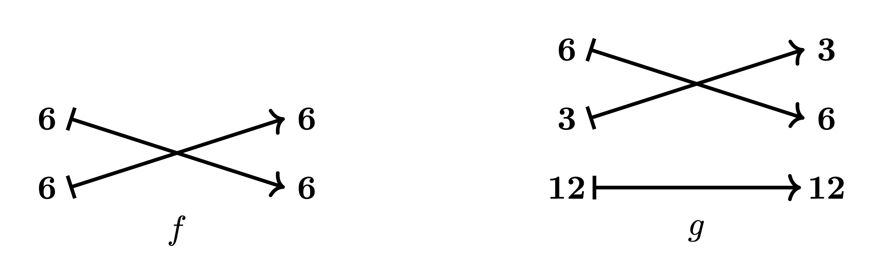

These morphisms are not composable, since the codomain (6, 6) of *f* is not equal to the domain (12, 3, 6) of *g*. This means that we can not use the morphisms *f* and *g* to compute the composite *B* ∘ *A* directly. We can, however, proceed with our computation by finding a **mutual refinement** of (6, 6) and (12, 3, 6), as depicted below

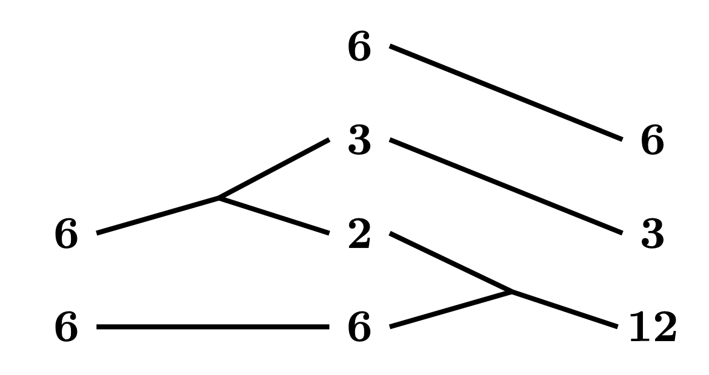

Intuitively, such a mutual refinement is a specification of how we can break up the codomain of *f* and the domain of *g* in a compatible way. We can use our mutual refinement to convert *f* and *g* into composable morphisms *f’* and *g’*. In the case of *f*, our mutual refinement indicates that we should factor the first 6 into (2, 3), and include an extra 6 in the codomain of *f*:

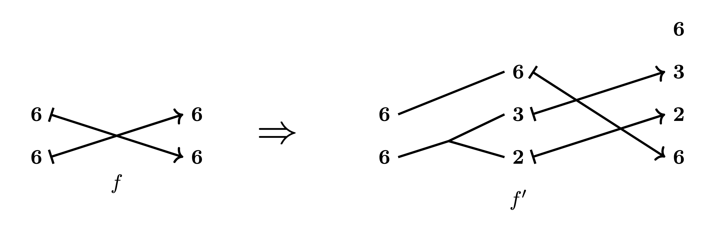

Rigorously, the construction of *f’* from *f* is an instance of a **pullback**.

In the case of *g*, our mutual refinement indicates that we should factor 12 as (6, 2):

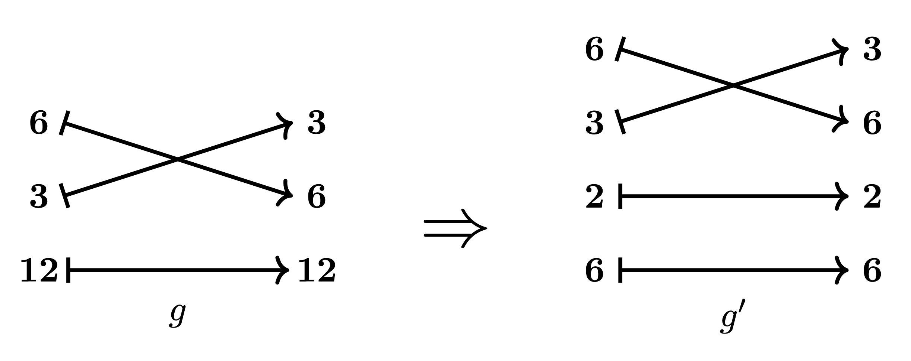

Rigorously, the construction of *g’* from *g* is an instance of a **pushforward**.

The nested tuple morphisms *f’* and *g’* are composable, so we may form the composite

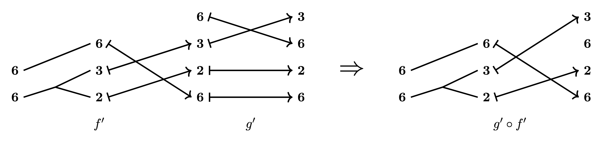

and computing the encoded layout yields

$$
B \circ A = L_{g^{\prime} \circ f^{\prime}} = ((2, 3), 6) : ((6, 72), 1).
$$

We have walked through an example of the composition algorithm in action. We refer the reader to section 4.1.3 of the paper for a full and precise description of this algorithm, and to section 4.1.4 for further examples. We would also like to emphasize that since **logical division** and **logical products** are defined in terms of composition, this algorithm may be used to compute these operations as well.

## Connections to the theory of operads

As we hinted at in the introduction, there are some interesting connections between the theory of layouts that we have developed and the theory of operads. Explaining them is not at all necessary to understand or use our results, but they are of independent mathematical interest, and at any rate served to guide our approach to the subject. In this final section, oriented towards mathematicians rather than the working programmer, we tersely discuss some of these connections.

We first describe how the category **Tuple**naturally occurs as a subcategory of the [categories of operators](https://ncatlab.org/nlab/show/category+of+operators) of an operad. We then introduce the operad of profiles and propose an alternative definition of a category of nested tuples that builds in refinements as “backwards” morphisms, which contextualizes many of the maneuvers around refinement done in the composition algorithm. Following common practice, we identify operads with their category of operators, e.g., the commutative operad is the category of finite pointed sets.

Consider the partially ordered set **ℤ**>0 of positive integers under the relation of divisibility: $a \leq b$ if and only if $a$ divides $b$. Like with every poset, we have an associated category whose objects are the set’s elements and where $a \to b$ if and only if $a \leq b$, and by abuse of notation we also denote this category as **ℤ**>0. Now, consider this category as a symmetric monoidal category under the operation of multiplication and apply the operadic nerve to produce the operad **ℤ**>0⊗, which comes equipped with a structure functor to the category of finite pointed sets. (For a reference on the operadic nerve, see Construction 2.1.1.7 in [Higher Algebra](https://www.math.ias.edu/~lurie/papers/HA.pdf).) We have the wide subcategory E0⊗ of finite pointed sets on those maps injective away from the basepoint, which is the operad encoding a single unary operation. Then, the pullback of **ℤ**>0 to E0⊗ identifies with the definition of **Tuple** excluding condition 2c), and imposing 2c) defines **Tuple** as a subcategory of this pullback.

From this perspective, how do we then incorporate profiles? Profiles themselves form a (single-colored, symmetric) operad, whose set of *n*-ary operations consists of profiles of length *n*, and which we endow with trivial symmetric group action. Under the operadic nerve, denote this operad as P⊗. One can then consider profiles with labels in any symmetric monoidal category C⊗ by forming the pullback of operads; for **ℤ**>0⊗, denote the resulting pullback as P**ℤ**>0⊗. Then, considering depth 1 profiles, we also get that **Tuple** is a subcategory of the pullback of P**ℤ**>0⊗ over E0⊗ (and indeed, of P**ℤ**>0⊗ itself).

Moreover, since P**ℤ**>0⊗ contains both tuple morphisms and refinements (because multiplying integers was the monoidal product), it is a suitable ambient category in which to make more sophisticated constructions. Specifically, as we saw with the diagrams appearing in the composition algorithm, it is natural to consider factorizations followed by tuple morphisms as themselves literally comprising morphisms in some category. There is a standard construction in category theory that can do this for us; namely, we can form a certain [category of spans](https://ncatlab.org/nlab/show/span) in P**ℤ**>0⊗, where the class of forward morphisms are those in the wide subcategory **Tuple** and the class of backward morphisms **Ref** consists of the [cocartesian edges](https://ncatlab.org/nlab/show/Cartesian+morphism) over those maps $\alpha: \{ \ast, 1, \ldots, m \} \to \{ \ast, 1, \ldots, n\}$ of finite pointed sets such that

1. $\alpha$ is **active**: if $\alpha(i) = \ast$, then $i = \ast$.
2. $\alpha$ is **surjective**.
3. $\alpha$ is **non-decreasing** when restricted to $\{ 1, \ldots, m \}$.

Here, the point of taking cocartesian edges is to consider e.g. maps $(a, b) \to c$ where $ab = c$ instead of the general case of $ab$ dividing $c$ (i.e., we get exactly the refinements).

Note that for the span construction to be well-defined, we need to check that one can form pullbacks of morphisms in **Tuple** along those in **Ref** in P**ℤ**>0⊗. However, one can prove this.

Finally, we denote the resulting category of spans as **Span(Tuple, Ref)**. A typical morphism in this category looks like

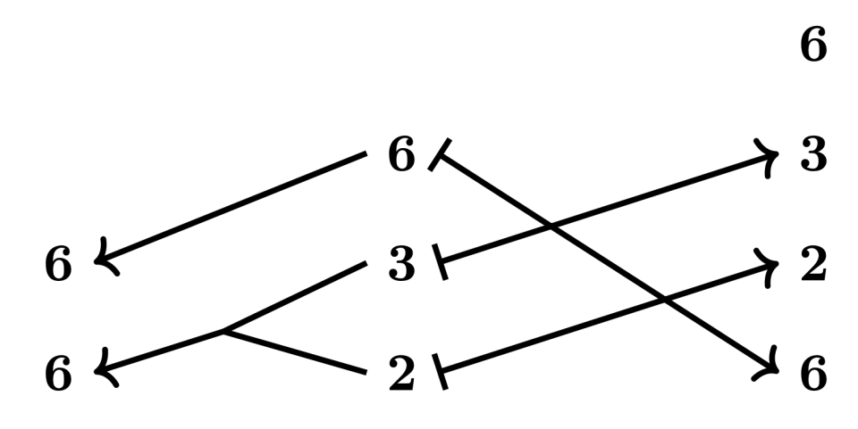

where, following standard notation for span diagrams, we have now drawn the left grouping to have backwards-pointing arrows.

By definition, **Span(Tuple, Ref)** contains **Tuple** and **Refop** as subcategories. We can then extend the realization functor from **Tuple** to **FinSet** over **Span(Tuple, Ref)**so that refinements are sent to *inverse* colexicographic isomorphisms. Conceptually, this provides an alternative viewpoint on a category of nested tuples since, in contrast to **Nest**, the *objects* of the category **Span(Tuple, Ref)** are flat tuples, but morphisms are nested; this is concordant with viewing a layout as defining a map valued on the depth 1 reduction of its shape.

## Revision History

09/24/25: Fixed some typos and improved exposition.  
09/21/25: Initial release.
