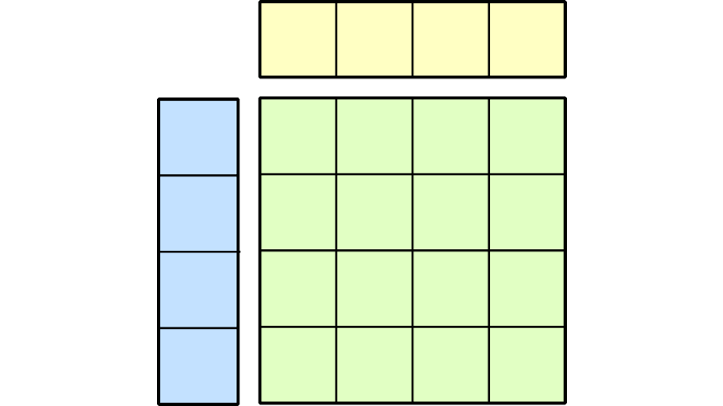

# CUTLASS 3.x APIs: Orthogonal, Reusable, and Composable Abstractions for GEMM Kernel Design (External)

**Date:** July 19, 2025

**Source:** [https://research.colfax-intl.com/cutlass-3-x-apis-orthogonal-reusable-and-composable-abstractions-for-gemm-kernel-design-external/](https://research.colfax-intl.com/cutlass-3-x-apis-orthogonal-reusable-and-composable-abstractions-for-gemm-kernel-design-external/)

---

In this [blog post](https://developer.nvidia.com/blog/cutlass-3-x-orthogonal-reusable-and-composable-abstractions-for-gemm-kernel-design/) presented on the NVIDIA technical blog, we give a concise introduction to the CUTLASS 3.x APIs, focusing on the collective, kernel, and device layers and the functionality of the collective builders. This post was authored in conjunction with members of the CUTLASS team.

[https://developer.nvidia.com/blog/cutlass-3-x-orthogonal-reusable-and-composable-abstractions-for-gemm-kernel-design/](https://developer.nvidia.com/blog/cutlass-3-x-orthogonal-reusable-and-composable-abstractions-for-gemm-kernel-design/)

CUTLASS 3.x: Orthogonal, Reusable, and Composable Abstractions for GEMM Kernel Design | NVIDIA Technical BlogGEMM optimization on GPUs is a modular problem. Performant implementations need to specify hyperparameters such as tile shapes, math and copy instructions, and warp-specialization schemes.
