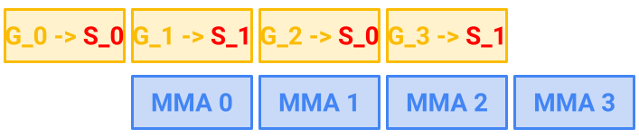
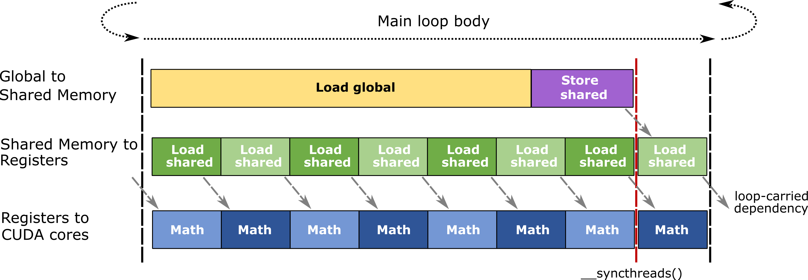

# CUTLASS Tutorial: Efficient GEMM kernel designs with Pipelining

**Date:** September 22, 2024

**Source:** [https://research.colfax-intl.com/cutlass-tutorial-design-of-a-gemm-kernel/](https://research.colfax-intl.com/cutlass-tutorial-design-of-a-gemm-kernel/)

---

Welcome to Part 2 of our tutorial series on GEMM (GEneral Matrix Multiplication). In [Part 1](https://research.colfax-intl.com/cutlass-tutorial-wgmma-hopper/), we discussed the computational side of GEMM by going over WGMMA, which is the primitive instruction to multiply small matrix tiles on GPUs based on the NVIDIA® Hopper™ architecture. In this part, we turn our focus to the memory side of GEMM. Specifically, we will explain how to efficiently bring small tiles of operand tensors from a GPU’s global memory into its on-chip memory, from where they can be passed into WGMMA (or other primitive MMA instructions, for that matter).

The main concept to explain is how to orchestrate a *pipeline* of data in order to efficiently feed the tensor cores. In the context of GEMM kernel design, *pipelining* refers to the idea of overlapping copy and MMA operations through maintaining multiple data buffers. In this article, we will cover two pipelining strategies that are effective on the Hopper architecture:

- **Warp-specialization.** Specializing warps into producers (data transfer) and consumers (compute), and having them run concurrently.
- **Multistage.** Masking data transfer by using asynchronous copy (TMA on Hopper or `cp.async` on Ampere) to load the next set of data, while computing on the current set. Warps take on both producer and consumer roles.

To then ensure correctness of the kernel, one needs to pay careful attention to the data dependencies at hand, which govern when buffers can be read by the MMA instructions or filled by the copy operations. We will go into detail on how to write the necessary synchronization logic for a pipelined GEMM kernel using tools from the CUTLASS library, most notably the CUTLASS Pipeline classes.

We then present a performance evaluation of pipelining and show how exploiting this one optimization idea already achieves ~65% utilization for a Hopper GEMM kernel in half-precision. Finally, in the Appendix we explain how to write a pipelined GEMM kernel for GPUs based on the NVIDIA Ampere architecture.

## The big picture: “Feeding the beast”

There are 2 main actions in a GEMM kernel: copying the numbers to the correct memory addresses, and multiply-accumulating them. The former action is handled by copy instructions: [TMA in Hopper](https://research.colfax-intl.com/tutorial-hopper-tma/), [`cp.async` in Ampere](https://docs.nvidia.com/cuda/parallel-thread-execution/index.html#data-movement-and-conversion-instructions-cp-async), and vanilla copy in earlier architectures. The latter action, since the [Volta architecture](https://en.wikipedia.org/wiki/Volta_(microarchitecture)) in 2017, has become the exclusive business of the tensor cores.

Through many generations, the tensor cores have become *a beast* at consuming the numbers fed to them. For instance, the H200 SXM GPU’s tensor cores can deliver up to [3,958 TFLOPS](https://resources.nvidia.com/en-us-data-center-overview-mc/en-us-data-center-overview/hpc-datasheet-sc23-h200) (TeraFLOPs per second). On the other hand, the memory bandwidth of the same H200 SXM GPU is only 4.8 TB/s (TeraBytes per second). This data transferring speed is much slower than the tensor cores’ speed, and oftentimes is not trivial to fully utilize! As such, a common theme of CUDA programming — and GEMM kernel design in particular — is to figure out how to copy numbers fast enough to keep the tensor cores busy. We call this process “feeding the beast.”

In general, there are two overarching strategies to “feed the beast,” which are complementary and function at different scopes (grid vs. block). The first strategy is effective *threadblock scheduling,* which entails distributing the computation among the CTAs to obtain good load balancing and a higher rate of L2 cache hits. We will discuss this in a later blog post, but for now, we refer curious readers to the techniques of [threadblock rasterization](https://github.com/NVIDIA/cutlass/blob/main/media/docs/efficient_gemm.md#threadblock-rasterization) and persistent kernels, for instance as implemented in CUTLASS. The second strategy, which we focus on in this tutorial, is to *overlap* copying with math operations. In particular, while the tensor cores are busy multiplying a batch of numbers that they receive, we should tell the copying units to copy the next batch of numbers. That way, we effectively *hide* part of the copying latency. This is the goal of pipelining.

### Latency, warps, and warp-specialization

Before discussing the mechanics of pipelining, we go over some history regarding the two overlapping strategies mentioned in the introduction: multistage and warp-specialization.

First, the idea of overlapping memory copy with math operations is neither new nor specific to GPUs. Readers familiar with CPUs may find it similar to the [cache prefetching](https://en.wikipedia.org/wiki/Cache_prefetching) technique, where an asynchronous fetch request is made before the data is needed. In fact, the pipelining technique we discuss in this post is *conceptually* the same as CPU cache prefetching! However, since prefetching on GPUs is [expensive in terms of silicon area on the chip](https://developer.nvidia.com/blog/boosting-application-performance-with-gpu-memory-prefetching/), the technique is implemented differently.

The most basic method by which GPU programmers can create overlapping is via excess *warps* (warps are groupings of 32 contiguous threads). Nvidia GPUs allow a large number of warps per SM ([streaming multiprocessors](https://en.wikipedia.org/wiki/Thread_block_(CUDA_programming)#Streaming_multiprocessors)), and can switch between them with minimal overhead. In particular, the warp schedulers can simply switch to another warp if one warp encounters a slow memory fetch. In order to give the warp schedulers more opportunity to hide latency, a technique called *warp-specialization* was introduced circa 2011 [1, 2]. With warp-specialization, some warps are dedicated to memory fetches (*producers*), while others are dedicated to compute (*consumers*), and named barriers are used for synchronization between them. The idea is that the warp schedulers can then more easily hide the latency of copy operations within compute (and vice-versa).

Starting with the Ampere architecture, Nvidia introduced `cp.async`, which allows memory copy to happen *asynchronously in the same warps* that are also doing math. Concretely, asynchrony means that a warp can issue `cp.async` to load data into the next buffer and then execute math operations on the current buffer without being stalled on the completion of the async load. In particular, this removes the need to use warp-specialization in order to mask data transfer with compute. *Multistage* kernel designs leverage this idea. The fastest Ampere GEMM kernels, as well as the famous FlashAttention-2, use the multistage kernel design.

Finally, with the most recent GPU architecture — Hopper — new features such as TMA async copy and warpgroup-wide register reallocation were introduced, which when taken in conjuction makes warp-specialization very effective on Hopper (as we explain below). In particular, the fastest CUTLASS Hopper GEMM kernels use warp-specialization.

### Pipelining Illustrated

Figure 1 illustrates a theoretical pipeline of `LOAD` and `MMA`. Here, `LOAD` refers to the process of copying operand matrix tiles from GMEM to SMEM, and `MMA` refers to the tensor core operation that multiplies the operand tiles stored in SMEM. As shown in the figure, by overlapping two `LOAD`s with two `MMA`s, we save 2 units of time.


<p align="center"><em>**Figure 1.**An illustration of pipelining 3 loads and 3 MMA steps.</em></p>

One problem that arises from contemplating Figure 1 is: where do `LOAD_1` and `LOAD_2` copy the data into? Clearly, we don’t want subsequent loads to overwrite the data copied in by prior loads before MMA can compute on that data. Nor do we want unnecessary stalls caused by waiting on SMEM to become free to write into. Otherwise, the supposed gain of 2 units of time will not actually be achieved.

A simple solution to this problem is to reserve *tw*ice as much memory in SMEM than is needed by MMA and use them in an alternating fashion. This strategy is called *double buffering* and is illustrated in Figure 2. Of course, we can generalize to having more than two alternating buffers. Doing so creates more opportunity for overlap, allowing for more efficient use of the available hardware, at the cost of using more SMEM.



<p align="center"><em>**Figure 2.**Pipelining with two alternating SMEM stages: `S_0` and `S_1`. Matrix tiles are alternately loaded into `S_0` and `S_1`, overlapping with the tensor core operations. Note that the global tiles are denoted by `G_1`, `G_2`, `G_3`, `G_4`, etc., which keep increasing instead of alternating like the SMEM stages, so we operate on new tiles at every step.</em></p>

It is not trivial to implement pipelines correctly and efficiently. Programmers must handle the multiple buffers as well as asynchronous load calls across multiple threads. In the next section, we show how to implement pipelining via a CUTLASS abstraction: the `Pipeline` class.

### The CUTLASS Pipeline abstraction

CUTLASS’ asynchronous [`Pipeline` classes](https://github.com/NVIDIA/cutlass/blob/main/media/docs/pipeline.md) serve as an effective abstraction to manage copy and compute across multiple data buffers and participating threads. They include the classes `PipelineAsync`, `PipelineTmaAsync`, and `PipelineTransactionAsync`, for which “`Pipeline`” is a generic reference.

We first explain how a CUTLASS `Pipeline` orchestrates the pipelining of data at a high-level. Let `buffers` be a shared memory buffer with `N` stages. We wish to synchronize between a *producer* writing data to the buffers (e.g., TMA) and a *consumer* operating with that data as it becomes available (e.g., WGMMA).

**Barriers.** To synchronize the buffer stages across the producer and the consumer, a Pipeline adheres to the standard *acquire and release model* that uses locks to manage accesses to the buffers. To this end, let `full_barrier` and `empty_barrier` be two arrays of *barrier objects*, both of size `N`. These barrier objects possess a *phase bit*value which is initialized to 0 and flips between 0 and 1.

Concretely, these barrier objects will be [mbarrier](https://docs.nvidia.com/cuda/parallel-thread-execution/index.html#parallel-synchronization-and-communication-instructions-mbarrier) objects resident in SMEM. An mbarrier object is initialized both with the aforementioned phase bit as well as an *arrival count*. It then supports arrive-on and wait operations and flips its phase based on reaching the arrival count threshold. Importantly, the values of these barrier objects can and should be visible to all threads.

**Thread-local pipeline state.** Next, we have the `PipelineState` class as a thread-local enumerator that serves to track the thread’s current *index* and *phase*, with the number `N` of stages passed in as a template parameter. The index takes on integer values modulo `N`, and the phase is either 0 or 1. Moreover, the ++ operator for the `PipelineState` class is [overloaded](https://github.com/NVIDIA/cutlass/blob/be60a0b27204078dc0f3f1d6ed4a95cdb2114111/include/cutlass/pipeline/sm90_pipeline.hpp#L140) so that the index is incremented modulo `N`, and the phase is flipped when the index increments to 0.

**Synchronization**. We now explain how the barrier objects and thread-local pipeline states are used to synchronize producers and consumers. To avoid confusion, let us distinguish the producer *action* from the producer thread(s) issuing that action, as these may potentially be decoupled (think of TMA). First, the producer action will flip the phase of `full_barrier[i]` to signal that it has filled the `i`th stage of the buffer, so that the consumer threads can now read from it. Similarly, the consumer threads will flip the phase of `empty_barrier[i]` to signal that they have finished consuming the `i`th stage of the buffer, so that the producer can now write to it. 

Note that we are agnostic as to exactly how the producer action or the consumer threads flip the phase bit in SMEM, as long as it is done via the arrival count mechanism. For example, all the consumer threads could *collectively* act to increment the arrival count, or one consumer thread per warp could be elected to do the same.

Finally, each thread, whether consumer or producer, keeps track of a phase to match against the phases of the barrier objects, and in fact threads taking on both consumer and producer roles will need to track *both* phases. These “internal” phases of the threads need to be flipped as well as the kernel proceeds through iterations of its mainloop.

**Four pipeline methods**. Now let `pipeline` be an instance of a `Pipeline` class initialized with pointers to `full_barrier` and `empty_barrier`, and let `pipe_state` be an instance of a `PipelineState` class. Then `pipeline` can invoke the following four key methods:

- `pipeline.producer_acquire(pipe_state)`. *Blocks* the calling thread until the phase of `empty_barrier[pipe_state.index()]` flips against `pipe_state.phase()`.
- `pipeline.producer_commit(pipe_state)`. *Signals* `full_barrier[pipe_state.index()]` to increment its arrival count.
- `pipeline.consumer_wait(pipe_state)`. *Blocks* the calling thread until the phase on `full_barrier[pipe_state.index()]` flips against `pipe_state.phase()`.
- `pipeline.consumer_release(pipe_state)`. *Signals* `empty_barrier[pipe_state.index()]` to increment its arrival count.

In the description of the blocking instructions `producer_acquire` and `consumer_wait`, by flipping *against* the phase of `pipe_state` we mean that, for example, if the current phase of the barrier is 0, then the method blocks if the phase of `pipe_state` is 0 and doesn’t block if it is 1.

Note that as written, the pair of methods (`producer_acquire`, `consumer_release`) and (`producer_commit`, `consumer_wait`) are completely symmetric in functionality. However, if the `Pipeline` class in question is `PipelineTmaAsync`, then `full_barrier` is wrapped as an instance of the `cutlass::arch::ClusterTransactionBarrier` class and the signaling mechanism for `full_barrier` is handled by the TMA load method itself via incrementing the transaction count. In this case, the `producer_commit` method is actually a no-op; we return to this point below. However, in pseudocode we will still insert `producer_commit` if the TMA copy is not written out, as we do now.

Putting it all together, the following pseudocode shows the four pipeline methods in action:

```
using PipelineState = typename cutlass::PipelineState<N>;
// We initialize smem_pipe_write to start with an opposite phase
// (i.e., 1 instead of 0), since the buffers start out as empty.
PipelineState smem_pipe_write = cutlass::make_producer_start_state<Pipeline>();
PipelineState smem_pipe_read;
for (int i = 0; i < total_steps; ++i) {
  pipeline.producer_acquire(smem_pipe_write);
  // Acquire data (e.g. TMA, cp.async, etc.)  
  pipeline.producer_commit(smem_pipe_write);
  ++smem_pipe_write;

  pipeline.consumer_wait(smem_pipe_read);
  // Compute workload (e.g. WGMMA)
  pipeline.consumer_release(smem_pipe_read);
  ++smem_pipe_read;
}
```

We find the above code snippet helpful for illustrating the producer/consumer acquire and release pattern. We invite readers to go through a few steps of the loop while keeping track of all of the involved states, and to connect this pseudocode with the verbose description of synchronization given prior.

However, this snippet features a serialized execution flow in which producer and consumer operations never run concurrently, and hence it is not useful in practice. In an effective pipelined workload, the producer and the consumer must overlap. We next discuss the *multistage* kernel design that gives one way to accomplish this.

### Multistage kernel design

Let’s use the TMA-specialized version of the Pipeline class, `PipelineTmaAsync`, to create a 2-stage pipeline used in a Hopper GEMM kernel that overlaps TMA with WGMMA. This kernel is launched with **128 threads** (i.e., 1 warpgroup). We assume the reader is familiar with the syntax of TMA and WGMMA in CUTLASS, which we discussed in detail in two [previous](https://research.colfax-intl.com/tutorial-hopper-tma/) [blogposts](https://research.colfax-intl.com/cutlass-tutorial-wgmma-hopper/). As such, we omit the preparation of the tensors that go into the `cute::copy` and `cute::gemm` calls.

```
using MainloopPipeline = typename cutlass::PipelineTmaAsync<2>;
using PipelineState = typename cutlass::PipelineState<2>;

typename MainloopPipeline::Params params;
// number of bytes transferred by TMA load per stage (A and B)
params.transaction_bytes = TmaTransactionBytes;
params.role = MainloopPipeline::ThreadCategory::ProducerConsumer;
params.is_leader = threadIdx.x == 0;
params.num_consumers = 128;

// Disregard clusters for this example
auto cluster_shape = Shape<_1,_1,_1>{};

// pipeline_storage is instance of cutlass::PipelineTmaAsync<2>::SharedStorage
// Has full_barrier and empty_barrier as members
// Located in the SharedStorage struct that manages objects in smem
MainloopPipeline pipeline(shared_storage.pipeline_storage, params, cluster_shape);

__syncthreads();

PipelineState smem_pipe_write = 
    cutlass::make_producer_start_state<MainloopPipeline>();
PipelineState smem_pipe_read;

// Prepare tensors for GEMM
// ...

// Issue the first TMA load with leader thread
if(threadIdx.x == 0) {
  pipeline.producer_acquire(smem_pipe_write);
  BarrierType *tmaBar = pipeline.producer_get_barrier(smem_pipe_write);
  // smem_pipe_write.index() == 0  
  copy(tma_load_a.with(*tmaBar, 0), tAgA(_,0), tAsA(_,0));
  copy(tma_load_b.with(*tmaBar, 0), tBgB(_,0), tBsB(_,0));
  ++smem_pipe_write;
}

for (int i = 0; i < k_tile_count - 1; ++i) {
  // Only leader thread issues TMA load
  if(threadIdx.x == 0) {
    pipeline.producer_acquire(smem_pipe_write);
    BarrierType *tmaBar = pipeline.producer_get_barrier(smem_pipe_write);
    auto write_stage = smem_pipe_write.index();
    copy(tma_load_a.with(*tmaBar, 0), tAgA(_,i+1), tAsA(_,write_stage));
    copy(tma_load_b.with(*tmaBar, 0), tBgB(_,i+1), tBsB(_,write_stage));
    ++smem_pipe_write;
  }

  // Compute on the completed load from prior iteration
  pipeline.consumer_wait(smem_pipe_read);
  auto read_stage = smem_pipe_read.index();
  // WGMMA
  warpgroup_arrive();
  gemm(tiled_mma, tCrA(_,_,_,read_stage), tCrB(_,_,_,read_stage), tCrC);
  warpgroup_commit_batch();
  warpgroup_wait<0>();
  pipeline.consumer_release(smem_pipe_read);
  ++smem_pipe_read;
}

// Handle the last compute iteration
pipeline.consumer_wait(smem_pipe_read);
auto read_stage = smem_pipe_read.index();
warpgroup_arrive();
gemm(tiled_mma, tCrA(_,_,_,read_stage), tCrB(_,_,_,read_stage), tCrC);
warpgroup_commit_batch();
warpgroup_wait<0>();
pipeline.consumer_release(smem_pipe_read);

// Epilogue for writing out accumulator
axpby(alpha, tCrC, beta, tCgC);
```

Here, in each iteration of the main loop, the `(i+1)`th TMA load is issued asynchronously and the `i`th WGMMA computation executes, noting that `smem_pipe_write` and `smem_pipe_read` are offset from each other by one.

In this pseudocode, note that the `cute::set_barrier_transaction_bytes` method we used in the TMA blogpost (or its equivalent, `cutlass::arch::arrive_and_expect_tx`) doesn’t make an appearance. Instead, its function is taken over by `producer_acquire` in the `PipelineTmaAsync` class. Indeed, that method [does the following](https://github.com/NVIDIA/cutlass/blob/be60a0b27204078dc0f3f1d6ed4a95cdb2114111/include/cutlass/pipeline/sm90_pipeline.hpp#L401) internally, where `stage` and `phase` are the index and phase of its `PipelineState` argument:

```
if (barrier_token != BarrierStatus::WaitDone) {
   empty_barrier_ptr_[stage].wait(phase);
}

if (params_.is_leader) {
   full_barrier_ptr_[stage].arrive_and_expect_tx(params_.transaction_bytes);
}
```

Moreover, we use the `producer_get_barrier` method with argument `smem_pipe_write` in order to retrieve a pointer to `full_barrier[smem_pipe_write.index()]`, as needed by the TMA `TiledCopy` objects `tma_load_a` and `tma_load_b` in the `cute::copy` call.

With the `cute::copy` call thus linked to the mbarrier object `full_barrier` of the pipeline, we can then use the transaction count-based completion mechanism of TMA to signal the consumer that the buffer is ready to be used, obviating the need to invoke `producer_commit` from the pipeline object itself. This is why CUTLASS makes `producer_commit` a no-op for `PipelineTmaAsync`.

This way of structuring the pipelining allows for overlapping data transfer and computation, delivering on the potential of asynchronous operations to hide latency. Though we used TMA in this example, a similar technique is available in the Ampere architecture with `cp.async`. We discuss this in further detail in the Appendix. However, in the Hopper architecture, it is sometimes preferable to use a *warp-specialized* design instead of multistage, which we now explain.

### Warp-specialization

In the multistage kernel, each warp takes on both producer and consumer roles. Switching between the two roles is handled using the `PipelineState` abstraction, and the asynchrony of TMA load allows the two types of operations to overlap. An alternative strategy, *warp specialization*, assigns different roles to different warps, so that we have *producer warps* entirely dedicated to memory copy and *consumer warps* entirely dedicated to computations. As mentioned above, the warp schedulers can then hide latency by switching between the two types of warps. Note that unlike the multistage kernel, warp specialization does not inherently rely on *asynchronous* execution, but still benefits greatly from it in practice.

Specifically for our GEMM, the producer warps load data from global memory to shared memory using TMA, while the consumer warps compute tilewise GEMM using WGMMA. It is worth noting that in our simplified setting the execution flow in both types of warps is internally serial, i.e., the TMA and WGMMA instructions themselves are not being overlapped *intra*-warpgroup. However, there are more sophisticated kernel schedules that exploit the asynchrony of TMA and WGMMA to also achieve intra-warpgroup overlapping with other instructions, such as in [FlashAttention-3](https://research.colfax-intl.com/flashattention-3-fast-and-accurate-attention-with-asynchrony-and-low-precision/).

Warp-specialization is an especially attractive proposition for the Hopper architecture for three reasons:

- **TMA** is less register-intensive than earlier copy operations.
- **WGMMA** can source its operands from shared memory, meaning that consumer warps don’t have to perform their own memory load operations.
- Hopper allows manual **warpgroup-wide register (de)allocation** via the `setmaxnreg` instruction. Thus, a larger portion of registers can be assigned to the consumer warps, which typically need more of them.

To expand on the last bullet point, each SM has a limited set of registers, and in architectures before Hopper, each warp was assigned a fixed, equal number of registers at kernel launch. This is fine for the multistage pipeline where every warp does identical work, but generally wasteful for a warp-specialization pattern: producer warps (which only load data) typically need fewer registers than consumer warps (which do math), especially when using TMA. For workloads that are register intensive, being able to utilize the wasted registers could mean allowing more warps per SM or avoiding register spilling.

Let us now present a snippet of warp-specialization code. As before, the `Pipeline` class abstracts the complexity of setting up warp-specialized kernels.

```
// Create the pipeline and the iterator for the stage
using MainloopPipeline = typename cutlass::PipelineAsync<2>;
using PipelineState = typename cutlass::PipelineState<2>;

// Producer warps
if (isProducerWarp(threadIdx.x)) {
  // Only one thread should be calling TMA
  if(isTMAThread(threadIdx.x)) { 
    PipelineState smem_pipe_write = 
      cutlass::make_producer_start_state<MainloopPipeline>();
    for (...) {
      pipeline.producer_acquire(smem_pipe_write);
      copy(...); // TMA
      ++smem_pipe_write;
    }
  }
}
// Consumer warps
else {
  PipelineState smem_pipe_read;
  for (...) {
    pipeline.consumer_wait(smem_pipe_read);
    // WGMMA
    pipeline.consumer_release(smem_pipe_read);
    ++smem_pipe_read;
  }
  // Epilogue
}
```

The format is similar to the basic pipeline we discussed earlier, but this time there is an outer conditional that splits the workload into the producer warps and the consumer warps. The epilogue belongs in the consumer warps since it involves writing out the accumulator held in the consumer threads’ registers.

To see which warp and warp-group a thread is in, we can do the following.

```
int warp_group_idx = __shfl_sync(0xffffffff, threadIdx.x / 128, 0);
int warp_idx_in_warpgroup = __shfl_sync(0xffffffff, (threadIdx.x / 32) % 4, 0);
int warp_group_thread_idx = threadIdx.x % 128;
```

The above snippet also uses the `__shfl_sync` operation, which is a warp-wide broadcast of a value (more information [here](https://developer.nvidia.com/blog/using-cuda-warp-level-primitives/)). This is there to ensure that all threads in the warp get the same value.

Now let’s focus on how this applies to GEMM. In [Part 1](https://research.colfax-intl.com/cutlass-tutorial-wgmma-hopper/) of this series, we discussed the WGMMA instructions that are organized at the warpgroup level. As such, we also organize the producers and consumers at the warpgroup level. We use the TMA pipeline so that we can use TMA on the producer side.

For 2 stages and 2 warpgroups, we first change the initialization of the pipeline for the WS kernel as follows:

```
using MainloopPipeline = typename cutlass::PipelineTmaAsync<2>;
using PipelineState = typename cutlass::PipelineState<2>;

typename MainloopPipeline::Params params;
params.transaction_bytes = TmaTransactionBytes; 
const int producerWarpGroupId = 0; 
if (warp_group_idx == producerWarpGroupId)
  params.role = MainloopPipeline::ThreadCategory::Producer;
else
  params.role = MainloopPipeline::ThreadCategory::Consumer;
params.is_leader = warp_group_thread_idx == 0;  
params.num_consumers = 128; 

auto cluster_shape = make_shape(Int<1>{},Int<1>{},Int<1>{});

// Create the pipeline
MainloopPipeline pipeline(shared_storage.pipeline_storage, params, cluster_shape);
```

We highlight line 12 to emphasize that, although `params.num_consumers` still equals 128, this now counts only the 128 threads of the consumer warpgroup, and not all 256 threads.

Now on to the mainloop. The general structure is the same as the initial code sample, but there are a few differences for the producer side:

```
// Example values for Hopper GEMM with 1 consumer warpgroup
using LowerRegisterCount = Int<40>;
using HigherRegisterCount = Int<256>;

if (warp_group_idx == producerWarpGroupId) {
  cutlass::arch::warpgroup_reg_dealloc<LowerRegisterCount{}>();
  int lane_predicate = cute::elect_one_sync();
  if (warp_idx_in_warpgroup == 0 && lane_predicate) {
    PipelineState smem_pipe_write = 
      cutlass::make_producer_start_state<MainloopPipeline>();
    for (...) {
      pipeline.producer_acquire(smem_pipe_write);
      copy(...); // TMA
      ++smem_pipe_write;
    }
  }
} else { // consumer warpgroup
  cutlass::arch::warpgroup_reg_alloc<HigherRegisterCount{}>();
  PipelineState smem_pipe_read;
  for (...) {
    pipeline.consumer_wait(smem_pipe_read);
    gemm(...); // WGMMA
    pipeline.consumer_release(smem_pipe_read);
    ++smem_pipe_read;
  }
  // Epilogue to write out accumulator
  axpby(...);
}
```

In lines 6 and 18, we manually (de)allocate excess registers using a [CUTLASS call](https://github.com/NVIDIA/cutlass/blob/3a8c01a18b24c35b216922481ac762496720a99d/include/cutlass/arch/reg_reconfig.h), which in turn calls the PTX primitive [`setmaxnreg`](https://docs.nvidia.com/cuda/parallel-thread-execution/index.html#miscellaneous-instructions-setmaxnreg) that adjusts the registers allocated to the threads in the warpgroup. As explained in the documentation, `warpgroup_reg_dealloc<M>()` releases extra registers to *reduce* the per-thread maximum register count to `M`, whereas `warpgroup_reg_alloc<N>()` requests additional registers in order to *raise* the per-thread maximum register count to `N`.

The exact numbers to use for these register counts depend on the algorithm and the constraints imposed by the hardware. In the Hopper architecture, one thread can own up to 255 registers, and `setmaxnreg` can be set to a value between 24 and 256 (inclusive) at multiples of 8. In general, for a Hopper GEMM WS kernel it is advisable to arrange for one CTA to occupy an entire SM. Therefore, we should try to choose register counts so that (a) a minimal number of registers is assigned to the producer warpgroup issuing TMA, and (b) the entire register file size of [64K per SM](https://docs.nvidia.com/cuda/hopper-tuning-guide/index.html#occupancy) is used. For example, a 24/240/240 split would be generally effective to use with 1 producer warpgroup and 2 consumer warpgroups (this adds up to 504 < 512, and 512*128 = 64*1024), and likewise a 32/160/160/160 split would be used with 1 producer and 3 consumer warpgroups. Note also that the program will crash if one tries to allocate a total register count that exceeds the register file size.

Furthermore, we must make sure that only *one* thread in a warpgroup ever calls TMA. In our code sample, we make sure that only the first warp is involved in this, and that one thread, chosen using `elect_one_sync`, is responsible for the TMA call. This code is for 2 warpgroups, but the same can be used with minimal changes for larger numbers of warpgroups and stages as well.

Choosing the number of warpgroups and stages to use should be done using careful profiling of the kernel. As a general rule of thumb for both, more stages and more warpgroups means more opportunity for parallelism and overlapping, but also uses more resources. In particular, using more stages requires more SMEM for the buffers, and using more warpgroups increases register pressure.

## Performance

We used the CUTLASS [Hopper GEMM tutorial code](https://github.com/NVIDIA/cutlass/blob/main/examples/cute/tutorial/wgmma_sm90.cu) as the basis for both our multistage and warp-specialized GEMM kernels with half-precision (FP16) datatype. We additionally modified the code to accommodate FP32 accumulation and write out the output using TMA store. We then tuned both versions for MxNxK = 8192x8192x8192, with different tile sizes chosen for FP16 accumulation and FP32 accumulation. The tile sizes and stage count we selected are as follows (with bMxbNxbK dividing into MxNxK):

- FP16 accumulation: bM = 256, bN = 256, bK = 96, 2 stages, 4 MMA warpgroups. Cluster size (1, 2, 1).
- FP32 accumulation: bM = 256, bN = 192, bK = 128, 2 stages, 2 MMA warpgroups. Cluster size (1, 2, 1).

We initialized matrices with random floating point numbers casted to FP16 and recorded the following TFLOP/s (10 iterations, average of 5 measurements):

- FP16 accumulation: Multistage 531, WS 536.
- FP32 accumulation: Multistage 477, WS 485.

Note that the theoretical peak performance for dense half-precision MMA on the H100 PCIe GPU is 750 TFLOP/s, so we achieve ~65% of the theoretical peak in the standard setting of FP32 accumulation. Both the multistage and WS kernels are available on [Colfax’s github](https://github.com/ColfaxResearch/cfx-article-src/tree/master/pipeline-gemm).

As a warning, note also that the CUTLASS Hopper GEMM tutorial code uses matrices initialized with ±1 chosen randomly, so it will report unrealistically good performance; see [this article](https://www.thonking.ai/p/strangely-matrix-multiplications). For example, with matrices initialized with ±1, the performance of our multistage kernel with FP16 accumulation inflates from ~530 to ~630 TFLOP/s.

Now for comparison’s sake, the fastest CUTLASS FP16 Hopper GEMM kernel we measured using the CUTLASS profiler with 10 profiling iterations yields 630 TFLOP/s (~84% utilization). (Note: an earlier version of this article reported a lower number of ~74% utilization since it used an overly high number of profiling iterations, leading to thermal throttling with the 350W TDP of the H100 PCIe GPU.) This number was obtained by the following kernel:

```
cutlass3x_sm90_tensorop_s64x256x16gemm_f16_f16_f32_void_f16_128x256x64_2x1x1_0_tnn_align8_warpspecialized_cooperative_epi_tma
```

Note that this CUTLASS kernel features the “Warp-Specialized Persistent Cooperative” design as described [here](https://github.com/NVIDIA/cutlass/blob/main/media/docs/efficient_gemm.md#warp-specialization). We expect that the gap between our current pipelined GEMM kernel and the fastest GEMM kernels will be largely bridged by implementing threadblock rasterization and a persistent kernel that overlaps prologue and epilogue between CTAs. Load balancing with Stream-K would also be a factor with more atypical problem geometries. In this square example, the Stream-K CUTLASS kernel performs almost as good (625 TFLOP/s).

We now comment on the relevance of warpgroup-wide register reallocation for the WS kernel. To see register usage, we can compile our kernels using the following flag `-Xptxas=--verbose`. (Note: this flag does not work with `--generate-code`. Use `--gencode` instead.) With register reallocation in use, you will see a register usage count fixed as a function of the number of warpgroups used. For example, with 3 warpgroups in total:

```
    0 bytes stack frame, 0 bytes spill stores, 0 bytes spill loads
ptxas info    : Used 168 registers
```

Or with 4 warpgroups in total:

```
    0 bytes stack frame, 0 bytes spill stores, 0 bytes spill loads
ptxas info    : Used 128 registers
```

Note that 168*3 = 504 and 128*4 = 512, which are the numbers that the sum of producer and consumer register counts must be less than or equal to (relatedly: this is why a 32/240/240 split doesn’t work with 3 warpgroups).

On the other hand, it’s possible that register usage was so low to begin with that register reallocation doesn’t have any practical impact. For example, with FP16 accumulation, when removing the register reallocation, we see:

```
    0 bytes stack frame, 0 bytes spill stores, 0 bytes spill loads
ptxas info    : Used 90 registers
```

Also, remeasuring times shows no impact from the change. But with FP32 accumulation, we see:

```
    2784 bytes stack frame, 4764 bytes spill stores, 4760 bytes spill loads
ptxas info    : Used 168 registers
```

And when remeasuring times, we now get about 21 TFLOP/s, a catastrophic loss of performance! However, we note that adjusting tuning parameters to (bM = 128, bN = 256, bK = 128, 2 stages, 2 MMA warpgroups, cluster (2,1,1)) yields almost as good performance (460 TFLOP/s) with no spilling and no register reallocation.

Finally, in *fused* WS kernel designs such as FlashAttention-3 that feature multiple accumulators held in registers, the use of register reallocation becomes mandatory to avoid excessive spilling.

## Conclusion

In this article, we have presented a comprehensive picture of the pipelining technique. We introduced its goal of hiding latency by overlapping memory copy and math operations, and why this is integral to good performance. Then we presented two pipelining designs:

- **Multistage:** Masking data transfer by using asynchronous copy (TMA on Hopper or `cp.async` on Ampere) to load the next set of data, while computing on the current set. Warps take on both producer and consumer roles.
- **Warp-specialization:** Specializing warps into producers and consumers, and having them run concurrently. Either producer or consumer operations can in addition be asynchronous (e.g., TMA and WGMMA on Hopper).

We went into detail on how to use the CUTLASS Pipeline classes to manage the synchronization logic necessary for implementing both pipelining strategies in a Hopper GEMM kernel. Finally, we did a comparison between the two types of pipelines for the GEMM example. Although the two performed about equally well in our simplified setting, in practice the best performing Hopper GEMM kernels use warp-specialization (for example, as demonstrated by the [CUTLASS profiler](https://github.com/NVIDIA/cutlass/blob/main/media/docs/profiler.md)).

In Part 3 of this tutorial, we will discuss strategies to schedule the overall kernels, including threadblock rasterization, persistent kernels, and finally a recent innovation called [Stream-K GEMM](https://arxiv.org/abs/2301.03598).

## Appendix: Pipelining for an Ampere GEMM

In the main part of this article we discussed pipelining using TMA for memory transfer and WGMMA for compute. Both of these features were introduced with the Hopper architecture (`sm90`), so they will not work for older architectures. Implementing a similar paradigm in an older architecture requires some extra steps. As such, for completeness, we also discuss how to implement pipelining for GEMM in the Ampere architecture (`sm80`). Specifically, we study the implementation in the [CUTLASS example](https://github.com/NVIDIA/cutlass/blob/main/examples/cute/tutorial/sgemm_sm80.cu) for `sm80`. Compared to the code for `sm90` we presented in the article, writing for Ampere introduces two complications:

- Ampere has asynchronous instructions for loading from GMEM to SMEM (`cp.async`), but no warp-specific control over register allocation. This discourages us from using warp-specialization and encourages us to write a multistage pipeline where each warp takes on both producer and consumer roles.
- Unlike in WGMMA, which can source both its operands directly from SMEM, here MMA operands have to be loaded from registers (RMEM). Thus, further instructions are needed to load from SMEM to RMEM before the MMA can run. Moreover, we can also pipeline the SMEM to RMEM loads to potentially improve performance, which introduces additional complexity into the overall design.



<p align="center"><em>**Figure 3.** The Ampere GEMM hides latency with two nested pipelines. Image from the [CUTLASS documentation](https://github.com/NVIDIA/cutlass/blob/main/media/docs/efficient_gemm.md).</em></p>

Figure 3, from the CUTLASS documentation, shows the overall structure of the kernel. (This image predates Ampere and so misrepresents Ampere in one small aspect: using `cp.async`, “load global” and “store shared” aren’t separate stages, but a single machine instruction.) Each iteration of the main loop initiates asynchronous loads of later tiles from GMEM into SMEM using the Ampere `cp_async` instructions, which are overlapped with work on the current tile. This outer pipeline is similar to the multistage pipeline we constructed for Hopper. An inner, unrolled loop loads successive fragments of the tile from SMEM to RMEM and does math on them. Although these operations are synchronous, we can still reduce their latency by a technique from CPU computing called (confusingly, in this context) [software pipelining](https://en.wikipedia.org/wiki/Software_pipelining).

Let’s begin by examining the outer pipeline, which starts with a pre-fetch stage before the main loop:

```
TiledCopy copyA = make_tiled_copy(Copy_Atom<SM80_CP_ASYNC_CACHEALWAYS<TA>, TA>{},
                                    Layout<Shape<_32,_8>,Stride<_8,_1>>{}, // Thr layout 32x8 k-major
                                    Layout<Shape< _1,_1>>{});              // Val layout  1x1
TiledCopy copyB = make_tiled_copy(Copy_Atom<SM80_CP_ASYNC_CACHEALWAYS<TB>, TB>{},
                                    Layout<Shape<_32,_8>,Stride<_8,_1>>{}, // Thr layout 32x8 k-major
                                    Layout<Shape< _1,_1>>{});              // Val layout  1x1

// Number of tiles left to copy
int k_tile_count = size<3>(tAgA);
// Current tile index in gmem to read from
int k_tile_next = 0;

// Initial load. Start async loads for all pipes but the last.
for (int k_pipe = 0; k_pipe < K_PIPE_MAX-1; ++k_pipe) {
  copy(copy_a, tAgA(_,_,_,k_tile_next), tAsA(_,_,_,k_pipe));
  copy(copy_b, tBgB(_,_,_,k_tile_next), tBsB(_,_,_,k_pipe));
  cp_async_fence();
  --k_tile_count;
  if (k_tile_count > 0) { ++k_tile_next; }
}

// wait for first tile to be available before proceeding
cp_async_wait<K_PIPE_MAX-2>();
__syncthreads();
```

The copies are issued asynchronously using [CUTLASS’s `cp_async` API](https://github.com/NVIDIA/cutlass/blob/main/include/cutlass/arch/memory_sm80.h), which wraps [`cp.async` PTX instructions](https://docs.nvidia.com/cuda/parallel-thread-execution/index.html#data-movement-and-conversion-instructions-cp-async). To explain the methods used here:

- Copies using `cp.async` are separated into “commit groups” using `cp_async_fence()`. In this example, each commit group copies one tile from A and one from B.
- `cp_async_wait<N>()` instructs the CTA to wait until at most the N most recently launched commit groups are still in flight. In this example, we launched `K_PIPE_MAX-1` commit groups, so `cp_async_wait<K_PIPE_MAX-2>()` is equivalent to waiting until the oldest group completes, i.e., until the 0th tiles of A and B have been copied. Other commit groups could complete before the oldest one, but the call waits for the oldest one.

Here’s the main loop of the kernel, omitting the SMEM->RMEM load and the computation to focus on the GMEM->SMEM pipeline:

```
while (k_tile_count > -(K_PIPE_MAX-1)) {
  // handling a single block in a tiled gemm
  for (int k_block = 0; k_block < K_BLOCK_MAX; ++k_block) {
    // Start the async copies for the next tile. 
    if (k_block == 0) {
      copy(copy_a, tAgA(_,_,_,k_tile_next), tAsA(_,_,_,smem_pipe_write));
      copy(copy_b, tBgB(_,_,_,k_tile_next), tBsB(_,_,_,smem_pipe_write));
      cp_async_fence();

      --k_tile_count;
      if (k_tile_count > 0) { ++k_tile_next; }
  }

  // Load block from SMEM to RMEM (omitted)

  if (k_block == K_BLOCK_MAX-1) {
    // wait for the previous copies to complete
    cp_async_wait<K_PIPE_MAX-2>();
    __syncthreads();
  }

  // Compute on block (omitted)
}
```

The outline is essentially the same as in the pre-fetch. At the beginning of each stage of the outer loop, another asynchronous copy is initiated. At the end of the loop stage, the CTA waits for the copy of the next necessary tile. Towards the very end of the computation, the pipeline runs out of GMEM tiles to copy. The code represents this by `k_tile_count <= 0`, and fires off unused dummy copies.

Note that the example does not use the CUTLASS `Pipeline` class, since we don’t need to use an mbarrier object to manage synchronization. Instead, the example manually sets up synchronization to switch between data buffers. Then, the inner loop is over the size of the buffer, to keep track of which buffer to use. Despite the different details, the overall structure is identical to the simple pipeline example from the article.

We finally turn to the inner loop containing the SMEM->RMEM load and MMA. Now, SMEM->RMEM transfer is significantly faster than GMEM->SMEM, but the access latency is still high enough that it is beneficial to overlap the load time with the math. The concept here is identical to the GMEM->SMEM case: we have additional buffers (registers) to which we issue load instructions, while the computation runs on other registers. However, instead of the explicit asynchronous calls, we will rely on software pipelining.

Software pipelining is an optimization technique for maximizing hardware utilization by removing dependencies from consecutive high-latency instructions. Specifically for us, if the SMEM->RMEM load and the computation are independent both in terms of hardware and data, then they can run concurrently. Loading from SMEM to RMEM is handled by LSU (Load/Store Unit), while computation is handled by a computational unit (e.g., tensor cores). While not publicly documented, it’s generally believed that [these hardware components can run concurrently](https://forums.developer.nvidia.com/t/how-does-the-lsu-load-store-unit-execute-load-store-instructions-in-the-ampere-architecture/273699), so hardware dependency is not an issue. Data dependency, however, can be an issue. 

Consider the following:

```
for (i=0; i<N-1; i++) {
  load2rmem(i);
  compute(i);
}
```

The problem here is that `compute(i)` can not start until `load2rmem(i)` is completed because it needs the data loaded by the load operation. This data dependence makes these two operations sequential. So just like we did with the GMEM->SMEM pipeline, we load the next buffer.

```
load2rmem(0);
for (i=0;i<N-1; i++) {
  load2rmem(i+1);
  compute(i);
}
compute(N-1);
```

Now there are no dependencies, data or hardware, between the load and compute, and so they can be executed concurrently. In the sm80 CUTLASS example, this is handled by the following lines.

```
CUTE_UNROLL
for (int k_block = 0; k_block < K_BLOCK_MAX; ++k_block) {
  // Load A, B shmem->regs for k_block+1
  auto k_block_next = (k_block + Int<1>{}) % K_BLOCK_MAX;
  copy(tCsA_p(_,_,k_block_next), tCrA(_,_,k_block_next));
  copy(tCsB_p(_,_,k_block_next), tCrB(_,_,k_block_next));

  // Thread-level register gemm for k_block
  gemm(mma, tCrA(_,_,k_block), tCrB(_,_,k_block), tCrC);
}
```

Here, both `tCrA` and `tCrB` are RMEM references created by CUTLASS’s `make_fragment` calls. The copy commands are able to run concurrently with the GEMM because they are accessing different `k_block` values.

## Bibliography

[1] Michael Bauer, Henry Cook, and Bruce Khailany. 2011. “CudaDMA: optimizing GPU memory bandwidth via warp specialization.” In *Proceedings of 2011 International Conference for High Performance Computing, Networking, Storage and Analysis (SC ’11)*. Association for Computing Machinery, New York, NY, USA, Article 12, 1–11. [https://doi.org/10.1145/2063384.2063400](https://doi.org/10.1145/2063384.2063400)

[2] Michael Bauer, Sean Treichler, and Alex Aiken. 2014. “Singe: leveraging warp specialization for high performance on GPUs”. In *Proceedings of the 19th ACM SIGPLAN symposium on Principles and practice of parallel programming (PPoPP ’14)*. Association for Computing Machinery, New York, NY, USA, 119–130. [https://doi.org/10.1145/2555243.2555258](https://doi.org/10.1145/2555243.2555258)
