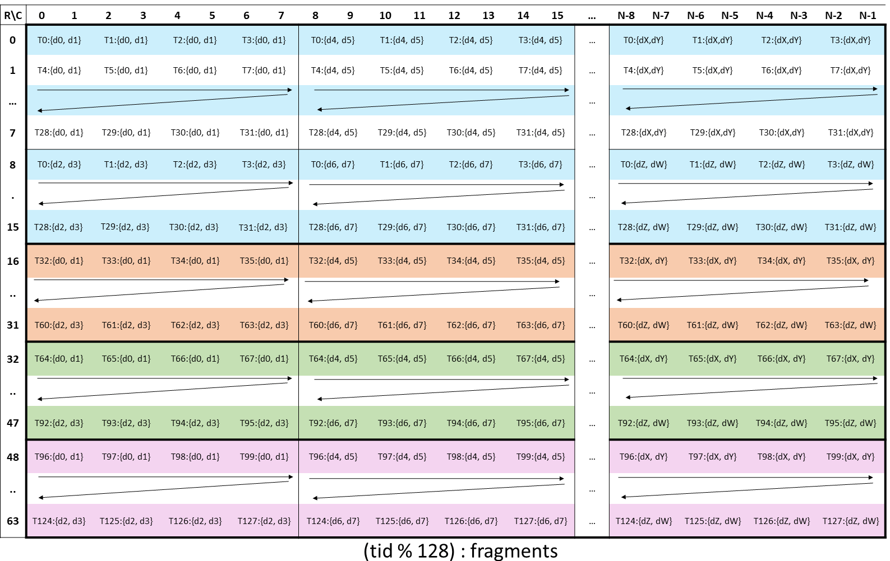
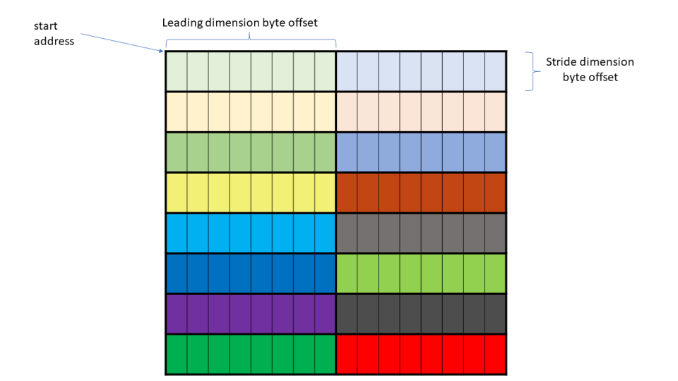
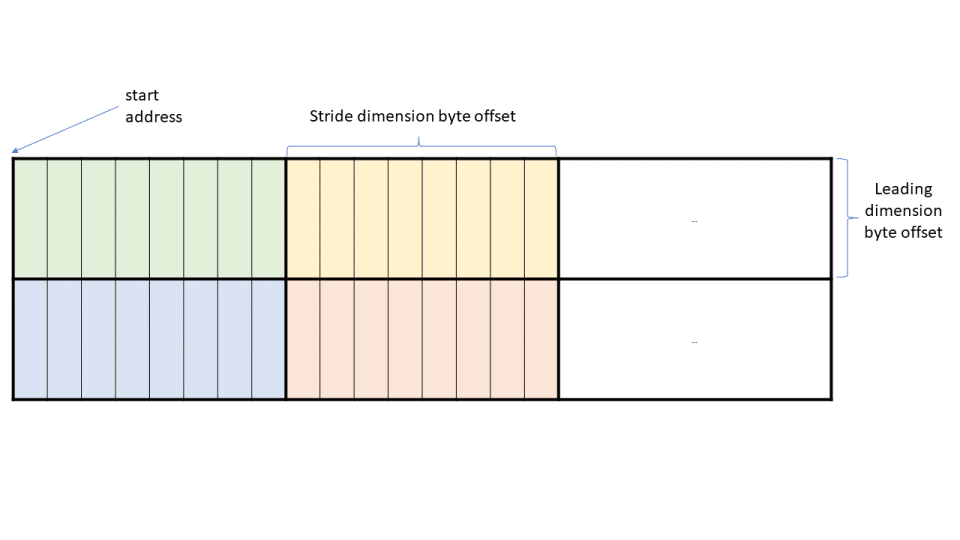

# CUTLASS Tutorial: Fast Matrix-Multiplication with WGMMA on NVIDIA® Hopper™ GPUs

**Date:** August 6, 2024

**Source:** [https://research.colfax-intl.com/cutlass-tutorial-wgmma-hopper/](https://research.colfax-intl.com/cutlass-tutorial-wgmma-hopper/)

---

No series of CUDA® tutorials is complete without a section on GEMM (GEneral Matrix Multiplication). Arguably the most important routine on modern GPUs, GEMM constitutes the majority of compute done in neural networks, large language models, and many graphics applications. Despite its ubiquity, GEMM is notoriously hard to implement efficiently.

This 3-part tutorial series aims to equip readers with a thorough understanding of how to write efficient GEMM kernels on NVIDIA Hopper GPUs using the CUTLASS library.

- [Part 1, this one] discusses the warpgroup matrix-multiply-accumulate (WGMMA) instructions. These are the primitive instructions that target the Tensor Core of NVIDIA GPUs based on the Hopper architecture.
- [Part 2] will discuss the overall design of an [efficient GEMM kernel](https://github.com/NVIDIA/cutlass/blob/main/media/docs/efficient_gemm.md), including advanced techniques used in CUTLASS kernels such as warp-specialization and ping-pong scheduling.
- [Part 3] will discuss persistent kernels and [Stream-K](https://arxiv.org/abs/2301.03598), a load-balancing strategy for GEMM that achieves state-of-the-art efficiency across a vast number of problem geometries.

**The big picture.** The 3 parts in our series loosely follow the entire development process of a GEMM kernel, but “inward-out”. First, we have the tilewise GEMM primitive that calls the Tensor Cores to ultimately do the computation. Second, we have the GEMM kernel design as seen “per CTA” — consisting of a *prologue*, *mainloop*, and *epilogue* — where the main challenge is to not bottleneck the fast Tensor Cores on memory loads. Lastly, we have the scheduling of CTAs at the outermost grid level, where load-balancing considerations rise to the forefront.

We hope that after going through this series, readers will become experts on the GEMM algorithm, and can utilize some of the beautiful ideas that go into this algorithm to design and implement other kernels in their own work.

### Asynchronous Warpgroup MMA (WGMMA)

Hopper introduces the asynchronous warpgroup-level matrix multiply and accumulate operation (WGMMA). A *warpgroup* consists of four contiguous warps, i.e., 128 contiguous threads, where the warp-rank of the first warp is a multiple of four. The `wgmma.mma_async` instruction is executed collectively by all 128 threads in a warpgroup. This operation typically follows one of these forms, where matrix `C` serves as the accumulator:

- `C = A * B + C`
- `C = A * B`, where the input from accumulator `C` is disabled.

A notable requirement of WGMMA is that operand `B` must always be stored in shared memory (SMEM). In contrast, operand `A` can be located in either SMEM or register memory (RMEM), and the accumulator `C` is always held in RMEM.

This blog post is organized as follows. First, we discuss the essentials for invoking the `wgmma.mma_async` instruction in CUTLASS. This involves constructing the relevant `TiledMMA` object, as well as creating and partitioning the SMEM tensors in order to be compatible with WGMMA. Second, we discuss the synchronization mechanisms necessary to ensure the correctness of WGMMA. Finally, we discuss in greater detail the layouts used in WGMMA, including the concept of *core matrices* and *matrix descriptors* for operands sourced from SMEM.

Throughout, for the sake of concision we will abbreviate `wgmma.mma_async` as `wgmma`. Our main code reference will be the CUTLASS [wgmma tutorial](https://github.com/NVIDIA/cutlass/blob/be60a0b27204078dc0f3f1d6ed4a95cdb2114111/examples/cute/tutorial/wgmma_sm90.cu) contributed by Pradeep Ramani, which was added in the 3.5.1 release.

### WGMMA inside a CUTLASS kernel

Our main goal in this tutorial is to explain the `wgmma` primitives for calling the Hopper Tensor Cores to do tile-based GEMM, and how to invoke it as part of a `cute::gemm` call. To set the stage, consider a standard GEMM kernel that takes input matrices `A` and `B` with dimensions `MxNxK` and computes `C=A*B`. To parallelize the computation, the kernel fixes static tile sizes `bM`, `bN`, and `bK` and launches a grid of `⌈M/bM⌉x⌈N/bN⌉` many CTAs, with each CTA computing a `bMxbN` tile `rC` of the output matrix. This will be held in the CTAs’ RMEM before being written back to the global `C` matrix.

Per CTA, we then have the kernel’s *mainloop*. Over `⌈K/bK⌉` many iterations, we loop over the inner dimension and successively load in `bMxbK` and `bNxbK` tiles of `A` and `B` from global into shared memory as `sA` and `sB`; note that in CUTLASS, we fix the shape of `sB` to be the transpose of what it is mathematically. (In fact, mirroring common practice, we load tiles of `A` and `B` into circular SMEM buffers, where the number of stages is given by a compile-time integer such as 2 or 3. The last mode of the shape tuples for `sA` and `sB` is then given by this stage count.) The `cute::gemm` call then computes the product of (stagewise slices of) `sA` and `sB` and successively accumulates the value into `rC`. After the mainloop completes, the epilogue then writes out `rC` to global memory.

Now, we wish to explain the following `cute::gemm` call and the arguments that go into it, as they appear in the following code snippet that we selectively extract from the [wgmma tutorial](https://github.com/NVIDIA/cutlass/blob/main/examples/cute/tutorial/wgmma_sm90.cu#L73) (hiding the parts of the program not relevant for us, like the pipelined TMA loads):

```
template <class TiledMMA, ... >
__global__ device_gemm(TiledMMA tiled_mma, ...) {
  // PROLOGUE
  // ...
  // Define A/B partitioning and C accumulators
  ThrMMA thr_mma = tiled_mma.get_thread_slice(threadIdx.x);
  Tensor tCsA = thr_mma.partition_A(sA);  // (MMA,MMA_M,MMA_K,PIPE)
  Tensor tCsB = thr_mma.partition_B(sB);  // (MMA,MMA_N,MMA_K,PIPE)
  Tensor tCgC = thr_mma.partition_C(gC);  // (MMA,MMA_M,MMA_N)

  // Allocate accumulators and clear them
  Tensor tCrC = thr_mma.make_fragment_C(tCgC);  // (MMA,MMA_M,MMA_N)
  clear(tCrC);

  // Allocate "fragments"
  Tensor tCrA = thr_mma.make_fragment_A(tCsA);  // (MMA,MMA_M,MMA_K,PIPE)
  Tensor tCrB = thr_mma.make_fragment_B(tCsB);  // (MMA,MMA_N,MMA_K,PIPE)
  
  // PIPELINED MAIN LOOP
  while (k_tile_count > -K_PIPE_MAX) {
    // ...
    // MMAs to cover 1 K_TILE
    cute::warpgroup_arrive();
    // (V,M,K) x (V,N,K) => (V,M,N)
    cute::gemm(tiled_mma, tCrA(_,_,_,read_pipe), tCrB(_,_,_,read_pipe), tCrC);
    cute::warpgroup_commit_batch();
    // Wait for all MMAs in a K_TILE to complete
    cute::warpgroup_wait<0>();
    // ...
  }

  // EPILOGUE
  // ...
}
```

In the CUTLASS [paradigm for MMA](https://github.com/NVIDIA/cutlass/blob/main/media/docs/cute/0t_mma_atom.md), the `cute::gemm` method is designed to expose architecture-specific MMA instructions via a uniform interface. (Indeed, if you examine the [SM80 tutorial GEMM kernel](https://github.com/NVIDIA/cutlass/blob/main/examples/cute/tutorial/sgemm_sm80.cu#L275), you’ll see that the `cute::gemm` call there is syntactically identical to that given above.) However, the definitions of the arguments involved in the `cute::gemm` call involve many WGMMA-specific aspects:

- The definition of the `TiledMMA` object `tiled_mma` encapsulates the information needed for `cute::gemm` to dispatch to a specific `wgmma` PTX instruction.
- The layouts of the SMEM tensors `sA` and `sB` must be defined to be compatible with `wgmma`.
- The fragments `tCrA`, `tCrB`, and `tCrC` are constructed as thread-level partitions of the data using the `TiledMMA` object, and as such have WGMMA-specific layouts that the programmer should be aware of.
- The fragments `tCrA` (if sourcing operand `A` from SMEM) and `tCrB` aren’t register-backed tensors whose values are copied from SMEM, but rather matrix descriptors constructed on top of SMEM.

Finally, of course there are the warpgroup synchronization primitives surrounding the `cute::gemm` call. We will explain all of these concepts in turn.

### TiledMMA object for WGMMA

In what follows, suppose the datatype is FP16, and `A` and `B` are `MN`-major, so in BLAS notation we are computing a NT gemm. We construct the `TiledMMA` object on host using the `cute::make_tiled_mma` method as follows:

```
TiledMMA tiled_mma = cute::make_tiled_mma(
  SM90_64x64x16_F16F16F16_SS<GMMA::Major::MN,GMMA::Major::MN>{});
```

Though `cute::make_tiled_mma` also has some optional arguments, let’s focus on the one at hand — the *MMA Atom*. This is a struct that wraps an underlying PTX call, which in this case is:

```
wgmma.mma_async.sync.aligned.m64n64k16.f16.f16.f16
```

The CUTLASS notation is such that one can immediately read off the relationship between the wrapped PTX instruction and the MMA atom. Firstly, SM90 is a different name for the Hopper architecture. SM90 MMA atoms are then labeled as `SM90_MxNxK_XYZ_SS` or `SM90_MxNxK_XYZ_RS`, with two template parameters that can be either `GMMA::Major::MN` or `GMMA::Major::K`. Their meanings are as follows:

- `X` and `Y` are the datatypes of the operands.
- `Z` is the datatype of the accumulator.
- `MxNxK` are the tile sizes that the `wgmma` instruction computes with — the “wgmma atom”. Not all values of `MxNxK` are possible. Here is the [list of allowed shapes](https://docs.nvidia.com/cuda/parallel-thread-execution/index.html#asynchronous-warpgroup-level-matrix-shape): `M` is always 64, `N` is a multiple of 8 from 8 to 256, and for 16-bit operand datatype, `K` is 16 (more generally, `K` is fixed to be 32 bytes).
- The suffix `RS` or `SS` indicates whether operand `A` is sourced from registers (`R`) or shared memory (`S`). Operand `B` is always sourced from shared memory, hence the `S`.
- The two template parameters indicate whether operands `A` and `B` are memory-contiguous in the `MN` mode or `K` mode. For example, in BLAS notations, the operands both being `K`-major would correspond to a TN gemm (cf. [this table](https://github.com/NVIDIA/cutlass/blob/main/media/docs/cute/0x_gemm_tutorial.md#aside-m-major-n-major-k-major)). Note that for 16-bit operand datatypes, one has flexibility with the memory layouts being either `MN`-major or `K`-major. However, for non 16-bit operand datatypes, **the layout must always be `K`-major**.

That’s it for the syntax you need to know for the MMA Atom! Now, we’ve emphasized that WGMMA is a *warpgroup-wide* instruction. In code, you can retrieve the number of threads participating in the MMA operation defined by the TiledMMA object using its *size*. For example, the following host code

```
dim3 dimBlock(cute::size(tiled_mma));
```

stipulates that each CTA in the kernel launches with 1 warpgroup of 128 threads.

Suppose instead that we wanted *2 warpgroups* to execute the WGMMA, with separate warpgroups computing halves of the output tile independently (and each issuing their individual `wgmma` instructions). To do this, we can pass a non-trivial layout (the `AtomLayoutMNK`) to the `make_tiled_mma` method as its second argument. For example, the following code

```
 TiledMMA tiled_mma = make_tiled_mma(
  SM90_64x64x16_F16F16F16_SS{},
  Layout<Shape<_2,_1,_1>>{});
```

defines a WGMMA operation where warpgroup 1 and 2 compute the upper and lower halves of the output tile as divided along the `M` mode (now assuming that `bM` is a multiple of 128). Moreover, `size(tiled_mma)` would then equal 256.

In general, the two optional layout arguments to `make_tiled_mma` — `AtomLayoutMNK` and `PermutationMNK` — work the same for any MMA Atom. For understanding the uses of `PermutationMNK`, we recommend Cris Cecka’s [excellent explanation](https://github.com/NVIDIA/cutlass/discussions/1345).

### SMEM layout constraints for WGMMA

Next, we explain the constraints on the tile sizes and layouts for operand matrices in SMEM given the choice of MMA atom. First, as for any MMA instruction, the `MxNxK` of the MMA atom needs to divide into that of the operand and accumulator tiles. In our case, this means that `bM` should be a multiple of 64, `bN` a multiple of 64, and `bK` a multiple of 16.

Second, there is an additional constraint specifically imposed by WGMMA on the SMEM layouts for `sA` and `sB` (both shape and stride), and this constraint varies as a function of the chosen swizzling mode. In particular, the layout for (the stagewise slice of) `sA` is not simply `(bM,bK):(1,bM)` or `(bM,bK):(bK,1)` in general, and likewise for `sB`.

To understand these requirements in depth, one needs the concept of *core matrices*, which we will introduce below. However, as a practical matter, we can always construct layouts guaranteed to be compatible with `wgmma` using certain pre-defined layout atoms provided by CUTLASS, followed by the `cute::tile_to_shape` method. In our example, we prepare tile sizes and `sA`, `sB` on host as follows (with `T=cutlass::half_t` which is CUTLASS’s name for FP16):

```
auto bM = Int<128>{};
auto bN = Int<128>{};
auto bK = Int< 64>{};  
auto bP = Int<  3>{};  // Pipeline

auto sA = cute::tile_to_shape(
	GMMA::Layout_MN_SW128_Atom<T>{},
	cute::make_shape(bM, bK, bP)
);
auto sB = cute::tile_to_shape(
	GMMA::Layout_MN_SW128_Atom<T>{},
	cute::make_shape(bN, bK, bP)
);
```

Here, `MN` indicates that the layout atom is suitable for `MN`-major operand, and `SW128` is the 128 byte swizzle mode. Printing out `sA` or `sB` displays

```
Sw&lt;3,4,3> o smem_ptr[16b](unset) o ((_64,_2),(_8,_8),_3):((_1,_512),(_64,_1024),_8192)
```

Where does this layout come from? `cute::tile_to_shape` takes a layout (the eponymous tile) and replicates it to tile over a larger shape (akin to `numpy.tile`). Putting aside the swizzle function `Sw<3,4,3>`, we have that the layout atom is given by `(64,8):(1,64)` and is tiled over the shape `(128, 64, 3)` in **column-major** fashion, so for the `MxK` shape, the smaller outer stride of `512` lies in the `M` mode, while the larger outer stride of `1024` lies in the `K` mode. (The largest stride of `8192` lies in the stagecount `P` mode, which makes sense, since different stagewise slices of `sA` or `sB` shouldn’t be commingled in memory.)

Note that `64` times `sizeof(half_t)` equals 128 bytes, which is the swizzle mode’s name. This is by design: because of how core matrices work, we always arrange for the length of the layout atom in the contiguous direction to equal the number of swizzle bytes — either `16` for no-swizzle, or one of `32`, `64`, or `128`.

In contrast, if we considered:

```
auto sA = cute::tile_to_shape(
  GMMA::Layout_K_SW128_Atom<T>{},
  cute::make_shape(bM,bK,bP)
);
auto sB = cute::tile_to_shape(
  GMMA::Layout_K_SW128_Atom<T>{},
  cute::make_shape(bN,bK,bP)
);
```

then printing `sA` would give us

```
Sw&lt;3,4,3> o smem_ptr[16b](unset) o (_128,_64,_3):(_64,_1,_8192)
```

since we instead tile `(8,64):(64,1)` over `(128,64,3)`. (Note that the layout `((_8,_16),(_64,_1),_3):((_64,_512),(_1,_0),_8192)` coalesces down to `(_128,_64,_3):(_64,_1,_8192)`).

In general, we can choose among `8` possibilities for layout atoms, which correspond to either `MN` or `K`-major and one of four swizzle modes:

- No swizzle: No swizzling. Implicit 16-byte boundary.
- 32-byte swizzle: Swizzling 2 consecutive 16-byte segments.
- 64-byte swizzle: Swizzling 4 consecutive 16-byte segments.
- 128-byte swizzle: Swizzling 8 consecutive 16-byte segments.

The layout atoms are defined [here](https://github.com/NVIDIA/cutlass/blob/36cbfcf483cc9d2ee65a55c199176ce96da1e33e/include/cute/atom/mma_traits_sm90_gmma.hpp#L66) in the CUTLASS codebase as:

```
GMMA::Layout_MN_INTER_Atom<T>
GMMA::Layout_MN_SW32_Atom<T>
GMMA::Layout_MN_SW64_Atom<T>
GMMA::Layout_MN_SW128_Atom<T>

GMMA::Layout_K_INTER_Atom<T>
GMMA::Layout_K_SW32_Atom<T>
GMMA::Layout_K_SW64_Atom<T>
GMMA::Layout_K_SW128_Atom<T>
```

These layout atoms must then be passed into `tile_to_shape` with the SMEM shape for `sA` and `sB` given by `make_shape(bM,bK,bP)` or `make_shape(bN,bK,bP)`, with the modes of the shape given **in that order**, such that the tile sizes of the layout atoms divide into those of the larger SMEM shape. This is ultimately a constraint on the SMEM shape caused by the choice of swizzling mode, and is separate from the other constraint imposed by the MMA atom shape.

### WGMMA Fragments and Descriptors

We’ve created the `TiledMMA` object and prepared accordingly the SMEM layouts on host. Now, on device we can use the `TiledMMA` object `tiled_mma` to construct the appropriate partitioned tensors to be passed into the `cute::gemm` call. First, we create a `ThrMMA` object called `thr_mma` by invoking the `get_thread_slice` method on `tiled_mma` with the thread index, which runs inclusively from `0` to `127` in our case.

Then, with reference to the kernel code snippet above, printing the tensors `tCsA` and `tCsB` **for any thread index** shows the following:

```
tCsA: Sw&lt;3,4,3>_smem_ptr[16b](0x7f8800000400) o
	((_64,(_8,_2)),_2,_4,_3):((_1,(_64,_1024)),_512,_2048,_8192)
tCsB: Sw&lt;3,4,3>_smem_ptr[16b](0x7f880000c400) o
	((_64,(_8,_2)),_2,_4,_3):((_1,(_64,_1024)),_512,_2048,_8192)
```

As per the comment, the shape of `tCsA` should be thought of as `(MMA,MMA_M,MMA_K,PIPE)`:

- `MMA` is the `NxK` shape of the MMA Atom.
- `MMA_M` and `MMA_K` are the extents of its tiling across the `M` and `K` modes of `sA` (so that `MMA_M=bM/64=2` and `MMA_K=bK/16=4`).
- `PIPE` is the number of stages.

The strides and swizzle mode carry over from `sA`. The WGMMA-specific thing to notice here is that `tCsA` isn’t actually a thread-level slice of SMEM, but rather the entire SMEM tensor with a reorganized layout.

Next, printing the “fragments” `tCrA` and `tCrB` for any thread index shows:

```
tCrA: GMMA::DescriptorIterator o (_1,_2,_4,_3):(_0,_64,_256,_1024)
tCrB: GMMA::DescriptorIterator o (_1,_2,_4,_3):(_0,_64,_256,_1024)
```

Internally, CUTLASS constructs a “[matrix descriptor](https://docs.nvidia.com/cuda/parallel-thread-execution/index.html#asynchronous-warpgroup-level-matrix-shared-memory-layout-matrix-descriptor)“, which is 64-bit value held in registers that describes the SMEM in a way suitable for use by the `wgmma` instruction. For the programmer, the most important thing to bear in mind is that values of SMEM are **not** copied into RMEM; rather, accessing the values of `tCrA` and `tCrB` instead accesses these 64-bit descriptors. Moreover, these tensors being “iterators” means that only the single 64-bit descriptor used for a given `wgmma` instruction is held in registers at a time (e.g., as opposed to all 24 of them).

In contrast to the operands, the accumulator tensors are defined in a more standard fashion. Printing out `tCgC` and `tCrC` for thread 0 shows:

```
tCgC: gmem_ptr[16b](0x7f877a780000) o ((_2,_2,_8),_2,_2):((512,_8,4096),_64,32768)
tCrC: ptr[16b](0x7feee1fffbe0) o ((_2,_2,_8),_2,_2):((_1,_2,_4),_32,_64)
```

`tCgC` is the slice of the output GMEM tensor that we want to copy the accumulator’s values to in the epilogue, and `tCrC` is the register-backed tensor created to hold these values as they are computed in the mainloop. The `(MMA,MMA_M,MMA_N)` shapes of these tensors can be interpreted as follows: in the MMA atom’s `MxN=64x64` output tile, each of the 128 threads holds `32=2*2*8` values, and `MMA_M=MMA_N=2` are the same as for `tCsA` and `tCsB`.

Each thread holds its 32 values of the atom in a way that necessitates factoring 32 as (2,2,8) for the shape in order to be able to define the corresponding strides for the layout of `tCgC`. The specific partitioning pattern can be read off from this picture taken [from the PTX documentation](https://docs.nvidia.com/cuda/parallel-thread-execution/index.html#wgmma-64n16-d):



This illustrates the replicated Z-pattern in which a thread’s 32 values are held. For example, thread 0 holds the values at (0,0), (0,1), (8,0), (8,1) and repeated every 8 columns to the right.

### The gemm call, revisited

Let’s return to line 25 of the kernel code snippet above:

```
// (V,M,K) x (V,N,K) => (V,M,N)
cute::gemm(tiled_mma, tCrA(_,_,_,read_pipe), tCrB(_,_,_,read_pipe), tCrC);
```

The various overloads of the `cute::gemm` method serve to first loop over the outer modes `MMA_M/N` and `MMA_K`. Once those coordinates are chosen, we’re just computing with the MMA atom tile shape. Put another way, we first reduce to the overload of `cute::gemm` for the [dispatch shape](https://github.com/NVIDIA/cutlass/blob/be60a0b27204078dc0f3f1d6ed4a95cdb2114111/include/cute/algorithm/gemm.hpp#L178) `(V)x(V)=>(V)`.

The code then invokes the [`fma` operation](https://github.com/NVIDIA/cutlass/blob/be60a0b27204078dc0f3f1d6ed4a95cdb2114111/include/cute/arch/mma_sm90_gmma.hpp#L401) of the MMA atom (precisely, within the [mma_unpack](https://github.com/NVIDIA/cutlass/blob/be60a0b27204078dc0f3f1d6ed4a95cdb2114111/include/cute/atom/mma_traits.hpp#L112) method). This contains the inline PTX assembly:

```
CUTE_HOST_DEVICE static void
  fma(uint64_t const& desc_a,
      uint64_t const& desc_b,
      uint32_t& d00, uint32_t& d01, uint32_t& d02, uint32_t& d03,
      uint32_t& d04, uint32_t& d05, uint32_t& d06, uint32_t& d07,
      uint32_t& d08, uint32_t& d09, uint32_t& d10, uint32_t& d11,
      uint32_t& d12, uint32_t& d13, uint32_t& d14, uint32_t& d15,
      GMMA::ScaleOut const scale_D = GMMA::ScaleOut::One)
  {
#if defined(CUTE_ARCH_MMA_SM90A_ENABLED)
    asm volatile(
    "{\n"
      ".reg .pred p;\n"
      "setp.ne.b32 p, %18, 0;\n"
      "wgmma.mma_async.sync.aligned.m64n64k16.f16.f16.f16 "
      "{%0,  %1,  %2,  %3,  %4,  %5,  %6,  %7,  "
      " %8,  %9,  %10, %11, %12, %13, %14, %15},"
      " %16,"
      " %17,"
      " p,   %19, %20, %21, %22;\n"
    "}\n"
      : "+r"(d00), "+r"(d01), "+r"(d02), "+r"(d03),
        "+r"(d04), "+r"(d05), "+r"(d06), "+r"(d07),
        "+r"(d08), "+r"(d09), "+r"(d10), "+r"(d11),
        "+r"(d12), "+r"(d13), "+r"(d14), "+r"(d15)
      : "l"(desc_a),
        "l"(desc_b),
        "r"(int32_t(scale_D)),
        "n"(int32_t(scaleA)),
        "n"(int32_t(scaleB)),
        "n"(int32_t(tnspA)),
        "n"(int32_t(tnspB)));
#else
    CUTE_INVALID_CONTROL_PATH(
    	"Attempting to use SM90_64x64x16_F16F16F16_SS " 
    	"without CUTE_ARCH_MMA_SM90A_ENABLED");
#endif
  }
```

The corresponding PTX documentation for this syntax is [here](https://docs.nvidia.com/cuda/parallel-thread-execution/index.html#asynchronous-warpgroup-level-matrix-instructions-wgmma-mma). Consistent with the descriptions of the tensors `tCrA`, `tCrB`, and `tCrC` above, observe that we have the `uint64` variables `desc_a` and `desc_b` for the operands along with 16 `uint32` variables for the accumulator. `scale_D` is either `0` or `1`, and controls whether or not the accumulator is zero-initialized.

In addition, the variables `scaleA`, `scaleB`, `tnspA`, `tnspB` are determined at compile-time outside the `fma` method via template parameters. `scaleA` and `scaleB` are either 1 or -1 for negating the operand, while `tnspA` and `tnspB` indicate whether to transpose the operand, and are 0 or 1 for `GMMA::Major::K` or `GMMA::Major::MN`, respectively.

### Synchronization for WGMMA

It remains to explain the synchronization primitives surrounding the `cute::gemm` call:

```
cute::warpgroup_arrive();
cute::gemm(tiled_mma, tCrA(_,_,_,read_pipe), tCrB(_,_,_,read_pipe), tCrC);
cute::warpgroup_commit_batch();
cute::warpgroup_wait<0>();
```

Why are these additional commands necessary at all? They have to do with `wgmma`‘s nature as an *asynchronous* instruction. In the context of the Hopper architecture, *asynchronous* indicates that `wgmma` can run concurrently with other operations, hence necessitating a synchronization mechanism for dependent steps. This mechanism is elaborated upon in the PTX [memory consistency model](https://docs.nvidia.com/cuda/archive/12.3.2/parallel-thread-execution/index.html#program-order-async-operations). Improper synchronization in code can result in (a) subtle race conditions, leading to challenging bugs, (b) the compiler serializing the `wgmma` instructions, which can cause significant performance degradation, or (c) undefined behavior.

The highlighted `cute` methods wrap the following PTX instructions:

- `cute::warpgroup_arrive()` — `wgmma.fence.sync.aligned`;
- `cute::warpgroup_commit_batch()` — `wgmma.commit_group.sync.aligned`;
- `cute::warpgroup_wait<N>()` — `wgmma.wait_group.sync.aligned N`;

(Note that we’ve been using `wgmma` as shorthand for `wgmma.mma_async` throughout, but in this subsection only we disambiguate this.) Let’s connect the usage of these commands to the following description of WGMMA-based GEMM taken verbatim from the [PTX documentation](https://docs.nvidia.com/cuda/archive/12.3.2/parallel-thread-execution/index.html#asynchronous-warpgroup-level-matrix-multiply-accumulate-instructions):

1. Load matrices `A`, `B`, and `D` into registers or into shared memory.
2. Perform the following `fence` operations:
  - `wgmma.fence` operations to indicate that the register/shared-memory across the warpgroup have been written into.
  - `fence.proxy.async` operation to make the generic proxy operations visible to the async proxy.
3. Issue the asynchronous matrix multiply and accumulate operations using the `wgmma.mma_async` operation on the input matrices. The `wgmma.mma_async` operation is performed in the async proxy.
4. Create a wgmma-group and commit all the prior outstanding `wgmma.mma_async` operations into the group, by using `wgmma.commit_group` operation.
5. Wait for the completion of the required wgmma-group using `wgmma.wait_group`.
6. Once the wgmma-group completes, all the `wgmma.mma_async` operations have been performed and completed.

We explain these points in order. First, a `wgmma.fence` instruction ensures that `wgmma.mma_async` only accesses certain RMEM addresses after all prior accesses to such addresses have finished. Without the `wgmma.fence`, the behavior is undefined. An exception to this rule is that Hopper allows *multiple*`wgmma.mma_async` instructions to be in flight simultaneously. As long as these `wgmma.mma_async` instructions have the same accumulator shape, they can share the same accumulator tensor, i.e., write to the same register memory addresses. In that case, a fence is not required. For example, we don’t need to insert a `wgmma.fence` within the loop over `MMA_K` done as part of the `cute::gemm` call.

Just like [TMA operations](https://research.colfax-intl.com/tutorial-hopper-tma/), `wgmma.mma_async` is performed in the [async proxy](https://docs.nvidia.com/cuda/parallel-thread-execution/#async-proxy). Hence, *if* operations performed in the generic proxy affect the SMEM read by `wgmma.mma_async`, we need to issue `fence.proxy.async`. For example, this would be the case if we copied `A` and `B` into SMEM via ordinary `ld.global` / `st.shared` operations. Since we use TMA load, we don’t need `fence.proxy.async` in our example, and indeed it doesn’t appear in the WGMMA tutorial code or in the mainloop of CUTLASS Hopper GEMM kernels. (To verify this, note that `fence.proxy.async` is wrapped by `cutlass::arch::fence_view_async_shared()`).

The `wgmma.commit_group` instruction creates a new wgmma-group per warpgroup and batches all prior `wgmma.mma_async` instructions initiated by the executing warpgroup but not committed to any wgmma-group into the new wgmma-group. In our example, `cute::warpgroup_commit_batch()` batches `MMA_M*MMA_N*MMA_K` many `wgmma.mma_async` instructions into one wgmma-group.

Finally, the `wgmma.wait_group` instruction with argument `N` will make the executing thread wait until only `N` or fewer of the most recent wgmma-groups are pending and all the prior wgmma-groups committed by the executing threads are complete. In our example, we let `N=0`, so the warpgroup simply waits for the completion of the entire wgmma-group before continuing to execute any subsequent instructions.

In situations where the warpgroup has the opportunity to perform independent computation, flexibility with the parameter `N` comes in handy. For example, this comes into play with the GEMM-softmax overlapping strategy employed in the design of [FlashAttention-3](https://research.colfax-intl.com/flashattention-3-fast-and-accurate-attention-with-asynchrony-and-low-precision/).

### WGMMA core matrices

This last section discusses further the layout requirements for tiles of matrices `A` and `B` loaded into SMEM, supposing that `wgmma` sources both of its operands from SMEM. To simplify the discussion, first suppose that `A` is row-major and `B` is column-major (i.e., both are `K`-major). Recall also that the `wgmma` instruction’s tile shape `MxNxK` is constrained so that `M` is 64, `K` times the size of the datatype is 32 bytes, and `N` is a multiple of 8 running from 8 to 256. To avoid confusion with `A`/`B` or `sA`/`sB`, let’s notate the WGMMA atom tiles as `wA` and `wB`.  
  
The matrices `wA` and `wB` are divided into a number of smaller matrices called *core matrices.* Each core matrix has a *strided* direction and a *contiguous* direction, such that its length is 8 in the strided direction and 16 bytes in the contiguous direction. Matrix `wA` is made up of `8x2` core matrices and Matrix `wB` is made up of `2x(N/8)` core matrices. We illustrate a tiling of `wA` and `wB` by core matrices as follows (with images taken from the PTX documentation):



Layout of `wA` in SMEM



Layout of `wB` in SMEM

As mentioned above, `wgmma` in SS mode requires [matrix descriptors](https://docs.nvidia.com/cuda/parallel-thread-execution/index.html#asynchronous-warpgroup-level-matrix-shared-memory-layout-matrix-descriptor) for both `wA` (`desc-a`) and `wB` (`desc-b`) as inputs. This descriptor encodes five parameters:

- Start address: starting base address of the operand in SMEM.
- LBO (*leading dimension byte offset*): the distance, in bytes, between two adjacent core matrices in the `K` dimension.
- SBO (*stride dimension byte offset*): the distance, in bytes, between two adjacent core matrices in the `M` or `N` dimension.
- Swizzling mode: none, 32, 64, or 128 bytes.
- Matrix base offset: This is used to resolve SMEM alignment problems in case SMEM addresses are not aligned to the byte boundary of the repeating pattern for the swizzle mode.

LBO and SBO are indicated in the figures above.

The [`make_gmma_desc`](https://github.com/NVIDIA/cutlass/blob/06b21349bcf6ddf6a1686a47a137ad1446579db9/include/cute/atom/mma_traits_sm90_gmma.hpp#L194C1-L194C54) method in CUTLASS constructs the descriptor (as an instance of `GmmaDescriptor`) based on the SMEM tensor’s layout provided as input. Provided that the input tensor’s layout is created using one of the eight canonical GMMA layout atoms and `tile_to_shape`, as previously detailed in “SMEM layout constraints for WGMMA”, `make_gmma_desc` will accurately calculate the LBO and SBO, determine the swizzling mode, and construct the descriptor. For example, the `GmmaDescriptor` describes the following admissible WGMMA layouts in the `K`-major case (where `T*sizeof(dtype)=16`):

```
No swizzle       : Swizzle&lt;0,4,3> o smem_ptr o ((8,m),(T,2)):((1T,SBO),(1,LBO))
32-byte swizzle  : Swizzle&lt;1,4,3> o smem_ptr o ((8,m),(T,2)):((2T,SBO),(1, T ))
64-byte swizzle  : Swizzle&lt;2,4,3> o smem_ptr o ((8,m),(T,2)):((4T,SBO),(1, T ))
128-byte swizzle : Swizzle&lt;3,4,3> o smem_ptr o ((8,m),(T,2)):((8T,SBO),(1, T ))
```

For the [*compact*](https://github.com/NVIDIA/cutlass/blob/be60a0b27204078dc0f3f1d6ed4a95cdb2114111/include/cute/layout.hpp#L415) layouts produced by the GMMA layout atom => `tile_to_shape` pattern (note the GMMA layout `K` atoms have a larger `K`-mode than the WGMMA atom shape in the case of 64 and 128-byte swizzle!), we have these corresponding values for LBO and SBO:

```
No swizzle       : LBO = 16x8 = 128 bytes. SBO = 32x8 = 256 bytes.
32-byte swizzle  : SBO = 32x8 = 256 bytes.
64-byte swizzle  : SBO = 64x8 = 512 bytes.
128-byte swizzle : SBO = 128x8 = 1024 bytes.
```

Most notably, for 64 and 128-byte swizzle, the strides are such that the given admissible WGMMA layouts are **not** compact. Rather, one has sets of 2 or 4 WGMMA atom operand tiles stacked side-by-side in the `K`-direction, resulting in strides of `4T` and `8T` for the core matrix `M`-mode. Put another way, when swizzling one interleaves in memory the 2, 4, or 8 core matrices logically adjacent in the `K`-mode, and these core matrices will belong to *different* WGMMA atoms for 64 and 128-byte swizzle.

For the sake of completeness, we also give the admissible WGMMA layouts in the `MN`-major case:

```
No swizzle       : Swizzle&lt;0,4,3> o smem_ptr o ((T,1,m),(8,k)):((1,T,SBO),(1T,LBO))
32-byte swizzle  : Swizzle&lt;1,4,3> o smem_ptr o ((T,2,m),(8,k)):((1,T,LBO),(2T,SBO))
64-byte swizzle  : Swizzle&lt;2,4,3> o smem_ptr o ((T,4,m),(8,k)):((1,T,LBO),(4T,SBO))
128-byte swizzle : Swizzle&lt;3,4,3> o smem_ptr o ((T,8,m),(8,k)):((1,T,LBO),(8T,SBO))
```

### Conclusion

In this [Part 1] of the GEMM series, we have covered the core concepts involved in using WGMMA (warpgroup matrix-multiply and accumulate) as a primitive in Hopper-based GEMM.

WGMMA requires a warpgroup — 128 threads — to collectively execute the matrix multiplication, and can only operate on certain fragments of matrices. We went into the special shapes and layouts involved in this, with an emphasis on how to construct operand layouts guaranteed to be accepted by WGMMA using the canonical GMMA Layout => `tile_to_shape` pattern.

For its usage to be well-defined, WGMMA also requires certain synchronization mechanisms. To this end, we explained the uses of `wgmma.fence`, `fence.proxy.async`, `wgmma.commit_group` and `wgmma.wait_group` in relation to `wgmma.mma_async`.

Lastly, we explained in some detail the inner workings of WGMMA core matrices and how CUTLASS constructs matrix descriptors for those operands sourced from SMEM.

Taken as a whole, this blog post should enable the programmer to write CUTLASS kernels on Hopper that use WGMMA. In [Part 2], we will extend this discussion to incorporate TMA, and how to use TMA and WGMMA in tandem in a Hopper GEMM kernel so as to overlap copy and compute.
