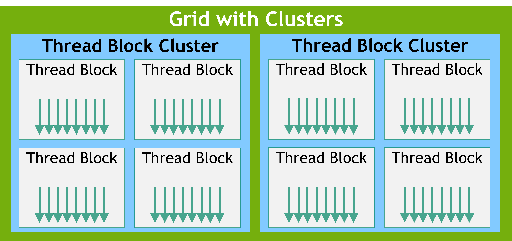
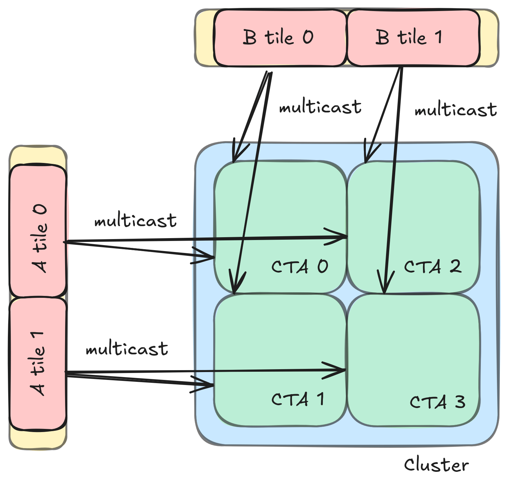
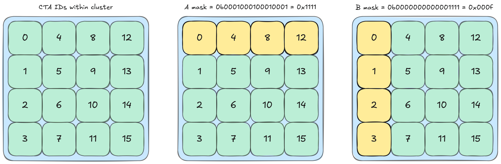
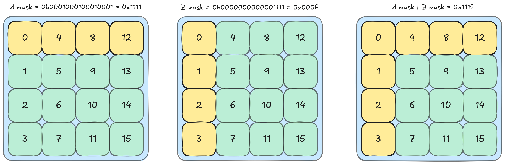
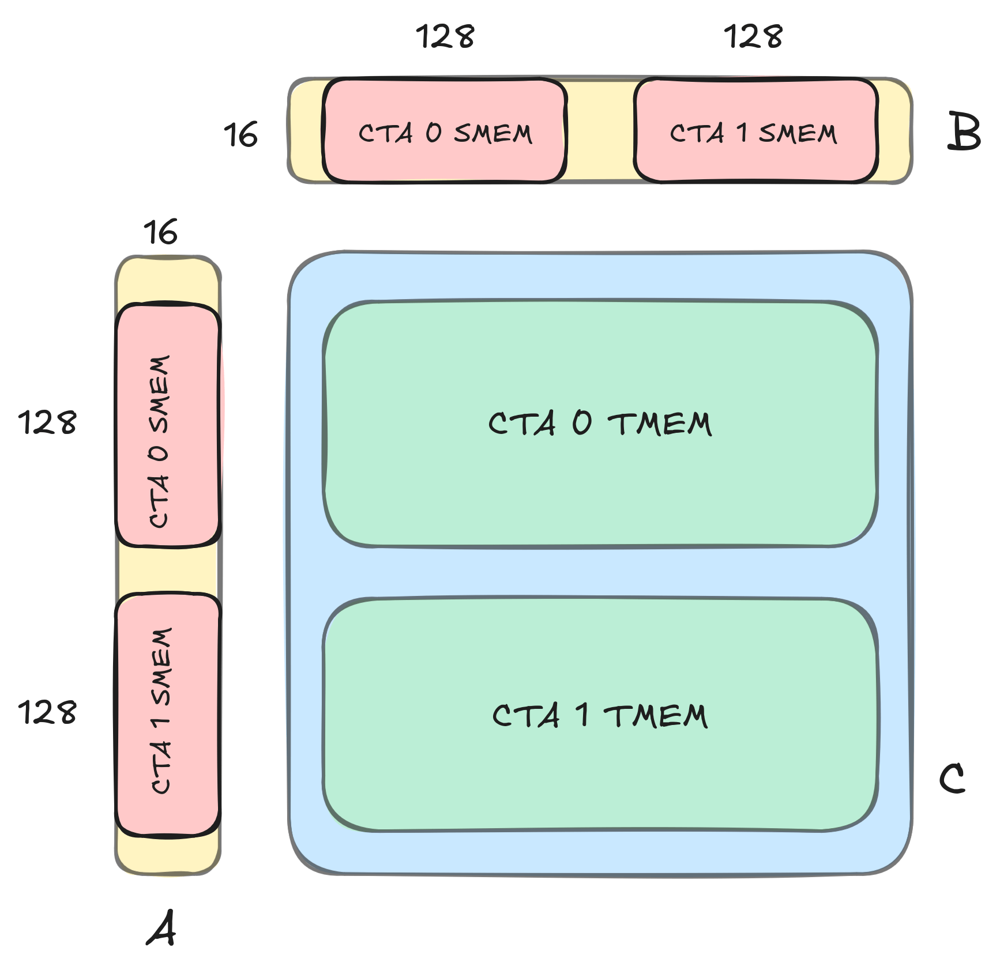
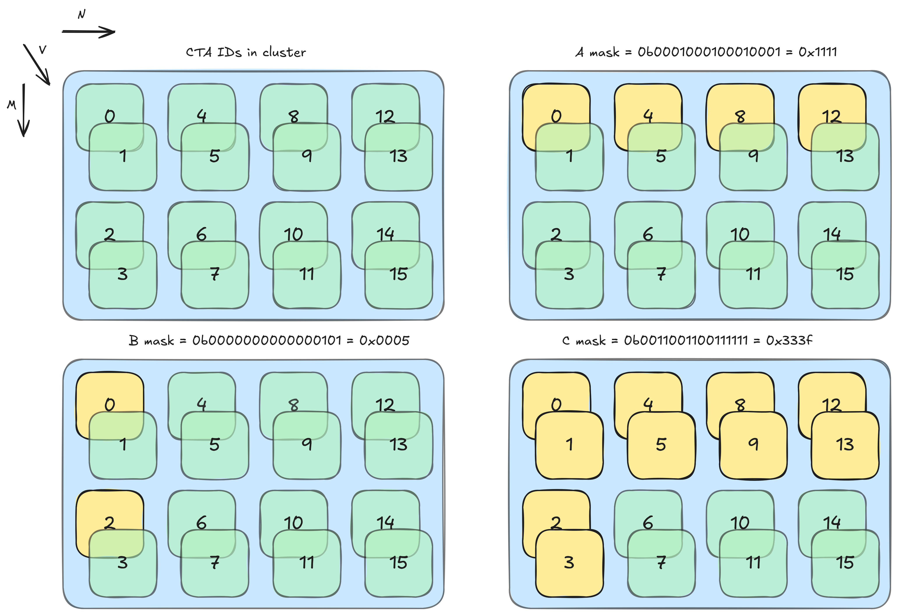

# CUTLASS Tutorial: GEMM with Thread Block Clusters on NVIDIA® Blackwell GPUs

**Date:** May 10, 2025

**Source:** [https://research.colfax-intl.com/cutlass-tutorial-gemm-with-thread-block-clusters-on-nvidia-blackwell-gpus/](https://research.colfax-intl.com/cutlass-tutorial-gemm-with-thread-block-clusters-on-nvidia-blackwell-gpus/)

---

Welcome to part two of our series investigating GEMM on the NVIDIA Blackwell architecture. In part 1, we introduced some key new features available on NVIDIA Blackwell GPUs, including Tensor Memory, and went over how to write a simple CUTLASS GEMM kernel that uses the new UMMA instructions (`tcgen05.mma`) to target the Blackwell Tensor Cores. In this post, we will explain how to utilize thread block clusters and 2-SM UMMA for Blackwell GEMM. More specifically, we will cover the following aspects in order:

1. Using the [Tensor Memory Accelerator](https://research.colfax-intl.com/tutorial-hopper-tma/) (TMA) with thread block clusters and multicast to split global memory transfers among participating CTAs;
2. Using Blackwell 2-SM UMMA with CTA pairs to increase arithmetic intensity of MMA;
3. Putting TMA multicast and 2-SM UMMA together in a GEMM mainloop, and correctly synchronizing these operations with each other.

Like in the last blog, we will discuss the relevant concepts in depth first and then see how to implement them in CUTLASS via the [CuTe Blackwell examples](https://github.com/NVIDIA/cutlass/tree/main/examples/cute/tutorial/blackwell), specifically examples 3 and 4. These two examples track the order in which we present the concepts — the 3rd one does GEMM with TMA multicast and Blackwell 1-SM UMMA, while the 4th one extends this to 2-SM UMMA with CTA pairs and with new synchronization primitives, including a different multicast TMA atom. 

# Thread Block Clusters

**Thread block cluster** refers to a construct that lets the developer group SMs that are physically close (e.g., on-chip) to each other. Specifically, thread blocks in a cluster are guaranteed to be co-scheduled on SMs located on the same GPU Processing Cluster (GPC).



<p align="center"><em>**Figure 1.** Image of a grid of thread blocks organized into clusters, from the [CUDA C++ Programming Guide](https://docs.nvidia.com/cuda/cuda-c-programming-guide/#thread-block-clusters).</em></p>

[This feature](https://docs.nvidia.com/cuda/hopper-tuning-guide/index.html#thread-block-clusters), first introduced in the NVIDIA Hopper architecture, gave developers access to a new level of hierarchy to facilitate more advanced cooperation between neighboring thread blocks. Notably, thread blocks in a cluster can access each other’s shared memory, a capability called [distributed shared memory](https://docs.nvidia.com/cuda/cuda-c-programming-guide/index.html#distributed-shared-memory). This also makes it possible for thread blocks in a cluster to collaboratively load data (e.g., through TMA multicast) and to synchronize with each other using jointly visible mbarriers. We will see these features in action later in the blog.

## Using Thread Block Clusters

Thread block clusters are a launch time parameter, just like grid size or block size. The cluster size is defined in terms of a `dim3` tuple, `<cluster.x, cluster.y, cluster.z>`.  The maximum supported portable size of a cluster is 8, though some GPUs, like the [Hopper H100](https://docs.nvidia.com/cuda/hopper-tuning-guide/index.html#thread-block-clusters) and [Blackwell B200](https://docs.nvidia.com/cuda/blackwell-tuning-guide/index.html#thread-block-clusters), allow clusters of sizes up to 16 with an opt-in option. We will refer to the minimum shape, the cluster with shape `<1,1,1>`, as a **trivial cluster**. Finally, the cluster shape must evenly divide the grid size. 

In CUTLASS we launch clusters using a special launcher utility: `launch_kernel_on_cluster`.

```
// define dimGrid, dimBlock, dimCluster as dim3 objects
// calculate smemBytes
// define kernel_ptr as pointer to kernel function

auto params = {dimGrid, dimBlock, dimCluster, smemBytes};
auto status = cutlass::launch_kernel_on_cluster(params, (void const*) kernel_ptr, 
                                                ... /* args to kernel */);
```

In GEMM kernels, it’s natural to map the three dimensions of the cluster shape to the 3 dimensions (M, N, K) of the problem (with the K dimension of the cluster shape equal to 1 unless a [Split-K kernel design](https://research.colfax-intl.com/cutlass-tutorial-persistent-kernels-and-stream-k/) is used). This means that CTAs in each cluster are assigned a contiguous block of output tiles, which is good for cache performance and, as we’ll see shortly, for multicasting.

## TMA Multicasting

TMA multicast load is a feature designed to speed up data transfer by loading the same tensor tile to multiple CTAs in the same cluster at once. This feature was introduced in Hopper alongside thread block clusters and TMA, and we have covered it in a [previous blog post](https://research.colfax-intl.com/tutorial-hopper-tma/). 

As a brief review, TMA multicast places the data loaded by the TMA in the SMEM of multiple CTAs in the same cluster. Using this feature, a set of CTAs in a cluster can collaboratively and simultaneously load a tile of data into each of their shared memories, decreasing the global memory traffic in cases when multiple CTAs need to load the same data. Each CTA loads a portion of the data that is multicast into the SMEM of the other participating CTAs. For example, if the number of participating CTAs is 4, each CTA loads a quarter of the data, thereby reducing the total amount of data loaded with TMA by a factor of 4. Technically, this collaborative partial loading is a programming paradigm and is not intrinsic to TMA multicast feature, but in this article we will treat them as synonymous.

# CuTe Example: GEMM with TMA Multicast

Let’s now take a look at [CuTe Blackwell example 3](https://github.com/NVIDIA/cutlass/blob/main/examples/cute/tutorial/blackwell/03_mma_tma_multicast_sm100.cu) and see how multicast is used in the context of GEMM. Multicasting translates naturally to the tiling scheme of GEMM, as every tile in the operands A and B are used for computing multiple output tiles. For simplicity, let’s first consider a cluster of shape `<2,2,1>` (note the actual example uses shape `<4,4,1>`). Each CTA handles an output tile of size (bM, bN), so each cluster handles a 2×2 block of 4 output tiles, of total size `(2*bM, 2*bN)`.

At each mainloop iteration, each CTA has to load a (bM, bK) tile from A and an (bN, bK) tile from B, with the M and N offsets of the tiles determined by the row and column of that CTA in the grid, and the K offset determined by the iteration. If we were to use a simple TMA, each output tile would load 2 tiles, resulting in 8 tiles loaded by the cluster. While some optimizations like CTA rasterization can ensure that most of these loads are from L2, it is difficult to hit 100%, and even L2-hits have a significant latency in the timescale of MMA operations. TMA multicast allows us to only load the minimum required 4 tiles and place them in the SMEM of the CTAs that require them. More precisely, each CTA requires the same A operand tile as all other CTAs in the same row, and the same B operand tile as all other CTAs in the same column. So each CTA participates in two TMA multicast operations — one for operand A with all other CTAs in the same row, and one for operand B with all other CTAs in the same column.



<p align="center"><em>**Figure 2**. In this 2×2 cluster, each tile of A and B can be loaded to 2 CTAs simultaneously using multicast.</em></p>

Conceptually, TMA multicast is fairly simple. However, practically, coordinating the data access across multiple CTAs can be tricky. So arguably the lynchpin for TMA multicasting is proper synchronization. From the perspective of the workflow in the CTA, there are two synchronization points — one when all participating TMAs are complete and data is ready for MMA, and one when all participating MMAs are complete and the buffer holding the data can be overwritten with data for the next iteration. We will go over these two in turn.

## Synchronizing TMA participants

The first point of synchronization is waiting for all TMA multicasts that are loading the required operands to complete. Once again, that is all CTAs in the same row for A, and all CTAs in the same column for B (note that this includes the CTA itself). So we need a barrier that waits on all the cluster CTAs participating in the relevant TMA multicast operations.

To see how this is done, let’s take a look at the relevant PTX. The information about participation is encoded in the PTX for `cp.async.bulk.tensor` (TMA):

```
// global -> shared::cluster
cp.async.bulk.tensor.dim.dst.src{.load_mode}.completion_mechanism{.multicast}
{.cta_group}{.level::cache_hint}
                                   [dstMem], [tensorMap, tensorCoords], 
                                   [mbar]{, im2colInfo}
                                   {, ctaMask} {, cache-policy}

.dst =                  { .shared::cluster }
.src =                  { .global }
.dim =                  { .1d, .2d, .3d, .4d, .5d }
.completion_mechanism = { .mbarrier::complete_tx::bytes }
.cta_group =            { .cta_group::1, .cta_group::2 }
.load_mode =            { .tile, .tile::gather4, .im2col, .im2col::w, .im2col::w::128 }
.level::cache_hint =    { .L2::cache_hint }
.multicast =            { .multicast::cluster  }
```

TMA multicast participation is specified through `ctaMask`, which is a bitmask with the `i`-th bit determining whether the CTA with cluster index `i` participates. More precisely, the TMA operation places the loaded data into the SMEMs of all CTAs specified by the bitmask, and optionally arrive at the mbarrier of the CTAs. The maximum size of clusters for Blackwell GPUs is 16, so we have a 16-bit bitmask. In the case of our particular cluster shape of 4x4x1, we can get a (relatively) human-friendly expression by using hexadecimal to represent this mask. For example, the CTA with cluster index 0 has `tma_bitmask_a` = 0x1111 and `tma_bitmask_b` = 0x000f.



<p align="center"><em>**Figure 3.**Organization of CTAs within a cluster, and the two bitmasks associated to TMA index 0. Note that the 1d CTA ID is mapped to the multidimensional cluster shape with the 0th mode as the most major one, and here this corresponds to the M mode of the output matrix, so the layout of CTAs is column major.</em></p>

Here each bit corresponds to a CTA, with the multidimensional cluster shape mapped to a 1-dimensional ordering of CTAs by a column-major layout. (The 1D position of each CTA in the cluster is accessible through the [PTX special register %cluster_ctarank](https://docs.nvidia.com/cuda/parallel-thread-execution/index.html#special-registers-cluster-ctarank), or using `cute::block_rank_in_cluster()`.) We can see how the column and row participations are encoded in the masks: for example in the bitmask for A, CTA 0 shares the row with CTAs 4, 8 and 12, so the mask `0b0001000100010001` has 1 in bits 0, 4, 8 and 12. With this mask, the TMA multicast operation issued by CTA 0 will place the loaded data in the SMEM of CTAs 0, 4, 8 and 12, and arrive at each of their mbarriers. The TMA multicasts for A by the CTAs of the same row all use the same bitmask (`0x1111` for the top row), and TMA multicasts for B by the CTAs of the same column all use the same bitmask (`0x000f` for the left most column). This allows the CTAs to only wait for the 6 other CTAs that are participating in multicast loads of its operands.

Now let’s see how this TMA multicasting and synchronization are implemented in the example. First, the copy atom. The example uses the sm90 TMA atom for this simple case of a single SM. The arguments are the same as a standard TMA, with the number of CTAs in the multicasting mode tacked on. Note that the multicasting mode, which gives the number of participants, is chosen to be the N-mode for A (where A is MxK).

```
Copy_Atom tma_atom_A = make_tma_atom(
    SM90_TMA_LOAD_MULTICAST{},       // TMA load operation with multicast
    mA,                              // Source GMEM tensor
    sA_layout,                       // Destination SMEM layout
    select<0,2>(mma_tiler),          // MK Tiler for TMA operation
    size<2>(cluster_layout_vmnk)     // The number of CTAs in the multicasting mode
);
```

Next, to launch the TMA multicast, we need the bitmask. This bitmask can be constructed through a utility function of CUTLASS:

```
int cta_in_cluster_coord_1d = cute::block_rank_in_cluster(); // e.g. 11
auto cta_in_cluster_coord_vmnk = cluster_layout_vmnk.get_flat_coord(
                                                             cta_in_cluster_coord_1d);
// e.g. (0,3,2,0)

uint16_t tma_mcast_mask_a = create_tma_multicast_mask<2>(cluster_layout_vmnk, 
                                                         cta_in_cluster_coord_vmnk);
uint16_t tma_mcast_mask_b = create_tma_multicast_mask<1>(cluster_layout_vmnk, 
                                                         cta_in_cluster_coord_vmnk);
// printf("%#x\n", tma_mcast_mask_a); => 0x8888
// printf("%#x\n", tma_mcast_mask_b); => 0x0f00
```

The final set of information that we need for the TMA multicast are the data Tensors. We can use the TMA partitioner to get the partitioned tile:

```
// Project the cluster_layout for tma_A along the N-modes
auto [tAgA, tAsA] = tma_partition(tma_atom_A,
                                  get<2>(cta_in_cluster_coord_vmnk), 
                                  make_layout(size<2>(cluster_layout_vmnk)), 
                                  group_modes<0,3>(tCsA), group_modes<0,3>(tCgA));

// Project the cluster_layout for tma_B along the M-modes
auto [tBgB, tBsB] = tma_partition(tma_atom_B,
                                  get<1>(cta_in_cluster_coord_vmnk),
                                  make_layout(size<1>(cluster_layout_vmnk)),
                                  group_modes<0,3>(tCsB), group_modes<0,3>(tCgB));

// tAgA:   ArithTuple(0,0) o (((_64,_128),_1),4):(((_1@0,_1@1),_0),_64@0)
// tAsA:   Sw<3,4,3>_smem_ptr[16b](0xfe2600000400) o ((_8192,_1)):((_1,_0))
// tBgB:   ArithTuple(0,0) o (((_64,_256),_1),4):(((_1@0,_1@1),_0),_64@0)
// tBsB:   Sw<3,4,3>_smem_ptr[16b](0xfe2600004400) o ((_16384,_1)):((_1,_0))
```

One interesting note here is that even though each CTA is responsible for loading a slice of the shared tile from GMEM, the partitioned tensors here show the entire tile. In fact, these tensors appear identical to that of a regular TMA. This is because the information about the TMA multicast slice is transferred via the memory address offset, which is stored in `ArithTuple(0,0)`. But because this printout was produced on CTA 0, there is zero offset. We can see this offset by looking at `tAgA` for CTA 1:

```
// tAgA:   ArithTuple(0,128) o (((_64,_128),_1),4):(((_1@0,_1@1),_0),_64@0)
```

Each CTA receives the same layout of the entire tile, but a different memory offset instructing them which slice of data to copy. For a more in-depth discussion, we refer to our [previous blog post on TMA](https://research.colfax-intl.com/tutorial-hopper-tma/).

We now have all the information needed to launch the TMA multicast and synchronize. Except for the bitmasks in the argument, the TMA launch itself is the same as a standard TMA launch that we have [covered before](https://research.colfax-intl.com/tutorial-hopper-tma/): 

```
if (elect_one_warp && elect_one_thr) { 
  cute::initialize_barrier(shared_storage.tma_barrier, 1);
}
int tma_barrier_phase_bit = 0;
cute::cluster_sync(); 

int tma_transaction_bytes = sizeof(make_tensor_like(tAsA))
                          + sizeof(make_tensor_like(tBsB));

// Main loop 
for (int k_tile = 0; k_tile < size<3>(tCgA); ++k_tile) {
  if (elect_one_warp && elect_one_thr) {
      cute::set_barrier_transaction_bytes(shared_storage.tma_barrier,
                                          tma_transaction_bytes);
      copy(tma_atom_A.with(shared_storage.tma_barrier,tma_mcast_mask_a),
           tAgA(_,k_tile), tAsA);
      copy(tma_atom_B.with(shared_storage.tma_barrier,tma_mcast_mask_b),
           tBgB(_,k_tile), tBsB);
  }

  // Wait for TMA loads to SMEM to complete
  cute::wait_barrier(shared_storage.tma_barrier, tma_barrier_phase_bit);
  tma_barrier_phase_bit ^= 1;

  // ... Execute UMMA operation ...
}
```

One important thing to note here is TMA barrier completion, and the value of `transaction_bytes`. The mbarrier object has two internal counters that are used to track completion of the current phase: a pending arrival count in threads and a pending transaction count (`tx-count`) in bytes. When both counts reach 0, the phase is completed. The main count of interest here is the `tx-count`, which is set to the expected size of the TMA loads with `cute::set_barrier_transaction_bytes`. (As a side note, this function internally calls `mbarrier.arrive.expect_tx` which consumes the arrival count of 1 set in the initialization.) Upon arrival, TMA copies decrement the mbarrier’s tx-count by the amount of data copied in bytes. We set this to the total size of the operand tiles because we need to wait until all the operand data is loaded by the participating CTAs before proceeding to the UMMA.

## Synchronizing post-UMMA

The UMMA in this case is the same as what we saw in the last post, so we will focus on the barrier synchronization. UMMA is an asynchronous operation, so we have to explicitly wait for it to complete. In the previous example, we just needed to wait for the executing CTA to complete the MMA before moving on to the next iteration. However, here we also need to ensure that other CTAs are done consuming operand data from SMEM before we overwrite it via multicast. In other words, each CTA needs to wait for itself and all other CTAs that share operand data with it to complete their MMAs before it can issue the next TMA load.

An easy solution is to simply add `cute::cluster_sync()` and ensure that all CTAs in the cluster are done before proceeding. But we can do a little better; `cluster_sync()` is overkill because, for a given tile, not all CTAs are using it for their GEMM. Instead, each CTA should wait for just the 3 other CTAs that share its tile of A, and the 3 other CTAs that share its tile of B. This targeted synchronization will allow some CTAs in the cluster to run ahead and issue TMA loads while others are still finishing their MMA operations.

This type of synchronization at the sub-cluster level is similar to what we saw for TMA multicast. But since it’s now linked to the completion of an asynchronous Tensor Core operation, it uses some instructions which are new to Blackwell, specifically the [tcgen05.commit instruction](https://docs.nvidia.com/cuda/parallel-thread-execution/index.html#tcgen-async-sync-operations-commit) or its CUTLASS wrapper [cutlass::arch::umma_arrive_multicast](https://github.com/NVIDIA/cutlass/blob/main/include/cutlass/arch/barrier.h#L791). This instruction groups together previous asynchronous `tcgen05` operations like UMMAs and set them to arrive upon completion at an mbarrier in *each* of the shared memory spaces of some CTAs in its cluster, specified by a bitmask. 

So we will set up a bitmasked synchronization similar to what we created for TMA. This time, we need a mask that encodes which other CTAs are using the tile that the CTA has loaded. To construct this mask, we can use the TMA bitmasks that we had created previously. The bitmask for A tells us which other CTAs are using the A operand, and the same for bitmask B. So we can get the bitmask we need by taking the bitwise OR of the two masks. For example, for the CTA with index 0 in the cluster, we had found the TMA bitmasks to be `tma_bitmask_a` = 0x1111 and `tma_bitmask_b` = 0x000f. So the MMA bitmask is `tma_bitmask_a|tma_bitmask_b `= 0x111f.



<p align="center"><em>**Figure 4.**The MMA bitmask is the bitwise OR of the TMA bitmasks. On the right is the MMA bitmask for CTA 0.</em></p>

We can see in the diagram that this bitmask identifies the CTAs that share a tile with CTA 0, which are the CTAs in the same column or row.

With this bitmask we can set up the MMA synchronization. The first step, the mbarrier creation, has one key difference from the TMA case — as there is no data transfer, we rely on the arrival count instead of `tx-count`. Specifically the barrier count need to be set as equal to the number of participating MMAs. In this example, each CTA’s barrier will need to wait for 7 threads; this counts all the threads issuing the MMAs from all CTAs appearing in the mask, including itself. More generically, this number can be retrieved from the cluster layout, making sure to avoid double counting itself.

```
if (elect_one_warp && elect_one_thr) {
  int num_mcast_participants = size<1>(cluster_layout_vmnk) 
                               + size<2>(cluster_layout_vmnk) - 1;
  cute::initialize_barrier(shared_storage.mma_barrier, num_mcast_participants);
}
```

Finally, we can set up the synchronization. We’ll group the inner loop that issues `tcgen05.mma` with `umma_arrive_multicast`, and instruct it to arrive upon completion at the mbarriers of the CTAs specified by the bitmask.

```
if (elect_one_warp) {
  for (int k_block = 0; k_block < size<2>(tCrA); ++k_block) {
    gemm(tiled_mma, tCrA(_,_,k_block), tCrB(_,_,k_block), tCtAcc);
    tiled_mma.accumulate_ = UMMA::ScaleOut::One;
  }
  cutlass::arch::umma_arrive_multicast(&shared_storage.mma_barrier, 
                                       mma_mcast_mask_c);
}
cute::wait_barrier(shared_storage.mma_barrier, mma_barrier_phase_bit);
mma_barrier_phase_bit ^= 1;
// continue to TMA in next iteration
```

Note that `umma_arrive_multicast` internally elects one thread to arrive at the barrier, so we should not elect a thread explicitly like we did with the TMA set transaction count. With this targeted barrier, the CTA can continue the execution without having to wait for all CTAs in the cluster – just the ones with data dependencies. It will be able to launch the TMA for the next k iteration even if some other CTAs in the cluster are still computing MMA.

# CuTe Example: Pair-UMMA with TMA Multicast

Next, let’s examine [example 4](https://github.com/NVIDIA/cutlass/blob/main/examples/cute/tutorial/blackwell/04_mma_tma_2sm_sm100.cu), where we encounter the 2 SM case. To recall from the previous post, Blackwell adds the capability for two adjacent CTAs in the same cluster to jointly work on UMMA. As far as we are aware, there is no official name for this flavor of MMA, so we will refer to it as **2-SM UMMA** or **pair-UMMA**. And likewise, we will use the term **1-SM UMMA** or **single-UMMA** when clarification is needed.

Pair-UMMA adds a level of complexity to the indexing, because now we need to distinguish between the ***MMA coordinate*** and the ***CTA coordinate***. Previously, each CTA computed a (bM, bN, bK) MMA operation during each mainloop iteration. Thus, CTAs were naturally arranged in a 3-dimensional grid. With the introduction of Pair-UMMA, it’s now better to think of this as a grid of (bM, bN, bK) MMA tiles, where a single MMA tile may be computed by a **CTA group** of either 1 or 2 CTAs. This means that CTAs are best thought of as lying on a *4-dimensional* grid, where the 0th “value” mode represents the index of a CTA within its group. Note that this conceptual step isn’t actually supported by CUDA syntax, which exclusively uses 3-dimensional grid shapes, so some arithmetic with CTA indices has to be done manually.

In this section, we’ll first go deeper into the two indexing schemes when considering CTA-pairs. Then we’ll go through the example and discuss how the pair-UMMA changes indexing and partitioning. Finally, once we know which data is required on each CTA, we’ll examine how CTA pairs change how we should use TMA.

## Thread Block Clusters for CTA pairs

A CTA pair must lie in a single cluster, and CTAs within a cluster are sorted into pairs using the CTA ID in the cluster. Specifically, CTAs that differ by the 0th bit of the index (e.g. 0 and 1, 2 and 3 and so on) are considered pairs. Of the pair, the CTA with an even index is called the **even CTA**, and the CTA with an odd index is called the **odd CTA**.

Now consider the cluster shape `<4,4,1>`, which has 8 pairs. As this is CuTe, this shape is column major in indexing; so the pairing is over the leftmost mode with size at least 2. For `<4,4,1>` this means that the 0th mode determines the pairing. Note that the choice of pairing mode may be restricted by specific Tensor Core operations; for example, pair-UMMA requires the pairing to be over the M mode.

Let’s revisit `cluster_shape_vmnk` that [we briefly covered in the last post](https://research.colfax-intl.com/cutlass-tutorial-writing-gemm-kernels-using-tensor-memory-for-nvidia-blackwell-gpus/#handling-clusters).

```
Layout cluster_layout_vmnk = tiled_divide(make_layout(cluster_shape),
                                          make_tile(typename TiledMMA::AtomThrID{}));
```

We saw that when using single-UMMA, the value of `AtomThrID{}` is 1 and `cluster_layout_vmnk` simplifies to `<1,cluster.x,cluster.y,cluster.z>`. But now we have pair-UMMA Atoms, so `AtomThrID{}` is 2. So `tiled_divide` in this case will tile along the 0-th mode of the cluster shape with a tile of (2), creating a rank-4 layout for the CTA cluster. Again the 0-th “value” mode will determine the ID within the pair, and other three modes form the *layout of CTA-pairs in the cluster*. For example, with cluster shape of `<4,4,1>`:

```
auto cluster_shape = make_shape(Int<4>{}, Int<4>{}, Int<1>{});
Layout cluster_layout_vmnk = tiled_divide(make_layout(cluster_shape),
                                          make_tile(typename TiledMMA::AtomThrID{}));
print(cluster_layout_vmnk); // ((_2),_2,_4,_1)
```

We can read this as 8 CTA-pairs arranged in the shape `(2,4,1)`. This cluster layout is then used to compute the `mma_coord_vmnk`.

```
Layout cluster_layout_vmnk = tiled_divide(make_layout(cluster_shape),
                                          make_tile(typename TiledMMA::AtomThrID{}));
auto mma_coord_vmnk = make_coord(blockIdx.x % size<0>(cluster_layout_vmnk),
                                 blockIdx.x / size<0>(cluster_layout_vmnk),
                                 blockIdx.y,
                                 _);
```

The `mma_coord_vmnk` is somewhat of a composite coordinate system; the 0-th mode is the peer CTA coordinate inside a single MMA, while modes 1 through 3 are the global coordinates of the MMA. These latter three modes comprise the***MMA coordinates***, and these coordinates are used for indexing MMA tiles. The MMA for Blackwell architecture is pair-local, as opposed to the Hopper architecture where it was CTA-local. 

## Pair-UMMA

In a pair-UMMA, the CTAs of the pair cooperatively work on the same MMA tile. Each CTA in the pair loads half of each MMA operand tile, and holds half of the accumulator in its TMEM. For example, if the MMA is 256x256x16, then each CTA loads 128×16 slices from both A and B, and holds a 128×256 accumulator matrix in TMEM.



<p align="center"><em>**Figure 5**. Operand slice and TMEM ownership for 256x256x16 pair-UMMA.</em></p>

We see here that there is no overlapped data load. Therefore, in terms of arithmetic intensity, this truly acts like a 256×256 MMA; compared to having the two CTAs doing two separate 128×256 MMAs, the 256×256 MMA does the same number of FLOPs but transfers half the operand data.

Pair-UMMA is issued from PTX with a `tcgen05.mma` instruction with the qualifier `cta_group::2`. The supported sizes for M are 128 and 256, and the accumulator is always split between the two CTAs in the M direction, which has some implications for choosing cluster shapes. See the [PTX guide](https://docs.nvidia.com/cuda/parallel-thread-execution/#tcgen05-data-path-layout-organization) for more information on data layout.

In CUTLASS, the constructor for Pair-UMMA is the same as for single CTA MMA:

```
TiledMMA tiled_mma = make_tiled_mma(SM100_MMA_F16BF16_2x1SM_SS<TypeA, TypeB, TypeC,                 
                                                               256, 256,                            
                                                               UMMA::Major::K,   
                                                               UMMA::Major::K>{});
```

Under the hood, however, there are a lot of informative differences in `TiledMMA` objects between the single-UMMA and pair-UMMA. Printing out the above `tiled_mma` gives:

```
TiledMMA
  ThrLayoutVMNK:  (_2,_1,_1,_1):(_1,_0,_0,_0)
  PermutationMNK: (_,_,_)
MMA_Atom
  ThrID:      _2:_1
  Shape_MNK:  (_256,_256,_16)
  LayoutA_TV: (_2,(_128,_16)):(_128,(_1,_256))
  LayoutB_TV: (_2,(_128,_16)):(_128,(_1,_256))
  LayoutC_TV: (_2,(_128,_256)):(_128,(_1,_256))
```

As discussed in the last post, the thread index has been repurposed to act as the indexing for CTA-pairs. As this is a pair-UMMA, the `ThrID` is 2, and all the layouts correspondingly have size 2 in the 0-th mode. 

Next let’s discuss partitioning. Each CTA group is associated with an MMA tile of the global memory tensors, which we can extract as usual using `local_tile`:

```
auto mma_coord = select<1,2,3>(mma_coord_vmnk); // extract MMA coordinates
Tensor gA = local_tile(mA, mma_tiler, mma_coord, Step<_1, X,_1>{});
Tensor gB = local_tile(mB, mma_tiler, mma_coord, Step< X,_1,_1>{});
Tensor gC = local_tile(mC, mma_tiler, mma_coord, Step<_1,_1, X>{});
Tensor gD = local_tile(mD, mma_tiler, mma_coord, Step<_1,_1, X>{});
// gA: (MmaTile_M, MmaTile_K, Tiles_K), e.g. (_256, _64, 4)
// gB: (MmaTile_N, MmaTile_K, Tiles_K), e.g. (_256, _64, 4)
// gC, gD: (MmaTile_M, MmaTile_N) = (_256, _256)
```

These MMA tiles are then partitioned between the CTAs in the group to get the CTA-local operand and accumulator tiles, using the `ThrMMA::partition_[A|B|C]` methods.

```
auto mma_v = get<0>(mma_coord_vmnk); // extract peer CTA coordinate
ThrMMA cta_mma = tiled_mma.get_slice(mma_v); 
Tensor tCgA = cta_mma.partition_A(gA);
Tensor tCgB = cta_mma.partition_B(gB);
Tensor tCgC = cta_mma.partition_C(gC);
Tensor tCgD = cta_mma.partition_C(gD);
// tCgA: (MmaA, NumMma_M, NumMma_K, Tiles_K), e.g. ((_128,_16),_1,_4,4)
// tCgB: (MmaB, NumMma_N, NumMma_K, Tiles_K), e.g. ((_128,_16),_1,_4,4)
// tCgC, tCgD: (MmaC, NumMma_M, NumMma_N), e.g. ((_128,_256),_1,_1)
```

A useful way to think about this is the earlier observation that CTA coordinates have replaced thread coordinates. When loading an operand matrix in GEMM kernels for Hopper and earlier, the CTA-local tile was sliced by the thread ID to extract a thread-local partition. On Blackwell, each MMA-local tile is sliced by the peer CTA ID to get a CTA-local partition. The code in this example is written generically, and also works for single-UMMA, in which case the V dimensions all have size 1 and each MMA tile contains a single CTA partition.

As a final note, pair-UMMA must be launched from one thread in one of the CTAs that we elect as the leader CTA; in CUTLASS, we will always choose the even CTA as the leader.

```
int cta_rank = int(cute::block_rank_in_cluster());
auto cta_in_cluster_coord_vmnk = cluster_layout_vmnk.get_flat_coord(cta_rank);
auto elect_one_cta  = get<0>(cta_in_cluster_coord_vmnk) == Int<0>{};

if (elect_one_cta) {
  // Issue pair-UMMA from single thread
}
```

## TMA Multicast and Pair-UMMA Mainloop

Now that we have the `tiled_mma` object with pair-UMMA enabled, let’s look at the implementation presented in [example 4](https://github.com/NVIDIA/cutlass/blob/main/examples/cute/tutorial/blackwell/04_mma_tma_2sm_sm100.cu). The main kernel workflow is as follows:

```
// Compute the bitmasks for TMA and pair-UMMA
uint16_t tma_mcast_mask_a = 
    create_tma_multicast_mask<2>(cluster_layout_vmnk,cta_in_cluster_coord_vmnk);
uint16_t tma_mcast_mask_b = 
    create_tma_multicast_mask<1>(cluster_layout_vmnk,cta_in_cluster_coord_vmnk);
uint16_t mma_mcast_mask_a = 
    create_tma_multicast_mask<0,2>(cluster_layout_vmnk,cta_in_cluster_coord_vmnk);
uint16_t mma_mcast_mask_b = 
    create_tma_multicast_mask<0,1>(cluster_layout_vmnk,cta_in_cluster_coord_vmnk);
uint16_t mma_mcast_mask_c = mma_mcast_mask_a | mma_mcast_mask_b;

// Transaction count is the entire MMA
int tma_transaction_bytes = size<0>(cluster_layout_vmnk) 
                              * sizeof(make_tensor_like(tAsA))
                            + size<0>(cluster_layout_vmnk) 
                              * sizeof(make_tensor_like(tBsB));

// Initialize barriers 
if (elect_one_warp && elect_one_thr) { 
  int num_mcast_participants = size<1>(cluster_layout_vmnk) 
                               + size<2>(cluster_layout_vmnk) - 1;
  cute::initialize_barrier(shared_storage.mma_barrier, num_mcast_participants);
  cute::initialize_barrier(shared_storage.tma_barrier, 1);
}
int mma_barrier_phase_bit = 0; 
int tma_barrier_phase_bit = 0;
cute::cluster_sync(); 

tiled_mma.accumulate_ = UMMA::ScaleOut::Zero;
for (int k_tile = 0; k_tile < size<3>(tCgA); ++k_tile)
{
  if (elect_one_warp && elect_one_thr) { 
    // Only the leader CTA waits for TMA transactions
    if (elect_one_cta) {  
      cute::set_barrier_transaction_bytes(shared_storage.tma_barrier, 
                                          tma_transaction_bytes);
    } 
    copy(tma_atom_A.with(shared_storage.tma_barrier,tma_mcast_mask_a),
         tAgA(_,k_tile), tAsA);
    copy(tma_atom_B.with(shared_storage.tma_barrier,tma_mcast_mask_b), 
         tBgB(_,k_tile), tBsB);
  } 

  if (elect_one_cta) { 
    // Only the leader CTA waits for the TMA
    cute::wait_barrier(shared_storage.tma_barrier, tma_barrier_phase_bit);
    tma_barrier_phase_bit ^= 1;

    if (elect_one_warp) { 
      for (int k_block = 0; k_block < size<2>(tCrA); ++k_block) { 
          gemm(tiled_mma, tCrA(_,_,k_block), tCrB(_,_,k_block), tCtAcc);
          tiled_mma.accumulate_ = UMMA::ScaleOut::One;
      } 
      // Only the leader arrives for CTA
      cutlass::arch::umma_arrive_multicast_2x1SM(&shared_storage.mma_barrier, 
                                                 mma_mcast_mask_c);
    } 
  } 
  // All CTAs wait
  cute::wait_barrier(shared_storage.mma_barrier, mma_barrier_phase_bit);
  mma_barrier_phase_bit ^= 1;
}
```

In the remainder of this section, we examine different components of this example in-depth.

### Constructing bitmasks

First, we will cover the TMA and MMA bitmasks. Recall that bitmasks indicate data dependency for TMA and MMA, so let’s start by understanding how that changed from the single CTA case. In the 2SM case, each CTA is responsible for a non-overlapping half of the MMA tile; even CTAs do not need the data from odd CTAs and vice versa. So TMA multicast only needs to multicast to the CTAs with the same parity. On the other hand, the MMA uses the entire MMA tile, so it needs the data from both CTA parities. This is reflected in the bitmasks. 

For example, CTA 0 has the following bitmasks in the case where the cluster shape is `<4,4,1>` (resulting in a 4-dimensional cluster of shape `<2, 2, 4, 1>)`:

```
tma_mcast_mask_a: 0x1111
tma_mcast_mask_b: 0x0005
mma_mcast_mask_c: 0x333f
```

Figure 6 shows the bitmask to CTA mapping for this pair-UMMA example.



<p align="center"><em>**Figure 6.**TMA and MMA masks for CTA 0 of a kernel that uses CTA pairs. CTAs are now organized in the cluster in (V, M, N, K) order.</em></p>

For TMA multicast masks, only the even CTA in the row or column are set to 1 for CTA 0 because the odd CTA is data independent. But for MMA, both halves are set to 1 because MMA uses both halves.

To construct these masks, we can once again use the CUTLASS utility functions shown in lines 2-10. The construction differs from the 1 SM case in that a CTA’s MMA bitmask is no longer the bitwise OR of its TMA bitmasks, but rather the bitwise OR of its TMA bitmasks *together with its peer’s MMA bitmasks.* In general, `create_tma_multicast_mask<Modes...>(cluster_layout_vmnk, cta_in_cluster_coord_vmnk)` produces a bitmask consisting of all CTAs, which only differ from the specified one in the given modes of the cluster layout. So `create_tma_multicast_mask<2>` creates the mask for CTAs participating in the *TMA load of this A tile* (which may differ from this CTA in the N mode), whereas `create_tma_multicast_mask<0,2>` creates a mask for CTAs participating in *MMAs using this A tile* (which may differ from this CTA in the V and N modes). The final mask for the MMA contains all CTAs participating in MMAs using this A tile or B tile, i.e., CTAs which may differ in the V and N modes or the V and M modes.

### Synchronizing pair-UMMA

Now let’s take a look at the synchronization for UMMA. Because the launch is from the even CTA, the arrive instruction for UMMA must also come from the even CTA. So in creating the MMA barrier, the number of participants for the mma barrier is the number of MMAs instead of the number of CTAs. We see this in lines 20-21. In `cluster_shape_vmnk`, the size of the M-mode is 2 and the size of the N-mode is 4. So the number of participants (arrival count) is 5, despite the fact that there are 10 CTAs involved.  

The arrive instruction for pair-UMMA is issued using a special CUTLASS function `umma_arrive_multicast_2x1SM` (see lines 55-56).This is because `tcgen05.commit` calls with `cta_group::1` and `cta_group::2` are handled in separate pipelines. Pair-UMMA is launched with the `cta_group::2` qualifier, so we need to instruct `tcgen05.commit` to look for `cta_group::2`.

If only 5 leader CTAs will arrive at this barrier for a given MMA tile, why did we pass in a bitmask of size 10, also containing the non-leader CTAs? The answer is that the bitmask determines which CTAs’ barriers the issuing CTA arrives on. (Remember that, since these CTAs are in a cluster, they can access mbarriers located in each other’s shared memory.) Although only the 5 leader CTAs issue MMA instructions, the non-leader CTAs also have to wait for the MMA to finish before issuing the next TMA copy and invalidating the operands. We can see all CTAs waiting at lines 60-61.

### Synchronizing TMA Multicast for 2SM

Now for the TMA multicast synchronization. In lines 38-41 the TMAs are launched with bitmasks that limit the multicast to CTAs with the same parity, because each CTA is only responsible for half of the MMA tile. This bitmask also means that normally these TMAs would only arrive at CTAs with the same parity. However, the wait_barrier for TMA (line 46) is only called from the even CTAs and it must wait for the entire MMA tile. So the odd CTAs somehow need to arrive at the mbarrier of the even CTAs, despite occupying a completely disjoint TMA bitmask.

CUTLASS solves this problem in an instructive way. First, sm100 introduced a `cta_group` qualifier for the [TMA copy instruction](https://docs.nvidia.com/cuda/parallel-thread-execution/#data-movement-and-conversion-instructions-cp-async-bulk-tensor). Setting this to `cta_group::2` allows the TMA copy to arrive at the mbarrier of either the executing CTA or its peer CTA. Second, [the version of `cute::copy` used here](https://github.com/NVIDIA/cutlass/blob/main/include/cute/arch/copy_sm100_tma.hpp#L50) modifies the mbarrier address with

```
uint32_t smem_int_mbar = cast_smem_ptr_to_uint(mbar_ptr) & Sm100MmaPeerBitMask;
```

where `Sm100MmaPeerBitMask` is `0xFEFFFFFF`. In other words, a CTA can find the address of its leader CTA’s mbarrier by taking its own mbarrier address and setting the 24th bit to 0. This works because the SMEM of all CTAs in a cluster is treated as a single, unified address space (corresponding to [PTX’s “shared state space”](https://docs.nvidia.com/cuda/parallel-thread-execution/#shared-state-space)), with the CTA ID in the cluster occupying the high bits of the address. In particular, bit 24 of the address must correspond to bit 0 of the CTA ID, which is the CTA’s index in its pair. Note that using `cute::copy` for this TMA copy requires all CTAs in a cluster to have the same shared storage layout, and requires us to adopt CUTLASS’s convention of choosing the even CTA as leader.

One can create a pair-specialized copy atom using a special function `make_tma_atom_[A|B]_sm100()`, which differs slightly from the sm90 interface and requires more details about the UMMA itself as arguments. The following is the atom for example 4.

```
Copy_Atom tma_atom_A = make_tma_atom_A_sm100(
      SM100_TMA_2SM_LOAD_MULTICAST{},
      mA,                             // Source GMEM tensor
      sA_layout,                      // Destination SMEM layout
      mma_tiler,                      // MMA tile shape, e.g. (_256, _256, _64)
      tiled_mma,
      cluster_layout_vmnk); 
```

Note that unlike the 1SM case from earlier, we do not manually specify the multicast dimension here. Instead the multicast dimension is selected appropriately by the `make_tma_atom_[A|B]_sm100` functions. This is because multicast dimension is determined by the limitations of the MMA atom, which always splits the accumulator along the M dimension. Printing this TMA atom, we can see once again that the former thread mode is being used as the peer-CTA mode.

```
tma_atom_A:	Copy_Atom
  ThrID:        _2:_1
  ValLayoutSrc: (_2,_8192):(_8192,_1)
  ValLayoutDst: (_2,_8192):(_8192,_1)
  ValLayoutRef: (_2,_8192):(_8192,_1)
  ValueType:    16b
```

This represents the two data-independent 128x16x4 loads (recall we have 4 mainloop iterations per SMEM tile).

# Conclusion

In this blog post, we examined the advanced usage of thread block clusters for the NVIDIA Blackwell architecture by walking through the 3rd and 4th CuTe Blackwell examples. In particular, we looked at TMA multicasting and 2-SM UMMA (i.e., pair-UMMA). For both features, we first did a deep dive on finer details like PTX, indexing logic, and bitmasks. Then we looked at the CUTLASS implementation, where we found that the complex indexing logic was abstracted away by CuTe layouts and utility functions.

Up to this point, we have just covered the standard GEMM that uses half-precision datatype. However, the Blackwell architecture added additional support for low-precision GEMMs, including block-scaling. We will turn to this topic in the next and final blog post in this series.
