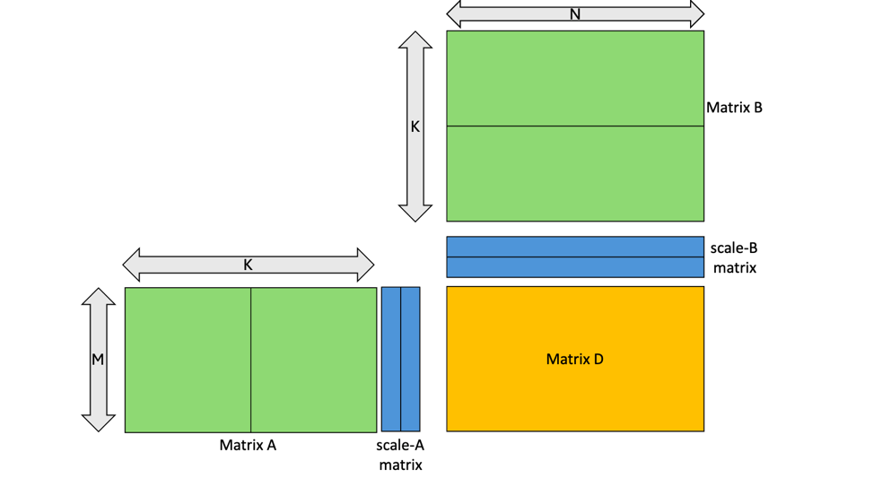
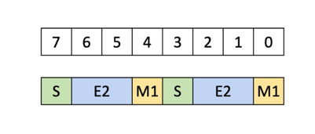
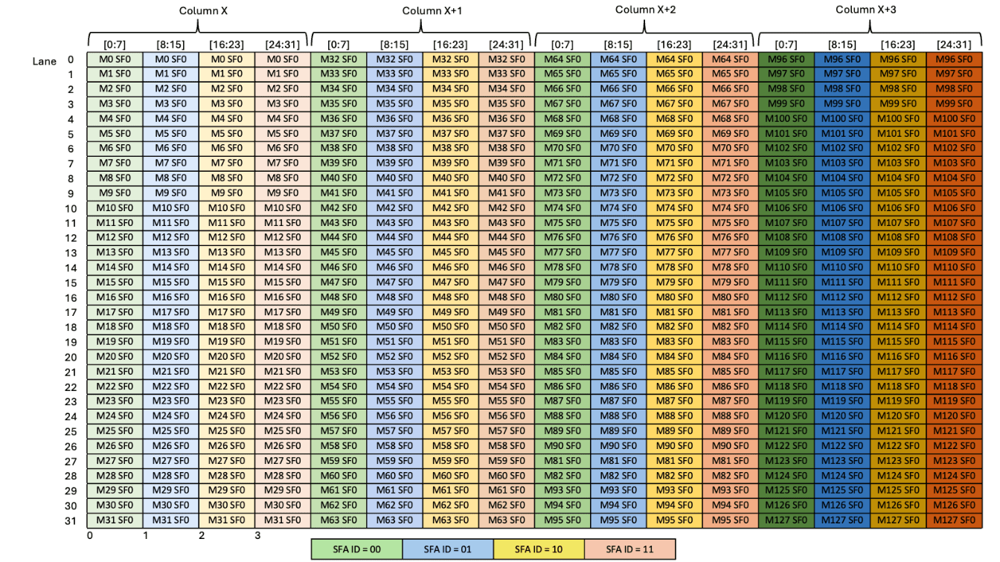
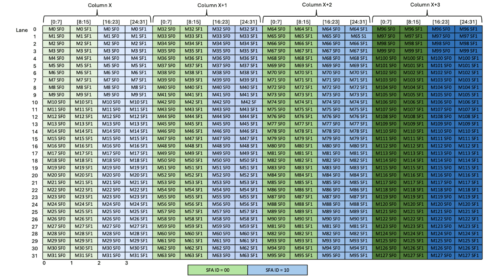
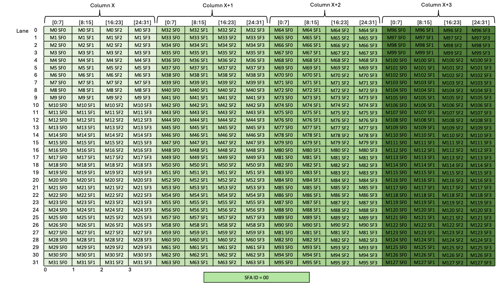
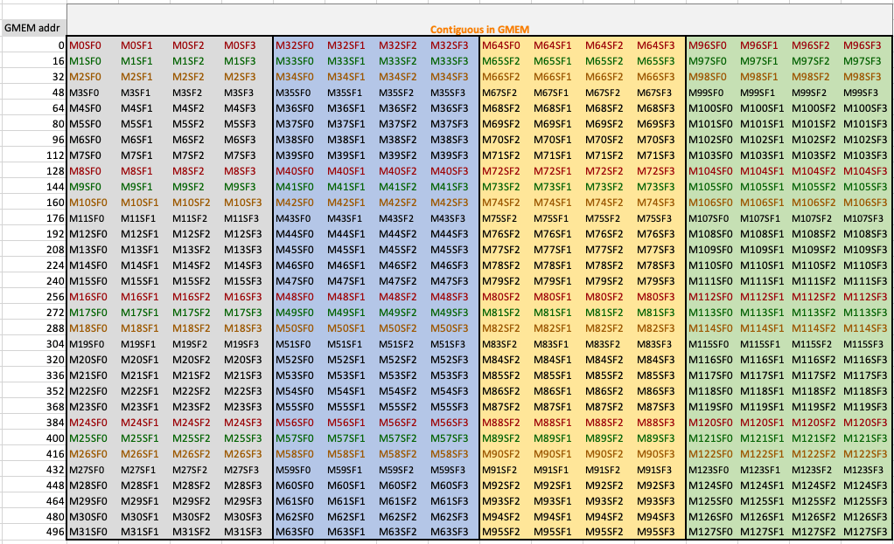
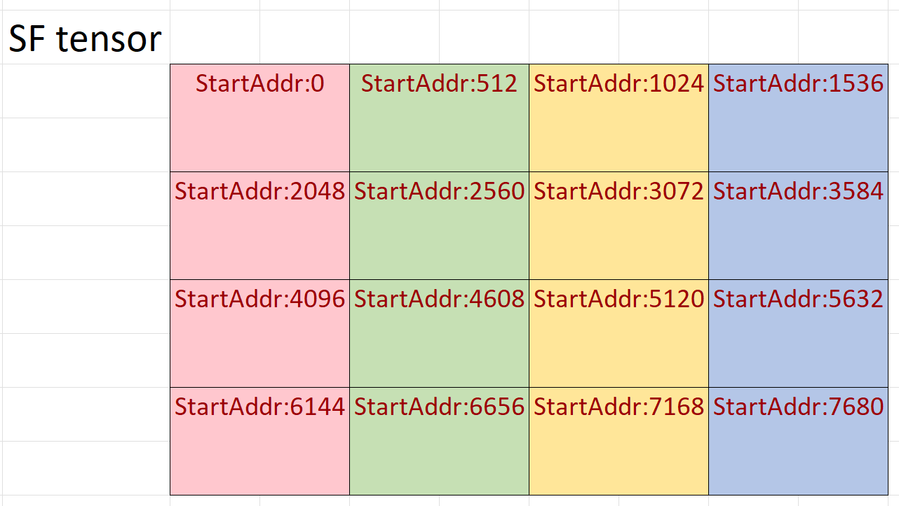
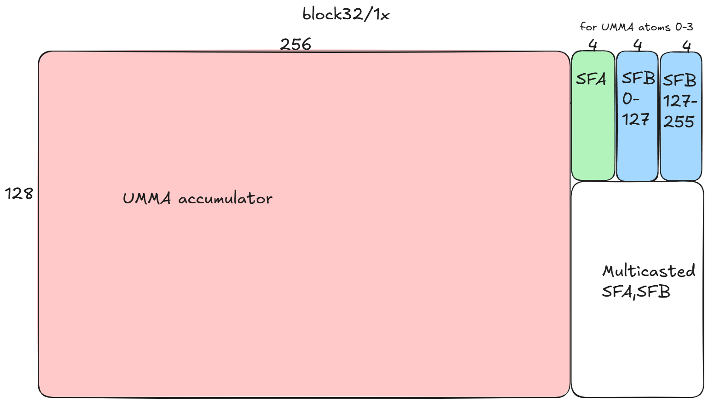
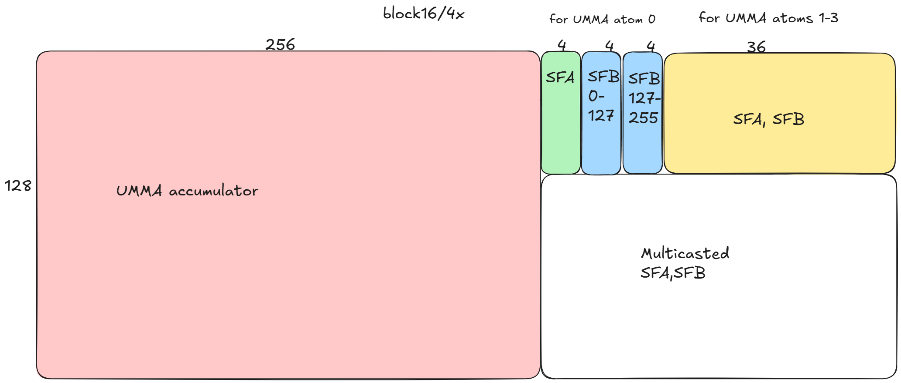
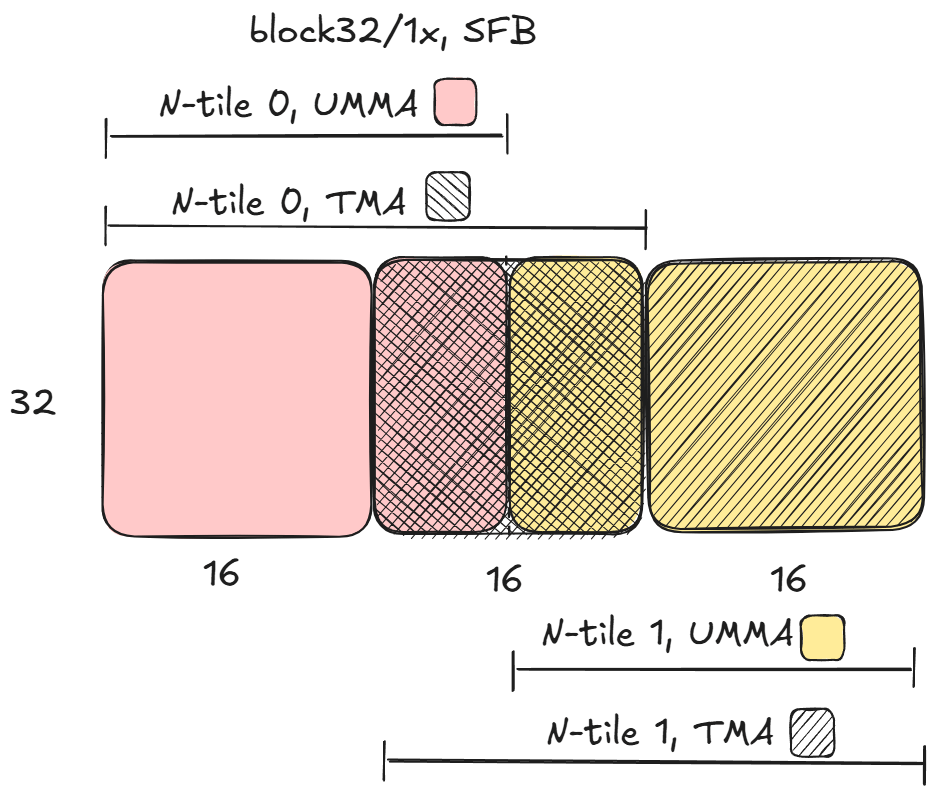

# CUTLASS Tutorial: Hardware-supported Block-scaling with NVIDIA Blackwell GPUs

**Date:** March 5, 2026

**Source:** [https://research.colfax-intl.com/cutlass-tutorial-hardware-supported-block-scaling-with-nvidia-blackwell-gpus/](https://research.colfax-intl.com/cutlass-tutorial-hardware-supported-block-scaling-with-nvidia-blackwell-gpus/)

---

Welcome to part 4 of our series investigating GEMM on the NVIDIA Blackwell architecture. So far we have discussed the capabilities of the new Blackwell Tensor Core UMMA instructions, including handling sub-byte data types, and how to work with them in CUTLASS. In this part, we will continue our exploration of low-precision computation by discussing how to utilize the blockscaling support with UMMA.

# Review of blockscaling

We briefly discussed blockscaling in the last post, but in short it is a dequantization technique where the operand data is multiplied by a scale factor before multiply-add. More precisely:

```
D = (A * scale_A) @ (B * scale_B) + C
```

In AI applications, blockscaling is used to compensate for the low dynamic range of low-precision number formats by using the scale factors to scale all entries of an originally high-precision weight or activation tensor to a uniform range before quantizing. To achieve the scaling, there is a range of granularities used for the scale factors. At one extreme, we could scale each matrix entry individually; at the other extreme, we could associate a single, common scale factor to the entire matrix. Blackwell Tensor Cores offer hardware support for intermediate schemes, in which (for dense GEMM) each row/column is divided into 16 or 32 element chunks in the K-mode, and each chunk is multiplied by its own scale factor. 



<p align="center"><em>**Figure 1.**Blockscaled GEMM, from the [PTX documentation](https://docs.nvidia.com/cuda/parallel-thread-execution/#tcgen05-mma-block-scaling).</em></p>

Here, each row/column of A and B is divided into two chunks and multiplied by two scale factors. To put it another way, we can have a scaling factor for every 16- or 32-element vector in the K-mode. The allowed number and size of chunks depends on the data type, which we will discuss next.

# Data types for blockscaled GEMM

In the [previous post](https://research.colfax-intl.com/cutlass-tutorial-sub-byte-gemm-on-nvidia-blackwell-gpus/), we discussed the five sub-byte floating-point formats used on Blackwell. The basic components of operand matrices for blockscaled GEMM are best thought of as objects of a new data type: fixed-length vectors of low-precision numbers, together with a scale factor for each vector. Blackwell blockscaling supports five different combinations of operand data type, vector length and scale factor data type.

<table class="has-fixed-layout"><tbody><tr><td></td><td>Operand data type</td><td>Vector length (elements)</td><td>Scale factor data type</td></tr><tr><td>mxf8</td><td>E5M2, E4M3</td><td>32</td><td>UE8M0</td></tr><tr><td>mxf6</td><td>E3M2, E2M3</td><td>32</td><td>UE8M0</td></tr><tr><td>mxf4</td><td>E2M1</td><td>32</td><td>UE8M0</td></tr><tr><td>nvf4</td><td>E2M1</td><td>16</td><td>UE4M3</td></tr></tbody></table>

The scale factors are always unsigned 8-bit floating point numbers. The `UE4M3` type used for `nvf4` is simply a nonnegative `E4M3` floating point number (i.e., the sign bit is always 0). The `UE8M0` type, by contrast, uses all 8 bits to represent a floating-point exponent in the standard, biased way – thus, the possible values of a `UE8M0` scale factor are 2^x with -127 ≤ x ≤ 127. Both types support NaN but not infinity. Compared to `UE8M0`, `UE4M3` offers more accuracy at the expense of greatly reduced range — the maximum possible value is just 448, making the largest value expressible in an `nvf4` vector 6 x 448 = 2688.

The three mx types were formalized in the Open Compute Project’s Microscaling Format specification ([PDF](https://www.opencompute.org/documents/ocp-microscaling-formats-mx-v1-0-spec-final-pdf)), whereas the `nvf4` format is [NVIDIA specific](https://developer.nvidia.com/blog/introducing-nvfp4-for-efficient-and-accurate-low-precision-inference/).  Compared to mx types, the `nvf4` format offers a more granular scaling factor along with fewer elements per scale factor, but consequently results in twice as many bytes used for scale factors.

# PTX for blockscaled UMMA

The syntax of the UMMA PTX instruction with blockscaling is as follows:

```
tcgen05.mma.cta_group.kind.block_scale{.scale_vectorsize}
                                        [d-tmem],  a-desc,  b-desc, idesc,
                                        [scale-A-tmem], [scale-B-tmem],enable-input-d;

tcgen05.mma.cta_group.kind.block_scale{.scale_vectorsize}
                                        [d-tmem], [a-tmem], b-desc, idesc,
                                        [scale-A-tmem], [scale-B-tmem],enable-input-d;

.kind = { .kind::mxf8f6f4, .kind::mxf4, .kind::mxf4nvf4 }
.cta_group      = { .cta_group::1,   .cta_group::2 }
.scale_vectorsize = { .scale_vec::1X, .scale_vec::2X, .scale_vec::4X, .block16, .block32 }
```

Most of this syntax was discussed in [Part 1](https://research.colfax-intl.com/cutlass-tutorial-writing-gemm-kernels-using-tensor-memory-for-nvidia-blackwell-gpus/), including instruction descriptors, SMEM descriptors for A and B, the ability to read A from TMEM instead of SMEM, and the `enable-input-d` flag to accumulate onto D rather than overwriting it. New for the blockscaled instructions, the scale factors must be read out of TMEM; the `scale-A-tmem` and `scale-B-tmem` arguments expect their base addresses, i.e. the TMEM addresses of their (0, 0) entries. In addition to the TMEM layouts for the scale factors, we have to explain the `.kind` and `.scale_vectorsize` qualifiers.

## .kind

The `.kind` qualifier has three options:

- `mxf8f6f4` – mixed input that supports 8, 6 and 4-bit data types.
- `mxf4` – 4-bit input with `ue8m0` scale factor.
- `mxf4nvf4` – a more general instruction for 4-bit input.

 The qualifier type affects the available operand data types and scale factor types.

The qualifier `mxf8f6f4` is the blockscaled version of the `f8f6f4` data type that we have discussed in the previous post. It has the exact same requirements as `f8f6f4` – the same available input types for the operands as well as the 16-byte SMEM/TMEM padding requirements as the `f8f6f4` type. So we will defer to the previous post for the operands of `mxf8f6f4`.

`mxf4` and `mxf4nvf4` both only apply to 4-bit input, specifically `e2m1`. The advantage of using the 4-bit exclusive version is that, unlike the `mxf8f6f4` data type, the 4-bit data types do not need to be padded. Instead, two elements can be packed into a single 8-bit container:



<p align="center"><em>**Figure 2.** Packing of 4-bit values in SMEM, from the [PTX documentation](https://docs.nvidia.com/cuda/parallel-thread-execution/index.html#tcgen05-packing-formats-mxf4-tmem-dig1).</em></p>

This will reduce the SMEM usage by a factor of two compared to using 4-bit data types with the `mxf8f6f4` qualifier. For this reason, if you know that the workload exclusively uses fp4, it is recommended to use `mxf4` or `mxf4nvf4`.

`mxf4` further assumes that the scale factor type is `ue8m0`, while for `mxf4nvf4`, both scale factor types are possible. The scale factor data type, like the operand types, is specified at runtime through the [instruction descriptor](https://docs.nvidia.com/cuda/parallel-thread-execution/#tcgen05-instruction-descriptor).

## .scale_vectorsize

By setting the `.scale_vectorsize` qualifier to `.block16` or `.block32`, one can specify the number of operand entries per scale factor: 32 for the mx types, 16 for `nvf4`.

Internally, however, the Tensor Core appears to think about the vector size in a different way. Recall that UMMA input atoms of A and B are always 32 bytes wide in the K-mode (we’ll call these “UMMA atom rows”, thinking of the K-mode as the row mode for both matrices).  We’ll write `atom_K` for the size of an MMA atom, so `atom_K = 32` for `mxf8f6f4` and `atom_K = 64` for `mxf4` and `mxf4nvf4`.  As in earlier posts, we’ll use (bM, bN, bK) for the size of a mainloop tile, which will typically consist of several UMMA atoms, repeated in the K-mode. In this post, we’ll always take `bK` to add up to 4 UMMA atoms (128 bytes or 1 cache line), so `bK = 128` for 8-bit inputs and `bK = 256` for 4-bit inputs.

Now, specifying the scale vector size is equivalent to specifying the number of scale factors consumed by a UMMA atom row:

```
atom_SFK = atom_K / sf_vec_size
```

The `.block16` and `.block32` qualifiers are in fact aliases for `.scale_vec::1X`, `2X`, and `4X`, where the number 1, 2, or 4 is the number of scale factors per UMMA atom row. This directly affects the shape of the scale factors consumed by UMMA, as seen in the table below; it also affects the scale factor layout in TMEM, as we’ll see in the next section.

<table class="has-fixed-layout"><tbody><tr><td></td><td>.scale_vec::1X</td><td>.scale_vec::2X</td><td>.scale_vec::4X</td></tr><tr><td>Shape of scale_A</td><td>M x 1</td><td>M x 2</td><td>M x 4</td></tr><tr><td>Shape of scale_B</td><td>N x 1</td><td>N x 2</td><td>N x 4</td></tr></tbody></table>

Not all options are available to the different data types. The full table can be found in the [PTX docs](https://docs.nvidia.com/cuda/parallel-thread-execution/index.html#tcgen05-mma-scale-valid-comb-detail). Notably, block32 is the only option supported for the `mxf8f6f4` and `mxf4` operand types. For the former, one has `.scale_vec` = 1X, since the only supported value of `atom_K` is 32. For the latter, one has `.scale_vec` = 2X, since the only supported value of `atom_K` is 64. `mxf4nvf4` supports block16 (which is equivalent to `.scale_vec` = 4X) or block32 (`.scale_vec` = 2X); block32 must be paired with `E8M0` while block16 can be paired with either `E8M0` or `E4M3`.

# Scale factor Layouts

Finally, let’s discuss how the scale factor must be stored for UMMA to consume. UMMA consumes the scale factor from TMEM. The layout of scale factors in TMEM depends on the value of `.scale_vec`. In this section we will go over three examples, showing 1X, 2X and 4X cases. For simplicity, we restrict to dense MMA and `bM` = 128 per CTA. `bN` is variable from 8 to 256. 

## block32/1X with atom_K=32 for mxf8f6f4

This format is the only option available for the `mxf8f6f4` data type, and is only used for this data type. Let’s begin with the A matrix. The scale factor vector is Mx1 per MMA block. This vector is expected to be stored in a 1-byte aligned sub-column (each column consists of 4 sub-columns) of a 32 lane x 4 column tile, with the sub-column indexed by a two bit `SFA_ID`. 



<p align="center"><em>**Figure 3.** TMEM scale factor layout for `.scale_vec::1X`, from the [PTX documentation](https://docs.nvidia.com/cuda/parallel-thread-execution/index.html#tcgen05-mma-scale-factor-a-1x-dig).</em></p>

Note that this diagram represents 4 different UMMAs, one for each sub-column. For example, one UMMA will use the scale factors stored in sub-column `SFA_ID`=00 across the 4 columns, another will use the `SFA_ID`=01 values and so on. Which sub-column the UMMA uses is set in the instruction descriptor. See e.g. [table 43 in the PTX documentation](https://docs.nvidia.com/cuda/parallel-thread-execution/index.html#tcgen05-instruction-descriptor), which documents bits 29-30 of the instruction descriptor being used for `SFA_ID`. Since we assume `bM` = 128, 4 columns of TMEM will always be used for SFA.

For the SFB matrix, it is the exact same format as SFA except that we use variable numbers of columns, between 1 and 8, depending on the selected bN value (from 8 to 256). At most, 12 columns of TMEM are required in total for both scale factors.

Note that although we only use 32 lanes of TMEM for these sf tiles, we’ll see later that the other 96 lanes are also occupied and thus not usable for other purposes.  

## block32/2X with atom_K=64 for mxf4/mxf4nvf4

This format is the only option available for `mxf4` data type, and is used for both `mxf4` and `mxf4nvf4` types. Let’s once again begin with the A matrix. The scale factor vector is Mx2 per MMA block. This vector is expected to be stored in two adjacent sub-columns aligned to 2 bytes. The sub-column is still indexed by a two bit `SFA_ID` by the starting subcolumn, so the two options are 00 and 10. 



<p align="center"><em>**Figure 4.** TMEM scale factor layout for `.scale_vec::2X`, from the [PTX documentation](https://docs.nvidia.com/cuda/parallel-thread-execution/index.html#tcgen05-mma-scale-factor-a-2x-dig).</em></p>

This diagram represents 2 different UMMAs; one using the scale factors stored in `SFA_ID`=00 and another in the `SFA_ID`=10. And once again, the format for B scale factor is the same except for the variable number of columns. Since `bK` = 256 because of the 4-bit input, the TMEM requirements for the scale factors double: 8 columns for SFA, and up to 16 for SFB.

## block16/4X with atom_K=64 for mxf4nvf4

This format is only available for the `mxf4nvf4` data type. Once again beginning with the A matrix, the scale factor vector is Mx4 per MMA block. In this case the only valid SFA_ID is 00.



<p align="center"><em>**Figure 5.** TMEM scale factor layout for `.scale_vec::4X`, from the [PTX documentation](https://docs.nvidia.com/cuda/parallel-thread-execution/index.html#tcgen05-mma-scale-factor-a-4x-dig).</em></p>

This diagram is for a single UMMA. And although there is only one valid `SFA_ID` of 00, it is still needed as it is used for the instruction descriptor. And once again, B is the same save for the variable number of columns. There are now twice as many scale factors per mainloop tile, so we need even more TMEM: 16 columns for SFA, and up to 32 for SFB, for a max of 48 total.

# CUTLASS Blockscaling Implementation

Now let’s discuss the implementation of blockscaling in CUTLASS, referring to the CuTeDSL example [dense_blockscaled_gemm_persistent.py](https://github.com/NVIDIA/cutlass/blob/3476ddb7bd6ca4161a0169103ceaa20ce0eb891f/examples/python/CuTeDSL/blackwell/dense_blockscaled_gemm_persistent.py), and focusing on the differences from a standard UMMA.

## Operands

First the operands. We discussed in the previous post the requisite data format in SMEM for `f8f6f4`, and the special TMA tensor maps for sub-byte types; the exact same requirements and instructions are used for the `mxf8f6f4`.  Tile sizes for blockscaled GEMM are more constrained: we now require `bM` = 128 for 1-CTA MMA and 128 or 256 for 2-CTA MMA. For simplicity, we’ll ignore the case of 2-CTA MMA with `bM` = 128.

When using either the `mxf4` or `nvf4` data types, we saw earlier that the data is packed into 1 byte in SMEM. Just like the other sub-byte data types, there is a special TMA tensor map `CU_TENSOR_MAP_DATA_TYPE_16U4_ALIGN8B` that is used for this TMA operation. As this is a packed data type, there is no change needed for the layouts; CUTLASS abstracts the sub-byte nature of the TMA underneath. 

## Scale factor layouts

Scale factors are always in an 8-bit dtype, so they can be TMA loaded like any other 8-bit dtype. However, this load presents a different wrinkle. The scale factors must ultimately be organized in TMEM in the layout described above to be consumed by the Tensor Core. The simplest way to set up the load is to arrange them in GMEM in the *same layout*. This image from the [CUTLASS documentation](https://docs.nvidia.com/cutlass/4.3.4/media/docs/cpp/blackwell_functionality.html#scale-factor-layouts) shows a picture of a GMEM tile for SFA with this layout:



<p align="center"><em>**Figure 6.** GMEM layout for a tile of SFA in the interleaved layout. Note that this entire tile should be contiguous in GMEM. From the [CUTLASS documentation](https://docs.nvidia.com/cutlass/4.3.4/media/docs/cpp/blackwell_functionality.html#scale-factor-layouts).</em></p>

This 512B tile would then be tiled over the entire SFA tensor:



<p align="center"><em>**Figure 7.** GMEM layout for SFA, created by tiling the basic tile of Figure 6 over all of SFA. From the [CUTLASS documentation](https://docs.nvidia.com/cutlass/4.3.4/media/docs/cpp/blackwell_functionality.html#scale-factor-layouts).</em></p>

For tiling operations, it’s often also convenient to include the scale factor vector size (i.e., block16 or block32) itself in the shape as a broadcasted dimension (with stride 0), and to group the static modes together. For example, for block16 we would have for the broadcasted SFA layout

```
(((32, 4), REST_M), ((16, 4), REST_K)) : (((16, 4), 512 * REST_K), ((0, 1), 512))
```

A tile with this **interleaved layout** can be transparently loaded from GMEM to SMEM and then from SMEM to TMEM in a vectorized, coalesced, bank-conflict-free way. Note that this is independent of the scale factor vector size or MMA k-tile size – these only determine what corresponding data needs to be loaded from A, and how many MMA atoms the above tile corresponds to.

Naïvely quantizing might instead produce a scale factor tensor which is simply K-major. In this case, we’d have to permute and render it contiguous to get it in the interleaved layout:

```
def interleave_sf_tensor(sf: torch.Tensor) -> torch.Tensor:
    M, SF_K = sf.shape
    REST_M = M // 128
    REST_K = SF_K // 4
    # Reshape M -> (REST_M, 4, 32), SF_K -> (REST_K, 4)
    out = sf.reshape(REST_M, 4, 32, REST_K, 4)
    # Permute to (REST_M, REST_K, 32, 4, 4)
    # and make contiguous to get right strides
    out = out.permute(0, 3, 2, 1, 4).contiguous()
    # Permute to (32, 4, REST_M, 4, REST_K)
    out = out.permute(2, 3, 0, 4, 1)
    return out
```

Note that we didn’t unsqueeze to get the broadcasted mode, nor did we group modes as for the cute layout since this isn’t supported for torch tensors; we also could have just returned the contiguous tensor of shape `(REST_M, REST_K, 32, 4, 4)`. In reality, the scale factor tensor will be endowed with the appropriate cute layout internally in the kernel.

Furthermore, if quantized data was produced by an upstream kernel, then that kernel could also write out the scale factors in this interleaved format in order to eliminate the additional memory movement kernel.

## Tiled MMA

CuTeDSL provides a helper function, `make_blockscaled_trivial_tiled_mma`, to define the tiled MMA used by the kernel.

```
tiled_mma = sm100_utils.make_blockscaled_trivial_tiled_mma(
    self.a_dtype,
    self.a_major_mode,
    self.b_major_mode,
    self.sf_dtype,
    self.sf_vec_size,
    self.cta_group,
    self.mma_inst_shape_mn, 
)
```

Looking inside the helper function, we see objects that correspond fairly directly to the PTX instructions mentioned earlier:

```
if ab_dtype in {Float8E4M3FN, Float8E5M2}:
    mma_op = MmaMXF8Op(
        ab_dtype,
        (*mma_tiler_mn, 32), # mma instruction shape, e.g. (128, 256, 32)
                             # atom_K must be 32 bytes
        cta_group,           # specifies 1 or 2 CTA UMMA
        a_source,            # can be SMEM or TMEM
        a_leading_mode,       # mxfp8 allows A and B operands to be either major
        b_leading_mode,
    ) 
elif ab_dtype == Float4E2M1FN:
    # atom_K = 64 for an instruction, and operands must be K-major
    if sf_vec_size == 32:
        mma_op = MmaMXF4Op(
            (*mma_tiler_mn, 64),
            cta_group,
            a_source,)
    elif sf_vec_size == 16:
        mma_op = MmaMXF4NVF4Op(
            sf_dtype,      # can be either E8M0 or E4M3
            (*mma_tiler_mn, 64),
            cta_group,
            a_source,)
return cute.make_tiled_mma(
    cute.make_mma_atom(mma_op, loc=loc, ip=ip), loc=loc, ip=ip)
```

Recall that atom_K must be 32 for `MXF8` or 64 for `MXF4/MXF4NVF4`. Because of the structure of the TMEM scale factors and the interleaved layout, it makes sense to load enough data to compute 4 MMA atoms at once, leading to the following mma_tiler (and `bK = 4 * atom_K`).

```
mma_inst_shape_k = cute.size(tiled_mma.shape_mnk, mode=[2])
mma_inst_tile_k = 4
self.mma_tiler = (
    self.mma_inst_shape_mn[0],
    self.mma_inst_shape_mn[1],
    mma_inst_shape_k * mma_inst_tile_k,
)
```

## TMA load of operands and scale factors

The tiled MMA can then be used to define the TMA atoms using more helper functions:

```
a_op = sm100_utils.cluster_shape_to_tma_atom_A(
    self.cluster_shape_mn, tiled_mma.thr_id
)
a_smem_layout = cute.slice_(self.a_smem_layout_staged, (None, None, None, 0))
tma_atom_a, tma_tensor_a = cute.nvgpu.make_tiled_tma_atom_A(
    a_op,
    a_tensor,
    a_smem_layout,
    self.mma_tiler,
    tiled_mma,
    self.cluster_layout_vmnk.shape,
)
```

The same method can be used to construct the TMA atom for SFA. Despite the interleaved layout, each 128 x `sf_tile_size_k` of SFA is still contiguous in GMEM, and this is precisely what a CTA loads per TMA call.  

Note that the above `tma_atom_a` and `tma_tensor_a` are created on host and then passed as arguments into device code, where `tma_tensor_a` is renamed to `mA_mkl`, and a sequence of operations gives the correct information for the `g2s` load per CTA and per mainloop iteration.  These operations are similar for B and SFA and similar to what we’ve seen in CUTLASS C++. For example, we track the sequence of gmem SFA tensor manipulations below:

```
# (bM, bK, RestM, RestK, RestL)
gSFA_mkl = cute.local_tile(
    mSFA_mkl, cute.slice_(self.mma_tiler, (None, 0, None)), (None, None, None)
)
...
# (MMA, MMA_M, MMA_SFK, RestM, RestK, RestL)
tCgSFA = thr_mma.partition_A(gSFA_mkl)
# ((atom_v, rest_v), RestM, RestK, RestL)
tAsSFA, tAgSFA = cute.nvgpu.cpasync.tma_partition(
    tma_atom_sfa,
    block_in_cluster_coord_vmnk[2],
    sfa_cta_layout,
    cute.group_modes(sSFA, 0, 3),
    cute.group_modes(tCgSFA, 0, 3),
)
tAsSFA = cute.filter_zeros(tAsSFA)
tAgSFA = cute.filter_zeros(tAgSFA)
...
# after assignment of worktiles:
# ((atom_v, rest_v), RestK)
tAgSFA_slice = tAgSFA[
    (None, mma_tile_coord_mnl[0], None, mma_tile_coord_mnl[2])
]
…
cute.copy(
    tma_atom_sfa,
    tAgSFA_slice[(None, ab_producer_state.count)],
    tAsSFA[(None, ab_producer_state.index)],
    ...
)
```

Note that `gSFA_mkl` does not actually slice into `mSFA_mkl` but is rather just a rearrangement.  Since the kernel uses a persistent tile scheduler, this separates out logic that does not depend on the particular work tile – we retain the `RestM` mode until we get to the code where the work tile is assigned and then `tAgSFA` is sliced to become `tAgSFA_slice` before the call to TMA copy.

SFA and SFB are needed at the same point of the kernel as A and B, so they can be loaded using the same TMA pipeline.

The helper functions `make_smem_layout_sfa` and `make_smem_layout_sfb` from `cutlass.utils.blockscaled_layout` are used to construct SMEM layouts for the scale factors that are well-suited for the GMEM -> SMEM -> TMEM copies.

For `mxf8` and a 128 x 256 tile, these look like this:

```
# sfa_smem_layout_staged:
# (((sf_tile_M, rest_atom_M), (sf_vec_K, rest_atom_K)), MMA_M, MMA_K, STAGE)
((((32,4),1),(32,1)),1,4,4):((((16,4),0),(0,0)),0,1,512)

# sfb_smem_layout_staged:
# (((sf_tile_N, rest_atom_N), (sf_vec_K, rest_atom_K)), MMA_N, MMA_K, STAGE)
((((32,4),2),(32,1)),1,4,4):((((16,4),512),(0,0)),0,1,1024)
```

Notice the following:

- The `sfa_smem_layout_staged`’s layout matches the TMEM diagram of Figure 4:
  - 32 : 0 corresponds to sf_vec_K — a single SFA element being applied to 32 elements of A in the K direction
  - In this case, 32 is also the K extent of an MMA atom.
  - 4 : 1 corresponds to MMA_K — 4 contiguous SFA elements are used for 4 separate MMA atoms repeated in the K direction
  - (32, 4) : (16, 4) corresponds to sf_tile_M — 32 scale factor rows correspond to 32 MMA A rows (strided by 1 row of a tile, i.e. 16 values, in GMEM and SMEM), then the next 32 MMA A rows are repeated 4 columns later in the scale factor layout, and so on.
- `sfb_smem_layout_staged` is similar, except notice that there is a nontrivial mode 2 : 512 for `rest_atom_N`.  This implies interleaving of scale factors at another, coarser scale – the SF tile needs to be repeated one more time for N128 to N255, so each SF tile only holds scale factors for half of the B operand of a UMMA atom.
- Since each scale factor tile is contiguous in SMEM and will be copied to TMEM by the warp-wide `tcgen05.cp` instruction, it does not need to be swizzled.

If we were instead doing `nvf4` GEMM (corresponding to the `.block16/.scale_vec::4X` TMEM layout of Figure 5), the scale factor tiles would look like this:

```
# sfa_smem_layout_staged: 
# (((sf_tile_M, rest_atom_M), (sf_vec_K, rest_atom_K)), MMA_M, MMA_K, STAGE)
((((32,4),1),(16,4)),1,4,3):((((16,4),0),(0,1)),0,512,2048)

# sfb_smem_layout_staged: 
# (((sf_tile_N, rest_atom_N), (sf_vec_K, rest_atom_K)), MMA_N, MMA_K, STAGE)
((((32,4),2),(16,4)),1,4,3):((((16,4),2048),(0,1)),0,512,4096)
```

Notice now that:

- `sf_vec_K` has shrunk to 16 but `rest_atom_K` (for a mainloop tile) has risen to 4, because each MMA atom consumes 64 K values. This also means that each MMA atom consumes an entire interleaved tile of SFA and SFB.
- The `MMA_K` mode has a stride of 512 — to accommodate 4 MMA atoms, we need 4 scale factor tiles, which have 32x4x4=512 elements.
- The `rest_atom_N` mode for `sfb_smem_layout_staged` has a stride of 2048 – so scale factors for one half of a UMMA atom are actually several SF tiles apart in SMEM.  We will see that is not the case in TMEM where scale factors for the two halves are adjacent, so there is some permuting done by the `s2t` copy.
- In total, there are four times as many bytes used for scale factors compared to block32/1X.

We also show the layouts for block32/2X and leave understanding them as an exercise for the reader:

```
# sfa_smem_layout_staged: 
# (((sf_tile_M, rest_atom_M), (sf_vec_K, rest_atom_K)), MMA_M, MMA_K, STAGE)
((((32,4),1),(32,2)),1,(2,2),4):((((16,4),0),(0,1)),0,(2,512),1024)

# sfb_smem_layout_staged: 
# (((sf_tile_N, rest_atom_N), (sf_vec_K, rest_atom_K)), MMA_N, MMA_K, STAGE)
((((32,4),2),(32,2)),1,(2,2),4):((((16,4),1024),(0,1)),0,(2,512),2048)
```

## Loading Scale Factor Data to TMEM

Once loaded to SMEM, the scale factor data then needs to be loaded to TMEM. This is done using the asynchronous [`tcgen05.cp` instruction](https://docs.nvidia.com/cuda/parallel-thread-execution/index.html#tcgen05-instructions-tcgen05-cp). Like `tcgen05.ld` and `tcgen05.st`, `tcgen05.cp` can only move data in a [very limited set of patterns](https://docs.nvidia.com/cuda/parallel-thread-execution/index.html#tcgen05-data-movement-shape), but these are sufficient for this type of kernel. This operation should be done by the warp issuing MMA, since both the SMEM -> TMEM copy (`tcgen05.cp`) and the MMA instruction (`tcgen05.mma`) are asynchronous instructions that are ordered on the same internal pipeline.

In the MMA warp’s branch we see:

```
# Accumulator TMEM tensor
acc_tmem_ptr = tmem.retrieve_ptr(self.acc_dtype)
# (MMA, MMA_M, MMA_N, STAGE)
# ((128,256),1,1,1):((65536,1),0,0,0)          
tCtAcc_base = cute.make_tensor(acc_tmem_ptr, tCtAcc_fake.layout)

# SFA TMEM tensor
sfa_tmem_ptr = cute.recast_ptr(
    acc_tmem_ptr + tcgen05.find_tmem_tensor_col_offset(tCtAcc_base),
    dtype=self.sf_dtype,
)
tCtSFA_layout = blockscaled_utils.make_tmem_layout_sfa(
    tiled_mma,
    self.mma_tiler,
    self.sf_vec_size,
    cute.slice_(sfa_smem_layout_staged, (None, None, None, 0)),
)
tCtSFA = cute.make_tensor(sfa_tmem_ptr, tCtSFA_layout)
# Construction of tCtSFB is similar
```

The utility function `find_tmem_tensor_col_offset`, as its name suggests, returns the number of columns (in 32-bit cells) that the input tensor takes up in TMEM.  For mxf8 with (128, 256) tile size,

```
tcgen05.find_tmem_tensor_col_offset(tCtAcc_base) = 256
tcgen05.find_tmem_tensor_col_offset(tCtSFA) = 4
tcgen05.find_tmem_tensor_col_offset(tCtSFB) = 8
```

as expected.

Printing out `tCtSFA` and `tCtSFB` gives 

```
# tCtSFA:
# (((atom_M, multicast_M), (sf_vec_K, rest_atom_K)), MMA_M, MMA_K)
((((32,4),4),(32,1)),1,4):((((262144,4),8388608),(0,0)),0,1)
# tCtSFB: 
# (((atom_N, multicast_N), (sf_vec_K, rest_atom_K)), MMA_N, MMA_K)
((((32,8),4),(32,1)),1,4):((((262144,4),8388608),(0,0)),0,1)
```

The shapes are almost identical to the shapes of these tensors in SMEM, but there are some strange-looking numbers that deserve more attention:

- 32 : 262144 refers to the 32 lanes of SFA. As we saw in [part 1 of this series](https://research.colfax-intl.com/cutlass-tutorial-writing-gemm-kernels-using-tensor-memory-for-nvidia-blackwell-gpus/), neighboring lanes in TMEM have their addresses strided by 65536 (see also the [PTX documentation](https://docs.nvidia.com/cuda/parallel-thread-execution/index.html#tensor-memory-layout)). However, TMEM columns are 4 bytes wide, and CUTLASS internally adds two low bits to the address to keep track of the position of a byte inside a column. So the stride between lanes for byte-sized data, from CUTLASS’s point of view, is 4 * 65536 = 262144.
- This is corroborated by 4 : 1 for MMA_K — these separate scale factors are adjacent bytes which live in the same TMEM column.

4 : 8388608, where 8388608 = 32 * 262144, is a new mode we’ve called “multicast”. As we discussed in [part 1](https://research.colfax-intl.com/cutlass-tutorial-writing-gemm-kernels-using-tensor-memory-for-nvidia-blackwell-gpus/), a warp can typically only load to or store from 32 lanes of TMEM, corresponding to its position in its warpgroup. However, it’s possible with `tcgen05.cp` for one warp to copy the same data to all 4 32-lane quadrants, and this is what is being done here. To be precise, the s2t copy constructed in the kernel’s [`mainloop_s2t_copy_and_partition` method](https://github.com/NVIDIA/cutlass/blob/main/examples/python/CuTeDSL/blackwell/dense_blockscaled_gemm_persistent.py#L1534) is an instance of the CUTLASS class `cute.nvgpu.tcgen05.Cp4x32x128bOp`, which warps `tcgen05.cp` with `.shape = .32x128b` (i.e., 1 SF tile) and `.multicast = .warpx4`. From the point of view of the MMA, the [PTX documentation](https://docs.nvidia.com/cuda/parallel-thread-execution/index.html#tcgen05-block-scaling) confirms that “Scale factors for A and B matrices need to be duplicated to all 32 lane partitions of tensor memory.”

So, the TMEM layout for this case looks like this:



<p align="center"><em>**Figure 8.** TMEM layout for mxf8 GEMM with 128×256 tile size.</em></p>

Likewise, the printout for the `s2t` copy looks like this:

```
  Tiled Copy
  Tiler MN:        (512:1,1:0,4:1)
  TV Layout tiled: (1,(32,(4,4),4)):(0,(1,(512,32),128))
Copy Atom
  ThrID:           1:0
  TV Layout Src:   (1,(4,128,4)):(0,(1,4,0))
  TV Layout Dst:   (1,2048):(0,1)
  Value type:      f8E8M0FNU
```

We see here that the value layouts have size 4 times as much as the 32*16 SFA elements in a single diagram atom, but the source has a 4:0 broadcast mode, corresponding to multicast. As with [tiled MMAs for UMMA](https://research.colfax-intl.com/cutlass-tutorial-writing-gemm-kernels-using-tensor-memory-for-nvidia-blackwell-gpus/), the ThrID indexes CTAs participating in the MMA rather than threads.

Again, let’s compare this to the printouts for `nvf4` (`.block16/.scale_vec::4X`).

```
# (((atom_M, multicast_M), (sf_vec_K, rest_atom_K)), MMA_M, MMA_K)
((((32,4),4),(16,4)),1,4):((((262144,4),8388608),(0,1)),0,16)
# (((atom_N, multicast_N), (sf_vec_K, rest_atom_K)), MMA_N, MMA_K)
((((32,8),4),(16,4)),1,4):((((262144,4),8388608),(0,1)),0,32)
```

Just like in SMEM, SF values for `tCtSFA` for adjacent UMMA atoms are 16 columns apart (i.e. one SF tile apart), compared to 1 column apart with block32/1x. Unlike in SMEM, the SF value for `tCtSFB` corresponding to e.g. `N`=0 and `N`=128 in a UMMA atom are in adjacent SF tiles rather than 4 SF tiles apart.   

The objects occupying TMEM for block16/4x look like this:



<p align="center"><em>**Figure 9.**TMEM layout for nvf4 GEMM with 128×256 tile size.</em></p>

## Issuing GEMM

Finally we look at the mainloop:

```
for k_tile in range(k_tile_cnt):
    if is_leader_cta:
        # Conditionally wait for AB buffer full
        ab_pipeline.consumer_wait(
            ab_consumer_state, peek_ab_full_status
        )
        # Copy SFA/SFB from smem to tmem
        s2t_stage_coord = (
            None,
            None,
            None,
            None,
            ab_consumer_state.index,
        )
        tCsSFA_compact_s2t_staged = tCsSFA_compact_s2t[s2t_stage_coord]
        tCsSFB_compact_s2t_staged = tCsSFB_compact_s2t[s2t_stage_coord]
        cute.copy(
            tiled_copy_s2t_sfa,
            tCsSFA_compact_s2t_staged,
            tCtSFA_compact_s2t,
        )
        cute.copy(
            tiled_copy_s2t_sfb,
            tCsSFB_compact_s2t_staged,
            tCtSFB_compact_s2t,
        )
        # tCtAcc += (tCrA * tCrSFA) @ (tCrB * tCrSFB)
        num_kblocks = cute.size(tCrA, mode=[2])
        for kblock_idx in cutlass.range(num_kblocks, unroll_full=True):
            kblock_coord = (
                None,
                None,
                kblock_idx,
                ab_consumer_state.index,
            )
            # Set SFA/SFB tensor to tiled_mma
            sf_kblock_coord = (None, None, kblock_idx)
            tiled_mma.set(
                tcgen05.Field.SFA,
                tCtSFA[sf_kblock_coord].iterator,
            )
            tiled_mma.set(
                tcgen05.Field.SFB,
                tCtSFB_mma[sf_kblock_coord].iterator,
            )
            cute.gemm(
                tiled_mma,
                tCtAcc,
                tCrA[kblock_coord],
                tCrB[kblock_coord],
                tCtAcc,
            )
            # Enable accumulate on tCtAcc after first kblock
            tiled_mma.set(tcgen05.Field.ACCUMULATE, True)
        # Async arrive AB buffer empty
```

A couple of things to note:

- To retain the syntax of `cute.gemm`, the scale factor TMEM tensors aren’t actually arguments to it. Instead, before each gemm call, we need to set the SFA and SFB fields to the correct starting addresses in TMEM.
- The `ab_consumer_state` pipeline state is used in two places: to determine which SMEM tiles of A and B to send to the gemm call, and to determine which SMEM tiles of SFA and SFB to copy to TMEM. No circular buffer is used for the scale factor tiles in TMEM.
- According to the PTX documentation, the `s2t` copy is asynchronous, yet we don’t see any synchronization code between the `s2t` copy and the gemm call.  This is because `tcgen05.cp` and `tcgen05.mma` form an implicit [“tcgen05 pipeline”](https://docs.nvidia.com/cuda/parallel-thread-execution/index.html#tcgen05-memory-consistency-model-pipelined-instructions), which guarantees execution in the same order as instruction issuance. This also explains why no circular buffer is used for the scale factor tiles in TMEM: the MMA would simply wait for the last issued `tcgen05.cp` to complete, so there’s no way to overlap the two instructions.

## Pair-UMMA

Let’s take a look at how things change for 2-CTA UMMA with tile size (256, 256). Without going into detail on all the affected objects, we observe that the SFA data copied by TMA is split between the pair of CTAs just like for operand data A, but each CTA still receives both tiles of SFB. We see this if we print out the TMA copy atoms selected by the kernel for SFA and SFB:

```
sfa_op: cp.async GMEM -> SMEM bulk tensor copy Operation
  CTA group = 2
sfb_op: cp.async GMEM -> SMEM bulk tensor multicast copy Operation
  CTA group = 2
```

So the TMA load for SFB is multicasting the data to both CTAs. (The “CTA group = 2” refers to the fact that both CTAs arrive on the leader CTA’s pipeline barriers, as we discussed in [Part 2](https://research.colfax-intl.com/cutlass-tutorial-gemm-with-thread-block-clusters-on-nvidia-blackwell-gpus/).)

For the s2t copy, the tiled copy objects look similar to the 1-CTA case except with a `ThrID` of 2, corresponding to 2 CTAs:

```
tiled_copy_s2t_sfa: 
Tiled Copy
  Tiler MN:        (512:1,1:0,4:1)
  TV Layout tiled: (2,(32,(4,4),4)):(0,(1,(512,32),128))
Copy Atom
  ThrID:           2:1
  TV Layout Src:   (2,(4,128,4)):(0,(1,4,0))
  TV Layout Dst:   (2,2048):(0,1)
  Value type:      f8E8M0FNU
```

In PTX, this corresponds to the `.cta_group::2` qualifier on `tcgen05.cp`, and means that, although only the leader CTA issues the `s2t` copy, the copy executes identically for both CTAs.

Thus, at the end of the `s2t` copy, each CTA in the pair has a distinct half of SFA in its TMEM (multicast 4 times across its 4 groups of 32 lanes), and both CTAs have the identical tile of SFB (also multicast).

## bN = 64 and bN = 192

Because each scale factor tile corresponds to 128 values in the `M` or `N` direction, there are additional complications when UMMA atom shapes are not a multiple of 128 for `M` and `N`.  We focus on the two cases supported in [dense_blockscaled_gemm_persistent.py](https://github.com/NVIDIA/cutlass/blob/3476ddb7bd6ca4161a0169103ceaa20ce0eb891f/examples/python/CuTeDSL/blackwell/dense_blockscaled_gemm_persistent.py), `bN` = 64 and `bN` = 192, though these ideas generalize to all possible values of `bN`.

Even though we ideally want to load only 0.5 and 1.5 SFB tiles for `bN` = 64 and `bN` = 192, respectively, these loads using the interleaved layout would be uncoalesced. So the approach taken in the example kernel is to round up to the nearest whole number of tiles for both `g2s` and `s2t`, using some additional logic to make sure the correct scale factors are consumed during MMA.

The CuTeDSL example constructs the correct layouts and copies using the same set of helper functions by means of a fake TiledMMA, `tiled_mma_sfb`, in which the `N` mode has been rounded up to the nearest 128 (and the M mode is per-CTA to ensure proper multicasting).

```
self.mma_inst_shape_mn_sfb = (
    self.mma_inst_shape_mn[0] // (2 if self.use_2cta_instrs else 1),
    cute.round_up(self.mma_inst_shape_mn[1], 128),
)
...
tiled_mma_sfb = sm100_utils.make_tiled_mma(
    ...,
    cute.nvgpu.tcgen05.CtaGroup.ONE,
    self.mma_inst_shape_mn_sfb,
)
```

The rest of the SFB objects and methods are based on these roundups, resulting in the number of `g2s` bytes, SMEM space used, and `s2t` bytes for SFB to be the same for `bN` = 192 as for `bN` = 256, and the same for `bN` = 64 as for bN = 128.  For example, printing SMEM layouts for B and SFB with `bN` = 192:

```
# ((atom_N, atom_K), MMA_N, MMA_K, STAGE)
b_smem_layout_staged: S<3,4,3> o 0 o ((192,32),1,4,5):((128,1),0,32,24576)
# (((sf_tile_N, rest_atom_N), (sf_vec_K, rest_atom_K)), MMA_N, MMA_K, STAGE)
sfb_smem_layout_staged: ((((32,4),2),(32,1)),1,4,5):((((16,4),512),(0,0)),0,1,1024)
```

Notice that while the shape of the first mode of `b_smem_layout_staged` accurately shows the UMMA atom shape, `sfb_smem_layout_staged` is the same as in the bN = 256 case, except for the increase of the stage mode due to the smaller B tile allowing for more stages to fit in SMEM.

After defining `tma_atom_sfb` and `tma_tensor_sfb` in the general case, there’s a `constexpr` conditional block that modifies the `ArithTuple` layout of `tma_tensor_sfb` in the case `bN` = 192. These manipulations result in the following `tBgSFB`:

```
# ((atom_v, rest_v), RestN, RestK, RestL)
(((16,32,2),1),(2,16),64,(1,1)):(((1@0,1@1,1@2),0),(1@2,3@2),1@3,(0,1@4))
```

Compare the same tensor in the case of bN=256:

```
# ((atom_v, rest_v), RestN, RestK, RestL)
(((16,32,2),1),32,64,(1,1)):(((1@0,1@1,1@2),0),2@2,1@3,(0,1@4))
```

The ArithTuple has 5 dimensions, corresponding, in order, to the rows of an SFB tile, columns of an SFB tile, SFB tile coordinate in `N`, SFB tile coordinate in `K`, SFB tile coordinate in the batch mode `L` (which we assume trivial in this post). 

Recall that a call to a TMA copy loads the first mode of the provided tensor, so both `bN` = 192 and 256 load two tiles of SFB, but the `RestN` mode looks peculiar when `bN` = 192 — it is (2,16) : (1@2, 3@2). That is, stepping the work tile `N` coordinate by 1 moves just 1 SFB tile over, while stepping the by 2 in the `N` direction moves 3 SFB tiles. Put differently, every odd work tile in the `N` direction steps by 1 SFB tile, and every even work tile steps by 2 SFB tiles. The picture looks like this:



<p align="center"><em>**Figure 10.** The TMA loading pattern for SFB when `bN` = 192. Each work tile with even `N` coordinate and the following odd work tile both load the middle SFB tile, but only use half of it.</em></p>

Thus, a third of the data from the host SFB tensor is loaded into twice as many CTAs as usual.  This scheme matches the logic we see below during the MMA — at every `N`-odd work tile, the SFB pointer in TMEM is shifted forward by two columns for `bN` = 192:

```
if cutlass.const_expr(self.cta_tile_shape_mnk[1] == 192):
    # If this is an ODD tile, shift the TMEM start address for cta_tile_shape_n=192 case by two words (ignores first 64 columns of SFB)
    offset = cutlass.Int32(2) if mma_tile_coord_mnl[1] % 2 == 1 else cutlass.Int32(0)
    shifted_ptr = cute.recast_ptr(
        acc_tmem_ptr
        + tcgen05.find_tmem_tensor_col_offset(tCtAcc_base)
        + tcgen05.find_tmem_tensor_col_offset(tCtSFA)
        + offset,
        dtype=self.sf_dtype,
    )
    tCtSFB_mma = cute.make_tensor(shifted_ptr, tCtSFB_layout)
```

This is because the first half of the first SFB tile of an `N`-odd work tile actually corresponds to inputs of the previous work tile.  

For `bN` = 64, `tBgsFB` is the same as for `bN` = 128 (so each CTA loads twice the required data).  However, there is an extra conditional block for `bN` = 64 later:

```
slice_n = mma_tile_coord_mnl[1]
if cutlass.const_expr(self.cta_tile_shape_mnk[1] == 64):
    slice_n = mma_tile_coord_mnl[1] // 2
    # ((atom_v, rest_v), RestK)
    tBgSFB_slice = tBgSFB[
        (None, slice_n, None, mma_tile_coord_mnl[2])
    ]
```

This results in each even work tile and the following odd work tile in the N-direction both loading the same SFB tile, with the even work tile using the first half while the odd work tile using the second half of the SFB tile during mma. The example uses another `constexpr` conditional block to offset the SFB pointer but the logic needed is exactly the same as in the `bN` = 192 case — shift the SFB pointer forward two columns at every odd work tile in the N direction. 

# Conclusion

In this blog post, we studied the use of Blackwell hardware-supported blockscaling for UMMA and walked through the CuTeDSL example [dense_blockscaled_gemm_persistent.py](https://github.com/NVIDIA/cutlass/blob/3476ddb7bd6ca4161a0169103ceaa20ce0eb891f/examples/python/CuTeDSL/blackwell/dense_blockscaled_gemm_persistent.py).  We examined the scale factor layouts required to be in TMEM for consumption and saw that they are organized into tiles of 32 x 16 bytes, with the number of tiles required depending on UMMA atom size and scale factor data type.  We traced how these scale factors are loaded from global memory to shared memory and finally to tensor memory.  We also examined additional complications that arise in blockscaling and some ways to deal with them when N is not divisible by 128, as well as the pair-UMMA case.

The CuTeDSL example kernel is a great starting point but far from optimized. Optimizing blockscaled GEMM kernels on Blackwell was the topic of the recent [GPU mode competition](https://luma.com/9n27uem4) — if you want to know more, much can be learned from [the winning entries](https://www.gpumode.com/leaderboard/597?tab=rankings)!
