# CUTLASS Tutorial: Persistent Kernels and Stream-K

**Date:** December 19, 2024

**Source:** [https://research.colfax-intl.com/cutlass-tutorial-persistent-kernels-and-stream-k/](https://research.colfax-intl.com/cutlass-tutorial-persistent-kernels-and-stream-k/)

---

Welcome to Part 3 of our tutorial series on GEMM (GEneral Matrix Multiplication). In Parts [1](https://research.colfax-intl.com/cutlass-tutorial-wgmma-hopper/) and [2](https://research.colfax-intl.com/cutlass-tutorial-design-of-a-gemm-kernel/), we discussed GEMM at length from the perspective of a single threadblock, introducing the WGMMA matmul primitive, pipelining, and warp specialization. In this part, we will examine GEMM from the perspective of the entire grid. At this scope, there are two main classes of optimizations: (1) use of threadblock swizzling and clusters to maximize L2 cache hits, and (2) better partitioning of work over threadblocks in order to saturate the GPU’s compute resources and achieve good load-balancing. This post will focus on the latter (though we also discuss the former in the Appendix).

Specifically, we will discuss a certain partitioning strategy called [Stream-K](https://arxiv.org/abs/2301.03598) that addresses the problem of **wave quantization**, which arises when the number of work tiles is not divisible by the number of streaming multiprocessors (SMs). Stream-K is also useful when a standard tile-based partitioning of the output otherwise fails to occupy the GPU, such as when M and N are small but K is large.

This blog post is organized as follows. We begin by describing the wave quantization problem and the concept of a persistent kernel. Then, we go over various strategies for partitioning a GEMM workload among the threadblocks, including Stream-K and its predecessor [Split-K](https://github.com/NVIDIA/cutlass/blob/main/media/docs/efficient_gemm.md#parallelized-reductions), with a focus on how they handle wave quantization. We then explain how a kernel author can write their own tile scheduler; as an example, we’ve added an implementation of Stream-K to our GEMM kernel from Part 2 of this tutorial series, [available on Github](https://github.com/ColfaxResearch/cfx-article-src/tree/master/streamk). Finally, in the Appendix we do a deep dive into the Stream-K implementation found in CUTLASS.

## Big picture: The wave quantization problem

An NVIDIA GPU consists of a number of streaming multiprocessors (SMs): each SM has its own shared memory, register file, Tensor Cores, etc., and they operate independently from each other. An ideal workload takes maximal advantage of parallelism between the SMs by evenly distributing work among the SMs, so that all SMs are kept busy for the entire duration of the kernel. However, if some SMs complete their portion quicker than others, then they will sit idle waiting for the rest of the SMs to complete. This is an example of **load imbalance**.

Consider a computation that is divisible into equally-sized **work units**, where each work unit can be completed by a single SM in the same amount of time. For example, GEMM is generally partitioned into work units that each compute a single bM x bN output tile. These work units are then assigned to threadblocks (CTAs), and each CTA computes its assigned work unit on an available SM. We will call the assignment of work units to SMs **scheduling**.

If the number of work units exceeds the number of available SMs, then the work units will be processed in multiple **waves**, where 1 wave is the completion of a single work unit by every available SM.

**Wave quantization** then arises when the number of work units isn’t evenly divisible by the number of available SMs. For example, consider a case where there are 10 work units, and 4 SMs. Then the work unit execution timeline looks like:

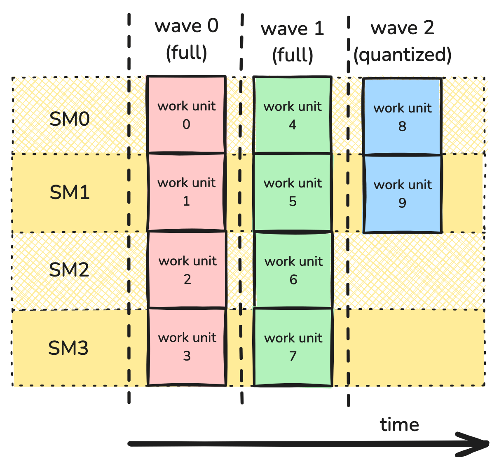

In this case, the first two waves are **full waves**, with every SM being utilized. But the final wave is a **partial wave**, where only half of the SMs are occupied.

Wave quantization can seriously degrade performance when the *number of work items is small relative to the number of SMs*. For example, on an H100 PCIe GPU, which has 114 SMs, a computation with 115 work units will require 2 waves — exactly the same as a computation with 228 work units! In other words, adding the 115th work unit approximately *halves* the utilization of the device. On the other hand, while a computation with 114,001 work units would suffer from the same quantization effect, its cost would be minuscule in comparison with the total cost of the kernel. You can find more information in the [NVIDIA Deep Learning Performance Guide](https://docs.nvidia.com/deeplearning/performance/dl-performance-matrix-multiplication/index.html#wave-quant).

To observe the impact of wave quantization in an example, let’s use the GEMM kernel that we created in part 2 of this series and measure the performance over varying wave count. Consider an GEMM of a MxK matrix A and KxN matrix B. Let `bM` and `bN` be the dimensions of the work tiles, and for simplicity assume that they divide M and N evenly. Then the total number of waves is given by `ceil((M/bM * N/bN)/num_SMs)`. To study the effect of the quantization, we want to vary the tiles-per-SM given by `(M/bM * N/bN)/num_SMs`; the decimals represent how full the last wave is. Thus, we will fix the values `M=1024` and `K=4096` and vary `N` in increments of `bN` (for us, this is 192).

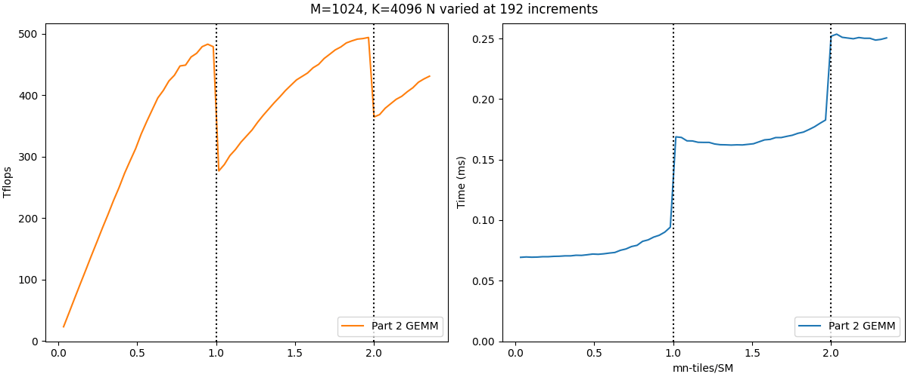

The left graph shows the performance in TFLOPs/s while the right shows the elapsed time instead, with benchmarks taken on an H100 PCIe GPU. The vertical dotted lines denote the wave boundaries, where tiles-per-SM crosses integer values. The left graph shows the wave quantization effect – sharp drops in performance when crossing wave boundaries. Correspondingly, the right graph shows that elapsed time is mostly determined by the total number of waves as a discrete parameter (given by 1 for `x` in `(0,1]`, 2 for `x` in `(1,2]`, and so on).

Note that the second quantization effect is smaller than the first one – the impact of wave quantization decreases as the number of waves increases. However, increasing the number of waves can be difficult, especially considering that the number of SMs on NVIDIA GPUs continues to grow with newer architectures. So it is important that we come up with strategies to mitigate the impact of wave quantization without making assumptions on the problem size.

#### Persistent Kernels

To address wave quantization, we need to create a better partitioning and scheduling scheme. The kernels we’ve shown so far on this blog have used grids dependent on the dimensions of the problem, so that each CTA processes a single work unit. For example, in GEMM, the work units are `bMxbN` tiles of the `MxN` output matrix, where `bM` and `bN` are fixed at compile time. Each work unit would be computed by a single CTA in a `M/bM x N/bN` grid. So our launch parameters would look like:

```
dim3 dimGrid(ceil_div(M, bM), ceil_div(M, bN));
```

The problem with this approach is that while we have some control over how threadblocks are distributed to SMs, it is difficult to implement more complex scheduling strategies. Therefore, we will be using a different design approach: **persistent kernels**. In a persistent kernel, the size of our grid is a fixed value. Typically, this value is equal to the number of available SMs, so that each CTA will have its own SM. We can find the number of SMs to use for `dimGrid` with the following CUDA code:

```
int num_SMs;
cudaGetDeviceAttribute(&num_SMs, cudaDevAttrMultiProcessorCount, device_id);

dim3 dimGrid(num_SMs);
```

Each CTA persists on its SM, processing multiple work units until all work has been completed. This design change offers the programmer significantly more control over scheduling, by telling each CTA how to iterate through the work units. With this flexibility, we can distribute work in a way that minimizes wave quantization and load imbalance.

In practice, the assignment of work units to CTAs is typically delegated to a **tile scheduler**, which is essentially a glorified iterator that tells each CTA where to find its next work unit and when to stop. While the total work required for each output tile does not change, by changing tile schedulers we will be able to explore more complex strategies to minimize load imbalance, such as **Stream-K**.

## Handling wave quantization with persistent kernels

To work our way up to Stream-K, it is useful to also examine some simpler but inefficient approaches to dealing with wave quantization. The [paper on Stream-K](https://arxiv.org/abs/2301.03598) has a great in-depth discussion on this, which we recommend reading. For the convenience of the reader, we give a summary of their discussion here.

To keep our numbers easier to parse in this section, we’ll consider a fictional GPU, the **[Hipparchus](https://en.wikipedia.org/wiki/Hipparchus) H10**, which has only 4 SMs.

#### Data Parallel

We’ll begin with the most basic version, which is to simply split the tiles evenly in the M- and N- mode and assign them in round-robin format. Note that this is essentially identical to the case when using the non-persistent, work tile grid launched kernels; the only difference is the guaranteed ordering. But it is still worth studying to understand the situations where wave quantization becomes a problem. As there is no dependence between the work units, this is referred to as a **data-parallel** work schedule.

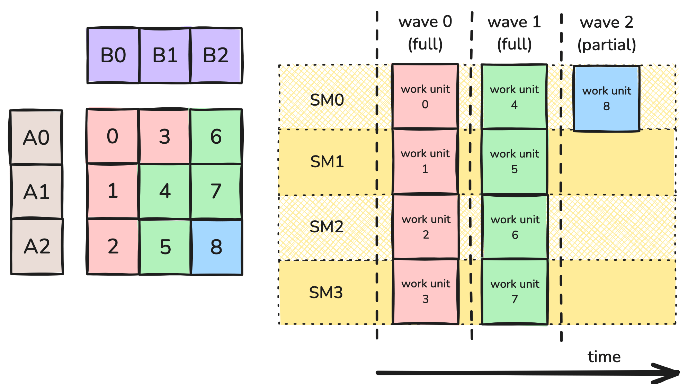

<p align="center"><em>**Figure 1:** Data-parallel partition.</em></p>

Figure 1 shows an example partition. Here the GEMM workload is divided into 9 work tiles. As the work items are identical, the tiles are processed in waves. Specifically, the 9 work tiles would be processed on the H10’s 4 SMs in 3 waves: 2 full waves, and a partial wave in which only 1 of the 4 SMs is occupied. If each work tile achieves 100% utilization on its SM, then the utilization across the whole computation is 2.25/3 = 75%.

The most direct approach is to return to the realization that wave quantization is less of a problem if there are more work units — and we can increase the number of work units by making each work unit smaller.

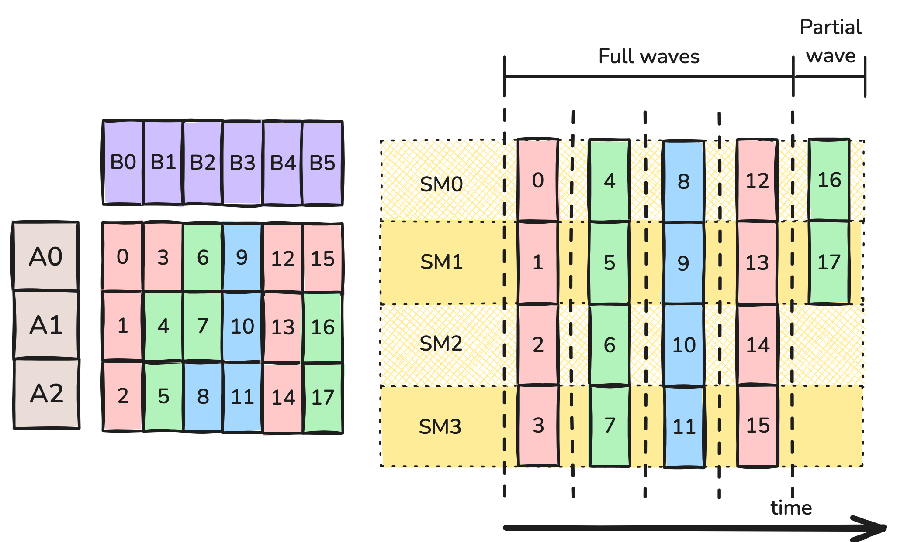

<p align="center"><em>**Figure 2:** Data-parallel partition with halved bN.</em></p>

In Figure 2, we’ve divided bN by a factor of 2 in the N direction. We now have 18 work tiles, which could be performed in 5 waves: 4 full waves and a partial wave in which 2 of the 4 SMs are occupied. Assuming once again that each work tile is computed with 100% utilization, the utilization across the whole computation is 4.5/5 = 90%. Moreover, each work tile in Figure 2 needs half as many FLOPs as the work tiles in Figure 1 — to a first approximation, each wave should take half as much time as a wave in Figure 1. So even though there are 5 waves in Figure 2 compared to 3 in Figure 1, the time spent in Figure 2 is only (5*0.5)/3 = 83% of Figure 1! What could go wrong?

Unfortunately, we’ve made a few too many simplifying assumptions, and are no longer correctly modeling the behavior of the Hipparchus H10. The central problem is that, as the tile size decreases, the computation of a work tile may become less efficient. Thus, it may be incorrect to assume that halving the tile size also halves the computation time or keeps the utilization of a single CTA constant.

One of the main drawbacks is the loss of [arithmetic intensity](https://docs.nvidia.com/deeplearning/performance/dl-performance-matrix-multiplication/index.html#math-mem). As memory access is time consuming, we want to have a large number of arithmetic operations to mask the memory access latency. For GEMM, a CTA computing a $bM \times bN \times bK$ matmul tile will perform $2\cdot bM \cdot bN \cdot bK$ arithmetic operations and $(bM \cdot bK + bN \cdot bK + bM \cdot bN)$ GMEM accesses. Observe that halving $bN$ halves the first number but not the second. For example, 128 x 128 x 128 work tile size would result in 85.3 operations per GMEM transfer, while a 128 x 64 x 128 work tile size would result in only 64 operations per GMEM transfer.

As an additional complication, assuming the CTA size hasn’t changed, halving the tile size means that each warp in the CTA processes half as many instructions. This decreases the latency-hiding opportunities available to the warp scheduler, which are essential for good performance of a pipelined GEMM.

Finally, there may be constraints on the tile size related to the choice of MMA atom. For example, the H10 could require the use of a 128 x 128 x 16 WGMMA atom for maximum throughput. This adds another limitation on the minimum size of tiles.

The balance between these considerations is not entirely obvious, and finding a good tile size for a particular problem may require trial and error — for example, using the [CUTLASS Profiler](https://github.com/NVIDIA/cutlass/blob/main/media/docs/profiler.md).

#### Split-K

So far we’ve only been splitting in M- and N-modes, but there is another dimension that we can split along: the K-mode. This is most effective when K is large; as before, there are costs to arithmetic intensity and latency-hiding when bK becomes too small.

The **Split-K** schedule splits tiles into a constant number of pieces along the K-mode. For example, in Figure 3 we split along the K mode into 2 work items.

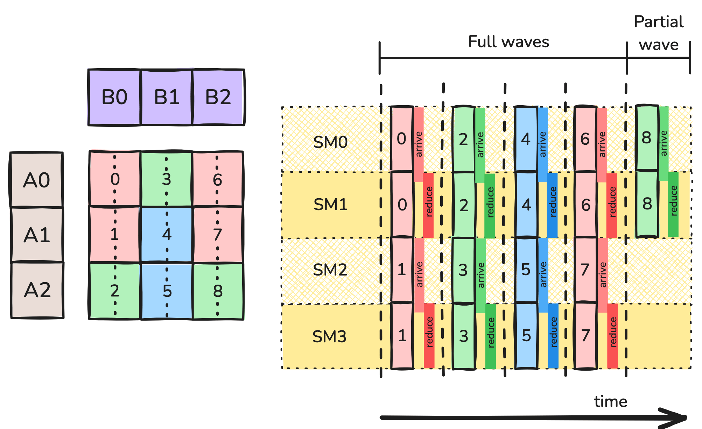

<p align="center"><em>**Figure 3:** Split-K partition.</em></p>

This strategy introduces a new complication: each CTA has only accumulated partial results for its bM x bN output tile. To complete the computation, the CTAs that worked on this output tile need to combine their results. A typical way to handle this is **turnstile reduction** in an auxiliary GMEM workspace. Each CTA collaborating on a given tile waits for CTAs working on previous K-indices to arrive at a barrier, after which it reduces its partial results into the workspace and itself arrives at the barrier. The final CTA, instead of reducing into the workspace, reduces from the workspace to its own accumulators and computes the epilogue. Note that the additional GMEM accesses and barrier synchronizations introduce additional overhead, shown in **Figure 3** in the form of “arrive” and “reduce” blocks.

Split-K introduces a new hyperparameter, the number of splits, which comes with its own set of tradeoffs.

- Increasing the number of splits decreases the wave quantization effect, possibly allowing for better SM utilization overall.
- Increasing the number of splits decreases the tile size in the K direction, which may increase the ratio of GMEM accesses to computation.
- Increasing the number of splits also decreases the number of instructions per CTA, and thus the opportunities for hiding latency.
- We’ve introduced a synchronization and reduction overhead, an additional cost not seen in Split-MN. The more splits, the more costly the synchronization.

#### Stream-K

The strategies considered so far have *improved* the wave quantization problem, but they haven’t *eliminated* it. Returning to our original example of 9 work tiles spread across 4 SMs, it would be ideal if each SM could run 2.25 waves. This is the motivation behind **Stream-K**.

The Stream-K strategy assigns a single, persistent CTA to each SM. Each CTA is assigned a *fractional* number of work tiles, where any work tiles that are split are split along the K-mode. As in the Split-K strategy, for each work tile that’s split, CTAs collaborating on that tile can combine their results using turnstile reduction in a GMEM workspace.

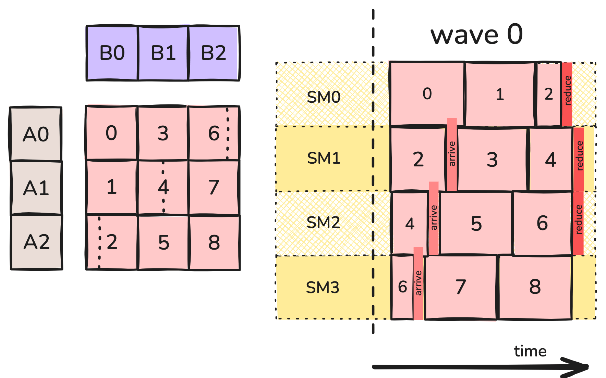

<p align="center"><em>**Figure 4:** Stream-K partition.</em></p>

For example, in Figure 4, the persistent CTA on SM0 calculates all of work tile 0, all of work tile 1, and 1/4 of work tile 2. The persistent CTA on SM1 calculates the rest of work tile 2, all of work tile 3, and half of work tile 4, and so on. The partial tiles are scheduled so that the first piece of a worktile is computed well before its last piece, minimizing synchronization overhead (though note that, with tiles that are extremely long in the K-direction, this may not always be possible.)

Let’s compare Stream-K to the previous strategies we’ve discussed.

- We’ve eliminated quantization by eliminating waves. Each CTA computes 2.25 work tiles. Except for the extra time required for synchronization and reduction, the total computation should be approximately 2.25 units compared to the 3 units needed for the original kernel.
- Many of the original 128 x 128 x 128 work tiles are processed entirely by a single CTA, so we partially retain the advantages of large work tiles: a high compute-to-memory ratio, long instruction sequences, and availability of large WGMMA instructions. If the first kernel could run at 100% utilization per CTA, this one can, too.
- In many cases, we can schedule the computation of early pieces of an output tile well before the computation of the final piece, so that the CTA responsible for the epilogue does not actually need to wait long at its barrier.
- The kernel does need extra GMEM transfers so that data from partial tiles can be shared between CTAs.

#### Hybrid Stream-K

There’s one final improvement we can make to the kernel, which concerns cache performance. The nature of a tiled GEMM kernel is that each operand tile is needed to compute multiple output work tiles. For example, in the split-MN case tile B0 is needed to compute tiles 0, 1, and 2 of the output.

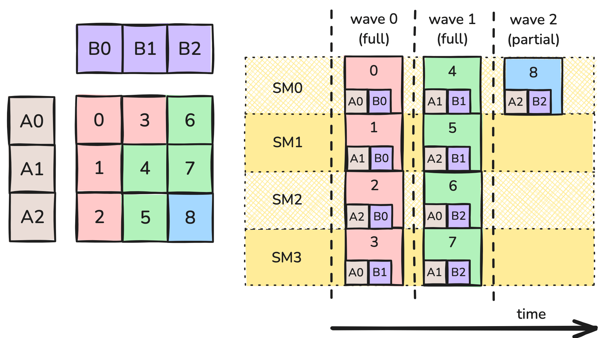

<p align="center"><em>**Figure 5:** Data reuse with waves.</em></p>

Here the output tiles 0, 1, and 2 are computed simultaneously. When one of the CTAs grab tile B0 from global memory, it is also placed in the L2 cache. Other CTAs also requesting tile B0 will then hit in the cache and be able to load it faster. The cache is finite in size and old data may get evicted, which makes it important for these requests to happen around the same time.

More precisely, the operand tiles are also partitioned in the K-direction, and each CTA is performing an inner loop over the K-blocks of its operand tile. When wave 0 starts, SMs 0, 1, and 2 will simultaneously request the 0th K-block of tile B0, and two of them will hit in the cache. On the next iteration of their loops, SMs 0, 1, and 2 will request the 1st K-block of tile B0, and so on.

However, the stream-K kernel introduces **skew**: since each SM starts by computing a partial tile of a different size, they will tend to be working on different K-offsets at the same time. Going back to Figure 4, SMs 0 and 1 are both using data from B0 at the beginning of wave 0 — but SM0 needs its 0th K-block, while SM1 needs data towards the middle. In fact, the K-offsets in this schedule never line up, making cache hits much harder to come by. To summarize, eliminating “waves” and scheduling the different SMs out of sync from each other has resulted in a hidden cost of worse cache performance.

We can fix the problem by rescheduling the computation as a hybrid between a persistent kernel and an ordinary data-parallel kernel. Since a data-parallel schedule does not suffer from skew, it makes sense to use this schedule for as long as possible, reserving Stream-K for just enough tiles to handle the wave quantization effect. To properly balance the workload between the SMs during the Stream-K phase, it’s necessary to assign 1 full wave and any leftover partial wave to this phase.

This schedule is shown in figure 6. The initial Stream-K phase processes between 1 and 2 full waves of the computation. Each SM receives at most 2 partial worktiles. By design, the total size of these tiles is independent of the CTA, so that all CTAs expect to finish this stage of the computation around the same time. Once this stage completes, only entire work tiles remain, and the number left is divisible by the number of SMs. Thus, these work tiles can be computed using a non-persistent, data-parallel strategy, which does not suffer from wave quantization, and which has a better cache performance. This is seen in Figure 6:

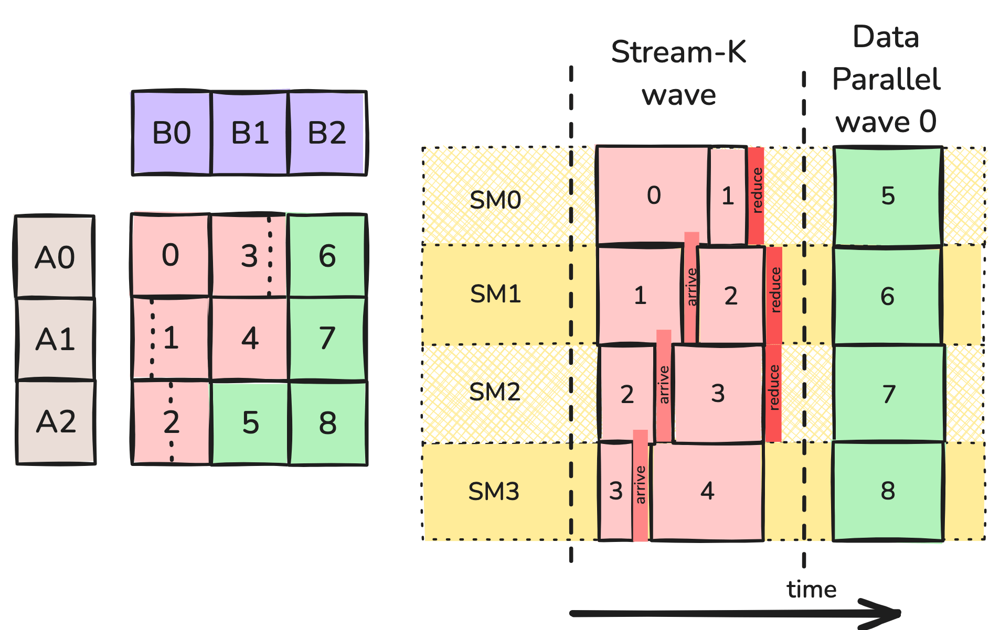

<p align="center"><em>**Figure 6:** Hybrid Stream-K partition.</em></p>

Here, we can expect the computation of work tiles 6, 7, and 8 to take place at close to the same time and to result in a cache hit for operand tile B2. Similarly, work tiles 5 and 8 would be able to use the cache for their shared A tile. In this case, the data-parallel stage just consists of 1 wave, but a larger GEMM with more work tiles would have a longer data-parallel stage with more use of the cache.

## The tile scheduler abstraction

Since the problem of partitioning and scheduling work is largely separate from the per-CTA memory and compute operations, GEMM implementations like CUTLASS will often wrap them in an abstraction called a **tile scheduler**. (This is more general than GEMM — for example, [FlashAttention-3 also supports persistent kernels with tile scheduler classes](https://github.com/Dao-AILab/flash-attention/blob/main/hopper/tile_scheduler.hpp).) In the next section, we examine CUTLASS’s implementation specifically; here, we outline in general the responsibilities of a tile scheduler.

First, the grid shape of our kernel depends on tile scheduling. So the tile scheduler is responsible for determining the grid size of the kernel. For a non-persistent kernel, this will be the same as the logical grid and dependent on the problem size; for a persistent kernel, it will be fixed and likely equal to the number of SMs. We query the tile scheduler for the grid size at the start, and use it for the kernel launch.

In-kernel, each thread will construct an instance of the tile scheduler. The mainloop and epilogue will now be wrapped in a **work loop** over tiles provided by the scheduler, which might look like this:

```
for (auto worktile = scheduler.get_initial_tile();
    scheduler.is_valid(worktile);
    worktile = scheduler.get_next_tile(worktile)) {
        auto [m_block, n_block, k_block_start, k_block_stop] = worktile.get_block_coord();
        for (k_block = k_block_start; k_block &lt; k_block_stop; ++k_block) {
            // mainloop
        }
        // epilogue
}
```

A simple way to implement these iterator primitives is to have the scheduler maintain a linear index into worktiles. For a persistent kernel, each CTA initially receives the worktile at index `blockIdx.x` (which is just the linear index of the underlying SM); it advances to the next tile by stepping forward by `gridDim.x` (the number of SMs); and the tile is valid as long as its index doesn’t exceed the total number of tiles. The work of mapping the linear index to the actual (M, N) tile coordinates is delegated to the `worktile` object.

This is already enough for a persistent data-parallel schedule, but more sophisticated schedules demand more functionality. For Stream-K, the size of the work assignment in the K direction depends on the tile, meaning that the worktile should really provide the kernel with four coordinates, as in the code listing.

For both Stream-K and Split-K, some or all CTAs will output partial results that then have to be aggregated, with the following implications.

- Additional GMEM workspace is needed, both for the partial results and for an array of barrier objects allowing for synchronization between the CTAs working on a single tile. The amount of space needed depends on the problem size, so it must be allocated dynamically before kernel launch. During the kernel, the scheduler should provide the CTAs with appropriate pointers into the workspace.
- When starting on a new worktile, each CTA needs to be informed of whether this is a complete output tile (so the result should be stored to the output tensor) or a partial one (so the result should be stored to the workspace).
- Only one CTA is responsible for performing the epilogue in the output tile. Instead of reducing into the workspace, that CTA has to reduce from the workspace into its accumulators, and then perform the epilogue. The scheduler needs to inform each CTA whether or not it’s responsible for the epilogue on each tile it works on.

As the CUTLASS implementation shows, there are a number of improvements that can be made to this simple outline, including having the scheduler decide in what order to launch tiles, using heuristics to fall back from Stream-K to Split-K or data-parallel modes, and, on Hopper, properly using clusters. We examine these next.

[Our code sample on GitHub](https://github.com/ColfaxResearch/cfx-article-src/tree/master/streamk) provides three examples of schedulers: a trivial non-persistent scheduler that assigns 1 worktile to each CTA over a grid determined by the problem shape; a data-parallel persistent scheduler; and a Stream-K hybrid scheduler which incorporates a some but not all of CUTLASS’s optimizations. In practice, we found that many of CUTLASS’s optimizations were necessary to get reasonable performance: notably, the additional GMEM accesses and smaller tile sizes caused by reduction are a real cost, and the boundaries of Stream-K work assignments need to be carefully tweaked to minimize this cost. 

Some performance metrics for the Stream-K tile scheduler are shown below. Relative to a data-parallel scheduler, our implementation of Stream-K performs well early in each wave, reducing the wave quantization effect, but its performance suffers as the partial tail wave starts to fill. The “Heuristic” curve uses CUTLASS’s heuristic of switching from Stream-K to data-parallel once the tail wave is at least half full. This is clearly a good choice.

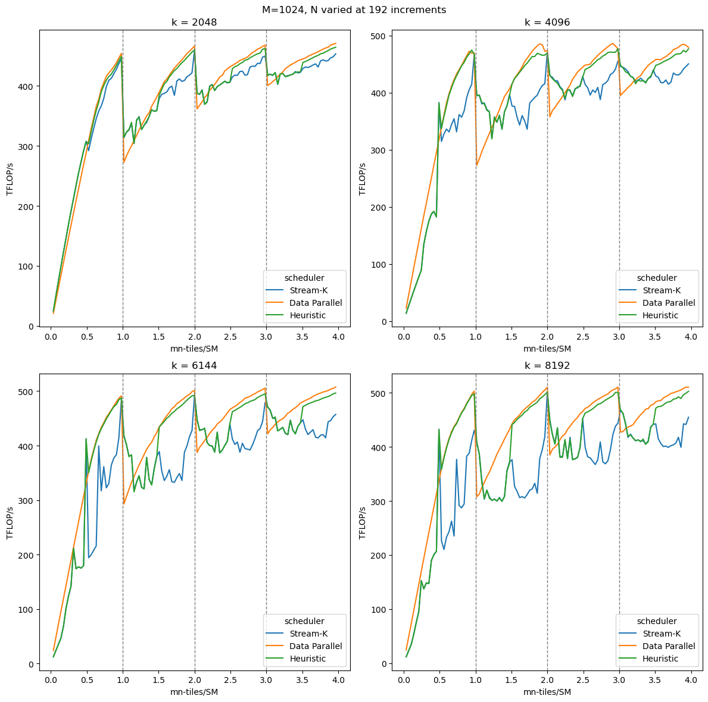

## Conclusion

In this article we have discussed wave quantization and how it affects the performance of GEMM. We observed the significant performance fluctuation from wave quantization in the GEMM implementation we created in part 2. Then we discussed the various strategies to combat wave quantization, with a focus on Stream-K. Finally, we presented a version of the Stream-K tile scheduler in order to remove the effects of wave quantization in our GEMM implementation. This concludes our three part series on implementing a performant Hopper-based GEMM with CUTLASS/CuTe abstractions.

## Appendix: Stream-K in CUTLASS

This appendix explores some of the finer detail of Stream-K in CUTLASS: how to use it, its performance relative to other schedulers, and some of the optimizations used in writing it.

#### Using Stream-K with the GEMM API

First let’s discuss how to use the Stream-K scheduler with the CUTLASS 3.X GEMM API. We’ll start with a brief review of the CUTLASS 3.X GEMM API. The discussion will be limited to those parts that pertain to Stream-K, but you can find more [details](https://github.com/NVIDIA/cutlass/blob/main/media/docs/gemm_api_3x.md) and [examples](https://github.com/NVIDIA/cutlass/tree/main/examples) on the CUTLASS repo. The code samples here are based on CUTLASS [example 48](https://github.com/NVIDIA/cutlass/blob/main/examples/48_hopper_warp_specialized_gemm/48_hopper_warp_specialized_gemm.cu).

The CUTLASS GEMM API is organized into three parts:

- Epilogue – defines how partial results are combined and potentially modified
- Mainloop – defines how individual worktiles are computed
- Kernel – wrapper around the epilogue and mainloop.

These are created using respective CollectiveBuilders, which provide developers the ability to configure the GEMM kernel. Developers can also choose to let CUTLASS automatically choose the appropriate configuration according to an internal heuristic. Here is the GEMM kernel using this auto feature:

```
using CollectiveEpilogue = typename cutlass::epilogue::collective::CollectiveBuilder&lt;
    cutlass::arch::Sm90, cutlass::arch::OpClassTensorOp,
    TileShape, ClusterShape,
    cutlass::epilogue::collective::EpilogueTileAuto,
    ElementAccumulator, ElementAccumulator,
    ElementC, LayoutC, AlignmentC,
    ElementC, LayoutC, AlignmentC,
    cutlass::epilogue::collective::EpilogueScheduleAuto
  >::CollectiveOp;

using CollectiveMainloop = typename cutlass::gemm::collective::CollectiveBuilder&lt;
    ArchTag, OperatorClass,
    ElementA, LayoutA, AlignmentA,
    ElementB, LayoutB, AlignmentB,
    ElementAccumulator,
    TileShape, ClusterShape,
    cutlass::gemm::collective::StageCountAutoCarveout&lt;
      static_cast&lt;int>(sizeof(typename CollectiveEpilogue::SharedStorage))>,
    cutlass::gemm::collective::KernelScheduleAuto
  >::CollectiveOp;

using GemmKernel = cutlass::gemm::kernel::GemmUniversal&lt;
    Shape&lt;int,int,int>, // Indicates ProblemShape
    CollectiveMainloop,
    CollectiveEpilogue
>;
```

To specify the GEMM kernel to use Stream-K, we need to specify `GemmKernel` to use `StreamKScheduler`.

```
using GemmKernel = cutlass::gemm::kernel::GemmUniversal<
    Shape<int,int,int>, // Indicates ProblemShape
    CollectiveMainloop,
    CollectiveEpilogue,
    cutlass::gemm::StreamKScheduler
>;
```

In addition, only certain mainloop and epilogue schedules support Stream-K. We will use `TmaWarpSpecializedCooperative` for both Mainloop and Epilogue.

```
using CollectiveEpilogue = typename cutlass::epilogue::collective::CollectiveBuilder&lt;
    // ..... //
    cutlass::epilogue::TmaWarpSpecializedCooperative
  >::CollectiveOp;

using CollectiveMainloop = typename cutlass::gemm::collective::CollectiveBuilder&lt;
    // ..... //
    cutlass::gemm::KernelTmaWarpSpecializedCooperative
  >::CollectiveOp;
```

This GEMM kernel is now set up to use the Stream-K scheduler. An important note about the Stream-K scheduler is that it does not always use Stream-K partitioning. Instead, by default it will use an internal heuristic to determine what the best partitioning scheme is. The CUTLASS scheduler has four defined options for its **DecompositionMode**.

- `DataParallel` – No splitting in K direction.
- `SplitK` – Implement SplitK with user defined splits.
- `StreamK` – Implement Stream-K partitioning.
- `Heuristic` – CUTLASS will choose the mode based on the problem.

We will discuss the decomposition modes in more depth later. For now, we can force it to use the Stream-K decomposition by setting it in the scheduler arguments. We can do this as part of the `Gemm` arguments.

```
using DecompositionMode = typename cutlass::gemm::kernel::detail::PersistentTileSchedulerSm90StreamKParams::DecompositionMode;
DecompositionMode decomp = DecompositionMode::StreamK;

int splits=1;
typename Gemm::GemmKernel::TileScheduler::Arguments scheduler_args;
scheduler_args = { splits, static_cast&lt;int>(options.swizzle), options.raster, decomp};

typename Gemm::Arguments arguments{
    cutlass::gemm::GemmUniversalMode::kGemm,
    {options.m, options.n, options.k},
    {block_A.get(), stride_A, block_B.get(), stride_B},
    {{options.alpha, options.beta}, block_C.get(), stride_C, block_D.get(), stride_D},
    hw_info,
    scheduler_args
};
```

In addition to the `DecompositionMode`, the scheduler arguments also take in options related to Split-K and threadblock rasterization (which we also discuss in the Appendix below). Finally, with the arguments and `GemmKernel` ready, we can run GEMM using Stream-K partitioning.

```
using Gemm = cutlass::gemm::device::GemmUniversalAdapter&lt;GemmKernel>;
Gemm gemm;

size_t workspace_size = Gemm::get_workspace_size(arguments);

cutlass::device_memory::allocation&lt;uint8_t> workspace(workspace_size);
CUTLASS_CHECK(gemm.can_implement(arguments));
CUTLASS_CHECK(gemm.initialize(arguments, workspace.get()));
CUTLASS_CHECK(gemm.run());
```

#### Stream-K Performance

Now that we’ve discussed how to run GEMM with specific schedulers, let’s see how they perform given different input sizes. Once again, we will fix M and K and then vary N in increment of the tile size, using tiles-per-SM, `(M/bM * N/bN)/num_SMs`, for the x-axis. We benchmarked the three modes Stream-K, Split-K and DataParallel for comparison. In addition, we also repeated this process for different K values. The benchmark numbers were taken on an H100 PCIe GPU.

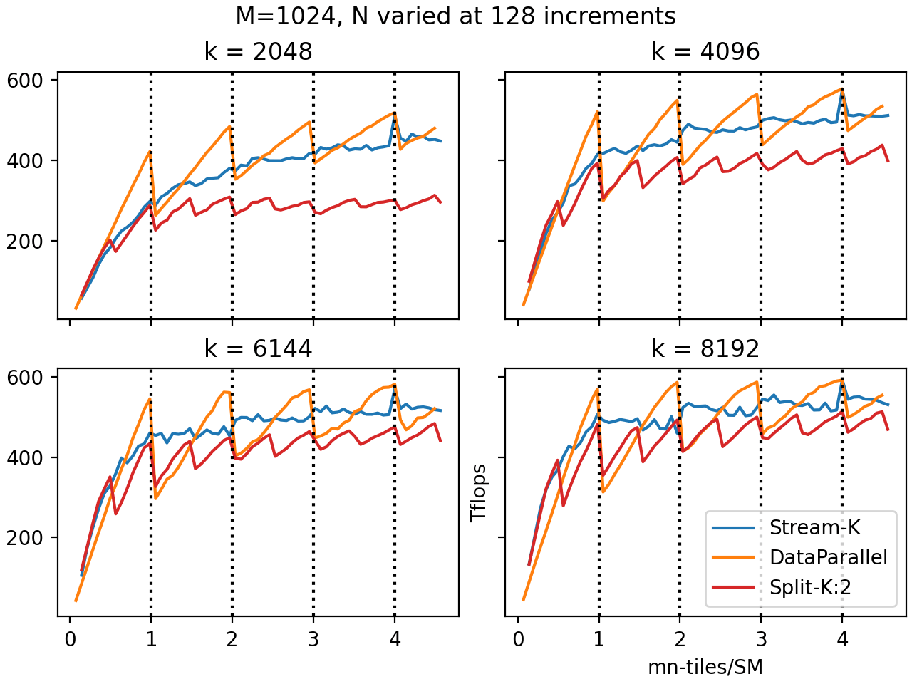

The vertical dotted lines denote the wave boundaries. As expected, there is a sharp drop in performance for the DataParallel mode when going over wave boundaries. This is the wave quantization effect. The DataParallel mode matches or outperforms all other modes when the last wave is mostly full (tiles-per-SM is just under a whole integer), and underperforms when it is nearly empty (tiles-per-SM is just over a whole integer). Finally, we can see that the wave quantization effect is the most pronounced when the total number of waves is low.

With Split-K, the effect of wave quantization is lessened. Split-K effectively multiplies the number of worktiles by a factor of K, so the number of waves goes up by a factor of K as well. You can see this in the graph, as the performance of Split-K with 2 splits oscillates with twice the frequency of DataParallel. Unfortunately, the additional overhead of reduction seems to outweigh the benefits for most cases, and Split-K only rarely performs well relative to the other two schedulers (typically when there are so few tiles that the GPU would be severely underutilized without splitting). The graph only shows Split-K with K of 2 in order to keep it uncluttered; higher values of K generally performed worse than K=2 except in very small X.

Stream-K performance, by contrast, does not show wave quantization, fluctuating very little over the changing wave count. The Stream-K partitioning matches or outperforms Split-K in general, and beats out DataParallel partitioning at larger K values when the last wave is near empty. There is one point where the DataParallel and Stream-K get identical result at N=7296, which corresponds to X=1024*7296/114=4. Because the tiles were evenly distributable to the CTAs, there are no partial tiles or reduction required. So DataParallel and Stream-K get identical results. 

In addition to the three explicit decomposition modes, CUTLASS also has the Heuristic mode. The exact heuristic is discussed in a later section, but we can see how well it does against Stream-K and DataParallel (split-K dropped).

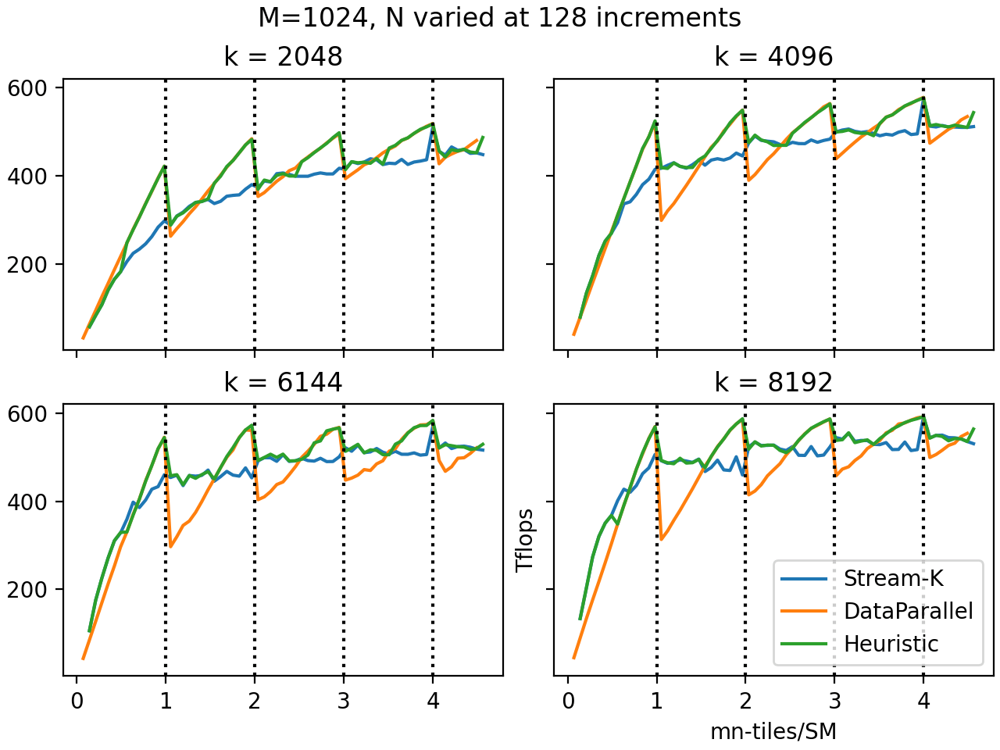

As you can see, the CUTLASS Heuristic mode does a very good job predicting the best performing decomposition mode. It selects the DataParallel mode when the quantization effect is low, and selects Stream-K when it is high. As the Heuristic mode is the default, you are generally better off not specifying the decomposition mode and letting CUTLASS decide.

#### CUTLASS implementation details

Next let’s discuss the details of CUTLASS’s version of the stream-K scheduler (as of CUTLASS 3.6).

**Schedule.** CUTLASS implements a version of the hybrid schedule explained above, in which the scheduler dedicates at most two waves to Stream-K work before organizing the rest of the work in a data-parallel fashion. As the data-parallel waves tend to work on the same K offsets at the same time, the L2 cache performance should be improved.

**Reduction.** By default, CTAs collaborating on the same output tile do so in “turnstile” fashion. Suppose that a given output tile is worked on by CTAs 0, 1, …, n, ordered increasingly by the ranges of K-indices assigned. First, CTA 0 will compute its result, and write it to a global memory workspace. CTA 1 waits at a barrier for CTA 0 to finish writing, and then reduces its output into the same global memory workspace. CTA 2 waits for CTA 1, then reduces its output, and so on. Finally, CTA n waits for CTA n-1, but instead of reducing into the workspace, it reduces from the workspace into its accumulators, and finally computes the epilogue and writes to the output tensor.

In an alternative “nondeterministic mode” (specified by the user with the argument `ReductionMode::Nondeterministic`), CTAs 1, …, n-1 no longer wait for each other, but simply atomically reduce into the workspace. All CTAs still have to wait for CTA 0, to initialize the workspace; CTA n still has to wait for CTAs 0, …, n-1. The nondeterminism results from the fact that reductions 1, …, n-1 can now occur in any order (and floating-point addition is nonassociative).

**Decomposition modes.** The CUTLASS stream-K scheduler also supports Split-K and data-parallel persistent schedules, which the user can select using the `decomposition_mode` argument. (Passing an argument `splits` not equal to 1 will force the scheduler to run split-K with the given number of splits.) The user can also select `DecompositionMode::Heuristic`, in which the scheduler can fall back from stream-K to one of the simpler schedules: if either there is no wave quantization, or the tail wave is at least half full, then the scheduler falls back to data-parallel; if the number of CTAs assigned to stream-K work is a multiple of the number of stream-K tiles they should work on, then the scheduler falls back to split-K. Since Stream-K carries some extra overhead related to reduction and synchronization, it makes sense to fall back to data-parallel if wave quantization is not going to be an issue. From our tests, this heuristic almost always made the best choice across a variety of problem sizes.

**Threadblock rasterization.** An advantage of persistent kernels independent of the wave quantization issue is the ability to choose the order in which worktiles are launched. For GEMM, this primarily matters because of cache performance: if worktiles in the same row or column (the same M or N index) of the output matrix are being worked on at around the same time, they will load data from one of the operand matrices from GMEM at the same time, which is likely to hit in L2 cache.

Thus, the simplest way to improve cache performance for a persistent kernel is to launch worktiles in order along either the M or N mode. For example, if we launch worktiles along the N mode, keeping M fixed for as long as possible, data from operand matrix A will often be found in the cache. In CUTLASS, one can pass a `raster_order` argument to the scheduler, with `RasterOrderOptions::AlongM` and `AlongN` giving this behavior. Typically, one would like to raster along the *shorter* of the two modes, measured in units of worktiles; `RasterOrderOptions::Heuristic` will figure this out automatically.

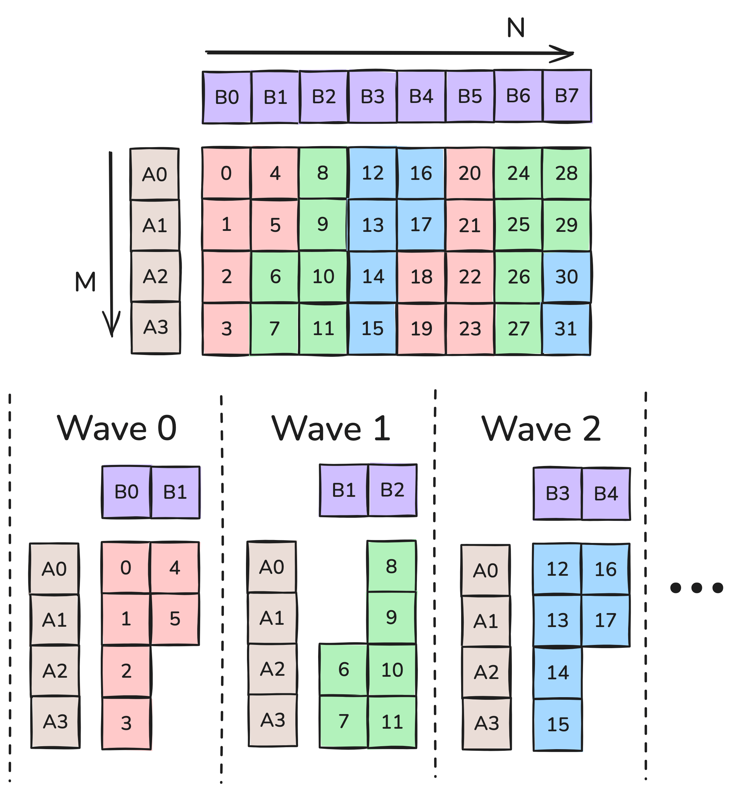

<p align="center"><em>**Figure 7:** Rasterization along M.</em></p>

Figure 7 shows thread block rasterization for the case `M<N` with 6 SMs. `RasterOrderOptions::Heuristic` will pick `Along`M in this case. For example on wave 0, the SMs work on tiles 0 through 5, and the number of operand loads from HBM reduces from an *a priori* count of 12 to 6 (assuming this fits into L2 cache).

A more advanced technique is to try to consider proximity in both dimensions. For example, in Figure 7 the work tiles are adjacent in the M direction, but are offset by M in the N direction. We can improve on this by going along the N dimension for 2 tiles and then moving along the M direction. This is called **threadblock swizzling**, specifically for `swizzle=2`. We can specify the number of tiles to swizzle with the argument `max_swizzle_size`, but as the name suggests the scheduler may choose a smaller swizzle size if the problem is not big enough. The possible swizzle sizes are 1 (no swizzling), 2, 4, or 8. Figure 8 shows the order in which work tiles would be processed with `AlongM` raster order and swizzle size of 2 or 1. (Note that this is not the same as the XOR swizzle discussed in [this post](https://research.colfax-intl.com/tutorial-matrix-transpose-in-cutlass/).)

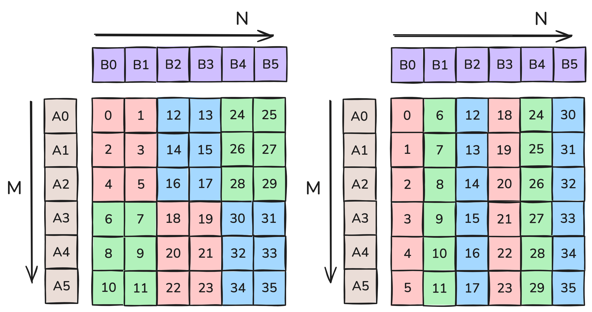

<p align="center"><em>**Figure 8:** Left; rasterization along M with swizzle 2. Right; rasterization along M with swizzle 1.</em></p>

In Figure 8, each wave in `swizzle=2` loads 5 operand tiles, whereas each wave in `swizzle=1` loads 7 (once again assuming everything fits in L2). So with 6 waves, there are 30 operand tile loads for `swizzle=2` and 42 operand tile loads for `swizzle=1`. The correct swizzle size for a given problem varies a lot with the problem and device characteristics. However, generally swizzle is only effective when there are enough tiles in the rasterized direction. More precisely, we would want the number of M tiles to be greater than `SM/swizzle`; otherwise, all the operand tiles in the rasterized direction are loaded anyway. With 114 SMs, the respective cutoffs for swizzles of 2, 4, and 8 are 57, 31, and 15.

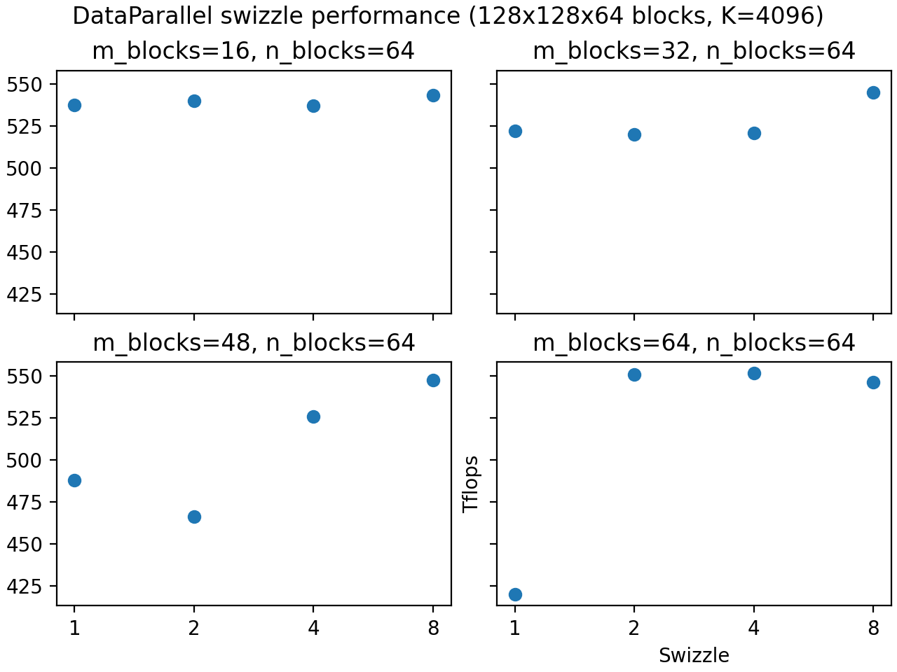

The figure above reflects these cutoffs, with the swizzle performing better once there are enough tiles. But as mentioned before, the number of tiles is not the only consideration; other factors like L2 cache size can further impact swizzle performance. So we recommend using the [CUTLASS profiler](https://github.com/NVIDIA/cutlass/blob/main/media/docs/profiler.md) to find the best swizzle number for your workload.

**Clusters and multicast.** The Hopper architecture introduced **threadblock clusters**, groups of CTAs that are scheduled simultaneously on the same GPU processing cluster (GPC), with fast access to each other’s shared memory. Most importantly for the present discussion, TMA loads can be [multicast](https://research.colfax-intl.com/tutorial-hopper-tma/), simultaneously loading the same data to the SMEM of all CTAs in a cluster in a single operation.

This has some deep implications for tile scheduler construction. We said that it’s important for cache performance to try to schedule worktiles in the same row or column at around the same time. But it’s also important to try to assign them to the same cluster, as then the data from one of the operand matrices can be multicast. Moreover, for stream-K work, CTAs in a cluster should ideally be working on the same K offsets at the same time (i.e., the problem of skew that justified the hybrid schedule is also important within clusters).

CUTLASS handles this elegantly. First, the entire schedule is constructed by dividing the output matrix into clusters of worktiles, rather than single worktiles: for example, if the cluster shape is 2×4, then during each data-parallel wave, each cluster will work on a rectangular 2×4 region of tiles in the output matrix. Second, for the stream-K phase, the scheduler attempts to divide the clusters doing stream-K work evenly into “groups”, where each group is assigned work with the same K-offset at the same time. The full algorithm is somewhat complicated, but fortunately, the user does not really have to think about it beyond specifying the cluster shape.
