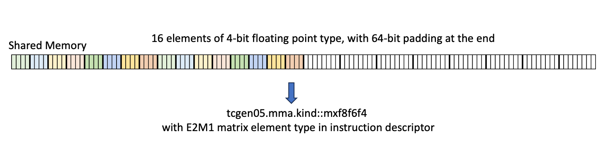
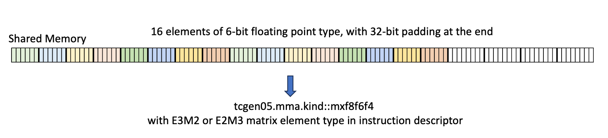
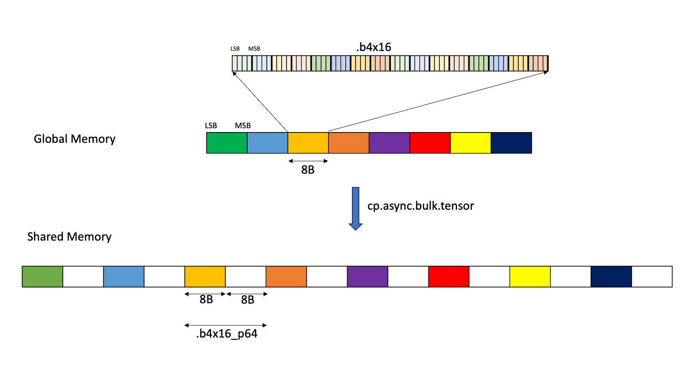
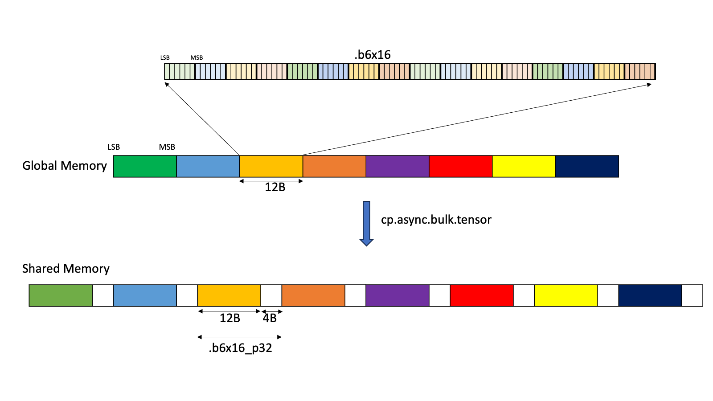
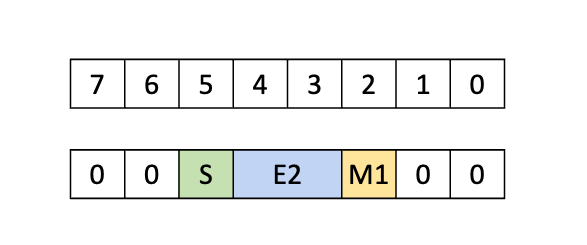
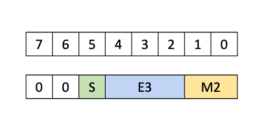
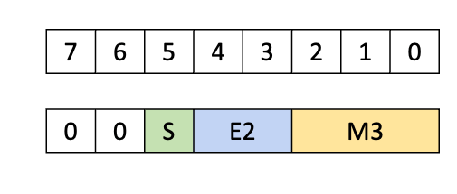

# CUTLASS Tutorial: Sub-byte GEMM on NVIDIA® Blackwell GPUs

**Date:** June 7, 2025

**Source:** [https://research.colfax-intl.com/cutlass-tutorial-sub-byte-gemm-on-nvidia-blackwell-gpus/](https://research.colfax-intl.com/cutlass-tutorial-sub-byte-gemm-on-nvidia-blackwell-gpus/)

---

Welcome to part 3 of our series investigating GEMM on the NVIDIA Blackwell architecture. In parts 1 and 2, we looked at the Tensory Memory and 2 SM capabilities of the new Blackwell Tensor Core UMMA instructions and how to work with them in CUTLASS. In this part, we introduce low-precision computation and then discuss how it is carried out for Blackwell GEMM, with a particular focus on sub-byte (6-bit and 4-bit) formats and how these impact setting up memory layouts for the data. The main takeaway is that for mixed-input UMMA of kind `f8f6f4` (that is, allowing for any combination of supported 8-bit, 6-bit, and 4-bit operands), UMMA needs to read the data in a certain *unpacked* format, and TMA can handle unpacking into this correct format when doing the GMEM to SMEM memory loads. However, this imposes some additional constraints on the allowable tile sizes, leading dimension, and address alignment of data in GMEM. In terms of writing CUTLASS kernel code, one can then build on the understanding developed in parts 1 and 2 to additionally incorporate the `f8f6f4` mixed-input case, as we will show.

Blackwell also supports block-scaled formats, either `mx` types following the OCP specification or NVIDIA’s own `nvf4` data type. For a comprehensive listing of supported low-precision types on Blackwell, see this [CUTLASS doc](https://github.com/NVIDIA/cutlass/blob/main/media/docs/cpp/blackwell_functionality.md#blackwell-narrow-precision-data-types). We defer a discussion of block-scaling to the next post.

# Why Low Precision?

**Low precision** generally refers to data types that use fewer bits than 32-bit single-precision floating-point, formalized by IEEE 754 in 1985. In many AI workloads, low-precision types are favored over single-precision because they provide significant reduction in model size and computational load. Recent years have seen tightly coupled developments in hardware and software moving towards lower precision:

- NVIDIA’s Volta architecture, introduced in 2017, featured Tensor Core supported half-precision (FP16) matrix multiplication with FP32 accumulation.
- In 2018, Google Brain designed the bfloat16 format, which was natively supported by [Google’s TPUs](https://www.nextplatform.com/2018/05/10/tearing-apart-googles-tpu-3-0-ai-coprocessor/). Unlike FP16, BF16 has 8 exponent bits, giving it the same dynamic range as FP32, but with much lower precision. Other chips such as the NVIDIA Ampere architecture soon followed in supporting BF16.
- Ampere also introduced [TF32](https://developer.nvidia.com/blog/accelerating-ai-training-with-tf32-tensor-cores/), a 19-bit format with the range of FP32 and the precision of FP16.
- Quantization to INT8 is a long-established technique in AI, particularly for inference, originating in the world of digital signal processing. However, the range and precision of integer computation is significantly different from that of floating-point numbers, making integer formats less suitable for training, and requiring significant changes to model training to work successfully during inference. Responding to this issue, [Micikevicius et al. (2022)](https://arxiv.org/abs/2209.05433) proposed two 8-bit floating point formats for AI applications: one with 4 exponent and 3 mantissa bits, and one with 5 exponent and 2 mantissa bits. The NVIDIA Hopper architecture offered accelerated matrix multiplication primitives for both formats.
- Most recently, the Blackwell architecture has introduced **sub-byte** precision support for 6-bit and 4-bit floating point. These formats have seen [rapid adoption by AI researchers](https://arxiv.org/abs/2501.17116) to achieve even lower model sizes and higher computational throughputs.

Use of low-precision formats typically involves **mixed-precision** computation, meaning computation that uses multiple data types. A few examples:

- Most Tensor Core instructions accumulate in a higher-precision data type than the operands, typically FP32 or INT32.
- On the Hopper architecture, [DeepSeek](https://arxiv.org/abs/2412.19437v2) mitigated the accuracy loss of FP8 GEMM even further by alternating Tensor Core accumulation with CUDA core accumulation (discussed in more detail in [our earlier post](https://research.colfax-intl.com/deepseek-r1-and-fp8-mixed-precision-training/)).
- **Mixed-input** GEMM, where the operands are of different data types, can also be useful – for example, we may wish to reduce a model’s memory footprint by quantizing its weights to 8-bits or lower, while preserving quality by keeping the activations in a higher precision.

Since low-precision types tend to have a small range, quantizing naïvely can lead to clipping of very large values or zeroing of very small values. To compensate for this, one may divide each group of values by a high-precision **scale factor** to place them in an acceptable range before quantizing. These scale factors are then saved and multiplied back in at the end of the computation. There are several reasonable choices for how to group values for scaling:

- A single scale factor for the entire tensor (cheap, but leading to significant saturation problems).
- The opposite: a scale factor per value (allowing high accuracy but with huge memory overhead).
- A scale factor per matrix row or column.
- **Tilewise** scaling: a scale factor per fixed-size matrix tile of the output, say 128×128.
- **Block** scaling: a scale factor per row tile, say 1×32.

Blackwell’s UMMA instructions natively support block scaling with scale factors associated to 1×32 or 1×16 blocks. The scale factors form additional tensors that have to be loaded and fed to the Tensor Cores properly, increasing the kernel’s complexity. We’ll stick to the unscaled case for this post and discuss block scaling in the last (and final) part of this series.

# Data formats

CUTLASS supports a wide range of data types, including many different low-precision data types. The full [list of supported data types](https://github.com/NVIDIA/cutlass/blob/main/media/docs/cpp/fundamental_types.md#numeric-types) can be found in the CUTLASS docs. For this blog, our main interest is in the floating point data types, so we’ll start with a brief review of how this data type is stored before talking about the new sub-byte data types.

The bits in the floating point data are divided into three parts: sign, exponent and mantissa. (For some background on floating point, see [here](https://fabiensanglard.net/floating_point_visually_explained/) or [here](https://float.exposed/0x0010).) The sign, if present, simply takes a single bit, but the exponent and mantissa can be any number of bits. A larger number of bits on the mantissa allows for higher precision, whereas a larger number of bits in the exponent allows for a larger range. But as the total number of bits used is limited, there is a tradeoff between the number of bits assigned to exponent and mantissa. In low-precision formats, where the number of total bits is small, this tradeoff becomes more important. 

## Byte and sub-byte formats

NVIDIA GPUs support five fundamental floating-point data types of size at most 1 byte: 

- `E5M2`: 8-bit floating point with 5 exponent bits and 2 mantissa bits, giving a maximum finite value of 57344.
- `E4M3`: 8-bit floating point with 4 exponent bits and 3 mantissa bits, giving a maximum finite value of 448 but higher precision than `E5M2`.
- `E3M2`: 6-bit floating point with 3 exponent bits and 2 mantissa bits, giving a range of -28 to 28.
- `E2M3`: 6-bit floating point with 2 exponent bits and 3 mantissa bits, giving a range of -7.5 to 7.5 but higher precision than `E3M2`.
- `E2M1`: 4-bit floating point with 2 exponent bits and 1 mantissa bit, which can represent precisely the numbers {0, 0.5, 1, 1.5, 2, 3, 4, 5, 6} and their negatives.

Unlike IEEE formats, the 6-bit and 4-bit types do not have NaN or ±∞.

# Low Precision UMMA

Now let’s take a deeper look into how low-precision UMMA is done. We’ll once again start our discussion with the [PTX for UMMA](https://docs.nvidia.com/cuda/parallel-thread-execution/#tcgen05-mma-instructions). The data type for UMMA is determined by the `.kind` qualifier, and it supports a variety of data types, including sub-byte data types. In particular, `tcgen05.mma` with `.kind::f8f6f4` supports MMA operations whose operands are any of the 5 low-precision data types discussed above (with FP32 or FP16 accumulation). Note that the data types for A and B need not be the same, so this can be used for mixed-input UMMA. 

## Operation Restrictions

The `f8f6f4` type places some restrictions on the operand and the output tensors, which can be seen in the [table of supported matrices](https://docs.nvidia.com/cuda/parallel-thread-execution/#tcgen05-matrix-shape) in the PTX docs. Notably, the K extent of an MMA tile is always 32 for dense GEMM. In general, operand tiles for dense GEMM must be 32B wide in the K direction, and as we’ll see momentarily, operand values for f8f6f4 instructions are padded so as to take up 1 byte per value.

## Dynamic data type

In Tensor Core instructions prior to 5th generation ([the PTX mma instruction](https://docs.nvidia.com/cuda/parallel-thread-execution/#warp-level-matrix-instructions-mma)), all data types are encoded in the instruction itself, and so must be known at compile time. On the other hand, for `tcgen05.mma` with the `.kind::f8f6f4` qualifier, any combination of the 5 data types listed above is supported. The information about the data types is now encoded in the [instruction descriptor](https://docs.nvidia.com/cuda/parallel-thread-execution/#tcgen05-instruction-descriptor), which is a *runtime* argument to the PTX instruction constructed on device. So multiple data types can be supported without having a separate compiled binary for each type.

## Operand Layouts and TMA Load

### SMEM and GMEM layouts

In a typical use-case like a simple GEMM kernel, the operands are sourced from SMEM. In this case, operand data in SMEM must be stored in [a particular 16-byte aligned format](https://docs.nvidia.com/cuda/parallel-thread-execution/#tcgen05-packing-formats-mxf8f6f4-smem), where 16 consecutive 4-bit or 6-bit elements are packed contiguously and then padded to 16-byte boundaries. As usual, data in SMEM can be [swizzled in a few ways](https://docs.nvidia.com/cuda/parallel-thread-execution/#tcgen05-canonical-layouts), all of which respect these 16-byte boundaries.





**Figure 1.** 4-bit and 6-bit data type packing in SMEM, from the [PTX docs](https://docs.nvidia.com/cuda/parallel-thread-execution/#tcgen05-packing-formats-mxf8f6f4-smem).

One consequence is that one allocates SMEM space for sub-byte operands as if they were byte operands (which is part of what allows the data types to be passed dynamically). Fully compressed contiguous data in SMEM is not supported with the `.kind::f8f6f4` qualifier. When we cover block scaling in the next article, we will discuss the `mxf4` type which does support a packed SMEM format.

Operand tiles in SMEM will likely be loaded from GMEM using TMA. Of course, one can define the operand layouts in GMEM in the same padded format, but this wastes a lot of GMEM space and TMA bandwidth. Given that part of the point of low-precision quantization is to reduce model size in GPU memory, this is a very suboptimal solution. Ideally, we’d be able to store the tensors in GMEM in a packed format and expand to the appropriate padded format in the course of loading to SMEM.

TMA has this precise functionality. The [Tensor Map object](https://docs.nvidia.com/cuda/cuda-driver-api/group__CUDA__TENSOR__MEMORY.html#group__CUDA__TENSOR__MEMORY_1ga7c7d2aaac9e49294304e755e6f341d7), which is the low-level CUDA abstraction for constructing TMA descriptors, has the option `tensorDataType` which determines the data type. This parameter has two options that give us the exact copies we need:

- `CU_TENSOR_MAP_DATA_TYPE_16U4_ALIGN16B` – Copies 16 packed 4-bit elements from GMEM to a 16-byte-aligned space in SMEM, adding 8 bytes of padding.
- `CU_TENSOR_MAP_DATA_TYPE_16U6_ALIGN16B` – Copies 16 packed 6-bit elements from GMEM to a 16-byte-aligned space in SMEM, adding 4 bytes of padding.

These versions of TMA load correspond, in PTX, to `cp.async.bulk.tensor` with data type `.b4x16_p64` or `.b6x16_p32`





**Figure 2.** TMA with data type .b4x16_p64 or .b6x16_p32, from the [PTX docs](https://docs.nvidia.com/cuda/parallel-thread-execution/index.html#tensor-dimension-size-format-sub-bytes).

By using TMA with one of these types, we can get the required format efficiently from a packed data source in GMEM. These types impose some additional restrictions on TMA explained in the CUDA driver API reference:

- The base address for TMA must be 32B aligned (rather than the usual 16B alignment requirement).
- The size of the TMA tensor in the contiguous direction (i.e., leading dimension) must be a multiple of 128 elements.
- Only 128B swizzling patterns, or no swizzling, is supported. *(h/t Alex Angus at Together AI for pointing this out to us!)*

In CUTLASS, one can use [`sm1xx_gemm_is_aligned()`](https://github.com/NVIDIA/cutlass/blob/c2ad7c5b20f131c4ba33601860f1da3f9c9df0f3/include/cutlass/gemm/collective/builders/sm1xx_common.inl#L357) to check the alignment requirements for GMEM, and `sm1xx_gemm_check_for_f8f6f4_mix8bit_requirement()` to check the tile size requirements. Note that CUTLASS actually [asserts](https://github.com/NVIDIA/cutlass/blob/c2ad7c5b20f131c4ba33601860f1da3f9c9df0f3/include/cutlass/detail/layout.hpp#L372) that 4-bit data should be 64 byte aligned and 6-bit data should be 96 byte aligned, since this ensures that both the leading dimension and the base address alignment constraints are satisfied.

Finally, note that there’s a third Tensor Map data type for sub-byte data, `CU_TENSOR_MAP_DATA_TYPE_16U4_ALIGN8B` (`.b4x16` in PTX), which copies packed 4-bit data in GMEM to a packed, unpadded format in SMEM. This isn’t useful to us here, but will be useful for FP4-only versions of UMMA which can use this packed format.

### TMEM layouts

In addition to sourcing from SMEM, UMMA can instead source operand A (but not operand B) from TMEM. For TMEM, the UMMA operation expects the sub-byte data types to be padded to 1 byte containers, including for the 4-bit data.







**Figure 3.** TMEM packing formats for 4-bit and 6-bit data types, from the [PTX docs](https://docs.nvidia.com/cuda/parallel-thread-execution/#tcgen05-packing-formats-mxf8f6f4-tmem).

Again, note that for the sake of allocating TMEM space, one can pretend that all values are 1 byte wide.

To load sub-byte data into TMEM for GEMM, a typical procedure would be:

- Keep the data packed in global memory.
- Load from GMEM to SMEM using the one of the “unpacking” TMA types described above, producing 16-byte aligned, padded data in SMEM.
- Lastly, load from SMEM to TMEM using [the tcgen05.cp instruction with optional decompression](http://tcgen05.cp). This converts data from the 16-byte-padded SMEM format to the required byte-padded TMEM format.

# CUTLASS Sub-byte UMMA

Now that we have discussed sub-byte UMMA on the hardware level, let’s explore how it’s abstracted in CUTLASS. There’s no CuTe example for sub-byte UMMA, so we’ll be looking directly at the [CUTLASS kernel code](https://github.com/NVIDIA/cutlass/blob/main/include/cutlass/gemm/collective/sm100_mma_warpspecialized.hpp). You may also want to consult this [high-level example](https://github.com/NVIDIA/cutlass/blob/main/examples/72_blackwell_narrow_precision_gemm/72c_blackwell_mixed_mxfp8_bf16_gemm.cu), which uses the Collective Builder API to build out a low-precision GEMM kernel that ultimately calls the kernel code we’re looking at.

First, we’ll start with the data types. In CUTLASS the sub-byte data types are represented by these types defined in [cutlass/float_subbyte.h](https://github.com/NVIDIA/cutlass/blob/main/include/cutlass/float_subbyte.h): 

- `cutlass::float_e3m2_t`
- `cutlass::float_e2m3_t`
- `cutlass::float_e2m1_t`

These are all inherited classes from the base class `float_exmy_base`, which represents generic IEEE-type floats. It’s worth noting that the basic math operations are defined in this parent class. In other words, floats of different data types can be mixed and matched for simple math operators like + and *. However, for sub-byte data, these operations have no hardware support and are carried out in `fp32`.

In addition, CUTLASS also has special sub-byte data types that are specifically designed for UMMA and TMA.

- `cutlass::float_e3m2_unpacksmem_t`
- `cutlass::float_e2m3_unpacksmem_t`
- `cutlass::float_e2m1_unpacksmem_t`

These types will instruct the TMA to use the 16 byte padded copy when applicable. So these types should be used over the base sub-byte data types for `f8f6f4` UMMA kernels.

```
using ElementAMma = cutlass::float_e2m3_unpacksmem_t; 
using ElementBMma = cutlass::float_e2m1_unpacksmem_t;
using ElementCMma = cutlass::half_t; 
```

[The builder](https://github.com/NVIDIA/cutlass/blob/main/include/cutlass/gemm/collective/builders/sm100_umma_builder.inl#L198) turns ordinary types into these unpacking types using [cutlass::gemm::collective::detail::sm1xx_kernel_input_element_to_mma_input_element](https://github.com/NVIDIA/cutlass/blob/b244379d9b15574e07b73b814b88bd2233f0b3ce/include/cutlass/gemm/collective/builders/sm1xx_common.inl#L65). The kernel code expects to [read the appropriate type out of the TiledMma](https://github.com/NVIDIA/cutlass/blob/main/include/cutlass/gemm/collective/sm100_mma_warpspecialized.hpp#L127).

Next we need the SMEM layouts that reflect the 16 byte aligned data. As we saw, for all sub-byte types, these SMEM layouts are effectively the same as for 8-bit data, and so we can define the SMEM layout using `uint8_t`. We can see this in the following excerpt from [sm100_umma_builder.inl](https://github.com/NVIDIA/cutlass/blob/main/include/cutlass/gemm/collective/builders/sm100_umma_builder.inl#L250):

```
using ElementAMma_SmemAllocType =
               cute::conditional_t<cute::sizeof_bits_v<ElementAMma> < 8,  
                                   uint8_t, ElementAMma>;
 
using SmemLayoutAtomA =
               decltype(cutlass::gemm::collective::detail::sm100_smem_selector<
                                 UmmaMajorA, ElementAMma_SmemAllocType,
                                 SmemShape_M, SmemShape_K >());
```

Here, `sm100_smem_selector` is a utility function that selects the layout with the largest swizzle given the input parameters.

Moving on to TMA, there is no change needed in the `make_tma_atom` or the 2SM equivalent beyond selecting the sub-byte data types and using the above padded SMEM. The CUTLASS TMA will use the special 16 byte aligned TMA for `fp4` and `fp6` based on the `unpacksmem` data types. We can see the mapping from these data types to the appropriate Tensor map data type in [cute/arch/copy_sm90_desc.hpp](https://github.com/NVIDIA/cutlass/blob/b244379d9b15574e07b73b814b88bd2233f0b3ce/include/cute/arch/copy_sm90_desc.hpp):

```
if constexpr (is_same_v<T, float_e2m1_unpacksmem_t>) { 
  return CU_TENSOR_MAP_DATA_TYPE_16U4_ALIGN16B;  
} else if constexpr (is_same_v<T, float_e2m3_unpacksmem_t>) { 
  return CU_TENSOR_MAP_DATA_TYPE_16U6_ALIGN16B; 
} else if constexpr (is_same_v<T, float_e3m2_unpacksmem_t>) { 
  return CU_TENSOR_MAP_DATA_TYPE_16U6_ALIGN16B;
 } else ...
```

Finally, creation of tiled MMA does not need any changes either beyond using the appropriate `F8F6F4` atom:

```
TiledMMA tiled_mma = make_tiled_mma(SM100_MMA_F8F6F4_SS<ElementAMma, ElementBMma,
                                                         ElementCMma,                 
                                                         128, 256,
                                                         UMMA::Major::K, 
                                                         UMMA::Major::K>{});
```

As we saw in an earlier blog, `SS` in the name of the atom means that both operands are sourced from SMEM. The element types here can be the `unpacksmem` type or the default type; CUTLASS MMA has been set up to accept both. That said, the collective builder uses the `unpacksmem` version for MMA and TMA, which appears to be the preferred type to use.

## Runtime data types

To use the runtime operand data types, specify one of the following types:

- `cutlass::type_erased_dynamic_float8_t`
- `cutlass::type_erased_dynamic_float6_t`
- `cutlass::type_erased_dynamic_float4_t`

For the SMEM layout, there are no changes required to use these types, as the SMEM layout is computed as if the data is 8-bit regardless. Similarly, for TMA, the data format does not matter (though the bit count does, since it’s needed to construct the Tensor Map), so there are no changes required beyond just using these `type_erased` types. However, for the MMA itself we need to manually update the instruction descriptor. For example, we see this done in this excerpt from the [sm100 collective mainloop code](https://github.com/NVIDIA/cutlass/blob/8bdbfca68287232e5bf5793145f987569ecd312e/include/cutlass/gemm/collective/sm100_mma_warpspecialized.hpp#L567):

```
tiled_mma.idesc_.a_format_ = uint8_t(runtime_data_type_a_) & 0b111;
tiled_mma.idesc_.b_format_ = uint8_t(runtime_data_type_b_) & 0b111;
```

Here the `runtime_data_types` are integer representations of the data type used in the [instruction descriptor](https://docs.nvidia.com/cuda/parallel-thread-execution/index.html#tcgen05-instruction-descriptor). In CUTLASS, these can be passed as [arguments to the kernel](https://github.com/NVIDIA/cutlass/blob/8bdbfca68287232e5bf5793145f987569ecd312e/include/cutlass/gemm/collective/sm100_mma_warpspecialized.hpp#L296), as members of the [enum class cute::UMMA::MXF8F6F4](https://github.com/NVIDIA/cutlass/blob/f12b1d75c904c05b10650809af39511080a06ff3/include/cute/arch/mma_sm100_desc.hpp#L168).

# Conclusion

In this blog post, we examined low-precision support on the NVIDIA Blackwell architecture, with a particular focus on sub-byte data types. We began by investigating the PTX and hardware and discussed details like the 16-byte aligned, padded SMEM format and runtime data type selections. Then we looked at the CUTLASS implementation: creating the SMEM layout, instructing TMA to format the data, and using runtime data types.

One of the most common operations used with these low-precision data types is quantization through blockscaling. This is now supported by hardware on Blackwell GPUs for data types less than or equal to 1 byte in size. We will discuss in the next and final installment in this series.
