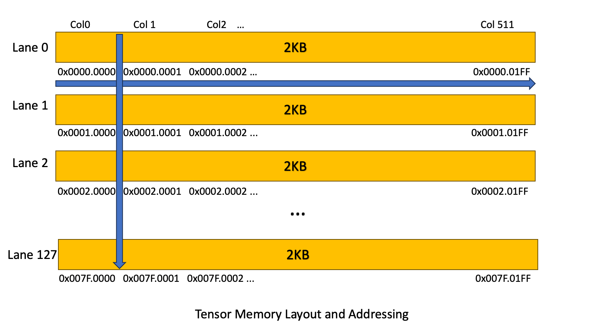
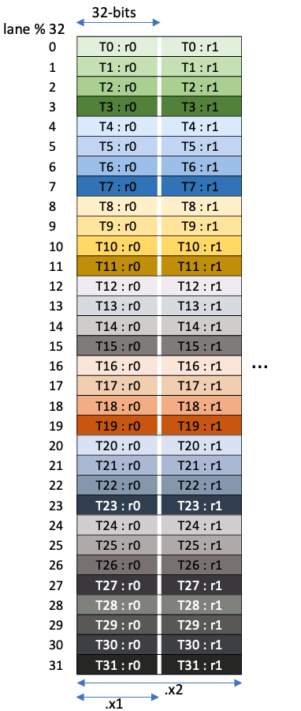
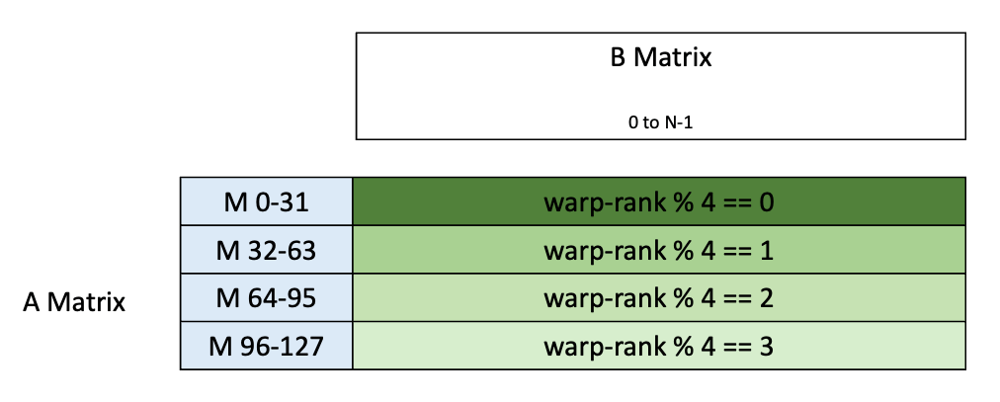
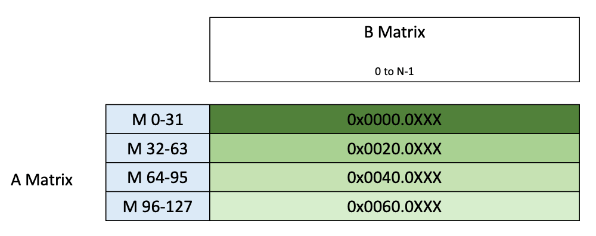

# CUTLASS Tutorial: Writing GEMM Kernels Using Tensor Memory For NVIDIA® Blackwell GPUs

**Date:** April 19, 2025

**Source:** [https://research.colfax-intl.com/cutlass-tutorial-writing-gemm-kernels-using-tensor-memory-for-nvidia-blackwell-gpus/](https://research.colfax-intl.com/cutlass-tutorial-writing-gemm-kernels-using-tensor-memory-for-nvidia-blackwell-gpus/)

---

The NVIDIA Blackwell architecture introduces some new features that significantly change the shape of a GEMM kernel. In this series of posts, we explore the new features available on Blackwell and examine how to write CUTLASS GEMM kernels that utilize these new features by drawing on the CuTe tutorial examples.

- [Part 1, this one] discusses the 5th generation Tensor Core MMA instructions specific to Blackwell, and the Tensor Memory that they use.
- [Part 2] explains how to work with clusters, including new considerations around TMA multicast and Blackwell’s CTA-pair concept.
- [Part 3] describes MMA with lower precision datatypes, and how Blackwell natively supports block-scaling with MMAs.

The goal of this series is to explain how to either update a Hopper GEMM kernel to run on the Blackwell architecture, or instead write a Blackwell GEMM kernel from scratch.

In this article, we will go over Blackwell’s MMA instruction and Tensor Memory. We’ll begin with a general summary of these two features before moving on to CUTLASS abstractions of the features. Then we will study the first of the [CuTe Blackwell examples](https://github.com/NVIDIA/cutlass/tree/main/examples/cute/tutorial/blackwell) with a focus on what has changed since Hopper. The goal of this post is to explain a minimal working example of a simple GEMM kernel using features new to Blackwell.

Note that the consumer Blackwell architecture (compute capability 12.0) differs from the data center Blackwell architecture (compute capability 10.0) in some major ways, notably lacking Tensor Memory. We’ll only discuss data center Blackwell in these posts.

# An Overview of Blackwell MMA

If you try to run a CUTLASS Hopper GEMM kernel on a Blackwell GPU, the first thing that you’ll notice is that it doesn’t work. The Hopper WGMMA instruction (in PTX, `wgmma.mma_async`) has been deprecated on Blackwell. To replace it, Blackwell introduced the `tcgen05.mma` instruction for MMA. In CUTLASS, `tcgen05.mma` is referred to as **UMMA**, and for conciseness we will be adopting this terminology going forward. This new instruction is meant to replace the WGMMA from Hopper. Just like WGMMA, UMMA is an asynchronous instruction that computes one of the following matrix operations:

`D = A * B + DD = A * B`

However, there are some major differences compared to WGMMA.

- Support for low precision data types including FP4 and FP6, and increased throughput across all precisions.
- Built-in block scaling support.
- Tensor Core dedicated memory called Tensor Memory to be used for UMMA accumulation.
- Two adjacent CTAs within an SM cluster, called a **CTA pair**, can work on the UMMA together across two SMs.
- Unlike WGMMA, only one thread is used to launch UMMA. Even if using two CTAs, only one thread in one CTA launches UMMA.

In this article, we will primarily focus on the third point by discussing Tensor Memory: what it is and how to use it for UMMA.

## Tensor Memory

**Tensor Memory (TMEM)** is a dedicated on-chip memory for use by Tensor Cores. Its primary purpose is to replace registers for 5th generation Tensor Core operations by using TMEM instead. Specifically for UMMA, the instruction expects the following input sources: 

- Operand A can be in TMEM or SMEM
- Operand B must be in SMEM
- Accumulator must be in TMEM

This means that UMMA requires no registers for data, reducing the register pressure of MMA operations. Furthermore, this lack of register requirement, along with the single thread launch, allows for further decoupling of the MMA from the CTA’s main execution. Combined with TMA, the only processing that CTAs do directly in a standard GEMM is the pre- and post-processing.

In historical context, these developments continue a trend of replacing general-purpose computational resources by specialized hardware resources, to both remove bottlenecks and free up those general-purpose resources for other operations. Starting with the Volta architecture, the Tensor Cores divorced GEMM arithmetic operations from the general computational pipeline. Ampere’s asynchronous copy instructions allowed for true pipelining of GEMM mainloops. On Hopper GPUs, the asynchronous, single-threaded TMA and the ability to reallocate registers between warpgroups dramatically reduced the register and thread cost of data movement, and the asynchronous WGMMA allowed for pipelining of MMA with other compute operations. Now, Tensor Memory and UMMA do for MMA just what TMA did for copy, making it a single-threaded, asynchronous operation that does not consume registers. As a result, registers can primarily be used for other tasks like scheduling and fused epilogue operations.

TMEM is 256KB per SM in size, and is organized 2-dimensionally in 512 columns and 128 rows, or **lanes**, of 32-bit cells. This inherent 2-D structure is reflected in the 32-bit addresses as well, where bits 31-16 denote the lane ID while 15-0 denote the column. This image from the [PTX documentation](https://docs.nvidia.com/cuda/parallel-thread-execution/index.html#tensor-memory-addressing) shows the layout:



TMEM is allocated dynamically using the `tcgen05.alloc` instruction. Furthermore, allocation is in units of columns, so in particular every lane of a column is allocated when a column is allocated. The number of columns allocated must be a power of 2 and at least 32. Finally, TMEM must be explicitly deallocated with `tcgen05.dealloc`. Both `tcgen05.alloc` and `tcgen05.dealloc` must be called from a single warp, and the same warp should both allocate and deallocate.

Note that the `tcgen05.alloc` instruction stores the base 32-bit address of the allocation to a given location in shared memory. The TMEM base address should then be set as the offset to the accumulator tensor for the UMMA, as we show below.

Typically, data gets *into* TMEM via UMMA operations, and is explicitly moved *out* to registers using `tcgen05.ld` for post-processing. It’s also possible for threads to manually load data into TMEM, either from SMEM through `tcgen05.cp` or from registers through `tcgen05.st`. However, TMEM access patterns for explicit load and store are very restricted. Each warp within a warpgroup can only access 32 lanes (with warp 0 associated to lanes 0-31, warp 1 to lanes 32-63, and so forth). Additionally, both the UMMA operation and the data movement operations expect certain data layouts. Luckily for us, CUTLASS provides utility functions that we’ll cover later that simplify the process of organizing data via swizzling. That said, those interested can find the layout information in the [PTX guide](https://docs.nvidia.com/cuda/parallel-thread-execution/index.html#tcgen05-shared-memory-layout-swizzling).

Finally, besides UMMA operations and these data movement instructions, no other operations access data from TMEM. In other words, all pre-processing must happen *before* the data is loaded onto TMEM, and all post-processing must happen *after* the data is retrieved out of TMEM.

## tcgen05.mma

Although we’ll mainly be using CUTLASS interfaces for this operation, the PTX documentation is the best source for understanding its functionality. Ignoring some optional arguments, the [PTX syntax](https://docs.nvidia.com/cuda/parallel-thread-execution/index.html#tensorcore-5th-generation-instructions-tcgen05-mma) for the `tcgen05` MMA operations takes one of these forms:

```
tcgen05.mma.cta_group.kind   [d-tmem],  a-desc,  b-desc, idesc, enable-input-d;
tcgen05.mma.cta_group.kind   [d-tmem], [a-tmem], b-desc, idesc, enable-input-d;
.kind      = { .kind::f16, .kind::tf32, .kind::f8f6f4 }
.cta_group = { .cta_group::1, .cta_group::2 }
```

For this example, we’ll look at a dense FP16 GEMM with FP32 accumulation (.kind::f16). We’ll only consider the 1-CTA case for now – the next post in this series will look at the 2-CTA version. From the [table of supported matrix shapes](https://docs.nvidia.com/cuda/parallel-thread-execution/index.html#tcgen05-kind-shapes), we see that MMA instructions are available in shapes 64 x N x 16 with N a multiple of 8 and 128 x N x 16 with N a multiple of 16, where in both cases N is at most 256. (For all data types, K is expected to be 32 bytes wide for dense GEMM.) Note that the largest UMMA atom, 128 x 256 x 16, is twice as large as the largest WGMMA atom. Its accumulator takes up exactly half of TMEM, meaning that several UMMA atoms can be pipelined without sacrificing performance.

The operands `a-desc` and `b-desc` are [shared memory descriptors](https://docs.nvidia.com/cuda/parallel-thread-execution/index.html#shared-memory-descriptor), which are very similar to [those used for WGMMA](https://docs.nvidia.com/cuda/parallel-thread-execution/index.html#asynchronous-warpgroup-level-matrix-shared-memory-layout-matrix-descriptor). Briefly, these are 64-bit values that pack information about the address, layout, and swizzling pattern of a matrix stored in SMEM. (If A is sourced from TMEM, its descriptor is replaced by its TMEM address.) Matrix tiles in SMEM are expected to be K-major, though the MMA instruction is able to transpose them, and are allowed to have one of [a few predefined swizzling patterns](https://docs.nvidia.com/cuda/parallel-thread-execution/index.html#tcgen05-shared-memory-layout-swizzling) similar to those used for WGMMA.

In addition to the matrix descriptors, `tcgen05.mma` also expects an **instruction descriptor** (the argument `idesc`). This is a 32-bit piece of metadata containing, for example, data type and sparsity information; full details can be found [here](https://docs.nvidia.com/cuda/parallel-thread-execution/index.html#instruction-descriptor). Notably, two bits in the instruction descriptor tell the instruction to transpose and/or negate A and/or B. In addition, the argument `enable-input-d` switches between zeroing out the accumulators before executing MMA (the operation D = A * B) and retaining the accumulators (D = A * B + D).

The accumulators live in [a transparent row-major format](https://docs.nvidia.com/cuda/parallel-thread-execution/index.html#data-path-layout-organization) in TMEM. Since no data is held in registers, we no longer have to worry about the complex thread-value layouts required for WMMA and WGMMA. However, recall that the data must be copied out to registers before storing or post-processing, and that each warp can only access ¼ of TMEM. This means that an entire warpgroup is required for the epilogue.

Since all data used for `tcgen05.mma` lives in CTA-shared memory spaces (TMEM or SMEM), the operation can and must be issued by a single thread in the CTA.

## tcgen05.ld

There are three types of memory movement instructions under `tcgen05`: `ld`, `st`, and `cp`. For our discussion we will focus on `ld`, which is used to copy data from TMEM to RMEM. The basic version of the [PTX instruction for `tcgen05.ld`](https://docs.nvidia.com/cuda/parallel-thread-execution/index.html#tensorcore-5th-generation-instructions-tcgen05-ld) is as follows:

```
tcgen05.ld.sync.aligned.shape.num.b32    r, [taddr];

.shape = { .16x64b, .16x128b, .16x256b, .32x32b }
.num    = { .x1, .x2, .x4, .x8, .x16, .x32, .x64, .x128 }
```

As indicated by the `.sync.aligned` qualifier, `tcgen05.ld` is a warp-wide instruction where all threads in the warp must execute the same instruction and are synchronized as a warp, similar to the earlier `ldmatrix` instruction.

`tcgen05.ld` supports a variety of data movement shapes, described in the [PTX guide](https://docs.nvidia.com/cuda/parallel-thread-execution/index.html#data-movement-shape). They are generally denoted by {lanes}x{bits}; our example uses 32x32b, which corresponds to 32 lanes (or data paths) by 32 bits, across a single warp. The next component, `.num`, describes the number of times this is repeated in the columns dimension. For our example, we use .x1 which performs a single load. In a single instruction, a warp can load at most lanes * bits * num <= 128 kb (16 kB), corresponding to 128 32-bit registers per thread. Finally, recall that each warp can only access 32 of the 128 TMEM lanes.

This diagram from the [PTX documentation](https://docs.nvidia.com/cuda/parallel-thread-execution/index.html#tcgen05-mma-fragment-3232b) shows our `tcgen05.ld.sync.aligned.32x32b.x1.b32` operation:



We can see that each thread loads 32 bits (or one column) from one lane and stores it in a register. The diagram also shows `.num = .x2` case, where the load is repeated for a second time and uses a second register per thread.

The arguments for our instruction are just `r` and `taddr`, where `r` is the destination register and `taddr` is the TMEM address — note that this is the *base* TMEM address of the loaded tile, and is the same across all threads in the warp.

With the large number of options, the natural question is how to pick the correct variant. The number of lanes is most affected by the MMA instruction used; different `tcgen05.mma` variants [result in different output layouts](https://docs.nvidia.com/cuda/parallel-thread-execution/index.html#tcgen05-data-path-layout-organization), and different `tcgen05.ld` shapes are suited for different situations. For the bit width and `.num`, the consideration is more about performance and resources. Larger repetition will reduce the number of issued instructions, and may facilitate vectorization. However, larger `.num` values also [require more registers](https://docs.nvidia.com/cuda/parallel-thread-execution/index.html#tcgen05-num-shapes-ld). So this value is a tuning parameter.

# The CUTLASS UMMA Interface

Now that we understand the UMMA instructions’ functionality, let’s discuss the CUTLASS/CuTe interface we’ll use to access it. Like previous CUTLASS MMA abstractions, this is described by:

- An MMA_Atom in the cute/arch/ directory, which is a wrapper for the appropriate PTX instruction;
- An MMA_Traits in the cute/atom/ directory, which contains CuTe layouts and other metadata used to interact with the atom in a CUTLASS-native way.

Our [WGMMA tutorial](https://research.colfax-intl.com/cutlass-tutorial-wgmma-hopper/) gives a more in-depth explanation of this design. Below is [the template signature for SM100_MMA_F16BF16_SS](https://github.com/NVIDIA/cutlass/blob/331a1f5b3fa3b6a9d9ef57c393d8719fb5510a32/include/cute/atom/mma_traits_sm100.hpp#L1090), which is the atom used in the first CuTe Blackwell code sample.

```
template <class a_type, class b_type, class c_type,
          int M, int N, UMMA::Major a_major, UMMA::Major b_major,
          UMMA::ScaleIn a_neg, UMMA::ScaleIn b_neg>
struct MMA_Traits<SM100_MMA_F16BF16_SS<a_type, b_type, c_type,
                                M, N, a_major, b_major,
                                a_neg, b_neg>>
{
  using ValTypeD = c_type;
  using ValTypeA = a_type;
  using ValTypeB = b_type;
  using ValTypeC = c_type;
  static_assert(cute::sizeof_bits_v<a_type> == cute::sizeof_bits_v<b_type> && 
                          cute::sizeof_bits_v<b_type> == 16, 
                          "SM100_MMA_F16BF16_SS supports 16bit types");
  using FrgTypeA = UMMA::smem_desc<a_major>;
  using FrgTypeB = UMMA::smem_desc<b_major>;
  using FrgTypeC = UMMA::tmem_frg_1sm<c_type>;
  // Logical shape-K is always 256bits, transform to units of elements
  static constexpr int K = 256 / cute::sizeof_bits<ValTypeA>::value;
  using Shape_MNK = Shape<Int<M>,Int<N>,Int<K>>;
  using ThrID   = Layout<_1>;
  using ALayout = Layout<Shape <_1,Shape <Int<M>,Int<K>>>,
                         Stride<_0,Stride<    _1,Int<M>>>>;
  using BLayout = Layout<Shape <_1,Shape <Int<N>,Int<K>>>,
                         Stride<_0,Stride<    _1,Int<N>>>>;
  using CLayout = Layout<Shape <_1,Shape <Int<M>,Int<N>>>,
                         Stride<_0,Stride<    _1,Int<M>>>>;
  UMMA::InstrDescriptor idesc_ = UMMA::make_instr_desc<
    a_type, b_type, c_type, M, N, a_major, b_major, a_neg, b_neg>();
  // Accumulate or overwrite C.   1: read C, 0: ignore C [clear accumulators]
  UMMA::ScaleOut accumulate_ = UMMA::ScaleOut::One;
...
}
```

A lot of the information here maps transparently onto concepts we’ve already seen for the `tcgen05.mma` instruction: SMEM descriptors for A and B, a TMEM layout for D, and an instruction descriptor. The atom size is supplied by the template parameters M and N (as a comment indicates, K is determined by the bit size of the data type). The template parameters `a_major`, `b_major`, `a_neg`, and `b_neg` are used to fill in the transpose and negate bits of the instruction descriptor. The `accumulate_` member (expected to be either `UMMA::ScaleOut::One` or `UMMA::ScaleOut::Zero`) supplies the PTX argument `enable_input_d`.

But something interesting is happening with the layouts. Previously, the `ThrID` layout was used to map logical indices of threads collaborating on an MMA instruction to their physical thread IDs. For warp-wide MMA, `ThrID` was `Layout<_32>`, and for WGMMA, it was `Layout<_128>`. Here it’s been reduced to `Layout<_1>`. Similarly, the TV-layouts for A, B, and C have size 1 in the thread mode. We might think that this is because the instruction is single-threaded, but it goes deeper than this. *Because the instruction is single-threaded, all thread layouts have been repurposed as layouts of the CTAs collaborating on an MMA instruction.* 

For the time being, we’ll only use 1 CTA per MMA, which will result in a fair number of apparently extraneous static-1s, whose use will become clearer when we graduate to 2 CTAs in the next blog post.

Finally, a brief note on the anatomy of the atom name.  `SM100_MMA_F16BF16_SS` can be deconstructed into the following parts.

- `SM100_MMA`: specifies the instruction. Simply, the UMMA instruction for `sm100`.
- `F16BF16`: specifies the accepted input types for A and B. In this case, either `fp16` or `bf16`. Note that this maps onto the `.kind` qualifier for `tcgen05.mma` (e.g., `.kind::f16`), while the exact input type is recorded by the [instruction descriptor](https://docs.nvidia.com/cuda/parallel-thread-execution/#tcgen05-instuction-desc-kind-tf32-f16-f8f6f4).
- `SS`: specifies memory location for A and B. `SS` is for both being in SMEM, while `TS` is for A being in TMEM and B in SMEM.
- Suffix: There are additional suffixes for more complex cases, such as block scaling or 2-SM UMMA.

Note that unlike the Hopper atoms, the size of the MMA as well as the data types of the operands or the accumulator used are not part of the atom name. Instead they are determined by the template parameters.

# CUTLASS Example: Simple UMMA

Next, let’s discuss the implementation presented in the [first Blackwell CuTe example](https://github.com/NVIDIA/cutlass/blob/main/examples/cute/tutorial/blackwell/01_mma_sm100.cu). To keep the discussion focused on Blackwell, we will assume a degree of familiarity with the typical format of CUTLASS GEMM kernels. For a more introductory discussion, see our [earlier blog series](https://research.colfax-intl.com/cutlass-tutorial-wgmma-hopper/). 

For clarity, we will roughly subdivide our discussion into five sections:

1. GMEM tilers and slicing
2. SMEM layouts and swizzle
3. Input and Output descriptors
4. Synchronization and GEMM
5. Copying out of TMEM

The main recurring theme across all five parts is that partitioning takes place among CTAs, rather than among threads.

## GMEM tilers and slicing

First, we need to partition the global input tensors into tiles and assign them to CTAs for processing. For this example, we do not have multiple SMs collaborating on the same UMMA, so tiling for a CTA here is the same thing as tiling for UMMA (this is not the case in non-trivial set ups, as we will see in a future post). So we create the `tiled_mma` object first, and then choose the dimensions of the tiler based on `tiled_mma`.

```
TiledMMA tiled_mma = make_tiled_mma(SM100_MMA_F16BF16_SS<TypeA, TypeB, TypeC,                 
                                                         128, 256,
                                                         UMMA::Major::K, 
                                                         UMMA::Major::K>{});
auto bM = tile_size<0>(tiled_mma);             // 1 MMA per CTA tile
auto bN = tile_size<1>(tiled_mma);             // 1 MMA per CTA tile
auto bK = tile_size<2>(tiled_mma) * Int<4>{};  // 4 MMA per CTA tile
auto mma_tiler = make_shape(bM, bN, bK);       // (MMA_M, MMA_N, MMA_K)
```

One distinction to make here is that the factor of 4 in `MMA_K` is the number of MMAs per K tile, not the number of K tiles. This means that there are 4 UMMA calls per GMEM to SMEM copy, as this copy is done per tile.

Printing the MMA reveals the following.

```
TiledMMA
  ThrLayoutVMNK:  (_1,_1,_1,_1):(_0,_0,_0,_0)
  PermutationMNK: (_,_,_)
MMA_Atom
  ThrID:  	_1:_0
  Shape_MNK:  (_128,_256,_16)                  	// MmaM, MmaN, MmaK instruction size
  LayoutA_TV: (_1,(_128,_16)):(_0,(_1,_128))   	// TV -> MmaCoordinate mapping for A
  LayoutB_TV: (_1,(_256,_16)):(_0,(_1,_256))   	// TV -> MmaCoordinate mapping for B
  LayoutC_TV: (_1,(_128,_256)):(_0,(_1,_128))  	// TV -> MmaCoordinate mapping for C
```

As we saw with the MMA atom, all “thread layouts” are being repurposed to refer to layouts of CTAs collaborating on the MMA. In this example, only one CTA is being used per `TiledMMA`, so all these layouts have size 1. The value layouts of A, B, and C display their shapes as expected. We then get the following GMEM Tensors per CTA:

```
print(gA);   // (_128,_64,4):(256,_1,_64)
print(gB);   // (_256,_64,4):(256,_1,_64)
print(gC);   // (_128,_256):(1024,_1)
print(gD);   // (_128,_256):(1024,_1)
```

We see the static integers `bM, bN, bK = _128, _256, _64` appearing as the modes of these layouts, as well as the dynamic integer 4 since we take `K = 256` in this example.

As another consequence of “thread layouts” being repurposed to “Peer CTA layout”, the `tiled_mma` is now sliced by the CTA peer ID instead of thread ID. However in this example, we only have one CTA so we can simply slice by `_0{}`.

```
ThrMMA cta_mma = tiled_mma.get_slice(_0{});   
Tensor tCgA = cta_mma.partition_A(gA);        // (MmaA, NumMma_M, NumMma_K, Tiles_K)
Tensor tCgB = cta_mma.partition_B(gB);        // (MmaB, NumMma_N, NumMma_K, Tiles_K)
Tensor tCgC = cta_mma.partition_C(gC);        // (MmaC, NumMma_M, NumMma_N)
Tensor tCgD = cta_mma.partition_C(gD);        // (MmaC, NumMma_M, NumMma_N)

print(tCgA); // ((_128,_16),_1,_4,4):((256,_1),_0,_16,_64)
print(tCgB); // ((_256,_16),_1,_4,4):((256,_1),_0,_16,_64)
print(tCgC); // ((_128,_256),_1,_1):((1024,_1),_0,_0)
print(tCgD); // ((_128,_256),_1,_1):((1024,_1),_0,_0)
```

This change is reflected in the name of the sliced MMA. In CuTe examples targeting Hopper, the sliced MMA was typically labeled `thr_mma`, but now it is called `cta_mma`. Finally, the partitioned GMEM tensors have the expected layouts as deduced from the MMA atom size of 128x256x16.

### Handling Clusters

So far, we have only discussed the 1 SM case for UMMA. However, in the case that 2 SMs are involved per UMMA, the UMMA shape is not the same as the CTA shape, and we would need to slice the `tiled_mma` with the Peer CTA ID (i.e. the position of the CTA in its pair, either 0 or 1). We briefly digress to show how to accommodate this case, deferring a broader discussion to Part 2 in this series.

Each CTA pair necessarily consists of a pair of adjacent CTAs in a cluster. This means that we can extract the Peer CTA ID as follows.

```
Layout cluster_layout_vmnk = tiled_divide(make_layout(cluster_shape),
                                         make_tile(typename TiledMMA::AtomThrID{}));
auto mma_coord_vmnk = make_coord(
                   blockIdx.x % size<0>(cluster_layout_vmnk), // Peer CTA coordinate
                   blockIdx.x / size<0>(cluster_layout_vmnk), //    MMA-M coordinate
                   blockIdx.y,                                //    MMA-N coordinate
                   _);                                        //    MMA-K coordinate

  auto mma_v = get<0>(mma_coord_vmnk);
  ThrMMA cta_mma = tiled_mma.get_slice(mma_v);   // Use Peer CTA coordinate
```

`cluster_layout_vmnk` is used to create the cluster_shape that is aware of the CTA pairs; `AtomThrID` is either 1 or 2 depending on whether the specified UMMA atom uses CTA pairs. This is then used to compute the 4-dimensional coordinate of the CTA, where the 0th mode is the Peer CTA ID. Note that in the case where `size<0>(cluster_layout_vmnk)` is 1 (no CTA pairs), the coordinate simplifies to the more familiar `(1, blockIdx.x, blockIdx.y, _)`.

Finally, we can use the 0th mode to slice the `tiled_mma`. Once again, for this particular example, `mma_v` is always 0 because there is only 1 CTA. But in later examples, `mma_v` will be either 0 or 1.

## SMEM Layouts and Swizzle

We now have the tiler for the global tensors, and so we have the source side of the copy. Next is the destination: the SMEM. For A, the destination tensor, `tCsA`, should be organized in shape `(MmaA, NumMma_M, NumMma_K) = ((_128,_16),_1,_4)` to be consistent with the GMEM layout. CUTLASS has an utility function for creating the required shape.

```
auto mma_shape_A = partition_shape_A(tiled_mma, make_shape(size<0>(mma_tiler),
                                                           size<2>(mma_tiler)));
auto mma_shape_B = partition_shape_B(tiled_mma, make_shape(size<1>(mma_tiler), 
                                                           size<2>(mma_tiler)));
```

To optimize SMEM accesses, the layout should also be swizzled, which is done as follows.

```
// Sw<3,4,3> o smem_ptr[16b](unset) o ((_128,_16),_1,_4):((_64,_1),_0,_16)
auto sA_layout = UMMA::tile_to_mma_shape(UMMA::Layout_K_SW128_Atom<TypeA>{},
                                         mma_shape_A);
// Sw<3,4,3> o smem_ptr[16b](unset) o ((_256,_16),_1,_4):((_64,_1),_0,_16)
auto sB_layout = UMMA::tile_to_mma_shape(UMMA::Layout_K_SW128_Atom<TypeB>{}, 
                                         mma_shape_B);
```

Here, `Layout_K_SW128_Atom<TypeA>` is a 128 byte wide swizzle for K-major A of data `TypeA`. The width of the swizzle is determined by the size of the tile in the contiguous dimension. In this case, the K dimension has 4 tiles of size 16 and half-precision is 2 bytes, so the width is `16*4*2=128` bytes. For more details on swizzling for MMA, see [this post](https://research.colfax-intl.com/cutlass-tutorial-wgmma-hopper/).

Like other CUTLASS code, this example allocates SMEM dynamically and manages it as a `SharedStorage` struct. In this case, the `SharedStorage` holds tiles of A and B, and an mbarrier object which is used to manage the asynchrony of the MMA. To handle TMEM allocation, the `SharedStorage` also holds a 32-bit address for the TMEM base address.

```
template <class TypeA,       	// Tensor A data type
          class TypeB,       	// Tensor B data type
          class ASmemLayout, 	// (MmaA, NumMma_M, NumMma_K, ...)
          class BSmemLayout> 	// (MmaB, NumMma_N, NumMma_K, ...)
struct SharedStorage
{
  alignas(128) cute::ArrayEngine<TypeA, cute::cosize_v<ASmemLayout>> A;
  alignas(128) cute::ArrayEngine<TypeB, cute::cosize_v<BSmemLayout>> B;

  alignas(16) cute::uint64_t mma_barrier;  // Barrier to track MMA computation on SMEM
  alignas(16) cute::uint32_t tmem_base_ptr;  // Base pointer for TMEM allocation

  CUTE_DEVICE constexpr auto tensor_sA() { return make_tensor(make_smem_ptr(A.begin()), ASmemLayout{}); }
  CUTE_DEVICE constexpr auto tensor_sB() { return make_tensor(make_smem_ptr(B.begin()), BSmemLayout{}); }
};
```

This example copies from GMEM to SMEM using the auto-vectorizing `cute::cooperative_copy`. We could alternatively write a TiledCopy or use TMA as usual.

## Input and Output descriptors

UMMA can either accept the first input from SMEM or TMEM, the second input must be in SMEM, and the accumulator must be in TMEM. The particular atom variant used in the example takes both inputs from SMEM.

To create the descriptors, we use the `make_fragment` methods of the `cta_mma` just as in Hopper and earlier GEMMs.

```
// Represent the SMEM buffers for A and B
Tensor tCsA = shared_storage.tensor_sA();      // (MmaA, NumMma_M, NumMma_K)
Tensor tCsB = shared_storage.tensor_sB();      // (MmaB, NumMma_M, NumMma_K)

Tensor tCrA = cta_mma.make_fragment_A(tCsA);
Tensor tCrB = cta_mma.make_fragment_B(tCsB);

Tensor tCtAcc = cta_mma.make_fragment_C(tCgC); // (MmaC, NumMma_M, NumMma_N)
```

Just like in Hopper’s WGMMA, the operand Tensors are not tensors of register-backed data but tensors of [SMEM matrix descriptors](https://docs.nvidia.com/cuda/parallel-thread-execution/index.html#shared-memory-descriptor). For example, printing tCrA shows

```
tCrA:   UMMA::DescriptorIterator o (_1,_1,_4):(_0,_0,_2)
```

with a single descriptor per MMA atom, tiled by `(NumMma_M, NumMma_K) = (_1, _4)`. We have covered matrix descriptors previously as part of [our blog on WGMMA](https://research.colfax-intl.com/cutlass-tutorial-wgmma-hopper/).

The accumulator tensor here is an ordinary TMEM-backed tensor, but its layout may be hard to grasp at first:

```
tCtAcc: tmem_[32b](TMEM_ADDR) o ((_128,_256),_1,_1):((_65536,_1),_0,_0)
```

The TMEM address has a stride of 65536; this is because of the 32-bit addressing scheme for TMEM that we discussed earlier. The first 16 bits of this address refer to the lane, while the last 16 denote the column. The trick here is that `65536 = 1<<16.` So for example a coordinate of `(1,1)` becomes:

`(1,1) = (1*1<<16) + 1 = x0001.0001`

which is the 32-bit address (in hex) corresponding to lane 1 of column 1.

## GEMM and Synchronization

Just like WGMMA for Hopper, UMMA is asynchronous and hence requires synchronization. The example uses some CUTLASS shortcuts and the abstractions around mbarrier for this. Following is an excerpt from the example showing the workflow.

```
if (elect_one_warp && elect_one_thr) {
  cute::initialize_barrier(shared_storage.mma_barrier, /* num_ctas */ 1);
}
int mma_barrier_phase_bit = 0;  // Each barrier has an associated phase_bit.
__syncthreads();                

// Initial MMA overwrites the accumulators
tiled_mma.accumulate_ = UMMA::ScaleOut::Zero;
for (int k_tile = 0; k_tile < size<3>(tCgA); ++k_tile)
{
  // ... copy data in ...

  // Only one warp starts UMMAs
  if (elect_one_warp) {
    // Execute a MmaTile_M x MmaTile_N x MmaTile_K GEMM
    for (int k_block = 0; k_block < size<2>(tCrA); ++k_block) {
      gemm(tiled_mma, tCrA(_,_,k_block), tCrB(_,_,k_block), tCtAcc);
      // Non-initial MMAs accumulate into the accumulators
      tiled_mma.accumulate_ = UMMA::ScaleOut::One;
    }
    // Ensure MMAs are completed, only then we can reuse the A and B SMEM.
    cutlass::arch::umma_arrive(&shared_storage.mma_barrier);
  }
  // All warps wait for MMAs to complete to avoid overwriting the A and B SMEM.
  cute::wait_barrier(shared_storage.mma_barrier, mma_barrier_phase_bit);
  mma_barrier_phase_bit ^= 1;
}

// ... copy data out ...
```

The synchronization constructs are essentially the same as those used for TMA. If you want an introductory tutorial for TMA and synchronization, see our earlier [blog](https://research.colfax-intl.com/tutorial-hopper-tma/). One thing worth noting is that the mbarrier is initialized by one thread that belongs to the warp that will be launching UMMA. 

The `gemm` call and the loop structure should also be familiar from the Hopper example. The main difference to note is the fact that only one warp launches the UMMAs. Recall that only one *thread* is supposed to issue a PTX UMMA instruction. CUTLASS elects this thread under the hood in its implementation of the UMMA atom, so in fact, calling `cute::gemm` from a single thread will lead to deadlock.

The final thing worth mentioning here is `UMMA::ScaleOut::Zero`. This instructs UMMA to overwrite the TMEM instead of accumulating over pre-existing values. After the first `k_block` iteration, this gets set to `UMMA::ScaleOut::One` so that the result is accumulated.

## Copy out of TMEM

Once all the MMAs are done, we need to copy the accumulator results from TMEM to registers. This is done using the PTX `tcgen05.ld` instruction. CUTLASS abstracts `tcgen05.ld` as a copy atom, with different variants we saw earlier represented as different copy traits defined in copy atoms found in [cute/atom/copy_traits_sm100.hpp](https://github.com/NVIDIA/cutlass/blob/main/include/cute/atom/copy_traits_sm100.hpp). Our example uses the `SM100_TMEM_LOAD_32dp32b1x` atom. We can see how this translates into the correct variant in the PTX wrapper around our atom, found in [cute/arch/copy_sm100.hpp](https://github.com/NVIDIA/cutlass/blob/331a1f5b3fa3b6a9d9ef57c393d8719fb5510a32/include/cute/arch/copy_sm100.hpp#L3333).

```
// 32 data path lanes, 32-bit pattern, repeated 1 times
struct SM100_TMEM_LOAD_32dp32b1x
{
  using SRegisters = uint32_t[1];
  using DRegisters = uint32_t[1];

  CUTE_HOST_DEVICE static void
  copy(uint32_t const& src_addr,
       uint32_t& dst0)
  {
#if defined(CUTE_ARCH_TCGEN05_TMEM_ENABLED)
    asm volatile ("tcgen05.ld.sync.aligned.32x32b.x1.b32"
                    "{%0},"
                    "[%1];\n"
    :  "=r"(dst0)
    :  "r"(src_addr));
#else
    CUTE_INVALID_CONTROL_PATH("Trying to use TMEM_LOAD without CUTE_ARCH_TCGEN05_TMEM_ENABLED.");
#endif
  }
};
```

Using this atom, we can set up a TiledCopy to extract the accumulator result from TMEM to RMEM. Note that, in a departure from the rest of the CTA-level operations we’ve seen in this example, we are back to warp and thread-level operations — because the data has to be moved to registers to perform the epilogue.

```
// Create the tiled copy operation for the accumulator (TMEM -> RMEM)
TiledCopy tiled_t2r_copy = make_tmem_copy(SM100_TMEM_LOAD_32dp32b1x{}, tCtAcc);
ThrCopy   thr_t2r_copy   = tiled_t2r_copy.get_slice(threadIdx.x);

//...

Tensor tDtAcc = thr_t2r_copy.partition_S(tCtAcc);    
Tensor tDgD   = thr_t2r_copy.partition_D(tCgD);     
using AccType = typename decltype(tCtAcc)::value_type;
Tensor tDrAcc = make_tensor<AccType>(shape(tDgD));   
// Load TMEM -> RMEM
copy(tiled_t2r_copy, tDtAcc, tDrAcc);
```

Here we use a specialized function, `make_tmem_copy`, to deduce a TV-layout from the copy atom and TMEM tensor and create the TiledCopy. One important thing to know about this function is that *it is hardcoded to use 4 warps, or 1 warpgroup.* As mentioned in the earlier section, certain regions of TMEM are only accessible by a corresponding warp in a warpgroup, based on the warp index mod 4. This [diagram from the PTX manual](https://docs.nvidia.com/cuda/parallel-thread-execution/index.html#layout-d-m-128-cta-group-1) shows how the data is assigned to warps for our example:



The [following diagram from PTX manual](https://docs.nvidia.com/cuda/parallel-thread-execution/index.html#tcgen05-data-path-layout-d2) shows the TMEM addresses that this maps to. 



To understand how CuTe handles this copy, we can turn to the traits struct, found in [cute/atom/copy_traits_sm100.hpp](https://github.com/NVIDIA/cutlass/blob/b84e9802d84b16bcb4e92338fcf0a04785df9236/include/cute/atom/copy_traits_sm100.hpp#L2110).

```
template <>
struct Copy_Traits<SM100_TMEM_LOAD_32dp32b1x>
     : TMEM_LOAD_Unpack<SM100_TMEM_LOAD_32dp32b1x>
{
  using ThrID = Layout<_32>;
  using ValID = Layout<Shape <_32, _32>, Stride< _1,TMEM::DP_b>>;
  using SrcLayout = Layout<Shape <_32, _1024>, Stride< _0, _1>>;
  using DstLayout = Layout<Shape <_32, _32>, Stride<_32, _1>>;
  using RefLayout = SrcLayout;
};
```

The layout `ThrID` defines the mapping from logical thread ID to thread index in a warp; the value `32` means that this is a warp-wide operation. 

`ValID` tells us the mapping from logical bit id to bit address; for example, bit 35 gets mapped by the `ValID` layout to 3rd bit on lane 1. The layout has shape (bit, lane) and the stride for the lane, `TMEM::DP_b`, is `1<<21`; `1<<16` is from the TMEM addressing scheme as we saw earlier, and the extra 5 is from the cells being `1<<5=32` bits wide.

`SrcLayout` gives us the mapping from (src-thread, src-bit) to bit. This load is a warp-wide operation and the input base src address is the same across the warp. So the thread value is suppressed (with stride of 0) so that this maps src-bit to bit.

Finally, the `DstLayout` shows the mapping for (dst-thread, dst-bit) to bit. The layout’s shape `<32,32>` tells us that the each thread is responsible for writing out 32 bits (1 register). Note that this layout is simple for the `32dp32b` as the lanes and columns in TMEM translate directly to rows and columns in the output. But for more complex load patterns, we need this layout to determine how the output RMEM bits are mapped to the logical bit index.

Now returning to the code, the TiledCopy created from this atom is used to partition the output matrices. Then the partitions are sliced by thread ID to get the per-thread Tensors. Given our MMA size of 128×256, we get the following Tensors printed for thread 0 (showing `tCtAcc` again for ease of reference):

```
// reproduced from above
tCtAcc: tmem_[32b](0x0000.0000) o ((_128,_256),_1,_1):((_65536,_1),_0,_0)
// new tensors for tmem -> rmem copy
tDtAcc: tmem_[32b](0x0000.0000) o ((_32,_1),_256,_1,_1):((_65536,_0),_1,_0,_0)
tDrAcc: ptr[32b](0x705671fff290) o ((_1,_1),_256,_1,_1):((_0,_0),_1,_0,_0)
```

We can see the MMA size of 128×256 directly reflected in the `tCtAcc`. The partition `tDtAcc` is a *per-thread* tensor that maps to the TMEM address. Note again that each thread in the same warp reads the same TMEM addresses uniformly, which explains the sub-layout (_32, _1) : (_65536, _1) for the value mode. With 128 threads across 4 warps, this covers the M-mode. The 1st mode indicates that this is repeated 256 times to cover the N-mode, and so we get our 128×256 tile. The final two 1 values are M-tiles and N-tiles, which are 1 in our case. On the `tDrAcc` side, the main difference is that this is representing the registers. So since each thread is responsible for one 32-bit cell in TMEM, we just see (_1, _1) for the value mode. Once again with 128 threads across 4 warps, this covers the M-mode. The other modes are the same as the `tDtAcc`.

Finally, once the accumulator has been copied out to RMEM, it can be post-processed (e.g. `axpby`) before being stored back to GMEM.

# Allocating and Deallocating TMEM

There is one additional topic to discuss for the basic example: TMEM allocation and deallocation. We can do this using the CuTe helper class [cute::TMEM::Allocator1Sm](https://github.com/NVIDIA/cutlass/blob/main/include/cute/arch/tmem_allocator_sm100.hpp), which provides an interface to the `tcgen05.alloc` and `tcgen05.dealloc` functions discussed above. The basic pattern is as follows.

```
// instantiate the allocator 
cute::TMEM::Allocator1Sm tmem_allocator{};

if (elect_one_warp) {
    tmem_allocator.allocate(TmemAllocator::Sm100TmemCapacityColumns, &shared_storage.tmem_base_ptr);
}
__syncthreads();
tCtAcc.data() = shared_storage.tmem_base_ptr;   // move accumulator offset

// rest of kernel

if (elect_one_warp) {
    tmem_allocator.release_allocation_lock();
    tmem_allocator.free(shared_storage.tmem_base_ptr, TmemAllocator::Sm100TmemCapacityColumns);
  }
```

As discussed in the earlier section, one warp performs the allocation, passing a number of columns and a pointer to a 32-bit value in shared memory; the `allocate` method then stores the 32-bit address of the start (the lowest (lane, column)) of the allocated TMEM. Although only 256 columns are needed for this MMA instruction, for simplicity the kernel allocates all 512 columns of TMEM. Note that, while only one thread passes the TMEM address to the MMA instruction, all threads need it to load data from TMEM for the epilogue, requiring it to be passed through shared memory. Finally, the same warp that called `allocate` also has to call `free`. As a slightly more advanced feature, the `release_allocation_lock` method is a wrapper for [`tcgen05.relinquish_alloc_permit`](https://docs.nvidia.com/cuda/parallel-thread-execution/index.html#tcgen05-instructions-tcgen05-alloc-dealloc-relinquish-alloc-permit); apparently, this is a guarantee that the CTA will not perform any further TMEM allocation, allowing future CTAs to queue up for the same SM. You can see some more complete examples of TMEM management in the [CUTLASS sm100 GEMM kernels](https://github.com/NVIDIA/cutlass/blob/main/include/cutlass/gemm/kernel/sm100_gemm_tma_warpspecialized.hpp#L535).

To help with TMEM management, nvcc has added the flag `--g-tensor-memory-access-check`. With this flag enabled, at runtime the kernel will error out on any uninitialized or out-of-bounds TMEM access and print an error message.

# Conclusion

In this post, we discussed the new features available on Nvidia Blackwell GPUs and then looked at how to use these features by going over the [first CuTe Blackwell example](https://github.com/NVIDIA/cutlass/blob/main/examples/cute/tutorial/blackwell/01_mma_sm100.cu). We observed that the main concepts and the overall structure of the CUTLASS GEMM kernel have not changed with the Blackwell architecture. That said, the two main changes we observed in the example were: 

1. The UMMA atom is at CTA-level instead of thread-level, and so various constructions around the TiledMMA and synchronization model have to be updated accordingly (e.g., a single thread issues UMMA asynchronously);
2. UMMA accumulates into the new Tensor Memory, TMEM must be managed manually, and the accumulator has to be copied out from TMEM to registers using a special TiledCopy.

The example we went over in this post only dealt with single-SM UMMA instructions, and only used a trivial cluster shape of `<1,1,1>.` However, cluster level cooperation is an important part of Blackwell kernels. In the next post, we will discuss examples that handle non-trivial cluster shapes with multicasting and 2SM UMMA.

# References

Cris Cecka, Mihir Awatramani, “Programming Blackwell Tensor Cores with CUTLASS”, GTC 2025, [https://www.nvidia.com/en-us/on-demand/session/gtc25-s72720/](https://www.nvidia.com/en-us/on-demand/session/gtc25-s72720/).
