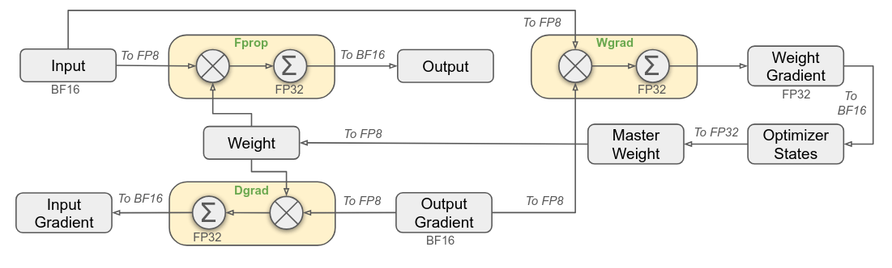
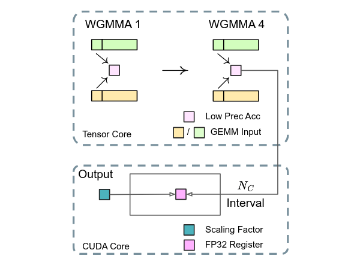

# DeepSeek-R1 and FP8 Mixed-Precision Training

**Date:** January 27, 2025

**Source:** [https://research.colfax-intl.com/deepseek-r1-and-fp8-mixed-precision-training/](https://research.colfax-intl.com/deepseek-r1-and-fp8-mixed-precision-training/)

---

[DeepSeek](https://www.deepseek.com/) has shocked the world with the release of their reasoning model [DeepSeek-R1](https://arxiv.org/abs/2501.12948). Similar to OpenAI’s o1 and Google Gemini’s Flash Thinking, the R1 model aims to improve the quality of its replies by generating a “[chain of thought](https://arxiv.org/abs/2201.11903)” before responding to a prompt. The excitement around R1 stems from it achieving parity with o1 on several industry-standard benchmarks, including math, coding, and English and Chinese language understanding, while also being open-source and available through the DeepSeek API at a [fraction of the cost](https://api-docs.deepseek.com/quick_start/pricing).

DeepSeek’s technical reports cover a wide swath of performance optimization techniques that enabled their breakthrough results on efficient LLM training and inference. Many of these techniques were already used to train DeepSeek-V3, a model comparable to Anthropic’s Claude Sonnet and OpenAI’s GPT-4o, from which the R1 model was obtained via fine-tuning and reinforcement learning. In this blog post, we’ll focus, in particular, on DeepSeek’s FP8 mixed-precision training strategy **for the base DeepSeek-V3 model**, described in section 3.3 of the [DeepSeek-V3 paper](https://arxiv.org/abs/2412.19437v1) and in the figure below (Figure 6 of that paper).

As always, a core bottleneck is matrix multiplication (aka “matmul” or “GEMM”), indicated by the yellow boxes in the diagram. As the figure shows, model weights are stored in FP8 and all matrix multiplications are performed in FP8 with FP32 accumulation. Activations and gradients are stored in BF16, and FP32 is also used for some internal computations.

<em>Figure 6 from the DeepSeek-V3 paper, showing the variety of float precisions that are used in their Linear layer.</em>

Why do we care about FP8 training? On NVIDIA GPUs, GEMM computations can take advantage of hardware acceleration provided by the GPU’s Tensor Cores. On the Hopper architecture, FP8 GEMM is natively-supported and achieves the highest possible compute throughput, [advertised at ~2 petaFLOPS on the H100 SXM GPU](https://resources.nvidia.com/en-us-tensor-core/nvidia-tensor-core-gpu-datasheet). In fact, NVIDIA finds low-precision computation so important that it’s expanding Tensor Core capabilities to FP4 and FP6 with Blackwell. Storing model weights in low precision also reduces the overall size of the model, placing less pressure on the memory and inter-GPU communication channels, which are already being pushed to their limits to keep up with the Tensor Cores.

Working in FP8 comes with several tradeoffs. First, to prevent overflow, one typically scales a higher-precision weight or activation matrix down to the FP8 representable range before quantizing it — for example, by dividing the whole tensor by its maximum element. That maximum element is retained separately and used as a scaling factor in each matmul with the quantized tensor. However, this makes the quantization process extremely sensitive to outliers: the presence of a very large weight in some layer could force all other weights to be quantized to 0. The DeepSeek team handles this issue by introducing *blockwise* and *tilewise* scaling, in which each 128×128 submatrix of a weight matrix, respectively each 1×128 subvector of an activation vector, is scaled and quantized separately. Then, due to the presence of varying scaling factors along the “inner” or “contracting” dimension of the GEMM, the rescaling computations need to be *fused* into the matmul mainloop. This required the team to write a custom FP8-GEMM-with-rescaling kernel. We also remark that blockwise quantization only (i.e., also for activations) proved insufficient for their purposes due to training instability; cf. the ablation study described in appendix B.2 of the paper.

Furthermore, optimal GEMM on Hopper GPUs uses warpgroup-wide MMA instructions (WGMMA), which we described in detail as [part of our GEMM tutorial](https://research.colfax-intl.com/cutlass-tutorial-wgmma-hopper/). Under these instructions, all of the Tensor Cores on a Hopper GPU’s Streaming Multiprocessor (SM) collaborate to compute fragments of the matrix product. However, this brings us to the second issue with FP8. The DeepSeek researchers found that the FP8 Tensor Cores were using a certain “fixed-point accumulation” strategy that effectively used only 14 bits of precision as opposed to true FP32 precision; cf. section 3.5.2 of the paper. This led to training inaccuracies that grew for large model sizes.

DeepSeek’s solution was to move some of the accumulation outside the Tensor Cores. Their GEMM kernel performs each series of 4 consecutive WGMMA operations inside the Tensor Cores, accumulating in the lower-precision format, but then adds the result into a separate register-backed accumulator tensor in FP32. This second addition is performed using CUDA Cores (the GPU’s standard execution unit for non-matmul FP32 arithmetic) and thus takes place in ordinary FP32 precision, mitigating the loss of accuracy. The dequantizing scaling factor is also applied to this FP32 accumulator.

<em>Figure 7(b) of the paper: the mixed-precision matmul technique used during training of DeepSeek-V3, in which lower-precision WGMMA operations on Tensor Cores alternate with higher-precision accumulation in CUDA Cores.</em>

The paper authors cite NVIDIA’s [CUTLASS library](https://github.com/NVIDIA/cutlass) for this technique. CUTLASS has supported [promotion of FP8 matmul to FP32 accumulation in CUDA Cores](https://github.com/NVIDIA/cutlass/blob/main/include/cutlass/gemm/collective/fp8_accumulation.hpp) since version 3.2. Moreover, blockwise scaling was added in [this PR](https://github.com/NVIDIA/cutlass/pull/1932) and merged to main in version 3.7, and tilewise scaling will soon be supported thanks to [this PR](https://github.com/NVIDIA/cutlass/pull/2037) (which renames the concept to *groupwise* scaling for clarity). As a CUTLASS user, you can invoke Hopper FP8 GEMM with promoted FP32 accumulation and blockwise scaling through the `CollectiveBuilder` with the `KernelScheduleType` set to `KernelTmaWarpSpecializedCooperativeFP8BlockScaledAccum` (cf. [example 67](https://github.com/NVIDIA/cutlass/blob/main/examples/67_hopper_fp8_warp_specialized_gemm_with_blockwise_scaling/67_hopper_fp8_warp_specialized_gemm_with_blockwise_scaling.cu)). In fact, CUTLASS’s Hopper FP8 GEMM kernels use the CUDA Core accumulation technique by default. Alternatively, you can accumulate only in the Tensor Cores using schedules such as `KernelTmaWarpSpecializedFP8FastAccum`; this trades better performance for lower accuracy, which may work better for inference applications.

At Colfax, we’re working to spread knowledge of these techniques so that anyone can take advantage of the optimizations that were central to DeepSeek’s success. If you’d like to learn more about using the CUTLASS library to build highly performant GEMM kernels, our [tutorial series](https://research.colfax-intl.com/category/papers/tutorials/) is a great place to start. If you are interested in customized training or have a more involved problem that could benefit from our expertise, please get in touch with our research team at [services@colfax-intl.com](mailto:services@colfax-intl.com).
