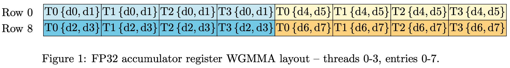
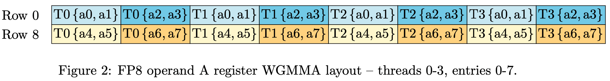
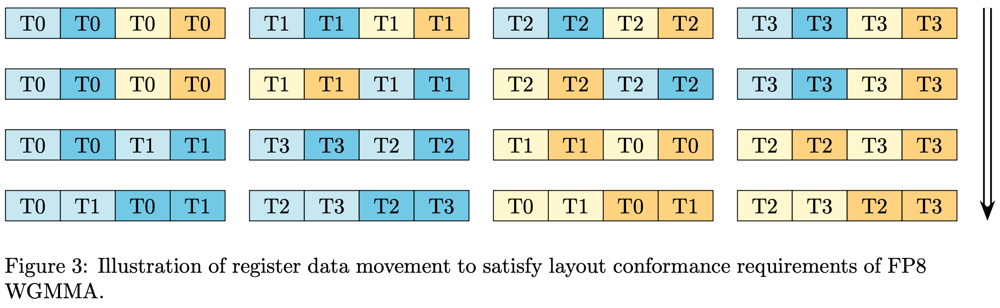
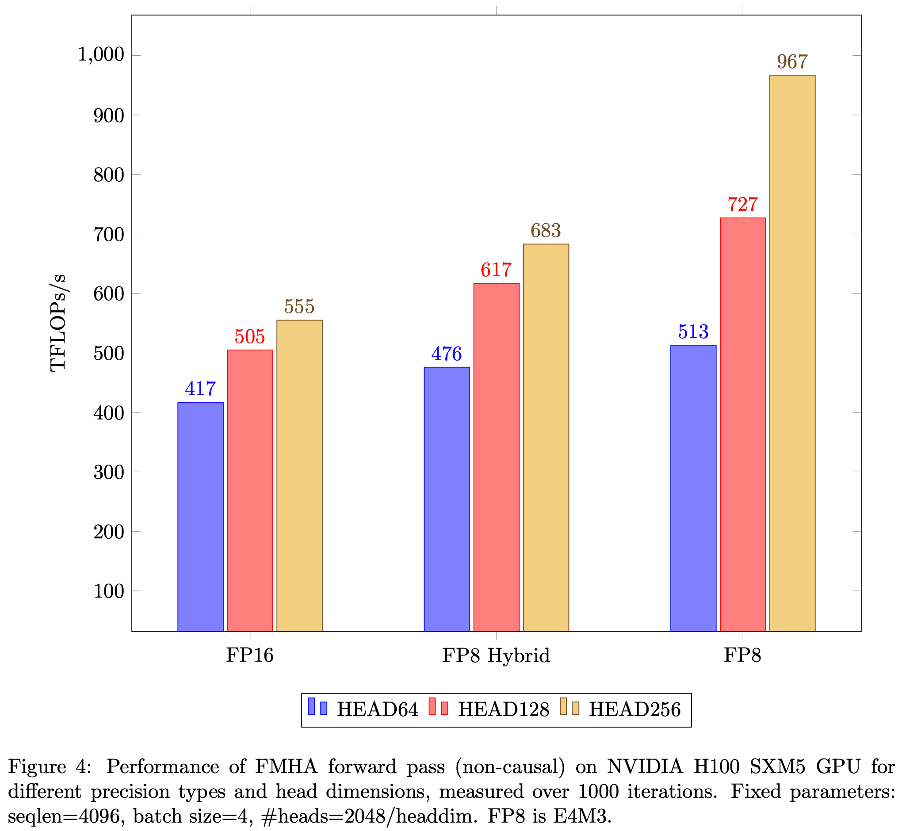
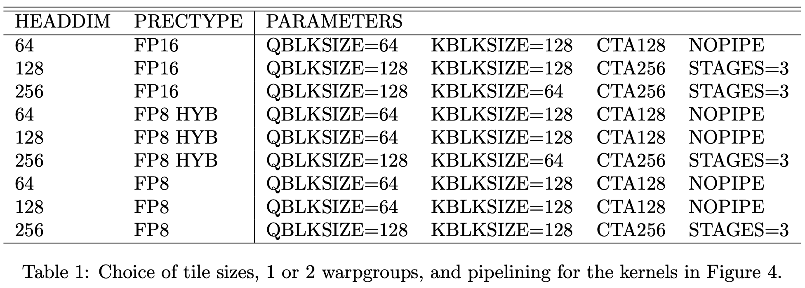
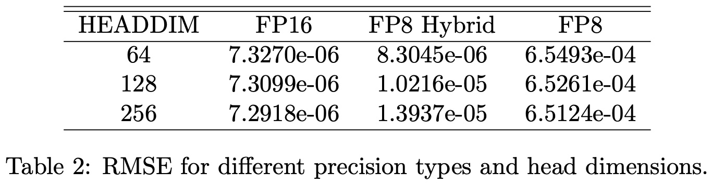

# Delivering 1 PFLOP/s of Performance with FP8 FlashAttention-2

**Date:** February 29, 2024

**Source:** [https://research.colfax-intl.com/adding-fp8-to-flashattention/](https://research.colfax-intl.com/adding-fp8-to-flashattention/)

---

We recently released an [update](https://github.com/ColfaxResearch/cutlass-kernels/tree/master/src/fmha-pipeline) to our FlashAttention-2 forward pass implementation on NVIDIA Hopper™ architecture that incorporates a number of new optimizations and improvements, including a software pipelining scheme and FP8 support. In this article, we will explain a challenge with achieving *layout conformance* of register fragments for WGMMA instructions that we encountered in the process of fusing back-to-back mixed-precision GEMMs with FP8 operands and FP32 accumulator. After explaining why this problem surfaces for FP8 but not FP16 precision operands, we’ll describe a performant method to achieve layout conformance through using a concise combination of two NVIDIA® CUDA® intrinsics – namely, the byte permute and shuffle sync instructions. Our solution takes some inspiration from a [blog post](https://blog.research.google/2024/01/mixed-input-matrix-multiplication.html) of Manish Gupta that studied a similar problem in the context of mixed-input GEMMs. Furthermore, we’ll discuss another complication that arises with the majorness of the V matrix for FP8 WGMMA. Finally, we will present some FLOPs/s benchmarks collected from runs with synthetic data on the NVIDIA® H100 Tensor Core GPU with SXM5 board form factor. In particular, for head dimension 256 and large sequence length, we obtain over *1 petaflop/s* of performance. This is consistent with other claims on FP8 fused attention performance in the same regime, e.g. by [HippoAttention](https://blog.hippoml.com/petaflops-inference-era-1-pflops-attention-and-preliminary-end-to-end-results-21f682cf2ed1).

## Recollections on FlashAttention-2

FlashAttention-2 is a *memory-aware* algorithm for multi-head attention (MHA) that was [introduced](https://arxiv.org/abs/2307.08691) by Tri Dao last year, building on earlier [work](https://arxiv.org/abs/2205.14135) of Dao and his collaborators. It serves as blueprint for implementing MHA as a *fused* CUDA kernel (FMHA), in which intermediate steps of the attention computation

$O = \mathrm{softmax}\left(\frac{1}{\sqrt{d}} Q K^T \right) V = \mathrm{softmax}(S) V = P V$

aren’t read back to HBM (i.e., global memory), but rather kept in shared memory or in registers. The key idea of FlashAttention-2, as well as the original FlashAttention, is to leverage tiling of the input tensors Q, K, V in conjunction with the *online-softmax* algorithm, which allows one to circumvent keeping the entire S matrix live for the softmax calculation.

Apart from the algorithm itself, there are a number of interesting challenges in terms of optimization to get a performant implementation on modern GPUs, in particular those built on NVIDIA Hopper architecture like the H100 GPU. For example, to make optimal use of the Tensor Cores on an H100 GPU for carrying out the matrix multiplications in FMHA, it’s important to target the new Hopper-specific WGMMA instructions as well as the Tensor Memory Accelerator (TMA) for loads from global to shared memory. We described how to accomplish this using tools from NVIDIA’s open-source CUTLASS library in our [paper](https://arxiv.org/abs/2312.11918) from last December. There, we chose to work with half-precision FP16 input tensors Q, K, V for the head-to-head performance comparison with Dao’s base implementation written for NVIDIA Ampere architecture. However, in practice we want to transition to even lower precision types, in keeping with the philosophy of model quantization. Therefore, as a first step we need to understand how to accommodate FP8 input tensors in the design of the FMHA kernel.

In what follows, when we discuss invoking WGMMA (that is, `wgmma.mma_async` in PTX) to multiply matrices such as Q**·**KT or P**·**V, we will implicitly be referring to tiles of these matrices. For example, we could choose 64×64 tiles.

## The challenge with FP8: layout conformance of WGMMA register fragments

WGMMA is warpgroup-level, so involves 128 threads (4 warps) to carry out the MMA. When invoking a WGMMA instruction, accumulation occurs in those threads’ registers. It is then paramount to understand the thread ownership pattern, i.e. register fragment layout, of the entries of the result matrix, as prescribed by WGMMA. For example, we have the following layout for a slice of the FP32 accumulator tile, which is extracted from [Figure 119](https://docs.nvidia.com/cuda/parallel-thread-execution/index.html#wgmma-64n16-d) in the PTX documentation:



In Figure 1, we took the subset of the 64×N output tile consisting of the two rows 0 and 8 and columns 0-15. Figure 1 then indicates that these entries are evenly divided among threads 0-3. Moreover, the entries are arrayed contiguously in each thread’s registers according to the *d* index. This is the register fragment layout that would appear as part of the `wgmma.mma_async` calls for computing either Q·KT or P·V in FMHA, for instance, and regardless of the precision type of the operands given FP32 accumulator.

When invoking WGMMA to do a matrix multiplication A·B, you have the option of arranging for the operand A to either be in shared memory or in registers (by contrast, operand B must always be in shared memory). For the second GEMM P·V in FMHA, we want to use the option of keeping the first operand in registers for performance reasons, avoiding unnecessary writes and reads with shared memory. In order to compute a correct result, we then need to match the FP32 accumulator register fragment layout to either the FP16 or FP8 operand A register fragment layout. To be more precise, we should first downcast the entries held in registers in place to the desired precision format, and then potentially do some register movement, both within and across threads.

This sounds complicated, and it turns out to involve some non-trivial maneuvers in the case of FP8, but let us first point out that one doesn’t need to do any register movement at all in the case of FP16. This is because the layouts in question are then *identical*: just compare [Figure 119](https://docs.nvidia.com/cuda/parallel-thread-execution/index.html#wgmma-64n16-d) and [Figure 118](https://docs.nvidia.com/cuda/parallel-thread-execution/index.html#wgmma-64n16-a) in the PTX documentation. In fact, this makes it easy to take our FP16 FMHA kernel and allow for the input tensors Q and K to be FP8 while still fixing the input tensor V to be FP16. We call this the FP8 hybrid FMHA kernel, which is akin to the FP8 version of FMHA in the [Triton tutorial](https://github.com/openai/triton/blob/53d868113a706988394134ca1f7f85cb3016cc81/python/tutorials/06-fused-attention.py#L605).

Let’s now consider the case at hand, with all three tensors Q, K, V in FP8 precision. Consider the following extract from [Figure 122](https://docs.nvidia.com/cuda/parallel-thread-execution/index.html#wgmma-64n32-a) in the PTX documentation:



This is the thread ownership pattern, or *layout conformance* requirement, that must be satisfied prior to invoking an FP8 WGMMA. For example, according to Figure 2, we need to arrange that thread 0 has these 8 entries in its registers in order:

`T0d0, T0d1, T1d0, T1d1, T0d2, T0d3, T1d2, T1d3.`

In particular, observe that we will need to exchange data among threads to achieve layout conformance.

## The Solution: Byte Permute and Shuffle Sync

Our solution in code is exposed on our repo via `ReorgCFp8toAFp8`, which we invoke in the consumer path of the pipelined implementation immediately [before](https://github.com/ColfaxResearch/cutlass-kernels/blob/master/src/fmha-pipeline/fmha_consumer.h#L57) the second `gemm` call. Invoking that method on the CUTLASS Tensor `tSrSPrec` (the FP8 downcasted register fragment Tensor) accomplishes the following data movement, going from top to bottom:



In Figure 3, each box represents two entries from Figure 1 of the same thread and color combined. Keeping in mind that the entries have been downcasted to FP8, each box is then 16 bits wide. We then accomplish the register data movement in code by invoking a combination of the following two CUDA intrinsics:

1. Between the first and second rows, and between the third and fourth rows, we don’t have to exchange data between threads, only internally within a thread. To do this, we use `__byte_perm`: given two 32-bit unsigned integers `x` and `y`, `__byte_perm(x,y,s)` returns 4 bytes from the 8 input bytes as specified by the selector `s`.  
For example, we can do a swap using `__byte_perm` as follows. From the top, for a given thread let `upper` be the first 4 bytes (those in light and dark blue) and let `lower` be the last 4 bytes (those in light and dark yellow). Then for threads 1 and 2, we swap as indicated by calling `__byte_perm` with the following selectors:   
  
`auto upper0 = __byte_perm(upper, lower, 0x7654);`   
`auto lower0 = __byte_perm(upper, lower, 0x3210);`
2. Between the second and third row, we exchange data among threads using `__shfl_sync`. Observe that the upper and lower blocks of 4 bytes are each exchanged among themselves. Moreover, the shuffling of the upper blocks differs from that of the lower blocks, and both shuffles depend on the thread index mod 4. We account for this using two [pre-defined arrays](https://github.com/ColfaxResearch/cutlass-kernels/blob/master/src/fmha-pipeline/reg2reg.h#L50) to call `__shfl_sync` with the correct `srcLane` parameter. Specifically, we define
  
  
`int upper_map[4] = {0,3,1,2};`
  
`int lower_map[4] = {1,2,0,3};`
  
  
and then for the register movement we invoke
  
  
`upper0 = __shfl_sync(uint32_t(-1), upper0, upper_map[threadIdx.x%4], 4);`
  
`lower0 = __shfl_sync(uint32_t(-1), lower0, lower_map[threadIdx.x%4], 4);
`

## An added wrinkle: transposing the V matrix offline

We’ve been thinking about Q, K, V as matrices for the attention formula, but for the attention layer the Q, K, V are actually 4-dimensional tensors, with dimensions given by the batch size B, sequence length S, numbers of heads H, and head dimension D. For our FP16 FMHA kernel, we conformed to a certain convention regarding how these tensors are arrayed in memory. Namely, we supposed that they are packed in the (B, S, 3, H, D) format. Then when loading tiles from global to shared memory via TMA, this convention forces the 2-dimensional Q, K, V tiles to be contiguous in the head dimension and strided in the sequence length dimension.

Given a gemm call to multiply A·BT for an (M×K)-matrix A and an (N×K)-matrix B, we say that the A resp. B operand is *mn-major* if it is contiguous in the M resp. N dimension (or outer dimension), and *k-major* if is instead contiguous in the K-dimension (or inner dimension). Then given the (B, S, 3, H, D) convention, for the first GEMM Q·KT the 2nd operand is k-major, whereas for the second GEMM P·V the 2nd operand is mn-major. Fortuitously, for FP16 precision this distinction turns out to be immaterial since WGMMA accepts both k-major or mn-major for its 2nd operand. However, this is no longer the case for FP8 precision. Therefore, we need to either transpose the V tensor as a preprocessing step before calling our FP8 FMHA kernel (but not the FP8 hybrid version!), or otherwise handle the transpose elsewhere, such as fusing it to the epilogue of the projection that creates the V tensor.

## FLOPS benchmarks



Figure 4 shows the FLOPs/s improvements we see from moving to lower precision types. Runs were conducted with synthetic data drawn from a normal distribution with mean 0 and variance 1. To interpret the figure correctly, recall from above that **FP8 Hybrid** refers to the FMHA kernel in which the Q and K tensors are FP8 and V is FP16, and note that the TFLOPs/s reported for **FP8** don’t include the cost of transposing V since that is a pre-processing step that is expected to be accounted for elsewhere.

In our experiments, we have tuned the number of pipeline stages as well as the tile sizes used in WGMMA independently for each kernel: we have configurable parameters QBLKSIZE and KBLKSIZE for tiling along the sequence length of Q and K, V respectively (note that we never divide along the head dimension). We see that the largest improvement going from **FP8 Hybrid** to **FP8** occurs in the case of head dimension 256. This happens because keeping V as FP8 reduces pressure on the shared memory, enabling us to set both QBLKSIZE and KBLKSIZE to 128.

Apart from the set of parameters chosen for Figure 4, we can also find parameters that showcase over 1 petaflop/s of performance through increasing the sequence length. For example, for sequence length 8448 = 64*132 we have:

```
dgxuser@PM-DGX-H100:~/kernels$ ./fmha_fp8_pipe_128x128xCTA256 \
--batch-size=4 --seq-length=8448 --head-size=256 --iterations=1000
Using device 0: NVIDIA H100 80GB HBM3  (SM90, 132 SMs)
M = 8448
N = 8448
K = 256
QBLK = 128
KBLK = 128
L = 32 : 8 * 4
CUTE_FMHA:     [1028661.0]Gflop/s  (2.2735)ms
```

Or if we let sequence length be 16896 = 2*8448, then we have:

```
dgxuser@PM-DGX-H100:~/kernels$ ./fmha_fp8_pipe_128x128xCTA256 \
--batch-size=2 --seq-length=16896 --head-size=256 --iterations=1000
Using device 0: NVIDIA H100 80GB HBM3  (SM90, 132 SMs)
M = 16896
N = 16896
K = 256
QBLK = 128
KBLK = 128
L = 16 : 8 * 2
CUTE_FMHA:     [1057474.8]Gflop/s  (4.4230)ms
```

For these examples, multiples of 132 were chosen to account for [wave quantization](https://docs.nvidia.com/deeplearning/performance/dl-performance-matrix-multiplication/index.html#wave-quant) effects.

Finally, for ease of reproducibility we give our autotuned parameters for the different kernels:



In Table 1, NOPIPE refers to replacing the software pipelining by our original copy/gemm overlapping scheme described in section §6 of our [paper](https://arxiv.org/abs/2312.11918). Also, with NOPIPE we don’t use the QINRMEM option, while with the default pipelined version (STAGES=3) we do use QINRMEM.

## Addendum: accuracy loss with FP8

As always with moving to lower precision types, the concomitant effects on accuracy loss have to be understood and managed correctly. We leave this important topic to future work. For now, we can report the root-mean-square error taken between the output matrix and a reference calculation in Table 2 (with the same synthetic data and other parameters fixed as in Figure 4):



In Table 2, the reference calculation is done on the Q, K, V tensors generated in the given precision type and then upcasted to FP32.

## Acknowledgments

We would like to thank Tri Dao for helpful comments on an earlier draft and Ying Zhang from the PyTorch team for pointing out the wave quantization optimization to us.

*Edit* (03/06/2024): Included more thorough autotuning for auxiliary parameters and updated FLOPS numbers based on this.  
*Edit* (03/10/2024): Added reference to similar work by HippoAttention on FP8 fused attention.


[FP8-FMHA-blog.pdf](https://research.colfax-intl.com/download/fp8-fmha-blog/?tmstv=1774608056)
