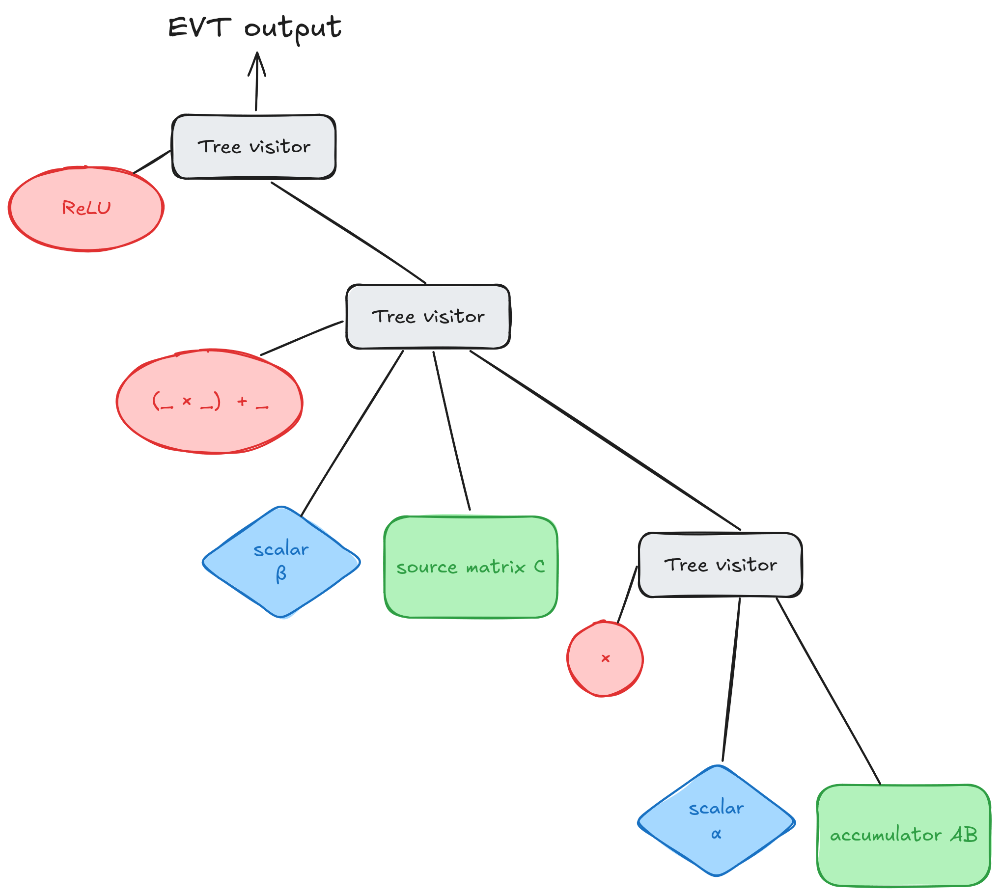
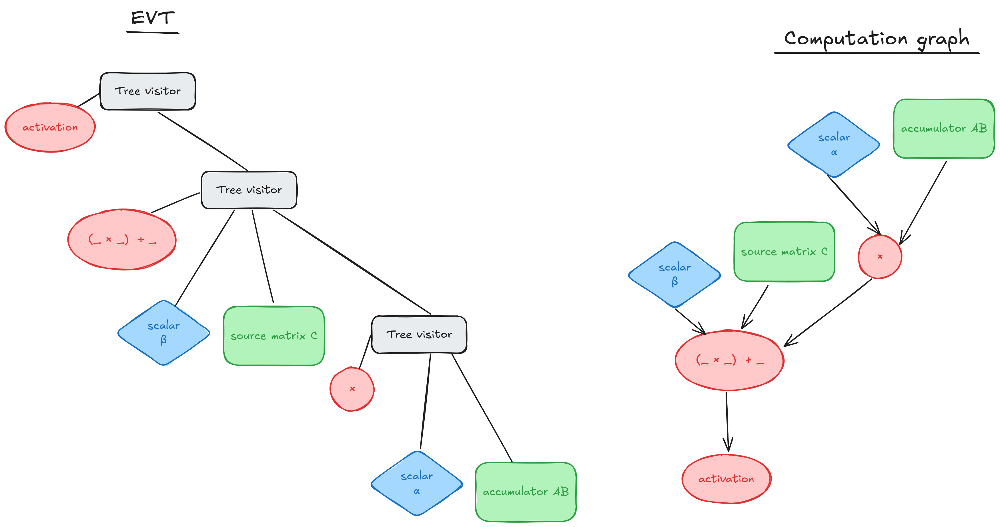
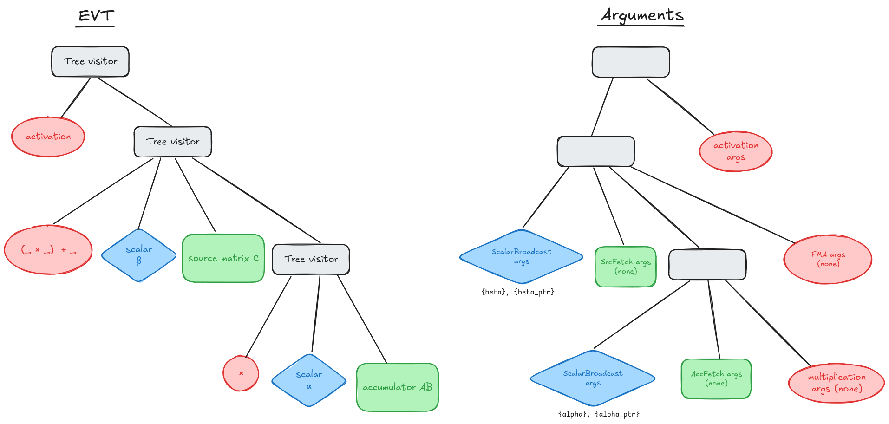
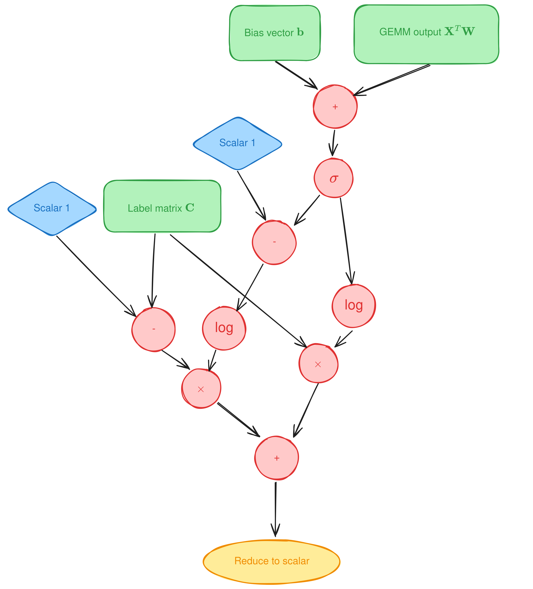
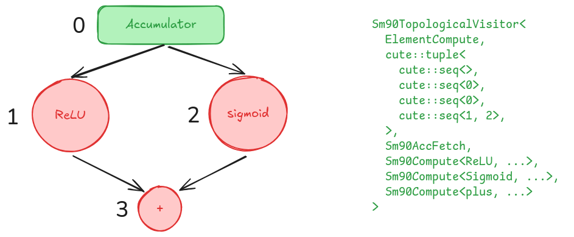
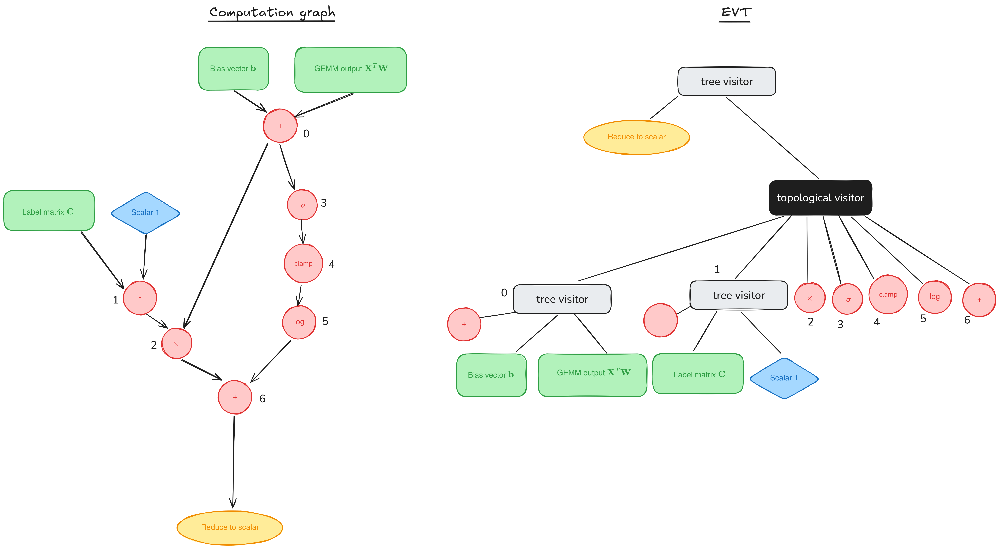

# Epilogue Fusion in CUTLASS with Epilogue Visitor Trees

**Date:** October 25, 2024

**Source:** [https://research.colfax-intl.com/epilogue_visitor_tree/](https://research.colfax-intl.com/epilogue_visitor_tree/)

---

Welcome to a supplemental article for our tutorial series on GEMM (GEneral Matrix Multiplication). Posts in the main series ([1](https://research.colfax-intl.com/cutlass-tutorial-wgmma-hopper/), [2](https://research.colfax-intl.com/cutlass-tutorial-design-of-a-gemm-kernel/)) have discussed performant implementations of GEMM on NVIDIA GPUs by looking at the mainloop, the part responsible for the actual GEMM computation. But the mainloop is only a part of the CUTLASS workload. In this article, we will turn our focus to the **epilogue**, where post-processing (e.g., elementwise activations, scaling) and data store take place. Specifically, we’ll examine CUTLASS’s recipe for epilogue fusion, the **Epilogue Visitor Tree (EVT)** introduced by [Chen et al., 2024](https://dl.acm.org/doi/pdf/10.1145/3620666.3651369).

This post is structured in sections of increasing complexity. After an overview of the epilogue phase and EVT, we will showcase how to add a simple EVT to a CUTLASS GEMM kernel using both EVTs defined by CUTLASS and hand-constructed ones. We then give an extended example of developing an EVT for a novel use case that introduces a few more advanced tools: reduction operations and topological visitors. The code sample and documentation is available on [our GitHub](https://github.com/ColfaxResearch/cfx-article-src/tree/master/evt). Finally in the appendix we do a deep dive into the CUTLASS source code to explain how CUTLASS fuses the EVT into its epilogues.

## The epilogue phase and EVT

In a kernel, the **epilogue** phase follows the mainloop phase and handles the post-processing of the output tensor. In the most trivial case, this phase simply stores the matrix product to global memory (GMEM). However, many AI workloads require additional processing of the output: addition of a bias term, calculation of elementwise activation functions like GELU, or application of more complicated reduction-type functions like layernorm or rmsnorm. These calculations may also require additional data to be loaded, such as when applying a residual connection or calculating loss using a set of ground-truth labels. It is typically beneficial to incorporate — or *fuse* — such operations into the GEMM kernel’s epilogue. There are several advantages to the fused kernel over having an additional kernel handle the post processing.

- Output data of GEMM in shared memory (SMEM) may be immediately post-processed in a fused kernel, whereas a separate kernel requires an additional GMEM-SMEM transfer.
- In a fused kernel, some post-processing operations may be applied while the GEMM result is still in registers.
- There is additional latency and overhead associated with an additional kernel launch.

This process of incorporating additional processing in between the GEMM mainloop and the kernel exit is called **epilogue fusion**.

One difficulty in implementing epilogue fusion is that there are many types of operations to fuse. An epilogue may contain an essentially arbitrary sequence of computations, and may require the kernel to load or store additional data. Writing a fused kernel with each different epilogue pattern would quickly lead to an unmanageable explosion in the number of kernels. Moreover, programmers may want to experiment with novel epilogues, which for a properly fused epilogue would ordinarily require extensive changes to kernel code. To address this, CUTLASS uses a design pattern called the **visitor pattern.**

In this pattern, the various types of epilogues are implemented in specialized epilogue visitor objects. The CUTLASS GEMM kernel is designed to *accept* an arbitrary epilogue visitor object to process the output data. The epilogue visitor will then *visit* the output data and process it. With this model, adding a new epilogue only requires creating a new specialized visitor class and swapping it out with the current visitor.

Since an epilogue can involve a complex sequence of operations, it’s important that epilogue visitors be composable. An **epilogue visitor tree** (EVT) is a collection of visitors organized in a tree that collectively operate as a single visitor. Each leaf node in the tree represents a basic operation, such as add, multiply, load, or store. Non-leaf nodes are generally **tree visitors** (we’ll discuss an exception later). When a tree visitor visits the data, it recursively delegates to its children, using their outputs as inputs to its own operation. The output of the root of the tree is finally stored to GMEM. A basic example that computes $\mathrm{ReLU}(\alpha \mathbf{AB} + \beta \mathbf{C})$ is shown in **Figure 1.**



<p align="center"><em>**Figure 1.** A simple example of an epilogue visitor tree. Each tree visitor comprises an operation (in red) and a set of children, which may themselves be tree visitors, or may fetch a matrix tile (in green) or scalar (in blue). The tree’s output is that of its root.</em></p>

The epilogue visitor tree abstraction is supported by CUTLASS in two ways. First, commonly encountered epilogues have pre-built visitor trees with user-friendly aliases. Second, developers can write their own visitor trees for customized epilogues. CUTLASS will then produce a fused kernel from the provided tree. We’ll walk through simple examples of both approaches, and then discuss how to create a more complex tree.

## Using Epilogue and EVT

In this article we will be focusing on the CUTLASS 3.X syntax for EVT, which currently only supports the NVIDIA Hopper™ architecture and only works with warp-specialized kernels. For older generations, use the visitors in 2.X syntax — see [`cutlass/epilogue/threadblock/fusion/visitor_2x.hpp`](https://github.com/NVIDIA/cutlass/blob/cc3c29a81a140f7b97045718fb88eb0664c37bd7/include/cutlass/epilogue/threadblock/fusion/visitor_2x.hpp), and [Example 35](https://github.com/NVIDIA/cutlass/blob/main/examples/35_gemm_softmax/gemm_with_epilogue_visitor.h) for usage.

The basic way to construct a kernel in the CUTLASS 3.X API is in terms of a `CollectiveMainloop` and a `CollectiveEpilogue`.

```
using GemmKernel = cutlass::gemm::kernel::GemmUniversal<
    cute::Shape<int,int,int,int>, // ProblemShape [M,N,K,L]
    CollectiveMainloop,
    CollectiveEpilogue
>;
```

We will of course be focusing on the `CollectiveEpilogue` half, and will only discuss the rest in relation to the epilogue. For more information on the Mainloop and GEMM API in general see the [CUTLASS documentation on the 3.X API](https://github.com/NVIDIA/cutlass/blob/main/media/docs/gemm_api_3x.md). Complete examples of kernel definitions can be found in [CUTLASS’s example 49](https://github.com/NVIDIA/cutlass/blob/main/examples/49_hopper_gemm_with_collective_builder/49_collective_builder.cu) and on our GitHub.

CUTLASS offers multiple different ways to create a `CollectiveEpilogue`, which we will go over in order of increasing complexity.

#### DefaultEpilogue

For many common epilogues that only use elementwise operators, the shortest path to epilogue fusion is the `DefaultEpilogue`. One can define a `CollectiveEpilogue` as follows.

```
using CollectiveEpilogue = cutlass::epilogue::collective::DefaultEpilogue<
    cutlass::gemm::TagToStrideC_t<LayoutC>,
    cutlass::gemm::TagToStrideC_t<LayoutC>,
    cutlass::epilogue::thread::LinearCombination<ElementC, 1, ElementAccumulator, ElementAccumulator>>;
```

The final argument can be replaced with other elementwise operators, such as `LinearCombinationReLU`. You can find more operators in `include/cutlass/epilogue/thread`.

One interesting note here is that the `DefaultEpilogue` does not use the visitor tree. Instead it simply loops over the output fragment (data) and applies the specified operation. So it is not designed for complex epilogues.

#### Built-in EVTs

If you need something more complex, then you will need to use EVT. CUTLASS provides a variety of common operations that are built using EVT, which can be found at `include/cutlass/epilogue/fusion/operations.hpp`.

To use one of the built-in EVTs, or to use any EVT for that matter, we need to turn to the `CollectiveBuilder` for the epilogue.

```
using EVTOp = cutlass::epilogue::fusion::LinCombEltAct<
  cutlass::epilogue::thread::ReLU,
  ElementD, ElementCompute, ElementC, ElementScalar>;

using CollectiveEpilogue = typename cutlass::epilogue::collective::CollectiveBuilder<
      cutlass::arch::Sm90, cutlass::arch::OpClassTensorOp,
      Shape<_128,_128,_64>, Shape<_1,_1,_1>, // grid and cluster shapes
      cutlass::epilogue::collective::EpilogueTileAuto, // automatically compute epilogue tile size
      ElementAccumulator, ElementCompute, // dtypes
      ElementC, LayoutC, AlignmentC,
      ElementD, LayoutD, AlignmentD,
      EpilogueScheduleType, // need TMA warp-specialized to use EVT
      EVTOp
    >::CollectiveOp;
```

The above code example implements `LinearCombination` with ReLU activation using EVT. For `EVTOp` we’ve selected the appropriate operation from the `cutlass::epilogue::fusion`. The template arguments are of course dependent on the operation in question, so refer to `operations.hpp` for more detail on the specific operation. For our example with `LinCombEltAct` , the first argument is the activation function (see `cutlass/epilogue/thread/activation.h` for more options), and the rest are the datatypes of the input and output as well as the datatype to use for accumulation.

The objects found in `operations.hpp` are placeholders for the actual operations. To see the structure of the tree itself, we need to turn to `sm90_callbacks_tma_warpspecialized.hpp`, which maps these placeholders to their architecture-specific EVT implementations. We will discuss the tree implementation in the next section.

This epilogue requires additional arguments, the scalars `alpha` and `beta`. For GEMMs built with the CollectiveBuilder, these arguments can be specified along with the rest of the arguments to the kernel when the kernel is initialized. Arguments to the kernel look like

```
typename Gemm::Arguments arguments {
    cutlass::gemm::GemmUniversalMode::kGemm, // GEMM mode (batched, grouped, // etc.)
    problem_size,
    {block_A.get(), stride_A,                // pointers and strides for mainloop
      block_B.get(), stride_B},
    {{},                   // arguments.epilogue.thread, modified below
      block_C.get(), stride_C,                // pointers and strides for epilogue
      block_D.get(), stride_D},
    hw_info                                  // hardware info
};
```

Arguments to the EVT are found inside `arguments.epilogue.thread`. For the built-in EVTs, this is a flat struct of conveniently named arguments, so that we can write;

```
arguments.epilogue.thread.alpha = alpha;
arguments.epilogue.thread.beta = beta;
Gemm gemm;
gemm.initialize(arguments, workspace_ptr);
// workspace_ptr points to additional GMEM workspace, allocated elsewhere
```

Other EVT arguments structs can be found inside `sm90_callbacks_tma_warpspecialized.hpp`. Looking at this file, we see a few more options available for `Sm90LinCombEltAct`. First, instead of specifying `alpha` and `beta` by value at initialization, we can pass pointers `alpha_ptr` and `beta_ptr` to their locations in device global memory. Second, some activation functions also require other arguments. For example, suppose that instead of applying ReLU, we wanted to clamp the output to between -1.0 and 1.0. These are the arguments `lower_bound` and `upper_bound` to `cutlass::epilogue::thread::Clamp`, and can be passed to `arguments.epilogue.thread` as the struct `activation`.

#### Unpacking the structure of an EVT

If none of the built-in operations suit your needs, then you need to create a custom EVT by constructing the visitor tree yourself. To discuss this process, we will look at how the built-in `LinCombEltAct` is constructed because these built-in operations are created using the same building blocks as one would use for a custom EVT. 

The `LinCombEltAct` we see in `operations.hpp` maps to the Hopper specific implementation defined in `sm90_callbacks_tma_warpspecialized.hpp`.

```
using Sm90LinearCombination = 
  Sm90EVT&lt;Sm90Compute&lt;homogeneous_multiply_add, ElementOutput, ElementCompute, RoundStyle>, // beta * C + (alpha * acc)
    Sm90ScalarBroadcast&lt;ElementScalar>, // beta
    Sm90SrcFetch&lt;ElementSource>, // C
    Sm90EVT&lt;Sm90Compute&lt;multiplies, ElementCompute, ElementCompute, RoundStyle>, // alpha * acc
      Sm90ScalarBroadcast&lt;ElementScalar>, // alpha
      Sm90AccFetch // acc
    >
  >;

using Sm90LinCombEltAct =
  Sm90EVT&lt;Sm90Compute&lt;ActivationFn, ElementOutput, ElementCompute, RoundStyle>, // activation(beta * C + (alpha * acc))
    Sm90LinearCombination&lt;ElementCompute, ElementCompute, ElementSource, ElementScalar, RoundStyle> // beta * C + (alpha * acc)
  >;
```

The core of the CUTLASS visitor tree is `Sm90EVT`, which is an alias for `Sm90TreeVisitor`. This class represents a non-leaf node in the tree. The first argument is the operation associated with this node, while all arguments that follows are the child nodes. The template arguments allow for an arbitrary number of nodes — for example, the activation function in `Sm90LinCombEltAct` takes one node, while the fused-multiply-add operation in `Sm90LinearCombination` takes three nodes.

`Sm90Compute` is a node op that defines a node to be a compute node. The first template parameter is an elementwise operation (e.g. ReLU, FMA) and the others determine the datatypes used and the floating-point rounding style.

We see several other nodes used in this tree. Values from C and from the accumulator (AB) are obtained using `Sm90SrcFetch` and `Sm90AccFetch` respectively. Scalars are obtained using `Sm90ScalarBroadcast`. For a full documentation of available nodes, see our GitHub.



<p align="center"><em>**Figure 2.** **Left:** The tree structure of `Sm90LinCombEltAct`. The non-leaf nodes (in black) are tree visitors, i.e. `Sm90EVT` nodes. **Right:** An alternative view of the computation, which replaces each tree visitor by the operation it performs, and puts the flow of computation moving downwards.</em></p>

We tend to think of epilogue operations in a slightly different way — the **computation graph** on the right of **Figure 2**. In this graph, the flow of computation moves downwards, and non-leaf nodes are simply operations accepting input from elsewhere. As we’ll discuss later, such a graph need not be a tree at all. Epilogue visitor trees are always trees; we draw them with the root at the top, so that the flow of *recursion* moves downwards, and non-leaf nodes are tree visitors. Each tree visitor performs the operation specified by its leftmost child on the rest of its children.

(To ward off a potential confusion on terminology, we emphasize that this leftmost child of a tree visitor in the EVT is always distinguished as the tree visitor’s node operation and is not referred to as a *child* *node* with respect to the templated CUTLASS code. Note that in this article, whether or not we include the node op among the children can always be inferred from context; for example, we separate the two in the remainder of this subsection.)

As with the built-in EVT, we need to pass in the arguments `alpha` and `beta` to run the GEMM. However, we can no longer use a flat named-argument interface for the custom EVT because there may be multiple instances of the same type of nodes. Instead, the arguments form a tree that reflects the structure of the EVT.

`Sm90EVT` nodes take their arguments in the form:

```
{first_child_args, ... last_child_args, node_op_args}
```

Other nodes expect their own structure for arguments, also documented on our GitHub. For this tree, we can write:

```
arguments.epilogue.thread =
{    // unary op: activation(beta * C + (alpha * acc))
  {    // ternary op (FMA): beta * C + (alpha * acc)
     {{beta}, {beta_ptr}}, // args to Sm90ScalarBroadcast
     {},                   // no args to Sm90SrcFetch (kernel knows about C)
     {                     // binary op : alpha * acc
       {{alpha}, {alpha_ptr}}, // args to Sm90ScalarBroadcast
       {},                     // no args to Sm90AccFetch
       {}                  // op args: multiplies
     },                    // end binary op
     {} // op args: multiply_add
   },   // end ternary op
   activation_args // op args: activation
 };   // end unary op
```

Note that the `node_op_args` to a tree visitor node appear *after* the arguments to all children — whereas in the template parameters to `Sm90EVT`, the node operation appears before the children. Thus, the trees for operations and arguments don’t have the same structure. The relation between the two is shown in **Figure 3.**



<p align="center"><em>**Figure 3.** **Left:** the EVT from **Figure 2.** **Right:**the tree for the associated `Arguments` struct. The tree structure is modified by moving each tree visitor’s node operation to the end.</em></p>

Most of the operations we’ve used so far don’t require arguments, so the tree is mostly empty. The `activation_args` are additional parameters to the activation function, which may also be empty. Finally, `Sm90ScalarBroadcast` expects either an array of scalars or an array of pointers to scalars, which are then reduced before broadcasting. In this case, these arrays have length 1. For a more complete documentation of argument structures, see our GitHub.

## A more complex example: binary cross-entropy loss

Let’s develop a more complex example that has real-world applicability and isn’t predefined by CUTLASS: **binary cross-entropy loss**. As motivation, suppose that we’re training a machine learning model to detect objects in images. For each image supplied, the model should label whether it contains a person, a dog, a bus, and so on. A given image could contain any number of these objects, and there are a large number of objects to be considered. In this situation, called **extreme multi-label classification**, one potential way to evaluate the model is to treat each label as a separate binary classification problem, evaluate the model’s performance on each problem independently, and aggregate the results. This would lead us to the following loss function:

$\mathrm{Loss} = -\frac{1}{n}\sum_{i=1}^n \sum_{j = 1}^L \left[ C_{ij} \log\sigma(f_{ij}) + (1 - C_{ij})\log(1 - \sigma(f_{ij}))\right],$

where

- $n$ is the number of training examples,
- $L$ is the number of possible labels,
- $C_{ij}$ is the matrix of true labels, where $C_{ij}$ equals 1 if the ith example actually has label j and is 0 otherwise,
- $f_{ij}$ is the matrix of model outputs, so each $f_{ij}$ is a real number that is larger if the model has more confidence that the ith example is in class j,
- and $\sigma$ is the sigmoid function, $\sigma(x) = 1/(1 + e^{-x}).$

In a real classification model like [XML-CNN](https://dl.acm.org/doi/10.1145/3077136.3080834), the matrix $\mathbf{F} = (f_{ij})$ might itself be obtained as the output of a linear layer,

$\mathbf{F} = \mathbf{X}^{T}\mathbf{W} + \mathbf{b}^T,$

where $\mathbf{W} \in \mathbb{R}^{d \times L}$ and $\mathbf{b} \in \mathbb{R}^L$ are parameters of the model (the weights and bias of the last layer) and $\mathbf{X} \in \mathbb{R}^{d \times n}$ are the outputs of the model’s previous layer on the current set of training examples. In particular, the loss computation occurs shortly after a GEMM, which makes it a good candidate for epilogue fusion.

Chen et al. used the loss gradient computation as one of their graph compiler benchmarks. Taking the gradient allows one to skip computing the loss and results in a dramatically simpler computation. Here, we will compute the loss, not its gradient, to provide a more interesting example.

A direct interpretation of the loss formula would be the graph in **Figure 4**. (For simplicity, we’ll ignore the -1/n scaling factor from now on.)



<p align="center"><em>**Figure 4.** A computation graph for binary cross-entropy loss. This graph is not a tree, and includes a vector broadcast (in green) and a reduction (in yellow).</em></p>

  
This presents a set of new complications:

- In addition to scalars, we now also need to broadcast the row vector $\mathbf{b}^T$. We can do this using the EVT node `Sm90RowBroadcast`. (Likewise, for broadcasting column vectors there is also the EVT node `Sm90ColBroadcast`.)
- The result has to be reduced to a scalar, which we can do using a new EVT node, `Sm90ScalarReduction`. (There are also EVT nodes for row and column reductions.)
- We need to load an additional matrix, the label matrix **C**, ideally using TMA, a pipeline, and warp-specialization. CUTLASS’s GEMM kernels expect to perform the computation $\mathbf{D} = \mathbf{AB} + \mathbf{C}$ and so take an additional input matrix $\mathbf{C}$ anyway, which we can access using `Sm90SrcFetch`. If we didn’t want to do this or if we needed to load more than one additional matrices, we could use `Sm90AuxLoad`.
- The graph is no longer a tree: both $\sigma(f_{ij})$ and $C_{ij}$ are used twice in the calculation. We could turn the graph into a tree by reloading or recomputing these matrices twice, but this comes with undesirable performance costs. This problem is solvable, but its solution is more complex, and requires a digression to explain.

### Topological visitors

EVTs are computation graphs represented as trees. During the visit process, the tree is traversed recursively; each tree visitor node calls the visit method of each of its child nodes and combines their results using its specified node operation. Importantly, each node is expected to be visited only once. But in general, a computation graph need not be a tree, but a directed acyclic graph. In practical terms, this means that the output of a node could be required by multiple other nodes.

If we still represent such a graph as a tree just with the tree visitors, we would have to effectively duplicate the required node; one for each parent node that needs the output. This approach is inefficient as it would lead to a lot of repeated work. Instead, we use a node called a **topological visitor**. While a tree visitor is used to represent a single operation in a computation graph, a topological visitor represents *any subgraph* of this graph.

A topological visitor has a child for each node in its subgraph. During the visit process, it delegates to its children in [topological order](https://en.wikipedia.org/wiki/Topological_sorting), populating each child’s input with the outputs of children that were already visited. “Topological order” here means that no child node is visited before any of its predecessors in the computation graph — in other words, by the time a descendant is visited, all of its inputs must be ready. The return value of a topological visitor is the return value of the last node it visits.



<p align="center"><em>**Figure 5.** A simple non-tree DAG. On the right is code for a topological visitor that could traverse this DAG.</em></p>

A simple example is shown in **Figure 5.** This computation graph has two nodes, 1 and 2, that both require the result of node 0, so we should structure the associated EVT with a topological visitor. Node 0 does not need any input, as it just returns the accumulator values. Nodes 1 and 2 each take one input, which is the output of node 0. Node 3 takes 2 inputs, which are the outputs of nodes 1 and 2. Finally, the topological visitor returns the output of node 3.

The EVT is then a tree with a root (the topological visitor) and 4 leaves (the numbered nodes of the computation graph).

CUTLASS syntax for the topological visitor is given on the right-hand side of the figure. The first template parameter is the data type of the computation. The second is a sequence of tuples, which we will return to shortly. The remaining template parameters are the nodes visited (which could themselves be tree or topological visitors). The nodes are enumerated in the order that they appear in the argument, with first being node 0. Returning to the tuples, they show the node dependence where the Nth tuple lists the nodes whose outputs will be used as input to node N.

The ordering of both the tuples and the nodes is crucial, because the topological visitor visits the nodes in the order of the template arguments. Valid orderings correspond to valid topological orderings of the subgraph in question. For example, it is possible to swap node 1 (ReLU) and node 2 (Sigmoid) in the template argument list, but you can’t swap node 2 (Sigmoid) and node 3 (plus) because node 3 needs the result of node 2.

To summarize, the purpose of topological visitors is to turn non-tree DAGs into trees. This means that, as a rule of thumb, a topological visitor only needs to visit a non-tree portion of a computation graph. As in **Figure 5**, this portion is usually “between a branch and a merge”, starting where multiple computation streams are generated and ending where they recombine.

### Constructing an EVT using topological visitors

Using the topological visitor, we can reuse data from the accumulator and label matrix without having to reload it. Before writing the tree as a CUTLASS type, there are a few more adjustments we can make. Let’s return to the loss formula,

$\sum_{i=1}^n \sum_{j=1}^L \left[ C_{ij} \log\sigma(f_{ij}) + (1 - C_{ij})\log(1 - \sigma(f_{ij}))\right].$

Since each $C_{ij}$ is either 0 or 1, only one of these terms is actually nonzero for any given (i, j), meaning that the term is equal to either $\log\sigma(f_{ij})$ or $\log\sigma(1 - f_{ij})$. Moreover,

$\log(1 - \sigma(x)) = \log \left(1 - \frac{1}{1 + e^{-x}}\right) = \log \left(\frac{e^{-x}}{1 + e^{-x}}\right) = -x + \log \sigma(x).$

Thus the formula simplifies to

$\sum_{i=1}^n \sum_{j=1}^L \left[ (1 - C_{ij})(-f_{ij}) + \log\sigma(f_{ij}) \right].$

This simplification improves the calculation in a couple of ways:

- It simplified the computation graph by eliminating the reuse of C.
- From a performance perspective, this only requires one logarithm per term rather than two, reducing the load on the relatively low-throughput Special Function Unit.
- From a numerical stability perspective, the original formula would tend to underflow if $f_{ij}$ was large (so that $1 - \sigma(f_{ij}) \approx 0$). This one does not.

Second, the new formula still underflows if $-f_{ij}$ is large (so that $\sigma(f_{ij}) \approx 0$). There are several ways to handle this, but the simplest is probably clamping the output of $\sigma(f_{ij})$ so that it’s never too close to 0. Making these changes leads us to the computation graph in **Figure 6.** This graph is still not a tree, so we have to use a topological visitor in the associated EVT.



<p align="center"><em>**Figure 6.** **Left:** A simplified and more numerically stable computation graph for binary cross-entropy loss. **Right:** The associated EVT, which uses a topological visitor (in black) to traverse the numbered nodes.</em></p>

For complex graphs like this one, it can be helpful to abbreviate parts of the EVT with type aliases, as we’ve done below.

```
using CMinus1 =
  Sm90EVT<
    Sm90Compute<cutlass::minus, ElementCompute, ElementCompute, RoundStyle>,
    Sm90SrcFetch<TC>,
    Sm90ScalarBroadcast<ElementScalar>
  >;
using MatmulPlusBias =
  Sm90EVT<
    Sm90Compute<cutlass::plus, ElementCompute, ElementCompute, RoundStyle>,
    Sm90ColBroadcast<0, CtaTileShapeMNK, ElementBias, Stride<_1, _0, _0>>,
    Sm90AccFetch
  >;
using TopoVisitor =
  Sm90TopologicalVisitor<
    ElementCompute,
    cute::tuple<
      cute::seq<>,
      cute::seq<>,
      cute::seq<0, 1>,
      cute::seq<0>,
      cute::seq<3>,
      cute::seq<4>,
      cute::seq<2, 5>,
    >,
    MatmulPlusBias,
    CMinus1,
    Sm90Compute<cutlass::multiplies, ElementCompute, ElementCompute, RoundStyle>,
    Sm90Compute<cutlass::epilogue::thread::Sigmoid, ElementCompute, ElementCompute, RoundStyle>,
    Sm90Compute<cutlass::epilogue::thread::Clamp, ElementCompute, ElementCompute, RoundStyle>,
    Sm90Compute<FastLog, ElementCompute, ElementCompute, RoundStyle>,
    Sm90Compute<cutlass::plus, ElementCompute, ElementCompute, RoundStyle>
  >;
using BCELossEVT =
  Sm90EVT<
    Sm90ScalarReduction<
      cutlass::plus,       // register reduce function
      cutlass::atomic_add, // GMEM reduce function
        ElementScalar, ElementCompute, RoundStyle,
        Stride<_0, _0, _0>>, // no batching here
    TopoVisitor
  >;
```

A few comments about this:

- The `Sm90ColBroadcast` node works with batched GEMMs. Passing a stride of `Stride<_1, _0, int>` allows the stride in the batch dimension to be given at runtime.
- The syntax for the topological visitor is similar, but more complex, to the simpler example above.
- CUTLASS (as of version 3.5) has no functor template computing log, but it’s not hard to write one yourself. This is `FastLog`.
- The `Sm90ScalarReduction` node does reductions at two scopes: first, a thread-level reduction using the “register reduce function”; then, a global reduction into GMEM using the atomic “GMEM reduce function”. Row and column reductions will also perform warp-wide reductions using warp shuffle operations, and CTA-wide reductions using SMEM.

The Arguments for a topological visitor are the list of Arguments to each node it visits. The Arguments for the whole EVT are as follows:

```
BCELossEVT::Arguments args_BCE =
{
  { // TopoVisitor [(C - 1) * (bias + AB) + log(clamp(sigmoid(bias + AB)))]
    { // args to MatmulPlusBias = bias + AB (node 0)
      {d_bias_BCE.data().get(), 0, stride_bias_BCE}, // args to ColBroadcast
      {},  // args to AccFetch
      {}   // op args: plus
    },
    { // args to CMinus1 = C - 1 (node 1)
      {}, // args to SrcFetch
      {{ElementScalar(1.0)}}, // args to ScalarBroadcast
      {}  // op args: minus
    },
    {}, // op args: multiplies (node 2)
    {}, // op args: sigmoid (node 3)
    {0.001f, 0.999f},   // op args: clamp (node 4)
    {}, // op args: log (node 5)
    {}, // op args: plus (node 6)
  },
  {d_result, 0, stride_result} // args to ScalarReduction
};
```

For `Sm90ColBroadcast`, we need to provide a pointer to the bias vector, a default value to be used if this pointer is null, and the stride (dM, dN, dL), where dL can be nonzero in the case of a batched computation. `Sm90ScalarReduction` needs an pointer to store the result to, the reduction identity, and the stride, where again the stride allows for batching.

### Graph compilation and further optimizations

As this example has shown, the process of constructing an EVT is not entirely trivial. Ideally one would like to describe the epilogue mathematically in a high-level language like Python, and have an automated system parse it into an EVT while applying obvious optimizations along the way. The authors of the EVT paper call such a system a **deep learning compiler**, and implement it in a `torch.fx` form on the paper’s [GitHub repo](https://github.com/apuaaChen/EVT_AE). CUTLASS provides a simple Python-to-C++ version as part of their [Python interface](https://github.com/NVIDIA/cutlass/blob/main/examples/python/04_epilogue_visitor.ipynb).

A few of the optimizations carried out by the EVT compiler algorithm ought to be considered by anyone writing epilogue visitor trees by hand:

- **Operator fusion:** replacing a sequence of operators by a fast implementation of their composition.
- **Operator fission:** decomposing an operator into a sequence in order to perform an operator fusion elsewhere.
- **Pruning unused nodes:** maybe too obvious to be mentioned, but the paper observes that, in training an ML model, the loss often does not have to be calculated — only its gradient!
- **Reduction elimination:** as reduction requires inter-thread collaboration, it is a frequent bottleneck. In some situations, reduction operations can be eliminated. As a simple example, the row sum of a one-hot matrix is a constant vector of ones.

Developers working with complex epilogues would be well-served by reading [the paper](https://dl.acm.org/doi/10.1145/3620666.3651369).

## Conclusion

In this article, we have presented a detailed discussion of epilogue fusion and epilogue visitor trees. We introduced epilogue fusion and its importance in high performance GEMM workloads. Then we discussed how EVTs provide a way to develop fusible epilogues independently of the kernel mainloop itself.

Next we unpacked the different interfaces CUTLASS provides for epilogue fusion: the `DefaultEpilogue`, prebuilt EVT and custom EVT. Finally, we presented a complex real-world example by creating an EVT for binary cross-entropy. This example, as well as supplementary documentation on the various CUTLASS EVT nodes, is available on [our GitHub](https://github.com/ColfaxResearch/cfx-article-src/tree/master/evt).

## Appendix: CUTLASS’s implementation of EVT

Advanced users writing their own custom kernels may also wish to use EVT to implement an epilogue or collection of epilogues with minimal modifications to the rest of their kernel. To this end, it’s worth examining how CUTLASS handles EVT objects in the [TMA warp-specialized epilogue](https://github.com/NVIDIA/cutlass/blob/44dae8b90ef232ea663727470dfbbe9daff6972d/include/cutlass/epilogue/collective/sm90_epilogue_tma_warpspecialized.hpp#L770) used in kernels constructed by its CollectiveBuilder. Understanding this structure could help developers interact with CUTLASS’s EVT objects, or write their own systems for epilogue fusion. Note that our discussion is accurate as of CUTLASS’s version 3.5; as these are internal details of the CUTLASS EVT implementation, they may change in future versions.

We’ll begin by describing the high-level structure of the epilogue. Each CTA is responsible for an output tile of shape `(CTA_M, CTA_N)`, and loops over subtiles of shape `(EPI_TILE_M, EPI_TILE_N)`. The epilogue piggybacks off the warp-specialization of the mainloop; warps which were producer warps in the mainloop will load C and any auxiliary matrices required by the epilogue by executing the `load()` method, while consumer warps will perform computations and stores by executing the `store()` method. The two types of warps synchronize across a `Pipeline` called `load_pipeline`. (The `load()` method and pipeline aren’t used if it’s determined at compile time that the epilogue does not require loads.) Since consumer warps need to stage data in SMEM to perform TMA store, these warps synchronize with each other across another pipeline, `store_pipeline`.

Corresponding to these two methods, the epilogue visitor tree supports two factory functions: `get_producer_load_callbacks()` and `get_consumer_store_callbacks()`. These produce objects `pld_callbacks` and `cst_callbacks` that will perform all operations required by the EVT in `load()` and `store()` respectively. Each EVT node defines some methods of one or both of these callbacks objects that allow it to act in the right place in the kernel.

Let’s take a closer look at the `store()` function. Here is some pseudocode showing the basic structure.

```
cst_callbacks.begin(); // column and row broadcasts copied from GMEM
// outer loops over epilogue tiles
for (int epi_n = 0; epi_n < EPI_N; ++epi_n) {
    for (int epi_m = 0; epi_m < EPI_M; ++epi_m) {
        cst_callbacks.begin_loop(epi_m, epi_n); // row broadcasts copied from SMEM
        if (is_producer_load_needed)
            wait for load_pipeline; // ensure that C and aux tiles are ready in SMEM
        if (is_C_load_needed)
            load tile of C from SMEM;
        // copy aux tensors from SMEM
        cst_callbacks.previsit(epi_m, epi_n, load_wait_state.count(), is_producer_load_needed);
        if (is_producer_load_needed)
            release and advance load_pipeline;
        // Inner loop over values held by thread
        for (int epi_v = 0; epi_v < EPI_V; ++epi_v) {
            // perform thread-local computations
                      tRS_rCompute_frg(epi_v) = cst_callbacks.visit(tRS_rAcc_frg_mn(r2s_v + epi_v), epi_v, epi_m, epi_n);
        }
        // Reduce across CTA using current D subtile as SMEM workspace
        // After this executes, reduction results are held in tRS_rCompute_frg
        cst_callbacks.reduce(sD_epi(_,_,store_pipe_producer_state.index()),
                              synchronize, epi_m, epi_n, is_last_iteration, tRS_rCompute_frg);
        if (D store is needed)
            do RMEM->SMEM copy of D;
        // handle other SMEM stores and any non-TMA GMEM stores
        cst_callbacks.postreduce(epi_m, epi_n, store_pipe_producer_state.count(), issue_smem_store);
        wait for SMEM stores to finish;
        if (D store is needed and this thread is leader)
            TMA store subtile of D;
        // callbacks now handle any *other* TMA stores
        cst_callbacks.tma_store(epi_m, epi_n, store_pipe_producer_state.count(), issue_tma_store);
        commit to and advance store_pipeline;
        acquire store_pipeline;
        cst_callbacks.end_loop(epi_m, epi_n);
    }
}
cst_callbacks.end(); // perform cross-CTA reductions in GMEM
```

The highlighted lines call various member functions of `cst_callbacks`, which perform all the behavior required by the EVT. Removing these lines gives a simple, hardcoded epilogue that loads data from C and stores data to D.

The `load()` method is similar but simpler:

```
acquire load_pipeline;
pld_callbacks.begin(tma_barrier, load_pipe_producer_state.count(), issue_tma_load);
for (int epi_n = 0; epi_n &lt; EPI_N; ++epi_n) {
    for (int epi_m = 0; epi_n &lt; EPI_M; ++epi_m) {
        acquire load_pipeline;
        // aux TMA loads
        pld_callbacks.step(tma_barrier, epi_m, epi_n, load_pipe_producer_state.count(), issue_tma_load);
        if (is_C_load_needed and this thread is leader)
            TMA load subtile of C;
        commit to load_pipeline;
        advance load_pipeline state;
pld_callbacks.end();
```

The callbacks objects obtained from the EVT by `evt.get_consumer_store_callbacks()` and `evt.get_producer_load_callbacks()` are themselves trees of the same structure as the EVT. Their member functions, `cst_callbacks.begin()` and so on, are recursive: when one of these functions is called on a non-leaf node, it will call the same function on each of its children. In addition, every leaf node overloads one or more of these functions to perform its stated behavior. For example, the `Sm90AuxLoad` node overloads:

- `pld_callbacks.step()`, to initiate TMA load of a subtile of the aux matrix,
- `cst_callbacks.previsit()`, to copy this subtile into registers before the computation stage, and
- `cst_callbacks.visit()`, to return the value of the register-held aux matrix fragment at a given index.

The most important one of these functions is `cst_callbacks.visit()`, which is overloaded by every node type and performs required thread-local operations.

Next let’s discuss how the callbacks objects are provided information about the kernel setup and user-defined parameters. This information comes from two sources. Information about the kernel setup (the problem shape, CTA and epilogue tile sizes, tiled copies and MMAs, and so on) is passed as input to `evt.get_consumer_store_callbacks()` and `evt.get_producer_load_callbacks()` in the form of flat structs `ConsumerStoreArgs` and `ProducerLoadArgs`. As the thread index is one of these arguments, the callbacks objects must be constructed inside the kernel.

Runtime data, such as scalars, additional operator parameters, and pointers to aux matrices, is wrapped in a nested `Arguments` struct as shown above, and used to initialize an object whose type is the given EVT. In GEMM kernels constructed by the CollectiveBuilder, this all takes place in the function call

```
gemm.initialize(arguments, workspace_ptr);
```

The `arguments` here are arguments to the entire GEMM, a nested struct containing the arguments to the EVT. A typical `arguments` would look like

```
typename Gemm::Arguments arguments{
    cutlass::gemm::GemmUniversalMode::kGemm, // GEMM mode (batched, grouped, // etc.)
    problem_size,
    {block_A.get(), stride_A,                // pointers and strides for mainloop
      block_B.get(), stride_B},
    {epilogue_fusion_args,                   // arguments to EVT
      block_C.get(), stride_C,                // pointers and strides for epilogue
      block_D.get(), stride_D},
    hw_info                                  // hardware info
};
```

Meanwhile, `workspace_ptr` points to a GMEM allocation used for additional workspace. Currently, this is workspace is only used by reduction nodes (so for an EVT that performs no reductions, a null pointer can be passed). The required size can be calculated by

```
size_t workspace_size = Gemm::get_workspace_size(arguments);
```

When `gemm.initialize()` is called, two things happen:

- The host-side `Arguments` struct is recursively converted into device-side `Params`, by means of various functions called `.to_underlying_arguments()`. As an example, the caller will pass in the addresses and strides of A, B, C, and D, and any auxiliary tensors used by the EVT. At this point, these are internally converted to TMA descriptors. These `Params` will later be used to initialize an EVT object inside the kernel.
- Any EVT nodes that require workspace are assigned a piece of the previously-allocated `workspace`.

Equipped with this knowledge, we can also get custom kernels to interact with CUTLASS’s epilogue visitor trees outside of its CollectiveBuilder interface. This basically entails:

- Converting host-side arguments to device-side parameters using `.to_underlying_arguments()`, and using these to initialize an EVT object.
- Initializing `ConsumerStoreCallbacks` and/or `ProducerStoreCallbacks` from the EVT object and kernel setup information.
- Adding calls to the callbacks member functions at appropriate points in the epilogue.

In particular, note that each type of node only overloads *some* of the callbacks methods — and thus it’s possible to introduce *partial* support for EVT into a kernel by incorporating some of these calls. As a basic example of this, we’ve added partial support for EVT to the sm90 kernel constructed for a previous blog post. The example is available on [our GitHub repo](https://github.com/ColfaxResearch/cfx-article-src/blob/master/evt/evt_gemm_cute.cu). This kernel only calls `cst_callbacks.begin()`, `cst_callbacks.visit()`, and `cst_callbacks.end()`. That’s already enough to support any epilogue consisting of scalar and column broadcasts, elementwise operations, and scalar reductions — including the earlier binary cross-entropy loss example!
