# GPU passthrough on Proxmox VE 8.2

**Date:** October 23, 2024

**Source:** [https://research.colfax-intl.com/gpu-passthrough-on-proxmox-ve-8/](https://research.colfax-intl.com/gpu-passthrough-on-proxmox-ve-8/)

---

In this guide, we will walk through the steps to enable GPU passthrough and by extension PCIe passthrough on a virtual machine (VM) deployed through Proxmox. PCIe passthrough provides a path for VMs to directly access underlying PCIe hardware, in the case of this article, an Nvidia® A30 GPU.

This setup is ideal for scenarios where administrators may want more granular control of resource allocation to maximize utilization. A single host with multiple GPUs configured for multi-tenant access is a great example of this.

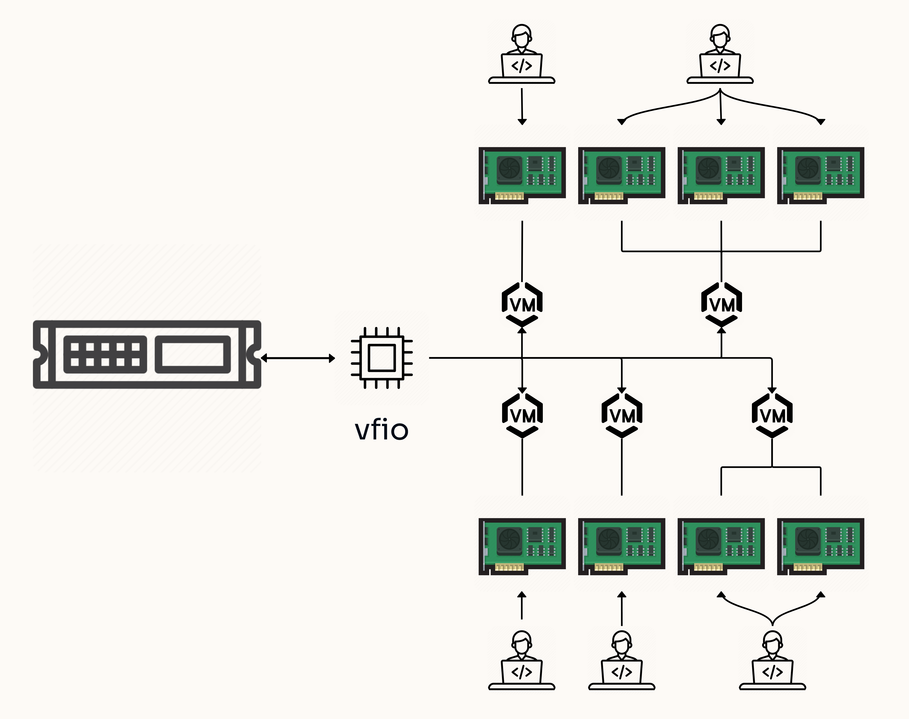

<p align="center"><em>*8-GPU server configured for multi-tenant access.*</em></p>

The test platform used for this guide is equipped with 2x Intel® Xeon® Gold 6336Y CPU @ 2.40GHz CPUs with an Nvidia® A30 GPU. Application of the techniques in this article and the concepts of PCIe passthrough can be applied to systems based on AMD® CPUs as well and passthrough is not limited to just GPUs.

### Preparing a Proxmox Bootable ISO

Download Proxmox 8.2 from the Proxmox [download page](https://www.proxmox.com/en/downloads).

You can burn the ISO to a CD or create a bootable USB drive. You can create a bootable USB drive in Linux using the “dd” command (this will destroy all existing data on the target drive):

```
sudo dd bs=4M if=/tmp/proxmox-ve_8.2-2.iso of=/dev/sdb conv=fdatasync status=progress
```

You can also create a bootable USB drive in Windows using [Rufus](https://rufus.ie/en/) or in MacOS using [Etcher](https://etcher.balena.io).

### Installing Proxmox

Insert the bootable USB drive and select it in your system’s boot menu. You should see a screen similar to the one below:

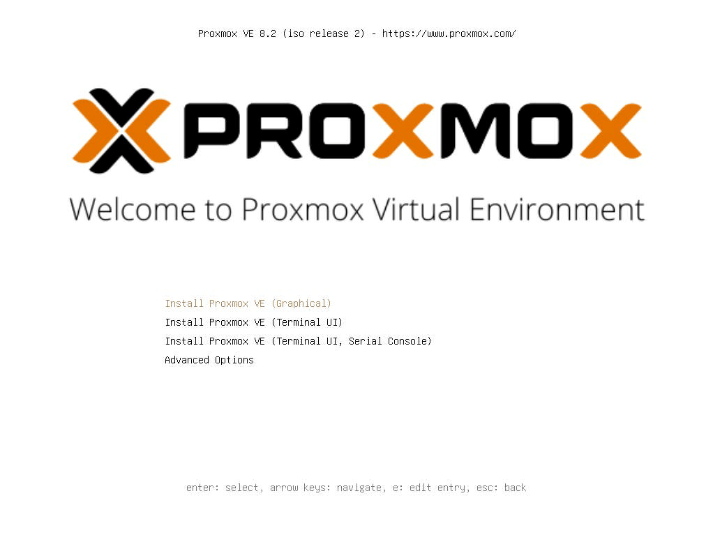

Select “Install Proxmox VE (Graphical)” from the menu. On the next screen, select “I agree” to agree with the End User License Agreement.

If you have more than one hard disk, make sure to select the correct target hard disk on your system:

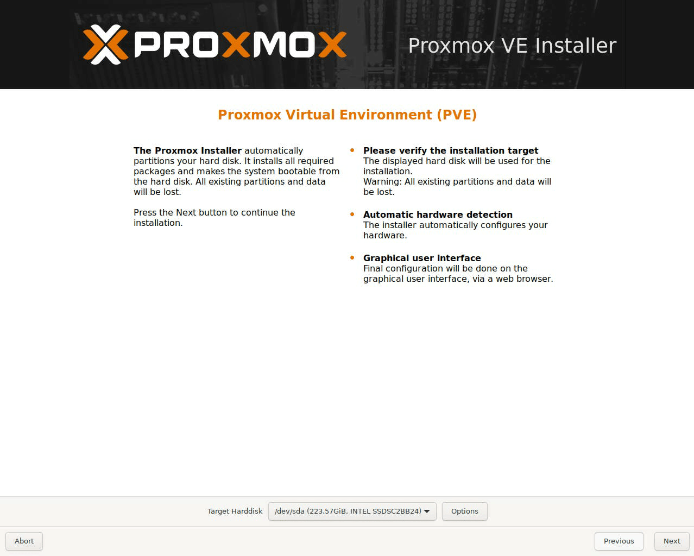

On the next screen, make sure the correct country, time zone, and keyboard layout are selected:

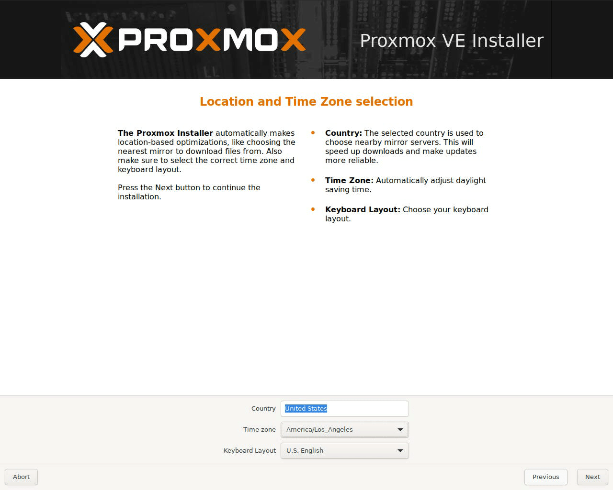

On the next screen, enter the password and email address you will use to administrate this system:

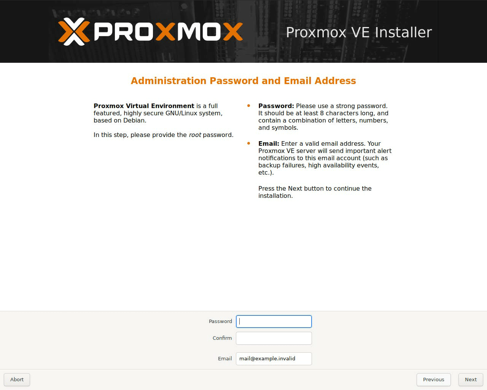

On the next screen, give a descriptive hostname and confirm the IP address, gateway, and DNS server are all valid:

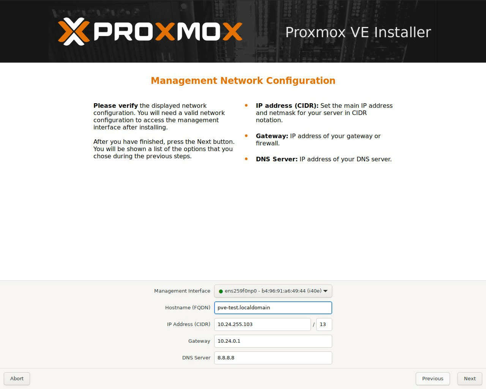

The last screen in the install process will present a summary of the options you’ve selected. Confirm that they’re correct and then select install.

Once the install process is finished and the system is rebooted, you should see a login screen with a web address similar to the below screenshot. You can navigate to this address in your browser to create and manage VMs in Proxmox:

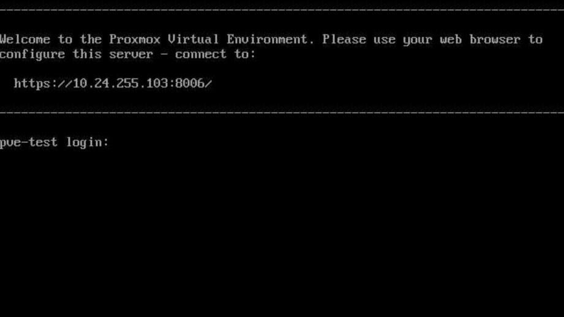

### Verifying Virtualization and IOMMU Support

Proxmox requires CPU and server platforms that supports virtualization and IOMMU. 

**Checking Virtualization Support**

Using the Shell in Proxmox, you can check if virtualization support has been enabled, running the following command:

```
~# lscpu | grep Virtualization
Virtualization:                       VT-x
```

As shown by the above output, you should see VT-x™/VT-d™ (for Intel) or AMD-V™ (for AMD). If that is not the case, you will need to ensure that Intel VT-x and VT-d (or AMD equivalent) are enabled.

**Checking IOMMU Support**

Checking if IOMMU is enabled can also be verified through Proxmox’s Shell with the following command:

```
~# dmesg | grep -e DMAR -e IOMMU
[    0.014871] ACPI: DMAR 0x0000000069FE3000 000190 (v01 INTEL  M50CYP   00000001 INTL 20091013)
[    0.014905] ACPI: Reserving DMAR table memory at [mem 0x69fe3000-0x69fe318f]
[    0.248619] DMAR: IOMMU enabled

~# dmesg | grep 'remapping'
[    0.600486] DMAR-IR: Queued invalidation will be enabled to support x2apic and Intr-remapping.
[    0.603164] DMAR-IR: Enabled IRQ remapping in x2apic mode
```

If IOMMU is not showing as enabled and remapped, you will need to reference your system’s manual to ensure that IOMMU is properly enabled.

### Configuring Proxmox

**Modify Proxmox Kernel Boot Parameter to Enable Passthrough**

Once Proxmox is installed, login to the system and add the kernel boot parameters “intel_iommu=on” and “iommu=pt” to /etc/default/grub:

```
GRUB_CMDLINE_LINUX_DEFAULT="quiet intel_iommu=on iommu=pt"
```

Your grub file should look similar to this:

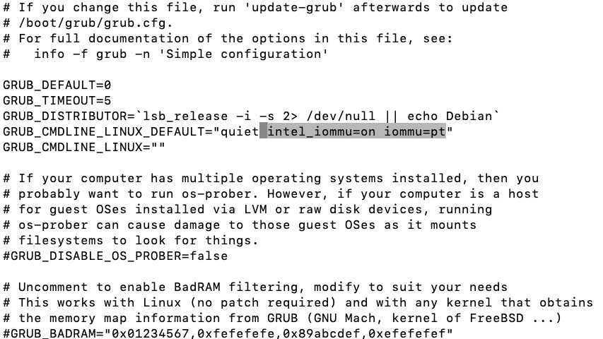

Run the command “update-grub” after making the necessary changes to apply the changes.

**Identify PCIe Device ID**

In order to pass a PCIe device through, we will need to first identify the device id. We can do so with the following commands. 

```
# Display PCI vendor and device ids. 
lspci -nn | grep -Ei "vga|3d" | grep -i nvidia
4b:00.0 3D controller [0302]: NVIDIA Corporation GA100GL [A30 PCIe] [10de:20b7] (rev a1)

# Similar to the above but with sed magic to grab just the PCI vendor and device ids.
lspci -nn | grep -Ei "vga|3d" | grep -i nvidia | sed -n 's/.*\[\([0-9a-fA-F:]*\)\].*/\1/p'
10de:20b7

#If your Nvidia GPU has an audio device, you'll want to configure it for passthrough as well.
lspci -nn | grep -i audio | grep -i nvidia | sed -n 's/.*\[\([0-9a-fA-F:]*\)\].*/\1/p'
10de:22ba
```

Once the vendor and device id has been identified, run the following commands to add the entry to vfio.conf.

```
device_id=$(lspci -nn | grep -Ei "vga|3d" | grep -i nvidia | sed -n 's/.*\[\([0-9a-fA-F:]*\)\].*/\1/p')
echo "options vfio-pci ids=$device_id" >> /etc/modprobe.d/vfio.conf
```

**Configure Kernel Module Driver Priority**

To prioritize binding the vfio driver to the GPU, you can either fully disable the nouveau kernel module:

```
echo blacklist nouveau > /etc/modprobe.d/blacklist.conf
```

Or you can configure softdep to load vfio first.

```
echo "softdep nouveau pre: vfio-pci" >> /etc/modprobe.d/vfio.conf
echo "softdep nvidia pre: vfio-pci" >> /etc/modprobe.d/vfio.conf
echo "softdep nvidiafb pre: vfio-pci" >> /etc/modprobe.d/vfio.conf
echo "softdep nvidia_drm pre: vfio-pci" >> /etc/modprobe.d/vfio.conf
echo "softdep drm pre: vfio-pci" >> /etc/modprobe.d/vfio.conf
```

The Virtual Function I/O or VFIO kernel modules need to be loaded for GPU passthrough to work. Add the following modules to /etc/modules:

```
echo vfio >> /etc/modules
echo vfio_iommu_type1 >> /etc/modules
echo vfio_pci >> /etc/modules
```

After adding the modules, you will need to update the initramfs:

```
update-initramfs -u
```

Reboot the machine

And also check that the vfio modules are showing up after reboot:

```
dmesg | grep -i vfio
```

- Output:

```
[    4.830185] VFIO - User Level meta-driver version: 0.3
```

## Configuring the Client

At this point, create a new VM in Proxmox. For this tutorial, we installed Ubuntu 22.04.

### Creating the VM

You can create a new VM via the Proxmox web interface. Once logged in, you can select the “Create VM” button in the top right hand corner of the interface.

At this point, you can give the VM a name and select the OS to install. If you want to install the OS via an ISO file, you can upload the ISO from your computer:

- In the left hand pane, select Datacenter > (your hostname) > local. Select “ISO Images” and then click the Upload button:

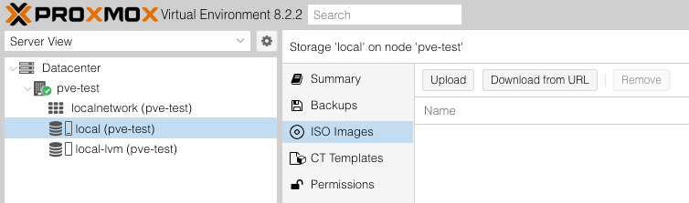

- A new window will pop-up allowing you to select the file you wish to upload:

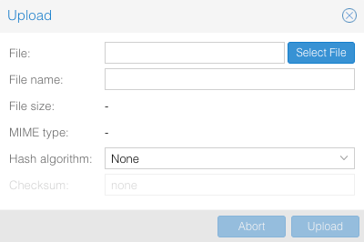

Once you’re done uploading the ISO, go back in the “Create: Virtual Machine” window and create your VM. You can select a bigger hard disk, more CPU cores and more memory if you want or stick with the defaults and upgrade the VM later if you need to:

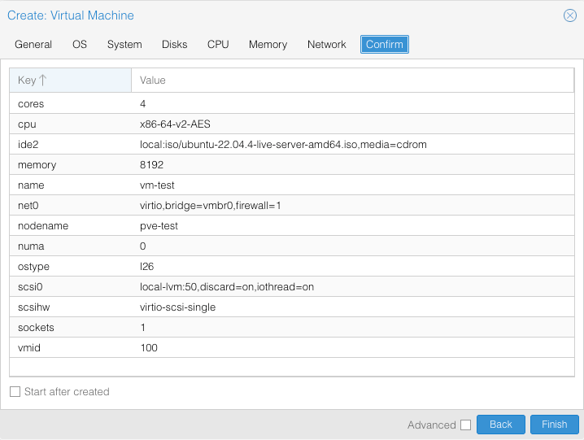

### Adding the GPU and installing drivers

Once the VM is created, you can add the GPU via the hardware tab under the VM console in Proxmox.

- In the hardware tab, select Add -> PCI device: 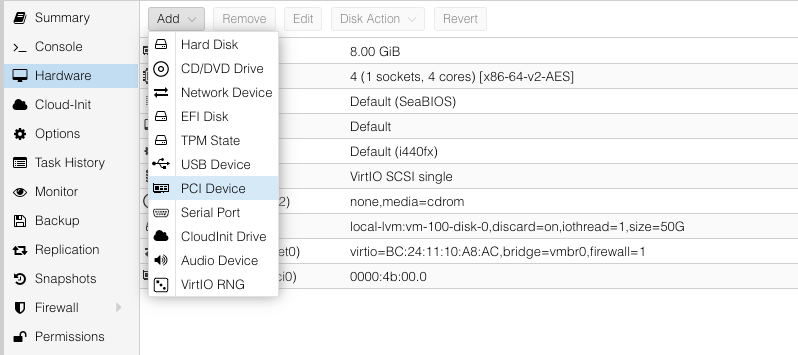

- Select Raw Device and find your GPU: 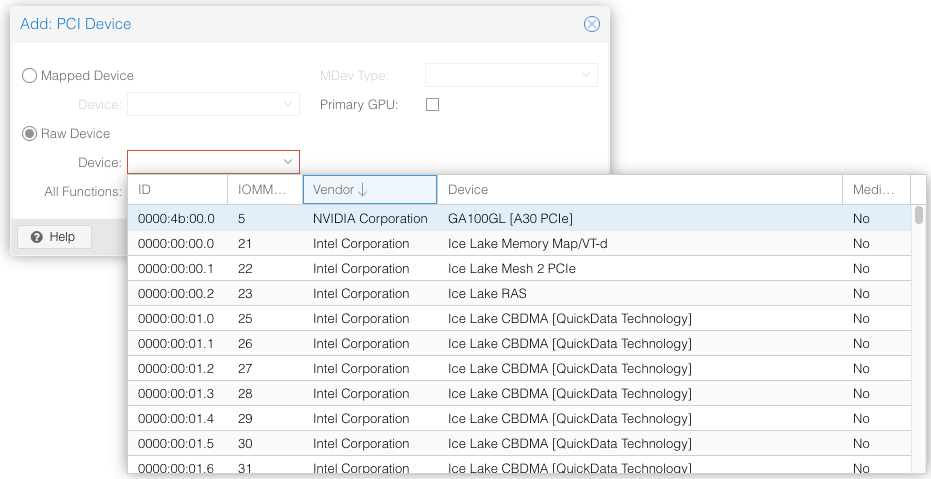
- Once you’ve installed and logged into the OS, check that the GPU is showing up by running “lspci | grep NVIDIA” or “lspci | grep AMD”

At this point, you can install your GPU drivers and test your GPU.

- Note that network installed drivers are supported for various Linux distros.
- In this example, we’re installing Nvidia drivers for Ubuntu 22.04. You can follow the instructions from the Nvidia [download page](https://developer.nvidia.com/cuda-downloads?target_os=Linux&target_arch=x86_64&Distribution=Ubuntu&target_version=22.04&target_type=deb_network) below:

```
wget https://developer.download.nvidia.com/compute/cuda/repos/ubuntu2204/x86_64/cuda-keyring_1.1-1_all.deb &amp;&amp; sudo dpkg -i cuda-keyring_1.1-1_all.deb &amp;&amp; sudo apt-get update &amp;&amp; sudo apt-get -y install cuda-toolkit-12-6 &amp;&amp; sudo apt-get install -y nvidia-open
```

- Once installed, you can run the command “nvidia-smi” you should see output similar to the below screenshot: 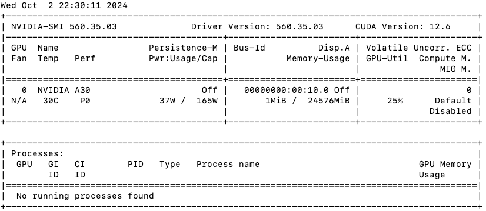

### Github script

To make deployment easier for our readers we’ve created a script that will automate the majority of the steps required to pass an Nvidia GPU through in Proxmox 8 VE. The script can:

- Check if VT-x/AMD-V and IOMMU CPU features are enabled
- Enable GPU passthrough
- Verify GPU passthrough
- Revert changes

[https://github.com/ColfaxResearch/cfxr-proxmox-gpu-passthrough](https://github.com/ColfaxResearch/cfxr-proxmox-gpu-passthrough)
