# Installing Ubuntu 22.04 LTS over the Network on Servers with the NVIDIA® Grace Hopper™ Superchip

**Date:** April 18, 2024

**Source:** [https://research.colfax-intl.com/ubuntu-22-04-netboot-on-servers-with-the-nvidia-grace-hopper-superchip/](https://research.colfax-intl.com/ubuntu-22-04-netboot-on-servers-with-the-nvidia-grace-hopper-superchip/)

---

NVIDIA® Grace™ CPU Superchip is a new choice of platform available for datacenter, CPU and HPC applications. NVIDIA Grace product lineup includes:

- NVIDIA Grace™ CPU Superchip, a processor designed for servers accelerated with add-on NVIDIA GPUs connected with the PCIe v5.0 interface;
- NVIDIA GH200 Grace Hopper™ Superchip, a combination of the NVIDIA Grace™ (CPU) and Hopper™ (GPU) architectures connected with the high-bandwidth, memory-coherent NVLink® C2C interconnect;
- NVIDIA GB200 Grace Blackwell™ Superchip, a key component in a rack-scale 72-GPU solution GB200 NVL72 that acts as a single massive GPU.

The common property of these new NVIDIA Superchips is the Arm® architecture as opposed to the x64 architecture of CPUs produced by Intel® and AMD®. The new architecture of NVIDIA Superchips comes with a promise of better performance, power efficiency and scalability. And as with any paradigm shift, the new architecture requires adjustments in the practices of the trade. This one in particular impacts the developers and the systems administrators who have to adapt their software to take advantage of the Arm architecture.

This post reports on our experience provisioning the Ubuntu 22.04 LTS operating system (OS) on servers based on the NVIDIA Grace Hopper Superchip over the network. This procedure is applicable to other Arm-based NVIDIA servers and, with minor modifications, to the installation of the soon-to-be-released Ubuntu 24.04 LTS.

Readers familiar with setting up PXE boot infrastructure and configuring unattended Ubuntu installation can skip to the Summary where we outline the differences between the procedures for the x64 architecture and for the Arm architecture.

## Instructions

Network-based OS installation is an efficient and scalable method of preparing bare-metal data center servers for use or for further customization with configuration management tools such as Ansible. It allows the administrator to start the OS installation process by connecting the server to a network with the necessary services. 

In this post, we report and explain our experience with the following stages of the process:

1. Configuring out-of-band server management;
2. DHCP and TFTP server configuration for PXE-booting into Grub;
3. Ubuntu installer;
4. Configuring unattended installation; and
5. Installing the NVIDIA-specific packages for GPU operation.

Our system is a [Colfax CX1150s-GH2](https://www.colfax-intl.com/servers/CX1150s-GH2) server based on the NVIDIA GH200 Grace Hopper Superchip.

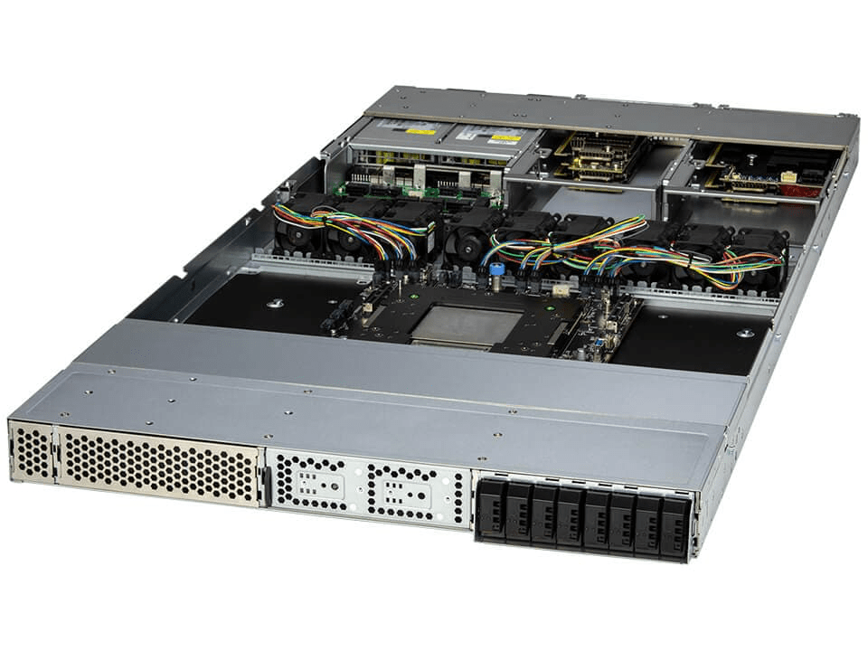

The system comes with a baseboard management controller (BMC) equipped with a dedicated RJ45 port and two (2) full-height full-length (FHFL) PCIe 5.0 x16 slots typically used for network cards. There is no need for a PCIe slot for a GPU card in this platform because the NVIDIA Tensor Core GPU is integrated in the NVIDIA GH200 Grace Hopper Superchip. In our case, the two PCIe slots are populated with NVIDIA ConnectX®-7 QSFP112 dual-port NDR 200GbE cards.

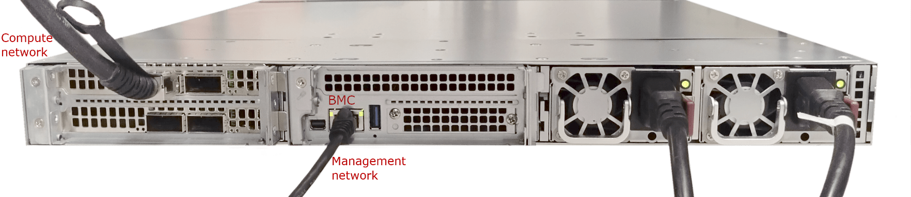

- We connected the BMC port to a network that we use for server management. We refer to it as “*management network*“. It is used to control power to the system and to remotely view the system’s output. There is a DHCP server on the *management network*, which we refer to as DHCP Server M.
- We connected one of the QSFP112 ports to a network in which we are configuring PXE boot and unattended Ubuntu installation services. We refer to it as “*compute network*” because in our lab, it is also the network on which the system is used for computational workloads.
- The *compute network* has, on a separate host, a virtual machine called `v-netboot` running Ubuntu 22.04 LTS. We use this virtual machine to run all the services necessary for network booting the NVIDIA Grace Hopper Superchip-based server for and the OS installation.

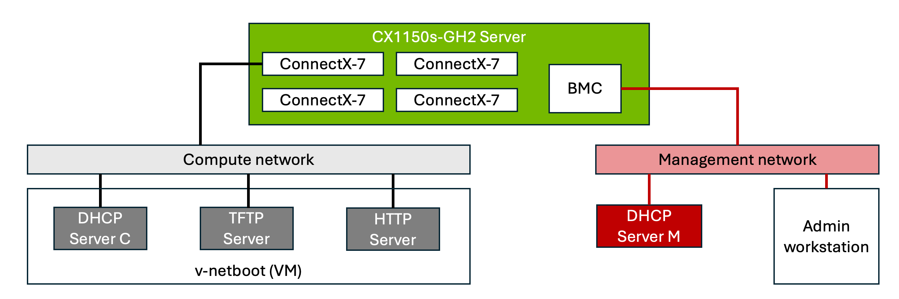

### 1. Out-Of-Band Server Management

To take advantage of the remote server management capabilities of the server, we connect to the BMC web console (an HTTPS-based server running on the BMC IP address). We also issue IPMI commands to the BMC. The MAC address of the BMC port and the initial admin password are typically printed on an asset tag card accessible from the system front panel. In some cases, this information is printed on the server board.

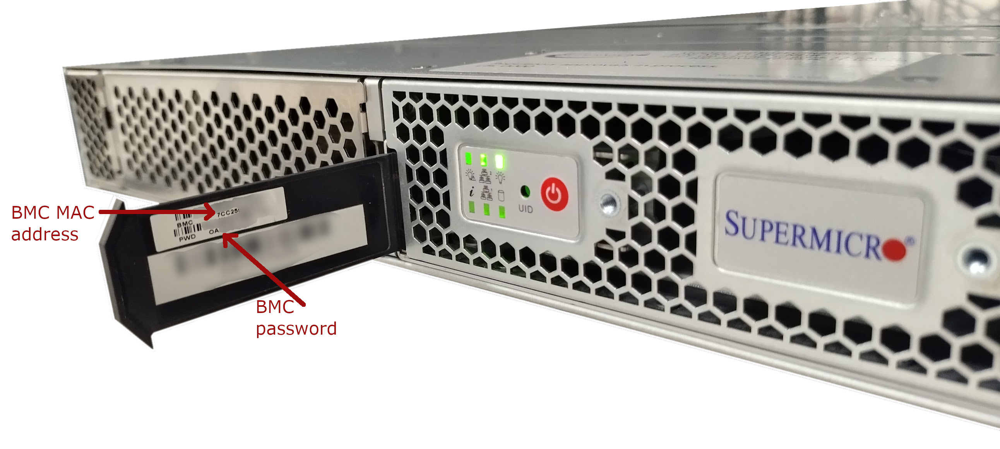

We added the MAC address of the BMC port to DHCP Server M and assigned to it a static IP address (in our case, 10.27.4.1). With that done, the administrator on the Admin workstation connected to the *Management network* can open a browser, point it to https://10.27.4.1/ and, after accepting a self-signed certificate, log in to the BMC web console using the username *ADMIN* and the password from the asset tag card:

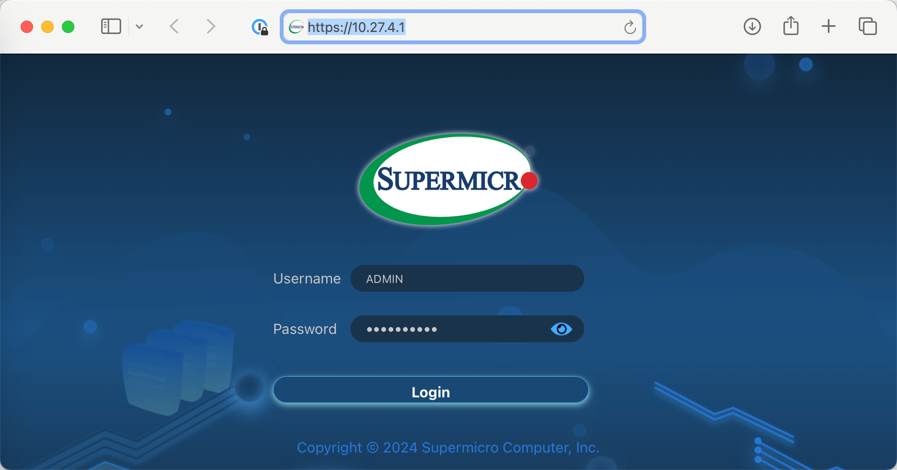

Inside the BMC web console, the admin has access to power control functionality and remote control facilities for viewing the system’s display output, among other things:

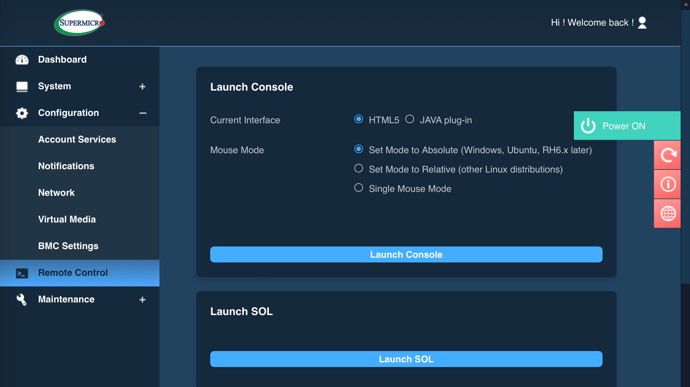

Usually, the HTML5-based remote console is our preferred tool for viewing the system’s display output. However, we found that on systems designed for NVIDIA Grace Hopper Superchips, the output to the HTML5 console freezes after the system boots into the OS. While we don’t have an explanation for this behavior, we found that the SOL (Serial-Over-LAN) console works with no issues. For most of this work, we use SOL, which is a Java-based desktop application.

In addition to server power controls in the BMC web console, the system accepts IPMI commands. The application `ipmitool`, available in most Linux distributions, can be used for that. On an Ubuntu-based admin workstation, we installed it like this:

```
apt install ipmitool
```

After that, we are able to control the system from the command line interface. For example, to set the boot device to PXE and reboot the system, on the Admin workstation, we use `ipmitool` like this:

```
ipmitool -H &lt;bmc_ip> -U ADMIN -P &lt;password> chassis bootdev pxe
ipmitool -H &lt;bmc_ip> -U ADMIN -P &lt;password> power reset
```

After that, the SOL console launched from the BMC web console shows the boot process in real time, eventually leading to the PXE boot attempt:

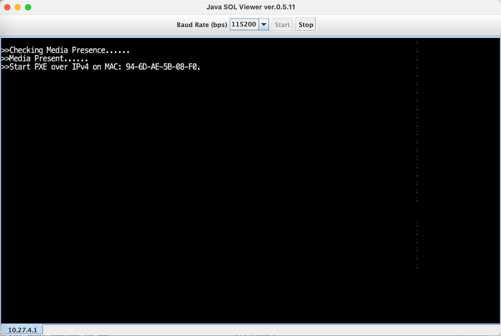

At this point, it is convenient to capture the MAC address shown in the console. This is the MAC address of the ConnectX-7 interface connected to the *compute network*. Because our PXE boot services are not yet set up, the boot process cannot proceed, so we can power off the system:

```
ipmitool -H &lt;bmc_ip> -U ADMIN -P &lt;password> power off
```

### 2. DHCP and TFTP Server Configuration for PXE-Booting into GRUB

PXE stands for Preboot eXecution Environment. It is a protocol implemented by the UEFI software on the server that leverages DHCP and TFTP to download and run a bootloader application. For UEFI-capable systems, like the CX1150s-GH2, this bootloader is usually Grub.

#### DHCP Server

To set up PXE boot services, we need to configure a DHCP server (*DHCP Server C*) on the *compute network* that would recognize the MAC address of the network interface trying to boot. In this experiment, we ran the DHCP server on the VM `v-netboot`, which is running Ubuntu 22.04. 

Here’s how we did it. First, we installed the DHCP server:

```
apt install isc-dhcp-server
```

Next, we edited the configuration file `/etc/dhcp/dhcpd.conf` to look like this:

```
# DNS server. We are using a public one. 
# Use your preferred one.
option domain-name-servers 8.8.8.8;

# We prefer this setting on our network:
authoritative;

# This is the compute network
# Use the subnet and netmask corresponding to your environment
subnet 10.34.1.0 netmask 255.255.255.0 {

    # Default gateway for DHCP clients.
    # In our case, v-netboot is the gateway
    option routers 10.34.1.1;
 
    # Subnet mask for DHCP clients
    option subnet-mask 255.255.255.0;

    # This is the first part of the PXE boot settings: 
    # the server to which the booting client should go 
    # in order to download the bootloader.
    # In our case, this is the IP address of v-netboot
    next-server 10.34.1.1;

    # This is the second part of the PXE boot settings:
    # the path to the bootloader on the server
    option bootfile-name "uefi/grubnetaa64.efi.signed";

    # This section specifies an IP address for the PXE boot client.
    # The hadrware ethernet value is the MAC address shown
    # on the PXE boot attempt screen:
    host grace-hopper-1 {
       hardware ethernet 94:6d:ae:5b:08:f0;
       fixed-address 10.34.1.4;
   }

}
```

If you are running a firewall on `v-netboot`, you will need to open the UDP port 67 to allow clients to talk to the DHCP server. For example, for UFW, the command for our subnet is:

```
ufw allow from 10.34.1.0/24 to any port 67 proto udp
```

Finally, we started the DHCP server and enabled it on boot:

```
systemctl start isc-dhcp-server
systemctl enable isc-dhcp-server
```

Note that you don’t have to use run a Linux-based DHCP server to boot PXE clients. You just need to configure your preferred DHCP server to respond to clients with the options `next-server` and `bootfile-name` as specified above. For example, if you are using the OPNsense® firewall and using its DHCP server, you can accomplish PXE booting as shown in the screenshot below:

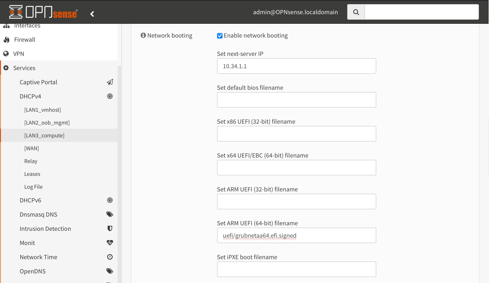

Note that above, we specified the filename for the *ARM UEFI (64-bit)* architecture, which corresponds to the servers based on NVIDIA Grace and Grace Hopper Superchips. If you need to PXE boot clients of various architectures, you will need to supply the corresponding bootloader for each architecture.

To verify that the DHCP server configuration was correct, at this point we can repeat the PXE boot process on the system. This time, the expected behavior is that our system attempts to do PXE boot from the first network interface:

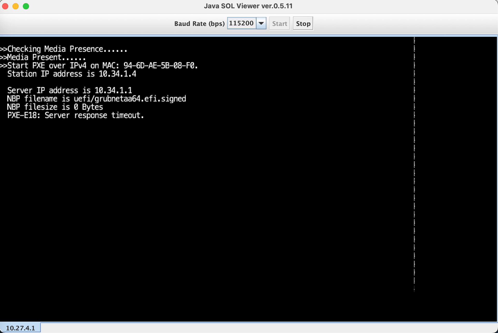

The boot process will not go further, however, this screen has useful information: 

- the system tried to PXE boot from the network interface with the MAC address `94-6D-AE-5B-08-F0`;
- it successfully communicated with the DHCP server and received the IP address 10.34.1.4;
- furthermore, the `next-server` DHCP option was sent by the server and it was set to 10.34.1.1;
- the `bootfile-name` DHCP option was also sent and it was set to `uefi/grubnetaa64.efi.signed`.

Additional diagnostic information about the interactions of the PXE client with the DHCP server can be found in `/var/log/syslog` on `v-netboot`:

```
Apr 19 22:37:37 v-netboot dhcpd[1459]: DHCPDISCOVER from 94:6d:ae:5b:08:f0 via ens19
Apr 19 22:37:37 v-netboot dhcpd[1459]: DHCPOFFER on 10.34.1.4 to 94:6d:ae:5b:08:f0 via ens19
Apr 19 22:37:41 v-netboot dhcpd[1459]: DHCPREQUEST for 10.34.1.4 (10.34.1.1) from 94:6d:ae:5b:08:f0 via ens19
Apr 19 22:37:41 v-netboot dhcpd[1459]: DHCPACK on 10.34.1.4 to 94:6d:ae:5b:08:f0 via ens19
Apr 19 22:37:41 v-netboot kernel: [ 1077.519496] [UFW BLOCK] IN=ens19 OUT= MAC=bc:24:11:ca:e7:0e:94:6d:ae:5b:08:f0:08:00 SRC=10.34.1.4 DST=10.34.1.1 LEN=98 TOS=0x00 PREC=0x00 TTL=64 ID=62387 PROTO=UDP SPT=1196 DPT=69 LEN=78 
Apr 19 22:37:45 v-netboot kernel: [ 1081.513039] [UFW BLOCK] IN=ens19 OUT= MAC=bc:24:11:ca:e7:0e:94:6d:ae:5b:08:f0:08:00 SRC=10.34.1.4 DST=10.34.1.1 LEN=98 TOS=0x00 PREC=0x00 TTL=64 ID=62388 PROTO=UDP SPT=1196 DPT=69 LEN=78 
```

The output in the SOL console and the system log show that the PXE client (i.e., the bare-metal system) successfully received an IP address from the DHCP server and tried to download file `uefi/grubnetaa64.efi.signed` from the TFTP server on 10.34.1.1. However, the latter step failed because we have not set the TFTP server nor opened the port in the firewall yet. We do it in the next section.

#### TFTP Server

The Trivial File Transfer Protocol (TFTP) is, as the name suggests, a highly simplified protocol for file transfers. The PXE stack uses this protocol to download the minimal software necessary to implement more complex communication and application protocols (such as TCP and HTTP). These, in turn, are later used to drive the OS installation. Our next step is to install the TFTP server and supply the files that it will serve.

Again, we used the VM `v-netboot` to run the TFTP server. Installing the server was straightforward:

```
apt install tftpd-hpa
systemctl start tftpd-hpa
systemctl enable tftpd-hpa
```

If you are running a firewall on `v-netboot`, you will need to open the UDP port 69 to allow clients to talk to the TFTP server. For example, for UFW, the command for our subnet is:

```
ufw allow from 10.34.1.0/24 to any port 69 proto udp
```

The configuration file for the TFTP server is `/etc/default/tftpd-hpa`. For troubleshooting, it may be helpful to increase the verbosity of the TFTP server by editing this file to add the argument `-v`, `-vv`, or `-vvv` to `TFTP_OPTIONS`. After that, restart the TFTP server:

```
systemctl restart tftpd-hpa
```

The log of TFTP client interactions with the server will be output into `/var/log/syslog`.

The root directory for files served by this TFTP server is `/srv/tftp`. With the server running, we have to populate this root directory with files that need to be served for PXE boot.

#### Bootloader

As specified in the DHCP configuration option `bootfile-name`, the PXE client attempts to download from the TFTP server the bootloader binary `uefi/grubnetaa64.efi.signe`d. This path is relative to `/srv/tftp`, so the full path to the bootloader executable file is `/srv/tftp/uefi/grubnetaa64.efi.signed`. We obtained this file like this:

```
mkdir -p /srv/tftp/uefi
wget http://ports.ubuntu.com/ubuntu-ports/dists/jammy/main/uefi/grub2-arm64/current/grubnetaa64.efi.signed -O /srv/tftp/uefi/grubnetaa64.efi.signed
```

If you have previously configured PXE booting for Ubuntu 22.04 on the x64 architecture, you may have obtained the bootloader binary from the live server ISO rather than from the url as above. We attempted following that path but found that the files `efi/boot/grubaa64.efi` and `efi/boot/bootaa64.efi` contained in the live server ISO do not work for PXE booting because they do not attempt to obtain the `grub.cfg` file from the TFTP server. So, the URL listed above should be used to obtain the bootloader executable instead.

#### Bootloader Configuration File

When the bootloader is executed, it contacts the TFTP server and tries to obtain the file `grub/grub.cfg` to guide the subsequent boot process. We created this file like this:

```
mkdir -p /srv/tftp/grub
cat &lt;&lt; EOF > /srv/tftp/grub/grub.cfg
set timeout=30
loadfont unicode
set gfxpayload=keep

menuentry 'Exit and proceed with BIOS boot order' {
    exit 1
}

menuentry 'Manual Installation of Ubuntu 22.04 Server' --class gnu-linux --class gnu --class os --id provision {
    linux ubuntu-22.04-arm64/vmlinuz ip=dhcp root=/dev/ram0 ramdisk_size=3000000 url=http://10.34.1.1/iso/ubuntu-22.04.4-live-server-arm64.iso fsck.mode=skip
    initrd ubuntu-22.04-arm64/initrd
}

menuentry 'Unattended Installation of Ubuntu 22.04 Server' --class gnu-linux --class gnu --class os --id provision {
    linux ubuntu-22.04-arm64/vmlinuz ip=dhcp root=/dev/ram0 ramdisk_size=3000000 url=http://10.34.1.1/iso/ubuntu-22.04.4-live-server-arm64.iso autoinstall ds=nocloud-net\;s=http://10.34.1.1/autoinstall/ubuntu22.04-arm64/ cloud-config-url=/dev/null fsck.mode=skip
    initrd ubuntu-22.04-arm64/initrd
}
EOF
```

At this point, we should verify the steps performed so far. Use IPMI to request PXE boot and system reset and watch the HTML5 or SOL console. The expectation is that the PXE stack will communicate with the DHCP server, download the bootloader executable, and run it. The bootloader, in turn, should download the Grub configuration file and render the menu specified in it:

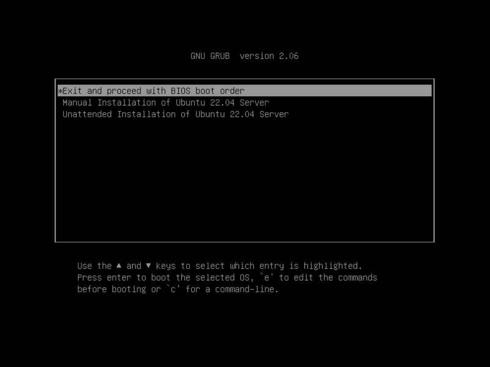

Now, to make the system proceed to the installation process, we need to supply the files listed in `grub.cfg`:

- `ubuntu-22.04-arm64/vmlinuz` (a Linux kernel for the installer to be fetched with TFTP),
- `ubuntu-22.04-arm64/initrd` (an initial RAM disk for the installer, also delivered over TFTP), and
- `iso/ubuntu-22.04.4-live-server-arm64.iso` (the installation ISO, to be delivered over HTTP).

### 3. Ubuntu Installer

Our next step is to install the HTTP server and prepare the live server ISO. On `v-netboot`, we installed the Apache server:

```
apt install apache2
```

If you are running a firewall, you will have to open port 80 for TCP traffic to allow HTTP access. E.g., for UFW, the command to do so is:

```
ufw allow from 10.34.1.0/24 to any port 80 proto tcp
```

The logs of the Apache server go to `/var/log/apache2/`. It may be helpful to refer to these logs for troubleshooting the PXE boot process.

The document root directory for Apache is `/var/www/html`. Our next step is to download the Ubuntu 22.04 live server ISO for the Arm64 architecture inside that directory. We referred to [https://ubuntu.com/download/server/arm](https://ubuntu.com/download/server/arm) to find the direct download link for it. Then we obtained the live server ISO:

```
mkdir -p /var/www/html/iso
wget https://cdimage.ubuntu.com/releases/22.04/release/ubuntu-22.04.4-live-server-arm64.iso -O /var/www/html/iso/ubuntu-22.04.4-live-server-arm64.iso
```

Now that we have the installation ISO, we also extracted the Linux kernel and the initial ramdisk used by the installer and placed them into the TFTP server directory at the paths specified in `grub.cfg`:

```
mkdir /srv/tftp/ubuntu-22.04-arm64
mkdir foo
mount -o loop /var/www/html/iso/ubuntu-22.04.4-live-server-arm64.iso foo
cp foo/casper/{initrd,vmlinuz} /srv/tftp/ubuntu-22.04-arm64/
umount foo
```

At this point, we can test the full PXE boot process. Again, we rebooted the server and forced it to PXE boot. This time, we selected the option *Manual Installation of Ubuntu 22.04 Server* in the Grub menu. After a few minutes, the remote console shows an Ubuntu installer prompt, which suggests that the ISO has been successfully loaded:

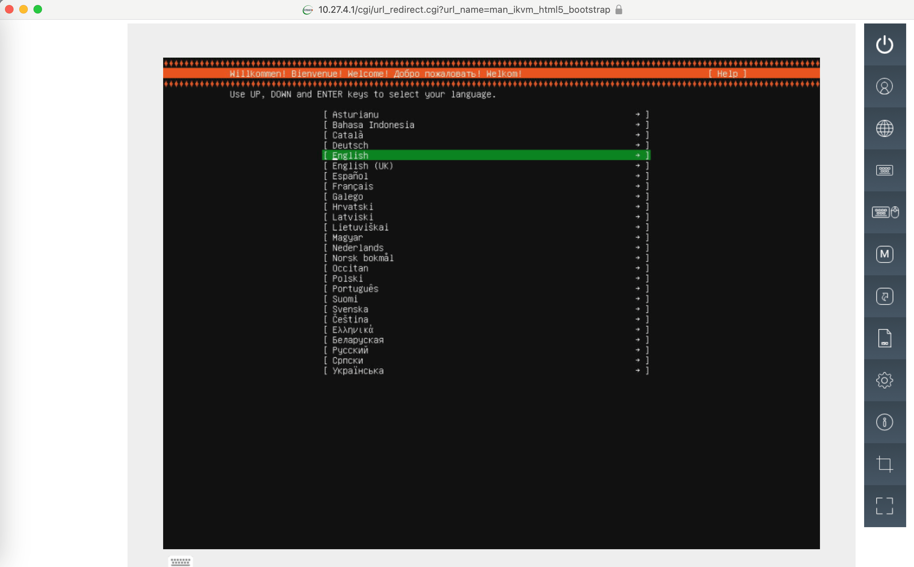

We could finish the OS installation by following the prompts. However, for this experiment, our goal is to configure unattended installation, so that we can configure numerous systems efficiently and consistently.

#### 4. Configuring Unattended Installation

In `grub.cfg`, the kernel arguments `autoinstall` and `ds=nocloud-net\;s=http://10.34.1.1/autoinstall/ubuntu22.04-arm64/` direct the installer to query the above URL for `cloud-init` configuration files. Let’s populate them.

First, we created two empty files:

```
mkdir -p /var/www/html/autoinstall/ubuntu22.04-arm64
touch /var/www/html/autoinstall/ubuntu22.04-arm64/meta-data
touch /var/www/html/autoinstall/ubuntu22.04-arm64/vendor-data
```

Next, we created one text file with the following contents:

```
mkdir -p /var/www/html/autoinstall/ubuntu22.04-arm64
cat &lt;&lt; EOF > /var/www/html/autoinstall/ubuntu22.04-arm64/user-data
#cloud-config
autoinstall:
  version: 1
  locale: en_US.UTF-8
  apt:
    primary:
      - arches: [default]
        uri: http://archive.ubuntu.com/ubuntu
  identity:
    hostname: grace-hopper
    username: guest
    password: $6$pKxeg9EA5xVOthex$bTBVPMlzC53bA7RSa4zF92f/UaxbUIP6YxzCcUwdnn4B9MDLWGUjolN7phu389zMmXGRKN7mHV6J1IKr8evN11
  refresh-installer:
    update: true
  ssh:
    install-server: true
    authorized-keys: [ecdsa-sha2-nistp256 AAAAE2VjZHNhLXNoYTItbmlzdHAyNTYAAAAIbmlzdHAyNTYAAABBBCHVJ9EbRm8kLq960fYNMo4bJP7qUcNtrDNbJuLnL5bY0L2PJg61+C3o9IEVmNcdeR9BbMrXupEKXqlbBRtfksE= root@v-netboot]
  kernel:
    package: linux-nvidia-64k-hwe-22.04
  storage:
    layout:
      name: lvm
EOF
```

This is only a minimal example that makes the installation proceed without prompts, installs the Linux kernel necessary for the operation of the NVIDIA Grace Hopper Superchip, and allows passwordless SSH login.

- The `kernel` section defines the hardware enablement (HWE) Linux kernel necessary for the features of the NVIDIA Grace or Grace Hopper Superchip.
- In the `apt` section, the `uri` pointing to [http://archive.ubuntu.com/ubuntu](http://archive.ubuntu.com/ubuntu) is necessary to allow the installer to download and instal the HWE kernel. Without specifying the `uri`, the installed will only use the packages available in the ISO, which does not include the necessary kernel. It is important that the DHCP server provides a working gateway for the PXE client so that it can access the Internet.
- The password for the default user `guest` is `Grace` (**change it for your configuration!**) and the hash is obtained by passing the password through the tool `mkpassword` available in the Ubuntu package `whois`:

```
apt install whois
echo Grace | mkpasswd -m sha-512 -s
```

- The `authorized-keys` section allows passwordless SSH access to the server after installation. The value supplied there is the contents of the `~/.ssh/id_ecdsa.pub` on `v-netboot`. We generated the SSH key pair with the tool `ssh-keygen`:

```
ssh-keygen -t ecdsa
```

After creating this file, we tested the full procedure. We used IPMI to request PXE boot and reset the system and watched the HTML5 or SOL console for the Grub menu. In the menu, we chose the option *Unattended Installation of Ubuntu 22.04 Server*:

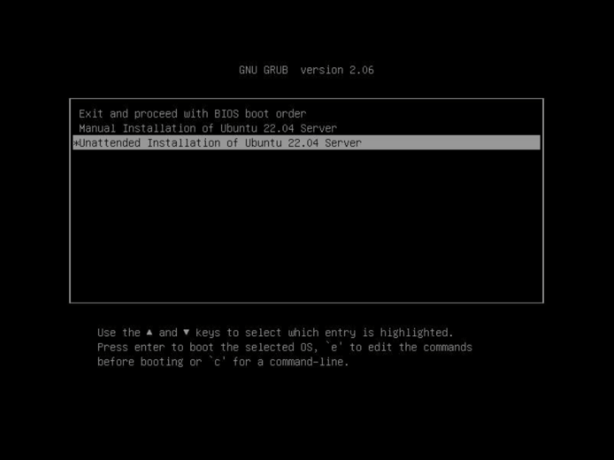

The expectation is that the installation will proceed without prompts. If no errors occur, after 5-10 minutes, the system should reboot, then boot from the hard drive, load Ubuntu 22.04, and become ready for connections.

### 5. Installing the NVIDIA-specific packages

After unattended installation completes, we can further customize the system by connecting with SSH and installing the necessary packages. Connecting from `v-netboot` to the system looks like this:

```
ssh guest@10.34.1.4
```

Here, `10.34.1.4` is the IP address of the bare-metal system. With the help of the SSH key, this logged us into the host `grace-hopper`.without a prompt for a password. We can became `root` by running `sudo su` and entering the password `Grace`, per the configuration above. After that, we installed the additional NVIDIA packages, such as the CUDA toolkit and the CUDA drivers:

```
sudo su
wget https://developer.download.nvidia.com/compute/cuda/repos/ubuntu2204/sbsa/cuda-keyring_1.1-1_all.deb
dpkg -i cuda-keyring*.deb
rm -f cuda-keyring*.deb
apt update
apt -y install cuda-toolkit-12-2
apt -y install nvidia-kernel-open-535 cuda-drivers-535
```

With this done, we ran the command `nvidia-smi`, which reports a Hopper GH200 GPU connected to the system. This indicates a successful installation:

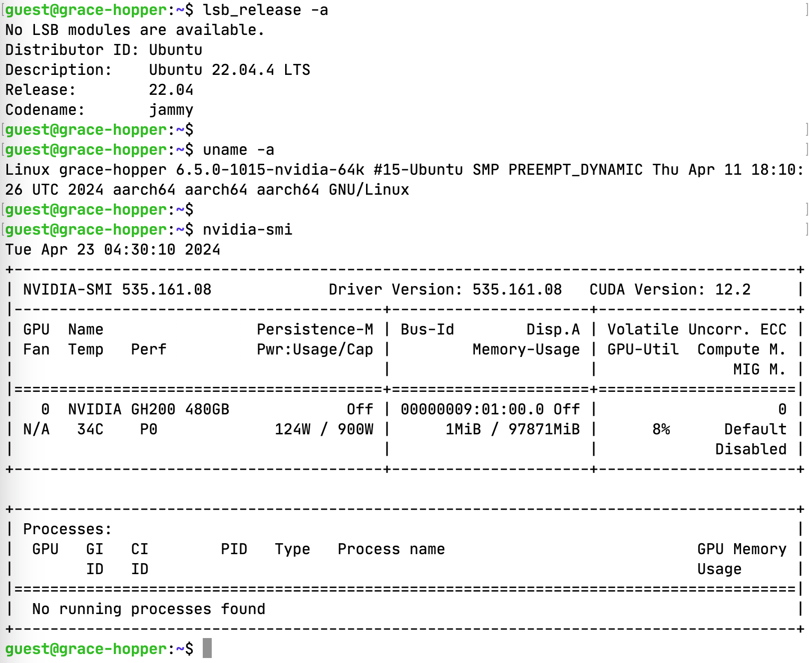

## Summary

We demonstrated the procedures for unattended installation of the Ubuntu 22.04 operating system on servers with Arm architecture-based NVIDIA Grace and Grace Hopper Superchips. 

### Adapting PXE Boot Services from x64 to arm64 Architecture

While most steps in this process are standard and users familiar with PXE boot stacks will have had experience with them, a few differences will be important for this combination of the platform and the OS:

1. Use the Arm architecture bootloader and ISO (look for suffix `aa64`):
  - Get the boot loader at [http://ports.ubuntu.com/ubuntu-ports/dists/jammy/main/uefi/grub2-arm64/current/grubnetaa64.efi.signed](http://ports.ubuntu.com/ubuntu-ports/dists/jammy/main/uefi/grub2-arm64/current/grubnetaa64.efi.signed)
  - Find the newest ISO at [https://ubuntu.com/download/server/arm](https://ubuntu.com/download/server/arm)
2. Install the hardware enablement kernel `linux-nvidia-64k-hwe-22.04` :
  - Include the corresponding kernel in `user-data`,
  - Supply the `uri` [http://archive.ubuntu.com/ubuntu](http://archive.ubuntu.com/ubuntu) for `apt` primary repository,
  - Configure the DHCP server to provide a valid public DNS server and gateway to the Internet, so that the PXE client can reach the repository on the Internet.
3. For BMC remote control users: if the HTML5-based console does not produce output after booting into the OS, use the SOL console.

### Expectations for Ubuntu 24.04 LTS

Ubuntu 24.04 LTS is going to be released on April 25, 2024. Based on our experiments with the Beta release, the procedures for setting up PXE Boot services will remain the same, with the exception of the sources for the bootloader and the live server ISO. We will update this article to reflect the necessary adjustments for Ubuntu 24.04 LTS.
