# Sharing NVIDIA® GPUs at the System Level: Time-Sliced and MIG-Backed vGPUs

**Date:** May 29, 2024

**Source:** [https://research.colfax-intl.com/sharing-nvidia-gpus-at-the-system-level-time-sliced-and-mig-backed-vgpus/](https://research.colfax-intl.com/sharing-nvidia-gpus-at-the-system-level-time-sliced-and-mig-backed-vgpus/)

---

While some modern applications for GPUs aim to consume all GPU resources and even scale to multiple GPUs (deep learning training, for instance), other applications require only a fraction of GPU resources (like some deep learning inferencing) or don’t use GPUs all the time (for example, a developer working on an NVIDIA CUDA® application may have to use the GPU only sporadically). To better utilize the computing resources, NVIDIA® GPUs have long been able to concurrently serve multiple processes with time-sliced context switching and CUDA Multi-Process Service (MPS). Although these technologies are still valid today, they have limitations:

- the need for a shared environment (i.e., all processes sharing a GPU must run within the same operating system),
- no fault isolation (that is, the failure of one process can crash the others), and
- no quality of service (QoS) guarantees for a consistent performance.

This is where the virtual GPUs (vGPUs) come in to allow system-level sharing of a physical GPU across multiple virtual machines (VMs), with GPU memory partitioning and secure process isolation. Moreover, with the introduction of the Multi-Instance GPU (MIG) technology in NVIDIA’s Ampere architecture, vGPUs received a new capability that allows for hardware-level partitioning of GPU compute resources and quality of service guarantees.

This publication:

1. Explains how MIG-capable GPUs can be used in the context of GPU virtualization;
2. Demonstrates the configuration of time-sliced and MIG-backed vGPUs in the Proxmox Virtual Environment;
3. Studies the performance implications of these approaches; and
4. Outlines the potential use cases for time-sliced and MIG-backed vGPU technologies.

To skip the article and jump to the performance results, click here.

## System-Level GPU Sharing

### What is MIG?

Multi-Instance GPU (MIG) is a feature of some NVIDIA GPUs that allows the user to partition the GPU into multiple GPU instances (GIs), with each instance having dedicated resources:

- memory,
- streaming multiprocessors (SMs), and
- engines (for direct memory access, encoding/decoding).

Each GPU instance can be further partitioned by the user into multiple compute instances (CIs), which share the memory and engines of the parent GI but have dedicated SMs.

Each CI can execute a process independently of and concurrently with all the other CIs, which can be beneficial for increasing the GPU utilization with multiple small and intermittent workloads. Furthermore, the MPS technology can be used alongside MIG to run multiple processes on each CI.

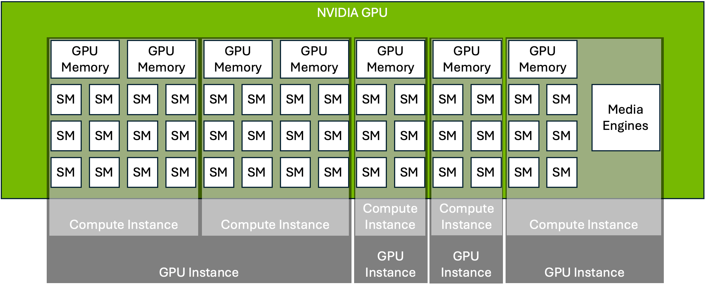

The number and configuration of MIG instances for each GPU is determined by the hardware organization. The `nvidia-smi` tool can report the available GPU instance profiles with the command

```
nvidia-smi mig -lgip
```

Here’s a part of the output of this command obtained on a system with NVIDIA H100 NVL GPUs:

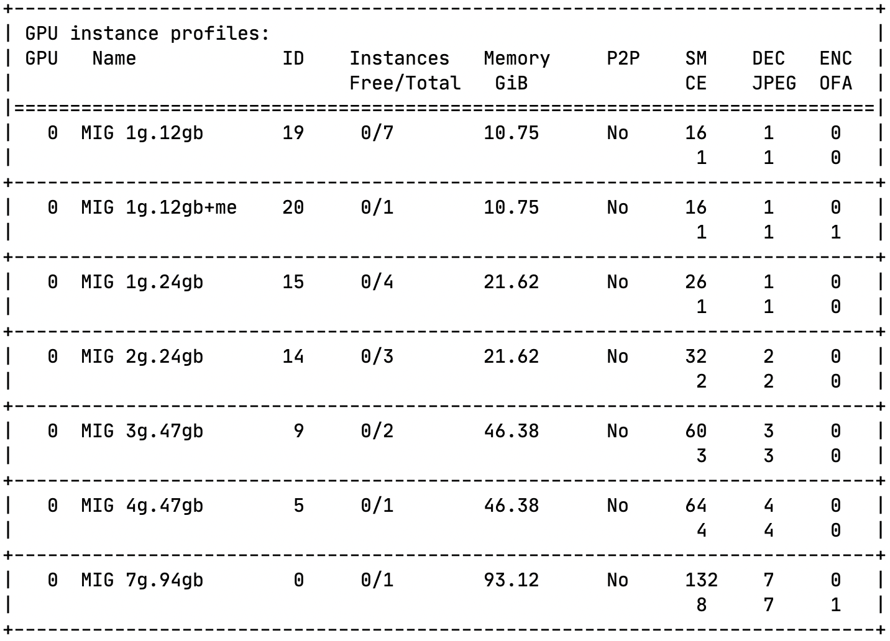

The profiles have names, such as `MIG 2g.24gb`, which indicate the number of the compute and memory slices allocated to the GPU instance of this type. Additional information about each profile that can be inferred from this output is:

- The number of instances of this type that can be configured,
- Memory per instance,
- Whether peer-to-peer communication is supported,
- Number of SMs and copy engines (CE) per instance,
- Number of decoder (DEC) and JPEG engines, and
- Number of encoders (ENC) and optical flow accelerator (OFA) engines.

Note that ENC and OFA features are available only in the profile `MIG 1g.12gb+me` (as indicated by the suffix `+me`) or in the profile `MIG 7g.94gb`) comprising all GPU slices. These media engines cannot be shared across multiple MIG instances.

Not all MIG instances configured on a GPU have to be identical. Combinations of different types are allowed as long as they follow the placements dictated by the hardware design. The available placements can be obtained with `nvidia-smi mig -lgipp`. For example, the H100 NVL GPU supports the following:

```
GPU  0 Profile ID 19 Placements: {0,1,2,3,4,5,6}:1
GPU  0 Profile ID 20 Placements: {0,1,2,3,4,5,6}:1
GPU  0 Profile ID 15 Placements: {0,2,4,6}:2
GPU  0 Profile ID 14 Placements: {0,2,4}:2
GPU  0 Profile ID  9 Placements: {0,4}:4
GPU  0 Profile ID  5 Placement : {0}:4
GPU  0 Profile ID  0 Placement : {0}:8
```

Because of memory and SM isolation, MIG instances operate independently from each other and the workload on one instance does not impact the performance of the others, which allows for QoS guarantees for MIG-backed applications. There are, however, two exceptions to these guarantees: the MIG instances share the GPU’s PCIe® bus and power resources. So, workloads dependent on host-to-device or device-to-host transfer performance can interfere with each other when running on MIG instances of a single GPU. And so can highly compute intensive applications that push the electrical power available to a GPU card to its limits. We discuss these effects later in this article.

### What are vGPUs?

NVIDIA vGPU is a feature implemented in driver software that allows access to a single NVIDIA GPU from multiple virtual machines. This is a step up above the PCIe pass-through mode of GPU virtualization, in which the entire GPU is assigned to a single VM. Indeed, vGPUs use the Single Root I/O Virtualization (SR-IOV) functions to allow secure access to time-sliced or partitioned GPU resources.

The vGPU technology is helpful to cloud service providers and on-premise GPU infrastructures alike, as it allows them to offer shared access to a GPU to independent users, each with their own environment and applications.

To enable vGPUs on a virtual host, the administrator must install host-side vGPU drivers on the hypervisor machine, configure VMs with access to specific vGPUs, and install guest-side vGPU drivers in the VMs.

NVIDIA vGPU software requires a special license. The license for the vGPU software is available as a standalone subscription and as a part of the NVIDIA AI Enterprise (NVAIE) software suite.

### Time-Sliced vGPUs

Most NVIDIA GPUs support the time-sliced vGPU mode. In this mode, each vGPU receives a dedicated share of the physical GPU memory (frame buffer) and has access to all SMs and media engines on the GPU. 

When multiple time-sliced vGPUs run processes at the same time, the vGPU driver stack performs context switching between them according to the policies specified by the administrator. As a result, if there is only one active tenant, this tenant can utilize the entire GPU; if there are multiple active tenants, they share the GPU’s compute performance. Work for a specific vGPU gets scheduled 480 or 960 times per second, depending on the number of vGPUs configured on the physical GPU.

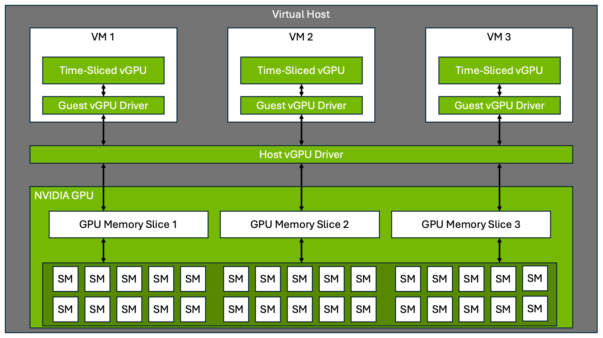

### MIG-Backed vGPUs

MIG-capable NVIDIA GPUs allow MIG-backed vGPUs, which is an alternative approach to time-sliced vGPUs. In this mode, each vGPU receives a dedicated share of the physical GPU memory *and* a dedicated share of the SMs (and media engines, if applicable). 

When multiple MIG-backed vGPUs are simultaneously loaded, their workloads run in parallel on the dedicated SMs and memory. As a result, whether there is only one or multiple active tenants, each of them gets a fixed and guaranteed fraction of the GPU’s performance according to the type of the MIG instance that the vGPU runs on (as long as the PCIe bandwidth and the power budget do not interfere with the performance).

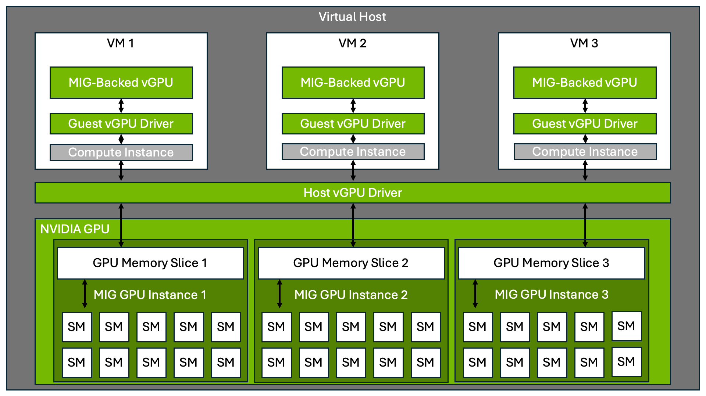

## Configuring a Proxmox Virtual Environment with vGPUs

To demonstrate the configuration procedure for a virtual environment with time-sliced and MIG-backed vGPUs, we use a server based on an Intel® M50CYP2SBSTD board with an Intel® Xeon® Gold 6334Y CPU (24 cores per socket, 2 sockets and hyper-threading for a total of 96 logical CPUs) and two NVIDIA A30 GPUs, one GPU per socket.

### Preparing Proxmox

We installed Proxmox Virtual Environment 8.2.2 with Linux kernel 6.5.13-5. Note that we have attempted to configure vGPUs with the latest available kernel, 6.8.4-3, however, it was not compatible with NVAIE software stack version 550.54.16, which is the latest at the time of the writing. To configure the virtual host to boot the correct kernel version, we edited `/etc/default/grub` and inserted

```
GRUB_DEFAULT="gnulinux-advanced-1bfdc25e-20b1-4bbf-9d9b-88feb967c8e8>gnulinux-6.5.11-8-pve-advanced-1bfdc25e-20b1-4bbf-9d9b-88feb967c8e8"
```

Additionally, to enable the correct functionality of NVIDIA vGPUs, we added the IOMMU setting to `/etc/default/grub`:

```
GRUB_CMDLINE_LINUX_DEFAULT="quiet intel_iommu=on"
```

and disabled the Nouveau kernel module:

```
echo blacklist nouveau > /etc/modprobe.d/blacklist.conf
```

After that, we updated the initramfs and the Grub boot menu and restarted the host:

```
update-initramfs -u
update-grub
reboot
```

After reboot, IOMMU should be enabled and the Nouveau driver should not be loaded:

```
root@pve-1-1-dev:~# dmesg | grep "IOMMU enabled"
[    0.490456] DMAR: IOMMU enabled
root@pve-1-1-dev:~# lsmod | grep -c nouveau
0
```

Finally, we installed additional packages that the NVIDIA vGPU driver stack expects as dependencies:

```
apt install -y dkms gcc make proxmox-default-headers proxmox-headers-`uname -r`
```

### Installing the Host Software

We obtained NVIDIA vGPU software as a part of the NVAIE package as a download from the [NVIDIA Licensing Portal](https://ui.licensing.nvidia.com) (Software Downloads > Product Family: NVAIE > NVIDIA AI Enterprise 5.0 Software Package for Linux KVM).

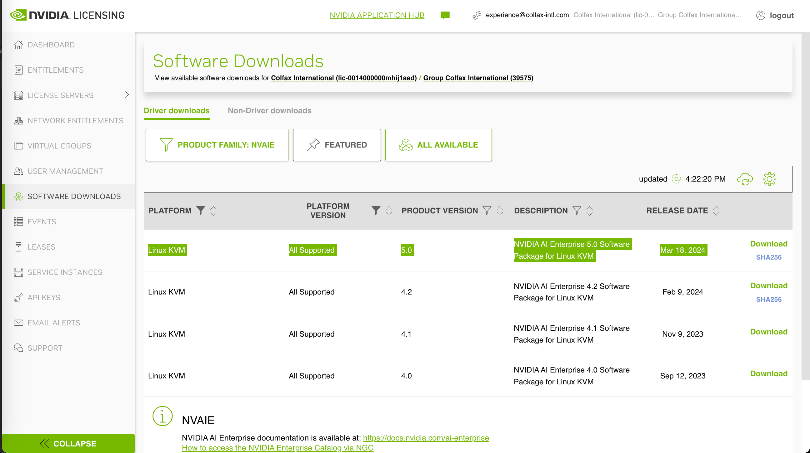

After unzipping the archive, we copied the file `Host_Drivers/NVIDIA-Linux-x86_64-550.54.16-vgpu-kvm-aie.run` to the Proxmox host and executed it to install the host drivers:

```
chmod +x NVIDIA-Linux-x86_64-550.54.16-vgpu-kvm-aie.run 
./NVIDIA-Linux-x86_64-550.54.16-vgpu-kvm-aie.run --dkms
```

After a successful installation, we are able to run `nvidia-smi`:

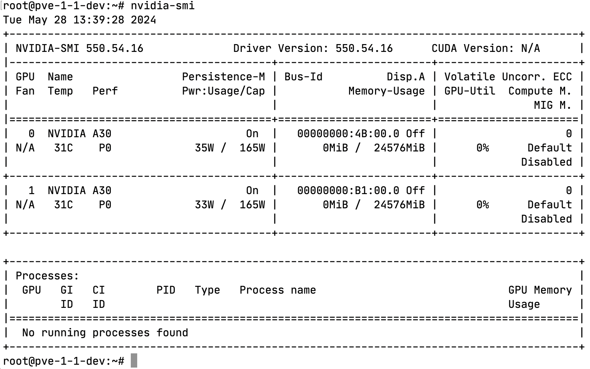

This indicates a successful installation of host-side drivers.

### Configuring Time-Sliced vGPUs

NVIDIA vGPU software comes with a script that simplifies the setup of vGPUs by enabling the virtual functions for SR-IOV. Here is a command that enables virtual functions on all GPUs in the virtual host using that script:

```
/usr/lib/nvidia/sriov-manage -e ALL
```

This configuration is not persistent across reboots. To re-enable the virtual functions after reboot, you can set up a `systemd` service that runs the above command at boot.

If at a later point in time, we have to disable the virtual functions, we can run

```
/usr/lib/nvidia/sriov-manage -d ALL
```

With this done, we can create a virtual machine with a time-sliced vGPU. From the web UI, we had to select the VM and go to Hardware > Add > PCI Device:  

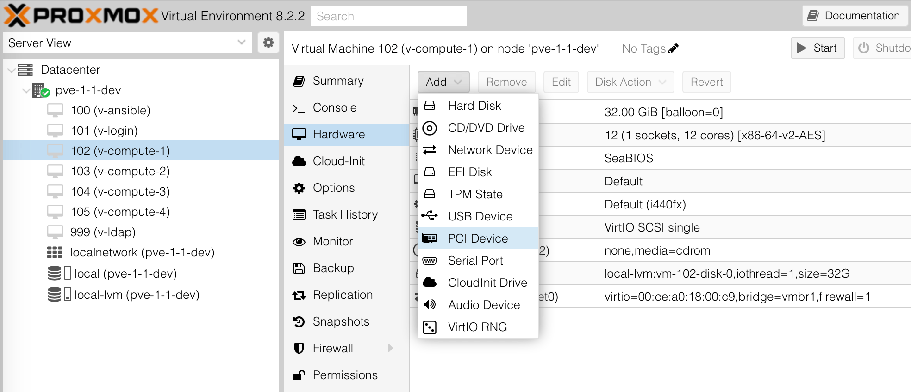

Then, under Raw Device, we can find the original device (in the screenshot below, it is `0000:4b:00.0`) and the virtual functions underneath it created by the `sriov-manage` tool (in the screenshot below, the virtual functions are `0000:4b:00.4`, `0000:4b:00.5`, etc.):

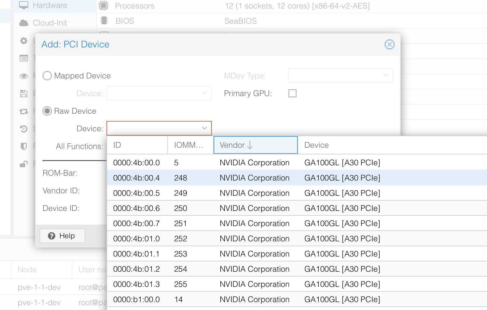

After selecting the virtual function, we should go to MDev Type and select the type of vGPU required:

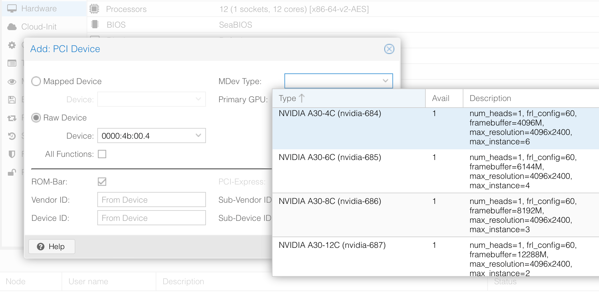

The nomenclature for time-sliced vGPUs has the physical GPU model (in our example, A30) followed by the amount of framebuffer (i.e., GPU memory) allocated to it. 

To configure additional vGPUs in the same or VM or others, we must select other virtual functions. The types of vGPUs available for the chosen virtual function is automatically reflected in the interface.

### Configuring MIG-Backed vGPUs

MIG-backed vGPUs are configured similarly to time-sliced, with additional steps that enable MIG on the physical host, sets up GPU instance profiles, and creates compute instance profiles.

First, to enable the virtual functions for SR-IOV, we ran:

```
/usr/lib/nvidia/sriov-manage -e ALL
```

Second, to enable MIG on all physical GPUs, use `nvidia-smi` on the virtual host, we ran:

```
nvidia-smi -mig 1
```

This reports the list of GPUs and their addresses followed by “all done”:

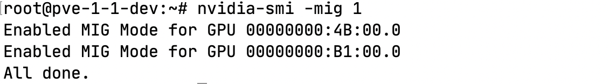

Finally, we had to choose and create GPU instance profiles. The list of GPU instance profiles can be queried with `nvidia-smi -lgip`:

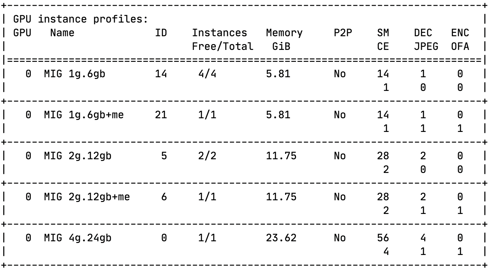

The nomenclature for these profiles is the number of GPU slices (e.g., above, `1g` corresponds to one slice comprising 14 SMs, `2g` to two slices comprising 28 SMs, etc.) followed by the amount of the framebuffer (e.g., `6gb` corresponds to 6 GB of GPU memory). The `+me` suffix indicates the allocation of media engines to the GPU instance profile.

To create GPU instance profiles, we ran the following command with a list the profiles in the order corresponding to their placement, e.g.:

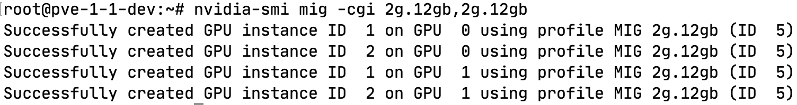

Finally, we created compute instances on the GPU instances. This allows us to use the full GPU instance for the vGPU or further subdivide the GPU instance into smaller compute instances with a shared framebuffer. The list of compute instance profiles can be obtained with `nvidia-smi`:

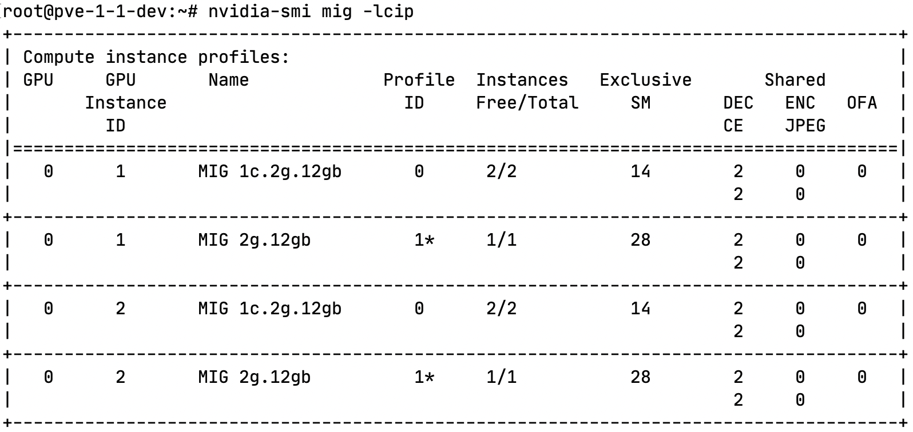

This nomenclature has the prefix ending in `-c`, which indicates the number of compute slices in the compute instance. Here’s an example of creating the `2g.12gb` compute instance in all MIG slices on all GPUs:

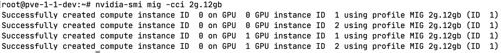

The list of currently running MIG configuration in the virtual host is now included in the output of `nvidia-smi`:

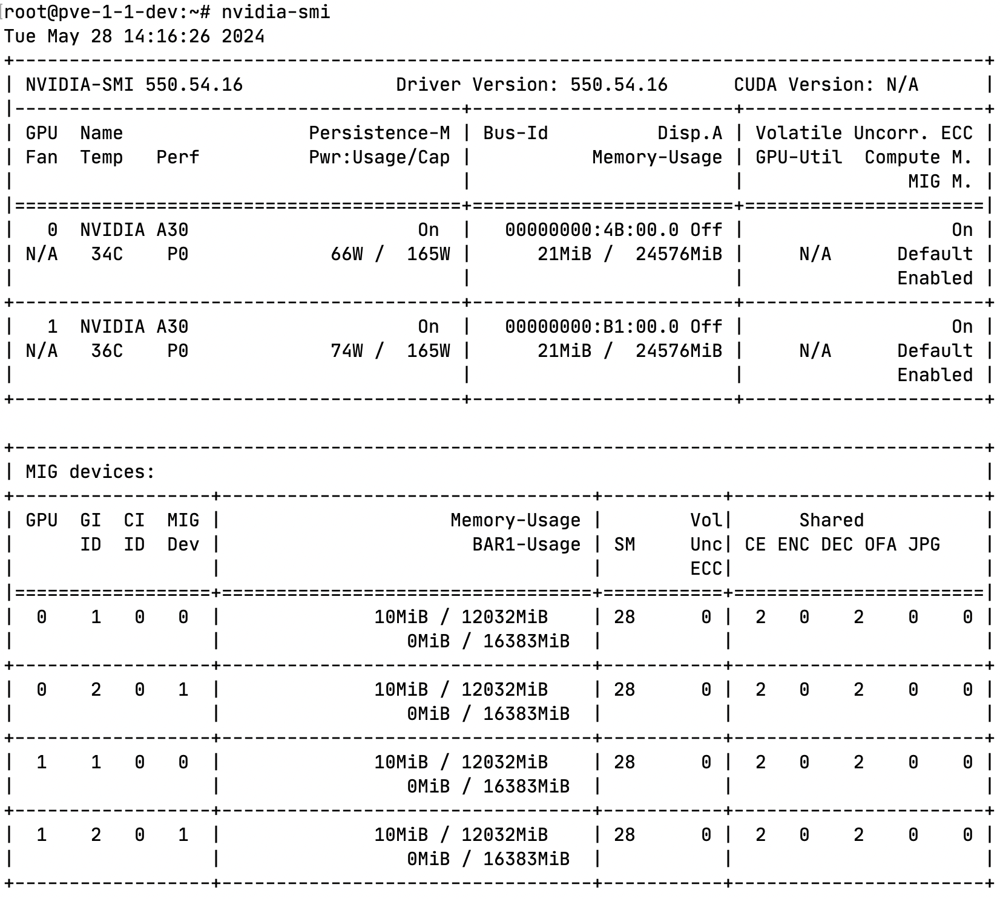

To make this configuration persistent across host reboots, similarly to time-sliced vGPUs, one must configure a `systemd` service that executes a script with all of the necessary commands, e.g.,

```
/usr/lib/nvidia/sriov-manage -e ALL
/usr/bin/nvidia-smi -mig 1
/usr/bin/nvidia-smi mig -cgi 2g.12gb,2g.12gb
/usr/bin/nvidia-smi mig -cci 2g.12gb
```

If at some point we need to disable the compute instances, GPU instances, or disable MIG completely, we can use:

```
nvidia-smi mig -dci # Delete compute instances
nvidia-smi mig -dgi # Delete GPU instances
nvidia-smi -mig 0   # Disable MIG
```

With the host configured, we can proceed to add a MIG-backed vGPU to a virtual machine. The first step is the same as for time-sliced vGPUs. That is, in the Proxmox web UI, select the VM, go to Hardware, and choose Add a PCI Device:


The next step is also similar to time-sliced vGPU setup: choose Raw Device and select a virtual function on the physical GPU:


And for the last step, select one of the available instance types:

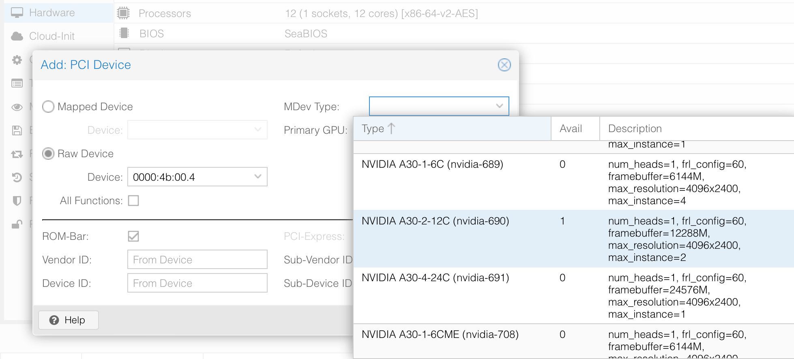

Note that the nomenclature for vGPU types for MIG-backed GPUs has an additional number compared to the time-sliced GPUs (e.g., `A30-2-12C` instead of `A30-12C`), which indicates the number of GPU compute slices dedicated to the vGPU.

### Installing the Guest Software

With a time-sliced or MIG-backed vGPU configured in the VM, we can boot the guest. In our case, the guest OS is Ubuntu 22.04 with no modifications.

Before installing the vGPU drivers, we disabled the nouveau driver in the guest OS and rebooted the guest:

```
echo blacklist nouveau > /etc/modprobe.d/blacklist-nouveau.conf
echo options nouveau modeset=0 >> /etc/modprobe.d/blacklist-nouveau.conf
update-initramfs -u
reboot
```

After that, we revisited the NVAIE archive downloaded from the NVIDIA Lincensing Portal and copied the file `Guest_Drivers/nvidia-linux-grid-550_550.54.15_amd64.deb` to the guest OS and installed it:

```
apt-get install nvidia-linux-grid-550_550.54.15_amd64.deb
```

Now, `nvidia-smi` inside the guest displays the vGPU configured according to the process outlined above:

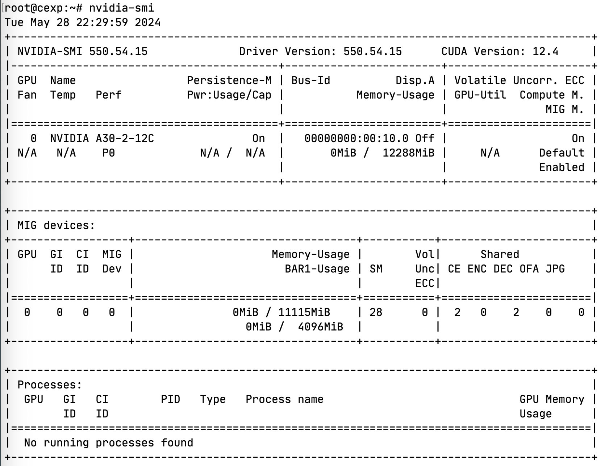

Additional `nvidia-smi` commands demonstrate the GPU instance profile and compute instance profile:

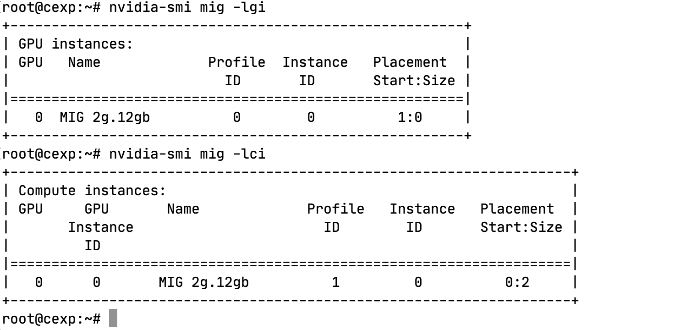

Note that, while the GPU instance profile must be configured on the virtual host, the compute instance profile may be configured on the host as well as on the guest. 

### Configuring vGPU License

Even if there is no active license for the vGPU software running on the guest, the virtual GPU driver on the guest should load and display the configuration, and applications using the GPU may run for a limited period of time. However, we may find a message like this in `/var/log/syslog`:

```
May 22 02:46:38 cexp nvidia-gridd: Valid GRID license not found. GPU features and performance are restricted. To enable full functionality please configure licensing details.
```

Additionally, after some time, the GPU performance will be significantly throttled.

To keep the vGPU running, we need to set up a license server, obtain a client token, and hand this token to the `nvidia-gridd` service. 

Two options are available for the license server:

1. Cloud License Server (CLS) — with this option, the server is hosted in the cloud by NVIDIA. The clients (VMs) communicate with it over the Internet.
2. Delegated License Server (DLS) — a VM or container hosted by the user on-premise. The clients may communicate with it over the private network.

For our experiments, we configured a CLS using the NVIDIA Licensing Portal. We started at the Create Server page and followed its prompts to create a server instance and assign entitlements to it.

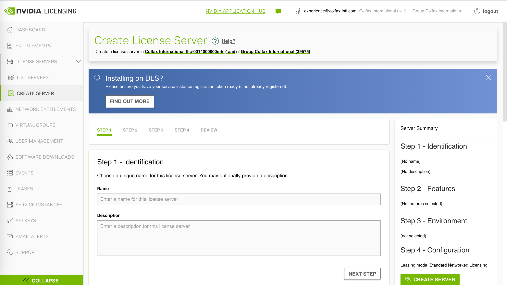

After configuring server, we used the Actions menu and selected “Generate client config token”. The browser then downloads the token as a text file.

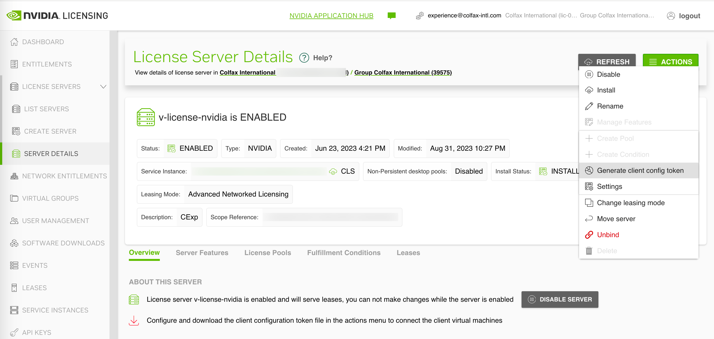

To license the vGPU software on our VM, we had to copy the token file to `/etc/nvidia/ClientConfigToken/` and restart the `nvidia-gridd` service:

```
cp client_configuration_token_05-22-2024-12-35-06.tok /etc/nvidia/ClientConfigToken/
systemctl restart nvidia-gridd.service
```

After that, the status of the `nvidia-gridd` service shows a successful activation status:

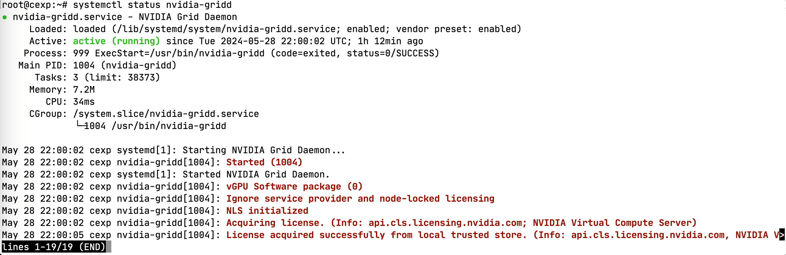

The licensing portal reflects the active license leases:

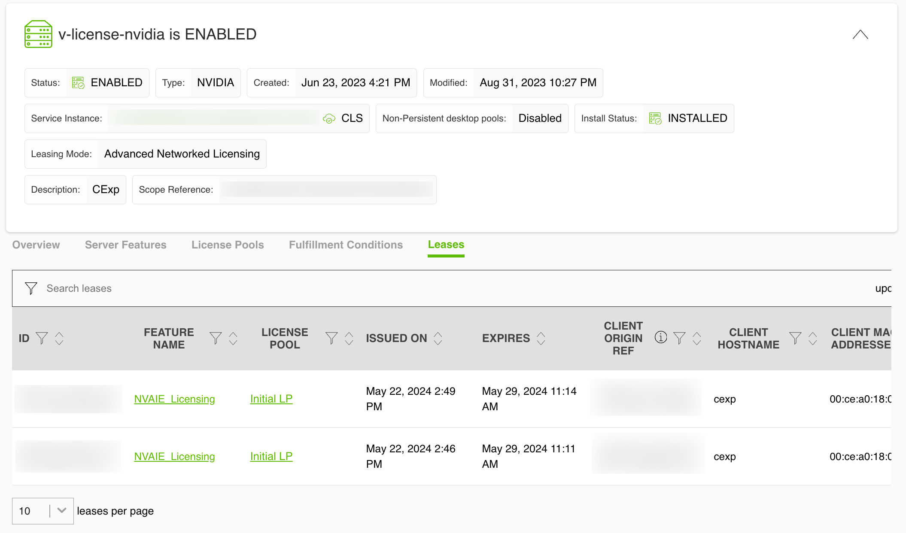

## Performance Tests

To illustrate the behavior of time-sliced and MIG-backed vGPUs, we used the NVIDIA A30 GPU and compared the following vGPU configurations:

1. Four (4) time-sliced NVIDIA A30-6G vGPUs.
2. Four (4) MIG-backed NVIDIA A30-1G-6GB vGPUs.

For these cases, we ran four workloads:

1. PCIe bandwidth test;
2. GPU memory bandwidth test;
3. Small GEMM (general matrix-matrix multiplication) on tensor cores;
4. Large GEMM on tensor cores.

The PCIe and GPU memory bandwidth tests illustrate the sharing of the PCIe and GPU bandwidth. The small GEMM illustrates a problem that is too small for the entire GPU. The large GEMM illustrates a problem that is large enough to saturate the entire GPU.

For 4-vGPU configurations, we ran the workloads in two modes:

1. Idle system mode: we ran the workload on only one vGPU out of four vGPUs.
2. Loaded system mode: we ran the same workload on each of the four vGPUs.

For the loaded system mode, we launched the test on four VMs concurrently. 

### vGPU Configuration

For all tests, we used the NVIDIA A30 GPU local to NUMA node 0 on our platform. The affinity of NVIDIA GPUs can be queried on the virtual host by running `lspci -v` (we can also use the flag “`-d 10de:`” to list just NVIDIA devices):

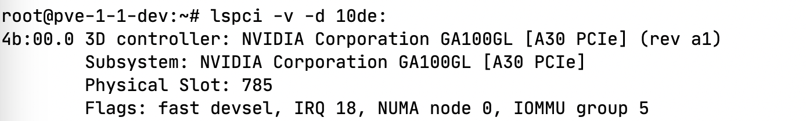

We pinned the VMs to the CPU cores belonging to the same NUMA node. The mapping of CPU cores to NUMA nodes is available in the output of `lspci`:

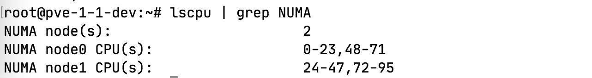

So we configured our four VMs to be pinned to NUMA node 0 consecutive cores: VM1 to {0-5,48-53}, VM2 to {6-11,54-59}, VM3 to {12-17,60-65}, and VM4 to {18-23, 66-71}.

For time-sliced vGPUs, we chose devices of type A30-6C:

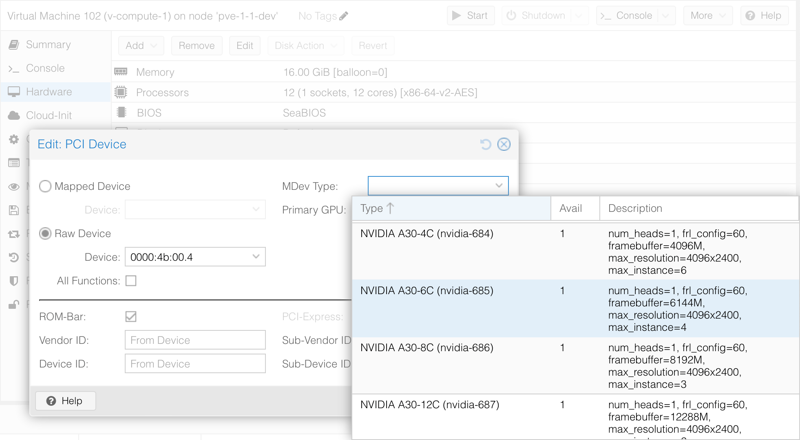

For MIG-backed vGPUs, we used devices of type A30-1-6C and configured four GPU instances of type 1g.6gb. Inside each GPU instance, we created a single compute instance of the same kind.

```
nvidia-smi mig -cgi 1g.6gb,1g.6gb,1g.6gb,1g.6gb
nvidia-smi mig -cci 1g.6gb
```

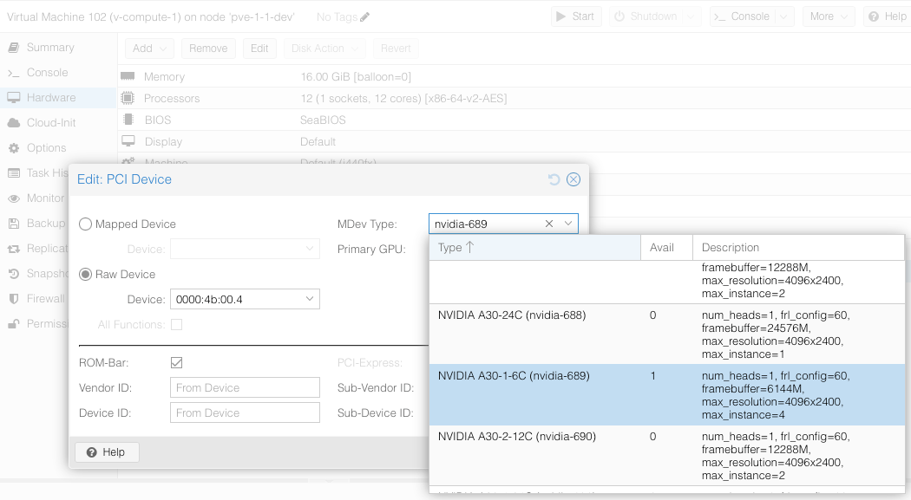

### Test Workloads

#### PCIe Bandwidth

We measured the PCIe bandwidth using the `bandwidthTest` sample from NVIDIA’s [CUDA Samples](https://github.com/NVIDIA/cuda-samples). To make the test run long enough, we set value of `MEMCOPY_ITERATIONS` to 10000 inside `bandwidthTest.cu`:

```
#define MEMCOPY_ITERATIONS 10000
```

After that, we recompiled the code. The test invocation command for device-to-host bandwidth is:

```
./bandwidthTest --dtoh --mode=range --start=32000000 --end=32000000 --increment=1 
```

and for host-to-device bandwidth:

```
./bandwidthTest --htod --mode=range --start=32000000 --end=32000000 --increment=1 
```

We report the host-to-device (HtoD) and device-to-host (DtoH) performance values separately.

#### GPU Memory Bandwidth

For GPU memory bandwidth measurement, we used the same `bandwidthTest` sample but different arguments. We also set `MEMCOPY_ITERATIONS` in `bandwidthTest.cu` to 10000:

```
#define MEMCOPY_ITERATIONS 10000
```

Then we recompile the code and execute the test with

```
./bandwidthTest --dtod --mode=range --start=384000000 --end=384000000 --increment=1
```

The performance result in is the bandwidth reported by the application.

#### Small GEMM

The small GEMM workload is representative of calculations that are compute-bound but that do not have enough parallelism to scale across the entire GPU. Some cases of small-batch deep learning inferencing fall into this category.

To run a small GEMM, we used the profiler tool from NVIDIA’s [CUTLASS collection](https://github.com/NVIDIA/cutlass). We chose the TF32 data type to invoke the tensor cores in the NVIDIA A30 GPU and to emulate an AI workload. The invocation command is:

```
./cutlass_profiler --operation=Gemm --m=1024 --n=1024 --k=1024 --A=tf32:row --B=tf32:row --C=tf32 --verification-enabled=false --profiling-iterations=100000
```

This corresponds to the `cutlass_tensorop_tf32_s1688gemm_tf32_256x128_16x3_tt_align4` operation in CUTLASS.

#### Large GEMM

The large GEMM workload is representative of compute-bound calculations that are large enough to scale across the entire GPU (think deep learning training).

Similarly to the small GEMM case, we used the CUTLASS profiler tool to run this workload, invoking it with the following command:

```
./cutlass_profiler --operation=Gemm --m=8192 --n=8192 --k=16400 --A=tf32:row --B=tf32:row --C=tf32 --verification-enabled=false --profiling-iterations=100
```

This corresponds to the `cutlass_tensorop_tf32_s1688gemm_tf32_256x128_16x3_tt_align4` operation in CUTLASS.

### Results

The table below summarizes the measured performance of the two configurations (time-sliced versus MIG-backed vGPUs) for the four workloads (PCIe and memory bandwidth, small GEMM, and large GEMM) in the two modes (idle and loaded). The reported performance numbers are rounded to 3 significant figures (where available). For the loaded case, the table reports the performance of one vGPU, averaged over the four VMs (rather than the sum of all vGPU performance numbers).

<table><thead><tr><th>Workload</th><th>Mode</th><th>Time-sliced vGPUs</th><th>MIG-Backed vGPUs</th></tr></thead><tbody><tr><td>PCIe bandwidth HtoD</td><td>Idle</td><td>25.2 GB/s</td><td>25.2 GB/s</td></tr><tr><td>PCIe bandwidth HtoD</td><td>Loaded</td><td>6.3 GB/s</td><td>6.3 GB/s</td></tr><tr><td>PCIe bandwidth DtoH</td><td>Idle</td><td>26.2 GB/s</td><td>26.3 GB/s</td></tr><tr><td>PCIe bandwidth DtoH</td><td>Loaded</td><td>6.6 GB/s</td><td>6.6 GB/s</td></tr><tr><td>Memory bandwidth</td><td>Idle</td><td>786 GB/s</td><td>196 GB/s</td></tr><tr><td>Memory bandwidth</td><td>Loaded</td><td>160 GB/s</td><td>196 GB/s</td></tr><tr><td>Small GEMM in TF32</td><td>Idle</td><td>6680 GFLOP/s</td><td>6550 GFLOP/s</td></tr><tr><td>Small GEMM in TF32</td><td>Loaded</td><td>1410 GFLOP/s</td><td>6550 GFLOP/s</td></tr><tr><td>Large GEMM in TF32</td><td>Idle</td><td>68800 GFLOP/s</td><td>16000 GFLOP/s</td></tr><tr><td>Large GEMM in TF32</td><td>Loaded</td><td>14500 GFLOP/s</td><td>15300 GFLOP/s</td></tr></tbody></table>

For context, the theoretical peak performance metrics of NVIDIA A30 GPUs are:

- PCIe bandwidth (each direction): 32 GB/s;
- Memory bandwidth: 933 GB/s;
- TF32 Tensor Core performance: 82 TFLOP/s.

The plots below show these performance numbers with the addition of:

- The cumulative performance in the loaded mode and
- The efficiency calculated as the ratio of the observed performance to the theoretical peak value.

PCIe bandwidth:

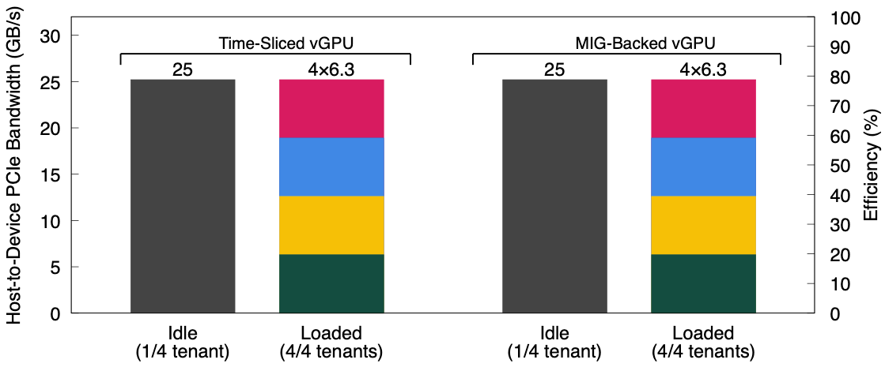

GPU memory bandwidth:

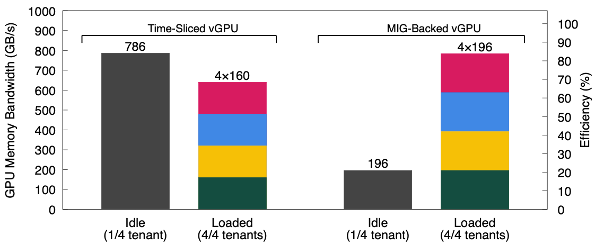

Small GEMM performance:

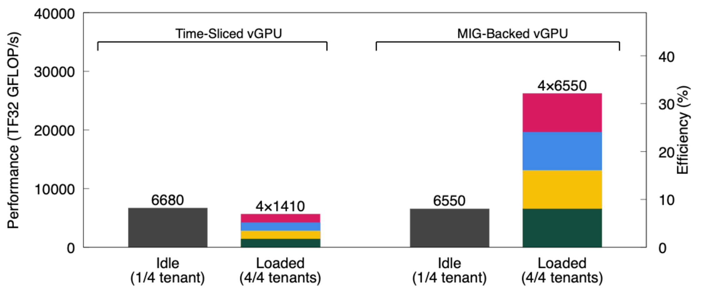

Large GEMM performance:

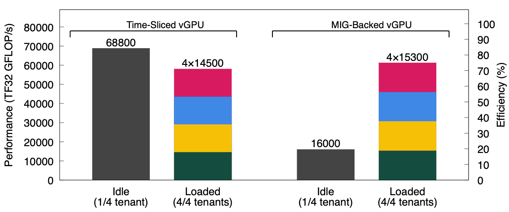

### Discussion

From the data reported in the previous section, we observe the following trends in our NVIDIA A30 GPU shared across four VMs with the help of time-sliced and MIG-backed vGPUs:

1. When multiple vGPUs are accessing the PCIe bus, its bandwidth is shared between the vGPUs (6.3 GB/s per vGPU in the loaded mode versus 25.2 GB/s in the idle mode for host-to-device bandwidth and a similar split for device-to-host).
2. If only one vGPU is using the PCIe bus, it has access to its full bandwidth.
3. GPU memory bandwidth and GPU compute performance behave similarly when the system is idle:
  - One time-sliced vGPU stressing the GPU in a otherwise idle system gets access to the full bandwidth or full compute performance (68800 GFLOP/s in our test) of the GPU.
  - One MIG-backed vGPU stressing the GPU in an otherwise idle system gets only its proportional share of the full performance (196 GB/s is a quarter of 786 GB/s and 16000 GFLOP/s is 7% shy of a quarter of 68800 GFLOP/s).
4. GPU memory bandwidth and GPU compute performance behave similarly when the system is loaded:
  - Each of the time-sliced vGPUs gets a fraction of the full GPU performance because each vGPU uses the *entire*memory and the *entire* compute performance *part of the time*.
  - Each of the MIG-backed vGPUs gets a fraction of the full GPU performance because each vGPU uses a *part of* the memory bandwidth and a *fraction of* the SMs *all of the time*.
  - The time-shared configuration in a loaded system has a performance penalty for context switching compared to the MIG configuration. This penalty is ~20% for our GPU bandwidth test (160 GB/s is ~20% lower than 196 GB/s) and ~5% of the large GEMM test (14500 GFLOP/s is ~5% lower than 15300 GFLOP/s).
5. The behavior of small GEMM performance deserves a special mention because in a loaded system, the time-sliced configuration has a significantly lower performance (4.6x slower in our test) than MIG-backed. The explanation of this observation is straightforward:
  - On a MIG-backed system, each vGPU’s small workload utilizes a small fraction of the GPU’s SMs *all of the time* but
  - On a time-sliced system, each vGPU’s small workload utilizes the same small fraction of the GPU’s SMs but only *part of the time*.
6. It is also worth noting that the large GEMM stressed our GPU enough that a MIG-backed vGPU had ~5% lower performance in the loaded mode than in an idle system (15300 GFLOP/s versus 16000 GFLOP/s). We attribute this difference to the limits on the electrical power that the GPU allows in before it throttles. In fact, when we ran the same test using only 3 out of the 4 MIG-backed vGPUs, each of them delivered a non-throttled performance of 16000 GFLOP/s.

## Use Cases

The performance measurements reported above allow us to draw general conclusions regarding the best use cases for MIG-backed and time-sliced vGPUs.

Time-sliced vGPUs are helpful for dividing a physical GPU between multiple tenants when:

1. We want each tenant to be able to opportunistically burst to the full performance of the GPU when all other tenants are idle or
2. We want each tenant to see the full list of SMs for the purpose of devising code parallelization strategies scalable to the full GPU.

Importantly, in order to use time-sliced vGPUs, these tenants must not have any expectation of a predictable quality of service or consistent performance because their experience will depend on the other tenants’ activity.

Examples of suitable applications of the time-sliced vGPU configuration are:

- Multiple GPU application developers may benefit from sharing a GPU through the time-sliced vGPU configuration, assuming that they don’t have to run their code for extended periods of time.
- Cloud-based deep learning inferencing applications that prioritize low latency of a single request over the throughput of multiple requests *and* expect to have a significant GPU under-utilization on average.

In most other cases, MIG-backed vGPUs will have an advantage. It is reasonable to use MIG-backed vGPUs when:

1. Tenants need performance guarantees and QoS for compute-bound and bandwidth-bound applications;
2. The priority is to maximize the cumulative performance of all vGPUs by eliminating the context switching overhead of time-sliced configurations;
3. The workloads of all tenants are too small to utilize the full GPU and the objective is to increase the utilization of the GPU’s compute capabilities.

Examples of applications that may benefit from MIG-backed vGPUs are:

- Multiple GPU application developers working on performance optimization in GPU code and requiring consistent run-to-run performance.
- Cloud-based deep learning inferencing systems that must maximize the cumulative throughput of multiple concurrent inference streams.

In conclusion, we would like to reiterate that the vGPU method of sharing a GPU across multiple tenants is a technique for system-level sharing of hardware across virtual machines. It may be used in tandem with hardware-level sharing techniques (MIG compute instances inside a VM) and process-level (time slicing or MPS) sharing to obtain the correct isolation, granularity, and interconnectedness of a GPU-based computing system.
