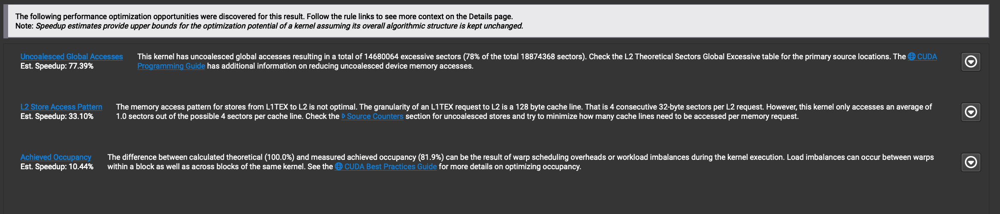
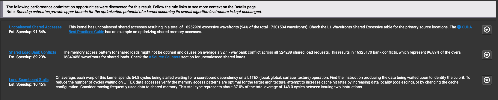
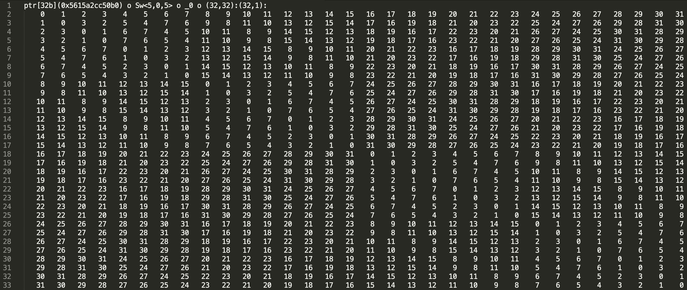
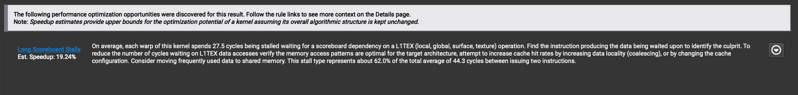

# Tutorial: Matrix Transpose in CUTLASS

**Date:** May 5, 2024

**Source:** [https://research.colfax-intl.com/tutorial-matrix-transpose-in-cutlass/](https://research.colfax-intl.com/tutorial-matrix-transpose-in-cutlass/)

---

The goal of this tutorial is to elicit the concepts and techniques involving memory copy when programming on NVIDIA® GPUs using [CUTLASS](https://github.com/NVIDIA/cutlass/) and its core backend library CuTe. Specifically, we will study the task of [matrix transpose](https://en.wikipedia.org/wiki/Transpose) as an illustrative example for these concepts. We choose this task because it involves no operation other than copying data from one set of addresses to another, allowing us to study in isolation those aspects of memory copy optimization, such as coalesced accesses, that can be separated from workloads also involving computation.

Our treatment takes inspiration from [Mark Harris’s Efficient Matrix Transpose tutorial](https://developer.nvidia.com/blog/efficient-matrix-transpose-cuda-cc/), which we recommend for an in-depth discussion of the matrix transpose problem that does not directly involve the abstractions from CuTe that we use here. Conversely, our tutorial can also serve as an introduction to these abstractions for the reader already familiar with Harris’ tutorial. In any case, we will review the key ideas from that tutorial here before explaining how to implement the corresponding optimized solution using CuTe.

## Review of Coalesced accesses:

In many compute workloads, particularly those found in ML/AI applications, we work with multidimensional arrays known as *tensors.* Since computer memory is inherently one-dimensional, these tensors must be linearized, or organized into this one-dimensional space. As a consequence, adjacent elements in some dimensions of a tensor might not be adjacent in memory. We say that a dimension is *contiguous* when elements adjacent in that dimension are also adjacent in memory. A block of consecutive elements in a contiguous dimension is also called *contiguous.*

Accesses — i.e., reads or writes — to a contiguous block of memory are called *coalesced*, whereas accesses to non-contiguous blocks of memory are called *strided*. Coalesced accesses typically offer faster performance than strided ones because they align more effectively with the GPU’s memory architecture, allowing for more efficient data caching and retrieval. For this reason, optimizing for coalesced memory access is highly desirable when programming for GPUs.

Certain workloads, however, necessitate strided accesses and cannot be implemented otherwise. The matrix transpose — or more generally, tensor permute operations — are prime examples where strided accesses are unavoidable. In such cases, it is crucial to minimize the performance impact of these less efficient access patterns. One standard technique is to only perform the strided accesses at the lower and faster levels of the *GPU memory hierarchy*, which we now recall.

For the purposes of our discussion, there are three programmable levels to the GPU memory hierarchy. From the highest to lowest level, we have global, shared, and register memory.

The *global memory*(GMEM), i.e. *High-Bandwidth Memory* (HBM), is the largest of the three, and also the slowest one to read from or write into. For instance, an NVIDIA H100 Tensor Core GPU has 80 GB of GMEM. Strided access here will have the worst effect on performance.

Next is the *shared memory* (SMEM), which is much smaller but considerably faster than GMEM. An NVIDIA H100 Tensor Core GPU, for example, has up to 228KB of SMEM per streaming multiprocessor (SM). For readers more familiar with memory architectures, we note that SMEM is physically carved out of the L1 cache. SMEM is shared amongst all threads within the same cooperative thread array (CTA), and each CTA operates within its own segment of SMEM. Strided access here is still suboptimal, but is greatly preferred over strided access in GMEM.

Finally, we have the *register* *memory* (RMEM), which is dedicated to individual threads.

In this tutorial, memory accesses only comprise copying numbers (e.g., 32-bit floats) around, either from one level to another, or between different locations in the same level.

The naive transpose method discussed in Harris’ tutorial starts out with strided accesses in ` GMEM`` -transpose-> ``GMEM`. He then improves upon this by first copying data GMEM to SMEM so that we have ` GMEM -> SMEM`` -transpose-> ``SMEM -> GMEM`. This way, the strided load happens in SMEM whereas both GMEM accesses are coalesced.

## CuTe way:

We now discuss how to implement these two approaches using the CuTe library. We start with the naive method, mainly to demonstrate what *not* to do.

Data in the CuTe framework is abstracted as `cute::Tensor` objects. A CuTe tensor consists of a pointer (in the C sense) to the first element of the tensor, as well as a `cute::Layout` object, which describes the offset of each element in the tensor with respect to the first element through defining *shape* and *stride* integer tuples. For example, for a row-major matrix of dimensions M by N, we would define the layout to have shape `(M, N)` and stride `(N, 1)`.

For a `cute::Layout`, we note that one of the available options when defining the layout of a new tensor is to specify whether it is row-major or column-major in terms of the strides (`GenRowMajor` or `GenColMajor`). In a column-major matrix, adjacent elements within a column are contiguous while adjacent elements across columns are strided in memory. By default, CuTe uses column-major layouts. More generally, we could specify strides for each dimension of the shape of the layout.

One easy way to implement transpose is to simply define the input as column major, output as row-major and let CuTe figure out the copy. 

```
using namespace cute;
int M = 2048, N = 2048;
float *d_S, *d_D;
// Allocate and initialize d_S and d_D on device (omitted).

// Create the row major layouts.
auto tensor_shape = make_shape(M, N);
auto tensor_shape_trans = make_shape(N, M);
auto gmemLayoutS = make_layout(tensor_shape, GenRowMajor{});
auto gmemLayoutD = make_layout(tensor_shape_trans, GenRowMajor{});

// Create the row major tensors.
Tensor tensor_S = make_tensor(make_gmem_ptr(d_S), gmemLayoutS);
Tensor tensor_D = make_tensor(make_gmem_ptr(d_D), gmemLayoutD);

// Create a column major layout. Note that we use (M,N) for shape.
auto gmemLayoutDT = make_layout(tensor_shape, GenColMajor{});

// Create a column major view of the dst tensor.
Tensor tensor_DT = make_tensor(make_gmem_ptr(d_D), gmemLayoutDT);
```

An important note here that although we have three tensors, we only have two actual copies of the data. This is because `tensor_D` and `tensor_DT` both use the data in `d_D` — they are two different *views* on the same data. We will be using the column-major view for our transpose kernel, but using the row-major view when we are verifying the transpose result.

Next, we need to determine how to divide the input Tensor into smaller chunks that we can distribute over the CTAs. We can do this using the `cute::tiled_divide` method.

```
using namespace cute;
using b = Int<32>;
auto block_shape = make_shape(b{}, b{});       // (b, b)
Tensor tiled_tensor_S  = tiled_divide(tensor_S, block_shape); // ([b,b], m/b, n/b)
Tensor tiled_tensor_DT = tiled_divide(tensor_DT, block_shape); // ([b,b], m/b, n/b)
```

Here, we specify the tile size to be 32 by 32. The values for tile size is an important tuning parameter, and should be tuned for each specific workload. In fact 32 by 32 is not the optimal value for the transpose kernel, and we will tune it before benchmarking.

`tiled_divide` creates a tensor with the same data but a different layout, i.e., a different view of the data. In our case, for `tensor_S` we start out with a 2D matrix of size `(M, N)`. `cute::tiled_divide` with tile size of `b` generates a view of a 3D matrix of size `([b,b], M/b, N/b)`; `b` by `b` matrices in a `M/b` by `N/b` grid.

This view makes it much easier to access the correct tile once inside the kernel.

```
Tensor tile_S = tiled_tensor_S(make_coord(_, _), blockIdx.x, blockIdx.y);
Tensor tile_DT = tiled_tensor_DT(make_coord(_, _), blockIdx.x, blockIdx.y);
```

Here, placing `make_coord(_, _)` as the first argument takes the entire first dimension, while specifying the integer values of the second and third dimensions as the block indices takes the corresponding *slice* of the tensor. (For those familiar with `numpy`: the underscore `(_)` in CuTe is equivalent to the colon `(:)` notation there.) In other words, `tile_S` represents the entire `b` by `b` matrix located at grid point `(blockIdx.x, blockIdx.y)`. Note that we *don’t* swap `blockIdx.x` and `blockIdx.y` when slicing into `tiled_tensor_DT` since we already took the column-major view with shape `(M, N)` (by contrast, if we instead took a tiled divide of `tensor_D`, we would need to swap the block indices and then use different thread layouts for source and destination in `local_partition` below). We can then get the part assigned to a specific thread with:

```
auto thr_layout =
      make_layout(make_shape(Int<8>{}, Int<32>{}), GenRowMajor{});
Tensor thr_tile_S = local_partition(tile_S, thr_layout, threadIdx.x);
Tensor thr_tile_DT = local_partition(tile_DT, thr_layout, threadIdx.x); 
```

Here, we launched the kernel with 256 threads per CTA and chose a thread layout so that loads from gmem are coalesced whereas stores to gmem are uncoalesced (as we emphasized above, no matter which thread layout is chosen there will be uncoalesced accesses). Finally we can use `cute::copy` to copy the data from `thr_tile_S` to `thr_tile_DT`.

```
Tensor rmem = make_tensor_like(thr_tile_S);
copy(thr_tile_S, rmem);
copy(rmem, thr_tile_DT);
```

Now we can benchmark this against a pure copy kernel. The code for the copy kernel is based on the [CUTLASS’s tiled_copy example](https://github.com/NVIDIA/cutlass/blob/main/examples/cute/tutorial/tiled_copy.cu), so we will leave unpacking it as an exercise for the reader. Additionally, we have found empirically that the tile size 32 by 1024 gave the best performance for our workload.

<table><tbody><tr><td>Version</td><td>time (bandwidth)</td><td>IQR</td></tr><tr><td>Copy </td><td>4.817 ms (1783 GB/s)</td><td>0.4608 μs</td></tr><tr><td>Naive CuTe transpose</td><td>20.25 ms (424.1 GB/s)</td><td>3.625 μs</td></tr></tbody></table>

<p align="center"><em>Benchmarked on an NVIDIA H100 PCIe GPU with M=N=32768. PyTorch benchmarking utility Timer used for the measurements.</em></p>

Just as we saw in Harris’ post, the speed of this naive method is not very good. This is because this copy is a strided copy from GMEM -> GMEM. In order to confirm this, let’s profile this transpose using [NVIDIA Nsight™ Compute](https://developer.nvidia.com/nsight-compute). This profiling tool can detect problems in code that lead to lowered performance. Profiling the naive transpose, the summary page of the GUI shows us:



Nsight Compute has a wide range of tools to help with optimization, but full exploration of Nsight is beyond the scope of this article. For this article we will simply be looking at the summary page. In the above summary page, we see that indeed the problem of uncoalesced accesses constitutes the primary reported issue.

Next, we study the improved algorithm: copy the data from GMEM into SMEM first, then do the transpose, then copy back from SMEM to GMEM.

To move the strided access to SMEM, we need a Tensor that uses SMEM. We will use CuTe to allocate an `array_aligned` object in a CTA’s SMEM.

```
using namespace cute;
using CuteArray = array_aligned<Element, cosize_v<SmemLayout>>;

extern __shared__ char shared_memory[];
CuteArray &smem = *reinterpret_cast<CuteArray*>(shared_memory);
```

Here, `smemLayout` is the Layout for the SMEM used in a single tile. We can now create a tensor whose data pointer is `shared_memory`:

```
Tensor sS = make_tensor(make_smem_ptr(smem.data()), smemLayout);
```

One important note here is that we must ensure the SMEM tensor is small enough to fit on a single SM. In other words, the size of `smemLayout` multiplied by the number of bytes per `Element` must be less than the total SMEM capacity on a single SM. Beyond that, we have occupancy considerations to contend with depending on the SMEM used per CTA.

Now we can repeat the column-major view trick we did with the data in GMEM, except that this time we apply it to SMEM. We create two different views of SMEM — one row-major and the other column-major.

```
using namespace cute;
using b = Int&lt;32>;
auto block_shape = make_shape(b{}, b{});       // (b, b)

// Create two Layouts, one col-major and one row-major
auto smemLayout = make_layout(block_shape, GenRowMajor{});
auto smemLayoutT = make_layout(block_shape, GenColMajor{});

// Create two views of smem
Tensor sS  = make_tensor(make_smem_ptr(smem.data()), smemLayout);
Tensor sD = make_tensor(make_smem_ptr(smem.data()), smemLayoutT);
```

Finally, we can use the `cute::copy` to copy from GMEM to SMEM and then back from SMEM to GMEM. Note here that `S` and `D` are `tiled_divide`‘s of `tensor_S` and `tensor_D` and `tS` and `tD` are thread layouts chosen to ensure coalesced accesses to GMEM (in fact, they are both equal to `thr_layout` from above!). 

```
// Slice to get the CTA's view of GMEM.
Tensor gS = S(make_coord(_, _), blockIdx.x, blockIdx.y); // (bM, bN)
Tensor gD = D(make_coord(_, _), blockIdx.y, blockIdx.x); // (bN, bM)

// Create the thread partitions for each Tensor.
Tensor tSgS = local_partition(gS, tS, threadIdx.x);
Tensor tSsS = local_partition(sS, tS, threadIdx.x);
Tensor tDgD = local_partition(gD, tD, threadIdx.x);
Tensor tDsD = local_partition(sD, tD, threadIdx.x);

// Copy GMEM to SMEM.
cute::copy(tSgS, tSsS); 

// Synchronization step. On SM80 and above, cute::copy
// does LDGSTS which necessitates async fence and wait.
cp_async_fence();
cp_async_wait&lt;0>();
__syncthreads();

// Copy transposed SMEM to GMEM.
cute::copy(tDsD, tDgD);
```

Now when we benchmark, we get a much better result.

<table><tbody><tr><td>Version</td><td>time (bandwidth)</td><td>IQR</td></tr><tr><td>Copy </td><td>4.817 ms (1783 GB/s)</td><td>0.4608 μs</td></tr><tr><td>Naive CuTe transpose</td><td>20.25 ms (424.1 GB/s)</td><td>3.625 μs</td></tr><tr><td>SMEM transpose</td><td>6.846 ms (1255 GB/s)</td><td>1.21 us</td></tr></tbody></table>

<p align="center"><em>Benchmarked on an NVIDIA H100 PCIe GPU with M=N=32768. PyTorch benchmarking utility Timer used for the measurements.</em></p>

Nonetheless, we are still a way off from the copy result. Profiling the code again, we can spot the next issue at hand — memory bank conflicts.



## Memory Bank conflicts:

The strided SMEM version gets much better performance than the naive version, but it still does not match the copy performance. A large part of this discrepancy is due to memory bank conflicts. On most NVIDIA GPUs, the shared memory is organized into 32 memory banks. Only one thread in a warp is able to access a memory bank at a time; this is true for both read and write accesses. Hence, if multiple threads try to access the same memory bank, the accesses are serialized. This is called a *bank conflict.* For a more in-depth discussion about bank conflicts, we recommend [Lei Mao’s excellent blog post](https://leimao.github.io/blog/CUDA-Shared-Memory-Bank/).

In more detail, elements are assigned in 32 bits to memory banks in a round-robin format. The first 32 bits are assigned to 0, the next to 1, and so on, until the 33rd set of 32 bits is assigned to bank 0 again. So in a 32 by 32 (row-major) tile of `float`, each column maps to the same memory bank. This is the worst case scenario; with 32 threads in a warp, this causes a 32-way bank conflict.

Mark Harris’ tutorial solves this issue by padding the rows by 1 number. This offsets the elements, causing every element in a column to fall in a different bank. We could replicate this workaround in CuTe by using non-default strides. The CuTe `Layout` contains information about stride, which defines the offset between elements in each dimension. We can add padding by setting the stride for the columns to be 33 instead of 32. In code, this can be done simply by:

```
auto block_shape = make_shape(Int&lt;32>, Int&lt;33>); // (b, b+1)

// Create two Layouts, one col-major and one row-major
auto smemLayout = make_layout(block_shape, GenRowMajor{});
auto smemLayoutT = make_layout(block_shape, GenColMajor{});
```

However, this wastes memory for the extra `32` numbers in SMEM. In this article we will implement an alternate solution — swizzle.

## Swizzle and Layout Composition:

In order to discuss swizzle, we first need to expand on a CuTe Layout. A Layout is not simply a container that stores information about a Tensor’s structure, but is a function that map one coordinate to another. For example, take a column-major tensor `A` with `M` rows and `N` columns. Given coordinates `(4,5)` — 4th row, 5th column — this Layout for `A` will map the tuple `(4,5)` to the integer `5M+4`. This is the index for the element at coordinates `(4,5)` in the 1D pointer to the data. This abstracts away the often confusing coordinate math that comes with working with higher dimensional Tensors.

Normally, the coordinate calculation is done using just the stride of the Tensor, which defines the offset in 1D memory space between adjacent elements in a dimension. For example using the same Tensor `A`, the stride is `(1,M)`. Elements in a column are adjacent to each other, i.e., with offset of `1`, while elements in a row are offset by `M`.

CuTe provides tools for more complex coordinate mapping functions. One such tool is Swizzle. The details of swizzling are beyond the scope of this tutorial, and we refer curious readers to [NVIDIA’s PTX documentation](https://docs.nvidia.com/cuda/parallel-thread-execution/#tensor-swizzling-modes).

By defining an appropriate swizzling function, CuTe programmers can access data the same way they would in the non-swizzling case, without worrying about bank conflicts. CuTe abstracts away the swizzling details by baking in swizzle as a property of a tensor’s layout using the [composition operation](https://github.com/NVIDIA/cutlass/blob/main/media/docs/cute/02_layout_algebra.md#composition).

Composition, as its name suggests, creates a functional composition of the layout arguments. Specifically, when a programmer accesses data in a swizzled tensor in SMEM — say by calling `tensor(i)` in CuTe, where the *logical index* `i` is what they *think* the accessing location is — they actually access the data at `swizzle_function(tensor(i))`.

Returning to transpose, the swizzle function we need is `Swizzle<5,0,5>`. The number 5 here refers to the number of bits in the mask. Per [the CuTe documentation](https://github.com/NVIDIA/cutlass/blob/main/include/cute/swizzle.hpp#L44), this function modifies the lower 5 bits by taking the xor with the upper 5 bits (the mask). Then with this pattern applied to a 32 by 32 set of addresses, no two elements in a column map to the same memory bank, thereby avoiding all bank conflicts. We add this swizzle pattern to our Layouts.

```
auto tileLayoutS = make_layout(block_shape, GenRowMajor{});
auto smemLayoutS_swizzle = composition(Swizzle<5, 0, 5>{}, tileLayoutS);
```



<p align="center"><em>`Swizzle<5,0,5>` applied to a 32×32 tile. Indices taken mod 32.</em></p>

We also note that other data storing patterns in SMEM will require different swizzling functions. We encourage the reader to experiment with the generic swizzle functions exposed via CuTe and pick what works best for them.

## Transposing via Layout Composition:

Above, we have discussed how to transpose a tile in SMEM by defining a column-major Layout of the tile. Here, we show an alternate method using Layout composition. Specifically, we make a Layout composed out of the swizzled `LayoutS` and `LayoutD`.

```
auto tileLayoutD = make_layout(block_shape_trans, GenRowMajor{});
auto smemLayoutD_swizzle = composition(smemLayoutS_swizzle, tileLayoutD);
```

The trick here is that both of these layouts are defined to be row-major, but CuTe uses column-major by default including for layout algebra. We now claim that `composition`(`tileLayoutS,tileLayoutD)` *equals*

```
auto tileLayoutDT = make_layout(block_shape_trans, GenColMajor{});
```

To explain, let the block dimensions be `bM` and `bN`, so `tileLayoutS` and `tileLayoutD` have Shape:Stride given by `(bM,bN):(bN,1)` and `(bN,bM):(bM,1)`, respectively. Then we have:

```
tileLayoutS(tileLayoutD(x,y)) = tileLayoutS(bM*x+y).
```

Now to compute what the integer `bM*x+y` maps to under `tileLayoutS`, it is convenient to represent it as a coordinate pair in the domain shape `(bM,bN)`. But since CuTe algebra for mapping 1D indices to coordinates in a shape is done column-major (or left-to-right), we see that `bM*x+y` corresponds to the coordinate `(y,x)`. Thus, we get:

```
tileLayoutS(bM*x+y) = tileLayoutS((y,x)) = bN*y+x.
```

This shows that the composed Layout function equals that for the Layout `(bN,bM):(1,bN)`, which validates the claim. Finally, we note that in the presence of *post-composition* with a swizzle function, *pre-composition* leaves the same swizzle in-place, thus avoiding some code duplication.

Our swizzled solution gets us close to the performance of the copy kernel, just as Mark Harris’ article did.

<table><tbody><tr><td>Version</td><td>time (bandwidth)</td><td>IQR</td></tr><tr><td>Copy </td><td>4.817 ms (1783 GB/s)</td><td>0.4608 μs</td></tr><tr><td>Naive CuTe transpose</td><td>20.25 ms (424.1 GB/s)</td><td>3.625 μs</td></tr><tr><td>SMEM transpose</td><td>6.846 ms (1255 GB/s)</td><td>1.21 μs</td></tr><tr><td>SMEM swizzle</td><td>4.829 ms (1779 GB/s)</td><td>0.7574 μs</td></tr></tbody></table>

<p align="center"><em>Benchmarked on an NVIDIA H100 PCIe GPU with M=N=32768. PyTorch benchmarking utility Timer used for the measurements.</em></p>

With performance approaching the bandwidth limit, we are nearing the hardware limitation. When profiling the swizzle version, the summary page shows:



We see that we have resolved the memory bank conflict issue. The last reported issue on long scoreboard stalls may be disregarded as we are profiling a completely memory-bound kernel.

## TMA:

Note that data transfer between GMEM and SMEM constitutes by far the majority of time spent in our transpose kernel. The *Tensor Memory Accelerator* (TMA) is a feature introduced in the NVIDIA Hopper™ architecture that can be used in place of regular load and store instructions between GMEM and SMEM, thereby potentially improving the performance of our transpose kernel. We studied the usage of TMA for this tutorial, and found a mixed set of results, which we describe in this section.

To review, TMA is a dedicated asynchronous memory copy unit for copying multi-dimensional data from GMEM to SMEM and vice-versa. In the TMA model for async copy, instead of having the threads/warps in a CTA cooperatively copy a portion of the source tensor to the target tensor, one elects a single thread in the CTA to issue the load or store TMA instruction. While the instruction executes in the async proxy, threads are free to do other independent work. Barrier objects and synchronization primitives (fence, arrive and wait) are used to synchronize the data movement with computation that relies on the data. When used in conjunction with [a software pipelining scheme](https://github.com/NVIDIA/cutlass/blob/main/test/unit/pipeline/pipeline_tma_async_warp_specialized.cu), TMA allows overlap memory copy instructions to overlap with computations, which helps to hide latency. However, since the transpose kernel only does memory copy, we don’t have an opportunity to demonstrate this benefit of TMA in this tutorial.

To clarify the performance of TMA for memory copy in isolation, we first studied the performance of TMA load and store copy kernels versus other alternatives, such as CuTe’s [TiledCopy tutorial](https://github.com/NVIDIA/cutlass/blob/main/examples/cute/tutorial/tiled_copy.cu), which does 128-bit vectorized loads and stores passing through RMEM only. We found that in this situation, TMA performed on par with this simpler alternative (after tile size tuning for both), with both near the memory bandwidth spec of the device. This outcome was in line with our expectations — indeed, we have no reason to expect TMA to outperform in the situation of pure memory copy according to a regular pattern.

In contrast, a naive attempt at using TMA for both load and store in a transpose kernel, with the same tile sizes chosen as above, performed worse than our best-performing version. This was due to the presence of bank conflicts! The immediate problem was that TMA only supports a restricted set of swizzle functions (intended for use in conjunction with WGMMA); for instance, see [this section](https://github.com/NVIDIA/cutlass/blob/033d9efd2db0bbbcf3b3b0650acde6c472f3948e/include/cute/atom/copy_traits_sm90_tma_swizzle.hpp#L48-L62) of the CuTe codebase. In particular, it doesn’t support the `Swizzle<5,0,5>` function that we used above, which makes it less straightforward to completely eliminate bank conflicts. Note however that we have no reason to believe this is an essential problem, but we chose not to pursue this line of investigation further in light of our benchmarking with the copy kernel. Moreover, when trying out a version with TMA store only and with 128-bit vectorized load into registers and then writing to SMEM, we found that it performed only slightly under par even though the profiler still reported shared store bank conflicts (but avoiding bank conflicts for the TMA store from SMEM to GMEM).

Because of these mixed results, we do not describe in detail the mechanics of how to use TMA, deferring this to a future blog post in which we will aim to study TMA in a context more suited to its strengths.

## Conclusion:

In this tutorial, we introduced readers to a number of fundamental GPU memory concepts and how to program for them using the CuTe library, by way of implementing an efficient matrix transpose kernel.

Starting with coalesced reads and writes, we touched upon the concepts of CuTe Layouts and Tensors, bank conflicts, swizzle functions, and TMA. Except for TMA, we have seen how a good understanding of these concepts is necessary to implement an efficient transpose kernel. In a subsequent post, we plan to study TMA in a setting where it is important for optimization.

To conclude this tutorial, we present the runtimes of the various kernels that we discussed. We included the `JustCopy` kernel as the headroom of what can be achieved, as well as both a naive PyTorch implementation (given by invoking `contiguous()` on `torch.transpose`) and one using `torch.compile`, in order to demonstrate the magnitude of the efficiency gains available through writing these low-level kernels.

The source code for all of these kernels as well as the benchmarking script is available in a [Colfax Research GitHub repository](https://github.com/ColfaxResearch/cfx-article-src/tree/master/transpose-cute).

<table><tbody><tr><td>Version</td><td class="has-text-align-left" data-align="left">time (bandwidth)</td><td>IQR</td></tr><tr><td><code>JustCopy</code></td><td class="has-text-align-left" data-align="left">4.817 ms (1783 GB/s)</td><td>0.4608 μs</td></tr><tr><td>Naive CuTe transpose</td><td class="has-text-align-left" data-align="left">20.25 ms (424.1 GB/s)</td><td>3.625 μs</td></tr><tr><td>SMEM transpose</td><td class="has-text-align-left" data-align="left">6.846 ms (1255 GB/s)</td><td>1.21 μs</td></tr><tr><td>SMEM swizzle</td><td class="has-text-align-left" data-align="left">4.829 ms (1779 GB/s)</td><td>0.7574 μs</td></tr><tr><td>TMA Store</td><td class="has-text-align-left" data-align="left">4.952 ms (1735 GB/s)</td><td>0.5339 μs</td></tr><tr><td>PyTorch transpose</td><td class="has-text-align-left" data-align="left">10.0 ms (860 GB/s)</td><td>350 μs</td></tr><tr><td>PyTorch transpose (compiled)</td><td class="has-text-align-left" data-align="left">5.072 ms (1694 GB/s)</td><td>6.487 us</td></tr></tbody></table>

<p align="center"><em>Benchmarked on an NVIDIA H100 PCIe GPU with M=N=32768. PyTorch benchmarking utility Timer used for the measurements.</em></p>

*Edit* (05/07/24): Added JIT compiled version of PyTorch transpose for reference (h/t [@CHHillee](https://twitter.com/cHHillee/status/1787993571808932197)).
