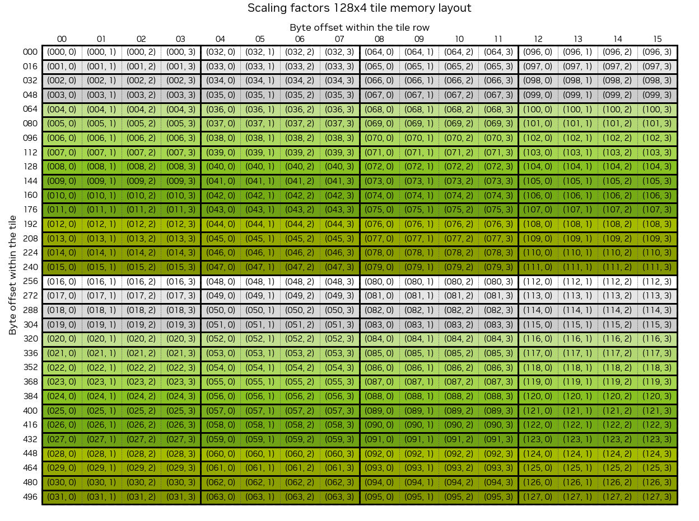
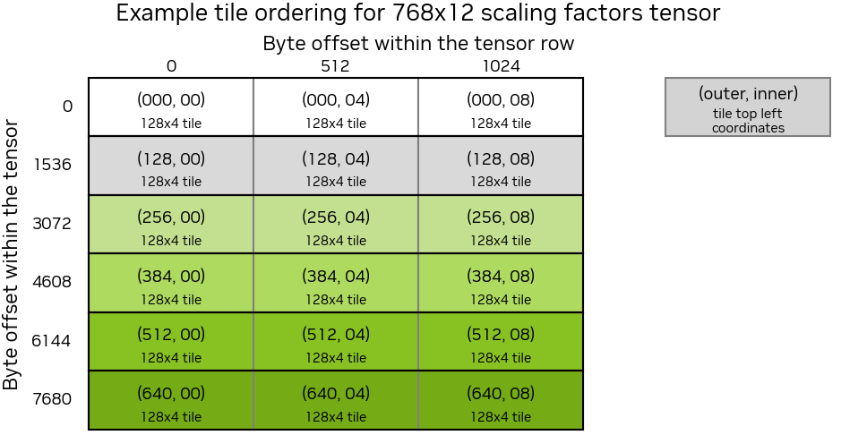
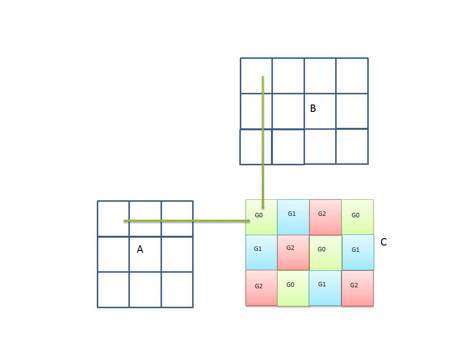

# 1. Introduction — cuBLAS 13.2 documentation

**来源**: [https://docs.nvidia.com/cuda/cublas/index.html](https://docs.nvidia.com/cuda/cublas/index.html)

---

cuBLAS
The API Reference guide for cuBLAS, the CUDA Basic Linear Algebra Subroutine library.

# 1. Introduction
The cuBLAS library is an implementation of BLAS (Basic Linear Algebra Subprograms) on top of the NVIDIA®CUDA™ runtime. It allows the user to access the computational resources of NVIDIA Graphics Processing Unit (GPU).
The cuBLAS Library exposes four sets of APIs:
- ThecuBLAS API, which is simply called cuBLAS API in this document (starting with CUDA 6.0),
- ThecuBLASXt API(starting with CUDA 6.0), and
- ThecuBLASLt API(starting with CUDA 10.1)
- ThecuBLASDx API(not shipped with the CUDA Toolkit)
To use the cuBLAS API, the application must allocate the required matrices and vectors in the GPU memory space, fill them with data, call the sequence of desired cuBLAS functions, and then upload the results from the GPU memory space back to the host. The cuBLAS API also provides helper functions for writing and retrieving data from the GPU.
To use the cuBLASXt API, the application may have the data on the Host or any of the devices involved in the computation, and the Library will take care of dispatching the operation to, and transferring the data to, one or multiple GPUs present in the system, depending on the user request.
The cuBLASLt is a lightweight library dedicated to GEneral Matrix-to-matrix Multiply (GEMM) operations with a new flexible API. This library adds flexibility in matrix data layouts, input types, compute types, and also in choosing the algorithmic implementations and heuristics through parameter programmability. After a set of options for the intended GEMM operation are identified by the user, these options can be used repeatedly for different inputs. This is analogous to how cuFFT and FFTW first create a plan and reuse for same size and type FFTs with different input data.

## 1.1. Data Layout
For maximum compatibility with existing Fortran environments, the cuBLAS library uses column-major storage, and 1-based indexing. Since C and C++ use row-major storage, applications written in these languages can not use the native array semantics for two-dimensional arrays. Instead, macros or inline functions should be defined to implement matrices on top of one-dimensional arrays. For Fortran code ported to C in mechanical fashion, one may chose to retain 1-based indexing to avoid the need to transform loops. In this case, the array index of a matrix element in row “i” and column “j” can be computed via the following macro

```
#define IDX2F(i,j,ld) ((((j)-1)*(ld))+((i)-1))

```

Here, ld refers to the leading dimension of the matrix, which in the case of column-major storage is the number of rows of the allocated matrix (even if only a submatrix of it is being used). For natively written C and C++ code, one would most likely choose 0-based indexing, in which case the array index of a matrix element in row “i” and column “j” can be computed via the following macro

```
#define IDX2C(i,j,ld) (((j)*(ld))+(i))

```

## 1.2. New and Legacy cuBLAS API
Starting with version 4.0, the cuBLAS Library provides a new API, in addition to the existing legacy API. This section discusses why a new API is provided, the advantages of using it, and the differences with the existing legacy API.

Warning
The legacy cuBLAS API is deprecated and will be removed in future release.

The new cuBLAS library API can be used by including the header file`cublas_v2.h`. It has the following features that the legacy cuBLAS API does not have:
- The`handle`to the cuBLAS library context is initialized using the function and is explicitly passed to every subsequent library function call. This allows the user to have more control over the library setup when using multiple host threads and multiple GPUs. This also allows the cuBLAS APIs to be reentrant.
- The scalars$\alpha$and$\beta$can be passed by reference on the host or the device, instead of only being allowed to be passed by value on the host. This change allows library functions to execute asynchronously using streams even when$\alpha$and$\beta$are generated by a previous kernel.
- When a library routine returns a scalar result, it can be returned by reference on the host or the device, instead of only being allowed to be returned by value only on the host. This change allows library routines to be called asynchronously when the scalar result is generated and returned by reference on the device resulting in maximum parallelism.
- The error status`cublasStatus_t`is returned by all cuBLAS library function calls. This change facilitates debugging and simplifies software development. Note that`cublasStatus`was renamed`cublasStatus_t`to be more consistent with other types in the cuBLAS library.
- The`cublasAlloc()`and`cublasFree()`functions have been deprecated. This change removes these unnecessary wrappers around`cudaMalloc()`and`cudaFree()`, respectively.
- The function`cublasSetKernelStream()`was renamed`cublasSetStream()`to be more consistent with the other CUDA libraries.
The legacy cuBLAS API, explained in more detail inUsing the cuBLAS Legacy API, can be used by including the header file`cublas.h`. Since the legacy API is identical to the previously released cuBLAS library API, existing applications will work out of the box and automatically use this legacy API without any source code changes.
The current and the legacy cuBLAS APIs cannot be used simultaneously in a single translation unit: including both`cublas.h`and`cublas_v2.h`header files will lead to compilation errors due to incompatible symbol redeclarations.
In general, new applications should not use the legacy cuBLAS API, and existing applications should convert to using the new API if it requires sophisticated and optimal stream parallelism, or if it calls cuBLAS routines concurrently from multiple threads.
For the rest of the document, the new cuBLAS Library API will simply be referred to as the cuBLAS Library API.
As mentioned earlier the interfaces to the legacy and the cuBLAS library APIs are the header file`cublas.h`and`cublas_v2.h`, respectively. In addition, applications using the cuBLAS library need to link against:
- The DSO`cublas.so`for Linux,
- The DLL`cublas.dll`for Windows, or
- The dynamic library`cublas.dylib`for Mac OS X.

Note
The same dynamic library implements both the new and legacy cuBLAS APIs.

## 1.3. Example Code
For sample code references please see the two examples below. They show an application written in C using the cuBLAS library API with two indexing styles (Example 1. “Application Using C and cuBLAS: 1-based indexing” and Example 2. “Application Using C and cuBLAS: 0-based Indexing”).

```
//Example 1. Application Using C and cuBLAS: 1-based indexing
//-----------------------------------------------------------
#include <stdio.h>
#include <stdlib.h>
#include <math.h>
#include <cuda_runtime.h>
#include "cublas_v2.h"
#define M 6
#define N 5
#define IDX2F(i,j,ld) ((((j)-1)*(ld))+((i)-1))

static __inline__ void modify (cublasHandle_t handle, float *m, int ldm, int n, int p, int q, float alpha, float beta){
    cublasSscal (handle, n-q+1, &alpha, &m[IDX2F(p,q,ldm)], ldm);
    cublasSscal (handle, ldm-p+1, &beta, &m[IDX2F(p,q,ldm)], 1);
}

int main (void){
    cudaError_t cudaStat;
    cublasStatus_t stat;
    cublasHandle_t handle;
    int i, j;
    float* devPtrA;
    float* a = 0;
    a = (float *)malloc (M * N * sizeof (*a));
    if (!a) {
        printf ("host memory allocation failed");
        return EXIT_FAILURE;
    }
    for (j = 1; j <= N; j++) {
        for (i = 1; i <= M; i++) {
            a[IDX2F(i,j,M)] = (float)((i-1) * N + j);
        }
    }
    cudaStat = cudaMalloc ((void**)&devPtrA, M*N*sizeof(*a));
    if (cudaStat != cudaSuccess) {
        printf ("device memory allocation failed");
        free (a);
        return EXIT_FAILURE;
    }
    stat = cublasCreate(&handle);
    if (stat != CUBLAS_STATUS_SUCCESS) {
        printf ("CUBLAS initialization failed\n");
        free (a);
        cudaFree (devPtrA);
        return EXIT_FAILURE;
    }
    stat = cublasSetMatrix (M, N, sizeof(*a), a, M, devPtrA, M);
    if (stat != CUBLAS_STATUS_SUCCESS) {
        printf ("data download failed");
        free (a);
        cudaFree (devPtrA);
        cublasDestroy(handle);
        return EXIT_FAILURE;
    }
    modify (handle, devPtrA, M, N, 2, 3, 16.0f, 12.0f);
    stat = cublasGetMatrix (M, N, sizeof(*a), devPtrA, M, a, M);
    if (stat != CUBLAS_STATUS_SUCCESS) {
        printf ("data upload failed");
        free (a);
        cudaFree (devPtrA);
        cublasDestroy(handle);
        return EXIT_FAILURE;
    }
    cudaFree (devPtrA);
    cublasDestroy(handle);
    for (j = 1; j <= N; j++) {
        for (i = 1; i <= M; i++) {
            printf ("%7.0f", a[IDX2F(i,j,M)]);
        }
        printf ("\n");
    }
    free(a);
    return EXIT_SUCCESS;
}

```

---

```
//Example 2. Application Using C and cuBLAS: 0-based indexing
//-----------------------------------------------------------
#include <stdio.h>
#include <stdlib.h>
#include <math.h>
#include <cuda_runtime.h>
#include "cublas_v2.h"
#define M 6
#define N 5
#define IDX2C(i,j,ld) (((j)*(ld))+(i))

static __inline__ void modify (cublasHandle_t handle, float *m, int ldm, int n, int p, int q, float alpha, float beta){
    cublasSscal (handle, n-q, &alpha, &m[IDX2C(p,q,ldm)], ldm);
    cublasSscal (handle, ldm-p, &beta, &m[IDX2C(p,q,ldm)], 1);
}

int main (void){
    cudaError_t cudaStat;
    cublasStatus_t stat;
    cublasHandle_t handle;
    int i, j;
    float* devPtrA;
    float* a = 0;
    a = (float *)malloc (M * N * sizeof (*a));
    if (!a) {
        printf ("host memory allocation failed");
        return EXIT_FAILURE;
    }
    for (j = 0; j < N; j++) {
        for (i = 0; i < M; i++) {
            a[IDX2C(i,j,M)] = (float)(i * N + j + 1);
        }
    }
    cudaStat = cudaMalloc ((void**)&devPtrA, M*N*sizeof(*a));
    if (cudaStat != cudaSuccess) {
        printf ("device memory allocation failed");
        free (a);
        return EXIT_FAILURE;
    }
    stat = cublasCreate(&handle);
    if (stat != CUBLAS_STATUS_SUCCESS) {
        printf ("CUBLAS initialization failed\n");
        free (a);
        cudaFree (devPtrA);
        return EXIT_FAILURE;
    }
    stat = cublasSetMatrix (M, N, sizeof(*a), a, M, devPtrA, M);
    if (stat != CUBLAS_STATUS_SUCCESS) {
        printf ("data download failed");
        free (a);
        cudaFree (devPtrA);
        cublasDestroy(handle);
        return EXIT_FAILURE;
    }
    modify (handle, devPtrA, M, N, 1, 2, 16.0f, 12.0f);
    stat = cublasGetMatrix (M, N, sizeof(*a), devPtrA, M, a, M);
    if (stat != CUBLAS_STATUS_SUCCESS) {
        printf ("data upload failed");
        free (a);
        cudaFree (devPtrA);
        cublasDestroy(handle);
        return EXIT_FAILURE;
    }
    cudaFree (devPtrA);
    cublasDestroy(handle);
    for (j = 0; j < N; j++) {
        for (i = 0; i < M; i++) {
            printf ("%7.0f", a[IDX2C(i,j,M)]);
        }
        printf ("\n");
    }
    free(a);
    return EXIT_SUCCESS;
}

```

## 1.4. Forward Compatibility
cuBLAS library can work on future GPUs in most cases thanks to PTX JIT. However, there are certain limitations:
- There are no performance guarantees: running on new hardware may be slower despite better theoretical peaks.
- There is limited forward compatibility for narrow precisions (FP4 and FP8) and tiled 8-bit integer layouts.

## 1.5. Floating Point Emulation
Floating point emulation was first introduced in CUDA 12.9 and is used to further accelerate matrix multiplication for higher precision data types. Floating point emulation works by first transforming the inputs into multiple lower precision values, then leverages lower precision hardware units to compute partial results, and finally recombines the results back into full precision. These algorithms can provide a significant performance advantage over native precision arithmetic while maintaining the same or better accuracy; however, the results are not IEEE-754 compliant.

<div style="overflow-x: auto; max-width: 100%; border-radius: 6px;">
<table border="1" cellpadding="6" cellspacing="0" style="border-collapse: collapse; width: 100%; font-family: -apple-system, BlinkMacSystemFont, Segoe UI, Helvetica, Arial, sans-serif; font-size: 13px; margin: 16px 0;">
<caption>Floating Point Emulation Support Overview</caption>
<colgroup>
<col style="width: 35%"/>
<col style="width: 20%"/>
<col style="width: 31%"/>
<col style="width: 14%"/>
</colgroup>
<thead>
<tr style="border: 1px solid #d0d7de;">
<th style="background-color: #f6f8fa; font-weight: 600; text-align: left; padding: 8px 12px; border: 1px solid #d0d7de;"><p>Floating Point Emulation Algorithm</p></th>
<th style="background-color: #f6f8fa; font-weight: 600; text-align: left; padding: 8px 12px; border: 1px solid #d0d7de;"><p>Precision Emulated</p></th>
<th style="background-color: #f6f8fa; font-weight: 600; text-align: left; padding: 8px 12px; border: 1px solid #d0d7de;"><p>Supported compute capabilities</p></th>
<th style="background-color: #f6f8fa; font-weight: 600; text-align: left; padding: 8px 12px; border: 1px solid #d0d7de;"><p>CUDA Version</p></th>
</tr>
</thead>
<tbody>
<tr style="border: 1px solid #d0d7de;">
<td style="padding: 8px 12px; border: 1px solid #d0d7de; vertical-align: top;"><p><a class="reference internal" href="#bf16x9">BF16x9</a></p></td>
<td style="padding: 8px 12px; border: 1px solid #d0d7de; vertical-align: top;"><p>FP32</p></td>
<td style="padding: 8px 12px; border: 1px solid #d0d7de; vertical-align: top;"><p>10.0, 10.3</p></td>
<td style="padding: 8px 12px; border: 1px solid #d0d7de; vertical-align: top;"><p>12.9+</p></td>
</tr>
<tr style="border: 1px solid #d0d7de;">
<td style="padding: 8px 12px; border: 1px solid #d0d7de; vertical-align: top;"><p><a class="reference internal" href="#fixed-point">Fixed-Point</a></p></td>
<td style="padding: 8px 12px; border: 1px solid #d0d7de; vertical-align: top;"><p>FP64</p></td>
<td style="padding: 8px 12px; border: 1px solid #d0d7de; vertical-align: top;"><p>8.x, 9.0, 10.0, 11.0, 12.x</p></td>
<td style="padding: 8px 12px; border: 1px solid #d0d7de; vertical-align: top;"><p>13.0u2+</p></td>
</tr>
</tbody>
</table>
</div>

To enable floating point emulation without any code changes, the following environment variables can be used.

<div style="overflow-x: auto; max-width: 100%; border-radius: 6px;">
<table border="1" cellpadding="6" cellspacing="0" style="border-collapse: collapse; width: 100%; font-family: -apple-system, BlinkMacSystemFont, Segoe UI, Helvetica, Arial, sans-serif; font-size: 13px; margin: 16px 0;">
<caption>Floating Point Emulation Environment Variables</caption>
<colgroup>
<col style="width: 11%"/>
<col style="width: 89%"/>
</colgroup>
<thead>
<tr style="border: 1px solid #d0d7de;">
<th style="background-color: #f6f8fa; font-weight: 600; text-align: left; padding: 8px 12px; border: 1px solid #d0d7de;"><p>Environment Variable</p></th>
<th style="background-color: #f6f8fa; font-weight: 600; text-align: left; padding: 8px 12px; border: 1px solid #d0d7de;"><p>Description</p></th>
</tr>
</thead>
<tbody>
<tr style="border: 1px solid #d0d7de;">
<td style="padding: 8px 12px; border: 1px solid #d0d7de; vertical-align: top;"><p><code class="docutils literal notranslate"><span class="pre">CUBLAS_EMULATION_STRATEGY</span></code></p></td>
<td style="padding: 8px 12px; border: 1px solid #d0d7de; vertical-align: top;"><p>An environment variable for overriding the default emulation strategy. The valid values are <code class="docutils literal notranslate"><span class="pre">performant</span></code> and <code class="docutils literal notranslate"><span class="pre">eager</span></code>; see <a class="reference internal" href="#cublasemulationstrategy-t">cublasEmulationStrategy_t</a> for more details.</p></td>
</tr>
<tr style="border: 1px solid #d0d7de;">
<td style="padding: 8px 12px; border: 1px solid #d0d7de; vertical-align: top;"><p><code class="docutils literal notranslate"><span class="pre">CUBLAS_EMULATION_SPECIAL_VALUES_SUPPORT_MASK</span></code></p></td>
<td style="padding: 8px 12px; border: 1px solid #d0d7de; vertical-align: top;"><p>An environment variable for overriding the default special values support mask in emulation. The value is a bitmask where bit 0 represents infinity support and bit 1 represents NaN support; see <a class="reference internal" href="#cudaemulationspecialvaluessupport-t">cudaEmulationSpecialValuesSupport_t</a> for more details. This is equivalent to calling <a class="reference internal" href="#cublassetemulationspecialvaluessupport">cublasSetEmulationSpecialValuesSupport()</a> with the specified mask.</p></td>
</tr>
<tr style="border: 1px solid #d0d7de;">
<td style="padding: 8px 12px; border: 1px solid #d0d7de; vertical-align: top;"><p><code class="docutils literal notranslate"><span class="pre">CUBLAS_EMULATE_SINGLE_PRECISION</span></code></p></td>
<td style="padding: 8px 12px; border: 1px solid #d0d7de; vertical-align: top;"><p>An environment variable for enabling and disabling single precision floating point emulation using the values 1 and 0, respectively.</p></td>
</tr>
<tr style="border: 1px solid #d0d7de;">
<td style="padding: 8px 12px; border: 1px solid #d0d7de; vertical-align: top;"><p><code class="docutils literal notranslate"><span class="pre">CUBLAS_EMULATE_DOUBLE_PRECISION</span></code></p></td>
<td style="padding: 8px 12px; border: 1px solid #d0d7de; vertical-align: top;"><p>An environment variable for enabling and disabling double precision floating point emulation using the values 1 and 0, respectively.</p></td>
</tr>
<tr style="border: 1px solid #d0d7de;">
<td style="padding: 8px 12px; border: 1px solid #d0d7de; vertical-align: top;"><p><code class="docutils literal notranslate"><span class="pre">CUBLAS_FIXEDPOINT_EMULATION_MANTISSA_BIT_COUNT</span></code></p></td>
<td style="padding: 8px 12px; border: 1px solid #d0d7de; vertical-align: top;"><p>The number of mantissa bits to be used for fixed-point emulation.  When set, emulated algorithms will use the specified number of mantissa bits.  This is equivalent to calling <a class="reference internal" href="#cublassetfixedpointemulationmantissacontrol">cublasSetFixedPointEmulationMantissaControl()</a> with <code class="docutils literal notranslate"><span class="pre">CUDA_EMULATION_MANTISSA_CONTROL_FIXED</span></code> (see <a class="reference internal" href="#cudaemulationmantissacontrol-t">cudaEmulationMantissaControl_t</a>) and <a class="reference internal" href="#cublassetfixedpointemulationmaxmantissabitcount">cublasSetFixedPointEmulationMaxMantissaBitCount()</a> to the user-provided value.</p></td>
</tr>
</tbody>
</table>
</div>

### 1.5.1. BF16x9
The BF16x9 algorithm is used for emulating FP32 arithmetic. An FP32 value can be exactly represented as three BF16 values as follows:

\[\begin{split}a & = a_0 + 2^{-8} a_1 + 2^{-16} a_2 \\\end{split}\]
We can fully reconstruct the FP32 value from the BF16 values without any loss of accuracy. Using this, we define an FMA operation (d = ab + c) as follows:

\[\begin{split}d & = ab + c \\
 & = (a_0 + 2^{-8} a_1 + 2^{-16} a_2) \cdot (b_0 + 2^{-8} b_1 + 2^{-16} b_2) + c \\
 & = a_0b_0 + 2^{-8}a_0b_1 + 2^{-16}a_0b_2 \\
 & \quad + 2^{-8}a_1b_0 + 2^{-16}a_1b_1 + 2^{-24}a_1b_2 \\
 & \quad + 2^{-16}a_2b_0 + 2^{-24}a_2b_1 + 2^{-32}a_2b_2 + c \\\end{split}\]
In practice, the BF16 tensor cores are utilized rather than FMA units and this idea naturally extends into complex arithmetic as well.
While BF16x9 can be supported on all hardware, it only provides a performance advantage when peak BF16 throughput is more than nine times greater than peak FP32 throughput. It also requires special hardware features to apply the additional scaling factors in a performant manner. As a result, BF16x9 is only supported on select architectures. See theFloating Point Emulation Support Overviewtable for more details.

### 1.5.2. Fixed-Point
Fixed-point emulation is used for emulating FP64 arithmetic and follows the[Ozaki Scheme](https://doi.org/10.1177/10943420241239588). Fixed-point representations emulate floating point through the addition of a shared power of two scaling factor and by encoding the remaining dynamic range of floating point within mantissa bits. The scaling factor is shared for elements in the same row of the A matrix or column of the B matrix and is used to logically scale all elements to be between -1 and 1 inclusively.
Due to the large dynamic range of FP64, there is no single configuration of fixed-point which is both performant and accurate for all floating point inputs. Therefore, we enable two flavors of fixed-point emulation:Dynamic Mantissa ControlandFixed Mantissa Control. These configurations can be set withcublasSetFixedPointEmulationMantissaControl().

#### 1.5.2.1. Dynamic Mantissa Control
Dynamic mantissa control represents the cuBLAS library default mantissa control. Our automatic dynamic precision framework computes the proper number of fixed-point mantissa bits required to maintain equal or better accuracy than FP64. If the number of required mantissa bits exceeds a library defined default (seeDefault Library Configurations) or a user provided maximum number of bits (seecublasSetFixedPointEmulationMaxMantissaBitCount()), the framework dynamically dispatches to native FP64.

#### 1.5.2.2. Fixed Mantissa Control
Fixed mantissa control can be leveraged to further accelerate fixed-point emulation. The user can provide the number of mantissa bits for the fixed-point representation viacublasSetFixedPointEmulationMaxMantissaBitCount(); however, without the automatic dynamic precision framework, it is not possible to guarantee equal or better accuracy than FP64 arithmetic.

#### 1.5.2.3. Representation and Mappings
The fixed-point representation consists of a shared scaling factor for elements in the same row or column of a matrix, a sign bit, and mantissa bits. We store the sign bit and mantissa bits within 8-bit integers. Each matrix of 8-bit integers are referred to as a slice and the computational cost grows quadratically with the number of slices. The formula to convert mantissa bit count to slice count is as follows:

\[\text{sliceCount} = \text{ceildiv}(\text{mantissaBitCount} + 1, 8)\]

Note
The number of mantissa bits will always be rounded up to fully occupy the least significant slice

#### 1.5.2.4. Fixed-Point Workspace Requirements
To compute with fixed-point emulation, the A and B matrices are translated into a fixed-point representation in workspace memory. This leads to workspace requirements that are problem size and emulation parameter dependent. The following function will provide a safe bound (possibly overestimating) on the workspace required for fixed-point emulation:

```
size_t getFixedPointWorkspaceSizeInBytes(int m, int n, int k, int batchCount, bool isComplex,
                cudaEmulationMantissaControl mantissaControl, int maxMantissaBitCount) {
    constexpr double MULTIPLIER = 1.25;

    int mult = isComplex ? 2 : 1;
    int numSlices = ceildiv(maxMantissaBitCount + 1, 8);

    int padded_m = ceildiv(m, 1024) * 1024;
    int padded_n = ceildiv(n, 1024) * 1024;
    int padded_k = ceildiv(k, 128) * 128;
    int num_blocks_k = ceildiv(k, 64);

    size_t gemm_workspace = sizeof(int8_t) *
        ((size_t)padded_m * padded_k + (size_t)padded_n * padded_k) * mult * numSlices;

    gemm_workspace += sizeof(int32_t) * ((size_t)padded_m + padded_n) * mult;
    if (isComplex) {
        gemm_workspace += sizeof(double) * (size_t)m * n * mult * mult;
    }

    size_t adp_workspace = 0;
    if (mantissaControl == CUDA_EMULATION_MANTISSA_CONTROL_DYNAMIC) {
        adp_workspace = sizeof(int32_t) * ((size_t)m * num_blocks_k + (size_t)n * num_blocks_k +
                         (size_t)m * n) * mult;
    }

    constexpr size_t CONSTANT_SIZE = 128 * 1024 * 1024;
    return (size_t)(std::max(gemm_workspace, adp_workspace) * batchCount * MULTIPLIER) + CONSTANT_SIZE;
}

```

This function can be used to manage your own workspace memory withcublasSetWorkspace(), which can be used to guaranteereproducible resultsandimprove performance.

#### 1.5.2.5. Fixed-Point Performance Guide
Fixed-point emulation allows users to make performance and precision trade-offs for further acceleration. For dynamic mantissa control, users are able to configure the automatic dynamic precision framework to use fewer or more bits than the accuracy of native FP64 requires withcublasSetFixedPointEmulationMantissaBitOffset(). Fixed mantissa control can be similarly tuned by increasing or decreasing the number of mantissa bits withcublasSetFixedPointEmulationMaxMantissaBitCount().
Due to the largefixed-point workspace requirements, asynchronous allocation is done withcudaMallocAsync(). In cases where not enough GEMMs are called to amortize the cost of memory allocation, or very frequent CUDA stream synchronization occurs, you can improve performance by:
- Reducing the number of CUDA stream synchronizations
- Managing your own memory and providing workspace withcublasSetWorkspace()
- Allowing the[default memory pool](https://docs.nvidia.com/cuda/cuda-runtime-api/group__CUDART__MEMORY__POOLS.html)to retain memory between synchronizations

### 1.5.3. Default Library Configurations
Library default values for emulation are subject to change.

<div style="overflow-x: auto; max-width: 100%; border-radius: 6px;">
<table border="1" cellpadding="6" cellspacing="0" style="border-collapse: collapse; width: 100%; font-family: -apple-system, BlinkMacSystemFont, Segoe UI, Helvetica, Arial, sans-serif; font-size: 13px; margin: 16px 0;">
<caption>Emulation Configuration Default Values</caption>
<colgroup>
<col style="width: 38%"/>
<col style="width: 28%"/>
<col style="width: 34%"/>
</colgroup>
<thead>
<tr style="border: 1px solid #d0d7de;">
<th style="background-color: #f6f8fa; font-weight: 600; text-align: left; padding: 8px 12px; border: 1px solid #d0d7de;"><p>API</p></th>
<th style="background-color: #f6f8fa; font-weight: 600; text-align: left; padding: 8px 12px; border: 1px solid #d0d7de;"><p>Mantissa Control</p></th>
<th style="background-color: #f6f8fa; font-weight: 600; text-align: left; padding: 8px 12px; border: 1px solid #d0d7de;"><p>Default Behavior</p></th>
</tr>
</thead>
<tbody>
<tr style="border: 1px solid #d0d7de;">
<td style="padding: 8px 12px; border: 1px solid #d0d7de; vertical-align: top;"><p><a class="reference internal" href="#cublasgetemulationstrategy">cublasGetEmulationStrategy()</a></p></td>
<td style="padding: 8px 12px; border: 1px solid #d0d7de; vertical-align: top;"><p>Not applicable</p></td>
<td style="padding: 8px 12px; border: 1px solid #d0d7de; vertical-align: top;"><p><code class="docutils literal notranslate"><span class="pre">CUBLAS_EMULATION_STRATEGY_DEFAULT</span></code></p></td>
</tr>
<tr style="border: 1px solid #d0d7de;">
<td style="padding: 8px 12px; border: 1px solid #d0d7de; vertical-align: top;"><p><a class="reference internal" href="#cublasgetemulationspecialvaluessupport">cublasGetEmulationSpecialValuesSupport()</a></p></td>
<td style="padding: 8px 12px; border: 1px solid #d0d7de; vertical-align: top;"><p>Not applicable</p></td>
<td style="padding: 8px 12px; border: 1px solid #d0d7de; vertical-align: top;"><p><code class="docutils literal notranslate"><span class="pre">CUBLAS_EMULATION_SPECIAL_VALUES_SUPPORT_DEFAULT</span></code></p></td>
</tr>
<tr style="border: 1px solid #d0d7de;">
<td style="padding: 8px 12px; border: 1px solid #d0d7de; vertical-align: top;"><p><a class="reference internal" href="#cublasgetfixedpointemulationmantissacontrol">cublasGetFixedPointEmulationMantissaControl()</a></p></td>
<td style="padding: 8px 12px; border: 1px solid #d0d7de; vertical-align: top;"><p>Not applicable</p></td>
<td style="padding: 8px 12px; border: 1px solid #d0d7de; vertical-align: top;"><p><code class="docutils literal notranslate"><span class="pre">CUDA_EMULATION_MANTISSA_CONTROL_DYNAMIC</span></code></p></td>
</tr>
<tr style="border: 1px solid #d0d7de;">
<td style="padding: 8px 12px; border: 1px solid #d0d7de; vertical-align: top;"><p><a class="reference internal" href="#cublasgetfixedpointemulationmaxmantissabitcount">cublasGetFixedPointEmulationMaxMantissaBitCount()</a></p></td>
<td style="padding: 8px 12px; border: 1px solid #d0d7de; vertical-align: top;"><p><cite>CUDA_EMULATION_MANTISSA_CONTROL_DYNAMIC</cite></p></td>
<td style="padding: 8px 12px; border: 1px solid #d0d7de; vertical-align: top;"><p>79</p></td>
</tr>
<tr style="border: 1px solid #d0d7de;">
<td style="padding: 8px 12px; border: 1px solid #d0d7de; vertical-align: top;"><p><a class="reference internal" href="#cublasgetfixedpointemulationmaxmantissabitcount">cublasGetFixedPointEmulationMaxMantissaBitCount()</a></p></td>
<td style="padding: 8px 12px; border: 1px solid #d0d7de; vertical-align: top;"><p><cite>CUDA_EMULATION_MANTISSA_CONTROL_FIXED</cite></p></td>
<td style="padding: 8px 12px; border: 1px solid #d0d7de; vertical-align: top;"><p>55</p></td>
</tr>
<tr style="border: 1px solid #d0d7de;">
<td style="padding: 8px 12px; border: 1px solid #d0d7de; vertical-align: top;"><p><a class="reference internal" href="#cublasgetfixedpointemulationmantissabitoffset">cublasGetFixedPointEmulationMantissaBitOffset()</a></p></td>
<td style="padding: 8px 12px; border: 1px solid #d0d7de; vertical-align: top;"><p>Not applicable</p></td>
<td style="padding: 8px 12px; border: 1px solid #d0d7de; vertical-align: top;"><p>0</p></td>
</tr>
<tr style="border: 1px solid #d0d7de;">
<td style="padding: 8px 12px; border: 1px solid #d0d7de; vertical-align: top;"><p><a class="reference internal" href="#cublasgetfixedpointemulationmantissabitcountpointer">cublasGetFixedPointEmulationMantissaBitCountPointer()</a></p></td>
<td style="padding: 8px 12px; border: 1px solid #d0d7de; vertical-align: top;"><p>Not applicable</p></td>
<td style="padding: 8px 12px; border: 1px solid #d0d7de; vertical-align: top;"><p>NULL</p></td>
</tr>
</tbody>
</table>
</div>

### 1.5.4. Support For Floating Point Special Values
The implementations of floating point emulation algorithms maintain the accuracy of the emulated precision for both normal and denormalized values but may not adhere to the IEEE-754 standard with respect to$\text{Inf}$,$\text{NaN}$, or signed zeros. If the underlying emulated algorithm cannot implicitly support a given special value, and the library is configured to support it (seecublasSetEmulationSpecialValuesSupport()), then extra steps are taken to support it. The following table shows which special values are implicitly supported for each emulation algorithm.

<div style="overflow-x: auto; max-width: 100%; border-radius: 6px;">
<table border="1" cellpadding="6" cellspacing="0" style="border-collapse: collapse; width: 100%; font-family: -apple-system, BlinkMacSystemFont, Segoe UI, Helvetica, Arial, sans-serif; font-size: 13px; margin: 16px 0;">
<caption>Emulation Algorithms Implicit Special Values Support</caption>
<colgroup>
<col style="width: 49%"/>
<col style="width: 51%"/>
</colgroup>
<thead>
<tr style="border: 1px solid #d0d7de;">
<th style="background-color: #f6f8fa; font-weight: 600; text-align: left; padding: 8px 12px; border: 1px solid #d0d7de;"><p>Floating Point Emulation Algorithm</p></th>
<th style="background-color: #f6f8fa; font-weight: 600; text-align: left; padding: 8px 12px; border: 1px solid #d0d7de;"><p>Implicitly Supported Special Values</p></th>
</tr>
</thead>
<tbody>
<tr style="border: 1px solid #d0d7de;">
<td style="padding: 8px 12px; border: 1px solid #d0d7de; vertical-align: top;"><p><a class="reference internal" href="#bf16x9">BF16x9</a></p></td>
<td style="padding: 8px 12px; border: 1px solid #d0d7de; vertical-align: top;"><p><span class="math notranslate nohighlight">\(\text{NaN}\)</span></p></td>
</tr>
<tr style="border: 1px solid #d0d7de;">
<td style="padding: 8px 12px; border: 1px solid #d0d7de; vertical-align: top;"><p><a class="reference internal" href="#fixed-point">Fixed-Point</a></p></td>
<td style="padding: 8px 12px; border: 1px solid #d0d7de; vertical-align: top;"><p>None</p></td>
</tr>
</tbody>
</table>
</div>

# 2. Using the cuBLAS API

## 2.1. General Description
This section describes how to use the cuBLAS library API.

### 2.1.1. Error Status
All cuBLAS library function calls return the error statuscublasStatus_t.

### 2.1.2. cuBLAS Context
The application must initialize a handle to the cuBLAS library context by calling thecublasCreate()function. Then, the handle is explicitly passed to every subsequent library function call. Once the application finishes using the library, it must call the functioncublasDestroy()to release the resources associated with the cuBLAS library context.
This approach allows the user to explicitly control the library setup when using multiple host threads and multiple GPUs. For example, the application can use`cudaSetDevice()`to associate different devices with different host threads and in each of those host threads it can initialize a unique handle to the cuBLAS library context, which will use the particular device associated with that host thread. Then, the cuBLAS library function calls made with different handles will automatically dispatch the computation to different devices.
The device associated with a particular cuBLAS context is assumed to remain unchanged between the correspondingcublasCreate()andcublasDestroy()calls. In order for the cuBLAS library to use a different device in the same host thread, the application must set the new device to be used by calling`cudaSetDevice()`and then create another cuBLAS context, which will be associated with the new device, by callingcublasCreate(). When multiple devices are available, applications must ensure that the device associated with a given cuBLAS context is current (e.g. by calling`cudaSetDevice()`) before invoking cuBLAS functions with this context.
A cuBLAS library context is tightly coupled with the CUDA context that is current at the time of thecublasCreate()call. An application that uses multiple CUDA contexts is required to create a cuBLAS context per CUDA context and make sure the former never outlives the latter. Starting from version 12.8, cuBLAS detects if the underlying CUDA context is tied to a graphics context and follows the shared memory size limits that are set in such case.

### 2.1.3. Thread Safety
The library is thread safe and its functions can be called from multiple host threads, even with the same handle. When multiple threads share the same handle, extreme care needs to be taken when the handle configuration is changed because that change will affect potentially subsequent cuBLAS calls in all threads. It is even more true for the destruction of the handle. So it is not recommended that multiple thread share the same cuBLAS handle.
Additional considerations apply when the same handle is used from multiple threads with a user provided workspace. SeecublasSetWorkspace()for details.

### 2.1.4. Results Reproducibility
By design, all cuBLAS API routines from a given toolkit version, generate the same bit-wise results at every run when executed on GPUs with the same architecture and the same number of SMs. However, bit-wise reproducibility is not guaranteed across toolkit versions because the implementation might differ due to some implementation changes.
This guarantee no longer holds when multiple CUDA streams are active orfixed-pointemulation is used. If multiple concurrent streams are active, the library may optimize total performance by picking different internal implementations.

Note
The non-deterministic behavior of multi-stream execution is due to library optimizations in selecting internal workspace for the routines running in parallel streams. To avoid this effect user can either:
- provide a separate workspace for each used stream using thecublasSetWorkspace()function, or
- have one cuBLAS handle per stream, or
- usecublasLtMatmul()instead of GEMM-family of functions and provide user owned workspace, or
- set a debug environment variable`CUBLAS_WORKSPACE_CONFIG`to`:16:8`(may limit overall performance) or`:4096:8`(will increase library footprint in GPU memory by approximately 24MiB).
The non-deterministic behavior offixed-pointemulation is due to the large workspace memory requirements (seeFixed-Point Workspace Requirementsfor details). This requires dynamically allocating memory withcudaMallocAsync()and allocation failures result in fallbacks to non-emulated routines. To avoid this effect, users can provide workspace viacublasSetWorkspace()to meet fixed-point emulation workspace requirements.

Any of those settings will allow for deterministic behavior even with multiple concurrent streams sharing a single cuBLAS handle.
This behavior is expected to change in a future release.
For some routines such ascublas<t>symv()andcublas<t>hemv(), an alternate significantly faster routine can be chosen using the routinecublasSetAtomicsMode(). In that case, the results are not guaranteed to be bit-wise reproducible because atomics are used for the computation.

### 2.1.5. Scalar Parameters
There are two categories of the functions that use scalar parameters :
- Functions that take`alpha`and/or`beta`parameters by reference on the host or the device as scaling factors, such as`gemm`.
- Functions that return a scalar result on the host or the device such as`amax()`,`amin`,`asum()`,`rotg()`,`rotmg()`,`dot()`and`nrm2()`.
For the functions of the first category, when the pointer mode is set to`CUBLAS_POINTER_MODE_HOST`, the scalar parameters`alpha`and/or`beta`can be on the stack or allocated on the heap, shouldn’t be placed in managed memory. Underneath, the CUDA kernels related to those functions will be launched with the value of`alpha`and/or`beta`. Therefore if they were allocated on the heap, they can be freed just after the return of the call even though the kernel launch is asynchronous. When the pointer mode is set to`CUBLAS_POINTER_MODE_DEVICE`,`alpha`and/or`beta`must be accessible on the device and their values should not be modified until the kernel is done. Note that since`cudaFree()`does an implicit`cudaDeviceSynchronize()`,`cudaFree()`can still be called on`alpha`and/or`beta`just after the call but it would defeat the purpose of using this pointer mode in that case.
For the functions of the second category, when the pointer mode is set to`CUBLAS_POINTER_MODE_HOST`, these functions block the CPU, until the GPU has completed its computation and the results have been copied back to the Host. When the pointer mode is set to`CUBLAS_POINTER_MODE_DEVICE`, these functions return immediately. In this case, similar to matrix and vector results, the scalar result is ready only when execution of the routine on the GPU has completed. This requires proper synchronization in order to read the result from the host.
In either case, the pointer mode`CUBLAS_POINTER_MODE_DEVICE`allows the library functions to execute completely asynchronously from the Host even when`alpha`and/or`beta`are generated by a previous kernel. For example, this situation can arise when iterative methods for solution of linear systems and eigenvalue problems are implemented using the cuBLAS library.

### 2.1.6. Parallelism with Streams
If the application uses the results computed by multiple independent tasks, CUDA™ streams can be used to overlap the computation performed in these tasks.
The application can conceptually associate each stream with each task. In order to achieve the overlap of computation between the tasks, the user should create CUDA™ streams using the function`cudaStreamCreate()`and set the stream to be used by each individual cuBLAS library routine by callingcublasSetStream()just before calling the actual cuBLAS routine. Note thatcublasSetStream()resets the user-provided workspace to the default workspace pool; seecublasSetWorkspace(). Then, the computation performed in separate streams would be overlapped automatically when possible on the GPU. This approach is especially useful when the computation performed by a single task is relatively small and is not enough to fill the GPU with work.
We recommend using the new cuBLAS API with scalar parameters and results passed by reference in the device memory to achieve maximum overlap of the computation when using streams.
A particular application of streams, batching of multiple small kernels, is described in the following section.

### 2.1.7. Batching Kernels
In this section, we explain how to use streams to batch the execution of small kernels. For instance, suppose that we have an application where we need to make many small independent matrix-matrix multiplications with dense matrices.
It is clear that even with millions of small independent matrices we will not be able to achieve the same*GFLOPS*rate as with a one large matrix. For example, a single$n \times n$large matrix-matrix multiplication performs$n^{3}$operations for$n^{2}$input size, while 1024$\frac{n}{32} \times \frac{n}{32}$small matrix-matrix multiplications perform$1024\left( \frac{n}{32} \right)^{3} = \frac{n^{3}}{32}$operations for the same input size. However, it is also clear that we can achieve a significantly better performance with many small independent matrices compared with a single small matrix.
The architecture family of GPUs allows us to execute multiple kernels simultaneously. Hence, in order to batch the execution of independent kernels, we can run each of them in a separate stream. In particular, in the above example we could create 1024 CUDA™ streams using the function`cudaStreamCreate()`, then preface each call tocublas<t>gemm()with a call tocublasSetStream()with a different stream for each of the matrix-matrix multiplications (note thatcublasSetStream()resets user-provided workspace to the default workspace pool, seecublasSetWorkspace()). This will ensure that when possible the different computations will be executed concurrently. Although the user can create many streams, in practice it is not possible to have more than 32 concurrent kernels executing at the same time.

### 2.1.8. Cache Configuration
On some devices, L1 cache and shared memory use the same hardware resources. The cache configuration can be set directly with the CUDA Runtime function cudaDeviceSetCacheConfig. The cache configuration can also be set specifically for some functions using the routine cudaFuncSetCacheConfig. Please refer to the CUDA Runtime API documentation for details about the cache configuration settings.
Because switching from one configuration to another can affect kernels concurrency, the cuBLAS Library does not set any cache configuration preference and relies on the current setting. However, some cuBLAS routines, especially Level-3 routines, rely heavily on shared memory. Thus the cache preference setting might affect adversely their performance.

### 2.1.9. Static Library Support
The cuBLAS Library is also delivered in a static form as`libcublas_static.a`on Linux. The static cuBLAS library and all other static math libraries depend on a common thread abstraction layer library called`libculibos.a`.
For example, on Linux, to compile a small application using cuBLAS, against the dynamic library, the following command can be used:

```
nvcc myCublasApp.c  -lcublas  -o myCublasApp

```

Whereas to compile against the static cuBLAS library, the following command must be used:

```
nvcc myCublasApp.c  -lcublas_static   -lculibos -o myCublasApp

```

It is also possible to use the native Host C++ compiler. Depending on the Host operating system, some additional libraries like`pthread`or`dl`might be needed on the linking line. The following command on Linux is suggested :

```
g++ myCublasApp.c  -lcublas_static   -lculibos -lcudart_static -lpthread -ldl -I <cuda-toolkit-path>/include -L <cuda-toolkit-path>/lib64 -o myCublasApp

```

Note that in the latter case, the library`cuda`is not needed. The CUDA Runtime will try to open explicitly the`cuda`library if needed. In the case of a system which does not have the CUDA driver installed, this allows the application to gracefully manage this issue and potentially run if a CPU-only path is available.
Starting with release 11.2, using the typed functions instead of the extension functions (cublas**Ex()) helps in reducing the binary size when linking to static cuBLAS Library.

### 2.1.10. GEMM Algorithms Numerical Behavior
Some GEMM algorithms split the computation along the dimension K to increase the GPU occupancy, especially when the dimension K is large compared to dimensions M and N. When this type of algorithm is chosen by the cuBLAS heuristics or explicitly by the user, the results of each split is summed deterministically into the resulting matrix to get the final result.
For the routinescublas<t>gemmEx()andcublasGemmEx(), when the compute type is greater than the output type, the sum of the split chunks can potentially lead to some intermediate overflows thus producing a final resulting matrix with some overflows. Those overflows might not have occurred if all the dot products had been accumulated in the compute type before being converted at the end in the output type. This computation side-effect can be easily exposed when the computeType is`CUDA_R_32F`and Atype, Btype and Ctype are`CUDA_R_16F`. This behavior can be controlled using the compute precision mode`CUBLAS_MATH_DISALLOW_REDUCED_PRECISION_REDUCTION`withcublasSetMathMode()

### 2.1.11. Tensor Core Usage
Tensor cores were first introduced with Volta GPUs (compute capability 7.0 and above) and significantly accelerate matrix multiplications. Starting with cuBLAS version 11.0.0, the library may automatically make use of Tensor Core capabilities wherever possible, unless they are explicitly disabled by selecting pedantic compute modes in cuBLAS (seecublasSetMathMode(),cublasMath_t).
It should be noted that the library will pick a Tensor Core enabled implementation wherever it determines that it would provide the best performance.
The best performance when using Tensor Cores can be achieved when the matrix dimensions and pointers meet certain memory alignment requirements. Specifically, all of the following conditions must be satisfied to get the most performance out of Tensor Cores:
- `((op_A == CUBLAS_OP_N ? m : k) * AtypeSize) % 16 == 0`
- `((op_B == CUBLAS_OP_N ? k : n) * BtypeSize) % 16 == 0`
- `(m * CtypeSize) % 16 == 0`
- `(lda * AtypeSize) % 16 == 0`
- `(ldb * BtypeSize) % 16 == 0`
- `(ldc * CtypeSize) % 16 == 0`
- `intptr_t(A) % 16 == 0`
- `intptr_t(B) % 16 == 0`
- `intptr_t(C) % 16 == 0`
To conduct matrix multiplication with FP8 types (see8-bit Floating Point Data Types (FP8) Usage), you must ensure that your matrix dimensions and pointers meet the optimal requirements listed above. Aside from FP8, there are no longer any restrictions on matrix dimensions and memory alignments to use Tensor Cores (starting with cuBLAS version 11.0.0).

### 2.1.12. CUDA Graphs Support
cuBLAS routines can be captured in CUDA Graph stream capture without restrictions in most situations.
The exception are routines that output results into host buffers (e.g.cublas<t>dot()while pointer mode`CUBLAS_POINTER_MODE_HOST`is configured), as it enforces synchronization.
For input coefficients (such as`alpha`,`beta`) behavior depends on the pointer mode setting:
- In the case of`CUBLAS(LT)_POINTER_MODE_HOST`, coefficient values are captured in the graph.
- In the case of pointer modes with device pointers, coefficient value is accessed using the device pointer at the time of graph execution.

Note
When captured in CUDA Graph stream capture, cuBLAS routines can create[memory nodes](https://docs.nvidia.com/cuda/cuda-c-programming-guide/index.html#graph-memory-nodes)through the use of stream-ordered allocation APIs,`cudaMallocAsync`and`cudaFreeAsync`. However, as there is currently no support for memory nodes in[child graphs](https://docs.nvidia.com/cuda/cuda-c-programming-guide/index.html#node-types)or graphs launched[from the device](https://docs.nvidia.com/cuda/cuda-c-programming-guide/index.html#device-graph-launch), attempts to capture cuBLAS routines in such scenarios may fail. To avoid this issue, use thecublasSetWorkspace()function to provide user-owned workspace memory.

### 2.1.13. 64-bit Integer Interface
cuBLAS version 12 introduced 64-bit integer capable functions. Each 64-bit integer function is equivalent to a 32-bit integer function with the following changes:
- The function name has`_64`suffix.
- The dimension (problem size) data type changed from`int`to`int64_t`. Examples of dimension:`m`,`n`, and`k`.
- The leading dimension data type changed from`int`to`int64_t`. Examples of leading dimension:`lda`,`ldb`, and`ldc`.
- The vector increment data type changed from`int`to`int64_t`. Examples of vector increment:`incx`and`incy`.
For example, consider the following 32-bit integer functions:

```
cublasStatus_t cublasSetMatrix(int rows, int cols, int elemSize, const void *A, int lda, void *B, int ldb);
cublasStatus_t cublasIsamax(cublasHandle_t handle, int n, const float *x, int incx, int *result);
cublasStatus_t cublasSsyr(cublasHandle_t handle, cublasFillMode_t uplo, int n, const float *alpha, const float *x, int incx, float *A, int lda);

```

The equivalent 64-bit integer functions are:

```
cublasStatus_t cublasSetMatrix_64(int64_t rows, int64_t cols, int64_t elemSize, const void *A, int64_t lda, void *B, int64_t ldb);
cublasStatus_t cublasIsamax_64(cublasHandle_t handle, int64_t n, const float *x, int64_t incx, int64_t *result);
cublasStatus_t cublasSsyr_64(cublasHandle_t handle, cublasFillMode_t uplo, int64_t n, const float *alpha, const float *x, int64_t incx, float *A, int64_t lda);

```

Not every function has a 64-bit integer equivalent. For instance,cublasSetMathMode()doesn’t have any arguments that could meaningfully be`int64_t`. For documentation brevity, the 64-bit integer APIs are not explicitly listed, but only mentioned that they exist for the relevant functions.

## 2.2. cuBLAS Datatypes Reference

### 2.2.1. cublasHandle_t
ThecublasHandle_ttype is a pointer type to an opaque structure holding the cuBLAS library context. The cuBLAS library context must be initialized usingcublasCreate()and the returned handle must be passed to all subsequent library function calls. The context should be destroyed at the end usingcublasDestroy().

### 2.2.2. cublasStatus_t
The type is used for function status returns. All cuBLAS library functions return their status, which can have the following values.

<div style="overflow-x: auto; max-width: 100%; border-radius: 6px;">
<table border="1" cellpadding="6" cellspacing="0" style="border-collapse: collapse; width: 100%; font-family: -apple-system, BlinkMacSystemFont, Segoe UI, Helvetica, Arial, sans-serif; font-size: 13px; margin: 16px 0;">
<colgroup>
<col style="width: 12%"/>
<col style="width: 88%"/>
</colgroup>
<thead>
<tr style="border: 1px solid #d0d7de;">
<th style="background-color: #f6f8fa; font-weight: 600; text-align: left; padding: 8px 12px; border: 1px solid #d0d7de;"><p>Value</p></th>
<th style="background-color: #f6f8fa; font-weight: 600; text-align: left; padding: 8px 12px; border: 1px solid #d0d7de;"><p>Meaning</p></th>
</tr>
</thead>
<tbody>
<tr style="border: 1px solid #d0d7de;">
<td style="padding: 8px 12px; border: 1px solid #d0d7de; vertical-align: top;"><p><code class="docutils literal notranslate"><span class="pre">CUBLAS_STATUS_SUCCESS</span></code></p></td>
<td style="padding: 8px 12px; border: 1px solid #d0d7de; vertical-align: top;"><p>The operation completed successfully.</p></td>
</tr>
<tr style="border: 1px solid #d0d7de;">
<td style="padding: 8px 12px; border: 1px solid #d0d7de; vertical-align: top;"><p><code class="docutils literal notranslate"><span class="pre">CUBLAS_STATUS_NOT_INITIALIZED</span></code></p></td>
<td style="padding: 8px 12px; border: 1px solid #d0d7de; vertical-align: top;">
<p>The cuBLAS library was not initialized. This is usually caused by the lack of a prior <a class="reference internal" href="#cublascreate">cublasCreate()</a> call, an error in the CUDA Runtime API called by the cuBLAS routine, or an error in the hardware setup.</p>
<p>To correct: call <a class="reference internal" href="#cublascreate">cublasCreate()</a> before the function call; and check that the hardware, an appropriate version of the driver, and the cuBLAS library are correctly installed.</p>
</td>
</tr>
<tr style="border: 1px solid #d0d7de;">
<td style="padding: 8px 12px; border: 1px solid #d0d7de; vertical-align: top;"><p><code class="docutils literal notranslate"><span class="pre">CUBLAS_STATUS_ALLOC_FAILED</span></code></p></td>
<td style="padding: 8px 12px; border: 1px solid #d0d7de; vertical-align: top;">
<p>Resource allocation failed inside the cuBLAS library. This is usually caused by a <code class="docutils literal notranslate"><span class="pre">cudaMalloc()</span></code> failure.</p>
<p>To correct: prior to the function call, deallocate previously allocated memory as much as possible.</p>
</td>
</tr>
<tr style="border: 1px solid #d0d7de;">
<td style="padding: 8px 12px; border: 1px solid #d0d7de; vertical-align: top;"><p><code class="docutils literal notranslate"><span class="pre">CUBLAS_STATUS_INVALID_VALUE</span></code></p></td>
<td style="padding: 8px 12px; border: 1px solid #d0d7de; vertical-align: top;">
<p>An unsupported value or parameter was passed to the function (a negative vector size, for example).</p>
<p>To correct: ensure that all the parameters being passed have valid values.</p>
</td>
</tr>
<tr style="border: 1px solid #d0d7de;">
<td style="padding: 8px 12px; border: 1px solid #d0d7de; vertical-align: top;"><p><code class="docutils literal notranslate"><span class="pre">CUBLAS_STATUS_ARCH_MISMATCH</span></code></p></td>
<td style="padding: 8px 12px; border: 1px solid #d0d7de; vertical-align: top;">
<p>The function requires a feature absent from the device architecture; usually caused by compute capability lower than 5.0.</p>
<p>To correct: compile and run the application on a device with appropriate compute capability.</p>
</td>
</tr>
<tr style="border: 1px solid #d0d7de;">
<td style="padding: 8px 12px; border: 1px solid #d0d7de; vertical-align: top;"><p><code class="docutils literal notranslate"><span class="pre">CUBLAS_STATUS_MAPPING_ERROR</span></code></p></td>
<td style="padding: 8px 12px; border: 1px solid #d0d7de; vertical-align: top;">
<p>An access to GPU memory space failed, which is usually caused by a failure to bind a texture.</p>
<p>To correct: before the function call, unbind any previously bound textures.</p>
</td>
</tr>
<tr style="border: 1px solid #d0d7de;">
<td style="padding: 8px 12px; border: 1px solid #d0d7de; vertical-align: top;"><p><code class="docutils literal notranslate"><span class="pre">CUBLAS_STATUS_EXECUTION_FAILED</span></code></p></td>
<td style="padding: 8px 12px; border: 1px solid #d0d7de; vertical-align: top;">
<p>The GPU program failed to execute. This is often caused by a launch failure of the kernel on the GPU, which can be caused by multiple reasons.</p>
<p>To correct: check that the hardware, an appropriate version of the driver, and the cuBLAS library are correctly installed.</p>
</td>
</tr>
<tr style="border: 1px solid #d0d7de;">
<td style="padding: 8px 12px; border: 1px solid #d0d7de; vertical-align: top;"><p><code class="docutils literal notranslate"><span class="pre">CUBLAS_STATUS_INTERNAL_ERROR</span></code></p></td>
<td style="padding: 8px 12px; border: 1px solid #d0d7de; vertical-align: top;">
<p>An internal cuBLAS operation failed. This error is usually caused by a <code class="docutils literal notranslate"><span class="pre">cudaMemcpyAsync()</span></code> failure.</p>
<p>To correct: check that the hardware, an appropriate version of the driver, and the cuBLAS library are correctly installed. Also, check that the memory passed as a parameter to the routine is not being deallocated prior to the routine’s completion.</p>
</td>
</tr>
<tr style="border: 1px solid #d0d7de;">
<td style="padding: 8px 12px; border: 1px solid #d0d7de; vertical-align: top;"><p><code class="docutils literal notranslate"><span class="pre">CUBLAS_STATUS_NOT_SUPPORTED</span></code></p></td>
<td style="padding: 8px 12px; border: 1px solid #d0d7de; vertical-align: top;"><p>The functionality requested is not supported.</p></td>
</tr>
<tr style="border: 1px solid #d0d7de;">
<td style="padding: 8px 12px; border: 1px solid #d0d7de; vertical-align: top;"><p><code class="docutils literal notranslate"><span class="pre">CUBLAS_STATUS_LICENSE_ERROR</span></code></p></td>
<td style="padding: 8px 12px; border: 1px solid #d0d7de; vertical-align: top;"><p>The functionality requested requires some license and an error was detected when trying to check the current licensing. This error can happen if the license is not present or is expired or if the environment variable NVIDIA_LICENSE_FILE is not set properly.</p></td>
</tr>
</tbody>
</table>
</div>

### 2.2.3. cublasOperation_t
ThecublasOperation_ttype indicates which operation needs to be performed with the dense matrix. Its values correspond to Fortran characters`‘N’`or`‘n’`(non-transpose),`‘T’`or`‘t’`(transpose) and`‘C’`or`‘c’`(conjugate transpose) that are often used as parameters to legacy BLAS implementations.

<div style="overflow-x: auto; max-width: 100%; border-radius: 6px;">
<table border="1" cellpadding="6" cellspacing="0" style="border-collapse: collapse; width: 100%; font-family: -apple-system, BlinkMacSystemFont, Segoe UI, Helvetica, Arial, sans-serif; font-size: 13px; margin: 16px 0;">
<colgroup>
<col style="width: 25%"/>
<col style="width: 75%"/>
</colgroup>
<thead>
<tr style="border: 1px solid #d0d7de;">
<th style="background-color: #f6f8fa; font-weight: 600; text-align: left; padding: 8px 12px; border: 1px solid #d0d7de;"><p>Value</p></th>
<th style="background-color: #f6f8fa; font-weight: 600; text-align: left; padding: 8px 12px; border: 1px solid #d0d7de;"><p>Meaning</p></th>
</tr>
</thead>
<tbody>
<tr style="border: 1px solid #d0d7de;">
<td style="padding: 8px 12px; border: 1px solid #d0d7de; vertical-align: top;"><p><code class="docutils literal notranslate"><span class="pre">CUBLAS_OP_N</span></code></p></td>
<td style="padding: 8px 12px; border: 1px solid #d0d7de; vertical-align: top;"><p>The non-transpose operation is selected.</p></td>
</tr>
<tr style="border: 1px solid #d0d7de;">
<td style="padding: 8px 12px; border: 1px solid #d0d7de; vertical-align: top;"><p><code class="docutils literal notranslate"><span class="pre">CUBLAS_OP_T</span></code></p></td>
<td style="padding: 8px 12px; border: 1px solid #d0d7de; vertical-align: top;"><p>The transpose operation is selected.</p></td>
</tr>
<tr style="border: 1px solid #d0d7de;">
<td style="padding: 8px 12px; border: 1px solid #d0d7de; vertical-align: top;"><p><code class="docutils literal notranslate"><span class="pre">CUBLAS_OP_C</span></code></p></td>
<td style="padding: 8px 12px; border: 1px solid #d0d7de; vertical-align: top;"><p>The conjugate transpose operation is selected.</p></td>
</tr>
</tbody>
</table>
</div>

### 2.2.4. cublasFillMode_t
The type indicates which part (lower or upper) of the dense matrix was filled and consequently should be used by the function. Its values correspond to Fortran characters`L`or`l`(lower) and`U`or`u`(upper) that are often used as parameters to legacy BLAS implementations.

<div style="overflow-x: auto; max-width: 100%; border-radius: 6px;">
<table border="1" cellpadding="6" cellspacing="0" style="border-collapse: collapse; width: 100%; font-family: -apple-system, BlinkMacSystemFont, Segoe UI, Helvetica, Arial, sans-serif; font-size: 13px; margin: 16px 0;">
<colgroup>
<col style="width: 40%"/>
<col style="width: 60%"/>
</colgroup>
<thead>
<tr style="border: 1px solid #d0d7de;">
<th style="background-color: #f6f8fa; font-weight: 600; text-align: left; padding: 8px 12px; border: 1px solid #d0d7de;"><p>Value</p></th>
<th style="background-color: #f6f8fa; font-weight: 600; text-align: left; padding: 8px 12px; border: 1px solid #d0d7de;"><p>Meaning</p></th>
</tr>
</thead>
<tbody>
<tr style="border: 1px solid #d0d7de;">
<td style="padding: 8px 12px; border: 1px solid #d0d7de; vertical-align: top;"><p><code class="docutils literal notranslate"><span class="pre">CUBLAS_FILL_MODE_LOWER</span></code></p></td>
<td style="padding: 8px 12px; border: 1px solid #d0d7de; vertical-align: top;"><p>The lower part of the matrix is filled.</p></td>
</tr>
<tr style="border: 1px solid #d0d7de;">
<td style="padding: 8px 12px; border: 1px solid #d0d7de; vertical-align: top;"><p><code class="docutils literal notranslate"><span class="pre">CUBLAS_FILL_MODE_UPPER</span></code></p></td>
<td style="padding: 8px 12px; border: 1px solid #d0d7de; vertical-align: top;"><p>The upper part of the matrix is filled.</p></td>
</tr>
<tr style="border: 1px solid #d0d7de;">
<td style="padding: 8px 12px; border: 1px solid #d0d7de; vertical-align: top;"><p><code class="docutils literal notranslate"><span class="pre">CUBLAS_FILL_MODE_FULL</span></code></p></td>
<td style="padding: 8px 12px; border: 1px solid #d0d7de; vertical-align: top;"><p>The full matrix is filled.</p></td>
</tr>
</tbody>
</table>
</div>

### 2.2.5. cublasDiagType_t
The type indicates whether the main diagonal of the dense matrix is unity and consequently should not be touched or modified by the function. Its values correspond to Fortran characters`‘N’`or`‘n’`(non-unit) and`‘U’`or`‘u’`(unit) that are often used as parameters to legacy BLAS implementations.

<div style="overflow-x: auto; max-width: 100%; border-radius: 6px;">
<table border="1" cellpadding="6" cellspacing="0" style="border-collapse: collapse; width: 100%; font-family: -apple-system, BlinkMacSystemFont, Segoe UI, Helvetica, Arial, sans-serif; font-size: 13px; margin: 16px 0;">
<colgroup>
<col style="width: 36%"/>
<col style="width: 64%"/>
</colgroup>
<thead>
<tr style="border: 1px solid #d0d7de;">
<th style="background-color: #f6f8fa; font-weight: 600; text-align: left; padding: 8px 12px; border: 1px solid #d0d7de;"><p>Value</p></th>
<th style="background-color: #f6f8fa; font-weight: 600; text-align: left; padding: 8px 12px; border: 1px solid #d0d7de;"><p>Meaning</p></th>
</tr>
</thead>
<tbody>
<tr style="border: 1px solid #d0d7de;">
<td style="padding: 8px 12px; border: 1px solid #d0d7de; vertical-align: top;"><p><code class="docutils literal notranslate"><span class="pre">CUBLAS_DIAG_NON_UNIT</span></code></p></td>
<td style="padding: 8px 12px; border: 1px solid #d0d7de; vertical-align: top;"><p>The matrix diagonal has non-unit elements.</p></td>
</tr>
<tr style="border: 1px solid #d0d7de;">
<td style="padding: 8px 12px; border: 1px solid #d0d7de; vertical-align: top;"><p><code class="docutils literal notranslate"><span class="pre">CUBLAS_DIAG_UNIT</span></code></p></td>
<td style="padding: 8px 12px; border: 1px solid #d0d7de; vertical-align: top;"><p>The matrix diagonal has unit elements.</p></td>
</tr>
</tbody>
</table>
</div>

### 2.2.6. cublasSideMode_t
The type indicates whether the dense matrix is on the left or right side in the matrix equation solved by a particular function. Its values correspond to Fortran characters`‘L’`or`‘l’`(left) and`‘R’`or`‘r’`(right) that are often used as parameters to legacy BLAS implementations.

<div style="overflow-x: auto; max-width: 100%; border-radius: 6px;">
<table border="1" cellpadding="6" cellspacing="0" style="border-collapse: collapse; width: 100%; font-family: -apple-system, BlinkMacSystemFont, Segoe UI, Helvetica, Arial, sans-serif; font-size: 13px; margin: 16px 0;">
<colgroup>
<col style="width: 30%"/>
<col style="width: 70%"/>
</colgroup>
<thead>
<tr style="border: 1px solid #d0d7de;">
<th style="background-color: #f6f8fa; font-weight: 600; text-align: left; padding: 8px 12px; border: 1px solid #d0d7de;"><p>Value</p></th>
<th style="background-color: #f6f8fa; font-weight: 600; text-align: left; padding: 8px 12px; border: 1px solid #d0d7de;"><p>Meaning</p></th>
</tr>
</thead>
<tbody>
<tr style="border: 1px solid #d0d7de;">
<td style="padding: 8px 12px; border: 1px solid #d0d7de; vertical-align: top;"><p><code class="docutils literal notranslate"><span class="pre">CUBLAS_SIDE_LEFT</span></code></p></td>
<td style="padding: 8px 12px; border: 1px solid #d0d7de; vertical-align: top;"><p>The matrix is on the left side in the equation.</p></td>
</tr>
<tr style="border: 1px solid #d0d7de;">
<td style="padding: 8px 12px; border: 1px solid #d0d7de; vertical-align: top;"><p><code class="docutils literal notranslate"><span class="pre">CUBLAS_SIDE_RIGHT</span></code></p></td>
<td style="padding: 8px 12px; border: 1px solid #d0d7de; vertical-align: top;"><p>The matrix is on the right side in the equation.</p></td>
</tr>
</tbody>
</table>
</div>

### 2.2.7. cublasPointerMode_t
ThecublasPointerMode_ttype indicates whether the scalar values are passed by reference on the host or device. It is important to point out that if several scalar values are present in the function call, all of them must conform to the same single pointer mode. The pointer mode can be set and retrieved usingcublasSetPointerMode()andcublasGetPointerMode()routines, respectively.

<div style="overflow-x: auto; max-width: 100%; border-radius: 6px;">
<table border="1" cellpadding="6" cellspacing="0" style="border-collapse: collapse; width: 100%; font-family: -apple-system, BlinkMacSystemFont, Segoe UI, Helvetica, Arial, sans-serif; font-size: 13px; margin: 16px 0;">
<colgroup>
<col style="width: 38%"/>
<col style="width: 62%"/>
</colgroup>
<thead>
<tr style="border: 1px solid #d0d7de;">
<th style="background-color: #f6f8fa; font-weight: 600; text-align: left; padding: 8px 12px; border: 1px solid #d0d7de;"><p>Value</p></th>
<th style="background-color: #f6f8fa; font-weight: 600; text-align: left; padding: 8px 12px; border: 1px solid #d0d7de;"><p>Meaning</p></th>
</tr>
</thead>
<tbody>
<tr style="border: 1px solid #d0d7de;">
<td style="padding: 8px 12px; border: 1px solid #d0d7de; vertical-align: top;"><p><code class="docutils literal notranslate"><span class="pre">CUBLAS_POINTER_MODE_HOST</span></code></p></td>
<td style="padding: 8px 12px; border: 1px solid #d0d7de; vertical-align: top;"><p>The scalars are passed by reference on the host.</p></td>
</tr>
<tr style="border: 1px solid #d0d7de;">
<td style="padding: 8px 12px; border: 1px solid #d0d7de; vertical-align: top;"><p><code class="docutils literal notranslate"><span class="pre">CUBLAS_POINTER_MODE_DEVICE</span></code></p></td>
<td style="padding: 8px 12px; border: 1px solid #d0d7de; vertical-align: top;"><p>The scalars are passed by reference on the device.</p></td>
</tr>
</tbody>
</table>
</div>

### 2.2.8. cublasAtomicsMode_t
The type indicates whether cuBLAS routines which has an alternate implementation using atomics can be used. The atomics mode can be set and queried usingcublasSetAtomicsMode()andcublasGetAtomicsMode()and routines, respectively.

<div style="overflow-x: auto; max-width: 100%; border-radius: 6px;">
<table border="1" cellpadding="6" cellspacing="0" style="border-collapse: collapse; width: 100%; font-family: -apple-system, BlinkMacSystemFont, Segoe UI, Helvetica, Arial, sans-serif; font-size: 13px; margin: 16px 0;">
<colgroup>
<col style="width: 45%"/>
<col style="width: 55%"/>
</colgroup>
<thead>
<tr style="border: 1px solid #d0d7de;">
<th style="background-color: #f6f8fa; font-weight: 600; text-align: left; padding: 8px 12px; border: 1px solid #d0d7de;"><p>Value</p></th>
<th style="background-color: #f6f8fa; font-weight: 600; text-align: left; padding: 8px 12px; border: 1px solid #d0d7de;"><p>Meaning</p></th>
</tr>
</thead>
<tbody>
<tr style="border: 1px solid #d0d7de;">
<td style="padding: 8px 12px; border: 1px solid #d0d7de; vertical-align: top;"><p><code class="docutils literal notranslate"><span class="pre">CUBLAS_ATOMICS_NOT_ALLOWED</span></code></p></td>
<td style="padding: 8px 12px; border: 1px solid #d0d7de; vertical-align: top;"><p>The usage of atomics is not allowed.</p></td>
</tr>
<tr style="border: 1px solid #d0d7de;">
<td style="padding: 8px 12px; border: 1px solid #d0d7de; vertical-align: top;"><p><code class="docutils literal notranslate"><span class="pre">CUBLAS_ATOMICS_ALLOWED</span></code></p></td>
<td style="padding: 8px 12px; border: 1px solid #d0d7de; vertical-align: top;"><p>The usage of atomics is allowed.</p></td>
</tr>
</tbody>
</table>
</div>

### 2.2.9. cublasGemmAlgo_t
cublasGemmAlgo_t type is an enumerant to specify the algorithm for matrix-matrix multiplication on GPU architectures up to`sm_75`. On`sm_80`and newer GPU architectures, this enumerant has no effect. cuBLAS has the following algorithm options:

<div style="overflow-x: auto; max-width: 100%; border-radius: 6px;">
<table border="1" cellpadding="6" cellspacing="0" style="border-collapse: collapse; width: 100%; font-family: -apple-system, BlinkMacSystemFont, Segoe UI, Helvetica, Arial, sans-serif; font-size: 13px; margin: 16px 0;">
<colgroup>
<col style="width: 12%"/>
<col style="width: 88%"/>
</colgroup>
<thead>
<tr style="border: 1px solid #d0d7de;">
<th style="background-color: #f6f8fa; font-weight: 600; text-align: left; padding: 8px 12px; border: 1px solid #d0d7de;"><p>Value</p></th>
<th style="background-color: #f6f8fa; font-weight: 600; text-align: left; padding: 8px 12px; border: 1px solid #d0d7de;"><p>Meaning</p></th>
</tr>
</thead>
<tbody>
<tr style="border: 1px solid #d0d7de;">
<td style="padding: 8px 12px; border: 1px solid #d0d7de; vertical-align: top;"><p><code class="docutils literal notranslate"><span class="pre">CUBLAS_GEMM_DEFAULT</span></code></p></td>
<td style="padding: 8px 12px; border: 1px solid #d0d7de; vertical-align: top;"><p>Apply Heuristics to select the GEMM algorithm</p></td>
</tr>
<tr style="border: 1px solid #d0d7de;">
<td style="padding: 8px 12px; border: 1px solid #d0d7de; vertical-align: top;"><p><code class="docutils literal notranslate"><span class="pre">CUBLAS_GEMM_ALGO0</span></code> to <code class="docutils literal notranslate"><span class="pre">CUBLAS_GEMM_ALGO23</span></code></p></td>
<td style="padding: 8px 12px; border: 1px solid #d0d7de; vertical-align: top;"><p>Explicitly choose an Algorithm <code class="docutils literal notranslate"><span class="pre">0..23</span></code>. Note: Doesn’t have effect on NVIDIA Ampere architecture GPUs and newer.</p></td>
</tr>
<tr style="border: 1px solid #d0d7de;">
<td style="padding: 8px 12px; border: 1px solid #d0d7de; vertical-align: top;"><p><code class="docutils literal notranslate"><span class="pre">CUBLAS_GEMM_DEFAULT_TENSOR_OP</span></code>[DEPRECATED]</p></td>
<td style="padding: 8px 12px; border: 1px solid #d0d7de; vertical-align: top;"><p>This mode is deprecated and will be removed in a future release. Apply Heuristics to select the GEMM algorithm, while allowing use of reduced precision CUBLAS_COMPUTE_32F_FAST_16F kernels (for backward compatibility).</p></td>
</tr>
<tr style="border: 1px solid #d0d7de;">
<td style="padding: 8px 12px; border: 1px solid #d0d7de; vertical-align: top;"><p><code class="docutils literal notranslate"><span class="pre">CUBLAS_GEMM_ALGO0_TENSOR_OP</span></code> to <code class="docutils literal notranslate"><span class="pre">CUBLAS_GEMM_ALGO15_TENSOR_OP</span></code>[DEPRECATED]</p></td>
<td style="padding: 8px 12px; border: 1px solid #d0d7de; vertical-align: top;"><p>Those values are deprecated and will be removed in a future release. Explicitly choose a Tensor core GEMM Algorithm <code class="docutils literal notranslate"><span class="pre">0..15</span></code>. Allows use of reduced precision CUBLAS_COMPUTE_32F_FAST_16F kernels (for backward compatibility). Note: Doesn’t have effect on NVIDIA Ampere architecture GPUs and newer.</p></td>
</tr>
<tr style="border: 1px solid #d0d7de;">
<td style="padding: 8px 12px; border: 1px solid #d0d7de; vertical-align: top;"><p><code class="docutils literal notranslate"><span class="pre">CUBLAS_GEMM_AUTOTUNE</span></code></p></td>
<td style="padding: 8px 12px; border: 1px solid #d0d7de; vertical-align: top;"><p>[EXPERIMENTAL] The library will benchmark a number of available algorithms and choose the optimal one for the given problem configuration. Solution is cached in cublas handle so that next calls with the problem size will use the cached configuration. Note: To avoid overwriting the user’s data, the library will allocate the amount of memory corresponding to the size of the output. Note: The benchmarking is not supported during stream capture; CUBLAS_STATUS_NOT_SUPPORTED will be returned under stream capture if no configuration was found in the cache for the given problem size.</p></td>
</tr>
</tbody>
</table>
</div>

### 2.2.10. cublasMath_t
cublasMath_tenumerate type is used incublasSetMathMode()to choose compute precision modes as defined in the following table. Since this setting does not directly control the use of Tensor Cores, the mode`CUBLAS_TENSOR_OP_MATH`is being deprecated, and will be removed in a future release.

<div style="overflow-x: auto; max-width: 100%; border-radius: 6px;">
<table border="1" cellpadding="6" cellspacing="0" style="border-collapse: collapse; width: 100%; font-family: -apple-system, BlinkMacSystemFont, Segoe UI, Helvetica, Arial, sans-serif; font-size: 13px; margin: 16px 0;">
<colgroup>
<col style="width: 16%"/>
<col style="width: 84%"/>
</colgroup>
<thead>
<tr style="border: 1px solid #d0d7de;">
<th style="background-color: #f6f8fa; font-weight: 600; text-align: left; padding: 8px 12px; border: 1px solid #d0d7de;"><p>Value</p></th>
<th style="background-color: #f6f8fa; font-weight: 600; text-align: left; padding: 8px 12px; border: 1px solid #d0d7de;"><p>Meaning</p></th>
</tr>
</thead>
<tbody>
<tr style="border: 1px solid #d0d7de;">
<td style="padding: 8px 12px; border: 1px solid #d0d7de; vertical-align: top;"><p><code class="docutils literal notranslate"><span class="pre">CUBLAS_DEFAULT_MATH</span></code></p></td>
<td style="padding: 8px 12px; border: 1px solid #d0d7de; vertical-align: top;"><p>This is the default and highest-performance mode that uses compute and intermediate storage precisions with at least the same number of mantissa and exponent bits as requested. Tensor Cores will be used whenever possible.</p></td>
</tr>
<tr style="border: 1px solid #d0d7de;">
<td style="padding: 8px 12px; border: 1px solid #d0d7de; vertical-align: top;"><p><code class="docutils literal notranslate"><span class="pre">CUBLAS_PEDANTIC_MATH</span></code></p></td>
<td style="padding: 8px 12px; border: 1px solid #d0d7de; vertical-align: top;"><p>This mode uses the prescribed precision and standardized arithmetic for all phases of calculations and is primarily intended for numerical robustness studies, testing, and debugging. This mode might not be as performant as the other modes.</p></td>
</tr>
<tr style="border: 1px solid #d0d7de;">
<td style="padding: 8px 12px; border: 1px solid #d0d7de; vertical-align: top;"><p><code class="docutils literal notranslate"><span class="pre">CUBLAS_TF32_TENSOR_OP_MATH</span></code></p></td>
<td style="padding: 8px 12px; border: 1px solid #d0d7de; vertical-align: top;"><p>Enable acceleration of single-precision routines using TF32 tensor cores. Note that input conversions round to nearest even.</p></td>
</tr>
<tr style="border: 1px solid #d0d7de;">
<td style="padding: 8px 12px; border: 1px solid #d0d7de; vertical-align: top;"><p><code class="docutils literal notranslate"><span class="pre">CUBLAS_FP32_EMULATED_BF16X9_MATH</span></code></p></td>
<td style="padding: 8px 12px; border: 1px solid #d0d7de; vertical-align: top;"><p>Enable acceleration of single-precision routines using the BF16x9 algorithm. See <a class="reference internal" href="#floating-point-emulation">Floating Point Emulation</a> for more details. For single precision GEMM routines cuBLAS will use the <code class="docutils literal notranslate"><span class="pre">CUBLAS_COMPUTE_32F_EMULATED_16BFX9</span></code> compute type.</p></td>
</tr>
<tr style="border: 1px solid #d0d7de;">
<td style="padding: 8px 12px; border: 1px solid #d0d7de; vertical-align: top;"><p><code class="docutils literal notranslate"><span class="pre">CUBLAS_FP64_EMULATED_FIXEDPOINT_MATH</span></code></p></td>
<td style="padding: 8px 12px; border: 1px solid #d0d7de; vertical-align: top;"><p>Enable acceleration of double-precision routines using fixed-point emulation algorithms. See <a class="reference internal" href="#floating-point-emulation">Floating Point Emulation</a> for more details.</p></td>
</tr>
<tr style="border: 1px solid #d0d7de;">
<td style="padding: 8px 12px; border: 1px solid #d0d7de; vertical-align: top;"><p><code class="docutils literal notranslate"><span class="pre">CUBLAS_MATH_DISALLOW_REDUCED_PRECISION_REDUCTION</span></code></p></td>
<td style="padding: 8px 12px; border: 1px solid #d0d7de; vertical-align: top;"><p>Forces any reductions during matrix multiplications to use the accumulator type (that is, compute type) and not the output type in case of mixed precision routines where output type precision is less than the compute type precision. This is a flag that can be set (using a bitwise or operation) alongside any of the other values.</p></td>
</tr>
<tr style="border: 1px solid #d0d7de;">
<td style="padding: 8px 12px; border: 1px solid #d0d7de; vertical-align: top;"><p><code class="docutils literal notranslate"><span class="pre">CUBLAS_TENSOR_OP_MATH</span></code> [DEPRECATED]</p></td>
<td style="padding: 8px 12px; border: 1px solid #d0d7de; vertical-align: top;"><p>This mode is deprecated and will be removed in a future release. Allows the library to use Tensor Core operations whenever possible. For single precision GEMM routines cuBLAS will use the <code class="docutils literal notranslate"><span class="pre">CUBLAS_COMPUTE_32F_FAST_16F</span></code> compute type.</p></td>
</tr>
</tbody>
</table>
</div>

### 2.2.11. cublasComputeType_t
cublasComputeType_tenumerate type is used incublasGemmEx()andcublasLtMatmul()(including all batched and strided batched variants) to choose compute precision modes as defined below.

<div style="overflow-x: auto; max-width: 100%; border-radius: 6px;">
<table border="1" cellpadding="6" cellspacing="0" style="border-collapse: collapse; width: 100%; font-family: -apple-system, BlinkMacSystemFont, Segoe UI, Helvetica, Arial, sans-serif; font-size: 13px; margin: 16px 0;">
<colgroup>
<col style="width: 11%"/>
<col style="width: 1%"/>
<col style="width: 88%"/>
</colgroup>
<thead>
<tr style="border: 1px solid #d0d7de;">
<th colspan="3" style="background-color: #f6f8fa; font-weight: 600; text-align: left; padding: 8px 12px; border: 1px solid #d0d7de;"><p>Value                                      | Meaning</p></th>
</tr>
</thead>
<tbody>
<tr style="border: 1px solid #d0d7de;">
<td colspan="2" style="padding: 8px 12px; border: 1px solid #d0d7de; vertical-align: top;"><p><code class="docutils literal notranslate"><span class="pre">CUBLAS_COMPUTE_16F</span></code></p></td>
<td style="padding: 8px 12px; border: 1px solid #d0d7de; vertical-align: top;"><p>This is the default and highest-performance mode for 16-bit half precision floating point and all compute and intermediate storage precisions with at least 16-bit half precision. Tensor Cores will be used whenever possible.</p></td>
</tr>
<tr style="border: 1px solid #d0d7de;">
<td colspan="2" style="padding: 8px 12px; border: 1px solid #d0d7de; vertical-align: top;"><p><code class="docutils literal notranslate"><span class="pre">CUBLAS_COMPUTE_16F_PEDANTIC</span></code></p></td>
<td style="padding: 8px 12px; border: 1px solid #d0d7de; vertical-align: top;"><p>This mode uses 16-bit half precision floating point standardized arithmetic for all phases of calculations and is primarily intended for numerical robustness studies, testing, and debugging. This mode might not be as performant as the other modes since it disables use of tensor cores.</p></td>
</tr>
<tr style="border: 1px solid #d0d7de;">
<td colspan="2" style="padding: 8px 12px; border: 1px solid #d0d7de; vertical-align: top;"><p><code class="docutils literal notranslate"><span class="pre">CUBLAS_COMPUTE_32F</span></code></p></td>
<td style="padding: 8px 12px; border: 1px solid #d0d7de; vertical-align: top;"><p>This is the default 32-bit single precision floating point and uses compute and intermediate storage precisions of at least 32-bits.</p></td>
</tr>
<tr style="border: 1px solid #d0d7de;">
<td colspan="2" style="padding: 8px 12px; border: 1px solid #d0d7de; vertical-align: top;"><p><code class="docutils literal notranslate"><span class="pre">CUBLAS_COMPUTE_32F_PEDANTIC</span></code></p></td>
<td style="padding: 8px 12px; border: 1px solid #d0d7de; vertical-align: top;"><p>Uses 32-bit single precision floating point arithmetic for all phases of calculations and also disables algorithmic optimizations such as Gaussian complexity reduction (3M).</p></td>
</tr>
<tr style="border: 1px solid #d0d7de;">
<td colspan="2" style="padding: 8px 12px; border: 1px solid #d0d7de; vertical-align: top;"><p><code class="docutils literal notranslate"><span class="pre">CUBLAS_COMPUTE_32F_FAST_16F</span></code></p></td>
<td style="padding: 8px 12px; border: 1px solid #d0d7de; vertical-align: top;"><p>Allows the library to use Tensor Cores with automatic down-conversion and 16-bit half-precision compute for 32-bit input and output matrices.</p></td>
</tr>
<tr style="border: 1px solid #d0d7de;">
<td colspan="2" style="padding: 8px 12px; border: 1px solid #d0d7de; vertical-align: top;"><p><code class="docutils literal notranslate"><span class="pre">CUBLAS_COMPUTE_32F_FAST_16BF</span></code></p></td>
<td style="padding: 8px 12px; border: 1px solid #d0d7de; vertical-align: top;"><p>Allows the library to use Tensor Cores with automatic down-convesion and bfloat16 compute for 32-bit input and output matrices. See <a class="reference external" href="http://docs.nvidia.com/cuda/cuda-c-programming-guide/index.html#wmma-altfp">Alternate Floating Point</a> section for more details on bfloat16.</p></td>
</tr>
<tr style="border: 1px solid #d0d7de;">
<td colspan="2" style="padding: 8px 12px; border: 1px solid #d0d7de; vertical-align: top;"><p><code class="docutils literal notranslate"><span class="pre">CUBLAS_COMPUTE_32F_FAST_TF32</span></code></p></td>
<td style="padding: 8px 12px; border: 1px solid #d0d7de; vertical-align: top;"><p>Allows the library to use Tensor Cores with TF32 compute for 32-bit floating point input and output matrices. Note that input conversions round to nearest even. See <a class="reference external" href="http://docs.nvidia.com/cuda/cuda-c-programming-guide/index.html#wmma-altfp">Alternate Floating Point</a> section for more details on TF32 compute.</p></td>
</tr>
<tr style="border: 1px solid #d0d7de;">
<td colspan="2" style="padding: 8px 12px; border: 1px solid #d0d7de; vertical-align: top;"><p><code class="docutils literal notranslate"><span class="pre">CUBLAS_COMPUTE_32F_EMULATED_16BFX9</span></code></p></td>
<td style="padding: 8px 12px; border: 1px solid #d0d7de; vertical-align: top;"><p>Allows the library to use the BF16x9 floating point emulation algorithm for 32-bit floating point arithmetic. See <a class="reference internal" href="#floating-point-emulation">Floating Point Emulation</a> for more details.</p></td>
</tr>
<tr style="border: 1px solid #d0d7de;">
<td colspan="2" style="padding: 8px 12px; border: 1px solid #d0d7de; vertical-align: top;"><p><code class="docutils literal notranslate"><span class="pre">CUBLAS_COMPUTE_64F</span></code></p></td>
<td style="padding: 8px 12px; border: 1px solid #d0d7de; vertical-align: top;"><p>This is the default 64-bit double precision floating point and uses compute and intermediate storage precisions of at least 64-bits.</p></td>
</tr>
<tr style="border: 1px solid #d0d7de;">
<td colspan="2" style="padding: 8px 12px; border: 1px solid #d0d7de; vertical-align: top;"><p><code class="docutils literal notranslate"><span class="pre">CUBLAS_COMPUTE_64F_EMULATED_FIXEDPOINT</span></code></p></td>
<td style="padding: 8px 12px; border: 1px solid #d0d7de; vertical-align: top;"><p>Allows the library to use fixed-point emulation algorithms for 64-bit double precision floating point arithmetic. See <a class="reference internal" href="#floating-point-emulation">Floating Point Emulation</a> for more details.</p></td>
</tr>
<tr style="border: 1px solid #d0d7de;">
<td colspan="2" style="padding: 8px 12px; border: 1px solid #d0d7de; vertical-align: top;"><p><code class="docutils literal notranslate"><span class="pre">CUBLAS_COMPUTE_64F_PEDANTIC</span></code></p></td>
<td style="padding: 8px 12px; border: 1px solid #d0d7de; vertical-align: top;"><p>Uses 64-bit double precision floating point arithmetic for all phases of calculations and also disables algorithmic optimizations such as Gaussian complexity reduction (3M).</p></td>
</tr>
<tr style="border: 1px solid #d0d7de;">
<td colspan="2" style="padding: 8px 12px; border: 1px solid #d0d7de; vertical-align: top;"><p><code class="docutils literal notranslate"><span class="pre">CUBLAS_COMPUTE_32I</span></code></p></td>
<td style="padding: 8px 12px; border: 1px solid #d0d7de; vertical-align: top;"><p>This is the default 32-bit integer mode and uses compute and intermediate storage precisions of at least 32-bits.</p></td>
</tr>
<tr style="border: 1px solid #d0d7de;">
<td colspan="2" style="padding: 8px 12px; border: 1px solid #d0d7de; vertical-align: top;"><p><code class="docutils literal notranslate"><span class="pre">CUBLAS_COMPUTE_32I_PEDANTIC</span></code></p></td>
<td style="padding: 8px 12px; border: 1px solid #d0d7de; vertical-align: top;"><p>Uses 32-bit integer arithmetic for all phases of calculations.</p></td>
</tr>
</tbody>
</table>
</div>

Note
Setting the environment variable`NVIDIA_TF32_OVERRIDE = 0`will override any defaults or programmatic configuration of NVIDIA libraries, and consequently, cuBLAS will not accelerate single-precision computations with TF32 tensor cores.

### 2.2.12. cublasEmulationStrategy_t
cublasEmulationStrategy_tenumerate type is used incublasSetEmulationStrategy()to choose how to leverage floating point emulation algorithms.

<div style="overflow-x: auto; max-width: 100%; border-radius: 6px;">
<table border="1" cellpadding="6" cellspacing="0" style="border-collapse: collapse; width: 100%; font-family: -apple-system, BlinkMacSystemFont, Segoe UI, Helvetica, Arial, sans-serif; font-size: 13px; margin: 16px 0;">
<colgroup>
<col style="width: 20%"/>
<col style="width: 80%"/>
</colgroup>
<thead>
<tr style="border: 1px solid #d0d7de;">
<th style="background-color: #f6f8fa; font-weight: 600; text-align: left; padding: 8px 12px; border: 1px solid #d0d7de;"><p>Value</p></th>
<th style="background-color: #f6f8fa; font-weight: 600; text-align: left; padding: 8px 12px; border: 1px solid #d0d7de;"><p>Meaning</p></th>
</tr>
</thead>
<tbody>
<tr style="border: 1px solid #d0d7de;">
<td style="padding: 8px 12px; border: 1px solid #d0d7de; vertical-align: top;"><p><code class="docutils literal notranslate"><span class="pre">CUBLAS_EMULATION_STRATEGY_DEFAULT</span></code></p></td>
<td style="padding: 8px 12px; border: 1px solid #d0d7de; vertical-align: top;"><p>This is the default emulation strategy and is equivalent to <code class="docutils literal notranslate"><span class="pre">CUBLAS_EMULATION_STRATEGY_PERFORMANT</span></code> unless the <code class="docutils literal notranslate"><span class="pre">CUBLAS_EMULATION_STRATEGY</span></code> environment variable is set.</p></td>
</tr>
<tr style="border: 1px solid #d0d7de;">
<td style="padding: 8px 12px; border: 1px solid #d0d7de; vertical-align: top;"><p><code class="docutils literal notranslate"><span class="pre">CUBLAS_EMULATION_STRATEGY_PERFORMANT</span></code></p></td>
<td style="padding: 8px 12px; border: 1px solid #d0d7de; vertical-align: top;"><p>A strategy which utilizes emulation whenever it provides a performance benefit.</p></td>
</tr>
<tr style="border: 1px solid #d0d7de;">
<td style="padding: 8px 12px; border: 1px solid #d0d7de; vertical-align: top;"><p><code class="docutils literal notranslate"><span class="pre">CUBLAS_EMULATION_STRATEGY_EAGER</span></code></p></td>
<td style="padding: 8px 12px; border: 1px solid #d0d7de; vertical-align: top;"><p>A strategy which utilizes emulation whenever possible.</p></td>
</tr>
</tbody>
</table>
</div>

Note
In general, thecublasSetEmulationStrategy()function takes precedence over the environment variable setting.
However, setting the environment variable`CUBLAS_EMULATION_STRATEGY`to`performant`or`eager`will override the default emulation strategy with the corresponding emulation strategy, even if the default strategy was set by the function call.

## 2.3. CUDA Datatypes Reference
The chapter describes types shared by multiple CUDA Libraries and defined in the header file`library_types.h`.

### 2.3.1. cudaDataType_t
The`cudaDataType_t`type is an enumerant to specify the data precision. It is used when the data reference does not carry the type itself (e.g void *)
For example, it is used in the routinecublasSgemmEx().

<div style="overflow-x: auto; max-width: 100%; border-radius: 6px;">
<table border="1" cellpadding="6" cellspacing="0" style="border-collapse: collapse; width: 100%; font-family: -apple-system, BlinkMacSystemFont, Segoe UI, Helvetica, Arial, sans-serif; font-size: 13px; margin: 16px 0;">
<colgroup>
<col style="width: 14%"/>
<col style="width: 86%"/>
</colgroup>
<thead>
<tr style="border: 1px solid #d0d7de;">
<th style="background-color: #f6f8fa; font-weight: 600; text-align: left; padding: 8px 12px; border: 1px solid #d0d7de;"><p>Value</p></th>
<th style="background-color: #f6f8fa; font-weight: 600; text-align: left; padding: 8px 12px; border: 1px solid #d0d7de;"><p>Meaning</p></th>
</tr>
</thead>
<tbody>
<tr style="border: 1px solid #d0d7de;">
<td style="padding: 8px 12px; border: 1px solid #d0d7de; vertical-align: top;"><p><code class="docutils literal notranslate"><span class="pre">CUDA_R_16F</span></code></p></td>
<td style="padding: 8px 12px; border: 1px solid #d0d7de; vertical-align: top;"><p>The data type is a 16-bit real half precision floating-point</p></td>
</tr>
<tr style="border: 1px solid #d0d7de;">
<td style="padding: 8px 12px; border: 1px solid #d0d7de; vertical-align: top;"><p><code class="docutils literal notranslate"><span class="pre">CUDA_C_16F</span></code></p></td>
<td style="padding: 8px 12px; border: 1px solid #d0d7de; vertical-align: top;"><p>The data type is a 32-bit structure comprised of two half precision floating-points representing a complex number.</p></td>
</tr>
<tr style="border: 1px solid #d0d7de;">
<td style="padding: 8px 12px; border: 1px solid #d0d7de; vertical-align: top;"><p><code class="docutils literal notranslate"><span class="pre">CUDA_R_16BF</span></code></p></td>
<td style="padding: 8px 12px; border: 1px solid #d0d7de; vertical-align: top;"><p>The data type is a 16-bit real bfloat16 floating-point</p></td>
</tr>
<tr style="border: 1px solid #d0d7de;">
<td style="padding: 8px 12px; border: 1px solid #d0d7de; vertical-align: top;"><p><code class="docutils literal notranslate"><span class="pre">CUDA_C_16BF</span></code></p></td>
<td style="padding: 8px 12px; border: 1px solid #d0d7de; vertical-align: top;"><p>The data type is a 32-bit structure comprised of two bfloat16 floating-points representing a complex number.</p></td>
</tr>
<tr style="border: 1px solid #d0d7de;">
<td style="padding: 8px 12px; border: 1px solid #d0d7de; vertical-align: top;"><p><code class="docutils literal notranslate"><span class="pre">CUDA_R_32F</span></code></p></td>
<td style="padding: 8px 12px; border: 1px solid #d0d7de; vertical-align: top;"><p>The data type is a 32-bit real single precision floating-point</p></td>
</tr>
<tr style="border: 1px solid #d0d7de;">
<td style="padding: 8px 12px; border: 1px solid #d0d7de; vertical-align: top;"><p><code class="docutils literal notranslate"><span class="pre">CUDA_C_32F</span></code></p></td>
<td style="padding: 8px 12px; border: 1px solid #d0d7de; vertical-align: top;"><p>The data type is a 64-bit structure comprised of two single precision floating-points representing a complex number.</p></td>
</tr>
<tr style="border: 1px solid #d0d7de;">
<td style="padding: 8px 12px; border: 1px solid #d0d7de; vertical-align: top;"><p><code class="docutils literal notranslate"><span class="pre">CUDA_R_64F</span></code></p></td>
<td style="padding: 8px 12px; border: 1px solid #d0d7de; vertical-align: top;"><p>The data type is a 64-bit real double precision floating-point</p></td>
</tr>
<tr style="border: 1px solid #d0d7de;">
<td style="padding: 8px 12px; border: 1px solid #d0d7de; vertical-align: top;"><p><code class="docutils literal notranslate"><span class="pre">CUDA_C_64F</span></code></p></td>
<td style="padding: 8px 12px; border: 1px solid #d0d7de; vertical-align: top;"><p>The data type is a 128-bit structure comprised of two double precision floating-points representing a complex number.</p></td>
</tr>
<tr style="border: 1px solid #d0d7de;">
<td style="padding: 8px 12px; border: 1px solid #d0d7de; vertical-align: top;"><p><code class="docutils literal notranslate"><span class="pre">CUDA_R_8I</span></code></p></td>
<td style="padding: 8px 12px; border: 1px solid #d0d7de; vertical-align: top;"><p>The data type is a 8-bit real signed integer</p></td>
</tr>
<tr style="border: 1px solid #d0d7de;">
<td style="padding: 8px 12px; border: 1px solid #d0d7de; vertical-align: top;"><p><code class="docutils literal notranslate"><span class="pre">CUDA_C_8I</span></code></p></td>
<td style="padding: 8px 12px; border: 1px solid #d0d7de; vertical-align: top;"><p>The data type is a 16-bit structure comprised of two 8-bit signed integers representing a complex number.</p></td>
</tr>
<tr style="border: 1px solid #d0d7de;">
<td style="padding: 8px 12px; border: 1px solid #d0d7de; vertical-align: top;"><p><code class="docutils literal notranslate"><span class="pre">CUDA_R_8U</span></code></p></td>
<td style="padding: 8px 12px; border: 1px solid #d0d7de; vertical-align: top;"><p>The data type is a 8-bit real unsigned integer</p></td>
</tr>
<tr style="border: 1px solid #d0d7de;">
<td style="padding: 8px 12px; border: 1px solid #d0d7de; vertical-align: top;"><p><code class="docutils literal notranslate"><span class="pre">CUDA_C_8U</span></code></p></td>
<td style="padding: 8px 12px; border: 1px solid #d0d7de; vertical-align: top;"><p>The data type is a 16-bit structure comprised of two 8-bit unsigned integers representing a complex number.</p></td>
</tr>
<tr style="border: 1px solid #d0d7de;">
<td style="padding: 8px 12px; border: 1px solid #d0d7de; vertical-align: top;"><p><code class="docutils literal notranslate"><span class="pre">CUDA_R_32I</span></code></p></td>
<td style="padding: 8px 12px; border: 1px solid #d0d7de; vertical-align: top;"><p>The data type is a 32-bit real signed integer</p></td>
</tr>
<tr style="border: 1px solid #d0d7de;">
<td style="padding: 8px 12px; border: 1px solid #d0d7de; vertical-align: top;"><p><code class="docutils literal notranslate"><span class="pre">CUDA_C_32I</span></code></p></td>
<td style="padding: 8px 12px; border: 1px solid #d0d7de; vertical-align: top;"><p>The data type is a 64-bit structure comprised of two 32-bit signed integers representing a complex number.</p></td>
</tr>
<tr style="border: 1px solid #d0d7de;">
<td style="padding: 8px 12px; border: 1px solid #d0d7de; vertical-align: top;"><p><code class="docutils literal notranslate"><span class="pre">CUDA_R_8F_E4M3</span></code></p></td>
<td style="padding: 8px 12px; border: 1px solid #d0d7de; vertical-align: top;"><p>The data type is an 8-bit real floating point in E4M3 format</p></td>
</tr>
<tr style="border: 1px solid #d0d7de;">
<td style="padding: 8px 12px; border: 1px solid #d0d7de; vertical-align: top;"><p><code class="docutils literal notranslate"><span class="pre">CUDA_R_8F_E5M2</span></code></p></td>
<td style="padding: 8px 12px; border: 1px solid #d0d7de; vertical-align: top;"><p>The data type is an 8-bit real floating point in E5M2 format</p></td>
</tr>
<tr style="border: 1px solid #d0d7de;">
<td style="padding: 8px 12px; border: 1px solid #d0d7de; vertical-align: top;"><p><code class="docutils literal notranslate"><span class="pre">CUDA_R_4F_E2M1</span></code></p></td>
<td style="padding: 8px 12px; border: 1px solid #d0d7de; vertical-align: top;"><p>The data type is a 4-bit real floating point in E2M1 format</p></td>
</tr>
</tbody>
</table>
</div>

### 2.3.2. cudaEmulationStrategy_t
The`cudaEmulationStrategy_t`is a parameter to specify how to leverage floating point emulation algorithms. This is equivalent tocublasEmulationStrategy_t.

### 2.3.3. cudaEmulationMantissaControl_t
The`cudaEmulationMantissaControl_t`is an enumerated type to specify how to configure how the number of mantissa bits are calculated in floating point emulation algorithms.
See SeecublasSetFixedPointEmulationMantissaControl()andcublasGetFixedPointEmulationMaxMantissaBitCount().

<div style="overflow-x: auto; max-width: 100%; border-radius: 6px;">
<table border="1" cellpadding="6" cellspacing="0" style="border-collapse: collapse; width: 100%; font-family: -apple-system, BlinkMacSystemFont, Segoe UI, Helvetica, Arial, sans-serif; font-size: 13px; margin: 16px 0;">
<colgroup>
<col style="width: 27%"/>
<col style="width: 73%"/>
</colgroup>
<thead>
<tr style="border: 1px solid #d0d7de;">
<th style="background-color: #f6f8fa; font-weight: 600; text-align: left; padding: 8px 12px; border: 1px solid #d0d7de;"><p>Value</p></th>
<th style="background-color: #f6f8fa; font-weight: 600; text-align: left; padding: 8px 12px; border: 1px solid #d0d7de;"><p>Meaning</p></th>
</tr>
</thead>
<tbody>
<tr style="border: 1px solid #d0d7de;">
<td style="padding: 8px 12px; border: 1px solid #d0d7de; vertical-align: top;"><p><code class="docutils literal notranslate"><span class="pre">CUDA_EMULATION_MANTISSA_CONTROL_DYNAMIC</span></code></p></td>
<td style="padding: 8px 12px; border: 1px solid #d0d7de; vertical-align: top;"><p>The number of retained mantissa bits is computed at runtime to ensure the same or better accuracy than the native floating
point representation.</p></td>
</tr>
<tr style="border: 1px solid #d0d7de;">
<td style="padding: 8px 12px; border: 1px solid #d0d7de; vertical-align: top;"><p><code class="docutils literal notranslate"><span class="pre">CUDA_EMULATION_MANTISSA_CONTROL_FIXED</span></code></p></td>
<td style="padding: 8px 12px; border: 1px solid #d0d7de; vertical-align: top;"><p>The number of retained mantissa bits is fixed at runtime.</p></td>
</tr>
</tbody>
</table>
</div>

### 2.3.4. cudaEmulationSpecialValuesSupport_t
The`cudaEmulationSpecialValuesSupport_t`is an enumerated type to specify how to configure which floating point special values are required to be supported by
floating point emulation algorithms. SeecublasSetEmulationSpecialValuesSupport()andcublasGetEmulationSpecialValuesSupport().

<div style="overflow-x: auto; max-width: 100%; border-radius: 6px;">
<table border="1" cellpadding="6" cellspacing="0" style="border-collapse: collapse; width: 100%; font-family: -apple-system, BlinkMacSystemFont, Segoe UI, Helvetica, Arial, sans-serif; font-size: 13px; margin: 16px 0;">
<colgroup>
<col style="width: 29%"/>
<col style="width: 71%"/>
</colgroup>
<thead>
<tr style="border: 1px solid #d0d7de;">
<th style="background-color: #f6f8fa; font-weight: 600; text-align: left; padding: 8px 12px; border: 1px solid #d0d7de;"><p>Value</p></th>
<th style="background-color: #f6f8fa; font-weight: 600; text-align: left; padding: 8px 12px; border: 1px solid #d0d7de;"><p>Meaning</p></th>
</tr>
</thead>
<tbody>
<tr style="border: 1px solid #d0d7de;">
<td style="padding: 8px 12px; border: 1px solid #d0d7de; vertical-align: top;"><p><code class="docutils literal notranslate"><span class="pre">CUDA_EMULATION_SPECIAL_VALUES_SUPPORT_DEFAULT</span></code></p></td>
<td style="padding: 8px 12px; border: 1px solid #d0d7de; vertical-align: top;"><p>The default special value support mask which contains support for signed infinities and NaN values.</p></td>
</tr>
<tr style="border: 1px solid #d0d7de;">
<td style="padding: 8px 12px; border: 1px solid #d0d7de; vertical-align: top;"><p><code class="docutils literal notranslate"><span class="pre">CUDA_EMULATION_SPECIAL_VALUES_SUPPORT_NONE</span></code></p></td>
<td style="padding: 8px 12px; border: 1px solid #d0d7de; vertical-align: top;"><p>There are no requirements for emulation algorithms to support special values.</p></td>
</tr>
<tr style="border: 1px solid #d0d7de;">
<td style="padding: 8px 12px; border: 1px solid #d0d7de; vertical-align: top;"><p><code class="docutils literal notranslate"><span class="pre">CUDA_EMULATION_SPECIAL_VALUES_SUPPORT_INFINITY</span></code></p></td>
<td style="padding: 8px 12px; border: 1px solid #d0d7de; vertical-align: top;"><p>Require emulation algorithms to handle signed infinity inputs and outputs.</p></td>
</tr>
<tr style="border: 1px solid #d0d7de;">
<td style="padding: 8px 12px; border: 1px solid #d0d7de; vertical-align: top;"><p><code class="docutils literal notranslate"><span class="pre">CUDA_EMULATION_SPECIAL_VALUES_SUPPORT_NAN</span></code></p></td>
<td style="padding: 8px 12px; border: 1px solid #d0d7de; vertical-align: top;"><p>Require emulation algorithms to handle NaN inputs and outputs.</p></td>
</tr>
</tbody>
</table>
</div>

Note
In general, thecublasSetEmulationSpecialValuesSupport()function takes precedence over the environment variable setting.
However, setting the environment variable`CUBLAS_EMULATION_SPECIAL_VALUES_SUPPORT_MASK`to a bitmask value will override the default special values support with the specified mask, even if the default was set by the function call.

### 2.3.5. libraryPropertyType_t
The`libraryPropertyType_t`is used as a parameter to specify which property is requested when using the routinecublasGetProperty()

<div style="overflow-x: auto; max-width: 100%; border-radius: 6px;">
<table border="1" cellpadding="6" cellspacing="0" style="border-collapse: collapse; width: 100%; font-family: -apple-system, BlinkMacSystemFont, Segoe UI, Helvetica, Arial, sans-serif; font-size: 13px; margin: 16px 0;">
<colgroup>
<col style="width: 32%"/>
<col style="width: 68%"/>
</colgroup>
<thead>
<tr style="border: 1px solid #d0d7de;">
<th style="background-color: #f6f8fa; font-weight: 600; text-align: left; padding: 8px 12px; border: 1px solid #d0d7de;"><p>Value</p></th>
<th style="background-color: #f6f8fa; font-weight: 600; text-align: left; padding: 8px 12px; border: 1px solid #d0d7de;"><p>Meaning</p></th>
</tr>
</thead>
<tbody>
<tr style="border: 1px solid #d0d7de;">
<td style="padding: 8px 12px; border: 1px solid #d0d7de; vertical-align: top;"><p><code class="docutils literal notranslate"><span class="pre">MAJOR_VERSION</span></code></p></td>
<td style="padding: 8px 12px; border: 1px solid #d0d7de; vertical-align: top;"><p>enumerant to query the major version</p></td>
</tr>
<tr style="border: 1px solid #d0d7de;">
<td style="padding: 8px 12px; border: 1px solid #d0d7de; vertical-align: top;"><p><code class="docutils literal notranslate"><span class="pre">MINOR_VERSION</span></code></p></td>
<td style="padding: 8px 12px; border: 1px solid #d0d7de; vertical-align: top;"><p>enumerant to query the minor version</p></td>
</tr>
<tr style="border: 1px solid #d0d7de;">
<td style="padding: 8px 12px; border: 1px solid #d0d7de; vertical-align: top;"><p><code class="docutils literal notranslate"><span class="pre">PATCH_LEVEL</span></code></p></td>
<td style="padding: 8px 12px; border: 1px solid #d0d7de; vertical-align: top;"><p>number to identify the patch level</p></td>
</tr>
</tbody>
</table>
</div>

## 2.4. cuBLAS Helper Function Reference

### 2.4.1. cublasCreate()

```
cublasStatus_t
cublasCreate(cublasHandle_t *handle)

```

This function initializes the cuBLAS library and creates a handle to an opaque structure holding the cuBLAS library context. It allocates hardware resources on the host and device and must be called prior to making any other cuBLAS library calls.
The cuBLAS library context is tied to the current CUDA device. To use the library on multiple devices, one cuBLAS handle needs to be created for each device. See alsocuBLAS Context.
For a given device, multiple cuBLAS handles with different configurations can be created. For multi-threaded applications that use the same device from different threads, the recommended programming model is to create one cuBLAS handle per thread and use that cuBLAS handle for the entire life of the thread.
BecausecublasCreate()allocates some internal resources and the release of those resources by callingcublasDestroy()will implicitly call`cudaDeviceSynchronize()`, it is recommended to minimize the number of times these functions are called.

<div style="overflow-x: auto; max-width: 100%; border-radius: 6px;">
<table border="1" cellpadding="6" cellspacing="0" style="border-collapse: collapse; width: 100%; font-family: -apple-system, BlinkMacSystemFont, Segoe UI, Helvetica, Arial, sans-serif; font-size: 13px; margin: 16px 0;">
<colgroup>
<col style="width: 46%"/>
<col style="width: 54%"/>
</colgroup>
<thead>
<tr style="border: 1px solid #d0d7de;">
<th style="background-color: #f6f8fa; font-weight: 600; text-align: left; padding: 8px 12px; border: 1px solid #d0d7de;"><p>Return Value</p></th>
<th style="background-color: #f6f8fa; font-weight: 600; text-align: left; padding: 8px 12px; border: 1px solid #d0d7de;"><p>Meaning</p></th>
</tr>
</thead>
<tbody>
<tr style="border: 1px solid #d0d7de;">
<td style="padding: 8px 12px; border: 1px solid #d0d7de; vertical-align: top;"><p><code class="docutils literal notranslate"><span class="pre">CUBLAS_STATUS_SUCCESS</span></code></p></td>
<td style="padding: 8px 12px; border: 1px solid #d0d7de; vertical-align: top;"><p>The initialization succeeded</p></td>
</tr>
<tr style="border: 1px solid #d0d7de;">
<td style="padding: 8px 12px; border: 1px solid #d0d7de; vertical-align: top;"><p><code class="docutils literal notranslate"><span class="pre">CUBLAS_STATUS_NOT_INITIALIZED</span></code></p></td>
<td style="padding: 8px 12px; border: 1px solid #d0d7de; vertical-align: top;"><p>The CUDA™ Runtime initialization failed</p></td>
</tr>
<tr style="border: 1px solid #d0d7de;">
<td style="padding: 8px 12px; border: 1px solid #d0d7de; vertical-align: top;"><p><code class="docutils literal notranslate"><span class="pre">CUBLAS_STATUS_ALLOC_FAILED</span></code></p></td>
<td style="padding: 8px 12px; border: 1px solid #d0d7de; vertical-align: top;"><p>The resources could not be allocated</p></td>
</tr>
<tr style="border: 1px solid #d0d7de;">
<td style="padding: 8px 12px; border: 1px solid #d0d7de; vertical-align: top;"><p><code class="docutils literal notranslate"><span class="pre">CUBLAS_STATUS_INVALID_VALUE</span></code></p></td>
<td style="padding: 8px 12px; border: 1px solid #d0d7de; vertical-align: top;"><p><code class="docutils literal notranslate"><span class="pre">handle</span></code> is NULL</p></td>
</tr>
</tbody>
</table>
</div>

### 2.4.2. cublasDestroy()

```
cublasStatus_t
cublasDestroy(cublasHandle_t handle)

```

This function releases hardware resources used by the cuBLAS library. This function is usually the last call with a particular handle to the cuBLAS library. BecausecublasCreate()allocates some internal resources and the release of those resources by callingcublasDestroy()will implicitly call`cudaDeviceSynchronize()`, it is recommended to minimize the number of times these functions are called.

<div style="overflow-x: auto; max-width: 100%; border-radius: 6px;">
<table border="1" cellpadding="6" cellspacing="0" style="border-collapse: collapse; width: 100%; font-family: -apple-system, BlinkMacSystemFont, Segoe UI, Helvetica, Arial, sans-serif; font-size: 13px; margin: 16px 0;">
<colgroup>
<col style="width: 52%"/>
<col style="width: 48%"/>
</colgroup>
<thead>
<tr style="border: 1px solid #d0d7de;">
<th style="background-color: #f6f8fa; font-weight: 600; text-align: left; padding: 8px 12px; border: 1px solid #d0d7de;"><p>Return Value</p></th>
<th style="background-color: #f6f8fa; font-weight: 600; text-align: left; padding: 8px 12px; border: 1px solid #d0d7de;"><p>Meaning</p></th>
</tr>
</thead>
<tbody>
<tr style="border: 1px solid #d0d7de;">
<td style="padding: 8px 12px; border: 1px solid #d0d7de; vertical-align: top;"><p><code class="docutils literal notranslate"><span class="pre">CUBLAS_STATUS_SUCCESS</span></code></p></td>
<td style="padding: 8px 12px; border: 1px solid #d0d7de; vertical-align: top;"><p>the shut down succeeded</p></td>
</tr>
<tr style="border: 1px solid #d0d7de;">
<td style="padding: 8px 12px; border: 1px solid #d0d7de; vertical-align: top;"><p><code class="docutils literal notranslate"><span class="pre">CUBLAS_STATUS_NOT_INITIALIZED</span></code></p></td>
<td style="padding: 8px 12px; border: 1px solid #d0d7de; vertical-align: top;"><p>the library was not initialized</p></td>
</tr>
</tbody>
</table>
</div>

### 2.4.3. cublasGetVersion()

```
cublasStatus_t
cublasGetVersion(cublasHandle_t handle, int *version)

```

This function returns the version number of the cuBLAS library.

<div style="overflow-x: auto; max-width: 100%; border-radius: 6px;">
<table border="1" cellpadding="6" cellspacing="0" style="border-collapse: collapse; width: 100%; font-family: -apple-system, BlinkMacSystemFont, Segoe UI, Helvetica, Arial, sans-serif; font-size: 13px; margin: 16px 0;">
<colgroup>
<col style="width: 46%"/>
<col style="width: 54%"/>
</colgroup>
<thead>
<tr style="border: 1px solid #d0d7de;">
<th style="background-color: #f6f8fa; font-weight: 600; text-align: left; padding: 8px 12px; border: 1px solid #d0d7de;"><p>Return Value</p></th>
<th style="background-color: #f6f8fa; font-weight: 600; text-align: left; padding: 8px 12px; border: 1px solid #d0d7de;"><p>Meaning</p></th>
</tr>
</thead>
<tbody>
<tr style="border: 1px solid #d0d7de;">
<td style="padding: 8px 12px; border: 1px solid #d0d7de; vertical-align: top;"><p><code class="docutils literal notranslate"><span class="pre">CUBLAS_STATUS_SUCCESS</span></code></p></td>
<td style="padding: 8px 12px; border: 1px solid #d0d7de; vertical-align: top;"><p>The operation completed successfully</p></td>
</tr>
<tr style="border: 1px solid #d0d7de;">
<td style="padding: 8px 12px; border: 1px solid #d0d7de; vertical-align: top;"><p><code class="docutils literal notranslate"><span class="pre">CUBLAS_STATUS_INVALID_VALUE</span></code></p></td>
<td style="padding: 8px 12px; border: 1px solid #d0d7de; vertical-align: top;"><p><code class="docutils literal notranslate"><span class="pre">version</span></code> is NULL</p></td>
</tr>
</tbody>
</table>
</div>

Note
This function can be safely called with`handle`set to NULL. This allows users to get the version of the library without a handle. Another way to do this is withcublasGetProperty().

### 2.4.4. cublasGetProperty()

```
cublasStatus_t
cublasGetProperty(libraryPropertyType type, int *value)

```

This function returns the value of the requested property in memory pointed to by value. Refer to`libraryPropertyType`for supported types.

<div style="overflow-x: auto; max-width: 100%; border-radius: 6px;">
<table border="1" cellpadding="6" cellspacing="0" style="border-collapse: collapse; width: 100%; font-family: -apple-system, BlinkMacSystemFont, Segoe UI, Helvetica, Arial, sans-serif; font-size: 13px; margin: 16px 0;">
<colgroup>
<col style="width: 45%"/>
<col style="width: 55%"/>
</colgroup>
<thead>
<tr style="border: 1px solid #d0d7de;">
<th style="background-color: #f6f8fa; font-weight: 600; text-align: left; padding: 8px 12px; border: 1px solid #d0d7de;"><p>Return Value</p></th>
<th style="background-color: #f6f8fa; font-weight: 600; text-align: left; padding: 8px 12px; border: 1px solid #d0d7de;"><p>Meaning</p></th>
</tr>
</thead>
<tbody>
<tr style="border: 1px solid #d0d7de;">
<td style="padding: 8px 12px; border: 1px solid #d0d7de; vertical-align: top;"><p><code class="docutils literal notranslate"><span class="pre">CUBLAS_STATUS_SUCCESS</span></code></p></td>
<td style="padding: 8px 12px; border: 1px solid #d0d7de; vertical-align: top;"><p>The operation completed successfully</p></td>
</tr>
<tr style="border: 1px solid #d0d7de;">
<td style="padding: 8px 12px; border: 1px solid #d0d7de; vertical-align: top;"><p><code class="docutils literal notranslate"><span class="pre">CUBLAS_STATUS_INVALID_VALUE</span></code></p></td>
<td style="padding: 8px 12px; border: 1px solid #d0d7de; vertical-align: top;">
<p>Invalid type or value</p>
<ul class="simple">
<li><p>If <code class="docutils literal notranslate"><span class="pre">type</span></code> has an invalid value, or</p></li>
<li><p>if <code class="docutils literal notranslate"><span class="pre">value</span></code> is NULL</p></li>
</ul>
</td>
</tr>
</tbody>
</table>
</div>

### 2.4.5. cublasGetStatusName()

```
const char* cublasGetStatusName(cublasStatus_t status)

```

This function returns the string representation of a given status.

<div style="overflow-x: auto; max-width: 100%; border-radius: 6px;">
<table border="1" cellpadding="6" cellspacing="0" style="border-collapse: collapse; width: 100%; font-family: -apple-system, BlinkMacSystemFont, Segoe UI, Helvetica, Arial, sans-serif; font-size: 13px; margin: 16px 0;">
<colgroup>
<col style="width: 34%"/>
<col style="width: 66%"/>
</colgroup>
<thead>
<tr style="border: 1px solid #d0d7de;">
<th style="background-color: #f6f8fa; font-weight: 600; text-align: left; padding: 8px 12px; border: 1px solid #d0d7de;"><p>Return Value</p></th>
<th style="background-color: #f6f8fa; font-weight: 600; text-align: left; padding: 8px 12px; border: 1px solid #d0d7de;"><p>Meaning</p></th>
</tr>
</thead>
<tbody>
<tr style="border: 1px solid #d0d7de;">
<td style="padding: 8px 12px; border: 1px solid #d0d7de; vertical-align: top;"><p>NULL-terminated string</p></td>
<td style="padding: 8px 12px; border: 1px solid #d0d7de; vertical-align: top;"><p>The string representation of the <code class="docutils literal notranslate"><span class="pre">status</span></code></p></td>
</tr>
</tbody>
</table>
</div>

### 2.4.6. cublasGetStatusString()

```
const char* cublasGetStatusString(cublasStatus_t status)

```

This function returns the description string for a given status.

<div style="overflow-x: auto; max-width: 100%; border-radius: 6px;">
<table border="1" cellpadding="6" cellspacing="0" style="border-collapse: collapse; width: 100%; font-family: -apple-system, BlinkMacSystemFont, Segoe UI, Helvetica, Arial, sans-serif; font-size: 13px; margin: 16px 0;">
<colgroup>
<col style="width: 40%"/>
<col style="width: 60%"/>
</colgroup>
<thead>
<tr style="border: 1px solid #d0d7de;">
<th style="background-color: #f6f8fa; font-weight: 600; text-align: left; padding: 8px 12px; border: 1px solid #d0d7de;"><p>Return Value</p></th>
<th style="background-color: #f6f8fa; font-weight: 600; text-align: left; padding: 8px 12px; border: 1px solid #d0d7de;"><p>Meaning</p></th>
</tr>
</thead>
<tbody>
<tr style="border: 1px solid #d0d7de;">
<td style="padding: 8px 12px; border: 1px solid #d0d7de; vertical-align: top;"><p>NULL-terminated string</p></td>
<td style="padding: 8px 12px; border: 1px solid #d0d7de; vertical-align: top;"><p>The description of the <code class="docutils literal notranslate"><span class="pre">status</span></code></p></td>
</tr>
</tbody>
</table>
</div>

### 2.4.7. cublasSetStream()

```
cublasStatus_t
cublasSetStream(cublasHandle_t handle, cudaStream_t streamId)

```

This function sets the cuBLAS library stream, which will be used to execute all subsequent calls to the cuBLAS library functions. If the cuBLAS library stream is not set, all kernels use the*default*NULL stream. In particular, this routine can be used to change the stream between kernel launches and then to reset the cuBLAS library stream back to NULL. Additionally this function unconditionally resets the cuBLAS library workspace back to the default workspace pool (seecublasSetWorkspace()).

<div style="overflow-x: auto; max-width: 100%; border-radius: 6px;">
<table border="1" cellpadding="6" cellspacing="0" style="border-collapse: collapse; width: 100%; font-family: -apple-system, BlinkMacSystemFont, Segoe UI, Helvetica, Arial, sans-serif; font-size: 13px; margin: 16px 0;">
<colgroup>
<col style="width: 52%"/>
<col style="width: 48%"/>
</colgroup>
<thead>
<tr style="border: 1px solid #d0d7de;">
<th style="background-color: #f6f8fa; font-weight: 600; text-align: left; padding: 8px 12px; border: 1px solid #d0d7de;"><p>Return Value</p></th>
<th style="background-color: #f6f8fa; font-weight: 600; text-align: left; padding: 8px 12px; border: 1px solid #d0d7de;"><p>Meaning</p></th>
</tr>
</thead>
<tbody>
<tr style="border: 1px solid #d0d7de;">
<td style="padding: 8px 12px; border: 1px solid #d0d7de; vertical-align: top;"><p><code class="docutils literal notranslate"><span class="pre">CUBLAS_STATUS_SUCCESS</span></code></p></td>
<td style="padding: 8px 12px; border: 1px solid #d0d7de; vertical-align: top;"><p>the stream was set successfully</p></td>
</tr>
<tr style="border: 1px solid #d0d7de;">
<td style="padding: 8px 12px; border: 1px solid #d0d7de; vertical-align: top;"><p><code class="docutils literal notranslate"><span class="pre">CUBLAS_STATUS_NOT_INITIALIZED</span></code></p></td>
<td style="padding: 8px 12px; border: 1px solid #d0d7de; vertical-align: top;"><p>the library was not initialized</p></td>
</tr>
</tbody>
</table>
</div>

### 2.4.8. cublasSetWorkspace()

```
cublasStatus_t
cublasSetWorkspace(cublasHandle_t handle, void *workspace, size_t workspaceSizeInBytes)

```

This function sets the cuBLAS library workspace to a user-owned device buffer, which will be used to execute all subsequent calls to the cuBLAS library functions (on the currently set stream). If the cuBLAS library workspace is not set, all kernels will use the default workspace pool allocated during the cuBLAS context creation. In particular, this routine can be used to change the workspace between kernel launches. The workspace pointer has to be aligned to at least 256 bytes, otherwise`CUBLAS_STATUS_INVALID_VALUE`error is returned. ThecublasSetStream()function unconditionally resets the cuBLAS library workspace back to the default workspace pool. Calling this function, including with`workspaceSizeInBytes`equal to 0, will prevent the cuBLAS library from utilizing the default workspace. Too small value of`workspaceSizeInBytes`may cause some routines to fail with`CUBLAS_STATUS_ALLOC_FAILED`error returned or cause large regressions in performance. Workspace size equal to or larger than 16KiB is enough to prevent`CUBLAS_STATUS_ALLOC_FAILED`error, while a larger workspace can provide performance benefits for some routines.

Note
If the stream set bycublasSetStream()is`cudaStreamPerThread`and there are multiple threads using the same cuBLAS library handle, then users must manually manage synchronization to avoid possible race conditions in the user provided workspace. Alternatively, users may rely on the default workspace pool which safely guards against race conditions.

Warning
cuBLAS functions may invoke more than one CUDA kernel, and rely on workspace being intact between the invocations. Hence, if cuBLAS handle is configured with user-provided workspace and is being used from multiple threads, it is user’s responsibility to serialize cuBLAS calls between threads, as otherwise the kernels from different cuBLAS invocations might interleave and invalidate the assumptions each of them makes regarding workspace intactness. The default workspace pool managed by cuBLAS is thread safe.

The table below shows the recommended size of user-provided workspace.
This is based on the cuBLAS default workspace pool size which is GPU architecture dependent.

<div style="overflow-x: auto; max-width: 100%; border-radius: 6px;">
<table border="1" cellpadding="6" cellspacing="0" style="border-collapse: collapse; width: 100%; font-family: -apple-system, BlinkMacSystemFont, Segoe UI, Helvetica, Arial, sans-serif; font-size: 13px; margin: 16px 0;">
<colgroup>
<col style="width: 58%"/>
<col style="width: 42%"/>
</colgroup>
<thead>
<tr style="border: 1px solid #d0d7de;">
<th style="background-color: #f6f8fa; font-weight: 600; text-align: left; padding: 8px 12px; border: 1px solid #d0d7de;"><p>GPU Architecture</p></th>
<th style="background-color: #f6f8fa; font-weight: 600; text-align: left; padding: 8px 12px; border: 1px solid #d0d7de;"><p>Recommended workspace size</p></th>
</tr>
</thead>
<tbody>
<tr style="border: 1px solid #d0d7de;">
<td style="padding: 8px 12px; border: 1px solid #d0d7de; vertical-align: top;"><p>NVIDIA Hopper Architecture (sm90)</p></td>
<td style="padding: 8px 12px; border: 1px solid #d0d7de; vertical-align: top;"><p>32 MiB</p></td>
</tr>
<tr style="border: 1px solid #d0d7de;">
<td style="padding: 8px 12px; border: 1px solid #d0d7de; vertical-align: top;"><p>NVIDIA Blackwell Architecture (sm10x)</p></td>
<td style="padding: 8px 12px; border: 1px solid #d0d7de; vertical-align: top;"><p>32 MiB</p></td>
</tr>
<tr style="border: 1px solid #d0d7de;">
<td style="padding: 8px 12px; border: 1px solid #d0d7de; vertical-align: top;"><p>NVIDIA Blackwell Architecture (sm12x)</p></td>
<td style="padding: 8px 12px; border: 1px solid #d0d7de; vertical-align: top;"><p>32 MiB</p></td>
</tr>
<tr style="border: 1px solid #d0d7de;">
<td style="padding: 8px 12px; border: 1px solid #d0d7de; vertical-align: top;"><p>Other</p></td>
<td style="padding: 8px 12px; border: 1px solid #d0d7de; vertical-align: top;"><p>4 MiB</p></td>
</tr>
</tbody>
</table>
</div>

Note
If the cuBLAS library is configured to utilizefixed-pointemulation, which can be done by setting the corresponding math mode incublasSetMathMode()or calling APIs withCUBLAS_COMPUTE_64F_EMULATED_FIXEDPOINT, it can be beneficial to provide more workspace than recommended for the GPU architecture. SeeFixed-Point Workspace Requirementsfor more details.

The possible error values returned by this function and their meanings are listed below.

<div style="overflow-x: auto; max-width: 100%; border-radius: 6px;">
<table border="1" cellpadding="6" cellspacing="0" style="border-collapse: collapse; width: 100%; font-family: -apple-system, BlinkMacSystemFont, Segoe UI, Helvetica, Arial, sans-serif; font-size: 13px; margin: 16px 0;">
<colgroup>
<col style="width: 35%"/>
<col style="width: 65%"/>
</colgroup>
<thead>
<tr style="border: 1px solid #d0d7de;">
<th style="background-color: #f6f8fa; font-weight: 600; text-align: left; padding: 8px 12px; border: 1px solid #d0d7de;"><p>Return Value</p></th>
<th style="background-color: #f6f8fa; font-weight: 600; text-align: left; padding: 8px 12px; border: 1px solid #d0d7de;"><p>Meaning</p></th>
</tr>
</thead>
<tbody>
<tr style="border: 1px solid #d0d7de;">
<td style="padding: 8px 12px; border: 1px solid #d0d7de; vertical-align: top;"><p><code class="docutils literal notranslate"><span class="pre">CUBLAS_STATUS_SUCCESS</span></code></p></td>
<td style="padding: 8px 12px; border: 1px solid #d0d7de; vertical-align: top;"><p>The stream was set successfully</p></td>
</tr>
<tr style="border: 1px solid #d0d7de;">
<td style="padding: 8px 12px; border: 1px solid #d0d7de; vertical-align: top;"><p><code class="docutils literal notranslate"><span class="pre">CUBLAS_STATUS_NOT_INITIALIZED</span></code></p></td>
<td style="padding: 8px 12px; border: 1px solid #d0d7de; vertical-align: top;"><p>The library was not initialized</p></td>
</tr>
<tr style="border: 1px solid #d0d7de;">
<td style="padding: 8px 12px; border: 1px solid #d0d7de; vertical-align: top;"><p><code class="docutils literal notranslate"><span class="pre">CUBLAS_STATUS_INVALID_VALUE</span></code></p></td>
<td style="padding: 8px 12px; border: 1px solid #d0d7de; vertical-align: top;"><p>The <code class="docutils literal notranslate"><span class="pre">workspace</span></code> pointer wasn’t aligned to at least 256 bytes</p></td>
</tr>
</tbody>
</table>
</div>

### 2.4.9. cublasGetStream()

```
cublasStatus_t
cublasGetStream(cublasHandle_t handle, cudaStream_t *streamId)

```

This function gets the cuBLAS library stream, which is being used to execute all calls to the cuBLAS library functions. If the cuBLAS library stream is not set, all kernels use the*default*NULL stream.

<div style="overflow-x: auto; max-width: 100%; border-radius: 6px;">
<table border="1" cellpadding="6" cellspacing="0" style="border-collapse: collapse; width: 100%; font-family: -apple-system, BlinkMacSystemFont, Segoe UI, Helvetica, Arial, sans-serif; font-size: 13px; margin: 16px 0;">
<colgroup>
<col style="width: 48%"/>
<col style="width: 52%"/>
</colgroup>
<thead>
<tr style="border: 1px solid #d0d7de;">
<th style="background-color: #f6f8fa; font-weight: 600; text-align: left; padding: 8px 12px; border: 1px solid #d0d7de;"><p>Return Value</p></th>
<th style="background-color: #f6f8fa; font-weight: 600; text-align: left; padding: 8px 12px; border: 1px solid #d0d7de;"><p>Meaning</p></th>
</tr>
</thead>
<tbody>
<tr style="border: 1px solid #d0d7de;">
<td style="padding: 8px 12px; border: 1px solid #d0d7de; vertical-align: top;"><p><code class="docutils literal notranslate"><span class="pre">CUBLAS_STATUS_SUCCESS</span></code></p></td>
<td style="padding: 8px 12px; border: 1px solid #d0d7de; vertical-align: top;"><p>the stream was returned successfully</p></td>
</tr>
<tr style="border: 1px solid #d0d7de;">
<td style="padding: 8px 12px; border: 1px solid #d0d7de; vertical-align: top;"><p><code class="docutils literal notranslate"><span class="pre">CUBLAS_STATUS_NOT_INITIALIZED</span></code></p></td>
<td style="padding: 8px 12px; border: 1px solid #d0d7de; vertical-align: top;"><p>the library was not initialized</p></td>
</tr>
<tr style="border: 1px solid #d0d7de;">
<td style="padding: 8px 12px; border: 1px solid #d0d7de; vertical-align: top;"><p><code class="docutils literal notranslate"><span class="pre">CUBLAS_STATUS_INVALID_VALUE</span></code></p></td>
<td style="padding: 8px 12px; border: 1px solid #d0d7de; vertical-align: top;"><p><code class="docutils literal notranslate"><span class="pre">streamId</span></code> is NULL</p></td>
</tr>
</tbody>
</table>
</div>

### 2.4.10. cublasGetPointerMode()

```
cublasStatus_t
cublasGetPointerMode(cublasHandle_t handle, cublasPointerMode_t *mode)

```

This function obtains the pointer mode used by the cuBLAS library. Please see the section on thecublasPointerMode_ttype for more details.

<div style="overflow-x: auto; max-width: 100%; border-radius: 6px;">
<table border="1" cellpadding="6" cellspacing="0" style="border-collapse: collapse; width: 100%; font-family: -apple-system, BlinkMacSystemFont, Segoe UI, Helvetica, Arial, sans-serif; font-size: 13px; margin: 16px 0;">
<colgroup>
<col style="width: 44%"/>
<col style="width: 56%"/>
</colgroup>
<thead>
<tr style="border: 1px solid #d0d7de;">
<th style="background-color: #f6f8fa; font-weight: 600; text-align: left; padding: 8px 12px; border: 1px solid #d0d7de;"><p>Return Value</p></th>
<th style="background-color: #f6f8fa; font-weight: 600; text-align: left; padding: 8px 12px; border: 1px solid #d0d7de;"><p>Meaning</p></th>
</tr>
</thead>
<tbody>
<tr style="border: 1px solid #d0d7de;">
<td style="padding: 8px 12px; border: 1px solid #d0d7de; vertical-align: top;"><p><code class="docutils literal notranslate"><span class="pre">CUBLAS_STATUS_SUCCESS</span></code></p></td>
<td style="padding: 8px 12px; border: 1px solid #d0d7de; vertical-align: top;"><p>The pointer mode was obtained successfully</p></td>
</tr>
<tr style="border: 1px solid #d0d7de;">
<td style="padding: 8px 12px; border: 1px solid #d0d7de; vertical-align: top;"><p><code class="docutils literal notranslate"><span class="pre">CUBLAS_STATUS_NOT_INITIALIZED</span></code></p></td>
<td style="padding: 8px 12px; border: 1px solid #d0d7de; vertical-align: top;"><p>The library was not initialized</p></td>
</tr>
<tr style="border: 1px solid #d0d7de;">
<td style="padding: 8px 12px; border: 1px solid #d0d7de; vertical-align: top;"><p><code class="docutils literal notranslate"><span class="pre">CUBLAS_STATUS_INVALID_VALUE</span></code></p></td>
<td style="padding: 8px 12px; border: 1px solid #d0d7de; vertical-align: top;"><p><code class="docutils literal notranslate"><span class="pre">mode</span></code> is NULL</p></td>
</tr>
</tbody>
</table>
</div>

### 2.4.11. cublasSetPointerMode()

```
cublasStatus_t
cublasSetPointerMode(cublasHandle_t handle, cublasPointerMode_t mode)

```

This function sets the pointer mode used by the cuBLAS library. The*default*is for the values to be passed by reference on the host. Please see the section on thecublasPointerMode_ttype for more details.

<div style="overflow-x: auto; max-width: 100%; border-radius: 6px;">
<table border="1" cellpadding="6" cellspacing="0" style="border-collapse: collapse; width: 100%; font-family: -apple-system, BlinkMacSystemFont, Segoe UI, Helvetica, Arial, sans-serif; font-size: 13px; margin: 16px 0;">
<colgroup>
<col style="width: 30%"/>
<col style="width: 70%"/>
</colgroup>
<thead>
<tr style="border: 1px solid #d0d7de;">
<th style="background-color: #f6f8fa; font-weight: 600; text-align: left; padding: 8px 12px; border: 1px solid #d0d7de;"><p>Return Value</p></th>
<th style="background-color: #f6f8fa; font-weight: 600; text-align: left; padding: 8px 12px; border: 1px solid #d0d7de;"><p>Meaning</p></th>
</tr>
</thead>
<tbody>
<tr style="border: 1px solid #d0d7de;">
<td style="padding: 8px 12px; border: 1px solid #d0d7de; vertical-align: top;"><p><code class="docutils literal notranslate"><span class="pre">CUBLAS_STATUS_SUCCESS</span></code></p></td>
<td style="padding: 8px 12px; border: 1px solid #d0d7de; vertical-align: top;"><p>The pointer mode was set successfully</p></td>
</tr>
<tr style="border: 1px solid #d0d7de;">
<td style="padding: 8px 12px; border: 1px solid #d0d7de; vertical-align: top;"><p><code class="docutils literal notranslate"><span class="pre">CUBLAS_STATUS_NOT_INITIALIZED</span></code></p></td>
<td style="padding: 8px 12px; border: 1px solid #d0d7de; vertical-align: top;"><p>The library was not initialized</p></td>
</tr>
<tr style="border: 1px solid #d0d7de;">
<td style="padding: 8px 12px; border: 1px solid #d0d7de; vertical-align: top;"><p><code class="docutils literal notranslate"><span class="pre">CUBLAS_STATUS_INVALID_VALUE</span></code></p></td>
<td style="padding: 8px 12px; border: 1px solid #d0d7de; vertical-align: top;"><p><code class="docutils literal notranslate"><span class="pre">mode</span></code> is not <code class="docutils literal notranslate"><span class="pre">CUBLAS_POINTER_MODE_HOST</span></code> or <code class="docutils literal notranslate"><span class="pre">CUBLAS_POINTER_MODE_DEVICE</span></code></p></td>
</tr>
</tbody>
</table>
</div>

### 2.4.12. cublasSetVector()

```
cublasStatus_t
cublasSetVector(int n, int elemSize,
                const void *x, int incx, void *y, int incy)

```

This function supports the64-bit Integer Interface.
This function copies`n`elements from a vector`x`in host memory space to a vector`y`in GPU memory space. Elements in both vectors are assumed to have a size of`elemSize`bytes. The storage spacing between consecutive elements is given by`incx`for the source vector`x`and by`incy`for the destination vector`y`.
Since column-major format for two-dimensional matrices is assumed, if a vector is part of a matrix, a vector increment equal to`1`accesses a (partial) column of that matrix. Similarly, using an increment equal to the leading dimension of the matrix results in accesses to a (partial) row of that matrix.

<div style="overflow-x: auto; max-width: 100%; border-radius: 6px;">
<table border="1" cellpadding="6" cellspacing="0" style="border-collapse: collapse; width: 100%; font-family: -apple-system, BlinkMacSystemFont, Segoe UI, Helvetica, Arial, sans-serif; font-size: 13px; margin: 16px 0;">
<colgroup>
<col style="width: 32%"/>
<col style="width: 68%"/>
</colgroup>
<thead>
<tr style="border: 1px solid #d0d7de;">
<th style="background-color: #f6f8fa; font-weight: 600; text-align: left; padding: 8px 12px; border: 1px solid #d0d7de;"><p>Return Value</p></th>
<th style="background-color: #f6f8fa; font-weight: 600; text-align: left; padding: 8px 12px; border: 1px solid #d0d7de;"><p>Meaning</p></th>
</tr>
</thead>
<tbody>
<tr style="border: 1px solid #d0d7de;">
<td style="padding: 8px 12px; border: 1px solid #d0d7de; vertical-align: top;"><p><code class="docutils literal notranslate"><span class="pre">CUBLAS_STATUS_SUCCESS</span></code></p></td>
<td style="padding: 8px 12px; border: 1px solid #d0d7de; vertical-align: top;"><p>The operation completed successfully</p></td>
</tr>
<tr style="border: 1px solid #d0d7de;">
<td style="padding: 8px 12px; border: 1px solid #d0d7de; vertical-align: top;"><p><code class="docutils literal notranslate"><span class="pre">CUBLAS_STATUS_INVALID_VALUE</span></code></p></td>
<td style="padding: 8px 12px; border: 1px solid #d0d7de; vertical-align: top;"><p>The parameters <code class="docutils literal notranslate"><span class="pre">incx</span></code>, <code class="docutils literal notranslate"><span class="pre">incy</span></code>, or <code class="docutils literal notranslate"><span class="pre">elemSize</span></code> are not positive</p></td>
</tr>
<tr style="border: 1px solid #d0d7de;">
<td style="padding: 8px 12px; border: 1px solid #d0d7de; vertical-align: top;"><p><code class="docutils literal notranslate"><span class="pre">CUBLAS_STATUS_MAPPING_ERROR</span></code></p></td>
<td style="padding: 8px 12px; border: 1px solid #d0d7de; vertical-align: top;"><p>There was an error accessing GPU memory</p></td>
</tr>
</tbody>
</table>
</div>

### 2.4.13. cublasGetVector()

```
cublasStatus_t
cublasGetVector(int n, int elemSize,
                const void *x, int incx, void *y, int incy)

```

This function supports the64-bit Integer Interface.
This function copies`n`elements from a vector`x`in GPU memory space to a vector`y`in host memory space. Elements in both vectors are assumed to have a size of`elemSize`bytes. The storage spacing between consecutive elements is given by`incx`for the source vector and`incy`for the destination vector`y`.
Since column-major format for two-dimensional matrices is assumed, if a vector is part of a matrix, a vector increment equal to`1`accesses a (partial) column of that matrix. Similarly, using an increment equal to the leading dimension of the matrix results in accesses to a (partial) row of that matrix.

<div style="overflow-x: auto; max-width: 100%; border-radius: 6px;">
<table border="1" cellpadding="6" cellspacing="0" style="border-collapse: collapse; width: 100%; font-family: -apple-system, BlinkMacSystemFont, Segoe UI, Helvetica, Arial, sans-serif; font-size: 13px; margin: 16px 0;">
<colgroup>
<col style="width: 32%"/>
<col style="width: 68%"/>
</colgroup>
<thead>
<tr style="border: 1px solid #d0d7de;">
<th style="background-color: #f6f8fa; font-weight: 600; text-align: left; padding: 8px 12px; border: 1px solid #d0d7de;"><p>Return Value</p></th>
<th style="background-color: #f6f8fa; font-weight: 600; text-align: left; padding: 8px 12px; border: 1px solid #d0d7de;"><p>Meaning</p></th>
</tr>
</thead>
<tbody>
<tr style="border: 1px solid #d0d7de;">
<td style="padding: 8px 12px; border: 1px solid #d0d7de; vertical-align: top;"><p><code class="docutils literal notranslate"><span class="pre">CUBLAS_STATUS_SUCCESS</span></code></p></td>
<td style="padding: 8px 12px; border: 1px solid #d0d7de; vertical-align: top;"><p>The operation completed successfully</p></td>
</tr>
<tr style="border: 1px solid #d0d7de;">
<td style="padding: 8px 12px; border: 1px solid #d0d7de; vertical-align: top;"><p><code class="docutils literal notranslate"><span class="pre">CUBLAS_STATUS_INVALID_VALUE</span></code></p></td>
<td style="padding: 8px 12px; border: 1px solid #d0d7de; vertical-align: top;"><p>The parameters <code class="docutils literal notranslate"><span class="pre">incx</span></code>, <code class="docutils literal notranslate"><span class="pre">incy</span></code>, or <code class="docutils literal notranslate"><span class="pre">elemSize</span></code> are not positive</p></td>
</tr>
<tr style="border: 1px solid #d0d7de;">
<td style="padding: 8px 12px; border: 1px solid #d0d7de; vertical-align: top;"><p><code class="docutils literal notranslate"><span class="pre">CUBLAS_STATUS_MAPPING_ERROR</span></code></p></td>
<td style="padding: 8px 12px; border: 1px solid #d0d7de; vertical-align: top;"><p>There was an error accessing GPU memory</p></td>
</tr>
</tbody>
</table>
</div>

### 2.4.14. cublasSetMatrix()

```
cublasStatus_t
cublasSetMatrix(int rows, int cols, int elemSize,
                const void *A, int lda, void *B, int ldb)

```

This function supports the64-bit Integer Interface.
This function copies a tile of`rows x cols`elements from a matrix`A`in host memory space to a matrix`B`in GPU memory space. It is assumed that each element requires storage of`elemSize`bytes and that both matrices are stored in column-major format, with the leading dimension of the source matrix`A`and destination matrix`B`given in`lda`and`ldb`, respectively. The leading dimension indicates the number of rows of the allocated matrix, even if only a submatrix of it is being used.

<div style="overflow-x: auto; max-width: 100%; border-radius: 6px;">
<table border="1" cellpadding="6" cellspacing="0" style="border-collapse: collapse; width: 100%; font-family: -apple-system, BlinkMacSystemFont, Segoe UI, Helvetica, Arial, sans-serif; font-size: 13px; margin: 16px 0;">
<colgroup>
<col style="width: 24%"/>
<col style="width: 76%"/>
</colgroup>
<thead>
<tr style="border: 1px solid #d0d7de;">
<th style="background-color: #f6f8fa; font-weight: 600; text-align: left; padding: 8px 12px; border: 1px solid #d0d7de;"><p>Return Value</p></th>
<th style="background-color: #f6f8fa; font-weight: 600; text-align: left; padding: 8px 12px; border: 1px solid #d0d7de;"><p>Meaning</p></th>
</tr>
</thead>
<tbody>
<tr style="border: 1px solid #d0d7de;">
<td style="padding: 8px 12px; border: 1px solid #d0d7de; vertical-align: top;"><p><code class="docutils literal notranslate"><span class="pre">CUBLAS_STATUS_SUCCESS</span></code></p></td>
<td style="padding: 8px 12px; border: 1px solid #d0d7de; vertical-align: top;"><p>The operation completed successfully</p></td>
</tr>
<tr style="border: 1px solid #d0d7de;">
<td style="padding: 8px 12px; border: 1px solid #d0d7de; vertical-align: top;"><p><code class="docutils literal notranslate"><span class="pre">CUBLAS_STATUS_INVALID_VALUE</span></code></p></td>
<td style="padding: 8px 12px; border: 1px solid #d0d7de; vertical-align: top;"><p>The parameters <code class="docutils literal notranslate"><span class="pre">rows</span></code> or <code class="docutils literal notranslate"><span class="pre">cols</span></code> are negative, or <code class="docutils literal notranslate"><span class="pre">elemSize</span></code>, <code class="docutils literal notranslate"><span class="pre">lda</span></code> <code class="docutils literal notranslate"><span class="pre">ldb</span></code> are not positive.</p></td>
</tr>
<tr style="border: 1px solid #d0d7de;">
<td style="padding: 8px 12px; border: 1px solid #d0d7de; vertical-align: top;"><p><code class="docutils literal notranslate"><span class="pre">CUBLAS_STATUS_MAPPING_ERROR</span></code></p></td>
<td style="padding: 8px 12px; border: 1px solid #d0d7de; vertical-align: top;"><p>There was an error accessing GPU memory</p></td>
</tr>
</tbody>
</table>
</div>

### 2.4.15. cublasGetMatrix()

```
cublasStatus_t
cublasGetMatrix(int rows, int cols, int elemSize,
                const void *A, int lda, void *B, int ldb)

```

This function supports the64-bit Integer Interface.
This function copies a tile of`rows x cols`elements from a matrix`A`in GPU memory space to a matrix`B`in host memory space. It is assumed that each element requires storage of`elemSize`bytes and that both matrices are stored in column-major format, with the leading dimension of the source matrix`A`and destination matrix`B`given in`lda`and`ldb`, respectively. The leading dimension indicates the number of rows of the allocated matrix, even if only a submatrix of it is being used.

<div style="overflow-x: auto; max-width: 100%; border-radius: 6px;">
<table border="1" cellpadding="6" cellspacing="0" style="border-collapse: collapse; width: 100%; font-family: -apple-system, BlinkMacSystemFont, Segoe UI, Helvetica, Arial, sans-serif; font-size: 13px; margin: 16px 0;">
<colgroup>
<col style="width: 24%"/>
<col style="width: 76%"/>
</colgroup>
<thead>
<tr style="border: 1px solid #d0d7de;">
<th style="background-color: #f6f8fa; font-weight: 600; text-align: left; padding: 8px 12px; border: 1px solid #d0d7de;"><p>Return Value</p></th>
<th style="background-color: #f6f8fa; font-weight: 600; text-align: left; padding: 8px 12px; border: 1px solid #d0d7de;"><p>Meaning</p></th>
</tr>
</thead>
<tbody>
<tr style="border: 1px solid #d0d7de;">
<td style="padding: 8px 12px; border: 1px solid #d0d7de; vertical-align: top;"><p><code class="docutils literal notranslate"><span class="pre">CUBLAS_STATUS_SUCCESS</span></code></p></td>
<td style="padding: 8px 12px; border: 1px solid #d0d7de; vertical-align: top;"><p>The operation completed successfully</p></td>
</tr>
<tr style="border: 1px solid #d0d7de;">
<td style="padding: 8px 12px; border: 1px solid #d0d7de; vertical-align: top;"><p><code class="docutils literal notranslate"><span class="pre">CUBLAS_STATUS_INVALID_VALUE</span></code></p></td>
<td style="padding: 8px 12px; border: 1px solid #d0d7de; vertical-align: top;"><p>The parameters <code class="docutils literal notranslate"><span class="pre">rows</span></code> or <code class="docutils literal notranslate"><span class="pre">cols</span></code> are negative, or <code class="docutils literal notranslate"><span class="pre">elemSize</span></code>, <code class="docutils literal notranslate"><span class="pre">lda</span></code> <code class="docutils literal notranslate"><span class="pre">ldb</span></code> are not positive.</p></td>
</tr>
<tr style="border: 1px solid #d0d7de;">
<td style="padding: 8px 12px; border: 1px solid #d0d7de; vertical-align: top;"><p><code class="docutils literal notranslate"><span class="pre">CUBLAS_STATUS_MAPPING_ERROR</span></code></p></td>
<td style="padding: 8px 12px; border: 1px solid #d0d7de; vertical-align: top;"><p>There was an error accessing GPU memory</p></td>
</tr>
</tbody>
</table>
</div>

### 2.4.16. cublasSetVectorAsync()

```
cublasStatus_t
cublasSetVectorAsync(int n, int elemSize, const void *hostPtr, int incx,
                     void *devicePtr, int incy, cudaStream_t stream)

```

This function supports the64-bit Integer Interface.
This function has the same functionality ascublasSetVector(), with the exception that the data transfer is done asynchronously (with respect to the host) using the given CUDA™ stream parameter.

<div style="overflow-x: auto; max-width: 100%; border-radius: 6px;">
<table border="1" cellpadding="6" cellspacing="0" style="border-collapse: collapse; width: 100%; font-family: -apple-system, BlinkMacSystemFont, Segoe UI, Helvetica, Arial, sans-serif; font-size: 13px; margin: 16px 0;">
<colgroup>
<col style="width: 32%"/>
<col style="width: 68%"/>
</colgroup>
<thead>
<tr style="border: 1px solid #d0d7de;">
<th style="background-color: #f6f8fa; font-weight: 600; text-align: left; padding: 8px 12px; border: 1px solid #d0d7de;"><p>Return Value</p></th>
<th style="background-color: #f6f8fa; font-weight: 600; text-align: left; padding: 8px 12px; border: 1px solid #d0d7de;"><p>Meaning</p></th>
</tr>
</thead>
<tbody>
<tr style="border: 1px solid #d0d7de;">
<td style="padding: 8px 12px; border: 1px solid #d0d7de; vertical-align: top;"><p><code class="docutils literal notranslate"><span class="pre">CUBLAS_STATUS_SUCCESS</span></code></p></td>
<td style="padding: 8px 12px; border: 1px solid #d0d7de; vertical-align: top;"><p>The operation completed successfully</p></td>
</tr>
<tr style="border: 1px solid #d0d7de;">
<td style="padding: 8px 12px; border: 1px solid #d0d7de; vertical-align: top;"><p><code class="docutils literal notranslate"><span class="pre">CUBLAS_STATUS_INVALID_VALUE</span></code></p></td>
<td style="padding: 8px 12px; border: 1px solid #d0d7de; vertical-align: top;"><p>The parameters <code class="docutils literal notranslate"><span class="pre">incx</span></code>, <code class="docutils literal notranslate"><span class="pre">incy</span></code>, or <code class="docutils literal notranslate"><span class="pre">elemSize</span></code> are not positive</p></td>
</tr>
<tr style="border: 1px solid #d0d7de;">
<td style="padding: 8px 12px; border: 1px solid #d0d7de; vertical-align: top;"><p><code class="docutils literal notranslate"><span class="pre">CUBLAS_STATUS_MAPPING_ERROR</span></code></p></td>
<td style="padding: 8px 12px; border: 1px solid #d0d7de; vertical-align: top;"><p>There was an error accessing GPU memory</p></td>
</tr>
</tbody>
</table>
</div>

### 2.4.17. cublasGetVectorAsync()

```
cublasStatus_t
cublasGetVectorAsync(int n, int elemSize, const void *devicePtr, int incx,
                     void *hostPtr, int incy, cudaStream_t stream)

```

This function supports the64-bit Integer Interface.
This function has the same functionality ascublasGetVector(), with the exception that the data transfer is done asynchronously (with respect to the host) using the given CUDA™ stream parameter.

<div style="overflow-x: auto; max-width: 100%; border-radius: 6px;">
<table border="1" cellpadding="6" cellspacing="0" style="border-collapse: collapse; width: 100%; font-family: -apple-system, BlinkMacSystemFont, Segoe UI, Helvetica, Arial, sans-serif; font-size: 13px; margin: 16px 0;">
<colgroup>
<col style="width: 32%"/>
<col style="width: 68%"/>
</colgroup>
<thead>
<tr style="border: 1px solid #d0d7de;">
<th style="background-color: #f6f8fa; font-weight: 600; text-align: left; padding: 8px 12px; border: 1px solid #d0d7de;"><p>Return Value</p></th>
<th style="background-color: #f6f8fa; font-weight: 600; text-align: left; padding: 8px 12px; border: 1px solid #d0d7de;"><p>Meaning</p></th>
</tr>
</thead>
<tbody>
<tr style="border: 1px solid #d0d7de;">
<td style="padding: 8px 12px; border: 1px solid #d0d7de; vertical-align: top;"><p><code class="docutils literal notranslate"><span class="pre">CUBLAS_STATUS_SUCCESS</span></code></p></td>
<td style="padding: 8px 12px; border: 1px solid #d0d7de; vertical-align: top;"><p>The operation completed successfully</p></td>
</tr>
<tr style="border: 1px solid #d0d7de;">
<td style="padding: 8px 12px; border: 1px solid #d0d7de; vertical-align: top;"><p><code class="docutils literal notranslate"><span class="pre">CUBLAS_STATUS_INVALID_VALUE</span></code></p></td>
<td style="padding: 8px 12px; border: 1px solid #d0d7de; vertical-align: top;"><p>The parameters <code class="docutils literal notranslate"><span class="pre">incx</span></code>, <code class="docutils literal notranslate"><span class="pre">incy</span></code>, or <code class="docutils literal notranslate"><span class="pre">elemSize</span></code> are not positive</p></td>
</tr>
<tr style="border: 1px solid #d0d7de;">
<td style="padding: 8px 12px; border: 1px solid #d0d7de; vertical-align: top;"><p><code class="docutils literal notranslate"><span class="pre">CUBLAS_STATUS_MAPPING_ERROR</span></code></p></td>
<td style="padding: 8px 12px; border: 1px solid #d0d7de; vertical-align: top;"><p>There was an error accessing GPU memory</p></td>
</tr>
</tbody>
</table>
</div>

### 2.4.18. cublasSetMatrixAsync()

```
cublasStatus_t
cublasSetMatrixAsync(int rows, int cols, int elemSize, const void *A,
                     int lda, void *B, int ldb, cudaStream_t stream)

```

This function supports the64-bit Integer Interface.
This function has the same functionality ascublasSetMatrix(), with the exception that the data transfer is done asynchronously (with respect to the host) using the given CUDA™ stream parameter.

<div style="overflow-x: auto; max-width: 100%; border-radius: 6px;">
<table border="1" cellpadding="6" cellspacing="0" style="border-collapse: collapse; width: 100%; font-family: -apple-system, BlinkMacSystemFont, Segoe UI, Helvetica, Arial, sans-serif; font-size: 13px; margin: 16px 0;">
<colgroup>
<col style="width: 24%"/>
<col style="width: 76%"/>
</colgroup>
<thead>
<tr style="border: 1px solid #d0d7de;">
<th style="background-color: #f6f8fa; font-weight: 600; text-align: left; padding: 8px 12px; border: 1px solid #d0d7de;"><p>Return Value</p></th>
<th style="background-color: #f6f8fa; font-weight: 600; text-align: left; padding: 8px 12px; border: 1px solid #d0d7de;"><p>Meaning</p></th>
</tr>
</thead>
<tbody>
<tr style="border: 1px solid #d0d7de;">
<td style="padding: 8px 12px; border: 1px solid #d0d7de; vertical-align: top;"><p><code class="docutils literal notranslate"><span class="pre">CUBLAS_STATUS_SUCCESS</span></code></p></td>
<td style="padding: 8px 12px; border: 1px solid #d0d7de; vertical-align: top;"><p>The operation completed successfully</p></td>
</tr>
<tr style="border: 1px solid #d0d7de;">
<td style="padding: 8px 12px; border: 1px solid #d0d7de; vertical-align: top;"><p><code class="docutils literal notranslate"><span class="pre">CUBLAS_STATUS_INVALID_VALUE</span></code></p></td>
<td style="padding: 8px 12px; border: 1px solid #d0d7de; vertical-align: top;"><p>The parameters <code class="docutils literal notranslate"><span class="pre">rows</span></code> or <code class="docutils literal notranslate"><span class="pre">cols</span></code> are negative, or <code class="docutils literal notranslate"><span class="pre">elemSize</span></code>, <code class="docutils literal notranslate"><span class="pre">lda</span></code> <code class="docutils literal notranslate"><span class="pre">ldb</span></code> are not positive.</p></td>
</tr>
<tr style="border: 1px solid #d0d7de;">
<td style="padding: 8px 12px; border: 1px solid #d0d7de; vertical-align: top;"><p><code class="docutils literal notranslate"><span class="pre">CUBLAS_STATUS_MAPPING_ERROR</span></code></p></td>
<td style="padding: 8px 12px; border: 1px solid #d0d7de; vertical-align: top;"><p>There was an error accessing GPU memory</p></td>
</tr>
</tbody>
</table>
</div>

### 2.4.19. cublasGetMatrixAsync()

```
cublasStatus_t
cublasGetMatrixAsync(int rows, int cols, int elemSize, const void *A,
                     int lda, void *B, int ldb, cudaStream_t stream)

```

This function supports the64-bit Integer Interface.
This function has the same functionality ascublasGetMatrix(), with the exception that the data transfer is done asynchronously (with respect to the host) using the given CUDA™ stream parameter.

<div style="overflow-x: auto; max-width: 100%; border-radius: 6px;">
<table border="1" cellpadding="6" cellspacing="0" style="border-collapse: collapse; width: 100%; font-family: -apple-system, BlinkMacSystemFont, Segoe UI, Helvetica, Arial, sans-serif; font-size: 13px; margin: 16px 0;">
<colgroup>
<col style="width: 24%"/>
<col style="width: 76%"/>
</colgroup>
<thead>
<tr style="border: 1px solid #d0d7de;">
<th style="background-color: #f6f8fa; font-weight: 600; text-align: left; padding: 8px 12px; border: 1px solid #d0d7de;"><p>Return Value</p></th>
<th style="background-color: #f6f8fa; font-weight: 600; text-align: left; padding: 8px 12px; border: 1px solid #d0d7de;"><p>Meaning</p></th>
</tr>
</thead>
<tbody>
<tr style="border: 1px solid #d0d7de;">
<td style="padding: 8px 12px; border: 1px solid #d0d7de; vertical-align: top;"><p><code class="docutils literal notranslate"><span class="pre">CUBLAS_STATUS_SUCCESS</span></code></p></td>
<td style="padding: 8px 12px; border: 1px solid #d0d7de; vertical-align: top;"><p>The operation completed successfully</p></td>
</tr>
<tr style="border: 1px solid #d0d7de;">
<td style="padding: 8px 12px; border: 1px solid #d0d7de; vertical-align: top;"><p><code class="docutils literal notranslate"><span class="pre">CUBLAS_STATUS_INVALID_VALUE</span></code></p></td>
<td style="padding: 8px 12px; border: 1px solid #d0d7de; vertical-align: top;"><p>The parameters <code class="docutils literal notranslate"><span class="pre">rows</span></code> or <code class="docutils literal notranslate"><span class="pre">cols</span></code> are negative, or <code class="docutils literal notranslate"><span class="pre">elemSize</span></code>, <code class="docutils literal notranslate"><span class="pre">lda</span></code> <code class="docutils literal notranslate"><span class="pre">ldb</span></code> are not positive.</p></td>
</tr>
<tr style="border: 1px solid #d0d7de;">
<td style="padding: 8px 12px; border: 1px solid #d0d7de; vertical-align: top;"><p><code class="docutils literal notranslate"><span class="pre">CUBLAS_STATUS_MAPPING_ERROR</span></code></p></td>
<td style="padding: 8px 12px; border: 1px solid #d0d7de; vertical-align: top;"><p>There was an error accessing GPU memory</p></td>
</tr>
</tbody>
</table>
</div>

### 2.4.20. cublasSetAtomicsMode()

```
cublasStatus_t cublasSetAtomicsMode(cublasHandlet handle, cublasAtomicsMode_t mode)

```

Some routines likecublas<t>symv()andcublas<t>hemv()have an alternate implementation that use atomics to cumulate results. This implementation is generally significantly faster but can generate results that are not strictly identical from one run to the others. Mathematically, those different results are not significant but when debugging those differences can be prejudicial.
This function allows or disallows the usage of atomics in the cuBLAS library for all routines which have an alternate implementation. When not explicitly specified in the documentation of any cuBLAS routine, it means that this routine does not have an alternate implementation that use atomics. When atomics mode is disabled, each cuBLAS routine should produce the same results from one run to the other when called with identical parameters on the same Hardware.
The default atomics mode of default initializedcublasHandle_tobject is`CUBLAS_ATOMICS_NOT_ALLOWED`. Please see the section on the type for more details.

<div style="overflow-x: auto; max-width: 100%; border-radius: 6px;">
<table border="1" cellpadding="6" cellspacing="0" style="border-collapse: collapse; width: 100%; font-family: -apple-system, BlinkMacSystemFont, Segoe UI, Helvetica, Arial, sans-serif; font-size: 13px; margin: 16px 0;">
<colgroup>
<col style="width: 47%"/>
<col style="width: 53%"/>
</colgroup>
<thead>
<tr style="border: 1px solid #d0d7de;">
<th style="background-color: #f6f8fa; font-weight: 600; text-align: left; padding: 8px 12px; border: 1px solid #d0d7de;"><p>Return Value</p></th>
<th style="background-color: #f6f8fa; font-weight: 600; text-align: left; padding: 8px 12px; border: 1px solid #d0d7de;"><p>Meaning</p></th>
</tr>
</thead>
<tbody>
<tr style="border: 1px solid #d0d7de;">
<td style="padding: 8px 12px; border: 1px solid #d0d7de; vertical-align: top;"><p><code class="docutils literal notranslate"><span class="pre">CUBLAS_STATUS_SUCCESS</span></code></p></td>
<td style="padding: 8px 12px; border: 1px solid #d0d7de; vertical-align: top;"><p>the atomics mode was set successfully</p></td>
</tr>
<tr style="border: 1px solid #d0d7de;">
<td style="padding: 8px 12px; border: 1px solid #d0d7de; vertical-align: top;"><p><code class="docutils literal notranslate"><span class="pre">CUBLAS_STATUS_NOT_INITIALIZED</span></code></p></td>
<td style="padding: 8px 12px; border: 1px solid #d0d7de; vertical-align: top;"><p>the library was not initialized</p></td>
</tr>
</tbody>
</table>
</div>

### 2.4.21. cublasGetAtomicsMode()

```
cublasStatus_t cublasGetAtomicsMode(cublasHandle_t handle, cublasAtomicsMode_t *mode)

```

This function queries the atomic mode of a specific cuBLAS context.
The default atomics mode of default initializedcublasHandle_tobject is`CUBLAS_ATOMICS_NOT_ALLOWED`. Please see the section on the type for more details.

<div style="overflow-x: auto; max-width: 100%; border-radius: 6px;">
<table border="1" cellpadding="6" cellspacing="0" style="border-collapse: collapse; width: 100%; font-family: -apple-system, BlinkMacSystemFont, Segoe UI, Helvetica, Arial, sans-serif; font-size: 13px; margin: 16px 0;">
<colgroup>
<col style="width: 45%"/>
<col style="width: 55%"/>
</colgroup>
<thead>
<tr style="border: 1px solid #d0d7de;">
<th style="background-color: #f6f8fa; font-weight: 600; text-align: left; padding: 8px 12px; border: 1px solid #d0d7de;"><p>Return Value</p></th>
<th style="background-color: #f6f8fa; font-weight: 600; text-align: left; padding: 8px 12px; border: 1px solid #d0d7de;"><p>Meaning</p></th>
</tr>
</thead>
<tbody>
<tr style="border: 1px solid #d0d7de;">
<td style="padding: 8px 12px; border: 1px solid #d0d7de; vertical-align: top;"><p><code class="docutils literal notranslate"><span class="pre">CUBLAS_STATUS_SUCCESS</span></code></p></td>
<td style="padding: 8px 12px; border: 1px solid #d0d7de; vertical-align: top;"><p>The atomics mode was queried successfully</p></td>
</tr>
<tr style="border: 1px solid #d0d7de;">
<td style="padding: 8px 12px; border: 1px solid #d0d7de; vertical-align: top;"><p><code class="docutils literal notranslate"><span class="pre">CUBLAS_STATUS_NOT_INITIALIZED</span></code></p></td>
<td style="padding: 8px 12px; border: 1px solid #d0d7de; vertical-align: top;"><p>The library was not initialized</p></td>
</tr>
<tr style="border: 1px solid #d0d7de;">
<td style="padding: 8px 12px; border: 1px solid #d0d7de; vertical-align: top;"><p><code class="docutils literal notranslate"><span class="pre">CUBLAS_STATUS_INVALID_VALUE</span></code></p></td>
<td style="padding: 8px 12px; border: 1px solid #d0d7de; vertical-align: top;"><p>The argument <code class="docutils literal notranslate"><span class="pre">mode</span></code> is a NULL pointer</p></td>
</tr>
</tbody>
</table>
</div>

### 2.4.22. cublasSetMathMode()

```
cublasStatus_t cublasSetMathMode(cublasHandle_t handle, cublasMath_t mode)

```

ThecublasSetMathMode()function enables you to choose the compute precision modes as defined bycublasMath_t. Users are allowed to set the compute precision mode as a logical combination of them (except the deprecated`CUBLAS_TENSOR_OP_MATH`). For example,`cublasSetMathMode(handle, CUBLAS_DEFAULT_MATH | CUBLAS_MATH_DISALLOW_REDUCED_PRECISION_REDUCTION)`. Please note that the default math mode is`CUBLAS_DEFAULT_MATH`.
For matrix and compute precisions allowed forcublasGemmEx()andcublasLtMatmul()APIs and their strided variants please refer to:cublasGemmEx(),cublasGemmBatchedEx(),cublasGemmStridedBatchedEx(), andcublasLtMatmul().

<div style="overflow-x: auto; max-width: 100%; border-radius: 6px;">
<table border="1" cellpadding="6" cellspacing="0" style="border-collapse: collapse; width: 100%; font-family: -apple-system, BlinkMacSystemFont, Segoe UI, Helvetica, Arial, sans-serif; font-size: 13px; margin: 16px 0;">
<colgroup>
<col style="width: 45%"/>
<col style="width: 55%"/>
</colgroup>
<thead>
<tr style="border: 1px solid #d0d7de;">
<th style="background-color: #f6f8fa; font-weight: 600; text-align: left; padding: 8px 12px; border: 1px solid #d0d7de;"><p>Return Value</p></th>
<th style="background-color: #f6f8fa; font-weight: 600; text-align: left; padding: 8px 12px; border: 1px solid #d0d7de;"><p>Meaning</p></th>
</tr>
</thead>
<tbody>
<tr style="border: 1px solid #d0d7de;">
<td style="padding: 8px 12px; border: 1px solid #d0d7de; vertical-align: top;"><p><code class="docutils literal notranslate"><span class="pre">CUBLAS_STATUS_SUCCESS</span></code></p></td>
<td style="padding: 8px 12px; border: 1px solid #d0d7de; vertical-align: top;"><p>The math mode was set successfully.</p></td>
</tr>
<tr style="border: 1px solid #d0d7de;">
<td style="padding: 8px 12px; border: 1px solid #d0d7de; vertical-align: top;"><p><code class="docutils literal notranslate"><span class="pre">CUBLAS_STATUS_INVALID_VALUE</span></code></p></td>
<td style="padding: 8px 12px; border: 1px solid #d0d7de; vertical-align: top;"><p>An invalid value for mode was specified.</p></td>
</tr>
<tr style="border: 1px solid #d0d7de;">
<td style="padding: 8px 12px; border: 1px solid #d0d7de; vertical-align: top;"><p><code class="docutils literal notranslate"><span class="pre">CUBLAS_STATUS_NOT_INITIALIZED</span></code></p></td>
<td style="padding: 8px 12px; border: 1px solid #d0d7de; vertical-align: top;"><p>The library was not initialized.</p></td>
</tr>
</tbody>
</table>
</div>

### 2.4.23. cublasGetMathMode()

```
cublasStatus_t cublasGetMathMode(cublasHandle_t handle, cublasMath_t *mode)

```

This function returns the math mode used by the library routines.

<div style="overflow-x: auto; max-width: 100%; border-radius: 6px;">
<table border="1" cellpadding="6" cellspacing="0" style="border-collapse: collapse; width: 100%; font-family: -apple-system, BlinkMacSystemFont, Segoe UI, Helvetica, Arial, sans-serif; font-size: 13px; margin: 16px 0;">
<colgroup>
<col style="width: 45%"/>
<col style="width: 55%"/>
</colgroup>
<thead>
<tr style="border: 1px solid #d0d7de;">
<th style="background-color: #f6f8fa; font-weight: 600; text-align: left; padding: 8px 12px; border: 1px solid #d0d7de;"><p>Return Value</p></th>
<th style="background-color: #f6f8fa; font-weight: 600; text-align: left; padding: 8px 12px; border: 1px solid #d0d7de;"><p>Meaning</p></th>
</tr>
</thead>
<tbody>
<tr style="border: 1px solid #d0d7de;">
<td style="padding: 8px 12px; border: 1px solid #d0d7de; vertical-align: top;"><p><code class="docutils literal notranslate"><span class="pre">CUBLAS_STATUS_SUCCESS</span></code></p></td>
<td style="padding: 8px 12px; border: 1px solid #d0d7de; vertical-align: top;"><p>The math type was returned successfully.</p></td>
</tr>
<tr style="border: 1px solid #d0d7de;">
<td style="padding: 8px 12px; border: 1px solid #d0d7de; vertical-align: top;"><p><code class="docutils literal notranslate"><span class="pre">CUBLAS_STATUS_INVALID_VALUE</span></code></p></td>
<td style="padding: 8px 12px; border: 1px solid #d0d7de; vertical-align: top;"><p>If <code class="docutils literal notranslate"><span class="pre">mode</span></code> is NULL.</p></td>
</tr>
<tr style="border: 1px solid #d0d7de;">
<td style="padding: 8px 12px; border: 1px solid #d0d7de; vertical-align: top;"><p><code class="docutils literal notranslate"><span class="pre">CUBLAS_STATUS_NOT_INITIALIZED</span></code></p></td>
<td style="padding: 8px 12px; border: 1px solid #d0d7de; vertical-align: top;"><p>The library was not initialized.</p></td>
</tr>
</tbody>
</table>
</div>

### 2.4.24. cublasSetSmCountTarget()

```
cublasStatus_t cublasSetSmCountTarget(cublasHandle_t handle, int smCountTarget)

```

ThecublasSetSmCountTarget()function allows overriding the number of multiprocessors available to the library during kernels execution.
This option can be used to improve the library performance when cuBLAS routines are known to run concurrently with other work on different CUDA streams. For example, on an NVIDIA A100 GPU, which has 108 multiprocessors, when there is a concurrent kenrel running with grid size of 8, one can usecublasSetSmCountTarget()with`smCountTarget`set to`100`to override the library heuristics to optimize for running on the remaining 100 multiprocessors.
When set to`0`, the library returns to its default behavior. The input value should not exceed the device’s multiprocessor count, which can be obtained using`cudaDeviceGetAttribute`. Negative values are not accepted.
The user must ensure thread safety when modifying the library handle with this routine similar to when usingcublasSetStream(), etc.

<div style="overflow-x: auto; max-width: 100%; border-radius: 6px;">
<table border="1" cellpadding="6" cellspacing="0" style="border-collapse: collapse; width: 100%; font-family: -apple-system, BlinkMacSystemFont, Segoe UI, Helvetica, Arial, sans-serif; font-size: 13px; margin: 16px 0;">
<colgroup>
<col style="width: 36%"/>
<col style="width: 64%"/>
</colgroup>
<thead>
<tr style="border: 1px solid #d0d7de;">
<th style="background-color: #f6f8fa; font-weight: 600; text-align: left; padding: 8px 12px; border: 1px solid #d0d7de;"><p>Return Value</p></th>
<th style="background-color: #f6f8fa; font-weight: 600; text-align: left; padding: 8px 12px; border: 1px solid #d0d7de;"><p>Meaning</p></th>
</tr>
</thead>
<tbody>
<tr style="border: 1px solid #d0d7de;">
<td style="padding: 8px 12px; border: 1px solid #d0d7de; vertical-align: top;"><p><code class="docutils literal notranslate"><span class="pre">CUBLAS_STATUS_SUCCESS</span></code></p></td>
<td style="padding: 8px 12px; border: 1px solid #d0d7de; vertical-align: top;"><p>SM count target was set successfully.</p></td>
</tr>
<tr style="border: 1px solid #d0d7de;">
<td style="padding: 8px 12px; border: 1px solid #d0d7de; vertical-align: top;"><p><code class="docutils literal notranslate"><span class="pre">CUBLAS_STATUS_INVALID_VALUE</span></code></p></td>
<td style="padding: 8px 12px; border: 1px solid #d0d7de; vertical-align: top;"><p>The value of <code class="docutils literal notranslate"><span class="pre">smCountTarget</span></code> outside of the allowed range.</p></td>
</tr>
<tr style="border: 1px solid #d0d7de;">
<td style="padding: 8px 12px; border: 1px solid #d0d7de; vertical-align: top;"><p><code class="docutils literal notranslate"><span class="pre">CUBLAS_STATUS_NOT_INITIALIZED</span></code></p></td>
<td style="padding: 8px 12px; border: 1px solid #d0d7de; vertical-align: top;"><p>The library was not initialized.</p></td>
</tr>
</tbody>
</table>
</div>

### 2.4.25. cublasGetSmCountTarget()

```
cublasStatus_t cublasGetSmCountTarget(cublasHandle_t handle, int *smCountTarget)

```

This function obtains the value previously programmed to the library handle.

<div style="overflow-x: auto; max-width: 100%; border-radius: 6px;">
<table border="1" cellpadding="6" cellspacing="0" style="border-collapse: collapse; width: 100%; font-family: -apple-system, BlinkMacSystemFont, Segoe UI, Helvetica, Arial, sans-serif; font-size: 13px; margin: 16px 0;">
<colgroup>
<col style="width: 44%"/>
<col style="width: 56%"/>
</colgroup>
<thead>
<tr style="border: 1px solid #d0d7de;">
<th style="background-color: #f6f8fa; font-weight: 600; text-align: left; padding: 8px 12px; border: 1px solid #d0d7de;"><p>Return Value</p></th>
<th style="background-color: #f6f8fa; font-weight: 600; text-align: left; padding: 8px 12px; border: 1px solid #d0d7de;"><p>Meaning</p></th>
</tr>
</thead>
<tbody>
<tr style="border: 1px solid #d0d7de;">
<td style="padding: 8px 12px; border: 1px solid #d0d7de; vertical-align: top;"><p><code class="docutils literal notranslate"><span class="pre">CUBLAS_STATUS_SUCCESS</span></code></p></td>
<td style="padding: 8px 12px; border: 1px solid #d0d7de; vertical-align: top;"><p>SM count target was returned successfully.</p></td>
</tr>
<tr style="border: 1px solid #d0d7de;">
<td style="padding: 8px 12px; border: 1px solid #d0d7de; vertical-align: top;"><p><code class="docutils literal notranslate"><span class="pre">CUBLAS_STATUS_INVALID_VALUE</span></code></p></td>
<td style="padding: 8px 12px; border: 1px solid #d0d7de; vertical-align: top;"><p>smCountTarget is NULL.</p></td>
</tr>
<tr style="border: 1px solid #d0d7de;">
<td style="padding: 8px 12px; border: 1px solid #d0d7de; vertical-align: top;"><p><code class="docutils literal notranslate"><span class="pre">CUBLAS_STATUS_NOT_INITIALIZED</span></code></p></td>
<td style="padding: 8px 12px; border: 1px solid #d0d7de; vertical-align: top;"><p>the library was not initialized.</p></td>
</tr>
</tbody>
</table>
</div>

### 2.4.26. cublasSetEmulationStrategy()

```
cublasStatus_t cublasSetEmulationStrategy(cublasHandle_t handle, cublasEmulationStrategy_t emulationStrategy)

```

ThecublasSetEmulationStrategy()function enables you to select how the library should make use offloating point emulation. For more details, please seecublasEmulationStrategy_t.

<div style="overflow-x: auto; max-width: 100%; border-radius: 6px;">
<table border="1" cellpadding="6" cellspacing="0" style="border-collapse: collapse; width: 100%; font-family: -apple-system, BlinkMacSystemFont, Segoe UI, Helvetica, Arial, sans-serif; font-size: 13px; margin: 16px 0;">
<colgroup>
<col style="width: 38%"/>
<col style="width: 62%"/>
</colgroup>
<thead>
<tr style="border: 1px solid #d0d7de;">
<th style="background-color: #f6f8fa; font-weight: 600; text-align: left; padding: 8px 12px; border: 1px solid #d0d7de;"><p>Return Value</p></th>
<th style="background-color: #f6f8fa; font-weight: 600; text-align: left; padding: 8px 12px; border: 1px solid #d0d7de;"><p>Meaning</p></th>
</tr>
</thead>
<tbody>
<tr style="border: 1px solid #d0d7de;">
<td style="padding: 8px 12px; border: 1px solid #d0d7de; vertical-align: top;"><p><code class="docutils literal notranslate"><span class="pre">CUBLAS_STATUS_SUCCESS</span></code></p></td>
<td style="padding: 8px 12px; border: 1px solid #d0d7de; vertical-align: top;"><p>The emulation strategy was set successfully.</p></td>
</tr>
<tr style="border: 1px solid #d0d7de;">
<td style="padding: 8px 12px; border: 1px solid #d0d7de; vertical-align: top;"><p><code class="docutils literal notranslate"><span class="pre">CUBLAS_STATUS_INVALID_VALUE</span></code></p></td>
<td style="padding: 8px 12px; border: 1px solid #d0d7de; vertical-align: top;"><p>An invalid value for emulation strategy was specified.</p></td>
</tr>
<tr style="border: 1px solid #d0d7de;">
<td style="padding: 8px 12px; border: 1px solid #d0d7de; vertical-align: top;"><p><code class="docutils literal notranslate"><span class="pre">CUBLAS_STATUS_NOT_INITIALIZED</span></code></p></td>
<td style="padding: 8px 12px; border: 1px solid #d0d7de; vertical-align: top;"><p>The library was not initialized.</p></td>
</tr>
</tbody>
</table>
</div>

### 2.4.27. cublasGetEmulationStrategy()

```
cublasStatus_t cublasGetEmulationStrategy(cublasHandle_t handle, cublasEmulationStrategy_t *emulationStrategy)

```

This function obtains the value previously programmed to the library handle.

<div style="overflow-x: auto; max-width: 100%; border-radius: 6px;">
<table border="1" cellpadding="6" cellspacing="0" style="border-collapse: collapse; width: 100%; font-family: -apple-system, BlinkMacSystemFont, Segoe UI, Helvetica, Arial, sans-serif; font-size: 13px; margin: 16px 0;">
<colgroup>
<col style="width: 43%"/>
<col style="width: 57%"/>
</colgroup>
<thead>
<tr style="border: 1px solid #d0d7de;">
<th style="background-color: #f6f8fa; font-weight: 600; text-align: left; padding: 8px 12px; border: 1px solid #d0d7de;"><p>Return Value</p></th>
<th style="background-color: #f6f8fa; font-weight: 600; text-align: left; padding: 8px 12px; border: 1px solid #d0d7de;"><p>Meaning</p></th>
</tr>
</thead>
<tbody>
<tr style="border: 1px solid #d0d7de;">
<td style="padding: 8px 12px; border: 1px solid #d0d7de; vertical-align: top;"><p><code class="docutils literal notranslate"><span class="pre">CUBLAS_STATUS_SUCCESS</span></code></p></td>
<td style="padding: 8px 12px; border: 1px solid #d0d7de; vertical-align: top;"><p>emulation strategy was returned successfully.</p></td>
</tr>
<tr style="border: 1px solid #d0d7de;">
<td style="padding: 8px 12px; border: 1px solid #d0d7de; vertical-align: top;"><p><code class="docutils literal notranslate"><span class="pre">CUBLAS_STATUS_INVALID_VALUE</span></code></p></td>
<td style="padding: 8px 12px; border: 1px solid #d0d7de; vertical-align: top;"><p>emulationStrategy is NULL.</p></td>
</tr>
<tr style="border: 1px solid #d0d7de;">
<td style="padding: 8px 12px; border: 1px solid #d0d7de; vertical-align: top;"><p><code class="docutils literal notranslate"><span class="pre">CUBLAS_STATUS_NOT_INITIALIZED</span></code></p></td>
<td style="padding: 8px 12px; border: 1px solid #d0d7de; vertical-align: top;"><p>the library was not initialized.</p></td>
</tr>
</tbody>
</table>
</div>

### 2.4.28. cublasGetEmulationSpecialValuesSupport()

```
cublasStatus_t cublasGetEmulationSpecialValuesSupport(cublasHandle_t handle, cudaEmulationSpecialValuesSupport *mask)

```

This function obtains the value previously programmed to the library handle.

<div style="overflow-x: auto; max-width: 100%; border-radius: 6px;">
<table border="1" cellpadding="6" cellspacing="0" style="border-collapse: collapse; width: 100%; font-family: -apple-system, BlinkMacSystemFont, Segoe UI, Helvetica, Arial, sans-serif; font-size: 13px; margin: 16px 0;">
<colgroup>
<col style="width: 36%"/>
<col style="width: 64%"/>
</colgroup>
<thead>
<tr style="border: 1px solid #d0d7de;">
<th style="background-color: #f6f8fa; font-weight: 600; text-align: left; padding: 8px 12px; border: 1px solid #d0d7de;"><p>Return Value</p></th>
<th style="background-color: #f6f8fa; font-weight: 600; text-align: left; padding: 8px 12px; border: 1px solid #d0d7de;"><p>Meaning</p></th>
</tr>
</thead>
<tbody>
<tr style="border: 1px solid #d0d7de;">
<td style="padding: 8px 12px; border: 1px solid #d0d7de; vertical-align: top;"><p><code class="docutils literal notranslate"><span class="pre">CUBLAS_STATUS_SUCCESS</span></code></p></td>
<td style="padding: 8px 12px; border: 1px solid #d0d7de; vertical-align: top;"><p>emulation special values support was returned successfully.</p></td>
</tr>
<tr style="border: 1px solid #d0d7de;">
<td style="padding: 8px 12px; border: 1px solid #d0d7de; vertical-align: top;"><p><code class="docutils literal notranslate"><span class="pre">CUBLAS_STATUS_INVALID_VALUE</span></code></p></td>
<td style="padding: 8px 12px; border: 1px solid #d0d7de; vertical-align: top;"><p>mask is NULL.</p></td>
</tr>
<tr style="border: 1px solid #d0d7de;">
<td style="padding: 8px 12px; border: 1px solid #d0d7de; vertical-align: top;"><p><code class="docutils literal notranslate"><span class="pre">CUBLAS_STATUS_NOT_INITIALIZED</span></code></p></td>
<td style="padding: 8px 12px; border: 1px solid #d0d7de; vertical-align: top;"><p>the library was not initialized.</p></td>
</tr>
</tbody>
</table>
</div>

### 2.4.29. cublasSetEmulationSpecialValuesSupport()

```
cublasStatus_t cublasSetEmulationSpecialValuesSupport(cublasHandle_t handle, cudaEmulationSpecialValuesSupport mask)

```

This function sets the value previously programmed to the library handle.

<div style="overflow-x: auto; max-width: 100%; border-radius: 6px;">
<table border="1" cellpadding="6" cellspacing="0" style="border-collapse: collapse; width: 100%; font-family: -apple-system, BlinkMacSystemFont, Segoe UI, Helvetica, Arial, sans-serif; font-size: 13px; margin: 16px 0;">
<colgroup>
<col style="width: 36%"/>
<col style="width: 64%"/>
</colgroup>
<thead>
<tr style="border: 1px solid #d0d7de;">
<th style="background-color: #f6f8fa; font-weight: 600; text-align: left; padding: 8px 12px; border: 1px solid #d0d7de;"><p>Return Value</p></th>
<th style="background-color: #f6f8fa; font-weight: 600; text-align: left; padding: 8px 12px; border: 1px solid #d0d7de;"><p>Meaning</p></th>
</tr>
</thead>
<tbody>
<tr style="border: 1px solid #d0d7de;">
<td style="padding: 8px 12px; border: 1px solid #d0d7de; vertical-align: top;"><p><code class="docutils literal notranslate"><span class="pre">CUBLAS_STATUS_SUCCESS</span></code></p></td>
<td style="padding: 8px 12px; border: 1px solid #d0d7de; vertical-align: top;"><p>emulation special values support was set successfully.</p></td>
</tr>
<tr style="border: 1px solid #d0d7de;">
<td style="padding: 8px 12px; border: 1px solid #d0d7de; vertical-align: top;"><p><code class="docutils literal notranslate"><span class="pre">CUBLAS_STATUS_INVALID_VALUE</span></code></p></td>
<td style="padding: 8px 12px; border: 1px solid #d0d7de; vertical-align: top;"><p>mask is outside of the allowed range.</p></td>
</tr>
<tr style="border: 1px solid #d0d7de;">
<td style="padding: 8px 12px; border: 1px solid #d0d7de; vertical-align: top;"><p><code class="docutils literal notranslate"><span class="pre">CUBLAS_STATUS_NOT_INITIALIZED</span></code></p></td>
<td style="padding: 8px 12px; border: 1px solid #d0d7de; vertical-align: top;"><p>the library was not initialized.</p></td>
</tr>
</tbody>
</table>
</div>

### 2.4.30. cublasGetFixedPointEmulationMantissaControl()

```
cublasStatus_t cublasGetFixedPointEmulationMantissaControl(cublasHandle_t handle, cudaEmulationMantissaControl *mantissaControl)

```

This function obtains the value previously programmed to the library handle.

<div style="overflow-x: auto; max-width: 100%; border-radius: 6px;">
<table border="1" cellpadding="6" cellspacing="0" style="border-collapse: collapse; width: 100%; font-family: -apple-system, BlinkMacSystemFont, Segoe UI, Helvetica, Arial, sans-serif; font-size: 13px; margin: 16px 0;">
<colgroup>
<col style="width: 34%"/>
<col style="width: 66%"/>
</colgroup>
<thead>
<tr style="border: 1px solid #d0d7de;">
<th style="background-color: #f6f8fa; font-weight: 600; text-align: left; padding: 8px 12px; border: 1px solid #d0d7de;"><p>Return Value</p></th>
<th style="background-color: #f6f8fa; font-weight: 600; text-align: left; padding: 8px 12px; border: 1px solid #d0d7de;"><p>Meaning</p></th>
</tr>
</thead>
<tbody>
<tr style="border: 1px solid #d0d7de;">
<td style="padding: 8px 12px; border: 1px solid #d0d7de; vertical-align: top;"><p><code class="docutils literal notranslate"><span class="pre">CUBLAS_STATUS_SUCCESS</span></code></p></td>
<td style="padding: 8px 12px; border: 1px solid #d0d7de; vertical-align: top;"><p>fixed-point emulation mantissa control was returned successfully.</p></td>
</tr>
<tr style="border: 1px solid #d0d7de;">
<td style="padding: 8px 12px; border: 1px solid #d0d7de; vertical-align: top;"><p><code class="docutils literal notranslate"><span class="pre">CUBLAS_STATUS_INVALID_VALUE</span></code></p></td>
<td style="padding: 8px 12px; border: 1px solid #d0d7de; vertical-align: top;"><p>mantissaControl is NULL.</p></td>
</tr>
<tr style="border: 1px solid #d0d7de;">
<td style="padding: 8px 12px; border: 1px solid #d0d7de; vertical-align: top;"><p><code class="docutils literal notranslate"><span class="pre">CUBLAS_STATUS_NOT_INITIALIZED</span></code></p></td>
<td style="padding: 8px 12px; border: 1px solid #d0d7de; vertical-align: top;"><p>the library was not initialized.</p></td>
</tr>
</tbody>
</table>
</div>

### 2.4.31. cublasSetFixedPointEmulationMantissaControl()

```
cublasStatus_t cublasSetFixedPointEmulationMantissaControl(cublasHandle_t handle, cudaEmulationMantissaControl mantissaControl)

```

This function sets the value previously programmed to the library handle.

<div style="overflow-x: auto; max-width: 100%; border-radius: 6px;">
<table border="1" cellpadding="6" cellspacing="0" style="border-collapse: collapse; width: 100%; font-family: -apple-system, BlinkMacSystemFont, Segoe UI, Helvetica, Arial, sans-serif; font-size: 13px; margin: 16px 0;">
<colgroup>
<col style="width: 36%"/>
<col style="width: 64%"/>
</colgroup>
<thead>
<tr style="border: 1px solid #d0d7de;">
<th style="background-color: #f6f8fa; font-weight: 600; text-align: left; padding: 8px 12px; border: 1px solid #d0d7de;"><p>Return Value</p></th>
<th style="background-color: #f6f8fa; font-weight: 600; text-align: left; padding: 8px 12px; border: 1px solid #d0d7de;"><p>Meaning</p></th>
</tr>
</thead>
<tbody>
<tr style="border: 1px solid #d0d7de;">
<td style="padding: 8px 12px; border: 1px solid #d0d7de; vertical-align: top;"><p><code class="docutils literal notranslate"><span class="pre">CUBLAS_STATUS_SUCCESS</span></code></p></td>
<td style="padding: 8px 12px; border: 1px solid #d0d7de; vertical-align: top;"><p>fixed-point emulation mantissa control was set successfully.</p></td>
</tr>
<tr style="border: 1px solid #d0d7de;">
<td style="padding: 8px 12px; border: 1px solid #d0d7de; vertical-align: top;"><p><code class="docutils literal notranslate"><span class="pre">CUBLAS_STATUS_INVALID_VALUE</span></code></p></td>
<td style="padding: 8px 12px; border: 1px solid #d0d7de; vertical-align: top;"><p>mantissaControl is outside of the allowed range.</p></td>
</tr>
<tr style="border: 1px solid #d0d7de;">
<td style="padding: 8px 12px; border: 1px solid #d0d7de; vertical-align: top;"><p><code class="docutils literal notranslate"><span class="pre">CUBLAS_STATUS_NOT_INITIALIZED</span></code></p></td>
<td style="padding: 8px 12px; border: 1px solid #d0d7de; vertical-align: top;"><p>the library was not initialized.</p></td>
</tr>
</tbody>
</table>
</div>

### 2.4.32. cublasGetFixedPointEmulationMaxMantissaBitCount()

```
cublasStatus_t cublasGetFixedPointEmulationMaxMantissaBitCount(cublasHandle_t handle, int *maxMantissaBitCount)

```

This function obtains the value previously programmed to the library handle.

<div style="overflow-x: auto; max-width: 100%; border-radius: 6px;">
<table border="1" cellpadding="6" cellspacing="0" style="border-collapse: collapse; width: 100%; font-family: -apple-system, BlinkMacSystemFont, Segoe UI, Helvetica, Arial, sans-serif; font-size: 13px; margin: 16px 0;">
<colgroup>
<col style="width: 42%"/>
<col style="width: 58%"/>
</colgroup>
<thead>
<tr style="border: 1px solid #d0d7de;">
<th style="background-color: #f6f8fa; font-weight: 600; text-align: left; padding: 8px 12px; border: 1px solid #d0d7de;"><p>Return Value</p></th>
<th style="background-color: #f6f8fa; font-weight: 600; text-align: left; padding: 8px 12px; border: 1px solid #d0d7de;"><p>Meaning</p></th>
</tr>
</thead>
<tbody>
<tr style="border: 1px solid #d0d7de;">
<td style="padding: 8px 12px; border: 1px solid #d0d7de; vertical-align: top;"><p><code class="docutils literal notranslate"><span class="pre">CUBLAS_STATUS_SUCCESS</span></code></p></td>
<td style="padding: 8px 12px; border: 1px solid #d0d7de; vertical-align: top;"><p>maxMantissaBitCount was returned successfully.</p></td>
</tr>
<tr style="border: 1px solid #d0d7de;">
<td style="padding: 8px 12px; border: 1px solid #d0d7de; vertical-align: top;"><p><code class="docutils literal notranslate"><span class="pre">CUBLAS_STATUS_INVALID_VALUE</span></code></p></td>
<td style="padding: 8px 12px; border: 1px solid #d0d7de; vertical-align: top;"><p>maxMantissaBitCount is NULL.</p></td>
</tr>
<tr style="border: 1px solid #d0d7de;">
<td style="padding: 8px 12px; border: 1px solid #d0d7de; vertical-align: top;"><p><code class="docutils literal notranslate"><span class="pre">CUBLAS_STATUS_NOT_INITIALIZED</span></code></p></td>
<td style="padding: 8px 12px; border: 1px solid #d0d7de; vertical-align: top;"><p>the library was not initialized.</p></td>
</tr>
</tbody>
</table>
</div>

### 2.4.33. cublasSetFixedPointEmulationMaxMantissaBitCount()

```
cublasStatus_t cublasSetFixedPointEmulationMaxMantissaBitCount(cublasHandle_t handle, int maxMantissaBitCount)

```

This function sets the value previously programmed to the library handle.

<div style="overflow-x: auto; max-width: 100%; border-radius: 6px;">
<table border="1" cellpadding="6" cellspacing="0" style="border-collapse: collapse; width: 100%; font-family: -apple-system, BlinkMacSystemFont, Segoe UI, Helvetica, Arial, sans-serif; font-size: 13px; margin: 16px 0;">
<colgroup>
<col style="width: 39%"/>
<col style="width: 61%"/>
</colgroup>
<thead>
<tr style="border: 1px solid #d0d7de;">
<th style="background-color: #f6f8fa; font-weight: 600; text-align: left; padding: 8px 12px; border: 1px solid #d0d7de;"><p>Return Value</p></th>
<th style="background-color: #f6f8fa; font-weight: 600; text-align: left; padding: 8px 12px; border: 1px solid #d0d7de;"><p>Meaning</p></th>
</tr>
</thead>
<tbody>
<tr style="border: 1px solid #d0d7de;">
<td style="padding: 8px 12px; border: 1px solid #d0d7de; vertical-align: top;"><p><code class="docutils literal notranslate"><span class="pre">CUBLAS_STATUS_SUCCESS</span></code></p></td>
<td style="padding: 8px 12px; border: 1px solid #d0d7de; vertical-align: top;"><p>maxMantissaBitCount was set successfully.</p></td>
</tr>
<tr style="border: 1px solid #d0d7de;">
<td style="padding: 8px 12px; border: 1px solid #d0d7de; vertical-align: top;"><p><code class="docutils literal notranslate"><span class="pre">CUBLAS_STATUS_INVALID_VALUE</span></code></p></td>
<td style="padding: 8px 12px; border: 1px solid #d0d7de; vertical-align: top;"><p>maxMantissaBitCount is outside of the allowed range.</p></td>
</tr>
<tr style="border: 1px solid #d0d7de;">
<td style="padding: 8px 12px; border: 1px solid #d0d7de; vertical-align: top;"><p><code class="docutils literal notranslate"><span class="pre">CUBLAS_STATUS_NOT_INITIALIZED</span></code></p></td>
<td style="padding: 8px 12px; border: 1px solid #d0d7de; vertical-align: top;"><p>the library was not initialized.</p></td>
</tr>
</tbody>
</table>
</div>

### 2.4.34. cublasGetFixedPointEmulationMantissaBitOffset()

```
cublasStatus_t cublasGetFixedPointEmulationMantissaBitOffset(cublasHandle_t handle, int *mantissaBitOffset)

```

This function obtains the value previously programmed to the library handle.

<div style="overflow-x: auto; max-width: 100%; border-radius: 6px;">
<table border="1" cellpadding="6" cellspacing="0" style="border-collapse: collapse; width: 100%; font-family: -apple-system, BlinkMacSystemFont, Segoe UI, Helvetica, Arial, sans-serif; font-size: 13px; margin: 16px 0;">
<colgroup>
<col style="width: 42%"/>
<col style="width: 58%"/>
</colgroup>
<thead>
<tr style="border: 1px solid #d0d7de;">
<th style="background-color: #f6f8fa; font-weight: 600; text-align: left; padding: 8px 12px; border: 1px solid #d0d7de;"><p>Return Value</p></th>
<th style="background-color: #f6f8fa; font-weight: 600; text-align: left; padding: 8px 12px; border: 1px solid #d0d7de;"><p>Meaning</p></th>
</tr>
</thead>
<tbody>
<tr style="border: 1px solid #d0d7de;">
<td style="padding: 8px 12px; border: 1px solid #d0d7de; vertical-align: top;"><p><code class="docutils literal notranslate"><span class="pre">CUBLAS_STATUS_SUCCESS</span></code></p></td>
<td style="padding: 8px 12px; border: 1px solid #d0d7de; vertical-align: top;"><p>mantissaBitOffset was returned successfully.</p></td>
</tr>
<tr style="border: 1px solid #d0d7de;">
<td style="padding: 8px 12px; border: 1px solid #d0d7de; vertical-align: top;"><p><code class="docutils literal notranslate"><span class="pre">CUBLAS_STATUS_INVALID_VALUE</span></code></p></td>
<td style="padding: 8px 12px; border: 1px solid #d0d7de; vertical-align: top;"><p>mantissaBitOffset is NULL.</p></td>
</tr>
<tr style="border: 1px solid #d0d7de;">
<td style="padding: 8px 12px; border: 1px solid #d0d7de; vertical-align: top;"><p><code class="docutils literal notranslate"><span class="pre">CUBLAS_STATUS_NOT_INITIALIZED</span></code></p></td>
<td style="padding: 8px 12px; border: 1px solid #d0d7de; vertical-align: top;"><p>the library was not initialized.</p></td>
</tr>
</tbody>
</table>
</div>

### 2.4.35. cublasSetFixedPointEmulationMantissaBitOffset()

```
cublasStatus_t cublasSetFixedPointEmulationMantissaBitOffset(cublasHandle_t handle, int mantissaBitOffset)

```

This function sets the value previously programmed to the library handle.

<div style="overflow-x: auto; max-width: 100%; border-radius: 6px;">
<table border="1" cellpadding="6" cellspacing="0" style="border-collapse: collapse; width: 100%; font-family: -apple-system, BlinkMacSystemFont, Segoe UI, Helvetica, Arial, sans-serif; font-size: 13px; margin: 16px 0;">
<colgroup>
<col style="width: 40%"/>
<col style="width: 60%"/>
</colgroup>
<thead>
<tr style="border: 1px solid #d0d7de;">
<th style="background-color: #f6f8fa; font-weight: 600; text-align: left; padding: 8px 12px; border: 1px solid #d0d7de;"><p>Return Value</p></th>
<th style="background-color: #f6f8fa; font-weight: 600; text-align: left; padding: 8px 12px; border: 1px solid #d0d7de;"><p>Meaning</p></th>
</tr>
</thead>
<tbody>
<tr style="border: 1px solid #d0d7de;">
<td style="padding: 8px 12px; border: 1px solid #d0d7de; vertical-align: top;"><p><code class="docutils literal notranslate"><span class="pre">CUBLAS_STATUS_SUCCESS</span></code></p></td>
<td style="padding: 8px 12px; border: 1px solid #d0d7de; vertical-align: top;"><p>mantissaBitOffset was set successfully.</p></td>
</tr>
<tr style="border: 1px solid #d0d7de;">
<td style="padding: 8px 12px; border: 1px solid #d0d7de; vertical-align: top;"><p><code class="docutils literal notranslate"><span class="pre">CUBLAS_STATUS_INVALID_VALUE</span></code></p></td>
<td style="padding: 8px 12px; border: 1px solid #d0d7de; vertical-align: top;"><p>mantissaBitOffset is outside of the allowed range.</p></td>
</tr>
<tr style="border: 1px solid #d0d7de;">
<td style="padding: 8px 12px; border: 1px solid #d0d7de; vertical-align: top;"><p><code class="docutils literal notranslate"><span class="pre">CUBLAS_STATUS_NOT_INITIALIZED</span></code></p></td>
<td style="padding: 8px 12px; border: 1px solid #d0d7de; vertical-align: top;"><p>the library was not initialized.</p></td>
</tr>
</tbody>
</table>
</div>

### 2.4.36. cublasGetFixedPointEmulationMantissaBitCountPointer()

```
cublasStatus_t cublasGetFixedPointEmulationMantissaBitCountPointer(cublasHandle_t handle, int **mantissaBitCount)

```

This function obtains the value previously programmed to the library handle.

<div style="overflow-x: auto; max-width: 100%; border-radius: 6px;">
<table border="1" cellpadding="6" cellspacing="0" style="border-collapse: collapse; width: 100%; font-family: -apple-system, BlinkMacSystemFont, Segoe UI, Helvetica, Arial, sans-serif; font-size: 13px; margin: 16px 0;">
<colgroup>
<col style="width: 42%"/>
<col style="width: 58%"/>
</colgroup>
<thead>
<tr style="border: 1px solid #d0d7de;">
<th style="background-color: #f6f8fa; font-weight: 600; text-align: left; padding: 8px 12px; border: 1px solid #d0d7de;"><p>Return Value</p></th>
<th style="background-color: #f6f8fa; font-weight: 600; text-align: left; padding: 8px 12px; border: 1px solid #d0d7de;"><p>Meaning</p></th>
</tr>
</thead>
<tbody>
<tr style="border: 1px solid #d0d7de;">
<td style="padding: 8px 12px; border: 1px solid #d0d7de; vertical-align: top;"><p><code class="docutils literal notranslate"><span class="pre">CUBLAS_STATUS_SUCCESS</span></code></p></td>
<td style="padding: 8px 12px; border: 1px solid #d0d7de; vertical-align: top;"><p>mantissaBitCount was returned successfully.</p></td>
</tr>
<tr style="border: 1px solid #d0d7de;">
<td style="padding: 8px 12px; border: 1px solid #d0d7de; vertical-align: top;"><p><code class="docutils literal notranslate"><span class="pre">CUBLAS_STATUS_INVALID_VALUE</span></code></p></td>
<td style="padding: 8px 12px; border: 1px solid #d0d7de; vertical-align: top;"><p>mantissaBitCount is NULL.</p></td>
</tr>
<tr style="border: 1px solid #d0d7de;">
<td style="padding: 8px 12px; border: 1px solid #d0d7de; vertical-align: top;"><p><code class="docutils literal notranslate"><span class="pre">CUBLAS_STATUS_NOT_INITIALIZED</span></code></p></td>
<td style="padding: 8px 12px; border: 1px solid #d0d7de; vertical-align: top;"><p>the library was not initialized.</p></td>
</tr>
</tbody>
</table>
</div>

### 2.4.37. cublasSetFixedPointEmulationMantissaBitCountPointer()

```
cublasStatus_t cublasSetFixedPointEmulationMantissaBitCountPointer(cublasHandle_t handle, int *mantissaBitCount)

```

This function sets the value previously programmed to the library handle.

<div style="overflow-x: auto; max-width: 100%; border-radius: 6px;">
<table border="1" cellpadding="6" cellspacing="0" style="border-collapse: collapse; width: 100%; font-family: -apple-system, BlinkMacSystemFont, Segoe UI, Helvetica, Arial, sans-serif; font-size: 13px; margin: 16px 0;">
<colgroup>
<col style="width: 41%"/>
<col style="width: 59%"/>
</colgroup>
<thead>
<tr style="border: 1px solid #d0d7de;">
<th style="background-color: #f6f8fa; font-weight: 600; text-align: left; padding: 8px 12px; border: 1px solid #d0d7de;"><p>Return Value</p></th>
<th style="background-color: #f6f8fa; font-weight: 600; text-align: left; padding: 8px 12px; border: 1px solid #d0d7de;"><p>Meaning</p></th>
</tr>
</thead>
<tbody>
<tr style="border: 1px solid #d0d7de;">
<td style="padding: 8px 12px; border: 1px solid #d0d7de; vertical-align: top;"><p><code class="docutils literal notranslate"><span class="pre">CUBLAS_STATUS_SUCCESS</span></code></p></td>
<td style="padding: 8px 12px; border: 1px solid #d0d7de; vertical-align: top;"><p>mantissaBitCount was set successfully.</p></td>
</tr>
<tr style="border: 1px solid #d0d7de;">
<td style="padding: 8px 12px; border: 1px solid #d0d7de; vertical-align: top;"><p><code class="docutils literal notranslate"><span class="pre">CUBLAS_STATUS_INVALID_VALUE</span></code></p></td>
<td style="padding: 8px 12px; border: 1px solid #d0d7de; vertical-align: top;"><p>mantissaBitCount is outside of the allowed range.</p></td>
</tr>
<tr style="border: 1px solid #d0d7de;">
<td style="padding: 8px 12px; border: 1px solid #d0d7de; vertical-align: top;"><p><code class="docutils literal notranslate"><span class="pre">CUBLAS_STATUS_NOT_INITIALIZED</span></code></p></td>
<td style="padding: 8px 12px; border: 1px solid #d0d7de; vertical-align: top;"><p>the library was not initialized.</p></td>
</tr>
</tbody>
</table>
</div>

### 2.4.38. cublasLoggerConfigure()

```
cublasStatus_t cublasLoggerConfigure(
    int             logIsOn,
    int             logToStdOut,
    int             logToStdErr,
    const char*     logFileName)

```

This function configures logging during runtime. Besides this type of configuration, it is possible to configure logging with special environment variables which will be checked by libcublas:
- `CUBLAS_LOGINFO_DBG`- setting this environment variable to`1`means turning logging on (by default logging is off).
- `CUBLAS_LOGDEST_DBG`- this environment variable encodes where to write the log to:`stdout`,`stderr`mean to write log messages to standard output or error streams, respectively. Other values are interpreted as file names.
**Parameters**

<div style="overflow-x: auto; max-width: 100%; border-radius: 6px;">
<table border="1" cellpadding="6" cellspacing="0" style="border-collapse: collapse; width: 100%; font-family: -apple-system, BlinkMacSystemFont, Segoe UI, Helvetica, Arial, sans-serif; font-size: 13px; margin: 16px 0;">
<colgroup>
<col style="width: 5%"/>
<col style="width: 3%"/>
<col style="width: 3%"/>
<col style="width: 88%"/>
</colgroup>
<thead>
<tr style="border: 1px solid #d0d7de;">
<th style="background-color: #f6f8fa; font-weight: 600; text-align: left; padding: 8px 12px; border: 1px solid #d0d7de;"><p>Param.</p></th>
<th style="background-color: #f6f8fa; font-weight: 600; text-align: left; padding: 8px 12px; border: 1px solid #d0d7de;"><p>Memory</p></th>
<th style="background-color: #f6f8fa; font-weight: 600; text-align: left; padding: 8px 12px; border: 1px solid #d0d7de;"><p>In/out</p></th>
<th style="background-color: #f6f8fa; font-weight: 600; text-align: left; padding: 8px 12px; border: 1px solid #d0d7de;"><p>Meaning</p></th>
</tr>
</thead>
<tbody>
<tr style="border: 1px solid #d0d7de;">
<td style="padding: 8px 12px; border: 1px solid #d0d7de; vertical-align: top;"><p>logIsOn</p></td>
<td style="padding: 8px 12px; border: 1px solid #d0d7de; vertical-align: top;"><p>host</p></td>
<td style="padding: 8px 12px; border: 1px solid #d0d7de; vertical-align: top;"><p>input</p></td>
<td style="padding: 8px 12px; border: 1px solid #d0d7de; vertical-align: top;"><p>Turn on/off logging completely. By default is off, but is turned on by calling <a class="reference internal" href="#cublassetloggercallback">cublasSetLoggerCallback()</a> to user defined callback function.</p></td>
</tr>
<tr style="border: 1px solid #d0d7de;">
<td style="padding: 8px 12px; border: 1px solid #d0d7de; vertical-align: top;"><p>logToStdOut</p></td>
<td style="padding: 8px 12px; border: 1px solid #d0d7de; vertical-align: top;"><p>host</p></td>
<td style="padding: 8px 12px; border: 1px solid #d0d7de; vertical-align: top;"><p>input</p></td>
<td style="padding: 8px 12px; border: 1px solid #d0d7de; vertical-align: top;"><p>Turn on/off logging to standard output I/O stream. By default is off.</p></td>
</tr>
<tr style="border: 1px solid #d0d7de;">
<td style="padding: 8px 12px; border: 1px solid #d0d7de; vertical-align: top;"><p>logToStdErr</p></td>
<td style="padding: 8px 12px; border: 1px solid #d0d7de; vertical-align: top;"><p>host</p></td>
<td style="padding: 8px 12px; border: 1px solid #d0d7de; vertical-align: top;"><p>input</p></td>
<td style="padding: 8px 12px; border: 1px solid #d0d7de; vertical-align: top;"><p>Turn on/off logging to standard error I/O stream. By default is off.</p></td>
</tr>
<tr style="border: 1px solid #d0d7de;">
<td style="padding: 8px 12px; border: 1px solid #d0d7de; vertical-align: top;"><p>logFileName</p></td>
<td style="padding: 8px 12px; border: 1px solid #d0d7de; vertical-align: top;"><p>host</p></td>
<td style="padding: 8px 12px; border: 1px solid #d0d7de; vertical-align: top;"><p>input</p></td>
<td style="padding: 8px 12px; border: 1px solid #d0d7de; vertical-align: top;"><p>Turn on/off logging to file in filesystem specified by it’s name. <a class="reference internal" href="#cublasloggerconfigure">cublasLoggerConfigure()</a> copies the content of <code class="docutils literal notranslate"><span class="pre">logFileName</span></code>. You should provide null pointer if you are not interested in this type of logging.</p></td>
</tr>
</tbody>
</table>
</div>

<div style="overflow-x: auto; max-width: 100%; border-radius: 6px;">
<table border="1" cellpadding="6" cellspacing="0" style="border-collapse: collapse; width: 100%; font-family: -apple-system, BlinkMacSystemFont, Segoe UI, Helvetica, Arial, sans-serif; font-size: 13px; margin: 16px 0;">
<colgroup>
<col style="width: 44%"/>
<col style="width: 56%"/>
</colgroup>
<thead>
<tr style="border: 1px solid #d0d7de;">
<th style="background-color: #f6f8fa; font-weight: 600; text-align: left; padding: 8px 12px; border: 1px solid #d0d7de;"><p>Error Value</p></th>
<th style="background-color: #f6f8fa; font-weight: 600; text-align: left; padding: 8px 12px; border: 1px solid #d0d7de;"><p>Meaning</p></th>
</tr>
</thead>
<tbody>
<tr style="border: 1px solid #d0d7de;">
<td style="padding: 8px 12px; border: 1px solid #d0d7de; vertical-align: top;"><p><code class="docutils literal notranslate"><span class="pre">CUBLAS_STATUS_SUCCESS</span></code></p></td>
<td style="padding: 8px 12px; border: 1px solid #d0d7de; vertical-align: top;"><p>The operation completed successfully</p></td>
</tr>
</tbody>
</table>
</div>

### 2.4.39. cublasGetLoggerCallback()

```
cublasStatus_t cublasGetLoggerCallback(
    cublasLogCallback* userCallback)

```

This function retrieves function pointer to previously installed custom user defined callback function viacublasSetLoggerCallback()or zero otherwise.

<div style="overflow-x: auto; max-width: 100%; border-radius: 6px;">
<table border="1" cellpadding="6" cellspacing="0" style="border-collapse: collapse; width: 100%; font-family: -apple-system, BlinkMacSystemFont, Segoe UI, Helvetica, Arial, sans-serif; font-size: 13px; margin: 16px 0;">
<colgroup>
<col style="width: 19%"/>
<col style="width: 11%"/>
<col style="width: 11%"/>
<col style="width: 59%"/>
</colgroup>
<thead>
<tr style="border: 1px solid #d0d7de;">
<th style="background-color: #f6f8fa; font-weight: 600; text-align: left; padding: 8px 12px; border: 1px solid #d0d7de;"><p>Param.</p></th>
<th style="background-color: #f6f8fa; font-weight: 600; text-align: left; padding: 8px 12px; border: 1px solid #d0d7de;"><p>Memory</p></th>
<th style="background-color: #f6f8fa; font-weight: 600; text-align: left; padding: 8px 12px; border: 1px solid #d0d7de;"><p>In/out</p></th>
<th style="background-color: #f6f8fa; font-weight: 600; text-align: left; padding: 8px 12px; border: 1px solid #d0d7de;"><p>Meaning</p></th>
</tr>
</thead>
<tbody>
<tr style="border: 1px solid #d0d7de;">
<td style="padding: 8px 12px; border: 1px solid #d0d7de; vertical-align: top;"><p>userCallback</p></td>
<td style="padding: 8px 12px; border: 1px solid #d0d7de; vertical-align: top;"><p>host</p></td>
<td style="padding: 8px 12px; border: 1px solid #d0d7de; vertical-align: top;"><p>output</p></td>
<td style="padding: 8px 12px; border: 1px solid #d0d7de; vertical-align: top;"><p>Pointer to user defined callback function.</p></td>
</tr>
</tbody>
</table>
</div>

The possible error values returned by this function and their meanings are listed below.

<div style="overflow-x: auto; max-width: 100%; border-radius: 6px;">
<table border="1" cellpadding="6" cellspacing="0" style="border-collapse: collapse; width: 100%; font-family: -apple-system, BlinkMacSystemFont, Segoe UI, Helvetica, Arial, sans-serif; font-size: 13px; margin: 16px 0;">
<colgroup>
<col style="width: 46%"/>
<col style="width: 54%"/>
</colgroup>
<thead>
<tr style="border: 1px solid #d0d7de;">
<th style="background-color: #f6f8fa; font-weight: 600; text-align: left; padding: 8px 12px; border: 1px solid #d0d7de;"><p>Error Value</p></th>
<th style="background-color: #f6f8fa; font-weight: 600; text-align: left; padding: 8px 12px; border: 1px solid #d0d7de;"><p>Meaning</p></th>
</tr>
</thead>
<tbody>
<tr style="border: 1px solid #d0d7de;">
<td style="padding: 8px 12px; border: 1px solid #d0d7de; vertical-align: top;"><p><code class="docutils literal notranslate"><span class="pre">CUBLAS_STATUS_SUCCESS</span></code></p></td>
<td style="padding: 8px 12px; border: 1px solid #d0d7de; vertical-align: top;"><p>the operation completed successfully</p></td>
</tr>
<tr style="border: 1px solid #d0d7de;">
<td style="padding: 8px 12px; border: 1px solid #d0d7de; vertical-align: top;"><p><code class="docutils literal notranslate"><span class="pre">CUBLAS_STATUS_INVALID_VALUE</span></code></p></td>
<td style="padding: 8px 12px; border: 1px solid #d0d7de; vertical-align: top;"><p><code class="docutils literal notranslate"><span class="pre">userCallback</span></code> is NULL</p></td>
</tr>
</tbody>
</table>
</div>

### 2.4.40. cublasSetLoggerCallback()

```
cublasStatus_t cublasSetLoggerCallback(
    cublasLogCallback   userCallback)

```

This function installs a custom user defined callback function via cublas C public API.

<div style="overflow-x: auto; max-width: 100%; border-radius: 6px;">
<table border="1" cellpadding="6" cellspacing="0" style="border-collapse: collapse; width: 100%; font-family: -apple-system, BlinkMacSystemFont, Segoe UI, Helvetica, Arial, sans-serif; font-size: 13px; margin: 16px 0;">
<colgroup>
<col style="width: 19%"/>
<col style="width: 11%"/>
<col style="width: 11%"/>
<col style="width: 59%"/>
</colgroup>
<thead>
<tr style="border: 1px solid #d0d7de;">
<th style="background-color: #f6f8fa; font-weight: 600; text-align: left; padding: 8px 12px; border: 1px solid #d0d7de;"><p>Param.</p></th>
<th style="background-color: #f6f8fa; font-weight: 600; text-align: left; padding: 8px 12px; border: 1px solid #d0d7de;"><p>Memory</p></th>
<th style="background-color: #f6f8fa; font-weight: 600; text-align: left; padding: 8px 12px; border: 1px solid #d0d7de;"><p>In/out</p></th>
<th style="background-color: #f6f8fa; font-weight: 600; text-align: left; padding: 8px 12px; border: 1px solid #d0d7de;"><p>Meaning</p></th>
</tr>
</thead>
<tbody>
<tr style="border: 1px solid #d0d7de;">
<td style="padding: 8px 12px; border: 1px solid #d0d7de; vertical-align: top;"><p>userCallback</p></td>
<td style="padding: 8px 12px; border: 1px solid #d0d7de; vertical-align: top;"><p>host</p></td>
<td style="padding: 8px 12px; border: 1px solid #d0d7de; vertical-align: top;"><p>input</p></td>
<td style="padding: 8px 12px; border: 1px solid #d0d7de; vertical-align: top;"><p>Pointer to user defined callback function.</p></td>
</tr>
</tbody>
</table>
</div>

<div style="overflow-x: auto; max-width: 100%; border-radius: 6px;">
<table border="1" cellpadding="6" cellspacing="0" style="border-collapse: collapse; width: 100%; font-family: -apple-system, BlinkMacSystemFont, Segoe UI, Helvetica, Arial, sans-serif; font-size: 13px; margin: 16px 0;">
<colgroup>
<col style="width: 44%"/>
<col style="width: 56%"/>
</colgroup>
<thead>
<tr style="border: 1px solid #d0d7de;">
<th style="background-color: #f6f8fa; font-weight: 600; text-align: left; padding: 8px 12px; border: 1px solid #d0d7de;"><p>Error Value</p></th>
<th style="background-color: #f6f8fa; font-weight: 600; text-align: left; padding: 8px 12px; border: 1px solid #d0d7de;"><p>Meaning</p></th>
</tr>
</thead>
<tbody>
<tr style="border: 1px solid #d0d7de;">
<td style="padding: 8px 12px; border: 1px solid #d0d7de; vertical-align: top;"><p><code class="docutils literal notranslate"><span class="pre">CUBLAS_STATUS_SUCCESS</span></code></p></td>
<td style="padding: 8px 12px; border: 1px solid #d0d7de; vertical-align: top;"><p>The operation completed successfully</p></td>
</tr>
</tbody>
</table>
</div>

## 2.5. cuBLAS Level-1 Function Reference
In this chapter we describe the Level-1 Basic Linear Algebra Subprograms (BLAS1) functions that perform scalar and vector based operations. We will use abbreviations <*type*> for type and <*t*> for the corresponding short type to make a more concise and clear presentation of the implemented functions. Unless otherwise specified <*type*> and <*t*> have the following meanings:

<div style="overflow-x: auto; max-width: 100%; border-radius: 6px;">
<table border="1" cellpadding="6" cellspacing="0" style="border-collapse: collapse; width: 100%; font-family: -apple-system, BlinkMacSystemFont, Segoe UI, Helvetica, Arial, sans-serif; font-size: 13px; margin: 16px 0;">
<colgroup>
<col style="width: 33%"/>
<col style="width: 24%"/>
<col style="width: 43%"/>
</colgroup>
<thead>
<tr style="border: 1px solid #d0d7de;">
<th style="background-color: #f6f8fa; font-weight: 600; text-align: left; padding: 8px 12px; border: 1px solid #d0d7de;"><p>&lt;<em>type</em>&gt;</p></th>
<th style="background-color: #f6f8fa; font-weight: 600; text-align: left; padding: 8px 12px; border: 1px solid #d0d7de;"><p>&lt;<em>t</em>&gt;</p></th>
<th style="background-color: #f6f8fa; font-weight: 600; text-align: left; padding: 8px 12px; border: 1px solid #d0d7de;"><p>Meaning</p></th>
</tr>
</thead>
<tbody>
<tr style="border: 1px solid #d0d7de;">
<td style="padding: 8px 12px; border: 1px solid #d0d7de; vertical-align: top;"><p><code class="docutils literal notranslate"><span class="pre">float</span></code></p></td>
<td style="padding: 8px 12px; border: 1px solid #d0d7de; vertical-align: top;"><p><code class="docutils literal notranslate"><span class="pre">s</span></code> or <code class="docutils literal notranslate"><span class="pre">S</span></code></p></td>
<td style="padding: 8px 12px; border: 1px solid #d0d7de; vertical-align: top;"><p>real single-precision</p></td>
</tr>
<tr style="border: 1px solid #d0d7de;">
<td style="padding: 8px 12px; border: 1px solid #d0d7de; vertical-align: top;"><p><code class="docutils literal notranslate"><span class="pre">double</span></code></p></td>
<td style="padding: 8px 12px; border: 1px solid #d0d7de; vertical-align: top;"><p><code class="docutils literal notranslate"><span class="pre">d</span></code> or <code class="docutils literal notranslate"><span class="pre">D</span></code></p></td>
<td style="padding: 8px 12px; border: 1px solid #d0d7de; vertical-align: top;"><p>real double-precision</p></td>
</tr>
<tr style="border: 1px solid #d0d7de;">
<td style="padding: 8px 12px; border: 1px solid #d0d7de; vertical-align: top;"><p><code class="docutils literal notranslate"><span class="pre">cuComplex</span></code></p></td>
<td style="padding: 8px 12px; border: 1px solid #d0d7de; vertical-align: top;"><p><code class="docutils literal notranslate"><span class="pre">c</span></code> or <code class="docutils literal notranslate"><span class="pre">C</span></code></p></td>
<td style="padding: 8px 12px; border: 1px solid #d0d7de; vertical-align: top;"><p>complex single-precision</p></td>
</tr>
<tr style="border: 1px solid #d0d7de;">
<td style="padding: 8px 12px; border: 1px solid #d0d7de; vertical-align: top;"><p><code class="docutils literal notranslate"><span class="pre">cuDoubleComplex</span></code></p></td>
<td style="padding: 8px 12px; border: 1px solid #d0d7de; vertical-align: top;"><p><code class="docutils literal notranslate"><span class="pre">z</span></code> or <code class="docutils literal notranslate"><span class="pre">Z</span></code></p></td>
<td style="padding: 8px 12px; border: 1px solid #d0d7de; vertical-align: top;"><p>complex double-precision</p></td>
</tr>
</tbody>
</table>
</div>

When the parameters and returned values of the function differ, which sometimes happens for complex input, the <*t*> can also be`Sc`,`Cs`,`Dz`and`Zd`.
The abbreviation$\mathbf{Re}(\cdot)$and$\mathbf{Im}(\cdot)$will stand for the real and imaginary part of a number, respectively. Since imaginary part of a real number does not exist, we will consider it to be zero and can usually simply discard it from the equation where it is being used. Also, the$\bar{\alpha}$will denote the complex conjugate of$\alpha$.
In general throughout the documentation, the lower case Greek symbols$\alpha$and$\beta$will denote scalars, lower case English letters in bold type$\mathbf{x}$and$\mathbf{y}$will denote vectors and capital English letters$A$,$B$and$C$will denote matrices.

### 2.5.1. cublasI<t>amax()

```
cublasStatus_t cublasIsamax(cublasHandle_t handle, int n,
                            const float *x, int incx, int *result)
cublasStatus_t cublasIdamax(cublasHandle_t handle, int n,
                            const double *x, int incx, int *result)
cublasStatus_t cublasIcamax(cublasHandle_t handle, int n,
                            const cuComplex *x, int incx, int *result)
cublasStatus_t cublasIzamax(cublasHandle_t handle, int n,
                            const cuDoubleComplex *x, int incx, int *result)

```

This function supports the64-bit Integer Interface.
This function finds the (smallest) index of the element of the maximum magnitude. Hence, the result is the first$i$such that$\left| \mathbf{Im}\left( {x\lbrack j\rbrack} \right) \middle| + \middle| \mathbf{Re}\left( {x\lbrack j\rbrack} \right) \right|$is maximum for$i = 1,\ldots,n$and$j = 1 + \left( {i - 1} \right)*\text{ incx}$. Notice that the last equation reflects 1-based indexing used for compatibility with Fortran.

<div style="overflow-x: auto; max-width: 100%; border-radius: 6px;">
<table border="1" cellpadding="6" cellspacing="0" style="border-collapse: collapse; width: 100%; font-family: -apple-system, BlinkMacSystemFont, Segoe UI, Helvetica, Arial, sans-serif; font-size: 13px; margin: 16px 0;">
<colgroup>
<col style="width: 11%"/>
<col style="width: 14%"/>
<col style="width: 7%"/>
<col style="width: 68%"/>
</colgroup>
<thead>
<tr style="border: 1px solid #d0d7de;">
<th style="background-color: #f6f8fa; font-weight: 600; text-align: left; padding: 8px 12px; border: 1px solid #d0d7de;"><p>Param.</p></th>
<th style="background-color: #f6f8fa; font-weight: 600; text-align: left; padding: 8px 12px; border: 1px solid #d0d7de;"><p>Memory</p></th>
<th style="background-color: #f6f8fa; font-weight: 600; text-align: left; padding: 8px 12px; border: 1px solid #d0d7de;"><p>In/out</p></th>
<th style="background-color: #f6f8fa; font-weight: 600; text-align: left; padding: 8px 12px; border: 1px solid #d0d7de;"><p>Meaning</p></th>
</tr>
</thead>
<tbody>
<tr style="border: 1px solid #d0d7de;">
<td style="padding: 8px 12px; border: 1px solid #d0d7de; vertical-align: top;"><p><code class="docutils literal notranslate"><span class="pre">handle</span></code></p></td>
<td style="padding: 8px 12px; border: 1px solid #d0d7de; vertical-align: top;"></td>
<td style="padding: 8px 12px; border: 1px solid #d0d7de; vertical-align: top;"><p>input</p></td>
<td style="padding: 8px 12px; border: 1px solid #d0d7de; vertical-align: top;"><p>Handle to the cuBLAS library context.</p></td>
</tr>
<tr style="border: 1px solid #d0d7de;">
<td style="padding: 8px 12px; border: 1px solid #d0d7de; vertical-align: top;"><p><code class="docutils literal notranslate"><span class="pre">n</span></code></p></td>
<td style="padding: 8px 12px; border: 1px solid #d0d7de; vertical-align: top;"></td>
<td style="padding: 8px 12px; border: 1px solid #d0d7de; vertical-align: top;"><p>input</p></td>
<td style="padding: 8px 12px; border: 1px solid #d0d7de; vertical-align: top;"><p>Number of elements in the vector <code class="docutils literal notranslate"><span class="pre">x</span></code>.</p></td>
</tr>
<tr style="border: 1px solid #d0d7de;">
<td style="padding: 8px 12px; border: 1px solid #d0d7de; vertical-align: top;"><p><code class="docutils literal notranslate"><span class="pre">x</span></code></p></td>
<td style="padding: 8px 12px; border: 1px solid #d0d7de; vertical-align: top;"><p>device</p></td>
<td style="padding: 8px 12px; border: 1px solid #d0d7de; vertical-align: top;"><p>input</p></td>
<td style="padding: 8px 12px; border: 1px solid #d0d7de; vertical-align: top;"><p>&lt;<em>type</em>&gt; vector with elements.</p></td>
</tr>
<tr style="border: 1px solid #d0d7de;">
<td style="padding: 8px 12px; border: 1px solid #d0d7de; vertical-align: top;"><p><code class="docutils literal notranslate"><span class="pre">incx</span></code></p></td>
<td style="padding: 8px 12px; border: 1px solid #d0d7de; vertical-align: top;"></td>
<td style="padding: 8px 12px; border: 1px solid #d0d7de; vertical-align: top;"><p>input</p></td>
<td style="padding: 8px 12px; border: 1px solid #d0d7de; vertical-align: top;"><p>Stride between consecutive elements of <code class="docutils literal notranslate"><span class="pre">x</span></code>.</p></td>
</tr>
<tr style="border: 1px solid #d0d7de;">
<td style="padding: 8px 12px; border: 1px solid #d0d7de; vertical-align: top;"><p><code class="docutils literal notranslate"><span class="pre">result</span></code></p></td>
<td style="padding: 8px 12px; border: 1px solid #d0d7de; vertical-align: top;"><p>host or device</p></td>
<td style="padding: 8px 12px; border: 1px solid #d0d7de; vertical-align: top;"><p>output</p></td>
<td style="padding: 8px 12px; border: 1px solid #d0d7de; vertical-align: top;"><p>The resulting index, which is set to <code class="docutils literal notranslate"><span class="pre">0</span></code> if <code class="docutils literal notranslate"><span class="pre">n</span> <span class="pre">&lt;=</span> <span class="pre">0</span></code> or <code class="docutils literal notranslate"><span class="pre">incx</span> <span class="pre">&lt;=</span> <span class="pre">0</span></code>.</p></td>
</tr>
</tbody>
</table>
</div>

The possible error values returned by this function and their meanings are listed below.

<div style="overflow-x: auto; max-width: 100%; border-radius: 6px;">
<table border="1" cellpadding="6" cellspacing="0" style="border-collapse: collapse; width: 100%; font-family: -apple-system, BlinkMacSystemFont, Segoe UI, Helvetica, Arial, sans-serif; font-size: 13px; margin: 16px 0;">
<colgroup>
<col style="width: 44%"/>
<col style="width: 56%"/>
</colgroup>
<thead>
<tr style="border: 1px solid #d0d7de;">
<th style="background-color: #f6f8fa; font-weight: 600; text-align: left; padding: 8px 12px; border: 1px solid #d0d7de;"><p>Error Value</p></th>
<th style="background-color: #f6f8fa; font-weight: 600; text-align: left; padding: 8px 12px; border: 1px solid #d0d7de;"><p>Meaning</p></th>
</tr>
</thead>
<tbody>
<tr style="border: 1px solid #d0d7de;">
<td style="padding: 8px 12px; border: 1px solid #d0d7de; vertical-align: top;"><p><code class="docutils literal notranslate"><span class="pre">CUBLAS_STATUS_SUCCESS</span></code></p></td>
<td style="padding: 8px 12px; border: 1px solid #d0d7de; vertical-align: top;"><p>The operation completed successfully</p></td>
</tr>
<tr style="border: 1px solid #d0d7de;">
<td style="padding: 8px 12px; border: 1px solid #d0d7de; vertical-align: top;"><p><code class="docutils literal notranslate"><span class="pre">CUBLAS_STATUS_NOT_INITIALIZED</span></code></p></td>
<td style="padding: 8px 12px; border: 1px solid #d0d7de; vertical-align: top;"><p>The library was not initialized</p></td>
</tr>
<tr style="border: 1px solid #d0d7de;">
<td style="padding: 8px 12px; border: 1px solid #d0d7de; vertical-align: top;"><p><code class="docutils literal notranslate"><span class="pre">CUBLAS_STATUS_ALLOC_FAILED</span></code></p></td>
<td style="padding: 8px 12px; border: 1px solid #d0d7de; vertical-align: top;"><p>The reduction buffer could not be allocated</p></td>
</tr>
<tr style="border: 1px solid #d0d7de;">
<td style="padding: 8px 12px; border: 1px solid #d0d7de; vertical-align: top;"><p><code class="docutils literal notranslate"><span class="pre">CUBLAS_STATUS_EXECUTION_FAILED</span></code></p></td>
<td style="padding: 8px 12px; border: 1px solid #d0d7de; vertical-align: top;"><p>The function failed to launch on the GPU</p></td>
</tr>
<tr style="border: 1px solid #d0d7de;">
<td style="padding: 8px 12px; border: 1px solid #d0d7de; vertical-align: top;"><p><code class="docutils literal notranslate"><span class="pre">CUBLAS_STATUS_INVALID_VALUE</span></code></p></td>
<td style="padding: 8px 12px; border: 1px solid #d0d7de; vertical-align: top;"><p><code class="docutils literal notranslate"><span class="pre">result</span></code> is NULL</p></td>
</tr>
</tbody>
</table>
</div>

For references please refer to NETLIB documentation:
[isamax()](http://www.netlib.org/blas/isamax.f),[idamax()](http://www.netlib.org/blas/idamax.f),[icamax()](http://www.netlib.org/blas/icamax.f),[izamax()](http://www.netlib.org/blas/izamax.f)

### 2.5.2. cublasI<t>amin()

```
cublasStatus_t cublasIsamin(cublasHandle_t handle, int n,
                            const float *x, int incx, int *result)
cublasStatus_t cublasIdamin(cublasHandle_t handle, int n,
                            const double *x, int incx, int *result)
cublasStatus_t cublasIcamin(cublasHandle_t handle, int n,
                            const cuComplex *x, int incx, int *result)
cublasStatus_t cublasIzamin(cublasHandle_t handle, int n,
                            const cuDoubleComplex *x, int incx, int *result)

```

This function supports the64-bit Integer Interface.
This function finds the (smallest) index of the element of the minimum magnitude. Hence, the result is the first$i$such that$\left| \mathbf{Im}\left( {x\lbrack j\rbrack} \right) \middle| + \middle| \mathbf{Re}\left( {x\lbrack j\rbrack} \right) \right|$is minimum for$i = 1,\ldots,n$and$j = 1 + \left( {i - 1} \right)*\text{incx}$Notice that the last equation reflects 1-based indexing used for compatibility with Fortran.

<div style="overflow-x: auto; max-width: 100%; border-radius: 6px;">
<table border="1" cellpadding="6" cellspacing="0" style="border-collapse: collapse; width: 100%; font-family: -apple-system, BlinkMacSystemFont, Segoe UI, Helvetica, Arial, sans-serif; font-size: 13px; margin: 16px 0;">
<colgroup>
<col style="width: 11%"/>
<col style="width: 14%"/>
<col style="width: 7%"/>
<col style="width: 68%"/>
</colgroup>
<thead>
<tr style="border: 1px solid #d0d7de;">
<th style="background-color: #f6f8fa; font-weight: 600; text-align: left; padding: 8px 12px; border: 1px solid #d0d7de;"><p>Param.</p></th>
<th style="background-color: #f6f8fa; font-weight: 600; text-align: left; padding: 8px 12px; border: 1px solid #d0d7de;"><p>Memory</p></th>
<th style="background-color: #f6f8fa; font-weight: 600; text-align: left; padding: 8px 12px; border: 1px solid #d0d7de;"><p>In/out</p></th>
<th style="background-color: #f6f8fa; font-weight: 600; text-align: left; padding: 8px 12px; border: 1px solid #d0d7de;"><p>Meaning</p></th>
</tr>
</thead>
<tbody>
<tr style="border: 1px solid #d0d7de;">
<td style="padding: 8px 12px; border: 1px solid #d0d7de; vertical-align: top;"><p><code class="docutils literal notranslate"><span class="pre">handle</span></code></p></td>
<td style="padding: 8px 12px; border: 1px solid #d0d7de; vertical-align: top;"></td>
<td style="padding: 8px 12px; border: 1px solid #d0d7de; vertical-align: top;"><p>input</p></td>
<td style="padding: 8px 12px; border: 1px solid #d0d7de; vertical-align: top;"><p>Handle to the cuBLAS library context.</p></td>
</tr>
<tr style="border: 1px solid #d0d7de;">
<td style="padding: 8px 12px; border: 1px solid #d0d7de; vertical-align: top;"><p><code class="docutils literal notranslate"><span class="pre">n</span></code></p></td>
<td style="padding: 8px 12px; border: 1px solid #d0d7de; vertical-align: top;"></td>
<td style="padding: 8px 12px; border: 1px solid #d0d7de; vertical-align: top;"><p>input</p></td>
<td style="padding: 8px 12px; border: 1px solid #d0d7de; vertical-align: top;"><p>Number of elements in the vector <code class="docutils literal notranslate"><span class="pre">x</span></code>.</p></td>
</tr>
<tr style="border: 1px solid #d0d7de;">
<td style="padding: 8px 12px; border: 1px solid #d0d7de; vertical-align: top;"><p><code class="docutils literal notranslate"><span class="pre">x</span></code></p></td>
<td style="padding: 8px 12px; border: 1px solid #d0d7de; vertical-align: top;"><p>device</p></td>
<td style="padding: 8px 12px; border: 1px solid #d0d7de; vertical-align: top;"><p>input</p></td>
<td style="padding: 8px 12px; border: 1px solid #d0d7de; vertical-align: top;"><p>&lt;<em>type</em>&gt; vector with elements.</p></td>
</tr>
<tr style="border: 1px solid #d0d7de;">
<td style="padding: 8px 12px; border: 1px solid #d0d7de; vertical-align: top;"><p><code class="docutils literal notranslate"><span class="pre">incx</span></code></p></td>
<td style="padding: 8px 12px; border: 1px solid #d0d7de; vertical-align: top;"></td>
<td style="padding: 8px 12px; border: 1px solid #d0d7de; vertical-align: top;"><p>input</p></td>
<td style="padding: 8px 12px; border: 1px solid #d0d7de; vertical-align: top;"><p>Stride between consecutive elements of <code class="docutils literal notranslate"><span class="pre">x</span></code>.</p></td>
</tr>
<tr style="border: 1px solid #d0d7de;">
<td style="padding: 8px 12px; border: 1px solid #d0d7de; vertical-align: top;"><p><code class="docutils literal notranslate"><span class="pre">result</span></code></p></td>
<td style="padding: 8px 12px; border: 1px solid #d0d7de; vertical-align: top;"><p>host or device</p></td>
<td style="padding: 8px 12px; border: 1px solid #d0d7de; vertical-align: top;"><p>output</p></td>
<td style="padding: 8px 12px; border: 1px solid #d0d7de; vertical-align: top;"><p>The resulting index, which is set to <code class="docutils literal notranslate"><span class="pre">0</span></code> if <code class="docutils literal notranslate"><span class="pre">n</span> <span class="pre">&lt;=</span> <span class="pre">0</span></code> or <code class="docutils literal notranslate"><span class="pre">incx</span> <span class="pre">&lt;=</span> <span class="pre">0</span></code>.</p></td>
</tr>
</tbody>
</table>
</div>

The possible error values returned by this function and their meanings are listed below.

<div style="overflow-x: auto; max-width: 100%; border-radius: 6px;">
<table border="1" cellpadding="6" cellspacing="0" style="border-collapse: collapse; width: 100%; font-family: -apple-system, BlinkMacSystemFont, Segoe UI, Helvetica, Arial, sans-serif; font-size: 13px; margin: 16px 0;">
<colgroup>
<col style="width: 44%"/>
<col style="width: 56%"/>
</colgroup>
<thead>
<tr style="border: 1px solid #d0d7de;">
<th style="background-color: #f6f8fa; font-weight: 600; text-align: left; padding: 8px 12px; border: 1px solid #d0d7de;"><p>Error Value</p></th>
<th style="background-color: #f6f8fa; font-weight: 600; text-align: left; padding: 8px 12px; border: 1px solid #d0d7de;"><p>Meaning</p></th>
</tr>
</thead>
<tbody>
<tr style="border: 1px solid #d0d7de;">
<td style="padding: 8px 12px; border: 1px solid #d0d7de; vertical-align: top;"><p><code class="docutils literal notranslate"><span class="pre">CUBLAS_STATUS_SUCCESS</span></code></p></td>
<td style="padding: 8px 12px; border: 1px solid #d0d7de; vertical-align: top;"><p>The operation completed successfully</p></td>
</tr>
<tr style="border: 1px solid #d0d7de;">
<td style="padding: 8px 12px; border: 1px solid #d0d7de; vertical-align: top;"><p><code class="docutils literal notranslate"><span class="pre">CUBLAS_STATUS_NOT_INITIALIZED</span></code></p></td>
<td style="padding: 8px 12px; border: 1px solid #d0d7de; vertical-align: top;"><p>The library was not initialized</p></td>
</tr>
<tr style="border: 1px solid #d0d7de;">
<td style="padding: 8px 12px; border: 1px solid #d0d7de; vertical-align: top;"><p><code class="docutils literal notranslate"><span class="pre">CUBLAS_STATUS_ALLOC_FAILED</span></code></p></td>
<td style="padding: 8px 12px; border: 1px solid #d0d7de; vertical-align: top;"><p>The reduction buffer could not be allocated</p></td>
</tr>
<tr style="border: 1px solid #d0d7de;">
<td style="padding: 8px 12px; border: 1px solid #d0d7de; vertical-align: top;"><p><code class="docutils literal notranslate"><span class="pre">CUBLAS_STATUS_EXECUTION_FAILED</span></code></p></td>
<td style="padding: 8px 12px; border: 1px solid #d0d7de; vertical-align: top;"><p>The function failed to launch on the GPU</p></td>
</tr>
<tr style="border: 1px solid #d0d7de;">
<td style="padding: 8px 12px; border: 1px solid #d0d7de; vertical-align: top;"><p><code class="docutils literal notranslate"><span class="pre">CUBLAS_STATUS_INVALID_VALUE</span></code></p></td>
<td style="padding: 8px 12px; border: 1px solid #d0d7de; vertical-align: top;"><p><code class="docutils literal notranslate"><span class="pre">result</span></code> is NULL</p></td>
</tr>
</tbody>
</table>
</div>

For references please refer to NETLIB documentation:
[isamin()](http://www.netlib.org/scilib/blass.f)

### 2.5.3. cublas<t>asum()

```
cublasStatus_t  cublasSasum(cublasHandle_t handle, int n,
                            const float           *x, int incx, float  *result)
cublasStatus_t  cublasDasum(cublasHandle_t handle, int n,
                            const double          *x, int incx, double *result)
cublasStatus_t cublasScasum(cublasHandle_t handle, int n,
                            const cuComplex       *x, int incx, float  *result)
cublasStatus_t cublasDzasum(cublasHandle_t handle, int n,
                            const cuDoubleComplex *x, int incx, double *result)

```

This function supports the64-bit Integer Interface.
This function computes the sum of the absolute values of the elements of vector`x`. Hence, the result is$\left. \sum_{i = 1}^{n} \middle| \mathbf{Im}\left( {x\lbrack j\rbrack} \right) \middle| + \middle| \mathbf{Re}\left( {x\lbrack j\rbrack} \right) \right|$where$j = 1 + \left( {i - 1} \right)*\text{incx}$. Notice that the last equation reflects 1-based indexing used for compatibility with Fortran.

<div style="overflow-x: auto; max-width: 100%; border-radius: 6px;">
<table border="1" cellpadding="6" cellspacing="0" style="border-collapse: collapse; width: 100%; font-family: -apple-system, BlinkMacSystemFont, Segoe UI, Helvetica, Arial, sans-serif; font-size: 13px; margin: 16px 0;">
<colgroup>
<col style="width: 11%"/>
<col style="width: 15%"/>
<col style="width: 7%"/>
<col style="width: 67%"/>
</colgroup>
<thead>
<tr style="border: 1px solid #d0d7de;">
<th style="background-color: #f6f8fa; font-weight: 600; text-align: left; padding: 8px 12px; border: 1px solid #d0d7de;"><p>Param.</p></th>
<th style="background-color: #f6f8fa; font-weight: 600; text-align: left; padding: 8px 12px; border: 1px solid #d0d7de;"><p>Memory</p></th>
<th style="background-color: #f6f8fa; font-weight: 600; text-align: left; padding: 8px 12px; border: 1px solid #d0d7de;"><p>In/out</p></th>
<th style="background-color: #f6f8fa; font-weight: 600; text-align: left; padding: 8px 12px; border: 1px solid #d0d7de;"><p>Meaning</p></th>
</tr>
</thead>
<tbody>
<tr style="border: 1px solid #d0d7de;">
<td style="padding: 8px 12px; border: 1px solid #d0d7de; vertical-align: top;"><p><code class="docutils literal notranslate"><span class="pre">handle</span></code></p></td>
<td style="padding: 8px 12px; border: 1px solid #d0d7de; vertical-align: top;"></td>
<td style="padding: 8px 12px; border: 1px solid #d0d7de; vertical-align: top;"><p>input</p></td>
<td style="padding: 8px 12px; border: 1px solid #d0d7de; vertical-align: top;"><p>Handle to the cuBLAS library context.</p></td>
</tr>
<tr style="border: 1px solid #d0d7de;">
<td style="padding: 8px 12px; border: 1px solid #d0d7de; vertical-align: top;"><p><code class="docutils literal notranslate"><span class="pre">n</span></code></p></td>
<td style="padding: 8px 12px; border: 1px solid #d0d7de; vertical-align: top;"></td>
<td style="padding: 8px 12px; border: 1px solid #d0d7de; vertical-align: top;"><p>input</p></td>
<td style="padding: 8px 12px; border: 1px solid #d0d7de; vertical-align: top;"><p>Number of elements in the vector <code class="docutils literal notranslate"><span class="pre">x</span></code>.</p></td>
</tr>
<tr style="border: 1px solid #d0d7de;">
<td style="padding: 8px 12px; border: 1px solid #d0d7de; vertical-align: top;"><p><code class="docutils literal notranslate"><span class="pre">x</span></code></p></td>
<td style="padding: 8px 12px; border: 1px solid #d0d7de; vertical-align: top;"><p>device</p></td>
<td style="padding: 8px 12px; border: 1px solid #d0d7de; vertical-align: top;"><p>input</p></td>
<td style="padding: 8px 12px; border: 1px solid #d0d7de; vertical-align: top;"><p>&lt;<em>type</em>&gt; vector with elements.</p></td>
</tr>
<tr style="border: 1px solid #d0d7de;">
<td style="padding: 8px 12px; border: 1px solid #d0d7de; vertical-align: top;"><p><code class="docutils literal notranslate"><span class="pre">incx</span></code></p></td>
<td style="padding: 8px 12px; border: 1px solid #d0d7de; vertical-align: top;"></td>
<td style="padding: 8px 12px; border: 1px solid #d0d7de; vertical-align: top;"><p>input</p></td>
<td style="padding: 8px 12px; border: 1px solid #d0d7de; vertical-align: top;"><p>Stride between consecutive elements of <code class="docutils literal notranslate"><span class="pre">x</span></code>.</p></td>
</tr>
<tr style="border: 1px solid #d0d7de;">
<td style="padding: 8px 12px; border: 1px solid #d0d7de; vertical-align: top;"><p><code class="docutils literal notranslate"><span class="pre">result</span></code></p></td>
<td style="padding: 8px 12px; border: 1px solid #d0d7de; vertical-align: top;"><p>host or device</p></td>
<td style="padding: 8px 12px; border: 1px solid #d0d7de; vertical-align: top;"><p>output</p></td>
<td style="padding: 8px 12px; border: 1px solid #d0d7de; vertical-align: top;"><p>The resulting sum, which is set to <code class="docutils literal notranslate"><span class="pre">0</span></code> if <code class="docutils literal notranslate"><span class="pre">n</span> <span class="pre">&lt;=</span> <span class="pre">0</span></code> or <code class="docutils literal notranslate"><span class="pre">incx</span> <span class="pre">&lt;=</span> <span class="pre">0</span></code>.</p></td>
</tr>
</tbody>
</table>
</div>

The possible error values returned by this function and their meanings are listed below.

<div style="overflow-x: auto; max-width: 100%; border-radius: 6px;">
<table border="1" cellpadding="6" cellspacing="0" style="border-collapse: collapse; width: 100%; font-family: -apple-system, BlinkMacSystemFont, Segoe UI, Helvetica, Arial, sans-serif; font-size: 13px; margin: 16px 0;">
<colgroup>
<col style="width: 44%"/>
<col style="width: 56%"/>
</colgroup>
<thead>
<tr style="border: 1px solid #d0d7de;">
<th style="background-color: #f6f8fa; font-weight: 600; text-align: left; padding: 8px 12px; border: 1px solid #d0d7de;"><p>Error Value</p></th>
<th style="background-color: #f6f8fa; font-weight: 600; text-align: left; padding: 8px 12px; border: 1px solid #d0d7de;"><p>Meaning</p></th>
</tr>
</thead>
<tbody>
<tr style="border: 1px solid #d0d7de;">
<td style="padding: 8px 12px; border: 1px solid #d0d7de; vertical-align: top;"><p><code class="docutils literal notranslate"><span class="pre">CUBLAS_STATUS_SUCCESS</span></code></p></td>
<td style="padding: 8px 12px; border: 1px solid #d0d7de; vertical-align: top;"><p>The operation completed successfully</p></td>
</tr>
<tr style="border: 1px solid #d0d7de;">
<td style="padding: 8px 12px; border: 1px solid #d0d7de; vertical-align: top;"><p><code class="docutils literal notranslate"><span class="pre">CUBLAS_STATUS_NOT_INITIALIZED</span></code></p></td>
<td style="padding: 8px 12px; border: 1px solid #d0d7de; vertical-align: top;"><p>The library was not initialized</p></td>
</tr>
<tr style="border: 1px solid #d0d7de;">
<td style="padding: 8px 12px; border: 1px solid #d0d7de; vertical-align: top;"><p><code class="docutils literal notranslate"><span class="pre">CUBLAS_STATUS_ALLOC_FAILED</span></code></p></td>
<td style="padding: 8px 12px; border: 1px solid #d0d7de; vertical-align: top;"><p>The reduction buffer could not be allocated</p></td>
</tr>
<tr style="border: 1px solid #d0d7de;">
<td style="padding: 8px 12px; border: 1px solid #d0d7de; vertical-align: top;"><p><code class="docutils literal notranslate"><span class="pre">CUBLAS_STATUS_EXECUTION_FAILED</span></code></p></td>
<td style="padding: 8px 12px; border: 1px solid #d0d7de; vertical-align: top;"><p>The function failed to launch on the GPU</p></td>
</tr>
<tr style="border: 1px solid #d0d7de;">
<td style="padding: 8px 12px; border: 1px solid #d0d7de; vertical-align: top;"><p><code class="docutils literal notranslate"><span class="pre">CUBLAS_STATUS_INVALID_VALUE</span></code></p></td>
<td style="padding: 8px 12px; border: 1px solid #d0d7de; vertical-align: top;"><p><code class="docutils literal notranslate"><span class="pre">result</span></code> is NULL</p></td>
</tr>
</tbody>
</table>
</div>

For references please refer to NETLIB documentation:
[sasum()](http://www.netlib.org/blas/sasum.f),[dasum()](http://www.netlib.org/blas/dasum.f),[scasum()](http://www.netlib.org/blas/scasum.f),[dzasum()](http://www.netlib.org/blas/dzasum.f)

### 2.5.4. cublas<t>axpy()

```
cublasStatus_t cublasSaxpy(cublasHandle_t handle, int n,
                           const float           *alpha,
                           const float           *x, int incx,
                           float                 *y, int incy)
cublasStatus_t cublasDaxpy(cublasHandle_t handle, int n,
                           const double          *alpha,
                           const double          *x, int incx,
                           double                *y, int incy)
cublasStatus_t cublasCaxpy(cublasHandle_t handle, int n,
                           const cuComplex       *alpha,
                           const cuComplex       *x, int incx,
                           cuComplex             *y, int incy)
cublasStatus_t cublasZaxpy(cublasHandle_t handle, int n,
                           const cuDoubleComplex *alpha,
                           const cuDoubleComplex *x, int incx,
                           cuDoubleComplex       *y, int incy)

```

This function supports the64-bit Integer Interface.
This function multiplies the vector`x`by the scalar$\alpha$and adds it to the vector`y`overwriting the latest vector with the result. Hence, the performed operation is$\mathbf{y}\lbrack j\rbrack = \alpha \times \mathbf{x}\lbrack k\rbrack + \mathbf{y}\lbrack j\rbrack$for$i = 1,\ldots,n$,$k = 1 + \left( {i - 1} \right)*\text{incx}$and$j = 1 + \left( {i - 1} \right)*\text{incy}$. Notice that the last two equations reflect 1-based indexing used for compatibility with Fortran.

<div style="overflow-x: auto; max-width: 100%; border-radius: 6px;">
<table border="1" cellpadding="6" cellspacing="0" style="border-collapse: collapse; width: 100%; font-family: -apple-system, BlinkMacSystemFont, Segoe UI, Helvetica, Arial, sans-serif; font-size: 13px; margin: 16px 0;">
<colgroup>
<col style="width: 14%"/>
<col style="width: 18%"/>
<col style="width: 9%"/>
<col style="width: 59%"/>
</colgroup>
<thead>
<tr style="border: 1px solid #d0d7de;">
<th style="background-color: #f6f8fa; font-weight: 600; text-align: left; padding: 8px 12px; border: 1px solid #d0d7de;"><p>Param.</p></th>
<th style="background-color: #f6f8fa; font-weight: 600; text-align: left; padding: 8px 12px; border: 1px solid #d0d7de;"><p>Memory</p></th>
<th style="background-color: #f6f8fa; font-weight: 600; text-align: left; padding: 8px 12px; border: 1px solid #d0d7de;"><p>In/out</p></th>
<th style="background-color: #f6f8fa; font-weight: 600; text-align: left; padding: 8px 12px; border: 1px solid #d0d7de;"><p>Meaning</p></th>
</tr>
</thead>
<tbody>
<tr style="border: 1px solid #d0d7de;">
<td style="padding: 8px 12px; border: 1px solid #d0d7de; vertical-align: top;"><p><code class="docutils literal notranslate"><span class="pre">handle</span></code></p></td>
<td style="padding: 8px 12px; border: 1px solid #d0d7de; vertical-align: top;"></td>
<td style="padding: 8px 12px; border: 1px solid #d0d7de; vertical-align: top;"><p>input</p></td>
<td style="padding: 8px 12px; border: 1px solid #d0d7de; vertical-align: top;"><p>Handle to the cuBLAS library context.</p></td>
</tr>
<tr style="border: 1px solid #d0d7de;">
<td style="padding: 8px 12px; border: 1px solid #d0d7de; vertical-align: top;"><p><code class="docutils literal notranslate"><span class="pre">alpha</span></code></p></td>
<td style="padding: 8px 12px; border: 1px solid #d0d7de; vertical-align: top;"><p>host or device</p></td>
<td style="padding: 8px 12px; border: 1px solid #d0d7de; vertical-align: top;"><p>input</p></td>
<td style="padding: 8px 12px; border: 1px solid #d0d7de; vertical-align: top;"><p>&lt;<em>type</em>&gt; scalar used for multiplication.</p></td>
</tr>
<tr style="border: 1px solid #d0d7de;">
<td style="padding: 8px 12px; border: 1px solid #d0d7de; vertical-align: top;"><p><code class="docutils literal notranslate"><span class="pre">n</span></code></p></td>
<td style="padding: 8px 12px; border: 1px solid #d0d7de; vertical-align: top;"></td>
<td style="padding: 8px 12px; border: 1px solid #d0d7de; vertical-align: top;"><p>input</p></td>
<td style="padding: 8px 12px; border: 1px solid #d0d7de; vertical-align: top;"><p>Number of elements in the vector <code class="docutils literal notranslate"><span class="pre">x</span></code> and <code class="docutils literal notranslate"><span class="pre">y</span></code>.</p></td>
</tr>
<tr style="border: 1px solid #d0d7de;">
<td style="padding: 8px 12px; border: 1px solid #d0d7de; vertical-align: top;"><p><code class="docutils literal notranslate"><span class="pre">x</span></code></p></td>
<td style="padding: 8px 12px; border: 1px solid #d0d7de; vertical-align: top;"><p>device</p></td>
<td style="padding: 8px 12px; border: 1px solid #d0d7de; vertical-align: top;"><p>input</p></td>
<td style="padding: 8px 12px; border: 1px solid #d0d7de; vertical-align: top;"><p>&lt;<em>type</em>&gt; vector with <code class="docutils literal notranslate"><span class="pre">n</span></code> elements.</p></td>
</tr>
<tr style="border: 1px solid #d0d7de;">
<td style="padding: 8px 12px; border: 1px solid #d0d7de; vertical-align: top;"><p><code class="docutils literal notranslate"><span class="pre">incx</span></code></p></td>
<td style="padding: 8px 12px; border: 1px solid #d0d7de; vertical-align: top;"></td>
<td style="padding: 8px 12px; border: 1px solid #d0d7de; vertical-align: top;"><p>input</p></td>
<td style="padding: 8px 12px; border: 1px solid #d0d7de; vertical-align: top;"><p>Stride between consecutive elements of <code class="docutils literal notranslate"><span class="pre">x</span></code>.</p></td>
</tr>
<tr style="border: 1px solid #d0d7de;">
<td style="padding: 8px 12px; border: 1px solid #d0d7de; vertical-align: top;"><p><code class="docutils literal notranslate"><span class="pre">y</span></code></p></td>
<td style="padding: 8px 12px; border: 1px solid #d0d7de; vertical-align: top;"><p>device</p></td>
<td style="padding: 8px 12px; border: 1px solid #d0d7de; vertical-align: top;"><p>in/out</p></td>
<td style="padding: 8px 12px; border: 1px solid #d0d7de; vertical-align: top;"><p>&lt;<em>type</em>&gt; vector with <code class="docutils literal notranslate"><span class="pre">n</span></code> elements.</p></td>
</tr>
<tr style="border: 1px solid #d0d7de;">
<td style="padding: 8px 12px; border: 1px solid #d0d7de; vertical-align: top;"><p><code class="docutils literal notranslate"><span class="pre">incy</span></code></p></td>
<td style="padding: 8px 12px; border: 1px solid #d0d7de; vertical-align: top;"></td>
<td style="padding: 8px 12px; border: 1px solid #d0d7de; vertical-align: top;"><p>input</p></td>
<td style="padding: 8px 12px; border: 1px solid #d0d7de; vertical-align: top;"><p>Stride between consecutive elements of <code class="docutils literal notranslate"><span class="pre">y</span></code>.</p></td>
</tr>
</tbody>
</table>
</div>

The possible error values returned by this function and their meanings are listed below.

<div style="overflow-x: auto; max-width: 100%; border-radius: 6px;">
<table border="1" cellpadding="6" cellspacing="0" style="border-collapse: collapse; width: 100%; font-family: -apple-system, BlinkMacSystemFont, Segoe UI, Helvetica, Arial, sans-serif; font-size: 13px; margin: 16px 0;">
<colgroup>
<col style="width: 46%"/>
<col style="width: 54%"/>
</colgroup>
<thead>
<tr style="border: 1px solid #d0d7de;">
<th style="background-color: #f6f8fa; font-weight: 600; text-align: left; padding: 8px 12px; border: 1px solid #d0d7de;"><p>Error Value</p></th>
<th style="background-color: #f6f8fa; font-weight: 600; text-align: left; padding: 8px 12px; border: 1px solid #d0d7de;"><p>Meaning</p></th>
</tr>
</thead>
<tbody>
<tr style="border: 1px solid #d0d7de;">
<td style="padding: 8px 12px; border: 1px solid #d0d7de; vertical-align: top;"><p><code class="docutils literal notranslate"><span class="pre">CUBLAS_STATUS_SUCCESS</span></code></p></td>
<td style="padding: 8px 12px; border: 1px solid #d0d7de; vertical-align: top;"><p>The operation completed successfully</p></td>
</tr>
<tr style="border: 1px solid #d0d7de;">
<td style="padding: 8px 12px; border: 1px solid #d0d7de; vertical-align: top;"><p><code class="docutils literal notranslate"><span class="pre">CUBLAS_STATUS_NOT_INITIALIZED</span></code></p></td>
<td style="padding: 8px 12px; border: 1px solid #d0d7de; vertical-align: top;"><p>The library was not initialized</p></td>
</tr>
<tr style="border: 1px solid #d0d7de;">
<td style="padding: 8px 12px; border: 1px solid #d0d7de; vertical-align: top;"><p><code class="docutils literal notranslate"><span class="pre">CUBLAS_STATUS_EXECUTION_FAILED</span></code></p></td>
<td style="padding: 8px 12px; border: 1px solid #d0d7de; vertical-align: top;"><p>The function failed to launch on the GPU</p></td>
</tr>
</tbody>
</table>
</div>

For references please refer to NETLIB documentation:
[saxpy()](http://www.netlib.org/blas/saxpy.f),[daxpy()](http://www.netlib.org/blas/daxpy.f),[caxpy()](http://www.netlib.org/blas/caxpy.f),[zaxpy()](http://www.netlib.org/blas/zaxpy.f)

### 2.5.5. cublas<t>copy()

```
cublasStatus_t cublasScopy(cublasHandle_t handle, int n,
                           const float           *x, int incx,
                           float                 *y, int incy)
cublasStatus_t cublasDcopy(cublasHandle_t handle, int n,
                           const double          *x, int incx,
                           double                *y, int incy)
cublasStatus_t cublasCcopy(cublasHandle_t handle, int n,
                           const cuComplex       *x, int incx,
                           cuComplex             *y, int incy)
cublasStatus_t cublasZcopy(cublasHandle_t handle, int n,
                           const cuDoubleComplex *x, int incx,
                           cuDoubleComplex       *y, int incy)

```

This function supports the64-bit Integer Interface.
This function copies the vector`x`into the vector`y`. Hence, the performed operation is$\mathbf{y}\lbrack j\rbrack = \mathbf{x}\lbrack k\rbrack$for$i = 1,\ldots,n$,$k = 1 + \left( {i - 1} \right)*\text{incx}$and$j = 1 + \left( {i - 1} \right)*\text{incy}$. Notice that the last two equations reflect 1-based indexing used for compatibility with Fortran.

<div style="overflow-x: auto; max-width: 100%; border-radius: 6px;">
<table border="1" cellpadding="6" cellspacing="0" style="border-collapse: collapse; width: 100%; font-family: -apple-system, BlinkMacSystemFont, Segoe UI, Helvetica, Arial, sans-serif; font-size: 13px; margin: 16px 0;">
<colgroup>
<col style="width: 14%"/>
<col style="width: 18%"/>
<col style="width: 9%"/>
<col style="width: 59%"/>
</colgroup>
<thead>
<tr style="border: 1px solid #d0d7de;">
<th style="background-color: #f6f8fa; font-weight: 600; text-align: left; padding: 8px 12px; border: 1px solid #d0d7de;"><p>Param.</p></th>
<th style="background-color: #f6f8fa; font-weight: 600; text-align: left; padding: 8px 12px; border: 1px solid #d0d7de;"><p>Memory</p></th>
<th style="background-color: #f6f8fa; font-weight: 600; text-align: left; padding: 8px 12px; border: 1px solid #d0d7de;"><p>In/out</p></th>
<th style="background-color: #f6f8fa; font-weight: 600; text-align: left; padding: 8px 12px; border: 1px solid #d0d7de;"><p>Meaning</p></th>
</tr>
</thead>
<tbody>
<tr style="border: 1px solid #d0d7de;">
<td style="padding: 8px 12px; border: 1px solid #d0d7de; vertical-align: top;"><p><code class="docutils literal notranslate"><span class="pre">handle</span></code></p></td>
<td style="padding: 8px 12px; border: 1px solid #d0d7de; vertical-align: top;"></td>
<td style="padding: 8px 12px; border: 1px solid #d0d7de; vertical-align: top;"><p>input</p></td>
<td style="padding: 8px 12px; border: 1px solid #d0d7de; vertical-align: top;"><p>Handle to the cuBLAS library context.</p></td>
</tr>
<tr style="border: 1px solid #d0d7de;">
<td style="padding: 8px 12px; border: 1px solid #d0d7de; vertical-align: top;"><p><code class="docutils literal notranslate"><span class="pre">n</span></code></p></td>
<td style="padding: 8px 12px; border: 1px solid #d0d7de; vertical-align: top;"></td>
<td style="padding: 8px 12px; border: 1px solid #d0d7de; vertical-align: top;"><p>input</p></td>
<td style="padding: 8px 12px; border: 1px solid #d0d7de; vertical-align: top;"><p>Number of elements in the vector <code class="docutils literal notranslate"><span class="pre">x</span></code> and <code class="docutils literal notranslate"><span class="pre">y</span></code>.</p></td>
</tr>
<tr style="border: 1px solid #d0d7de;">
<td style="padding: 8px 12px; border: 1px solid #d0d7de; vertical-align: top;"><p><code class="docutils literal notranslate"><span class="pre">x</span></code></p></td>
<td style="padding: 8px 12px; border: 1px solid #d0d7de; vertical-align: top;"><p>device</p></td>
<td style="padding: 8px 12px; border: 1px solid #d0d7de; vertical-align: top;"><p>input</p></td>
<td style="padding: 8px 12px; border: 1px solid #d0d7de; vertical-align: top;"><p>&lt;<em>type</em>&gt; vector with <code class="docutils literal notranslate"><span class="pre">n</span></code> elements.</p></td>
</tr>
<tr style="border: 1px solid #d0d7de;">
<td style="padding: 8px 12px; border: 1px solid #d0d7de; vertical-align: top;"><p><code class="docutils literal notranslate"><span class="pre">incx</span></code></p></td>
<td style="padding: 8px 12px; border: 1px solid #d0d7de; vertical-align: top;"></td>
<td style="padding: 8px 12px; border: 1px solid #d0d7de; vertical-align: top;"><p>input</p></td>
<td style="padding: 8px 12px; border: 1px solid #d0d7de; vertical-align: top;"><p>Stride between consecutive elements of <code class="docutils literal notranslate"><span class="pre">x</span></code>.</p></td>
</tr>
<tr style="border: 1px solid #d0d7de;">
<td style="padding: 8px 12px; border: 1px solid #d0d7de; vertical-align: top;"><p><code class="docutils literal notranslate"><span class="pre">y</span></code></p></td>
<td style="padding: 8px 12px; border: 1px solid #d0d7de; vertical-align: top;"><p>device</p></td>
<td style="padding: 8px 12px; border: 1px solid #d0d7de; vertical-align: top;"><p>in/out</p></td>
<td style="padding: 8px 12px; border: 1px solid #d0d7de; vertical-align: top;"><p>&lt;<em>type</em>&gt; vector with <code class="docutils literal notranslate"><span class="pre">n</span></code> elements.</p></td>
</tr>
<tr style="border: 1px solid #d0d7de;">
<td style="padding: 8px 12px; border: 1px solid #d0d7de; vertical-align: top;"><p><code class="docutils literal notranslate"><span class="pre">incy</span></code></p></td>
<td style="padding: 8px 12px; border: 1px solid #d0d7de; vertical-align: top;"></td>
<td style="padding: 8px 12px; border: 1px solid #d0d7de; vertical-align: top;"><p>input</p></td>
<td style="padding: 8px 12px; border: 1px solid #d0d7de; vertical-align: top;"><p>Stride between consecutive elements of <code class="docutils literal notranslate"><span class="pre">y</span></code>.</p></td>
</tr>
</tbody>
</table>
</div>

The possible error values returned by this function and their meanings are listed below.

<div style="overflow-x: auto; max-width: 100%; border-radius: 6px;">
<table border="1" cellpadding="6" cellspacing="0" style="border-collapse: collapse; width: 100%; font-family: -apple-system, BlinkMacSystemFont, Segoe UI, Helvetica, Arial, sans-serif; font-size: 13px; margin: 16px 0;">
<colgroup>
<col style="width: 46%"/>
<col style="width: 54%"/>
</colgroup>
<thead>
<tr style="border: 1px solid #d0d7de;">
<th style="background-color: #f6f8fa; font-weight: 600; text-align: left; padding: 8px 12px; border: 1px solid #d0d7de;"><p>Error Value</p></th>
<th style="background-color: #f6f8fa; font-weight: 600; text-align: left; padding: 8px 12px; border: 1px solid #d0d7de;"><p>Meaning</p></th>
</tr>
</thead>
<tbody>
<tr style="border: 1px solid #d0d7de;">
<td style="padding: 8px 12px; border: 1px solid #d0d7de; vertical-align: top;"><p><code class="docutils literal notranslate"><span class="pre">CUBLAS_STATUS_SUCCESS</span></code></p></td>
<td style="padding: 8px 12px; border: 1px solid #d0d7de; vertical-align: top;"><p>The operation completed successfully</p></td>
</tr>
<tr style="border: 1px solid #d0d7de;">
<td style="padding: 8px 12px; border: 1px solid #d0d7de; vertical-align: top;"><p><code class="docutils literal notranslate"><span class="pre">CUBLAS_STATUS_NOT_INITIALIZED</span></code></p></td>
<td style="padding: 8px 12px; border: 1px solid #d0d7de; vertical-align: top;"><p>The library was not initialized</p></td>
</tr>
<tr style="border: 1px solid #d0d7de;">
<td style="padding: 8px 12px; border: 1px solid #d0d7de; vertical-align: top;"><p><code class="docutils literal notranslate"><span class="pre">CUBLAS_STATUS_EXECUTION_FAILED</span></code></p></td>
<td style="padding: 8px 12px; border: 1px solid #d0d7de; vertical-align: top;"><p>The function failed to launch on the GPU</p></td>
</tr>
</tbody>
</table>
</div>

For references please refer to NETLIB documentation:
[scopy()](http://www.netlib.org/blas/scopy.f),[dcopy()](http://www.netlib.org/blas/dcopy.f),[ccopy()](http://www.netlib.org/blas/ccopy.f),[zcopy()](http://www.netlib.org/blas/zcopy.f)

### 2.5.6. cublas<t>dot()

```
cublasStatus_t cublasSdot (cublasHandle_t handle, int n,
                           const float           *x, int incx,
                           const float           *y, int incy,
                           float           *result)
cublasStatus_t cublasDdot (cublasHandle_t handle, int n,
                           const double          *x, int incx,
                           const double          *y, int incy,
                           double          *result)
cublasStatus_t cublasCdotu(cublasHandle_t handle, int n,
                           const cuComplex       *x, int incx,
                           const cuComplex       *y, int incy,
                           cuComplex       *result)
cublasStatus_t cublasCdotc(cublasHandle_t handle, int n,
                           const cuComplex       *x, int incx,
                           const cuComplex       *y, int incy,
                           cuComplex       *result)
cublasStatus_t cublasZdotu(cublasHandle_t handle, int n,
                           const cuDoubleComplex *x, int incx,
                           const cuDoubleComplex *y, int incy,
                           cuDoubleComplex *result)
cublasStatus_t cublasZdotc(cublasHandle_t handle, int n,
                           const cuDoubleComplex *x, int incx,
                           const cuDoubleComplex *y, int incy,
                           cuDoubleComplex       *result)

```

This function supports the64-bit Integer Interface.
This function computes the dot product of vectors`x`and`y`. Hence, the result is$\sum_{i = 1}^{n}\left( {\mathbf{x}\lbrack k\rbrack \times \mathbf{y}\lbrack j\rbrack} \right)$where$k = 1 + \left( {i - 1} \right)*\text{incx}$and$j = 1 + \left( {i - 1} \right)*\text{incy}$. Notice that in the first equation the conjugate of the element of vector x should be used if the function name ends in character ‘c’ and that the last two equations reflect 1-based indexing used for compatibility with Fortran.

<div style="overflow-x: auto; max-width: 100%; border-radius: 6px;">
<table border="1" cellpadding="6" cellspacing="0" style="border-collapse: collapse; width: 100%; font-family: -apple-system, BlinkMacSystemFont, Segoe UI, Helvetica, Arial, sans-serif; font-size: 13px; margin: 16px 0;">
<colgroup>
<col style="width: 12%"/>
<col style="width: 16%"/>
<col style="width: 8%"/>
<col style="width: 64%"/>
</colgroup>
<thead>
<tr style="border: 1px solid #d0d7de;">
<th style="background-color: #f6f8fa; font-weight: 600; text-align: left; padding: 8px 12px; border: 1px solid #d0d7de;"><p>Param.</p></th>
<th style="background-color: #f6f8fa; font-weight: 600; text-align: left; padding: 8px 12px; border: 1px solid #d0d7de;"><p>Memory</p></th>
<th style="background-color: #f6f8fa; font-weight: 600; text-align: left; padding: 8px 12px; border: 1px solid #d0d7de;"><p>In/out</p></th>
<th style="background-color: #f6f8fa; font-weight: 600; text-align: left; padding: 8px 12px; border: 1px solid #d0d7de;"><p>Meaning</p></th>
</tr>
</thead>
<tbody>
<tr style="border: 1px solid #d0d7de;">
<td style="padding: 8px 12px; border: 1px solid #d0d7de; vertical-align: top;"><p><code class="docutils literal notranslate"><span class="pre">handle</span></code></p></td>
<td style="padding: 8px 12px; border: 1px solid #d0d7de; vertical-align: top;"></td>
<td style="padding: 8px 12px; border: 1px solid #d0d7de; vertical-align: top;"><p>input</p></td>
<td style="padding: 8px 12px; border: 1px solid #d0d7de; vertical-align: top;"><p>Handle to the cuBLAS library context.</p></td>
</tr>
<tr style="border: 1px solid #d0d7de;">
<td style="padding: 8px 12px; border: 1px solid #d0d7de; vertical-align: top;"><p><code class="docutils literal notranslate"><span class="pre">n</span></code></p></td>
<td style="padding: 8px 12px; border: 1px solid #d0d7de; vertical-align: top;"></td>
<td style="padding: 8px 12px; border: 1px solid #d0d7de; vertical-align: top;"><p>input</p></td>
<td style="padding: 8px 12px; border: 1px solid #d0d7de; vertical-align: top;"><p>Number of elements in the vectors <code class="docutils literal notranslate"><span class="pre">x</span></code> and <code class="docutils literal notranslate"><span class="pre">y</span></code>.</p></td>
</tr>
<tr style="border: 1px solid #d0d7de;">
<td style="padding: 8px 12px; border: 1px solid #d0d7de; vertical-align: top;"><p><code class="docutils literal notranslate"><span class="pre">x</span></code></p></td>
<td style="padding: 8px 12px; border: 1px solid #d0d7de; vertical-align: top;"><p>device</p></td>
<td style="padding: 8px 12px; border: 1px solid #d0d7de; vertical-align: top;"><p>input</p></td>
<td style="padding: 8px 12px; border: 1px solid #d0d7de; vertical-align: top;"><p>&lt;<em>type</em>&gt; vector with <code class="docutils literal notranslate"><span class="pre">n</span></code> elements.</p></td>
</tr>
<tr style="border: 1px solid #d0d7de;">
<td style="padding: 8px 12px; border: 1px solid #d0d7de; vertical-align: top;"><p><code class="docutils literal notranslate"><span class="pre">incx</span></code></p></td>
<td style="padding: 8px 12px; border: 1px solid #d0d7de; vertical-align: top;"></td>
<td style="padding: 8px 12px; border: 1px solid #d0d7de; vertical-align: top;"><p>input</p></td>
<td style="padding: 8px 12px; border: 1px solid #d0d7de; vertical-align: top;"><p>Stride between consecutive elements of <code class="docutils literal notranslate"><span class="pre">x</span></code>.</p></td>
</tr>
<tr style="border: 1px solid #d0d7de;">
<td style="padding: 8px 12px; border: 1px solid #d0d7de; vertical-align: top;"><p><code class="docutils literal notranslate"><span class="pre">y</span></code></p></td>
<td style="padding: 8px 12px; border: 1px solid #d0d7de; vertical-align: top;"><p>device</p></td>
<td style="padding: 8px 12px; border: 1px solid #d0d7de; vertical-align: top;"><p>input</p></td>
<td style="padding: 8px 12px; border: 1px solid #d0d7de; vertical-align: top;"><p>&lt;<em>type</em>&gt; vector with <code class="docutils literal notranslate"><span class="pre">n</span></code> elements.</p></td>
</tr>
<tr style="border: 1px solid #d0d7de;">
<td style="padding: 8px 12px; border: 1px solid #d0d7de; vertical-align: top;"><p><code class="docutils literal notranslate"><span class="pre">incy</span></code></p></td>
<td style="padding: 8px 12px; border: 1px solid #d0d7de; vertical-align: top;"></td>
<td style="padding: 8px 12px; border: 1px solid #d0d7de; vertical-align: top;"><p>input</p></td>
<td style="padding: 8px 12px; border: 1px solid #d0d7de; vertical-align: top;"><p>Stride between consecutive elements of <code class="docutils literal notranslate"><span class="pre">y</span></code>.</p></td>
</tr>
<tr style="border: 1px solid #d0d7de;">
<td style="padding: 8px 12px; border: 1px solid #d0d7de; vertical-align: top;"><p><code class="docutils literal notranslate"><span class="pre">result</span></code></p></td>
<td style="padding: 8px 12px; border: 1px solid #d0d7de; vertical-align: top;"><p>host or device</p></td>
<td style="padding: 8px 12px; border: 1px solid #d0d7de; vertical-align: top;"><p>output</p></td>
<td style="padding: 8px 12px; border: 1px solid #d0d7de; vertical-align: top;"><p>The resulting dot product, which is set to <code class="docutils literal notranslate"><span class="pre">0</span></code> if <code class="docutils literal notranslate"><span class="pre">n</span> <span class="pre">&lt;=</span> <span class="pre">0</span></code></p></td>
</tr>
</tbody>
</table>
</div>

The possible error values returned by this function and their meanings are listed below.

<div style="overflow-x: auto; max-width: 100%; border-radius: 6px;">
<table border="1" cellpadding="6" cellspacing="0" style="border-collapse: collapse; width: 100%; font-family: -apple-system, BlinkMacSystemFont, Segoe UI, Helvetica, Arial, sans-serif; font-size: 13px; margin: 16px 0;">
<colgroup>
<col style="width: 44%"/>
<col style="width: 56%"/>
</colgroup>
<thead>
<tr style="border: 1px solid #d0d7de;">
<th style="background-color: #f6f8fa; font-weight: 600; text-align: left; padding: 8px 12px; border: 1px solid #d0d7de;"><p>Error Value</p></th>
<th style="background-color: #f6f8fa; font-weight: 600; text-align: left; padding: 8px 12px; border: 1px solid #d0d7de;"><p>Meaning</p></th>
</tr>
</thead>
<tbody>
<tr style="border: 1px solid #d0d7de;">
<td style="padding: 8px 12px; border: 1px solid #d0d7de; vertical-align: top;"><p><code class="docutils literal notranslate"><span class="pre">CUBLAS_STATUS_SUCCESS</span></code></p></td>
<td style="padding: 8px 12px; border: 1px solid #d0d7de; vertical-align: top;"><p>The operation completed successfully</p></td>
</tr>
<tr style="border: 1px solid #d0d7de;">
<td style="padding: 8px 12px; border: 1px solid #d0d7de; vertical-align: top;"><p><code class="docutils literal notranslate"><span class="pre">CUBLAS_STATUS_NOT_INITIALIZED</span></code></p></td>
<td style="padding: 8px 12px; border: 1px solid #d0d7de; vertical-align: top;"><p>The library was not initialized</p></td>
</tr>
<tr style="border: 1px solid #d0d7de;">
<td style="padding: 8px 12px; border: 1px solid #d0d7de; vertical-align: top;"><p><code class="docutils literal notranslate"><span class="pre">CUBLAS_STATUS_ALLOC_FAILED</span></code></p></td>
<td style="padding: 8px 12px; border: 1px solid #d0d7de; vertical-align: top;"><p>The reduction buffer could not be allocated</p></td>
</tr>
<tr style="border: 1px solid #d0d7de;">
<td style="padding: 8px 12px; border: 1px solid #d0d7de; vertical-align: top;"><p><code class="docutils literal notranslate"><span class="pre">CUBLAS_STATUS_EXECUTION_FAILED</span></code></p></td>
<td style="padding: 8px 12px; border: 1px solid #d0d7de; vertical-align: top;"><p>The function failed to launch on the GPU</p></td>
</tr>
</tbody>
</table>
</div>

For references please refer to NETLIB documentation:
[sdot()](http://www.netlib.org/blas/sdot.f),[ddot()](http://www.netlib.org/blas/ddot.f),[cdotu()](http://www.netlib.org/blas/cdotu.f),[cdotc()](http://www.netlib.org/blas/cdotc.f),[zdotu()](http://www.netlib.org/blas/zdotu.f),[zdotc()](http://www.netlib.org/blas/zdotc.f)

### 2.5.7. cublas<t>nrm2()

```
cublasStatus_t  cublasSnrm2(cublasHandle_t handle, int n,
                            const float           *x, int incx, float  *result)
cublasStatus_t  cublasDnrm2(cublasHandle_t handle, int n,
                            const double          *x, int incx, double *result)
cublasStatus_t cublasScnrm2(cublasHandle_t handle, int n,
                            const cuComplex       *x, int incx, float  *result)
cublasStatus_t cublasDznrm2(cublasHandle_t handle, int n,
                            const cuDoubleComplex *x, int incx, double *result)

```

This function supports the64-bit Integer Interface.
This function computes the Euclidean norm of the vector`x`. The code uses a multiphase model of accumulation to avoid intermediate underflow and overflow, with the result being equivalent to$\sqrt{\sum_{i = 1}^{n}\left( {\mathbf{x}\lbrack j\rbrack \times \mathbf{x}\lbrack j\rbrack} \right)}$where$j = 1 + \left( {i - 1} \right)*\text{incx}$in exact arithmetic. Notice that the last equation reflects 1-based indexing used for compatibility with Fortran.

<div style="overflow-x: auto; max-width: 100%; border-radius: 6px;">
<table border="1" cellpadding="6" cellspacing="0" style="border-collapse: collapse; width: 100%; font-family: -apple-system, BlinkMacSystemFont, Segoe UI, Helvetica, Arial, sans-serif; font-size: 13px; margin: 16px 0;">
<colgroup>
<col style="width: 11%"/>
<col style="width: 14%"/>
<col style="width: 7%"/>
<col style="width: 68%"/>
</colgroup>
<thead>
<tr style="border: 1px solid #d0d7de;">
<th style="background-color: #f6f8fa; font-weight: 600; text-align: left; padding: 8px 12px; border: 1px solid #d0d7de;"><p>Param.</p></th>
<th style="background-color: #f6f8fa; font-weight: 600; text-align: left; padding: 8px 12px; border: 1px solid #d0d7de;"><p>Memory</p></th>
<th style="background-color: #f6f8fa; font-weight: 600; text-align: left; padding: 8px 12px; border: 1px solid #d0d7de;"><p>In/out</p></th>
<th style="background-color: #f6f8fa; font-weight: 600; text-align: left; padding: 8px 12px; border: 1px solid #d0d7de;"><p>Meaning</p></th>
</tr>
</thead>
<tbody>
<tr style="border: 1px solid #d0d7de;">
<td style="padding: 8px 12px; border: 1px solid #d0d7de; vertical-align: top;"><p><code class="docutils literal notranslate"><span class="pre">handle</span></code></p></td>
<td style="padding: 8px 12px; border: 1px solid #d0d7de; vertical-align: top;"></td>
<td style="padding: 8px 12px; border: 1px solid #d0d7de; vertical-align: top;"><p>input</p></td>
<td style="padding: 8px 12px; border: 1px solid #d0d7de; vertical-align: top;"><p>Handle to the cuBLAS library context.</p></td>
</tr>
<tr style="border: 1px solid #d0d7de;">
<td style="padding: 8px 12px; border: 1px solid #d0d7de; vertical-align: top;"><p><code class="docutils literal notranslate"><span class="pre">n</span></code></p></td>
<td style="padding: 8px 12px; border: 1px solid #d0d7de; vertical-align: top;"></td>
<td style="padding: 8px 12px; border: 1px solid #d0d7de; vertical-align: top;"><p>input</p></td>
<td style="padding: 8px 12px; border: 1px solid #d0d7de; vertical-align: top;"><p>Number of elements in the vector <code class="docutils literal notranslate"><span class="pre">x</span></code>.</p></td>
</tr>
<tr style="border: 1px solid #d0d7de;">
<td style="padding: 8px 12px; border: 1px solid #d0d7de; vertical-align: top;"><p><code class="docutils literal notranslate"><span class="pre">x</span></code></p></td>
<td style="padding: 8px 12px; border: 1px solid #d0d7de; vertical-align: top;"><p>device</p></td>
<td style="padding: 8px 12px; border: 1px solid #d0d7de; vertical-align: top;"><p>input</p></td>
<td style="padding: 8px 12px; border: 1px solid #d0d7de; vertical-align: top;"><p>&lt;<em>type</em>&gt; vector with <code class="docutils literal notranslate"><span class="pre">n</span></code> elements.</p></td>
</tr>
<tr style="border: 1px solid #d0d7de;">
<td style="padding: 8px 12px; border: 1px solid #d0d7de; vertical-align: top;"><p><code class="docutils literal notranslate"><span class="pre">incx</span></code></p></td>
<td style="padding: 8px 12px; border: 1px solid #d0d7de; vertical-align: top;"></td>
<td style="padding: 8px 12px; border: 1px solid #d0d7de; vertical-align: top;"><p>input</p></td>
<td style="padding: 8px 12px; border: 1px solid #d0d7de; vertical-align: top;"><p>Stride between consecutive elements of <code class="docutils literal notranslate"><span class="pre">x</span></code>.</p></td>
</tr>
<tr style="border: 1px solid #d0d7de;">
<td style="padding: 8px 12px; border: 1px solid #d0d7de; vertical-align: top;"><p><code class="docutils literal notranslate"><span class="pre">result</span></code></p></td>
<td style="padding: 8px 12px; border: 1px solid #d0d7de; vertical-align: top;"><p>host or device</p></td>
<td style="padding: 8px 12px; border: 1px solid #d0d7de; vertical-align: top;"><p>output</p></td>
<td style="padding: 8px 12px; border: 1px solid #d0d7de; vertical-align: top;"><p>The resulting norm, which is set to <code class="docutils literal notranslate"><span class="pre">0</span></code> if <code class="docutils literal notranslate"><span class="pre">n</span> <span class="pre">&lt;=</span> <span class="pre">0</span></code> or <code class="docutils literal notranslate"><span class="pre">incx</span> <span class="pre">&lt;=</span> <span class="pre">0</span></code>.</p></td>
</tr>
</tbody>
</table>
</div>

The possible error values returned by this function and their meanings are listed below.

<div style="overflow-x: auto; max-width: 100%; border-radius: 6px;">
<table border="1" cellpadding="6" cellspacing="0" style="border-collapse: collapse; width: 100%; font-family: -apple-system, BlinkMacSystemFont, Segoe UI, Helvetica, Arial, sans-serif; font-size: 13px; margin: 16px 0;">
<colgroup>
<col style="width: 44%"/>
<col style="width: 56%"/>
</colgroup>
<thead>
<tr style="border: 1px solid #d0d7de;">
<th style="background-color: #f6f8fa; font-weight: 600; text-align: left; padding: 8px 12px; border: 1px solid #d0d7de;"><p>Error Value</p></th>
<th style="background-color: #f6f8fa; font-weight: 600; text-align: left; padding: 8px 12px; border: 1px solid #d0d7de;"><p>Meaning</p></th>
</tr>
</thead>
<tbody>
<tr style="border: 1px solid #d0d7de;">
<td style="padding: 8px 12px; border: 1px solid #d0d7de; vertical-align: top;"><p><code class="docutils literal notranslate"><span class="pre">CUBLAS_STATUS_SUCCESS</span></code></p></td>
<td style="padding: 8px 12px; border: 1px solid #d0d7de; vertical-align: top;"><p>The operation completed successfully</p></td>
</tr>
<tr style="border: 1px solid #d0d7de;">
<td style="padding: 8px 12px; border: 1px solid #d0d7de; vertical-align: top;"><p><code class="docutils literal notranslate"><span class="pre">CUBLAS_STATUS_NOT_INITIALIZED</span></code></p></td>
<td style="padding: 8px 12px; border: 1px solid #d0d7de; vertical-align: top;"><p>The library was not initialized</p></td>
</tr>
<tr style="border: 1px solid #d0d7de;">
<td style="padding: 8px 12px; border: 1px solid #d0d7de; vertical-align: top;"><p><code class="docutils literal notranslate"><span class="pre">CUBLAS_STATUS_ALLOC_FAILED</span></code></p></td>
<td style="padding: 8px 12px; border: 1px solid #d0d7de; vertical-align: top;"><p>The reduction buffer could not be allocated</p></td>
</tr>
<tr style="border: 1px solid #d0d7de;">
<td style="padding: 8px 12px; border: 1px solid #d0d7de; vertical-align: top;"><p><code class="docutils literal notranslate"><span class="pre">CUBLAS_STATUS_EXECUTION_FAILED</span></code></p></td>
<td style="padding: 8px 12px; border: 1px solid #d0d7de; vertical-align: top;"><p>The function failed to launch on the GPU</p></td>
</tr>
<tr style="border: 1px solid #d0d7de;">
<td style="padding: 8px 12px; border: 1px solid #d0d7de; vertical-align: top;"><p><code class="docutils literal notranslate"><span class="pre">CUBLAS_STATUS_INVALID_VALUE</span></code></p></td>
<td style="padding: 8px 12px; border: 1px solid #d0d7de; vertical-align: top;"><p><code class="docutils literal notranslate"><span class="pre">result</span></code> is NULL</p></td>
</tr>
</tbody>
</table>
</div>

For references please refer to NETLIB documentation:
[snrm2()](http://www.netlib.org/blas/snrm2.f90),[dnrm2()](http://www.netlib.org/blas/dnrm2.f90),[scnrm2()](http://www.netlib.org/blas/scnrm2.f90),[dznrm2()](http://www.netlib.org/blas/dznrm2.f90)

### 2.5.8. cublas<t>rot()

```
cublasStatus_t  cublasSrot(cublasHandle_t handle, int n,
                           float           *x, int incx,
                           float           *y, int incy,
                           const float  *c, const float           *s)
cublasStatus_t  cublasDrot(cublasHandle_t handle, int n,
                           double          *x, int incx,
                           double          *y, int incy,
                           const double *c, const double          *s)
cublasStatus_t  cublasCrot(cublasHandle_t handle, int n,
                           cuComplex       *x, int incx,
                           cuComplex       *y, int incy,
                           const float  *c, const cuComplex       *s)
cublasStatus_t cublasCsrot(cublasHandle_t handle, int n,
                           cuComplex       *x, int incx,
                           cuComplex       *y, int incy,
                           const float  *c, const float           *s)
cublasStatus_t  cublasZrot(cublasHandle_t handle, int n,
                           cuDoubleComplex *x, int incx,
                           cuDoubleComplex *y, int incy,
                           const double *c, const cuDoubleComplex *s)
cublasStatus_t cublasZdrot(cublasHandle_t handle, int n,
                           cuDoubleComplex *x, int incx,
                           cuDoubleComplex *y, int incy,
                           const double *c, const double          *s)

```

This function supports the64-bit Integer Interface.
This function applies Givens rotation matrix (i.e., rotation in the x,y plane counter-clockwise by angle defined by$cos(alpha) = c$,$sin(alpha) = s$):
$G = \begin{pmatrix}
c & s \\
{- s} & c \\
\end{pmatrix}$
to vectors`x`and`y`.
Hence, the result is$\mathbf{x}\lbrack k\rbrack = c \times \mathbf{x}\lbrack k\rbrack + s \times \mathbf{y}\lbrack j\rbrack$and$\mathbf{y}\lbrack j\rbrack = - s \times \mathbf{x}\lbrack k\rbrack + c \times \mathbf{y}\lbrack j\rbrack$where$k = 1 + \left( {i - 1} \right)*\text{incx}$and$j = 1 + \left( {i - 1} \right)*\text{incy}$. Notice that the last two equations reflect 1-based indexing used for compatibility with Fortran.

<div style="overflow-x: auto; max-width: 100%; border-radius: 6px;">
<table border="1" cellpadding="6" cellspacing="0" style="border-collapse: collapse; width: 100%; font-family: -apple-system, BlinkMacSystemFont, Segoe UI, Helvetica, Arial, sans-serif; font-size: 13px; margin: 16px 0;">
<colgroup>
<col style="width: 14%"/>
<col style="width: 18%"/>
<col style="width: 9%"/>
<col style="width: 59%"/>
</colgroup>
<thead>
<tr style="border: 1px solid #d0d7de;">
<th style="background-color: #f6f8fa; font-weight: 600; text-align: left; padding: 8px 12px; border: 1px solid #d0d7de;"><p>Param.</p></th>
<th style="background-color: #f6f8fa; font-weight: 600; text-align: left; padding: 8px 12px; border: 1px solid #d0d7de;"><p>Memory</p></th>
<th style="background-color: #f6f8fa; font-weight: 600; text-align: left; padding: 8px 12px; border: 1px solid #d0d7de;"><p>In/out</p></th>
<th style="background-color: #f6f8fa; font-weight: 600; text-align: left; padding: 8px 12px; border: 1px solid #d0d7de;"><p>Meaning</p></th>
</tr>
</thead>
<tbody>
<tr style="border: 1px solid #d0d7de;">
<td style="padding: 8px 12px; border: 1px solid #d0d7de; vertical-align: top;"><p><code class="docutils literal notranslate"><span class="pre">handle</span></code></p></td>
<td style="padding: 8px 12px; border: 1px solid #d0d7de; vertical-align: top;"></td>
<td style="padding: 8px 12px; border: 1px solid #d0d7de; vertical-align: top;"><p>input</p></td>
<td style="padding: 8px 12px; border: 1px solid #d0d7de; vertical-align: top;"><p>Handle to the cuBLAS library context.</p></td>
</tr>
<tr style="border: 1px solid #d0d7de;">
<td style="padding: 8px 12px; border: 1px solid #d0d7de; vertical-align: top;"><p><code class="docutils literal notranslate"><span class="pre">n</span></code></p></td>
<td style="padding: 8px 12px; border: 1px solid #d0d7de; vertical-align: top;"></td>
<td style="padding: 8px 12px; border: 1px solid #d0d7de; vertical-align: top;"><p>input</p></td>
<td style="padding: 8px 12px; border: 1px solid #d0d7de; vertical-align: top;"><p>Number of elements in the vectors <code class="docutils literal notranslate"><span class="pre">x</span></code> and <code class="docutils literal notranslate"><span class="pre">y</span></code>.</p></td>
</tr>
<tr style="border: 1px solid #d0d7de;">
<td style="padding: 8px 12px; border: 1px solid #d0d7de; vertical-align: top;"><p><code class="docutils literal notranslate"><span class="pre">x</span></code></p></td>
<td style="padding: 8px 12px; border: 1px solid #d0d7de; vertical-align: top;"><p>device</p></td>
<td style="padding: 8px 12px; border: 1px solid #d0d7de; vertical-align: top;"><p>in/out</p></td>
<td style="padding: 8px 12px; border: 1px solid #d0d7de; vertical-align: top;"><p>&lt;<em>type</em>&gt; vector with <code class="docutils literal notranslate"><span class="pre">n</span></code> elements.</p></td>
</tr>
<tr style="border: 1px solid #d0d7de;">
<td style="padding: 8px 12px; border: 1px solid #d0d7de; vertical-align: top;"><p><code class="docutils literal notranslate"><span class="pre">incx</span></code></p></td>
<td style="padding: 8px 12px; border: 1px solid #d0d7de; vertical-align: top;"></td>
<td style="padding: 8px 12px; border: 1px solid #d0d7de; vertical-align: top;"><p>input</p></td>
<td style="padding: 8px 12px; border: 1px solid #d0d7de; vertical-align: top;"><p>Stride between consecutive elements of <code class="docutils literal notranslate"><span class="pre">x</span></code>.</p></td>
</tr>
<tr style="border: 1px solid #d0d7de;">
<td style="padding: 8px 12px; border: 1px solid #d0d7de; vertical-align: top;"><p><code class="docutils literal notranslate"><span class="pre">y</span></code></p></td>
<td style="padding: 8px 12px; border: 1px solid #d0d7de; vertical-align: top;"><p>device</p></td>
<td style="padding: 8px 12px; border: 1px solid #d0d7de; vertical-align: top;"><p>in/out</p></td>
<td style="padding: 8px 12px; border: 1px solid #d0d7de; vertical-align: top;"><p>&lt;<em>type</em>&gt; vector with <code class="docutils literal notranslate"><span class="pre">n</span></code> elements.</p></td>
</tr>
<tr style="border: 1px solid #d0d7de;">
<td style="padding: 8px 12px; border: 1px solid #d0d7de; vertical-align: top;"><p><code class="docutils literal notranslate"><span class="pre">incy</span></code></p></td>
<td style="padding: 8px 12px; border: 1px solid #d0d7de; vertical-align: top;"></td>
<td style="padding: 8px 12px; border: 1px solid #d0d7de; vertical-align: top;"><p>input</p></td>
<td style="padding: 8px 12px; border: 1px solid #d0d7de; vertical-align: top;"><p>Stride between consecutive elements of <code class="docutils literal notranslate"><span class="pre">y</span></code>.</p></td>
</tr>
<tr style="border: 1px solid #d0d7de;">
<td style="padding: 8px 12px; border: 1px solid #d0d7de; vertical-align: top;"><p><code class="docutils literal notranslate"><span class="pre">c</span></code></p></td>
<td style="padding: 8px 12px; border: 1px solid #d0d7de; vertical-align: top;"><p>host or device</p></td>
<td style="padding: 8px 12px; border: 1px solid #d0d7de; vertical-align: top;"><p>input</p></td>
<td style="padding: 8px 12px; border: 1px solid #d0d7de; vertical-align: top;"><p>Cosine element of the rotation matrix.</p></td>
</tr>
<tr style="border: 1px solid #d0d7de;">
<td style="padding: 8px 12px; border: 1px solid #d0d7de; vertical-align: top;"><p><code class="docutils literal notranslate"><span class="pre">s</span></code></p></td>
<td style="padding: 8px 12px; border: 1px solid #d0d7de; vertical-align: top;"><p>host or device</p></td>
<td style="padding: 8px 12px; border: 1px solid #d0d7de; vertical-align: top;"><p>input</p></td>
<td style="padding: 8px 12px; border: 1px solid #d0d7de; vertical-align: top;"><p>Sine element of the rotation matrix.</p></td>
</tr>
</tbody>
</table>
</div>

The possible error values returned by this function and their meanings are listed below.

<div style="overflow-x: auto; max-width: 100%; border-radius: 6px;">
<table border="1" cellpadding="6" cellspacing="0" style="border-collapse: collapse; width: 100%; font-family: -apple-system, BlinkMacSystemFont, Segoe UI, Helvetica, Arial, sans-serif; font-size: 13px; margin: 16px 0;">
<colgroup>
<col style="width: 46%"/>
<col style="width: 54%"/>
</colgroup>
<thead>
<tr style="border: 1px solid #d0d7de;">
<th style="background-color: #f6f8fa; font-weight: 600; text-align: left; padding: 8px 12px; border: 1px solid #d0d7de;"><p>Error Value</p></th>
<th style="background-color: #f6f8fa; font-weight: 600; text-align: left; padding: 8px 12px; border: 1px solid #d0d7de;"><p>Meaning</p></th>
</tr>
</thead>
<tbody>
<tr style="border: 1px solid #d0d7de;">
<td style="padding: 8px 12px; border: 1px solid #d0d7de; vertical-align: top;"><p><code class="docutils literal notranslate"><span class="pre">CUBLAS_STATUS_SUCCESS</span></code></p></td>
<td style="padding: 8px 12px; border: 1px solid #d0d7de; vertical-align: top;"><p>The operation completed successfully</p></td>
</tr>
<tr style="border: 1px solid #d0d7de;">
<td style="padding: 8px 12px; border: 1px solid #d0d7de; vertical-align: top;"><p><code class="docutils literal notranslate"><span class="pre">CUBLAS_STATUS_NOT_INITIALIZED</span></code></p></td>
<td style="padding: 8px 12px; border: 1px solid #d0d7de; vertical-align: top;"><p>The library was not initialized</p></td>
</tr>
<tr style="border: 1px solid #d0d7de;">
<td style="padding: 8px 12px; border: 1px solid #d0d7de; vertical-align: top;"><p><code class="docutils literal notranslate"><span class="pre">CUBLAS_STATUS_EXECUTION_FAILED</span></code></p></td>
<td style="padding: 8px 12px; border: 1px solid #d0d7de; vertical-align: top;"><p>The function failed to launch on the GPU</p></td>
</tr>
</tbody>
</table>
</div>

For references please refer to NETLIB documentation:
[srot()](http://www.netlib.org/blas/srot.f),[drot()](http://www.netlib.org/blas/drot.f),[crot()](http://www.netlib.org/lapack/lapack_routine/crot.f),[csrot()](http://www.netlib.org/blas/csrot.f),[zrot()](http://www.netlib.org/lapack/lapack_routine/zrot.f),[zdrot()](http://www.netlib.org/blas/zdrot.f)

### 2.5.9. cublas<t>rotg()

```
cublasStatus_t cublasSrotg(cublasHandle_t handle,
                           float           *a, float           *b,
                           float  *c, float           *s)
cublasStatus_t cublasDrotg(cublasHandle_t handle,
                           double          *a, double          *b,
                           double *c, double          *s)
cublasStatus_t cublasCrotg(cublasHandle_t handle,
                           cuComplex       *a, cuComplex       *b,
                           float  *c, cuComplex       *s)
cublasStatus_t cublasZrotg(cublasHandle_t handle,
                           cuDoubleComplex *a, cuDoubleComplex *b,
                           double *c, cuDoubleComplex *s)

```

This function supports the64-bit Integer Interface.
This function constructs the Givens rotation matrix
$G = \begin{pmatrix}
c & s \\
{- s} & c \\
\end{pmatrix}$
that zeros out the second entry of a$2 \times 1$vector$\left( {a,b} \right)^{T}$.
Then, for real numbers we can write
$\begin{pmatrix}
c & s \\
{- s} & c \\
\end{pmatrix}\begin{pmatrix}
a \\
b \\
\end{pmatrix} = \begin{pmatrix}
r \\
0 \\
\end{pmatrix}$
where$c^{2} + s^{2} = 1$and$r = \pm \sqrt{a^{2} + b^{2}}$. The parameters$a$and$b$are overwritten with$r$and$z$, respectively. The value of$z$is such that$c$and$s$may be recovered using the following rules:
$\left( {c,s} \right) = \begin{cases}
\left( {\sqrt{1 - z^{2}},z} \right) & {\text{ if }\left| z \middle| < 1 \right.} \\
\left( {0.0,1.0} \right) & {\text{ if }\left| z \middle| = 1 \right.} \\
\left( 1/z,\sqrt{1 - z^{2}} \right) & {\text{ if }\left| z \middle| > 1 \right.} \\
\end{cases}$
For complex numbers we can write
$\begin{pmatrix}
c & s \\
{- \bar{s}} & c \\
\end{pmatrix}\begin{pmatrix}
a \\
b \\
\end{pmatrix} = \begin{pmatrix}
r \\
0 \\
\end{pmatrix}$
where$c^{2} + \left( {\bar{s} \times s} \right) = 1$and$r = \frac{a}{|a|} \times \parallel \left( {a,b} \right)^{T} \parallel_{2}$with$\parallel \left( {a,b} \right)^{T} \parallel_{2} = \sqrt{\left| a|^{2} + \middle| B|^{2} \right.}$for$a \neq 0$and$r = b$for$a = 0$. Finally, the parameter$a$is overwritten with$r$on exit.

<div style="overflow-x: auto; max-width: 100%; border-radius: 6px;">
<table border="1" cellpadding="6" cellspacing="0" style="border-collapse: collapse; width: 100%; font-family: -apple-system, BlinkMacSystemFont, Segoe UI, Helvetica, Arial, sans-serif; font-size: 13px; margin: 16px 0;">
<colgroup>
<col style="width: 13%"/>
<col style="width: 18%"/>
<col style="width: 9%"/>
<col style="width: 60%"/>
</colgroup>
<thead>
<tr style="border: 1px solid #d0d7de;">
<th style="background-color: #f6f8fa; font-weight: 600; text-align: left; padding: 8px 12px; border: 1px solid #d0d7de;"><p>Param.</p></th>
<th style="background-color: #f6f8fa; font-weight: 600; text-align: left; padding: 8px 12px; border: 1px solid #d0d7de;"><p>Memory</p></th>
<th style="background-color: #f6f8fa; font-weight: 600; text-align: left; padding: 8px 12px; border: 1px solid #d0d7de;"><p>In/out</p></th>
<th style="background-color: #f6f8fa; font-weight: 600; text-align: left; padding: 8px 12px; border: 1px solid #d0d7de;"><p>Meaning</p></th>
</tr>
</thead>
<tbody>
<tr style="border: 1px solid #d0d7de;">
<td style="padding: 8px 12px; border: 1px solid #d0d7de; vertical-align: top;"><p><code class="docutils literal notranslate"><span class="pre">handle</span></code></p></td>
<td style="padding: 8px 12px; border: 1px solid #d0d7de; vertical-align: top;"></td>
<td style="padding: 8px 12px; border: 1px solid #d0d7de; vertical-align: top;"><p>input</p></td>
<td style="padding: 8px 12px; border: 1px solid #d0d7de; vertical-align: top;"><p>Handle to the cuBLAS library context.</p></td>
</tr>
<tr style="border: 1px solid #d0d7de;">
<td style="padding: 8px 12px; border: 1px solid #d0d7de; vertical-align: top;"><p><code class="docutils literal notranslate"><span class="pre">a</span></code></p></td>
<td style="padding: 8px 12px; border: 1px solid #d0d7de; vertical-align: top;"><p>host or device</p></td>
<td style="padding: 8px 12px; border: 1px solid #d0d7de; vertical-align: top;"><p>in/out</p></td>
<td style="padding: 8px 12px; border: 1px solid #d0d7de; vertical-align: top;"><p>&lt;<em>type</em>&gt; scalar that is overwritten with <span class="math notranslate nohighlight">\(r\)</span> .</p></td>
</tr>
<tr style="border: 1px solid #d0d7de;">
<td style="padding: 8px 12px; border: 1px solid #d0d7de; vertical-align: top;"><p><code class="docutils literal notranslate"><span class="pre">b</span></code></p></td>
<td style="padding: 8px 12px; border: 1px solid #d0d7de; vertical-align: top;"><p>host or device</p></td>
<td style="padding: 8px 12px; border: 1px solid #d0d7de; vertical-align: top;"><p>in/out</p></td>
<td style="padding: 8px 12px; border: 1px solid #d0d7de; vertical-align: top;"><p>&lt;<em>type</em>&gt; scalar that is overwritten with <span class="math notranslate nohighlight">\(z\)</span> .</p></td>
</tr>
<tr style="border: 1px solid #d0d7de;">
<td style="padding: 8px 12px; border: 1px solid #d0d7de; vertical-align: top;"><p><code class="docutils literal notranslate"><span class="pre">c</span></code></p></td>
<td style="padding: 8px 12px; border: 1px solid #d0d7de; vertical-align: top;"><p>host or device</p></td>
<td style="padding: 8px 12px; border: 1px solid #d0d7de; vertical-align: top;"><p>output</p></td>
<td style="padding: 8px 12px; border: 1px solid #d0d7de; vertical-align: top;"><p>Cosine element of the rotation matrix.</p></td>
</tr>
<tr style="border: 1px solid #d0d7de;">
<td style="padding: 8px 12px; border: 1px solid #d0d7de; vertical-align: top;"><p><code class="docutils literal notranslate"><span class="pre">s</span></code></p></td>
<td style="padding: 8px 12px; border: 1px solid #d0d7de; vertical-align: top;"><p>host or device</p></td>
<td style="padding: 8px 12px; border: 1px solid #d0d7de; vertical-align: top;"><p>output</p></td>
<td style="padding: 8px 12px; border: 1px solid #d0d7de; vertical-align: top;"><p>Sine element of the rotation matrix.</p></td>
</tr>
</tbody>
</table>
</div>

The possible error values returned by this function and their meanings are listed below.

<div style="overflow-x: auto; max-width: 100%; border-radius: 6px;">
<table border="1" cellpadding="6" cellspacing="0" style="border-collapse: collapse; width: 100%; font-family: -apple-system, BlinkMacSystemFont, Segoe UI, Helvetica, Arial, sans-serif; font-size: 13px; margin: 16px 0;">
<colgroup>
<col style="width: 46%"/>
<col style="width: 54%"/>
</colgroup>
<thead>
<tr style="border: 1px solid #d0d7de;">
<th style="background-color: #f6f8fa; font-weight: 600; text-align: left; padding: 8px 12px; border: 1px solid #d0d7de;"><p>Error Value</p></th>
<th style="background-color: #f6f8fa; font-weight: 600; text-align: left; padding: 8px 12px; border: 1px solid #d0d7de;"><p>Meaning</p></th>
</tr>
</thead>
<tbody>
<tr style="border: 1px solid #d0d7de;">
<td style="padding: 8px 12px; border: 1px solid #d0d7de; vertical-align: top;"><p><code class="docutils literal notranslate"><span class="pre">CUBLAS_STATUS_SUCCESS</span></code></p></td>
<td style="padding: 8px 12px; border: 1px solid #d0d7de; vertical-align: top;"><p>The operation completed successfully</p></td>
</tr>
<tr style="border: 1px solid #d0d7de;">
<td style="padding: 8px 12px; border: 1px solid #d0d7de; vertical-align: top;"><p><code class="docutils literal notranslate"><span class="pre">CUBLAS_STATUS_NOT_INITIALIZED</span></code></p></td>
<td style="padding: 8px 12px; border: 1px solid #d0d7de; vertical-align: top;"><p>The library was not initialized</p></td>
</tr>
<tr style="border: 1px solid #d0d7de;">
<td style="padding: 8px 12px; border: 1px solid #d0d7de; vertical-align: top;"><p><code class="docutils literal notranslate"><span class="pre">CUBLAS_STATUS_EXECUTION_FAILED</span></code></p></td>
<td style="padding: 8px 12px; border: 1px solid #d0d7de; vertical-align: top;"><p>The function failed to launch on the GPU</p></td>
</tr>
</tbody>
</table>
</div>

For references please refer to NETLIB documentation:
[srotg()](http://www.netlib.org/blas/srotg.f90),[drotg()](http://www.netlib.org/blas/drotg.f90),[crotg()](http://www.netlib.org/blas/crotg.f90),[zrotg()](http://www.netlib.org/blas/zrotg.f90)

### 2.5.10. cublas<t>rotm()

```
cublasStatus_t cublasSrotm(cublasHandle_t handle, int n, float  *x, int incx,
                           float  *y, int incy, const float*  param)
cublasStatus_t cublasDrotm(cublasHandle_t handle, int n, double *x, int incx,
                           double *y, int incy, const double* param)

```

This function supports the64-bit Integer Interface.
This function applies the modified Givens transformation
$H = \begin{pmatrix}
h_{11} & h_{12} \\
h_{21} & h_{22} \\
\end{pmatrix}$
to vectors`x`and`y`.
Hence, the result is$\mathbf{x}\lbrack k\rbrack = h_{11} \times \mathbf{x}\lbrack k\rbrack + h_{12} \times \mathbf{y}\lbrack j\rbrack$and$\mathbf{y}\lbrack j\rbrack = h_{21} \times \mathbf{x}\lbrack k\rbrack + h_{22} \times \mathbf{y}\lbrack j\rbrack$where$k = 1 + \left( {i - 1} \right)*\text{incx}$and$j = 1 + \left( {i - 1} \right)*\text{incy}$. Notice that the last two equations reflect 1-based indexing used for compatibility with Fortran.
The elements , , and of matrix$H$are stored in`param[1]`,`param[2]`,`param[3]`and`param[4]`, respectively. The`flag = param[0]`defines the following predefined values for the matrix$H$entries

<div style="overflow-x: auto; max-width: 100%; border-radius: 6px;">
<table border="1" cellpadding="6" cellspacing="0" style="border-collapse: collapse; width: 100%; font-family: -apple-system, BlinkMacSystemFont, Segoe UI, Helvetica, Arial, sans-serif; font-size: 13px; margin: 16px 0;">
<colgroup>
<col style="width: 25%"/>
<col style="width: 25%"/>
<col style="width: 25%"/>
<col style="width: 25%"/>
</colgroup>
<thead>
<tr style="border: 1px solid #d0d7de;">
<th style="background-color: #f6f8fa; font-weight: 600; text-align: left; padding: 8px 12px; border: 1px solid #d0d7de;"><p><code class="docutils literal notranslate"><span class="pre">flag</span> <span class="pre">==</span> <span class="pre">-1.0</span></code></p></th>
<th style="background-color: #f6f8fa; font-weight: 600; text-align: left; padding: 8px 12px; border: 1px solid #d0d7de;"><p><code class="docutils literal notranslate"><span class="pre">flag</span> <span class="pre">==</span> <span class="pre">0.0</span></code></p></th>
<th style="background-color: #f6f8fa; font-weight: 600; text-align: left; padding: 8px 12px; border: 1px solid #d0d7de;"><p><code class="docutils literal notranslate"><span class="pre">flag</span> <span class="pre">==</span> <span class="pre">1.0</span></code></p></th>
<th style="background-color: #f6f8fa; font-weight: 600; text-align: left; padding: 8px 12px; border: 1px solid #d0d7de;"><p><code class="docutils literal notranslate"><span class="pre">flag</span> <span class="pre">==</span> <span class="pre">-2.0</span></code></p></th>
</tr>
</thead>
<tbody>
<tr style="border: 1px solid #d0d7de;">
<td style="padding: 8px 12px; border: 1px solid #d0d7de; vertical-align: top;"><p><span class="math notranslate nohighlight">\(\begin{pmatrix}
h_{11} &amp; h_{12} \\
h_{21} &amp; h_{22} \\
\end{pmatrix}\)</span></p></td>
<td style="padding: 8px 12px; border: 1px solid #d0d7de; vertical-align: top;"><p><span class="math notranslate nohighlight">\(\begin{pmatrix}
{1.0} &amp; h_{12} \\
h_{21} &amp; {1.0} \\
\end{pmatrix}\)</span></p></td>
<td style="padding: 8px 12px; border: 1px solid #d0d7de; vertical-align: top;"><p><span class="math notranslate nohighlight">\(\begin{pmatrix}
h_{11} &amp; {1.0} \\
{- 1.0} &amp; h_{22} \\
\end{pmatrix}\)</span></p></td>
<td style="padding: 8px 12px; border: 1px solid #d0d7de; vertical-align: top;"><p><span class="math notranslate nohighlight">\(\begin{pmatrix}
{1.0} &amp; {0.0} \\
{0.0} &amp; {1.0} \\
\end{pmatrix}\)</span></p></td>
</tr>
</tbody>
</table>
</div>

Notice that the values -1.0, 0.0 and 1.0 implied by the flag are not stored in param.

<div style="overflow-x: auto; max-width: 100%; border-radius: 6px;">
<table border="1" cellpadding="6" cellspacing="0" style="border-collapse: collapse; width: 100%; font-family: -apple-system, BlinkMacSystemFont, Segoe UI, Helvetica, Arial, sans-serif; font-size: 13px; margin: 16px 0;">
<colgroup>
<col style="width: 8%"/>
<col style="width: 11%"/>
<col style="width: 5%"/>
<col style="width: 75%"/>
</colgroup>
<thead>
<tr style="border: 1px solid #d0d7de;">
<th style="background-color: #f6f8fa; font-weight: 600; text-align: left; padding: 8px 12px; border: 1px solid #d0d7de;"><p>Param.</p></th>
<th style="background-color: #f6f8fa; font-weight: 600; text-align: left; padding: 8px 12px; border: 1px solid #d0d7de;"><p>Memory</p></th>
<th style="background-color: #f6f8fa; font-weight: 600; text-align: left; padding: 8px 12px; border: 1px solid #d0d7de;"><p>In/out</p></th>
<th style="background-color: #f6f8fa; font-weight: 600; text-align: left; padding: 8px 12px; border: 1px solid #d0d7de;"><p>Meaning</p></th>
</tr>
</thead>
<tbody>
<tr style="border: 1px solid #d0d7de;">
<td style="padding: 8px 12px; border: 1px solid #d0d7de; vertical-align: top;"><p><code class="docutils literal notranslate"><span class="pre">handle</span></code></p></td>
<td style="padding: 8px 12px; border: 1px solid #d0d7de; vertical-align: top;"></td>
<td style="padding: 8px 12px; border: 1px solid #d0d7de; vertical-align: top;"><p>input</p></td>
<td style="padding: 8px 12px; border: 1px solid #d0d7de; vertical-align: top;"><p>Handle to the cuBLAS library context.</p></td>
</tr>
<tr style="border: 1px solid #d0d7de;">
<td style="padding: 8px 12px; border: 1px solid #d0d7de; vertical-align: top;"><p><code class="docutils literal notranslate"><span class="pre">n</span></code></p></td>
<td style="padding: 8px 12px; border: 1px solid #d0d7de; vertical-align: top;"></td>
<td style="padding: 8px 12px; border: 1px solid #d0d7de; vertical-align: top;"><p>input</p></td>
<td style="padding: 8px 12px; border: 1px solid #d0d7de; vertical-align: top;"><p>Number of elements in the vectors <code class="docutils literal notranslate"><span class="pre">x</span></code> and <code class="docutils literal notranslate"><span class="pre">y</span></code>.</p></td>
</tr>
<tr style="border: 1px solid #d0d7de;">
<td style="padding: 8px 12px; border: 1px solid #d0d7de; vertical-align: top;"><p><code class="docutils literal notranslate"><span class="pre">x</span></code></p></td>
<td style="padding: 8px 12px; border: 1px solid #d0d7de; vertical-align: top;"><p>device</p></td>
<td style="padding: 8px 12px; border: 1px solid #d0d7de; vertical-align: top;"><p>in/out</p></td>
<td style="padding: 8px 12px; border: 1px solid #d0d7de; vertical-align: top;"><p>&lt;<em>type</em>&gt; vector with <code class="docutils literal notranslate"><span class="pre">n</span></code> elements.</p></td>
</tr>
<tr style="border: 1px solid #d0d7de;">
<td style="padding: 8px 12px; border: 1px solid #d0d7de; vertical-align: top;"><p><code class="docutils literal notranslate"><span class="pre">incx</span></code></p></td>
<td style="padding: 8px 12px; border: 1px solid #d0d7de; vertical-align: top;"></td>
<td style="padding: 8px 12px; border: 1px solid #d0d7de; vertical-align: top;"><p>input</p></td>
<td style="padding: 8px 12px; border: 1px solid #d0d7de; vertical-align: top;"><p>Stride between consecutive elements of <code class="docutils literal notranslate"><span class="pre">x</span></code>.</p></td>
</tr>
<tr style="border: 1px solid #d0d7de;">
<td style="padding: 8px 12px; border: 1px solid #d0d7de; vertical-align: top;"><p><code class="docutils literal notranslate"><span class="pre">y</span></code></p></td>
<td style="padding: 8px 12px; border: 1px solid #d0d7de; vertical-align: top;"><p>device</p></td>
<td style="padding: 8px 12px; border: 1px solid #d0d7de; vertical-align: top;"><p>in/out</p></td>
<td style="padding: 8px 12px; border: 1px solid #d0d7de; vertical-align: top;"><p>&lt;<em>type</em>&gt; vector with <code class="docutils literal notranslate"><span class="pre">n</span></code> elements.</p></td>
</tr>
<tr style="border: 1px solid #d0d7de;">
<td style="padding: 8px 12px; border: 1px solid #d0d7de; vertical-align: top;"><p><code class="docutils literal notranslate"><span class="pre">incy</span></code></p></td>
<td style="padding: 8px 12px; border: 1px solid #d0d7de; vertical-align: top;"></td>
<td style="padding: 8px 12px; border: 1px solid #d0d7de; vertical-align: top;"><p>input</p></td>
<td style="padding: 8px 12px; border: 1px solid #d0d7de; vertical-align: top;"><p>Stride between consecutive elements of <code class="docutils literal notranslate"><span class="pre">y</span></code>.</p></td>
</tr>
<tr style="border: 1px solid #d0d7de;">
<td style="padding: 8px 12px; border: 1px solid #d0d7de; vertical-align: top;"><p><code class="docutils literal notranslate"><span class="pre">param</span></code></p></td>
<td style="padding: 8px 12px; border: 1px solid #d0d7de; vertical-align: top;"><p>host or device</p></td>
<td style="padding: 8px 12px; border: 1px solid #d0d7de; vertical-align: top;"><p>input</p></td>
<td style="padding: 8px 12px; border: 1px solid #d0d7de; vertical-align: top;"><p>&lt;<em>type</em>&gt; vector of 5 elements, where <code class="docutils literal notranslate"><span class="pre">param[0]</span></code> and <code class="docutils literal notranslate"><span class="pre">param[1..4]</span></code> contain the flag and matrix <span class="math notranslate nohighlight">\(H\)</span>.</p></td>
</tr>
</tbody>
</table>
</div>

The possible error values returned by this function and their meanings are listed below.

<div style="overflow-x: auto; max-width: 100%; border-radius: 6px;">
<table border="1" cellpadding="6" cellspacing="0" style="border-collapse: collapse; width: 100%; font-family: -apple-system, BlinkMacSystemFont, Segoe UI, Helvetica, Arial, sans-serif; font-size: 13px; margin: 16px 0;">
<colgroup>
<col style="width: 46%"/>
<col style="width: 54%"/>
</colgroup>
<thead>
<tr style="border: 1px solid #d0d7de;">
<th style="background-color: #f6f8fa; font-weight: 600; text-align: left; padding: 8px 12px; border: 1px solid #d0d7de;"><p>Error Value</p></th>
<th style="background-color: #f6f8fa; font-weight: 600; text-align: left; padding: 8px 12px; border: 1px solid #d0d7de;"><p>Meaning</p></th>
</tr>
</thead>
<tbody>
<tr style="border: 1px solid #d0d7de;">
<td style="padding: 8px 12px; border: 1px solid #d0d7de; vertical-align: top;"><p><code class="docutils literal notranslate"><span class="pre">CUBLAS_STATUS_SUCCESS</span></code></p></td>
<td style="padding: 8px 12px; border: 1px solid #d0d7de; vertical-align: top;"><p>The operation completed successfully</p></td>
</tr>
<tr style="border: 1px solid #d0d7de;">
<td style="padding: 8px 12px; border: 1px solid #d0d7de; vertical-align: top;"><p><code class="docutils literal notranslate"><span class="pre">CUBLAS_STATUS_NOT_INITIALIZED</span></code></p></td>
<td style="padding: 8px 12px; border: 1px solid #d0d7de; vertical-align: top;"><p>The library was not initialized</p></td>
</tr>
<tr style="border: 1px solid #d0d7de;">
<td style="padding: 8px 12px; border: 1px solid #d0d7de; vertical-align: top;"><p><code class="docutils literal notranslate"><span class="pre">CUBLAS_STATUS_EXECUTION_FAILED</span></code></p></td>
<td style="padding: 8px 12px; border: 1px solid #d0d7de; vertical-align: top;"><p>The function failed to launch on the GPU</p></td>
</tr>
</tbody>
</table>
</div>

For references please refer to NETLIB documentation:
[srotm()](http://www.netlib.org/blas/srotm.f),[drotm()](http://www.netlib.org/blas/drotm.f)

### 2.5.11. cublas<t>rotmg()

```
cublasStatus_t cublasSrotmg(cublasHandle_t handle, float  *d1, float  *d2,
                            float  *x1, const float  *y1, float  *param)
cublasStatus_t cublasDrotmg(cublasHandle_t handle, double *d1, double *d2,
                            double *x1, const double *y1, double *param)

```

This function supports the64-bit Integer Interface.
This function constructs the modified Givens transformation
$H = \begin{pmatrix}
h_{11} & h_{12} \\
h_{21} & h_{22} \\
\end{pmatrix}$
that zeros out the second entry of a$2 \times 1$vector$\left( {\sqrt{d1}*x1,\sqrt{d2}*y1} \right)^{T}$.
The`flag = param[0]`defines the following predefined values for the matrix$H$entries

<div style="overflow-x: auto; max-width: 100%; border-radius: 6px;">
<table border="1" cellpadding="6" cellspacing="0" style="border-collapse: collapse; width: 100%; font-family: -apple-system, BlinkMacSystemFont, Segoe UI, Helvetica, Arial, sans-serif; font-size: 13px; margin: 16px 0;">
<colgroup>
<col style="width: 25%"/>
<col style="width: 25%"/>
<col style="width: 25%"/>
<col style="width: 25%"/>
</colgroup>
<thead>
<tr style="border: 1px solid #d0d7de;">
<th style="background-color: #f6f8fa; font-weight: 600; text-align: left; padding: 8px 12px; border: 1px solid #d0d7de;"><p><code class="docutils literal notranslate"><span class="pre">flag</span> <span class="pre">==</span> <span class="pre">-1.0</span></code></p></th>
<th style="background-color: #f6f8fa; font-weight: 600; text-align: left; padding: 8px 12px; border: 1px solid #d0d7de;"><p><code class="docutils literal notranslate"><span class="pre">flag</span> <span class="pre">==</span> <span class="pre">0.0</span></code></p></th>
<th style="background-color: #f6f8fa; font-weight: 600; text-align: left; padding: 8px 12px; border: 1px solid #d0d7de;"><p><code class="docutils literal notranslate"><span class="pre">flag</span> <span class="pre">==</span> <span class="pre">1.0</span></code></p></th>
<th style="background-color: #f6f8fa; font-weight: 600; text-align: left; padding: 8px 12px; border: 1px solid #d0d7de;"><p><code class="docutils literal notranslate"><span class="pre">flag</span> <span class="pre">==</span> <span class="pre">-2.0</span></code></p></th>
</tr>
</thead>
<tbody>
<tr style="border: 1px solid #d0d7de;">
<td style="padding: 8px 12px; border: 1px solid #d0d7de; vertical-align: top;"><p><span class="math notranslate nohighlight">\(\begin{pmatrix}
h_{11} &amp; h_{12} \\
h_{21} &amp; h_{22} \\
\end{pmatrix}\)</span></p></td>
<td style="padding: 8px 12px; border: 1px solid #d0d7de; vertical-align: top;"><p><span class="math notranslate nohighlight">\(\begin{pmatrix}
{1.0} &amp; h_{12} \\
h_{21} &amp; {1.0} \\
\end{pmatrix}\)</span></p></td>
<td style="padding: 8px 12px; border: 1px solid #d0d7de; vertical-align: top;"><p><span class="math notranslate nohighlight">\(\begin{pmatrix}
h_{11} &amp; {1.0} \\
{- 1.0} &amp; h_{22} \\
\end{pmatrix}\)</span></p></td>
<td style="padding: 8px 12px; border: 1px solid #d0d7de; vertical-align: top;"><p><span class="math notranslate nohighlight">\(\begin{pmatrix}
{1.0} &amp; {0.0} \\
{0.0} &amp; {1.0} \\
\end{pmatrix}\)</span></p></td>
</tr>
</tbody>
</table>
</div>

Notice that the values -1.0, 0.0 and 1.0 implied by the flag are not stored in param.

<div style="overflow-x: auto; max-width: 100%; border-radius: 6px;">
<table border="1" cellpadding="6" cellspacing="0" style="border-collapse: collapse; width: 100%; font-family: -apple-system, BlinkMacSystemFont, Segoe UI, Helvetica, Arial, sans-serif; font-size: 13px; margin: 16px 0;">
<colgroup>
<col style="width: 8%"/>
<col style="width: 11%"/>
<col style="width: 6%"/>
<col style="width: 75%"/>
</colgroup>
<thead>
<tr style="border: 1px solid #d0d7de;">
<th style="background-color: #f6f8fa; font-weight: 600; text-align: left; padding: 8px 12px; border: 1px solid #d0d7de;"><p>Param.</p></th>
<th style="background-color: #f6f8fa; font-weight: 600; text-align: left; padding: 8px 12px; border: 1px solid #d0d7de;"><p>Memory</p></th>
<th style="background-color: #f6f8fa; font-weight: 600; text-align: left; padding: 8px 12px; border: 1px solid #d0d7de;"><p>In/out</p></th>
<th style="background-color: #f6f8fa; font-weight: 600; text-align: left; padding: 8px 12px; border: 1px solid #d0d7de;"><p>Meaning</p></th>
</tr>
</thead>
<tbody>
<tr style="border: 1px solid #d0d7de;">
<td style="padding: 8px 12px; border: 1px solid #d0d7de; vertical-align: top;"><p><code class="docutils literal notranslate"><span class="pre">handle</span></code></p></td>
<td style="padding: 8px 12px; border: 1px solid #d0d7de; vertical-align: top;"></td>
<td style="padding: 8px 12px; border: 1px solid #d0d7de; vertical-align: top;"><p>input</p></td>
<td style="padding: 8px 12px; border: 1px solid #d0d7de; vertical-align: top;"><p>Handle to the cuBLAS library context.</p></td>
</tr>
<tr style="border: 1px solid #d0d7de;">
<td style="padding: 8px 12px; border: 1px solid #d0d7de; vertical-align: top;"><p><code class="docutils literal notranslate"><span class="pre">d1</span></code></p></td>
<td style="padding: 8px 12px; border: 1px solid #d0d7de; vertical-align: top;"><p>host or device</p></td>
<td style="padding: 8px 12px; border: 1px solid #d0d7de; vertical-align: top;"><p>in/out</p></td>
<td style="padding: 8px 12px; border: 1px solid #d0d7de; vertical-align: top;"><p>&lt;<em>type</em>&gt; scalar that is overwritten on exit.</p></td>
</tr>
<tr style="border: 1px solid #d0d7de;">
<td style="padding: 8px 12px; border: 1px solid #d0d7de; vertical-align: top;"><p><code class="docutils literal notranslate"><span class="pre">d2</span></code></p></td>
<td style="padding: 8px 12px; border: 1px solid #d0d7de; vertical-align: top;"><p>host or device</p></td>
<td style="padding: 8px 12px; border: 1px solid #d0d7de; vertical-align: top;"><p>in/out</p></td>
<td style="padding: 8px 12px; border: 1px solid #d0d7de; vertical-align: top;"><p>&lt;<em>type</em>&gt; scalar that is overwritten on exit.</p></td>
</tr>
<tr style="border: 1px solid #d0d7de;">
<td style="padding: 8px 12px; border: 1px solid #d0d7de; vertical-align: top;"><p><code class="docutils literal notranslate"><span class="pre">x1</span></code></p></td>
<td style="padding: 8px 12px; border: 1px solid #d0d7de; vertical-align: top;"><p>host or device</p></td>
<td style="padding: 8px 12px; border: 1px solid #d0d7de; vertical-align: top;"><p>in/out</p></td>
<td style="padding: 8px 12px; border: 1px solid #d0d7de; vertical-align: top;"><p>&lt;<em>type</em>&gt; scalar that is overwritten on exit.</p></td>
</tr>
<tr style="border: 1px solid #d0d7de;">
<td style="padding: 8px 12px; border: 1px solid #d0d7de; vertical-align: top;"><p><code class="docutils literal notranslate"><span class="pre">y1</span></code></p></td>
<td style="padding: 8px 12px; border: 1px solid #d0d7de; vertical-align: top;"><p>host or device</p></td>
<td style="padding: 8px 12px; border: 1px solid #d0d7de; vertical-align: top;"><p>input</p></td>
<td style="padding: 8px 12px; border: 1px solid #d0d7de; vertical-align: top;"><p>&lt;<em>type</em>&gt; scalar.</p></td>
</tr>
<tr style="border: 1px solid #d0d7de;">
<td style="padding: 8px 12px; border: 1px solid #d0d7de; vertical-align: top;"><p><code class="docutils literal notranslate"><span class="pre">param</span></code></p></td>
<td style="padding: 8px 12px; border: 1px solid #d0d7de; vertical-align: top;"><p>host or device</p></td>
<td style="padding: 8px 12px; border: 1px solid #d0d7de; vertical-align: top;"><p>output</p></td>
<td style="padding: 8px 12px; border: 1px solid #d0d7de; vertical-align: top;"><p>&lt;<em>type</em>&gt; vector of 5 elements, where <code class="docutils literal notranslate"><span class="pre">param[0]</span></code> and <code class="docutils literal notranslate"><span class="pre">param[1-4]</span></code> contain the flag and matrix <span class="math notranslate nohighlight">\(H\)</span>.</p></td>
</tr>
</tbody>
</table>
</div>

The possible error values returned by this function and their meanings are listed below.

<div style="overflow-x: auto; max-width: 100%; border-radius: 6px;">
<table border="1" cellpadding="6" cellspacing="0" style="border-collapse: collapse; width: 100%; font-family: -apple-system, BlinkMacSystemFont, Segoe UI, Helvetica, Arial, sans-serif; font-size: 13px; margin: 16px 0;">
<colgroup>
<col style="width: 46%"/>
<col style="width: 54%"/>
</colgroup>
<thead>
<tr style="border: 1px solid #d0d7de;">
<th style="background-color: #f6f8fa; font-weight: 600; text-align: left; padding: 8px 12px; border: 1px solid #d0d7de;"><p>Error Value</p></th>
<th style="background-color: #f6f8fa; font-weight: 600; text-align: left; padding: 8px 12px; border: 1px solid #d0d7de;"><p>Meaning</p></th>
</tr>
</thead>
<tbody>
<tr style="border: 1px solid #d0d7de;">
<td style="padding: 8px 12px; border: 1px solid #d0d7de; vertical-align: top;"><p><code class="docutils literal notranslate"><span class="pre">CUBLAS_STATUS_SUCCESS</span></code></p></td>
<td style="padding: 8px 12px; border: 1px solid #d0d7de; vertical-align: top;"><p>The operation completed successfully</p></td>
</tr>
<tr style="border: 1px solid #d0d7de;">
<td style="padding: 8px 12px; border: 1px solid #d0d7de; vertical-align: top;"><p><code class="docutils literal notranslate"><span class="pre">CUBLAS_STATUS_NOT_INITIALIZED</span></code></p></td>
<td style="padding: 8px 12px; border: 1px solid #d0d7de; vertical-align: top;"><p>The library was not initialized</p></td>
</tr>
<tr style="border: 1px solid #d0d7de;">
<td style="padding: 8px 12px; border: 1px solid #d0d7de; vertical-align: top;"><p><code class="docutils literal notranslate"><span class="pre">CUBLAS_STATUS_EXECUTION_FAILED</span></code></p></td>
<td style="padding: 8px 12px; border: 1px solid #d0d7de; vertical-align: top;"><p>The function failed to launch on the GPU</p></td>
</tr>
</tbody>
</table>
</div>

For references please refer to NETLIB documentation:
[srotmg()](http://www.netlib.org/blas/srotmg.f),[drotmg()](http://www.netlib.org/blas/drotmg.f)

### 2.5.12. cublas<t>scal()

```
cublasStatus_t  cublasSscal(cublasHandle_t handle, int n,
                            const float           *alpha,
                            float           *x, int incx)
cublasStatus_t  cublasDscal(cublasHandle_t handle, int n,
                            const double          *alpha,
                            double          *x, int incx)
cublasStatus_t  cublasCscal(cublasHandle_t handle, int n,
                            const cuComplex       *alpha,
                            cuComplex       *x, int incx)
cublasStatus_t cublasCsscal(cublasHandle_t handle, int n,
                            const float           *alpha,
                            cuComplex       *x, int incx)
cublasStatus_t  cublasZscal(cublasHandle_t handle, int n,
                            const cuDoubleComplex *alpha,
                            cuDoubleComplex *x, int incx)
cublasStatus_t cublasZdscal(cublasHandle_t handle, int n,
                            const double          *alpha,
                            cuDoubleComplex *x, int incx)

```

This function supports the64-bit Integer Interface.
This function scales the vector`x`by the scalar$\alpha$and overwrites it with the result. Hence, the performed operation is$\mathbf{x}\lbrack j\rbrack = \alpha \times \mathbf{x}\lbrack j\rbrack$for$i = 1,\ldots,n$and$j = 1 + \left( {i - 1} \right)*\text{incx}$. Notice that the last two equations reflect 1-based indexing used for compatibility with Fortran.

<div style="overflow-x: auto; max-width: 100%; border-radius: 6px;">
<table border="1" cellpadding="6" cellspacing="0" style="border-collapse: collapse; width: 100%; font-family: -apple-system, BlinkMacSystemFont, Segoe UI, Helvetica, Arial, sans-serif; font-size: 13px; margin: 16px 0;">
<colgroup>
<col style="width: 14%"/>
<col style="width: 19%"/>
<col style="width: 10%"/>
<col style="width: 57%"/>
</colgroup>
<thead>
<tr style="border: 1px solid #d0d7de;">
<th style="background-color: #f6f8fa; font-weight: 600; text-align: left; padding: 8px 12px; border: 1px solid #d0d7de;"><p>Param.</p></th>
<th style="background-color: #f6f8fa; font-weight: 600; text-align: left; padding: 8px 12px; border: 1px solid #d0d7de;"><p>Memory</p></th>
<th style="background-color: #f6f8fa; font-weight: 600; text-align: left; padding: 8px 12px; border: 1px solid #d0d7de;"><p>In/out</p></th>
<th style="background-color: #f6f8fa; font-weight: 600; text-align: left; padding: 8px 12px; border: 1px solid #d0d7de;"><p>Meaning</p></th>
</tr>
</thead>
<tbody>
<tr style="border: 1px solid #d0d7de;">
<td style="padding: 8px 12px; border: 1px solid #d0d7de; vertical-align: top;"><p><code class="docutils literal notranslate"><span class="pre">handle</span></code></p></td>
<td style="padding: 8px 12px; border: 1px solid #d0d7de; vertical-align: top;"></td>
<td style="padding: 8px 12px; border: 1px solid #d0d7de; vertical-align: top;"><p>input</p></td>
<td style="padding: 8px 12px; border: 1px solid #d0d7de; vertical-align: top;"><p>Handle to the cuBLAS library context.</p></td>
</tr>
<tr style="border: 1px solid #d0d7de;">
<td style="padding: 8px 12px; border: 1px solid #d0d7de; vertical-align: top;"><p><code class="docutils literal notranslate"><span class="pre">alpha</span></code></p></td>
<td style="padding: 8px 12px; border: 1px solid #d0d7de; vertical-align: top;"><p>host or device</p></td>
<td style="padding: 8px 12px; border: 1px solid #d0d7de; vertical-align: top;"><p>input</p></td>
<td style="padding: 8px 12px; border: 1px solid #d0d7de; vertical-align: top;"><p>&lt;<em>type</em>&gt; scalar used for multiplication.</p></td>
</tr>
<tr style="border: 1px solid #d0d7de;">
<td style="padding: 8px 12px; border: 1px solid #d0d7de; vertical-align: top;"><p><code class="docutils literal notranslate"><span class="pre">n</span></code></p></td>
<td style="padding: 8px 12px; border: 1px solid #d0d7de; vertical-align: top;"></td>
<td style="padding: 8px 12px; border: 1px solid #d0d7de; vertical-align: top;"><p>input</p></td>
<td style="padding: 8px 12px; border: 1px solid #d0d7de; vertical-align: top;"><p>Number of elements in the vector <code class="docutils literal notranslate"><span class="pre">x</span></code>.</p></td>
</tr>
<tr style="border: 1px solid #d0d7de;">
<td style="padding: 8px 12px; border: 1px solid #d0d7de; vertical-align: top;"><p><code class="docutils literal notranslate"><span class="pre">x</span></code></p></td>
<td style="padding: 8px 12px; border: 1px solid #d0d7de; vertical-align: top;"><p>device</p></td>
<td style="padding: 8px 12px; border: 1px solid #d0d7de; vertical-align: top;"><p>in/out</p></td>
<td style="padding: 8px 12px; border: 1px solid #d0d7de; vertical-align: top;"><p>&lt;<em>type</em>&gt; vector with <code class="docutils literal notranslate"><span class="pre">n</span></code> elements.</p></td>
</tr>
<tr style="border: 1px solid #d0d7de;">
<td style="padding: 8px 12px; border: 1px solid #d0d7de; vertical-align: top;"><p><code class="docutils literal notranslate"><span class="pre">incx</span></code></p></td>
<td style="padding: 8px 12px; border: 1px solid #d0d7de; vertical-align: top;"></td>
<td style="padding: 8px 12px; border: 1px solid #d0d7de; vertical-align: top;"><p>input</p></td>
<td style="padding: 8px 12px; border: 1px solid #d0d7de; vertical-align: top;"><p>Stride between consecutive elements of <code class="docutils literal notranslate"><span class="pre">x</span></code>.</p></td>
</tr>
</tbody>
</table>
</div>

The possible error values returned by this function and their meanings are listed below.

<div style="overflow-x: auto; max-width: 100%; border-radius: 6px;">
<table border="1" cellpadding="6" cellspacing="0" style="border-collapse: collapse; width: 100%; font-family: -apple-system, BlinkMacSystemFont, Segoe UI, Helvetica, Arial, sans-serif; font-size: 13px; margin: 16px 0;">
<caption>:class: table-no-stripes</caption>
<colgroup>
<col style="width: 46%"/>
<col style="width: 54%"/>
</colgroup>
<thead>
<tr style="border: 1px solid #d0d7de;">
<th style="background-color: #f6f8fa; font-weight: 600; text-align: left; padding: 8px 12px; border: 1px solid #d0d7de;"><p>Error Value</p></th>
<th style="background-color: #f6f8fa; font-weight: 600; text-align: left; padding: 8px 12px; border: 1px solid #d0d7de;"><p>Meaning</p></th>
</tr>
</thead>
<tbody>
<tr style="border: 1px solid #d0d7de;">
<td style="padding: 8px 12px; border: 1px solid #d0d7de; vertical-align: top;"><p><code class="docutils literal notranslate"><span class="pre">CUBLAS_STATUS_SUCCESS</span></code></p></td>
<td style="padding: 8px 12px; border: 1px solid #d0d7de; vertical-align: top;"><p>The operation completed successfully</p></td>
</tr>
<tr style="border: 1px solid #d0d7de;">
<td style="padding: 8px 12px; border: 1px solid #d0d7de; vertical-align: top;"><p><code class="docutils literal notranslate"><span class="pre">CUBLAS_STATUS_NOT_INITIALIZED</span></code></p></td>
<td style="padding: 8px 12px; border: 1px solid #d0d7de; vertical-align: top;"><p>The library was not initialized</p></td>
</tr>
<tr style="border: 1px solid #d0d7de;">
<td style="padding: 8px 12px; border: 1px solid #d0d7de; vertical-align: top;"><p><code class="docutils literal notranslate"><span class="pre">CUBLAS_STATUS_EXECUTION_FAILED</span></code></p></td>
<td style="padding: 8px 12px; border: 1px solid #d0d7de; vertical-align: top;"><p>The function failed to launch on the GPU</p></td>
</tr>
</tbody>
</table>
</div>

For references please refer to NETLIB documentation:
[sscal()](http://www.netlib.org/blas/sscal.f),[dscal()](http://www.netlib.org/blas/dscal.f),[csscal()](http://www.netlib.org/blas/csscal.f),[cscal()](http://www.netlib.org/blas/cscal.f),[zdscal()](http://www.netlib.org/blas/zdscal.f),[zscal()](http://www.netlib.org/blas/zscal.f)

### 2.5.13. cublas<t>swap()

```
cublasStatus_t cublasSswap(cublasHandle_t handle, int n, float           *x,
                           int incx, float           *y, int incy)
cublasStatus_t cublasDswap(cublasHandle_t handle, int n, double          *x,
                           int incx, double          *y, int incy)
cublasStatus_t cublasCswap(cublasHandle_t handle, int n, cuComplex       *x,
                           int incx, cuComplex       *y, int incy)
cublasStatus_t cublasZswap(cublasHandle_t handle, int n, cuDoubleComplex *x,
                           int incx, cuDoubleComplex *y, int incy)

```

This function supports the64-bit Integer Interface.
This function interchanges the elements of vector`x`and`y`. Hence, the performed operation is$\left. \mathbf{y}\lbrack j\rbrack\Leftrightarrow\mathbf{x}\lbrack k\rbrack \right.$for$i = 1,\ldots,n$,$k = 1 + \left( {i - 1} \right)*\text{incx}$and$j = 1 + \left( {i - 1} \right)*\text{incy}$. Notice that the last two equations reflect 1-based indexing used for compatibility with Fortran.

<div style="overflow-x: auto; max-width: 100%; border-radius: 6px;">
<table border="1" cellpadding="6" cellspacing="0" style="border-collapse: collapse; width: 100%; font-family: -apple-system, BlinkMacSystemFont, Segoe UI, Helvetica, Arial, sans-serif; font-size: 13px; margin: 16px 0;">
<colgroup>
<col style="width: 8%"/>
<col style="width: 11%"/>
<col style="width: 5%"/>
<col style="width: 75%"/>
</colgroup>
<thead>
<tr style="border: 1px solid #d0d7de;">
<th style="background-color: #f6f8fa; font-weight: 600; text-align: left; padding: 8px 12px; border: 1px solid #d0d7de;"><p>Param.</p></th>
<th style="background-color: #f6f8fa; font-weight: 600; text-align: left; padding: 8px 12px; border: 1px solid #d0d7de;"><p>Memory</p></th>
<th style="background-color: #f6f8fa; font-weight: 600; text-align: left; padding: 8px 12px; border: 1px solid #d0d7de;"><p>In/out</p></th>
<th style="background-color: #f6f8fa; font-weight: 600; text-align: left; padding: 8px 12px; border: 1px solid #d0d7de;"><p>Meaning</p></th>
</tr>
</thead>
<tbody>
<tr style="border: 1px solid #d0d7de;">
<td style="padding: 8px 12px; border: 1px solid #d0d7de; vertical-align: top;"><p><code class="docutils literal notranslate"><span class="pre">handle</span></code></p></td>
<td style="padding: 8px 12px; border: 1px solid #d0d7de; vertical-align: top;"></td>
<td style="padding: 8px 12px; border: 1px solid #d0d7de; vertical-align: top;"><p>input</p></td>
<td style="padding: 8px 12px; border: 1px solid #d0d7de; vertical-align: top;"><p>Handle to the cuBLAS library context.</p></td>
</tr>
<tr style="border: 1px solid #d0d7de;">
<td style="padding: 8px 12px; border: 1px solid #d0d7de; vertical-align: top;"><p><code class="docutils literal notranslate"><span class="pre">n</span></code></p></td>
<td style="padding: 8px 12px; border: 1px solid #d0d7de; vertical-align: top;"></td>
<td style="padding: 8px 12px; border: 1px solid #d0d7de; vertical-align: top;"><p>input</p></td>
<td style="padding: 8px 12px; border: 1px solid #d0d7de; vertical-align: top;"><p>Number of elements in the vectors <code class="docutils literal notranslate"><span class="pre">x</span></code> and <code class="docutils literal notranslate"><span class="pre">y</span></code>.</p></td>
</tr>
<tr style="border: 1px solid #d0d7de;">
<td style="padding: 8px 12px; border: 1px solid #d0d7de; vertical-align: top;"><p><code class="docutils literal notranslate"><span class="pre">x</span></code></p></td>
<td style="padding: 8px 12px; border: 1px solid #d0d7de; vertical-align: top;"><p>device</p></td>
<td style="padding: 8px 12px; border: 1px solid #d0d7de; vertical-align: top;"><p>in/out</p></td>
<td style="padding: 8px 12px; border: 1px solid #d0d7de; vertical-align: top;"><p>&lt;<em>type</em>&gt; vector with <code class="docutils literal notranslate"><span class="pre">n</span></code> elements.</p></td>
</tr>
<tr style="border: 1px solid #d0d7de;">
<td style="padding: 8px 12px; border: 1px solid #d0d7de; vertical-align: top;"><p><code class="docutils literal notranslate"><span class="pre">incx</span></code></p></td>
<td style="padding: 8px 12px; border: 1px solid #d0d7de; vertical-align: top;"></td>
<td style="padding: 8px 12px; border: 1px solid #d0d7de; vertical-align: top;"><p>input</p></td>
<td style="padding: 8px 12px; border: 1px solid #d0d7de; vertical-align: top;"><p>Stride between consecutive elements of <code class="docutils literal notranslate"><span class="pre">x</span></code>.</p></td>
</tr>
<tr style="border: 1px solid #d0d7de;">
<td style="padding: 8px 12px; border: 1px solid #d0d7de; vertical-align: top;"><p><code class="docutils literal notranslate"><span class="pre">y</span></code></p></td>
<td style="padding: 8px 12px; border: 1px solid #d0d7de; vertical-align: top;"><p>device</p></td>
<td style="padding: 8px 12px; border: 1px solid #d0d7de; vertical-align: top;"><p>in/out</p></td>
<td style="padding: 8px 12px; border: 1px solid #d0d7de; vertical-align: top;"><p>&lt;<em>type</em>&gt; vector with <code class="docutils literal notranslate"><span class="pre">n</span></code> elements.</p></td>
</tr>
<tr style="border: 1px solid #d0d7de;">
<td style="padding: 8px 12px; border: 1px solid #d0d7de; vertical-align: top;"><p><code class="docutils literal notranslate"><span class="pre">incy</span></code></p></td>
<td style="padding: 8px 12px; border: 1px solid #d0d7de; vertical-align: top;"></td>
<td style="padding: 8px 12px; border: 1px solid #d0d7de; vertical-align: top;"><p>input</p></td>
<td style="padding: 8px 12px; border: 1px solid #d0d7de; vertical-align: top;"><p>Stride between consecutive elements of <code class="docutils literal notranslate"><span class="pre">y</span></code>.</p></td>
</tr>
</tbody>
</table>
</div>

The possible error values returned by this function and their meanings are listed below.

<div style="overflow-x: auto; max-width: 100%; border-radius: 6px;">
<table border="1" cellpadding="6" cellspacing="0" style="border-collapse: collapse; width: 100%; font-family: -apple-system, BlinkMacSystemFont, Segoe UI, Helvetica, Arial, sans-serif; font-size: 13px; margin: 16px 0;">
<colgroup>
<col style="width: 46%"/>
<col style="width: 54%"/>
</colgroup>
<thead>
<tr style="border: 1px solid #d0d7de;">
<th style="background-color: #f6f8fa; font-weight: 600; text-align: left; padding: 8px 12px; border: 1px solid #d0d7de;"><p>Error Value</p></th>
<th style="background-color: #f6f8fa; font-weight: 600; text-align: left; padding: 8px 12px; border: 1px solid #d0d7de;"><p>Meaning</p></th>
</tr>
</thead>
<tbody>
<tr style="border: 1px solid #d0d7de;">
<td style="padding: 8px 12px; border: 1px solid #d0d7de; vertical-align: top;"><p><code class="docutils literal notranslate"><span class="pre">CUBLAS_STATUS_SUCCESS</span></code></p></td>
<td style="padding: 8px 12px; border: 1px solid #d0d7de; vertical-align: top;"><p>The operation completed successfully</p></td>
</tr>
<tr style="border: 1px solid #d0d7de;">
<td style="padding: 8px 12px; border: 1px solid #d0d7de; vertical-align: top;"><p><code class="docutils literal notranslate"><span class="pre">CUBLAS_STATUS_NOT_INITIALIZED</span></code></p></td>
<td style="padding: 8px 12px; border: 1px solid #d0d7de; vertical-align: top;"><p>The library was not initialized</p></td>
</tr>
<tr style="border: 1px solid #d0d7de;">
<td style="padding: 8px 12px; border: 1px solid #d0d7de; vertical-align: top;"><p><code class="docutils literal notranslate"><span class="pre">CUBLAS_STATUS_EXECUTION_FAILED</span></code></p></td>
<td style="padding: 8px 12px; border: 1px solid #d0d7de; vertical-align: top;"><p>The function failed to launch on the GPU</p></td>
</tr>
</tbody>
</table>
</div>

For references please refer to NETLIB documentation:
[sswap()](http://www.netlib.org/blas/sswap.f),[dswap()](http://www.netlib.org/blas/dswap.f),[cswap()](http://www.netlib.org/blas/cswap.f),[zswap()](http://www.netlib.org/blas/zswap.f)

## 2.6. cuBLAS Level-2 Function Reference
In this chapter we describe the Level-2 Basic Linear Algebra Subprograms (BLAS2) functions that perform matrix-vector operations.

### 2.6.1. cublas<t>gbmv()

```
cublasStatus_t cublasSgbmv(cublasHandle_t handle, cublasOperation_t trans,
                           int m, int n, int kl, int ku,
                           const float           *alpha,
                           const float           *A, int lda,
                           const float           *x, int incx,
                           const float           *beta,
                           float           *y, int incy)
cublasStatus_t cublasDgbmv(cublasHandle_t handle, cublasOperation_t trans,
                           int m, int n, int kl, int ku,
                           const double          *alpha,
                           const double          *A, int lda,
                           const double          *x, int incx,
                           const double          *beta,
                           double          *y, int incy)
cublasStatus_t cublasCgbmv(cublasHandle_t handle, cublasOperation_t trans,
                           int m, int n, int kl, int ku,
                           const cuComplex       *alpha,
                           const cuComplex       *A, int lda,
                           const cuComplex       *x, int incx,
                           const cuComplex       *beta,
                           cuComplex       *y, int incy)
cublasStatus_t cublasZgbmv(cublasHandle_t handle, cublasOperation_t trans,
                           int m, int n, int kl, int ku,
                           const cuDoubleComplex *alpha,
                           const cuDoubleComplex *A, int lda,
                           const cuDoubleComplex *x, int incx,
                           const cuDoubleComplex *beta,
                           cuDoubleComplex *y, int incy)

```

This function supports the64-bit Integer Interface.
This function performs the banded matrix-vector multiplication
$\mathbf{y} = \alpha\text{ op}(A)\mathbf{x} + \beta\mathbf{y}$
where$A$is a banded matrix with$kl$subdiagonals and$ku$superdiagonals,$\mathbf{x}$and$\mathbf{y}$are vectors, and$\alpha$and$\beta$are scalars. Also, for matrix$A$
$\text{ op}(A) = \begin{cases}
A & \text{ if trans == $\mathrm{CUBLAS\_OP\_N}$} \\
A^{T} & \text{ if trans == $\mathrm{CUBLAS\_OP\_T}$} \\
A^{H} & \text{ if trans == $\mathrm{CUBLAS\_OP\_C}$} \\
\end{cases}$
The banded matrix$A$is stored column by column, with the main diagonal stored in row$ku + 1$(starting in first position), the first superdiagonal stored in row$ku$(starting in second position), the first subdiagonal stored in row$ku + 2$(starting in first position), etc. So that in general, the element$A\left( {i,j} \right)$is stored in the memory location`A(ku+1+i-j,j)`for$j = 1,\ldots,n$and$i \in \left\lbrack {\max\left( {1,j - ku} \right),\min\left( {m,j + kl} \right)} \right\rbrack$. Also, the elements in the array$A$that do not conceptually correspond to the elements in the banded matrix (the top left$ku \times ku$and bottom right$kl \times kl$triangles) are not referenced.

<div style="overflow-x: auto; max-width: 100%; border-radius: 6px;">
<table border="1" cellpadding="6" cellspacing="0" style="border-collapse: collapse; width: 100%; font-family: -apple-system, BlinkMacSystemFont, Segoe UI, Helvetica, Arial, sans-serif; font-size: 13px; margin: 16px 0;">
<colgroup>
<col style="width: 9%"/>
<col style="width: 11%"/>
<col style="width: 6%"/>
<col style="width: 74%"/>
</colgroup>
<thead>
<tr style="border: 1px solid #d0d7de;">
<th style="background-color: #f6f8fa; font-weight: 600; text-align: left; padding: 8px 12px; border: 1px solid #d0d7de;"><p>Param.</p></th>
<th style="background-color: #f6f8fa; font-weight: 600; text-align: left; padding: 8px 12px; border: 1px solid #d0d7de;"><p>Memory</p></th>
<th style="background-color: #f6f8fa; font-weight: 600; text-align: left; padding: 8px 12px; border: 1px solid #d0d7de;"><p>In/out</p></th>
<th style="background-color: #f6f8fa; font-weight: 600; text-align: left; padding: 8px 12px; border: 1px solid #d0d7de;"><p>Meaning</p></th>
</tr>
</thead>
<tbody>
<tr style="border: 1px solid #d0d7de;">
<td style="padding: 8px 12px; border: 1px solid #d0d7de; vertical-align: top;"><p><code class="docutils literal notranslate"><span class="pre">handle</span></code></p></td>
<td style="padding: 8px 12px; border: 1px solid #d0d7de; vertical-align: top;"></td>
<td style="padding: 8px 12px; border: 1px solid #d0d7de; vertical-align: top;"><p>input</p></td>
<td style="padding: 8px 12px; border: 1px solid #d0d7de; vertical-align: top;"><p>Handle to the cuBLAS library context.</p></td>
</tr>
<tr style="border: 1px solid #d0d7de;">
<td style="padding: 8px 12px; border: 1px solid #d0d7de; vertical-align: top;"><p><code class="docutils literal notranslate"><span class="pre">trans</span></code></p></td>
<td style="padding: 8px 12px; border: 1px solid #d0d7de; vertical-align: top;"></td>
<td style="padding: 8px 12px; border: 1px solid #d0d7de; vertical-align: top;"><p>input</p></td>
<td style="padding: 8px 12px; border: 1px solid #d0d7de; vertical-align: top;"><p>Operation op(<code class="docutils literal notranslate"><span class="pre">A</span></code>) that is non- or (conj.) transpose.</p></td>
</tr>
<tr style="border: 1px solid #d0d7de;">
<td style="padding: 8px 12px; border: 1px solid #d0d7de; vertical-align: top;"><p><code class="docutils literal notranslate"><span class="pre">m</span></code></p></td>
<td style="padding: 8px 12px; border: 1px solid #d0d7de; vertical-align: top;"></td>
<td style="padding: 8px 12px; border: 1px solid #d0d7de; vertical-align: top;"><p>input</p></td>
<td style="padding: 8px 12px; border: 1px solid #d0d7de; vertical-align: top;"><p>Number of rows of matrix <code class="docutils literal notranslate"><span class="pre">A</span></code>.</p></td>
</tr>
<tr style="border: 1px solid #d0d7de;">
<td style="padding: 8px 12px; border: 1px solid #d0d7de; vertical-align: top;"><p><code class="docutils literal notranslate"><span class="pre">n</span></code></p></td>
<td style="padding: 8px 12px; border: 1px solid #d0d7de; vertical-align: top;"></td>
<td style="padding: 8px 12px; border: 1px solid #d0d7de; vertical-align: top;"><p>input</p></td>
<td style="padding: 8px 12px; border: 1px solid #d0d7de; vertical-align: top;"><p>Number of columns of matrix <code class="docutils literal notranslate"><span class="pre">A</span></code>.</p></td>
</tr>
<tr style="border: 1px solid #d0d7de;">
<td style="padding: 8px 12px; border: 1px solid #d0d7de; vertical-align: top;"><p><code class="docutils literal notranslate"><span class="pre">kl</span></code></p></td>
<td style="padding: 8px 12px; border: 1px solid #d0d7de; vertical-align: top;"></td>
<td style="padding: 8px 12px; border: 1px solid #d0d7de; vertical-align: top;"><p>input</p></td>
<td style="padding: 8px 12px; border: 1px solid #d0d7de; vertical-align: top;"><p>Number of subdiagonals of matrix <code class="docutils literal notranslate"><span class="pre">A</span></code>.</p></td>
</tr>
<tr style="border: 1px solid #d0d7de;">
<td style="padding: 8px 12px; border: 1px solid #d0d7de; vertical-align: top;"><p><code class="docutils literal notranslate"><span class="pre">ku</span></code></p></td>
<td style="padding: 8px 12px; border: 1px solid #d0d7de; vertical-align: top;"></td>
<td style="padding: 8px 12px; border: 1px solid #d0d7de; vertical-align: top;"><p>input</p></td>
<td style="padding: 8px 12px; border: 1px solid #d0d7de; vertical-align: top;"><p>Number of superdiagonals of matrix <code class="docutils literal notranslate"><span class="pre">A</span></code>.</p></td>
</tr>
<tr style="border: 1px solid #d0d7de;">
<td style="padding: 8px 12px; border: 1px solid #d0d7de; vertical-align: top;"><p><code class="docutils literal notranslate"><span class="pre">alpha</span></code></p></td>
<td style="padding: 8px 12px; border: 1px solid #d0d7de; vertical-align: top;"><p>host or device</p></td>
<td style="padding: 8px 12px; border: 1px solid #d0d7de; vertical-align: top;"><p>input</p></td>
<td style="padding: 8px 12px; border: 1px solid #d0d7de; vertical-align: top;"><p>&lt;<em>type</em>&gt; scalar used for multiplication.</p></td>
</tr>
<tr style="border: 1px solid #d0d7de;">
<td style="padding: 8px 12px; border: 1px solid #d0d7de; vertical-align: top;"><p><code class="docutils literal notranslate"><span class="pre">A</span></code></p></td>
<td style="padding: 8px 12px; border: 1px solid #d0d7de; vertical-align: top;"><p>device</p></td>
<td style="padding: 8px 12px; border: 1px solid #d0d7de; vertical-align: top;"><p>input</p></td>
<td style="padding: 8px 12px; border: 1px solid #d0d7de; vertical-align: top;"><p>&lt;<em>type</em>&gt; array of dimension <code class="docutils literal notranslate"><span class="pre">lda</span> <span class="pre">x</span> <span class="pre">n</span></code> with <code class="docutils literal notranslate"><span class="pre">lda</span> <span class="pre">&gt;=</span> <span class="pre">kl</span> <span class="pre">+</span> <span class="pre">ku</span> <span class="pre">+</span> <span class="pre">1</span></code>.</p></td>
</tr>
<tr style="border: 1px solid #d0d7de;">
<td style="padding: 8px 12px; border: 1px solid #d0d7de; vertical-align: top;"><p><code class="docutils literal notranslate"><span class="pre">lda</span></code></p></td>
<td style="padding: 8px 12px; border: 1px solid #d0d7de; vertical-align: top;"></td>
<td style="padding: 8px 12px; border: 1px solid #d0d7de; vertical-align: top;"><p>input</p></td>
<td style="padding: 8px 12px; border: 1px solid #d0d7de; vertical-align: top;"><p>Leading dimension of two-dimensional array used to store matrix <code class="docutils literal notranslate"><span class="pre">A</span></code>.</p></td>
</tr>
<tr style="border: 1px solid #d0d7de;">
<td style="padding: 8px 12px; border: 1px solid #d0d7de; vertical-align: top;"><p><code class="docutils literal notranslate"><span class="pre">x</span></code></p></td>
<td style="padding: 8px 12px; border: 1px solid #d0d7de; vertical-align: top;"><p>device</p></td>
<td style="padding: 8px 12px; border: 1px solid #d0d7de; vertical-align: top;"><p>input</p></td>
<td style="padding: 8px 12px; border: 1px solid #d0d7de; vertical-align: top;"><p>&lt;<em>type</em>&gt; vector with <code class="docutils literal notranslate"><span class="pre">n</span></code> elements if <code class="docutils literal notranslate"><span class="pre">trans</span> <span class="pre">==</span> <span class="pre">CUBLAS_OP_N</span></code> and <code class="docutils literal notranslate"><span class="pre">m</span></code> elements otherwise.</p></td>
</tr>
<tr style="border: 1px solid #d0d7de;">
<td style="padding: 8px 12px; border: 1px solid #d0d7de; vertical-align: top;"><p><code class="docutils literal notranslate"><span class="pre">incx</span></code></p></td>
<td style="padding: 8px 12px; border: 1px solid #d0d7de; vertical-align: top;"></td>
<td style="padding: 8px 12px; border: 1px solid #d0d7de; vertical-align: top;"><p>input</p></td>
<td style="padding: 8px 12px; border: 1px solid #d0d7de; vertical-align: top;"><p>Stride between consecutive elements of <code class="docutils literal notranslate"><span class="pre">x</span></code>.</p></td>
</tr>
<tr style="border: 1px solid #d0d7de;">
<td style="padding: 8px 12px; border: 1px solid #d0d7de; vertical-align: top;"><p><code class="docutils literal notranslate"><span class="pre">beta</span></code></p></td>
<td style="padding: 8px 12px; border: 1px solid #d0d7de; vertical-align: top;"><p>host or device</p></td>
<td style="padding: 8px 12px; border: 1px solid #d0d7de; vertical-align: top;"><p>input</p></td>
<td style="padding: 8px 12px; border: 1px solid #d0d7de; vertical-align: top;"><p>&lt;<em>type</em>&gt; scalar used for multiplication. If <code class="docutils literal notranslate"><span class="pre">beta</span> <span class="pre">==</span> <span class="pre">0</span></code> then <code class="docutils literal notranslate"><span class="pre">y</span></code> does not have to be a valid input.</p></td>
</tr>
<tr style="border: 1px solid #d0d7de;">
<td style="padding: 8px 12px; border: 1px solid #d0d7de; vertical-align: top;"><p><code class="docutils literal notranslate"><span class="pre">y</span></code></p></td>
<td style="padding: 8px 12px; border: 1px solid #d0d7de; vertical-align: top;"><p>device</p></td>
<td style="padding: 8px 12px; border: 1px solid #d0d7de; vertical-align: top;"><p>in/out</p></td>
<td style="padding: 8px 12px; border: 1px solid #d0d7de; vertical-align: top;"><p>&lt;<em>type</em>&gt; vector with <code class="docutils literal notranslate"><span class="pre">m</span></code> elements if <code class="docutils literal notranslate"><span class="pre">trans</span> <span class="pre">==</span> <span class="pre">CUBLAS_OP_N</span></code> and <code class="docutils literal notranslate"><span class="pre">n</span></code> elements otherwise.</p></td>
</tr>
<tr style="border: 1px solid #d0d7de;">
<td style="padding: 8px 12px; border: 1px solid #d0d7de; vertical-align: top;"><p><code class="docutils literal notranslate"><span class="pre">incy</span></code></p></td>
<td style="padding: 8px 12px; border: 1px solid #d0d7de; vertical-align: top;"></td>
<td style="padding: 8px 12px; border: 1px solid #d0d7de; vertical-align: top;"><p>input</p></td>
<td style="padding: 8px 12px; border: 1px solid #d0d7de; vertical-align: top;"><p>Stride between consecutive elements of <code class="docutils literal notranslate"><span class="pre">y</span></code>.</p></td>
</tr>
</tbody>
</table>
</div>

The possible error values returned by this function and their meanings are listed below.

<div style="overflow-x: auto; max-width: 100%; border-radius: 6px;">
<table border="1" cellpadding="6" cellspacing="0" style="border-collapse: collapse; width: 100%; font-family: -apple-system, BlinkMacSystemFont, Segoe UI, Helvetica, Arial, sans-serif; font-size: 13px; margin: 16px 0;">
<colgroup>
<col style="width: 30%"/>
<col style="width: 70%"/>
</colgroup>
<thead>
<tr style="border: 1px solid #d0d7de;">
<th style="background-color: #f6f8fa; font-weight: 600; text-align: left; padding: 8px 12px; border: 1px solid #d0d7de;"><p>Error Value</p></th>
<th style="background-color: #f6f8fa; font-weight: 600; text-align: left; padding: 8px 12px; border: 1px solid #d0d7de;"><p>Meaning</p></th>
</tr>
</thead>
<tbody>
<tr style="border: 1px solid #d0d7de;">
<td style="padding: 8px 12px; border: 1px solid #d0d7de; vertical-align: top;"><p><code class="docutils literal notranslate"><span class="pre">CUBLAS_STATUS_SUCCESS</span></code></p></td>
<td style="padding: 8px 12px; border: 1px solid #d0d7de; vertical-align: top;"><p>The operation completed successfully</p></td>
</tr>
<tr style="border: 1px solid #d0d7de;">
<td style="padding: 8px 12px; border: 1px solid #d0d7de; vertical-align: top;"><p><code class="docutils literal notranslate"><span class="pre">CUBLAS_STATUS_NOT_INITIALIZED</span></code></p></td>
<td style="padding: 8px 12px; border: 1px solid #d0d7de; vertical-align: top;"><p>The library was not initialized</p></td>
</tr>
<tr style="border: 1px solid #d0d7de;">
<td style="padding: 8px 12px; border: 1px solid #d0d7de; vertical-align: top;"><p><code class="docutils literal notranslate"><span class="pre">CUBLAS_STATUS_INVALID_VALUE</span></code></p></td>
<td style="padding: 8px 12px; border: 1px solid #d0d7de; vertical-align: top;">
<ul class="simple">
<li><p>If <code class="docutils literal notranslate"><span class="pre">m</span> <span class="pre">&lt;</span> <span class="pre">0</span></code>,  <code class="docutils literal notranslate"><span class="pre">n</span> <span class="pre">&lt;</span> <span class="pre">0</span></code>, <code class="docutils literal notranslate"><span class="pre">kl</span> <span class="pre">&lt;</span> <span class="pre">0</span></code> or <code class="docutils literal notranslate"><span class="pre">ku</span> <span class="pre">&lt;</span> <span class="pre">0</span></code>, or</p></li>
<li><p>if <code class="docutils literal notranslate"><span class="pre">lda</span> <span class="pre">&lt;</span> <span class="pre">(kl</span> <span class="pre">+</span> <span class="pre">ku</span> <span class="pre">+</span> <span class="pre">1)</span></code>, or</p></li>
<li><p>if <code class="docutils literal notranslate"><span class="pre">incx</span> <span class="pre">==</span> <span class="pre">0</span></code> or <code class="docutils literal notranslate"><span class="pre">incy</span> <span class="pre">==</span> <span class="pre">0</span></code>, or</p></li>
<li><p>if <code class="docutils literal notranslate"><span class="pre">trans</span></code> is not one of <code class="docutils literal notranslate"><span class="pre">CUBLAS_OP_N</span></code>, <code class="docutils literal notranslate"><span class="pre">CUBLAS_OP_T</span></code>, <code class="docutils literal notranslate"><span class="pre">CUBLAS_OP_C</span></code>, or</p></li>
<li><p>if <code class="docutils literal notranslate"><span class="pre">alpha</span></code> or <code class="docutils literal notranslate"><span class="pre">beta</span></code> are NULL</p></li>
</ul>
</td>
</tr>
<tr style="border: 1px solid #d0d7de;">
<td style="padding: 8px 12px; border: 1px solid #d0d7de; vertical-align: top;"><p><code class="docutils literal notranslate"><span class="pre">CUBLAS_STATUS_EXECUTION_FAILED</span></code></p></td>
<td style="padding: 8px 12px; border: 1px solid #d0d7de; vertical-align: top;"><p>The function failed to launch on the GPU</p></td>
</tr>
</tbody>
</table>
</div>

For references please refer to NETLIB documentation:
[sgbmv()](http://www.netlib.org/blas/sgbmv.f),[dgbmv()](http://www.netlib.org/blas/dgbmv.f),[cgbmv()](http://www.netlib.org/blas/cgbmv.f),[zgbmv()](http://www.netlib.org/blas/zgbmv.f)

### 2.6.2. cublas<t>gemv()

```
cublasStatus_t cublasSgemv(cublasHandle_t handle, cublasOperation_t trans,
                           int m, int n,
                           const float           *alpha,
                           const float           *A, int lda,
                           const float           *x, int incx,
                           const float           *beta,
                           float           *y, int incy)
cublasStatus_t cublasDgemv(cublasHandle_t handle, cublasOperation_t trans,
                           int m, int n,
                           const double          *alpha,
                           const double          *A, int lda,
                           const double          *x, int incx,
                           const double          *beta,
                           double          *y, int incy)
cublasStatus_t cublasCgemv(cublasHandle_t handle, cublasOperation_t trans,
                           int m, int n,
                           const cuComplex       *alpha,
                           const cuComplex       *A, int lda,
                           const cuComplex       *x, int incx,
                           const cuComplex       *beta,
                           cuComplex       *y, int incy)
cublasStatus_t cublasZgemv(cublasHandle_t handle, cublasOperation_t trans,
                           int m, int n,
                           const cuDoubleComplex *alpha,
                           const cuDoubleComplex *A, int lda,
                           const cuDoubleComplex *x, int incx,
                           const cuDoubleComplex *beta,
                           cuDoubleComplex *y, int incy)

```

This function supports the64-bit Integer Interface.
This function performs the matrix-vector multiplication
$\textbf{y} = \alpha\text{ op}(A)\textbf{x} + \beta\textbf{y}$
where$A$is a$m \times n$matrix stored in column-major format,$\mathbf{x}$and$\mathbf{y}$are vectors, and$\alpha$and$\beta$are scalars. Also, for matrix$A$
$\text{ op}(A) = \begin{cases}
A & \text{ if trans == $\mathrm{CUBLAS\_OP\_N}$} \\
A^{T} & \text{ if trans == $\mathrm{CUBLAS\_OP\_T}$} \\
A^{H} & \text{ if trans == $\mathrm{CUBLAS\_OP\_C}$} \\
\end{cases}$

<div style="overflow-x: auto; max-width: 100%; border-radius: 6px;">
<table border="1" cellpadding="6" cellspacing="0" style="border-collapse: collapse; width: 100%; font-family: -apple-system, BlinkMacSystemFont, Segoe UI, Helvetica, Arial, sans-serif; font-size: 13px; margin: 16px 0;">
<colgroup>
<col style="width: 5%"/>
<col style="width: 7%"/>
<col style="width: 3%"/>
<col style="width: 84%"/>
</colgroup>
<thead>
<tr style="border: 1px solid #d0d7de;">
<th style="background-color: #f6f8fa; font-weight: 600; text-align: left; padding: 8px 12px; border: 1px solid #d0d7de;"><p>Param.</p></th>
<th style="background-color: #f6f8fa; font-weight: 600; text-align: left; padding: 8px 12px; border: 1px solid #d0d7de;"><p>Memory</p></th>
<th style="background-color: #f6f8fa; font-weight: 600; text-align: left; padding: 8px 12px; border: 1px solid #d0d7de;"><p>In/out</p></th>
<th style="background-color: #f6f8fa; font-weight: 600; text-align: left; padding: 8px 12px; border: 1px solid #d0d7de;"><p>Meaning</p></th>
</tr>
</thead>
<tbody>
<tr style="border: 1px solid #d0d7de;">
<td style="padding: 8px 12px; border: 1px solid #d0d7de; vertical-align: top;"><p><code class="docutils literal notranslate"><span class="pre">handle</span></code></p></td>
<td style="padding: 8px 12px; border: 1px solid #d0d7de; vertical-align: top;"></td>
<td style="padding: 8px 12px; border: 1px solid #d0d7de; vertical-align: top;"><p>input</p></td>
<td style="padding: 8px 12px; border: 1px solid #d0d7de; vertical-align: top;"><p>Handle to the cuBLAS library context.</p></td>
</tr>
<tr style="border: 1px solid #d0d7de;">
<td style="padding: 8px 12px; border: 1px solid #d0d7de; vertical-align: top;"><p><code class="docutils literal notranslate"><span class="pre">trans</span></code></p></td>
<td style="padding: 8px 12px; border: 1px solid #d0d7de; vertical-align: top;"></td>
<td style="padding: 8px 12px; border: 1px solid #d0d7de; vertical-align: top;"><p>input</p></td>
<td style="padding: 8px 12px; border: 1px solid #d0d7de; vertical-align: top;"><p>Operation op(<code class="docutils literal notranslate"><span class="pre">A</span></code>) that is non- or (conj.) transpose.</p></td>
</tr>
<tr style="border: 1px solid #d0d7de;">
<td style="padding: 8px 12px; border: 1px solid #d0d7de; vertical-align: top;"><p><code class="docutils literal notranslate"><span class="pre">m</span></code></p></td>
<td style="padding: 8px 12px; border: 1px solid #d0d7de; vertical-align: top;"></td>
<td style="padding: 8px 12px; border: 1px solid #d0d7de; vertical-align: top;"><p>input</p></td>
<td style="padding: 8px 12px; border: 1px solid #d0d7de; vertical-align: top;"><p>Number of rows of matrix <code class="docutils literal notranslate"><span class="pre">A</span></code>.</p></td>
</tr>
<tr style="border: 1px solid #d0d7de;">
<td style="padding: 8px 12px; border: 1px solid #d0d7de; vertical-align: top;"><p><code class="docutils literal notranslate"><span class="pre">n</span></code></p></td>
<td style="padding: 8px 12px; border: 1px solid #d0d7de; vertical-align: top;"></td>
<td style="padding: 8px 12px; border: 1px solid #d0d7de; vertical-align: top;"><p>input</p></td>
<td style="padding: 8px 12px; border: 1px solid #d0d7de; vertical-align: top;"><p>Number of columns of matrix <code class="docutils literal notranslate"><span class="pre">A</span></code>.</p></td>
</tr>
<tr style="border: 1px solid #d0d7de;">
<td style="padding: 8px 12px; border: 1px solid #d0d7de; vertical-align: top;"><p><code class="docutils literal notranslate"><span class="pre">alpha</span></code></p></td>
<td style="padding: 8px 12px; border: 1px solid #d0d7de; vertical-align: top;"><p>host or device</p></td>
<td style="padding: 8px 12px; border: 1px solid #d0d7de; vertical-align: top;"><p>input</p></td>
<td style="padding: 8px 12px; border: 1px solid #d0d7de; vertical-align: top;"><p>&lt;<em>type</em>&gt; scalar used for multiplication.</p></td>
</tr>
<tr style="border: 1px solid #d0d7de;">
<td style="padding: 8px 12px; border: 1px solid #d0d7de; vertical-align: top;"><p><code class="docutils literal notranslate"><span class="pre">A</span></code></p></td>
<td style="padding: 8px 12px; border: 1px solid #d0d7de; vertical-align: top;"><p>device</p></td>
<td style="padding: 8px 12px; border: 1px solid #d0d7de; vertical-align: top;"><p>input</p></td>
<td style="padding: 8px 12px; border: 1px solid #d0d7de; vertical-align: top;"><p>&lt;<em>type</em>&gt; array of dimension <code class="docutils literal notranslate"><span class="pre">lda</span> <span class="pre">x</span> <span class="pre">n</span></code> with <code class="docutils literal notranslate"><span class="pre">lda</span> <span class="pre">&gt;=</span> <span class="pre">max(1,</span> <span class="pre">m)</span></code>. Before entry, the leading <code class="docutils literal notranslate"><span class="pre">m</span></code> by <code class="docutils literal notranslate"><span class="pre">n</span></code> part of the array <code class="docutils literal notranslate"><span class="pre">A</span></code> must contain the matrix of coefficients. Unchanged on exit.</p></td>
</tr>
<tr style="border: 1px solid #d0d7de;">
<td style="padding: 8px 12px; border: 1px solid #d0d7de; vertical-align: top;"><p><code class="docutils literal notranslate"><span class="pre">lda</span></code></p></td>
<td style="padding: 8px 12px; border: 1px solid #d0d7de; vertical-align: top;"></td>
<td style="padding: 8px 12px; border: 1px solid #d0d7de; vertical-align: top;"><p>input</p></td>
<td style="padding: 8px 12px; border: 1px solid #d0d7de; vertical-align: top;"><p>Leading dimension of two-dimensional array used to store matrix <code class="docutils literal notranslate"><span class="pre">A</span></code>. <code class="docutils literal notranslate"><span class="pre">lda</span></code> must be at least <code class="docutils literal notranslate"><span class="pre">max(1,</span> <span class="pre">m)</span></code>.</p></td>
</tr>
<tr style="border: 1px solid #d0d7de;">
<td style="padding: 8px 12px; border: 1px solid #d0d7de; vertical-align: top;"><p><code class="docutils literal notranslate"><span class="pre">x</span></code></p></td>
<td style="padding: 8px 12px; border: 1px solid #d0d7de; vertical-align: top;"><p>device</p></td>
<td style="padding: 8px 12px; border: 1px solid #d0d7de; vertical-align: top;"><p>input</p></td>
<td style="padding: 8px 12px; border: 1px solid #d0d7de; vertical-align: top;"><p>&lt;<em>type</em>&gt; vector at least <code class="docutils literal notranslate"><span class="pre">(1</span> <span class="pre">+</span> <span class="pre">(n</span> <span class="pre">-</span> <span class="pre">1)</span> <span class="pre">*</span> <span class="pre">abs(incx))</span></code> elements if <code class="docutils literal notranslate"><span class="pre">trans</span> <span class="pre">==</span> <span class="pre">CUBLAS_OP_N</span></code> and at least <code class="docutils literal notranslate"><span class="pre">(1</span> <span class="pre">+</span> <span class="pre">(m</span> <span class="pre">-</span> <span class="pre">1)</span> <span class="pre">*</span> <span class="pre">abs(incx))</span></code> elements otherwise.</p></td>
</tr>
<tr style="border: 1px solid #d0d7de;">
<td style="padding: 8px 12px; border: 1px solid #d0d7de; vertical-align: top;"><p><code class="docutils literal notranslate"><span class="pre">incx</span></code></p></td>
<td style="padding: 8px 12px; border: 1px solid #d0d7de; vertical-align: top;"></td>
<td style="padding: 8px 12px; border: 1px solid #d0d7de; vertical-align: top;"><p>input</p></td>
<td style="padding: 8px 12px; border: 1px solid #d0d7de; vertical-align: top;"><p>Stride between consecutive elements of <code class="docutils literal notranslate"><span class="pre">x</span></code>.</p></td>
</tr>
<tr style="border: 1px solid #d0d7de;">
<td style="padding: 8px 12px; border: 1px solid #d0d7de; vertical-align: top;"><p><code class="docutils literal notranslate"><span class="pre">beta</span></code></p></td>
<td style="padding: 8px 12px; border: 1px solid #d0d7de; vertical-align: top;"><p>host or device</p></td>
<td style="padding: 8px 12px; border: 1px solid #d0d7de; vertical-align: top;"><p>input</p></td>
<td style="padding: 8px 12px; border: 1px solid #d0d7de; vertical-align: top;"><p>&lt;<em>type</em>&gt; scalar used for multiplication. If <code class="docutils literal notranslate"><span class="pre">beta</span> <span class="pre">==</span> <span class="pre">0</span></code> then <code class="docutils literal notranslate"><span class="pre">y</span></code> does not have to be a valid input.</p></td>
</tr>
<tr style="border: 1px solid #d0d7de;">
<td style="padding: 8px 12px; border: 1px solid #d0d7de; vertical-align: top;"><p><code class="docutils literal notranslate"><span class="pre">y</span></code></p></td>
<td style="padding: 8px 12px; border: 1px solid #d0d7de; vertical-align: top;"><p>device</p></td>
<td style="padding: 8px 12px; border: 1px solid #d0d7de; vertical-align: top;"><p>in/out</p></td>
<td style="padding: 8px 12px; border: 1px solid #d0d7de; vertical-align: top;"><p>&lt;<em>type</em>&gt; vector at least <code class="docutils literal notranslate"><span class="pre">(1</span> <span class="pre">+</span> <span class="pre">(m</span> <span class="pre">-</span> <span class="pre">1)</span> <span class="pre">*</span> <span class="pre">abs(incy))</span></code> elements if <code class="docutils literal notranslate"><span class="pre">trans</span> <span class="pre">==</span> <span class="pre">CUBLAS_OP_N</span></code> and at least <code class="docutils literal notranslate"><span class="pre">(1</span> <span class="pre">+</span> <span class="pre">(n</span> <span class="pre">-</span> <span class="pre">1)</span> <span class="pre">*</span> <span class="pre">abs(incy))</span></code> elements otherwise.</p></td>
</tr>
<tr style="border: 1px solid #d0d7de;">
<td style="padding: 8px 12px; border: 1px solid #d0d7de; vertical-align: top;"><p><code class="docutils literal notranslate"><span class="pre">incy</span></code></p></td>
<td style="padding: 8px 12px; border: 1px solid #d0d7de; vertical-align: top;"></td>
<td style="padding: 8px 12px; border: 1px solid #d0d7de; vertical-align: top;"><p>input</p></td>
<td style="padding: 8px 12px; border: 1px solid #d0d7de; vertical-align: top;"><p>Stride between consecutive elements of <code class="docutils literal notranslate"><span class="pre">y</span></code></p></td>
</tr>
</tbody>
</table>
</div>

The possible error values returned by this function and their meanings are listed below.

<div style="overflow-x: auto; max-width: 100%; border-radius: 6px;">
<table border="1" cellpadding="6" cellspacing="0" style="border-collapse: collapse; width: 100%; font-family: -apple-system, BlinkMacSystemFont, Segoe UI, Helvetica, Arial, sans-serif; font-size: 13px; margin: 16px 0;">
<colgroup>
<col style="width: 33%"/>
<col style="width: 67%"/>
</colgroup>
<thead>
<tr style="border: 1px solid #d0d7de;">
<th style="background-color: #f6f8fa; font-weight: 600; text-align: left; padding: 8px 12px; border: 1px solid #d0d7de;"><p>Error Value</p></th>
<th style="background-color: #f6f8fa; font-weight: 600; text-align: left; padding: 8px 12px; border: 1px solid #d0d7de;"><p>Meaning</p></th>
</tr>
</thead>
<tbody>
<tr style="border: 1px solid #d0d7de;">
<td style="padding: 8px 12px; border: 1px solid #d0d7de; vertical-align: top;"><p><code class="docutils literal notranslate"><span class="pre">CUBLAS_STATUS_SUCCESS</span></code></p></td>
<td style="padding: 8px 12px; border: 1px solid #d0d7de; vertical-align: top;"><p>The operation completed successfully</p></td>
</tr>
<tr style="border: 1px solid #d0d7de;">
<td style="padding: 8px 12px; border: 1px solid #d0d7de; vertical-align: top;"><p><code class="docutils literal notranslate"><span class="pre">CUBLAS_STATUS_NOT_INITIALIZED</span></code></p></td>
<td style="padding: 8px 12px; border: 1px solid #d0d7de; vertical-align: top;"><p>The library was not initialized</p></td>
</tr>
<tr style="border: 1px solid #d0d7de;">
<td style="padding: 8px 12px; border: 1px solid #d0d7de; vertical-align: top;"><p><code class="docutils literal notranslate"><span class="pre">CUBLAS_STATUS_INVALID_VALUE</span></code></p></td>
<td style="padding: 8px 12px; border: 1px solid #d0d7de; vertical-align: top;"><p>The parameters <code class="docutils literal notranslate"><span class="pre">m</span> <span class="pre">&lt;</span> <span class="pre">0</span></code> or <code class="docutils literal notranslate"><span class="pre">n</span> <span class="pre">&lt;</span> <span class="pre">0</span></code>, or <code class="docutils literal notranslate"><span class="pre">incx</span> <span class="pre">==</span> <span class="pre">0</span></code> or <code class="docutils literal notranslate"><span class="pre">incy</span> <span class="pre">==</span> <span class="pre">0</span></code></p></td>
</tr>
<tr style="border: 1px solid #d0d7de;">
<td style="padding: 8px 12px; border: 1px solid #d0d7de; vertical-align: top;"><p><code class="docutils literal notranslate"><span class="pre">CUBLAS_STATUS_EXECUTION_FAILED</span></code></p></td>
<td style="padding: 8px 12px; border: 1px solid #d0d7de; vertical-align: top;"><p>The function failed to launch on the GPU</p></td>
</tr>
</tbody>
</table>
</div>

For references please refer to NETLIB documentation:
[sgemv()](http://www.netlib.org/blas/sgemv.f),[dgemv()](http://www.netlib.org/blas/dgemv.f),[cgemv()](http://www.netlib.org/blas/cgemv.f),[zgemv()](http://www.netlib.org/blas/zgemv.f)

### 2.6.3. cublas<t>ger()

```
cublasStatus_t  cublasSger(cublasHandle_t handle, int m, int n,
                           const float           *alpha,
                           const float           *x, int incx,
                           const float           *y, int incy,
                           float           *A, int lda)
cublasStatus_t  cublasDger(cublasHandle_t handle, int m, int n,
                           const double          *alpha,
                           const double          *x, int incx,
                           const double          *y, int incy,
                           double          *A, int lda)
cublasStatus_t cublasCgeru(cublasHandle_t handle, int m, int n,
                           const cuComplex       *alpha,
                           const cuComplex       *x, int incx,
                           const cuComplex       *y, int incy,
                           cuComplex       *A, int lda)
cublasStatus_t cublasCgerc(cublasHandle_t handle, int m, int n,
                           const cuComplex       *alpha,
                           const cuComplex       *x, int incx,
                           const cuComplex       *y, int incy,
                           cuComplex       *A, int lda)
cublasStatus_t cublasZgeru(cublasHandle_t handle, int m, int n,
                           const cuDoubleComplex *alpha,
                           const cuDoubleComplex *x, int incx,
                           const cuDoubleComplex *y, int incy,
                           cuDoubleComplex *A, int lda)
cublasStatus_t cublasZgerc(cublasHandle_t handle, int m, int n,
                           const cuDoubleComplex *alpha,
                           const cuDoubleComplex *x, int incx,
                           const cuDoubleComplex *y, int incy,
                           cuDoubleComplex *A, int lda)

```

This function supports the64-bit Integer Interface.
This function performs the rank-1 update
$A = \begin{cases}
{\alpha\mathbf{xy}^{T} + A} & \text{if ger(),geru() is called} \\
{\alpha\mathbf{xy}^{H} + A} & \text{if gerc() is called} \\
\end{cases}$
where$A$is a$m \times n$matrix stored in column-major format,$\mathbf{x}$and$\mathbf{y}$are vectors, and$\alpha$is a scalar.

<div style="overflow-x: auto; max-width: 100%; border-radius: 6px;">
<table border="1" cellpadding="6" cellspacing="0" style="border-collapse: collapse; width: 100%; font-family: -apple-system, BlinkMacSystemFont, Segoe UI, Helvetica, Arial, sans-serif; font-size: 13px; margin: 16px 0;">
<colgroup>
<col style="width: 11%"/>
<col style="width: 15%"/>
<col style="width: 7%"/>
<col style="width: 67%"/>
</colgroup>
<thead>
<tr style="border: 1px solid #d0d7de;">
<th style="background-color: #f6f8fa; font-weight: 600; text-align: left; padding: 8px 12px; border: 1px solid #d0d7de;"><p>Param.</p></th>
<th style="background-color: #f6f8fa; font-weight: 600; text-align: left; padding: 8px 12px; border: 1px solid #d0d7de;"><p>Memory</p></th>
<th style="background-color: #f6f8fa; font-weight: 600; text-align: left; padding: 8px 12px; border: 1px solid #d0d7de;"><p>In/out</p></th>
<th style="background-color: #f6f8fa; font-weight: 600; text-align: left; padding: 8px 12px; border: 1px solid #d0d7de;"><p>Meaning</p></th>
</tr>
</thead>
<tbody>
<tr style="border: 1px solid #d0d7de;">
<td style="padding: 8px 12px; border: 1px solid #d0d7de; vertical-align: top;"><p><code class="docutils literal notranslate"><span class="pre">handle</span></code></p></td>
<td style="padding: 8px 12px; border: 1px solid #d0d7de; vertical-align: top;"></td>
<td style="padding: 8px 12px; border: 1px solid #d0d7de; vertical-align: top;"><p>input</p></td>
<td style="padding: 8px 12px; border: 1px solid #d0d7de; vertical-align: top;"><p>Handle to the cuBLAS library context.</p></td>
</tr>
<tr style="border: 1px solid #d0d7de;">
<td style="padding: 8px 12px; border: 1px solid #d0d7de; vertical-align: top;"><p><code class="docutils literal notranslate"><span class="pre">m</span></code></p></td>
<td style="padding: 8px 12px; border: 1px solid #d0d7de; vertical-align: top;"></td>
<td style="padding: 8px 12px; border: 1px solid #d0d7de; vertical-align: top;"><p>input</p></td>
<td style="padding: 8px 12px; border: 1px solid #d0d7de; vertical-align: top;"><p>Number of rows of matrix <code class="docutils literal notranslate"><span class="pre">A</span></code>.</p></td>
</tr>
<tr style="border: 1px solid #d0d7de;">
<td style="padding: 8px 12px; border: 1px solid #d0d7de; vertical-align: top;"><p><code class="docutils literal notranslate"><span class="pre">n</span></code></p></td>
<td style="padding: 8px 12px; border: 1px solid #d0d7de; vertical-align: top;"></td>
<td style="padding: 8px 12px; border: 1px solid #d0d7de; vertical-align: top;"><p>input</p></td>
<td style="padding: 8px 12px; border: 1px solid #d0d7de; vertical-align: top;"><p>Number of columns of matrix <code class="docutils literal notranslate"><span class="pre">A</span></code>.</p></td>
</tr>
<tr style="border: 1px solid #d0d7de;">
<td style="padding: 8px 12px; border: 1px solid #d0d7de; vertical-align: top;"><p><code class="docutils literal notranslate"><span class="pre">alpha</span></code></p></td>
<td style="padding: 8px 12px; border: 1px solid #d0d7de; vertical-align: top;"><p>host or device</p></td>
<td style="padding: 8px 12px; border: 1px solid #d0d7de; vertical-align: top;"><p>input</p></td>
<td style="padding: 8px 12px; border: 1px solid #d0d7de; vertical-align: top;"><p>&lt;<em>type</em>&gt; scalar used for multiplication.</p></td>
</tr>
<tr style="border: 1px solid #d0d7de;">
<td style="padding: 8px 12px; border: 1px solid #d0d7de; vertical-align: top;"><p><code class="docutils literal notranslate"><span class="pre">x</span></code></p></td>
<td style="padding: 8px 12px; border: 1px solid #d0d7de; vertical-align: top;"><p>device</p></td>
<td style="padding: 8px 12px; border: 1px solid #d0d7de; vertical-align: top;"><p>input</p></td>
<td style="padding: 8px 12px; border: 1px solid #d0d7de; vertical-align: top;"><p>&lt;<em>type</em>&gt; vector with <code class="docutils literal notranslate"><span class="pre">m</span></code> elements.</p></td>
</tr>
<tr style="border: 1px solid #d0d7de;">
<td style="padding: 8px 12px; border: 1px solid #d0d7de; vertical-align: top;"><p><code class="docutils literal notranslate"><span class="pre">incx</span></code></p></td>
<td style="padding: 8px 12px; border: 1px solid #d0d7de; vertical-align: top;"></td>
<td style="padding: 8px 12px; border: 1px solid #d0d7de; vertical-align: top;"><p>input</p></td>
<td style="padding: 8px 12px; border: 1px solid #d0d7de; vertical-align: top;"><p>Stride between consecutive elements of <code class="docutils literal notranslate"><span class="pre">x</span></code>.</p></td>
</tr>
<tr style="border: 1px solid #d0d7de;">
<td style="padding: 8px 12px; border: 1px solid #d0d7de; vertical-align: top;"><p><code class="docutils literal notranslate"><span class="pre">y</span></code></p></td>
<td style="padding: 8px 12px; border: 1px solid #d0d7de; vertical-align: top;"><p>device</p></td>
<td style="padding: 8px 12px; border: 1px solid #d0d7de; vertical-align: top;"><p>input</p></td>
<td style="padding: 8px 12px; border: 1px solid #d0d7de; vertical-align: top;"><p>&lt;<em>type</em>&gt; vector with <code class="docutils literal notranslate"><span class="pre">n</span></code> elements.</p></td>
</tr>
<tr style="border: 1px solid #d0d7de;">
<td style="padding: 8px 12px; border: 1px solid #d0d7de; vertical-align: top;"><p><code class="docutils literal notranslate"><span class="pre">incy</span></code></p></td>
<td style="padding: 8px 12px; border: 1px solid #d0d7de; vertical-align: top;"></td>
<td style="padding: 8px 12px; border: 1px solid #d0d7de; vertical-align: top;"><p>input</p></td>
<td style="padding: 8px 12px; border: 1px solid #d0d7de; vertical-align: top;"><p>Stride between consecutive elements of <code class="docutils literal notranslate"><span class="pre">y</span></code>.</p></td>
</tr>
<tr style="border: 1px solid #d0d7de;">
<td style="padding: 8px 12px; border: 1px solid #d0d7de; vertical-align: top;"><p><code class="docutils literal notranslate"><span class="pre">A</span></code></p></td>
<td style="padding: 8px 12px; border: 1px solid #d0d7de; vertical-align: top;"><p>device</p></td>
<td style="padding: 8px 12px; border: 1px solid #d0d7de; vertical-align: top;"><p>in/out</p></td>
<td style="padding: 8px 12px; border: 1px solid #d0d7de; vertical-align: top;"><p>&lt;<em>type</em>&gt; array of dimension <code class="docutils literal notranslate"><span class="pre">lda</span> <span class="pre">x</span> <span class="pre">n</span></code> with <code class="docutils literal notranslate"><span class="pre">lda</span> <span class="pre">&gt;=</span> <span class="pre">max(1,</span> <span class="pre">m)</span></code>.</p></td>
</tr>
<tr style="border: 1px solid #d0d7de;">
<td style="padding: 8px 12px; border: 1px solid #d0d7de; vertical-align: top;"><p><code class="docutils literal notranslate"><span class="pre">lda</span></code></p></td>
<td style="padding: 8px 12px; border: 1px solid #d0d7de; vertical-align: top;"></td>
<td style="padding: 8px 12px; border: 1px solid #d0d7de; vertical-align: top;"><p>input</p></td>
<td style="padding: 8px 12px; border: 1px solid #d0d7de; vertical-align: top;"><p>Leading dimension of two-dimensional array used to store matrix <code class="docutils literal notranslate"><span class="pre">A</span></code>.</p></td>
</tr>
</tbody>
</table>
</div>

The possible error values returned by this function and their meanings are listed below.

<div style="overflow-x: auto; max-width: 100%; border-radius: 6px;">
<table border="1" cellpadding="6" cellspacing="0" style="border-collapse: collapse; width: 100%; font-family: -apple-system, BlinkMacSystemFont, Segoe UI, Helvetica, Arial, sans-serif; font-size: 13px; margin: 16px 0;">
<colgroup>
<col style="width: 46%"/>
<col style="width: 54%"/>
</colgroup>
<thead>
<tr style="border: 1px solid #d0d7de;">
<th style="background-color: #f6f8fa; font-weight: 600; text-align: left; padding: 8px 12px; border: 1px solid #d0d7de;"><p>Error Value</p></th>
<th style="background-color: #f6f8fa; font-weight: 600; text-align: left; padding: 8px 12px; border: 1px solid #d0d7de;"><p>Meaning</p></th>
</tr>
</thead>
<tbody>
<tr style="border: 1px solid #d0d7de;">
<td style="padding: 8px 12px; border: 1px solid #d0d7de; vertical-align: top;"><p><code class="docutils literal notranslate"><span class="pre">CUBLAS_STATUS_SUCCESS</span></code></p></td>
<td style="padding: 8px 12px; border: 1px solid #d0d7de; vertical-align: top;"><p>The operation completed successfully</p></td>
</tr>
<tr style="border: 1px solid #d0d7de;">
<td style="padding: 8px 12px; border: 1px solid #d0d7de; vertical-align: top;"><p><code class="docutils literal notranslate"><span class="pre">CUBLAS_STATUS_NOT_INITIALIZED</span></code></p></td>
<td style="padding: 8px 12px; border: 1px solid #d0d7de; vertical-align: top;"><p>The library was not initialized</p></td>
</tr>
<tr style="border: 1px solid #d0d7de;">
<td style="padding: 8px 12px; border: 1px solid #d0d7de; vertical-align: top;"><p><code class="docutils literal notranslate"><span class="pre">CUBLAS_STATUS_INVALID_VALUE</span></code></p></td>
<td style="padding: 8px 12px; border: 1px solid #d0d7de; vertical-align: top;">
<ul class="simple">
<li><p>If <code class="docutils literal notranslate"><span class="pre">m</span> <span class="pre">&lt;</span> <span class="pre">0</span></code> or <code class="docutils literal notranslate"><span class="pre">n</span> <span class="pre">&lt;</span> <span class="pre">0</span></code>, or</p></li>
<li><p>if <code class="docutils literal notranslate"><span class="pre">incx</span> <span class="pre">==</span> <span class="pre">0</span></code> or <code class="docutils literal notranslate"><span class="pre">incy</span> <span class="pre">==</span> <span class="pre">0</span></code>, or</p></li>
<li><p>if <code class="docutils literal notranslate"><span class="pre">alpha</span></code> is NULL, or</p></li>
<li><p>if <code class="docutils literal notranslate"><span class="pre">lda</span> <span class="pre">&lt;</span> <span class="pre">max(1,</span> <span class="pre">m)</span></code></p></li>
</ul>
</td>
</tr>
<tr style="border: 1px solid #d0d7de;">
<td style="padding: 8px 12px; border: 1px solid #d0d7de; vertical-align: top;"><p><code class="docutils literal notranslate"><span class="pre">CUBLAS_STATUS_EXECUTION_FAILED</span></code></p></td>
<td style="padding: 8px 12px; border: 1px solid #d0d7de; vertical-align: top;"><p>The function failed to launch on the GPU</p></td>
</tr>
</tbody>
</table>
</div>

For references please refer to NETLIB documentation:
[sger()](http://www.netlib.org/blas/sger.f),[dger()](http://www.netlib.org/blas/dger.f),[cgeru()](http://www.netlib.org/blas/cgeru.f),[cgerc()](http://www.netlib.org/blas/cgerc.f),[zgeru()](http://www.netlib.org/blas/zgeru.f),[zgerc()](http://www.netlib.org/blas/zgerc.f)

### 2.6.4. cublas<t>sbmv()

```
cublasStatus_t cublasSsbmv(cublasHandle_t handle, cublasFillMode_t uplo,
                           int n, int k, const float  *alpha,
                           const float  *A, int lda,
                           const float  *x, int incx,
                           const float  *beta, float *y, int incy)
cublasStatus_t cublasDsbmv(cublasHandle_t handle, cublasFillMode_t uplo,
                           int n, int k, const double *alpha,
                           const double *A, int lda,
                           const double *x, int incx,
                           const double *beta, double *y, int incy)

```

This function supports the64-bit Integer Interface.
This function performs the symmetric banded matrix-vector multiplication
$\textbf{y} = \alpha A\textbf{x} + \beta\textbf{y}$
where$A$is a$n \times n$symmetric banded matrix with$k$subdiagonals and superdiagonals,$\mathbf{x}$and$\mathbf{y}$are vectors, and$\alpha$and$\beta$are scalars.
If`uplo == CUBLAS_FILL_MODE_LOWER`then the symmetric banded matrix$A$is stored column by column, with the main diagonal of the matrix stored in row 1, the first subdiagonal in row 2 (starting at first position), the second subdiagonal in row 3 (starting at first position), etc. So that in general, the element$A(i,j)$is stored in the memory location`A(1+i-j,j)`for$j = 1,\ldots,n$and$i \in \lbrack j,\min(m,j + k)\rbrack$. Also, the elements in the array`A`that do not conceptually correspond to the elements in the banded matrix (the bottom right$k \times k$triangle) are not referenced.
If`uplo == CUBLAS_FILL_MODE_UPPER`then the symmetric banded matrix$A$is stored column by column, with the main diagonal of the matrix stored in row`k + 1`, the first superdiagonal in row`k`(starting at second position), the second superdiagonal in row`k-1`(starting at third position), etc. So that in general, the element$A(i,j)$is stored in the memory location`A(1+k+i-j,j)`for$j = 1,\ldots,n$and$i \in \lbrack\max(1,j - k),j\rbrack$. Also, the elements in the array`A`that do not conceptually correspond to the elements in the banded matrix (the top left$k \times k$triangle) are not referenced.

<div style="overflow-x: auto; max-width: 100%; border-radius: 6px;">
<table border="1" cellpadding="6" cellspacing="0" style="border-collapse: collapse; width: 100%; font-family: -apple-system, BlinkMacSystemFont, Segoe UI, Helvetica, Arial, sans-serif; font-size: 13px; margin: 16px 0;">
<colgroup>
<col style="width: 7%"/>
<col style="width: 9%"/>
<col style="width: 4%"/>
<col style="width: 80%"/>
</colgroup>
<thead>
<tr style="border: 1px solid #d0d7de;">
<th style="background-color: #f6f8fa; font-weight: 600; text-align: left; padding: 8px 12px; border: 1px solid #d0d7de;"><p>Param.</p></th>
<th style="background-color: #f6f8fa; font-weight: 600; text-align: left; padding: 8px 12px; border: 1px solid #d0d7de;"><p>Memory</p></th>
<th style="background-color: #f6f8fa; font-weight: 600; text-align: left; padding: 8px 12px; border: 1px solid #d0d7de;"><p>In/out</p></th>
<th style="background-color: #f6f8fa; font-weight: 600; text-align: left; padding: 8px 12px; border: 1px solid #d0d7de;"><p>Meaning</p></th>
</tr>
</thead>
<tbody>
<tr style="border: 1px solid #d0d7de;">
<td style="padding: 8px 12px; border: 1px solid #d0d7de; vertical-align: top;"><p><code class="docutils literal notranslate"><span class="pre">handle</span></code></p></td>
<td style="padding: 8px 12px; border: 1px solid #d0d7de; vertical-align: top;"></td>
<td style="padding: 8px 12px; border: 1px solid #d0d7de; vertical-align: top;"><p>input</p></td>
<td style="padding: 8px 12px; border: 1px solid #d0d7de; vertical-align: top;"><p>Handle to the cuBLAS library context.</p></td>
</tr>
<tr style="border: 1px solid #d0d7de;">
<td style="padding: 8px 12px; border: 1px solid #d0d7de; vertical-align: top;"><p><code class="docutils literal notranslate"><span class="pre">uplo</span></code></p></td>
<td style="padding: 8px 12px; border: 1px solid #d0d7de; vertical-align: top;"></td>
<td style="padding: 8px 12px; border: 1px solid #d0d7de; vertical-align: top;"><p>input</p></td>
<td style="padding: 8px 12px; border: 1px solid #d0d7de; vertical-align: top;"><p>Indicates if matrix <code class="docutils literal notranslate"><span class="pre">A</span></code> lower or upper part is stored, the other symmetric part is not referenced and is inferred from the stored elements.</p></td>
</tr>
<tr style="border: 1px solid #d0d7de;">
<td style="padding: 8px 12px; border: 1px solid #d0d7de; vertical-align: top;"><p><code class="docutils literal notranslate"><span class="pre">n</span></code></p></td>
<td style="padding: 8px 12px; border: 1px solid #d0d7de; vertical-align: top;"></td>
<td style="padding: 8px 12px; border: 1px solid #d0d7de; vertical-align: top;"><p>input</p></td>
<td style="padding: 8px 12px; border: 1px solid #d0d7de; vertical-align: top;"><p>Number of rows and columns of matrix <code class="docutils literal notranslate"><span class="pre">A</span></code>.</p></td>
</tr>
<tr style="border: 1px solid #d0d7de;">
<td style="padding: 8px 12px; border: 1px solid #d0d7de; vertical-align: top;"><p><code class="docutils literal notranslate"><span class="pre">k</span></code></p></td>
<td style="padding: 8px 12px; border: 1px solid #d0d7de; vertical-align: top;"></td>
<td style="padding: 8px 12px; border: 1px solid #d0d7de; vertical-align: top;"><p>input</p></td>
<td style="padding: 8px 12px; border: 1px solid #d0d7de; vertical-align: top;"><p>Number of sub- and super-diagonals of matrix <code class="docutils literal notranslate"><span class="pre">A</span></code>.</p></td>
</tr>
<tr style="border: 1px solid #d0d7de;">
<td style="padding: 8px 12px; border: 1px solid #d0d7de; vertical-align: top;"><p><code class="docutils literal notranslate"><span class="pre">alpha</span></code></p></td>
<td style="padding: 8px 12px; border: 1px solid #d0d7de; vertical-align: top;"><p>host or device</p></td>
<td style="padding: 8px 12px; border: 1px solid #d0d7de; vertical-align: top;"><p>input</p></td>
<td style="padding: 8px 12px; border: 1px solid #d0d7de; vertical-align: top;"><p>&lt;<em>type</em>&gt; scalar used for multiplication.</p></td>
</tr>
<tr style="border: 1px solid #d0d7de;">
<td style="padding: 8px 12px; border: 1px solid #d0d7de; vertical-align: top;"><p><code class="docutils literal notranslate"><span class="pre">A</span></code></p></td>
<td style="padding: 8px 12px; border: 1px solid #d0d7de; vertical-align: top;"><p>device</p></td>
<td style="padding: 8px 12px; border: 1px solid #d0d7de; vertical-align: top;"><p>input</p></td>
<td style="padding: 8px 12px; border: 1px solid #d0d7de; vertical-align: top;"><p>&lt;<em>type</em>&gt; array of dimension <code class="docutils literal notranslate"><span class="pre">lda</span> <span class="pre">x</span> <span class="pre">n</span></code> with <code class="docutils literal notranslate"><span class="pre">lda</span> <span class="pre">&gt;=</span> <span class="pre">k</span> <span class="pre">+</span> <span class="pre">1</span></code>.</p></td>
</tr>
<tr style="border: 1px solid #d0d7de;">
<td style="padding: 8px 12px; border: 1px solid #d0d7de; vertical-align: top;"><p><code class="docutils literal notranslate"><span class="pre">lda</span></code></p></td>
<td style="padding: 8px 12px; border: 1px solid #d0d7de; vertical-align: top;"></td>
<td style="padding: 8px 12px; border: 1px solid #d0d7de; vertical-align: top;"><p>input</p></td>
<td style="padding: 8px 12px; border: 1px solid #d0d7de; vertical-align: top;"><p>Leading dimension of two-dimensional array used to store matrix <code class="docutils literal notranslate"><span class="pre">A</span></code>.</p></td>
</tr>
<tr style="border: 1px solid #d0d7de;">
<td style="padding: 8px 12px; border: 1px solid #d0d7de; vertical-align: top;"><p><code class="docutils literal notranslate"><span class="pre">x</span></code></p></td>
<td style="padding: 8px 12px; border: 1px solid #d0d7de; vertical-align: top;"><p>device</p></td>
<td style="padding: 8px 12px; border: 1px solid #d0d7de; vertical-align: top;"><p>input</p></td>
<td style="padding: 8px 12px; border: 1px solid #d0d7de; vertical-align: top;"><p>&lt;<em>type</em>&gt; vector with <code class="docutils literal notranslate"><span class="pre">n</span></code> elements.</p></td>
</tr>
<tr style="border: 1px solid #d0d7de;">
<td style="padding: 8px 12px; border: 1px solid #d0d7de; vertical-align: top;"><p><code class="docutils literal notranslate"><span class="pre">incx</span></code></p></td>
<td style="padding: 8px 12px; border: 1px solid #d0d7de; vertical-align: top;"></td>
<td style="padding: 8px 12px; border: 1px solid #d0d7de; vertical-align: top;"><p>input</p></td>
<td style="padding: 8px 12px; border: 1px solid #d0d7de; vertical-align: top;"><p>Stride between consecutive elements of <code class="docutils literal notranslate"><span class="pre">x</span></code>.</p></td>
</tr>
<tr style="border: 1px solid #d0d7de;">
<td style="padding: 8px 12px; border: 1px solid #d0d7de; vertical-align: top;"><p><code class="docutils literal notranslate"><span class="pre">beta</span></code></p></td>
<td style="padding: 8px 12px; border: 1px solid #d0d7de; vertical-align: top;"><p>host or device</p></td>
<td style="padding: 8px 12px; border: 1px solid #d0d7de; vertical-align: top;"><p>input</p></td>
<td style="padding: 8px 12px; border: 1px solid #d0d7de; vertical-align: top;"><p>&lt;<em>type</em>&gt; scalar used for multiplication. If <code class="docutils literal notranslate"><span class="pre">beta</span> <span class="pre">==</span> <span class="pre">0</span></code> then <code class="docutils literal notranslate"><span class="pre">y</span></code> does not have to be a valid input.</p></td>
</tr>
<tr style="border: 1px solid #d0d7de;">
<td style="padding: 8px 12px; border: 1px solid #d0d7de; vertical-align: top;"><p><code class="docutils literal notranslate"><span class="pre">y</span></code></p></td>
<td style="padding: 8px 12px; border: 1px solid #d0d7de; vertical-align: top;"><p>device</p></td>
<td style="padding: 8px 12px; border: 1px solid #d0d7de; vertical-align: top;"><p>in/out</p></td>
<td style="padding: 8px 12px; border: 1px solid #d0d7de; vertical-align: top;"><p>&lt;<em>type</em>&gt; vector with <code class="docutils literal notranslate"><span class="pre">n</span></code> elements.</p></td>
</tr>
<tr style="border: 1px solid #d0d7de;">
<td style="padding: 8px 12px; border: 1px solid #d0d7de; vertical-align: top;"><p><code class="docutils literal notranslate"><span class="pre">incy</span></code></p></td>
<td style="padding: 8px 12px; border: 1px solid #d0d7de; vertical-align: top;"></td>
<td style="padding: 8px 12px; border: 1px solid #d0d7de; vertical-align: top;"><p>input</p></td>
<td style="padding: 8px 12px; border: 1px solid #d0d7de; vertical-align: top;"><p>Stride between consecutive elements of <code class="docutils literal notranslate"><span class="pre">y</span></code>.</p></td>
</tr>
</tbody>
</table>
</div>

The possible error values returned by this function and their meanings are listed below.

<div style="overflow-x: auto; max-width: 100%; border-radius: 6px;">
<table border="1" cellpadding="6" cellspacing="0" style="border-collapse: collapse; width: 100%; font-family: -apple-system, BlinkMacSystemFont, Segoe UI, Helvetica, Arial, sans-serif; font-size: 13px; margin: 16px 0;">
<colgroup>
<col style="width: 28%"/>
<col style="width: 72%"/>
</colgroup>
<thead>
<tr style="border: 1px solid #d0d7de;">
<th style="background-color: #f6f8fa; font-weight: 600; text-align: left; padding: 8px 12px; border: 1px solid #d0d7de;"><p>Error Value</p></th>
<th style="background-color: #f6f8fa; font-weight: 600; text-align: left; padding: 8px 12px; border: 1px solid #d0d7de;"><p>Meaning</p></th>
</tr>
</thead>
<tbody>
<tr style="border: 1px solid #d0d7de;">
<td style="padding: 8px 12px; border: 1px solid #d0d7de; vertical-align: top;"><p><code class="docutils literal notranslate"><span class="pre">CUBLAS_STATUS_SUCCESS</span></code></p></td>
<td style="padding: 8px 12px; border: 1px solid #d0d7de; vertical-align: top;"><p>The operation completed successfully</p></td>
</tr>
<tr style="border: 1px solid #d0d7de;">
<td style="padding: 8px 12px; border: 1px solid #d0d7de; vertical-align: top;"><p><code class="docutils literal notranslate"><span class="pre">CUBLAS_STATUS_NOT_INITIALIZED</span></code></p></td>
<td style="padding: 8px 12px; border: 1px solid #d0d7de; vertical-align: top;"><p>The library was not initialized</p></td>
</tr>
<tr style="border: 1px solid #d0d7de;">
<td style="padding: 8px 12px; border: 1px solid #d0d7de; vertical-align: top;"><p><code class="docutils literal notranslate"><span class="pre">CUBLAS_STATUS_INVALID_VALUE</span></code></p></td>
<td style="padding: 8px 12px; border: 1px solid #d0d7de; vertical-align: top;">
<ul class="simple">
<li><p>If <code class="docutils literal notranslate"><span class="pre">n</span> <span class="pre">&lt;</span> <span class="pre">0</span></code> or <code class="docutils literal notranslate"><span class="pre">k</span> <span class="pre">&lt;</span> <span class="pre">0</span></code>, or</p></li>
<li><p>if <code class="docutils literal notranslate"><span class="pre">incx</span> <span class="pre">==</span> <span class="pre">0</span></code> or <code class="docutils literal notranslate"><span class="pre">incy</span> <span class="pre">==</span> <span class="pre">0</span></code>, or</p></li>
<li><p>if <code class="docutils literal notranslate"><span class="pre">uplo</span></code> is not one of <code class="docutils literal notranslate"><span class="pre">CUBLAS_FILL_MODE_LOWER</span></code> and <code class="docutils literal notranslate"><span class="pre">CUBLAS_FILL_MODE_UPPER</span></code>, or</p></li>
<li><p>if <code class="docutils literal notranslate"><span class="pre">alpha</span></code> or <code class="docutils literal notranslate"><span class="pre">beta</span></code> are NULL, or</p></li>
<li><p>if <code class="docutils literal notranslate"><span class="pre">lda</span> <span class="pre">&lt;</span> <span class="pre">(1</span> <span class="pre">+</span> <span class="pre">k)</span></code></p></li>
</ul>
</td>
</tr>
<tr style="border: 1px solid #d0d7de;">
<td style="padding: 8px 12px; border: 1px solid #d0d7de; vertical-align: top;"><p><code class="docutils literal notranslate"><span class="pre">CUBLAS_STATUS_EXECUTION_FAILED</span></code></p></td>
<td style="padding: 8px 12px; border: 1px solid #d0d7de; vertical-align: top;"><p>The function failed to launch on the GPU</p></td>
</tr>
</tbody>
</table>
</div>

For references please refer to NETLIB documentation:
[ssbmv()](http://www.netlib.org/blas/ssbmv.f),[dsbmv()](http://www.netlib.org/blas/dsbmv.f)

### 2.6.5. cublas<t>spmv()

```
cublasStatus_t cublasSspmv(cublasHandle_t handle, cublasFillMode_t uplo,
                           int n, const float  *alpha, const float  *AP,
                           const float  *x, int incx, const float  *beta,
                           float  *y, int incy)
cublasStatus_t cublasDspmv(cublasHandle_t handle, cublasFillMode_t uplo,
                           int n, const double *alpha, const double *AP,
                           const double *x, int incx, const double *beta,
                           double *y, int incy)

```

This function supports the64-bit Integer Interface.
This function performs the symmetric packed matrix-vector multiplication
$\textbf{y} = \alpha A\textbf{x} + \beta\textbf{y}$
where$A$is a$n \times n$symmetric matrix stored in packed format,$\mathbf{x}$and$\mathbf{y}$are vectors, and$\alpha$and$\beta$are scalars.
If`uplo == CUBLAS_FILL_MODE_LOWER`then the elements in the lower triangular part of the symmetric matrix$A$are packed together column by column without gaps, so that the element$A(i,j)$is stored in the memory location`AP[i+((2*n-j+1)*j)/2]`for$j = 1,\ldots,n$and$i \geq j$. Consequently, the packed format requires only$\frac{n(n + 1)}{2}$elements for storage.
If`uplo == CUBLAS_FILL_MODE_UPPER`then the elements in the upper triangular part of the symmetric matrix$A$are packed together column by column without gaps, so that the element$A(i,j)$is stored in the memory location`AP[i+(j*(j+1))/2]`for$j = 1,\ldots,n$and$i \leq j$. Consequently, the packed format requires only$\frac{n(n + 1)}{2}$elements for storage.

<div style="overflow-x: auto; max-width: 100%; border-radius: 6px;">
<table border="1" cellpadding="6" cellspacing="0" style="border-collapse: collapse; width: 100%; font-family: -apple-system, BlinkMacSystemFont, Segoe UI, Helvetica, Arial, sans-serif; font-size: 13px; margin: 16px 0;">
<colgroup>
<col style="width: 7%"/>
<col style="width: 9%"/>
<col style="width: 4%"/>
<col style="width: 80%"/>
</colgroup>
<thead>
<tr style="border: 1px solid #d0d7de;">
<th style="background-color: #f6f8fa; font-weight: 600; text-align: left; padding: 8px 12px; border: 1px solid #d0d7de;"><p>Param.</p></th>
<th style="background-color: #f6f8fa; font-weight: 600; text-align: left; padding: 8px 12px; border: 1px solid #d0d7de;"><p>Memory</p></th>
<th style="background-color: #f6f8fa; font-weight: 600; text-align: left; padding: 8px 12px; border: 1px solid #d0d7de;"><p>In/out</p></th>
<th style="background-color: #f6f8fa; font-weight: 600; text-align: left; padding: 8px 12px; border: 1px solid #d0d7de;"><p>Meaning</p></th>
</tr>
</thead>
<tbody>
<tr style="border: 1px solid #d0d7de;">
<td style="padding: 8px 12px; border: 1px solid #d0d7de; vertical-align: top;"><p><code class="docutils literal notranslate"><span class="pre">handle</span></code></p></td>
<td style="padding: 8px 12px; border: 1px solid #d0d7de; vertical-align: top;"></td>
<td style="padding: 8px 12px; border: 1px solid #d0d7de; vertical-align: top;"><p>input</p></td>
<td style="padding: 8px 12px; border: 1px solid #d0d7de; vertical-align: top;"><p>Handle to the cuBLAS library context.</p></td>
</tr>
<tr style="border: 1px solid #d0d7de;">
<td style="padding: 8px 12px; border: 1px solid #d0d7de; vertical-align: top;"><p><code class="docutils literal notranslate"><span class="pre">uplo</span></code></p></td>
<td style="padding: 8px 12px; border: 1px solid #d0d7de; vertical-align: top;"></td>
<td style="padding: 8px 12px; border: 1px solid #d0d7de; vertical-align: top;"><p>input</p></td>
<td style="padding: 8px 12px; border: 1px solid #d0d7de; vertical-align: top;"><p>Indicates if matrix <span class="math notranslate nohighlight">\(A\)</span> lower or upper part is stored, the other symmetric part is not referenced and is inferred from the stored elements.</p></td>
</tr>
<tr style="border: 1px solid #d0d7de;">
<td style="padding: 8px 12px; border: 1px solid #d0d7de; vertical-align: top;"><p><code class="docutils literal notranslate"><span class="pre">n</span></code></p></td>
<td style="padding: 8px 12px; border: 1px solid #d0d7de; vertical-align: top;"></td>
<td style="padding: 8px 12px; border: 1px solid #d0d7de; vertical-align: top;"><p>input</p></td>
<td style="padding: 8px 12px; border: 1px solid #d0d7de; vertical-align: top;"><p>Number of rows and columns of matrix <span class="math notranslate nohighlight">\(A\)</span> .</p></td>
</tr>
<tr style="border: 1px solid #d0d7de;">
<td style="padding: 8px 12px; border: 1px solid #d0d7de; vertical-align: top;"><p><code class="docutils literal notranslate"><span class="pre">alpha</span></code></p></td>
<td style="padding: 8px 12px; border: 1px solid #d0d7de; vertical-align: top;"><p>host or device</p></td>
<td style="padding: 8px 12px; border: 1px solid #d0d7de; vertical-align: top;"><p>input</p></td>
<td style="padding: 8px 12px; border: 1px solid #d0d7de; vertical-align: top;"><p>&lt;<em>type</em>&gt; scalar used for multiplication.</p></td>
</tr>
<tr style="border: 1px solid #d0d7de;">
<td style="padding: 8px 12px; border: 1px solid #d0d7de; vertical-align: top;"><p><code class="docutils literal notranslate"><span class="pre">AP</span></code></p></td>
<td style="padding: 8px 12px; border: 1px solid #d0d7de; vertical-align: top;"><p>device</p></td>
<td style="padding: 8px 12px; border: 1px solid #d0d7de; vertical-align: top;"><p>input</p></td>
<td style="padding: 8px 12px; border: 1px solid #d0d7de; vertical-align: top;"><p>&lt;<em>type</em>&gt; array with <span class="math notranslate nohighlight">\(A\)</span> stored in packed format.</p></td>
</tr>
<tr style="border: 1px solid #d0d7de;">
<td style="padding: 8px 12px; border: 1px solid #d0d7de; vertical-align: top;"><p><code class="docutils literal notranslate"><span class="pre">x</span></code></p></td>
<td style="padding: 8px 12px; border: 1px solid #d0d7de; vertical-align: top;"><p>device</p></td>
<td style="padding: 8px 12px; border: 1px solid #d0d7de; vertical-align: top;"><p>input</p></td>
<td style="padding: 8px 12px; border: 1px solid #d0d7de; vertical-align: top;"><p>&lt;<em>type</em>&gt; vector with <code class="docutils literal notranslate"><span class="pre">n</span></code> elements.</p></td>
</tr>
<tr style="border: 1px solid #d0d7de;">
<td style="padding: 8px 12px; border: 1px solid #d0d7de; vertical-align: top;"><p><code class="docutils literal notranslate"><span class="pre">incx</span></code></p></td>
<td style="padding: 8px 12px; border: 1px solid #d0d7de; vertical-align: top;"></td>
<td style="padding: 8px 12px; border: 1px solid #d0d7de; vertical-align: top;"><p>input</p></td>
<td style="padding: 8px 12px; border: 1px solid #d0d7de; vertical-align: top;"><p>Stride between consecutive elements of <code class="docutils literal notranslate"><span class="pre">x</span></code>.</p></td>
</tr>
<tr style="border: 1px solid #d0d7de;">
<td style="padding: 8px 12px; border: 1px solid #d0d7de; vertical-align: top;"><p><code class="docutils literal notranslate"><span class="pre">beta</span></code></p></td>
<td style="padding: 8px 12px; border: 1px solid #d0d7de; vertical-align: top;"><p>host or device</p></td>
<td style="padding: 8px 12px; border: 1px solid #d0d7de; vertical-align: top;"><p>input</p></td>
<td style="padding: 8px 12px; border: 1px solid #d0d7de; vertical-align: top;"><p>&lt;<em>type</em>&gt; scalar used for multiplication. If <code class="docutils literal notranslate"><span class="pre">beta</span> <span class="pre">==</span> <span class="pre">0</span></code> then <code class="docutils literal notranslate"><span class="pre">y</span></code> does not have to be a valid input.</p></td>
</tr>
<tr style="border: 1px solid #d0d7de;">
<td style="padding: 8px 12px; border: 1px solid #d0d7de; vertical-align: top;"><p><code class="docutils literal notranslate"><span class="pre">y</span></code></p></td>
<td style="padding: 8px 12px; border: 1px solid #d0d7de; vertical-align: top;"><p>device</p></td>
<td style="padding: 8px 12px; border: 1px solid #d0d7de; vertical-align: top;"><p>input</p></td>
<td style="padding: 8px 12px; border: 1px solid #d0d7de; vertical-align: top;"><p>&lt;<em>type</em>&gt; vector with <code class="docutils literal notranslate"><span class="pre">n</span></code> elements.</p></td>
</tr>
<tr style="border: 1px solid #d0d7de;">
<td style="padding: 8px 12px; border: 1px solid #d0d7de; vertical-align: top;"><p><code class="docutils literal notranslate"><span class="pre">incy</span></code></p></td>
<td style="padding: 8px 12px; border: 1px solid #d0d7de; vertical-align: top;"></td>
<td style="padding: 8px 12px; border: 1px solid #d0d7de; vertical-align: top;"><p>input</p></td>
<td style="padding: 8px 12px; border: 1px solid #d0d7de; vertical-align: top;"><p>Stride between consecutive elements of <code class="docutils literal notranslate"><span class="pre">y</span></code>.</p></td>
</tr>
</tbody>
</table>
</div>

The possible error values returned by this function and their meanings are listed below.

<div style="overflow-x: auto; max-width: 100%; border-radius: 6px;">
<table border="1" cellpadding="6" cellspacing="0" style="border-collapse: collapse; width: 100%; font-family: -apple-system, BlinkMacSystemFont, Segoe UI, Helvetica, Arial, sans-serif; font-size: 13px; margin: 16px 0;">
<colgroup>
<col style="width: 28%"/>
<col style="width: 72%"/>
</colgroup>
<thead>
<tr style="border: 1px solid #d0d7de;">
<th style="background-color: #f6f8fa; font-weight: 600; text-align: left; padding: 8px 12px; border: 1px solid #d0d7de;"><p>Error Value</p></th>
<th style="background-color: #f6f8fa; font-weight: 600; text-align: left; padding: 8px 12px; border: 1px solid #d0d7de;"><p>Meaning</p></th>
</tr>
</thead>
<tbody>
<tr style="border: 1px solid #d0d7de;">
<td style="padding: 8px 12px; border: 1px solid #d0d7de; vertical-align: top;"><p><code class="docutils literal notranslate"><span class="pre">CUBLAS_STATUS_SUCCESS</span></code></p></td>
<td style="padding: 8px 12px; border: 1px solid #d0d7de; vertical-align: top;"><p>The operation completed successfully</p></td>
</tr>
<tr style="border: 1px solid #d0d7de;">
<td style="padding: 8px 12px; border: 1px solid #d0d7de; vertical-align: top;"><p><code class="docutils literal notranslate"><span class="pre">CUBLAS_STATUS_NOT_INITIALIZED</span></code></p></td>
<td style="padding: 8px 12px; border: 1px solid #d0d7de; vertical-align: top;"><p>The library was not initialized</p></td>
</tr>
<tr style="border: 1px solid #d0d7de;">
<td style="padding: 8px 12px; border: 1px solid #d0d7de; vertical-align: top;"><p><code class="docutils literal notranslate"><span class="pre">CUBLAS_STATUS_INVALID_VALUE</span></code></p></td>
<td style="padding: 8px 12px; border: 1px solid #d0d7de; vertical-align: top;">
<ul class="simple">
<li><p>If <code class="docutils literal notranslate"><span class="pre">n</span> <span class="pre">&lt;</span> <span class="pre">0</span></code>, or</p></li>
<li><p>if <code class="docutils literal notranslate"><span class="pre">incx</span> <span class="pre">==</span> <span class="pre">0</span></code> or <code class="docutils literal notranslate"><span class="pre">incy</span> <span class="pre">==</span> <span class="pre">0</span></code>, or</p></li>
<li><p>if <code class="docutils literal notranslate"><span class="pre">uplo</span></code> is not one of <code class="docutils literal notranslate"><span class="pre">CUBLAS_FILL_MODE_LOWER</span></code> and <code class="docutils literal notranslate"><span class="pre">CUBLAS_FILL_MODE_UPPER</span></code>, or</p></li>
<li><p>if <code class="docutils literal notranslate"><span class="pre">alpha</span></code> or <code class="docutils literal notranslate"><span class="pre">beta</span></code> are NULL</p></li>
</ul>
</td>
</tr>
<tr style="border: 1px solid #d0d7de;">
<td style="padding: 8px 12px; border: 1px solid #d0d7de; vertical-align: top;"><p><code class="docutils literal notranslate"><span class="pre">CUBLAS_STATUS_EXECUTION_FAILED</span></code></p></td>
<td style="padding: 8px 12px; border: 1px solid #d0d7de; vertical-align: top;"><p>The function failed to launch on the GPU</p></td>
</tr>
</tbody>
</table>
</div>

For references please refer to NETLIB documentation:
[sspmv()](http://www.netlib.org/blas/sspmv.f),[dspmv()](http://www.netlib.org/blas/dspmv.f)

### 2.6.6. cublas<t>spr()

```
cublasStatus_t cublasSspr(cublasHandle_t handle, cublasFillMode_t uplo,
                          int n, const float  *alpha,
                          const float  *x, int incx, float  *AP)
cublasStatus_t cublasDspr(cublasHandle_t handle, cublasFillMode_t uplo,
                          int n, const double *alpha,
                          const double *x, int incx, double *AP)

```

This function supports the64-bit Integer Interface.
This function performs the packed symmetric rank-1 update
$A = \alpha\textbf{x}\textbf{x}^{T} + A$
where$A$is a$n \times n$symmetric matrix stored in packed format,$\mathbf{x}$is a vector, and$\alpha$is a scalar.
If`uplo == CUBLAS_FILL_MODE_LOWER`then the elements in the lower triangular part of the symmetric matrix$A$are packed together column by column without gaps, so that the element$A(i,j)$is stored in the memory location`AP[i+((2*n-j+1)*j)/2]`for$j = 1,\ldots,n$and$i \geq j$. Consequently, the packed format requires only$\frac{n(n + 1)}{2}$elements for storage.
If`uplo == CUBLAS_FILL_MODE_UPPER`then the elements in the upper triangular part of the symmetric matrix$A$are packed together column by column without gaps, so that the element$A(i,j)$is stored in the memory location`AP[i+(j*(j+1))/2]`for$j = 1,\ldots,n$and$i \leq j$. Consequently, the packed format requires only$\frac{n(n + 1)}{2}$elements for storage.

<div style="overflow-x: auto; max-width: 100%; border-radius: 6px;">
<table border="1" cellpadding="6" cellspacing="0" style="border-collapse: collapse; width: 100%; font-family: -apple-system, BlinkMacSystemFont, Segoe UI, Helvetica, Arial, sans-serif; font-size: 13px; margin: 16px 0;">
<colgroup>
<col style="width: 7%"/>
<col style="width: 9%"/>
<col style="width: 4%"/>
<col style="width: 80%"/>
</colgroup>
<thead>
<tr style="border: 1px solid #d0d7de;">
<th style="background-color: #f6f8fa; font-weight: 600; text-align: left; padding: 8px 12px; border: 1px solid #d0d7de;"><p>Param.</p></th>
<th style="background-color: #f6f8fa; font-weight: 600; text-align: left; padding: 8px 12px; border: 1px solid #d0d7de;"><p>Memory</p></th>
<th style="background-color: #f6f8fa; font-weight: 600; text-align: left; padding: 8px 12px; border: 1px solid #d0d7de;"><p>In/out</p></th>
<th style="background-color: #f6f8fa; font-weight: 600; text-align: left; padding: 8px 12px; border: 1px solid #d0d7de;"><p>Meaning</p></th>
</tr>
</thead>
<tbody>
<tr style="border: 1px solid #d0d7de;">
<td style="padding: 8px 12px; border: 1px solid #d0d7de; vertical-align: top;"><p><code class="docutils literal notranslate"><span class="pre">handle</span></code></p></td>
<td style="padding: 8px 12px; border: 1px solid #d0d7de; vertical-align: top;"></td>
<td style="padding: 8px 12px; border: 1px solid #d0d7de; vertical-align: top;"><p>input</p></td>
<td style="padding: 8px 12px; border: 1px solid #d0d7de; vertical-align: top;"><p>Handle to the cuBLAS library context.</p></td>
</tr>
<tr style="border: 1px solid #d0d7de;">
<td style="padding: 8px 12px; border: 1px solid #d0d7de; vertical-align: top;"><p><code class="docutils literal notranslate"><span class="pre">uplo</span></code></p></td>
<td style="padding: 8px 12px; border: 1px solid #d0d7de; vertical-align: top;"></td>
<td style="padding: 8px 12px; border: 1px solid #d0d7de; vertical-align: top;"><p>input</p></td>
<td style="padding: 8px 12px; border: 1px solid #d0d7de; vertical-align: top;"><p>Indicates if matrix <span class="math notranslate nohighlight">\(A\)</span> lower or upper part is stored, the other symmetric part is not referenced and is inferred from the stored elements.</p></td>
</tr>
<tr style="border: 1px solid #d0d7de;">
<td style="padding: 8px 12px; border: 1px solid #d0d7de; vertical-align: top;"><p><code class="docutils literal notranslate"><span class="pre">n</span></code></p></td>
<td style="padding: 8px 12px; border: 1px solid #d0d7de; vertical-align: top;"></td>
<td style="padding: 8px 12px; border: 1px solid #d0d7de; vertical-align: top;"><p>input</p></td>
<td style="padding: 8px 12px; border: 1px solid #d0d7de; vertical-align: top;"><p>Number of rows and columns of matrix <span class="math notranslate nohighlight">\(A\)</span> .</p></td>
</tr>
<tr style="border: 1px solid #d0d7de;">
<td style="padding: 8px 12px; border: 1px solid #d0d7de; vertical-align: top;"><p><code class="docutils literal notranslate"><span class="pre">alpha</span></code></p></td>
<td style="padding: 8px 12px; border: 1px solid #d0d7de; vertical-align: top;"><p>host or device</p></td>
<td style="padding: 8px 12px; border: 1px solid #d0d7de; vertical-align: top;"><p>input</p></td>
<td style="padding: 8px 12px; border: 1px solid #d0d7de; vertical-align: top;"><p>&lt;<em>type</em>&gt; scalar used for multiplication.</p></td>
</tr>
<tr style="border: 1px solid #d0d7de;">
<td style="padding: 8px 12px; border: 1px solid #d0d7de; vertical-align: top;"><p><code class="docutils literal notranslate"><span class="pre">x</span></code></p></td>
<td style="padding: 8px 12px; border: 1px solid #d0d7de; vertical-align: top;"><p>device</p></td>
<td style="padding: 8px 12px; border: 1px solid #d0d7de; vertical-align: top;"><p>input</p></td>
<td style="padding: 8px 12px; border: 1px solid #d0d7de; vertical-align: top;"><p>&lt;<em>type</em>&gt; vector with <code class="docutils literal notranslate"><span class="pre">n</span></code> elements.</p></td>
</tr>
<tr style="border: 1px solid #d0d7de;">
<td style="padding: 8px 12px; border: 1px solid #d0d7de; vertical-align: top;"><p><code class="docutils literal notranslate"><span class="pre">incx</span></code></p></td>
<td style="padding: 8px 12px; border: 1px solid #d0d7de; vertical-align: top;"></td>
<td style="padding: 8px 12px; border: 1px solid #d0d7de; vertical-align: top;"><p>input</p></td>
<td style="padding: 8px 12px; border: 1px solid #d0d7de; vertical-align: top;"><p>Stride between consecutive elements of <code class="docutils literal notranslate"><span class="pre">x</span></code>.</p></td>
</tr>
<tr style="border: 1px solid #d0d7de;">
<td style="padding: 8px 12px; border: 1px solid #d0d7de; vertical-align: top;"><p><code class="docutils literal notranslate"><span class="pre">AP</span></code></p></td>
<td style="padding: 8px 12px; border: 1px solid #d0d7de; vertical-align: top;"><p>device</p></td>
<td style="padding: 8px 12px; border: 1px solid #d0d7de; vertical-align: top;"><p>in/out</p></td>
<td style="padding: 8px 12px; border: 1px solid #d0d7de; vertical-align: top;"><p>&lt;<em>type</em>&gt; array with <span class="math notranslate nohighlight">\(A\)</span> stored in packed format.</p></td>
</tr>
</tbody>
</table>
</div>

The possible error values returned by this function and their meanings are listed below.

<div style="overflow-x: auto; max-width: 100%; border-radius: 6px;">
<table border="1" cellpadding="6" cellspacing="0" style="border-collapse: collapse; width: 100%; font-family: -apple-system, BlinkMacSystemFont, Segoe UI, Helvetica, Arial, sans-serif; font-size: 13px; margin: 16px 0;">
<colgroup>
<col style="width: 28%"/>
<col style="width: 72%"/>
</colgroup>
<thead>
<tr style="border: 1px solid #d0d7de;">
<th style="background-color: #f6f8fa; font-weight: 600; text-align: left; padding: 8px 12px; border: 1px solid #d0d7de;"><p>Error Value</p></th>
<th style="background-color: #f6f8fa; font-weight: 600; text-align: left; padding: 8px 12px; border: 1px solid #d0d7de;"><p>Meaning</p></th>
</tr>
</thead>
<tbody>
<tr style="border: 1px solid #d0d7de;">
<td style="padding: 8px 12px; border: 1px solid #d0d7de; vertical-align: top;"><p><code class="docutils literal notranslate"><span class="pre">CUBLAS_STATUS_SUCCESS</span></code></p></td>
<td style="padding: 8px 12px; border: 1px solid #d0d7de; vertical-align: top;"><p>The operation completed successfully</p></td>
</tr>
<tr style="border: 1px solid #d0d7de;">
<td style="padding: 8px 12px; border: 1px solid #d0d7de; vertical-align: top;"><p><code class="docutils literal notranslate"><span class="pre">CUBLAS_STATUS_NOT_INITIALIZED</span></code></p></td>
<td style="padding: 8px 12px; border: 1px solid #d0d7de; vertical-align: top;"><p>The library was not initialized</p></td>
</tr>
<tr style="border: 1px solid #d0d7de;">
<td style="padding: 8px 12px; border: 1px solid #d0d7de; vertical-align: top;"><p><code class="docutils literal notranslate"><span class="pre">CUBLAS_STATUS_INVALID_VALUE</span></code></p></td>
<td style="padding: 8px 12px; border: 1px solid #d0d7de; vertical-align: top;">
<ul class="simple">
<li><p>If <code class="docutils literal notranslate"><span class="pre">n</span> <span class="pre">&lt;</span> <span class="pre">0</span></code>, or</p></li>
<li><p>if <code class="docutils literal notranslate"><span class="pre">incx</span> <span class="pre">==</span> <span class="pre">0</span></code>, or</p></li>
<li><p>if <code class="docutils literal notranslate"><span class="pre">uplo</span></code> is not one of <code class="docutils literal notranslate"><span class="pre">CUBLAS_FILL_MODE_LOWER</span></code> and <code class="docutils literal notranslate"><span class="pre">CUBLAS_FILL_MODE_UPPER</span></code>, or</p></li>
<li><p>if <code class="docutils literal notranslate"><span class="pre">alpha</span></code> is NULL</p></li>
</ul>
</td>
</tr>
<tr style="border: 1px solid #d0d7de;">
<td style="padding: 8px 12px; border: 1px solid #d0d7de; vertical-align: top;"><p><code class="docutils literal notranslate"><span class="pre">CUBLAS_STATUS_EXECUTION_FAILED</span></code></p></td>
<td style="padding: 8px 12px; border: 1px solid #d0d7de; vertical-align: top;"><p>The function failed to launch on the GPU</p></td>
</tr>
</tbody>
</table>
</div>

For references please refer to NETLIB documentation:
[sspr()](http://www.netlib.org/blas/sspr.f),[dspr()](http://www.netlib.org/blas/dspr.f)

### 2.6.7. cublas<t>spr2()

```
cublasStatus_t cublasSspr2(cublasHandle_t handle, cublasFillMode_t uplo,
                           int n, const float  *alpha,
                           const float  *x, int incx,
                           const float  *y, int incy, float  *AP)
cublasStatus_t cublasDspr2(cublasHandle_t handle, cublasFillMode_t uplo,
                           int n, const double *alpha,
                           const double *x, int incx,
                           const double *y, int incy, double *AP)

```

This function supports the64-bit Integer Interface.
This function performs the packed symmetric rank-2 update
$A = \alpha\left( {\textbf{x}\textbf{y}^{T} + \textbf{y}\textbf{x}^{T}} \right) + A$
where$A$is a$n \times n$symmetric matrix stored in packed format,$\mathbf{x}$is a vector, and$\alpha$is a scalar.
If`uplo == CUBLAS_FILL_MODE_LOWER`then the elements in the lower triangular part of the symmetric matrix$A$are packed together column by column without gaps, so that the element$A(i,j)$is stored in the memory location`AP[i+((2*n-j+1)*j)/2]`for$j = 1,\ldots,n$and$i \geq j$. Consequently, the packed format requires only$\frac{n(n + 1)}{2}$elements for storage.
If`uplo == CUBLAS_FILL_MODE_UPPER`then the elements in the upper triangular part of the symmetric matrix$A$are packed together column by column without gaps, so that the element$A(i,j)$is stored in the memory location`AP[i+(j*(j+1))/2]`for$j = 1,\ldots,n$and$i \leq j$. Consequently, the packed format requires only$\frac{n(n + 1)}{2}$elements for storage.

<div style="overflow-x: auto; max-width: 100%; border-radius: 6px;">
<table border="1" cellpadding="6" cellspacing="0" style="border-collapse: collapse; width: 100%; font-family: -apple-system, BlinkMacSystemFont, Segoe UI, Helvetica, Arial, sans-serif; font-size: 13px; margin: 16px 0;">
<colgroup>
<col style="width: 7%"/>
<col style="width: 9%"/>
<col style="width: 4%"/>
<col style="width: 80%"/>
</colgroup>
<thead>
<tr style="border: 1px solid #d0d7de;">
<th style="background-color: #f6f8fa; font-weight: 600; text-align: left; padding: 8px 12px; border: 1px solid #d0d7de;"><p>Param.</p></th>
<th style="background-color: #f6f8fa; font-weight: 600; text-align: left; padding: 8px 12px; border: 1px solid #d0d7de;"><p>Memory</p></th>
<th style="background-color: #f6f8fa; font-weight: 600; text-align: left; padding: 8px 12px; border: 1px solid #d0d7de;"><p>In/out</p></th>
<th style="background-color: #f6f8fa; font-weight: 600; text-align: left; padding: 8px 12px; border: 1px solid #d0d7de;"><p>Meaning</p></th>
</tr>
</thead>
<tbody>
<tr style="border: 1px solid #d0d7de;">
<td style="padding: 8px 12px; border: 1px solid #d0d7de; vertical-align: top;"><p><code class="docutils literal notranslate"><span class="pre">handle</span></code></p></td>
<td style="padding: 8px 12px; border: 1px solid #d0d7de; vertical-align: top;"></td>
<td style="padding: 8px 12px; border: 1px solid #d0d7de; vertical-align: top;"><p>input</p></td>
<td style="padding: 8px 12px; border: 1px solid #d0d7de; vertical-align: top;"><p>Handle to the cuBLAS library context.</p></td>
</tr>
<tr style="border: 1px solid #d0d7de;">
<td style="padding: 8px 12px; border: 1px solid #d0d7de; vertical-align: top;"><p><code class="docutils literal notranslate"><span class="pre">uplo</span></code></p></td>
<td style="padding: 8px 12px; border: 1px solid #d0d7de; vertical-align: top;"></td>
<td style="padding: 8px 12px; border: 1px solid #d0d7de; vertical-align: top;"><p>input</p></td>
<td style="padding: 8px 12px; border: 1px solid #d0d7de; vertical-align: top;"><p>Indicates if matrix <span class="math notranslate nohighlight">\(A\)</span> lower or upper part is stored, the other symmetric part is not referenced and is inferred from the stored elements.</p></td>
</tr>
<tr style="border: 1px solid #d0d7de;">
<td style="padding: 8px 12px; border: 1px solid #d0d7de; vertical-align: top;"><p><code class="docutils literal notranslate"><span class="pre">n</span></code></p></td>
<td style="padding: 8px 12px; border: 1px solid #d0d7de; vertical-align: top;"></td>
<td style="padding: 8px 12px; border: 1px solid #d0d7de; vertical-align: top;"><p>input</p></td>
<td style="padding: 8px 12px; border: 1px solid #d0d7de; vertical-align: top;"><p>Number of rows and columns of matrix <span class="math notranslate nohighlight">\(A\)</span> .</p></td>
</tr>
<tr style="border: 1px solid #d0d7de;">
<td style="padding: 8px 12px; border: 1px solid #d0d7de; vertical-align: top;"><p><code class="docutils literal notranslate"><span class="pre">alpha</span></code></p></td>
<td style="padding: 8px 12px; border: 1px solid #d0d7de; vertical-align: top;"><p>host or device</p></td>
<td style="padding: 8px 12px; border: 1px solid #d0d7de; vertical-align: top;"><p>input</p></td>
<td style="padding: 8px 12px; border: 1px solid #d0d7de; vertical-align: top;"><p>&lt;<em>type</em>&gt; scalar used for multiplication.</p></td>
</tr>
<tr style="border: 1px solid #d0d7de;">
<td style="padding: 8px 12px; border: 1px solid #d0d7de; vertical-align: top;"><p><code class="docutils literal notranslate"><span class="pre">x</span></code></p></td>
<td style="padding: 8px 12px; border: 1px solid #d0d7de; vertical-align: top;"><p>device</p></td>
<td style="padding: 8px 12px; border: 1px solid #d0d7de; vertical-align: top;"><p>input</p></td>
<td style="padding: 8px 12px; border: 1px solid #d0d7de; vertical-align: top;"><p>&lt;<em>type</em>&gt; vector with <code class="docutils literal notranslate"><span class="pre">n</span></code> elements.</p></td>
</tr>
<tr style="border: 1px solid #d0d7de;">
<td style="padding: 8px 12px; border: 1px solid #d0d7de; vertical-align: top;"><p><code class="docutils literal notranslate"><span class="pre">incx</span></code></p></td>
<td style="padding: 8px 12px; border: 1px solid #d0d7de; vertical-align: top;"></td>
<td style="padding: 8px 12px; border: 1px solid #d0d7de; vertical-align: top;"><p>input</p></td>
<td style="padding: 8px 12px; border: 1px solid #d0d7de; vertical-align: top;"><p>Stride between consecutive elements of <code class="docutils literal notranslate"><span class="pre">x</span></code>.</p></td>
</tr>
<tr style="border: 1px solid #d0d7de;">
<td style="padding: 8px 12px; border: 1px solid #d0d7de; vertical-align: top;"><p><code class="docutils literal notranslate"><span class="pre">y</span></code></p></td>
<td style="padding: 8px 12px; border: 1px solid #d0d7de; vertical-align: top;"><p>device</p></td>
<td style="padding: 8px 12px; border: 1px solid #d0d7de; vertical-align: top;"><p>input</p></td>
<td style="padding: 8px 12px; border: 1px solid #d0d7de; vertical-align: top;"><p>&lt;<em>type</em>&gt; vector with <code class="docutils literal notranslate"><span class="pre">n</span></code> elements.</p></td>
</tr>
<tr style="border: 1px solid #d0d7de;">
<td style="padding: 8px 12px; border: 1px solid #d0d7de; vertical-align: top;"><p><code class="docutils literal notranslate"><span class="pre">incy</span></code></p></td>
<td style="padding: 8px 12px; border: 1px solid #d0d7de; vertical-align: top;"></td>
<td style="padding: 8px 12px; border: 1px solid #d0d7de; vertical-align: top;"><p>input</p></td>
<td style="padding: 8px 12px; border: 1px solid #d0d7de; vertical-align: top;"><p>Stride between consecutive elements of <code class="docutils literal notranslate"><span class="pre">y</span></code>.</p></td>
</tr>
<tr style="border: 1px solid #d0d7de;">
<td style="padding: 8px 12px; border: 1px solid #d0d7de; vertical-align: top;"><p><code class="docutils literal notranslate"><span class="pre">AP</span></code></p></td>
<td style="padding: 8px 12px; border: 1px solid #d0d7de; vertical-align: top;"><p>device</p></td>
<td style="padding: 8px 12px; border: 1px solid #d0d7de; vertical-align: top;"><p>in/out</p></td>
<td style="padding: 8px 12px; border: 1px solid #d0d7de; vertical-align: top;"><p>&lt;<em>type</em>&gt; array with <span class="math notranslate nohighlight">\(A\)</span> stored in packed format.</p></td>
</tr>
</tbody>
</table>
</div>

The possible error values returned by this function and their meanings are listed below.

<div style="overflow-x: auto; max-width: 100%; border-radius: 6px;">
<table border="1" cellpadding="6" cellspacing="0" style="border-collapse: collapse; width: 100%; font-family: -apple-system, BlinkMacSystemFont, Segoe UI, Helvetica, Arial, sans-serif; font-size: 13px; margin: 16px 0;">
<colgroup>
<col style="width: 28%"/>
<col style="width: 72%"/>
</colgroup>
<thead>
<tr style="border: 1px solid #d0d7de;">
<th style="background-color: #f6f8fa; font-weight: 600; text-align: left; padding: 8px 12px; border: 1px solid #d0d7de;"><p>Error Value</p></th>
<th style="background-color: #f6f8fa; font-weight: 600; text-align: left; padding: 8px 12px; border: 1px solid #d0d7de;"><p>Meaning</p></th>
</tr>
</thead>
<tbody>
<tr style="border: 1px solid #d0d7de;">
<td style="padding: 8px 12px; border: 1px solid #d0d7de; vertical-align: top;"><p><code class="docutils literal notranslate"><span class="pre">CUBLAS_STATUS_SUCCESS</span></code></p></td>
<td style="padding: 8px 12px; border: 1px solid #d0d7de; vertical-align: top;"><p>The operation completed successfully</p></td>
</tr>
<tr style="border: 1px solid #d0d7de;">
<td style="padding: 8px 12px; border: 1px solid #d0d7de; vertical-align: top;"><p><code class="docutils literal notranslate"><span class="pre">CUBLAS_STATUS_NOT_INITIALIZED</span></code></p></td>
<td style="padding: 8px 12px; border: 1px solid #d0d7de; vertical-align: top;"><p>The library was not initialized</p></td>
</tr>
<tr style="border: 1px solid #d0d7de;">
<td style="padding: 8px 12px; border: 1px solid #d0d7de; vertical-align: top;"><p><code class="docutils literal notranslate"><span class="pre">CUBLAS_STATUS_INVALID_VALUE</span></code></p></td>
<td style="padding: 8px 12px; border: 1px solid #d0d7de; vertical-align: top;">
<ul class="simple">
<li><p>If <code class="docutils literal notranslate"><span class="pre">n</span> <span class="pre">&lt;</span> <span class="pre">0</span></code>, or</p></li>
<li><p>if <code class="docutils literal notranslate"><span class="pre">incx</span> <span class="pre">==</span> <span class="pre">0</span></code> or <code class="docutils literal notranslate"><span class="pre">incy</span> <span class="pre">==</span> <span class="pre">0</span></code>, or</p></li>
<li><p>if <code class="docutils literal notranslate"><span class="pre">uplo</span></code> is not one of <code class="docutils literal notranslate"><span class="pre">CUBLAS_FILL_MODE_LOWER</span></code> and <code class="docutils literal notranslate"><span class="pre">CUBLAS_FILL_MODE_UPPER</span></code>, or</p></li>
<li><p>if <code class="docutils literal notranslate"><span class="pre">alpha</span></code> is NULL</p></li>
</ul>
</td>
</tr>
<tr style="border: 1px solid #d0d7de;">
<td style="padding: 8px 12px; border: 1px solid #d0d7de; vertical-align: top;"><p><code class="docutils literal notranslate"><span class="pre">CUBLAS_STATUS_EXECUTION_FAILED</span></code></p></td>
<td style="padding: 8px 12px; border: 1px solid #d0d7de; vertical-align: top;"><p>The function failed to launch on the GPU</p></td>
</tr>
</tbody>
</table>
</div>

For references please refer to NETLIB documentation:
[sspr2()](http://www.netlib.org/blas/sspr2.f),[dspr2()](http://www.netlib.org/blas/dspr2.f)

### 2.6.8. cublas<t>symv()

```
cublasStatus_t cublasSsymv(cublasHandle_t handle, cublasFillMode_t uplo,
                           int n, const float           *alpha,
                           const float           *A, int lda,
                           const float           *x, int incx, const float           *beta,
                           float           *y, int incy)
cublasStatus_t cublasDsymv(cublasHandle_t handle, cublasFillMode_t uplo,
                           int n, const double          *alpha,
                           const double          *A, int lda,
                           const double          *x, int incx, const double          *beta,
                           double          *y, int incy)
cublasStatus_t cublasCsymv(cublasHandle_t handle, cublasFillMode_t uplo,
                           int n, const cuComplex       *alpha, /* host or device pointer */
                           const cuComplex       *A, int lda,
                           const cuComplex       *x, int incx, const cuComplex       *beta,
                           cuComplex       *y, int incy)
cublasStatus_t cublasZsymv(cublasHandle_t handle, cublasFillMode_t uplo,
                           int n, const cuDoubleComplex *alpha,
                           const cuDoubleComplex *A, int lda,
                           const cuDoubleComplex *x, int incx, const cuDoubleComplex *beta,
                           cuDoubleComplex *y, int incy)

```

This function supports the64-bit Integer Interface.
This function performs the symmetric matrix-vector multiplication.
$\textbf{y} = \alpha A\textbf{x} + \beta\textbf{y}$
where$A$is a$n \times n$symmetric matrix stored in lower or upper mode,$\mathbf{x}$and$\mathbf{y}$are vectors, and$\alpha$and$\beta$are scalars.
This function has an alternate faster implementation using atomics that can be enabled withcublasSetAtomicsMode().
Please see the section on the functioncublasSetAtomicsMode()for more details about the usage of atomics.

<div style="overflow-x: auto; max-width: 100%; border-radius: 6px;">
<table border="1" cellpadding="6" cellspacing="0" style="border-collapse: collapse; width: 100%; font-family: -apple-system, BlinkMacSystemFont, Segoe UI, Helvetica, Arial, sans-serif; font-size: 13px; margin: 16px 0;">
<colgroup>
<col style="width: 7%"/>
<col style="width: 9%"/>
<col style="width: 5%"/>
<col style="width: 79%"/>
</colgroup>
<thead>
<tr style="border: 1px solid #d0d7de;">
<th style="background-color: #f6f8fa; font-weight: 600; text-align: left; padding: 8px 12px; border: 1px solid #d0d7de;"><p>Param.</p></th>
<th style="background-color: #f6f8fa; font-weight: 600; text-align: left; padding: 8px 12px; border: 1px solid #d0d7de;"><p>Memory</p></th>
<th style="background-color: #f6f8fa; font-weight: 600; text-align: left; padding: 8px 12px; border: 1px solid #d0d7de;"><p>In/out</p></th>
<th style="background-color: #f6f8fa; font-weight: 600; text-align: left; padding: 8px 12px; border: 1px solid #d0d7de;"><p>Meaning</p></th>
</tr>
</thead>
<tbody>
<tr style="border: 1px solid #d0d7de;">
<td style="padding: 8px 12px; border: 1px solid #d0d7de; vertical-align: top;"><p><code class="docutils literal notranslate"><span class="pre">handle</span></code></p></td>
<td style="padding: 8px 12px; border: 1px solid #d0d7de; vertical-align: top;"></td>
<td style="padding: 8px 12px; border: 1px solid #d0d7de; vertical-align: top;"><p>input</p></td>
<td style="padding: 8px 12px; border: 1px solid #d0d7de; vertical-align: top;"><p>Handle to the cuBLAS library context.</p></td>
</tr>
<tr style="border: 1px solid #d0d7de;">
<td style="padding: 8px 12px; border: 1px solid #d0d7de; vertical-align: top;"><p><code class="docutils literal notranslate"><span class="pre">uplo</span></code></p></td>
<td style="padding: 8px 12px; border: 1px solid #d0d7de; vertical-align: top;"></td>
<td style="padding: 8px 12px; border: 1px solid #d0d7de; vertical-align: top;"><p>input</p></td>
<td style="padding: 8px 12px; border: 1px solid #d0d7de; vertical-align: top;"><p>Indicates if matrix lower or upper part is stored, the other symmetric part is not referenced and is inferred from the stored elements.</p></td>
</tr>
<tr style="border: 1px solid #d0d7de;">
<td style="padding: 8px 12px; border: 1px solid #d0d7de; vertical-align: top;"><p><code class="docutils literal notranslate"><span class="pre">n</span></code></p></td>
<td style="padding: 8px 12px; border: 1px solid #d0d7de; vertical-align: top;"></td>
<td style="padding: 8px 12px; border: 1px solid #d0d7de; vertical-align: top;"><p>input</p></td>
<td style="padding: 8px 12px; border: 1px solid #d0d7de; vertical-align: top;"><p>Number of rows and columns of matrix <code class="docutils literal notranslate"><span class="pre">A</span></code>.</p></td>
</tr>
<tr style="border: 1px solid #d0d7de;">
<td style="padding: 8px 12px; border: 1px solid #d0d7de; vertical-align: top;"><p><code class="docutils literal notranslate"><span class="pre">alpha</span></code></p></td>
<td style="padding: 8px 12px; border: 1px solid #d0d7de; vertical-align: top;"><p>host or device</p></td>
<td style="padding: 8px 12px; border: 1px solid #d0d7de; vertical-align: top;"><p>input</p></td>
<td style="padding: 8px 12px; border: 1px solid #d0d7de; vertical-align: top;"><p>&lt;<em>type</em>&gt; scalar used for multiplication.</p></td>
</tr>
<tr style="border: 1px solid #d0d7de;">
<td style="padding: 8px 12px; border: 1px solid #d0d7de; vertical-align: top;"><p><code class="docutils literal notranslate"><span class="pre">A</span></code></p></td>
<td style="padding: 8px 12px; border: 1px solid #d0d7de; vertical-align: top;"><p>device</p></td>
<td style="padding: 8px 12px; border: 1px solid #d0d7de; vertical-align: top;"><p>input</p></td>
<td style="padding: 8px 12px; border: 1px solid #d0d7de; vertical-align: top;"><p>&lt;<em>type</em>&gt; array of dimension <code class="docutils literal notranslate"><span class="pre">lda</span> <span class="pre">x</span> <span class="pre">n</span></code> with <code class="docutils literal notranslate"><span class="pre">lda</span> <span class="pre">&gt;=</span> <span class="pre">max(1,</span> <span class="pre">n)</span></code>.</p></td>
</tr>
<tr style="border: 1px solid #d0d7de;">
<td style="padding: 8px 12px; border: 1px solid #d0d7de; vertical-align: top;"><p><code class="docutils literal notranslate"><span class="pre">lda</span></code></p></td>
<td style="padding: 8px 12px; border: 1px solid #d0d7de; vertical-align: top;"></td>
<td style="padding: 8px 12px; border: 1px solid #d0d7de; vertical-align: top;"><p>input</p></td>
<td style="padding: 8px 12px; border: 1px solid #d0d7de; vertical-align: top;"><p>Leading dimension of two-dimensional array used to store matrix <code class="docutils literal notranslate"><span class="pre">A</span></code>.</p></td>
</tr>
<tr style="border: 1px solid #d0d7de;">
<td style="padding: 8px 12px; border: 1px solid #d0d7de; vertical-align: top;"><p><code class="docutils literal notranslate"><span class="pre">x</span></code></p></td>
<td style="padding: 8px 12px; border: 1px solid #d0d7de; vertical-align: top;"><p>device</p></td>
<td style="padding: 8px 12px; border: 1px solid #d0d7de; vertical-align: top;"><p>input</p></td>
<td style="padding: 8px 12px; border: 1px solid #d0d7de; vertical-align: top;"><p>&lt;<em>type</em>&gt; vector with <code class="docutils literal notranslate"><span class="pre">n</span></code> elements.</p></td>
</tr>
<tr style="border: 1px solid #d0d7de;">
<td style="padding: 8px 12px; border: 1px solid #d0d7de; vertical-align: top;"><p><code class="docutils literal notranslate"><span class="pre">incx</span></code></p></td>
<td style="padding: 8px 12px; border: 1px solid #d0d7de; vertical-align: top;"></td>
<td style="padding: 8px 12px; border: 1px solid #d0d7de; vertical-align: top;"><p>input</p></td>
<td style="padding: 8px 12px; border: 1px solid #d0d7de; vertical-align: top;"><p>Stride between consecutive elements of <code class="docutils literal notranslate"><span class="pre">x</span></code>.</p></td>
</tr>
<tr style="border: 1px solid #d0d7de;">
<td style="padding: 8px 12px; border: 1px solid #d0d7de; vertical-align: top;"><p><code class="docutils literal notranslate"><span class="pre">beta</span></code></p></td>
<td style="padding: 8px 12px; border: 1px solid #d0d7de; vertical-align: top;"><p>host or device</p></td>
<td style="padding: 8px 12px; border: 1px solid #d0d7de; vertical-align: top;"><p>input</p></td>
<td style="padding: 8px 12px; border: 1px solid #d0d7de; vertical-align: top;"><p>&lt;<em>type</em>&gt; scalar used for multiplication. If <code class="docutils literal notranslate"><span class="pre">beta</span> <span class="pre">==</span> <span class="pre">0</span></code> then <code class="docutils literal notranslate"><span class="pre">y</span></code> does not have to be a valid input.</p></td>
</tr>
<tr style="border: 1px solid #d0d7de;">
<td style="padding: 8px 12px; border: 1px solid #d0d7de; vertical-align: top;"><p><code class="docutils literal notranslate"><span class="pre">y</span></code></p></td>
<td style="padding: 8px 12px; border: 1px solid #d0d7de; vertical-align: top;"><p>device</p></td>
<td style="padding: 8px 12px; border: 1px solid #d0d7de; vertical-align: top;"><p>in/out</p></td>
<td style="padding: 8px 12px; border: 1px solid #d0d7de; vertical-align: top;"><p>&lt;<em>type</em>&gt; vector with <code class="docutils literal notranslate"><span class="pre">n</span></code> elements.</p></td>
</tr>
<tr style="border: 1px solid #d0d7de;">
<td style="padding: 8px 12px; border: 1px solid #d0d7de; vertical-align: top;"><p><code class="docutils literal notranslate"><span class="pre">incy</span></code></p></td>
<td style="padding: 8px 12px; border: 1px solid #d0d7de; vertical-align: top;"></td>
<td style="padding: 8px 12px; border: 1px solid #d0d7de; vertical-align: top;"><p>input</p></td>
<td style="padding: 8px 12px; border: 1px solid #d0d7de; vertical-align: top;"><p>Stride between consecutive elements of <code class="docutils literal notranslate"><span class="pre">y</span></code>.</p></td>
</tr>
</tbody>
</table>
</div>

The possible error values returned by this function and their meanings are listed below.

<div style="overflow-x: auto; max-width: 100%; border-radius: 6px;">
<table border="1" cellpadding="6" cellspacing="0" style="border-collapse: collapse; width: 100%; font-family: -apple-system, BlinkMacSystemFont, Segoe UI, Helvetica, Arial, sans-serif; font-size: 13px; margin: 16px 0;">
<colgroup>
<col style="width: 28%"/>
<col style="width: 72%"/>
</colgroup>
<thead>
<tr style="border: 1px solid #d0d7de;">
<th style="background-color: #f6f8fa; font-weight: 600; text-align: left; padding: 8px 12px; border: 1px solid #d0d7de;"><p>Error Value</p></th>
<th style="background-color: #f6f8fa; font-weight: 600; text-align: left; padding: 8px 12px; border: 1px solid #d0d7de;"><p>Meaning</p></th>
</tr>
</thead>
<tbody>
<tr style="border: 1px solid #d0d7de;">
<td style="padding: 8px 12px; border: 1px solid #d0d7de; vertical-align: top;"><p><code class="docutils literal notranslate"><span class="pre">CUBLAS_STATUS_SUCCESS</span></code></p></td>
<td style="padding: 8px 12px; border: 1px solid #d0d7de; vertical-align: top;"><p>The operation completed successfully</p></td>
</tr>
<tr style="border: 1px solid #d0d7de;">
<td style="padding: 8px 12px; border: 1px solid #d0d7de; vertical-align: top;"><p><code class="docutils literal notranslate"><span class="pre">CUBLAS_STATUS_NOT_INITIALIZED</span></code></p></td>
<td style="padding: 8px 12px; border: 1px solid #d0d7de; vertical-align: top;"><p>The library was not initialized</p></td>
</tr>
<tr style="border: 1px solid #d0d7de;">
<td style="padding: 8px 12px; border: 1px solid #d0d7de; vertical-align: top;"><p><code class="docutils literal notranslate"><span class="pre">CUBLAS_STATUS_INVALID_VALUE</span></code></p></td>
<td style="padding: 8px 12px; border: 1px solid #d0d7de; vertical-align: top;">
<ul class="simple">
<li><p>If <code class="docutils literal notranslate"><span class="pre">n</span> <span class="pre">&lt;</span> <span class="pre">0</span></code>, or</p></li>
<li><p>if <code class="docutils literal notranslate"><span class="pre">incx</span> <span class="pre">==</span> <span class="pre">0</span></code> or <code class="docutils literal notranslate"><span class="pre">incy</span> <span class="pre">==</span> <span class="pre">0</span></code>, or</p></li>
<li><p>if <code class="docutils literal notranslate"><span class="pre">uplo</span></code> is not one of <code class="docutils literal notranslate"><span class="pre">CUBLAS_FILL_MODE_LOWER</span></code> and <code class="docutils literal notranslate"><span class="pre">CUBLAS_FILL_MODE_UPPER</span></code>, or</p></li>
<li><p>if <code class="docutils literal notranslate"><span class="pre">lda</span> <span class="pre">&lt;</span> <span class="pre">n</span></code></p></li>
</ul>
</td>
</tr>
<tr style="border: 1px solid #d0d7de;">
<td style="padding: 8px 12px; border: 1px solid #d0d7de; vertical-align: top;"><p><code class="docutils literal notranslate"><span class="pre">CUBLAS_STATUS_EXECUTION_FAILED</span></code></p></td>
<td style="padding: 8px 12px; border: 1px solid #d0d7de; vertical-align: top;"><p>The function failed to launch on the GPU</p></td>
</tr>
</tbody>
</table>
</div>

For references please refer to NETLIB documentation:
[ssymv()](http://www.netlib.org/blas/ssymv.f),[dsymv()](http://www.netlib.org/blas/dsymv.f)

### 2.6.9. cublas<t>syr()

```
cublasStatus_t cublasSsyr(cublasHandle_t handle, cublasFillMode_t uplo,
                          int n, const float           *alpha,
                          const float           *x, int incx, float           *A, int lda)
cublasStatus_t cublasDsyr(cublasHandle_t handle, cublasFillMode_t uplo,
                          int n, const double          *alpha,
                          const double          *x, int incx, double          *A, int lda)
cublasStatus_t cublasCsyr(cublasHandle_t handle, cublasFillMode_t uplo,
                          int n, const cuComplex       *alpha,
                          const cuComplex       *x, int incx, cuComplex       *A, int lda)
cublasStatus_t cublasZsyr(cublasHandle_t handle, cublasFillMode_t uplo,
                          int n, const cuDoubleComplex *alpha,
                          const cuDoubleComplex *x, int incx, cuDoubleComplex *A, int lda)

```

This function supports the64-bit Integer Interface.
This function performs the symmetric rank-1 update
$A = \alpha\textbf{x}\textbf{x}^{T} + A$
where$A$is a$n \times n$symmetric matrix stored in column-major format,$\mathbf{x}$is a vector, and$\alpha$is a scalar.

<div style="overflow-x: auto; max-width: 100%; border-radius: 6px;">
<table border="1" cellpadding="6" cellspacing="0" style="border-collapse: collapse; width: 100%; font-family: -apple-system, BlinkMacSystemFont, Segoe UI, Helvetica, Arial, sans-serif; font-size: 13px; margin: 16px 0;">
<colgroup>
<col style="width: 7%"/>
<col style="width: 9%"/>
<col style="width: 4%"/>
<col style="width: 80%"/>
</colgroup>
<thead>
<tr style="border: 1px solid #d0d7de;">
<th style="background-color: #f6f8fa; font-weight: 600; text-align: left; padding: 8px 12px; border: 1px solid #d0d7de;"><p>Param.</p></th>
<th style="background-color: #f6f8fa; font-weight: 600; text-align: left; padding: 8px 12px; border: 1px solid #d0d7de;"><p>Memory</p></th>
<th style="background-color: #f6f8fa; font-weight: 600; text-align: left; padding: 8px 12px; border: 1px solid #d0d7de;"><p>In/out</p></th>
<th style="background-color: #f6f8fa; font-weight: 600; text-align: left; padding: 8px 12px; border: 1px solid #d0d7de;"><p>Meaning</p></th>
</tr>
</thead>
<tbody>
<tr style="border: 1px solid #d0d7de;">
<td style="padding: 8px 12px; border: 1px solid #d0d7de; vertical-align: top;"><p><code class="docutils literal notranslate"><span class="pre">handle</span></code></p></td>
<td style="padding: 8px 12px; border: 1px solid #d0d7de; vertical-align: top;"></td>
<td style="padding: 8px 12px; border: 1px solid #d0d7de; vertical-align: top;"><p>input</p></td>
<td style="padding: 8px 12px; border: 1px solid #d0d7de; vertical-align: top;"><p>Handle to the cuBLAS library context.</p></td>
</tr>
<tr style="border: 1px solid #d0d7de;">
<td style="padding: 8px 12px; border: 1px solid #d0d7de; vertical-align: top;"><p><code class="docutils literal notranslate"><span class="pre">uplo</span></code></p></td>
<td style="padding: 8px 12px; border: 1px solid #d0d7de; vertical-align: top;"></td>
<td style="padding: 8px 12px; border: 1px solid #d0d7de; vertical-align: top;"><p>input</p></td>
<td style="padding: 8px 12px; border: 1px solid #d0d7de; vertical-align: top;"><p>Indicates if matrix <code class="docutils literal notranslate"><span class="pre">A</span></code> lower or upper part is stored, the other symmetric part is not referenced and is inferred from the stored elements.</p></td>
</tr>
<tr style="border: 1px solid #d0d7de;">
<td style="padding: 8px 12px; border: 1px solid #d0d7de; vertical-align: top;"><p><code class="docutils literal notranslate"><span class="pre">n</span></code></p></td>
<td style="padding: 8px 12px; border: 1px solid #d0d7de; vertical-align: top;"></td>
<td style="padding: 8px 12px; border: 1px solid #d0d7de; vertical-align: top;"><p>input</p></td>
<td style="padding: 8px 12px; border: 1px solid #d0d7de; vertical-align: top;"><p>Number of rows and columns of matrix <code class="docutils literal notranslate"><span class="pre">A</span></code>.</p></td>
</tr>
<tr style="border: 1px solid #d0d7de;">
<td style="padding: 8px 12px; border: 1px solid #d0d7de; vertical-align: top;"><p><code class="docutils literal notranslate"><span class="pre">alpha</span></code></p></td>
<td style="padding: 8px 12px; border: 1px solid #d0d7de; vertical-align: top;"><p>host or device</p></td>
<td style="padding: 8px 12px; border: 1px solid #d0d7de; vertical-align: top;"><p>input</p></td>
<td style="padding: 8px 12px; border: 1px solid #d0d7de; vertical-align: top;"><p>&lt;<em>type</em>&gt; scalar used for multiplication.</p></td>
</tr>
<tr style="border: 1px solid #d0d7de;">
<td style="padding: 8px 12px; border: 1px solid #d0d7de; vertical-align: top;"><p><code class="docutils literal notranslate"><span class="pre">x</span></code></p></td>
<td style="padding: 8px 12px; border: 1px solid #d0d7de; vertical-align: top;"><p>device</p></td>
<td style="padding: 8px 12px; border: 1px solid #d0d7de; vertical-align: top;"><p>input</p></td>
<td style="padding: 8px 12px; border: 1px solid #d0d7de; vertical-align: top;"><p>&lt;<em>type</em>&gt; vector with <code class="docutils literal notranslate"><span class="pre">n</span></code> elements.</p></td>
</tr>
<tr style="border: 1px solid #d0d7de;">
<td style="padding: 8px 12px; border: 1px solid #d0d7de; vertical-align: top;"><p><code class="docutils literal notranslate"><span class="pre">incx</span></code></p></td>
<td style="padding: 8px 12px; border: 1px solid #d0d7de; vertical-align: top;"></td>
<td style="padding: 8px 12px; border: 1px solid #d0d7de; vertical-align: top;"><p>input</p></td>
<td style="padding: 8px 12px; border: 1px solid #d0d7de; vertical-align: top;"><p>Stride between consecutive elements of <code class="docutils literal notranslate"><span class="pre">x</span></code>.</p></td>
</tr>
<tr style="border: 1px solid #d0d7de;">
<td style="padding: 8px 12px; border: 1px solid #d0d7de; vertical-align: top;"><p><code class="docutils literal notranslate"><span class="pre">A</span></code></p></td>
<td style="padding: 8px 12px; border: 1px solid #d0d7de; vertical-align: top;"><p>device</p></td>
<td style="padding: 8px 12px; border: 1px solid #d0d7de; vertical-align: top;"><p>in/out</p></td>
<td style="padding: 8px 12px; border: 1px solid #d0d7de; vertical-align: top;"><p>&lt;<em>type</em>&gt; array of dimensions <code class="docutils literal notranslate"><span class="pre">lda</span> <span class="pre">x</span> <span class="pre">n</span></code>, with <code class="docutils literal notranslate"><span class="pre">lda</span> <span class="pre">&gt;=</span> <span class="pre">max(1,</span> <span class="pre">n)</span></code>.</p></td>
</tr>
<tr style="border: 1px solid #d0d7de;">
<td style="padding: 8px 12px; border: 1px solid #d0d7de; vertical-align: top;"><p><code class="docutils literal notranslate"><span class="pre">lda</span></code></p></td>
<td style="padding: 8px 12px; border: 1px solid #d0d7de; vertical-align: top;"></td>
<td style="padding: 8px 12px; border: 1px solid #d0d7de; vertical-align: top;"><p>input</p></td>
<td style="padding: 8px 12px; border: 1px solid #d0d7de; vertical-align: top;"><p>Leading dimension of two-dimensional array used to store matrix <code class="docutils literal notranslate"><span class="pre">A</span></code>.</p></td>
</tr>
</tbody>
</table>
</div>

The possible error values returned by this function and their meanings are listed below.

<div style="overflow-x: auto; max-width: 100%; border-radius: 6px;">
<table border="1" cellpadding="6" cellspacing="0" style="border-collapse: collapse; width: 100%; font-family: -apple-system, BlinkMacSystemFont, Segoe UI, Helvetica, Arial, sans-serif; font-size: 13px; margin: 16px 0;">
<colgroup>
<col style="width: 28%"/>
<col style="width: 72%"/>
</colgroup>
<thead>
<tr style="border: 1px solid #d0d7de;">
<th style="background-color: #f6f8fa; font-weight: 600; text-align: left; padding: 8px 12px; border: 1px solid #d0d7de;"><p>Error Value</p></th>
<th style="background-color: #f6f8fa; font-weight: 600; text-align: left; padding: 8px 12px; border: 1px solid #d0d7de;"><p>Meaning</p></th>
</tr>
</thead>
<tbody>
<tr style="border: 1px solid #d0d7de;">
<td style="padding: 8px 12px; border: 1px solid #d0d7de; vertical-align: top;"><p><code class="docutils literal notranslate"><span class="pre">CUBLAS_STATUS_SUCCESS</span></code></p></td>
<td style="padding: 8px 12px; border: 1px solid #d0d7de; vertical-align: top;"><p>The operation completed successfully</p></td>
</tr>
<tr style="border: 1px solid #d0d7de;">
<td style="padding: 8px 12px; border: 1px solid #d0d7de; vertical-align: top;"><p><code class="docutils literal notranslate"><span class="pre">CUBLAS_STATUS_NOT_INITIALIZED</span></code></p></td>
<td style="padding: 8px 12px; border: 1px solid #d0d7de; vertical-align: top;"><p>The library was not initialized</p></td>
</tr>
<tr style="border: 1px solid #d0d7de;">
<td style="padding: 8px 12px; border: 1px solid #d0d7de; vertical-align: top;"><p><code class="docutils literal notranslate"><span class="pre">CUBLAS_STATUS_INVALID_VALUE</span></code></p></td>
<td style="padding: 8px 12px; border: 1px solid #d0d7de; vertical-align: top;">
<ul class="simple">
<li><p>If <code class="docutils literal notranslate"><span class="pre">n</span> <span class="pre">&lt;</span> <span class="pre">0</span></code>, or</p></li>
<li><p>if <code class="docutils literal notranslate"><span class="pre">incx</span> <span class="pre">==</span> <span class="pre">0</span></code>, or</p></li>
<li><p>if <code class="docutils literal notranslate"><span class="pre">uplo</span></code> is not one of <code class="docutils literal notranslate"><span class="pre">CUBLAS_FILL_MODE_LOWER</span></code> and <code class="docutils literal notranslate"><span class="pre">CUBLAS_FILL_MODE_UPPER</span></code>, or</p></li>
<li><p>if <code class="docutils literal notranslate"><span class="pre">lda</span> <span class="pre">&lt;</span> <span class="pre">max(1,</span> <span class="pre">n)</span></code>, or</p></li>
<li><p>if <code class="docutils literal notranslate"><span class="pre">alpha</span></code> is NULL</p></li>
</ul>
</td>
</tr>
<tr style="border: 1px solid #d0d7de;">
<td style="padding: 8px 12px; border: 1px solid #d0d7de; vertical-align: top;"><p><code class="docutils literal notranslate"><span class="pre">CUBLAS_STATUS_EXECUTION_FAILED</span></code></p></td>
<td style="padding: 8px 12px; border: 1px solid #d0d7de; vertical-align: top;"><p>The function failed to launch on the GPU</p></td>
</tr>
</tbody>
</table>
</div>

For references please refer to NETLIB documentation:
[ssyr()](http://www.netlib.org/blas/ssyr.f),[dsyr()](http://www.netlib.org/blas/dsyr.f)

### 2.6.10. cublas<t>syr2()

```
cublasStatus_t cublasSsyr2(cublasHandle_t handle, cublasFillMode_t uplo, int n,
                           const float           *alpha, const float           *x, int incx,
                           const float           *y, int incy, float           *A, int lda
cublasStatus_t cublasDsyr2(cublasHandle_t handle, cublasFillMode_t uplo, int n,
                           const double          *alpha, const double          *x, int incx,
                           const double          *y, int incy, double          *A, int lda
cublasStatus_t cublasCsyr2(cublasHandle_t handle, cublasFillMode_t uplo, int n,
                           const cuComplex       *alpha, const cuComplex       *x, int incx,
                           const cuComplex       *y, int incy, cuComplex       *A, int lda
cublasStatus_t cublasZsyr2(cublasHandle_t handle, cublasFillMode_t uplo, int n,
                           const cuDoubleComplex *alpha, const cuDoubleComplex *x, int incx,
                           const cuDoubleComplex *y, int incy, cuDoubleComplex *A, int lda

```

This function supports the64-bit Integer Interface.
This function performs the symmetric rank-2 update
$A = \alpha\left( {\textbf{x}\textbf{y}^{T} + \textbf{y}\textbf{x}^{T}} \right) + A$
where$A$is a$n \times n$symmetric matrix stored in column-major format,$\mathbf{x}$and$\mathbf{y}$are vectors, and$\alpha$is a scalar.

<div style="overflow-x: auto; max-width: 100%; border-radius: 6px;">
<table border="1" cellpadding="6" cellspacing="0" style="border-collapse: collapse; width: 100%; font-family: -apple-system, BlinkMacSystemFont, Segoe UI, Helvetica, Arial, sans-serif; font-size: 13px; margin: 16px 0;">
<colgroup>
<col style="width: 7%"/>
<col style="width: 9%"/>
<col style="width: 4%"/>
<col style="width: 80%"/>
</colgroup>
<thead>
<tr style="border: 1px solid #d0d7de;">
<th style="background-color: #f6f8fa; font-weight: 600; text-align: left; padding: 8px 12px; border: 1px solid #d0d7de;"><p>Param.</p></th>
<th style="background-color: #f6f8fa; font-weight: 600; text-align: left; padding: 8px 12px; border: 1px solid #d0d7de;"><p>Memory</p></th>
<th style="background-color: #f6f8fa; font-weight: 600; text-align: left; padding: 8px 12px; border: 1px solid #d0d7de;"><p>In/out</p></th>
<th style="background-color: #f6f8fa; font-weight: 600; text-align: left; padding: 8px 12px; border: 1px solid #d0d7de;"><p>Meaning</p></th>
</tr>
</thead>
<tbody>
<tr style="border: 1px solid #d0d7de;">
<td style="padding: 8px 12px; border: 1px solid #d0d7de; vertical-align: top;"><p><code class="docutils literal notranslate"><span class="pre">handle</span></code></p></td>
<td style="padding: 8px 12px; border: 1px solid #d0d7de; vertical-align: top;"></td>
<td style="padding: 8px 12px; border: 1px solid #d0d7de; vertical-align: top;"><p>input</p></td>
<td style="padding: 8px 12px; border: 1px solid #d0d7de; vertical-align: top;"><p>Handle to the cuBLAS library context.</p></td>
</tr>
<tr style="border: 1px solid #d0d7de;">
<td style="padding: 8px 12px; border: 1px solid #d0d7de; vertical-align: top;"><p><code class="docutils literal notranslate"><span class="pre">uplo</span></code></p></td>
<td style="padding: 8px 12px; border: 1px solid #d0d7de; vertical-align: top;"></td>
<td style="padding: 8px 12px; border: 1px solid #d0d7de; vertical-align: top;"><p>input</p></td>
<td style="padding: 8px 12px; border: 1px solid #d0d7de; vertical-align: top;"><p>Indicates if matrix <code class="docutils literal notranslate"><span class="pre">A</span></code> lower or upper part is stored, the other symmetric part is not referenced and is inferred from the stored elements.</p></td>
</tr>
<tr style="border: 1px solid #d0d7de;">
<td style="padding: 8px 12px; border: 1px solid #d0d7de; vertical-align: top;"><p><code class="docutils literal notranslate"><span class="pre">n</span></code></p></td>
<td style="padding: 8px 12px; border: 1px solid #d0d7de; vertical-align: top;"></td>
<td style="padding: 8px 12px; border: 1px solid #d0d7de; vertical-align: top;"><p>input</p></td>
<td style="padding: 8px 12px; border: 1px solid #d0d7de; vertical-align: top;"><p>Number of rows and columns of matrix <code class="docutils literal notranslate"><span class="pre">A</span></code>.</p></td>
</tr>
<tr style="border: 1px solid #d0d7de;">
<td style="padding: 8px 12px; border: 1px solid #d0d7de; vertical-align: top;"><p><code class="docutils literal notranslate"><span class="pre">alpha</span></code></p></td>
<td style="padding: 8px 12px; border: 1px solid #d0d7de; vertical-align: top;"><p>host or device</p></td>
<td style="padding: 8px 12px; border: 1px solid #d0d7de; vertical-align: top;"><p>input</p></td>
<td style="padding: 8px 12px; border: 1px solid #d0d7de; vertical-align: top;"><p>&lt;<em>type</em>&gt; scalar used for multiplication.</p></td>
</tr>
<tr style="border: 1px solid #d0d7de;">
<td style="padding: 8px 12px; border: 1px solid #d0d7de; vertical-align: top;"><p><code class="docutils literal notranslate"><span class="pre">x</span></code></p></td>
<td style="padding: 8px 12px; border: 1px solid #d0d7de; vertical-align: top;"><p>device</p></td>
<td style="padding: 8px 12px; border: 1px solid #d0d7de; vertical-align: top;"><p>input</p></td>
<td style="padding: 8px 12px; border: 1px solid #d0d7de; vertical-align: top;"><p>&lt;<em>type</em>&gt; vector with <code class="docutils literal notranslate"><span class="pre">n</span></code> elements.</p></td>
</tr>
<tr style="border: 1px solid #d0d7de;">
<td style="padding: 8px 12px; border: 1px solid #d0d7de; vertical-align: top;"><p><code class="docutils literal notranslate"><span class="pre">incx</span></code></p></td>
<td style="padding: 8px 12px; border: 1px solid #d0d7de; vertical-align: top;"></td>
<td style="padding: 8px 12px; border: 1px solid #d0d7de; vertical-align: top;"><p>input</p></td>
<td style="padding: 8px 12px; border: 1px solid #d0d7de; vertical-align: top;"><p>Stride between consecutive elements of <code class="docutils literal notranslate"><span class="pre">x</span></code>.</p></td>
</tr>
<tr style="border: 1px solid #d0d7de;">
<td style="padding: 8px 12px; border: 1px solid #d0d7de; vertical-align: top;"><p><code class="docutils literal notranslate"><span class="pre">y</span></code></p></td>
<td style="padding: 8px 12px; border: 1px solid #d0d7de; vertical-align: top;"><p>device</p></td>
<td style="padding: 8px 12px; border: 1px solid #d0d7de; vertical-align: top;"><p>input</p></td>
<td style="padding: 8px 12px; border: 1px solid #d0d7de; vertical-align: top;"><p>&lt;<em>type</em>&gt; vector with <code class="docutils literal notranslate"><span class="pre">n</span></code> elements.</p></td>
</tr>
<tr style="border: 1px solid #d0d7de;">
<td style="padding: 8px 12px; border: 1px solid #d0d7de; vertical-align: top;"><p><code class="docutils literal notranslate"><span class="pre">incy</span></code></p></td>
<td style="padding: 8px 12px; border: 1px solid #d0d7de; vertical-align: top;"></td>
<td style="padding: 8px 12px; border: 1px solid #d0d7de; vertical-align: top;"><p>input</p></td>
<td style="padding: 8px 12px; border: 1px solid #d0d7de; vertical-align: top;"><p>Stride between consecutive elements of <code class="docutils literal notranslate"><span class="pre">y</span></code>.</p></td>
</tr>
<tr style="border: 1px solid #d0d7de;">
<td style="padding: 8px 12px; border: 1px solid #d0d7de; vertical-align: top;"><p><code class="docutils literal notranslate"><span class="pre">A</span></code></p></td>
<td style="padding: 8px 12px; border: 1px solid #d0d7de; vertical-align: top;"><p>device</p></td>
<td style="padding: 8px 12px; border: 1px solid #d0d7de; vertical-align: top;"><p>in/out</p></td>
<td style="padding: 8px 12px; border: 1px solid #d0d7de; vertical-align: top;"><p>&lt;<em>type</em>&gt; array of dimensions <code class="docutils literal notranslate"><span class="pre">lda</span> <span class="pre">x</span> <span class="pre">n</span></code>, with <code class="docutils literal notranslate"><span class="pre">lda</span> <span class="pre">&gt;=</span> <span class="pre">max(1,n)</span></code>.</p></td>
</tr>
<tr style="border: 1px solid #d0d7de;">
<td style="padding: 8px 12px; border: 1px solid #d0d7de; vertical-align: top;"><p><code class="docutils literal notranslate"><span class="pre">lda</span></code></p></td>
<td style="padding: 8px 12px; border: 1px solid #d0d7de; vertical-align: top;"></td>
<td style="padding: 8px 12px; border: 1px solid #d0d7de; vertical-align: top;"><p>input</p></td>
<td style="padding: 8px 12px; border: 1px solid #d0d7de; vertical-align: top;"><p>Leading dimension of two-dimensional array used to store matrix <code class="docutils literal notranslate"><span class="pre">A</span></code>.</p></td>
</tr>
</tbody>
</table>
</div>

The possible error values returned by this function and their meanings are listed below.

<div style="overflow-x: auto; max-width: 100%; border-radius: 6px;">
<table border="1" cellpadding="6" cellspacing="0" style="border-collapse: collapse; width: 100%; font-family: -apple-system, BlinkMacSystemFont, Segoe UI, Helvetica, Arial, sans-serif; font-size: 13px; margin: 16px 0;">
<colgroup>
<col style="width: 28%"/>
<col style="width: 72%"/>
</colgroup>
<thead>
<tr style="border: 1px solid #d0d7de;">
<th style="background-color: #f6f8fa; font-weight: 600; text-align: left; padding: 8px 12px; border: 1px solid #d0d7de;"><p>Error Value</p></th>
<th style="background-color: #f6f8fa; font-weight: 600; text-align: left; padding: 8px 12px; border: 1px solid #d0d7de;"><p>Meaning</p></th>
</tr>
</thead>
<tbody>
<tr style="border: 1px solid #d0d7de;">
<td style="padding: 8px 12px; border: 1px solid #d0d7de; vertical-align: top;"><p><code class="docutils literal notranslate"><span class="pre">CUBLAS_STATUS_SUCCESS</span></code></p></td>
<td style="padding: 8px 12px; border: 1px solid #d0d7de; vertical-align: top;"><p>The operation completed successfully</p></td>
</tr>
<tr style="border: 1px solid #d0d7de;">
<td style="padding: 8px 12px; border: 1px solid #d0d7de; vertical-align: top;"><p><code class="docutils literal notranslate"><span class="pre">CUBLAS_STATUS_NOT_INITIALIZED</span></code></p></td>
<td style="padding: 8px 12px; border: 1px solid #d0d7de; vertical-align: top;"><p>The library was not initialized</p></td>
</tr>
<tr style="border: 1px solid #d0d7de;">
<td style="padding: 8px 12px; border: 1px solid #d0d7de; vertical-align: top;"><p><code class="docutils literal notranslate"><span class="pre">CUBLAS_STATUS_INVALID_VALUE</span></code></p></td>
<td style="padding: 8px 12px; border: 1px solid #d0d7de; vertical-align: top;">
<ul class="simple">
<li><p>If <code class="docutils literal notranslate"><span class="pre">n</span> <span class="pre">&lt;</span> <span class="pre">0</span></code>, or</p></li>
<li><p>if <code class="docutils literal notranslate"><span class="pre">incx</span> <span class="pre">==</span> <span class="pre">0</span></code> or <code class="docutils literal notranslate"><span class="pre">incy</span> <span class="pre">==</span> <span class="pre">0</span></code>, or</p></li>
<li><p>if <code class="docutils literal notranslate"><span class="pre">uplo</span></code> is not one of <code class="docutils literal notranslate"><span class="pre">CUBLAS_FILL_MODE_LOWER</span></code> and <code class="docutils literal notranslate"><span class="pre">CUBLAS_FILL_MODE_UPPER</span></code>, or</p></li>
<li><p>if <code class="docutils literal notranslate"><span class="pre">alpha</span></code> is NULL, or</p></li>
<li><p>if <code class="docutils literal notranslate"><span class="pre">lda</span> <span class="pre">&lt;</span> <span class="pre">max(1,</span> <span class="pre">n)</span></code></p></li>
</ul>
</td>
</tr>
<tr style="border: 1px solid #d0d7de;">
<td style="padding: 8px 12px; border: 1px solid #d0d7de; vertical-align: top;"><p><code class="docutils literal notranslate"><span class="pre">CUBLAS_STATUS_EXECUTION_FAILED</span></code></p></td>
<td style="padding: 8px 12px; border: 1px solid #d0d7de; vertical-align: top;"><p>The function failed to launch on the GPU</p></td>
</tr>
</tbody>
</table>
</div>

For references please refer to NETLIB documentation:
[ssyr2()](http://www.netlib.org/lapack/explore-html/db/d99/ssyr2_8f_source.html),[dsyr2()](http://www.netlib.org/lapack/explore-html/de/d41/dsyr2_8f_source.html)

### 2.6.11. cublas<t>tbmv()

```
cublasStatus_t cublasStbmv(cublasHandle_t handle, cublasFillMode_t uplo,
                           cublasOperation_t trans, cublasDiagType_t diag,
                           int n, int k, const float           *A, int lda,
                           float           *x, int incx)
cublasStatus_t cublasDtbmv(cublasHandle_t handle, cublasFillMode_t uplo,
                           cublasOperation_t trans, cublasDiagType_t diag,
                           int n, int k, const double          *A, int lda,
                           double          *x, int incx)
cublasStatus_t cublasCtbmv(cublasHandle_t handle, cublasFillMode_t uplo,
                           cublasOperation_t trans, cublasDiagType_t diag,
                           int n, int k, const cuComplex       *A, int lda,
                           cuComplex       *x, int incx)
cublasStatus_t cublasZtbmv(cublasHandle_t handle, cublasFillMode_t uplo,
                           cublasOperation_t trans, cublasDiagType_t diag,
                           int n, int k, const cuDoubleComplex *A, int lda,
                           cuDoubleComplex *x, int incx)

```

This function supports the64-bit Integer Interface.
This function performs the triangular banded matrix-vector multiplication
$\textbf{x} = \text{op}(A)\textbf{x}$
where$A$is a triangular banded matrix, and$\mathbf{x}$is a vector. Also, for matrix$A$
$\text{op}(A) = \left\{ \begin{matrix}
A & {\text{if }\textsf{trans == $\mathrm{CUBLAS\_OP\_N}$}} \\
A^{T} & {\text{if }\textsf{trans == $\mathrm{CUBLAS\_OP\_T}$}} \\
A^{H} & {\text{if }\textsf{trans == $\mathrm{CUBLAS\_OP\_C}$}} \\
\end{matrix} \right.$
If`uplo == CUBLAS_FILL_MODE_LOWER`then the triangular banded matrix$A$is stored column by column, with the main diagonal of the matrix stored in row`1`, the first subdiagonal in row`2`(starting at first position), the second subdiagonal in row`3`(starting at first position), etc. So that in general, the element$A(i,j)$is stored in the memory location`A(1+i-j,j)`for$j = 1,\ldots,n$and$i \in \lbrack j,\min(m,j + k)\rbrack$. Also, the elements in the array`A`that do not conceptually correspond to the elements in the banded matrix (the bottom right$k \times k$triangle) are not referenced.
If`uplo == CUBLAS_FILL_MODE_UPPER`then the triangular banded matrix$A$is stored column by column, with the main diagonal of the matrix stored in row`k + 1`, the first superdiagonal in row`k`(starting at second position), the second superdiagonal in row`k-1`(starting at third position), etc. So that in general, the element$A(i,j)$is stored in the memory location`A(1+k+i-j,j)`for$j = 1,\ldots,n$and$i \in \lbrack\max(1,j - k,j)\rbrack$. Also, the elements in the array`A`that do not conceptually correspond to the elements in the banded matrix (the top left$k \times k$triangle) are not referenced.

<div style="overflow-x: auto; max-width: 100%; border-radius: 6px;">
<table border="1" cellpadding="6" cellspacing="0" style="border-collapse: collapse; width: 100%; font-family: -apple-system, BlinkMacSystemFont, Segoe UI, Helvetica, Arial, sans-serif; font-size: 13px; margin: 16px 0;">
<colgroup>
<col style="width: 7%"/>
<col style="width: 5%"/>
<col style="width: 5%"/>
<col style="width: 83%"/>
</colgroup>
<thead>
<tr style="border: 1px solid #d0d7de;">
<th style="background-color: #f6f8fa; font-weight: 600; text-align: left; padding: 8px 12px; border: 1px solid #d0d7de;"><p>Param.</p></th>
<th style="background-color: #f6f8fa; font-weight: 600; text-align: left; padding: 8px 12px; border: 1px solid #d0d7de;"><p>Memory</p></th>
<th style="background-color: #f6f8fa; font-weight: 600; text-align: left; padding: 8px 12px; border: 1px solid #d0d7de;"><p>In/out</p></th>
<th style="background-color: #f6f8fa; font-weight: 600; text-align: left; padding: 8px 12px; border: 1px solid #d0d7de;"><p>Meaning</p></th>
</tr>
</thead>
<tbody>
<tr style="border: 1px solid #d0d7de;">
<td style="padding: 8px 12px; border: 1px solid #d0d7de; vertical-align: top;"><p><code class="docutils literal notranslate"><span class="pre">handle</span></code></p></td>
<td style="padding: 8px 12px; border: 1px solid #d0d7de; vertical-align: top;"></td>
<td style="padding: 8px 12px; border: 1px solid #d0d7de; vertical-align: top;"><p>input</p></td>
<td style="padding: 8px 12px; border: 1px solid #d0d7de; vertical-align: top;"><p>Handle to the cuBLAS library context.</p></td>
</tr>
<tr style="border: 1px solid #d0d7de;">
<td style="padding: 8px 12px; border: 1px solid #d0d7de; vertical-align: top;"><p><code class="docutils literal notranslate"><span class="pre">uplo</span></code></p></td>
<td style="padding: 8px 12px; border: 1px solid #d0d7de; vertical-align: top;"></td>
<td style="padding: 8px 12px; border: 1px solid #d0d7de; vertical-align: top;"><p>input</p></td>
<td style="padding: 8px 12px; border: 1px solid #d0d7de; vertical-align: top;"><p>Indicates if matrix <code class="docutils literal notranslate"><span class="pre">A</span></code> lower or upper part is stored, the other part is not referenced and is inferred from the stored elements.</p></td>
</tr>
<tr style="border: 1px solid #d0d7de;">
<td style="padding: 8px 12px; border: 1px solid #d0d7de; vertical-align: top;"><p><code class="docutils literal notranslate"><span class="pre">trans</span></code></p></td>
<td style="padding: 8px 12px; border: 1px solid #d0d7de; vertical-align: top;"></td>
<td style="padding: 8px 12px; border: 1px solid #d0d7de; vertical-align: top;"><p>input</p></td>
<td style="padding: 8px 12px; border: 1px solid #d0d7de; vertical-align: top;"><p>Operation op(<code class="docutils literal notranslate"><span class="pre">A</span></code>) that is non- or (conj.) transpose.</p></td>
</tr>
<tr style="border: 1px solid #d0d7de;">
<td style="padding: 8px 12px; border: 1px solid #d0d7de; vertical-align: top;"><p><code class="docutils literal notranslate"><span class="pre">diag</span></code></p></td>
<td style="padding: 8px 12px; border: 1px solid #d0d7de; vertical-align: top;"></td>
<td style="padding: 8px 12px; border: 1px solid #d0d7de; vertical-align: top;"><p>input</p></td>
<td style="padding: 8px 12px; border: 1px solid #d0d7de; vertical-align: top;"><p>Indicates if the elements on the main diagonal of matrix <code class="docutils literal notranslate"><span class="pre">A</span></code> are unity and should not be accessed.</p></td>
</tr>
<tr style="border: 1px solid #d0d7de;">
<td style="padding: 8px 12px; border: 1px solid #d0d7de; vertical-align: top;"><p><code class="docutils literal notranslate"><span class="pre">n</span></code></p></td>
<td style="padding: 8px 12px; border: 1px solid #d0d7de; vertical-align: top;"></td>
<td style="padding: 8px 12px; border: 1px solid #d0d7de; vertical-align: top;"><p>input</p></td>
<td style="padding: 8px 12px; border: 1px solid #d0d7de; vertical-align: top;"><p>Number of rows and columns of matrix <code class="docutils literal notranslate"><span class="pre">A</span></code>.</p></td>
</tr>
<tr style="border: 1px solid #d0d7de;">
<td style="padding: 8px 12px; border: 1px solid #d0d7de; vertical-align: top;"><p><code class="docutils literal notranslate"><span class="pre">k</span></code></p></td>
<td style="padding: 8px 12px; border: 1px solid #d0d7de; vertical-align: top;"></td>
<td style="padding: 8px 12px; border: 1px solid #d0d7de; vertical-align: top;"><p>input</p></td>
<td style="padding: 8px 12px; border: 1px solid #d0d7de; vertical-align: top;"><p>Number of sub- and super-diagonals of matrix .</p></td>
</tr>
<tr style="border: 1px solid #d0d7de;">
<td style="padding: 8px 12px; border: 1px solid #d0d7de; vertical-align: top;"><p><code class="docutils literal notranslate"><span class="pre">A</span></code></p></td>
<td style="padding: 8px 12px; border: 1px solid #d0d7de; vertical-align: top;"><p>device</p></td>
<td style="padding: 8px 12px; border: 1px solid #d0d7de; vertical-align: top;"><p>input</p></td>
<td style="padding: 8px 12px; border: 1px solid #d0d7de; vertical-align: top;"><p>&lt;<em>type</em>&gt; array of dimension <code class="docutils literal notranslate"><span class="pre">lda</span> <span class="pre">x</span> <span class="pre">n</span></code>, with <code class="docutils literal notranslate"><span class="pre">lda</span> <span class="pre">&gt;=</span> <span class="pre">k</span> <span class="pre">+</span> <span class="pre">1</span></code>.</p></td>
</tr>
<tr style="border: 1px solid #d0d7de;">
<td style="padding: 8px 12px; border: 1px solid #d0d7de; vertical-align: top;"><p><code class="docutils literal notranslate"><span class="pre">lda</span></code></p></td>
<td style="padding: 8px 12px; border: 1px solid #d0d7de; vertical-align: top;"></td>
<td style="padding: 8px 12px; border: 1px solid #d0d7de; vertical-align: top;"><p>input</p></td>
<td style="padding: 8px 12px; border: 1px solid #d0d7de; vertical-align: top;"><p>Leading dimension of two-dimensional array used to store matrix <code class="docutils literal notranslate"><span class="pre">A</span></code>.</p></td>
</tr>
<tr style="border: 1px solid #d0d7de;">
<td style="padding: 8px 12px; border: 1px solid #d0d7de; vertical-align: top;"><p><code class="docutils literal notranslate"><span class="pre">x</span></code></p></td>
<td style="padding: 8px 12px; border: 1px solid #d0d7de; vertical-align: top;"><p>device</p></td>
<td style="padding: 8px 12px; border: 1px solid #d0d7de; vertical-align: top;"><p>in/out</p></td>
<td style="padding: 8px 12px; border: 1px solid #d0d7de; vertical-align: top;"><p>&lt;<em>type</em>&gt; vector with <code class="docutils literal notranslate"><span class="pre">n</span></code> elements.</p></td>
</tr>
<tr style="border: 1px solid #d0d7de;">
<td style="padding: 8px 12px; border: 1px solid #d0d7de; vertical-align: top;"><p><code class="docutils literal notranslate"><span class="pre">incx</span></code></p></td>
<td style="padding: 8px 12px; border: 1px solid #d0d7de; vertical-align: top;"></td>
<td style="padding: 8px 12px; border: 1px solid #d0d7de; vertical-align: top;"><p>input</p></td>
<td style="padding: 8px 12px; border: 1px solid #d0d7de; vertical-align: top;"><p>Stride between consecutive elements of <code class="docutils literal notranslate"><span class="pre">x</span></code>.</p></td>
</tr>
</tbody>
</table>
</div>

The possible error values returned by this function and their meanings are listed below.

<div style="overflow-x: auto; max-width: 100%; border-radius: 6px;">
<table border="1" cellpadding="6" cellspacing="0" style="border-collapse: collapse; width: 100%; font-family: -apple-system, BlinkMacSystemFont, Segoe UI, Helvetica, Arial, sans-serif; font-size: 13px; margin: 16px 0;">
<colgroup>
<col style="width: 28%"/>
<col style="width: 72%"/>
</colgroup>
<thead>
<tr style="border: 1px solid #d0d7de;">
<th style="background-color: #f6f8fa; font-weight: 600; text-align: left; padding: 8px 12px; border: 1px solid #d0d7de;"><p>Error Value</p></th>
<th style="background-color: #f6f8fa; font-weight: 600; text-align: left; padding: 8px 12px; border: 1px solid #d0d7de;"><p>Meaning</p></th>
</tr>
</thead>
<tbody>
<tr style="border: 1px solid #d0d7de;">
<td style="padding: 8px 12px; border: 1px solid #d0d7de; vertical-align: top;"><p><code class="docutils literal notranslate"><span class="pre">CUBLAS_STATUS_SUCCESS</span></code></p></td>
<td style="padding: 8px 12px; border: 1px solid #d0d7de; vertical-align: top;"><p>The operation completed successfully</p></td>
</tr>
<tr style="border: 1px solid #d0d7de;">
<td style="padding: 8px 12px; border: 1px solid #d0d7de; vertical-align: top;"><p><code class="docutils literal notranslate"><span class="pre">CUBLAS_STATUS_NOT_INITIALIZED</span></code></p></td>
<td style="padding: 8px 12px; border: 1px solid #d0d7de; vertical-align: top;"><p>The library was not initialized</p></td>
</tr>
<tr style="border: 1px solid #d0d7de;">
<td style="padding: 8px 12px; border: 1px solid #d0d7de; vertical-align: top;"><p><code class="docutils literal notranslate"><span class="pre">CUBLAS_STATUS_INVALID_VALUE</span></code></p></td>
<td style="padding: 8px 12px; border: 1px solid #d0d7de; vertical-align: top;">
<ul class="simple">
<li><p>If <code class="docutils literal notranslate"><span class="pre">n</span> <span class="pre">&lt;</span> <span class="pre">0</span></code> or <code class="docutils literal notranslate"><span class="pre">k</span> <span class="pre">&lt;</span> <span class="pre">0</span></code>, or</p></li>
<li><p>if <code class="docutils literal notranslate"><span class="pre">incx</span> <span class="pre">==</span> <span class="pre">0</span></code>, or</p></li>
<li><p>if <code class="docutils literal notranslate"><span class="pre">trans</span></code> is not one of <code class="docutils literal notranslate"><span class="pre">CUBLAS_OP_N</span></code>, <code class="docutils literal notranslate"><span class="pre">CUBLAS_OP_T</span></code> and <code class="docutils literal notranslate"><span class="pre">CUBLAS_OP_C</span></code>, or</p></li>
<li><p>if <code class="docutils literal notranslate"><span class="pre">uplo</span></code> is not one of <code class="docutils literal notranslate"><span class="pre">CUBLAS_FILL_MODE_LOWER</span></code> and <code class="docutils literal notranslate"><span class="pre">CUBLAS_FILL_MODE_UPPER</span></code>, or</p></li>
<li><p>if <code class="docutils literal notranslate"><span class="pre">diag</span></code> is not one of <code class="docutils literal notranslate"><span class="pre">CUBLAS_DIAG_UNIT</span></code> and <code class="docutils literal notranslate"><span class="pre">CUBLAS_DIAG_NON_UNIT</span></code>, or</p></li>
<li><p>if <code class="docutils literal notranslate"><span class="pre">lda</span> <span class="pre">&lt;</span> <span class="pre">(1</span> <span class="pre">+</span> <span class="pre">k)</span></code></p></li>
</ul>
</td>
</tr>
<tr style="border: 1px solid #d0d7de;">
<td style="padding: 8px 12px; border: 1px solid #d0d7de; vertical-align: top;"><p><code class="docutils literal notranslate"><span class="pre">CUBLAS_STATUS_ALLOC_FAILED</span></code></p></td>
<td style="padding: 8px 12px; border: 1px solid #d0d7de; vertical-align: top;"><p>The allocation of internal scratch memory failed</p></td>
</tr>
<tr style="border: 1px solid #d0d7de;">
<td style="padding: 8px 12px; border: 1px solid #d0d7de; vertical-align: top;"><p><code class="docutils literal notranslate"><span class="pre">CUBLAS_STATUS_EXECUTION_FAILED</span></code></p></td>
<td style="padding: 8px 12px; border: 1px solid #d0d7de; vertical-align: top;"><p>The function failed to launch on the GPU</p></td>
</tr>
</tbody>
</table>
</div>

For references please refer to NETLIB documentation:
[stbmv()](http://www.netlib.org/blas/stbmv.f),[dtbmv()](http://www.netlib.org/blas/dtbmv.f),[ctbmv()](http://www.netlib.org/blas/ctbmv.f),[ztbmv()](http://www.netlib.org/blas/ztbmv.f)

### 2.6.12. cublas<t>tbsv()

```
cublasStatus_t cublasStbsv(cublasHandle_t handle, cublasFillMode_t uplo,
                           cublasOperation_t trans, cublasDiagType_t diag,
                           int n, int k, const float           *A, int lda,
                           float           *x, int incx)
cublasStatus_t cublasDtbsv(cublasHandle_t handle, cublasFillMode_t uplo,
                           cublasOperation_t trans, cublasDiagType_t diag,
                           int n, int k, const double          *A, int lda,
                           double          *x, int incx)
cublasStatus_t cublasCtbsv(cublasHandle_t handle, cublasFillMode_t uplo,
                           cublasOperation_t trans, cublasDiagType_t diag,
                           int n, int k, const cuComplex       *A, int lda,
                           cuComplex       *x, int incx)
cublasStatus_t cublasZtbsv(cublasHandle_t handle, cublasFillMode_t uplo,
                           cublasOperation_t trans, cublasDiagType_t diag,
                           int n, int k, const cuDoubleComplex *A, int lda,
                           cuDoubleComplex *x, int incx)

```

This function supports the64-bit Integer Interface.
This function solves the triangular banded linear system with a single right-hand-side
$\text{op}(A)\textbf{x} = \textbf{b}$
where$A$is a triangular banded matrix, and$\mathbf{x}$and$\mathbf{b}$are vectors. Also, for matrix$A$
$\text{op}(A) = \left\{ \begin{matrix}
A & {\text{if }\textsf{trans == $\mathrm{CUBLAS\_OP\_N}$}} \\
A^{T} & {\text{if }\textsf{trans == $\mathrm{CUBLAS\_OP\_T}$}} \\
A^{H} & {\text{if }\textsf{trans == $\mathrm{CUBLAS\_OP\_C}$}} \\
\end{matrix} \right.$
The solution$\mathbf{x}$overwrites the right-hand-sides$\mathbf{b}$on exit.
No test for singularity or near-singularity is included in this function.
If`uplo == CUBLAS_FILL_MODE_LOWER`then the triangular banded matrix$A$is stored column by column, with the main diagonal of the matrix stored in row`1`, the first subdiagonal in row`2`(starting at first position), the second subdiagonal in row`3`(starting at first position), etc. So that in general, the element$A(i,j)$is stored in the memory location`A(1+i-j,j)`for$j = 1,\ldots,n$and$i \in \lbrack j,\min(m,j + k)\rbrack$. Also, the elements in the array`A`that do not conceptually correspond to the elements in the banded matrix (the bottom right$k \times k$triangle) are not referenced.
If`uplo == CUBLAS_FILL_MODE_UPPER`then the triangular banded matrix$A$is stored column by column, with the main diagonal of the matrix stored in row`k + 1`, the first superdiagonal in row`k`(starting at second position), the second superdiagonal in row`k-1`(starting at third position), etc. So that in general, the element$A(i,j)$is stored in the memory location`A(1+k+i-j,j)`for$j = 1,\ldots,n$and$i \in \lbrack\max(1,j - k,j)\rbrack$. Also, the elements in the array`A`that do not conceptually correspond to the elements in the banded matrix (the top left$k \times k$triangle) are not referenced.

<div style="overflow-x: auto; max-width: 100%; border-radius: 6px;">
<table border="1" cellpadding="6" cellspacing="0" style="border-collapse: collapse; width: 100%; font-family: -apple-system, BlinkMacSystemFont, Segoe UI, Helvetica, Arial, sans-serif; font-size: 13px; margin: 16px 0;">
<colgroup>
<col style="width: 7%"/>
<col style="width: 5%"/>
<col style="width: 5%"/>
<col style="width: 83%"/>
</colgroup>
<thead>
<tr style="border: 1px solid #d0d7de;">
<th style="background-color: #f6f8fa; font-weight: 600; text-align: left; padding: 8px 12px; border: 1px solid #d0d7de;"><p>Param.</p></th>
<th style="background-color: #f6f8fa; font-weight: 600; text-align: left; padding: 8px 12px; border: 1px solid #d0d7de;"><p>Memory</p></th>
<th style="background-color: #f6f8fa; font-weight: 600; text-align: left; padding: 8px 12px; border: 1px solid #d0d7de;"><p>In/out</p></th>
<th style="background-color: #f6f8fa; font-weight: 600; text-align: left; padding: 8px 12px; border: 1px solid #d0d7de;"><p>Meaning</p></th>
</tr>
</thead>
<tbody>
<tr style="border: 1px solid #d0d7de;">
<td style="padding: 8px 12px; border: 1px solid #d0d7de; vertical-align: top;"><p><code class="docutils literal notranslate"><span class="pre">handle</span></code></p></td>
<td style="padding: 8px 12px; border: 1px solid #d0d7de; vertical-align: top;"></td>
<td style="padding: 8px 12px; border: 1px solid #d0d7de; vertical-align: top;"><p>input</p></td>
<td style="padding: 8px 12px; border: 1px solid #d0d7de; vertical-align: top;"><p>Handle to the cuBLAS library context.</p></td>
</tr>
<tr style="border: 1px solid #d0d7de;">
<td style="padding: 8px 12px; border: 1px solid #d0d7de; vertical-align: top;"><p><code class="docutils literal notranslate"><span class="pre">uplo</span></code></p></td>
<td style="padding: 8px 12px; border: 1px solid #d0d7de; vertical-align: top;"></td>
<td style="padding: 8px 12px; border: 1px solid #d0d7de; vertical-align: top;"><p>input</p></td>
<td style="padding: 8px 12px; border: 1px solid #d0d7de; vertical-align: top;"><p>Indicates if matrix <code class="docutils literal notranslate"><span class="pre">A</span></code> lower or upper part is stored, the other part is not referenced and is inferred from the stored elements.</p></td>
</tr>
<tr style="border: 1px solid #d0d7de;">
<td style="padding: 8px 12px; border: 1px solid #d0d7de; vertical-align: top;"><p><code class="docutils literal notranslate"><span class="pre">trans</span></code></p></td>
<td style="padding: 8px 12px; border: 1px solid #d0d7de; vertical-align: top;"></td>
<td style="padding: 8px 12px; border: 1px solid #d0d7de; vertical-align: top;"><p>input</p></td>
<td style="padding: 8px 12px; border: 1px solid #d0d7de; vertical-align: top;"><p>Operation op(<code class="docutils literal notranslate"><span class="pre">A</span></code>) that is non- or (conj.) transpose.</p></td>
</tr>
<tr style="border: 1px solid #d0d7de;">
<td style="padding: 8px 12px; border: 1px solid #d0d7de; vertical-align: top;"><p><code class="docutils literal notranslate"><span class="pre">diag</span></code></p></td>
<td style="padding: 8px 12px; border: 1px solid #d0d7de; vertical-align: top;"></td>
<td style="padding: 8px 12px; border: 1px solid #d0d7de; vertical-align: top;"><p>input</p></td>
<td style="padding: 8px 12px; border: 1px solid #d0d7de; vertical-align: top;"><p>Indicates if the elements on the main diagonal of matrix <code class="docutils literal notranslate"><span class="pre">A</span></code> are unity and should not be accessed.</p></td>
</tr>
<tr style="border: 1px solid #d0d7de;">
<td style="padding: 8px 12px; border: 1px solid #d0d7de; vertical-align: top;"><p><code class="docutils literal notranslate"><span class="pre">n</span></code></p></td>
<td style="padding: 8px 12px; border: 1px solid #d0d7de; vertical-align: top;"></td>
<td style="padding: 8px 12px; border: 1px solid #d0d7de; vertical-align: top;"><p>input</p></td>
<td style="padding: 8px 12px; border: 1px solid #d0d7de; vertical-align: top;"><p>Number of rows and columns of matrix <code class="docutils literal notranslate"><span class="pre">A</span></code>.</p></td>
</tr>
<tr style="border: 1px solid #d0d7de;">
<td style="padding: 8px 12px; border: 1px solid #d0d7de; vertical-align: top;"><p><code class="docutils literal notranslate"><span class="pre">k</span></code></p></td>
<td style="padding: 8px 12px; border: 1px solid #d0d7de; vertical-align: top;"></td>
<td style="padding: 8px 12px; border: 1px solid #d0d7de; vertical-align: top;"><p>input</p></td>
<td style="padding: 8px 12px; border: 1px solid #d0d7de; vertical-align: top;"><p>Number of sub- and super-diagonals of matrix <code class="docutils literal notranslate"><span class="pre">A</span></code>.</p></td>
</tr>
<tr style="border: 1px solid #d0d7de;">
<td style="padding: 8px 12px; border: 1px solid #d0d7de; vertical-align: top;"><p><code class="docutils literal notranslate"><span class="pre">A</span></code></p></td>
<td style="padding: 8px 12px; border: 1px solid #d0d7de; vertical-align: top;"><p>device</p></td>
<td style="padding: 8px 12px; border: 1px solid #d0d7de; vertical-align: top;"><p>input</p></td>
<td style="padding: 8px 12px; border: 1px solid #d0d7de; vertical-align: top;"><p>&lt;<em>type</em>&gt; array of dimension <code class="docutils literal notranslate"><span class="pre">lda</span> <span class="pre">x</span> <span class="pre">n</span></code>, with <code class="docutils literal notranslate"><span class="pre">lda</span> <span class="pre">&gt;=</span> <span class="pre">k+1</span></code>.</p></td>
</tr>
<tr style="border: 1px solid #d0d7de;">
<td style="padding: 8px 12px; border: 1px solid #d0d7de; vertical-align: top;"><p><code class="docutils literal notranslate"><span class="pre">lda</span></code></p></td>
<td style="padding: 8px 12px; border: 1px solid #d0d7de; vertical-align: top;"></td>
<td style="padding: 8px 12px; border: 1px solid #d0d7de; vertical-align: top;"><p>input</p></td>
<td style="padding: 8px 12px; border: 1px solid #d0d7de; vertical-align: top;"><p>Leading dimension of two-dimensional array used to store matrix <code class="docutils literal notranslate"><span class="pre">A</span></code>.</p></td>
</tr>
<tr style="border: 1px solid #d0d7de;">
<td style="padding: 8px 12px; border: 1px solid #d0d7de; vertical-align: top;"><p><code class="docutils literal notranslate"><span class="pre">x</span></code></p></td>
<td style="padding: 8px 12px; border: 1px solid #d0d7de; vertical-align: top;"><p>device</p></td>
<td style="padding: 8px 12px; border: 1px solid #d0d7de; vertical-align: top;"><p>in/out</p></td>
<td style="padding: 8px 12px; border: 1px solid #d0d7de; vertical-align: top;"><p>&lt;<em>type</em>&gt; vector with <code class="docutils literal notranslate"><span class="pre">n</span></code> elements.</p></td>
</tr>
<tr style="border: 1px solid #d0d7de;">
<td style="padding: 8px 12px; border: 1px solid #d0d7de; vertical-align: top;"><p><code class="docutils literal notranslate"><span class="pre">incx</span></code></p></td>
<td style="padding: 8px 12px; border: 1px solid #d0d7de; vertical-align: top;"></td>
<td style="padding: 8px 12px; border: 1px solid #d0d7de; vertical-align: top;"><p>input</p></td>
<td style="padding: 8px 12px; border: 1px solid #d0d7de; vertical-align: top;"><p>Stride between consecutive elements of <code class="docutils literal notranslate"><span class="pre">x</span></code>.</p></td>
</tr>
</tbody>
</table>
</div>

The possible error values returned by this function and their meanings are listed below.

<div style="overflow-x: auto; max-width: 100%; border-radius: 6px;">
<table border="1" cellpadding="6" cellspacing="0" style="border-collapse: collapse; width: 100%; font-family: -apple-system, BlinkMacSystemFont, Segoe UI, Helvetica, Arial, sans-serif; font-size: 13px; margin: 16px 0;">
<colgroup>
<col style="width: 28%"/>
<col style="width: 72%"/>
</colgroup>
<thead>
<tr style="border: 1px solid #d0d7de;">
<th style="background-color: #f6f8fa; font-weight: 600; text-align: left; padding: 8px 12px; border: 1px solid #d0d7de;"><p>Error Value</p></th>
<th style="background-color: #f6f8fa; font-weight: 600; text-align: left; padding: 8px 12px; border: 1px solid #d0d7de;"><p>Meaning</p></th>
</tr>
</thead>
<tbody>
<tr style="border: 1px solid #d0d7de;">
<td style="padding: 8px 12px; border: 1px solid #d0d7de; vertical-align: top;"><p><code class="docutils literal notranslate"><span class="pre">CUBLAS_STATUS_SUCCESS</span></code></p></td>
<td style="padding: 8px 12px; border: 1px solid #d0d7de; vertical-align: top;"><p>The operation completed successfully</p></td>
</tr>
<tr style="border: 1px solid #d0d7de;">
<td style="padding: 8px 12px; border: 1px solid #d0d7de; vertical-align: top;"><p><code class="docutils literal notranslate"><span class="pre">CUBLAS_STATUS_NOT_INITIALIZED</span></code></p></td>
<td style="padding: 8px 12px; border: 1px solid #d0d7de; vertical-align: top;"><p>The library was not initialized</p></td>
</tr>
<tr style="border: 1px solid #d0d7de;">
<td style="padding: 8px 12px; border: 1px solid #d0d7de; vertical-align: top;"><p><code class="docutils literal notranslate"><span class="pre">CUBLAS_STATUS_INVALID_VALUE</span></code></p></td>
<td style="padding: 8px 12px; border: 1px solid #d0d7de; vertical-align: top;">
<ul class="simple">
<li><p>If <code class="docutils literal notranslate"><span class="pre">n</span> <span class="pre">&lt;</span> <span class="pre">0</span></code> or <code class="docutils literal notranslate"><span class="pre">k</span> <span class="pre">&lt;</span> <span class="pre">0</span></code>, or</p></li>
<li><p>if <code class="docutils literal notranslate"><span class="pre">incx</span> <span class="pre">==</span> <span class="pre">0</span></code>, or</p></li>
<li><p>if <code class="docutils literal notranslate"><span class="pre">trans</span></code> is not one of <code class="docutils literal notranslate"><span class="pre">CUBLAS_OP_N</span></code>, <code class="docutils literal notranslate"><span class="pre">CUBLAS_OP_T</span></code> and <code class="docutils literal notranslate"><span class="pre">CUBLAS_OP_C</span></code>, or</p></li>
<li><p>if <code class="docutils literal notranslate"><span class="pre">uplo</span></code> is not one of <code class="docutils literal notranslate"><span class="pre">CUBLAS_FILL_MODE_LOWER</span></code> and <code class="docutils literal notranslate"><span class="pre">CUBLAS_FILL_MODE_UPPER</span></code>, or</p></li>
<li><p>if <code class="docutils literal notranslate"><span class="pre">diag</span></code> is not one of <code class="docutils literal notranslate"><span class="pre">CUBLAS_DIAG_UNIT</span></code> and <code class="docutils literal notranslate"><span class="pre">CUBLAS_DIAG_NON_UNIT</span></code>, or</p></li>
<li><p>if <code class="docutils literal notranslate"><span class="pre">lda</span> <span class="pre">&lt;</span> <span class="pre">(1</span> <span class="pre">+</span> <span class="pre">k)</span></code></p></li>
</ul>
</td>
</tr>
<tr style="border: 1px solid #d0d7de;">
<td style="padding: 8px 12px; border: 1px solid #d0d7de; vertical-align: top;"><p><code class="docutils literal notranslate"><span class="pre">CUBLAS_STATUS_EXECUTION_FAILED</span></code></p></td>
<td style="padding: 8px 12px; border: 1px solid #d0d7de; vertical-align: top;"><p>The function failed to launch on the GPU</p></td>
</tr>
</tbody>
</table>
</div>

For references please refer to NETLIB documentation:
[stbsv()](http://www.netlib.org/blas/stbsv.f),[dtbsv()](http://www.netlib.org/blas/dtbsv.f),[ctbsv()](http://www.netlib.org/blas/ctbsv.f),[ztbsv()](http://www.netlib.org/blas/ztbsv.f)

### 2.6.13. cublas<t>tpmv()

```
cublasStatus_t cublasStpmv(cublasHandle_t handle, cublasFillMode_t uplo,
                           cublasOperation_t trans, cublasDiagType_t diag,
                           int n, const float           *AP,
                           float           *x, int incx)
cublasStatus_t cublasDtpmv(cublasHandle_t handle, cublasFillMode_t uplo,
                           cublasOperation_t trans, cublasDiagType_t diag,
                           int n, const double          *AP,
                           double          *x, int incx)
cublasStatus_t cublasCtpmv(cublasHandle_t handle, cublasFillMode_t uplo,
                           cublasOperation_t trans, cublasDiagType_t diag,
                           int n, const cuComplex       *AP,
                           cuComplex       *x, int incx)
cublasStatus_t cublasZtpmv(cublasHandle_t handle, cublasFillMode_t uplo,
                           cublasOperation_t trans, cublasDiagType_t diag,
                           int n, const cuDoubleComplex *AP,
                           cuDoubleComplex *x, int incx)

```

This function supports the64-bit Integer Interface.
This function performs the triangular packed matrix-vector multiplication
$\textbf{x} = \text{op}(A)\textbf{x}$
where$A$is a triangular matrix stored in packed format, and$\mathbf{x}$is a vector. Also, for matrix$A$
$\text{op}(A) = \left\{ \begin{matrix}
A & {\text{if }\textsf{trans == $\mathrm{CUBLAS\_OP\_N}$}} \\
A^{T} & {\text{if }\textsf{trans == $\mathrm{CUBLAS\_OP\_T}$}} \\
A^{H} & {\text{if }\textsf{trans == $\mathrm{CUBLAS\_OP\_C}$}} \\
\end{matrix} \right.$
If`uplo == CUBLAS_FILL_MODE_LOWER`then the elements in the lower triangular part of the triangular matrix$A$are packed together column by column without gaps, so that the element$A(i,j)$is stored in the memory location`AP[i+((2*n-j+1)*j)/2]`for$j = 1,\ldots,n$and$i \geq j$. Consequently, the packed format requires only$\frac{n(n + 1)}{2}$elements for storage.
If`uplo == CUBLAS_FILL_MODE_UPPER`then the elements in the upper triangular part of the triangular matrix$A$are packed together column by column without gaps, so that the element$A(i,j)$is stored in the memory location`AP[i+(j*(j+1))/2]`for$A(i,j)$and$i \leq j$. Consequently, the packed format requires only$\frac{n(n + 1)}{2}$elements for storage.

<div style="overflow-x: auto; max-width: 100%; border-radius: 6px;">
<table border="1" cellpadding="6" cellspacing="0" style="border-collapse: collapse; width: 100%; font-family: -apple-system, BlinkMacSystemFont, Segoe UI, Helvetica, Arial, sans-serif; font-size: 13px; margin: 16px 0;">
<colgroup>
<col style="width: 7%"/>
<col style="width: 5%"/>
<col style="width: 5%"/>
<col style="width: 83%"/>
</colgroup>
<thead>
<tr style="border: 1px solid #d0d7de;">
<th style="background-color: #f6f8fa; font-weight: 600; text-align: left; padding: 8px 12px; border: 1px solid #d0d7de;"><p>Param.</p></th>
<th style="background-color: #f6f8fa; font-weight: 600; text-align: left; padding: 8px 12px; border: 1px solid #d0d7de;"><p>Memory</p></th>
<th style="background-color: #f6f8fa; font-weight: 600; text-align: left; padding: 8px 12px; border: 1px solid #d0d7de;"><p>In/out</p></th>
<th style="background-color: #f6f8fa; font-weight: 600; text-align: left; padding: 8px 12px; border: 1px solid #d0d7de;"><p>Meaning</p></th>
</tr>
</thead>
<tbody>
<tr style="border: 1px solid #d0d7de;">
<td style="padding: 8px 12px; border: 1px solid #d0d7de; vertical-align: top;"><p><code class="docutils literal notranslate"><span class="pre">handle</span></code></p></td>
<td style="padding: 8px 12px; border: 1px solid #d0d7de; vertical-align: top;"></td>
<td style="padding: 8px 12px; border: 1px solid #d0d7de; vertical-align: top;"><p>input</p></td>
<td style="padding: 8px 12px; border: 1px solid #d0d7de; vertical-align: top;"><p>Handle to the cuBLAS library context.</p></td>
</tr>
<tr style="border: 1px solid #d0d7de;">
<td style="padding: 8px 12px; border: 1px solid #d0d7de; vertical-align: top;"><p><code class="docutils literal notranslate"><span class="pre">uplo</span></code></p></td>
<td style="padding: 8px 12px; border: 1px solid #d0d7de; vertical-align: top;"></td>
<td style="padding: 8px 12px; border: 1px solid #d0d7de; vertical-align: top;"><p>input</p></td>
<td style="padding: 8px 12px; border: 1px solid #d0d7de; vertical-align: top;"><p>Indicates if matrix <code class="docutils literal notranslate"><span class="pre">A</span></code> lower or upper part is stored, the other part is not referenced and is inferred from the stored elements.</p></td>
</tr>
<tr style="border: 1px solid #d0d7de;">
<td style="padding: 8px 12px; border: 1px solid #d0d7de; vertical-align: top;"><p><code class="docutils literal notranslate"><span class="pre">trans</span></code></p></td>
<td style="padding: 8px 12px; border: 1px solid #d0d7de; vertical-align: top;"></td>
<td style="padding: 8px 12px; border: 1px solid #d0d7de; vertical-align: top;"><p>input</p></td>
<td style="padding: 8px 12px; border: 1px solid #d0d7de; vertical-align: top;"><p>Operation op(<code class="docutils literal notranslate"><span class="pre">A</span></code>) that is non- or (conj.) transpose.</p></td>
</tr>
<tr style="border: 1px solid #d0d7de;">
<td style="padding: 8px 12px; border: 1px solid #d0d7de; vertical-align: top;"><p><code class="docutils literal notranslate"><span class="pre">diag</span></code></p></td>
<td style="padding: 8px 12px; border: 1px solid #d0d7de; vertical-align: top;"></td>
<td style="padding: 8px 12px; border: 1px solid #d0d7de; vertical-align: top;"><p>input</p></td>
<td style="padding: 8px 12px; border: 1px solid #d0d7de; vertical-align: top;"><p>Indicates if the elements on the main diagonal of matrix <code class="docutils literal notranslate"><span class="pre">A</span></code> are unity and should not be accessed.</p></td>
</tr>
<tr style="border: 1px solid #d0d7de;">
<td style="padding: 8px 12px; border: 1px solid #d0d7de; vertical-align: top;"><p><code class="docutils literal notranslate"><span class="pre">n</span></code></p></td>
<td style="padding: 8px 12px; border: 1px solid #d0d7de; vertical-align: top;"></td>
<td style="padding: 8px 12px; border: 1px solid #d0d7de; vertical-align: top;"><p>input</p></td>
<td style="padding: 8px 12px; border: 1px solid #d0d7de; vertical-align: top;"><p>Number of rows and columns of matrix <code class="docutils literal notranslate"><span class="pre">A</span></code>.</p></td>
</tr>
<tr style="border: 1px solid #d0d7de;">
<td style="padding: 8px 12px; border: 1px solid #d0d7de; vertical-align: top;"><p><code class="docutils literal notranslate"><span class="pre">AP</span></code></p></td>
<td style="padding: 8px 12px; border: 1px solid #d0d7de; vertical-align: top;"><p>device</p></td>
<td style="padding: 8px 12px; border: 1px solid #d0d7de; vertical-align: top;"><p>input</p></td>
<td style="padding: 8px 12px; border: 1px solid #d0d7de; vertical-align: top;"><p>&lt;<em>type</em>&gt; array with <span class="math notranslate nohighlight">\(A\)</span> stored in packed format.</p></td>
</tr>
<tr style="border: 1px solid #d0d7de;">
<td style="padding: 8px 12px; border: 1px solid #d0d7de; vertical-align: top;"><p><code class="docutils literal notranslate"><span class="pre">x</span></code></p></td>
<td style="padding: 8px 12px; border: 1px solid #d0d7de; vertical-align: top;"><p>device</p></td>
<td style="padding: 8px 12px; border: 1px solid #d0d7de; vertical-align: top;"><p>in/out</p></td>
<td style="padding: 8px 12px; border: 1px solid #d0d7de; vertical-align: top;"><p>&lt;<em>type</em>&gt; vector with <code class="docutils literal notranslate"><span class="pre">n</span></code> elements.</p></td>
</tr>
<tr style="border: 1px solid #d0d7de;">
<td style="padding: 8px 12px; border: 1px solid #d0d7de; vertical-align: top;"><p><code class="docutils literal notranslate"><span class="pre">incx</span></code></p></td>
<td style="padding: 8px 12px; border: 1px solid #d0d7de; vertical-align: top;"></td>
<td style="padding: 8px 12px; border: 1px solid #d0d7de; vertical-align: top;"><p>input</p></td>
<td style="padding: 8px 12px; border: 1px solid #d0d7de; vertical-align: top;"><p>Stride between consecutive elements of <code class="docutils literal notranslate"><span class="pre">x</span></code>.</p></td>
</tr>
</tbody>
</table>
</div>

The possible error values returned by this function and their meanings are listed below.

<div style="overflow-x: auto; max-width: 100%; border-radius: 6px;">
<table border="1" cellpadding="6" cellspacing="0" style="border-collapse: collapse; width: 100%; font-family: -apple-system, BlinkMacSystemFont, Segoe UI, Helvetica, Arial, sans-serif; font-size: 13px; margin: 16px 0;">
<colgroup>
<col style="width: 28%"/>
<col style="width: 72%"/>
</colgroup>
<thead>
<tr style="border: 1px solid #d0d7de;">
<th style="background-color: #f6f8fa; font-weight: 600; text-align: left; padding: 8px 12px; border: 1px solid #d0d7de;"><p>Error Value</p></th>
<th style="background-color: #f6f8fa; font-weight: 600; text-align: left; padding: 8px 12px; border: 1px solid #d0d7de;"><p>Meaning</p></th>
</tr>
</thead>
<tbody>
<tr style="border: 1px solid #d0d7de;">
<td style="padding: 8px 12px; border: 1px solid #d0d7de; vertical-align: top;"><p><code class="docutils literal notranslate"><span class="pre">CUBLAS_STATUS_SUCCESS</span></code></p></td>
<td style="padding: 8px 12px; border: 1px solid #d0d7de; vertical-align: top;"><p>The operation completed successfully</p></td>
</tr>
<tr style="border: 1px solid #d0d7de;">
<td style="padding: 8px 12px; border: 1px solid #d0d7de; vertical-align: top;"><p><code class="docutils literal notranslate"><span class="pre">CUBLAS_STATUS_NOT_INITIALIZED</span></code></p></td>
<td style="padding: 8px 12px; border: 1px solid #d0d7de; vertical-align: top;"><p>The library was not initialized</p></td>
</tr>
<tr style="border: 1px solid #d0d7de;">
<td style="padding: 8px 12px; border: 1px solid #d0d7de; vertical-align: top;"><p><code class="docutils literal notranslate"><span class="pre">CUBLAS_STATUS_INVALID_VALUE</span></code></p></td>
<td style="padding: 8px 12px; border: 1px solid #d0d7de; vertical-align: top;">
<ul class="simple">
<li><p>If <code class="docutils literal notranslate"><span class="pre">n</span> <span class="pre">&lt;</span> <span class="pre">0</span></code>, or</p></li>
<li><p>if <code class="docutils literal notranslate"><span class="pre">incx</span> <span class="pre">==</span> <span class="pre">0</span></code>, or</p></li>
<li><p>if <code class="docutils literal notranslate"><span class="pre">trans</span></code> is not one of <code class="docutils literal notranslate"><span class="pre">CUBLAS_OP_N</span></code>, <code class="docutils literal notranslate"><span class="pre">CUBLAS_OP_T</span></code> and <code class="docutils literal notranslate"><span class="pre">CUBLAS_OP_C</span></code>, or</p></li>
<li><p>if <code class="docutils literal notranslate"><span class="pre">uplo</span></code> is not one of <code class="docutils literal notranslate"><span class="pre">CUBLAS_FILL_MODE_LOWER</span></code> and <code class="docutils literal notranslate"><span class="pre">CUBLAS_FILL_MODE_UPPER</span></code>, or</p></li>
<li><p>if <code class="docutils literal notranslate"><span class="pre">diag</span></code> is not one of <code class="docutils literal notranslate"><span class="pre">CUBLAS_DIAG_UNIT</span></code> and <code class="docutils literal notranslate"><span class="pre">CUBLAS_DIAG_NON_UNIT</span></code></p></li>
</ul>
</td>
</tr>
<tr style="border: 1px solid #d0d7de;">
<td style="padding: 8px 12px; border: 1px solid #d0d7de; vertical-align: top;"><p><code class="docutils literal notranslate"><span class="pre">CUBLAS_STATUS_ALLOC_FAILED</span></code></p></td>
<td style="padding: 8px 12px; border: 1px solid #d0d7de; vertical-align: top;"><p>The allocation of internal scratch memory failed</p></td>
</tr>
<tr style="border: 1px solid #d0d7de;">
<td style="padding: 8px 12px; border: 1px solid #d0d7de; vertical-align: top;"><p><code class="docutils literal notranslate"><span class="pre">CUBLAS_STATUS_EXECUTION_FAILED</span></code></p></td>
<td style="padding: 8px 12px; border: 1px solid #d0d7de; vertical-align: top;"><p>The function failed to launch on the GPU</p></td>
</tr>
</tbody>
</table>
</div>

For references please refer to NETLIB documentation:
[stpmv()](http://www.netlib.org/blas/stpmv.f),[dtpmv()](http://www.netlib.org/blas/dtpmv.f),[ctpmv()](http://www.netlib.org/blas/ctpmv.f),[ztpmv()](http://www.netlib.org/blas/ztpmv.f)

### 2.6.14. cublas<t>tpsv()

```
cublasStatus_t cublasStpsv(cublasHandle_t handle, cublasFillMode_t uplo,
                           cublasOperation_t trans, cublasDiagType_t diag,
                           int n, const float           *AP,
                           float           *x, int incx)
cublasStatus_t cublasDtpsv(cublasHandle_t handle, cublasFillMode_t uplo,
                           cublasOperation_t trans, cublasDiagType_t diag,
                           int n, const double          *AP,
                           double          *x, int incx)
cublasStatus_t cublasCtpsv(cublasHandle_t handle, cublasFillMode_t uplo,
                           cublasOperation_t trans, cublasDiagType_t diag,
                           int n, const cuComplex       *AP,
                           cuComplex       *x, int incx)
cublasStatus_t cublasZtpsv(cublasHandle_t handle, cublasFillMode_t uplo,
                           cublasOperation_t trans, cublasDiagType_t diag,
                           int n, const cuDoubleComplex *AP,
                           cuDoubleComplex *x, int incx)

```

This function supports the64-bit Integer Interface.
This function solves the packed triangular linear system with a single right-hand-side
$\text{op}(A)\textbf{x} = \textbf{b}$
where$A$is a triangular matrix stored in packed format, and$\mathbf{x}$and$\mathbf{b}$are vectors. Also, for matrix$A$
$\text{op}(A) = \left\{ \begin{matrix}
A & {\text{if }\textsf{trans == $\mathrm{CUBLAS\_OP\_N}$}} \\
A^{T} & {\text{if }\textsf{trans == $\mathrm{CUBLAS\_OP\_T}$}} \\
A^{H} & {\text{if }\textsf{trans == $\mathrm{CUBLAS\_OP\_C}$}} \\
\end{matrix} \right.$
The solution$\mathbf{x}$overwrites the right-hand-sides$\mathbf{b}$on exit.
No test for singularity or near-singularity is included in this function.
If`uplo == CUBLAS_FILL_MODE_LOWER`then the elements in the lower triangular part of the triangular matrix$A$are packed together column by column without gaps, so that the element$A(i,j)$is stored in the memory location`AP[i+((2*n-j+1)*j)/2]`for$j = 1,\ldots,n$and$i \geq j$. Consequently, the packed format requires only$\frac{n(n + 1)}{2}$elements for storage.
If`uplo == CUBLAS_FILL_MODE_UPPER`then the elements in the upper triangular part of the triangular matrix$A$are packed together column by column without gaps, so that the element$A(i,j)$is stored in the memory location`AP[i+(j*(j+1))/2]`for$j = 1,\ldots,n$and$i \leq j$. Consequently, the packed format requires only$\frac{n(n + 1)}{2}$elements for storage.

<div style="overflow-x: auto; max-width: 100%; border-radius: 6px;">
<table border="1" cellpadding="6" cellspacing="0" style="border-collapse: collapse; width: 100%; font-family: -apple-system, BlinkMacSystemFont, Segoe UI, Helvetica, Arial, sans-serif; font-size: 13px; margin: 16px 0;">
<colgroup>
<col style="width: 7%"/>
<col style="width: 5%"/>
<col style="width: 5%"/>
<col style="width: 83%"/>
</colgroup>
<thead>
<tr style="border: 1px solid #d0d7de;">
<th style="background-color: #f6f8fa; font-weight: 600; text-align: left; padding: 8px 12px; border: 1px solid #d0d7de;"><p>Param.</p></th>
<th style="background-color: #f6f8fa; font-weight: 600; text-align: left; padding: 8px 12px; border: 1px solid #d0d7de;"><p>Memory</p></th>
<th style="background-color: #f6f8fa; font-weight: 600; text-align: left; padding: 8px 12px; border: 1px solid #d0d7de;"><p>In/out</p></th>
<th style="background-color: #f6f8fa; font-weight: 600; text-align: left; padding: 8px 12px; border: 1px solid #d0d7de;"><p>Meaning</p></th>
</tr>
</thead>
<tbody>
<tr style="border: 1px solid #d0d7de;">
<td style="padding: 8px 12px; border: 1px solid #d0d7de; vertical-align: top;"><p><code class="docutils literal notranslate"><span class="pre">handle</span></code></p></td>
<td style="padding: 8px 12px; border: 1px solid #d0d7de; vertical-align: top;"></td>
<td style="padding: 8px 12px; border: 1px solid #d0d7de; vertical-align: top;"><p>input</p></td>
<td style="padding: 8px 12px; border: 1px solid #d0d7de; vertical-align: top;"><p>Handle to the cuBLAS library context.</p></td>
</tr>
<tr style="border: 1px solid #d0d7de;">
<td style="padding: 8px 12px; border: 1px solid #d0d7de; vertical-align: top;"><p><code class="docutils literal notranslate"><span class="pre">uplo</span></code></p></td>
<td style="padding: 8px 12px; border: 1px solid #d0d7de; vertical-align: top;"></td>
<td style="padding: 8px 12px; border: 1px solid #d0d7de; vertical-align: top;"><p>input</p></td>
<td style="padding: 8px 12px; border: 1px solid #d0d7de; vertical-align: top;"><p>Indicates if matrix <code class="docutils literal notranslate"><span class="pre">A</span></code> lower or upper part is stored, the other part is not referenced and is inferred from the stored elements.</p></td>
</tr>
<tr style="border: 1px solid #d0d7de;">
<td style="padding: 8px 12px; border: 1px solid #d0d7de; vertical-align: top;"><p><code class="docutils literal notranslate"><span class="pre">trans</span></code></p></td>
<td style="padding: 8px 12px; border: 1px solid #d0d7de; vertical-align: top;"></td>
<td style="padding: 8px 12px; border: 1px solid #d0d7de; vertical-align: top;"><p>input</p></td>
<td style="padding: 8px 12px; border: 1px solid #d0d7de; vertical-align: top;"><p>Operation op(<code class="docutils literal notranslate"><span class="pre">A</span></code>) that is non- or (conj.) transpose.</p></td>
</tr>
<tr style="border: 1px solid #d0d7de;">
<td style="padding: 8px 12px; border: 1px solid #d0d7de; vertical-align: top;"><p><code class="docutils literal notranslate"><span class="pre">diag</span></code></p></td>
<td style="padding: 8px 12px; border: 1px solid #d0d7de; vertical-align: top;"></td>
<td style="padding: 8px 12px; border: 1px solid #d0d7de; vertical-align: top;"><p>input</p></td>
<td style="padding: 8px 12px; border: 1px solid #d0d7de; vertical-align: top;"><p>Indicates if the elements on the main diagonal of matrix are unity and should not be accessed.</p></td>
</tr>
<tr style="border: 1px solid #d0d7de;">
<td style="padding: 8px 12px; border: 1px solid #d0d7de; vertical-align: top;"><p><code class="docutils literal notranslate"><span class="pre">n</span></code></p></td>
<td style="padding: 8px 12px; border: 1px solid #d0d7de; vertical-align: top;"></td>
<td style="padding: 8px 12px; border: 1px solid #d0d7de; vertical-align: top;"><p>input</p></td>
<td style="padding: 8px 12px; border: 1px solid #d0d7de; vertical-align: top;"><p>Number of rows and columns of matrix <code class="docutils literal notranslate"><span class="pre">A</span></code>.</p></td>
</tr>
<tr style="border: 1px solid #d0d7de;">
<td style="padding: 8px 12px; border: 1px solid #d0d7de; vertical-align: top;"><p><code class="docutils literal notranslate"><span class="pre">AP</span></code></p></td>
<td style="padding: 8px 12px; border: 1px solid #d0d7de; vertical-align: top;"><p>device</p></td>
<td style="padding: 8px 12px; border: 1px solid #d0d7de; vertical-align: top;"><p>input</p></td>
<td style="padding: 8px 12px; border: 1px solid #d0d7de; vertical-align: top;"><p>&lt;<em>type</em>&gt; array with <span class="math notranslate nohighlight">\(A\)</span> stored in packed format.</p></td>
</tr>
<tr style="border: 1px solid #d0d7de;">
<td style="padding: 8px 12px; border: 1px solid #d0d7de; vertical-align: top;"><p><code class="docutils literal notranslate"><span class="pre">x</span></code></p></td>
<td style="padding: 8px 12px; border: 1px solid #d0d7de; vertical-align: top;"><p>device</p></td>
<td style="padding: 8px 12px; border: 1px solid #d0d7de; vertical-align: top;"><p>in/out</p></td>
<td style="padding: 8px 12px; border: 1px solid #d0d7de; vertical-align: top;"><p>&lt;<em>type</em>&gt; vector with <code class="docutils literal notranslate"><span class="pre">n</span></code> elements.</p></td>
</tr>
<tr style="border: 1px solid #d0d7de;">
<td style="padding: 8px 12px; border: 1px solid #d0d7de; vertical-align: top;"><p><code class="docutils literal notranslate"><span class="pre">incx</span></code></p></td>
<td style="padding: 8px 12px; border: 1px solid #d0d7de; vertical-align: top;"></td>
<td style="padding: 8px 12px; border: 1px solid #d0d7de; vertical-align: top;"><p>input</p></td>
<td style="padding: 8px 12px; border: 1px solid #d0d7de; vertical-align: top;"><p>Stride between consecutive elements of <code class="docutils literal notranslate"><span class="pre">x</span></code>.</p></td>
</tr>
</tbody>
</table>
</div>

The possible error values returned by this function and their meanings are listed below.

<div style="overflow-x: auto; max-width: 100%; border-radius: 6px;">
<table border="1" cellpadding="6" cellspacing="0" style="border-collapse: collapse; width: 100%; font-family: -apple-system, BlinkMacSystemFont, Segoe UI, Helvetica, Arial, sans-serif; font-size: 13px; margin: 16px 0;">
<colgroup>
<col style="width: 28%"/>
<col style="width: 72%"/>
</colgroup>
<thead>
<tr style="border: 1px solid #d0d7de;">
<th style="background-color: #f6f8fa; font-weight: 600; text-align: left; padding: 8px 12px; border: 1px solid #d0d7de;"><p>Error Value</p></th>
<th style="background-color: #f6f8fa; font-weight: 600; text-align: left; padding: 8px 12px; border: 1px solid #d0d7de;"><p>Meaning</p></th>
</tr>
</thead>
<tbody>
<tr style="border: 1px solid #d0d7de;">
<td style="padding: 8px 12px; border: 1px solid #d0d7de; vertical-align: top;"><p><code class="docutils literal notranslate"><span class="pre">CUBLAS_STATUS_SUCCESS</span></code></p></td>
<td style="padding: 8px 12px; border: 1px solid #d0d7de; vertical-align: top;"><p>The operation completed successfully</p></td>
</tr>
<tr style="border: 1px solid #d0d7de;">
<td style="padding: 8px 12px; border: 1px solid #d0d7de; vertical-align: top;"><p><code class="docutils literal notranslate"><span class="pre">CUBLAS_STATUS_NOT_INITIALIZED</span></code></p></td>
<td style="padding: 8px 12px; border: 1px solid #d0d7de; vertical-align: top;"><p>The library was not initialized</p></td>
</tr>
<tr style="border: 1px solid #d0d7de;">
<td style="padding: 8px 12px; border: 1px solid #d0d7de; vertical-align: top;"><p><code class="docutils literal notranslate"><span class="pre">CUBLAS_STATUS_INVALID_VALUE</span></code></p></td>
<td style="padding: 8px 12px; border: 1px solid #d0d7de; vertical-align: top;">
<ul class="simple">
<li><p>If <code class="docutils literal notranslate"><span class="pre">n</span> <span class="pre">&lt;</span> <span class="pre">0</span></code>, or</p></li>
<li><p>if <code class="docutils literal notranslate"><span class="pre">incx</span> <span class="pre">==</span> <span class="pre">0</span></code>, or</p></li>
<li><p>if <code class="docutils literal notranslate"><span class="pre">trans</span></code> is not one of <code class="docutils literal notranslate"><span class="pre">CUBLAS_OP_N</span></code>, <code class="docutils literal notranslate"><span class="pre">CUBLAS_OP_T</span></code> and <code class="docutils literal notranslate"><span class="pre">CUBLAS_OP_C</span></code>, or</p></li>
<li><p>if <code class="docutils literal notranslate"><span class="pre">uplo</span></code> is not one of <code class="docutils literal notranslate"><span class="pre">CUBLAS_FILL_MODE_LOWER</span></code> and <code class="docutils literal notranslate"><span class="pre">CUBLAS_FILL_MODE_UPPER</span></code>, or</p></li>
<li><p>if <code class="docutils literal notranslate"><span class="pre">diag</span></code> is not one of <code class="docutils literal notranslate"><span class="pre">CUBLAS_DIAG_UNIT</span></code> and <code class="docutils literal notranslate"><span class="pre">CUBLAS_DIAG_NON_UNIT</span></code></p></li>
</ul>
</td>
</tr>
<tr style="border: 1px solid #d0d7de;">
<td style="padding: 8px 12px; border: 1px solid #d0d7de; vertical-align: top;"><p><code class="docutils literal notranslate"><span class="pre">CUBLAS_STATUS_EXECUTION_FAILED</span></code></p></td>
<td style="padding: 8px 12px; border: 1px solid #d0d7de; vertical-align: top;"><p>The function failed to launch on the GPU</p></td>
</tr>
</tbody>
</table>
</div>

For references please refer to NETLIB documentation:
[stpsv()](http://www.netlib.org/blas/stpsv.f),[dtpsv()](http://www.netlib.org/blas/dtpsv.f),[ctpsv()](http://www.netlib.org/blas/ctpsv.f),[ztpsv()](http://www.netlib.org/blas/ztpsv.f)

### 2.6.15. cublas<t>trmv()

```
cublasStatus_t cublasStrmv(cublasHandle_t handle, cublasFillMode_t uplo,
                           cublasOperation_t trans, cublasDiagType_t diag,
                           int n, const float           *A, int lda,
                           float           *x, int incx)
cublasStatus_t cublasDtrmv(cublasHandle_t handle, cublasFillMode_t uplo,
                           cublasOperation_t trans, cublasDiagType_t diag,
                           int n, const double          *A, int lda,
                           double          *x, int incx)
cublasStatus_t cublasCtrmv(cublasHandle_t handle, cublasFillMode_t uplo,
                           cublasOperation_t trans, cublasDiagType_t diag,
                           int n, const cuComplex       *A, int lda,
                           cuComplex       *x, int incx)
cublasStatus_t cublasZtrmv(cublasHandle_t handle, cublasFillMode_t uplo,
                           cublasOperation_t trans, cublasDiagType_t diag,
                           int n, const cuDoubleComplex *A, int lda,
                           cuDoubleComplex *x, int incx)

```

This function supports the64-bit Integer Interface.
This function performs the triangular matrix-vector multiplication
$\textbf{x} = \text{op}(A)\textbf{x}$
where$A$is a triangular matrix stored in lower or upper mode with or without the main diagonal, and$\mathbf{x}$is a vector. Also, for matrix$A$
$\text{op}(A) = \left\{ \begin{matrix}
A & {\text{if }\textsf{trans == $\mathrm{CUBLAS\_OP\_N}$}} \\
A^{T} & {\text{if }\textsf{trans == $\mathrm{CUBLAS\_OP\_T}$}} \\
A^{H} & {\text{if }\textsf{trans == $\mathrm{CUBLAS\_OP\_C}$}} \\
\end{matrix} \right.$

<div style="overflow-x: auto; max-width: 100%; border-radius: 6px;">
<table border="1" cellpadding="6" cellspacing="0" style="border-collapse: collapse; width: 100%; font-family: -apple-system, BlinkMacSystemFont, Segoe UI, Helvetica, Arial, sans-serif; font-size: 13px; margin: 16px 0;">
<colgroup>
<col style="width: 7%"/>
<col style="width: 5%"/>
<col style="width: 5%"/>
<col style="width: 83%"/>
</colgroup>
<thead>
<tr style="border: 1px solid #d0d7de;">
<th style="background-color: #f6f8fa; font-weight: 600; text-align: left; padding: 8px 12px; border: 1px solid #d0d7de;"><p>Param.</p></th>
<th style="background-color: #f6f8fa; font-weight: 600; text-align: left; padding: 8px 12px; border: 1px solid #d0d7de;"><p>Memory</p></th>
<th style="background-color: #f6f8fa; font-weight: 600; text-align: left; padding: 8px 12px; border: 1px solid #d0d7de;"><p>In/out</p></th>
<th style="background-color: #f6f8fa; font-weight: 600; text-align: left; padding: 8px 12px; border: 1px solid #d0d7de;"><p>Meaning</p></th>
</tr>
</thead>
<tbody>
<tr style="border: 1px solid #d0d7de;">
<td style="padding: 8px 12px; border: 1px solid #d0d7de; vertical-align: top;"><p><code class="docutils literal notranslate"><span class="pre">handle</span></code></p></td>
<td style="padding: 8px 12px; border: 1px solid #d0d7de; vertical-align: top;"></td>
<td style="padding: 8px 12px; border: 1px solid #d0d7de; vertical-align: top;"><p>input</p></td>
<td style="padding: 8px 12px; border: 1px solid #d0d7de; vertical-align: top;"><p>Handle to the cuBLAS library context.</p></td>
</tr>
<tr style="border: 1px solid #d0d7de;">
<td style="padding: 8px 12px; border: 1px solid #d0d7de; vertical-align: top;"><p><code class="docutils literal notranslate"><span class="pre">uplo</span></code></p></td>
<td style="padding: 8px 12px; border: 1px solid #d0d7de; vertical-align: top;"></td>
<td style="padding: 8px 12px; border: 1px solid #d0d7de; vertical-align: top;"><p>input</p></td>
<td style="padding: 8px 12px; border: 1px solid #d0d7de; vertical-align: top;"><p>Indicates if matrix <code class="docutils literal notranslate"><span class="pre">A</span></code> lower or upper part is stored, the other part is not referenced and is inferred from the stored elements.</p></td>
</tr>
<tr style="border: 1px solid #d0d7de;">
<td style="padding: 8px 12px; border: 1px solid #d0d7de; vertical-align: top;"><p><code class="docutils literal notranslate"><span class="pre">trans</span></code></p></td>
<td style="padding: 8px 12px; border: 1px solid #d0d7de; vertical-align: top;"></td>
<td style="padding: 8px 12px; border: 1px solid #d0d7de; vertical-align: top;"><p>input</p></td>
<td style="padding: 8px 12px; border: 1px solid #d0d7de; vertical-align: top;"><p>Operation op(<code class="docutils literal notranslate"><span class="pre">A</span></code>) that is non- or (conj.) transpose.</p></td>
</tr>
<tr style="border: 1px solid #d0d7de;">
<td style="padding: 8px 12px; border: 1px solid #d0d7de; vertical-align: top;"><p><code class="docutils literal notranslate"><span class="pre">diag</span></code></p></td>
<td style="padding: 8px 12px; border: 1px solid #d0d7de; vertical-align: top;"></td>
<td style="padding: 8px 12px; border: 1px solid #d0d7de; vertical-align: top;"><p>input</p></td>
<td style="padding: 8px 12px; border: 1px solid #d0d7de; vertical-align: top;"><p>Indicates if the elements on the main diagonal of matrix <code class="docutils literal notranslate"><span class="pre">A</span></code> are unity and should not be accessed.</p></td>
</tr>
<tr style="border: 1px solid #d0d7de;">
<td style="padding: 8px 12px; border: 1px solid #d0d7de; vertical-align: top;"><p><code class="docutils literal notranslate"><span class="pre">n</span></code></p></td>
<td style="padding: 8px 12px; border: 1px solid #d0d7de; vertical-align: top;"></td>
<td style="padding: 8px 12px; border: 1px solid #d0d7de; vertical-align: top;"><p>input</p></td>
<td style="padding: 8px 12px; border: 1px solid #d0d7de; vertical-align: top;"><p>Number of rows and columns of matrix <code class="docutils literal notranslate"><span class="pre">A</span></code>.</p></td>
</tr>
<tr style="border: 1px solid #d0d7de;">
<td style="padding: 8px 12px; border: 1px solid #d0d7de; vertical-align: top;"><p><code class="docutils literal notranslate"><span class="pre">A</span></code></p></td>
<td style="padding: 8px 12px; border: 1px solid #d0d7de; vertical-align: top;"><p>device</p></td>
<td style="padding: 8px 12px; border: 1px solid #d0d7de; vertical-align: top;"><p>input</p></td>
<td style="padding: 8px 12px; border: 1px solid #d0d7de; vertical-align: top;"><p>&lt;<em>type</em>&gt; array of dimensions <code class="docutils literal notranslate"><span class="pre">lda</span> <span class="pre">x</span> <span class="pre">n</span></code> , with <code class="docutils literal notranslate"><span class="pre">lda</span> <span class="pre">&gt;=</span> <span class="pre">max(1,</span> <span class="pre">n)</span></code>.</p></td>
</tr>
<tr style="border: 1px solid #d0d7de;">
<td style="padding: 8px 12px; border: 1px solid #d0d7de; vertical-align: top;"><p><code class="docutils literal notranslate"><span class="pre">lda</span></code></p></td>
<td style="padding: 8px 12px; border: 1px solid #d0d7de; vertical-align: top;"></td>
<td style="padding: 8px 12px; border: 1px solid #d0d7de; vertical-align: top;"><p>input</p></td>
<td style="padding: 8px 12px; border: 1px solid #d0d7de; vertical-align: top;"><p>Leading dimension of two-dimensional array used to store matrix <code class="docutils literal notranslate"><span class="pre">A</span></code>.</p></td>
</tr>
<tr style="border: 1px solid #d0d7de;">
<td style="padding: 8px 12px; border: 1px solid #d0d7de; vertical-align: top;"><p><code class="docutils literal notranslate"><span class="pre">x</span></code></p></td>
<td style="padding: 8px 12px; border: 1px solid #d0d7de; vertical-align: top;"><p>device</p></td>
<td style="padding: 8px 12px; border: 1px solid #d0d7de; vertical-align: top;"><p>in/out</p></td>
<td style="padding: 8px 12px; border: 1px solid #d0d7de; vertical-align: top;"><p>&lt;<em>type</em>&gt; vector with <code class="docutils literal notranslate"><span class="pre">n</span></code> elements.</p></td>
</tr>
<tr style="border: 1px solid #d0d7de;">
<td style="padding: 8px 12px; border: 1px solid #d0d7de; vertical-align: top;"><p><code class="docutils literal notranslate"><span class="pre">incx</span></code></p></td>
<td style="padding: 8px 12px; border: 1px solid #d0d7de; vertical-align: top;"></td>
<td style="padding: 8px 12px; border: 1px solid #d0d7de; vertical-align: top;"><p>input</p></td>
<td style="padding: 8px 12px; border: 1px solid #d0d7de; vertical-align: top;"><p>Stride between consecutive elements of <code class="docutils literal notranslate"><span class="pre">x</span></code>.</p></td>
</tr>
</tbody>
</table>
</div>

The possible error values returned by this function and their meanings are listed below.

<div style="overflow-x: auto; max-width: 100%; border-radius: 6px;">
<table border="1" cellpadding="6" cellspacing="0" style="border-collapse: collapse; width: 100%; font-family: -apple-system, BlinkMacSystemFont, Segoe UI, Helvetica, Arial, sans-serif; font-size: 13px; margin: 16px 0;">
<colgroup>
<col style="width: 28%"/>
<col style="width: 72%"/>
</colgroup>
<thead>
<tr style="border: 1px solid #d0d7de;">
<th style="background-color: #f6f8fa; font-weight: 600; text-align: left; padding: 8px 12px; border: 1px solid #d0d7de;"><p>Error Value</p></th>
<th style="background-color: #f6f8fa; font-weight: 600; text-align: left; padding: 8px 12px; border: 1px solid #d0d7de;"><p>Meaning</p></th>
</tr>
</thead>
<tbody>
<tr style="border: 1px solid #d0d7de;">
<td style="padding: 8px 12px; border: 1px solid #d0d7de; vertical-align: top;"><p><code class="docutils literal notranslate"><span class="pre">CUBLAS_STATUS_SUCCESS</span></code></p></td>
<td style="padding: 8px 12px; border: 1px solid #d0d7de; vertical-align: top;"><p>The operation completed successfully</p></td>
</tr>
<tr style="border: 1px solid #d0d7de;">
<td style="padding: 8px 12px; border: 1px solid #d0d7de; vertical-align: top;"><p><code class="docutils literal notranslate"><span class="pre">CUBLAS_STATUS_NOT_INITIALIZED</span></code></p></td>
<td style="padding: 8px 12px; border: 1px solid #d0d7de; vertical-align: top;"><p>The library was not initialized</p></td>
</tr>
<tr style="border: 1px solid #d0d7de;">
<td style="padding: 8px 12px; border: 1px solid #d0d7de; vertical-align: top;"><p><code class="docutils literal notranslate"><span class="pre">CUBLAS_STATUS_INVALID_VALUE</span></code></p></td>
<td style="padding: 8px 12px; border: 1px solid #d0d7de; vertical-align: top;">
<ul class="simple">
<li><p>If <code class="docutils literal notranslate"><span class="pre">n</span> <span class="pre">&lt;</span> <span class="pre">0</span></code>, or</p></li>
<li><p>if <code class="docutils literal notranslate"><span class="pre">incx</span> <span class="pre">==</span> <span class="pre">0</span></code>, or</p></li>
<li><p>if <code class="docutils literal notranslate"><span class="pre">trans</span></code> is not one of <code class="docutils literal notranslate"><span class="pre">CUBLAS_OP_N</span></code>, <code class="docutils literal notranslate"><span class="pre">CUBLAS_OP_T</span></code> and <code class="docutils literal notranslate"><span class="pre">CUBLAS_OP_C</span></code>, or</p></li>
<li><p>if <code class="docutils literal notranslate"><span class="pre">uplo</span></code> is not one of <code class="docutils literal notranslate"><span class="pre">CUBLAS_FILL_MODE_LOWER</span></code> and <code class="docutils literal notranslate"><span class="pre">CUBLAS_FILL_MODE_UPPER</span></code>, or</p></li>
<li><p>if <code class="docutils literal notranslate"><span class="pre">diag</span></code> is not one of <code class="docutils literal notranslate"><span class="pre">CUBLAS_DIAG_UNIT</span></code> and <code class="docutils literal notranslate"><span class="pre">CUBLAS_DIAG_NON_UNIT</span></code>, or</p></li>
<li><p>if <code class="docutils literal notranslate"><span class="pre">lda</span> <span class="pre">&lt;</span> <span class="pre">max(1,</span> <span class="pre">n)</span></code></p></li>
</ul>
</td>
</tr>
<tr style="border: 1px solid #d0d7de;">
<td style="padding: 8px 12px; border: 1px solid #d0d7de; vertical-align: top;"><p><code class="docutils literal notranslate"><span class="pre">CUBLAS_STATUS_ALLOC_FAILED</span></code></p></td>
<td style="padding: 8px 12px; border: 1px solid #d0d7de; vertical-align: top;"><p>The allocation of internal scratch memory failed</p></td>
</tr>
<tr style="border: 1px solid #d0d7de;">
<td style="padding: 8px 12px; border: 1px solid #d0d7de; vertical-align: top;"><p><code class="docutils literal notranslate"><span class="pre">CUBLAS_STATUS_EXECUTION_FAILED</span></code></p></td>
<td style="padding: 8px 12px; border: 1px solid #d0d7de; vertical-align: top;"><p>The function failed to launch on the GPU</p></td>
</tr>
</tbody>
</table>
</div>

For references please refer to NETLIB documentation:
[strmv()](http://www.netlib.org/blas/strmv.f),[dtrmv()](http://www.netlib.org/blas/dtrmv.f),[ctrmv()](http://www.netlib.org/blas/ctrmv.f),[ztrmv()](http://www.netlib.org/blas/ztrmv.f)

### 2.6.16. cublas<t>trsv()

```
cublasStatus_t cublasStrsv(cublasHandle_t handle, cublasFillMode_t uplo,
                           cublasOperation_t trans, cublasDiagType_t diag,
                           int n, const float           *A, int lda,
                           float           *x, int incx)
cublasStatus_t cublasDtrsv(cublasHandle_t handle, cublasFillMode_t uplo,
                           cublasOperation_t trans, cublasDiagType_t diag,
                           int n, const double          *A, int lda,
                           double          *x, int incx)
cublasStatus_t cublasCtrsv(cublasHandle_t handle, cublasFillMode_t uplo,
                           cublasOperation_t trans, cublasDiagType_t diag,
                           int n, const cuComplex       *A, int lda,
                           cuComplex       *x, int incx)
cublasStatus_t cublasZtrsv(cublasHandle_t handle, cublasFillMode_t uplo,
                           cublasOperation_t trans, cublasDiagType_t diag,
                           int n, const cuDoubleComplex *A, int lda,
                           cuDoubleComplex *x, int incx)

```

This function supports the64-bit Integer Interface.
This function solves the triangular linear system with a single right-hand-side
$\text{op}(A)\textbf{x} = \textbf{b}$
where$A$is a triangular matrix stored in lower or upper mode with or without the main diagonal, and$\mathbf{x}$and$\mathbf{b}$are vectors. Also, for matrix$A$
$\text{op}(A) = \left\{ \begin{matrix}
A & {\text{if }\textsf{transa == $\mathrm{CUBLAS\_OP\_N}$}} \\
A^{T} & {\text{if }\textsf{transa == $\mathrm{CUBLAS\_OP\_T}$}} \\
A^{H} & {\text{if }\textsf{transa == $\mathrm{CUBLAS\_OP\_C}$}} \\
\end{matrix} \right.$
The solution$\mathbf{x}$overwrites the right-hand-sides$\mathbf{b}$on exit.
No test for singularity or near-singularity is included in this function.

<div style="overflow-x: auto; max-width: 100%; border-radius: 6px;">
<table border="1" cellpadding="6" cellspacing="0" style="border-collapse: collapse; width: 100%; font-family: -apple-system, BlinkMacSystemFont, Segoe UI, Helvetica, Arial, sans-serif; font-size: 13px; margin: 16px 0;">
<colgroup>
<col style="width: 7%"/>
<col style="width: 5%"/>
<col style="width: 5%"/>
<col style="width: 83%"/>
</colgroup>
<thead>
<tr style="border: 1px solid #d0d7de;">
<th style="background-color: #f6f8fa; font-weight: 600; text-align: left; padding: 8px 12px; border: 1px solid #d0d7de;"><p>Param.</p></th>
<th style="background-color: #f6f8fa; font-weight: 600; text-align: left; padding: 8px 12px; border: 1px solid #d0d7de;"><p>Memory</p></th>
<th style="background-color: #f6f8fa; font-weight: 600; text-align: left; padding: 8px 12px; border: 1px solid #d0d7de;"><p>In/out</p></th>
<th style="background-color: #f6f8fa; font-weight: 600; text-align: left; padding: 8px 12px; border: 1px solid #d0d7de;"><p>Meaning</p></th>
</tr>
</thead>
<tbody>
<tr style="border: 1px solid #d0d7de;">
<td style="padding: 8px 12px; border: 1px solid #d0d7de; vertical-align: top;"><p><code class="docutils literal notranslate"><span class="pre">handle</span></code></p></td>
<td style="padding: 8px 12px; border: 1px solid #d0d7de; vertical-align: top;"></td>
<td style="padding: 8px 12px; border: 1px solid #d0d7de; vertical-align: top;"><p>input</p></td>
<td style="padding: 8px 12px; border: 1px solid #d0d7de; vertical-align: top;"><p>Handle to the cuBLAS library context.</p></td>
</tr>
<tr style="border: 1px solid #d0d7de;">
<td style="padding: 8px 12px; border: 1px solid #d0d7de; vertical-align: top;"><p><code class="docutils literal notranslate"><span class="pre">uplo</span></code></p></td>
<td style="padding: 8px 12px; border: 1px solid #d0d7de; vertical-align: top;"></td>
<td style="padding: 8px 12px; border: 1px solid #d0d7de; vertical-align: top;"><p>input</p></td>
<td style="padding: 8px 12px; border: 1px solid #d0d7de; vertical-align: top;"><p>Indicates if matrix <code class="docutils literal notranslate"><span class="pre">A</span></code> lower or upper part is stored, the other part is not referenced and is inferred from the stored elements.</p></td>
</tr>
<tr style="border: 1px solid #d0d7de;">
<td style="padding: 8px 12px; border: 1px solid #d0d7de; vertical-align: top;"><p><code class="docutils literal notranslate"><span class="pre">trans</span></code></p></td>
<td style="padding: 8px 12px; border: 1px solid #d0d7de; vertical-align: top;"></td>
<td style="padding: 8px 12px; border: 1px solid #d0d7de; vertical-align: top;"><p>input</p></td>
<td style="padding: 8px 12px; border: 1px solid #d0d7de; vertical-align: top;"><p>Operation op(<code class="docutils literal notranslate"><span class="pre">A</span></code>) that is non- or (conj.) transpose.</p></td>
</tr>
<tr style="border: 1px solid #d0d7de;">
<td style="padding: 8px 12px; border: 1px solid #d0d7de; vertical-align: top;"><p><code class="docutils literal notranslate"><span class="pre">diag</span></code></p></td>
<td style="padding: 8px 12px; border: 1px solid #d0d7de; vertical-align: top;"></td>
<td style="padding: 8px 12px; border: 1px solid #d0d7de; vertical-align: top;"><p>input</p></td>
<td style="padding: 8px 12px; border: 1px solid #d0d7de; vertical-align: top;"><p>Indicates if the elements on the main diagonal of matrix <code class="docutils literal notranslate"><span class="pre">A</span></code> are unity and should not be accessed.</p></td>
</tr>
<tr style="border: 1px solid #d0d7de;">
<td style="padding: 8px 12px; border: 1px solid #d0d7de; vertical-align: top;"><p><code class="docutils literal notranslate"><span class="pre">n</span></code></p></td>
<td style="padding: 8px 12px; border: 1px solid #d0d7de; vertical-align: top;"></td>
<td style="padding: 8px 12px; border: 1px solid #d0d7de; vertical-align: top;"><p>input</p></td>
<td style="padding: 8px 12px; border: 1px solid #d0d7de; vertical-align: top;"><p>Number of rows and columns of matrix <code class="docutils literal notranslate"><span class="pre">A</span></code>.</p></td>
</tr>
<tr style="border: 1px solid #d0d7de;">
<td style="padding: 8px 12px; border: 1px solid #d0d7de; vertical-align: top;"><p><code class="docutils literal notranslate"><span class="pre">A</span></code></p></td>
<td style="padding: 8px 12px; border: 1px solid #d0d7de; vertical-align: top;"><p>device</p></td>
<td style="padding: 8px 12px; border: 1px solid #d0d7de; vertical-align: top;"><p>input</p></td>
<td style="padding: 8px 12px; border: 1px solid #d0d7de; vertical-align: top;"><p>&lt;<em>type</em>&gt; array of dimension <code class="docutils literal notranslate"><span class="pre">lda</span> <span class="pre">x</span> <span class="pre">n</span></code>, with <code class="docutils literal notranslate"><span class="pre">lda</span> <span class="pre">&gt;=</span> <span class="pre">max(1,</span> <span class="pre">n)</span></code>.</p></td>
</tr>
<tr style="border: 1px solid #d0d7de;">
<td style="padding: 8px 12px; border: 1px solid #d0d7de; vertical-align: top;"><p><code class="docutils literal notranslate"><span class="pre">lda</span></code></p></td>
<td style="padding: 8px 12px; border: 1px solid #d0d7de; vertical-align: top;"></td>
<td style="padding: 8px 12px; border: 1px solid #d0d7de; vertical-align: top;"><p>input</p></td>
<td style="padding: 8px 12px; border: 1px solid #d0d7de; vertical-align: top;"><p>Leading dimension of two-dimensional array used to store matrix <code class="docutils literal notranslate"><span class="pre">A</span></code>.</p></td>
</tr>
<tr style="border: 1px solid #d0d7de;">
<td style="padding: 8px 12px; border: 1px solid #d0d7de; vertical-align: top;"><p><code class="docutils literal notranslate"><span class="pre">x</span></code></p></td>
<td style="padding: 8px 12px; border: 1px solid #d0d7de; vertical-align: top;"><p>device</p></td>
<td style="padding: 8px 12px; border: 1px solid #d0d7de; vertical-align: top;"><p>in/out</p></td>
<td style="padding: 8px 12px; border: 1px solid #d0d7de; vertical-align: top;"><p>&lt;<em>type</em>&gt; vector with <code class="docutils literal notranslate"><span class="pre">n</span></code> elements.</p></td>
</tr>
<tr style="border: 1px solid #d0d7de;">
<td style="padding: 8px 12px; border: 1px solid #d0d7de; vertical-align: top;"><p><code class="docutils literal notranslate"><span class="pre">incx</span></code></p></td>
<td style="padding: 8px 12px; border: 1px solid #d0d7de; vertical-align: top;"></td>
<td style="padding: 8px 12px; border: 1px solid #d0d7de; vertical-align: top;"><p>input</p></td>
<td style="padding: 8px 12px; border: 1px solid #d0d7de; vertical-align: top;"><p>Stride between consecutive elements of <code class="docutils literal notranslate"><span class="pre">x</span></code>.</p></td>
</tr>
</tbody>
</table>
</div>

The possible error values returned by this function and their meanings are listed below.

<div style="overflow-x: auto; max-width: 100%; border-radius: 6px;">
<table border="1" cellpadding="6" cellspacing="0" style="border-collapse: collapse; width: 100%; font-family: -apple-system, BlinkMacSystemFont, Segoe UI, Helvetica, Arial, sans-serif; font-size: 13px; margin: 16px 0;">
<colgroup>
<col style="width: 28%"/>
<col style="width: 72%"/>
</colgroup>
<thead>
<tr style="border: 1px solid #d0d7de;">
<th style="background-color: #f6f8fa; font-weight: 600; text-align: left; padding: 8px 12px; border: 1px solid #d0d7de;"><p>Error Value</p></th>
<th style="background-color: #f6f8fa; font-weight: 600; text-align: left; padding: 8px 12px; border: 1px solid #d0d7de;"><p>Meaning</p></th>
</tr>
</thead>
<tbody>
<tr style="border: 1px solid #d0d7de;">
<td style="padding: 8px 12px; border: 1px solid #d0d7de; vertical-align: top;"><p><code class="docutils literal notranslate"><span class="pre">CUBLAS_STATUS_SUCCESS</span></code></p></td>
<td style="padding: 8px 12px; border: 1px solid #d0d7de; vertical-align: top;"><p>The operation completed successfully</p></td>
</tr>
<tr style="border: 1px solid #d0d7de;">
<td style="padding: 8px 12px; border: 1px solid #d0d7de; vertical-align: top;"><p><code class="docutils literal notranslate"><span class="pre">CUBLAS_STATUS_NOT_INITIALIZED</span></code></p></td>
<td style="padding: 8px 12px; border: 1px solid #d0d7de; vertical-align: top;"><p>The library was not initialized</p></td>
</tr>
<tr style="border: 1px solid #d0d7de;">
<td style="padding: 8px 12px; border: 1px solid #d0d7de; vertical-align: top;"><p><code class="docutils literal notranslate"><span class="pre">CUBLAS_STATUS_INVALID_VALUE</span></code></p></td>
<td style="padding: 8px 12px; border: 1px solid #d0d7de; vertical-align: top;">
<ul class="simple">
<li><p>If <code class="docutils literal notranslate"><span class="pre">n</span> <span class="pre">&lt;</span> <span class="pre">0</span></code>, or</p></li>
<li><p>if <code class="docutils literal notranslate"><span class="pre">incx</span> <span class="pre">==</span> <span class="pre">0</span></code>, or</p></li>
<li><p>if <code class="docutils literal notranslate"><span class="pre">trans</span></code> is not one of <code class="docutils literal notranslate"><span class="pre">CUBLAS_OP_N</span></code>, <code class="docutils literal notranslate"><span class="pre">CUBLAS_OP_T</span></code> and <code class="docutils literal notranslate"><span class="pre">CUBLAS_OP_C</span></code>, or</p></li>
<li><p>if <code class="docutils literal notranslate"><span class="pre">uplo</span></code> is not one of <code class="docutils literal notranslate"><span class="pre">CUBLAS_FILL_MODE_LOWER</span></code> and <code class="docutils literal notranslate"><span class="pre">CUBLAS_FILL_MODE_UPPER</span></code>, or</p></li>
<li><p>if <code class="docutils literal notranslate"><span class="pre">diag</span></code> is not one of <code class="docutils literal notranslate"><span class="pre">CUBLAS_DIAG_UNIT</span></code> and <code class="docutils literal notranslate"><span class="pre">CUBLAS_DIAG_NON_UNIT</span></code>, or</p></li>
<li><p>if <code class="docutils literal notranslate"><span class="pre">lda</span> <span class="pre">&lt;</span> <span class="pre">max(1,</span> <span class="pre">n)</span></code></p></li>
</ul>
</td>
</tr>
<tr style="border: 1px solid #d0d7de;">
<td style="padding: 8px 12px; border: 1px solid #d0d7de; vertical-align: top;"><p><code class="docutils literal notranslate"><span class="pre">CUBLAS_STATUS_EXECUTION_FAILED</span></code></p></td>
<td style="padding: 8px 12px; border: 1px solid #d0d7de; vertical-align: top;"><p>The function failed to launch on the GPU</p></td>
</tr>
</tbody>
</table>
</div>

For references please refer to NETLIB documentation:
[strsv()](http://www.netlib.org/blas/strsv.f),[dtrsv()](http://www.netlib.org/blas/dtrsv.f),[ctrsv()](http://www.netlib.org/blas/ctrsv.f),[ztrsv()](http://www.netlib.org/blas/ztrsv.f)

### 2.6.17. cublas<t>hemv()

```
cublasStatus_t cublasChemv(cublasHandle_t handle, cublasFillMode_t uplo,
                           int n, const cuComplex       *alpha,
                           const cuComplex       *A, int lda,
                           const cuComplex       *x, int incx,
                           const cuComplex       *beta,
                           cuComplex       *y, int incy)
cublasStatus_t cublasZhemv(cublasHandle_t handle, cublasFillMode_t uplo,
                           int n, const cuDoubleComplex *alpha,
                           const cuDoubleComplex *A, int lda,
                           const cuDoubleComplex *x, int incx,
                           const cuDoubleComplex *beta,
                           cuDoubleComplex *y, int incy)

```

This function supports the64-bit Integer Interface.
This function performs the Hermitian matrix-vector multiplication
$\textbf{y} = \alpha A\textbf{x} + \beta\textbf{y}$
where$A$is a$n \times n$Hermitian matrix stored in lower or upper mode,$\mathbf{x}$and$\mathbf{y}$are vectors, and$\alpha$and$\beta$are scalars.
This function has an alternate faster implementation using atomics that can be enabled with
Please see the section on the for more details about the usage of atomics

<div style="overflow-x: auto; max-width: 100%; border-radius: 6px;">
<table border="1" cellpadding="6" cellspacing="0" style="border-collapse: collapse; width: 100%; font-family: -apple-system, BlinkMacSystemFont, Segoe UI, Helvetica, Arial, sans-serif; font-size: 13px; margin: 16px 0;">
<colgroup>
<col style="width: 7%"/>
<col style="width: 9%"/>
<col style="width: 4%"/>
<col style="width: 80%"/>
</colgroup>
<thead>
<tr style="border: 1px solid #d0d7de;">
<th style="background-color: #f6f8fa; font-weight: 600; text-align: left; padding: 8px 12px; border: 1px solid #d0d7de;"><p>Param.</p></th>
<th style="background-color: #f6f8fa; font-weight: 600; text-align: left; padding: 8px 12px; border: 1px solid #d0d7de;"><p>Memory</p></th>
<th style="background-color: #f6f8fa; font-weight: 600; text-align: left; padding: 8px 12px; border: 1px solid #d0d7de;"><p>In/out</p></th>
<th style="background-color: #f6f8fa; font-weight: 600; text-align: left; padding: 8px 12px; border: 1px solid #d0d7de;"><p>Meaning</p></th>
</tr>
</thead>
<tbody>
<tr style="border: 1px solid #d0d7de;">
<td style="padding: 8px 12px; border: 1px solid #d0d7de; vertical-align: top;"><p><code class="docutils literal notranslate"><span class="pre">handle</span></code></p></td>
<td style="padding: 8px 12px; border: 1px solid #d0d7de; vertical-align: top;"></td>
<td style="padding: 8px 12px; border: 1px solid #d0d7de; vertical-align: top;"><p>input</p></td>
<td style="padding: 8px 12px; border: 1px solid #d0d7de; vertical-align: top;"><p>Handle to the cuBLAS library context.</p></td>
</tr>
<tr style="border: 1px solid #d0d7de;">
<td style="padding: 8px 12px; border: 1px solid #d0d7de; vertical-align: top;"><p><code class="docutils literal notranslate"><span class="pre">uplo</span></code></p></td>
<td style="padding: 8px 12px; border: 1px solid #d0d7de; vertical-align: top;"></td>
<td style="padding: 8px 12px; border: 1px solid #d0d7de; vertical-align: top;"><p>input</p></td>
<td style="padding: 8px 12px; border: 1px solid #d0d7de; vertical-align: top;"><p>Indicates if matrix <code class="docutils literal notranslate"><span class="pre">A</span></code> lower or upper part is stored, the other Hermitian part is not referenced and is inferred from the stored elements.</p></td>
</tr>
<tr style="border: 1px solid #d0d7de;">
<td style="padding: 8px 12px; border: 1px solid #d0d7de; vertical-align: top;"><p><code class="docutils literal notranslate"><span class="pre">n</span></code></p></td>
<td style="padding: 8px 12px; border: 1px solid #d0d7de; vertical-align: top;"></td>
<td style="padding: 8px 12px; border: 1px solid #d0d7de; vertical-align: top;"><p>input</p></td>
<td style="padding: 8px 12px; border: 1px solid #d0d7de; vertical-align: top;"><p>Number of rows and columns of matrix <code class="docutils literal notranslate"><span class="pre">A</span></code>.</p></td>
</tr>
<tr style="border: 1px solid #d0d7de;">
<td style="padding: 8px 12px; border: 1px solid #d0d7de; vertical-align: top;"><p><code class="docutils literal notranslate"><span class="pre">alpha</span></code></p></td>
<td style="padding: 8px 12px; border: 1px solid #d0d7de; vertical-align: top;"><p>host or device</p></td>
<td style="padding: 8px 12px; border: 1px solid #d0d7de; vertical-align: top;"><p>input</p></td>
<td style="padding: 8px 12px; border: 1px solid #d0d7de; vertical-align: top;"><p>&lt;<em>type</em>&gt; scalar used for multiplication.</p></td>
</tr>
<tr style="border: 1px solid #d0d7de;">
<td style="padding: 8px 12px; border: 1px solid #d0d7de; vertical-align: top;"><p><code class="docutils literal notranslate"><span class="pre">A</span></code></p></td>
<td style="padding: 8px 12px; border: 1px solid #d0d7de; vertical-align: top;"><p>device</p></td>
<td style="padding: 8px 12px; border: 1px solid #d0d7de; vertical-align: top;"><p>input</p></td>
<td style="padding: 8px 12px; border: 1px solid #d0d7de; vertical-align: top;"><p>&lt;<em>type</em>&gt; array of dimension <code class="docutils literal notranslate"><span class="pre">lda</span> <span class="pre">x</span> <span class="pre">n</span></code>, with <code class="docutils literal notranslate"><span class="pre">lda</span> <span class="pre">&gt;=</span> <span class="pre">max(1,</span> <span class="pre">n)</span></code>. The imaginary parts of the diagonal elements are assumed to be zero.</p></td>
</tr>
<tr style="border: 1px solid #d0d7de;">
<td style="padding: 8px 12px; border: 1px solid #d0d7de; vertical-align: top;"><p><code class="docutils literal notranslate"><span class="pre">lda</span></code></p></td>
<td style="padding: 8px 12px; border: 1px solid #d0d7de; vertical-align: top;"></td>
<td style="padding: 8px 12px; border: 1px solid #d0d7de; vertical-align: top;"><p>input</p></td>
<td style="padding: 8px 12px; border: 1px solid #d0d7de; vertical-align: top;"><p>Leading dimension of two-dimensional array used to store matrix <code class="docutils literal notranslate"><span class="pre">A</span></code>.</p></td>
</tr>
<tr style="border: 1px solid #d0d7de;">
<td style="padding: 8px 12px; border: 1px solid #d0d7de; vertical-align: top;"><p><code class="docutils literal notranslate"><span class="pre">x</span></code></p></td>
<td style="padding: 8px 12px; border: 1px solid #d0d7de; vertical-align: top;"><p>device</p></td>
<td style="padding: 8px 12px; border: 1px solid #d0d7de; vertical-align: top;"><p>input</p></td>
<td style="padding: 8px 12px; border: 1px solid #d0d7de; vertical-align: top;"><p>&lt;<em>type</em>&gt; vector with <code class="docutils literal notranslate"><span class="pre">n</span></code> elements.</p></td>
</tr>
<tr style="border: 1px solid #d0d7de;">
<td style="padding: 8px 12px; border: 1px solid #d0d7de; vertical-align: top;"><p><code class="docutils literal notranslate"><span class="pre">incx</span></code></p></td>
<td style="padding: 8px 12px; border: 1px solid #d0d7de; vertical-align: top;"></td>
<td style="padding: 8px 12px; border: 1px solid #d0d7de; vertical-align: top;"><p>input</p></td>
<td style="padding: 8px 12px; border: 1px solid #d0d7de; vertical-align: top;"><p>Stride between consecutive elements of <code class="docutils literal notranslate"><span class="pre">x</span></code>.</p></td>
</tr>
<tr style="border: 1px solid #d0d7de;">
<td style="padding: 8px 12px; border: 1px solid #d0d7de; vertical-align: top;"><p><code class="docutils literal notranslate"><span class="pre">beta</span></code></p></td>
<td style="padding: 8px 12px; border: 1px solid #d0d7de; vertical-align: top;"><p>host or device</p></td>
<td style="padding: 8px 12px; border: 1px solid #d0d7de; vertical-align: top;"><p>input</p></td>
<td style="padding: 8px 12px; border: 1px solid #d0d7de; vertical-align: top;"><p>&lt;<em>type</em>&gt; scalar used for multiplication. If <code class="docutils literal notranslate"><span class="pre">beta</span> <span class="pre">==</span> <span class="pre">0</span></code> then <code class="docutils literal notranslate"><span class="pre">y</span></code> does not have to be a valid input.</p></td>
</tr>
<tr style="border: 1px solid #d0d7de;">
<td style="padding: 8px 12px; border: 1px solid #d0d7de; vertical-align: top;"><p><code class="docutils literal notranslate"><span class="pre">y</span></code></p></td>
<td style="padding: 8px 12px; border: 1px solid #d0d7de; vertical-align: top;"><p>device</p></td>
<td style="padding: 8px 12px; border: 1px solid #d0d7de; vertical-align: top;"><p>in/out</p></td>
<td style="padding: 8px 12px; border: 1px solid #d0d7de; vertical-align: top;"><p>&lt;<em>type</em>&gt; vector with <code class="docutils literal notranslate"><span class="pre">n</span></code> elements.</p></td>
</tr>
<tr style="border: 1px solid #d0d7de;">
<td style="padding: 8px 12px; border: 1px solid #d0d7de; vertical-align: top;"><p><code class="docutils literal notranslate"><span class="pre">incy</span></code></p></td>
<td style="padding: 8px 12px; border: 1px solid #d0d7de; vertical-align: top;"></td>
<td style="padding: 8px 12px; border: 1px solid #d0d7de; vertical-align: top;"><p>input</p></td>
<td style="padding: 8px 12px; border: 1px solid #d0d7de; vertical-align: top;"><p>Stride between consecutive elements of <code class="docutils literal notranslate"><span class="pre">y</span></code>.</p></td>
</tr>
</tbody>
</table>
</div>

The possible error values returned by this function and their meanings are listed below.

<div style="overflow-x: auto; max-width: 100%; border-radius: 6px;">
<table border="1" cellpadding="6" cellspacing="0" style="border-collapse: collapse; width: 100%; font-family: -apple-system, BlinkMacSystemFont, Segoe UI, Helvetica, Arial, sans-serif; font-size: 13px; margin: 16px 0;">
<colgroup>
<col style="width: 29%"/>
<col style="width: 71%"/>
</colgroup>
<thead>
<tr style="border: 1px solid #d0d7de;">
<th style="background-color: #f6f8fa; font-weight: 600; text-align: left; padding: 8px 12px; border: 1px solid #d0d7de;"><p>Error Value</p></th>
<th style="background-color: #f6f8fa; font-weight: 600; text-align: left; padding: 8px 12px; border: 1px solid #d0d7de;"><p>Meaning</p></th>
</tr>
</thead>
<tbody>
<tr style="border: 1px solid #d0d7de;">
<td style="padding: 8px 12px; border: 1px solid #d0d7de; vertical-align: top;"><p><code class="docutils literal notranslate"><span class="pre">CUBLAS_STATUS_SUCCESS</span></code></p></td>
<td style="padding: 8px 12px; border: 1px solid #d0d7de; vertical-align: top;"><p>The operation completed successfully</p></td>
</tr>
<tr style="border: 1px solid #d0d7de;">
<td style="padding: 8px 12px; border: 1px solid #d0d7de; vertical-align: top;"><p><code class="docutils literal notranslate"><span class="pre">CUBLAS_STATUS_NOT_INITIALIZED</span></code></p></td>
<td style="padding: 8px 12px; border: 1px solid #d0d7de; vertical-align: top;"><p>The library was not initialized</p></td>
</tr>
<tr style="border: 1px solid #d0d7de;">
<td style="padding: 8px 12px; border: 1px solid #d0d7de; vertical-align: top;"><p><code class="docutils literal notranslate"><span class="pre">CUBLAS_STATUS_INVALID_VALUE</span></code></p></td>
<td style="padding: 8px 12px; border: 1px solid #d0d7de; vertical-align: top;">
<ul class="simple">
<li><p>If <code class="docutils literal notranslate"><span class="pre">n</span> <span class="pre">&lt;</span> <span class="pre">0</span></code>, or</p></li>
<li><p>if <code class="docutils literal notranslate"><span class="pre">incx</span> <span class="pre">==</span> <span class="pre">0</span></code> or <code class="docutils literal notranslate"><span class="pre">incy</span> <span class="pre">==</span> <span class="pre">0</span></code>, or</p></li>
<li><p>if <code class="docutils literal notranslate"><span class="pre">uplo</span></code> != <code class="docutils literal notranslate"><span class="pre">CUBLAS_FILL_MODE_LOWER</span></code> and <code class="docutils literal notranslate"><span class="pre">uplo</span> <span class="pre">!=</span> <span class="pre">CUBLAS_FILL_MODE_UPPER</span></code>, or</p></li>
<li><p>if <code class="docutils literal notranslate"><span class="pre">lda</span> <span class="pre">&lt;</span> <span class="pre">n</span></code></p></li>
</ul>
</td>
</tr>
<tr style="border: 1px solid #d0d7de;">
<td style="padding: 8px 12px; border: 1px solid #d0d7de; vertical-align: top;"><p><code class="docutils literal notranslate"><span class="pre">CUBLAS_STATUS_EXECUTION_FAILED</span></code></p></td>
<td style="padding: 8px 12px; border: 1px solid #d0d7de; vertical-align: top;"><p>The function failed to launch on the GPU</p></td>
</tr>
</tbody>
</table>
</div>

For references please refer to NETLIB documentation:
[chemv()](http://www.netlib.org/blas/chemv.f),[zhemv()](http://www.netlib.org/blas/zhemv.f)

### 2.6.18. cublas<t>hbmv()

```
cublasStatus_t cublasChbmv(cublasHandle_t handle, cublasFillMode_t uplo,
                          int n, int k, const cuComplex       *alpha,
                          const cuComplex       *A, int lda,
                          const cuComplex       *x, int incx,
                          const cuComplex       *beta,
                          cuComplex       *y, int incy)
cublasStatus_t cublasZhbmv(cublasHandle_t handle, cublasFillMode_t uplo,
                          int n, int k, const cuDoubleComplex *alpha,
                          const cuDoubleComplex *A, int lda,
                          const cuDoubleComplex *x, int incx,
                          const cuDoubleComplex *beta,
                          cuDoubleComplex *y, int incy)

```

This function supports the64-bit Integer Interface.
This function performs the Hermitian banded matrix-vector multiplication
$\textbf{y} = \alpha A\textbf{x} + \beta\textbf{y}$
where$A$is a$n \times n$Hermitian banded matrix with$k$subdiagonals and superdiagonals,$\mathbf{x}$and$\mathbf{y}$are vectors, and$\alpha$and$\beta$are scalars.
If`uplo == CUBLAS_FILL_MODE_LOWER`then the Hermitian banded matrix$A$is stored column by column, with the main diagonal of the matrix stored in row`1`, the first subdiagonal in row`2`(starting at first position), the second subdiagonal in row`3`(starting at first position), etc. So that in general, the element$A(i,j)$is stored in the memory location`A(1+i-j,j)`for$j = 1,\ldots,n$and$i \in \lbrack j,\min(m,j + k)\rbrack$. Also, the elements in the array`A`that do not conceptually correspond to the elements in the banded matrix (the bottom right$k \times k$triangle) are not referenced.
If`uplo == CUBLAS_FILL_MODE_UPPER`then the Hermitian banded matrix$A$is stored column by column, with the main diagonal of the matrix stored in row`k + 1`, the first superdiagonal in row`k`(starting at second position), the second superdiagonal in row`k-1`(starting at third position), etc. So that in general, the element$A(i,j)$is stored in the memory location`A(1+k+i-j,j)`for$j = 1,\ldots,n$and$i \in \lbrack\max(1,j - k),j\rbrack$. Also, the elements in the array`A`that do not conceptually correspond to the elements in the banded matrix (the top left$k \times k$triangle) are not referenced.

<div style="overflow-x: auto; max-width: 100%; border-radius: 6px;">
<table border="1" cellpadding="6" cellspacing="0" style="border-collapse: collapse; width: 100%; font-family: -apple-system, BlinkMacSystemFont, Segoe UI, Helvetica, Arial, sans-serif; font-size: 13px; margin: 16px 0;">
<colgroup>
<col style="width: 7%"/>
<col style="width: 9%"/>
<col style="width: 4%"/>
<col style="width: 80%"/>
</colgroup>
<thead>
<tr style="border: 1px solid #d0d7de;">
<th style="background-color: #f6f8fa; font-weight: 600; text-align: left; padding: 8px 12px; border: 1px solid #d0d7de;"><p>Param.</p></th>
<th style="background-color: #f6f8fa; font-weight: 600; text-align: left; padding: 8px 12px; border: 1px solid #d0d7de;"><p>Memory</p></th>
<th style="background-color: #f6f8fa; font-weight: 600; text-align: left; padding: 8px 12px; border: 1px solid #d0d7de;"><p>In/out</p></th>
<th style="background-color: #f6f8fa; font-weight: 600; text-align: left; padding: 8px 12px; border: 1px solid #d0d7de;"><p>Meaning</p></th>
</tr>
</thead>
<tbody>
<tr style="border: 1px solid #d0d7de;">
<td style="padding: 8px 12px; border: 1px solid #d0d7de; vertical-align: top;"><p><code class="docutils literal notranslate"><span class="pre">handle</span></code></p></td>
<td style="padding: 8px 12px; border: 1px solid #d0d7de; vertical-align: top;"></td>
<td style="padding: 8px 12px; border: 1px solid #d0d7de; vertical-align: top;"><p>input</p></td>
<td style="padding: 8px 12px; border: 1px solid #d0d7de; vertical-align: top;"><p>Handle to the cuBLAS library context.</p></td>
</tr>
<tr style="border: 1px solid #d0d7de;">
<td style="padding: 8px 12px; border: 1px solid #d0d7de; vertical-align: top;"><p><code class="docutils literal notranslate"><span class="pre">uplo</span></code></p></td>
<td style="padding: 8px 12px; border: 1px solid #d0d7de; vertical-align: top;"></td>
<td style="padding: 8px 12px; border: 1px solid #d0d7de; vertical-align: top;"><p>input</p></td>
<td style="padding: 8px 12px; border: 1px solid #d0d7de; vertical-align: top;"><p>Indicates if matrix <code class="docutils literal notranslate"><span class="pre">A</span></code> lower or upper part is stored, the other Hermitian part is not referenced and is inferred from the stored elements.</p></td>
</tr>
<tr style="border: 1px solid #d0d7de;">
<td style="padding: 8px 12px; border: 1px solid #d0d7de; vertical-align: top;"><p><code class="docutils literal notranslate"><span class="pre">n</span></code></p></td>
<td style="padding: 8px 12px; border: 1px solid #d0d7de; vertical-align: top;"></td>
<td style="padding: 8px 12px; border: 1px solid #d0d7de; vertical-align: top;"><p>input</p></td>
<td style="padding: 8px 12px; border: 1px solid #d0d7de; vertical-align: top;"><p>Number of rows and columns of matrix <code class="docutils literal notranslate"><span class="pre">A</span></code>.</p></td>
</tr>
<tr style="border: 1px solid #d0d7de;">
<td style="padding: 8px 12px; border: 1px solid #d0d7de; vertical-align: top;"><p><code class="docutils literal notranslate"><span class="pre">k</span></code></p></td>
<td style="padding: 8px 12px; border: 1px solid #d0d7de; vertical-align: top;"></td>
<td style="padding: 8px 12px; border: 1px solid #d0d7de; vertical-align: top;"><p>input</p></td>
<td style="padding: 8px 12px; border: 1px solid #d0d7de; vertical-align: top;"><p>Number of sub- and super-diagonals of matrix <code class="docutils literal notranslate"><span class="pre">A</span></code>.</p></td>
</tr>
<tr style="border: 1px solid #d0d7de;">
<td style="padding: 8px 12px; border: 1px solid #d0d7de; vertical-align: top;"><p><code class="docutils literal notranslate"><span class="pre">alpha</span></code></p></td>
<td style="padding: 8px 12px; border: 1px solid #d0d7de; vertical-align: top;"><p>host or device</p></td>
<td style="padding: 8px 12px; border: 1px solid #d0d7de; vertical-align: top;"><p>input</p></td>
<td style="padding: 8px 12px; border: 1px solid #d0d7de; vertical-align: top;"><p>&lt;<em>type</em>&gt; scalar used for multiplication.</p></td>
</tr>
<tr style="border: 1px solid #d0d7de;">
<td style="padding: 8px 12px; border: 1px solid #d0d7de; vertical-align: top;"><p><code class="docutils literal notranslate"><span class="pre">A</span></code></p></td>
<td style="padding: 8px 12px; border: 1px solid #d0d7de; vertical-align: top;"><p>device</p></td>
<td style="padding: 8px 12px; border: 1px solid #d0d7de; vertical-align: top;"><p>input</p></td>
<td style="padding: 8px 12px; border: 1px solid #d0d7de; vertical-align: top;"><p>&lt;<em>type</em>&gt; array of dimensions <code class="docutils literal notranslate"><span class="pre">lda</span> <span class="pre">x</span> <span class="pre">n</span></code>, with <code class="docutils literal notranslate"><span class="pre">lda</span> <span class="pre">&gt;=</span> <span class="pre">k</span> <span class="pre">+</span> <span class="pre">1</span></code>. The imaginary parts of the diagonal elements are assumed to be zero.</p></td>
</tr>
<tr style="border: 1px solid #d0d7de;">
<td style="padding: 8px 12px; border: 1px solid #d0d7de; vertical-align: top;"><p><code class="docutils literal notranslate"><span class="pre">lda</span></code></p></td>
<td style="padding: 8px 12px; border: 1px solid #d0d7de; vertical-align: top;"></td>
<td style="padding: 8px 12px; border: 1px solid #d0d7de; vertical-align: top;"><p>input</p></td>
<td style="padding: 8px 12px; border: 1px solid #d0d7de; vertical-align: top;"><p>Leading dimension of two-dimensional array used to store matrix <code class="docutils literal notranslate"><span class="pre">A</span></code>.</p></td>
</tr>
<tr style="border: 1px solid #d0d7de;">
<td style="padding: 8px 12px; border: 1px solid #d0d7de; vertical-align: top;"><p><code class="docutils literal notranslate"><span class="pre">x</span></code></p></td>
<td style="padding: 8px 12px; border: 1px solid #d0d7de; vertical-align: top;"><p>device</p></td>
<td style="padding: 8px 12px; border: 1px solid #d0d7de; vertical-align: top;"><p>input</p></td>
<td style="padding: 8px 12px; border: 1px solid #d0d7de; vertical-align: top;"><p>&lt;<em>type</em>&gt; vector with <code class="docutils literal notranslate"><span class="pre">n</span></code> elements.</p></td>
</tr>
<tr style="border: 1px solid #d0d7de;">
<td style="padding: 8px 12px; border: 1px solid #d0d7de; vertical-align: top;"><p><code class="docutils literal notranslate"><span class="pre">incx</span></code></p></td>
<td style="padding: 8px 12px; border: 1px solid #d0d7de; vertical-align: top;"></td>
<td style="padding: 8px 12px; border: 1px solid #d0d7de; vertical-align: top;"><p>input</p></td>
<td style="padding: 8px 12px; border: 1px solid #d0d7de; vertical-align: top;"><p>Stride between consecutive elements of <code class="docutils literal notranslate"><span class="pre">x</span></code>.</p></td>
</tr>
<tr style="border: 1px solid #d0d7de;">
<td style="padding: 8px 12px; border: 1px solid #d0d7de; vertical-align: top;"><p><code class="docutils literal notranslate"><span class="pre">beta</span></code></p></td>
<td style="padding: 8px 12px; border: 1px solid #d0d7de; vertical-align: top;"><p>host or device</p></td>
<td style="padding: 8px 12px; border: 1px solid #d0d7de; vertical-align: top;"><p>input</p></td>
<td style="padding: 8px 12px; border: 1px solid #d0d7de; vertical-align: top;"><p>&lt;<em>type</em>&gt; scalar used for multiplication. If <code class="docutils literal notranslate"><span class="pre">beta</span> <span class="pre">==</span> <span class="pre">0</span></code> then does not have to be a valid input.</p></td>
</tr>
<tr style="border: 1px solid #d0d7de;">
<td style="padding: 8px 12px; border: 1px solid #d0d7de; vertical-align: top;"><p><code class="docutils literal notranslate"><span class="pre">y</span></code></p></td>
<td style="padding: 8px 12px; border: 1px solid #d0d7de; vertical-align: top;"><p>device</p></td>
<td style="padding: 8px 12px; border: 1px solid #d0d7de; vertical-align: top;"><p>in/out</p></td>
<td style="padding: 8px 12px; border: 1px solid #d0d7de; vertical-align: top;"><p>&lt;<em>type</em>&gt; vector with <code class="docutils literal notranslate"><span class="pre">n</span></code> elements.</p></td>
</tr>
<tr style="border: 1px solid #d0d7de;">
<td style="padding: 8px 12px; border: 1px solid #d0d7de; vertical-align: top;"><p><code class="docutils literal notranslate"><span class="pre">incy</span></code></p></td>
<td style="padding: 8px 12px; border: 1px solid #d0d7de; vertical-align: top;"></td>
<td style="padding: 8px 12px; border: 1px solid #d0d7de; vertical-align: top;"><p>input</p></td>
<td style="padding: 8px 12px; border: 1px solid #d0d7de; vertical-align: top;"><p>Stride between consecutive elements of <code class="docutils literal notranslate"><span class="pre">y</span></code>.</p></td>
</tr>
</tbody>
</table>
</div>

The possible error values returned by this function and their meanings are listed below.

<div style="overflow-x: auto; max-width: 100%; border-radius: 6px;">
<table border="1" cellpadding="6" cellspacing="0" style="border-collapse: collapse; width: 100%; font-family: -apple-system, BlinkMacSystemFont, Segoe UI, Helvetica, Arial, sans-serif; font-size: 13px; margin: 16px 0;">
<colgroup>
<col style="width: 28%"/>
<col style="width: 72%"/>
</colgroup>
<thead>
<tr style="border: 1px solid #d0d7de;">
<th style="background-color: #f6f8fa; font-weight: 600; text-align: left; padding: 8px 12px; border: 1px solid #d0d7de;"><p>Error Value</p></th>
<th style="background-color: #f6f8fa; font-weight: 600; text-align: left; padding: 8px 12px; border: 1px solid #d0d7de;"><p>Meaning</p></th>
</tr>
</thead>
<tbody>
<tr style="border: 1px solid #d0d7de;">
<td style="padding: 8px 12px; border: 1px solid #d0d7de; vertical-align: top;"><p><code class="docutils literal notranslate"><span class="pre">CUBLAS_STATUS_SUCCESS</span></code></p></td>
<td style="padding: 8px 12px; border: 1px solid #d0d7de; vertical-align: top;"><p>The operation completed successfully</p></td>
</tr>
<tr style="border: 1px solid #d0d7de;">
<td style="padding: 8px 12px; border: 1px solid #d0d7de; vertical-align: top;"><p><code class="docutils literal notranslate"><span class="pre">CUBLAS_STATUS_NOT_INITIALIZED</span></code></p></td>
<td style="padding: 8px 12px; border: 1px solid #d0d7de; vertical-align: top;"><p>The library was not initialized</p></td>
</tr>
<tr style="border: 1px solid #d0d7de;">
<td style="padding: 8px 12px; border: 1px solid #d0d7de; vertical-align: top;"><p><code class="docutils literal notranslate"><span class="pre">CUBLAS_STATUS_INVALID_VALUE</span></code></p></td>
<td style="padding: 8px 12px; border: 1px solid #d0d7de; vertical-align: top;">
<ul class="simple">
<li><p>If <code class="docutils literal notranslate"><span class="pre">n</span> <span class="pre">&lt;</span> <span class="pre">0</span></code> or <code class="docutils literal notranslate"><span class="pre">k</span> <span class="pre">&lt;</span> <span class="pre">0</span></code>, or</p></li>
<li><p>if <code class="docutils literal notranslate"><span class="pre">incx</span> <span class="pre">==</span> <span class="pre">0</span></code> or <code class="docutils literal notranslate"><span class="pre">incy</span> <span class="pre">==</span> <span class="pre">0</span></code>, or</p></li>
<li><p>if <code class="docutils literal notranslate"><span class="pre">uplo</span></code> is not one of <code class="docutils literal notranslate"><span class="pre">CUBLAS_FILL_MODE_LOWER</span></code> and <code class="docutils literal notranslate"><span class="pre">CUBLAS_FILL_MODE_UPPER</span></code>, or</p></li>
<li><p>if <code class="docutils literal notranslate"><span class="pre">lda</span> <span class="pre">&lt;</span> <span class="pre">(1</span> <span class="pre">+</span> <span class="pre">k)</span></code>, or</p></li>
<li><p>if <code class="docutils literal notranslate"><span class="pre">alpha</span></code> or <code class="docutils literal notranslate"><span class="pre">beta</span></code> are NULL</p></li>
</ul>
</td>
</tr>
<tr style="border: 1px solid #d0d7de;">
<td style="padding: 8px 12px; border: 1px solid #d0d7de; vertical-align: top;"><p><code class="docutils literal notranslate"><span class="pre">CUBLAS_STATUS_EXECUTION_FAILED</span></code></p></td>
<td style="padding: 8px 12px; border: 1px solid #d0d7de; vertical-align: top;"><p>The function failed to launch on the GPU</p></td>
</tr>
</tbody>
</table>
</div>

For references please refer to NETLIB documentation:
[chbmv()](http://www.netlib.org/blas/chbmv.f),[zhbmv()](http://www.netlib.org/blas/zhbmv.f)

### 2.6.19. cublas<t>hpmv()

```
cublasStatus_t cublasChpmv(cublasHandle_t handle, cublasFillMode_t uplo,
                           int n, const cuComplex       *alpha,
                           const cuComplex       *AP,
                           const cuComplex       *x, int incx,
                           const cuComplex       *beta,
                           cuComplex       *y, int incy)
cublasStatus_t cublasZhpmv(cublasHandle_t handle, cublasFillMode_t uplo,
                           int n, const cuDoubleComplex *alpha,
                           const cuDoubleComplex *AP,
                           const cuDoubleComplex *x, int incx,
                           const cuDoubleComplex *beta,
                           cuDoubleComplex *y, int incy)

```

This function supports the64-bit Integer Interface.
This function performs the Hermitian packed matrix-vector multiplication
$\textbf{y} = \alpha A\textbf{x} + \beta\textbf{y}$
where$A$is a$n \times n$Hermitian matrix stored in packed format,$\mathbf{x}$and$\mathbf{y}$are vectors, and$\alpha$and$\beta$are scalars.
If`uplo == CUBLAS_FILL_MODE_LOWER`then the elements in the lower triangular part of the Hermitian matrix$A$are packed together column by column without gaps, so that the element$A(i,j)$is stored in the memory location`AP[i+((2*n-j+1)*j)/2]`for$j = 1,\ldots,n$and$i \geq j$. Consequently, the packed format requires only$\frac{n(n + 1)}{2}$elements for storage.
If`uplo == CUBLAS_FILL_MODE_UPPER`then the elements in the upper triangular part of the Hermitian matrix$A$are packed together column by column without gaps, so that the element$A(i,j)$is stored in the memory location`AP[i+(j*(j+1))/2]`for$j = 1,\ldots,n$and$i \leq j$. Consequently, the packed format requires only$\frac{n(n + 1)}{2}$elements for storage.

<div style="overflow-x: auto; max-width: 100%; border-radius: 6px;">
<table border="1" cellpadding="6" cellspacing="0" style="border-collapse: collapse; width: 100%; font-family: -apple-system, BlinkMacSystemFont, Segoe UI, Helvetica, Arial, sans-serif; font-size: 13px; margin: 16px 0;">
<colgroup>
<col style="width: 7%"/>
<col style="width: 9%"/>
<col style="width: 4%"/>
<col style="width: 80%"/>
</colgroup>
<thead>
<tr style="border: 1px solid #d0d7de;">
<th style="background-color: #f6f8fa; font-weight: 600; text-align: left; padding: 8px 12px; border: 1px solid #d0d7de;"><p>Param.</p></th>
<th style="background-color: #f6f8fa; font-weight: 600; text-align: left; padding: 8px 12px; border: 1px solid #d0d7de;"><p>Memory</p></th>
<th style="background-color: #f6f8fa; font-weight: 600; text-align: left; padding: 8px 12px; border: 1px solid #d0d7de;"><p>In/out</p></th>
<th style="background-color: #f6f8fa; font-weight: 600; text-align: left; padding: 8px 12px; border: 1px solid #d0d7de;"><p>Meaning</p></th>
</tr>
</thead>
<tbody>
<tr style="border: 1px solid #d0d7de;">
<td style="padding: 8px 12px; border: 1px solid #d0d7de; vertical-align: top;"><p><code class="docutils literal notranslate"><span class="pre">handle</span></code></p></td>
<td style="padding: 8px 12px; border: 1px solid #d0d7de; vertical-align: top;"></td>
<td style="padding: 8px 12px; border: 1px solid #d0d7de; vertical-align: top;"><p>input</p></td>
<td style="padding: 8px 12px; border: 1px solid #d0d7de; vertical-align: top;"><p>Handle to the cuBLAS library context.</p></td>
</tr>
<tr style="border: 1px solid #d0d7de;">
<td style="padding: 8px 12px; border: 1px solid #d0d7de; vertical-align: top;"><p><code class="docutils literal notranslate"><span class="pre">uplo</span></code></p></td>
<td style="padding: 8px 12px; border: 1px solid #d0d7de; vertical-align: top;"></td>
<td style="padding: 8px 12px; border: 1px solid #d0d7de; vertical-align: top;"><p>input</p></td>
<td style="padding: 8px 12px; border: 1px solid #d0d7de; vertical-align: top;"><p>Indicates if matrix <code class="docutils literal notranslate"><span class="pre">A</span></code> lower or upper part is stored, the other Hermitian part is not referenced and is inferred from the stored elements.</p></td>
</tr>
<tr style="border: 1px solid #d0d7de;">
<td style="padding: 8px 12px; border: 1px solid #d0d7de; vertical-align: top;"><p><code class="docutils literal notranslate"><span class="pre">n</span></code></p></td>
<td style="padding: 8px 12px; border: 1px solid #d0d7de; vertical-align: top;"></td>
<td style="padding: 8px 12px; border: 1px solid #d0d7de; vertical-align: top;"><p>input</p></td>
<td style="padding: 8px 12px; border: 1px solid #d0d7de; vertical-align: top;"><p>Number of rows and columns of matrix <code class="docutils literal notranslate"><span class="pre">A</span></code>.</p></td>
</tr>
<tr style="border: 1px solid #d0d7de;">
<td style="padding: 8px 12px; border: 1px solid #d0d7de; vertical-align: top;"><p><code class="docutils literal notranslate"><span class="pre">alpha</span></code></p></td>
<td style="padding: 8px 12px; border: 1px solid #d0d7de; vertical-align: top;"><p>host or device</p></td>
<td style="padding: 8px 12px; border: 1px solid #d0d7de; vertical-align: top;"><p>input</p></td>
<td style="padding: 8px 12px; border: 1px solid #d0d7de; vertical-align: top;"><p>&lt;<em>type</em>&gt; scalar used for multiplication.</p></td>
</tr>
<tr style="border: 1px solid #d0d7de;">
<td style="padding: 8px 12px; border: 1px solid #d0d7de; vertical-align: top;"><p><code class="docutils literal notranslate"><span class="pre">AP</span></code></p></td>
<td style="padding: 8px 12px; border: 1px solid #d0d7de; vertical-align: top;"><p>device</p></td>
<td style="padding: 8px 12px; border: 1px solid #d0d7de; vertical-align: top;"><p>input</p></td>
<td style="padding: 8px 12px; border: 1px solid #d0d7de; vertical-align: top;"><p>&lt;<em>type</em>&gt; array with <span class="math notranslate nohighlight">\(A\)</span> stored in packed format. The imaginary parts of the diagonal elements are assumed to be zero.</p></td>
</tr>
<tr style="border: 1px solid #d0d7de;">
<td style="padding: 8px 12px; border: 1px solid #d0d7de; vertical-align: top;"><p><code class="docutils literal notranslate"><span class="pre">x</span></code></p></td>
<td style="padding: 8px 12px; border: 1px solid #d0d7de; vertical-align: top;"><p>device</p></td>
<td style="padding: 8px 12px; border: 1px solid #d0d7de; vertical-align: top;"><p>input</p></td>
<td style="padding: 8px 12px; border: 1px solid #d0d7de; vertical-align: top;"><p>&lt;<em>type</em>&gt; vector with <code class="docutils literal notranslate"><span class="pre">n</span></code> elements.</p></td>
</tr>
<tr style="border: 1px solid #d0d7de;">
<td style="padding: 8px 12px; border: 1px solid #d0d7de; vertical-align: top;"><p><code class="docutils literal notranslate"><span class="pre">incx</span></code></p></td>
<td style="padding: 8px 12px; border: 1px solid #d0d7de; vertical-align: top;"></td>
<td style="padding: 8px 12px; border: 1px solid #d0d7de; vertical-align: top;"><p>input</p></td>
<td style="padding: 8px 12px; border: 1px solid #d0d7de; vertical-align: top;"><p>Stride between consecutive elements of <code class="docutils literal notranslate"><span class="pre">x</span></code>.</p></td>
</tr>
<tr style="border: 1px solid #d0d7de;">
<td style="padding: 8px 12px; border: 1px solid #d0d7de; vertical-align: top;"><p><code class="docutils literal notranslate"><span class="pre">beta</span></code></p></td>
<td style="padding: 8px 12px; border: 1px solid #d0d7de; vertical-align: top;"><p>host or device</p></td>
<td style="padding: 8px 12px; border: 1px solid #d0d7de; vertical-align: top;"><p>input</p></td>
<td style="padding: 8px 12px; border: 1px solid #d0d7de; vertical-align: top;"><p>&lt;<em>type</em>&gt; scalar used for multiplication. If <code class="docutils literal notranslate"><span class="pre">beta</span> <span class="pre">==</span> <span class="pre">0</span></code> then <code class="docutils literal notranslate"><span class="pre">y</span></code> does not have to be a valid input.</p></td>
</tr>
<tr style="border: 1px solid #d0d7de;">
<td style="padding: 8px 12px; border: 1px solid #d0d7de; vertical-align: top;"><p><code class="docutils literal notranslate"><span class="pre">y</span></code></p></td>
<td style="padding: 8px 12px; border: 1px solid #d0d7de; vertical-align: top;"><p>device</p></td>
<td style="padding: 8px 12px; border: 1px solid #d0d7de; vertical-align: top;"><p>in/out</p></td>
<td style="padding: 8px 12px; border: 1px solid #d0d7de; vertical-align: top;"><p>&lt;<em>type</em>&gt; vector with <code class="docutils literal notranslate"><span class="pre">n</span></code> elements.</p></td>
</tr>
<tr style="border: 1px solid #d0d7de;">
<td style="padding: 8px 12px; border: 1px solid #d0d7de; vertical-align: top;"><p><code class="docutils literal notranslate"><span class="pre">incy</span></code></p></td>
<td style="padding: 8px 12px; border: 1px solid #d0d7de; vertical-align: top;"></td>
<td style="padding: 8px 12px; border: 1px solid #d0d7de; vertical-align: top;"><p>input</p></td>
<td style="padding: 8px 12px; border: 1px solid #d0d7de; vertical-align: top;"><p>Stride between consecutive elements of <code class="docutils literal notranslate"><span class="pre">y</span></code>.</p></td>
</tr>
</tbody>
</table>
</div>

The possible error values returned by this function and their meanings are listed below.

<div style="overflow-x: auto; max-width: 100%; border-radius: 6px;">
<table border="1" cellpadding="6" cellspacing="0" style="border-collapse: collapse; width: 100%; font-family: -apple-system, BlinkMacSystemFont, Segoe UI, Helvetica, Arial, sans-serif; font-size: 13px; margin: 16px 0;">
<colgroup>
<col style="width: 29%"/>
<col style="width: 71%"/>
</colgroup>
<thead>
<tr style="border: 1px solid #d0d7de;">
<th style="background-color: #f6f8fa; font-weight: 600; text-align: left; padding: 8px 12px; border: 1px solid #d0d7de;"><p>Error Value</p></th>
<th style="background-color: #f6f8fa; font-weight: 600; text-align: left; padding: 8px 12px; border: 1px solid #d0d7de;"><p>Meaning</p></th>
</tr>
</thead>
<tbody>
<tr style="border: 1px solid #d0d7de;">
<td style="padding: 8px 12px; border: 1px solid #d0d7de; vertical-align: top;"><p><code class="docutils literal notranslate"><span class="pre">CUBLAS_STATUS_SUCCESS</span></code></p></td>
<td style="padding: 8px 12px; border: 1px solid #d0d7de; vertical-align: top;"><p>The operation completed successfully</p></td>
</tr>
<tr style="border: 1px solid #d0d7de;">
<td style="padding: 8px 12px; border: 1px solid #d0d7de; vertical-align: top;"><p><code class="docutils literal notranslate"><span class="pre">CUBLAS_STATUS_NOT_INITIALIZED</span></code></p></td>
<td style="padding: 8px 12px; border: 1px solid #d0d7de; vertical-align: top;"><p>The library was not initialized</p></td>
</tr>
<tr style="border: 1px solid #d0d7de;">
<td style="padding: 8px 12px; border: 1px solid #d0d7de; vertical-align: top;"><p><code class="docutils literal notranslate"><span class="pre">CUBLAS_STATUS_INVALID_VALUE</span></code></p></td>
<td style="padding: 8px 12px; border: 1px solid #d0d7de; vertical-align: top;">
<ul class="simple">
<li><p>If <code class="docutils literal notranslate"><span class="pre">n</span> <span class="pre">&lt;</span> <span class="pre">0</span></code>, or</p></li>
<li><p>if <code class="docutils literal notranslate"><span class="pre">incx</span> <span class="pre">==</span> <span class="pre">0</span></code> or <code class="docutils literal notranslate"><span class="pre">incy</span> <span class="pre">==</span> <span class="pre">0</span></code>, or</p></li>
<li><p>if <code class="docutils literal notranslate"><span class="pre">uplo</span></code> != <code class="docutils literal notranslate"><span class="pre">CUBLAS_FILL_MODE_LOWER</span></code> and <code class="docutils literal notranslate"><span class="pre">uplo</span> <span class="pre">!=</span> <span class="pre">CUBLAS_FILL_MODE_UPPER</span></code>, or</p></li>
<li><p>if <code class="docutils literal notranslate"><span class="pre">alpha</span></code> or <code class="docutils literal notranslate"><span class="pre">beta</span></code> are NULL</p></li>
</ul>
</td>
</tr>
<tr style="border: 1px solid #d0d7de;">
<td style="padding: 8px 12px; border: 1px solid #d0d7de; vertical-align: top;"><p><code class="docutils literal notranslate"><span class="pre">CUBLAS_STATUS_EXECUTION_FAILED</span></code></p></td>
<td style="padding: 8px 12px; border: 1px solid #d0d7de; vertical-align: top;"><p>The function failed to launch on the GPU</p></td>
</tr>
</tbody>
</table>
</div>

For references please refer to NETLIB documentation:
[chpmv()](http://www.netlib.org/blas/chpmv.f),[zhpmv()](http://www.netlib.org/blas/zhpmv.f)

### 2.6.20. cublas<t>her()

```
cublasStatus_t cublasCher(cublasHandle_t handle, cublasFillMode_t uplo,
                          int n, const float  *alpha,
                          const cuComplex       *x, int incx,
                          cuComplex       *A, int lda)
cublasStatus_t cublasZher(cublasHandle_t handle, cublasFillMode_t uplo,
                          int n, const double *alpha,
                          const cuDoubleComplex *x, int incx,
                          cuDoubleComplex *A, int lda)

```

This function supports the64-bit Integer Interface.
This function performs the Hermitian rank-1 update
$A = \alpha\textbf{x}\textbf{x}^{H} + A$
where$A$is a$n \times n$Hermitian matrix stored in column-major format,$\mathbf{x}$is a vector, and$\alpha$is a scalar.

<div style="overflow-x: auto; max-width: 100%; border-radius: 6px;">
<table border="1" cellpadding="6" cellspacing="0" style="border-collapse: collapse; width: 100%; font-family: -apple-system, BlinkMacSystemFont, Segoe UI, Helvetica, Arial, sans-serif; font-size: 13px; margin: 16px 0;">
<colgroup>
<col style="width: 7%"/>
<col style="width: 9%"/>
<col style="width: 4%"/>
<col style="width: 80%"/>
</colgroup>
<thead>
<tr style="border: 1px solid #d0d7de;">
<th style="background-color: #f6f8fa; font-weight: 600; text-align: left; padding: 8px 12px; border: 1px solid #d0d7de;"><p>Param.</p></th>
<th style="background-color: #f6f8fa; font-weight: 600; text-align: left; padding: 8px 12px; border: 1px solid #d0d7de;"><p>Memory</p></th>
<th style="background-color: #f6f8fa; font-weight: 600; text-align: left; padding: 8px 12px; border: 1px solid #d0d7de;"><p>In/out</p></th>
<th style="background-color: #f6f8fa; font-weight: 600; text-align: left; padding: 8px 12px; border: 1px solid #d0d7de;"><p>Meaning</p></th>
</tr>
</thead>
<tbody>
<tr style="border: 1px solid #d0d7de;">
<td style="padding: 8px 12px; border: 1px solid #d0d7de; vertical-align: top;"><p><code class="docutils literal notranslate"><span class="pre">handle</span></code></p></td>
<td style="padding: 8px 12px; border: 1px solid #d0d7de; vertical-align: top;"></td>
<td style="padding: 8px 12px; border: 1px solid #d0d7de; vertical-align: top;"><p>input</p></td>
<td style="padding: 8px 12px; border: 1px solid #d0d7de; vertical-align: top;"><p>Handle to the cuBLAS library context.</p></td>
</tr>
<tr style="border: 1px solid #d0d7de;">
<td style="padding: 8px 12px; border: 1px solid #d0d7de; vertical-align: top;"><p><code class="docutils literal notranslate"><span class="pre">uplo</span></code></p></td>
<td style="padding: 8px 12px; border: 1px solid #d0d7de; vertical-align: top;"></td>
<td style="padding: 8px 12px; border: 1px solid #d0d7de; vertical-align: top;"><p>input</p></td>
<td style="padding: 8px 12px; border: 1px solid #d0d7de; vertical-align: top;"><p>Indicates if matrix <code class="docutils literal notranslate"><span class="pre">A</span></code> lower or upper part is stored, the other Hermitian part is not referenced and is inferred from the stored elements.</p></td>
</tr>
<tr style="border: 1px solid #d0d7de;">
<td style="padding: 8px 12px; border: 1px solid #d0d7de; vertical-align: top;"><p><code class="docutils literal notranslate"><span class="pre">n</span></code></p></td>
<td style="padding: 8px 12px; border: 1px solid #d0d7de; vertical-align: top;"></td>
<td style="padding: 8px 12px; border: 1px solid #d0d7de; vertical-align: top;"><p>input</p></td>
<td style="padding: 8px 12px; border: 1px solid #d0d7de; vertical-align: top;"><p>Number of rows and columns of matrix <code class="docutils literal notranslate"><span class="pre">A</span></code>.</p></td>
</tr>
<tr style="border: 1px solid #d0d7de;">
<td style="padding: 8px 12px; border: 1px solid #d0d7de; vertical-align: top;"><p><code class="docutils literal notranslate"><span class="pre">alpha</span></code></p></td>
<td style="padding: 8px 12px; border: 1px solid #d0d7de; vertical-align: top;"><p>host or device</p></td>
<td style="padding: 8px 12px; border: 1px solid #d0d7de; vertical-align: top;"><p>input</p></td>
<td style="padding: 8px 12px; border: 1px solid #d0d7de; vertical-align: top;"><p>&lt;<em>type</em>&gt; scalar used for multiplication.</p></td>
</tr>
<tr style="border: 1px solid #d0d7de;">
<td style="padding: 8px 12px; border: 1px solid #d0d7de; vertical-align: top;"><p><code class="docutils literal notranslate"><span class="pre">x</span></code></p></td>
<td style="padding: 8px 12px; border: 1px solid #d0d7de; vertical-align: top;"><p>device</p></td>
<td style="padding: 8px 12px; border: 1px solid #d0d7de; vertical-align: top;"><p>input</p></td>
<td style="padding: 8px 12px; border: 1px solid #d0d7de; vertical-align: top;"><p>&lt;<em>type</em>&gt; vector with <code class="docutils literal notranslate"><span class="pre">n</span></code> elements.</p></td>
</tr>
<tr style="border: 1px solid #d0d7de;">
<td style="padding: 8px 12px; border: 1px solid #d0d7de; vertical-align: top;"><p><code class="docutils literal notranslate"><span class="pre">incx</span></code></p></td>
<td style="padding: 8px 12px; border: 1px solid #d0d7de; vertical-align: top;"></td>
<td style="padding: 8px 12px; border: 1px solid #d0d7de; vertical-align: top;"><p>input</p></td>
<td style="padding: 8px 12px; border: 1px solid #d0d7de; vertical-align: top;"><p>Stride between consecutive elements of <code class="docutils literal notranslate"><span class="pre">x</span></code>.</p></td>
</tr>
<tr style="border: 1px solid #d0d7de;">
<td style="padding: 8px 12px; border: 1px solid #d0d7de; vertical-align: top;"><p><code class="docutils literal notranslate"><span class="pre">A</span></code></p></td>
<td style="padding: 8px 12px; border: 1px solid #d0d7de; vertical-align: top;"><p>device</p></td>
<td style="padding: 8px 12px; border: 1px solid #d0d7de; vertical-align: top;"><p>in/out</p></td>
<td style="padding: 8px 12px; border: 1px solid #d0d7de; vertical-align: top;"><p>&lt;<em>type</em>&gt; array of dimensions <code class="docutils literal notranslate"><span class="pre">lda</span> <span class="pre">x</span> <span class="pre">n</span></code>, with <code class="docutils literal notranslate"><span class="pre">lda</span> <span class="pre">&gt;=</span> <span class="pre">max(1,</span> <span class="pre">n)</span></code>. The imaginary parts of the diagonal elements are assumed and set to zero.</p></td>
</tr>
<tr style="border: 1px solid #d0d7de;">
<td style="padding: 8px 12px; border: 1px solid #d0d7de; vertical-align: top;"><p><code class="docutils literal notranslate"><span class="pre">lda</span></code></p></td>
<td style="padding: 8px 12px; border: 1px solid #d0d7de; vertical-align: top;"></td>
<td style="padding: 8px 12px; border: 1px solid #d0d7de; vertical-align: top;"><p>input</p></td>
<td style="padding: 8px 12px; border: 1px solid #d0d7de; vertical-align: top;"><p>Leading dimension of two-dimensional array used to store matrix <code class="docutils literal notranslate"><span class="pre">A</span></code>.</p></td>
</tr>
</tbody>
</table>
</div>

The possible error values returned by this function and their meanings are listed below.

<div style="overflow-x: auto; max-width: 100%; border-radius: 6px;">
<table border="1" cellpadding="6" cellspacing="0" style="border-collapse: collapse; width: 100%; font-family: -apple-system, BlinkMacSystemFont, Segoe UI, Helvetica, Arial, sans-serif; font-size: 13px; margin: 16px 0;">
<colgroup>
<col style="width: 28%"/>
<col style="width: 72%"/>
</colgroup>
<thead>
<tr style="border: 1px solid #d0d7de;">
<th style="background-color: #f6f8fa; font-weight: 600; text-align: left; padding: 8px 12px; border: 1px solid #d0d7de;"><p>Error Value</p></th>
<th style="background-color: #f6f8fa; font-weight: 600; text-align: left; padding: 8px 12px; border: 1px solid #d0d7de;"><p>Meaning</p></th>
</tr>
</thead>
<tbody>
<tr style="border: 1px solid #d0d7de;">
<td style="padding: 8px 12px; border: 1px solid #d0d7de; vertical-align: top;"><p><code class="docutils literal notranslate"><span class="pre">CUBLAS_STATUS_SUCCESS</span></code></p></td>
<td style="padding: 8px 12px; border: 1px solid #d0d7de; vertical-align: top;"><p>The operation completed successfully</p></td>
</tr>
<tr style="border: 1px solid #d0d7de;">
<td style="padding: 8px 12px; border: 1px solid #d0d7de; vertical-align: top;"><p><code class="docutils literal notranslate"><span class="pre">CUBLAS_STATUS_NOT_INITIALIZED</span></code></p></td>
<td style="padding: 8px 12px; border: 1px solid #d0d7de; vertical-align: top;"><p>The library was not initialized</p></td>
</tr>
<tr style="border: 1px solid #d0d7de;">
<td style="padding: 8px 12px; border: 1px solid #d0d7de; vertical-align: top;"><p><code class="docutils literal notranslate"><span class="pre">CUBLAS_STATUS_INVALID_VALUE</span></code></p></td>
<td style="padding: 8px 12px; border: 1px solid #d0d7de; vertical-align: top;">
<ul class="simple">
<li><p>If <code class="docutils literal notranslate"><span class="pre">n</span> <span class="pre">&lt;</span> <span class="pre">0</span></code>, or</p></li>
<li><p>if <code class="docutils literal notranslate"><span class="pre">incx</span> <span class="pre">==</span> <span class="pre">0</span></code>, or</p></li>
<li><p>if <code class="docutils literal notranslate"><span class="pre">uplo</span></code> is not one of <code class="docutils literal notranslate"><span class="pre">CUBLAS_FILL_MODE_LOWER</span></code> and <code class="docutils literal notranslate"><span class="pre">CUBLAS_FILL_MODE_UPPER</span></code>, or</p></li>
<li><p>if <code class="docutils literal notranslate"><span class="pre">lda</span> <span class="pre">&lt;</span> <span class="pre">max(1,</span> <span class="pre">n)</span></code>, or</p></li>
<li><p>if <code class="docutils literal notranslate"><span class="pre">alpha</span></code> is NULL</p></li>
</ul>
</td>
</tr>
<tr style="border: 1px solid #d0d7de;">
<td style="padding: 8px 12px; border: 1px solid #d0d7de; vertical-align: top;"><p><code class="docutils literal notranslate"><span class="pre">CUBLAS_STATUS_EXECUTION_FAILED</span></code></p></td>
<td style="padding: 8px 12px; border: 1px solid #d0d7de; vertical-align: top;"><p>The function failed to launch on the GPU</p></td>
</tr>
</tbody>
</table>
</div>

For references please refer to NETLIB documentation:
[cher()](http://www.netlib.org/blas/cher.f),[zher()](http://www.netlib.org/blas/zher.f)

### 2.6.21. cublas<t>her2()

```
cublasStatus_t cublasCher2(cublasHandle_t handle, cublasFillMode_t uplo,
                           int n, const cuComplex       *alpha,
                           const cuComplex       *x, int incx,
                           const cuComplex       *y, int incy,
                           cuComplex       *A, int lda)
cublasStatus_t cublasZher2(cublasHandle_t handle, cublasFillMode_t uplo,
                           int n, const cuDoubleComplex *alpha,
                           const cuDoubleComplex *x, int incx,
                           const cuDoubleComplex *y, int incy,
                           cuDoubleComplex *A, int lda)

```

This function supports the64-bit Integer Interface.
This function performs the Hermitian rank-2 update
$A = \alpha\textbf{x}\textbf{y}^{H} + \overset{ˉ}{\alpha}\textbf{y}\textbf{x}^{H} + A$
where$A$is a$n \times n$Hermitian matrix stored in column-major format,$\mathbf{x}$and$\mathbf{y}$are vectors, and$\alpha$is a scalar.

<div style="overflow-x: auto; max-width: 100%; border-radius: 6px;">
<table border="1" cellpadding="6" cellspacing="0" style="border-collapse: collapse; width: 100%; font-family: -apple-system, BlinkMacSystemFont, Segoe UI, Helvetica, Arial, sans-serif; font-size: 13px; margin: 16px 0;">
<colgroup>
<col style="width: 7%"/>
<col style="width: 9%"/>
<col style="width: 4%"/>
<col style="width: 80%"/>
</colgroup>
<thead>
<tr style="border: 1px solid #d0d7de;">
<th style="background-color: #f6f8fa; font-weight: 600; text-align: left; padding: 8px 12px; border: 1px solid #d0d7de;"><p>Param.</p></th>
<th style="background-color: #f6f8fa; font-weight: 600; text-align: left; padding: 8px 12px; border: 1px solid #d0d7de;"><p>Memory</p></th>
<th style="background-color: #f6f8fa; font-weight: 600; text-align: left; padding: 8px 12px; border: 1px solid #d0d7de;"><p>In/out</p></th>
<th style="background-color: #f6f8fa; font-weight: 600; text-align: left; padding: 8px 12px; border: 1px solid #d0d7de;"><p>Meaning</p></th>
</tr>
</thead>
<tbody>
<tr style="border: 1px solid #d0d7de;">
<td style="padding: 8px 12px; border: 1px solid #d0d7de; vertical-align: top;"><p><code class="docutils literal notranslate"><span class="pre">handle</span></code></p></td>
<td style="padding: 8px 12px; border: 1px solid #d0d7de; vertical-align: top;"></td>
<td style="padding: 8px 12px; border: 1px solid #d0d7de; vertical-align: top;"><p>input</p></td>
<td style="padding: 8px 12px; border: 1px solid #d0d7de; vertical-align: top;"><p>Handle to the cuBLAS library context.</p></td>
</tr>
<tr style="border: 1px solid #d0d7de;">
<td style="padding: 8px 12px; border: 1px solid #d0d7de; vertical-align: top;"><p><code class="docutils literal notranslate"><span class="pre">uplo</span></code></p></td>
<td style="padding: 8px 12px; border: 1px solid #d0d7de; vertical-align: top;"></td>
<td style="padding: 8px 12px; border: 1px solid #d0d7de; vertical-align: top;"><p>input</p></td>
<td style="padding: 8px 12px; border: 1px solid #d0d7de; vertical-align: top;"><p>Indicates if matrix <code class="docutils literal notranslate"><span class="pre">A</span></code> lower or upper part is stored, the other Hermitian part is not referenced and is inferred from the stored elements.</p></td>
</tr>
<tr style="border: 1px solid #d0d7de;">
<td style="padding: 8px 12px; border: 1px solid #d0d7de; vertical-align: top;"><p><code class="docutils literal notranslate"><span class="pre">n</span></code></p></td>
<td style="padding: 8px 12px; border: 1px solid #d0d7de; vertical-align: top;"></td>
<td style="padding: 8px 12px; border: 1px solid #d0d7de; vertical-align: top;"><p>input</p></td>
<td style="padding: 8px 12px; border: 1px solid #d0d7de; vertical-align: top;"><p>Number of rows and columns of matrix <code class="docutils literal notranslate"><span class="pre">A</span></code>.</p></td>
</tr>
<tr style="border: 1px solid #d0d7de;">
<td style="padding: 8px 12px; border: 1px solid #d0d7de; vertical-align: top;"><p><code class="docutils literal notranslate"><span class="pre">alpha</span></code></p></td>
<td style="padding: 8px 12px; border: 1px solid #d0d7de; vertical-align: top;"><p>host or device</p></td>
<td style="padding: 8px 12px; border: 1px solid #d0d7de; vertical-align: top;"><p>input</p></td>
<td style="padding: 8px 12px; border: 1px solid #d0d7de; vertical-align: top;"><p>&lt;<em>type</em>&gt; scalar used for multiplication.</p></td>
</tr>
<tr style="border: 1px solid #d0d7de;">
<td style="padding: 8px 12px; border: 1px solid #d0d7de; vertical-align: top;"><p><code class="docutils literal notranslate"><span class="pre">x</span></code></p></td>
<td style="padding: 8px 12px; border: 1px solid #d0d7de; vertical-align: top;"><p>device</p></td>
<td style="padding: 8px 12px; border: 1px solid #d0d7de; vertical-align: top;"><p>input</p></td>
<td style="padding: 8px 12px; border: 1px solid #d0d7de; vertical-align: top;"><p>&lt;<em>type</em>&gt; vector with <code class="docutils literal notranslate"><span class="pre">n</span></code> elements.</p></td>
</tr>
<tr style="border: 1px solid #d0d7de;">
<td style="padding: 8px 12px; border: 1px solid #d0d7de; vertical-align: top;"><p><code class="docutils literal notranslate"><span class="pre">incx</span></code></p></td>
<td style="padding: 8px 12px; border: 1px solid #d0d7de; vertical-align: top;"></td>
<td style="padding: 8px 12px; border: 1px solid #d0d7de; vertical-align: top;"><p>input</p></td>
<td style="padding: 8px 12px; border: 1px solid #d0d7de; vertical-align: top;"><p>Stride between consecutive elements of <code class="docutils literal notranslate"><span class="pre">x</span></code>.</p></td>
</tr>
<tr style="border: 1px solid #d0d7de;">
<td style="padding: 8px 12px; border: 1px solid #d0d7de; vertical-align: top;"><p><code class="docutils literal notranslate"><span class="pre">y</span></code></p></td>
<td style="padding: 8px 12px; border: 1px solid #d0d7de; vertical-align: top;"><p>device</p></td>
<td style="padding: 8px 12px; border: 1px solid #d0d7de; vertical-align: top;"><p>input</p></td>
<td style="padding: 8px 12px; border: 1px solid #d0d7de; vertical-align: top;"><p>&lt;<em>type</em>&gt; vector with <code class="docutils literal notranslate"><span class="pre">n</span></code> elements.</p></td>
</tr>
<tr style="border: 1px solid #d0d7de;">
<td style="padding: 8px 12px; border: 1px solid #d0d7de; vertical-align: top;"><p><code class="docutils literal notranslate"><span class="pre">incy</span></code></p></td>
<td style="padding: 8px 12px; border: 1px solid #d0d7de; vertical-align: top;"></td>
<td style="padding: 8px 12px; border: 1px solid #d0d7de; vertical-align: top;"><p>input</p></td>
<td style="padding: 8px 12px; border: 1px solid #d0d7de; vertical-align: top;"><p>Stride between consecutive elements of <code class="docutils literal notranslate"><span class="pre">y</span></code>.</p></td>
</tr>
<tr style="border: 1px solid #d0d7de;">
<td style="padding: 8px 12px; border: 1px solid #d0d7de; vertical-align: top;"><p><code class="docutils literal notranslate"><span class="pre">A</span></code></p></td>
<td style="padding: 8px 12px; border: 1px solid #d0d7de; vertical-align: top;"><p>device</p></td>
<td style="padding: 8px 12px; border: 1px solid #d0d7de; vertical-align: top;"><p>in/out</p></td>
<td style="padding: 8px 12px; border: 1px solid #d0d7de; vertical-align: top;"><p>&lt;<em>type</em>&gt; array of dimension <code class="docutils literal notranslate"><span class="pre">lda</span> <span class="pre">x</span> <span class="pre">n</span></code> with <code class="docutils literal notranslate"><span class="pre">lda</span> <span class="pre">&gt;=</span> <span class="pre">max(1,</span> <span class="pre">n)</span></code>. The imaginary parts of the diagonal elements are assumed and set to zero.</p></td>
</tr>
<tr style="border: 1px solid #d0d7de;">
<td style="padding: 8px 12px; border: 1px solid #d0d7de; vertical-align: top;"><p><code class="docutils literal notranslate"><span class="pre">lda</span></code></p></td>
<td style="padding: 8px 12px; border: 1px solid #d0d7de; vertical-align: top;"></td>
<td style="padding: 8px 12px; border: 1px solid #d0d7de; vertical-align: top;"><p>input</p></td>
<td style="padding: 8px 12px; border: 1px solid #d0d7de; vertical-align: top;"><p>Leading dimension of two-dimensional array used to store matrix <code class="docutils literal notranslate"><span class="pre">A</span></code>.</p></td>
</tr>
</tbody>
</table>
</div>

The possible error values returned by this function and their meanings are listed below.

<div style="overflow-x: auto; max-width: 100%; border-radius: 6px;">
<table border="1" cellpadding="6" cellspacing="0" style="border-collapse: collapse; width: 100%; font-family: -apple-system, BlinkMacSystemFont, Segoe UI, Helvetica, Arial, sans-serif; font-size: 13px; margin: 16px 0;">
<colgroup>
<col style="width: 28%"/>
<col style="width: 72%"/>
</colgroup>
<thead>
<tr style="border: 1px solid #d0d7de;">
<th style="background-color: #f6f8fa; font-weight: 600; text-align: left; padding: 8px 12px; border: 1px solid #d0d7de;"><p>Error Value</p></th>
<th style="background-color: #f6f8fa; font-weight: 600; text-align: left; padding: 8px 12px; border: 1px solid #d0d7de;"><p>Meaning</p></th>
</tr>
</thead>
<tbody>
<tr style="border: 1px solid #d0d7de;">
<td style="padding: 8px 12px; border: 1px solid #d0d7de; vertical-align: top;"><p><code class="docutils literal notranslate"><span class="pre">CUBLAS_STATUS_SUCCESS</span></code></p></td>
<td style="padding: 8px 12px; border: 1px solid #d0d7de; vertical-align: top;"><p>The operation completed successfully</p></td>
</tr>
<tr style="border: 1px solid #d0d7de;">
<td style="padding: 8px 12px; border: 1px solid #d0d7de; vertical-align: top;"><p><code class="docutils literal notranslate"><span class="pre">CUBLAS_STATUS_NOT_INITIALIZED</span></code></p></td>
<td style="padding: 8px 12px; border: 1px solid #d0d7de; vertical-align: top;"><p>The library was not initialized</p></td>
</tr>
<tr style="border: 1px solid #d0d7de;">
<td style="padding: 8px 12px; border: 1px solid #d0d7de; vertical-align: top;"><p><code class="docutils literal notranslate"><span class="pre">CUBLAS_STATUS_INVALID_VALUE</span></code></p></td>
<td style="padding: 8px 12px; border: 1px solid #d0d7de; vertical-align: top;">
<ul class="simple">
<li><p>If <code class="docutils literal notranslate"><span class="pre">n</span> <span class="pre">&lt;</span> <span class="pre">0</span></code>, or</p></li>
<li><p>if <code class="docutils literal notranslate"><span class="pre">incx</span> <span class="pre">==</span> <span class="pre">0</span></code>, or</p></li>
<li><p>if <code class="docutils literal notranslate"><span class="pre">uplo</span></code> is not one of <code class="docutils literal notranslate"><span class="pre">CUBLAS_FILL_MODE_LOWER</span></code> and <code class="docutils literal notranslate"><span class="pre">CUBLAS_FILL_MODE_UPPER</span></code>, or</p></li>
<li><p>if <code class="docutils literal notranslate"><span class="pre">lda</span> <span class="pre">&lt;</span> <span class="pre">max(1,</span> <span class="pre">n)</span></code>, or</p></li>
<li><p>if <code class="docutils literal notranslate"><span class="pre">alpha</span></code> is NULL</p></li>
</ul>
</td>
</tr>
<tr style="border: 1px solid #d0d7de;">
<td style="padding: 8px 12px; border: 1px solid #d0d7de; vertical-align: top;"><p><code class="docutils literal notranslate"><span class="pre">CUBLAS_STATUS_EXECUTION_FAILED</span></code></p></td>
<td style="padding: 8px 12px; border: 1px solid #d0d7de; vertical-align: top;"><p>The function failed to launch on the GPU</p></td>
</tr>
</tbody>
</table>
</div>

For references please refer to NETLIB documentation:
[cher2()](http://www.netlib.org/blas/cher2.f),[zher2()](http://www.netlib.org/blas/zher2.f)

### 2.6.22. cublas<t>hpr()

```
cublasStatus_t cublasChpr(cublasHandle_t handle, cublasFillMode_t uplo,
                          int n, const float *alpha,
                          const cuComplex       *x, int incx,
                          cuComplex       *AP)
cublasStatus_t cublasZhpr(cublasHandle_t handle, cublasFillMode_t uplo,
                          int n, const double *alpha,
                          const cuDoubleComplex *x, int incx,
                          cuDoubleComplex *AP)

```

This function supports the64-bit Integer Interface.
This function performs the packed Hermitian rank-1 update
$A = \alpha\textbf{x}\textbf{x}^{H} + A$
where$A$is a$n \times n$Hermitian matrix stored in packed format,$\mathbf{x}$is a vector, and$\alpha$is a scalar.
If`uplo == CUBLAS_FILL_MODE_LOWER`then the elements in the lower triangular part of the Hermitian matrix$A$are packed together column by column without gaps, so that the element$A(i,j)$is stored in the memory location`AP[i+((2*n-j+1)*j)/2]`for$j = 1,\ldots,n$and$i \geq j$. Consequently, the packed format requires only$\frac{n(n + 1)}{2}$elements for storage.
If`uplo == CUBLAS_FILL_MODE_UPPER`then the elements in the upper triangular part of the Hermitian matrix$A$are packed together column by column without gaps, so that the element$A(i,j)$is stored in the memory location`AP[i+(j*(j+1))/2]`for$j = 1,\ldots,n$and$i \leq j$. Consequently, the packed format requires only$\frac{n(n + 1)}{2}$elements for storage.

<div style="overflow-x: auto; max-width: 100%; border-radius: 6px;">
<table border="1" cellpadding="6" cellspacing="0" style="border-collapse: collapse; width: 100%; font-family: -apple-system, BlinkMacSystemFont, Segoe UI, Helvetica, Arial, sans-serif; font-size: 13px; margin: 16px 0;">
<colgroup>
<col style="width: 7%"/>
<col style="width: 9%"/>
<col style="width: 4%"/>
<col style="width: 80%"/>
</colgroup>
<thead>
<tr style="border: 1px solid #d0d7de;">
<th style="background-color: #f6f8fa; font-weight: 600; text-align: left; padding: 8px 12px; border: 1px solid #d0d7de;"><p>Param.</p></th>
<th style="background-color: #f6f8fa; font-weight: 600; text-align: left; padding: 8px 12px; border: 1px solid #d0d7de;"><p>Memory</p></th>
<th style="background-color: #f6f8fa; font-weight: 600; text-align: left; padding: 8px 12px; border: 1px solid #d0d7de;"><p>In/out</p></th>
<th style="background-color: #f6f8fa; font-weight: 600; text-align: left; padding: 8px 12px; border: 1px solid #d0d7de;"><p>Meaning</p></th>
</tr>
</thead>
<tbody>
<tr style="border: 1px solid #d0d7de;">
<td style="padding: 8px 12px; border: 1px solid #d0d7de; vertical-align: top;"><p><code class="docutils literal notranslate"><span class="pre">handle</span></code></p></td>
<td style="padding: 8px 12px; border: 1px solid #d0d7de; vertical-align: top;"></td>
<td style="padding: 8px 12px; border: 1px solid #d0d7de; vertical-align: top;"><p>input</p></td>
<td style="padding: 8px 12px; border: 1px solid #d0d7de; vertical-align: top;"><p>Handle to the cuBLAS library context.</p></td>
</tr>
<tr style="border: 1px solid #d0d7de;">
<td style="padding: 8px 12px; border: 1px solid #d0d7de; vertical-align: top;"><p><code class="docutils literal notranslate"><span class="pre">uplo</span></code></p></td>
<td style="padding: 8px 12px; border: 1px solid #d0d7de; vertical-align: top;"></td>
<td style="padding: 8px 12px; border: 1px solid #d0d7de; vertical-align: top;"><p>input</p></td>
<td style="padding: 8px 12px; border: 1px solid #d0d7de; vertical-align: top;"><p>Indicates if matrix <code class="docutils literal notranslate"><span class="pre">A</span></code> lower or upper part is stored, the other Hermitian part is not referenced and is inferred from the stored elements.</p></td>
</tr>
<tr style="border: 1px solid #d0d7de;">
<td style="padding: 8px 12px; border: 1px solid #d0d7de; vertical-align: top;"><p><code class="docutils literal notranslate"><span class="pre">n</span></code></p></td>
<td style="padding: 8px 12px; border: 1px solid #d0d7de; vertical-align: top;"></td>
<td style="padding: 8px 12px; border: 1px solid #d0d7de; vertical-align: top;"><p>input</p></td>
<td style="padding: 8px 12px; border: 1px solid #d0d7de; vertical-align: top;"><p>Number of rows and columns of matrix <code class="docutils literal notranslate"><span class="pre">A</span></code>.</p></td>
</tr>
<tr style="border: 1px solid #d0d7de;">
<td style="padding: 8px 12px; border: 1px solid #d0d7de; vertical-align: top;"><p><code class="docutils literal notranslate"><span class="pre">alpha</span></code></p></td>
<td style="padding: 8px 12px; border: 1px solid #d0d7de; vertical-align: top;"><p>host or device</p></td>
<td style="padding: 8px 12px; border: 1px solid #d0d7de; vertical-align: top;"><p>input</p></td>
<td style="padding: 8px 12px; border: 1px solid #d0d7de; vertical-align: top;"><p>&lt;<em>type</em>&gt; scalar used for multiplication.</p></td>
</tr>
<tr style="border: 1px solid #d0d7de;">
<td style="padding: 8px 12px; border: 1px solid #d0d7de; vertical-align: top;"><p><code class="docutils literal notranslate"><span class="pre">x</span></code></p></td>
<td style="padding: 8px 12px; border: 1px solid #d0d7de; vertical-align: top;"><p>device</p></td>
<td style="padding: 8px 12px; border: 1px solid #d0d7de; vertical-align: top;"><p>input</p></td>
<td style="padding: 8px 12px; border: 1px solid #d0d7de; vertical-align: top;"><p>&lt;<em>type</em>&gt; vector with <code class="docutils literal notranslate"><span class="pre">n</span></code> elements.</p></td>
</tr>
<tr style="border: 1px solid #d0d7de;">
<td style="padding: 8px 12px; border: 1px solid #d0d7de; vertical-align: top;"><p><code class="docutils literal notranslate"><span class="pre">incx</span></code></p></td>
<td style="padding: 8px 12px; border: 1px solid #d0d7de; vertical-align: top;"></td>
<td style="padding: 8px 12px; border: 1px solid #d0d7de; vertical-align: top;"><p>input</p></td>
<td style="padding: 8px 12px; border: 1px solid #d0d7de; vertical-align: top;"><p>Stride between consecutive elements of <code class="docutils literal notranslate"><span class="pre">x</span></code>.</p></td>
</tr>
<tr style="border: 1px solid #d0d7de;">
<td style="padding: 8px 12px; border: 1px solid #d0d7de; vertical-align: top;"><p><code class="docutils literal notranslate"><span class="pre">AP</span></code></p></td>
<td style="padding: 8px 12px; border: 1px solid #d0d7de; vertical-align: top;"><p>device</p></td>
<td style="padding: 8px 12px; border: 1px solid #d0d7de; vertical-align: top;"><p>in/out</p></td>
<td style="padding: 8px 12px; border: 1px solid #d0d7de; vertical-align: top;"><p>&lt;<em>type</em>&gt; array with <span class="math notranslate nohighlight">\(A\)</span> stored in packed format. The imaginary parts of the diagonal elements are assumed and set to zero.</p></td>
</tr>
</tbody>
</table>
</div>

The possible error values returned by this function and their meanings are listed below.

<div style="overflow-x: auto; max-width: 100%; border-radius: 6px;">
<table border="1" cellpadding="6" cellspacing="0" style="border-collapse: collapse; width: 100%; font-family: -apple-system, BlinkMacSystemFont, Segoe UI, Helvetica, Arial, sans-serif; font-size: 13px; margin: 16px 0;">
<colgroup>
<col style="width: 28%"/>
<col style="width: 72%"/>
</colgroup>
<thead>
<tr style="border: 1px solid #d0d7de;">
<th style="background-color: #f6f8fa; font-weight: 600; text-align: left; padding: 8px 12px; border: 1px solid #d0d7de;"><p>Error Value</p></th>
<th style="background-color: #f6f8fa; font-weight: 600; text-align: left; padding: 8px 12px; border: 1px solid #d0d7de;"><p>Meaning</p></th>
</tr>
</thead>
<tbody>
<tr style="border: 1px solid #d0d7de;">
<td style="padding: 8px 12px; border: 1px solid #d0d7de; vertical-align: top;"><p><code class="docutils literal notranslate"><span class="pre">CUBLAS_STATUS_SUCCESS</span></code></p></td>
<td style="padding: 8px 12px; border: 1px solid #d0d7de; vertical-align: top;"><p>The operation completed successfully</p></td>
</tr>
<tr style="border: 1px solid #d0d7de;">
<td style="padding: 8px 12px; border: 1px solid #d0d7de; vertical-align: top;"><p><code class="docutils literal notranslate"><span class="pre">CUBLAS_STATUS_NOT_INITIALIZED</span></code></p></td>
<td style="padding: 8px 12px; border: 1px solid #d0d7de; vertical-align: top;"><p>The library was not initialized</p></td>
</tr>
<tr style="border: 1px solid #d0d7de;">
<td style="padding: 8px 12px; border: 1px solid #d0d7de; vertical-align: top;"><p><code class="docutils literal notranslate"><span class="pre">CUBLAS_STATUS_INVALID_VALUE</span></code></p></td>
<td style="padding: 8px 12px; border: 1px solid #d0d7de; vertical-align: top;">
<ul class="simple">
<li><p>If <code class="docutils literal notranslate"><span class="pre">n</span> <span class="pre">&lt;</span> <span class="pre">0</span></code>, or</p></li>
<li><p>if <code class="docutils literal notranslate"><span class="pre">incx</span> <span class="pre">==</span> <span class="pre">0</span></code>, or</p></li>
<li><p>if <code class="docutils literal notranslate"><span class="pre">uplo</span></code> is not one of <code class="docutils literal notranslate"><span class="pre">CUBLAS_FILL_MODE_LOWER</span></code> and <code class="docutils literal notranslate"><span class="pre">CUBLAS_FILL_MODE_UPPER</span></code>, or</p></li>
<li><p>if <code class="docutils literal notranslate"><span class="pre">alpha</span></code> is NULL</p></li>
</ul>
</td>
</tr>
<tr style="border: 1px solid #d0d7de;">
<td style="padding: 8px 12px; border: 1px solid #d0d7de; vertical-align: top;"><p><code class="docutils literal notranslate"><span class="pre">CUBLAS_STATUS_EXECUTION_FAILED</span></code></p></td>
<td style="padding: 8px 12px; border: 1px solid #d0d7de; vertical-align: top;"><p>The function failed to launch on the GPU</p></td>
</tr>
</tbody>
</table>
</div>

For references please refer to NETLIB documentation:
[chpr()](http://www.netlib.org/blas/chpr.f),[zhpr()](http://www.netlib.org/blas/zhpr.f)

### 2.6.23. cublas<t>hpr2()

```
cublasStatus_t cublasChpr2(cublasHandle_t handle, cublasFillMode_t uplo,
                           int n, const cuComplex       *alpha,
                           const cuComplex       *x, int incx,
                           const cuComplex       *y, int incy,
                           cuComplex       *AP)
cublasStatus_t cublasZhpr2(cublasHandle_t handle, cublasFillMode_t uplo,
                           int n, const cuDoubleComplex *alpha,
                           const cuDoubleComplex *x, int incx,
                           const cuDoubleComplex *y, int incy,
                           cuDoubleComplex *AP)

```

This function supports the64-bit Integer Interface.
This function performs the packed Hermitian rank-2 update
$A = \alpha\textbf{x}\textbf{y}^{H} + \overset{ˉ}{\alpha}\textbf{y}\textbf{x}^{H} + A$
where$A$is a$n \times n$Hermitian matrix stored in packed format,$\mathbf{x}$and$\mathbf{y}$are vectors, and$\alpha$is a scalar.
If`uplo == CUBLAS_FILL_MODE_LOWER`then the elements in the lower triangular part of the Hermitian matrix$A$are packed together column by column without gaps, so that the element$A(i,j)$is stored in the memory location`AP[i+((2*n-j+1)*j)/2]`for$j = 1,\ldots,n$and$i \geq j$. Consequently, the packed format requires only$\frac{n(n + 1)}{2}$elements for storage.
If`uplo == CUBLAS_FILL_MODE_UPPER`then the elements in the upper triangular part of the Hermitian matrix$A$are packed together column by column without gaps, so that the element$A(i,j)$is stored in the memory location`AP[i+(j*(j+1))/2]`for$j = 1,\ldots,n$and$i \leq j$. Consequently, the packed format requires only$\frac{n(n + 1)}{2}$elements for storage.

<div style="overflow-x: auto; max-width: 100%; border-radius: 6px;">
<table border="1" cellpadding="6" cellspacing="0" style="border-collapse: collapse; width: 100%; font-family: -apple-system, BlinkMacSystemFont, Segoe UI, Helvetica, Arial, sans-serif; font-size: 13px; margin: 16px 0;">
<colgroup>
<col style="width: 7%"/>
<col style="width: 9%"/>
<col style="width: 4%"/>
<col style="width: 80%"/>
</colgroup>
<thead>
<tr style="border: 1px solid #d0d7de;">
<th style="background-color: #f6f8fa; font-weight: 600; text-align: left; padding: 8px 12px; border: 1px solid #d0d7de;"><p>Param.</p></th>
<th style="background-color: #f6f8fa; font-weight: 600; text-align: left; padding: 8px 12px; border: 1px solid #d0d7de;"><p>Memory</p></th>
<th style="background-color: #f6f8fa; font-weight: 600; text-align: left; padding: 8px 12px; border: 1px solid #d0d7de;"><p>In/out</p></th>
<th style="background-color: #f6f8fa; font-weight: 600; text-align: left; padding: 8px 12px; border: 1px solid #d0d7de;"><p>Meaning</p></th>
</tr>
</thead>
<tbody>
<tr style="border: 1px solid #d0d7de;">
<td style="padding: 8px 12px; border: 1px solid #d0d7de; vertical-align: top;"><p><code class="docutils literal notranslate"><span class="pre">handle</span></code></p></td>
<td style="padding: 8px 12px; border: 1px solid #d0d7de; vertical-align: top;"></td>
<td style="padding: 8px 12px; border: 1px solid #d0d7de; vertical-align: top;"><p>input</p></td>
<td style="padding: 8px 12px; border: 1px solid #d0d7de; vertical-align: top;"><p>Handle to the cuBLAS library context.</p></td>
</tr>
<tr style="border: 1px solid #d0d7de;">
<td style="padding: 8px 12px; border: 1px solid #d0d7de; vertical-align: top;"><p><code class="docutils literal notranslate"><span class="pre">uplo</span></code></p></td>
<td style="padding: 8px 12px; border: 1px solid #d0d7de; vertical-align: top;"></td>
<td style="padding: 8px 12px; border: 1px solid #d0d7de; vertical-align: top;"><p>input</p></td>
<td style="padding: 8px 12px; border: 1px solid #d0d7de; vertical-align: top;"><p>Indicates if matrix <code class="docutils literal notranslate"><span class="pre">A</span></code> lower or upper part is stored, the other Hermitian part is not referenced and is inferred from the stored elements.</p></td>
</tr>
<tr style="border: 1px solid #d0d7de;">
<td style="padding: 8px 12px; border: 1px solid #d0d7de; vertical-align: top;"><p><code class="docutils literal notranslate"><span class="pre">n</span></code></p></td>
<td style="padding: 8px 12px; border: 1px solid #d0d7de; vertical-align: top;"></td>
<td style="padding: 8px 12px; border: 1px solid #d0d7de; vertical-align: top;"><p>input</p></td>
<td style="padding: 8px 12px; border: 1px solid #d0d7de; vertical-align: top;"><p>Number of rows and columns of matrix <code class="docutils literal notranslate"><span class="pre">A</span></code>.</p></td>
</tr>
<tr style="border: 1px solid #d0d7de;">
<td style="padding: 8px 12px; border: 1px solid #d0d7de; vertical-align: top;"><p><code class="docutils literal notranslate"><span class="pre">alpha</span></code></p></td>
<td style="padding: 8px 12px; border: 1px solid #d0d7de; vertical-align: top;"><p>host or device</p></td>
<td style="padding: 8px 12px; border: 1px solid #d0d7de; vertical-align: top;"><p>input</p></td>
<td style="padding: 8px 12px; border: 1px solid #d0d7de; vertical-align: top;"><p>&lt;<em>type</em>&gt; scalar used for multiplication.</p></td>
</tr>
<tr style="border: 1px solid #d0d7de;">
<td style="padding: 8px 12px; border: 1px solid #d0d7de; vertical-align: top;"><p><code class="docutils literal notranslate"><span class="pre">x</span></code></p></td>
<td style="padding: 8px 12px; border: 1px solid #d0d7de; vertical-align: top;"><p>device</p></td>
<td style="padding: 8px 12px; border: 1px solid #d0d7de; vertical-align: top;"><p>input</p></td>
<td style="padding: 8px 12px; border: 1px solid #d0d7de; vertical-align: top;"><p>&lt;<em>type</em>&gt; vector with <code class="docutils literal notranslate"><span class="pre">n</span></code> elements.</p></td>
</tr>
<tr style="border: 1px solid #d0d7de;">
<td style="padding: 8px 12px; border: 1px solid #d0d7de; vertical-align: top;"><p><code class="docutils literal notranslate"><span class="pre">incx</span></code></p></td>
<td style="padding: 8px 12px; border: 1px solid #d0d7de; vertical-align: top;"></td>
<td style="padding: 8px 12px; border: 1px solid #d0d7de; vertical-align: top;"><p>input</p></td>
<td style="padding: 8px 12px; border: 1px solid #d0d7de; vertical-align: top;"><p>Stride between consecutive elements of <code class="docutils literal notranslate"><span class="pre">x</span></code>.</p></td>
</tr>
<tr style="border: 1px solid #d0d7de;">
<td style="padding: 8px 12px; border: 1px solid #d0d7de; vertical-align: top;"><p><code class="docutils literal notranslate"><span class="pre">y</span></code></p></td>
<td style="padding: 8px 12px; border: 1px solid #d0d7de; vertical-align: top;"><p>device</p></td>
<td style="padding: 8px 12px; border: 1px solid #d0d7de; vertical-align: top;"><p>input</p></td>
<td style="padding: 8px 12px; border: 1px solid #d0d7de; vertical-align: top;"><p>&lt;<em>type</em>&gt; vector with <code class="docutils literal notranslate"><span class="pre">n</span></code> elements.</p></td>
</tr>
<tr style="border: 1px solid #d0d7de;">
<td style="padding: 8px 12px; border: 1px solid #d0d7de; vertical-align: top;"><p><code class="docutils literal notranslate"><span class="pre">incy</span></code></p></td>
<td style="padding: 8px 12px; border: 1px solid #d0d7de; vertical-align: top;"></td>
<td style="padding: 8px 12px; border: 1px solid #d0d7de; vertical-align: top;"><p>input</p></td>
<td style="padding: 8px 12px; border: 1px solid #d0d7de; vertical-align: top;"><p>Stride between consecutive elements of <code class="docutils literal notranslate"><span class="pre">y</span></code>.</p></td>
</tr>
<tr style="border: 1px solid #d0d7de;">
<td style="padding: 8px 12px; border: 1px solid #d0d7de; vertical-align: top;"><p><code class="docutils literal notranslate"><span class="pre">AP</span></code></p></td>
<td style="padding: 8px 12px; border: 1px solid #d0d7de; vertical-align: top;"><p>device</p></td>
<td style="padding: 8px 12px; border: 1px solid #d0d7de; vertical-align: top;"><p>in/out</p></td>
<td style="padding: 8px 12px; border: 1px solid #d0d7de; vertical-align: top;"><p>&lt;<em>type</em>&gt; array with <span class="math notranslate nohighlight">\(A\)</span> stored in packed format. The imaginary parts of the diagonal elements are assumed and set to zero.</p></td>
</tr>
</tbody>
</table>
</div>

The possible error values returned by this function and their meanings are listed below.

<div style="overflow-x: auto; max-width: 100%; border-radius: 6px;">
<table border="1" cellpadding="6" cellspacing="0" style="border-collapse: collapse; width: 100%; font-family: -apple-system, BlinkMacSystemFont, Segoe UI, Helvetica, Arial, sans-serif; font-size: 13px; margin: 16px 0;">
<colgroup>
<col style="width: 28%"/>
<col style="width: 72%"/>
</colgroup>
<thead>
<tr style="border: 1px solid #d0d7de;">
<th style="background-color: #f6f8fa; font-weight: 600; text-align: left; padding: 8px 12px; border: 1px solid #d0d7de;"><p>Error Value</p></th>
<th style="background-color: #f6f8fa; font-weight: 600; text-align: left; padding: 8px 12px; border: 1px solid #d0d7de;"><p>Meaning</p></th>
</tr>
</thead>
<tbody>
<tr style="border: 1px solid #d0d7de;">
<td style="padding: 8px 12px; border: 1px solid #d0d7de; vertical-align: top;"><p><code class="docutils literal notranslate"><span class="pre">CUBLAS_STATUS_SUCCESS</span></code></p></td>
<td style="padding: 8px 12px; border: 1px solid #d0d7de; vertical-align: top;"><p>The operation completed successfully</p></td>
</tr>
<tr style="border: 1px solid #d0d7de;">
<td style="padding: 8px 12px; border: 1px solid #d0d7de; vertical-align: top;"><p><code class="docutils literal notranslate"><span class="pre">CUBLAS_STATUS_NOT_INITIALIZED</span></code></p></td>
<td style="padding: 8px 12px; border: 1px solid #d0d7de; vertical-align: top;"><p>The library was not initialized</p></td>
</tr>
<tr style="border: 1px solid #d0d7de;">
<td style="padding: 8px 12px; border: 1px solid #d0d7de; vertical-align: top;"><p><code class="docutils literal notranslate"><span class="pre">CUBLAS_STATUS_INVALID_VALUE</span></code></p></td>
<td style="padding: 8px 12px; border: 1px solid #d0d7de; vertical-align: top;">
<ul class="simple">
<li><p>If <code class="docutils literal notranslate"><span class="pre">n</span> <span class="pre">&lt;</span> <span class="pre">0</span></code>, or</p></li>
<li><p>if <code class="docutils literal notranslate"><span class="pre">incx</span> <span class="pre">==</span> <span class="pre">0</span></code>, or</p></li>
<li><p>if <code class="docutils literal notranslate"><span class="pre">uplo</span></code> is not one of <code class="docutils literal notranslate"><span class="pre">CUBLAS_FILL_MODE_LOWER</span></code> and <code class="docutils literal notranslate"><span class="pre">CUBLAS_FILL_MODE_UPPER</span></code>, or</p></li>
<li><p>if <code class="docutils literal notranslate"><span class="pre">alpha</span></code> is NULL</p></li>
</ul>
</td>
</tr>
<tr style="border: 1px solid #d0d7de;">
<td style="padding: 8px 12px; border: 1px solid #d0d7de; vertical-align: top;"><p><code class="docutils literal notranslate"><span class="pre">CUBLAS_STATUS_EXECUTION_FAILED</span></code></p></td>
<td style="padding: 8px 12px; border: 1px solid #d0d7de; vertical-align: top;"><p>The function failed to launch on the GPU</p></td>
</tr>
</tbody>
</table>
</div>

For references please refer to NETLIB documentation:
chpr2, zhpr2

### 2.6.24. cublas<t>gemvBatched()

```
cublasStatus_t cublasSgemvBatched(cublasHandle_t handle, cublasOperation_t trans,
                                  int m, int n,
                                  const float           *alpha,
                                  const float           *const Aarray[], int lda,
                                  const float           *const xarray[], int incx,
                                  const float           *beta,
                                  float           *const yarray[], int incy,
                                  int batchCount)
cublasStatus_t cublasDgemvBatched(cublasHandle_t handle, cublasOperation_t trans,
                                  int m, int n,
                                  const double          *alpha,
                                  const double          *const Aarray[], int lda,
                                  const double          *const xarray[], int incx,
                                  const double          *beta,
                                  double          *const yarray[], int incy,
                                  int batchCount)
cublasStatus_t cublasCgemvBatched(cublasHandle_t handle, cublasOperation_t trans,
                                  int m, int n,
                                  const cuComplex       *alpha,
                                  const cuComplex       *const Aarray[], int lda,
                                  const cuComplex       *const xarray[], int incx,
                                  const cuComplex       *beta,
                                  cuComplex       *const yarray[], int incy,
                                  int batchCount)
cublasStatus_t cublasZgemvBatched(cublasHandle_t handle, cublasOperation_t trans,
                                  int m, int n,
                                  const cuDoubleComplex *alpha,
                                  const cuDoubleComplex *const Aarray[], int lda,
                                  const cuDoubleComplex *const xarray[], int incx,
                                  const cuDoubleComplex *beta,
                                  cuDoubleComplex *const yarray[], int incy,
                                  int batchCount)

#if defined(__cplusplus)
cublasStatus_t cublasHSHgemvBatched(cublasHandle_t handle, cublasOperation_t trans,
                                    int m, int n,
                                    const float           *alpha,
                                    const __half          *const Aarray[], int lda,
                                    const __half          *const xarray[], int incx,
                                    const float           *beta,
                                    __half                *const yarray[], int incy,
                                    int batchCount)
cublasStatus_t cublasHSSgemvBatched(cublasHandle_t handle, cublasOperation_t trans,
                                    int m, int n,
                                    const float           *alpha,
                                    const __half          *const Aarray[], int lda,
                                    const __half          *const xarray[], int incx,
                                    const float           *beta,
                                    float                 *const yarray[], int incy,
                                    int batchCount)
cublasStatus_t cublasTSTgemvBatched(cublasHandle_t handle, cublasOperation_t trans,
                                    int m, int n,
                                    const float           *alpha,
                                    const __nv_bfloat16   *const Aarray[], int lda,
                                    const __nv_bfloat16   *const xarray[], int incx,
                                    const float           *beta,
                                    __nv_bfloat16         *const yarray[], int incy,
                                    int batchCount)
cublasStatus_t cublasTSSgemvBatched(cublasHandle_t handle, cublasOperation_t trans,
                                    int m, int n,
                                    const float           *alpha,
                                    const __nv_bfloat16   *const Aarray[], int lda,
                                    const __nv_bfloat16   *const xarray[], int incx,
                                    const float           *beta,
                                    float                 *const yarray[], int incy,
                                    int batchCount)
#endif

```

This function supports the64-bit Integer Interface.
This function performs the matrix-vector multiplication of a batch of matrices and vectors. The batch is considered to be “uniform”, i.e. all instances have the same dimensions (m, n), leading dimension (lda), increments (incx, incy) and transposition (trans) for their respective A matrix, x and y vectors. The address of the input matrix and vector, and the output vector of each instance of the batch are read from arrays of pointers passed to the function by the caller.
$\textbf{y}\lbrack i\rbrack = \alpha\text{op}(A\lbrack i\rbrack)\textbf{x}\lbrack i\rbrack + \beta\textbf{y}\lbrack i\rbrack,\text{ for i} \in \lbrack 0,batchCount - 1\rbrack$
where$\alpha$and$\beta$are scalars, and$A$is an array of pointers to matrice$A\lbrack i\rbrack$stored in column-major format with dimension$m \times n$, and$\textbf{x}$and$\textbf{y}$are arrays of pointers to vectors. Also, for matrix$A\lbrack i\rbrack$,
$\text{op}(A\lbrack i\rbrack) = \left\{ \begin{matrix}
{A\lbrack i\rbrack} & {\text{if }\textsf{trans == $\mathrm{CUBLAS\_OP\_N}$}} \\
{A\lbrack i\rbrack}^{T} & {\text{if }\textsf{trans == $\mathrm{CUBLAS\_OP\_T}$}} \\
{A\lbrack i\rbrack}^{H} & {\text{if }\textsf{trans == $\mathrm{CUBLAS\_OP\_C}$}} \\
\end{matrix} \right.$

Note
$\textbf{y}\lbrack i\rbrack$vectors must not overlap, i.e. the individual gemv operations must be computable independently; otherwise, undefined behavior is expected.

On certain problem sizes, it might be advantageous to make multiple calls tocublas<t>gemv()in different CUDA streams, rather than use this API.

<div style="overflow-x: auto; max-width: 100%; border-radius: 6px;">
<table border="1" cellpadding="6" cellspacing="0" style="border-collapse: collapse; width: 100%; font-family: -apple-system, BlinkMacSystemFont, Segoe UI, Helvetica, Arial, sans-serif; font-size: 13px; margin: 16px 0;">
<colgroup>
<col style="width: 7%"/>
<col style="width: 7%"/>
<col style="width: 3%"/>
<col style="width: 83%"/>
</colgroup>
<thead>
<tr style="border: 1px solid #d0d7de;">
<th style="background-color: #f6f8fa; font-weight: 600; text-align: left; padding: 8px 12px; border: 1px solid #d0d7de;"><p>Param.</p></th>
<th style="background-color: #f6f8fa; font-weight: 600; text-align: left; padding: 8px 12px; border: 1px solid #d0d7de;"><p>Memory</p></th>
<th style="background-color: #f6f8fa; font-weight: 600; text-align: left; padding: 8px 12px; border: 1px solid #d0d7de;"><p>In/out</p></th>
<th style="background-color: #f6f8fa; font-weight: 600; text-align: left; padding: 8px 12px; border: 1px solid #d0d7de;"><p>Meaning</p></th>
</tr>
</thead>
<tbody>
<tr style="border: 1px solid #d0d7de;">
<td style="padding: 8px 12px; border: 1px solid #d0d7de; vertical-align: top;"><p><code class="docutils literal notranslate"><span class="pre">handle</span></code></p></td>
<td style="padding: 8px 12px; border: 1px solid #d0d7de; vertical-align: top;"></td>
<td style="padding: 8px 12px; border: 1px solid #d0d7de; vertical-align: top;"><p>input</p></td>
<td style="padding: 8px 12px; border: 1px solid #d0d7de; vertical-align: top;"><p>Handle to the cuBLAS library context.</p></td>
</tr>
<tr style="border: 1px solid #d0d7de;">
<td style="padding: 8px 12px; border: 1px solid #d0d7de; vertical-align: top;"><p><code class="docutils literal notranslate"><span class="pre">trans</span></code></p></td>
<td style="padding: 8px 12px; border: 1px solid #d0d7de; vertical-align: top;"></td>
<td style="padding: 8px 12px; border: 1px solid #d0d7de; vertical-align: top;"><p>input</p></td>
<td style="padding: 8px 12px; border: 1px solid #d0d7de; vertical-align: top;"><p>Operation op(<code class="docutils literal notranslate"><span class="pre">A[i]</span></code>) that is non- or (conj.) transpose.</p></td>
</tr>
<tr style="border: 1px solid #d0d7de;">
<td style="padding: 8px 12px; border: 1px solid #d0d7de; vertical-align: top;"><p><code class="docutils literal notranslate"><span class="pre">m</span></code></p></td>
<td style="padding: 8px 12px; border: 1px solid #d0d7de; vertical-align: top;"></td>
<td style="padding: 8px 12px; border: 1px solid #d0d7de; vertical-align: top;"><p>input</p></td>
<td style="padding: 8px 12px; border: 1px solid #d0d7de; vertical-align: top;"><p>Number of rows of matrix <code class="docutils literal notranslate"><span class="pre">A[i]</span></code>.</p></td>
</tr>
<tr style="border: 1px solid #d0d7de;">
<td style="padding: 8px 12px; border: 1px solid #d0d7de; vertical-align: top;"><p><code class="docutils literal notranslate"><span class="pre">n</span></code></p></td>
<td style="padding: 8px 12px; border: 1px solid #d0d7de; vertical-align: top;"></td>
<td style="padding: 8px 12px; border: 1px solid #d0d7de; vertical-align: top;"><p>input</p></td>
<td style="padding: 8px 12px; border: 1px solid #d0d7de; vertical-align: top;"><p>Number of columns of matrix <code class="docutils literal notranslate"><span class="pre">A[i]</span></code>.</p></td>
</tr>
<tr style="border: 1px solid #d0d7de;">
<td style="padding: 8px 12px; border: 1px solid #d0d7de; vertical-align: top;"><p><code class="docutils literal notranslate"><span class="pre">alpha</span></code></p></td>
<td style="padding: 8px 12px; border: 1px solid #d0d7de; vertical-align: top;"><p>host or device</p></td>
<td style="padding: 8px 12px; border: 1px solid #d0d7de; vertical-align: top;"><p>input</p></td>
<td style="padding: 8px 12px; border: 1px solid #d0d7de; vertical-align: top;"><p>&lt;<em>type</em>&gt; scalar used for multiplication.</p></td>
</tr>
<tr style="border: 1px solid #d0d7de;">
<td style="padding: 8px 12px; border: 1px solid #d0d7de; vertical-align: top;"><p><code class="docutils literal notranslate"><span class="pre">Aarray</span></code></p></td>
<td style="padding: 8px 12px; border: 1px solid #d0d7de; vertical-align: top;"><p>device</p></td>
<td style="padding: 8px 12px; border: 1px solid #d0d7de; vertical-align: top;"><p>input</p></td>
<td style="padding: 8px 12px; border: 1px solid #d0d7de; vertical-align: top;">
<p>Array of pointers to &lt;<em>type</em>&gt; array, with each array of dim. <code class="docutils literal notranslate"><span class="pre">lda</span> <span class="pre">x</span> <span class="pre">n</span></code> with <code class="docutils literal notranslate"><span class="pre">lda</span> <span class="pre">&gt;=</span> <span class="pre">max(1,</span> <span class="pre">m)</span></code>.</p>
<p>All pointers must meet certain alignment criteria. Please see below for details.</p>
</td>
</tr>
<tr style="border: 1px solid #d0d7de;">
<td style="padding: 8px 12px; border: 1px solid #d0d7de; vertical-align: top;"><p><code class="docutils literal notranslate"><span class="pre">lda</span></code></p></td>
<td style="padding: 8px 12px; border: 1px solid #d0d7de; vertical-align: top;"></td>
<td style="padding: 8px 12px; border: 1px solid #d0d7de; vertical-align: top;"><p>input</p></td>
<td style="padding: 8px 12px; border: 1px solid #d0d7de; vertical-align: top;"><p>Leading dimension of two-dimensional array used to store each matrix <code class="docutils literal notranslate"><span class="pre">A[i]</span></code>.</p></td>
</tr>
<tr style="border: 1px solid #d0d7de;">
<td style="padding: 8px 12px; border: 1px solid #d0d7de; vertical-align: top;"><p><code class="docutils literal notranslate"><span class="pre">xarray</span></code></p></td>
<td style="padding: 8px 12px; border: 1px solid #d0d7de; vertical-align: top;"><p>device</p></td>
<td style="padding: 8px 12px; border: 1px solid #d0d7de; vertical-align: top;"><p>input</p></td>
<td style="padding: 8px 12px; border: 1px solid #d0d7de; vertical-align: top;">
<p>Array of pointers to &lt;<em>type</em>&gt; array, with each dimension <code class="docutils literal notranslate"><span class="pre">n</span></code> if <code class="docutils literal notranslate"><span class="pre">trans</span> <span class="pre">==</span> <span class="pre">CUBLAS_OP_N</span></code> and <code class="docutils literal notranslate"><span class="pre">m</span></code> otherwise.</p>
<p>All pointers must meet certain alignment criteria. Please see below for details.</p>
</td>
</tr>
<tr style="border: 1px solid #d0d7de;">
<td style="padding: 8px 12px; border: 1px solid #d0d7de; vertical-align: top;"><p><code class="docutils literal notranslate"><span class="pre">incx</span></code></p></td>
<td style="padding: 8px 12px; border: 1px solid #d0d7de; vertical-align: top;"></td>
<td style="padding: 8px 12px; border: 1px solid #d0d7de; vertical-align: top;"><p>input</p></td>
<td style="padding: 8px 12px; border: 1px solid #d0d7de; vertical-align: top;"><p>Stride of each one-dimensional array x[i].</p></td>
</tr>
<tr style="border: 1px solid #d0d7de;">
<td style="padding: 8px 12px; border: 1px solid #d0d7de; vertical-align: top;"><p><code class="docutils literal notranslate"><span class="pre">beta</span></code></p></td>
<td style="padding: 8px 12px; border: 1px solid #d0d7de; vertical-align: top;"><p>host or device</p></td>
<td style="padding: 8px 12px; border: 1px solid #d0d7de; vertical-align: top;"><p>input</p></td>
<td style="padding: 8px 12px; border: 1px solid #d0d7de; vertical-align: top;"><p>&lt;<em>type</em>&gt; scalar used for multiplication. If <code class="docutils literal notranslate"><span class="pre">beta</span> <span class="pre">==</span> <span class="pre">0</span></code>, <code class="docutils literal notranslate"><span class="pre">y</span></code> does not have to be a valid input.</p></td>
</tr>
<tr style="border: 1px solid #d0d7de;">
<td style="padding: 8px 12px; border: 1px solid #d0d7de; vertical-align: top;"><p><code class="docutils literal notranslate"><span class="pre">yarray</span></code></p></td>
<td style="padding: 8px 12px; border: 1px solid #d0d7de; vertical-align: top;"><p>device</p></td>
<td style="padding: 8px 12px; border: 1px solid #d0d7de; vertical-align: top;"><p>in/out</p></td>
<td style="padding: 8px 12px; border: 1px solid #d0d7de; vertical-align: top;">
<p>Array of pointers to &lt;<em>type</em>&gt; array. It has dimensions <code class="docutils literal notranslate"><span class="pre">m</span></code> if <code class="docutils literal notranslate"><span class="pre">trans</span> <span class="pre">==</span> <span class="pre">CUBLAS_OP_N</span></code> and <code class="docutils literal notranslate"><span class="pre">n</span></code> otherwise. Vectors <code class="docutils literal notranslate"><span class="pre">y[i]</span></code> should not overlap; otherwise, undefined behavior is expected.</p>
<p>All pointers must meet certain alignment criteria. Please see below for details.</p>
</td>
</tr>
<tr style="border: 1px solid #d0d7de;">
<td style="padding: 8px 12px; border: 1px solid #d0d7de; vertical-align: top;"><p><code class="docutils literal notranslate"><span class="pre">incy</span></code></p></td>
<td style="padding: 8px 12px; border: 1px solid #d0d7de; vertical-align: top;"></td>
<td style="padding: 8px 12px; border: 1px solid #d0d7de; vertical-align: top;"><p>input</p></td>
<td style="padding: 8px 12px; border: 1px solid #d0d7de; vertical-align: top;"><p>Stride of each one-dimensional array y[i].</p></td>
</tr>
<tr style="border: 1px solid #d0d7de;">
<td style="padding: 8px 12px; border: 1px solid #d0d7de; vertical-align: top;"><p><code class="docutils literal notranslate"><span class="pre">batchCount</span></code></p></td>
<td style="padding: 8px 12px; border: 1px solid #d0d7de; vertical-align: top;"></td>
<td style="padding: 8px 12px; border: 1px solid #d0d7de; vertical-align: top;"><p>input</p></td>
<td style="padding: 8px 12px; border: 1px solid #d0d7de; vertical-align: top;"><p>Number of pointers contained in Aarray, xarray and yarray.</p></td>
</tr>
</tbody>
</table>
</div>

If math mode enables fast math modes when usingcublasSgemvBatched(), pointers (not the pointer arrays) placed in the GPU memory must be properly aligned to avoid misaligned memory access errors. Ideally all pointers are aligned to at least 16 Bytes. Otherwise it is recommended that they meet the following rule:
- if`k % 4 == 0`then ensure`intptr_t(ptr) % 16 == 0`,
The possible error values returned by this function and their meanings are listed below.

<div style="overflow-x: auto; max-width: 100%; border-radius: 6px;">
<table border="1" cellpadding="6" cellspacing="0" style="border-collapse: collapse; width: 100%; font-family: -apple-system, BlinkMacSystemFont, Segoe UI, Helvetica, Arial, sans-serif; font-size: 13px; margin: 16px 0;">
<colgroup>
<col style="width: 44%"/>
<col style="width: 56%"/>
</colgroup>
<thead>
<tr style="border: 1px solid #d0d7de;">
<th style="background-color: #f6f8fa; font-weight: 600; text-align: left; padding: 8px 12px; border: 1px solid #d0d7de;"><p>Error Value</p></th>
<th style="background-color: #f6f8fa; font-weight: 600; text-align: left; padding: 8px 12px; border: 1px solid #d0d7de;"><p>Meaning</p></th>
</tr>
</thead>
<tbody>
<tr style="border: 1px solid #d0d7de;">
<td style="padding: 8px 12px; border: 1px solid #d0d7de; vertical-align: top;"><p><code class="docutils literal notranslate"><span class="pre">CUBLAS_STATUS_SUCCESS</span></code></p></td>
<td style="padding: 8px 12px; border: 1px solid #d0d7de; vertical-align: top;"><p>The operation completed successfully</p></td>
</tr>
<tr style="border: 1px solid #d0d7de;">
<td style="padding: 8px 12px; border: 1px solid #d0d7de; vertical-align: top;"><p><code class="docutils literal notranslate"><span class="pre">CUBLAS_STATUS_NOT_INITIALIZED</span></code></p></td>
<td style="padding: 8px 12px; border: 1px solid #d0d7de; vertical-align: top;"><p>The library was not initialized</p></td>
</tr>
<tr style="border: 1px solid #d0d7de;">
<td style="padding: 8px 12px; border: 1px solid #d0d7de; vertical-align: top;"><p><code class="docutils literal notranslate"><span class="pre">CUBLAS_STATUS_INVALID_VALUE</span></code></p></td>
<td style="padding: 8px 12px; border: 1px solid #d0d7de; vertical-align: top;"><p><code class="docutils literal notranslate"><span class="pre">m</span> <span class="pre">&lt;</span> <span class="pre">0</span></code>, <code class="docutils literal notranslate"><span class="pre">n</span> <span class="pre">&lt;</span> <span class="pre">0</span></code>, or <code class="docutils literal notranslate"><span class="pre">batchCount</span> <span class="pre">&lt;</span> <span class="pre">0</span></code></p></td>
</tr>
<tr style="border: 1px solid #d0d7de;">
<td style="padding: 8px 12px; border: 1px solid #d0d7de; vertical-align: top;"><p><code class="docutils literal notranslate"><span class="pre">CUBLAS_STATUS_EXECUTION_FAILED</span></code></p></td>
<td style="padding: 8px 12px; border: 1px solid #d0d7de; vertical-align: top;"><p>The function failed to launch on the GPU</p></td>
</tr>
</tbody>
</table>
</div>

### 2.6.25. cublas<t>gemvStridedBatched()

```
cublasStatus_t cublasSgemvStridedBatched(cublasHandle_t handle,
                                         cublasOperation_t trans,
                                         int m, int n,
                                         const float           *alpha,
                                         const float           *A, int lda,
                                         long long int         strideA,
                                         const float           *x, int incx,
                                         long long int         stridex,
                                         const float           *beta,
                                         float                 *y, int incy,
                                         long long int         stridey,
                                         int batchCount)
cublasStatus_t cublasDgemvStridedBatched(cublasHandle_t handle,
                                         cublasOperation_t trans,
                                         int m, int n,
                                         const double          *alpha,
                                         const double          *A, int lda,
                                         long long int         strideA,
                                         const double          *x, int incx,
                                         long long int         stridex,
                                         const double          *beta,
                                         double                *y, int incy,
                                         long long int         stridey,
                                         int batchCount)
cublasStatus_t cublasCgemvStridedBatched(cublasHandle_t handle,
                                         cublasOperation_t trans,
                                         int m, int n,
                                         const cuComplex       *alpha,
                                         const cuComplex       *A, int lda,
                                         long long int         strideA,
                                         const cuComplex       *x, int incx,
                                         long long int         stridex,
                                         const cuComplex       *beta,
                                         cuComplex             *y, int incy,
                                         long long int         stridey,
                                         int batchCount)
cublasStatus_t cublasZgemvStridedBatched(cublasHandle_t handle,
                                         cublasOperation_t trans,
                                         int m, int n,
                                         const cuDoubleComplex *alpha,
                                         const cuDoubleComplex *A, int lda,
                                         long long int         strideA,
                                         const cuDoubleComplex *x, int incx,
                                         long long int         stridex,
                                         const cuDoubleComplex *beta,
                                         cuDoubleComplex       *y, int incy,
                                         long long int         stridey,
                                         int batchCount)
cublasStatus_t cublasHSHgemvStridedBatched(cublasHandle_t handle,
                                           cublasOperation_t trans,
                                           int m, int n,
                                           const float           *alpha,
                                           const __half          *A, int lda,
                                           long long int         strideA,
                                           const __half          *x, int incx,
                                           long long int         stridex,
                                           const float           *beta,
                                           __half                *y, int incy,
                                           long long int         stridey,
                                           int batchCount)
cublasStatus_t cublasHSSgemvStridedBatched(cublasHandle_t handle,
                                           cublasOperation_t trans,
                                           int m, int n,
                                           const float           *alpha,
                                           const __half          *A, int lda,
                                           long long int         strideA,
                                           const __half          *x, int incx,
                                           long long int         stridex,
                                           const float           *beta,
                                           float                 *y, int incy,
                                           long long int         stridey,
                                           int batchCount)
cublasStatus_t cublasTSTgemvStridedBatched(cublasHandle_t handle,
                                           cublasOperation_t trans,
                                           int m, int n,
                                           const float           *alpha,
                                           const __nv_bfloat16   *A, int lda,
                                           long long int         strideA,
                                           const __nv_bfloat16   *x, int incx,
                                           long long int         stridex,
                                           const float           *beta,
                                           __nv_bfloat16         *y, int incy,
                                           long long int         stridey,
                                           int batchCount)
cublasStatus_t cublasTSSgemvStridedBatched(cublasHandle_t handle,
                                           cublasOperation_t trans,
                                           int m, int n,
                                           const float           *alpha,
                                           const __nv_bfloat16   *A, int lda,
                                           long long int         strideA,
                                           const __nv_bfloat16   *x, int incx,
                                           long long int         stridex,
                                           const float           *beta,
                                           float                 *y, int incy,
                                           long long int         stridey,
                                           int batchCount)

```

This function supports the64-bit Integer Interface.
This function performs the matrix-vector multiplication of a batch of matrices and vectors. The batch is considered to be “uniform”, i.e. all instances have the same dimensions (m, n), leading dimension (lda), increments (incx, incy) and transposition (trans) for their respective A matrix, x and y vectors. Input matrix A and vector x, and output vector y for each instance of the batch are located at fixed offsets in number of elements from their locations in the previous instance. Pointers to A matrix, x and y vectors for the first instance are passed to the function by the user along with offsets in number of elements - strideA, stridex and stridey that determine the locations of input matrices and vectors, and output vectors in future instances.
$\textbf{y} + i*{stridey} = \alpha\text{op}(A + i*{strideA})(\textbf{x} + i*{stridex}) + \beta(\textbf{y} + i*{stridey}),\text{ for i } \in \lbrack 0,batchCount - 1\rbrack$
where$\alpha$and$\beta$are scalars, and$A$is an array of pointers to matrix stored in column-major format with dimension$A\lbrack i\rbrack$$m \times n$, and$\textbf{x}$and$\textbf{y}$are arrays of pointers to vectors. Also, for matrix$A\lbrack i\rbrack$
$\text{op}(A\lbrack i\rbrack) = \left\{ \begin{matrix}
{A\lbrack i\rbrack} & {\text{if }\textsf{trans == $\mathrm{CUBLAS\_OP\_N}$}} \\
{A\lbrack i\rbrack}^{T} & {\text{if }\textsf{trans == $\mathrm{CUBLAS\_OP\_T}$}} \\
{A\lbrack i\rbrack}^{H} & {\text{if }\textsf{trans == $\mathrm{CUBLAS\_OP\_C}$}} \\
\end{matrix} \right.$

Note
$\textbf{y}\lbrack i\rbrack$matrices must not overlap, i.e. the individual gemv operations must be computable independently; otherwise, undefined behavior is expected.

On certain problem sizes, it might be advantageous to make multiple calls tocublas<t>gemv()in different CUDA streams, rather than use this API.

Note
In the table below, we use`A[i], x[i], y[i]`as notation for A matrix, and x and y vectors in the ith instance of the batch, implicitly assuming they are respectively offsets in number of elements`strideA, stridex, stridey`away from`A[i-1], x[i-1], y[i-1]`. The unit for the offset is number of elements and must not be zero .

<div style="overflow-x: auto; max-width: 100%; border-radius: 6px;">
<table border="1" cellpadding="6" cellspacing="0" style="border-collapse: collapse; width: 100%; font-family: -apple-system, BlinkMacSystemFont, Segoe UI, Helvetica, Arial, sans-serif; font-size: 13px; margin: 16px 0;">
<colgroup>
<col style="width: 6%"/>
<col style="width: 6%"/>
<col style="width: 3%"/>
<col style="width: 86%"/>
</colgroup>
<thead>
<tr style="border: 1px solid #d0d7de;">
<th style="background-color: #f6f8fa; font-weight: 600; text-align: left; padding: 8px 12px; border: 1px solid #d0d7de;"><p>Param.</p></th>
<th style="background-color: #f6f8fa; font-weight: 600; text-align: left; padding: 8px 12px; border: 1px solid #d0d7de;"><p>Memory</p></th>
<th style="background-color: #f6f8fa; font-weight: 600; text-align: left; padding: 8px 12px; border: 1px solid #d0d7de;"><p>In/out</p></th>
<th style="background-color: #f6f8fa; font-weight: 600; text-align: left; padding: 8px 12px; border: 1px solid #d0d7de;"><p>Meaning</p></th>
</tr>
</thead>
<tbody>
<tr style="border: 1px solid #d0d7de;">
<td style="padding: 8px 12px; border: 1px solid #d0d7de; vertical-align: top;"><p><code class="docutils literal notranslate"><span class="pre">handle</span></code></p></td>
<td style="padding: 8px 12px; border: 1px solid #d0d7de; vertical-align: top;"></td>
<td style="padding: 8px 12px; border: 1px solid #d0d7de; vertical-align: top;"><p>input</p></td>
<td style="padding: 8px 12px; border: 1px solid #d0d7de; vertical-align: top;"><p>Handle to the cuBLAS library context.</p></td>
</tr>
<tr style="border: 1px solid #d0d7de;">
<td style="padding: 8px 12px; border: 1px solid #d0d7de; vertical-align: top;"><p><code class="docutils literal notranslate"><span class="pre">trans</span></code></p></td>
<td style="padding: 8px 12px; border: 1px solid #d0d7de; vertical-align: top;"></td>
<td style="padding: 8px 12px; border: 1px solid #d0d7de; vertical-align: top;"><p>input</p></td>
<td style="padding: 8px 12px; border: 1px solid #d0d7de; vertical-align: top;"><p>Operation op(<code class="docutils literal notranslate"><span class="pre">A[i]</span></code>) that is non- or (conj.) transpose.</p></td>
</tr>
<tr style="border: 1px solid #d0d7de;">
<td style="padding: 8px 12px; border: 1px solid #d0d7de; vertical-align: top;"><p><code class="docutils literal notranslate"><span class="pre">m</span></code></p></td>
<td style="padding: 8px 12px; border: 1px solid #d0d7de; vertical-align: top;"></td>
<td style="padding: 8px 12px; border: 1px solid #d0d7de; vertical-align: top;"><p>input</p></td>
<td style="padding: 8px 12px; border: 1px solid #d0d7de; vertical-align: top;"><p>Number of rows of matrix <code class="docutils literal notranslate"><span class="pre">A[i]</span></code>.</p></td>
</tr>
<tr style="border: 1px solid #d0d7de;">
<td style="padding: 8px 12px; border: 1px solid #d0d7de; vertical-align: top;"><p><code class="docutils literal notranslate"><span class="pre">n</span></code></p></td>
<td style="padding: 8px 12px; border: 1px solid #d0d7de; vertical-align: top;"></td>
<td style="padding: 8px 12px; border: 1px solid #d0d7de; vertical-align: top;"><p>input</p></td>
<td style="padding: 8px 12px; border: 1px solid #d0d7de; vertical-align: top;"><p>Number of columns of matrix <code class="docutils literal notranslate"><span class="pre">A[i]</span></code>.</p></td>
</tr>
<tr style="border: 1px solid #d0d7de;">
<td style="padding: 8px 12px; border: 1px solid #d0d7de; vertical-align: top;"><p><code class="docutils literal notranslate"><span class="pre">alpha</span></code></p></td>
<td style="padding: 8px 12px; border: 1px solid #d0d7de; vertical-align: top;"><p>host or device</p></td>
<td style="padding: 8px 12px; border: 1px solid #d0d7de; vertical-align: top;"><p>input</p></td>
<td style="padding: 8px 12px; border: 1px solid #d0d7de; vertical-align: top;"><p>&lt;<em>type</em>&gt; scalar used for multiplication.</p></td>
</tr>
<tr style="border: 1px solid #d0d7de;">
<td style="padding: 8px 12px; border: 1px solid #d0d7de; vertical-align: top;"><p><code class="docutils literal notranslate"><span class="pre">A</span></code></p></td>
<td style="padding: 8px 12px; border: 1px solid #d0d7de; vertical-align: top;"><p>device</p></td>
<td style="padding: 8px 12px; border: 1px solid #d0d7de; vertical-align: top;"><p>input</p></td>
<td style="padding: 8px 12px; border: 1px solid #d0d7de; vertical-align: top;"><p>&lt;<em>type</em>&gt;* pointer to the A matrix corresponding to the first instance of the batch, with dimensions <code class="docutils literal notranslate"><span class="pre">lda</span> <span class="pre">x</span> <span class="pre">n</span></code> with <code class="docutils literal notranslate"><span class="pre">lda</span> <span class="pre">&gt;=</span> <span class="pre">max(1,</span> <span class="pre">m)</span></code>.</p></td>
</tr>
<tr style="border: 1px solid #d0d7de;">
<td style="padding: 8px 12px; border: 1px solid #d0d7de; vertical-align: top;"><p><code class="docutils literal notranslate"><span class="pre">lda</span></code></p></td>
<td style="padding: 8px 12px; border: 1px solid #d0d7de; vertical-align: top;"></td>
<td style="padding: 8px 12px; border: 1px solid #d0d7de; vertical-align: top;"><p>input</p></td>
<td style="padding: 8px 12px; border: 1px solid #d0d7de; vertical-align: top;"><p>Leading dimension of two-dimensional array used to store each matrix <code class="docutils literal notranslate"><span class="pre">A[i]</span></code>.</p></td>
</tr>
<tr style="border: 1px solid #d0d7de;">
<td style="padding: 8px 12px; border: 1px solid #d0d7de; vertical-align: top;"><p><code class="docutils literal notranslate"><span class="pre">strideA</span></code></p></td>
<td style="padding: 8px 12px; border: 1px solid #d0d7de; vertical-align: top;"></td>
<td style="padding: 8px 12px; border: 1px solid #d0d7de; vertical-align: top;"><p>input</p></td>
<td style="padding: 8px 12px; border: 1px solid #d0d7de; vertical-align: top;"><p>Value of type long long int that gives the offset in number of elements between <code class="docutils literal notranslate"><span class="pre">A[i]</span></code> and <code class="docutils literal notranslate"><span class="pre">A[i+1]</span></code></p></td>
</tr>
<tr style="border: 1px solid #d0d7de;">
<td style="padding: 8px 12px; border: 1px solid #d0d7de; vertical-align: top;"><p><code class="docutils literal notranslate"><span class="pre">x</span></code></p></td>
<td style="padding: 8px 12px; border: 1px solid #d0d7de; vertical-align: top;"><p>device</p></td>
<td style="padding: 8px 12px; border: 1px solid #d0d7de; vertical-align: top;"><p>input</p></td>
<td style="padding: 8px 12px; border: 1px solid #d0d7de; vertical-align: top;"><p>&lt;<em>type</em>&gt;* pointer to the x vector corresponding to the first instance of the batch, with each dimension <code class="docutils literal notranslate"><span class="pre">n</span></code> if <code class="docutils literal notranslate"><span class="pre">trans</span> <span class="pre">==</span> <span class="pre">CUBLAS_OP_N</span></code> and <code class="docutils literal notranslate"><span class="pre">m</span></code> otherwise.</p></td>
</tr>
<tr style="border: 1px solid #d0d7de;">
<td style="padding: 8px 12px; border: 1px solid #d0d7de; vertical-align: top;"><p><code class="docutils literal notranslate"><span class="pre">incx</span></code></p></td>
<td style="padding: 8px 12px; border: 1px solid #d0d7de; vertical-align: top;"></td>
<td style="padding: 8px 12px; border: 1px solid #d0d7de; vertical-align: top;"><p>input</p></td>
<td style="padding: 8px 12px; border: 1px solid #d0d7de; vertical-align: top;"><p>Stride of each one-dimensional array <code class="docutils literal notranslate"><span class="pre">x[i]</span></code>.</p></td>
</tr>
<tr style="border: 1px solid #d0d7de;">
<td style="padding: 8px 12px; border: 1px solid #d0d7de; vertical-align: top;"><p><code class="docutils literal notranslate"><span class="pre">stridex</span></code></p></td>
<td style="padding: 8px 12px; border: 1px solid #d0d7de; vertical-align: top;"></td>
<td style="padding: 8px 12px; border: 1px solid #d0d7de; vertical-align: top;"><p>input</p></td>
<td style="padding: 8px 12px; border: 1px solid #d0d7de; vertical-align: top;"><p>Value of type long long int that gives the offset in number of elements between <code class="docutils literal notranslate"><span class="pre">x[i]</span></code> and <code class="docutils literal notranslate"><span class="pre">x[i+1]</span></code></p></td>
</tr>
<tr style="border: 1px solid #d0d7de;">
<td style="padding: 8px 12px; border: 1px solid #d0d7de; vertical-align: top;"><p><code class="docutils literal notranslate"><span class="pre">beta</span></code></p></td>
<td style="padding: 8px 12px; border: 1px solid #d0d7de; vertical-align: top;"><p>host or device</p></td>
<td style="padding: 8px 12px; border: 1px solid #d0d7de; vertical-align: top;"><p>input</p></td>
<td style="padding: 8px 12px; border: 1px solid #d0d7de; vertical-align: top;"><p>&lt;<em>type</em>&gt; scalar used for multiplication. If <code class="docutils literal notranslate"><span class="pre">beta</span> <span class="pre">==</span> <span class="pre">0</span></code>, <code class="docutils literal notranslate"><span class="pre">y</span></code> does not have to be a valid input.</p></td>
</tr>
<tr style="border: 1px solid #d0d7de;">
<td style="padding: 8px 12px; border: 1px solid #d0d7de; vertical-align: top;"><p><code class="docutils literal notranslate"><span class="pre">y</span></code></p></td>
<td style="padding: 8px 12px; border: 1px solid #d0d7de; vertical-align: top;"><p>device</p></td>
<td style="padding: 8px 12px; border: 1px solid #d0d7de; vertical-align: top;"><p>in/out</p></td>
<td style="padding: 8px 12px; border: 1px solid #d0d7de; vertical-align: top;"><p>&lt;<em>type</em>&gt;* pointer to the y vector corresponding to the first instance of the batch, with each dimension <code class="docutils literal notranslate"><span class="pre">m</span></code> if <code class="docutils literal notranslate"><span class="pre">trans</span> <span class="pre">==</span> <span class="pre">CUBLAS_OP_N</span></code> and <code class="docutils literal notranslate"><span class="pre">n</span></code> otherwise. Vectors <code class="docutils literal notranslate"><span class="pre">y[i]</span></code> should not overlap; otherwise, undefined behavior is expected.</p></td>
</tr>
<tr style="border: 1px solid #d0d7de;">
<td style="padding: 8px 12px; border: 1px solid #d0d7de; vertical-align: top;"><p><code class="docutils literal notranslate"><span class="pre">incy</span></code></p></td>
<td style="padding: 8px 12px; border: 1px solid #d0d7de; vertical-align: top;"></td>
<td style="padding: 8px 12px; border: 1px solid #d0d7de; vertical-align: top;"><p>input</p></td>
<td style="padding: 8px 12px; border: 1px solid #d0d7de; vertical-align: top;"><p>Stride of each one-dimensional array <code class="docutils literal notranslate"><span class="pre">y[i]</span></code>.</p></td>
</tr>
<tr style="border: 1px solid #d0d7de;">
<td style="padding: 8px 12px; border: 1px solid #d0d7de; vertical-align: top;"><p><code class="docutils literal notranslate"><span class="pre">stridey</span></code></p></td>
<td style="padding: 8px 12px; border: 1px solid #d0d7de; vertical-align: top;"></td>
<td style="padding: 8px 12px; border: 1px solid #d0d7de; vertical-align: top;"><p>input</p></td>
<td style="padding: 8px 12px; border: 1px solid #d0d7de; vertical-align: top;"><p>Value of type long long int that gives the offset in number of elements between <code class="docutils literal notranslate"><span class="pre">y[i]</span></code> and <code class="docutils literal notranslate"><span class="pre">y[i+1]</span></code></p></td>
</tr>
<tr style="border: 1px solid #d0d7de;">
<td style="padding: 8px 12px; border: 1px solid #d0d7de; vertical-align: top;"><p><code class="docutils literal notranslate"><span class="pre">batchCount</span></code></p></td>
<td style="padding: 8px 12px; border: 1px solid #d0d7de; vertical-align: top;"></td>
<td style="padding: 8px 12px; border: 1px solid #d0d7de; vertical-align: top;"><p>input</p></td>
<td style="padding: 8px 12px; border: 1px solid #d0d7de; vertical-align: top;"><p>Number of GEMVs to perform in the batch.</p></td>
</tr>
</tbody>
</table>
</div>

The possible error values returned by this function and their meanings are listed below.

<div style="overflow-x: auto; max-width: 100%; border-radius: 6px;">
<table border="1" cellpadding="6" cellspacing="0" style="border-collapse: collapse; width: 100%; font-family: -apple-system, BlinkMacSystemFont, Segoe UI, Helvetica, Arial, sans-serif; font-size: 13px; margin: 16px 0;">
<colgroup>
<col style="width: 44%"/>
<col style="width: 56%"/>
</colgroup>
<thead>
<tr style="border: 1px solid #d0d7de;">
<th style="background-color: #f6f8fa; font-weight: 600; text-align: left; padding: 8px 12px; border: 1px solid #d0d7de;"><p>Error Value</p></th>
<th style="background-color: #f6f8fa; font-weight: 600; text-align: left; padding: 8px 12px; border: 1px solid #d0d7de;"><p>Meaning</p></th>
</tr>
</thead>
<tbody>
<tr style="border: 1px solid #d0d7de;">
<td style="padding: 8px 12px; border: 1px solid #d0d7de; vertical-align: top;"><p><code class="docutils literal notranslate"><span class="pre">CUBLAS_STATUS_SUCCESS</span></code></p></td>
<td style="padding: 8px 12px; border: 1px solid #d0d7de; vertical-align: top;"><p>The operation completed successfully</p></td>
</tr>
<tr style="border: 1px solid #d0d7de;">
<td style="padding: 8px 12px; border: 1px solid #d0d7de; vertical-align: top;"><p><code class="docutils literal notranslate"><span class="pre">CUBLAS_STATUS_NOT_INITIALIZED</span></code></p></td>
<td style="padding: 8px 12px; border: 1px solid #d0d7de; vertical-align: top;"><p>The library was not initialized</p></td>
</tr>
<tr style="border: 1px solid #d0d7de;">
<td style="padding: 8px 12px; border: 1px solid #d0d7de; vertical-align: top;"><p><code class="docutils literal notranslate"><span class="pre">CUBLAS_STATUS_INVALID_VALUE</span></code></p></td>
<td style="padding: 8px 12px; border: 1px solid #d0d7de; vertical-align: top;"><p><code class="docutils literal notranslate"><span class="pre">m</span> <span class="pre">&lt;</span> <span class="pre">0</span></code>, <code class="docutils literal notranslate"><span class="pre">n</span> <span class="pre">&lt;</span> <span class="pre">0</span></code>, or <code class="docutils literal notranslate"><span class="pre">batchCount</span> <span class="pre">&lt;</span> <span class="pre">0</span></code></p></td>
</tr>
<tr style="border: 1px solid #d0d7de;">
<td style="padding: 8px 12px; border: 1px solid #d0d7de; vertical-align: top;"><p><code class="docutils literal notranslate"><span class="pre">CUBLAS_STATUS_EXECUTION_FAILED</span></code></p></td>
<td style="padding: 8px 12px; border: 1px solid #d0d7de; vertical-align: top;"><p>The function failed to launch on the GPU</p></td>
</tr>
</tbody>
</table>
</div>

## 2.7. cuBLAS Level-3 Function Reference
In this chapter we describe the Level-3 Basic Linear Algebra Subprograms (BLAS3) functions that perform matrix-matrix operations.

### 2.7.1. cublas<t>gemm()

```
cublasStatus_t cublasSgemm(cublasHandle_t handle,
                           cublasOperation_t transa, cublasOperation_t transb,
                           int m, int n, int k,
                           const float           *alpha,
                           const float           *A, int lda,
                           const float           *B, int ldb,
                           const float           *beta,
                           float           *C, int ldc)
cublasStatus_t cublasDgemm(cublasHandle_t handle,
                           cublasOperation_t transa, cublasOperation_t transb,
                           int m, int n, int k,
                           const double          *alpha,
                           const double          *A, int lda,
                           const double          *B, int ldb,
                           const double          *beta,
                           double          *C, int ldc)
cublasStatus_t cublasCgemm(cublasHandle_t handle,
                           cublasOperation_t transa, cublasOperation_t transb,
                           int m, int n, int k,
                           const cuComplex       *alpha,
                           const cuComplex       *A, int lda,
                           const cuComplex       *B, int ldb,
                           const cuComplex       *beta,
                           cuComplex       *C, int ldc)
cublasStatus_t cublasZgemm(cublasHandle_t handle,
                           cublasOperation_t transa, cublasOperation_t transb,
                           int m, int n, int k,
                           const cuDoubleComplex *alpha,
                           const cuDoubleComplex *A, int lda,
                           const cuDoubleComplex *B, int ldb,
                           const cuDoubleComplex *beta,
                           cuDoubleComplex *C, int ldc)
cublasStatus_t cublasHgemm(cublasHandle_t handle,
                           cublasOperation_t transa, cublasOperation_t transb,
                           int m, int n, int k,
                           const __half *alpha,
                           const __half *A, int lda,
                           const __half *B, int ldb,
                           const __half *beta,
                           __half *C, int ldc)

```

This function supports the64-bit Integer Interface.
This function performs the matrix-matrix multiplication
$C = \alpha\text{op}(A)\text{op}(B) + \beta C$
where$\alpha$and$\beta$are scalars, and$A$,$B$and$C$are matrices stored in column-major format with dimensions$\text{op}(A)$$m \times k$,$\text{op}(B)$$k \times n$and$C$$m \times n$, respectively. Also, for matrix$A$
$\text{op}(A) = \left\{ \begin{matrix}
A & {\text{if }\textsf{transa == $\mathrm{CUBLAS\_OP\_N}$}} \\
A^{T} & {\text{if }\textsf{transa == $\mathrm{CUBLAS\_OP\_T}$}} \\
A^{H} & {\text{if }\textsf{transa == $\mathrm{CUBLAS\_OP\_C}$}} \\
\end{matrix} \right.$
and$\text{op}(B)$is defined similarly for matrix$B$.

<div style="overflow-x: auto; max-width: 100%; border-radius: 6px;">
<table border="1" cellpadding="6" cellspacing="0" style="border-collapse: collapse; width: 100%; font-family: -apple-system, BlinkMacSystemFont, Segoe UI, Helvetica, Arial, sans-serif; font-size: 13px; margin: 16px 0;">
<colgroup>
<col style="width: 6%"/>
<col style="width: 9%"/>
<col style="width: 4%"/>
<col style="width: 81%"/>
</colgroup>
<thead>
<tr style="border: 1px solid #d0d7de;">
<th style="background-color: #f6f8fa; font-weight: 600; text-align: left; padding: 8px 12px; border: 1px solid #d0d7de;"><p>Param.</p></th>
<th style="background-color: #f6f8fa; font-weight: 600; text-align: left; padding: 8px 12px; border: 1px solid #d0d7de;"><p>Memory</p></th>
<th style="background-color: #f6f8fa; font-weight: 600; text-align: left; padding: 8px 12px; border: 1px solid #d0d7de;"><p>In/out</p></th>
<th style="background-color: #f6f8fa; font-weight: 600; text-align: left; padding: 8px 12px; border: 1px solid #d0d7de;"><p>Meaning</p></th>
</tr>
</thead>
<tbody>
<tr style="border: 1px solid #d0d7de;">
<td style="padding: 8px 12px; border: 1px solid #d0d7de; vertical-align: top;"><p><code class="docutils literal notranslate"><span class="pre">handle</span></code></p></td>
<td style="padding: 8px 12px; border: 1px solid #d0d7de; vertical-align: top;"></td>
<td style="padding: 8px 12px; border: 1px solid #d0d7de; vertical-align: top;"><p>input</p></td>
<td style="padding: 8px 12px; border: 1px solid #d0d7de; vertical-align: top;"><p>Handle to the cuBLAS library context.</p></td>
</tr>
<tr style="border: 1px solid #d0d7de;">
<td style="padding: 8px 12px; border: 1px solid #d0d7de; vertical-align: top;"><p><code class="docutils literal notranslate"><span class="pre">transa</span></code></p></td>
<td style="padding: 8px 12px; border: 1px solid #d0d7de; vertical-align: top;"></td>
<td style="padding: 8px 12px; border: 1px solid #d0d7de; vertical-align: top;"><p>input</p></td>
<td style="padding: 8px 12px; border: 1px solid #d0d7de; vertical-align: top;"><p>Operation op(<code class="docutils literal notranslate"><span class="pre">A</span></code>) that is non- or (conj.) transpose.</p></td>
</tr>
<tr style="border: 1px solid #d0d7de;">
<td style="padding: 8px 12px; border: 1px solid #d0d7de; vertical-align: top;"><p><code class="docutils literal notranslate"><span class="pre">transb</span></code></p></td>
<td style="padding: 8px 12px; border: 1px solid #d0d7de; vertical-align: top;"></td>
<td style="padding: 8px 12px; border: 1px solid #d0d7de; vertical-align: top;"><p>input</p></td>
<td style="padding: 8px 12px; border: 1px solid #d0d7de; vertical-align: top;"><p>Operation op(<code class="docutils literal notranslate"><span class="pre">B</span></code>) that is non- or (conj.) transpose.</p></td>
</tr>
<tr style="border: 1px solid #d0d7de;">
<td style="padding: 8px 12px; border: 1px solid #d0d7de; vertical-align: top;"><p><code class="docutils literal notranslate"><span class="pre">m</span></code></p></td>
<td style="padding: 8px 12px; border: 1px solid #d0d7de; vertical-align: top;"></td>
<td style="padding: 8px 12px; border: 1px solid #d0d7de; vertical-align: top;"><p>input</p></td>
<td style="padding: 8px 12px; border: 1px solid #d0d7de; vertical-align: top;"><p>Number of rows of matrix op(<code class="docutils literal notranslate"><span class="pre">A</span></code>) and <code class="docutils literal notranslate"><span class="pre">C</span></code>.</p></td>
</tr>
<tr style="border: 1px solid #d0d7de;">
<td style="padding: 8px 12px; border: 1px solid #d0d7de; vertical-align: top;"><p><code class="docutils literal notranslate"><span class="pre">n</span></code></p></td>
<td style="padding: 8px 12px; border: 1px solid #d0d7de; vertical-align: top;"></td>
<td style="padding: 8px 12px; border: 1px solid #d0d7de; vertical-align: top;"><p>input</p></td>
<td style="padding: 8px 12px; border: 1px solid #d0d7de; vertical-align: top;"><p>Number of columns of matrix op(<code class="docutils literal notranslate"><span class="pre">B</span></code>) and <code class="docutils literal notranslate"><span class="pre">C</span></code>.</p></td>
</tr>
<tr style="border: 1px solid #d0d7de;">
<td style="padding: 8px 12px; border: 1px solid #d0d7de; vertical-align: top;"><p><code class="docutils literal notranslate"><span class="pre">k</span></code></p></td>
<td style="padding: 8px 12px; border: 1px solid #d0d7de; vertical-align: top;"></td>
<td style="padding: 8px 12px; border: 1px solid #d0d7de; vertical-align: top;"><p>input</p></td>
<td style="padding: 8px 12px; border: 1px solid #d0d7de; vertical-align: top;"><p>Number of columns of op(<code class="docutils literal notranslate"><span class="pre">A</span></code>) and rows of op(<code class="docutils literal notranslate"><span class="pre">B</span></code>).</p></td>
</tr>
<tr style="border: 1px solid #d0d7de;">
<td style="padding: 8px 12px; border: 1px solid #d0d7de; vertical-align: top;"><p><code class="docutils literal notranslate"><span class="pre">alpha</span></code></p></td>
<td style="padding: 8px 12px; border: 1px solid #d0d7de; vertical-align: top;"><p>host or device</p></td>
<td style="padding: 8px 12px; border: 1px solid #d0d7de; vertical-align: top;"><p>input</p></td>
<td style="padding: 8px 12px; border: 1px solid #d0d7de; vertical-align: top;"><p>&lt;<em>type</em>&gt; scalar used for multiplication.</p></td>
</tr>
<tr style="border: 1px solid #d0d7de;">
<td style="padding: 8px 12px; border: 1px solid #d0d7de; vertical-align: top;"><p><code class="docutils literal notranslate"><span class="pre">A</span></code></p></td>
<td style="padding: 8px 12px; border: 1px solid #d0d7de; vertical-align: top;"><p>device</p></td>
<td style="padding: 8px 12px; border: 1px solid #d0d7de; vertical-align: top;"><p>input</p></td>
<td style="padding: 8px 12px; border: 1px solid #d0d7de; vertical-align: top;"><p>&lt;<em>type</em>&gt; array of dimensions <code class="docutils literal notranslate"><span class="pre">lda</span> <span class="pre">x</span> <span class="pre">k</span></code> with <code class="docutils literal notranslate"><span class="pre">lda</span> <span class="pre">&gt;=</span> <span class="pre">max(1,</span> <span class="pre">m)</span></code> if <code class="docutils literal notranslate"><span class="pre">transa</span> <span class="pre">==</span> <span class="pre">CUBLAS_OP_N</span></code> and <code class="docutils literal notranslate"><span class="pre">lda</span> <span class="pre">x</span> <span class="pre">m</span></code> with <code class="docutils literal notranslate"><span class="pre">lda</span> <span class="pre">&gt;=</span> <span class="pre">max(1,</span> <span class="pre">k)</span></code> otherwise.</p></td>
</tr>
<tr style="border: 1px solid #d0d7de;">
<td style="padding: 8px 12px; border: 1px solid #d0d7de; vertical-align: top;"><p><code class="docutils literal notranslate"><span class="pre">lda</span></code></p></td>
<td style="padding: 8px 12px; border: 1px solid #d0d7de; vertical-align: top;"></td>
<td style="padding: 8px 12px; border: 1px solid #d0d7de; vertical-align: top;"><p>input</p></td>
<td style="padding: 8px 12px; border: 1px solid #d0d7de; vertical-align: top;"><p>Leading dimension of two-dimensional array used to store the matrix <code class="docutils literal notranslate"><span class="pre">A</span></code>.</p></td>
</tr>
<tr style="border: 1px solid #d0d7de;">
<td style="padding: 8px 12px; border: 1px solid #d0d7de; vertical-align: top;"><p><code class="docutils literal notranslate"><span class="pre">B</span></code></p></td>
<td style="padding: 8px 12px; border: 1px solid #d0d7de; vertical-align: top;"><p>device</p></td>
<td style="padding: 8px 12px; border: 1px solid #d0d7de; vertical-align: top;"><p>input</p></td>
<td style="padding: 8px 12px; border: 1px solid #d0d7de; vertical-align: top;"><p>&lt;<em>type</em>&gt; array of dimension <code class="docutils literal notranslate"><span class="pre">ldb</span> <span class="pre">x</span> <span class="pre">n</span></code> with <code class="docutils literal notranslate"><span class="pre">ldb</span> <span class="pre">&gt;=</span> <span class="pre">max(1,</span> <span class="pre">k)</span></code> if <code class="docutils literal notranslate"><span class="pre">transb</span> <span class="pre">==</span> <span class="pre">CUBLAS_OP_N</span></code> and <code class="docutils literal notranslate"><span class="pre">ldb</span> <span class="pre">x</span> <span class="pre">k</span></code> with <code class="docutils literal notranslate"><span class="pre">ldb</span> <span class="pre">&gt;=</span> <span class="pre">max(1,n)</span></code> otherwise.</p></td>
</tr>
<tr style="border: 1px solid #d0d7de;">
<td style="padding: 8px 12px; border: 1px solid #d0d7de; vertical-align: top;"><p><code class="docutils literal notranslate"><span class="pre">ldb</span></code></p></td>
<td style="padding: 8px 12px; border: 1px solid #d0d7de; vertical-align: top;"></td>
<td style="padding: 8px 12px; border: 1px solid #d0d7de; vertical-align: top;"><p>input</p></td>
<td style="padding: 8px 12px; border: 1px solid #d0d7de; vertical-align: top;"><p>Leading dimension of two-dimensional array used to store matrix <code class="docutils literal notranslate"><span class="pre">B</span></code>.</p></td>
</tr>
<tr style="border: 1px solid #d0d7de;">
<td style="padding: 8px 12px; border: 1px solid #d0d7de; vertical-align: top;"><p><code class="docutils literal notranslate"><span class="pre">beta</span></code></p></td>
<td style="padding: 8px 12px; border: 1px solid #d0d7de; vertical-align: top;"><p>host or device</p></td>
<td style="padding: 8px 12px; border: 1px solid #d0d7de; vertical-align: top;"><p>input</p></td>
<td style="padding: 8px 12px; border: 1px solid #d0d7de; vertical-align: top;"><p>&lt;<em>type</em>&gt; scalar used for multiplication. If <code class="docutils literal notranslate"><span class="pre">beta</span> <span class="pre">==</span> <span class="pre">0</span></code>, <code class="docutils literal notranslate"><span class="pre">C</span></code> does not have to be a valid input.</p></td>
</tr>
<tr style="border: 1px solid #d0d7de;">
<td style="padding: 8px 12px; border: 1px solid #d0d7de; vertical-align: top;"><p><code class="docutils literal notranslate"><span class="pre">C</span></code></p></td>
<td style="padding: 8px 12px; border: 1px solid #d0d7de; vertical-align: top;"><p>device</p></td>
<td style="padding: 8px 12px; border: 1px solid #d0d7de; vertical-align: top;"><p>in/out</p></td>
<td style="padding: 8px 12px; border: 1px solid #d0d7de; vertical-align: top;"><p>&lt;<em>type</em>&gt; array of dimensions <code class="docutils literal notranslate"><span class="pre">ldc</span> <span class="pre">x</span> <span class="pre">n</span></code> with <code class="docutils literal notranslate"><span class="pre">ldc</span> <span class="pre">&gt;=</span> <span class="pre">max(1,</span> <span class="pre">m)</span></code>.</p></td>
</tr>
<tr style="border: 1px solid #d0d7de;">
<td style="padding: 8px 12px; border: 1px solid #d0d7de; vertical-align: top;"><p><code class="docutils literal notranslate"><span class="pre">ldc</span></code></p></td>
<td style="padding: 8px 12px; border: 1px solid #d0d7de; vertical-align: top;"></td>
<td style="padding: 8px 12px; border: 1px solid #d0d7de; vertical-align: top;"><p>input</p></td>
<td style="padding: 8px 12px; border: 1px solid #d0d7de; vertical-align: top;"><p>Leading dimension of a two-dimensional array used to store the matrix <code class="docutils literal notranslate"><span class="pre">C</span></code>.</p></td>
</tr>
</tbody>
</table>
</div>

The possible error values returned by this function and their meanings are listed below.

<div style="overflow-x: auto; max-width: 100%; border-radius: 6px;">
<table border="1" cellpadding="6" cellspacing="0" style="border-collapse: collapse; width: 100%; font-family: -apple-system, BlinkMacSystemFont, Segoe UI, Helvetica, Arial, sans-serif; font-size: 13px; margin: 16px 0;">
<colgroup>
<col style="width: 26%"/>
<col style="width: 74%"/>
</colgroup>
<thead>
<tr style="border: 1px solid #d0d7de;">
<th style="background-color: #f6f8fa; font-weight: 600; text-align: left; padding: 8px 12px; border: 1px solid #d0d7de;"><p>Error Value</p></th>
<th style="background-color: #f6f8fa; font-weight: 600; text-align: left; padding: 8px 12px; border: 1px solid #d0d7de;"><p>Meaning</p></th>
</tr>
</thead>
<tbody>
<tr style="border: 1px solid #d0d7de;">
<td style="padding: 8px 12px; border: 1px solid #d0d7de; vertical-align: top;"><p><code class="docutils literal notranslate"><span class="pre">CUBLAS_STATUS_SUCCESS</span></code></p></td>
<td style="padding: 8px 12px; border: 1px solid #d0d7de; vertical-align: top;"><p>The operation completed successfully</p></td>
</tr>
<tr style="border: 1px solid #d0d7de;">
<td style="padding: 8px 12px; border: 1px solid #d0d7de; vertical-align: top;"><p><code class="docutils literal notranslate"><span class="pre">CUBLAS_STATUS_NOT_INITIALIZED</span></code></p></td>
<td style="padding: 8px 12px; border: 1px solid #d0d7de; vertical-align: top;"><p>The library was not initialized</p></td>
</tr>
<tr style="border: 1px solid #d0d7de;">
<td style="padding: 8px 12px; border: 1px solid #d0d7de; vertical-align: top;"><p><code class="docutils literal notranslate"><span class="pre">CUBLAS_STATUS_INVALID_VALUE</span></code></p></td>
<td style="padding: 8px 12px; border: 1px solid #d0d7de; vertical-align: top;">
<ul class="simple">
<li><p>If <code class="docutils literal notranslate"><span class="pre">m</span> <span class="pre">&lt;</span> <span class="pre">0</span></code> or <code class="docutils literal notranslate"><span class="pre">n</span> <span class="pre">&lt;</span> <span class="pre">0</span></code> or <code class="docutils literal notranslate"><span class="pre">k</span> <span class="pre">&lt;</span> <span class="pre">0</span></code>, or</p></li>
<li><p>if <code class="docutils literal notranslate"><span class="pre">transa</span></code> and <code class="docutils literal notranslate"><span class="pre">transb</span></code> are not one of <code class="docutils literal notranslate"><span class="pre">CUBLAS_OP_N</span></code>, <code class="docutils literal notranslate"><span class="pre">CUBLAS_OP_C</span></code>, <code class="docutils literal notranslate"><span class="pre">CUBLAS_OP_T</span></code>, or</p></li>
<li><p>if <code class="docutils literal notranslate"><span class="pre">lda</span> <span class="pre">&lt;</span> <span class="pre">max(1,</span> <span class="pre">m)</span></code> when <code class="docutils literal notranslate"><span class="pre">transa</span> <span class="pre">==</span> <span class="pre">CUBLAS_OP_N</span></code> and <code class="docutils literal notranslate"><span class="pre">lda</span> <span class="pre">&lt;</span> <span class="pre">max(1,</span> <span class="pre">k)</span></code> otherwise, or</p></li>
<li><p>if <code class="docutils literal notranslate"><span class="pre">ldb</span> <span class="pre">&lt;</span> <span class="pre">max(1,</span> <span class="pre">k)</span></code> when <code class="docutils literal notranslate"><span class="pre">transb</span> <span class="pre">==</span> <span class="pre">CUBLAS_OP_N</span></code> and <code class="docutils literal notranslate"><span class="pre">ldb</span> <span class="pre">&lt;</span> <span class="pre">max(1,</span> <span class="pre">n)</span></code> otherwise, or</p></li>
<li><p>if <code class="docutils literal notranslate"><span class="pre">ldc</span> <span class="pre">&lt;</span> <span class="pre">max(1,</span> <span class="pre">m)</span></code>, or</p></li>
<li><p>if <code class="docutils literal notranslate"><span class="pre">alpha</span></code> or <code class="docutils literal notranslate"><span class="pre">beta</span></code> are NULL, or</p></li>
<li><p>if <code class="docutils literal notranslate"><span class="pre">C</span></code> is NULL when <code class="docutils literal notranslate"><span class="pre">beta</span></code> is not zero</p></li>
</ul>
</td>
</tr>
<tr style="border: 1px solid #d0d7de;">
<td style="padding: 8px 12px; border: 1px solid #d0d7de; vertical-align: top;"><p><code class="docutils literal notranslate"><span class="pre">CUBLAS_STATUS_ARCH_MISMATCH</span></code></p></td>
<td style="padding: 8px 12px; border: 1px solid #d0d7de; vertical-align: top;"><p>In the case of <a class="reference internal" href="#cublas-t-gemm"><span class="std std-ref">cublasHgemm()</span></a> the device does not support math in half precision.</p></td>
</tr>
<tr style="border: 1px solid #d0d7de;">
<td style="padding: 8px 12px; border: 1px solid #d0d7de; vertical-align: top;"><p><code class="docutils literal notranslate"><span class="pre">CUBLAS_STATUS_EXECUTION_FAILED</span></code></p></td>
<td style="padding: 8px 12px; border: 1px solid #d0d7de; vertical-align: top;"><p>The function failed to launch on the GPU</p></td>
</tr>
</tbody>
</table>
</div>

For references please refer to NETLIB documentation:
[sgemm()](http://www.netlib.org/blas/sgemm.f),[dgemm()](http://www.netlib.org/blas/dgemm.f),[cgemm()](http://www.netlib.org/blas/cgemm.f),[zgemm()](http://www.netlib.org/blas/zgemm.f)

### 2.7.2. cublas<t>gemm3m()

```
cublasStatus_t cublasCgemm3m(cublasHandle_t handle,
                           cublasOperation_t transa, cublasOperation_t transb,
                           int m, int n, int k,
                           const cuComplex       *alpha,
                           const cuComplex       *A, int lda,
                           const cuComplex       *B, int ldb,
                           const cuComplex       *beta,
                           cuComplex       *C, int ldc)
cublasStatus_t cublasZgemm3m(cublasHandle_t handle,
                           cublasOperation_t transa, cublasOperation_t transb,
                           int m, int n, int k,
                           const cuDoubleComplex *alpha,
                           const cuDoubleComplex *A, int lda,
                           const cuDoubleComplex *B, int ldb,
                           const cuDoubleComplex *beta,
                           cuDoubleComplex *C, int ldc)

```

This function supports the64-bit Integer Interface.
This function performs the complex matrix-matrix multiplication, using Gauss complexity reduction algorithm. This can lead to an increase in performance up to 25%
$C = \alpha\text{op}(A)\text{op}(B) + \beta C$
where$\alpha$and$\beta$are scalars, and$A$,$B$and$C$are matrices stored in column-major format with dimensions$\text{op}(A)$$m \times k$,$\text{op}(B)$$k \times n$and$C$$m \times n$, respectively. Also, for matrix$A$
$\text{op}(A) = \left\{ \begin{matrix}
A & {\text{if }\textsf{transa == $\mathrm{CUBLAS\_OP\_N}$}} \\
A^{T} & {\text{if }\textsf{transa == $\mathrm{CUBLAS\_OP\_T}$}} \\
A^{H} & {\text{if }\textsf{transa == $\mathrm{CUBLAS\_OP\_C}$}} \\
\end{matrix} \right.$
and$\text{op}(B)$is defined similarly for matrix$B$.

Note
These 2 routines are only supported on GPUs with architecture capabilities equal to or greater than 5.0

<div style="overflow-x: auto; max-width: 100%; border-radius: 6px;">
<table border="1" cellpadding="6" cellspacing="0" style="border-collapse: collapse; width: 100%; font-family: -apple-system, BlinkMacSystemFont, Segoe UI, Helvetica, Arial, sans-serif; font-size: 13px; margin: 16px 0;">
<colgroup>
<col style="width: 6%"/>
<col style="width: 9%"/>
<col style="width: 4%"/>
<col style="width: 81%"/>
</colgroup>
<thead>
<tr style="border: 1px solid #d0d7de;">
<th style="background-color: #f6f8fa; font-weight: 600; text-align: left; padding: 8px 12px; border: 1px solid #d0d7de;"><p>Param.</p></th>
<th style="background-color: #f6f8fa; font-weight: 600; text-align: left; padding: 8px 12px; border: 1px solid #d0d7de;"><p>Memory</p></th>
<th style="background-color: #f6f8fa; font-weight: 600; text-align: left; padding: 8px 12px; border: 1px solid #d0d7de;"><p>In/out</p></th>
<th style="background-color: #f6f8fa; font-weight: 600; text-align: left; padding: 8px 12px; border: 1px solid #d0d7de;"><p>Meaning</p></th>
</tr>
</thead>
<tbody>
<tr style="border: 1px solid #d0d7de;">
<td style="padding: 8px 12px; border: 1px solid #d0d7de; vertical-align: top;"><p><code class="docutils literal notranslate"><span class="pre">handle</span></code></p></td>
<td style="padding: 8px 12px; border: 1px solid #d0d7de; vertical-align: top;"></td>
<td style="padding: 8px 12px; border: 1px solid #d0d7de; vertical-align: top;"><p>input</p></td>
<td style="padding: 8px 12px; border: 1px solid #d0d7de; vertical-align: top;"><p>Handle to the cuBLAS library context.</p></td>
</tr>
<tr style="border: 1px solid #d0d7de;">
<td style="padding: 8px 12px; border: 1px solid #d0d7de; vertical-align: top;"><p><code class="docutils literal notranslate"><span class="pre">transa</span></code></p></td>
<td style="padding: 8px 12px; border: 1px solid #d0d7de; vertical-align: top;"></td>
<td style="padding: 8px 12px; border: 1px solid #d0d7de; vertical-align: top;"><p>input</p></td>
<td style="padding: 8px 12px; border: 1px solid #d0d7de; vertical-align: top;"><p>Operation op(<code class="docutils literal notranslate"><span class="pre">A</span></code>) that is non- or (conj.) transpose.</p></td>
</tr>
<tr style="border: 1px solid #d0d7de;">
<td style="padding: 8px 12px; border: 1px solid #d0d7de; vertical-align: top;"><p><code class="docutils literal notranslate"><span class="pre">transb</span></code></p></td>
<td style="padding: 8px 12px; border: 1px solid #d0d7de; vertical-align: top;"></td>
<td style="padding: 8px 12px; border: 1px solid #d0d7de; vertical-align: top;"><p>input</p></td>
<td style="padding: 8px 12px; border: 1px solid #d0d7de; vertical-align: top;"><p>Operation op(<code class="docutils literal notranslate"><span class="pre">B</span></code>) that is non- or (conj.) transpose.</p></td>
</tr>
<tr style="border: 1px solid #d0d7de;">
<td style="padding: 8px 12px; border: 1px solid #d0d7de; vertical-align: top;"><p><code class="docutils literal notranslate"><span class="pre">m</span></code></p></td>
<td style="padding: 8px 12px; border: 1px solid #d0d7de; vertical-align: top;"></td>
<td style="padding: 8px 12px; border: 1px solid #d0d7de; vertical-align: top;"><p>input</p></td>
<td style="padding: 8px 12px; border: 1px solid #d0d7de; vertical-align: top;"><p>Number of rows of matrix op(<code class="docutils literal notranslate"><span class="pre">A</span></code>) and <code class="docutils literal notranslate"><span class="pre">C</span></code>.</p></td>
</tr>
<tr style="border: 1px solid #d0d7de;">
<td style="padding: 8px 12px; border: 1px solid #d0d7de; vertical-align: top;"><p><code class="docutils literal notranslate"><span class="pre">n</span></code></p></td>
<td style="padding: 8px 12px; border: 1px solid #d0d7de; vertical-align: top;"></td>
<td style="padding: 8px 12px; border: 1px solid #d0d7de; vertical-align: top;"><p>input</p></td>
<td style="padding: 8px 12px; border: 1px solid #d0d7de; vertical-align: top;"><p>Number of columns of matrix op(<code class="docutils literal notranslate"><span class="pre">B</span></code>) and <code class="docutils literal notranslate"><span class="pre">C</span></code>.</p></td>
</tr>
<tr style="border: 1px solid #d0d7de;">
<td style="padding: 8px 12px; border: 1px solid #d0d7de; vertical-align: top;"><p><code class="docutils literal notranslate"><span class="pre">k</span></code></p></td>
<td style="padding: 8px 12px; border: 1px solid #d0d7de; vertical-align: top;"></td>
<td style="padding: 8px 12px; border: 1px solid #d0d7de; vertical-align: top;"><p>input</p></td>
<td style="padding: 8px 12px; border: 1px solid #d0d7de; vertical-align: top;"><p>Number of columns of op(<code class="docutils literal notranslate"><span class="pre">A</span></code>) and rows of op(<code class="docutils literal notranslate"><span class="pre">B</span></code>).</p></td>
</tr>
<tr style="border: 1px solid #d0d7de;">
<td style="padding: 8px 12px; border: 1px solid #d0d7de; vertical-align: top;"><p><code class="docutils literal notranslate"><span class="pre">alpha</span></code></p></td>
<td style="padding: 8px 12px; border: 1px solid #d0d7de; vertical-align: top;"><p>host or device</p></td>
<td style="padding: 8px 12px; border: 1px solid #d0d7de; vertical-align: top;"><p>input</p></td>
<td style="padding: 8px 12px; border: 1px solid #d0d7de; vertical-align: top;"><p>&lt;<em>type</em>&gt; scalar used for multiplication.</p></td>
</tr>
<tr style="border: 1px solid #d0d7de;">
<td style="padding: 8px 12px; border: 1px solid #d0d7de; vertical-align: top;"><p><code class="docutils literal notranslate"><span class="pre">A</span></code></p></td>
<td style="padding: 8px 12px; border: 1px solid #d0d7de; vertical-align: top;"><p>device</p></td>
<td style="padding: 8px 12px; border: 1px solid #d0d7de; vertical-align: top;"><p>input</p></td>
<td style="padding: 8px 12px; border: 1px solid #d0d7de; vertical-align: top;"><p>&lt;<em>type</em>&gt; array of dimensions <code class="docutils literal notranslate"><span class="pre">lda</span> <span class="pre">x</span> <span class="pre">k</span></code> with <code class="docutils literal notranslate"><span class="pre">lda</span> <span class="pre">&gt;=</span> <span class="pre">max(1,</span> <span class="pre">m)</span></code> if <code class="docutils literal notranslate"><span class="pre">transa</span> <span class="pre">==</span> <span class="pre">CUBLAS_OP_N</span></code> and <code class="docutils literal notranslate"><span class="pre">lda</span> <span class="pre">x</span> <span class="pre">m</span></code> with <code class="docutils literal notranslate"><span class="pre">lda</span> <span class="pre">&gt;=</span> <span class="pre">max(1,</span> <span class="pre">k)</span></code> otherwise.</p></td>
</tr>
<tr style="border: 1px solid #d0d7de;">
<td style="padding: 8px 12px; border: 1px solid #d0d7de; vertical-align: top;"><p><code class="docutils literal notranslate"><span class="pre">lda</span></code></p></td>
<td style="padding: 8px 12px; border: 1px solid #d0d7de; vertical-align: top;"></td>
<td style="padding: 8px 12px; border: 1px solid #d0d7de; vertical-align: top;"><p>input</p></td>
<td style="padding: 8px 12px; border: 1px solid #d0d7de; vertical-align: top;"><p>Leading dimension of two-dimensional array used to store the matrix <code class="docutils literal notranslate"><span class="pre">A</span></code>.</p></td>
</tr>
<tr style="border: 1px solid #d0d7de;">
<td style="padding: 8px 12px; border: 1px solid #d0d7de; vertical-align: top;"><p><code class="docutils literal notranslate"><span class="pre">B</span></code></p></td>
<td style="padding: 8px 12px; border: 1px solid #d0d7de; vertical-align: top;"><p>device</p></td>
<td style="padding: 8px 12px; border: 1px solid #d0d7de; vertical-align: top;"><p>input</p></td>
<td style="padding: 8px 12px; border: 1px solid #d0d7de; vertical-align: top;"><p>&lt;<em>type</em>&gt; array of dimension <code class="docutils literal notranslate"><span class="pre">ldb</span> <span class="pre">x</span> <span class="pre">n</span></code> with <code class="docutils literal notranslate"><span class="pre">ldb</span> <span class="pre">&gt;=</span> <span class="pre">max(1,</span> <span class="pre">k)</span></code> if <code class="docutils literal notranslate"><span class="pre">transb</span> <span class="pre">==</span> <span class="pre">CUBLAS_OP_N</span></code> and <code class="docutils literal notranslate"><span class="pre">ldb</span> <span class="pre">x</span> <span class="pre">k</span></code> with <code class="docutils literal notranslate"><span class="pre">ldb</span> <span class="pre">&gt;=</span> <span class="pre">max(1,n)</span></code> otherwise.</p></td>
</tr>
<tr style="border: 1px solid #d0d7de;">
<td style="padding: 8px 12px; border: 1px solid #d0d7de; vertical-align: top;"><p><code class="docutils literal notranslate"><span class="pre">ldb</span></code></p></td>
<td style="padding: 8px 12px; border: 1px solid #d0d7de; vertical-align: top;"></td>
<td style="padding: 8px 12px; border: 1px solid #d0d7de; vertical-align: top;"><p>input</p></td>
<td style="padding: 8px 12px; border: 1px solid #d0d7de; vertical-align: top;"><p>Leading dimension of two-dimensional array used to store matrix <code class="docutils literal notranslate"><span class="pre">B</span></code>.</p></td>
</tr>
<tr style="border: 1px solid #d0d7de;">
<td style="padding: 8px 12px; border: 1px solid #d0d7de; vertical-align: top;"><p><code class="docutils literal notranslate"><span class="pre">beta</span></code></p></td>
<td style="padding: 8px 12px; border: 1px solid #d0d7de; vertical-align: top;"><p>host or device</p></td>
<td style="padding: 8px 12px; border: 1px solid #d0d7de; vertical-align: top;"><p>input</p></td>
<td style="padding: 8px 12px; border: 1px solid #d0d7de; vertical-align: top;"><p>&lt;<em>type</em>&gt; scalar used for multiplication. If <code class="docutils literal notranslate"><span class="pre">beta</span> <span class="pre">==</span> <span class="pre">0</span></code>, <code class="docutils literal notranslate"><span class="pre">C</span></code> does not have to be a valid input.</p></td>
</tr>
<tr style="border: 1px solid #d0d7de;">
<td style="padding: 8px 12px; border: 1px solid #d0d7de; vertical-align: top;"><p><code class="docutils literal notranslate"><span class="pre">C</span></code></p></td>
<td style="padding: 8px 12px; border: 1px solid #d0d7de; vertical-align: top;"><p>device</p></td>
<td style="padding: 8px 12px; border: 1px solid #d0d7de; vertical-align: top;"><p>in/out</p></td>
<td style="padding: 8px 12px; border: 1px solid #d0d7de; vertical-align: top;"><p>&lt;<em>type</em>&gt; array of dimensions <code class="docutils literal notranslate"><span class="pre">ldc</span> <span class="pre">x</span> <span class="pre">n</span></code> with <code class="docutils literal notranslate"><span class="pre">ldc</span> <span class="pre">&gt;=</span> <span class="pre">max(1,</span> <span class="pre">m)</span></code>.</p></td>
</tr>
<tr style="border: 1px solid #d0d7de;">
<td style="padding: 8px 12px; border: 1px solid #d0d7de; vertical-align: top;"><p><code class="docutils literal notranslate"><span class="pre">ldc</span></code></p></td>
<td style="padding: 8px 12px; border: 1px solid #d0d7de; vertical-align: top;"></td>
<td style="padding: 8px 12px; border: 1px solid #d0d7de; vertical-align: top;"><p>input</p></td>
<td style="padding: 8px 12px; border: 1px solid #d0d7de; vertical-align: top;"><p>Leading dimension of a two-dimensional array used to store the matrix <code class="docutils literal notranslate"><span class="pre">C</span></code>.</p></td>
</tr>
</tbody>
</table>
</div>

The possible error values returned by this function and their meanings are listed in the following table:

<div style="overflow-x: auto; max-width: 100%; border-radius: 6px;">
<table border="1" cellpadding="6" cellspacing="0" style="border-collapse: collapse; width: 100%; font-family: -apple-system, BlinkMacSystemFont, Segoe UI, Helvetica, Arial, sans-serif; font-size: 13px; margin: 16px 0;">
<colgroup>
<col style="width: 26%"/>
<col style="width: 74%"/>
</colgroup>
<thead>
<tr style="border: 1px solid #d0d7de;">
<th style="background-color: #f6f8fa; font-weight: 600; text-align: left; padding: 8px 12px; border: 1px solid #d0d7de;"><p>Error Value</p></th>
<th style="background-color: #f6f8fa; font-weight: 600; text-align: left; padding: 8px 12px; border: 1px solid #d0d7de;"><p>Meaning</p></th>
</tr>
</thead>
<tbody>
<tr style="border: 1px solid #d0d7de;">
<td style="padding: 8px 12px; border: 1px solid #d0d7de; vertical-align: top;"><p><code class="docutils literal notranslate"><span class="pre">CUBLAS_STATUS_SUCCESS</span></code></p></td>
<td style="padding: 8px 12px; border: 1px solid #d0d7de; vertical-align: top;"><p>The operation completed successfully.</p></td>
</tr>
<tr style="border: 1px solid #d0d7de;">
<td style="padding: 8px 12px; border: 1px solid #d0d7de; vertical-align: top;"><p><code class="docutils literal notranslate"><span class="pre">CUBLAS_STATUS_NOT_INITIALIZED</span></code></p></td>
<td style="padding: 8px 12px; border: 1px solid #d0d7de; vertical-align: top;"><p>The library was not initialized.</p></td>
</tr>
<tr style="border: 1px solid #d0d7de;">
<td style="padding: 8px 12px; border: 1px solid #d0d7de; vertical-align: top;"><p><code class="docutils literal notranslate"><span class="pre">CUBLAS_STATUS_INVALID_VALUE</span></code></p></td>
<td style="padding: 8px 12px; border: 1px solid #d0d7de; vertical-align: top;">
<ul class="simple">
<li><p>If <code class="docutils literal notranslate"><span class="pre">m</span> <span class="pre">&lt;</span> <span class="pre">0</span></code> or <code class="docutils literal notranslate"><span class="pre">n</span> <span class="pre">&lt;</span> <span class="pre">0</span></code> or <code class="docutils literal notranslate"><span class="pre">k</span> <span class="pre">&lt;</span> <span class="pre">0</span></code>, or</p></li>
<li><p>if <code class="docutils literal notranslate"><span class="pre">transa</span></code> and <code class="docutils literal notranslate"><span class="pre">transb</span></code> are not one of <code class="docutils literal notranslate"><span class="pre">CUBLAS_OP_N</span></code>, <code class="docutils literal notranslate"><span class="pre">CUBLAS_OP_C</span></code>, <code class="docutils literal notranslate"><span class="pre">CUBLAS_OP_T</span></code>, or</p></li>
<li><p>if <code class="docutils literal notranslate"><span class="pre">lda</span> <span class="pre">&lt;</span> <span class="pre">max(1,</span> <span class="pre">m)</span></code> when <code class="docutils literal notranslate"><span class="pre">transa</span> <span class="pre">==</span> <span class="pre">CUBLAS_OP_N</span></code> and <code class="docutils literal notranslate"><span class="pre">lda</span> <span class="pre">&lt;</span> <span class="pre">max(1,</span> <span class="pre">k)</span></code> otherwise, or</p></li>
<li><p>if <code class="docutils literal notranslate"><span class="pre">ldb</span> <span class="pre">&lt;</span> <span class="pre">max(1,</span> <span class="pre">k)</span></code> when <code class="docutils literal notranslate"><span class="pre">transb</span> <span class="pre">==</span> <span class="pre">CUBLAS_OP_N</span></code> and <code class="docutils literal notranslate"><span class="pre">ldb</span> <span class="pre">&lt;</span> <span class="pre">max(1,</span> <span class="pre">n)</span></code> otherwise, or</p></li>
<li><p>if <code class="docutils literal notranslate"><span class="pre">ldc</span> <span class="pre">&lt;</span> <span class="pre">max(1,</span> <span class="pre">m)</span></code>, or</p></li>
<li><p>if <code class="docutils literal notranslate"><span class="pre">alpha</span></code> or <code class="docutils literal notranslate"><span class="pre">beta</span></code> are NULL, or</p></li>
<li><p>if <code class="docutils literal notranslate"><span class="pre">C</span></code> is NULL when <code class="docutils literal notranslate"><span class="pre">beta</span></code> is not zero</p></li>
</ul>
</td>
</tr>
<tr style="border: 1px solid #d0d7de;">
<td style="padding: 8px 12px; border: 1px solid #d0d7de; vertical-align: top;"><p><code class="docutils literal notranslate"><span class="pre">CUBLAS_STATUS_ARCH_MISMATCH</span></code></p></td>
<td style="padding: 8px 12px; border: 1px solid #d0d7de; vertical-align: top;"><p>The device has a compute capabilites lower than 5.0.</p></td>
</tr>
<tr style="border: 1px solid #d0d7de;">
<td style="padding: 8px 12px; border: 1px solid #d0d7de; vertical-align: top;"><p><code class="docutils literal notranslate"><span class="pre">CUBLAS_STATUS_EXECUTION_FAILED</span></code></p></td>
<td style="padding: 8px 12px; border: 1px solid #d0d7de; vertical-align: top;"><p>The function failed to launch on the GPU.</p></td>
</tr>
</tbody>
</table>
</div>

For references please refer to NETLIB documentation:
[cgemm()](http://www.netlib.org/blas/cgemm.f),[zgemm()](http://www.netlib.org/blas/zgemm.f)

### 2.7.3. cublas<t>gemmBatched()

```
cublasStatus_t cublasHgemmBatched(cublasHandle_t handle,
                                  cublasOperation_t transa,
                                  cublasOperation_t transb,
                                  int m, int n, int k,
                                  const __half          *alpha,
                                  const __half          *const Aarray[], int lda,
                                  const __half          *const Barray[], int ldb,
                                  const __half          *beta,
                                  __half          *const Carray[], int ldc,
                                  int batchCount)
cublasStatus_t cublasSgemmBatched(cublasHandle_t handle,
                                  cublasOperation_t transa,
                                  cublasOperation_t transb,
                                  int m, int n, int k,
                                  const float           *alpha,
                                  const float           *const Aarray[], int lda,
                                  const float           *const Barray[], int ldb,
                                  const float           *beta,
                                  float           *const Carray[], int ldc,
                                  int batchCount)
cublasStatus_t cublasDgemmBatched(cublasHandle_t handle,
                                  cublasOperation_t transa,
                                  cublasOperation_t transb,
                                  int m, int n, int k,
                                  const double          *alpha,
                                  const double          *const Aarray[], int lda,
                                  const double          *const Barray[], int ldb,
                                  const double          *beta,
                                  double          *const Carray[], int ldc,
                                  int batchCount)
cublasStatus_t cublasCgemmBatched(cublasHandle_t handle,
                                  cublasOperation_t transa,
                                  cublasOperation_t transb,
                                  int m, int n, int k,
                                  const cuComplex       *alpha,
                                  const cuComplex       *const Aarray[], int lda,
                                  const cuComplex       *const Barray[], int ldb,
                                  const cuComplex       *beta,
                                  cuComplex       *const Carray[], int ldc,
                                  int batchCount)
cublasStatus_t cublasZgemmBatched(cublasHandle_t handle,
                                  cublasOperation_t transa,
                                  cublasOperation_t transb,
                                  int m, int n, int k,
                                  const cuDoubleComplex *alpha,
                                  const cuDoubleComplex *const Aarray[], int lda,
                                  const cuDoubleComplex *const Barray[], int ldb,
                                  const cuDoubleComplex *beta,
                                  cuDoubleComplex *const Carray[], int ldc,
                                  int batchCount)

```

This function supports the64-bit Integer Interface.
This function performs the matrix-matrix multiplication of a batch of matrices. The batch is considered to be “uniform”, i.e. all instances have the same dimensions (m, n, k), leading dimensions (lda, ldb, ldc) and transpositions (transa, transb) for their respective A, B and C matrices. The address of the input matrices and the output matrix of each instance of the batch are read from arrays of pointers passed to the function by the caller.
$C\lbrack i\rbrack = \alpha\text{op}(A\lbrack i\rbrack)\text{op}(B\lbrack i\rbrack) + \beta C\lbrack i\rbrack,\text{ for i } \in \lbrack 0,batchCount - 1\rbrack$
where$\alpha$and$\beta$are scalars, and$A$,$B$and$C$are arrays of pointers to matrices stored in column-major format with dimensions$\text{op}(A\lbrack i\rbrack)$$m \times k$,$\text{op}(B\lbrack i\rbrack)$$k \times n$and$C\lbrack i\rbrack$$m \times n$, respectively. Also, for matrix$A$
$\text{op}(A) = \left\{ \begin{matrix}
A & {\text{if }\textsf{transa == $\mathrm{CUBLAS\_OP\_N}$}} \\
A^{T} & {\text{if }\textsf{transa == $\mathrm{CUBLAS\_OP\_T}$}} \\
A^{H} & {\text{if }\textsf{transa == $\mathrm{CUBLAS\_OP\_C}$}} \\
\end{matrix} \right.$
and$\text{op}(B\lbrack i\rbrack)$is defined similarly for matrix$B\lbrack i\rbrack$.

Note
$C\lbrack i\rbrack$matrices must not overlap, that is, the individual gemm operations must be computable independently; otherwise, undefined behavior is expected.

On certain problem sizes, it might be advantageous to make multiple calls tocublas<t>gemm()in different CUDA streams, rather than use this API.

<div style="overflow-x: auto; max-width: 100%; border-radius: 6px;">
<table border="1" cellpadding="6" cellspacing="0" style="border-collapse: collapse; width: 100%; font-family: -apple-system, BlinkMacSystemFont, Segoe UI, Helvetica, Arial, sans-serif; font-size: 13px; margin: 16px 0;">
<colgroup>
<col style="width: 7%"/>
<col style="width: 7%"/>
<col style="width: 4%"/>
<col style="width: 82%"/>
</colgroup>
<thead>
<tr style="border: 1px solid #d0d7de;">
<th style="background-color: #f6f8fa; font-weight: 600; text-align: left; padding: 8px 12px; border: 1px solid #d0d7de;"><p>Param.</p></th>
<th style="background-color: #f6f8fa; font-weight: 600; text-align: left; padding: 8px 12px; border: 1px solid #d0d7de;"><p>Memory</p></th>
<th style="background-color: #f6f8fa; font-weight: 600; text-align: left; padding: 8px 12px; border: 1px solid #d0d7de;"><p>In/out</p></th>
<th style="background-color: #f6f8fa; font-weight: 600; text-align: left; padding: 8px 12px; border: 1px solid #d0d7de;"><p>Meaning</p></th>
</tr>
</thead>
<tbody>
<tr style="border: 1px solid #d0d7de;">
<td style="padding: 8px 12px; border: 1px solid #d0d7de; vertical-align: top;"><p><code class="docutils literal notranslate"><span class="pre">handle</span></code></p></td>
<td style="padding: 8px 12px; border: 1px solid #d0d7de; vertical-align: top;"></td>
<td style="padding: 8px 12px; border: 1px solid #d0d7de; vertical-align: top;"><p>input</p></td>
<td style="padding: 8px 12px; border: 1px solid #d0d7de; vertical-align: top;"><p>Handle to the cuBLAS library context.</p></td>
</tr>
<tr style="border: 1px solid #d0d7de;">
<td style="padding: 8px 12px; border: 1px solid #d0d7de; vertical-align: top;"><p><code class="docutils literal notranslate"><span class="pre">transa</span></code></p></td>
<td style="padding: 8px 12px; border: 1px solid #d0d7de; vertical-align: top;"></td>
<td style="padding: 8px 12px; border: 1px solid #d0d7de; vertical-align: top;"><p>input</p></td>
<td style="padding: 8px 12px; border: 1px solid #d0d7de; vertical-align: top;"><p>Operation op(<code class="docutils literal notranslate"><span class="pre">A[i]</span></code>) that is non- or (conj.) transpose.</p></td>
</tr>
<tr style="border: 1px solid #d0d7de;">
<td style="padding: 8px 12px; border: 1px solid #d0d7de; vertical-align: top;"><p><code class="docutils literal notranslate"><span class="pre">transb</span></code></p></td>
<td style="padding: 8px 12px; border: 1px solid #d0d7de; vertical-align: top;"></td>
<td style="padding: 8px 12px; border: 1px solid #d0d7de; vertical-align: top;"><p>input</p></td>
<td style="padding: 8px 12px; border: 1px solid #d0d7de; vertical-align: top;"><p>Operation op(<code class="docutils literal notranslate"><span class="pre">B[i]</span></code>) that is non- or (conj.) transpose.</p></td>
</tr>
<tr style="border: 1px solid #d0d7de;">
<td style="padding: 8px 12px; border: 1px solid #d0d7de; vertical-align: top;"><p><code class="docutils literal notranslate"><span class="pre">m</span></code></p></td>
<td style="padding: 8px 12px; border: 1px solid #d0d7de; vertical-align: top;"></td>
<td style="padding: 8px 12px; border: 1px solid #d0d7de; vertical-align: top;"><p>input</p></td>
<td style="padding: 8px 12px; border: 1px solid #d0d7de; vertical-align: top;"><p>Number of rows of matrix op(<code class="docutils literal notranslate"><span class="pre">A[i]</span></code>) and <code class="docutils literal notranslate"><span class="pre">C[i]</span></code>.</p></td>
</tr>
<tr style="border: 1px solid #d0d7de;">
<td style="padding: 8px 12px; border: 1px solid #d0d7de; vertical-align: top;"><p><code class="docutils literal notranslate"><span class="pre">n</span></code></p></td>
<td style="padding: 8px 12px; border: 1px solid #d0d7de; vertical-align: top;"></td>
<td style="padding: 8px 12px; border: 1px solid #d0d7de; vertical-align: top;"><p>input</p></td>
<td style="padding: 8px 12px; border: 1px solid #d0d7de; vertical-align: top;"><p>Number of columns of op(<code class="docutils literal notranslate"><span class="pre">B[i]</span></code>) and <code class="docutils literal notranslate"><span class="pre">C[i]</span></code>.</p></td>
</tr>
<tr style="border: 1px solid #d0d7de;">
<td style="padding: 8px 12px; border: 1px solid #d0d7de; vertical-align: top;"><p><code class="docutils literal notranslate"><span class="pre">k</span></code></p></td>
<td style="padding: 8px 12px; border: 1px solid #d0d7de; vertical-align: top;"></td>
<td style="padding: 8px 12px; border: 1px solid #d0d7de; vertical-align: top;"><p>input</p></td>
<td style="padding: 8px 12px; border: 1px solid #d0d7de; vertical-align: top;"><p>Number of columns of op(<code class="docutils literal notranslate"><span class="pre">A[i]</span></code>) and rows of op(<code class="docutils literal notranslate"><span class="pre">B[i]</span></code>).</p></td>
</tr>
<tr style="border: 1px solid #d0d7de;">
<td style="padding: 8px 12px; border: 1px solid #d0d7de; vertical-align: top;"><p><code class="docutils literal notranslate"><span class="pre">alpha</span></code></p></td>
<td style="padding: 8px 12px; border: 1px solid #d0d7de; vertical-align: top;"><p>host or device</p></td>
<td style="padding: 8px 12px; border: 1px solid #d0d7de; vertical-align: top;"><p>input</p></td>
<td style="padding: 8px 12px; border: 1px solid #d0d7de; vertical-align: top;"><p>&lt;<em>type</em>&gt; scalar used for multiplication.</p></td>
</tr>
<tr style="border: 1px solid #d0d7de;">
<td style="padding: 8px 12px; border: 1px solid #d0d7de; vertical-align: top;"><p><code class="docutils literal notranslate"><span class="pre">Aarray</span></code></p></td>
<td style="padding: 8px 12px; border: 1px solid #d0d7de; vertical-align: top;"><p>device</p></td>
<td style="padding: 8px 12px; border: 1px solid #d0d7de; vertical-align: top;"><p>input</p></td>
<td style="padding: 8px 12px; border: 1px solid #d0d7de; vertical-align: top;">
<p>Array of pointers to &lt;<em>type</em>&gt; array, with each array of dim. <code class="docutils literal notranslate"><span class="pre">lda</span> <span class="pre">x</span> <span class="pre">k</span></code> with <code class="docutils literal notranslate"><span class="pre">lda</span> <span class="pre">&gt;=</span> <span class="pre">max(1,</span> <span class="pre">m)</span></code> if <code class="docutils literal notranslate"><span class="pre">transa</span> <span class="pre">==</span> <span class="pre">CUBLAS_OP_N</span></code> and <code class="docutils literal notranslate"><span class="pre">lda</span> <span class="pre">x</span> <span class="pre">m</span></code> with <code class="docutils literal notranslate"><span class="pre">lda</span> <span class="pre">&gt;=</span> <span class="pre">max(1,</span> <span class="pre">k)</span></code> otherwise.</p>
<p>All pointers must meet certain alignment criteria. Please see below for details.</p>
</td>
</tr>
<tr style="border: 1px solid #d0d7de;">
<td style="padding: 8px 12px; border: 1px solid #d0d7de; vertical-align: top;"><p><code class="docutils literal notranslate"><span class="pre">lda</span></code></p></td>
<td style="padding: 8px 12px; border: 1px solid #d0d7de; vertical-align: top;"></td>
<td style="padding: 8px 12px; border: 1px solid #d0d7de; vertical-align: top;"><p>input</p></td>
<td style="padding: 8px 12px; border: 1px solid #d0d7de; vertical-align: top;"><p>Leading dimension of two-dimensional array used to store each matrix <code class="docutils literal notranslate"><span class="pre">A[i]</span></code>.</p></td>
</tr>
<tr style="border: 1px solid #d0d7de;">
<td style="padding: 8px 12px; border: 1px solid #d0d7de; vertical-align: top;"><p><code class="docutils literal notranslate"><span class="pre">Barray</span></code></p></td>
<td style="padding: 8px 12px; border: 1px solid #d0d7de; vertical-align: top;"><p>device</p></td>
<td style="padding: 8px 12px; border: 1px solid #d0d7de; vertical-align: top;"><p>input</p></td>
<td style="padding: 8px 12px; border: 1px solid #d0d7de; vertical-align: top;">
<p>Array of pointers to &lt;<em>type</em>&gt; array, with each array of dim. <code class="docutils literal notranslate"><span class="pre">ldb</span> <span class="pre">x</span> <span class="pre">n</span></code> with <code class="docutils literal notranslate"><span class="pre">ldb</span> <span class="pre">&gt;=</span> <span class="pre">max(1,</span> <span class="pre">k)</span></code> if <code class="docutils literal notranslate"><span class="pre">transb</span> <span class="pre">==</span> <span class="pre">CUBLAS_OP_N</span></code> and <code class="docutils literal notranslate"><span class="pre">ldb</span> <span class="pre">x</span> <span class="pre">k</span></code> with <code class="docutils literal notranslate"><span class="pre">ldb</span> <span class="pre">&gt;=</span> <span class="pre">max(1,n)</span></code> otherwise.</p>
<p>All pointers must meet certain alignment criteria. Please see below for details.</p>
</td>
</tr>
<tr style="border: 1px solid #d0d7de;">
<td style="padding: 8px 12px; border: 1px solid #d0d7de; vertical-align: top;"><p><code class="docutils literal notranslate"><span class="pre">ldb</span></code></p></td>
<td style="padding: 8px 12px; border: 1px solid #d0d7de; vertical-align: top;"></td>
<td style="padding: 8px 12px; border: 1px solid #d0d7de; vertical-align: top;"><p>input</p></td>
<td style="padding: 8px 12px; border: 1px solid #d0d7de; vertical-align: top;"><p>Leading dimension of two-dimensional array used to store each matrix <code class="docutils literal notranslate"><span class="pre">B[i]</span></code>.</p></td>
</tr>
<tr style="border: 1px solid #d0d7de;">
<td style="padding: 8px 12px; border: 1px solid #d0d7de; vertical-align: top;"><p><code class="docutils literal notranslate"><span class="pre">beta</span></code></p></td>
<td style="padding: 8px 12px; border: 1px solid #d0d7de; vertical-align: top;"><p>host or device</p></td>
<td style="padding: 8px 12px; border: 1px solid #d0d7de; vertical-align: top;"><p>input</p></td>
<td style="padding: 8px 12px; border: 1px solid #d0d7de; vertical-align: top;"><p>&lt;<em>type</em>&gt; scalar used for multiplication. If <code class="docutils literal notranslate"><span class="pre">beta</span> <span class="pre">==</span> <span class="pre">0</span></code>, <code class="docutils literal notranslate"><span class="pre">C</span></code> does not have to be a valid input.</p></td>
</tr>
<tr style="border: 1px solid #d0d7de;">
<td style="padding: 8px 12px; border: 1px solid #d0d7de; vertical-align: top;"><p><code class="docutils literal notranslate"><span class="pre">Carray</span></code></p></td>
<td style="padding: 8px 12px; border: 1px solid #d0d7de; vertical-align: top;"><p>device</p></td>
<td style="padding: 8px 12px; border: 1px solid #d0d7de; vertical-align: top;"><p>in/out</p></td>
<td style="padding: 8px 12px; border: 1px solid #d0d7de; vertical-align: top;">
<p>Array of pointers to &lt;<em>type</em>&gt; array. It has dimensions <code class="docutils literal notranslate"><span class="pre">ldc</span> <span class="pre">x</span> <span class="pre">n</span></code> with <code class="docutils literal notranslate"><span class="pre">ldc</span> <span class="pre">&gt;=</span> <span class="pre">max(1,</span> <span class="pre">m)</span></code>. Matrices <code class="docutils literal notranslate"><span class="pre">C[i]</span></code> should not overlap; otherwise, undefined behavior is expected.</p>
<p>All pointers must meet certain alignment criteria. Please see below for details.</p>
</td>
</tr>
<tr style="border: 1px solid #d0d7de;">
<td style="padding: 8px 12px; border: 1px solid #d0d7de; vertical-align: top;"><p><code class="docutils literal notranslate"><span class="pre">ldc</span></code></p></td>
<td style="padding: 8px 12px; border: 1px solid #d0d7de; vertical-align: top;"></td>
<td style="padding: 8px 12px; border: 1px solid #d0d7de; vertical-align: top;"><p>input</p></td>
<td style="padding: 8px 12px; border: 1px solid #d0d7de; vertical-align: top;"><p>Leading dimension of two-dimensional array used to store each matrix <code class="docutils literal notranslate"><span class="pre">C[i]</span></code>.</p></td>
</tr>
<tr style="border: 1px solid #d0d7de;">
<td style="padding: 8px 12px; border: 1px solid #d0d7de; vertical-align: top;"><p><code class="docutils literal notranslate"><span class="pre">batchCount</span></code></p></td>
<td style="padding: 8px 12px; border: 1px solid #d0d7de; vertical-align: top;"></td>
<td style="padding: 8px 12px; border: 1px solid #d0d7de; vertical-align: top;"><p>input</p></td>
<td style="padding: 8px 12px; border: 1px solid #d0d7de; vertical-align: top;"><p>Number of pointers contained in Aarray, Barray and Carray.</p></td>
</tr>
</tbody>
</table>
</div>

If math mode enables fast math modes when usingcublasSgemmBatched(), pointers (not the pointer arrays) placed in the GPU memory must be properly aligned to avoid misaligned memory access errors. Ideally all pointers are aligned to at least 16 Bytes. Otherwise it is recommended that they meet the following rule:
- if`k % 4 == 0`then ensure`intptr_t(ptr) % 16 == 0`,
The possible error values returned by this function and their meanings are listed below.

<div style="overflow-x: auto; max-width: 100%; border-radius: 6px;">
<table border="1" cellpadding="6" cellspacing="0" style="border-collapse: collapse; width: 100%; font-family: -apple-system, BlinkMacSystemFont, Segoe UI, Helvetica, Arial, sans-serif; font-size: 13px; margin: 16px 0;">
<colgroup>
<col style="width: 21%"/>
<col style="width: 79%"/>
</colgroup>
<thead>
<tr style="border: 1px solid #d0d7de;">
<th style="background-color: #f6f8fa; font-weight: 600; text-align: left; padding: 8px 12px; border: 1px solid #d0d7de;"><p>Error Value</p></th>
<th style="background-color: #f6f8fa; font-weight: 600; text-align: left; padding: 8px 12px; border: 1px solid #d0d7de;"><p>Meaning</p></th>
</tr>
</thead>
<tbody>
<tr style="border: 1px solid #d0d7de;">
<td style="padding: 8px 12px; border: 1px solid #d0d7de; vertical-align: top;"><p><code class="docutils literal notranslate"><span class="pre">CUBLAS_STATUS_SUCCESS</span></code></p></td>
<td style="padding: 8px 12px; border: 1px solid #d0d7de; vertical-align: top;"><p>The operation completed successfully</p></td>
</tr>
<tr style="border: 1px solid #d0d7de;">
<td style="padding: 8px 12px; border: 1px solid #d0d7de; vertical-align: top;"><p><code class="docutils literal notranslate"><span class="pre">CUBLAS_STATUS_NOT_INITIALIZED</span></code></p></td>
<td style="padding: 8px 12px; border: 1px solid #d0d7de; vertical-align: top;"><p>The library was not initialized</p></td>
</tr>
<tr style="border: 1px solid #d0d7de;">
<td style="padding: 8px 12px; border: 1px solid #d0d7de; vertical-align: top;"><p><code class="docutils literal notranslate"><span class="pre">CUBLAS_STATUS_INVALID_VALUE</span></code></p></td>
<td style="padding: 8px 12px; border: 1px solid #d0d7de; vertical-align: top;">
<ul class="simple">
<li><p>If <code class="docutils literal notranslate"><span class="pre">m</span> <span class="pre">&lt;</span> <span class="pre">0</span></code> or <code class="docutils literal notranslate"><span class="pre">n</span> <span class="pre">&lt;</span> <span class="pre">0</span></code> or <code class="docutils literal notranslate"><span class="pre">k</span> <span class="pre">&lt;</span> <span class="pre">0</span></code>, or</p></li>
<li><p>if <code class="docutils literal notranslate"><span class="pre">transa</span></code> and <code class="docutils literal notranslate"><span class="pre">transb</span></code> are not one of <code class="docutils literal notranslate"><span class="pre">CUBLAS_OP_N</span></code>, <code class="docutils literal notranslate"><span class="pre">CUBLAS_OP_C</span></code>, <code class="docutils literal notranslate"><span class="pre">CUBLAS_OP_T</span></code>, or</p></li>
<li><p>if <code class="docutils literal notranslate"><span class="pre">lda</span> <span class="pre">&lt;</span> <span class="pre">max(1,</span> <span class="pre">m)</span></code> when <code class="docutils literal notranslate"><span class="pre">transa</span> <span class="pre">==</span> <span class="pre">CUBLAS_OP_N</span></code> and <code class="docutils literal notranslate"><span class="pre">lda</span> <span class="pre">&lt;</span> <span class="pre">max(1,</span> <span class="pre">k)</span></code> otherwise, or</p></li>
<li><p>if <code class="docutils literal notranslate"><span class="pre">ldb</span> <span class="pre">&lt;</span> <span class="pre">max(1,</span> <span class="pre">k)</span></code> when <code class="docutils literal notranslate"><span class="pre">transb</span> <span class="pre">==</span> <span class="pre">CUBLAS_OP_N</span></code> and <code class="docutils literal notranslate"><span class="pre">ldb</span> <span class="pre">&lt;</span> <span class="pre">max(1,</span> <span class="pre">n)</span></code> otherwise, or</p></li>
<li><p>if <code class="docutils literal notranslate"><span class="pre">ldc</span> <span class="pre">&lt;</span> <span class="pre">max(1,</span> <span class="pre">m)</span></code></p></li>
</ul>
</td>
</tr>
<tr style="border: 1px solid #d0d7de;">
<td style="padding: 8px 12px; border: 1px solid #d0d7de; vertical-align: top;"><p><code class="docutils literal notranslate"><span class="pre">CUBLAS_STATUS_EXECUTION_FAILED</span></code></p></td>
<td style="padding: 8px 12px; border: 1px solid #d0d7de; vertical-align: top;"><p>The function failed to launch on the GPU</p></td>
</tr>
<tr style="border: 1px solid #d0d7de;">
<td style="padding: 8px 12px; border: 1px solid #d0d7de; vertical-align: top;"><p><code class="docutils literal notranslate"><span class="pre">CUBLAS_STATUS_ARCH_MISMATCH</span></code></p></td>
<td style="padding: 8px 12px; border: 1px solid #d0d7de; vertical-align: top;"><p><a class="reference internal" href="#cublas-t-gemmbatched"><span class="std std-ref">cublasHgemmBatched()</span></a> is only supported for GPU with architecture capabilities equal or greater than 5.3</p></td>
</tr>
</tbody>
</table>
</div>

### 2.7.4. cublas<t>gemmStridedBatched()

```
cublasStatus_t cublasHgemmStridedBatched(cublasHandle_t handle,
                                  cublasOperation_t transa,
                                  cublasOperation_t transb,
                                  int m, int n, int k,
                                  const __half           *alpha,
                                  const __half           *A, int lda,
                                  long long int          strideA,
                                  const __half           *B, int ldb,
                                  long long int          strideB,
                                  const __half           *beta,
                                  __half                 *C, int ldc,
                                  long long int          strideC,
                                  int batchCount)
cublasStatus_t cublasSgemmStridedBatched(cublasHandle_t handle,
                                  cublasOperation_t transa,
                                  cublasOperation_t transb,
                                  int m, int n, int k,
                                  const float           *alpha,
                                  const float           *A, int lda,
                                  long long int          strideA,
                                  const float           *B, int ldb,
                                  long long int          strideB,
                                  const float           *beta,
                                  float                 *C, int ldc,
                                  long long int          strideC,
                                  int batchCount)
cublasStatus_t cublasDgemmStridedBatched(cublasHandle_t handle,
                                  cublasOperation_t transa,
                                  cublasOperation_t transb,
                                  int m, int n, int k,
                                  const double          *alpha,
                                  const double          *A, int lda,
                                  long long int          strideA,
                                  const double          *B, int ldb,
                                  long long int          strideB,
                                  const double          *beta,
                                  double                *C, int ldc,
                                  long long int          strideC,
                                  int batchCount)
cublasStatus_t cublasCgemmStridedBatched(cublasHandle_t handle,
                                  cublasOperation_t transa,
                                  cublasOperation_t transb,
                                  int m, int n, int k,
                                  const cuComplex       *alpha,
                                  const cuComplex       *A, int lda,
                                  long long int          strideA,
                                  const cuComplex       *B, int ldb,
                                  long long int          strideB,
                                  const cuComplex       *beta,
                                  cuComplex             *C, int ldc,
                                  long long int          strideC,
                                  int batchCount)
cublasStatus_t cublasCgemm3mStridedBatched(cublasHandle_t handle,
                                  cublasOperation_t transa,
                                  cublasOperation_t transb,
                                  int m, int n, int k,
                                  const cuComplex       *alpha,
                                  const cuComplex       *A, int lda,
                                  long long int          strideA,
                                  const cuComplex       *B, int ldb,
                                  long long int          strideB,
                                  const cuComplex       *beta,
                                  cuComplex             *C, int ldc,
                                  long long int          strideC,
                                  int batchCount)
cublasStatus_t cublasZgemmStridedBatched(cublasHandle_t handle,
                                  cublasOperation_t transa,
                                  cublasOperation_t transb,
                                  int m, int n, int k,
                                  const cuDoubleComplex *alpha,
                                  const cuDoubleComplex *A, int lda,
                                  long long int          strideA,
                                  const cuDoubleComplex *B, int ldb,
                                  long long int          strideB,
                                  const cuDoubleComplex *beta,
                                  cuDoubleComplex       *C, int ldc,
                                  long long int          strideC,
                                  int batchCount)

```

This function supports the64-bit Integer Interface.
This function performs the matrix-matrix multiplication of a batch of matrices. The batch is considered to be “uniform”, i.e. all instances have the same dimensions (m, n, k), leading dimensions (lda, ldb, ldc) and transpositions (transa, transb) for their respective A, B and C matrices. Input matrices A, B and output matrix C for each instance of the batch are located at fixed offsets in number of elements from their locations in the previous instance. Pointers to A, B and C matrices for the first instance are passed to the function by the user along with offsets in number of elements - strideA, strideB and strideC that determine the locations of input and output matrices in future instances.
$C + i*{strideC} = \alpha\text{op}(A + i*{strideA})\text{op}(B + i*{strideB}) + \beta(C + i*{strideC}),\text{ for i } \in \lbrack 0,batchCount - 1\rbrack$
where$\alpha$and$\beta$are scalars, and$A$,$B$and$C$are arrays of pointers to matrices stored in column-major format with dimensions$\text{op}(A\lbrack i\rbrack)$$m \times k$,$\text{op}(B\lbrack i\rbrack)$$k \times n$and$C\lbrack i\rbrack$$m \times n$, respectively. Also, for matrix$A$
$\text{op}(A) = \left\{ \begin{matrix}
A & {\text{if }\textsf{transa == $\mathrm{CUBLAS\_OP\_N}$}} \\
A^{T} & {\text{if }\textsf{transa == $\mathrm{CUBLAS\_OP\_T}$}} \\
A^{H} & {\text{if }\textsf{transa == $\mathrm{CUBLAS\_OP\_C}$}} \\
\end{matrix} \right.$
and$\text{op}(B\lbrack i\rbrack)$is defined similarly for matrix$B\lbrack i\rbrack$.

Note
$C\lbrack i\rbrack$matrices must not overlap, i.e. the individual gemm operations must be computable independently; otherwise, undefined behavior is expected.

On certain problem sizes, it might be advantageous to make multiple calls tocublas<t>gemm()in different CUDA streams, rather than use this API.

Note
In the table below, we use`A[i], B[i], C[i]`as notation for A, B and C matrices in the ith instance of the batch, implicitly assuming they are respectively offsets in number of elements`strideA, strideB, strideC`away from`A[i-1], B[i-1], C[i-1]`. The unit for the offset is number of elements and must not be zero .

<div style="overflow-x: auto; max-width: 100%; border-radius: 6px;">
<table border="1" cellpadding="6" cellspacing="0" style="border-collapse: collapse; width: 100%; font-family: -apple-system, BlinkMacSystemFont, Segoe UI, Helvetica, Arial, sans-serif; font-size: 13px; margin: 16px 0;">
<colgroup>
<col style="width: 6%"/>
<col style="width: 6%"/>
<col style="width: 3%"/>
<col style="width: 85%"/>
</colgroup>
<thead>
<tr style="border: 1px solid #d0d7de;">
<th style="background-color: #f6f8fa; font-weight: 600; text-align: left; padding: 8px 12px; border: 1px solid #d0d7de;"><p>Param.</p></th>
<th style="background-color: #f6f8fa; font-weight: 600; text-align: left; padding: 8px 12px; border: 1px solid #d0d7de;"><p>Memory</p></th>
<th style="background-color: #f6f8fa; font-weight: 600; text-align: left; padding: 8px 12px; border: 1px solid #d0d7de;"><p>In/out</p></th>
<th style="background-color: #f6f8fa; font-weight: 600; text-align: left; padding: 8px 12px; border: 1px solid #d0d7de;"><p>Meaning</p></th>
</tr>
</thead>
<tbody>
<tr style="border: 1px solid #d0d7de;">
<td style="padding: 8px 12px; border: 1px solid #d0d7de; vertical-align: top;"><p><code class="docutils literal notranslate"><span class="pre">handle</span></code></p></td>
<td style="padding: 8px 12px; border: 1px solid #d0d7de; vertical-align: top;"></td>
<td style="padding: 8px 12px; border: 1px solid #d0d7de; vertical-align: top;"><p>input</p></td>
<td style="padding: 8px 12px; border: 1px solid #d0d7de; vertical-align: top;"><p>Handle to the cuBLAS library context.</p></td>
</tr>
<tr style="border: 1px solid #d0d7de;">
<td style="padding: 8px 12px; border: 1px solid #d0d7de; vertical-align: top;"><p><code class="docutils literal notranslate"><span class="pre">transa</span></code></p></td>
<td style="padding: 8px 12px; border: 1px solid #d0d7de; vertical-align: top;"></td>
<td style="padding: 8px 12px; border: 1px solid #d0d7de; vertical-align: top;"><p>input</p></td>
<td style="padding: 8px 12px; border: 1px solid #d0d7de; vertical-align: top;"><p>Operation op(<code class="docutils literal notranslate"><span class="pre">A[i]</span></code>) that is non- or (conj.) transpose.</p></td>
</tr>
<tr style="border: 1px solid #d0d7de;">
<td style="padding: 8px 12px; border: 1px solid #d0d7de; vertical-align: top;"><p><code class="docutils literal notranslate"><span class="pre">transb</span></code></p></td>
<td style="padding: 8px 12px; border: 1px solid #d0d7de; vertical-align: top;"></td>
<td style="padding: 8px 12px; border: 1px solid #d0d7de; vertical-align: top;"><p>input</p></td>
<td style="padding: 8px 12px; border: 1px solid #d0d7de; vertical-align: top;"><p>Operation op(<code class="docutils literal notranslate"><span class="pre">B[i]</span></code>) that is non- or (conj.) transpose.</p></td>
</tr>
<tr style="border: 1px solid #d0d7de;">
<td style="padding: 8px 12px; border: 1px solid #d0d7de; vertical-align: top;"><p><code class="docutils literal notranslate"><span class="pre">m</span></code></p></td>
<td style="padding: 8px 12px; border: 1px solid #d0d7de; vertical-align: top;"></td>
<td style="padding: 8px 12px; border: 1px solid #d0d7de; vertical-align: top;"><p>input</p></td>
<td style="padding: 8px 12px; border: 1px solid #d0d7de; vertical-align: top;"><p>Number of rows of matrix op(<code class="docutils literal notranslate"><span class="pre">A[i]</span></code>) and <code class="docutils literal notranslate"><span class="pre">C[i]</span></code>.</p></td>
</tr>
<tr style="border: 1px solid #d0d7de;">
<td style="padding: 8px 12px; border: 1px solid #d0d7de; vertical-align: top;"><p><code class="docutils literal notranslate"><span class="pre">n</span></code></p></td>
<td style="padding: 8px 12px; border: 1px solid #d0d7de; vertical-align: top;"></td>
<td style="padding: 8px 12px; border: 1px solid #d0d7de; vertical-align: top;"><p>input</p></td>
<td style="padding: 8px 12px; border: 1px solid #d0d7de; vertical-align: top;"><p>Number of columns of op(<code class="docutils literal notranslate"><span class="pre">B[i]</span></code>) and <code class="docutils literal notranslate"><span class="pre">C[i]</span></code>.</p></td>
</tr>
<tr style="border: 1px solid #d0d7de;">
<td style="padding: 8px 12px; border: 1px solid #d0d7de; vertical-align: top;"><p><code class="docutils literal notranslate"><span class="pre">k</span></code></p></td>
<td style="padding: 8px 12px; border: 1px solid #d0d7de; vertical-align: top;"></td>
<td style="padding: 8px 12px; border: 1px solid #d0d7de; vertical-align: top;"><p>input</p></td>
<td style="padding: 8px 12px; border: 1px solid #d0d7de; vertical-align: top;"><p>Number of columns of op(<code class="docutils literal notranslate"><span class="pre">A[i]</span></code>) and rows of op(<code class="docutils literal notranslate"><span class="pre">B[i]</span></code>).</p></td>
</tr>
<tr style="border: 1px solid #d0d7de;">
<td style="padding: 8px 12px; border: 1px solid #d0d7de; vertical-align: top;"><p><code class="docutils literal notranslate"><span class="pre">alpha</span></code></p></td>
<td style="padding: 8px 12px; border: 1px solid #d0d7de; vertical-align: top;"><p>host or device</p></td>
<td style="padding: 8px 12px; border: 1px solid #d0d7de; vertical-align: top;"><p>input</p></td>
<td style="padding: 8px 12px; border: 1px solid #d0d7de; vertical-align: top;"><p>&lt;<em>type</em>&gt; scalar used for multiplication.</p></td>
</tr>
<tr style="border: 1px solid #d0d7de;">
<td style="padding: 8px 12px; border: 1px solid #d0d7de; vertical-align: top;"><p><code class="docutils literal notranslate"><span class="pre">A</span></code></p></td>
<td style="padding: 8px 12px; border: 1px solid #d0d7de; vertical-align: top;"><p>device</p></td>
<td style="padding: 8px 12px; border: 1px solid #d0d7de; vertical-align: top;"><p>input</p></td>
<td style="padding: 8px 12px; border: 1px solid #d0d7de; vertical-align: top;"><p>&lt;<em>type</em>&gt;* pointer to the A matrix corresponding to the first instance of the batch, with dimensions <code class="docutils literal notranslate"><span class="pre">lda</span> <span class="pre">x</span> <span class="pre">k</span></code> with <code class="docutils literal notranslate"><span class="pre">lda</span> <span class="pre">&gt;=</span> <span class="pre">max(1,</span> <span class="pre">m)</span></code> if <code class="docutils literal notranslate"><span class="pre">transa</span> <span class="pre">==</span> <span class="pre">CUBLAS_OP_N</span></code> and <code class="docutils literal notranslate"><span class="pre">lda</span> <span class="pre">x</span> <span class="pre">m</span></code> with <code class="docutils literal notranslate"><span class="pre">lda</span> <span class="pre">&gt;=</span> <span class="pre">max(1,</span> <span class="pre">k)</span></code> otherwise.</p></td>
</tr>
<tr style="border: 1px solid #d0d7de;">
<td style="padding: 8px 12px; border: 1px solid #d0d7de; vertical-align: top;"><p><code class="docutils literal notranslate"><span class="pre">lda</span></code></p></td>
<td style="padding: 8px 12px; border: 1px solid #d0d7de; vertical-align: top;"></td>
<td style="padding: 8px 12px; border: 1px solid #d0d7de; vertical-align: top;"><p>input</p></td>
<td style="padding: 8px 12px; border: 1px solid #d0d7de; vertical-align: top;"><p>Leading dimension of two-dimensional array used to store each matrix <code class="docutils literal notranslate"><span class="pre">A[i]</span></code>.</p></td>
</tr>
<tr style="border: 1px solid #d0d7de;">
<td style="padding: 8px 12px; border: 1px solid #d0d7de; vertical-align: top;"><p><code class="docutils literal notranslate"><span class="pre">strideA</span></code></p></td>
<td style="padding: 8px 12px; border: 1px solid #d0d7de; vertical-align: top;"></td>
<td style="padding: 8px 12px; border: 1px solid #d0d7de; vertical-align: top;"><p>input</p></td>
<td style="padding: 8px 12px; border: 1px solid #d0d7de; vertical-align: top;"><p>Value of type long long int that gives the offset in number of elements between <code class="docutils literal notranslate"><span class="pre">A[i]</span></code> and <code class="docutils literal notranslate"><span class="pre">A[i+1]</span></code></p></td>
</tr>
<tr style="border: 1px solid #d0d7de;">
<td style="padding: 8px 12px; border: 1px solid #d0d7de; vertical-align: top;"><p><code class="docutils literal notranslate"><span class="pre">B</span></code></p></td>
<td style="padding: 8px 12px; border: 1px solid #d0d7de; vertical-align: top;"><p>device</p></td>
<td style="padding: 8px 12px; border: 1px solid #d0d7de; vertical-align: top;"><p>input</p></td>
<td style="padding: 8px 12px; border: 1px solid #d0d7de; vertical-align: top;"><p>&lt;<em>type</em>&gt;* pointer to the B matrix corresponding to the first instance of the batch, with dimensions <code class="docutils literal notranslate"><span class="pre">ldb</span> <span class="pre">x</span> <span class="pre">n</span></code> with <code class="docutils literal notranslate"><span class="pre">ldb</span> <span class="pre">&gt;=</span> <span class="pre">max(1,</span> <span class="pre">k)</span></code> if <code class="docutils literal notranslate"><span class="pre">transb</span> <span class="pre">==</span> <span class="pre">CUBLAS_OP_N</span></code> and <code class="docutils literal notranslate"><span class="pre">ldb</span> <span class="pre">x</span> <span class="pre">k</span></code> with <code class="docutils literal notranslate"><span class="pre">ldb</span> <span class="pre">&gt;=</span> <span class="pre">max(1,n)</span></code> otherwise.</p></td>
</tr>
<tr style="border: 1px solid #d0d7de;">
<td style="padding: 8px 12px; border: 1px solid #d0d7de; vertical-align: top;"><p><code class="docutils literal notranslate"><span class="pre">ldb</span></code></p></td>
<td style="padding: 8px 12px; border: 1px solid #d0d7de; vertical-align: top;"></td>
<td style="padding: 8px 12px; border: 1px solid #d0d7de; vertical-align: top;"><p>input</p></td>
<td style="padding: 8px 12px; border: 1px solid #d0d7de; vertical-align: top;"><p>Leading dimension of two-dimensional array used to store each matrix <code class="docutils literal notranslate"><span class="pre">B[i]</span></code>.</p></td>
</tr>
<tr style="border: 1px solid #d0d7de;">
<td style="padding: 8px 12px; border: 1px solid #d0d7de; vertical-align: top;"><p><code class="docutils literal notranslate"><span class="pre">strideB</span></code></p></td>
<td style="padding: 8px 12px; border: 1px solid #d0d7de; vertical-align: top;"></td>
<td style="padding: 8px 12px; border: 1px solid #d0d7de; vertical-align: top;"><p>input</p></td>
<td style="padding: 8px 12px; border: 1px solid #d0d7de; vertical-align: top;"><p>Value of type long long int that gives the offset in number of elements between <code class="docutils literal notranslate"><span class="pre">B[i]</span></code> and <code class="docutils literal notranslate"><span class="pre">B[i+1]</span></code></p></td>
</tr>
<tr style="border: 1px solid #d0d7de;">
<td style="padding: 8px 12px; border: 1px solid #d0d7de; vertical-align: top;"><p><code class="docutils literal notranslate"><span class="pre">beta</span></code></p></td>
<td style="padding: 8px 12px; border: 1px solid #d0d7de; vertical-align: top;"><p>host or device</p></td>
<td style="padding: 8px 12px; border: 1px solid #d0d7de; vertical-align: top;"><p>input</p></td>
<td style="padding: 8px 12px; border: 1px solid #d0d7de; vertical-align: top;"><p>&lt;<em>type</em>&gt; scalar used for multiplication. If <code class="docutils literal notranslate"><span class="pre">beta</span> <span class="pre">==</span> <span class="pre">0</span></code>, <code class="docutils literal notranslate"><span class="pre">C</span></code> does not have to be a valid input.</p></td>
</tr>
<tr style="border: 1px solid #d0d7de;">
<td style="padding: 8px 12px; border: 1px solid #d0d7de; vertical-align: top;"><p><code class="docutils literal notranslate"><span class="pre">C</span></code></p></td>
<td style="padding: 8px 12px; border: 1px solid #d0d7de; vertical-align: top;"><p>device</p></td>
<td style="padding: 8px 12px; border: 1px solid #d0d7de; vertical-align: top;"><p>in/out</p></td>
<td style="padding: 8px 12px; border: 1px solid #d0d7de; vertical-align: top;"><p>&lt;<em>type</em>&gt;* pointer to the C matrix corresponding to the first instance of the batch, with dimensions <code class="docutils literal notranslate"><span class="pre">ldc</span> <span class="pre">x</span> <span class="pre">n</span></code> with <code class="docutils literal notranslate"><span class="pre">ldc</span> <span class="pre">&gt;=</span> <span class="pre">max(1,</span> <span class="pre">m)</span></code>. Matrices <code class="docutils literal notranslate"><span class="pre">C[i]</span></code> should not overlap; otherwise, undefined behavior is expected.</p></td>
</tr>
<tr style="border: 1px solid #d0d7de;">
<td style="padding: 8px 12px; border: 1px solid #d0d7de; vertical-align: top;"><p><code class="docutils literal notranslate"><span class="pre">ldc</span></code></p></td>
<td style="padding: 8px 12px; border: 1px solid #d0d7de; vertical-align: top;"></td>
<td style="padding: 8px 12px; border: 1px solid #d0d7de; vertical-align: top;"><p>input</p></td>
<td style="padding: 8px 12px; border: 1px solid #d0d7de; vertical-align: top;"><p>Leading dimension of two-dimensional array used to store each matrix <code class="docutils literal notranslate"><span class="pre">C[i]</span></code>.</p></td>
</tr>
<tr style="border: 1px solid #d0d7de;">
<td style="padding: 8px 12px; border: 1px solid #d0d7de; vertical-align: top;"><p><code class="docutils literal notranslate"><span class="pre">strideC</span></code></p></td>
<td style="padding: 8px 12px; border: 1px solid #d0d7de; vertical-align: top;"></td>
<td style="padding: 8px 12px; border: 1px solid #d0d7de; vertical-align: top;"><p>input</p></td>
<td style="padding: 8px 12px; border: 1px solid #d0d7de; vertical-align: top;"><p>Value of type long long int that gives the offset in number of elements between <code class="docutils literal notranslate"><span class="pre">C[i]</span></code> and <code class="docutils literal notranslate"><span class="pre">C[i+1]</span></code></p></td>
</tr>
<tr style="border: 1px solid #d0d7de;">
<td style="padding: 8px 12px; border: 1px solid #d0d7de; vertical-align: top;"><p><code class="docutils literal notranslate"><span class="pre">batchCount</span></code></p></td>
<td style="padding: 8px 12px; border: 1px solid #d0d7de; vertical-align: top;"></td>
<td style="padding: 8px 12px; border: 1px solid #d0d7de; vertical-align: top;"><p>input</p></td>
<td style="padding: 8px 12px; border: 1px solid #d0d7de; vertical-align: top;"><p>Number of GEMMs to perform in the batch.</p></td>
</tr>
</tbody>
</table>
</div>

The possible error values returned by this function and their meanings are listed below.

<div style="overflow-x: auto; max-width: 100%; border-radius: 6px;">
<table border="1" cellpadding="6" cellspacing="0" style="border-collapse: collapse; width: 100%; font-family: -apple-system, BlinkMacSystemFont, Segoe UI, Helvetica, Arial, sans-serif; font-size: 13px; margin: 16px 0;">
<colgroup>
<col style="width: 19%"/>
<col style="width: 81%"/>
</colgroup>
<thead>
<tr style="border: 1px solid #d0d7de;">
<th style="background-color: #f6f8fa; font-weight: 600; text-align: left; padding: 8px 12px; border: 1px solid #d0d7de;"><p>Error Value</p></th>
<th style="background-color: #f6f8fa; font-weight: 600; text-align: left; padding: 8px 12px; border: 1px solid #d0d7de;"><p>Meaning</p></th>
</tr>
</thead>
<tbody>
<tr style="border: 1px solid #d0d7de;">
<td style="padding: 8px 12px; border: 1px solid #d0d7de; vertical-align: top;"><p><code class="docutils literal notranslate"><span class="pre">CUBLAS_STATUS_SUCCESS</span></code></p></td>
<td style="padding: 8px 12px; border: 1px solid #d0d7de; vertical-align: top;"><p>The operation completed successfully</p></td>
</tr>
<tr style="border: 1px solid #d0d7de;">
<td style="padding: 8px 12px; border: 1px solid #d0d7de; vertical-align: top;"><p><code class="docutils literal notranslate"><span class="pre">CUBLAS_STATUS_NOT_INITIALIZED</span></code></p></td>
<td style="padding: 8px 12px; border: 1px solid #d0d7de; vertical-align: top;"><p>The library was not initialized</p></td>
</tr>
<tr style="border: 1px solid #d0d7de;">
<td style="padding: 8px 12px; border: 1px solid #d0d7de; vertical-align: top;"><p><code class="docutils literal notranslate"><span class="pre">CUBLAS_STATUS_INVALID_VALUE</span></code></p></td>
<td style="padding: 8px 12px; border: 1px solid #d0d7de; vertical-align: top;">
<ul class="simple">
<li><p>If <code class="docutils literal notranslate"><span class="pre">m</span> <span class="pre">&lt;</span> <span class="pre">0</span></code> or <code class="docutils literal notranslate"><span class="pre">n</span> <span class="pre">&lt;</span> <span class="pre">0</span></code> or <code class="docutils literal notranslate"><span class="pre">k</span> <span class="pre">&lt;</span> <span class="pre">0</span></code>, or</p></li>
<li><p>if <code class="docutils literal notranslate"><span class="pre">transa</span></code> and <code class="docutils literal notranslate"><span class="pre">transb</span></code> are not one of <code class="docutils literal notranslate"><span class="pre">CUBLAS_OP_N</span></code>, <code class="docutils literal notranslate"><span class="pre">CUBLAS_OP_C</span></code>, <code class="docutils literal notranslate"><span class="pre">CUBLAS_OP_T</span></code>, or</p></li>
<li><p>if <code class="docutils literal notranslate"><span class="pre">lda</span> <span class="pre">&lt;</span> <span class="pre">max(1,</span> <span class="pre">m)</span></code> when <code class="docutils literal notranslate"><span class="pre">transa</span> <span class="pre">==</span> <span class="pre">CUBLAS_OP_N</span></code> and <code class="docutils literal notranslate"><span class="pre">lda</span> <span class="pre">&lt;</span> <span class="pre">max(1,</span> <span class="pre">k)</span></code> otherwise, or</p></li>
<li><p>if <code class="docutils literal notranslate"><span class="pre">ldb</span> <span class="pre">&lt;</span> <span class="pre">max(1,</span> <span class="pre">k)</span></code> when <code class="docutils literal notranslate"><span class="pre">transb</span> <span class="pre">==</span> <span class="pre">CUBLAS_OP_N</span></code> and <code class="docutils literal notranslate"><span class="pre">ldb</span> <span class="pre">&lt;</span> <span class="pre">max(1,</span> <span class="pre">n)</span></code> otherwise, or</p></li>
<li><p>if <code class="docutils literal notranslate"><span class="pre">ldc</span> <span class="pre">&lt;</span> <span class="pre">max(1,</span> <span class="pre">m)</span></code></p></li>
</ul>
</td>
</tr>
<tr style="border: 1px solid #d0d7de;">
<td style="padding: 8px 12px; border: 1px solid #d0d7de; vertical-align: top;"><p><code class="docutils literal notranslate"><span class="pre">CUBLAS_STATUS_EXECUTION_FAILED</span></code></p></td>
<td style="padding: 8px 12px; border: 1px solid #d0d7de; vertical-align: top;"><p>The function failed to launch on the GPU</p></td>
</tr>
<tr style="border: 1px solid #d0d7de;">
<td style="padding: 8px 12px; border: 1px solid #d0d7de; vertical-align: top;"><p><code class="docutils literal notranslate"><span class="pre">CUBLAS_STATUS_ARCH_MISMATCH</span></code></p></td>
<td style="padding: 8px 12px; border: 1px solid #d0d7de; vertical-align: top;"><p><a class="reference internal" href="#cublas-t-gemmstridedbatched"><span class="std std-ref">cublasHgemmStridedBatched()</span></a> is only supported for GPU with architecture capabilities equal or greater than 5.3</p></td>
</tr>
</tbody>
</table>
</div>

### 2.7.5. cublas<t>gemmGroupedBatched()

```
cublasStatus_t cublasSgemmGroupedBatched(cublasHandle_t handle,
                                         const cublasOperation_t transa_array[],
                                         const cublasOperation_t transb_array[],
                                         const int m_array[],
                                         const int n_array[],
                                         const int k_array[],
                                         const float  alpha_array[],
                                         const float *const  Aarray[],
                                         const int lda_array[],
                                         const float *const  Barray[],
                                         const int ldb_array[],
                                         const float  beta_array[],
                                         float *const  Carray[],
                                         const int ldc_array[],
                                         int group_count,
                                         const int group_size[])
cublasStatus_t cublasDgemmGroupedBatched(cublasHandle_t handle,
                                         const cublasOperation_t transa_array[],
                                         const cublasOperation_t transb_array[],
                                         const int m_array[],
                                         const int n_array[],
                                         const int k_array[],
                                         const double alpha_array[],
                                         const double *const Aarray[],
                                         const int lda_array[],
                                         const double *const Barray[],
                                         const int ldb_array[],
                                         const double beta_array[],
                                         double *const Carray[],
                                         const int ldc_array[],
                                         int group_count,
                                         const int group_size[])

```

This function supports the64-bit Integer Interface.
This function performs the matrix-matrix multiplication on groups of matrices. A given group is considered to be “uniform”, i.e. all instances have the same dimensions (m, n, k), leading dimensions (lda, ldb, ldc) and transpositions (transa, transb) for their respective A, B and C matrices. However, the dimensions, leading dimensions, transpositions, and scaling factors (alpha, beta) may vary between groups. The address of the input matrices and the output matrix of each instance of the batch are read from arrays of pointers passed to the function by the caller. This is functionally equivalent to the following:

```
idx = 0;
for i = 0:group_count - 1
    for j = 0:group_size[i] - 1
        gemm(transa_array[i], transb_array[i], m_array[i], n_array[i], k_array[i],
             alpha_array[i], Aarray[idx], lda_array[i], Barray[idx], ldb_array[i],
             beta_array[i], Carray[idx], ldc_array[i]);
        idx += 1;
    end
end

```

where$\text{$\mathrm{alpha\_array}$}$and$\text{$\mathrm{beta\_array}$}$are arrays of scaling factors, and$\text{Aarray}$,$\text{Barray}$and$\text{Carray}$are arrays of pointers to matrices stored in column-major format. For a given index,$\text{idx}$, that is part of group$i$, the dimensions are:
> - $\text{op}(\text{Aarray}\lbrack\text{idx}\rbrack)$:$\text{$\mathrm{m\_array}$}\lbrack i\rbrack \times \text{$\mathrm{k\_array}$}\lbrack i\rbrack$
> - $\text{op}(\text{Barray}\lbrack\text{idx}\rbrack)$:$\text{$\mathrm{k\_array}$}\lbrack i\rbrack \times \text{$\mathrm{n\_array}$}\lbrack i\rbrack$
> - $\text{Carray}\lbrack\text{idx}\rbrack$:$\text{$\mathrm{m\_array}$}\lbrack i\rbrack \times \text{$\mathrm{n\_array}$}\lbrack i\rbrack$

Note
This API takes arrays of two different lengths. The arrays of dimensions, leading dimensions, transpositions, and scaling factors are of length`group_count`and the arrays of matrices are of length`problem_count`where$\text{$\mathrm{problem\_count}$} = \sum_{i = 0}^{\text{$\mathrm{group\_count}$} - 1} \text{$\mathrm{group\_size}$}\lbrack i\rbrack$

For matrix$A[\text{idx}]$in group$i$
$\text{op}(A[\text{idx}]) = \left\{ \begin{matrix}
A[\text{idx}] & {\text{if }\textsf{$\mathrm{transa\_array}\lbrack i\rbrack$ == $\mathrm{CUBLAS\_OP\_N}$}} \\
A[\text{idx}]^{T} & {\text{if }\textsf{$\mathrm{transa\_array}\lbrack i\rbrack$ == $\mathrm{CUBLAS\_OP\_T}$}} \\
A[\text{idx}]^{H} & {\text{if }\textsf{$\mathrm{transa\_array}\lbrack i\rbrack$ == $\mathrm{CUBLAS\_OP\_C}$}} \\
\end{matrix} \right.$
and$\text{op}(B[\text{idx}])$is defined similarly for matrix$B[\text{idx}]$in group$i$.

Note
$C\lbrack\text{idx}\rbrack$matrices must not overlap, that is, the individual gemm operations must be computable independently; otherwise, undefined behavior is expected.

On certain problem sizes, it might be advantageous to make multiple calls tocublas<t>gemmBatched()in different CUDA streams, rather than use this API.

<div style="overflow-x: auto; max-width: 100%; border-radius: 6px;">
<table border="1" cellpadding="6" cellspacing="0" style="border-collapse: collapse; width: 100%; font-family: -apple-system, BlinkMacSystemFont, Segoe UI, Helvetica, Arial, sans-serif; font-size: 13px; margin: 16px 0;">
<colgroup>
<col style="width: 7%"/>
<col style="width: 3%"/>
<col style="width: 3%"/>
<col style="width: 81%"/>
<col style="width: 6%"/>
</colgroup>
<thead>
<tr style="border: 1px solid #d0d7de;">
<th style="background-color: #f6f8fa; font-weight: 600; text-align: left; padding: 8px 12px; border: 1px solid #d0d7de;"><p>Param.</p></th>
<th style="background-color: #f6f8fa; font-weight: 600; text-align: left; padding: 8px 12px; border: 1px solid #d0d7de;"><p>Memory</p></th>
<th style="background-color: #f6f8fa; font-weight: 600; text-align: left; padding: 8px 12px; border: 1px solid #d0d7de;"><p>In/out</p></th>
<th style="background-color: #f6f8fa; font-weight: 600; text-align: left; padding: 8px 12px; border: 1px solid #d0d7de;"><p>Meaning</p></th>
<th style="background-color: #f6f8fa; font-weight: 600; text-align: left; padding: 8px 12px; border: 1px solid #d0d7de;"><p>Array Length</p></th>
</tr>
</thead>
<tbody>
<tr style="border: 1px solid #d0d7de;">
<td style="padding: 8px 12px; border: 1px solid #d0d7de; vertical-align: top;"><p><code class="docutils literal notranslate"><span class="pre">handle</span></code></p></td>
<td style="padding: 8px 12px; border: 1px solid #d0d7de; vertical-align: top;"></td>
<td style="padding: 8px 12px; border: 1px solid #d0d7de; vertical-align: top;"><p>input</p></td>
<td style="padding: 8px 12px; border: 1px solid #d0d7de; vertical-align: top;"><p>Handle to the cuBLAS library context.</p></td>
<td style="padding: 8px 12px; border: 1px solid #d0d7de; vertical-align: top;"></td>
</tr>
<tr style="border: 1px solid #d0d7de;">
<td style="padding: 8px 12px; border: 1px solid #d0d7de; vertical-align: top;"><p><code class="docutils literal notranslate"><span class="pre">transa_array</span></code></p></td>
<td style="padding: 8px 12px; border: 1px solid #d0d7de; vertical-align: top;"><p>host</p></td>
<td style="padding: 8px 12px; border: 1px solid #d0d7de; vertical-align: top;"><p>input</p></td>
<td style="padding: 8px 12px; border: 1px solid #d0d7de; vertical-align: top;"><p>Operation op(<code class="docutils literal notranslate"><span class="pre">A[idx]</span></code>) that is non- or (conj.) transpose for each group.</p></td>
<td style="padding: 8px 12px; border: 1px solid #d0d7de; vertical-align: top;"><p>group_count</p></td>
</tr>
<tr style="border: 1px solid #d0d7de;">
<td style="padding: 8px 12px; border: 1px solid #d0d7de; vertical-align: top;"><p><code class="docutils literal notranslate"><span class="pre">transb_array</span></code></p></td>
<td style="padding: 8px 12px; border: 1px solid #d0d7de; vertical-align: top;"><p>host</p></td>
<td style="padding: 8px 12px; border: 1px solid #d0d7de; vertical-align: top;"><p>input</p></td>
<td style="padding: 8px 12px; border: 1px solid #d0d7de; vertical-align: top;"><p>Operation op(<code class="docutils literal notranslate"><span class="pre">B[idx]</span></code>) that is non- or (conj.) transpose for each group.</p></td>
<td style="padding: 8px 12px; border: 1px solid #d0d7de; vertical-align: top;"><p>group_count</p></td>
</tr>
<tr style="border: 1px solid #d0d7de;">
<td style="padding: 8px 12px; border: 1px solid #d0d7de; vertical-align: top;"><p><code class="docutils literal notranslate"><span class="pre">m_array</span></code></p></td>
<td style="padding: 8px 12px; border: 1px solid #d0d7de; vertical-align: top;"><p>host</p></td>
<td style="padding: 8px 12px; border: 1px solid #d0d7de; vertical-align: top;"><p>input</p></td>
<td style="padding: 8px 12px; border: 1px solid #d0d7de; vertical-align: top;"><p>Array containing the number of rows of matrix op(<code class="docutils literal notranslate"><span class="pre">A[idx]</span></code>) and <code class="docutils literal notranslate"><span class="pre">C[idx]</span></code> for each group.</p></td>
<td style="padding: 8px 12px; border: 1px solid #d0d7de; vertical-align: top;"><p>group_count</p></td>
</tr>
<tr style="border: 1px solid #d0d7de;">
<td style="padding: 8px 12px; border: 1px solid #d0d7de; vertical-align: top;"><p><code class="docutils literal notranslate"><span class="pre">n_array</span></code></p></td>
<td style="padding: 8px 12px; border: 1px solid #d0d7de; vertical-align: top;"><p>host</p></td>
<td style="padding: 8px 12px; border: 1px solid #d0d7de; vertical-align: top;"><p>input</p></td>
<td style="padding: 8px 12px; border: 1px solid #d0d7de; vertical-align: top;"><p>Array containing the number of columns of op(<code class="docutils literal notranslate"><span class="pre">B[idx]</span></code>) and <code class="docutils literal notranslate"><span class="pre">C[idx]</span></code> for each group.</p></td>
<td style="padding: 8px 12px; border: 1px solid #d0d7de; vertical-align: top;"><p>group_count</p></td>
</tr>
<tr style="border: 1px solid #d0d7de;">
<td style="padding: 8px 12px; border: 1px solid #d0d7de; vertical-align: top;"><p><code class="docutils literal notranslate"><span class="pre">k_array</span></code></p></td>
<td style="padding: 8px 12px; border: 1px solid #d0d7de; vertical-align: top;"><p>host</p></td>
<td style="padding: 8px 12px; border: 1px solid #d0d7de; vertical-align: top;"><p>input</p></td>
<td style="padding: 8px 12px; border: 1px solid #d0d7de; vertical-align: top;"><p>Array containing the number of columns of op(<code class="docutils literal notranslate"><span class="pre">A[idx]</span></code>) and rows of op(<code class="docutils literal notranslate"><span class="pre">B[idx]</span></code>) for each group.</p></td>
<td style="padding: 8px 12px; border: 1px solid #d0d7de; vertical-align: top;"><p>group_count</p></td>
</tr>
<tr style="border: 1px solid #d0d7de;">
<td style="padding: 8px 12px; border: 1px solid #d0d7de; vertical-align: top;"><p><code class="docutils literal notranslate"><span class="pre">alpha_array</span></code></p></td>
<td style="padding: 8px 12px; border: 1px solid #d0d7de; vertical-align: top;"><p>host</p></td>
<td style="padding: 8px 12px; border: 1px solid #d0d7de; vertical-align: top;"><p>input</p></td>
<td style="padding: 8px 12px; border: 1px solid #d0d7de; vertical-align: top;"><p>Array containing the &lt;<em>type</em>&gt; scalar used for multiplication for each group.</p></td>
<td style="padding: 8px 12px; border: 1px solid #d0d7de; vertical-align: top;"><p>group_count</p></td>
</tr>
<tr style="border: 1px solid #d0d7de;">
<td style="padding: 8px 12px; border: 1px solid #d0d7de; vertical-align: top;"><p><code class="docutils literal notranslate"><span class="pre">Aarray</span></code></p></td>
<td style="padding: 8px 12px; border: 1px solid #d0d7de; vertical-align: top;"><p>device</p></td>
<td style="padding: 8px 12px; border: 1px solid #d0d7de; vertical-align: top;"><p>input</p></td>
<td style="padding: 8px 12px; border: 1px solid #d0d7de; vertical-align: top;">
<p>Array of pointers to &lt;<em>type</em>&gt; array, with each array of dim. <code class="docutils literal notranslate"><span class="pre">lda[i]</span> <span class="pre">x</span> <span class="pre">k[i]</span></code> with <code class="docutils literal notranslate"><span class="pre">lda[i]</span> <span class="pre">&gt;=</span> <span class="pre">max(1,m[i])</span></code> if <code class="docutils literal notranslate"><span class="pre">transa[i]</span> <span class="pre">==</span> <span class="pre">CUBLAS_OP_N</span></code> and <code class="docutils literal notranslate"><span class="pre">lda[i]</span> <span class="pre">x</span> <span class="pre">m[i]</span></code> with <code class="docutils literal notranslate"><span class="pre">lda[i]</span> <span class="pre">&gt;=</span> <span class="pre">max(1,k[i])</span></code> otherwise.</p>
<p>All pointers must meet certain alignment criteria. Please see below for details.</p>
</td>
<td style="padding: 8px 12px; border: 1px solid #d0d7de; vertical-align: top;"><p>problem_count</p></td>
</tr>
<tr style="border: 1px solid #d0d7de;">
<td style="padding: 8px 12px; border: 1px solid #d0d7de; vertical-align: top;"><p><code class="docutils literal notranslate"><span class="pre">lda_array</span></code></p></td>
<td style="padding: 8px 12px; border: 1px solid #d0d7de; vertical-align: top;"><p>host</p></td>
<td style="padding: 8px 12px; border: 1px solid #d0d7de; vertical-align: top;"><p>input</p></td>
<td style="padding: 8px 12px; border: 1px solid #d0d7de; vertical-align: top;"><p>Array containing the leading dimensions of two-dimensional arrays used to store each matrix <code class="docutils literal notranslate"><span class="pre">A[idx]</span></code> for each group.</p></td>
<td style="padding: 8px 12px; border: 1px solid #d0d7de; vertical-align: top;"><p>group_count</p></td>
</tr>
<tr style="border: 1px solid #d0d7de;">
<td style="padding: 8px 12px; border: 1px solid #d0d7de; vertical-align: top;"><p><code class="docutils literal notranslate"><span class="pre">Barray</span></code></p></td>
<td style="padding: 8px 12px; border: 1px solid #d0d7de; vertical-align: top;"><p>device</p></td>
<td style="padding: 8px 12px; border: 1px solid #d0d7de; vertical-align: top;"><p>input</p></td>
<td style="padding: 8px 12px; border: 1px solid #d0d7de; vertical-align: top;">
<p>Array of pointers to &lt;<em>type</em>&gt; array, with each array of dim. <code class="docutils literal notranslate"><span class="pre">ldb[i]</span> <span class="pre">x</span> <span class="pre">n[i]</span></code> with <code class="docutils literal notranslate"><span class="pre">ldb[i]</span> <span class="pre">&gt;=</span> <span class="pre">max(1,k[i])</span></code> if <code class="docutils literal notranslate"><span class="pre">transb[i]</span> <span class="pre">==</span> <span class="pre">CUBLAS_OP_N</span></code> and <code class="docutils literal notranslate"><span class="pre">ldb[i]</span> <span class="pre">x</span> <span class="pre">k[i]</span></code> with <code class="docutils literal notranslate"><span class="pre">ldb[i]</span> <span class="pre">&gt;=</span> <span class="pre">max(1,n[i])</span></code> otherwise.</p>
<p>All pointers must meet certain alignment criteria. Please see below for details.</p>
</td>
<td style="padding: 8px 12px; border: 1px solid #d0d7de; vertical-align: top;"><p>problem_count</p></td>
</tr>
<tr style="border: 1px solid #d0d7de;">
<td style="padding: 8px 12px; border: 1px solid #d0d7de; vertical-align: top;"><p><code class="docutils literal notranslate"><span class="pre">ldb_array</span></code></p></td>
<td style="padding: 8px 12px; border: 1px solid #d0d7de; vertical-align: top;"><p>host</p></td>
<td style="padding: 8px 12px; border: 1px solid #d0d7de; vertical-align: top;"><p>input</p></td>
<td style="padding: 8px 12px; border: 1px solid #d0d7de; vertical-align: top;"><p>Array containing the leading dimensions of two-dimensional arrays used to store each matrix <code class="docutils literal notranslate"><span class="pre">B[idx]</span></code> for each group.</p></td>
<td style="padding: 8px 12px; border: 1px solid #d0d7de; vertical-align: top;"><p>group_count</p></td>
</tr>
<tr style="border: 1px solid #d0d7de;">
<td style="padding: 8px 12px; border: 1px solid #d0d7de; vertical-align: top;"><p><code class="docutils literal notranslate"><span class="pre">beta_array</span></code></p></td>
<td style="padding: 8px 12px; border: 1px solid #d0d7de; vertical-align: top;"><p>host</p></td>
<td style="padding: 8px 12px; border: 1px solid #d0d7de; vertical-align: top;"><p>input</p></td>
<td style="padding: 8px 12px; border: 1px solid #d0d7de; vertical-align: top;"><p>Array containing the &lt;<em>type</em>&gt; scalar used for multiplication for each group.</p></td>
<td style="padding: 8px 12px; border: 1px solid #d0d7de; vertical-align: top;"><p>group_count</p></td>
</tr>
<tr style="border: 1px solid #d0d7de;">
<td style="padding: 8px 12px; border: 1px solid #d0d7de; vertical-align: top;"><p><code class="docutils literal notranslate"><span class="pre">Carray</span></code></p></td>
<td style="padding: 8px 12px; border: 1px solid #d0d7de; vertical-align: top;"><p>device</p></td>
<td style="padding: 8px 12px; border: 1px solid #d0d7de; vertical-align: top;"><p>in/out</p></td>
<td style="padding: 8px 12px; border: 1px solid #d0d7de; vertical-align: top;">
<p>Array of pointers to &lt;<em>type</em>&gt; array. It has dimensions <code class="docutils literal notranslate"><span class="pre">ldc[i]</span> <span class="pre">x</span> <span class="pre">n[i]</span></code> with <code class="docutils literal notranslate"><span class="pre">ldc[i]</span> <span class="pre">&gt;=</span> <span class="pre">max(1,m[i])</span></code>. Matrices <code class="docutils literal notranslate"><span class="pre">C[idx]</span></code> should not overlap; otherwise, undefined behavior is expected.</p>
<p>All pointers must meet certain alignment criteria. Please see below for details.</p>
</td>
<td style="padding: 8px 12px; border: 1px solid #d0d7de; vertical-align: top;"><p>problem_count</p></td>
</tr>
<tr style="border: 1px solid #d0d7de;">
<td style="padding: 8px 12px; border: 1px solid #d0d7de; vertical-align: top;"><p><code class="docutils literal notranslate"><span class="pre">ldc_array</span></code></p></td>
<td style="padding: 8px 12px; border: 1px solid #d0d7de; vertical-align: top;"><p>host</p></td>
<td style="padding: 8px 12px; border: 1px solid #d0d7de; vertical-align: top;"><p>input</p></td>
<td style="padding: 8px 12px; border: 1px solid #d0d7de; vertical-align: top;"><p>Array containing the leading dimensions of two-dimensional arrays used to store each matrix <code class="docutils literal notranslate"><span class="pre">C[idx]</span></code> for each group.</p></td>
<td style="padding: 8px 12px; border: 1px solid #d0d7de; vertical-align: top;"><p>group_count</p></td>
</tr>
<tr style="border: 1px solid #d0d7de;">
<td style="padding: 8px 12px; border: 1px solid #d0d7de; vertical-align: top;"><p><code class="docutils literal notranslate"><span class="pre">group_count</span></code></p></td>
<td style="padding: 8px 12px; border: 1px solid #d0d7de; vertical-align: top;"><p>host</p></td>
<td style="padding: 8px 12px; border: 1px solid #d0d7de; vertical-align: top;"><p>input</p></td>
<td style="padding: 8px 12px; border: 1px solid #d0d7de; vertical-align: top;"><p>Number of groups</p></td>
<td style="padding: 8px 12px; border: 1px solid #d0d7de; vertical-align: top;"></td>
</tr>
<tr style="border: 1px solid #d0d7de;">
<td style="padding: 8px 12px; border: 1px solid #d0d7de; vertical-align: top;"><p><code class="docutils literal notranslate"><span class="pre">group_size</span></code></p></td>
<td style="padding: 8px 12px; border: 1px solid #d0d7de; vertical-align: top;"><p>host</p></td>
<td style="padding: 8px 12px; border: 1px solid #d0d7de; vertical-align: top;"><p>input</p></td>
<td style="padding: 8px 12px; border: 1px solid #d0d7de; vertical-align: top;"><p>Array containing the number of pointers contained in Aarray, Barray and Carray for each group.</p></td>
<td style="padding: 8px 12px; border: 1px solid #d0d7de; vertical-align: top;"><p>group_count</p></td>
</tr>
</tbody>
</table>
</div>

If math mode enables fast math modes when usingcublasSgemmGroupedBatched(), pointers (not the pointer arrays) placed in the GPU memory must be properly aligned to avoid misaligned memory access errors. Ideally all pointers are aligned to at least 16 Bytes. Otherwise it is required that they meet the following rule:
- if`k % 4 == 0`then ensure`intptr_t(ptr) % 16 == 0`,
The possible error values returned by this function and their meanings are listed below.

<div style="overflow-x: auto; max-width: 100%; border-radius: 6px;">
<table border="1" cellpadding="6" cellspacing="0" style="border-collapse: collapse; width: 100%; font-family: -apple-system, BlinkMacSystemFont, Segoe UI, Helvetica, Arial, sans-serif; font-size: 13px; margin: 16px 0;">
<colgroup>
<col style="width: 16%"/>
<col style="width: 84%"/>
</colgroup>
<thead>
<tr style="border: 1px solid #d0d7de;">
<th style="background-color: #f6f8fa; font-weight: 600; text-align: left; padding: 8px 12px; border: 1px solid #d0d7de;"><p>Error Value</p></th>
<th style="background-color: #f6f8fa; font-weight: 600; text-align: left; padding: 8px 12px; border: 1px solid #d0d7de;"><p>Meaning</p></th>
</tr>
</thead>
<tbody>
<tr style="border: 1px solid #d0d7de;">
<td style="padding: 8px 12px; border: 1px solid #d0d7de; vertical-align: top;"><p><code class="docutils literal notranslate"><span class="pre">CUBLAS_STATUS_SUCCESS</span></code></p></td>
<td style="padding: 8px 12px; border: 1px solid #d0d7de; vertical-align: top;"><p>The operation completed successfully</p></td>
</tr>
<tr style="border: 1px solid #d0d7de;">
<td style="padding: 8px 12px; border: 1px solid #d0d7de; vertical-align: top;"><p><code class="docutils literal notranslate"><span class="pre">CUBLAS_STATUS_NOT_INITIALIZED</span></code></p></td>
<td style="padding: 8px 12px; border: 1px solid #d0d7de; vertical-align: top;"><p>The library was not initialized</p></td>
</tr>
<tr style="border: 1px solid #d0d7de;">
<td style="padding: 8px 12px; border: 1px solid #d0d7de; vertical-align: top;"><p><code class="docutils literal notranslate"><span class="pre">CUBLAS_STATUS_INVALID_VALUE</span></code></p></td>
<td style="padding: 8px 12px; border: 1px solid #d0d7de; vertical-align: top;">
<ul class="simple">
<li><p>If <code class="docutils literal notranslate"><span class="pre">transa_array</span></code>, <code class="docutils literal notranslate"><span class="pre">transb_array</span></code>, <code class="docutils literal notranslate"><span class="pre">m_array</span></code>, <code class="docutils literal notranslate"><span class="pre">n_array</span></code>, <code class="docutils literal notranslate"><span class="pre">k_array</span></code>, <code class="docutils literal notranslate"><span class="pre">alpha_array</span></code>, <code class="docutils literal notranslate"><span class="pre">lda_array</span></code>, <code class="docutils literal notranslate"><span class="pre">ldb_array</span></code>, <code class="docutils literal notranslate"><span class="pre">beta_array</span></code>, <code class="docutils literal notranslate"><span class="pre">ldc_array</span></code>, or <code class="docutils literal notranslate"><span class="pre">group_size</span></code> are NULL, or</p></li>
<li><p>if <code class="docutils literal notranslate"><span class="pre">group_count</span> <span class="pre">&lt;</span> <span class="pre">0</span></code>, or</p></li>
<li><p>if <code class="docutils literal notranslate"><span class="pre">m_array[i]</span> <span class="pre">&lt;</span> <span class="pre">0</span></code>, <code class="docutils literal notranslate"><span class="pre">n_array[i]</span> <span class="pre">&lt;</span> <span class="pre">0</span></code>, <code class="docutils literal notranslate"><span class="pre">k_array[i]</span> <span class="pre">&lt;</span> <span class="pre">0</span></code>, <code class="docutils literal notranslate"><span class="pre">group_size[i]</span> <span class="pre">&lt;</span> <span class="pre">0</span></code>, or</p></li>
<li><p>if <code class="docutils literal notranslate"><span class="pre">transa_array[i]</span></code> and <code class="docutils literal notranslate"><span class="pre">transb_array[i]</span></code> are not one of <code class="docutils literal notranslate"><span class="pre">CUBLAS_OP_N</span></code>, <code class="docutils literal notranslate"><span class="pre">CUBLAS_OP_C</span></code>, <code class="docutils literal notranslate"><span class="pre">CUBLAS_OP_T</span></code>, or</p></li>
<li><p>if <code class="docutils literal notranslate"><span class="pre">lda_array[i]</span> <span class="pre">&lt;</span> <span class="pre">max(1,</span> <span class="pre">m_array[i])</span></code> if <code class="docutils literal notranslate"><span class="pre">transa_array[i]</span> <span class="pre">==</span> <span class="pre">CUBLAS_OP_N</span></code> and <code class="docutils literal notranslate"><span class="pre">lda_array[i]</span> <span class="pre">&lt;</span> <span class="pre">max(1,</span> <span class="pre">k_array[i])</span></code> otherwise, or</p></li>
<li><p>if <code class="docutils literal notranslate"><span class="pre">ldb_array[i]</span> <span class="pre">&lt;</span> <span class="pre">max(1,</span> <span class="pre">k_array[i])</span></code> if <code class="docutils literal notranslate"><span class="pre">transb_array[i]</span> <span class="pre">==</span> <span class="pre">CUBLAS_OP_N</span></code> and <code class="docutils literal notranslate"><span class="pre">ldb_array[i]</span> <span class="pre">&lt;</span> <span class="pre">max(1,</span> <span class="pre">n_array[i])</span></code> otherwise, or</p></li>
<li><p>if <code class="docutils literal notranslate"><span class="pre">ldc_array[i]</span> <span class="pre">&lt;</span> <span class="pre">max(1,</span> <span class="pre">m_array[i])</span></code></p></li>
</ul>
</td>
</tr>
<tr style="border: 1px solid #d0d7de;">
<td style="padding: 8px 12px; border: 1px solid #d0d7de; vertical-align: top;"><p><code class="docutils literal notranslate"><span class="pre">CUBLAS_STATUS_EXECUTION_FAILED</span></code></p></td>
<td style="padding: 8px 12px; border: 1px solid #d0d7de; vertical-align: top;"><p>The function failed to launch on the GPU</p></td>
</tr>
<tr style="border: 1px solid #d0d7de;">
<td style="padding: 8px 12px; border: 1px solid #d0d7de; vertical-align: top;"><p><code class="docutils literal notranslate"><span class="pre">CUBLAS_STATUS_NOT_SUPPORTED</span></code></p></td>
<td style="padding: 8px 12px; border: 1px solid #d0d7de; vertical-align: top;"><p>The pointer mode is set to <code class="docutils literal notranslate"><span class="pre">CUBLAS_POINTER_MODE_DEVICE</span></code></p></td>
</tr>
</tbody>
</table>
</div>

### 2.7.6. cublas<t>symm()

```
cublasStatus_t cublasSsymm(cublasHandle_t handle,
                           cublasSideMode_t side, cublasFillMode_t uplo,
                           int m, int n,
                           const float           *alpha,
                           const float           *A, int lda,
                           const float           *B, int ldb,
                           const float           *beta,
                           float           *C, int ldc)
cublasStatus_t cublasDsymm(cublasHandle_t handle,
                           cublasSideMode_t side, cublasFillMode_t uplo,
                           int m, int n,
                           const double          *alpha,
                           const double          *A, int lda,
                           const double          *B, int ldb,
                           const double          *beta,
                           double          *C, int ldc)
cublasStatus_t cublasCsymm(cublasHandle_t handle,
                           cublasSideMode_t side, cublasFillMode_t uplo,
                           int m, int n,
                           const cuComplex       *alpha,
                           const cuComplex       *A, int lda,
                           const cuComplex       *B, int ldb,
                           const cuComplex       *beta,
                           cuComplex       *C, int ldc)
cublasStatus_t cublasZsymm(cublasHandle_t handle,
                           cublasSideMode_t side, cublasFillMode_t uplo,
                           int m, int n,
                           const cuDoubleComplex *alpha,
                           const cuDoubleComplex *A, int lda,
                           const cuDoubleComplex *B, int ldb,
                           const cuDoubleComplex *beta,
                           cuDoubleComplex *C, int ldc)

```

This function supports the64-bit Integer Interface.
This function performs the symmetric matrix-matrix multiplication
$C = \left\{ \begin{matrix}
{\alpha AB + \beta C} & {\text{if }\textsf{side == $\mathrm{CUBLAS\_SIDE\_LEFT}$}} \\
{\alpha BA + \beta C} & {\text{if }\textsf{side == $\mathrm{CUBLAS\_SIDE\_RIGHT}$}} \\
\end{matrix} \right.$
where$A$is a symmetric matrix stored in lower or upper mode,$B$and$C$are$m \times n$matrices, and$\alpha$and$\beta$are scalars.

<div style="overflow-x: auto; max-width: 100%; border-radius: 6px;">
<table border="1" cellpadding="6" cellspacing="0" style="border-collapse: collapse; width: 100%; font-family: -apple-system, BlinkMacSystemFont, Segoe UI, Helvetica, Arial, sans-serif; font-size: 13px; margin: 16px 0;">
<colgroup>
<col style="width: 6%"/>
<col style="width: 9%"/>
<col style="width: 4%"/>
<col style="width: 81%"/>
</colgroup>
<thead>
<tr style="border: 1px solid #d0d7de;">
<th style="background-color: #f6f8fa; font-weight: 600; text-align: left; padding: 8px 12px; border: 1px solid #d0d7de;"><p>Param.</p></th>
<th style="background-color: #f6f8fa; font-weight: 600; text-align: left; padding: 8px 12px; border: 1px solid #d0d7de;"><p>Memory</p></th>
<th style="background-color: #f6f8fa; font-weight: 600; text-align: left; padding: 8px 12px; border: 1px solid #d0d7de;"><p>In/out</p></th>
<th style="background-color: #f6f8fa; font-weight: 600; text-align: left; padding: 8px 12px; border: 1px solid #d0d7de;"><p>Meaning</p></th>
</tr>
</thead>
<tbody>
<tr style="border: 1px solid #d0d7de;">
<td style="padding: 8px 12px; border: 1px solid #d0d7de; vertical-align: top;"><p><code class="docutils literal notranslate"><span class="pre">handle</span></code></p></td>
<td style="padding: 8px 12px; border: 1px solid #d0d7de; vertical-align: top;"></td>
<td style="padding: 8px 12px; border: 1px solid #d0d7de; vertical-align: top;"><p>input</p></td>
<td style="padding: 8px 12px; border: 1px solid #d0d7de; vertical-align: top;"><p>Handle to the cuBLAS library context.</p></td>
</tr>
<tr style="border: 1px solid #d0d7de;">
<td style="padding: 8px 12px; border: 1px solid #d0d7de; vertical-align: top;"><p><code class="docutils literal notranslate"><span class="pre">side</span></code></p></td>
<td style="padding: 8px 12px; border: 1px solid #d0d7de; vertical-align: top;"></td>
<td style="padding: 8px 12px; border: 1px solid #d0d7de; vertical-align: top;"><p>input</p></td>
<td style="padding: 8px 12px; border: 1px solid #d0d7de; vertical-align: top;"><p>Indicates if matrix <code class="docutils literal notranslate"><span class="pre">A</span></code> is on the left or right of <code class="docutils literal notranslate"><span class="pre">B</span></code>.</p></td>
</tr>
<tr style="border: 1px solid #d0d7de;">
<td style="padding: 8px 12px; border: 1px solid #d0d7de; vertical-align: top;"><p><code class="docutils literal notranslate"><span class="pre">uplo</span></code></p></td>
<td style="padding: 8px 12px; border: 1px solid #d0d7de; vertical-align: top;"></td>
<td style="padding: 8px 12px; border: 1px solid #d0d7de; vertical-align: top;"><p>input</p></td>
<td style="padding: 8px 12px; border: 1px solid #d0d7de; vertical-align: top;"><p>Indicates if matrix <code class="docutils literal notranslate"><span class="pre">A</span></code> lower or upper part is stored, the other symmetric part is not referenced and is inferred from the stored elements.</p></td>
</tr>
<tr style="border: 1px solid #d0d7de;">
<td style="padding: 8px 12px; border: 1px solid #d0d7de; vertical-align: top;"><p><code class="docutils literal notranslate"><span class="pre">m</span></code></p></td>
<td style="padding: 8px 12px; border: 1px solid #d0d7de; vertical-align: top;"></td>
<td style="padding: 8px 12px; border: 1px solid #d0d7de; vertical-align: top;"><p>input</p></td>
<td style="padding: 8px 12px; border: 1px solid #d0d7de; vertical-align: top;"><p>Number of rows of matrix <code class="docutils literal notranslate"><span class="pre">C</span></code> and <code class="docutils literal notranslate"><span class="pre">B</span></code>, with matrix <code class="docutils literal notranslate"><span class="pre">A</span></code> sized accordingly.</p></td>
</tr>
<tr style="border: 1px solid #d0d7de;">
<td style="padding: 8px 12px; border: 1px solid #d0d7de; vertical-align: top;"><p><code class="docutils literal notranslate"><span class="pre">n</span></code></p></td>
<td style="padding: 8px 12px; border: 1px solid #d0d7de; vertical-align: top;"></td>
<td style="padding: 8px 12px; border: 1px solid #d0d7de; vertical-align: top;"><p>input</p></td>
<td style="padding: 8px 12px; border: 1px solid #d0d7de; vertical-align: top;"><p>Number of columns of matrix <code class="docutils literal notranslate"><span class="pre">C</span></code> and <code class="docutils literal notranslate"><span class="pre">B</span></code>, with matrix <code class="docutils literal notranslate"><span class="pre">A</span></code> sized accordingly.</p></td>
</tr>
<tr style="border: 1px solid #d0d7de;">
<td style="padding: 8px 12px; border: 1px solid #d0d7de; vertical-align: top;"><p><code class="docutils literal notranslate"><span class="pre">alpha</span></code></p></td>
<td style="padding: 8px 12px; border: 1px solid #d0d7de; vertical-align: top;"><p>host or device</p></td>
<td style="padding: 8px 12px; border: 1px solid #d0d7de; vertical-align: top;"><p>input</p></td>
<td style="padding: 8px 12px; border: 1px solid #d0d7de; vertical-align: top;"><p>&lt;<em>type</em>&gt; scalar used for multiplication.</p></td>
</tr>
<tr style="border: 1px solid #d0d7de;">
<td style="padding: 8px 12px; border: 1px solid #d0d7de; vertical-align: top;"><p><code class="docutils literal notranslate"><span class="pre">A</span></code></p></td>
<td style="padding: 8px 12px; border: 1px solid #d0d7de; vertical-align: top;"><p>device</p></td>
<td style="padding: 8px 12px; border: 1px solid #d0d7de; vertical-align: top;"><p>input</p></td>
<td style="padding: 8px 12px; border: 1px solid #d0d7de; vertical-align: top;"><p>&lt;<em>type</em>&gt; array of dimension <code class="docutils literal notranslate"><span class="pre">lda</span> <span class="pre">x</span> <span class="pre">m</span></code> with <code class="docutils literal notranslate"><span class="pre">lda</span> <span class="pre">&gt;=</span> <span class="pre">max(1,</span> <span class="pre">m)</span></code> if <code class="docutils literal notranslate"><span class="pre">side</span> <span class="pre">==</span> <span class="pre">CUBLAS_SIDE_LEFT</span></code> and <code class="docutils literal notranslate"><span class="pre">lda</span> <span class="pre">x</span> <span class="pre">n</span></code> with <code class="docutils literal notranslate"><span class="pre">lda</span> <span class="pre">&gt;=</span> <span class="pre">max(1,</span> <span class="pre">n)</span></code> otherwise.</p></td>
</tr>
<tr style="border: 1px solid #d0d7de;">
<td style="padding: 8px 12px; border: 1px solid #d0d7de; vertical-align: top;"><p><code class="docutils literal notranslate"><span class="pre">lda</span></code></p></td>
<td style="padding: 8px 12px; border: 1px solid #d0d7de; vertical-align: top;"></td>
<td style="padding: 8px 12px; border: 1px solid #d0d7de; vertical-align: top;"><p>input</p></td>
<td style="padding: 8px 12px; border: 1px solid #d0d7de; vertical-align: top;"><p>Leading dimension of two-dimensional array used to store matrix <code class="docutils literal notranslate"><span class="pre">A</span></code>.</p></td>
</tr>
<tr style="border: 1px solid #d0d7de;">
<td style="padding: 8px 12px; border: 1px solid #d0d7de; vertical-align: top;"><p><code class="docutils literal notranslate"><span class="pre">B</span></code></p></td>
<td style="padding: 8px 12px; border: 1px solid #d0d7de; vertical-align: top;"><p>device</p></td>
<td style="padding: 8px 12px; border: 1px solid #d0d7de; vertical-align: top;"><p>input</p></td>
<td style="padding: 8px 12px; border: 1px solid #d0d7de; vertical-align: top;"><p>&lt;<em>type</em>&gt; array of dimension <code class="docutils literal notranslate"><span class="pre">ldb</span> <span class="pre">x</span> <span class="pre">n</span></code> with <code class="docutils literal notranslate"><span class="pre">ldb</span> <span class="pre">&gt;=</span> <span class="pre">max(1,</span> <span class="pre">m)</span></code>.</p></td>
</tr>
<tr style="border: 1px solid #d0d7de;">
<td style="padding: 8px 12px; border: 1px solid #d0d7de; vertical-align: top;"><p><code class="docutils literal notranslate"><span class="pre">ldb</span></code></p></td>
<td style="padding: 8px 12px; border: 1px solid #d0d7de; vertical-align: top;"></td>
<td style="padding: 8px 12px; border: 1px solid #d0d7de; vertical-align: top;"><p>input</p></td>
<td style="padding: 8px 12px; border: 1px solid #d0d7de; vertical-align: top;"><p>Leading dimension of two-dimensional array used to store matrix <code class="docutils literal notranslate"><span class="pre">B</span></code>.</p></td>
</tr>
<tr style="border: 1px solid #d0d7de;">
<td style="padding: 8px 12px; border: 1px solid #d0d7de; vertical-align: top;"><p><code class="docutils literal notranslate"><span class="pre">beta</span></code></p></td>
<td style="padding: 8px 12px; border: 1px solid #d0d7de; vertical-align: top;"><p>host or device</p></td>
<td style="padding: 8px 12px; border: 1px solid #d0d7de; vertical-align: top;"><p>input</p></td>
<td style="padding: 8px 12px; border: 1px solid #d0d7de; vertical-align: top;"><p>&lt;<em>type</em>&gt; scalar used for multiplication. If <code class="docutils literal notranslate"><span class="pre">beta</span> <span class="pre">==</span> <span class="pre">0</span></code> then <code class="docutils literal notranslate"><span class="pre">C</span></code> does not have to be a valid input.</p></td>
</tr>
<tr style="border: 1px solid #d0d7de;">
<td style="padding: 8px 12px; border: 1px solid #d0d7de; vertical-align: top;"><p><code class="docutils literal notranslate"><span class="pre">C</span></code></p></td>
<td style="padding: 8px 12px; border: 1px solid #d0d7de; vertical-align: top;"><p>device</p></td>
<td style="padding: 8px 12px; border: 1px solid #d0d7de; vertical-align: top;"><p>in/out</p></td>
<td style="padding: 8px 12px; border: 1px solid #d0d7de; vertical-align: top;"><p>&lt;<em>type</em>&gt; array of dimension <code class="docutils literal notranslate"><span class="pre">ldc</span> <span class="pre">x</span> <span class="pre">n</span></code> with <code class="docutils literal notranslate"><span class="pre">ldc</span> <span class="pre">&gt;=</span> <span class="pre">max(1,</span> <span class="pre">m)</span></code>.</p></td>
</tr>
<tr style="border: 1px solid #d0d7de;">
<td style="padding: 8px 12px; border: 1px solid #d0d7de; vertical-align: top;"><p><code class="docutils literal notranslate"><span class="pre">ldc</span></code></p></td>
<td style="padding: 8px 12px; border: 1px solid #d0d7de; vertical-align: top;"></td>
<td style="padding: 8px 12px; border: 1px solid #d0d7de; vertical-align: top;"><p>input</p></td>
<td style="padding: 8px 12px; border: 1px solid #d0d7de; vertical-align: top;"><p>Leading dimension of two-dimensional array used to store matrix <code class="docutils literal notranslate"><span class="pre">C</span></code>.</p></td>
</tr>
</tbody>
</table>
</div>

The possible error values returned by this function and their meanings are listed below.

<div style="overflow-x: auto; max-width: 100%; border-radius: 6px;">
<table border="1" cellpadding="6" cellspacing="0" style="border-collapse: collapse; width: 100%; font-family: -apple-system, BlinkMacSystemFont, Segoe UI, Helvetica, Arial, sans-serif; font-size: 13px; margin: 16px 0;">
<colgroup>
<col style="width: 26%"/>
<col style="width: 74%"/>
</colgroup>
<thead>
<tr style="border: 1px solid #d0d7de;">
<th style="background-color: #f6f8fa; font-weight: 600; text-align: left; padding: 8px 12px; border: 1px solid #d0d7de;"><p>Error Value</p></th>
<th style="background-color: #f6f8fa; font-weight: 600; text-align: left; padding: 8px 12px; border: 1px solid #d0d7de;"><p>Meaning</p></th>
</tr>
</thead>
<tbody>
<tr style="border: 1px solid #d0d7de;">
<td style="padding: 8px 12px; border: 1px solid #d0d7de; vertical-align: top;"><p><code class="docutils literal notranslate"><span class="pre">CUBLAS_STATUS_SUCCESS</span></code></p></td>
<td style="padding: 8px 12px; border: 1px solid #d0d7de; vertical-align: top;"><p>The operation completed successfully</p></td>
</tr>
<tr style="border: 1px solid #d0d7de;">
<td style="padding: 8px 12px; border: 1px solid #d0d7de; vertical-align: top;"><p><code class="docutils literal notranslate"><span class="pre">CUBLAS_STATUS_NOT_INITIALIZED</span></code></p></td>
<td style="padding: 8px 12px; border: 1px solid #d0d7de; vertical-align: top;"><p>The library was not initialized</p></td>
</tr>
<tr style="border: 1px solid #d0d7de;">
<td style="padding: 8px 12px; border: 1px solid #d0d7de; vertical-align: top;"><p><code class="docutils literal notranslate"><span class="pre">CUBLAS_STATUS_INVALID_VALUE</span></code></p></td>
<td style="padding: 8px 12px; border: 1px solid #d0d7de; vertical-align: top;">
<ul class="simple">
<li><p>If <code class="docutils literal notranslate"><span class="pre">m</span> <span class="pre">&lt;</span> <span class="pre">0</span></code> or <code class="docutils literal notranslate"><span class="pre">n</span> <span class="pre">&lt;</span> <span class="pre">0</span></code>, or</p></li>
<li><p>if <code class="docutils literal notranslate"><span class="pre">side</span></code> is not one of <code class="docutils literal notranslate"><span class="pre">CUBLAS_SIDE_LEFT</span></code> and <code class="docutils literal notranslate"><span class="pre">CUBLAS_SIDE_RIGHT</span></code>, or</p></li>
<li><p>if <code class="docutils literal notranslate"><span class="pre">uplo</span></code> is not one of <code class="docutils literal notranslate"><span class="pre">CUBLAS_FILL_MODE_LOWER</span></code> and <code class="docutils literal notranslate"><span class="pre">CUBLAS_FILL_MODE_UPPER</span></code>,  or</p></li>
<li><p>if <code class="docutils literal notranslate"><span class="pre">lda</span> <span class="pre">&lt;</span> <span class="pre">max(1,</span> <span class="pre">m)</span></code> when <code class="docutils literal notranslate"><span class="pre">side</span> <span class="pre">==</span> <span class="pre">CUBLAS_SIDE_LEFT</span></code>, and <code class="docutils literal notranslate"><span class="pre">lda</span> <span class="pre">&lt;</span> <span class="pre">max(1,</span> <span class="pre">n)</span></code> otherwise, or</p></li>
<li><p>if <code class="docutils literal notranslate"><span class="pre">ldb</span> <span class="pre">&lt;</span> <span class="pre">max(1,</span> <span class="pre">m)</span></code>, or</p></li>
<li><p>if <code class="docutils literal notranslate"><span class="pre">ldc</span> <span class="pre">&lt;</span> <span class="pre">max(1,</span> <span class="pre">m)</span></code>, or</p></li>
<li><p>if <code class="docutils literal notranslate"><span class="pre">alpha</span></code> or <code class="docutils literal notranslate"><span class="pre">beta</span></code> are NULL, or</p></li>
<li><p>if <code class="docutils literal notranslate"><span class="pre">C</span></code> is NULL when <code class="docutils literal notranslate"><span class="pre">beta</span></code> is not zero</p></li>
</ul>
</td>
</tr>
<tr style="border: 1px solid #d0d7de;">
<td style="padding: 8px 12px; border: 1px solid #d0d7de; vertical-align: top;"><p><code class="docutils literal notranslate"><span class="pre">CUBLAS_STATUS_EXECUTION_FAILED</span></code></p></td>
<td style="padding: 8px 12px; border: 1px solid #d0d7de; vertical-align: top;"><p>The function failed to launch on the GPU</p></td>
</tr>
</tbody>
</table>
</div>

For references please refer to NETLIB documentation:
[ssymm()](http://www.netlib.org/blas/ssymm.f),[dsymm()](http://www.netlib.org/blas/dsymm.f),[csymm()](http://www.netlib.org/blas/csymm.f),[zsymm()](http://www.netlib.org/blas/zsymm.f)

### 2.7.7. cublas<t>syrk()

```
cublasStatus_t cublasSsyrk(cublasHandle_t handle,
                           cublasFillMode_t uplo, cublasOperation_t trans,
                           int n, int k,
                           const float           *alpha,
                           const float           *A, int lda,
                           const float           *beta,
                           float           *C, int ldc)
cublasStatus_t cublasDsyrk(cublasHandle_t handle,
                           cublasFillMode_t uplo, cublasOperation_t trans,
                           int n, int k,
                           const double          *alpha,
                           const double          *A, int lda,
                           const double          *beta,
                           double          *C, int ldc)
cublasStatus_t cublasCsyrk(cublasHandle_t handle,
                           cublasFillMode_t uplo, cublasOperation_t trans,
                           int n, int k,
                           const cuComplex       *alpha,
                           const cuComplex       *A, int lda,
                           const cuComplex       *beta,
                           cuComplex       *C, int ldc)
cublasStatus_t cublasZsyrk(cublasHandle_t handle,
                           cublasFillMode_t uplo, cublasOperation_t trans,
                           int n, int k,
                           const cuDoubleComplex *alpha,
                           const cuDoubleComplex *A, int lda,
                           const cuDoubleComplex *beta,
                           cuDoubleComplex *C, int ldc)

```

This function supports the64-bit Integer Interface.
This function performs the symmetric rank-$k$update
$C = \alpha\text{op}(A)\text{op}(A)^{T} + \beta C$
where$\alpha$and$\beta$are scalars,$C$is a symmetric matrix stored in lower or upper mode, and$A$is a matrix with dimensions$\text{op}(A)$$n \times k$. Also, for matrix$A$
$\text{op}(A) = \left\{ \begin{matrix}
A & {\text{if }\textsf{transa == $\mathrm{CUBLAS\_OP\_N}$}} \\
A^{T} & {\text{if }\textsf{transa == $\mathrm{CUBLAS\_OP\_T}$}} \\
\end{matrix} \right.$

<div style="overflow-x: auto; max-width: 100%; border-radius: 6px;">
<table border="1" cellpadding="6" cellspacing="0" style="border-collapse: collapse; width: 100%; font-family: -apple-system, BlinkMacSystemFont, Segoe UI, Helvetica, Arial, sans-serif; font-size: 13px; margin: 16px 0;">
<colgroup>
<col style="width: 7%"/>
<col style="width: 9%"/>
<col style="width: 4%"/>
<col style="width: 80%"/>
</colgroup>
<thead>
<tr style="border: 1px solid #d0d7de;">
<th style="background-color: #f6f8fa; font-weight: 600; text-align: left; padding: 8px 12px; border: 1px solid #d0d7de;"><p>Param.</p></th>
<th style="background-color: #f6f8fa; font-weight: 600; text-align: left; padding: 8px 12px; border: 1px solid #d0d7de;"><p>Memory</p></th>
<th style="background-color: #f6f8fa; font-weight: 600; text-align: left; padding: 8px 12px; border: 1px solid #d0d7de;"><p>In/out</p></th>
<th style="background-color: #f6f8fa; font-weight: 600; text-align: left; padding: 8px 12px; border: 1px solid #d0d7de;"><p>Meaning</p></th>
</tr>
</thead>
<tbody>
<tr style="border: 1px solid #d0d7de;">
<td style="padding: 8px 12px; border: 1px solid #d0d7de; vertical-align: top;"><p><code class="docutils literal notranslate"><span class="pre">handle</span></code></p></td>
<td style="padding: 8px 12px; border: 1px solid #d0d7de; vertical-align: top;"></td>
<td style="padding: 8px 12px; border: 1px solid #d0d7de; vertical-align: top;"><p>input</p></td>
<td style="padding: 8px 12px; border: 1px solid #d0d7de; vertical-align: top;"><p>Handle to the cuBLAS library context.</p></td>
</tr>
<tr style="border: 1px solid #d0d7de;">
<td style="padding: 8px 12px; border: 1px solid #d0d7de; vertical-align: top;"><p><code class="docutils literal notranslate"><span class="pre">uplo</span></code></p></td>
<td style="padding: 8px 12px; border: 1px solid #d0d7de; vertical-align: top;"></td>
<td style="padding: 8px 12px; border: 1px solid #d0d7de; vertical-align: top;"><p>input</p></td>
<td style="padding: 8px 12px; border: 1px solid #d0d7de; vertical-align: top;"><p>Indicates if matrix <code class="docutils literal notranslate"><span class="pre">C</span></code> lower or upper part is stored, the other symmetric part is not referenced and is inferred from the stored elements.</p></td>
</tr>
<tr style="border: 1px solid #d0d7de;">
<td style="padding: 8px 12px; border: 1px solid #d0d7de; vertical-align: top;"><p><code class="docutils literal notranslate"><span class="pre">trans</span></code></p></td>
<td style="padding: 8px 12px; border: 1px solid #d0d7de; vertical-align: top;"></td>
<td style="padding: 8px 12px; border: 1px solid #d0d7de; vertical-align: top;"><p>input</p></td>
<td style="padding: 8px 12px; border: 1px solid #d0d7de; vertical-align: top;"><p>Operation op(<code class="docutils literal notranslate"><span class="pre">A</span></code>) that is non- or transpose.</p></td>
</tr>
<tr style="border: 1px solid #d0d7de;">
<td style="padding: 8px 12px; border: 1px solid #d0d7de; vertical-align: top;"><p><code class="docutils literal notranslate"><span class="pre">n</span></code></p></td>
<td style="padding: 8px 12px; border: 1px solid #d0d7de; vertical-align: top;"></td>
<td style="padding: 8px 12px; border: 1px solid #d0d7de; vertical-align: top;"><p>input</p></td>
<td style="padding: 8px 12px; border: 1px solid #d0d7de; vertical-align: top;"><p>Number of rows of matrix op(<code class="docutils literal notranslate"><span class="pre">A</span></code>) and <code class="docutils literal notranslate"><span class="pre">C</span></code>.</p></td>
</tr>
<tr style="border: 1px solid #d0d7de;">
<td style="padding: 8px 12px; border: 1px solid #d0d7de; vertical-align: top;"><p><code class="docutils literal notranslate"><span class="pre">k</span></code></p></td>
<td style="padding: 8px 12px; border: 1px solid #d0d7de; vertical-align: top;"></td>
<td style="padding: 8px 12px; border: 1px solid #d0d7de; vertical-align: top;"><p>input</p></td>
<td style="padding: 8px 12px; border: 1px solid #d0d7de; vertical-align: top;"><p>Number of columns of matrix op(<code class="docutils literal notranslate"><span class="pre">A</span></code>).</p></td>
</tr>
<tr style="border: 1px solid #d0d7de;">
<td style="padding: 8px 12px; border: 1px solid #d0d7de; vertical-align: top;"><p><code class="docutils literal notranslate"><span class="pre">alpha</span></code></p></td>
<td style="padding: 8px 12px; border: 1px solid #d0d7de; vertical-align: top;"><p>host or device</p></td>
<td style="padding: 8px 12px; border: 1px solid #d0d7de; vertical-align: top;"><p>input</p></td>
<td style="padding: 8px 12px; border: 1px solid #d0d7de; vertical-align: top;"><p>&lt;<em>type</em>&gt; scalar used for multiplication.</p></td>
</tr>
<tr style="border: 1px solid #d0d7de;">
<td style="padding: 8px 12px; border: 1px solid #d0d7de; vertical-align: top;"><p><code class="docutils literal notranslate"><span class="pre">A</span></code></p></td>
<td style="padding: 8px 12px; border: 1px solid #d0d7de; vertical-align: top;"><p>device</p></td>
<td style="padding: 8px 12px; border: 1px solid #d0d7de; vertical-align: top;"><p>input</p></td>
<td style="padding: 8px 12px; border: 1px solid #d0d7de; vertical-align: top;"><p>&lt;<em>type</em>&gt; array of dimension <code class="docutils literal notranslate"><span class="pre">lda</span> <span class="pre">x</span> <span class="pre">k</span></code> with <code class="docutils literal notranslate"><span class="pre">lda</span> <span class="pre">&gt;=</span> <span class="pre">max(1,</span> <span class="pre">n)</span></code> if <code class="docutils literal notranslate"><span class="pre">trans</span> <span class="pre">==</span> <span class="pre">CUBLAS_OP_N</span></code> and <code class="docutils literal notranslate"><span class="pre">lda</span> <span class="pre">x</span> <span class="pre">n</span></code> with <code class="docutils literal notranslate"><span class="pre">lda</span> <span class="pre">&gt;=</span> <span class="pre">max(1,</span> <span class="pre">k)</span></code> otherwise.</p></td>
</tr>
<tr style="border: 1px solid #d0d7de;">
<td style="padding: 8px 12px; border: 1px solid #d0d7de; vertical-align: top;"><p><code class="docutils literal notranslate"><span class="pre">lda</span></code></p></td>
<td style="padding: 8px 12px; border: 1px solid #d0d7de; vertical-align: top;"></td>
<td style="padding: 8px 12px; border: 1px solid #d0d7de; vertical-align: top;"><p>input</p></td>
<td style="padding: 8px 12px; border: 1px solid #d0d7de; vertical-align: top;"><p>Leading dimension of two-dimensional array used to store matrix A.</p></td>
</tr>
<tr style="border: 1px solid #d0d7de;">
<td style="padding: 8px 12px; border: 1px solid #d0d7de; vertical-align: top;"><p><code class="docutils literal notranslate"><span class="pre">beta</span></code></p></td>
<td style="padding: 8px 12px; border: 1px solid #d0d7de; vertical-align: top;"><p>host or device</p></td>
<td style="padding: 8px 12px; border: 1px solid #d0d7de; vertical-align: top;"><p>input</p></td>
<td style="padding: 8px 12px; border: 1px solid #d0d7de; vertical-align: top;"><p>&lt;<em>type</em>&gt; scalar used for multiplication. If <code class="docutils literal notranslate"><span class="pre">beta</span> <span class="pre">==</span> <span class="pre">0</span></code> then <code class="docutils literal notranslate"><span class="pre">C</span></code> does not have to be a valid input.</p></td>
</tr>
<tr style="border: 1px solid #d0d7de;">
<td style="padding: 8px 12px; border: 1px solid #d0d7de; vertical-align: top;"><p><code class="docutils literal notranslate"><span class="pre">C</span></code></p></td>
<td style="padding: 8px 12px; border: 1px solid #d0d7de; vertical-align: top;"><p>device</p></td>
<td style="padding: 8px 12px; border: 1px solid #d0d7de; vertical-align: top;"><p>in/out</p></td>
<td style="padding: 8px 12px; border: 1px solid #d0d7de; vertical-align: top;"><p>&lt;<em>type</em>&gt; array of dimension <code class="docutils literal notranslate"><span class="pre">ldc</span> <span class="pre">x</span> <span class="pre">n</span></code>, with <code class="docutils literal notranslate"><span class="pre">ldc</span> <span class="pre">&gt;=</span> <span class="pre">max(1,</span> <span class="pre">n)</span></code>.</p></td>
</tr>
<tr style="border: 1px solid #d0d7de;">
<td style="padding: 8px 12px; border: 1px solid #d0d7de; vertical-align: top;"><p><code class="docutils literal notranslate"><span class="pre">ldc</span></code></p></td>
<td style="padding: 8px 12px; border: 1px solid #d0d7de; vertical-align: top;"></td>
<td style="padding: 8px 12px; border: 1px solid #d0d7de; vertical-align: top;"><p>input</p></td>
<td style="padding: 8px 12px; border: 1px solid #d0d7de; vertical-align: top;"><p>Leading dimension of two-dimensional array used to store matrix <code class="docutils literal notranslate"><span class="pre">C</span></code>.</p></td>
</tr>
</tbody>
</table>
</div>

The possible error values returned by this function and their meanings are listed below.

<div style="overflow-x: auto; max-width: 100%; border-radius: 6px;">
<table border="1" cellpadding="6" cellspacing="0" style="border-collapse: collapse; width: 100%; font-family: -apple-system, BlinkMacSystemFont, Segoe UI, Helvetica, Arial, sans-serif; font-size: 13px; margin: 16px 0;">
<colgroup>
<col style="width: 27%"/>
<col style="width: 73%"/>
</colgroup>
<thead>
<tr style="border: 1px solid #d0d7de;">
<th style="background-color: #f6f8fa; font-weight: 600; text-align: left; padding: 8px 12px; border: 1px solid #d0d7de;"><p>Error Value</p></th>
<th style="background-color: #f6f8fa; font-weight: 600; text-align: left; padding: 8px 12px; border: 1px solid #d0d7de;"><p>Meaning</p></th>
</tr>
</thead>
<tbody>
<tr style="border: 1px solid #d0d7de;">
<td style="padding: 8px 12px; border: 1px solid #d0d7de; vertical-align: top;"><p><code class="docutils literal notranslate"><span class="pre">CUBLAS_STATUS_SUCCESS</span></code></p></td>
<td style="padding: 8px 12px; border: 1px solid #d0d7de; vertical-align: top;"><p>The operation completed successfully</p></td>
</tr>
<tr style="border: 1px solid #d0d7de;">
<td style="padding: 8px 12px; border: 1px solid #d0d7de; vertical-align: top;"><p><code class="docutils literal notranslate"><span class="pre">CUBLAS_STATUS_NOT_INITIALIZED</span></code></p></td>
<td style="padding: 8px 12px; border: 1px solid #d0d7de; vertical-align: top;"><p>The library was not initialized</p></td>
</tr>
<tr style="border: 1px solid #d0d7de;">
<td style="padding: 8px 12px; border: 1px solid #d0d7de; vertical-align: top;"><p><code class="docutils literal notranslate"><span class="pre">CUBLAS_STATUS_INVALID_VALUE</span></code></p></td>
<td style="padding: 8px 12px; border: 1px solid #d0d7de; vertical-align: top;">
<ul class="simple">
<li><p>If <code class="docutils literal notranslate"><span class="pre">n</span> <span class="pre">&lt;</span> <span class="pre">0</span></code> or <code class="docutils literal notranslate"><span class="pre">k</span> <span class="pre">&lt;</span> <span class="pre">0</span></code>, or</p></li>
<li><p>if <code class="docutils literal notranslate"><span class="pre">trans</span></code> is not one of <code class="docutils literal notranslate"><span class="pre">CUBLAS_OP_N</span></code>, <code class="docutils literal notranslate"><span class="pre">CUBLAS_OP_T</span></code> and <code class="docutils literal notranslate"><span class="pre">CUBLAS_OP_C</span></code>, or</p></li>
<li><p>if <code class="docutils literal notranslate"><span class="pre">uplo</span></code> is not one of <code class="docutils literal notranslate"><span class="pre">CUBLAS_FILL_MODE_LOWER</span></code> and <code class="docutils literal notranslate"><span class="pre">CUBLAS_FILL_MODE_UPPER</span></code>, or</p></li>
<li><p>if <code class="docutils literal notranslate"><span class="pre">lda</span> <span class="pre">&lt;</span> <span class="pre">max(1,</span> <span class="pre">n)</span></code> when <code class="docutils literal notranslate"><span class="pre">trans</span> <span class="pre">==</span> <span class="pre">CUBLAS_OP_N</span></code>, and <code class="docutils literal notranslate"><span class="pre">lda</span> <span class="pre">&lt;</span> <span class="pre">max(1,</span> <span class="pre">k)</span></code> otherwise, or</p></li>
<li><p>if <code class="docutils literal notranslate"><span class="pre">ldc</span> <span class="pre">&lt;</span> <span class="pre">max(1,</span> <span class="pre">n)</span></code>, or</p></li>
<li><p>if <code class="docutils literal notranslate"><span class="pre">alpha</span></code> or <code class="docutils literal notranslate"><span class="pre">beta</span></code> are NULL, or</p></li>
<li><p>if <code class="docutils literal notranslate"><span class="pre">C</span></code> is NULL when <code class="docutils literal notranslate"><span class="pre">beta</span></code> is not zero</p></li>
</ul>
</td>
</tr>
<tr style="border: 1px solid #d0d7de;">
<td style="padding: 8px 12px; border: 1px solid #d0d7de; vertical-align: top;"><p><code class="docutils literal notranslate"><span class="pre">CUBLAS_STATUS_EXECUTION_FAILED</span></code></p></td>
<td style="padding: 8px 12px; border: 1px solid #d0d7de; vertical-align: top;"><p>The function failed to launch on the GPU</p></td>
</tr>
</tbody>
</table>
</div>

For references please refer to NETLIB documentation:
[ssyrk()](http://www.netlib.org/blas/ssyrk.f),[dsyrk()](http://www.netlib.org/blas/dsyrk.f),[csyrk()](http://www.netlib.org/blas/csyrk.f),[zsyrk()](http://www.netlib.org/blas/zsyrk.f)

### 2.7.8. cublas<t>syr2k()

```
cublasStatus_t cublasSsyr2k(cublasHandle_t handle,
                            cublasFillMode_t uplo, cublasOperation_t trans,
                            int n, int k,
                            const float           *alpha,
                            const float           *A, int lda,
                            const float           *B, int ldb,
                            const float           *beta,
                            float           *C, int ldc)
cublasStatus_t cublasDsyr2k(cublasHandle_t handle,
                            cublasFillMode_t uplo, cublasOperation_t trans,
                            int n, int k,
                            const double          *alpha,
                            const double          *A, int lda,
                            const double          *B, int ldb,
                            const double          *beta,
                            double          *C, int ldc)
cublasStatus_t cublasCsyr2k(cublasHandle_t handle,
                            cublasFillMode_t uplo, cublasOperation_t trans,
                            int n, int k,
                            const cuComplex       *alpha,
                            const cuComplex       *A, int lda,
                            const cuComplex       *B, int ldb,
                            const cuComplex       *beta,
                            cuComplex       *C, int ldc)
cublasStatus_t cublasZsyr2k(cublasHandle_t handle,
                            cublasFillMode_t uplo, cublasOperation_t trans,
                            int n, int k,
                            const cuDoubleComplex *alpha,
                            const cuDoubleComplex *A, int lda,
                            const cuDoubleComplex *B, int ldb,
                            const cuDoubleComplex *beta,
                            cuDoubleComplex *C, int ldc)

```

This function supports the64-bit Integer Interface.
This function performs the symmetric rank-$2k$update
$C = \alpha(\text{op}(A)\text{op}(B)^{T} + \text{op}(B)\text{op}(A)^{T}) + \beta C$
where$\alpha$and$\beta$are scalars,$C$is a symmetric matrix stored in lower or upper mode, and$A$and$B$are matrices with dimensions$\text{op}(A)$$n \times k$and$\text{op}(B)$$n \times k$, respectively. Also, for matrix$A$and$B$
$\text{op(}A\text{) and op(}B\text{)} = \left\{ \begin{matrix}
{A\text{ and }B} & {\text{if }\textsf{trans == $\mathrm{CUBLAS\_OP\_N}$}} \\
{A^{T}\text{ and }B^{T}} & {\text{if }\textsf{trans == $\mathrm{CUBLAS\_OP\_T}$}} \\
\end{matrix} \right.$

<div style="overflow-x: auto; max-width: 100%; border-radius: 6px;">
<table border="1" cellpadding="6" cellspacing="0" style="border-collapse: collapse; width: 100%; font-family: -apple-system, BlinkMacSystemFont, Segoe UI, Helvetica, Arial, sans-serif; font-size: 13px; margin: 16px 0;">
<colgroup>
<col style="width: 6%"/>
<col style="width: 9%"/>
<col style="width: 4%"/>
<col style="width: 81%"/>
</colgroup>
<thead>
<tr style="border: 1px solid #d0d7de;">
<th style="background-color: #f6f8fa; font-weight: 600; text-align: left; padding: 8px 12px; border: 1px solid #d0d7de;"><p>Param.</p></th>
<th style="background-color: #f6f8fa; font-weight: 600; text-align: left; padding: 8px 12px; border: 1px solid #d0d7de;"><p>Memory</p></th>
<th style="background-color: #f6f8fa; font-weight: 600; text-align: left; padding: 8px 12px; border: 1px solid #d0d7de;"><p>In/out</p></th>
<th style="background-color: #f6f8fa; font-weight: 600; text-align: left; padding: 8px 12px; border: 1px solid #d0d7de;"><p>Meaning</p></th>
</tr>
</thead>
<tbody>
<tr style="border: 1px solid #d0d7de;">
<td style="padding: 8px 12px; border: 1px solid #d0d7de; vertical-align: top;"><p><code class="docutils literal notranslate"><span class="pre">handle</span></code></p></td>
<td style="padding: 8px 12px; border: 1px solid #d0d7de; vertical-align: top;"></td>
<td style="padding: 8px 12px; border: 1px solid #d0d7de; vertical-align: top;"><p>input</p></td>
<td style="padding: 8px 12px; border: 1px solid #d0d7de; vertical-align: top;"><p>Handle to the cuBLAS library context.</p></td>
</tr>
<tr style="border: 1px solid #d0d7de;">
<td style="padding: 8px 12px; border: 1px solid #d0d7de; vertical-align: top;"><p><code class="docutils literal notranslate"><span class="pre">uplo</span></code></p></td>
<td style="padding: 8px 12px; border: 1px solid #d0d7de; vertical-align: top;"></td>
<td style="padding: 8px 12px; border: 1px solid #d0d7de; vertical-align: top;"><p>input</p></td>
<td style="padding: 8px 12px; border: 1px solid #d0d7de; vertical-align: top;"><p>Indicates if matrix <code class="docutils literal notranslate"><span class="pre">C</span></code> lower or upper part, is stored, the other symmetric part is not referenced and is inferred from the stored elements.</p></td>
</tr>
<tr style="border: 1px solid #d0d7de;">
<td style="padding: 8px 12px; border: 1px solid #d0d7de; vertical-align: top;"><p><code class="docutils literal notranslate"><span class="pre">trans</span></code></p></td>
<td style="padding: 8px 12px; border: 1px solid #d0d7de; vertical-align: top;"></td>
<td style="padding: 8px 12px; border: 1px solid #d0d7de; vertical-align: top;"><p>input</p></td>
<td style="padding: 8px 12px; border: 1px solid #d0d7de; vertical-align: top;"><p>Operation op(<code class="docutils literal notranslate"><span class="pre">A</span></code>) that is non- or transpose.</p></td>
</tr>
<tr style="border: 1px solid #d0d7de;">
<td style="padding: 8px 12px; border: 1px solid #d0d7de; vertical-align: top;"><p><code class="docutils literal notranslate"><span class="pre">n</span></code></p></td>
<td style="padding: 8px 12px; border: 1px solid #d0d7de; vertical-align: top;"></td>
<td style="padding: 8px 12px; border: 1px solid #d0d7de; vertical-align: top;"><p>input</p></td>
<td style="padding: 8px 12px; border: 1px solid #d0d7de; vertical-align: top;"><p>Number of rows of matrix op(<code class="docutils literal notranslate"><span class="pre">A</span></code>), op(<code class="docutils literal notranslate"><span class="pre">B</span></code>) and <code class="docutils literal notranslate"><span class="pre">C</span></code>.</p></td>
</tr>
<tr style="border: 1px solid #d0d7de;">
<td style="padding: 8px 12px; border: 1px solid #d0d7de; vertical-align: top;"><p><code class="docutils literal notranslate"><span class="pre">k</span></code></p></td>
<td style="padding: 8px 12px; border: 1px solid #d0d7de; vertical-align: top;"></td>
<td style="padding: 8px 12px; border: 1px solid #d0d7de; vertical-align: top;"><p>input</p></td>
<td style="padding: 8px 12px; border: 1px solid #d0d7de; vertical-align: top;"><p>Number of columns of matrix op(<code class="docutils literal notranslate"><span class="pre">A</span></code>) and op(<code class="docutils literal notranslate"><span class="pre">B</span></code>).</p></td>
</tr>
<tr style="border: 1px solid #d0d7de;">
<td style="padding: 8px 12px; border: 1px solid #d0d7de; vertical-align: top;"><p><code class="docutils literal notranslate"><span class="pre">alpha</span></code></p></td>
<td style="padding: 8px 12px; border: 1px solid #d0d7de; vertical-align: top;"><p>host or device</p></td>
<td style="padding: 8px 12px; border: 1px solid #d0d7de; vertical-align: top;"><p>input</p></td>
<td style="padding: 8px 12px; border: 1px solid #d0d7de; vertical-align: top;"><p>&lt;<em>type</em>&gt; scalar used for multiplication.</p></td>
</tr>
<tr style="border: 1px solid #d0d7de;">
<td style="padding: 8px 12px; border: 1px solid #d0d7de; vertical-align: top;"><p><code class="docutils literal notranslate"><span class="pre">A</span></code></p></td>
<td style="padding: 8px 12px; border: 1px solid #d0d7de; vertical-align: top;"><p>device</p></td>
<td style="padding: 8px 12px; border: 1px solid #d0d7de; vertical-align: top;"><p>input</p></td>
<td style="padding: 8px 12px; border: 1px solid #d0d7de; vertical-align: top;"><p>&lt;<em>type</em>&gt; array of dimension <code class="docutils literal notranslate"><span class="pre">lda</span> <span class="pre">x</span> <span class="pre">k</span></code> with <code class="docutils literal notranslate"><span class="pre">lda</span> <span class="pre">&gt;=</span> <span class="pre">max(1,</span> <span class="pre">n)</span></code> if <code class="docutils literal notranslate"><span class="pre">transa</span> <span class="pre">==</span> <span class="pre">CUBLAS_OP_N</span></code> and <code class="docutils literal notranslate"><span class="pre">lda</span> <span class="pre">x</span> <span class="pre">n</span></code> with <code class="docutils literal notranslate"><span class="pre">lda</span> <span class="pre">&gt;=</span> <span class="pre">max(1,</span> <span class="pre">k)</span></code> otherwise.</p></td>
</tr>
<tr style="border: 1px solid #d0d7de;">
<td style="padding: 8px 12px; border: 1px solid #d0d7de; vertical-align: top;"><p><code class="docutils literal notranslate"><span class="pre">lda</span></code></p></td>
<td style="padding: 8px 12px; border: 1px solid #d0d7de; vertical-align: top;"></td>
<td style="padding: 8px 12px; border: 1px solid #d0d7de; vertical-align: top;"><p>input</p></td>
<td style="padding: 8px 12px; border: 1px solid #d0d7de; vertical-align: top;"><p>Leading dimension of two-dimensional array used to store matrix <code class="docutils literal notranslate"><span class="pre">A</span></code>.</p></td>
</tr>
<tr style="border: 1px solid #d0d7de;">
<td style="padding: 8px 12px; border: 1px solid #d0d7de; vertical-align: top;"><p><code class="docutils literal notranslate"><span class="pre">B</span></code></p></td>
<td style="padding: 8px 12px; border: 1px solid #d0d7de; vertical-align: top;"><p>device</p></td>
<td style="padding: 8px 12px; border: 1px solid #d0d7de; vertical-align: top;"><p>input</p></td>
<td style="padding: 8px 12px; border: 1px solid #d0d7de; vertical-align: top;"><p>&lt;<em>type</em>&gt; array of dimensions <code class="docutils literal notranslate"><span class="pre">ldb</span> <span class="pre">x</span> <span class="pre">k</span></code> with <code class="docutils literal notranslate"><span class="pre">ldb</span> <span class="pre">&gt;=</span> <span class="pre">max(1,</span> <span class="pre">n)</span></code> if <code class="docutils literal notranslate"><span class="pre">transb</span> <span class="pre">==</span> <span class="pre">CUBLAS_OP_N</span></code> and <code class="docutils literal notranslate"><span class="pre">ldb</span> <span class="pre">x</span> <span class="pre">n</span></code> with <code class="docutils literal notranslate"><span class="pre">ldb</span> <span class="pre">&gt;=</span> <span class="pre">max(1,k)</span></code> otherwise.</p></td>
</tr>
<tr style="border: 1px solid #d0d7de;">
<td style="padding: 8px 12px; border: 1px solid #d0d7de; vertical-align: top;"><p><code class="docutils literal notranslate"><span class="pre">ldb</span></code></p></td>
<td style="padding: 8px 12px; border: 1px solid #d0d7de; vertical-align: top;"></td>
<td style="padding: 8px 12px; border: 1px solid #d0d7de; vertical-align: top;"><p>input</p></td>
<td style="padding: 8px 12px; border: 1px solid #d0d7de; vertical-align: top;"><p>Leading dimension of two-dimensional array used to store matrix <code class="docutils literal notranslate"><span class="pre">B</span></code>.</p></td>
</tr>
<tr style="border: 1px solid #d0d7de;">
<td style="padding: 8px 12px; border: 1px solid #d0d7de; vertical-align: top;"><p><code class="docutils literal notranslate"><span class="pre">beta</span></code></p></td>
<td style="padding: 8px 12px; border: 1px solid #d0d7de; vertical-align: top;"><p>host or device</p></td>
<td style="padding: 8px 12px; border: 1px solid #d0d7de; vertical-align: top;"><p>input</p></td>
<td style="padding: 8px 12px; border: 1px solid #d0d7de; vertical-align: top;"><p>&lt;<em>type</em>&gt; scalar used for multiplication. If <code class="docutils literal notranslate"><span class="pre">beta</span> <span class="pre">==</span> <span class="pre">0</span></code>, then <code class="docutils literal notranslate"><span class="pre">C</span></code> does not have to be a valid input.</p></td>
</tr>
<tr style="border: 1px solid #d0d7de;">
<td style="padding: 8px 12px; border: 1px solid #d0d7de; vertical-align: top;"><p><code class="docutils literal notranslate"><span class="pre">C</span></code></p></td>
<td style="padding: 8px 12px; border: 1px solid #d0d7de; vertical-align: top;"><p>device</p></td>
<td style="padding: 8px 12px; border: 1px solid #d0d7de; vertical-align: top;"><p>in/out</p></td>
<td style="padding: 8px 12px; border: 1px solid #d0d7de; vertical-align: top;"><p>&lt;<em>type</em>&gt; array of dimensions <code class="docutils literal notranslate"><span class="pre">ldc</span> <span class="pre">x</span> <span class="pre">n</span></code> with <code class="docutils literal notranslate"><span class="pre">ldc</span> <span class="pre">&gt;=</span> <span class="pre">max(1,</span> <span class="pre">n)</span></code>.</p></td>
</tr>
<tr style="border: 1px solid #d0d7de;">
<td style="padding: 8px 12px; border: 1px solid #d0d7de; vertical-align: top;"><p><code class="docutils literal notranslate"><span class="pre">ldc</span></code></p></td>
<td style="padding: 8px 12px; border: 1px solid #d0d7de; vertical-align: top;"></td>
<td style="padding: 8px 12px; border: 1px solid #d0d7de; vertical-align: top;"><p>input</p></td>
<td style="padding: 8px 12px; border: 1px solid #d0d7de; vertical-align: top;"><p>Leading dimension of two-dimensional array used to store matrix <code class="docutils literal notranslate"><span class="pre">C</span></code>.</p></td>
</tr>
</tbody>
</table>
</div>

The possible error values returned by this function and their meanings are listed below.

<div style="overflow-x: auto; max-width: 100%; border-radius: 6px;">
<table border="1" cellpadding="6" cellspacing="0" style="border-collapse: collapse; width: 100%; font-family: -apple-system, BlinkMacSystemFont, Segoe UI, Helvetica, Arial, sans-serif; font-size: 13px; margin: 16px 0;">
<colgroup>
<col style="width: 27%"/>
<col style="width: 73%"/>
</colgroup>
<thead>
<tr style="border: 1px solid #d0d7de;">
<th style="background-color: #f6f8fa; font-weight: 600; text-align: left; padding: 8px 12px; border: 1px solid #d0d7de;"><p>Error Value</p></th>
<th style="background-color: #f6f8fa; font-weight: 600; text-align: left; padding: 8px 12px; border: 1px solid #d0d7de;"><p>Meaning</p></th>
</tr>
</thead>
<tbody>
<tr style="border: 1px solid #d0d7de;">
<td style="padding: 8px 12px; border: 1px solid #d0d7de; vertical-align: top;"><p><code class="docutils literal notranslate"><span class="pre">CUBLAS_STATUS_SUCCESS</span></code></p></td>
<td style="padding: 8px 12px; border: 1px solid #d0d7de; vertical-align: top;"><p>The operation completed successfully</p></td>
</tr>
<tr style="border: 1px solid #d0d7de;">
<td style="padding: 8px 12px; border: 1px solid #d0d7de; vertical-align: top;"><p><code class="docutils literal notranslate"><span class="pre">CUBLAS_STATUS_NOT_INITIALIZED</span></code></p></td>
<td style="padding: 8px 12px; border: 1px solid #d0d7de; vertical-align: top;"><p>The library was not initialized</p></td>
</tr>
<tr style="border: 1px solid #d0d7de;">
<td style="padding: 8px 12px; border: 1px solid #d0d7de; vertical-align: top;"><p><code class="docutils literal notranslate"><span class="pre">CUBLAS_STATUS_INVALID_VALUE</span></code></p></td>
<td style="padding: 8px 12px; border: 1px solid #d0d7de; vertical-align: top;">
<ul class="simple">
<li><p>If <code class="docutils literal notranslate"><span class="pre">n</span> <span class="pre">&lt;</span> <span class="pre">0</span></code> or <code class="docutils literal notranslate"><span class="pre">k</span> <span class="pre">&lt;</span> <span class="pre">0</span></code>, or</p></li>
<li><p>if <code class="docutils literal notranslate"><span class="pre">trans</span></code> is not one of <code class="docutils literal notranslate"><span class="pre">CUBLAS_OP_N</span></code>, <code class="docutils literal notranslate"><span class="pre">CUBLAS_OP_T</span></code> and <code class="docutils literal notranslate"><span class="pre">CUBLAS_OP_C</span></code>, or</p></li>
<li><p>if <code class="docutils literal notranslate"><span class="pre">uplo</span></code> is not one of <code class="docutils literal notranslate"><span class="pre">CUBLAS_FILL_MODE_LOWER</span></code> and <code class="docutils literal notranslate"><span class="pre">CUBLAS_FILL_MODE_UPPER</span></code>, or</p></li>
<li><p>if <code class="docutils literal notranslate"><span class="pre">lda</span> <span class="pre">&lt;</span> <span class="pre">max(1,</span> <span class="pre">n)</span></code> when <code class="docutils literal notranslate"><span class="pre">trans</span> <span class="pre">==</span> <span class="pre">CUBLAS_OP_N</span></code>, and <code class="docutils literal notranslate"><span class="pre">lda</span> <span class="pre">&lt;</span> <span class="pre">max(1,</span> <span class="pre">k)</span></code> otherwise, or</p></li>
<li><p>if <code class="docutils literal notranslate"><span class="pre">ldb</span> <span class="pre">&lt;</span> <span class="pre">max(1,</span> <span class="pre">n)</span></code> when <code class="docutils literal notranslate"><span class="pre">trans</span> <span class="pre">==</span> <span class="pre">CUBLAS_OP_N</span></code>, and <code class="docutils literal notranslate"><span class="pre">ldb</span> <span class="pre">&lt;</span> <span class="pre">max(1,</span> <span class="pre">k)</span></code> otherwise, or</p></li>
<li><p>if <code class="docutils literal notranslate"><span class="pre">ldc</span> <span class="pre">&lt;</span> <span class="pre">max(1,</span> <span class="pre">n)</span></code>, or</p></li>
<li><p>if <code class="docutils literal notranslate"><span class="pre">alpha</span></code> or <code class="docutils literal notranslate"><span class="pre">beta</span></code> are NULL, or</p></li>
<li><p>if <code class="docutils literal notranslate"><span class="pre">C</span></code> is NULL when <code class="docutils literal notranslate"><span class="pre">beta</span></code> is not zero</p></li>
</ul>
</td>
</tr>
<tr style="border: 1px solid #d0d7de;">
<td style="padding: 8px 12px; border: 1px solid #d0d7de; vertical-align: top;"><p><code class="docutils literal notranslate"><span class="pre">CUBLAS_STATUS_EXECUTION_FAILED</span></code></p></td>
<td style="padding: 8px 12px; border: 1px solid #d0d7de; vertical-align: top;"><p>The function failed to launch on the GPU</p></td>
</tr>
</tbody>
</table>
</div>

For references please refer to NETLIB documentation:
[ssyr2k()](http://www.netlib.org/blas/ssyr2k.f),[dsyr2k()](http://www.netlib.org/blas/dsyr2k.f),[csyr2k()](http://www.netlib.org/blas/csyr2k.f),[zsyr2k()](http://www.netlib.org/blas/zsyr2k.f)

### 2.7.9. cublas<t>syrkx()

```
cublasStatus_t cublasSsyrkx(cublasHandle_t handle,
                            cublasFillMode_t uplo, cublasOperation_t trans,
                            int n, int k,
                            const float           *alpha,
                            const float           *A, int lda,
                            const float           *B, int ldb,
                            const float           *beta,
                            float           *C, int ldc)
cublasStatus_t cublasDsyrkx(cublasHandle_t handle,
                            cublasFillMode_t uplo, cublasOperation_t trans,
                            int n, int k,
                            const double          *alpha,
                            const double          *A, int lda,
                            const double          *B, int ldb,
                            const double          *beta,
                            double          *C, int ldc)
cublasStatus_t cublasCsyrkx(cublasHandle_t handle,
                            cublasFillMode_t uplo, cublasOperation_t trans,
                            int n, int k,
                            const cuComplex       *alpha,
                            const cuComplex       *A, int lda,
                            const cuComplex       *B, int ldb,
                            const cuComplex       *beta,
                            cuComplex       *C, int ldc)
cublasStatus_t cublasZsyrkx(cublasHandle_t handle,
                            cublasFillMode_t uplo, cublasOperation_t trans,
                            int n, int k,
                            const cuDoubleComplex *alpha,
                            const cuDoubleComplex *A, int lda,
                            const cuDoubleComplex *B, int ldb,
                            const cuDoubleComplex *beta,
                            cuDoubleComplex *C, int ldc)

```

This function supports the64-bit Integer Interface.
This function performs a variation of the symmetric rank-$k$update
$C = \alpha\text{op}(A)\text{op}(B)^{T} + \beta C$
where$\alpha$and$\beta$are scalars,$C$is a symmetric matrix stored in lower or upper mode, and$A$and$B$are matrices with dimensions$\text{op}(A)$$n \times k$and$\text{op}(B)$$n \times k$, respectively. Also, for matrices$A$and$B$
$\text{op(}A\text{) and op(}B\text{)} = \left\{ \begin{matrix}
{A\text{ and }B} & {\text{if }\textsf{trans == $\mathrm{CUBLAS\_OP\_N}$}} \\
{A^{T}\text{ and }B^{T}} & {\text{if }\textsf{trans == $\mathrm{CUBLAS\_OP\_T}$}} \\
\end{matrix} \right.$
This routine can be used when B is in such way that the result is guaranteed to be symmetric. A usual example is when the matrix B is a scaled form of the matrix A: this is equivalent to B being the product of the matrix A and a diagonal matrix. For an efficient computation of the product of a regular matrix with a diagonal matrix, refer to the routinecublas<t>dgmm().

<div style="overflow-x: auto; max-width: 100%; border-radius: 6px;">
<table border="1" cellpadding="6" cellspacing="0" style="border-collapse: collapse; width: 100%; font-family: -apple-system, BlinkMacSystemFont, Segoe UI, Helvetica, Arial, sans-serif; font-size: 13px; margin: 16px 0;">
<colgroup>
<col style="width: 6%"/>
<col style="width: 9%"/>
<col style="width: 4%"/>
<col style="width: 81%"/>
</colgroup>
<thead>
<tr style="border: 1px solid #d0d7de;">
<th style="background-color: #f6f8fa; font-weight: 600; text-align: left; padding: 8px 12px; border: 1px solid #d0d7de;"><p>Param.</p></th>
<th style="background-color: #f6f8fa; font-weight: 600; text-align: left; padding: 8px 12px; border: 1px solid #d0d7de;"><p>Memory</p></th>
<th style="background-color: #f6f8fa; font-weight: 600; text-align: left; padding: 8px 12px; border: 1px solid #d0d7de;"><p>In/out</p></th>
<th style="background-color: #f6f8fa; font-weight: 600; text-align: left; padding: 8px 12px; border: 1px solid #d0d7de;"><p>Meaning</p></th>
</tr>
</thead>
<tbody>
<tr style="border: 1px solid #d0d7de;">
<td style="padding: 8px 12px; border: 1px solid #d0d7de; vertical-align: top;"><p><code class="docutils literal notranslate"><span class="pre">handle</span></code></p></td>
<td style="padding: 8px 12px; border: 1px solid #d0d7de; vertical-align: top;"></td>
<td style="padding: 8px 12px; border: 1px solid #d0d7de; vertical-align: top;"><p>input</p></td>
<td style="padding: 8px 12px; border: 1px solid #d0d7de; vertical-align: top;"><p>Handle to the cuBLAS library context.</p></td>
</tr>
<tr style="border: 1px solid #d0d7de;">
<td style="padding: 8px 12px; border: 1px solid #d0d7de; vertical-align: top;"><p><code class="docutils literal notranslate"><span class="pre">uplo</span></code></p></td>
<td style="padding: 8px 12px; border: 1px solid #d0d7de; vertical-align: top;"></td>
<td style="padding: 8px 12px; border: 1px solid #d0d7de; vertical-align: top;"><p>input</p></td>
<td style="padding: 8px 12px; border: 1px solid #d0d7de; vertical-align: top;"><p>Indicates if matrix <code class="docutils literal notranslate"><span class="pre">C</span></code> lower or upper part, is stored, the other symmetric part is not referenced and is inferred from the stored elements.</p></td>
</tr>
<tr style="border: 1px solid #d0d7de;">
<td style="padding: 8px 12px; border: 1px solid #d0d7de; vertical-align: top;"><p><code class="docutils literal notranslate"><span class="pre">trans</span></code></p></td>
<td style="padding: 8px 12px; border: 1px solid #d0d7de; vertical-align: top;"></td>
<td style="padding: 8px 12px; border: 1px solid #d0d7de; vertical-align: top;"><p>input</p></td>
<td style="padding: 8px 12px; border: 1px solid #d0d7de; vertical-align: top;"><p>Operation op(<code class="docutils literal notranslate"><span class="pre">A</span></code>) that is non- or transpose.</p></td>
</tr>
<tr style="border: 1px solid #d0d7de;">
<td style="padding: 8px 12px; border: 1px solid #d0d7de; vertical-align: top;"><p><code class="docutils literal notranslate"><span class="pre">n</span></code></p></td>
<td style="padding: 8px 12px; border: 1px solid #d0d7de; vertical-align: top;"></td>
<td style="padding: 8px 12px; border: 1px solid #d0d7de; vertical-align: top;"><p>input</p></td>
<td style="padding: 8px 12px; border: 1px solid #d0d7de; vertical-align: top;"><p>Number of rows of matrix op(<code class="docutils literal notranslate"><span class="pre">A</span></code>), op(<code class="docutils literal notranslate"><span class="pre">B</span></code>) and <code class="docutils literal notranslate"><span class="pre">C</span></code>.</p></td>
</tr>
<tr style="border: 1px solid #d0d7de;">
<td style="padding: 8px 12px; border: 1px solid #d0d7de; vertical-align: top;"><p><code class="docutils literal notranslate"><span class="pre">k</span></code></p></td>
<td style="padding: 8px 12px; border: 1px solid #d0d7de; vertical-align: top;"></td>
<td style="padding: 8px 12px; border: 1px solid #d0d7de; vertical-align: top;"><p>input</p></td>
<td style="padding: 8px 12px; border: 1px solid #d0d7de; vertical-align: top;"><p>Number of columns of matrix op(<code class="docutils literal notranslate"><span class="pre">A</span></code>) and op(<code class="docutils literal notranslate"><span class="pre">B</span></code>).</p></td>
</tr>
<tr style="border: 1px solid #d0d7de;">
<td style="padding: 8px 12px; border: 1px solid #d0d7de; vertical-align: top;"><p><code class="docutils literal notranslate"><span class="pre">alpha</span></code></p></td>
<td style="padding: 8px 12px; border: 1px solid #d0d7de; vertical-align: top;"><p>host or device</p></td>
<td style="padding: 8px 12px; border: 1px solid #d0d7de; vertical-align: top;"><p>input</p></td>
<td style="padding: 8px 12px; border: 1px solid #d0d7de; vertical-align: top;"><p>&lt;<em>type</em>&gt; scalar used for multiplication.</p></td>
</tr>
<tr style="border: 1px solid #d0d7de;">
<td style="padding: 8px 12px; border: 1px solid #d0d7de; vertical-align: top;"><p><code class="docutils literal notranslate"><span class="pre">A</span></code></p></td>
<td style="padding: 8px 12px; border: 1px solid #d0d7de; vertical-align: top;"><p>device</p></td>
<td style="padding: 8px 12px; border: 1px solid #d0d7de; vertical-align: top;"><p>input</p></td>
<td style="padding: 8px 12px; border: 1px solid #d0d7de; vertical-align: top;"><p>&lt;<em>type</em>&gt; array of dimension <code class="docutils literal notranslate"><span class="pre">lda</span> <span class="pre">x</span> <span class="pre">k</span></code> with <code class="docutils literal notranslate"><span class="pre">lda</span> <span class="pre">&gt;=</span> <span class="pre">max(1,</span> <span class="pre">n)</span></code> if <code class="docutils literal notranslate"><span class="pre">transa</span> <span class="pre">==</span> <span class="pre">CUBLAS_OP_N</span></code> and <code class="docutils literal notranslate"><span class="pre">lda</span> <span class="pre">x</span> <span class="pre">n</span></code> with <code class="docutils literal notranslate"><span class="pre">lda</span> <span class="pre">&gt;=</span> <span class="pre">max(1,</span> <span class="pre">k)</span></code> otherwise.</p></td>
</tr>
<tr style="border: 1px solid #d0d7de;">
<td style="padding: 8px 12px; border: 1px solid #d0d7de; vertical-align: top;"><p><code class="docutils literal notranslate"><span class="pre">lda</span></code></p></td>
<td style="padding: 8px 12px; border: 1px solid #d0d7de; vertical-align: top;"></td>
<td style="padding: 8px 12px; border: 1px solid #d0d7de; vertical-align: top;"><p>input</p></td>
<td style="padding: 8px 12px; border: 1px solid #d0d7de; vertical-align: top;"><p>Leading dimension of two-dimensional array used to store matrix <code class="docutils literal notranslate"><span class="pre">A</span></code>.</p></td>
</tr>
<tr style="border: 1px solid #d0d7de;">
<td style="padding: 8px 12px; border: 1px solid #d0d7de; vertical-align: top;"><p><code class="docutils literal notranslate"><span class="pre">B</span></code></p></td>
<td style="padding: 8px 12px; border: 1px solid #d0d7de; vertical-align: top;"><p>device</p></td>
<td style="padding: 8px 12px; border: 1px solid #d0d7de; vertical-align: top;"><p>input</p></td>
<td style="padding: 8px 12px; border: 1px solid #d0d7de; vertical-align: top;"><p>&lt;<em>type</em>&gt; array of dimensions <code class="docutils literal notranslate"><span class="pre">ldb</span> <span class="pre">x</span> <span class="pre">k</span></code> with <code class="docutils literal notranslate"><span class="pre">ldb</span> <span class="pre">&gt;=</span> <span class="pre">max(1,</span> <span class="pre">n)</span></code> if <code class="docutils literal notranslate"><span class="pre">transb</span> <span class="pre">==</span> <span class="pre">CUBLAS_OP_N</span></code> and <code class="docutils literal notranslate"><span class="pre">ldb</span> <span class="pre">x</span> <span class="pre">n</span></code> with <code class="docutils literal notranslate"><span class="pre">ldb</span> <span class="pre">&gt;=</span> <span class="pre">max(1,k)</span></code> otherwise.</p></td>
</tr>
<tr style="border: 1px solid #d0d7de;">
<td style="padding: 8px 12px; border: 1px solid #d0d7de; vertical-align: top;"><p><code class="docutils literal notranslate"><span class="pre">ldb</span></code></p></td>
<td style="padding: 8px 12px; border: 1px solid #d0d7de; vertical-align: top;"></td>
<td style="padding: 8px 12px; border: 1px solid #d0d7de; vertical-align: top;"><p>input</p></td>
<td style="padding: 8px 12px; border: 1px solid #d0d7de; vertical-align: top;"><p>Leading dimension of two-dimensional array used to store matrix <code class="docutils literal notranslate"><span class="pre">B</span></code>.</p></td>
</tr>
<tr style="border: 1px solid #d0d7de;">
<td style="padding: 8px 12px; border: 1px solid #d0d7de; vertical-align: top;"><p><code class="docutils literal notranslate"><span class="pre">beta</span></code></p></td>
<td style="padding: 8px 12px; border: 1px solid #d0d7de; vertical-align: top;"><p>host or device</p></td>
<td style="padding: 8px 12px; border: 1px solid #d0d7de; vertical-align: top;"><p>input</p></td>
<td style="padding: 8px 12px; border: 1px solid #d0d7de; vertical-align: top;"><p>&lt;<em>type</em>&gt; scalar used for multiplication. If <code class="docutils literal notranslate"><span class="pre">beta</span> <span class="pre">==</span> <span class="pre">0</span></code>, then <code class="docutils literal notranslate"><span class="pre">C</span></code> does not have to be a valid input.</p></td>
</tr>
<tr style="border: 1px solid #d0d7de;">
<td style="padding: 8px 12px; border: 1px solid #d0d7de; vertical-align: top;"><p><code class="docutils literal notranslate"><span class="pre">C</span></code></p></td>
<td style="padding: 8px 12px; border: 1px solid #d0d7de; vertical-align: top;"><p>device</p></td>
<td style="padding: 8px 12px; border: 1px solid #d0d7de; vertical-align: top;"><p>in/out</p></td>
<td style="padding: 8px 12px; border: 1px solid #d0d7de; vertical-align: top;"><p>&lt;<em>type</em>&gt; array of dimensions <code class="docutils literal notranslate"><span class="pre">ldc</span> <span class="pre">x</span> <span class="pre">n</span></code> with <code class="docutils literal notranslate"><span class="pre">ldc</span> <span class="pre">&gt;=</span> <span class="pre">max(1,</span> <span class="pre">n)</span></code>.</p></td>
</tr>
<tr style="border: 1px solid #d0d7de;">
<td style="padding: 8px 12px; border: 1px solid #d0d7de; vertical-align: top;"><p><code class="docutils literal notranslate"><span class="pre">ldc</span></code></p></td>
<td style="padding: 8px 12px; border: 1px solid #d0d7de; vertical-align: top;"></td>
<td style="padding: 8px 12px; border: 1px solid #d0d7de; vertical-align: top;"><p>input</p></td>
<td style="padding: 8px 12px; border: 1px solid #d0d7de; vertical-align: top;"><p>Leading dimension of two-dimensional array used to store matrix <code class="docutils literal notranslate"><span class="pre">C</span></code>.</p></td>
</tr>
</tbody>
</table>
</div>

The possible error values returned by this function and their meanings are listed below.

<div style="overflow-x: auto; max-width: 100%; border-radius: 6px;">
<table border="1" cellpadding="6" cellspacing="0" style="border-collapse: collapse; width: 100%; font-family: -apple-system, BlinkMacSystemFont, Segoe UI, Helvetica, Arial, sans-serif; font-size: 13px; margin: 16px 0;">
<colgroup>
<col style="width: 27%"/>
<col style="width: 73%"/>
</colgroup>
<thead>
<tr style="border: 1px solid #d0d7de;">
<th style="background-color: #f6f8fa; font-weight: 600; text-align: left; padding: 8px 12px; border: 1px solid #d0d7de;"><p>Error Value</p></th>
<th style="background-color: #f6f8fa; font-weight: 600; text-align: left; padding: 8px 12px; border: 1px solid #d0d7de;"><p>Meaning</p></th>
</tr>
</thead>
<tbody>
<tr style="border: 1px solid #d0d7de;">
<td style="padding: 8px 12px; border: 1px solid #d0d7de; vertical-align: top;"><p><code class="docutils literal notranslate"><span class="pre">CUBLAS_STATUS_SUCCESS</span></code></p></td>
<td style="padding: 8px 12px; border: 1px solid #d0d7de; vertical-align: top;"><p>The operation completed successfully</p></td>
</tr>
<tr style="border: 1px solid #d0d7de;">
<td style="padding: 8px 12px; border: 1px solid #d0d7de; vertical-align: top;"><p><code class="docutils literal notranslate"><span class="pre">CUBLAS_STATUS_NOT_INITIALIZED</span></code></p></td>
<td style="padding: 8px 12px; border: 1px solid #d0d7de; vertical-align: top;"><p>The library was not initialized</p></td>
</tr>
<tr style="border: 1px solid #d0d7de;">
<td style="padding: 8px 12px; border: 1px solid #d0d7de; vertical-align: top;"><p><code class="docutils literal notranslate"><span class="pre">CUBLAS_STATUS_INVALID_VALUE</span></code></p></td>
<td style="padding: 8px 12px; border: 1px solid #d0d7de; vertical-align: top;">
<ul class="simple">
<li><p>If <code class="docutils literal notranslate"><span class="pre">n</span> <span class="pre">&lt;</span> <span class="pre">0</span></code> or <code class="docutils literal notranslate"><span class="pre">k</span> <span class="pre">&lt;</span> <span class="pre">0</span></code>, or</p></li>
<li><p>if <code class="docutils literal notranslate"><span class="pre">trans</span></code> is not one of <code class="docutils literal notranslate"><span class="pre">CUBLAS_OP_N</span></code>, <code class="docutils literal notranslate"><span class="pre">CUBLAS_OP_T</span></code> and <code class="docutils literal notranslate"><span class="pre">CUBLAS_OP_C</span></code>, or</p></li>
<li><p>if <code class="docutils literal notranslate"><span class="pre">uplo</span></code> is not one of <code class="docutils literal notranslate"><span class="pre">CUBLAS_FILL_MODE_LOWER</span></code> and <code class="docutils literal notranslate"><span class="pre">CUBLAS_FILL_MODE_UPPER</span></code>, or</p></li>
<li><p>if <code class="docutils literal notranslate"><span class="pre">lda</span> <span class="pre">&lt;</span> <span class="pre">max(1,</span> <span class="pre">n)</span></code> when <code class="docutils literal notranslate"><span class="pre">trans</span> <span class="pre">==</span> <span class="pre">CUBLAS_OP_N</span></code>, and <code class="docutils literal notranslate"><span class="pre">lda</span> <span class="pre">&lt;</span> <span class="pre">max(1,</span> <span class="pre">k)</span></code> otherwise, or</p></li>
<li><p>if <code class="docutils literal notranslate"><span class="pre">ldb</span> <span class="pre">&lt;</span> <span class="pre">max(1,</span> <span class="pre">n)</span></code> when <code class="docutils literal notranslate"><span class="pre">trans</span> <span class="pre">==</span> <span class="pre">CUBLAS_OP_N</span></code>, and <code class="docutils literal notranslate"><span class="pre">ldb</span> <span class="pre">&lt;</span> <span class="pre">max(1,</span> <span class="pre">k)</span></code> otherwise, or</p></li>
<li><p>if <code class="docutils literal notranslate"><span class="pre">ldc</span> <span class="pre">&lt;</span> <span class="pre">max(1,</span> <span class="pre">n)</span></code>, or</p></li>
<li><p>if <code class="docutils literal notranslate"><span class="pre">alpha</span></code> or <code class="docutils literal notranslate"><span class="pre">beta</span></code> are NULL, or</p></li>
<li><p>if <code class="docutils literal notranslate"><span class="pre">C</span></code> is NULL when <code class="docutils literal notranslate"><span class="pre">beta</span></code> is not zero</p></li>
</ul>
</td>
</tr>
<tr style="border: 1px solid #d0d7de;">
<td style="padding: 8px 12px; border: 1px solid #d0d7de; vertical-align: top;"><p><code class="docutils literal notranslate"><span class="pre">CUBLAS_STATUS_EXECUTION_FAILED</span></code></p></td>
<td style="padding: 8px 12px; border: 1px solid #d0d7de; vertical-align: top;"><p>The function failed to launch on the GPU</p></td>
</tr>
</tbody>
</table>
</div>

For references please refer to NETLIB documentation:
[ssyrk()](http://www.netlib.org/blas/ssyrk.f),[dsyrk()](http://www.netlib.org/blas/dsyrk.f),[csyrk()](http://www.netlib.org/blas/csyrk.f),[zsyrk()](http://www.netlib.org/blas/zsyrk.f)and
[ssyr2k()](http://www.netlib.org/blas/ssyr2k.f),[dsyr2k()](http://www.netlib.org/blas/dsyr2k.f),[csyr2k()](http://www.netlib.org/blas/csyr2k.f),[zsyr2k()](http://www.netlib.org/blas/zsyr2k.f)

### 2.7.10. cublas<t>trmm()

```
cublasStatus_t cublasStrmm(cublasHandle_t handle,
                           cublasSideMode_t side, cublasFillMode_t uplo,
                           cublasOperation_t trans, cublasDiagType_t diag,
                           int m, int n,
                           const float           *alpha,
                           const float           *A, int lda,
                           const float           *B, int ldb,
                           float                 *C, int ldc)
cublasStatus_t cublasDtrmm(cublasHandle_t handle,
                           cublasSideMode_t side, cublasFillMode_t uplo,
                           cublasOperation_t trans, cublasDiagType_t diag,
                           int m, int n,
                           const double          *alpha,
                           const double          *A, int lda,
                           const double          *B, int ldb,
                           double                *C, int ldc)
cublasStatus_t cublasCtrmm(cublasHandle_t handle,
                           cublasSideMode_t side, cublasFillMode_t uplo,
                           cublasOperation_t trans, cublasDiagType_t diag,
                           int m, int n,
                           const cuComplex       *alpha,
                           const cuComplex       *A, int lda,
                           const cuComplex       *B, int ldb,
                           cuComplex             *C, int ldc)
cublasStatus_t cublasZtrmm(cublasHandle_t handle,
                           cublasSideMode_t side, cublasFillMode_t uplo,
                           cublasOperation_t trans, cublasDiagType_t diag,
                           int m, int n,
                           const cuDoubleComplex *alpha,
                           const cuDoubleComplex *A, int lda,
                           const cuDoubleComplex *B, int ldb,
                           cuDoubleComplex       *C, int ldc)

```

This function supports the64-bit Integer Interface.
This function performs the triangular matrix-matrix multiplication
$C = \left\{ \begin{matrix}
{\alpha\text{op}(A)B} & {\text{if }\textsf{side == $\mathrm{CUBLAS\_SIDE\_LEFT}$}} \\
{\alpha B\text{op}(A)} & {\text{if }\textsf{side == $\mathrm{CUBLAS\_SIDE\_RIGHT}$}} \\
\end{matrix} \right.$
where$A$is a triangular matrix stored in lower or upper mode with or without the main diagonal,$B$and$C$are$m \times n$matrix, and$\alpha$is a scalar. Also, for matrix$A$
$\text{op}(A) = \left\{ \begin{matrix}
A & {\text{if }\textsf{transa == $\mathrm{CUBLAS\_OP\_N}$}} \\
A^{T} & {\text{if }\textsf{transa == $\mathrm{CUBLAS\_OP\_T}$}} \\
A^{H} & {\text{if }\textsf{transa == $\mathrm{CUBLAS\_OP\_C}$}} \\
\end{matrix} \right.$
Notice that in order to achieve better parallelism cuBLAS differs from the BLAS API only for this routine. The BLAS API assumes an in-place implementation (with results written back to B), while the cuBLAS API assumes an out-of-place implementation (with results written into C). The application can obtain the in-place functionality of BLAS in the cuBLAS API by passing the address of the matrix B in place of the matrix C. No other overlapping in the input parameters is supported.

<div style="overflow-x: auto; max-width: 100%; border-radius: 6px;">
<table border="1" cellpadding="6" cellspacing="0" style="border-collapse: collapse; width: 100%; font-family: -apple-system, BlinkMacSystemFont, Segoe UI, Helvetica, Arial, sans-serif; font-size: 13px; margin: 16px 0;">
<colgroup>
<col style="width: 6%"/>
<col style="width: 9%"/>
<col style="width: 4%"/>
<col style="width: 81%"/>
</colgroup>
<thead>
<tr style="border: 1px solid #d0d7de;">
<th style="background-color: #f6f8fa; font-weight: 600; text-align: left; padding: 8px 12px; border: 1px solid #d0d7de;"><p>Param.</p></th>
<th style="background-color: #f6f8fa; font-weight: 600; text-align: left; padding: 8px 12px; border: 1px solid #d0d7de;"><p>Memory</p></th>
<th style="background-color: #f6f8fa; font-weight: 600; text-align: left; padding: 8px 12px; border: 1px solid #d0d7de;"><p>In/out</p></th>
<th style="background-color: #f6f8fa; font-weight: 600; text-align: left; padding: 8px 12px; border: 1px solid #d0d7de;"><p>Meaning</p></th>
</tr>
</thead>
<tbody>
<tr style="border: 1px solid #d0d7de;">
<td style="padding: 8px 12px; border: 1px solid #d0d7de; vertical-align: top;"><p><code class="docutils literal notranslate"><span class="pre">handle</span></code></p></td>
<td style="padding: 8px 12px; border: 1px solid #d0d7de; vertical-align: top;"></td>
<td style="padding: 8px 12px; border: 1px solid #d0d7de; vertical-align: top;"><p>input</p></td>
<td style="padding: 8px 12px; border: 1px solid #d0d7de; vertical-align: top;"><p>Handle to the cuBLAS library context.</p></td>
</tr>
<tr style="border: 1px solid #d0d7de;">
<td style="padding: 8px 12px; border: 1px solid #d0d7de; vertical-align: top;"><p><code class="docutils literal notranslate"><span class="pre">side</span></code></p></td>
<td style="padding: 8px 12px; border: 1px solid #d0d7de; vertical-align: top;"></td>
<td style="padding: 8px 12px; border: 1px solid #d0d7de; vertical-align: top;"><p>input</p></td>
<td style="padding: 8px 12px; border: 1px solid #d0d7de; vertical-align: top;"><p>Indicates if matrix <code class="docutils literal notranslate"><span class="pre">A</span></code> is on the left or right of <code class="docutils literal notranslate"><span class="pre">B</span></code>.</p></td>
</tr>
<tr style="border: 1px solid #d0d7de;">
<td style="padding: 8px 12px; border: 1px solid #d0d7de; vertical-align: top;"><p><code class="docutils literal notranslate"><span class="pre">uplo</span></code></p></td>
<td style="padding: 8px 12px; border: 1px solid #d0d7de; vertical-align: top;"></td>
<td style="padding: 8px 12px; border: 1px solid #d0d7de; vertical-align: top;"><p>input</p></td>
<td style="padding: 8px 12px; border: 1px solid #d0d7de; vertical-align: top;"><p>Indicates if matrix <code class="docutils literal notranslate"><span class="pre">A</span></code> lower or upper part is stored, the other part is not referenced and is inferred from the stored elements.</p></td>
</tr>
<tr style="border: 1px solid #d0d7de;">
<td style="padding: 8px 12px; border: 1px solid #d0d7de; vertical-align: top;"><p><code class="docutils literal notranslate"><span class="pre">trans</span></code></p></td>
<td style="padding: 8px 12px; border: 1px solid #d0d7de; vertical-align: top;"></td>
<td style="padding: 8px 12px; border: 1px solid #d0d7de; vertical-align: top;"><p>input</p></td>
<td style="padding: 8px 12px; border: 1px solid #d0d7de; vertical-align: top;"><p>Operation op(<code class="docutils literal notranslate"><span class="pre">A</span></code>) that is non- or (conj.) transpose.</p></td>
</tr>
<tr style="border: 1px solid #d0d7de;">
<td style="padding: 8px 12px; border: 1px solid #d0d7de; vertical-align: top;"><p><code class="docutils literal notranslate"><span class="pre">diag</span></code></p></td>
<td style="padding: 8px 12px; border: 1px solid #d0d7de; vertical-align: top;"></td>
<td style="padding: 8px 12px; border: 1px solid #d0d7de; vertical-align: top;"><p>input</p></td>
<td style="padding: 8px 12px; border: 1px solid #d0d7de; vertical-align: top;"><p>Indicates if the elements on the main diagonal of matrix <code class="docutils literal notranslate"><span class="pre">A</span></code> are unity and should not be accessed.</p></td>
</tr>
<tr style="border: 1px solid #d0d7de;">
<td style="padding: 8px 12px; border: 1px solid #d0d7de; vertical-align: top;"><p><code class="docutils literal notranslate"><span class="pre">m</span></code></p></td>
<td style="padding: 8px 12px; border: 1px solid #d0d7de; vertical-align: top;"></td>
<td style="padding: 8px 12px; border: 1px solid #d0d7de; vertical-align: top;"><p>input</p></td>
<td style="padding: 8px 12px; border: 1px solid #d0d7de; vertical-align: top;"><p>Number of rows of matrix <code class="docutils literal notranslate"><span class="pre">B</span></code>, with matrix <code class="docutils literal notranslate"><span class="pre">A</span></code> sized accordingly.</p></td>
</tr>
<tr style="border: 1px solid #d0d7de;">
<td style="padding: 8px 12px; border: 1px solid #d0d7de; vertical-align: top;"><p><code class="docutils literal notranslate"><span class="pre">n</span></code></p></td>
<td style="padding: 8px 12px; border: 1px solid #d0d7de; vertical-align: top;"></td>
<td style="padding: 8px 12px; border: 1px solid #d0d7de; vertical-align: top;"><p>input</p></td>
<td style="padding: 8px 12px; border: 1px solid #d0d7de; vertical-align: top;"><p>Number of columns of matrix <code class="docutils literal notranslate"><span class="pre">B</span></code>, with matrix <code class="docutils literal notranslate"><span class="pre">A</span></code> sized accordingly.</p></td>
</tr>
<tr style="border: 1px solid #d0d7de;">
<td style="padding: 8px 12px; border: 1px solid #d0d7de; vertical-align: top;"><p><code class="docutils literal notranslate"><span class="pre">alpha</span></code></p></td>
<td style="padding: 8px 12px; border: 1px solid #d0d7de; vertical-align: top;"><p>host or device</p></td>
<td style="padding: 8px 12px; border: 1px solid #d0d7de; vertical-align: top;"><p>input</p></td>
<td style="padding: 8px 12px; border: 1px solid #d0d7de; vertical-align: top;"><p>&lt;<em>type</em>&gt; scalar used for multiplication, if <code class="docutils literal notranslate"><span class="pre">alpha</span> <span class="pre">==</span> <span class="pre">0</span></code> then <code class="docutils literal notranslate"><span class="pre">A</span></code> is not referenced and <code class="docutils literal notranslate"><span class="pre">B</span></code> does not have to be a valid input.</p></td>
</tr>
<tr style="border: 1px solid #d0d7de;">
<td style="padding: 8px 12px; border: 1px solid #d0d7de; vertical-align: top;"><p><code class="docutils literal notranslate"><span class="pre">A</span></code></p></td>
<td style="padding: 8px 12px; border: 1px solid #d0d7de; vertical-align: top;"><p>device</p></td>
<td style="padding: 8px 12px; border: 1px solid #d0d7de; vertical-align: top;"><p>input</p></td>
<td style="padding: 8px 12px; border: 1px solid #d0d7de; vertical-align: top;"><p>&lt;<em>type</em>&gt; array of dimension <code class="docutils literal notranslate"><span class="pre">lda</span> <span class="pre">x</span> <span class="pre">m</span></code> with <code class="docutils literal notranslate"><span class="pre">lda</span> <span class="pre">&gt;=</span> <span class="pre">max(1,</span> <span class="pre">m)</span></code> if <code class="docutils literal notranslate"><span class="pre">side</span> <span class="pre">==</span> <span class="pre">CUBLAS_SIDE_LEFT</span></code> and <code class="docutils literal notranslate"><span class="pre">lda</span> <span class="pre">x</span> <span class="pre">n</span></code> with <code class="docutils literal notranslate"><span class="pre">lda</span> <span class="pre">&gt;=</span> <span class="pre">max(1,</span> <span class="pre">n)</span></code> otherwise.</p></td>
</tr>
<tr style="border: 1px solid #d0d7de;">
<td style="padding: 8px 12px; border: 1px solid #d0d7de; vertical-align: top;"><p><code class="docutils literal notranslate"><span class="pre">lda</span></code></p></td>
<td style="padding: 8px 12px; border: 1px solid #d0d7de; vertical-align: top;"></td>
<td style="padding: 8px 12px; border: 1px solid #d0d7de; vertical-align: top;"><p>input</p></td>
<td style="padding: 8px 12px; border: 1px solid #d0d7de; vertical-align: top;"><p>Leading dimension of two-dimensional array used to store matrix <code class="docutils literal notranslate"><span class="pre">A</span></code>.</p></td>
</tr>
<tr style="border: 1px solid #d0d7de;">
<td style="padding: 8px 12px; border: 1px solid #d0d7de; vertical-align: top;"><p><code class="docutils literal notranslate"><span class="pre">B</span></code></p></td>
<td style="padding: 8px 12px; border: 1px solid #d0d7de; vertical-align: top;"><p>device</p></td>
<td style="padding: 8px 12px; border: 1px solid #d0d7de; vertical-align: top;"><p>input</p></td>
<td style="padding: 8px 12px; border: 1px solid #d0d7de; vertical-align: top;"><p>&lt;<em>type</em>&gt; array of dimension <code class="docutils literal notranslate"><span class="pre">ldb</span> <span class="pre">x</span> <span class="pre">n</span></code> with <code class="docutils literal notranslate"><span class="pre">ldb</span> <span class="pre">&gt;=</span> <span class="pre">max(1,</span> <span class="pre">m)</span></code>.</p></td>
</tr>
<tr style="border: 1px solid #d0d7de;">
<td style="padding: 8px 12px; border: 1px solid #d0d7de; vertical-align: top;"><p><code class="docutils literal notranslate"><span class="pre">ldb</span></code></p></td>
<td style="padding: 8px 12px; border: 1px solid #d0d7de; vertical-align: top;"></td>
<td style="padding: 8px 12px; border: 1px solid #d0d7de; vertical-align: top;"><p>input</p></td>
<td style="padding: 8px 12px; border: 1px solid #d0d7de; vertical-align: top;"><p>Leading dimension of two-dimensional array used to store matrix <code class="docutils literal notranslate"><span class="pre">B</span></code>.</p></td>
</tr>
<tr style="border: 1px solid #d0d7de;">
<td style="padding: 8px 12px; border: 1px solid #d0d7de; vertical-align: top;"><p><code class="docutils literal notranslate"><span class="pre">C</span></code></p></td>
<td style="padding: 8px 12px; border: 1px solid #d0d7de; vertical-align: top;"><p>device</p></td>
<td style="padding: 8px 12px; border: 1px solid #d0d7de; vertical-align: top;"><p>in/out</p></td>
<td style="padding: 8px 12px; border: 1px solid #d0d7de; vertical-align: top;"><p>&lt;<em>type</em>&gt; array of dimension <code class="docutils literal notranslate"><span class="pre">ldc</span> <span class="pre">x</span> <span class="pre">n</span></code> with <code class="docutils literal notranslate"><span class="pre">ldc</span> <span class="pre">&gt;=</span> <span class="pre">max(1,</span> <span class="pre">m)</span></code>.</p></td>
</tr>
<tr style="border: 1px solid #d0d7de;">
<td style="padding: 8px 12px; border: 1px solid #d0d7de; vertical-align: top;"><p><code class="docutils literal notranslate"><span class="pre">ldc</span></code></p></td>
<td style="padding: 8px 12px; border: 1px solid #d0d7de; vertical-align: top;"></td>
<td style="padding: 8px 12px; border: 1px solid #d0d7de; vertical-align: top;"><p>input</p></td>
<td style="padding: 8px 12px; border: 1px solid #d0d7de; vertical-align: top;"><p>Leading dimension of two-dimensional array used to store matrix <code class="docutils literal notranslate"><span class="pre">C</span></code>.</p></td>
</tr>
</tbody>
</table>
</div>

The possible error values returned by this function and their meanings are listed below.

<div style="overflow-x: auto; max-width: 100%; border-radius: 6px;">
<table border="1" cellpadding="6" cellspacing="0" style="border-collapse: collapse; width: 100%; font-family: -apple-system, BlinkMacSystemFont, Segoe UI, Helvetica, Arial, sans-serif; font-size: 13px; margin: 16px 0;">
<colgroup>
<col style="width: 27%"/>
<col style="width: 73%"/>
</colgroup>
<thead>
<tr style="border: 1px solid #d0d7de;">
<th style="background-color: #f6f8fa; font-weight: 600; text-align: left; padding: 8px 12px; border: 1px solid #d0d7de;"><p>Error Value</p></th>
<th style="background-color: #f6f8fa; font-weight: 600; text-align: left; padding: 8px 12px; border: 1px solid #d0d7de;"><p>Meaning</p></th>
</tr>
</thead>
<tbody>
<tr style="border: 1px solid #d0d7de;">
<td style="padding: 8px 12px; border: 1px solid #d0d7de; vertical-align: top;"><p><code class="docutils literal notranslate"><span class="pre">CUBLAS_STATUS_SUCCESS</span></code></p></td>
<td style="padding: 8px 12px; border: 1px solid #d0d7de; vertical-align: top;"><p>The operation completed successfully</p></td>
</tr>
<tr style="border: 1px solid #d0d7de;">
<td style="padding: 8px 12px; border: 1px solid #d0d7de; vertical-align: top;"><p><code class="docutils literal notranslate"><span class="pre">CUBLAS_STATUS_NOT_INITIALIZED</span></code></p></td>
<td style="padding: 8px 12px; border: 1px solid #d0d7de; vertical-align: top;"><p>The library was not initialized</p></td>
</tr>
<tr style="border: 1px solid #d0d7de;">
<td style="padding: 8px 12px; border: 1px solid #d0d7de; vertical-align: top;"><p><code class="docutils literal notranslate"><span class="pre">CUBLAS_STATUS_INVALID_VALUE</span></code></p></td>
<td style="padding: 8px 12px; border: 1px solid #d0d7de; vertical-align: top;">
<ul class="simple">
<li><p>If <code class="docutils literal notranslate"><span class="pre">m</span> <span class="pre">&lt;</span> <span class="pre">0</span></code>, <code class="docutils literal notranslate"><span class="pre">n</span> <span class="pre">&lt;</span> <span class="pre">0</span></code>, or</p></li>
<li><p>if <code class="docutils literal notranslate"><span class="pre">trans</span></code> is not one of <code class="docutils literal notranslate"><span class="pre">CUBLAS_OP_N</span></code>, <code class="docutils literal notranslate"><span class="pre">CUBLAS_OP_T</span></code> and <code class="docutils literal notranslate"><span class="pre">CUBLAS_OP_C</span></code>, or</p></li>
<li><p>if <code class="docutils literal notranslate"><span class="pre">uplo</span></code> is not one of <code class="docutils literal notranslate"><span class="pre">CUBLAS_FILL_MODE_LOWER</span></code> and <code class="docutils literal notranslate"><span class="pre">CUBLAS_FILL_MODE_UPPER</span></code>, or</p></li>
<li><p>if <code class="docutils literal notranslate"><span class="pre">side</span></code> is not one of <code class="docutils literal notranslate"><span class="pre">CUBLAS_SIDE_LEFT</span></code> and <code class="docutils literal notranslate"><span class="pre">CUBLAS_SIDE_RIGHT</span></code>, or</p></li>
<li><p>if <code class="docutils literal notranslate"><span class="pre">lda</span> <span class="pre">&lt;</span> <span class="pre">max(1,</span> <span class="pre">m)</span></code> if <code class="docutils literal notranslate"><span class="pre">side</span> <span class="pre">==</span> <span class="pre">CUBLAS_SIDE_LEFT</span></code>, and <code class="docutils literal notranslate"><span class="pre">lda</span> <span class="pre">&lt;</span> <span class="pre">max(1,</span> <span class="pre">n)</span></code> otherwise, or</p></li>
<li><p>if <code class="docutils literal notranslate"><span class="pre">ldb</span> <span class="pre">&lt;</span> <span class="pre">max(1,</span> <span class="pre">m)</span></code>, or</p></li>
<li><p>if <code class="docutils literal notranslate"><span class="pre">ldc</span> <span class="pre">&lt;</span> <span class="pre">max(1,</span> <span class="pre">m)</span></code>, or</p></li>
<li><p>if <code class="docutils literal notranslate"><span class="pre">alpha</span></code> is NULL</p></li>
</ul>
</td>
</tr>
<tr style="border: 1px solid #d0d7de;">
<td style="padding: 8px 12px; border: 1px solid #d0d7de; vertical-align: top;"><p><code class="docutils literal notranslate"><span class="pre">CUBLAS_STATUS_EXECUTION_FAILED</span></code></p></td>
<td style="padding: 8px 12px; border: 1px solid #d0d7de; vertical-align: top;"><p>The function failed to launch on the GPU</p></td>
</tr>
</tbody>
</table>
</div>

For references please refer to NETLIB documentation:
[strmm()](http://www.netlib.org/blas/strmm.f),[dtrmm()](http://www.netlib.org/blas/dtrmm.f),[ctrmm()](http://www.netlib.org/blas/ctrmm.f),[ztrmm()](http://www.netlib.org/blas/ztrmm.f)

### 2.7.11. cublas<t>trsm()

```
cublasStatus_t cublasStrsm(cublasHandle_t handle,
                           cublasSideMode_t side, cublasFillMode_t uplo,
                           cublasOperation_t trans, cublasDiagType_t diag,
                           int m, int n,
                           const float           *alpha,
                           const float           *A, int lda,
                           float           *B, int ldb)
cublasStatus_t cublasDtrsm(cublasHandle_t handle,
                           cublasSideMode_t side, cublasFillMode_t uplo,
                           cublasOperation_t trans, cublasDiagType_t diag,
                           int m, int n,
                           const double          *alpha,
                           const double          *A, int lda,
                           double          *B, int ldb)
cublasStatus_t cublasCtrsm(cublasHandle_t handle,
                           cublasSideMode_t side, cublasFillMode_t uplo,
                           cublasOperation_t trans, cublasDiagType_t diag,
                           int m, int n,
                           const cuComplex       *alpha,
                           const cuComplex       *A, int lda,
                           cuComplex       *B, int ldb)
cublasStatus_t cublasZtrsm(cublasHandle_t handle,
                           cublasSideMode_t side, cublasFillMode_t uplo,
                           cublasOperation_t trans, cublasDiagType_t diag,
                           int m, int n,
                           const cuDoubleComplex *alpha,
                           const cuDoubleComplex *A, int lda,
                           cuDoubleComplex *B, int ldb)

```

This function supports the64-bit Integer Interface.
This function solves the triangular linear system with multiple right-hand-sides
$\left\{ \begin{matrix}
{\text{op}(A)X = \alpha B} & {\text{if }\textsf{side == $\mathrm{CUBLAS\_SIDE\_LEFT}$}} \\
{X\text{op}(A) = \alpha B} & {\text{if }\textsf{side == $\mathrm{CUBLAS\_SIDE\_RIGHT}$}} \\
\end{matrix} \right.$
where$A$is a triangular matrix stored in lower or upper mode with or without the main diagonal,$X$and$B$are$m \times n$matrices, and$\alpha$is a scalar. Also, for matrix$A$
$\text{op}(A) = \left\{ \begin{matrix}
A & {\text{if }\textsf{transa == $\mathrm{CUBLAS\_OP\_N}$}} \\
A^{T} & {\text{if }\textsf{transa == $\mathrm{CUBLAS\_OP\_T}$}} \\
A^{H} & {\text{if }\textsf{transa == $\mathrm{CUBLAS\_OP\_C}$}} \\
\end{matrix} \right.$
The solution$X$overwrites the right-hand-sides$B$on exit.
No test for singularity or near-singularity is included in this function.

<div style="overflow-x: auto; max-width: 100%; border-radius: 6px;">
<table border="1" cellpadding="6" cellspacing="0" style="border-collapse: collapse; width: 100%; font-family: -apple-system, BlinkMacSystemFont, Segoe UI, Helvetica, Arial, sans-serif; font-size: 13px; margin: 16px 0;">
<colgroup>
<col style="width: 6%"/>
<col style="width: 9%"/>
<col style="width: 4%"/>
<col style="width: 81%"/>
</colgroup>
<thead>
<tr style="border: 1px solid #d0d7de;">
<th style="background-color: #f6f8fa; font-weight: 600; text-align: left; padding: 8px 12px; border: 1px solid #d0d7de;"><p>Param.</p></th>
<th style="background-color: #f6f8fa; font-weight: 600; text-align: left; padding: 8px 12px; border: 1px solid #d0d7de;"><p>Memory</p></th>
<th style="background-color: #f6f8fa; font-weight: 600; text-align: left; padding: 8px 12px; border: 1px solid #d0d7de;"><p>In/out</p></th>
<th style="background-color: #f6f8fa; font-weight: 600; text-align: left; padding: 8px 12px; border: 1px solid #d0d7de;"><p>Meaning</p></th>
</tr>
</thead>
<tbody>
<tr style="border: 1px solid #d0d7de;">
<td style="padding: 8px 12px; border: 1px solid #d0d7de; vertical-align: top;"><p><code class="docutils literal notranslate"><span class="pre">handle</span></code></p></td>
<td style="padding: 8px 12px; border: 1px solid #d0d7de; vertical-align: top;"></td>
<td style="padding: 8px 12px; border: 1px solid #d0d7de; vertical-align: top;"><p>input</p></td>
<td style="padding: 8px 12px; border: 1px solid #d0d7de; vertical-align: top;"><p>Handle to the cuBLAS library context.</p></td>
</tr>
<tr style="border: 1px solid #d0d7de;">
<td style="padding: 8px 12px; border: 1px solid #d0d7de; vertical-align: top;"><p><code class="docutils literal notranslate"><span class="pre">side</span></code></p></td>
<td style="padding: 8px 12px; border: 1px solid #d0d7de; vertical-align: top;"></td>
<td style="padding: 8px 12px; border: 1px solid #d0d7de; vertical-align: top;"><p>input</p></td>
<td style="padding: 8px 12px; border: 1px solid #d0d7de; vertical-align: top;"><p>Indicates if matrix <code class="docutils literal notranslate"><span class="pre">A</span></code> is on the left or right of <code class="docutils literal notranslate"><span class="pre">X</span></code>.</p></td>
</tr>
<tr style="border: 1px solid #d0d7de;">
<td style="padding: 8px 12px; border: 1px solid #d0d7de; vertical-align: top;"><p><code class="docutils literal notranslate"><span class="pre">uplo</span></code></p></td>
<td style="padding: 8px 12px; border: 1px solid #d0d7de; vertical-align: top;"></td>
<td style="padding: 8px 12px; border: 1px solid #d0d7de; vertical-align: top;"><p>input</p></td>
<td style="padding: 8px 12px; border: 1px solid #d0d7de; vertical-align: top;"><p>Indicates if matrix <code class="docutils literal notranslate"><span class="pre">A</span></code> lower or upper part is stored, the other part is not referenced and is inferred from the stored elements.</p></td>
</tr>
<tr style="border: 1px solid #d0d7de;">
<td style="padding: 8px 12px; border: 1px solid #d0d7de; vertical-align: top;"><p><code class="docutils literal notranslate"><span class="pre">trans</span></code></p></td>
<td style="padding: 8px 12px; border: 1px solid #d0d7de; vertical-align: top;"></td>
<td style="padding: 8px 12px; border: 1px solid #d0d7de; vertical-align: top;"><p>input</p></td>
<td style="padding: 8px 12px; border: 1px solid #d0d7de; vertical-align: top;"><p>Operation op(<code class="docutils literal notranslate"><span class="pre">A</span></code>) that is non- or (conj.) transpose.</p></td>
</tr>
<tr style="border: 1px solid #d0d7de;">
<td style="padding: 8px 12px; border: 1px solid #d0d7de; vertical-align: top;"><p><code class="docutils literal notranslate"><span class="pre">diag</span></code></p></td>
<td style="padding: 8px 12px; border: 1px solid #d0d7de; vertical-align: top;"></td>
<td style="padding: 8px 12px; border: 1px solid #d0d7de; vertical-align: top;"><p>input</p></td>
<td style="padding: 8px 12px; border: 1px solid #d0d7de; vertical-align: top;"><p>Indicates if the elements on the main diagonal of matrix <code class="docutils literal notranslate"><span class="pre">A</span></code> are unity and should not be accessed.</p></td>
</tr>
<tr style="border: 1px solid #d0d7de;">
<td style="padding: 8px 12px; border: 1px solid #d0d7de; vertical-align: top;"><p><code class="docutils literal notranslate"><span class="pre">m</span></code></p></td>
<td style="padding: 8px 12px; border: 1px solid #d0d7de; vertical-align: top;"></td>
<td style="padding: 8px 12px; border: 1px solid #d0d7de; vertical-align: top;"><p>input</p></td>
<td style="padding: 8px 12px; border: 1px solid #d0d7de; vertical-align: top;"><p>Number of rows of matrix <code class="docutils literal notranslate"><span class="pre">B</span></code>, with matrix <code class="docutils literal notranslate"><span class="pre">A</span></code> sized accordingly.</p></td>
</tr>
<tr style="border: 1px solid #d0d7de;">
<td style="padding: 8px 12px; border: 1px solid #d0d7de; vertical-align: top;"><p><code class="docutils literal notranslate"><span class="pre">n</span></code></p></td>
<td style="padding: 8px 12px; border: 1px solid #d0d7de; vertical-align: top;"></td>
<td style="padding: 8px 12px; border: 1px solid #d0d7de; vertical-align: top;"><p>input</p></td>
<td style="padding: 8px 12px; border: 1px solid #d0d7de; vertical-align: top;"><p>Number of columns of matrix <code class="docutils literal notranslate"><span class="pre">B</span></code>, with matrix <code class="docutils literal notranslate"><span class="pre">A</span></code> is sized accordingly.</p></td>
</tr>
<tr style="border: 1px solid #d0d7de;">
<td style="padding: 8px 12px; border: 1px solid #d0d7de; vertical-align: top;"><p><code class="docutils literal notranslate"><span class="pre">alpha</span></code></p></td>
<td style="padding: 8px 12px; border: 1px solid #d0d7de; vertical-align: top;"><p>host or device</p></td>
<td style="padding: 8px 12px; border: 1px solid #d0d7de; vertical-align: top;"><p>input</p></td>
<td style="padding: 8px 12px; border: 1px solid #d0d7de; vertical-align: top;"><p>&lt;<em>type</em>&gt; scalar used for multiplication, if <code class="docutils literal notranslate"><span class="pre">alpha</span> <span class="pre">==</span> <span class="pre">0</span></code> then <code class="docutils literal notranslate"><span class="pre">A</span></code> is not referenced and <code class="docutils literal notranslate"><span class="pre">B</span></code> does not have to be a valid input.</p></td>
</tr>
<tr style="border: 1px solid #d0d7de;">
<td style="padding: 8px 12px; border: 1px solid #d0d7de; vertical-align: top;"><p><code class="docutils literal notranslate"><span class="pre">A</span></code></p></td>
<td style="padding: 8px 12px; border: 1px solid #d0d7de; vertical-align: top;"><p>device</p></td>
<td style="padding: 8px 12px; border: 1px solid #d0d7de; vertical-align: top;"><p>input</p></td>
<td style="padding: 8px 12px; border: 1px solid #d0d7de; vertical-align: top;"><p>&lt;<em>type</em>&gt; array of dimension <code class="docutils literal notranslate"><span class="pre">lda</span> <span class="pre">x</span> <span class="pre">m</span></code> with <code class="docutils literal notranslate"><span class="pre">lda</span> <span class="pre">&gt;=</span> <span class="pre">max(1,</span> <span class="pre">m)</span></code> if <code class="docutils literal notranslate"><span class="pre">side</span> <span class="pre">==</span> <span class="pre">CUBLAS_SIDE_LEFT</span></code> and <code class="docutils literal notranslate"><span class="pre">lda</span> <span class="pre">x</span> <span class="pre">n</span></code> with <code class="docutils literal notranslate"><span class="pre">lda</span> <span class="pre">&gt;=</span> <span class="pre">max(1,</span> <span class="pre">n)</span></code> otherwise.</p></td>
</tr>
<tr style="border: 1px solid #d0d7de;">
<td style="padding: 8px 12px; border: 1px solid #d0d7de; vertical-align: top;"><p><code class="docutils literal notranslate"><span class="pre">lda</span></code></p></td>
<td style="padding: 8px 12px; border: 1px solid #d0d7de; vertical-align: top;"></td>
<td style="padding: 8px 12px; border: 1px solid #d0d7de; vertical-align: top;"><p>input</p></td>
<td style="padding: 8px 12px; border: 1px solid #d0d7de; vertical-align: top;"><p>Leading dimension of two-dimensional array used to store matrix <code class="docutils literal notranslate"><span class="pre">A</span></code>.</p></td>
</tr>
<tr style="border: 1px solid #d0d7de;">
<td style="padding: 8px 12px; border: 1px solid #d0d7de; vertical-align: top;"><p><code class="docutils literal notranslate"><span class="pre">B</span></code></p></td>
<td style="padding: 8px 12px; border: 1px solid #d0d7de; vertical-align: top;"><p>device</p></td>
<td style="padding: 8px 12px; border: 1px solid #d0d7de; vertical-align: top;"><p>in/out</p></td>
<td style="padding: 8px 12px; border: 1px solid #d0d7de; vertical-align: top;"><p>&lt;<em>type</em>&gt; array. It has dimensions <code class="docutils literal notranslate"><span class="pre">ldb</span> <span class="pre">x</span> <span class="pre">n</span></code> with <code class="docutils literal notranslate"><span class="pre">ldb</span> <span class="pre">&gt;=</span> <span class="pre">max(1,</span> <span class="pre">m)</span></code>.</p></td>
</tr>
<tr style="border: 1px solid #d0d7de;">
<td style="padding: 8px 12px; border: 1px solid #d0d7de; vertical-align: top;"><p><code class="docutils literal notranslate"><span class="pre">ldb</span></code></p></td>
<td style="padding: 8px 12px; border: 1px solid #d0d7de; vertical-align: top;"></td>
<td style="padding: 8px 12px; border: 1px solid #d0d7de; vertical-align: top;"><p>input</p></td>
<td style="padding: 8px 12px; border: 1px solid #d0d7de; vertical-align: top;"><p>Leading dimension of two-dimensional array used to store matrix <code class="docutils literal notranslate"><span class="pre">B</span></code>.</p></td>
</tr>
</tbody>
</table>
</div>

The possible error values returned by this function and their meanings are listed below.

<div style="overflow-x: auto; max-width: 100%; border-radius: 6px;">
<table border="1" cellpadding="6" cellspacing="0" style="border-collapse: collapse; width: 100%; font-family: -apple-system, BlinkMacSystemFont, Segoe UI, Helvetica, Arial, sans-serif; font-size: 13px; margin: 16px 0;">
<colgroup>
<col style="width: 27%"/>
<col style="width: 73%"/>
</colgroup>
<thead>
<tr style="border: 1px solid #d0d7de;">
<th style="background-color: #f6f8fa; font-weight: 600; text-align: left; padding: 8px 12px; border: 1px solid #d0d7de;"><p>Error Value</p></th>
<th style="background-color: #f6f8fa; font-weight: 600; text-align: left; padding: 8px 12px; border: 1px solid #d0d7de;"><p>Meaning</p></th>
</tr>
</thead>
<tbody>
<tr style="border: 1px solid #d0d7de;">
<td style="padding: 8px 12px; border: 1px solid #d0d7de; vertical-align: top;"><p><code class="docutils literal notranslate"><span class="pre">CUBLAS_STATUS_SUCCESS</span></code></p></td>
<td style="padding: 8px 12px; border: 1px solid #d0d7de; vertical-align: top;"><p>The operation completed successfully</p></td>
</tr>
<tr style="border: 1px solid #d0d7de;">
<td style="padding: 8px 12px; border: 1px solid #d0d7de; vertical-align: top;"><p><code class="docutils literal notranslate"><span class="pre">CUBLAS_STATUS_NOT_INITIALIZED</span></code></p></td>
<td style="padding: 8px 12px; border: 1px solid #d0d7de; vertical-align: top;"><p>The library was not initialized</p></td>
</tr>
<tr style="border: 1px solid #d0d7de;">
<td style="padding: 8px 12px; border: 1px solid #d0d7de; vertical-align: top;"><p><code class="docutils literal notranslate"><span class="pre">CUBLAS_STATUS_INVALID_VALUE</span></code></p></td>
<td style="padding: 8px 12px; border: 1px solid #d0d7de; vertical-align: top;">
<ul class="simple">
<li><p>If <code class="docutils literal notranslate"><span class="pre">m</span> <span class="pre">&lt;</span> <span class="pre">0</span></code>, <code class="docutils literal notranslate"><span class="pre">n</span> <span class="pre">&lt;</span> <span class="pre">0</span></code>, or</p></li>
<li><p>if <code class="docutils literal notranslate"><span class="pre">trans</span></code> is not one of <code class="docutils literal notranslate"><span class="pre">CUBLAS_OP_N</span></code>, <code class="docutils literal notranslate"><span class="pre">CUBLAS_OP_T</span></code> and <code class="docutils literal notranslate"><span class="pre">CUBLAS_OP_C</span></code>, or</p></li>
<li><p>if <code class="docutils literal notranslate"><span class="pre">uplo</span></code> is not one of <code class="docutils literal notranslate"><span class="pre">CUBLAS_FILL_MODE_LOWER</span></code> and <code class="docutils literal notranslate"><span class="pre">CUBLAS_FILL_MODE_UPPER</span></code>, or</p></li>
<li><p>if <code class="docutils literal notranslate"><span class="pre">side</span></code> is not one of <code class="docutils literal notranslate"><span class="pre">CUBLAS_SIDE_LEFT</span></code> and <code class="docutils literal notranslate"><span class="pre">CUBLAS_SIDE_RIGHT</span></code>, or</p></li>
<li><p>if <code class="docutils literal notranslate"><span class="pre">diag</span></code> is not one of <code class="docutils literal notranslate"><span class="pre">CUBLAS_DIAG_UNIT</span></code> and <code class="docutils literal notranslate"><span class="pre">CUBLAS_DIAG_NON_UNIT</span></code>, or</p></li>
<li><p>if <code class="docutils literal notranslate"><span class="pre">lda</span> <span class="pre">&lt;</span> <span class="pre">max(1,</span> <span class="pre">m)</span></code> if <code class="docutils literal notranslate"><span class="pre">side</span> <span class="pre">==</span> <span class="pre">CUBLAS_SIDE_LEFT</span></code>, and <code class="docutils literal notranslate"><span class="pre">lda</span> <span class="pre">&lt;</span> <span class="pre">max(1,</span> <span class="pre">n)</span></code> otherwise, or</p></li>
<li><p>if <code class="docutils literal notranslate"><span class="pre">ldb</span> <span class="pre">&lt;</span> <span class="pre">max(1,</span> <span class="pre">m)</span></code>, or</p></li>
<li><p>if <code class="docutils literal notranslate"><span class="pre">alpha</span></code> is NULL</p></li>
</ul>
</td>
</tr>
<tr style="border: 1px solid #d0d7de;">
<td style="padding: 8px 12px; border: 1px solid #d0d7de; vertical-align: top;"><p><code class="docutils literal notranslate"><span class="pre">CUBLAS_STATUS_EXECUTION_FAILED</span></code></p></td>
<td style="padding: 8px 12px; border: 1px solid #d0d7de; vertical-align: top;"><p>The function failed to launch on the GPU</p></td>
</tr>
</tbody>
</table>
</div>

For references please refer to NETLIB documentation:
[strsm()](http://www.netlib.org/blas/strsm.f),[dtrsm()](http://www.netlib.org/blas/dtrsm.f),[ctrsm()](http://www.netlib.org/blas/ctrsm.f),[ztrsm()](http://www.netlib.org/blas/ztrsm.f)

### 2.7.12. cublas<t>trsmBatched()

```
cublasStatus_t cublasStrsmBatched( cublasHandle_t    handle,
                                   cublasSideMode_t  side,
                                   cublasFillMode_t  uplo,
                                   cublasOperation_t trans,
                                   cublasDiagType_t  diag,
                                   int m,
                                   int n,
                                   const float *alpha,
                                   const float *const A[],
                                   int lda,
                                   float *const B[],
                                   int ldb,
                                   int batchCount);
cublasStatus_t cublasDtrsmBatched( cublasHandle_t    handle,
                                   cublasSideMode_t  side,
                                   cublasFillMode_t  uplo,
                                   cublasOperation_t trans,
                                   cublasDiagType_t  diag,
                                   int m,
                                   int n,
                                   const double *alpha,
                                   const double *const A[],
                                   int lda,
                                   double *const B[],
                                   int ldb,
                                   int batchCount);
cublasStatus_t cublasCtrsmBatched( cublasHandle_t    handle,
                                   cublasSideMode_t  side,
                                   cublasFillMode_t  uplo,
                                   cublasOperation_t trans,
                                   cublasDiagType_t  diag,
                                   int m,
                                   int n,
                                   const cuComplex *alpha,
                                   const cuComplex *const A[],
                                   int lda,
                                   cuComplex *const B[],
                                   int ldb,
                                   int batchCount);
cublasStatus_t cublasZtrsmBatched( cublasHandle_t    handle,
                                   cublasSideMode_t  side,
                                   cublasFillMode_t  uplo,
                                   cublasOperation_t trans,
                                   cublasDiagType_t  diag,
                                   int m,
                                   int n,
                                   const cuDoubleComplex *alpha,
                                   const cuDoubleComplex *const A[],
                                   int lda,
                                   cuDoubleComplex *const B[],
                                   int ldb,
                                   int batchCount);

```

This function supports the64-bit Integer Interface.
This function solves an array of triangular linear systems with multiple right-hand-sides
$\left\{ \begin{matrix}
{\text{op}(A\lbrack i\rbrack)X\lbrack i\rbrack = \alpha B\lbrack i\rbrack} & {\text{if }\textsf{side == $\mathrm{CUBLAS\_SIDE\_LEFT}$}} \\
{X\lbrack i\rbrack\text{op}(A\lbrack i\rbrack) = \alpha B\lbrack i\rbrack} & {\text{if }\textsf{side == $\mathrm{CUBLAS\_SIDE\_RIGHT}$}} \\
\end{matrix} \right.$
where$A\lbrack i\rbrack$is a triangular matrix stored in lower or upper mode with or without the main diagonal,$X\lbrack i\rbrack$and$B\lbrack i\rbrack$are$m \times n$matrices, and$\alpha$is a scalar. Also, for matrix$A$
$\text{op}(A\lbrack i\rbrack) = \left\{ \begin{matrix}
{A\lbrack i\rbrack} & {\text{if }\textsf{transa == $\mathrm{CUBLAS\_OP\_N}$}} \\
{A^{T}\lbrack i\rbrack} & {\text{if }\textsf{transa == $\mathrm{CUBLAS\_OP\_T}$}} \\
{A^{H}\lbrack i\rbrack} & {\text{if }\textsf{transa == $\mathrm{CUBLAS\_OP\_C}$}} \\
\end{matrix} \right.$
The solution$X\lbrack i\rbrack$overwrites the right-hand-sides$B\lbrack i\rbrack$on exit.
No test for singularity or near-singularity is included in this function.
This function works for any sizes but is intended to be used for matrices of small sizes where the launch overhead is a significant factor. For bigger sizes, it might be advantageous to call`batchCount`times the regularcublas<t>trsm()within a set of CUDA streams.
The current implementation is limited to devices with compute capability above or equal 2.0.

<div style="overflow-x: auto; max-width: 100%; border-radius: 6px;">
<table border="1" cellpadding="6" cellspacing="0" style="border-collapse: collapse; width: 100%; font-family: -apple-system, BlinkMacSystemFont, Segoe UI, Helvetica, Arial, sans-serif; font-size: 13px; margin: 16px 0;">
<colgroup>
<col style="width: 7%"/>
<col style="width: 7%"/>
<col style="width: 4%"/>
<col style="width: 82%"/>
</colgroup>
<thead>
<tr style="border: 1px solid #d0d7de;">
<th style="background-color: #f6f8fa; font-weight: 600; text-align: left; padding: 8px 12px; border: 1px solid #d0d7de;"><p>Param.</p></th>
<th style="background-color: #f6f8fa; font-weight: 600; text-align: left; padding: 8px 12px; border: 1px solid #d0d7de;"><p>Memory</p></th>
<th style="background-color: #f6f8fa; font-weight: 600; text-align: left; padding: 8px 12px; border: 1px solid #d0d7de;"><p>In/out</p></th>
<th style="background-color: #f6f8fa; font-weight: 600; text-align: left; padding: 8px 12px; border: 1px solid #d0d7de;"><p>Meaning</p></th>
</tr>
</thead>
<tbody>
<tr style="border: 1px solid #d0d7de;">
<td style="padding: 8px 12px; border: 1px solid #d0d7de; vertical-align: top;"><p><code class="docutils literal notranslate"><span class="pre">handle</span></code></p></td>
<td style="padding: 8px 12px; border: 1px solid #d0d7de; vertical-align: top;"></td>
<td style="padding: 8px 12px; border: 1px solid #d0d7de; vertical-align: top;"><p>input</p></td>
<td style="padding: 8px 12px; border: 1px solid #d0d7de; vertical-align: top;"><p>Handle to the cuBLAS library context.</p></td>
</tr>
<tr style="border: 1px solid #d0d7de;">
<td style="padding: 8px 12px; border: 1px solid #d0d7de; vertical-align: top;"><p><code class="docutils literal notranslate"><span class="pre">side</span></code></p></td>
<td style="padding: 8px 12px; border: 1px solid #d0d7de; vertical-align: top;"></td>
<td style="padding: 8px 12px; border: 1px solid #d0d7de; vertical-align: top;"><p>input</p></td>
<td style="padding: 8px 12px; border: 1px solid #d0d7de; vertical-align: top;"><p>Indicates if matrix <code class="docutils literal notranslate"><span class="pre">A[i]</span></code> is on the left or right of <code class="docutils literal notranslate"><span class="pre">X[i]</span></code>.</p></td>
</tr>
<tr style="border: 1px solid #d0d7de;">
<td style="padding: 8px 12px; border: 1px solid #d0d7de; vertical-align: top;"><p><code class="docutils literal notranslate"><span class="pre">uplo</span></code></p></td>
<td style="padding: 8px 12px; border: 1px solid #d0d7de; vertical-align: top;"></td>
<td style="padding: 8px 12px; border: 1px solid #d0d7de; vertical-align: top;"><p>input</p></td>
<td style="padding: 8px 12px; border: 1px solid #d0d7de; vertical-align: top;"><p>Indicates if matrix <code class="docutils literal notranslate"><span class="pre">A[i]</span></code> lower or upper part is stored, the other part is not referenced and is inferred from the stored elements.</p></td>
</tr>
<tr style="border: 1px solid #d0d7de;">
<td style="padding: 8px 12px; border: 1px solid #d0d7de; vertical-align: top;"><p><code class="docutils literal notranslate"><span class="pre">trans</span></code></p></td>
<td style="padding: 8px 12px; border: 1px solid #d0d7de; vertical-align: top;"></td>
<td style="padding: 8px 12px; border: 1px solid #d0d7de; vertical-align: top;"><p>input</p></td>
<td style="padding: 8px 12px; border: 1px solid #d0d7de; vertical-align: top;"><p>Operation op(<code class="docutils literal notranslate"><span class="pre">A[i]</span></code>) that is non- or (conj.) transpose.</p></td>
</tr>
<tr style="border: 1px solid #d0d7de;">
<td style="padding: 8px 12px; border: 1px solid #d0d7de; vertical-align: top;"><p><code class="docutils literal notranslate"><span class="pre">diag</span></code></p></td>
<td style="padding: 8px 12px; border: 1px solid #d0d7de; vertical-align: top;"></td>
<td style="padding: 8px 12px; border: 1px solid #d0d7de; vertical-align: top;"><p>input</p></td>
<td style="padding: 8px 12px; border: 1px solid #d0d7de; vertical-align: top;"><p>Indicates if the elements on the main diagonal of matrix <code class="docutils literal notranslate"><span class="pre">A[i]</span></code> are unity and should not be accessed.</p></td>
</tr>
<tr style="border: 1px solid #d0d7de;">
<td style="padding: 8px 12px; border: 1px solid #d0d7de; vertical-align: top;"><p><code class="docutils literal notranslate"><span class="pre">m</span></code></p></td>
<td style="padding: 8px 12px; border: 1px solid #d0d7de; vertical-align: top;"></td>
<td style="padding: 8px 12px; border: 1px solid #d0d7de; vertical-align: top;"><p>input</p></td>
<td style="padding: 8px 12px; border: 1px solid #d0d7de; vertical-align: top;"><p>Number of rows of matrix <code class="docutils literal notranslate"><span class="pre">B[i]</span></code>, with matrix <code class="docutils literal notranslate"><span class="pre">A[i]</span></code> sized accordingly.</p></td>
</tr>
<tr style="border: 1px solid #d0d7de;">
<td style="padding: 8px 12px; border: 1px solid #d0d7de; vertical-align: top;"><p><code class="docutils literal notranslate"><span class="pre">n</span></code></p></td>
<td style="padding: 8px 12px; border: 1px solid #d0d7de; vertical-align: top;"></td>
<td style="padding: 8px 12px; border: 1px solid #d0d7de; vertical-align: top;"><p>input</p></td>
<td style="padding: 8px 12px; border: 1px solid #d0d7de; vertical-align: top;"><p>Number of columns of matrix <code class="docutils literal notranslate"><span class="pre">B[i]</span></code>, with matrix <code class="docutils literal notranslate"><span class="pre">A[i]</span></code> is sized accordingly.</p></td>
</tr>
<tr style="border: 1px solid #d0d7de;">
<td style="padding: 8px 12px; border: 1px solid #d0d7de; vertical-align: top;"><p><code class="docutils literal notranslate"><span class="pre">alpha</span></code></p></td>
<td style="padding: 8px 12px; border: 1px solid #d0d7de; vertical-align: top;"><p>host or device</p></td>
<td style="padding: 8px 12px; border: 1px solid #d0d7de; vertical-align: top;"><p>input</p></td>
<td style="padding: 8px 12px; border: 1px solid #d0d7de; vertical-align: top;"><p>&lt;<em>type</em>&gt; scalar used for multiplication, if <code class="docutils literal notranslate"><span class="pre">alpha</span> <span class="pre">==</span> <span class="pre">0</span></code> then <code class="docutils literal notranslate"><span class="pre">A[i]</span></code> is not referenced and <code class="docutils literal notranslate"><span class="pre">B[i]</span></code> does not have to be a valid input.</p></td>
</tr>
<tr style="border: 1px solid #d0d7de;">
<td style="padding: 8px 12px; border: 1px solid #d0d7de; vertical-align: top;"><p><code class="docutils literal notranslate"><span class="pre">A</span></code></p></td>
<td style="padding: 8px 12px; border: 1px solid #d0d7de; vertical-align: top;"><p>device</p></td>
<td style="padding: 8px 12px; border: 1px solid #d0d7de; vertical-align: top;"><p>input</p></td>
<td style="padding: 8px 12px; border: 1px solid #d0d7de; vertical-align: top;"><p>Array of pointers to &lt;<em>type</em>&gt; array, with each array of dim. <code class="docutils literal notranslate"><span class="pre">lda</span> <span class="pre">x</span> <span class="pre">m</span></code> with <code class="docutils literal notranslate"><span class="pre">lda</span> <span class="pre">&gt;=</span> <span class="pre">max(1,</span> <span class="pre">m)</span></code> if <code class="docutils literal notranslate"><span class="pre">side</span> <span class="pre">==</span> <span class="pre">CUBLAS_SIDE_LEFT</span></code> and <code class="docutils literal notranslate"><span class="pre">lda</span> <span class="pre">x</span> <span class="pre">n</span></code> with <code class="docutils literal notranslate"><span class="pre">lda</span> <span class="pre">&gt;=</span> <span class="pre">max(1,</span> <span class="pre">n)</span></code> otherwise.</p></td>
</tr>
<tr style="border: 1px solid #d0d7de;">
<td style="padding: 8px 12px; border: 1px solid #d0d7de; vertical-align: top;"><p><code class="docutils literal notranslate"><span class="pre">lda</span></code></p></td>
<td style="padding: 8px 12px; border: 1px solid #d0d7de; vertical-align: top;"></td>
<td style="padding: 8px 12px; border: 1px solid #d0d7de; vertical-align: top;"><p>input</p></td>
<td style="padding: 8px 12px; border: 1px solid #d0d7de; vertical-align: top;"><p>Leading dimension of two-dimensional array used to store matrix <code class="docutils literal notranslate"><span class="pre">A[i]</span></code>.</p></td>
</tr>
<tr style="border: 1px solid #d0d7de;">
<td style="padding: 8px 12px; border: 1px solid #d0d7de; vertical-align: top;"><p><code class="docutils literal notranslate"><span class="pre">B</span></code></p></td>
<td style="padding: 8px 12px; border: 1px solid #d0d7de; vertical-align: top;"><p>device</p></td>
<td style="padding: 8px 12px; border: 1px solid #d0d7de; vertical-align: top;"><p>in/out</p></td>
<td style="padding: 8px 12px; border: 1px solid #d0d7de; vertical-align: top;"><p>Array of pointers to &lt;<em>type</em>&gt; array, with each array of dim. <code class="docutils literal notranslate"><span class="pre">ldb</span> <span class="pre">x</span> <span class="pre">n</span></code> with <code class="docutils literal notranslate"><span class="pre">ldb</span> <span class="pre">&gt;=</span> <span class="pre">max(1,</span> <span class="pre">m)</span></code>. Matrices <code class="docutils literal notranslate"><span class="pre">B[i]</span></code> should not overlap; otherwise, undefined behavior is expected.</p></td>
</tr>
<tr style="border: 1px solid #d0d7de;">
<td style="padding: 8px 12px; border: 1px solid #d0d7de; vertical-align: top;"><p><code class="docutils literal notranslate"><span class="pre">ldb</span></code></p></td>
<td style="padding: 8px 12px; border: 1px solid #d0d7de; vertical-align: top;"></td>
<td style="padding: 8px 12px; border: 1px solid #d0d7de; vertical-align: top;"><p>input</p></td>
<td style="padding: 8px 12px; border: 1px solid #d0d7de; vertical-align: top;"><p>Leading dimension of two-dimensional array used to store matrix <code class="docutils literal notranslate"><span class="pre">B[i]</span></code>.</p></td>
</tr>
<tr style="border: 1px solid #d0d7de;">
<td style="padding: 8px 12px; border: 1px solid #d0d7de; vertical-align: top;"><p><code class="docutils literal notranslate"><span class="pre">batchCount</span></code></p></td>
<td style="padding: 8px 12px; border: 1px solid #d0d7de; vertical-align: top;"></td>
<td style="padding: 8px 12px; border: 1px solid #d0d7de; vertical-align: top;"><p>input</p></td>
<td style="padding: 8px 12px; border: 1px solid #d0d7de; vertical-align: top;"><p>Number of pointers contained in A and B.</p></td>
</tr>
</tbody>
</table>
</div>

The possible error values returned by this function and their meanings are listed below.

<div style="overflow-x: auto; max-width: 100%; border-radius: 6px;">
<table border="1" cellpadding="6" cellspacing="0" style="border-collapse: collapse; width: 100%; font-family: -apple-system, BlinkMacSystemFont, Segoe UI, Helvetica, Arial, sans-serif; font-size: 13px; margin: 16px 0;">
<colgroup>
<col style="width: 27%"/>
<col style="width: 73%"/>
</colgroup>
<thead>
<tr style="border: 1px solid #d0d7de;">
<th style="background-color: #f6f8fa; font-weight: 600; text-align: left; padding: 8px 12px; border: 1px solid #d0d7de;"><p>Error Value</p></th>
<th style="background-color: #f6f8fa; font-weight: 600; text-align: left; padding: 8px 12px; border: 1px solid #d0d7de;"><p>Meaning</p></th>
</tr>
</thead>
<tbody>
<tr style="border: 1px solid #d0d7de;">
<td style="padding: 8px 12px; border: 1px solid #d0d7de; vertical-align: top;"><p><code class="docutils literal notranslate"><span class="pre">CUBLAS_STATUS_SUCCESS</span></code></p></td>
<td style="padding: 8px 12px; border: 1px solid #d0d7de; vertical-align: top;"><p>The operation completed successfully</p></td>
</tr>
<tr style="border: 1px solid #d0d7de;">
<td style="padding: 8px 12px; border: 1px solid #d0d7de; vertical-align: top;"><p><code class="docutils literal notranslate"><span class="pre">CUBLAS_STATUS_NOT_INITIALIZED</span></code></p></td>
<td style="padding: 8px 12px; border: 1px solid #d0d7de; vertical-align: top;"><p>The library was not initialized</p></td>
</tr>
<tr style="border: 1px solid #d0d7de;">
<td style="padding: 8px 12px; border: 1px solid #d0d7de; vertical-align: top;"><p><code class="docutils literal notranslate"><span class="pre">CUBLAS_STATUS_INVALID_VALUE</span></code></p></td>
<td style="padding: 8px 12px; border: 1px solid #d0d7de; vertical-align: top;">
<ul class="simple">
<li><p>If <code class="docutils literal notranslate"><span class="pre">m</span> <span class="pre">&lt;</span> <span class="pre">0</span></code>, <code class="docutils literal notranslate"><span class="pre">n</span> <span class="pre">&lt;</span> <span class="pre">0</span></code>, or</p></li>
<li><p>if <code class="docutils literal notranslate"><span class="pre">trans</span></code> is not one of <code class="docutils literal notranslate"><span class="pre">CUBLAS_OP_N</span></code>, <code class="docutils literal notranslate"><span class="pre">CUBLAS_OP_T</span></code> and <code class="docutils literal notranslate"><span class="pre">CUBLAS_OP_C</span></code>, or</p></li>
<li><p>if <code class="docutils literal notranslate"><span class="pre">uplo</span></code> is not one of <code class="docutils literal notranslate"><span class="pre">CUBLAS_FILL_MODE_LOWER</span></code> and <code class="docutils literal notranslate"><span class="pre">CUBLAS_FILL_MODE_UPPER</span></code>, or</p></li>
<li><p>if <code class="docutils literal notranslate"><span class="pre">side</span></code> is not one of <code class="docutils literal notranslate"><span class="pre">CUBLAS_SIDE_LEFT</span></code> and <code class="docutils literal notranslate"><span class="pre">CUBLAS_SIDE_RIGHT</span></code>, or</p></li>
<li><p>if <code class="docutils literal notranslate"><span class="pre">diag</span></code> is not one of <code class="docutils literal notranslate"><span class="pre">CUBLAS_DIAG_UNIT</span></code> and <code class="docutils literal notranslate"><span class="pre">CUBLAS_DIAG_NON_UNIT</span></code>, or</p></li>
<li><p>if <code class="docutils literal notranslate"><span class="pre">lda</span> <span class="pre">&lt;</span> <span class="pre">max(1,</span> <span class="pre">m)</span></code> if <code class="docutils literal notranslate"><span class="pre">side</span> <span class="pre">==</span> <span class="pre">CUBLAS_SIDE_LEFT</span></code>, and <code class="docutils literal notranslate"><span class="pre">lda</span> <span class="pre">&lt;</span> <span class="pre">max(1,</span> <span class="pre">n)</span></code> otherwise, or</p></li>
<li><p>if <code class="docutils literal notranslate"><span class="pre">ldb</span> <span class="pre">&lt;</span> <span class="pre">max(1,</span> <span class="pre">m)</span></code></p></li>
</ul>
</td>
</tr>
<tr style="border: 1px solid #d0d7de;">
<td style="padding: 8px 12px; border: 1px solid #d0d7de; vertical-align: top;"><p><code class="docutils literal notranslate"><span class="pre">CUBLAS_STATUS_EXECUTION_FAILED</span></code></p></td>
<td style="padding: 8px 12px; border: 1px solid #d0d7de; vertical-align: top;"><p>The function failed to launch on the GPU</p></td>
</tr>
</tbody>
</table>
</div>

For references please refer to NETLIB documentation:
[strsm()](http://www.netlib.org/blas/strsm.f),[dtrsm()](http://www.netlib.org/blas/dtrsm.f),[ctrsm()](http://www.netlib.org/blas/ctrsm.f),[ztrsm()](http://www.netlib.org/blas/ztrsm.f)

### 2.7.13. cublas<t>hemm()

```
cublasStatus_t cublasChemm(cublasHandle_t handle,
                           cublasSideMode_t side, cublasFillMode_t uplo,
                           int m, int n,
                           const cuComplex       *alpha,
                           const cuComplex       *A, int lda,
                           const cuComplex       *B, int ldb,
                           const cuComplex       *beta,
                           cuComplex       *C, int ldc)
cublasStatus_t cublasZhemm(cublasHandle_t handle,
                           cublasSideMode_t side, cublasFillMode_t uplo,
                           int m, int n,
                           const cuDoubleComplex *alpha,
                           const cuDoubleComplex *A, int lda,
                           const cuDoubleComplex *B, int ldb,
                           const cuDoubleComplex *beta,
                           cuDoubleComplex *C, int ldc)

```

This function supports the64-bit Integer Interface.
This function performs the Hermitian matrix-matrix multiplication
$C = \left\{ \begin{matrix}
{\alpha AB + \beta C} & {\text{if }\textsf{side == $\mathrm{CUBLAS\_SIDE\_LEFT}$}} \\
{\alpha BA + \beta C} & {\text{if }\textsf{side == $\mathrm{CUBLAS\_SIDE\_RIGHT}$}} \\
\end{matrix} \right.$
where$A$is a Hermitian matrix stored in lower or upper mode,$B$and$C$are$m \times n$matrices, and$\alpha$and$\beta$are scalars.

<div style="overflow-x: auto; max-width: 100%; border-radius: 6px;">
<table border="1" cellpadding="6" cellspacing="0" style="border-collapse: collapse; width: 100%; font-family: -apple-system, BlinkMacSystemFont, Segoe UI, Helvetica, Arial, sans-serif; font-size: 13px; margin: 16px 0;">
<colgroup>
<col style="width: 5%"/>
<col style="width: 6%"/>
<col style="width: 3%"/>
<col style="width: 86%"/>
</colgroup>
<thead>
<tr style="border: 1px solid #d0d7de;">
<th style="background-color: #f6f8fa; font-weight: 600; text-align: left; padding: 8px 12px; border: 1px solid #d0d7de;"><p>Param.</p></th>
<th style="background-color: #f6f8fa; font-weight: 600; text-align: left; padding: 8px 12px; border: 1px solid #d0d7de;"><p>Memory</p></th>
<th style="background-color: #f6f8fa; font-weight: 600; text-align: left; padding: 8px 12px; border: 1px solid #d0d7de;"><p>In/out</p></th>
<th style="background-color: #f6f8fa; font-weight: 600; text-align: left; padding: 8px 12px; border: 1px solid #d0d7de;"><p>Meaning</p></th>
</tr>
</thead>
<tbody>
<tr style="border: 1px solid #d0d7de;">
<td style="padding: 8px 12px; border: 1px solid #d0d7de; vertical-align: top;"><p><code class="docutils literal notranslate"><span class="pre">handle</span></code></p></td>
<td style="padding: 8px 12px; border: 1px solid #d0d7de; vertical-align: top;"></td>
<td style="padding: 8px 12px; border: 1px solid #d0d7de; vertical-align: top;"><p>input</p></td>
<td style="padding: 8px 12px; border: 1px solid #d0d7de; vertical-align: top;"><p>Handle to the cuBLAS library context.</p></td>
</tr>
<tr style="border: 1px solid #d0d7de;">
<td style="padding: 8px 12px; border: 1px solid #d0d7de; vertical-align: top;"><p><code class="docutils literal notranslate"><span class="pre">side</span></code></p></td>
<td style="padding: 8px 12px; border: 1px solid #d0d7de; vertical-align: top;"></td>
<td style="padding: 8px 12px; border: 1px solid #d0d7de; vertical-align: top;"><p>input</p></td>
<td style="padding: 8px 12px; border: 1px solid #d0d7de; vertical-align: top;"><p>Indicates if matrix <code class="docutils literal notranslate"><span class="pre">A</span></code> is on the left or right of <code class="docutils literal notranslate"><span class="pre">B</span></code>.</p></td>
</tr>
<tr style="border: 1px solid #d0d7de;">
<td style="padding: 8px 12px; border: 1px solid #d0d7de; vertical-align: top;"><p><code class="docutils literal notranslate"><span class="pre">uplo</span></code></p></td>
<td style="padding: 8px 12px; border: 1px solid #d0d7de; vertical-align: top;"></td>
<td style="padding: 8px 12px; border: 1px solid #d0d7de; vertical-align: top;"><p>input</p></td>
<td style="padding: 8px 12px; border: 1px solid #d0d7de; vertical-align: top;"><p>Indicates if matrix <code class="docutils literal notranslate"><span class="pre">A</span></code> lower or upper part is stored, the other Hermitian part is not referenced and is inferred from the stored elements.</p></td>
</tr>
<tr style="border: 1px solid #d0d7de;">
<td style="padding: 8px 12px; border: 1px solid #d0d7de; vertical-align: top;"><p><code class="docutils literal notranslate"><span class="pre">m</span></code></p></td>
<td style="padding: 8px 12px; border: 1px solid #d0d7de; vertical-align: top;"></td>
<td style="padding: 8px 12px; border: 1px solid #d0d7de; vertical-align: top;"><p>input</p></td>
<td style="padding: 8px 12px; border: 1px solid #d0d7de; vertical-align: top;"><p>Number of rows of matrix <code class="docutils literal notranslate"><span class="pre">C</span></code> and <code class="docutils literal notranslate"><span class="pre">B</span></code>, with matrix <code class="docutils literal notranslate"><span class="pre">A</span></code> sized accordingly.</p></td>
</tr>
<tr style="border: 1px solid #d0d7de;">
<td style="padding: 8px 12px; border: 1px solid #d0d7de; vertical-align: top;"><p><code class="docutils literal notranslate"><span class="pre">n</span></code></p></td>
<td style="padding: 8px 12px; border: 1px solid #d0d7de; vertical-align: top;"></td>
<td style="padding: 8px 12px; border: 1px solid #d0d7de; vertical-align: top;"><p>input</p></td>
<td style="padding: 8px 12px; border: 1px solid #d0d7de; vertical-align: top;"><p>Number of columns of matrix <code class="docutils literal notranslate"><span class="pre">C</span></code> and <code class="docutils literal notranslate"><span class="pre">B</span></code>, with matrix <code class="docutils literal notranslate"><span class="pre">A</span></code> sized accordingly.</p></td>
</tr>
<tr style="border: 1px solid #d0d7de;">
<td style="padding: 8px 12px; border: 1px solid #d0d7de; vertical-align: top;"><p><code class="docutils literal notranslate"><span class="pre">alpha</span></code></p></td>
<td style="padding: 8px 12px; border: 1px solid #d0d7de; vertical-align: top;"><p>host or device</p></td>
<td style="padding: 8px 12px; border: 1px solid #d0d7de; vertical-align: top;"><p>input</p></td>
<td style="padding: 8px 12px; border: 1px solid #d0d7de; vertical-align: top;"><p>&lt;<em>type</em>&gt; scalar used for multiplication.</p></td>
</tr>
<tr style="border: 1px solid #d0d7de;">
<td style="padding: 8px 12px; border: 1px solid #d0d7de; vertical-align: top;"><p><code class="docutils literal notranslate"><span class="pre">A</span></code></p></td>
<td style="padding: 8px 12px; border: 1px solid #d0d7de; vertical-align: top;"><p>device</p></td>
<td style="padding: 8px 12px; border: 1px solid #d0d7de; vertical-align: top;"><p>input</p></td>
<td style="padding: 8px 12px; border: 1px solid #d0d7de; vertical-align: top;"><p>&lt;<em>type</em>&gt; array of dimension <code class="docutils literal notranslate"><span class="pre">lda</span> <span class="pre">x</span> <span class="pre">m</span></code> with <code class="docutils literal notranslate"><span class="pre">lda</span> <span class="pre">&gt;=</span> <span class="pre">max(1,</span> <span class="pre">m)</span></code> if <code class="docutils literal notranslate"><span class="pre">side</span> <span class="pre">==</span> <span class="pre">CUBLAS_SIDE_LEFT</span></code> and <code class="docutils literal notranslate"><span class="pre">lda</span> <span class="pre">x</span> <span class="pre">n</span></code> with <code class="docutils literal notranslate"><span class="pre">lda</span> <span class="pre">&gt;=</span> <span class="pre">max(1,</span> <span class="pre">n)</span></code> otherwise. The imaginary parts of the diagonal elements are assumed to be zero.</p></td>
</tr>
<tr style="border: 1px solid #d0d7de;">
<td style="padding: 8px 12px; border: 1px solid #d0d7de; vertical-align: top;"><p><code class="docutils literal notranslate"><span class="pre">lda</span></code></p></td>
<td style="padding: 8px 12px; border: 1px solid #d0d7de; vertical-align: top;"></td>
<td style="padding: 8px 12px; border: 1px solid #d0d7de; vertical-align: top;"><p>input</p></td>
<td style="padding: 8px 12px; border: 1px solid #d0d7de; vertical-align: top;"><p>Leading dimension of two-dimensional array used to store matrix <code class="docutils literal notranslate"><span class="pre">A</span></code>.</p></td>
</tr>
<tr style="border: 1px solid #d0d7de;">
<td style="padding: 8px 12px; border: 1px solid #d0d7de; vertical-align: top;"><p><code class="docutils literal notranslate"><span class="pre">B</span></code></p></td>
<td style="padding: 8px 12px; border: 1px solid #d0d7de; vertical-align: top;"><p>device</p></td>
<td style="padding: 8px 12px; border: 1px solid #d0d7de; vertical-align: top;"><p>input</p></td>
<td style="padding: 8px 12px; border: 1px solid #d0d7de; vertical-align: top;"><p>&lt;<em>type</em>&gt; array of dimension <code class="docutils literal notranslate"><span class="pre">ldb</span> <span class="pre">x</span> <span class="pre">n</span></code> with <code class="docutils literal notranslate"><span class="pre">ldb</span> <span class="pre">&gt;=</span> <span class="pre">max(1,</span> <span class="pre">m)</span></code>.</p></td>
</tr>
<tr style="border: 1px solid #d0d7de;">
<td style="padding: 8px 12px; border: 1px solid #d0d7de; vertical-align: top;"><p><code class="docutils literal notranslate"><span class="pre">ldb</span></code></p></td>
<td style="padding: 8px 12px; border: 1px solid #d0d7de; vertical-align: top;"></td>
<td style="padding: 8px 12px; border: 1px solid #d0d7de; vertical-align: top;"><p>input</p></td>
<td style="padding: 8px 12px; border: 1px solid #d0d7de; vertical-align: top;"><p>Leading dimension of two-dimensional array used to store matrix <code class="docutils literal notranslate"><span class="pre">B</span></code>.</p></td>
</tr>
<tr style="border: 1px solid #d0d7de;">
<td style="padding: 8px 12px; border: 1px solid #d0d7de; vertical-align: top;"><p><code class="docutils literal notranslate"><span class="pre">beta</span></code></p></td>
<td style="padding: 8px 12px; border: 1px solid #d0d7de; vertical-align: top;"></td>
<td style="padding: 8px 12px; border: 1px solid #d0d7de; vertical-align: top;"><p>input</p></td>
<td style="padding: 8px 12px; border: 1px solid #d0d7de; vertical-align: top;"><p>&lt;<em>type</em>&gt; scalar used for multiplication. If <code class="docutils literal notranslate"><span class="pre">beta</span> <span class="pre">==</span> <span class="pre">0</span></code> then <code class="docutils literal notranslate"><span class="pre">C</span></code> does not have to be a valid input.</p></td>
</tr>
<tr style="border: 1px solid #d0d7de;">
<td style="padding: 8px 12px; border: 1px solid #d0d7de; vertical-align: top;"><p><code class="docutils literal notranslate"><span class="pre">C</span></code></p></td>
<td style="padding: 8px 12px; border: 1px solid #d0d7de; vertical-align: top;"><p>device</p></td>
<td style="padding: 8px 12px; border: 1px solid #d0d7de; vertical-align: top;"><p>in/out</p></td>
<td style="padding: 8px 12px; border: 1px solid #d0d7de; vertical-align: top;"><p>&lt;<em>type</em>&gt; array of dimensions <code class="docutils literal notranslate"><span class="pre">ldc</span> <span class="pre">x</span> <span class="pre">n</span></code> with <code class="docutils literal notranslate"><span class="pre">ldc</span> <span class="pre">&gt;=</span> <span class="pre">max(1,</span> <span class="pre">m)</span></code>.</p></td>
</tr>
<tr style="border: 1px solid #d0d7de;">
<td style="padding: 8px 12px; border: 1px solid #d0d7de; vertical-align: top;"><p><code class="docutils literal notranslate"><span class="pre">ldc</span></code></p></td>
<td style="padding: 8px 12px; border: 1px solid #d0d7de; vertical-align: top;"></td>
<td style="padding: 8px 12px; border: 1px solid #d0d7de; vertical-align: top;"><p>input</p></td>
<td style="padding: 8px 12px; border: 1px solid #d0d7de; vertical-align: top;"><p>Leading dimension of two-dimensional array used to store matrix <code class="docutils literal notranslate"><span class="pre">C</span></code>.</p></td>
</tr>
</tbody>
</table>
</div>

The possible error values returned by this function and their meanings are listed below.

<div style="overflow-x: auto; max-width: 100%; border-radius: 6px;">
<table border="1" cellpadding="6" cellspacing="0" style="border-collapse: collapse; width: 100%; font-family: -apple-system, BlinkMacSystemFont, Segoe UI, Helvetica, Arial, sans-serif; font-size: 13px; margin: 16px 0;">
<colgroup>
<col style="width: 26%"/>
<col style="width: 74%"/>
</colgroup>
<thead>
<tr style="border: 1px solid #d0d7de;">
<th style="background-color: #f6f8fa; font-weight: 600; text-align: left; padding: 8px 12px; border: 1px solid #d0d7de;"><p>Error Value</p></th>
<th style="background-color: #f6f8fa; font-weight: 600; text-align: left; padding: 8px 12px; border: 1px solid #d0d7de;"><p>Meaning</p></th>
</tr>
</thead>
<tbody>
<tr style="border: 1px solid #d0d7de;">
<td style="padding: 8px 12px; border: 1px solid #d0d7de; vertical-align: top;"><p><code class="docutils literal notranslate"><span class="pre">CUBLAS_STATUS_SUCCESS</span></code></p></td>
<td style="padding: 8px 12px; border: 1px solid #d0d7de; vertical-align: top;"><p>The operation completed successfully</p></td>
</tr>
<tr style="border: 1px solid #d0d7de;">
<td style="padding: 8px 12px; border: 1px solid #d0d7de; vertical-align: top;"><p><code class="docutils literal notranslate"><span class="pre">CUBLAS_STATUS_NOT_INITIALIZED</span></code></p></td>
<td style="padding: 8px 12px; border: 1px solid #d0d7de; vertical-align: top;"><p>The library was not initialized</p></td>
</tr>
<tr style="border: 1px solid #d0d7de;">
<td style="padding: 8px 12px; border: 1px solid #d0d7de; vertical-align: top;"><p><code class="docutils literal notranslate"><span class="pre">CUBLAS_STATUS_INVALID_VALUE</span></code></p></td>
<td style="padding: 8px 12px; border: 1px solid #d0d7de; vertical-align: top;">
<ul class="simple">
<li><p>If <code class="docutils literal notranslate"><span class="pre">m</span> <span class="pre">&lt;</span> <span class="pre">0</span></code> or <code class="docutils literal notranslate"><span class="pre">n</span> <span class="pre">&lt;</span> <span class="pre">0</span></code>, or</p></li>
<li><p>if <code class="docutils literal notranslate"><span class="pre">side</span></code> is not one of <code class="docutils literal notranslate"><span class="pre">CUBLAS_SIDE_LEFT</span></code> and <code class="docutils literal notranslate"><span class="pre">CUBLAS_SIDE_RIGHT</span></code>, or</p></li>
<li><p>if <code class="docutils literal notranslate"><span class="pre">uplo</span></code> is not one of <code class="docutils literal notranslate"><span class="pre">CUBLAS_FILL_MODE_LOWER</span></code> and <code class="docutils literal notranslate"><span class="pre">CUBLAS_FILL_MODE_UPPER</span></code>,  or</p></li>
<li><p>if <code class="docutils literal notranslate"><span class="pre">lda</span> <span class="pre">&lt;</span> <span class="pre">max(1,</span> <span class="pre">m)</span></code> when <code class="docutils literal notranslate"><span class="pre">side</span> <span class="pre">==</span> <span class="pre">CUBLAS_SIDE_LEFT</span></code>, and <code class="docutils literal notranslate"><span class="pre">lda</span> <span class="pre">&lt;</span> <span class="pre">max(1,</span> <span class="pre">n)</span></code> otherwise, or</p></li>
<li><p>if <code class="docutils literal notranslate"><span class="pre">ldb</span> <span class="pre">&lt;</span> <span class="pre">max(1,</span> <span class="pre">m)</span></code>, or</p></li>
<li><p>if <code class="docutils literal notranslate"><span class="pre">ldc</span> <span class="pre">&lt;</span> <span class="pre">max(1,</span> <span class="pre">m)</span></code>, or</p></li>
<li><p>if <code class="docutils literal notranslate"><span class="pre">alpha</span></code> or <code class="docutils literal notranslate"><span class="pre">beta</span></code> are NULL, or</p></li>
<li><p>if <code class="docutils literal notranslate"><span class="pre">C</span></code> is NULL when <code class="docutils literal notranslate"><span class="pre">beta</span></code> is not zero</p></li>
</ul>
</td>
</tr>
<tr style="border: 1px solid #d0d7de;">
<td style="padding: 8px 12px; border: 1px solid #d0d7de; vertical-align: top;"><p><code class="docutils literal notranslate"><span class="pre">CUBLAS_STATUS_EXECUTION_FAILED</span></code></p></td>
<td style="padding: 8px 12px; border: 1px solid #d0d7de; vertical-align: top;"><p>The function failed to launch on the GPU</p></td>
</tr>
</tbody>
</table>
</div>

For references please refer to NETLIB documentation:
[chemm()](http://www.netlib.org/blas/chemm.f),[zhemm()](http://www.netlib.org/blas/zhemm.f)

### 2.7.14. cublas<t>herk()

```
cublasStatus_t cublasCherk(cublasHandle_t handle,
                           cublasFillMode_t uplo, cublasOperation_t trans,
                           int n, int k,
                           const float  *alpha,
                           const cuComplex       *A, int lda,
                           const float  *beta,
                           cuComplex       *C, int ldc)
cublasStatus_t cublasZherk(cublasHandle_t handle,
                           cublasFillMode_t uplo, cublasOperation_t trans,
                           int n, int k,
                           const double *alpha,
                           const cuDoubleComplex *A, int lda,
                           const double *beta,
                           cuDoubleComplex *C, int ldc)

```

This function supports the64-bit Integer Interface.
This function performs the Hermitian rank-$k$update
$C = \alpha\text{op}(A)\text{op}(A)^{H} + \beta C$
where$\alpha$and$\beta$are scalars,$C$is a Hermitian matrix stored in lower or upper mode, and$A$is a matrix with dimensions$\text{op}(A)$$n \times k$. Also, for matrix$A$
$\text{op}(A) = \left\{ \begin{matrix}
A & {\text{if }\textsf{transa == $\mathrm{CUBLAS\_OP\_N}$}} \\
A^{H} & {\text{if }\textsf{transa == $\mathrm{CUBLAS\_OP\_C}$}} \\
\end{matrix} \right.$

<div style="overflow-x: auto; max-width: 100%; border-radius: 6px;">
<table border="1" cellpadding="6" cellspacing="0" style="border-collapse: collapse; width: 100%; font-family: -apple-system, BlinkMacSystemFont, Segoe UI, Helvetica, Arial, sans-serif; font-size: 13px; margin: 16px 0;">
<colgroup>
<col style="width: 6%"/>
<col style="width: 9%"/>
<col style="width: 4%"/>
<col style="width: 81%"/>
</colgroup>
<thead>
<tr style="border: 1px solid #d0d7de;">
<th style="background-color: #f6f8fa; font-weight: 600; text-align: left; padding: 8px 12px; border: 1px solid #d0d7de;"><p>Param.</p></th>
<th style="background-color: #f6f8fa; font-weight: 600; text-align: left; padding: 8px 12px; border: 1px solid #d0d7de;"><p>Memory</p></th>
<th style="background-color: #f6f8fa; font-weight: 600; text-align: left; padding: 8px 12px; border: 1px solid #d0d7de;"><p>In/out</p></th>
<th style="background-color: #f6f8fa; font-weight: 600; text-align: left; padding: 8px 12px; border: 1px solid #d0d7de;"><p>Meaning</p></th>
</tr>
</thead>
<tbody>
<tr style="border: 1px solid #d0d7de;">
<td style="padding: 8px 12px; border: 1px solid #d0d7de; vertical-align: top;"><p><code class="docutils literal notranslate"><span class="pre">handle</span></code></p></td>
<td style="padding: 8px 12px; border: 1px solid #d0d7de; vertical-align: top;"></td>
<td style="padding: 8px 12px; border: 1px solid #d0d7de; vertical-align: top;"><p>input</p></td>
<td style="padding: 8px 12px; border: 1px solid #d0d7de; vertical-align: top;"><p>Handle to the cuBLAS library context.</p></td>
</tr>
<tr style="border: 1px solid #d0d7de;">
<td style="padding: 8px 12px; border: 1px solid #d0d7de; vertical-align: top;"><p><code class="docutils literal notranslate"><span class="pre">uplo</span></code></p></td>
<td style="padding: 8px 12px; border: 1px solid #d0d7de; vertical-align: top;"></td>
<td style="padding: 8px 12px; border: 1px solid #d0d7de; vertical-align: top;"><p>input</p></td>
<td style="padding: 8px 12px; border: 1px solid #d0d7de; vertical-align: top;"><p>Indicates if matrix <code class="docutils literal notranslate"><span class="pre">C</span></code> lower or upper part is stored, the other Hermitian part is not referenced.</p></td>
</tr>
<tr style="border: 1px solid #d0d7de;">
<td style="padding: 8px 12px; border: 1px solid #d0d7de; vertical-align: top;"><p><code class="docutils literal notranslate"><span class="pre">trans</span></code></p></td>
<td style="padding: 8px 12px; border: 1px solid #d0d7de; vertical-align: top;"></td>
<td style="padding: 8px 12px; border: 1px solid #d0d7de; vertical-align: top;"><p>input</p></td>
<td style="padding: 8px 12px; border: 1px solid #d0d7de; vertical-align: top;"><p>Operation op(<code class="docutils literal notranslate"><span class="pre">A</span></code>) that is non- or (conj.) transpose.</p></td>
</tr>
<tr style="border: 1px solid #d0d7de;">
<td style="padding: 8px 12px; border: 1px solid #d0d7de; vertical-align: top;"><p><code class="docutils literal notranslate"><span class="pre">n</span></code></p></td>
<td style="padding: 8px 12px; border: 1px solid #d0d7de; vertical-align: top;"></td>
<td style="padding: 8px 12px; border: 1px solid #d0d7de; vertical-align: top;"><p>input</p></td>
<td style="padding: 8px 12px; border: 1px solid #d0d7de; vertical-align: top;"><p>Number of rows of matrix op(<code class="docutils literal notranslate"><span class="pre">A</span></code>) and <code class="docutils literal notranslate"><span class="pre">C</span></code>.</p></td>
</tr>
<tr style="border: 1px solid #d0d7de;">
<td style="padding: 8px 12px; border: 1px solid #d0d7de; vertical-align: top;"><p><code class="docutils literal notranslate"><span class="pre">k</span></code></p></td>
<td style="padding: 8px 12px; border: 1px solid #d0d7de; vertical-align: top;"></td>
<td style="padding: 8px 12px; border: 1px solid #d0d7de; vertical-align: top;"><p>input</p></td>
<td style="padding: 8px 12px; border: 1px solid #d0d7de; vertical-align: top;"><p>Number of columns of matrix op(<code class="docutils literal notranslate"><span class="pre">A</span></code>).</p></td>
</tr>
<tr style="border: 1px solid #d0d7de;">
<td style="padding: 8px 12px; border: 1px solid #d0d7de; vertical-align: top;"><p><code class="docutils literal notranslate"><span class="pre">alpha</span></code></p></td>
<td style="padding: 8px 12px; border: 1px solid #d0d7de; vertical-align: top;"><p>host or device</p></td>
<td style="padding: 8px 12px; border: 1px solid #d0d7de; vertical-align: top;"><p>input</p></td>
<td style="padding: 8px 12px; border: 1px solid #d0d7de; vertical-align: top;"><p>&lt;<em>type</em>&gt; scalar used for multiplication.</p></td>
</tr>
<tr style="border: 1px solid #d0d7de;">
<td style="padding: 8px 12px; border: 1px solid #d0d7de; vertical-align: top;"><p><code class="docutils literal notranslate"><span class="pre">A</span></code></p></td>
<td style="padding: 8px 12px; border: 1px solid #d0d7de; vertical-align: top;"><p>device</p></td>
<td style="padding: 8px 12px; border: 1px solid #d0d7de; vertical-align: top;"><p>input</p></td>
<td style="padding: 8px 12px; border: 1px solid #d0d7de; vertical-align: top;"><p>&lt;<em>type</em>&gt; array of dimension <code class="docutils literal notranslate"><span class="pre">lda</span> <span class="pre">x</span> <span class="pre">k</span></code> with <code class="docutils literal notranslate"><span class="pre">lda</span> <span class="pre">&gt;=</span> <span class="pre">max(1,</span> <span class="pre">n)</span></code> if <code class="docutils literal notranslate"><span class="pre">transa</span> <span class="pre">==</span> <span class="pre">CUBLAS_OP_N</span></code> and <code class="docutils literal notranslate"><span class="pre">lda</span> <span class="pre">x</span> <span class="pre">n</span></code> with <code class="docutils literal notranslate"><span class="pre">lda</span> <span class="pre">&gt;=</span> <span class="pre">max(1,</span> <span class="pre">k)</span></code> otherwise.</p></td>
</tr>
<tr style="border: 1px solid #d0d7de;">
<td style="padding: 8px 12px; border: 1px solid #d0d7de; vertical-align: top;"><p><code class="docutils literal notranslate"><span class="pre">lda</span></code></p></td>
<td style="padding: 8px 12px; border: 1px solid #d0d7de; vertical-align: top;"></td>
<td style="padding: 8px 12px; border: 1px solid #d0d7de; vertical-align: top;"><p>input</p></td>
<td style="padding: 8px 12px; border: 1px solid #d0d7de; vertical-align: top;"><p>Leading dimension of two-dimensional array used to store matrix <code class="docutils literal notranslate"><span class="pre">A</span></code>.</p></td>
</tr>
<tr style="border: 1px solid #d0d7de;">
<td style="padding: 8px 12px; border: 1px solid #d0d7de; vertical-align: top;"><p><code class="docutils literal notranslate"><span class="pre">beta</span></code></p></td>
<td style="padding: 8px 12px; border: 1px solid #d0d7de; vertical-align: top;"></td>
<td style="padding: 8px 12px; border: 1px solid #d0d7de; vertical-align: top;"><p>input</p></td>
<td style="padding: 8px 12px; border: 1px solid #d0d7de; vertical-align: top;"><p>&lt;<em>type</em>&gt; scalar used for multiplication. If <code class="docutils literal notranslate"><span class="pre">beta</span> <span class="pre">==</span> <span class="pre">0</span></code> then <code class="docutils literal notranslate"><span class="pre">C</span></code> does not have to be a valid input.</p></td>
</tr>
<tr style="border: 1px solid #d0d7de;">
<td style="padding: 8px 12px; border: 1px solid #d0d7de; vertical-align: top;"><p><code class="docutils literal notranslate"><span class="pre">C</span></code></p></td>
<td style="padding: 8px 12px; border: 1px solid #d0d7de; vertical-align: top;"><p>device</p></td>
<td style="padding: 8px 12px; border: 1px solid #d0d7de; vertical-align: top;"><p>in/out</p></td>
<td style="padding: 8px 12px; border: 1px solid #d0d7de; vertical-align: top;"><p>&lt;<em>type</em>&gt; array of dimension <code class="docutils literal notranslate"><span class="pre">ldc</span> <span class="pre">x</span> <span class="pre">n</span></code>, with <code class="docutils literal notranslate"><span class="pre">ldc</span> <span class="pre">&gt;=</span> <span class="pre">max(1,</span> <span class="pre">n)</span></code>. The imaginary parts of the diagonal elements are assumed and set to zero.</p></td>
</tr>
<tr style="border: 1px solid #d0d7de;">
<td style="padding: 8px 12px; border: 1px solid #d0d7de; vertical-align: top;"><p><code class="docutils literal notranslate"><span class="pre">ldc</span></code></p></td>
<td style="padding: 8px 12px; border: 1px solid #d0d7de; vertical-align: top;"></td>
<td style="padding: 8px 12px; border: 1px solid #d0d7de; vertical-align: top;"><p>input</p></td>
<td style="padding: 8px 12px; border: 1px solid #d0d7de; vertical-align: top;"><p>Leading dimension of two-dimensional array used to store matrix <code class="docutils literal notranslate"><span class="pre">C</span></code>.</p></td>
</tr>
</tbody>
</table>
</div>

The possible error values returned by this function and their meanings are listed below.

<div style="overflow-x: auto; max-width: 100%; border-radius: 6px;">
<table border="1" cellpadding="6" cellspacing="0" style="border-collapse: collapse; width: 100%; font-family: -apple-system, BlinkMacSystemFont, Segoe UI, Helvetica, Arial, sans-serif; font-size: 13px; margin: 16px 0;">
<colgroup>
<col style="width: 27%"/>
<col style="width: 73%"/>
</colgroup>
<thead>
<tr style="border: 1px solid #d0d7de;">
<th style="background-color: #f6f8fa; font-weight: 600; text-align: left; padding: 8px 12px; border: 1px solid #d0d7de;"><p>Error Value</p></th>
<th style="background-color: #f6f8fa; font-weight: 600; text-align: left; padding: 8px 12px; border: 1px solid #d0d7de;"><p>Meaning</p></th>
</tr>
</thead>
<tbody>
<tr style="border: 1px solid #d0d7de;">
<td style="padding: 8px 12px; border: 1px solid #d0d7de; vertical-align: top;"><p><code class="docutils literal notranslate"><span class="pre">CUBLAS_STATUS_SUCCESS</span></code></p></td>
<td style="padding: 8px 12px; border: 1px solid #d0d7de; vertical-align: top;"><p>The operation completed successfully</p></td>
</tr>
<tr style="border: 1px solid #d0d7de;">
<td style="padding: 8px 12px; border: 1px solid #d0d7de; vertical-align: top;"><p><code class="docutils literal notranslate"><span class="pre">CUBLAS_STATUS_NOT_INITIALIZED</span></code></p></td>
<td style="padding: 8px 12px; border: 1px solid #d0d7de; vertical-align: top;"><p>The library was not initialized</p></td>
</tr>
<tr style="border: 1px solid #d0d7de;">
<td style="padding: 8px 12px; border: 1px solid #d0d7de; vertical-align: top;"><p><code class="docutils literal notranslate"><span class="pre">CUBLAS_STATUS_INVALID_VALUE</span></code></p></td>
<td style="padding: 8px 12px; border: 1px solid #d0d7de; vertical-align: top;">
<ul class="simple">
<li><p>If <code class="docutils literal notranslate"><span class="pre">n</span> <span class="pre">&lt;</span> <span class="pre">0</span></code> or <code class="docutils literal notranslate"><span class="pre">k</span> <span class="pre">&lt;</span> <span class="pre">0</span></code>, or</p></li>
<li><p>if <code class="docutils literal notranslate"><span class="pre">trans</span></code> is not one of <code class="docutils literal notranslate"><span class="pre">CUBLAS_OP_N</span></code>, <code class="docutils literal notranslate"><span class="pre">CUBLAS_OP_T</span></code> and <code class="docutils literal notranslate"><span class="pre">CUBLAS_OP_C</span></code>, or</p></li>
<li><p>if <code class="docutils literal notranslate"><span class="pre">uplo</span></code> is not one of <code class="docutils literal notranslate"><span class="pre">CUBLAS_FILL_MODE_LOWER</span></code> and <code class="docutils literal notranslate"><span class="pre">CUBLAS_FILL_MODE_UPPER</span></code>, or</p></li>
<li><p>if <code class="docutils literal notranslate"><span class="pre">lda</span> <span class="pre">&lt;</span> <span class="pre">max(1,</span> <span class="pre">n)</span></code> when <code class="docutils literal notranslate"><span class="pre">trans</span> <span class="pre">==</span> <span class="pre">CUBLAS_OP_N</span></code>, and <code class="docutils literal notranslate"><span class="pre">lda</span> <span class="pre">&lt;</span> <span class="pre">max(1,</span> <span class="pre">k)</span></code> otherwise, or</p></li>
<li><p>if <code class="docutils literal notranslate"><span class="pre">ldc</span> <span class="pre">&lt;</span> <span class="pre">max(1,</span> <span class="pre">n)</span></code>, or</p></li>
<li><p>if <code class="docutils literal notranslate"><span class="pre">alpha</span></code> or <code class="docutils literal notranslate"><span class="pre">beta</span></code> are NULL, or</p></li>
<li><p>if <code class="docutils literal notranslate"><span class="pre">C</span></code> is NULL when <code class="docutils literal notranslate"><span class="pre">beta</span></code> is not zero</p></li>
</ul>
</td>
</tr>
<tr style="border: 1px solid #d0d7de;">
<td style="padding: 8px 12px; border: 1px solid #d0d7de; vertical-align: top;"><p><code class="docutils literal notranslate"><span class="pre">CUBLAS_STATUS_EXECUTION_FAILED</span></code></p></td>
<td style="padding: 8px 12px; border: 1px solid #d0d7de; vertical-align: top;"><p>The function failed to launch on the GPU</p></td>
</tr>
</tbody>
</table>
</div>

For references please refer to NETLIB documentation:
[cherk()](http://www.netlib.org/blas/cherk.f),[zherk()](http://www.netlib.org/blas/zherk.f)

### 2.7.15. cublas<t>her2k()

```
cublasStatus_t cublasCher2k(cublasHandle_t handle,
                            cublasFillMode_t uplo, cublasOperation_t trans,
                            int n, int k,
                            const cuComplex       *alpha,
                            const cuComplex       *A, int lda,
                            const cuComplex       *B, int ldb,
                            const float  *beta,
                            cuComplex       *C, int ldc)
cublasStatus_t cublasZher2k(cublasHandle_t handle,
                            cublasFillMode_t uplo, cublasOperation_t trans,
                            int n, int k,
                            const cuDoubleComplex *alpha,
                            const cuDoubleComplex *A, int lda,
                            const cuDoubleComplex *B, int ldb,
                            const double *beta,
                            cuDoubleComplex *C, int ldc)

```

This function supports the64-bit Integer Interface.
This function performs the Hermitian rank-$2k$update
$C = \alpha\text{op}(A)\text{op}(B)^{H} + \overset{ˉ}{\alpha}\text{op}(B)\text{op}(A)^{H} + \beta C$
where$\alpha$and$\beta$are scalars,$C$is a Hermitian matrix stored in lower or upper mode, and$A$and$B$are matrices with dimensions$\text{op}(A)$$n \times k$and$\text{op}(B)$$n \times k$, respectively. Also, for matrix$A$and$B$
$\text{op(}A\text{) and op(}B\text{)} = \left\{ \begin{matrix}
{A\text{ and }B} & {\text{if }\textsf{trans == $\mathrm{CUBLAS\_OP\_N}$}} \\
{A^{H}\text{ and }B^{H}} & {\text{if }\textsf{trans == $\mathrm{CUBLAS\_OP\_C}$}} \\
\end{matrix} \right.$

<div style="overflow-x: auto; max-width: 100%; border-radius: 6px;">
<table border="1" cellpadding="6" cellspacing="0" style="border-collapse: collapse; width: 100%; font-family: -apple-system, BlinkMacSystemFont, Segoe UI, Helvetica, Arial, sans-serif; font-size: 13px; margin: 16px 0;">
<colgroup>
<col style="width: 6%"/>
<col style="width: 9%"/>
<col style="width: 4%"/>
<col style="width: 81%"/>
</colgroup>
<thead>
<tr style="border: 1px solid #d0d7de;">
<th style="background-color: #f6f8fa; font-weight: 600; text-align: left; padding: 8px 12px; border: 1px solid #d0d7de;"><p>Param.</p></th>
<th style="background-color: #f6f8fa; font-weight: 600; text-align: left; padding: 8px 12px; border: 1px solid #d0d7de;"><p>Memory</p></th>
<th style="background-color: #f6f8fa; font-weight: 600; text-align: left; padding: 8px 12px; border: 1px solid #d0d7de;"><p>In/out</p></th>
<th style="background-color: #f6f8fa; font-weight: 600; text-align: left; padding: 8px 12px; border: 1px solid #d0d7de;"><p>Meaning</p></th>
</tr>
</thead>
<tbody>
<tr style="border: 1px solid #d0d7de;">
<td style="padding: 8px 12px; border: 1px solid #d0d7de; vertical-align: top;"><p><code class="docutils literal notranslate"><span class="pre">handle</span></code></p></td>
<td style="padding: 8px 12px; border: 1px solid #d0d7de; vertical-align: top;"></td>
<td style="padding: 8px 12px; border: 1px solid #d0d7de; vertical-align: top;"><p>input</p></td>
<td style="padding: 8px 12px; border: 1px solid #d0d7de; vertical-align: top;"><p>Handle to the cuBLAS library context.</p></td>
</tr>
<tr style="border: 1px solid #d0d7de;">
<td style="padding: 8px 12px; border: 1px solid #d0d7de; vertical-align: top;"><p><code class="docutils literal notranslate"><span class="pre">uplo</span></code></p></td>
<td style="padding: 8px 12px; border: 1px solid #d0d7de; vertical-align: top;"></td>
<td style="padding: 8px 12px; border: 1px solid #d0d7de; vertical-align: top;"><p>input</p></td>
<td style="padding: 8px 12px; border: 1px solid #d0d7de; vertical-align: top;"><p>Indicates if matrix <code class="docutils literal notranslate"><span class="pre">C</span></code> lower or upper part is stored, the other Hermitian part is not referenced.</p></td>
</tr>
<tr style="border: 1px solid #d0d7de;">
<td style="padding: 8px 12px; border: 1px solid #d0d7de; vertical-align: top;"><p><code class="docutils literal notranslate"><span class="pre">trans</span></code></p></td>
<td style="padding: 8px 12px; border: 1px solid #d0d7de; vertical-align: top;"></td>
<td style="padding: 8px 12px; border: 1px solid #d0d7de; vertical-align: top;"><p>input</p></td>
<td style="padding: 8px 12px; border: 1px solid #d0d7de; vertical-align: top;"><p>Operation op(<code class="docutils literal notranslate"><span class="pre">A</span></code>) that is non- or (conj.) transpose.</p></td>
</tr>
<tr style="border: 1px solid #d0d7de;">
<td style="padding: 8px 12px; border: 1px solid #d0d7de; vertical-align: top;"><p><code class="docutils literal notranslate"><span class="pre">n</span></code></p></td>
<td style="padding: 8px 12px; border: 1px solid #d0d7de; vertical-align: top;"></td>
<td style="padding: 8px 12px; border: 1px solid #d0d7de; vertical-align: top;"><p>input</p></td>
<td style="padding: 8px 12px; border: 1px solid #d0d7de; vertical-align: top;"><p>Number of rows of matrix op(<code class="docutils literal notranslate"><span class="pre">A</span></code>), op(<code class="docutils literal notranslate"><span class="pre">B</span></code>) and <code class="docutils literal notranslate"><span class="pre">C</span></code>.</p></td>
</tr>
<tr style="border: 1px solid #d0d7de;">
<td style="padding: 8px 12px; border: 1px solid #d0d7de; vertical-align: top;"><p><code class="docutils literal notranslate"><span class="pre">k</span></code></p></td>
<td style="padding: 8px 12px; border: 1px solid #d0d7de; vertical-align: top;"></td>
<td style="padding: 8px 12px; border: 1px solid #d0d7de; vertical-align: top;"><p>input</p></td>
<td style="padding: 8px 12px; border: 1px solid #d0d7de; vertical-align: top;"><p>Number of columns of matrix op(<code class="docutils literal notranslate"><span class="pre">A</span></code>) and op(<code class="docutils literal notranslate"><span class="pre">B</span></code>).</p></td>
</tr>
<tr style="border: 1px solid #d0d7de;">
<td style="padding: 8px 12px; border: 1px solid #d0d7de; vertical-align: top;"><p><code class="docutils literal notranslate"><span class="pre">alpha</span></code></p></td>
<td style="padding: 8px 12px; border: 1px solid #d0d7de; vertical-align: top;"><p>host or device</p></td>
<td style="padding: 8px 12px; border: 1px solid #d0d7de; vertical-align: top;"><p>input</p></td>
<td style="padding: 8px 12px; border: 1px solid #d0d7de; vertical-align: top;"><p>&lt;<em>type</em>&gt; scalar used for multiplication.</p></td>
</tr>
<tr style="border: 1px solid #d0d7de;">
<td style="padding: 8px 12px; border: 1px solid #d0d7de; vertical-align: top;"><p><code class="docutils literal notranslate"><span class="pre">A</span></code></p></td>
<td style="padding: 8px 12px; border: 1px solid #d0d7de; vertical-align: top;"><p>device</p></td>
<td style="padding: 8px 12px; border: 1px solid #d0d7de; vertical-align: top;"><p>input</p></td>
<td style="padding: 8px 12px; border: 1px solid #d0d7de; vertical-align: top;"><p>&lt;<em>type</em>&gt; array of dimension <code class="docutils literal notranslate"><span class="pre">lda</span> <span class="pre">x</span> <span class="pre">k</span></code> with <code class="docutils literal notranslate"><span class="pre">lda</span> <span class="pre">&gt;=</span> <span class="pre">max(1,</span> <span class="pre">n)</span></code> if <code class="docutils literal notranslate"><span class="pre">transa</span> <span class="pre">==</span> <span class="pre">CUBLAS_OP_N</span></code> and <code class="docutils literal notranslate"><span class="pre">lda</span> <span class="pre">x</span> <span class="pre">n</span></code> with <code class="docutils literal notranslate"><span class="pre">lda</span> <span class="pre">&gt;=</span> <span class="pre">max(1,</span> <span class="pre">k)</span></code> otherwise.</p></td>
</tr>
<tr style="border: 1px solid #d0d7de;">
<td style="padding: 8px 12px; border: 1px solid #d0d7de; vertical-align: top;"><p><code class="docutils literal notranslate"><span class="pre">lda</span></code></p></td>
<td style="padding: 8px 12px; border: 1px solid #d0d7de; vertical-align: top;"></td>
<td style="padding: 8px 12px; border: 1px solid #d0d7de; vertical-align: top;"><p>input</p></td>
<td style="padding: 8px 12px; border: 1px solid #d0d7de; vertical-align: top;"><p>Leading dimension of two-dimensional array used to store matrix <code class="docutils literal notranslate"><span class="pre">A</span></code>.</p></td>
</tr>
<tr style="border: 1px solid #d0d7de;">
<td style="padding: 8px 12px; border: 1px solid #d0d7de; vertical-align: top;"><p><code class="docutils literal notranslate"><span class="pre">B</span></code></p></td>
<td style="padding: 8px 12px; border: 1px solid #d0d7de; vertical-align: top;"><p>device</p></td>
<td style="padding: 8px 12px; border: 1px solid #d0d7de; vertical-align: top;"><p>input</p></td>
<td style="padding: 8px 12px; border: 1px solid #d0d7de; vertical-align: top;"><p>&lt;<em>type</em>&gt; array of dimension <code class="docutils literal notranslate"><span class="pre">ldb</span> <span class="pre">x</span> <span class="pre">k</span></code> with <code class="docutils literal notranslate"><span class="pre">ldb</span> <span class="pre">&gt;=</span> <span class="pre">max(1,</span> <span class="pre">n)</span></code> if <code class="docutils literal notranslate"><span class="pre">transb</span> <span class="pre">==</span> <span class="pre">CUBLAS_OP_N</span></code> and <code class="docutils literal notranslate"><span class="pre">ldb</span> <span class="pre">x</span> <span class="pre">n</span></code> with <code class="docutils literal notranslate"><span class="pre">ldb</span> <span class="pre">&gt;=</span> <span class="pre">max(1,k)</span></code> otherwise.</p></td>
</tr>
<tr style="border: 1px solid #d0d7de;">
<td style="padding: 8px 12px; border: 1px solid #d0d7de; vertical-align: top;"><p><code class="docutils literal notranslate"><span class="pre">ldb</span></code></p></td>
<td style="padding: 8px 12px; border: 1px solid #d0d7de; vertical-align: top;"></td>
<td style="padding: 8px 12px; border: 1px solid #d0d7de; vertical-align: top;"><p>input</p></td>
<td style="padding: 8px 12px; border: 1px solid #d0d7de; vertical-align: top;"><p>Leading dimension of two-dimensional array used to store matrix <code class="docutils literal notranslate"><span class="pre">B</span></code>.</p></td>
</tr>
<tr style="border: 1px solid #d0d7de;">
<td style="padding: 8px 12px; border: 1px solid #d0d7de; vertical-align: top;"><p><code class="docutils literal notranslate"><span class="pre">beta</span></code></p></td>
<td style="padding: 8px 12px; border: 1px solid #d0d7de; vertical-align: top;"><p>host or device</p></td>
<td style="padding: 8px 12px; border: 1px solid #d0d7de; vertical-align: top;"><p>input</p></td>
<td style="padding: 8px 12px; border: 1px solid #d0d7de; vertical-align: top;"><p>&lt;<em>type</em>&gt; scalar used for multiplication. If <code class="docutils literal notranslate"><span class="pre">beta</span> <span class="pre">==</span> <span class="pre">0</span></code> then <code class="docutils literal notranslate"><span class="pre">C</span></code> does not have to be a valid input.</p></td>
</tr>
<tr style="border: 1px solid #d0d7de;">
<td style="padding: 8px 12px; border: 1px solid #d0d7de; vertical-align: top;"><p><code class="docutils literal notranslate"><span class="pre">C</span></code></p></td>
<td style="padding: 8px 12px; border: 1px solid #d0d7de; vertical-align: top;"><p>device</p></td>
<td style="padding: 8px 12px; border: 1px solid #d0d7de; vertical-align: top;"><p>in/out</p></td>
<td style="padding: 8px 12px; border: 1px solid #d0d7de; vertical-align: top;"><p>&lt;<em>type</em>&gt; array of dimension <code class="docutils literal notranslate"><span class="pre">ldc</span> <span class="pre">x</span> <span class="pre">n</span></code>, with <code class="docutils literal notranslate"><span class="pre">ldc</span> <span class="pre">&gt;=</span> <span class="pre">max(1,</span> <span class="pre">n)</span></code>. The imaginary parts of the diagonal elements are assumed and set to zero.</p></td>
</tr>
<tr style="border: 1px solid #d0d7de;">
<td style="padding: 8px 12px; border: 1px solid #d0d7de; vertical-align: top;"><p><code class="docutils literal notranslate"><span class="pre">ldc</span></code></p></td>
<td style="padding: 8px 12px; border: 1px solid #d0d7de; vertical-align: top;"></td>
<td style="padding: 8px 12px; border: 1px solid #d0d7de; vertical-align: top;"><p>input</p></td>
<td style="padding: 8px 12px; border: 1px solid #d0d7de; vertical-align: top;"><p>Leading dimension of two-dimensional array used to store matrix <code class="docutils literal notranslate"><span class="pre">C</span></code>.</p></td>
</tr>
</tbody>
</table>
</div>

The possible error values returned by this function and their meanings are listed below.

<div style="overflow-x: auto; max-width: 100%; border-radius: 6px;">
<table border="1" cellpadding="6" cellspacing="0" style="border-collapse: collapse; width: 100%; font-family: -apple-system, BlinkMacSystemFont, Segoe UI, Helvetica, Arial, sans-serif; font-size: 13px; margin: 16px 0;">
<colgroup>
<col style="width: 27%"/>
<col style="width: 73%"/>
</colgroup>
<thead>
<tr style="border: 1px solid #d0d7de;">
<th style="background-color: #f6f8fa; font-weight: 600; text-align: left; padding: 8px 12px; border: 1px solid #d0d7de;"><p>Error Value</p></th>
<th style="background-color: #f6f8fa; font-weight: 600; text-align: left; padding: 8px 12px; border: 1px solid #d0d7de;"><p>Meaning</p></th>
</tr>
</thead>
<tbody>
<tr style="border: 1px solid #d0d7de;">
<td style="padding: 8px 12px; border: 1px solid #d0d7de; vertical-align: top;"><p><code class="docutils literal notranslate"><span class="pre">CUBLAS_STATUS_SUCCESS</span></code></p></td>
<td style="padding: 8px 12px; border: 1px solid #d0d7de; vertical-align: top;"><p>The operation completed successfully</p></td>
</tr>
<tr style="border: 1px solid #d0d7de;">
<td style="padding: 8px 12px; border: 1px solid #d0d7de; vertical-align: top;"><p><code class="docutils literal notranslate"><span class="pre">CUBLAS_STATUS_NOT_INITIALIZED</span></code></p></td>
<td style="padding: 8px 12px; border: 1px solid #d0d7de; vertical-align: top;"><p>The library was not initialized</p></td>
</tr>
<tr style="border: 1px solid #d0d7de;">
<td style="padding: 8px 12px; border: 1px solid #d0d7de; vertical-align: top;"><p><code class="docutils literal notranslate"><span class="pre">CUBLAS_STATUS_INVALID_VALUE</span></code></p></td>
<td style="padding: 8px 12px; border: 1px solid #d0d7de; vertical-align: top;">
<ul class="simple">
<li><p>If <code class="docutils literal notranslate"><span class="pre">n</span> <span class="pre">&lt;</span> <span class="pre">0</span></code> or <code class="docutils literal notranslate"><span class="pre">k</span> <span class="pre">&lt;</span> <span class="pre">0</span></code>, or</p></li>
<li><p>if <code class="docutils literal notranslate"><span class="pre">trans</span></code> is not one of <code class="docutils literal notranslate"><span class="pre">CUBLAS_OP_N</span></code>, <code class="docutils literal notranslate"><span class="pre">CUBLAS_OP_T</span></code> and <code class="docutils literal notranslate"><span class="pre">CUBLAS_OP_C</span></code>, or</p></li>
<li><p>if <code class="docutils literal notranslate"><span class="pre">uplo</span></code> is not one of <code class="docutils literal notranslate"><span class="pre">CUBLAS_FILL_MODE_LOWER</span></code> and <code class="docutils literal notranslate"><span class="pre">CUBLAS_FILL_MODE_UPPER</span></code>, or</p></li>
<li><p>if <code class="docutils literal notranslate"><span class="pre">lda</span> <span class="pre">&lt;</span> <span class="pre">max(1,</span> <span class="pre">n)</span></code> when <code class="docutils literal notranslate"><span class="pre">trans</span> <span class="pre">==</span> <span class="pre">CUBLAS_OP_N</span></code>, and <code class="docutils literal notranslate"><span class="pre">lda</span> <span class="pre">&lt;</span> <span class="pre">max(1,</span> <span class="pre">k)</span></code> otherwise, or</p></li>
<li><p>if <code class="docutils literal notranslate"><span class="pre">ldc</span> <span class="pre">&lt;</span> <span class="pre">max(1,</span> <span class="pre">n)</span></code>, or</p></li>
<li><p>if <code class="docutils literal notranslate"><span class="pre">alpha</span></code> or <code class="docutils literal notranslate"><span class="pre">beta</span></code> are NULL, or</p></li>
<li><p>if <code class="docutils literal notranslate"><span class="pre">C</span></code> is NULL when <code class="docutils literal notranslate"><span class="pre">beta</span></code> is not zero</p></li>
</ul>
</td>
</tr>
<tr style="border: 1px solid #d0d7de;">
<td style="padding: 8px 12px; border: 1px solid #d0d7de; vertical-align: top;"><p><code class="docutils literal notranslate"><span class="pre">CUBLAS_STATUS_EXECUTION_FAILED</span></code></p></td>
<td style="padding: 8px 12px; border: 1px solid #d0d7de; vertical-align: top;"><p>The function failed to launch on the GPU</p></td>
</tr>
</tbody>
</table>
</div>

For references please refer to NETLIB documentation:
[cher2k()](http://www.netlib.org/blas/cher2k.f),[zher2k()](http://www.netlib.org/blas/zher2k.f)

### 2.7.16. cublas<t>herkx()

```
cublasStatus_t cublasCherkx(cublasHandle_t handle,
                            cublasFillMode_t uplo, cublasOperation_t trans,
                            int n, int k,
                            const cuComplex       *alpha,
                            const cuComplex       *A, int lda,
                            const cuComplex       *B, int ldb,
                            const float  *beta,
                            cuComplex       *C, int ldc)
cublasStatus_t cublasZherkx(cublasHandle_t handle,
                            cublasFillMode_t uplo, cublasOperation_t trans,
                            int n, int k,
                            const cuDoubleComplex *alpha,
                            const cuDoubleComplex *A, int lda,
                            const cuDoubleComplex *B, int ldb,
                            const double *beta,
                            cuDoubleComplex *C, int ldc)

```

This function supports the64-bit Integer Interface.
This function performs a variation of the Hermitian rank-$k$update
$C = \alpha\text{op}(A)\text{op}(B)^{H} + \beta C$
where$\alpha$and$\beta$are scalars,$C$is a Hermitian matrix stored in lower or upper mode, and$A$and$B$are matrices with dimensions$\text{op}(A)$$n \times k$and$\text{op}(B)$$n \times k$, respectively. Also, for matrix$A$and$B$
$\text{op(}A\text{) and op(}B\text{)} = \left\{ \begin{matrix}
{A\text{ and }B} & {\text{if }\textsf{trans == $\mathrm{CUBLAS\_OP\_N}$}} \\
{A^{H}\text{ and }B^{H}} & {\text{if }\textsf{trans == $\mathrm{CUBLAS\_OP\_C}$}} \\
\end{matrix} \right.$
This routine can be used when the matrix B is in such way that the result is guaranteed to be hermitian. An usual example is when the matrix B is a scaled form of the matrix A: this is equivalent to B being the product of the matrix A and a diagonal matrix. For an efficient computation of the product of a regular matrix with a diagonal matrix, refer to the routinecublas<t>dgmm().

<div style="overflow-x: auto; max-width: 100%; border-radius: 6px;">
<table border="1" cellpadding="6" cellspacing="0" style="border-collapse: collapse; width: 100%; font-family: -apple-system, BlinkMacSystemFont, Segoe UI, Helvetica, Arial, sans-serif; font-size: 13px; margin: 16px 0;">
<colgroup>
<col style="width: 6%"/>
<col style="width: 9%"/>
<col style="width: 4%"/>
<col style="width: 81%"/>
</colgroup>
<thead>
<tr style="border: 1px solid #d0d7de;">
<th style="background-color: #f6f8fa; font-weight: 600; text-align: left; padding: 8px 12px; border: 1px solid #d0d7de;"><p>Param.</p></th>
<th style="background-color: #f6f8fa; font-weight: 600; text-align: left; padding: 8px 12px; border: 1px solid #d0d7de;"><p>Memory</p></th>
<th style="background-color: #f6f8fa; font-weight: 600; text-align: left; padding: 8px 12px; border: 1px solid #d0d7de;"><p>In/out</p></th>
<th style="background-color: #f6f8fa; font-weight: 600; text-align: left; padding: 8px 12px; border: 1px solid #d0d7de;"><p>Meaning</p></th>
</tr>
</thead>
<tbody>
<tr style="border: 1px solid #d0d7de;">
<td style="padding: 8px 12px; border: 1px solid #d0d7de; vertical-align: top;"><p><code class="docutils literal notranslate"><span class="pre">handle</span></code></p></td>
<td style="padding: 8px 12px; border: 1px solid #d0d7de; vertical-align: top;"></td>
<td style="padding: 8px 12px; border: 1px solid #d0d7de; vertical-align: top;"><p>input</p></td>
<td style="padding: 8px 12px; border: 1px solid #d0d7de; vertical-align: top;"><p>Handle to the cuBLAS library context.</p></td>
</tr>
<tr style="border: 1px solid #d0d7de;">
<td style="padding: 8px 12px; border: 1px solid #d0d7de; vertical-align: top;"><p><code class="docutils literal notranslate"><span class="pre">uplo</span></code></p></td>
<td style="padding: 8px 12px; border: 1px solid #d0d7de; vertical-align: top;"></td>
<td style="padding: 8px 12px; border: 1px solid #d0d7de; vertical-align: top;"><p>input</p></td>
<td style="padding: 8px 12px; border: 1px solid #d0d7de; vertical-align: top;"><p>Indicates if matrix <code class="docutils literal notranslate"><span class="pre">C</span></code> lower or upper part is stored, the other Hermitian part is not referenced.</p></td>
</tr>
<tr style="border: 1px solid #d0d7de;">
<td style="padding: 8px 12px; border: 1px solid #d0d7de; vertical-align: top;"><p><code class="docutils literal notranslate"><span class="pre">trans</span></code></p></td>
<td style="padding: 8px 12px; border: 1px solid #d0d7de; vertical-align: top;"></td>
<td style="padding: 8px 12px; border: 1px solid #d0d7de; vertical-align: top;"><p>input</p></td>
<td style="padding: 8px 12px; border: 1px solid #d0d7de; vertical-align: top;"><p>Operation op(<code class="docutils literal notranslate"><span class="pre">A</span></code>) that is non- or (conj.) transpose.</p></td>
</tr>
<tr style="border: 1px solid #d0d7de;">
<td style="padding: 8px 12px; border: 1px solid #d0d7de; vertical-align: top;"><p><code class="docutils literal notranslate"><span class="pre">n</span></code></p></td>
<td style="padding: 8px 12px; border: 1px solid #d0d7de; vertical-align: top;"></td>
<td style="padding: 8px 12px; border: 1px solid #d0d7de; vertical-align: top;"><p>input</p></td>
<td style="padding: 8px 12px; border: 1px solid #d0d7de; vertical-align: top;"><p>Number of rows of matrix op(<code class="docutils literal notranslate"><span class="pre">A</span></code>), op(<code class="docutils literal notranslate"><span class="pre">B</span></code>) and <code class="docutils literal notranslate"><span class="pre">C</span></code>.</p></td>
</tr>
<tr style="border: 1px solid #d0d7de;">
<td style="padding: 8px 12px; border: 1px solid #d0d7de; vertical-align: top;"><p><code class="docutils literal notranslate"><span class="pre">k</span></code></p></td>
<td style="padding: 8px 12px; border: 1px solid #d0d7de; vertical-align: top;"></td>
<td style="padding: 8px 12px; border: 1px solid #d0d7de; vertical-align: top;"><p>input</p></td>
<td style="padding: 8px 12px; border: 1px solid #d0d7de; vertical-align: top;"><p>Number of columns of matrix op(<code class="docutils literal notranslate"><span class="pre">A</span></code>) and op(<code class="docutils literal notranslate"><span class="pre">B</span></code>).</p></td>
</tr>
<tr style="border: 1px solid #d0d7de;">
<td style="padding: 8px 12px; border: 1px solid #d0d7de; vertical-align: top;"><p><code class="docutils literal notranslate"><span class="pre">alpha</span></code></p></td>
<td style="padding: 8px 12px; border: 1px solid #d0d7de; vertical-align: top;"><p>host or device</p></td>
<td style="padding: 8px 12px; border: 1px solid #d0d7de; vertical-align: top;"><p>input</p></td>
<td style="padding: 8px 12px; border: 1px solid #d0d7de; vertical-align: top;"><p>&lt;<em>type</em>&gt; scalar used for multiplication.</p></td>
</tr>
<tr style="border: 1px solid #d0d7de;">
<td style="padding: 8px 12px; border: 1px solid #d0d7de; vertical-align: top;"><p><code class="docutils literal notranslate"><span class="pre">A</span></code></p></td>
<td style="padding: 8px 12px; border: 1px solid #d0d7de; vertical-align: top;"><p>device</p></td>
<td style="padding: 8px 12px; border: 1px solid #d0d7de; vertical-align: top;"><p>input</p></td>
<td style="padding: 8px 12px; border: 1px solid #d0d7de; vertical-align: top;"><p>&lt;<em>type</em>&gt; array of dimension <code class="docutils literal notranslate"><span class="pre">lda</span> <span class="pre">x</span> <span class="pre">k</span></code> with <code class="docutils literal notranslate"><span class="pre">lda</span> <span class="pre">&gt;=</span> <span class="pre">max(1,</span> <span class="pre">n)</span></code> if <code class="docutils literal notranslate"><span class="pre">transa</span> <span class="pre">==</span> <span class="pre">CUBLAS_OP_N</span></code> and <code class="docutils literal notranslate"><span class="pre">lda</span> <span class="pre">x</span> <span class="pre">n</span></code> with <code class="docutils literal notranslate"><span class="pre">lda</span> <span class="pre">&gt;=</span> <span class="pre">max(1,</span> <span class="pre">k)</span></code> otherwise.</p></td>
</tr>
<tr style="border: 1px solid #d0d7de;">
<td style="padding: 8px 12px; border: 1px solid #d0d7de; vertical-align: top;"><p><code class="docutils literal notranslate"><span class="pre">lda</span></code></p></td>
<td style="padding: 8px 12px; border: 1px solid #d0d7de; vertical-align: top;"></td>
<td style="padding: 8px 12px; border: 1px solid #d0d7de; vertical-align: top;"><p>input</p></td>
<td style="padding: 8px 12px; border: 1px solid #d0d7de; vertical-align: top;"><p>Leading dimension of two-dimensional array used to store matrix <code class="docutils literal notranslate"><span class="pre">A</span></code>.</p></td>
</tr>
<tr style="border: 1px solid #d0d7de;">
<td style="padding: 8px 12px; border: 1px solid #d0d7de; vertical-align: top;"><p><code class="docutils literal notranslate"><span class="pre">B</span></code></p></td>
<td style="padding: 8px 12px; border: 1px solid #d0d7de; vertical-align: top;"><p>device</p></td>
<td style="padding: 8px 12px; border: 1px solid #d0d7de; vertical-align: top;"><p>input</p></td>
<td style="padding: 8px 12px; border: 1px solid #d0d7de; vertical-align: top;"><p>&lt;<em>type</em>&gt; array of dimension <code class="docutils literal notranslate"><span class="pre">ldb</span> <span class="pre">x</span> <span class="pre">k</span></code> with <code class="docutils literal notranslate"><span class="pre">ldb</span> <span class="pre">&gt;=</span> <span class="pre">max(1,</span> <span class="pre">n)</span></code> if <code class="docutils literal notranslate"><span class="pre">transb</span> <span class="pre">==</span> <span class="pre">CUBLAS_OP_N</span></code> and <code class="docutils literal notranslate"><span class="pre">ldb</span> <span class="pre">x</span> <span class="pre">n</span></code> with <code class="docutils literal notranslate"><span class="pre">ldb</span> <span class="pre">&gt;=</span> <span class="pre">max(1,k)</span></code> otherwise.</p></td>
</tr>
<tr style="border: 1px solid #d0d7de;">
<td style="padding: 8px 12px; border: 1px solid #d0d7de; vertical-align: top;"><p><code class="docutils literal notranslate"><span class="pre">ldb</span></code></p></td>
<td style="padding: 8px 12px; border: 1px solid #d0d7de; vertical-align: top;"></td>
<td style="padding: 8px 12px; border: 1px solid #d0d7de; vertical-align: top;"><p>input</p></td>
<td style="padding: 8px 12px; border: 1px solid #d0d7de; vertical-align: top;"><p>Leading dimension of two-dimensional array used to store matrix <code class="docutils literal notranslate"><span class="pre">B</span></code>.</p></td>
</tr>
<tr style="border: 1px solid #d0d7de;">
<td style="padding: 8px 12px; border: 1px solid #d0d7de; vertical-align: top;"><p><code class="docutils literal notranslate"><span class="pre">beta</span></code></p></td>
<td style="padding: 8px 12px; border: 1px solid #d0d7de; vertical-align: top;"><p>host or device</p></td>
<td style="padding: 8px 12px; border: 1px solid #d0d7de; vertical-align: top;"><p>input</p></td>
<td style="padding: 8px 12px; border: 1px solid #d0d7de; vertical-align: top;"><p>Real scalar used for multiplication. If <code class="docutils literal notranslate"><span class="pre">beta</span> <span class="pre">==</span> <span class="pre">0</span></code> then <code class="docutils literal notranslate"><span class="pre">C</span></code> does not have to be a valid input.</p></td>
</tr>
<tr style="border: 1px solid #d0d7de;">
<td style="padding: 8px 12px; border: 1px solid #d0d7de; vertical-align: top;"><p><code class="docutils literal notranslate"><span class="pre">C</span></code></p></td>
<td style="padding: 8px 12px; border: 1px solid #d0d7de; vertical-align: top;"><p>device</p></td>
<td style="padding: 8px 12px; border: 1px solid #d0d7de; vertical-align: top;"><p>in/out</p></td>
<td style="padding: 8px 12px; border: 1px solid #d0d7de; vertical-align: top;"><p>&lt;<em>type</em>&gt; array of dimension <code class="docutils literal notranslate"><span class="pre">ldc</span> <span class="pre">x</span> <span class="pre">n</span></code>, with <code class="docutils literal notranslate"><span class="pre">ldc</span> <span class="pre">&gt;=</span> <span class="pre">max(1,</span> <span class="pre">n)</span></code>. The imaginary parts of the diagonal elements are assumed and set to zero.</p></td>
</tr>
<tr style="border: 1px solid #d0d7de;">
<td style="padding: 8px 12px; border: 1px solid #d0d7de; vertical-align: top;"><p><code class="docutils literal notranslate"><span class="pre">ldc</span></code></p></td>
<td style="padding: 8px 12px; border: 1px solid #d0d7de; vertical-align: top;"></td>
<td style="padding: 8px 12px; border: 1px solid #d0d7de; vertical-align: top;"><p>input</p></td>
<td style="padding: 8px 12px; border: 1px solid #d0d7de; vertical-align: top;"><p>Leading dimension of two-dimensional array used to store matrix <code class="docutils literal notranslate"><span class="pre">C</span></code>.</p></td>
</tr>
</tbody>
</table>
</div>

The possible error values returned by this function and their meanings are listed below.

<div style="overflow-x: auto; max-width: 100%; border-radius: 6px;">
<table border="1" cellpadding="6" cellspacing="0" style="border-collapse: collapse; width: 100%; font-family: -apple-system, BlinkMacSystemFont, Segoe UI, Helvetica, Arial, sans-serif; font-size: 13px; margin: 16px 0;">
<colgroup>
<col style="width: 27%"/>
<col style="width: 73%"/>
</colgroup>
<thead>
<tr style="border: 1px solid #d0d7de;">
<th style="background-color: #f6f8fa; font-weight: 600; text-align: left; padding: 8px 12px; border: 1px solid #d0d7de;"><p>Error Value</p></th>
<th style="background-color: #f6f8fa; font-weight: 600; text-align: left; padding: 8px 12px; border: 1px solid #d0d7de;"><p>Meaning</p></th>
</tr>
</thead>
<tbody>
<tr style="border: 1px solid #d0d7de;">
<td style="padding: 8px 12px; border: 1px solid #d0d7de; vertical-align: top;"><p><code class="docutils literal notranslate"><span class="pre">CUBLAS_STATUS_SUCCESS</span></code></p></td>
<td style="padding: 8px 12px; border: 1px solid #d0d7de; vertical-align: top;"><p>The operation completed successfully</p></td>
</tr>
<tr style="border: 1px solid #d0d7de;">
<td style="padding: 8px 12px; border: 1px solid #d0d7de; vertical-align: top;"><p><code class="docutils literal notranslate"><span class="pre">CUBLAS_STATUS_NOT_INITIALIZED</span></code></p></td>
<td style="padding: 8px 12px; border: 1px solid #d0d7de; vertical-align: top;"><p>The library was not initialized</p></td>
</tr>
<tr style="border: 1px solid #d0d7de;">
<td style="padding: 8px 12px; border: 1px solid #d0d7de; vertical-align: top;"><p><code class="docutils literal notranslate"><span class="pre">CUBLAS_STATUS_INVALID_VALUE</span></code></p></td>
<td style="padding: 8px 12px; border: 1px solid #d0d7de; vertical-align: top;">
<ul class="simple">
<li><p>If <code class="docutils literal notranslate"><span class="pre">n</span> <span class="pre">&lt;</span> <span class="pre">0</span></code> or <code class="docutils literal notranslate"><span class="pre">k</span> <span class="pre">&lt;</span> <span class="pre">0</span></code>, or</p></li>
<li><p>if <code class="docutils literal notranslate"><span class="pre">trans</span></code> is not one of <code class="docutils literal notranslate"><span class="pre">CUBLAS_OP_N</span></code>, <code class="docutils literal notranslate"><span class="pre">CUBLAS_OP_T</span></code> and <code class="docutils literal notranslate"><span class="pre">CUBLAS_OP_C</span></code>, or</p></li>
<li><p>if <code class="docutils literal notranslate"><span class="pre">uplo</span></code> is not one of <code class="docutils literal notranslate"><span class="pre">CUBLAS_FILL_MODE_LOWER</span></code> and <code class="docutils literal notranslate"><span class="pre">CUBLAS_FILL_MODE_UPPER</span></code>, or</p></li>
<li><p>if <code class="docutils literal notranslate"><span class="pre">lda</span> <span class="pre">&lt;</span> <span class="pre">max(1,</span> <span class="pre">n)</span></code> when <code class="docutils literal notranslate"><span class="pre">trans</span> <span class="pre">==</span> <span class="pre">CUBLAS_OP_N</span></code>, and <code class="docutils literal notranslate"><span class="pre">lda</span> <span class="pre">&lt;</span> <span class="pre">max(1,</span> <span class="pre">k)</span></code> otherwise, or</p></li>
<li><p>if <code class="docutils literal notranslate"><span class="pre">ldc</span> <span class="pre">&lt;</span> <span class="pre">max(1,</span> <span class="pre">n)</span></code>, or</p></li>
<li><p>if <code class="docutils literal notranslate"><span class="pre">alpha</span></code> or <code class="docutils literal notranslate"><span class="pre">beta</span></code> are NULL, or</p></li>
<li><p>if <code class="docutils literal notranslate"><span class="pre">C</span></code> is NULL when <code class="docutils literal notranslate"><span class="pre">beta</span></code> is not zero</p></li>
</ul>
</td>
</tr>
<tr style="border: 1px solid #d0d7de;">
<td style="padding: 8px 12px; border: 1px solid #d0d7de; vertical-align: top;"><p><code class="docutils literal notranslate"><span class="pre">CUBLAS_STATUS_EXECUTION_FAILED</span></code></p></td>
<td style="padding: 8px 12px; border: 1px solid #d0d7de; vertical-align: top;"><p>The function failed to launch on the GPU</p></td>
</tr>
</tbody>
</table>
</div>

For references please refer to NETLIB documentation:
[cherk()](http://www.netlib.org/blas/cherk.f),[zherk()](http://www.netlib.org/blas/zherk.f)and
[cher2k()](http://www.netlib.org/blas/cher2k.f),[zher2k()](http://www.netlib.org/blas/zher2k.f)

## 2.8. BLAS-like Extension
This section describes the BLAS-extension functions that perform matrix-matrix operations.

### 2.8.1. cublas<t>geam()

```
cublasStatus_t cublasSgeam(cublasHandle_t handle,
                          cublasOperation_t transa, cublasOperation_t transb,
                          int m, int n,
                          const float           *alpha,
                          const float           *A, int lda,
                          const float           *beta,
                          const float           *B, int ldb,
                          float           *C, int ldc)
cublasStatus_t cublasDgeam(cublasHandle_t handle,
                          cublasOperation_t transa, cublasOperation_t transb,
                          int m, int n,
                          const double          *alpha,
                          const double          *A, int lda,
                          const double          *beta,
                          const double          *B, int ldb,
                          double          *C, int ldc)
cublasStatus_t cublasCgeam(cublasHandle_t handle,
                          cublasOperation_t transa, cublasOperation_t transb,
                          int m, int n,
                          const cuComplex       *alpha,
                          const cuComplex       *A, int lda,
                          const cuComplex       *beta ,
                          const cuComplex       *B, int ldb,
                          cuComplex       *C, int ldc)
cublasStatus_t cublasZgeam(cublasHandle_t handle,
                          cublasOperation_t transa, cublasOperation_t transb,
                          int m, int n,
                          const cuDoubleComplex *alpha,
                          const cuDoubleComplex *A, int lda,
                          const cuDoubleComplex *beta,
                          const cuDoubleComplex *B, int ldb,
                          cuDoubleComplex *C, int ldc)

```

This function supports the64-bit Integer Interface.
This function performs the matrix-matrix addition/transposition
$C = \alpha\text{op}(A) + \beta\text{op}(B)$
where$\alpha$and$\beta$are scalars, and$A$,$B$and$C$are matrices stored in column-major format with dimensions$\text{op}(A)$$m \times n$,$\text{op}(B)$$m \times n$and$C$$m \times n$, respectively. Also, for matrix$A$
$\text{op}(A) = \left\{ \begin{matrix}
A & {\text{if }\textsf{transa == $\mathrm{CUBLAS\_OP\_N}$}} \\
A^{T} & {\text{if }\textsf{transa == $\mathrm{CUBLAS\_OP\_T}$}} \\
A^{H} & {\text{if }\textsf{transa == $\mathrm{CUBLAS\_OP\_C}$}} \\
\end{matrix} \right.$
and$\text{op}(B)$is defined similarly for matrix$B$.
The operation is out-of-place if C does not overlap A or B.
The in-place mode supports the following two operations,
$C = \alpha\text{*}C + \beta\text{op}(B)$
$C = \alpha\text{op}(A) + \beta\text{*}C$
For in-place mode, if`C == A`,`ldc == lda`and`transa == CUBLAS_OP_N`. If`C === B`,`ldc == ldb`and`transb == CUBLAS_OP_N`. If the user does not meet above requirements,`CUBLAS_STATUS_INVALID_VALUE`is returned.
The operation includes the following special cases:
the user can reset matrix C to zero by setting`*alpha = beta = 0`.
the user can transpose matrix A by setting`*alpha = 1 and *beta = 0`.

<div style="overflow-x: auto; max-width: 100%; border-radius: 6px;">
<table border="1" cellpadding="6" cellspacing="0" style="border-collapse: collapse; width: 100%; font-family: -apple-system, BlinkMacSystemFont, Segoe UI, Helvetica, Arial, sans-serif; font-size: 13px; margin: 16px 0;">
<colgroup>
<col style="width: 6%"/>
<col style="width: 9%"/>
<col style="width: 4%"/>
<col style="width: 81%"/>
</colgroup>
<thead>
<tr style="border: 1px solid #d0d7de;">
<th style="background-color: #f6f8fa; font-weight: 600; text-align: left; padding: 8px 12px; border: 1px solid #d0d7de;"><p>Param.</p></th>
<th style="background-color: #f6f8fa; font-weight: 600; text-align: left; padding: 8px 12px; border: 1px solid #d0d7de;"><p>Memory</p></th>
<th style="background-color: #f6f8fa; font-weight: 600; text-align: left; padding: 8px 12px; border: 1px solid #d0d7de;"><p>In/out</p></th>
<th style="background-color: #f6f8fa; font-weight: 600; text-align: left; padding: 8px 12px; border: 1px solid #d0d7de;"><p>Meaning</p></th>
</tr>
</thead>
<tbody>
<tr style="border: 1px solid #d0d7de;">
<td style="padding: 8px 12px; border: 1px solid #d0d7de; vertical-align: top;"><p><code class="docutils literal notranslate"><span class="pre">handle</span></code></p></td>
<td style="padding: 8px 12px; border: 1px solid #d0d7de; vertical-align: top;"></td>
<td style="padding: 8px 12px; border: 1px solid #d0d7de; vertical-align: top;"><p>input</p></td>
<td style="padding: 8px 12px; border: 1px solid #d0d7de; vertical-align: top;"><p>Handle to the cuBLAS library context.</p></td>
</tr>
<tr style="border: 1px solid #d0d7de;">
<td style="padding: 8px 12px; border: 1px solid #d0d7de; vertical-align: top;"><p><code class="docutils literal notranslate"><span class="pre">transa</span></code></p></td>
<td style="padding: 8px 12px; border: 1px solid #d0d7de; vertical-align: top;"></td>
<td style="padding: 8px 12px; border: 1px solid #d0d7de; vertical-align: top;"><p>input</p></td>
<td style="padding: 8px 12px; border: 1px solid #d0d7de; vertical-align: top;"><p>Operation op(<code class="docutils literal notranslate"><span class="pre">A</span></code>) that is non- or (conj.) transpose.</p></td>
</tr>
<tr style="border: 1px solid #d0d7de;">
<td style="padding: 8px 12px; border: 1px solid #d0d7de; vertical-align: top;"><p><code class="docutils literal notranslate"><span class="pre">transb</span></code></p></td>
<td style="padding: 8px 12px; border: 1px solid #d0d7de; vertical-align: top;"></td>
<td style="padding: 8px 12px; border: 1px solid #d0d7de; vertical-align: top;"><p>input</p></td>
<td style="padding: 8px 12px; border: 1px solid #d0d7de; vertical-align: top;"><p>Operation op(<code class="docutils literal notranslate"><span class="pre">B</span></code>) that is non- or (conj.) transpose.</p></td>
</tr>
<tr style="border: 1px solid #d0d7de;">
<td style="padding: 8px 12px; border: 1px solid #d0d7de; vertical-align: top;"><p><code class="docutils literal notranslate"><span class="pre">m</span></code></p></td>
<td style="padding: 8px 12px; border: 1px solid #d0d7de; vertical-align: top;"></td>
<td style="padding: 8px 12px; border: 1px solid #d0d7de; vertical-align: top;"><p>input</p></td>
<td style="padding: 8px 12px; border: 1px solid #d0d7de; vertical-align: top;"><p>Number of rows of matrix op(<code class="docutils literal notranslate"><span class="pre">A</span></code>) and <code class="docutils literal notranslate"><span class="pre">C</span></code>.</p></td>
</tr>
<tr style="border: 1px solid #d0d7de;">
<td style="padding: 8px 12px; border: 1px solid #d0d7de; vertical-align: top;"><p><code class="docutils literal notranslate"><span class="pre">n</span></code></p></td>
<td style="padding: 8px 12px; border: 1px solid #d0d7de; vertical-align: top;"></td>
<td style="padding: 8px 12px; border: 1px solid #d0d7de; vertical-align: top;"><p>input</p></td>
<td style="padding: 8px 12px; border: 1px solid #d0d7de; vertical-align: top;"><p>Number of columns of matrix op(<code class="docutils literal notranslate"><span class="pre">B</span></code>) and <code class="docutils literal notranslate"><span class="pre">C</span></code>.</p></td>
</tr>
<tr style="border: 1px solid #d0d7de;">
<td style="padding: 8px 12px; border: 1px solid #d0d7de; vertical-align: top;"><p><code class="docutils literal notranslate"><span class="pre">alpha</span></code></p></td>
<td style="padding: 8px 12px; border: 1px solid #d0d7de; vertical-align: top;"><p>host or device</p></td>
<td style="padding: 8px 12px; border: 1px solid #d0d7de; vertical-align: top;"><p>input</p></td>
<td style="padding: 8px 12px; border: 1px solid #d0d7de; vertical-align: top;"><p>&lt;<em>type</em>&gt; scalar used for multiplication. If <code class="docutils literal notranslate"><span class="pre">*alpha</span> <span class="pre">==</span> <span class="pre">0</span></code>, <code class="docutils literal notranslate"><span class="pre">A</span></code> does not have to be a valid input.</p></td>
</tr>
<tr style="border: 1px solid #d0d7de;">
<td style="padding: 8px 12px; border: 1px solid #d0d7de; vertical-align: top;"><p><code class="docutils literal notranslate"><span class="pre">A</span></code></p></td>
<td style="padding: 8px 12px; border: 1px solid #d0d7de; vertical-align: top;"><p>device</p></td>
<td style="padding: 8px 12px; border: 1px solid #d0d7de; vertical-align: top;"><p>input</p></td>
<td style="padding: 8px 12px; border: 1px solid #d0d7de; vertical-align: top;"><p>&lt;<em>type</em>&gt; array of dimensions <code class="docutils literal notranslate"><span class="pre">lda</span> <span class="pre">x</span> <span class="pre">n</span></code> with <code class="docutils literal notranslate"><span class="pre">lda</span> <span class="pre">&gt;=</span> <span class="pre">max(1,</span> <span class="pre">m)</span></code> if <code class="docutils literal notranslate"><span class="pre">transa</span> <span class="pre">==</span> <span class="pre">CUBLAS_OP_N</span></code> and <code class="docutils literal notranslate"><span class="pre">lda</span> <span class="pre">x</span> <span class="pre">m</span></code> with <code class="docutils literal notranslate"><span class="pre">lda</span> <span class="pre">&gt;=</span> <span class="pre">max(1,</span> <span class="pre">n)</span></code> otherwise.</p></td>
</tr>
<tr style="border: 1px solid #d0d7de;">
<td style="padding: 8px 12px; border: 1px solid #d0d7de; vertical-align: top;"><p><code class="docutils literal notranslate"><span class="pre">lda</span></code></p></td>
<td style="padding: 8px 12px; border: 1px solid #d0d7de; vertical-align: top;"></td>
<td style="padding: 8px 12px; border: 1px solid #d0d7de; vertical-align: top;"><p>input</p></td>
<td style="padding: 8px 12px; border: 1px solid #d0d7de; vertical-align: top;"><p>Leading dimension of two-dimensional array used to store the matrix <code class="docutils literal notranslate"><span class="pre">A</span></code>.</p></td>
</tr>
<tr style="border: 1px solid #d0d7de;">
<td style="padding: 8px 12px; border: 1px solid #d0d7de; vertical-align: top;"><p><code class="docutils literal notranslate"><span class="pre">B</span></code></p></td>
<td style="padding: 8px 12px; border: 1px solid #d0d7de; vertical-align: top;"><p>device</p></td>
<td style="padding: 8px 12px; border: 1px solid #d0d7de; vertical-align: top;"><p>input</p></td>
<td style="padding: 8px 12px; border: 1px solid #d0d7de; vertical-align: top;"><p>&lt;<em>type</em>&gt; array of dimension <code class="docutils literal notranslate"><span class="pre">ldb</span> <span class="pre">x</span> <span class="pre">n</span></code> with <code class="docutils literal notranslate"><span class="pre">ldb</span> <span class="pre">&gt;=</span> <span class="pre">max(1,</span> <span class="pre">m)</span></code> if <code class="docutils literal notranslate"><span class="pre">transb</span> <span class="pre">==</span> <span class="pre">CUBLAS_OP_N</span></code> and <code class="docutils literal notranslate"><span class="pre">ldb</span> <span class="pre">x</span> <span class="pre">m</span></code> with <code class="docutils literal notranslate"><span class="pre">ldb</span> <span class="pre">&gt;=</span> <span class="pre">max(1,n)</span></code> otherwise.</p></td>
</tr>
<tr style="border: 1px solid #d0d7de;">
<td style="padding: 8px 12px; border: 1px solid #d0d7de; vertical-align: top;"><p><code class="docutils literal notranslate"><span class="pre">ldb</span></code></p></td>
<td style="padding: 8px 12px; border: 1px solid #d0d7de; vertical-align: top;"></td>
<td style="padding: 8px 12px; border: 1px solid #d0d7de; vertical-align: top;"><p>input</p></td>
<td style="padding: 8px 12px; border: 1px solid #d0d7de; vertical-align: top;"><p>Leading dimension of two-dimensional array used to store matrix <code class="docutils literal notranslate"><span class="pre">B</span></code>.</p></td>
</tr>
<tr style="border: 1px solid #d0d7de;">
<td style="padding: 8px 12px; border: 1px solid #d0d7de; vertical-align: top;"><p><code class="docutils literal notranslate"><span class="pre">beta</span></code></p></td>
<td style="padding: 8px 12px; border: 1px solid #d0d7de; vertical-align: top;"><p>host or device</p></td>
<td style="padding: 8px 12px; border: 1px solid #d0d7de; vertical-align: top;"><p>input</p></td>
<td style="padding: 8px 12px; border: 1px solid #d0d7de; vertical-align: top;"><p>&lt;<em>type</em>&gt; scalar used for multiplication. If <code class="docutils literal notranslate"><span class="pre">*beta</span> <span class="pre">==</span> <span class="pre">0</span></code>, <code class="docutils literal notranslate"><span class="pre">B</span></code> does not have to be a valid input.</p></td>
</tr>
<tr style="border: 1px solid #d0d7de;">
<td style="padding: 8px 12px; border: 1px solid #d0d7de; vertical-align: top;"><p><code class="docutils literal notranslate"><span class="pre">C</span></code></p></td>
<td style="padding: 8px 12px; border: 1px solid #d0d7de; vertical-align: top;"><p>device</p></td>
<td style="padding: 8px 12px; border: 1px solid #d0d7de; vertical-align: top;"><p>output</p></td>
<td style="padding: 8px 12px; border: 1px solid #d0d7de; vertical-align: top;"><p>&lt;<em>type</em>&gt; array of dimensions <code class="docutils literal notranslate"><span class="pre">ldc</span> <span class="pre">x</span> <span class="pre">n</span></code> with <code class="docutils literal notranslate"><span class="pre">ldc</span> <span class="pre">&gt;=</span> <span class="pre">max(1,</span> <span class="pre">m)</span></code>.</p></td>
</tr>
<tr style="border: 1px solid #d0d7de;">
<td style="padding: 8px 12px; border: 1px solid #d0d7de; vertical-align: top;"><p><code class="docutils literal notranslate"><span class="pre">ldc</span></code></p></td>
<td style="padding: 8px 12px; border: 1px solid #d0d7de; vertical-align: top;"></td>
<td style="padding: 8px 12px; border: 1px solid #d0d7de; vertical-align: top;"><p>input</p></td>
<td style="padding: 8px 12px; border: 1px solid #d0d7de; vertical-align: top;"><p>Leading dimension of a two-dimensional array used to store the matrix <code class="docutils literal notranslate"><span class="pre">C</span></code>.</p></td>
</tr>
</tbody>
</table>
</div>

The possible error values returned by this function and their meanings are listed below.

<div style="overflow-x: auto; max-width: 100%; border-radius: 6px;">
<table border="1" cellpadding="6" cellspacing="0" style="border-collapse: collapse; width: 100%; font-family: -apple-system, BlinkMacSystemFont, Segoe UI, Helvetica, Arial, sans-serif; font-size: 13px; margin: 16px 0;">
<colgroup>
<col style="width: 27%"/>
<col style="width: 73%"/>
</colgroup>
<thead>
<tr style="border: 1px solid #d0d7de;">
<th style="background-color: #f6f8fa; font-weight: 600; text-align: left; padding: 8px 12px; border: 1px solid #d0d7de;"><p>Error Value</p></th>
<th style="background-color: #f6f8fa; font-weight: 600; text-align: left; padding: 8px 12px; border: 1px solid #d0d7de;"><p>Meaning</p></th>
</tr>
</thead>
<tbody>
<tr style="border: 1px solid #d0d7de;">
<td style="padding: 8px 12px; border: 1px solid #d0d7de; vertical-align: top;"><p><code class="docutils literal notranslate"><span class="pre">CUBLAS_STATUS_SUCCESS</span></code></p></td>
<td style="padding: 8px 12px; border: 1px solid #d0d7de; vertical-align: top;"><p>The operation completed successfully</p></td>
</tr>
<tr style="border: 1px solid #d0d7de;">
<td style="padding: 8px 12px; border: 1px solid #d0d7de; vertical-align: top;"><p><code class="docutils literal notranslate"><span class="pre">CUBLAS_STATUS_NOT_INITIALIZED</span></code></p></td>
<td style="padding: 8px 12px; border: 1px solid #d0d7de; vertical-align: top;"><p>The library was not initialized</p></td>
</tr>
<tr style="border: 1px solid #d0d7de;">
<td style="padding: 8px 12px; border: 1px solid #d0d7de; vertical-align: top;"><p><code class="docutils literal notranslate"><span class="pre">CUBLAS_STATUS_INVALID_VALUE</span></code></p></td>
<td style="padding: 8px 12px; border: 1px solid #d0d7de; vertical-align: top;">
<ul class="simple">
<li><p>If <code class="docutils literal notranslate"><span class="pre">m</span> <span class="pre">&lt;</span> <span class="pre">0</span></code> or <code class="docutils literal notranslate"><span class="pre">n</span> <span class="pre">&lt;</span> <span class="pre">0</span></code>, or</p></li>
<li><p>if <code class="docutils literal notranslate"><span class="pre">transa</span></code> is not one of <code class="docutils literal notranslate"><span class="pre">CUBLAS_OP_N</span></code>, <code class="docutils literal notranslate"><span class="pre">CUBLAS_OP_T</span></code> and <code class="docutils literal notranslate"><span class="pre">CUBLAS_OP_C</span></code>, or</p></li>
<li><p>if <code class="docutils literal notranslate"><span class="pre">transb</span></code> is not one of <code class="docutils literal notranslate"><span class="pre">CUBLAS_OP_N</span></code>, <code class="docutils literal notranslate"><span class="pre">CUBLAS_OP_T</span></code> and <code class="docutils literal notranslate"><span class="pre">CUBLAS_OP_C</span></code>, or</p></li>
<li><p>if <code class="docutils literal notranslate"><span class="pre">lda</span> <span class="pre">&lt;</span> <span class="pre">max(1,</span> <span class="pre">m)</span></code> when <code class="docutils literal notranslate"><span class="pre">transa</span> <span class="pre">==</span> <span class="pre">CUBLAS_OP_N</span></code>, and <code class="docutils literal notranslate"><span class="pre">lda</span> <span class="pre">&lt;</span> <span class="pre">max(1,</span> <span class="pre">n)</span></code> otherwise, or</p></li>
<li><p>if <code class="docutils literal notranslate"><span class="pre">ldb</span> <span class="pre">&lt;</span> <span class="pre">max(1,</span> <span class="pre">m)</span></code> if <code class="docutils literal notranslate"><span class="pre">transb</span> <span class="pre">==</span> <span class="pre">CUBLAS_OP_N</span></code>, and <code class="docutils literal notranslate"><span class="pre">ldb</span> <span class="pre">&lt;</span> <span class="pre">max(1,</span> <span class="pre">n)</span></code> otherwise, or</p></li>
<li><p>if <code class="docutils literal notranslate"><span class="pre">ldc</span> <span class="pre">&lt;</span> <span class="pre">max(1,</span> <span class="pre">m)</span></code>, or</p></li>
<li><p>if <code class="docutils literal notranslate"><span class="pre">A</span> <span class="pre">==</span> <span class="pre">C</span></code> and <code class="docutils literal notranslate"><span class="pre">(transa</span> <span class="pre">!=</span> <span class="pre">CUBLAS_OP_N)</span> <span class="pre">||</span> <span class="pre">(lda</span> <span class="pre">!=</span> <span class="pre">ldc)</span></code>, or</p></li>
<li><p>if <code class="docutils literal notranslate"><span class="pre">B</span> <span class="pre">==</span> <span class="pre">C</span></code> and <code class="docutils literal notranslate"><span class="pre">(transb</span> <span class="pre">!=</span> <span class="pre">CUBLAS_OP_N)</span> <span class="pre">||</span> <span class="pre">(ldb</span> <span class="pre">!=</span> <span class="pre">ldc)</span></code>, or</p></li>
<li><p>if <code class="docutils literal notranslate"><span class="pre">alpha</span></code> or <code class="docutils literal notranslate"><span class="pre">beta</span></code> are NULL</p></li>
</ul>
</td>
</tr>
<tr style="border: 1px solid #d0d7de;">
<td style="padding: 8px 12px; border: 1px solid #d0d7de; vertical-align: top;"><p><code class="docutils literal notranslate"><span class="pre">CUBLAS_STATUS_EXECUTION_FAILED</span></code></p></td>
<td style="padding: 8px 12px; border: 1px solid #d0d7de; vertical-align: top;"><p>The function failed to launch on the GPU</p></td>
</tr>
</tbody>
</table>
</div>

### 2.8.2. cublas<t>dgmm()

```
cublasStatus_t cublasSdgmm(cublasHandle_t handle, cublasSideMode_t mode,
                          int m, int n,
                          const float           *A, int lda,
                          const float           *x, int incx,
                          float           *C, int ldc)
cublasStatus_t cublasDdgmm(cublasHandle_t handle, cublasSideMode_t mode,
                          int m, int n,
                          const double          *A, int lda,
                          const double          *x, int incx,
                          double          *C, int ldc)
cublasStatus_t cublasCdgmm(cublasHandle_t handle, cublasSideMode_t mode,
                          int m, int n,
                          const cuComplex       *A, int lda,
                          const cuComplex       *x, int incx,
                          cuComplex       *C, int ldc)
cublasStatus_t cublasZdgmm(cublasHandle_t handle, cublasSideMode_t mode,
                          int m, int n,
                          const cuDoubleComplex *A, int lda,
                          const cuDoubleComplex *x, int incx,
                          cuDoubleComplex *C, int ldc)

```

This function supports the64-bit Integer Interface.
This function performs the matrix-matrix multiplication
$C = \left\{ \begin{matrix}
{A \times diag(X)} & {\text{if }\textsf{mode == $\mathrm{CUBLAS\_SIDE\_RIGHT}$}} \\
{diag(X) \times A} & {\text{if }\textsf{mode == $\mathrm{CUBLAS\_SIDE\_LEFT}$}} \\
\end{matrix} \right.$
where$A$and$C$are matrices stored in column-major format with dimensions$m \times n$.$X$is a vector of size$n$if`mode == CUBLAS_SIDE_RIGHT`and of size$m$if`mode == CUBLAS_SIDE_LEFT`.$X$is gathered from one-dimensional array x with stride`incx`. The absolute value of`incx`is the stride and the sign of`incx`is direction of the stride. If`incx`is positive, then we forward x from the first element. Otherwise, we backward x from the last element. The formula of X is
$X\lbrack j\rbrack = \left\{ \begin{matrix}
{x\lbrack j \times incx\rbrack} & {\text{if }incx \geq 0} \\
{x\lbrack(\chi - 1) \times |incx| - j \times |incx|\rbrack} & {\text{if }incx < 0} \\
\end{matrix} \right.$
where$\chi = m$if`mode == CUBLAS_SIDE_LEFT`and$\chi = n$if`mode == CUBLAS_SIDE_RIGHT`.
Example 1: if the user wants to perform$diag(diag(B)) \times A$, then$incx = ldb + 1$where$ldb$is leading dimension of matrix`B`, either row-major or column-major.
Example 2: if the user wants to perform$\alpha \times A$, then there are two choices, eithercublas<t>geam()with`*beta == 0`and`transa == CUBLAS_OP_N`orcublas<t>dgmm()with`incx == 0`and`x[0] == alpha`.
The operation is out-of-place. The in-place only works if`lda == ldc`.

<div style="overflow-x: auto; max-width: 100%; border-radius: 6px;">
<table border="1" cellpadding="6" cellspacing="0" style="border-collapse: collapse; width: 100%; font-family: -apple-system, BlinkMacSystemFont, Segoe UI, Helvetica, Arial, sans-serif; font-size: 13px; margin: 16px 0;">
<colgroup>
<col style="width: 7%"/>
<col style="width: 5%"/>
<col style="width: 5%"/>
<col style="width: 84%"/>
</colgroup>
<thead>
<tr style="border: 1px solid #d0d7de;">
<th style="background-color: #f6f8fa; font-weight: 600; text-align: left; padding: 8px 12px; border: 1px solid #d0d7de;"><p>Param.</p></th>
<th style="background-color: #f6f8fa; font-weight: 600; text-align: left; padding: 8px 12px; border: 1px solid #d0d7de;"><p>Memory</p></th>
<th style="background-color: #f6f8fa; font-weight: 600; text-align: left; padding: 8px 12px; border: 1px solid #d0d7de;"><p>In/out</p></th>
<th style="background-color: #f6f8fa; font-weight: 600; text-align: left; padding: 8px 12px; border: 1px solid #d0d7de;"><p>Meaning</p></th>
</tr>
</thead>
<tbody>
<tr style="border: 1px solid #d0d7de;">
<td style="padding: 8px 12px; border: 1px solid #d0d7de; vertical-align: top;"><p><code class="docutils literal notranslate"><span class="pre">handle</span></code></p></td>
<td style="padding: 8px 12px; border: 1px solid #d0d7de; vertical-align: top;"></td>
<td style="padding: 8px 12px; border: 1px solid #d0d7de; vertical-align: top;"><p>input</p></td>
<td style="padding: 8px 12px; border: 1px solid #d0d7de; vertical-align: top;"><p>Handle to the cuBLAS library context.</p></td>
</tr>
<tr style="border: 1px solid #d0d7de;">
<td style="padding: 8px 12px; border: 1px solid #d0d7de; vertical-align: top;"><p><code class="docutils literal notranslate"><span class="pre">mode</span></code></p></td>
<td style="padding: 8px 12px; border: 1px solid #d0d7de; vertical-align: top;"></td>
<td style="padding: 8px 12px; border: 1px solid #d0d7de; vertical-align: top;"><p>input</p></td>
<td style="padding: 8px 12px; border: 1px solid #d0d7de; vertical-align: top;"><p>Left multiply if <code class="docutils literal notranslate"><span class="pre">mode</span> <span class="pre">==</span> <span class="pre">CUBLAS_SIDE_LEFT</span></code> or right multiply if <code class="docutils literal notranslate"><span class="pre">mode</span> <span class="pre">==</span> <span class="pre">CUBLAS_SIDE_RIGHT</span></code></p></td>
</tr>
<tr style="border: 1px solid #d0d7de;">
<td style="padding: 8px 12px; border: 1px solid #d0d7de; vertical-align: top;"><p><code class="docutils literal notranslate"><span class="pre">m</span></code></p></td>
<td style="padding: 8px 12px; border: 1px solid #d0d7de; vertical-align: top;"></td>
<td style="padding: 8px 12px; border: 1px solid #d0d7de; vertical-align: top;"><p>input</p></td>
<td style="padding: 8px 12px; border: 1px solid #d0d7de; vertical-align: top;"><p>Number of rows of matrix <code class="docutils literal notranslate"><span class="pre">A</span></code> and <code class="docutils literal notranslate"><span class="pre">C</span></code>.</p></td>
</tr>
<tr style="border: 1px solid #d0d7de;">
<td style="padding: 8px 12px; border: 1px solid #d0d7de; vertical-align: top;"><p><code class="docutils literal notranslate"><span class="pre">n</span></code></p></td>
<td style="padding: 8px 12px; border: 1px solid #d0d7de; vertical-align: top;"></td>
<td style="padding: 8px 12px; border: 1px solid #d0d7de; vertical-align: top;"><p>input</p></td>
<td style="padding: 8px 12px; border: 1px solid #d0d7de; vertical-align: top;"><p>Number of columns of matrix <code class="docutils literal notranslate"><span class="pre">A</span></code> and <code class="docutils literal notranslate"><span class="pre">C</span></code>.</p></td>
</tr>
<tr style="border: 1px solid #d0d7de;">
<td style="padding: 8px 12px; border: 1px solid #d0d7de; vertical-align: top;"><p><code class="docutils literal notranslate"><span class="pre">A</span></code></p></td>
<td style="padding: 8px 12px; border: 1px solid #d0d7de; vertical-align: top;"><p>device</p></td>
<td style="padding: 8px 12px; border: 1px solid #d0d7de; vertical-align: top;"><p>input</p></td>
<td style="padding: 8px 12px; border: 1px solid #d0d7de; vertical-align: top;"><p>&lt;<em>type</em>&gt; array of dimensions <code class="docutils literal notranslate"><span class="pre">lda</span> <span class="pre">x</span> <span class="pre">n</span></code> with <code class="docutils literal notranslate"><span class="pre">lda</span> <span class="pre">&gt;=</span> <span class="pre">max(1,</span> <span class="pre">m)</span></code></p></td>
</tr>
<tr style="border: 1px solid #d0d7de;">
<td style="padding: 8px 12px; border: 1px solid #d0d7de; vertical-align: top;"><p><code class="docutils literal notranslate"><span class="pre">lda</span></code></p></td>
<td style="padding: 8px 12px; border: 1px solid #d0d7de; vertical-align: top;"></td>
<td style="padding: 8px 12px; border: 1px solid #d0d7de; vertical-align: top;"><p>input</p></td>
<td style="padding: 8px 12px; border: 1px solid #d0d7de; vertical-align: top;"><p>Leading dimension of two-dimensional array used to store the matrix <code class="docutils literal notranslate"><span class="pre">A</span></code>.</p></td>
</tr>
<tr style="border: 1px solid #d0d7de;">
<td style="padding: 8px 12px; border: 1px solid #d0d7de; vertical-align: top;"><p><code class="docutils literal notranslate"><span class="pre">x</span></code></p></td>
<td style="padding: 8px 12px; border: 1px solid #d0d7de; vertical-align: top;"><p>device</p></td>
<td style="padding: 8px 12px; border: 1px solid #d0d7de; vertical-align: top;"><p>input</p></td>
<td style="padding: 8px 12px; border: 1px solid #d0d7de; vertical-align: top;"><p>One-dimensional &lt;<em>type</em>&gt; array of size <code class="docutils literal notranslate"><span class="pre">abs(incx)</span> <span class="pre">x</span> <span class="pre">m</span></code> if <code class="docutils literal notranslate"><span class="pre">mode</span> <span class="pre">==</span> <span class="pre">CUBLAS_SIDE_LEFT</span></code> and <code class="docutils literal notranslate"><span class="pre">abs(incx)</span> <span class="pre">x</span> <span class="pre">n</span></code> if <code class="docutils literal notranslate"><span class="pre">mode</span> <span class="pre">==</span> <span class="pre">CUBLAS_SIDE_RIGHT</span></code></p></td>
</tr>
<tr style="border: 1px solid #d0d7de;">
<td style="padding: 8px 12px; border: 1px solid #d0d7de; vertical-align: top;"><p><code class="docutils literal notranslate"><span class="pre">incx</span></code></p></td>
<td style="padding: 8px 12px; border: 1px solid #d0d7de; vertical-align: top;"></td>
<td style="padding: 8px 12px; border: 1px solid #d0d7de; vertical-align: top;"><p>input</p></td>
<td style="padding: 8px 12px; border: 1px solid #d0d7de; vertical-align: top;"><p>Stride of one-dimensional array <code class="docutils literal notranslate"><span class="pre">x</span></code>.</p></td>
</tr>
<tr style="border: 1px solid #d0d7de;">
<td style="padding: 8px 12px; border: 1px solid #d0d7de; vertical-align: top;"><p><code class="docutils literal notranslate"><span class="pre">C</span></code></p></td>
<td style="padding: 8px 12px; border: 1px solid #d0d7de; vertical-align: top;"><p>device</p></td>
<td style="padding: 8px 12px; border: 1px solid #d0d7de; vertical-align: top;"><p>in/out</p></td>
<td style="padding: 8px 12px; border: 1px solid #d0d7de; vertical-align: top;"><p>&lt;<em>type</em>&gt; array of dimensions <code class="docutils literal notranslate"><span class="pre">ldc</span> <span class="pre">x</span> <span class="pre">n</span></code> with <code class="docutils literal notranslate"><span class="pre">ldc</span> <span class="pre">&gt;=</span> <span class="pre">max(1,</span> <span class="pre">m)</span></code>.</p></td>
</tr>
<tr style="border: 1px solid #d0d7de;">
<td style="padding: 8px 12px; border: 1px solid #d0d7de; vertical-align: top;"><p><code class="docutils literal notranslate"><span class="pre">ldc</span></code></p></td>
<td style="padding: 8px 12px; border: 1px solid #d0d7de; vertical-align: top;"></td>
<td style="padding: 8px 12px; border: 1px solid #d0d7de; vertical-align: top;"><p>input</p></td>
<td style="padding: 8px 12px; border: 1px solid #d0d7de; vertical-align: top;"><p>Leading dimension of a two-dimensional array used to store the matrix <code class="docutils literal notranslate"><span class="pre">C</span></code>.</p></td>
</tr>
</tbody>
</table>
</div>

The possible error values returned by this function and their meanings are listed below.

<div style="overflow-x: auto; max-width: 100%; border-radius: 6px;">
<table border="1" cellpadding="6" cellspacing="0" style="border-collapse: collapse; width: 100%; font-family: -apple-system, BlinkMacSystemFont, Segoe UI, Helvetica, Arial, sans-serif; font-size: 13px; margin: 16px 0;">
<colgroup>
<col style="width: 31%"/>
<col style="width: 69%"/>
</colgroup>
<thead>
<tr style="border: 1px solid #d0d7de;">
<th style="background-color: #f6f8fa; font-weight: 600; text-align: left; padding: 8px 12px; border: 1px solid #d0d7de;"><p>Error Value</p></th>
<th style="background-color: #f6f8fa; font-weight: 600; text-align: left; padding: 8px 12px; border: 1px solid #d0d7de;"><p>Meaning</p></th>
</tr>
</thead>
<tbody>
<tr style="border: 1px solid #d0d7de;">
<td style="padding: 8px 12px; border: 1px solid #d0d7de; vertical-align: top;"><p><code class="docutils literal notranslate"><span class="pre">CUBLAS_STATUS_SUCCESS</span></code></p></td>
<td style="padding: 8px 12px; border: 1px solid #d0d7de; vertical-align: top;"><p>The operation completed successfully</p></td>
</tr>
<tr style="border: 1px solid #d0d7de;">
<td style="padding: 8px 12px; border: 1px solid #d0d7de; vertical-align: top;"><p><code class="docutils literal notranslate"><span class="pre">CUBLAS_STATUS_NOT_INITIALIZED</span></code></p></td>
<td style="padding: 8px 12px; border: 1px solid #d0d7de; vertical-align: top;"><p>The library was not initialized</p></td>
</tr>
<tr style="border: 1px solid #d0d7de;">
<td style="padding: 8px 12px; border: 1px solid #d0d7de; vertical-align: top;"><p><code class="docutils literal notranslate"><span class="pre">CUBLAS_STATUS_INVALID_VALUE</span></code></p></td>
<td style="padding: 8px 12px; border: 1px solid #d0d7de; vertical-align: top;">
<ul class="simple">
<li><p>If <code class="docutils literal notranslate"><span class="pre">m</span> <span class="pre">&lt;</span> <span class="pre">0</span></code> or <code class="docutils literal notranslate"><span class="pre">n</span> <span class="pre">&lt;</span> <span class="pre">0</span></code>, or</p></li>
<li><p>if <code class="docutils literal notranslate"><span class="pre">mode</span></code> is not one of <code class="docutils literal notranslate"><span class="pre">CUBLAS_SIDE_LEFT</span></code> and <code class="docutils literal notranslate"><span class="pre">CUBLAS_SIDE_RIGHT</span></code>, or</p></li>
<li><p>if <code class="docutils literal notranslate"><span class="pre">lda</span> <span class="pre">&lt;</span> <span class="pre">max(1,</span> <span class="pre">m)</span></code>, or</p></li>
<li><p>if <code class="docutils literal notranslate"><span class="pre">ldc</span> <span class="pre">&lt;</span> <span class="pre">max(1,</span> <span class="pre">m)</span></code></p></li>
</ul>
</td>
</tr>
<tr style="border: 1px solid #d0d7de;">
<td style="padding: 8px 12px; border: 1px solid #d0d7de; vertical-align: top;"><p><code class="docutils literal notranslate"><span class="pre">CUBLAS_STATUS_EXECUTION_FAILED</span></code></p></td>
<td style="padding: 8px 12px; border: 1px solid #d0d7de; vertical-align: top;"><p>The function failed to launch on the GPU</p></td>
</tr>
</tbody>
</table>
</div>

### 2.8.3. cublas<t>getrfBatched()

```
cublasStatus_t cublasSgetrfBatched(cublasHandle_t handle,
                                   int n,
                                   float *const Aarray[],
                                   int lda,
                                   int *PivotArray,
                                   int *infoArray,
                                   int batchSize);

cublasStatus_t cublasDgetrfBatched(cublasHandle_t handle,
                                   int n,
                                   double *const Aarray[],
                                   int lda,
                                   int *PivotArray,
                                   int *infoArray,
                                   int batchSize);

cublasStatus_t cublasCgetrfBatched(cublasHandle_t handle,
                                   int n,
                                   cuComplex *const Aarray[],
                                   int lda,
                                   int *PivotArray,
                                   int *infoArray,
                                   int batchSize);

cublasStatus_t cublasZgetrfBatched(cublasHandle_t handle,
                                   int n,
                                   cuDoubleComplex *const Aarray[],
                                   int lda,
                                   int *PivotArray,
                                   int *infoArray,
                                   int batchSize);

```

`Aarray`is an array of pointers to matrices stored in column-major format with dimensions`nxn`and leading dimension`lda`.
This function performs the LU factorization of each`Aarray[i]`for i = 0, …,`batchSize-1`by the following equation
$\text{P}\text{*}{Aarray}\lbrack i\rbrack = L\text{*}U$
where`P`is a permutation matrix which represents partial pivoting with row interchanges.`L`is a lower triangular matrix with unit diagonal and`U`is an upper triangular matrix.
Formally`P`is written by a product of permutation matrices`Pj`, for`j = 1,2,...,n`, say`P = P1 * P2 * P3 * .... * Pn`.`Pj`is a permutation matrix which interchanges two rows of vector x when performing`Pj*x`.`Pj`can be constructed by`j`element of`PivotArray[i]`by the following Matlab code

```
// In Matlab PivotArray[i] is an array of base-1.
// In C, PivotArray[i] is base-0.
Pj = eye(n);
swap Pj(j,:) and Pj(PivotArray[i][j]  ,:)

```

`L`and`U`are written back to original matrix`A`, and diagonal elements of`L`are discarded. The`L`and`U`can be constructed by the following Matlab code

```
// A is a matrix of nxn after getrf.
L = eye(n);
for j = 1:n
    L(j+1:n,j) = A(j+1:n,j)
end
U = zeros(n);
for i = 1:n
    U(i,i:n) = A(i,i:n)
end

```

If matrix`A(=Aarray[i])`is singular, getrf still works and the value of`info(=infoArray[i])`reports first row index that LU factorization cannot proceed. If info is`k`,`U(k,k)`is zero. The equation`P*A == L*U`still holds, however`L`and`U`reconstruction needs a different Matlab code as follows:

```
// A is a matrix of nxn after getrf.
// info is k, which means U(k,k) is zero.
L = eye(n);
for j = 1:k-1
    L(j+1:n,j) = A(j+1:n,j)
end
U = zeros(n);
for i = 1:k-1
    U(i,i:n) = A(i,i:n)
end
for i = k:n
    U(i,k:n) = A(i,k:n)
end

```

This function is intended to be used for matrices of small sizes where the launch overhead is a significant factor.
cublas<t>getrfBatched supports non-pivot LU factorization if`PivotArray`is NULL.
cublas<t>getrfBatched supports arbitrary dimension.
cublas<t>getrfBatched only supports compute capability 2.0 or above.

<div style="overflow-x: auto; max-width: 100%; border-radius: 6px;">
<table border="1" cellpadding="6" cellspacing="0" style="border-collapse: collapse; width: 100%; font-family: -apple-system, BlinkMacSystemFont, Segoe UI, Helvetica, Arial, sans-serif; font-size: 13px; margin: 16px 0;">
<colgroup>
<col style="width: 7%"/>
<col style="width: 4%"/>
<col style="width: 6%"/>
<col style="width: 83%"/>
</colgroup>
<thead>
<tr style="border: 1px solid #d0d7de;">
<th style="background-color: #f6f8fa; font-weight: 600; text-align: left; padding: 8px 12px; border: 1px solid #d0d7de;"><p>Param.</p></th>
<th style="background-color: #f6f8fa; font-weight: 600; text-align: left; padding: 8px 12px; border: 1px solid #d0d7de;"><p>Memory</p></th>
<th style="background-color: #f6f8fa; font-weight: 600; text-align: left; padding: 8px 12px; border: 1px solid #d0d7de;"><p>In/out</p></th>
<th style="background-color: #f6f8fa; font-weight: 600; text-align: left; padding: 8px 12px; border: 1px solid #d0d7de;"><p>Meaning</p></th>
</tr>
</thead>
<tbody>
<tr style="border: 1px solid #d0d7de;">
<td style="padding: 8px 12px; border: 1px solid #d0d7de; vertical-align: top;"><p><code class="docutils literal notranslate"><span class="pre">handle</span></code></p></td>
<td style="padding: 8px 12px; border: 1px solid #d0d7de; vertical-align: top;"></td>
<td style="padding: 8px 12px; border: 1px solid #d0d7de; vertical-align: top;"><p>input</p></td>
<td style="padding: 8px 12px; border: 1px solid #d0d7de; vertical-align: top;"><p>Handle to the cuBLAS library context.</p></td>
</tr>
<tr style="border: 1px solid #d0d7de;">
<td style="padding: 8px 12px; border: 1px solid #d0d7de; vertical-align: top;"><p><code class="docutils literal notranslate"><span class="pre">n</span></code></p></td>
<td style="padding: 8px 12px; border: 1px solid #d0d7de; vertical-align: top;"></td>
<td style="padding: 8px 12px; border: 1px solid #d0d7de; vertical-align: top;"><p>input</p></td>
<td style="padding: 8px 12px; border: 1px solid #d0d7de; vertical-align: top;"><p>Number of rows and columns of <code class="docutils literal notranslate"><span class="pre">Aarray[i]</span></code>.</p></td>
</tr>
<tr style="border: 1px solid #d0d7de;">
<td style="padding: 8px 12px; border: 1px solid #d0d7de; vertical-align: top;"><p><code class="docutils literal notranslate"><span class="pre">Aarray</span></code></p></td>
<td style="padding: 8px 12px; border: 1px solid #d0d7de; vertical-align: top;"><p>device</p></td>
<td style="padding: 8px 12px; border: 1px solid #d0d7de; vertical-align: top;"><p>input/output</p></td>
<td style="padding: 8px 12px; border: 1px solid #d0d7de; vertical-align: top;"><p>Array of pointers to &lt;<em>type</em>&gt; array, with each array of dim. <code class="docutils literal notranslate"><span class="pre">n</span> <span class="pre">x</span> <span class="pre">n</span></code> with <code class="docutils literal notranslate"><span class="pre">lda</span> <span class="pre">&gt;=</span> <span class="pre">max(1,</span> <span class="pre">n)</span></code>. Matrices <code class="docutils literal notranslate"><span class="pre">Aarray[i]</span></code> should not overlap; otherwise, undefined behavior is expected.</p></td>
</tr>
<tr style="border: 1px solid #d0d7de;">
<td style="padding: 8px 12px; border: 1px solid #d0d7de; vertical-align: top;"><p><code class="docutils literal notranslate"><span class="pre">lda</span></code></p></td>
<td style="padding: 8px 12px; border: 1px solid #d0d7de; vertical-align: top;"></td>
<td style="padding: 8px 12px; border: 1px solid #d0d7de; vertical-align: top;"><p>input</p></td>
<td style="padding: 8px 12px; border: 1px solid #d0d7de; vertical-align: top;"><p>Leading dimension of two-dimensional array used to store each matrix <code class="docutils literal notranslate"><span class="pre">Aarray[i]</span></code>.</p></td>
</tr>
<tr style="border: 1px solid #d0d7de;">
<td style="padding: 8px 12px; border: 1px solid #d0d7de; vertical-align: top;"><p><code class="docutils literal notranslate"><span class="pre">PivotArray</span></code></p></td>
<td style="padding: 8px 12px; border: 1px solid #d0d7de; vertical-align: top;"><p>device</p></td>
<td style="padding: 8px 12px; border: 1px solid #d0d7de; vertical-align: top;"><p>output</p></td>
<td style="padding: 8px 12px; border: 1px solid #d0d7de; vertical-align: top;"><p>Array of size <code class="docutils literal notranslate"><span class="pre">n</span> <span class="pre">x</span> <span class="pre">batchSize</span></code> that contains the pivoting sequence of each factorization of <code class="docutils literal notranslate"><span class="pre">Aarray[i]</span></code> stored in a linear fashion. If <code class="docutils literal notranslate"><span class="pre">PivotArray</span></code> is NULL, pivoting is disabled.</p></td>
</tr>
<tr style="border: 1px solid #d0d7de;">
<td style="padding: 8px 12px; border: 1px solid #d0d7de; vertical-align: top;"><p><code class="docutils literal notranslate"><span class="pre">infoArray</span></code></p></td>
<td style="padding: 8px 12px; border: 1px solid #d0d7de; vertical-align: top;"><p>device</p></td>
<td style="padding: 8px 12px; border: 1px solid #d0d7de; vertical-align: top;"><p>output</p></td>
<td style="padding: 8px 12px; border: 1px solid #d0d7de; vertical-align: top;">
<p>Array of size <code class="docutils literal notranslate"><span class="pre">batchSize</span></code> that info(=infoArray[i]) contains the information of factorization of <code class="docutils literal notranslate"><span class="pre">Aarray[i]</span></code>.</p>
<p>If <code class="docutils literal notranslate"><span class="pre">info</span> <span class="pre">==</span> <span class="pre">0</span></code>, the execution is successful.</p>
<p>If <code class="docutils literal notranslate"><span class="pre">info</span> <span class="pre">=</span> <span class="pre">-j</span></code>, the <code class="docutils literal notranslate"><span class="pre">j</span></code>-th parameter had an illegal value.</p>
<p>If <code class="docutils literal notranslate"><span class="pre">info</span> <span class="pre">=</span> <span class="pre">k</span></code>, <code class="docutils literal notranslate"><span class="pre">U(k,</span> <span class="pre">k)</span> <span class="pre">==</span> <span class="pre">0</span></code>. The factorization has been completed, but U is exactly singular.</p>
</td>
</tr>
<tr style="border: 1px solid #d0d7de;">
<td style="padding: 8px 12px; border: 1px solid #d0d7de; vertical-align: top;"><p><code class="docutils literal notranslate"><span class="pre">batchSize</span></code></p></td>
<td style="padding: 8px 12px; border: 1px solid #d0d7de; vertical-align: top;"></td>
<td style="padding: 8px 12px; border: 1px solid #d0d7de; vertical-align: top;"><p>input</p></td>
<td style="padding: 8px 12px; border: 1px solid #d0d7de; vertical-align: top;"><p>Number of pointers contained in A</p></td>
</tr>
</tbody>
</table>
</div>

The possible error values returned by this function and their meanings are listed below.

<div style="overflow-x: auto; max-width: 100%; border-radius: 6px;">
<table border="1" cellpadding="6" cellspacing="0" style="border-collapse: collapse; width: 100%; font-family: -apple-system, BlinkMacSystemFont, Segoe UI, Helvetica, Arial, sans-serif; font-size: 13px; margin: 16px 0;">
<colgroup>
<col style="width: 37%"/>
<col style="width: 63%"/>
</colgroup>
<thead>
<tr style="border: 1px solid #d0d7de;">
<th style="background-color: #f6f8fa; font-weight: 600; text-align: left; padding: 8px 12px; border: 1px solid #d0d7de;"><p>Error Value</p></th>
<th style="background-color: #f6f8fa; font-weight: 600; text-align: left; padding: 8px 12px; border: 1px solid #d0d7de;"><p>Meaning</p></th>
</tr>
</thead>
<tbody>
<tr style="border: 1px solid #d0d7de;">
<td style="padding: 8px 12px; border: 1px solid #d0d7de; vertical-align: top;"><p><code class="docutils literal notranslate"><span class="pre">CUBLAS_STATUS_SUCCESS</span></code></p></td>
<td style="padding: 8px 12px; border: 1px solid #d0d7de; vertical-align: top;"><p>The operation completed successfully</p></td>
</tr>
<tr style="border: 1px solid #d0d7de;">
<td style="padding: 8px 12px; border: 1px solid #d0d7de; vertical-align: top;"><p><code class="docutils literal notranslate"><span class="pre">CUBLAS_STATUS_NOT_INITIALIZED</span></code></p></td>
<td style="padding: 8px 12px; border: 1px solid #d0d7de; vertical-align: top;"><p>The library was not initialized</p></td>
</tr>
<tr style="border: 1px solid #d0d7de;">
<td style="padding: 8px 12px; border: 1px solid #d0d7de; vertical-align: top;"><p><code class="docutils literal notranslate"><span class="pre">CUBLAS_STATUS_INVALID_VALUE</span></code></p></td>
<td style="padding: 8px 12px; border: 1px solid #d0d7de; vertical-align: top;"><p>The parameters <code class="docutils literal notranslate"><span class="pre">n</span> <span class="pre">&lt;</span> <span class="pre">0</span></code> or <code class="docutils literal notranslate"><span class="pre">batchSize</span> <span class="pre">&lt;</span> <span class="pre">0</span></code> or <code class="docutils literal notranslate"><span class="pre">lda</span> <span class="pre">&lt;0</span></code></p></td>
</tr>
<tr style="border: 1px solid #d0d7de;">
<td style="padding: 8px 12px; border: 1px solid #d0d7de; vertical-align: top;"><p><code class="docutils literal notranslate"><span class="pre">CUBLAS_STATUS_EXECUTION_FAILED</span></code></p></td>
<td style="padding: 8px 12px; border: 1px solid #d0d7de; vertical-align: top;"><p>The function failed to launch on the GPU</p></td>
</tr>
</tbody>
</table>
</div>

For references please refer to NETLIB documentation:
[sgeqrf()](http://www.netlib.org/lapack/single/sgetrf.f),[dgeqrf()](http://www.netlib.org/lapack/double/dgetrf.f),[cgeqrf()](http://www.netlib.org/lapack/complex/cgetrf.f),[zgeqrf()](http://www.netlib.org/lapack/complex16/zgetrf.f)

### 2.8.4. cublas<t>getrsBatched()

```
cublasStatus_t cublasSgetrsBatched(cublasHandle_t handle,
                                   cublasOperation_t trans,
                                   int n,
                                   int nrhs,
                                   const float *const Aarray[],
                                   int lda,
                                   const int *devIpiv,
                                   float *const Barray[],
                                   int ldb,
                                   int *info,
                                   int batchSize);

cublasStatus_t cublasDgetrsBatched(cublasHandle_t handle,
                                   cublasOperation_t trans,
                                   int n,
                                   int nrhs,
                                   const double *const Aarray[],
                                   int lda,
                                   const int *devIpiv,
                                   double *const Barray[],
                                   int ldb,
                                   int *info,
                                   int batchSize);

cublasStatus_t cublasCgetrsBatched(cublasHandle_t handle,
                                   cublasOperation_t trans,
                                   int n,
                                   int nrhs,
                                   const cuComplex *const Aarray[],
                                   int lda,
                                   const int *devIpiv,
                                   cuComplex *const Barray[],
                                   int ldb,
                                   int *info,
                                   int batchSize);

cublasStatus_t cublasZgetrsBatched(cublasHandle_t handle,
                                   cublasOperation_t trans,
                                   int n,
                                   int nrhs,
                                   const cuDoubleComplex *const Aarray[],
                                   int lda,
                                   const int *devIpiv,
                                   cuDoubleComplex *const Barray[],
                                   int ldb,
                                   int *info,
                                   int batchSize);

```

This function solves an array of systems of linear equations of the form:
$\text{op}(A\lbrack i \rbrack) X\lbrack i\rbrack = B\lbrack i\rbrack$
where$A\lbrack i\rbrack$is a matrix which has been LU factorized with pivoting,$X\lbrack i\rbrack$and$B\lbrack i\rbrack$are$n \times {nrhs}$matrices. Also, for matrix$A$
$\text{op}(A\lbrack i\rbrack) = \left\{ \begin{matrix}
{A\lbrack i\rbrack} & {\text{if }\textsf{trans == $\mathrm{CUBLAS\_OP\_N}$}} \\
{A^{T}\lbrack i\rbrack} & {\text{if }\textsf{trans == $\mathrm{CUBLAS\_OP\_T}$}} \\
{A^{H}\lbrack i\rbrack} & {\text{if }\textsf{trans == $\mathrm{CUBLAS\_OP\_C}$}} \\
\end{matrix} \right.$
This function is intended to be used for matrices of small sizes where the launch overhead is a significant factor.
cublas<t>getrsBatched()supports non-pivot LU factorization if`devIpiv`is NULL.
cublas<t>getrsBatched()supports arbitrary dimension.
cublas<t>getrsBatched()only supports compute capability 2.0 or above.

<div style="overflow-x: auto; max-width: 100%; border-radius: 6px;">
<table border="1" cellpadding="6" cellspacing="0" style="border-collapse: collapse; width: 100%; font-family: -apple-system, BlinkMacSystemFont, Segoe UI, Helvetica, Arial, sans-serif; font-size: 13px; margin: 16px 0;">
<colgroup>
<col style="width: 6%"/>
<col style="width: 3%"/>
<col style="width: 6%"/>
<col style="width: 85%"/>
</colgroup>
<thead>
<tr style="border: 1px solid #d0d7de;">
<th style="background-color: #f6f8fa; font-weight: 600; text-align: left; padding: 8px 12px; border: 1px solid #d0d7de;"><p>Param.</p></th>
<th style="background-color: #f6f8fa; font-weight: 600; text-align: left; padding: 8px 12px; border: 1px solid #d0d7de;"><p>Memory</p></th>
<th style="background-color: #f6f8fa; font-weight: 600; text-align: left; padding: 8px 12px; border: 1px solid #d0d7de;"><p>In/out</p></th>
<th style="background-color: #f6f8fa; font-weight: 600; text-align: left; padding: 8px 12px; border: 1px solid #d0d7de;"><p>Meaning</p></th>
</tr>
</thead>
<tbody>
<tr style="border: 1px solid #d0d7de;">
<td style="padding: 8px 12px; border: 1px solid #d0d7de; vertical-align: top;"><p><code class="docutils literal notranslate"><span class="pre">handle</span></code></p></td>
<td style="padding: 8px 12px; border: 1px solid #d0d7de; vertical-align: top;"></td>
<td style="padding: 8px 12px; border: 1px solid #d0d7de; vertical-align: top;"><p>input</p></td>
<td style="padding: 8px 12px; border: 1px solid #d0d7de; vertical-align: top;"><p>Handle to the cuBLAS library context.</p></td>
</tr>
<tr style="border: 1px solid #d0d7de;">
<td style="padding: 8px 12px; border: 1px solid #d0d7de; vertical-align: top;"><p><code class="docutils literal notranslate"><span class="pre">trans</span></code></p></td>
<td style="padding: 8px 12px; border: 1px solid #d0d7de; vertical-align: top;"></td>
<td style="padding: 8px 12px; border: 1px solid #d0d7de; vertical-align: top;"><p>input</p></td>
<td style="padding: 8px 12px; border: 1px solid #d0d7de; vertical-align: top;"><p>Operation op(<code class="docutils literal notranslate"><span class="pre">A</span></code>) that is non- or (conj.) transpose.</p></td>
</tr>
<tr style="border: 1px solid #d0d7de;">
<td style="padding: 8px 12px; border: 1px solid #d0d7de; vertical-align: top;"><p><code class="docutils literal notranslate"><span class="pre">n</span></code></p></td>
<td style="padding: 8px 12px; border: 1px solid #d0d7de; vertical-align: top;"></td>
<td style="padding: 8px 12px; border: 1px solid #d0d7de; vertical-align: top;"><p>input</p></td>
<td style="padding: 8px 12px; border: 1px solid #d0d7de; vertical-align: top;"><p>Number of rows and columns of <code class="docutils literal notranslate"><span class="pre">Aarray[i]</span></code>.</p></td>
</tr>
<tr style="border: 1px solid #d0d7de;">
<td style="padding: 8px 12px; border: 1px solid #d0d7de; vertical-align: top;"><p><code class="docutils literal notranslate"><span class="pre">nrhs</span></code></p></td>
<td style="padding: 8px 12px; border: 1px solid #d0d7de; vertical-align: top;"></td>
<td style="padding: 8px 12px; border: 1px solid #d0d7de; vertical-align: top;"><p>input</p></td>
<td style="padding: 8px 12px; border: 1px solid #d0d7de; vertical-align: top;"><p>Number of columns of <code class="docutils literal notranslate"><span class="pre">Barray[i]</span></code>.</p></td>
</tr>
<tr style="border: 1px solid #d0d7de;">
<td style="padding: 8px 12px; border: 1px solid #d0d7de; vertical-align: top;"><p><code class="docutils literal notranslate"><span class="pre">Aarray</span></code></p></td>
<td style="padding: 8px 12px; border: 1px solid #d0d7de; vertical-align: top;"><p>device</p></td>
<td style="padding: 8px 12px; border: 1px solid #d0d7de; vertical-align: top;"><p>input</p></td>
<td style="padding: 8px 12px; border: 1px solid #d0d7de; vertical-align: top;"><p>Array of pointers to &lt;<em>type</em>&gt; array, with each array of dim. <code class="docutils literal notranslate"><span class="pre">n</span> <span class="pre">x</span> <span class="pre">n</span></code> with <code class="docutils literal notranslate"><span class="pre">lda</span> <span class="pre">&gt;=</span> <span class="pre">max(1,</span> <span class="pre">n)</span></code>.</p></td>
</tr>
<tr style="border: 1px solid #d0d7de;">
<td style="padding: 8px 12px; border: 1px solid #d0d7de; vertical-align: top;"><p><code class="docutils literal notranslate"><span class="pre">lda</span></code></p></td>
<td style="padding: 8px 12px; border: 1px solid #d0d7de; vertical-align: top;"></td>
<td style="padding: 8px 12px; border: 1px solid #d0d7de; vertical-align: top;"><p>input</p></td>
<td style="padding: 8px 12px; border: 1px solid #d0d7de; vertical-align: top;"><p>Leading dimension of two-dimensional array used to store each matrix <code class="docutils literal notranslate"><span class="pre">Aarray[i]</span></code>.</p></td>
</tr>
<tr style="border: 1px solid #d0d7de;">
<td style="padding: 8px 12px; border: 1px solid #d0d7de; vertical-align: top;"><p><code class="docutils literal notranslate"><span class="pre">devIpiv</span></code></p></td>
<td style="padding: 8px 12px; border: 1px solid #d0d7de; vertical-align: top;"><p>device</p></td>
<td style="padding: 8px 12px; border: 1px solid #d0d7de; vertical-align: top;"><p>input</p></td>
<td style="padding: 8px 12px; border: 1px solid #d0d7de; vertical-align: top;"><p>Array of size <code class="docutils literal notranslate"><span class="pre">n</span> <span class="pre">x</span> <span class="pre">batchSize</span></code> that contains the pivoting sequence of each factorization of <code class="docutils literal notranslate"><span class="pre">Aarray[i]</span></code> stored in a linear fashion. If <code class="docutils literal notranslate"><span class="pre">devIpiv</span></code> is NULL, pivoting for all <code class="docutils literal notranslate"><span class="pre">Aarray[i]</span></code> is ignored.</p></td>
</tr>
<tr style="border: 1px solid #d0d7de;">
<td style="padding: 8px 12px; border: 1px solid #d0d7de; vertical-align: top;"><p><code class="docutils literal notranslate"><span class="pre">Barray</span></code></p></td>
<td style="padding: 8px 12px; border: 1px solid #d0d7de; vertical-align: top;"><p>device</p></td>
<td style="padding: 8px 12px; border: 1px solid #d0d7de; vertical-align: top;"><p>input/output</p></td>
<td style="padding: 8px 12px; border: 1px solid #d0d7de; vertical-align: top;"><p>Array of pointers to &lt;<em>type</em>&gt; array, with each array of dim. <code class="docutils literal notranslate"><span class="pre">n</span> <span class="pre">x</span> <span class="pre">nrhs</span></code> with <code class="docutils literal notranslate"><span class="pre">ldb</span> <span class="pre">&gt;=</span> <span class="pre">max(1,</span> <span class="pre">n)</span></code>. Matrices <code class="docutils literal notranslate"><span class="pre">Barray[i]</span></code> should not overlap; otherwise, undefined behavior is expected.</p></td>
</tr>
<tr style="border: 1px solid #d0d7de;">
<td style="padding: 8px 12px; border: 1px solid #d0d7de; vertical-align: top;"><p><code class="docutils literal notranslate"><span class="pre">ldb</span></code></p></td>
<td style="padding: 8px 12px; border: 1px solid #d0d7de; vertical-align: top;"></td>
<td style="padding: 8px 12px; border: 1px solid #d0d7de; vertical-align: top;"><p>input</p></td>
<td style="padding: 8px 12px; border: 1px solid #d0d7de; vertical-align: top;"><p>Leading dimension of two-dimensional array used to store each solution matrix <code class="docutils literal notranslate"><span class="pre">Barray[i]</span></code>.</p></td>
</tr>
<tr style="border: 1px solid #d0d7de;">
<td style="padding: 8px 12px; border: 1px solid #d0d7de; vertical-align: top;"><p><code class="docutils literal notranslate"><span class="pre">info</span></code></p></td>
<td style="padding: 8px 12px; border: 1px solid #d0d7de; vertical-align: top;"><p>host</p></td>
<td style="padding: 8px 12px; border: 1px solid #d0d7de; vertical-align: top;"><p>output</p></td>
<td style="padding: 8px 12px; border: 1px solid #d0d7de; vertical-align: top;">
<p>If <code class="docutils literal notranslate"><span class="pre">info</span> <span class="pre">==</span> <span class="pre">0</span></code>, the execution is successful.</p>
<p>If <code class="docutils literal notranslate"><span class="pre">info</span> <span class="pre">=</span> <span class="pre">-j</span></code>, the <code class="docutils literal notranslate"><span class="pre">j</span></code>-th parameter had an illegal value.</p>
</td>
</tr>
<tr style="border: 1px solid #d0d7de;">
<td style="padding: 8px 12px; border: 1px solid #d0d7de; vertical-align: top;"><p><code class="docutils literal notranslate"><span class="pre">batchSize</span></code></p></td>
<td style="padding: 8px 12px; border: 1px solid #d0d7de; vertical-align: top;"></td>
<td style="padding: 8px 12px; border: 1px solid #d0d7de; vertical-align: top;"><p>input</p></td>
<td style="padding: 8px 12px; border: 1px solid #d0d7de; vertical-align: top;"><p>Number of pointers contained in A</p></td>
</tr>
</tbody>
</table>
</div>

The possible error values returned by this function and their meanings are listed below.

<div style="overflow-x: auto; max-width: 100%; border-radius: 6px;">
<table border="1" cellpadding="6" cellspacing="0" style="border-collapse: collapse; width: 100%; font-family: -apple-system, BlinkMacSystemFont, Segoe UI, Helvetica, Arial, sans-serif; font-size: 13px; margin: 16px 0;">
<colgroup>
<col style="width: 29%"/>
<col style="width: 71%"/>
</colgroup>
<thead>
<tr style="border: 1px solid #d0d7de;">
<th style="background-color: #f6f8fa; font-weight: 600; text-align: left; padding: 8px 12px; border: 1px solid #d0d7de;"><p>Error Value</p></th>
<th style="background-color: #f6f8fa; font-weight: 600; text-align: left; padding: 8px 12px; border: 1px solid #d0d7de;"><p>Meaning</p></th>
</tr>
</thead>
<tbody>
<tr style="border: 1px solid #d0d7de;">
<td style="padding: 8px 12px; border: 1px solid #d0d7de; vertical-align: top;"><p><code class="docutils literal notranslate"><span class="pre">CUBLAS_STATUS_SUCCESS</span></code></p></td>
<td style="padding: 8px 12px; border: 1px solid #d0d7de; vertical-align: top;"><p>The operation completed successfully</p></td>
</tr>
<tr style="border: 1px solid #d0d7de;">
<td style="padding: 8px 12px; border: 1px solid #d0d7de; vertical-align: top;"><p><code class="docutils literal notranslate"><span class="pre">CUBLAS_STATUS_NOT_INITIALIZED</span></code></p></td>
<td style="padding: 8px 12px; border: 1px solid #d0d7de; vertical-align: top;"><p>The library was not initialized</p></td>
</tr>
<tr style="border: 1px solid #d0d7de;">
<td style="padding: 8px 12px; border: 1px solid #d0d7de; vertical-align: top;"><p><code class="docutils literal notranslate"><span class="pre">CUBLAS_STATUS_INVALID_VALUE</span></code></p></td>
<td style="padding: 8px 12px; border: 1px solid #d0d7de; vertical-align: top;">
<ul class="simple">
<li><p>If <code class="docutils literal notranslate"><span class="pre">n</span> <span class="pre">&lt;</span> <span class="pre">0</span></code> or <code class="docutils literal notranslate"><span class="pre">nrhs</span> <span class="pre">&lt;</span> <span class="pre">0</span></code>, or</p></li>
<li><p>if <code class="docutils literal notranslate"><span class="pre">trans</span></code> is not one of <code class="docutils literal notranslate"><span class="pre">CUBLAS_OP_N</span></code>, <code class="docutils literal notranslate"><span class="pre">CUBLAS_OP_T</span></code> and <code class="docutils literal notranslate"><span class="pre">CUBLAS_OP_C</span></code>, or</p></li>
<li><p>if <code class="docutils literal notranslate"><span class="pre">lda</span> <span class="pre">&lt;</span> <span class="pre">max(1,</span> <span class="pre">n)</span></code>, or</p></li>
<li><p>if <code class="docutils literal notranslate"><span class="pre">ldb</span> <span class="pre">&lt;</span> <span class="pre">max(1,</span> <span class="pre">n)</span></code></p></li>
</ul>
</td>
</tr>
<tr style="border: 1px solid #d0d7de;">
<td style="padding: 8px 12px; border: 1px solid #d0d7de; vertical-align: top;"><p><code class="docutils literal notranslate"><span class="pre">CUBLAS_STATUS_EXECUTION_FAILED</span></code></p></td>
<td style="padding: 8px 12px; border: 1px solid #d0d7de; vertical-align: top;"><p>The function failed to launch on the GPU</p></td>
</tr>
</tbody>
</table>
</div>

For references please refer to NETLIB documentation:
[sgeqrs()](http://www.netlib.org/lapack/single/sgetrs.f),[dgeqrs()](http://www.netlib.org/lapack/double/dgetrs.f),[cgeqrs()](http://www.netlib.org/lapack/complex/cgetrs.f),[zgeqrs()](http://www.netlib.org/lapack/complex16/zgetrs.f)

### 2.8.5. cublas<t>getriBatched()

```
cublasStatus_t cublasSgetriBatched(cublasHandle_t handle,
                                   int n,
                                   const float *const Aarray[],
                                   int lda,
                                   int *PivotArray,
                                   float *const Carray[],
                                   int ldc,
                                   int *infoArray,
                                   int batchSize);

cublasStatus_t cublasDgetriBatched(cublasHandle_t handle,
                                   int n,
                                   const double *const Aarray[],
                                   int lda,
                                   int *PivotArray,
                                   double *const Carray[],
                                   int ldc,
                                   int *infoArray,
                                   int batchSize);

cublasStatus_t cublasCgetriBatched(cublasHandle_t handle,
                                   int n,
                                   const cuComplex *const Aarray[],
                                   int lda,
                                   int *PivotArray,
                                   cuComplex *const Carray[],
                                   int ldc,
                                   int *infoArray,
                                   int batchSize);

cublasStatus_t cublasZgetriBatched(cublasHandle_t handle,
                                   int n,
                                   const cuDoubleComplex *const Aarray[],
                                   int lda,
                                   int *PivotArray,
                                   cuDoubleComplex *const Carray[],
                                   int ldc,
                                   int *infoArray,
                                   int batchSize);

```

`Aarray`and`Carray`are arrays of pointers to matrices stored in column-major format with dimensions`n*n`and leading dimension`lda`and`ldc`respectively.
This function performs the inversion of matrices`A[i]`for i = 0, …,`batchSize-1`.
Prior to calling cublas<t>getriBatched, the matrix`A[i]`must be factorized first using the routine cublas<t>getrfBatched. After the call of cublas<t>getrfBatched, the matrix pointing by`Aarray[i]`will contain the LU factors of the matrix`A[i]`and the vector pointing by`(PivotArray+i)`will contain the pivoting sequence.
Following the LU factorization, cublas<t>getriBatched uses forward and backward triangular solvers to complete inversion of matrices`A[i]`for i = 0, …,`batchSize-1`. The inversion is out-of-place, so memory space of Carray[i] cannot overlap memory space of Array[i].
Typically all parameters in cublas<t>getrfBatched would be passed into cublas<t>getriBatched. For example,

```
// step 1: perform in-place LU decomposition, P*A = L*U.
//      Aarray[i] is n*n matrix A[i]
    cublasDgetrfBatched(handle, n, Aarray, lda, PivotArray, infoArray, batchSize);
//      check infoArray[i] to see if factorization of A[i] is successful or not.
//      Array[i] contains LU factorization of A[i]

// step 2: perform out-of-place inversion, Carray[i] = inv(A[i])
    cublasDgetriBatched(handle, n, Aarray, lda, PivotArray, Carray, ldc, infoArray, batchSize);
//      check infoArray[i] to see if inversion of A[i] is successful or not.

```

The user can check singularity from either cublas<t>getrfBatched or cublas<t>getriBatched.
This function is intended to be used for matrices of small sizes where the launch overhead is a significant factor.
If cublas<t>getrfBatched is performed by non-pivoting,`PivotArray`of cublas<t>getriBatched should be NULL.
cublas<t>getriBatched supports arbitrary dimension.
cublas<t>getriBatched only supports compute capability 2.0 or above.

<div style="overflow-x: auto; max-width: 100%; border-radius: 6px;">
<table border="1" cellpadding="6" cellspacing="0" style="border-collapse: collapse; width: 100%; font-family: -apple-system, BlinkMacSystemFont, Segoe UI, Helvetica, Arial, sans-serif; font-size: 13px; margin: 16px 0;">
<colgroup>
<col style="width: 7%"/>
<col style="width: 4%"/>
<col style="width: 4%"/>
<col style="width: 85%"/>
</colgroup>
<thead>
<tr style="border: 1px solid #d0d7de;">
<th style="background-color: #f6f8fa; font-weight: 600; text-align: left; padding: 8px 12px; border: 1px solid #d0d7de;"><p>Param.</p></th>
<th style="background-color: #f6f8fa; font-weight: 600; text-align: left; padding: 8px 12px; border: 1px solid #d0d7de;"><p>Memory</p></th>
<th style="background-color: #f6f8fa; font-weight: 600; text-align: left; padding: 8px 12px; border: 1px solid #d0d7de;"><p>In/out</p></th>
<th style="background-color: #f6f8fa; font-weight: 600; text-align: left; padding: 8px 12px; border: 1px solid #d0d7de;"><p>Meaning</p></th>
</tr>
</thead>
<tbody>
<tr style="border: 1px solid #d0d7de;">
<td style="padding: 8px 12px; border: 1px solid #d0d7de; vertical-align: top;"><p><code class="docutils literal notranslate"><span class="pre">handle</span></code></p></td>
<td style="padding: 8px 12px; border: 1px solid #d0d7de; vertical-align: top;"></td>
<td style="padding: 8px 12px; border: 1px solid #d0d7de; vertical-align: top;"><p>input</p></td>
<td style="padding: 8px 12px; border: 1px solid #d0d7de; vertical-align: top;"><p>Handle to the cuBLAS library context.</p></td>
</tr>
<tr style="border: 1px solid #d0d7de;">
<td style="padding: 8px 12px; border: 1px solid #d0d7de; vertical-align: top;"><p><code class="docutils literal notranslate"><span class="pre">n</span></code></p></td>
<td style="padding: 8px 12px; border: 1px solid #d0d7de; vertical-align: top;"></td>
<td style="padding: 8px 12px; border: 1px solid #d0d7de; vertical-align: top;"><p>input</p></td>
<td style="padding: 8px 12px; border: 1px solid #d0d7de; vertical-align: top;"><p>Number of rows and columns of <code class="docutils literal notranslate"><span class="pre">Aarray[i]</span></code>.</p></td>
</tr>
<tr style="border: 1px solid #d0d7de;">
<td style="padding: 8px 12px; border: 1px solid #d0d7de; vertical-align: top;"><p><code class="docutils literal notranslate"><span class="pre">Aarray</span></code></p></td>
<td style="padding: 8px 12px; border: 1px solid #d0d7de; vertical-align: top;"><p>device</p></td>
<td style="padding: 8px 12px; border: 1px solid #d0d7de; vertical-align: top;"><p>input</p></td>
<td style="padding: 8px 12px; border: 1px solid #d0d7de; vertical-align: top;"><p>Array of pointers to &lt;<em>type</em>&gt; array, with each array of dimension <code class="docutils literal notranslate"><span class="pre">n*n</span></code> with <code class="docutils literal notranslate"><span class="pre">lda</span> <span class="pre">&gt;=</span> <span class="pre">max(1,</span> <span class="pre">n)</span></code>.</p></td>
</tr>
<tr style="border: 1px solid #d0d7de;">
<td style="padding: 8px 12px; border: 1px solid #d0d7de; vertical-align: top;"><p><code class="docutils literal notranslate"><span class="pre">lda</span></code></p></td>
<td style="padding: 8px 12px; border: 1px solid #d0d7de; vertical-align: top;"></td>
<td style="padding: 8px 12px; border: 1px solid #d0d7de; vertical-align: top;"><p>input</p></td>
<td style="padding: 8px 12px; border: 1px solid #d0d7de; vertical-align: top;"><p>Leading dimension of two-dimensional array used to store each matrix <code class="docutils literal notranslate"><span class="pre">Aarray[i]</span></code>.</p></td>
</tr>
<tr style="border: 1px solid #d0d7de;">
<td style="padding: 8px 12px; border: 1px solid #d0d7de; vertical-align: top;"><p><code class="docutils literal notranslate"><span class="pre">PivotArray</span></code></p></td>
<td style="padding: 8px 12px; border: 1px solid #d0d7de; vertical-align: top;"><p>device</p></td>
<td style="padding: 8px 12px; border: 1px solid #d0d7de; vertical-align: top;"><p>output</p></td>
<td style="padding: 8px 12px; border: 1px solid #d0d7de; vertical-align: top;"><p>Array of size <code class="docutils literal notranslate"><span class="pre">n*batchSize</span></code> that contains the pivoting sequence of each factorization of <code class="docutils literal notranslate"><span class="pre">Aarray[i]</span></code> stored in a linear fashion. If <code class="docutils literal notranslate"><span class="pre">PivotArray</span></code> is NULL, pivoting is disabled.</p></td>
</tr>
<tr style="border: 1px solid #d0d7de;">
<td style="padding: 8px 12px; border: 1px solid #d0d7de; vertical-align: top;"><p><code class="docutils literal notranslate"><span class="pre">Carray</span></code></p></td>
<td style="padding: 8px 12px; border: 1px solid #d0d7de; vertical-align: top;"><p>device</p></td>
<td style="padding: 8px 12px; border: 1px solid #d0d7de; vertical-align: top;"><p>output</p></td>
<td style="padding: 8px 12px; border: 1px solid #d0d7de; vertical-align: top;"><p>Array of pointers to &lt;<em>type</em>&gt; array, with each array of dimension <code class="docutils literal notranslate"><span class="pre">n*n</span></code> with <code class="docutils literal notranslate"><span class="pre">ldc</span> <span class="pre">&gt;=</span> <span class="pre">max(1,</span> <span class="pre">n)</span></code>. Matrices <code class="docutils literal notranslate"><span class="pre">Carray[i]</span></code> should not overlap; otherwise, undefined behavior is expected.</p></td>
</tr>
<tr style="border: 1px solid #d0d7de;">
<td style="padding: 8px 12px; border: 1px solid #d0d7de; vertical-align: top;"><p><code class="docutils literal notranslate"><span class="pre">ldc</span></code></p></td>
<td style="padding: 8px 12px; border: 1px solid #d0d7de; vertical-align: top;"></td>
<td style="padding: 8px 12px; border: 1px solid #d0d7de; vertical-align: top;"><p>input</p></td>
<td style="padding: 8px 12px; border: 1px solid #d0d7de; vertical-align: top;"><p>Leading dimension of two-dimensional array used to store each matrix <code class="docutils literal notranslate"><span class="pre">Carray[i]</span></code>.</p></td>
</tr>
<tr style="border: 1px solid #d0d7de;">
<td style="padding: 8px 12px; border: 1px solid #d0d7de; vertical-align: top;"><p><code class="docutils literal notranslate"><span class="pre">infoArray</span></code></p></td>
<td style="padding: 8px 12px; border: 1px solid #d0d7de; vertical-align: top;"><p>device</p></td>
<td style="padding: 8px 12px; border: 1px solid #d0d7de; vertical-align: top;"><p>output</p></td>
<td style="padding: 8px 12px; border: 1px solid #d0d7de; vertical-align: top;">
<p>Array of size <code class="docutils literal notranslate"><span class="pre">batchSize</span></code> that info(=infoArray[i]) contains the information of inversion of <code class="docutils literal notranslate"><span class="pre">A[i]</span></code>.</p>
<p>If <code class="docutils literal notranslate"><span class="pre">info</span> <span class="pre">==</span> <span class="pre">0</span></code>, the execution is successful.</p>
<p>If <code class="docutils literal notranslate"><span class="pre">info</span> <span class="pre">==</span> <span class="pre">k</span></code>, <code class="docutils literal notranslate"><span class="pre">U(k,</span> <span class="pre">k)</span> <span class="pre">==</span> <span class="pre">0</span></code>. The U is exactly singular and the inversion failed.</p>
</td>
</tr>
<tr style="border: 1px solid #d0d7de;">
<td style="padding: 8px 12px; border: 1px solid #d0d7de; vertical-align: top;"><p><code class="docutils literal notranslate"><span class="pre">batchSize</span></code></p></td>
<td style="padding: 8px 12px; border: 1px solid #d0d7de; vertical-align: top;"></td>
<td style="padding: 8px 12px; border: 1px solid #d0d7de; vertical-align: top;"><p>input</p></td>
<td style="padding: 8px 12px; border: 1px solid #d0d7de; vertical-align: top;"><p>Number of pointers contained in A</p></td>
</tr>
</tbody>
</table>
</div>

The possible error values returned by this function and their meanings are listed below.

<div style="overflow-x: auto; max-width: 100%; border-radius: 6px;">
<table border="1" cellpadding="6" cellspacing="0" style="border-collapse: collapse; width: 100%; font-family: -apple-system, BlinkMacSystemFont, Segoe UI, Helvetica, Arial, sans-serif; font-size: 13px; margin: 16px 0;">
<colgroup>
<col style="width: 33%"/>
<col style="width: 67%"/>
</colgroup>
<thead>
<tr style="border: 1px solid #d0d7de;">
<th style="background-color: #f6f8fa; font-weight: 600; text-align: left; padding: 8px 12px; border: 1px solid #d0d7de;"><p>Error Value</p></th>
<th style="background-color: #f6f8fa; font-weight: 600; text-align: left; padding: 8px 12px; border: 1px solid #d0d7de;"><p>Meaning</p></th>
</tr>
</thead>
<tbody>
<tr style="border: 1px solid #d0d7de;">
<td style="padding: 8px 12px; border: 1px solid #d0d7de; vertical-align: top;"><p><code class="docutils literal notranslate"><span class="pre">CUBLAS_STATUS_SUCCESS</span></code></p></td>
<td style="padding: 8px 12px; border: 1px solid #d0d7de; vertical-align: top;"><p>The operation completed successfully</p></td>
</tr>
<tr style="border: 1px solid #d0d7de;">
<td style="padding: 8px 12px; border: 1px solid #d0d7de; vertical-align: top;"><p><code class="docutils literal notranslate"><span class="pre">CUBLAS_STATUS_NOT_INITIALIZED</span></code></p></td>
<td style="padding: 8px 12px; border: 1px solid #d0d7de; vertical-align: top;"><p>The library was not initialized</p></td>
</tr>
<tr style="border: 1px solid #d0d7de;">
<td style="padding: 8px 12px; border: 1px solid #d0d7de; vertical-align: top;"><p><code class="docutils literal notranslate"><span class="pre">CUBLAS_STATUS_INVALID_VALUE</span></code></p></td>
<td style="padding: 8px 12px; border: 1px solid #d0d7de; vertical-align: top;">
<ul class="simple">
<li><p>If <code class="docutils literal notranslate"><span class="pre">n</span> <span class="pre">&lt;</span> <span class="pre">0</span></code> or <code class="docutils literal notranslate"><span class="pre">lda</span> <span class="pre">&lt;</span> <span class="pre">0</span></code> or <code class="docutils literal notranslate"><span class="pre">ldc</span> <span class="pre">&lt;</span> <span class="pre">0</span></code> or <code class="docutils literal notranslate"><span class="pre">batchSize</span> <span class="pre">&lt;</span> <span class="pre">0</span></code>, or</p></li>
<li><p>if <code class="docutils literal notranslate"><span class="pre">lda</span> <span class="pre">&lt;</span> <span class="pre">n</span></code> or <code class="docutils literal notranslate"><span class="pre">ldc</span> <span class="pre">&lt;</span> <span class="pre">n</span></code></p></li>
</ul>
</td>
</tr>
<tr style="border: 1px solid #d0d7de;">
<td style="padding: 8px 12px; border: 1px solid #d0d7de; vertical-align: top;"><p><code class="docutils literal notranslate"><span class="pre">CUBLAS_STATUS_EXECUTION_FAILED</span></code></p></td>
<td style="padding: 8px 12px; border: 1px solid #d0d7de; vertical-align: top;"><p>The function failed to launch on the GPU</p></td>
</tr>
</tbody>
</table>
</div>

### 2.8.6. cublas<t>matinvBatched()

```
cublasStatus_t cublasSmatinvBatched(cublasHandle_t handle,
                                    int n,
                                    const float *const A[],
                                    int lda,
                                    float *const Ainv[],
                                    int lda_inv,
                                    int *info,
                                    int batchSize);

cublasStatus_t cublasDmatinvBatched(cublasHandle_t handle,
                                    int n,
                                    const double *const A[],
                                    int lda,
                                    double *const Ainv[],
                                    int lda_inv,
                                    int *info,
                                    int batchSize);

cublasStatus_t cublasCmatinvBatched(cublasHandle_t handle,
                                    int n,
                                    const cuComplex *const A[],
                                    int lda,
                                    cuComplex *const Ainv[],
                                    int lda_inv,
                                    int *info,
                                    int batchSize);

cublasStatus_t cublasZmatinvBatched(cublasHandle_t handle,
                                    int n,
                                    const cuDoubleComplex *const A[],
                                    int lda,
                                    cuDoubleComplex *const Ainv[],
                                    int lda_inv,
                                    int *info,
                                    int batchSize);

```

`A`and`Ainv`are arrays of pointers to matrices stored in column-major format with dimensions`n*n`and leading dimension`lda`and`lda_inv`respectively.
This function performs the inversion of matrices`A[i]`for i = 0, …,`batchSize-1`.
This function is a short cut ofcublas<t>getrfBatched()pluscublas<t>getriBatched(). However it doesn’t work if`n`is greater than 32. If not, the user has to go throughcublas<t>getrfBatched()andcublas<t>getriBatched().
If the matrix`A[i]`is singular, then`info[i]`reports singularity, the same ascublas<t>getrfBatched().

<div style="overflow-x: auto; max-width: 100%; border-radius: 6px;">
<table border="1" cellpadding="6" cellspacing="0" style="border-collapse: collapse; width: 100%; font-family: -apple-system, BlinkMacSystemFont, Segoe UI, Helvetica, Arial, sans-serif; font-size: 13px; margin: 16px 0;">
<colgroup>
<col style="width: 7%"/>
<col style="width: 4%"/>
<col style="width: 4%"/>
<col style="width: 86%"/>
</colgroup>
<thead>
<tr style="border: 1px solid #d0d7de;">
<th style="background-color: #f6f8fa; font-weight: 600; text-align: left; padding: 8px 12px; border: 1px solid #d0d7de;"><p>Param.</p></th>
<th style="background-color: #f6f8fa; font-weight: 600; text-align: left; padding: 8px 12px; border: 1px solid #d0d7de;"><p>Memory</p></th>
<th style="background-color: #f6f8fa; font-weight: 600; text-align: left; padding: 8px 12px; border: 1px solid #d0d7de;"><p>In/out</p></th>
<th style="background-color: #f6f8fa; font-weight: 600; text-align: left; padding: 8px 12px; border: 1px solid #d0d7de;"><p>Meaning</p></th>
</tr>
</thead>
<tbody>
<tr style="border: 1px solid #d0d7de;">
<td style="padding: 8px 12px; border: 1px solid #d0d7de; vertical-align: top;"><p><code class="docutils literal notranslate"><span class="pre">handle</span></code></p></td>
<td style="padding: 8px 12px; border: 1px solid #d0d7de; vertical-align: top;"></td>
<td style="padding: 8px 12px; border: 1px solid #d0d7de; vertical-align: top;"><p>input</p></td>
<td style="padding: 8px 12px; border: 1px solid #d0d7de; vertical-align: top;"><p>Handle to the cuBLAS library context.</p></td>
</tr>
<tr style="border: 1px solid #d0d7de;">
<td style="padding: 8px 12px; border: 1px solid #d0d7de; vertical-align: top;"><p><code class="docutils literal notranslate"><span class="pre">n</span></code></p></td>
<td style="padding: 8px 12px; border: 1px solid #d0d7de; vertical-align: top;"></td>
<td style="padding: 8px 12px; border: 1px solid #d0d7de; vertical-align: top;"><p>input</p></td>
<td style="padding: 8px 12px; border: 1px solid #d0d7de; vertical-align: top;"><p>Number of rows and columns of <code class="docutils literal notranslate"><span class="pre">A[i]</span></code>.</p></td>
</tr>
<tr style="border: 1px solid #d0d7de;">
<td style="padding: 8px 12px; border: 1px solid #d0d7de; vertical-align: top;"><p><code class="docutils literal notranslate"><span class="pre">A</span></code></p></td>
<td style="padding: 8px 12px; border: 1px solid #d0d7de; vertical-align: top;"><p>device</p></td>
<td style="padding: 8px 12px; border: 1px solid #d0d7de; vertical-align: top;"><p>input</p></td>
<td style="padding: 8px 12px; border: 1px solid #d0d7de; vertical-align: top;"><p>Array of pointers to &lt;<em>type</em>&gt; array, with each array of dimension <code class="docutils literal notranslate"><span class="pre">n*n</span></code> with <code class="docutils literal notranslate"><span class="pre">lda</span> <span class="pre">&gt;=</span> <span class="pre">max(1,</span> <span class="pre">n)</span></code>.</p></td>
</tr>
<tr style="border: 1px solid #d0d7de;">
<td style="padding: 8px 12px; border: 1px solid #d0d7de; vertical-align: top;"><p><code class="docutils literal notranslate"><span class="pre">lda</span></code></p></td>
<td style="padding: 8px 12px; border: 1px solid #d0d7de; vertical-align: top;"></td>
<td style="padding: 8px 12px; border: 1px solid #d0d7de; vertical-align: top;"><p>input</p></td>
<td style="padding: 8px 12px; border: 1px solid #d0d7de; vertical-align: top;"><p>Leading dimension of two-dimensional array used to store each matrix <code class="docutils literal notranslate"><span class="pre">A[i]</span></code>.</p></td>
</tr>
<tr style="border: 1px solid #d0d7de;">
<td style="padding: 8px 12px; border: 1px solid #d0d7de; vertical-align: top;"><p><code class="docutils literal notranslate"><span class="pre">Ainv</span></code></p></td>
<td style="padding: 8px 12px; border: 1px solid #d0d7de; vertical-align: top;"><p>device</p></td>
<td style="padding: 8px 12px; border: 1px solid #d0d7de; vertical-align: top;"><p>output</p></td>
<td style="padding: 8px 12px; border: 1px solid #d0d7de; vertical-align: top;"><p>Array of pointers to &lt;<em>type</em>&gt; array, with each array of dimension <code class="docutils literal notranslate"><span class="pre">n*n</span></code> with <code class="docutils literal notranslate"><span class="pre">lda_inv</span> <span class="pre">&gt;=</span> <span class="pre">max(1,</span> <span class="pre">n)</span></code>. Matrices <code class="docutils literal notranslate"><span class="pre">Ainv[i]</span></code> should not overlap; otherwise, undefined behavior is expected.</p></td>
</tr>
<tr style="border: 1px solid #d0d7de;">
<td style="padding: 8px 12px; border: 1px solid #d0d7de; vertical-align: top;"><p><code class="docutils literal notranslate"><span class="pre">lda_inv</span></code></p></td>
<td style="padding: 8px 12px; border: 1px solid #d0d7de; vertical-align: top;"></td>
<td style="padding: 8px 12px; border: 1px solid #d0d7de; vertical-align: top;"><p>input</p></td>
<td style="padding: 8px 12px; border: 1px solid #d0d7de; vertical-align: top;"><p>Leading dimension of two-dimensional array used to store each matrix <code class="docutils literal notranslate"><span class="pre">Ainv[i]</span></code>.</p></td>
</tr>
<tr style="border: 1px solid #d0d7de;">
<td style="padding: 8px 12px; border: 1px solid #d0d7de; vertical-align: top;"><p><code class="docutils literal notranslate"><span class="pre">info</span></code></p></td>
<td style="padding: 8px 12px; border: 1px solid #d0d7de; vertical-align: top;"><p>device</p></td>
<td style="padding: 8px 12px; border: 1px solid #d0d7de; vertical-align: top;"><p>output</p></td>
<td style="padding: 8px 12px; border: 1px solid #d0d7de; vertical-align: top;">
<p>Array of size <code class="docutils literal notranslate"><span class="pre">batchSize</span></code> that info[i] contains the information of inversion of <code class="docutils literal notranslate"><span class="pre">A[i]</span></code>.</p>
<p>If <code class="docutils literal notranslate"><span class="pre">info[i]</span> <span class="pre">==</span> <span class="pre">0</span></code>, the execution is successful.</p>
<p>If <code class="docutils literal notranslate"><span class="pre">info[i]</span> <span class="pre">==</span> <span class="pre">k</span></code>, then <code class="docutils literal notranslate"><span class="pre">U(k,</span> <span class="pre">k)</span> <span class="pre">==</span> <span class="pre">0</span></code>. The U is exactly singular and the inversion failed.</p>
</td>
</tr>
<tr style="border: 1px solid #d0d7de;">
<td style="padding: 8px 12px; border: 1px solid #d0d7de; vertical-align: top;"><p><code class="docutils literal notranslate"><span class="pre">batchSize</span></code></p></td>
<td style="padding: 8px 12px; border: 1px solid #d0d7de; vertical-align: top;"></td>
<td style="padding: 8px 12px; border: 1px solid #d0d7de; vertical-align: top;"><p>input</p></td>
<td style="padding: 8px 12px; border: 1px solid #d0d7de; vertical-align: top;"><p>Number of pointers contained in <code class="docutils literal notranslate"><span class="pre">A</span></code>.</p></td>
</tr>
</tbody>
</table>
</div>

The possible error values returned by this function and their meanings are listed below.

<div style="overflow-x: auto; max-width: 100%; border-radius: 6px;">
<table border="1" cellpadding="6" cellspacing="0" style="border-collapse: collapse; width: 100%; font-family: -apple-system, BlinkMacSystemFont, Segoe UI, Helvetica, Arial, sans-serif; font-size: 13px; margin: 16px 0;">
<colgroup>
<col style="width: 32%"/>
<col style="width: 68%"/>
</colgroup>
<thead>
<tr style="border: 1px solid #d0d7de;">
<th style="background-color: #f6f8fa; font-weight: 600; text-align: left; padding: 8px 12px; border: 1px solid #d0d7de;"><p>Error Value</p></th>
<th style="background-color: #f6f8fa; font-weight: 600; text-align: left; padding: 8px 12px; border: 1px solid #d0d7de;"><p>Meaning</p></th>
</tr>
</thead>
<tbody>
<tr style="border: 1px solid #d0d7de;">
<td style="padding: 8px 12px; border: 1px solid #d0d7de; vertical-align: top;"><p><code class="docutils literal notranslate"><span class="pre">CUBLAS_STATUS_SUCCESS</span></code></p></td>
<td style="padding: 8px 12px; border: 1px solid #d0d7de; vertical-align: top;"><p>The operation completed successfully</p></td>
</tr>
<tr style="border: 1px solid #d0d7de;">
<td style="padding: 8px 12px; border: 1px solid #d0d7de; vertical-align: top;"><p><code class="docutils literal notranslate"><span class="pre">CUBLAS_STATUS_NOT_INITIALIZED</span></code></p></td>
<td style="padding: 8px 12px; border: 1px solid #d0d7de; vertical-align: top;"><p>The library was not initialized</p></td>
</tr>
<tr style="border: 1px solid #d0d7de;">
<td style="padding: 8px 12px; border: 1px solid #d0d7de; vertical-align: top;"><p><code class="docutils literal notranslate"><span class="pre">CUBLAS_STATUS_INVALID_VALUE</span></code></p></td>
<td style="padding: 8px 12px; border: 1px solid #d0d7de; vertical-align: top;">
<ul class="simple">
<li><p>If <code class="docutils literal notranslate"><span class="pre">n</span> <span class="pre">&lt;</span> <span class="pre">0</span></code> or <code class="docutils literal notranslate"><span class="pre">lda</span> <span class="pre">&lt;</span> <span class="pre">0</span></code> or <code class="docutils literal notranslate"><span class="pre">lda_inv</span> <span class="pre">&lt;</span> <span class="pre">0</span></code> or <code class="docutils literal notranslate"><span class="pre">batchSize</span> <span class="pre">&lt;</span> <span class="pre">0</span></code>, or</p></li>
<li><p>if <code class="docutils literal notranslate"><span class="pre">lda</span> <span class="pre">&lt;</span> <span class="pre">n</span></code> or <code class="docutils literal notranslate"><span class="pre">lda_inv</span> <span class="pre">&lt;</span> <span class="pre">n</span></code>, or</p></li>
<li><p>if <code class="docutils literal notranslate"><span class="pre">n</span> <span class="pre">&gt;</span> <span class="pre">32</span></code></p></li>
</ul>
</td>
</tr>
<tr style="border: 1px solid #d0d7de;">
<td style="padding: 8px 12px; border: 1px solid #d0d7de; vertical-align: top;"><p><code class="docutils literal notranslate"><span class="pre">CUBLAS_STATUS_EXECUTION_FAILED</span></code></p></td>
<td style="padding: 8px 12px; border: 1px solid #d0d7de; vertical-align: top;"><p>The function failed to launch on the GPU</p></td>
</tr>
</tbody>
</table>
</div>

### 2.8.7. cublas<t>geqrfBatched()

```
cublasStatus_t cublasSgeqrfBatched( cublasHandle_t handle,
                                    int m,
                                    int n,
                                    float *const Aarray[],
                                    int lda,
                                    float *const TauArray[],
                                    int *info,
                                    int batchSize);

cublasStatus_t cublasDgeqrfBatched( cublasHandle_t handle,
                                    int m,
                                    int n,
                                    double *const Aarray[],
                                    int lda,
                                    double *const TauArray[],
                                    int *info,
                                    int batchSize);

cublasStatus_t cublasCgeqrfBatched( cublasHandle_t handle,
                                    int m,
                                    int n,
                                    cuComplex *const Aarray[],
                                    int lda,
                                    cuComplex *const TauArray[],
                                    int *info,
                                    int batchSize);

cublasStatus_t cublasZgeqrfBatched( cublasHandle_t handle,
                                    int m,
                                    int n,
                                    cuDoubleComplex *const Aarray[],
                                    int lda,
                                    cuDoubleComplex *const TauArray[],
                                    int *info,
                                    int batchSize);

```

`Aarray`is an array of pointers to matrices stored in column-major format with dimensions`m x n`and leading dimension`lda`.`TauArray`is an array of pointers to vectors of dimension of at least`max (1, min(m, n)`.
This function performs the QR factorization of each`Aarray[i]`for`i = 0, ...,batchSize-1`using Householder reflections. Each matrix`Q[i]`is represented as a product of elementary reflectors and is stored in the lower part of each`Aarray[i]`as follows :

```
Q[j] = H[j][1] H[j][2] . . . H[j](k), where k = min(m,n).

```

Each H[j][i] has the form

```
H[j][i] = I - tau[j] * v * v'

```

where`tau[j]`is a real scalar, and`v`is a real vector with`v(1:i-1) = 0`and`v(i) = 1`;`v(i+1:m)`is stored on exit in`Aarray[j][i+1:m,i]`, and`tau`in`TauArray[j][i]`.
This function is intended to be used for matrices of small sizes where the launch overhead is a significant factor.
cublas<t>geqrfBatched supports arbitrary dimension.
cublas<t>geqrfBatched only supports compute capability 2.0 or above.

<div style="overflow-x: auto; max-width: 100%; border-radius: 6px;">
<table border="1" cellpadding="6" cellspacing="0" style="border-collapse: collapse; width: 100%; font-family: -apple-system, BlinkMacSystemFont, Segoe UI, Helvetica, Arial, sans-serif; font-size: 13px; margin: 16px 0;">
<colgroup>
<col style="width: 12%"/>
<col style="width: 6%"/>
<col style="width: 6%"/>
<col style="width: 76%"/>
</colgroup>
<thead>
<tr style="border: 1px solid #d0d7de;">
<th style="background-color: #f6f8fa; font-weight: 600; text-align: left; padding: 8px 12px; border: 1px solid #d0d7de;"><p>Param.</p></th>
<th style="background-color: #f6f8fa; font-weight: 600; text-align: left; padding: 8px 12px; border: 1px solid #d0d7de;"><p>Memory</p></th>
<th style="background-color: #f6f8fa; font-weight: 600; text-align: left; padding: 8px 12px; border: 1px solid #d0d7de;"><p>In/out</p></th>
<th style="background-color: #f6f8fa; font-weight: 600; text-align: left; padding: 8px 12px; border: 1px solid #d0d7de;"><p>Meaning</p></th>
</tr>
</thead>
<tbody>
<tr style="border: 1px solid #d0d7de;">
<td style="padding: 8px 12px; border: 1px solid #d0d7de; vertical-align: top;"><p><code class="docutils literal notranslate"><span class="pre">handle</span></code></p></td>
<td style="padding: 8px 12px; border: 1px solid #d0d7de; vertical-align: top;"></td>
<td style="padding: 8px 12px; border: 1px solid #d0d7de; vertical-align: top;"><p>input</p></td>
<td style="padding: 8px 12px; border: 1px solid #d0d7de; vertical-align: top;"><p>Handle to the cuBLAS library context.</p></td>
</tr>
<tr style="border: 1px solid #d0d7de;">
<td style="padding: 8px 12px; border: 1px solid #d0d7de; vertical-align: top;"><p><code class="docutils literal notranslate"><span class="pre">m</span></code></p></td>
<td style="padding: 8px 12px; border: 1px solid #d0d7de; vertical-align: top;"></td>
<td style="padding: 8px 12px; border: 1px solid #d0d7de; vertical-align: top;"><p>input</p></td>
<td style="padding: 8px 12px; border: 1px solid #d0d7de; vertical-align: top;"><p>Number of rows <code class="docutils literal notranslate"><span class="pre">Aarray[i]</span></code>.</p></td>
</tr>
<tr style="border: 1px solid #d0d7de;">
<td style="padding: 8px 12px; border: 1px solid #d0d7de; vertical-align: top;"><p><code class="docutils literal notranslate"><span class="pre">n</span></code></p></td>
<td style="padding: 8px 12px; border: 1px solid #d0d7de; vertical-align: top;"></td>
<td style="padding: 8px 12px; border: 1px solid #d0d7de; vertical-align: top;"><p>input</p></td>
<td style="padding: 8px 12px; border: 1px solid #d0d7de; vertical-align: top;"><p>Number of columns of <code class="docutils literal notranslate"><span class="pre">Aarray[i]</span></code>.</p></td>
</tr>
<tr style="border: 1px solid #d0d7de;">
<td style="padding: 8px 12px; border: 1px solid #d0d7de; vertical-align: top;"><p><code class="docutils literal notranslate"><span class="pre">Aarray</span></code></p></td>
<td style="padding: 8px 12px; border: 1px solid #d0d7de; vertical-align: top;"><p>device</p></td>
<td style="padding: 8px 12px; border: 1px solid #d0d7de; vertical-align: top;"><p>input</p></td>
<td style="padding: 8px 12px; border: 1px solid #d0d7de; vertical-align: top;"><p>Array of pointers to &lt;<em>type</em>&gt; array, with each array of dim. <code class="docutils literal notranslate"><span class="pre">m</span> <span class="pre">x</span> <span class="pre">n</span></code> with <code class="docutils literal notranslate"><span class="pre">lda</span> <span class="pre">&gt;=</span> <span class="pre">max(1,</span> <span class="pre">m)</span></code>.</p></td>
</tr>
<tr style="border: 1px solid #d0d7de;">
<td style="padding: 8px 12px; border: 1px solid #d0d7de; vertical-align: top;"><p><code class="docutils literal notranslate"><span class="pre">lda</span></code></p></td>
<td style="padding: 8px 12px; border: 1px solid #d0d7de; vertical-align: top;"></td>
<td style="padding: 8px 12px; border: 1px solid #d0d7de; vertical-align: top;"><p>input</p></td>
<td style="padding: 8px 12px; border: 1px solid #d0d7de; vertical-align: top;"><p>Leading dimension of two-dimensional array used to store each matrix <code class="docutils literal notranslate"><span class="pre">Aarray[i]</span></code>.</p></td>
</tr>
<tr style="border: 1px solid #d0d7de;">
<td style="padding: 8px 12px; border: 1px solid #d0d7de; vertical-align: top;"><p><code class="docutils literal notranslate"><span class="pre">TauArray</span></code></p></td>
<td style="padding: 8px 12px; border: 1px solid #d0d7de; vertical-align: top;"><p>device</p></td>
<td style="padding: 8px 12px; border: 1px solid #d0d7de; vertical-align: top;"><p>output</p></td>
<td style="padding: 8px 12px; border: 1px solid #d0d7de; vertical-align: top;"><p>Array of pointers to &lt;<em>type</em>&gt; vector, with each vector of dim. <code class="docutils literal notranslate"><span class="pre">max(1</span> <span class="pre">,min(m,</span> <span class="pre">n))</span></code>.</p></td>
</tr>
<tr style="border: 1px solid #d0d7de;">
<td style="padding: 8px 12px; border: 1px solid #d0d7de; vertical-align: top;"><p><code class="docutils literal notranslate"><span class="pre">info</span></code></p></td>
<td style="padding: 8px 12px; border: 1px solid #d0d7de; vertical-align: top;"><p>host</p></td>
<td style="padding: 8px 12px; border: 1px solid #d0d7de; vertical-align: top;"><p>output</p></td>
<td style="padding: 8px 12px; border: 1px solid #d0d7de; vertical-align: top;">
<p>If <code class="docutils literal notranslate"><span class="pre">info</span> <span class="pre">==</span> <span class="pre">0</span></code>, the parameters passed to the function are valid</p>
<p>If <code class="docutils literal notranslate"><span class="pre">info</span> <span class="pre">&lt;</span> <span class="pre">0</span></code>, the parameter in position <code class="docutils literal notranslate"><span class="pre">-info</span></code> is invalid</p>
</td>
</tr>
<tr style="border: 1px solid #d0d7de;">
<td style="padding: 8px 12px; border: 1px solid #d0d7de; vertical-align: top;"><p><code class="docutils literal notranslate"><span class="pre">batchSize</span></code></p></td>
<td style="padding: 8px 12px; border: 1px solid #d0d7de; vertical-align: top;"></td>
<td style="padding: 8px 12px; border: 1px solid #d0d7de; vertical-align: top;"><p>input</p></td>
<td style="padding: 8px 12px; border: 1px solid #d0d7de; vertical-align: top;"><p>Number of pointers contained in <code class="docutils literal notranslate"><span class="pre">Aarray</span></code></p></td>
</tr>
</tbody>
</table>
</div>

The possible error values returned by this function and their meanings are listed below.

<div style="overflow-x: auto; max-width: 100%; border-radius: 6px;">
<table border="1" cellpadding="6" cellspacing="0" style="border-collapse: collapse; width: 100%; font-family: -apple-system, BlinkMacSystemFont, Segoe UI, Helvetica, Arial, sans-serif; font-size: 13px; margin: 16px 0;">
<colgroup>
<col style="width: 40%"/>
<col style="width: 60%"/>
</colgroup>
<thead>
<tr style="border: 1px solid #d0d7de;">
<th style="background-color: #f6f8fa; font-weight: 600; text-align: left; padding: 8px 12px; border: 1px solid #d0d7de;"><p>Error Value</p></th>
<th style="background-color: #f6f8fa; font-weight: 600; text-align: left; padding: 8px 12px; border: 1px solid #d0d7de;"><p>Meaning</p></th>
</tr>
</thead>
<tbody>
<tr style="border: 1px solid #d0d7de;">
<td style="padding: 8px 12px; border: 1px solid #d0d7de; vertical-align: top;"><p><code class="docutils literal notranslate"><span class="pre">CUBLAS_STATUS_SUCCESS</span></code></p></td>
<td style="padding: 8px 12px; border: 1px solid #d0d7de; vertical-align: top;"><p>The operation completed successfully</p></td>
</tr>
<tr style="border: 1px solid #d0d7de;">
<td style="padding: 8px 12px; border: 1px solid #d0d7de; vertical-align: top;"><p><code class="docutils literal notranslate"><span class="pre">CUBLAS_STATUS_NOT_INITIALIZED</span></code></p></td>
<td style="padding: 8px 12px; border: 1px solid #d0d7de; vertical-align: top;"><p>The library was not initialized</p></td>
</tr>
<tr style="border: 1px solid #d0d7de;">
<td style="padding: 8px 12px; border: 1px solid #d0d7de; vertical-align: top;"><p><code class="docutils literal notranslate"><span class="pre">CUBLAS_STATUS_INVALID_VALUE</span></code></p></td>
<td style="padding: 8px 12px; border: 1px solid #d0d7de; vertical-align: top;">
<ul class="simple">
<li><p>If <code class="docutils literal notranslate"><span class="pre">m</span> <span class="pre">&lt;</span> <span class="pre">0</span></code> or <code class="docutils literal notranslate"><span class="pre">n</span> <span class="pre">&lt;</span> <span class="pre">0</span></code> or <code class="docutils literal notranslate"><span class="pre">batchSize</span> <span class="pre">&lt;</span> <span class="pre">0</span></code>, or</p></li>
<li><p>if <code class="docutils literal notranslate"><span class="pre">lda</span> <span class="pre">&lt;</span> <span class="pre">max(1,</span> <span class="pre">m)</span></code></p></li>
</ul>
</td>
</tr>
<tr style="border: 1px solid #d0d7de;">
<td style="padding: 8px 12px; border: 1px solid #d0d7de; vertical-align: top;"><p><code class="docutils literal notranslate"><span class="pre">CUBLAS_STATUS_EXECUTION_FAILED</span></code></p></td>
<td style="padding: 8px 12px; border: 1px solid #d0d7de; vertical-align: top;"><p>The function failed to launch on the GPU</p></td>
</tr>
</tbody>
</table>
</div>

For references please refer to NETLIB documentation:
[sgeqrf()](http://www.netlib.org/lapack/single/sgeqrf.f),[dgeqrf()](http://www.netlib.org/lapack/double/dgeqrf.f),[cgeqrf()](http://www.netlib.org/lapack/complex/cgeqrf.f),[zgeqrf()](http://www.netlib.org/lapack/complex16/zgeqrf.f)

### 2.8.8. cublas<t>gelsBatched()

```
cublasStatus_t cublasSgelsBatched( cublasHandle_t handle,
                                   cublasOperation_t trans,
                                   int m,
                                   int n,
                                   int nrhs,
                                   float *const Aarray[],
                                   int lda,
                                   float *const Carray[],
                                   int ldc,
                                   int *info,
                                   int *devInfoArray,
                                   int batchSize );

cublasStatus_t cublasDgelsBatched( cublasHandle_t handle,
                                   cublasOperation_t trans,
                                   int m,
                                   int n,
                                   int nrhs,
                                   double *const Aarray[],
                                   int lda,
                                   double *const Carray[],
                                   int ldc,
                                   int *info,
                                   int *devInfoArray,
                                   int batchSize );

cublasStatus_t cublasCgelsBatched( cublasHandle_t handle,
                                   cublasOperation_t trans,
                                   int m,
                                   int n,
                                   int nrhs,
                                   cuComplex *const Aarray[],
                                   int lda,
                                   cuComplex *const Carray[],
                                   int ldc,
                                   int *info,
                                   int *devInfoArray,
                                   int batchSize );

cublasStatus_t cublasZgelsBatched( cublasHandle_t handle,
                                   cublasOperation_t trans,
                                   int m,
                                   int n,
                                   int nrhs,
                                   cuDoubleComplex *const Aarray[],
                                   int lda,
                                   cuDoubleComplex *const Carray[],
                                   int ldc,
                                   int *info,
                                   int *devInfoArray,
                                   int batchSize );

```

`Aarray`is an array of pointers to matrices stored in column-major format.`Carray`is an array of pointers to matrices stored in column-major format.
This function find the least squares solution of a batch of overdetermined systems: it solves the least squares problem described as follows :

```
minimize  || Carray[i] - Aarray[i]*Xarray[i] || , with i = 0, ...,batchSize-1

```

On exit, each`Aarray[i]`is overwritten with their QR factorization and each`Carray[i]`is overwritten with the least square solution
cublas<t>gelsBatched supports only the non-transpose operation and only solves over-determined systems (m >= n).
cublas<t>gelsBatched only supports compute capability 2.0 or above.
This function is intended to be used for matrices of small sizes where the launch overhead is a significant factor.

<div style="overflow-x: auto; max-width: 100%; border-radius: 6px;">
<table border="1" cellpadding="6" cellspacing="0" style="border-collapse: collapse; width: 100%; font-family: -apple-system, BlinkMacSystemFont, Segoe UI, Helvetica, Arial, sans-serif; font-size: 13px; margin: 16px 0;">
<colgroup>
<col style="width: 6%"/>
<col style="width: 2%"/>
<col style="width: 4%"/>
<col style="width: 88%"/>
</colgroup>
<thead>
<tr style="border: 1px solid #d0d7de;">
<th style="background-color: #f6f8fa; font-weight: 600; text-align: left; padding: 8px 12px; border: 1px solid #d0d7de;"><p>Param.</p></th>
<th style="background-color: #f6f8fa; font-weight: 600; text-align: left; padding: 8px 12px; border: 1px solid #d0d7de;"><p>Memory</p></th>
<th style="background-color: #f6f8fa; font-weight: 600; text-align: left; padding: 8px 12px; border: 1px solid #d0d7de;"><p>In/out</p></th>
<th style="background-color: #f6f8fa; font-weight: 600; text-align: left; padding: 8px 12px; border: 1px solid #d0d7de;"><p>Meaning</p></th>
</tr>
</thead>
<tbody>
<tr style="border: 1px solid #d0d7de;">
<td style="padding: 8px 12px; border: 1px solid #d0d7de; vertical-align: top;"><p><code class="docutils literal notranslate"><span class="pre">handle</span></code></p></td>
<td style="padding: 8px 12px; border: 1px solid #d0d7de; vertical-align: top;"></td>
<td style="padding: 8px 12px; border: 1px solid #d0d7de; vertical-align: top;"><p>input</p></td>
<td style="padding: 8px 12px; border: 1px solid #d0d7de; vertical-align: top;"><p>Handle to the cuBLAS library context.</p></td>
</tr>
<tr style="border: 1px solid #d0d7de;">
<td style="padding: 8px 12px; border: 1px solid #d0d7de; vertical-align: top;"><p><code class="docutils literal notranslate"><span class="pre">trans</span></code></p></td>
<td style="padding: 8px 12px; border: 1px solid #d0d7de; vertical-align: top;"></td>
<td style="padding: 8px 12px; border: 1px solid #d0d7de; vertical-align: top;"><p>input</p></td>
<td style="padding: 8px 12px; border: 1px solid #d0d7de; vertical-align: top;"><p>Operation op(<code class="docutils literal notranslate"><span class="pre">Aarray[i]</span></code>) that is non- or (conj.) transpose. Only non-transpose operation is currently supported.</p></td>
</tr>
<tr style="border: 1px solid #d0d7de;">
<td style="padding: 8px 12px; border: 1px solid #d0d7de; vertical-align: top;"><p><code class="docutils literal notranslate"><span class="pre">m</span></code></p></td>
<td style="padding: 8px 12px; border: 1px solid #d0d7de; vertical-align: top;"></td>
<td style="padding: 8px 12px; border: 1px solid #d0d7de; vertical-align: top;"><p>input</p></td>
<td style="padding: 8px 12px; border: 1px solid #d0d7de; vertical-align: top;"><p>Number of rows of each <code class="docutils literal notranslate"><span class="pre">Aarray[i]</span></code> and <code class="docutils literal notranslate"><span class="pre">Carray[i]</span></code> if <code class="docutils literal notranslate"><span class="pre">trans</span> <span class="pre">==</span> <span class="pre">CUBLAS_OP_N</span></code>, numbers of columns of each <code class="docutils literal notranslate"><span class="pre">Aarray[i]</span></code> otherwise (not supported currently).</p></td>
</tr>
<tr style="border: 1px solid #d0d7de;">
<td style="padding: 8px 12px; border: 1px solid #d0d7de; vertical-align: top;"><p><code class="docutils literal notranslate"><span class="pre">n</span></code></p></td>
<td style="padding: 8px 12px; border: 1px solid #d0d7de; vertical-align: top;"></td>
<td style="padding: 8px 12px; border: 1px solid #d0d7de; vertical-align: top;"><p>input</p></td>
<td style="padding: 8px 12px; border: 1px solid #d0d7de; vertical-align: top;"><p>Number of columns of each <code class="docutils literal notranslate"><span class="pre">Aarray[i]</span></code> if <code class="docutils literal notranslate"><span class="pre">trans</span> <span class="pre">==</span> <span class="pre">CUBLAS_OP_N</span></code>, and number of rows of each <code class="docutils literal notranslate"><span class="pre">Aarray[i]</span></code> and <code class="docutils literal notranslate"><span class="pre">Carray[i]</span></code> otherwise (not supported currently).</p></td>
</tr>
<tr style="border: 1px solid #d0d7de;">
<td style="padding: 8px 12px; border: 1px solid #d0d7de; vertical-align: top;"><p><code class="docutils literal notranslate"><span class="pre">nrhs</span></code></p></td>
<td style="padding: 8px 12px; border: 1px solid #d0d7de; vertical-align: top;"></td>
<td style="padding: 8px 12px; border: 1px solid #d0d7de; vertical-align: top;"><p>input</p></td>
<td style="padding: 8px 12px; border: 1px solid #d0d7de; vertical-align: top;"><p>Number of columns of each <code class="docutils literal notranslate"><span class="pre">Carray[i]</span></code>.</p></td>
</tr>
<tr style="border: 1px solid #d0d7de;">
<td style="padding: 8px 12px; border: 1px solid #d0d7de; vertical-align: top;"><p><code class="docutils literal notranslate"><span class="pre">Aarray</span></code></p></td>
<td style="padding: 8px 12px; border: 1px solid #d0d7de; vertical-align: top;"><p>device</p></td>
<td style="padding: 8px 12px; border: 1px solid #d0d7de; vertical-align: top;"><p>input/output</p></td>
<td style="padding: 8px 12px; border: 1px solid #d0d7de; vertical-align: top;"><p>Array of pointers to &lt;<em>type</em>&gt; array, with each array of dim. <code class="docutils literal notranslate"><span class="pre">m</span> <span class="pre">x</span> <span class="pre">n</span></code> with <code class="docutils literal notranslate"><span class="pre">lda</span> <span class="pre">&gt;=</span> <span class="pre">max(1,</span> <span class="pre">m)</span></code> if <code class="docutils literal notranslate"><span class="pre">trans</span> <span class="pre">==</span> <span class="pre">CUBLAS_OP_N</span></code>, and <code class="docutils literal notranslate"><span class="pre">n</span> <span class="pre">x</span> <span class="pre">m</span></code> with <code class="docutils literal notranslate"><span class="pre">lda</span> <span class="pre">&gt;=</span> <span class="pre">max(1,</span> <span class="pre">n)</span></code> otherwise (not supported currently). Matrices <code class="docutils literal notranslate"><span class="pre">Aarray[i]</span></code> should not overlap; otherwise, behavior is undefined.</p></td>
</tr>
<tr style="border: 1px solid #d0d7de;">
<td style="padding: 8px 12px; border: 1px solid #d0d7de; vertical-align: top;"><p><code class="docutils literal notranslate"><span class="pre">lda</span></code></p></td>
<td style="padding: 8px 12px; border: 1px solid #d0d7de; vertical-align: top;"></td>
<td style="padding: 8px 12px; border: 1px solid #d0d7de; vertical-align: top;"><p>input</p></td>
<td style="padding: 8px 12px; border: 1px solid #d0d7de; vertical-align: top;"><p>Leading dimension of two-dimensional array used to store each matrix <code class="docutils literal notranslate"><span class="pre">Aarray[i]</span></code>.</p></td>
</tr>
<tr style="border: 1px solid #d0d7de;">
<td style="padding: 8px 12px; border: 1px solid #d0d7de; vertical-align: top;"><p><code class="docutils literal notranslate"><span class="pre">Carray</span></code></p></td>
<td style="padding: 8px 12px; border: 1px solid #d0d7de; vertical-align: top;"><p>device</p></td>
<td style="padding: 8px 12px; border: 1px solid #d0d7de; vertical-align: top;"><p>input/output</p></td>
<td style="padding: 8px 12px; border: 1px solid #d0d7de; vertical-align: top;"><p>Array of pointers to &lt;<em>type</em>&gt; array, with each array of dim. <code class="docutils literal notranslate"><span class="pre">m</span> <span class="pre">x</span> <span class="pre">nrhs</span></code> with <code class="docutils literal notranslate"><span class="pre">ldc</span> <span class="pre">&gt;=</span> <span class="pre">max(1,</span> <span class="pre">m)</span></code> if <code class="docutils literal notranslate"><span class="pre">trans</span> <span class="pre">==</span> <span class="pre">CUBLAS_OP_N</span></code>, and <code class="docutils literal notranslate"><span class="pre">n</span> <span class="pre">x</span> <span class="pre">nrhs</span></code> with <code class="docutils literal notranslate"><span class="pre">lda</span> <span class="pre">&gt;=</span> <span class="pre">max(1,</span> <span class="pre">n)</span></code> otherwise (not supported currently). Matrices <code class="docutils literal notranslate"><span class="pre">Carray[i]</span></code> should not overlap; otherwise, behavior is undefined.</p></td>
</tr>
<tr style="border: 1px solid #d0d7de;">
<td style="padding: 8px 12px; border: 1px solid #d0d7de; vertical-align: top;"><p><code class="docutils literal notranslate"><span class="pre">ldc</span></code></p></td>
<td style="padding: 8px 12px; border: 1px solid #d0d7de; vertical-align: top;"></td>
<td style="padding: 8px 12px; border: 1px solid #d0d7de; vertical-align: top;"><p>input</p></td>
<td style="padding: 8px 12px; border: 1px solid #d0d7de; vertical-align: top;"><p>Leading dimension of two-dimensional array used to store each matrix <code class="docutils literal notranslate"><span class="pre">Carray[i]</span></code>.</p></td>
</tr>
<tr style="border: 1px solid #d0d7de;">
<td style="padding: 8px 12px; border: 1px solid #d0d7de; vertical-align: top;"><p><code class="docutils literal notranslate"><span class="pre">info</span></code></p></td>
<td style="padding: 8px 12px; border: 1px solid #d0d7de; vertical-align: top;"><p>host</p></td>
<td style="padding: 8px 12px; border: 1px solid #d0d7de; vertical-align: top;"><p>output</p></td>
<td style="padding: 8px 12px; border: 1px solid #d0d7de; vertical-align: top;">
<p>If <code class="docutils literal notranslate"><span class="pre">info</span> <span class="pre">==</span> <span class="pre">0</span></code> the parameters passed to the function are valid</p>
<p>If <code class="docutils literal notranslate"><span class="pre">info</span> <span class="pre">&lt;</span> <span class="pre">0</span></code> the parameter in position <code class="docutils literal notranslate"><span class="pre">-info</span></code> is invalid</p>
</td>
</tr>
<tr style="border: 1px solid #d0d7de;">
<td style="padding: 8px 12px; border: 1px solid #d0d7de; vertical-align: top;"><p><code class="docutils literal notranslate"><span class="pre">devInfoArray</span></code></p></td>
<td style="padding: 8px 12px; border: 1px solid #d0d7de; vertical-align: top;"><p>device</p></td>
<td style="padding: 8px 12px; border: 1px solid #d0d7de; vertical-align: top;"><p>output</p></td>
<td style="padding: 8px 12px; border: 1px solid #d0d7de; vertical-align: top;">
<p>Optional array of integers of dimension batchsize.</p>
<p>If non-null, every element of <code class="docutils literal notranslate"><span class="pre">devInfoArray[i]</span> <span class="pre">==</span> <span class="pre">V</span></code> has the following meaning:</p>
<p><code class="docutils literal notranslate"><span class="pre">V</span> <span class="pre">==</span> <span class="pre">0</span></code> : the <code class="docutils literal notranslate"><span class="pre">i</span></code>-th problem was successfully solved</p>
<p><code class="docutils literal notranslate"><span class="pre">V</span> <span class="pre">&gt;</span> <span class="pre">0</span></code> : the <code class="docutils literal notranslate"><span class="pre">V</span></code>-th diagonal element of the <code class="docutils literal notranslate"><span class="pre">Aarray[i]</span></code> is zero. <code class="docutils literal notranslate"><span class="pre">Aarray[i]</span></code> does not have full rank.</p>
</td>
</tr>
<tr style="border: 1px solid #d0d7de;">
<td style="padding: 8px 12px; border: 1px solid #d0d7de; vertical-align: top;"><p><code class="docutils literal notranslate"><span class="pre">batchSize</span></code></p></td>
<td style="padding: 8px 12px; border: 1px solid #d0d7de; vertical-align: top;"></td>
<td style="padding: 8px 12px; border: 1px solid #d0d7de; vertical-align: top;"><p>input</p></td>
<td style="padding: 8px 12px; border: 1px solid #d0d7de; vertical-align: top;"><p>Number of pointers contained in Aarray and Carray</p></td>
</tr>
</tbody>
</table>
</div>

The possible error values returned by this function and their meanings are listed below.

<div style="overflow-x: auto; max-width: 100%; border-radius: 6px;">
<table border="1" cellpadding="6" cellspacing="0" style="border-collapse: collapse; width: 100%; font-family: -apple-system, BlinkMacSystemFont, Segoe UI, Helvetica, Arial, sans-serif; font-size: 13px; margin: 16px 0;">
<colgroup>
<col style="width: 34%"/>
<col style="width: 66%"/>
</colgroup>
<thead>
<tr style="border: 1px solid #d0d7de;">
<th style="background-color: #f6f8fa; font-weight: 600; text-align: left; padding: 8px 12px; border: 1px solid #d0d7de;"><p>Error Value</p></th>
<th style="background-color: #f6f8fa; font-weight: 600; text-align: left; padding: 8px 12px; border: 1px solid #d0d7de;"><p>Meaning</p></th>
</tr>
</thead>
<tbody>
<tr style="border: 1px solid #d0d7de;">
<td style="padding: 8px 12px; border: 1px solid #d0d7de; vertical-align: top;"><p><code class="docutils literal notranslate"><span class="pre">CUBLAS_STATUS_SUCCESS</span></code></p></td>
<td style="padding: 8px 12px; border: 1px solid #d0d7de; vertical-align: top;"><p>The operation completed successfully</p></td>
</tr>
<tr style="border: 1px solid #d0d7de;">
<td style="padding: 8px 12px; border: 1px solid #d0d7de; vertical-align: top;"><p><code class="docutils literal notranslate"><span class="pre">CUBLAS_STATUS_NOT_INITIALIZED</span></code></p></td>
<td style="padding: 8px 12px; border: 1px solid #d0d7de; vertical-align: top;"><p>The library was not initialized</p></td>
</tr>
<tr style="border: 1px solid #d0d7de;">
<td style="padding: 8px 12px; border: 1px solid #d0d7de; vertical-align: top;"><p><code class="docutils literal notranslate"><span class="pre">CUBLAS_STATUS_INVALID_VALUE</span></code></p></td>
<td style="padding: 8px 12px; border: 1px solid #d0d7de; vertical-align: top;">
<ul class="simple">
<li><p>If <code class="docutils literal notranslate"><span class="pre">m</span> <span class="pre">&lt;</span> <span class="pre">0</span></code> or <code class="docutils literal notranslate"><span class="pre">n</span> <span class="pre">&lt;</span> <span class="pre">0</span></code> or <code class="docutils literal notranslate"><span class="pre">nrhs</span> <span class="pre">&lt;</span> <span class="pre">0</span></code> or <code class="docutils literal notranslate"><span class="pre">batchSize</span> <span class="pre">&lt;</span> <span class="pre">0</span></code> or</p></li>
<li><p>if <code class="docutils literal notranslate"><span class="pre">lda</span> <span class="pre">&lt;</span> <span class="pre">max(1,</span> <span class="pre">m)</span></code> or <code class="docutils literal notranslate"><span class="pre">ldc</span> <span class="pre">&lt;</span> <span class="pre">max(1,</span> <span class="pre">m)</span></code></p></li>
</ul>
</td>
</tr>
<tr style="border: 1px solid #d0d7de;">
<td style="padding: 8px 12px; border: 1px solid #d0d7de; vertical-align: top;"><p><code class="docutils literal notranslate"><span class="pre">CUBLAS_STATUS_NOT_SUPPORTED</span></code></p></td>
<td style="padding: 8px 12px; border: 1px solid #d0d7de; vertical-align: top;"><p>The parameters <code class="docutils literal notranslate"><span class="pre">m</span> <span class="pre">&lt;n</span></code> or <code class="docutils literal notranslate"><span class="pre">trans</span></code> is different from non-transpose.</p></td>
</tr>
<tr style="border: 1px solid #d0d7de;">
<td style="padding: 8px 12px; border: 1px solid #d0d7de; vertical-align: top;"><p><code class="docutils literal notranslate"><span class="pre">CUBLAS_STATUS_EXECUTION_FAILED</span></code></p></td>
<td style="padding: 8px 12px; border: 1px solid #d0d7de; vertical-align: top;"><p>The function failed to launch on the GPU</p></td>
</tr>
</tbody>
</table>
</div>

For references please refer to NETLIB documentation:
[sgels()](http://www.netlib.org/lapack/single/sgels.f),[dgels()](http://www.netlib.org/lapack/double/dgels.f),[cgels()](http://www.netlib.org/lapack/complex/cgels.f),[zgels()](http://www.netlib.org/lapack/complex16/zgels.f)

### 2.8.9. cublas<t>tpttr()

```
cublasStatus_t cublasStpttr ( cublasHandle_t handle,
                              cublasFillMode_t uplo,
                              int n,
                              const float *AP,
                              float *A,
                              int lda );

cublasStatus_t cublasDtpttr ( cublasHandle_t handle,
                              cublasFillMode_t uplo,
                              int n,
                              const double *AP,
                              double *A,
                              int lda );

cublasStatus_t cublasCtpttr ( cublasHandle_t handle,
                              cublasFillMode_t uplo,
                              int n,
                              const cuComplex *AP,
                              cuComplex *A,
                              int lda );

cublasStatus_t cublasZtpttr ( cublasHandle_t handle,
                              cublasFillMode_t uplo
                              int n,
                              const cuDoubleComplex *AP,
                              cuDoubleComplex *A,
                              int lda );

```

This function performs the conversion from the triangular packed format to the triangular format
If`uplo == CUBLAS_FILL_MODE_LOWER`then the elements of`AP`are copied into the lower triangular part of the triangular matrix`A`and the upper part of`A`is left untouched. If`uplo == CUBLAS_FILL_MODE_UPPER`then the elements of`AP`are copied into the upper triangular part of the triangular matrix`A`and the lower part of`A`is left untouched.

<div style="overflow-x: auto; max-width: 100%; border-radius: 6px;">
<table border="1" cellpadding="6" cellspacing="0" style="border-collapse: collapse; width: 100%; font-family: -apple-system, BlinkMacSystemFont, Segoe UI, Helvetica, Arial, sans-serif; font-size: 13px; margin: 16px 0;">
<colgroup>
<col style="width: 9%"/>
<col style="width: 6%"/>
<col style="width: 6%"/>
<col style="width: 80%"/>
</colgroup>
<thead>
<tr style="border: 1px solid #d0d7de;">
<th style="background-color: #f6f8fa; font-weight: 600; text-align: left; padding: 8px 12px; border: 1px solid #d0d7de;"><p>Param.</p></th>
<th style="background-color: #f6f8fa; font-weight: 600; text-align: left; padding: 8px 12px; border: 1px solid #d0d7de;"><p>Memory</p></th>
<th style="background-color: #f6f8fa; font-weight: 600; text-align: left; padding: 8px 12px; border: 1px solid #d0d7de;"><p>In/out</p></th>
<th style="background-color: #f6f8fa; font-weight: 600; text-align: left; padding: 8px 12px; border: 1px solid #d0d7de;"><p>Meaning</p></th>
</tr>
</thead>
<tbody>
<tr style="border: 1px solid #d0d7de;">
<td style="padding: 8px 12px; border: 1px solid #d0d7de; vertical-align: top;"><p><code class="docutils literal notranslate"><span class="pre">handle</span></code></p></td>
<td style="padding: 8px 12px; border: 1px solid #d0d7de; vertical-align: top;"></td>
<td style="padding: 8px 12px; border: 1px solid #d0d7de; vertical-align: top;"><p>input</p></td>
<td style="padding: 8px 12px; border: 1px solid #d0d7de; vertical-align: top;"><p>Handle to the cuBLAS library context.</p></td>
</tr>
<tr style="border: 1px solid #d0d7de;">
<td style="padding: 8px 12px; border: 1px solid #d0d7de; vertical-align: top;"><p><code class="docutils literal notranslate"><span class="pre">uplo</span></code></p></td>
<td style="padding: 8px 12px; border: 1px solid #d0d7de; vertical-align: top;"></td>
<td style="padding: 8px 12px; border: 1px solid #d0d7de; vertical-align: top;"><p>input</p></td>
<td style="padding: 8px 12px; border: 1px solid #d0d7de; vertical-align: top;"><p>Indicates if matrix <code class="docutils literal notranslate"><span class="pre">AP</span></code> contains lower or upper part of matrix <code class="docutils literal notranslate"><span class="pre">A</span></code>.</p></td>
</tr>
<tr style="border: 1px solid #d0d7de;">
<td style="padding: 8px 12px; border: 1px solid #d0d7de; vertical-align: top;"><p><code class="docutils literal notranslate"><span class="pre">n</span></code></p></td>
<td style="padding: 8px 12px; border: 1px solid #d0d7de; vertical-align: top;"></td>
<td style="padding: 8px 12px; border: 1px solid #d0d7de; vertical-align: top;"><p>input</p></td>
<td style="padding: 8px 12px; border: 1px solid #d0d7de; vertical-align: top;"><p>Number of rows and columns of matrix <code class="docutils literal notranslate"><span class="pre">A</span></code>.</p></td>
</tr>
<tr style="border: 1px solid #d0d7de;">
<td style="padding: 8px 12px; border: 1px solid #d0d7de; vertical-align: top;"><p><code class="docutils literal notranslate"><span class="pre">AP</span></code></p></td>
<td style="padding: 8px 12px; border: 1px solid #d0d7de; vertical-align: top;"><p>device</p></td>
<td style="padding: 8px 12px; border: 1px solid #d0d7de; vertical-align: top;"><p>input</p></td>
<td style="padding: 8px 12px; border: 1px solid #d0d7de; vertical-align: top;"><p>&lt;<em>type</em>&gt; array with <span class="math notranslate nohighlight">\(A\)</span> stored in packed format.</p></td>
</tr>
<tr style="border: 1px solid #d0d7de;">
<td style="padding: 8px 12px; border: 1px solid #d0d7de; vertical-align: top;"><p><code class="docutils literal notranslate"><span class="pre">A</span></code></p></td>
<td style="padding: 8px 12px; border: 1px solid #d0d7de; vertical-align: top;"><p>device</p></td>
<td style="padding: 8px 12px; border: 1px solid #d0d7de; vertical-align: top;"><p>output</p></td>
<td style="padding: 8px 12px; border: 1px solid #d0d7de; vertical-align: top;"><p>&lt;<em>type</em>&gt; array of dimensions <code class="docutils literal notranslate"><span class="pre">lda</span> <span class="pre">x</span> <span class="pre">n</span></code> , with <code class="docutils literal notranslate"><span class="pre">lda</span> <span class="pre">&gt;=</span> <span class="pre">max(1,</span> <span class="pre">n)</span></code>. The opposite side of A is left untouched.</p></td>
</tr>
<tr style="border: 1px solid #d0d7de;">
<td style="padding: 8px 12px; border: 1px solid #d0d7de; vertical-align: top;"><p><code class="docutils literal notranslate"><span class="pre">lda</span></code></p></td>
<td style="padding: 8px 12px; border: 1px solid #d0d7de; vertical-align: top;"></td>
<td style="padding: 8px 12px; border: 1px solid #d0d7de; vertical-align: top;"><p>input</p></td>
<td style="padding: 8px 12px; border: 1px solid #d0d7de; vertical-align: top;"><p>Leading dimension of two-dimensional array used to store matrix <code class="docutils literal notranslate"><span class="pre">A</span></code>.</p></td>
</tr>
</tbody>
</table>
</div>

The possible error values returned by this function and their meanings are listed below.

<div style="overflow-x: auto; max-width: 100%; border-radius: 6px;">
<table border="1" cellpadding="6" cellspacing="0" style="border-collapse: collapse; width: 100%; font-family: -apple-system, BlinkMacSystemFont, Segoe UI, Helvetica, Arial, sans-serif; font-size: 13px; margin: 16px 0;">
<colgroup>
<col style="width: 28%"/>
<col style="width: 72%"/>
</colgroup>
<thead>
<tr style="border: 1px solid #d0d7de;">
<th style="background-color: #f6f8fa; font-weight: 600; text-align: left; padding: 8px 12px; border: 1px solid #d0d7de;"><p>Error Value</p></th>
<th style="background-color: #f6f8fa; font-weight: 600; text-align: left; padding: 8px 12px; border: 1px solid #d0d7de;"><p>Meaning</p></th>
</tr>
</thead>
<tbody>
<tr style="border: 1px solid #d0d7de;">
<td style="padding: 8px 12px; border: 1px solid #d0d7de; vertical-align: top;"><p><code class="docutils literal notranslate"><span class="pre">CUBLAS_STATUS_SUCCESS</span></code></p></td>
<td style="padding: 8px 12px; border: 1px solid #d0d7de; vertical-align: top;"><p>The operation completed successfully</p></td>
</tr>
<tr style="border: 1px solid #d0d7de;">
<td style="padding: 8px 12px; border: 1px solid #d0d7de; vertical-align: top;"><p><code class="docutils literal notranslate"><span class="pre">CUBLAS_STATUS_NOT_INITIALIZED</span></code></p></td>
<td style="padding: 8px 12px; border: 1px solid #d0d7de; vertical-align: top;"><p>The library was not initialized</p></td>
</tr>
<tr style="border: 1px solid #d0d7de;">
<td style="padding: 8px 12px; border: 1px solid #d0d7de; vertical-align: top;"><p><code class="docutils literal notranslate"><span class="pre">CUBLAS_STATUS_INVALID_VALUE</span></code></p></td>
<td style="padding: 8px 12px; border: 1px solid #d0d7de; vertical-align: top;">
<ul class="simple">
<li><p>If <code class="docutils literal notranslate"><span class="pre">n</span> <span class="pre">&lt;</span> <span class="pre">0</span></code>, or</p></li>
<li><p>if <code class="docutils literal notranslate"><span class="pre">uplo</span></code> is not one of <code class="docutils literal notranslate"><span class="pre">CUBLAS_FILL_MODE_LOWER</span></code> and <code class="docutils literal notranslate"><span class="pre">CUBLAS_FILL_MODE_UPPER</span></code>, or</p></li>
<li><p>if <code class="docutils literal notranslate"><span class="pre">lda</span> <span class="pre">&lt;</span> <span class="pre">max(1,</span> <span class="pre">n)</span></code></p></li>
</ul>
</td>
</tr>
<tr style="border: 1px solid #d0d7de;">
<td style="padding: 8px 12px; border: 1px solid #d0d7de; vertical-align: top;"><p><code class="docutils literal notranslate"><span class="pre">CUBLAS_STATUS_EXECUTION_FAILED</span></code></p></td>
<td style="padding: 8px 12px; border: 1px solid #d0d7de; vertical-align: top;"><p>The function failed to launch on the GPU</p></td>
</tr>
</tbody>
</table>
</div>

For references please refer to NETLIB documentation:
[stpttr()](http://www.netlib.org/lapack/explore-html/d7/d70/stpttr_8f.html),[dtpttr()](http://www.netlib.org/lapack/explore-html/df/d63/dtpttr_8f.html),[ctpttr()](http://www.netlib.org/lapack/explore-html/de/d13/ctpttr_8f.html),[ztpttr()](http://www.netlib.org/lapack/explore-html/d6/dbc/ztpttr_8f.html)

### 2.8.10. cublas<t>trttp()

```
cublasStatus_t cublasStrttp ( cublasHandle_t handle,
                              cublasFillMode_t uplo,
                              int n,
                              const float *A,
                              int lda,
                              float *AP );

cublasStatus_t cublasDtrttp ( cublasHandle_t handle,
                              cublasFillMode_t uplo,
                              int n,
                              const double *A,
                              int lda,
                              double *AP );

cublasStatus_t cublasCtrttp ( cublasHandle_t handle,
                              cublasFillMode_t uplo,
                              int n,
                              const cuComplex *A,
                              int lda,
                              cuComplex *AP );

cublasStatus_t cublasZtrttp ( cublasHandle_t handle,
                              cublasFillMode_t uplo,
                              int n,
                              const cuDoubleComplex *A,
                              int lda,
                              cuDoubleComplex *AP );

```

This function performs the conversion from the triangular format to the triangular packed format
If`uplo == CUBLAS_FILL_MODE_LOWER`then the lower triangular part of the triangular matrix`A`is copied into the array`AP`. If`uplo == CUBLAS_FILL_MODE_UPPER`then then the upper triangular part of the triangular matrix`A`is copied into the array`AP`.

<div style="overflow-x: auto; max-width: 100%; border-radius: 6px;">
<table border="1" cellpadding="6" cellspacing="0" style="border-collapse: collapse; width: 100%; font-family: -apple-system, BlinkMacSystemFont, Segoe UI, Helvetica, Arial, sans-serif; font-size: 13px; margin: 16px 0;">
<colgroup>
<col style="width: 12%"/>
<col style="width: 8%"/>
<col style="width: 8%"/>
<col style="width: 72%"/>
</colgroup>
<thead>
<tr style="border: 1px solid #d0d7de;">
<th style="background-color: #f6f8fa; font-weight: 600; text-align: left; padding: 8px 12px; border: 1px solid #d0d7de;"><p>Param.</p></th>
<th style="background-color: #f6f8fa; font-weight: 600; text-align: left; padding: 8px 12px; border: 1px solid #d0d7de;"><p>Memory</p></th>
<th style="background-color: #f6f8fa; font-weight: 600; text-align: left; padding: 8px 12px; border: 1px solid #d0d7de;"><p>In/out</p></th>
<th style="background-color: #f6f8fa; font-weight: 600; text-align: left; padding: 8px 12px; border: 1px solid #d0d7de;"><p>Meaning</p></th>
</tr>
</thead>
<tbody>
<tr style="border: 1px solid #d0d7de;">
<td style="padding: 8px 12px; border: 1px solid #d0d7de; vertical-align: top;"><p><code class="docutils literal notranslate"><span class="pre">handle</span></code></p></td>
<td style="padding: 8px 12px; border: 1px solid #d0d7de; vertical-align: top;"></td>
<td style="padding: 8px 12px; border: 1px solid #d0d7de; vertical-align: top;"><p>input</p></td>
<td style="padding: 8px 12px; border: 1px solid #d0d7de; vertical-align: top;"><p>Handle to the cuBLAS library context.</p></td>
</tr>
<tr style="border: 1px solid #d0d7de;">
<td style="padding: 8px 12px; border: 1px solid #d0d7de; vertical-align: top;"><p><code class="docutils literal notranslate"><span class="pre">uplo</span></code></p></td>
<td style="padding: 8px 12px; border: 1px solid #d0d7de; vertical-align: top;"></td>
<td style="padding: 8px 12px; border: 1px solid #d0d7de; vertical-align: top;"><p>input</p></td>
<td style="padding: 8px 12px; border: 1px solid #d0d7de; vertical-align: top;"><p>Indicates which matrix <code class="docutils literal notranslate"><span class="pre">A</span></code> lower or upper part is referenced.</p></td>
</tr>
<tr style="border: 1px solid #d0d7de;">
<td style="padding: 8px 12px; border: 1px solid #d0d7de; vertical-align: top;"><p><code class="docutils literal notranslate"><span class="pre">n</span></code></p></td>
<td style="padding: 8px 12px; border: 1px solid #d0d7de; vertical-align: top;"></td>
<td style="padding: 8px 12px; border: 1px solid #d0d7de; vertical-align: top;"><p>input</p></td>
<td style="padding: 8px 12px; border: 1px solid #d0d7de; vertical-align: top;"><p>Number of rows and columns of matrix <code class="docutils literal notranslate"><span class="pre">A</span></code>.</p></td>
</tr>
<tr style="border: 1px solid #d0d7de;">
<td style="padding: 8px 12px; border: 1px solid #d0d7de; vertical-align: top;"><p><code class="docutils literal notranslate"><span class="pre">A</span></code></p></td>
<td style="padding: 8px 12px; border: 1px solid #d0d7de; vertical-align: top;"><p>device</p></td>
<td style="padding: 8px 12px; border: 1px solid #d0d7de; vertical-align: top;"><p>input</p></td>
<td style="padding: 8px 12px; border: 1px solid #d0d7de; vertical-align: top;"><p>&lt;<em>type</em>&gt; array of dimensions <code class="docutils literal notranslate"><span class="pre">lda</span> <span class="pre">x</span> <span class="pre">n</span></code> , with <code class="docutils literal notranslate"><span class="pre">lda</span> <span class="pre">&gt;=</span> <span class="pre">max(1,</span> <span class="pre">n)</span></code>.</p></td>
</tr>
<tr style="border: 1px solid #d0d7de;">
<td style="padding: 8px 12px; border: 1px solid #d0d7de; vertical-align: top;"><p><code class="docutils literal notranslate"><span class="pre">lda</span></code></p></td>
<td style="padding: 8px 12px; border: 1px solid #d0d7de; vertical-align: top;"></td>
<td style="padding: 8px 12px; border: 1px solid #d0d7de; vertical-align: top;"><p>input</p></td>
<td style="padding: 8px 12px; border: 1px solid #d0d7de; vertical-align: top;"><p>Leading dimension of two-dimensional array used to store matrix <code class="docutils literal notranslate"><span class="pre">A</span></code>.</p></td>
</tr>
<tr style="border: 1px solid #d0d7de;">
<td style="padding: 8px 12px; border: 1px solid #d0d7de; vertical-align: top;"><p><code class="docutils literal notranslate"><span class="pre">AP</span></code></p></td>
<td style="padding: 8px 12px; border: 1px solid #d0d7de; vertical-align: top;"><p>device</p></td>
<td style="padding: 8px 12px; border: 1px solid #d0d7de; vertical-align: top;"><p>output</p></td>
<td style="padding: 8px 12px; border: 1px solid #d0d7de; vertical-align: top;"><p>&lt;<em>type</em>&gt; array with <code class="docutils literal notranslate"><span class="pre">A</span></code> stored in packed format.</p></td>
</tr>
</tbody>
</table>
</div>

The possible error values returned by this function and their meanings are listed below.

<div style="overflow-x: auto; max-width: 100%; border-radius: 6px;">
<table border="1" cellpadding="6" cellspacing="0" style="border-collapse: collapse; width: 100%; font-family: -apple-system, BlinkMacSystemFont, Segoe UI, Helvetica, Arial, sans-serif; font-size: 13px; margin: 16px 0;">
<colgroup>
<col style="width: 28%"/>
<col style="width: 72%"/>
</colgroup>
<thead>
<tr style="border: 1px solid #d0d7de;">
<th style="background-color: #f6f8fa; font-weight: 600; text-align: left; padding: 8px 12px; border: 1px solid #d0d7de;"><p>Error Value</p></th>
<th style="background-color: #f6f8fa; font-weight: 600; text-align: left; padding: 8px 12px; border: 1px solid #d0d7de;"><p>Meaning</p></th>
</tr>
</thead>
<tbody>
<tr style="border: 1px solid #d0d7de;">
<td style="padding: 8px 12px; border: 1px solid #d0d7de; vertical-align: top;"><p><code class="docutils literal notranslate"><span class="pre">CUBLAS_STATUS_SUCCESS</span></code></p></td>
<td style="padding: 8px 12px; border: 1px solid #d0d7de; vertical-align: top;"><p>The operation completed successfully</p></td>
</tr>
<tr style="border: 1px solid #d0d7de;">
<td style="padding: 8px 12px; border: 1px solid #d0d7de; vertical-align: top;"><p><code class="docutils literal notranslate"><span class="pre">CUBLAS_STATUS_NOT_INITIALIZED</span></code></p></td>
<td style="padding: 8px 12px; border: 1px solid #d0d7de; vertical-align: top;"><p>The library was not initialized</p></td>
</tr>
<tr style="border: 1px solid #d0d7de;">
<td style="padding: 8px 12px; border: 1px solid #d0d7de; vertical-align: top;"><p><code class="docutils literal notranslate"><span class="pre">CUBLAS_STATUS_INVALID_VALUE</span></code></p></td>
<td style="padding: 8px 12px; border: 1px solid #d0d7de; vertical-align: top;">
<ul class="simple">
<li><p>If <code class="docutils literal notranslate"><span class="pre">n</span> <span class="pre">&lt;</span> <span class="pre">0</span></code> or</p></li>
<li><p>if <code class="docutils literal notranslate"><span class="pre">uplo</span></code> is not one of <code class="docutils literal notranslate"><span class="pre">CUBLAS_FILL_MODE_LOWER</span></code> and <code class="docutils literal notranslate"><span class="pre">CUBLAS_FILL_MODE_UPPER</span></code>, or</p></li>
<li><p>if <code class="docutils literal notranslate"><span class="pre">lda</span> <span class="pre">&lt;</span> <span class="pre">max(1,</span> <span class="pre">n)</span></code></p></li>
</ul>
</td>
</tr>
<tr style="border: 1px solid #d0d7de;">
<td style="padding: 8px 12px; border: 1px solid #d0d7de; vertical-align: top;"><p><code class="docutils literal notranslate"><span class="pre">CUBLAS_STATUS_EXECUTION_FAILED</span></code></p></td>
<td style="padding: 8px 12px; border: 1px solid #d0d7de; vertical-align: top;"><p>The function failed to launch on the GPU</p></td>
</tr>
</tbody>
</table>
</div>

For references please refer to NETLIB documentation:
[strttp()](http://www.netlib.org/lapack/explore-html/d9/def/strttp_8f.html),[dtrttp()](http://www.netlib.org/lapack/explore-html/d0/daf/dtrttp_8f.html),[ctrttp()](http://www.netlib.org/lapack/explore-html/d7/d56/ctrttp_8f.html),[ztrttp()](http://www.netlib.org/lapack/explore-html/da/dc2/ztrttp_8f.html)

### 2.8.11. cublas<t>gemmEx()

```
cublasStatus_t cublasSgemmEx(cublasHandle_t handle,
                           cublasOperation_t transa,
                           cublasOperation_t transb,
                           int m,
                           int n,
                           int k,
                           const float    *alpha,
                           const void     *A,
                           cudaDataType_t Atype,
                           int lda,
                           const void     *B,
                           cudaDataType_t Btype,
                           int ldb,
                           const float    *beta,
                           void           *C,
                           cudaDataType_t Ctype,
                           int ldc)
cublasStatus_t cublasCgemmEx(cublasHandle_t handle,
                           cublasOperation_t transa,
                           cublasOperation_t transb,
                           int m,
                           int n,
                           int k,
                           const cuComplex *alpha,
                           const void      *A,
                           cudaDataType_t  Atype,
                           int lda,
                           const void      *B,
                           cudaDataType_t  Btype,
                           int ldb,
                           const cuComplex *beta,
                           void            *C,
                           cudaDataType_t  Ctype,
                           int ldc)

```

This function supports the64-bit Integer Interface.
This function is an extension ofcublas<t>gemm(). In this function the input matrices and output matrices can have a lower precision but the computation is still done in the type`<t>`. For example, in the type`float`forcublasSgemmEx()and in the type`cuComplex`forcublasCgemmEx().
$C = \alpha\text{op}(A)\text{op}(B) + \beta C$
where$\alpha$and$\beta$are scalars, and$A$,$B$and$C$are matrices stored in column-major format with dimensions$\text{op}(A)$$m \times k$,$\text{op}(B)$$k \times n$and$C$$m \times n$, respectively. Also, for matrix$A$
$\text{op}(A) = \left\{ \begin{matrix}
A & {\text{if }\textsf{transa == $\mathrm{CUBLAS\_OP\_N}$}} \\
A^{T} & {\text{if }\textsf{transa == $\mathrm{CUBLAS\_OP\_T}$}} \\
A^{H} & {\text{if }\textsf{transa == $\mathrm{CUBLAS\_OP\_C}$}} \\
\end{matrix} \right.$
and$\text{op}(B)$is defined similarly for matrix$B$.

<div style="overflow-x: auto; max-width: 100%; border-radius: 6px;">
<table border="1" cellpadding="6" cellspacing="0" style="border-collapse: collapse; width: 100%; font-family: -apple-system, BlinkMacSystemFont, Segoe UI, Helvetica, Arial, sans-serif; font-size: 13px; margin: 16px 0;">
<colgroup>
<col style="width: 6%"/>
<col style="width: 9%"/>
<col style="width: 4%"/>
<col style="width: 81%"/>
</colgroup>
<thead>
<tr style="border: 1px solid #d0d7de;">
<th style="background-color: #f6f8fa; font-weight: 600; text-align: left; padding: 8px 12px; border: 1px solid #d0d7de;"><p>Param.</p></th>
<th style="background-color: #f6f8fa; font-weight: 600; text-align: left; padding: 8px 12px; border: 1px solid #d0d7de;"><p>Memory</p></th>
<th style="background-color: #f6f8fa; font-weight: 600; text-align: left; padding: 8px 12px; border: 1px solid #d0d7de;"><p>In/out</p></th>
<th style="background-color: #f6f8fa; font-weight: 600; text-align: left; padding: 8px 12px; border: 1px solid #d0d7de;"><p>Meaning</p></th>
</tr>
</thead>
<tbody>
<tr style="border: 1px solid #d0d7de;">
<td style="padding: 8px 12px; border: 1px solid #d0d7de; vertical-align: top;"><p><code class="docutils literal notranslate"><span class="pre">handle</span></code></p></td>
<td style="padding: 8px 12px; border: 1px solid #d0d7de; vertical-align: top;"></td>
<td style="padding: 8px 12px; border: 1px solid #d0d7de; vertical-align: top;"><p>input</p></td>
<td style="padding: 8px 12px; border: 1px solid #d0d7de; vertical-align: top;"><p>Handle to the cuBLAS library context.</p></td>
</tr>
<tr style="border: 1px solid #d0d7de;">
<td style="padding: 8px 12px; border: 1px solid #d0d7de; vertical-align: top;"><p><code class="docutils literal notranslate"><span class="pre">transa</span></code></p></td>
<td style="padding: 8px 12px; border: 1px solid #d0d7de; vertical-align: top;"></td>
<td style="padding: 8px 12px; border: 1px solid #d0d7de; vertical-align: top;"><p>input</p></td>
<td style="padding: 8px 12px; border: 1px solid #d0d7de; vertical-align: top;"><p>Operation op(<code class="docutils literal notranslate"><span class="pre">A</span></code>) that is non- or (conj.) transpose.</p></td>
</tr>
<tr style="border: 1px solid #d0d7de;">
<td style="padding: 8px 12px; border: 1px solid #d0d7de; vertical-align: top;"><p><code class="docutils literal notranslate"><span class="pre">transb</span></code></p></td>
<td style="padding: 8px 12px; border: 1px solid #d0d7de; vertical-align: top;"></td>
<td style="padding: 8px 12px; border: 1px solid #d0d7de; vertical-align: top;"><p>input</p></td>
<td style="padding: 8px 12px; border: 1px solid #d0d7de; vertical-align: top;"><p>Operation op(<code class="docutils literal notranslate"><span class="pre">B</span></code>) that is non- or (conj.) transpose.</p></td>
</tr>
<tr style="border: 1px solid #d0d7de;">
<td style="padding: 8px 12px; border: 1px solid #d0d7de; vertical-align: top;"><p><code class="docutils literal notranslate"><span class="pre">m</span></code></p></td>
<td style="padding: 8px 12px; border: 1px solid #d0d7de; vertical-align: top;"></td>
<td style="padding: 8px 12px; border: 1px solid #d0d7de; vertical-align: top;"><p>input</p></td>
<td style="padding: 8px 12px; border: 1px solid #d0d7de; vertical-align: top;"><p>Number of rows of matrix op(<code class="docutils literal notranslate"><span class="pre">A</span></code>) and <code class="docutils literal notranslate"><span class="pre">C</span></code>.</p></td>
</tr>
<tr style="border: 1px solid #d0d7de;">
<td style="padding: 8px 12px; border: 1px solid #d0d7de; vertical-align: top;"><p><code class="docutils literal notranslate"><span class="pre">n</span></code></p></td>
<td style="padding: 8px 12px; border: 1px solid #d0d7de; vertical-align: top;"></td>
<td style="padding: 8px 12px; border: 1px solid #d0d7de; vertical-align: top;"><p>input</p></td>
<td style="padding: 8px 12px; border: 1px solid #d0d7de; vertical-align: top;"><p>Number of columns of matrix op(<code class="docutils literal notranslate"><span class="pre">B</span></code>) and <code class="docutils literal notranslate"><span class="pre">C</span></code>.</p></td>
</tr>
<tr style="border: 1px solid #d0d7de;">
<td style="padding: 8px 12px; border: 1px solid #d0d7de; vertical-align: top;"><p><code class="docutils literal notranslate"><span class="pre">k</span></code></p></td>
<td style="padding: 8px 12px; border: 1px solid #d0d7de; vertical-align: top;"></td>
<td style="padding: 8px 12px; border: 1px solid #d0d7de; vertical-align: top;"><p>input</p></td>
<td style="padding: 8px 12px; border: 1px solid #d0d7de; vertical-align: top;"><p>Number of columns of op(<code class="docutils literal notranslate"><span class="pre">A</span></code>) and rows of op(<code class="docutils literal notranslate"><span class="pre">B</span></code>).</p></td>
</tr>
<tr style="border: 1px solid #d0d7de;">
<td style="padding: 8px 12px; border: 1px solid #d0d7de; vertical-align: top;"><p><code class="docutils literal notranslate"><span class="pre">alpha</span></code></p></td>
<td style="padding: 8px 12px; border: 1px solid #d0d7de; vertical-align: top;"><p>host or device</p></td>
<td style="padding: 8px 12px; border: 1px solid #d0d7de; vertical-align: top;"><p>input</p></td>
<td style="padding: 8px 12px; border: 1px solid #d0d7de; vertical-align: top;"><p>&lt;<em>type</em>&gt; scalar used for multiplication.</p></td>
</tr>
<tr style="border: 1px solid #d0d7de;">
<td style="padding: 8px 12px; border: 1px solid #d0d7de; vertical-align: top;"><p><code class="docutils literal notranslate"><span class="pre">A</span></code></p></td>
<td style="padding: 8px 12px; border: 1px solid #d0d7de; vertical-align: top;"><p>device</p></td>
<td style="padding: 8px 12px; border: 1px solid #d0d7de; vertical-align: top;"><p>input</p></td>
<td style="padding: 8px 12px; border: 1px solid #d0d7de; vertical-align: top;"><p>&lt;<em>type</em>&gt; array of dimensions <code class="docutils literal notranslate"><span class="pre">lda</span> <span class="pre">x</span> <span class="pre">k</span></code> with <code class="docutils literal notranslate"><span class="pre">lda</span> <span class="pre">&gt;=</span> <span class="pre">max(1,</span> <span class="pre">m)</span></code> if <code class="docutils literal notranslate"><span class="pre">transa</span> <span class="pre">==</span> <span class="pre">CUBLAS_OP_N</span></code> and <code class="docutils literal notranslate"><span class="pre">lda</span> <span class="pre">x</span> <span class="pre">m</span></code> with <code class="docutils literal notranslate"><span class="pre">lda</span> <span class="pre">&gt;=</span> <span class="pre">max(1,</span> <span class="pre">k)</span></code> otherwise.</p></td>
</tr>
<tr style="border: 1px solid #d0d7de;">
<td style="padding: 8px 12px; border: 1px solid #d0d7de; vertical-align: top;"><p><code class="docutils literal notranslate"><span class="pre">Atype</span></code></p></td>
<td style="padding: 8px 12px; border: 1px solid #d0d7de; vertical-align: top;"></td>
<td style="padding: 8px 12px; border: 1px solid #d0d7de; vertical-align: top;"><p>input</p></td>
<td style="padding: 8px 12px; border: 1px solid #d0d7de; vertical-align: top;"><p>Enumerant specifying the datatype of matrix <code class="docutils literal notranslate"><span class="pre">A</span></code>.</p></td>
</tr>
<tr style="border: 1px solid #d0d7de;">
<td style="padding: 8px 12px; border: 1px solid #d0d7de; vertical-align: top;"><p><code class="docutils literal notranslate"><span class="pre">lda</span></code></p></td>
<td style="padding: 8px 12px; border: 1px solid #d0d7de; vertical-align: top;"></td>
<td style="padding: 8px 12px; border: 1px solid #d0d7de; vertical-align: top;"><p>input</p></td>
<td style="padding: 8px 12px; border: 1px solid #d0d7de; vertical-align: top;"><p>Leading dimension of two-dimensional array used to store the matrix <code class="docutils literal notranslate"><span class="pre">A</span></code>.</p></td>
</tr>
<tr style="border: 1px solid #d0d7de;">
<td style="padding: 8px 12px; border: 1px solid #d0d7de; vertical-align: top;"><p><code class="docutils literal notranslate"><span class="pre">B</span></code></p></td>
<td style="padding: 8px 12px; border: 1px solid #d0d7de; vertical-align: top;"><p>device</p></td>
<td style="padding: 8px 12px; border: 1px solid #d0d7de; vertical-align: top;"><p>input</p></td>
<td style="padding: 8px 12px; border: 1px solid #d0d7de; vertical-align: top;"><p>&lt;<em>type</em>&gt; array of dimension <code class="docutils literal notranslate"><span class="pre">ldb</span> <span class="pre">x</span> <span class="pre">n</span></code> with <code class="docutils literal notranslate"><span class="pre">ldb</span> <span class="pre">&gt;=</span> <span class="pre">max(1,</span> <span class="pre">k)</span></code> if <code class="docutils literal notranslate"><span class="pre">transb</span> <span class="pre">==</span> <span class="pre">CUBLAS_OP_N</span></code> and <code class="docutils literal notranslate"><span class="pre">ldb</span> <span class="pre">x</span> <span class="pre">k</span></code> with <code class="docutils literal notranslate"><span class="pre">ldb</span> <span class="pre">&gt;=</span> <span class="pre">max(1,n)</span></code> otherwise.</p></td>
</tr>
<tr style="border: 1px solid #d0d7de;">
<td style="padding: 8px 12px; border: 1px solid #d0d7de; vertical-align: top;"><p><code class="docutils literal notranslate"><span class="pre">Btype</span></code></p></td>
<td style="padding: 8px 12px; border: 1px solid #d0d7de; vertical-align: top;"></td>
<td style="padding: 8px 12px; border: 1px solid #d0d7de; vertical-align: top;"><p>input</p></td>
<td style="padding: 8px 12px; border: 1px solid #d0d7de; vertical-align: top;"><p>Enumerant specifying the datatype of matrix <code class="docutils literal notranslate"><span class="pre">B</span></code>.</p></td>
</tr>
<tr style="border: 1px solid #d0d7de;">
<td style="padding: 8px 12px; border: 1px solid #d0d7de; vertical-align: top;"><p><code class="docutils literal notranslate"><span class="pre">ldb</span></code></p></td>
<td style="padding: 8px 12px; border: 1px solid #d0d7de; vertical-align: top;"></td>
<td style="padding: 8px 12px; border: 1px solid #d0d7de; vertical-align: top;"><p>input</p></td>
<td style="padding: 8px 12px; border: 1px solid #d0d7de; vertical-align: top;"><p>Leading dimension of two-dimensional array used to store matrix <code class="docutils literal notranslate"><span class="pre">B</span></code>.</p></td>
</tr>
<tr style="border: 1px solid #d0d7de;">
<td style="padding: 8px 12px; border: 1px solid #d0d7de; vertical-align: top;"><p><code class="docutils literal notranslate"><span class="pre">beta</span></code></p></td>
<td style="padding: 8px 12px; border: 1px solid #d0d7de; vertical-align: top;"><p>host or device</p></td>
<td style="padding: 8px 12px; border: 1px solid #d0d7de; vertical-align: top;"><p>input</p></td>
<td style="padding: 8px 12px; border: 1px solid #d0d7de; vertical-align: top;"><p>&lt;<em>type</em>&gt; scalar used for multiplication. If <code class="docutils literal notranslate"><span class="pre">beta</span> <span class="pre">==</span> <span class="pre">0</span></code>, <code class="docutils literal notranslate"><span class="pre">C</span></code> does not have to be a valid input.</p></td>
</tr>
<tr style="border: 1px solid #d0d7de;">
<td style="padding: 8px 12px; border: 1px solid #d0d7de; vertical-align: top;"><p><code class="docutils literal notranslate"><span class="pre">C</span></code></p></td>
<td style="padding: 8px 12px; border: 1px solid #d0d7de; vertical-align: top;"><p>device</p></td>
<td style="padding: 8px 12px; border: 1px solid #d0d7de; vertical-align: top;"><p>in/out</p></td>
<td style="padding: 8px 12px; border: 1px solid #d0d7de; vertical-align: top;"><p>&lt;<em>type</em>&gt; array of dimensions <code class="docutils literal notranslate"><span class="pre">ldc</span> <span class="pre">x</span> <span class="pre">n</span></code> with <code class="docutils literal notranslate"><span class="pre">ldc</span> <span class="pre">&gt;=</span> <span class="pre">max(1,</span> <span class="pre">m)</span></code>.</p></td>
</tr>
<tr style="border: 1px solid #d0d7de;">
<td style="padding: 8px 12px; border: 1px solid #d0d7de; vertical-align: top;"><p><code class="docutils literal notranslate"><span class="pre">Ctype</span></code></p></td>
<td style="padding: 8px 12px; border: 1px solid #d0d7de; vertical-align: top;"></td>
<td style="padding: 8px 12px; border: 1px solid #d0d7de; vertical-align: top;"><p>input</p></td>
<td style="padding: 8px 12px; border: 1px solid #d0d7de; vertical-align: top;"><p>Enumerant specifying the datatype of matrix <code class="docutils literal notranslate"><span class="pre">C</span></code>.</p></td>
</tr>
<tr style="border: 1px solid #d0d7de;">
<td style="padding: 8px 12px; border: 1px solid #d0d7de; vertical-align: top;"><p><code class="docutils literal notranslate"><span class="pre">ldc</span></code></p></td>
<td style="padding: 8px 12px; border: 1px solid #d0d7de; vertical-align: top;"></td>
<td style="padding: 8px 12px; border: 1px solid #d0d7de; vertical-align: top;"><p>input</p></td>
<td style="padding: 8px 12px; border: 1px solid #d0d7de; vertical-align: top;"><p>Leading dimension of a two-dimensional array used to store the matrix <code class="docutils literal notranslate"><span class="pre">C</span></code>.</p></td>
</tr>
</tbody>
</table>
</div>

The matrix types combinations supported forcublasSgemmEx()are listed below:

<div style="overflow-x: auto; max-width: 100%; border-radius: 6px;">
<table border="1" cellpadding="6" cellspacing="0" style="border-collapse: collapse; width: 100%; font-family: -apple-system, BlinkMacSystemFont, Segoe UI, Helvetica, Arial, sans-serif; font-size: 13px; margin: 16px 0;">
<colgroup>
<col style="width: 50%"/>
<col style="width: 50%"/>
</colgroup>
<thead>
<tr style="border: 1px solid #d0d7de;">
<th style="background-color: #f6f8fa; font-weight: 600; text-align: left; padding: 8px 12px; border: 1px solid #d0d7de;"><p>C</p></th>
<th style="background-color: #f6f8fa; font-weight: 600; text-align: left; padding: 8px 12px; border: 1px solid #d0d7de;"><p>A/B</p></th>
</tr>
</thead>
<tbody>
<tr style="border: 1px solid #d0d7de;">
<td style="padding: 8px 12px; border: 1px solid #d0d7de; vertical-align: top;"><p><code class="docutils literal notranslate"><span class="pre">CUDA_R_16BF</span></code></p></td>
<td style="padding: 8px 12px; border: 1px solid #d0d7de; vertical-align: top;"><p><code class="docutils literal notranslate"><span class="pre">CUDA_R_16BF</span></code></p></td>
</tr>
<tr style="border: 1px solid #d0d7de;">
<td style="padding: 8px 12px; border: 1px solid #d0d7de; vertical-align: top;"><p><code class="docutils literal notranslate"><span class="pre">CUDA_R_16F</span></code></p></td>
<td style="padding: 8px 12px; border: 1px solid #d0d7de; vertical-align: top;"><p><code class="docutils literal notranslate"><span class="pre">CUDA_R_16F</span></code></p></td>
</tr>
<tr style="border: 1px solid #d0d7de;">
<td style="padding: 8px 12px; border: 1px solid #d0d7de; vertical-align: top;"><p><code class="docutils literal notranslate"><span class="pre">CUDA_R_32F</span></code></p></td>
<td style="padding: 8px 12px; border: 1px solid #d0d7de; vertical-align: top;"><p><code class="docutils literal notranslate"><span class="pre">CUDA_R_8I</span></code></p></td>
</tr>
<tr style="border: 1px solid #d0d7de;">
<td style="padding: 8px 12px; border: 1px solid #d0d7de; vertical-align: top;"><p></p></td>
<td style="padding: 8px 12px; border: 1px solid #d0d7de; vertical-align: top;"><p><code class="docutils literal notranslate"><span class="pre">CUDA_R_16BF</span></code></p></td>
</tr>
<tr style="border: 1px solid #d0d7de;">
<td style="padding: 8px 12px; border: 1px solid #d0d7de; vertical-align: top;"><p></p></td>
<td style="padding: 8px 12px; border: 1px solid #d0d7de; vertical-align: top;"><p><code class="docutils literal notranslate"><span class="pre">CUDA_R_16F</span></code></p></td>
</tr>
<tr style="border: 1px solid #d0d7de;">
<td style="padding: 8px 12px; border: 1px solid #d0d7de; vertical-align: top;"><p></p></td>
<td style="padding: 8px 12px; border: 1px solid #d0d7de; vertical-align: top;"><p><code class="docutils literal notranslate"><span class="pre">CUDA_R_32F</span></code></p></td>
</tr>
</tbody>
</table>
</div>

The matrix types combinations supported forcublasCgemmEx()are listed below :

<div style="overflow-x: auto; max-width: 100%; border-radius: 6px;">
<table border="1" cellpadding="6" cellspacing="0" style="border-collapse: collapse; width: 100%; font-family: -apple-system, BlinkMacSystemFont, Segoe UI, Helvetica, Arial, sans-serif; font-size: 13px; margin: 16px 0;">
<colgroup>
<col style="width: 50%"/>
<col style="width: 50%"/>
</colgroup>
<thead>
<tr style="border: 1px solid #d0d7de;">
<th style="background-color: #f6f8fa; font-weight: 600; text-align: left; padding: 8px 12px; border: 1px solid #d0d7de;"><p>C</p></th>
<th style="background-color: #f6f8fa; font-weight: 600; text-align: left; padding: 8px 12px; border: 1px solid #d0d7de;"><p>A/B</p></th>
</tr>
</thead>
<tbody>
<tr style="border: 1px solid #d0d7de;">
<td style="padding: 8px 12px; border: 1px solid #d0d7de; vertical-align: top;"><p><code class="docutils literal notranslate"><span class="pre">CUDA_C_32F</span></code></p></td>
<td style="padding: 8px 12px; border: 1px solid #d0d7de; vertical-align: top;"><p><code class="docutils literal notranslate"><span class="pre">CUDA_C_8I</span></code></p></td>
</tr>
<tr style="border: 1px solid #d0d7de;">
<td style="padding: 8px 12px; border: 1px solid #d0d7de; vertical-align: top;"><p></p></td>
<td style="padding: 8px 12px; border: 1px solid #d0d7de; vertical-align: top;"><p><code class="docutils literal notranslate"><span class="pre">CUDA_C_32F</span></code></p></td>
</tr>
</tbody>
</table>
</div>

The possible error values returned by this function and their meanings are listed below.

<div style="overflow-x: auto; max-width: 100%; border-radius: 6px;">
<table border="1" cellpadding="6" cellspacing="0" style="border-collapse: collapse; width: 100%; font-family: -apple-system, BlinkMacSystemFont, Segoe UI, Helvetica, Arial, sans-serif; font-size: 13px; margin: 16px 0;">
<colgroup>
<col style="width: 22%"/>
<col style="width: 78%"/>
</colgroup>
<thead>
<tr style="border: 1px solid #d0d7de;">
<th style="background-color: #f6f8fa; font-weight: 600; text-align: left; padding: 8px 12px; border: 1px solid #d0d7de;"><p>Error Value</p></th>
<th style="background-color: #f6f8fa; font-weight: 600; text-align: left; padding: 8px 12px; border: 1px solid #d0d7de;"><p>Meaning</p></th>
</tr>
</thead>
<tbody>
<tr style="border: 1px solid #d0d7de;">
<td style="padding: 8px 12px; border: 1px solid #d0d7de; vertical-align: top;"><p><code class="docutils literal notranslate"><span class="pre">CUBLAS_STATUS_SUCCESS</span></code></p></td>
<td style="padding: 8px 12px; border: 1px solid #d0d7de; vertical-align: top;"><p>The operation completed successfully</p></td>
</tr>
<tr style="border: 1px solid #d0d7de;">
<td style="padding: 8px 12px; border: 1px solid #d0d7de; vertical-align: top;"><p><code class="docutils literal notranslate"><span class="pre">CUBLAS_STATUS_NOT_INITIALIZED</span></code></p></td>
<td style="padding: 8px 12px; border: 1px solid #d0d7de; vertical-align: top;"><p>The library was not initialized</p></td>
</tr>
<tr style="border: 1px solid #d0d7de;">
<td style="padding: 8px 12px; border: 1px solid #d0d7de; vertical-align: top;"><p><code class="docutils literal notranslate"><span class="pre">CUBLAS_STATUS_ARCH_MISMATCH</span></code></p></td>
<td style="padding: 8px 12px; border: 1px solid #d0d7de; vertical-align: top;"><p><a class="reference internal" href="#cublas-t-gemmex"><span class="std std-ref">cublasCgemmEx()</span></a> is only supported for GPU with architecture capabilities equal or greater than 5.0</p></td>
</tr>
<tr style="border: 1px solid #d0d7de;">
<td style="padding: 8px 12px; border: 1px solid #d0d7de; vertical-align: top;"><p><code class="docutils literal notranslate"><span class="pre">CUBLAS_STATUS_NOT_SUPPORTED</span></code></p></td>
<td style="padding: 8px 12px; border: 1px solid #d0d7de; vertical-align: top;"><p>The combination of the parameters <code class="docutils literal notranslate"><span class="pre">Atype</span></code>, <code class="docutils literal notranslate"><span class="pre">Btype</span></code> and <code class="docutils literal notranslate"><span class="pre">Ctype</span></code> is not supported</p></td>
</tr>
<tr style="border: 1px solid #d0d7de;">
<td style="padding: 8px 12px; border: 1px solid #d0d7de; vertical-align: top;"><p><code class="docutils literal notranslate"><span class="pre">CUBLAS_STATUS_INVALID_VALUE</span></code></p></td>
<td style="padding: 8px 12px; border: 1px solid #d0d7de; vertical-align: top;">
<ul class="simple">
<li><p>If <code class="docutils literal notranslate"><span class="pre">m</span> <span class="pre">&lt;</span> <span class="pre">0</span></code> or <code class="docutils literal notranslate"><span class="pre">n</span> <span class="pre">&lt;</span> <span class="pre">0</span></code> or <code class="docutils literal notranslate"><span class="pre">k</span> <span class="pre">&lt;</span> <span class="pre">0</span></code>, or</p></li>
<li><p>if <code class="docutils literal notranslate"><span class="pre">transa</span></code> and <code class="docutils literal notranslate"><span class="pre">transb</span></code> are not one of <code class="docutils literal notranslate"><span class="pre">CUBLAS_OP_N</span></code>, <code class="docutils literal notranslate"><span class="pre">CUBLAS_OP_C</span></code>, <code class="docutils literal notranslate"><span class="pre">CUBLAS_OP_T</span></code>, or</p></li>
<li><p>if <code class="docutils literal notranslate"><span class="pre">lda</span> <span class="pre">&lt;</span> <span class="pre">max(1,</span> <span class="pre">m)</span></code> when <code class="docutils literal notranslate"><span class="pre">transa</span> <span class="pre">==</span> <span class="pre">CUBLAS_OP_N</span></code> and <code class="docutils literal notranslate"><span class="pre">lda</span> <span class="pre">&lt;</span> <span class="pre">max(1,</span> <span class="pre">k)</span></code> otherwise, or</p></li>
<li><p>if <code class="docutils literal notranslate"><span class="pre">ldb</span> <span class="pre">&lt;</span> <span class="pre">max(1,</span> <span class="pre">k)</span></code> when <code class="docutils literal notranslate"><span class="pre">transb</span> <span class="pre">==</span> <span class="pre">CUBLAS_OP_N</span></code> and <code class="docutils literal notranslate"><span class="pre">ldb</span> <span class="pre">&lt;</span> <span class="pre">max(1,</span> <span class="pre">n)</span></code> otherwise, or</p></li>
<li><p>if <code class="docutils literal notranslate"><span class="pre">ldc</span> <span class="pre">&lt;</span> <span class="pre">max(1,</span> <span class="pre">m)</span></code>, or</p></li>
<li><p>if <code class="docutils literal notranslate"><span class="pre">alpha</span></code> or <code class="docutils literal notranslate"><span class="pre">beta</span></code> are NULL, or</p></li>
<li><p>if <code class="docutils literal notranslate"><span class="pre">C</span></code> is NULL when <code class="docutils literal notranslate"><span class="pre">beta</span></code> is not zero</p></li>
</ul>
</td>
</tr>
<tr style="border: 1px solid #d0d7de;">
<td style="padding: 8px 12px; border: 1px solid #d0d7de; vertical-align: top;"><p><code class="docutils literal notranslate"><span class="pre">CUBLAS_STATUS_EXECUTION_FAILED</span></code></p></td>
<td style="padding: 8px 12px; border: 1px solid #d0d7de; vertical-align: top;"><p>The function failed to launch on the GPU</p></td>
</tr>
</tbody>
</table>
</div>

For references please refer to NETLIB documentation:
[sgemm()](http://www.netlib.org/blas/sgemm.f)
For more information about the numerical behavior of some GEMM algorithms, refer to theGEMM Algorithms Numerical Behaviorsection.

### 2.8.12. cublasGemmEx()

```
cublasStatus_t cublasGemmEx(cublasHandle_t handle,
                           cublasOperation_t transa,
                           cublasOperation_t transb,
                           int m,
                           int n,
                           int k,
                           const void    *alpha,
                           const void     *A,
                           cudaDataType_t Atype,
                           int lda,
                           const void     *B,
                           cudaDataType_t Btype,
                           int ldb,
                           const void    *beta,
                           void           *C,
                           cudaDataType_t Ctype,
                           int ldc,
                           cublasComputeType_t computeType,
                           cublasGemmAlgo_t algo)

#if defined(__cplusplus)
cublasStatus_t cublasGemmEx(cublasHandle_t handle,
                           cublasOperation_t transa,
                           cublasOperation_t transb,
                           int m,
                           int n,
                           int k,
                           const void     *alpha,
                           const void     *A,
                           cudaDataType   Atype,
                           int lda,
                           const void     *B,
                           cudaDataType   Btype,
                           int ldb,
                           const void     *beta,
                           void           *C,
                           cudaDataType   Ctype,
                           int ldc,
                           cudaDataType   computeType,
                           cublasGemmAlgo_t algo)
#endif

```

This function supports the64-bit Integer Interface.
This function is an extension ofcublas<t>gemm()that allows the user to individually specify the data types for each of the A, B and C matrices, the precision of computation and the GEMM algorithm to be run. Supported combinations of arguments are listed further down in this section.

Note
The second variant ofcublasGemmEx()function is provided for backward compatibility with C++ applications code, where the`computeType`parameter is of`cudaDataType`instead ofcublasComputeType_t. C applications would still compile with the updated function signature.

This function is only supported on devices with compute capability 5.0 or later.
$C = \alpha\text{op}(A)\text{op}(B) + \beta C$
where$\alpha$and$\beta$are scalars, and$A$,$B$and$C$are matrices stored in column-major format with dimensions$\text{op}(A)$$m \times k$,$\text{op}(B)$$k \times n$and$C$$m \times n$, respectively. Also, for matrix$A$
$\text{op}(A) = \left\{ \begin{matrix}
A & {\text{if }\textsf{transa == $\mathrm{CUBLAS\_OP\_N}$}} \\
A^{T} & {\text{if }\textsf{transa == $\mathrm{CUBLAS\_OP\_T}$}} \\
A^{H} & {\text{if }\textsf{transa == $\mathrm{CUBLAS\_OP\_C}$}} \\
\end{matrix} \right.$
and$\text{op}(B)$is defined similarly for matrix$B$.

<div style="overflow-x: auto; max-width: 100%; border-radius: 6px;">
<table border="1" cellpadding="6" cellspacing="0" style="border-collapse: collapse; width: 100%; font-family: -apple-system, BlinkMacSystemFont, Segoe UI, Helvetica, Arial, sans-serif; font-size: 13px; margin: 16px 0;">
<colgroup>
<col style="width: 8%"/>
<col style="width: 7%"/>
<col style="width: 4%"/>
<col style="width: 81%"/>
</colgroup>
<thead>
<tr style="border: 1px solid #d0d7de;">
<th style="background-color: #f6f8fa; font-weight: 600; text-align: left; padding: 8px 12px; border: 1px solid #d0d7de;"><p>Param.</p></th>
<th style="background-color: #f6f8fa; font-weight: 600; text-align: left; padding: 8px 12px; border: 1px solid #d0d7de;"><p>Memory</p></th>
<th style="background-color: #f6f8fa; font-weight: 600; text-align: left; padding: 8px 12px; border: 1px solid #d0d7de;"><p>In/out</p></th>
<th style="background-color: #f6f8fa; font-weight: 600; text-align: left; padding: 8px 12px; border: 1px solid #d0d7de;"><p>Meaning</p></th>
</tr>
</thead>
<tbody>
<tr style="border: 1px solid #d0d7de;">
<td style="padding: 8px 12px; border: 1px solid #d0d7de; vertical-align: top;"><p><code class="docutils literal notranslate"><span class="pre">handle</span></code></p></td>
<td style="padding: 8px 12px; border: 1px solid #d0d7de; vertical-align: top;"></td>
<td style="padding: 8px 12px; border: 1px solid #d0d7de; vertical-align: top;"><p>input</p></td>
<td style="padding: 8px 12px; border: 1px solid #d0d7de; vertical-align: top;"><p>Handle to the cuBLAS library context.</p></td>
</tr>
<tr style="border: 1px solid #d0d7de;">
<td style="padding: 8px 12px; border: 1px solid #d0d7de; vertical-align: top;"><p><code class="docutils literal notranslate"><span class="pre">transa</span></code></p></td>
<td style="padding: 8px 12px; border: 1px solid #d0d7de; vertical-align: top;"></td>
<td style="padding: 8px 12px; border: 1px solid #d0d7de; vertical-align: top;"><p>input</p></td>
<td style="padding: 8px 12px; border: 1px solid #d0d7de; vertical-align: top;"><p>Operation op(<code class="docutils literal notranslate"><span class="pre">A</span></code>) that is non- or (conj.) transpose.</p></td>
</tr>
<tr style="border: 1px solid #d0d7de;">
<td style="padding: 8px 12px; border: 1px solid #d0d7de; vertical-align: top;"><p><code class="docutils literal notranslate"><span class="pre">transb</span></code></p></td>
<td style="padding: 8px 12px; border: 1px solid #d0d7de; vertical-align: top;"></td>
<td style="padding: 8px 12px; border: 1px solid #d0d7de; vertical-align: top;"><p>input</p></td>
<td style="padding: 8px 12px; border: 1px solid #d0d7de; vertical-align: top;"><p>Operation op(<code class="docutils literal notranslate"><span class="pre">B</span></code>) that is non- or (conj.) transpose.</p></td>
</tr>
<tr style="border: 1px solid #d0d7de;">
<td style="padding: 8px 12px; border: 1px solid #d0d7de; vertical-align: top;"><p><code class="docutils literal notranslate"><span class="pre">m</span></code></p></td>
<td style="padding: 8px 12px; border: 1px solid #d0d7de; vertical-align: top;"></td>
<td style="padding: 8px 12px; border: 1px solid #d0d7de; vertical-align: top;"><p>input</p></td>
<td style="padding: 8px 12px; border: 1px solid #d0d7de; vertical-align: top;"><p>Number of rows of matrix op(<code class="docutils literal notranslate"><span class="pre">A</span></code>) and <code class="docutils literal notranslate"><span class="pre">C</span></code>.</p></td>
</tr>
<tr style="border: 1px solid #d0d7de;">
<td style="padding: 8px 12px; border: 1px solid #d0d7de; vertical-align: top;"><p><code class="docutils literal notranslate"><span class="pre">n</span></code></p></td>
<td style="padding: 8px 12px; border: 1px solid #d0d7de; vertical-align: top;"></td>
<td style="padding: 8px 12px; border: 1px solid #d0d7de; vertical-align: top;"><p>input</p></td>
<td style="padding: 8px 12px; border: 1px solid #d0d7de; vertical-align: top;"><p>Number of columns of matrix op(<code class="docutils literal notranslate"><span class="pre">B</span></code>) and <code class="docutils literal notranslate"><span class="pre">C</span></code>.</p></td>
</tr>
<tr style="border: 1px solid #d0d7de;">
<td style="padding: 8px 12px; border: 1px solid #d0d7de; vertical-align: top;"><p><code class="docutils literal notranslate"><span class="pre">k</span></code></p></td>
<td style="padding: 8px 12px; border: 1px solid #d0d7de; vertical-align: top;"></td>
<td style="padding: 8px 12px; border: 1px solid #d0d7de; vertical-align: top;"><p>input</p></td>
<td style="padding: 8px 12px; border: 1px solid #d0d7de; vertical-align: top;"><p>Number of columns of op(<code class="docutils literal notranslate"><span class="pre">A</span></code>) and rows of op(<code class="docutils literal notranslate"><span class="pre">B</span></code>).</p></td>
</tr>
<tr style="border: 1px solid #d0d7de;">
<td style="padding: 8px 12px; border: 1px solid #d0d7de; vertical-align: top;"><p><code class="docutils literal notranslate"><span class="pre">alpha</span></code></p></td>
<td style="padding: 8px 12px; border: 1px solid #d0d7de; vertical-align: top;"><p>host or device</p></td>
<td style="padding: 8px 12px; border: 1px solid #d0d7de; vertical-align: top;"><p>input</p></td>
<td style="padding: 8px 12px; border: 1px solid #d0d7de; vertical-align: top;"><p>Scaling factor for A*B of the type that corresponds to the computeType and Ctype, see the table below for details.</p></td>
</tr>
<tr style="border: 1px solid #d0d7de;">
<td style="padding: 8px 12px; border: 1px solid #d0d7de; vertical-align: top;"><p><code class="docutils literal notranslate"><span class="pre">A</span></code></p></td>
<td style="padding: 8px 12px; border: 1px solid #d0d7de; vertical-align: top;"><p>device</p></td>
<td style="padding: 8px 12px; border: 1px solid #d0d7de; vertical-align: top;"><p>input</p></td>
<td style="padding: 8px 12px; border: 1px solid #d0d7de; vertical-align: top;"><p>&lt;<em>type</em>&gt; array of dimensions <code class="docutils literal notranslate"><span class="pre">lda</span> <span class="pre">x</span> <span class="pre">k</span></code> with <code class="docutils literal notranslate"><span class="pre">lda</span> <span class="pre">&gt;=</span> <span class="pre">max(1,</span> <span class="pre">m)</span></code> if <code class="docutils literal notranslate"><span class="pre">transa</span> <span class="pre">==</span> <span class="pre">CUBLAS_OP_N</span></code> and <code class="docutils literal notranslate"><span class="pre">lda</span> <span class="pre">x</span> <span class="pre">m</span></code> with <code class="docutils literal notranslate"><span class="pre">lda</span> <span class="pre">&gt;=</span> <span class="pre">max(1,</span> <span class="pre">k)</span></code> otherwise.</p></td>
</tr>
<tr style="border: 1px solid #d0d7de;">
<td style="padding: 8px 12px; border: 1px solid #d0d7de; vertical-align: top;"><p><code class="docutils literal notranslate"><span class="pre">Atype</span></code></p></td>
<td style="padding: 8px 12px; border: 1px solid #d0d7de; vertical-align: top;"></td>
<td style="padding: 8px 12px; border: 1px solid #d0d7de; vertical-align: top;"><p>input</p></td>
<td style="padding: 8px 12px; border: 1px solid #d0d7de; vertical-align: top;"><p>Enumerant specifying the datatype of matrix <code class="docutils literal notranslate"><span class="pre">A</span></code>.</p></td>
</tr>
<tr style="border: 1px solid #d0d7de;">
<td style="padding: 8px 12px; border: 1px solid #d0d7de; vertical-align: top;"><p><code class="docutils literal notranslate"><span class="pre">lda</span></code></p></td>
<td style="padding: 8px 12px; border: 1px solid #d0d7de; vertical-align: top;"></td>
<td style="padding: 8px 12px; border: 1px solid #d0d7de; vertical-align: top;"><p>input</p></td>
<td style="padding: 8px 12px; border: 1px solid #d0d7de; vertical-align: top;"><p>Leading dimension of two-dimensional array used to store the matrix <code class="docutils literal notranslate"><span class="pre">A</span></code>.</p></td>
</tr>
<tr style="border: 1px solid #d0d7de;">
<td style="padding: 8px 12px; border: 1px solid #d0d7de; vertical-align: top;"><p><code class="docutils literal notranslate"><span class="pre">B</span></code></p></td>
<td style="padding: 8px 12px; border: 1px solid #d0d7de; vertical-align: top;"><p>device</p></td>
<td style="padding: 8px 12px; border: 1px solid #d0d7de; vertical-align: top;"><p>input</p></td>
<td style="padding: 8px 12px; border: 1px solid #d0d7de; vertical-align: top;"><p>&lt;<em>type</em>&gt; array of dimension <code class="docutils literal notranslate"><span class="pre">ldb</span> <span class="pre">x</span> <span class="pre">n</span></code> with <code class="docutils literal notranslate"><span class="pre">ldb</span> <span class="pre">&gt;=</span> <span class="pre">max(1,</span> <span class="pre">k)</span></code> if <code class="docutils literal notranslate"><span class="pre">transb</span> <span class="pre">==</span> <span class="pre">CUBLAS_OP_N</span></code> and <code class="docutils literal notranslate"><span class="pre">ldb</span> <span class="pre">x</span> <span class="pre">k</span></code> with <code class="docutils literal notranslate"><span class="pre">ldb</span> <span class="pre">&gt;=</span> <span class="pre">max(1,n)</span></code> otherwise.</p></td>
</tr>
<tr style="border: 1px solid #d0d7de;">
<td style="padding: 8px 12px; border: 1px solid #d0d7de; vertical-align: top;"><p><code class="docutils literal notranslate"><span class="pre">Btype</span></code></p></td>
<td style="padding: 8px 12px; border: 1px solid #d0d7de; vertical-align: top;"></td>
<td style="padding: 8px 12px; border: 1px solid #d0d7de; vertical-align: top;"><p>input</p></td>
<td style="padding: 8px 12px; border: 1px solid #d0d7de; vertical-align: top;"><p>Enumerant specifying the datatype of matrix <code class="docutils literal notranslate"><span class="pre">B</span></code>.</p></td>
</tr>
<tr style="border: 1px solid #d0d7de;">
<td style="padding: 8px 12px; border: 1px solid #d0d7de; vertical-align: top;"><p><code class="docutils literal notranslate"><span class="pre">ldb</span></code></p></td>
<td style="padding: 8px 12px; border: 1px solid #d0d7de; vertical-align: top;"></td>
<td style="padding: 8px 12px; border: 1px solid #d0d7de; vertical-align: top;"><p>input</p></td>
<td style="padding: 8px 12px; border: 1px solid #d0d7de; vertical-align: top;"><p>Leading dimension of two-dimensional array used to store matrix <code class="docutils literal notranslate"><span class="pre">B</span></code>.</p></td>
</tr>
<tr style="border: 1px solid #d0d7de;">
<td style="padding: 8px 12px; border: 1px solid #d0d7de; vertical-align: top;"><p><code class="docutils literal notranslate"><span class="pre">beta</span></code></p></td>
<td style="padding: 8px 12px; border: 1px solid #d0d7de; vertical-align: top;"><p>host or device</p></td>
<td style="padding: 8px 12px; border: 1px solid #d0d7de; vertical-align: top;"><p>input</p></td>
<td style="padding: 8px 12px; border: 1px solid #d0d7de; vertical-align: top;"><p>Scaling factor for C of the type that corresponds to the computeType and Ctype, see the table below for details. If <code class="docutils literal notranslate"><span class="pre">beta</span> <span class="pre">==</span> <span class="pre">0</span></code>, <code class="docutils literal notranslate"><span class="pre">C</span></code> does not have to be a valid input.</p></td>
</tr>
<tr style="border: 1px solid #d0d7de;">
<td style="padding: 8px 12px; border: 1px solid #d0d7de; vertical-align: top;"><p><code class="docutils literal notranslate"><span class="pre">C</span></code></p></td>
<td style="padding: 8px 12px; border: 1px solid #d0d7de; vertical-align: top;"><p>device</p></td>
<td style="padding: 8px 12px; border: 1px solid #d0d7de; vertical-align: top;"><p>in/out</p></td>
<td style="padding: 8px 12px; border: 1px solid #d0d7de; vertical-align: top;"><p>&lt;<em>type</em>&gt; array of dimensions <code class="docutils literal notranslate"><span class="pre">ldc</span> <span class="pre">x</span> <span class="pre">n</span></code> with <code class="docutils literal notranslate"><span class="pre">ldc</span> <span class="pre">&gt;=</span> <span class="pre">max(1,</span> <span class="pre">m)</span></code>.</p></td>
</tr>
<tr style="border: 1px solid #d0d7de;">
<td style="padding: 8px 12px; border: 1px solid #d0d7de; vertical-align: top;"><p><code class="docutils literal notranslate"><span class="pre">Ctype</span></code></p></td>
<td style="padding: 8px 12px; border: 1px solid #d0d7de; vertical-align: top;"></td>
<td style="padding: 8px 12px; border: 1px solid #d0d7de; vertical-align: top;"><p>input</p></td>
<td style="padding: 8px 12px; border: 1px solid #d0d7de; vertical-align: top;"><p>Enumerant specifying the datatype of matrix <code class="docutils literal notranslate"><span class="pre">C</span></code>.</p></td>
</tr>
<tr style="border: 1px solid #d0d7de;">
<td style="padding: 8px 12px; border: 1px solid #d0d7de; vertical-align: top;"><p><code class="docutils literal notranslate"><span class="pre">ldc</span></code></p></td>
<td style="padding: 8px 12px; border: 1px solid #d0d7de; vertical-align: top;"></td>
<td style="padding: 8px 12px; border: 1px solid #d0d7de; vertical-align: top;"><p>input</p></td>
<td style="padding: 8px 12px; border: 1px solid #d0d7de; vertical-align: top;"><p>Leading dimension of a two-dimensional array used to store the matrix <code class="docutils literal notranslate"><span class="pre">C</span></code>.</p></td>
</tr>
<tr style="border: 1px solid #d0d7de;">
<td style="padding: 8px 12px; border: 1px solid #d0d7de; vertical-align: top;"><p><code class="docutils literal notranslate"><span class="pre">computeType</span></code></p></td>
<td style="padding: 8px 12px; border: 1px solid #d0d7de; vertical-align: top;"></td>
<td style="padding: 8px 12px; border: 1px solid #d0d7de; vertical-align: top;"><p>input</p></td>
<td style="padding: 8px 12px; border: 1px solid #d0d7de; vertical-align: top;"><p>Enumerant specifying the computation type.</p></td>
</tr>
<tr style="border: 1px solid #d0d7de;">
<td style="padding: 8px 12px; border: 1px solid #d0d7de; vertical-align: top;"><p><code class="docutils literal notranslate"><span class="pre">algo</span></code></p></td>
<td style="padding: 8px 12px; border: 1px solid #d0d7de; vertical-align: top;"></td>
<td style="padding: 8px 12px; border: 1px solid #d0d7de; vertical-align: top;"><p>input</p></td>
<td style="padding: 8px 12px; border: 1px solid #d0d7de; vertical-align: top;"><p>Enumerant specifying the algorithm. See <a class="reference internal" href="#cublasgemmalgo-t">cublasGemmAlgo_t</a>.</p></td>
</tr>
</tbody>
</table>
</div>

cublasGemmEx()supports the following Compute Type, Scale Type, Atype/Btype, and Ctype:

<div style="overflow-x: auto; max-width: 100%; border-radius: 6px;">
<table border="1" cellpadding="6" cellspacing="0" style="border-collapse: collapse; width: 100%; font-family: -apple-system, BlinkMacSystemFont, Segoe UI, Helvetica, Arial, sans-serif; font-size: 13px; margin: 16px 0;">
<colgroup>
<col style="width: 39%"/>
<col style="width: 28%"/>
<col style="width: 17%"/>
<col style="width: 17%"/>
</colgroup>
<thead>
<tr style="border: 1px solid #d0d7de;">
<th style="background-color: #f6f8fa; font-weight: 600; text-align: left; padding: 8px 12px; border: 1px solid #d0d7de;"><p>Compute Type</p></th>
<th style="background-color: #f6f8fa; font-weight: 600; text-align: left; padding: 8px 12px; border: 1px solid #d0d7de;"><p>Scale Type (alpha and beta)</p></th>
<th style="background-color: #f6f8fa; font-weight: 600; text-align: left; padding: 8px 12px; border: 1px solid #d0d7de;"><p>Atype/Btype</p></th>
<th style="background-color: #f6f8fa; font-weight: 600; text-align: left; padding: 8px 12px; border: 1px solid #d0d7de;"><p>Ctype</p></th>
</tr>
</thead>
<tbody>
<tr style="border: 1px solid #d0d7de;">
<td style="padding: 8px 12px; border: 1px solid #d0d7de; vertical-align: top;">
<p><code class="docutils literal notranslate"><span class="pre">CUBLAS_COMPUTE_16F</span></code> or</p>
<p><code class="docutils literal notranslate"><span class="pre">CUBLAS_COMPUTE_16F_PEDANTIC</span></code></p>
</td>
<td style="padding: 8px 12px; border: 1px solid #d0d7de; vertical-align: top;"><p><code class="docutils literal notranslate"><span class="pre">CUDA_R_16F</span></code></p></td>
<td style="padding: 8px 12px; border: 1px solid #d0d7de; vertical-align: top;"><p><code class="docutils literal notranslate"><span class="pre">CUDA_R_16F</span></code></p></td>
<td style="padding: 8px 12px; border: 1px solid #d0d7de; vertical-align: top;"><p><code class="docutils literal notranslate"><span class="pre">CUDA_R_16F</span></code></p></td>
</tr>
<tr style="border: 1px solid #d0d7de;">
<td style="padding: 8px 12px; border: 1px solid #d0d7de; vertical-align: top;">
<p><code class="docutils literal notranslate"><span class="pre">CUBLAS_COMPUTE_32I</span></code> or</p>
<p><code class="docutils literal notranslate"><span class="pre">CUBLAS_COMPUTE_32I_PEDANTIC</span></code></p>
</td>
<td style="padding: 8px 12px; border: 1px solid #d0d7de; vertical-align: top;"><p><code class="docutils literal notranslate"><span class="pre">CUDA_R_32I</span></code></p></td>
<td style="padding: 8px 12px; border: 1px solid #d0d7de; vertical-align: top;"><p><code class="docutils literal notranslate"><span class="pre">CUDA_R_8I</span></code></p></td>
<td style="padding: 8px 12px; border: 1px solid #d0d7de; vertical-align: top;"><p><code class="docutils literal notranslate"><span class="pre">CUDA_R_32I</span></code></p></td>
</tr>
<tr style="border: 1px solid #d0d7de;">
<td rowspan="8" style="padding: 8px 12px; border: 1px solid #d0d7de; vertical-align: top;">
<p><code class="docutils literal notranslate"><span class="pre">CUBLAS_COMPUTE_32F</span></code> or</p>
<p><code class="docutils literal notranslate"><span class="pre">CUBLAS_COMPUTE_32F_PEDANTIC</span></code></p>
</td>
<td rowspan="6" style="padding: 8px 12px; border: 1px solid #d0d7de; vertical-align: top;"><p><code class="docutils literal notranslate"><span class="pre">CUDA_R_32F</span></code></p></td>
<td style="padding: 8px 12px; border: 1px solid #d0d7de; vertical-align: top;"><p><code class="docutils literal notranslate"><span class="pre">CUDA_R_16BF</span></code></p></td>
<td style="padding: 8px 12px; border: 1px solid #d0d7de; vertical-align: top;"><p><code class="docutils literal notranslate"><span class="pre">CUDA_R_16BF</span></code></p></td>
</tr>
<tr style="border: 1px solid #d0d7de;">
<td style="padding: 8px 12px; border: 1px solid #d0d7de; vertical-align: top;"><p><code class="docutils literal notranslate"><span class="pre">CUDA_R_16F</span></code></p></td>
<td style="padding: 8px 12px; border: 1px solid #d0d7de; vertical-align: top;"><p><code class="docutils literal notranslate"><span class="pre">CUDA_R_16F</span></code></p></td>
</tr>
<tr style="border: 1px solid #d0d7de;">
<td style="padding: 8px 12px; border: 1px solid #d0d7de; vertical-align: top;"><p><code class="docutils literal notranslate"><span class="pre">CUDA_R_8I</span></code></p></td>
<td style="padding: 8px 12px; border: 1px solid #d0d7de; vertical-align: top;"><p><code class="docutils literal notranslate"><span class="pre">CUDA_R_32F</span></code></p></td>
</tr>
<tr style="border: 1px solid #d0d7de;">
<td style="padding: 8px 12px; border: 1px solid #d0d7de; vertical-align: top;"><p><code class="docutils literal notranslate"><span class="pre">CUDA_R_16BF</span></code></p></td>
<td style="padding: 8px 12px; border: 1px solid #d0d7de; vertical-align: top;"><p><code class="docutils literal notranslate"><span class="pre">CUDA_R_32F</span></code></p></td>
</tr>
<tr style="border: 1px solid #d0d7de;">
<td style="padding: 8px 12px; border: 1px solid #d0d7de; vertical-align: top;"><p><code class="docutils literal notranslate"><span class="pre">CUDA_R_16F</span></code></p></td>
<td style="padding: 8px 12px; border: 1px solid #d0d7de; vertical-align: top;"><p><code class="docutils literal notranslate"><span class="pre">CUDA_R_32F</span></code></p></td>
</tr>
<tr style="border: 1px solid #d0d7de;">
<td style="padding: 8px 12px; border: 1px solid #d0d7de; vertical-align: top;"><p><code class="docutils literal notranslate"><span class="pre">CUDA_R_32F</span></code></p></td>
<td style="padding: 8px 12px; border: 1px solid #d0d7de; vertical-align: top;"><p><code class="docutils literal notranslate"><span class="pre">CUDA_R_32F</span></code></p></td>
</tr>
<tr style="border: 1px solid #d0d7de;">
<td rowspan="2" style="padding: 8px 12px; border: 1px solid #d0d7de; vertical-align: top;"><p><code class="docutils literal notranslate"><span class="pre">CUDA_C_32F</span></code></p></td>
<td style="padding: 8px 12px; border: 1px solid #d0d7de; vertical-align: top;"><p><code class="docutils literal notranslate"><span class="pre">CUDA_C_8I</span></code></p></td>
<td style="padding: 8px 12px; border: 1px solid #d0d7de; vertical-align: top;"><p><code class="docutils literal notranslate"><span class="pre">CUDA_C_32F</span></code></p></td>
</tr>
<tr style="border: 1px solid #d0d7de;">
<td style="padding: 8px 12px; border: 1px solid #d0d7de; vertical-align: top;"><p><code class="docutils literal notranslate"><span class="pre">CUDA_C_32F</span></code></p></td>
<td style="padding: 8px 12px; border: 1px solid #d0d7de; vertical-align: top;"><p><code class="docutils literal notranslate"><span class="pre">CUDA_C_32F</span></code></p></td>
</tr>
<tr style="border: 1px solid #d0d7de;">
<td rowspan="2" style="padding: 8px 12px; border: 1px solid #d0d7de; vertical-align: top;">
<p><code class="docutils literal notranslate"><span class="pre">CUBLAS_COMPUTE_32F_FAST_16F</span></code> or</p>
<p><code class="docutils literal notranslate"><span class="pre">CUBLAS_COMPUTE_32F_FAST_16BF</span></code> or</p>
<p><code class="docutils literal notranslate"><span class="pre">CUBLAS_COMPUTE_32F_FAST_TF32</span></code> or</p>
<p><code class="docutils literal notranslate"><span class="pre">CUBLAS_COMPUTE_32F_EMULATED_16BFX9</span></code></p>
</td>
<td style="padding: 8px 12px; border: 1px solid #d0d7de; vertical-align: top;"><p><code class="docutils literal notranslate"><span class="pre">CUDA_R_32F</span></code></p></td>
<td style="padding: 8px 12px; border: 1px solid #d0d7de; vertical-align: top;"><p><code class="docutils literal notranslate"><span class="pre">CUDA_R_32F</span></code></p></td>
<td style="padding: 8px 12px; border: 1px solid #d0d7de; vertical-align: top;"><p><code class="docutils literal notranslate"><span class="pre">CUDA_R_32F</span></code></p></td>
</tr>
<tr style="border: 1px solid #d0d7de;">
<td style="padding: 8px 12px; border: 1px solid #d0d7de; vertical-align: top;"><p><code class="docutils literal notranslate"><span class="pre">CUDA_C_32F</span></code></p></td>
<td style="padding: 8px 12px; border: 1px solid #d0d7de; vertical-align: top;"><p><code class="docutils literal notranslate"><span class="pre">CUDA_C_32F</span></code></p></td>
<td style="padding: 8px 12px; border: 1px solid #d0d7de; vertical-align: top;"><p><code class="docutils literal notranslate"><span class="pre">CUDA_C_32F</span></code></p></td>
</tr>
<tr style="border: 1px solid #d0d7de;">
<td rowspan="2" style="padding: 8px 12px; border: 1px solid #d0d7de; vertical-align: top;">
<p><code class="docutils literal notranslate"><span class="pre">CUBLAS_COMPUTE_64F</span></code> or</p>
<p><code class="docutils literal notranslate"><span class="pre">CUBLAS_COMPUTE_64F_PEDANTIC</span></code></p>
</td>
<td style="padding: 8px 12px; border: 1px solid #d0d7de; vertical-align: top;"><p><code class="docutils literal notranslate"><span class="pre">CUDA_R_64F</span></code></p></td>
<td style="padding: 8px 12px; border: 1px solid #d0d7de; vertical-align: top;"><p><code class="docutils literal notranslate"><span class="pre">CUDA_R_64F</span></code></p></td>
<td style="padding: 8px 12px; border: 1px solid #d0d7de; vertical-align: top;"><p><code class="docutils literal notranslate"><span class="pre">CUDA_R_64F</span></code></p></td>
</tr>
<tr style="border: 1px solid #d0d7de;">
<td style="padding: 8px 12px; border: 1px solid #d0d7de; vertical-align: top;"><p><code class="docutils literal notranslate"><span class="pre">CUDA_C_64F</span></code></p></td>
<td style="padding: 8px 12px; border: 1px solid #d0d7de; vertical-align: top;"><p><code class="docutils literal notranslate"><span class="pre">CUDA_C_64F</span></code></p></td>
<td style="padding: 8px 12px; border: 1px solid #d0d7de; vertical-align: top;"><p><code class="docutils literal notranslate"><span class="pre">CUDA_C_64F</span></code></p></td>
</tr>
</tbody>
</table>
</div>

Note
`CUBLAS_COMPUTE_32I`and`CUBLAS_COMPUTE_32I_PEDANTIC`compute types are only supported with A, B being 4-byte aligned and lda, ldb being multiples of 4. For better performance, it is also recommended that IMMA kernels requirements for a regular data ordering listedhereare met.

The possible error values returned by this function and their meanings are listed in the following table.

<div style="overflow-x: auto; max-width: 100%; border-radius: 6px;">
<table border="1" cellpadding="6" cellspacing="0" style="border-collapse: collapse; width: 100%; font-family: -apple-system, BlinkMacSystemFont, Segoe UI, Helvetica, Arial, sans-serif; font-size: 13px; margin: 16px 0;">
<colgroup>
<col style="width: 24%"/>
<col style="width: 76%"/>
</colgroup>
<thead>
<tr style="border: 1px solid #d0d7de;">
<th style="background-color: #f6f8fa; font-weight: 600; text-align: left; padding: 8px 12px; border: 1px solid #d0d7de;"><p>Error Value</p></th>
<th style="background-color: #f6f8fa; font-weight: 600; text-align: left; padding: 8px 12px; border: 1px solid #d0d7de;"><p>Meaning</p></th>
</tr>
</thead>
<tbody>
<tr style="border: 1px solid #d0d7de;">
<td style="padding: 8px 12px; border: 1px solid #d0d7de; vertical-align: top;"><p><code class="docutils literal notranslate"><span class="pre">CUBLAS_STATUS_SUCCESS</span></code></p></td>
<td style="padding: 8px 12px; border: 1px solid #d0d7de; vertical-align: top;"><p>The operation completed successfully.</p></td>
</tr>
<tr style="border: 1px solid #d0d7de;">
<td style="padding: 8px 12px; border: 1px solid #d0d7de; vertical-align: top;"><p><code class="docutils literal notranslate"><span class="pre">CUBLAS_STATUS_NOT_INITIALIZED</span></code></p></td>
<td style="padding: 8px 12px; border: 1px solid #d0d7de; vertical-align: top;"><p>The library was not initialized.</p></td>
</tr>
<tr style="border: 1px solid #d0d7de;">
<td style="padding: 8px 12px; border: 1px solid #d0d7de; vertical-align: top;"><p><code class="docutils literal notranslate"><span class="pre">CUBLAS_STATUS_ARCH_MISMATCH</span></code></p></td>
<td style="padding: 8px 12px; border: 1px solid #d0d7de; vertical-align: top;"><p><a class="reference internal" href="#cublasgemmex">cublasGemmEx()</a> is only supported for GPU with architecture capabilities equal or greater than 5.0.</p></td>
</tr>
<tr style="border: 1px solid #d0d7de;">
<td style="padding: 8px 12px; border: 1px solid #d0d7de; vertical-align: top;"><p><code class="docutils literal notranslate"><span class="pre">CUBLAS_STATUS_NOT_SUPPORTED</span></code></p></td>
<td style="padding: 8px 12px; border: 1px solid #d0d7de; vertical-align: top;"><p>The combination of the parameters <code class="docutils literal notranslate"><span class="pre">Atype</span></code>, <code class="docutils literal notranslate"><span class="pre">Btype</span></code> and <code class="docutils literal notranslate"><span class="pre">Ctype</span></code> or the algorithm, <code class="docutils literal notranslate"><span class="pre">algo</span></code> is not supported.</p></td>
</tr>
<tr style="border: 1px solid #d0d7de;">
<td style="padding: 8px 12px; border: 1px solid #d0d7de; vertical-align: top;"><p><code class="docutils literal notranslate"><span class="pre">CUBLAS_STATUS_INVALID_VALUE</span></code></p></td>
<td style="padding: 8px 12px; border: 1px solid #d0d7de; vertical-align: top;">
<ul class="simple">
<li><p>If <code class="docutils literal notranslate"><span class="pre">m</span> <span class="pre">&lt;</span> <span class="pre">0</span></code> or <code class="docutils literal notranslate"><span class="pre">n</span> <span class="pre">&lt;</span> <span class="pre">0</span></code> or <code class="docutils literal notranslate"><span class="pre">k</span> <span class="pre">&lt;</span> <span class="pre">0</span></code>, or</p></li>
<li><p>if <code class="docutils literal notranslate"><span class="pre">transa</span></code> and <code class="docutils literal notranslate"><span class="pre">transb</span></code> are not one of <code class="docutils literal notranslate"><span class="pre">CUBLAS_OP_N</span></code>, <code class="docutils literal notranslate"><span class="pre">CUBLAS_OP_C</span></code>, <code class="docutils literal notranslate"><span class="pre">CUBLAS_OP_T</span></code>, or</p></li>
<li><p>if <code class="docutils literal notranslate"><span class="pre">lda</span> <span class="pre">&lt;</span> <span class="pre">max(1,</span> <span class="pre">m)</span></code> when <code class="docutils literal notranslate"><span class="pre">transa</span> <span class="pre">==</span> <span class="pre">CUBLAS_OP_N</span></code> and <code class="docutils literal notranslate"><span class="pre">lda</span> <span class="pre">&lt;</span> <span class="pre">max(1,</span> <span class="pre">k)</span></code> otherwise, or</p></li>
<li><p>if <code class="docutils literal notranslate"><span class="pre">ldb</span> <span class="pre">&lt;</span> <span class="pre">max(1,</span> <span class="pre">k)</span></code> when <code class="docutils literal notranslate"><span class="pre">transb</span> <span class="pre">==</span> <span class="pre">CUBLAS_OP_N</span></code> and <code class="docutils literal notranslate"><span class="pre">ldb</span> <span class="pre">&lt;</span> <span class="pre">max(1,</span> <span class="pre">n)</span></code> otherwise, or</p></li>
<li><p>if <code class="docutils literal notranslate"><span class="pre">ldc</span> <span class="pre">&lt;</span> <span class="pre">max(1,</span> <span class="pre">m)</span></code>, or</p></li>
<li><p>if <code class="docutils literal notranslate"><span class="pre">alpha</span></code> or <code class="docutils literal notranslate"><span class="pre">beta</span></code> are NULL, or</p></li>
<li><p>if <code class="docutils literal notranslate"><span class="pre">C</span></code> is NULL when <code class="docutils literal notranslate"><span class="pre">beta</span></code> is not zero</p></li>
<li><p>if <code class="docutils literal notranslate"><span class="pre">Atype</span></code> or <code class="docutils literal notranslate"><span class="pre">Btype</span></code> or <code class="docutils literal notranslate"><span class="pre">Ctype</span></code> or <code class="docutils literal notranslate"><span class="pre">algo</span></code> are not supported</p></li>
</ul>
</td>
</tr>
<tr style="border: 1px solid #d0d7de;">
<td style="padding: 8px 12px; border: 1px solid #d0d7de; vertical-align: top;"><p><code class="docutils literal notranslate"><span class="pre">CUBLAS_STATUS_EXECUTION_FAILED</span></code></p></td>
<td style="padding: 8px 12px; border: 1px solid #d0d7de; vertical-align: top;"><p>The function failed to launch on the GPU.</p></td>
</tr>
</tbody>
</table>
</div>

Starting with release 11.2, using the typed functions instead of the extension functions (cublas**Ex()) helps in reducing the binary size when linking to static cuBLAS Library.
Also refer to:[sgemm.()](http://www.netlib.org/blas/sgemm.f)
For more information about the numerical behavior of some GEMM algorithms, refer to theGEMM Algorithms Numerical Behaviorsection.

### 2.8.13. cublasGemmBatchedEx()

```
cublasStatus_t cublasGemmBatchedEx(cublasHandle_t handle,
                            cublasOperation_t transa,
                            cublasOperation_t transb,
                            int m,
                            int n,
                            int k,
                            const void    *alpha,
                            const void     *const Aarray[],
                            cudaDataType_t Atype,
                            int lda,
                            const void     *const Barray[],
                            cudaDataType_t Btype,
                            int ldb,
                            const void    *beta,
                            void           *const Carray[],
                            cudaDataType_t Ctype,
                            int ldc,
                            int batchCount,
                            cublasComputeType_t computeType,
                            cublasGemmAlgo_t algo)

#if defined(__cplusplus)
cublasStatus_t cublasGemmBatchedEx(cublasHandle_t handle,
                            cublasOperation_t transa,
                            cublasOperation_t transb,
                            int m,
                            int n,
                            int k,
                            const void     *alpha,
                            const void     *const Aarray[],
                            cudaDataType   Atype,
                            int lda,
                            const void     *const Barray[],
                            cudaDataType   Btype,
                            int ldb,
                            const void     *beta,
                            void           *const Carray[],
                            cudaDataType   Ctype,
                            int ldc,
                            int batchCount,
                            cudaDataType   computeType,
                            cublasGemmAlgo_t algo)
#endif

```

This function supports the64-bit Integer Interface.
This function is an extension ofcublas<t>gemmBatched()that performs the matrix-matrix multiplication of a batch of matrices and allows the user to individually specify the data types for each of the A, B and C matrix arrays, the precision of computation and the GEMM algorithm to be run. Likecublas<t>gemmBatched(), the batch is considered to be “uniform”, i.e. all instances have the same dimensions (m, n, k), leading dimensions (lda, ldb, ldc) and transpositions (transa, transb) for their respective A, B and C matrices. The address of the input matrices and the output matrix of each instance of the batch are read from arrays of pointers passed to the function by the caller. Supported combinations of arguments are listed further down in this section.

Note
The second variant ofcublasGemmBatchedEx()function is provided for backward compatibility with C++ applications code, where the`computeType`parameter is of`cudaDataType`instead ofcublasComputeType_t. C applications would still compile with the updated function signature.

$C\lbrack i\rbrack = \alpha\text{op}(A\lbrack i\rbrack)\text{op}(B\lbrack i\rbrack) + \beta C\lbrack i\rbrack,\text{ for i } \in \lbrack 0,batchCount - 1\rbrack$
where$\alpha$and$\beta$are scalars, and$A$,$B$and$C$are arrays of pointers to matrices stored in column-major format with dimensions$\text{op}(A\lbrack i\rbrack)$$m \times k$,$\text{op}(B\lbrack i\rbrack)$$k \times n$and$C\lbrack i\rbrack$$m \times n$, respectively. Also, for matrix$A$
$\text{op}(A) = \left\{ \begin{matrix}
A & {\text{if }\textsf{transa == $\mathrm{CUBLAS\_OP\_N}$}} \\
A^{T} & {\text{if }\textsf{transa == $\mathrm{CUBLAS\_OP\_T}$}} \\
A^{H} & {\text{if }\textsf{transa == $\mathrm{CUBLAS\_OP\_C}$}} \\
\end{matrix} \right.$
and$\text{op}(B\lbrack i\rbrack)$is defined similarly for matrix$B\lbrack i\rbrack$.

Note
$C\lbrack i\rbrack$matrices must not overlap, i.e. the individual gemm operations must be computable independently; otherwise, behavior is undefined.

On certain problem sizes, it might be advantageous to make multiple calls tocublas<t>gemm()in different CUDA streams, rather than use this API.

<div style="overflow-x: auto; max-width: 100%; border-radius: 6px;">
<table border="1" cellpadding="6" cellspacing="0" style="border-collapse: collapse; width: 100%; font-family: -apple-system, BlinkMacSystemFont, Segoe UI, Helvetica, Arial, sans-serif; font-size: 13px; margin: 16px 0;">
<colgroup>
<col style="width: 7%"/>
<col style="width: 7%"/>
<col style="width: 3%"/>
<col style="width: 82%"/>
</colgroup>
<thead>
<tr style="border: 1px solid #d0d7de;">
<th style="background-color: #f6f8fa; font-weight: 600; text-align: left; padding: 8px 12px; border: 1px solid #d0d7de;"><p>Param.</p></th>
<th style="background-color: #f6f8fa; font-weight: 600; text-align: left; padding: 8px 12px; border: 1px solid #d0d7de;"><p>Memory</p></th>
<th style="background-color: #f6f8fa; font-weight: 600; text-align: left; padding: 8px 12px; border: 1px solid #d0d7de;"><p>In/out</p></th>
<th style="background-color: #f6f8fa; font-weight: 600; text-align: left; padding: 8px 12px; border: 1px solid #d0d7de;"><p>Meaning</p></th>
</tr>
</thead>
<tbody>
<tr style="border: 1px solid #d0d7de;">
<td style="padding: 8px 12px; border: 1px solid #d0d7de; vertical-align: top;"><p><code class="docutils literal notranslate"><span class="pre">handle</span></code></p></td>
<td style="padding: 8px 12px; border: 1px solid #d0d7de; vertical-align: top;"></td>
<td style="padding: 8px 12px; border: 1px solid #d0d7de; vertical-align: top;"><p>input</p></td>
<td style="padding: 8px 12px; border: 1px solid #d0d7de; vertical-align: top;"><p>Handle to the cuBLAS library context.</p></td>
</tr>
<tr style="border: 1px solid #d0d7de;">
<td style="padding: 8px 12px; border: 1px solid #d0d7de; vertical-align: top;"><p><code class="docutils literal notranslate"><span class="pre">transa</span></code></p></td>
<td style="padding: 8px 12px; border: 1px solid #d0d7de; vertical-align: top;"></td>
<td style="padding: 8px 12px; border: 1px solid #d0d7de; vertical-align: top;"><p>input</p></td>
<td style="padding: 8px 12px; border: 1px solid #d0d7de; vertical-align: top;"><p>Operation op(<code class="docutils literal notranslate"><span class="pre">Aarray[i]</span></code>) that is non- or (conj.) transpose.</p></td>
</tr>
<tr style="border: 1px solid #d0d7de;">
<td style="padding: 8px 12px; border: 1px solid #d0d7de; vertical-align: top;"><p><code class="docutils literal notranslate"><span class="pre">transb</span></code></p></td>
<td style="padding: 8px 12px; border: 1px solid #d0d7de; vertical-align: top;"></td>
<td style="padding: 8px 12px; border: 1px solid #d0d7de; vertical-align: top;"><p>input</p></td>
<td style="padding: 8px 12px; border: 1px solid #d0d7de; vertical-align: top;"><p>Operation op(<code class="docutils literal notranslate"><span class="pre">Barray[i]</span></code>) that is non- or (conj.) transpose.</p></td>
</tr>
<tr style="border: 1px solid #d0d7de;">
<td style="padding: 8px 12px; border: 1px solid #d0d7de; vertical-align: top;"><p><code class="docutils literal notranslate"><span class="pre">m</span></code></p></td>
<td style="padding: 8px 12px; border: 1px solid #d0d7de; vertical-align: top;"></td>
<td style="padding: 8px 12px; border: 1px solid #d0d7de; vertical-align: top;"><p>input</p></td>
<td style="padding: 8px 12px; border: 1px solid #d0d7de; vertical-align: top;"><p>Number of rows of matrix op(<code class="docutils literal notranslate"><span class="pre">Aarray[i]</span></code>) and <code class="docutils literal notranslate"><span class="pre">Carray[i]</span></code>.</p></td>
</tr>
<tr style="border: 1px solid #d0d7de;">
<td style="padding: 8px 12px; border: 1px solid #d0d7de; vertical-align: top;"><p><code class="docutils literal notranslate"><span class="pre">n</span></code></p></td>
<td style="padding: 8px 12px; border: 1px solid #d0d7de; vertical-align: top;"></td>
<td style="padding: 8px 12px; border: 1px solid #d0d7de; vertical-align: top;"><p>input</p></td>
<td style="padding: 8px 12px; border: 1px solid #d0d7de; vertical-align: top;"><p>Number of columns of matrix op(<code class="docutils literal notranslate"><span class="pre">Barray[i]</span></code>) and <code class="docutils literal notranslate"><span class="pre">Carray[i]</span></code>.</p></td>
</tr>
<tr style="border: 1px solid #d0d7de;">
<td style="padding: 8px 12px; border: 1px solid #d0d7de; vertical-align: top;"><p><code class="docutils literal notranslate"><span class="pre">k</span></code></p></td>
<td style="padding: 8px 12px; border: 1px solid #d0d7de; vertical-align: top;"></td>
<td style="padding: 8px 12px; border: 1px solid #d0d7de; vertical-align: top;"><p>input</p></td>
<td style="padding: 8px 12px; border: 1px solid #d0d7de; vertical-align: top;"><p>Number of columns of op(<code class="docutils literal notranslate"><span class="pre">Aarray[i]</span></code>) and rows of op(<code class="docutils literal notranslate"><span class="pre">Barray[i]</span></code>).</p></td>
</tr>
<tr style="border: 1px solid #d0d7de;">
<td style="padding: 8px 12px; border: 1px solid #d0d7de; vertical-align: top;"><p><code class="docutils literal notranslate"><span class="pre">alpha</span></code></p></td>
<td style="padding: 8px 12px; border: 1px solid #d0d7de; vertical-align: top;"><p>host or device</p></td>
<td style="padding: 8px 12px; border: 1px solid #d0d7de; vertical-align: top;"><p>input</p></td>
<td style="padding: 8px 12px; border: 1px solid #d0d7de; vertical-align: top;"><p>Scaling factor for matrix products of the type that corresponds to the computeType and Ctype, see the table below for details.</p></td>
</tr>
<tr style="border: 1px solid #d0d7de;">
<td style="padding: 8px 12px; border: 1px solid #d0d7de; vertical-align: top;"><p><code class="docutils literal notranslate"><span class="pre">Aarray</span></code></p></td>
<td style="padding: 8px 12px; border: 1px solid #d0d7de; vertical-align: top;"><p>device</p></td>
<td style="padding: 8px 12px; border: 1px solid #d0d7de; vertical-align: top;"><p>input</p></td>
<td style="padding: 8px 12px; border: 1px solid #d0d7de; vertical-align: top;">
<p>Array of pointers to &lt;<em>Atype</em>&gt; array, with each array of dim. <code class="docutils literal notranslate"><span class="pre">lda</span> <span class="pre">x</span> <span class="pre">k</span></code> with <code class="docutils literal notranslate"><span class="pre">lda</span> <span class="pre">&gt;=</span> <span class="pre">max(1,</span> <span class="pre">m)</span></code> if <code class="docutils literal notranslate"><span class="pre">transa</span> <span class="pre">==</span> <span class="pre">CUBLAS_OP_N</span></code> and <code class="docutils literal notranslate"><span class="pre">lda</span> <span class="pre">x</span> <span class="pre">m</span></code> with <code class="docutils literal notranslate"><span class="pre">lda</span> <span class="pre">&gt;=</span> <span class="pre">max(1,</span> <span class="pre">k)</span></code> otherwise.</p>
<p>All pointers must meet certain alignment criteria. Please see below for details.</p>
</td>
</tr>
<tr style="border: 1px solid #d0d7de;">
<td style="padding: 8px 12px; border: 1px solid #d0d7de; vertical-align: top;"><p><code class="docutils literal notranslate"><span class="pre">Atype</span></code></p></td>
<td style="padding: 8px 12px; border: 1px solid #d0d7de; vertical-align: top;"></td>
<td style="padding: 8px 12px; border: 1px solid #d0d7de; vertical-align: top;"><p>input</p></td>
<td style="padding: 8px 12px; border: 1px solid #d0d7de; vertical-align: top;"><p>Enumerant specifying the datatype of <code class="docutils literal notranslate"><span class="pre">Aarray</span></code>.</p></td>
</tr>
<tr style="border: 1px solid #d0d7de;">
<td style="padding: 8px 12px; border: 1px solid #d0d7de; vertical-align: top;"><p><code class="docutils literal notranslate"><span class="pre">lda</span></code></p></td>
<td style="padding: 8px 12px; border: 1px solid #d0d7de; vertical-align: top;"></td>
<td style="padding: 8px 12px; border: 1px solid #d0d7de; vertical-align: top;"><p>input</p></td>
<td style="padding: 8px 12px; border: 1px solid #d0d7de; vertical-align: top;"><p>Leading dimension of two-dimensional array used to store the matrix <code class="docutils literal notranslate"><span class="pre">Aarray[i]</span></code>.</p></td>
</tr>
<tr style="border: 1px solid #d0d7de;">
<td style="padding: 8px 12px; border: 1px solid #d0d7de; vertical-align: top;"><p><code class="docutils literal notranslate"><span class="pre">Barray</span></code></p></td>
<td style="padding: 8px 12px; border: 1px solid #d0d7de; vertical-align: top;"><p>device</p></td>
<td style="padding: 8px 12px; border: 1px solid #d0d7de; vertical-align: top;"><p>input</p></td>
<td style="padding: 8px 12px; border: 1px solid #d0d7de; vertical-align: top;">
<p>Array of pointers to &lt;<em>Btype</em>&gt; array, with each array of dim. <code class="docutils literal notranslate"><span class="pre">ldb</span> <span class="pre">x</span> <span class="pre">n</span></code> with <code class="docutils literal notranslate"><span class="pre">ldb</span> <span class="pre">&gt;=</span> <span class="pre">max(1,</span> <span class="pre">k)</span></code> if <code class="docutils literal notranslate"><span class="pre">transb</span> <span class="pre">==</span> <span class="pre">CUBLAS_OP_N</span></code> and <code class="docutils literal notranslate"><span class="pre">ldb</span> <span class="pre">x</span> <span class="pre">k</span></code> with <code class="docutils literal notranslate"><span class="pre">ldb</span> <span class="pre">&gt;=</span> <span class="pre">max(1,n)</span></code> otherwise.</p>
<p>All pointers must meet certain alignment criteria. Please see below for details.</p>
</td>
</tr>
<tr style="border: 1px solid #d0d7de;">
<td style="padding: 8px 12px; border: 1px solid #d0d7de; vertical-align: top;"><p><code class="docutils literal notranslate"><span class="pre">Btype</span></code></p></td>
<td style="padding: 8px 12px; border: 1px solid #d0d7de; vertical-align: top;"></td>
<td style="padding: 8px 12px; border: 1px solid #d0d7de; vertical-align: top;"><p>input</p></td>
<td style="padding: 8px 12px; border: 1px solid #d0d7de; vertical-align: top;"><p>Enumerant specifying the datatype of <code class="docutils literal notranslate"><span class="pre">Barray</span></code>.</p></td>
</tr>
<tr style="border: 1px solid #d0d7de;">
<td style="padding: 8px 12px; border: 1px solid #d0d7de; vertical-align: top;"><p><code class="docutils literal notranslate"><span class="pre">ldb</span></code></p></td>
<td style="padding: 8px 12px; border: 1px solid #d0d7de; vertical-align: top;"></td>
<td style="padding: 8px 12px; border: 1px solid #d0d7de; vertical-align: top;"><p>input</p></td>
<td style="padding: 8px 12px; border: 1px solid #d0d7de; vertical-align: top;"><p>Leading dimension of two-dimensional array used to store matrix <code class="docutils literal notranslate"><span class="pre">Barray[i]</span></code>.</p></td>
</tr>
<tr style="border: 1px solid #d0d7de;">
<td style="padding: 8px 12px; border: 1px solid #d0d7de; vertical-align: top;"><p><code class="docutils literal notranslate"><span class="pre">beta</span></code></p></td>
<td style="padding: 8px 12px; border: 1px solid #d0d7de; vertical-align: top;"><p>host or device</p></td>
<td style="padding: 8px 12px; border: 1px solid #d0d7de; vertical-align: top;"><p>input</p></td>
<td style="padding: 8px 12px; border: 1px solid #d0d7de; vertical-align: top;"><p>Scaling factor for <code class="docutils literal notranslate"><span class="pre">Carray</span></code> of the type that corresponds to the computeType and Ctype, see the table below for details. If <code class="docutils literal notranslate"><span class="pre">beta</span> <span class="pre">==</span> <span class="pre">0</span></code>, <code class="docutils literal notranslate"><span class="pre">Carray[i]</span></code> does not have to be a valid input.</p></td>
</tr>
<tr style="border: 1px solid #d0d7de;">
<td style="padding: 8px 12px; border: 1px solid #d0d7de; vertical-align: top;"><p><code class="docutils literal notranslate"><span class="pre">Carray</span></code></p></td>
<td style="padding: 8px 12px; border: 1px solid #d0d7de; vertical-align: top;"><p>device</p></td>
<td style="padding: 8px 12px; border: 1px solid #d0d7de; vertical-align: top;"><p>in/out</p></td>
<td style="padding: 8px 12px; border: 1px solid #d0d7de; vertical-align: top;">
<p>Array of pointers to &lt;<em>Ctype</em>&gt; array. It has dimensions <code class="docutils literal notranslate"><span class="pre">ldc</span> <span class="pre">x</span> <span class="pre">n</span></code> with <code class="docutils literal notranslate"><span class="pre">ldc</span> <span class="pre">&gt;=</span> <span class="pre">max(1,</span> <span class="pre">m)</span></code>. Matrices <code class="docutils literal notranslate"><span class="pre">Carray[i]</span></code> should not overlap; otherwise, the behavior is undefined.</p>
<p>All pointers must meet certain alignment criteria. Please see below for details.</p>
</td>
</tr>
<tr style="border: 1px solid #d0d7de;">
<td style="padding: 8px 12px; border: 1px solid #d0d7de; vertical-align: top;"><p><code class="docutils literal notranslate"><span class="pre">Ctype</span></code></p></td>
<td style="padding: 8px 12px; border: 1px solid #d0d7de; vertical-align: top;"></td>
<td style="padding: 8px 12px; border: 1px solid #d0d7de; vertical-align: top;"><p>input</p></td>
<td style="padding: 8px 12px; border: 1px solid #d0d7de; vertical-align: top;"><p>Enumerant specifying the datatype of <code class="docutils literal notranslate"><span class="pre">Carray</span></code>.</p></td>
</tr>
<tr style="border: 1px solid #d0d7de;">
<td style="padding: 8px 12px; border: 1px solid #d0d7de; vertical-align: top;"><p><code class="docutils literal notranslate"><span class="pre">ldc</span></code></p></td>
<td style="padding: 8px 12px; border: 1px solid #d0d7de; vertical-align: top;"></td>
<td style="padding: 8px 12px; border: 1px solid #d0d7de; vertical-align: top;"><p>input</p></td>
<td style="padding: 8px 12px; border: 1px solid #d0d7de; vertical-align: top;"><p>Leading dimension of a two-dimensional array used to store each matrix <code class="docutils literal notranslate"><span class="pre">Carray[i]</span></code>.</p></td>
</tr>
<tr style="border: 1px solid #d0d7de;">
<td style="padding: 8px 12px; border: 1px solid #d0d7de; vertical-align: top;"><p><code class="docutils literal notranslate"><span class="pre">batchCount</span></code></p></td>
<td style="padding: 8px 12px; border: 1px solid #d0d7de; vertical-align: top;"></td>
<td style="padding: 8px 12px; border: 1px solid #d0d7de; vertical-align: top;"><p>input</p></td>
<td style="padding: 8px 12px; border: 1px solid #d0d7de; vertical-align: top;"><p>Number of pointers contained in <code class="docutils literal notranslate"><span class="pre">Aarray</span></code>, <code class="docutils literal notranslate"><span class="pre">Barray</span></code> and <code class="docutils literal notranslate"><span class="pre">Carray</span></code>.</p></td>
</tr>
<tr style="border: 1px solid #d0d7de;">
<td style="padding: 8px 12px; border: 1px solid #d0d7de; vertical-align: top;"><p><code class="docutils literal notranslate"><span class="pre">computeType</span></code></p></td>
<td style="padding: 8px 12px; border: 1px solid #d0d7de; vertical-align: top;"></td>
<td style="padding: 8px 12px; border: 1px solid #d0d7de; vertical-align: top;"><p>input</p></td>
<td style="padding: 8px 12px; border: 1px solid #d0d7de; vertical-align: top;"><p>Enumerant specifying the computation type.</p></td>
</tr>
<tr style="border: 1px solid #d0d7de;">
<td style="padding: 8px 12px; border: 1px solid #d0d7de; vertical-align: top;"><p><code class="docutils literal notranslate"><span class="pre">algo</span></code></p></td>
<td style="padding: 8px 12px; border: 1px solid #d0d7de; vertical-align: top;"></td>
<td style="padding: 8px 12px; border: 1px solid #d0d7de; vertical-align: top;"><p>input</p></td>
<td style="padding: 8px 12px; border: 1px solid #d0d7de; vertical-align: top;"><p>Enumerant specifying the algorithm. See <a class="reference internal" href="#cublasgemmalgo-t">cublasGemmAlgo_t</a>.</p></td>
</tr>
</tbody>
</table>
</div>

cublasGemmBatchedEx()supports the following Compute Type, Scale Type, Atype/Btype, and Ctype:

<div style="overflow-x: auto; max-width: 100%; border-radius: 6px;">
<table border="1" cellpadding="6" cellspacing="0" style="border-collapse: collapse; width: 100%; font-family: -apple-system, BlinkMacSystemFont, Segoe UI, Helvetica, Arial, sans-serif; font-size: 13px; margin: 16px 0;">
<colgroup>
<col style="width: 39%"/>
<col style="width: 28%"/>
<col style="width: 17%"/>
<col style="width: 17%"/>
</colgroup>
<thead>
<tr style="border: 1px solid #d0d7de;">
<th style="background-color: #f6f8fa; font-weight: 600; text-align: left; padding: 8px 12px; border: 1px solid #d0d7de;"><p>Compute Type</p></th>
<th style="background-color: #f6f8fa; font-weight: 600; text-align: left; padding: 8px 12px; border: 1px solid #d0d7de;"><p>Scale Type (alpha and beta)</p></th>
<th style="background-color: #f6f8fa; font-weight: 600; text-align: left; padding: 8px 12px; border: 1px solid #d0d7de;"><p>Atype/Btype</p></th>
<th style="background-color: #f6f8fa; font-weight: 600; text-align: left; padding: 8px 12px; border: 1px solid #d0d7de;"><p>Ctype</p></th>
</tr>
</thead>
<tbody>
<tr style="border: 1px solid #d0d7de;">
<td style="padding: 8px 12px; border: 1px solid #d0d7de; vertical-align: top;">
<p><code class="docutils literal notranslate"><span class="pre">CUBLAS_COMPUTE_16F</span></code> or</p>
<p><code class="docutils literal notranslate"><span class="pre">CUBLAS_COMPUTE_16F_PEDANTIC</span></code></p>
</td>
<td style="padding: 8px 12px; border: 1px solid #d0d7de; vertical-align: top;"><p><code class="docutils literal notranslate"><span class="pre">CUDA_R_16F</span></code></p></td>
<td style="padding: 8px 12px; border: 1px solid #d0d7de; vertical-align: top;"><p><code class="docutils literal notranslate"><span class="pre">CUDA_R_16F</span></code></p></td>
<td style="padding: 8px 12px; border: 1px solid #d0d7de; vertical-align: top;"><p><code class="docutils literal notranslate"><span class="pre">CUDA_R_16F</span></code></p></td>
</tr>
<tr style="border: 1px solid #d0d7de;">
<td style="padding: 8px 12px; border: 1px solid #d0d7de; vertical-align: top;">
<p><code class="docutils literal notranslate"><span class="pre">CUBLAS_COMPUTE_32I</span></code> or</p>
<p><code class="docutils literal notranslate"><span class="pre">CUBLAS_COMPUTE_32I_PEDANTIC</span></code></p>
</td>
<td style="padding: 8px 12px; border: 1px solid #d0d7de; vertical-align: top;"><p><code class="docutils literal notranslate"><span class="pre">CUDA_R_32I</span></code></p></td>
<td style="padding: 8px 12px; border: 1px solid #d0d7de; vertical-align: top;"><p><code class="docutils literal notranslate"><span class="pre">CUDA_R_8I</span></code></p></td>
<td style="padding: 8px 12px; border: 1px solid #d0d7de; vertical-align: top;"><p><code class="docutils literal notranslate"><span class="pre">CUDA_R_32I</span></code></p></td>
</tr>
<tr style="border: 1px solid #d0d7de;">
<td rowspan="8" style="padding: 8px 12px; border: 1px solid #d0d7de; vertical-align: top;">
<p><code class="docutils literal notranslate"><span class="pre">CUBLAS_COMPUTE_32F</span></code> or</p>
<p><code class="docutils literal notranslate"><span class="pre">CUBLAS_COMPUTE_32F_PEDANTIC</span></code></p>
</td>
<td rowspan="6" style="padding: 8px 12px; border: 1px solid #d0d7de; vertical-align: top;"><p><code class="docutils literal notranslate"><span class="pre">CUDA_R_32F</span></code></p></td>
<td style="padding: 8px 12px; border: 1px solid #d0d7de; vertical-align: top;"><p><code class="docutils literal notranslate"><span class="pre">CUDA_R_16BF</span></code></p></td>
<td style="padding: 8px 12px; border: 1px solid #d0d7de; vertical-align: top;"><p><code class="docutils literal notranslate"><span class="pre">CUDA_R_16BF</span></code></p></td>
</tr>
<tr style="border: 1px solid #d0d7de;">
<td style="padding: 8px 12px; border: 1px solid #d0d7de; vertical-align: top;"><p><code class="docutils literal notranslate"><span class="pre">CUDA_R_16F</span></code></p></td>
<td style="padding: 8px 12px; border: 1px solid #d0d7de; vertical-align: top;"><p><code class="docutils literal notranslate"><span class="pre">CUDA_R_16F</span></code></p></td>
</tr>
<tr style="border: 1px solid #d0d7de;">
<td style="padding: 8px 12px; border: 1px solid #d0d7de; vertical-align: top;"><p><code class="docutils literal notranslate"><span class="pre">CUDA_R_8I</span></code></p></td>
<td style="padding: 8px 12px; border: 1px solid #d0d7de; vertical-align: top;"><p><code class="docutils literal notranslate"><span class="pre">CUDA_R_32F</span></code></p></td>
</tr>
<tr style="border: 1px solid #d0d7de;">
<td style="padding: 8px 12px; border: 1px solid #d0d7de; vertical-align: top;"><p><code class="docutils literal notranslate"><span class="pre">CUDA_R_16BF</span></code></p></td>
<td style="padding: 8px 12px; border: 1px solid #d0d7de; vertical-align: top;"><p><code class="docutils literal notranslate"><span class="pre">CUDA_R_32F</span></code></p></td>
</tr>
<tr style="border: 1px solid #d0d7de;">
<td style="padding: 8px 12px; border: 1px solid #d0d7de; vertical-align: top;"><p><code class="docutils literal notranslate"><span class="pre">CUDA_R_16F</span></code></p></td>
<td style="padding: 8px 12px; border: 1px solid #d0d7de; vertical-align: top;"><p><code class="docutils literal notranslate"><span class="pre">CUDA_R_32F</span></code></p></td>
</tr>
<tr style="border: 1px solid #d0d7de;">
<td style="padding: 8px 12px; border: 1px solid #d0d7de; vertical-align: top;"><p><code class="docutils literal notranslate"><span class="pre">CUDA_R_32F</span></code></p></td>
<td style="padding: 8px 12px; border: 1px solid #d0d7de; vertical-align: top;"><p><code class="docutils literal notranslate"><span class="pre">CUDA_R_32F</span></code></p></td>
</tr>
<tr style="border: 1px solid #d0d7de;">
<td rowspan="2" style="padding: 8px 12px; border: 1px solid #d0d7de; vertical-align: top;"><p><code class="docutils literal notranslate"><span class="pre">CUDA_C_32F</span></code></p></td>
<td style="padding: 8px 12px; border: 1px solid #d0d7de; vertical-align: top;"><p><code class="docutils literal notranslate"><span class="pre">CUDA_C_8I</span></code></p></td>
<td style="padding: 8px 12px; border: 1px solid #d0d7de; vertical-align: top;"><p><code class="docutils literal notranslate"><span class="pre">CUDA_C_32F</span></code></p></td>
</tr>
<tr style="border: 1px solid #d0d7de;">
<td style="padding: 8px 12px; border: 1px solid #d0d7de; vertical-align: top;"><p><code class="docutils literal notranslate"><span class="pre">CUDA_C_32F</span></code></p></td>
<td style="padding: 8px 12px; border: 1px solid #d0d7de; vertical-align: top;"><p><code class="docutils literal notranslate"><span class="pre">CUDA_C_32F</span></code></p></td>
</tr>
<tr style="border: 1px solid #d0d7de;">
<td rowspan="2" style="padding: 8px 12px; border: 1px solid #d0d7de; vertical-align: top;">
<p><code class="docutils literal notranslate"><span class="pre">CUBLAS_COMPUTE_32F_FAST_16F</span></code> or</p>
<p><code class="docutils literal notranslate"><span class="pre">CUBLAS_COMPUTE_32F_FAST_16BF</span></code> or</p>
<p><code class="docutils literal notranslate"><span class="pre">CUBLAS_COMPUTE_32F_FAST_TF32</span></code> or</p>
<p><code class="docutils literal notranslate"><span class="pre">CUBLAS_COMPUTE_32F_EMULATED_16BFX9</span></code></p>
</td>
<td style="padding: 8px 12px; border: 1px solid #d0d7de; vertical-align: top;"><p><code class="docutils literal notranslate"><span class="pre">CUDA_R_32F</span></code></p></td>
<td style="padding: 8px 12px; border: 1px solid #d0d7de; vertical-align: top;"><p><code class="docutils literal notranslate"><span class="pre">CUDA_R_32F</span></code></p></td>
<td style="padding: 8px 12px; border: 1px solid #d0d7de; vertical-align: top;"><p><code class="docutils literal notranslate"><span class="pre">CUDA_R_32F</span></code></p></td>
</tr>
<tr style="border: 1px solid #d0d7de;">
<td style="padding: 8px 12px; border: 1px solid #d0d7de; vertical-align: top;"><p><code class="docutils literal notranslate"><span class="pre">CUDA_C_32F</span></code></p></td>
<td style="padding: 8px 12px; border: 1px solid #d0d7de; vertical-align: top;"><p><code class="docutils literal notranslate"><span class="pre">CUDA_C_32F</span></code></p></td>
<td style="padding: 8px 12px; border: 1px solid #d0d7de; vertical-align: top;"><p><code class="docutils literal notranslate"><span class="pre">CUDA_C_32F</span></code></p></td>
</tr>
<tr style="border: 1px solid #d0d7de;">
<td rowspan="2" style="padding: 8px 12px; border: 1px solid #d0d7de; vertical-align: top;">
<p><code class="docutils literal notranslate"><span class="pre">CUBLAS_COMPUTE_64F</span></code> or</p>
<p><code class="docutils literal notranslate"><span class="pre">CUBLAS_COMPUTE_64F_PEDANTIC</span></code></p>
</td>
<td style="padding: 8px 12px; border: 1px solid #d0d7de; vertical-align: top;"><p><code class="docutils literal notranslate"><span class="pre">CUDA_R_64F</span></code></p></td>
<td style="padding: 8px 12px; border: 1px solid #d0d7de; vertical-align: top;"><p><code class="docutils literal notranslate"><span class="pre">CUDA_R_64F</span></code></p></td>
<td style="padding: 8px 12px; border: 1px solid #d0d7de; vertical-align: top;"><p><code class="docutils literal notranslate"><span class="pre">CUDA_R_64F</span></code></p></td>
</tr>
<tr style="border: 1px solid #d0d7de;">
<td style="padding: 8px 12px; border: 1px solid #d0d7de; vertical-align: top;"><p><code class="docutils literal notranslate"><span class="pre">CUDA_C_64F</span></code></p></td>
<td style="padding: 8px 12px; border: 1px solid #d0d7de; vertical-align: top;"><p><code class="docutils literal notranslate"><span class="pre">CUDA_C_64F</span></code></p></td>
<td style="padding: 8px 12px; border: 1px solid #d0d7de; vertical-align: top;"><p><code class="docutils literal notranslate"><span class="pre">CUDA_C_64F</span></code></p></td>
</tr>
</tbody>
</table>
</div>

If`Atype`is`CUDA_R_16F`or`CUDA_R_16BF`, or`computeType`is any of the`FAST`options, or when math mode or`algo`enable fast math modes, pointers (not the pointer arrays) placed in the GPU memory must be properly aligned to avoid misaligned memory access errors. Ideally all pointers are aligned to at least 16 Bytes. Otherwise it is recommended that they meet the following rule:
- if`k % 8 == 0`then ensure`intptr_t(ptr) % 16 == 0`,
- if`k % 2 == 0`then ensure`intptr_t(ptr) %  4 == 0`.

Note
Compute types`CUBLAS_COMPUTE_32I`and`CUBLAS_COMPUTE_32I_PEDANTIC`are only supported with all pointers`A[i]`,`B[i]`being 4-byte aligned and lda, ldb being multiples of 4. For a better performance, it is also recommended that IMMA kernels requirements for the regular data ordering listedhereare met.

The possible error values returned by this function and their meanings are listed below.

<div style="overflow-x: auto; max-width: 100%; border-radius: 6px;">
<table border="1" cellpadding="6" cellspacing="0" style="border-collapse: collapse; width: 100%; font-family: -apple-system, BlinkMacSystemFont, Segoe UI, Helvetica, Arial, sans-serif; font-size: 13px; margin: 16px 0;">
<colgroup>
<col style="width: 24%"/>
<col style="width: 76%"/>
</colgroup>
<thead>
<tr style="border: 1px solid #d0d7de;">
<th style="background-color: #f6f8fa; font-weight: 600; text-align: left; padding: 8px 12px; border: 1px solid #d0d7de;"><p>Error Value</p></th>
<th style="background-color: #f6f8fa; font-weight: 600; text-align: left; padding: 8px 12px; border: 1px solid #d0d7de;"><p>Meaning</p></th>
</tr>
</thead>
<tbody>
<tr style="border: 1px solid #d0d7de;">
<td style="padding: 8px 12px; border: 1px solid #d0d7de; vertical-align: top;"><p><code class="docutils literal notranslate"><span class="pre">CUBLAS_STATUS_SUCCESS</span></code></p></td>
<td style="padding: 8px 12px; border: 1px solid #d0d7de; vertical-align: top;"><p>The operation completed successfully.</p></td>
</tr>
<tr style="border: 1px solid #d0d7de;">
<td style="padding: 8px 12px; border: 1px solid #d0d7de; vertical-align: top;"><p><code class="docutils literal notranslate"><span class="pre">CUBLAS_STATUS_NOT_INITIALIZED</span></code></p></td>
<td style="padding: 8px 12px; border: 1px solid #d0d7de; vertical-align: top;"><p>The library was not initialized.</p></td>
</tr>
<tr style="border: 1px solid #d0d7de;">
<td style="padding: 8px 12px; border: 1px solid #d0d7de; vertical-align: top;"><p><code class="docutils literal notranslate"><span class="pre">CUBLAS_STATUS_ARCH_MISMATCH</span></code></p></td>
<td style="padding: 8px 12px; border: 1px solid #d0d7de; vertical-align: top;"><p><a class="reference internal" href="#cublasgemmbatchedex">cublasGemmBatchedEx()</a> is only supported for GPU with architecture capabilities equal to or greater than 5.0.</p></td>
</tr>
<tr style="border: 1px solid #d0d7de;">
<td style="padding: 8px 12px; border: 1px solid #d0d7de; vertical-align: top;"><p><code class="docutils literal notranslate"><span class="pre">CUBLAS_STATUS_NOT_SUPPORTED</span></code></p></td>
<td style="padding: 8px 12px; border: 1px solid #d0d7de; vertical-align: top;"><p>The combination of the parameters <code class="docutils literal notranslate"><span class="pre">Atype</span></code>, <code class="docutils literal notranslate"><span class="pre">Btype</span></code> and <code class="docutils literal notranslate"><span class="pre">Ctype</span></code> or the algorithm, <code class="docutils literal notranslate"><span class="pre">algo</span></code> is not supported.</p></td>
</tr>
<tr style="border: 1px solid #d0d7de;">
<td style="padding: 8px 12px; border: 1px solid #d0d7de; vertical-align: top;"><p><code class="docutils literal notranslate"><span class="pre">CUBLAS_STATUS_INVALID_VALUE</span></code></p></td>
<td style="padding: 8px 12px; border: 1px solid #d0d7de; vertical-align: top;">
<ul class="simple">
<li><p>If <code class="docutils literal notranslate"><span class="pre">m</span> <span class="pre">&lt;</span> <span class="pre">0</span></code> or <code class="docutils literal notranslate"><span class="pre">n</span> <span class="pre">&lt;</span> <span class="pre">0</span></code> or <code class="docutils literal notranslate"><span class="pre">k</span> <span class="pre">&lt;</span> <span class="pre">0</span></code>, or</p></li>
<li><p>if <code class="docutils literal notranslate"><span class="pre">transa</span></code> and <code class="docutils literal notranslate"><span class="pre">transb</span></code> are not one of <code class="docutils literal notranslate"><span class="pre">CUBLAS_OP_N</span></code>, <code class="docutils literal notranslate"><span class="pre">CUBLAS_OP_C</span></code>, <code class="docutils literal notranslate"><span class="pre">CUBLAS_OP_T</span></code>, or</p></li>
<li><p>if <code class="docutils literal notranslate"><span class="pre">lda</span> <span class="pre">&lt;</span> <span class="pre">max(1,</span> <span class="pre">m)</span></code> when <code class="docutils literal notranslate"><span class="pre">transa</span> <span class="pre">==</span> <span class="pre">CUBLAS_OP_N</span></code> and <code class="docutils literal notranslate"><span class="pre">lda</span> <span class="pre">&lt;</span> <span class="pre">max(1,</span> <span class="pre">k)</span></code> otherwise, or</p></li>
<li><p>if <code class="docutils literal notranslate"><span class="pre">ldb</span> <span class="pre">&lt;</span> <span class="pre">max(1,</span> <span class="pre">k)</span></code> when <code class="docutils literal notranslate"><span class="pre">transb</span> <span class="pre">==</span> <span class="pre">CUBLAS_OP_N</span></code> and <code class="docutils literal notranslate"><span class="pre">ldb</span> <span class="pre">&lt;</span> <span class="pre">max(1,</span> <span class="pre">n)</span></code> otherwise, or</p></li>
<li><p>if <code class="docutils literal notranslate"><span class="pre">ldc</span> <span class="pre">&lt;</span> <span class="pre">max(1,</span> <span class="pre">m)</span></code>, or</p></li>
<li><p>if <code class="docutils literal notranslate"><span class="pre">alpha</span></code> or <code class="docutils literal notranslate"><span class="pre">beta</span></code> are NULL, or</p></li>
<li><p>if <code class="docutils literal notranslate"><span class="pre">Atype</span></code> or <code class="docutils literal notranslate"><span class="pre">Btype</span></code> or <code class="docutils literal notranslate"><span class="pre">Ctype</span></code> or <code class="docutils literal notranslate"><span class="pre">algo</span></code> or <code class="docutils literal notranslate"><span class="pre">computeType</span></code> is not supported</p></li>
</ul>
</td>
</tr>
<tr style="border: 1px solid #d0d7de;">
<td style="padding: 8px 12px; border: 1px solid #d0d7de; vertical-align: top;"><p><code class="docutils literal notranslate"><span class="pre">CUBLAS_STATUS_EXECUTION_FAILED</span></code></p></td>
<td style="padding: 8px 12px; border: 1px solid #d0d7de; vertical-align: top;"><p>The function failed to launch on the GPU.</p></td>
</tr>
</tbody>
</table>
</div>

Also refer to:[sgemm.()](http://www.netlib.org/blas/sgemm.f)

### 2.8.14. cublasGemmStridedBatchedEx()

```
cublasStatus_t cublasGemmStridedBatchedEx(cublasHandle_t handle,
                            cublasOperation_t transa,
                            cublasOperation_t transb,
                            int m,
                            int n,
                            int k,
                            const void    *alpha,
                            const void     *A,
                            cudaDataType_t Atype,
                            int lda,
                            long long int strideA,
                            const void     *B,
                            cudaDataType_t Btype,
                            int ldb,
                            long long int strideB,
                            const void    *beta,
                            void           *C,
                            cudaDataType_t Ctype,
                            int ldc,
                            long long int strideC,
                            int batchCount,
                            cublasComputeType_t computeType,
                            cublasGemmAlgo_t algo)

#if defined(__cplusplus)
cublasStatus_t cublasGemmStridedBatchedEx(cublasHandle_t handle,
                            cublasOperation_t transa,
                            cublasOperation_t transb,
                            int m,
                            int n,
                            int k,
                            const void    *alpha,
                            const void     *A,
                            cudaDataType Atype,
                            int lda,
                            long long int strideA,
                            const void     *B,
                            cudaDataType Btype,
                            int ldb,
                            long long int strideB,
                            const void    *beta,
                            void           *C,
                            cudaDataType Ctype,
                            int ldc,
                            long long int strideC,
                            int batchCount,
                            cudaDataType computeType,
                            cublasGemmAlgo_t algo)
#endif

```

This function supports the64-bit Integer Interface.
This function is an extension ofcublas<t>gemmStridedBatched()that performs the matrix-matrix multiplication of a batch of matrices and allows the user to individually specify the data types for each of the A, B and C matrices, the precision of computation and the GEMM algorithm to be run. Likecublas<t>gemmStridedBatched(), the batch is considered to be “uniform”, i.e. all instances have the same dimensions (m, n, k), leading dimensions (lda, ldb, ldc) and transpositions (transa, transb) for their respective A, B and C matrices. Input matrices A, B and output matrix C for each instance of the batch are located at fixed offsets in number of elements from their locations in the previous instance. Pointers to A, B and C matrices for the first instance are passed to the function by the user along with the offsets in number of elements - strideA, strideB and strideC that determine the locations of input and output matrices in future instances.

Note
The second variant ofcublasGemmStridedBatchedEx()function is provided for backward compatibility with C++ applications code, where the`computeType`parameter is ofcudaDataType_tinstead ofcublasComputeType_t. C applications would still compile with the updated function signature.

$C + i*{strideC} = \alpha\text{op}(A + i*{strideA})\text{op}(B + i*{strideB}) + \beta(C + i*{strideC}),\text{ for i } \in \lbrack 0,batchCount - 1\rbrack$
where$\alpha$and$\beta$are scalars, and$A$,$B$and$C$are arrays of pointers to matrices stored in column-major format with dimensions$\text{op}(A\lbrack i\rbrack)$$m \times k$,$\text{op}(B\lbrack i\rbrack)$$k \times n$and$C\lbrack i\rbrack$$m \times n$, respectively. Also, for matrix$A$
$\text{op}(A) = \left\{ \begin{matrix}
A & {\text{if }\textsf{transa == $\mathrm{CUBLAS\_OP\_N}$}} \\
A^{T} & {\text{if }\textsf{transa == $\mathrm{CUBLAS\_OP\_T}$}} \\
A^{H} & {\text{if }\textsf{transa == $\mathrm{CUBLAS\_OP\_C}$}} \\
\end{matrix} \right.$
and$\text{op}(B\lbrack i\rbrack)$is defined similarly for matrix$B\lbrack i\rbrack$.

Note
$C\lbrack i\rbrack$matrices must not overlap, i.e. the individual gemm operations must be computable independently; otherwise, the behavior is undefined.

On certain problem sizes, it might be advantageous to make multiple calls tocublas<t>gemm()in different CUDA streams, rather than use this API.

Note
In the table below, we use`A[i], B[i], C[i]`as notation for A, B and C matrices in the ith instance of the batch, implicitly assuming they are respectively offsets in number of elements`strideA, strideB, strideC`away from`A[i-1], B[i-1], C[i-1]`. The unit for the offset is number of elements and must not be zero .

<div style="overflow-x: auto; max-width: 100%; border-radius: 6px;">
<table border="1" cellpadding="6" cellspacing="0" style="border-collapse: collapse; width: 100%; font-family: -apple-system, BlinkMacSystemFont, Segoe UI, Helvetica, Arial, sans-serif; font-size: 13px; margin: 16px 0;">
<colgroup>
<col style="width: 7%"/>
<col style="width: 6%"/>
<col style="width: 3%"/>
<col style="width: 84%"/>
</colgroup>
<thead>
<tr style="border: 1px solid #d0d7de;">
<th style="background-color: #f6f8fa; font-weight: 600; text-align: left; padding: 8px 12px; border: 1px solid #d0d7de;"><p>Param.</p></th>
<th style="background-color: #f6f8fa; font-weight: 600; text-align: left; padding: 8px 12px; border: 1px solid #d0d7de;"><p>Memory</p></th>
<th style="background-color: #f6f8fa; font-weight: 600; text-align: left; padding: 8px 12px; border: 1px solid #d0d7de;"><p>In/out</p></th>
<th style="background-color: #f6f8fa; font-weight: 600; text-align: left; padding: 8px 12px; border: 1px solid #d0d7de;"><p>Meaning</p></th>
</tr>
</thead>
<tbody>
<tr style="border: 1px solid #d0d7de;">
<td style="padding: 8px 12px; border: 1px solid #d0d7de; vertical-align: top;"><p><code class="docutils literal notranslate"><span class="pre">handle</span></code></p></td>
<td style="padding: 8px 12px; border: 1px solid #d0d7de; vertical-align: top;"></td>
<td style="padding: 8px 12px; border: 1px solid #d0d7de; vertical-align: top;"><p>input</p></td>
<td style="padding: 8px 12px; border: 1px solid #d0d7de; vertical-align: top;"><p>Handle to the cuBLAS library context.</p></td>
</tr>
<tr style="border: 1px solid #d0d7de;">
<td style="padding: 8px 12px; border: 1px solid #d0d7de; vertical-align: top;"><p><code class="docutils literal notranslate"><span class="pre">transa</span></code></p></td>
<td style="padding: 8px 12px; border: 1px solid #d0d7de; vertical-align: top;"></td>
<td style="padding: 8px 12px; border: 1px solid #d0d7de; vertical-align: top;"><p>input</p></td>
<td style="padding: 8px 12px; border: 1px solid #d0d7de; vertical-align: top;"><p>Operation op(<code class="docutils literal notranslate"><span class="pre">A[i]</span></code>) that is non- or (conj.) transpose.</p></td>
</tr>
<tr style="border: 1px solid #d0d7de;">
<td style="padding: 8px 12px; border: 1px solid #d0d7de; vertical-align: top;"><p><code class="docutils literal notranslate"><span class="pre">transb</span></code></p></td>
<td style="padding: 8px 12px; border: 1px solid #d0d7de; vertical-align: top;"></td>
<td style="padding: 8px 12px; border: 1px solid #d0d7de; vertical-align: top;"><p>input</p></td>
<td style="padding: 8px 12px; border: 1px solid #d0d7de; vertical-align: top;"><p>Operation op(<code class="docutils literal notranslate"><span class="pre">B[i]</span></code>) that is non- or (conj.) transpose.</p></td>
</tr>
<tr style="border: 1px solid #d0d7de;">
<td style="padding: 8px 12px; border: 1px solid #d0d7de; vertical-align: top;"><p><code class="docutils literal notranslate"><span class="pre">m</span></code></p></td>
<td style="padding: 8px 12px; border: 1px solid #d0d7de; vertical-align: top;"></td>
<td style="padding: 8px 12px; border: 1px solid #d0d7de; vertical-align: top;"><p>input</p></td>
<td style="padding: 8px 12px; border: 1px solid #d0d7de; vertical-align: top;"><p>Number of rows of matrix op(<code class="docutils literal notranslate"><span class="pre">A[i]</span></code>) and <code class="docutils literal notranslate"><span class="pre">C[i]</span></code>.</p></td>
</tr>
<tr style="border: 1px solid #d0d7de;">
<td style="padding: 8px 12px; border: 1px solid #d0d7de; vertical-align: top;"><p><code class="docutils literal notranslate"><span class="pre">n</span></code></p></td>
<td style="padding: 8px 12px; border: 1px solid #d0d7de; vertical-align: top;"></td>
<td style="padding: 8px 12px; border: 1px solid #d0d7de; vertical-align: top;"><p>input</p></td>
<td style="padding: 8px 12px; border: 1px solid #d0d7de; vertical-align: top;"><p>Number of columns of matrix op(<code class="docutils literal notranslate"><span class="pre">B[i]</span></code>) and <code class="docutils literal notranslate"><span class="pre">C[i]</span></code>.</p></td>
</tr>
<tr style="border: 1px solid #d0d7de;">
<td style="padding: 8px 12px; border: 1px solid #d0d7de; vertical-align: top;"><p><code class="docutils literal notranslate"><span class="pre">k</span></code></p></td>
<td style="padding: 8px 12px; border: 1px solid #d0d7de; vertical-align: top;"></td>
<td style="padding: 8px 12px; border: 1px solid #d0d7de; vertical-align: top;"><p>input</p></td>
<td style="padding: 8px 12px; border: 1px solid #d0d7de; vertical-align: top;"><p>Number of columns of op(<code class="docutils literal notranslate"><span class="pre">A[i]</span></code>) and rows of op(<code class="docutils literal notranslate"><span class="pre">B[i]</span></code>).</p></td>
</tr>
<tr style="border: 1px solid #d0d7de;">
<td style="padding: 8px 12px; border: 1px solid #d0d7de; vertical-align: top;"><p><code class="docutils literal notranslate"><span class="pre">alpha</span></code></p></td>
<td style="padding: 8px 12px; border: 1px solid #d0d7de; vertical-align: top;"><p>host or device</p></td>
<td style="padding: 8px 12px; border: 1px solid #d0d7de; vertical-align: top;"><p>input</p></td>
<td style="padding: 8px 12px; border: 1px solid #d0d7de; vertical-align: top;"><p>Scaling factor for A*B of the &lt;<em>Scale Type</em>&gt; that corresponds to the computeType and Ctype, see the table below for details.</p></td>
</tr>
<tr style="border: 1px solid #d0d7de;">
<td style="padding: 8px 12px; border: 1px solid #d0d7de; vertical-align: top;"><p><code class="docutils literal notranslate"><span class="pre">A</span></code></p></td>
<td style="padding: 8px 12px; border: 1px solid #d0d7de; vertical-align: top;"><p>device</p></td>
<td style="padding: 8px 12px; border: 1px solid #d0d7de; vertical-align: top;"><p>input</p></td>
<td style="padding: 8px 12px; border: 1px solid #d0d7de; vertical-align: top;"><p>Pointer to &lt;<em>Atype</em>&gt; matrix, A, corresponds to the first instance of the batch, with dimensions <code class="docutils literal notranslate"><span class="pre">lda</span> <span class="pre">x</span> <span class="pre">k</span></code> with <code class="docutils literal notranslate"><span class="pre">lda</span> <span class="pre">&gt;=</span> <span class="pre">max(1,</span> <span class="pre">m)</span></code> if <code class="docutils literal notranslate"><span class="pre">transa</span> <span class="pre">==</span> <span class="pre">CUBLAS_OP_N</span></code> and <code class="docutils literal notranslate"><span class="pre">lda</span> <span class="pre">x</span> <span class="pre">m</span></code> with <code class="docutils literal notranslate"><span class="pre">lda</span> <span class="pre">&gt;=</span> <span class="pre">max(1,</span> <span class="pre">k)</span></code> otherwise.</p></td>
</tr>
<tr style="border: 1px solid #d0d7de;">
<td style="padding: 8px 12px; border: 1px solid #d0d7de; vertical-align: top;"><p><code class="docutils literal notranslate"><span class="pre">Atype</span></code></p></td>
<td style="padding: 8px 12px; border: 1px solid #d0d7de; vertical-align: top;"></td>
<td style="padding: 8px 12px; border: 1px solid #d0d7de; vertical-align: top;"><p>input</p></td>
<td style="padding: 8px 12px; border: 1px solid #d0d7de; vertical-align: top;"><p>Enumerant specifying the datatype of <code class="docutils literal notranslate"><span class="pre">A</span></code>.</p></td>
</tr>
<tr style="border: 1px solid #d0d7de;">
<td style="padding: 8px 12px; border: 1px solid #d0d7de; vertical-align: top;"><p><code class="docutils literal notranslate"><span class="pre">lda</span></code></p></td>
<td style="padding: 8px 12px; border: 1px solid #d0d7de; vertical-align: top;"></td>
<td style="padding: 8px 12px; border: 1px solid #d0d7de; vertical-align: top;"><p>input</p></td>
<td style="padding: 8px 12px; border: 1px solid #d0d7de; vertical-align: top;"><p>Leading dimension of two-dimensional array used to store the matrix <code class="docutils literal notranslate"><span class="pre">A[i]</span></code>.</p></td>
</tr>
<tr style="border: 1px solid #d0d7de;">
<td style="padding: 8px 12px; border: 1px solid #d0d7de; vertical-align: top;"><p><code class="docutils literal notranslate"><span class="pre">strideA</span></code></p></td>
<td style="padding: 8px 12px; border: 1px solid #d0d7de; vertical-align: top;"></td>
<td style="padding: 8px 12px; border: 1px solid #d0d7de; vertical-align: top;"><p>input</p></td>
<td style="padding: 8px 12px; border: 1px solid #d0d7de; vertical-align: top;"><p>Value of type long long int that gives the offset in number of elements between <code class="docutils literal notranslate"><span class="pre">A[i]</span></code> and <code class="docutils literal notranslate"><span class="pre">A[i+1]</span></code>.</p></td>
</tr>
<tr style="border: 1px solid #d0d7de;">
<td style="padding: 8px 12px; border: 1px solid #d0d7de; vertical-align: top;"><p><code class="docutils literal notranslate"><span class="pre">B</span></code></p></td>
<td style="padding: 8px 12px; border: 1px solid #d0d7de; vertical-align: top;"><p>device</p></td>
<td style="padding: 8px 12px; border: 1px solid #d0d7de; vertical-align: top;"><p>input</p></td>
<td style="padding: 8px 12px; border: 1px solid #d0d7de; vertical-align: top;"><p>Pointer to &lt;<em>Btype</em>&gt; matrix, B, corresponds to the first instance of the batch, with dimensions <code class="docutils literal notranslate"><span class="pre">ldb</span> <span class="pre">x</span> <span class="pre">n</span></code> with <code class="docutils literal notranslate"><span class="pre">ldb</span> <span class="pre">&gt;=</span> <span class="pre">max(1,</span> <span class="pre">k)</span></code> if <code class="docutils literal notranslate"><span class="pre">transb</span> <span class="pre">==</span> <span class="pre">CUBLAS_OP_N</span></code> and <code class="docutils literal notranslate"><span class="pre">ldb</span> <span class="pre">x</span> <span class="pre">k</span></code> with <code class="docutils literal notranslate"><span class="pre">ldb</span> <span class="pre">&gt;=</span> <span class="pre">max(1,n)</span></code> otherwise.</p></td>
</tr>
<tr style="border: 1px solid #d0d7de;">
<td style="padding: 8px 12px; border: 1px solid #d0d7de; vertical-align: top;"><p><code class="docutils literal notranslate"><span class="pre">Btype</span></code></p></td>
<td style="padding: 8px 12px; border: 1px solid #d0d7de; vertical-align: top;"></td>
<td style="padding: 8px 12px; border: 1px solid #d0d7de; vertical-align: top;"><p>input</p></td>
<td style="padding: 8px 12px; border: 1px solid #d0d7de; vertical-align: top;"><p>Enumerant specifying the datatype of <code class="docutils literal notranslate"><span class="pre">B</span></code>.</p></td>
</tr>
<tr style="border: 1px solid #d0d7de;">
<td style="padding: 8px 12px; border: 1px solid #d0d7de; vertical-align: top;"><p><code class="docutils literal notranslate"><span class="pre">ldb</span></code></p></td>
<td style="padding: 8px 12px; border: 1px solid #d0d7de; vertical-align: top;"></td>
<td style="padding: 8px 12px; border: 1px solid #d0d7de; vertical-align: top;"><p>input</p></td>
<td style="padding: 8px 12px; border: 1px solid #d0d7de; vertical-align: top;"><p>Leading dimension of two-dimensional array used to store matrix <code class="docutils literal notranslate"><span class="pre">B[i]</span></code>.</p></td>
</tr>
<tr style="border: 1px solid #d0d7de;">
<td style="padding: 8px 12px; border: 1px solid #d0d7de; vertical-align: top;"><p><code class="docutils literal notranslate"><span class="pre">strideB</span></code></p></td>
<td style="padding: 8px 12px; border: 1px solid #d0d7de; vertical-align: top;"></td>
<td style="padding: 8px 12px; border: 1px solid #d0d7de; vertical-align: top;"><p>input</p></td>
<td style="padding: 8px 12px; border: 1px solid #d0d7de; vertical-align: top;"><p>Value of type long long int that gives the offset in number of elements between <code class="docutils literal notranslate"><span class="pre">B[i]</span></code> and <code class="docutils literal notranslate"><span class="pre">B[i+1]</span></code>.</p></td>
</tr>
<tr style="border: 1px solid #d0d7de;">
<td style="padding: 8px 12px; border: 1px solid #d0d7de; vertical-align: top;"><p><code class="docutils literal notranslate"><span class="pre">beta</span></code></p></td>
<td style="padding: 8px 12px; border: 1px solid #d0d7de; vertical-align: top;"><p>host or device</p></td>
<td style="padding: 8px 12px; border: 1px solid #d0d7de; vertical-align: top;"><p>input</p></td>
<td style="padding: 8px 12px; border: 1px solid #d0d7de; vertical-align: top;"><p>Scaling factor for C of the &lt;<em>Scale Type</em>&gt; that corresponds to the computeType and Ctype, see the table below for details. If <code class="docutils literal notranslate"><span class="pre">beta</span> <span class="pre">==</span> <span class="pre">0</span></code>, <code class="docutils literal notranslate"><span class="pre">C[i]</span></code> does not have to be a valid input.</p></td>
</tr>
<tr style="border: 1px solid #d0d7de;">
<td style="padding: 8px 12px; border: 1px solid #d0d7de; vertical-align: top;"><p><code class="docutils literal notranslate"><span class="pre">C</span></code></p></td>
<td style="padding: 8px 12px; border: 1px solid #d0d7de; vertical-align: top;"><p>device</p></td>
<td style="padding: 8px 12px; border: 1px solid #d0d7de; vertical-align: top;"><p>in/out</p></td>
<td style="padding: 8px 12px; border: 1px solid #d0d7de; vertical-align: top;"><p>Pointer to &lt;<em>Ctype</em>&gt; matrix, C, corresponds to the first instance of the batch, with dimensions <code class="docutils literal notranslate"><span class="pre">ldc</span> <span class="pre">x</span> <span class="pre">n</span></code> with <code class="docutils literal notranslate"><span class="pre">ldc</span> <span class="pre">&gt;=</span> <span class="pre">max(1,</span> <span class="pre">m)</span></code>. Matrices <code class="docutils literal notranslate"><span class="pre">C[i]</span></code> should not overlap; otherwise, undefined behavior is expected.</p></td>
</tr>
<tr style="border: 1px solid #d0d7de;">
<td style="padding: 8px 12px; border: 1px solid #d0d7de; vertical-align: top;"><p><code class="docutils literal notranslate"><span class="pre">Ctype</span></code></p></td>
<td style="padding: 8px 12px; border: 1px solid #d0d7de; vertical-align: top;"></td>
<td style="padding: 8px 12px; border: 1px solid #d0d7de; vertical-align: top;"><p>input</p></td>
<td style="padding: 8px 12px; border: 1px solid #d0d7de; vertical-align: top;"><p>Enumerant specifying the datatype of <code class="docutils literal notranslate"><span class="pre">C</span></code>.</p></td>
</tr>
<tr style="border: 1px solid #d0d7de;">
<td style="padding: 8px 12px; border: 1px solid #d0d7de; vertical-align: top;"><p><code class="docutils literal notranslate"><span class="pre">ldc</span></code></p></td>
<td style="padding: 8px 12px; border: 1px solid #d0d7de; vertical-align: top;"></td>
<td style="padding: 8px 12px; border: 1px solid #d0d7de; vertical-align: top;"><p>input</p></td>
<td style="padding: 8px 12px; border: 1px solid #d0d7de; vertical-align: top;"><p>Leading dimension of a two-dimensional array used to store each matrix <code class="docutils literal notranslate"><span class="pre">C[i]</span></code>.</p></td>
</tr>
<tr style="border: 1px solid #d0d7de;">
<td style="padding: 8px 12px; border: 1px solid #d0d7de; vertical-align: top;"><p><code class="docutils literal notranslate"><span class="pre">strideC</span></code></p></td>
<td style="padding: 8px 12px; border: 1px solid #d0d7de; vertical-align: top;"></td>
<td style="padding: 8px 12px; border: 1px solid #d0d7de; vertical-align: top;"><p>input</p></td>
<td style="padding: 8px 12px; border: 1px solid #d0d7de; vertical-align: top;"><p>Value of type long long int that gives the offset in number of elements between <code class="docutils literal notranslate"><span class="pre">C[i]</span></code> and <code class="docutils literal notranslate"><span class="pre">C[i+1]</span></code>.</p></td>
</tr>
<tr style="border: 1px solid #d0d7de;">
<td style="padding: 8px 12px; border: 1px solid #d0d7de; vertical-align: top;"><p><code class="docutils literal notranslate"><span class="pre">batchCount</span></code></p></td>
<td style="padding: 8px 12px; border: 1px solid #d0d7de; vertical-align: top;"></td>
<td style="padding: 8px 12px; border: 1px solid #d0d7de; vertical-align: top;"><p>input</p></td>
<td style="padding: 8px 12px; border: 1px solid #d0d7de; vertical-align: top;"><p>Number of GEMMs to perform in the batch.</p></td>
</tr>
<tr style="border: 1px solid #d0d7de;">
<td style="padding: 8px 12px; border: 1px solid #d0d7de; vertical-align: top;"><p><code class="docutils literal notranslate"><span class="pre">computeType</span></code></p></td>
<td style="padding: 8px 12px; border: 1px solid #d0d7de; vertical-align: top;"></td>
<td style="padding: 8px 12px; border: 1px solid #d0d7de; vertical-align: top;"><p>input</p></td>
<td style="padding: 8px 12px; border: 1px solid #d0d7de; vertical-align: top;"><p>Enumerant specifying the computation type.</p></td>
</tr>
<tr style="border: 1px solid #d0d7de;">
<td style="padding: 8px 12px; border: 1px solid #d0d7de; vertical-align: top;"><p><code class="docutils literal notranslate"><span class="pre">algo</span></code></p></td>
<td style="padding: 8px 12px; border: 1px solid #d0d7de; vertical-align: top;"></td>
<td style="padding: 8px 12px; border: 1px solid #d0d7de; vertical-align: top;"><p>input</p></td>
<td style="padding: 8px 12px; border: 1px solid #d0d7de; vertical-align: top;"><p>Enumerant specifying the algorithm. See <a class="reference internal" href="#cublasgemmalgo-t">cublasGemmAlgo_t</a>.</p></td>
</tr>
</tbody>
</table>
</div>

cublasGemmStridedBatchedEx()supports the following Compute Type, Scale Type, Atype/Btype, and Ctype:

<div style="overflow-x: auto; max-width: 100%; border-radius: 6px;">
<table border="1" cellpadding="6" cellspacing="0" style="border-collapse: collapse; width: 100%; font-family: -apple-system, BlinkMacSystemFont, Segoe UI, Helvetica, Arial, sans-serif; font-size: 13px; margin: 16px 0;">
<colgroup>
<col style="width: 39%"/>
<col style="width: 28%"/>
<col style="width: 17%"/>
<col style="width: 17%"/>
</colgroup>
<thead>
<tr style="border: 1px solid #d0d7de;">
<th style="background-color: #f6f8fa; font-weight: 600; text-align: left; padding: 8px 12px; border: 1px solid #d0d7de;"><p>Compute Type</p></th>
<th style="background-color: #f6f8fa; font-weight: 600; text-align: left; padding: 8px 12px; border: 1px solid #d0d7de;"><p>Scale Type (alpha and beta)</p></th>
<th style="background-color: #f6f8fa; font-weight: 600; text-align: left; padding: 8px 12px; border: 1px solid #d0d7de;"><p>Atype/Btype</p></th>
<th style="background-color: #f6f8fa; font-weight: 600; text-align: left; padding: 8px 12px; border: 1px solid #d0d7de;"><p>Ctype</p></th>
</tr>
</thead>
<tbody>
<tr style="border: 1px solid #d0d7de;">
<td style="padding: 8px 12px; border: 1px solid #d0d7de; vertical-align: top;">
<p><code class="docutils literal notranslate"><span class="pre">CUBLAS_COMPUTE_16F</span></code> or</p>
<p><code class="docutils literal notranslate"><span class="pre">CUBLAS_COMPUTE_16F_PEDANTIC</span></code></p>
</td>
<td style="padding: 8px 12px; border: 1px solid #d0d7de; vertical-align: top;"><p><code class="docutils literal notranslate"><span class="pre">CUDA_R_16F</span></code></p></td>
<td style="padding: 8px 12px; border: 1px solid #d0d7de; vertical-align: top;"><p><code class="docutils literal notranslate"><span class="pre">CUDA_R_16F</span></code></p></td>
<td style="padding: 8px 12px; border: 1px solid #d0d7de; vertical-align: top;"><p><code class="docutils literal notranslate"><span class="pre">CUDA_R_16F</span></code></p></td>
</tr>
<tr style="border: 1px solid #d0d7de;">
<td style="padding: 8px 12px; border: 1px solid #d0d7de; vertical-align: top;">
<p><code class="docutils literal notranslate"><span class="pre">CUBLAS_COMPUTE_32I</span></code> or</p>
<p><code class="docutils literal notranslate"><span class="pre">CUBLAS_COMPUTE_32I_PEDANTIC</span></code></p>
</td>
<td style="padding: 8px 12px; border: 1px solid #d0d7de; vertical-align: top;"><p><code class="docutils literal notranslate"><span class="pre">CUDA_R_32I</span></code></p></td>
<td style="padding: 8px 12px; border: 1px solid #d0d7de; vertical-align: top;"><p><code class="docutils literal notranslate"><span class="pre">CUDA_R_8I</span></code></p></td>
<td style="padding: 8px 12px; border: 1px solid #d0d7de; vertical-align: top;"><p><code class="docutils literal notranslate"><span class="pre">CUDA_R_32I</span></code></p></td>
</tr>
<tr style="border: 1px solid #d0d7de;">
<td rowspan="8" style="padding: 8px 12px; border: 1px solid #d0d7de; vertical-align: top;">
<p><code class="docutils literal notranslate"><span class="pre">CUBLAS_COMPUTE_32F</span></code> or</p>
<p><code class="docutils literal notranslate"><span class="pre">CUBLAS_COMPUTE_32F_PEDANTIC</span></code></p>
</td>
<td rowspan="6" style="padding: 8px 12px; border: 1px solid #d0d7de; vertical-align: top;"><p><code class="docutils literal notranslate"><span class="pre">CUDA_R_32F</span></code></p></td>
<td style="padding: 8px 12px; border: 1px solid #d0d7de; vertical-align: top;"><p><code class="docutils literal notranslate"><span class="pre">CUDA_R_16BF</span></code></p></td>
<td style="padding: 8px 12px; border: 1px solid #d0d7de; vertical-align: top;"><p><code class="docutils literal notranslate"><span class="pre">CUDA_R_16BF</span></code></p></td>
</tr>
<tr style="border: 1px solid #d0d7de;">
<td style="padding: 8px 12px; border: 1px solid #d0d7de; vertical-align: top;"><p><code class="docutils literal notranslate"><span class="pre">CUDA_R_16F</span></code></p></td>
<td style="padding: 8px 12px; border: 1px solid #d0d7de; vertical-align: top;"><p><code class="docutils literal notranslate"><span class="pre">CUDA_R_16F</span></code></p></td>
</tr>
<tr style="border: 1px solid #d0d7de;">
<td style="padding: 8px 12px; border: 1px solid #d0d7de; vertical-align: top;"><p><code class="docutils literal notranslate"><span class="pre">CUDA_R_8I</span></code></p></td>
<td style="padding: 8px 12px; border: 1px solid #d0d7de; vertical-align: top;"><p><code class="docutils literal notranslate"><span class="pre">CUDA_R_32F</span></code></p></td>
</tr>
<tr style="border: 1px solid #d0d7de;">
<td style="padding: 8px 12px; border: 1px solid #d0d7de; vertical-align: top;"><p><code class="docutils literal notranslate"><span class="pre">CUDA_R_16BF</span></code></p></td>
<td style="padding: 8px 12px; border: 1px solid #d0d7de; vertical-align: top;"><p><code class="docutils literal notranslate"><span class="pre">CUDA_R_32F</span></code></p></td>
</tr>
<tr style="border: 1px solid #d0d7de;">
<td style="padding: 8px 12px; border: 1px solid #d0d7de; vertical-align: top;"><p><code class="docutils literal notranslate"><span class="pre">CUDA_R_16F</span></code></p></td>
<td style="padding: 8px 12px; border: 1px solid #d0d7de; vertical-align: top;"><p><code class="docutils literal notranslate"><span class="pre">CUDA_R_32F</span></code></p></td>
</tr>
<tr style="border: 1px solid #d0d7de;">
<td style="padding: 8px 12px; border: 1px solid #d0d7de; vertical-align: top;"><p><code class="docutils literal notranslate"><span class="pre">CUDA_R_32F</span></code></p></td>
<td style="padding: 8px 12px; border: 1px solid #d0d7de; vertical-align: top;"><p><code class="docutils literal notranslate"><span class="pre">CUDA_R_32F</span></code></p></td>
</tr>
<tr style="border: 1px solid #d0d7de;">
<td rowspan="2" style="padding: 8px 12px; border: 1px solid #d0d7de; vertical-align: top;"><p><code class="docutils literal notranslate"><span class="pre">CUDA_C_32F</span></code></p></td>
<td style="padding: 8px 12px; border: 1px solid #d0d7de; vertical-align: top;"><p><code class="docutils literal notranslate"><span class="pre">CUDA_C_8I</span></code></p></td>
<td style="padding: 8px 12px; border: 1px solid #d0d7de; vertical-align: top;"><p><code class="docutils literal notranslate"><span class="pre">CUDA_C_32F</span></code></p></td>
</tr>
<tr style="border: 1px solid #d0d7de;">
<td style="padding: 8px 12px; border: 1px solid #d0d7de; vertical-align: top;"><p><code class="docutils literal notranslate"><span class="pre">CUDA_C_32F</span></code></p></td>
<td style="padding: 8px 12px; border: 1px solid #d0d7de; vertical-align: top;"><p><code class="docutils literal notranslate"><span class="pre">CUDA_C_32F</span></code></p></td>
</tr>
<tr style="border: 1px solid #d0d7de;">
<td rowspan="2" style="padding: 8px 12px; border: 1px solid #d0d7de; vertical-align: top;">
<p><code class="docutils literal notranslate"><span class="pre">CUBLAS_COMPUTE_32F_FAST_16F</span></code> or</p>
<p><code class="docutils literal notranslate"><span class="pre">CUBLAS_COMPUTE_32F_FAST_16BF</span></code> or</p>
<p><code class="docutils literal notranslate"><span class="pre">CUBLAS_COMPUTE_32F_FAST_TF32</span></code> or</p>
<p><code class="docutils literal notranslate"><span class="pre">CUBLAS_COMPUTE_32F_EMULATED_16BFX9</span></code></p>
</td>
<td style="padding: 8px 12px; border: 1px solid #d0d7de; vertical-align: top;"><p><code class="docutils literal notranslate"><span class="pre">CUDA_R_32F</span></code></p></td>
<td style="padding: 8px 12px; border: 1px solid #d0d7de; vertical-align: top;"><p><code class="docutils literal notranslate"><span class="pre">CUDA_R_32F</span></code></p></td>
<td style="padding: 8px 12px; border: 1px solid #d0d7de; vertical-align: top;"><p><code class="docutils literal notranslate"><span class="pre">CUDA_R_32F</span></code></p></td>
</tr>
<tr style="border: 1px solid #d0d7de;">
<td style="padding: 8px 12px; border: 1px solid #d0d7de; vertical-align: top;"><p><code class="docutils literal notranslate"><span class="pre">CUDA_C_32F</span></code></p></td>
<td style="padding: 8px 12px; border: 1px solid #d0d7de; vertical-align: top;"><p><code class="docutils literal notranslate"><span class="pre">CUDA_C_32F</span></code></p></td>
<td style="padding: 8px 12px; border: 1px solid #d0d7de; vertical-align: top;"><p><code class="docutils literal notranslate"><span class="pre">CUDA_C_32F</span></code></p></td>
</tr>
<tr style="border: 1px solid #d0d7de;">
<td rowspan="2" style="padding: 8px 12px; border: 1px solid #d0d7de; vertical-align: top;">
<p><code class="docutils literal notranslate"><span class="pre">CUBLAS_COMPUTE_64F</span></code> or</p>
<p><code class="docutils literal notranslate"><span class="pre">CUBLAS_COMPUTE_64F_PEDANTIC</span></code></p>
</td>
<td style="padding: 8px 12px; border: 1px solid #d0d7de; vertical-align: top;"><p><code class="docutils literal notranslate"><span class="pre">CUDA_R_64F</span></code></p></td>
<td style="padding: 8px 12px; border: 1px solid #d0d7de; vertical-align: top;"><p><code class="docutils literal notranslate"><span class="pre">CUDA_R_64F</span></code></p></td>
<td style="padding: 8px 12px; border: 1px solid #d0d7de; vertical-align: top;"><p><code class="docutils literal notranslate"><span class="pre">CUDA_R_64F</span></code></p></td>
</tr>
<tr style="border: 1px solid #d0d7de;">
<td style="padding: 8px 12px; border: 1px solid #d0d7de; vertical-align: top;"><p><code class="docutils literal notranslate"><span class="pre">CUDA_C_64F</span></code></p></td>
<td style="padding: 8px 12px; border: 1px solid #d0d7de; vertical-align: top;"><p><code class="docutils literal notranslate"><span class="pre">CUDA_C_64F</span></code></p></td>
<td style="padding: 8px 12px; border: 1px solid #d0d7de; vertical-align: top;"><p><code class="docutils literal notranslate"><span class="pre">CUDA_C_64F</span></code></p></td>
</tr>
</tbody>
</table>
</div>

Note
Compute types`CUBLAS_COMPUTE_32I`and`CUBLAS_COMPUTE_32I_PEDANTIC`are only supported with all pointers`A[i]`,`B[i]`being 4-byte aligned and lda, ldb being multiples of 4. For a better performance, it is also recommended that IMMA kernels requirements for the regular data ordering listedhereare met.

The possible error values returned by this function and their meanings are listed below.

<div style="overflow-x: auto; max-width: 100%; border-radius: 6px;">
<table border="1" cellpadding="6" cellspacing="0" style="border-collapse: collapse; width: 100%; font-family: -apple-system, BlinkMacSystemFont, Segoe UI, Helvetica, Arial, sans-serif; font-size: 13px; margin: 16px 0;">
<colgroup>
<col style="width: 24%"/>
<col style="width: 76%"/>
</colgroup>
<thead>
<tr style="border: 1px solid #d0d7de;">
<th style="background-color: #f6f8fa; font-weight: 600; text-align: left; padding: 8px 12px; border: 1px solid #d0d7de;"><p>Error Value</p></th>
<th style="background-color: #f6f8fa; font-weight: 600; text-align: left; padding: 8px 12px; border: 1px solid #d0d7de;"><p>Meaning</p></th>
</tr>
</thead>
<tbody>
<tr style="border: 1px solid #d0d7de;">
<td style="padding: 8px 12px; border: 1px solid #d0d7de; vertical-align: top;"><p><code class="docutils literal notranslate"><span class="pre">CUBLAS_STATUS_SUCCESS</span></code></p></td>
<td style="padding: 8px 12px; border: 1px solid #d0d7de; vertical-align: top;"><p>The operation completed successfully.</p></td>
</tr>
<tr style="border: 1px solid #d0d7de;">
<td style="padding: 8px 12px; border: 1px solid #d0d7de; vertical-align: top;"><p><code class="docutils literal notranslate"><span class="pre">CUBLAS_STATUS_NOT_INITIALIZED</span></code></p></td>
<td style="padding: 8px 12px; border: 1px solid #d0d7de; vertical-align: top;"><p>The library was not initialized.</p></td>
</tr>
<tr style="border: 1px solid #d0d7de;">
<td style="padding: 8px 12px; border: 1px solid #d0d7de; vertical-align: top;"><p><code class="docutils literal notranslate"><span class="pre">CUBLAS_STATUS_ARCH_MISMATCH</span></code></p></td>
<td style="padding: 8px 12px; border: 1px solid #d0d7de; vertical-align: top;"><p><a class="reference internal" href="#cublasgemmbatchedex">cublasGemmBatchedEx()</a> is only supported for GPU with architecture capabilities equal or greater than 5.0.</p></td>
</tr>
<tr style="border: 1px solid #d0d7de;">
<td style="padding: 8px 12px; border: 1px solid #d0d7de; vertical-align: top;"><p><code class="docutils literal notranslate"><span class="pre">CUBLAS_STATUS_NOT_SUPPORTED</span></code></p></td>
<td style="padding: 8px 12px; border: 1px solid #d0d7de; vertical-align: top;"><p>The combination of the parameters <code class="docutils literal notranslate"><span class="pre">Atype</span></code>, <code class="docutils literal notranslate"><span class="pre">Btype</span></code> and <code class="docutils literal notranslate"><span class="pre">Ctype</span></code> or the algorithm, <code class="docutils literal notranslate"><span class="pre">algo</span></code> is not supported.</p></td>
</tr>
<tr style="border: 1px solid #d0d7de;">
<td style="padding: 8px 12px; border: 1px solid #d0d7de; vertical-align: top;"><p><code class="docutils literal notranslate"><span class="pre">CUBLAS_STATUS_INVALID_VALUE</span></code></p></td>
<td style="padding: 8px 12px; border: 1px solid #d0d7de; vertical-align: top;">
<ul class="simple">
<li><p>If <code class="docutils literal notranslate"><span class="pre">m</span> <span class="pre">&lt;</span> <span class="pre">0</span></code> or <code class="docutils literal notranslate"><span class="pre">n</span> <span class="pre">&lt;</span> <span class="pre">0</span></code> or <code class="docutils literal notranslate"><span class="pre">k</span> <span class="pre">&lt;</span> <span class="pre">0</span></code>, or</p></li>
<li><p>if <code class="docutils literal notranslate"><span class="pre">transa</span></code> and <code class="docutils literal notranslate"><span class="pre">transb</span></code> are not one of <code class="docutils literal notranslate"><span class="pre">CUBLAS_OP_N</span></code>, <code class="docutils literal notranslate"><span class="pre">CUBLAS_OP_C</span></code>, <code class="docutils literal notranslate"><span class="pre">CUBLAS_OP_T</span></code>, or</p></li>
<li><p>if <code class="docutils literal notranslate"><span class="pre">lda</span> <span class="pre">&lt;</span> <span class="pre">max(1,</span> <span class="pre">m)</span></code> when <code class="docutils literal notranslate"><span class="pre">transa</span> <span class="pre">==</span> <span class="pre">CUBLAS_OP_N</span></code> and <code class="docutils literal notranslate"><span class="pre">lda</span> <span class="pre">&lt;</span> <span class="pre">max(1,</span> <span class="pre">k)</span></code> otherwise, or</p></li>
<li><p>if <code class="docutils literal notranslate"><span class="pre">ldb</span> <span class="pre">&lt;</span> <span class="pre">max(1,</span> <span class="pre">k)</span></code> when <code class="docutils literal notranslate"><span class="pre">transb</span> <span class="pre">==</span> <span class="pre">CUBLAS_OP_N</span></code> and <code class="docutils literal notranslate"><span class="pre">ldb</span> <span class="pre">&lt;</span> <span class="pre">max(1,</span> <span class="pre">n)</span></code> otherwise, or</p></li>
<li><p>if <code class="docutils literal notranslate"><span class="pre">ldc</span> <span class="pre">&lt;</span> <span class="pre">max(1,</span> <span class="pre">m)</span></code>, or</p></li>
<li><p>if <code class="docutils literal notranslate"><span class="pre">alpha</span></code> or <code class="docutils literal notranslate"><span class="pre">beta</span></code> are NULL, or</p></li>
<li><p>if <code class="docutils literal notranslate"><span class="pre">Atype</span></code> or <code class="docutils literal notranslate"><span class="pre">Btype</span></code> or <code class="docutils literal notranslate"><span class="pre">Ctype</span></code> or <code class="docutils literal notranslate"><span class="pre">algo</span></code> or <code class="docutils literal notranslate"><span class="pre">computeType</span></code> is not supported</p></li>
</ul>
</td>
</tr>
<tr style="border: 1px solid #d0d7de;">
<td style="padding: 8px 12px; border: 1px solid #d0d7de; vertical-align: top;"><p><code class="docutils literal notranslate"><span class="pre">CUBLAS_STATUS_EXECUTION_FAILED</span></code></p></td>
<td style="padding: 8px 12px; border: 1px solid #d0d7de; vertical-align: top;"><p>The function failed to launch on the GPU</p></td>
</tr>
</tbody>
</table>
</div>

Also refer to:[sgemm.()](http://www.netlib.org/blas/sgemm.f)

### 2.8.15. cublasGemmGroupedBatchedEx()

```
cublasStatus_t cublasGemmGroupedBatchedEx(cublasHandle_t handle,
                            const cublasOperation_t transa_array[],
                            const cublasOperation_t transb_array[],
                            const int m_array[],
                            const int n_array[],
                            const int k_array[],
                            const void    *alpha_array,
                            const void     *const Aarray[],
                            cudaDataType_t Atype,
                            const int lda_array[],
                            const void     *const Barray[],
                            cudaDataType_t Btype,
                            const int ldb_array[],
                            const void    *beta_array,
                            void           *const Carray[],
                            cudaDataType_t Ctype,
                            const int ldc_array[],
                            int group_count,
                            const int group_size[],
                            cublasComputeType_t computeType)

```

This function supports the64-bit Integer Interface.
This function performs the matrix-matrix multiplication on groups of matrices. A given group is considered to be “uniform”, i.e. all instances have the same dimensions (m, n, k), leading dimensions (lda, ldb, ldc) and transpositions (transa, transb) for their respective A, B and C matrices. However, the dimensions, leading dimensions, transpositions, and scaling factors (alpha, beta) may vary between groups. The address of the input matrices and the output matrix of each instance of the batch are read from arrays of pointers passed to the function by the caller. This is functionally equivalent to the following:

```
idx = 0;
for i = 0:group_count - 1
    for j = 0:group_size[i] - 1
        gemmEx(transa_array[i], transb_array[i], m_array[i], n_array[i], k_array[i],
               alpha_array[i], Aarray[idx], Atype, lda_array[i], Barray[idx], Btype,
               ldb_array[i], beta_array[i], Carray[idx], Ctype, ldc_array[i],
               computeType, CUBLAS_GEMM_DEFAULT);
        idx += 1;
    end
end

```

where$\text{$\mathrm{alpha\_array}$}$and$\text{$\mathrm{beta\_array}$}$are arrays of scaling factors, and$\text{Aarray}$,$\text{Barray}$and$\text{Carray}$are arrays of pointers to matrices stored in column-major format. For a given index,$\text{idx}$, that is part of group$i$, the dimensions are:
> - $\text{op}(\text{Aarray}\lbrack\text{idx}\rbrack)$:$\text{$\mathrm{m\_array}$}\lbrack i\rbrack \times \text{$\mathrm{k\_array}$}\lbrack i\rbrack$
> - $\text{op}(\text{Barray}\lbrack\text{idx}\rbrack)$:$\text{$\mathrm{k\_array}$}\lbrack i\rbrack \times \text{$\mathrm{n\_array}$}\lbrack i\rbrack$
> - $\text{Carray}\lbrack\text{idx}\rbrack$:$\text{$\mathrm{m\_array}$}\lbrack i\rbrack \times \text{$\mathrm{n\_array}$}\lbrack i\rbrack$

Note
This API takes arrays of two different lengths. The arrays of dimensions, leading dimensions, transpositions, and scaling factors are of length`group_count`and the arrays of matrices are of length`problem_count`where$\text{$\mathrm{problem\_count}$} = \sum_{i = 0}^{\text{$\mathrm{group\_count}$} - 1} \text{$\mathrm{group\_size}$}\lbrack i\rbrack$

For matrix$A[\text{idx}]$in group$i$
$\text{op}(A[\text{idx}]) = \left\{ \begin{matrix}
A[\text{idx}] & {\text{if }\textsf{$\mathrm{transa\_array}\lbrack i\rbrack$ == $\mathrm{CUBLAS\_OP\_N}$}} \\
A[\text{idx}]^{T} & {\text{if }\textsf{$\mathrm{transa\_array}\lbrack i\rbrack$ == $\mathrm{CUBLAS\_OP\_T}$}} \\
A[\text{idx}]^{H} & {\text{if }\textsf{$\mathrm{transa\_array}\lbrack i\rbrack$ == $\mathrm{CUBLAS\_OP\_C}$}} \\
\end{matrix} \right.$
and$\text{op}(B[\text{idx}])$is defined similarly for matrix$B[\text{idx}]$in group$i$.

Note
$C\lbrack\text{idx}\rbrack$matrices must not overlap, that is, the individual gemm operations must be computable independently; otherwise, undefined behavior is expected.

On certain problem sizes, it might be advantageous to make multiple calls tocublasGemmBatchedEx()in different CUDA streams, rather than use this API.

<div style="overflow-x: auto; max-width: 100%; border-radius: 6px;">
<table border="1" cellpadding="6" cellspacing="0" style="border-collapse: collapse; width: 100%; font-family: -apple-system, BlinkMacSystemFont, Segoe UI, Helvetica, Arial, sans-serif; font-size: 13px; margin: 16px 0;">
<colgroup>
<col style="width: 7%"/>
<col style="width: 3%"/>
<col style="width: 3%"/>
<col style="width: 81%"/>
<col style="width: 6%"/>
</colgroup>
<thead>
<tr style="border: 1px solid #d0d7de;">
<th style="background-color: #f6f8fa; font-weight: 600; text-align: left; padding: 8px 12px; border: 1px solid #d0d7de;"><p>Param.</p></th>
<th style="background-color: #f6f8fa; font-weight: 600; text-align: left; padding: 8px 12px; border: 1px solid #d0d7de;"><p>Memory</p></th>
<th style="background-color: #f6f8fa; font-weight: 600; text-align: left; padding: 8px 12px; border: 1px solid #d0d7de;"><p>In/out</p></th>
<th style="background-color: #f6f8fa; font-weight: 600; text-align: left; padding: 8px 12px; border: 1px solid #d0d7de;"><p>Meaning</p></th>
<th style="background-color: #f6f8fa; font-weight: 600; text-align: left; padding: 8px 12px; border: 1px solid #d0d7de;"><p>Array Length</p></th>
</tr>
</thead>
<tbody>
<tr style="border: 1px solid #d0d7de;">
<td style="padding: 8px 12px; border: 1px solid #d0d7de; vertical-align: top;"><p><code class="docutils literal notranslate"><span class="pre">handle</span></code></p></td>
<td style="padding: 8px 12px; border: 1px solid #d0d7de; vertical-align: top;"></td>
<td style="padding: 8px 12px; border: 1px solid #d0d7de; vertical-align: top;"><p>input</p></td>
<td style="padding: 8px 12px; border: 1px solid #d0d7de; vertical-align: top;"><p>Handle to the cuBLAS library context.</p></td>
<td style="padding: 8px 12px; border: 1px solid #d0d7de; vertical-align: top;"></td>
</tr>
<tr style="border: 1px solid #d0d7de;">
<td style="padding: 8px 12px; border: 1px solid #d0d7de; vertical-align: top;"><p><code class="docutils literal notranslate"><span class="pre">transa_array</span></code></p></td>
<td style="padding: 8px 12px; border: 1px solid #d0d7de; vertical-align: top;"><p>host</p></td>
<td style="padding: 8px 12px; border: 1px solid #d0d7de; vertical-align: top;"><p>input</p></td>
<td style="padding: 8px 12px; border: 1px solid #d0d7de; vertical-align: top;"><p>Array containing the operations, op(<code class="docutils literal notranslate"><span class="pre">A[idx]</span></code>), that is non- or (conj.) transpose for each group.</p></td>
<td style="padding: 8px 12px; border: 1px solid #d0d7de; vertical-align: top;"><p>group_count</p></td>
</tr>
<tr style="border: 1px solid #d0d7de;">
<td style="padding: 8px 12px; border: 1px solid #d0d7de; vertical-align: top;"><p><code class="docutils literal notranslate"><span class="pre">transb_array</span></code></p></td>
<td style="padding: 8px 12px; border: 1px solid #d0d7de; vertical-align: top;"><p>host</p></td>
<td style="padding: 8px 12px; border: 1px solid #d0d7de; vertical-align: top;"><p>input</p></td>
<td style="padding: 8px 12px; border: 1px solid #d0d7de; vertical-align: top;"><p>Array containing the operations, op(<code class="docutils literal notranslate"><span class="pre">B[idx]</span></code>), that is non- or (conj.) transpose for each group.</p></td>
<td style="padding: 8px 12px; border: 1px solid #d0d7de; vertical-align: top;"><p>group_count</p></td>
</tr>
<tr style="border: 1px solid #d0d7de;">
<td style="padding: 8px 12px; border: 1px solid #d0d7de; vertical-align: top;"><p><code class="docutils literal notranslate"><span class="pre">m_array</span></code></p></td>
<td style="padding: 8px 12px; border: 1px solid #d0d7de; vertical-align: top;"><p>host</p></td>
<td style="padding: 8px 12px; border: 1px solid #d0d7de; vertical-align: top;"><p>input</p></td>
<td style="padding: 8px 12px; border: 1px solid #d0d7de; vertical-align: top;"><p>Array containing the number of rows of matrix op(<code class="docutils literal notranslate"><span class="pre">A[idx]</span></code>) and <code class="docutils literal notranslate"><span class="pre">C[idx]</span></code> for each group.</p></td>
<td style="padding: 8px 12px; border: 1px solid #d0d7de; vertical-align: top;"><p>group_count</p></td>
</tr>
<tr style="border: 1px solid #d0d7de;">
<td style="padding: 8px 12px; border: 1px solid #d0d7de; vertical-align: top;"><p><code class="docutils literal notranslate"><span class="pre">n_array</span></code></p></td>
<td style="padding: 8px 12px; border: 1px solid #d0d7de; vertical-align: top;"><p>host</p></td>
<td style="padding: 8px 12px; border: 1px solid #d0d7de; vertical-align: top;"><p>input</p></td>
<td style="padding: 8px 12px; border: 1px solid #d0d7de; vertical-align: top;"><p>Array containing the number of columns of op(<code class="docutils literal notranslate"><span class="pre">B[idx]</span></code>) and <code class="docutils literal notranslate"><span class="pre">C[idx]</span></code> for each group.</p></td>
<td style="padding: 8px 12px; border: 1px solid #d0d7de; vertical-align: top;"><p>group_count</p></td>
</tr>
<tr style="border: 1px solid #d0d7de;">
<td style="padding: 8px 12px; border: 1px solid #d0d7de; vertical-align: top;"><p><code class="docutils literal notranslate"><span class="pre">k_array</span></code></p></td>
<td style="padding: 8px 12px; border: 1px solid #d0d7de; vertical-align: top;"><p>host</p></td>
<td style="padding: 8px 12px; border: 1px solid #d0d7de; vertical-align: top;"><p>input</p></td>
<td style="padding: 8px 12px; border: 1px solid #d0d7de; vertical-align: top;"><p>Array containing the number of columns of op(<code class="docutils literal notranslate"><span class="pre">A[idx]</span></code>) and rows of op(<code class="docutils literal notranslate"><span class="pre">B[idx]</span></code>) for each group.</p></td>
<td style="padding: 8px 12px; border: 1px solid #d0d7de; vertical-align: top;"><p>group_count</p></td>
</tr>
<tr style="border: 1px solid #d0d7de;">
<td style="padding: 8px 12px; border: 1px solid #d0d7de; vertical-align: top;"><p><code class="docutils literal notranslate"><span class="pre">alpha_array</span></code></p></td>
<td style="padding: 8px 12px; border: 1px solid #d0d7de; vertical-align: top;"><p>host</p></td>
<td style="padding: 8px 12px; border: 1px solid #d0d7de; vertical-align: top;"><p>input</p></td>
<td style="padding: 8px 12px; border: 1px solid #d0d7de; vertical-align: top;"><p>Array containing the &lt;<em>Scale Type</em>&gt; scalar used for multiplication for each group.</p></td>
<td style="padding: 8px 12px; border: 1px solid #d0d7de; vertical-align: top;"><p>group_count</p></td>
</tr>
<tr style="border: 1px solid #d0d7de;">
<td style="padding: 8px 12px; border: 1px solid #d0d7de; vertical-align: top;"><p><code class="docutils literal notranslate"><span class="pre">Aarray</span></code></p></td>
<td style="padding: 8px 12px; border: 1px solid #d0d7de; vertical-align: top;"><p>device</p></td>
<td style="padding: 8px 12px; border: 1px solid #d0d7de; vertical-align: top;"><p>input</p></td>
<td style="padding: 8px 12px; border: 1px solid #d0d7de; vertical-align: top;">
<p>Array of pointers to &lt;<em>Atype</em>&gt; array, with each array of dim. <code class="docutils literal notranslate"><span class="pre">lda[i]</span> <span class="pre">x</span> <span class="pre">k[i]</span></code> with <code class="docutils literal notranslate"><span class="pre">lda[i]</span> <span class="pre">&gt;=</span> <span class="pre">max(1,m[i])</span></code> if <code class="docutils literal notranslate"><span class="pre">transa[i]</span> <span class="pre">==</span> <span class="pre">CUBLAS_OP_N</span></code> and <code class="docutils literal notranslate"><span class="pre">lda[i]</span> <span class="pre">x</span> <span class="pre">m[i]</span></code> with <code class="docutils literal notranslate"><span class="pre">lda[i]</span> <span class="pre">&gt;=</span> <span class="pre">max(1,k[i])</span></code> otherwise.</p>
<p>All pointers must meet certain alignment criteria. Please see below for details.</p>
</td>
<td style="padding: 8px 12px; border: 1px solid #d0d7de; vertical-align: top;"><p>problem_count</p></td>
</tr>
<tr style="border: 1px solid #d0d7de;">
<td style="padding: 8px 12px; border: 1px solid #d0d7de; vertical-align: top;"><p><code class="docutils literal notranslate"><span class="pre">Atype</span></code></p></td>
<td style="padding: 8px 12px; border: 1px solid #d0d7de; vertical-align: top;"></td>
<td style="padding: 8px 12px; border: 1px solid #d0d7de; vertical-align: top;"><p>input</p></td>
<td style="padding: 8px 12px; border: 1px solid #d0d7de; vertical-align: top;"><p>Enumerant specifying the datatype of <code class="docutils literal notranslate"><span class="pre">A</span></code>.</p></td>
<td style="padding: 8px 12px; border: 1px solid #d0d7de; vertical-align: top;"></td>
</tr>
<tr style="border: 1px solid #d0d7de;">
<td style="padding: 8px 12px; border: 1px solid #d0d7de; vertical-align: top;"><p><code class="docutils literal notranslate"><span class="pre">lda_array</span></code></p></td>
<td style="padding: 8px 12px; border: 1px solid #d0d7de; vertical-align: top;"><p>host</p></td>
<td style="padding: 8px 12px; border: 1px solid #d0d7de; vertical-align: top;"><p>input</p></td>
<td style="padding: 8px 12px; border: 1px solid #d0d7de; vertical-align: top;"><p>Array containing the leading dimensions of two-dimensional arrays used to store each matrix <code class="docutils literal notranslate"><span class="pre">A[idx]</span></code> for each group.</p></td>
<td style="padding: 8px 12px; border: 1px solid #d0d7de; vertical-align: top;"><p>group_count</p></td>
</tr>
<tr style="border: 1px solid #d0d7de;">
<td style="padding: 8px 12px; border: 1px solid #d0d7de; vertical-align: top;"><p><code class="docutils literal notranslate"><span class="pre">Barray</span></code></p></td>
<td style="padding: 8px 12px; border: 1px solid #d0d7de; vertical-align: top;"><p>device</p></td>
<td style="padding: 8px 12px; border: 1px solid #d0d7de; vertical-align: top;"><p>input</p></td>
<td style="padding: 8px 12px; border: 1px solid #d0d7de; vertical-align: top;">
<p>Array of pointers to &lt;<em>Btype</em>&gt; array, with each array of dim. <code class="docutils literal notranslate"><span class="pre">ldb[i]</span> <span class="pre">x</span> <span class="pre">n[i]</span></code> with <code class="docutils literal notranslate"><span class="pre">ldb[i]</span> <span class="pre">&gt;=</span> <span class="pre">max(1,k[i])</span></code> if <code class="docutils literal notranslate"><span class="pre">transb[i]</span> <span class="pre">==</span> <span class="pre">CUBLAS_OP_N</span></code> and <code class="docutils literal notranslate"><span class="pre">ldb[i]</span> <span class="pre">x</span> <span class="pre">k[i]</span></code> with <code class="docutils literal notranslate"><span class="pre">ldb[i]</span> <span class="pre">&gt;=</span> <span class="pre">max(1,n[i])</span></code> otherwise.</p>
<p>All pointers must meet certain alignment criteria. Please see below for details.</p>
</td>
<td style="padding: 8px 12px; border: 1px solid #d0d7de; vertical-align: top;"><p>problem_count</p></td>
</tr>
<tr style="border: 1px solid #d0d7de;">
<td style="padding: 8px 12px; border: 1px solid #d0d7de; vertical-align: top;"><p><code class="docutils literal notranslate"><span class="pre">Btype</span></code></p></td>
<td style="padding: 8px 12px; border: 1px solid #d0d7de; vertical-align: top;"></td>
<td style="padding: 8px 12px; border: 1px solid #d0d7de; vertical-align: top;"><p>input</p></td>
<td style="padding: 8px 12px; border: 1px solid #d0d7de; vertical-align: top;"><p>Enumerant specifying the datatype of <code class="docutils literal notranslate"><span class="pre">B</span></code>.</p></td>
<td style="padding: 8px 12px; border: 1px solid #d0d7de; vertical-align: top;"></td>
</tr>
<tr style="border: 1px solid #d0d7de;">
<td style="padding: 8px 12px; border: 1px solid #d0d7de; vertical-align: top;"><p><code class="docutils literal notranslate"><span class="pre">ldb_array</span></code></p></td>
<td style="padding: 8px 12px; border: 1px solid #d0d7de; vertical-align: top;"><p>host</p></td>
<td style="padding: 8px 12px; border: 1px solid #d0d7de; vertical-align: top;"><p>input</p></td>
<td style="padding: 8px 12px; border: 1px solid #d0d7de; vertical-align: top;"><p>Array containing the leading dimensions of two-dimensional arrays used to store each matrix <code class="docutils literal notranslate"><span class="pre">B[idx]</span></code> for each group.</p></td>
<td style="padding: 8px 12px; border: 1px solid #d0d7de; vertical-align: top;"><p>group_count</p></td>
</tr>
<tr style="border: 1px solid #d0d7de;">
<td style="padding: 8px 12px; border: 1px solid #d0d7de; vertical-align: top;"><p><code class="docutils literal notranslate"><span class="pre">beta_array</span></code></p></td>
<td style="padding: 8px 12px; border: 1px solid #d0d7de; vertical-align: top;"><p>host</p></td>
<td style="padding: 8px 12px; border: 1px solid #d0d7de; vertical-align: top;"><p>input</p></td>
<td style="padding: 8px 12px; border: 1px solid #d0d7de; vertical-align: top;"><p>Array containing the &lt;<em>Scale Type</em>&gt; scalar used for multiplication for each group.</p></td>
<td style="padding: 8px 12px; border: 1px solid #d0d7de; vertical-align: top;"><p>group_count</p></td>
</tr>
<tr style="border: 1px solid #d0d7de;">
<td style="padding: 8px 12px; border: 1px solid #d0d7de; vertical-align: top;"><p><code class="docutils literal notranslate"><span class="pre">Carray</span></code></p></td>
<td style="padding: 8px 12px; border: 1px solid #d0d7de; vertical-align: top;"><p>device</p></td>
<td style="padding: 8px 12px; border: 1px solid #d0d7de; vertical-align: top;"><p>in/out</p></td>
<td style="padding: 8px 12px; border: 1px solid #d0d7de; vertical-align: top;">
<p>Array of pointers to &lt;<em>Ctype</em>&gt; array. It has dimensions <code class="docutils literal notranslate"><span class="pre">ldc[i]</span> <span class="pre">x</span> <span class="pre">n[i]</span></code> with <code class="docutils literal notranslate"><span class="pre">ldc[i]</span> <span class="pre">&gt;=</span> <span class="pre">max(1,m[i])</span></code>. Matrices <code class="docutils literal notranslate"><span class="pre">C[idx]</span></code> should not overlap; otherwise, undefined behavior is expected.</p>
<p>All pointers must meet certain alignment criteria. Please see below for details.</p>
</td>
<td style="padding: 8px 12px; border: 1px solid #d0d7de; vertical-align: top;"><p>problem_count</p></td>
</tr>
<tr style="border: 1px solid #d0d7de;">
<td style="padding: 8px 12px; border: 1px solid #d0d7de; vertical-align: top;"><p><code class="docutils literal notranslate"><span class="pre">Ctype</span></code></p></td>
<td style="padding: 8px 12px; border: 1px solid #d0d7de; vertical-align: top;"></td>
<td style="padding: 8px 12px; border: 1px solid #d0d7de; vertical-align: top;"><p>input</p></td>
<td style="padding: 8px 12px; border: 1px solid #d0d7de; vertical-align: top;"><p>Enumerant specifying the datatype of <code class="docutils literal notranslate"><span class="pre">C</span></code>.</p></td>
<td style="padding: 8px 12px; border: 1px solid #d0d7de; vertical-align: top;"></td>
</tr>
<tr style="border: 1px solid #d0d7de;">
<td style="padding: 8px 12px; border: 1px solid #d0d7de; vertical-align: top;"><p><code class="docutils literal notranslate"><span class="pre">ldc_array</span></code></p></td>
<td style="padding: 8px 12px; border: 1px solid #d0d7de; vertical-align: top;"><p>host</p></td>
<td style="padding: 8px 12px; border: 1px solid #d0d7de; vertical-align: top;"><p>input</p></td>
<td style="padding: 8px 12px; border: 1px solid #d0d7de; vertical-align: top;"><p>Array containing the leading dimensions of two-dimensional arrays used to store each matrix <code class="docutils literal notranslate"><span class="pre">C[idx]</span></code> for each group.</p></td>
<td style="padding: 8px 12px; border: 1px solid #d0d7de; vertical-align: top;"><p>group_count</p></td>
</tr>
<tr style="border: 1px solid #d0d7de;">
<td style="padding: 8px 12px; border: 1px solid #d0d7de; vertical-align: top;"><p><code class="docutils literal notranslate"><span class="pre">group_count</span></code></p></td>
<td style="padding: 8px 12px; border: 1px solid #d0d7de; vertical-align: top;"><p>host</p></td>
<td style="padding: 8px 12px; border: 1px solid #d0d7de; vertical-align: top;"><p>input</p></td>
<td style="padding: 8px 12px; border: 1px solid #d0d7de; vertical-align: top;"><p>Number of groups</p></td>
<td style="padding: 8px 12px; border: 1px solid #d0d7de; vertical-align: top;"></td>
</tr>
<tr style="border: 1px solid #d0d7de;">
<td style="padding: 8px 12px; border: 1px solid #d0d7de; vertical-align: top;"><p><code class="docutils literal notranslate"><span class="pre">group_size</span></code></p></td>
<td style="padding: 8px 12px; border: 1px solid #d0d7de; vertical-align: top;"><p>host</p></td>
<td style="padding: 8px 12px; border: 1px solid #d0d7de; vertical-align: top;"><p>input</p></td>
<td style="padding: 8px 12px; border: 1px solid #d0d7de; vertical-align: top;"><p>Array containing the number of pointers contained in Aarray, Barray and Carray for each group.</p></td>
<td style="padding: 8px 12px; border: 1px solid #d0d7de; vertical-align: top;"><p>group_count</p></td>
</tr>
<tr style="border: 1px solid #d0d7de;">
<td style="padding: 8px 12px; border: 1px solid #d0d7de; vertical-align: top;"><p><code class="docutils literal notranslate"><span class="pre">computeType</span></code></p></td>
<td style="padding: 8px 12px; border: 1px solid #d0d7de; vertical-align: top;"></td>
<td style="padding: 8px 12px; border: 1px solid #d0d7de; vertical-align: top;"><p>input</p></td>
<td style="padding: 8px 12px; border: 1px solid #d0d7de; vertical-align: top;"><p>Enumerant specifying the computation type.</p></td>
<td style="padding: 8px 12px; border: 1px solid #d0d7de; vertical-align: top;"></td>
</tr>
</tbody>
</table>
</div>

cublasGemmGroupedBatchedEx()supports the following Compute Type, Scale Type, Atype/Btype, and Ctype:

<div style="overflow-x: auto; max-width: 100%; border-radius: 6px;">
<table border="1" cellpadding="6" cellspacing="0" style="border-collapse: collapse; width: 100%; font-family: -apple-system, BlinkMacSystemFont, Segoe UI, Helvetica, Arial, sans-serif; font-size: 13px; margin: 16px 0;">
<colgroup>
<col style="width: 37%"/>
<col style="width: 29%"/>
<col style="width: 17%"/>
<col style="width: 17%"/>
</colgroup>
<thead>
<tr style="border: 1px solid #d0d7de;">
<th style="background-color: #f6f8fa; font-weight: 600; text-align: left; padding: 8px 12px; border: 1px solid #d0d7de;"><p>Compute Type</p></th>
<th style="background-color: #f6f8fa; font-weight: 600; text-align: left; padding: 8px 12px; border: 1px solid #d0d7de;"><p>Scale Type (alpha and beta)</p></th>
<th style="background-color: #f6f8fa; font-weight: 600; text-align: left; padding: 8px 12px; border: 1px solid #d0d7de;"><p>Atype/Btype</p></th>
<th style="background-color: #f6f8fa; font-weight: 600; text-align: left; padding: 8px 12px; border: 1px solid #d0d7de;"><p>Ctype</p></th>
</tr>
</thead>
<tbody>
<tr style="border: 1px solid #d0d7de;">
<td rowspan="3" style="padding: 8px 12px; border: 1px solid #d0d7de; vertical-align: top;"><p><code class="docutils literal notranslate"><span class="pre">CUBLAS_COMPUTE_32F</span></code></p></td>
<td rowspan="3" style="padding: 8px 12px; border: 1px solid #d0d7de; vertical-align: top;"><p><code class="docutils literal notranslate"><span class="pre">CUDA_R_32F</span></code></p></td>
<td style="padding: 8px 12px; border: 1px solid #d0d7de; vertical-align: top;"><p><code class="docutils literal notranslate"><span class="pre">CUDA_R_16BF</span></code></p></td>
<td style="padding: 8px 12px; border: 1px solid #d0d7de; vertical-align: top;"><p><code class="docutils literal notranslate"><span class="pre">CUDA_R_16BF</span></code></p></td>
</tr>
<tr style="border: 1px solid #d0d7de;">
<td style="padding: 8px 12px; border: 1px solid #d0d7de; vertical-align: top;"><p><code class="docutils literal notranslate"><span class="pre">CUDA_R_16F</span></code></p></td>
<td style="padding: 8px 12px; border: 1px solid #d0d7de; vertical-align: top;"><p><code class="docutils literal notranslate"><span class="pre">CUDA_R_16F</span></code></p></td>
</tr>
<tr style="border: 1px solid #d0d7de;">
<td style="padding: 8px 12px; border: 1px solid #d0d7de; vertical-align: top;"><p><code class="docutils literal notranslate"><span class="pre">CUDA_R_32F</span></code></p></td>
<td style="padding: 8px 12px; border: 1px solid #d0d7de; vertical-align: top;"><p><code class="docutils literal notranslate"><span class="pre">CUDA_R_32F</span></code></p></td>
</tr>
<tr style="border: 1px solid #d0d7de;">
<td style="padding: 8px 12px; border: 1px solid #d0d7de; vertical-align: top;"><p><code class="docutils literal notranslate"><span class="pre">CUBLAS_COMPUTE_32F_PEDANTIC</span></code></p></td>
<td style="padding: 8px 12px; border: 1px solid #d0d7de; vertical-align: top;"><p><code class="docutils literal notranslate"><span class="pre">CUDA_R_32F</span></code></p></td>
<td style="padding: 8px 12px; border: 1px solid #d0d7de; vertical-align: top;"><p><code class="docutils literal notranslate"><span class="pre">CUDA_R_32F</span></code></p></td>
<td style="padding: 8px 12px; border: 1px solid #d0d7de; vertical-align: top;"><p><code class="docutils literal notranslate"><span class="pre">CUDA_R_32F</span></code></p></td>
</tr>
<tr style="border: 1px solid #d0d7de;">
<td style="padding: 8px 12px; border: 1px solid #d0d7de; vertical-align: top;"><p><code class="docutils literal notranslate"><span class="pre">CUBLAS_COMPUTE_32F_FAST_TF32</span></code></p></td>
<td style="padding: 8px 12px; border: 1px solid #d0d7de; vertical-align: top;"><p><code class="docutils literal notranslate"><span class="pre">CUDA_R_32F</span></code></p></td>
<td style="padding: 8px 12px; border: 1px solid #d0d7de; vertical-align: top;"><p><code class="docutils literal notranslate"><span class="pre">CUDA_R_32F</span></code></p></td>
<td style="padding: 8px 12px; border: 1px solid #d0d7de; vertical-align: top;"><p><code class="docutils literal notranslate"><span class="pre">CUDA_R_32F</span></code></p></td>
</tr>
<tr style="border: 1px solid #d0d7de;">
<td style="padding: 8px 12px; border: 1px solid #d0d7de; vertical-align: top;">
<p><code class="docutils literal notranslate"><span class="pre">CUBLAS_COMPUTE_64F</span></code> or</p>
<p><code class="docutils literal notranslate"><span class="pre">CUBLAS_COMPUTE_64F_PEDANTIC</span></code></p>
</td>
<td style="padding: 8px 12px; border: 1px solid #d0d7de; vertical-align: top;"><p><code class="docutils literal notranslate"><span class="pre">CUDA_R_64F</span></code></p></td>
<td style="padding: 8px 12px; border: 1px solid #d0d7de; vertical-align: top;"><p><code class="docutils literal notranslate"><span class="pre">CUDA_R_64F</span></code></p></td>
<td style="padding: 8px 12px; border: 1px solid #d0d7de; vertical-align: top;"><p><code class="docutils literal notranslate"><span class="pre">CUDA_R_64F</span></code></p></td>
</tr>
</tbody>
</table>
</div>

If`Atype`is`CUDA_R_16F`or`CUDA_R_16BF`or if the`computeType`is any of the`FAST`options, pointers (not the pointer arrays) placed in the GPU memory must be properly aligned to avoid misaligned memory access errors. Ideally all pointers are aligned to at least 16 Bytes. Otherwise it is required that they meet the following rule:
- if`(k * AtypeSize) % 16 == 0`then ensure`intptr_t(ptr) % 16 == 0`,
- if`(k * AtypeSize) % 4 == 0`then ensure`intptr_t(ptr) % 4 == 0`.
The possible error values returned by this function and their meanings are listed below.

<div style="overflow-x: auto; max-width: 100%; border-radius: 6px;">
<table border="1" cellpadding="6" cellspacing="0" style="border-collapse: collapse; width: 100%; font-family: -apple-system, BlinkMacSystemFont, Segoe UI, Helvetica, Arial, sans-serif; font-size: 13px; margin: 16px 0;">
<colgroup>
<col style="width: 16%"/>
<col style="width: 84%"/>
</colgroup>
<thead>
<tr style="border: 1px solid #d0d7de;">
<th style="background-color: #f6f8fa; font-weight: 600; text-align: left; padding: 8px 12px; border: 1px solid #d0d7de;"><p>Error Value</p></th>
<th style="background-color: #f6f8fa; font-weight: 600; text-align: left; padding: 8px 12px; border: 1px solid #d0d7de;"><p>Meaning</p></th>
</tr>
</thead>
<tbody>
<tr style="border: 1px solid #d0d7de;">
<td style="padding: 8px 12px; border: 1px solid #d0d7de; vertical-align: top;"><p><code class="docutils literal notranslate"><span class="pre">CUBLAS_STATUS_SUCCESS</span></code></p></td>
<td style="padding: 8px 12px; border: 1px solid #d0d7de; vertical-align: top;"><p>The operation completed successfully</p></td>
</tr>
<tr style="border: 1px solid #d0d7de;">
<td style="padding: 8px 12px; border: 1px solid #d0d7de; vertical-align: top;"><p><code class="docutils literal notranslate"><span class="pre">CUBLAS_STATUS_NOT_INITIALIZED</span></code></p></td>
<td style="padding: 8px 12px; border: 1px solid #d0d7de; vertical-align: top;"><p>The library was not initialized</p></td>
</tr>
<tr style="border: 1px solid #d0d7de;">
<td style="padding: 8px 12px; border: 1px solid #d0d7de; vertical-align: top;"><p><code class="docutils literal notranslate"><span class="pre">CUBLAS_STATUS_INVALID_VALUE</span></code></p></td>
<td style="padding: 8px 12px; border: 1px solid #d0d7de; vertical-align: top;">
<ul class="simple">
<li><p>If <code class="docutils literal notranslate"><span class="pre">transa_array</span></code>, <code class="docutils literal notranslate"><span class="pre">transb_array</span></code>, <code class="docutils literal notranslate"><span class="pre">m_array</span></code>, <code class="docutils literal notranslate"><span class="pre">n_array</span></code>, <code class="docutils literal notranslate"><span class="pre">k_array</span></code>, <code class="docutils literal notranslate"><span class="pre">alpha_array</span></code>, <code class="docutils literal notranslate"><span class="pre">lda_array</span></code>, <code class="docutils literal notranslate"><span class="pre">ldb_array</span></code>, <code class="docutils literal notranslate"><span class="pre">beta_array</span></code>, <code class="docutils literal notranslate"><span class="pre">ldc_array</span></code>, or <code class="docutils literal notranslate"><span class="pre">group_size</span></code> are NULL, or</p></li>
<li><p>if <code class="docutils literal notranslate"><span class="pre">group_count</span> <span class="pre">&lt;</span> <span class="pre">0</span></code>, or</p></li>
<li><p>if <code class="docutils literal notranslate"><span class="pre">m_array[i]</span> <span class="pre">&lt;</span> <span class="pre">0</span></code>, <code class="docutils literal notranslate"><span class="pre">n_array[i]</span> <span class="pre">&lt;</span> <span class="pre">0</span></code>, <code class="docutils literal notranslate"><span class="pre">k_array[i]</span> <span class="pre">&lt;</span> <span class="pre">0</span></code>, <code class="docutils literal notranslate"><span class="pre">group_size[i]</span> <span class="pre">&lt;</span> <span class="pre">0</span></code>, or</p></li>
<li><p>if <code class="docutils literal notranslate"><span class="pre">transa_array[i]</span></code> and <code class="docutils literal notranslate"><span class="pre">transb_array[i]</span></code> are not one of <code class="docutils literal notranslate"><span class="pre">CUBLAS_OP_N</span></code>, <code class="docutils literal notranslate"><span class="pre">CUBLAS_OP_C</span></code>, <code class="docutils literal notranslate"><span class="pre">CUBLAS_OP_T</span></code>, or</p></li>
<li><p>if <code class="docutils literal notranslate"><span class="pre">lda_array[i]</span> <span class="pre">&lt;</span> <span class="pre">max(1,</span> <span class="pre">m_array[i])</span></code> if <code class="docutils literal notranslate"><span class="pre">transa_array[i]</span> <span class="pre">==</span> <span class="pre">CUBLAS_OP_N</span></code> and <code class="docutils literal notranslate"><span class="pre">lda_array[i]</span> <span class="pre">&lt;</span> <span class="pre">max(1,</span> <span class="pre">k_array[i])</span></code> otherwise, or</p></li>
<li><p>if <code class="docutils literal notranslate"><span class="pre">ldb_array[i]</span> <span class="pre">&lt;</span> <span class="pre">max(1,</span> <span class="pre">k_array[i])</span></code> if <code class="docutils literal notranslate"><span class="pre">transb_array[i]</span> <span class="pre">==</span> <span class="pre">CUBLAS_OP_N</span></code> and <code class="docutils literal notranslate"><span class="pre">ldb_array[i]</span> <span class="pre">&lt;</span> <span class="pre">max(1,</span> <span class="pre">n_array[i])</span></code> otherwise, or</p></li>
<li><p>if <code class="docutils literal notranslate"><span class="pre">ldc_array[i]</span> <span class="pre">&lt;</span> <span class="pre">max(1,</span> <span class="pre">m_array[i])</span></code></p></li>
</ul>
</td>
</tr>
<tr style="border: 1px solid #d0d7de;">
<td style="padding: 8px 12px; border: 1px solid #d0d7de; vertical-align: top;"><p><code class="docutils literal notranslate"><span class="pre">CUBLAS_STATUS_EXECUTION_FAILED</span></code></p></td>
<td style="padding: 8px 12px; border: 1px solid #d0d7de; vertical-align: top;"><p>The function failed to launch on the GPU</p></td>
</tr>
<tr style="border: 1px solid #d0d7de;">
<td style="padding: 8px 12px; border: 1px solid #d0d7de; vertical-align: top;"><p><code class="docutils literal notranslate"><span class="pre">CUBLAS_STATUS_NOT_SUPPORTED</span></code></p></td>
<td style="padding: 8px 12px; border: 1px solid #d0d7de; vertical-align: top;">
<ul class="simple">
<li><p>the pointer mode is set to <code class="docutils literal notranslate"><span class="pre">CUBLAS_POINTER_MODE_DEVICE</span></code></p></li>
<li><p><code class="docutils literal notranslate"><span class="pre">Atype</span></code> or <code class="docutils literal notranslate"><span class="pre">Btype</span></code> or <code class="docutils literal notranslate"><span class="pre">Ctype</span></code> or <code class="docutils literal notranslate"><span class="pre">computeType</span></code> are not supported</p></li>
</ul>
</td>
</tr>
</tbody>
</table>
</div>

### 2.8.16. cublasCsyrkEx()

```
cublasStatus_t cublasCsyrkEx(cublasHandle_t handle,
                             cublasFillMode_t uplo,
                             cublasOperation_t trans,
                             int n,
                             int k,
                             const cuComplex *alpha,
                             const void      *A,
                             cudaDataType    Atype,
                             int lda,
                             const cuComplex *beta,
                             cuComplex       *C,
                             cudaDataType    Ctype,
                             int ldc)

```

This function supports the64-bit Integer Interface.
This function is an extension ofcublasCsyrk()where the input matrix and output matrix can have a lower precision but the computation is still done in the type`cuComplex`
This function performs the symmetric rank-$k$update
$C = \alpha\text{op}(A)\text{op}(A)^{T} + \beta C$
where$\alpha$and$\beta$are scalars,$C$is a symmetric matrix stored in lower or upper mode, and$A$is a matrix with dimensions$\text{op}(A)$$n \times k$. Also, for matrix$A$
$\text{op}(A) = \left\{ \begin{matrix}
A & {\text{if }\textsf{transa == $\mathrm{CUBLAS\_OP\_N}$}} \\
A^{T} & {\text{if }\textsf{transa == $\mathrm{CUBLAS\_OP\_T}$}} \\
\end{matrix} \right.$

Note
This routine is only supported on GPUs with architecture capabilities equal to or greater than 5.0

<div style="overflow-x: auto; max-width: 100%; border-radius: 6px;">
<table border="1" cellpadding="6" cellspacing="0" style="border-collapse: collapse; width: 100%; font-family: -apple-system, BlinkMacSystemFont, Segoe UI, Helvetica, Arial, sans-serif; font-size: 13px; margin: 16px 0;">
<colgroup>
<col style="width: 7%"/>
<col style="width: 9%"/>
<col style="width: 4%"/>
<col style="width: 80%"/>
</colgroup>
<thead>
<tr style="border: 1px solid #d0d7de;">
<th style="background-color: #f6f8fa; font-weight: 600; text-align: left; padding: 8px 12px; border: 1px solid #d0d7de;"><p>Param.</p></th>
<th style="background-color: #f6f8fa; font-weight: 600; text-align: left; padding: 8px 12px; border: 1px solid #d0d7de;"><p>Memory</p></th>
<th style="background-color: #f6f8fa; font-weight: 600; text-align: left; padding: 8px 12px; border: 1px solid #d0d7de;"><p>In/out</p></th>
<th style="background-color: #f6f8fa; font-weight: 600; text-align: left; padding: 8px 12px; border: 1px solid #d0d7de;"><p>Meaning</p></th>
</tr>
</thead>
<tbody>
<tr style="border: 1px solid #d0d7de;">
<td style="padding: 8px 12px; border: 1px solid #d0d7de; vertical-align: top;"><p><code class="docutils literal notranslate"><span class="pre">handle</span></code></p></td>
<td style="padding: 8px 12px; border: 1px solid #d0d7de; vertical-align: top;"></td>
<td style="padding: 8px 12px; border: 1px solid #d0d7de; vertical-align: top;"><p>input</p></td>
<td style="padding: 8px 12px; border: 1px solid #d0d7de; vertical-align: top;"><p>Handle to the cuBLAS library context.</p></td>
</tr>
<tr style="border: 1px solid #d0d7de;">
<td style="padding: 8px 12px; border: 1px solid #d0d7de; vertical-align: top;"><p><code class="docutils literal notranslate"><span class="pre">uplo</span></code></p></td>
<td style="padding: 8px 12px; border: 1px solid #d0d7de; vertical-align: top;"></td>
<td style="padding: 8px 12px; border: 1px solid #d0d7de; vertical-align: top;"><p>input</p></td>
<td style="padding: 8px 12px; border: 1px solid #d0d7de; vertical-align: top;"><p>Indicates if matrix <code class="docutils literal notranslate"><span class="pre">C</span></code> lower or upper part is stored, the other symmetric part is not referenced and is inferred from the stored elements.</p></td>
</tr>
<tr style="border: 1px solid #d0d7de;">
<td style="padding: 8px 12px; border: 1px solid #d0d7de; vertical-align: top;"><p><code class="docutils literal notranslate"><span class="pre">trans</span></code></p></td>
<td style="padding: 8px 12px; border: 1px solid #d0d7de; vertical-align: top;"></td>
<td style="padding: 8px 12px; border: 1px solid #d0d7de; vertical-align: top;"><p>input</p></td>
<td style="padding: 8px 12px; border: 1px solid #d0d7de; vertical-align: top;"><p>Operation op(<code class="docutils literal notranslate"><span class="pre">A</span></code>) that is non- or transpose.</p></td>
</tr>
<tr style="border: 1px solid #d0d7de;">
<td style="padding: 8px 12px; border: 1px solid #d0d7de; vertical-align: top;"><p><code class="docutils literal notranslate"><span class="pre">n</span></code></p></td>
<td style="padding: 8px 12px; border: 1px solid #d0d7de; vertical-align: top;"></td>
<td style="padding: 8px 12px; border: 1px solid #d0d7de; vertical-align: top;"><p>input</p></td>
<td style="padding: 8px 12px; border: 1px solid #d0d7de; vertical-align: top;"><p>Number of rows of matrix op(<code class="docutils literal notranslate"><span class="pre">A</span></code>) and <code class="docutils literal notranslate"><span class="pre">C</span></code>.</p></td>
</tr>
<tr style="border: 1px solid #d0d7de;">
<td style="padding: 8px 12px; border: 1px solid #d0d7de; vertical-align: top;"><p><code class="docutils literal notranslate"><span class="pre">k</span></code></p></td>
<td style="padding: 8px 12px; border: 1px solid #d0d7de; vertical-align: top;"></td>
<td style="padding: 8px 12px; border: 1px solid #d0d7de; vertical-align: top;"><p>input</p></td>
<td style="padding: 8px 12px; border: 1px solid #d0d7de; vertical-align: top;"><p>Number of columns of matrix op(<code class="docutils literal notranslate"><span class="pre">A</span></code>).</p></td>
</tr>
<tr style="border: 1px solid #d0d7de;">
<td style="padding: 8px 12px; border: 1px solid #d0d7de; vertical-align: top;"><p><code class="docutils literal notranslate"><span class="pre">alpha</span></code></p></td>
<td style="padding: 8px 12px; border: 1px solid #d0d7de; vertical-align: top;"><p>host or device</p></td>
<td style="padding: 8px 12px; border: 1px solid #d0d7de; vertical-align: top;"><p>input</p></td>
<td style="padding: 8px 12px; border: 1px solid #d0d7de; vertical-align: top;"><p>&lt;<em>type</em>&gt; scalar used for multiplication.</p></td>
</tr>
<tr style="border: 1px solid #d0d7de;">
<td style="padding: 8px 12px; border: 1px solid #d0d7de; vertical-align: top;"><p><code class="docutils literal notranslate"><span class="pre">A</span></code></p></td>
<td style="padding: 8px 12px; border: 1px solid #d0d7de; vertical-align: top;"><p>device</p></td>
<td style="padding: 8px 12px; border: 1px solid #d0d7de; vertical-align: top;"><p>input</p></td>
<td style="padding: 8px 12px; border: 1px solid #d0d7de; vertical-align: top;"><p>&lt;<em>type</em>&gt; array of dimension <code class="docutils literal notranslate"><span class="pre">lda</span> <span class="pre">x</span> <span class="pre">k</span></code> with <code class="docutils literal notranslate"><span class="pre">lda</span> <span class="pre">&gt;=</span> <span class="pre">max(1,</span> <span class="pre">n)</span></code> if <code class="docutils literal notranslate"><span class="pre">trans</span> <span class="pre">==</span> <span class="pre">CUBLAS_OP_N</span></code> and <code class="docutils literal notranslate"><span class="pre">lda</span> <span class="pre">x</span> <span class="pre">n</span></code> with <code class="docutils literal notranslate"><span class="pre">lda</span> <span class="pre">&gt;=</span> <span class="pre">max(1,</span> <span class="pre">k)</span></code> otherwise.</p></td>
</tr>
<tr style="border: 1px solid #d0d7de;">
<td style="padding: 8px 12px; border: 1px solid #d0d7de; vertical-align: top;"><p><code class="docutils literal notranslate"><span class="pre">Atype</span></code></p></td>
<td style="padding: 8px 12px; border: 1px solid #d0d7de; vertical-align: top;"></td>
<td style="padding: 8px 12px; border: 1px solid #d0d7de; vertical-align: top;"><p>input</p></td>
<td style="padding: 8px 12px; border: 1px solid #d0d7de; vertical-align: top;"><p>Enumerant specifying the datatype of matrix <code class="docutils literal notranslate"><span class="pre">A</span></code>.</p></td>
</tr>
<tr style="border: 1px solid #d0d7de;">
<td style="padding: 8px 12px; border: 1px solid #d0d7de; vertical-align: top;"><p><code class="docutils literal notranslate"><span class="pre">lda</span></code></p></td>
<td style="padding: 8px 12px; border: 1px solid #d0d7de; vertical-align: top;"></td>
<td style="padding: 8px 12px; border: 1px solid #d0d7de; vertical-align: top;"><p>input</p></td>
<td style="padding: 8px 12px; border: 1px solid #d0d7de; vertical-align: top;"><p>Leading dimension of two-dimensional array used to store matrix A.</p></td>
</tr>
<tr style="border: 1px solid #d0d7de;">
<td style="padding: 8px 12px; border: 1px solid #d0d7de; vertical-align: top;"><p><code class="docutils literal notranslate"><span class="pre">beta</span></code></p></td>
<td style="padding: 8px 12px; border: 1px solid #d0d7de; vertical-align: top;"><p>host or device</p></td>
<td style="padding: 8px 12px; border: 1px solid #d0d7de; vertical-align: top;"><p>input</p></td>
<td style="padding: 8px 12px; border: 1px solid #d0d7de; vertical-align: top;"><p>&lt;<em>type</em>&gt; scalar used for multiplication. If <code class="docutils literal notranslate"><span class="pre">beta</span> <span class="pre">==</span> <span class="pre">0</span></code> then <code class="docutils literal notranslate"><span class="pre">C</span></code> does not have to be a valid input.</p></td>
</tr>
<tr style="border: 1px solid #d0d7de;">
<td style="padding: 8px 12px; border: 1px solid #d0d7de; vertical-align: top;"><p><code class="docutils literal notranslate"><span class="pre">C</span></code></p></td>
<td style="padding: 8px 12px; border: 1px solid #d0d7de; vertical-align: top;"><p>device</p></td>
<td style="padding: 8px 12px; border: 1px solid #d0d7de; vertical-align: top;"><p>in/out</p></td>
<td style="padding: 8px 12px; border: 1px solid #d0d7de; vertical-align: top;"><p>&lt;<em>type</em>&gt; array of dimension <code class="docutils literal notranslate"><span class="pre">ldc</span> <span class="pre">x</span> <span class="pre">n</span></code>, with <code class="docutils literal notranslate"><span class="pre">ldc</span> <span class="pre">&gt;=</span> <span class="pre">max(1,</span> <span class="pre">n)</span></code>.</p></td>
</tr>
<tr style="border: 1px solid #d0d7de;">
<td style="padding: 8px 12px; border: 1px solid #d0d7de; vertical-align: top;"><p><code class="docutils literal notranslate"><span class="pre">Ctype</span></code></p></td>
<td style="padding: 8px 12px; border: 1px solid #d0d7de; vertical-align: top;"></td>
<td style="padding: 8px 12px; border: 1px solid #d0d7de; vertical-align: top;"><p>input</p></td>
<td style="padding: 8px 12px; border: 1px solid #d0d7de; vertical-align: top;"><p>Enumerant specifying the datatype of matrix <code class="docutils literal notranslate"><span class="pre">C</span></code>.</p></td>
</tr>
<tr style="border: 1px solid #d0d7de;">
<td style="padding: 8px 12px; border: 1px solid #d0d7de; vertical-align: top;"><p><code class="docutils literal notranslate"><span class="pre">ldc</span></code></p></td>
<td style="padding: 8px 12px; border: 1px solid #d0d7de; vertical-align: top;"></td>
<td style="padding: 8px 12px; border: 1px solid #d0d7de; vertical-align: top;"><p>input</p></td>
<td style="padding: 8px 12px; border: 1px solid #d0d7de; vertical-align: top;"><p>Leading dimension of two-dimensional array used to store matrix <code class="docutils literal notranslate"><span class="pre">C</span></code>.</p></td>
</tr>
</tbody>
</table>
</div>

The matrix types combinations supported forcublasCsyrkEx()are listed below:

<div style="overflow-x: auto; max-width: 100%; border-radius: 6px;">
<table border="1" cellpadding="6" cellspacing="0" style="border-collapse: collapse; width: 100%; font-family: -apple-system, BlinkMacSystemFont, Segoe UI, Helvetica, Arial, sans-serif; font-size: 13px; margin: 16px 0;">
<colgroup>
<col style="width: 50%"/>
<col style="width: 50%"/>
</colgroup>
<thead>
<tr style="border: 1px solid #d0d7de;">
<th style="background-color: #f6f8fa; font-weight: 600; text-align: left; padding: 8px 12px; border: 1px solid #d0d7de;"><p>A</p></th>
<th style="background-color: #f6f8fa; font-weight: 600; text-align: left; padding: 8px 12px; border: 1px solid #d0d7de;"><p>C</p></th>
</tr>
</thead>
<tbody>
<tr style="border: 1px solid #d0d7de;">
<td style="padding: 8px 12px; border: 1px solid #d0d7de; vertical-align: top;"><p><code class="docutils literal notranslate"><span class="pre">CUDA_C_8I</span></code></p></td>
<td style="padding: 8px 12px; border: 1px solid #d0d7de; vertical-align: top;"><p><code class="docutils literal notranslate"><span class="pre">CUDA_C_32F</span></code></p></td>
</tr>
<tr style="border: 1px solid #d0d7de;">
<td style="padding: 8px 12px; border: 1px solid #d0d7de; vertical-align: top;"><p><code class="docutils literal notranslate"><span class="pre">CUDA_C_32F</span></code></p></td>
<td style="padding: 8px 12px; border: 1px solid #d0d7de; vertical-align: top;"><p><code class="docutils literal notranslate"><span class="pre">CUDA_C_32F</span></code></p></td>
</tr>
</tbody>
</table>
</div>

The possible error values returned by this function and their meanings are listed below.

<div style="overflow-x: auto; max-width: 100%; border-radius: 6px;">
<table border="1" cellpadding="6" cellspacing="0" style="border-collapse: collapse; width: 100%; font-family: -apple-system, BlinkMacSystemFont, Segoe UI, Helvetica, Arial, sans-serif; font-size: 13px; margin: 16px 0;">
<colgroup>
<col style="width: 28%"/>
<col style="width: 72%"/>
</colgroup>
<thead>
<tr style="border: 1px solid #d0d7de;">
<th style="background-color: #f6f8fa; font-weight: 600; text-align: left; padding: 8px 12px; border: 1px solid #d0d7de;"><p>Error Value</p></th>
<th style="background-color: #f6f8fa; font-weight: 600; text-align: left; padding: 8px 12px; border: 1px solid #d0d7de;"><p>Meaning</p></th>
</tr>
</thead>
<tbody>
<tr style="border: 1px solid #d0d7de;">
<td style="padding: 8px 12px; border: 1px solid #d0d7de; vertical-align: top;"><p><code class="docutils literal notranslate"><span class="pre">CUBLAS_STATUS_SUCCESS</span></code></p></td>
<td style="padding: 8px 12px; border: 1px solid #d0d7de; vertical-align: top;"><p>The operation completed successfully.</p></td>
</tr>
<tr style="border: 1px solid #d0d7de;">
<td style="padding: 8px 12px; border: 1px solid #d0d7de; vertical-align: top;"><p><code class="docutils literal notranslate"><span class="pre">CUBLAS_STATUS_NOT_INITIALIZED</span></code></p></td>
<td style="padding: 8px 12px; border: 1px solid #d0d7de; vertical-align: top;"><p>The library was not initialized.</p></td>
</tr>
<tr style="border: 1px solid #d0d7de;">
<td style="padding: 8px 12px; border: 1px solid #d0d7de; vertical-align: top;"><p><code class="docutils literal notranslate"><span class="pre">CUBLAS_STATUS_INVALID_VALUE</span></code></p></td>
<td style="padding: 8px 12px; border: 1px solid #d0d7de; vertical-align: top;">
<ul class="simple">
<li><p>If <code class="docutils literal notranslate"><span class="pre">n</span> <span class="pre">&lt;</span> <span class="pre">0</span></code> or <code class="docutils literal notranslate"><span class="pre">k</span> <span class="pre">&lt;</span> <span class="pre">0</span></code>, or</p></li>
<li><p>if <code class="docutils literal notranslate"><span class="pre">uplo</span></code> is not one of <code class="docutils literal notranslate"><span class="pre">CUBLAS_FILL_MODE_LOWER</span></code> and <code class="docutils literal notranslate"><span class="pre">CUBLAS_FILL_MODE_UPPER</span></code>, or</p></li>
<li><p>if <code class="docutils literal notranslate"><span class="pre">trans</span></code> is not one of <code class="docutils literal notranslate"><span class="pre">CUBLAS_OP_N</span></code>, <code class="docutils literal notranslate"><span class="pre">CUBLAS_OP_T</span></code> and <code class="docutils literal notranslate"><span class="pre">CUBLAS_OP_C</span></code>, or</p></li>
<li><p>if <code class="docutils literal notranslate"><span class="pre">lda</span> <span class="pre">&lt;</span> <span class="pre">max(1,</span> <span class="pre">n)</span></code> if <code class="docutils literal notranslate"><span class="pre">trans</span> <span class="pre">==</span> <span class="pre">CUBLAS_OP_N</span></code> and <code class="docutils literal notranslate"><span class="pre">lda</span> <span class="pre">&lt;</span> <span class="pre">max(1,</span> <span class="pre">k)</span></code> otherwise, or</p></li>
<li><p>if <code class="docutils literal notranslate"><span class="pre">ldc</span> <span class="pre">&lt;</span> <span class="pre">max(1,</span> <span class="pre">n)</span></code>, or</p></li>
<li><p>if <code class="docutils literal notranslate"><span class="pre">Atype</span></code> or <code class="docutils literal notranslate"><span class="pre">Ctype</span></code> are not supported</p></li>
</ul>
</td>
</tr>
<tr style="border: 1px solid #d0d7de;">
<td style="padding: 8px 12px; border: 1px solid #d0d7de; vertical-align: top;"><p><code class="docutils literal notranslate"><span class="pre">CUBLAS_STATUS_NOT_SUPPORTED</span></code></p></td>
<td style="padding: 8px 12px; border: 1px solid #d0d7de; vertical-align: top;"><p>The combination of the parameters <code class="docutils literal notranslate"><span class="pre">Atype</span></code> and <code class="docutils literal notranslate"><span class="pre">Ctype</span></code> is not supported.</p></td>
</tr>
<tr style="border: 1px solid #d0d7de;">
<td style="padding: 8px 12px; border: 1px solid #d0d7de; vertical-align: top;"><p><code class="docutils literal notranslate"><span class="pre">CUBLAS_STATUS_ARCH_MISMATCH</span></code></p></td>
<td style="padding: 8px 12px; border: 1px solid #d0d7de; vertical-align: top;"><p>The device has a compute capability lower than 5.0.</p></td>
</tr>
<tr style="border: 1px solid #d0d7de;">
<td style="padding: 8px 12px; border: 1px solid #d0d7de; vertical-align: top;"><p><code class="docutils literal notranslate"><span class="pre">CUBLAS_STATUS_EXECUTION_FAILED</span></code></p></td>
<td style="padding: 8px 12px; border: 1px solid #d0d7de; vertical-align: top;"><p>The function failed to launch on the GPU.</p></td>
</tr>
</tbody>
</table>
</div>

For references please refer to NETLIB documentation:
[ssyrk()](http://www.netlib.org/blas/ssyrk.f),[dsyrk()](http://www.netlib.org/blas/dsyrk.f),[csyrk()](http://www.netlib.org/blas/csyrk.f),[zsyrk()](http://www.netlib.org/blas/zsyrk.f)

### 2.8.17. cublasCsyrk3mEx()

```
cublasStatus_t cublasCsyrk3mEx(cublasHandle_t handle,
                               cublasFillMode_t uplo,
                               cublasOperation_t trans,
                               int n,
                               int k,
                               const cuComplex *alpha,
                               const void      *A,
                               cudaDataType    Atype,
                               int lda,
                               const cuComplex *beta,
                               cuComplex       *C,
                               cudaDataType    Ctype,
                               int ldc)

```

This function supports the64-bit Integer Interface.
This function is an extension ofcublasCsyrk()where the input matrix and output matrix can have a lower precision but the computation is still done in the type`cuComplex`. This routine is implemented using the Gauss complexity reduction algorithm which can lead to an increase in performance up to 25%
This function performs the symmetric rank-$k$update
$C = \alpha\text{op}(A)\text{op}(A)^{T} + \beta C$
where$\alpha$and$\beta$are scalars,$C$is a symmetric matrix stored in lower or upper mode, and$A$is a matrix with dimensions$\text{op}(A)$$n \times k$. Also, for matrix$A$
$\text{op}(A) = \left\{ \begin{matrix}
A & {\text{if }\textsf{transa == $\mathrm{CUBLAS\_OP\_N}$}} \\
A^{T} & {\text{if }\textsf{transa == $\mathrm{CUBLAS\_OP\_T}$}} \\
\end{matrix} \right.$

Note
This routine is only supported on GPUs with architecture capabilities equal to or greater than 5.0

<div style="overflow-x: auto; max-width: 100%; border-radius: 6px;">
<table border="1" cellpadding="6" cellspacing="0" style="border-collapse: collapse; width: 100%; font-family: -apple-system, BlinkMacSystemFont, Segoe UI, Helvetica, Arial, sans-serif; font-size: 13px; margin: 16px 0;">
<colgroup>
<col style="width: 7%"/>
<col style="width: 9%"/>
<col style="width: 4%"/>
<col style="width: 80%"/>
</colgroup>
<thead>
<tr style="border: 1px solid #d0d7de;">
<th style="background-color: #f6f8fa; font-weight: 600; text-align: left; padding: 8px 12px; border: 1px solid #d0d7de;"><p>Param.</p></th>
<th style="background-color: #f6f8fa; font-weight: 600; text-align: left; padding: 8px 12px; border: 1px solid #d0d7de;"><p>Memory</p></th>
<th style="background-color: #f6f8fa; font-weight: 600; text-align: left; padding: 8px 12px; border: 1px solid #d0d7de;"><p>In/out</p></th>
<th style="background-color: #f6f8fa; font-weight: 600; text-align: left; padding: 8px 12px; border: 1px solid #d0d7de;"><p>Meaning</p></th>
</tr>
</thead>
<tbody>
<tr style="border: 1px solid #d0d7de;">
<td style="padding: 8px 12px; border: 1px solid #d0d7de; vertical-align: top;"><p><code class="docutils literal notranslate"><span class="pre">handle</span></code></p></td>
<td style="padding: 8px 12px; border: 1px solid #d0d7de; vertical-align: top;"></td>
<td style="padding: 8px 12px; border: 1px solid #d0d7de; vertical-align: top;"><p>input</p></td>
<td style="padding: 8px 12px; border: 1px solid #d0d7de; vertical-align: top;"><p>Handle to the cuBLAS library context.</p></td>
</tr>
<tr style="border: 1px solid #d0d7de;">
<td style="padding: 8px 12px; border: 1px solid #d0d7de; vertical-align: top;"><p><code class="docutils literal notranslate"><span class="pre">uplo</span></code></p></td>
<td style="padding: 8px 12px; border: 1px solid #d0d7de; vertical-align: top;"></td>
<td style="padding: 8px 12px; border: 1px solid #d0d7de; vertical-align: top;"><p>input</p></td>
<td style="padding: 8px 12px; border: 1px solid #d0d7de; vertical-align: top;"><p>Indicates if matrix <code class="docutils literal notranslate"><span class="pre">C</span></code> lower or upper part is stored, the other symmetric part is not referenced and is inferred from the stored elements.</p></td>
</tr>
<tr style="border: 1px solid #d0d7de;">
<td style="padding: 8px 12px; border: 1px solid #d0d7de; vertical-align: top;"><p><code class="docutils literal notranslate"><span class="pre">trans</span></code></p></td>
<td style="padding: 8px 12px; border: 1px solid #d0d7de; vertical-align: top;"></td>
<td style="padding: 8px 12px; border: 1px solid #d0d7de; vertical-align: top;"><p>input</p></td>
<td style="padding: 8px 12px; border: 1px solid #d0d7de; vertical-align: top;"><p>Operation op(<code class="docutils literal notranslate"><span class="pre">A</span></code>) that is non- or transpose.</p></td>
</tr>
<tr style="border: 1px solid #d0d7de;">
<td style="padding: 8px 12px; border: 1px solid #d0d7de; vertical-align: top;"><p><code class="docutils literal notranslate"><span class="pre">n</span></code></p></td>
<td style="padding: 8px 12px; border: 1px solid #d0d7de; vertical-align: top;"></td>
<td style="padding: 8px 12px; border: 1px solid #d0d7de; vertical-align: top;"><p>input</p></td>
<td style="padding: 8px 12px; border: 1px solid #d0d7de; vertical-align: top;"><p>Number of rows of matrix op(<code class="docutils literal notranslate"><span class="pre">A</span></code>) and <code class="docutils literal notranslate"><span class="pre">C</span></code>.</p></td>
</tr>
<tr style="border: 1px solid #d0d7de;">
<td style="padding: 8px 12px; border: 1px solid #d0d7de; vertical-align: top;"><p><code class="docutils literal notranslate"><span class="pre">k</span></code></p></td>
<td style="padding: 8px 12px; border: 1px solid #d0d7de; vertical-align: top;"></td>
<td style="padding: 8px 12px; border: 1px solid #d0d7de; vertical-align: top;"><p>input</p></td>
<td style="padding: 8px 12px; border: 1px solid #d0d7de; vertical-align: top;"><p>Number of columns of matrix op(<code class="docutils literal notranslate"><span class="pre">A</span></code>).</p></td>
</tr>
<tr style="border: 1px solid #d0d7de;">
<td style="padding: 8px 12px; border: 1px solid #d0d7de; vertical-align: top;"><p><code class="docutils literal notranslate"><span class="pre">alpha</span></code></p></td>
<td style="padding: 8px 12px; border: 1px solid #d0d7de; vertical-align: top;"><p>host or device</p></td>
<td style="padding: 8px 12px; border: 1px solid #d0d7de; vertical-align: top;"><p>input</p></td>
<td style="padding: 8px 12px; border: 1px solid #d0d7de; vertical-align: top;"><p>&lt;<em>type</em>&gt; scalar used for multiplication.</p></td>
</tr>
<tr style="border: 1px solid #d0d7de;">
<td style="padding: 8px 12px; border: 1px solid #d0d7de; vertical-align: top;"><p><code class="docutils literal notranslate"><span class="pre">A</span></code></p></td>
<td style="padding: 8px 12px; border: 1px solid #d0d7de; vertical-align: top;"><p>device</p></td>
<td style="padding: 8px 12px; border: 1px solid #d0d7de; vertical-align: top;"><p>input</p></td>
<td style="padding: 8px 12px; border: 1px solid #d0d7de; vertical-align: top;"><p>&lt;<em>type</em>&gt; array of dimension <code class="docutils literal notranslate"><span class="pre">lda</span> <span class="pre">x</span> <span class="pre">k</span></code> with <code class="docutils literal notranslate"><span class="pre">lda</span> <span class="pre">&gt;=</span> <span class="pre">max(1,</span> <span class="pre">n)</span></code> if <code class="docutils literal notranslate"><span class="pre">trans</span> <span class="pre">==</span> <span class="pre">CUBLAS_OP_N</span></code> and <code class="docutils literal notranslate"><span class="pre">lda</span> <span class="pre">x</span> <span class="pre">n</span></code> with <code class="docutils literal notranslate"><span class="pre">lda</span> <span class="pre">&gt;=</span> <span class="pre">max(1,</span> <span class="pre">k)</span></code> otherwise.</p></td>
</tr>
<tr style="border: 1px solid #d0d7de;">
<td style="padding: 8px 12px; border: 1px solid #d0d7de; vertical-align: top;"><p><code class="docutils literal notranslate"><span class="pre">Atype</span></code></p></td>
<td style="padding: 8px 12px; border: 1px solid #d0d7de; vertical-align: top;"></td>
<td style="padding: 8px 12px; border: 1px solid #d0d7de; vertical-align: top;"><p>input</p></td>
<td style="padding: 8px 12px; border: 1px solid #d0d7de; vertical-align: top;"><p>Enumerant specifying the datatype of matrix <code class="docutils literal notranslate"><span class="pre">A</span></code>.</p></td>
</tr>
<tr style="border: 1px solid #d0d7de;">
<td style="padding: 8px 12px; border: 1px solid #d0d7de; vertical-align: top;"><p><code class="docutils literal notranslate"><span class="pre">lda</span></code></p></td>
<td style="padding: 8px 12px; border: 1px solid #d0d7de; vertical-align: top;"></td>
<td style="padding: 8px 12px; border: 1px solid #d0d7de; vertical-align: top;"><p>input</p></td>
<td style="padding: 8px 12px; border: 1px solid #d0d7de; vertical-align: top;"><p>Leading dimension of two-dimensional array used to store matrix A.</p></td>
</tr>
<tr style="border: 1px solid #d0d7de;">
<td style="padding: 8px 12px; border: 1px solid #d0d7de; vertical-align: top;"><p><code class="docutils literal notranslate"><span class="pre">beta</span></code></p></td>
<td style="padding: 8px 12px; border: 1px solid #d0d7de; vertical-align: top;"><p>host or device</p></td>
<td style="padding: 8px 12px; border: 1px solid #d0d7de; vertical-align: top;"><p>input</p></td>
<td style="padding: 8px 12px; border: 1px solid #d0d7de; vertical-align: top;"><p>&lt;<em>type</em>&gt; scalar used for multiplication. If <code class="docutils literal notranslate"><span class="pre">beta</span> <span class="pre">==</span> <span class="pre">0</span></code> then <code class="docutils literal notranslate"><span class="pre">C</span></code> does not have to be a valid input.</p></td>
</tr>
<tr style="border: 1px solid #d0d7de;">
<td style="padding: 8px 12px; border: 1px solid #d0d7de; vertical-align: top;"><p><code class="docutils literal notranslate"><span class="pre">C</span></code></p></td>
<td style="padding: 8px 12px; border: 1px solid #d0d7de; vertical-align: top;"><p>device</p></td>
<td style="padding: 8px 12px; border: 1px solid #d0d7de; vertical-align: top;"><p>in/out</p></td>
<td style="padding: 8px 12px; border: 1px solid #d0d7de; vertical-align: top;"><p>&lt;<em>type</em>&gt; array of dimension <code class="docutils literal notranslate"><span class="pre">ldc</span> <span class="pre">x</span> <span class="pre">n</span></code>, with <code class="docutils literal notranslate"><span class="pre">ldc</span> <span class="pre">&gt;=</span> <span class="pre">max(1,</span> <span class="pre">n)</span></code>.</p></td>
</tr>
<tr style="border: 1px solid #d0d7de;">
<td style="padding: 8px 12px; border: 1px solid #d0d7de; vertical-align: top;"><p><code class="docutils literal notranslate"><span class="pre">Ctype</span></code></p></td>
<td style="padding: 8px 12px; border: 1px solid #d0d7de; vertical-align: top;"></td>
<td style="padding: 8px 12px; border: 1px solid #d0d7de; vertical-align: top;"><p>input</p></td>
<td style="padding: 8px 12px; border: 1px solid #d0d7de; vertical-align: top;"><p>Enumerant specifying the datatype of matrix <code class="docutils literal notranslate"><span class="pre">C</span></code>.</p></td>
</tr>
<tr style="border: 1px solid #d0d7de;">
<td style="padding: 8px 12px; border: 1px solid #d0d7de; vertical-align: top;"><p><code class="docutils literal notranslate"><span class="pre">ldc</span></code></p></td>
<td style="padding: 8px 12px; border: 1px solid #d0d7de; vertical-align: top;"></td>
<td style="padding: 8px 12px; border: 1px solid #d0d7de; vertical-align: top;"><p>input</p></td>
<td style="padding: 8px 12px; border: 1px solid #d0d7de; vertical-align: top;"><p>Leading dimension of two-dimensional array used to store matrix <code class="docutils literal notranslate"><span class="pre">C</span></code>.</p></td>
</tr>
</tbody>
</table>
</div>

The matrix types combinations supported forcublasCsyrk3mEx()are listed below :

<div style="overflow-x: auto; max-width: 100%; border-radius: 6px;">
<table border="1" cellpadding="6" cellspacing="0" style="border-collapse: collapse; width: 100%; font-family: -apple-system, BlinkMacSystemFont, Segoe UI, Helvetica, Arial, sans-serif; font-size: 13px; margin: 16px 0;">
<colgroup>
<col style="width: 50%"/>
<col style="width: 50%"/>
</colgroup>
<thead>
<tr style="border: 1px solid #d0d7de;">
<th style="background-color: #f6f8fa; font-weight: 600; text-align: left; padding: 8px 12px; border: 1px solid #d0d7de;"><p>A</p></th>
<th style="background-color: #f6f8fa; font-weight: 600; text-align: left; padding: 8px 12px; border: 1px solid #d0d7de;"><p>C</p></th>
</tr>
</thead>
<tbody>
<tr style="border: 1px solid #d0d7de;">
<td style="padding: 8px 12px; border: 1px solid #d0d7de; vertical-align: top;"><p><code class="docutils literal notranslate"><span class="pre">CUDA_C_8I</span></code></p></td>
<td style="padding: 8px 12px; border: 1px solid #d0d7de; vertical-align: top;"><p><code class="docutils literal notranslate"><span class="pre">CUDA_C_32F</span></code></p></td>
</tr>
<tr style="border: 1px solid #d0d7de;">
<td style="padding: 8px 12px; border: 1px solid #d0d7de; vertical-align: top;"><p><code class="docutils literal notranslate"><span class="pre">CUDA_C_32F</span></code></p></td>
<td style="padding: 8px 12px; border: 1px solid #d0d7de; vertical-align: top;"><p><code class="docutils literal notranslate"><span class="pre">CUDA_C_32F</span></code></p></td>
</tr>
</tbody>
</table>
</div>

The possible error values returned by this function and their meanings are listed below.

<div style="overflow-x: auto; max-width: 100%; border-radius: 6px;">
<table border="1" cellpadding="6" cellspacing="0" style="border-collapse: collapse; width: 100%; font-family: -apple-system, BlinkMacSystemFont, Segoe UI, Helvetica, Arial, sans-serif; font-size: 13px; margin: 16px 0;">
<colgroup>
<col style="width: 28%"/>
<col style="width: 72%"/>
</colgroup>
<thead>
<tr style="border: 1px solid #d0d7de;">
<th style="background-color: #f6f8fa; font-weight: 600; text-align: left; padding: 8px 12px; border: 1px solid #d0d7de;"><p>Error Value</p></th>
<th style="background-color: #f6f8fa; font-weight: 600; text-align: left; padding: 8px 12px; border: 1px solid #d0d7de;"><p>Meaning</p></th>
</tr>
</thead>
<tbody>
<tr style="border: 1px solid #d0d7de;">
<td style="padding: 8px 12px; border: 1px solid #d0d7de; vertical-align: top;"><p><code class="docutils literal notranslate"><span class="pre">CUBLAS_STATUS_SUCCESS</span></code></p></td>
<td style="padding: 8px 12px; border: 1px solid #d0d7de; vertical-align: top;"><p>The operation completed successfully.</p></td>
</tr>
<tr style="border: 1px solid #d0d7de;">
<td style="padding: 8px 12px; border: 1px solid #d0d7de; vertical-align: top;"><p><code class="docutils literal notranslate"><span class="pre">CUBLAS_STATUS_NOT_INITIALIZED</span></code></p></td>
<td style="padding: 8px 12px; border: 1px solid #d0d7de; vertical-align: top;"><p>The library was not initialized.</p></td>
</tr>
<tr style="border: 1px solid #d0d7de;">
<td style="padding: 8px 12px; border: 1px solid #d0d7de; vertical-align: top;"><p><code class="docutils literal notranslate"><span class="pre">CUBLAS_STATUS_INVALID_VALUE</span></code></p></td>
<td style="padding: 8px 12px; border: 1px solid #d0d7de; vertical-align: top;">
<ul class="simple">
<li><p>If <code class="docutils literal notranslate"><span class="pre">n</span> <span class="pre">&lt;</span> <span class="pre">0</span></code> or <code class="docutils literal notranslate"><span class="pre">k</span> <span class="pre">&lt;</span> <span class="pre">0</span></code>, or</p></li>
<li><p>if <code class="docutils literal notranslate"><span class="pre">uplo</span></code> is not one of <code class="docutils literal notranslate"><span class="pre">CUBLAS_FILL_MODE_LOWER</span></code> and <code class="docutils literal notranslate"><span class="pre">CUBLAS_FILL_MODE_UPPER</span></code>, or</p></li>
<li><p>if <code class="docutils literal notranslate"><span class="pre">trans</span></code> is not one of <code class="docutils literal notranslate"><span class="pre">CUBLAS_OP_N</span></code>, <code class="docutils literal notranslate"><span class="pre">CUBLAS_OP_T</span></code> and <code class="docutils literal notranslate"><span class="pre">CUBLAS_OP_C</span></code>, or</p></li>
<li><p>if <code class="docutils literal notranslate"><span class="pre">lda</span> <span class="pre">&lt;</span> <span class="pre">max(1,</span> <span class="pre">n)</span></code> if <code class="docutils literal notranslate"><span class="pre">trans</span> <span class="pre">==</span> <span class="pre">CUBLAS_OP_N</span></code> and <code class="docutils literal notranslate"><span class="pre">lda</span> <span class="pre">&lt;</span> <span class="pre">max(1,</span> <span class="pre">k)</span></code> otherwise, or</p></li>
<li><p>if <code class="docutils literal notranslate"><span class="pre">ldc</span> <span class="pre">&lt;</span> <span class="pre">max(1,</span> <span class="pre">n)</span></code>, or</p></li>
<li><p>if <code class="docutils literal notranslate"><span class="pre">Atype</span></code> or <code class="docutils literal notranslate"><span class="pre">Ctype</span></code> are not supported</p></li>
</ul>
</td>
</tr>
<tr style="border: 1px solid #d0d7de;">
<td style="padding: 8px 12px; border: 1px solid #d0d7de; vertical-align: top;"><p><code class="docutils literal notranslate"><span class="pre">CUBLAS_STATUS_NOT_SUPPORTED</span></code></p></td>
<td style="padding: 8px 12px; border: 1px solid #d0d7de; vertical-align: top;"><p>The combination of the parameters <code class="docutils literal notranslate"><span class="pre">Atype</span></code> and <code class="docutils literal notranslate"><span class="pre">Ctype</span></code> is not supported.</p></td>
</tr>
<tr style="border: 1px solid #d0d7de;">
<td style="padding: 8px 12px; border: 1px solid #d0d7de; vertical-align: top;"><p><code class="docutils literal notranslate"><span class="pre">CUBLAS_STATUS_ARCH_MISMATCH</span></code></p></td>
<td style="padding: 8px 12px; border: 1px solid #d0d7de; vertical-align: top;"><p>The device has a compute capability lower than 5.0.</p></td>
</tr>
<tr style="border: 1px solid #d0d7de;">
<td style="padding: 8px 12px; border: 1px solid #d0d7de; vertical-align: top;"><p><code class="docutils literal notranslate"><span class="pre">CUBLAS_STATUS_EXECUTION_FAILED</span></code></p></td>
<td style="padding: 8px 12px; border: 1px solid #d0d7de; vertical-align: top;"><p>The function failed to launch on the GPU.</p></td>
</tr>
</tbody>
</table>
</div>

For references please refer to NETLIB documentation:
[ssyrk()](http://www.netlib.org/blas/ssyrk.f),[dsyrk()](http://www.netlib.org/blas/dsyrk.f),[csyrk()](http://www.netlib.org/blas/csyrk.f),[zsyrk()](http://www.netlib.org/blas/zsyrk.f)

### 2.8.18. cublasCherkEx()

```
cublasStatus_t cublasCherkEx(cublasHandle_t handle,
                           cublasFillMode_t uplo,
                           cublasOperation_t trans,
                           int n,
                           int k,
                           const float     *alpha,
                           const void      *A,
                           cudaDataType    Atype,
                           int lda,
                           const float    *beta,
                           cuComplex      *C,
                           cudaDataType   Ctype,
                           int ldc)

```

This function supports the64-bit Integer Interface.
This function is an extension ofcublasCherk()where the input matrix and output matrix can have a lower precision but the computation is still done in the type`cuComplex`
This function performs the Hermitian rank-$k$update
$C = \alpha\text{op}(A)\text{op}(A)^{H} + \beta C$
where$\alpha$and$\beta$are scalars,$C$is a Hermitian matrix stored in lower or upper mode, and$A$is a matrix with dimensions$\text{op}(A)$$n \times k$. Also, for matrix$A$
$\text{op}(A) = \left\{ \begin{matrix}
A & {\text{if }\textsf{transa == $\mathrm{CUBLAS\_OP\_N}$}} \\
A^{H} & {\text{if }\textsf{transa == $\mathrm{CUBLAS\_OP\_C}$}} \\
\end{matrix} \right.$

Note
This routine is only supported on GPUs with architecture capabilities equal to or greater than 5.0

<div style="overflow-x: auto; max-width: 100%; border-radius: 6px;">
<table border="1" cellpadding="6" cellspacing="0" style="border-collapse: collapse; width: 100%; font-family: -apple-system, BlinkMacSystemFont, Segoe UI, Helvetica, Arial, sans-serif; font-size: 13px; margin: 16px 0;">
<colgroup>
<col style="width: 6%"/>
<col style="width: 9%"/>
<col style="width: 4%"/>
<col style="width: 81%"/>
</colgroup>
<thead>
<tr style="border: 1px solid #d0d7de;">
<th style="background-color: #f6f8fa; font-weight: 600; text-align: left; padding: 8px 12px; border: 1px solid #d0d7de;"><p>Param.</p></th>
<th style="background-color: #f6f8fa; font-weight: 600; text-align: left; padding: 8px 12px; border: 1px solid #d0d7de;"><p>Memory</p></th>
<th style="background-color: #f6f8fa; font-weight: 600; text-align: left; padding: 8px 12px; border: 1px solid #d0d7de;"><p>In/out</p></th>
<th style="background-color: #f6f8fa; font-weight: 600; text-align: left; padding: 8px 12px; border: 1px solid #d0d7de;"><p>Meaning</p></th>
</tr>
</thead>
<tbody>
<tr style="border: 1px solid #d0d7de;">
<td style="padding: 8px 12px; border: 1px solid #d0d7de; vertical-align: top;"><p><code class="docutils literal notranslate"><span class="pre">handle</span></code></p></td>
<td style="padding: 8px 12px; border: 1px solid #d0d7de; vertical-align: top;"></td>
<td style="padding: 8px 12px; border: 1px solid #d0d7de; vertical-align: top;"><p>input</p></td>
<td style="padding: 8px 12px; border: 1px solid #d0d7de; vertical-align: top;"><p>Handle to the cuBLAS library context.</p></td>
</tr>
<tr style="border: 1px solid #d0d7de;">
<td style="padding: 8px 12px; border: 1px solid #d0d7de; vertical-align: top;"><p><code class="docutils literal notranslate"><span class="pre">uplo</span></code></p></td>
<td style="padding: 8px 12px; border: 1px solid #d0d7de; vertical-align: top;"></td>
<td style="padding: 8px 12px; border: 1px solid #d0d7de; vertical-align: top;"><p>input</p></td>
<td style="padding: 8px 12px; border: 1px solid #d0d7de; vertical-align: top;"><p>Indicates if matrix <code class="docutils literal notranslate"><span class="pre">C</span></code> lower or upper part is stored, the other Hermitian part is not referenced.</p></td>
</tr>
<tr style="border: 1px solid #d0d7de;">
<td style="padding: 8px 12px; border: 1px solid #d0d7de; vertical-align: top;"><p><code class="docutils literal notranslate"><span class="pre">trans</span></code></p></td>
<td style="padding: 8px 12px; border: 1px solid #d0d7de; vertical-align: top;"></td>
<td style="padding: 8px 12px; border: 1px solid #d0d7de; vertical-align: top;"><p>input</p></td>
<td style="padding: 8px 12px; border: 1px solid #d0d7de; vertical-align: top;"><p>Operation op(<code class="docutils literal notranslate"><span class="pre">A</span></code>) that is non- or (conj.) transpose.</p></td>
</tr>
<tr style="border: 1px solid #d0d7de;">
<td style="padding: 8px 12px; border: 1px solid #d0d7de; vertical-align: top;"><p><code class="docutils literal notranslate"><span class="pre">n</span></code></p></td>
<td style="padding: 8px 12px; border: 1px solid #d0d7de; vertical-align: top;"></td>
<td style="padding: 8px 12px; border: 1px solid #d0d7de; vertical-align: top;"><p>input</p></td>
<td style="padding: 8px 12px; border: 1px solid #d0d7de; vertical-align: top;"><p>Number of rows of matrix op(<code class="docutils literal notranslate"><span class="pre">A</span></code>) and <code class="docutils literal notranslate"><span class="pre">C</span></code>.</p></td>
</tr>
<tr style="border: 1px solid #d0d7de;">
<td style="padding: 8px 12px; border: 1px solid #d0d7de; vertical-align: top;"><p><code class="docutils literal notranslate"><span class="pre">k</span></code></p></td>
<td style="padding: 8px 12px; border: 1px solid #d0d7de; vertical-align: top;"></td>
<td style="padding: 8px 12px; border: 1px solid #d0d7de; vertical-align: top;"><p>input</p></td>
<td style="padding: 8px 12px; border: 1px solid #d0d7de; vertical-align: top;"><p>Number of columns of matrix op(<code class="docutils literal notranslate"><span class="pre">A</span></code>).</p></td>
</tr>
<tr style="border: 1px solid #d0d7de;">
<td style="padding: 8px 12px; border: 1px solid #d0d7de; vertical-align: top;"><p><code class="docutils literal notranslate"><span class="pre">alpha</span></code></p></td>
<td style="padding: 8px 12px; border: 1px solid #d0d7de; vertical-align: top;"><p>host or device</p></td>
<td style="padding: 8px 12px; border: 1px solid #d0d7de; vertical-align: top;"><p>input</p></td>
<td style="padding: 8px 12px; border: 1px solid #d0d7de; vertical-align: top;"><p>&lt;<em>type</em>&gt; scalar used for multiplication.</p></td>
</tr>
<tr style="border: 1px solid #d0d7de;">
<td style="padding: 8px 12px; border: 1px solid #d0d7de; vertical-align: top;"><p><code class="docutils literal notranslate"><span class="pre">A</span></code></p></td>
<td style="padding: 8px 12px; border: 1px solid #d0d7de; vertical-align: top;"><p>device</p></td>
<td style="padding: 8px 12px; border: 1px solid #d0d7de; vertical-align: top;"><p>input</p></td>
<td style="padding: 8px 12px; border: 1px solid #d0d7de; vertical-align: top;"><p>&lt;<em>type</em>&gt; array of dimension <code class="docutils literal notranslate"><span class="pre">lda</span> <span class="pre">x</span> <span class="pre">k</span></code> with <code class="docutils literal notranslate"><span class="pre">lda</span> <span class="pre">&gt;=</span> <span class="pre">max(1,</span> <span class="pre">n)</span></code> if <code class="docutils literal notranslate"><span class="pre">transa</span> <span class="pre">==</span> <span class="pre">CUBLAS_OP_N</span></code> and <code class="docutils literal notranslate"><span class="pre">lda</span> <span class="pre">x</span> <span class="pre">n</span></code> with <code class="docutils literal notranslate"><span class="pre">lda</span> <span class="pre">&gt;=</span> <span class="pre">max(1,</span> <span class="pre">k)</span></code> otherwise.</p></td>
</tr>
<tr style="border: 1px solid #d0d7de;">
<td style="padding: 8px 12px; border: 1px solid #d0d7de; vertical-align: top;"><p><code class="docutils literal notranslate"><span class="pre">Atype</span></code></p></td>
<td style="padding: 8px 12px; border: 1px solid #d0d7de; vertical-align: top;"></td>
<td style="padding: 8px 12px; border: 1px solid #d0d7de; vertical-align: top;"><p>input</p></td>
<td style="padding: 8px 12px; border: 1px solid #d0d7de; vertical-align: top;"><p>Enumerant specifying the datatype of matrix <code class="docutils literal notranslate"><span class="pre">A</span></code>.</p></td>
</tr>
<tr style="border: 1px solid #d0d7de;">
<td style="padding: 8px 12px; border: 1px solid #d0d7de; vertical-align: top;"><p><code class="docutils literal notranslate"><span class="pre">lda</span></code></p></td>
<td style="padding: 8px 12px; border: 1px solid #d0d7de; vertical-align: top;"></td>
<td style="padding: 8px 12px; border: 1px solid #d0d7de; vertical-align: top;"><p>input</p></td>
<td style="padding: 8px 12px; border: 1px solid #d0d7de; vertical-align: top;"><p>Leading dimension of two-dimensional array used to store matrix <code class="docutils literal notranslate"><span class="pre">A</span></code>.</p></td>
</tr>
<tr style="border: 1px solid #d0d7de;">
<td style="padding: 8px 12px; border: 1px solid #d0d7de; vertical-align: top;"><p><code class="docutils literal notranslate"><span class="pre">beta</span></code></p></td>
<td style="padding: 8px 12px; border: 1px solid #d0d7de; vertical-align: top;"></td>
<td style="padding: 8px 12px; border: 1px solid #d0d7de; vertical-align: top;"><p>input</p></td>
<td style="padding: 8px 12px; border: 1px solid #d0d7de; vertical-align: top;"><p>&lt;<em>type</em>&gt; scalar used for multiplication. If <code class="docutils literal notranslate"><span class="pre">beta</span> <span class="pre">==</span> <span class="pre">0</span></code> then <code class="docutils literal notranslate"><span class="pre">C</span></code> does not have to be a valid input.</p></td>
</tr>
<tr style="border: 1px solid #d0d7de;">
<td style="padding: 8px 12px; border: 1px solid #d0d7de; vertical-align: top;"><p><code class="docutils literal notranslate"><span class="pre">C</span></code></p></td>
<td style="padding: 8px 12px; border: 1px solid #d0d7de; vertical-align: top;"><p>device</p></td>
<td style="padding: 8px 12px; border: 1px solid #d0d7de; vertical-align: top;"><p>in/out</p></td>
<td style="padding: 8px 12px; border: 1px solid #d0d7de; vertical-align: top;"><p>&lt;<em>type</em>&gt; array of dimension <code class="docutils literal notranslate"><span class="pre">ldc</span> <span class="pre">x</span> <span class="pre">n</span></code>, with <code class="docutils literal notranslate"><span class="pre">ldc</span> <span class="pre">&gt;=</span> <span class="pre">max(1,</span> <span class="pre">n)</span></code>. The imaginary parts of the diagonal elements are assumed and set to zero.</p></td>
</tr>
<tr style="border: 1px solid #d0d7de;">
<td style="padding: 8px 12px; border: 1px solid #d0d7de; vertical-align: top;"><p><code class="docutils literal notranslate"><span class="pre">Ctype</span></code></p></td>
<td style="padding: 8px 12px; border: 1px solid #d0d7de; vertical-align: top;"></td>
<td style="padding: 8px 12px; border: 1px solid #d0d7de; vertical-align: top;"><p>input</p></td>
<td style="padding: 8px 12px; border: 1px solid #d0d7de; vertical-align: top;"><p>Enumerant specifying the datatype of matrix <code class="docutils literal notranslate"><span class="pre">C</span></code>.</p></td>
</tr>
<tr style="border: 1px solid #d0d7de;">
<td style="padding: 8px 12px; border: 1px solid #d0d7de; vertical-align: top;"><p><code class="docutils literal notranslate"><span class="pre">ldc</span></code></p></td>
<td style="padding: 8px 12px; border: 1px solid #d0d7de; vertical-align: top;"></td>
<td style="padding: 8px 12px; border: 1px solid #d0d7de; vertical-align: top;"><p>input</p></td>
<td style="padding: 8px 12px; border: 1px solid #d0d7de; vertical-align: top;"><p>Leading dimension of two-dimensional array used to store matrix <code class="docutils literal notranslate"><span class="pre">C</span></code>.</p></td>
</tr>
</tbody>
</table>
</div>

The matrix types combinations supported forcublasCherkEx()are listed in the following table:

<div style="overflow-x: auto; max-width: 100%; border-radius: 6px;">
<table border="1" cellpadding="6" cellspacing="0" style="border-collapse: collapse; width: 100%; font-family: -apple-system, BlinkMacSystemFont, Segoe UI, Helvetica, Arial, sans-serif; font-size: 13px; margin: 16px 0;">
<colgroup>
<col style="width: 50%"/>
<col style="width: 50%"/>
</colgroup>
<thead>
<tr style="border: 1px solid #d0d7de;">
<th style="background-color: #f6f8fa; font-weight: 600; text-align: left; padding: 8px 12px; border: 1px solid #d0d7de;"><p>A</p></th>
<th style="background-color: #f6f8fa; font-weight: 600; text-align: left; padding: 8px 12px; border: 1px solid #d0d7de;"><p>C</p></th>
</tr>
</thead>
<tbody>
<tr style="border: 1px solid #d0d7de;">
<td style="padding: 8px 12px; border: 1px solid #d0d7de; vertical-align: top;"><p><code class="docutils literal notranslate"><span class="pre">CUDA_C_8I</span></code></p></td>
<td style="padding: 8px 12px; border: 1px solid #d0d7de; vertical-align: top;"><p><code class="docutils literal notranslate"><span class="pre">CUDA_C_32F</span></code></p></td>
</tr>
<tr style="border: 1px solid #d0d7de;">
<td style="padding: 8px 12px; border: 1px solid #d0d7de; vertical-align: top;"><p><code class="docutils literal notranslate"><span class="pre">CUDA_C_32F</span></code></p></td>
<td style="padding: 8px 12px; border: 1px solid #d0d7de; vertical-align: top;"><p><code class="docutils literal notranslate"><span class="pre">CUDA_C_32F</span></code></p></td>
</tr>
</tbody>
</table>
</div>

The possible error values returned by this function and their meanings are listed below.

<div style="overflow-x: auto; max-width: 100%; border-radius: 6px;">
<table border="1" cellpadding="6" cellspacing="0" style="border-collapse: collapse; width: 100%; font-family: -apple-system, BlinkMacSystemFont, Segoe UI, Helvetica, Arial, sans-serif; font-size: 13px; margin: 16px 0;">
<colgroup>
<col style="width: 28%"/>
<col style="width: 72%"/>
</colgroup>
<thead>
<tr style="border: 1px solid #d0d7de;">
<th style="background-color: #f6f8fa; font-weight: 600; text-align: left; padding: 8px 12px; border: 1px solid #d0d7de;"><p>Error Value</p></th>
<th style="background-color: #f6f8fa; font-weight: 600; text-align: left; padding: 8px 12px; border: 1px solid #d0d7de;"><p>Meaning</p></th>
</tr>
</thead>
<tbody>
<tr style="border: 1px solid #d0d7de;">
<td style="padding: 8px 12px; border: 1px solid #d0d7de; vertical-align: top;"><p><code class="docutils literal notranslate"><span class="pre">CUBLAS_STATUS_SUCCESS</span></code></p></td>
<td style="padding: 8px 12px; border: 1px solid #d0d7de; vertical-align: top;"><p>The operation completed successfully.</p></td>
</tr>
<tr style="border: 1px solid #d0d7de;">
<td style="padding: 8px 12px; border: 1px solid #d0d7de; vertical-align: top;"><p><code class="docutils literal notranslate"><span class="pre">CUBLAS_STATUS_NOT_INITIALIZED</span></code></p></td>
<td style="padding: 8px 12px; border: 1px solid #d0d7de; vertical-align: top;"><p>The library was not initialized.</p></td>
</tr>
<tr style="border: 1px solid #d0d7de;">
<td style="padding: 8px 12px; border: 1px solid #d0d7de; vertical-align: top;"><p><code class="docutils literal notranslate"><span class="pre">CUBLAS_STATUS_INVALID_VALUE</span></code></p></td>
<td style="padding: 8px 12px; border: 1px solid #d0d7de; vertical-align: top;">
<ul class="simple">
<li><p>If <code class="docutils literal notranslate"><span class="pre">n</span> <span class="pre">&lt;</span> <span class="pre">0</span></code> or <code class="docutils literal notranslate"><span class="pre">k</span> <span class="pre">&lt;</span> <span class="pre">0</span></code>, or</p></li>
<li><p>if <code class="docutils literal notranslate"><span class="pre">uplo</span></code> is not one of <code class="docutils literal notranslate"><span class="pre">CUBLAS_FILL_MODE_LOWER</span></code> and <code class="docutils literal notranslate"><span class="pre">CUBLAS_FILL_MODE_UPPER</span></code>, or</p></li>
<li><p>if <code class="docutils literal notranslate"><span class="pre">trans</span></code> is not one of <code class="docutils literal notranslate"><span class="pre">CUBLAS_OP_N</span></code>, <code class="docutils literal notranslate"><span class="pre">CUBLAS_OP_T</span></code> and <code class="docutils literal notranslate"><span class="pre">CUBLAS_OP_C</span></code>, or</p></li>
<li><p>if <code class="docutils literal notranslate"><span class="pre">lda</span> <span class="pre">&lt;</span> <span class="pre">max(1,</span> <span class="pre">n)</span></code> if <code class="docutils literal notranslate"><span class="pre">trans</span> <span class="pre">==</span> <span class="pre">CUBLAS_OP_N</span></code> and <code class="docutils literal notranslate"><span class="pre">lda</span> <span class="pre">&lt;</span> <span class="pre">max(1,</span> <span class="pre">k)</span></code> otherwise, or</p></li>
<li><p>if <code class="docutils literal notranslate"><span class="pre">ldc</span> <span class="pre">&lt;</span> <span class="pre">max(1,</span> <span class="pre">n)</span></code>, or</p></li>
<li><p>if <code class="docutils literal notranslate"><span class="pre">Atype</span></code> or <code class="docutils literal notranslate"><span class="pre">Ctype</span></code> are not supported</p></li>
</ul>
</td>
</tr>
<tr style="border: 1px solid #d0d7de;">
<td style="padding: 8px 12px; border: 1px solid #d0d7de; vertical-align: top;"><p><code class="docutils literal notranslate"><span class="pre">CUBLAS_STATUS_NOT_SUPPORTED</span></code></p></td>
<td style="padding: 8px 12px; border: 1px solid #d0d7de; vertical-align: top;"><p>The combination of the parameters <code class="docutils literal notranslate"><span class="pre">Atype</span></code> and <code class="docutils literal notranslate"><span class="pre">Ctype</span></code> is not supported.</p></td>
</tr>
<tr style="border: 1px solid #d0d7de;">
<td style="padding: 8px 12px; border: 1px solid #d0d7de; vertical-align: top;"><p><code class="docutils literal notranslate"><span class="pre">CUBLAS_STATUS_ARCH_MISMATCH</span></code></p></td>
<td style="padding: 8px 12px; border: 1px solid #d0d7de; vertical-align: top;"><p>The device has a compute capability lower than 5.0.</p></td>
</tr>
<tr style="border: 1px solid #d0d7de;">
<td style="padding: 8px 12px; border: 1px solid #d0d7de; vertical-align: top;"><p><code class="docutils literal notranslate"><span class="pre">CUBLAS_STATUS_EXECUTION_FAILED</span></code></p></td>
<td style="padding: 8px 12px; border: 1px solid #d0d7de; vertical-align: top;"><p>The function failed to launch on the GPU.</p></td>
</tr>
</tbody>
</table>
</div>

For references please refer to NETLIB documentation:
[cherk()](http://www.netlib.org/blas/cherk.f)

### 2.8.19. cublasCherk3mEx()

```
cublasStatus_t cublasCherk3mEx(cublasHandle_t handle,
                           cublasFillMode_t uplo,
                           cublasOperation_t trans,
                           int n,
                           int k,
                           const float     *alpha,
                           const void      *A,
                           cudaDataType    Atype,
                           int lda,
                           const float    *beta,
                           cuComplex      *C,
                           cudaDataType   Ctype,
                           int ldc)

```

This function supports the64-bit Integer Interface.
This function is an extension ofcublasCherk()where the input matrix and output matrix can have a lower precision but the computation is still done in the type`cuComplex`. This routine is implemented using the Gauss complexity reduction algorithm which can lead to an increase in performance up to 25%
This function performs the Hermitian rank-$k$update
$C = \alpha\text{op}(A)\text{op}(A)^{H} + \beta C$
where$\alpha$and$\beta$are scalars,$C$is a Hermitian matrix stored in lower or upper mode, and$A$is a matrix with dimensions$\text{op}(A)$$n \times k$. Also, for matrix$A$
$\text{op}(A) = \left\{ \begin{matrix}
A & {\text{if }\textsf{transa == $\mathrm{CUBLAS\_OP\_N}$}} \\
A^{H} & {\text{if }\textsf{transa == $\mathrm{CUBLAS\_OP\_C}$}} \\
\end{matrix} \right.$

Note
This routine is only supported on GPUs with architecture capabilities equal to or greater than 5.0

<div style="overflow-x: auto; max-width: 100%; border-radius: 6px;">
<table border="1" cellpadding="6" cellspacing="0" style="border-collapse: collapse; width: 100%; font-family: -apple-system, BlinkMacSystemFont, Segoe UI, Helvetica, Arial, sans-serif; font-size: 13px; margin: 16px 0;">
<colgroup>
<col style="width: 7%"/>
<col style="width: 9%"/>
<col style="width: 4%"/>
<col style="width: 80%"/>
</colgroup>
<thead>
<tr style="border: 1px solid #d0d7de;">
<th style="background-color: #f6f8fa; font-weight: 600; text-align: left; padding: 8px 12px; border: 1px solid #d0d7de;"><p>Param.</p></th>
<th style="background-color: #f6f8fa; font-weight: 600; text-align: left; padding: 8px 12px; border: 1px solid #d0d7de;"><p>Memory</p></th>
<th style="background-color: #f6f8fa; font-weight: 600; text-align: left; padding: 8px 12px; border: 1px solid #d0d7de;"><p>In/out</p></th>
<th style="background-color: #f6f8fa; font-weight: 600; text-align: left; padding: 8px 12px; border: 1px solid #d0d7de;"><p>Meaning</p></th>
</tr>
</thead>
<tbody>
<tr style="border: 1px solid #d0d7de;">
<td style="padding: 8px 12px; border: 1px solid #d0d7de; vertical-align: top;"><p><code class="docutils literal notranslate"><span class="pre">handle</span></code></p></td>
<td style="padding: 8px 12px; border: 1px solid #d0d7de; vertical-align: top;"></td>
<td style="padding: 8px 12px; border: 1px solid #d0d7de; vertical-align: top;"><p>input</p></td>
<td style="padding: 8px 12px; border: 1px solid #d0d7de; vertical-align: top;"><p>Handle to the cuBLAS library context.</p></td>
</tr>
<tr style="border: 1px solid #d0d7de;">
<td style="padding: 8px 12px; border: 1px solid #d0d7de; vertical-align: top;"><p><code class="docutils literal notranslate"><span class="pre">uplo</span></code></p></td>
<td style="padding: 8px 12px; border: 1px solid #d0d7de; vertical-align: top;"></td>
<td style="padding: 8px 12px; border: 1px solid #d0d7de; vertical-align: top;"><p>input</p></td>
<td style="padding: 8px 12px; border: 1px solid #d0d7de; vertical-align: top;"><p>Indicates if matrix <code class="docutils literal notranslate"><span class="pre">C</span></code> lower or upper part is stored, the other Hermitian part is not referenced.</p></td>
</tr>
<tr style="border: 1px solid #d0d7de;">
<td style="padding: 8px 12px; border: 1px solid #d0d7de; vertical-align: top;"><p><code class="docutils literal notranslate"><span class="pre">trans</span></code></p></td>
<td style="padding: 8px 12px; border: 1px solid #d0d7de; vertical-align: top;"></td>
<td style="padding: 8px 12px; border: 1px solid #d0d7de; vertical-align: top;"><p>input</p></td>
<td style="padding: 8px 12px; border: 1px solid #d0d7de; vertical-align: top;"><p>Operation op(<code class="docutils literal notranslate"><span class="pre">A</span></code>) that is non- or (conj.) transpose.</p></td>
</tr>
<tr style="border: 1px solid #d0d7de;">
<td style="padding: 8px 12px; border: 1px solid #d0d7de; vertical-align: top;"><p><code class="docutils literal notranslate"><span class="pre">n</span></code></p></td>
<td style="padding: 8px 12px; border: 1px solid #d0d7de; vertical-align: top;"></td>
<td style="padding: 8px 12px; border: 1px solid #d0d7de; vertical-align: top;"><p>input</p></td>
<td style="padding: 8px 12px; border: 1px solid #d0d7de; vertical-align: top;"><p>Number of rows of matrix op(<code class="docutils literal notranslate"><span class="pre">A</span></code>) and <code class="docutils literal notranslate"><span class="pre">C</span></code>.</p></td>
</tr>
<tr style="border: 1px solid #d0d7de;">
<td style="padding: 8px 12px; border: 1px solid #d0d7de; vertical-align: top;"><p><code class="docutils literal notranslate"><span class="pre">k</span></code></p></td>
<td style="padding: 8px 12px; border: 1px solid #d0d7de; vertical-align: top;"></td>
<td style="padding: 8px 12px; border: 1px solid #d0d7de; vertical-align: top;"><p>input</p></td>
<td style="padding: 8px 12px; border: 1px solid #d0d7de; vertical-align: top;"><p>Number of columns of matrix op(<code class="docutils literal notranslate"><span class="pre">A</span></code>).</p></td>
</tr>
<tr style="border: 1px solid #d0d7de;">
<td style="padding: 8px 12px; border: 1px solid #d0d7de; vertical-align: top;"><p><code class="docutils literal notranslate"><span class="pre">alpha</span></code></p></td>
<td style="padding: 8px 12px; border: 1px solid #d0d7de; vertical-align: top;"><p>host or device</p></td>
<td style="padding: 8px 12px; border: 1px solid #d0d7de; vertical-align: top;"><p>input</p></td>
<td style="padding: 8px 12px; border: 1px solid #d0d7de; vertical-align: top;"><p>&lt;<em>type</em>&gt; scalar used for multiplication.</p></td>
</tr>
<tr style="border: 1px solid #d0d7de;">
<td style="padding: 8px 12px; border: 1px solid #d0d7de; vertical-align: top;"><p><code class="docutils literal notranslate"><span class="pre">A</span></code></p></td>
<td style="padding: 8px 12px; border: 1px solid #d0d7de; vertical-align: top;"><p>device</p></td>
<td style="padding: 8px 12px; border: 1px solid #d0d7de; vertical-align: top;"><p>input</p></td>
<td style="padding: 8px 12px; border: 1px solid #d0d7de; vertical-align: top;"><p>&lt;<em>type</em>&gt; array of dimension <code class="docutils literal notranslate"><span class="pre">lda</span> <span class="pre">x</span> <span class="pre">k</span></code> with <code class="docutils literal notranslate"><span class="pre">lda</span> <span class="pre">&gt;=</span> <span class="pre">max(1,</span> <span class="pre">n)</span></code> if <code class="docutils literal notranslate"><span class="pre">trans</span> <span class="pre">==</span> <span class="pre">CUBLAS_OP_N</span></code> and <code class="docutils literal notranslate"><span class="pre">lda</span> <span class="pre">x</span> <span class="pre">n</span></code> with <code class="docutils literal notranslate"><span class="pre">lda</span> <span class="pre">&gt;=</span> <span class="pre">max(1,</span> <span class="pre">k)</span></code> otherwise.</p></td>
</tr>
<tr style="border: 1px solid #d0d7de;">
<td style="padding: 8px 12px; border: 1px solid #d0d7de; vertical-align: top;"><p><code class="docutils literal notranslate"><span class="pre">Atype</span></code></p></td>
<td style="padding: 8px 12px; border: 1px solid #d0d7de; vertical-align: top;"></td>
<td style="padding: 8px 12px; border: 1px solid #d0d7de; vertical-align: top;"><p>input</p></td>
<td style="padding: 8px 12px; border: 1px solid #d0d7de; vertical-align: top;"><p>Enumerant specifying the datatype of matrix <code class="docutils literal notranslate"><span class="pre">A</span></code>.</p></td>
</tr>
<tr style="border: 1px solid #d0d7de;">
<td style="padding: 8px 12px; border: 1px solid #d0d7de; vertical-align: top;"><p><code class="docutils literal notranslate"><span class="pre">lda</span></code></p></td>
<td style="padding: 8px 12px; border: 1px solid #d0d7de; vertical-align: top;"></td>
<td style="padding: 8px 12px; border: 1px solid #d0d7de; vertical-align: top;"><p>input</p></td>
<td style="padding: 8px 12px; border: 1px solid #d0d7de; vertical-align: top;"><p>Leading dimension of two-dimensional array used to store matrix <code class="docutils literal notranslate"><span class="pre">A</span></code>.</p></td>
</tr>
<tr style="border: 1px solid #d0d7de;">
<td style="padding: 8px 12px; border: 1px solid #d0d7de; vertical-align: top;"><p><code class="docutils literal notranslate"><span class="pre">beta</span></code></p></td>
<td style="padding: 8px 12px; border: 1px solid #d0d7de; vertical-align: top;"></td>
<td style="padding: 8px 12px; border: 1px solid #d0d7de; vertical-align: top;"><p>input</p></td>
<td style="padding: 8px 12px; border: 1px solid #d0d7de; vertical-align: top;"><p>&lt;<em>type</em>&gt; scalar used for multiplication. If <code class="docutils literal notranslate"><span class="pre">beta</span> <span class="pre">==</span> <span class="pre">0</span></code> then <code class="docutils literal notranslate"><span class="pre">C</span></code> does not have to be a valid input.</p></td>
</tr>
<tr style="border: 1px solid #d0d7de;">
<td style="padding: 8px 12px; border: 1px solid #d0d7de; vertical-align: top;"><p><code class="docutils literal notranslate"><span class="pre">C</span></code></p></td>
<td style="padding: 8px 12px; border: 1px solid #d0d7de; vertical-align: top;"><p>device</p></td>
<td style="padding: 8px 12px; border: 1px solid #d0d7de; vertical-align: top;"><p>in/out</p></td>
<td style="padding: 8px 12px; border: 1px solid #d0d7de; vertical-align: top;"><p>&lt;<em>type</em>&gt; array of dimension <code class="docutils literal notranslate"><span class="pre">ldc</span> <span class="pre">x</span> <span class="pre">n</span></code>, with <code class="docutils literal notranslate"><span class="pre">ldc</span> <span class="pre">&gt;=</span> <span class="pre">max(1,</span> <span class="pre">n)</span></code>. The imaginary parts of the diagonal elements are assumed and set to zero.</p></td>
</tr>
<tr style="border: 1px solid #d0d7de;">
<td style="padding: 8px 12px; border: 1px solid #d0d7de; vertical-align: top;"><p><code class="docutils literal notranslate"><span class="pre">Ctype</span></code></p></td>
<td style="padding: 8px 12px; border: 1px solid #d0d7de; vertical-align: top;"></td>
<td style="padding: 8px 12px; border: 1px solid #d0d7de; vertical-align: top;"><p>input</p></td>
<td style="padding: 8px 12px; border: 1px solid #d0d7de; vertical-align: top;"><p>Enumerant specifying the datatype of matrix <code class="docutils literal notranslate"><span class="pre">C</span></code>.</p></td>
</tr>
<tr style="border: 1px solid #d0d7de;">
<td style="padding: 8px 12px; border: 1px solid #d0d7de; vertical-align: top;"><p><code class="docutils literal notranslate"><span class="pre">ldc</span></code></p></td>
<td style="padding: 8px 12px; border: 1px solid #d0d7de; vertical-align: top;"></td>
<td style="padding: 8px 12px; border: 1px solid #d0d7de; vertical-align: top;"><p>input</p></td>
<td style="padding: 8px 12px; border: 1px solid #d0d7de; vertical-align: top;"><p>Leading dimension of two-dimensional array used to store matrix <code class="docutils literal notranslate"><span class="pre">C</span></code>.</p></td>
</tr>
</tbody>
</table>
</div>

The matrix types combinations supported forcublasCherk3mEx()are listed in the following table:

<div style="overflow-x: auto; max-width: 100%; border-radius: 6px;">
<table border="1" cellpadding="6" cellspacing="0" style="border-collapse: collapse; width: 100%; font-family: -apple-system, BlinkMacSystemFont, Segoe UI, Helvetica, Arial, sans-serif; font-size: 13px; margin: 16px 0;">
<colgroup>
<col style="width: 50%"/>
<col style="width: 50%"/>
</colgroup>
<thead>
<tr style="border: 1px solid #d0d7de;">
<th style="background-color: #f6f8fa; font-weight: 600; text-align: left; padding: 8px 12px; border: 1px solid #d0d7de;"><p>A</p></th>
<th style="background-color: #f6f8fa; font-weight: 600; text-align: left; padding: 8px 12px; border: 1px solid #d0d7de;"><p>C</p></th>
</tr>
</thead>
<tbody>
<tr style="border: 1px solid #d0d7de;">
<td style="padding: 8px 12px; border: 1px solid #d0d7de; vertical-align: top;"><p><code class="docutils literal notranslate"><span class="pre">CUDA_C_8I</span></code></p></td>
<td style="padding: 8px 12px; border: 1px solid #d0d7de; vertical-align: top;"><p><code class="docutils literal notranslate"><span class="pre">CUDA_C_32F</span></code></p></td>
</tr>
<tr style="border: 1px solid #d0d7de;">
<td style="padding: 8px 12px; border: 1px solid #d0d7de; vertical-align: top;"><p><code class="docutils literal notranslate"><span class="pre">CUDA_C_32F</span></code></p></td>
<td style="padding: 8px 12px; border: 1px solid #d0d7de; vertical-align: top;"><p><code class="docutils literal notranslate"><span class="pre">CUDA_C_32F</span></code></p></td>
</tr>
</tbody>
</table>
</div>

The possible error values returned by this function and their meanings are listed below.

<div style="overflow-x: auto; max-width: 100%; border-radius: 6px;">
<table border="1" cellpadding="6" cellspacing="0" style="border-collapse: collapse; width: 100%; font-family: -apple-system, BlinkMacSystemFont, Segoe UI, Helvetica, Arial, sans-serif; font-size: 13px; margin: 16px 0;">
<colgroup>
<col style="width: 28%"/>
<col style="width: 72%"/>
</colgroup>
<thead>
<tr style="border: 1px solid #d0d7de;">
<th style="background-color: #f6f8fa; font-weight: 600; text-align: left; padding: 8px 12px; border: 1px solid #d0d7de;"><p>Error Value</p></th>
<th style="background-color: #f6f8fa; font-weight: 600; text-align: left; padding: 8px 12px; border: 1px solid #d0d7de;"><p>Meaning</p></th>
</tr>
</thead>
<tbody>
<tr style="border: 1px solid #d0d7de;">
<td style="padding: 8px 12px; border: 1px solid #d0d7de; vertical-align: top;"><p><code class="docutils literal notranslate"><span class="pre">CUBLAS_STATUS_SUCCESS</span></code></p></td>
<td style="padding: 8px 12px; border: 1px solid #d0d7de; vertical-align: top;"><p>The operation completed successfully.</p></td>
</tr>
<tr style="border: 1px solid #d0d7de;">
<td style="padding: 8px 12px; border: 1px solid #d0d7de; vertical-align: top;"><p><code class="docutils literal notranslate"><span class="pre">CUBLAS_STATUS_NOT_INITIALIZED</span></code></p></td>
<td style="padding: 8px 12px; border: 1px solid #d0d7de; vertical-align: top;"><p>The library was not initialized.</p></td>
</tr>
<tr style="border: 1px solid #d0d7de;">
<td style="padding: 8px 12px; border: 1px solid #d0d7de; vertical-align: top;"><p><code class="docutils literal notranslate"><span class="pre">CUBLAS_STATUS_INVALID_VALUE</span></code></p></td>
<td style="padding: 8px 12px; border: 1px solid #d0d7de; vertical-align: top;">
<ul class="simple">
<li><p>If <code class="docutils literal notranslate"><span class="pre">n</span> <span class="pre">&lt;</span> <span class="pre">0</span></code> or <code class="docutils literal notranslate"><span class="pre">k</span> <span class="pre">&lt;</span> <span class="pre">0</span></code>, or</p></li>
<li><p>if <code class="docutils literal notranslate"><span class="pre">uplo</span></code> is not one of <code class="docutils literal notranslate"><span class="pre">CUBLAS_FILL_MODE_LOWER</span></code> and <code class="docutils literal notranslate"><span class="pre">CUBLAS_FILL_MODE_UPPER</span></code>, or</p></li>
<li><p>if <code class="docutils literal notranslate"><span class="pre">trans</span></code> is not one of <code class="docutils literal notranslate"><span class="pre">CUBLAS_OP_N</span></code>, <code class="docutils literal notranslate"><span class="pre">CUBLAS_OP_T</span></code> and <code class="docutils literal notranslate"><span class="pre">CUBLAS_OP_C</span></code>, or</p></li>
<li><p>if <code class="docutils literal notranslate"><span class="pre">lda</span> <span class="pre">&lt;</span> <span class="pre">max(1,</span> <span class="pre">n)</span></code> if <code class="docutils literal notranslate"><span class="pre">trans</span> <span class="pre">==</span> <span class="pre">CUBLAS_OP_N</span></code> and <code class="docutils literal notranslate"><span class="pre">lda</span> <span class="pre">&lt;</span> <span class="pre">max(1,</span> <span class="pre">k)</span></code> otherwise, or</p></li>
<li><p>if <code class="docutils literal notranslate"><span class="pre">ldc</span> <span class="pre">&lt;</span> <span class="pre">max(1,</span> <span class="pre">n)</span></code>, or</p></li>
<li><p>if <code class="docutils literal notranslate"><span class="pre">Atype</span></code> or <code class="docutils literal notranslate"><span class="pre">Ctype</span></code> are not supported</p></li>
</ul>
</td>
</tr>
<tr style="border: 1px solid #d0d7de;">
<td style="padding: 8px 12px; border: 1px solid #d0d7de; vertical-align: top;"><p><code class="docutils literal notranslate"><span class="pre">CUBLAS_STATUS_NOT_SUPPORTED</span></code></p></td>
<td style="padding: 8px 12px; border: 1px solid #d0d7de; vertical-align: top;"><p>The combination of the parameters <code class="docutils literal notranslate"><span class="pre">Atype</span></code> and <code class="docutils literal notranslate"><span class="pre">Ctype</span></code> is not supported.</p></td>
</tr>
<tr style="border: 1px solid #d0d7de;">
<td style="padding: 8px 12px; border: 1px solid #d0d7de; vertical-align: top;"><p><code class="docutils literal notranslate"><span class="pre">CUBLAS_STATUS_ARCH_MISMATCH</span></code></p></td>
<td style="padding: 8px 12px; border: 1px solid #d0d7de; vertical-align: top;"><p>The device has a compute capability lower than 5.0.</p></td>
</tr>
<tr style="border: 1px solid #d0d7de;">
<td style="padding: 8px 12px; border: 1px solid #d0d7de; vertical-align: top;"><p><code class="docutils literal notranslate"><span class="pre">CUBLAS_STATUS_EXECUTION_FAILED</span></code></p></td>
<td style="padding: 8px 12px; border: 1px solid #d0d7de; vertical-align: top;"><p>The function failed to launch on the GPU.</p></td>
</tr>
</tbody>
</table>
</div>

For references please refer to NETLIB documentation:
[cherk()](http://www.netlib.org/blas/cherk.f)

### 2.8.20. cublasNrm2Ex()

```
cublasStatus_t  cublasNrm2Ex( cublasHandle_t handle,
                              int n,
                              const void *x,
                              cudaDataType xType,
                              int incx,
                              void *result,
                              cudaDataType resultType,
                              cudaDataType executionType)

```

This function supports the64-bit Integer Interface.
This function is an API generalization of the routinecublas<t>nrm2()where input data, output data and compute type can be specified independently.
This function computes the Euclidean norm of the vector`x`. The code uses a multiphase model of accumulation to avoid intermediate underflow and overflow, with the result being equivalent to$\sqrt{\sum_{i = 1}^{n}\left( {\mathbf{x}\lbrack j\rbrack \times \mathbf{x}\lbrack j\rbrack} \right)}$where$j = 1 + \left( {i - 1} \right)*\text{incx}$in exact arithmetic. Notice that the last equation reflects 1-based indexing used for compatibility with Fortran.

<div style="overflow-x: auto; max-width: 100%; border-radius: 6px;">
<table border="1" cellpadding="6" cellspacing="0" style="border-collapse: collapse; width: 100%; font-family: -apple-system, BlinkMacSystemFont, Segoe UI, Helvetica, Arial, sans-serif; font-size: 13px; margin: 16px 0;">
<colgroup>
<col style="width: 16%"/>
<col style="width: 14%"/>
<col style="width: 7%"/>
<col style="width: 64%"/>
</colgroup>
<thead>
<tr style="border: 1px solid #d0d7de;">
<th style="background-color: #f6f8fa; font-weight: 600; text-align: left; padding: 8px 12px; border: 1px solid #d0d7de;"><p>Param.</p></th>
<th style="background-color: #f6f8fa; font-weight: 600; text-align: left; padding: 8px 12px; border: 1px solid #d0d7de;"><p>Memory</p></th>
<th style="background-color: #f6f8fa; font-weight: 600; text-align: left; padding: 8px 12px; border: 1px solid #d0d7de;"><p>In/out</p></th>
<th style="background-color: #f6f8fa; font-weight: 600; text-align: left; padding: 8px 12px; border: 1px solid #d0d7de;"><p>Meaning</p></th>
</tr>
</thead>
<tbody>
<tr style="border: 1px solid #d0d7de;">
<td style="padding: 8px 12px; border: 1px solid #d0d7de; vertical-align: top;"><p><code class="docutils literal notranslate"><span class="pre">handle</span></code></p></td>
<td style="padding: 8px 12px; border: 1px solid #d0d7de; vertical-align: top;"></td>
<td style="padding: 8px 12px; border: 1px solid #d0d7de; vertical-align: top;"><p>input</p></td>
<td style="padding: 8px 12px; border: 1px solid #d0d7de; vertical-align: top;"><p>Handle to the cuBLAS library context.</p></td>
</tr>
<tr style="border: 1px solid #d0d7de;">
<td style="padding: 8px 12px; border: 1px solid #d0d7de; vertical-align: top;"><p><code class="docutils literal notranslate"><span class="pre">n</span></code></p></td>
<td style="padding: 8px 12px; border: 1px solid #d0d7de; vertical-align: top;"></td>
<td style="padding: 8px 12px; border: 1px solid #d0d7de; vertical-align: top;"><p>input</p></td>
<td style="padding: 8px 12px; border: 1px solid #d0d7de; vertical-align: top;"><p>Number of elements in the vector <code class="docutils literal notranslate"><span class="pre">x</span></code>.</p></td>
</tr>
<tr style="border: 1px solid #d0d7de;">
<td style="padding: 8px 12px; border: 1px solid #d0d7de; vertical-align: top;"><p><code class="docutils literal notranslate"><span class="pre">x</span></code></p></td>
<td style="padding: 8px 12px; border: 1px solid #d0d7de; vertical-align: top;"><p>device</p></td>
<td style="padding: 8px 12px; border: 1px solid #d0d7de; vertical-align: top;"><p>input</p></td>
<td style="padding: 8px 12px; border: 1px solid #d0d7de; vertical-align: top;"><p>&lt;<em>type</em>&gt; vector with <code class="docutils literal notranslate"><span class="pre">n</span></code> elements.</p></td>
</tr>
<tr style="border: 1px solid #d0d7de;">
<td style="padding: 8px 12px; border: 1px solid #d0d7de; vertical-align: top;"><p><code class="docutils literal notranslate"><span class="pre">xType</span></code></p></td>
<td style="padding: 8px 12px; border: 1px solid #d0d7de; vertical-align: top;"></td>
<td style="padding: 8px 12px; border: 1px solid #d0d7de; vertical-align: top;"><p>input</p></td>
<td style="padding: 8px 12px; border: 1px solid #d0d7de; vertical-align: top;"><p>Enumerant specifying the datatype of vector <code class="docutils literal notranslate"><span class="pre">x</span></code>.</p></td>
</tr>
<tr style="border: 1px solid #d0d7de;">
<td style="padding: 8px 12px; border: 1px solid #d0d7de; vertical-align: top;"><p><code class="docutils literal notranslate"><span class="pre">incx</span></code></p></td>
<td style="padding: 8px 12px; border: 1px solid #d0d7de; vertical-align: top;"></td>
<td style="padding: 8px 12px; border: 1px solid #d0d7de; vertical-align: top;"><p>input</p></td>
<td style="padding: 8px 12px; border: 1px solid #d0d7de; vertical-align: top;"><p>Stride between consecutive elements of <code class="docutils literal notranslate"><span class="pre">x</span></code>.</p></td>
</tr>
<tr style="border: 1px solid #d0d7de;">
<td style="padding: 8px 12px; border: 1px solid #d0d7de; vertical-align: top;"><p><code class="docutils literal notranslate"><span class="pre">result</span></code></p></td>
<td style="padding: 8px 12px; border: 1px solid #d0d7de; vertical-align: top;"><p>host or device</p></td>
<td style="padding: 8px 12px; border: 1px solid #d0d7de; vertical-align: top;"><p>output</p></td>
<td style="padding: 8px 12px; border: 1px solid #d0d7de; vertical-align: top;"><p>The resulting norm, which is set to <code class="docutils literal notranslate"><span class="pre">0</span></code> if <code class="docutils literal notranslate"><span class="pre">n</span> <span class="pre">&lt;=</span> <span class="pre">0</span></code> or <code class="docutils literal notranslate"><span class="pre">incx</span> <span class="pre">&lt;=</span> <span class="pre">0</span></code>.</p></td>
</tr>
<tr style="border: 1px solid #d0d7de;">
<td style="padding: 8px 12px; border: 1px solid #d0d7de; vertical-align: top;"><p><code class="docutils literal notranslate"><span class="pre">resultType</span></code></p></td>
<td style="padding: 8px 12px; border: 1px solid #d0d7de; vertical-align: top;"></td>
<td style="padding: 8px 12px; border: 1px solid #d0d7de; vertical-align: top;"><p>input</p></td>
<td style="padding: 8px 12px; border: 1px solid #d0d7de; vertical-align: top;"><p>Enumerant specifying the datatype of the <code class="docutils literal notranslate"><span class="pre">result</span></code>.</p></td>
</tr>
<tr style="border: 1px solid #d0d7de;">
<td style="padding: 8px 12px; border: 1px solid #d0d7de; vertical-align: top;"><p><code class="docutils literal notranslate"><span class="pre">executionType</span></code></p></td>
<td style="padding: 8px 12px; border: 1px solid #d0d7de; vertical-align: top;"></td>
<td style="padding: 8px 12px; border: 1px solid #d0d7de; vertical-align: top;"><p>input</p></td>
<td style="padding: 8px 12px; border: 1px solid #d0d7de; vertical-align: top;"><p>Enumerant specifying the datatype in which the computation is executed.</p></td>
</tr>
</tbody>
</table>
</div>

The datatypes combinations currently supported forcublasNrm2Ex()are listed below :

<div style="overflow-x: auto; max-width: 100%; border-radius: 6px;">
<table border="1" cellpadding="6" cellspacing="0" style="border-collapse: collapse; width: 100%; font-family: -apple-system, BlinkMacSystemFont, Segoe UI, Helvetica, Arial, sans-serif; font-size: 13px; margin: 16px 0;">
<colgroup>
<col style="width: 34%"/>
<col style="width: 34%"/>
<col style="width: 32%"/>
</colgroup>
<thead>
<tr style="border: 1px solid #d0d7de;">
<th style="background-color: #f6f8fa; font-weight: 600; text-align: left; padding: 8px 12px; border: 1px solid #d0d7de;"><p>x</p></th>
<th style="background-color: #f6f8fa; font-weight: 600; text-align: left; padding: 8px 12px; border: 1px solid #d0d7de;"><p>result</p></th>
<th style="background-color: #f6f8fa; font-weight: 600; text-align: left; padding: 8px 12px; border: 1px solid #d0d7de;"><p>execution</p></th>
</tr>
</thead>
<tbody>
<tr style="border: 1px solid #d0d7de;">
<td style="padding: 8px 12px; border: 1px solid #d0d7de; vertical-align: top;"><p><code class="docutils literal notranslate"><span class="pre">CUDA_R_16F</span></code></p></td>
<td style="padding: 8px 12px; border: 1px solid #d0d7de; vertical-align: top;"><p><code class="docutils literal notranslate"><span class="pre">CUDA_R_16F</span></code></p></td>
<td style="padding: 8px 12px; border: 1px solid #d0d7de; vertical-align: top;"><p><code class="docutils literal notranslate"><span class="pre">CUDA_R_32F</span></code></p></td>
</tr>
<tr style="border: 1px solid #d0d7de;">
<td style="padding: 8px 12px; border: 1px solid #d0d7de; vertical-align: top;"><p><code class="docutils literal notranslate"><span class="pre">CUDA_R_16BF</span></code></p></td>
<td style="padding: 8px 12px; border: 1px solid #d0d7de; vertical-align: top;"><p><code class="docutils literal notranslate"><span class="pre">CUDA_R_16BF</span></code></p></td>
<td style="padding: 8px 12px; border: 1px solid #d0d7de; vertical-align: top;"><p><code class="docutils literal notranslate"><span class="pre">CUDA_R_32F</span></code></p></td>
</tr>
<tr style="border: 1px solid #d0d7de;">
<td style="padding: 8px 12px; border: 1px solid #d0d7de; vertical-align: top;"><p><code class="docutils literal notranslate"><span class="pre">CUDA_R_32F</span></code></p></td>
<td style="padding: 8px 12px; border: 1px solid #d0d7de; vertical-align: top;"><p><code class="docutils literal notranslate"><span class="pre">CUDA_R_32F</span></code></p></td>
<td style="padding: 8px 12px; border: 1px solid #d0d7de; vertical-align: top;"><p><code class="docutils literal notranslate"><span class="pre">CUDA_R_32F</span></code></p></td>
</tr>
<tr style="border: 1px solid #d0d7de;">
<td style="padding: 8px 12px; border: 1px solid #d0d7de; vertical-align: top;"><p><code class="docutils literal notranslate"><span class="pre">CUDA_C_32F</span></code></p></td>
<td style="padding: 8px 12px; border: 1px solid #d0d7de; vertical-align: top;"><p><code class="docutils literal notranslate"><span class="pre">CUDA_R_32F</span></code></p></td>
<td style="padding: 8px 12px; border: 1px solid #d0d7de; vertical-align: top;"><p><code class="docutils literal notranslate"><span class="pre">CUDA_R_32F</span></code></p></td>
</tr>
<tr style="border: 1px solid #d0d7de;">
<td style="padding: 8px 12px; border: 1px solid #d0d7de; vertical-align: top;"><p><code class="docutils literal notranslate"><span class="pre">CUDA_R_64F</span></code></p></td>
<td style="padding: 8px 12px; border: 1px solid #d0d7de; vertical-align: top;"><p><code class="docutils literal notranslate"><span class="pre">CUDA_R_64F</span></code></p></td>
<td style="padding: 8px 12px; border: 1px solid #d0d7de; vertical-align: top;"><p><code class="docutils literal notranslate"><span class="pre">CUDA_R_64F</span></code></p></td>
</tr>
<tr style="border: 1px solid #d0d7de;">
<td style="padding: 8px 12px; border: 1px solid #d0d7de; vertical-align: top;"><p><code class="docutils literal notranslate"><span class="pre">CUDA_C_64F</span></code></p></td>
<td style="padding: 8px 12px; border: 1px solid #d0d7de; vertical-align: top;"><p><code class="docutils literal notranslate"><span class="pre">CUDA_R_64F</span></code></p></td>
<td style="padding: 8px 12px; border: 1px solid #d0d7de; vertical-align: top;"><p><code class="docutils literal notranslate"><span class="pre">CUDA_R_64F</span></code></p></td>
</tr>
</tbody>
</table>
</div>

The possible error values returned by this function and their meanings are listed below.

<div style="overflow-x: auto; max-width: 100%; border-radius: 6px;">
<table border="1" cellpadding="6" cellspacing="0" style="border-collapse: collapse; width: 100%; font-family: -apple-system, BlinkMacSystemFont, Segoe UI, Helvetica, Arial, sans-serif; font-size: 13px; margin: 16px 0;">
<colgroup>
<col style="width: 26%"/>
<col style="width: 74%"/>
</colgroup>
<thead>
<tr style="border: 1px solid #d0d7de;">
<th style="background-color: #f6f8fa; font-weight: 600; text-align: left; padding: 8px 12px; border: 1px solid #d0d7de;"><p>Error Value</p></th>
<th style="background-color: #f6f8fa; font-weight: 600; text-align: left; padding: 8px 12px; border: 1px solid #d0d7de;"><p>Meaning</p></th>
</tr>
</thead>
<tbody>
<tr style="border: 1px solid #d0d7de;">
<td style="padding: 8px 12px; border: 1px solid #d0d7de; vertical-align: top;"><p><code class="docutils literal notranslate"><span class="pre">CUBLAS_STATUS_SUCCESS</span></code></p></td>
<td style="padding: 8px 12px; border: 1px solid #d0d7de; vertical-align: top;"><p>The operation completed successfully</p></td>
</tr>
<tr style="border: 1px solid #d0d7de;">
<td style="padding: 8px 12px; border: 1px solid #d0d7de; vertical-align: top;"><p><code class="docutils literal notranslate"><span class="pre">CUBLAS_STATUS_NOT_INITIALIZED</span></code></p></td>
<td style="padding: 8px 12px; border: 1px solid #d0d7de; vertical-align: top;"><p>The library was not initialized</p></td>
</tr>
<tr style="border: 1px solid #d0d7de;">
<td style="padding: 8px 12px; border: 1px solid #d0d7de; vertical-align: top;"><p><code class="docutils literal notranslate"><span class="pre">CUBLAS_STATUS_ALLOC_FAILED</span></code></p></td>
<td style="padding: 8px 12px; border: 1px solid #d0d7de; vertical-align: top;"><p>The reduction buffer could not be allocated</p></td>
</tr>
<tr style="border: 1px solid #d0d7de;">
<td style="padding: 8px 12px; border: 1px solid #d0d7de; vertical-align: top;"><p><code class="docutils literal notranslate"><span class="pre">CUBLAS_STATUS_NOT_SUPPORTED</span></code></p></td>
<td style="padding: 8px 12px; border: 1px solid #d0d7de; vertical-align: top;"><p>The combination of the parameters <code class="docutils literal notranslate"><span class="pre">xType</span></code>, <code class="docutils literal notranslate"><span class="pre">resultType</span></code> and <code class="docutils literal notranslate"><span class="pre">executionType</span></code> is not supported</p></td>
</tr>
<tr style="border: 1px solid #d0d7de;">
<td style="padding: 8px 12px; border: 1px solid #d0d7de; vertical-align: top;"><p><code class="docutils literal notranslate"><span class="pre">CUBLAS_STATUS_EXECUTION_FAILED</span></code></p></td>
<td style="padding: 8px 12px; border: 1px solid #d0d7de; vertical-align: top;"><p>The function failed to launch on the GPU</p></td>
</tr>
<tr style="border: 1px solid #d0d7de;">
<td style="padding: 8px 12px; border: 1px solid #d0d7de; vertical-align: top;"><p><code class="docutils literal notranslate"><span class="pre">CUBLAS_STATUS_INVALID_VALUE</span></code></p></td>
<td style="padding: 8px 12px; border: 1px solid #d0d7de; vertical-align: top;">
<ul class="simple">
<li><p>If <code class="docutils literal notranslate"><span class="pre">xType</span></code> or <code class="docutils literal notranslate"><span class="pre">resultType</span></code> or <code class="docutils literal notranslate"><span class="pre">executionType</span></code> is not supported, or</p></li>
<li><p>if <code class="docutils literal notranslate"><span class="pre">result</span></code> is NULL</p></li>
</ul>
</td>
</tr>
</tbody>
</table>
</div>

For references please refer to NETLIB documentation:
[snrm2()](http://www.netlib.org/blas/snrm2.f90),[dnrm2()](http://www.netlib.org/blas/dnrm2.f90),[scnrm2()](http://www.netlib.org/blas/scnrm2.f90),[dznrm2()](http://www.netlib.org/blas/dznrm2.f90)

### 2.8.21. cublasAxpyEx()

```
cublasStatus_t cublasAxpyEx (cublasHandle_t handle,
                             int n,
                             const void *alpha,
                             cudaDataType alphaType,
                             const void *x,
                             cudaDataType xType,
                             int incx,
                             void *y,
                             cudaDataType yType,
                             int incy,
                             cudaDataType executiontype);

```

This function supports the64-bit Integer Interface.
This function is an API generalization of the routinecublas<t>axpy()where input data, output data and compute type can be specified independently.
This function multiplies the vector`x`by the scalar$\alpha$and adds it to the vector`y`overwriting the latest vector with the result. Hence, the performed operation is$\mathbf{y}\lbrack j\rbrack = \alpha \times \mathbf{x}\lbrack k\rbrack + \mathbf{y}\lbrack j\rbrack$for$i = 1,\ldots,n$,$k = 1 + \left( {i - 1} \right)*\text{incx}$and$j = 1 + \left( {i - 1} \right)*\text{incy}$. Notice that the last two equations reflect 1-based indexing used for compatibility with Fortran.

<div style="overflow-x: auto; max-width: 100%; border-radius: 6px;">
<table border="1" cellpadding="6" cellspacing="0" style="border-collapse: collapse; width: 100%; font-family: -apple-system, BlinkMacSystemFont, Segoe UI, Helvetica, Arial, sans-serif; font-size: 13px; margin: 16px 0;">
<colgroup>
<col style="width: 16%"/>
<col style="width: 14%"/>
<col style="width: 7%"/>
<col style="width: 63%"/>
</colgroup>
<thead>
<tr style="border: 1px solid #d0d7de;">
<th style="background-color: #f6f8fa; font-weight: 600; text-align: left; padding: 8px 12px; border: 1px solid #d0d7de;"><p>Param.</p></th>
<th style="background-color: #f6f8fa; font-weight: 600; text-align: left; padding: 8px 12px; border: 1px solid #d0d7de;"><p>Memory</p></th>
<th style="background-color: #f6f8fa; font-weight: 600; text-align: left; padding: 8px 12px; border: 1px solid #d0d7de;"><p>In/out</p></th>
<th style="background-color: #f6f8fa; font-weight: 600; text-align: left; padding: 8px 12px; border: 1px solid #d0d7de;"><p>Meaning</p></th>
</tr>
</thead>
<tbody>
<tr style="border: 1px solid #d0d7de;">
<td style="padding: 8px 12px; border: 1px solid #d0d7de; vertical-align: top;"><p><code class="docutils literal notranslate"><span class="pre">handle</span></code></p></td>
<td style="padding: 8px 12px; border: 1px solid #d0d7de; vertical-align: top;"></td>
<td style="padding: 8px 12px; border: 1px solid #d0d7de; vertical-align: top;"><p>input</p></td>
<td style="padding: 8px 12px; border: 1px solid #d0d7de; vertical-align: top;"><p>Handle to the cuBLAS library context.</p></td>
</tr>
<tr style="border: 1px solid #d0d7de;">
<td style="padding: 8px 12px; border: 1px solid #d0d7de; vertical-align: top;"><p><code class="docutils literal notranslate"><span class="pre">n</span></code></p></td>
<td style="padding: 8px 12px; border: 1px solid #d0d7de; vertical-align: top;"></td>
<td style="padding: 8px 12px; border: 1px solid #d0d7de; vertical-align: top;"><p>input</p></td>
<td style="padding: 8px 12px; border: 1px solid #d0d7de; vertical-align: top;"><p>Number of elements in the vector <code class="docutils literal notranslate"><span class="pre">x</span></code> and <code class="docutils literal notranslate"><span class="pre">y</span></code>.</p></td>
</tr>
<tr style="border: 1px solid #d0d7de;">
<td style="padding: 8px 12px; border: 1px solid #d0d7de; vertical-align: top;"><p><code class="docutils literal notranslate"><span class="pre">alpha</span></code></p></td>
<td style="padding: 8px 12px; border: 1px solid #d0d7de; vertical-align: top;"><p>host or device</p></td>
<td style="padding: 8px 12px; border: 1px solid #d0d7de; vertical-align: top;"><p>input</p></td>
<td style="padding: 8px 12px; border: 1px solid #d0d7de; vertical-align: top;"><p>&lt;<em>type</em>&gt; scalar used for multiplication.</p></td>
</tr>
<tr style="border: 1px solid #d0d7de;">
<td style="padding: 8px 12px; border: 1px solid #d0d7de; vertical-align: top;"><p><code class="docutils literal notranslate"><span class="pre">alphaType</span></code></p></td>
<td style="padding: 8px 12px; border: 1px solid #d0d7de; vertical-align: top;"></td>
<td style="padding: 8px 12px; border: 1px solid #d0d7de; vertical-align: top;"><p>input</p></td>
<td style="padding: 8px 12px; border: 1px solid #d0d7de; vertical-align: top;"><p>Enumerant specifying the datatype of scalar <code class="docutils literal notranslate"><span class="pre">alpha</span></code>.</p></td>
</tr>
<tr style="border: 1px solid #d0d7de;">
<td style="padding: 8px 12px; border: 1px solid #d0d7de; vertical-align: top;"><p><code class="docutils literal notranslate"><span class="pre">x</span></code></p></td>
<td style="padding: 8px 12px; border: 1px solid #d0d7de; vertical-align: top;"><p>device</p></td>
<td style="padding: 8px 12px; border: 1px solid #d0d7de; vertical-align: top;"><p>input</p></td>
<td style="padding: 8px 12px; border: 1px solid #d0d7de; vertical-align: top;"><p>&lt;<em>type</em>&gt; vector with <code class="docutils literal notranslate"><span class="pre">n</span></code> elements.</p></td>
</tr>
<tr style="border: 1px solid #d0d7de;">
<td style="padding: 8px 12px; border: 1px solid #d0d7de; vertical-align: top;"><p><code class="docutils literal notranslate"><span class="pre">xType</span></code></p></td>
<td style="padding: 8px 12px; border: 1px solid #d0d7de; vertical-align: top;"></td>
<td style="padding: 8px 12px; border: 1px solid #d0d7de; vertical-align: top;"><p>input</p></td>
<td style="padding: 8px 12px; border: 1px solid #d0d7de; vertical-align: top;"><p>Enumerant specifying the datatype of vector <code class="docutils literal notranslate"><span class="pre">x</span></code>.</p></td>
</tr>
<tr style="border: 1px solid #d0d7de;">
<td style="padding: 8px 12px; border: 1px solid #d0d7de; vertical-align: top;"><p><code class="docutils literal notranslate"><span class="pre">incx</span></code></p></td>
<td style="padding: 8px 12px; border: 1px solid #d0d7de; vertical-align: top;"></td>
<td style="padding: 8px 12px; border: 1px solid #d0d7de; vertical-align: top;"><p>input</p></td>
<td style="padding: 8px 12px; border: 1px solid #d0d7de; vertical-align: top;"><p>Stride between consecutive elements of <code class="docutils literal notranslate"><span class="pre">x</span></code>.</p></td>
</tr>
<tr style="border: 1px solid #d0d7de;">
<td style="padding: 8px 12px; border: 1px solid #d0d7de; vertical-align: top;"><p><code class="docutils literal notranslate"><span class="pre">y</span></code></p></td>
<td style="padding: 8px 12px; border: 1px solid #d0d7de; vertical-align: top;"><p>device</p></td>
<td style="padding: 8px 12px; border: 1px solid #d0d7de; vertical-align: top;"><p>in/out</p></td>
<td style="padding: 8px 12px; border: 1px solid #d0d7de; vertical-align: top;"><p>&lt;<em>type</em>&gt; vector with <code class="docutils literal notranslate"><span class="pre">n</span></code> elements.</p></td>
</tr>
<tr style="border: 1px solid #d0d7de;">
<td style="padding: 8px 12px; border: 1px solid #d0d7de; vertical-align: top;"><p><code class="docutils literal notranslate"><span class="pre">yType</span></code></p></td>
<td style="padding: 8px 12px; border: 1px solid #d0d7de; vertical-align: top;"></td>
<td style="padding: 8px 12px; border: 1px solid #d0d7de; vertical-align: top;"><p>input</p></td>
<td style="padding: 8px 12px; border: 1px solid #d0d7de; vertical-align: top;"><p>Enumerant specifying the datatype of vector <code class="docutils literal notranslate"><span class="pre">y</span></code>.</p></td>
</tr>
<tr style="border: 1px solid #d0d7de;">
<td style="padding: 8px 12px; border: 1px solid #d0d7de; vertical-align: top;"><p><code class="docutils literal notranslate"><span class="pre">incy</span></code></p></td>
<td style="padding: 8px 12px; border: 1px solid #d0d7de; vertical-align: top;"></td>
<td style="padding: 8px 12px; border: 1px solid #d0d7de; vertical-align: top;"><p>input</p></td>
<td style="padding: 8px 12px; border: 1px solid #d0d7de; vertical-align: top;"><p>Stride between consecutive elements of <code class="docutils literal notranslate"><span class="pre">y</span></code>.</p></td>
</tr>
<tr style="border: 1px solid #d0d7de;">
<td style="padding: 8px 12px; border: 1px solid #d0d7de; vertical-align: top;"><p><code class="docutils literal notranslate"><span class="pre">executionType</span></code></p></td>
<td style="padding: 8px 12px; border: 1px solid #d0d7de; vertical-align: top;"></td>
<td style="padding: 8px 12px; border: 1px solid #d0d7de; vertical-align: top;"><p>input</p></td>
<td style="padding: 8px 12px; border: 1px solid #d0d7de; vertical-align: top;"><p>Enumerant specifying the datatype in which the computation is executed.</p></td>
</tr>
</tbody>
</table>
</div>

The datatypes combinations currently supported forcublasAxpyEx()are listed in the following table:

<div style="overflow-x: auto; max-width: 100%; border-radius: 6px;">
<table border="1" cellpadding="6" cellspacing="0" style="border-collapse: collapse; width: 100%; font-family: -apple-system, BlinkMacSystemFont, Segoe UI, Helvetica, Arial, sans-serif; font-size: 13px; margin: 16px 0;">
<colgroup>
<col style="width: 25%"/>
<col style="width: 25%"/>
<col style="width: 25%"/>
<col style="width: 25%"/>
</colgroup>
<thead>
<tr style="border: 1px solid #d0d7de;">
<th style="background-color: #f6f8fa; font-weight: 600; text-align: left; padding: 8px 12px; border: 1px solid #d0d7de;"><p>alpha</p></th>
<th style="background-color: #f6f8fa; font-weight: 600; text-align: left; padding: 8px 12px; border: 1px solid #d0d7de;"><p>x</p></th>
<th style="background-color: #f6f8fa; font-weight: 600; text-align: left; padding: 8px 12px; border: 1px solid #d0d7de;"><p>y</p></th>
<th style="background-color: #f6f8fa; font-weight: 600; text-align: left; padding: 8px 12px; border: 1px solid #d0d7de;"><p>execution</p></th>
</tr>
</thead>
<tbody>
<tr style="border: 1px solid #d0d7de;">
<td style="padding: 8px 12px; border: 1px solid #d0d7de; vertical-align: top;"><p><code class="docutils literal notranslate"><span class="pre">CUDA_R_32F</span></code></p></td>
<td style="padding: 8px 12px; border: 1px solid #d0d7de; vertical-align: top;"><p><code class="docutils literal notranslate"><span class="pre">CUDA_R_16F</span></code></p></td>
<td style="padding: 8px 12px; border: 1px solid #d0d7de; vertical-align: top;"><p><code class="docutils literal notranslate"><span class="pre">CUDA_R_16F</span></code></p></td>
<td style="padding: 8px 12px; border: 1px solid #d0d7de; vertical-align: top;"><p><code class="docutils literal notranslate"><span class="pre">CUDA_R_32F</span></code></p></td>
</tr>
<tr style="border: 1px solid #d0d7de;">
<td style="padding: 8px 12px; border: 1px solid #d0d7de; vertical-align: top;"><p><code class="docutils literal notranslate"><span class="pre">CUDA_R_32F</span></code></p></td>
<td style="padding: 8px 12px; border: 1px solid #d0d7de; vertical-align: top;"><p><code class="docutils literal notranslate"><span class="pre">CUDA_R_16BF</span></code></p></td>
<td style="padding: 8px 12px; border: 1px solid #d0d7de; vertical-align: top;"><p><code class="docutils literal notranslate"><span class="pre">CUDA_R_16BF</span></code></p></td>
<td style="padding: 8px 12px; border: 1px solid #d0d7de; vertical-align: top;"><p><code class="docutils literal notranslate"><span class="pre">CUDA_R_32F</span></code></p></td>
</tr>
<tr style="border: 1px solid #d0d7de;">
<td style="padding: 8px 12px; border: 1px solid #d0d7de; vertical-align: top;"><p><code class="docutils literal notranslate"><span class="pre">CUDA_R_32F</span></code></p></td>
<td style="padding: 8px 12px; border: 1px solid #d0d7de; vertical-align: top;"><p><code class="docutils literal notranslate"><span class="pre">CUDA_R_32F</span></code></p></td>
<td style="padding: 8px 12px; border: 1px solid #d0d7de; vertical-align: top;"><p><code class="docutils literal notranslate"><span class="pre">CUDA_R_32F</span></code></p></td>
<td style="padding: 8px 12px; border: 1px solid #d0d7de; vertical-align: top;"><p><code class="docutils literal notranslate"><span class="pre">CUDA_R_32F</span></code></p></td>
</tr>
<tr style="border: 1px solid #d0d7de;">
<td style="padding: 8px 12px; border: 1px solid #d0d7de; vertical-align: top;"><p><code class="docutils literal notranslate"><span class="pre">CUDA_R_64F</span></code></p></td>
<td style="padding: 8px 12px; border: 1px solid #d0d7de; vertical-align: top;"><p><code class="docutils literal notranslate"><span class="pre">CUDA_R_64F</span></code></p></td>
<td style="padding: 8px 12px; border: 1px solid #d0d7de; vertical-align: top;"><p><code class="docutils literal notranslate"><span class="pre">CUDA_R_64F</span></code></p></td>
<td style="padding: 8px 12px; border: 1px solid #d0d7de; vertical-align: top;"><p><code class="docutils literal notranslate"><span class="pre">CUDA_R_64F</span></code></p></td>
</tr>
<tr style="border: 1px solid #d0d7de;">
<td style="padding: 8px 12px; border: 1px solid #d0d7de; vertical-align: top;"><p><code class="docutils literal notranslate"><span class="pre">CUDA_C_32F</span></code></p></td>
<td style="padding: 8px 12px; border: 1px solid #d0d7de; vertical-align: top;"><p><code class="docutils literal notranslate"><span class="pre">CUDA_C_32F</span></code></p></td>
<td style="padding: 8px 12px; border: 1px solid #d0d7de; vertical-align: top;"><p><code class="docutils literal notranslate"><span class="pre">CUDA_C_32F</span></code></p></td>
<td style="padding: 8px 12px; border: 1px solid #d0d7de; vertical-align: top;"><p><code class="docutils literal notranslate"><span class="pre">CUDA_C_32F</span></code></p></td>
</tr>
<tr style="border: 1px solid #d0d7de;">
<td style="padding: 8px 12px; border: 1px solid #d0d7de; vertical-align: top;"><p><code class="docutils literal notranslate"><span class="pre">CUDA_C_64F</span></code></p></td>
<td style="padding: 8px 12px; border: 1px solid #d0d7de; vertical-align: top;"><p><code class="docutils literal notranslate"><span class="pre">CUDA_C_64F</span></code></p></td>
<td style="padding: 8px 12px; border: 1px solid #d0d7de; vertical-align: top;"><p><code class="docutils literal notranslate"><span class="pre">CUDA_C_64F</span></code></p></td>
<td style="padding: 8px 12px; border: 1px solid #d0d7de; vertical-align: top;"><p><code class="docutils literal notranslate"><span class="pre">CUDA_C_64F</span></code></p></td>
</tr>
</tbody>
</table>
</div>

The possible error values returned by this function and their meanings are listed below.

<div style="overflow-x: auto; max-width: 100%; border-radius: 6px;">
<table border="1" cellpadding="6" cellspacing="0" style="border-collapse: collapse; width: 100%; font-family: -apple-system, BlinkMacSystemFont, Segoe UI, Helvetica, Arial, sans-serif; font-size: 13px; margin: 16px 0;">
<colgroup>
<col style="width: 27%"/>
<col style="width: 73%"/>
</colgroup>
<thead>
<tr style="border: 1px solid #d0d7de;">
<th style="background-color: #f6f8fa; font-weight: 600; text-align: left; padding: 8px 12px; border: 1px solid #d0d7de;"><p>Error Value</p></th>
<th style="background-color: #f6f8fa; font-weight: 600; text-align: left; padding: 8px 12px; border: 1px solid #d0d7de;"><p>Meaning</p></th>
</tr>
</thead>
<tbody>
<tr style="border: 1px solid #d0d7de;">
<td style="padding: 8px 12px; border: 1px solid #d0d7de; vertical-align: top;"><p><code class="docutils literal notranslate"><span class="pre">CUBLAS_STATUS_SUCCESS</span></code></p></td>
<td style="padding: 8px 12px; border: 1px solid #d0d7de; vertical-align: top;"><p>The operation completed successfully.</p></td>
</tr>
<tr style="border: 1px solid #d0d7de;">
<td style="padding: 8px 12px; border: 1px solid #d0d7de; vertical-align: top;"><p><code class="docutils literal notranslate"><span class="pre">CUBLAS_STATUS_NOT_INITIALIZED</span></code></p></td>
<td style="padding: 8px 12px; border: 1px solid #d0d7de; vertical-align: top;"><p>The library was not initialized.</p></td>
</tr>
<tr style="border: 1px solid #d0d7de;">
<td style="padding: 8px 12px; border: 1px solid #d0d7de; vertical-align: top;"><p><code class="docutils literal notranslate"><span class="pre">CUBLAS_STATUS_NOT_SUPPORTED</span></code></p></td>
<td style="padding: 8px 12px; border: 1px solid #d0d7de; vertical-align: top;"><p>The combination of the parameters <code class="docutils literal notranslate"><span class="pre">xType</span></code>, <code class="docutils literal notranslate"><span class="pre">yType</span></code>, and <code class="docutils literal notranslate"><span class="pre">executionType</span></code> is not supported.</p></td>
</tr>
<tr style="border: 1px solid #d0d7de;">
<td style="padding: 8px 12px; border: 1px solid #d0d7de; vertical-align: top;"><p><code class="docutils literal notranslate"><span class="pre">CUBLAS_STATUS_EXECUTION_FAILED</span></code></p></td>
<td style="padding: 8px 12px; border: 1px solid #d0d7de; vertical-align: top;"><p>The function failed to launch on the GPU.</p></td>
</tr>
<tr style="border: 1px solid #d0d7de;">
<td style="padding: 8px 12px; border: 1px solid #d0d7de; vertical-align: top;"><p><code class="docutils literal notranslate"><span class="pre">CUBLAS_STATUS_INVALID_VALUE</span></code></p></td>
<td style="padding: 8px 12px; border: 1px solid #d0d7de; vertical-align: top;"><p><code class="docutils literal notranslate"><span class="pre">alphaType</span></code> or <code class="docutils literal notranslate"><span class="pre">xType</span></code> or <code class="docutils literal notranslate"><span class="pre">yType</span></code> or <code class="docutils literal notranslate"><span class="pre">executionType</span></code> is not supported.</p></td>
</tr>
</tbody>
</table>
</div>

For references please refer to NETLIB documentation:
[saxpy()](http://www.netlib.org/blas/saxpy.f),[daxpy()](http://www.netlib.org/blas/daxpy.f),[caxpy()](http://www.netlib.org/blas/caxpy.f),[zaxpy()](http://www.netlib.org/blas/zaxpy.f)

### 2.8.22. cublasDotEx()

```
cublasStatus_t cublasDotEx (cublasHandle_t handle,
                            int n,
                            const void *x,
                            cudaDataType xType,
                            int incx,
                            const void *y,
                            cudaDataType yType,
                            int incy,
                            void *result,
                            cudaDataType resultType,
                            cudaDataType executionType);

cublasStatus_t cublasDotcEx (cublasHandle_t handle,
                             int n,
                             const void *x,
                             cudaDataType xType,
                             int incx,
                             const void *y,
                             cudaDataType yType,
                             int incy,
                             void *result,
                             cudaDataType resultType,
                             cudaDataType executionType);

```

These functions support the64-bit Integer Interface.
These functions are an API generalization of the routinescublas<t>dot()andcublas<t>dotc()where input data, output data and compute type can be specified independently. Note:cublas<t>dotc()is dot product conjugated,cublas<t>dotu()is dot product unconjugated.
This function computes the dot product of vectors`x`and`y`. Hence, the result is$\sum_{i = 1}^{n}\left( {\mathbf{x}\lbrack k\rbrack \times \mathbf{y}\lbrack j\rbrack} \right)$where$k = 1 + \left( {i - 1} \right)*\text{incx}$and$j = 1 + \left( {i - 1} \right)*\text{incy}$. Notice that in the first equation the conjugate of the element of vector x should be used if the function name ends in character ‘c’ and that the last two equations reflect 1-based indexing used for compatibility with Fortran.

<div style="overflow-x: auto; max-width: 100%; border-radius: 6px;">
<table border="1" cellpadding="6" cellspacing="0" style="border-collapse: collapse; width: 100%; font-family: -apple-system, BlinkMacSystemFont, Segoe UI, Helvetica, Arial, sans-serif; font-size: 13px; margin: 16px 0;">
<colgroup>
<col style="width: 16%"/>
<col style="width: 14%"/>
<col style="width: 7%"/>
<col style="width: 63%"/>
</colgroup>
<thead>
<tr style="border: 1px solid #d0d7de;">
<th style="background-color: #f6f8fa; font-weight: 600; text-align: left; padding: 8px 12px; border: 1px solid #d0d7de;"><p>Param.</p></th>
<th style="background-color: #f6f8fa; font-weight: 600; text-align: left; padding: 8px 12px; border: 1px solid #d0d7de;"><p>Memory</p></th>
<th style="background-color: #f6f8fa; font-weight: 600; text-align: left; padding: 8px 12px; border: 1px solid #d0d7de;"><p>In/out</p></th>
<th style="background-color: #f6f8fa; font-weight: 600; text-align: left; padding: 8px 12px; border: 1px solid #d0d7de;"><p>Meaning</p></th>
</tr>
</thead>
<tbody>
<tr style="border: 1px solid #d0d7de;">
<td style="padding: 8px 12px; border: 1px solid #d0d7de; vertical-align: top;"><p><code class="docutils literal notranslate"><span class="pre">handle</span></code></p></td>
<td style="padding: 8px 12px; border: 1px solid #d0d7de; vertical-align: top;"></td>
<td style="padding: 8px 12px; border: 1px solid #d0d7de; vertical-align: top;"><p>input</p></td>
<td style="padding: 8px 12px; border: 1px solid #d0d7de; vertical-align: top;"><p>Handle to the cuBLAS library context.</p></td>
</tr>
<tr style="border: 1px solid #d0d7de;">
<td style="padding: 8px 12px; border: 1px solid #d0d7de; vertical-align: top;"><p><code class="docutils literal notranslate"><span class="pre">n</span></code></p></td>
<td style="padding: 8px 12px; border: 1px solid #d0d7de; vertical-align: top;"></td>
<td style="padding: 8px 12px; border: 1px solid #d0d7de; vertical-align: top;"><p>input</p></td>
<td style="padding: 8px 12px; border: 1px solid #d0d7de; vertical-align: top;"><p>Number of elements in the vectors <code class="docutils literal notranslate"><span class="pre">x</span></code> and <code class="docutils literal notranslate"><span class="pre">y</span></code>.</p></td>
</tr>
<tr style="border: 1px solid #d0d7de;">
<td style="padding: 8px 12px; border: 1px solid #d0d7de; vertical-align: top;"><p><code class="docutils literal notranslate"><span class="pre">x</span></code></p></td>
<td style="padding: 8px 12px; border: 1px solid #d0d7de; vertical-align: top;"><p>device</p></td>
<td style="padding: 8px 12px; border: 1px solid #d0d7de; vertical-align: top;"><p>input</p></td>
<td style="padding: 8px 12px; border: 1px solid #d0d7de; vertical-align: top;"><p>&lt;<em>type</em>&gt; vector with <code class="docutils literal notranslate"><span class="pre">n</span></code> elements.</p></td>
</tr>
<tr style="border: 1px solid #d0d7de;">
<td style="padding: 8px 12px; border: 1px solid #d0d7de; vertical-align: top;"><p><code class="docutils literal notranslate"><span class="pre">xType</span></code></p></td>
<td style="padding: 8px 12px; border: 1px solid #d0d7de; vertical-align: top;"></td>
<td style="padding: 8px 12px; border: 1px solid #d0d7de; vertical-align: top;"><p>input</p></td>
<td style="padding: 8px 12px; border: 1px solid #d0d7de; vertical-align: top;"><p>Enumerant specifying the datatype of vector <code class="docutils literal notranslate"><span class="pre">x</span></code>.</p></td>
</tr>
<tr style="border: 1px solid #d0d7de;">
<td style="padding: 8px 12px; border: 1px solid #d0d7de; vertical-align: top;"><p><code class="docutils literal notranslate"><span class="pre">incx</span></code></p></td>
<td style="padding: 8px 12px; border: 1px solid #d0d7de; vertical-align: top;"></td>
<td style="padding: 8px 12px; border: 1px solid #d0d7de; vertical-align: top;"><p>input</p></td>
<td style="padding: 8px 12px; border: 1px solid #d0d7de; vertical-align: top;"><p>Stride between consecutive elements of <code class="docutils literal notranslate"><span class="pre">x</span></code>.</p></td>
</tr>
<tr style="border: 1px solid #d0d7de;">
<td style="padding: 8px 12px; border: 1px solid #d0d7de; vertical-align: top;"><p><code class="docutils literal notranslate"><span class="pre">y</span></code></p></td>
<td style="padding: 8px 12px; border: 1px solid #d0d7de; vertical-align: top;"><p>device</p></td>
<td style="padding: 8px 12px; border: 1px solid #d0d7de; vertical-align: top;"><p>input</p></td>
<td style="padding: 8px 12px; border: 1px solid #d0d7de; vertical-align: top;"><p>&lt;<em>type</em>&gt; vector with <code class="docutils literal notranslate"><span class="pre">n</span></code> elements.</p></td>
</tr>
<tr style="border: 1px solid #d0d7de;">
<td style="padding: 8px 12px; border: 1px solid #d0d7de; vertical-align: top;"><p><code class="docutils literal notranslate"><span class="pre">yType</span></code></p></td>
<td style="padding: 8px 12px; border: 1px solid #d0d7de; vertical-align: top;"></td>
<td style="padding: 8px 12px; border: 1px solid #d0d7de; vertical-align: top;"><p>input</p></td>
<td style="padding: 8px 12px; border: 1px solid #d0d7de; vertical-align: top;"><p>Enumerant specifying the datatype of vector <code class="docutils literal notranslate"><span class="pre">y</span></code>.</p></td>
</tr>
<tr style="border: 1px solid #d0d7de;">
<td style="padding: 8px 12px; border: 1px solid #d0d7de; vertical-align: top;"><p><code class="docutils literal notranslate"><span class="pre">incy</span></code></p></td>
<td style="padding: 8px 12px; border: 1px solid #d0d7de; vertical-align: top;"></td>
<td style="padding: 8px 12px; border: 1px solid #d0d7de; vertical-align: top;"><p>input</p></td>
<td style="padding: 8px 12px; border: 1px solid #d0d7de; vertical-align: top;"><p>Stride between consecutive elements of <code class="docutils literal notranslate"><span class="pre">y</span></code>.</p></td>
</tr>
<tr style="border: 1px solid #d0d7de;">
<td style="padding: 8px 12px; border: 1px solid #d0d7de; vertical-align: top;"><p><code class="docutils literal notranslate"><span class="pre">result</span></code></p></td>
<td style="padding: 8px 12px; border: 1px solid #d0d7de; vertical-align: top;"><p>host or device</p></td>
<td style="padding: 8px 12px; border: 1px solid #d0d7de; vertical-align: top;"><p>output</p></td>
<td style="padding: 8px 12px; border: 1px solid #d0d7de; vertical-align: top;"><p>The resulting dot product, which is set to <code class="docutils literal notranslate"><span class="pre">0</span></code> if <code class="docutils literal notranslate"><span class="pre">n</span> <span class="pre">&lt;=</span> <span class="pre">0</span></code></p></td>
</tr>
<tr style="border: 1px solid #d0d7de;">
<td style="padding: 8px 12px; border: 1px solid #d0d7de; vertical-align: top;"><p><code class="docutils literal notranslate"><span class="pre">resultType</span></code></p></td>
<td style="padding: 8px 12px; border: 1px solid #d0d7de; vertical-align: top;"></td>
<td style="padding: 8px 12px; border: 1px solid #d0d7de; vertical-align: top;"><p>input</p></td>
<td style="padding: 8px 12px; border: 1px solid #d0d7de; vertical-align: top;"><p>Enumerant specifying the datatype of the <code class="docutils literal notranslate"><span class="pre">result</span></code>.</p></td>
</tr>
<tr style="border: 1px solid #d0d7de;">
<td style="padding: 8px 12px; border: 1px solid #d0d7de; vertical-align: top;"><p><code class="docutils literal notranslate"><span class="pre">executionType</span></code></p></td>
<td style="padding: 8px 12px; border: 1px solid #d0d7de; vertical-align: top;"></td>
<td style="padding: 8px 12px; border: 1px solid #d0d7de; vertical-align: top;"><p>input</p></td>
<td style="padding: 8px 12px; border: 1px solid #d0d7de; vertical-align: top;"><p>Enumerant specifying the datatype in which the computation is executed.</p></td>
</tr>
</tbody>
</table>
</div>

The datatypes combinations currently supported forcublasDotEx()and[cublasDotcEx()](https://docs.nvidia.com/cuda/cublas/cublasDotEx())are listed below:

<div style="overflow-x: auto; max-width: 100%; border-radius: 6px;">
<table border="1" cellpadding="6" cellspacing="0" style="border-collapse: collapse; width: 100%; font-family: -apple-system, BlinkMacSystemFont, Segoe UI, Helvetica, Arial, sans-serif; font-size: 13px; margin: 16px 0;">
<colgroup>
<col style="width: 25%"/>
<col style="width: 25%"/>
<col style="width: 25%"/>
<col style="width: 24%"/>
</colgroup>
<thead>
<tr style="border: 1px solid #d0d7de;">
<th style="background-color: #f6f8fa; font-weight: 600; text-align: left; padding: 8px 12px; border: 1px solid #d0d7de;"><p>x</p></th>
<th style="background-color: #f6f8fa; font-weight: 600; text-align: left; padding: 8px 12px; border: 1px solid #d0d7de;"><p>y</p></th>
<th style="background-color: #f6f8fa; font-weight: 600; text-align: left; padding: 8px 12px; border: 1px solid #d0d7de;"><p>result</p></th>
<th style="background-color: #f6f8fa; font-weight: 600; text-align: left; padding: 8px 12px; border: 1px solid #d0d7de;"><p>execution</p></th>
</tr>
</thead>
<tbody>
<tr style="border: 1px solid #d0d7de;">
<td style="padding: 8px 12px; border: 1px solid #d0d7de; vertical-align: top;"><p><code class="docutils literal notranslate"><span class="pre">CUDA_R_16F</span></code></p></td>
<td style="padding: 8px 12px; border: 1px solid #d0d7de; vertical-align: top;"><p><code class="docutils literal notranslate"><span class="pre">CUDA_R_16F</span></code></p></td>
<td style="padding: 8px 12px; border: 1px solid #d0d7de; vertical-align: top;"><p><code class="docutils literal notranslate"><span class="pre">CUDA_R_16F</span></code></p></td>
<td style="padding: 8px 12px; border: 1px solid #d0d7de; vertical-align: top;"><p><code class="docutils literal notranslate"><span class="pre">CUDA_R_32F</span></code></p></td>
</tr>
<tr style="border: 1px solid #d0d7de;">
<td style="padding: 8px 12px; border: 1px solid #d0d7de; vertical-align: top;"><p><code class="docutils literal notranslate"><span class="pre">CUDA_R_16BF</span></code></p></td>
<td style="padding: 8px 12px; border: 1px solid #d0d7de; vertical-align: top;"><p><code class="docutils literal notranslate"><span class="pre">CUDA_R_16BF</span></code></p></td>
<td style="padding: 8px 12px; border: 1px solid #d0d7de; vertical-align: top;"><p><code class="docutils literal notranslate"><span class="pre">CUDA_R_16BF</span></code></p></td>
<td style="padding: 8px 12px; border: 1px solid #d0d7de; vertical-align: top;"><p><code class="docutils literal notranslate"><span class="pre">CUDA_R_32F</span></code></p></td>
</tr>
<tr style="border: 1px solid #d0d7de;">
<td style="padding: 8px 12px; border: 1px solid #d0d7de; vertical-align: top;"><p><code class="docutils literal notranslate"><span class="pre">CUDA_R_32F</span></code></p></td>
<td style="padding: 8px 12px; border: 1px solid #d0d7de; vertical-align: top;"><p><code class="docutils literal notranslate"><span class="pre">CUDA_R_32F</span></code></p></td>
<td style="padding: 8px 12px; border: 1px solid #d0d7de; vertical-align: top;"><p><code class="docutils literal notranslate"><span class="pre">CUDA_R_32F</span></code></p></td>
<td style="padding: 8px 12px; border: 1px solid #d0d7de; vertical-align: top;"><p><code class="docutils literal notranslate"><span class="pre">CUDA_R_32F</span></code></p></td>
</tr>
<tr style="border: 1px solid #d0d7de;">
<td style="padding: 8px 12px; border: 1px solid #d0d7de; vertical-align: top;"><p><code class="docutils literal notranslate"><span class="pre">CUDA_R_64F</span></code></p></td>
<td style="padding: 8px 12px; border: 1px solid #d0d7de; vertical-align: top;"><p><code class="docutils literal notranslate"><span class="pre">CUDA_R_64F</span></code></p></td>
<td style="padding: 8px 12px; border: 1px solid #d0d7de; vertical-align: top;"><p><code class="docutils literal notranslate"><span class="pre">CUDA_R_64F</span></code></p></td>
<td style="padding: 8px 12px; border: 1px solid #d0d7de; vertical-align: top;"><p><code class="docutils literal notranslate"><span class="pre">CUDA_R_64F</span></code></p></td>
</tr>
<tr style="border: 1px solid #d0d7de;">
<td style="padding: 8px 12px; border: 1px solid #d0d7de; vertical-align: top;"><p><code class="docutils literal notranslate"><span class="pre">CUDA_C_32F</span></code></p></td>
<td style="padding: 8px 12px; border: 1px solid #d0d7de; vertical-align: top;"><p><code class="docutils literal notranslate"><span class="pre">CUDA_C_32F</span></code></p></td>
<td style="padding: 8px 12px; border: 1px solid #d0d7de; vertical-align: top;"><p><code class="docutils literal notranslate"><span class="pre">CUDA_C_32F</span></code></p></td>
<td style="padding: 8px 12px; border: 1px solid #d0d7de; vertical-align: top;"><p><code class="docutils literal notranslate"><span class="pre">CUDA_C_32F</span></code></p></td>
</tr>
<tr style="border: 1px solid #d0d7de;">
<td style="padding: 8px 12px; border: 1px solid #d0d7de; vertical-align: top;"><p><code class="docutils literal notranslate"><span class="pre">CUDA_C_64F</span></code></p></td>
<td style="padding: 8px 12px; border: 1px solid #d0d7de; vertical-align: top;"><p><code class="docutils literal notranslate"><span class="pre">CUDA_C_64F</span></code></p></td>
<td style="padding: 8px 12px; border: 1px solid #d0d7de; vertical-align: top;"><p><code class="docutils literal notranslate"><span class="pre">CUDA_C_64F</span></code></p></td>
<td style="padding: 8px 12px; border: 1px solid #d0d7de; vertical-align: top;"><p><code class="docutils literal notranslate"><span class="pre">CUDA_C_64F</span></code></p></td>
</tr>
</tbody>
</table>
</div>

The possible error values returned by this function and their meanings are listed in the following table:

<div style="overflow-x: auto; max-width: 100%; border-radius: 6px;">
<table border="1" cellpadding="6" cellspacing="0" style="border-collapse: collapse; width: 100%; font-family: -apple-system, BlinkMacSystemFont, Segoe UI, Helvetica, Arial, sans-serif; font-size: 13px; margin: 16px 0;">
<colgroup>
<col style="width: 24%"/>
<col style="width: 76%"/>
</colgroup>
<thead>
<tr style="border: 1px solid #d0d7de;">
<th style="background-color: #f6f8fa; font-weight: 600; text-align: left; padding: 8px 12px; border: 1px solid #d0d7de;"><p>Error Value</p></th>
<th style="background-color: #f6f8fa; font-weight: 600; text-align: left; padding: 8px 12px; border: 1px solid #d0d7de;"><p>Meaning</p></th>
</tr>
</thead>
<tbody>
<tr style="border: 1px solid #d0d7de;">
<td style="padding: 8px 12px; border: 1px solid #d0d7de; vertical-align: top;"><p><code class="docutils literal notranslate"><span class="pre">CUBLAS_STATUS_SUCCESS</span></code></p></td>
<td style="padding: 8px 12px; border: 1px solid #d0d7de; vertical-align: top;"><p>The operation completed successfully.</p></td>
</tr>
<tr style="border: 1px solid #d0d7de;">
<td style="padding: 8px 12px; border: 1px solid #d0d7de; vertical-align: top;"><p><code class="docutils literal notranslate"><span class="pre">CUBLAS_STATUS_NOT_INITIALIZED</span></code></p></td>
<td style="padding: 8px 12px; border: 1px solid #d0d7de; vertical-align: top;"><p>The library was not initialized.</p></td>
</tr>
<tr style="border: 1px solid #d0d7de;">
<td style="padding: 8px 12px; border: 1px solid #d0d7de; vertical-align: top;"><p><code class="docutils literal notranslate"><span class="pre">CUBLAS_STATUS_ALLOC_FAILED</span></code></p></td>
<td style="padding: 8px 12px; border: 1px solid #d0d7de; vertical-align: top;"><p>The reduction buffer could not be allocated.</p></td>
</tr>
<tr style="border: 1px solid #d0d7de;">
<td style="padding: 8px 12px; border: 1px solid #d0d7de; vertical-align: top;"><p><code class="docutils literal notranslate"><span class="pre">CUBLAS_STATUS_NOT_SUPPORTED</span></code></p></td>
<td style="padding: 8px 12px; border: 1px solid #d0d7de; vertical-align: top;"><p>The combination of the parameters <code class="docutils literal notranslate"><span class="pre">xType</span></code>, <code class="docutils literal notranslate"><span class="pre">yType</span></code>, <code class="docutils literal notranslate"><span class="pre">resultType</span></code> and <code class="docutils literal notranslate"><span class="pre">executionType</span></code> is not supported.</p></td>
</tr>
<tr style="border: 1px solid #d0d7de;">
<td style="padding: 8px 12px; border: 1px solid #d0d7de; vertical-align: top;"><p><code class="docutils literal notranslate"><span class="pre">CUBLAS_STATUS_EXECUTION_FAILED</span></code></p></td>
<td style="padding: 8px 12px; border: 1px solid #d0d7de; vertical-align: top;"><p>The function failed to launch on the GPU.</p></td>
</tr>
<tr style="border: 1px solid #d0d7de;">
<td style="padding: 8px 12px; border: 1px solid #d0d7de; vertical-align: top;"><p><code class="docutils literal notranslate"><span class="pre">CUBLAS_STATUS_INVALID_VALUE</span></code></p></td>
<td style="padding: 8px 12px; border: 1px solid #d0d7de; vertical-align: top;"><p><code class="docutils literal notranslate"><span class="pre">xType</span></code> or <code class="docutils literal notranslate"><span class="pre">yType</span></code> or <code class="docutils literal notranslate"><span class="pre">resultType</span></code> or <code class="docutils literal notranslate"><span class="pre">executionType</span></code> is not supported.</p></td>
</tr>
</tbody>
</table>
</div>

For references please refer to NETLIB documentation:
[sdot()](http://www.netlib.org/blas/sdot.f),[ddot()](http://www.netlib.org/blas/ddot.f),[cdotu()](http://www.netlib.org/blas/cdotu.f),[cdotc()](http://www.netlib.org/blas/cdotc.f),[zdotu()](http://www.netlib.org/blas/zdotu.f),[zdotc()](http://www.netlib.org/blas/zdotc.f)

### 2.8.23. cublasRotEx()

```
cublasStatus_t cublasRotEx(cublasHandle_t handle,
                           int n,
                           void *x,
                           cudaDataType xType,
                           int incx,
                           void *y,
                           cudaDataType yType,
                           int incy,
                           const void *c,  /* host or device pointer */
                           const void *s,
                           cudaDataType csType,
                           cudaDataType executiontype);

```

This function supports the64-bit Integer Interface.
This function is an extension to the routinecublas<t>rot()where input data, output data, cosine/sine type, and compute type can be specified independently.
This function applies Givens rotation matrix (i.e., rotation in the x,y plane counter-clockwise by angle defined by$cos(alpha) = c$,$sin(alpha) = s$):
$G = \begin{pmatrix}
c & s \\
{- s} & c \\
\end{pmatrix}$
to vectors`x`and`y`.
Hence, the result is$\mathbf{x}\lbrack k\rbrack = c \times \mathbf{x}\lbrack k\rbrack + s \times \mathbf{y}\lbrack j\rbrack$and$\mathbf{y}\lbrack j\rbrack = - s \times \mathbf{x}\lbrack k\rbrack + c \times \mathbf{y}\lbrack j\rbrack$where$k = 1 + \left( {i - 1} \right)*\text{incx}$and$j = 1 + \left( {i - 1} \right)*\text{incy}$. Notice that the last two equations reflect 1-based indexing used for compatibility with Fortran.

<div style="overflow-x: auto; max-width: 100%; border-radius: 6px;">
<table border="1" cellpadding="6" cellspacing="0" style="border-collapse: collapse; width: 100%; font-family: -apple-system, BlinkMacSystemFont, Segoe UI, Helvetica, Arial, sans-serif; font-size: 13px; margin: 16px 0;">
<colgroup>
<col style="width: 16%"/>
<col style="width: 14%"/>
<col style="width: 7%"/>
<col style="width: 63%"/>
</colgroup>
<thead>
<tr style="border: 1px solid #d0d7de;">
<th style="background-color: #f6f8fa; font-weight: 600; text-align: left; padding: 8px 12px; border: 1px solid #d0d7de;"><p>Param.</p></th>
<th style="background-color: #f6f8fa; font-weight: 600; text-align: left; padding: 8px 12px; border: 1px solid #d0d7de;"><p>Memory</p></th>
<th style="background-color: #f6f8fa; font-weight: 600; text-align: left; padding: 8px 12px; border: 1px solid #d0d7de;"><p>In/out</p></th>
<th style="background-color: #f6f8fa; font-weight: 600; text-align: left; padding: 8px 12px; border: 1px solid #d0d7de;"><p>Meaning</p></th>
</tr>
</thead>
<tbody>
<tr style="border: 1px solid #d0d7de;">
<td style="padding: 8px 12px; border: 1px solid #d0d7de; vertical-align: top;"><p><code class="docutils literal notranslate"><span class="pre">handle</span></code></p></td>
<td style="padding: 8px 12px; border: 1px solid #d0d7de; vertical-align: top;"></td>
<td style="padding: 8px 12px; border: 1px solid #d0d7de; vertical-align: top;"><p>input</p></td>
<td style="padding: 8px 12px; border: 1px solid #d0d7de; vertical-align: top;"><p>Handle to the cuBLAS library context.</p></td>
</tr>
<tr style="border: 1px solid #d0d7de;">
<td style="padding: 8px 12px; border: 1px solid #d0d7de; vertical-align: top;"><p><code class="docutils literal notranslate"><span class="pre">n</span></code></p></td>
<td style="padding: 8px 12px; border: 1px solid #d0d7de; vertical-align: top;"></td>
<td style="padding: 8px 12px; border: 1px solid #d0d7de; vertical-align: top;"><p>input</p></td>
<td style="padding: 8px 12px; border: 1px solid #d0d7de; vertical-align: top;"><p>Number of elements in the vectors <code class="docutils literal notranslate"><span class="pre">x</span></code> and <code class="docutils literal notranslate"><span class="pre">y</span></code>.</p></td>
</tr>
<tr style="border: 1px solid #d0d7de;">
<td style="padding: 8px 12px; border: 1px solid #d0d7de; vertical-align: top;"><p><code class="docutils literal notranslate"><span class="pre">x</span></code></p></td>
<td style="padding: 8px 12px; border: 1px solid #d0d7de; vertical-align: top;"><p>device</p></td>
<td style="padding: 8px 12px; border: 1px solid #d0d7de; vertical-align: top;"><p>in/out</p></td>
<td style="padding: 8px 12px; border: 1px solid #d0d7de; vertical-align: top;"><p>&lt;<em>type</em>&gt; vector with <code class="docutils literal notranslate"><span class="pre">n</span></code> elements.</p></td>
</tr>
<tr style="border: 1px solid #d0d7de;">
<td style="padding: 8px 12px; border: 1px solid #d0d7de; vertical-align: top;"><p><code class="docutils literal notranslate"><span class="pre">xType</span></code></p></td>
<td style="padding: 8px 12px; border: 1px solid #d0d7de; vertical-align: top;"></td>
<td style="padding: 8px 12px; border: 1px solid #d0d7de; vertical-align: top;"><p>input</p></td>
<td style="padding: 8px 12px; border: 1px solid #d0d7de; vertical-align: top;"><p>Enumerant specifying the datatype of vector <code class="docutils literal notranslate"><span class="pre">x</span></code>.</p></td>
</tr>
<tr style="border: 1px solid #d0d7de;">
<td style="padding: 8px 12px; border: 1px solid #d0d7de; vertical-align: top;"><p><code class="docutils literal notranslate"><span class="pre">incx</span></code></p></td>
<td style="padding: 8px 12px; border: 1px solid #d0d7de; vertical-align: top;"></td>
<td style="padding: 8px 12px; border: 1px solid #d0d7de; vertical-align: top;"><p>input</p></td>
<td style="padding: 8px 12px; border: 1px solid #d0d7de; vertical-align: top;"><p>Stride between consecutive elements of <code class="docutils literal notranslate"><span class="pre">x</span></code>.</p></td>
</tr>
<tr style="border: 1px solid #d0d7de;">
<td style="padding: 8px 12px; border: 1px solid #d0d7de; vertical-align: top;"><p><code class="docutils literal notranslate"><span class="pre">y</span></code></p></td>
<td style="padding: 8px 12px; border: 1px solid #d0d7de; vertical-align: top;"><p>device</p></td>
<td style="padding: 8px 12px; border: 1px solid #d0d7de; vertical-align: top;"><p>in/out</p></td>
<td style="padding: 8px 12px; border: 1px solid #d0d7de; vertical-align: top;"><p>&lt;<em>type</em>&gt; vector with <code class="docutils literal notranslate"><span class="pre">n</span></code> elements.</p></td>
</tr>
<tr style="border: 1px solid #d0d7de;">
<td style="padding: 8px 12px; border: 1px solid #d0d7de; vertical-align: top;"><p><code class="docutils literal notranslate"><span class="pre">yType</span></code></p></td>
<td style="padding: 8px 12px; border: 1px solid #d0d7de; vertical-align: top;"></td>
<td style="padding: 8px 12px; border: 1px solid #d0d7de; vertical-align: top;"><p>input</p></td>
<td style="padding: 8px 12px; border: 1px solid #d0d7de; vertical-align: top;"><p>Enumerant specifying the datatype of vector <code class="docutils literal notranslate"><span class="pre">y</span></code>.</p></td>
</tr>
<tr style="border: 1px solid #d0d7de;">
<td style="padding: 8px 12px; border: 1px solid #d0d7de; vertical-align: top;"><p><code class="docutils literal notranslate"><span class="pre">incy</span></code></p></td>
<td style="padding: 8px 12px; border: 1px solid #d0d7de; vertical-align: top;"></td>
<td style="padding: 8px 12px; border: 1px solid #d0d7de; vertical-align: top;"><p>input</p></td>
<td style="padding: 8px 12px; border: 1px solid #d0d7de; vertical-align: top;"><p>Stride between consecutive elements of <code class="docutils literal notranslate"><span class="pre">y</span></code>.</p></td>
</tr>
<tr style="border: 1px solid #d0d7de;">
<td style="padding: 8px 12px; border: 1px solid #d0d7de; vertical-align: top;"><p><code class="docutils literal notranslate"><span class="pre">c</span></code></p></td>
<td style="padding: 8px 12px; border: 1px solid #d0d7de; vertical-align: top;"><p>host or device</p></td>
<td style="padding: 8px 12px; border: 1px solid #d0d7de; vertical-align: top;"><p>input</p></td>
<td style="padding: 8px 12px; border: 1px solid #d0d7de; vertical-align: top;"><p>Cosine element of the rotation matrix.</p></td>
</tr>
<tr style="border: 1px solid #d0d7de;">
<td style="padding: 8px 12px; border: 1px solid #d0d7de; vertical-align: top;"><p><code class="docutils literal notranslate"><span class="pre">s</span></code></p></td>
<td style="padding: 8px 12px; border: 1px solid #d0d7de; vertical-align: top;"><p>host or device</p></td>
<td style="padding: 8px 12px; border: 1px solid #d0d7de; vertical-align: top;"><p>input</p></td>
<td style="padding: 8px 12px; border: 1px solid #d0d7de; vertical-align: top;"><p>Sine element of the rotation matrix.</p></td>
</tr>
<tr style="border: 1px solid #d0d7de;">
<td style="padding: 8px 12px; border: 1px solid #d0d7de; vertical-align: top;"><p><code class="docutils literal notranslate"><span class="pre">csType</span></code></p></td>
<td style="padding: 8px 12px; border: 1px solid #d0d7de; vertical-align: top;"></td>
<td style="padding: 8px 12px; border: 1px solid #d0d7de; vertical-align: top;"><p>input</p></td>
<td style="padding: 8px 12px; border: 1px solid #d0d7de; vertical-align: top;"><p>Enumerant specifying the datatype of <code class="docutils literal notranslate"><span class="pre">c</span></code> and <code class="docutils literal notranslate"><span class="pre">s</span></code>.</p></td>
</tr>
<tr style="border: 1px solid #d0d7de;">
<td style="padding: 8px 12px; border: 1px solid #d0d7de; vertical-align: top;"><p><code class="docutils literal notranslate"><span class="pre">executionType</span></code></p></td>
<td style="padding: 8px 12px; border: 1px solid #d0d7de; vertical-align: top;"></td>
<td style="padding: 8px 12px; border: 1px solid #d0d7de; vertical-align: top;"><p>input</p></td>
<td style="padding: 8px 12px; border: 1px solid #d0d7de; vertical-align: top;"><p>Enumerant specifying the datatype in which the computation is executed.</p></td>
</tr>
</tbody>
</table>
</div>

The datatypes combinations currently supported forcublasRotEx()are listed below :

<div style="overflow-x: auto; max-width: 100%; border-radius: 6px;">
<table border="1" cellpadding="6" cellspacing="0" style="border-collapse: collapse; width: 100%; font-family: -apple-system, BlinkMacSystemFont, Segoe UI, Helvetica, Arial, sans-serif; font-size: 13px; margin: 16px 0;">
<colgroup>
<col style="width: 31%"/>
<col style="width: 33%"/>
<col style="width: 35%"/>
</colgroup>
<thead>
<tr style="border: 1px solid #d0d7de;">
<th style="background-color: #f6f8fa; font-weight: 600; text-align: left; padding: 8px 12px; border: 1px solid #d0d7de;"><p>executionType</p></th>
<th style="background-color: #f6f8fa; font-weight: 600; text-align: left; padding: 8px 12px; border: 1px solid #d0d7de;"><p>xType / yType</p></th>
<th style="background-color: #f6f8fa; font-weight: 600; text-align: left; padding: 8px 12px; border: 1px solid #d0d7de;"><p>csType</p></th>
</tr>
</thead>
<tbody>
<tr style="border: 1px solid #d0d7de;">
<td style="padding: 8px 12px; border: 1px solid #d0d7de; vertical-align: top;"><p><code class="docutils literal notranslate"><span class="pre">CUDA_R_32F</span></code></p></td>
<td style="padding: 8px 12px; border: 1px solid #d0d7de; vertical-align: top;">
<p><code class="docutils literal notranslate"><span class="pre">CUDA_R_16BF</span></code></p>
<p><code class="docutils literal notranslate"><span class="pre">CUDA_R_16F</span></code></p>
<p><code class="docutils literal notranslate"><span class="pre">CUDA_R_32F</span></code></p>
</td>
<td style="padding: 8px 12px; border: 1px solid #d0d7de; vertical-align: top;">
<p><code class="docutils literal notranslate"><span class="pre">CUDA_R_16BF</span></code></p>
<p><code class="docutils literal notranslate"><span class="pre">CUDA_R_16F</span></code></p>
<p><code class="docutils literal notranslate"><span class="pre">CUDA_R_32F</span></code></p>
</td>
</tr>
<tr style="border: 1px solid #d0d7de;">
<td style="padding: 8px 12px; border: 1px solid #d0d7de; vertical-align: top;"><p><code class="docutils literal notranslate"><span class="pre">CUDA_R_64F</span></code></p></td>
<td style="padding: 8px 12px; border: 1px solid #d0d7de; vertical-align: top;"><p><code class="docutils literal notranslate"><span class="pre">CUDA_R_64F</span></code></p></td>
<td style="padding: 8px 12px; border: 1px solid #d0d7de; vertical-align: top;"><p><code class="docutils literal notranslate"><span class="pre">CUDA_R_64F</span></code></p></td>
</tr>
<tr style="border: 1px solid #d0d7de;">
<td style="padding: 8px 12px; border: 1px solid #d0d7de; vertical-align: top;"><p><code class="docutils literal notranslate"><span class="pre">CUDA_C_32F</span></code></p></td>
<td style="padding: 8px 12px; border: 1px solid #d0d7de; vertical-align: top;">
<p><code class="docutils literal notranslate"><span class="pre">CUDA_C_32F</span></code></p>
<p><code class="docutils literal notranslate"><span class="pre">CUDA_C_32F</span></code></p>
</td>
<td style="padding: 8px 12px; border: 1px solid #d0d7de; vertical-align: top;">
<p><code class="docutils literal notranslate"><span class="pre">CUDA_R_32F</span></code></p>
<p><code class="docutils literal notranslate"><span class="pre">CUDA_C_32F</span></code></p>
</td>
</tr>
<tr style="border: 1px solid #d0d7de;">
<td style="padding: 8px 12px; border: 1px solid #d0d7de; vertical-align: top;"><p><code class="docutils literal notranslate"><span class="pre">CUDA_C_64F</span></code></p></td>
<td style="padding: 8px 12px; border: 1px solid #d0d7de; vertical-align: top;">
<p><code class="docutils literal notranslate"><span class="pre">CUDA_C_64F</span></code></p>
<p><code class="docutils literal notranslate"><span class="pre">CUDA_C_64F</span></code></p>
</td>
<td style="padding: 8px 12px; border: 1px solid #d0d7de; vertical-align: top;">
<p><code class="docutils literal notranslate"><span class="pre">CUDA_R_64F</span></code></p>
<p><code class="docutils literal notranslate"><span class="pre">CUDA_C_64F</span></code></p>
</td>
</tr>
</tbody>
</table>
</div>

The possible error values returned by this function and their meanings are listed below.

<div style="overflow-x: auto; max-width: 100%; border-radius: 6px;">
<table border="1" cellpadding="6" cellspacing="0" style="border-collapse: collapse; width: 100%; font-family: -apple-system, BlinkMacSystemFont, Segoe UI, Helvetica, Arial, sans-serif; font-size: 13px; margin: 16px 0;">
<colgroup>
<col style="width: 46%"/>
<col style="width: 54%"/>
</colgroup>
<thead>
<tr style="border: 1px solid #d0d7de;">
<th style="background-color: #f6f8fa; font-weight: 600; text-align: left; padding: 8px 12px; border: 1px solid #d0d7de;"><p>Error Value</p></th>
<th style="background-color: #f6f8fa; font-weight: 600; text-align: left; padding: 8px 12px; border: 1px solid #d0d7de;"><p>Meaning</p></th>
</tr>
</thead>
<tbody>
<tr style="border: 1px solid #d0d7de;">
<td style="padding: 8px 12px; border: 1px solid #d0d7de; vertical-align: top;"><p><code class="docutils literal notranslate"><span class="pre">CUBLAS_STATUS_SUCCESS</span></code></p></td>
<td style="padding: 8px 12px; border: 1px solid #d0d7de; vertical-align: top;"><p>The operation completed successfully</p></td>
</tr>
<tr style="border: 1px solid #d0d7de;">
<td style="padding: 8px 12px; border: 1px solid #d0d7de; vertical-align: top;"><p><code class="docutils literal notranslate"><span class="pre">CUBLAS_STATUS_NOT_INITIALIZED</span></code></p></td>
<td style="padding: 8px 12px; border: 1px solid #d0d7de; vertical-align: top;"><p>The library was not initialized</p></td>
</tr>
<tr style="border: 1px solid #d0d7de;">
<td style="padding: 8px 12px; border: 1px solid #d0d7de; vertical-align: top;"><p><code class="docutils literal notranslate"><span class="pre">CUBLAS_STATUS_EXECUTION_FAILED</span></code></p></td>
<td style="padding: 8px 12px; border: 1px solid #d0d7de; vertical-align: top;"><p>The function failed to launch on the GPU</p></td>
</tr>
</tbody>
</table>
</div>

For references please refer to NETLIB documentation:
[srot()](http://www.netlib.org/blas/srot.f),[drot()](http://www.netlib.org/blas/drot.f),[crot()](http://www.netlib.org/lapack/lapack_routine/crot.f),[csrot()](http://www.netlib.org/blas/csrot.f),[zrot()](http://www.netlib.org/lapack/lapack_routine/zrot.f),[zdrot()](http://www.netlib.org/blas/zdrot.f)

### 2.8.24. cublasScalEx()

```
cublasStatus_t  cublasScalEx(cublasHandle_t handle,
                             int n,
                             const void *alpha,
                             cudaDataType alphaType,
                             void *x,
                             cudaDataType xType,
                             int incx,
                             cudaDataType executionType);

```

This function supports the64-bit Integer Interface.
This function scales the vector`x`by the scalar$\alpha$and overwrites it with the result. Hence, the performed operation is$\mathbf{x}\lbrack j\rbrack = \alpha \times \mathbf{x}\lbrack j\rbrack$for$i = 1,\ldots,n$and$j = 1 + \left( {i - 1} \right)*\text{incx}$. Notice that the last two equations reflect 1-based indexing used for compatibility with Fortran.

<div style="overflow-x: auto; max-width: 100%; border-radius: 6px;">
<table border="1" cellpadding="6" cellspacing="0" style="border-collapse: collapse; width: 100%; font-family: -apple-system, BlinkMacSystemFont, Segoe UI, Helvetica, Arial, sans-serif; font-size: 13px; margin: 16px 0;">
<colgroup>
<col style="width: 16%"/>
<col style="width: 14%"/>
<col style="width: 7%"/>
<col style="width: 63%"/>
</colgroup>
<thead>
<tr style="border: 1px solid #d0d7de;">
<th style="background-color: #f6f8fa; font-weight: 600; text-align: left; padding: 8px 12px; border: 1px solid #d0d7de;"><p>Param.</p></th>
<th style="background-color: #f6f8fa; font-weight: 600; text-align: left; padding: 8px 12px; border: 1px solid #d0d7de;"><p>Memory</p></th>
<th style="background-color: #f6f8fa; font-weight: 600; text-align: left; padding: 8px 12px; border: 1px solid #d0d7de;"><p>In/out</p></th>
<th style="background-color: #f6f8fa; font-weight: 600; text-align: left; padding: 8px 12px; border: 1px solid #d0d7de;"><p>Meaning</p></th>
</tr>
</thead>
<tbody>
<tr style="border: 1px solid #d0d7de;">
<td style="padding: 8px 12px; border: 1px solid #d0d7de; vertical-align: top;"><p><code class="docutils literal notranslate"><span class="pre">handle</span></code></p></td>
<td style="padding: 8px 12px; border: 1px solid #d0d7de; vertical-align: top;"></td>
<td style="padding: 8px 12px; border: 1px solid #d0d7de; vertical-align: top;"><p>input</p></td>
<td style="padding: 8px 12px; border: 1px solid #d0d7de; vertical-align: top;"><p>Handle to the cuBLAS library context.</p></td>
</tr>
<tr style="border: 1px solid #d0d7de;">
<td style="padding: 8px 12px; border: 1px solid #d0d7de; vertical-align: top;"><p><code class="docutils literal notranslate"><span class="pre">n</span></code></p></td>
<td style="padding: 8px 12px; border: 1px solid #d0d7de; vertical-align: top;"></td>
<td style="padding: 8px 12px; border: 1px solid #d0d7de; vertical-align: top;"><p>input</p></td>
<td style="padding: 8px 12px; border: 1px solid #d0d7de; vertical-align: top;"><p>Number of elements in the vector <code class="docutils literal notranslate"><span class="pre">x</span></code>.</p></td>
</tr>
<tr style="border: 1px solid #d0d7de;">
<td style="padding: 8px 12px; border: 1px solid #d0d7de; vertical-align: top;"><p><code class="docutils literal notranslate"><span class="pre">alpha</span></code></p></td>
<td style="padding: 8px 12px; border: 1px solid #d0d7de; vertical-align: top;"><p>host or device</p></td>
<td style="padding: 8px 12px; border: 1px solid #d0d7de; vertical-align: top;"><p>input</p></td>
<td style="padding: 8px 12px; border: 1px solid #d0d7de; vertical-align: top;"><p>&lt;<em>type</em>&gt; scalar used for multiplication.</p></td>
</tr>
<tr style="border: 1px solid #d0d7de;">
<td style="padding: 8px 12px; border: 1px solid #d0d7de; vertical-align: top;"><p><code class="docutils literal notranslate"><span class="pre">alphaType</span></code></p></td>
<td style="padding: 8px 12px; border: 1px solid #d0d7de; vertical-align: top;"></td>
<td style="padding: 8px 12px; border: 1px solid #d0d7de; vertical-align: top;"><p>input</p></td>
<td style="padding: 8px 12px; border: 1px solid #d0d7de; vertical-align: top;"><p>Enumerant specifying the datatype of scalar <code class="docutils literal notranslate"><span class="pre">alpha</span></code>.</p></td>
</tr>
<tr style="border: 1px solid #d0d7de;">
<td style="padding: 8px 12px; border: 1px solid #d0d7de; vertical-align: top;"><p><code class="docutils literal notranslate"><span class="pre">x</span></code></p></td>
<td style="padding: 8px 12px; border: 1px solid #d0d7de; vertical-align: top;"><p>device</p></td>
<td style="padding: 8px 12px; border: 1px solid #d0d7de; vertical-align: top;"><p>in/out</p></td>
<td style="padding: 8px 12px; border: 1px solid #d0d7de; vertical-align: top;"><p>&lt;<em>type</em>&gt; vector with <code class="docutils literal notranslate"><span class="pre">n</span></code> elements.</p></td>
</tr>
<tr style="border: 1px solid #d0d7de;">
<td style="padding: 8px 12px; border: 1px solid #d0d7de; vertical-align: top;"><p><code class="docutils literal notranslate"><span class="pre">xType</span></code></p></td>
<td style="padding: 8px 12px; border: 1px solid #d0d7de; vertical-align: top;"></td>
<td style="padding: 8px 12px; border: 1px solid #d0d7de; vertical-align: top;"><p>input</p></td>
<td style="padding: 8px 12px; border: 1px solid #d0d7de; vertical-align: top;"><p>Enumerant specifying the datatype of vector <code class="docutils literal notranslate"><span class="pre">x</span></code>.</p></td>
</tr>
<tr style="border: 1px solid #d0d7de;">
<td style="padding: 8px 12px; border: 1px solid #d0d7de; vertical-align: top;"><p><code class="docutils literal notranslate"><span class="pre">incx</span></code></p></td>
<td style="padding: 8px 12px; border: 1px solid #d0d7de; vertical-align: top;"></td>
<td style="padding: 8px 12px; border: 1px solid #d0d7de; vertical-align: top;"><p>input</p></td>
<td style="padding: 8px 12px; border: 1px solid #d0d7de; vertical-align: top;"><p>Stride between consecutive elements of <code class="docutils literal notranslate"><span class="pre">x</span></code>.</p></td>
</tr>
<tr style="border: 1px solid #d0d7de;">
<td style="padding: 8px 12px; border: 1px solid #d0d7de; vertical-align: top;"><p><code class="docutils literal notranslate"><span class="pre">executionType</span></code></p></td>
<td style="padding: 8px 12px; border: 1px solid #d0d7de; vertical-align: top;"></td>
<td style="padding: 8px 12px; border: 1px solid #d0d7de; vertical-align: top;"><p>input</p></td>
<td style="padding: 8px 12px; border: 1px solid #d0d7de; vertical-align: top;"><p>Enumerant specifying the datatype in which the computation is executed.</p></td>
</tr>
</tbody>
</table>
</div>

The datatypes combinations currently supported forcublasScalEx()are listed below :

<div style="overflow-x: auto; max-width: 100%; border-radius: 6px;">
<table border="1" cellpadding="6" cellspacing="0" style="border-collapse: collapse; width: 100%; font-family: -apple-system, BlinkMacSystemFont, Segoe UI, Helvetica, Arial, sans-serif; font-size: 13px; margin: 16px 0;">
<colgroup>
<col style="width: 34%"/>
<col style="width: 34%"/>
<col style="width: 32%"/>
</colgroup>
<thead>
<tr style="border: 1px solid #d0d7de;">
<th style="background-color: #f6f8fa; font-weight: 600; text-align: left; padding: 8px 12px; border: 1px solid #d0d7de;"><p>alpha</p></th>
<th style="background-color: #f6f8fa; font-weight: 600; text-align: left; padding: 8px 12px; border: 1px solid #d0d7de;"><p>x</p></th>
<th style="background-color: #f6f8fa; font-weight: 600; text-align: left; padding: 8px 12px; border: 1px solid #d0d7de;"><p>execution</p></th>
</tr>
</thead>
<tbody>
<tr style="border: 1px solid #d0d7de;">
<td style="padding: 8px 12px; border: 1px solid #d0d7de; vertical-align: top;"><p><code class="docutils literal notranslate"><span class="pre">CUDA_R_32F</span></code></p></td>
<td style="padding: 8px 12px; border: 1px solid #d0d7de; vertical-align: top;"><p><code class="docutils literal notranslate"><span class="pre">CUDA_R_16F</span></code></p></td>
<td style="padding: 8px 12px; border: 1px solid #d0d7de; vertical-align: top;"><p><code class="docutils literal notranslate"><span class="pre">CUDA_R_32F</span></code></p></td>
</tr>
<tr style="border: 1px solid #d0d7de;">
<td style="padding: 8px 12px; border: 1px solid #d0d7de; vertical-align: top;"><p><code class="docutils literal notranslate"><span class="pre">CUDA_R_32F</span></code></p></td>
<td style="padding: 8px 12px; border: 1px solid #d0d7de; vertical-align: top;"><p><code class="docutils literal notranslate"><span class="pre">CUDA_R_16BF</span></code></p></td>
<td style="padding: 8px 12px; border: 1px solid #d0d7de; vertical-align: top;"><p><code class="docutils literal notranslate"><span class="pre">CUDA_R_32F</span></code></p></td>
</tr>
<tr style="border: 1px solid #d0d7de;">
<td style="padding: 8px 12px; border: 1px solid #d0d7de; vertical-align: top;"><p><code class="docutils literal notranslate"><span class="pre">CUDA_R_32F</span></code></p></td>
<td style="padding: 8px 12px; border: 1px solid #d0d7de; vertical-align: top;"><p><code class="docutils literal notranslate"><span class="pre">CUDA_R_32F</span></code></p></td>
<td style="padding: 8px 12px; border: 1px solid #d0d7de; vertical-align: top;"><p><code class="docutils literal notranslate"><span class="pre">CUDA_R_32F</span></code></p></td>
</tr>
<tr style="border: 1px solid #d0d7de;">
<td style="padding: 8px 12px; border: 1px solid #d0d7de; vertical-align: top;"><p><code class="docutils literal notranslate"><span class="pre">CUDA_R_64F</span></code></p></td>
<td style="padding: 8px 12px; border: 1px solid #d0d7de; vertical-align: top;"><p><code class="docutils literal notranslate"><span class="pre">CUDA_R_64F</span></code></p></td>
<td style="padding: 8px 12px; border: 1px solid #d0d7de; vertical-align: top;"><p><code class="docutils literal notranslate"><span class="pre">CUDA_R_64F</span></code></p></td>
</tr>
<tr style="border: 1px solid #d0d7de;">
<td style="padding: 8px 12px; border: 1px solid #d0d7de; vertical-align: top;"><p><code class="docutils literal notranslate"><span class="pre">CUDA_C_32F</span></code></p></td>
<td style="padding: 8px 12px; border: 1px solid #d0d7de; vertical-align: top;"><p><code class="docutils literal notranslate"><span class="pre">CUDA_C_32F</span></code></p></td>
<td style="padding: 8px 12px; border: 1px solid #d0d7de; vertical-align: top;"><p><code class="docutils literal notranslate"><span class="pre">CUDA_C_32F</span></code></p></td>
</tr>
<tr style="border: 1px solid #d0d7de;">
<td style="padding: 8px 12px; border: 1px solid #d0d7de; vertical-align: top;"><p><code class="docutils literal notranslate"><span class="pre">CUDA_C_64F</span></code></p></td>
<td style="padding: 8px 12px; border: 1px solid #d0d7de; vertical-align: top;"><p><code class="docutils literal notranslate"><span class="pre">CUDA_C_64F</span></code></p></td>
<td style="padding: 8px 12px; border: 1px solid #d0d7de; vertical-align: top;"><p><code class="docutils literal notranslate"><span class="pre">CUDA_C_64F</span></code></p></td>
</tr>
</tbody>
</table>
</div>

The possible error values returned by this function and their meanings are listed below.

<div style="overflow-x: auto; max-width: 100%; border-radius: 6px;">
<table border="1" cellpadding="6" cellspacing="0" style="border-collapse: collapse; width: 100%; font-family: -apple-system, BlinkMacSystemFont, Segoe UI, Helvetica, Arial, sans-serif; font-size: 13px; margin: 16px 0;">
<colgroup>
<col style="width: 30%"/>
<col style="width: 70%"/>
</colgroup>
<thead>
<tr style="border: 1px solid #d0d7de;">
<th style="background-color: #f6f8fa; font-weight: 600; text-align: left; padding: 8px 12px; border: 1px solid #d0d7de;"><p>Error Value</p></th>
<th style="background-color: #f6f8fa; font-weight: 600; text-align: left; padding: 8px 12px; border: 1px solid #d0d7de;"><p>Meaning</p></th>
</tr>
</thead>
<tbody>
<tr style="border: 1px solid #d0d7de;">
<td style="padding: 8px 12px; border: 1px solid #d0d7de; vertical-align: top;"><p><code class="docutils literal notranslate"><span class="pre">CUBLAS_STATUS_SUCCESS</span></code></p></td>
<td style="padding: 8px 12px; border: 1px solid #d0d7de; vertical-align: top;"><p>The operation completed successfully</p></td>
</tr>
<tr style="border: 1px solid #d0d7de;">
<td style="padding: 8px 12px; border: 1px solid #d0d7de; vertical-align: top;"><p><code class="docutils literal notranslate"><span class="pre">CUBLAS_STATUS_NOT_INITIALIZED</span></code></p></td>
<td style="padding: 8px 12px; border: 1px solid #d0d7de; vertical-align: top;"><p>The library was not initialized</p></td>
</tr>
<tr style="border: 1px solid #d0d7de;">
<td style="padding: 8px 12px; border: 1px solid #d0d7de; vertical-align: top;"><p><code class="docutils literal notranslate"><span class="pre">CUBLAS_STATUS_NOT_SUPPORTED</span></code></p></td>
<td style="padding: 8px 12px; border: 1px solid #d0d7de; vertical-align: top;"><p>The combination of the parameters <code class="docutils literal notranslate"><span class="pre">xType</span></code> and <code class="docutils literal notranslate"><span class="pre">executionType</span></code> is not supported</p></td>
</tr>
<tr style="border: 1px solid #d0d7de;">
<td style="padding: 8px 12px; border: 1px solid #d0d7de; vertical-align: top;"><p><code class="docutils literal notranslate"><span class="pre">CUBLAS_STATUS_EXECUTION_FAILED</span></code></p></td>
<td style="padding: 8px 12px; border: 1px solid #d0d7de; vertical-align: top;"><p>The function failed to launch on the GPU</p></td>
</tr>
<tr style="border: 1px solid #d0d7de;">
<td style="padding: 8px 12px; border: 1px solid #d0d7de; vertical-align: top;"><p><code class="docutils literal notranslate"><span class="pre">CUBLAS_STATUS_INVALID_VALUE</span></code></p></td>
<td style="padding: 8px 12px; border: 1px solid #d0d7de; vertical-align: top;"><p><code class="docutils literal notranslate"><span class="pre">alphaType</span></code> or <code class="docutils literal notranslate"><span class="pre">xType</span></code> or <code class="docutils literal notranslate"><span class="pre">executionType</span></code> is not supported</p></td>
</tr>
</tbody>
</table>
</div>

For references please refer to NETLIB documentation:
[sscal()](http://www.netlib.org/blas/sscal.f),[dscal()](http://www.netlib.org/blas/dscal.f),[csscal()](http://www.netlib.org/blas/csscal.f),[cscal()](http://www.netlib.org/blas/cscal.f),[zdscal()](http://www.netlib.org/blas/zdscal.f),[zscal()](http://www.netlib.org/blas/zscal.f)

# 3. Using the cuBLASLt API

## 3.1. General Description
The cuBLASLt library is a new lightweight library dedicated to GEneral Matrix-to-matrix Multiply (GEMM) operations with a new flexible API. This new library adds flexibility in matrix data layouts, input types, compute types, and also in choosing the algorithmic implementations and heuristics through parameter programmability.
Once a set of options for the intended GEMM operation are identified by the user, these options can be used repeatedly for different inputs. This is analogous to how cuFFT and FFTW first create a plan and reuse for same size and type FFTs with different input data.

Note
The cuBLASLt library does not guarantee the support of all possible sizes and configurations, however, since CUDA 12.2 update 2, the problem size limitations on m, n, and batch size have been largely resolved. The main focus of the library is to provide the most performant kernels, which might have some implied limitations. Some non-standard configurations may require a user to handle them manually, typically by decomposing the problem into smaller parts (seeProblem Size Limitations).

### 3.1.1. Problem Size Limitations
There are inherent problem size limitations that are a result of limitations in CUDA grid dimensions. For example, many kernels do not support batch sizes greater than 65535 due to a limitation on the*z*dimension of a grid. There are similar restriction on the m and n values for a given problem.
In cases where a problem cannot be run by a single kernel, cuBLASLt will attempt to decompose the problem into multiple sub-problems and solve it by running the kernel on each sub-problem.

There are some restrictions on cuBLASLt internal problem decomposition which are summarized below:

- Amax computations are not supported. This means that`CUBLASLT_MATMUL_DESC_AMAX_D_POINTER`and`CUBLASLT_MATMUL_DESC_EPILOGUE_AUX_AMAX_POINTER`must be left unset (seecublasLtMatmulDescAttributes_t)
- All matrix layouts must have`CUBLASLT_MATRIX_LAYOUT_ORDER`set to`CUBLASLT_ORDER_COL`(seecublasLtOrder_t)
- cuBLASLt will not partition along the n dimension when`CUBLASLT_MATMUL_DESC_EPILOGUE`is set to`CUBLASLT_EPILOGUE_DRELU_BGRAD`or`CUBLASLT_EPILOGUE_DGELU_BGRAD`(seecublasLtEpilogue_t)

To overcome these limitations, a user may want to partition the problem themself, launch kernels for each sub-problem, and compute any necessary reductions to combine the results.

### 3.1.2. Heuristics Cache
cuBLASLt uses heuristics to pick the most suitable matmul kernel for execution based on the problem sizes, GPU configuration, and other parameters. This requires performing some computations on the host CPU, which could take tens of microseconds. To overcome this overhead, it is recommended to query the heuristics once usingcublasLtMatmulAlgoGetHeuristic()and then reuse the result for subsequent computations usingcublasLtMatmul().
For the cases where querying heuristics once and then reusing them is not feasible, cuBLASLt implements a heuristics cache that maps matmul problems to kernels previously selected by heuristics. The heuristics cache uses an LRU-like eviction policy and is thread-safe.
The user can control the heuristics cache capacity with the`CUBLASLT_HEURISTICS_CACHE_CAPACITY`environment variable or with thecublasLtHeuristicsCacheSetCapacity()function which has higher precedence. The capacity is measured in number of entries and might be rounded up to the nearest multiple of some factor for performance reasons. Each entry takes about 360 bytes but is subject to change. The default capacity is 8192 entries.

Note
Setting capacity to zero disables the cache completely. This can be useful for workloads that do not have a steady state and for which cache operations may have higher overhead than regular heuristics computations.

Note
The cache is not ideal for performance reasons, so it is sometimes necessary to increase its capacity 1.5x-2.x over the anticipated number of unique matmul problems to achieve a nearly perfect hit rate.

See also:cublasLtHeuristicsCacheGetCapacity(),cublasLtHeuristicsCacheSetCapacity().

### 3.1.3. cuBLASLt Logging
cuBLASLt logging mechanism can be enabled by setting the following environment variables before launching the target application:
- `CUBLASLT_LOG_LEVEL=<level>`where`<level>`is one of the following levels:
  > - `0`- Off - logging is disabled (default)
  > - `1`- Error - only errors will be logged
  > - `2`- Trace - API calls that launch CUDA kernels will log their parameters and important information
  > - `3`- Hints - hints that can potentially improve the application’s performance
  > - `4`- Info - provides general information about the library execution, may contain details about heuristic status
  > - `5`- API Trace - API calls will log their parameter and important information
- `CUBLASLT_LOG_MASK=<mask>`, where`<mask>`is a combination of the following flags:
  > - `0`- Off
  > - `1`- Error
  > - `2`- Trace
  > - `4`- Hints
  > - `8`- Info
  > - `16`- API Trace
  > For example, use`CUBLASLT_LOG_MASK=5`to enable Error and Hints messages.
- `CUBLASLT_LOG_FILE=<file_name>`, where`<file_name>`is a path to a logging file. The file name may contain`%i`, which will be replaced with the process ID. For example`file_name_%i.log`.
If`CUBLASLT_LOG_FILE`is not set, the log messages are printed to stdout.
Another option is to use the experimental cuBLASLt logging API. See:
cublasLtLoggerSetCallback(),cublasLtLoggerSetFile(),cublasLtLoggerOpenFile(),cublasLtLoggerSetLevel(),cublasLtLoggerSetMask(),cublasLtLoggerForceDisable()

### 3.1.4. Narrow Precision Data Types Usage
What we call here*narrow precision data types*were first introduced as 8-bit floating point data types (FP8) with Ada and Hopper GPUs (compute capability 8.9 and above), and were designed to further accelerate matrix multiplications. There are two types of FP8 available:
- `CUDA_R_8F_E4M3`is designed to be accurate at a smaller dynamic range than half precision. The E4 and M3 indicate a 4-bit exponent and a 3-bit mantissa respectively. For more details, see[__nv__fp8_e4m3](https://docs.nvidia.com/cuda/cuda-math-api/cuda_math_api/struct____nv__fp8__e4m3.html).
- `CUDA_R_8F_E5M2`is designed to be accurate at a similar dynamic range as half precision. The E5 and M2 indicate a 5-bit exponent and a 2-bit mantissa respectively. For more information see[__nv__fp8_e5m2](https://docs.nvidia.com/cuda/cuda-math-api/cuda_math_api/struct____nv__fp8__e5m2.html).

Note
Unless otherwise stated, FP8 refers to both`CUDA_R_8F_E4M3`and`CUDA_R_8F_E5M2`.

With the Blackwell GPUs (compute capability 10.0 and above), cuBLAS adds support for 4-bit floating data type (FP4)`CUDA_R_4F_E2M1`. The E2 and M1 indicate a 2-bit exponent and a 1-bit mantissa respectively. For more details, see[__nv_fp4_e2m1](https://docs.nvidia.com/cuda/cuda-math-api/cuda_math_api/struct____nv__fp4__e2m1.html).
In order to maintain accuracy, data in narrow precisions needs to be scaled or dequantized before and potentially quantized after computations. cuBLAS provides several modes how the scaling factors are applied, defined incublasLtMatmulMatrixScale_tand configured via the`CUBLASLT_MATMUL_DESC_X_SCALE_MODE`attributes (here`X`stands for`A`,`B`,`C`,`D`,`D_OUT`, or`EPILOGUE_AUX`; seecublasLtMatmulDescAttributes_t). The scaling modes overview is given in the next table, and more details are available in the subsequent sections.

<div style="overflow-x: auto; max-width: 100%; border-radius: 6px;">
<table border="1" cellpadding="6" cellspacing="0" style="border-collapse: collapse; width: 100%; font-family: -apple-system, BlinkMacSystemFont, Segoe UI, Helvetica, Arial, sans-serif; font-size: 13px; margin: 16px 0;">
<caption>Scaling Mode Support Overview</caption>
<colgroup>
<col style="width: 45%"/>
<col style="width: 14%"/>
<col style="width: 18%"/>
<col style="width: 13%"/>
<col style="width: 10%"/>
</colgroup>
<thead>
<tr style="border: 1px solid #d0d7de;">
<th style="background-color: #f6f8fa; font-weight: 600; text-align: left; padding: 8px 12px; border: 1px solid #d0d7de;"><p>Mode</p></th>
<th style="background-color: #f6f8fa; font-weight: 600; text-align: left; padding: 8px 12px; border: 1px solid #d0d7de;"><p>Supported compute capabilities</p></th>
<th style="background-color: #f6f8fa; font-weight: 600; text-align: left; padding: 8px 12px; border: 1px solid #d0d7de;"><p>Tensor values data type</p></th>
<th style="background-color: #f6f8fa; font-weight: 600; text-align: left; padding: 8px 12px; border: 1px solid #d0d7de;"><p>Scaling factors data type</p></th>
<th style="background-color: #f6f8fa; font-weight: 600; text-align: left; padding: 8px 12px; border: 1px solid #d0d7de;"><p>Scaling factor layout</p></th>
</tr>
</thead>
<tbody>
<tr style="border: 1px solid #d0d7de;">
<td style="padding: 8px 12px; border: 1px solid #d0d7de; vertical-align: top;"><p><a class="reference internal" href="#tensorwide-scaling-for-fp8-data-types"><span class="std std-ref">Tensorwide scaling</span></a></p></td>
<td style="padding: 8px 12px; border: 1px solid #d0d7de; vertical-align: top;"><p>8.9+</p></td>
<td style="padding: 8px 12px; border: 1px solid #d0d7de; vertical-align: top;"><p><code class="docutils literal notranslate"><span class="pre">CUDA_R_8F_E4M3</span></code> / <code class="docutils literal notranslate"><span class="pre">CUDA_R_8F_E5M2</span></code></p></td>
<td style="padding: 8px 12px; border: 1px solid #d0d7de; vertical-align: top;"><p><code class="docutils literal notranslate"><span class="pre">CUDA_R_32F</span></code> <a class="footnote-reference brackets" href="#fp32" id="id17">1</a></p></td>
<td style="padding: 8px 12px; border: 1px solid #d0d7de; vertical-align: top;"><p>Scalar</p></td>
</tr>
<tr style="border: 1px solid #d0d7de;">
<td style="padding: 8px 12px; border: 1px solid #d0d7de; vertical-align: top;"><p><a class="reference internal" href="#outer-vector-scaling-for-fp8-data-types"><span class="std std-ref">Outer vector scaling</span></a></p></td>
<td style="padding: 8px 12px; border: 1px solid #d0d7de; vertical-align: top;"><p>9.0</p></td>
<td style="padding: 8px 12px; border: 1px solid #d0d7de; vertical-align: top;"><p><code class="docutils literal notranslate"><span class="pre">CUDA_R_8F_E4M3</span></code> / <code class="docutils literal notranslate"><span class="pre">CUDA_R_8F_E5M2</span></code></p></td>
<td style="padding: 8px 12px; border: 1px solid #d0d7de; vertical-align: top;"><p><code class="docutils literal notranslate"><span class="pre">CUDA_R_32F</span></code></p></td>
<td style="padding: 8px 12px; border: 1px solid #d0d7de; vertical-align: top;"><p>Vector</p></td>
</tr>
<tr style="border: 1px solid #d0d7de;">
<td style="padding: 8px 12px; border: 1px solid #d0d7de; vertical-align: top;"><p><a class="reference internal" href="#element-1d-and-128x128-2d-block-scaling-for-fp8-data-types"><span class="std std-ref">128-element 1D block scaling</span></a></p></td>
<td style="padding: 8px 12px; border: 1px solid #d0d7de; vertical-align: top;"><p>9.0</p></td>
<td style="padding: 8px 12px; border: 1px solid #d0d7de; vertical-align: top;"><p><code class="docutils literal notranslate"><span class="pre">CUDA_R_8F_E4M3</span></code> / <code class="docutils literal notranslate"><span class="pre">CUDA_R_8F_E5M2</span></code></p></td>
<td style="padding: 8px 12px; border: 1px solid #d0d7de; vertical-align: top;"><p><code class="docutils literal notranslate"><span class="pre">CUDA_R_32F</span></code></p></td>
<td style="padding: 8px 12px; border: 1px solid #d0d7de; vertical-align: top;"><p>Tensor</p></td>
</tr>
<tr style="border: 1px solid #d0d7de;">
<td style="padding: 8px 12px; border: 1px solid #d0d7de; vertical-align: top;"><p><a class="reference internal" href="#element-1d-and-128x128-2d-block-scaling-for-fp8-data-types"><span class="std std-ref">128x128-element 2D block scaling</span></a></p></td>
<td style="padding: 8px 12px; border: 1px solid #d0d7de; vertical-align: top;"><p>9.0</p></td>
<td style="padding: 8px 12px; border: 1px solid #d0d7de; vertical-align: top;"><p><code class="docutils literal notranslate"><span class="pre">CUDA_R_8F_E4M3</span></code> / <code class="docutils literal notranslate"><span class="pre">CUDA_R_8F_E5M2</span></code></p></td>
<td style="padding: 8px 12px; border: 1px solid #d0d7de; vertical-align: top;"><p><code class="docutils literal notranslate"><span class="pre">CUDA_R_32F</span></code></p></td>
<td style="padding: 8px 12px; border: 1px solid #d0d7de; vertical-align: top;"><p>Tensor</p></td>
</tr>
<tr style="border: 1px solid #d0d7de;">
<td style="padding: 8px 12px; border: 1px solid #d0d7de; vertical-align: top;"><p><a class="reference internal" href="#d-block-scaling-for-fp8-and-fp4-data-types"><span class="std std-ref">32-element 1D block scaling</span></a></p></td>
<td style="padding: 8px 12px; border: 1px solid #d0d7de; vertical-align: top;"><p>10.0+</p></td>
<td style="padding: 8px 12px; border: 1px solid #d0d7de; vertical-align: top;"><p><code class="docutils literal notranslate"><span class="pre">CUDA_R_8F_E4M3</span></code> / <code class="docutils literal notranslate"><span class="pre">CUDA_R_8F_E5M2</span></code></p></td>
<td style="padding: 8px 12px; border: 1px solid #d0d7de; vertical-align: top;"><p><code class="docutils literal notranslate"><span class="pre">CUDA_R_8F_UE8M0</span></code> <a class="footnote-reference brackets" href="#ue8m0" id="id18">2</a></p></td>
<td style="padding: 8px 12px; border: 1px solid #d0d7de; vertical-align: top;"><p>Tiled tensor <a class="footnote-reference brackets" href="#tiled" id="id19">4</a></p></td>
</tr>
<tr style="border: 1px solid #d0d7de;">
<td style="padding: 8px 12px; border: 1px solid #d0d7de; vertical-align: top;"><p><a class="reference internal" href="#d-block-scaling-for-fp8-and-fp4-data-types"><span class="std std-ref">16-element 1D block scaling</span></a></p></td>
<td style="padding: 8px 12px; border: 1px solid #d0d7de; vertical-align: top;"><p>10.0+</p></td>
<td style="padding: 8px 12px; border: 1px solid #d0d7de; vertical-align: top;"><p><code class="docutils literal notranslate"><span class="pre">CUDA_R_4F_E2M1</span></code></p></td>
<td style="padding: 8px 12px; border: 1px solid #d0d7de; vertical-align: top;"><p><code class="docutils literal notranslate"><span class="pre">CUDA_R_8F_UE4M3</span></code> <a class="footnote-reference brackets" href="#ue4m3" id="id20">3</a></p></td>
<td style="padding: 8px 12px; border: 1px solid #d0d7de; vertical-align: top;"><p>Tiled tensor <a class="footnote-reference brackets" href="#tiled" id="id21">4</a></p></td>
</tr>
<tr style="border: 1px solid #d0d7de;">
<td style="padding: 8px 12px; border: 1px solid #d0d7de; vertical-align: top;"><p><a class="reference internal" href="#per-batch-tensorwide-scaling-for-fp8-data-types"><span class="std std-ref">Experimental: Per-batch Tensorwide scaling</span></a></p></td>
<td style="padding: 8px 12px; border: 1px solid #d0d7de; vertical-align: top;"><p>10.0+</p></td>
<td style="padding: 8px 12px; border: 1px solid #d0d7de; vertical-align: top;"><p><code class="docutils literal notranslate"><span class="pre">CUDA_R_8F_E4M3</span></code> / <code class="docutils literal notranslate"><span class="pre">CUDA_R_8F_E5M2</span></code></p></td>
<td style="padding: 8px 12px; border: 1px solid #d0d7de; vertical-align: top;"><p><code class="docutils literal notranslate"><span class="pre">CUDA_R_32F</span></code> <a class="footnote-reference brackets" href="#fp32" id="id22">1</a></p></td>
<td style="padding: 8px 12px; border: 1px solid #d0d7de; vertical-align: top;"><p>Array of pointers</p></td>
</tr>
</tbody>
</table>
</div>

**NOTES:**

[^1]: Scaling factors that have`CUDA_R_32F`data type can be negative and are applied as-is without taking their absolute value first.

[^2]: `CUDA_R_8F_UE8M0`is an 8-bit unsigned exponent-only floating data type. For more information see[__nv_fp8_e8m0](https://docs.nvidia.com/cuda/cuda-math-api/cuda_math_api/struct____nv__fp8__e8m0.html).

[^3]: `CUDA_R_8F_UE4M3`is an unsigned version of`CUDA_R_E4M3`. The sign bit is ignored, so this enumerant is provided for convenience.

[^4]: See1D Block Scaling Factors Layoutfor more details.

Note
Scales are only applicable to narrow precisions matmuls. If any scale is set for a non-narrow precisions matmul, cuBLAS will return an error. Furthermore, scales are generally only supported for narrow precision tensors. If the corresponding scale is set for a non-narrow precisions tensor, cuBLAS will return an error. The one exception is that the C tensor is allowed to have a scale for non-narrow data types with tensorwide scaling mode.

Note
Only Tensorwide scaling is supported when`cublasLtBatchMode_t`of any matrix is set to`CUBLASLT_BATCH_MODE_POINTER_ARRAY`.

#### 3.1.4.1. Tensorwide Scaling For FP8 Data Types
Tensorwide scaling is enabled when`CUBLASLT_MATMUL_DESC_X_SCALE_MODE`attributes (here`X`stands for`A`,`B`,`C`,`D`, or`EPILOGUE_AUX`; seecublasLtMatmulDescAttributes_t) for all FP8-precision tensors are set to`CUBLASLT_MATMUL_MATRIX_SCALE_SCALAR_32F`(this is the default value for FP8 tensors). In such case, the matmul operation in cuBLAS is defined in the following way (assuming, for exposition, that all tensors are using an FP8 precision):

\[D = scale_D \cdot (\alpha \cdot scale_A \cdot scale_B \cdot \text{op}(A) \text{op}(B) + \beta \cdot scale_C \cdot C).\]
Here$A$,$B$, and$C$are input tensors, and$scale_A$,$scale_B$,$scale_C$,$scale_D$,$\alpha$, and$\beta$are input scalars. This differs from the other matrix multiplication routines because of this addition of scaling factors for each matrix. The$scale_A$,$scale_B$, and$scale_C$are used for de-quantization, and$scale_D$is used for quantization. Note that all the scaling factors are applied multiplicatively. This means that sometimes it is necessary to use a scaling factor or its reciprocal depending on the context in which it is applied. For more information on FP8, seecublasLtMatmul()andcublasLtMatmulDescAttributes_t.
For such matrix multiplications, epilogues and the absolute maximums of intermediate values are computed as follows:

\[\begin{split}Aux_{temp} & = \alpha \cdot scale_A \cdot scale_B \cdot \text{op}(A) \text{op}(B) + \beta \cdot scale_C \cdot C + bias, \\
D_{temp} & = \mathop{Epilogue}(Aux_{temp}), \\
amax_{D} & = \mathop{absmax}(D_{temp}), \\
amax_{Aux} & = \mathop{absmax}(Aux_{temp}), \\
D & = scale_D * D_{temp}, \\
Aux & = scale_{Aux} * Aux_{temp}. \\\end{split}\]
Here$Aux$is an auxiliary output of matmul consisting of the values that are passed to an epilogue function like GELU,$scale_{Aux}$is an optional scaling factor that can be applied to$Aux$, and$amax_{Aux}$is the maximum absolute value in$Aux$before scaling. For more information, see attributes`CUBLASLT_MATMUL_DESC_AMAX_D_POINTER`and`CUBLASLT_MATMUL_DESC_EPILOGUE_AUX_AMAX_POINTER`incublasLtMatmulDescAttributes_t.

Note
As indicated in equation above, bias is applied before calculating$Aux_{temp}$.

#### 3.1.4.2. Experimental: Per-batch Tensorwide Scaling For FP8 Data Types
Per-batch Tensorwide scaling is enabled when`CUBLASLT_MATMUL_DESC_X_SCALE_MODE`attributes (here`X`stands for`A`,`B`,`C`,`D`, or`EPILOGUE_AUX`; seecublasLtMatmulDescAttributes_t) for all FP8-precision tensors are set to`CUBLASLT_MATMUL_MATRIX_SCALE_PER_BATCH_SCALAR_32F`.
Per-batch Tensorwide scaling is a variant of tensorwide scaling except that each matrix in the batch has its own scaling factor.
When using per-batch Tensorwide scaling, the$scale_A$,$scale_B$,$scale_C$,$scale_D$, and$scale_{Aux}$must be device arrays of pointers of length`CUBLASLT_MATRIX_LAYOUT_BATCH_COUNT`.

Note
Per-batch Tensorwide scaling is only supported when`cublasLtBatchMode_t`of all matrices is set to`CUBLASLT_BATCH_MODE_GROUPED`.

#### 3.1.4.3. Outer Vector Scaling for FP8 Data Types
This scaling mode (also known as channelwise or rowwise scaling) is a refinement of the tensorwide scaling. Instead of multiplying a matrix by a single scalar, a scaling factor is associated with each row of$A$and each column of$B$:

\[D_{ij} = \alpha \cdot scale_A^i \cdot scale_B^j \sum_{l=1}^k a_{il}\cdot b_{lj} + \beta \cdot scale_C \cdot C_{ij}.\]
Notably,$scale_D$is not supported because the only supported precisions for$D$are`CUDA_R_16F`,`CUDA_R_16BF`, and`CUDA_R_32F`.
To enable outer vector scaling, the`CUBLASLT_MATMUL_DESC_A_SCALE_MODE`and`CUBLASLT_MATMUL_DESC_B_SCALE_MODE`attributes, must be set to`CUBLASLT_MATMUL_MATRIX_SCALE_OUTER_VEC_32F`, while all the other scaling modes must not be modified.
When using this scaling mode, the$scale_A$and$scale_B$must be vectors of length$M$and$N$respectively.

#### 3.1.4.4. 16/32-Element 1D Block Scaling for FP8 and FP4 Data Types
1D block scaling aims to overcome limitations of having a single scalar to scale a whole tensor. It is described in more details in the[OCP MXFP](https://www.opencompute.org/documents/ocp-microscaling-formats-mx-v1-0-spec-final-pdf)specification, so we give just a brief overview here. Block scaling means that elements within the same 16- or 32-element block of adjacent values are assigned a shared scaling factor.
Currently, block scaling is supported for FP8-precision and FP4-precision tensors and mixing precisions is not supported. To enable block scaling, the`CUBLASLT_MATMUL_DESC_X_SCALE_MODE`attributes (here`X`stands for`A`,`B`,`C`,`DOUT`, or`EPILOGUE_AUX`; seecublasLtMatmulDescAttributes_t) must be set to`CUBLASLT_MATMUL_MATRIX_SCALE_VEC32_UE8M0`for all FP8-precision tensors or to`CUBLASLT_MATMUL_MATRIX_SCALE_VEC16_UE4M3`for all FP4-precision tensors.
With block scaling, the matmul operation in cuBLAS is defined in the following way (assuming, for exposition, that all tensors are using a narrow precision). We loosely follow the OCP MXFP specification notation.
First, ascaled block(or anMX-compliant format vectorin the OCP MXFP specification) is a tuple$x = \left(S^x, \left[x^i\right]_{i=1}^k\right)$, where$S^x$is a sharedscalingfactor, and each$x^i$is stored using an FP8 or FP4 data type.
A dot product of two scaled blocks$x = \left(S^x, \left[x^i\right]_{i=1}^{k}\right)$and$y = \left(S^y, \left[y^i\right]_{i=1}^{k}\right)$is defined as follows:

\[Dot(x, y) = S^x S^y \cdot \sum_{i=1}^{k} x^i y^i.\]
For a sequence of$n$blocks$X = \{x_j\}_{j=1}^n$and$Y = \{y_j\}_{j=1}^n$, the generalized dot product is defined as:

\[DotGeneral(X, Y) = \sum_{j=1}^n Dot(x_j, y_j).\]
The generalized dot product can be used to define the matrix multiplication by combining together one scaling factor per$k$elements of$A$and$B$in the$K$dimension (assuming, for simplicity, that$K$is divisible by$k$without a remainder):

\[\begin{split}L & = \frac{K}{k}, \\
A_i & = \left\{{scale_A}_{i,b}, \left[A_{i,(b-1)k+l}\right]_{l=1}^{k}\right\}_{b=1}^L, \\
B_j & = \left\{{scale_B}_{i,b}, \left[B_{(b-1)k+l,j}\right]_{l=1}^{k}\right\}_{b=1}^L, \\
(\left\{scale_A, A\right\} \times \left\{scale_B, B\right\})_{i,j} & = DotGeneral(A_i, B_j).\end{split}\]
Now, the full matmul can be written as:

\[\left\{scale_D^{out}, D\right\} = Quantize\left(scale_D^{in}\left(\alpha \cdot \left\{scale_A, \text{op}(A)\right\} \times \left\{scale_B, \text{op}(B)\right\} + \beta \cdot Dequantize(\left\{scale_C, C\right\})\right)\right).\]
The$Quantize$is explained in the1D Block Quantizationsection, and$Dequantize$is defined as:

\[Dequantize\left(\left\{scale_C, C\right\})\right)_{i,j} = {scale_C}_{i/k,j} \cdot C_{i,j}.\]

Note
In addition to$scale_D^{out}$that is computed during quantization, there is also an*input*scalar tensor-wide scaling factor$scale_D^{in}$for$D$that is available only when scaling factors use the`CUDA_R_8F_UE4M3`data type. It is used to ‘compress’ computed values prior to quantization.

##### 3.1.4.4.1. 1D Block Quantization
Consider a single block of$k$elements of$D$in the$M$dimension:$D^b_{fp32} = \left[d^i_{fp32}\right]_{i=1}^k$. Quantization of partial blocks is performed as if the missing values are zero. Let$Amax(DType)$be the maximal value representable in the destination precision.
The following computations steps are common to all combinations of output and scaling factors data types.
1. Compute the block absolute maximum value$Amax(D^b_{fp32}) = max(\{|d_i|\}_{i=1}^k)$.
2. Compute the block scaling factor in single precision as$S^b_{fp32} = \frac{Amax(D^b_{fp32})}{Amax(DType)}$.
**Computing scaling and conversion factors for FP8 with UE8M0 scales**

Note
RNE rounding is assumed unless noted otherwise.

Computations consist of the following steps:
1. Extract the block scaling factor exponent without bias adjustment as an integer$E^b_{int}$and mantissa as a fixed point number$M^b_{fixp}$from$S^b_{fp32}$(the actual implementation operates on bit representation directly).
2. Round the block exponent up keeping it within the range of values representable in UE8M0:$E^b_{int} = \left\{\begin{array}{ll} E^b_{int} + 1, & \text{if } S^b_{fp32} \text{ is a normal number and }  E^b_{int} < 254 \text{ and } M^b_{fixp} > 0 \\ E^b_{int} + 1, & \text{if } S^b_{fp32} \text{is a denormal number and } M^b_{fixp} > 0.5, \\ E^b_{int}, & \text{otherwise.} \end{array}\right.$
3. Compute the block scaling factor as$S^b_{ue8m0} = 2^{E^b_{int}}$. Note that UE8M0 data type has exponent bias of 127.
4. Compute the block conversion factor$R^b_{fp32} = \frac{1}{fp32(S^b_{ue8m0})}$.

Note
The algorithm above differs from the OCP MXFP suggested rounding scheme.

**Computing scaling and conversion factors for FP4 with UE4M3 scales**
Here we assume that the algorithm is provided with a precomputed input tensorwide scaling factor$scale_D^{in}$which in general case is computed as

\[scale_D^{in} = \frac{Amax(e2m1) \cdot Amax(e4m3)}{Amax(D_{temp})},\]
where$Amax(D_{temp})$is aglobalabsolute maximum of matmul results before quantization. Since computing this value requires knowing the result of the whole computation, an approximate value from e.g. the previous iteration is used in practice.
Computations consist of the following steps:
1. Compute the narrow precision value of the block scaling factor$S^b_{e4m3} = e4m3(S^b_{fp32})$.
2. Compute the block conversion factor$R^b_{fp32} = \frac{1}{fp32(S^b_{e4m3})}$.
**Applying conversion factors**
For each$i = 1 \ldots k$, compute$d^i = DType(d^i_{fp32} \cdot R^b_{fp32})$. The resulting quantized block is$\left(S^b, \left[d^i\right]_{i=1}^k\right)$, where$S^b$is$S^b_{ue8m0}$for FP8 with UE8M0 scaling factors, and$S^b_{ue4m3}$for FP4 with UE4M3 scaling factors.

##### 3.1.4.4.2. 1D Block Scaling Factors Layout
Scaling factors are stored using a tiled layout. The following figure shows how each 128x4 tile is laid out in memory. The offset in memory is increasing from left to right, and then from top to bottom.

[](https://docs.nvidia.com/cuda/cublas/_images/cublasLt_scaling_factors_layout_tile.png)

The following pseudocode can be used to translate from`inner`(K for A and B, and M for C or D) and`outer`(M for A, and N for B, C and D) indices to linear`offset`within a tile and back:

```
// Indices -> offset
offset = (outer % 32) * 16 + (outer / 32) * 4 + inner

// Offset -> Indices
outer = ((offset % 16) / 4) * 32 + (offset / 16)
inner = (offset % 4)

```

A single tile of scaling factors is applied to a 128x64 block when the scaling mode is`CUBLASLT_MATMUL_MATRIX_SCALE_VEC16_UE4M3`and to a 128x128 block when it is`CUBLASLT_MATMUL_MATRIX_SCALE_VEC32_UE8M0`.
Multiple blocks are arranged in the row-major manner. The next picture shows an example. The offset in memory is increasing from left to right, and then from top to bottom.

[](https://docs.nvidia.com/cuda/cublas/_images/cublasLt_scaling_factors_layout_global.png)

In general, for a scaling factors tensor with`sf_inner_dim`scaling factors per row, offset of a block with top left coordinate`(sf_outer, sf_inner)`(using the same correspondence to matrix coordinates as noted above) can be computed using the following pseudocode:

```
// Indices -> offset
//   note that sf_inner is a multiple of 4 due to the tiling layout
offset = (sf_inner + sf_outer * sf_inner_dim) * 128

```

Note
Starting addresses of scaling factors must be 16B aligned.

Note
Note that the layout described above does not allow transposition. This means that even though the input tensors can be transposed, the layout of scaling factors does not change.

Note
Note that when tensor dimensions are not multiples of the tile size above, it is necessary to still allocate full tile for storage and fill out of bounds values with zeroes. Moreover, when writing output scaling factors, kernels may write additional zeroes, so it is best to not make any assuptions regarding the persistence of out of bounds values.

#### 3.1.4.5. 128-element 1D and 128x128 2D Block Scaling For FP8 Data Types
These two scaling modes apply principles of the scaling approach described16/32-Element 1D Block Scaling for FP8 and FP4 Data Typesto the Hopper GPU architecture. However, here the scaling data type is`CUDA_R_32F`, and different scaling modes can be used for$A$and$B$, and the only supported precisions for$D$are`CUDA_R_16F`,`CUDA_R_16BF`, and`CUDA_R_32F`.
To enable this scaling mode, the`CUBLASLT_MATMUL_DESC_X_SCALE_MODE`attributes (here`X`stands for`A`or`B`), must be set to`CUBLASLT_MATMUL_MATRIX_SCALE_VEC128_32F`or`CUBLASLT_MATMUL_MATRIX_SCALE_BLK128x128_32F`, while all the other scaling modes must not be modified. The following table shows supported combinations:

<div style="overflow-x: auto; max-width: 100%; border-radius: 6px;">
<table border="1" cellpadding="6" cellspacing="0" style="border-collapse: collapse; width: 100%; font-family: -apple-system, BlinkMacSystemFont, Segoe UI, Helvetica, Arial, sans-serif; font-size: 13px; margin: 16px 0;">
<colgroup>
<col style="width: 45%"/>
<col style="width: 45%"/>
<col style="width: 11%"/>
</colgroup>
<thead>
<tr style="border: 1px solid #d0d7de;">
<th style="background-color: #f6f8fa; font-weight: 600; text-align: left; padding: 8px 12px; border: 1px solid #d0d7de;"><p>CUBLASLT_MATMUL_DESC_A_SCALE_MODE</p></th>
<th style="background-color: #f6f8fa; font-weight: 600; text-align: left; padding: 8px 12px; border: 1px solid #d0d7de;"><p>CUBLASLT_MATMUL_DESC_B_SCALE_MODE</p></th>
<th style="background-color: #f6f8fa; font-weight: 600; text-align: left; padding: 8px 12px; border: 1px solid #d0d7de;"><p>Supported?</p></th>
</tr>
</thead>
<tbody>
<tr style="border: 1px solid #d0d7de;">
<td style="padding: 8px 12px; border: 1px solid #d0d7de; vertical-align: top;"><p><code class="docutils literal notranslate"><span class="pre">CUBLASLT_MATMUL_MATRIX_SCALE_VEC128_32F</span></code></p></td>
<td style="padding: 8px 12px; border: 1px solid #d0d7de; vertical-align: top;"><p><code class="docutils literal notranslate"><span class="pre">CUBLASLT_MATMUL_MATRIX_SCALE_VEC128_32F</span></code></p></td>
<td style="padding: 8px 12px; border: 1px solid #d0d7de; vertical-align: top;"><p>Yes</p></td>
</tr>
<tr style="border: 1px solid #d0d7de;">
<td style="padding: 8px 12px; border: 1px solid #d0d7de; vertical-align: top;"><p><code class="docutils literal notranslate"><span class="pre">CUBLASLT_MATMUL_MATRIX_SCALE_VEC128_32F</span></code></p></td>
<td style="padding: 8px 12px; border: 1px solid #d0d7de; vertical-align: top;"><p><code class="docutils literal notranslate"><span class="pre">CUBLASLT_MATMUL_MATRIX_SCALE_BLK128x128_32F</span></code></p></td>
<td style="padding: 8px 12px; border: 1px solid #d0d7de; vertical-align: top;"><p>Yes</p></td>
</tr>
<tr style="border: 1px solid #d0d7de;">
<td style="padding: 8px 12px; border: 1px solid #d0d7de; vertical-align: top;"><p><code class="docutils literal notranslate"><span class="pre">CUBLASLT_MATMUL_MATRIX_SCALE_BLK128x128_32F</span></code></p></td>
<td style="padding: 8px 12px; border: 1px solid #d0d7de; vertical-align: top;"><p><code class="docutils literal notranslate"><span class="pre">CUBLASLT_MATMUL_MATRIX_SCALE_VEC128_32F</span></code></p></td>
<td style="padding: 8px 12px; border: 1px solid #d0d7de; vertical-align: top;"><p>Yes</p></td>
</tr>
<tr style="border: 1px solid #d0d7de;">
<td style="padding: 8px 12px; border: 1px solid #d0d7de; vertical-align: top;"><p><code class="docutils literal notranslate"><span class="pre">CUBLASLT_MATMUL_MATRIX_SCALE_BLK128x128_32F</span></code></p></td>
<td style="padding: 8px 12px; border: 1px solid #d0d7de; vertical-align: top;"><p><code class="docutils literal notranslate"><span class="pre">CUBLASLT_MATMUL_MATRIX_SCALE_BLK128x128_32F</span></code></p></td>
<td style="padding: 8px 12px; border: 1px solid #d0d7de; vertical-align: top;"><p>No</p></td>
</tr>
</tbody>
</table>
</div>

Using the notation from the16/32-Element 1D Block Scaling for FP8 and FP4 Data Types, we can define sequences of scaled blocks for the$i$-th row of$A$in the following way:

\[\begin{split}L & = \lceil \frac{K}{128} \rceil, \\
A^{128}_i & = \left\{{scale_A}_{i,b}, \left[A_{i,(b-1)128+l}\right]_{l=1}^{128}\right\}_{b=1}^L, \text{(this is the 128-element 1D block scaling)} \\
\\
p & = \lceil \frac{i}{128} \rceil, \\
A^{128 \times 128}_i & = \left\{{scale_A}_{p,b}, \left[A_{i,(b-1)128+l}\right]_{l=1}^{128}\right\}_{b=1}^L. \text{(this is the 128x128-element 2D block scaling)} \\\end{split}\]
Definitions for$B$are similar. The matmul is then defined as in16/32-Element 1D Block Scaling for FP8 and FP4 Data Typeswith the notable difference that when using the 2D block scaling a single scaling factor is used for the whole 128x128 block of elements.

##### 3.1.4.5.1. Scaling factors layouts

Note
Starting addresses of scaling factors must be 16B aligned.

Note
$M$and$N$must be multiples of 4.

Then for the`CUBLASLT_MATMUL_MATRIX_SCALE_VEC128_32F`scaling mode, the scaling factors are:
- $M$-major for$A$with shape$M \times L$($M$-major means that elements along the$M$dimension are contiguous in memory),
- $N$-major for$B$with shape$N \times L$.
For the`CUBLASLT_MATMUL_MATRIX_SCALE_BLK128x128_32F`scaling mode, the scaling factors are$K$-major and the stride between the consecutive columns must be a multiple of 4. Let$L_4 = \lceil L \rceil_4$, where the$\lceil \cdot \rceil_4$denotes rounding up to the nearest multiple of 4. Then
- for$A$, the shape of the scaling factors is$L_4 \times \lceil \frac{M}{128} \rceil$,
- for$B$, the shape of the scaling factors is$L_4 \times \lceil \frac{N}{128} \rceil$.

### 3.1.5. Disabling CPU Instructions
As mentioned in theHeuristics Cachesection, cuBLASLt heuristics perform some compute-intensive operations on the host CPU.
To speed-up the operations, the implementation detects CPU capabilities and may use special instructions, such as Advanced Vector Extensions (AVX) on x86-64 CPUs.
However, in some rare cases this might be not desirable. For instance, using advanced instructions may result in CPU running at a lower frequency, which would affect performance of the other host code.
The user can optionally instruct the cuBLASLt library to not use some CPU instructions with the`CUBLASLT_DISABLE_CPU_INSTRUCTIONS_MASK`environment variable or with thecublasLtDisableCpuInstructionsSetMask()function which has higher precedence.
The default mask is 0, meaning that there are no restrictions.
Please checkcublasLtDisableCpuInstructionsSetMask()for more information.

## 3.2. cuBLASLt Code Examples
Please visit[https://github.com/NVIDIA/CUDALibrarySamples/tree/main/cuBLASLt](https://github.com/NVIDIA/CUDALibrarySamples/tree/main/cuBLASLt)for updated code examples.

## 3.3. cuBLASLt Datatypes Reference

### 3.3.1. cublasLtClusterShape_t
cublasLtClusterShape_tis an enumerated type used to configure thread block cluster dimensions. Thread block clusters add an optional hierarchical level and are made up of thread blocks. Similar to thread blocks, these can be one, two, or three-dimensional. See also[Thread Block Clusters](https://docs.nvidia.com/cuda/cuda-c-programming-guide/index.html#thread-block-clusters).

<div style="overflow-x: auto; max-width: 100%; border-radius: 6px;">
<table border="1" cellpadding="6" cellspacing="0" style="border-collapse: collapse; width: 100%; font-family: -apple-system, BlinkMacSystemFont, Segoe UI, Helvetica, Arial, sans-serif; font-size: 13px; margin: 16px 0;">
<colgroup>
<col style="width: 45%"/>
<col style="width: 55%"/>
</colgroup>
<thead>
<tr style="border: 1px solid #d0d7de;">
<th style="background-color: #f6f8fa; font-weight: 600; text-align: left; padding: 8px 12px; border: 1px solid #d0d7de;"><p>Value</p></th>
<th style="background-color: #f6f8fa; font-weight: 600; text-align: left; padding: 8px 12px; border: 1px solid #d0d7de;"><p>Description</p></th>
</tr>
</thead>
<tbody>
<tr style="border: 1px solid #d0d7de;">
<td style="padding: 8px 12px; border: 1px solid #d0d7de; vertical-align: top;"><p><code class="docutils literal notranslate"><span class="pre">CUBLASLT_CLUSTER_SHAPE_AUTO</span></code></p></td>
<td style="padding: 8px 12px; border: 1px solid #d0d7de; vertical-align: top;"><p>Cluster shape is automatically selected.</p></td>
</tr>
<tr style="border: 1px solid #d0d7de;">
<td style="padding: 8px 12px; border: 1px solid #d0d7de; vertical-align: top;"><p><code class="docutils literal notranslate"><span class="pre">CUBLASLT_CLUSTER_SHAPE_1x1x1</span></code></p></td>
<td style="padding: 8px 12px; border: 1px solid #d0d7de; vertical-align: top;"><p>Cluster shape is 1 x 1 x 1.</p></td>
</tr>
<tr style="border: 1px solid #d0d7de;">
<td style="padding: 8px 12px; border: 1px solid #d0d7de; vertical-align: top;"><p><code class="docutils literal notranslate"><span class="pre">CUBLASLT_CLUSTER_SHAPE_1x2x1</span></code></p></td>
<td style="padding: 8px 12px; border: 1px solid #d0d7de; vertical-align: top;"><p>Cluster shape is 1 x 2 x 1.</p></td>
</tr>
<tr style="border: 1px solid #d0d7de;">
<td style="padding: 8px 12px; border: 1px solid #d0d7de; vertical-align: top;"><p><code class="docutils literal notranslate"><span class="pre">CUBLASLT_CLUSTER_SHAPE_1x4x1</span></code></p></td>
<td style="padding: 8px 12px; border: 1px solid #d0d7de; vertical-align: top;"><p>Cluster shape is 1 x 4 x 1.</p></td>
</tr>
<tr style="border: 1px solid #d0d7de;">
<td style="padding: 8px 12px; border: 1px solid #d0d7de; vertical-align: top;"><p><code class="docutils literal notranslate"><span class="pre">CUBLASLT_CLUSTER_SHAPE_2x1x1</span></code></p></td>
<td style="padding: 8px 12px; border: 1px solid #d0d7de; vertical-align: top;"><p>Cluster shape is 2 x 1 x 1.</p></td>
</tr>
<tr style="border: 1px solid #d0d7de;">
<td style="padding: 8px 12px; border: 1px solid #d0d7de; vertical-align: top;"><p><code class="docutils literal notranslate"><span class="pre">CUBLASLT_CLUSTER_SHAPE_2x2x1</span></code></p></td>
<td style="padding: 8px 12px; border: 1px solid #d0d7de; vertical-align: top;"><p>Cluster shape is 2 x 2 x 1.</p></td>
</tr>
<tr style="border: 1px solid #d0d7de;">
<td style="padding: 8px 12px; border: 1px solid #d0d7de; vertical-align: top;"><p><code class="docutils literal notranslate"><span class="pre">CUBLASLT_CLUSTER_SHAPE_2x4x1</span></code></p></td>
<td style="padding: 8px 12px; border: 1px solid #d0d7de; vertical-align: top;"><p>Cluster shape is 2 x 4 x 1.</p></td>
</tr>
<tr style="border: 1px solid #d0d7de;">
<td style="padding: 8px 12px; border: 1px solid #d0d7de; vertical-align: top;"><p><code class="docutils literal notranslate"><span class="pre">CUBLASLT_CLUSTER_SHAPE_4x1x1</span></code></p></td>
<td style="padding: 8px 12px; border: 1px solid #d0d7de; vertical-align: top;"><p>Cluster shape is 4 x 1 x 1.</p></td>
</tr>
<tr style="border: 1px solid #d0d7de;">
<td style="padding: 8px 12px; border: 1px solid #d0d7de; vertical-align: top;"><p><code class="docutils literal notranslate"><span class="pre">CUBLASLT_CLUSTER_SHAPE_4x2x1</span></code></p></td>
<td style="padding: 8px 12px; border: 1px solid #d0d7de; vertical-align: top;"><p>Cluster shape is 4 x 2 x 1.</p></td>
</tr>
<tr style="border: 1px solid #d0d7de;">
<td style="padding: 8px 12px; border: 1px solid #d0d7de; vertical-align: top;"><p><code class="docutils literal notranslate"><span class="pre">CUBLASLT_CLUSTER_SHAPE_4x4x1</span></code></p></td>
<td style="padding: 8px 12px; border: 1px solid #d0d7de; vertical-align: top;"><p>Cluster shape is 4 x 4 x 1.</p></td>
</tr>
<tr style="border: 1px solid #d0d7de;">
<td style="padding: 8px 12px; border: 1px solid #d0d7de; vertical-align: top;"><p><code class="docutils literal notranslate"><span class="pre">CUBLASLT_CLUSTER_SHAPE_1x8x1</span></code></p></td>
<td style="padding: 8px 12px; border: 1px solid #d0d7de; vertical-align: top;"><p>Cluster shape is 1 x 8 x 1.</p></td>
</tr>
<tr style="border: 1px solid #d0d7de;">
<td style="padding: 8px 12px; border: 1px solid #d0d7de; vertical-align: top;"><p><code class="docutils literal notranslate"><span class="pre">CUBLASLT_CLUSTER_SHAPE_8x1x1</span></code></p></td>
<td style="padding: 8px 12px; border: 1px solid #d0d7de; vertical-align: top;"><p>Cluster shape is 8 x 1 x 1.</p></td>
</tr>
<tr style="border: 1px solid #d0d7de;">
<td style="padding: 8px 12px; border: 1px solid #d0d7de; vertical-align: top;"><p><code class="docutils literal notranslate"><span class="pre">CUBLASLT_CLUSTER_SHAPE_2x8x1</span></code></p></td>
<td style="padding: 8px 12px; border: 1px solid #d0d7de; vertical-align: top;"><p>Cluster shape is 2 x 8 x 1.</p></td>
</tr>
<tr style="border: 1px solid #d0d7de;">
<td style="padding: 8px 12px; border: 1px solid #d0d7de; vertical-align: top;"><p><code class="docutils literal notranslate"><span class="pre">CUBLASLT_CLUSTER_SHAPE_8x2x1</span></code></p></td>
<td style="padding: 8px 12px; border: 1px solid #d0d7de; vertical-align: top;"><p>Cluster shape is 8 x 2 x 1.</p></td>
</tr>
<tr style="border: 1px solid #d0d7de;">
<td style="padding: 8px 12px; border: 1px solid #d0d7de; vertical-align: top;"><p><code class="docutils literal notranslate"><span class="pre">CUBLASLT_CLUSTER_SHAPE_1x16x1</span></code></p></td>
<td style="padding: 8px 12px; border: 1px solid #d0d7de; vertical-align: top;"><p>Cluster shape is 1 x 16 x 1.</p></td>
</tr>
<tr style="border: 1px solid #d0d7de;">
<td style="padding: 8px 12px; border: 1px solid #d0d7de; vertical-align: top;"><p><code class="docutils literal notranslate"><span class="pre">CUBLASLT_CLUSTER_SHAPE_16x1x1</span></code></p></td>
<td style="padding: 8px 12px; border: 1px solid #d0d7de; vertical-align: top;"><p>Cluster shape is 16 x 1 x 1.</p></td>
</tr>
<tr style="border: 1px solid #d0d7de;">
<td style="padding: 8px 12px; border: 1px solid #d0d7de; vertical-align: top;"><p><code class="docutils literal notranslate"><span class="pre">CUBLASLT_CLUSTER_SHAPE_1x3x1</span></code></p></td>
<td style="padding: 8px 12px; border: 1px solid #d0d7de; vertical-align: top;"><p>Cluster shape is 1 x 3 x 1.</p></td>
</tr>
<tr style="border: 1px solid #d0d7de;">
<td style="padding: 8px 12px; border: 1px solid #d0d7de; vertical-align: top;"><p><code class="docutils literal notranslate"><span class="pre">CUBLASLT_CLUSTER_SHAPE_1x5x1</span></code></p></td>
<td style="padding: 8px 12px; border: 1px solid #d0d7de; vertical-align: top;"><p>Cluster shape is 1 x 5 x 1.</p></td>
</tr>
<tr style="border: 1px solid #d0d7de;">
<td style="padding: 8px 12px; border: 1px solid #d0d7de; vertical-align: top;"><p><code class="docutils literal notranslate"><span class="pre">CUBLASLT_CLUSTER_SHAPE_1x6x1</span></code></p></td>
<td style="padding: 8px 12px; border: 1px solid #d0d7de; vertical-align: top;"><p>Cluster shape is 1 x 6 x 1.</p></td>
</tr>
<tr style="border: 1px solid #d0d7de;">
<td style="padding: 8px 12px; border: 1px solid #d0d7de; vertical-align: top;"><p><code class="docutils literal notranslate"><span class="pre">CUBLASLT_CLUSTER_SHAPE_1x7x1</span></code></p></td>
<td style="padding: 8px 12px; border: 1px solid #d0d7de; vertical-align: top;"><p>Cluster shape is 1 x 7 x 1.</p></td>
</tr>
<tr style="border: 1px solid #d0d7de;">
<td style="padding: 8px 12px; border: 1px solid #d0d7de; vertical-align: top;"><p><code class="docutils literal notranslate"><span class="pre">CUBLASLT_CLUSTER_SHAPE_1x9x1</span></code></p></td>
<td style="padding: 8px 12px; border: 1px solid #d0d7de; vertical-align: top;"><p>Cluster shape is 1 x 9 x 1.</p></td>
</tr>
<tr style="border: 1px solid #d0d7de;">
<td style="padding: 8px 12px; border: 1px solid #d0d7de; vertical-align: top;"><p><code class="docutils literal notranslate"><span class="pre">CUBLASLT_CLUSTER_SHAPE_1x10x1</span></code></p></td>
<td style="padding: 8px 12px; border: 1px solid #d0d7de; vertical-align: top;"><p>Cluster shape is 1 x 10 x 1.</p></td>
</tr>
<tr style="border: 1px solid #d0d7de;">
<td style="padding: 8px 12px; border: 1px solid #d0d7de; vertical-align: top;"><p><code class="docutils literal notranslate"><span class="pre">CUBLASLT_CLUSTER_SHAPE_1x11x1</span></code></p></td>
<td style="padding: 8px 12px; border: 1px solid #d0d7de; vertical-align: top;"><p>Cluster shape is 1 x 11 x 1.</p></td>
</tr>
<tr style="border: 1px solid #d0d7de;">
<td style="padding: 8px 12px; border: 1px solid #d0d7de; vertical-align: top;"><p><code class="docutils literal notranslate"><span class="pre">CUBLASLT_CLUSTER_SHAPE_1x12x1</span></code></p></td>
<td style="padding: 8px 12px; border: 1px solid #d0d7de; vertical-align: top;"><p>Cluster shape is 1 x 12 x 1.</p></td>
</tr>
<tr style="border: 1px solid #d0d7de;">
<td style="padding: 8px 12px; border: 1px solid #d0d7de; vertical-align: top;"><p><code class="docutils literal notranslate"><span class="pre">CUBLASLT_CLUSTER_SHAPE_1x13x1</span></code></p></td>
<td style="padding: 8px 12px; border: 1px solid #d0d7de; vertical-align: top;"><p>Cluster shape is 1 x 13 x 1.</p></td>
</tr>
<tr style="border: 1px solid #d0d7de;">
<td style="padding: 8px 12px; border: 1px solid #d0d7de; vertical-align: top;"><p><code class="docutils literal notranslate"><span class="pre">CUBLASLT_CLUSTER_SHAPE_1x14x1</span></code></p></td>
<td style="padding: 8px 12px; border: 1px solid #d0d7de; vertical-align: top;"><p>Cluster shape is 1 x 14 x 1.</p></td>
</tr>
<tr style="border: 1px solid #d0d7de;">
<td style="padding: 8px 12px; border: 1px solid #d0d7de; vertical-align: top;"><p><code class="docutils literal notranslate"><span class="pre">CUBLASLT_CLUSTER_SHAPE_1x15x1</span></code></p></td>
<td style="padding: 8px 12px; border: 1px solid #d0d7de; vertical-align: top;"><p>Cluster shape is 1 x 15 x 1.</p></td>
</tr>
<tr style="border: 1px solid #d0d7de;">
<td style="padding: 8px 12px; border: 1px solid #d0d7de; vertical-align: top;"><p><code class="docutils literal notranslate"><span class="pre">CUBLASLT_CLUSTER_SHAPE_2x3x1</span></code></p></td>
<td style="padding: 8px 12px; border: 1px solid #d0d7de; vertical-align: top;"><p>Cluster shape is 2 x 3 x 1.</p></td>
</tr>
<tr style="border: 1px solid #d0d7de;">
<td style="padding: 8px 12px; border: 1px solid #d0d7de; vertical-align: top;"><p><code class="docutils literal notranslate"><span class="pre">CUBLASLT_CLUSTER_SHAPE_2x5x1</span></code></p></td>
<td style="padding: 8px 12px; border: 1px solid #d0d7de; vertical-align: top;"><p>Cluster shape is 2 x 5 x 1.</p></td>
</tr>
<tr style="border: 1px solid #d0d7de;">
<td style="padding: 8px 12px; border: 1px solid #d0d7de; vertical-align: top;"><p><code class="docutils literal notranslate"><span class="pre">CUBLASLT_CLUSTER_SHAPE_2x6x1</span></code></p></td>
<td style="padding: 8px 12px; border: 1px solid #d0d7de; vertical-align: top;"><p>Cluster shape is 2 x 6 x 1.</p></td>
</tr>
<tr style="border: 1px solid #d0d7de;">
<td style="padding: 8px 12px; border: 1px solid #d0d7de; vertical-align: top;"><p><code class="docutils literal notranslate"><span class="pre">CUBLASLT_CLUSTER_SHAPE_2x7x1</span></code></p></td>
<td style="padding: 8px 12px; border: 1px solid #d0d7de; vertical-align: top;"><p>Cluster shape is 2 x 7 x 1.</p></td>
</tr>
<tr style="border: 1px solid #d0d7de;">
<td style="padding: 8px 12px; border: 1px solid #d0d7de; vertical-align: top;"><p><code class="docutils literal notranslate"><span class="pre">CUBLASLT_CLUSTER_SHAPE_3x1x1</span></code></p></td>
<td style="padding: 8px 12px; border: 1px solid #d0d7de; vertical-align: top;"><p>Cluster shape is 3 x 1 x 1.</p></td>
</tr>
<tr style="border: 1px solid #d0d7de;">
<td style="padding: 8px 12px; border: 1px solid #d0d7de; vertical-align: top;"><p><code class="docutils literal notranslate"><span class="pre">CUBLASLT_CLUSTER_SHAPE_3x2x1</span></code></p></td>
<td style="padding: 8px 12px; border: 1px solid #d0d7de; vertical-align: top;"><p>Cluster shape is 3 x 2 x 1.</p></td>
</tr>
<tr style="border: 1px solid #d0d7de;">
<td style="padding: 8px 12px; border: 1px solid #d0d7de; vertical-align: top;"><p><code class="docutils literal notranslate"><span class="pre">CUBLASLT_CLUSTER_SHAPE_3x3x1</span></code></p></td>
<td style="padding: 8px 12px; border: 1px solid #d0d7de; vertical-align: top;"><p>Cluster shape is 3 x 3 x 1.</p></td>
</tr>
<tr style="border: 1px solid #d0d7de;">
<td style="padding: 8px 12px; border: 1px solid #d0d7de; vertical-align: top;"><p><code class="docutils literal notranslate"><span class="pre">CUBLASLT_CLUSTER_SHAPE_3x4x1</span></code></p></td>
<td style="padding: 8px 12px; border: 1px solid #d0d7de; vertical-align: top;"><p>Cluster shape is 3 x 4 x 1.</p></td>
</tr>
<tr style="border: 1px solid #d0d7de;">
<td style="padding: 8px 12px; border: 1px solid #d0d7de; vertical-align: top;"><p><code class="docutils literal notranslate"><span class="pre">CUBLASLT_CLUSTER_SHAPE_3x5x1</span></code></p></td>
<td style="padding: 8px 12px; border: 1px solid #d0d7de; vertical-align: top;"><p>Cluster shape is 3 x 5 x 1.</p></td>
</tr>
<tr style="border: 1px solid #d0d7de;">
<td style="padding: 8px 12px; border: 1px solid #d0d7de; vertical-align: top;"><p><code class="docutils literal notranslate"><span class="pre">CUBLASLT_CLUSTER_SHAPE_4x3x1</span></code></p></td>
<td style="padding: 8px 12px; border: 1px solid #d0d7de; vertical-align: top;"><p>Cluster shape is 4 x 3 x 1.</p></td>
</tr>
<tr style="border: 1px solid #d0d7de;">
<td style="padding: 8px 12px; border: 1px solid #d0d7de; vertical-align: top;"><p><code class="docutils literal notranslate"><span class="pre">CUBLASLT_CLUSTER_SHAPE_5x1x1</span></code></p></td>
<td style="padding: 8px 12px; border: 1px solid #d0d7de; vertical-align: top;"><p>Cluster shape is 5 x 1 x 1.</p></td>
</tr>
<tr style="border: 1px solid #d0d7de;">
<td style="padding: 8px 12px; border: 1px solid #d0d7de; vertical-align: top;"><p><code class="docutils literal notranslate"><span class="pre">CUBLASLT_CLUSTER_SHAPE_5x2x1</span></code></p></td>
<td style="padding: 8px 12px; border: 1px solid #d0d7de; vertical-align: top;"><p>Cluster shape is 5 x 2 x 1.</p></td>
</tr>
<tr style="border: 1px solid #d0d7de;">
<td style="padding: 8px 12px; border: 1px solid #d0d7de; vertical-align: top;"><p><code class="docutils literal notranslate"><span class="pre">CUBLASLT_CLUSTER_SHAPE_5x3x1</span></code></p></td>
<td style="padding: 8px 12px; border: 1px solid #d0d7de; vertical-align: top;"><p>Cluster shape is 5 x 3 x 1.</p></td>
</tr>
<tr style="border: 1px solid #d0d7de;">
<td style="padding: 8px 12px; border: 1px solid #d0d7de; vertical-align: top;"><p><code class="docutils literal notranslate"><span class="pre">CUBLASLT_CLUSTER_SHAPE_6x1x1</span></code></p></td>
<td style="padding: 8px 12px; border: 1px solid #d0d7de; vertical-align: top;"><p>Cluster shape is 6 x 1 x 1.</p></td>
</tr>
<tr style="border: 1px solid #d0d7de;">
<td style="padding: 8px 12px; border: 1px solid #d0d7de; vertical-align: top;"><p><code class="docutils literal notranslate"><span class="pre">CUBLASLT_CLUSTER_SHAPE_6x2x1</span></code></p></td>
<td style="padding: 8px 12px; border: 1px solid #d0d7de; vertical-align: top;"><p>Cluster shape is 6 x 2 x 1.</p></td>
</tr>
<tr style="border: 1px solid #d0d7de;">
<td style="padding: 8px 12px; border: 1px solid #d0d7de; vertical-align: top;"><p><code class="docutils literal notranslate"><span class="pre">CUBLASLT_CLUSTER_SHAPE_7x1x1</span></code></p></td>
<td style="padding: 8px 12px; border: 1px solid #d0d7de; vertical-align: top;"><p>Cluster shape is 7 x 1 x 1.</p></td>
</tr>
<tr style="border: 1px solid #d0d7de;">
<td style="padding: 8px 12px; border: 1px solid #d0d7de; vertical-align: top;"><p><code class="docutils literal notranslate"><span class="pre">CUBLASLT_CLUSTER_SHAPE_7x2x1</span></code></p></td>
<td style="padding: 8px 12px; border: 1px solid #d0d7de; vertical-align: top;"><p>Cluster shape is 7 x 2 x 1.</p></td>
</tr>
<tr style="border: 1px solid #d0d7de;">
<td style="padding: 8px 12px; border: 1px solid #d0d7de; vertical-align: top;"><p><code class="docutils literal notranslate"><span class="pre">CUBLASLT_CLUSTER_SHAPE_9x1x1</span></code></p></td>
<td style="padding: 8px 12px; border: 1px solid #d0d7de; vertical-align: top;"><p>Cluster shape is 9 x 1 x 1.</p></td>
</tr>
<tr style="border: 1px solid #d0d7de;">
<td style="padding: 8px 12px; border: 1px solid #d0d7de; vertical-align: top;"><p><code class="docutils literal notranslate"><span class="pre">CUBLASLT_CLUSTER_SHAPE_10x1x1</span></code></p></td>
<td style="padding: 8px 12px; border: 1px solid #d0d7de; vertical-align: top;"><p>Cluster shape is 10 x 1 x 1.</p></td>
</tr>
<tr style="border: 1px solid #d0d7de;">
<td style="padding: 8px 12px; border: 1px solid #d0d7de; vertical-align: top;"><p><code class="docutils literal notranslate"><span class="pre">CUBLASLT_CLUSTER_SHAPE_11x1x1</span></code></p></td>
<td style="padding: 8px 12px; border: 1px solid #d0d7de; vertical-align: top;"><p>Cluster shape is 11 x 1 x 1.</p></td>
</tr>
<tr style="border: 1px solid #d0d7de;">
<td style="padding: 8px 12px; border: 1px solid #d0d7de; vertical-align: top;"><p><code class="docutils literal notranslate"><span class="pre">CUBLASLT_CLUSTER_SHAPE_12x1x1</span></code></p></td>
<td style="padding: 8px 12px; border: 1px solid #d0d7de; vertical-align: top;"><p>Cluster shape is 12 x 1 x 1.</p></td>
</tr>
<tr style="border: 1px solid #d0d7de;">
<td style="padding: 8px 12px; border: 1px solid #d0d7de; vertical-align: top;"><p><code class="docutils literal notranslate"><span class="pre">CUBLASLT_CLUSTER_SHAPE_13x1x1</span></code></p></td>
<td style="padding: 8px 12px; border: 1px solid #d0d7de; vertical-align: top;"><p>Cluster shape is 13 x 1 x 1.</p></td>
</tr>
<tr style="border: 1px solid #d0d7de;">
<td style="padding: 8px 12px; border: 1px solid #d0d7de; vertical-align: top;"><p><code class="docutils literal notranslate"><span class="pre">CUBLASLT_CLUSTER_SHAPE_14x1x1</span></code></p></td>
<td style="padding: 8px 12px; border: 1px solid #d0d7de; vertical-align: top;"><p>Cluster shape is 14 x 1 x 1.</p></td>
</tr>
<tr style="border: 1px solid #d0d7de;">
<td style="padding: 8px 12px; border: 1px solid #d0d7de; vertical-align: top;"><p><code class="docutils literal notranslate"><span class="pre">CUBLASLT_CLUSTER_SHAPE_15x1x1</span></code></p></td>
<td style="padding: 8px 12px; border: 1px solid #d0d7de; vertical-align: top;"><p>Cluster shape is 15 x 1 x 1.</p></td>
</tr>
</tbody>
</table>
</div>

### 3.3.2. cublasLtEpilogue_t
ThecublasLtEpilogue_tis an enum type to set the postprocessing options for the epilogue.

<div style="overflow-x: auto; max-width: 100%; border-radius: 6px;">
<table border="1" cellpadding="6" cellspacing="0" style="border-collapse: collapse; width: 100%; font-family: -apple-system, BlinkMacSystemFont, Segoe UI, Helvetica, Arial, sans-serif; font-size: 13px; margin: 16px 0;">
<colgroup>
<col style="width: 22%"/>
<col style="width: 78%"/>
</colgroup>
<thead>
<tr style="border: 1px solid #d0d7de;">
<th style="background-color: #f6f8fa; font-weight: 600; text-align: left; padding: 8px 12px; border: 1px solid #d0d7de;"><p>Value</p></th>
<th style="background-color: #f6f8fa; font-weight: 600; text-align: left; padding: 8px 12px; border: 1px solid #d0d7de;"><p>Description</p></th>
</tr>
</thead>
<tbody>
<tr style="border: 1px solid #d0d7de;">
<td style="padding: 8px 12px; border: 1px solid #d0d7de; vertical-align: top;"><p><code class="docutils literal notranslate"><span class="pre">CUBLASLT_EPILOGUE_DEFAULT</span> <span class="pre">=</span> <span class="pre">1</span></code></p></td>
<td style="padding: 8px 12px; border: 1px solid #d0d7de; vertical-align: top;"><p>No special postprocessing, just scale and quantize the results if necessary.</p></td>
</tr>
<tr style="border: 1px solid #d0d7de;">
<td style="padding: 8px 12px; border: 1px solid #d0d7de; vertical-align: top;"><p><code class="docutils literal notranslate"><span class="pre">CUBLASLT_EPILOGUE_RELU</span> <span class="pre">=</span> <span class="pre">2</span></code></p></td>
<td style="padding: 8px 12px; border: 1px solid #d0d7de; vertical-align: top;"><p>Apply ReLU point-wise transform to the results (<code class="docutils literal notranslate"><span class="pre">x</span> <span class="pre">:=</span> <span class="pre">max(x,</span> <span class="pre">0)</span></code>).</p></td>
</tr>
<tr style="border: 1px solid #d0d7de;">
<td style="padding: 8px 12px; border: 1px solid #d0d7de; vertical-align: top;"><p><code class="docutils literal notranslate"><span class="pre">CUBLASLT_EPILOGUE_RELU_AUX</span> <span class="pre">=</span> <span class="pre">CUBLASLT_EPILOGUE_RELU</span> <span class="pre">|</span> <span class="pre">128</span></code></p></td>
<td style="padding: 8px 12px; border: 1px solid #d0d7de; vertical-align: top;"><p>Apply ReLU point-wise transform to the results (<code class="docutils literal notranslate"><span class="pre">x</span> <span class="pre">:=</span> <span class="pre">max(x,</span> <span class="pre">0)</span></code>). This epilogue mode produces an extra output, see <code class="docutils literal notranslate"><span class="pre">CUBLASLT_MATMUL_DESC_EPILOGUE_AUX_POINTER</span></code> of <a class="reference internal" href="#cublasltmatmuldescattributes-t">cublasLtMatmulDescAttributes_t</a>.</p></td>
</tr>
<tr style="border: 1px solid #d0d7de;">
<td style="padding: 8px 12px; border: 1px solid #d0d7de; vertical-align: top;"><p><code class="docutils literal notranslate"><span class="pre">CUBLASLT_EPILOGUE_BIAS</span> <span class="pre">=</span> <span class="pre">4</span></code></p></td>
<td style="padding: 8px 12px; border: 1px solid #d0d7de; vertical-align: top;"><p>Apply (broadcast) bias from the bias vector. Bias vector length must match matrix D rows, and it must be packed (such as stride between vector elements is 1). Bias vector is broadcast to all columns and added before applying the final postprocessing.</p></td>
</tr>
<tr style="border: 1px solid #d0d7de;">
<td style="padding: 8px 12px; border: 1px solid #d0d7de; vertical-align: top;"><p><code class="docutils literal notranslate"><span class="pre">CUBLASLT_EPILOGUE_RELU_BIAS</span> <span class="pre">=</span> <span class="pre">CUBLASLT_EPILOGUE_RELU</span> <span class="pre">=</span> <span class="pre">CUBLASLT_EPILOGUE_BIAS</span></code></p></td>
<td style="padding: 8px 12px; border: 1px solid #d0d7de; vertical-align: top;"><p>Apply bias and then ReLU transform.</p></td>
</tr>
<tr style="border: 1px solid #d0d7de;">
<td style="padding: 8px 12px; border: 1px solid #d0d7de; vertical-align: top;"><p><code class="docutils literal notranslate"><span class="pre">CUBLASLT_EPILOGUE_RELU_AUX_BIAS</span> <span class="pre">=</span> <span class="pre">CUBLASLT_EPILOGUE_RELU_AUX</span> <span class="pre">=</span> <span class="pre">CUBLASLT_EPILOGUE_BIAS</span></code></p></td>
<td style="padding: 8px 12px; border: 1px solid #d0d7de; vertical-align: top;"><p>Apply bias and then ReLU transform. This epilogue mode produces an extra output, see <code class="docutils literal notranslate"><span class="pre">CUBLASLT_MATMUL_DESC_EPILOGUE_AUX_POINTER</span></code> of <a class="reference internal" href="#cublasltmatmuldescattributes-t">cublasLtMatmulDescAttributes_t</a>.</p></td>
</tr>
<tr style="border: 1px solid #d0d7de;">
<td style="padding: 8px 12px; border: 1px solid #d0d7de; vertical-align: top;"><p><code class="docutils literal notranslate"><span class="pre">CUBLASLT_EPILOGUE_DRELU</span> <span class="pre">=</span> <span class="pre">8</span> <span class="pre">|</span> <span class="pre">128</span></code></p></td>
<td style="padding: 8px 12px; border: 1px solid #d0d7de; vertical-align: top;"><p>Apply ReLu gradient to matmul output. Store ReLu gradient in the output matrix. This epilogue mode requires an extra input, see <code class="docutils literal notranslate"><span class="pre">CUBLASLT_MATMUL_DESC_EPILOGUE_AUX_POINTER</span></code> of <a class="reference internal" href="#cublasltmatmuldescattributes-t">cublasLtMatmulDescAttributes_t</a>.</p></td>
</tr>
<tr style="border: 1px solid #d0d7de;">
<td style="padding: 8px 12px; border: 1px solid #d0d7de; vertical-align: top;"><p><code class="docutils literal notranslate"><span class="pre">CUBLASLT_EPILOGUE_DRELU_BGRAD</span> <span class="pre">=</span> <span class="pre">CUBLASLT_EPILOGUE_DRELU</span> <span class="pre">|</span> <span class="pre">16</span></code></p></td>
<td style="padding: 8px 12px; border: 1px solid #d0d7de; vertical-align: top;"><p>Apply independently ReLu and Bias gradient to matmul output. Store ReLu gradient in the output matrix, and Bias gradient in the bias buffer (see <code class="docutils literal notranslate"><span class="pre">CUBLASLT_MATMUL_DESC_BIAS_POINTER</span></code>). This epilogue mode requires an extra input, see <code class="docutils literal notranslate"><span class="pre">CUBLASLT_MATMUL_DESC_EPILOGUE_AUX_POINTER</span></code> of <a class="reference internal" href="#cublasltmatmuldescattributes-t">cublasLtMatmulDescAttributes_t</a>.</p></td>
</tr>
<tr style="border: 1px solid #d0d7de;">
<td style="padding: 8px 12px; border: 1px solid #d0d7de; vertical-align: top;"><p><code class="docutils literal notranslate"><span class="pre">CUBLASLT_EPILOGUE_GELU</span> <span class="pre">=</span> <span class="pre">32</span></code></p></td>
<td style="padding: 8px 12px; border: 1px solid #d0d7de; vertical-align: top;"><p>Apply GELU point-wise transform to the results (<code class="docutils literal notranslate"><span class="pre">x</span> <span class="pre">:=</span> <span class="pre">GELU(x)</span></code>).</p></td>
</tr>
<tr style="border: 1px solid #d0d7de;">
<td style="padding: 8px 12px; border: 1px solid #d0d7de; vertical-align: top;"><p><code class="docutils literal notranslate"><span class="pre">CUBLASLT_EPILOGUE_GELU_AUX</span> <span class="pre">=</span> <span class="pre">CUBLASLT_EPILOGUE_GELU</span> <span class="pre">|</span> <span class="pre">128</span></code></p></td>
<td style="padding: 8px 12px; border: 1px solid #d0d7de; vertical-align: top;"><p>Apply GELU point-wise transform to the results (<code class="docutils literal notranslate"><span class="pre">x</span> <span class="pre">:=</span> <span class="pre">GELU(x)</span></code>). This epilogue mode outputs GELU input as a separate matrix (useful for training). See <code class="docutils literal notranslate"><span class="pre">CUBLASLT_MATMUL_DESC_EPILOGUE_AUX_POINTER</span></code> of <a class="reference internal" href="#cublasltmatmuldescattributes-t">cublasLtMatmulDescAttributes_t</a>.</p></td>
</tr>
<tr style="border: 1px solid #d0d7de;">
<td style="padding: 8px 12px; border: 1px solid #d0d7de; vertical-align: top;"><p><code class="docutils literal notranslate"><span class="pre">CUBLASLT_EPILOGUE_GELU_BIAS</span> <span class="pre">=</span> <span class="pre">CUBLASLT_EPILOGUE_GELU</span> <span class="pre">=</span> <span class="pre">CUBLASLT_EPILOGUE_BIAS</span></code></p></td>
<td style="padding: 8px 12px; border: 1px solid #d0d7de; vertical-align: top;"><p>Apply Bias and then GELU transform <a class="footnote-reference brackets" href="#gelu" id="id26">5</a>.</p></td>
</tr>
<tr style="border: 1px solid #d0d7de;">
<td style="padding: 8px 12px; border: 1px solid #d0d7de; vertical-align: top;"><p><code class="docutils literal notranslate"><span class="pre">CUBLASLT_EPILOGUE_GELU_AUX_BIAS</span> <span class="pre">=</span> <span class="pre">CUBLASLT_EPILOGUE_GELU_AUX</span> <span class="pre">=</span> <span class="pre">CUBLASLT_EPILOGUE_BIAS</span></code></p></td>
<td style="padding: 8px 12px; border: 1px solid #d0d7de; vertical-align: top;"><p>Apply Bias and then GELU transform <a class="footnote-reference brackets" href="#gelu" id="id27">5</a>. This epilogue mode outputs GELU input as a separate matrix (useful for training). See <code class="docutils literal notranslate"><span class="pre">CUBLASLT_MATMUL_DESC_EPILOGUE_AUX_POINTER</span></code> of <a class="reference internal" href="#cublasltmatmuldescattributes-t">cublasLtMatmulDescAttributes_t</a>.</p></td>
</tr>
<tr style="border: 1px solid #d0d7de;">
<td style="padding: 8px 12px; border: 1px solid #d0d7de; vertical-align: top;"><p><code class="docutils literal notranslate"><span class="pre">CUBLASLT_EPILOGUE_DGELU</span> <span class="pre">=</span> <span class="pre">64</span> <span class="pre">|</span> <span class="pre">128</span></code></p></td>
<td style="padding: 8px 12px; border: 1px solid #d0d7de; vertical-align: top;"><p>Apply GELU gradient to matmul output. Store GELU gradient in the output matrix. This epilogue mode requires an extra input, see <code class="docutils literal notranslate"><span class="pre">CUBLASLT_MATMUL_DESC_EPILOGUE_AUX_POINTER</span></code> of <a class="reference internal" href="#cublasltmatmuldescattributes-t">cublasLtMatmulDescAttributes_t</a>.</p></td>
</tr>
<tr style="border: 1px solid #d0d7de;">
<td style="padding: 8px 12px; border: 1px solid #d0d7de; vertical-align: top;"><p><code class="docutils literal notranslate"><span class="pre">CUBLASLT_EPILOGUE_DGELU_BGRAD</span> <span class="pre">=</span> <span class="pre">CUBLASLT_EPILOGUE_DGELU</span> <span class="pre">|</span> <span class="pre">16</span></code></p></td>
<td style="padding: 8px 12px; border: 1px solid #d0d7de; vertical-align: top;"><p>Apply independently GELU and Bias gradient to matmul output. Store GELU gradient in the output matrix, and Bias gradient in the bias buffer (see <code class="docutils literal notranslate"><span class="pre">CUBLASLT_MATMUL_DESC_BIAS_POINTER</span></code>). This epilogue mode requires an extra input, see <code class="docutils literal notranslate"><span class="pre">CUBLASLT_MATMUL_DESC_EPILOGUE_AUX_POINTER</span></code> of <a class="reference internal" href="#cublasltmatmuldescattributes-t">cublasLtMatmulDescAttributes_t</a>.</p></td>
</tr>
<tr style="border: 1px solid #d0d7de;">
<td style="padding: 8px 12px; border: 1px solid #d0d7de; vertical-align: top;"><p><code class="docutils literal notranslate"><span class="pre">CUBLASLT_EPILOGUE_BGRADA</span> <span class="pre">=</span> <span class="pre">256</span></code></p></td>
<td style="padding: 8px 12px; border: 1px solid #d0d7de; vertical-align: top;"><p>Apply Bias gradient to the input matrix A. The bias size corresponds to the number of rows of the matrix D. The reduction happens over the GEMM’s “k” dimension. Store Bias gradient in the bias buffer, see <code class="docutils literal notranslate"><span class="pre">CUBLASLT_MATMUL_DESC_BIAS_POINTER</span></code> of <a class="reference internal" href="#cublasltmatmuldescattributes-t">cublasLtMatmulDescAttributes_t</a>.</p></td>
</tr>
<tr style="border: 1px solid #d0d7de;">
<td style="padding: 8px 12px; border: 1px solid #d0d7de; vertical-align: top;"><p><code class="docutils literal notranslate"><span class="pre">CUBLASLT_EPILOGUE_BGRADB</span> <span class="pre">=</span> <span class="pre">512</span></code></p></td>
<td style="padding: 8px 12px; border: 1px solid #d0d7de; vertical-align: top;"><p>Apply Bias gradient to the input matrix B. The bias size corresponds to the number of columns of the matrix D. The reduction happens over the GEMM’s “k” dimension. Store Bias gradient in the bias buffer, see <code class="docutils literal notranslate"><span class="pre">CUBLASLT_MATMUL_DESC_BIAS_POINTER</span></code> of <a class="reference internal" href="#cublasltmatmuldescattributes-t">cublasLtMatmulDescAttributes_t</a>.</p></td>
</tr>
</tbody>
</table>
</div>

**NOTES:**

[^5]: GELU (Gaussian Error Linear Unit) is approximated by:${0.5}x\left( 1 + \text{tanh}\left( \sqrt{2/\pi}\left( x + {0.044715}x^{3} \right) \right) \right)$

Note
Only`CUBLASLT_EPILOGUE_DEFAULT`is supported when`cublasLtBatchMode_t`of any matrix is set to`CUBLASLT_BATCH_MODE_POINTER_ARRAY`or`CUBLASLT_BATCH_MODE_GROUPED`.

### 3.3.3. cublasLtHandle_t
ThecublasLtHandle_ttype is a pointer type to an opaque structure holding the cuBLASLt library context. UsecublasLtCreate()to initialize the cuBLASLt library context and return a handle to an opaque structure holding the cuBLASLt library context, and usecublasLtDestroy()to destroy a previously created cuBLASLt library context descriptor and release the resources.

Note
cuBLAS handle (cublasHandle_t) encapsulates a cuBLASLt handle. Any validcublasHandle_tcan be used in place ofcublasLtHandle_twith a simple cast. However, unlike a cuBLAS handle, a cuBLASLt handle is not tied to any particular CUDA context with the exception of CUDA contexts tied to a graphics context (starting from CUDA 12.8). If a cuBLASLt handle is created when the current CUDA context is tied to a graphics context, then cuBLASLt detects the corresponding shared memory limitations and records it in the handle.

### 3.3.4. cublasLtLoggerCallback_t
cublasLtLoggerCallback_tis a callback function pointer type. A callback function can be set usingcublasLtLoggerSetCallback().
**Parameters**:

<div style="overflow-x: auto; max-width: 100%; border-radius: 6px;">
<table border="1" cellpadding="6" cellspacing="0" style="border-collapse: collapse; width: 100%; font-family: -apple-system, BlinkMacSystemFont, Segoe UI, Helvetica, Arial, sans-serif; font-size: 13px; margin: 16px 0;">
<colgroup>
<col style="width: 20%"/>
<col style="width: 9%"/>
<col style="width: 18%"/>
<col style="width: 53%"/>
</colgroup>
<thead>
<tr style="border: 1px solid #d0d7de;">
<th style="background-color: #f6f8fa; font-weight: 600; text-align: left; padding: 8px 12px; border: 1px solid #d0d7de;"><p>Parameter</p></th>
<th style="background-color: #f6f8fa; font-weight: 600; text-align: left; padding: 8px 12px; border: 1px solid #d0d7de;"><p>Memory</p></th>
<th style="background-color: #f6f8fa; font-weight: 600; text-align: left; padding: 8px 12px; border: 1px solid #d0d7de;"><p>Input / Output</p></th>
<th style="background-color: #f6f8fa; font-weight: 600; text-align: left; padding: 8px 12px; border: 1px solid #d0d7de;"><p>Description</p></th>
</tr>
</thead>
<tbody>
<tr style="border: 1px solid #d0d7de;">
<td style="padding: 8px 12px; border: 1px solid #d0d7de; vertical-align: top;"><p><code class="docutils literal notranslate"><span class="pre">logLevel</span></code></p></td>
<td style="padding: 8px 12px; border: 1px solid #d0d7de; vertical-align: top;"></td>
<td style="padding: 8px 12px; border: 1px solid #d0d7de; vertical-align: top;"><p>Output</p></td>
<td style="padding: 8px 12px; border: 1px solid #d0d7de; vertical-align: top;"><p>See <a class="reference internal" href="#cublaslt-logging">cuBLASLt Logging</a>.</p></td>
</tr>
<tr style="border: 1px solid #d0d7de;">
<td style="padding: 8px 12px; border: 1px solid #d0d7de; vertical-align: top;"><p><code class="docutils literal notranslate"><span class="pre">functionName</span></code></p></td>
<td style="padding: 8px 12px; border: 1px solid #d0d7de; vertical-align: top;"></td>
<td style="padding: 8px 12px; border: 1px solid #d0d7de; vertical-align: top;"><p>Output</p></td>
<td style="padding: 8px 12px; border: 1px solid #d0d7de; vertical-align: top;"><p>The name of the API that logged this message.</p></td>
</tr>
<tr style="border: 1px solid #d0d7de;">
<td style="padding: 8px 12px; border: 1px solid #d0d7de; vertical-align: top;"><p><code class="docutils literal notranslate"><span class="pre">message</span></code></p></td>
<td style="padding: 8px 12px; border: 1px solid #d0d7de; vertical-align: top;"></td>
<td style="padding: 8px 12px; border: 1px solid #d0d7de; vertical-align: top;"><p>Output</p></td>
<td style="padding: 8px 12px; border: 1px solid #d0d7de; vertical-align: top;"><p>The log message.</p></td>
</tr>
</tbody>
</table>
</div>

### 3.3.5. cublasLtMatmulAlgo_t
cublasLtMatmulAlgo_tis an opaque structure holding the description of the matrix multiplication algorithm. This structure can be trivially serialized and later restored for use with the same version of cuBLAS library to save on selecting the right configuration again.

### 3.3.6. cublasLtMatmulAlgoCapAttributes_t
cublasLtMatmulAlgoCapAttributes_tenumerates matrix multiplication algorithm capability attributes that can be retrieved from an initializedcublasLtMatmulAlgo_tdescriptor usingcublasLtMatmulAlgoCapGetAttribute().

<div style="overflow-x: auto; max-width: 100%; border-radius: 6px;">
<table border="1" cellpadding="6" cellspacing="0" style="border-collapse: collapse; width: 100%; font-family: -apple-system, BlinkMacSystemFont, Segoe UI, Helvetica, Arial, sans-serif; font-size: 13px; margin: 16px 0;">
<colgroup>
<col style="width: 14%"/>
<col style="width: 82%"/>
<col style="width: 4%"/>
</colgroup>
<thead>
<tr style="border: 1px solid #d0d7de;">
<th style="background-color: #f6f8fa; font-weight: 600; text-align: left; padding: 8px 12px; border: 1px solid #d0d7de;"><p>Value</p></th>
<th style="background-color: #f6f8fa; font-weight: 600; text-align: left; padding: 8px 12px; border: 1px solid #d0d7de;"><p>Description</p></th>
<th style="background-color: #f6f8fa; font-weight: 600; text-align: left; padding: 8px 12px; border: 1px solid #d0d7de;"><p>Data Type</p></th>
</tr>
</thead>
<tbody>
<tr style="border: 1px solid #d0d7de;">
<td style="padding: 8px 12px; border: 1px solid #d0d7de; vertical-align: top;"><p><code class="docutils literal notranslate"><span class="pre">CUBLASLT_ALGO_CAP_SPLITK_SUPPORT</span></code></p></td>
<td style="padding: 8px 12px; border: 1px solid #d0d7de; vertical-align: top;"><p>Support for split-K. Boolean (0 or 1) to express if split-K implementation is supported. 0 means no support, and supported otherwise. See <code class="docutils literal notranslate"><span class="pre">CUBLASLT_ALGO_CONFIG_SPLITK_NUM</span></code> of <a class="reference internal" href="#cublasltmatmulalgoconfigattributes-t">cublasLtMatmulAlgoConfigAttributes_t</a>.</p></td>
<td style="padding: 8px 12px; border: 1px solid #d0d7de; vertical-align: top;"><p><code class="docutils literal notranslate"><span class="pre">int32_t</span></code></p></td>
</tr>
<tr style="border: 1px solid #d0d7de;">
<td style="padding: 8px 12px; border: 1px solid #d0d7de; vertical-align: top;"><p><code class="docutils literal notranslate"><span class="pre">CUBLASLT_ALGO_CAP_REDUCTION_SCHEME_MASK</span></code></p></td>
<td style="padding: 8px 12px; border: 1px solid #d0d7de; vertical-align: top;"><p>Mask to express the types of reduction schemes supported, see <a class="reference internal" href="#cublasltreductionscheme-t">cublasLtReductionScheme_t</a>. If the reduction scheme is not masked out then it is supported. For example: <code class="docutils literal notranslate"><span class="pre">int</span> <span class="pre">isReductionSchemeComputeTypeSupported</span> <span class="pre">?</span> <span class="pre">(reductionSchemeMask</span> <span class="pre">&amp;</span> <span class="pre">CUBLASLT_REDUCTION_SCHEME_COMPUTE_TYPE)</span> <span class="pre">==</span> <span class="pre">CUBLASLT_REDUCTION_SCHEME_COMPUTE_TYPE</span> <span class="pre">?</span> <span class="pre">1</span> <span class="pre">:</span> <span class="pre">0;</span></code></p></td>
<td style="padding: 8px 12px; border: 1px solid #d0d7de; vertical-align: top;"><p><code class="docutils literal notranslate"><span class="pre">uint32_t</span></code></p></td>
</tr>
<tr style="border: 1px solid #d0d7de;">
<td style="padding: 8px 12px; border: 1px solid #d0d7de; vertical-align: top;"><p><code class="docutils literal notranslate"><span class="pre">CUBLASLT_ALGO_CAP_CTA_SWIZZLING_SUPPORT</span></code></p></td>
<td style="padding: 8px 12px; border: 1px solid #d0d7de; vertical-align: top;"><p>Support for CTA-swizzling. Boolean (0 or 1) to express if CTA-swizzling implementation is supported. 0 means no support, and 1 means supported value of 1; other values are reserved. See also <code class="docutils literal notranslate"><span class="pre">CUBLASLT_ALGO_CONFIG_CTA_SWIZZLING</span></code> of <a class="reference internal" href="#cublasltmatmulalgoconfigattributes-t">cublasLtMatmulAlgoConfigAttributes_t</a>.</p></td>
<td style="padding: 8px 12px; border: 1px solid #d0d7de; vertical-align: top;"><p><code class="docutils literal notranslate"><span class="pre">uint32_t</span></code></p></td>
</tr>
<tr style="border: 1px solid #d0d7de;">
<td style="padding: 8px 12px; border: 1px solid #d0d7de; vertical-align: top;"><p><code class="docutils literal notranslate"><span class="pre">CUBLASLT_ALGO_CAP_STRIDED_BATCH_SUPPORT</span></code></p></td>
<td style="padding: 8px 12px; border: 1px solid #d0d7de; vertical-align: top;"><p>Support strided batch. 0 means no support, supported otherwise.</p></td>
<td style="padding: 8px 12px; border: 1px solid #d0d7de; vertical-align: top;"><p><code class="docutils literal notranslate"><span class="pre">int32_t</span></code></p></td>
</tr>
<tr style="border: 1px solid #d0d7de;">
<td style="padding: 8px 12px; border: 1px solid #d0d7de; vertical-align: top;"><p><code class="docutils literal notranslate"><span class="pre">CUBLASLT_ALGO_CAP_POINTER_ARRAY_BATCH_SUPPORT</span></code></p></td>
<td style="padding: 8px 12px; border: 1px solid #d0d7de; vertical-align: top;"><p>Support pointer array batch. 0 means no support, supported otherwise.</p></td>
<td style="padding: 8px 12px; border: 1px solid #d0d7de; vertical-align: top;"><p><code class="docutils literal notranslate"><span class="pre">int32_t</span></code></p></td>
</tr>
<tr style="border: 1px solid #d0d7de;">
<td style="padding: 8px 12px; border: 1px solid #d0d7de; vertical-align: top;"><p><code class="docutils literal notranslate"><span class="pre">CUBLASLT_ALGO_CAP_POINTER_ARRAY_GROUPED_SUPPORT</span></code></p></td>
<td style="padding: 8px 12px; border: 1px solid #d0d7de; vertical-align: top;"><p>Experimental: Support pointer array grouped. 0 means no support, supported otherwise. See <code class="docutils literal notranslate"><span class="pre">CUBLASLT_BATCH_MODE_GROUPED</span></code> of <a class="reference internal" href="#cublasltbatchmode-t">cublasLtBatchMode_t</a>.</p></td>
<td style="padding: 8px 12px; border: 1px solid #d0d7de; vertical-align: top;"><p><code class="docutils literal notranslate"><span class="pre">int32_t</span></code></p></td>
</tr>
<tr style="border: 1px solid #d0d7de;">
<td style="padding: 8px 12px; border: 1px solid #d0d7de; vertical-align: top;"><p><code class="docutils literal notranslate"><span class="pre">CUBLASLT_ALGO_CAP_OUT_OF_PLACE_RESULT_SUPPORT</span></code></p></td>
<td style="padding: 8px 12px; border: 1px solid #d0d7de; vertical-align: top;"><p>Support results out of place (D != C in D = alpha.A.B + beta.C). 0 means no support, supported otherwise.</p></td>
<td style="padding: 8px 12px; border: 1px solid #d0d7de; vertical-align: top;"><p><code class="docutils literal notranslate"><span class="pre">int32_t</span></code></p></td>
</tr>
<tr style="border: 1px solid #d0d7de;">
<td style="padding: 8px 12px; border: 1px solid #d0d7de; vertical-align: top;"><p><code class="docutils literal notranslate"><span class="pre">CUBLASLT_ALGO_CAP_UPLO_SUPPORT</span></code></p></td>
<td style="padding: 8px 12px; border: 1px solid #d0d7de; vertical-align: top;"><p>Syrk (symmetric rank k update)/herk (Hermitian rank k update) support (on top of regular gemm). 0 means no support, supported otherwise.</p></td>
<td style="padding: 8px 12px; border: 1px solid #d0d7de; vertical-align: top;"><p><code class="docutils literal notranslate"><span class="pre">int32_t</span></code></p></td>
</tr>
<tr style="border: 1px solid #d0d7de;">
<td style="padding: 8px 12px; border: 1px solid #d0d7de; vertical-align: top;"><p><code class="docutils literal notranslate"><span class="pre">CUBLASLT_ALGO_CAP_TILE_IDS</span></code></p></td>
<td style="padding: 8px 12px; border: 1px solid #d0d7de; vertical-align: top;"><p>The tile ids possible to use. See <a class="reference internal" href="#cublasltmatmultile-t">cublasLtMatmulTile_t</a>. If no tile ids are supported then use <code class="docutils literal notranslate"><span class="pre">CUBLASLT_MATMUL_TILE_UNDEFINED</span></code>. Use <a class="reference internal" href="#cublasltmatmulalgocapgetattribute">cublasLtMatmulAlgoCapGetAttribute()</a> with <code class="docutils literal notranslate"><span class="pre">sizeInBytes</span> <span class="pre">=</span> <span class="pre">0</span></code> to query the actual count.</p></td>
<td style="padding: 8px 12px; border: 1px solid #d0d7de; vertical-align: top;"><p><code class="docutils literal notranslate"><span class="pre">uint32_t[]</span></code></p></td>
</tr>
<tr style="border: 1px solid #d0d7de;">
<td style="padding: 8px 12px; border: 1px solid #d0d7de; vertical-align: top;"><p><code class="docutils literal notranslate"><span class="pre">CUBLASLT_ALGO_CAP_STAGES_IDS</span></code></p></td>
<td style="padding: 8px 12px; border: 1px solid #d0d7de; vertical-align: top;"><p>The stages ids possible to use. See <a class="reference internal" href="#cublasltmatmulstages-t">cublasLtMatmulStages_t</a>. If no stages ids are supported then use <code class="docutils literal notranslate"><span class="pre">CUBLASLT_MATMUL_STAGES_UNDEFINED</span></code>. Use <a class="reference internal" href="#cublasltmatmulalgocapgetattribute">cublasLtMatmulAlgoCapGetAttribute()</a> with <code class="docutils literal notranslate"><span class="pre">sizeInBytes</span> <span class="pre">=</span> <span class="pre">0</span></code> to query the actual count.</p></td>
<td style="padding: 8px 12px; border: 1px solid #d0d7de; vertical-align: top;"><p><code class="docutils literal notranslate"><span class="pre">uint32_t[]</span></code></p></td>
</tr>
<tr style="border: 1px solid #d0d7de;">
<td style="padding: 8px 12px; border: 1px solid #d0d7de; vertical-align: top;"><p><code class="docutils literal notranslate"><span class="pre">CUBLASLT_ALGO_CAP_CUSTOM_OPTION_MAX</span></code></p></td>
<td style="padding: 8px 12px; border: 1px solid #d0d7de; vertical-align: top;"><p>Custom option range is from 0 to <code class="docutils literal notranslate"><span class="pre">CUBLASLT_ALGO_CAP_CUSTOM_OPTION_MAX</span></code> (inclusive). See <code class="docutils literal notranslate"><span class="pre">CUBLASLT_ALGO_CONFIG_CUSTOM_OPTION</span></code> of <a class="reference internal" href="#cublasltmatmulalgoconfigattributes-t">cublasLtMatmulAlgoConfigAttributes_t</a> .</p></td>
<td style="padding: 8px 12px; border: 1px solid #d0d7de; vertical-align: top;"><p><code class="docutils literal notranslate"><span class="pre">int32_t</span></code></p></td>
</tr>
<tr style="border: 1px solid #d0d7de;">
<td style="padding: 8px 12px; border: 1px solid #d0d7de; vertical-align: top;"><p><code class="docutils literal notranslate"><span class="pre">CUBLASLT_ALGO_CAP_MATHMODE_IMPL</span></code></p></td>
<td style="padding: 8px 12px; border: 1px solid #d0d7de; vertical-align: top;"><p>Indicates whether the algorithm is using regular compute or tensor operations. 0 means regular compute, 1 means tensor operations.
DEPRECATED</p></td>
<td style="padding: 8px 12px; border: 1px solid #d0d7de; vertical-align: top;"><p><code class="docutils literal notranslate"><span class="pre">int32_t</span></code></p></td>
</tr>
<tr style="border: 1px solid #d0d7de;">
<td style="padding: 8px 12px; border: 1px solid #d0d7de; vertical-align: top;"><p><code class="docutils literal notranslate"><span class="pre">CUBLASLT_ALGO_CAP_GAUSSIAN_IMPL</span></code></p></td>
<td style="padding: 8px 12px; border: 1px solid #d0d7de; vertical-align: top;"><p>Indicate whether the algorithm implements the Gaussian optimization of complex matrix multiplication. 0 means regular compute; 1 means Gaussian. See <a class="reference internal" href="#cublasmath-t">cublasMath_t</a>.
DEPRECATED</p></td>
<td style="padding: 8px 12px; border: 1px solid #d0d7de; vertical-align: top;"><p><code class="docutils literal notranslate"><span class="pre">int32_t</span></code></p></td>
</tr>
<tr style="border: 1px solid #d0d7de;">
<td style="padding: 8px 12px; border: 1px solid #d0d7de; vertical-align: top;"><p><code class="docutils literal notranslate"><span class="pre">CUBLASLT_ALGO_CAP_CUSTOM_MEMORY_ORDER</span></code></p></td>
<td style="padding: 8px 12px; border: 1px solid #d0d7de; vertical-align: top;"><p>Indicates whether the algorithm supports custom (not COL or ROW memory order). 0 means only COL and ROW memory order is allowed, non-zero means that algo might have different requirements. See <a class="reference internal" href="#cublasltorder-t">cublasLtOrder_t</a>.</p></td>
<td style="padding: 8px 12px; border: 1px solid #d0d7de; vertical-align: top;"><p><code class="docutils literal notranslate"><span class="pre">int32_t</span></code></p></td>
</tr>
<tr style="border: 1px solid #d0d7de;">
<td style="padding: 8px 12px; border: 1px solid #d0d7de; vertical-align: top;"><p><code class="docutils literal notranslate"><span class="pre">CUBLASLT_ALGO_CAP_POINTER_MODE_MASK</span></code></p></td>
<td style="padding: 8px 12px; border: 1px solid #d0d7de; vertical-align: top;"><p>Bitmask enumerating the pointer modes the algorithm supports. See <a class="reference internal" href="#cublasltpointermodemask-t">cublasLtPointerModeMask_t</a>.</p></td>
<td style="padding: 8px 12px; border: 1px solid #d0d7de; vertical-align: top;"><p><code class="docutils literal notranslate"><span class="pre">uint32_t</span></code></p></td>
</tr>
<tr style="border: 1px solid #d0d7de;">
<td style="padding: 8px 12px; border: 1px solid #d0d7de; vertical-align: top;"><p><code class="docutils literal notranslate"><span class="pre">CUBLASLT_ALGO_CAP_EPILOGUE_MASK</span></code></p></td>
<td style="padding: 8px 12px; border: 1px solid #d0d7de; vertical-align: top;"><p>Bitmask enumerating the kinds of postprocessing algorithm supported in the epilogue. See <a class="reference internal" href="#cublasltepilogue-t">cublasLtEpilogue_t</a>.</p></td>
<td style="padding: 8px 12px; border: 1px solid #d0d7de; vertical-align: top;"><p><code class="docutils literal notranslate"><span class="pre">uint32_t</span></code></p></td>
</tr>
<tr style="border: 1px solid #d0d7de;">
<td style="padding: 8px 12px; border: 1px solid #d0d7de; vertical-align: top;"><p><code class="docutils literal notranslate"><span class="pre">CUBLASLT_ALGO_CAP_LD_NEGATIVE</span></code></p></td>
<td style="padding: 8px 12px; border: 1px solid #d0d7de; vertical-align: top;"><p>Support for negative leading dimension for all of the matrices. 0 means no support, supported otherwise.</p></td>
<td style="padding: 8px 12px; border: 1px solid #d0d7de; vertical-align: top;"><p><code class="docutils literal notranslate"><span class="pre">uint32_t</span></code></p></td>
</tr>
<tr style="border: 1px solid #d0d7de;">
<td style="padding: 8px 12px; border: 1px solid #d0d7de; vertical-align: top;"><p><code class="docutils literal notranslate"><span class="pre">CUBLASLT_ALGO_CAP_NUMERICAL_IMPL_FLAGS</span></code></p></td>
<td style="padding: 8px 12px; border: 1px solid #d0d7de; vertical-align: top;"><p>Details about algorithm’s implementation that affect it’s numerical behavior. See <a class="reference internal" href="#cublasltnumericalimplflags-t">cublasLtNumericalImplFlags_t</a>.</p></td>
<td style="padding: 8px 12px; border: 1px solid #d0d7de; vertical-align: top;"><p><code class="docutils literal notranslate"><span class="pre">uint64_t</span></code></p></td>
</tr>
<tr style="border: 1px solid #d0d7de;">
<td style="padding: 8px 12px; border: 1px solid #d0d7de; vertical-align: top;"><p><code class="docutils literal notranslate"><span class="pre">CUBLASLT_ALGO_CAP_MIN_ALIGNMENT_A_BYTES</span></code></p></td>
<td style="padding: 8px 12px; border: 1px solid #d0d7de; vertical-align: top;"><p>Minimum alignment required for A matrix in bytes.</p></td>
<td style="padding: 8px 12px; border: 1px solid #d0d7de; vertical-align: top;"><p><code class="docutils literal notranslate"><span class="pre">uint32_t</span></code></p></td>
</tr>
<tr style="border: 1px solid #d0d7de;">
<td style="padding: 8px 12px; border: 1px solid #d0d7de; vertical-align: top;"><p><code class="docutils literal notranslate"><span class="pre">CUBLASLT_ALGO_CAP_MIN_ALIGNMENT_B_BYTES</span></code></p></td>
<td style="padding: 8px 12px; border: 1px solid #d0d7de; vertical-align: top;"><p>Minimum alignment required for B matrix in bytes.</p></td>
<td style="padding: 8px 12px; border: 1px solid #d0d7de; vertical-align: top;"><p><code class="docutils literal notranslate"><span class="pre">uint32_t</span></code></p></td>
</tr>
<tr style="border: 1px solid #d0d7de;">
<td style="padding: 8px 12px; border: 1px solid #d0d7de; vertical-align: top;"><p><code class="docutils literal notranslate"><span class="pre">CUBLASLT_ALGO_CAP_MIN_ALIGNMENT_C_BYTES</span></code></p></td>
<td style="padding: 8px 12px; border: 1px solid #d0d7de; vertical-align: top;"><p>Minimum alignment required for C matrix in bytes.</p></td>
<td style="padding: 8px 12px; border: 1px solid #d0d7de; vertical-align: top;"><p><code class="docutils literal notranslate"><span class="pre">uint32_t</span></code></p></td>
</tr>
<tr style="border: 1px solid #d0d7de;">
<td style="padding: 8px 12px; border: 1px solid #d0d7de; vertical-align: top;"><p><code class="docutils literal notranslate"><span class="pre">CUBLASLT_ALGO_CAP_MIN_ALIGNMENT_D_BYTES</span></code></p></td>
<td style="padding: 8px 12px; border: 1px solid #d0d7de; vertical-align: top;"><p>Minimum alignment required for D matrix in bytes.</p></td>
<td style="padding: 8px 12px; border: 1px solid #d0d7de; vertical-align: top;"><p><code class="docutils literal notranslate"><span class="pre">uint32_t</span></code></p></td>
</tr>
<tr style="border: 1px solid #d0d7de;">
<td style="padding: 8px 12px; border: 1px solid #d0d7de; vertical-align: top;"><p><code class="docutils literal notranslate"><span class="pre">CUBLASLT_ALGO_CAP_FLOATING_POINT_EMULATION_SUPPORT</span></code></p></td>
<td style="padding: 8px 12px; border: 1px solid #d0d7de; vertical-align: top;"><p>Support for for floating point emulation. See <a class="reference internal" href="#floating-point-emulation">Floating Point Emulation</a>.</p></td>
<td style="padding: 8px 12px; border: 1px solid #d0d7de; vertical-align: top;"><p><code class="docutils literal notranslate"><span class="pre">int32_t</span></code></p></td>
</tr>
</tbody>
</table>
</div>

### 3.3.7. cublasLtMatmulAlgoConfigAttributes_t
cublasLtMatmulAlgoConfigAttributes_tis an enumerated type that contains the configuration attributes for cuBLASLt matrix multiply algorithms. The configuration attributes are algorithm-specific, and can be set. The attributes configuration of a given algorithm should agree with its capability attributes. UsecublasLtMatmulAlgoConfigGetAttribute()andcublasLtMatmulAlgoConfigSetAttribute()to get and set the attribute value of a matmul algorithm descriptor.

<div style="overflow-x: auto; max-width: 100%; border-radius: 6px;">
<table border="1" cellpadding="6" cellspacing="0" style="border-collapse: collapse; width: 100%; font-family: -apple-system, BlinkMacSystemFont, Segoe UI, Helvetica, Arial, sans-serif; font-size: 13px; margin: 16px 0;">
<colgroup>
<col style="width: 13%"/>
<col style="width: 83%"/>
<col style="width: 4%"/>
</colgroup>
<thead>
<tr style="border: 1px solid #d0d7de;">
<th style="background-color: #f6f8fa; font-weight: 600; text-align: left; padding: 8px 12px; border: 1px solid #d0d7de;"><p>Value</p></th>
<th style="background-color: #f6f8fa; font-weight: 600; text-align: left; padding: 8px 12px; border: 1px solid #d0d7de;"><p>Description</p></th>
<th style="background-color: #f6f8fa; font-weight: 600; text-align: left; padding: 8px 12px; border: 1px solid #d0d7de;"><p>Data Type</p></th>
</tr>
</thead>
<tbody>
<tr style="border: 1px solid #d0d7de;">
<td style="padding: 8px 12px; border: 1px solid #d0d7de; vertical-align: top;"><p><code class="docutils literal notranslate"><span class="pre">CUBLASLT_ALGO_CONFIG_ID</span></code></p></td>
<td style="padding: 8px 12px; border: 1px solid #d0d7de; vertical-align: top;"><p>Read-only attribute. Algorithm index. See <a class="reference internal" href="#cublasltmatmulalgogetids">cublasLtMatmulAlgoGetIds()</a>. Set by <a class="reference internal" href="#cublasltmatmulalgoinit">cublasLtMatmulAlgoInit()</a>.</p></td>
<td style="padding: 8px 12px; border: 1px solid #d0d7de; vertical-align: top;"><p><code class="docutils literal notranslate"><span class="pre">int32_t</span></code></p></td>
</tr>
<tr style="border: 1px solid #d0d7de;">
<td style="padding: 8px 12px; border: 1px solid #d0d7de; vertical-align: top;"><p><code class="docutils literal notranslate"><span class="pre">CUBLASLT_ALGO_CONFIG_TILE_ID</span></code></p></td>
<td style="padding: 8px 12px; border: 1px solid #d0d7de; vertical-align: top;"><p>Tile id. See <a class="reference internal" href="#cublasltmatmultile-t">cublasLtMatmulTile_t</a>. Default: <code class="docutils literal notranslate"><span class="pre">CUBLASLT_MATMUL_TILE_UNDEFINED</span></code>.</p></td>
<td style="padding: 8px 12px; border: 1px solid #d0d7de; vertical-align: top;"><p><code class="docutils literal notranslate"><span class="pre">uint32_t</span></code></p></td>
</tr>
<tr style="border: 1px solid #d0d7de;">
<td style="padding: 8px 12px; border: 1px solid #d0d7de; vertical-align: top;"><p><code class="docutils literal notranslate"><span class="pre">CUBLASLT_ALGO_CONFIG_STAGES_ID</span></code></p></td>
<td style="padding: 8px 12px; border: 1px solid #d0d7de; vertical-align: top;"><p>stages id, see <a class="reference internal" href="#cublasltmatmulstages-t">cublasLtMatmulStages_t</a>. Default: <code class="docutils literal notranslate"><span class="pre">CUBLASLT_MATMUL_STAGES_UNDEFINED</span></code>.</p></td>
<td style="padding: 8px 12px; border: 1px solid #d0d7de; vertical-align: top;"><p><code class="docutils literal notranslate"><span class="pre">uint32_t</span></code></p></td>
</tr>
<tr style="border: 1px solid #d0d7de;">
<td style="padding: 8px 12px; border: 1px solid #d0d7de; vertical-align: top;"><p><code class="docutils literal notranslate"><span class="pre">CUBLASLT_ALGO_CONFIG_SPLITK_NUM</span></code></p></td>
<td style="padding: 8px 12px; border: 1px solid #d0d7de; vertical-align: top;"><p>Number of K splits. If the number of K splits is greater than one, SPLITK_NUM parts of matrix multiplication will be computed in parallel. The results will be accumulated according to <code class="docutils literal notranslate"><span class="pre">CUBLASLT_ALGO_CONFIG_REDUCTION_SCHEME</span></code>.</p></td>
<td style="padding: 8px 12px; border: 1px solid #d0d7de; vertical-align: top;"><p><code class="docutils literal notranslate"><span class="pre">uint32_t</span></code></p></td>
</tr>
<tr style="border: 1px solid #d0d7de;">
<td style="padding: 8px 12px; border: 1px solid #d0d7de; vertical-align: top;"><p><code class="docutils literal notranslate"><span class="pre">CUBLASLT_ALGO_CONFIG_REDUCTION_SCHEME</span></code></p></td>
<td style="padding: 8px 12px; border: 1px solid #d0d7de; vertical-align: top;"><p>Reduction scheme to use when splitK value &gt; 1. Default: <code class="docutils literal notranslate"><span class="pre">CUBLASLT_REDUCTION_SCHEME_NONE</span></code>. See <a class="reference internal" href="#cublasltreductionscheme-t">cublasLtReductionScheme_t</a>.</p></td>
<td style="padding: 8px 12px; border: 1px solid #d0d7de; vertical-align: top;"><p><code class="docutils literal notranslate"><span class="pre">uint32_t</span></code></p></td>
</tr>
<tr style="border: 1px solid #d0d7de;">
<td style="padding: 8px 12px; border: 1px solid #d0d7de; vertical-align: top;"><p><code class="docutils literal notranslate"><span class="pre">CUBLASLT_ALGO_CONFIG_CTA_SWIZZLING</span></code></p></td>
<td style="padding: 8px 12px; border: 1px solid #d0d7de; vertical-align: top;"><p>Enable/Disable CTA swizzling. Change mapping from CUDA grid coordinates to parts of the matrices. Possible values: 0 and 1; other values reserved.</p></td>
<td style="padding: 8px 12px; border: 1px solid #d0d7de; vertical-align: top;"><p><code class="docutils literal notranslate"><span class="pre">uint32_t</span></code></p></td>
</tr>
<tr style="border: 1px solid #d0d7de;">
<td style="padding: 8px 12px; border: 1px solid #d0d7de; vertical-align: top;"><p><code class="docutils literal notranslate"><span class="pre">CUBLASLT_ALGO_CONFIG_CUSTOM_OPTION</span></code></p></td>
<td style="padding: 8px 12px; border: 1px solid #d0d7de; vertical-align: top;"><p>Custom option value. Each algorithm can support some custom options that don’t fit the description of the other configuration attributes. See the <code class="docutils literal notranslate"><span class="pre">CUBLASLT_ALGO_CAP_CUSTOM_OPTION_MAX</span></code> of <a class="reference internal" href="#cublasltmatmulalgocapattributes-t">cublasLtMatmulAlgoCapAttributes_t</a> for the accepted range for a specific case.</p></td>
<td style="padding: 8px 12px; border: 1px solid #d0d7de; vertical-align: top;"><p><code class="docutils literal notranslate"><span class="pre">uint32_t</span></code></p></td>
</tr>
<tr style="border: 1px solid #d0d7de;">
<td style="padding: 8px 12px; border: 1px solid #d0d7de; vertical-align: top;"><p><code class="docutils literal notranslate"><span class="pre">CUBLASLT_ALGO_CONFIG_INNER_SHAPE_ID</span></code></p></td>
<td style="padding: 8px 12px; border: 1px solid #d0d7de; vertical-align: top;"><p>Inner shape ID. Refer to <code class="docutils literal notranslate"><span class="pre">cublasLtMatmulInnerShape_t.</span></code> Default: <code class="docutils literal notranslate"><span class="pre">CUBLASLT_MATMUL_INNER_SHAPE_UNDEFINED</span></code>.</p></td>
<td style="padding: 8px 12px; border: 1px solid #d0d7de; vertical-align: top;"><p><code class="docutils literal notranslate"><span class="pre">uint16_t</span></code></p></td>
</tr>
<tr style="border: 1px solid #d0d7de;">
<td style="padding: 8px 12px; border: 1px solid #d0d7de; vertical-align: top;"><p><code class="docutils literal notranslate"><span class="pre">CUBLASLT_ALGO_CONFIG_CLUSTER_SHAPE_ID</span></code></p></td>
<td style="padding: 8px 12px; border: 1px solid #d0d7de; vertical-align: top;"><p>Cluster shape ID. Refer to <code class="docutils literal notranslate"><span class="pre">cublasLtClusterShape_t.</span></code> Default: <code class="docutils literal notranslate"><span class="pre">CUBLASLT_CLUSTER_SHAPE_AUTO</span></code>.</p></td>
<td style="padding: 8px 12px; border: 1px solid #d0d7de; vertical-align: top;"><p><code class="docutils literal notranslate"><span class="pre">uint16_t</span></code></p></td>
</tr>
</tbody>
</table>
</div>

### 3.3.8. cublasLtMatmulDesc_t
ThecublasLtMatmulDesc_tis a pointer to an opaque structure holding the description of the matrix multiplication operationcublasLtMatmul(). A descriptor can be created by callingcublasLtMatmulDescCreate()and destroyed by callingcublasLtMatmulDescDestroy().

### 3.3.9. cublasLtMatmulDescAttributes_t
cublasLtMatmulDescAttributes_tis a descriptor structure containing the attributes that define the specifics of the matrix multiply operation. UsecublasLtMatmulDescGetAttribute()andcublasLtMatmulDescSetAttribute()to get and set the attribute value of a matmul descriptor.

<div style="overflow-x: auto; max-width: 100%; border-radius: 6px;">
<table border="1" cellpadding="6" cellspacing="0" style="border-collapse: collapse; width: 100%; font-family: -apple-system, BlinkMacSystemFont, Segoe UI, Helvetica, Arial, sans-serif; font-size: 13px; margin: 16px 0;">
<colgroup>
<col style="width: 8%"/>
<col style="width: 86%"/>
<col style="width: 5%"/>
</colgroup>
<thead>
<tr style="border: 1px solid #d0d7de;">
<th style="background-color: #f6f8fa; font-weight: 600; text-align: left; padding: 8px 12px; border: 1px solid #d0d7de;"><p>Value</p></th>
<th style="background-color: #f6f8fa; font-weight: 600; text-align: left; padding: 8px 12px; border: 1px solid #d0d7de;"><p>Description</p></th>
<th style="background-color: #f6f8fa; font-weight: 600; text-align: left; padding: 8px 12px; border: 1px solid #d0d7de;"><p>Data Type</p></th>
</tr>
</thead>
<tbody>
<tr style="border: 1px solid #d0d7de;">
<td style="padding: 8px 12px; border: 1px solid #d0d7de; vertical-align: top;"><p><code class="docutils literal notranslate"><span class="pre">CUBLASLT_MATMUL_DESC_COMPUTE_TYPE</span></code></p></td>
<td style="padding: 8px 12px; border: 1px solid #d0d7de; vertical-align: top;"><p>Compute type. Defines the data type used for multiply and accumulate operations, and the accumulator during the matrix multiplication. See <a class="reference internal" href="#cublascomputetype-t">cublasComputeType_t</a>.</p></td>
<td style="padding: 8px 12px; border: 1px solid #d0d7de; vertical-align: top;"><p><code class="docutils literal notranslate"><span class="pre">int32_t</span></code></p></td>
</tr>
<tr style="border: 1px solid #d0d7de;">
<td style="padding: 8px 12px; border: 1px solid #d0d7de; vertical-align: top;"><p><code class="docutils literal notranslate"><span class="pre">CUBLASLT_MATMUL_DESC_SCALE_TYPE</span></code></p></td>
<td style="padding: 8px 12px; border: 1px solid #d0d7de; vertical-align: top;"><p>Scale type. Defines the data type of the scaling factors <code class="docutils literal notranslate"><span class="pre">alpha</span></code> and <code class="docutils literal notranslate"><span class="pre">beta</span></code>. The accumulator value and the value from matrix <code class="docutils literal notranslate"><span class="pre">C</span></code> are typically converted to scale type before final scaling. The value is then converted from scale type to the type of matrix <code class="docutils literal notranslate"><span class="pre">D</span></code> before storing in memory. The default value depends on <code class="docutils literal notranslate"><span class="pre">CUBLASLT_MATMUL_DESC_COMPUTE_TYPE</span></code>. See <a class="reference internal" href="#cudadatatype-t">cudaDataType_t</a>.</p></td>
<td style="padding: 8px 12px; border: 1px solid #d0d7de; vertical-align: top;"><p><code class="docutils literal notranslate"><span class="pre">int32_t</span></code></p></td>
</tr>
<tr style="border: 1px solid #d0d7de;">
<td style="padding: 8px 12px; border: 1px solid #d0d7de; vertical-align: top;"><p><code class="docutils literal notranslate"><span class="pre">CUBLASLT_MATMUL_DESC_POINTER_MODE</span></code></p></td>
<td style="padding: 8px 12px; border: 1px solid #d0d7de; vertical-align: top;"><p>Specifies <code class="docutils literal notranslate"><span class="pre">alpha</span></code> and <code class="docutils literal notranslate"><span class="pre">beta</span></code> are passed by reference, whether they are scalars on the host or on the device, or device vectors. Default value is: <code class="docutils literal notranslate"><span class="pre">CUBLASLT_POINTER_MODE_HOST</span></code> (i.e., on the host). See <a class="reference internal" href="#cublasltpointermode-t">cublasLtPointerMode_t</a>.</p></td>
<td style="padding: 8px 12px; border: 1px solid #d0d7de; vertical-align: top;"><p><code class="docutils literal notranslate"><span class="pre">int32_t</span></code></p></td>
</tr>
<tr style="border: 1px solid #d0d7de;">
<td style="padding: 8px 12px; border: 1px solid #d0d7de; vertical-align: top;"><p><code class="docutils literal notranslate"><span class="pre">CUBLASLT_MATMUL_DESC_TRANSA</span></code></p></td>
<td style="padding: 8px 12px; border: 1px solid #d0d7de; vertical-align: top;"><p>Specifies the type of transformation operation that should be performed on matrix A. Default value is: <code class="docutils literal notranslate"><span class="pre">CUBLAS_OP_N</span></code> (i.e., non-transpose operation). See <a class="reference internal" href="#cublasoperation-t">cublasOperation_t</a>.</p></td>
<td style="padding: 8px 12px; border: 1px solid #d0d7de; vertical-align: top;"><p><code class="docutils literal notranslate"><span class="pre">int32_t</span></code></p></td>
</tr>
<tr style="border: 1px solid #d0d7de;">
<td style="padding: 8px 12px; border: 1px solid #d0d7de; vertical-align: top;"><p><code class="docutils literal notranslate"><span class="pre">CUBLASLT_MATMUL_DESC_TRANSB</span></code></p></td>
<td style="padding: 8px 12px; border: 1px solid #d0d7de; vertical-align: top;"><p>Specifies the type of transformation operation that should be performed on matrix B. Default value is: <code class="docutils literal notranslate"><span class="pre">CUBLAS_OP_N</span></code> (i.e., non-transpose operation). See <a class="reference internal" href="#cublasoperation-t">cublasOperation_t</a>.</p></td>
<td style="padding: 8px 12px; border: 1px solid #d0d7de; vertical-align: top;"><p><code class="docutils literal notranslate"><span class="pre">int32_t</span></code></p></td>
</tr>
<tr style="border: 1px solid #d0d7de;">
<td style="padding: 8px 12px; border: 1px solid #d0d7de; vertical-align: top;"><p><code class="docutils literal notranslate"><span class="pre">CUBLASLT_MATMUL_DESC_TRANSC</span></code></p></td>
<td style="padding: 8px 12px; border: 1px solid #d0d7de; vertical-align: top;"><p>Specifies the type of transformation operation that should be performed on matrix C. Currently only <code class="docutils literal notranslate"><span class="pre">CUBLAS_OP_N</span></code> is supported. Default value is: <code class="docutils literal notranslate"><span class="pre">CUBLAS_OP_N</span></code> (i.e., non-transpose operation). See <a class="reference internal" href="#cublasoperation-t">cublasOperation_t</a>.</p></td>
<td style="padding: 8px 12px; border: 1px solid #d0d7de; vertical-align: top;"><p><code class="docutils literal notranslate"><span class="pre">int32_t</span></code></p></td>
</tr>
<tr style="border: 1px solid #d0d7de;">
<td style="padding: 8px 12px; border: 1px solid #d0d7de; vertical-align: top;"><p><code class="docutils literal notranslate"><span class="pre">CUBLASLT_MATMUL_DESC_FILL_MODE</span></code></p></td>
<td style="padding: 8px 12px; border: 1px solid #d0d7de; vertical-align: top;"><p>Indicates whether the lower or upper part of the dense matrix was filled, and consequently should be used by the function. Currently this flag is not supported for bfloat16 or FP8 data types and is not supported on the following GPUs: Hopper, Blackwell. Default value is: <code class="docutils literal notranslate"><span class="pre">CUBLAS_FILL_MODE_FULL</span></code>. See <a class="reference internal" href="#cublasfillmode-t">cublasFillMode_t</a>.</p></td>
<td style="padding: 8px 12px; border: 1px solid #d0d7de; vertical-align: top;"><p><code class="docutils literal notranslate"><span class="pre">int32_t</span></code></p></td>
</tr>
<tr style="border: 1px solid #d0d7de;">
<td style="padding: 8px 12px; border: 1px solid #d0d7de; vertical-align: top;"><p><code class="docutils literal notranslate"><span class="pre">CUBLASLT_MATMUL_DESC_EPILOGUE</span></code></p></td>
<td style="padding: 8px 12px; border: 1px solid #d0d7de; vertical-align: top;"><p>Epilogue function. See <a class="reference internal" href="#cublasltepilogue-t">cublasLtEpilogue_t</a>. Default value is: <code class="docutils literal notranslate"><span class="pre">CUBLASLT_EPILOGUE_DEFAULT</span></code>.</p></td>
<td style="padding: 8px 12px; border: 1px solid #d0d7de; vertical-align: top;"><p><code class="docutils literal notranslate"><span class="pre">uint32_t</span></code></p></td>
</tr>
<tr style="border: 1px solid #d0d7de;">
<td style="padding: 8px 12px; border: 1px solid #d0d7de; vertical-align: top;"><p><code class="docutils literal notranslate"><span class="pre">CUBLASLT_MATMUL_DESC_BIAS_POINTER</span></code></p></td>
<td style="padding: 8px 12px; border: 1px solid #d0d7de; vertical-align: top;">
<p>Bias or Bias gradient vector pointer in the device memory.</p>
<ul class="simple">
<li><p>Input vector with length that matches the number of rows of matrix D when one of the following epilogues is used: <code class="docutils literal notranslate"><span class="pre">CUBLASLT_EPILOGUE_BIAS</span></code>, <code class="docutils literal notranslate"><span class="pre">CUBLASLT_EPILOGUE_RELU_BIAS</span></code>, <code class="docutils literal notranslate"><span class="pre">CUBLASLT_EPILOGUE_RELU_AUX_BIAS</span></code>, <code class="docutils literal notranslate"><span class="pre">CUBLASLT_EPILOGUE_GELU_BIAS</span></code>, <code class="docutils literal notranslate"><span class="pre">CUBLASLT_EPILOGUE_GELU_AUX_BIAS</span></code>.</p></li>
<li><p>Output vector with length that matches the number of rows of matrix D when one of the following epilogues is used: <code class="docutils literal notranslate"><span class="pre">CUBLASLT_EPILOGUE_DRELU_BGRAD</span></code>, <code class="docutils literal notranslate"><span class="pre">CUBLASLT_EPILOGUE_DGELU_BGRAD</span></code>, <code class="docutils literal notranslate"><span class="pre">CUBLASLT_EPILOGUE_BGRADA</span></code>.</p></li>
<li><p>Output vector with length that matches the number of columns of matrix D when one of the following epilogues is used: <code class="docutils literal notranslate"><span class="pre">CUBLASLT_EPILOGUE_BGRADB</span></code>.</p></li>
</ul>
<p>Bias vector elements are the same type as <code class="docutils literal notranslate"><span class="pre">alpha</span></code> and <code class="docutils literal notranslate"><span class="pre">beta</span></code> (see <code class="docutils literal notranslate"><span class="pre">CUBLASLT_MATMUL_DESC_SCALE_TYPE</span></code> in this table) when matrix D datatype is <code class="docutils literal notranslate"><span class="pre">CUDA_R_8I</span></code> and same as matrix D datatype otherwise. See the datatypes table under <a class="reference internal" href="#cublasltmatmul">cublasLtMatmul()</a> for detailed mapping. Default value is: NULL.</p>
</td>
<td style="padding: 8px 12px; border: 1px solid #d0d7de; vertical-align: top;"><p><code class="docutils literal notranslate"><span class="pre">void</span> <span class="pre">*</span></code> / <code class="docutils literal notranslate"><span class="pre">const</span> <span class="pre">void</span> <span class="pre">*</span></code></p></td>
</tr>
<tr style="border: 1px solid #d0d7de;">
<td style="padding: 8px 12px; border: 1px solid #d0d7de; vertical-align: top;"><p><code class="docutils literal notranslate"><span class="pre">CUBLASLT_MATMUL_DESC_BIAS_BATCH_STRIDE</span></code></p></td>
<td style="padding: 8px 12px; border: 1px solid #d0d7de; vertical-align: top;"><p>Stride (in elements) to the next bias or bias gradient vector for strided batch operations.  The default value is 0.</p></td>
<td style="padding: 8px 12px; border: 1px solid #d0d7de; vertical-align: top;"><p><code class="docutils literal notranslate"><span class="pre">int64_t</span></code></p></td>
</tr>
<tr style="border: 1px solid #d0d7de;">
<td style="padding: 8px 12px; border: 1px solid #d0d7de; vertical-align: top;"><p><code class="docutils literal notranslate"><span class="pre">CUBLASLT_MATMUL_DESC_EPILOGUE_AUX_POINTER</span></code></p></td>
<td style="padding: 8px 12px; border: 1px solid #d0d7de; vertical-align: top;">
<p>Pointer for epilogue auxiliary buffer.</p>
<ul class="simple">
<li><p>Output vector for ReLu bit-mask in forward pass when <code class="docutils literal notranslate"><span class="pre">CUBLASLT_EPILOGUE_RELU_AUX</span></code> or <code class="docutils literal notranslate"><span class="pre">CUBLASLT_EPILOGUE_RELU_AUX_BIAS</span></code> epilogue is used.</p></li>
<li><p>Input vector for ReLu bit-mask in backward pass when <code class="docutils literal notranslate"><span class="pre">CUBLASLT_EPILOGUE_DRELU</span></code> or <code class="docutils literal notranslate"><span class="pre">CUBLASLT_EPILOGUE_DRELU_BGRAD</span></code> epilogue is used.</p></li>
<li><p>Output of GELU input matrix in forward pass when <code class="docutils literal notranslate"><span class="pre">CUBLASLT_EPILOGUE_GELU_AUX_BIAS</span></code> epilogue is used.</p></li>
<li><p>Input of GELU input matrix for backward pass when <code class="docutils literal notranslate"><span class="pre">CUBLASLT_EPILOGUE_DGELU</span></code> or <code class="docutils literal notranslate"><span class="pre">CUBLASLT_EPILOGUE_DGELU_BGRAD</span></code> epilogue is used.</p></li>
</ul>
<p>For aux data type, see <code class="docutils literal notranslate"><span class="pre">CUBLASLT_MATMUL_DESC_EPILOGUE_AUX_DATA_TYPE</span></code>. Routines that don’t dereference this pointer, like <a class="reference internal" href="#cublasltmatmulalgogetheuristic">cublasLtMatmulAlgoGetHeuristic()</a> depend on its value to determine expected pointer alignment. Requires setting the <code class="docutils literal notranslate"><span class="pre">CUBLASLT_MATMUL_DESC_EPILOGUE_AUX_LD</span></code> attribute.</p>
</td>
<td style="padding: 8px 12px; border: 1px solid #d0d7de; vertical-align: top;"><p><code class="docutils literal notranslate"><span class="pre">void</span> <span class="pre">*</span></code> / <code class="docutils literal notranslate"><span class="pre">const</span> <span class="pre">void</span> <span class="pre">*</span></code></p></td>
</tr>
<tr style="border: 1px solid #d0d7de;">
<td style="padding: 8px 12px; border: 1px solid #d0d7de; vertical-align: top;"><p><code class="docutils literal notranslate"><span class="pre">CUBLASLT_MATMUL_DESC_EPILOGUE_AUX_LD</span></code></p></td>
<td style="padding: 8px 12px; border: 1px solid #d0d7de; vertical-align: top;">
<p>Leading dimension for epilogue auxiliary buffer.</p>
<ul class="simple">
<li><p>ReLu bit-mask matrix leading dimension in elements (i.e. bits) when <code class="docutils literal notranslate"><span class="pre">CUBLASLT_EPILOGUE_RELU_AUX</span></code>, <code class="docutils literal notranslate"><span class="pre">CUBLASLT_EPILOGUE_RELU_AUX_BIAS</span></code>, <code class="docutils literal notranslate"><span class="pre">CUBLASLT_EPILOGUE_DRELU_BGRAD</span></code>, or <code class="docutils literal notranslate"><span class="pre">CUBLASLT_EPILOGUE_DRELU_BGRAD</span></code> epilogue is used. Must be divisible by 128 and be no less than the number of rows in the output matrix.</p></li>
<li><p>GELU input matrix leading dimension in elements when <code class="docutils literal notranslate"><span class="pre">CUBLASLT_EPILOGUE_GELU_AUX_BIAS</span></code>, <code class="docutils literal notranslate"><span class="pre">CUBLASLT_EPILOGUE_DGELU</span></code>,  or <code class="docutils literal notranslate"><span class="pre">CUBLASLT_EPILOGUE_DGELU_BGRAD</span></code> epilogue used. Must be divisible by 8 and be no less than the number of rows in the output matrix.</p></li>
</ul>
</td>
<td style="padding: 8px 12px; border: 1px solid #d0d7de; vertical-align: top;"><p><code class="docutils literal notranslate"><span class="pre">int64_t</span></code></p></td>
</tr>
<tr style="border: 1px solid #d0d7de;">
<td style="padding: 8px 12px; border: 1px solid #d0d7de; vertical-align: top;"><p><code class="docutils literal notranslate"><span class="pre">CUBLASLT_MATMUL_DESC_EPILOGUE_AUX_BATCH_STRIDE</span></code></p></td>
<td style="padding: 8px 12px; border: 1px solid #d0d7de; vertical-align: top;">
<p>Batch stride for epilogue auxiliary buffer.</p>
<ul class="simple">
<li><p>ReLu bit-mask matrix batch stride in elements (i.e. bits) when <code class="docutils literal notranslate"><span class="pre">CUBLASLT_EPILOGUE_RELU_AUX</span></code>, <code class="docutils literal notranslate"><span class="pre">CUBLASLT_EPILOGUE_RELU_AUX_BIAS</span></code> or <code class="docutils literal notranslate"><span class="pre">CUBLASLT_EPILOGUE_DRELU_BGRAD</span></code> epilogue is used. Must be divisible by 128.</p></li>
<li><p>GELU input matrix batch stride in elements when <code class="docutils literal notranslate"><span class="pre">CUBLASLT_EPILOGUE_GELU_AUX_BIAS</span></code>, <code class="docutils literal notranslate"><span class="pre">CUBLASLT_EPILOGUE_DRELU</span></code>, or <code class="docutils literal notranslate"><span class="pre">CUBLASLT_EPILOGUE_DGELU_BGRAD</span></code> epilogue used. Must be divisible by 8.</p></li>
</ul>
<p>Default value: 0.</p>
</td>
<td style="padding: 8px 12px; border: 1px solid #d0d7de; vertical-align: top;"><p><code class="docutils literal notranslate"><span class="pre">int64_t</span></code></p></td>
</tr>
<tr style="border: 1px solid #d0d7de;">
<td style="padding: 8px 12px; border: 1px solid #d0d7de; vertical-align: top;"><p><code class="docutils literal notranslate"><span class="pre">CUBLASLT_MATMUL_DESC_ALPHA_VECTOR_BATCH_STRIDE</span></code></p></td>
<td style="padding: 8px 12px; border: 1px solid #d0d7de; vertical-align: top;"><p>Batch stride for alpha vector. Used together with <code class="docutils literal notranslate"><span class="pre">CUBLASLT_POINTER_MODE_ALPHA_DEVICE_VECTOR_BETA_HOST</span></code> when matrix D’s <code class="docutils literal notranslate"><span class="pre">CUBLASLT_MATRIX_LAYOUT_BATCH_COUNT</span></code> is greater than 1. If <code class="docutils literal notranslate"><span class="pre">CUBLASLT_POINTER_MODE_ALPHA_DEVICE_VECTOR_BETA_ZERO</span></code> is set then <code class="docutils literal notranslate"><span class="pre">CUBLASLT_MATMUL_DESC_ALPHA_VECTOR_BATCH_STRIDE</span></code> must be set to 0 as this mode doesn’t support batched alpha vector. If <cite>cublasLtBatchMode_t</cite> of any matrix is not set to <code class="docutils literal notranslate"><span class="pre">CUBLASLT_BATCH_MODE_STRIDED</span></code> then <code class="docutils literal notranslate"><span class="pre">CUBLASLT_MATMUL_DESC_ALPHA_VECTOR_BATCH_STRIDE</span></code> must be set to 0. Default value: 0.</p></td>
<td style="padding: 8px 12px; border: 1px solid #d0d7de; vertical-align: top;"><p><code class="docutils literal notranslate"><span class="pre">int64_t</span></code></p></td>
</tr>
<tr style="border: 1px solid #d0d7de;">
<td style="padding: 8px 12px; border: 1px solid #d0d7de; vertical-align: top;"><p><code class="docutils literal notranslate"><span class="pre">CUBLASLT_MATMUL_DESC_SM_COUNT_TARGET</span></code></p></td>
<td style="padding: 8px 12px; border: 1px solid #d0d7de; vertical-align: top;"><p>Number of SMs to target for parallel execution. Optimizes heuristics for execution on a different number of SMs when user expects a concurrent stream to be using some of the device resources. Default value: 0.</p></td>
<td style="padding: 8px 12px; border: 1px solid #d0d7de; vertical-align: top;"><p><code class="docutils literal notranslate"><span class="pre">int32_t</span></code></p></td>
</tr>
<tr style="border: 1px solid #d0d7de;">
<td style="padding: 8px 12px; border: 1px solid #d0d7de; vertical-align: top;"><p><code class="docutils literal notranslate"><span class="pre">CUBLASLT_MATMUL_DESC_A_SCALE_POINTER</span></code></p></td>
<td style="padding: 8px 12px; border: 1px solid #d0d7de; vertical-align: top;"><p>Device pointer to the scale factor value that converts data in matrix A to the compute data type range. The scaling factor must have the same type as the compute type. If not specified, or set to NULL, the scaling factor is assumed to be 1. If set for an unsupported matrix data, scale, and compute type combination, calling <a class="reference internal" href="#cublasltmatmul">cublasLtMatmul()</a> will return <code class="docutils literal notranslate"><span class="pre">CUBLAS_INVALID_VALUE</span></code>. Default value: NULL</p></td>
<td style="padding: 8px 12px; border: 1px solid #d0d7de; vertical-align: top;"><p><code class="docutils literal notranslate"><span class="pre">const</span> <span class="pre">void</span> <span class="pre">*</span></code></p></td>
</tr>
<tr style="border: 1px solid #d0d7de;">
<td style="padding: 8px 12px; border: 1px solid #d0d7de; vertical-align: top;"><p><code class="docutils literal notranslate"><span class="pre">CUBLASLT_MATMUL_DESC_B_SCALE_POINTER</span></code></p></td>
<td style="padding: 8px 12px; border: 1px solid #d0d7de; vertical-align: top;"><p>Equivalent to <code class="docutils literal notranslate"><span class="pre">CUBLASLT_MATMUL_DESC_A_SCALE_POINTER</span></code> for matrix B. Default value: NULL</p></td>
<td style="padding: 8px 12px; border: 1px solid #d0d7de; vertical-align: top;"><p><code class="docutils literal notranslate"><span class="pre">const</span> <span class="pre">void</span> <span class="pre">*</span></code></p></td>
</tr>
<tr style="border: 1px solid #d0d7de;">
<td style="padding: 8px 12px; border: 1px solid #d0d7de; vertical-align: top;"><p><code class="docutils literal notranslate"><span class="pre">CUBLASLT_MATMUL_DESC_C_SCALE_POINTER</span></code></p></td>
<td style="padding: 8px 12px; border: 1px solid #d0d7de; vertical-align: top;"><p>Equivalent to <code class="docutils literal notranslate"><span class="pre">CUBLASLT_MATMUL_DESC_A_SCALE_POINTER</span></code> for matrix C. Default value: NULL</p></td>
<td style="padding: 8px 12px; border: 1px solid #d0d7de; vertical-align: top;"><p><code class="docutils literal notranslate"><span class="pre">const</span> <span class="pre">void</span> <span class="pre">*</span></code></p></td>
</tr>
<tr style="border: 1px solid #d0d7de;">
<td style="padding: 8px 12px; border: 1px solid #d0d7de; vertical-align: top;"><p><code class="docutils literal notranslate"><span class="pre">CUBLASLT_MATMUL_DESC_D_SCALE_POINTER</span></code></p></td>
<td style="padding: 8px 12px; border: 1px solid #d0d7de; vertical-align: top;"><p>Equivalent to <code class="docutils literal notranslate"><span class="pre">CUBLASLT_MATMUL_DESC_A_SCALE_POINTER</span></code> for matrix D. Default value: NULL</p></td>
<td style="padding: 8px 12px; border: 1px solid #d0d7de; vertical-align: top;"><p><code class="docutils literal notranslate"><span class="pre">const</span> <span class="pre">void</span> <span class="pre">*</span></code></p></td>
</tr>
<tr style="border: 1px solid #d0d7de;">
<td style="padding: 8px 12px; border: 1px solid #d0d7de; vertical-align: top;"><p><code class="docutils literal notranslate"><span class="pre">CUBLASLT_MATMUL_DESC_AMAX_D_POINTER</span></code></p></td>
<td style="padding: 8px 12px; border: 1px solid #d0d7de; vertical-align: top;"><p>Device pointer to the memory location that on completion will be set to the maximum of absolute values in the output matrix. The computed value has the same type as the compute type. If not specified, or set to NULL, the maximum absolute value is not computed. If set for an unsupported matrix data, scale, and compute type combination, calling <a class="reference internal" href="#cublasltmatmul">cublasLtMatmul()</a> will return <code class="docutils literal notranslate"><span class="pre">CUBLAS_INVALID_VALUE</span></code>. Default value: NULL</p></td>
<td style="padding: 8px 12px; border: 1px solid #d0d7de; vertical-align: top;"><p><code class="docutils literal notranslate"><span class="pre">void</span> <span class="pre">*</span></code></p></td>
</tr>
<tr style="border: 1px solid #d0d7de;">
<td style="padding: 8px 12px; border: 1px solid #d0d7de; vertical-align: top;"><p><code class="docutils literal notranslate"><span class="pre">CUBLASLT_MATMUL_DESC_EPILOGUE_AUX_DATA_TYPE</span></code></p></td>
<td style="padding: 8px 12px; border: 1px solid #d0d7de; vertical-align: top;">
<p>The type of the data that will be stored in <code class="docutils literal notranslate"><span class="pre">CUBLASLT_MATMUL_DESC_EPILOGUE_AUX_POINTER</span></code>. If unset (or set to the default value of -1), the data type is set to be the output matrix element data type (DType) with some exceptions:</p>
<ul class="simple">
<li><p>ReLu uses a bit-mask.</p></li>
<li><p>For FP8 kernels with an output type (DType) of <code class="docutils literal notranslate"><span class="pre">CUDA_R_8F_E4M3</span></code>, the data type can be set to a non-default value if:</p></li>
</ul>
<ol class="arabic simple">
<li><p>AType and BType are <code class="docutils literal notranslate"><span class="pre">CUDA_R_8F_E4M3</span></code>.</p></li>
<li><p>Bias Type is <code class="docutils literal notranslate"><span class="pre">CUDA_R_16F</span></code>.</p></li>
<li><p>CType is <code class="docutils literal notranslate"><span class="pre">CUDA_R_16BF</span></code> or <code class="docutils literal notranslate"><span class="pre">CUDA_R_16F</span></code></p></li>
<li><p><code class="docutils literal notranslate"><span class="pre">CUBLASLT_MATMUL_DESC_EPILOGUE</span></code> is set to <code class="docutils literal notranslate"><span class="pre">CUBLASLT_EPILOGUE_GELU_AUX</span></code></p></li>
</ol>
<p>When CType is <code class="docutils literal notranslate"><span class="pre">CUDA_R_16F</span></code>, the data type may be set to <code class="docutils literal notranslate"><span class="pre">CUDA_R_16F</span></code> or <code class="docutils literal notranslate"><span class="pre">CUDA_R_8F_E4M3</span></code>. When CType is <code class="docutils literal notranslate"><span class="pre">CUDA_R_16BF</span></code>, the data type may be set to <code class="docutils literal notranslate"><span class="pre">CUDA_R_16BF</span></code>. Otherwise, the data type should be left unset or set to the default value of -1.</p>
<p>If set for an unsupported matrix data, scale, and compute type combination, calling <a class="reference internal" href="#cublasltmatmul">cublasLtMatmul()</a> will return <code class="docutils literal notranslate"><span class="pre">CUBLAS_INVALID_VALUE</span></code>. Default value: -1</p>
</td>
<td style="padding: 8px 12px; border: 1px solid #d0d7de; vertical-align: top;"><p><code class="docutils literal notranslate"><span class="pre">int32_t</span></code> (<a class="reference internal" href="#cudadatatype-t">cudaDataType_t</a>)</p></td>
</tr>
<tr style="border: 1px solid #d0d7de;">
<td style="padding: 8px 12px; border: 1px solid #d0d7de; vertical-align: top;"><p><code class="docutils literal notranslate"><span class="pre">CUBLASLT_MATMUL_DESC_EPILOGUE_AUX_SCALE_POINTER</span></code></p></td>
<td style="padding: 8px 12px; border: 1px solid #d0d7de; vertical-align: top;"><p>Device pointer to the scaling factor value to convert results from compute type data range to storage data range in the auxiliary matrix that is set via <code class="docutils literal notranslate"><span class="pre">CUBLASLT_MATMUL_DESC_EPILOGUE_AUX_POINTER</span></code>. The scaling factor value must have the same type as the compute type. If not specified, or set to NULL, the scaling factor is assumed to be 1. If set for an unsupported matrix data, scale, and compute type combination, calling <a class="reference internal" href="#cublasltmatmul">cublasLtMatmul()</a> will return <code class="docutils literal notranslate"><span class="pre">CUBLAS_INVALID_VALUE</span></code>. Default value: NULL</p></td>
<td style="padding: 8px 12px; border: 1px solid #d0d7de; vertical-align: top;"><p><code class="docutils literal notranslate"><span class="pre">void</span> <span class="pre">*</span></code></p></td>
</tr>
<tr style="border: 1px solid #d0d7de;">
<td style="padding: 8px 12px; border: 1px solid #d0d7de; vertical-align: top;"><p><code class="docutils literal notranslate"><span class="pre">CUBLASLT_MATMUL_DESC_EPILOGUE_AUX_AMAX_POINTER</span></code></p></td>
<td style="padding: 8px 12px; border: 1px solid #d0d7de; vertical-align: top;"><p>Device pointer to the memory location that on completion will be set to the maximum of absolute values in the buffer that is set via <code class="docutils literal notranslate"><span class="pre">CUBLASLT_MATMUL_DESC_EPILOGUE_AUX_POINTER</span></code>. The computed value has the same type as the compute type. If not specified, or set to NULL, the maximum absolute value is not computed. If set for an unsupported matrix data, scale, and compute type combination, calling <a class="reference internal" href="#cublasltmatmul">cublasLtMatmul()</a> will return <code class="docutils literal notranslate"><span class="pre">CUBLAS_INVALID_VALUE</span></code>. Default value: NULL</p></td>
<td style="padding: 8px 12px; border: 1px solid #d0d7de; vertical-align: top;"><p><code class="docutils literal notranslate"><span class="pre">void</span> <span class="pre">*</span></code></p></td>
</tr>
<tr style="border: 1px solid #d0d7de;">
<td style="padding: 8px 12px; border: 1px solid #d0d7de; vertical-align: top;"><p><code class="docutils literal notranslate"><span class="pre">CUBLASLT_MATMUL_DESC_FAST_ACCUM</span></code></p></td>
<td style="padding: 8px 12px; border: 1px solid #d0d7de; vertical-align: top;"><p>Flag for managing FP8 fast accumulation mode. When enabled, on some GPUs problem execution might be faster but at the cost of lower accuracy because intermediate results will not periodically be promoted to a higher precision. Currently this flag has an effect on the following GPUs: Ada, Hopper. Default value: 0 - fast accumulation mode is disabled</p></td>
<td style="padding: 8px 12px; border: 1px solid #d0d7de; vertical-align: top;"><p><code class="docutils literal notranslate"><span class="pre">int8_t</span></code></p></td>
</tr>
<tr style="border: 1px solid #d0d7de;">
<td style="padding: 8px 12px; border: 1px solid #d0d7de; vertical-align: top;"><p><code class="docutils literal notranslate"><span class="pre">CUBLASLT_MATMUL_DESC_BIAS_DATA_TYPE</span></code></p></td>
<td style="padding: 8px 12px; border: 1px solid #d0d7de; vertical-align: top;">
<p>Type of the bias or bias gradient vector in the device memory. Bias case: see <code class="docutils literal notranslate"><span class="pre">CUBLASLT_EPILOGUE_BIAS</span></code>. If unset (or set to the default value of -1), the bias vector elements are the same type as the elements of the output matrix (Dtype) with the following exceptions:</p>
<ul class="simple">
<li><p>IMMA kernels with computeType=<code class="docutils literal notranslate"><span class="pre">CUDA_R_32I</span></code> and <code class="docutils literal notranslate"><span class="pre">Ctype=CUDA_R_8I</span></code> where the bias vector elements are the same type as alpha, beta (<code class="docutils literal notranslate"><span class="pre">CUBLASLT_MATMUL_DESC_SCALE_TYPE=CUDA_R_32F</span></code>)</p></li>
<li><p>For FP8 kernels with an output type of <code class="docutils literal notranslate"><span class="pre">CUDA_R_32F</span></code>, <code class="docutils literal notranslate"><span class="pre">CUDA_R_8F_E4M3</span></code> or <code class="docutils literal notranslate"><span class="pre">CUDA_R_8F_E5M2</span></code>. See <a class="reference internal" href="#cublasltmatmul">cublasLtMatmul()</a> for more details.</p></li>
</ul>
<p>Default value: -1</p>
</td>
<td style="padding: 8px 12px; border: 1px solid #d0d7de; vertical-align: top;"><p><code class="docutils literal notranslate"><span class="pre">int32_t</span></code> (<a class="reference internal" href="#cudadatatype-t">cudaDataType_t</a>)</p></td>
</tr>
<tr style="border: 1px solid #d0d7de;">
<td style="padding: 8px 12px; border: 1px solid #d0d7de; vertical-align: top;"><p><code class="docutils literal notranslate"><span class="pre">CUBLASLT_MATMUL_DESC_A_SCALE_MODE</span></code></p></td>
<td style="padding: 8px 12px; border: 1px solid #d0d7de; vertical-align: top;"><p>Scaling mode that defines how the matrix scaling factor for matrix A is interpreted. Default value: 0. See <a class="reference internal" href="#cublasltmatmulmatrixscale-t">cublasLtMatmulMatrixScale_t</a>.</p></td>
<td style="padding: 8px 12px; border: 1px solid #d0d7de; vertical-align: top;"><p><code class="docutils literal notranslate"><span class="pre">int32_t</span></code></p></td>
</tr>
<tr style="border: 1px solid #d0d7de;">
<td style="padding: 8px 12px; border: 1px solid #d0d7de; vertical-align: top;"><p><code class="docutils literal notranslate"><span class="pre">CUBLASLT_MATMUL_DESC_B_SCALE_MODE</span></code></p></td>
<td style="padding: 8px 12px; border: 1px solid #d0d7de; vertical-align: top;"><p>Scaling mode that defines how the matrix scaling factor for matrix B is interpreted. Default value: 0. See <a class="reference internal" href="#cublasltmatmulmatrixscale-t">cublasLtMatmulMatrixScale_t</a>.</p></td>
<td style="padding: 8px 12px; border: 1px solid #d0d7de; vertical-align: top;"><p><code class="docutils literal notranslate"><span class="pre">int32_t</span></code></p></td>
</tr>
<tr style="border: 1px solid #d0d7de;">
<td style="padding: 8px 12px; border: 1px solid #d0d7de; vertical-align: top;"><p><code class="docutils literal notranslate"><span class="pre">CUBLASLT_MATMUL_DESC_C_SCALE_MODE</span></code></p></td>
<td style="padding: 8px 12px; border: 1px solid #d0d7de; vertical-align: top;"><p>Scaling mode that defines how the matrix scaling factor for matrix C is interpreted. Default value: 0. See <a class="reference internal" href="#cublasltmatmulmatrixscale-t">cublasLtMatmulMatrixScale_t</a>.</p></td>
<td style="padding: 8px 12px; border: 1px solid #d0d7de; vertical-align: top;"><p><code class="docutils literal notranslate"><span class="pre">int32_t</span></code></p></td>
</tr>
<tr style="border: 1px solid #d0d7de;">
<td style="padding: 8px 12px; border: 1px solid #d0d7de; vertical-align: top;"><p><code class="docutils literal notranslate"><span class="pre">CUBLASLT_MATMUL_DESC_D_SCALE_MODE</span></code></p></td>
<td style="padding: 8px 12px; border: 1px solid #d0d7de; vertical-align: top;"><p>Scaling mode that defines how the matrix scaling factor for matrix D is interpreted. Default value: 0. See <a class="reference internal" href="#cublasltmatmulmatrixscale-t">cublasLtMatmulMatrixScale_t</a>.</p></td>
<td style="padding: 8px 12px; border: 1px solid #d0d7de; vertical-align: top;"><p><code class="docutils literal notranslate"><span class="pre">int32_t</span></code></p></td>
</tr>
<tr style="border: 1px solid #d0d7de;">
<td style="padding: 8px 12px; border: 1px solid #d0d7de; vertical-align: top;"><p><code class="docutils literal notranslate"><span class="pre">CUBLASLT_MATMUL_DESC_EPILOGUE_AUX_SCALE_MODE</span></code></p></td>
<td style="padding: 8px 12px; border: 1px solid #d0d7de; vertical-align: top;"><p>Scaling mode that defines how the matrix scaling factor for the auxiliary matrix is interpreted. Default value: 0. See <a class="reference internal" href="#cublasltmatmulmatrixscale-t">cublasLtMatmulMatrixScale_t</a>.</p></td>
<td style="padding: 8px 12px; border: 1px solid #d0d7de; vertical-align: top;"><p><code class="docutils literal notranslate"><span class="pre">int32_t</span></code></p></td>
</tr>
<tr style="border: 1px solid #d0d7de;">
<td style="padding: 8px 12px; border: 1px solid #d0d7de; vertical-align: top;"><p><code class="docutils literal notranslate"><span class="pre">CUBLASLT_MATMUL_DESC_D_OUT_SCALE_POINTER</span></code></p></td>
<td style="padding: 8px 12px; border: 1px solid #d0d7de; vertical-align: top;"><p>Device pointer to the scale factors that are used to convert data in matrix D to the compute data type range. The scaling factor value type is defined by the scaling mode (see <code class="docutils literal notranslate"><span class="pre">CUBLASLT_MATMUL_DESC_D_OUT_SCALE_MODE</span></code>). If set for an unsupported matrix data, scale, scale mode, and compute type combination, or missing for a supported combination, then calling <a class="reference internal" href="#cublasltmatmul">cublasLtMatmul()</a> will return <code class="docutils literal notranslate"><span class="pre">CUBLAS_INVALID_VALUE</span></code>. Default value: NULL.</p></td>
<td style="padding: 8px 12px; border: 1px solid #d0d7de; vertical-align: top;"><p><code class="docutils literal notranslate"><span class="pre">void</span> <span class="pre">*</span></code></p></td>
</tr>
<tr style="border: 1px solid #d0d7de;">
<td style="padding: 8px 12px; border: 1px solid #d0d7de; vertical-align: top;"><p><code class="docutils literal notranslate"><span class="pre">CUBLASLT_MATMUL_DESC_D_OUT_SCALE_MODE</span></code></p></td>
<td style="padding: 8px 12px; border: 1px solid #d0d7de; vertical-align: top;"><p>Scaling mode that defines how the output matrix scaling factor for matrix D is interpreted. Default value: 0. See <a class="reference internal" href="#cublasltmatmulmatrixscale-t">cublasLtMatmulMatrixScale_t</a>.</p></td>
<td style="padding: 8px 12px; border: 1px solid #d0d7de; vertical-align: top;"><p><code class="docutils literal notranslate"><span class="pre">int32_t</span></code></p></td>
</tr>
<tr style="border: 1px solid #d0d7de;">
<td style="padding: 8px 12px; border: 1px solid #d0d7de; vertical-align: top;"><p><code class="docutils literal notranslate"><span class="pre">CUBLASLT_MATMUL_DESC_EMULATION_DESCRIPTOR</span></code></p></td>
<td style="padding: 8px 12px; border: 1px solid #d0d7de; vertical-align: top;"><p>Emulation descriptor to configure floating point emulation parameters. Default value: NULL.</p></td>
<td style="padding: 8px 12px; border: 1px solid #d0d7de; vertical-align: top;"><p><code class="docutils literal notranslate"><span class="pre">int32_t</span></code></p></td>
</tr>
<tr style="border: 1px solid #d0d7de;">
<td style="padding: 8px 12px; border: 1px solid #d0d7de; vertical-align: top;"><p><code class="docutils literal notranslate"><span class="pre">CUBLASLT_MATMUL_DESC_ALPHA_BATCH_STRIDE</span></code></p></td>
<td style="padding: 8px 12px; border: 1px solid #d0d7de; vertical-align: top;"><p>Experimental: Batch stride for alpha. Applicable when matrix D’s <code class="docutils literal notranslate"><span class="pre">CUBLASLT_MATRIX_LAYOUT_BATCH_COUNT</span></code> is greater than 1. Supported values are 0 and 1. Default value is 0. When the value is set to 1, the parameter <code class="docutils literal notranslate"><span class="pre">alpha</span></code> of <a class="reference internal" href="#cublasltmatmul">cublasLtMatmul()</a> must contain a device array of pointers of length <code class="docutils literal notranslate"><span class="pre">CUBLASLT_MATRIX_LAYOUT_BATCH_COUNT</span></code>. This setting is currently only supported if <cite>cublasLtBatchMode_t</cite> of all matrices is set to <code class="docutils literal notranslate"><span class="pre">CUBLASLT_BATCH_MODE_GROUPED</span></code> and <code class="docutils literal notranslate"><span class="pre">CUBLASLT_MATMUL_DESC_POINTER_MODE</span></code> is set to <code class="docutils literal notranslate"><span class="pre">CUBLASLT_POINTER_MODE_DEVICE</span></code>.</p></td>
<td style="padding: 8px 12px; border: 1px solid #d0d7de; vertical-align: top;"><p><code class="docutils literal notranslate"><span class="pre">int64_t</span></code></p></td>
</tr>
<tr style="border: 1px solid #d0d7de;">
<td style="padding: 8px 12px; border: 1px solid #d0d7de; vertical-align: top;"><p><code class="docutils literal notranslate"><span class="pre">CUBLASLT_MATMUL_DESC_BETA_BATCH_STRIDE</span></code></p></td>
<td style="padding: 8px 12px; border: 1px solid #d0d7de; vertical-align: top;"><p>Experimental: Batch stride for beta. Applicable when matrix D’s <code class="docutils literal notranslate"><span class="pre">CUBLASLT_MATRIX_LAYOUT_BATCH_COUNT</span></code> is greater than 1. Supported values are 0 and 1. Default value is 0. When the value is set to 1, the parameter <code class="docutils literal notranslate"><span class="pre">beta</span></code> of <a class="reference internal" href="#cublasltmatmul">cublasLtMatmul()</a> must contain a device array of pointers of length <code class="docutils literal notranslate"><span class="pre">CUBLASLT_MATRIX_LAYOUT_BATCH_COUNT</span></code>. This setting is currently only supported if <cite>cublasLtBatchMode_t</cite> of all matrices is set to <code class="docutils literal notranslate"><span class="pre">CUBLASLT_BATCH_MODE_GROUPED</span></code> and <code class="docutils literal notranslate"><span class="pre">CUBLASLT_MATMUL_DESC_POINTER_MODE</span></code> is set to <code class="docutils literal notranslate"><span class="pre">CUBLASLT_POINTER_MODE_DEVICE</span></code>.</p></td>
<td style="padding: 8px 12px; border: 1px solid #d0d7de; vertical-align: top;"><p><code class="docutils literal notranslate"><span class="pre">int64_t</span></code></p></td>
</tr>
</tbody>
</table>
</div>

### 3.3.10. cublasLtMatmulHeuristicResult_t
cublasLtMatmulHeuristicResult_tis a descriptor that holds the configured matrix multiplication algorithm descriptor and its runtime properties.

<div style="overflow-x: auto; max-width: 100%; border-radius: 6px;">
<table border="1" cellpadding="6" cellspacing="0" style="border-collapse: collapse; width: 100%; font-family: -apple-system, BlinkMacSystemFont, Segoe UI, Helvetica, Arial, sans-serif; font-size: 13px; margin: 16px 0;">
<colgroup>
<col style="width: 14%"/>
<col style="width: 86%"/>
</colgroup>
<thead>
<tr style="border: 1px solid #d0d7de;">
<th style="background-color: #f6f8fa; font-weight: 600; text-align: left; padding: 8px 12px; border: 1px solid #d0d7de;"><p>Member</p></th>
<th style="background-color: #f6f8fa; font-weight: 600; text-align: left; padding: 8px 12px; border: 1px solid #d0d7de;"><p>Description</p></th>
</tr>
</thead>
<tbody>
<tr style="border: 1px solid #d0d7de;">
<td style="padding: 8px 12px; border: 1px solid #d0d7de; vertical-align: top;"><p><a class="reference internal" href="#cublasltmatmulalgo-t">cublasLtMatmulAlgo_t</a> algo</p></td>
<td style="padding: 8px 12px; border: 1px solid #d0d7de; vertical-align: top;"><p>Must be initialized with <a class="reference internal" href="#cublasltmatmulalgoinit">cublasLtMatmulAlgoInit()</a> if the preference <code class="docutils literal notranslate"><span class="pre">CUBLASLT_MATMUL_PERF_SEARCH_MODE</span></code> is set to <code class="docutils literal notranslate"><span class="pre">CUBLASLT_SEARCH_LIMITED_BY_ALGO_ID</span></code>. See <a class="reference internal" href="#cublasltmatmulsearch-t">cublasLtMatmulSearch_t</a>.</p></td>
</tr>
<tr style="border: 1px solid #d0d7de;">
<td style="padding: 8px 12px; border: 1px solid #d0d7de; vertical-align: top;"><p><code class="docutils literal notranslate"><span class="pre">size_t</span></code> workspaceSize;</p></td>
<td style="padding: 8px 12px; border: 1px solid #d0d7de; vertical-align: top;"><p>Actual size of workspace memory required.</p></td>
</tr>
<tr style="border: 1px solid #d0d7de;">
<td style="padding: 8px 12px; border: 1px solid #d0d7de; vertical-align: top;"><p><a class="reference internal" href="#cublasstatus-t">cublasStatus_t</a> state;</p></td>
<td style="padding: 8px 12px; border: 1px solid #d0d7de; vertical-align: top;"><p>Result status. Other fields are valid only if, after call to <a class="reference internal" href="#cublasltmatmulalgogetheuristic">cublasLtMatmulAlgoGetHeuristic()</a>, this member is set to <code class="docutils literal notranslate"><span class="pre">CUBLAS_STATUS_SUCCESS</span></code>.</p></td>
</tr>
<tr style="border: 1px solid #d0d7de;">
<td style="padding: 8px 12px; border: 1px solid #d0d7de; vertical-align: top;"><p><code class="docutils literal notranslate"><span class="pre">float</span></code> wavesCount;</p></td>
<td style="padding: 8px 12px; border: 1px solid #d0d7de; vertical-align: top;"><p>Waves count is a device utilization metric. A <code class="docutils literal notranslate"><span class="pre">wavesCount</span></code> value of 1.0f suggests that when the kernel is launched it will fully occupy the GPU.</p></td>
</tr>
<tr style="border: 1px solid #d0d7de;">
<td style="padding: 8px 12px; border: 1px solid #d0d7de; vertical-align: top;"><p><code class="docutils literal notranslate"><span class="pre">int</span></code> reserved[4];</p></td>
<td style="padding: 8px 12px; border: 1px solid #d0d7de; vertical-align: top;"><p>Reserved.</p></td>
</tr>
</tbody>
</table>
</div>

### 3.3.11. cublasLtMatmulInnerShape_t
cublasLtMatmulInnerShape_tis an enumerated type used to configure various aspects of the internal kernel design. This does not impact the CUDA grid size.

<div style="overflow-x: auto; max-width: 100%; border-radius: 6px;">
<table border="1" cellpadding="6" cellspacing="0" style="border-collapse: collapse; width: 100%; font-family: -apple-system, BlinkMacSystemFont, Segoe UI, Helvetica, Arial, sans-serif; font-size: 13px; margin: 16px 0;">
<colgroup>
<col style="width: 61%"/>
<col style="width: 39%"/>
</colgroup>
<thead>
<tr style="border: 1px solid #d0d7de;">
<th style="background-color: #f6f8fa; font-weight: 600; text-align: left; padding: 8px 12px; border: 1px solid #d0d7de;"><p>Value</p></th>
<th style="background-color: #f6f8fa; font-weight: 600; text-align: left; padding: 8px 12px; border: 1px solid #d0d7de;"><p>Description</p></th>
</tr>
</thead>
<tbody>
<tr style="border: 1px solid #d0d7de;">
<td style="padding: 8px 12px; border: 1px solid #d0d7de; vertical-align: top;"><p><code class="docutils literal notranslate"><span class="pre">CUBLASLT_MATMUL_INNER_SHAPE_UNDEFINED</span></code></p></td>
<td style="padding: 8px 12px; border: 1px solid #d0d7de; vertical-align: top;"><p>Inner shape is undefined.</p></td>
</tr>
<tr style="border: 1px solid #d0d7de;">
<td style="padding: 8px 12px; border: 1px solid #d0d7de; vertical-align: top;"><p><code class="docutils literal notranslate"><span class="pre">CUBLASLT_MATMUL_INNER_SHAPE_MMA884</span></code></p></td>
<td style="padding: 8px 12px; border: 1px solid #d0d7de; vertical-align: top;"><p>Inner shape is MMA884.</p></td>
</tr>
<tr style="border: 1px solid #d0d7de;">
<td style="padding: 8px 12px; border: 1px solid #d0d7de; vertical-align: top;"><p><code class="docutils literal notranslate"><span class="pre">CUBLASLT_MATMUL_INNER_SHAPE_MMA1684</span></code></p></td>
<td style="padding: 8px 12px; border: 1px solid #d0d7de; vertical-align: top;"><p>Inner shape is MMA1684.</p></td>
</tr>
<tr style="border: 1px solid #d0d7de;">
<td style="padding: 8px 12px; border: 1px solid #d0d7de; vertical-align: top;"><p><code class="docutils literal notranslate"><span class="pre">CUBLASLT_MATMUL_INNER_SHAPE_MMA1688</span></code></p></td>
<td style="padding: 8px 12px; border: 1px solid #d0d7de; vertical-align: top;"><p>Inner shape is MMA1688.</p></td>
</tr>
<tr style="border: 1px solid #d0d7de;">
<td style="padding: 8px 12px; border: 1px solid #d0d7de; vertical-align: top;"><p><code class="docutils literal notranslate"><span class="pre">CUBLASLT_MATMUL_INNER_SHAPE_MMA16816</span></code></p></td>
<td style="padding: 8px 12px; border: 1px solid #d0d7de; vertical-align: top;"><p>Inner shape is MMA16816.</p></td>
</tr>
</tbody>
</table>
</div>

### 3.3.12. cublasLtMatmulPreference_t
ThecublasLtMatmulPreference_tis a pointer to an opaque structure holding the description of the preferences forcublasLtMatmulAlgoGetHeuristic()configuration. UsecublasLtMatmulPreferenceCreate()to create one instance of the descriptor andcublasLtMatmulPreferenceDestroy()to destroy a previously created descriptor and release the resources.

### 3.3.13. cublasLtMatmulPreferenceAttributes_t
cublasLtMatmulPreferenceAttributes_tis an enumerated type used to apply algorithm search preferences while fine-tuning the heuristic function. UsecublasLtMatmulPreferenceGetAttribute()andcublasLtMatmulPreferenceSetAttribute()to get and set the attribute value of a matmul preference descriptor.

<div style="overflow-x: auto; max-width: 100%; border-radius: 6px;">
<table border="1" cellpadding="6" cellspacing="0" style="border-collapse: collapse; width: 100%; font-family: -apple-system, BlinkMacSystemFont, Segoe UI, Helvetica, Arial, sans-serif; font-size: 13px; margin: 16px 0;">
<colgroup>
<col style="width: 12%"/>
<col style="width: 84%"/>
<col style="width: 3%"/>
</colgroup>
<thead>
<tr style="border: 1px solid #d0d7de;">
<th style="background-color: #f6f8fa; font-weight: 600; text-align: left; padding: 8px 12px; border: 1px solid #d0d7de;"><p>Value</p></th>
<th style="background-color: #f6f8fa; font-weight: 600; text-align: left; padding: 8px 12px; border: 1px solid #d0d7de;"><p>Description</p></th>
<th style="background-color: #f6f8fa; font-weight: 600; text-align: left; padding: 8px 12px; border: 1px solid #d0d7de;"><p>Data Type</p></th>
</tr>
</thead>
<tbody>
<tr style="border: 1px solid #d0d7de;">
<td style="padding: 8px 12px; border: 1px solid #d0d7de; vertical-align: top;"><p><code class="docutils literal notranslate"><span class="pre">CUBLASLT_MATMUL_PREF_SEARCH_MODE</span></code></p></td>
<td style="padding: 8px 12px; border: 1px solid #d0d7de; vertical-align: top;"><p>Search mode. See <a class="reference internal" href="#cublasltmatmulsearch-t">cublasLtMatmulSearch_t</a>. Default is <code class="docutils literal notranslate"><span class="pre">CUBLASLT_SEARCH_BEST_FIT</span></code>.</p></td>
<td style="padding: 8px 12px; border: 1px solid #d0d7de; vertical-align: top;"><p><code class="docutils literal notranslate"><span class="pre">uint32_t</span></code></p></td>
</tr>
<tr style="border: 1px solid #d0d7de;">
<td style="padding: 8px 12px; border: 1px solid #d0d7de; vertical-align: top;"><p><code class="docutils literal notranslate"><span class="pre">CUBLASLT_MATMUL_PREF_MAX_WORKSPACE_BYTES</span></code></p></td>
<td style="padding: 8px 12px; border: 1px solid #d0d7de; vertical-align: top;"><p>Maximum allowed workspace memory. Default is 0 (no workspace memory allowed).</p></td>
<td style="padding: 8px 12px; border: 1px solid #d0d7de; vertical-align: top;"><p><code class="docutils literal notranslate"><span class="pre">uint64_t</span></code></p></td>
</tr>
<tr style="border: 1px solid #d0d7de;">
<td style="padding: 8px 12px; border: 1px solid #d0d7de; vertical-align: top;"><p><code class="docutils literal notranslate"><span class="pre">CUBLASLT_MATMUL_PREF_REDUCTION_SCHEME_MASK</span></code></p></td>
<td style="padding: 8px 12px; border: 1px solid #d0d7de; vertical-align: top;"><p>Reduction scheme mask. See <a class="reference internal" href="#cublasltreductionscheme-t">cublasLtReductionScheme_t</a>. Only algorithm configurations specifying <code class="docutils literal notranslate"><span class="pre">CUBLASLT_ALGO_CONFIG_REDUCTION_SCHEME</span></code> that is not masked out by this attribute are allowed. For example, a mask value of 0x03 will allow only <code class="docutils literal notranslate"><span class="pre">INPLACE</span></code> and <code class="docutils literal notranslate"><span class="pre">COMPUTE_TYPE</span></code> reduction schemes. Default is <code class="docutils literal notranslate"><span class="pre">CUBLASLT_REDUCTION_SCHEME_MASK</span></code> (i.e., allows all reduction schemes).</p></td>
<td style="padding: 8px 12px; border: 1px solid #d0d7de; vertical-align: top;"><p><code class="docutils literal notranslate"><span class="pre">uint32_t</span></code></p></td>
</tr>
<tr style="border: 1px solid #d0d7de;">
<td style="padding: 8px 12px; border: 1px solid #d0d7de; vertical-align: top;"><p><code class="docutils literal notranslate"><span class="pre">CUBLASLT_MATMUL_PREF_MIN_ALIGNMENT_A_BYTES</span></code></p></td>
<td style="padding: 8px 12px; border: 1px solid #d0d7de; vertical-align: top;"><p>Minimum buffer alignment for matrix A (in bytes). Selecting a smaller value will exclude algorithms that can not work with matrix A, which is not as strictly aligned as the algorithms need. Default is 256 bytes.</p></td>
<td style="padding: 8px 12px; border: 1px solid #d0d7de; vertical-align: top;"><p><code class="docutils literal notranslate"><span class="pre">uint32_t</span></code></p></td>
</tr>
<tr style="border: 1px solid #d0d7de;">
<td style="padding: 8px 12px; border: 1px solid #d0d7de; vertical-align: top;"><p><code class="docutils literal notranslate"><span class="pre">CUBLASLT_MATMUL_PREF_MIN_ALIGNMENT_B_BYTES</span></code></p></td>
<td style="padding: 8px 12px; border: 1px solid #d0d7de; vertical-align: top;"><p>Minimum buffer alignment for matrix B (in bytes). Selecting a smaller value will exclude algorithms that can not work with matrix B, which is not as strictly aligned as the algorithms need. Default is 256 bytes.</p></td>
<td style="padding: 8px 12px; border: 1px solid #d0d7de; vertical-align: top;"><p><code class="docutils literal notranslate"><span class="pre">uint32_t</span></code></p></td>
</tr>
<tr style="border: 1px solid #d0d7de;">
<td style="padding: 8px 12px; border: 1px solid #d0d7de; vertical-align: top;"><p><code class="docutils literal notranslate"><span class="pre">CUBLASLT_MATMUL_PREF_MIN_ALIGNMENT_C_BYTES</span></code></p></td>
<td style="padding: 8px 12px; border: 1px solid #d0d7de; vertical-align: top;"><p>Minimum buffer alignment for matrix C (in bytes). Selecting a smaller value will exclude algorithms that can not work with matrix C, which is not as strictly aligned as the algorithms need. Default is 256 bytes.</p></td>
<td style="padding: 8px 12px; border: 1px solid #d0d7de; vertical-align: top;"><p><code class="docutils literal notranslate"><span class="pre">uint32_t</span></code></p></td>
</tr>
<tr style="border: 1px solid #d0d7de;">
<td style="padding: 8px 12px; border: 1px solid #d0d7de; vertical-align: top;"><p><code class="docutils literal notranslate"><span class="pre">CUBLASLT_MATMUL_PREF_MIN_ALIGNMENT_D_BYTES</span></code></p></td>
<td style="padding: 8px 12px; border: 1px solid #d0d7de; vertical-align: top;"><p>Minimum buffer alignment for matrix D (in bytes). Selecting a smaller value will exclude algorithms that can not work with matrix D, which is not as strictly aligned as the algorithms need. Default is 256 bytes.</p></td>
<td style="padding: 8px 12px; border: 1px solid #d0d7de; vertical-align: top;"><p><code class="docutils literal notranslate"><span class="pre">uint32_t</span></code></p></td>
</tr>
<tr style="border: 1px solid #d0d7de;">
<td style="padding: 8px 12px; border: 1px solid #d0d7de; vertical-align: top;"><p><code class="docutils literal notranslate"><span class="pre">CUBLASLT_MATMUL_PREF_MAX_WAVES_COUNT</span></code></p></td>
<td style="padding: 8px 12px; border: 1px solid #d0d7de; vertical-align: top;"><p>Maximum wave count. See <a class="reference internal" href="#cublasltmatmulheuristicresult-t">cublasLtMatmulHeuristicResult_t</a><code class="docutils literal notranslate"><span class="pre">::wavesCount.</span></code> Selecting a non-zero value will exclude algorithms that report device utilization higher than specified. Default is <code class="docutils literal notranslate"><span class="pre">0.0f.</span></code></p></td>
<td style="padding: 8px 12px; border: 1px solid #d0d7de; vertical-align: top;"><p><code class="docutils literal notranslate"><span class="pre">float</span></code></p></td>
</tr>
<tr style="border: 1px solid #d0d7de;">
<td style="padding: 8px 12px; border: 1px solid #d0d7de; vertical-align: top;"><p><code class="docutils literal notranslate"><span class="pre">CUBLASLT_MATMUL_PREF_IMPL_MASK</span></code></p></td>
<td style="padding: 8px 12px; border: 1px solid #d0d7de; vertical-align: top;"><p>Numerical implementation details mask. See <a class="reference internal" href="#cublasltnumericalimplflags-t">cublasLtNumericalImplFlags_t</a>. Filters heuristic result to only include algorithms that use the allowed implementations. default: uint64_t(-1) (allow everything)</p></td>
<td style="padding: 8px 12px; border: 1px solid #d0d7de; vertical-align: top;"><p><code class="docutils literal notranslate"><span class="pre">uint64_t</span></code></p></td>
</tr>
<tr style="border: 1px solid #d0d7de;">
<td style="padding: 8px 12px; border: 1px solid #d0d7de; vertical-align: top;"><p><code class="docutils literal notranslate"><span class="pre">CUBLASLT_MATMUL_PREF_GROUPED_AVERAGE_REDUCTION_DIM</span></code></p></td>
<td style="padding: 8px 12px; border: 1px solid #d0d7de; vertical-align: top;"><p>Experimental: Average reduction dimension. This is only supported when all matrix descriptors have <code class="docutils literal notranslate"><span class="pre">CUBLASLT_MATRIX_LAYOUT_BATCH_MODE</span></code> set to <code class="docutils literal notranslate"><span class="pre">CUBLASLT_BATCH_MODE_GROUPED</span></code>. Default value is 0.</p></td>
<td style="padding: 8px 12px; border: 1px solid #d0d7de; vertical-align: top;"><p><code class="docutils literal notranslate"><span class="pre">uint32_t</span></code></p></td>
</tr>
<tr style="border: 1px solid #d0d7de;">
<td style="padding: 8px 12px; border: 1px solid #d0d7de; vertical-align: top;"><p><code class="docutils literal notranslate"><span class="pre">CUBLASLT_MATMUL_PREF_GROUPED_DESC_D_AVERAGE_ROWS</span></code></p></td>
<td style="padding: 8px 12px; border: 1px solid #d0d7de; vertical-align: top;"><p>Experimental: Average rows of matrix D. This is only supported when all matrix descriptors have <code class="docutils literal notranslate"><span class="pre">CUBLASLT_MATRIX_LAYOUT_BATCH_MODE</span></code> set to <code class="docutils literal notranslate"><span class="pre">CUBLASLT_BATCH_MODE_GROUPED</span></code>. Default value is 0.</p></td>
<td style="padding: 8px 12px; border: 1px solid #d0d7de; vertical-align: top;"><p><code class="docutils literal notranslate"><span class="pre">uint32_t</span></code></p></td>
</tr>
<tr style="border: 1px solid #d0d7de;">
<td style="padding: 8px 12px; border: 1px solid #d0d7de; vertical-align: top;"><p><code class="docutils literal notranslate"><span class="pre">CUBLASLT_MATMUL_PREF_GROUPED_DESC_D_AVERAGE_COLS</span></code></p></td>
<td style="padding: 8px 12px; border: 1px solid #d0d7de; vertical-align: top;"><p>Experimental: Average columns of matrix D. This is only supported when all matrix descriptors have <code class="docutils literal notranslate"><span class="pre">CUBLASLT_MATRIX_LAYOUT_BATCH_MODE</span></code> set to <code class="docutils literal notranslate"><span class="pre">CUBLASLT_BATCH_MODE_GROUPED</span></code>. Default value is 0.</p></td>
<td style="padding: 8px 12px; border: 1px solid #d0d7de; vertical-align: top;"><p><code class="docutils literal notranslate"><span class="pre">uint32_t</span></code></p></td>
</tr>
</tbody>
</table>
</div>

### 3.3.14. cublasLtMatmulSearch_t
cublasLtMatmulSearch_tis an enumerated type that contains the attributes for heuristics search type.

<div style="overflow-x: auto; max-width: 100%; border-radius: 6px;">
<table border="1" cellpadding="6" cellspacing="0" style="border-collapse: collapse; width: 100%; font-family: -apple-system, BlinkMacSystemFont, Segoe UI, Helvetica, Arial, sans-serif; font-size: 13px; margin: 16px 0;">
<colgroup>
<col style="width: 34%"/>
<col style="width: 57%"/>
<col style="width: 9%"/>
</colgroup>
<thead>
<tr style="border: 1px solid #d0d7de;">
<th style="background-color: #f6f8fa; font-weight: 600; text-align: left; padding: 8px 12px; border: 1px solid #d0d7de;"><p>Value</p></th>
<th style="background-color: #f6f8fa; font-weight: 600; text-align: left; padding: 8px 12px; border: 1px solid #d0d7de;"><p>Description</p></th>
<th style="background-color: #f6f8fa; font-weight: 600; text-align: left; padding: 8px 12px; border: 1px solid #d0d7de;"><p>Data Type</p></th>
</tr>
</thead>
<tbody>
<tr style="border: 1px solid #d0d7de;">
<td style="padding: 8px 12px; border: 1px solid #d0d7de; vertical-align: top;"><p><code class="docutils literal notranslate"><span class="pre">CUBLASLT_SEARCH_BEST_FIT</span></code></p></td>
<td style="padding: 8px 12px; border: 1px solid #d0d7de; vertical-align: top;"><p>Request heuristics for the best algorithm for the given use case.</p></td>
<td style="padding: 8px 12px; border: 1px solid #d0d7de; vertical-align: top;"></td>
</tr>
<tr style="border: 1px solid #d0d7de;">
<td style="padding: 8px 12px; border: 1px solid #d0d7de; vertical-align: top;"><p><code class="docutils literal notranslate"><span class="pre">CUBLASLT_SEARCH_LIMITED_BY_ALGO_ID</span></code></p></td>
<td style="padding: 8px 12px; border: 1px solid #d0d7de; vertical-align: top;"><p>Request heuristics only for the pre-configured algo id.</p></td>
<td style="padding: 8px 12px; border: 1px solid #d0d7de; vertical-align: top;"></td>
</tr>
</tbody>
</table>
</div>

### 3.3.15. cublasLtMatmulTile_t
cublasLtMatmulTile_tis an enumerated type used to set the tile size in`rows x columns.`See also[CUTLASS: Fast Linear Algebra in CUDA C++](https://www.google.com/url?q=https://devblogs.nvidia.com/cutlass-linear-algebra-cuda/&sa=D&ust=1543610995532000&usg=AFQjCNE3tHlNsXDOnOhbVeeH1uXWQFLzLA).

<div style="overflow-x: auto; max-width: 100%; border-radius: 6px;">
<table border="1" cellpadding="6" cellspacing="0" style="border-collapse: collapse; width: 100%; font-family: -apple-system, BlinkMacSystemFont, Segoe UI, Helvetica, Arial, sans-serif; font-size: 13px; margin: 16px 0;">
<colgroup>
<col style="width: 49%"/>
<col style="width: 51%"/>
</colgroup>
<thead>
<tr style="border: 1px solid #d0d7de;">
<th style="background-color: #f6f8fa; font-weight: 600; text-align: left; padding: 8px 12px; border: 1px solid #d0d7de;"><p>Value</p></th>
<th style="background-color: #f6f8fa; font-weight: 600; text-align: left; padding: 8px 12px; border: 1px solid #d0d7de;"><p>Description</p></th>
</tr>
</thead>
<tbody>
<tr style="border: 1px solid #d0d7de;">
<td style="padding: 8px 12px; border: 1px solid #d0d7de; vertical-align: top;"><p><code class="docutils literal notranslate"><span class="pre">CUBLASLT_MATMUL_TILE_UNDEFINED</span></code></p></td>
<td style="padding: 8px 12px; border: 1px solid #d0d7de; vertical-align: top;"><p>Tile size is undefined.</p></td>
</tr>
<tr style="border: 1px solid #d0d7de;">
<td style="padding: 8px 12px; border: 1px solid #d0d7de; vertical-align: top;"><p><code class="docutils literal notranslate"><span class="pre">CUBLASLT_MATMUL_TILE_8x8</span></code></p></td>
<td style="padding: 8px 12px; border: 1px solid #d0d7de; vertical-align: top;"><p>Tile size is 8 rows x 8 columns.</p></td>
</tr>
<tr style="border: 1px solid #d0d7de;">
<td style="padding: 8px 12px; border: 1px solid #d0d7de; vertical-align: top;"><p><code class="docutils literal notranslate"><span class="pre">CUBLASLT_MATMUL_TILE_8x16</span></code></p></td>
<td style="padding: 8px 12px; border: 1px solid #d0d7de; vertical-align: top;"><p>Tile size is 8 rows x 16 columns.</p></td>
</tr>
<tr style="border: 1px solid #d0d7de;">
<td style="padding: 8px 12px; border: 1px solid #d0d7de; vertical-align: top;"><p><code class="docutils literal notranslate"><span class="pre">CUBLASLT_MATMUL_TILE_16x8</span></code></p></td>
<td style="padding: 8px 12px; border: 1px solid #d0d7de; vertical-align: top;"><p>Tile size is 16 rows x 8 columns.</p></td>
</tr>
<tr style="border: 1px solid #d0d7de;">
<td style="padding: 8px 12px; border: 1px solid #d0d7de; vertical-align: top;"><p><code class="docutils literal notranslate"><span class="pre">CUBLASLT_MATMUL_TILE_8x32</span></code></p></td>
<td style="padding: 8px 12px; border: 1px solid #d0d7de; vertical-align: top;"><p>Tile size is 8 rows x 32 columns.</p></td>
</tr>
<tr style="border: 1px solid #d0d7de;">
<td style="padding: 8px 12px; border: 1px solid #d0d7de; vertical-align: top;"><p><code class="docutils literal notranslate"><span class="pre">CUBLASLT_MATMUL_TILE_16x16</span></code></p></td>
<td style="padding: 8px 12px; border: 1px solid #d0d7de; vertical-align: top;"><p>Tile size is 16 rows x 16 columns.</p></td>
</tr>
<tr style="border: 1px solid #d0d7de;">
<td style="padding: 8px 12px; border: 1px solid #d0d7de; vertical-align: top;"><p><code class="docutils literal notranslate"><span class="pre">CUBLASLT_MATMUL_TILE_32x8</span></code></p></td>
<td style="padding: 8px 12px; border: 1px solid #d0d7de; vertical-align: top;"><p>Tile size is 32 rows x 8 columns.</p></td>
</tr>
<tr style="border: 1px solid #d0d7de;">
<td style="padding: 8px 12px; border: 1px solid #d0d7de; vertical-align: top;"><p><code class="docutils literal notranslate"><span class="pre">CUBLASLT_MATMUL_TILE_8x64</span></code></p></td>
<td style="padding: 8px 12px; border: 1px solid #d0d7de; vertical-align: top;"><p>Tile size is 8 rows x 64 columns.</p></td>
</tr>
<tr style="border: 1px solid #d0d7de;">
<td style="padding: 8px 12px; border: 1px solid #d0d7de; vertical-align: top;"><p><code class="docutils literal notranslate"><span class="pre">CUBLASLT_MATMUL_TILE_16x32</span></code></p></td>
<td style="padding: 8px 12px; border: 1px solid #d0d7de; vertical-align: top;"><p>Tile size is 16 rows x 32 columns.</p></td>
</tr>
<tr style="border: 1px solid #d0d7de;">
<td style="padding: 8px 12px; border: 1px solid #d0d7de; vertical-align: top;"><p><code class="docutils literal notranslate"><span class="pre">CUBLASLT_MATMUL_TILE_32x16</span></code></p></td>
<td style="padding: 8px 12px; border: 1px solid #d0d7de; vertical-align: top;"><p>Tile size is 32 rows x 16 columns.</p></td>
</tr>
<tr style="border: 1px solid #d0d7de;">
<td style="padding: 8px 12px; border: 1px solid #d0d7de; vertical-align: top;"><p><code class="docutils literal notranslate"><span class="pre">CUBLASLT_MATMUL_TILE_64x8</span></code></p></td>
<td style="padding: 8px 12px; border: 1px solid #d0d7de; vertical-align: top;"><p>Tile size is 64 rows x 8 columns.</p></td>
</tr>
<tr style="border: 1px solid #d0d7de;">
<td style="padding: 8px 12px; border: 1px solid #d0d7de; vertical-align: top;"><p><code class="docutils literal notranslate"><span class="pre">CUBLASLT_MATMUL_TILE_32x32</span></code></p></td>
<td style="padding: 8px 12px; border: 1px solid #d0d7de; vertical-align: top;"><p>Tile size is 32 rows x 32 columns.</p></td>
</tr>
<tr style="border: 1px solid #d0d7de;">
<td style="padding: 8px 12px; border: 1px solid #d0d7de; vertical-align: top;"><p><code class="docutils literal notranslate"><span class="pre">CUBLASLT_MATMUL_TILE_32x64</span></code></p></td>
<td style="padding: 8px 12px; border: 1px solid #d0d7de; vertical-align: top;"><p>Tile size is 32 rows x 64 columns.</p></td>
</tr>
<tr style="border: 1px solid #d0d7de;">
<td style="padding: 8px 12px; border: 1px solid #d0d7de; vertical-align: top;"><p><code class="docutils literal notranslate"><span class="pre">CUBLASLT_MATMUL_TILE_64x32</span></code></p></td>
<td style="padding: 8px 12px; border: 1px solid #d0d7de; vertical-align: top;"><p>Tile size is 64 rows x 32 columns.</p></td>
</tr>
<tr style="border: 1px solid #d0d7de;">
<td style="padding: 8px 12px; border: 1px solid #d0d7de; vertical-align: top;"><p><code class="docutils literal notranslate"><span class="pre">CUBLASLT_MATMUL_TILE_32x128</span></code></p></td>
<td style="padding: 8px 12px; border: 1px solid #d0d7de; vertical-align: top;"><p>Tile size is 32 rows x 128 columns.</p></td>
</tr>
<tr style="border: 1px solid #d0d7de;">
<td style="padding: 8px 12px; border: 1px solid #d0d7de; vertical-align: top;"><p><code class="docutils literal notranslate"><span class="pre">CUBLASLT_MATMUL_TILE_64x64</span></code></p></td>
<td style="padding: 8px 12px; border: 1px solid #d0d7de; vertical-align: top;"><p>Tile size is 64 rows x 64 columns.</p></td>
</tr>
<tr style="border: 1px solid #d0d7de;">
<td style="padding: 8px 12px; border: 1px solid #d0d7de; vertical-align: top;"><p><code class="docutils literal notranslate"><span class="pre">CUBLASLT_MATMUL_TILE_128x32</span></code></p></td>
<td style="padding: 8px 12px; border: 1px solid #d0d7de; vertical-align: top;"><p>Tile size is 128 rows x 32 columns.</p></td>
</tr>
<tr style="border: 1px solid #d0d7de;">
<td style="padding: 8px 12px; border: 1px solid #d0d7de; vertical-align: top;"><p><code class="docutils literal notranslate"><span class="pre">CUBLASLT_MATMUL_TILE_64x128</span></code></p></td>
<td style="padding: 8px 12px; border: 1px solid #d0d7de; vertical-align: top;"><p>Tile size is 64 rows x 128 columns.</p></td>
</tr>
<tr style="border: 1px solid #d0d7de;">
<td style="padding: 8px 12px; border: 1px solid #d0d7de; vertical-align: top;"><p><code class="docutils literal notranslate"><span class="pre">CUBLASLT_MATMUL_TILE_128x64</span></code></p></td>
<td style="padding: 8px 12px; border: 1px solid #d0d7de; vertical-align: top;"><p>Tile size is 128 rows x 64 columns.</p></td>
</tr>
<tr style="border: 1px solid #d0d7de;">
<td style="padding: 8px 12px; border: 1px solid #d0d7de; vertical-align: top;"><p><code class="docutils literal notranslate"><span class="pre">CUBLASLT_MATMUL_TILE_64x256</span></code></p></td>
<td style="padding: 8px 12px; border: 1px solid #d0d7de; vertical-align: top;"><p>Tile size is 64 rows x 256 columns.</p></td>
</tr>
<tr style="border: 1px solid #d0d7de;">
<td style="padding: 8px 12px; border: 1px solid #d0d7de; vertical-align: top;"><p><code class="docutils literal notranslate"><span class="pre">CUBLASLT_MATMUL_TILE_128x128</span></code></p></td>
<td style="padding: 8px 12px; border: 1px solid #d0d7de; vertical-align: top;"><p>Tile size is 128 rows x 128 columns.</p></td>
</tr>
<tr style="border: 1px solid #d0d7de;">
<td style="padding: 8px 12px; border: 1px solid #d0d7de; vertical-align: top;"><p><code class="docutils literal notranslate"><span class="pre">CUBLASLT_MATMUL_TILE_256x64</span></code></p></td>
<td style="padding: 8px 12px; border: 1px solid #d0d7de; vertical-align: top;"><p>Tile size is 256 rows x 64 columns.</p></td>
</tr>
<tr style="border: 1px solid #d0d7de;">
<td style="padding: 8px 12px; border: 1px solid #d0d7de; vertical-align: top;"><p><code class="docutils literal notranslate"><span class="pre">CUBLASLT_MATMUL_TILE_64x512</span></code></p></td>
<td style="padding: 8px 12px; border: 1px solid #d0d7de; vertical-align: top;"><p>Tile size is 64 rows x 512 columns.</p></td>
</tr>
<tr style="border: 1px solid #d0d7de;">
<td style="padding: 8px 12px; border: 1px solid #d0d7de; vertical-align: top;"><p><code class="docutils literal notranslate"><span class="pre">CUBLASLT_MATMUL_TILE_128x256</span></code></p></td>
<td style="padding: 8px 12px; border: 1px solid #d0d7de; vertical-align: top;"><p>Tile size is 128 rows x 256 columns.</p></td>
</tr>
<tr style="border: 1px solid #d0d7de;">
<td style="padding: 8px 12px; border: 1px solid #d0d7de; vertical-align: top;"><p><code class="docutils literal notranslate"><span class="pre">CUBLASLT_MATMUL_TILE_256x128</span></code></p></td>
<td style="padding: 8px 12px; border: 1px solid #d0d7de; vertical-align: top;"><p>Tile size is 256 rows x 128 columns.</p></td>
</tr>
<tr style="border: 1px solid #d0d7de;">
<td style="padding: 8px 12px; border: 1px solid #d0d7de; vertical-align: top;"><p><code class="docutils literal notranslate"><span class="pre">CUBLASLT_MATMUL_TILE_512x64</span></code></p></td>
<td style="padding: 8px 12px; border: 1px solid #d0d7de; vertical-align: top;"><p>Tile size is 512 rows x 64 columns.</p></td>
</tr>
<tr style="border: 1px solid #d0d7de;">
<td style="padding: 8px 12px; border: 1px solid #d0d7de; vertical-align: top;"><p><code class="docutils literal notranslate"><span class="pre">CUBLASLT_MATMUL_TILE_64x96</span></code></p></td>
<td style="padding: 8px 12px; border: 1px solid #d0d7de; vertical-align: top;"><p>Tile size is 64 rows x 96 columns.</p></td>
</tr>
<tr style="border: 1px solid #d0d7de;">
<td style="padding: 8px 12px; border: 1px solid #d0d7de; vertical-align: top;"><p><code class="docutils literal notranslate"><span class="pre">CUBLASLT_MATMUL_TILE_96x64</span></code></p></td>
<td style="padding: 8px 12px; border: 1px solid #d0d7de; vertical-align: top;"><p>Tile size is 96 rows x 64 columns.</p></td>
</tr>
<tr style="border: 1px solid #d0d7de;">
<td style="padding: 8px 12px; border: 1px solid #d0d7de; vertical-align: top;"><p><code class="docutils literal notranslate"><span class="pre">CUBLASLT_MATMUL_TILE_96x128</span></code></p></td>
<td style="padding: 8px 12px; border: 1px solid #d0d7de; vertical-align: top;"><p>Tile size is 96 rows x 128 columns.</p></td>
</tr>
<tr style="border: 1px solid #d0d7de;">
<td style="padding: 8px 12px; border: 1px solid #d0d7de; vertical-align: top;"><p><code class="docutils literal notranslate"><span class="pre">CUBLASLT_MATMUL_TILE_128x160</span></code></p></td>
<td style="padding: 8px 12px; border: 1px solid #d0d7de; vertical-align: top;"><p>Tile size is 128 rows x 160 columns.</p></td>
</tr>
<tr style="border: 1px solid #d0d7de;">
<td style="padding: 8px 12px; border: 1px solid #d0d7de; vertical-align: top;"><p><code class="docutils literal notranslate"><span class="pre">CUBLASLT_MATMUL_TILE_160x128</span></code></p></td>
<td style="padding: 8px 12px; border: 1px solid #d0d7de; vertical-align: top;"><p>Tile size is 160 rows x 128 columns.</p></td>
</tr>
<tr style="border: 1px solid #d0d7de;">
<td style="padding: 8px 12px; border: 1px solid #d0d7de; vertical-align: top;"><p><code class="docutils literal notranslate"><span class="pre">CUBLASLT_MATMUL_TILE_192x128</span></code></p></td>
<td style="padding: 8px 12px; border: 1px solid #d0d7de; vertical-align: top;"><p>Tile size is 192 rows x 128 columns.</p></td>
</tr>
<tr style="border: 1px solid #d0d7de;">
<td style="padding: 8px 12px; border: 1px solid #d0d7de; vertical-align: top;"><p><code class="docutils literal notranslate"><span class="pre">CUBLASLT_MATMUL_TILE_128x192</span></code></p></td>
<td style="padding: 8px 12px; border: 1px solid #d0d7de; vertical-align: top;"><p>Tile size is 128 rows x 192 columns.</p></td>
</tr>
<tr style="border: 1px solid #d0d7de;">
<td style="padding: 8px 12px; border: 1px solid #d0d7de; vertical-align: top;"><p><code class="docutils literal notranslate"><span class="pre">CUBLASLT_MATMUL_TILE_128x96</span></code></p></td>
<td style="padding: 8px 12px; border: 1px solid #d0d7de; vertical-align: top;"><p>Tile size is 128 rows x 96 columns.</p></td>
</tr>
</tbody>
</table>
</div>

### 3.3.16. cublasLtMatmulStages_t
cublasLtMatmulStages_tis an enumerated type used to configure the size and number of shared memory buffers where input elements are staged. Number of staging buffers defines kernel’s pipeline depth.

<div style="overflow-x: auto; max-width: 100%; border-radius: 6px;">
<table border="1" cellpadding="6" cellspacing="0" style="border-collapse: collapse; width: 100%; font-family: -apple-system, BlinkMacSystemFont, Segoe UI, Helvetica, Arial, sans-serif; font-size: 13px; margin: 16px 0;">
<colgroup>
<col style="width: 37%"/>
<col style="width: 63%"/>
</colgroup>
<thead>
<tr style="border: 1px solid #d0d7de;">
<th style="background-color: #f6f8fa; font-weight: 600; text-align: left; padding: 8px 12px; border: 1px solid #d0d7de;"><p>Value</p></th>
<th style="background-color: #f6f8fa; font-weight: 600; text-align: left; padding: 8px 12px; border: 1px solid #d0d7de;"><p>Description</p></th>
</tr>
</thead>
<tbody>
<tr style="border: 1px solid #d0d7de;">
<td style="padding: 8px 12px; border: 1px solid #d0d7de; vertical-align: top;"><p><code class="docutils literal notranslate"><span class="pre">CUBLASLT_MATMUL_STAGES_UNDEFINED</span></code></p></td>
<td style="padding: 8px 12px; border: 1px solid #d0d7de; vertical-align: top;"><p>Stage size is undefined.</p></td>
</tr>
<tr style="border: 1px solid #d0d7de;">
<td style="padding: 8px 12px; border: 1px solid #d0d7de; vertical-align: top;"><p><code class="docutils literal notranslate"><span class="pre">CUBLASLT_MATMUL_STAGES_16x1</span></code></p></td>
<td style="padding: 8px 12px; border: 1px solid #d0d7de; vertical-align: top;"><p>Stage size is 16, number of stages is 1.</p></td>
</tr>
<tr style="border: 1px solid #d0d7de;">
<td style="padding: 8px 12px; border: 1px solid #d0d7de; vertical-align: top;"><p><code class="docutils literal notranslate"><span class="pre">CUBLASLT_MATMUL_STAGES_16x2</span></code></p></td>
<td style="padding: 8px 12px; border: 1px solid #d0d7de; vertical-align: top;"><p>Stage size is 16, number of stages is 2.</p></td>
</tr>
<tr style="border: 1px solid #d0d7de;">
<td style="padding: 8px 12px; border: 1px solid #d0d7de; vertical-align: top;"><p><code class="docutils literal notranslate"><span class="pre">CUBLASLT_MATMUL_STAGES_16x3</span></code></p></td>
<td style="padding: 8px 12px; border: 1px solid #d0d7de; vertical-align: top;"><p>Stage size is 16, number of stages is 3.</p></td>
</tr>
<tr style="border: 1px solid #d0d7de;">
<td style="padding: 8px 12px; border: 1px solid #d0d7de; vertical-align: top;"><p><code class="docutils literal notranslate"><span class="pre">CUBLASLT_MATMUL_STAGES_16x4</span></code></p></td>
<td style="padding: 8px 12px; border: 1px solid #d0d7de; vertical-align: top;"><p>Stage size is 16, number of stages is 4.</p></td>
</tr>
<tr style="border: 1px solid #d0d7de;">
<td style="padding: 8px 12px; border: 1px solid #d0d7de; vertical-align: top;"><p><code class="docutils literal notranslate"><span class="pre">CUBLASLT_MATMUL_STAGES_16x5</span></code></p></td>
<td style="padding: 8px 12px; border: 1px solid #d0d7de; vertical-align: top;"><p>Stage size is 16, number of stages is 5.</p></td>
</tr>
<tr style="border: 1px solid #d0d7de;">
<td style="padding: 8px 12px; border: 1px solid #d0d7de; vertical-align: top;"><p><code class="docutils literal notranslate"><span class="pre">CUBLASLT_MATMUL_STAGES_16x6</span></code></p></td>
<td style="padding: 8px 12px; border: 1px solid #d0d7de; vertical-align: top;"><p>Stage size is 16, number of stages is 6.</p></td>
</tr>
<tr style="border: 1px solid #d0d7de;">
<td style="padding: 8px 12px; border: 1px solid #d0d7de; vertical-align: top;"><p><code class="docutils literal notranslate"><span class="pre">CUBLASLT_MATMUL_STAGES_32x1</span></code></p></td>
<td style="padding: 8px 12px; border: 1px solid #d0d7de; vertical-align: top;"><p>Stage size is 32, number of stages is 1.</p></td>
</tr>
<tr style="border: 1px solid #d0d7de;">
<td style="padding: 8px 12px; border: 1px solid #d0d7de; vertical-align: top;"><p><code class="docutils literal notranslate"><span class="pre">CUBLASLT_MATMUL_STAGES_32x2</span></code></p></td>
<td style="padding: 8px 12px; border: 1px solid #d0d7de; vertical-align: top;"><p>Stage size is 32, number of stages is 2.</p></td>
</tr>
<tr style="border: 1px solid #d0d7de;">
<td style="padding: 8px 12px; border: 1px solid #d0d7de; vertical-align: top;"><p><code class="docutils literal notranslate"><span class="pre">CUBLASLT_MATMUL_STAGES_32x3</span></code></p></td>
<td style="padding: 8px 12px; border: 1px solid #d0d7de; vertical-align: top;"><p>Stage size is 32, number of stages is 3.</p></td>
</tr>
<tr style="border: 1px solid #d0d7de;">
<td style="padding: 8px 12px; border: 1px solid #d0d7de; vertical-align: top;"><p><code class="docutils literal notranslate"><span class="pre">CUBLASLT_MATMUL_STAGES_32x4</span></code></p></td>
<td style="padding: 8px 12px; border: 1px solid #d0d7de; vertical-align: top;"><p>Stage size is 32, number of stages is 4.</p></td>
</tr>
<tr style="border: 1px solid #d0d7de;">
<td style="padding: 8px 12px; border: 1px solid #d0d7de; vertical-align: top;"><p><code class="docutils literal notranslate"><span class="pre">CUBLASLT_MATMUL_STAGES_32x5</span></code></p></td>
<td style="padding: 8px 12px; border: 1px solid #d0d7de; vertical-align: top;"><p>Stage size is 32, number of stages is 5.</p></td>
</tr>
<tr style="border: 1px solid #d0d7de;">
<td style="padding: 8px 12px; border: 1px solid #d0d7de; vertical-align: top;"><p><code class="docutils literal notranslate"><span class="pre">CUBLASLT_MATMUL_STAGES_32x6</span></code></p></td>
<td style="padding: 8px 12px; border: 1px solid #d0d7de; vertical-align: top;"><p>Stage size is 32, number of stages is 6.</p></td>
</tr>
<tr style="border: 1px solid #d0d7de;">
<td style="padding: 8px 12px; border: 1px solid #d0d7de; vertical-align: top;"><p><code class="docutils literal notranslate"><span class="pre">CUBLASLT_MATMUL_STAGES_64x1</span></code></p></td>
<td style="padding: 8px 12px; border: 1px solid #d0d7de; vertical-align: top;"><p>Stage size is 64, number of stages is 1.</p></td>
</tr>
<tr style="border: 1px solid #d0d7de;">
<td style="padding: 8px 12px; border: 1px solid #d0d7de; vertical-align: top;"><p><code class="docutils literal notranslate"><span class="pre">CUBLASLT_MATMUL_STAGES_64x2</span></code></p></td>
<td style="padding: 8px 12px; border: 1px solid #d0d7de; vertical-align: top;"><p>Stage size is 64, number of stages is 2.</p></td>
</tr>
<tr style="border: 1px solid #d0d7de;">
<td style="padding: 8px 12px; border: 1px solid #d0d7de; vertical-align: top;"><p><code class="docutils literal notranslate"><span class="pre">CUBLASLT_MATMUL_STAGES_64x3</span></code></p></td>
<td style="padding: 8px 12px; border: 1px solid #d0d7de; vertical-align: top;"><p>Stage size is 64, number of stages is 3.</p></td>
</tr>
<tr style="border: 1px solid #d0d7de;">
<td style="padding: 8px 12px; border: 1px solid #d0d7de; vertical-align: top;"><p><code class="docutils literal notranslate"><span class="pre">CUBLASLT_MATMUL_STAGES_64x4</span></code></p></td>
<td style="padding: 8px 12px; border: 1px solid #d0d7de; vertical-align: top;"><p>Stage size is 64, number of stages is 4.</p></td>
</tr>
<tr style="border: 1px solid #d0d7de;">
<td style="padding: 8px 12px; border: 1px solid #d0d7de; vertical-align: top;"><p><code class="docutils literal notranslate"><span class="pre">CUBLASLT_MATMUL_STAGES_64x5</span></code></p></td>
<td style="padding: 8px 12px; border: 1px solid #d0d7de; vertical-align: top;"><p>Stage size is 64, number of stages is 5.</p></td>
</tr>
<tr style="border: 1px solid #d0d7de;">
<td style="padding: 8px 12px; border: 1px solid #d0d7de; vertical-align: top;"><p><code class="docutils literal notranslate"><span class="pre">CUBLASLT_MATMUL_STAGES_64x6</span></code></p></td>
<td style="padding: 8px 12px; border: 1px solid #d0d7de; vertical-align: top;"><p>Stage size is 64, number of stages is 6.</p></td>
</tr>
<tr style="border: 1px solid #d0d7de;">
<td style="padding: 8px 12px; border: 1px solid #d0d7de; vertical-align: top;"><p><code class="docutils literal notranslate"><span class="pre">CUBLASLT_MATMUL_STAGES_128x1</span></code></p></td>
<td style="padding: 8px 12px; border: 1px solid #d0d7de; vertical-align: top;"><p>Stage size is 128, number of stages is 1.</p></td>
</tr>
<tr style="border: 1px solid #d0d7de;">
<td style="padding: 8px 12px; border: 1px solid #d0d7de; vertical-align: top;"><p><code class="docutils literal notranslate"><span class="pre">CUBLASLT_MATMUL_STAGES_128x2</span></code></p></td>
<td style="padding: 8px 12px; border: 1px solid #d0d7de; vertical-align: top;"><p>Stage size is 128, number of stages is 2.</p></td>
</tr>
<tr style="border: 1px solid #d0d7de;">
<td style="padding: 8px 12px; border: 1px solid #d0d7de; vertical-align: top;"><p><code class="docutils literal notranslate"><span class="pre">CUBLASLT_MATMUL_STAGES_128x3</span></code></p></td>
<td style="padding: 8px 12px; border: 1px solid #d0d7de; vertical-align: top;"><p>Stage size is 128, number of stages is 3.</p></td>
</tr>
<tr style="border: 1px solid #d0d7de;">
<td style="padding: 8px 12px; border: 1px solid #d0d7de; vertical-align: top;"><p><code class="docutils literal notranslate"><span class="pre">CUBLASLT_MATMUL_STAGES_128x4</span></code></p></td>
<td style="padding: 8px 12px; border: 1px solid #d0d7de; vertical-align: top;"><p>Stage size is 128, number of stages is 4.</p></td>
</tr>
<tr style="border: 1px solid #d0d7de;">
<td style="padding: 8px 12px; border: 1px solid #d0d7de; vertical-align: top;"><p><code class="docutils literal notranslate"><span class="pre">CUBLASLT_MATMUL_STAGES_128x5</span></code></p></td>
<td style="padding: 8px 12px; border: 1px solid #d0d7de; vertical-align: top;"><p>Stage size is 128, number of stages is 5.</p></td>
</tr>
<tr style="border: 1px solid #d0d7de;">
<td style="padding: 8px 12px; border: 1px solid #d0d7de; vertical-align: top;"><p><code class="docutils literal notranslate"><span class="pre">CUBLASLT_MATMUL_STAGES_128x6</span></code></p></td>
<td style="padding: 8px 12px; border: 1px solid #d0d7de; vertical-align: top;"><p>Stage size is 128, number of stages is 6.</p></td>
</tr>
<tr style="border: 1px solid #d0d7de;">
<td style="padding: 8px 12px; border: 1px solid #d0d7de; vertical-align: top;"><p><code class="docutils literal notranslate"><span class="pre">CUBLASLT_MATMUL_STAGES_32x10</span></code></p></td>
<td style="padding: 8px 12px; border: 1px solid #d0d7de; vertical-align: top;"><p>Stage size is 32, number of stages is 10.</p></td>
</tr>
<tr style="border: 1px solid #d0d7de;">
<td style="padding: 8px 12px; border: 1px solid #d0d7de; vertical-align: top;"><p><code class="docutils literal notranslate"><span class="pre">CUBLASLT_MATMUL_STAGES_8x4</span></code></p></td>
<td style="padding: 8px 12px; border: 1px solid #d0d7de; vertical-align: top;"><p>Stage size is 8, number of stages is 4.</p></td>
</tr>
<tr style="border: 1px solid #d0d7de;">
<td style="padding: 8px 12px; border: 1px solid #d0d7de; vertical-align: top;"><p><code class="docutils literal notranslate"><span class="pre">CUBLASLT_MATMUL_STAGES_16x10</span></code></p></td>
<td style="padding: 8px 12px; border: 1px solid #d0d7de; vertical-align: top;"><p>Stage size is 16, number of stages is 10.</p></td>
</tr>
<tr style="border: 1px solid #d0d7de;">
<td style="padding: 8px 12px; border: 1px solid #d0d7de; vertical-align: top;"><p><code class="docutils literal notranslate"><span class="pre">CUBLASLT_MATMUL_STAGES_8x5</span></code></p></td>
<td style="padding: 8px 12px; border: 1px solid #d0d7de; vertical-align: top;"><p>Stage size is 8, number of stages is 5.</p></td>
</tr>
<tr style="border: 1px solid #d0d7de;">
<td style="padding: 8px 12px; border: 1px solid #d0d7de; vertical-align: top;"><p><code class="docutils literal notranslate"><span class="pre">CUBLASLT_MATMUL_STAGES_8x3</span></code></p></td>
<td style="padding: 8px 12px; border: 1px solid #d0d7de; vertical-align: top;"><p>Stage size is 8, number of stages is 3.</p></td>
</tr>
<tr style="border: 1px solid #d0d7de;">
<td style="padding: 8px 12px; border: 1px solid #d0d7de; vertical-align: top;"><p><code class="docutils literal notranslate"><span class="pre">CUBLASLT_MATMUL_STAGES_8xAUTO</span></code></p></td>
<td style="padding: 8px 12px; border: 1px solid #d0d7de; vertical-align: top;"><p>Stage size is 8, number of stages is selected automatically.</p></td>
</tr>
<tr style="border: 1px solid #d0d7de;">
<td style="padding: 8px 12px; border: 1px solid #d0d7de; vertical-align: top;"><p><code class="docutils literal notranslate"><span class="pre">CUBLASLT_MATMUL_STAGES_16xAUTO</span></code></p></td>
<td style="padding: 8px 12px; border: 1px solid #d0d7de; vertical-align: top;"><p>Stage size is 16, number of stages is selected automatically.</p></td>
</tr>
<tr style="border: 1px solid #d0d7de;">
<td style="padding: 8px 12px; border: 1px solid #d0d7de; vertical-align: top;"><p><code class="docutils literal notranslate"><span class="pre">CUBLASLT_MATMUL_STAGES_32xAUTO</span></code></p></td>
<td style="padding: 8px 12px; border: 1px solid #d0d7de; vertical-align: top;"><p>Stage size is 32, number of stages is selected automatically.</p></td>
</tr>
<tr style="border: 1px solid #d0d7de;">
<td style="padding: 8px 12px; border: 1px solid #d0d7de; vertical-align: top;"><p><code class="docutils literal notranslate"><span class="pre">CUBLASLT_MATMUL_STAGES_64xAUTO</span></code></p></td>
<td style="padding: 8px 12px; border: 1px solid #d0d7de; vertical-align: top;"><p>Stage size is 64, number of stages is selected automatically.</p></td>
</tr>
<tr style="border: 1px solid #d0d7de;">
<td style="padding: 8px 12px; border: 1px solid #d0d7de; vertical-align: top;"><p><code class="docutils literal notranslate"><span class="pre">CUBLASLT_MATMUL_STAGES_128xAUTO</span></code></p></td>
<td style="padding: 8px 12px; border: 1px solid #d0d7de; vertical-align: top;"><p>Stage size is 128, number of stages is selected automatically.</p></td>
</tr>
<tr style="border: 1px solid #d0d7de;">
<td style="padding: 8px 12px; border: 1px solid #d0d7de; vertical-align: top;"><p><code class="docutils literal notranslate"><span class="pre">CUBLASLT_MATMUL_STAGES_256xAUTO</span></code></p></td>
<td style="padding: 8px 12px; border: 1px solid #d0d7de; vertical-align: top;"><p>Stage size is 256, number of stages is selected automatically.</p></td>
</tr>
<tr style="border: 1px solid #d0d7de;">
<td style="padding: 8px 12px; border: 1px solid #d0d7de; vertical-align: top;"><p><code class="docutils literal notranslate"><span class="pre">CUBLASLT_MATMUL_STAGES_768xAUTO</span></code></p></td>
<td style="padding: 8px 12px; border: 1px solid #d0d7de; vertical-align: top;"><p>Stage size is 768, number of stages is selected automatically.</p></td>
</tr>
</tbody>
</table>
</div>

### 3.3.17. cublasLtNumericalImplFlags_t
cublasLtNumericalImplFlags_t: a set of bit-flags that can be specified to select implementation details that may affect numerical behavior of algorithms.
Flags below can be combined using the bit OR operator “|”.

<div style="overflow-x: auto; max-width: 100%; border-radius: 6px;">
<table border="1" cellpadding="6" cellspacing="0" style="border-collapse: collapse; width: 100%; font-family: -apple-system, BlinkMacSystemFont, Segoe UI, Helvetica, Arial, sans-serif; font-size: 13px; margin: 16px 0;">
<colgroup>
<col style="width: 27%"/>
<col style="width: 73%"/>
</colgroup>
<thead>
<tr style="border: 1px solid #d0d7de;">
<th style="background-color: #f6f8fa; font-weight: 600; text-align: left; padding: 8px 12px; border: 1px solid #d0d7de;"><p>Value</p></th>
<th style="background-color: #f6f8fa; font-weight: 600; text-align: left; padding: 8px 12px; border: 1px solid #d0d7de;"><p>Description</p></th>
</tr>
</thead>
<tbody>
<tr style="border: 1px solid #d0d7de;">
<td style="padding: 8px 12px; border: 1px solid #d0d7de; vertical-align: top;"><p><code class="docutils literal notranslate"><span class="pre">CUBLASLT_NUMERICAL_IMPL_FLAGS_FMA</span></code></p></td>
<td style="padding: 8px 12px; border: 1px solid #d0d7de; vertical-align: top;"><p>Specify that the implementation is based on [H,F,D]FMA (fused multiply-add) family instructions.</p></td>
</tr>
<tr style="border: 1px solid #d0d7de;">
<td style="padding: 8px 12px; border: 1px solid #d0d7de; vertical-align: top;"><p><code class="docutils literal notranslate"><span class="pre">CUBLASLT_NUMERICAL_IMPL_FLAGS_HMMA</span></code></p></td>
<td style="padding: 8px 12px; border: 1px solid #d0d7de; vertical-align: top;"><p>Specify that the implementation is based on HMMA (tensor operation) family instructions.</p></td>
</tr>
<tr style="border: 1px solid #d0d7de;">
<td style="padding: 8px 12px; border: 1px solid #d0d7de; vertical-align: top;"><p><code class="docutils literal notranslate"><span class="pre">CUBLASLT_NUMERICAL_IMPL_FLAGS_IMMA</span></code></p></td>
<td style="padding: 8px 12px; border: 1px solid #d0d7de; vertical-align: top;"><p>Specify that the implementation is based on IMMA (integer tensor operation) family instructions.</p></td>
</tr>
<tr style="border: 1px solid #d0d7de;">
<td style="padding: 8px 12px; border: 1px solid #d0d7de; vertical-align: top;"><p><code class="docutils literal notranslate"><span class="pre">CUBLASLT_NUMERICAL_IMPL_FLAGS_DMMA</span></code></p></td>
<td style="padding: 8px 12px; border: 1px solid #d0d7de; vertical-align: top;"><p>Specify that the implementation is based on DMMA (double precision tensor operation) family instructions.</p></td>
</tr>
<tr style="border: 1px solid #d0d7de;">
<td style="padding: 8px 12px; border: 1px solid #d0d7de; vertical-align: top;"><p><code class="docutils literal notranslate"><span class="pre">CUBLASLT_NUMERICAL_IMPL_FLAGS_TENSOR_OP_MASK</span></code></p></td>
<td style="padding: 8px 12px; border: 1px solid #d0d7de; vertical-align: top;"><p>Mask to filter implementations using any of the above kinds of tensor operations.</p></td>
</tr>
<tr style="border: 1px solid #d0d7de;">
<td style="padding: 8px 12px; border: 1px solid #d0d7de; vertical-align: top;"><p><code class="docutils literal notranslate"><span class="pre">CUBLASLT_NUMERICAL_IMPL_FLAGS_OP_TYPE_MASK</span></code></p></td>
<td style="padding: 8px 12px; border: 1px solid #d0d7de; vertical-align: top;"><p>Mask to filter implementation details about multiply-accumulate instructions used.</p></td>
</tr>
<tr style="border: 1px solid #d0d7de;">
<td style="padding: 8px 12px; border: 1px solid #d0d7de; vertical-align: top;"></td>
<td style="padding: 8px 12px; border: 1px solid #d0d7de; vertical-align: top;"></td>
</tr>
<tr style="border: 1px solid #d0d7de;">
<td style="padding: 8px 12px; border: 1px solid #d0d7de; vertical-align: top;"><p><code class="docutils literal notranslate"><span class="pre">CUBLASLT_NUMERICAL_IMPL_FLAGS_ACCUMULATOR_16F</span></code></p></td>
<td style="padding: 8px 12px; border: 1px solid #d0d7de; vertical-align: top;"><p>Specify that the implementation’s inner dot product is using half precision accumulator.</p></td>
</tr>
<tr style="border: 1px solid #d0d7de;">
<td style="padding: 8px 12px; border: 1px solid #d0d7de; vertical-align: top;"><p><code class="docutils literal notranslate"><span class="pre">CUBLASLT_NUMERICAL_IMPL_FLAGS_ACCUMULATOR_32F</span></code></p></td>
<td style="padding: 8px 12px; border: 1px solid #d0d7de; vertical-align: top;"><p>Specify that the implementation’s inner dot product is using single precision accumulator.</p></td>
</tr>
<tr style="border: 1px solid #d0d7de;">
<td style="padding: 8px 12px; border: 1px solid #d0d7de; vertical-align: top;"><p><code class="docutils literal notranslate"><span class="pre">CUBLASLT_NUMERICAL_IMPL_FLAGS_ACCUMULATOR_64F</span></code></p></td>
<td style="padding: 8px 12px; border: 1px solid #d0d7de; vertical-align: top;"><p>Specify that the implementation’s inner dot product is using double precision accumulator.</p></td>
</tr>
<tr style="border: 1px solid #d0d7de;">
<td style="padding: 8px 12px; border: 1px solid #d0d7de; vertical-align: top;"><p><code class="docutils literal notranslate"><span class="pre">CUBLASLT_NUMERICAL_IMPL_FLAGS_ACCUMULATOR_32I</span></code></p></td>
<td style="padding: 8px 12px; border: 1px solid #d0d7de; vertical-align: top;"><p>Specify that the implementation’s inner dot product is using 32 bit signed integer precision accumulator.</p></td>
</tr>
<tr style="border: 1px solid #d0d7de;">
<td style="padding: 8px 12px; border: 1px solid #d0d7de; vertical-align: top;"><p><code class="docutils literal notranslate"><span class="pre">CUBLASLT_NUMERICAL_IMPL_FLAGS_ACCUMULATOR_TYPE_MASK</span></code></p></td>
<td style="padding: 8px 12px; border: 1px solid #d0d7de; vertical-align: top;"><p>Mask to filter implementation details about accumulator used.</p></td>
</tr>
<tr style="border: 1px solid #d0d7de;">
<td style="padding: 8px 12px; border: 1px solid #d0d7de; vertical-align: top;"></td>
<td style="padding: 8px 12px; border: 1px solid #d0d7de; vertical-align: top;"></td>
</tr>
<tr style="border: 1px solid #d0d7de;">
<td style="padding: 8px 12px; border: 1px solid #d0d7de; vertical-align: top;"><p><code class="docutils literal notranslate"><span class="pre">CUBLASLT_NUMERICAL_IMPL_FLAGS_INPUT_16F</span></code></p></td>
<td style="padding: 8px 12px; border: 1px solid #d0d7de; vertical-align: top;"><p>Specify that the implementation’s inner dot product multiply-accumulate instruction is using half-precision inputs.</p></td>
</tr>
<tr style="border: 1px solid #d0d7de;">
<td style="padding: 8px 12px; border: 1px solid #d0d7de; vertical-align: top;"><p><code class="docutils literal notranslate"><span class="pre">CUBLASLT_NUMERICAL_IMPL_FLAGS_INPUT_16BF</span></code></p></td>
<td style="padding: 8px 12px; border: 1px solid #d0d7de; vertical-align: top;"><p>Specify that the implementation’s inner dot product multiply-accumulate instruction is using bfloat16 inputs.</p></td>
</tr>
<tr style="border: 1px solid #d0d7de;">
<td style="padding: 8px 12px; border: 1px solid #d0d7de; vertical-align: top;"><p><code class="docutils literal notranslate"><span class="pre">CUBLASLT_NUMERICAL_IMPL_FLAGS_INPUT_TF32</span></code></p></td>
<td style="padding: 8px 12px; border: 1px solid #d0d7de; vertical-align: top;"><p>Specify that the implementation’s inner dot product multiply-accumulate instruction is using TF32 inputs.</p></td>
</tr>
<tr style="border: 1px solid #d0d7de;">
<td style="padding: 8px 12px; border: 1px solid #d0d7de; vertical-align: top;"><p><code class="docutils literal notranslate"><span class="pre">CUBLASLT_NUMERICAL_IMPL_FLAGS_INPUT_32F</span></code></p></td>
<td style="padding: 8px 12px; border: 1px solid #d0d7de; vertical-align: top;"><p>Specify that the implementation’s inner dot product multiply-accumulate instruction is using single-precision inputs.</p></td>
</tr>
<tr style="border: 1px solid #d0d7de;">
<td style="padding: 8px 12px; border: 1px solid #d0d7de; vertical-align: top;"><p><code class="docutils literal notranslate"><span class="pre">CUBLASLT_NUMERICAL_IMPL_FLAGS_INPUT_64F</span></code></p></td>
<td style="padding: 8px 12px; border: 1px solid #d0d7de; vertical-align: top;"><p>Specify that the implementation’s inner dot product multiply-accumulate instruction is using double-precision inputs.</p></td>
</tr>
<tr style="border: 1px solid #d0d7de;">
<td style="padding: 8px 12px; border: 1px solid #d0d7de; vertical-align: top;"><p><code class="docutils literal notranslate"><span class="pre">CUBLASLT_NUMERICAL_IMPL_FLAGS_INPUT_8I</span></code></p></td>
<td style="padding: 8px 12px; border: 1px solid #d0d7de; vertical-align: top;"><p>Specify that the implementation’s inner dot product multiply-accumulate instruction is using 8-bit integer inputs.</p></td>
</tr>
<tr style="border: 1px solid #d0d7de;">
<td style="padding: 8px 12px; border: 1px solid #d0d7de; vertical-align: top;"><p><code class="docutils literal notranslate"><span class="pre">CUBLASLT_NUMERICAL_IMPL_FLAGS_OP_INPUT_TYPE_MASK</span></code></p></td>
<td style="padding: 8px 12px; border: 1px solid #d0d7de; vertical-align: top;"><p>Mask to filter implementation details about accumulator input used.</p></td>
</tr>
<tr style="border: 1px solid #d0d7de;">
<td style="padding: 8px 12px; border: 1px solid #d0d7de; vertical-align: top;"></td>
<td style="padding: 8px 12px; border: 1px solid #d0d7de; vertical-align: top;"></td>
</tr>
<tr style="border: 1px solid #d0d7de;">
<td style="padding: 8px 12px; border: 1px solid #d0d7de; vertical-align: top;"><p><code class="docutils literal notranslate"><span class="pre">CUBLASLT_NUMERICAL_IMPL_FLAGS_GAUSSIAN</span></code></p></td>
<td style="padding: 8px 12px; border: 1px solid #d0d7de; vertical-align: top;"><p>Specify that the implementation applies Gauss complexity reduction algorithm to reduce arithmetic complexity of the complex matrix multiplication problem</p></td>
</tr>
</tbody>
</table>
</div>

### 3.3.18. cublasLtMatrixLayout_t
ThecublasLtMatrixLayout_tis a pointer to an opaque structure holding the description of a matrix layout. UsecublasLtMatrixLayoutCreate()orcublasLtGroupedMatrixLayoutCreate()to create one instance of the descriptor andcublasLtMatrixLayoutDestroy()to destroy a previously created descriptor and release the resources.

### 3.3.19. cublasLtMatrixLayoutAttribute_t
cublasLtMatrixLayoutAttribute_tis a descriptor structure containing the attributes that define the details of the matrix operation. UsecublasLtMatrixLayoutGetAttribute()andcublasLtMatrixLayoutSetAttribute()to get and set the attribute value of a matrix layout descriptor.

<div style="overflow-x: auto; max-width: 100%; border-radius: 6px;">
<table border="1" cellpadding="6" cellspacing="0" style="border-collapse: collapse; width: 100%; font-family: -apple-system, BlinkMacSystemFont, Segoe UI, Helvetica, Arial, sans-serif; font-size: 13px; margin: 16px 0;">
<colgroup>
<col style="width: 7%"/>
<col style="width: 92%"/>
<col style="width: 1%"/>
</colgroup>
<thead>
<tr style="border: 1px solid #d0d7de;">
<th style="background-color: #f6f8fa; font-weight: 600; text-align: left; padding: 8px 12px; border: 1px solid #d0d7de;"><p>Value</p></th>
<th style="background-color: #f6f8fa; font-weight: 600; text-align: left; padding: 8px 12px; border: 1px solid #d0d7de;"><p>Description</p></th>
<th style="background-color: #f6f8fa; font-weight: 600; text-align: left; padding: 8px 12px; border: 1px solid #d0d7de;"><p>Data Type</p></th>
</tr>
</thead>
<tbody>
<tr style="border: 1px solid #d0d7de;">
<td style="padding: 8px 12px; border: 1px solid #d0d7de; vertical-align: top;"><p><code class="docutils literal notranslate"><span class="pre">CUBLASLT_MATRIX_LAYOUT_TYPE</span></code></p></td>
<td style="padding: 8px 12px; border: 1px solid #d0d7de; vertical-align: top;"><p>Specifies the data precision type. See <a class="reference internal" href="#cudadatatype-t">cudaDataType_t</a>.</p></td>
<td style="padding: 8px 12px; border: 1px solid #d0d7de; vertical-align: top;"><p><code class="docutils literal notranslate"><span class="pre">uint32_t</span></code></p></td>
</tr>
<tr style="border: 1px solid #d0d7de;">
<td style="padding: 8px 12px; border: 1px solid #d0d7de; vertical-align: top;"><p><code class="docutils literal notranslate"><span class="pre">CUBLASLT_MATRIX_LAYOUT_ORDER</span></code></p></td>
<td style="padding: 8px 12px; border: 1px solid #d0d7de; vertical-align: top;"><p>Specifies the memory order of the data of the matrix. Default value is <code class="docutils literal notranslate"><span class="pre">CUBLASLT_ORDER_COL</span></code>. See <a class="reference internal" href="#cublasltorder-t">cublasLtOrder_t</a> .</p></td>
<td style="padding: 8px 12px; border: 1px solid #d0d7de; vertical-align: top;"><p><code class="docutils literal notranslate"><span class="pre">int32_t</span></code></p></td>
</tr>
<tr style="border: 1px solid #d0d7de;">
<td style="padding: 8px 12px; border: 1px solid #d0d7de; vertical-align: top;"><p><code class="docutils literal notranslate"><span class="pre">CUBLASLT_MATRIX_LAYOUT_ROWS</span></code></p></td>
<td style="padding: 8px 12px; border: 1px solid #d0d7de; vertical-align: top;"><p>Describes the number of rows in the matrix. Normally only values that can be expressed as <code class="docutils literal notranslate"><span class="pre">int32_t</span></code> are supported.</p></td>
<td style="padding: 8px 12px; border: 1px solid #d0d7de; vertical-align: top;"><p><code class="docutils literal notranslate"><span class="pre">uint64_t</span></code></p></td>
</tr>
<tr style="border: 1px solid #d0d7de;">
<td style="padding: 8px 12px; border: 1px solid #d0d7de; vertical-align: top;"><p><code class="docutils literal notranslate"><span class="pre">CUBLASLT_MATRIX_LAYOUT_COLS</span></code></p></td>
<td style="padding: 8px 12px; border: 1px solid #d0d7de; vertical-align: top;"><p>Describes the number of columns in the matrix. Normally only values that can be expressed as <code class="docutils literal notranslate"><span class="pre">int32_t</span></code> are supported.</p></td>
<td style="padding: 8px 12px; border: 1px solid #d0d7de; vertical-align: top;"><p><code class="docutils literal notranslate"><span class="pre">uint64_t</span></code></p></td>
</tr>
<tr style="border: 1px solid #d0d7de;">
<td style="padding: 8px 12px; border: 1px solid #d0d7de; vertical-align: top;"><p><code class="docutils literal notranslate"><span class="pre">CUBLASLT_MATRIX_LAYOUT_LD</span></code></p></td>
<td style="padding: 8px 12px; border: 1px solid #d0d7de; vertical-align: top;">
<p>The leading dimension of the matrix. For <code class="docutils literal notranslate"><span class="pre">CUBLASLT_ORDER_COL</span></code> this is the stride (in elements) of matrix column. See also <a class="reference internal" href="#cublasltorder-t">cublasLtOrder_t</a>.</p>
<ul class="simple">
<li><p>Currently only non-negative values are supported.</p></li>
<li><p>Must be large enough so that matrix memory locations are not overlapping (e.g., greater or equal to <code class="docutils literal notranslate"><span class="pre">CUBLASLT_MATRIX_LAYOUT_ROWS</span></code> in case of <code class="docutils literal notranslate"><span class="pre">CUBLASLT_ORDER_COL</span></code>).</p></li>
</ul>
</td>
<td style="padding: 8px 12px; border: 1px solid #d0d7de; vertical-align: top;"><p><code class="docutils literal notranslate"><span class="pre">int64_t</span></code></p></td>
</tr>
<tr style="border: 1px solid #d0d7de;">
<td style="padding: 8px 12px; border: 1px solid #d0d7de; vertical-align: top;"><p><code class="docutils literal notranslate"><span class="pre">CUBLASLT_MATRIX_LAYOUT_BATCH_COUNT</span></code></p></td>
<td style="padding: 8px 12px; border: 1px solid #d0d7de; vertical-align: top;"><p>Number of matmul operations to perform in the batch. Default value is 1. See also <code class="docutils literal notranslate"><span class="pre">CUBLASLT_ALGO_CAP_STRIDED_BATCH_SUPPORT</span></code>, <code class="docutils literal notranslate"><span class="pre">CUBLASLT_ALGO_CAP_POINTER_ARRAY_BATCH_SUPPORT</span></code> and <code class="docutils literal notranslate"><span class="pre">CUBLASLT_ALGO_CAP_POINTER_ARRAY_GROUPED_SUPPORT</span></code> in <a class="reference internal" href="#cublasltmatmulalgocapattributes-t">cublasLtMatmulAlgoCapAttributes_t</a>.</p></td>
<td style="padding: 8px 12px; border: 1px solid #d0d7de; vertical-align: top;"><p><code class="docutils literal notranslate"><span class="pre">int32_t</span></code></p></td>
</tr>
<tr style="border: 1px solid #d0d7de;">
<td style="padding: 8px 12px; border: 1px solid #d0d7de; vertical-align: top;"><p><code class="docutils literal notranslate"><span class="pre">CUBLASLT_MATRIX_LAYOUT_STRIDED_BATCH_OFFSET</span></code></p></td>
<td style="padding: 8px 12px; border: 1px solid #d0d7de; vertical-align: top;"><p>Stride (in elements) to the next matrix for the strided batch operation. Default value is 0. When matrix type is planar-complex (<code class="docutils literal notranslate"><span class="pre">CUBLASLT_MATRIX_LAYOUT_PLANE_OFFSET</span></code> != 0), batch stride is interpreted by <a class="reference internal" href="#cublasltmatmul">cublasLtMatmul()</a> in number of real valued sub-elements. E.g. for data of type CUDA_C_16F, offset of 1024B is encoded as a stride of value 512 (since each element of the real and imaginary matrices is a 2B (16bit) floating point type). NOTE: A bug in <a class="reference internal" href="#cublasltmatrixtransform">cublasLtMatrixTransform()</a> causes it to interpret the batch stride for a planar-complex matrix as if it was specified in number of complex elements. Therefore an offset of 1024B must be encoded as stride value 256 when calling <a class="reference internal" href="#cublasltmatrixtransform">cublasLtMatrixTransform()</a> (each complex element is 4B with real and imaginary values 2B each). This behavior is expected to be corrected in the next major cuBLAS version.</p></td>
<td style="padding: 8px 12px; border: 1px solid #d0d7de; vertical-align: top;"><p><code class="docutils literal notranslate"><span class="pre">int64_t</span></code></p></td>
</tr>
<tr style="border: 1px solid #d0d7de;">
<td style="padding: 8px 12px; border: 1px solid #d0d7de; vertical-align: top;"><p><code class="docutils literal notranslate"><span class="pre">CUBLASLT_MATRIX_LAYOUT_PLANE_OFFSET</span></code></p></td>
<td style="padding: 8px 12px; border: 1px solid #d0d7de; vertical-align: top;"><p>Stride (in bytes) to the imaginary plane for planar-complex layout. Default value is 0, indicating that the layout is regular (real and imaginary parts of complex numbers are interleaved in memory for each element).</p></td>
<td style="padding: 8px 12px; border: 1px solid #d0d7de; vertical-align: top;"><p><code class="docutils literal notranslate"><span class="pre">int64_t</span></code></p></td>
</tr>
<tr style="border: 1px solid #d0d7de;">
<td style="padding: 8px 12px; border: 1px solid #d0d7de; vertical-align: top;"><p><code class="docutils literal notranslate"><span class="pre">CUBLASLT_MATRIX_LAYOUT_BATCH_MODE</span></code></p></td>
<td style="padding: 8px 12px; border: 1px solid #d0d7de; vertical-align: top;"><p>The batch mode of the matrix. Default value is <code class="docutils literal notranslate"><span class="pre">CUBLASLT_BATCH_MODE_STRIDED</span></code>. See <a class="reference internal" href="#cublasltbatchmode-t">cublasLtBatchMode_t</a> .</p></td>
<td style="padding: 8px 12px; border: 1px solid #d0d7de; vertical-align: top;"><p><code class="docutils literal notranslate"><span class="pre">int32_t</span></code></p></td>
</tr>
<tr style="border: 1px solid #d0d7de;">
<td style="padding: 8px 12px; border: 1px solid #d0d7de; vertical-align: top;"><p><code class="docutils literal notranslate"><span class="pre">CUBLASLT_GROUPED_MATRIX_LAYOUT_ROWS_ARRAY</span></code></p></td>
<td style="padding: 8px 12px; border: 1px solid #d0d7de; vertical-align: top;"><p>Experimental: a device pointer to the array of rows in a grouped matrix. The length of the array must be equal to <code class="docutils literal notranslate"><span class="pre">CUBLASLT_MATRIX_LAYOUT_BATCH_COUNT</span></code>. The width of each element in the array is determined by <code class="docutils literal notranslate"><span class="pre">CUBLASLT_GROUPED_MATRIX_LAYOUT_ROWS_COLS_ARRAY_INTEGER_WIDTH</span></code>. Default value is NULL.</p></td>
<td style="padding: 8px 12px; border: 1px solid #d0d7de; vertical-align: top;"><p><code class="docutils literal notranslate"><span class="pre">void</span> <span class="pre">*</span></code></p></td>
</tr>
<tr style="border: 1px solid #d0d7de;">
<td style="padding: 8px 12px; border: 1px solid #d0d7de; vertical-align: top;"><p><code class="docutils literal notranslate"><span class="pre">CUBLASLT_GROUPED_MATRIX_LAYOUT_COLS_ARRAY</span></code></p></td>
<td style="padding: 8px 12px; border: 1px solid #d0d7de; vertical-align: top;"><p>Experimental: a device pointer to the array of columns in a grouped matrix. The length of the array must be equal to <code class="docutils literal notranslate"><span class="pre">CUBLASLT_MATRIX_LAYOUT_BATCH_COUNT</span></code>. The width of each element in the array is determined by <code class="docutils literal notranslate"><span class="pre">CUBLASLT_GROUPED_MATRIX_LAYOUT_ROWS_COLS_ARRAY_INTEGER_WIDTH</span></code>. Default value is NULL.</p></td>
<td style="padding: 8px 12px; border: 1px solid #d0d7de; vertical-align: top;"><p><code class="docutils literal notranslate"><span class="pre">void</span> <span class="pre">*</span></code></p></td>
</tr>
<tr style="border: 1px solid #d0d7de;">
<td style="padding: 8px 12px; border: 1px solid #d0d7de; vertical-align: top;"><p><code class="docutils literal notranslate"><span class="pre">CUBLASLT_GROUPED_MATRIX_LAYOUT_LD_ARRAY</span></code></p></td>
<td style="padding: 8px 12px; border: 1px solid #d0d7de; vertical-align: top;"><p>Experimental: a device pointer to the array of leading dimensions in a grouped matrix. The length of the array must be equal to <code class="docutils literal notranslate"><span class="pre">CUBLASLT_MATRIX_LAYOUT_BATCH_COUNT</span></code>. The width of each element in the array is determined by <code class="docutils literal notranslate"><span class="pre">CUBLASLT_GROUPED_MATRIX_LAYOUT_LD_ARRAY_INTEGER_WIDTH</span></code>. Default value is NULL.</p></td>
<td style="padding: 8px 12px; border: 1px solid #d0d7de; vertical-align: top;"><p><code class="docutils literal notranslate"><span class="pre">void</span> <span class="pre">*</span></code></p></td>
</tr>
<tr style="border: 1px solid #d0d7de;">
<td style="padding: 8px 12px; border: 1px solid #d0d7de; vertical-align: top;"><p><code class="docutils literal notranslate"><span class="pre">CUBLASLT_GROUPED_MATRIX_LAYOUT_ROWS_COLS_ARRAY_INTEGER_WIDTH</span></code></p></td>
<td style="padding: 8px 12px; border: 1px solid #d0d7de; vertical-align: top;"><p>Experimental: <a class="reference internal" href="#cublasltintegerwidth-t">cublasLtIntegerWidth_t</a> is an enumerated type used to indicate the width of integers in the rows and columns arrays of a grouped matrix. Default value is <code class="docutils literal notranslate"><span class="pre">CUBLASLT_INTEGER_WIDTH_32</span></code>. See <a class="reference internal" href="#cublasltintegerwidth-t">cublasLtIntegerWidth_t</a> .</p></td>
<td style="padding: 8px 12px; border: 1px solid #d0d7de; vertical-align: top;"><p><code class="docutils literal notranslate"><span class="pre">int32_t</span></code></p></td>
</tr>
<tr style="border: 1px solid #d0d7de;">
<td style="padding: 8px 12px; border: 1px solid #d0d7de; vertical-align: top;"><p><code class="docutils literal notranslate"><span class="pre">CUBLASLT_GROUPED_MATRIX_LAYOUT_LD_ARRAY_INTEGER_WIDTH</span></code></p></td>
<td style="padding: 8px 12px; border: 1px solid #d0d7de; vertical-align: top;"><p>Experimental: <a class="reference internal" href="#cublasltintegerwidth-t">cublasLtIntegerWidth_t</a> is an enumerated type used to indicate the width of integers in the leading dimensions array of a grouped matrix. Default value is <code class="docutils literal notranslate"><span class="pre">CUBLASLT_INTEGER_WIDTH_32</span></code>. See <a class="reference internal" href="#cublasltintegerwidth-t">cublasLtIntegerWidth_t</a> .</p></td>
<td style="padding: 8px 12px; border: 1px solid #d0d7de; vertical-align: top;"><p><code class="docutils literal notranslate"><span class="pre">int32_t</span></code></p></td>
</tr>
</tbody>
</table>
</div>

### 3.3.20. cublasLtIntegerWidth_t
Experimental:cublasLtIntegerWidth_tis an enumerated type used to indicate the width of integers in the dimensions arrays of a grouped matrix.

<div style="overflow-x: auto; max-width: 100%; border-radius: 6px;">
<table border="1" cellpadding="6" cellspacing="0" style="border-collapse: collapse; width: 100%; font-family: -apple-system, BlinkMacSystemFont, Segoe UI, Helvetica, Arial, sans-serif; font-size: 13px; margin: 16px 0;">
<colgroup>
<col style="width: 57%"/>
<col style="width: 43%"/>
</colgroup>
<thead>
<tr style="border: 1px solid #d0d7de;">
<th style="background-color: #f6f8fa; font-weight: 600; text-align: left; padding: 8px 12px; border: 1px solid #d0d7de;"><p>Value</p></th>
<th style="background-color: #f6f8fa; font-weight: 600; text-align: left; padding: 8px 12px; border: 1px solid #d0d7de;"><p>Description</p></th>
</tr>
</thead>
<tbody>
<tr style="border: 1px solid #d0d7de;">
<td style="padding: 8px 12px; border: 1px solid #d0d7de; vertical-align: top;"><p><code class="docutils literal notranslate"><span class="pre">CUBLASLT_INTEGER_WIDTH_32</span></code></p></td>
<td style="padding: 8px 12px; border: 1px solid #d0d7de; vertical-align: top;"><p>32-bit integer width.</p></td>
</tr>
<tr style="border: 1px solid #d0d7de;">
<td style="padding: 8px 12px; border: 1px solid #d0d7de; vertical-align: top;"><p><code class="docutils literal notranslate"><span class="pre">CUBLASLT_INTEGER_WIDTH_64</span></code></p></td>
<td style="padding: 8px 12px; border: 1px solid #d0d7de; vertical-align: top;"><p>64-bit integer width.</p></td>
</tr>
</tbody>
</table>
</div>

### 3.3.21. cublasLtMatrixTransformDesc_t
ThecublasLtMatrixTransformDesc_tis a pointer to an opaque structure holding the description of a matrix transformation operation. UsecublasLtMatrixTransformDescCreate()to create one instance of the descriptor andcublasLtMatrixTransformDescDestroy()to destroy a previously created descriptor and release the resources.

### 3.3.22. cublasLtMatrixTransformDescAttributes_t
cublasLtMatrixTransformDescAttributes_tis a descriptor structure containing the attributes that define the specifics of the matrix transform operation. UsecublasLtMatrixTransformDescGetAttribute()andcublasLtMatrixTransformDescSetAttribute()to set the attribute value of a matrix transform descriptor.

<div style="overflow-x: auto; max-width: 100%; border-radius: 6px;">
<table border="1" cellpadding="6" cellspacing="0" style="border-collapse: collapse; width: 100%; font-family: -apple-system, BlinkMacSystemFont, Segoe UI, Helvetica, Arial, sans-serif; font-size: 13px; margin: 16px 0;">
<colgroup>
<col style="width: 18%"/>
<col style="width: 77%"/>
<col style="width: 5%"/>
</colgroup>
<thead>
<tr style="border: 1px solid #d0d7de;">
<th style="background-color: #f6f8fa; font-weight: 600; text-align: left; padding: 8px 12px; border: 1px solid #d0d7de;"><p>Value</p></th>
<th style="background-color: #f6f8fa; font-weight: 600; text-align: left; padding: 8px 12px; border: 1px solid #d0d7de;"><p>Description</p></th>
<th style="background-color: #f6f8fa; font-weight: 600; text-align: left; padding: 8px 12px; border: 1px solid #d0d7de;"><p>Data Type</p></th>
</tr>
</thead>
<tbody>
<tr style="border: 1px solid #d0d7de;">
<td style="padding: 8px 12px; border: 1px solid #d0d7de; vertical-align: top;"><p><code class="docutils literal notranslate"><span class="pre">CUBLASLT_MATRIX_TRANSFORM_DESC_SCALE_TYPE</span></code></p></td>
<td style="padding: 8px 12px; border: 1px solid #d0d7de; vertical-align: top;"><p>Scale type. Inputs are converted to the scale type for scaling and summation, and results are then converted to the output type to store in the memory. For the supported data types see <a class="reference internal" href="#cudadatatype-t">cudaDataType_t</a>.</p></td>
<td style="padding: 8px 12px; border: 1px solid #d0d7de; vertical-align: top;"><p><code class="docutils literal notranslate"><span class="pre">int32_t</span></code></p></td>
</tr>
<tr style="border: 1px solid #d0d7de;">
<td style="padding: 8px 12px; border: 1px solid #d0d7de; vertical-align: top;"><p><code class="docutils literal notranslate"><span class="pre">CUBLASLT_MATRIX_TRANSFORM_DESC_POINTER_MODE</span></code></p></td>
<td style="padding: 8px 12px; border: 1px solid #d0d7de; vertical-align: top;"><p>Specifies the scalars alpha and beta are passed by reference whether on the host or on the device. Default value is: <code class="docutils literal notranslate"><span class="pre">CUBLASLT_POINTER_MODE_HOST</span></code> (i.e., on the host). See <a class="reference internal" href="#cublasltpointermode-t">cublasLtPointerMode_t</a>.</p></td>
<td style="padding: 8px 12px; border: 1px solid #d0d7de; vertical-align: top;"><p><code class="docutils literal notranslate"><span class="pre">int32_t</span></code></p></td>
</tr>
<tr style="border: 1px solid #d0d7de;">
<td style="padding: 8px 12px; border: 1px solid #d0d7de; vertical-align: top;"><p><code class="docutils literal notranslate"><span class="pre">CUBLASLT_MATRIX_TRANSFORM_DESC_TRANSA</span></code></p></td>
<td style="padding: 8px 12px; border: 1px solid #d0d7de; vertical-align: top;"><p>Specifies the type of operation that should be performed on the matrix A. Default value is: <code class="docutils literal notranslate"><span class="pre">CUBLAS_OP_N</span></code> (i.e., non-transpose operation). See <a class="reference internal" href="#cublasoperation-t">cublasOperation_t</a>.</p></td>
<td style="padding: 8px 12px; border: 1px solid #d0d7de; vertical-align: top;"><p><code class="docutils literal notranslate"><span class="pre">int32_t</span></code></p></td>
</tr>
<tr style="border: 1px solid #d0d7de;">
<td style="padding: 8px 12px; border: 1px solid #d0d7de; vertical-align: top;"><p><code class="docutils literal notranslate"><span class="pre">CUBLASLT_MATRIX_TRANSFORM_DESC_TRANSB</span></code></p></td>
<td style="padding: 8px 12px; border: 1px solid #d0d7de; vertical-align: top;"><p>Specifies the type of operation that should be performed on the matrix B. Default value is: <code class="docutils literal notranslate"><span class="pre">CUBLAS_OP_N</span></code> (i.e., non-transpose operation). See <a class="reference internal" href="#cublasoperation-t">cublasOperation_t</a>.</p></td>
<td style="padding: 8px 12px; border: 1px solid #d0d7de; vertical-align: top;"><p><code class="docutils literal notranslate"><span class="pre">int32_t</span></code></p></td>
</tr>
</tbody>
</table>
</div>

### 3.3.23. cublasLtOrder_t
cublasLtOrder_tis an enumerated type used to indicate the data ordering of the matrix.

<div style="overflow-x: auto; max-width: 100%; border-radius: 6px;">
<table border="1" cellpadding="6" cellspacing="0" style="border-collapse: collapse; width: 100%; font-family: -apple-system, BlinkMacSystemFont, Segoe UI, Helvetica, Arial, sans-serif; font-size: 13px; margin: 16px 0;">
<colgroup>
<col style="width: 35%"/>
<col style="width: 65%"/>
</colgroup>
<thead>
<tr style="border: 1px solid #d0d7de;">
<th style="background-color: #f6f8fa; font-weight: 600; text-align: left; padding: 8px 12px; border: 1px solid #d0d7de;"><p>Value</p></th>
<th style="background-color: #f6f8fa; font-weight: 600; text-align: left; padding: 8px 12px; border: 1px solid #d0d7de;"><p>Description</p></th>
</tr>
</thead>
<tbody>
<tr style="border: 1px solid #d0d7de;">
<td style="padding: 8px 12px; border: 1px solid #d0d7de; vertical-align: top;"><p><code class="docutils literal notranslate"><span class="pre">CUBLASLT_ORDER_COL</span></code></p></td>
<td style="padding: 8px 12px; border: 1px solid #d0d7de; vertical-align: top;"><p>Data is ordered in column-major format. The leading dimension is the stride (in elements) to the beginning of next column in memory.</p></td>
</tr>
<tr style="border: 1px solid #d0d7de;">
<td style="padding: 8px 12px; border: 1px solid #d0d7de; vertical-align: top;"><p><code class="docutils literal notranslate"><span class="pre">CUBLASLT_ORDER_ROW</span></code></p></td>
<td style="padding: 8px 12px; border: 1px solid #d0d7de; vertical-align: top;"><p>Data is ordered in row-major format. The leading dimension is the stride (in elements) to the beginning of next row in memory.</p></td>
</tr>
<tr style="border: 1px solid #d0d7de;">
<td style="padding: 8px 12px; border: 1px solid #d0d7de; vertical-align: top;"><p><code class="docutils literal notranslate"><span class="pre">CUBLASLT_ORDER_COL32</span></code></p></td>
<td style="padding: 8px 12px; border: 1px solid #d0d7de; vertical-align: top;"><p>Data is ordered in column-major ordered tiles of 32 columns. The leading dimension is the stride (in elements) to the beginning of next group of 32-columns.
For example, if the matrix has 33 columns and 2 rows, then the leading dimension must be at least <code class="docutils literal notranslate"><span class="pre">32</span> <span class="pre">*</span> <span class="pre">2</span> <span class="pre">=</span> <span class="pre">64</span></code>.</p></td>
</tr>
<tr style="border: 1px solid #d0d7de;">
<td style="padding: 8px 12px; border: 1px solid #d0d7de; vertical-align: top;"><p><code class="docutils literal notranslate"><span class="pre">CUBLASLT_ORDER_COL4_4R2_8C</span></code></p></td>
<td style="padding: 8px 12px; border: 1px solid #d0d7de; vertical-align: top;"><p>Data is ordered in column-major ordered tiles of composite tiles with total 32 columns and 8 rows. A tile is composed of interleaved inner tiles of 4 columns within 4 even or odd rows in an alternating pattern.
The leading dimension is the stride (in elements) to the beginning of the first 32 column x 8 row tile for the next 32-wide group of columns. For example, if the matrix has 33 columns and 1 row,
the leading dimension must be at least <code class="docutils literal notranslate"><span class="pre">(32</span> <span class="pre">*</span> <span class="pre">8)</span> <span class="pre">*</span> <span class="pre">1</span> <span class="pre">=</span> <span class="pre">256</span></code>.</p></td>
</tr>
<tr style="border: 1px solid #d0d7de;">
<td style="padding: 8px 12px; border: 1px solid #d0d7de; vertical-align: top;"><p><code class="docutils literal notranslate"><span class="pre">CUBLASLT_ORDER_COL32_2R_4R4</span></code></p></td>
<td style="padding: 8px 12px; border: 1px solid #d0d7de; vertical-align: top;"><p>Data is ordered in column-major ordered tiles of composite tiles with total 32 columns ands 32 rows. Element offset within the tile is calculated as <code class="docutils literal notranslate"><span class="pre">(((row</span> <span class="pre">%</span> <span class="pre">8)</span> <span class="pre">/</span> <span class="pre">2</span> <span class="pre">*</span> <span class="pre">4</span> <span class="pre">+</span> <span class="pre">row</span> <span class="pre">/</span> <span class="pre">8)</span> <span class="pre">*</span> <span class="pre">2</span> <span class="pre">+</span> <span class="pre">row</span> <span class="pre">%</span> <span class="pre">2)</span> <span class="pre">*</span> <span class="pre">32</span> <span class="pre">+</span> <span class="pre">col</span></code>.
Leading dimension is the stride (in elements) to the beginning of the first 32 column x 32 row tile for the next 32-wide group of columns. E.g. if matrix has 33 columns and 1 row, then its leading dimensions
must be at least <code class="docutils literal notranslate"><span class="pre">(32</span> <span class="pre">*</span> <span class="pre">32)</span> <span class="pre">*</span> <span class="pre">1</span> <span class="pre">=</span> <span class="pre">1024</span></code>.</p></td>
</tr>
</tbody>
</table>
</div>

### 3.3.24. cublasLtPointerMode_t
cublasLtPointerMode_tis an enumerated type used to set the pointer mode for the scaling factors`alpha`and`beta`.

<div style="overflow-x: auto; max-width: 100%; border-radius: 6px;">
<table border="1" cellpadding="6" cellspacing="0" style="border-collapse: collapse; width: 100%; font-family: -apple-system, BlinkMacSystemFont, Segoe UI, Helvetica, Arial, sans-serif; font-size: 13px; margin: 16px 0;">
<colgroup>
<col style="width: 31%"/>
<col style="width: 69%"/>
</colgroup>
<thead>
<tr style="border: 1px solid #d0d7de;">
<th style="background-color: #f6f8fa; font-weight: 600; text-align: left; padding: 8px 12px; border: 1px solid #d0d7de;"><p>Value</p></th>
<th style="background-color: #f6f8fa; font-weight: 600; text-align: left; padding: 8px 12px; border: 1px solid #d0d7de;"><p>Description</p></th>
</tr>
</thead>
<tbody>
<tr style="border: 1px solid #d0d7de;">
<td style="padding: 8px 12px; border: 1px solid #d0d7de; vertical-align: top;"><p><code class="docutils literal notranslate"><span class="pre">CUBLASLT_POINTER_MODE_HOST</span></code> = <code class="docutils literal notranslate"><span class="pre">CUBLAS_POINTER_MODE_HOST</span></code></p></td>
<td style="padding: 8px 12px; border: 1px solid #d0d7de; vertical-align: top;"><p>Matches <code class="docutils literal notranslate"><span class="pre">CUBLAS_POINTER_MODE_HOST</span></code>, and the pointer targets a single value host memory.</p></td>
</tr>
<tr style="border: 1px solid #d0d7de;">
<td style="padding: 8px 12px; border: 1px solid #d0d7de; vertical-align: top;"><p><code class="docutils literal notranslate"><span class="pre">CUBLASLT_POINTER_MODE_DEVICE</span></code> = <code class="docutils literal notranslate"><span class="pre">CUBLAS_POINTER_MODE_DEVICE</span></code></p></td>
<td style="padding: 8px 12px; border: 1px solid #d0d7de; vertical-align: top;"><p>Matches <code class="docutils literal notranslate"><span class="pre">CUBLAS_POINTER_MODE_DEVICE</span></code>, and the pointer targets a single value device memory.</p></td>
</tr>
<tr style="border: 1px solid #d0d7de;">
<td style="padding: 8px 12px; border: 1px solid #d0d7de; vertical-align: top;"><p><code class="docutils literal notranslate"><span class="pre">CUBLASLT_POINTER_MODE_DEVICE_VECTOR</span></code> = 2</p></td>
<td style="padding: 8px 12px; border: 1px solid #d0d7de; vertical-align: top;"><p>Pointers target device memory vectors of length equal to the number of rows of matrix D.</p></td>
</tr>
<tr style="border: 1px solid #d0d7de;">
<td style="padding: 8px 12px; border: 1px solid #d0d7de; vertical-align: top;"><p><code class="docutils literal notranslate"><span class="pre">CUBLASLT_POINTER_MODE_ALPHA_DEVICE_VECTOR_BETA_ZERO</span></code> = 3</p></td>
<td style="padding: 8px 12px; border: 1px solid #d0d7de; vertical-align: top;"><p><code class="docutils literal notranslate"><span class="pre">alpha</span></code> pointer targets a device memory vector of length equal to the number of rows of matrix D, and <code class="docutils literal notranslate"><span class="pre">beta</span></code> is zero.</p></td>
</tr>
<tr style="border: 1px solid #d0d7de;">
<td style="padding: 8px 12px; border: 1px solid #d0d7de; vertical-align: top;"><p><code class="docutils literal notranslate"><span class="pre">CUBLASLT_POINTER_MODE_ALPHA_DEVICE_VECTOR_BETA_HOST</span></code> = 4</p></td>
<td style="padding: 8px 12px; border: 1px solid #d0d7de; vertical-align: top;"><p><code class="docutils literal notranslate"><span class="pre">alpha</span></code> pointer targets a device memory vector of length equal to the number of rows of matrix D, and <code class="docutils literal notranslate"><span class="pre">beta</span></code> is a single value in host memory.</p></td>
</tr>
</tbody>
</table>
</div>

Note
Only pointer modes`CUBLASLT_POINTER_MODE_HOST`and`CUBLASLT_POINTER_MODE_DEVICE`are supported when`cublasLtBatchMode_t`of any matrix is set to`CUBLASLT_BATCH_MODE_POINTER_ARRAY`or`CUBLASLT_BATCH_MODE_GROUPED`.

### 3.3.25. cublasLtPointerModeMask_t
cublasLtPointerModeMask_tis an enumerated type used to define and query the pointer mode capability.

<div style="overflow-x: auto; max-width: 100%; border-radius: 6px;">
<table border="1" cellpadding="6" cellspacing="0" style="border-collapse: collapse; width: 100%; font-family: -apple-system, BlinkMacSystemFont, Segoe UI, Helvetica, Arial, sans-serif; font-size: 13px; margin: 16px 0;">
<colgroup>
<col style="width: 43%"/>
<col style="width: 57%"/>
</colgroup>
<thead>
<tr style="border: 1px solid #d0d7de;">
<th style="background-color: #f6f8fa; font-weight: 600; text-align: left; padding: 8px 12px; border: 1px solid #d0d7de;"><p>Value</p></th>
<th style="background-color: #f6f8fa; font-weight: 600; text-align: left; padding: 8px 12px; border: 1px solid #d0d7de;"><p>Description</p></th>
</tr>
</thead>
<tbody>
<tr style="border: 1px solid #d0d7de;">
<td style="padding: 8px 12px; border: 1px solid #d0d7de; vertical-align: top;"><p><code class="docutils literal notranslate"><span class="pre">CUBLASLT_POINTER_MODE_MASK_HOST</span> <span class="pre">=</span> <span class="pre">1</span></code></p></td>
<td style="padding: 8px 12px; border: 1px solid #d0d7de; vertical-align: top;"><p>See <code class="docutils literal notranslate"><span class="pre">CUBLASLT_POINTER_MODE_HOST</span></code> in <a class="reference internal" href="#cublasltpointermode-t">cublasLtPointerMode_t</a>.</p></td>
</tr>
<tr style="border: 1px solid #d0d7de;">
<td style="padding: 8px 12px; border: 1px solid #d0d7de; vertical-align: top;"><p><code class="docutils literal notranslate"><span class="pre">CUBLASLT_POINTER_MODE_MASK_DEVICE</span> <span class="pre">=</span> <span class="pre">2</span></code></p></td>
<td style="padding: 8px 12px; border: 1px solid #d0d7de; vertical-align: top;"><p>See <code class="docutils literal notranslate"><span class="pre">CUBLASLT_POINTER_MODE_DEVICE</span></code> in <a class="reference internal" href="#cublasltpointermode-t">cublasLtPointerMode_t</a>.</p></td>
</tr>
<tr style="border: 1px solid #d0d7de;">
<td style="padding: 8px 12px; border: 1px solid #d0d7de; vertical-align: top;"><p><code class="docutils literal notranslate"><span class="pre">CUBLASLT_POINTER_MODE_MASK_DEVICE_VECTOR</span> <span class="pre">=</span> <span class="pre">4</span></code></p></td>
<td style="padding: 8px 12px; border: 1px solid #d0d7de; vertical-align: top;"><p>See <code class="docutils literal notranslate"><span class="pre">CUBLASLT_POINTER_MODE_DEVICE_VECTOR</span></code> in <a class="reference internal" href="#cublasltpointermode-t">cublasLtPointerMode_t</a></p></td>
</tr>
<tr style="border: 1px solid #d0d7de;">
<td style="padding: 8px 12px; border: 1px solid #d0d7de; vertical-align: top;"><p><code class="docutils literal notranslate"><span class="pre">CUBLASLT_POINTER_MODE_MASK_ALPHA_DEVICE_VECTOR_BETA_ZERO</span> <span class="pre">=</span> <span class="pre">8</span></code></p></td>
<td style="padding: 8px 12px; border: 1px solid #d0d7de; vertical-align: top;"><p>See <code class="docutils literal notranslate"><span class="pre">CUBLASLT_POINTER_MODE_ALPHA_DEVICE_VECTOR_BETA_ZERO</span></code> in <a class="reference internal" href="#cublasltpointermode-t">cublasLtPointerMode_t</a></p></td>
</tr>
<tr style="border: 1px solid #d0d7de;">
<td style="padding: 8px 12px; border: 1px solid #d0d7de; vertical-align: top;"><p><code class="docutils literal notranslate"><span class="pre">CUBLASLT_POINTER_MODE_MASK_ALPHA_DEVICE_VECTOR_BETA_HOST</span> <span class="pre">=</span> <span class="pre">16</span></code></p></td>
<td style="padding: 8px 12px; border: 1px solid #d0d7de; vertical-align: top;"><p>See <code class="docutils literal notranslate"><span class="pre">CUBLASLT_POINTER_MODE_ALPHA_DEVICE_VECTOR_BETA_HOST</span></code> in <a class="reference internal" href="#cublasltpointermode-t">cublasLtPointerMode_t</a></p></td>
</tr>
</tbody>
</table>
</div>

### 3.3.26. cublasLtReductionScheme_t
cublasLtReductionScheme_tis an enumerated type used to specify a reduction scheme for the portions of the dot-product calculated in parallel (i.e., “split - K”).

<div style="overflow-x: auto; max-width: 100%; border-radius: 6px;">
<table border="1" cellpadding="6" cellspacing="0" style="border-collapse: collapse; width: 100%; font-family: -apple-system, BlinkMacSystemFont, Segoe UI, Helvetica, Arial, sans-serif; font-size: 13px; margin: 16px 0;">
<colgroup>
<col style="width: 21%"/>
<col style="width: 79%"/>
</colgroup>
<thead>
<tr style="border: 1px solid #d0d7de;">
<th style="background-color: #f6f8fa; font-weight: 600; text-align: left; padding: 8px 12px; border: 1px solid #d0d7de;"><p>Value</p></th>
<th style="background-color: #f6f8fa; font-weight: 600; text-align: left; padding: 8px 12px; border: 1px solid #d0d7de;"><p>Description</p></th>
</tr>
</thead>
<tbody>
<tr style="border: 1px solid #d0d7de;">
<td style="padding: 8px 12px; border: 1px solid #d0d7de; vertical-align: top;"><p><code class="docutils literal notranslate"><span class="pre">CUBLASLT_REDUCTION_SCHEME_NONE</span></code></p></td>
<td style="padding: 8px 12px; border: 1px solid #d0d7de; vertical-align: top;"><p>Do not apply reduction. The dot-product will be performed in one sequence.</p></td>
</tr>
<tr style="border: 1px solid #d0d7de;">
<td style="padding: 8px 12px; border: 1px solid #d0d7de; vertical-align: top;"><p><code class="docutils literal notranslate"><span class="pre">CUBLASLT_REDUCTION_SCHEME_INPLACE</span></code></p></td>
<td style="padding: 8px 12px; border: 1px solid #d0d7de; vertical-align: top;"><p>Reduction is performed “in place” using the output buffer, parts are added up in the output data type. Workspace is only used for counters that guarantee sequentiality.</p></td>
</tr>
<tr style="border: 1px solid #d0d7de;">
<td style="padding: 8px 12px; border: 1px solid #d0d7de; vertical-align: top;"><p><code class="docutils literal notranslate"><span class="pre">CUBLASLT_REDUCTION_SCHEME_COMPUTE_TYPE</span></code></p></td>
<td style="padding: 8px 12px; border: 1px solid #d0d7de; vertical-align: top;"><p>Reduction done out of place in a user-provided workspace. The intermediate results are stored in the compute type in the workspace and reduced in a separate step.</p></td>
</tr>
<tr style="border: 1px solid #d0d7de;">
<td style="padding: 8px 12px; border: 1px solid #d0d7de; vertical-align: top;"><p><code class="docutils literal notranslate"><span class="pre">CUBLASLT_REDUCTION_SCHEME_OUTPUT_TYPE</span></code></p></td>
<td style="padding: 8px 12px; border: 1px solid #d0d7de; vertical-align: top;"><p>Reduction done out of place in a user-provided workspace. The intermediate results are stored in the output type in the workspace and reduced in a separate step.</p></td>
</tr>
<tr style="border: 1px solid #d0d7de;">
<td style="padding: 8px 12px; border: 1px solid #d0d7de; vertical-align: top;"><p><code class="docutils literal notranslate"><span class="pre">CUBLASLT_REDUCTION_SCHEME_MASK</span></code></p></td>
<td style="padding: 8px 12px; border: 1px solid #d0d7de; vertical-align: top;"><p>Allows all reduction schemes.</p></td>
</tr>
</tbody>
</table>
</div>

### 3.3.27. cublasLtMatmulMatrixScale_t
cublasLtMatmulMatrixScale_tis an enumerated type used to specify scaling mode that defines how scaling factor pointers are interpreted.

<div style="overflow-x: auto; max-width: 100%; border-radius: 6px;">
<table border="1" cellpadding="6" cellspacing="0" style="border-collapse: collapse; width: 100%; font-family: -apple-system, BlinkMacSystemFont, Segoe UI, Helvetica, Arial, sans-serif; font-size: 13px; margin: 16px 0;">
<colgroup>
<col style="width: 14%"/>
<col style="width: 86%"/>
</colgroup>
<thead>
<tr style="border: 1px solid #d0d7de;">
<th style="background-color: #f6f8fa; font-weight: 600; text-align: left; padding: 8px 12px; border: 1px solid #d0d7de;"><p>Value</p></th>
<th style="background-color: #f6f8fa; font-weight: 600; text-align: left; padding: 8px 12px; border: 1px solid #d0d7de;"><p>Description</p></th>
</tr>
</thead>
<tbody>
<tr style="border: 1px solid #d0d7de;">
<td style="padding: 8px 12px; border: 1px solid #d0d7de; vertical-align: top;"><p><code class="docutils literal notranslate"><span class="pre">CUBLASLT_MATMUL_MATRIX_SCALE_SCALAR_32F</span></code></p></td>
<td style="padding: 8px 12px; border: 1px solid #d0d7de; vertical-align: top;"><p>Scaling factors are single-precision scalars applied to the whole tensors (this mode is the default for fp8). This is the only value valid for <code class="docutils literal notranslate"><span class="pre">CUBLASLT_MATMUL_DESC_D_SCALE_MODE</span></code> when the D tensor uses a narrow precision data type.</p></td>
</tr>
<tr style="border: 1px solid #d0d7de;">
<td style="padding: 8px 12px; border: 1px solid #d0d7de; vertical-align: top;"><p><code class="docutils literal notranslate"><span class="pre">CUBLASLT_MATMUL_MATRIX_SCALE_VEC16_UE4M3</span></code></p></td>
<td style="padding: 8px 12px; border: 1px solid #d0d7de; vertical-align: top;"><p>Scaling factors are tensors that contain a dedicated scaling factor stored as an 8-bit <code class="docutils literal notranslate"><span class="pre">CUDA_R_8F_UE4M3</span></code> value for each 16-element block in the innermost dimension of the corresponding data tensor.</p></td>
</tr>
<tr style="border: 1px solid #d0d7de;">
<td style="padding: 8px 12px; border: 1px solid #d0d7de; vertical-align: top;"><p><code class="docutils literal notranslate"><span class="pre">CUBLASLT_MATMUL_MATRIX_SCALE_VEC32_UE8M0</span></code></p></td>
<td style="padding: 8px 12px; border: 1px solid #d0d7de; vertical-align: top;"><p>Scaling factors are tensors that contain a dedicated scaling factor stored as an 8-bit <code class="docutils literal notranslate"><span class="pre">CUDA_R_8F_UE8M0</span></code> value for each 32-element block in the innermost dimension of the corresponding data tensor.</p></td>
</tr>
<tr style="border: 1px solid #d0d7de;">
<td style="padding: 8px 12px; border: 1px solid #d0d7de; vertical-align: top;"><p><code class="docutils literal notranslate"><span class="pre">CUBLASLT_MATMUL_MATRIX_SCALE_OUTER_VEC_32F</span></code></p></td>
<td style="padding: 8px 12px; border: 1px solid #d0d7de; vertical-align: top;"><p>Scaling factors are vectors of CUDA_R_32F values. This mode is only applicable to matrices A and B, in which case the vectors are expected to have M and N elements respectively, and each (i, j)-th element of product of A and B is multiplied by i-th element of A scale and j-th element of B scale.</p></td>
</tr>
<tr style="border: 1px solid #d0d7de;">
<td style="padding: 8px 12px; border: 1px solid #d0d7de; vertical-align: top;"><p><code class="docutils literal notranslate"><span class="pre">CUBLASLT_MATMUL_MATRIX_SCALE_VEC128_32F</span></code></p></td>
<td style="padding: 8px 12px; border: 1px solid #d0d7de; vertical-align: top;"><p>Scaling factors are tensors that contain a dedicated CUDA_R_32F scaling factor for each 128-element block in the innermost dimension of the corresponding data tensor.</p></td>
</tr>
<tr style="border: 1px solid #d0d7de;">
<td style="padding: 8px 12px; border: 1px solid #d0d7de; vertical-align: top;"><p><code class="docutils literal notranslate"><span class="pre">CUBLASLT_MATMUL_MATRIX_SCALE_BLK128x128_32F</span></code></p></td>
<td style="padding: 8px 12px; border: 1px solid #d0d7de; vertical-align: top;"><p>Scaling factors are tensors that contain a dedicated CUDA_R_32F scaling factor for each 128x128-element block in the the corresponding data tensor.</p></td>
</tr>
</tbody>
</table>
</div>

### 3.3.28. cublasLtBatchMode_t

<div style="overflow-x: auto; max-width: 100%; border-radius: 6px;">
<table border="1" cellpadding="6" cellspacing="0" style="border-collapse: collapse; width: 100%; font-family: -apple-system, BlinkMacSystemFont, Segoe UI, Helvetica, Arial, sans-serif; font-size: 13px; margin: 16px 0;">
<colgroup>
<col style="width: 15%"/>
<col style="width: 85%"/>
</colgroup>
<thead>
<tr style="border: 1px solid #d0d7de;">
<th style="background-color: #f6f8fa; font-weight: 600; text-align: left; padding: 8px 12px; border: 1px solid #d0d7de;"><p>Value</p></th>
<th style="background-color: #f6f8fa; font-weight: 600; text-align: left; padding: 8px 12px; border: 1px solid #d0d7de;"><p>Description</p></th>
</tr>
</thead>
<tbody>
<tr style="border: 1px solid #d0d7de;">
<td style="padding: 8px 12px; border: 1px solid #d0d7de; vertical-align: top;"><p><code class="docutils literal notranslate"><span class="pre">CUBLASLT_BATCH_MODE_STRIDED</span></code></p></td>
<td style="padding: 8px 12px; border: 1px solid #d0d7de; vertical-align: top;"><p>The matrices of each instance of the batch are located at fixed offsets in number of elements from their locations in the previous instance.</p></td>
</tr>
<tr style="border: 1px solid #d0d7de;">
<td style="padding: 8px 12px; border: 1px solid #d0d7de; vertical-align: top;"><p><code class="docutils literal notranslate"><span class="pre">CUBLASLT_BATCH_MODE_POINTER_ARRAY</span></code></p></td>
<td style="padding: 8px 12px; border: 1px solid #d0d7de; vertical-align: top;"><p>The address of the matrix of each instance of the batch are read from device arrays of pointers.</p></td>
</tr>
<tr style="border: 1px solid #d0d7de;">
<td style="padding: 8px 12px; border: 1px solid #d0d7de; vertical-align: top;"><p><code class="docutils literal notranslate"><span class="pre">CUBLASLT_BATCH_MODE_GROUPED</span></code></p></td>
<td style="padding: 8px 12px; border: 1px solid #d0d7de; vertical-align: top;"><p>Experimental: The address of the matrix of each instance of the group are read from device arrays of pointers. Each group can have different columns, rows, and leading dimensions. See <a class="reference internal" href="#cublasltmatrixlayout-t">cublasLtMatrixLayout_t</a> for more details.</p></td>
</tr>
</tbody>
</table>
</div>

### 3.3.29. cublasLtEmulationDesc_t
cublasLtEmulationDesc_tis a pointer to an opaque structure holding the emulation descriptor. UsecublasLtEmulationDescCreate()to create a new emulation descriptor, andcublasLtEmulationDescDestroy()to destroy it and release the resources.

### 3.3.30. cublasLtEmulationDescAttributes_t
cublasLtEmulationDescAttributes_tis an enumerated type used to configure floating point emulation parameters. SeeFloating Point Emulationdocumentation for more details.

<div style="overflow-x: auto; max-width: 100%; border-radius: 6px;">
<table border="1" cellpadding="6" cellspacing="0" style="border-collapse: collapse; width: 100%; font-family: -apple-system, BlinkMacSystemFont, Segoe UI, Helvetica, Arial, sans-serif; font-size: 13px; margin: 16px 0;">
<colgroup>
<col style="width: 18%"/>
<col style="width: 79%"/>
<col style="width: 4%"/>
</colgroup>
<thead>
<tr style="border: 1px solid #d0d7de;">
<th style="background-color: #f6f8fa; font-weight: 600; text-align: left; padding: 8px 12px; border: 1px solid #d0d7de;"><p>Value</p></th>
<th style="background-color: #f6f8fa; font-weight: 600; text-align: left; padding: 8px 12px; border: 1px solid #d0d7de;"><p>Description</p></th>
<th style="background-color: #f6f8fa; font-weight: 600; text-align: left; padding: 8px 12px; border: 1px solid #d0d7de;"><p>Data Type</p></th>
</tr>
</thead>
<tbody>
<tr style="border: 1px solid #d0d7de;">
<td style="padding: 8px 12px; border: 1px solid #d0d7de; vertical-align: top;"><p><code class="docutils literal notranslate"><span class="pre">CUBLASLT_EMULATION_DESC_STRATEGY</span></code></p></td>
<td style="padding: 8px 12px; border: 1px solid #d0d7de; vertical-align: top;"><p>Strategy, see <a class="reference internal" href="#cublasemulationstrategy-t">cublasEmulationStrategy_t</a>. Defines when to use floating point emulation algorithms. Default: <cite>EMULATION_STRATEGY_DEFAULT</cite>.</p></td>
<td style="padding: 8px 12px; border: 1px solid #d0d7de; vertical-align: top;"><p><code class="docutils literal notranslate"><span class="pre">int32_t</span></code></p></td>
</tr>
<tr style="border: 1px solid #d0d7de;">
<td style="padding: 8px 12px; border: 1px solid #d0d7de; vertical-align: top;"><p><code class="docutils literal notranslate"><span class="pre">CUBLASLT_EMULATION_DESC_SPECIAL_VALUES_SUPPORT</span></code></p></td>
<td style="padding: 8px 12px; border: 1px solid #d0d7de; vertical-align: top;"><p>Special values support, see <a class="reference internal" href="#cudaemulationspecialvaluessupport-t">cudaEmulationSpecialValuesSupport_t</a>. Defines a bit mask of special cases in floating-point representations that must be supported. Default: <cite>EMULATION_SPECIAL_VALUES_SUPPORT_DEFAULT</cite>.</p></td>
<td style="padding: 8px 12px; border: 1px solid #d0d7de; vertical-align: top;"><p><code class="docutils literal notranslate"><span class="pre">int32_t</span></code></p></td>
</tr>
<tr style="border: 1px solid #d0d7de;">
<td style="padding: 8px 12px; border: 1px solid #d0d7de; vertical-align: top;"><p><code class="docutils literal notranslate"><span class="pre">CUBLASLT_EMULATION_DESC_FIXEDPOINT_MANTISSA_CONTROL</span></code></p></td>
<td style="padding: 8px 12px; border: 1px solid #d0d7de; vertical-align: top;"><p>Mantissa control, see <a class="reference internal" href="#cudaemulationmantissacontrol-t">cudaEmulationMantissaControl_t</a>. For fixed-point emulation, defines how to compute the number of retained mantissa bits. See <a class="reference internal" href="#floating-point-emulation">Floating Point Emulation</a> documentation for more details.</p></td>
<td style="padding: 8px 12px; border: 1px solid #d0d7de; vertical-align: top;"><p><code class="docutils literal notranslate"><span class="pre">int32_t</span></code></p></td>
</tr>
<tr style="border: 1px solid #d0d7de;">
<td style="padding: 8px 12px; border: 1px solid #d0d7de; vertical-align: top;"><p><code class="docutils literal notranslate"><span class="pre">CUBLASLT_EMULATION_DESC_FIXEDPOINT_MAX_MANTISSA_BIT_COUNT</span></code></p></td>
<td style="padding: 8px 12px; border: 1px solid #d0d7de; vertical-align: top;"><p>For fixed-point emulation only. An int32_t representing the maximum (up to quantization) number of mantissa bits to retain during fixed-point emulation. A default value of 0 allows the library to select a reasonable value based on device properties. Default: 0.</p></td>
<td style="padding: 8px 12px; border: 1px solid #d0d7de; vertical-align: top;"><p><code class="docutils literal notranslate"><span class="pre">int32_t</span></code></p></td>
</tr>
<tr style="border: 1px solid #d0d7de;">
<td style="padding: 8px 12px; border: 1px solid #d0d7de; vertical-align: top;"><p><code class="docutils literal notranslate"><span class="pre">CUBLASLT_EMULATION_DESC_FIXEDPOINT_MANTISSA_BIT_OFFSET</span></code></p></td>
<td style="padding: 8px 12px; border: 1px solid #d0d7de; vertical-align: top;"><p>This parameter is for fixed-point emulation with <code class="docutils literal notranslate"><span class="pre">CUDA_EMULATION_MANTISSA_CONTROL_DYNAMIC</span></code> mantissa control (see <a class="reference internal" href="#cudaemulationmantissacontrol-t">cudaEmulationMantissaControl_t</a>). An integer which can be used to bias the number of recommended mantissa bits. Default: 0.</p></td>
<td style="padding: 8px 12px; border: 1px solid #d0d7de; vertical-align: top;"><p><code class="docutils literal notranslate"><span class="pre">int32_t</span></code></p></td>
</tr>
<tr style="border: 1px solid #d0d7de;">
<td style="padding: 8px 12px; border: 1px solid #d0d7de; vertical-align: top;"><p><code class="docutils literal notranslate"><span class="pre">CUBLASLT_EMULATION_DESC_FIXEDPOINT_MANTISSA_BIT_COUNT_POINTER</span></code></p></td>
<td style="padding: 8px 12px; border: 1px solid #d0d7de; vertical-align: top;"><p>This parameter is for fixed-point emulation. A device pointer which will contain the number of mantissa bits that were retained. If emulation is not used, the pointer will contain -1. Default: nullptr.</p></td>
<td style="padding: 8px 12px; border: 1px solid #d0d7de; vertical-align: top;"><p><code class="docutils literal notranslate"><span class="pre">int32_t</span> <span class="pre">*</span></code></p></td>
</tr>
</tbody>
</table>
</div>

## 3.4. cuBLASLt API Reference

### 3.4.1. cublasLtCreate()

```
cublasStatus_t
      cublasLtCreate(cublasLtHandle_t *lighthandle)

```

This function initializes the cuBLASLt library and creates a handle to an opaque structure holding the cuBLASLt library context. It allocates light hardware resources on the host and device, and must be called prior to making any other cuBLASLt library calls.
The cuBLASLt library context is tied to the current CUDA device. To use the library on multiple devices, one cuBLASLt handle must be created for each device. Furthermore, the device must be set as the current before invoking cuBLASLt functions with a handle tied to that device.
See also:cuBLAS Context.
**Parameters:**

<div style="overflow-x: auto; max-width: 100%; border-radius: 6px;">
<table border="1" cellpadding="6" cellspacing="0" style="border-collapse: collapse; width: 100%; font-family: -apple-system, BlinkMacSystemFont, Segoe UI, Helvetica, Arial, sans-serif; font-size: 13px; margin: 16px 0;">
<colgroup>
<col style="width: 15%"/>
<col style="width: 7%"/>
<col style="width: 14%"/>
<col style="width: 65%"/>
</colgroup>
<thead>
<tr style="border: 1px solid #d0d7de;">
<th style="background-color: #f6f8fa; font-weight: 600; text-align: left; padding: 8px 12px; border: 1px solid #d0d7de;"><p>Parameter</p></th>
<th style="background-color: #f6f8fa; font-weight: 600; text-align: left; padding: 8px 12px; border: 1px solid #d0d7de;"><p>Memory</p></th>
<th style="background-color: #f6f8fa; font-weight: 600; text-align: left; padding: 8px 12px; border: 1px solid #d0d7de;"><p>Input / Output</p></th>
<th style="background-color: #f6f8fa; font-weight: 600; text-align: left; padding: 8px 12px; border: 1px solid #d0d7de;"><p>Description</p></th>
</tr>
</thead>
<tbody>
<tr style="border: 1px solid #d0d7de;">
<td style="padding: 8px 12px; border: 1px solid #d0d7de; vertical-align: top;"><p><code class="docutils literal notranslate"><span class="pre">lightHandle</span></code></p></td>
<td style="padding: 8px 12px; border: 1px solid #d0d7de; vertical-align: top;"></td>
<td style="padding: 8px 12px; border: 1px solid #d0d7de; vertical-align: top;"><p>Output</p></td>
<td style="padding: 8px 12px; border: 1px solid #d0d7de; vertical-align: top;"><p>Pointer to the allocated cuBLASLt handle for the created cuBLASLt context.</p></td>
</tr>
</tbody>
</table>
</div>

**Returns:**

<div style="overflow-x: auto; max-width: 100%; border-radius: 6px;">
<table border="1" cellpadding="6" cellspacing="0" style="border-collapse: collapse; width: 100%; font-family: -apple-system, BlinkMacSystemFont, Segoe UI, Helvetica, Arial, sans-serif; font-size: 13px; margin: 16px 0;">
<colgroup>
<col style="width: 24%"/>
<col style="width: 76%"/>
</colgroup>
<thead>
<tr style="border: 1px solid #d0d7de;">
<th style="background-color: #f6f8fa; font-weight: 600; text-align: left; padding: 8px 12px; border: 1px solid #d0d7de;"><p>Return Value</p></th>
<th style="background-color: #f6f8fa; font-weight: 600; text-align: left; padding: 8px 12px; border: 1px solid #d0d7de;"><p>Description</p></th>
</tr>
</thead>
<tbody>
<tr style="border: 1px solid #d0d7de;">
<td style="padding: 8px 12px; border: 1px solid #d0d7de; vertical-align: top;"><p><code class="docutils literal notranslate"><span class="pre">CUBLAS_STATUS_SUCCESS</span></code></p></td>
<td style="padding: 8px 12px; border: 1px solid #d0d7de; vertical-align: top;"><p>The allocation completed successfully.</p></td>
</tr>
<tr style="border: 1px solid #d0d7de;">
<td style="padding: 8px 12px; border: 1px solid #d0d7de; vertical-align: top;"><p><code class="docutils literal notranslate"><span class="pre">CUBLAS_STATUS_NOT_INITIALIZED</span></code></p></td>
<td style="padding: 8px 12px; border: 1px solid #d0d7de; vertical-align: top;">
<p>The cuBLASLt library was not initialized. This usually happens:</p>
<ul class="simple">
<li><p>when <a class="reference internal" href="#cublasltcreate">cublasLtCreate()</a> is not called first</p></li>
<li><p>an error in the CUDA Runtime API called by the cuBLASLt routine, or</p></li>
<li><p>an error in the hardware setup.</p></li>
</ul>
</td>
</tr>
<tr style="border: 1px solid #d0d7de;">
<td style="padding: 8px 12px; border: 1px solid #d0d7de; vertical-align: top;"><p><code class="docutils literal notranslate"><span class="pre">CUBLAS_STATUS_ALLOC_FAILED</span></code></p></td>
<td style="padding: 8px 12px; border: 1px solid #d0d7de; vertical-align: top;">
<p>Resource allocation failed inside the cuBLASLt library. This is usually caused by a <code class="docutils literal notranslate"><span class="pre">cudaMalloc()</span></code> failure.</p>
<p>To correct: prior to the function call, deallocate the previously allocated memory as much as possible.</p>
</td>
</tr>
<tr style="border: 1px solid #d0d7de;">
<td style="padding: 8px 12px; border: 1px solid #d0d7de; vertical-align: top;"><p><code class="docutils literal notranslate"><span class="pre">CUBLAS_STATUS_INVALID_VALUE</span></code></p></td>
<td style="padding: 8px 12px; border: 1px solid #d0d7de; vertical-align: top;"><p><code class="docutils literal notranslate"><span class="pre">lighthandle</span></code> is NULL</p></td>
</tr>
</tbody>
</table>
</div>

SeecublasStatus_tfor a complete list of valid return codes.

### 3.4.2. cublasLtDestroy()

```
cublasStatus_t
      cublasLtDestroy(cublasLtHandle_t lightHandle)

```

This function releases hardware resources used by the cuBLASLt library. This function is usually the last call with a particular handle to the cuBLASLt library. BecausecublasLtCreate()allocates some internal resources and the release of those resources by callingcublasLtDestroy()will implicitly call`cudaDeviceSynchronize()`, it is recommended to minimize the number of times these functions are called.
**Parameters**:

<div style="overflow-x: auto; max-width: 100%; border-radius: 6px;">
<table border="1" cellpadding="6" cellspacing="0" style="border-collapse: collapse; width: 100%; font-family: -apple-system, BlinkMacSystemFont, Segoe UI, Helvetica, Arial, sans-serif; font-size: 13px; margin: 16px 0;">
<colgroup>
<col style="width: 19%"/>
<col style="width: 9%"/>
<col style="width: 18%"/>
<col style="width: 54%"/>
</colgroup>
<thead>
<tr style="border: 1px solid #d0d7de;">
<th style="background-color: #f6f8fa; font-weight: 600; text-align: left; padding: 8px 12px; border: 1px solid #d0d7de;"><p>Parameter</p></th>
<th style="background-color: #f6f8fa; font-weight: 600; text-align: left; padding: 8px 12px; border: 1px solid #d0d7de;"><p>Memory</p></th>
<th style="background-color: #f6f8fa; font-weight: 600; text-align: left; padding: 8px 12px; border: 1px solid #d0d7de;"><p>Input / Output</p></th>
<th style="background-color: #f6f8fa; font-weight: 600; text-align: left; padding: 8px 12px; border: 1px solid #d0d7de;"><p>Description</p></th>
</tr>
</thead>
<tbody>
<tr style="border: 1px solid #d0d7de;">
<td style="padding: 8px 12px; border: 1px solid #d0d7de; vertical-align: top;"><p><code class="docutils literal notranslate"><span class="pre">lightHandle</span></code></p></td>
<td style="padding: 8px 12px; border: 1px solid #d0d7de; vertical-align: top;"></td>
<td style="padding: 8px 12px; border: 1px solid #d0d7de; vertical-align: top;"><p>Input</p></td>
<td style="padding: 8px 12px; border: 1px solid #d0d7de; vertical-align: top;"><p>Pointer to the cuBLASLt handle to be destroyed.</p></td>
</tr>
</tbody>
</table>
</div>

**Returns**:

<div style="overflow-x: auto; max-width: 100%; border-radius: 6px;">
<table border="1" cellpadding="6" cellspacing="0" style="border-collapse: collapse; width: 100%; font-family: -apple-system, BlinkMacSystemFont, Segoe UI, Helvetica, Arial, sans-serif; font-size: 13px; margin: 16px 0;">
<colgroup>
<col style="width: 41%"/>
<col style="width: 59%"/>
</colgroup>
<thead>
<tr style="border: 1px solid #d0d7de;">
<th style="background-color: #f6f8fa; font-weight: 600; text-align: left; padding: 8px 12px; border: 1px solid #d0d7de;"><p>Return Value</p></th>
<th style="background-color: #f6f8fa; font-weight: 600; text-align: left; padding: 8px 12px; border: 1px solid #d0d7de;"><p>Meaning</p></th>
</tr>
</thead>
<tbody>
<tr style="border: 1px solid #d0d7de;">
<td style="padding: 8px 12px; border: 1px solid #d0d7de; vertical-align: top;"><p><code class="docutils literal notranslate"><span class="pre">CUBLAS_STATUS_SUCCESS</span></code></p></td>
<td style="padding: 8px 12px; border: 1px solid #d0d7de; vertical-align: top;"><p>The cuBLASLt context was successfully destroyed.</p></td>
</tr>
<tr style="border: 1px solid #d0d7de;">
<td style="padding: 8px 12px; border: 1px solid #d0d7de; vertical-align: top;"><p><code class="docutils literal notranslate"><span class="pre">CUBLAS_STATUS_NOT_INITIALIZED</span></code></p></td>
<td style="padding: 8px 12px; border: 1px solid #d0d7de; vertical-align: top;"><p>The cuBLASLt library was not initialized.</p></td>
</tr>
<tr style="border: 1px solid #d0d7de;">
<td style="padding: 8px 12px; border: 1px solid #d0d7de; vertical-align: top;"><p><code class="docutils literal notranslate"><span class="pre">CUBLAS_STATUS_INVALID_VALUE</span></code></p></td>
<td style="padding: 8px 12px; border: 1px solid #d0d7de; vertical-align: top;"><p><code class="docutils literal notranslate"><span class="pre">lightHandle</span></code> is NULL</p></td>
</tr>
</tbody>
</table>
</div>

SeecublasStatus_tfor a complete list of valid return codes.

### 3.4.3. cublasLtDisableCpuInstructionsSetMask()

```
unsigned cublasLtDisableCpuInstructionsSetMask(unsigned mask);

```

Instructs cuBLASLt library to not useCPU instructionsspecified by the flags in the`mask`.
The function takes precedence over the`CUBLASLT_DISABLE_CPU_INSTRUCTIONS_MASK`environment variable.
**Parameters:**`mask`– the flags combined with bitwise`OR(|)`operator that specify which CPU instructions should not be used.
Supported flags:

<div style="overflow-x: auto; max-width: 100%; border-radius: 6px;">
<table border="1" cellpadding="6" cellspacing="0" style="border-collapse: collapse; width: 100%; font-family: -apple-system, BlinkMacSystemFont, Segoe UI, Helvetica, Arial, sans-serif; font-size: 13px; margin: 16px 0;">
<colgroup>
<col style="width: 18%"/>
<col style="width: 82%"/>
</colgroup>
<thead>
<tr style="border: 1px solid #d0d7de;">
<th style="background-color: #f6f8fa; font-weight: 600; text-align: left; padding: 8px 12px; border: 1px solid #d0d7de;"><p>Value</p></th>
<th style="background-color: #f6f8fa; font-weight: 600; text-align: left; padding: 8px 12px; border: 1px solid #d0d7de;"><p>Description</p></th>
</tr>
</thead>
<tbody>
<tr style="border: 1px solid #d0d7de;">
<td style="padding: 8px 12px; border: 1px solid #d0d7de; vertical-align: top;"><p><code class="docutils literal notranslate"><span class="pre">0x1</span></code></p></td>
<td style="padding: 8px 12px; border: 1px solid #d0d7de; vertical-align: top;"><p>x86-64 AVX512 ISA.</p></td>
</tr>
</tbody>
</table>
</div>

**Returns:**the previous value of the`mask`.

### 3.4.4. cublasLtGetCudartVersion()

```
size_t cublasLtGetCudartVersion(void);

```

This function returns the version number of the CUDA Runtime library.
**Parameters:**None.
**Returns:**`size_t`- The version number of the CUDA Runtime library.

### 3.4.5. cublasLtGetProperty()

```
cublasStatus_t cublasLtGetProperty(libraryPropertyType type, int *value);

```

This function returns the value of the requested property by writing it to the memory location pointed to by the value parameter.
**Parameters**:

<div style="overflow-x: auto; max-width: 100%; border-radius: 6px;">
<table border="1" cellpadding="6" cellspacing="0" style="border-collapse: collapse; width: 100%; font-family: -apple-system, BlinkMacSystemFont, Segoe UI, Helvetica, Arial, sans-serif; font-size: 13px; margin: 16px 0;">
<colgroup>
<col style="width: 7%"/>
<col style="width: 5%"/>
<col style="width: 11%"/>
<col style="width: 76%"/>
</colgroup>
<thead>
<tr style="border: 1px solid #d0d7de;">
<th style="background-color: #f6f8fa; font-weight: 600; text-align: left; padding: 8px 12px; border: 1px solid #d0d7de;"><p>Parameter</p></th>
<th style="background-color: #f6f8fa; font-weight: 600; text-align: left; padding: 8px 12px; border: 1px solid #d0d7de;"><p>Memory</p></th>
<th style="background-color: #f6f8fa; font-weight: 600; text-align: left; padding: 8px 12px; border: 1px solid #d0d7de;"><p>Input / Output</p></th>
<th style="background-color: #f6f8fa; font-weight: 600; text-align: left; padding: 8px 12px; border: 1px solid #d0d7de;"><p>Description</p></th>
</tr>
</thead>
<tbody>
<tr style="border: 1px solid #d0d7de;">
<td style="padding: 8px 12px; border: 1px solid #d0d7de; vertical-align: top;"><p><code class="docutils literal notranslate"><span class="pre">type</span></code></p></td>
<td style="padding: 8px 12px; border: 1px solid #d0d7de; vertical-align: top;"></td>
<td style="padding: 8px 12px; border: 1px solid #d0d7de; vertical-align: top;"><p>Input</p></td>
<td style="padding: 8px 12px; border: 1px solid #d0d7de; vertical-align: top;"><p>Of the type <code class="docutils literal notranslate"><span class="pre">libraryPropertyType</span></code>, whose value is requested from the property. See <a class="reference internal" href="#librarypropertytype-t">libraryPropertyType_t</a>.</p></td>
</tr>
<tr style="border: 1px solid #d0d7de;">
<td style="padding: 8px 12px; border: 1px solid #d0d7de; vertical-align: top;"><p><code class="docutils literal notranslate"><span class="pre">value</span></code></p></td>
<td style="padding: 8px 12px; border: 1px solid #d0d7de; vertical-align: top;"></td>
<td style="padding: 8px 12px; border: 1px solid #d0d7de; vertical-align: top;"><p>Output</p></td>
<td style="padding: 8px 12px; border: 1px solid #d0d7de; vertical-align: top;"><p>Pointer to the host memory location where the requested information should be written.</p></td>
</tr>
</tbody>
</table>
</div>

**Returns**:

<div style="overflow-x: auto; max-width: 100%; border-radius: 6px;">
<table border="1" cellpadding="6" cellspacing="0" style="border-collapse: collapse; width: 100%; font-family: -apple-system, BlinkMacSystemFont, Segoe UI, Helvetica, Arial, sans-serif; font-size: 13px; margin: 16px 0;">
<colgroup>
<col style="width: 25%"/>
<col style="width: 75%"/>
</colgroup>
<thead>
<tr style="border: 1px solid #d0d7de;">
<th style="background-color: #f6f8fa; font-weight: 600; text-align: left; padding: 8px 12px; border: 1px solid #d0d7de;"><p>Return Value</p></th>
<th style="background-color: #f6f8fa; font-weight: 600; text-align: left; padding: 8px 12px; border: 1px solid #d0d7de;"><p>Meaning</p></th>
</tr>
</thead>
<tbody>
<tr style="border: 1px solid #d0d7de;">
<td style="padding: 8px 12px; border: 1px solid #d0d7de; vertical-align: top;"><p><code class="docutils literal notranslate"><span class="pre">CUBLAS_STATUS_SUCCESS</span></code></p></td>
<td style="padding: 8px 12px; border: 1px solid #d0d7de; vertical-align: top;"><p>The requested <code class="docutils literal notranslate"><span class="pre">libraryPropertyType</span></code> information is successfully written at the provided address.</p></td>
</tr>
<tr style="border: 1px solid #d0d7de;">
<td style="padding: 8px 12px; border: 1px solid #d0d7de; vertical-align: top;"><p><code class="docutils literal notranslate"><span class="pre">CUBLAS_STATUS_INVALID_VALUE</span></code></p></td>
<td style="padding: 8px 12px; border: 1px solid #d0d7de; vertical-align: top;">
<ul class="simple">
<li><p>If invalid value of the <code class="docutils literal notranslate"><span class="pre">type</span></code> input argument, or</p></li>
<li><p>if <code class="docutils literal notranslate"><span class="pre">value</span></code> is NULL</p></li>
</ul>
</td>
</tr>
</tbody>
</table>
</div>

SeecublasStatus_tfor a complete list of valid return codes.

### 3.4.6. cublasLtGetStatusName()

```
const char* cublasLtGetStatusName(cublasStatus_t status);

```

Returns the string representation of a given status.
**Parameters:**cublasStatus_t- the status.
**Returns:**`const char*`- the NULL-terminated string.

### 3.4.7. cublasLtGetStatusString()

```
const char* cublasLtGetStatusString(cublasStatus_t status);

```

Returns the description string for a given status.
**Parameters:**cublasStatus_t- the status.
**Returns:**`const char*`- the NULL-terminated string.

### 3.4.8. cublasLtHeuristicsCacheGetCapacity()

```
cublasStatus_t cublasLtHeuristicsCacheGetCapacity(size_t* capacity);

```

Returns theHeuristics Cachecapacity.
**Parameters:**

<div style="overflow-x: auto; max-width: 100%; border-radius: 6px;">
<table border="1" cellpadding="6" cellspacing="0" style="border-collapse: collapse; width: 100%; font-family: -apple-system, BlinkMacSystemFont, Segoe UI, Helvetica, Arial, sans-serif; font-size: 13px; margin: 16px 0;">
<colgroup>
<col style="width: 24%"/>
<col style="width: 76%"/>
</colgroup>
<thead>
<tr style="border: 1px solid #d0d7de;">
<th style="background-color: #f6f8fa; font-weight: 600; text-align: left; padding: 8px 12px; border: 1px solid #d0d7de;"><p>Parameter</p></th>
<th style="background-color: #f6f8fa; font-weight: 600; text-align: left; padding: 8px 12px; border: 1px solid #d0d7de;"><p>Description</p></th>
</tr>
</thead>
<tbody>
<tr style="border: 1px solid #d0d7de;">
<td style="padding: 8px 12px; border: 1px solid #d0d7de; vertical-align: top;"><p><code class="docutils literal notranslate"><span class="pre">capacity</span></code></p></td>
<td style="padding: 8px 12px; border: 1px solid #d0d7de; vertical-align: top;"><p>The pointer to the returned capacity value.</p></td>
</tr>
</tbody>
</table>
</div>

**Returns:**

<div style="overflow-x: auto; max-width: 100%; border-radius: 6px;">
<table border="1" cellpadding="6" cellspacing="0" style="border-collapse: collapse; width: 100%; font-family: -apple-system, BlinkMacSystemFont, Segoe UI, Helvetica, Arial, sans-serif; font-size: 13px; margin: 16px 0;">
<colgroup>
<col style="width: 45%"/>
<col style="width: 55%"/>
</colgroup>
<thead>
<tr style="border: 1px solid #d0d7de;">
<th style="background-color: #f6f8fa; font-weight: 600; text-align: left; padding: 8px 12px; border: 1px solid #d0d7de;"><p>Return Value</p></th>
<th style="background-color: #f6f8fa; font-weight: 600; text-align: left; padding: 8px 12px; border: 1px solid #d0d7de;"><p>Description</p></th>
</tr>
</thead>
<tbody>
<tr style="border: 1px solid #d0d7de;">
<td style="padding: 8px 12px; border: 1px solid #d0d7de; vertical-align: top;"><p><code class="docutils literal notranslate"><span class="pre">CUBLAS_STATUS_SUCCESS</span></code></p></td>
<td style="padding: 8px 12px; border: 1px solid #d0d7de; vertical-align: top;"><p>The capacity was successfully written.</p></td>
</tr>
<tr style="border: 1px solid #d0d7de;">
<td style="padding: 8px 12px; border: 1px solid #d0d7de; vertical-align: top;"><p><code class="docutils literal notranslate"><span class="pre">CUBLAS_STATUS_INVALID_VALUE</span></code></p></td>
<td style="padding: 8px 12px; border: 1px solid #d0d7de; vertical-align: top;"><p>The capacity was successfully set.</p></td>
</tr>
</tbody>
</table>
</div>

### 3.4.9. cublasLtHeuristicsCacheSetCapacity()

```
cublasStatus_t cublasLtHeuristicsCacheSetCapacity(size_t capacity);

```

Sets theHeuristics Cachecapacity. Set the capacity to 0 to disable the heuristics cache.
This function takes precedence over`CUBLASLT_HEURISTICS_CACHE_CAPACITY`environment variable.
**Parameters:**

<div style="overflow-x: auto; max-width: 100%; border-radius: 6px;">
<table border="1" cellpadding="6" cellspacing="0" style="border-collapse: collapse; width: 100%; font-family: -apple-system, BlinkMacSystemFont, Segoe UI, Helvetica, Arial, sans-serif; font-size: 13px; margin: 16px 0;">
<colgroup>
<col style="width: 25%"/>
<col style="width: 75%"/>
</colgroup>
<thead>
<tr style="border: 1px solid #d0d7de;">
<th style="background-color: #f6f8fa; font-weight: 600; text-align: left; padding: 8px 12px; border: 1px solid #d0d7de;"><p>Parameter</p></th>
<th style="background-color: #f6f8fa; font-weight: 600; text-align: left; padding: 8px 12px; border: 1px solid #d0d7de;"><p>Description</p></th>
</tr>
</thead>
<tbody>
<tr style="border: 1px solid #d0d7de;">
<td style="padding: 8px 12px; border: 1px solid #d0d7de; vertical-align: top;"><p><code class="docutils literal notranslate"><span class="pre">capacity</span></code></p></td>
<td style="padding: 8px 12px; border: 1px solid #d0d7de; vertical-align: top;"><p>The desirable heuristics cache capacity.</p></td>
</tr>
</tbody>
</table>
</div>

**Returns:**

<div style="overflow-x: auto; max-width: 100%; border-radius: 6px;">
<table border="1" cellpadding="6" cellspacing="0" style="border-collapse: collapse; width: 100%; font-family: -apple-system, BlinkMacSystemFont, Segoe UI, Helvetica, Arial, sans-serif; font-size: 13px; margin: 16px 0;">
<colgroup>
<col style="width: 43%"/>
<col style="width: 57%"/>
</colgroup>
<thead>
<tr style="border: 1px solid #d0d7de;">
<th style="background-color: #f6f8fa; font-weight: 600; text-align: left; padding: 8px 12px; border: 1px solid #d0d7de;"><p>Return Value</p></th>
<th style="background-color: #f6f8fa; font-weight: 600; text-align: left; padding: 8px 12px; border: 1px solid #d0d7de;"><p>Description</p></th>
</tr>
</thead>
<tbody>
<tr style="border: 1px solid #d0d7de;">
<td style="padding: 8px 12px; border: 1px solid #d0d7de; vertical-align: top;"><p><code class="docutils literal notranslate"><span class="pre">CUBLAS_STATUS_SUCCESS</span></code></p></td>
<td style="padding: 8px 12px; border: 1px solid #d0d7de; vertical-align: top;"><p>The capacity was successfully set.</p></td>
</tr>
</tbody>
</table>
</div>

### 3.4.10. cublasLtGetVersion()

```
size_t cublasLtGetVersion(void);

```

This function returns the version number of cuBLASLt library.
**Parameters:**None.
**Returns:**`size_t`- The version number of cuBLASLt library.

### 3.4.11. cublasLtLoggerSetCallback()

```
cublasStatus_t cublasLtLoggerSetCallback(cublasLtLoggerCallback_t callback);

```

Experimental: This function sets the logging callback function.
**Parameters**:

<div style="overflow-x: auto; max-width: 100%; border-radius: 6px;">
<table border="1" cellpadding="6" cellspacing="0" style="border-collapse: collapse; width: 100%; font-family: -apple-system, BlinkMacSystemFont, Segoe UI, Helvetica, Arial, sans-serif; font-size: 13px; margin: 16px 0;">
<colgroup>
<col style="width: 13%"/>
<col style="width: 8%"/>
<col style="width: 15%"/>
<col style="width: 63%"/>
</colgroup>
<thead>
<tr style="border: 1px solid #d0d7de;">
<th style="background-color: #f6f8fa; font-weight: 600; text-align: left; padding: 8px 12px; border: 1px solid #d0d7de;"><p>Parameter</p></th>
<th style="background-color: #f6f8fa; font-weight: 600; text-align: left; padding: 8px 12px; border: 1px solid #d0d7de;"><p>Memory</p></th>
<th style="background-color: #f6f8fa; font-weight: 600; text-align: left; padding: 8px 12px; border: 1px solid #d0d7de;"><p>Input / Output</p></th>
<th style="background-color: #f6f8fa; font-weight: 600; text-align: left; padding: 8px 12px; border: 1px solid #d0d7de;"><p>Description</p></th>
</tr>
</thead>
<tbody>
<tr style="border: 1px solid #d0d7de;">
<td style="padding: 8px 12px; border: 1px solid #d0d7de; vertical-align: top;"><p><code class="docutils literal notranslate"><span class="pre">callback</span></code></p></td>
<td style="padding: 8px 12px; border: 1px solid #d0d7de; vertical-align: top;"></td>
<td style="padding: 8px 12px; border: 1px solid #d0d7de; vertical-align: top;"><p>Input</p></td>
<td style="padding: 8px 12px; border: 1px solid #d0d7de; vertical-align: top;"><p>Pointer to a callback function. See <a class="reference internal" href="#cublasltloggercallback-t">cublasLtLoggerCallback_t</a>.</p></td>
</tr>
</tbody>
</table>
</div>

**Returns**:

<div style="overflow-x: auto; max-width: 100%; border-radius: 6px;">
<table border="1" cellpadding="6" cellspacing="0" style="border-collapse: collapse; width: 100%; font-family: -apple-system, BlinkMacSystemFont, Segoe UI, Helvetica, Arial, sans-serif; font-size: 13px; margin: 16px 0;">
<colgroup>
<col style="width: 35%"/>
<col style="width: 65%"/>
</colgroup>
<thead>
<tr style="border: 1px solid #d0d7de;">
<th style="background-color: #f6f8fa; font-weight: 600; text-align: left; padding: 8px 12px; border: 1px solid #d0d7de;"><p>Return Value</p></th>
<th style="background-color: #f6f8fa; font-weight: 600; text-align: left; padding: 8px 12px; border: 1px solid #d0d7de;"><p>Description</p></th>
</tr>
</thead>
<tbody>
<tr style="border: 1px solid #d0d7de;">
<td style="padding: 8px 12px; border: 1px solid #d0d7de; vertical-align: top;"><p><code class="docutils literal notranslate"><span class="pre">CUBLAS_STATUS_SUCCESS</span></code></p></td>
<td style="padding: 8px 12px; border: 1px solid #d0d7de; vertical-align: top;"><p>If the callback function was successfully set.</p></td>
</tr>
</tbody>
</table>
</div>

SeecublasStatus_tfor a complete list of valid return codes.

### 3.4.12. cublasLtLoggerSetFile()

```
cublasStatus_t cublasLtLoggerSetFile(FILE* file);

```

Experimental: This function sets the logging output file. Note: once registered using this function call, the provided file handle must not be closed unless the function is called again to switch to a different file handle.
**Parameters**:

<div style="overflow-x: auto; max-width: 100%; border-radius: 6px;">
<table border="1" cellpadding="6" cellspacing="0" style="border-collapse: collapse; width: 100%; font-family: -apple-system, BlinkMacSystemFont, Segoe UI, Helvetica, Arial, sans-serif; font-size: 13px; margin: 16px 0;">
<colgroup>
<col style="width: 11%"/>
<col style="width: 8%"/>
<col style="width: 17%"/>
<col style="width: 64%"/>
</colgroup>
<thead>
<tr style="border: 1px solid #d0d7de;">
<th style="background-color: #f6f8fa; font-weight: 600; text-align: left; padding: 8px 12px; border: 1px solid #d0d7de;"><p>Parameter</p></th>
<th style="background-color: #f6f8fa; font-weight: 600; text-align: left; padding: 8px 12px; border: 1px solid #d0d7de;"><p>Memory</p></th>
<th style="background-color: #f6f8fa; font-weight: 600; text-align: left; padding: 8px 12px; border: 1px solid #d0d7de;"><p>Input / Output</p></th>
<th style="background-color: #f6f8fa; font-weight: 600; text-align: left; padding: 8px 12px; border: 1px solid #d0d7de;"><p>Description</p></th>
</tr>
</thead>
<tbody>
<tr style="border: 1px solid #d0d7de;">
<td style="padding: 8px 12px; border: 1px solid #d0d7de; vertical-align: top;"><p><code class="docutils literal notranslate"><span class="pre">file</span></code></p></td>
<td style="padding: 8px 12px; border: 1px solid #d0d7de; vertical-align: top;"></td>
<td style="padding: 8px 12px; border: 1px solid #d0d7de; vertical-align: top;"><p>Input</p></td>
<td style="padding: 8px 12px; border: 1px solid #d0d7de; vertical-align: top;"><p>Pointer to an open file. File should have write permission.</p></td>
</tr>
</tbody>
</table>
</div>

**Returns**:

<div style="overflow-x: auto; max-width: 100%; border-radius: 6px;">
<table border="1" cellpadding="6" cellspacing="0" style="border-collapse: collapse; width: 100%; font-family: -apple-system, BlinkMacSystemFont, Segoe UI, Helvetica, Arial, sans-serif; font-size: 13px; margin: 16px 0;">
<colgroup>
<col style="width: 40%"/>
<col style="width: 60%"/>
</colgroup>
<thead>
<tr style="border: 1px solid #d0d7de;">
<th style="background-color: #f6f8fa; font-weight: 600; text-align: left; padding: 8px 12px; border: 1px solid #d0d7de;"><p>Return Value</p></th>
<th style="background-color: #f6f8fa; font-weight: 600; text-align: left; padding: 8px 12px; border: 1px solid #d0d7de;"><p>Description</p></th>
</tr>
</thead>
<tbody>
<tr style="border: 1px solid #d0d7de;">
<td style="padding: 8px 12px; border: 1px solid #d0d7de; vertical-align: top;"><p><code class="docutils literal notranslate"><span class="pre">CUBLAS_STATUS_SUCCESS</span></code></p></td>
<td style="padding: 8px 12px; border: 1px solid #d0d7de; vertical-align: top;"><p>If logging file was successfully set.</p></td>
</tr>
</tbody>
</table>
</div>

SeecublasStatus_tfor a complete list of valid return codes.

### 3.4.13. cublasLtLoggerOpenFile()

```
cublasStatus_t cublasLtLoggerOpenFile(const char* logFile);

```

Experimental: This function opens and sets the logging output file in the given path.
**Parameters**:

<div style="overflow-x: auto; max-width: 100%; border-radius: 6px;">
<table border="1" cellpadding="6" cellspacing="0" style="border-collapse: collapse; width: 100%; font-family: -apple-system, BlinkMacSystemFont, Segoe UI, Helvetica, Arial, sans-serif; font-size: 13px; margin: 16px 0;">
<colgroup>
<col style="width: 18%"/>
<col style="width: 11%"/>
<col style="width: 23%"/>
<col style="width: 48%"/>
</colgroup>
<thead>
<tr style="border: 1px solid #d0d7de;">
<th style="background-color: #f6f8fa; font-weight: 600; text-align: left; padding: 8px 12px; border: 1px solid #d0d7de;"><p>Parameter</p></th>
<th style="background-color: #f6f8fa; font-weight: 600; text-align: left; padding: 8px 12px; border: 1px solid #d0d7de;"><p>Memory</p></th>
<th style="background-color: #f6f8fa; font-weight: 600; text-align: left; padding: 8px 12px; border: 1px solid #d0d7de;"><p>Input / Output</p></th>
<th style="background-color: #f6f8fa; font-weight: 600; text-align: left; padding: 8px 12px; border: 1px solid #d0d7de;"><p>Description</p></th>
</tr>
</thead>
<tbody>
<tr style="border: 1px solid #d0d7de;">
<td style="padding: 8px 12px; border: 1px solid #d0d7de; vertical-align: top;"><p><code class="docutils literal notranslate"><span class="pre">logFile</span></code></p></td>
<td style="padding: 8px 12px; border: 1px solid #d0d7de; vertical-align: top;"></td>
<td style="padding: 8px 12px; border: 1px solid #d0d7de; vertical-align: top;"><p>Input</p></td>
<td style="padding: 8px 12px; border: 1px solid #d0d7de; vertical-align: top;"><p>Path of the logging output file.</p></td>
</tr>
</tbody>
</table>
</div>

**Returns**:

<div style="overflow-x: auto; max-width: 100%; border-radius: 6px;">
<table border="1" cellpadding="6" cellspacing="0" style="border-collapse: collapse; width: 100%; font-family: -apple-system, BlinkMacSystemFont, Segoe UI, Helvetica, Arial, sans-serif; font-size: 13px; margin: 16px 0;">
<colgroup>
<col style="width: 36%"/>
<col style="width: 64%"/>
</colgroup>
<thead>
<tr style="border: 1px solid #d0d7de;">
<th style="background-color: #f6f8fa; font-weight: 600; text-align: left; padding: 8px 12px; border: 1px solid #d0d7de;"><p>Return Value</p></th>
<th style="background-color: #f6f8fa; font-weight: 600; text-align: left; padding: 8px 12px; border: 1px solid #d0d7de;"><p>Description</p></th>
</tr>
</thead>
<tbody>
<tr style="border: 1px solid #d0d7de;">
<td style="padding: 8px 12px; border: 1px solid #d0d7de; vertical-align: top;"><p><code class="docutils literal notranslate"><span class="pre">CUBLAS_STATUS_SUCCESS</span></code></p></td>
<td style="padding: 8px 12px; border: 1px solid #d0d7de; vertical-align: top;"><p>If the logging file was successfully opened.</p></td>
</tr>
</tbody>
</table>
</div>

SeecublasStatus_tfor a complete list of valid return codes.

### 3.4.14. cublasLtLoggerSetLevel()

```
cublasStatus_t cublasLtLoggerSetLevel(int level);

```

Experimental: This function sets the value of the logging level.
**Parameters**:

<div style="overflow-x: auto; max-width: 100%; border-radius: 6px;">
<table border="1" cellpadding="6" cellspacing="0" style="border-collapse: collapse; width: 100%; font-family: -apple-system, BlinkMacSystemFont, Segoe UI, Helvetica, Arial, sans-serif; font-size: 13px; margin: 16px 0;">
<colgroup>
<col style="width: 12%"/>
<col style="width: 9%"/>
<col style="width: 18%"/>
<col style="width: 61%"/>
</colgroup>
<thead>
<tr style="border: 1px solid #d0d7de;">
<th style="background-color: #f6f8fa; font-weight: 600; text-align: left; padding: 8px 12px; border: 1px solid #d0d7de;"><p>Parameter</p></th>
<th style="background-color: #f6f8fa; font-weight: 600; text-align: left; padding: 8px 12px; border: 1px solid #d0d7de;"><p>Memory</p></th>
<th style="background-color: #f6f8fa; font-weight: 600; text-align: left; padding: 8px 12px; border: 1px solid #d0d7de;"><p>Input / Output</p></th>
<th style="background-color: #f6f8fa; font-weight: 600; text-align: left; padding: 8px 12px; border: 1px solid #d0d7de;"><p>Description</p></th>
</tr>
</thead>
<tbody>
<tr style="border: 1px solid #d0d7de;">
<td style="padding: 8px 12px; border: 1px solid #d0d7de; vertical-align: top;"><p><code class="docutils literal notranslate"><span class="pre">level</span></code></p></td>
<td style="padding: 8px 12px; border: 1px solid #d0d7de; vertical-align: top;"></td>
<td style="padding: 8px 12px; border: 1px solid #d0d7de; vertical-align: top;"><p>Input</p></td>
<td style="padding: 8px 12px; border: 1px solid #d0d7de; vertical-align: top;"><p>Value of the logging level. See <a class="reference internal" href="#cublaslt-logging">cuBLASLt Logging</a>.</p></td>
</tr>
</tbody>
</table>
</div>

**Returns**:

<div style="overflow-x: auto; max-width: 100%; border-radius: 6px;">
<table border="1" cellpadding="6" cellspacing="0" style="border-collapse: collapse; width: 100%; font-family: -apple-system, BlinkMacSystemFont, Segoe UI, Helvetica, Arial, sans-serif; font-size: 13px; margin: 16px 0;">
<colgroup>
<col style="width: 32%"/>
<col style="width: 68%"/>
</colgroup>
<thead>
<tr style="border: 1px solid #d0d7de;">
<th style="background-color: #f6f8fa; font-weight: 600; text-align: left; padding: 8px 12px; border: 1px solid #d0d7de;"><p>Return Value</p></th>
<th style="background-color: #f6f8fa; font-weight: 600; text-align: left; padding: 8px 12px; border: 1px solid #d0d7de;"><p>Description</p></th>
</tr>
</thead>
<tbody>
<tr style="border: 1px solid #d0d7de;">
<td style="padding: 8px 12px; border: 1px solid #d0d7de; vertical-align: top;"><p><code class="docutils literal notranslate"><span class="pre">CUBLAS_STATUS_INVALID_VALUE</span></code></p></td>
<td style="padding: 8px 12px; border: 1px solid #d0d7de; vertical-align: top;"><p>If the value was not a valid logging level. See <a class="reference internal" href="#cublaslt-logging">cuBLASLt Logging</a>.</p></td>
</tr>
<tr style="border: 1px solid #d0d7de;">
<td style="padding: 8px 12px; border: 1px solid #d0d7de; vertical-align: top;"><p><code class="docutils literal notranslate"><span class="pre">CUBLAS_STATUS_SUCCESS</span></code></p></td>
<td style="padding: 8px 12px; border: 1px solid #d0d7de; vertical-align: top;"><p>If the logging level was successfully set.</p></td>
</tr>
</tbody>
</table>
</div>

SeecublasStatus_tfor a complete list of valid return codes.

### 3.4.15. cublasLtLoggerSetMask()

```
cublasStatus_t cublasLtLoggerSetMask(int mask);

```

Experimental: This function sets the value of the logging mask.
**Parameters**:

<div style="overflow-x: auto; max-width: 100%; border-radius: 6px;">
<table border="1" cellpadding="6" cellspacing="0" style="border-collapse: collapse; width: 100%; font-family: -apple-system, BlinkMacSystemFont, Segoe UI, Helvetica, Arial, sans-serif; font-size: 13px; margin: 16px 0;">
<colgroup>
<col style="width: 13%"/>
<col style="width: 9%"/>
<col style="width: 18%"/>
<col style="width: 60%"/>
</colgroup>
<thead>
<tr style="border: 1px solid #d0d7de;">
<th style="background-color: #f6f8fa; font-weight: 600; text-align: left; padding: 8px 12px; border: 1px solid #d0d7de;"><p>Parameter</p></th>
<th style="background-color: #f6f8fa; font-weight: 600; text-align: left; padding: 8px 12px; border: 1px solid #d0d7de;"><p>Memory</p></th>
<th style="background-color: #f6f8fa; font-weight: 600; text-align: left; padding: 8px 12px; border: 1px solid #d0d7de;"><p>Input / Output</p></th>
<th style="background-color: #f6f8fa; font-weight: 600; text-align: left; padding: 8px 12px; border: 1px solid #d0d7de;"><p>Description</p></th>
</tr>
</thead>
<tbody>
<tr style="border: 1px solid #d0d7de;">
<td style="padding: 8px 12px; border: 1px solid #d0d7de; vertical-align: top;"><p><code class="docutils literal notranslate"><span class="pre">mask</span></code></p></td>
<td style="padding: 8px 12px; border: 1px solid #d0d7de; vertical-align: top;"></td>
<td style="padding: 8px 12px; border: 1px solid #d0d7de; vertical-align: top;"><p>Input</p></td>
<td style="padding: 8px 12px; border: 1px solid #d0d7de; vertical-align: top;"><p>Value of the logging mask. See <a class="reference internal" href="#cublaslt-logging">cuBLASLt Logging</a>.</p></td>
</tr>
</tbody>
</table>
</div>

**Returns**:

<div style="overflow-x: auto; max-width: 100%; border-radius: 6px;">
<table border="1" cellpadding="6" cellspacing="0" style="border-collapse: collapse; width: 100%; font-family: -apple-system, BlinkMacSystemFont, Segoe UI, Helvetica, Arial, sans-serif; font-size: 13px; margin: 16px 0;">
<colgroup>
<col style="width: 38%"/>
<col style="width: 62%"/>
</colgroup>
<thead>
<tr style="border: 1px solid #d0d7de;">
<th style="background-color: #f6f8fa; font-weight: 600; text-align: left; padding: 8px 12px; border: 1px solid #d0d7de;"><p>Return Value</p></th>
<th style="background-color: #f6f8fa; font-weight: 600; text-align: left; padding: 8px 12px; border: 1px solid #d0d7de;"><p>Description</p></th>
</tr>
</thead>
<tbody>
<tr style="border: 1px solid #d0d7de;">
<td style="padding: 8px 12px; border: 1px solid #d0d7de; vertical-align: top;"><p><code class="docutils literal notranslate"><span class="pre">CUBLAS_STATUS_SUCCESS</span></code></p></td>
<td style="padding: 8px 12px; border: 1px solid #d0d7de; vertical-align: top;"><p>If the logging mask was successfully set.</p></td>
</tr>
</tbody>
</table>
</div>

SeecublasStatus_tfor a complete list of valid return codes.

### 3.4.16. cublasLtLoggerForceDisable()

```
cublasStatus_t cublasLtLoggerForceDisable();

```

Experimental: This function disables logging for the entire run.
**Returns**:

<div style="overflow-x: auto; max-width: 100%; border-radius: 6px;">
<table border="1" cellpadding="6" cellspacing="0" style="border-collapse: collapse; width: 100%; font-family: -apple-system, BlinkMacSystemFont, Segoe UI, Helvetica, Arial, sans-serif; font-size: 13px; margin: 16px 0;">
<colgroup>
<col style="width: 40%"/>
<col style="width: 60%"/>
</colgroup>
<thead>
<tr style="border: 1px solid #d0d7de;">
<th style="background-color: #f6f8fa; font-weight: 600; text-align: left; padding: 8px 12px; border: 1px solid #d0d7de;"><p>Return Value</p></th>
<th style="background-color: #f6f8fa; font-weight: 600; text-align: left; padding: 8px 12px; border: 1px solid #d0d7de;"><p>Description</p></th>
</tr>
</thead>
<tbody>
<tr style="border: 1px solid #d0d7de;">
<td style="padding: 8px 12px; border: 1px solid #d0d7de; vertical-align: top;"><p><code class="docutils literal notranslate"><span class="pre">CUBLAS_STATUS_SUCCESS</span></code></p></td>
<td style="padding: 8px 12px; border: 1px solid #d0d7de; vertical-align: top;"><p>If logging was successfully disabled.</p></td>
</tr>
</tbody>
</table>
</div>

SeecublasStatus_tfor a complete list of valid return codes.

### 3.4.17. cublasLtMatmul()

```
cublasStatus_t cublasLtMatmul(
      cublasLtHandle_t               lightHandle,
      cublasLtMatmulDesc_t           computeDesc,
      const void                    *alpha,
      const void                    *A,
      cublasLtMatrixLayout_t         Adesc,
      const void                    *B,
      cublasLtMatrixLayout_t         Bdesc,
      const void                    *beta,
      const void                    *C,
      cublasLtMatrixLayout_t         Cdesc,
      void                          *D,
      cublasLtMatrixLayout_t         Ddesc,
      const cublasLtMatmulAlgo_t    *algo,
      void                          *workspace,
      size_t                         workspaceSizeInBytes,
      cudaStream_t                   stream);

```

This function computes the matrix multiplication of matrices A and B to produce the output matrix D, according to the following operation:
`D = alpha*(A*B) + beta*(C),`
where`A`,`B`, and`C`are input matrices, and`alpha`and`beta`are input scalars.

Note
This function supports both in-place matrix multiplication (`C == D`and`Cdesc == Ddesc`) and out-of-place matrix multiplication (`C != D`, both matrices must have the same data type, number of rows, number of columns, batch size, and memory order). In the out-of-place case, the leading dimension of C can be different from the leading dimension of D. Specifically the leading dimension of C can be 0 to achieve row or column broadcast. If`Cdesc`is omitted, this function assumes it to be equal to`Ddesc`.

The`workspace`pointer must be aligned to at least a multiple of 256 bytes.
The recommendations on`workspaceSizeInBytes`are the same as mentioned in thecublasSetWorkspace()section.
**Datatypes Supported:**
cublasLtMatmul()supports the following computeType, scaleType, Atype/Btype, and Ctype. Footnotes can be found at the end of this section.

<div style="overflow-x: auto; max-width: 100%; border-radius: 6px;">
<table border="1" cellpadding="6" cellspacing="0" style="border-collapse: collapse; width: 100%; font-family: -apple-system, BlinkMacSystemFont, Segoe UI, Helvetica, Arial, sans-serif; font-size: 13px; margin: 16px 0;">
<caption>Table 1. When A, B, C, and D are Regular Column- or Row-major Matrices</caption>
<colgroup>
<col style="width: 30%"/>
<col style="width: 17%"/>
<col style="width: 17%"/>
<col style="width: 18%"/>
<col style="width: 18%"/>
</colgroup>
<thead>
<tr style="border: 1px solid #d0d7de;">
<th style="background-color: #f6f8fa; font-weight: 600; text-align: left; padding: 8px 12px; border: 1px solid #d0d7de;"><p>computeType</p></th>
<th style="background-color: #f6f8fa; font-weight: 600; text-align: left; padding: 8px 12px; border: 1px solid #d0d7de;"><p>scaleType</p></th>
<th style="background-color: #f6f8fa; font-weight: 600; text-align: left; padding: 8px 12px; border: 1px solid #d0d7de;"><p>Atype/Btype</p></th>
<th style="background-color: #f6f8fa; font-weight: 600; text-align: left; padding: 8px 12px; border: 1px solid #d0d7de;"><p>Ctype</p></th>
<th style="background-color: #f6f8fa; font-weight: 600; text-align: left; padding: 8px 12px; border: 1px solid #d0d7de;"><p>Bias Type <a class="footnote-reference brackets" href="#epi" id="id28">6</a></p></th>
</tr>
</thead>
<tbody>
<tr style="border: 1px solid #d0d7de;">
<td style="padding: 8px 12px; border: 1px solid #d0d7de; vertical-align: top;">
<p><code class="docutils literal notranslate"><span class="pre">CUBLAS_COMPUTE_16F</span></code> or</p>
<p><code class="docutils literal notranslate"><span class="pre">CUBLAS_COMPUTE_16F_PEDANTIC</span></code></p>
</td>
<td style="padding: 8px 12px; border: 1px solid #d0d7de; vertical-align: top;"><p><code class="docutils literal notranslate"><span class="pre">CUDA_R_16F</span></code></p></td>
<td style="padding: 8px 12px; border: 1px solid #d0d7de; vertical-align: top;"><p><code class="docutils literal notranslate"><span class="pre">CUDA_R_16F</span></code></p></td>
<td style="padding: 8px 12px; border: 1px solid #d0d7de; vertical-align: top;"><p><code class="docutils literal notranslate"><span class="pre">CUDA_R_16F</span></code></p></td>
<td style="padding: 8px 12px; border: 1px solid #d0d7de; vertical-align: top;"><p><code class="docutils literal notranslate"><span class="pre">CUDA_R_16F</span></code> <a class="footnote-reference brackets" href="#epi" id="id29">6</a></p></td>
</tr>
<tr style="border: 1px solid #d0d7de;">
<td rowspan="2" style="padding: 8px 12px; border: 1px solid #d0d7de; vertical-align: top;">
<p><code class="docutils literal notranslate"><span class="pre">CUBLAS_COMPUTE_32I</span></code> or</p>
<p><code class="docutils literal notranslate"><span class="pre">CUBLAS_COMPUTE_32I_PEDANTIC</span></code></p>
</td>
<td style="padding: 8px 12px; border: 1px solid #d0d7de; vertical-align: top;"><p><code class="docutils literal notranslate"><span class="pre">CUDA_R_32I</span></code></p></td>
<td style="padding: 8px 12px; border: 1px solid #d0d7de; vertical-align: top;"><p><code class="docutils literal notranslate"><span class="pre">CUDA_R_8I</span></code></p></td>
<td style="padding: 8px 12px; border: 1px solid #d0d7de; vertical-align: top;"><p><code class="docutils literal notranslate"><span class="pre">CUDA_R_32I</span></code></p></td>
<td style="padding: 8px 12px; border: 1px solid #d0d7de; vertical-align: top;"><p>Epilogue is not supported.</p></td>
</tr>
<tr style="border: 1px solid #d0d7de;">
<td style="padding: 8px 12px; border: 1px solid #d0d7de; vertical-align: top;"><p><code class="docutils literal notranslate"><span class="pre">CUDA_R_32F</span></code></p></td>
<td style="padding: 8px 12px; border: 1px solid #d0d7de; vertical-align: top;"><p><code class="docutils literal notranslate"><span class="pre">CUDA_R_8I</span></code></p></td>
<td style="padding: 8px 12px; border: 1px solid #d0d7de; vertical-align: top;"><p><code class="docutils literal notranslate"><span class="pre">CUDA_R_8I</span></code></p></td>
<td style="padding: 8px 12px; border: 1px solid #d0d7de; vertical-align: top;"><p>Epilogue is not supported.</p></td>
</tr>
<tr style="border: 1px solid #d0d7de;">
<td rowspan="8" style="padding: 8px 12px; border: 1px solid #d0d7de; vertical-align: top;">
<p><code class="docutils literal notranslate"><span class="pre">CUBLAS_COMPUTE_32F</span></code> or</p>
<p><code class="docutils literal notranslate"><span class="pre">CUBLAS_COMPUTE_32F_PEDANTIC</span></code></p>
</td>
<td rowspan="6" style="padding: 8px 12px; border: 1px solid #d0d7de; vertical-align: top;"><p><code class="docutils literal notranslate"><span class="pre">CUDA_R_32F</span></code></p></td>
<td style="padding: 8px 12px; border: 1px solid #d0d7de; vertical-align: top;"><p><code class="docutils literal notranslate"><span class="pre">CUDA_R_16BF</span></code></p></td>
<td style="padding: 8px 12px; border: 1px solid #d0d7de; vertical-align: top;"><p><code class="docutils literal notranslate"><span class="pre">CUDA_R_16BF</span></code></p></td>
<td style="padding: 8px 12px; border: 1px solid #d0d7de; vertical-align: top;"><p><code class="docutils literal notranslate"><span class="pre">CUDA_R_16BF</span></code> <a class="footnote-reference brackets" href="#epi" id="id30">6</a></p></td>
</tr>
<tr style="border: 1px solid #d0d7de;">
<td style="padding: 8px 12px; border: 1px solid #d0d7de; vertical-align: top;"><p><code class="docutils literal notranslate"><span class="pre">CUDA_R_16F</span></code></p></td>
<td style="padding: 8px 12px; border: 1px solid #d0d7de; vertical-align: top;"><p><code class="docutils literal notranslate"><span class="pre">CUDA_R_16F</span></code></p></td>
<td style="padding: 8px 12px; border: 1px solid #d0d7de; vertical-align: top;"><p><code class="docutils literal notranslate"><span class="pre">CUDA_R_16F</span></code> <a class="footnote-reference brackets" href="#epi" id="id31">6</a></p></td>
</tr>
<tr style="border: 1px solid #d0d7de;">
<td style="padding: 8px 12px; border: 1px solid #d0d7de; vertical-align: top;"><p><code class="docutils literal notranslate"><span class="pre">CUDA_R_8I</span></code></p></td>
<td style="padding: 8px 12px; border: 1px solid #d0d7de; vertical-align: top;"><p><code class="docutils literal notranslate"><span class="pre">CUDA_R_32F</span></code></p></td>
<td style="padding: 8px 12px; border: 1px solid #d0d7de; vertical-align: top;"><p>Epilogue is not supported.</p></td>
</tr>
<tr style="border: 1px solid #d0d7de;">
<td style="padding: 8px 12px; border: 1px solid #d0d7de; vertical-align: top;"><p><code class="docutils literal notranslate"><span class="pre">CUDA_R_16BF</span></code></p></td>
<td style="padding: 8px 12px; border: 1px solid #d0d7de; vertical-align: top;"><p><code class="docutils literal notranslate"><span class="pre">CUDA_R_32F</span></code></p></td>
<td style="padding: 8px 12px; border: 1px solid #d0d7de; vertical-align: top;"><p><code class="docutils literal notranslate"><span class="pre">CUDA_R_32F</span></code> <a class="footnote-reference brackets" href="#epi" id="id32">6</a></p></td>
</tr>
<tr style="border: 1px solid #d0d7de;">
<td style="padding: 8px 12px; border: 1px solid #d0d7de; vertical-align: top;"><p><code class="docutils literal notranslate"><span class="pre">CUDA_R_16F</span></code></p></td>
<td style="padding: 8px 12px; border: 1px solid #d0d7de; vertical-align: top;"><p><code class="docutils literal notranslate"><span class="pre">CUDA_R_32F</span></code></p></td>
<td style="padding: 8px 12px; border: 1px solid #d0d7de; vertical-align: top;"><p><code class="docutils literal notranslate"><span class="pre">CUDA_R_32F</span></code> <a class="footnote-reference brackets" href="#epi" id="id33">6</a></p></td>
</tr>
<tr style="border: 1px solid #d0d7de;">
<td style="padding: 8px 12px; border: 1px solid #d0d7de; vertical-align: top;"><p><code class="docutils literal notranslate"><span class="pre">CUDA_R_32F</span></code></p></td>
<td style="padding: 8px 12px; border: 1px solid #d0d7de; vertical-align: top;"><p><code class="docutils literal notranslate"><span class="pre">CUDA_R_32F</span></code></p></td>
<td style="padding: 8px 12px; border: 1px solid #d0d7de; vertical-align: top;"><p><code class="docutils literal notranslate"><span class="pre">CUDA_R_32F</span></code> <a class="footnote-reference brackets" href="#epi" id="id34">6</a></p></td>
</tr>
<tr style="border: 1px solid #d0d7de;">
<td rowspan="2" style="padding: 8px 12px; border: 1px solid #d0d7de; vertical-align: top;"><p><code class="docutils literal notranslate"><span class="pre">CUDA_C_32F</span></code> <a class="footnote-reference brackets" href="#herm" id="id35">7</a></p></td>
<td style="padding: 8px 12px; border: 1px solid #d0d7de; vertical-align: top;"><p><code class="docutils literal notranslate"><span class="pre">CUDA_C_8I</span></code> <a class="footnote-reference brackets" href="#herm" id="id36">7</a></p></td>
<td style="padding: 8px 12px; border: 1px solid #d0d7de; vertical-align: top;"><p><code class="docutils literal notranslate"><span class="pre">CUDA_C_32F</span></code> <a class="footnote-reference brackets" href="#herm" id="id37">7</a></p></td>
<td rowspan="2" style="padding: 8px 12px; border: 1px solid #d0d7de; vertical-align: top;"><p>Epilogue is not supported.</p></td>
</tr>
<tr style="border: 1px solid #d0d7de;">
<td style="padding: 8px 12px; border: 1px solid #d0d7de; vertical-align: top;"><p><code class="docutils literal notranslate"><span class="pre">CUDA_C_32F</span></code> <a class="footnote-reference brackets" href="#herm" id="id38">7</a></p></td>
<td style="padding: 8px 12px; border: 1px solid #d0d7de; vertical-align: top;"><p><code class="docutils literal notranslate"><span class="pre">CUDA_C_32F</span></code> <a class="footnote-reference brackets" href="#herm" id="id39">7</a></p></td>
</tr>
<tr style="border: 1px solid #d0d7de;">
<td rowspan="2" style="padding: 8px 12px; border: 1px solid #d0d7de; vertical-align: top;">
<p><code class="docutils literal notranslate"><span class="pre">CUBLAS_COMPUTE_32F_FAST_16F</span></code> or</p>
<p><code class="docutils literal notranslate"><span class="pre">CUBLAS_COMPUTE_32F_FAST_16BF</span></code> or</p>
<p><code class="docutils literal notranslate"><span class="pre">CUBLAS_COMPUTE_32F_FAST_TF32</span></code> or</p>
<p><code class="docutils literal notranslate"><span class="pre">CUBLAS_COMPUTE_32F_EMULATED_16BFX9</span></code></p>
</td>
<td style="padding: 8px 12px; border: 1px solid #d0d7de; vertical-align: top;"><p><code class="docutils literal notranslate"><span class="pre">CUDA_R_32F</span></code></p></td>
<td style="padding: 8px 12px; border: 1px solid #d0d7de; vertical-align: top;"><p><code class="docutils literal notranslate"><span class="pre">CUDA_R_32F</span></code></p></td>
<td style="padding: 8px 12px; border: 1px solid #d0d7de; vertical-align: top;"><p><code class="docutils literal notranslate"><span class="pre">CUDA_R_32F</span></code></p></td>
<td style="padding: 8px 12px; border: 1px solid #d0d7de; vertical-align: top;"><p><code class="docutils literal notranslate"><span class="pre">CUDA_R_32F</span></code> <a class="footnote-reference brackets" href="#epi" id="id40">6</a></p></td>
</tr>
<tr style="border: 1px solid #d0d7de;">
<td style="padding: 8px 12px; border: 1px solid #d0d7de; vertical-align: top;"><p><code class="docutils literal notranslate"><span class="pre">CUDA_C_32F</span></code> <a class="footnote-reference brackets" href="#herm" id="id41">7</a></p></td>
<td style="padding: 8px 12px; border: 1px solid #d0d7de; vertical-align: top;"><p><code class="docutils literal notranslate"><span class="pre">CUDA_C_32F</span></code> <a class="footnote-reference brackets" href="#herm" id="id42">7</a></p></td>
<td style="padding: 8px 12px; border: 1px solid #d0d7de; vertical-align: top;"><p><code class="docutils literal notranslate"><span class="pre">CUDA_C_32F</span></code> <a class="footnote-reference brackets" href="#herm" id="id43">7</a></p></td>
<td style="padding: 8px 12px; border: 1px solid #d0d7de; vertical-align: top;"><p>Epilogue is not supported.</p></td>
</tr>
<tr style="border: 1px solid #d0d7de;">
<td rowspan="2" style="padding: 8px 12px; border: 1px solid #d0d7de; vertical-align: top;">
<p><code class="docutils literal notranslate"><span class="pre">CUBLAS_COMPUTE_64F</span></code> or</p>
<p><code class="docutils literal notranslate"><span class="pre">CUBLAS_COMPUTE_64F_PEDANTIC</span></code> or</p>
<p><code class="docutils literal notranslate"><span class="pre">CUBLAS_COMPUTE_64F_EMULATED_FIXEDPOINT</span></code></p>
</td>
<td style="padding: 8px 12px; border: 1px solid #d0d7de; vertical-align: top;"><p><code class="docutils literal notranslate"><span class="pre">CUDA_R_64F</span></code></p></td>
<td style="padding: 8px 12px; border: 1px solid #d0d7de; vertical-align: top;"><p><code class="docutils literal notranslate"><span class="pre">CUDA_R_64F</span></code></p></td>
<td style="padding: 8px 12px; border: 1px solid #d0d7de; vertical-align: top;"><p><code class="docutils literal notranslate"><span class="pre">CUDA_R_64F</span></code></p></td>
<td style="padding: 8px 12px; border: 1px solid #d0d7de; vertical-align: top;"><p><code class="docutils literal notranslate"><span class="pre">CUDA_R_64F</span></code> <a class="footnote-reference brackets" href="#epi" id="id44">6</a></p></td>
</tr>
<tr style="border: 1px solid #d0d7de;">
<td style="padding: 8px 12px; border: 1px solid #d0d7de; vertical-align: top;"><p><code class="docutils literal notranslate"><span class="pre">CUDA_C_64F</span></code> <a class="footnote-reference brackets" href="#herm" id="id45">7</a></p></td>
<td style="padding: 8px 12px; border: 1px solid #d0d7de; vertical-align: top;"><p><code class="docutils literal notranslate"><span class="pre">CUDA_C_64F</span></code> <a class="footnote-reference brackets" href="#herm" id="id46">7</a></p></td>
<td style="padding: 8px 12px; border: 1px solid #d0d7de; vertical-align: top;"><p><code class="docutils literal notranslate"><span class="pre">CUDA_C_64F</span></code> <a class="footnote-reference brackets" href="#herm" id="id47">7</a></p></td>
<td style="padding: 8px 12px; border: 1px solid #d0d7de; vertical-align: top;"><p>Epilogue is not supported.</p></td>
</tr>
</tbody>
</table>
</div>

To use IMMA kernels, one of the following sets of requirements, with the first being the preferred one, must be met:
1. Using a regular data ordering:
  - All matrix pointers must be 4-byte aligned. For even better performance, this condition should hold with 16 instead of 4.
  - Leading dimensions of matrices A, B, C must be multiples of 4.
  - Only the “TN” format is supported - A must be transposed and B non-transposed.
  - Pointer mode can be`CUBLASLT_POINTER_MODE_HOST`,`CUBLASLT_POINTER_MODE_DEVICE`or`CUBLASLT_POINTER_MODE_ALPHA_DEVICE_VECTOR_BETA_HOST`. With the latter mode, the kernels support the`CUBLASLT_MATMUL_DESC_ALPHA_VECTOR_BATCH_STRIDE`attribute.
  - Dimensions m and k must be multiples of 4.
2. Using the IMMA-specific data ordering on Ampere (compute capability 8.0) or Turing (compute capability 7.5) (but not Hopper, compute capability 9.0, or later) architecture -`CUBLASLT_ORDER_COL32\``for matrices A, C, D, andCUBLASLT_ORDER_COL4_4R2_8C(on Turing or Ampere architecture) or`CUBLASLT_ORDER_COL32_2R_4R4`(on Ampere architecture) for matrix B:
  - Leading dimensions of matrices A, B, C must fulfill conditions specific to the memory ordering (seecublasLtOrder_t).
  - Matmul descriptor must specify`CUBLAS_OP_T`on matrix B and`CUBLAS_OP_N`(default) on matrix A and C.
  - If scaleType`CUDA_R_32I`is used, the only supported values for`alpha`and`beta`are`0`or`1`.
  - Pointer mode can be`CUBLASLT_POINTER_MODE_HOST`,`CUBLASLT_POINTER_MODE_DEVICE`,`CUBLASLT_POINTER_MODE_DEVICE_VECTOR`or`CUBLASLT_POINTER_MODE_ALPHA_DEVICE_VECTOR_BETA_ZERO`. These kernels do not support`CUBLASLT_MATMUL_DESC_ALPHA_VECTOR_BATCH_STRIDE`.
  - Only the “NT” format is supported - A must be non-transposed and B transposed.

<div style="overflow-x: auto; max-width: 100%; border-radius: 6px;">
<table border="1" cellpadding="6" cellspacing="0" style="border-collapse: collapse; width: 100%; font-family: -apple-system, BlinkMacSystemFont, Segoe UI, Helvetica, Arial, sans-serif; font-size: 13px; margin: 16px 0;">
<caption>Table 2. When A, B, C, and D Use Layouts for IMMA</caption>
<colgroup>
<col style="width: 26%"/>
<col style="width: 17%"/>
<col style="width: 13%"/>
<col style="width: 13%"/>
<col style="width: 30%"/>
</colgroup>
<thead>
<tr style="border: 1px solid #d0d7de;">
<th style="background-color: #f6f8fa; font-weight: 600; text-align: left; padding: 8px 12px; border: 1px solid #d0d7de;"><p>computeType</p></th>
<th style="background-color: #f6f8fa; font-weight: 600; text-align: left; padding: 8px 12px; border: 1px solid #d0d7de;"><p>scaleType</p></th>
<th style="background-color: #f6f8fa; font-weight: 600; text-align: left; padding: 8px 12px; border: 1px solid #d0d7de;"><p>Atype/Btype</p></th>
<th style="background-color: #f6f8fa; font-weight: 600; text-align: left; padding: 8px 12px; border: 1px solid #d0d7de;"><p>Ctype</p></th>
<th style="background-color: #f6f8fa; font-weight: 600; text-align: left; padding: 8px 12px; border: 1px solid #d0d7de;"><p>Bias Type</p></th>
</tr>
</thead>
<tbody>
<tr style="border: 1px solid #d0d7de;">
<td rowspan="2" style="padding: 8px 12px; border: 1px solid #d0d7de; vertical-align: top;">
<p><code class="docutils literal notranslate"><span class="pre">CUBLAS_COMPUTE_32I</span></code> or</p>
<p><code class="docutils literal notranslate"><span class="pre">CUBLAS_COMPUTE_32I_PEDANTIC</span></code></p>
</td>
<td style="padding: 8px 12px; border: 1px solid #d0d7de; vertical-align: top;"><p><code class="docutils literal notranslate"><span class="pre">CUDA_R_32I</span></code></p></td>
<td style="padding: 8px 12px; border: 1px solid #d0d7de; vertical-align: top;"><p><code class="docutils literal notranslate"><span class="pre">CUDA_R_8I</span></code></p></td>
<td style="padding: 8px 12px; border: 1px solid #d0d7de; vertical-align: top;"><p><code class="docutils literal notranslate"><span class="pre">CUDA_R_32I</span></code></p></td>
<td style="padding: 8px 12px; border: 1px solid #d0d7de; vertical-align: top;"><p>Non-default epilogue not supported.</p></td>
</tr>
<tr style="border: 1px solid #d0d7de;">
<td style="padding: 8px 12px; border: 1px solid #d0d7de; vertical-align: top;"><p><code class="docutils literal notranslate"><span class="pre">CUDA_R_32F</span></code></p></td>
<td style="padding: 8px 12px; border: 1px solid #d0d7de; vertical-align: top;"><p><code class="docutils literal notranslate"><span class="pre">CUDA_R_8I</span></code></p></td>
<td style="padding: 8px 12px; border: 1px solid #d0d7de; vertical-align: top;"><p><code class="docutils literal notranslate"><span class="pre">CUDA_R_8I</span></code></p></td>
<td style="padding: 8px 12px; border: 1px solid #d0d7de; vertical-align: top;"><p>CUDA_R_32F</p></td>
</tr>
</tbody>
</table>
</div>

To use tensor- or block-scaled FP8 kernels, the following set of requirements must be satisfied:
- All matrix dimensions must meet the optimal requirements listed inTensor Core Usage(i.e. pointers and matrix dimension must support 16-byte alignment).
- Scaling mode must meet the restrictions noted in theScaling Mode Support Overviewtable.
- A must be transposed and B non-transposed (The “TN” format) on Ada (compute capability 8.9), Hopper (compute capability 9.0), and Blackwell GeForce (compute capability 12.x) GPUs.
- The compute type must be`CUBLAS_COMPUTE_32F`.
- The scale type must be`CUDA_R_32F`.
See the table below when using FP8 kernels:

<div style="overflow-x: auto; max-width: 100%; border-radius: 6px;">
<table border="1" cellpadding="6" cellspacing="0" style="border-collapse: collapse; width: 100%; font-family: -apple-system, BlinkMacSystemFont, Segoe UI, Helvetica, Arial, sans-serif; font-size: 13px; margin: 16px 0;">
<caption>Table 3. When A, B, C, and D Use Layouts for FP 8</caption>
<colgroup>
<col style="width: 18%"/>
<col style="width: 17%"/>
<col style="width: 18%"/>
<col style="width: 22%"/>
<col style="width: 25%"/>
</colgroup>
<thead>
<tr style="border: 1px solid #d0d7de;">
<th style="background-color: #f6f8fa; font-weight: 600; text-align: left; padding: 8px 12px; border: 1px solid #d0d7de;"><p>AType</p></th>
<th style="background-color: #f6f8fa; font-weight: 600; text-align: left; padding: 8px 12px; border: 1px solid #d0d7de;"><p>BType</p></th>
<th style="background-color: #f6f8fa; font-weight: 600; text-align: left; padding: 8px 12px; border: 1px solid #d0d7de;"><p>CType</p></th>
<th style="background-color: #f6f8fa; font-weight: 600; text-align: left; padding: 8px 12px; border: 1px solid #d0d7de;"><p>DType</p></th>
<th style="background-color: #f6f8fa; font-weight: 600; text-align: left; padding: 8px 12px; border: 1px solid #d0d7de;"><p>Bias Type</p></th>
</tr>
</thead>
<tbody>
<tr style="border: 1px solid #d0d7de;">
<td rowspan="12" style="padding: 8px 12px; border: 1px solid #d0d7de; vertical-align: top;"><p><code class="docutils literal notranslate"><span class="pre">CUDA_R_8F_E4M3</span></code></p></td>
<td rowspan="5" style="padding: 8px 12px; border: 1px solid #d0d7de; vertical-align: top;"><p><code class="docutils literal notranslate"><span class="pre">CUDA_R_8F_E4M3</span></code></p></td>
<td rowspan="2" style="padding: 8px 12px; border: 1px solid #d0d7de; vertical-align: top;"><p><code class="docutils literal notranslate"><span class="pre">CUDA_R_16BF</span></code></p></td>
<td style="padding: 8px 12px; border: 1px solid #d0d7de; vertical-align: top;"><p><code class="docutils literal notranslate"><span class="pre">CUDA_R_16BF</span></code></p></td>
<td style="padding: 8px 12px; border: 1px solid #d0d7de; vertical-align: top;"><p><code class="docutils literal notranslate"><span class="pre">CUDA_R_16BF</span></code> <a class="footnote-reference brackets" href="#epi" id="id48">6</a></p></td>
</tr>
<tr style="border: 1px solid #d0d7de;">
<td style="padding: 8px 12px; border: 1px solid #d0d7de; vertical-align: top;"><p><code class="docutils literal notranslate"><span class="pre">CUDA_R_8F_E4M3</span></code> <a class="footnote-reference brackets" href="#sc" id="id49">8</a></p></td>
<td style="padding: 8px 12px; border: 1px solid #d0d7de; vertical-align: top;"><p><code class="docutils literal notranslate"><span class="pre">CUDA_R_16BF</span></code> <a class="footnote-reference brackets" href="#epi" id="id50">6</a></p></td>
</tr>
<tr style="border: 1px solid #d0d7de;">
<td rowspan="2" style="padding: 8px 12px; border: 1px solid #d0d7de; vertical-align: top;"><p><code class="docutils literal notranslate"><span class="pre">CUDA_R_16F</span></code></p></td>
<td style="padding: 8px 12px; border: 1px solid #d0d7de; vertical-align: top;"><p><code class="docutils literal notranslate"><span class="pre">CUDA_R_16F</span></code></p></td>
<td style="padding: 8px 12px; border: 1px solid #d0d7de; vertical-align: top;"><p><code class="docutils literal notranslate"><span class="pre">CUDA_R_16F</span></code> <a class="footnote-reference brackets" href="#epi" id="id51">6</a></p></td>
</tr>
<tr style="border: 1px solid #d0d7de;">
<td style="padding: 8px 12px; border: 1px solid #d0d7de; vertical-align: top;"><p><code class="docutils literal notranslate"><span class="pre">CUDA_R_8F_E4M3</span></code> <a class="footnote-reference brackets" href="#sc" id="id52">8</a></p></td>
<td style="padding: 8px 12px; border: 1px solid #d0d7de; vertical-align: top;"><p><code class="docutils literal notranslate"><span class="pre">CUDA_R_16F</span></code> <a class="footnote-reference brackets" href="#epi" id="id53">6</a></p></td>
</tr>
<tr style="border: 1px solid #d0d7de;">
<td style="padding: 8px 12px; border: 1px solid #d0d7de; vertical-align: top;"><p><code class="docutils literal notranslate"><span class="pre">CUDA_R_32F</span></code></p></td>
<td style="padding: 8px 12px; border: 1px solid #d0d7de; vertical-align: top;"><p><code class="docutils literal notranslate"><span class="pre">CUDA_R_32F</span></code></p></td>
<td style="padding: 8px 12px; border: 1px solid #d0d7de; vertical-align: top;"><p><code class="docutils literal notranslate"><span class="pre">CUDA_R_16BF</span></code> <a class="footnote-reference brackets" href="#epi" id="id54">6</a></p></td>
</tr>
<tr style="border: 1px solid #d0d7de;">
<td rowspan="7" style="padding: 8px 12px; border: 1px solid #d0d7de; vertical-align: top;"><p><code class="docutils literal notranslate"><span class="pre">CUDA_R_8F_E5M2</span></code></p></td>
<td rowspan="3" style="padding: 8px 12px; border: 1px solid #d0d7de; vertical-align: top;"><p><code class="docutils literal notranslate"><span class="pre">CUDA_R_16BF</span></code></p></td>
<td style="padding: 8px 12px; border: 1px solid #d0d7de; vertical-align: top;"><p><code class="docutils literal notranslate"><span class="pre">CUDA_R_16BF</span></code></p></td>
<td style="padding: 8px 12px; border: 1px solid #d0d7de; vertical-align: top;"><p><code class="docutils literal notranslate"><span class="pre">CUDA_R_16BF</span></code> <a class="footnote-reference brackets" href="#epi" id="id55">6</a></p></td>
</tr>
<tr style="border: 1px solid #d0d7de;">
<td style="padding: 8px 12px; border: 1px solid #d0d7de; vertical-align: top;"><p><code class="docutils literal notranslate"><span class="pre">CUDA_R_8F_E4M3</span></code> <a class="footnote-reference brackets" href="#sc" id="id56">8</a></p></td>
<td style="padding: 8px 12px; border: 1px solid #d0d7de; vertical-align: top;"><p><code class="docutils literal notranslate"><span class="pre">CUDA_R_16BF</span></code> <a class="footnote-reference brackets" href="#epi" id="id57">6</a></p></td>
</tr>
<tr style="border: 1px solid #d0d7de;">
<td style="padding: 8px 12px; border: 1px solid #d0d7de; vertical-align: top;"><p><code class="docutils literal notranslate"><span class="pre">CUDA_R_8F_E5M2</span></code> <a class="footnote-reference brackets" href="#sc" id="id58">8</a></p></td>
<td style="padding: 8px 12px; border: 1px solid #d0d7de; vertical-align: top;"><p><code class="docutils literal notranslate"><span class="pre">CUDA_R_16BF</span></code> <a class="footnote-reference brackets" href="#epi" id="id59">6</a></p></td>
</tr>
<tr style="border: 1px solid #d0d7de;">
<td rowspan="3" style="padding: 8px 12px; border: 1px solid #d0d7de; vertical-align: top;"><p><code class="docutils literal notranslate"><span class="pre">CUDA_R_16F</span></code></p></td>
<td style="padding: 8px 12px; border: 1px solid #d0d7de; vertical-align: top;"><p><code class="docutils literal notranslate"><span class="pre">CUDA_R_16F</span></code></p></td>
<td style="padding: 8px 12px; border: 1px solid #d0d7de; vertical-align: top;"><p><code class="docutils literal notranslate"><span class="pre">CUDA_R_16F</span></code> <a class="footnote-reference brackets" href="#epi" id="id60">6</a></p></td>
</tr>
<tr style="border: 1px solid #d0d7de;">
<td style="padding: 8px 12px; border: 1px solid #d0d7de; vertical-align: top;"><p><code class="docutils literal notranslate"><span class="pre">CUDA_R_8F_E4M3</span></code> <a class="footnote-reference brackets" href="#sc" id="id61">8</a></p></td>
<td style="padding: 8px 12px; border: 1px solid #d0d7de; vertical-align: top;"><p><code class="docutils literal notranslate"><span class="pre">CUDA_R_16F</span></code> <a class="footnote-reference brackets" href="#epi" id="id62">6</a></p></td>
</tr>
<tr style="border: 1px solid #d0d7de;">
<td style="padding: 8px 12px; border: 1px solid #d0d7de; vertical-align: top;"><p><code class="docutils literal notranslate"><span class="pre">CUDA_R_8F_E5M2</span></code> <a class="footnote-reference brackets" href="#sc" id="id63">8</a></p></td>
<td style="padding: 8px 12px; border: 1px solid #d0d7de; vertical-align: top;"><p><code class="docutils literal notranslate"><span class="pre">CUDA_R_16F</span></code> <a class="footnote-reference brackets" href="#epi" id="id64">6</a></p></td>
</tr>
<tr style="border: 1px solid #d0d7de;">
<td style="padding: 8px 12px; border: 1px solid #d0d7de; vertical-align: top;"><p><code class="docutils literal notranslate"><span class="pre">CUDA_R_32F</span></code></p></td>
<td style="padding: 8px 12px; border: 1px solid #d0d7de; vertical-align: top;"><p><code class="docutils literal notranslate"><span class="pre">CUDA_R_32F</span></code></p></td>
<td style="padding: 8px 12px; border: 1px solid #d0d7de; vertical-align: top;"><p><code class="docutils literal notranslate"><span class="pre">CUDA_R_16BF</span></code> <a class="footnote-reference brackets" href="#epi" id="id65">6</a></p></td>
</tr>
<tr style="border: 1px solid #d0d7de;">
<td rowspan="7" style="padding: 8px 12px; border: 1px solid #d0d7de; vertical-align: top;"><p><code class="docutils literal notranslate"><span class="pre">CUDA_R_8F_E5M2</span></code></p></td>
<td rowspan="7" style="padding: 8px 12px; border: 1px solid #d0d7de; vertical-align: top;"><p><code class="docutils literal notranslate"><span class="pre">CUDA_R_8F_E4M3</span></code></p></td>
<td rowspan="3" style="padding: 8px 12px; border: 1px solid #d0d7de; vertical-align: top;"><p><code class="docutils literal notranslate"><span class="pre">CUDA_R_16BF</span></code></p></td>
<td style="padding: 8px 12px; border: 1px solid #d0d7de; vertical-align: top;"><p><code class="docutils literal notranslate"><span class="pre">CUDA_R_16BF</span></code></p></td>
<td style="padding: 8px 12px; border: 1px solid #d0d7de; vertical-align: top;"><p><code class="docutils literal notranslate"><span class="pre">CUDA_R_16BF</span></code> <a class="footnote-reference brackets" href="#epi" id="id66">6</a></p></td>
</tr>
<tr style="border: 1px solid #d0d7de;">
<td style="padding: 8px 12px; border: 1px solid #d0d7de; vertical-align: top;"><p><code class="docutils literal notranslate"><span class="pre">CUDA_R_8F_E4M3</span></code> <a class="footnote-reference brackets" href="#sc" id="id67">8</a></p></td>
<td style="padding: 8px 12px; border: 1px solid #d0d7de; vertical-align: top;"><p><code class="docutils literal notranslate"><span class="pre">CUDA_R_16BF</span></code> <a class="footnote-reference brackets" href="#epi" id="id68">6</a></p></td>
</tr>
<tr style="border: 1px solid #d0d7de;">
<td style="padding: 8px 12px; border: 1px solid #d0d7de; vertical-align: top;"><p><code class="docutils literal notranslate"><span class="pre">CUDA_R_8F_E5M2</span></code> <a class="footnote-reference brackets" href="#sc" id="id69">8</a></p></td>
<td style="padding: 8px 12px; border: 1px solid #d0d7de; vertical-align: top;"><p><code class="docutils literal notranslate"><span class="pre">CUDA_R_16BF</span></code> <a class="footnote-reference brackets" href="#epi" id="id70">6</a></p></td>
</tr>
<tr style="border: 1px solid #d0d7de;">
<td rowspan="3" style="padding: 8px 12px; border: 1px solid #d0d7de; vertical-align: top;"><p><code class="docutils literal notranslate"><span class="pre">CUDA_R_16F</span></code></p></td>
<td style="padding: 8px 12px; border: 1px solid #d0d7de; vertical-align: top;"><p><code class="docutils literal notranslate"><span class="pre">CUDA_R_16F</span></code></p></td>
<td style="padding: 8px 12px; border: 1px solid #d0d7de; vertical-align: top;"><p><code class="docutils literal notranslate"><span class="pre">CUDA_R_16F</span></code> <a class="footnote-reference brackets" href="#epi" id="id71">6</a></p></td>
</tr>
<tr style="border: 1px solid #d0d7de;">
<td style="padding: 8px 12px; border: 1px solid #d0d7de; vertical-align: top;"><p><code class="docutils literal notranslate"><span class="pre">CUDA_R_8F_E4M3</span></code> <a class="footnote-reference brackets" href="#sc" id="id72">8</a></p></td>
<td style="padding: 8px 12px; border: 1px solid #d0d7de; vertical-align: top;"><p><code class="docutils literal notranslate"><span class="pre">CUDA_R_16F</span></code> <a class="footnote-reference brackets" href="#epi" id="id73">6</a></p></td>
</tr>
<tr style="border: 1px solid #d0d7de;">
<td style="padding: 8px 12px; border: 1px solid #d0d7de; vertical-align: top;"><p><code class="docutils literal notranslate"><span class="pre">CUDA_R_8F_E5M2</span></code> <a class="footnote-reference brackets" href="#sc" id="id74">8</a></p></td>
<td style="padding: 8px 12px; border: 1px solid #d0d7de; vertical-align: top;"><p><code class="docutils literal notranslate"><span class="pre">CUDA_R_16F</span></code> <a class="footnote-reference brackets" href="#epi" id="id75">6</a></p></td>
</tr>
<tr style="border: 1px solid #d0d7de;">
<td style="padding: 8px 12px; border: 1px solid #d0d7de; vertical-align: top;"><p><code class="docutils literal notranslate"><span class="pre">CUDA_R_32F</span></code></p></td>
<td style="padding: 8px 12px; border: 1px solid #d0d7de; vertical-align: top;"><p><code class="docutils literal notranslate"><span class="pre">CUDA_R_32F</span></code></p></td>
<td style="padding: 8px 12px; border: 1px solid #d0d7de; vertical-align: top;"><p><code class="docutils literal notranslate"><span class="pre">CUDA_R_16BF</span></code> <a class="footnote-reference brackets" href="#epi" id="id76">6</a></p></td>
</tr>
</tbody>
</table>
</div>

To use block-scaled FP4 kernels, the following set of requirements must be satisfied:
- All matrix dimensions must meet the optimal requirements listed inTensor Core Usage(i.e. pointers and matrix dimension must support 16-byte alignment).
- Scaling mode must be`CUBLASLT_MATMUL_MATRIX_SCALE_VEC16_UE4M3`
- A must be transposed and B non-transposed (The “TN” format)
- The compute type must be`CUBLAS_COMPUTE_32F`.
- The scale type must be`CUDA_R_32F`.

<div style="overflow-x: auto; max-width: 100%; border-radius: 6px;">
<table border="1" cellpadding="6" cellspacing="0" style="border-collapse: collapse; width: 100%; font-family: -apple-system, BlinkMacSystemFont, Segoe UI, Helvetica, Arial, sans-serif; font-size: 13px; margin: 16px 0;">
<caption>Table 4. When A, B, C, and D Use Layouts for FP 4</caption>
<colgroup>
<col style="width: 19%"/>
<col style="width: 18%"/>
<col style="width: 19%"/>
<col style="width: 18%"/>
<col style="width: 26%"/>
</colgroup>
<thead>
<tr style="border: 1px solid #d0d7de;">
<th style="background-color: #f6f8fa; font-weight: 600; text-align: left; padding: 8px 12px; border: 1px solid #d0d7de;"><p>AType</p></th>
<th style="background-color: #f6f8fa; font-weight: 600; text-align: left; padding: 8px 12px; border: 1px solid #d0d7de;"><p>BType</p></th>
<th style="background-color: #f6f8fa; font-weight: 600; text-align: left; padding: 8px 12px; border: 1px solid #d0d7de;"><p>CType</p></th>
<th style="background-color: #f6f8fa; font-weight: 600; text-align: left; padding: 8px 12px; border: 1px solid #d0d7de;"><p>DType</p></th>
<th style="background-color: #f6f8fa; font-weight: 600; text-align: left; padding: 8px 12px; border: 1px solid #d0d7de;"><p>Bias Type</p></th>
</tr>
</thead>
<tbody>
<tr style="border: 1px solid #d0d7de;">
<td rowspan="5" style="padding: 8px 12px; border: 1px solid #d0d7de; vertical-align: top;"><p><code class="docutils literal notranslate"><span class="pre">CUDA_R_4F_E2M1</span></code></p></td>
<td rowspan="5" style="padding: 8px 12px; border: 1px solid #d0d7de; vertical-align: top;"><p><code class="docutils literal notranslate"><span class="pre">CUDA_R_4F_E2M1</span></code></p></td>
<td rowspan="2" style="padding: 8px 12px; border: 1px solid #d0d7de; vertical-align: top;"><p><code class="docutils literal notranslate"><span class="pre">CUDA_R_16BF</span></code></p></td>
<td style="padding: 8px 12px; border: 1px solid #d0d7de; vertical-align: top;"><p><code class="docutils literal notranslate"><span class="pre">CUDA_R_16BF</span></code></p></td>
<td style="padding: 8px 12px; border: 1px solid #d0d7de; vertical-align: top;"><p><code class="docutils literal notranslate"><span class="pre">CUDA_R_16BF</span></code> <a class="footnote-reference brackets" href="#epi" id="id77">6</a></p></td>
</tr>
<tr style="border: 1px solid #d0d7de;">
<td style="padding: 8px 12px; border: 1px solid #d0d7de; vertical-align: top;"><p><code class="docutils literal notranslate"><span class="pre">CUDA_R_4F_E2M1</span></code></p></td>
<td style="padding: 8px 12px; border: 1px solid #d0d7de; vertical-align: top;"><p><code class="docutils literal notranslate"><span class="pre">CUDA_R_16BF</span></code> <a class="footnote-reference brackets" href="#epi" id="id78">6</a></p></td>
</tr>
<tr style="border: 1px solid #d0d7de;">
<td rowspan="2" style="padding: 8px 12px; border: 1px solid #d0d7de; vertical-align: top;"><p><code class="docutils literal notranslate"><span class="pre">CUDA_R_16F</span></code></p></td>
<td style="padding: 8px 12px; border: 1px solid #d0d7de; vertical-align: top;"><p><code class="docutils literal notranslate"><span class="pre">CUDA_R_16F</span></code></p></td>
<td style="padding: 8px 12px; border: 1px solid #d0d7de; vertical-align: top;"><p><code class="docutils literal notranslate"><span class="pre">CUDA_R_16F</span></code> <a class="footnote-reference brackets" href="#epi" id="id79">6</a></p></td>
</tr>
<tr style="border: 1px solid #d0d7de;">
<td style="padding: 8px 12px; border: 1px solid #d0d7de; vertical-align: top;"><p><code class="docutils literal notranslate"><span class="pre">CUDA_R_4F_E2M1</span></code></p></td>
<td style="padding: 8px 12px; border: 1px solid #d0d7de; vertical-align: top;"><p><code class="docutils literal notranslate"><span class="pre">CUDA_R_16F</span></code> <a class="footnote-reference brackets" href="#epi" id="id80">6</a></p></td>
</tr>
<tr style="border: 1px solid #d0d7de;">
<td style="padding: 8px 12px; border: 1px solid #d0d7de; vertical-align: top;"><p><code class="docutils literal notranslate"><span class="pre">CUDA_R_32F</span></code></p></td>
<td style="padding: 8px 12px; border: 1px solid #d0d7de; vertical-align: top;"><p><code class="docutils literal notranslate"><span class="pre">CUDA_R_32F</span></code></p></td>
<td style="padding: 8px 12px; border: 1px solid #d0d7de; vertical-align: top;"><p><code class="docutils literal notranslate"><span class="pre">CUDA_R_16BF</span></code> <a class="footnote-reference brackets" href="#epi" id="id81">6</a></p></td>
</tr>
</tbody>
</table>
</div>

When A,B,C,D are planar-complex matrices (`CUBLASLT_MATRIX_LAYOUT_PLANE_OFFSET != 0`, seecublasLtMatrixLayoutAttribute_t) to make use of mixed precision tensor core acceleration, the following set of requirements must be satisfied:

<div style="overflow-x: auto; max-width: 100%; border-radius: 6px;">
<table border="1" cellpadding="6" cellspacing="0" style="border-collapse: collapse; width: 100%; font-family: -apple-system, BlinkMacSystemFont, Segoe UI, Helvetica, Arial, sans-serif; font-size: 13px; margin: 16px 0;">
<caption>Table 5. When A, B, C, and D are Planar-Complex Matrices</caption>
<colgroup>
<col style="width: 25%"/>
<col style="width: 20%"/>
<col style="width: 27%"/>
<col style="width: 27%"/>
</colgroup>
<thead>
<tr style="border: 1px solid #d0d7de;">
<th style="background-color: #f6f8fa; font-weight: 600; text-align: left; padding: 8px 12px; border: 1px solid #d0d7de;"><p>computeType</p></th>
<th style="background-color: #f6f8fa; font-weight: 600; text-align: left; padding: 8px 12px; border: 1px solid #d0d7de;"><p>scaleType</p></th>
<th style="background-color: #f6f8fa; font-weight: 600; text-align: left; padding: 8px 12px; border: 1px solid #d0d7de;"><p>Atype/Btype</p></th>
<th style="background-color: #f6f8fa; font-weight: 600; text-align: left; padding: 8px 12px; border: 1px solid #d0d7de;"><p>Ctype</p></th>
</tr>
</thead>
<tbody>
<tr style="border: 1px solid #d0d7de;">
<td rowspan="4" style="padding: 8px 12px; border: 1px solid #d0d7de; vertical-align: top;"><p><code class="docutils literal notranslate"><span class="pre">CUBLAS_COMPUTE_32F</span></code></p></td>
<td rowspan="4" style="padding: 8px 12px; border: 1px solid #d0d7de; vertical-align: top;"><p><code class="docutils literal notranslate"><span class="pre">CUDA_C_32F</span></code></p></td>
<td rowspan="2" style="padding: 8px 12px; border: 1px solid #d0d7de; vertical-align: top;"><p><code class="docutils literal notranslate"><span class="pre">CUDA_C_16F</span></code> <a class="footnote-reference brackets" href="#herm" id="id82">7</a></p></td>
<td style="padding: 8px 12px; border: 1px solid #d0d7de; vertical-align: top;"><p><code class="docutils literal notranslate"><span class="pre">CUDA_C_16F</span></code> <a class="footnote-reference brackets" href="#herm" id="id83">7</a></p></td>
</tr>
<tr style="border: 1px solid #d0d7de;">
<td style="padding: 8px 12px; border: 1px solid #d0d7de; vertical-align: top;"><p><code class="docutils literal notranslate"><span class="pre">CUDA_C_32F</span></code> <a class="footnote-reference brackets" href="#herm" id="id84">7</a></p></td>
</tr>
<tr style="border: 1px solid #d0d7de;">
<td rowspan="2" style="padding: 8px 12px; border: 1px solid #d0d7de; vertical-align: top;"><p><code class="docutils literal notranslate"><span class="pre">CUDA_C_16BF</span></code> <a class="footnote-reference brackets" href="#herm" id="id85">7</a></p></td>
<td style="padding: 8px 12px; border: 1px solid #d0d7de; vertical-align: top;"><p><code class="docutils literal notranslate"><span class="pre">CUDA_C_16BF</span></code> <a class="footnote-reference brackets" href="#herm" id="id86">7</a></p></td>
</tr>
<tr style="border: 1px solid #d0d7de;">
<td style="padding: 8px 12px; border: 1px solid #d0d7de; vertical-align: top;"><p><code class="docutils literal notranslate"><span class="pre">CUDA_C_32F</span></code> <a class="footnote-reference brackets" href="#herm" id="id87">7</a></p></td>
</tr>
</tbody>
</table>
</div>

Experimental: To usecublasLtMatmul()with grouped matrices, the following set of requirements must be satisfied:
- All matrix dimensions must meet the optimal requirements listed inTensor Core Usage(i.e. pointers and matrix dimension must support 16-byte alignment).
- GPU with one of the following compute capabilities: 10.x, 11.0.
- The batch mode of all matrices must be`CUBLASLT_BATCH_MODE_GROUPED`.
- The order type of all matrices must be`CUBLASLT_ORDER_COL`.
- The scale mode of matrices`A`,`B`must be`CUBLASLT_MATMUL_MATRIX_SCALE_SCALAR_32F`,`CUBLASLT_MATMUL_MATRIX_SCALE_VEC32_UE8M0`or`CUBLASLT_MATMUL_MATRIX_SCALE_PER_BATCH_SCALAR_32F`(for FP8 tensors).
- The scale mode of matrices`C`and`D`must be`CUBLASLT_MATMUL_MATRIX_SCALE_SCALAR_32F`.
- The epilogue must be`CUBLASLT_EPILOGUE_DEFAULT`.
- The pointer mode must be`CUBLASLT_POINTER_MODE_HOST`or`CUBLASLT_POINTER_MODE_DEVICE`.

<div style="overflow-x: auto; max-width: 100%; border-radius: 6px;">
<table border="1" cellpadding="6" cellspacing="0" style="border-collapse: collapse; width: 100%; font-family: -apple-system, BlinkMacSystemFont, Segoe UI, Helvetica, Arial, sans-serif; font-size: 13px; margin: 16px 0;">
<caption>Table 6. When A, B, C, and D are Regular Column-major Matrices</caption>
<colgroup>
<col style="width: 27%"/>
<col style="width: 26%"/>
<col style="width: 27%"/>
<col style="width: 21%"/>
</colgroup>
<thead>
<tr style="border: 1px solid #d0d7de;">
<th style="background-color: #f6f8fa; font-weight: 600; text-align: left; padding: 8px 12px; border: 1px solid #d0d7de;"><p>AType</p></th>
<th style="background-color: #f6f8fa; font-weight: 600; text-align: left; padding: 8px 12px; border: 1px solid #d0d7de;"><p>BType</p></th>
<th style="background-color: #f6f8fa; font-weight: 600; text-align: left; padding: 8px 12px; border: 1px solid #d0d7de;"><p>CType</p></th>
<th style="background-color: #f6f8fa; font-weight: 600; text-align: left; padding: 8px 12px; border: 1px solid #d0d7de;"><p>DType</p></th>
</tr>
</thead>
<tbody>
<tr style="border: 1px solid #d0d7de;">
<td rowspan="6" style="padding: 8px 12px; border: 1px solid #d0d7de; vertical-align: top;"><p><code class="docutils literal notranslate"><span class="pre">CUDA_R_8F_E4M3</span></code></p></td>
<td rowspan="3" style="padding: 8px 12px; border: 1px solid #d0d7de; vertical-align: top;"><p><code class="docutils literal notranslate"><span class="pre">CUDA_R_8F_E4M3</span></code></p></td>
<td style="padding: 8px 12px; border: 1px solid #d0d7de; vertical-align: top;"><p><code class="docutils literal notranslate"><span class="pre">CUDA_R_16BF</span></code></p></td>
<td style="padding: 8px 12px; border: 1px solid #d0d7de; vertical-align: top;"><p><code class="docutils literal notranslate"><span class="pre">CUDA_R_16BF</span></code></p></td>
</tr>
<tr style="border: 1px solid #d0d7de;">
<td style="padding: 8px 12px; border: 1px solid #d0d7de; vertical-align: top;"><p><code class="docutils literal notranslate"><span class="pre">CUDA_R_16F</span></code></p></td>
<td style="padding: 8px 12px; border: 1px solid #d0d7de; vertical-align: top;"><p><code class="docutils literal notranslate"><span class="pre">CUDA_R_16F</span></code></p></td>
</tr>
<tr style="border: 1px solid #d0d7de;">
<td style="padding: 8px 12px; border: 1px solid #d0d7de; vertical-align: top;"><p><code class="docutils literal notranslate"><span class="pre">CUDA_R_32F</span></code></p></td>
<td style="padding: 8px 12px; border: 1px solid #d0d7de; vertical-align: top;"><p><code class="docutils literal notranslate"><span class="pre">CUDA_R_32F</span></code></p></td>
</tr>
<tr style="border: 1px solid #d0d7de;">
<td rowspan="3" style="padding: 8px 12px; border: 1px solid #d0d7de; vertical-align: top;"><p><code class="docutils literal notranslate"><span class="pre">CUDA_R_8F_E5M2</span></code></p></td>
<td style="padding: 8px 12px; border: 1px solid #d0d7de; vertical-align: top;"><p><code class="docutils literal notranslate"><span class="pre">CUDA_R_16BF</span></code></p></td>
<td style="padding: 8px 12px; border: 1px solid #d0d7de; vertical-align: top;"><p><code class="docutils literal notranslate"><span class="pre">CUDA_R_16BF</span></code></p></td>
</tr>
<tr style="border: 1px solid #d0d7de;">
<td style="padding: 8px 12px; border: 1px solid #d0d7de; vertical-align: top;"><p><code class="docutils literal notranslate"><span class="pre">CUDA_R_16F</span></code></p></td>
<td style="padding: 8px 12px; border: 1px solid #d0d7de; vertical-align: top;"><p><code class="docutils literal notranslate"><span class="pre">CUDA_R_16F</span></code></p></td>
</tr>
<tr style="border: 1px solid #d0d7de;">
<td style="padding: 8px 12px; border: 1px solid #d0d7de; vertical-align: top;"><p><code class="docutils literal notranslate"><span class="pre">CUDA_R_32F</span></code></p></td>
<td style="padding: 8px 12px; border: 1px solid #d0d7de; vertical-align: top;"><p><code class="docutils literal notranslate"><span class="pre">CUDA_R_32F</span></code></p></td>
</tr>
<tr style="border: 1px solid #d0d7de;">
<td rowspan="3" style="padding: 8px 12px; border: 1px solid #d0d7de; vertical-align: top;"><p><code class="docutils literal notranslate"><span class="pre">CUDA_R_8F_E5M2</span></code></p></td>
<td rowspan="3" style="padding: 8px 12px; border: 1px solid #d0d7de; vertical-align: top;"><p><code class="docutils literal notranslate"><span class="pre">CUDA_R_8F_E4M3</span></code></p></td>
<td style="padding: 8px 12px; border: 1px solid #d0d7de; vertical-align: top;"><p><code class="docutils literal notranslate"><span class="pre">CUDA_R_16BF</span></code></p></td>
<td style="padding: 8px 12px; border: 1px solid #d0d7de; vertical-align: top;"><p><code class="docutils literal notranslate"><span class="pre">CUDA_R_16BF</span></code></p></td>
</tr>
<tr style="border: 1px solid #d0d7de;">
<td style="padding: 8px 12px; border: 1px solid #d0d7de; vertical-align: top;"><p><code class="docutils literal notranslate"><span class="pre">CUDA_R_16F</span></code></p></td>
<td style="padding: 8px 12px; border: 1px solid #d0d7de; vertical-align: top;"><p><code class="docutils literal notranslate"><span class="pre">CUDA_R_16F</span></code></p></td>
</tr>
<tr style="border: 1px solid #d0d7de;">
<td style="padding: 8px 12px; border: 1px solid #d0d7de; vertical-align: top;"><p><code class="docutils literal notranslate"><span class="pre">CUDA_R_32F</span></code></p></td>
<td style="padding: 8px 12px; border: 1px solid #d0d7de; vertical-align: top;"><p><code class="docutils literal notranslate"><span class="pre">CUDA_R_32F</span></code></p></td>
</tr>
<tr style="border: 1px solid #d0d7de;">
<td rowspan="2" style="padding: 8px 12px; border: 1px solid #d0d7de; vertical-align: top;"><p><code class="docutils literal notranslate"><span class="pre">CUDA_R_16BF</span></code></p></td>
<td rowspan="2" style="padding: 8px 12px; border: 1px solid #d0d7de; vertical-align: top;"><p><code class="docutils literal notranslate"><span class="pre">CUDA_R_16BF</span></code></p></td>
<td style="padding: 8px 12px; border: 1px solid #d0d7de; vertical-align: top;"><p><code class="docutils literal notranslate"><span class="pre">CUDA_R_16BF</span></code></p></td>
<td style="padding: 8px 12px; border: 1px solid #d0d7de; vertical-align: top;"><p><code class="docutils literal notranslate"><span class="pre">CUDA_R_16BF</span></code></p></td>
</tr>
<tr style="border: 1px solid #d0d7de;">
<td style="padding: 8px 12px; border: 1px solid #d0d7de; vertical-align: top;"><p><code class="docutils literal notranslate"><span class="pre">CUDA_R_32F</span></code></p></td>
<td style="padding: 8px 12px; border: 1px solid #d0d7de; vertical-align: top;"><p><code class="docutils literal notranslate"><span class="pre">CUDA_R_32F</span></code></p></td>
</tr>
<tr style="border: 1px solid #d0d7de;">
<td rowspan="2" style="padding: 8px 12px; border: 1px solid #d0d7de; vertical-align: top;"><p><code class="docutils literal notranslate"><span class="pre">CUDA_R_16F</span></code></p></td>
<td rowspan="2" style="padding: 8px 12px; border: 1px solid #d0d7de; vertical-align: top;"><p><code class="docutils literal notranslate"><span class="pre">CUDA_R_16F</span></code></p></td>
<td style="padding: 8px 12px; border: 1px solid #d0d7de; vertical-align: top;"><p><code class="docutils literal notranslate"><span class="pre">CUDA_R_16F</span></code></p></td>
<td style="padding: 8px 12px; border: 1px solid #d0d7de; vertical-align: top;"><p><code class="docutils literal notranslate"><span class="pre">CUDA_R_16F</span></code></p></td>
</tr>
<tr style="border: 1px solid #d0d7de;">
<td style="padding: 8px 12px; border: 1px solid #d0d7de; vertical-align: top;"><p><code class="docutils literal notranslate"><span class="pre">CUDA_R_32F</span></code></p></td>
<td style="padding: 8px 12px; border: 1px solid #d0d7de; vertical-align: top;"><p><code class="docutils literal notranslate"><span class="pre">CUDA_R_32F</span></code></p></td>
</tr>
</tbody>
</table>
</div>

Note
Because the shape information for the matrices is only available on the GPU (see`CUBLASLT_GROUPED_MATRIX_LAYOUT_ROWS_ARRAY`,`CUBLASLT_GROUPED_MATRIX_LAYOUT_COLS_ARRAY`, and`CUBLASLT_GROUPED_MATRIX_LAYOUT_LD_ARRAY`), the arguments validation is very limited. So it is possible that invalid arguments are not detected which will result in an undefined behavior.

**NOTES:**

[^6]: ReLU, dReLu, GELU, dGELU and Bias epilogue modes (see`CUBLASLT_MATMUL_DESC_EPILOGUE`incublasLtMatmulDescAttributes_t) are not supported when D matrix memory order is defined as`CUBLASLT_ORDER_ROW`. For best performance when using the bias vector, specify zero beta and set pointer mode to`CUBLASLT_POINTER_MODE_HOST`.

[^7]: Use of`CUBLAS_ORDER_ROW`together with`CUBLAS_OP_C`(Hermitian operator) is not supported unless all of A, B, C, and D matrices use the`CUBLAS_ORDER_ROW`ordering.

[^8]: FP8 DType is not supported when scaling modes are one of`CUBLASLT_MATMUL_MATRIX_SCALE_OUTER_VEC_32F`,`CUBLASLT_MATMUL_MATRIX_SCALE_VEC128_32F`, and`CUBLASLT_MATMUL_MATRIX_SCALE_BLK128x128_32F`.

**Parameters:**

<div style="overflow-x: auto; max-width: 100%; border-radius: 6px;">
<table border="1" cellpadding="6" cellspacing="0" style="border-collapse: collapse; width: 100%; font-family: -apple-system, BlinkMacSystemFont, Segoe UI, Helvetica, Arial, sans-serif; font-size: 13px; margin: 16px 0;">
<colgroup>
<col style="width: 13%"/>
<col style="width: 6%"/>
<col style="width: 6%"/>
<col style="width: 76%"/>
</colgroup>
<thead>
<tr style="border: 1px solid #d0d7de;">
<th style="background-color: #f6f8fa; font-weight: 600; text-align: left; padding: 8px 12px; border: 1px solid #d0d7de;"><p>Parameter</p></th>
<th style="background-color: #f6f8fa; font-weight: 600; text-align: left; padding: 8px 12px; border: 1px solid #d0d7de;"><p>Memory</p></th>
<th style="background-color: #f6f8fa; font-weight: 600; text-align: left; padding: 8px 12px; border: 1px solid #d0d7de;"><p>Input / Output</p></th>
<th style="background-color: #f6f8fa; font-weight: 600; text-align: left; padding: 8px 12px; border: 1px solid #d0d7de;"><p>Description</p></th>
</tr>
</thead>
<tbody>
<tr style="border: 1px solid #d0d7de;">
<td style="padding: 8px 12px; border: 1px solid #d0d7de; vertical-align: top;"><p><code class="docutils literal notranslate"><span class="pre">lightHandle</span></code></p></td>
<td style="padding: 8px 12px; border: 1px solid #d0d7de; vertical-align: top;"></td>
<td style="padding: 8px 12px; border: 1px solid #d0d7de; vertical-align: top;"><p>Input</p></td>
<td style="padding: 8px 12px; border: 1px solid #d0d7de; vertical-align: top;"><p>Pointer to the allocated cuBLASLt handle for the cuBLASLt context. See <a class="reference internal" href="#cublaslthandle-t">cublasLtHandle_t</a>.</p></td>
</tr>
<tr style="border: 1px solid #d0d7de;">
<td style="padding: 8px 12px; border: 1px solid #d0d7de; vertical-align: top;"><p><code class="docutils literal notranslate"><span class="pre">computeDesc</span></code></p></td>
<td style="padding: 8px 12px; border: 1px solid #d0d7de; vertical-align: top;"></td>
<td style="padding: 8px 12px; border: 1px solid #d0d7de; vertical-align: top;"><p>Input</p></td>
<td style="padding: 8px 12px; border: 1px solid #d0d7de; vertical-align: top;"><p>Handle to a previously created matrix multiplication descriptor of type <a class="reference internal" href="#cublasltmatmuldesc-t">cublasLtMatmulDesc_t</a>.</p></td>
</tr>
<tr style="border: 1px solid #d0d7de;">
<td style="padding: 8px 12px; border: 1px solid #d0d7de; vertical-align: top;"><p><code class="docutils literal notranslate"><span class="pre">alpha</span></code>, <code class="docutils literal notranslate"><span class="pre">beta</span></code></p></td>
<td style="padding: 8px 12px; border: 1px solid #d0d7de; vertical-align: top;"><p>Device or host</p></td>
<td style="padding: 8px 12px; border: 1px solid #d0d7de; vertical-align: top;"><p>Input</p></td>
<td style="padding: 8px 12px; border: 1px solid #d0d7de; vertical-align: top;"><p>Pointers to the scalars used in the multiplication.</p></td>
</tr>
<tr style="border: 1px solid #d0d7de;">
<td style="padding: 8px 12px; border: 1px solid #d0d7de; vertical-align: top;"><p><code class="docutils literal notranslate"><span class="pre">A</span></code>, <code class="docutils literal notranslate"><span class="pre">B</span></code>, and <code class="docutils literal notranslate"><span class="pre">C</span></code></p></td>
<td style="padding: 8px 12px; border: 1px solid #d0d7de; vertical-align: top;"><p>Device</p></td>
<td style="padding: 8px 12px; border: 1px solid #d0d7de; vertical-align: top;"><p>Input</p></td>
<td style="padding: 8px 12px; border: 1px solid #d0d7de; vertical-align: top;"><p>Pointers to the GPU memory associated with the corresponding descriptors <code class="docutils literal notranslate"><span class="pre">Adesc</span></code>, <code class="docutils literal notranslate"><span class="pre">Bdesc</span></code> and <code class="docutils literal notranslate"><span class="pre">Cdesc</span></code>.</p></td>
</tr>
<tr style="border: 1px solid #d0d7de;">
<td style="padding: 8px 12px; border: 1px solid #d0d7de; vertical-align: top;"><p><code class="docutils literal notranslate"><span class="pre">Adesc</span></code>, <code class="docutils literal notranslate"><span class="pre">Bdesc</span></code> and <code class="docutils literal notranslate"><span class="pre">Cdesc</span></code></p></td>
<td style="padding: 8px 12px; border: 1px solid #d0d7de; vertical-align: top;"></td>
<td style="padding: 8px 12px; border: 1px solid #d0d7de; vertical-align: top;"><p>Input</p></td>
<td style="padding: 8px 12px; border: 1px solid #d0d7de; vertical-align: top;"><p>Handles to the previous created descriptors of the type <a class="reference internal" href="#cublasltmatrixlayout-t">cublasLtMatrixLayout_t</a>.</p></td>
</tr>
<tr style="border: 1px solid #d0d7de;">
<td style="padding: 8px 12px; border: 1px solid #d0d7de; vertical-align: top;"><p><code class="docutils literal notranslate"><span class="pre">D</span></code></p></td>
<td style="padding: 8px 12px; border: 1px solid #d0d7de; vertical-align: top;"><p>Device</p></td>
<td style="padding: 8px 12px; border: 1px solid #d0d7de; vertical-align: top;"><p>Output</p></td>
<td style="padding: 8px 12px; border: 1px solid #d0d7de; vertical-align: top;"><p>Pointer to the GPU memory associated with the descriptor <code class="docutils literal notranslate"><span class="pre">Ddesc</span></code>.</p></td>
</tr>
<tr style="border: 1px solid #d0d7de;">
<td style="padding: 8px 12px; border: 1px solid #d0d7de; vertical-align: top;"><p><code class="docutils literal notranslate"><span class="pre">Ddesc</span></code></p></td>
<td style="padding: 8px 12px; border: 1px solid #d0d7de; vertical-align: top;"></td>
<td style="padding: 8px 12px; border: 1px solid #d0d7de; vertical-align: top;"><p>Input</p></td>
<td style="padding: 8px 12px; border: 1px solid #d0d7de; vertical-align: top;"><p>Handle to the previous created descriptor of the type <a class="reference internal" href="#cublasltmatrixlayout-t">cublasLtMatrixLayout_t</a>.</p></td>
</tr>
<tr style="border: 1px solid #d0d7de;">
<td style="padding: 8px 12px; border: 1px solid #d0d7de; vertical-align: top;"><p><code class="docutils literal notranslate"><span class="pre">algo</span></code></p></td>
<td style="padding: 8px 12px; border: 1px solid #d0d7de; vertical-align: top;"></td>
<td style="padding: 8px 12px; border: 1px solid #d0d7de; vertical-align: top;"><p>Input</p></td>
<td style="padding: 8px 12px; border: 1px solid #d0d7de; vertical-align: top;"><p>Handle for matrix multiplication algorithm to be used. See <a class="reference internal" href="#cublasltmatmulalgo-t">cublasLtMatmulAlgo_t</a>. When NULL, an implicit heuristics query with default search preferences will be performed to determine actual algorithm to use.</p></td>
</tr>
<tr style="border: 1px solid #d0d7de;">
<td style="padding: 8px 12px; border: 1px solid #d0d7de; vertical-align: top;"><p><code class="docutils literal notranslate"><span class="pre">workspace</span></code></p></td>
<td style="padding: 8px 12px; border: 1px solid #d0d7de; vertical-align: top;"><p>Device</p></td>
<td style="padding: 8px 12px; border: 1px solid #d0d7de; vertical-align: top;"></td>
<td style="padding: 8px 12px; border: 1px solid #d0d7de; vertical-align: top;"><p>Pointer to the workspace buffer allocated in the GPU memory. Must be 256B aligned (i.e. lowest 8 bits of address must be 0).</p></td>
</tr>
<tr style="border: 1px solid #d0d7de;">
<td style="padding: 8px 12px; border: 1px solid #d0d7de; vertical-align: top;"><p><code class="docutils literal notranslate"><span class="pre">workspaceSizeInBytes</span></code></p></td>
<td style="padding: 8px 12px; border: 1px solid #d0d7de; vertical-align: top;"></td>
<td style="padding: 8px 12px; border: 1px solid #d0d7de; vertical-align: top;"><p>Input</p></td>
<td style="padding: 8px 12px; border: 1px solid #d0d7de; vertical-align: top;"><p>Size of the workspace.</p></td>
</tr>
<tr style="border: 1px solid #d0d7de;">
<td style="padding: 8px 12px; border: 1px solid #d0d7de; vertical-align: top;"><p><code class="docutils literal notranslate"><span class="pre">stream</span></code></p></td>
<td style="padding: 8px 12px; border: 1px solid #d0d7de; vertical-align: top;"><p>Host</p></td>
<td style="padding: 8px 12px; border: 1px solid #d0d7de; vertical-align: top;"><p>Input</p></td>
<td style="padding: 8px 12px; border: 1px solid #d0d7de; vertical-align: top;"><p>The CUDA stream where all the GPU work will be submitted.</p></td>
</tr>
</tbody>
</table>
</div>

**Returns:**

<div style="overflow-x: auto; max-width: 100%; border-radius: 6px;">
<table border="1" cellpadding="6" cellspacing="0" style="border-collapse: collapse; width: 100%; font-family: -apple-system, BlinkMacSystemFont, Segoe UI, Helvetica, Arial, sans-serif; font-size: 13px; margin: 16px 0;">
<colgroup>
<col style="width: 16%"/>
<col style="width: 84%"/>
</colgroup>
<thead>
<tr style="border: 1px solid #d0d7de;">
<th style="background-color: #f6f8fa; font-weight: 600; text-align: left; padding: 8px 12px; border: 1px solid #d0d7de;"><p>Return Value</p></th>
<th style="background-color: #f6f8fa; font-weight: 600; text-align: left; padding: 8px 12px; border: 1px solid #d0d7de;"><p>Description</p></th>
</tr>
</thead>
<tbody>
<tr style="border: 1px solid #d0d7de;">
<td style="padding: 8px 12px; border: 1px solid #d0d7de; vertical-align: top;"><p><code class="docutils literal notranslate"><span class="pre">CUBLAS_STATUS_NOT_INITIALIZED</span></code></p></td>
<td style="padding: 8px 12px; border: 1px solid #d0d7de; vertical-align: top;"><p>If cuBLASLt handle has not been initialized.</p></td>
</tr>
<tr style="border: 1px solid #d0d7de;">
<td style="padding: 8px 12px; border: 1px solid #d0d7de; vertical-align: top;"><p><code class="docutils literal notranslate"><span class="pre">CUBLAS_STATUS_INVALID_VALUE</span></code></p></td>
<td style="padding: 8px 12px; border: 1px solid #d0d7de; vertical-align: top;"><p>If the parameters are unexpectedly NULL, in conflict or in an impossible configuration. For example, when <code class="docutils literal notranslate"><span class="pre">workspaceSizeInBytes</span></code> is less than workspace required by the configured algo.</p></td>
</tr>
<tr style="border: 1px solid #d0d7de;">
<td style="padding: 8px 12px; border: 1px solid #d0d7de; vertical-align: top;"><p><code class="docutils literal notranslate"><span class="pre">CUBLAS_STATUS_NOT_SUPPORTED</span></code></p></td>
<td style="padding: 8px 12px; border: 1px solid #d0d7de; vertical-align: top;"><p>If the current implementation on the selected device doesn’t support the configured operation.</p></td>
</tr>
<tr style="border: 1px solid #d0d7de;">
<td style="padding: 8px 12px; border: 1px solid #d0d7de; vertical-align: top;"><p><code class="docutils literal notranslate"><span class="pre">CUBLAS_STATUS_ARCH_MISMATCH</span></code></p></td>
<td style="padding: 8px 12px; border: 1px solid #d0d7de; vertical-align: top;"><p>If the configured operation cannot be run using the selected device.</p></td>
</tr>
<tr style="border: 1px solid #d0d7de;">
<td style="padding: 8px 12px; border: 1px solid #d0d7de; vertical-align: top;"><p><code class="docutils literal notranslate"><span class="pre">CUBLAS_STATUS_EXECUTION_FAILED</span></code></p></td>
<td style="padding: 8px 12px; border: 1px solid #d0d7de; vertical-align: top;"><p>If CUDA reported an execution error from the device.</p></td>
</tr>
<tr style="border: 1px solid #d0d7de;">
<td style="padding: 8px 12px; border: 1px solid #d0d7de; vertical-align: top;"><p><code class="docutils literal notranslate"><span class="pre">CUBLAS_STATUS_SUCCESS</span></code></p></td>
<td style="padding: 8px 12px; border: 1px solid #d0d7de; vertical-align: top;"><p>If the operation completed successfully.</p></td>
</tr>
</tbody>
</table>
</div>

SeecublasStatus_tfor a complete list of valid return codes.

### 3.4.18. cublasLtMatmulAlgoCapGetAttribute()

```
cublasStatus_t cublasLtMatmulAlgoCapGetAttribute(
      const cublasLtMatmulAlgo_t *algo,
      cublasLtMatmulAlgoCapAttributes_t attr,
      void *buf,
      size_t sizeInBytes,
      size_t *sizeWritten);

```

This function returns the value of the queried capability attribute for an initializedcublasLtMatmulAlgo_tdescriptor structure. The capability attribute value is retrieved from the enumerated typecublasLtMatmulAlgoCapAttributes_t.
For example, to get list of supported Tile IDs:

```
cublasLtMatmulTile_t tiles[CUBLASLT_MATMUL_TILE_END];
size_t num_tiles, size_written;
if (cublasLtMatmulAlgoCapGetAttribute(algo, CUBLASLT_ALGO_CAP_TILE_IDS, tiles, sizeof(tiles), &size_written) == CUBLAS_STATUS_SUCCESS) {
  num_tiles = size_written / sizeof(tiles[0]);}

```

**Parameters**:

<div style="overflow-x: auto; max-width: 100%; border-radius: 6px;">
<table border="1" cellpadding="6" cellspacing="0" style="border-collapse: collapse; width: 100%; font-family: -apple-system, BlinkMacSystemFont, Segoe UI, Helvetica, Arial, sans-serif; font-size: 13px; margin: 16px 0;">
<colgroup>
<col style="width: 6%"/>
<col style="width: 3%"/>
<col style="width: 5%"/>
<col style="width: 86%"/>
</colgroup>
<thead>
<tr style="border: 1px solid #d0d7de;">
<th style="background-color: #f6f8fa; font-weight: 600; text-align: left; padding: 8px 12px; border: 1px solid #d0d7de;"><p>Parameter</p></th>
<th style="background-color: #f6f8fa; font-weight: 600; text-align: left; padding: 8px 12px; border: 1px solid #d0d7de;"><p>Memory</p></th>
<th style="background-color: #f6f8fa; font-weight: 600; text-align: left; padding: 8px 12px; border: 1px solid #d0d7de;"><p>Input / Output</p></th>
<th style="background-color: #f6f8fa; font-weight: 600; text-align: left; padding: 8px 12px; border: 1px solid #d0d7de;"><p>Description</p></th>
</tr>
</thead>
<tbody>
<tr style="border: 1px solid #d0d7de;">
<td style="padding: 8px 12px; border: 1px solid #d0d7de; vertical-align: top;"><p><code class="docutils literal notranslate"><span class="pre">algo</span></code></p></td>
<td style="padding: 8px 12px; border: 1px solid #d0d7de; vertical-align: top;"></td>
<td style="padding: 8px 12px; border: 1px solid #d0d7de; vertical-align: top;"><p>Input</p></td>
<td style="padding: 8px 12px; border: 1px solid #d0d7de; vertical-align: top;"><p>Pointer to the previously created opaque structure holding the matrix multiply algorithm descriptor. See <a class="reference internal" href="#cublasltmatmulalgo-t">cublasLtMatmulAlgo_t</a>.</p></td>
</tr>
<tr style="border: 1px solid #d0d7de;">
<td style="padding: 8px 12px; border: 1px solid #d0d7de; vertical-align: top;"><p><code class="docutils literal notranslate"><span class="pre">attr</span></code></p></td>
<td style="padding: 8px 12px; border: 1px solid #d0d7de; vertical-align: top;"></td>
<td style="padding: 8px 12px; border: 1px solid #d0d7de; vertical-align: top;"><p>Input</p></td>
<td style="padding: 8px 12px; border: 1px solid #d0d7de; vertical-align: top;"><p>The capability attribute whose value will be retrieved by this function. See <a class="reference internal" href="#cublasltmatmulalgocapattributes-t">cublasLtMatmulAlgoCapAttributes_t</a>.</p></td>
</tr>
<tr style="border: 1px solid #d0d7de;">
<td style="padding: 8px 12px; border: 1px solid #d0d7de; vertical-align: top;"><p><code class="docutils literal notranslate"><span class="pre">buf</span></code></p></td>
<td style="padding: 8px 12px; border: 1px solid #d0d7de; vertical-align: top;"></td>
<td style="padding: 8px 12px; border: 1px solid #d0d7de; vertical-align: top;"><p>Output</p></td>
<td style="padding: 8px 12px; border: 1px solid #d0d7de; vertical-align: top;"><p>The attribute value returned by this function.</p></td>
</tr>
<tr style="border: 1px solid #d0d7de;">
<td style="padding: 8px 12px; border: 1px solid #d0d7de; vertical-align: top;"><p><code class="docutils literal notranslate"><span class="pre">sizeInBytes</span></code></p></td>
<td style="padding: 8px 12px; border: 1px solid #d0d7de; vertical-align: top;"></td>
<td style="padding: 8px 12px; border: 1px solid #d0d7de; vertical-align: top;"><p>Input</p></td>
<td style="padding: 8px 12px; border: 1px solid #d0d7de; vertical-align: top;"><p>Size of <code class="docutils literal notranslate"><span class="pre">buf</span></code> buffer (in bytes) for verification.</p></td>
</tr>
<tr style="border: 1px solid #d0d7de;">
<td style="padding: 8px 12px; border: 1px solid #d0d7de; vertical-align: top;"><p><code class="docutils literal notranslate"><span class="pre">sizeWritten</span></code></p></td>
<td style="padding: 8px 12px; border: 1px solid #d0d7de; vertical-align: top;"></td>
<td style="padding: 8px 12px; border: 1px solid #d0d7de; vertical-align: top;"><p>Output</p></td>
<td style="padding: 8px 12px; border: 1px solid #d0d7de; vertical-align: top;"><p>Valid only when the return value is <code class="docutils literal notranslate"><span class="pre">CUBLAS_STATUS_SUCCESS</span></code>. If <code class="docutils literal notranslate"><span class="pre">sizeInBytes</span></code> is non-zero: then <code class="docutils literal notranslate"><span class="pre">sizeWritten</span></code> is the number of bytes actually written; if <code class="docutils literal notranslate"><span class="pre">sizeInBytes</span></code> is 0: then <code class="docutils literal notranslate"><span class="pre">sizeWritten</span></code> is the number of bytes needed to write full contents.</p></td>
</tr>
</tbody>
</table>
</div>

**Returns**:

<div style="overflow-x: auto; max-width: 100%; border-radius: 6px;">
<table border="1" cellpadding="6" cellspacing="0" style="border-collapse: collapse; width: 100%; font-family: -apple-system, BlinkMacSystemFont, Segoe UI, Helvetica, Arial, sans-serif; font-size: 13px; margin: 16px 0;">
<colgroup>
<col style="width: 27%"/>
<col style="width: 73%"/>
</colgroup>
<thead>
<tr style="border: 1px solid #d0d7de;">
<th style="background-color: #f6f8fa; font-weight: 600; text-align: left; padding: 8px 12px; border: 1px solid #d0d7de;"><p>Return Value</p></th>
<th style="background-color: #f6f8fa; font-weight: 600; text-align: left; padding: 8px 12px; border: 1px solid #d0d7de;"><p>Description</p></th>
</tr>
</thead>
<tbody>
<tr style="border: 1px solid #d0d7de;">
<td style="padding: 8px 12px; border: 1px solid #d0d7de; vertical-align: top;"><p><code class="docutils literal notranslate"><span class="pre">CUBLAS_STATUS_INVALID_VALUE</span></code></p></td>
<td style="padding: 8px 12px; border: 1px solid #d0d7de; vertical-align: top;">
<ul class="simple">
<li><p>If <code class="docutils literal notranslate"><span class="pre">sizeInBytes</span></code> is 0 and <code class="docutils literal notranslate"><span class="pre">sizeWritten</span></code> is NULL, or</p></li>
<li><p>if <code class="docutils literal notranslate"><span class="pre">sizeInBytes</span></code> is non-zero and <code class="docutils literal notranslate"><span class="pre">buf</span></code> is NULL, or</p></li>
<li><p>if <code class="docutils literal notranslate"><span class="pre">sizeInBytes</span></code> doesn’t match size of internal storage for the selected attribute</p></li>
</ul>
</td>
</tr>
<tr style="border: 1px solid #d0d7de;">
<td style="padding: 8px 12px; border: 1px solid #d0d7de; vertical-align: top;"><p><code class="docutils literal notranslate"><span class="pre">CUBLAS_STATUS_SUCCESS</span></code></p></td>
<td style="padding: 8px 12px; border: 1px solid #d0d7de; vertical-align: top;"><p>If attribute’s value was successfully written to user memory.</p></td>
</tr>
</tbody>
</table>
</div>

SeecublasStatus_tfor a complete list of valid return codes.

### 3.4.19. cublasLtMatmulAlgoCheck()

```
cublasStatus_t cublasLtMatmulAlgoCheck(
      cublasLtHandle_t lightHandle,
      cublasLtMatmulDesc_t operationDesc,
      cublasLtMatrixLayout_t Adesc,
      cublasLtMatrixLayout_t Bdesc,
      cublasLtMatrixLayout_t Cdesc,
      cublasLtMatrixLayout_t Ddesc,
      const cublasLtMatmulAlgo_t *algo,
      cublasLtMatmulHeuristicResult_t *result);

```

This function performs the correctness check on the matrix multiply algorithm descriptor for the matrix multiply operationcublasLtMatmul()function with the given input matrices A, B and C, and the output matrix D. It checks whether the descriptor is supported on the current device, and returns the result containing the required workspace and the calculated wave count.

Note
`CUBLAS_STATUS_SUCCESS`doesn’t fully guarantee that the algo will run. The algo will fail if, for example, the buffers are not correctly aligned. However, ifcublasLtMatmulAlgoCheck()fails, the algo will not run.

**Parameters**:

<div style="overflow-x: auto; max-width: 100%; border-radius: 6px;">
<table border="1" cellpadding="6" cellspacing="0" style="border-collapse: collapse; width: 100%; font-family: -apple-system, BlinkMacSystemFont, Segoe UI, Helvetica, Arial, sans-serif; font-size: 13px; margin: 16px 0;">
<colgroup>
<col style="width: 16%"/>
<col style="width: 3%"/>
<col style="width: 5%"/>
<col style="width: 76%"/>
</colgroup>
<thead>
<tr style="border: 1px solid #d0d7de;">
<th style="background-color: #f6f8fa; font-weight: 600; text-align: left; padding: 8px 12px; border: 1px solid #d0d7de;"><p>Parameter</p></th>
<th style="background-color: #f6f8fa; font-weight: 600; text-align: left; padding: 8px 12px; border: 1px solid #d0d7de;"><p>Memory</p></th>
<th style="background-color: #f6f8fa; font-weight: 600; text-align: left; padding: 8px 12px; border: 1px solid #d0d7de;"><p>Input / Output</p></th>
<th style="background-color: #f6f8fa; font-weight: 600; text-align: left; padding: 8px 12px; border: 1px solid #d0d7de;"><p>Description</p></th>
</tr>
</thead>
<tbody>
<tr style="border: 1px solid #d0d7de;">
<td style="padding: 8px 12px; border: 1px solid #d0d7de; vertical-align: top;"><p><code class="docutils literal notranslate"><span class="pre">lightHandle</span></code></p></td>
<td style="padding: 8px 12px; border: 1px solid #d0d7de; vertical-align: top;"></td>
<td style="padding: 8px 12px; border: 1px solid #d0d7de; vertical-align: top;"><p>Input</p></td>
<td style="padding: 8px 12px; border: 1px solid #d0d7de; vertical-align: top;"><p>Pointer to the allocated cuBLASLt handle for the cuBLASLt context. See <a class="reference internal" href="#cublaslthandle-t">cublasLtHandle_t</a>.</p></td>
</tr>
<tr style="border: 1px solid #d0d7de;">
<td style="padding: 8px 12px; border: 1px solid #d0d7de; vertical-align: top;"><p><code class="docutils literal notranslate"><span class="pre">operationDesc</span></code></p></td>
<td style="padding: 8px 12px; border: 1px solid #d0d7de; vertical-align: top;"></td>
<td style="padding: 8px 12px; border: 1px solid #d0d7de; vertical-align: top;"><p>Input</p></td>
<td style="padding: 8px 12px; border: 1px solid #d0d7de; vertical-align: top;"><p>Handle to a previously created matrix multiplication descriptor of type <a class="reference internal" href="#cublasltmatmuldesc-t">cublasLtMatmulDesc_t</a>.</p></td>
</tr>
<tr style="border: 1px solid #d0d7de;">
<td style="padding: 8px 12px; border: 1px solid #d0d7de; vertical-align: top;"><p><code class="docutils literal notranslate"><span class="pre">Adesc</span></code>, <code class="docutils literal notranslate"><span class="pre">Bdesc</span></code>, <code class="docutils literal notranslate"><span class="pre">Cdesc</span></code>, and <code class="docutils literal notranslate"><span class="pre">Ddesc</span></code></p></td>
<td style="padding: 8px 12px; border: 1px solid #d0d7de; vertical-align: top;"></td>
<td style="padding: 8px 12px; border: 1px solid #d0d7de; vertical-align: top;"><p>Input</p></td>
<td style="padding: 8px 12px; border: 1px solid #d0d7de; vertical-align: top;"><p>Handles to the previously created matrix layout descriptors of the type <a class="reference internal" href="#cublasltmatrixlayout-t">cublasLtMatrixLayout_t</a>.</p></td>
</tr>
<tr style="border: 1px solid #d0d7de;">
<td style="padding: 8px 12px; border: 1px solid #d0d7de; vertical-align: top;"><p><code class="docutils literal notranslate"><span class="pre">algo</span></code></p></td>
<td style="padding: 8px 12px; border: 1px solid #d0d7de; vertical-align: top;"></td>
<td style="padding: 8px 12px; border: 1px solid #d0d7de; vertical-align: top;"><p>Input</p></td>
<td style="padding: 8px 12px; border: 1px solid #d0d7de; vertical-align: top;"><p>Descriptor which specifies which matrix multiplication algorithm should be used. See <a class="reference internal" href="#cublasltmatmulalgo-t">cublasLtMatmulAlgo_t</a>. May point to <code class="docutils literal notranslate"><span class="pre">result-&gt;algo</span></code>.</p></td>
</tr>
<tr style="border: 1px solid #d0d7de;">
<td style="padding: 8px 12px; border: 1px solid #d0d7de; vertical-align: top;"><p><code class="docutils literal notranslate"><span class="pre">result</span></code></p></td>
<td style="padding: 8px 12px; border: 1px solid #d0d7de; vertical-align: top;"></td>
<td style="padding: 8px 12px; border: 1px solid #d0d7de; vertical-align: top;"><p>Output</p></td>
<td style="padding: 8px 12px; border: 1px solid #d0d7de; vertical-align: top;"><p>Pointer to the structure holding the results returned by this function. The results comprise of the required workspace and the calculated wave count. The <code class="docutils literal notranslate"><span class="pre">algo</span></code> field is never updated. See <a class="reference internal" href="#cublasltmatmulheuristicresult-t">cublasLtMatmulHeuristicResult_t</a>.</p></td>
</tr>
</tbody>
</table>
</div>

**Returns**:

<div style="overflow-x: auto; max-width: 100%; border-radius: 6px;">
<table border="1" cellpadding="6" cellspacing="0" style="border-collapse: collapse; width: 100%; font-family: -apple-system, BlinkMacSystemFont, Segoe UI, Helvetica, Arial, sans-serif; font-size: 13px; margin: 16px 0;">
<colgroup>
<col style="width: 24%"/>
<col style="width: 76%"/>
</colgroup>
<thead>
<tr style="border: 1px solid #d0d7de;">
<th style="background-color: #f6f8fa; font-weight: 600; text-align: left; padding: 8px 12px; border: 1px solid #d0d7de;"><p>Return Value</p></th>
<th style="background-color: #f6f8fa; font-weight: 600; text-align: left; padding: 8px 12px; border: 1px solid #d0d7de;"><p>Description</p></th>
</tr>
</thead>
<tbody>
<tr style="border: 1px solid #d0d7de;">
<td style="padding: 8px 12px; border: 1px solid #d0d7de; vertical-align: top;"><p><code class="docutils literal notranslate"><span class="pre">CUBLAS_STATUS_INVALID_VALUE</span></code></p></td>
<td style="padding: 8px 12px; border: 1px solid #d0d7de; vertical-align: top;"><p>If matrix layout descriptors or the operation descriptor do not match the <code class="docutils literal notranslate"><span class="pre">algo</span></code> descriptor.</p></td>
</tr>
<tr style="border: 1px solid #d0d7de;">
<td style="padding: 8px 12px; border: 1px solid #d0d7de; vertical-align: top;"><p><code class="docutils literal notranslate"><span class="pre">CUBLAS_STATUS_NOT_SUPPORTED</span></code></p></td>
<td style="padding: 8px 12px; border: 1px solid #d0d7de; vertical-align: top;"><p>If the <code class="docutils literal notranslate"><span class="pre">algo</span></code> configuration or data type combination is not currently supported on the given device.</p></td>
</tr>
<tr style="border: 1px solid #d0d7de;">
<td style="padding: 8px 12px; border: 1px solid #d0d7de; vertical-align: top;"><p><code class="docutils literal notranslate"><span class="pre">CUBLAS_STATUS_ARCH_MISMATCH</span></code></p></td>
<td style="padding: 8px 12px; border: 1px solid #d0d7de; vertical-align: top;"><p>If the <code class="docutils literal notranslate"><span class="pre">algo</span></code> configuration cannot be run using the selected device.</p></td>
</tr>
<tr style="border: 1px solid #d0d7de;">
<td style="padding: 8px 12px; border: 1px solid #d0d7de; vertical-align: top;"><p><code class="docutils literal notranslate"><span class="pre">CUBLAS_STATUS_SUCCESS</span></code></p></td>
<td style="padding: 8px 12px; border: 1px solid #d0d7de; vertical-align: top;"><p>If the check was successful.</p></td>
</tr>
</tbody>
</table>
</div>

SeecublasStatus_tfor a complete list of valid return codes.

### 3.4.20. cublasLtMatmulAlgoConfigGetAttribute()

```
cublasStatus_t cublasLtMatmulAlgoConfigGetAttribute(
      const cublasLtMatmulAlgo_t *algo,
      cublasLtMatmulAlgoConfigAttributes_t attr,
      void *buf,
      size_t sizeInBytes,
      size_t *sizeWritten);

```

This function returns the value of the queried configuration attribute for an initializedcublasLtMatmulAlgo_tdescriptor. The configuration attribute value is retrieved from the enumerated typecublasLtMatmulAlgoConfigAttributes_t.
**Parameters**:

<div style="overflow-x: auto; max-width: 100%; border-radius: 6px;">
<table border="1" cellpadding="6" cellspacing="0" style="border-collapse: collapse; width: 100%; font-family: -apple-system, BlinkMacSystemFont, Segoe UI, Helvetica, Arial, sans-serif; font-size: 13px; margin: 16px 0;">
<colgroup>
<col style="width: 6%"/>
<col style="width: 3%"/>
<col style="width: 5%"/>
<col style="width: 86%"/>
</colgroup>
<thead>
<tr style="border: 1px solid #d0d7de;">
<th style="background-color: #f6f8fa; font-weight: 600; text-align: left; padding: 8px 12px; border: 1px solid #d0d7de;"><p>Parameter</p></th>
<th style="background-color: #f6f8fa; font-weight: 600; text-align: left; padding: 8px 12px; border: 1px solid #d0d7de;"><p>Memory</p></th>
<th style="background-color: #f6f8fa; font-weight: 600; text-align: left; padding: 8px 12px; border: 1px solid #d0d7de;"><p>Input / Output</p></th>
<th style="background-color: #f6f8fa; font-weight: 600; text-align: left; padding: 8px 12px; border: 1px solid #d0d7de;"><p>Description</p></th>
</tr>
</thead>
<tbody>
<tr style="border: 1px solid #d0d7de;">
<td style="padding: 8px 12px; border: 1px solid #d0d7de; vertical-align: top;"><p><code class="docutils literal notranslate"><span class="pre">algo</span></code></p></td>
<td style="padding: 8px 12px; border: 1px solid #d0d7de; vertical-align: top;"></td>
<td style="padding: 8px 12px; border: 1px solid #d0d7de; vertical-align: top;"><p>Input</p></td>
<td style="padding: 8px 12px; border: 1px solid #d0d7de; vertical-align: top;"><p>Pointer to the previously created opaque structure holding the matrix multiply algorithm descriptor. See <a class="reference internal" href="#cublasltmatmulalgo-t">cublasLtMatmulAlgo_t</a>.</p></td>
</tr>
<tr style="border: 1px solid #d0d7de;">
<td style="padding: 8px 12px; border: 1px solid #d0d7de; vertical-align: top;"><p><code class="docutils literal notranslate"><span class="pre">attr</span></code></p></td>
<td style="padding: 8px 12px; border: 1px solid #d0d7de; vertical-align: top;"></td>
<td style="padding: 8px 12px; border: 1px solid #d0d7de; vertical-align: top;"><p>Input</p></td>
<td style="padding: 8px 12px; border: 1px solid #d0d7de; vertical-align: top;"><p>The configuration attribute whose value will be retrieved by this function. See <a class="reference internal" href="#cublasltmatmulalgoconfigattributes-t">cublasLtMatmulAlgoConfigAttributes_t</a>.</p></td>
</tr>
<tr style="border: 1px solid #d0d7de;">
<td style="padding: 8px 12px; border: 1px solid #d0d7de; vertical-align: top;"><p><code class="docutils literal notranslate"><span class="pre">buf</span></code></p></td>
<td style="padding: 8px 12px; border: 1px solid #d0d7de; vertical-align: top;"></td>
<td style="padding: 8px 12px; border: 1px solid #d0d7de; vertical-align: top;"><p>Output</p></td>
<td style="padding: 8px 12px; border: 1px solid #d0d7de; vertical-align: top;"><p>The attribute value returned by this function.</p></td>
</tr>
<tr style="border: 1px solid #d0d7de;">
<td style="padding: 8px 12px; border: 1px solid #d0d7de; vertical-align: top;"><p><code class="docutils literal notranslate"><span class="pre">sizeInBytes</span></code></p></td>
<td style="padding: 8px 12px; border: 1px solid #d0d7de; vertical-align: top;"></td>
<td style="padding: 8px 12px; border: 1px solid #d0d7de; vertical-align: top;"><p>Input</p></td>
<td style="padding: 8px 12px; border: 1px solid #d0d7de; vertical-align: top;"><p>Size of <code class="docutils literal notranslate"><span class="pre">buf</span></code> buffer (in bytes) for verification.</p></td>
</tr>
<tr style="border: 1px solid #d0d7de;">
<td style="padding: 8px 12px; border: 1px solid #d0d7de; vertical-align: top;"><p><code class="docutils literal notranslate"><span class="pre">sizeWritten</span></code></p></td>
<td style="padding: 8px 12px; border: 1px solid #d0d7de; vertical-align: top;"></td>
<td style="padding: 8px 12px; border: 1px solid #d0d7de; vertical-align: top;"><p>Output</p></td>
<td style="padding: 8px 12px; border: 1px solid #d0d7de; vertical-align: top;"><p>Valid only when the return value is <code class="docutils literal notranslate"><span class="pre">CUBLAS_STATUS_SUCCESS</span></code>. If <code class="docutils literal notranslate"><span class="pre">sizeInBytes</span></code> is non-zero: then <code class="docutils literal notranslate"><span class="pre">sizeWritten</span></code> is the number of bytes actually written; if <code class="docutils literal notranslate"><span class="pre">sizeInBytes</span></code> is 0: then <code class="docutils literal notranslate"><span class="pre">sizeWritten</span></code> is the number of bytes needed to write full contents.</p></td>
</tr>
</tbody>
</table>
</div>

**Returns**:

<div style="overflow-x: auto; max-width: 100%; border-radius: 6px;">
<table border="1" cellpadding="6" cellspacing="0" style="border-collapse: collapse; width: 100%; font-family: -apple-system, BlinkMacSystemFont, Segoe UI, Helvetica, Arial, sans-serif; font-size: 13px; margin: 16px 0;">
<colgroup>
<col style="width: 27%"/>
<col style="width: 73%"/>
</colgroup>
<thead>
<tr style="border: 1px solid #d0d7de;">
<th style="background-color: #f6f8fa; font-weight: 600; text-align: left; padding: 8px 12px; border: 1px solid #d0d7de;"><p>Return Value</p></th>
<th style="background-color: #f6f8fa; font-weight: 600; text-align: left; padding: 8px 12px; border: 1px solid #d0d7de;"><p>Description</p></th>
</tr>
</thead>
<tbody>
<tr style="border: 1px solid #d0d7de;">
<td style="padding: 8px 12px; border: 1px solid #d0d7de; vertical-align: top;"><p><code class="docutils literal notranslate"><span class="pre">CUBLAS_STATUS_INVALID_VALUE</span></code></p></td>
<td style="padding: 8px 12px; border: 1px solid #d0d7de; vertical-align: top;">
<ul class="simple">
<li><p>If <code class="docutils literal notranslate"><span class="pre">sizeInBytes</span></code> is 0 and <code class="docutils literal notranslate"><span class="pre">sizeWritten</span></code> is NULL, or</p></li>
<li><p>if <code class="docutils literal notranslate"><span class="pre">sizeInBytes</span></code> is non-zero and <code class="docutils literal notranslate"><span class="pre">buf</span></code> is NULL, or</p></li>
<li><p>if <code class="docutils literal notranslate"><span class="pre">sizeInBytes</span></code> doesn’t match size of internal storage for the selected attribute</p></li>
</ul>
</td>
</tr>
<tr style="border: 1px solid #d0d7de;">
<td style="padding: 8px 12px; border: 1px solid #d0d7de; vertical-align: top;"><p><code class="docutils literal notranslate"><span class="pre">CUBLAS_STATUS_SUCCESS</span></code></p></td>
<td style="padding: 8px 12px; border: 1px solid #d0d7de; vertical-align: top;"><p>If attribute’s value was successfully written to user memory.</p></td>
</tr>
</tbody>
</table>
</div>

SeecublasStatus_tfor a complete list of valid return codes.

### 3.4.21. cublasLtMatmulAlgoConfigSetAttribute()

```
cublasStatus_t cublasLtMatmulAlgoConfigSetAttribute(
      cublasLtMatmulAlgo_t *algo,
      cublasLtMatmulAlgoConfigAttributes_t attr,
      const void *buf,
      size_t sizeInBytes);

```

This function sets the value of the specified configuration attribute for an initializedcublasLtMatmulAlgo_tdescriptor. The configuration attribute is an enumerant of the typecublasLtMatmulAlgoConfigAttributes_t.
**Parameters**:

<div style="overflow-x: auto; max-width: 100%; border-radius: 6px;">
<table border="1" cellpadding="6" cellspacing="0" style="border-collapse: collapse; width: 100%; font-family: -apple-system, BlinkMacSystemFont, Segoe UI, Helvetica, Arial, sans-serif; font-size: 13px; margin: 16px 0;">
<colgroup>
<col style="width: 10%"/>
<col style="width: 5%"/>
<col style="width: 9%"/>
<col style="width: 76%"/>
</colgroup>
<thead>
<tr style="border: 1px solid #d0d7de;">
<th style="background-color: #f6f8fa; font-weight: 600; text-align: left; padding: 8px 12px; border: 1px solid #d0d7de;"><p>Parameter</p></th>
<th style="background-color: #f6f8fa; font-weight: 600; text-align: left; padding: 8px 12px; border: 1px solid #d0d7de;"><p>Memory</p></th>
<th style="background-color: #f6f8fa; font-weight: 600; text-align: left; padding: 8px 12px; border: 1px solid #d0d7de;"><p>Input / Output</p></th>
<th style="background-color: #f6f8fa; font-weight: 600; text-align: left; padding: 8px 12px; border: 1px solid #d0d7de;"><p>Description</p></th>
</tr>
</thead>
<tbody>
<tr style="border: 1px solid #d0d7de;">
<td style="padding: 8px 12px; border: 1px solid #d0d7de; vertical-align: top;"><p><code class="docutils literal notranslate"><span class="pre">algo</span></code></p></td>
<td style="padding: 8px 12px; border: 1px solid #d0d7de; vertical-align: top;"></td>
<td style="padding: 8px 12px; border: 1px solid #d0d7de; vertical-align: top;"><p>Input</p></td>
<td style="padding: 8px 12px; border: 1px solid #d0d7de; vertical-align: top;"><p>Pointer to the previously created opaque structure holding the matrix multiply algorithm descriptor. See <a class="reference internal" href="#cublasltmatmulalgo-t">cublasLtMatmulAlgo_t</a>.</p></td>
</tr>
<tr style="border: 1px solid #d0d7de;">
<td style="padding: 8px 12px; border: 1px solid #d0d7de; vertical-align: top;"><p><code class="docutils literal notranslate"><span class="pre">attr</span></code></p></td>
<td style="padding: 8px 12px; border: 1px solid #d0d7de; vertical-align: top;"></td>
<td style="padding: 8px 12px; border: 1px solid #d0d7de; vertical-align: top;"><p>Input</p></td>
<td style="padding: 8px 12px; border: 1px solid #d0d7de; vertical-align: top;"><p>The configuration attribute whose value will be set by this function. See <a class="reference internal" href="#cublasltmatmulalgoconfigattributes-t">cublasLtMatmulAlgoConfigAttributes_t</a>.</p></td>
</tr>
<tr style="border: 1px solid #d0d7de;">
<td style="padding: 8px 12px; border: 1px solid #d0d7de; vertical-align: top;"><p><code class="docutils literal notranslate"><span class="pre">buf</span></code></p></td>
<td style="padding: 8px 12px; border: 1px solid #d0d7de; vertical-align: top;"></td>
<td style="padding: 8px 12px; border: 1px solid #d0d7de; vertical-align: top;"><p>Input</p></td>
<td style="padding: 8px 12px; border: 1px solid #d0d7de; vertical-align: top;"><p>The value to which the configuration attribute should be set.</p></td>
</tr>
<tr style="border: 1px solid #d0d7de;">
<td style="padding: 8px 12px; border: 1px solid #d0d7de; vertical-align: top;"><p><code class="docutils literal notranslate"><span class="pre">sizeInBytes</span></code></p></td>
<td style="padding: 8px 12px; border: 1px solid #d0d7de; vertical-align: top;"></td>
<td style="padding: 8px 12px; border: 1px solid #d0d7de; vertical-align: top;"><p>Input</p></td>
<td style="padding: 8px 12px; border: 1px solid #d0d7de; vertical-align: top;"><p>Size of <code class="docutils literal notranslate"><span class="pre">buf</span></code> buffer (in bytes) for verification.</p></td>
</tr>
</tbody>
</table>
</div>

**Returns**:

<div style="overflow-x: auto; max-width: 100%; border-radius: 6px;">
<table border="1" cellpadding="6" cellspacing="0" style="border-collapse: collapse; width: 100%; font-family: -apple-system, BlinkMacSystemFont, Segoe UI, Helvetica, Arial, sans-serif; font-size: 13px; margin: 16px 0;">
<colgroup>
<col style="width: 22%"/>
<col style="width: 78%"/>
</colgroup>
<thead>
<tr style="border: 1px solid #d0d7de;">
<th style="background-color: #f6f8fa; font-weight: 600; text-align: left; padding: 8px 12px; border: 1px solid #d0d7de;"><p>Return Value</p></th>
<th style="background-color: #f6f8fa; font-weight: 600; text-align: left; padding: 8px 12px; border: 1px solid #d0d7de;"><p>Description</p></th>
</tr>
</thead>
<tbody>
<tr style="border: 1px solid #d0d7de;">
<td style="padding: 8px 12px; border: 1px solid #d0d7de; vertical-align: top;"><p><code class="docutils literal notranslate"><span class="pre">CUBLAS_STATUS_INVALID_VALUE</span></code></p></td>
<td style="padding: 8px 12px; border: 1px solid #d0d7de; vertical-align: top;"><p>If <code class="docutils literal notranslate"><span class="pre">buf</span></code> is NULL or <code class="docutils literal notranslate"><span class="pre">sizeInBytes</span></code> doesn’t match the size of the internal storage for the selected attribute.</p></td>
</tr>
<tr style="border: 1px solid #d0d7de;">
<td style="padding: 8px 12px; border: 1px solid #d0d7de; vertical-align: top;"><p><code class="docutils literal notranslate"><span class="pre">CUBLAS_STATUS_SUCCESS</span></code></p></td>
<td style="padding: 8px 12px; border: 1px solid #d0d7de; vertical-align: top;"><p>If the attribute was set successfully.</p></td>
</tr>
</tbody>
</table>
</div>

SeecublasStatus_tfor a complete list of valid return codes.

### 3.4.22. cublasLtMatmulAlgoGetHeuristic()

```
cublasStatus_t cublasLtMatmulAlgoGetHeuristic(
      cublasLtHandle_t lightHandle,
      cublasLtMatmulDesc_t operationDesc,
      cublasLtMatrixLayout_t Adesc,
      cublasLtMatrixLayout_t Bdesc,
      cublasLtMatrixLayout_t Cdesc,
      cublasLtMatrixLayout_t Ddesc,
      cublasLtMatmulPreference_t preference,
      int requestedAlgoCount,
      cublasLtMatmulHeuristicResult_t heuristicResultsArray[],
      int *returnAlgoCount);

```

This function retrieves the possible algorithms for the matrix multiply operationcublasLtMatmul()function with the given input matrices A, B and C, and the output matrix D. The output is placed in`heuristicResultsArray[]`in the order of increasing estimated compute time.
**Parameters**:

<div style="overflow-x: auto; max-width: 100%; border-radius: 6px;">
<table border="1" cellpadding="6" cellspacing="0" style="border-collapse: collapse; width: 100%; font-family: -apple-system, BlinkMacSystemFont, Segoe UI, Helvetica, Arial, sans-serif; font-size: 13px; margin: 16px 0;">
<colgroup>
<col style="width: 21%"/>
<col style="width: 3%"/>
<col style="width: 7%"/>
<col style="width: 69%"/>
</colgroup>
<thead>
<tr style="border: 1px solid #d0d7de;">
<th style="background-color: #f6f8fa; font-weight: 600; text-align: left; padding: 8px 12px; border: 1px solid #d0d7de;"><p>Parameter</p></th>
<th style="background-color: #f6f8fa; font-weight: 600; text-align: left; padding: 8px 12px; border: 1px solid #d0d7de;"><p>Memory</p></th>
<th style="background-color: #f6f8fa; font-weight: 600; text-align: left; padding: 8px 12px; border: 1px solid #d0d7de;"><p>Input / Output</p></th>
<th style="background-color: #f6f8fa; font-weight: 600; text-align: left; padding: 8px 12px; border: 1px solid #d0d7de;"><p>Description</p></th>
</tr>
</thead>
<tbody>
<tr style="border: 1px solid #d0d7de;">
<td style="padding: 8px 12px; border: 1px solid #d0d7de; vertical-align: top;"><p><code class="docutils literal notranslate"><span class="pre">lightHandle</span></code></p></td>
<td style="padding: 8px 12px; border: 1px solid #d0d7de; vertical-align: top;"></td>
<td style="padding: 8px 12px; border: 1px solid #d0d7de; vertical-align: top;"><p>Input</p></td>
<td style="padding: 8px 12px; border: 1px solid #d0d7de; vertical-align: top;"><p>Pointer to the allocated cuBLASLt handle for the cuBLASLt context. See <a class="reference internal" href="#cublaslthandle-t">cublasLtHandle_t</a>.</p></td>
</tr>
<tr style="border: 1px solid #d0d7de;">
<td style="padding: 8px 12px; border: 1px solid #d0d7de; vertical-align: top;"><p><code class="docutils literal notranslate"><span class="pre">operationDesc</span></code></p></td>
<td style="padding: 8px 12px; border: 1px solid #d0d7de; vertical-align: top;"></td>
<td style="padding: 8px 12px; border: 1px solid #d0d7de; vertical-align: top;"><p>Input</p></td>
<td style="padding: 8px 12px; border: 1px solid #d0d7de; vertical-align: top;"><p>Handle to a previously created matrix multiplication descriptor of type <a class="reference internal" href="#cublasltmatmuldesc-t">cublasLtMatmulDesc_t</a>.</p></td>
</tr>
<tr style="border: 1px solid #d0d7de;">
<td style="padding: 8px 12px; border: 1px solid #d0d7de; vertical-align: top;"><p><code class="docutils literal notranslate"><span class="pre">Adesc</span></code>, <code class="docutils literal notranslate"><span class="pre">Bdesc</span></code>, <code class="docutils literal notranslate"><span class="pre">Cdesc</span></code>, and <code class="docutils literal notranslate"><span class="pre">Ddesc</span></code></p></td>
<td style="padding: 8px 12px; border: 1px solid #d0d7de; vertical-align: top;"></td>
<td style="padding: 8px 12px; border: 1px solid #d0d7de; vertical-align: top;"><p>Input</p></td>
<td style="padding: 8px 12px; border: 1px solid #d0d7de; vertical-align: top;"><p>Handles to the previously created matrix layout descriptors of the type <a class="reference internal" href="#cublasltmatrixlayout-t">cublasLtMatrixLayout_t</a>.</p></td>
</tr>
<tr style="border: 1px solid #d0d7de;">
<td style="padding: 8px 12px; border: 1px solid #d0d7de; vertical-align: top;"><p><code class="docutils literal notranslate"><span class="pre">preference</span></code></p></td>
<td style="padding: 8px 12px; border: 1px solid #d0d7de; vertical-align: top;"></td>
<td style="padding: 8px 12px; border: 1px solid #d0d7de; vertical-align: top;"><p>Input</p></td>
<td style="padding: 8px 12px; border: 1px solid #d0d7de; vertical-align: top;"><p>Pointer to the structure holding the heuristic search preferences descriptor. See <a class="reference internal" href="#cublasltmatmulpreference-t">cublasLtMatmulPreference_t</a>.</p></td>
</tr>
<tr style="border: 1px solid #d0d7de;">
<td style="padding: 8px 12px; border: 1px solid #d0d7de; vertical-align: top;"><p><code class="docutils literal notranslate"><span class="pre">requestedAlgoCount</span></code></p></td>
<td style="padding: 8px 12px; border: 1px solid #d0d7de; vertical-align: top;"></td>
<td style="padding: 8px 12px; border: 1px solid #d0d7de; vertical-align: top;"><p>Input</p></td>
<td style="padding: 8px 12px; border: 1px solid #d0d7de; vertical-align: top;"><p>Size of the <code class="docutils literal notranslate"><span class="pre">heuristicResultsArray</span></code> (in elements). This is the requested maximum number of algorithms to return.</p></td>
</tr>
<tr style="border: 1px solid #d0d7de;">
<td style="padding: 8px 12px; border: 1px solid #d0d7de; vertical-align: top;"><p><code class="docutils literal notranslate"><span class="pre">heuristicResultsArray[]</span></code></p></td>
<td style="padding: 8px 12px; border: 1px solid #d0d7de; vertical-align: top;"></td>
<td style="padding: 8px 12px; border: 1px solid #d0d7de; vertical-align: top;"><p>Output</p></td>
<td style="padding: 8px 12px; border: 1px solid #d0d7de; vertical-align: top;"><p>Array containing the algorithm heuristics and associated runtime characteristics, returned by this function, in the order of increasing estimated compute time.</p></td>
</tr>
<tr style="border: 1px solid #d0d7de;">
<td style="padding: 8px 12px; border: 1px solid #d0d7de; vertical-align: top;"><p><code class="docutils literal notranslate"><span class="pre">returnAlgoCount</span></code></p></td>
<td style="padding: 8px 12px; border: 1px solid #d0d7de; vertical-align: top;"></td>
<td style="padding: 8px 12px; border: 1px solid #d0d7de; vertical-align: top;"><p>Output</p></td>
<td style="padding: 8px 12px; border: 1px solid #d0d7de; vertical-align: top;"><p>Number of algorithms returned by this function. This is the number of <code class="docutils literal notranslate"><span class="pre">heuristicResultsArray</span></code> elements written.</p></td>
</tr>
</tbody>
</table>
</div>

**Returns**:

<div style="overflow-x: auto; max-width: 100%; border-radius: 6px;">
<table border="1" cellpadding="6" cellspacing="0" style="border-collapse: collapse; width: 100%; font-family: -apple-system, BlinkMacSystemFont, Segoe UI, Helvetica, Arial, sans-serif; font-size: 13px; margin: 16px 0;">
<colgroup>
<col style="width: 21%"/>
<col style="width: 79%"/>
</colgroup>
<thead>
<tr style="border: 1px solid #d0d7de;">
<th style="background-color: #f6f8fa; font-weight: 600; text-align: left; padding: 8px 12px; border: 1px solid #d0d7de;"><p>Return Value</p></th>
<th style="background-color: #f6f8fa; font-weight: 600; text-align: left; padding: 8px 12px; border: 1px solid #d0d7de;"><p>Description</p></th>
</tr>
</thead>
<tbody>
<tr style="border: 1px solid #d0d7de;">
<td style="padding: 8px 12px; border: 1px solid #d0d7de; vertical-align: top;"><p><code class="docutils literal notranslate"><span class="pre">CUBLAS_STATUS_INVALID_VALUE</span></code></p></td>
<td style="padding: 8px 12px; border: 1px solid #d0d7de; vertical-align: top;"><p>If <code class="docutils literal notranslate"><span class="pre">requestedAlgoCount</span></code> is less or equal to zero.</p></td>
</tr>
<tr style="border: 1px solid #d0d7de;">
<td style="padding: 8px 12px; border: 1px solid #d0d7de; vertical-align: top;"><p><code class="docutils literal notranslate"><span class="pre">CUBLAS_STATUS_NOT_SUPPORTED</span></code></p></td>
<td style="padding: 8px 12px; border: 1px solid #d0d7de; vertical-align: top;"><p>If no heuristic function available for current configuration.</p></td>
</tr>
<tr style="border: 1px solid #d0d7de;">
<td style="padding: 8px 12px; border: 1px solid #d0d7de; vertical-align: top;"><p><code class="docutils literal notranslate"><span class="pre">CUBLAS_STATUS_SUCCESS</span></code></p></td>
<td style="padding: 8px 12px; border: 1px solid #d0d7de; vertical-align: top;"><p>If query was successful. Inspect <code class="docutils literal notranslate"><span class="pre">heuristicResultsArray[0</span> <span class="pre">to</span> <span class="pre">(returnAlgoCount</span> <span class="pre">-1)].state</span></code> for the status of the results.</p></td>
</tr>
</tbody>
</table>
</div>

SeecublasStatus_tfor a complete list of valid return codes.

Note
This function may load some kernels using CUDA Driver API which may fail when there is no available GPU memory. Do not allocate the entire VRAM before running`cublasLtMatmulAlgoGetHeuristic()`.

### 3.4.23. cublasLtMatmulAlgoGetIds()

```
cublasStatus_t cublasLtMatmulAlgoGetIds(
      cublasLtHandle_t lightHandle,
      cublasComputeType_t computeType,
      cudaDataType_t scaleType,
      cudaDataType_t Atype,
      cudaDataType_t Btype,
      cudaDataType_t Ctype,
      cudaDataType_t Dtype,
      int requestedAlgoCount,
      int algoIdsArray[],
      int *returnAlgoCount);

```

This function retrieves the IDs of all the matrix multiply algorithms that are valid, and can potentially be run by thecublasLtMatmul()function, for given types of the input matrices A, B and C, and of the output matrix D.

Note
The IDs are returned in no particular order. To make sure the best possible algo is contained in the list, make`requestedAlgoCount`large enough to receive the full list. The list is guaranteed to be full if`returnAlgoCount < requestedAlgoCount`.

**Parameters**:

<div style="overflow-x: auto; max-width: 100%; border-radius: 6px;">
<table border="1" cellpadding="6" cellspacing="0" style="border-collapse: collapse; width: 100%; font-family: -apple-system, BlinkMacSystemFont, Segoe UI, Helvetica, Arial, sans-serif; font-size: 13px; margin: 16px 0;">
<colgroup>
<col style="width: 38%"/>
<col style="width: 4%"/>
<col style="width: 8%"/>
<col style="width: 50%"/>
</colgroup>
<thead>
<tr style="border: 1px solid #d0d7de;">
<th style="background-color: #f6f8fa; font-weight: 600; text-align: left; padding: 8px 12px; border: 1px solid #d0d7de;"><p>Parameter</p></th>
<th style="background-color: #f6f8fa; font-weight: 600; text-align: left; padding: 8px 12px; border: 1px solid #d0d7de;"><p>Memory</p></th>
<th style="background-color: #f6f8fa; font-weight: 600; text-align: left; padding: 8px 12px; border: 1px solid #d0d7de;"><p>Input / Output</p></th>
<th style="background-color: #f6f8fa; font-weight: 600; text-align: left; padding: 8px 12px; border: 1px solid #d0d7de;"><p>Description</p></th>
</tr>
</thead>
<tbody>
<tr style="border: 1px solid #d0d7de;">
<td style="padding: 8px 12px; border: 1px solid #d0d7de; vertical-align: top;"><p>lightHandle</p></td>
<td style="padding: 8px 12px; border: 1px solid #d0d7de; vertical-align: top;"></td>
<td style="padding: 8px 12px; border: 1px solid #d0d7de; vertical-align: top;"><p>Input</p></td>
<td style="padding: 8px 12px; border: 1px solid #d0d7de; vertical-align: top;"><p>Pointer to the allocated cuBLASLt handle for the cuBLASLt context. See <a class="reference internal" href="#cublaslthandle-t">cublasLtHandle_t</a>.</p></td>
</tr>
<tr style="border: 1px solid #d0d7de;">
<td style="padding: 8px 12px; border: 1px solid #d0d7de; vertical-align: top;"><p><code class="docutils literal notranslate"><span class="pre">computeType</span></code>, <code class="docutils literal notranslate"><span class="pre">scaleType</span></code>, <code class="docutils literal notranslate"><span class="pre">Atype</span></code>, <code class="docutils literal notranslate"><span class="pre">Btype</span></code>, <code class="docutils literal notranslate"><span class="pre">Ctype</span></code>, and <code class="docutils literal notranslate"><span class="pre">Dtype</span></code></p></td>
<td style="padding: 8px 12px; border: 1px solid #d0d7de; vertical-align: top;"></td>
<td style="padding: 8px 12px; border: 1px solid #d0d7de; vertical-align: top;"><p>Inputs</p></td>
<td style="padding: 8px 12px; border: 1px solid #d0d7de; vertical-align: top;"><p>Data types of the computation type, scaling factors and of the operand matrices. See <a class="reference internal" href="#cudadatatype-t">cudaDataType_t</a>.</p></td>
</tr>
<tr style="border: 1px solid #d0d7de;">
<td style="padding: 8px 12px; border: 1px solid #d0d7de; vertical-align: top;"><p><code class="docutils literal notranslate"><span class="pre">requestedAlgoCount</span></code></p></td>
<td style="padding: 8px 12px; border: 1px solid #d0d7de; vertical-align: top;"></td>
<td style="padding: 8px 12px; border: 1px solid #d0d7de; vertical-align: top;"><p>Input</p></td>
<td style="padding: 8px 12px; border: 1px solid #d0d7de; vertical-align: top;"><p>Number of algorithms requested. Must be &gt; 0.</p></td>
</tr>
<tr style="border: 1px solid #d0d7de;">
<td style="padding: 8px 12px; border: 1px solid #d0d7de; vertical-align: top;"><p><code class="docutils literal notranslate"><span class="pre">algoIdsArray[]</span></code></p></td>
<td style="padding: 8px 12px; border: 1px solid #d0d7de; vertical-align: top;"></td>
<td style="padding: 8px 12px; border: 1px solid #d0d7de; vertical-align: top;"><p>Output</p></td>
<td style="padding: 8px 12px; border: 1px solid #d0d7de; vertical-align: top;"><p>Array containing the algorithm IDs returned by this function.</p></td>
</tr>
<tr style="border: 1px solid #d0d7de;">
<td style="padding: 8px 12px; border: 1px solid #d0d7de; vertical-align: top;"><p><code class="docutils literal notranslate"><span class="pre">returnAlgoCount</span></code></p></td>
<td style="padding: 8px 12px; border: 1px solid #d0d7de; vertical-align: top;"></td>
<td style="padding: 8px 12px; border: 1px solid #d0d7de; vertical-align: top;"><p>Output</p></td>
<td style="padding: 8px 12px; border: 1px solid #d0d7de; vertical-align: top;"><p>Number of algorithms actually returned by this function.</p></td>
</tr>
</tbody>
</table>
</div>

**Returns**:

<div style="overflow-x: auto; max-width: 100%; border-radius: 6px;">
<table border="1" cellpadding="6" cellspacing="0" style="border-collapse: collapse; width: 100%; font-family: -apple-system, BlinkMacSystemFont, Segoe UI, Helvetica, Arial, sans-serif; font-size: 13px; margin: 16px 0;">
<colgroup>
<col style="width: 26%"/>
<col style="width: 74%"/>
</colgroup>
<thead>
<tr style="border: 1px solid #d0d7de;">
<th style="background-color: #f6f8fa; font-weight: 600; text-align: left; padding: 8px 12px; border: 1px solid #d0d7de;"><p>Return Value</p></th>
<th style="background-color: #f6f8fa; font-weight: 600; text-align: left; padding: 8px 12px; border: 1px solid #d0d7de;"><p>Description</p></th>
</tr>
</thead>
<tbody>
<tr style="border: 1px solid #d0d7de;">
<td style="padding: 8px 12px; border: 1px solid #d0d7de; vertical-align: top;"><p><code class="docutils literal notranslate"><span class="pre">CUBLAS_STATUS_INVALID_VALUE</span></code></p></td>
<td style="padding: 8px 12px; border: 1px solid #d0d7de; vertical-align: top;"><p>If <code class="docutils literal notranslate"><span class="pre">requestedAlgoCount</span></code> is less or equal to zero.</p></td>
</tr>
<tr style="border: 1px solid #d0d7de;">
<td style="padding: 8px 12px; border: 1px solid #d0d7de; vertical-align: top;"><p><code class="docutils literal notranslate"><span class="pre">CUBLAS_STATUS_SUCCESS</span></code></p></td>
<td style="padding: 8px 12px; border: 1px solid #d0d7de; vertical-align: top;"><p>If query was successful. Inspect <code class="docutils literal notranslate"><span class="pre">returnAlgoCount</span></code> to get actual number of IDs available.</p></td>
</tr>
</tbody>
</table>
</div>

SeecublasStatus_tfor a complete list of valid return codes.

### 3.4.24. cublasLtMatmulAlgoInit()

```
cublasStatus_t cublasLtMatmulAlgoInit(
      cublasLtHandle_t lightHandle,
      cublasComputeType_t computeType,
      cudaDataType_t scaleType,
      cudaDataType_t Atype,
      cudaDataType_t Btype,
      cudaDataType_t Ctype,
      cudaDataType_t Dtype,
      int algoId,
      cublasLtMatmulAlgo_t *algo);

```

This function initializes the matrix multiply algorithm structure for thecublasLtMatmul(), for a specified matrix multiply algorithm and input matrices A, B and C, and the output matrix D.
**Parameters**:

<div style="overflow-x: auto; max-width: 100%; border-radius: 6px;">
<table border="1" cellpadding="6" cellspacing="0" style="border-collapse: collapse; width: 100%; font-family: -apple-system, BlinkMacSystemFont, Segoe UI, Helvetica, Arial, sans-serif; font-size: 13px; margin: 16px 0;">
<colgroup>
<col style="width: 24%"/>
<col style="width: 4%"/>
<col style="width: 8%"/>
<col style="width: 64%"/>
</colgroup>
<thead>
<tr style="border: 1px solid #d0d7de;">
<th style="background-color: #f6f8fa; font-weight: 600; text-align: left; padding: 8px 12px; border: 1px solid #d0d7de;"><p>Parameter</p></th>
<th style="background-color: #f6f8fa; font-weight: 600; text-align: left; padding: 8px 12px; border: 1px solid #d0d7de;"><p>Memory</p></th>
<th style="background-color: #f6f8fa; font-weight: 600; text-align: left; padding: 8px 12px; border: 1px solid #d0d7de;"><p>Input / Output</p></th>
<th style="background-color: #f6f8fa; font-weight: 600; text-align: left; padding: 8px 12px; border: 1px solid #d0d7de;"><p>Description</p></th>
</tr>
</thead>
<tbody>
<tr style="border: 1px solid #d0d7de;">
<td style="padding: 8px 12px; border: 1px solid #d0d7de; vertical-align: top;"><p><code class="docutils literal notranslate"><span class="pre">lightHandle</span></code></p></td>
<td style="padding: 8px 12px; border: 1px solid #d0d7de; vertical-align: top;"></td>
<td style="padding: 8px 12px; border: 1px solid #d0d7de; vertical-align: top;"><p>Input</p></td>
<td style="padding: 8px 12px; border: 1px solid #d0d7de; vertical-align: top;"><p>Pointer to the allocated cuBLASLt handle for the cuBLASLt context. See <a class="reference internal" href="#cublaslthandle-t">cublasLtHandle_t</a>.</p></td>
</tr>
<tr style="border: 1px solid #d0d7de;">
<td style="padding: 8px 12px; border: 1px solid #d0d7de; vertical-align: top;"><p><code class="docutils literal notranslate"><span class="pre">computeType</span></code></p></td>
<td style="padding: 8px 12px; border: 1px solid #d0d7de; vertical-align: top;"></td>
<td style="padding: 8px 12px; border: 1px solid #d0d7de; vertical-align: top;"><p>Input</p></td>
<td style="padding: 8px 12px; border: 1px solid #d0d7de; vertical-align: top;"><p>Compute type. See <code class="docutils literal notranslate"><span class="pre">CUBLASLT_MATMUL_DESC_COMPUTE_TYPE</span></code> of <a class="reference internal" href="#cublasltmatmuldescattributes-t">cublasLtMatmulDescAttributes_t</a>.</p></td>
</tr>
<tr style="border: 1px solid #d0d7de;">
<td style="padding: 8px 12px; border: 1px solid #d0d7de; vertical-align: top;"><p><code class="docutils literal notranslate"><span class="pre">scaleType</span></code></p></td>
<td style="padding: 8px 12px; border: 1px solid #d0d7de; vertical-align: top;"></td>
<td style="padding: 8px 12px; border: 1px solid #d0d7de; vertical-align: top;"><p>Input</p></td>
<td style="padding: 8px 12px; border: 1px solid #d0d7de; vertical-align: top;"><p>Scale type. See <code class="docutils literal notranslate"><span class="pre">CUBLASLT_MATMUL_DESC_SCALE_TYPE</span></code>of <a class="reference internal" href="#cublasltmatmuldescattributes-t">cublasLtMatmulDescAttributes_t</a>. Usually same as computeType.</p></td>
</tr>
<tr style="border: 1px solid #d0d7de;">
<td style="padding: 8px 12px; border: 1px solid #d0d7de; vertical-align: top;"><p><code class="docutils literal notranslate"><span class="pre">Atype</span></code>, <code class="docutils literal notranslate"><span class="pre">Btype</span></code>, <code class="docutils literal notranslate"><span class="pre">Ctype</span></code>, and <code class="docutils literal notranslate"><span class="pre">Dtype</span></code></p></td>
<td style="padding: 8px 12px; border: 1px solid #d0d7de; vertical-align: top;"></td>
<td style="padding: 8px 12px; border: 1px solid #d0d7de; vertical-align: top;"><p>Input</p></td>
<td style="padding: 8px 12px; border: 1px solid #d0d7de; vertical-align: top;"><p>Datatype precision for the input and output matrices. See <a class="reference internal" href="#cudadatatype-t">cudaDataType_t</a> .</p></td>
</tr>
<tr style="border: 1px solid #d0d7de;">
<td style="padding: 8px 12px; border: 1px solid #d0d7de; vertical-align: top;"><p><code class="docutils literal notranslate"><span class="pre">algoId</span></code></p></td>
<td style="padding: 8px 12px; border: 1px solid #d0d7de; vertical-align: top;"></td>
<td style="padding: 8px 12px; border: 1px solid #d0d7de; vertical-align: top;"><p>Input</p></td>
<td style="padding: 8px 12px; border: 1px solid #d0d7de; vertical-align: top;"><p>Specifies the algorithm being initialized. Should be a valid <code class="docutils literal notranslate"><span class="pre">algoId</span></code> returned by the <a class="reference internal" href="#cublasltmatmulalgogetids">cublasLtMatmulAlgoGetIds()</a> function.</p></td>
</tr>
<tr style="border: 1px solid #d0d7de;">
<td style="padding: 8px 12px; border: 1px solid #d0d7de; vertical-align: top;"><p><code class="docutils literal notranslate"><span class="pre">algo</span></code></p></td>
<td style="padding: 8px 12px; border: 1px solid #d0d7de; vertical-align: top;"></td>
<td style="padding: 8px 12px; border: 1px solid #d0d7de; vertical-align: top;"><p>Input</p></td>
<td style="padding: 8px 12px; border: 1px solid #d0d7de; vertical-align: top;"><p>Pointer to the opaque structure to be initialized. See <a class="reference internal" href="#cublasltmatmulalgo-t">cublasLtMatmulAlgo_t</a>.</p></td>
</tr>
</tbody>
</table>
</div>

**Returns**:

<div style="overflow-x: auto; max-width: 100%; border-radius: 6px;">
<table border="1" cellpadding="6" cellspacing="0" style="border-collapse: collapse; width: 100%; font-family: -apple-system, BlinkMacSystemFont, Segoe UI, Helvetica, Arial, sans-serif; font-size: 13px; margin: 16px 0;">
<colgroup>
<col style="width: 32%"/>
<col style="width: 68%"/>
</colgroup>
<thead>
<tr style="border: 1px solid #d0d7de;">
<th style="background-color: #f6f8fa; font-weight: 600; text-align: left; padding: 8px 12px; border: 1px solid #d0d7de;"><p>Return Value</p></th>
<th style="background-color: #f6f8fa; font-weight: 600; text-align: left; padding: 8px 12px; border: 1px solid #d0d7de;"><p>Description</p></th>
</tr>
</thead>
<tbody>
<tr style="border: 1px solid #d0d7de;">
<td style="padding: 8px 12px; border: 1px solid #d0d7de; vertical-align: top;"><p><code class="docutils literal notranslate"><span class="pre">CUBLAS_STATUS_INVALID_VALUE</span></code></p></td>
<td style="padding: 8px 12px; border: 1px solid #d0d7de; vertical-align: top;"><p>If <code class="docutils literal notranslate"><span class="pre">algo</span></code> is NULL or <code class="docutils literal notranslate"><span class="pre">algoId</span></code> is outside the recognized range.</p></td>
</tr>
<tr style="border: 1px solid #d0d7de;">
<td style="padding: 8px 12px; border: 1px solid #d0d7de; vertical-align: top;"><p><code class="docutils literal notranslate"><span class="pre">CUBLAS_STATUS_NOT_SUPPORTED</span></code></p></td>
<td style="padding: 8px 12px; border: 1px solid #d0d7de; vertical-align: top;"><p>If <code class="docutils literal notranslate"><span class="pre">algoId</span></code> is not supported for given combination of data types.</p></td>
</tr>
<tr style="border: 1px solid #d0d7de;">
<td style="padding: 8px 12px; border: 1px solid #d0d7de; vertical-align: top;"><p><code class="docutils literal notranslate"><span class="pre">CUBLAS_STATUS_SUCCESS</span></code></p></td>
<td style="padding: 8px 12px; border: 1px solid #d0d7de; vertical-align: top;"><p>If the structure was successfully initialized.</p></td>
</tr>
</tbody>
</table>
</div>

SeecublasStatus_tfor a complete list of valid return codes.

### 3.4.25. cublasLtMatmulDescCreate()

```
cublasStatus_t cublasLtMatmulDescCreate( cublasLtMatmulDesc_t *matmulDesc,
                                         cublasComputeType_t computeType,
                                         cudaDataType_t scaleType);

```

This function creates a matrix multiply descriptor by allocating the memory needed to hold its opaque structure.
**Parameters**:

<div style="overflow-x: auto; max-width: 100%; border-radius: 6px;">
<table border="1" cellpadding="6" cellspacing="0" style="border-collapse: collapse; width: 100%; font-family: -apple-system, BlinkMacSystemFont, Segoe UI, Helvetica, Arial, sans-serif; font-size: 13px; margin: 16px 0;">
<colgroup>
<col style="width: 10%"/>
<col style="width: 5%"/>
<col style="width: 9%"/>
<col style="width: 76%"/>
</colgroup>
<thead>
<tr style="border: 1px solid #d0d7de;">
<th style="background-color: #f6f8fa; font-weight: 600; text-align: left; padding: 8px 12px; border: 1px solid #d0d7de;"><p>Parameter</p></th>
<th style="background-color: #f6f8fa; font-weight: 600; text-align: left; padding: 8px 12px; border: 1px solid #d0d7de;"><p>Memory</p></th>
<th style="background-color: #f6f8fa; font-weight: 600; text-align: left; padding: 8px 12px; border: 1px solid #d0d7de;"><p>Input / Output</p></th>
<th style="background-color: #f6f8fa; font-weight: 600; text-align: left; padding: 8px 12px; border: 1px solid #d0d7de;"><p>Description</p></th>
</tr>
</thead>
<tbody>
<tr style="border: 1px solid #d0d7de;">
<td style="padding: 8px 12px; border: 1px solid #d0d7de; vertical-align: top;"><p><code class="docutils literal notranslate"><span class="pre">matmulDesc</span></code></p></td>
<td style="padding: 8px 12px; border: 1px solid #d0d7de; vertical-align: top;"></td>
<td style="padding: 8px 12px; border: 1px solid #d0d7de; vertical-align: top;"><p>Output</p></td>
<td style="padding: 8px 12px; border: 1px solid #d0d7de; vertical-align: top;"><p>Pointer to the structure holding the matrix multiply descriptor created by this function. See <a class="reference internal" href="#cublasltmatmuldesc-t">cublasLtMatmulDesc_t</a>.</p></td>
</tr>
<tr style="border: 1px solid #d0d7de;">
<td style="padding: 8px 12px; border: 1px solid #d0d7de; vertical-align: top;"><p><code class="docutils literal notranslate"><span class="pre">computeType</span></code></p></td>
<td style="padding: 8px 12px; border: 1px solid #d0d7de; vertical-align: top;"></td>
<td style="padding: 8px 12px; border: 1px solid #d0d7de; vertical-align: top;"><p>Input</p></td>
<td style="padding: 8px 12px; border: 1px solid #d0d7de; vertical-align: top;"><p>Enumerant that specifies the data precision for the matrix multiply descriptor this function creates. See <a class="reference internal" href="#cublascomputetype-t">cublasComputeType_t</a>.</p></td>
</tr>
<tr style="border: 1px solid #d0d7de;">
<td style="padding: 8px 12px; border: 1px solid #d0d7de; vertical-align: top;"><p><code class="docutils literal notranslate"><span class="pre">scaleType</span></code></p></td>
<td style="padding: 8px 12px; border: 1px solid #d0d7de; vertical-align: top;"></td>
<td style="padding: 8px 12px; border: 1px solid #d0d7de; vertical-align: top;"><p>Input</p></td>
<td style="padding: 8px 12px; border: 1px solid #d0d7de; vertical-align: top;"><p>Enumerant that specifies the data precision for the matrix transform descriptor this function creates. See <a class="reference internal" href="#cudadatatype-t">cudaDataType_t</a>.</p></td>
</tr>
</tbody>
</table>
</div>

**Returns**:

<div style="overflow-x: auto; max-width: 100%; border-radius: 6px;">
<table border="1" cellpadding="6" cellspacing="0" style="border-collapse: collapse; width: 100%; font-family: -apple-system, BlinkMacSystemFont, Segoe UI, Helvetica, Arial, sans-serif; font-size: 13px; margin: 16px 0;">
<colgroup>
<col style="width: 41%"/>
<col style="width: 59%"/>
</colgroup>
<thead>
<tr style="border: 1px solid #d0d7de;">
<th style="background-color: #f6f8fa; font-weight: 600; text-align: left; padding: 8px 12px; border: 1px solid #d0d7de;"><p>Return Value</p></th>
<th style="background-color: #f6f8fa; font-weight: 600; text-align: left; padding: 8px 12px; border: 1px solid #d0d7de;"><p>Description</p></th>
</tr>
</thead>
<tbody>
<tr style="border: 1px solid #d0d7de;">
<td style="padding: 8px 12px; border: 1px solid #d0d7de; vertical-align: top;"><p><code class="docutils literal notranslate"><span class="pre">CUBLAS_STATUS_ALLOC_FAILED</span></code></p></td>
<td style="padding: 8px 12px; border: 1px solid #d0d7de; vertical-align: top;"><p>If memory could not be allocated.</p></td>
</tr>
<tr style="border: 1px solid #d0d7de;">
<td style="padding: 8px 12px; border: 1px solid #d0d7de; vertical-align: top;"><p><code class="docutils literal notranslate"><span class="pre">CUBLAS_STATUS_SUCCESS</span></code></p></td>
<td style="padding: 8px 12px; border: 1px solid #d0d7de; vertical-align: top;"><p>If the descriptor was created successfully.</p></td>
</tr>
</tbody>
</table>
</div>

SeecublasStatus_tfor a complete list of valid return codes.

### 3.4.26. cublasLtMatmulDescInit()

```
cublasStatus_t cublasLtMatmulDescInit( cublasLtMatmulDesc_t matmulDesc,
                                       cublasComputeType_t computeType,
                                       cudaDataType_t scaleType);

```

This function initializes a matrix multiply descriptor in a previously allocated one.
**Parameters**:

<div style="overflow-x: auto; max-width: 100%; border-radius: 6px;">
<table border="1" cellpadding="6" cellspacing="0" style="border-collapse: collapse; width: 100%; font-family: -apple-system, BlinkMacSystemFont, Segoe UI, Helvetica, Arial, sans-serif; font-size: 13px; margin: 16px 0;">
<colgroup>
<col style="width: 10%"/>
<col style="width: 5%"/>
<col style="width: 9%"/>
<col style="width: 77%"/>
</colgroup>
<thead>
<tr style="border: 1px solid #d0d7de;">
<th style="background-color: #f6f8fa; font-weight: 600; text-align: left; padding: 8px 12px; border: 1px solid #d0d7de;"><p>Parameter</p></th>
<th style="background-color: #f6f8fa; font-weight: 600; text-align: left; padding: 8px 12px; border: 1px solid #d0d7de;"><p>Memory</p></th>
<th style="background-color: #f6f8fa; font-weight: 600; text-align: left; padding: 8px 12px; border: 1px solid #d0d7de;"><p>Input / Output</p></th>
<th style="background-color: #f6f8fa; font-weight: 600; text-align: left; padding: 8px 12px; border: 1px solid #d0d7de;"><p>Description</p></th>
</tr>
</thead>
<tbody>
<tr style="border: 1px solid #d0d7de;">
<td style="padding: 8px 12px; border: 1px solid #d0d7de; vertical-align: top;"><p><code class="docutils literal notranslate"><span class="pre">matmulDesc</span></code></p></td>
<td style="padding: 8px 12px; border: 1px solid #d0d7de; vertical-align: top;"></td>
<td style="padding: 8px 12px; border: 1px solid #d0d7de; vertical-align: top;"><p>Output</p></td>
<td style="padding: 8px 12px; border: 1px solid #d0d7de; vertical-align: top;"><p>Pointer to the structure holding the matrix multiply descriptor initialized by this function. See <a class="reference internal" href="#cublasltmatmuldesc-t">cublasLtMatmulDesc_t</a>.</p></td>
</tr>
<tr style="border: 1px solid #d0d7de;">
<td style="padding: 8px 12px; border: 1px solid #d0d7de; vertical-align: top;"><p><code class="docutils literal notranslate"><span class="pre">computeType</span></code></p></td>
<td style="padding: 8px 12px; border: 1px solid #d0d7de; vertical-align: top;"></td>
<td style="padding: 8px 12px; border: 1px solid #d0d7de; vertical-align: top;"><p>Input</p></td>
<td style="padding: 8px 12px; border: 1px solid #d0d7de; vertical-align: top;"><p>Enumerant that specifies the data precision for the matrix multiply descriptor this function initializes. See <a class="reference internal" href="#cublascomputetype-t">cublasComputeType_t</a>.</p></td>
</tr>
<tr style="border: 1px solid #d0d7de;">
<td style="padding: 8px 12px; border: 1px solid #d0d7de; vertical-align: top;"><p><code class="docutils literal notranslate"><span class="pre">scaleType</span></code></p></td>
<td style="padding: 8px 12px; border: 1px solid #d0d7de; vertical-align: top;"></td>
<td style="padding: 8px 12px; border: 1px solid #d0d7de; vertical-align: top;"><p>Input</p></td>
<td style="padding: 8px 12px; border: 1px solid #d0d7de; vertical-align: top;"><p>Enumerant that specifies the data precision for the matrix transform descriptor this function initializes. See <a class="reference internal" href="#cudadatatype-t">cudaDataType_t</a>.</p></td>
</tr>
</tbody>
</table>
</div>

**Returns**:

<div style="overflow-x: auto; max-width: 100%; border-radius: 6px;">
<table border="1" cellpadding="6" cellspacing="0" style="border-collapse: collapse; width: 100%; font-family: -apple-system, BlinkMacSystemFont, Segoe UI, Helvetica, Arial, sans-serif; font-size: 13px; margin: 16px 0;">
<colgroup>
<col style="width: 41%"/>
<col style="width: 59%"/>
</colgroup>
<thead>
<tr style="border: 1px solid #d0d7de;">
<th style="background-color: #f6f8fa; font-weight: 600; text-align: left; padding: 8px 12px; border: 1px solid #d0d7de;"><p>Return Value</p></th>
<th style="background-color: #f6f8fa; font-weight: 600; text-align: left; padding: 8px 12px; border: 1px solid #d0d7de;"><p>Description</p></th>
</tr>
</thead>
<tbody>
<tr style="border: 1px solid #d0d7de;">
<td style="padding: 8px 12px; border: 1px solid #d0d7de; vertical-align: top;"><p><code class="docutils literal notranslate"><span class="pre">CUBLAS_STATUS_ALLOC_FAILED</span></code></p></td>
<td style="padding: 8px 12px; border: 1px solid #d0d7de; vertical-align: top;"><p>If memory could not be allocated.</p></td>
</tr>
<tr style="border: 1px solid #d0d7de;">
<td style="padding: 8px 12px; border: 1px solid #d0d7de; vertical-align: top;"><p><code class="docutils literal notranslate"><span class="pre">CUBLAS_STATUS_SUCCESS</span></code></p></td>
<td style="padding: 8px 12px; border: 1px solid #d0d7de; vertical-align: top;"><p>If the descriptor was created successfully.</p></td>
</tr>
</tbody>
</table>
</div>

SeecublasStatus_tfor a complete list of valid return codes.

### 3.4.27. cublasLtMatmulDescDestroy()

```
cublasStatus_t cublasLtMatmulDescDestroy(
      cublasLtMatmulDesc_t matmulDesc);

```

This function destroys a previously created matrix multiply descriptor object.
**Parameters**:

<div style="overflow-x: auto; max-width: 100%; border-radius: 6px;">
<table border="1" cellpadding="6" cellspacing="0" style="border-collapse: collapse; width: 100%; font-family: -apple-system, BlinkMacSystemFont, Segoe UI, Helvetica, Arial, sans-serif; font-size: 13px; margin: 16px 0;">
<colgroup>
<col style="width: 9%"/>
<col style="width: 5%"/>
<col style="width: 9%"/>
<col style="width: 77%"/>
</colgroup>
<thead>
<tr style="border: 1px solid #d0d7de;">
<th style="background-color: #f6f8fa; font-weight: 600; text-align: left; padding: 8px 12px; border: 1px solid #d0d7de;"><p>Parameter</p></th>
<th style="background-color: #f6f8fa; font-weight: 600; text-align: left; padding: 8px 12px; border: 1px solid #d0d7de;"><p>Memory</p></th>
<th style="background-color: #f6f8fa; font-weight: 600; text-align: left; padding: 8px 12px; border: 1px solid #d0d7de;"><p>Input / Output</p></th>
<th style="background-color: #f6f8fa; font-weight: 600; text-align: left; padding: 8px 12px; border: 1px solid #d0d7de;"><p>Description</p></th>
</tr>
</thead>
<tbody>
<tr style="border: 1px solid #d0d7de;">
<td style="padding: 8px 12px; border: 1px solid #d0d7de; vertical-align: top;"><p><code class="docutils literal notranslate"><span class="pre">matmulDesc</span></code></p></td>
<td style="padding: 8px 12px; border: 1px solid #d0d7de; vertical-align: top;"></td>
<td style="padding: 8px 12px; border: 1px solid #d0d7de; vertical-align: top;"><p>Input</p></td>
<td style="padding: 8px 12px; border: 1px solid #d0d7de; vertical-align: top;"><p>Pointer to the structure holding the matrix multiply descriptor that should be destroyed by this function. See <a class="reference internal" href="#cublasltmatmuldesc-t">cublasLtMatmulDesc_t</a>.</p></td>
</tr>
</tbody>
</table>
</div>

**Returns**:

<div style="overflow-x: auto; max-width: 100%; border-radius: 6px;">
<table border="1" cellpadding="6" cellspacing="0" style="border-collapse: collapse; width: 100%; font-family: -apple-system, BlinkMacSystemFont, Segoe UI, Helvetica, Arial, sans-serif; font-size: 13px; margin: 16px 0;">
<colgroup>
<col style="width: 47%"/>
<col style="width: 53%"/>
</colgroup>
<thead>
<tr style="border: 1px solid #d0d7de;">
<th style="background-color: #f6f8fa; font-weight: 600; text-align: left; padding: 8px 12px; border: 1px solid #d0d7de;"><p>Return Value</p></th>
<th style="background-color: #f6f8fa; font-weight: 600; text-align: left; padding: 8px 12px; border: 1px solid #d0d7de;"><p>Description</p></th>
</tr>
</thead>
<tbody>
<tr style="border: 1px solid #d0d7de;">
<td style="padding: 8px 12px; border: 1px solid #d0d7de; vertical-align: top;"><p><code class="docutils literal notranslate"><span class="pre">CUBLAS_STATUS_SUCCESS</span></code></p></td>
<td style="padding: 8px 12px; border: 1px solid #d0d7de; vertical-align: top;"><p>If operation was successful.</p></td>
</tr>
</tbody>
</table>
</div>

SeecublasStatus_tfor a complete list of valid return codes.

### 3.4.28. cublasLtMatmulDescGetAttribute()

```
cublasStatus_t cublasLtMatmulDescGetAttribute(
      cublasLtMatmulDesc_t matmulDesc,
      cublasLtMatmulDescAttributes_t attr,
      void *buf,
      size_t sizeInBytes,
      size_t *sizeWritten);

```

This function returns the value of the queried attribute belonging to a previously created matrix multiply descriptor.
**Parameters**:

<div style="overflow-x: auto; max-width: 100%; border-radius: 6px;">
<table border="1" cellpadding="6" cellspacing="0" style="border-collapse: collapse; width: 100%; font-family: -apple-system, BlinkMacSystemFont, Segoe UI, Helvetica, Arial, sans-serif; font-size: 13px; margin: 16px 0;">
<colgroup>
<col style="width: 6%"/>
<col style="width: 3%"/>
<col style="width: 5%"/>
<col style="width: 86%"/>
</colgroup>
<thead>
<tr style="border: 1px solid #d0d7de;">
<th style="background-color: #f6f8fa; font-weight: 600; text-align: left; padding: 8px 12px; border: 1px solid #d0d7de;"><p>Parameter</p></th>
<th style="background-color: #f6f8fa; font-weight: 600; text-align: left; padding: 8px 12px; border: 1px solid #d0d7de;"><p>Memory</p></th>
<th style="background-color: #f6f8fa; font-weight: 600; text-align: left; padding: 8px 12px; border: 1px solid #d0d7de;"><p>Input / Output</p></th>
<th style="background-color: #f6f8fa; font-weight: 600; text-align: left; padding: 8px 12px; border: 1px solid #d0d7de;"><p>Description</p></th>
</tr>
</thead>
<tbody>
<tr style="border: 1px solid #d0d7de;">
<td style="padding: 8px 12px; border: 1px solid #d0d7de; vertical-align: top;"><p><code class="docutils literal notranslate"><span class="pre">matmulDesc</span></code></p></td>
<td style="padding: 8px 12px; border: 1px solid #d0d7de; vertical-align: top;"></td>
<td style="padding: 8px 12px; border: 1px solid #d0d7de; vertical-align: top;"><p>Input</p></td>
<td style="padding: 8px 12px; border: 1px solid #d0d7de; vertical-align: top;"><p>Pointer to the previously created structure holding the matrix multiply descriptor queried by this function. See <a class="reference internal" href="#cublasltmatmuldesc-t">cublasLtMatmulDesc_t</a>.</p></td>
</tr>
<tr style="border: 1px solid #d0d7de;">
<td style="padding: 8px 12px; border: 1px solid #d0d7de; vertical-align: top;"><p><code class="docutils literal notranslate"><span class="pre">attr</span></code></p></td>
<td style="padding: 8px 12px; border: 1px solid #d0d7de; vertical-align: top;"></td>
<td style="padding: 8px 12px; border: 1px solid #d0d7de; vertical-align: top;"><p>Input</p></td>
<td style="padding: 8px 12px; border: 1px solid #d0d7de; vertical-align: top;"><p>The attribute that will be retrieved by this function. See <a class="reference internal" href="#cublasltmatmuldescattributes-t">cublasLtMatmulDescAttributes_t</a>.</p></td>
</tr>
<tr style="border: 1px solid #d0d7de;">
<td style="padding: 8px 12px; border: 1px solid #d0d7de; vertical-align: top;"><p><code class="docutils literal notranslate"><span class="pre">buf</span></code></p></td>
<td style="padding: 8px 12px; border: 1px solid #d0d7de; vertical-align: top;"></td>
<td style="padding: 8px 12px; border: 1px solid #d0d7de; vertical-align: top;"><p>Output</p></td>
<td style="padding: 8px 12px; border: 1px solid #d0d7de; vertical-align: top;"><p>Memory address containing the attribute value retrieved by this function.</p></td>
</tr>
<tr style="border: 1px solid #d0d7de;">
<td style="padding: 8px 12px; border: 1px solid #d0d7de; vertical-align: top;"><p><code class="docutils literal notranslate"><span class="pre">sizeInBytes</span></code></p></td>
<td style="padding: 8px 12px; border: 1px solid #d0d7de; vertical-align: top;"></td>
<td style="padding: 8px 12px; border: 1px solid #d0d7de; vertical-align: top;"><p>Input</p></td>
<td style="padding: 8px 12px; border: 1px solid #d0d7de; vertical-align: top;"><p>Size of <code class="docutils literal notranslate"><span class="pre">buf</span></code> buffer (in bytes) for verification.</p></td>
</tr>
<tr style="border: 1px solid #d0d7de;">
<td style="padding: 8px 12px; border: 1px solid #d0d7de; vertical-align: top;"><p><code class="docutils literal notranslate"><span class="pre">sizeWritten</span></code></p></td>
<td style="padding: 8px 12px; border: 1px solid #d0d7de; vertical-align: top;"></td>
<td style="padding: 8px 12px; border: 1px solid #d0d7de; vertical-align: top;"><p>Output</p></td>
<td style="padding: 8px 12px; border: 1px solid #d0d7de; vertical-align: top;"><p>Valid only when the return value is <code class="docutils literal notranslate"><span class="pre">CUBLAS_STATUS_SUCCESS</span></code>. If <code class="docutils literal notranslate"><span class="pre">sizeInBytes</span></code> is non-zero: then <code class="docutils literal notranslate"><span class="pre">sizeWritten</span></code> is the number of bytes actually written; if <code class="docutils literal notranslate"><span class="pre">sizeInBytes</span></code> is 0: then <code class="docutils literal notranslate"><span class="pre">sizeWritten</span></code> is the number of bytes needed to write full contents.</p></td>
</tr>
</tbody>
</table>
</div>

**Returns**:

<div style="overflow-x: auto; max-width: 100%; border-radius: 6px;">
<table border="1" cellpadding="6" cellspacing="0" style="border-collapse: collapse; width: 100%; font-family: -apple-system, BlinkMacSystemFont, Segoe UI, Helvetica, Arial, sans-serif; font-size: 13px; margin: 16px 0;">
<colgroup>
<col style="width: 28%"/>
<col style="width: 72%"/>
</colgroup>
<thead>
<tr style="border: 1px solid #d0d7de;">
<th style="background-color: #f6f8fa; font-weight: 600; text-align: left; padding: 8px 12px; border: 1px solid #d0d7de;"><p>Return Value</p></th>
<th style="background-color: #f6f8fa; font-weight: 600; text-align: left; padding: 8px 12px; border: 1px solid #d0d7de;"><p>Description</p></th>
</tr>
</thead>
<tbody>
<tr style="border: 1px solid #d0d7de;">
<td style="padding: 8px 12px; border: 1px solid #d0d7de; vertical-align: top;"><p><code class="docutils literal notranslate"><span class="pre">CUBLAS_STATUS_INVALID_VALUE</span></code></p></td>
<td style="padding: 8px 12px; border: 1px solid #d0d7de; vertical-align: top;">
<ul class="simple">
<li><p>If <code class="docutils literal notranslate"><span class="pre">sizeInBytes</span></code> is 0 and <code class="docutils literal notranslate"><span class="pre">sizeWritten</span></code> is NULL, or</p></li>
<li><p>if <code class="docutils literal notranslate"><span class="pre">sizeInBytes</span></code> is non-zero and <code class="docutils literal notranslate"><span class="pre">buf</span></code> is NULL, or</p></li>
<li><p><code class="docutils literal notranslate"><span class="pre">sizeInBytes</span></code> doesn’t match size of internal storage for the selected attribute</p></li>
</ul>
</td>
</tr>
<tr style="border: 1px solid #d0d7de;">
<td style="padding: 8px 12px; border: 1px solid #d0d7de; vertical-align: top;"><p><code class="docutils literal notranslate"><span class="pre">CUBLAS_STATUS_SUCCESS</span></code></p></td>
<td style="padding: 8px 12px; border: 1px solid #d0d7de; vertical-align: top;"><p>If attribute’s value was successfully written to user memory.</p></td>
</tr>
</tbody>
</table>
</div>

SeecublasStatus_tfor a complete list of valid return codes.

### 3.4.29. cublasLtMatmulDescSetAttribute()

```
cublasStatus_t cublasLtMatmulDescSetAttribute(
      cublasLtMatmulDesc_t matmulDesc,
      cublasLtMatmulDescAttributes_t attr,
      const void *buf,
      size_t sizeInBytes);

```

This function sets the value of the specified attribute belonging to a previously created matrix multiply descriptor.
**Parameters**:

<div style="overflow-x: auto; max-width: 100%; border-radius: 6px;">
<table border="1" cellpadding="6" cellspacing="0" style="border-collapse: collapse; width: 100%; font-family: -apple-system, BlinkMacSystemFont, Segoe UI, Helvetica, Arial, sans-serif; font-size: 13px; margin: 16px 0;">
<colgroup>
<col style="width: 9%"/>
<col style="width: 4%"/>
<col style="width: 9%"/>
<col style="width: 77%"/>
</colgroup>
<thead>
<tr style="border: 1px solid #d0d7de;">
<th style="background-color: #f6f8fa; font-weight: 600; text-align: left; padding: 8px 12px; border: 1px solid #d0d7de;"><p>Parameter</p></th>
<th style="background-color: #f6f8fa; font-weight: 600; text-align: left; padding: 8px 12px; border: 1px solid #d0d7de;"><p>Memory</p></th>
<th style="background-color: #f6f8fa; font-weight: 600; text-align: left; padding: 8px 12px; border: 1px solid #d0d7de;"><p>Input / Output</p></th>
<th style="background-color: #f6f8fa; font-weight: 600; text-align: left; padding: 8px 12px; border: 1px solid #d0d7de;"><p>Description</p></th>
</tr>
</thead>
<tbody>
<tr style="border: 1px solid #d0d7de;">
<td style="padding: 8px 12px; border: 1px solid #d0d7de; vertical-align: top;"><p><code class="docutils literal notranslate"><span class="pre">matmulDesc</span></code></p></td>
<td style="padding: 8px 12px; border: 1px solid #d0d7de; vertical-align: top;"></td>
<td style="padding: 8px 12px; border: 1px solid #d0d7de; vertical-align: top;"><p>Input</p></td>
<td style="padding: 8px 12px; border: 1px solid #d0d7de; vertical-align: top;"><p>Pointer to the previously created structure holding the matrix multiply descriptor queried by this function. See <a class="reference internal" href="#cublasltmatmuldesc-t">cublasLtMatmulDesc_t</a>.</p></td>
</tr>
<tr style="border: 1px solid #d0d7de;">
<td style="padding: 8px 12px; border: 1px solid #d0d7de; vertical-align: top;"><p><code class="docutils literal notranslate"><span class="pre">attr</span></code></p></td>
<td style="padding: 8px 12px; border: 1px solid #d0d7de; vertical-align: top;"></td>
<td style="padding: 8px 12px; border: 1px solid #d0d7de; vertical-align: top;"><p>Input</p></td>
<td style="padding: 8px 12px; border: 1px solid #d0d7de; vertical-align: top;"><p>The attribute that will be set by this function. See <a class="reference internal" href="#cublasltmatmuldescattributes-t">cublasLtMatmulDescAttributes_t</a>.</p></td>
</tr>
<tr style="border: 1px solid #d0d7de;">
<td style="padding: 8px 12px; border: 1px solid #d0d7de; vertical-align: top;"><p><code class="docutils literal notranslate"><span class="pre">buf</span></code></p></td>
<td style="padding: 8px 12px; border: 1px solid #d0d7de; vertical-align: top;"></td>
<td style="padding: 8px 12px; border: 1px solid #d0d7de; vertical-align: top;"><p>Input</p></td>
<td style="padding: 8px 12px; border: 1px solid #d0d7de; vertical-align: top;"><p>The value to which the specified attribute should be set.</p></td>
</tr>
<tr style="border: 1px solid #d0d7de;">
<td style="padding: 8px 12px; border: 1px solid #d0d7de; vertical-align: top;"><p><code class="docutils literal notranslate"><span class="pre">sizeInBytes</span></code></p></td>
<td style="padding: 8px 12px; border: 1px solid #d0d7de; vertical-align: top;"></td>
<td style="padding: 8px 12px; border: 1px solid #d0d7de; vertical-align: top;"><p>Input</p></td>
<td style="padding: 8px 12px; border: 1px solid #d0d7de; vertical-align: top;"><p>Size of <code class="docutils literal notranslate"><span class="pre">buf</span></code> buffer (in bytes) for verification.</p></td>
</tr>
</tbody>
</table>
</div>

**Returns**:

<div style="overflow-x: auto; max-width: 100%; border-radius: 6px;">
<table border="1" cellpadding="6" cellspacing="0" style="border-collapse: collapse; width: 100%; font-family: -apple-system, BlinkMacSystemFont, Segoe UI, Helvetica, Arial, sans-serif; font-size: 13px; margin: 16px 0;">
<colgroup>
<col style="width: 22%"/>
<col style="width: 78%"/>
</colgroup>
<thead>
<tr style="border: 1px solid #d0d7de;">
<th style="background-color: #f6f8fa; font-weight: 600; text-align: left; padding: 8px 12px; border: 1px solid #d0d7de;"><p>Return Value</p></th>
<th style="background-color: #f6f8fa; font-weight: 600; text-align: left; padding: 8px 12px; border: 1px solid #d0d7de;"><p>Description</p></th>
</tr>
</thead>
<tbody>
<tr style="border: 1px solid #d0d7de;">
<td style="padding: 8px 12px; border: 1px solid #d0d7de; vertical-align: top;"><p><code class="docutils literal notranslate"><span class="pre">CUBLAS_STATUS_INVALID_VALUE</span></code></p></td>
<td style="padding: 8px 12px; border: 1px solid #d0d7de; vertical-align: top;"><p>If <code class="docutils literal notranslate"><span class="pre">buf</span></code> is NULL or <code class="docutils literal notranslate"><span class="pre">sizeInBytes</span></code> doesn’t match the size of the internal storage for the selected attribute.</p></td>
</tr>
<tr style="border: 1px solid #d0d7de;">
<td style="padding: 8px 12px; border: 1px solid #d0d7de; vertical-align: top;"><p><code class="docutils literal notranslate"><span class="pre">CUBLAS_STATUS_SUCCESS</span></code></p></td>
<td style="padding: 8px 12px; border: 1px solid #d0d7de; vertical-align: top;"><p>If the attribute was set successfully.</p></td>
</tr>
</tbody>
</table>
</div>

SeecublasStatus_tfor a complete list of valid return codes.

### 3.4.30. cublasLtMatmulPreferenceCreate()

```
cublasStatus_t cublasLtMatmulPreferenceCreate(
      cublasLtMatmulPreference_t *pref);

```

This function creates a matrix multiply heuristic search preferences descriptor by allocating the memory needed to hold its opaque structure.
**Parameters**:

<div style="overflow-x: auto; max-width: 100%; border-radius: 6px;">
<table border="1" cellpadding="6" cellspacing="0" style="border-collapse: collapse; width: 100%; font-family: -apple-system, BlinkMacSystemFont, Segoe UI, Helvetica, Arial, sans-serif; font-size: 13px; margin: 16px 0;">
<colgroup>
<col style="width: 7%"/>
<col style="width: 5%"/>
<col style="width: 9%"/>
<col style="width: 79%"/>
</colgroup>
<thead>
<tr style="border: 1px solid #d0d7de;">
<th style="background-color: #f6f8fa; font-weight: 600; text-align: left; padding: 8px 12px; border: 1px solid #d0d7de;"><p>Parameter</p></th>
<th style="background-color: #f6f8fa; font-weight: 600; text-align: left; padding: 8px 12px; border: 1px solid #d0d7de;"><p>Memory</p></th>
<th style="background-color: #f6f8fa; font-weight: 600; text-align: left; padding: 8px 12px; border: 1px solid #d0d7de;"><p>Input / Output</p></th>
<th style="background-color: #f6f8fa; font-weight: 600; text-align: left; padding: 8px 12px; border: 1px solid #d0d7de;"><p>Description</p></th>
</tr>
</thead>
<tbody>
<tr style="border: 1px solid #d0d7de;">
<td style="padding: 8px 12px; border: 1px solid #d0d7de; vertical-align: top;"><p><code class="docutils literal notranslate"><span class="pre">pref</span></code></p></td>
<td style="padding: 8px 12px; border: 1px solid #d0d7de; vertical-align: top;"></td>
<td style="padding: 8px 12px; border: 1px solid #d0d7de; vertical-align: top;"><p>Output</p></td>
<td style="padding: 8px 12px; border: 1px solid #d0d7de; vertical-align: top;"><p>Pointer to the structure holding the matrix multiply preferences descriptor created by this function. See <a class="reference internal" href="#cublasltmatrixlayout-t">cublasLtMatrixLayout_t</a>.</p></td>
</tr>
</tbody>
</table>
</div>

**Returns**:

<div style="overflow-x: auto; max-width: 100%; border-radius: 6px;">
<table border="1" cellpadding="6" cellspacing="0" style="border-collapse: collapse; width: 100%; font-family: -apple-system, BlinkMacSystemFont, Segoe UI, Helvetica, Arial, sans-serif; font-size: 13px; margin: 16px 0;">
<colgroup>
<col style="width: 41%"/>
<col style="width: 59%"/>
</colgroup>
<thead>
<tr style="border: 1px solid #d0d7de;">
<th style="background-color: #f6f8fa; font-weight: 600; text-align: left; padding: 8px 12px; border: 1px solid #d0d7de;"><p>Return Value</p></th>
<th style="background-color: #f6f8fa; font-weight: 600; text-align: left; padding: 8px 12px; border: 1px solid #d0d7de;"><p>Description</p></th>
</tr>
</thead>
<tbody>
<tr style="border: 1px solid #d0d7de;">
<td style="padding: 8px 12px; border: 1px solid #d0d7de; vertical-align: top;"><p><code class="docutils literal notranslate"><span class="pre">CUBLAS_STATUS_ALLOC_FAILED</span></code></p></td>
<td style="padding: 8px 12px; border: 1px solid #d0d7de; vertical-align: top;"><p>If memory could not be allocated.</p></td>
</tr>
<tr style="border: 1px solid #d0d7de;">
<td style="padding: 8px 12px; border: 1px solid #d0d7de; vertical-align: top;"><p><code class="docutils literal notranslate"><span class="pre">CUBLAS_STATUS_SUCCESS</span></code></p></td>
<td style="padding: 8px 12px; border: 1px solid #d0d7de; vertical-align: top;"><p>If the descriptor was created successfully.</p></td>
</tr>
</tbody>
</table>
</div>

SeecublasStatus_tfor a complete list of valid return codes.

### 3.4.31. cublasLtMatmulPreferenceInit()

```
cublasStatus_t cublasLtMatmulPreferenceInit(
      cublasLtMatmulPreference_t pref);

```

This function initializes a matrix multiply heuristic search preferences descriptor in a previously allocated one.
**Parameters**:

<div style="overflow-x: auto; max-width: 100%; border-radius: 6px;">
<table border="1" cellpadding="6" cellspacing="0" style="border-collapse: collapse; width: 100%; font-family: -apple-system, BlinkMacSystemFont, Segoe UI, Helvetica, Arial, sans-serif; font-size: 13px; margin: 16px 0;">
<colgroup>
<col style="width: 7%"/>
<col style="width: 5%"/>
<col style="width: 9%"/>
<col style="width: 79%"/>
</colgroup>
<thead>
<tr style="border: 1px solid #d0d7de;">
<th style="background-color: #f6f8fa; font-weight: 600; text-align: left; padding: 8px 12px; border: 1px solid #d0d7de;"><p>Parameter</p></th>
<th style="background-color: #f6f8fa; font-weight: 600; text-align: left; padding: 8px 12px; border: 1px solid #d0d7de;"><p>Memory</p></th>
<th style="background-color: #f6f8fa; font-weight: 600; text-align: left; padding: 8px 12px; border: 1px solid #d0d7de;"><p>Input / Output</p></th>
<th style="background-color: #f6f8fa; font-weight: 600; text-align: left; padding: 8px 12px; border: 1px solid #d0d7de;"><p>Description</p></th>
</tr>
</thead>
<tbody>
<tr style="border: 1px solid #d0d7de;">
<td style="padding: 8px 12px; border: 1px solid #d0d7de; vertical-align: top;"><p><code class="docutils literal notranslate"><span class="pre">pref</span></code></p></td>
<td style="padding: 8px 12px; border: 1px solid #d0d7de; vertical-align: top;"></td>
<td style="padding: 8px 12px; border: 1px solid #d0d7de; vertical-align: top;"><p>Output</p></td>
<td style="padding: 8px 12px; border: 1px solid #d0d7de; vertical-align: top;"><p>Pointer to the structure holding the matrix multiply preferences descriptor created by this function. See <a class="reference internal" href="#cublasltmatrixlayout-t">cublasLtMatrixLayout_t</a>.</p></td>
</tr>
</tbody>
</table>
</div>

**Returns**:

<div style="overflow-x: auto; max-width: 100%; border-radius: 6px;">
<table border="1" cellpadding="6" cellspacing="0" style="border-collapse: collapse; width: 100%; font-family: -apple-system, BlinkMacSystemFont, Segoe UI, Helvetica, Arial, sans-serif; font-size: 13px; margin: 16px 0;">
<colgroup>
<col style="width: 41%"/>
<col style="width: 59%"/>
</colgroup>
<thead>
<tr style="border: 1px solid #d0d7de;">
<th style="background-color: #f6f8fa; font-weight: 600; text-align: left; padding: 8px 12px; border: 1px solid #d0d7de;"><p>Return Value</p></th>
<th style="background-color: #f6f8fa; font-weight: 600; text-align: left; padding: 8px 12px; border: 1px solid #d0d7de;"><p>Description</p></th>
</tr>
</thead>
<tbody>
<tr style="border: 1px solid #d0d7de;">
<td style="padding: 8px 12px; border: 1px solid #d0d7de; vertical-align: top;"><p><code class="docutils literal notranslate"><span class="pre">CUBLAS_STATUS_ALLOC_FAILED</span></code></p></td>
<td style="padding: 8px 12px; border: 1px solid #d0d7de; vertical-align: top;"><p>If memory could not be allocated.</p></td>
</tr>
<tr style="border: 1px solid #d0d7de;">
<td style="padding: 8px 12px; border: 1px solid #d0d7de; vertical-align: top;"><p><code class="docutils literal notranslate"><span class="pre">CUBLAS_STATUS_SUCCESS</span></code></p></td>
<td style="padding: 8px 12px; border: 1px solid #d0d7de; vertical-align: top;"><p>If the descriptor was created successfully.</p></td>
</tr>
</tbody>
</table>
</div>

SeecublasStatus_tfor a complete list of valid return codes.

### 3.4.32. cublasLtMatmulPreferenceDestroy()

```
cublasStatus_t cublasLtMatmulPreferenceDestroy(
      cublasLtMatmulPreference_t pref);

```

This function destroys a previously created matrix multiply preferences descriptor object.
**Parameters**:

<div style="overflow-x: auto; max-width: 100%; border-radius: 6px;">
<table border="1" cellpadding="6" cellspacing="0" style="border-collapse: collapse; width: 100%; font-family: -apple-system, BlinkMacSystemFont, Segoe UI, Helvetica, Arial, sans-serif; font-size: 13px; margin: 16px 0;">
<colgroup>
<col style="width: 6%"/>
<col style="width: 4%"/>
<col style="width: 8%"/>
<col style="width: 82%"/>
</colgroup>
<thead>
<tr style="border: 1px solid #d0d7de;">
<th style="background-color: #f6f8fa; font-weight: 600; text-align: left; padding: 8px 12px; border: 1px solid #d0d7de;"><p>Parameter</p></th>
<th style="background-color: #f6f8fa; font-weight: 600; text-align: left; padding: 8px 12px; border: 1px solid #d0d7de;"><p>Memory</p></th>
<th style="background-color: #f6f8fa; font-weight: 600; text-align: left; padding: 8px 12px; border: 1px solid #d0d7de;"><p>Input / Output</p></th>
<th style="background-color: #f6f8fa; font-weight: 600; text-align: left; padding: 8px 12px; border: 1px solid #d0d7de;"><p>Description</p></th>
</tr>
</thead>
<tbody>
<tr style="border: 1px solid #d0d7de;">
<td style="padding: 8px 12px; border: 1px solid #d0d7de; vertical-align: top;"><p><code class="docutils literal notranslate"><span class="pre">pref</span></code></p></td>
<td style="padding: 8px 12px; border: 1px solid #d0d7de; vertical-align: top;"></td>
<td style="padding: 8px 12px; border: 1px solid #d0d7de; vertical-align: top;"><p>Input</p></td>
<td style="padding: 8px 12px; border: 1px solid #d0d7de; vertical-align: top;"><p>Pointer to the structure holding the matrix multiply preferences descriptor that should be destroyed by this function. See <a class="reference internal" href="#cublasltmatmulpreference-t">cublasLtMatmulPreference_t</a>.</p></td>
</tr>
</tbody>
</table>
</div>

**Returns**:

<div style="overflow-x: auto; max-width: 100%; border-radius: 6px;">
<table border="1" cellpadding="6" cellspacing="0" style="border-collapse: collapse; width: 100%; font-family: -apple-system, BlinkMacSystemFont, Segoe UI, Helvetica, Arial, sans-serif; font-size: 13px; margin: 16px 0;">
<colgroup>
<col style="width: 44%"/>
<col style="width: 56%"/>
</colgroup>
<thead>
<tr style="border: 1px solid #d0d7de;">
<th style="background-color: #f6f8fa; font-weight: 600; text-align: left; padding: 8px 12px; border: 1px solid #d0d7de;"><p>Return Value</p></th>
<th style="background-color: #f6f8fa; font-weight: 600; text-align: left; padding: 8px 12px; border: 1px solid #d0d7de;"><p>Description</p></th>
</tr>
</thead>
<tbody>
<tr style="border: 1px solid #d0d7de;">
<td style="padding: 8px 12px; border: 1px solid #d0d7de; vertical-align: top;"><p><code class="docutils literal notranslate"><span class="pre">CUBLAS_STATUS_SUCCESS</span></code></p></td>
<td style="padding: 8px 12px; border: 1px solid #d0d7de; vertical-align: top;"><p>If the operation was successful.</p></td>
</tr>
</tbody>
</table>
</div>

SeecublasStatus_tfor a complete list of valid return codes.

### 3.4.33. cublasLtMatmulPreferenceGetAttribute()

```
cublasStatus_t cublasLtMatmulPreferenceGetAttribute(
      cublasLtMatmulPreference_t pref,
      cublasLtMatmulPreferenceAttributes_t attr,
      void *buf,
      size_t sizeInBytes,
      size_t *sizeWritten);

```

This function returns the value of the queried attribute belonging to a previously created matrix multiply heuristic search preferences descriptor.
**Parameters**:

<div style="overflow-x: auto; max-width: 100%; border-radius: 6px;">
<table border="1" cellpadding="6" cellspacing="0" style="border-collapse: collapse; width: 100%; font-family: -apple-system, BlinkMacSystemFont, Segoe UI, Helvetica, Arial, sans-serif; font-size: 13px; margin: 16px 0;">
<colgroup>
<col style="width: 6%"/>
<col style="width: 3%"/>
<col style="width: 5%"/>
<col style="width: 86%"/>
</colgroup>
<thead>
<tr style="border: 1px solid #d0d7de;">
<th style="background-color: #f6f8fa; font-weight: 600; text-align: left; padding: 8px 12px; border: 1px solid #d0d7de;"><p>Parameter</p></th>
<th style="background-color: #f6f8fa; font-weight: 600; text-align: left; padding: 8px 12px; border: 1px solid #d0d7de;"><p>Memory</p></th>
<th style="background-color: #f6f8fa; font-weight: 600; text-align: left; padding: 8px 12px; border: 1px solid #d0d7de;"><p>Input / Output</p></th>
<th style="background-color: #f6f8fa; font-weight: 600; text-align: left; padding: 8px 12px; border: 1px solid #d0d7de;"><p>Description</p></th>
</tr>
</thead>
<tbody>
<tr style="border: 1px solid #d0d7de;">
<td style="padding: 8px 12px; border: 1px solid #d0d7de; vertical-align: top;"><p><code class="docutils literal notranslate"><span class="pre">pref</span></code></p></td>
<td style="padding: 8px 12px; border: 1px solid #d0d7de; vertical-align: top;"></td>
<td style="padding: 8px 12px; border: 1px solid #d0d7de; vertical-align: top;"><p>Input</p></td>
<td style="padding: 8px 12px; border: 1px solid #d0d7de; vertical-align: top;"><p>Pointer to the previously created structure holding the matrix multiply heuristic search preferences descriptor queried by this function. See <a class="reference internal" href="#cublasltmatmulpreference-t">cublasLtMatmulPreference_t</a>.</p></td>
</tr>
<tr style="border: 1px solid #d0d7de;">
<td style="padding: 8px 12px; border: 1px solid #d0d7de; vertical-align: top;"><p><code class="docutils literal notranslate"><span class="pre">attr</span></code></p></td>
<td style="padding: 8px 12px; border: 1px solid #d0d7de; vertical-align: top;"></td>
<td style="padding: 8px 12px; border: 1px solid #d0d7de; vertical-align: top;"><p>Input</p></td>
<td style="padding: 8px 12px; border: 1px solid #d0d7de; vertical-align: top;"><p>The attribute that will be queried by this function. See <a class="reference internal" href="#cublasltmatmulpreferenceattributes-t">cublasLtMatmulPreferenceAttributes_t</a>.</p></td>
</tr>
<tr style="border: 1px solid #d0d7de;">
<td style="padding: 8px 12px; border: 1px solid #d0d7de; vertical-align: top;"><p><code class="docutils literal notranslate"><span class="pre">buf</span></code></p></td>
<td style="padding: 8px 12px; border: 1px solid #d0d7de; vertical-align: top;"></td>
<td style="padding: 8px 12px; border: 1px solid #d0d7de; vertical-align: top;"><p>Output</p></td>
<td style="padding: 8px 12px; border: 1px solid #d0d7de; vertical-align: top;"><p>Memory address containing the attribute value retrieved by this function.</p></td>
</tr>
<tr style="border: 1px solid #d0d7de;">
<td style="padding: 8px 12px; border: 1px solid #d0d7de; vertical-align: top;"><p><code class="docutils literal notranslate"><span class="pre">sizeInBytes</span></code></p></td>
<td style="padding: 8px 12px; border: 1px solid #d0d7de; vertical-align: top;"></td>
<td style="padding: 8px 12px; border: 1px solid #d0d7de; vertical-align: top;"><p>Input</p></td>
<td style="padding: 8px 12px; border: 1px solid #d0d7de; vertical-align: top;"><p>Size of <code class="docutils literal notranslate"><span class="pre">buf</span></code> buffer (in bytes) for verification.</p></td>
</tr>
<tr style="border: 1px solid #d0d7de;">
<td style="padding: 8px 12px; border: 1px solid #d0d7de; vertical-align: top;"><p><code class="docutils literal notranslate"><span class="pre">sizeWritten</span></code></p></td>
<td style="padding: 8px 12px; border: 1px solid #d0d7de; vertical-align: top;"></td>
<td style="padding: 8px 12px; border: 1px solid #d0d7de; vertical-align: top;"><p>Output</p></td>
<td style="padding: 8px 12px; border: 1px solid #d0d7de; vertical-align: top;"><p>Valid only when the return value is <code class="docutils literal notranslate"><span class="pre">CUBLAS_STATUS_SUCCESS</span></code>. If <code class="docutils literal notranslate"><span class="pre">sizeInBytes</span></code> is non-zero: then <code class="docutils literal notranslate"><span class="pre">sizeWritten</span></code> is the number of bytes actually written; if <code class="docutils literal notranslate"><span class="pre">sizeInBytes</span></code> is 0: then <code class="docutils literal notranslate"><span class="pre">sizeWritten</span></code> is the number of bytes needed to write full contents.</p></td>
</tr>
</tbody>
</table>
</div>

**Returns**:

<div style="overflow-x: auto; max-width: 100%; border-radius: 6px;">
<table border="1" cellpadding="6" cellspacing="0" style="border-collapse: collapse; width: 100%; font-family: -apple-system, BlinkMacSystemFont, Segoe UI, Helvetica, Arial, sans-serif; font-size: 13px; margin: 16px 0;">
<colgroup>
<col style="width: 28%"/>
<col style="width: 72%"/>
</colgroup>
<thead>
<tr style="border: 1px solid #d0d7de;">
<th style="background-color: #f6f8fa; font-weight: 600; text-align: left; padding: 8px 12px; border: 1px solid #d0d7de;"><p>Return Value</p></th>
<th style="background-color: #f6f8fa; font-weight: 600; text-align: left; padding: 8px 12px; border: 1px solid #d0d7de;"><p>Description</p></th>
</tr>
</thead>
<tbody>
<tr style="border: 1px solid #d0d7de;">
<td style="padding: 8px 12px; border: 1px solid #d0d7de; vertical-align: top;"><p><code class="docutils literal notranslate"><span class="pre">CUBLAS_STATUS_INVALID_VALUE</span></code></p></td>
<td style="padding: 8px 12px; border: 1px solid #d0d7de; vertical-align: top;">
<ul class="simple">
<li><p>If <code class="docutils literal notranslate"><span class="pre">sizeInBytes</span></code> is 0 and <code class="docutils literal notranslate"><span class="pre">sizeWritten</span></code> is NULL, or</p></li>
<li><p>if <code class="docutils literal notranslate"><span class="pre">sizeInBytes</span></code> is non-zero and <code class="docutils literal notranslate"><span class="pre">buf</span></code> is NULL, or</p></li>
<li><p><code class="docutils literal notranslate"><span class="pre">sizeInBytes</span></code> doesn’t match size of internal storage for the selected attribute</p></li>
</ul>
</td>
</tr>
<tr style="border: 1px solid #d0d7de;">
<td style="padding: 8px 12px; border: 1px solid #d0d7de; vertical-align: top;"><p><code class="docutils literal notranslate"><span class="pre">CUBLAS_STATUS_SUCCESS</span></code></p></td>
<td style="padding: 8px 12px; border: 1px solid #d0d7de; vertical-align: top;"><p>If attribute’s value was successfully written to user memory.</p></td>
</tr>
</tbody>
</table>
</div>

SeecublasStatus_tfor a complete list of valid return codes.

### 3.4.34. cublasLtMatmulPreferenceSetAttribute()

```
cublasStatus_t cublasLtMatmulPreferenceSetAttribute(
      cublasLtMatmulPreference_t pref,
      cublasLtMatmulPreferenceAttributes_t attr,
      const void *buf,
      size_t sizeInBytes);

```

This function sets the value of the specified attribute belonging to a previously created matrix multiply preferences descriptor.
**Parameters**:

<div style="overflow-x: auto; max-width: 100%; border-radius: 6px;">
<table border="1" cellpadding="6" cellspacing="0" style="border-collapse: collapse; width: 100%; font-family: -apple-system, BlinkMacSystemFont, Segoe UI, Helvetica, Arial, sans-serif; font-size: 13px; margin: 16px 0;">
<colgroup>
<col style="width: 9%"/>
<col style="width: 4%"/>
<col style="width: 8%"/>
<col style="width: 79%"/>
</colgroup>
<thead>
<tr style="border: 1px solid #d0d7de;">
<th style="background-color: #f6f8fa; font-weight: 600; text-align: left; padding: 8px 12px; border: 1px solid #d0d7de;"><p>Parameter</p></th>
<th style="background-color: #f6f8fa; font-weight: 600; text-align: left; padding: 8px 12px; border: 1px solid #d0d7de;"><p>Memory</p></th>
<th style="background-color: #f6f8fa; font-weight: 600; text-align: left; padding: 8px 12px; border: 1px solid #d0d7de;"><p>Input / Output</p></th>
<th style="background-color: #f6f8fa; font-weight: 600; text-align: left; padding: 8px 12px; border: 1px solid #d0d7de;"><p>Description</p></th>
</tr>
</thead>
<tbody>
<tr style="border: 1px solid #d0d7de;">
<td style="padding: 8px 12px; border: 1px solid #d0d7de; vertical-align: top;"><p><code class="docutils literal notranslate"><span class="pre">pref</span></code></p></td>
<td style="padding: 8px 12px; border: 1px solid #d0d7de; vertical-align: top;"></td>
<td style="padding: 8px 12px; border: 1px solid #d0d7de; vertical-align: top;"><p>Input</p></td>
<td style="padding: 8px 12px; border: 1px solid #d0d7de; vertical-align: top;"><p>Pointer to the previously created structure holding the matrix multiply preferences descriptor queried by this function. See <a class="reference internal" href="#cublasltmatmulpreference-t">cublasLtMatmulPreference_t</a>.</p></td>
</tr>
<tr style="border: 1px solid #d0d7de;">
<td style="padding: 8px 12px; border: 1px solid #d0d7de; vertical-align: top;"><p><code class="docutils literal notranslate"><span class="pre">attr</span></code></p></td>
<td style="padding: 8px 12px; border: 1px solid #d0d7de; vertical-align: top;"></td>
<td style="padding: 8px 12px; border: 1px solid #d0d7de; vertical-align: top;"><p>Input</p></td>
<td style="padding: 8px 12px; border: 1px solid #d0d7de; vertical-align: top;"><p>The attribute that will be set by this function. See <a class="reference internal" href="#cublasltmatmulpreferenceattributes-t">cublasLtMatmulPreferenceAttributes_t</a>.</p></td>
</tr>
<tr style="border: 1px solid #d0d7de;">
<td style="padding: 8px 12px; border: 1px solid #d0d7de; vertical-align: top;"><p><code class="docutils literal notranslate"><span class="pre">buf</span></code></p></td>
<td style="padding: 8px 12px; border: 1px solid #d0d7de; vertical-align: top;"></td>
<td style="padding: 8px 12px; border: 1px solid #d0d7de; vertical-align: top;"><p>Input</p></td>
<td style="padding: 8px 12px; border: 1px solid #d0d7de; vertical-align: top;"><p>The value to which the specified attribute should be set.</p></td>
</tr>
<tr style="border: 1px solid #d0d7de;">
<td style="padding: 8px 12px; border: 1px solid #d0d7de; vertical-align: top;"><p><code class="docutils literal notranslate"><span class="pre">sizeInBytes</span></code></p></td>
<td style="padding: 8px 12px; border: 1px solid #d0d7de; vertical-align: top;"></td>
<td style="padding: 8px 12px; border: 1px solid #d0d7de; vertical-align: top;"><p>Input</p></td>
<td style="padding: 8px 12px; border: 1px solid #d0d7de; vertical-align: top;"><p>Size of <code class="docutils literal notranslate"><span class="pre">buf</span></code> buffer (in bytes) for verification.</p></td>
</tr>
</tbody>
</table>
</div>

**Returns**:

<div style="overflow-x: auto; max-width: 100%; border-radius: 6px;">
<table border="1" cellpadding="6" cellspacing="0" style="border-collapse: collapse; width: 100%; font-family: -apple-system, BlinkMacSystemFont, Segoe UI, Helvetica, Arial, sans-serif; font-size: 13px; margin: 16px 0;">
<colgroup>
<col style="width: 23%"/>
<col style="width: 77%"/>
</colgroup>
<thead>
<tr style="border: 1px solid #d0d7de;">
<th style="background-color: #f6f8fa; font-weight: 600; text-align: left; padding: 8px 12px; border: 1px solid #d0d7de;"><p>Return Value</p></th>
<th style="background-color: #f6f8fa; font-weight: 600; text-align: left; padding: 8px 12px; border: 1px solid #d0d7de;"><p>Description</p></th>
</tr>
</thead>
<tbody>
<tr style="border: 1px solid #d0d7de;">
<td style="padding: 8px 12px; border: 1px solid #d0d7de; vertical-align: top;"><p><code class="docutils literal notranslate"><span class="pre">CUBLAS_STATUS_INVALID_VALUE</span></code></p></td>
<td style="padding: 8px 12px; border: 1px solid #d0d7de; vertical-align: top;"><p>If buf is NULL or <code class="docutils literal notranslate"><span class="pre">sizeInBytes</span></code> doesn’t match the size of the internal storage for the selected attribute.</p></td>
</tr>
<tr style="border: 1px solid #d0d7de;">
<td style="padding: 8px 12px; border: 1px solid #d0d7de; vertical-align: top;"><p><code class="docutils literal notranslate"><span class="pre">CUBLAS_STATUS_SUCCESS</span></code></p></td>
<td style="padding: 8px 12px; border: 1px solid #d0d7de; vertical-align: top;"><p>If the attribute was set successfully.</p></td>
</tr>
</tbody>
</table>
</div>

SeecublasStatus_tfor a complete list of valid return codes.

### 3.4.35. cublasLtMatrixLayoutCreate()

```
cublasStatus_t cublasLtMatrixLayoutCreate( cublasLtMatrixLayout_t *matLayout,
                                           cudaDataType type,
                                           uint64_t rows,
                                           uint64_t cols,
                                           int64_t ld);

```

This function creates a matrix layout descriptor by allocating the memory needed to hold its opaque structure.
**Parameters**:

<div style="overflow-x: auto; max-width: 100%; border-radius: 6px;">
<table border="1" cellpadding="6" cellspacing="0" style="border-collapse: collapse; width: 100%; font-family: -apple-system, BlinkMacSystemFont, Segoe UI, Helvetica, Arial, sans-serif; font-size: 13px; margin: 16px 0;">
<colgroup>
<col style="width: 10%"/>
<col style="width: 4%"/>
<col style="width: 8%"/>
<col style="width: 79%"/>
</colgroup>
<thead>
<tr style="border: 1px solid #d0d7de;">
<th style="background-color: #f6f8fa; font-weight: 600; text-align: left; padding: 8px 12px; border: 1px solid #d0d7de;"><p>Parameter</p></th>
<th style="background-color: #f6f8fa; font-weight: 600; text-align: left; padding: 8px 12px; border: 1px solid #d0d7de;"><p>Memory</p></th>
<th style="background-color: #f6f8fa; font-weight: 600; text-align: left; padding: 8px 12px; border: 1px solid #d0d7de;"><p>Input / Output</p></th>
<th style="background-color: #f6f8fa; font-weight: 600; text-align: left; padding: 8px 12px; border: 1px solid #d0d7de;"><p>Description</p></th>
</tr>
</thead>
<tbody>
<tr style="border: 1px solid #d0d7de;">
<td style="padding: 8px 12px; border: 1px solid #d0d7de; vertical-align: top;"><p><code class="docutils literal notranslate"><span class="pre">matLayout</span></code></p></td>
<td style="padding: 8px 12px; border: 1px solid #d0d7de; vertical-align: top;"></td>
<td style="padding: 8px 12px; border: 1px solid #d0d7de; vertical-align: top;"><p>Output</p></td>
<td style="padding: 8px 12px; border: 1px solid #d0d7de; vertical-align: top;"><p>Pointer to the structure holding the matrix layout descriptor created by this function. See <a class="reference internal" href="#cublasltmatrixlayout-t">cublasLtMatrixLayout_t</a>.</p></td>
</tr>
<tr style="border: 1px solid #d0d7de;">
<td style="padding: 8px 12px; border: 1px solid #d0d7de; vertical-align: top;"><p><code class="docutils literal notranslate"><span class="pre">type</span></code></p></td>
<td style="padding: 8px 12px; border: 1px solid #d0d7de; vertical-align: top;"></td>
<td style="padding: 8px 12px; border: 1px solid #d0d7de; vertical-align: top;"><p>Input</p></td>
<td style="padding: 8px 12px; border: 1px solid #d0d7de; vertical-align: top;"><p>Enumerant that specifies the data precision for the matrix layout descriptor this function creates. See <a class="reference internal" href="#cudadatatype-t">cudaDataType_t</a>.</p></td>
</tr>
<tr style="border: 1px solid #d0d7de;">
<td style="padding: 8px 12px; border: 1px solid #d0d7de; vertical-align: top;"><p><code class="docutils literal notranslate"><span class="pre">rows</span></code>, <code class="docutils literal notranslate"><span class="pre">cols</span></code></p></td>
<td style="padding: 8px 12px; border: 1px solid #d0d7de; vertical-align: top;"></td>
<td style="padding: 8px 12px; border: 1px solid #d0d7de; vertical-align: top;"><p>Input</p></td>
<td style="padding: 8px 12px; border: 1px solid #d0d7de; vertical-align: top;"><p>Number of rows and columns of the matrix.</p></td>
</tr>
<tr style="border: 1px solid #d0d7de;">
<td style="padding: 8px 12px; border: 1px solid #d0d7de; vertical-align: top;"><p><code class="docutils literal notranslate"><span class="pre">ld</span></code></p></td>
<td style="padding: 8px 12px; border: 1px solid #d0d7de; vertical-align: top;"></td>
<td style="padding: 8px 12px; border: 1px solid #d0d7de; vertical-align: top;"><p>Input</p></td>
<td style="padding: 8px 12px; border: 1px solid #d0d7de; vertical-align: top;"><p>The leading dimension of the matrix. In column major layout, this is the number of elements to jump to reach the next column. Thus <code class="docutils literal notranslate"><span class="pre">ld</span> <span class="pre">&gt;=</span> <span class="pre">m</span></code> (number of rows).</p></td>
</tr>
</tbody>
</table>
</div>

**Returns**:

<div style="overflow-x: auto; max-width: 100%; border-radius: 6px;">
<table border="1" cellpadding="6" cellspacing="0" style="border-collapse: collapse; width: 100%; font-family: -apple-system, BlinkMacSystemFont, Segoe UI, Helvetica, Arial, sans-serif; font-size: 13px; margin: 16px 0;">
<colgroup>
<col style="width: 41%"/>
<col style="width: 59%"/>
</colgroup>
<thead>
<tr style="border: 1px solid #d0d7de;">
<th style="background-color: #f6f8fa; font-weight: 600; text-align: left; padding: 8px 12px; border: 1px solid #d0d7de;"><p>Return Value</p></th>
<th style="background-color: #f6f8fa; font-weight: 600; text-align: left; padding: 8px 12px; border: 1px solid #d0d7de;"><p>Description</p></th>
</tr>
</thead>
<tbody>
<tr style="border: 1px solid #d0d7de;">
<td style="padding: 8px 12px; border: 1px solid #d0d7de; vertical-align: top;"><p><code class="docutils literal notranslate"><span class="pre">CUBLAS_STATUS_ALLOC_FAILED</span></code></p></td>
<td style="padding: 8px 12px; border: 1px solid #d0d7de; vertical-align: top;"><p>If the memory could not be allocated.</p></td>
</tr>
<tr style="border: 1px solid #d0d7de;">
<td style="padding: 8px 12px; border: 1px solid #d0d7de; vertical-align: top;"><p><code class="docutils literal notranslate"><span class="pre">CUBLAS_STATUS_SUCCESS</span></code></p></td>
<td style="padding: 8px 12px; border: 1px solid #d0d7de; vertical-align: top;"><p>If the descriptor was created successfully.</p></td>
</tr>
</tbody>
</table>
</div>

SeecublasStatus_tfor a complete list of valid return codes.

### 3.4.36. cublasLtMatrixLayoutInit()

```
cublasStatus_t cublasLtMatrixLayoutInit( cublasLtMatrixLayout_t matLayout,
                                         cudaDataType type,
                                         uint64_t rows,
                                         uint64_t cols,
                                         int64_t ld);

```

This function initializes a matrix layout descriptor in a previously allocated one.
**Parameters**:

<div style="overflow-x: auto; max-width: 100%; border-radius: 6px;">
<table border="1" cellpadding="6" cellspacing="0" style="border-collapse: collapse; width: 100%; font-family: -apple-system, BlinkMacSystemFont, Segoe UI, Helvetica, Arial, sans-serif; font-size: 13px; margin: 16px 0;">
<colgroup>
<col style="width: 10%"/>
<col style="width: 4%"/>
<col style="width: 8%"/>
<col style="width: 79%"/>
</colgroup>
<thead>
<tr style="border: 1px solid #d0d7de;">
<th style="background-color: #f6f8fa; font-weight: 600; text-align: left; padding: 8px 12px; border: 1px solid #d0d7de;"><p>Parameter</p></th>
<th style="background-color: #f6f8fa; font-weight: 600; text-align: left; padding: 8px 12px; border: 1px solid #d0d7de;"><p>Memory</p></th>
<th style="background-color: #f6f8fa; font-weight: 600; text-align: left; padding: 8px 12px; border: 1px solid #d0d7de;"><p>Input / Output</p></th>
<th style="background-color: #f6f8fa; font-weight: 600; text-align: left; padding: 8px 12px; border: 1px solid #d0d7de;"><p>Description</p></th>
</tr>
</thead>
<tbody>
<tr style="border: 1px solid #d0d7de;">
<td style="padding: 8px 12px; border: 1px solid #d0d7de; vertical-align: top;"><p><code class="docutils literal notranslate"><span class="pre">matLayout</span></code></p></td>
<td style="padding: 8px 12px; border: 1px solid #d0d7de; vertical-align: top;"></td>
<td style="padding: 8px 12px; border: 1px solid #d0d7de; vertical-align: top;"><p>Output</p></td>
<td style="padding: 8px 12px; border: 1px solid #d0d7de; vertical-align: top;"><p>Pointer to the structure holding the matrix layout descriptor initialized by this function. See <a class="reference internal" href="#cublasltmatrixlayout-t">cublasLtMatrixLayout_t</a>.</p></td>
</tr>
<tr style="border: 1px solid #d0d7de;">
<td style="padding: 8px 12px; border: 1px solid #d0d7de; vertical-align: top;"><p><code class="docutils literal notranslate"><span class="pre">type</span></code></p></td>
<td style="padding: 8px 12px; border: 1px solid #d0d7de; vertical-align: top;"></td>
<td style="padding: 8px 12px; border: 1px solid #d0d7de; vertical-align: top;"><p>Input</p></td>
<td style="padding: 8px 12px; border: 1px solid #d0d7de; vertical-align: top;"><p>Enumerant that specifies the data precision for the matrix layout descriptor this function initializes. See <a class="reference internal" href="#cudadatatype-t">cudaDataType_t</a>.</p></td>
</tr>
<tr style="border: 1px solid #d0d7de;">
<td style="padding: 8px 12px; border: 1px solid #d0d7de; vertical-align: top;"><p><code class="docutils literal notranslate"><span class="pre">rows</span></code>, <code class="docutils literal notranslate"><span class="pre">cols</span></code></p></td>
<td style="padding: 8px 12px; border: 1px solid #d0d7de; vertical-align: top;"></td>
<td style="padding: 8px 12px; border: 1px solid #d0d7de; vertical-align: top;"><p>Input</p></td>
<td style="padding: 8px 12px; border: 1px solid #d0d7de; vertical-align: top;"><p>Number of rows and columns of the matrix.</p></td>
</tr>
<tr style="border: 1px solid #d0d7de;">
<td style="padding: 8px 12px; border: 1px solid #d0d7de; vertical-align: top;"><p><code class="docutils literal notranslate"><span class="pre">ld</span></code></p></td>
<td style="padding: 8px 12px; border: 1px solid #d0d7de; vertical-align: top;"></td>
<td style="padding: 8px 12px; border: 1px solid #d0d7de; vertical-align: top;"><p>Input</p></td>
<td style="padding: 8px 12px; border: 1px solid #d0d7de; vertical-align: top;"><p>The leading dimension of the matrix. In column major layout, this is the number of elements to jump to reach the next column. Thus <code class="docutils literal notranslate"><span class="pre">ld</span> <span class="pre">&gt;=</span> <span class="pre">m</span></code> (number of rows).</p></td>
</tr>
</tbody>
</table>
</div>

**Returns**:

<div style="overflow-x: auto; max-width: 100%; border-radius: 6px;">
<table border="1" cellpadding="6" cellspacing="0" style="border-collapse: collapse; width: 100%; font-family: -apple-system, BlinkMacSystemFont, Segoe UI, Helvetica, Arial, sans-serif; font-size: 13px; margin: 16px 0;">
<colgroup>
<col style="width: 41%"/>
<col style="width: 59%"/>
</colgroup>
<thead>
<tr style="border: 1px solid #d0d7de;">
<th style="background-color: #f6f8fa; font-weight: 600; text-align: left; padding: 8px 12px; border: 1px solid #d0d7de;"><p>Return Value</p></th>
<th style="background-color: #f6f8fa; font-weight: 600; text-align: left; padding: 8px 12px; border: 1px solid #d0d7de;"><p>Description</p></th>
</tr>
</thead>
<tbody>
<tr style="border: 1px solid #d0d7de;">
<td style="padding: 8px 12px; border: 1px solid #d0d7de; vertical-align: top;"><p><code class="docutils literal notranslate"><span class="pre">CUBLAS_STATUS_ALLOC_FAILED</span></code></p></td>
<td style="padding: 8px 12px; border: 1px solid #d0d7de; vertical-align: top;"><p>If the memory could not be allocated.</p></td>
</tr>
<tr style="border: 1px solid #d0d7de;">
<td style="padding: 8px 12px; border: 1px solid #d0d7de; vertical-align: top;"><p><code class="docutils literal notranslate"><span class="pre">CUBLAS_STATUS_SUCCESS</span></code></p></td>
<td style="padding: 8px 12px; border: 1px solid #d0d7de; vertical-align: top;"><p>If the descriptor was created successfully.</p></td>
</tr>
</tbody>
</table>
</div>

SeecublasStatus_tfor a complete list of valid return codes.

### 3.4.37. cublasLtGroupedMatrixLayoutCreate()

```
cublasStatus_t cublasLtGroupedMatrixLayoutCreate( cublasLtMatrixLayout_t *matLayout,
                                           cudaDataType type,
                                           int groupCount,
                                           const void* rows_array,
                                           const void* cols_array,
                                           const void* ld_array);

```

Experimental: This function creates a grouped matrix layout descriptor by allocating the memory needed to hold its opaque structure.
**Parameters**:

<div style="overflow-x: auto; max-width: 100%; border-radius: 6px;">
<table border="1" cellpadding="6" cellspacing="0" style="border-collapse: collapse; width: 100%; font-family: -apple-system, BlinkMacSystemFont, Segoe UI, Helvetica, Arial, sans-serif; font-size: 13px; margin: 16px 0;">
<colgroup>
<col style="width: 10%"/>
<col style="width: 4%"/>
<col style="width: 8%"/>
<col style="width: 79%"/>
</colgroup>
<thead>
<tr style="border: 1px solid #d0d7de;">
<th style="background-color: #f6f8fa; font-weight: 600; text-align: left; padding: 8px 12px; border: 1px solid #d0d7de;"><p>Parameter</p></th>
<th style="background-color: #f6f8fa; font-weight: 600; text-align: left; padding: 8px 12px; border: 1px solid #d0d7de;"><p>Memory</p></th>
<th style="background-color: #f6f8fa; font-weight: 600; text-align: left; padding: 8px 12px; border: 1px solid #d0d7de;"><p>Input / Output</p></th>
<th style="background-color: #f6f8fa; font-weight: 600; text-align: left; padding: 8px 12px; border: 1px solid #d0d7de;"><p>Description</p></th>
</tr>
</thead>
<tbody>
<tr style="border: 1px solid #d0d7de;">
<td style="padding: 8px 12px; border: 1px solid #d0d7de; vertical-align: top;"><p><code class="docutils literal notranslate"><span class="pre">matLayout</span></code></p></td>
<td style="padding: 8px 12px; border: 1px solid #d0d7de; vertical-align: top;"></td>
<td style="padding: 8px 12px; border: 1px solid #d0d7de; vertical-align: top;"><p>Output</p></td>
<td style="padding: 8px 12px; border: 1px solid #d0d7de; vertical-align: top;"><p>Pointer to the structure holding the matrix layout descriptor created by this function. See <a class="reference internal" href="#cublasltmatrixlayout-t">cublasLtMatrixLayout_t</a>.</p></td>
</tr>
<tr style="border: 1px solid #d0d7de;">
<td style="padding: 8px 12px; border: 1px solid #d0d7de; vertical-align: top;"><p><code class="docutils literal notranslate"><span class="pre">type</span></code></p></td>
<td style="padding: 8px 12px; border: 1px solid #d0d7de; vertical-align: top;"></td>
<td style="padding: 8px 12px; border: 1px solid #d0d7de; vertical-align: top;"><p>Input</p></td>
<td style="padding: 8px 12px; border: 1px solid #d0d7de; vertical-align: top;"><p>Enumerant that specifies the data precision for the matrix layout descriptor this function creates. See <a class="reference internal" href="#cudadatatype-t">cudaDataType_t</a>.</p></td>
</tr>
<tr style="border: 1px solid #d0d7de;">
<td style="padding: 8px 12px; border: 1px solid #d0d7de; vertical-align: top;"><p><code class="docutils literal notranslate"><span class="pre">groupCount</span></code></p></td>
<td style="padding: 8px 12px; border: 1px solid #d0d7de; vertical-align: top;"></td>
<td style="padding: 8px 12px; border: 1px solid #d0d7de; vertical-align: top;"><p>Input</p></td>
<td style="padding: 8px 12px; border: 1px solid #d0d7de; vertical-align: top;"><p>Number of groups in the grouped matrix layout descriptor.</p></td>
</tr>
<tr style="border: 1px solid #d0d7de;">
<td style="padding: 8px 12px; border: 1px solid #d0d7de; vertical-align: top;"><p><code class="docutils literal notranslate"><span class="pre">rows_array</span></code></p></td>
<td style="padding: 8px 12px; border: 1px solid #d0d7de; vertical-align: top;"></td>
<td style="padding: 8px 12px; border: 1px solid #d0d7de; vertical-align: top;"><p>Input</p></td>
<td style="padding: 8px 12px; border: 1px solid #d0d7de; vertical-align: top;"><p>Pointer to a device array of rows of the grouped matrix layout descriptor.</p></td>
</tr>
<tr style="border: 1px solid #d0d7de;">
<td style="padding: 8px 12px; border: 1px solid #d0d7de; vertical-align: top;"><p><code class="docutils literal notranslate"><span class="pre">cols_array</span></code></p></td>
<td style="padding: 8px 12px; border: 1px solid #d0d7de; vertical-align: top;"></td>
<td style="padding: 8px 12px; border: 1px solid #d0d7de; vertical-align: top;"><p>Input</p></td>
<td style="padding: 8px 12px; border: 1px solid #d0d7de; vertical-align: top;"><p>Pointer to a device array of columns of the grouped matrix layout descriptor.</p></td>
</tr>
<tr style="border: 1px solid #d0d7de;">
<td style="padding: 8px 12px; border: 1px solid #d0d7de; vertical-align: top;"><p><code class="docutils literal notranslate"><span class="pre">ld_array</span></code></p></td>
<td style="padding: 8px 12px; border: 1px solid #d0d7de; vertical-align: top;"></td>
<td style="padding: 8px 12px; border: 1px solid #d0d7de; vertical-align: top;"><p>Input</p></td>
<td style="padding: 8px 12px; border: 1px solid #d0d7de; vertical-align: top;"><p>Pointer to a device array of leading dimensions of the grouped matrix layout descriptor.</p></td>
</tr>
</tbody>
</table>
</div>

**Returns**:

<div style="overflow-x: auto; max-width: 100%; border-radius: 6px;">
<table border="1" cellpadding="6" cellspacing="0" style="border-collapse: collapse; width: 100%; font-family: -apple-system, BlinkMacSystemFont, Segoe UI, Helvetica, Arial, sans-serif; font-size: 13px; margin: 16px 0;">
<colgroup>
<col style="width: 41%"/>
<col style="width: 59%"/>
</colgroup>
<thead>
<tr style="border: 1px solid #d0d7de;">
<th style="background-color: #f6f8fa; font-weight: 600; text-align: left; padding: 8px 12px; border: 1px solid #d0d7de;"><p>Return Value</p></th>
<th style="background-color: #f6f8fa; font-weight: 600; text-align: left; padding: 8px 12px; border: 1px solid #d0d7de;"><p>Description</p></th>
</tr>
</thead>
<tbody>
<tr style="border: 1px solid #d0d7de;">
<td style="padding: 8px 12px; border: 1px solid #d0d7de; vertical-align: top;"><p><code class="docutils literal notranslate"><span class="pre">CUBLAS_STATUS_ALLOC_FAILED</span></code></p></td>
<td style="padding: 8px 12px; border: 1px solid #d0d7de; vertical-align: top;"><p>If the memory could not be allocated.</p></td>
</tr>
<tr style="border: 1px solid #d0d7de;">
<td style="padding: 8px 12px; border: 1px solid #d0d7de; vertical-align: top;"><p><code class="docutils literal notranslate"><span class="pre">CUBLAS_STATUS_SUCCESS</span></code></p></td>
<td style="padding: 8px 12px; border: 1px solid #d0d7de; vertical-align: top;"><p>If the descriptor was created successfully.</p></td>
</tr>
</tbody>
</table>
</div>

SeecublasStatus_tfor a complete list of valid return codes.

### 3.4.38. cublasLtGroupedMatrixLayoutInit()

```
cublasStatus_t cublasLtGroupedMatrixLayoutInit( cublasLtMatrixLayout_t matLayout,
                                         cudaDataType type,
                                         int groupCount,
                                         const void* rows_array,
                                         const void* cols_array,
                                         const void* ld_array);

```

Experimental: This function initializes a grouped matrix layout descriptor in a previously allocated one.
**Parameters**:

<div style="overflow-x: auto; max-width: 100%; border-radius: 6px;">
<table border="1" cellpadding="6" cellspacing="0" style="border-collapse: collapse; width: 100%; font-family: -apple-system, BlinkMacSystemFont, Segoe UI, Helvetica, Arial, sans-serif; font-size: 13px; margin: 16px 0;">
<colgroup>
<col style="width: 10%"/>
<col style="width: 4%"/>
<col style="width: 8%"/>
<col style="width: 79%"/>
</colgroup>
<thead>
<tr style="border: 1px solid #d0d7de;">
<th style="background-color: #f6f8fa; font-weight: 600; text-align: left; padding: 8px 12px; border: 1px solid #d0d7de;"><p>Parameter</p></th>
<th style="background-color: #f6f8fa; font-weight: 600; text-align: left; padding: 8px 12px; border: 1px solid #d0d7de;"><p>Memory</p></th>
<th style="background-color: #f6f8fa; font-weight: 600; text-align: left; padding: 8px 12px; border: 1px solid #d0d7de;"><p>Input / Output</p></th>
<th style="background-color: #f6f8fa; font-weight: 600; text-align: left; padding: 8px 12px; border: 1px solid #d0d7de;"><p>Description</p></th>
</tr>
</thead>
<tbody>
<tr style="border: 1px solid #d0d7de;">
<td style="padding: 8px 12px; border: 1px solid #d0d7de; vertical-align: top;"><p><code class="docutils literal notranslate"><span class="pre">matLayout</span></code></p></td>
<td style="padding: 8px 12px; border: 1px solid #d0d7de; vertical-align: top;"></td>
<td style="padding: 8px 12px; border: 1px solid #d0d7de; vertical-align: top;"><p>Output</p></td>
<td style="padding: 8px 12px; border: 1px solid #d0d7de; vertical-align: top;"><p>Pointer to the structure holding the matrix layout descriptor initialized by this function. See <a class="reference internal" href="#cublasltmatrixlayout-t">cublasLtMatrixLayout_t</a>.</p></td>
</tr>
<tr style="border: 1px solid #d0d7de;">
<td style="padding: 8px 12px; border: 1px solid #d0d7de; vertical-align: top;"><p><code class="docutils literal notranslate"><span class="pre">type</span></code></p></td>
<td style="padding: 8px 12px; border: 1px solid #d0d7de; vertical-align: top;"></td>
<td style="padding: 8px 12px; border: 1px solid #d0d7de; vertical-align: top;"><p>Input</p></td>
<td style="padding: 8px 12px; border: 1px solid #d0d7de; vertical-align: top;"><p>Enumerant that specifies the data precision for the matrix layout descriptor this function initializes. See <a class="reference internal" href="#cudadatatype-t">cudaDataType_t</a>.</p></td>
</tr>
<tr style="border: 1px solid #d0d7de;">
<td style="padding: 8px 12px; border: 1px solid #d0d7de; vertical-align: top;"><p><code class="docutils literal notranslate"><span class="pre">groupCount</span></code></p></td>
<td style="padding: 8px 12px; border: 1px solid #d0d7de; vertical-align: top;"></td>
<td style="padding: 8px 12px; border: 1px solid #d0d7de; vertical-align: top;"><p>Input</p></td>
<td style="padding: 8px 12px; border: 1px solid #d0d7de; vertical-align: top;"><p>Number of groups in the grouped matrix layout descriptor.</p></td>
</tr>
<tr style="border: 1px solid #d0d7de;">
<td style="padding: 8px 12px; border: 1px solid #d0d7de; vertical-align: top;"><p><code class="docutils literal notranslate"><span class="pre">rows_array</span></code></p></td>
<td style="padding: 8px 12px; border: 1px solid #d0d7de; vertical-align: top;"></td>
<td style="padding: 8px 12px; border: 1px solid #d0d7de; vertical-align: top;"><p>Input</p></td>
<td style="padding: 8px 12px; border: 1px solid #d0d7de; vertical-align: top;"><p>Pointer to a device array of rows of the grouped matrix layout descriptor.</p></td>
</tr>
<tr style="border: 1px solid #d0d7de;">
<td style="padding: 8px 12px; border: 1px solid #d0d7de; vertical-align: top;"><p><code class="docutils literal notranslate"><span class="pre">cols_array</span></code></p></td>
<td style="padding: 8px 12px; border: 1px solid #d0d7de; vertical-align: top;"></td>
<td style="padding: 8px 12px; border: 1px solid #d0d7de; vertical-align: top;"><p>Input</p></td>
<td style="padding: 8px 12px; border: 1px solid #d0d7de; vertical-align: top;"><p>Pointer to a device array of columns of the grouped matrix layout descriptor.</p></td>
</tr>
<tr style="border: 1px solid #d0d7de;">
<td style="padding: 8px 12px; border: 1px solid #d0d7de; vertical-align: top;"><p><code class="docutils literal notranslate"><span class="pre">ld_array</span></code></p></td>
<td style="padding: 8px 12px; border: 1px solid #d0d7de; vertical-align: top;"></td>
<td style="padding: 8px 12px; border: 1px solid #d0d7de; vertical-align: top;"><p>Input</p></td>
<td style="padding: 8px 12px; border: 1px solid #d0d7de; vertical-align: top;"><p>Pointer to a device array of leading dimensions of the grouped matrix layout descriptor.</p></td>
</tr>
</tbody>
</table>
</div>

**Returns**:

<div style="overflow-x: auto; max-width: 100%; border-radius: 6px;">
<table border="1" cellpadding="6" cellspacing="0" style="border-collapse: collapse; width: 100%; font-family: -apple-system, BlinkMacSystemFont, Segoe UI, Helvetica, Arial, sans-serif; font-size: 13px; margin: 16px 0;">
<colgroup>
<col style="width: 41%"/>
<col style="width: 59%"/>
</colgroup>
<thead>
<tr style="border: 1px solid #d0d7de;">
<th style="background-color: #f6f8fa; font-weight: 600; text-align: left; padding: 8px 12px; border: 1px solid #d0d7de;"><p>Return Value</p></th>
<th style="background-color: #f6f8fa; font-weight: 600; text-align: left; padding: 8px 12px; border: 1px solid #d0d7de;"><p>Description</p></th>
</tr>
</thead>
<tbody>
<tr style="border: 1px solid #d0d7de;">
<td style="padding: 8px 12px; border: 1px solid #d0d7de; vertical-align: top;"><p><code class="docutils literal notranslate"><span class="pre">CUBLAS_STATUS_ALLOC_FAILED</span></code></p></td>
<td style="padding: 8px 12px; border: 1px solid #d0d7de; vertical-align: top;"><p>If the memory could not be allocated.</p></td>
</tr>
<tr style="border: 1px solid #d0d7de;">
<td style="padding: 8px 12px; border: 1px solid #d0d7de; vertical-align: top;"><p><code class="docutils literal notranslate"><span class="pre">CUBLAS_STATUS_SUCCESS</span></code></p></td>
<td style="padding: 8px 12px; border: 1px solid #d0d7de; vertical-align: top;"><p>If the descriptor was created successfully.</p></td>
</tr>
</tbody>
</table>
</div>

SeecublasStatus_tfor a complete list of valid return codes.

### 3.4.39. cublasLtMatrixLayoutDestroy()

```
cublasStatus_t cublasLtMatrixLayoutDestroy(
      cublasLtMatrixLayout_t matLayout);

```

This function destroys a previously created matrix layout descriptor object.
**Parameters**:

<div style="overflow-x: auto; max-width: 100%; border-radius: 6px;">
<table border="1" cellpadding="6" cellspacing="0" style="border-collapse: collapse; width: 100%; font-family: -apple-system, BlinkMacSystemFont, Segoe UI, Helvetica, Arial, sans-serif; font-size: 13px; margin: 16px 0;">
<colgroup>
<col style="width: 9%"/>
<col style="width: 5%"/>
<col style="width: 9%"/>
<col style="width: 78%"/>
</colgroup>
<thead>
<tr style="border: 1px solid #d0d7de;">
<th style="background-color: #f6f8fa; font-weight: 600; text-align: left; padding: 8px 12px; border: 1px solid #d0d7de;"><p>Parameter</p></th>
<th style="background-color: #f6f8fa; font-weight: 600; text-align: left; padding: 8px 12px; border: 1px solid #d0d7de;"><p>Memory</p></th>
<th style="background-color: #f6f8fa; font-weight: 600; text-align: left; padding: 8px 12px; border: 1px solid #d0d7de;"><p>Input / Output</p></th>
<th style="background-color: #f6f8fa; font-weight: 600; text-align: left; padding: 8px 12px; border: 1px solid #d0d7de;"><p>Description</p></th>
</tr>
</thead>
<tbody>
<tr style="border: 1px solid #d0d7de;">
<td style="padding: 8px 12px; border: 1px solid #d0d7de; vertical-align: top;"><p><code class="docutils literal notranslate"><span class="pre">matLayout</span></code></p></td>
<td style="padding: 8px 12px; border: 1px solid #d0d7de; vertical-align: top;"></td>
<td style="padding: 8px 12px; border: 1px solid #d0d7de; vertical-align: top;"><p>Input</p></td>
<td style="padding: 8px 12px; border: 1px solid #d0d7de; vertical-align: top;"><p>Pointer to the structure holding the matrix layout descriptor that should be destroyed by this function. See <a class="reference internal" href="#cublasltmatrixlayout-t">cublasLtMatrixLayout_t</a>.</p></td>
</tr>
</tbody>
</table>
</div>

**Returns**:

<div style="overflow-x: auto; max-width: 100%; border-radius: 6px;">
<table border="1" cellpadding="6" cellspacing="0" style="border-collapse: collapse; width: 100%; font-family: -apple-system, BlinkMacSystemFont, Segoe UI, Helvetica, Arial, sans-serif; font-size: 13px; margin: 16px 0;">
<colgroup>
<col style="width: 44%"/>
<col style="width: 56%"/>
</colgroup>
<thead>
<tr style="border: 1px solid #d0d7de;">
<th style="background-color: #f6f8fa; font-weight: 600; text-align: left; padding: 8px 12px; border: 1px solid #d0d7de;"><p>Return Value</p></th>
<th style="background-color: #f6f8fa; font-weight: 600; text-align: left; padding: 8px 12px; border: 1px solid #d0d7de;"><p>Description</p></th>
</tr>
</thead>
<tbody>
<tr style="border: 1px solid #d0d7de;">
<td style="padding: 8px 12px; border: 1px solid #d0d7de; vertical-align: top;"><p><code class="docutils literal notranslate"><span class="pre">CUBLAS_STATUS_SUCCESS</span></code></p></td>
<td style="padding: 8px 12px; border: 1px solid #d0d7de; vertical-align: top;"><p>If the operation was successful.</p></td>
</tr>
</tbody>
</table>
</div>

SeecublasStatus_tfor a complete list of valid return codes.

### 3.4.40. cublasLtMatrixLayoutGetAttribute()

```
cublasStatus_t cublasLtMatrixLayoutGetAttribute(
      cublasLtMatrixLayout_t matLayout,
      cublasLtMatrixLayoutAttribute_t attr,
      void *buf,
      size_t sizeInBytes,
      size_t *sizeWritten);

```

This function returns the value of the queried attribute belonging to the specified matrix layout descriptor.
**Parameters**:

<div style="overflow-x: auto; max-width: 100%; border-radius: 6px;">
<table border="1" cellpadding="6" cellspacing="0" style="border-collapse: collapse; width: 100%; font-family: -apple-system, BlinkMacSystemFont, Segoe UI, Helvetica, Arial, sans-serif; font-size: 13px; margin: 16px 0;">
<colgroup>
<col style="width: 6%"/>
<col style="width: 3%"/>
<col style="width: 5%"/>
<col style="width: 86%"/>
</colgroup>
<thead>
<tr style="border: 1px solid #d0d7de;">
<th style="background-color: #f6f8fa; font-weight: 600; text-align: left; padding: 8px 12px; border: 1px solid #d0d7de;"><p>Parameter</p></th>
<th style="background-color: #f6f8fa; font-weight: 600; text-align: left; padding: 8px 12px; border: 1px solid #d0d7de;"><p>Memory</p></th>
<th style="background-color: #f6f8fa; font-weight: 600; text-align: left; padding: 8px 12px; border: 1px solid #d0d7de;"><p>Input / Output</p></th>
<th style="background-color: #f6f8fa; font-weight: 600; text-align: left; padding: 8px 12px; border: 1px solid #d0d7de;"><p>Description</p></th>
</tr>
</thead>
<tbody>
<tr style="border: 1px solid #d0d7de;">
<td style="padding: 8px 12px; border: 1px solid #d0d7de; vertical-align: top;"><p><code class="docutils literal notranslate"><span class="pre">matLayout</span></code></p></td>
<td style="padding: 8px 12px; border: 1px solid #d0d7de; vertical-align: top;"></td>
<td style="padding: 8px 12px; border: 1px solid #d0d7de; vertical-align: top;"><p>Input</p></td>
<td style="padding: 8px 12px; border: 1px solid #d0d7de; vertical-align: top;"><p>Pointer to the previously created structure holding the matrix layout descriptor queried by this function. See <a class="reference internal" href="#cublasltmatrixlayout-t">cublasLtMatrixLayout_t</a>.</p></td>
</tr>
<tr style="border: 1px solid #d0d7de;">
<td style="padding: 8px 12px; border: 1px solid #d0d7de; vertical-align: top;"><p><code class="docutils literal notranslate"><span class="pre">attr</span></code></p></td>
<td style="padding: 8px 12px; border: 1px solid #d0d7de; vertical-align: top;"></td>
<td style="padding: 8px 12px; border: 1px solid #d0d7de; vertical-align: top;"><p>Input</p></td>
<td style="padding: 8px 12px; border: 1px solid #d0d7de; vertical-align: top;"><p>The attribute being queried for. See <a class="reference internal" href="#cublasltmatrixlayoutattribute-t">cublasLtMatrixLayoutAttribute_t</a>.</p></td>
</tr>
<tr style="border: 1px solid #d0d7de;">
<td style="padding: 8px 12px; border: 1px solid #d0d7de; vertical-align: top;"><p><code class="docutils literal notranslate"><span class="pre">buf</span></code></p></td>
<td style="padding: 8px 12px; border: 1px solid #d0d7de; vertical-align: top;"></td>
<td style="padding: 8px 12px; border: 1px solid #d0d7de; vertical-align: top;"><p>Output</p></td>
<td style="padding: 8px 12px; border: 1px solid #d0d7de; vertical-align: top;"><p>The attribute value returned by this function.</p></td>
</tr>
<tr style="border: 1px solid #d0d7de;">
<td style="padding: 8px 12px; border: 1px solid #d0d7de; vertical-align: top;"><p><code class="docutils literal notranslate"><span class="pre">sizeInBytes</span></code></p></td>
<td style="padding: 8px 12px; border: 1px solid #d0d7de; vertical-align: top;"></td>
<td style="padding: 8px 12px; border: 1px solid #d0d7de; vertical-align: top;"><p>Input</p></td>
<td style="padding: 8px 12px; border: 1px solid #d0d7de; vertical-align: top;"><p>Size of <code class="docutils literal notranslate"><span class="pre">buf</span></code> buffer (in bytes) for verification.</p></td>
</tr>
<tr style="border: 1px solid #d0d7de;">
<td style="padding: 8px 12px; border: 1px solid #d0d7de; vertical-align: top;"><p><code class="docutils literal notranslate"><span class="pre">sizeWritten</span></code></p></td>
<td style="padding: 8px 12px; border: 1px solid #d0d7de; vertical-align: top;"></td>
<td style="padding: 8px 12px; border: 1px solid #d0d7de; vertical-align: top;"><p>Output</p></td>
<td style="padding: 8px 12px; border: 1px solid #d0d7de; vertical-align: top;"><p>Valid only when the return value is <code class="docutils literal notranslate"><span class="pre">CUBLAS_STATUS_SUCCESS</span></code>. If <code class="docutils literal notranslate"><span class="pre">sizeInBytes</span></code> is non-zero: then <code class="docutils literal notranslate"><span class="pre">sizeWritten</span></code> is the number of bytes actually written; if <code class="docutils literal notranslate"><span class="pre">sizeInBytes</span></code> is 0: then <code class="docutils literal notranslate"><span class="pre">sizeWritten</span></code> is the number of bytes needed to write full contents.</p></td>
</tr>
</tbody>
</table>
</div>

**Returns**:

<div style="overflow-x: auto; max-width: 100%; border-radius: 6px;">
<table border="1" cellpadding="6" cellspacing="0" style="border-collapse: collapse; width: 100%; font-family: -apple-system, BlinkMacSystemFont, Segoe UI, Helvetica, Arial, sans-serif; font-size: 13px; margin: 16px 0;">
<colgroup>
<col style="width: 28%"/>
<col style="width: 72%"/>
</colgroup>
<thead>
<tr style="border: 1px solid #d0d7de;">
<th style="background-color: #f6f8fa; font-weight: 600; text-align: left; padding: 8px 12px; border: 1px solid #d0d7de;"><p><strong>Return Value</strong></p></th>
<th style="background-color: #f6f8fa; font-weight: 600; text-align: left; padding: 8px 12px; border: 1px solid #d0d7de;"><p><strong>Description</strong></p></th>
</tr>
</thead>
<tbody>
<tr style="border: 1px solid #d0d7de;">
<td style="padding: 8px 12px; border: 1px solid #d0d7de; vertical-align: top;"><p><code class="docutils literal notranslate"><span class="pre">CUBLAS_STATUS_INVALID_VALUE</span></code></p></td>
<td style="padding: 8px 12px; border: 1px solid #d0d7de; vertical-align: top;">
<ul class="simple">
<li><p>If <code class="docutils literal notranslate"><span class="pre">sizeInBytes</span></code> is 0 and <code class="docutils literal notranslate"><span class="pre">sizeWritten</span></code> is NULL, or</p></li>
<li><p>if <code class="docutils literal notranslate"><span class="pre">sizeInBytes</span></code> is non-zero and <code class="docutils literal notranslate"><span class="pre">buf</span></code> is NULL, or</p></li>
<li><p><code class="docutils literal notranslate"><span class="pre">sizeInBytes</span></code> doesn’t match size of internal storage for the selected attribute</p></li>
</ul>
</td>
</tr>
<tr style="border: 1px solid #d0d7de;">
<td style="padding: 8px 12px; border: 1px solid #d0d7de; vertical-align: top;"><p><code class="docutils literal notranslate"><span class="pre">CUBLAS_STATUS_SUCCESS</span></code></p></td>
<td style="padding: 8px 12px; border: 1px solid #d0d7de; vertical-align: top;"><p>If attribute’s value was successfully written to user memory.</p></td>
</tr>
</tbody>
</table>
</div>

SeecublasStatus_tfor a complete list of valid return codes.

### 3.4.41. cublasLtMatrixLayoutSetAttribute()

```
cublasStatus_t cublasLtMatrixLayoutSetAttribute(
      cublasLtMatrixLayout_t matLayout,
      cublasLtMatrixLayoutAttribute_t attr,
      const void *buf,
      size_t sizeInBytes);

```

This function sets the value of the specified attribute belonging to a previously created matrix layout descriptor.
**Parameters**:

<div style="overflow-x: auto; max-width: 100%; border-radius: 6px;">
<table border="1" cellpadding="6" cellspacing="0" style="border-collapse: collapse; width: 100%; font-family: -apple-system, BlinkMacSystemFont, Segoe UI, Helvetica, Arial, sans-serif; font-size: 13px; margin: 16px 0;">
<colgroup>
<col style="width: 9%"/>
<col style="width: 4%"/>
<col style="width: 9%"/>
<col style="width: 77%"/>
</colgroup>
<thead>
<tr style="border: 1px solid #d0d7de;">
<th style="background-color: #f6f8fa; font-weight: 600; text-align: left; padding: 8px 12px; border: 1px solid #d0d7de;"><p>Parameter</p></th>
<th style="background-color: #f6f8fa; font-weight: 600; text-align: left; padding: 8px 12px; border: 1px solid #d0d7de;"><p>Memory</p></th>
<th style="background-color: #f6f8fa; font-weight: 600; text-align: left; padding: 8px 12px; border: 1px solid #d0d7de;"><p>Input / Output</p></th>
<th style="background-color: #f6f8fa; font-weight: 600; text-align: left; padding: 8px 12px; border: 1px solid #d0d7de;"><p>Description</p></th>
</tr>
</thead>
<tbody>
<tr style="border: 1px solid #d0d7de;">
<td style="padding: 8px 12px; border: 1px solid #d0d7de; vertical-align: top;"><p><code class="docutils literal notranslate"><span class="pre">matLayout</span></code></p></td>
<td style="padding: 8px 12px; border: 1px solid #d0d7de; vertical-align: top;"></td>
<td style="padding: 8px 12px; border: 1px solid #d0d7de; vertical-align: top;"><p>Input</p></td>
<td style="padding: 8px 12px; border: 1px solid #d0d7de; vertical-align: top;"><p>Pointer to the previously created structure holding the matrix layout descriptor queried by this function. See <a class="reference internal" href="#cublasltmatrixlayout-t">cublasLtMatrixLayout_t</a>.</p></td>
</tr>
<tr style="border: 1px solid #d0d7de;">
<td style="padding: 8px 12px; border: 1px solid #d0d7de; vertical-align: top;"><p><code class="docutils literal notranslate"><span class="pre">attr</span></code></p></td>
<td style="padding: 8px 12px; border: 1px solid #d0d7de; vertical-align: top;"></td>
<td style="padding: 8px 12px; border: 1px solid #d0d7de; vertical-align: top;"><p>Input</p></td>
<td style="padding: 8px 12px; border: 1px solid #d0d7de; vertical-align: top;"><p>The attribute that will be set by this function. See <a class="reference internal" href="#cublasltmatrixlayoutattribute-t">cublasLtMatrixLayoutAttribute_t</a>.</p></td>
</tr>
<tr style="border: 1px solid #d0d7de;">
<td style="padding: 8px 12px; border: 1px solid #d0d7de; vertical-align: top;"><p><code class="docutils literal notranslate"><span class="pre">buf</span></code></p></td>
<td style="padding: 8px 12px; border: 1px solid #d0d7de; vertical-align: top;"></td>
<td style="padding: 8px 12px; border: 1px solid #d0d7de; vertical-align: top;"><p>Input</p></td>
<td style="padding: 8px 12px; border: 1px solid #d0d7de; vertical-align: top;"><p>The value to which the specified attribute should be set.</p></td>
</tr>
<tr style="border: 1px solid #d0d7de;">
<td style="padding: 8px 12px; border: 1px solid #d0d7de; vertical-align: top;"><p><code class="docutils literal notranslate"><span class="pre">sizeInBytes</span></code></p></td>
<td style="padding: 8px 12px; border: 1px solid #d0d7de; vertical-align: top;"></td>
<td style="padding: 8px 12px; border: 1px solid #d0d7de; vertical-align: top;"><p>Input</p></td>
<td style="padding: 8px 12px; border: 1px solid #d0d7de; vertical-align: top;"><p>Size of <code class="docutils literal notranslate"><span class="pre">buf</span></code>, the attribute buffer.</p></td>
</tr>
</tbody>
</table>
</div>

**Returns**:

<div style="overflow-x: auto; max-width: 100%; border-radius: 6px;">
<table border="1" cellpadding="6" cellspacing="0" style="border-collapse: collapse; width: 100%; font-family: -apple-system, BlinkMacSystemFont, Segoe UI, Helvetica, Arial, sans-serif; font-size: 13px; margin: 16px 0;">
<colgroup>
<col style="width: 24%"/>
<col style="width: 76%"/>
</colgroup>
<thead>
<tr style="border: 1px solid #d0d7de;">
<th style="background-color: #f6f8fa; font-weight: 600; text-align: left; padding: 8px 12px; border: 1px solid #d0d7de;"><p>Return Value</p></th>
<th style="background-color: #f6f8fa; font-weight: 600; text-align: left; padding: 8px 12px; border: 1px solid #d0d7de;"><p>Description</p></th>
</tr>
</thead>
<tbody>
<tr style="border: 1px solid #d0d7de;">
<td style="padding: 8px 12px; border: 1px solid #d0d7de; vertical-align: top;"><p><code class="docutils literal notranslate"><span class="pre">CUBLAS_STATUS_INVALID_VALUE</span></code></p></td>
<td style="padding: 8px 12px; border: 1px solid #d0d7de; vertical-align: top;"><p>If <code class="docutils literal notranslate"><span class="pre">buf</span></code> is NULL or <code class="docutils literal notranslate"><span class="pre">sizeInBytes</span></code> doesn’t match size of internal storage for the selected attribute.</p></td>
</tr>
<tr style="border: 1px solid #d0d7de;">
<td style="padding: 8px 12px; border: 1px solid #d0d7de; vertical-align: top;"><p><code class="docutils literal notranslate"><span class="pre">CUBLAS_STATUS_SUCCESS</span></code></p></td>
<td style="padding: 8px 12px; border: 1px solid #d0d7de; vertical-align: top;"><p>If attribute was set successfully.</p></td>
</tr>
</tbody>
</table>
</div>

SeecublasStatus_tfor a complete list of valid return codes.

### 3.4.42. cublasLtMatrixTransform()

```
cublasStatus_t cublasLtMatrixTransform(
      cublasLtHandle_t lightHandle,
      cublasLtMatrixTransformDesc_t transformDesc,
      const void *alpha,
      const void *A,
      cublasLtMatrixLayout_t Adesc,
      const void *beta,
      const void *B,
      cublasLtMatrixLayout_t Bdesc,
      void *C,
      cublasLtMatrixLayout_t Cdesc,
      cudaStream_t stream);

```

This function computes the matrix transformation operation on the input matrices A and B, to produce the output matrix C, according to the below operation:
`C = alpha*transformation(A) + beta*transformation(B),`
where`A`,`B`are input matrices, and`alpha`and`beta`are input scalars. The transformation operation is defined by the`transformDesc`pointer. This function can be used to change the memory order of data or to scale and shift the values.
**Parameters**:

<div style="overflow-x: auto; max-width: 100%; border-radius: 6px;">
<table border="1" cellpadding="6" cellspacing="0" style="border-collapse: collapse; width: 100%; font-family: -apple-system, BlinkMacSystemFont, Segoe UI, Helvetica, Arial, sans-serif; font-size: 13px; margin: 16px 0;">
<colgroup>
<col style="width: 19%"/>
<col style="width: 9%"/>
<col style="width: 9%"/>
<col style="width: 63%"/>
</colgroup>
<thead>
<tr style="border: 1px solid #d0d7de;">
<th style="background-color: #f6f8fa; font-weight: 600; text-align: left; padding: 8px 12px; border: 1px solid #d0d7de;"><p>Parameter</p></th>
<th style="background-color: #f6f8fa; font-weight: 600; text-align: left; padding: 8px 12px; border: 1px solid #d0d7de;"><p>Memory</p></th>
<th style="background-color: #f6f8fa; font-weight: 600; text-align: left; padding: 8px 12px; border: 1px solid #d0d7de;"><p>Input / Output</p></th>
<th style="background-color: #f6f8fa; font-weight: 600; text-align: left; padding: 8px 12px; border: 1px solid #d0d7de;"><p>Description</p></th>
</tr>
</thead>
<tbody>
<tr style="border: 1px solid #d0d7de;">
<td style="padding: 8px 12px; border: 1px solid #d0d7de; vertical-align: top;"><p><code class="docutils literal notranslate"><span class="pre">lightHandle</span></code></p></td>
<td style="padding: 8px 12px; border: 1px solid #d0d7de; vertical-align: top;"></td>
<td style="padding: 8px 12px; border: 1px solid #d0d7de; vertical-align: top;"><p>Input</p></td>
<td style="padding: 8px 12px; border: 1px solid #d0d7de; vertical-align: top;"><p>Pointer to the allocated cuBLASLt handle for the cuBLASLt context. See <a class="reference internal" href="#cublaslthandle-t">cublasLtHandle_t</a>.</p></td>
</tr>
<tr style="border: 1px solid #d0d7de;">
<td style="padding: 8px 12px; border: 1px solid #d0d7de; vertical-align: top;"><p><code class="docutils literal notranslate"><span class="pre">transformDesc</span></code></p></td>
<td style="padding: 8px 12px; border: 1px solid #d0d7de; vertical-align: top;"></td>
<td style="padding: 8px 12px; border: 1px solid #d0d7de; vertical-align: top;"><p>Input</p></td>
<td style="padding: 8px 12px; border: 1px solid #d0d7de; vertical-align: top;"><p>Pointer to the opaque descriptor holding the matrix transformation operation. See <a class="reference internal" href="#cublasltmatrixtransformdesc-t">cublasLtMatrixTransformDesc_t</a>.</p></td>
</tr>
<tr style="border: 1px solid #d0d7de;">
<td style="padding: 8px 12px; border: 1px solid #d0d7de; vertical-align: top;"><p><code class="docutils literal notranslate"><span class="pre">alpha</span></code>, <code class="docutils literal notranslate"><span class="pre">beta</span></code></p></td>
<td style="padding: 8px 12px; border: 1px solid #d0d7de; vertical-align: top;"><p>Device or host</p></td>
<td style="padding: 8px 12px; border: 1px solid #d0d7de; vertical-align: top;"><p>Input</p></td>
<td style="padding: 8px 12px; border: 1px solid #d0d7de; vertical-align: top;"><p>Pointers to the scalars used in the multiplication.</p></td>
</tr>
<tr style="border: 1px solid #d0d7de;">
<td style="padding: 8px 12px; border: 1px solid #d0d7de; vertical-align: top;"><p><code class="docutils literal notranslate"><span class="pre">A</span></code>, <code class="docutils literal notranslate"><span class="pre">B</span></code></p></td>
<td style="padding: 8px 12px; border: 1px solid #d0d7de; vertical-align: top;"><p>Device</p></td>
<td style="padding: 8px 12px; border: 1px solid #d0d7de; vertical-align: top;"><p>Input</p></td>
<td style="padding: 8px 12px; border: 1px solid #d0d7de; vertical-align: top;"><p>Pointers to the GPU memory associated with the corresponding descriptors <code class="docutils literal notranslate"><span class="pre">Adesc</span></code> and <code class="docutils literal notranslate"><span class="pre">Bdesc</span></code>.</p></td>
</tr>
<tr style="border: 1px solid #d0d7de;">
<td style="padding: 8px 12px; border: 1px solid #d0d7de; vertical-align: top;"><p><code class="docutils literal notranslate"><span class="pre">C</span></code></p></td>
<td style="padding: 8px 12px; border: 1px solid #d0d7de; vertical-align: top;"><p>Device</p></td>
<td style="padding: 8px 12px; border: 1px solid #d0d7de; vertical-align: top;"><p>Output</p></td>
<td style="padding: 8px 12px; border: 1px solid #d0d7de; vertical-align: top;"><p>Pointer to the GPU memory associated with the <code class="docutils literal notranslate"><span class="pre">Cdesc</span></code> descriptor.</p></td>
</tr>
<tr style="border: 1px solid #d0d7de;">
<td style="padding: 8px 12px; border: 1px solid #d0d7de; vertical-align: top;"><p><code class="docutils literal notranslate"><span class="pre">Adesc</span></code>, <code class="docutils literal notranslate"><span class="pre">Bdesc</span></code> and <code class="docutils literal notranslate"><span class="pre">Cdesc</span></code></p></td>
<td style="padding: 8px 12px; border: 1px solid #d0d7de; vertical-align: top;"></td>
<td style="padding: 8px 12px; border: 1px solid #d0d7de; vertical-align: top;"><p>Input</p></td>
<td style="padding: 8px 12px; border: 1px solid #d0d7de; vertical-align: top;">
<p>Handles to the previous created descriptors of the type <a class="reference internal" href="#cublasltmatrixlayout-t">cublasLtMatrixLayout_t</a>.</p>
<p><code class="docutils literal notranslate"><span class="pre">Adesc</span></code> or <code class="docutils literal notranslate"><span class="pre">Bdesc</span></code> can be NULL if the corresponding pointer is NULL and the corresponding scalar is zero.</p>
</td>
</tr>
<tr style="border: 1px solid #d0d7de;">
<td style="padding: 8px 12px; border: 1px solid #d0d7de; vertical-align: top;"><p><code class="docutils literal notranslate"><span class="pre">stream</span></code></p></td>
<td style="padding: 8px 12px; border: 1px solid #d0d7de; vertical-align: top;"><p>Host</p></td>
<td style="padding: 8px 12px; border: 1px solid #d0d7de; vertical-align: top;"><p>Input</p></td>
<td style="padding: 8px 12px; border: 1px solid #d0d7de; vertical-align: top;"><p>The CUDA stream where all the GPU work will be submitted.</p></td>
</tr>
</tbody>
</table>
</div>

**Returns**:

<div style="overflow-x: auto; max-width: 100%; border-radius: 6px;">
<table border="1" cellpadding="6" cellspacing="0" style="border-collapse: collapse; width: 100%; font-family: -apple-system, BlinkMacSystemFont, Segoe UI, Helvetica, Arial, sans-serif; font-size: 13px; margin: 16px 0;">
<colgroup>
<col style="width: 22%"/>
<col style="width: 78%"/>
</colgroup>
<thead>
<tr style="border: 1px solid #d0d7de;">
<th style="background-color: #f6f8fa; font-weight: 600; text-align: left; padding: 8px 12px; border: 1px solid #d0d7de;"><p>Return Value</p></th>
<th style="background-color: #f6f8fa; font-weight: 600; text-align: left; padding: 8px 12px; border: 1px solid #d0d7de;"><p>Description</p></th>
</tr>
</thead>
<tbody>
<tr style="border: 1px solid #d0d7de;">
<td style="padding: 8px 12px; border: 1px solid #d0d7de; vertical-align: top;"><p><code class="docutils literal notranslate"><span class="pre">CUBLAS_STATUS_NOT_INITIALIZED</span></code></p></td>
<td style="padding: 8px 12px; border: 1px solid #d0d7de; vertical-align: top;"><p>If cuBLASLt handle has not been initialized.</p></td>
</tr>
<tr style="border: 1px solid #d0d7de;">
<td style="padding: 8px 12px; border: 1px solid #d0d7de; vertical-align: top;"><p><code class="docutils literal notranslate"><span class="pre">CUBLAS_STATUS_INVALID_VALUE</span></code></p></td>
<td style="padding: 8px 12px; border: 1px solid #d0d7de; vertical-align: top;"><p>If the parameters are in conflict or in an impossible configuration. For example, when <code class="docutils literal notranslate"><span class="pre">A</span></code> is not NULL, but <code class="docutils literal notranslate"><span class="pre">Adesc</span></code> is NULL.</p></td>
</tr>
<tr style="border: 1px solid #d0d7de;">
<td style="padding: 8px 12px; border: 1px solid #d0d7de; vertical-align: top;"><p><code class="docutils literal notranslate"><span class="pre">CUBLAS_STATUS_NOT_SUPPORTED</span></code></p></td>
<td style="padding: 8px 12px; border: 1px solid #d0d7de; vertical-align: top;"><p>If the current implementation on the selected device does not support the configured operation.</p></td>
</tr>
<tr style="border: 1px solid #d0d7de;">
<td style="padding: 8px 12px; border: 1px solid #d0d7de; vertical-align: top;"><p><code class="docutils literal notranslate"><span class="pre">CUBLAS_STATUS_ARCH_MISMATCH</span></code></p></td>
<td style="padding: 8px 12px; border: 1px solid #d0d7de; vertical-align: top;"><p>If the configured operation cannot be run using the selected device.</p></td>
</tr>
<tr style="border: 1px solid #d0d7de;">
<td style="padding: 8px 12px; border: 1px solid #d0d7de; vertical-align: top;"><p><code class="docutils literal notranslate"><span class="pre">CUBLAS_STATUS_EXECUTION_FAILED</span></code></p></td>
<td style="padding: 8px 12px; border: 1px solid #d0d7de; vertical-align: top;"><p>If CUDA reported an execution error from the device.</p></td>
</tr>
<tr style="border: 1px solid #d0d7de;">
<td style="padding: 8px 12px; border: 1px solid #d0d7de; vertical-align: top;"><p><code class="docutils literal notranslate"><span class="pre">CUBLAS_STATUS_SUCCESS</span></code></p></td>
<td style="padding: 8px 12px; border: 1px solid #d0d7de; vertical-align: top;"><p>If the operation completed successfully.</p></td>
</tr>
</tbody>
</table>
</div>

SeecublasStatus_tfor a complete list of valid return codes.

### 3.4.43. cublasLtMatrixTransformDescCreate()

```
cublasStatus_t cublasLtMatrixTransformDescCreate(
      cublasLtMatrixTransformDesc_t *transformDesc,
      cudaDataType scaleType);

```

This function creates a matrix transform descriptor by allocating the memory needed to hold its opaque structure.
**Parameters**:

<div style="overflow-x: auto; max-width: 100%; border-radius: 6px;">
<table border="1" cellpadding="6" cellspacing="0" style="border-collapse: collapse; width: 100%; font-family: -apple-system, BlinkMacSystemFont, Segoe UI, Helvetica, Arial, sans-serif; font-size: 13px; margin: 16px 0;">
<colgroup>
<col style="width: 11%"/>
<col style="width: 5%"/>
<col style="width: 9%"/>
<col style="width: 75%"/>
</colgroup>
<thead>
<tr style="border: 1px solid #d0d7de;">
<th style="background-color: #f6f8fa; font-weight: 600; text-align: left; padding: 8px 12px; border: 1px solid #d0d7de;"><p>Parameter</p></th>
<th style="background-color: #f6f8fa; font-weight: 600; text-align: left; padding: 8px 12px; border: 1px solid #d0d7de;"><p>Memory</p></th>
<th style="background-color: #f6f8fa; font-weight: 600; text-align: left; padding: 8px 12px; border: 1px solid #d0d7de;"><p>Input / Output</p></th>
<th style="background-color: #f6f8fa; font-weight: 600; text-align: left; padding: 8px 12px; border: 1px solid #d0d7de;"><p>Description</p></th>
</tr>
</thead>
<tbody>
<tr style="border: 1px solid #d0d7de;">
<td style="padding: 8px 12px; border: 1px solid #d0d7de; vertical-align: top;"><p><code class="docutils literal notranslate"><span class="pre">transformDesc</span></code></p></td>
<td style="padding: 8px 12px; border: 1px solid #d0d7de; vertical-align: top;"></td>
<td style="padding: 8px 12px; border: 1px solid #d0d7de; vertical-align: top;"><p>Output</p></td>
<td style="padding: 8px 12px; border: 1px solid #d0d7de; vertical-align: top;"><p>Pointer to the structure holding the matrix transform descriptor created by this function. See <a class="reference internal" href="#cublasltmatrixtransformdesc-t">cublasLtMatrixTransformDesc_t</a>.</p></td>
</tr>
<tr style="border: 1px solid #d0d7de;">
<td style="padding: 8px 12px; border: 1px solid #d0d7de; vertical-align: top;"><p><code class="docutils literal notranslate"><span class="pre">scaleType</span></code></p></td>
<td style="padding: 8px 12px; border: 1px solid #d0d7de; vertical-align: top;"></td>
<td style="padding: 8px 12px; border: 1px solid #d0d7de; vertical-align: top;"><p>Input</p></td>
<td style="padding: 8px 12px; border: 1px solid #d0d7de; vertical-align: top;"><p>Enumerant that specifies the data precision for the matrix transform descriptor this function creates. See <a class="reference internal" href="#cudadatatype-t">cudaDataType_t</a>.</p></td>
</tr>
</tbody>
</table>
</div>

**Returns**:

<div style="overflow-x: auto; max-width: 100%; border-radius: 6px;">
<table border="1" cellpadding="6" cellspacing="0" style="border-collapse: collapse; width: 100%; font-family: -apple-system, BlinkMacSystemFont, Segoe UI, Helvetica, Arial, sans-serif; font-size: 13px; margin: 16px 0;">
<colgroup>
<col style="width: 41%"/>
<col style="width: 59%"/>
</colgroup>
<thead>
<tr style="border: 1px solid #d0d7de;">
<th style="background-color: #f6f8fa; font-weight: 600; text-align: left; padding: 8px 12px; border: 1px solid #d0d7de;"><p>Return Value</p></th>
<th style="background-color: #f6f8fa; font-weight: 600; text-align: left; padding: 8px 12px; border: 1px solid #d0d7de;"><p>Description</p></th>
</tr>
</thead>
<tbody>
<tr style="border: 1px solid #d0d7de;">
<td style="padding: 8px 12px; border: 1px solid #d0d7de; vertical-align: top;"><p><code class="docutils literal notranslate"><span class="pre">CUBLAS_STATUS_ALLOC_FAILED</span></code></p></td>
<td style="padding: 8px 12px; border: 1px solid #d0d7de; vertical-align: top;"><p>If memory could not be allocated.</p></td>
</tr>
<tr style="border: 1px solid #d0d7de;">
<td style="padding: 8px 12px; border: 1px solid #d0d7de; vertical-align: top;"><p><code class="docutils literal notranslate"><span class="pre">CUBLAS_STATUS_SUCCESS</span></code></p></td>
<td style="padding: 8px 12px; border: 1px solid #d0d7de; vertical-align: top;"><p>If the descriptor was created successfully.</p></td>
</tr>
</tbody>
</table>
</div>

SeecublasStatus_tfor a complete list of valid return codes.

### 3.4.44. cublasLtMatrixTransformDescInit()

```
cublasStatus_t cublasLtMatrixTransformDescInit(
      cublasLtMatrixTransformDesc_t transformDesc,
      cudaDataType scaleType);

```

This function initializes a matrix transform descriptor in a previously allocated one.
**Parameters**:

<div style="overflow-x: auto; max-width: 100%; border-radius: 6px;">
<table border="1" cellpadding="6" cellspacing="0" style="border-collapse: collapse; width: 100%; font-family: -apple-system, BlinkMacSystemFont, Segoe UI, Helvetica, Arial, sans-serif; font-size: 13px; margin: 16px 0;">
<colgroup>
<col style="width: 11%"/>
<col style="width: 5%"/>
<col style="width: 9%"/>
<col style="width: 76%"/>
</colgroup>
<thead>
<tr style="border: 1px solid #d0d7de;">
<th style="background-color: #f6f8fa; font-weight: 600; text-align: left; padding: 8px 12px; border: 1px solid #d0d7de;"><p>Parameter</p></th>
<th style="background-color: #f6f8fa; font-weight: 600; text-align: left; padding: 8px 12px; border: 1px solid #d0d7de;"><p>Memory</p></th>
<th style="background-color: #f6f8fa; font-weight: 600; text-align: left; padding: 8px 12px; border: 1px solid #d0d7de;"><p>Input / Output</p></th>
<th style="background-color: #f6f8fa; font-weight: 600; text-align: left; padding: 8px 12px; border: 1px solid #d0d7de;"><p>Description</p></th>
</tr>
</thead>
<tbody>
<tr style="border: 1px solid #d0d7de;">
<td style="padding: 8px 12px; border: 1px solid #d0d7de; vertical-align: top;"><p><code class="docutils literal notranslate"><span class="pre">transformDesc</span></code></p></td>
<td style="padding: 8px 12px; border: 1px solid #d0d7de; vertical-align: top;"></td>
<td style="padding: 8px 12px; border: 1px solid #d0d7de; vertical-align: top;"><p>Output</p></td>
<td style="padding: 8px 12px; border: 1px solid #d0d7de; vertical-align: top;"><p>Pointer to the structure holding the matrix transform descriptor initialized by this function. See <a class="reference internal" href="#cublasltmatrixtransformdesc-t">cublasLtMatrixTransformDesc_t</a>.</p></td>
</tr>
<tr style="border: 1px solid #d0d7de;">
<td style="padding: 8px 12px; border: 1px solid #d0d7de; vertical-align: top;"><p><code class="docutils literal notranslate"><span class="pre">scaleType</span></code></p></td>
<td style="padding: 8px 12px; border: 1px solid #d0d7de; vertical-align: top;"></td>
<td style="padding: 8px 12px; border: 1px solid #d0d7de; vertical-align: top;"><p>Input</p></td>
<td style="padding: 8px 12px; border: 1px solid #d0d7de; vertical-align: top;"><p>Enumerant that specifies the data precision for the matrix transform descriptor this function initializes. See <a class="reference internal" href="#cudadatatype-t">cudaDataType_t</a>.</p></td>
</tr>
</tbody>
</table>
</div>

**Returns**:

<div style="overflow-x: auto; max-width: 100%; border-radius: 6px;">
<table border="1" cellpadding="6" cellspacing="0" style="border-collapse: collapse; width: 100%; font-family: -apple-system, BlinkMacSystemFont, Segoe UI, Helvetica, Arial, sans-serif; font-size: 13px; margin: 16px 0;">
<colgroup>
<col style="width: 41%"/>
<col style="width: 59%"/>
</colgroup>
<thead>
<tr style="border: 1px solid #d0d7de;">
<th style="background-color: #f6f8fa; font-weight: 600; text-align: left; padding: 8px 12px; border: 1px solid #d0d7de;"><p>Return Value</p></th>
<th style="background-color: #f6f8fa; font-weight: 600; text-align: left; padding: 8px 12px; border: 1px solid #d0d7de;"><p>Description</p></th>
</tr>
</thead>
<tbody>
<tr style="border: 1px solid #d0d7de;">
<td style="padding: 8px 12px; border: 1px solid #d0d7de; vertical-align: top;"><p><code class="docutils literal notranslate"><span class="pre">CUBLAS_STATUS_ALLOC_FAILED</span></code></p></td>
<td style="padding: 8px 12px; border: 1px solid #d0d7de; vertical-align: top;"><p>If memory could not be allocated.</p></td>
</tr>
<tr style="border: 1px solid #d0d7de;">
<td style="padding: 8px 12px; border: 1px solid #d0d7de; vertical-align: top;"><p><code class="docutils literal notranslate"><span class="pre">CUBLAS_STATUS_SUCCESS</span></code></p></td>
<td style="padding: 8px 12px; border: 1px solid #d0d7de; vertical-align: top;"><p>If the descriptor was created successfully.</p></td>
</tr>
</tbody>
</table>
</div>

SeecublasStatus_tfor a complete list of valid return codes.

### 3.4.45. cublasLtMatrixTransformDescDestroy()

```
cublasStatus_t cublasLtMatrixTransformDescDestroy(
      cublasLtMatrixTransformDesc_t transformDesc);

```

This function destroys a previously created matrix transform descriptor object.
**Parameters**:

<div style="overflow-x: auto; max-width: 100%; border-radius: 6px;">
<table border="1" cellpadding="6" cellspacing="0" style="border-collapse: collapse; width: 100%; font-family: -apple-system, BlinkMacSystemFont, Segoe UI, Helvetica, Arial, sans-serif; font-size: 13px; margin: 16px 0;">
<colgroup>
<col style="width: 10%"/>
<col style="width: 4%"/>
<col style="width: 8%"/>
<col style="width: 77%"/>
</colgroup>
<thead>
<tr style="border: 1px solid #d0d7de;">
<th style="background-color: #f6f8fa; font-weight: 600; text-align: left; padding: 8px 12px; border: 1px solid #d0d7de;"><p>Parameter</p></th>
<th style="background-color: #f6f8fa; font-weight: 600; text-align: left; padding: 8px 12px; border: 1px solid #d0d7de;"><p>Memory</p></th>
<th style="background-color: #f6f8fa; font-weight: 600; text-align: left; padding: 8px 12px; border: 1px solid #d0d7de;"><p>Input / Output</p></th>
<th style="background-color: #f6f8fa; font-weight: 600; text-align: left; padding: 8px 12px; border: 1px solid #d0d7de;"><p>Description</p></th>
</tr>
</thead>
<tbody>
<tr style="border: 1px solid #d0d7de;">
<td style="padding: 8px 12px; border: 1px solid #d0d7de; vertical-align: top;"><p><code class="docutils literal notranslate"><span class="pre">transformDesc</span></code></p></td>
<td style="padding: 8px 12px; border: 1px solid #d0d7de; vertical-align: top;"></td>
<td style="padding: 8px 12px; border: 1px solid #d0d7de; vertical-align: top;"><p>Input</p></td>
<td style="padding: 8px 12px; border: 1px solid #d0d7de; vertical-align: top;"><p>Pointer to the structure holding the matrix transform descriptor that should be destroyed by this function. See <a class="reference internal" href="#cublasltmatrixtransformdesc-t">cublasLtMatrixTransformDesc_t</a>.</p></td>
</tr>
</tbody>
</table>
</div>

**Returns**:

<div style="overflow-x: auto; max-width: 100%; border-radius: 6px;">
<table border="1" cellpadding="6" cellspacing="0" style="border-collapse: collapse; width: 100%; font-family: -apple-system, BlinkMacSystemFont, Segoe UI, Helvetica, Arial, sans-serif; font-size: 13px; margin: 16px 0;">
<colgroup>
<col style="width: 44%"/>
<col style="width: 56%"/>
</colgroup>
<thead>
<tr style="border: 1px solid #d0d7de;">
<th style="background-color: #f6f8fa; font-weight: 600; text-align: left; padding: 8px 12px; border: 1px solid #d0d7de;"><p>Return Value</p></th>
<th style="background-color: #f6f8fa; font-weight: 600; text-align: left; padding: 8px 12px; border: 1px solid #d0d7de;"><p>Description</p></th>
</tr>
</thead>
<tbody>
<tr style="border: 1px solid #d0d7de;">
<td style="padding: 8px 12px; border: 1px solid #d0d7de; vertical-align: top;"><p><code class="docutils literal notranslate"><span class="pre">CUBLAS_STATUS_SUCCESS</span></code></p></td>
<td style="padding: 8px 12px; border: 1px solid #d0d7de; vertical-align: top;"><p>If the operation was successful.</p></td>
</tr>
</tbody>
</table>
</div>

SeecublasStatus_tfor a complete list of valid return codes.

### 3.4.46. cublasLtMatrixTransformDescGetAttribute()

```
cublasStatus_t cublasLtMatrixTransformDescGetAttribute(
      cublasLtMatrixTransformDesc_t transformDesc,
      cublasLtMatrixTransformDescAttributes_t attr,
      void *buf,
      size_t sizeInBytes,
      size_t *sizeWritten);

```

This function returns the value of the queried attribute belonging to a previously created matrix transform descriptor.
**Parameters**:

<div style="overflow-x: auto; max-width: 100%; border-radius: 6px;">
<table border="1" cellpadding="6" cellspacing="0" style="border-collapse: collapse; width: 100%; font-family: -apple-system, BlinkMacSystemFont, Segoe UI, Helvetica, Arial, sans-serif; font-size: 13px; margin: 16px 0;">
<colgroup>
<col style="width: 6%"/>
<col style="width: 3%"/>
<col style="width: 5%"/>
<col style="width: 86%"/>
</colgroup>
<thead>
<tr style="border: 1px solid #d0d7de;">
<th style="background-color: #f6f8fa; font-weight: 600; text-align: left; padding: 8px 12px; border: 1px solid #d0d7de;"><p>Parameter</p></th>
<th style="background-color: #f6f8fa; font-weight: 600; text-align: left; padding: 8px 12px; border: 1px solid #d0d7de;"><p>Memory</p></th>
<th style="background-color: #f6f8fa; font-weight: 600; text-align: left; padding: 8px 12px; border: 1px solid #d0d7de;"><p>Input / Output</p></th>
<th style="background-color: #f6f8fa; font-weight: 600; text-align: left; padding: 8px 12px; border: 1px solid #d0d7de;"><p>Description</p></th>
</tr>
</thead>
<tbody>
<tr style="border: 1px solid #d0d7de;">
<td style="padding: 8px 12px; border: 1px solid #d0d7de; vertical-align: top;"><p><code class="docutils literal notranslate"><span class="pre">transformDesc</span></code></p></td>
<td style="padding: 8px 12px; border: 1px solid #d0d7de; vertical-align: top;"></td>
<td style="padding: 8px 12px; border: 1px solid #d0d7de; vertical-align: top;"><p>Input</p></td>
<td style="padding: 8px 12px; border: 1px solid #d0d7de; vertical-align: top;"><p>Pointer to the previously created structure holding the matrix transform descriptor queried by this function. See <a class="reference internal" href="#cublasltmatrixtransformdesc-t">cublasLtMatrixTransformDesc_t</a>.</p></td>
</tr>
<tr style="border: 1px solid #d0d7de;">
<td style="padding: 8px 12px; border: 1px solid #d0d7de; vertical-align: top;"><p><code class="docutils literal notranslate"><span class="pre">attr</span></code></p></td>
<td style="padding: 8px 12px; border: 1px solid #d0d7de; vertical-align: top;"></td>
<td style="padding: 8px 12px; border: 1px solid #d0d7de; vertical-align: top;"><p>Input</p></td>
<td style="padding: 8px 12px; border: 1px solid #d0d7de; vertical-align: top;"><p>The attribute that will be retrieved by this function. See <a class="reference internal" href="#cublasltmatrixtransformdescattributes-t">cublasLtMatrixTransformDescAttributes_t</a>.</p></td>
</tr>
<tr style="border: 1px solid #d0d7de;">
<td style="padding: 8px 12px; border: 1px solid #d0d7de; vertical-align: top;"><p><code class="docutils literal notranslate"><span class="pre">buf</span></code></p></td>
<td style="padding: 8px 12px; border: 1px solid #d0d7de; vertical-align: top;"></td>
<td style="padding: 8px 12px; border: 1px solid #d0d7de; vertical-align: top;"><p>Output</p></td>
<td style="padding: 8px 12px; border: 1px solid #d0d7de; vertical-align: top;"><p>Memory address containing the attribute value retrieved by this function.</p></td>
</tr>
<tr style="border: 1px solid #d0d7de;">
<td style="padding: 8px 12px; border: 1px solid #d0d7de; vertical-align: top;"><p><code class="docutils literal notranslate"><span class="pre">sizeInBytes</span></code></p></td>
<td style="padding: 8px 12px; border: 1px solid #d0d7de; vertical-align: top;"></td>
<td style="padding: 8px 12px; border: 1px solid #d0d7de; vertical-align: top;"><p>Input</p></td>
<td style="padding: 8px 12px; border: 1px solid #d0d7de; vertical-align: top;"><p>Size of <code class="docutils literal notranslate"><span class="pre">buf</span></code> buffer (in bytes) for verification.</p></td>
</tr>
<tr style="border: 1px solid #d0d7de;">
<td style="padding: 8px 12px; border: 1px solid #d0d7de; vertical-align: top;"><p><code class="docutils literal notranslate"><span class="pre">sizeWritten</span></code></p></td>
<td style="padding: 8px 12px; border: 1px solid #d0d7de; vertical-align: top;"></td>
<td style="padding: 8px 12px; border: 1px solid #d0d7de; vertical-align: top;"><p>Output</p></td>
<td style="padding: 8px 12px; border: 1px solid #d0d7de; vertical-align: top;"><p>Valid only when the return value is <code class="docutils literal notranslate"><span class="pre">CUBLAS_STATUS_SUCCESS</span></code>. If <code class="docutils literal notranslate"><span class="pre">sizeInBytes</span></code> is non-zero: then <code class="docutils literal notranslate"><span class="pre">sizeWritten</span></code> is the number of bytes actually written; if <code class="docutils literal notranslate"><span class="pre">sizeInBytes</span></code> is 0: then <code class="docutils literal notranslate"><span class="pre">sizeWritten</span></code> is the number of bytes needed to write full contents.</p></td>
</tr>
</tbody>
</table>
</div>

**Returns**:

<div style="overflow-x: auto; max-width: 100%; border-radius: 6px;">
<table border="1" cellpadding="6" cellspacing="0" style="border-collapse: collapse; width: 100%; font-family: -apple-system, BlinkMacSystemFont, Segoe UI, Helvetica, Arial, sans-serif; font-size: 13px; margin: 16px 0;">
<colgroup>
<col style="width: 27%"/>
<col style="width: 73%"/>
</colgroup>
<thead>
<tr style="border: 1px solid #d0d7de;">
<th style="background-color: #f6f8fa; font-weight: 600; text-align: left; padding: 8px 12px; border: 1px solid #d0d7de;"><p><strong>Return Value</strong></p></th>
<th style="background-color: #f6f8fa; font-weight: 600; text-align: left; padding: 8px 12px; border: 1px solid #d0d7de;"><p><strong>Description</strong></p></th>
</tr>
</thead>
<tbody>
<tr style="border: 1px solid #d0d7de;">
<td style="padding: 8px 12px; border: 1px solid #d0d7de; vertical-align: top;"><p><code class="docutils literal notranslate"><span class="pre">CUBLAS_STATUS_INVALID_VALUE</span></code></p></td>
<td style="padding: 8px 12px; border: 1px solid #d0d7de; vertical-align: top;">
<ul class="simple">
<li><p>If <code class="docutils literal notranslate"><span class="pre">sizeInBytes</span></code> is zero and <code class="docutils literal notranslate"><span class="pre">sizeWritten</span></code> is NULL, or</p></li>
<li><p>if <code class="docutils literal notranslate"><span class="pre">sizeInBytes</span></code> is non-zero and <code class="docutils literal notranslate"><span class="pre">buf</span></code> is NULL, or</p></li>
<li><p>if <code class="docutils literal notranslate"><span class="pre">sizeInBytes</span></code> doesn’t match size of internal storage for the selected attribute</p></li>
</ul>
</td>
</tr>
<tr style="border: 1px solid #d0d7de;">
<td style="padding: 8px 12px; border: 1px solid #d0d7de; vertical-align: top;"><p><code class="docutils literal notranslate"><span class="pre">CUBLAS_STATUS_SUCCESS</span></code></p></td>
<td style="padding: 8px 12px; border: 1px solid #d0d7de; vertical-align: top;"><p>If attribute’s value was successfully written to user memory.</p></td>
</tr>
</tbody>
</table>
</div>

SeecublasStatus_tfor a complete list of valid return codes.

### 3.4.47. cublasLtMatrixTransformDescSetAttribute()

```
cublasStatus_t cublasLtMatrixTransformDescSetAttribute(
      cublasLtMatrixTransformDesc_t transformDesc,
      cublasLtMatrixTransformDescAttributes_t attr,
      const void *buf,
      size_t sizeInBytes);

```

This function sets the value of the specified attribute belonging to a previously created matrix transform descriptor.
**Parameters**:

<div style="overflow-x: auto; max-width: 100%; border-radius: 6px;">
<table border="1" cellpadding="6" cellspacing="0" style="border-collapse: collapse; width: 100%; font-family: -apple-system, BlinkMacSystemFont, Segoe UI, Helvetica, Arial, sans-serif; font-size: 13px; margin: 16px 0;">
<colgroup>
<col style="width: 10%"/>
<col style="width: 4%"/>
<col style="width: 8%"/>
<col style="width: 78%"/>
</colgroup>
<thead>
<tr style="border: 1px solid #d0d7de;">
<th style="background-color: #f6f8fa; font-weight: 600; text-align: left; padding: 8px 12px; border: 1px solid #d0d7de;"><p>Parameter</p></th>
<th style="background-color: #f6f8fa; font-weight: 600; text-align: left; padding: 8px 12px; border: 1px solid #d0d7de;"><p>Memory</p></th>
<th style="background-color: #f6f8fa; font-weight: 600; text-align: left; padding: 8px 12px; border: 1px solid #d0d7de;"><p>Input / Output</p></th>
<th style="background-color: #f6f8fa; font-weight: 600; text-align: left; padding: 8px 12px; border: 1px solid #d0d7de;"><p>Description</p></th>
</tr>
</thead>
<tbody>
<tr style="border: 1px solid #d0d7de;">
<td style="padding: 8px 12px; border: 1px solid #d0d7de; vertical-align: top;"><p><code class="docutils literal notranslate"><span class="pre">transformDesc</span></code></p></td>
<td style="padding: 8px 12px; border: 1px solid #d0d7de; vertical-align: top;"></td>
<td style="padding: 8px 12px; border: 1px solid #d0d7de; vertical-align: top;"><p>Input</p></td>
<td style="padding: 8px 12px; border: 1px solid #d0d7de; vertical-align: top;"><p>Pointer to the previously created structure holding the matrix transform descriptor queried by this function. See <a class="reference internal" href="#cublasltmatrixtransformdesc-t">cublasLtMatrixTransformDesc_t</a>.</p></td>
</tr>
<tr style="border: 1px solid #d0d7de;">
<td style="padding: 8px 12px; border: 1px solid #d0d7de; vertical-align: top;"><p><code class="docutils literal notranslate"><span class="pre">attr</span></code></p></td>
<td style="padding: 8px 12px; border: 1px solid #d0d7de; vertical-align: top;"></td>
<td style="padding: 8px 12px; border: 1px solid #d0d7de; vertical-align: top;"><p>Input</p></td>
<td style="padding: 8px 12px; border: 1px solid #d0d7de; vertical-align: top;"><p>The attribute that will be set by this function. See <a class="reference internal" href="#cublasltmatrixtransformdescattributes-t">cublasLtMatrixTransformDescAttributes_t</a>.</p></td>
</tr>
<tr style="border: 1px solid #d0d7de;">
<td style="padding: 8px 12px; border: 1px solid #d0d7de; vertical-align: top;"><p><code class="docutils literal notranslate"><span class="pre">buf</span></code></p></td>
<td style="padding: 8px 12px; border: 1px solid #d0d7de; vertical-align: top;"></td>
<td style="padding: 8px 12px; border: 1px solid #d0d7de; vertical-align: top;"><p>Input</p></td>
<td style="padding: 8px 12px; border: 1px solid #d0d7de; vertical-align: top;"><p>The value to which the specified attribute should be set.</p></td>
</tr>
<tr style="border: 1px solid #d0d7de;">
<td style="padding: 8px 12px; border: 1px solid #d0d7de; vertical-align: top;"><p><code class="docutils literal notranslate"><span class="pre">sizeInBytes</span></code></p></td>
<td style="padding: 8px 12px; border: 1px solid #d0d7de; vertical-align: top;"></td>
<td style="padding: 8px 12px; border: 1px solid #d0d7de; vertical-align: top;"><p>Input</p></td>
<td style="padding: 8px 12px; border: 1px solid #d0d7de; vertical-align: top;"><p>Size of <code class="docutils literal notranslate"><span class="pre">buf</span></code> buffer (in bytes) for verification.</p></td>
</tr>
</tbody>
</table>
</div>

**Returns**:

<div style="overflow-x: auto; max-width: 100%; border-radius: 6px;">
<table border="1" cellpadding="6" cellspacing="0" style="border-collapse: collapse; width: 100%; font-family: -apple-system, BlinkMacSystemFont, Segoe UI, Helvetica, Arial, sans-serif; font-size: 13px; margin: 16px 0;">
<colgroup>
<col style="width: 23%"/>
<col style="width: 77%"/>
</colgroup>
<thead>
<tr style="border: 1px solid #d0d7de;">
<th style="background-color: #f6f8fa; font-weight: 600; text-align: left; padding: 8px 12px; border: 1px solid #d0d7de;"><p>Return Value</p></th>
<th style="background-color: #f6f8fa; font-weight: 600; text-align: left; padding: 8px 12px; border: 1px solid #d0d7de;"><p>Description</p></th>
</tr>
</thead>
<tbody>
<tr style="border: 1px solid #d0d7de;">
<td style="padding: 8px 12px; border: 1px solid #d0d7de; vertical-align: top;"><p><code class="docutils literal notranslate"><span class="pre">CUBLAS_STATUS_INVALID_VALUE</span></code></p></td>
<td style="padding: 8px 12px; border: 1px solid #d0d7de; vertical-align: top;"><p>If <code class="docutils literal notranslate"><span class="pre">buf</span></code> is NULL or <code class="docutils literal notranslate"><span class="pre">sizeInBytes</span></code> does not match size of the internal storage for the selected attribute.</p></td>
</tr>
<tr style="border: 1px solid #d0d7de;">
<td style="padding: 8px 12px; border: 1px solid #d0d7de; vertical-align: top;"><p><code class="docutils literal notranslate"><span class="pre">CUBLAS_STATUS_SUCCESS</span></code></p></td>
<td style="padding: 8px 12px; border: 1px solid #d0d7de; vertical-align: top;"><p>If the attribute was set successfully.</p></td>
</tr>
</tbody>
</table>
</div>

SeecublasStatus_tfor a complete list of valid return codes.

### 3.4.48. cublasLtEmulationDescInit()

```
cublasStatus_t cublasLtEmulationDescInit(cublasLtEmulationDesc_t emulationDesc);

```

This function initializes a previously allocated emulation descriptor.
**Parameters**:

<div style="overflow-x: auto; max-width: 100%; border-radius: 6px;">
<table border="1" cellpadding="6" cellspacing="0" style="border-collapse: collapse; width: 100%; font-family: -apple-system, BlinkMacSystemFont, Segoe UI, Helvetica, Arial, sans-serif; font-size: 13px; margin: 16px 0;">
<colgroup>
<col style="width: 10%"/>
<col style="width: 4%"/>
<col style="width: 8%"/>
<col style="width: 78%"/>
</colgroup>
<thead>
<tr style="border: 1px solid #d0d7de;">
<th style="background-color: #f6f8fa; font-weight: 600; text-align: left; padding: 8px 12px; border: 1px solid #d0d7de;"><p>Parameter</p></th>
<th style="background-color: #f6f8fa; font-weight: 600; text-align: left; padding: 8px 12px; border: 1px solid #d0d7de;"><p>Memory</p></th>
<th style="background-color: #f6f8fa; font-weight: 600; text-align: left; padding: 8px 12px; border: 1px solid #d0d7de;"><p>Input / Output</p></th>
<th style="background-color: #f6f8fa; font-weight: 600; text-align: left; padding: 8px 12px; border: 1px solid #d0d7de;"><p>Description</p></th>
</tr>
</thead>
<tbody>
<tr style="border: 1px solid #d0d7de;">
<td style="padding: 8px 12px; border: 1px solid #d0d7de; vertical-align: top;"><p><code class="docutils literal notranslate"><span class="pre">emulationDesc</span></code></p></td>
<td style="padding: 8px 12px; border: 1px solid #d0d7de; vertical-align: top;"></td>
<td style="padding: 8px 12px; border: 1px solid #d0d7de; vertical-align: top;"><p>Input</p></td>
<td style="padding: 8px 12px; border: 1px solid #d0d7de; vertical-align: top;"><p>Pointer to the previously created structure holding the emulation descriptor queried by this function. See <a class="reference internal" href="#cublasltemulationdesc-t">cublasLtEmulationDesc_t</a>.</p></td>
</tr>
</tbody>
</table>
</div>

**Returns**:

<div style="overflow-x: auto; max-width: 100%; border-radius: 6px;">
<table border="1" cellpadding="6" cellspacing="0" style="border-collapse: collapse; width: 100%; font-family: -apple-system, BlinkMacSystemFont, Segoe UI, Helvetica, Arial, sans-serif; font-size: 13px; margin: 16px 0;">
<colgroup>
<col style="width: 27%"/>
<col style="width: 73%"/>
</colgroup>
<thead>
<tr style="border: 1px solid #d0d7de;">
<th style="background-color: #f6f8fa; font-weight: 600; text-align: left; padding: 8px 12px; border: 1px solid #d0d7de;"><p>Return Value</p></th>
<th style="background-color: #f6f8fa; font-weight: 600; text-align: left; padding: 8px 12px; border: 1px solid #d0d7de;"><p>Description</p></th>
</tr>
</thead>
<tbody>
<tr style="border: 1px solid #d0d7de;">
<td style="padding: 8px 12px; border: 1px solid #d0d7de; vertical-align: top;"><p><code class="docutils literal notranslate"><span class="pre">CUBLAS_STATUS_ALLOC_FAILED</span></code></p></td>
<td style="padding: 8px 12px; border: 1px solid #d0d7de; vertical-align: top;"><p>If the size of the pre-allocated space is insufficient.</p></td>
</tr>
<tr style="border: 1px solid #d0d7de;">
<td style="padding: 8px 12px; border: 1px solid #d0d7de; vertical-align: top;"><p><code class="docutils literal notranslate"><span class="pre">CUBLAS_STATUS_SUCCESS</span></code></p></td>
<td style="padding: 8px 12px; border: 1px solid #d0d7de; vertical-align: top;"><p>If the descriptor was created successfully.</p></td>
</tr>
</tbody>
</table>
</div>

SeecublasStatus_tfor a complete list of valid return codes.

### 3.4.49. cublasLtEmulationDescCreate()

```
cublasStatus_t cublasLtEmulationDescCreate(cublasLtEmulationDesc_t* emulationDesc);

```

This function creates a new emulation descriptor.
**Parameters**:

<div style="overflow-x: auto; max-width: 100%; border-radius: 6px;">
<table border="1" cellpadding="6" cellspacing="0" style="border-collapse: collapse; width: 100%; font-family: -apple-system, BlinkMacSystemFont, Segoe UI, Helvetica, Arial, sans-serif; font-size: 13px; margin: 16px 0;">
<colgroup>
<col style="width: 10%"/>
<col style="width: 4%"/>
<col style="width: 8%"/>
<col style="width: 78%"/>
</colgroup>
<thead>
<tr style="border: 1px solid #d0d7de;">
<th style="background-color: #f6f8fa; font-weight: 600; text-align: left; padding: 8px 12px; border: 1px solid #d0d7de;"><p>Parameter</p></th>
<th style="background-color: #f6f8fa; font-weight: 600; text-align: left; padding: 8px 12px; border: 1px solid #d0d7de;"><p>Memory</p></th>
<th style="background-color: #f6f8fa; font-weight: 600; text-align: left; padding: 8px 12px; border: 1px solid #d0d7de;"><p>Input / Output</p></th>
<th style="background-color: #f6f8fa; font-weight: 600; text-align: left; padding: 8px 12px; border: 1px solid #d0d7de;"><p>Description</p></th>
</tr>
</thead>
<tbody>
<tr style="border: 1px solid #d0d7de;">
<td style="padding: 8px 12px; border: 1px solid #d0d7de; vertical-align: top;"><p><code class="docutils literal notranslate"><span class="pre">emulationDesc</span></code></p></td>
<td style="padding: 8px 12px; border: 1px solid #d0d7de; vertical-align: top;"></td>
<td style="padding: 8px 12px; border: 1px solid #d0d7de; vertical-align: top;"><p>Input</p></td>
<td style="padding: 8px 12px; border: 1px solid #d0d7de; vertical-align: top;"><p>Pointer to the previously created structure holding the emulation descriptor queried by this function. See <a class="reference internal" href="#cublasltemulationdesc-t">cublasLtEmulationDesc_t</a>.</p></td>
</tr>
</tbody>
</table>
</div>

**Returns**:

<div style="overflow-x: auto; max-width: 100%; border-radius: 6px;">
<table border="1" cellpadding="6" cellspacing="0" style="border-collapse: collapse; width: 100%; font-family: -apple-system, BlinkMacSystemFont, Segoe UI, Helvetica, Arial, sans-serif; font-size: 13px; margin: 16px 0;">
<colgroup>
<col style="width: 27%"/>
<col style="width: 73%"/>
</colgroup>
<thead>
<tr style="border: 1px solid #d0d7de;">
<th style="background-color: #f6f8fa; font-weight: 600; text-align: left; padding: 8px 12px; border: 1px solid #d0d7de;"><p>Return Value</p></th>
<th style="background-color: #f6f8fa; font-weight: 600; text-align: left; padding: 8px 12px; border: 1px solid #d0d7de;"><p>Description</p></th>
</tr>
</thead>
<tbody>
<tr style="border: 1px solid #d0d7de;">
<td style="padding: 8px 12px; border: 1px solid #d0d7de; vertical-align: top;"><p><code class="docutils literal notranslate"><span class="pre">CUBLAS_STATUS_ALLOC_FAILED</span></code></p></td>
<td style="padding: 8px 12px; border: 1px solid #d0d7de; vertical-align: top;"><p>If memory could not be allocated.</p></td>
</tr>
<tr style="border: 1px solid #d0d7de;">
<td style="padding: 8px 12px; border: 1px solid #d0d7de; vertical-align: top;"><p><code class="docutils literal notranslate"><span class="pre">CUBLAS_STATUS_SUCCESS</span></code></p></td>
<td style="padding: 8px 12px; border: 1px solid #d0d7de; vertical-align: top;"><p>If the descriptor was created successfully.</p></td>
</tr>
</tbody>
</table>
</div>

SeecublasStatus_tfor a complete list of valid return codes.

### 3.4.50. cublasLtEmulationDescDestroy()

```
cublasStatus_t cublasLtEmulationDescDestroy(cublasLtEmulationDesc_t emulationDesc);

```

This function destroys a previously created emulation descriptor.
**Parameters**:

<div style="overflow-x: auto; max-width: 100%; border-radius: 6px;">
<table border="1" cellpadding="6" cellspacing="0" style="border-collapse: collapse; width: 100%; font-family: -apple-system, BlinkMacSystemFont, Segoe UI, Helvetica, Arial, sans-serif; font-size: 13px; margin: 16px 0;">
<colgroup>
<col style="width: 10%"/>
<col style="width: 4%"/>
<col style="width: 8%"/>
<col style="width: 78%"/>
</colgroup>
<thead>
<tr style="border: 1px solid #d0d7de;">
<th style="background-color: #f6f8fa; font-weight: 600; text-align: left; padding: 8px 12px; border: 1px solid #d0d7de;"><p>Parameter</p></th>
<th style="background-color: #f6f8fa; font-weight: 600; text-align: left; padding: 8px 12px; border: 1px solid #d0d7de;"><p>Memory</p></th>
<th style="background-color: #f6f8fa; font-weight: 600; text-align: left; padding: 8px 12px; border: 1px solid #d0d7de;"><p>Input / Output</p></th>
<th style="background-color: #f6f8fa; font-weight: 600; text-align: left; padding: 8px 12px; border: 1px solid #d0d7de;"><p>Description</p></th>
</tr>
</thead>
<tbody>
<tr style="border: 1px solid #d0d7de;">
<td style="padding: 8px 12px; border: 1px solid #d0d7de; vertical-align: top;"><p><code class="docutils literal notranslate"><span class="pre">emulationDesc</span></code></p></td>
<td style="padding: 8px 12px; border: 1px solid #d0d7de; vertical-align: top;"></td>
<td style="padding: 8px 12px; border: 1px solid #d0d7de; vertical-align: top;"><p>Input</p></td>
<td style="padding: 8px 12px; border: 1px solid #d0d7de; vertical-align: top;"><p>Pointer to the previously created structure holding the emulation descriptor queried by this function. See <a class="reference internal" href="#cublasltemulationdesc-t">cublasLtEmulationDesc_t</a>.</p></td>
</tr>
</tbody>
</table>
</div>

**Returns**:

<div style="overflow-x: auto; max-width: 100%; border-radius: 6px;">
<table border="1" cellpadding="6" cellspacing="0" style="border-collapse: collapse; width: 100%; font-family: -apple-system, BlinkMacSystemFont, Segoe UI, Helvetica, Arial, sans-serif; font-size: 13px; margin: 16px 0;">
<colgroup>
<col style="width: 27%"/>
<col style="width: 73%"/>
</colgroup>
<thead>
<tr style="border: 1px solid #d0d7de;">
<th style="background-color: #f6f8fa; font-weight: 600; text-align: left; padding: 8px 12px; border: 1px solid #d0d7de;"><p>Return Value</p></th>
<th style="background-color: #f6f8fa; font-weight: 600; text-align: left; padding: 8px 12px; border: 1px solid #d0d7de;"><p>Description</p></th>
</tr>
</thead>
<tbody>
<tr style="border: 1px solid #d0d7de;">
<td style="padding: 8px 12px; border: 1px solid #d0d7de; vertical-align: top;"><p><code class="docutils literal notranslate"><span class="pre">CUBLAS_STATUS_SUCCESS</span></code></p></td>
<td style="padding: 8px 12px; border: 1px solid #d0d7de; vertical-align: top;"><p>If the descriptor was destroyed successfully.</p></td>
</tr>
</tbody>
</table>
</div>

SeecublasStatus_tfor a complete list of valid return codes.

### 3.4.51. cublasLtEmulationDescSetAttribute()

```
cublasStatus_t cublasLtEmulationDescSetAttribute(
      cublasLtEmulationDesc_t emulationDesc,
      cublasLtEmulationDescAttributes_t attr,
      const void *buf,
      size_t sizeInBytes);

```

This function sets the value of the specified attribute belonging to a previously created emulation descriptor.
**Parameters**:

<div style="overflow-x: auto; max-width: 100%; border-radius: 6px;">
<table border="1" cellpadding="6" cellspacing="0" style="border-collapse: collapse; width: 100%; font-family: -apple-system, BlinkMacSystemFont, Segoe UI, Helvetica, Arial, sans-serif; font-size: 13px; margin: 16px 0;">
<colgroup>
<col style="width: 10%"/>
<col style="width: 4%"/>
<col style="width: 8%"/>
<col style="width: 78%"/>
</colgroup>
<thead>
<tr style="border: 1px solid #d0d7de;">
<th style="background-color: #f6f8fa; font-weight: 600; text-align: left; padding: 8px 12px; border: 1px solid #d0d7de;"><p>Parameter</p></th>
<th style="background-color: #f6f8fa; font-weight: 600; text-align: left; padding: 8px 12px; border: 1px solid #d0d7de;"><p>Memory</p></th>
<th style="background-color: #f6f8fa; font-weight: 600; text-align: left; padding: 8px 12px; border: 1px solid #d0d7de;"><p>Input / Output</p></th>
<th style="background-color: #f6f8fa; font-weight: 600; text-align: left; padding: 8px 12px; border: 1px solid #d0d7de;"><p>Description</p></th>
</tr>
</thead>
<tbody>
<tr style="border: 1px solid #d0d7de;">
<td style="padding: 8px 12px; border: 1px solid #d0d7de; vertical-align: top;"><p><code class="docutils literal notranslate"><span class="pre">emulationDesc</span></code></p></td>
<td style="padding: 8px 12px; border: 1px solid #d0d7de; vertical-align: top;"></td>
<td style="padding: 8px 12px; border: 1px solid #d0d7de; vertical-align: top;"><p>Input</p></td>
<td style="padding: 8px 12px; border: 1px solid #d0d7de; vertical-align: top;"><p>Pointer to the previously created structure holding the emulation descriptor queried by this function. See <a class="reference internal" href="#cublasltemulationdesc-t">cublasLtEmulationDesc_t</a>.</p></td>
</tr>
<tr style="border: 1px solid #d0d7de;">
<td style="padding: 8px 12px; border: 1px solid #d0d7de; vertical-align: top;"><p><code class="docutils literal notranslate"><span class="pre">attr</span></code></p></td>
<td style="padding: 8px 12px; border: 1px solid #d0d7de; vertical-align: top;"></td>
<td style="padding: 8px 12px; border: 1px solid #d0d7de; vertical-align: top;"><p>Input</p></td>
<td style="padding: 8px 12px; border: 1px solid #d0d7de; vertical-align: top;"><p>The attribute that will be set by this function. See <a class="reference internal" href="#cublasltemulationdescattributes-t">cublasLtEmulationDescAttributes_t</a>.</p></td>
</tr>
<tr style="border: 1px solid #d0d7de;">
<td style="padding: 8px 12px; border: 1px solid #d0d7de; vertical-align: top;"><p><code class="docutils literal notranslate"><span class="pre">buf</span></code></p></td>
<td style="padding: 8px 12px; border: 1px solid #d0d7de; vertical-align: top;"></td>
<td style="padding: 8px 12px; border: 1px solid #d0d7de; vertical-align: top;"><p>Input</p></td>
<td style="padding: 8px 12px; border: 1px solid #d0d7de; vertical-align: top;"><p>The value to which the specified attribute should be set.</p></td>
</tr>
<tr style="border: 1px solid #d0d7de;">
<td style="padding: 8px 12px; border: 1px solid #d0d7de; vertical-align: top;"><p><code class="docutils literal notranslate"><span class="pre">sizeInBytes</span></code></p></td>
<td style="padding: 8px 12px; border: 1px solid #d0d7de; vertical-align: top;"></td>
<td style="padding: 8px 12px; border: 1px solid #d0d7de; vertical-align: top;"><p>Input</p></td>
<td style="padding: 8px 12px; border: 1px solid #d0d7de; vertical-align: top;"><p>Size of <code class="docutils literal notranslate"><span class="pre">buf</span></code> buffer (in bytes) for verification.</p></td>
</tr>
</tbody>
</table>
</div>

**Returns**:

<div style="overflow-x: auto; max-width: 100%; border-radius: 6px;">
<table border="1" cellpadding="6" cellspacing="0" style="border-collapse: collapse; width: 100%; font-family: -apple-system, BlinkMacSystemFont, Segoe UI, Helvetica, Arial, sans-serif; font-size: 13px; margin: 16px 0;">
<colgroup>
<col style="width: 23%"/>
<col style="width: 77%"/>
</colgroup>
<thead>
<tr style="border: 1px solid #d0d7de;">
<th style="background-color: #f6f8fa; font-weight: 600; text-align: left; padding: 8px 12px; border: 1px solid #d0d7de;"><p>Return Value</p></th>
<th style="background-color: #f6f8fa; font-weight: 600; text-align: left; padding: 8px 12px; border: 1px solid #d0d7de;"><p>Description</p></th>
</tr>
</thead>
<tbody>
<tr style="border: 1px solid #d0d7de;">
<td style="padding: 8px 12px; border: 1px solid #d0d7de; vertical-align: top;"><p><code class="docutils literal notranslate"><span class="pre">CUBLAS_STATUS_INVALID_VALUE</span></code></p></td>
<td style="padding: 8px 12px; border: 1px solid #d0d7de; vertical-align: top;"><p>If <code class="docutils literal notranslate"><span class="pre">buf</span></code> is NULL or <code class="docutils literal notranslate"><span class="pre">sizeInBytes</span></code> does not match size of the internal storage for the selected attribute.</p></td>
</tr>
<tr style="border: 1px solid #d0d7de;">
<td style="padding: 8px 12px; border: 1px solid #d0d7de; vertical-align: top;"><p><code class="docutils literal notranslate"><span class="pre">CUBLAS_STATUS_SUCCESS</span></code></p></td>
<td style="padding: 8px 12px; border: 1px solid #d0d7de; vertical-align: top;"><p>If the attribute was set successfully.</p></td>
</tr>
</tbody>
</table>
</div>

SeecublasStatus_tfor a complete list of valid return codes.

### 3.4.52. cublasLtEmulationDescGetAttribute()

```
cublasStatus_t cublasLtEmulationDescGetAttribute(
      cublasLtEmulationDesc_t emulationDesc,
      cublasLtEmulationDescAttributes_t attr,
      void *buf,
      size_t sizeInBytes,
      size_t *sizeWritten);

```

This function returns the value of the queried attribute belonging to a previously created emulation descriptor.
**Parameters**:

<div style="overflow-x: auto; max-width: 100%; border-radius: 6px;">
<table border="1" cellpadding="6" cellspacing="0" style="border-collapse: collapse; width: 100%; font-family: -apple-system, BlinkMacSystemFont, Segoe UI, Helvetica, Arial, sans-serif; font-size: 13px; margin: 16px 0;">
<colgroup>
<col style="width: 10%"/>
<col style="width: 4%"/>
<col style="width: 8%"/>
<col style="width: 78%"/>
</colgroup>
<thead>
<tr style="border: 1px solid #d0d7de;">
<th style="background-color: #f6f8fa; font-weight: 600; text-align: left; padding: 8px 12px; border: 1px solid #d0d7de;"><p>Parameter</p></th>
<th style="background-color: #f6f8fa; font-weight: 600; text-align: left; padding: 8px 12px; border: 1px solid #d0d7de;"><p>Memory</p></th>
<th style="background-color: #f6f8fa; font-weight: 600; text-align: left; padding: 8px 12px; border: 1px solid #d0d7de;"><p>Input / Output</p></th>
<th style="background-color: #f6f8fa; font-weight: 600; text-align: left; padding: 8px 12px; border: 1px solid #d0d7de;"><p>Description</p></th>
</tr>
</thead>
<tbody>
<tr style="border: 1px solid #d0d7de;">
<td style="padding: 8px 12px; border: 1px solid #d0d7de; vertical-align: top;"><p><code class="docutils literal notranslate"><span class="pre">emulationDesc</span></code></p></td>
<td style="padding: 8px 12px; border: 1px solid #d0d7de; vertical-align: top;"></td>
<td style="padding: 8px 12px; border: 1px solid #d0d7de; vertical-align: top;"><p>Input</p></td>
<td style="padding: 8px 12px; border: 1px solid #d0d7de; vertical-align: top;"><p>Pointer to the previously created structure holding the emulation descriptor queried by this function. See <a class="reference internal" href="#cublasltemulationdesc-t">cublasLtEmulationDesc_t</a>.</p></td>
</tr>
<tr style="border: 1px solid #d0d7de;">
<td style="padding: 8px 12px; border: 1px solid #d0d7de; vertical-align: top;"><p><code class="docutils literal notranslate"><span class="pre">attr</span></code></p></td>
<td style="padding: 8px 12px; border: 1px solid #d0d7de; vertical-align: top;"></td>
<td style="padding: 8px 12px; border: 1px solid #d0d7de; vertical-align: top;"><p>Input</p></td>
<td style="padding: 8px 12px; border: 1px solid #d0d7de; vertical-align: top;"><p>The attribute that will be retrieved by this function. See <a class="reference internal" href="#cublasltemulationdescattributes-t">cublasLtEmulationDescAttributes_t</a>.</p></td>
</tr>
<tr style="border: 1px solid #d0d7de;">
<td style="padding: 8px 12px; border: 1px solid #d0d7de; vertical-align: top;"><p><code class="docutils literal notranslate"><span class="pre">buf</span></code></p></td>
<td style="padding: 8px 12px; border: 1px solid #d0d7de; vertical-align: top;"></td>
<td style="padding: 8px 12px; border: 1px solid #d0d7de; vertical-align: top;"><p>Output</p></td>
<td style="padding: 8px 12px; border: 1px solid #d0d7de; vertical-align: top;"><p>Memory address containing the attribute value retrieved by this function.</p></td>
</tr>
<tr style="border: 1px solid #d0d7de;">
<td style="padding: 8px 12px; border: 1px solid #d0d7de; vertical-align: top;"><p><code class="docutils literal notranslate"><span class="pre">sizeInBytes</span></code></p></td>
<td style="padding: 8px 12px; border: 1px solid #d0d7de; vertical-align: top;"></td>
<td style="padding: 8px 12px; border: 1px solid #d0d7de; vertical-align: top;"><p>Input</p></td>
<td style="padding: 8px 12px; border: 1px solid #d0d7de; vertical-align: top;"><p>Size of <code class="docutils literal notranslate"><span class="pre">buf</span></code> buffer (in bytes) for verification.</p></td>
</tr>
<tr style="border: 1px solid #d0d7de;">
<td style="padding: 8px 12px; border: 1px solid #d0d7de; vertical-align: top;"><p><code class="docutils literal notranslate"><span class="pre">sizeWritten</span></code></p></td>
<td style="padding: 8px 12px; border: 1px solid #d0d7de; vertical-align: top;"></td>
<td style="padding: 8px 12px; border: 1px solid #d0d7de; vertical-align: top;"><p>Output</p></td>
<td style="padding: 8px 12px; border: 1px solid #d0d7de; vertical-align: top;"><p>Valid only when the return value is <code class="docutils literal notranslate"><span class="pre">CUBLAS_STATUS_SUCCESS</span></code>.
If <code class="docutils literal notranslate"><span class="pre">sizeInBytes</span></code> is non-zero: then <code class="docutils literal notranslate"><span class="pre">sizeWritten</span></code> is the number of bytes actually written;
If <code class="docutils literal notranslate"><span class="pre">sizeInBytes</span></code> is 0: then <code class="docutils literal notranslate"><span class="pre">sizeWritten</span></code> is the number of bytes needed to write full contents.</p></td>
</tr>
</tbody>
</table>
</div>

**Returns**:

<div style="overflow-x: auto; max-width: 100%; border-radius: 6px;">
<table border="1" cellpadding="6" cellspacing="0" style="border-collapse: collapse; width: 100%; font-family: -apple-system, BlinkMacSystemFont, Segoe UI, Helvetica, Arial, sans-serif; font-size: 13px; margin: 16px 0;">
<colgroup>
<col style="width: 27%"/>
<col style="width: 73%"/>
</colgroup>
<thead>
<tr style="border: 1px solid #d0d7de;">
<th style="background-color: #f6f8fa; font-weight: 600; text-align: left; padding: 8px 12px; border: 1px solid #d0d7de;"><p>Return Value</p></th>
<th style="background-color: #f6f8fa; font-weight: 600; text-align: left; padding: 8px 12px; border: 1px solid #d0d7de;"><p>Description</p></th>
</tr>
</thead>
<tbody>
<tr style="border: 1px solid #d0d7de;">
<td style="padding: 8px 12px; border: 1px solid #d0d7de; vertical-align: top;"><p><code class="docutils literal notranslate"><span class="pre">CUBLAS_STATUS_INVALID_VALUE</span></code></p></td>
<td style="padding: 8px 12px; border: 1px solid #d0d7de; vertical-align: top;">
<p>If <code class="docutils literal notranslate"><span class="pre">sizeInBytes</span></code> is zero and <code class="docutils literal notranslate"><span class="pre">sizeWritten</span></code> is NULL, or</p>
<ul class="simple">
<li><p>if <code class="docutils literal notranslate"><span class="pre">sizeInBytes</span></code> is non-zero and <code class="docutils literal notranslate"><span class="pre">buf</span></code> is NULL, or</p></li>
<li><p>if <code class="docutils literal notranslate"><span class="pre">sizeInBytes</span></code> doesn’t match size of internal storage for the selected attribute</p></li>
</ul>
</td>
</tr>
<tr style="border: 1px solid #d0d7de;">
<td style="padding: 8px 12px; border: 1px solid #d0d7de; vertical-align: top;"><p><code class="docutils literal notranslate"><span class="pre">CUBLAS_STATUS_SUCCESS</span></code></p></td>
<td style="padding: 8px 12px; border: 1px solid #d0d7de; vertical-align: top;"><p>If attribute’s value was successfully written to user memory.</p></td>
</tr>
</tbody>
</table>
</div>

# 4. Using the cuBLASXt API

## 4.1. General description
The cuBLASXt API of cuBLAS exposes a multi-GPU capable host interface: when using this API the application only needs to allocate the required matrices on the host memory space. Additionally, the current implementation supports managed memory on Linux with GPU devices that have compute capability 6.x or greater but treats it as host memory. Managed memory is not supported on Windows. There are no restriction on the sizes of the matrices as long as they can fit into the host memory. The cuBLASXt API takes care of allocating the memory across the designated GPUs and dispatched the workload between them and finally retrieves the results back to the host. The cuBLASXt API supports only the compute-intensive BLAS3 routines (e.g matrix-matrix operations) where the PCI transfers back and forth from the GPU can be amortized. The cuBLASXt API has its own header file`cublasXt.h`.
Starting with release 8.0, cuBLASXt API allows any of the matrices to be located on a GPU device.

Note
When providing matrices allocated on the GPU using the Stream Ordered Memory Allocator, ensure visibility across all devices by using[cudaMemPoolSetAccess](https://docs.nvidia.com/cuda/cuda-runtime-api/group__CUDART__MEMORY__POOLS.html#group__CUDART__MEMORY__POOLS_1g4210da54ee5a810945da586e00cb3019).

Note
The cuBLASXt API is only supported on 64-bit platforms.

### 4.1.1. Tiling design approach
To be able to share the workload between multiple GPUs, the cuBLASXt API uses a tiling strategy : every matrix is divided in square tiles of user-controllable dimension BlockDim x BlockDim. The resulting matrix tiling defines the static scheduling policy : each resulting tile is affected to a GPU in a round robin fashion One CPU thread is created per GPU and is responsible to do the proper memory transfers and cuBLAS operations to compute all the tiles that it is responsible for. From a performance point of view, due to this static scheduling strategy, it is better that compute capabilities and PCI bandwidth are the same for every GPU. The figure below illustrates the tiles distribution between 3 GPUs. To compute the first tile G0 from C, the CPU thread 0 responsible of GPU0, have to load 3 tiles from the first row of A and tiles from the first column of B in a pipeline fashion in order to overlap memory transfer and computations and sum the results into the first tile G0 of C before to move on to the next tile G0.



Example ofcublasXt<t>gemm()tiling for 3 Gpus

When the tile dimension is not an exact multiple of the dimensions of C, some tiles are partially filled on the right border or/and the bottom border. The current implementation does not pad the incomplete tiles but simply keep track of those incomplete tiles by doing the right reduced cuBLAS operations : this way, no extra computation is done. However it still can lead to some load unbalance when all GPUS do not have the same number of incomplete tiles to work on.
When one or more matrices are located on some GPU devices, the same tiling approach and workload sharing is applied. The memory transfers are in this case done between devices. However, when the computation of a tile and some data are located on the same GPU device, the memory transfer to/from the local data into tiles is bypassed and the GPU operates directly on the local data. This can lead to a significant performance increase, especially when only one GPU is used for the computation.
The matrices can be located on any GPU device, and do not have to be located on the same GPU device. Furthermore, the matrices can even be located on a GPU device that do not participate to the computation.
On the contrary of the cuBLAS API, even if all matrices are located on the same device, the cuBLASXt API is still a blocking API from the host point of view : the data results wherever located will be valid on the call return and no device synchronization is required.

### 4.1.2. Hybrid CPU-GPU computation
In the case of very large problems, the cuBLASXt API offers the possibility to offload some of the computation to the host CPU. This feature can be setup with the routinescublasXtSetCpuRoutine()andcublasXtSetCpuRatio()The workload affected to the CPU is put aside : it is simply a percentage of the resulting matrix taken from the bottom and the right side whichever dimension is bigger. The GPU tiling is done after that on the reduced resulting matrix.
If any of the matrices is located on a GPU device, the feature is ignored and all computation will be done only on the GPUs
This feature should be used with caution because it could interfere with the CPU threads responsible of feeding the GPUs.
Currently, only the routinecublasXt<t>gemm()supports this feature.

### 4.1.3. Results reproducibility
Currently all cuBLASXt API routines from a given toolkit version, generate the same bit-wise results when the following conditions are respected :
- all GPUs participating to the computation have the same compute capabilities and the same number of SMs.
- the tiles size is kept the same between run.
- either the CPU hybrid computation is not used or the CPU Blas provided is also guaranteed to produce reproducible results.

## 4.2. cuBLASXt API Datatypes Reference

### 4.2.1. cublasXtHandle_t
The`cublasXtHandle_t`type is a pointer type to an opaque structure holding the cuBLASXt API context. The cuBLASXt API context must be initialized usingcublasXtCreate()and the returned handle must be passed to all subsequent cuBLASXt API function calls. The context should be destroyed at the end usingcublasXtDestroy().

### 4.2.2. cublasXtOpType_t
The`cublasOpType_t`enumerates the four possible types supported by BLAS routines. This enum is used as parameters of the routines`cublasXtSetCpuRoutine`and`cublasXtSetCpuRatio`to setup the hybrid configuration.

<div style="overflow-x: auto; max-width: 100%; border-radius: 6px;">
<table border="1" cellpadding="6" cellspacing="0" style="border-collapse: collapse; width: 100%; font-family: -apple-system, BlinkMacSystemFont, Segoe UI, Helvetica, Arial, sans-serif; font-size: 13px; margin: 16px 0;">
<colgroup>
<col style="width: 46%"/>
<col style="width: 54%"/>
</colgroup>
<thead>
<tr style="border: 1px solid #d0d7de;">
<th style="background-color: #f6f8fa; font-weight: 600; text-align: left; padding: 8px 12px; border: 1px solid #d0d7de;"><p>Value</p></th>
<th style="background-color: #f6f8fa; font-weight: 600; text-align: left; padding: 8px 12px; border: 1px solid #d0d7de;"><p>Meaning</p></th>
</tr>
</thead>
<tbody>
<tr style="border: 1px solid #d0d7de;">
<td style="padding: 8px 12px; border: 1px solid #d0d7de; vertical-align: top;"><p><code class="docutils literal notranslate"><span class="pre">CUBLASXT_FLOAT</span></code></p></td>
<td style="padding: 8px 12px; border: 1px solid #d0d7de; vertical-align: top;"><p>float or single precision type</p></td>
</tr>
<tr style="border: 1px solid #d0d7de;">
<td style="padding: 8px 12px; border: 1px solid #d0d7de; vertical-align: top;"><p><code class="docutils literal notranslate"><span class="pre">CUBLASXT_DOUBLE</span></code></p></td>
<td style="padding: 8px 12px; border: 1px solid #d0d7de; vertical-align: top;"><p>double precision type</p></td>
</tr>
<tr style="border: 1px solid #d0d7de;">
<td style="padding: 8px 12px; border: 1px solid #d0d7de; vertical-align: top;"><p><code class="docutils literal notranslate"><span class="pre">CUBLASXT_COMPLEX</span></code></p></td>
<td style="padding: 8px 12px; border: 1px solid #d0d7de; vertical-align: top;"><p>single precision complex</p></td>
</tr>
<tr style="border: 1px solid #d0d7de;">
<td style="padding: 8px 12px; border: 1px solid #d0d7de; vertical-align: top;"><p><code class="docutils literal notranslate"><span class="pre">CUBLASXT_DOUBLECOMPLEX</span></code></p></td>
<td style="padding: 8px 12px; border: 1px solid #d0d7de; vertical-align: top;"><p>double precision complex</p></td>
</tr>
</tbody>
</table>
</div>

### 4.2.3. cublasXtBlasOp_t
The`cublasXtBlasOp_t`type enumerates the BLAS3 or BLAS-like routine supported by cuBLASXt API. This enum is used as parameters of the routines`cublasXtSetCpuRoutine`and`cublasXtSetCpuRatio`to setup the hybrid configuration.

<div style="overflow-x: auto; max-width: 100%; border-radius: 6px;">
<table border="1" cellpadding="6" cellspacing="0" style="border-collapse: collapse; width: 100%; font-family: -apple-system, BlinkMacSystemFont, Segoe UI, Helvetica, Arial, sans-serif; font-size: 13px; margin: 16px 0;">
<colgroup>
<col style="width: 58%"/>
<col style="width: 42%"/>
</colgroup>
<thead>
<tr style="border: 1px solid #d0d7de;">
<th style="background-color: #f6f8fa; font-weight: 600; text-align: left; padding: 8px 12px; border: 1px solid #d0d7de;"><p>Value</p></th>
<th style="background-color: #f6f8fa; font-weight: 600; text-align: left; padding: 8px 12px; border: 1px solid #d0d7de;"><p>Meaning</p></th>
</tr>
</thead>
<tbody>
<tr style="border: 1px solid #d0d7de;">
<td style="padding: 8px 12px; border: 1px solid #d0d7de; vertical-align: top;"><p><code class="docutils literal notranslate"><span class="pre">CUBLASXT_GEMM</span></code></p></td>
<td style="padding: 8px 12px; border: 1px solid #d0d7de; vertical-align: top;"><p>GEMM routine</p></td>
</tr>
<tr style="border: 1px solid #d0d7de;">
<td style="padding: 8px 12px; border: 1px solid #d0d7de; vertical-align: top;"><p><code class="docutils literal notranslate"><span class="pre">CUBLASXT_SYRK</span></code></p></td>
<td style="padding: 8px 12px; border: 1px solid #d0d7de; vertical-align: top;"><p>SYRK routine</p></td>
</tr>
<tr style="border: 1px solid #d0d7de;">
<td style="padding: 8px 12px; border: 1px solid #d0d7de; vertical-align: top;"><p><code class="docutils literal notranslate"><span class="pre">CUBLASXT_HERK</span></code></p></td>
<td style="padding: 8px 12px; border: 1px solid #d0d7de; vertical-align: top;"><p>HERK routine</p></td>
</tr>
<tr style="border: 1px solid #d0d7de;">
<td style="padding: 8px 12px; border: 1px solid #d0d7de; vertical-align: top;"><p><code class="docutils literal notranslate"><span class="pre">CUBLASXT_SYMM</span></code></p></td>
<td style="padding: 8px 12px; border: 1px solid #d0d7de; vertical-align: top;"><p>SYMM routine</p></td>
</tr>
<tr style="border: 1px solid #d0d7de;">
<td style="padding: 8px 12px; border: 1px solid #d0d7de; vertical-align: top;"><p><code class="docutils literal notranslate"><span class="pre">CUBLASXT_HEMM</span></code></p></td>
<td style="padding: 8px 12px; border: 1px solid #d0d7de; vertical-align: top;"><p>HEMM routine</p></td>
</tr>
<tr style="border: 1px solid #d0d7de;">
<td style="padding: 8px 12px; border: 1px solid #d0d7de; vertical-align: top;"><p><code class="docutils literal notranslate"><span class="pre">CUBLASXT_TRSM</span></code></p></td>
<td style="padding: 8px 12px; border: 1px solid #d0d7de; vertical-align: top;"><p>TRSM routine</p></td>
</tr>
<tr style="border: 1px solid #d0d7de;">
<td style="padding: 8px 12px; border: 1px solid #d0d7de; vertical-align: top;"><p><code class="docutils literal notranslate"><span class="pre">CUBLASXT_SYR2K</span></code></p></td>
<td style="padding: 8px 12px; border: 1px solid #d0d7de; vertical-align: top;"><p>SYR2K routine</p></td>
</tr>
<tr style="border: 1px solid #d0d7de;">
<td style="padding: 8px 12px; border: 1px solid #d0d7de; vertical-align: top;"><p><code class="docutils literal notranslate"><span class="pre">CUBLASXT_HER2K</span></code></p></td>
<td style="padding: 8px 12px; border: 1px solid #d0d7de; vertical-align: top;"><p>HER2K routine</p></td>
</tr>
<tr style="border: 1px solid #d0d7de;">
<td style="padding: 8px 12px; border: 1px solid #d0d7de; vertical-align: top;"><p><code class="docutils literal notranslate"><span class="pre">CUBLASXT_SPMM</span></code></p></td>
<td style="padding: 8px 12px; border: 1px solid #d0d7de; vertical-align: top;"><p>SPMM routine</p></td>
</tr>
<tr style="border: 1px solid #d0d7de;">
<td style="padding: 8px 12px; border: 1px solid #d0d7de; vertical-align: top;"><p><code class="docutils literal notranslate"><span class="pre">CUBLASXT_SYRKX</span></code></p></td>
<td style="padding: 8px 12px; border: 1px solid #d0d7de; vertical-align: top;"><p>SYRKX routine</p></td>
</tr>
<tr style="border: 1px solid #d0d7de;">
<td style="padding: 8px 12px; border: 1px solid #d0d7de; vertical-align: top;"><p><code class="docutils literal notranslate"><span class="pre">CUBLASXT_HERKX</span></code></p></td>
<td style="padding: 8px 12px; border: 1px solid #d0d7de; vertical-align: top;"><p>HERKX routine</p></td>
</tr>
</tbody>
</table>
</div>

### 4.2.4. cublasXtPinningMemMode_t
The type is used to enable or disable the Pinning Memory mode through the routine`cubasMgSetPinningMemMode`

<div style="overflow-x: auto; max-width: 100%; border-radius: 6px;">
<table border="1" cellpadding="6" cellspacing="0" style="border-collapse: collapse; width: 100%; font-family: -apple-system, BlinkMacSystemFont, Segoe UI, Helvetica, Arial, sans-serif; font-size: 13px; margin: 16px 0;">
<colgroup>
<col style="width: 45%"/>
<col style="width: 55%"/>
</colgroup>
<thead>
<tr style="border: 1px solid #d0d7de;">
<th style="background-color: #f6f8fa; font-weight: 600; text-align: left; padding: 8px 12px; border: 1px solid #d0d7de;"><p>Value</p></th>
<th style="background-color: #f6f8fa; font-weight: 600; text-align: left; padding: 8px 12px; border: 1px solid #d0d7de;"><p>Meaning</p></th>
</tr>
</thead>
<tbody>
<tr style="border: 1px solid #d0d7de;">
<td style="padding: 8px 12px; border: 1px solid #d0d7de; vertical-align: top;"><p><code class="docutils literal notranslate"><span class="pre">CUBLASXT_PINNING_DISABLED</span></code></p></td>
<td style="padding: 8px 12px; border: 1px solid #d0d7de; vertical-align: top;"><p>the Pinning Memory mode is disabled</p></td>
</tr>
<tr style="border: 1px solid #d0d7de;">
<td style="padding: 8px 12px; border: 1px solid #d0d7de; vertical-align: top;"><p><code class="docutils literal notranslate"><span class="pre">CUBLASXT_PINNING_ENABLED</span></code></p></td>
<td style="padding: 8px 12px; border: 1px solid #d0d7de; vertical-align: top;"><p>the Pinning Memory mode is enabled</p></td>
</tr>
</tbody>
</table>
</div>

## 4.3. cuBLASXt API Helper Function Reference

### 4.3.1. cublasXtCreate()

```
cublasStatus_t
cublasXtCreate(cublasXtHandle_t *handle)

```

This function initializes the cuBLASXt API and creates a handle to an opaque structure holding the cuBLASXt API context. It allocates hardware resources on the host and device and must be called prior to making any other cuBLASXt API calls.

<div style="overflow-x: auto; max-width: 100%; border-radius: 6px;">
<table border="1" cellpadding="6" cellspacing="0" style="border-collapse: collapse; width: 100%; font-family: -apple-system, BlinkMacSystemFont, Segoe UI, Helvetica, Arial, sans-serif; font-size: 13px; margin: 16px 0;">
<colgroup>
<col style="width: 39%"/>
<col style="width: 61%"/>
</colgroup>
<thead>
<tr style="border: 1px solid #d0d7de;">
<th style="background-color: #f6f8fa; font-weight: 600; text-align: left; padding: 8px 12px; border: 1px solid #d0d7de;"><p>Return Value</p></th>
<th style="background-color: #f6f8fa; font-weight: 600; text-align: left; padding: 8px 12px; border: 1px solid #d0d7de;"><p>Meaning</p></th>
</tr>
</thead>
<tbody>
<tr style="border: 1px solid #d0d7de;">
<td style="padding: 8px 12px; border: 1px solid #d0d7de; vertical-align: top;"><p><code class="docutils literal notranslate"><span class="pre">CUBLAS_STATUS_SUCCESS</span></code></p></td>
<td style="padding: 8px 12px; border: 1px solid #d0d7de; vertical-align: top;"><p>the initialization succeeded</p></td>
</tr>
<tr style="border: 1px solid #d0d7de;">
<td style="padding: 8px 12px; border: 1px solid #d0d7de; vertical-align: top;"><p><code class="docutils literal notranslate"><span class="pre">CUBLAS_STATUS_ALLOC_FAILED</span></code></p></td>
<td style="padding: 8px 12px; border: 1px solid #d0d7de; vertical-align: top;"><p>the resources could not be allocated</p></td>
</tr>
<tr style="border: 1px solid #d0d7de;">
<td style="padding: 8px 12px; border: 1px solid #d0d7de; vertical-align: top;"><p><code class="docutils literal notranslate"><span class="pre">CUBLAS_STATUS_NOT_SUPPORTED</span></code></p></td>
<td style="padding: 8px 12px; border: 1px solid #d0d7de; vertical-align: top;"><p>cuBLASXt API is only supported on 64-bit platform</p></td>
</tr>
</tbody>
</table>
</div>

### 4.3.2. cublasXtDestroy()

```
cublasStatus_t
cublasXtDestroy(cublasXtHandle_t handle)

```

This function releases hardware resources used by the cuBLASXt API context. The release of GPU resources may be deferred until the application exits. This function is usually the last call with a particular handle to the cuBLASXt API.

<div style="overflow-x: auto; max-width: 100%; border-radius: 6px;">
<table border="1" cellpadding="6" cellspacing="0" style="border-collapse: collapse; width: 100%; font-family: -apple-system, BlinkMacSystemFont, Segoe UI, Helvetica, Arial, sans-serif; font-size: 13px; margin: 16px 0;">
<colgroup>
<col style="width: 52%"/>
<col style="width: 48%"/>
</colgroup>
<thead>
<tr style="border: 1px solid #d0d7de;">
<th style="background-color: #f6f8fa; font-weight: 600; text-align: left; padding: 8px 12px; border: 1px solid #d0d7de;"><p>Return Value</p></th>
<th style="background-color: #f6f8fa; font-weight: 600; text-align: left; padding: 8px 12px; border: 1px solid #d0d7de;"><p>Meaning</p></th>
</tr>
</thead>
<tbody>
<tr style="border: 1px solid #d0d7de;">
<td style="padding: 8px 12px; border: 1px solid #d0d7de; vertical-align: top;"><p><code class="docutils literal notranslate"><span class="pre">CUBLAS_STATUS_SUCCESS</span></code></p></td>
<td style="padding: 8px 12px; border: 1px solid #d0d7de; vertical-align: top;"><p>the shut down succeeded</p></td>
</tr>
<tr style="border: 1px solid #d0d7de;">
<td style="padding: 8px 12px; border: 1px solid #d0d7de; vertical-align: top;"><p><code class="docutils literal notranslate"><span class="pre">CUBLAS_STATUS_NOT_INITIALIZED</span></code></p></td>
<td style="padding: 8px 12px; border: 1px solid #d0d7de; vertical-align: top;"><p>the library was not initialized</p></td>
</tr>
</tbody>
</table>
</div>

### 4.3.3. cublasXtDeviceSelect()

```
cublasXtDeviceSelect(cublasXtHandle_t handle, int nbDevices, int deviceId[])

```

This function allows the user to provide the number of GPU devices and their respective Ids that will participate to the subsequent cuBLASXt API Math function calls. This function will create a cuBLAS context for every GPU provided in that list. Currently the device configuration is static and cannot be changed between Math function calls. In that regard, this function should be called only once after`cublasXtCreate`. To be able to run multiple configurations, multiple cuBLASXt API contexts should be created.

<div style="overflow-x: auto; max-width: 100%; border-radius: 6px;">
<table border="1" cellpadding="6" cellspacing="0" style="border-collapse: collapse; width: 100%; font-family: -apple-system, BlinkMacSystemFont, Segoe UI, Helvetica, Arial, sans-serif; font-size: 13px; margin: 16px 0;">
<colgroup>
<col style="width: 21%"/>
<col style="width: 79%"/>
</colgroup>
<thead>
<tr style="border: 1px solid #d0d7de;">
<th style="background-color: #f6f8fa; font-weight: 600; text-align: left; padding: 8px 12px; border: 1px solid #d0d7de;"><p>Return Value</p></th>
<th style="background-color: #f6f8fa; font-weight: 600; text-align: left; padding: 8px 12px; border: 1px solid #d0d7de;"><p>Meaning</p></th>
</tr>
</thead>
<tbody>
<tr style="border: 1px solid #d0d7de;">
<td style="padding: 8px 12px; border: 1px solid #d0d7de; vertical-align: top;"><p><code class="docutils literal notranslate"><span class="pre">CUBLAS_STATUS_SUCCESS</span></code></p></td>
<td style="padding: 8px 12px; border: 1px solid #d0d7de; vertical-align: top;"><p>User call was successful</p></td>
</tr>
<tr style="border: 1px solid #d0d7de;">
<td style="padding: 8px 12px; border: 1px solid #d0d7de; vertical-align: top;"><p><code class="docutils literal notranslate"><span class="pre">CUBLAS_STATUS_INVALID_VALUE</span></code></p></td>
<td style="padding: 8px 12px; border: 1px solid #d0d7de; vertical-align: top;"><p>Access to at least one of the device could not be done or a cuBLAS context could not be created on at least one of the device</p></td>
</tr>
<tr style="border: 1px solid #d0d7de;">
<td style="padding: 8px 12px; border: 1px solid #d0d7de; vertical-align: top;"><p><code class="docutils literal notranslate"><span class="pre">CUBLAS_STATUS_ALLOC_FAILED</span></code></p></td>
<td style="padding: 8px 12px; border: 1px solid #d0d7de; vertical-align: top;"><p>Some resources could not be allocated.</p></td>
</tr>
</tbody>
</table>
</div>

### 4.3.4. cublasXtSetBlockDim()

```
cublasXtSetBlockDim(cublasXtHandle_t handle, int blockDim)

```

This function allows the user to set the block dimension used for the tiling of the matrices for the subsequent Math function calls. Matrices are split in square tiles of blockDim x blockDim dimension. This function can be called anytime and will take effect for the following Math function calls. The block dimension should be chosen in a way to optimize the math operation and to make sure that the PCI transfers are well overlapped with the computation.

<div style="overflow-x: auto; max-width: 100%; border-radius: 6px;">
<table border="1" cellpadding="6" cellspacing="0" style="border-collapse: collapse; width: 100%; font-family: -apple-system, BlinkMacSystemFont, Segoe UI, Helvetica, Arial, sans-serif; font-size: 13px; margin: 16px 0;">
<colgroup>
<col style="width: 53%"/>
<col style="width: 47%"/>
</colgroup>
<thead>
<tr style="border: 1px solid #d0d7de;">
<th style="background-color: #f6f8fa; font-weight: 600; text-align: left; padding: 8px 12px; border: 1px solid #d0d7de;"><p>Return Value</p></th>
<th style="background-color: #f6f8fa; font-weight: 600; text-align: left; padding: 8px 12px; border: 1px solid #d0d7de;"><p>Meaning</p></th>
</tr>
</thead>
<tbody>
<tr style="border: 1px solid #d0d7de;">
<td style="padding: 8px 12px; border: 1px solid #d0d7de; vertical-align: top;"><p><code class="docutils literal notranslate"><span class="pre">CUBLAS_STATUS_SUCCESS</span></code></p></td>
<td style="padding: 8px 12px; border: 1px solid #d0d7de; vertical-align: top;"><p>the call has been successful</p></td>
</tr>
<tr style="border: 1px solid #d0d7de;">
<td style="padding: 8px 12px; border: 1px solid #d0d7de; vertical-align: top;"><p><code class="docutils literal notranslate"><span class="pre">CUBLAS_STATUS_INVALID_VALUE</span></code></p></td>
<td style="padding: 8px 12px; border: 1px solid #d0d7de; vertical-align: top;"><p>blockDim &lt;= 0</p></td>
</tr>
</tbody>
</table>
</div>

### 4.3.5. cublasXtGetBlockDim()

```
cublasXtGetBlockDim(cublasXtHandle_t handle, int *blockDim)

```

This function allows the user to query the block dimension used for the tiling of the matrices.

<div style="overflow-x: auto; max-width: 100%; border-radius: 6px;">
<table border="1" cellpadding="6" cellspacing="0" style="border-collapse: collapse; width: 100%; font-family: -apple-system, BlinkMacSystemFont, Segoe UI, Helvetica, Arial, sans-serif; font-size: 13px; margin: 16px 0;">
<colgroup>
<col style="width: 47%"/>
<col style="width: 53%"/>
</colgroup>
<thead>
<tr style="border: 1px solid #d0d7de;">
<th style="background-color: #f6f8fa; font-weight: 600; text-align: left; padding: 8px 12px; border: 1px solid #d0d7de;"><p>Return Value</p></th>
<th style="background-color: #f6f8fa; font-weight: 600; text-align: left; padding: 8px 12px; border: 1px solid #d0d7de;"><p>Meaning</p></th>
</tr>
</thead>
<tbody>
<tr style="border: 1px solid #d0d7de;">
<td style="padding: 8px 12px; border: 1px solid #d0d7de; vertical-align: top;"><p><code class="docutils literal notranslate"><span class="pre">CUBLAS_STATUS_SUCCESS</span></code></p></td>
<td style="padding: 8px 12px; border: 1px solid #d0d7de; vertical-align: top;"><p>the call has been successful</p></td>
</tr>
</tbody>
</table>
</div>

### 4.3.6. cublasXtSetCpuRoutine()

```
cublasXtSetCpuRoutine(cublasXtHandle_t handle, cublasXtBlasOp_t blasOp, cublasXtOpType_t type, void *blasFunctor)

```

This function allows the user to provide a CPU implementation of the corresponding BLAS routine. This function can be used with the functioncublasXtSetCpuRatio()to define an hybrid computation between the CPU and the GPUs. Currently the hybrid feature is only supported for the xGEMM routines.

<div style="overflow-x: auto; max-width: 100%; border-radius: 6px;">
<table border="1" cellpadding="6" cellspacing="0" style="border-collapse: collapse; width: 100%; font-family: -apple-system, BlinkMacSystemFont, Segoe UI, Helvetica, Arial, sans-serif; font-size: 13px; margin: 16px 0;">
<colgroup>
<col style="width: 37%"/>
<col style="width: 63%"/>
</colgroup>
<thead>
<tr style="border: 1px solid #d0d7de;">
<th style="background-color: #f6f8fa; font-weight: 600; text-align: left; padding: 8px 12px; border: 1px solid #d0d7de;"><p>Return Value</p></th>
<th style="background-color: #f6f8fa; font-weight: 600; text-align: left; padding: 8px 12px; border: 1px solid #d0d7de;"><p>Meaning</p></th>
</tr>
</thead>
<tbody>
<tr style="border: 1px solid #d0d7de;">
<td style="padding: 8px 12px; border: 1px solid #d0d7de; vertical-align: top;"><p><code class="docutils literal notranslate"><span class="pre">CUBLAS_STATUS_SUCCESS</span></code></p></td>
<td style="padding: 8px 12px; border: 1px solid #d0d7de; vertical-align: top;"><p>the call has been successful</p></td>
</tr>
<tr style="border: 1px solid #d0d7de;">
<td style="padding: 8px 12px; border: 1px solid #d0d7de; vertical-align: top;"><p><code class="docutils literal notranslate"><span class="pre">CUBLAS_STATUS_INVALID_VALUE</span></code></p></td>
<td style="padding: 8px 12px; border: 1px solid #d0d7de; vertical-align: top;"><p>blasOp or type define an invalid combination</p></td>
</tr>
<tr style="border: 1px solid #d0d7de;">
<td style="padding: 8px 12px; border: 1px solid #d0d7de; vertical-align: top;"><p><code class="docutils literal notranslate"><span class="pre">CUBLAS_STATUS_NOT_SUPPORTED</span></code></p></td>
<td style="padding: 8px 12px; border: 1px solid #d0d7de; vertical-align: top;"><p>CPU-GPU Hybridization for that routine is not supported</p></td>
</tr>
</tbody>
</table>
</div>

### 4.3.7. cublasXtSetCpuRatio()

```
cublasXtSetCpuRatio(cublasXtHandle_t handle, cublasXtBlasOp_t blasOp, cublasXtOpType_t type, float ratio )

```

This function allows the user to define the percentage of workload that should be done on a CPU in the context of an hybrid computation. This function can be used with the functioncublasXtSetCpuRoutine()to define an hybrid computation between the CPU and the GPUs. Currently the hybrid feature is only supported for the xGEMM routines.

<div style="overflow-x: auto; max-width: 100%; border-radius: 6px;">
<table border="1" cellpadding="6" cellspacing="0" style="border-collapse: collapse; width: 100%; font-family: -apple-system, BlinkMacSystemFont, Segoe UI, Helvetica, Arial, sans-serif; font-size: 13px; margin: 16px 0;">
<colgroup>
<col style="width: 37%"/>
<col style="width: 63%"/>
</colgroup>
<thead>
<tr style="border: 1px solid #d0d7de;">
<th style="background-color: #f6f8fa; font-weight: 600; text-align: left; padding: 8px 12px; border: 1px solid #d0d7de;"><p>Return Value</p></th>
<th style="background-color: #f6f8fa; font-weight: 600; text-align: left; padding: 8px 12px; border: 1px solid #d0d7de;"><p>Meaning</p></th>
</tr>
</thead>
<tbody>
<tr style="border: 1px solid #d0d7de;">
<td style="padding: 8px 12px; border: 1px solid #d0d7de; vertical-align: top;"><p><code class="docutils literal notranslate"><span class="pre">CUBLAS_STATUS_SUCCESS</span></code></p></td>
<td style="padding: 8px 12px; border: 1px solid #d0d7de; vertical-align: top;"><p>the call has been successful</p></td>
</tr>
<tr style="border: 1px solid #d0d7de;">
<td style="padding: 8px 12px; border: 1px solid #d0d7de; vertical-align: top;"><p><code class="docutils literal notranslate"><span class="pre">CUBLAS_STATUS_INVALID_VALUE</span></code></p></td>
<td style="padding: 8px 12px; border: 1px solid #d0d7de; vertical-align: top;"><p>blasOp or type define an invalid combination</p></td>
</tr>
<tr style="border: 1px solid #d0d7de;">
<td style="padding: 8px 12px; border: 1px solid #d0d7de; vertical-align: top;"><p><code class="docutils literal notranslate"><span class="pre">CUBLAS_STATUS_NOT_SUPPORTED</span></code></p></td>
<td style="padding: 8px 12px; border: 1px solid #d0d7de; vertical-align: top;"><p>CPU-GPU Hybridization for that routine is not supported</p></td>
</tr>
</tbody>
</table>
</div>

### 4.3.8. cublasXtSetPinningMemMode()

```
cublasXtSetPinningMemMode(cublasXtHandle_t handle, cublasXtPinningMemMode_t mode)

```

This function allows the user to enable or disable the Pinning Memory mode. When enabled, the matrices passed in subsequent cuBLASXt API calls will be pinned/unpinned using the CUDART routine`cudaHostRegister()`and`cudaHostUnregister()`respectively if the matrices are not already pinned. If a matrix happened to be pinned partially, it will also not be pinned. Pinning the memory improve PCI transfer performance and allows to overlap PCI memory transfer with computation. However pinning/unpinning the memory take some time which might not be amortized. It is advised that the user pins the memory on its own using`cudaMallocHost()`or`cudaHostRegister()`and unpin it when the computation sequence is completed. By default, the Pinning Memory mode is disabled.

Note
The Pinning Memory mode should not be enabled when matrices used for different calls to cuBLASXt API overlap. cuBLASXt determines that a matrix is pinned or not if the first address of that matrix is pinned using`cudaHostGetFlags()`, thus cannot know if the matrix is already partially pinned or not. This is especially true in multi-threaded application where memory could be partially or totally pinned or unpinned while another thread is accessing that memory.

<div style="overflow-x: auto; max-width: 100%; border-radius: 6px;">
<table border="1" cellpadding="6" cellspacing="0" style="border-collapse: collapse; width: 100%; font-family: -apple-system, BlinkMacSystemFont, Segoe UI, Helvetica, Arial, sans-serif; font-size: 13px; margin: 16px 0;">
<colgroup>
<col style="width: 25%"/>
<col style="width: 75%"/>
</colgroup>
<thead>
<tr style="border: 1px solid #d0d7de;">
<th style="background-color: #f6f8fa; font-weight: 600; text-align: left; padding: 8px 12px; border: 1px solid #d0d7de;"><p>Return Value</p></th>
<th style="background-color: #f6f8fa; font-weight: 600; text-align: left; padding: 8px 12px; border: 1px solid #d0d7de;"><p>Meaning</p></th>
</tr>
</thead>
<tbody>
<tr style="border: 1px solid #d0d7de;">
<td style="padding: 8px 12px; border: 1px solid #d0d7de; vertical-align: top;"><p><code class="docutils literal notranslate"><span class="pre">CUBLAS_STATUS_SUCCESS</span></code></p></td>
<td style="padding: 8px 12px; border: 1px solid #d0d7de; vertical-align: top;"><p>the call has been successful</p></td>
</tr>
<tr style="border: 1px solid #d0d7de;">
<td style="padding: 8px 12px; border: 1px solid #d0d7de; vertical-align: top;"><p><code class="docutils literal notranslate"><span class="pre">CUBLAS_STATUS_INVALID_VALUE</span></code></p></td>
<td style="padding: 8px 12px; border: 1px solid #d0d7de; vertical-align: top;"><p>the mode value is different from <code class="docutils literal notranslate"><span class="pre">CUBLASXT_PINNING_DISABLED</span></code> and <code class="docutils literal notranslate"><span class="pre">CUBLASXT_PINNING_ENABLED</span></code></p></td>
</tr>
</tbody>
</table>
</div>

### 4.3.9. cublasXtGetPinningMemMode()

```
cublasXtGetPinningMemMode(cublasXtHandle_t handle, cublasXtPinningMemMode_t *mode)

```

This function allows the user to query the Pinning Memory mode. By default, the Pinning Memory mode is disabled.

<div style="overflow-x: auto; max-width: 100%; border-radius: 6px;">
<table border="1" cellpadding="6" cellspacing="0" style="border-collapse: collapse; width: 100%; font-family: -apple-system, BlinkMacSystemFont, Segoe UI, Helvetica, Arial, sans-serif; font-size: 13px; margin: 16px 0;">
<colgroup>
<col style="width: 47%"/>
<col style="width: 53%"/>
</colgroup>
<thead>
<tr style="border: 1px solid #d0d7de;">
<th style="background-color: #f6f8fa; font-weight: 600; text-align: left; padding: 8px 12px; border: 1px solid #d0d7de;"><p>Return Value</p></th>
<th style="background-color: #f6f8fa; font-weight: 600; text-align: left; padding: 8px 12px; border: 1px solid #d0d7de;"><p>Meaning</p></th>
</tr>
</thead>
<tbody>
<tr style="border: 1px solid #d0d7de;">
<td style="padding: 8px 12px; border: 1px solid #d0d7de; vertical-align: top;"><p><code class="docutils literal notranslate"><span class="pre">CUBLAS_STATUS_SUCCESS</span></code></p></td>
<td style="padding: 8px 12px; border: 1px solid #d0d7de; vertical-align: top;"><p>the call has been successful</p></td>
</tr>
</tbody>
</table>
</div>

## 4.4. cuBLASXt API Math Functions Reference
In this chapter we describe the actual Linear Algebra routines that cuBLASXt API supports. We will use abbreviations <*type*> for type and <*t*> for the corresponding short type to make a more concise and clear presentation of the implemented functions. Unless otherwise specified <*type*> and <*t*> have the following meanings:

<div style="overflow-x: auto; max-width: 100%; border-radius: 6px;">
<table border="1" cellpadding="6" cellspacing="0" style="border-collapse: collapse; width: 100%; font-family: -apple-system, BlinkMacSystemFont, Segoe UI, Helvetica, Arial, sans-serif; font-size: 13px; margin: 16px 0;">
<colgroup>
<col style="width: 36%"/>
<col style="width: 19%"/>
<col style="width: 45%"/>
</colgroup>
<thead>
<tr style="border: 1px solid #d0d7de;">
<th style="background-color: #f6f8fa; font-weight: 600; text-align: left; padding: 8px 12px; border: 1px solid #d0d7de;"><p>&lt;<em>type</em>&gt;</p></th>
<th style="background-color: #f6f8fa; font-weight: 600; text-align: left; padding: 8px 12px; border: 1px solid #d0d7de;"><p>&lt;<em>t</em>&gt;</p></th>
<th style="background-color: #f6f8fa; font-weight: 600; text-align: left; padding: 8px 12px; border: 1px solid #d0d7de;"><p>Meaning</p></th>
</tr>
</thead>
<tbody>
<tr style="border: 1px solid #d0d7de;">
<td style="padding: 8px 12px; border: 1px solid #d0d7de; vertical-align: top;"><p><code class="docutils literal notranslate"><span class="pre">float</span></code></p></td>
<td style="padding: 8px 12px; border: 1px solid #d0d7de; vertical-align: top;"><p>‘s’ or ‘S’</p></td>
<td style="padding: 8px 12px; border: 1px solid #d0d7de; vertical-align: top;"><p>real single-precision</p></td>
</tr>
<tr style="border: 1px solid #d0d7de;">
<td style="padding: 8px 12px; border: 1px solid #d0d7de; vertical-align: top;"><p><code class="docutils literal notranslate"><span class="pre">double</span></code></p></td>
<td style="padding: 8px 12px; border: 1px solid #d0d7de; vertical-align: top;"><p>‘d’ or ‘D’</p></td>
<td style="padding: 8px 12px; border: 1px solid #d0d7de; vertical-align: top;"><p>real double-precision</p></td>
</tr>
<tr style="border: 1px solid #d0d7de;">
<td style="padding: 8px 12px; border: 1px solid #d0d7de; vertical-align: top;"><p><code class="docutils literal notranslate"><span class="pre">cuComplex</span></code></p></td>
<td style="padding: 8px 12px; border: 1px solid #d0d7de; vertical-align: top;"><p>‘c’ or ‘C’</p></td>
<td style="padding: 8px 12px; border: 1px solid #d0d7de; vertical-align: top;"><p>complex single-precision</p></td>
</tr>
<tr style="border: 1px solid #d0d7de;">
<td style="padding: 8px 12px; border: 1px solid #d0d7de; vertical-align: top;"><p><code class="docutils literal notranslate"><span class="pre">cuDoubleComplex</span></code></p></td>
<td style="padding: 8px 12px; border: 1px solid #d0d7de; vertical-align: top;"><p>‘z’ or ‘Z’</p></td>
<td style="padding: 8px 12px; border: 1px solid #d0d7de; vertical-align: top;"><p>complex double-precision</p></td>
</tr>
</tbody>
</table>
</div>

The abbreviation$\mathbf{Re}(\cdot)$and$\mathbf{Im}(\cdot)$will stand for the real and imaginary part of a number, respectively. Since imaginary part of a real number does not exist, we will consider it to be zero and can usually simply discard it from the equation where it is being used. Also, the$\bar{\alpha}$will denote the complex conjugate of$\alpha$.
In general throughout the documentation, the lower case Greek symbols$\alpha$and$\beta$will denote scalars, lower case English letters in bold type$\mathbf{x}$and$\mathbf{y}$will denote vectors and capital English letters$A$,$B$and$C$will denote matrices.

### 4.4.1. cublasXt<t>gemm()

```
cublasStatus_t cublasXtSgemm(cublasXtHandle_t handle,
                           cublasOperation_t transa, cublasOperation_t transb,
                           size_t m, size_t n, size_t k,
                           const float           *alpha,
                           const float           *A, int lda,
                           const float           *B, int ldb,
                           const float           *beta,
                           float           *C, int ldc)
cublasStatus_t cublasXtDgemm(cublasXtHandle_t handle,
                           cublasOperation_t transa, cublasOperation_t transb,
                           int m, int n, int k,
                           const double          *alpha,
                           const double          *A, int lda,
                           const double          *B, int ldb,
                           const double          *beta,
                           double          *C, int ldc)
cublasStatus_t cublasXtCgemm(cublasXtHandle_t handle,
                           cublasOperation_t transa, cublasOperation_t transb,
                           int m, int n, int k,
                           const cuComplex       *alpha,
                           const cuComplex       *A, int lda,
                           const cuComplex       *B, int ldb,
                           const cuComplex       *beta,
                           cuComplex       *C, int ldc)
cublasStatus_t cublasXtZgemm(cublasXtHandle_t handle,
                           cublasOperation_t transa, cublasOperation_t transb,
                           int m, int n, int k,
                           const cuDoubleComplex *alpha,
                           const cuDoubleComplex *A, int lda,
                           const cuDoubleComplex *B, int ldb,
                           const cuDoubleComplex *beta,
                           cuDoubleComplex *C, int ldc)

```

This function performs the matrix-matrix multiplication
$C = \alpha\text{op}(A)\text{op}(B) + \beta C$
where$\alpha$and$\beta$are scalars, and$A$,$B$and$C$are matrices stored in column-major format with dimensions$\text{op}(A)$$m \times k$,$\text{op}(B)$$k \times n$and$C$$m \times n$, respectively. Also, for matrix$A$
$\text{op}(A) = \left\{ \begin{matrix}
A & {\text{if }\textsf{transa == $\mathrm{CUBLAS\_OP\_N}$}} \\
A^{T} & {\text{if }\textsf{transa == $\mathrm{CUBLAS\_OP\_T}$}} \\
A^{H} & {\text{if }\textsf{transa == $\mathrm{CUBLAS\_OP\_C}$}} \\
\end{matrix} \right.$
and$\text{op}(B)$is defined similarly for matrix$B$.

<div style="overflow-x: auto; max-width: 100%; border-radius: 6px;">
<table border="1" cellpadding="6" cellspacing="0" style="border-collapse: collapse; width: 100%; font-family: -apple-system, BlinkMacSystemFont, Segoe UI, Helvetica, Arial, sans-serif; font-size: 13px; margin: 16px 0;">
<colgroup>
<col style="width: 6%"/>
<col style="width: 9%"/>
<col style="width: 4%"/>
<col style="width: 81%"/>
</colgroup>
<thead>
<tr style="border: 1px solid #d0d7de;">
<th style="background-color: #f6f8fa; font-weight: 600; text-align: left; padding: 8px 12px; border: 1px solid #d0d7de;"><p>Param.</p></th>
<th style="background-color: #f6f8fa; font-weight: 600; text-align: left; padding: 8px 12px; border: 1px solid #d0d7de;"><p>Memory</p></th>
<th style="background-color: #f6f8fa; font-weight: 600; text-align: left; padding: 8px 12px; border: 1px solid #d0d7de;"><p>In/out</p></th>
<th style="background-color: #f6f8fa; font-weight: 600; text-align: left; padding: 8px 12px; border: 1px solid #d0d7de;"><p>Meaning</p></th>
</tr>
</thead>
<tbody>
<tr style="border: 1px solid #d0d7de;">
<td style="padding: 8px 12px; border: 1px solid #d0d7de; vertical-align: top;"><p><code class="docutils literal notranslate"><span class="pre">handle</span></code></p></td>
<td style="padding: 8px 12px; border: 1px solid #d0d7de; vertical-align: top;"></td>
<td style="padding: 8px 12px; border: 1px solid #d0d7de; vertical-align: top;"><p>input</p></td>
<td style="padding: 8px 12px; border: 1px solid #d0d7de; vertical-align: top;"><p>handle to the cuBLASXt API context.</p></td>
</tr>
<tr style="border: 1px solid #d0d7de;">
<td style="padding: 8px 12px; border: 1px solid #d0d7de; vertical-align: top;"><p><code class="docutils literal notranslate"><span class="pre">transa</span></code></p></td>
<td style="padding: 8px 12px; border: 1px solid #d0d7de; vertical-align: top;"></td>
<td style="padding: 8px 12px; border: 1px solid #d0d7de; vertical-align: top;"><p>input</p></td>
<td style="padding: 8px 12px; border: 1px solid #d0d7de; vertical-align: top;"><p>operation op(<code class="docutils literal notranslate"><span class="pre">A</span></code>) that is non- or (conj.) transpose.</p></td>
</tr>
<tr style="border: 1px solid #d0d7de;">
<td style="padding: 8px 12px; border: 1px solid #d0d7de; vertical-align: top;"><p><code class="docutils literal notranslate"><span class="pre">transb</span></code></p></td>
<td style="padding: 8px 12px; border: 1px solid #d0d7de; vertical-align: top;"></td>
<td style="padding: 8px 12px; border: 1px solid #d0d7de; vertical-align: top;"><p>input</p></td>
<td style="padding: 8px 12px; border: 1px solid #d0d7de; vertical-align: top;"><p>operation op(<code class="docutils literal notranslate"><span class="pre">B</span></code>) that is non- or (conj.) transpose.</p></td>
</tr>
<tr style="border: 1px solid #d0d7de;">
<td style="padding: 8px 12px; border: 1px solid #d0d7de; vertical-align: top;"><p><code class="docutils literal notranslate"><span class="pre">m</span></code></p></td>
<td style="padding: 8px 12px; border: 1px solid #d0d7de; vertical-align: top;"></td>
<td style="padding: 8px 12px; border: 1px solid #d0d7de; vertical-align: top;"><p>input</p></td>
<td style="padding: 8px 12px; border: 1px solid #d0d7de; vertical-align: top;"><p>number of rows of matrix op(<code class="docutils literal notranslate"><span class="pre">A</span></code>) and <code class="docutils literal notranslate"><span class="pre">C</span></code>.</p></td>
</tr>
<tr style="border: 1px solid #d0d7de;">
<td style="padding: 8px 12px; border: 1px solid #d0d7de; vertical-align: top;"><p><code class="docutils literal notranslate"><span class="pre">n</span></code></p></td>
<td style="padding: 8px 12px; border: 1px solid #d0d7de; vertical-align: top;"></td>
<td style="padding: 8px 12px; border: 1px solid #d0d7de; vertical-align: top;"><p>input</p></td>
<td style="padding: 8px 12px; border: 1px solid #d0d7de; vertical-align: top;"><p>number of columns of matrix op(<code class="docutils literal notranslate"><span class="pre">B</span></code>) and <code class="docutils literal notranslate"><span class="pre">C</span></code>.</p></td>
</tr>
<tr style="border: 1px solid #d0d7de;">
<td style="padding: 8px 12px; border: 1px solid #d0d7de; vertical-align: top;"><p><code class="docutils literal notranslate"><span class="pre">k</span></code></p></td>
<td style="padding: 8px 12px; border: 1px solid #d0d7de; vertical-align: top;"></td>
<td style="padding: 8px 12px; border: 1px solid #d0d7de; vertical-align: top;"><p>input</p></td>
<td style="padding: 8px 12px; border: 1px solid #d0d7de; vertical-align: top;"><p>number of columns of op(<code class="docutils literal notranslate"><span class="pre">A</span></code>) and rows of op(<code class="docutils literal notranslate"><span class="pre">B</span></code>).</p></td>
</tr>
<tr style="border: 1px solid #d0d7de;">
<td style="padding: 8px 12px; border: 1px solid #d0d7de; vertical-align: top;"><p><code class="docutils literal notranslate"><span class="pre">alpha</span></code></p></td>
<td style="padding: 8px 12px; border: 1px solid #d0d7de; vertical-align: top;"><p>host</p></td>
<td style="padding: 8px 12px; border: 1px solid #d0d7de; vertical-align: top;"><p>input</p></td>
<td style="padding: 8px 12px; border: 1px solid #d0d7de; vertical-align: top;"><p>&lt;<em>type</em>&gt; scalar used for multiplication.</p></td>
</tr>
<tr style="border: 1px solid #d0d7de;">
<td style="padding: 8px 12px; border: 1px solid #d0d7de; vertical-align: top;"><p><code class="docutils literal notranslate"><span class="pre">A</span></code></p></td>
<td style="padding: 8px 12px; border: 1px solid #d0d7de; vertical-align: top;"><p>host or device</p></td>
<td style="padding: 8px 12px; border: 1px solid #d0d7de; vertical-align: top;"><p>input</p></td>
<td style="padding: 8px 12px; border: 1px solid #d0d7de; vertical-align: top;"><p>&lt;<em>type</em>&gt; array of dimensions <code class="docutils literal notranslate"><span class="pre">lda</span> <span class="pre">x</span> <span class="pre">k</span></code> with <code class="docutils literal notranslate"><span class="pre">lda</span> <span class="pre">&gt;=</span> <span class="pre">max(1,</span> <span class="pre">m)</span></code> if <code class="docutils literal notranslate"><span class="pre">transa</span> <span class="pre">==</span> <span class="pre">CUBLAS_OP_N</span></code> and <code class="docutils literal notranslate"><span class="pre">lda</span> <span class="pre">x</span> <span class="pre">m</span></code> with <code class="docutils literal notranslate"><span class="pre">lda</span> <span class="pre">&gt;=</span> <span class="pre">max(1,</span> <span class="pre">k)</span></code> otherwise.</p></td>
</tr>
<tr style="border: 1px solid #d0d7de;">
<td style="padding: 8px 12px; border: 1px solid #d0d7de; vertical-align: top;"><p><code class="docutils literal notranslate"><span class="pre">lda</span></code></p></td>
<td style="padding: 8px 12px; border: 1px solid #d0d7de; vertical-align: top;"></td>
<td style="padding: 8px 12px; border: 1px solid #d0d7de; vertical-align: top;"><p>input</p></td>
<td style="padding: 8px 12px; border: 1px solid #d0d7de; vertical-align: top;"><p>leading dimension of two-dimensional array used to store the matrix <code class="docutils literal notranslate"><span class="pre">A</span></code>.</p></td>
</tr>
<tr style="border: 1px solid #d0d7de;">
<td style="padding: 8px 12px; border: 1px solid #d0d7de; vertical-align: top;"><p><code class="docutils literal notranslate"><span class="pre">B</span></code></p></td>
<td style="padding: 8px 12px; border: 1px solid #d0d7de; vertical-align: top;"><p>host or device</p></td>
<td style="padding: 8px 12px; border: 1px solid #d0d7de; vertical-align: top;"><p>input</p></td>
<td style="padding: 8px 12px; border: 1px solid #d0d7de; vertical-align: top;"><p>&lt;<em>type</em>&gt; array of dimension <code class="docutils literal notranslate"><span class="pre">ldb</span> <span class="pre">x</span> <span class="pre">n</span></code> with <code class="docutils literal notranslate"><span class="pre">ldb</span> <span class="pre">&gt;=</span> <span class="pre">max(1,</span> <span class="pre">k)</span></code> if <code class="docutils literal notranslate"><span class="pre">transb</span> <span class="pre">==</span> <span class="pre">CUBLAS_OP_N</span></code> and <code class="docutils literal notranslate"><span class="pre">ldb</span> <span class="pre">x</span> <span class="pre">k</span></code> with <code class="docutils literal notranslate"><span class="pre">ldb</span> <span class="pre">&gt;=</span> <span class="pre">max(1,</span> <span class="pre">n)</span></code> otherwise.</p></td>
</tr>
<tr style="border: 1px solid #d0d7de;">
<td style="padding: 8px 12px; border: 1px solid #d0d7de; vertical-align: top;"><p><code class="docutils literal notranslate"><span class="pre">ldb</span></code></p></td>
<td style="padding: 8px 12px; border: 1px solid #d0d7de; vertical-align: top;"></td>
<td style="padding: 8px 12px; border: 1px solid #d0d7de; vertical-align: top;"><p>input</p></td>
<td style="padding: 8px 12px; border: 1px solid #d0d7de; vertical-align: top;"><p>leading dimension of two-dimensional array used to store matrix <code class="docutils literal notranslate"><span class="pre">B</span></code>.</p></td>
</tr>
<tr style="border: 1px solid #d0d7de;">
<td style="padding: 8px 12px; border: 1px solid #d0d7de; vertical-align: top;"><p><code class="docutils literal notranslate"><span class="pre">beta</span></code></p></td>
<td style="padding: 8px 12px; border: 1px solid #d0d7de; vertical-align: top;"><p>host</p></td>
<td style="padding: 8px 12px; border: 1px solid #d0d7de; vertical-align: top;"><p>input</p></td>
<td style="padding: 8px 12px; border: 1px solid #d0d7de; vertical-align: top;"><p>&lt;<em>type</em>&gt; scalar used for multiplication. If <code class="docutils literal notranslate"><span class="pre">beta</span> <span class="pre">==</span> <span class="pre">0</span></code>, <code class="docutils literal notranslate"><span class="pre">C</span></code> does not have to be a valid input.</p></td>
</tr>
<tr style="border: 1px solid #d0d7de;">
<td style="padding: 8px 12px; border: 1px solid #d0d7de; vertical-align: top;"><p><code class="docutils literal notranslate"><span class="pre">C</span></code></p></td>
<td style="padding: 8px 12px; border: 1px solid #d0d7de; vertical-align: top;"><p>host or device</p></td>
<td style="padding: 8px 12px; border: 1px solid #d0d7de; vertical-align: top;"><p>in/out</p></td>
<td style="padding: 8px 12px; border: 1px solid #d0d7de; vertical-align: top;"><p>&lt;<em>type</em>&gt; array of dimensions <code class="docutils literal notranslate"><span class="pre">ldc</span> <span class="pre">x</span> <span class="pre">n</span></code> with <code class="docutils literal notranslate"><span class="pre">ldc</span> <span class="pre">&gt;=</span> <span class="pre">max(1,</span> <span class="pre">m)</span></code>.</p></td>
</tr>
<tr style="border: 1px solid #d0d7de;">
<td style="padding: 8px 12px; border: 1px solid #d0d7de; vertical-align: top;"><p><code class="docutils literal notranslate"><span class="pre">ldc</span></code></p></td>
<td style="padding: 8px 12px; border: 1px solid #d0d7de; vertical-align: top;"></td>
<td style="padding: 8px 12px; border: 1px solid #d0d7de; vertical-align: top;"><p>input</p></td>
<td style="padding: 8px 12px; border: 1px solid #d0d7de; vertical-align: top;"><p>leading dimension of a two-dimensional array used to store the matrix <code class="docutils literal notranslate"><span class="pre">C</span></code>.</p></td>
</tr>
</tbody>
</table>
</div>

The possible error values returned by this function and their meanings are listed below.

<div style="overflow-x: auto; max-width: 100%; border-radius: 6px;">
<table border="1" cellpadding="6" cellspacing="0" style="border-collapse: collapse; width: 100%; font-family: -apple-system, BlinkMacSystemFont, Segoe UI, Helvetica, Arial, sans-serif; font-size: 13px; margin: 16px 0;">
<colgroup>
<col style="width: 46%"/>
<col style="width: 54%"/>
</colgroup>
<thead>
<tr style="border: 1px solid #d0d7de;">
<th style="background-color: #f6f8fa; font-weight: 600; text-align: left; padding: 8px 12px; border: 1px solid #d0d7de;"><p>Error Value</p></th>
<th style="background-color: #f6f8fa; font-weight: 600; text-align: left; padding: 8px 12px; border: 1px solid #d0d7de;"><p>Meaning</p></th>
</tr>
</thead>
<tbody>
<tr style="border: 1px solid #d0d7de;">
<td style="padding: 8px 12px; border: 1px solid #d0d7de; vertical-align: top;"><p><code class="docutils literal notranslate"><span class="pre">CUBLAS_STATUS_SUCCESS</span></code></p></td>
<td style="padding: 8px 12px; border: 1px solid #d0d7de; vertical-align: top;"><p>the operation completed successfully</p></td>
</tr>
<tr style="border: 1px solid #d0d7de;">
<td style="padding: 8px 12px; border: 1px solid #d0d7de; vertical-align: top;"><p><code class="docutils literal notranslate"><span class="pre">CUBLAS_STATUS_NOT_INITIALIZED</span></code></p></td>
<td style="padding: 8px 12px; border: 1px solid #d0d7de; vertical-align: top;"><p>the library was not initialized</p></td>
</tr>
<tr style="border: 1px solid #d0d7de;">
<td style="padding: 8px 12px; border: 1px solid #d0d7de; vertical-align: top;"><p><code class="docutils literal notranslate"><span class="pre">CUBLAS_STATUS_INVALID_VALUE</span></code></p></td>
<td style="padding: 8px 12px; border: 1px solid #d0d7de; vertical-align: top;"><p>the parameters <code class="docutils literal notranslate"><span class="pre">m,n,k&lt;0</span></code></p></td>
</tr>
<tr style="border: 1px solid #d0d7de;">
<td style="padding: 8px 12px; border: 1px solid #d0d7de; vertical-align: top;"><p><code class="docutils literal notranslate"><span class="pre">CUBLAS_STATUS_EXECUTION_FAILED</span></code></p></td>
<td style="padding: 8px 12px; border: 1px solid #d0d7de; vertical-align: top;"><p>the function failed to launch on the GPU</p></td>
</tr>
</tbody>
</table>
</div>

For references please refer to NETLIB documentation:
[sgemm()](http://www.netlib.org/blas/sgemm.f),[dgemm()](http://www.netlib.org/blas/dgemm.f),[cgemm()](http://www.netlib.org/blas/cgemm.f),[zgemm()](http://www.netlib.org/blas/zgemm.f)

### 4.4.2. cublasXt<t>hemm()

```
cublasStatus_t cublasXtChemm(cublasXtHandle_t handle,
                           cublasSideMode_t side, cublasFillMode_t uplo,
                           size_t m, size_t n,
                           const cuComplex       *alpha,
                           const cuComplex       *A, size_t lda,
                           const cuComplex       *B, size_t ldb,
                           const cuComplex       *beta,
                           cuComplex       *C, size_t ldc)
cublasStatus_t cublasXtZhemm(cublasXtHandle_t handle,
                           cublasSideMode_t side, cublasFillMode_t uplo,
                           size_t m, size_t n,
                           const cuDoubleComplex *alpha,
                           const cuDoubleComplex *A, size_t lda,
                           const cuDoubleComplex *B, size_t ldb,
                           const cuDoubleComplex *beta,
                           cuDoubleComplex *C, size_t ldc)

```

This function performs the Hermitian matrix-matrix multiplication
$C = \left\{ \begin{matrix}
{\alpha AB + \beta C} & {\text{if }\textsf{side == $\mathrm{CUBLAS\_SIDE\_LEFT}$}} \\
{\alpha BA + \beta C} & {\text{if }\textsf{side == $\mathrm{CUBLAS\_SIDE\_RIGHT}$}} \\
\end{matrix} \right.$
where$A$is a Hermitian matrix stored in lower or upper mode,$B$and$C$are$m \times n$matrices, and$\alpha$and$\beta$are scalars.

<div style="overflow-x: auto; max-width: 100%; border-radius: 6px;">
<table border="1" cellpadding="6" cellspacing="0" style="border-collapse: collapse; width: 100%; font-family: -apple-system, BlinkMacSystemFont, Segoe UI, Helvetica, Arial, sans-serif; font-size: 13px; margin: 16px 0;">
<colgroup>
<col style="width: 5%"/>
<col style="width: 6%"/>
<col style="width: 3%"/>
<col style="width: 86%"/>
</colgroup>
<thead>
<tr style="border: 1px solid #d0d7de;">
<th style="background-color: #f6f8fa; font-weight: 600; text-align: left; padding: 8px 12px; border: 1px solid #d0d7de;"><p>Param.</p></th>
<th style="background-color: #f6f8fa; font-weight: 600; text-align: left; padding: 8px 12px; border: 1px solid #d0d7de;"><p>Memory</p></th>
<th style="background-color: #f6f8fa; font-weight: 600; text-align: left; padding: 8px 12px; border: 1px solid #d0d7de;"><p>In/out</p></th>
<th style="background-color: #f6f8fa; font-weight: 600; text-align: left; padding: 8px 12px; border: 1px solid #d0d7de;"><p>Meaning</p></th>
</tr>
</thead>
<tbody>
<tr style="border: 1px solid #d0d7de;">
<td style="padding: 8px 12px; border: 1px solid #d0d7de; vertical-align: top;"><p><code class="docutils literal notranslate"><span class="pre">handle</span></code></p></td>
<td style="padding: 8px 12px; border: 1px solid #d0d7de; vertical-align: top;"></td>
<td style="padding: 8px 12px; border: 1px solid #d0d7de; vertical-align: top;"><p>input</p></td>
<td style="padding: 8px 12px; border: 1px solid #d0d7de; vertical-align: top;"><p>handle to the cuBLASXt API context.</p></td>
</tr>
<tr style="border: 1px solid #d0d7de;">
<td style="padding: 8px 12px; border: 1px solid #d0d7de; vertical-align: top;"><p><code class="docutils literal notranslate"><span class="pre">side</span></code></p></td>
<td style="padding: 8px 12px; border: 1px solid #d0d7de; vertical-align: top;"></td>
<td style="padding: 8px 12px; border: 1px solid #d0d7de; vertical-align: top;"><p>input</p></td>
<td style="padding: 8px 12px; border: 1px solid #d0d7de; vertical-align: top;"><p>indicates if matrix <code class="docutils literal notranslate"><span class="pre">A</span></code> is on the left or right of <code class="docutils literal notranslate"><span class="pre">B</span></code>.</p></td>
</tr>
<tr style="border: 1px solid #d0d7de;">
<td style="padding: 8px 12px; border: 1px solid #d0d7de; vertical-align: top;"><p><code class="docutils literal notranslate"><span class="pre">uplo</span></code></p></td>
<td style="padding: 8px 12px; border: 1px solid #d0d7de; vertical-align: top;"></td>
<td style="padding: 8px 12px; border: 1px solid #d0d7de; vertical-align: top;"><p>input</p></td>
<td style="padding: 8px 12px; border: 1px solid #d0d7de; vertical-align: top;"><p>indicates if matrix <code class="docutils literal notranslate"><span class="pre">A</span></code> lower or upper part is stored, the other Hermitian part is not referenced and is inferred from the stored elements.</p></td>
</tr>
<tr style="border: 1px solid #d0d7de;">
<td style="padding: 8px 12px; border: 1px solid #d0d7de; vertical-align: top;"><p><code class="docutils literal notranslate"><span class="pre">m</span></code></p></td>
<td style="padding: 8px 12px; border: 1px solid #d0d7de; vertical-align: top;"></td>
<td style="padding: 8px 12px; border: 1px solid #d0d7de; vertical-align: top;"><p>input</p></td>
<td style="padding: 8px 12px; border: 1px solid #d0d7de; vertical-align: top;"><p>number of rows of matrix <code class="docutils literal notranslate"><span class="pre">C</span></code> and <code class="docutils literal notranslate"><span class="pre">B</span></code>, with matrix <code class="docutils literal notranslate"><span class="pre">A</span></code> sized accordingly.</p></td>
</tr>
<tr style="border: 1px solid #d0d7de;">
<td style="padding: 8px 12px; border: 1px solid #d0d7de; vertical-align: top;"><p><code class="docutils literal notranslate"><span class="pre">n</span></code></p></td>
<td style="padding: 8px 12px; border: 1px solid #d0d7de; vertical-align: top;"></td>
<td style="padding: 8px 12px; border: 1px solid #d0d7de; vertical-align: top;"><p>input</p></td>
<td style="padding: 8px 12px; border: 1px solid #d0d7de; vertical-align: top;"><p>number of columns of matrix <code class="docutils literal notranslate"><span class="pre">C</span></code> and <code class="docutils literal notranslate"><span class="pre">B</span></code>, with matrix <code class="docutils literal notranslate"><span class="pre">A</span></code> sized accordingly.</p></td>
</tr>
<tr style="border: 1px solid #d0d7de;">
<td style="padding: 8px 12px; border: 1px solid #d0d7de; vertical-align: top;"><p><code class="docutils literal notranslate"><span class="pre">alpha</span></code></p></td>
<td style="padding: 8px 12px; border: 1px solid #d0d7de; vertical-align: top;"><p>host</p></td>
<td style="padding: 8px 12px; border: 1px solid #d0d7de; vertical-align: top;"><p>input</p></td>
<td style="padding: 8px 12px; border: 1px solid #d0d7de; vertical-align: top;"><p>&lt;<em>type</em>&gt; scalar used for multiplication.</p></td>
</tr>
<tr style="border: 1px solid #d0d7de;">
<td style="padding: 8px 12px; border: 1px solid #d0d7de; vertical-align: top;"><p><code class="docutils literal notranslate"><span class="pre">A</span></code></p></td>
<td style="padding: 8px 12px; border: 1px solid #d0d7de; vertical-align: top;"><p>host or device</p></td>
<td style="padding: 8px 12px; border: 1px solid #d0d7de; vertical-align: top;"><p>input</p></td>
<td style="padding: 8px 12px; border: 1px solid #d0d7de; vertical-align: top;"><p>&lt;<em>type</em>&gt; array of dimension <code class="docutils literal notranslate"><span class="pre">lda</span> <span class="pre">x</span> <span class="pre">m</span></code> with <code class="docutils literal notranslate"><span class="pre">lda</span> <span class="pre">&gt;=</span> <span class="pre">max(1,</span> <span class="pre">m)</span></code> if <code class="docutils literal notranslate"><span class="pre">side</span> <span class="pre">=</span> <span class="pre">CUBLAS_SIDE_LEFT</span></code> and <code class="docutils literal notranslate"><span class="pre">lda</span> <span class="pre">x</span> <span class="pre">n</span></code> with <code class="docutils literal notranslate"><span class="pre">lda</span> <span class="pre">&gt;=</span> <span class="pre">max(1,</span> <span class="pre">n)</span></code> otherwise. The imaginary parts of the diagonal elements are assumed to be zero.</p></td>
</tr>
<tr style="border: 1px solid #d0d7de;">
<td style="padding: 8px 12px; border: 1px solid #d0d7de; vertical-align: top;"><p><code class="docutils literal notranslate"><span class="pre">lda</span></code></p></td>
<td style="padding: 8px 12px; border: 1px solid #d0d7de; vertical-align: top;"></td>
<td style="padding: 8px 12px; border: 1px solid #d0d7de; vertical-align: top;"><p>input</p></td>
<td style="padding: 8px 12px; border: 1px solid #d0d7de; vertical-align: top;"><p>leading dimension of two-dimensional array used to store matrix <code class="docutils literal notranslate"><span class="pre">A</span></code>.</p></td>
</tr>
<tr style="border: 1px solid #d0d7de;">
<td style="padding: 8px 12px; border: 1px solid #d0d7de; vertical-align: top;"><p><code class="docutils literal notranslate"><span class="pre">B</span></code></p></td>
<td style="padding: 8px 12px; border: 1px solid #d0d7de; vertical-align: top;"><p>host or device</p></td>
<td style="padding: 8px 12px; border: 1px solid #d0d7de; vertical-align: top;"><p>input</p></td>
<td style="padding: 8px 12px; border: 1px solid #d0d7de; vertical-align: top;"><p>&lt;<em>type</em>&gt; array of dimension <code class="docutils literal notranslate"><span class="pre">ldb</span> <span class="pre">x</span> <span class="pre">n</span></code> with <code class="docutils literal notranslate"><span class="pre">ldb</span> <span class="pre">&gt;=</span> <span class="pre">max(1,</span> <span class="pre">m)</span></code>.</p></td>
</tr>
<tr style="border: 1px solid #d0d7de;">
<td style="padding: 8px 12px; border: 1px solid #d0d7de; vertical-align: top;"><p><code class="docutils literal notranslate"><span class="pre">ldb</span></code></p></td>
<td style="padding: 8px 12px; border: 1px solid #d0d7de; vertical-align: top;"></td>
<td style="padding: 8px 12px; border: 1px solid #d0d7de; vertical-align: top;"><p>input</p></td>
<td style="padding: 8px 12px; border: 1px solid #d0d7de; vertical-align: top;"><p>leading dimension of two-dimensional array used to store matrix <code class="docutils literal notranslate"><span class="pre">B</span></code>.</p></td>
</tr>
<tr style="border: 1px solid #d0d7de;">
<td style="padding: 8px 12px; border: 1px solid #d0d7de; vertical-align: top;"><p><code class="docutils literal notranslate"><span class="pre">beta</span></code></p></td>
<td style="padding: 8px 12px; border: 1px solid #d0d7de; vertical-align: top;"><p>host</p></td>
<td style="padding: 8px 12px; border: 1px solid #d0d7de; vertical-align: top;"><p>input</p></td>
<td style="padding: 8px 12px; border: 1px solid #d0d7de; vertical-align: top;"><p>&lt;<em>type</em>&gt; scalar used for multiplication, if <code class="docutils literal notranslate"><span class="pre">beta</span> <span class="pre">==</span> <span class="pre">0</span></code> then <code class="docutils literal notranslate"><span class="pre">C</span></code> does not have to be a valid input.</p></td>
</tr>
<tr style="border: 1px solid #d0d7de;">
<td style="padding: 8px 12px; border: 1px solid #d0d7de; vertical-align: top;"><p><code class="docutils literal notranslate"><span class="pre">C</span></code></p></td>
<td style="padding: 8px 12px; border: 1px solid #d0d7de; vertical-align: top;"><p>host or device</p></td>
<td style="padding: 8px 12px; border: 1px solid #d0d7de; vertical-align: top;"><p>in/out</p></td>
<td style="padding: 8px 12px; border: 1px solid #d0d7de; vertical-align: top;"><p>&lt;<em>type</em>&gt; array of dimensions <code class="docutils literal notranslate"><span class="pre">ldc</span> <span class="pre">x</span> <span class="pre">n</span></code> with <code class="docutils literal notranslate"><span class="pre">ldc</span> <span class="pre">&gt;=</span> <span class="pre">max(1,</span> <span class="pre">m)</span></code>.</p></td>
</tr>
<tr style="border: 1px solid #d0d7de;">
<td style="padding: 8px 12px; border: 1px solid #d0d7de; vertical-align: top;"><p><code class="docutils literal notranslate"><span class="pre">ldc</span></code></p></td>
<td style="padding: 8px 12px; border: 1px solid #d0d7de; vertical-align: top;"></td>
<td style="padding: 8px 12px; border: 1px solid #d0d7de; vertical-align: top;"><p>input</p></td>
<td style="padding: 8px 12px; border: 1px solid #d0d7de; vertical-align: top;"><p>leading dimension of two-dimensional array used to store matrix <code class="docutils literal notranslate"><span class="pre">C</span></code>.</p></td>
</tr>
</tbody>
</table>
</div>

The possible error values returned by this function and their meanings are listed below.

<div style="overflow-x: auto; max-width: 100%; border-radius: 6px;">
<table border="1" cellpadding="6" cellspacing="0" style="border-collapse: collapse; width: 100%; font-family: -apple-system, BlinkMacSystemFont, Segoe UI, Helvetica, Arial, sans-serif; font-size: 13px; margin: 16px 0;">
<colgroup>
<col style="width: 46%"/>
<col style="width: 54%"/>
</colgroup>
<thead>
<tr style="border: 1px solid #d0d7de;">
<th style="background-color: #f6f8fa; font-weight: 600; text-align: left; padding: 8px 12px; border: 1px solid #d0d7de;"><p>Error Value</p></th>
<th style="background-color: #f6f8fa; font-weight: 600; text-align: left; padding: 8px 12px; border: 1px solid #d0d7de;"><p>Meaning</p></th>
</tr>
</thead>
<tbody>
<tr style="border: 1px solid #d0d7de;">
<td style="padding: 8px 12px; border: 1px solid #d0d7de; vertical-align: top;"><p><code class="docutils literal notranslate"><span class="pre">CUBLAS_STATUS_SUCCESS</span></code></p></td>
<td style="padding: 8px 12px; border: 1px solid #d0d7de; vertical-align: top;"><p>the operation completed successfully</p></td>
</tr>
<tr style="border: 1px solid #d0d7de;">
<td style="padding: 8px 12px; border: 1px solid #d0d7de; vertical-align: top;"><p><code class="docutils literal notranslate"><span class="pre">CUBLAS_STATUS_NOT_INITIALIZED</span></code></p></td>
<td style="padding: 8px 12px; border: 1px solid #d0d7de; vertical-align: top;"><p>the library was not initialized</p></td>
</tr>
<tr style="border: 1px solid #d0d7de;">
<td style="padding: 8px 12px; border: 1px solid #d0d7de; vertical-align: top;"><p><code class="docutils literal notranslate"><span class="pre">CUBLAS_STATUS_INVALID_VALUE</span></code></p></td>
<td style="padding: 8px 12px; border: 1px solid #d0d7de; vertical-align: top;"><p>the parameters <code class="docutils literal notranslate"><span class="pre">m</span> <span class="pre">&lt;</span> <span class="pre">0</span></code> or <code class="docutils literal notranslate"><span class="pre">n</span> <span class="pre">&lt;</span> <span class="pre">0</span></code></p></td>
</tr>
<tr style="border: 1px solid #d0d7de;">
<td style="padding: 8px 12px; border: 1px solid #d0d7de; vertical-align: top;"><p><code class="docutils literal notranslate"><span class="pre">CUBLAS_STATUS_EXECUTION_FAILED</span></code></p></td>
<td style="padding: 8px 12px; border: 1px solid #d0d7de; vertical-align: top;"><p>the function failed to launch on the GPU</p></td>
</tr>
</tbody>
</table>
</div>

For references please refer to NETLIB documentation:
[chemm()](http://www.netlib.org/blas/chemm.f),[zhemm()](http://www.netlib.org/blas/zhemm.f)

### 4.4.3. cublasXt<t>symm()

```
cublasStatus_t cublasXtSsymm(cublasXtHandle_t handle,
                           cublasSideMode_t side, cublasFillMode_t uplo,
                           size_t m, size_t n,
                           const float           *alpha,
                           const float           *A, size_t lda,
                           const float           *B, size_t ldb,
                           const float           *beta,
                           float           *C, size_t ldc)
cublasStatus_t cublasXtDsymm(cublasXtHandle_t handle,
                           cublasSideMode_t side, cublasFillMode_t uplo,
                           size_t m, size_t n,
                           const double          *alpha,
                           const double          *A, size_t lda,
                           const double          *B, size_t ldb,
                           const double          *beta,
                           double          *C, size_t ldc)
cublasStatus_t cublasXtCsymm(cublasXtHandle_t handle,
                           cublasSideMode_t side, cublasFillMode_t uplo,
                           size_t m, size_t n,
                           const cuComplex       *alpha,
                           const cuComplex       *A, size_t lda,
                           const cuComplex       *B, size_t ldb,
                           const cuComplex       *beta,
                           cuComplex       *C, size_t ldc)
cublasStatus_t cublasXtZsymm(cublasXtHandle_t handle,
                           cublasSideMode_t side, cublasFillMode_t uplo,
                           size_t m, size_t n,
                           const cuDoubleComplex *alpha,
                           const cuDoubleComplex *A, size_t lda,
                           const cuDoubleComplex *B, size_t ldb,
                           const cuDoubleComplex *beta,
                           cuDoubleComplex *C, size_t ldc)

```

This function performs the symmetric matrix-matrix multiplication
$C = \left\{ \begin{matrix}
{\alpha AB + \beta C} & {\text{if }\textsf{side == $\mathrm{CUBLAS\_SIDE\_LEFT}$}} \\
{\alpha BA + \beta C} & {\text{if }\textsf{side == $\mathrm{CUBLAS\_SIDE\_RIGHT}$}} \\
\end{matrix} \right.$
where$A$is a symmetric matrix stored in lower or upper mode,$A$and$A$are$m \times n$matrices, and$\alpha$and$\beta$are scalars.

<div style="overflow-x: auto; max-width: 100%; border-radius: 6px;">
<table border="1" cellpadding="6" cellspacing="0" style="border-collapse: collapse; width: 100%; font-family: -apple-system, BlinkMacSystemFont, Segoe UI, Helvetica, Arial, sans-serif; font-size: 13px; margin: 16px 0;">
<colgroup>
<col style="width: 6%"/>
<col style="width: 9%"/>
<col style="width: 4%"/>
<col style="width: 81%"/>
</colgroup>
<thead>
<tr style="border: 1px solid #d0d7de;">
<th style="background-color: #f6f8fa; font-weight: 600; text-align: left; padding: 8px 12px; border: 1px solid #d0d7de;"><p>Param.</p></th>
<th style="background-color: #f6f8fa; font-weight: 600; text-align: left; padding: 8px 12px; border: 1px solid #d0d7de;"><p>Memory</p></th>
<th style="background-color: #f6f8fa; font-weight: 600; text-align: left; padding: 8px 12px; border: 1px solid #d0d7de;"><p>In/out</p></th>
<th style="background-color: #f6f8fa; font-weight: 600; text-align: left; padding: 8px 12px; border: 1px solid #d0d7de;"><p>Meaning</p></th>
</tr>
</thead>
<tbody>
<tr style="border: 1px solid #d0d7de;">
<td style="padding: 8px 12px; border: 1px solid #d0d7de; vertical-align: top;"><p><code class="docutils literal notranslate"><span class="pre">handle</span></code></p></td>
<td style="padding: 8px 12px; border: 1px solid #d0d7de; vertical-align: top;"></td>
<td style="padding: 8px 12px; border: 1px solid #d0d7de; vertical-align: top;"><p>input</p></td>
<td style="padding: 8px 12px; border: 1px solid #d0d7de; vertical-align: top;"><p>handle to the cuBLASXt API context.</p></td>
</tr>
<tr style="border: 1px solid #d0d7de;">
<td style="padding: 8px 12px; border: 1px solid #d0d7de; vertical-align: top;"><p><code class="docutils literal notranslate"><span class="pre">side</span></code></p></td>
<td style="padding: 8px 12px; border: 1px solid #d0d7de; vertical-align: top;"></td>
<td style="padding: 8px 12px; border: 1px solid #d0d7de; vertical-align: top;"><p>input</p></td>
<td style="padding: 8px 12px; border: 1px solid #d0d7de; vertical-align: top;"><p>indicates if matrix <code class="docutils literal notranslate"><span class="pre">A</span></code> is on the left or right of <code class="docutils literal notranslate"><span class="pre">B</span></code>.</p></td>
</tr>
<tr style="border: 1px solid #d0d7de;">
<td style="padding: 8px 12px; border: 1px solid #d0d7de; vertical-align: top;"><p><code class="docutils literal notranslate"><span class="pre">uplo</span></code></p></td>
<td style="padding: 8px 12px; border: 1px solid #d0d7de; vertical-align: top;"></td>
<td style="padding: 8px 12px; border: 1px solid #d0d7de; vertical-align: top;"><p>input</p></td>
<td style="padding: 8px 12px; border: 1px solid #d0d7de; vertical-align: top;"><p>indicates if matrix <code class="docutils literal notranslate"><span class="pre">A</span></code> lower or upper part is stored, the other symmetric part is not referenced and is inferred from the stored elements.</p></td>
</tr>
<tr style="border: 1px solid #d0d7de;">
<td style="padding: 8px 12px; border: 1px solid #d0d7de; vertical-align: top;"><p><code class="docutils literal notranslate"><span class="pre">m</span></code></p></td>
<td style="padding: 8px 12px; border: 1px solid #d0d7de; vertical-align: top;"></td>
<td style="padding: 8px 12px; border: 1px solid #d0d7de; vertical-align: top;"><p>input</p></td>
<td style="padding: 8px 12px; border: 1px solid #d0d7de; vertical-align: top;"><p>number of rows of matrix <code class="docutils literal notranslate"><span class="pre">A</span></code> and <code class="docutils literal notranslate"><span class="pre">B</span></code>, with matrix <code class="docutils literal notranslate"><span class="pre">A</span></code> sized accordingly.</p></td>
</tr>
<tr style="border: 1px solid #d0d7de;">
<td style="padding: 8px 12px; border: 1px solid #d0d7de; vertical-align: top;"><p><code class="docutils literal notranslate"><span class="pre">n</span></code></p></td>
<td style="padding: 8px 12px; border: 1px solid #d0d7de; vertical-align: top;"></td>
<td style="padding: 8px 12px; border: 1px solid #d0d7de; vertical-align: top;"><p>input</p></td>
<td style="padding: 8px 12px; border: 1px solid #d0d7de; vertical-align: top;"><p>number of columns of matrix <code class="docutils literal notranslate"><span class="pre">C</span></code> and <code class="docutils literal notranslate"><span class="pre">A</span></code>, with matrix <code class="docutils literal notranslate"><span class="pre">A</span></code> sized accordingly.</p></td>
</tr>
<tr style="border: 1px solid #d0d7de;">
<td style="padding: 8px 12px; border: 1px solid #d0d7de; vertical-align: top;"><p><code class="docutils literal notranslate"><span class="pre">alpha</span></code></p></td>
<td style="padding: 8px 12px; border: 1px solid #d0d7de; vertical-align: top;"><p>host</p></td>
<td style="padding: 8px 12px; border: 1px solid #d0d7de; vertical-align: top;"><p>input</p></td>
<td style="padding: 8px 12px; border: 1px solid #d0d7de; vertical-align: top;"><p>&lt;<em>type</em>&gt; scalar used for multiplication.</p></td>
</tr>
<tr style="border: 1px solid #d0d7de;">
<td style="padding: 8px 12px; border: 1px solid #d0d7de; vertical-align: top;"><p><code class="docutils literal notranslate"><span class="pre">A</span></code></p></td>
<td style="padding: 8px 12px; border: 1px solid #d0d7de; vertical-align: top;"><p>host or device</p></td>
<td style="padding: 8px 12px; border: 1px solid #d0d7de; vertical-align: top;"><p>input</p></td>
<td style="padding: 8px 12px; border: 1px solid #d0d7de; vertical-align: top;"><p>&lt;<em>type</em>&gt; array of dimension <code class="docutils literal notranslate"><span class="pre">lda</span> <span class="pre">x</span> <span class="pre">m</span></code> with <code class="docutils literal notranslate"><span class="pre">lda</span> <span class="pre">&gt;=</span> <span class="pre">max(1,</span> <span class="pre">m)</span></code> if <code class="docutils literal notranslate"><span class="pre">side</span> <span class="pre">==</span> <span class="pre">CUBLAS_SIDE_LEFT</span></code> and <code class="docutils literal notranslate"><span class="pre">lda</span> <span class="pre">x</span> <span class="pre">n</span></code> with <code class="docutils literal notranslate"><span class="pre">lda</span> <span class="pre">&gt;=</span> <span class="pre">max(1,</span> <span class="pre">n)</span></code> otherwise.</p></td>
</tr>
<tr style="border: 1px solid #d0d7de;">
<td style="padding: 8px 12px; border: 1px solid #d0d7de; vertical-align: top;"><p><code class="docutils literal notranslate"><span class="pre">lda</span></code></p></td>
<td style="padding: 8px 12px; border: 1px solid #d0d7de; vertical-align: top;"></td>
<td style="padding: 8px 12px; border: 1px solid #d0d7de; vertical-align: top;"><p>input</p></td>
<td style="padding: 8px 12px; border: 1px solid #d0d7de; vertical-align: top;"><p>leading dimension of two-dimensional array used to store matrix <code class="docutils literal notranslate"><span class="pre">A</span></code>.</p></td>
</tr>
<tr style="border: 1px solid #d0d7de;">
<td style="padding: 8px 12px; border: 1px solid #d0d7de; vertical-align: top;"><p><code class="docutils literal notranslate"><span class="pre">B</span></code></p></td>
<td style="padding: 8px 12px; border: 1px solid #d0d7de; vertical-align: top;"><p>host or device</p></td>
<td style="padding: 8px 12px; border: 1px solid #d0d7de; vertical-align: top;"><p>input</p></td>
<td style="padding: 8px 12px; border: 1px solid #d0d7de; vertical-align: top;"><p>&lt;<em>type</em>&gt; array of dimension <code class="docutils literal notranslate"><span class="pre">ldb</span> <span class="pre">x</span> <span class="pre">n</span></code> with <code class="docutils literal notranslate"><span class="pre">ldb</span> <span class="pre">&gt;=</span> <span class="pre">max(1,</span> <span class="pre">m)</span></code>.</p></td>
</tr>
<tr style="border: 1px solid #d0d7de;">
<td style="padding: 8px 12px; border: 1px solid #d0d7de; vertical-align: top;"><p><code class="docutils literal notranslate"><span class="pre">ldb</span></code></p></td>
<td style="padding: 8px 12px; border: 1px solid #d0d7de; vertical-align: top;"></td>
<td style="padding: 8px 12px; border: 1px solid #d0d7de; vertical-align: top;"><p>input</p></td>
<td style="padding: 8px 12px; border: 1px solid #d0d7de; vertical-align: top;"><p>leading dimension of two-dimensional array used to store matrix <code class="docutils literal notranslate"><span class="pre">B</span></code>.</p></td>
</tr>
<tr style="border: 1px solid #d0d7de;">
<td style="padding: 8px 12px; border: 1px solid #d0d7de; vertical-align: top;"><p><code class="docutils literal notranslate"><span class="pre">beta</span></code></p></td>
<td style="padding: 8px 12px; border: 1px solid #d0d7de; vertical-align: top;"><p>host</p></td>
<td style="padding: 8px 12px; border: 1px solid #d0d7de; vertical-align: top;"><p>input</p></td>
<td style="padding: 8px 12px; border: 1px solid #d0d7de; vertical-align: top;"><p>&lt;<em>type</em>&gt; scalar used for multiplication, if <code class="docutils literal notranslate"><span class="pre">beta</span> <span class="pre">==</span> <span class="pre">0</span></code> then <code class="docutils literal notranslate"><span class="pre">C</span></code> does not have to be a valid input.</p></td>
</tr>
<tr style="border: 1px solid #d0d7de;">
<td style="padding: 8px 12px; border: 1px solid #d0d7de; vertical-align: top;"><p><code class="docutils literal notranslate"><span class="pre">C</span></code></p></td>
<td style="padding: 8px 12px; border: 1px solid #d0d7de; vertical-align: top;"><p>host or device</p></td>
<td style="padding: 8px 12px; border: 1px solid #d0d7de; vertical-align: top;"><p>in/out</p></td>
<td style="padding: 8px 12px; border: 1px solid #d0d7de; vertical-align: top;"><p>&lt;<em>type</em>&gt; array of dimension <code class="docutils literal notranslate"><span class="pre">ldc</span> <span class="pre">x</span> <span class="pre">n</span></code> with <code class="docutils literal notranslate"><span class="pre">ldc</span> <span class="pre">&gt;=</span> <span class="pre">max(1,</span> <span class="pre">m)</span></code>.</p></td>
</tr>
<tr style="border: 1px solid #d0d7de;">
<td style="padding: 8px 12px; border: 1px solid #d0d7de; vertical-align: top;"><p><code class="docutils literal notranslate"><span class="pre">ldc</span></code></p></td>
<td style="padding: 8px 12px; border: 1px solid #d0d7de; vertical-align: top;"></td>
<td style="padding: 8px 12px; border: 1px solid #d0d7de; vertical-align: top;"><p>input</p></td>
<td style="padding: 8px 12px; border: 1px solid #d0d7de; vertical-align: top;"><p>leading dimension of two-dimensional array used to store matrix <code class="docutils literal notranslate"><span class="pre">C</span></code>.</p></td>
</tr>
</tbody>
</table>
</div>

The possible error values returned by this function and their meanings are listed below.

<div style="overflow-x: auto; max-width: 100%; border-radius: 6px;">
<table border="1" cellpadding="6" cellspacing="0" style="border-collapse: collapse; width: 100%; font-family: -apple-system, BlinkMacSystemFont, Segoe UI, Helvetica, Arial, sans-serif; font-size: 13px; margin: 16px 0;">
<colgroup>
<col style="width: 46%"/>
<col style="width: 54%"/>
</colgroup>
<thead>
<tr style="border: 1px solid #d0d7de;">
<th style="background-color: #f6f8fa; font-weight: 600; text-align: left; padding: 8px 12px; border: 1px solid #d0d7de;"><p>Error Value</p></th>
<th style="background-color: #f6f8fa; font-weight: 600; text-align: left; padding: 8px 12px; border: 1px solid #d0d7de;"><p>Meaning</p></th>
</tr>
</thead>
<tbody>
<tr style="border: 1px solid #d0d7de;">
<td style="padding: 8px 12px; border: 1px solid #d0d7de; vertical-align: top;"><p><code class="docutils literal notranslate"><span class="pre">CUBLAS_STATUS_SUCCESS</span></code></p></td>
<td style="padding: 8px 12px; border: 1px solid #d0d7de; vertical-align: top;"><p>the operation completed successfully</p></td>
</tr>
<tr style="border: 1px solid #d0d7de;">
<td style="padding: 8px 12px; border: 1px solid #d0d7de; vertical-align: top;"><p><code class="docutils literal notranslate"><span class="pre">CUBLAS_STATUS_NOT_INITIALIZED</span></code></p></td>
<td style="padding: 8px 12px; border: 1px solid #d0d7de; vertical-align: top;"><p>the library was not initialized</p></td>
</tr>
<tr style="border: 1px solid #d0d7de;">
<td style="padding: 8px 12px; border: 1px solid #d0d7de; vertical-align: top;"><p><code class="docutils literal notranslate"><span class="pre">CUBLAS_STATUS_INVALID_VALUE</span></code></p></td>
<td style="padding: 8px 12px; border: 1px solid #d0d7de; vertical-align: top;"><p>the parameters <code class="docutils literal notranslate"><span class="pre">m</span> <span class="pre">&lt;</span> <span class="pre">0</span></code> or <code class="docutils literal notranslate"><span class="pre">n</span> <span class="pre">&lt;</span> <span class="pre">0</span></code></p></td>
</tr>
<tr style="border: 1px solid #d0d7de;">
<td style="padding: 8px 12px; border: 1px solid #d0d7de; vertical-align: top;"><p><code class="docutils literal notranslate"><span class="pre">CUBLAS_STATUS_EXECUTION_FAILED</span></code></p></td>
<td style="padding: 8px 12px; border: 1px solid #d0d7de; vertical-align: top;"><p>the function failed to launch on the GPU</p></td>
</tr>
</tbody>
</table>
</div>

For references please refer to NETLIB documentation:
[ssymm()](http://www.netlib.org/blas/ssymm.f),[dsymm()](http://www.netlib.org/blas/dsymm.f),[csymm()](http://www.netlib.org/blas/csymm.f),[zsymm()](http://www.netlib.org/blas/zsymm.f)

### 4.4.4. cublasXt<t>syrk()

```
cublasStatus_t cublasXtSsyrk(cublasXtHandle_t handle,
                           cublasFillMode_t uplo, cublasOperation_t trans,
                           int n, int k,
                           const float           *alpha,
                           const float           *A, int lda,
                           const float           *beta,
                           float           *C, int ldc)
cublasStatus_t cublasXtDsyrk(cublasXtHandle_t handle,
                           cublasFillMode_t uplo, cublasOperation_t trans,
                           int n, int k,
                           const double          *alpha,
                           const double          *A, int lda,
                           const double          *beta,
                           double          *C, int ldc)
cublasStatus_t cublasXtCsyrk(cublasXtHandle_t handle,
                           cublasFillMode_t uplo, cublasOperation_t trans,
                           int n, int k,
                           const cuComplex       *alpha,
                           const cuComplex       *A, int lda,
                           const cuComplex       *beta,
                           cuComplex       *C, int ldc)
cublasStatus_t cublasXtZsyrk(cublasXtHandle_t handle,
                           cublasFillMode_t uplo, cublasOperation_t trans,
                           int n, int k,
                           const cuDoubleComplex *alpha,
                           const cuDoubleComplex *A, int lda,
                           const cuDoubleComplex *beta,
                           cuDoubleComplex *C, int ldc)

```

This function performs the symmetric rank-$k$update
$C = \alpha\text{op}(A)\text{op}(A)^{T} + \beta C$
where$\alpha$and$\beta$are scalars,$C$is a symmetric matrix stored in lower or upper mode, and$A$is a matrix with dimensions$\text{op}(A)$$n \times k$. Also, for matrix$A$
$\text{op}(A) = \left\{ \begin{matrix}
A & {\text{if }\textsf{transa == $\mathrm{CUBLAS\_OP\_N}$}} \\
A^{T} & {\text{if }\textsf{transa == $\mathrm{CUBLAS\_OP\_T}$}} \\
\end{matrix} \right.$

<div style="overflow-x: auto; max-width: 100%; border-radius: 6px;">
<table border="1" cellpadding="6" cellspacing="0" style="border-collapse: collapse; width: 100%; font-family: -apple-system, BlinkMacSystemFont, Segoe UI, Helvetica, Arial, sans-serif; font-size: 13px; margin: 16px 0;">
<colgroup>
<col style="width: 7%"/>
<col style="width: 9%"/>
<col style="width: 4%"/>
<col style="width: 80%"/>
</colgroup>
<thead>
<tr style="border: 1px solid #d0d7de;">
<th style="background-color: #f6f8fa; font-weight: 600; text-align: left; padding: 8px 12px; border: 1px solid #d0d7de;"><p>Param.</p></th>
<th style="background-color: #f6f8fa; font-weight: 600; text-align: left; padding: 8px 12px; border: 1px solid #d0d7de;"><p>Memory</p></th>
<th style="background-color: #f6f8fa; font-weight: 600; text-align: left; padding: 8px 12px; border: 1px solid #d0d7de;"><p>In/out</p></th>
<th style="background-color: #f6f8fa; font-weight: 600; text-align: left; padding: 8px 12px; border: 1px solid #d0d7de;"><p>Meaning</p></th>
</tr>
</thead>
<tbody>
<tr style="border: 1px solid #d0d7de;">
<td style="padding: 8px 12px; border: 1px solid #d0d7de; vertical-align: top;"><p><code class="docutils literal notranslate"><span class="pre">handle</span></code></p></td>
<td style="padding: 8px 12px; border: 1px solid #d0d7de; vertical-align: top;"></td>
<td style="padding: 8px 12px; border: 1px solid #d0d7de; vertical-align: top;"><p>input</p></td>
<td style="padding: 8px 12px; border: 1px solid #d0d7de; vertical-align: top;"><p>handle to the cuBLASXt API context.</p></td>
</tr>
<tr style="border: 1px solid #d0d7de;">
<td style="padding: 8px 12px; border: 1px solid #d0d7de; vertical-align: top;"><p><code class="docutils literal notranslate"><span class="pre">uplo</span></code></p></td>
<td style="padding: 8px 12px; border: 1px solid #d0d7de; vertical-align: top;"></td>
<td style="padding: 8px 12px; border: 1px solid #d0d7de; vertical-align: top;"><p>input</p></td>
<td style="padding: 8px 12px; border: 1px solid #d0d7de; vertical-align: top;"><p>indicates if matrix <code class="docutils literal notranslate"><span class="pre">C</span></code> lower or upper part is stored, the other symmetric part is not referenced and is inferred from the stored elements.</p></td>
</tr>
<tr style="border: 1px solid #d0d7de;">
<td style="padding: 8px 12px; border: 1px solid #d0d7de; vertical-align: top;"><p><code class="docutils literal notranslate"><span class="pre">trans</span></code></p></td>
<td style="padding: 8px 12px; border: 1px solid #d0d7de; vertical-align: top;"></td>
<td style="padding: 8px 12px; border: 1px solid #d0d7de; vertical-align: top;"><p>input</p></td>
<td style="padding: 8px 12px; border: 1px solid #d0d7de; vertical-align: top;"><p>operation op(<code class="docutils literal notranslate"><span class="pre">A</span></code>) that is non- or transpose.</p></td>
</tr>
<tr style="border: 1px solid #d0d7de;">
<td style="padding: 8px 12px; border: 1px solid #d0d7de; vertical-align: top;"><p><code class="docutils literal notranslate"><span class="pre">n</span></code></p></td>
<td style="padding: 8px 12px; border: 1px solid #d0d7de; vertical-align: top;"></td>
<td style="padding: 8px 12px; border: 1px solid #d0d7de; vertical-align: top;"><p>input</p></td>
<td style="padding: 8px 12px; border: 1px solid #d0d7de; vertical-align: top;"><p>number of rows of matrix op(<code class="docutils literal notranslate"><span class="pre">A</span></code>) and <code class="docutils literal notranslate"><span class="pre">C</span></code>.</p></td>
</tr>
<tr style="border: 1px solid #d0d7de;">
<td style="padding: 8px 12px; border: 1px solid #d0d7de; vertical-align: top;"><p><code class="docutils literal notranslate"><span class="pre">k</span></code></p></td>
<td style="padding: 8px 12px; border: 1px solid #d0d7de; vertical-align: top;"></td>
<td style="padding: 8px 12px; border: 1px solid #d0d7de; vertical-align: top;"><p>input</p></td>
<td style="padding: 8px 12px; border: 1px solid #d0d7de; vertical-align: top;"><p>number of columns of matrix op(<code class="docutils literal notranslate"><span class="pre">A</span></code>).</p></td>
</tr>
<tr style="border: 1px solid #d0d7de;">
<td style="padding: 8px 12px; border: 1px solid #d0d7de; vertical-align: top;"><p><code class="docutils literal notranslate"><span class="pre">alpha</span></code></p></td>
<td style="padding: 8px 12px; border: 1px solid #d0d7de; vertical-align: top;"><p>host</p></td>
<td style="padding: 8px 12px; border: 1px solid #d0d7de; vertical-align: top;"><p>input</p></td>
<td style="padding: 8px 12px; border: 1px solid #d0d7de; vertical-align: top;"><p>&lt;<em>type</em>&gt; scalar used for multiplication.</p></td>
</tr>
<tr style="border: 1px solid #d0d7de;">
<td style="padding: 8px 12px; border: 1px solid #d0d7de; vertical-align: top;"><p><code class="docutils literal notranslate"><span class="pre">A</span></code></p></td>
<td style="padding: 8px 12px; border: 1px solid #d0d7de; vertical-align: top;"><p>host or device</p></td>
<td style="padding: 8px 12px; border: 1px solid #d0d7de; vertical-align: top;"><p>input</p></td>
<td style="padding: 8px 12px; border: 1px solid #d0d7de; vertical-align: top;"><p>&lt;<em>type</em>&gt; array of dimension <code class="docutils literal notranslate"><span class="pre">lda</span> <span class="pre">x</span> <span class="pre">k</span></code> with <code class="docutils literal notranslate"><span class="pre">lda</span> <span class="pre">&gt;=</span> <span class="pre">max(1,</span> <span class="pre">n)</span></code> if <code class="docutils literal notranslate"><span class="pre">trans</span> <span class="pre">==</span> <span class="pre">CUBLAS_OP_N</span></code> and <code class="docutils literal notranslate"><span class="pre">lda</span> <span class="pre">x</span> <span class="pre">n</span></code> with <code class="docutils literal notranslate"><span class="pre">lda</span> <span class="pre">&gt;=</span> <span class="pre">max(1,</span> <span class="pre">k)</span></code> otherwise.</p></td>
</tr>
<tr style="border: 1px solid #d0d7de;">
<td style="padding: 8px 12px; border: 1px solid #d0d7de; vertical-align: top;"><p><code class="docutils literal notranslate"><span class="pre">lda</span></code></p></td>
<td style="padding: 8px 12px; border: 1px solid #d0d7de; vertical-align: top;"></td>
<td style="padding: 8px 12px; border: 1px solid #d0d7de; vertical-align: top;"><p>input</p></td>
<td style="padding: 8px 12px; border: 1px solid #d0d7de; vertical-align: top;"><p>leading dimension of two-dimensional array used to store matrix A.</p></td>
</tr>
<tr style="border: 1px solid #d0d7de;">
<td style="padding: 8px 12px; border: 1px solid #d0d7de; vertical-align: top;"><p><code class="docutils literal notranslate"><span class="pre">beta</span></code></p></td>
<td style="padding: 8px 12px; border: 1px solid #d0d7de; vertical-align: top;"><p>host</p></td>
<td style="padding: 8px 12px; border: 1px solid #d0d7de; vertical-align: top;"><p>input</p></td>
<td style="padding: 8px 12px; border: 1px solid #d0d7de; vertical-align: top;"><p>&lt;<em>type</em>&gt; scalar used for multiplication, if <code class="docutils literal notranslate"><span class="pre">beta</span> <span class="pre">==</span> <span class="pre">0</span></code> then <code class="docutils literal notranslate"><span class="pre">C</span></code> does not have to be a valid input.</p></td>
</tr>
<tr style="border: 1px solid #d0d7de;">
<td style="padding: 8px 12px; border: 1px solid #d0d7de; vertical-align: top;"><p><code class="docutils literal notranslate"><span class="pre">C</span></code></p></td>
<td style="padding: 8px 12px; border: 1px solid #d0d7de; vertical-align: top;"><p>host or device</p></td>
<td style="padding: 8px 12px; border: 1px solid #d0d7de; vertical-align: top;"><p>in/out</p></td>
<td style="padding: 8px 12px; border: 1px solid #d0d7de; vertical-align: top;"><p>&lt;<em>type</em>&gt; array of dimension <code class="docutils literal notranslate"><span class="pre">ldc</span> <span class="pre">x</span> <span class="pre">n</span></code>, with <code class="docutils literal notranslate"><span class="pre">ldc</span> <span class="pre">&gt;=</span> <span class="pre">max(1,</span> <span class="pre">n)</span></code>.</p></td>
</tr>
<tr style="border: 1px solid #d0d7de;">
<td style="padding: 8px 12px; border: 1px solid #d0d7de; vertical-align: top;"><p><code class="docutils literal notranslate"><span class="pre">ldc</span></code></p></td>
<td style="padding: 8px 12px; border: 1px solid #d0d7de; vertical-align: top;"></td>
<td style="padding: 8px 12px; border: 1px solid #d0d7de; vertical-align: top;"><p>input</p></td>
<td style="padding: 8px 12px; border: 1px solid #d0d7de; vertical-align: top;"><p>leading dimension of two-dimensional array used to store matrix <code class="docutils literal notranslate"><span class="pre">C</span></code>.</p></td>
</tr>
</tbody>
</table>
</div>

The possible error values returned by this function and their meanings are listed below.

<div style="overflow-x: auto; max-width: 100%; border-radius: 6px;">
<table border="1" cellpadding="6" cellspacing="0" style="border-collapse: collapse; width: 100%; font-family: -apple-system, BlinkMacSystemFont, Segoe UI, Helvetica, Arial, sans-serif; font-size: 13px; margin: 16px 0;">
<colgroup>
<col style="width: 46%"/>
<col style="width: 54%"/>
</colgroup>
<thead>
<tr style="border: 1px solid #d0d7de;">
<th style="background-color: #f6f8fa; font-weight: 600; text-align: left; padding: 8px 12px; border: 1px solid #d0d7de;"><p>Error Value</p></th>
<th style="background-color: #f6f8fa; font-weight: 600; text-align: left; padding: 8px 12px; border: 1px solid #d0d7de;"><p>Meaning</p></th>
</tr>
</thead>
<tbody>
<tr style="border: 1px solid #d0d7de;">
<td style="padding: 8px 12px; border: 1px solid #d0d7de; vertical-align: top;"><p><code class="docutils literal notranslate"><span class="pre">CUBLAS_STATUS_SUCCESS</span></code></p></td>
<td style="padding: 8px 12px; border: 1px solid #d0d7de; vertical-align: top;"><p>the operation completed successfully</p></td>
</tr>
<tr style="border: 1px solid #d0d7de;">
<td style="padding: 8px 12px; border: 1px solid #d0d7de; vertical-align: top;"><p><code class="docutils literal notranslate"><span class="pre">CUBLAS_STATUS_NOT_INITIALIZED</span></code></p></td>
<td style="padding: 8px 12px; border: 1px solid #d0d7de; vertical-align: top;"><p>the library was not initialized</p></td>
</tr>
<tr style="border: 1px solid #d0d7de;">
<td style="padding: 8px 12px; border: 1px solid #d0d7de; vertical-align: top;"><p><code class="docutils literal notranslate"><span class="pre">CUBLAS_STATUS_INVALID_VALUE</span></code></p></td>
<td style="padding: 8px 12px; border: 1px solid #d0d7de; vertical-align: top;"><p>the parameters <code class="docutils literal notranslate"><span class="pre">n</span> <span class="pre">&lt;</span> <span class="pre">0</span></code> or <code class="docutils literal notranslate"><span class="pre">k</span> <span class="pre">&lt;</span> <span class="pre">0</span></code></p></td>
</tr>
<tr style="border: 1px solid #d0d7de;">
<td style="padding: 8px 12px; border: 1px solid #d0d7de; vertical-align: top;"><p><code class="docutils literal notranslate"><span class="pre">CUBLAS_STATUS_EXECUTION_FAILED</span></code></p></td>
<td style="padding: 8px 12px; border: 1px solid #d0d7de; vertical-align: top;"><p>the function failed to launch on the GPU</p></td>
</tr>
</tbody>
</table>
</div>

For references please refer to NETLIB documentation:
[ssyrk()](http://www.netlib.org/blas/ssyrk.f),[dsyrk()](http://www.netlib.org/blas/dsyrk.f),[csyrk()](http://www.netlib.org/blas/csyrk.f),[zsyrk()](http://www.netlib.org/blas/zsyrk.f)

### 4.4.5. cublasXt<t>syr2k()

```
cublasStatus_t cublasXtSsyr2k(cublasXtHandle_t handle,
                            cublasFillMode_t uplo, cublasOperation_t trans,
                            size_t n, size_t k,
                            const float           *alpha,
                            const float           *A, size_t lda,
                            const float           *B, size_t ldb,
                            const float           *beta,
                            float           *C, size_t ldc)
cublasStatus_t cublasXtDsyr2k(cublasXtHandle_t handle,
                            cublasFillMode_t uplo, cublasOperation_t trans,
                            size_t n, size_t k,
                            const double          *alpha,
                            const double          *A, size_t lda,
                            const double          *B, size_t ldb,
                            const double          *beta,
                            double          *C, size_t ldc)
cublasStatus_t cublasXtCsyr2k(cublasXtHandle_t handle,
                            cublasFillMode_t uplo, cublasOperation_t trans,
                            size_t n, size_t k,
                            const cuComplex       *alpha,
                            const cuComplex       *A, size_t lda,
                            const cuComplex       *B, size_t ldb,
                            const cuComplex       *beta,
                            cuComplex       *C, size_t ldc)
cublasStatus_t cublasXtZsyr2k(cublasXtHandle_t handle,
                            cublasFillMode_t uplo, cublasOperation_t trans,
                            size_t n, size_t k,
                            const cuDoubleComplex *alpha,
                            const cuDoubleComplex *A, size_t lda,
                            const cuDoubleComplex *B, size_t ldb,
                            const cuDoubleComplex *beta,
                            cuDoubleComplex *C, size_t ldc)

```

This function performs the symmetric rank-$2k$update
$C = \alpha(\text{op}(A)\text{op}(B)^{T} + \text{op}(B)\text{op}(A)^{T}) + \beta C$
where$\alpha$and$\beta$are scalars,$C$is a symmetric matrix stored in lower or upper mode, and$A$and$B$are matrices with dimensions$\text{op}(A)$$n \times k$and$\text{op}(B)$$n \times k$, respectively. Also, for matrix$A$and$B$
$\text{op(}A\text{) and op(}B\text{)} = \left\{ \begin{matrix}
{A\text{ and }B} & {\text{if }\textsf{trans == $\mathrm{CUBLAS\_OP\_N}$}} \\
{A^{T}\text{ and }B^{T}} & {\text{if }\textsf{trans == $\mathrm{CUBLAS\_OP\_T}$}} \\
\end{matrix} \right.$

<div style="overflow-x: auto; max-width: 100%; border-radius: 6px;">
<table border="1" cellpadding="6" cellspacing="0" style="border-collapse: collapse; width: 100%; font-family: -apple-system, BlinkMacSystemFont, Segoe UI, Helvetica, Arial, sans-serif; font-size: 13px; margin: 16px 0;">
<colgroup>
<col style="width: 6%"/>
<col style="width: 9%"/>
<col style="width: 4%"/>
<col style="width: 81%"/>
</colgroup>
<thead>
<tr style="border: 1px solid #d0d7de;">
<th style="background-color: #f6f8fa; font-weight: 600; text-align: left; padding: 8px 12px; border: 1px solid #d0d7de;"><p>Param.</p></th>
<th style="background-color: #f6f8fa; font-weight: 600; text-align: left; padding: 8px 12px; border: 1px solid #d0d7de;"><p>Memory</p></th>
<th style="background-color: #f6f8fa; font-weight: 600; text-align: left; padding: 8px 12px; border: 1px solid #d0d7de;"><p>In/out</p></th>
<th style="background-color: #f6f8fa; font-weight: 600; text-align: left; padding: 8px 12px; border: 1px solid #d0d7de;"><p>Meaning</p></th>
</tr>
</thead>
<tbody>
<tr style="border: 1px solid #d0d7de;">
<td style="padding: 8px 12px; border: 1px solid #d0d7de; vertical-align: top;"><p><code class="docutils literal notranslate"><span class="pre">handle</span></code></p></td>
<td style="padding: 8px 12px; border: 1px solid #d0d7de; vertical-align: top;"></td>
<td style="padding: 8px 12px; border: 1px solid #d0d7de; vertical-align: top;"><p>input</p></td>
<td style="padding: 8px 12px; border: 1px solid #d0d7de; vertical-align: top;"><p>handle to the cuBLASXt API context.</p></td>
</tr>
<tr style="border: 1px solid #d0d7de;">
<td style="padding: 8px 12px; border: 1px solid #d0d7de; vertical-align: top;"><p><code class="docutils literal notranslate"><span class="pre">uplo</span></code></p></td>
<td style="padding: 8px 12px; border: 1px solid #d0d7de; vertical-align: top;"></td>
<td style="padding: 8px 12px; border: 1px solid #d0d7de; vertical-align: top;"><p>input</p></td>
<td style="padding: 8px 12px; border: 1px solid #d0d7de; vertical-align: top;"><p>indicates if matrix <code class="docutils literal notranslate"><span class="pre">C</span></code> lower or upper part, is stored, the other symmetric part is not referenced and is inferred from the stored elements.</p></td>
</tr>
<tr style="border: 1px solid #d0d7de;">
<td style="padding: 8px 12px; border: 1px solid #d0d7de; vertical-align: top;"><p><code class="docutils literal notranslate"><span class="pre">trans</span></code></p></td>
<td style="padding: 8px 12px; border: 1px solid #d0d7de; vertical-align: top;"></td>
<td style="padding: 8px 12px; border: 1px solid #d0d7de; vertical-align: top;"><p>input</p></td>
<td style="padding: 8px 12px; border: 1px solid #d0d7de; vertical-align: top;"><p>operation op(<code class="docutils literal notranslate"><span class="pre">A</span></code>) that is non- or transpose.</p></td>
</tr>
<tr style="border: 1px solid #d0d7de;">
<td style="padding: 8px 12px; border: 1px solid #d0d7de; vertical-align: top;"><p><code class="docutils literal notranslate"><span class="pre">n</span></code></p></td>
<td style="padding: 8px 12px; border: 1px solid #d0d7de; vertical-align: top;"></td>
<td style="padding: 8px 12px; border: 1px solid #d0d7de; vertical-align: top;"><p>input</p></td>
<td style="padding: 8px 12px; border: 1px solid #d0d7de; vertical-align: top;"><p>number of rows of matrix op(<code class="docutils literal notranslate"><span class="pre">A</span></code>), op(<code class="docutils literal notranslate"><span class="pre">B</span></code>) and <code class="docutils literal notranslate"><span class="pre">C</span></code>.</p></td>
</tr>
<tr style="border: 1px solid #d0d7de;">
<td style="padding: 8px 12px; border: 1px solid #d0d7de; vertical-align: top;"><p><code class="docutils literal notranslate"><span class="pre">k</span></code></p></td>
<td style="padding: 8px 12px; border: 1px solid #d0d7de; vertical-align: top;"></td>
<td style="padding: 8px 12px; border: 1px solid #d0d7de; vertical-align: top;"><p>input</p></td>
<td style="padding: 8px 12px; border: 1px solid #d0d7de; vertical-align: top;"><p>number of columns of matrix op(<code class="docutils literal notranslate"><span class="pre">A</span></code>) and op(<code class="docutils literal notranslate"><span class="pre">B</span></code>).</p></td>
</tr>
<tr style="border: 1px solid #d0d7de;">
<td style="padding: 8px 12px; border: 1px solid #d0d7de; vertical-align: top;"><p><code class="docutils literal notranslate"><span class="pre">alpha</span></code></p></td>
<td style="padding: 8px 12px; border: 1px solid #d0d7de; vertical-align: top;"><p>host</p></td>
<td style="padding: 8px 12px; border: 1px solid #d0d7de; vertical-align: top;"><p>input</p></td>
<td style="padding: 8px 12px; border: 1px solid #d0d7de; vertical-align: top;"><p>&lt;<em>type</em>&gt; scalar used for multiplication.</p></td>
</tr>
<tr style="border: 1px solid #d0d7de;">
<td style="padding: 8px 12px; border: 1px solid #d0d7de; vertical-align: top;"><p><code class="docutils literal notranslate"><span class="pre">A</span></code></p></td>
<td style="padding: 8px 12px; border: 1px solid #d0d7de; vertical-align: top;"><p>host or device</p></td>
<td style="padding: 8px 12px; border: 1px solid #d0d7de; vertical-align: top;"><p>input</p></td>
<td style="padding: 8px 12px; border: 1px solid #d0d7de; vertical-align: top;"><p>&lt;<em>type</em>&gt; array of dimension <code class="docutils literal notranslate"><span class="pre">lda</span> <span class="pre">x</span> <span class="pre">k</span></code> with <code class="docutils literal notranslate"><span class="pre">lda</span> <span class="pre">&gt;=</span> <span class="pre">max(1,</span> <span class="pre">n)</span></code> if <code class="docutils literal notranslate"><span class="pre">transa</span> <span class="pre">==</span> <span class="pre">CUBLAS_OP_N</span></code> and <code class="docutils literal notranslate"><span class="pre">lda</span> <span class="pre">x</span> <span class="pre">n</span></code> with <code class="docutils literal notranslate"><span class="pre">lda</span> <span class="pre">&gt;=</span> <span class="pre">max(1,</span> <span class="pre">k)</span></code> otherwise.</p></td>
</tr>
<tr style="border: 1px solid #d0d7de;">
<td style="padding: 8px 12px; border: 1px solid #d0d7de; vertical-align: top;"><p><code class="docutils literal notranslate"><span class="pre">lda</span></code></p></td>
<td style="padding: 8px 12px; border: 1px solid #d0d7de; vertical-align: top;"></td>
<td style="padding: 8px 12px; border: 1px solid #d0d7de; vertical-align: top;"><p>input</p></td>
<td style="padding: 8px 12px; border: 1px solid #d0d7de; vertical-align: top;"><p>leading dimension of two-dimensional array used to store matrix <code class="docutils literal notranslate"><span class="pre">A</span></code>.</p></td>
</tr>
<tr style="border: 1px solid #d0d7de;">
<td style="padding: 8px 12px; border: 1px solid #d0d7de; vertical-align: top;"><p><code class="docutils literal notranslate"><span class="pre">B</span></code></p></td>
<td style="padding: 8px 12px; border: 1px solid #d0d7de; vertical-align: top;"><p>host or device</p></td>
<td style="padding: 8px 12px; border: 1px solid #d0d7de; vertical-align: top;"><p>input</p></td>
<td style="padding: 8px 12px; border: 1px solid #d0d7de; vertical-align: top;"><p>&lt;<em>type</em>&gt; array of dimensions <code class="docutils literal notranslate"><span class="pre">ldb</span> <span class="pre">x</span> <span class="pre">k</span></code> with <code class="docutils literal notranslate"><span class="pre">ldb</span> <span class="pre">&gt;=</span> <span class="pre">max(1,</span> <span class="pre">n)</span></code> if <code class="docutils literal notranslate"><span class="pre">transb</span> <span class="pre">==</span> <span class="pre">CUBLAS_OP_N</span></code> and <code class="docutils literal notranslate"><span class="pre">ldb</span> <span class="pre">x</span> <span class="pre">n</span></code> with <code class="docutils literal notranslate"><span class="pre">ldb</span> <span class="pre">&gt;=</span> <span class="pre">max(1,</span> <span class="pre">k)</span></code> otherwise.</p></td>
</tr>
<tr style="border: 1px solid #d0d7de;">
<td style="padding: 8px 12px; border: 1px solid #d0d7de; vertical-align: top;"><p><code class="docutils literal notranslate"><span class="pre">ldb</span></code></p></td>
<td style="padding: 8px 12px; border: 1px solid #d0d7de; vertical-align: top;"></td>
<td style="padding: 8px 12px; border: 1px solid #d0d7de; vertical-align: top;"><p>input</p></td>
<td style="padding: 8px 12px; border: 1px solid #d0d7de; vertical-align: top;"><p>leading dimension of two-dimensional array used to store matrix <code class="docutils literal notranslate"><span class="pre">B</span></code>.</p></td>
</tr>
<tr style="border: 1px solid #d0d7de;">
<td style="padding: 8px 12px; border: 1px solid #d0d7de; vertical-align: top;"><p><code class="docutils literal notranslate"><span class="pre">beta</span></code></p></td>
<td style="padding: 8px 12px; border: 1px solid #d0d7de; vertical-align: top;"><p>host</p></td>
<td style="padding: 8px 12px; border: 1px solid #d0d7de; vertical-align: top;"><p>input</p></td>
<td style="padding: 8px 12px; border: 1px solid #d0d7de; vertical-align: top;"><p>&lt;<em>type</em>&gt; scalar used for multiplication, if <code class="docutils literal notranslate"><span class="pre">beta</span> <span class="pre">==</span> <span class="pre">0</span></code>, then <code class="docutils literal notranslate"><span class="pre">C</span></code> does not have to be a valid input.</p></td>
</tr>
<tr style="border: 1px solid #d0d7de;">
<td style="padding: 8px 12px; border: 1px solid #d0d7de; vertical-align: top;"><p><code class="docutils literal notranslate"><span class="pre">C</span></code></p></td>
<td style="padding: 8px 12px; border: 1px solid #d0d7de; vertical-align: top;"><p>host or device</p></td>
<td style="padding: 8px 12px; border: 1px solid #d0d7de; vertical-align: top;"><p>in/out</p></td>
<td style="padding: 8px 12px; border: 1px solid #d0d7de; vertical-align: top;"><p>&lt;<em>type</em>&gt; array of dimensions <code class="docutils literal notranslate"><span class="pre">ldc</span> <span class="pre">x</span> <span class="pre">n</span></code> with <code class="docutils literal notranslate"><span class="pre">ldc</span> <span class="pre">&gt;=</span> <span class="pre">max(1,</span> <span class="pre">n)</span></code>.</p></td>
</tr>
<tr style="border: 1px solid #d0d7de;">
<td style="padding: 8px 12px; border: 1px solid #d0d7de; vertical-align: top;"><p><code class="docutils literal notranslate"><span class="pre">ldc</span></code></p></td>
<td style="padding: 8px 12px; border: 1px solid #d0d7de; vertical-align: top;"></td>
<td style="padding: 8px 12px; border: 1px solid #d0d7de; vertical-align: top;"><p>input</p></td>
<td style="padding: 8px 12px; border: 1px solid #d0d7de; vertical-align: top;"><p>leading dimension of two-dimensional array used to store matrix <code class="docutils literal notranslate"><span class="pre">C</span></code>.</p></td>
</tr>
</tbody>
</table>
</div>

The possible error values returned by this function and their meanings are listed below.

<div style="overflow-x: auto; max-width: 100%; border-radius: 6px;">
<table border="1" cellpadding="6" cellspacing="0" style="border-collapse: collapse; width: 100%; font-family: -apple-system, BlinkMacSystemFont, Segoe UI, Helvetica, Arial, sans-serif; font-size: 13px; margin: 16px 0;">
<colgroup>
<col style="width: 46%"/>
<col style="width: 54%"/>
</colgroup>
<thead>
<tr style="border: 1px solid #d0d7de;">
<th style="background-color: #f6f8fa; font-weight: 600; text-align: left; padding: 8px 12px; border: 1px solid #d0d7de;"><p>Error Value</p></th>
<th style="background-color: #f6f8fa; font-weight: 600; text-align: left; padding: 8px 12px; border: 1px solid #d0d7de;"><p>Meaning</p></th>
</tr>
</thead>
<tbody>
<tr style="border: 1px solid #d0d7de;">
<td style="padding: 8px 12px; border: 1px solid #d0d7de; vertical-align: top;"><p><code class="docutils literal notranslate"><span class="pre">CUBLAS_STATUS_SUCCESS</span></code></p></td>
<td style="padding: 8px 12px; border: 1px solid #d0d7de; vertical-align: top;"><p>the operation completed successfully</p></td>
</tr>
<tr style="border: 1px solid #d0d7de;">
<td style="padding: 8px 12px; border: 1px solid #d0d7de; vertical-align: top;"><p><code class="docutils literal notranslate"><span class="pre">CUBLAS_STATUS_NOT_INITIALIZED</span></code></p></td>
<td style="padding: 8px 12px; border: 1px solid #d0d7de; vertical-align: top;"><p>the library was not initialized</p></td>
</tr>
<tr style="border: 1px solid #d0d7de;">
<td style="padding: 8px 12px; border: 1px solid #d0d7de; vertical-align: top;"><p><code class="docutils literal notranslate"><span class="pre">CUBLAS_STATUS_INVALID_VALUE</span></code></p></td>
<td style="padding: 8px 12px; border: 1px solid #d0d7de; vertical-align: top;"><p>the parameters <code class="docutils literal notranslate"><span class="pre">n</span> <span class="pre">&lt;</span> <span class="pre">0</span></code> or <code class="docutils literal notranslate"><span class="pre">k</span> <span class="pre">&lt;</span> <span class="pre">0</span></code></p></td>
</tr>
<tr style="border: 1px solid #d0d7de;">
<td style="padding: 8px 12px; border: 1px solid #d0d7de; vertical-align: top;"><p><code class="docutils literal notranslate"><span class="pre">CUBLAS_STATUS_EXECUTION_FAILED</span></code></p></td>
<td style="padding: 8px 12px; border: 1px solid #d0d7de; vertical-align: top;"><p>the function failed to launch on the GPU</p></td>
</tr>
</tbody>
</table>
</div>

For references please refer to NETLIB documentation:
[ssyr2k()](http://www.netlib.org/blas/ssyr2k.f),[dsyr2k()](http://www.netlib.org/blas/dsyr2k.f),[csyr2k()](http://www.netlib.org/blas/csyr2k.f),[zsyr2k()](http://www.netlib.org/blas/zsyr2k.f)

### 4.4.6. cublasXt<t>syrkx()

```
cublasStatus_t cublasXtSsyrkx(cublasXtHandle_t handle,
                            cublasFillMode_t uplo, cublasOperation_t trans,
                            size_t n, size_t k,
                            const float           *alpha,
                            const float           *A, size_t lda,
                            const float           *B, size_t ldb,
                            const float           *beta,
                            float           *C, size_t ldc)
cublasStatus_t cublasXtDsyrkx(cublasXtHandle_t handle,
                            cublasFillMode_t uplo, cublasOperation_t trans,
                            size_t n, size_t k,
                            const double          *alpha,
                            const double          *A, size_t lda,
                            const double          *B, size_t ldb,
                            const double          *beta,
                            double          *C, size_t ldc)
cublasStatus_t cublasXtCsyrkx(cublasXtHandle_t handle,
                            cublasFillMode_t uplo, cublasOperation_t trans,
                            size_t n, size_t k,
                            const cuComplex       *alpha,
                            const cuComplex       *A, size_t lda,
                            const cuComplex       *B, size_t ldb,
                            const cuComplex       *beta,
                            cuComplex       *C, size_t ldc)
cublasStatus_t cublasXtZsyrkx(cublasXtHandle_t handle,
                            cublasFillMode_t uplo, cublasOperation_t trans,
                            size_t n, size_t k,
                            const cuDoubleComplex *alpha,
                            const cuDoubleComplex *A, size_t lda,
                            const cuDoubleComplex *B, size_t ldb,
                            const cuDoubleComplex *beta,
                            cuDoubleComplex *C, size_t ldc)

```

This function performs a variation of the symmetric rank-$k$update
$C = \alpha(\text{op}(A)\text{op}(B)^{T} + \beta C$
where$\alpha$and$\beta$are scalars,$C$is a symmetric matrix stored in lower or upper mode, and$A$and$B$are matrices with dimensions$\text{op}(A)$$n \times k$and$\text{op}(B)$$n \times k$, respectively. Also, for matrix$A$and$B$
$\text{op(}A\text{) and op(}B\text{)} = \left\{ \begin{matrix}
{A\text{ and }B} & {\text{if }\textsf{trans == $\mathrm{CUBLAS\_OP\_N}$}} \\
{A^{T}\text{ and }B^{T}} & {\text{if }\textsf{trans == $\mathrm{CUBLAS\_OP\_T}$}} \\
\end{matrix} \right.$
This routine can be used when B is in such way that the result is guaranteed to be symmetric. A usual example is when the matrix B is a scaled form of the matrix A : this is equivalent to B being the product of the matrix A and a diagonal matrix.

<div style="overflow-x: auto; max-width: 100%; border-radius: 6px;">
<table border="1" cellpadding="6" cellspacing="0" style="border-collapse: collapse; width: 100%; font-family: -apple-system, BlinkMacSystemFont, Segoe UI, Helvetica, Arial, sans-serif; font-size: 13px; margin: 16px 0;">
<colgroup>
<col style="width: 6%"/>
<col style="width: 9%"/>
<col style="width: 4%"/>
<col style="width: 81%"/>
</colgroup>
<thead>
<tr style="border: 1px solid #d0d7de;">
<th style="background-color: #f6f8fa; font-weight: 600; text-align: left; padding: 8px 12px; border: 1px solid #d0d7de;"><p>Param.</p></th>
<th style="background-color: #f6f8fa; font-weight: 600; text-align: left; padding: 8px 12px; border: 1px solid #d0d7de;"><p>Memory</p></th>
<th style="background-color: #f6f8fa; font-weight: 600; text-align: left; padding: 8px 12px; border: 1px solid #d0d7de;"><p>In/out</p></th>
<th style="background-color: #f6f8fa; font-weight: 600; text-align: left; padding: 8px 12px; border: 1px solid #d0d7de;"><p>Meaning</p></th>
</tr>
</thead>
<tbody>
<tr style="border: 1px solid #d0d7de;">
<td style="padding: 8px 12px; border: 1px solid #d0d7de; vertical-align: top;"><p><code class="docutils literal notranslate"><span class="pre">handle</span></code></p></td>
<td style="padding: 8px 12px; border: 1px solid #d0d7de; vertical-align: top;"></td>
<td style="padding: 8px 12px; border: 1px solid #d0d7de; vertical-align: top;"><p>input</p></td>
<td style="padding: 8px 12px; border: 1px solid #d0d7de; vertical-align: top;"><p>handle to the cuBLASXt API context.</p></td>
</tr>
<tr style="border: 1px solid #d0d7de;">
<td style="padding: 8px 12px; border: 1px solid #d0d7de; vertical-align: top;"><p><code class="docutils literal notranslate"><span class="pre">uplo</span></code></p></td>
<td style="padding: 8px 12px; border: 1px solid #d0d7de; vertical-align: top;"></td>
<td style="padding: 8px 12px; border: 1px solid #d0d7de; vertical-align: top;"><p>input</p></td>
<td style="padding: 8px 12px; border: 1px solid #d0d7de; vertical-align: top;"><p>indicates if matrix <code class="docutils literal notranslate"><span class="pre">C</span></code> lower or upper part, is stored, the other symmetric part is not referenced and is inferred from the stored elements.</p></td>
</tr>
<tr style="border: 1px solid #d0d7de;">
<td style="padding: 8px 12px; border: 1px solid #d0d7de; vertical-align: top;"><p><code class="docutils literal notranslate"><span class="pre">trans</span></code></p></td>
<td style="padding: 8px 12px; border: 1px solid #d0d7de; vertical-align: top;"></td>
<td style="padding: 8px 12px; border: 1px solid #d0d7de; vertical-align: top;"><p>input</p></td>
<td style="padding: 8px 12px; border: 1px solid #d0d7de; vertical-align: top;"><p>operation op(<code class="docutils literal notranslate"><span class="pre">A</span></code>) that is non- or transpose.</p></td>
</tr>
<tr style="border: 1px solid #d0d7de;">
<td style="padding: 8px 12px; border: 1px solid #d0d7de; vertical-align: top;"><p><code class="docutils literal notranslate"><span class="pre">n</span></code></p></td>
<td style="padding: 8px 12px; border: 1px solid #d0d7de; vertical-align: top;"></td>
<td style="padding: 8px 12px; border: 1px solid #d0d7de; vertical-align: top;"><p>input</p></td>
<td style="padding: 8px 12px; border: 1px solid #d0d7de; vertical-align: top;"><p>number of rows of matrix op(<code class="docutils literal notranslate"><span class="pre">A</span></code>), op(<code class="docutils literal notranslate"><span class="pre">B</span></code>) and <code class="docutils literal notranslate"><span class="pre">C</span></code>.</p></td>
</tr>
<tr style="border: 1px solid #d0d7de;">
<td style="padding: 8px 12px; border: 1px solid #d0d7de; vertical-align: top;"><p><code class="docutils literal notranslate"><span class="pre">k</span></code></p></td>
<td style="padding: 8px 12px; border: 1px solid #d0d7de; vertical-align: top;"></td>
<td style="padding: 8px 12px; border: 1px solid #d0d7de; vertical-align: top;"><p>input</p></td>
<td style="padding: 8px 12px; border: 1px solid #d0d7de; vertical-align: top;"><p>number of columns of matrix op(<code class="docutils literal notranslate"><span class="pre">A</span></code>) and op(<code class="docutils literal notranslate"><span class="pre">B</span></code>).</p></td>
</tr>
<tr style="border: 1px solid #d0d7de;">
<td style="padding: 8px 12px; border: 1px solid #d0d7de; vertical-align: top;"><p><code class="docutils literal notranslate"><span class="pre">alpha</span></code></p></td>
<td style="padding: 8px 12px; border: 1px solid #d0d7de; vertical-align: top;"><p>host</p></td>
<td style="padding: 8px 12px; border: 1px solid #d0d7de; vertical-align: top;"><p>input</p></td>
<td style="padding: 8px 12px; border: 1px solid #d0d7de; vertical-align: top;"><p>&lt;<em>type</em>&gt; scalar used for multiplication.</p></td>
</tr>
<tr style="border: 1px solid #d0d7de;">
<td style="padding: 8px 12px; border: 1px solid #d0d7de; vertical-align: top;"><p><code class="docutils literal notranslate"><span class="pre">A</span></code></p></td>
<td style="padding: 8px 12px; border: 1px solid #d0d7de; vertical-align: top;"><p>host or device</p></td>
<td style="padding: 8px 12px; border: 1px solid #d0d7de; vertical-align: top;"><p>input</p></td>
<td style="padding: 8px 12px; border: 1px solid #d0d7de; vertical-align: top;"><p>&lt;<em>type</em>&gt; array of dimension <code class="docutils literal notranslate"><span class="pre">lda</span> <span class="pre">x</span> <span class="pre">k</span></code> with <code class="docutils literal notranslate"><span class="pre">lda</span> <span class="pre">&gt;=</span> <span class="pre">max(1,</span> <span class="pre">n)</span></code> if <code class="docutils literal notranslate"><span class="pre">transa</span> <span class="pre">==</span> <span class="pre">CUBLAS_OP_N</span></code> and <code class="docutils literal notranslate"><span class="pre">lda</span> <span class="pre">x</span> <span class="pre">n</span></code> with <code class="docutils literal notranslate"><span class="pre">lda</span> <span class="pre">&gt;=</span> <span class="pre">max(1,</span> <span class="pre">k)</span></code> otherwise.</p></td>
</tr>
<tr style="border: 1px solid #d0d7de;">
<td style="padding: 8px 12px; border: 1px solid #d0d7de; vertical-align: top;"><p><code class="docutils literal notranslate"><span class="pre">lda</span></code></p></td>
<td style="padding: 8px 12px; border: 1px solid #d0d7de; vertical-align: top;"></td>
<td style="padding: 8px 12px; border: 1px solid #d0d7de; vertical-align: top;"><p>input</p></td>
<td style="padding: 8px 12px; border: 1px solid #d0d7de; vertical-align: top;"><p>leading dimension of two-dimensional array used to store matrix <code class="docutils literal notranslate"><span class="pre">A</span></code>.</p></td>
</tr>
<tr style="border: 1px solid #d0d7de;">
<td style="padding: 8px 12px; border: 1px solid #d0d7de; vertical-align: top;"><p><code class="docutils literal notranslate"><span class="pre">B</span></code></p></td>
<td style="padding: 8px 12px; border: 1px solid #d0d7de; vertical-align: top;"><p>host or device</p></td>
<td style="padding: 8px 12px; border: 1px solid #d0d7de; vertical-align: top;"><p>input</p></td>
<td style="padding: 8px 12px; border: 1px solid #d0d7de; vertical-align: top;"><p>&lt;<em>type</em>&gt; array of dimensions <code class="docutils literal notranslate"><span class="pre">ldb</span> <span class="pre">x</span> <span class="pre">k</span></code> with <code class="docutils literal notranslate"><span class="pre">ldb</span> <span class="pre">&gt;=</span> <span class="pre">max(1,</span> <span class="pre">n)</span></code> if <code class="docutils literal notranslate"><span class="pre">transb</span> <span class="pre">==</span> <span class="pre">CUBLAS_OP_N</span></code> and <code class="docutils literal notranslate"><span class="pre">ldb</span> <span class="pre">x</span> <span class="pre">n</span></code> with <code class="docutils literal notranslate"><span class="pre">ldb</span> <span class="pre">&gt;=</span> <span class="pre">max(1,</span> <span class="pre">k)</span></code> otherwise.</p></td>
</tr>
<tr style="border: 1px solid #d0d7de;">
<td style="padding: 8px 12px; border: 1px solid #d0d7de; vertical-align: top;"><p><code class="docutils literal notranslate"><span class="pre">ldb</span></code></p></td>
<td style="padding: 8px 12px; border: 1px solid #d0d7de; vertical-align: top;"></td>
<td style="padding: 8px 12px; border: 1px solid #d0d7de; vertical-align: top;"><p>input</p></td>
<td style="padding: 8px 12px; border: 1px solid #d0d7de; vertical-align: top;"><p>leading dimension of two-dimensional array used to store matrix <code class="docutils literal notranslate"><span class="pre">B</span></code>.</p></td>
</tr>
<tr style="border: 1px solid #d0d7de;">
<td style="padding: 8px 12px; border: 1px solid #d0d7de; vertical-align: top;"><p><code class="docutils literal notranslate"><span class="pre">beta</span></code></p></td>
<td style="padding: 8px 12px; border: 1px solid #d0d7de; vertical-align: top;"><p>host</p></td>
<td style="padding: 8px 12px; border: 1px solid #d0d7de; vertical-align: top;"><p>input</p></td>
<td style="padding: 8px 12px; border: 1px solid #d0d7de; vertical-align: top;"><p>&lt;<em>type</em>&gt; scalar used for multiplication, if <code class="docutils literal notranslate"><span class="pre">beta</span> <span class="pre">==</span> <span class="pre">0</span></code>, then <code class="docutils literal notranslate"><span class="pre">C</span></code> does not have to be a valid input.</p></td>
</tr>
<tr style="border: 1px solid #d0d7de;">
<td style="padding: 8px 12px; border: 1px solid #d0d7de; vertical-align: top;"><p><code class="docutils literal notranslate"><span class="pre">C</span></code></p></td>
<td style="padding: 8px 12px; border: 1px solid #d0d7de; vertical-align: top;"><p>host or device</p></td>
<td style="padding: 8px 12px; border: 1px solid #d0d7de; vertical-align: top;"><p>in/out</p></td>
<td style="padding: 8px 12px; border: 1px solid #d0d7de; vertical-align: top;"><p>&lt;<em>type</em>&gt; array of dimensions <code class="docutils literal notranslate"><span class="pre">ldc</span> <span class="pre">x</span> <span class="pre">n</span></code> with <code class="docutils literal notranslate"><span class="pre">ldc</span> <span class="pre">&gt;=</span> <span class="pre">max(1,</span> <span class="pre">n)</span></code>.</p></td>
</tr>
<tr style="border: 1px solid #d0d7de;">
<td style="padding: 8px 12px; border: 1px solid #d0d7de; vertical-align: top;"><p><code class="docutils literal notranslate"><span class="pre">ldc</span></code></p></td>
<td style="padding: 8px 12px; border: 1px solid #d0d7de; vertical-align: top;"></td>
<td style="padding: 8px 12px; border: 1px solid #d0d7de; vertical-align: top;"><p>input</p></td>
<td style="padding: 8px 12px; border: 1px solid #d0d7de; vertical-align: top;"><p>leading dimension of two-dimensional array used to store matrix <code class="docutils literal notranslate"><span class="pre">C</span></code>.</p></td>
</tr>
</tbody>
</table>
</div>

The possible error values returned by this function and their meanings are listed below.

<div style="overflow-x: auto; max-width: 100%; border-radius: 6px;">
<table border="1" cellpadding="6" cellspacing="0" style="border-collapse: collapse; width: 100%; font-family: -apple-system, BlinkMacSystemFont, Segoe UI, Helvetica, Arial, sans-serif; font-size: 13px; margin: 16px 0;">
<colgroup>
<col style="width: 46%"/>
<col style="width: 54%"/>
</colgroup>
<thead>
<tr style="border: 1px solid #d0d7de;">
<th style="background-color: #f6f8fa; font-weight: 600; text-align: left; padding: 8px 12px; border: 1px solid #d0d7de;"><p>Error Value</p></th>
<th style="background-color: #f6f8fa; font-weight: 600; text-align: left; padding: 8px 12px; border: 1px solid #d0d7de;"><p>Meaning</p></th>
</tr>
</thead>
<tbody>
<tr style="border: 1px solid #d0d7de;">
<td style="padding: 8px 12px; border: 1px solid #d0d7de; vertical-align: top;"><p><code class="docutils literal notranslate"><span class="pre">CUBLAS_STATUS_SUCCESS</span></code></p></td>
<td style="padding: 8px 12px; border: 1px solid #d0d7de; vertical-align: top;"><p>the operation completed successfully</p></td>
</tr>
<tr style="border: 1px solid #d0d7de;">
<td style="padding: 8px 12px; border: 1px solid #d0d7de; vertical-align: top;"><p><code class="docutils literal notranslate"><span class="pre">CUBLAS_STATUS_NOT_INITIALIZED</span></code></p></td>
<td style="padding: 8px 12px; border: 1px solid #d0d7de; vertical-align: top;"><p>the library was not initialized</p></td>
</tr>
<tr style="border: 1px solid #d0d7de;">
<td style="padding: 8px 12px; border: 1px solid #d0d7de; vertical-align: top;"><p><code class="docutils literal notranslate"><span class="pre">CUBLAS_STATUS_INVALID_VALUE</span></code></p></td>
<td style="padding: 8px 12px; border: 1px solid #d0d7de; vertical-align: top;"><p>the parameters <code class="docutils literal notranslate"><span class="pre">n</span> <span class="pre">&lt;</span> <span class="pre">0</span></code> or <code class="docutils literal notranslate"><span class="pre">k</span> <span class="pre">&lt;</span> <span class="pre">0</span></code></p></td>
</tr>
<tr style="border: 1px solid #d0d7de;">
<td style="padding: 8px 12px; border: 1px solid #d0d7de; vertical-align: top;"><p><code class="docutils literal notranslate"><span class="pre">CUBLAS_STATUS_EXECUTION_FAILED</span></code></p></td>
<td style="padding: 8px 12px; border: 1px solid #d0d7de; vertical-align: top;"><p>the function failed to launch on the GPU</p></td>
</tr>
</tbody>
</table>
</div>

For references please refer to NETLIB documentation:
[ssyrk()](http://www.netlib.org/blas/ssyrk.f),[dsyrk()](http://www.netlib.org/blas/dsyrk.f),[csyrk()](http://www.netlib.org/blas/csyrk.f),[zsyrk()](http://www.netlib.org/blas/zsyrk.f)and
[ssyr2k()](http://www.netlib.org/blas/ssyr2k.f),[dsyr2k()](http://www.netlib.org/blas/dsyr2k.f),[csyr2k()](http://www.netlib.org/blas/csyr2k.f),[zsyr2k()](http://www.netlib.org/blas/zsyr2k.f)

### 4.4.7. cublasXt<t>herk()

```
cublasStatus_t cublasXtCherk(cublasXtHandle_t handle,
                           cublasFillMode_t uplo, cublasOperation_t trans,
                           int n, int k,
                           const float  *alpha,
                           const cuComplex       *A, int lda,
                           const float  *beta,
                           cuComplex       *C, int ldc)
cublasStatus_t cublasXtZherk(cublasXtHandle_t handle,
                           cublasFillMode_t uplo, cublasOperation_t trans,
                           int n, int k,
                           const double *alpha,
                           const cuDoubleComplex *A, int lda,
                           const double *beta,
                           cuDoubleComplex *C, int ldc)

```

This function performs the Hermitian rank-$k$update
$C = \alpha\text{op}(A)\text{op}(A)^{H} + \beta C$
where$\alpha$and$\beta$are scalars,$C$is a Hermitian matrix stored in lower or upper mode, and$A$is a matrix with dimensions$\text{op}(A)$$n \times k$. Also, for matrix$A$
$\text{op}(A) = \left\{ \begin{matrix}
A & {\text{if }\textsf{transa == $\mathrm{CUBLAS\_OP\_N}$}} \\
A^{H} & {\text{if }\textsf{transa == $\mathrm{CUBLAS\_OP\_C}$}} \\
\end{matrix} \right.$

<div style="overflow-x: auto; max-width: 100%; border-radius: 6px;">
<table border="1" cellpadding="6" cellspacing="0" style="border-collapse: collapse; width: 100%; font-family: -apple-system, BlinkMacSystemFont, Segoe UI, Helvetica, Arial, sans-serif; font-size: 13px; margin: 16px 0;">
<colgroup>
<col style="width: 6%"/>
<col style="width: 9%"/>
<col style="width: 4%"/>
<col style="width: 81%"/>
</colgroup>
<thead>
<tr style="border: 1px solid #d0d7de;">
<th style="background-color: #f6f8fa; font-weight: 600; text-align: left; padding: 8px 12px; border: 1px solid #d0d7de;"><p>Param.</p></th>
<th style="background-color: #f6f8fa; font-weight: 600; text-align: left; padding: 8px 12px; border: 1px solid #d0d7de;"><p>Memory</p></th>
<th style="background-color: #f6f8fa; font-weight: 600; text-align: left; padding: 8px 12px; border: 1px solid #d0d7de;"><p>In/out</p></th>
<th style="background-color: #f6f8fa; font-weight: 600; text-align: left; padding: 8px 12px; border: 1px solid #d0d7de;"><p>Meaning</p></th>
</tr>
</thead>
<tbody>
<tr style="border: 1px solid #d0d7de;">
<td style="padding: 8px 12px; border: 1px solid #d0d7de; vertical-align: top;"><p><code class="docutils literal notranslate"><span class="pre">handle</span></code></p></td>
<td style="padding: 8px 12px; border: 1px solid #d0d7de; vertical-align: top;"></td>
<td style="padding: 8px 12px; border: 1px solid #d0d7de; vertical-align: top;"><p>input</p></td>
<td style="padding: 8px 12px; border: 1px solid #d0d7de; vertical-align: top;"><p>handle to the cuBLASXt API context.</p></td>
</tr>
<tr style="border: 1px solid #d0d7de;">
<td style="padding: 8px 12px; border: 1px solid #d0d7de; vertical-align: top;"><p><code class="docutils literal notranslate"><span class="pre">uplo</span></code></p></td>
<td style="padding: 8px 12px; border: 1px solid #d0d7de; vertical-align: top;"></td>
<td style="padding: 8px 12px; border: 1px solid #d0d7de; vertical-align: top;"><p>input</p></td>
<td style="padding: 8px 12px; border: 1px solid #d0d7de; vertical-align: top;"><p>indicates if matrix <code class="docutils literal notranslate"><span class="pre">C</span></code> lower or upper part is stored, the other Hermitian part is not referenced.</p></td>
</tr>
<tr style="border: 1px solid #d0d7de;">
<td style="padding: 8px 12px; border: 1px solid #d0d7de; vertical-align: top;"><p><code class="docutils literal notranslate"><span class="pre">trans</span></code></p></td>
<td style="padding: 8px 12px; border: 1px solid #d0d7de; vertical-align: top;"></td>
<td style="padding: 8px 12px; border: 1px solid #d0d7de; vertical-align: top;"><p>input</p></td>
<td style="padding: 8px 12px; border: 1px solid #d0d7de; vertical-align: top;"><p>operation op(<code class="docutils literal notranslate"><span class="pre">A</span></code>) that is non- or (conj.) transpose.</p></td>
</tr>
<tr style="border: 1px solid #d0d7de;">
<td style="padding: 8px 12px; border: 1px solid #d0d7de; vertical-align: top;"><p><code class="docutils literal notranslate"><span class="pre">n</span></code></p></td>
<td style="padding: 8px 12px; border: 1px solid #d0d7de; vertical-align: top;"></td>
<td style="padding: 8px 12px; border: 1px solid #d0d7de; vertical-align: top;"><p>input</p></td>
<td style="padding: 8px 12px; border: 1px solid #d0d7de; vertical-align: top;"><p>number of rows of matrix op(<code class="docutils literal notranslate"><span class="pre">A</span></code>) and <code class="docutils literal notranslate"><span class="pre">C</span></code>.</p></td>
</tr>
<tr style="border: 1px solid #d0d7de;">
<td style="padding: 8px 12px; border: 1px solid #d0d7de; vertical-align: top;"><p><code class="docutils literal notranslate"><span class="pre">k</span></code></p></td>
<td style="padding: 8px 12px; border: 1px solid #d0d7de; vertical-align: top;"></td>
<td style="padding: 8px 12px; border: 1px solid #d0d7de; vertical-align: top;"><p>input</p></td>
<td style="padding: 8px 12px; border: 1px solid #d0d7de; vertical-align: top;"><p>number of columns of matrix op(<code class="docutils literal notranslate"><span class="pre">A</span></code>).</p></td>
</tr>
<tr style="border: 1px solid #d0d7de;">
<td style="padding: 8px 12px; border: 1px solid #d0d7de; vertical-align: top;"><p><code class="docutils literal notranslate"><span class="pre">alpha</span></code></p></td>
<td style="padding: 8px 12px; border: 1px solid #d0d7de; vertical-align: top;"><p>host</p></td>
<td style="padding: 8px 12px; border: 1px solid #d0d7de; vertical-align: top;"><p>input</p></td>
<td style="padding: 8px 12px; border: 1px solid #d0d7de; vertical-align: top;"><p>&lt;<em>type</em>&gt; scalar used for multiplication.</p></td>
</tr>
<tr style="border: 1px solid #d0d7de;">
<td style="padding: 8px 12px; border: 1px solid #d0d7de; vertical-align: top;"><p><code class="docutils literal notranslate"><span class="pre">A</span></code></p></td>
<td style="padding: 8px 12px; border: 1px solid #d0d7de; vertical-align: top;"><p>host or device</p></td>
<td style="padding: 8px 12px; border: 1px solid #d0d7de; vertical-align: top;"><p>input</p></td>
<td style="padding: 8px 12px; border: 1px solid #d0d7de; vertical-align: top;"><p>&lt;<em>type</em>&gt; array of dimension <code class="docutils literal notranslate"><span class="pre">lda</span> <span class="pre">x</span> <span class="pre">k</span></code> with <code class="docutils literal notranslate"><span class="pre">lda</span> <span class="pre">&gt;=</span> <span class="pre">max(1,</span> <span class="pre">n)</span></code> if <code class="docutils literal notranslate"><span class="pre">transa</span> <span class="pre">==</span> <span class="pre">CUBLAS_OP_N</span></code> and <code class="docutils literal notranslate"><span class="pre">lda</span> <span class="pre">x</span> <span class="pre">n</span></code> with <code class="docutils literal notranslate"><span class="pre">lda</span> <span class="pre">&gt;=</span> <span class="pre">max(1,</span> <span class="pre">k)</span></code> otherwise.</p></td>
</tr>
<tr style="border: 1px solid #d0d7de;">
<td style="padding: 8px 12px; border: 1px solid #d0d7de; vertical-align: top;"><p><code class="docutils literal notranslate"><span class="pre">lda</span></code></p></td>
<td style="padding: 8px 12px; border: 1px solid #d0d7de; vertical-align: top;"></td>
<td style="padding: 8px 12px; border: 1px solid #d0d7de; vertical-align: top;"><p>input</p></td>
<td style="padding: 8px 12px; border: 1px solid #d0d7de; vertical-align: top;"><p>leading dimension of two-dimensional array used to store matrix <code class="docutils literal notranslate"><span class="pre">A</span></code>.</p></td>
</tr>
<tr style="border: 1px solid #d0d7de;">
<td style="padding: 8px 12px; border: 1px solid #d0d7de; vertical-align: top;"><p><code class="docutils literal notranslate"><span class="pre">beta</span></code></p></td>
<td style="padding: 8px 12px; border: 1px solid #d0d7de; vertical-align: top;"><p>host</p></td>
<td style="padding: 8px 12px; border: 1px solid #d0d7de; vertical-align: top;"><p>input</p></td>
<td style="padding: 8px 12px; border: 1px solid #d0d7de; vertical-align: top;"><p>&lt;<em>type</em>&gt; scalar used for multiplication, if <code class="docutils literal notranslate"><span class="pre">beta</span> <span class="pre">==</span> <span class="pre">0</span></code> then <code class="docutils literal notranslate"><span class="pre">C</span></code> does not have to be a valid input.</p></td>
</tr>
<tr style="border: 1px solid #d0d7de;">
<td style="padding: 8px 12px; border: 1px solid #d0d7de; vertical-align: top;"><p><code class="docutils literal notranslate"><span class="pre">C</span></code></p></td>
<td style="padding: 8px 12px; border: 1px solid #d0d7de; vertical-align: top;"><p>host or device</p></td>
<td style="padding: 8px 12px; border: 1px solid #d0d7de; vertical-align: top;"><p>in/out</p></td>
<td style="padding: 8px 12px; border: 1px solid #d0d7de; vertical-align: top;"><p>&lt;<em>type</em>&gt; array of dimension <code class="docutils literal notranslate"><span class="pre">ldc</span> <span class="pre">x</span> <span class="pre">n</span></code>, with <code class="docutils literal notranslate"><span class="pre">ldc</span> <span class="pre">&gt;=</span> <span class="pre">max(1,</span> <span class="pre">n)</span></code>. The imaginary parts of the diagonal elements are assumed and set to zero.</p></td>
</tr>
<tr style="border: 1px solid #d0d7de;">
<td style="padding: 8px 12px; border: 1px solid #d0d7de; vertical-align: top;"><p><code class="docutils literal notranslate"><span class="pre">ldc</span></code></p></td>
<td style="padding: 8px 12px; border: 1px solid #d0d7de; vertical-align: top;"></td>
<td style="padding: 8px 12px; border: 1px solid #d0d7de; vertical-align: top;"><p>input</p></td>
<td style="padding: 8px 12px; border: 1px solid #d0d7de; vertical-align: top;"><p>leading dimension of two-dimensional array used to store matrix <code class="docutils literal notranslate"><span class="pre">C</span></code>.</p></td>
</tr>
</tbody>
</table>
</div>

The possible error values returned by this function and their meanings are listed below.

<div style="overflow-x: auto; max-width: 100%; border-radius: 6px;">
<table border="1" cellpadding="6" cellspacing="0" style="border-collapse: collapse; width: 100%; font-family: -apple-system, BlinkMacSystemFont, Segoe UI, Helvetica, Arial, sans-serif; font-size: 13px; margin: 16px 0;">
<colgroup>
<col style="width: 46%"/>
<col style="width: 54%"/>
</colgroup>
<thead>
<tr style="border: 1px solid #d0d7de;">
<th style="background-color: #f6f8fa; font-weight: 600; text-align: left; padding: 8px 12px; border: 1px solid #d0d7de;"><p>Error Value</p></th>
<th style="background-color: #f6f8fa; font-weight: 600; text-align: left; padding: 8px 12px; border: 1px solid #d0d7de;"><p>Meaning</p></th>
</tr>
</thead>
<tbody>
<tr style="border: 1px solid #d0d7de;">
<td style="padding: 8px 12px; border: 1px solid #d0d7de; vertical-align: top;"><p><code class="docutils literal notranslate"><span class="pre">CUBLAS_STATUS_SUCCESS</span></code></p></td>
<td style="padding: 8px 12px; border: 1px solid #d0d7de; vertical-align: top;"><p>the operation completed successfully</p></td>
</tr>
<tr style="border: 1px solid #d0d7de;">
<td style="padding: 8px 12px; border: 1px solid #d0d7de; vertical-align: top;"><p><code class="docutils literal notranslate"><span class="pre">CUBLAS_STATUS_NOT_INITIALIZED</span></code></p></td>
<td style="padding: 8px 12px; border: 1px solid #d0d7de; vertical-align: top;"><p>the library was not initialized</p></td>
</tr>
<tr style="border: 1px solid #d0d7de;">
<td style="padding: 8px 12px; border: 1px solid #d0d7de; vertical-align: top;"><p><code class="docutils literal notranslate"><span class="pre">CUBLAS_STATUS_INVALID_VALUE</span></code></p></td>
<td style="padding: 8px 12px; border: 1px solid #d0d7de; vertical-align: top;"><p>the parameters <code class="docutils literal notranslate"><span class="pre">n</span> <span class="pre">&lt;</span> <span class="pre">0</span></code> or <code class="docutils literal notranslate"><span class="pre">k</span> <span class="pre">&lt;</span> <span class="pre">0</span></code></p></td>
</tr>
<tr style="border: 1px solid #d0d7de;">
<td style="padding: 8px 12px; border: 1px solid #d0d7de; vertical-align: top;"><p><code class="docutils literal notranslate"><span class="pre">CUBLAS_STATUS_EXECUTION_FAILED</span></code></p></td>
<td style="padding: 8px 12px; border: 1px solid #d0d7de; vertical-align: top;"><p>the function failed to launch on the GPU</p></td>
</tr>
</tbody>
</table>
</div>

For references please refer to NETLIB documentation:
[cherk()](http://www.netlib.org/blas/cherk.f),[zherk()](http://www.netlib.org/blas/zherk.f)

### 4.4.8. cublasXt<t>her2k()

```
cublasStatus_t cublasXtCher2k(cublasXtHandle_t handle,
                            cublasFillMode_t uplo, cublasOperation_t trans,
                            size_t n, size_t k,
                            const cuComplex       *alpha,
                            const cuComplex       *A, size_t lda,
                            const cuComplex       *B, size_t ldb,
                            const float  *beta,
                            cuComplex       *C, size_t ldc)
cublasStatus_t cublasXtZher2k(cublasXtHandle_t handle,
                            cublasFillMode_t uplo, cublasOperation_t trans,
                            size_t n, size_t k,
                            const cuDoubleComplex *alpha,
                            const cuDoubleComplex *A, size_t lda,
                            const cuDoubleComplex *B, size_t ldb,
                            const double *beta,
                            cuDoubleComplex *C, size_t ldc)

```

This function performs the Hermitian rank-$2k$update
$C = \alpha\text{op}(A)\text{op}(B)^{H} + \overset{ˉ}{\alpha}\text{op}(B)\text{op}(A)^{H} + \beta C$
where$\alpha$and$\beta$are scalars,$C$is a Hermitian matrix stored in lower or upper mode, and$A$and$B$are matrices with dimensions$\text{op}(A)$$n \times k$and$\text{op}(B)$$n \times k$, respectively. Also, for matrix$A$and$B$
$\text{op(}A\text{) and op(}B\text{)} = \left\{ \begin{matrix}
{A\text{ and }B} & {\text{if }\textsf{trans == $\mathrm{CUBLAS\_OP\_N}$}} \\
{A^{H}\text{ and }B^{H}} & {\text{if }\textsf{trans == $\mathrm{CUBLAS\_OP\_C}$}} \\
\end{matrix} \right.$

<div style="overflow-x: auto; max-width: 100%; border-radius: 6px;">
<table border="1" cellpadding="6" cellspacing="0" style="border-collapse: collapse; width: 100%; font-family: -apple-system, BlinkMacSystemFont, Segoe UI, Helvetica, Arial, sans-serif; font-size: 13px; margin: 16px 0;">
<colgroup>
<col style="width: 6%"/>
<col style="width: 9%"/>
<col style="width: 4%"/>
<col style="width: 81%"/>
</colgroup>
<thead>
<tr style="border: 1px solid #d0d7de;">
<th style="background-color: #f6f8fa; font-weight: 600; text-align: left; padding: 8px 12px; border: 1px solid #d0d7de;"><p>Param.</p></th>
<th style="background-color: #f6f8fa; font-weight: 600; text-align: left; padding: 8px 12px; border: 1px solid #d0d7de;"><p>Memory</p></th>
<th style="background-color: #f6f8fa; font-weight: 600; text-align: left; padding: 8px 12px; border: 1px solid #d0d7de;"><p>In/out</p></th>
<th style="background-color: #f6f8fa; font-weight: 600; text-align: left; padding: 8px 12px; border: 1px solid #d0d7de;"><p>Meaning</p></th>
</tr>
</thead>
<tbody>
<tr style="border: 1px solid #d0d7de;">
<td style="padding: 8px 12px; border: 1px solid #d0d7de; vertical-align: top;"><p><code class="docutils literal notranslate"><span class="pre">handle</span></code></p></td>
<td style="padding: 8px 12px; border: 1px solid #d0d7de; vertical-align: top;"></td>
<td style="padding: 8px 12px; border: 1px solid #d0d7de; vertical-align: top;"><p>input</p></td>
<td style="padding: 8px 12px; border: 1px solid #d0d7de; vertical-align: top;"><p>handle to the cuBLASXt API context.</p></td>
</tr>
<tr style="border: 1px solid #d0d7de;">
<td style="padding: 8px 12px; border: 1px solid #d0d7de; vertical-align: top;"><p><code class="docutils literal notranslate"><span class="pre">uplo</span></code></p></td>
<td style="padding: 8px 12px; border: 1px solid #d0d7de; vertical-align: top;"></td>
<td style="padding: 8px 12px; border: 1px solid #d0d7de; vertical-align: top;"><p>input</p></td>
<td style="padding: 8px 12px; border: 1px solid #d0d7de; vertical-align: top;"><p>indicates if matrix <code class="docutils literal notranslate"><span class="pre">C</span></code> lower or upper part is stored, the other Hermitian part is not referenced.</p></td>
</tr>
<tr style="border: 1px solid #d0d7de;">
<td style="padding: 8px 12px; border: 1px solid #d0d7de; vertical-align: top;"><p><code class="docutils literal notranslate"><span class="pre">trans</span></code></p></td>
<td style="padding: 8px 12px; border: 1px solid #d0d7de; vertical-align: top;"></td>
<td style="padding: 8px 12px; border: 1px solid #d0d7de; vertical-align: top;"><p>input</p></td>
<td style="padding: 8px 12px; border: 1px solid #d0d7de; vertical-align: top;"><p>operation op(<code class="docutils literal notranslate"><span class="pre">A</span></code>) that is non- or (conj.) transpose.</p></td>
</tr>
<tr style="border: 1px solid #d0d7de;">
<td style="padding: 8px 12px; border: 1px solid #d0d7de; vertical-align: top;"><p><code class="docutils literal notranslate"><span class="pre">n</span></code></p></td>
<td style="padding: 8px 12px; border: 1px solid #d0d7de; vertical-align: top;"></td>
<td style="padding: 8px 12px; border: 1px solid #d0d7de; vertical-align: top;"><p>input</p></td>
<td style="padding: 8px 12px; border: 1px solid #d0d7de; vertical-align: top;"><p>number of rows of matrix op(<code class="docutils literal notranslate"><span class="pre">A</span></code>), op(<code class="docutils literal notranslate"><span class="pre">B</span></code>) and <code class="docutils literal notranslate"><span class="pre">C</span></code>.</p></td>
</tr>
<tr style="border: 1px solid #d0d7de;">
<td style="padding: 8px 12px; border: 1px solid #d0d7de; vertical-align: top;"><p><code class="docutils literal notranslate"><span class="pre">k</span></code></p></td>
<td style="padding: 8px 12px; border: 1px solid #d0d7de; vertical-align: top;"></td>
<td style="padding: 8px 12px; border: 1px solid #d0d7de; vertical-align: top;"><p>input</p></td>
<td style="padding: 8px 12px; border: 1px solid #d0d7de; vertical-align: top;"><p>number of columns of matrix op(<code class="docutils literal notranslate"><span class="pre">A</span></code>) and op(<code class="docutils literal notranslate"><span class="pre">B</span></code>).</p></td>
</tr>
<tr style="border: 1px solid #d0d7de;">
<td style="padding: 8px 12px; border: 1px solid #d0d7de; vertical-align: top;"><p><code class="docutils literal notranslate"><span class="pre">alpha</span></code></p></td>
<td style="padding: 8px 12px; border: 1px solid #d0d7de; vertical-align: top;"><p>host</p></td>
<td style="padding: 8px 12px; border: 1px solid #d0d7de; vertical-align: top;"><p>input</p></td>
<td style="padding: 8px 12px; border: 1px solid #d0d7de; vertical-align: top;"><p>&lt;<em>type</em>&gt; scalar used for multiplication.</p></td>
</tr>
<tr style="border: 1px solid #d0d7de;">
<td style="padding: 8px 12px; border: 1px solid #d0d7de; vertical-align: top;"><p><code class="docutils literal notranslate"><span class="pre">A</span></code></p></td>
<td style="padding: 8px 12px; border: 1px solid #d0d7de; vertical-align: top;"><p>host or device</p></td>
<td style="padding: 8px 12px; border: 1px solid #d0d7de; vertical-align: top;"><p>input</p></td>
<td style="padding: 8px 12px; border: 1px solid #d0d7de; vertical-align: top;"><p>&lt;<em>type</em>&gt; array of dimension <code class="docutils literal notranslate"><span class="pre">lda</span> <span class="pre">x</span> <span class="pre">k</span></code> with <code class="docutils literal notranslate"><span class="pre">lda</span> <span class="pre">&gt;=</span> <span class="pre">max(1,</span> <span class="pre">n)</span></code> if <code class="docutils literal notranslate"><span class="pre">transa</span> <span class="pre">==</span> <span class="pre">CUBLAS_OP_N</span></code> and <code class="docutils literal notranslate"><span class="pre">lda</span> <span class="pre">x</span> <span class="pre">n</span></code> with <code class="docutils literal notranslate"><span class="pre">lda</span> <span class="pre">&gt;=</span> <span class="pre">max(1,</span> <span class="pre">k)</span></code> otherwise.</p></td>
</tr>
<tr style="border: 1px solid #d0d7de;">
<td style="padding: 8px 12px; border: 1px solid #d0d7de; vertical-align: top;"><p><code class="docutils literal notranslate"><span class="pre">lda</span></code></p></td>
<td style="padding: 8px 12px; border: 1px solid #d0d7de; vertical-align: top;"></td>
<td style="padding: 8px 12px; border: 1px solid #d0d7de; vertical-align: top;"><p>input</p></td>
<td style="padding: 8px 12px; border: 1px solid #d0d7de; vertical-align: top;"><p>leading dimension of two-dimensional array used to store matrix <code class="docutils literal notranslate"><span class="pre">A</span></code>.</p></td>
</tr>
<tr style="border: 1px solid #d0d7de;">
<td style="padding: 8px 12px; border: 1px solid #d0d7de; vertical-align: top;"><p><code class="docutils literal notranslate"><span class="pre">B</span></code></p></td>
<td style="padding: 8px 12px; border: 1px solid #d0d7de; vertical-align: top;"><p>host or device</p></td>
<td style="padding: 8px 12px; border: 1px solid #d0d7de; vertical-align: top;"><p>input</p></td>
<td style="padding: 8px 12px; border: 1px solid #d0d7de; vertical-align: top;"><p>&lt;<em>type</em>&gt; array of dimension <code class="docutils literal notranslate"><span class="pre">ldb</span> <span class="pre">x</span> <span class="pre">k</span></code> with <code class="docutils literal notranslate"><span class="pre">ldb</span> <span class="pre">&gt;=</span> <span class="pre">max(1,</span> <span class="pre">n)</span></code> if <code class="docutils literal notranslate"><span class="pre">transb</span> <span class="pre">==</span> <span class="pre">CUBLAS_OP_N</span></code> and <code class="docutils literal notranslate"><span class="pre">ldb</span> <span class="pre">x</span> <span class="pre">n</span></code> with <code class="docutils literal notranslate"><span class="pre">ldb</span> <span class="pre">&gt;=</span> <span class="pre">max(1,</span> <span class="pre">k)</span></code> otherwise.</p></td>
</tr>
<tr style="border: 1px solid #d0d7de;">
<td style="padding: 8px 12px; border: 1px solid #d0d7de; vertical-align: top;"><p><code class="docutils literal notranslate"><span class="pre">ldb</span></code></p></td>
<td style="padding: 8px 12px; border: 1px solid #d0d7de; vertical-align: top;"></td>
<td style="padding: 8px 12px; border: 1px solid #d0d7de; vertical-align: top;"><p>input</p></td>
<td style="padding: 8px 12px; border: 1px solid #d0d7de; vertical-align: top;"><p>leading dimension of two-dimensional array used to store matrix <code class="docutils literal notranslate"><span class="pre">B</span></code>.</p></td>
</tr>
<tr style="border: 1px solid #d0d7de;">
<td style="padding: 8px 12px; border: 1px solid #d0d7de; vertical-align: top;"><p><code class="docutils literal notranslate"><span class="pre">beta</span></code></p></td>
<td style="padding: 8px 12px; border: 1px solid #d0d7de; vertical-align: top;"><p>host</p></td>
<td style="padding: 8px 12px; border: 1px solid #d0d7de; vertical-align: top;"><p>input</p></td>
<td style="padding: 8px 12px; border: 1px solid #d0d7de; vertical-align: top;"><p>&lt;<em>type</em>&gt; scalar used for multiplication, if <code class="docutils literal notranslate"><span class="pre">beta</span> <span class="pre">==</span> <span class="pre">0</span></code> then <code class="docutils literal notranslate"><span class="pre">C</span></code> does not have to be a valid input.</p></td>
</tr>
<tr style="border: 1px solid #d0d7de;">
<td style="padding: 8px 12px; border: 1px solid #d0d7de; vertical-align: top;"><p><code class="docutils literal notranslate"><span class="pre">C</span></code></p></td>
<td style="padding: 8px 12px; border: 1px solid #d0d7de; vertical-align: top;"><p>host or device</p></td>
<td style="padding: 8px 12px; border: 1px solid #d0d7de; vertical-align: top;"><p>in/out</p></td>
<td style="padding: 8px 12px; border: 1px solid #d0d7de; vertical-align: top;"><p>&lt;<em>type</em>&gt; array of dimension <code class="docutils literal notranslate"><span class="pre">ldc</span> <span class="pre">x</span> <span class="pre">n</span></code>, with <code class="docutils literal notranslate"><span class="pre">ldc</span> <span class="pre">&gt;=</span> <span class="pre">max(1,</span> <span class="pre">n)</span></code>. The imaginary parts of the diagonal elements are assumed and set to zero.</p></td>
</tr>
<tr style="border: 1px solid #d0d7de;">
<td style="padding: 8px 12px; border: 1px solid #d0d7de; vertical-align: top;"><p><code class="docutils literal notranslate"><span class="pre">ldc</span></code></p></td>
<td style="padding: 8px 12px; border: 1px solid #d0d7de; vertical-align: top;"></td>
<td style="padding: 8px 12px; border: 1px solid #d0d7de; vertical-align: top;"><p>input</p></td>
<td style="padding: 8px 12px; border: 1px solid #d0d7de; vertical-align: top;"><p>leading dimension of two-dimensional array used to store matrix <code class="docutils literal notranslate"><span class="pre">C</span></code>.</p></td>
</tr>
</tbody>
</table>
</div>

The possible error values returned by this function and their meanings are listed below.

<div style="overflow-x: auto; max-width: 100%; border-radius: 6px;">
<table border="1" cellpadding="6" cellspacing="0" style="border-collapse: collapse; width: 100%; font-family: -apple-system, BlinkMacSystemFont, Segoe UI, Helvetica, Arial, sans-serif; font-size: 13px; margin: 16px 0;">
<colgroup>
<col style="width: 46%"/>
<col style="width: 54%"/>
</colgroup>
<thead>
<tr style="border: 1px solid #d0d7de;">
<th style="background-color: #f6f8fa; font-weight: 600; text-align: left; padding: 8px 12px; border: 1px solid #d0d7de;"><p>Error Value</p></th>
<th style="background-color: #f6f8fa; font-weight: 600; text-align: left; padding: 8px 12px; border: 1px solid #d0d7de;"><p>Meaning</p></th>
</tr>
</thead>
<tbody>
<tr style="border: 1px solid #d0d7de;">
<td style="padding: 8px 12px; border: 1px solid #d0d7de; vertical-align: top;"><p><code class="docutils literal notranslate"><span class="pre">CUBLAS_STATUS_SUCCESS</span></code></p></td>
<td style="padding: 8px 12px; border: 1px solid #d0d7de; vertical-align: top;"><p>the operation completed successfully</p></td>
</tr>
<tr style="border: 1px solid #d0d7de;">
<td style="padding: 8px 12px; border: 1px solid #d0d7de; vertical-align: top;"><p><code class="docutils literal notranslate"><span class="pre">CUBLAS_STATUS_NOT_INITIALIZED</span></code></p></td>
<td style="padding: 8px 12px; border: 1px solid #d0d7de; vertical-align: top;"><p>the library was not initialized</p></td>
</tr>
<tr style="border: 1px solid #d0d7de;">
<td style="padding: 8px 12px; border: 1px solid #d0d7de; vertical-align: top;"><p><code class="docutils literal notranslate"><span class="pre">CUBLAS_STATUS_INVALID_VALUE</span></code></p></td>
<td style="padding: 8px 12px; border: 1px solid #d0d7de; vertical-align: top;"><p>the parameters <code class="docutils literal notranslate"><span class="pre">n</span> <span class="pre">&lt;</span> <span class="pre">0</span></code> or <code class="docutils literal notranslate"><span class="pre">k</span> <span class="pre">&lt;</span> <span class="pre">0</span></code></p></td>
</tr>
<tr style="border: 1px solid #d0d7de;">
<td style="padding: 8px 12px; border: 1px solid #d0d7de; vertical-align: top;"><p><code class="docutils literal notranslate"><span class="pre">CUBLAS_STATUS_EXECUTION_FAILED</span></code></p></td>
<td style="padding: 8px 12px; border: 1px solid #d0d7de; vertical-align: top;"><p>the function failed to launch on the GPU</p></td>
</tr>
</tbody>
</table>
</div>

For references please refer to NETLIB documentation:
[cher2k()](http://www.netlib.org/blas/cher2k.f),[zher2k()](http://www.netlib.org/blas/zher2k.f)

### 4.4.9. cublasXt<t>herkx()

```
cublasStatus_t cublasXtCherkx(cublasXtHandle_t handle,
                            cublasFillMode_t uplo, cublasOperation_t trans,
                            size_t n, size_t k,
                            const cuComplex       *alpha,
                            const cuComplex       *A, size_t lda,
                            const cuComplex       *B, size_t ldb,
                            const float  *beta,
                            cuComplex       *C, size_t ldc)
cublasStatus_t cublasXtZherkx(cublasXtHandle_t handle,
                            cublasFillMode_t uplo, cublasOperation_t trans,
                            size_t n, size_t k,
                            const cuDoubleComplex *alpha,
                            const cuDoubleComplex *A, size_t lda,
                            const cuDoubleComplex *B, size_t ldb,
                            const double *beta,
                            cuDoubleComplex *C, size_t ldc)

```

This function performs a variation of the Hermitian rank-$k$update
$C = \alpha\text{op}(A)\text{op}(B)^{H} + \beta C$
where$\alpha$and$\beta$are scalars,$C$is a Hermitian matrix stored in lower or upper mode, and$A$and$B$are matrices with dimensions$\text{op}(A)$$n \times k$and$\text{op}(B)$$n \times k$, respectively. Also, for matrix$A$and$B$
$\text{op(}A\text{) and op(}B\text{)} = \left\{ \begin{matrix}
{A\text{ and }B} & {\text{if }\textsf{trans == $\mathrm{CUBLAS\_OP\_N}$}} \\
{A^{H}\text{ and }B^{H}} & {\text{if }\textsf{trans == $\mathrm{CUBLAS\_OP\_C}$}} \\
\end{matrix} \right.$
This routine can be used when the matrix B is in such way that the result is guaranteed to be hermitian. A usual example is when the matrix B is a scaled form of the matrix A : this is equivalent to B being the product of the matrix A and a diagonal matrix.

<div style="overflow-x: auto; max-width: 100%; border-radius: 6px;">
<table border="1" cellpadding="6" cellspacing="0" style="border-collapse: collapse; width: 100%; font-family: -apple-system, BlinkMacSystemFont, Segoe UI, Helvetica, Arial, sans-serif; font-size: 13px; margin: 16px 0;">
<colgroup>
<col style="width: 6%"/>
<col style="width: 9%"/>
<col style="width: 4%"/>
<col style="width: 81%"/>
</colgroup>
<thead>
<tr style="border: 1px solid #d0d7de;">
<th style="background-color: #f6f8fa; font-weight: 600; text-align: left; padding: 8px 12px; border: 1px solid #d0d7de;"><p>Param.</p></th>
<th style="background-color: #f6f8fa; font-weight: 600; text-align: left; padding: 8px 12px; border: 1px solid #d0d7de;"><p>Memory</p></th>
<th style="background-color: #f6f8fa; font-weight: 600; text-align: left; padding: 8px 12px; border: 1px solid #d0d7de;"><p>In/out</p></th>
<th style="background-color: #f6f8fa; font-weight: 600; text-align: left; padding: 8px 12px; border: 1px solid #d0d7de;"><p>Meaning</p></th>
</tr>
</thead>
<tbody>
<tr style="border: 1px solid #d0d7de;">
<td style="padding: 8px 12px; border: 1px solid #d0d7de; vertical-align: top;"><p><code class="docutils literal notranslate"><span class="pre">handle</span></code></p></td>
<td style="padding: 8px 12px; border: 1px solid #d0d7de; vertical-align: top;"></td>
<td style="padding: 8px 12px; border: 1px solid #d0d7de; vertical-align: top;"><p>input</p></td>
<td style="padding: 8px 12px; border: 1px solid #d0d7de; vertical-align: top;"><p>handle to the cuBLASXt API context.</p></td>
</tr>
<tr style="border: 1px solid #d0d7de;">
<td style="padding: 8px 12px; border: 1px solid #d0d7de; vertical-align: top;"><p><code class="docutils literal notranslate"><span class="pre">uplo</span></code></p></td>
<td style="padding: 8px 12px; border: 1px solid #d0d7de; vertical-align: top;"></td>
<td style="padding: 8px 12px; border: 1px solid #d0d7de; vertical-align: top;"><p>input</p></td>
<td style="padding: 8px 12px; border: 1px solid #d0d7de; vertical-align: top;"><p>indicates if matrix <code class="docutils literal notranslate"><span class="pre">C</span></code> lower or upper part is stored, the other Hermitian part is not referenced.</p></td>
</tr>
<tr style="border: 1px solid #d0d7de;">
<td style="padding: 8px 12px; border: 1px solid #d0d7de; vertical-align: top;"><p><code class="docutils literal notranslate"><span class="pre">trans</span></code></p></td>
<td style="padding: 8px 12px; border: 1px solid #d0d7de; vertical-align: top;"></td>
<td style="padding: 8px 12px; border: 1px solid #d0d7de; vertical-align: top;"><p>input</p></td>
<td style="padding: 8px 12px; border: 1px solid #d0d7de; vertical-align: top;"><p>operation op(<code class="docutils literal notranslate"><span class="pre">A</span></code>) that is non- or (conj.) transpose.</p></td>
</tr>
<tr style="border: 1px solid #d0d7de;">
<td style="padding: 8px 12px; border: 1px solid #d0d7de; vertical-align: top;"><p><code class="docutils literal notranslate"><span class="pre">n</span></code></p></td>
<td style="padding: 8px 12px; border: 1px solid #d0d7de; vertical-align: top;"></td>
<td style="padding: 8px 12px; border: 1px solid #d0d7de; vertical-align: top;"><p>input</p></td>
<td style="padding: 8px 12px; border: 1px solid #d0d7de; vertical-align: top;"><p>number of rows of matrix op(<code class="docutils literal notranslate"><span class="pre">A</span></code>), op(<code class="docutils literal notranslate"><span class="pre">B</span></code>) and <code class="docutils literal notranslate"><span class="pre">C</span></code>.</p></td>
</tr>
<tr style="border: 1px solid #d0d7de;">
<td style="padding: 8px 12px; border: 1px solid #d0d7de; vertical-align: top;"><p><code class="docutils literal notranslate"><span class="pre">k</span></code></p></td>
<td style="padding: 8px 12px; border: 1px solid #d0d7de; vertical-align: top;"></td>
<td style="padding: 8px 12px; border: 1px solid #d0d7de; vertical-align: top;"><p>input</p></td>
<td style="padding: 8px 12px; border: 1px solid #d0d7de; vertical-align: top;"><p>number of columns of matrix op(<code class="docutils literal notranslate"><span class="pre">A</span></code>) and op(<code class="docutils literal notranslate"><span class="pre">B</span></code>).</p></td>
</tr>
<tr style="border: 1px solid #d0d7de;">
<td style="padding: 8px 12px; border: 1px solid #d0d7de; vertical-align: top;"><p><code class="docutils literal notranslate"><span class="pre">alpha</span></code></p></td>
<td style="padding: 8px 12px; border: 1px solid #d0d7de; vertical-align: top;"><p>host</p></td>
<td style="padding: 8px 12px; border: 1px solid #d0d7de; vertical-align: top;"><p>input</p></td>
<td style="padding: 8px 12px; border: 1px solid #d0d7de; vertical-align: top;"><p>&lt;<em>type</em>&gt; scalar used for multiplication.</p></td>
</tr>
<tr style="border: 1px solid #d0d7de;">
<td style="padding: 8px 12px; border: 1px solid #d0d7de; vertical-align: top;"><p><code class="docutils literal notranslate"><span class="pre">A</span></code></p></td>
<td style="padding: 8px 12px; border: 1px solid #d0d7de; vertical-align: top;"><p>host or device</p></td>
<td style="padding: 8px 12px; border: 1px solid #d0d7de; vertical-align: top;"><p>input</p></td>
<td style="padding: 8px 12px; border: 1px solid #d0d7de; vertical-align: top;"><p>&lt;<em>type</em>&gt; array of dimension <code class="docutils literal notranslate"><span class="pre">lda</span> <span class="pre">x</span> <span class="pre">k</span></code> with <code class="docutils literal notranslate"><span class="pre">lda</span> <span class="pre">&gt;=</span> <span class="pre">max(1,</span> <span class="pre">n)</span></code> if <code class="docutils literal notranslate"><span class="pre">transa</span> <span class="pre">==</span> <span class="pre">CUBLAS_OP_N</span></code> and <code class="docutils literal notranslate"><span class="pre">lda</span> <span class="pre">x</span> <span class="pre">n</span></code> with <code class="docutils literal notranslate"><span class="pre">lda</span> <span class="pre">&gt;=</span> <span class="pre">max(1,</span> <span class="pre">k)</span></code> otherwise.</p></td>
</tr>
<tr style="border: 1px solid #d0d7de;">
<td style="padding: 8px 12px; border: 1px solid #d0d7de; vertical-align: top;"><p><code class="docutils literal notranslate"><span class="pre">lda</span></code></p></td>
<td style="padding: 8px 12px; border: 1px solid #d0d7de; vertical-align: top;"></td>
<td style="padding: 8px 12px; border: 1px solid #d0d7de; vertical-align: top;"><p>input</p></td>
<td style="padding: 8px 12px; border: 1px solid #d0d7de; vertical-align: top;"><p>leading dimension of two-dimensional array used to store matrix <code class="docutils literal notranslate"><span class="pre">A</span></code>.</p></td>
</tr>
<tr style="border: 1px solid #d0d7de;">
<td style="padding: 8px 12px; border: 1px solid #d0d7de; vertical-align: top;"><p><code class="docutils literal notranslate"><span class="pre">B</span></code></p></td>
<td style="padding: 8px 12px; border: 1px solid #d0d7de; vertical-align: top;"><p>host or device</p></td>
<td style="padding: 8px 12px; border: 1px solid #d0d7de; vertical-align: top;"><p>input</p></td>
<td style="padding: 8px 12px; border: 1px solid #d0d7de; vertical-align: top;"><p>&lt;<em>type</em>&gt; array of dimension <code class="docutils literal notranslate"><span class="pre">ldb</span> <span class="pre">x</span> <span class="pre">k</span></code> with <code class="docutils literal notranslate"><span class="pre">ldb</span> <span class="pre">&gt;=</span> <span class="pre">max(1,</span> <span class="pre">n)</span></code> if <code class="docutils literal notranslate"><span class="pre">transb</span> <span class="pre">==</span> <span class="pre">CUBLAS_OP_N</span></code> and <code class="docutils literal notranslate"><span class="pre">ldb</span> <span class="pre">x</span> <span class="pre">n</span></code> with <code class="docutils literal notranslate"><span class="pre">ldb</span> <span class="pre">&gt;=</span> <span class="pre">max(1,</span> <span class="pre">k)</span></code> otherwise.</p></td>
</tr>
<tr style="border: 1px solid #d0d7de;">
<td style="padding: 8px 12px; border: 1px solid #d0d7de; vertical-align: top;"><p><code class="docutils literal notranslate"><span class="pre">ldb</span></code></p></td>
<td style="padding: 8px 12px; border: 1px solid #d0d7de; vertical-align: top;"></td>
<td style="padding: 8px 12px; border: 1px solid #d0d7de; vertical-align: top;"><p>input</p></td>
<td style="padding: 8px 12px; border: 1px solid #d0d7de; vertical-align: top;"><p>leading dimension of two-dimensional array used to store matrix <code class="docutils literal notranslate"><span class="pre">B</span></code>.</p></td>
</tr>
<tr style="border: 1px solid #d0d7de;">
<td style="padding: 8px 12px; border: 1px solid #d0d7de; vertical-align: top;"><p><code class="docutils literal notranslate"><span class="pre">beta</span></code></p></td>
<td style="padding: 8px 12px; border: 1px solid #d0d7de; vertical-align: top;"><p>host</p></td>
<td style="padding: 8px 12px; border: 1px solid #d0d7de; vertical-align: top;"><p>input</p></td>
<td style="padding: 8px 12px; border: 1px solid #d0d7de; vertical-align: top;"><p>real scalar used for multiplication, if <code class="docutils literal notranslate"><span class="pre">beta</span> <span class="pre">==</span> <span class="pre">0</span></code> then <code class="docutils literal notranslate"><span class="pre">C</span></code> does not have to be a valid input.</p></td>
</tr>
<tr style="border: 1px solid #d0d7de;">
<td style="padding: 8px 12px; border: 1px solid #d0d7de; vertical-align: top;"><p><code class="docutils literal notranslate"><span class="pre">C</span></code></p></td>
<td style="padding: 8px 12px; border: 1px solid #d0d7de; vertical-align: top;"><p>host or device</p></td>
<td style="padding: 8px 12px; border: 1px solid #d0d7de; vertical-align: top;"><p>in/out</p></td>
<td style="padding: 8px 12px; border: 1px solid #d0d7de; vertical-align: top;"><p>&lt;<em>type</em>&gt; array of dimension <code class="docutils literal notranslate"><span class="pre">ldc</span> <span class="pre">x</span> <span class="pre">n</span></code>, with <code class="docutils literal notranslate"><span class="pre">ldc</span> <span class="pre">&gt;=</span> <span class="pre">max(1,</span> <span class="pre">n)</span></code>. The imaginary parts of the diagonal elements are assumed and set to zero.</p></td>
</tr>
<tr style="border: 1px solid #d0d7de;">
<td style="padding: 8px 12px; border: 1px solid #d0d7de; vertical-align: top;"><p><code class="docutils literal notranslate"><span class="pre">ldc</span></code></p></td>
<td style="padding: 8px 12px; border: 1px solid #d0d7de; vertical-align: top;"></td>
<td style="padding: 8px 12px; border: 1px solid #d0d7de; vertical-align: top;"><p>input</p></td>
<td style="padding: 8px 12px; border: 1px solid #d0d7de; vertical-align: top;"><p>leading dimension of two-dimensional array used to store matrix <code class="docutils literal notranslate"><span class="pre">C</span></code>.</p></td>
</tr>
</tbody>
</table>
</div>

The possible error values returned by this function and their meanings are listed below.

<div style="overflow-x: auto; max-width: 100%; border-radius: 6px;">
<table border="1" cellpadding="6" cellspacing="0" style="border-collapse: collapse; width: 100%; font-family: -apple-system, BlinkMacSystemFont, Segoe UI, Helvetica, Arial, sans-serif; font-size: 13px; margin: 16px 0;">
<colgroup>
<col style="width: 46%"/>
<col style="width: 54%"/>
</colgroup>
<thead>
<tr style="border: 1px solid #d0d7de;">
<th style="background-color: #f6f8fa; font-weight: 600; text-align: left; padding: 8px 12px; border: 1px solid #d0d7de;"><p>Error Value</p></th>
<th style="background-color: #f6f8fa; font-weight: 600; text-align: left; padding: 8px 12px; border: 1px solid #d0d7de;"><p>Meaning</p></th>
</tr>
</thead>
<tbody>
<tr style="border: 1px solid #d0d7de;">
<td style="padding: 8px 12px; border: 1px solid #d0d7de; vertical-align: top;"><p><code class="docutils literal notranslate"><span class="pre">CUBLAS_STATUS_SUCCESS</span></code></p></td>
<td style="padding: 8px 12px; border: 1px solid #d0d7de; vertical-align: top;"><p>the operation completed successfully</p></td>
</tr>
<tr style="border: 1px solid #d0d7de;">
<td style="padding: 8px 12px; border: 1px solid #d0d7de; vertical-align: top;"><p><code class="docutils literal notranslate"><span class="pre">CUBLAS_STATUS_NOT_INITIALIZED</span></code></p></td>
<td style="padding: 8px 12px; border: 1px solid #d0d7de; vertical-align: top;"><p>the library was not initialized</p></td>
</tr>
<tr style="border: 1px solid #d0d7de;">
<td style="padding: 8px 12px; border: 1px solid #d0d7de; vertical-align: top;"><p><code class="docutils literal notranslate"><span class="pre">CUBLAS_STATUS_INVALID_VALUE</span></code></p></td>
<td style="padding: 8px 12px; border: 1px solid #d0d7de; vertical-align: top;"><p>the parameters <code class="docutils literal notranslate"><span class="pre">n</span> <span class="pre">&lt;</span> <span class="pre">0</span></code> or <code class="docutils literal notranslate"><span class="pre">k</span> <span class="pre">&lt;</span> <span class="pre">0</span></code></p></td>
</tr>
<tr style="border: 1px solid #d0d7de;">
<td style="padding: 8px 12px; border: 1px solid #d0d7de; vertical-align: top;"><p><code class="docutils literal notranslate"><span class="pre">CUBLAS_STATUS_EXECUTION_FAILED</span></code></p></td>
<td style="padding: 8px 12px; border: 1px solid #d0d7de; vertical-align: top;"><p>the function failed to launch on the GPU</p></td>
</tr>
</tbody>
</table>
</div>

For references please refer to NETLIB documentation:
[cherk()](http://www.netlib.org/blas/cherk.f),[zherk()](http://www.netlib.org/blas/zherk.f)and
[cher2k()](http://www.netlib.org/blas/cher2k.f),[zher2k()](http://www.netlib.org/blas/zher2k.f)

### 4.4.10. cublasXt<t>trsm()

```
cublasStatus_t cublasXtStrsm(cublasXtHandle_t handle,
                           cublasSideMode_t side, cublasFillMode_t uplo,
                           cublasOperation_t trans, cublasXtDiagType_t diag,
                           size_t m, size_t n,
                           const float           *alpha,
                           const float           *A, size_t lda,
                           float           *B, size_t ldb)
cublasStatus_t cublasXtDtrsm(cublasXtHandle_t handle,
                           cublasSideMode_t side, cublasFillMode_t uplo,
                           cublasOperation_t trans, cublasXtDiagType_t diag,
                           size_t m, size_t n,
                           const double          *alpha,
                           const double          *A, size_t lda,
                           double          *B, size_t ldb)
cublasStatus_t cublasXtCtrsm(cublasXtHandle_t handle,
                           cublasSideMode_t side, cublasFillMode_t uplo,
                           cublasOperation_t trans, cublasXtDiagType_t diag,
                           size_t m, size_t n,
                           const cuComplex       *alpha,
                           const cuComplex       *A, size_t lda,
                           cuComplex       *B, size_t ldb)
cublasStatus_t cublasXtZtrsm(cublasXtHandle_t handle,
                           cublasSideMode_t side, cublasFillMode_t uplo,
                           cublasOperation_t trans, cublasXtDiagType_t diag,
                           size_t m, size_t n,
                           const cuDoubleComplex *alpha,
                           const cuDoubleComplex *A, size_t lda,
                           cuDoubleComplex *B, size_t ldb)

```

This function solves the triangular linear system with multiple right-hand-sides
$\left\{ \begin{matrix}
{\text{op}(A)X = \alpha B} & {\text{if }\textsf{side == $\mathrm{CUBLAS\_SIDE\_LEFT}$}} \\
{X\text{op}(A) = \alpha B} & {\text{if }\textsf{side == $\mathrm{CUBLAS\_SIDE\_RIGHT}$}} \\
\end{matrix} \right.$
where$A$is a triangular matrix stored in lower or upper mode with or without the main diagonal,$X$and$B$are$m \times n$matrices, and$\alpha$is a scalar. Also, for matrix$A$
$\text{op}(A) = \left\{ \begin{matrix}
A & {\text{if }\textsf{transa == $\mathrm{CUBLAS\_OP\_N}$}} \\
A^{T} & {\text{if }\textsf{transa == $\mathrm{CUBLAS\_OP\_T}$}} \\
A^{H} & {\text{if }\textsf{transa == $\mathrm{CUBLAS\_OP\_C}$}} \\
\end{matrix} \right.$
The solution$X$overwrites the right-hand-sides$B$on exit.
No test for singularity or near-singularity is included in this function.

<div style="overflow-x: auto; max-width: 100%; border-radius: 6px;">
<table border="1" cellpadding="6" cellspacing="0" style="border-collapse: collapse; width: 100%; font-family: -apple-system, BlinkMacSystemFont, Segoe UI, Helvetica, Arial, sans-serif; font-size: 13px; margin: 16px 0;">
<colgroup>
<col style="width: 6%"/>
<col style="width: 9%"/>
<col style="width: 4%"/>
<col style="width: 81%"/>
</colgroup>
<thead>
<tr style="border: 1px solid #d0d7de;">
<th style="background-color: #f6f8fa; font-weight: 600; text-align: left; padding: 8px 12px; border: 1px solid #d0d7de;"><p>Param.</p></th>
<th style="background-color: #f6f8fa; font-weight: 600; text-align: left; padding: 8px 12px; border: 1px solid #d0d7de;"><p>Memory</p></th>
<th style="background-color: #f6f8fa; font-weight: 600; text-align: left; padding: 8px 12px; border: 1px solid #d0d7de;"><p>In/out</p></th>
<th style="background-color: #f6f8fa; font-weight: 600; text-align: left; padding: 8px 12px; border: 1px solid #d0d7de;"><p>Meaning</p></th>
</tr>
</thead>
<tbody>
<tr style="border: 1px solid #d0d7de;">
<td style="padding: 8px 12px; border: 1px solid #d0d7de; vertical-align: top;"><p><code class="docutils literal notranslate"><span class="pre">handle</span></code></p></td>
<td style="padding: 8px 12px; border: 1px solid #d0d7de; vertical-align: top;"></td>
<td style="padding: 8px 12px; border: 1px solid #d0d7de; vertical-align: top;"><p>input</p></td>
<td style="padding: 8px 12px; border: 1px solid #d0d7de; vertical-align: top;"><p>handle to the cuBLASXt API context.</p></td>
</tr>
<tr style="border: 1px solid #d0d7de;">
<td style="padding: 8px 12px; border: 1px solid #d0d7de; vertical-align: top;"><p><code class="docutils literal notranslate"><span class="pre">side</span></code></p></td>
<td style="padding: 8px 12px; border: 1px solid #d0d7de; vertical-align: top;"></td>
<td style="padding: 8px 12px; border: 1px solid #d0d7de; vertical-align: top;"><p>input</p></td>
<td style="padding: 8px 12px; border: 1px solid #d0d7de; vertical-align: top;"><p>indicates if matrix <code class="docutils literal notranslate"><span class="pre">A</span></code> is on the left or right of <code class="docutils literal notranslate"><span class="pre">X</span></code>.</p></td>
</tr>
<tr style="border: 1px solid #d0d7de;">
<td style="padding: 8px 12px; border: 1px solid #d0d7de; vertical-align: top;"><p><code class="docutils literal notranslate"><span class="pre">uplo</span></code></p></td>
<td style="padding: 8px 12px; border: 1px solid #d0d7de; vertical-align: top;"></td>
<td style="padding: 8px 12px; border: 1px solid #d0d7de; vertical-align: top;"><p>input</p></td>
<td style="padding: 8px 12px; border: 1px solid #d0d7de; vertical-align: top;"><p>indicates if matrix <code class="docutils literal notranslate"><span class="pre">A</span></code> lower or upper part is stored, the other part is not referenced and is inferred from the stored elements.</p></td>
</tr>
<tr style="border: 1px solid #d0d7de;">
<td style="padding: 8px 12px; border: 1px solid #d0d7de; vertical-align: top;"><p><code class="docutils literal notranslate"><span class="pre">trans</span></code></p></td>
<td style="padding: 8px 12px; border: 1px solid #d0d7de; vertical-align: top;"></td>
<td style="padding: 8px 12px; border: 1px solid #d0d7de; vertical-align: top;"><p>input</p></td>
<td style="padding: 8px 12px; border: 1px solid #d0d7de; vertical-align: top;"><p>operation op(<code class="docutils literal notranslate"><span class="pre">A</span></code>) that is non- or (conj.) transpose.</p></td>
</tr>
<tr style="border: 1px solid #d0d7de;">
<td style="padding: 8px 12px; border: 1px solid #d0d7de; vertical-align: top;"><p><code class="docutils literal notranslate"><span class="pre">diag</span></code></p></td>
<td style="padding: 8px 12px; border: 1px solid #d0d7de; vertical-align: top;"></td>
<td style="padding: 8px 12px; border: 1px solid #d0d7de; vertical-align: top;"><p>input</p></td>
<td style="padding: 8px 12px; border: 1px solid #d0d7de; vertical-align: top;"><p>indicates if the elements on the main diagonal of matrix <code class="docutils literal notranslate"><span class="pre">A</span></code> are unity and should not be accessed.</p></td>
</tr>
<tr style="border: 1px solid #d0d7de;">
<td style="padding: 8px 12px; border: 1px solid #d0d7de; vertical-align: top;"><p><code class="docutils literal notranslate"><span class="pre">m</span></code></p></td>
<td style="padding: 8px 12px; border: 1px solid #d0d7de; vertical-align: top;"></td>
<td style="padding: 8px 12px; border: 1px solid #d0d7de; vertical-align: top;"><p>input</p></td>
<td style="padding: 8px 12px; border: 1px solid #d0d7de; vertical-align: top;"><p>number of rows of matrix <code class="docutils literal notranslate"><span class="pre">B</span></code>, with matrix <code class="docutils literal notranslate"><span class="pre">A</span></code> sized accordingly.</p></td>
</tr>
<tr style="border: 1px solid #d0d7de;">
<td style="padding: 8px 12px; border: 1px solid #d0d7de; vertical-align: top;"><p><code class="docutils literal notranslate"><span class="pre">n</span></code></p></td>
<td style="padding: 8px 12px; border: 1px solid #d0d7de; vertical-align: top;"></td>
<td style="padding: 8px 12px; border: 1px solid #d0d7de; vertical-align: top;"><p>input</p></td>
<td style="padding: 8px 12px; border: 1px solid #d0d7de; vertical-align: top;"><p>number of columns of matrix <code class="docutils literal notranslate"><span class="pre">B</span></code>, with matrix <code class="docutils literal notranslate"><span class="pre">A</span></code> is sized accordingly.</p></td>
</tr>
<tr style="border: 1px solid #d0d7de;">
<td style="padding: 8px 12px; border: 1px solid #d0d7de; vertical-align: top;"><p><code class="docutils literal notranslate"><span class="pre">alpha</span></code></p></td>
<td style="padding: 8px 12px; border: 1px solid #d0d7de; vertical-align: top;"><p>host</p></td>
<td style="padding: 8px 12px; border: 1px solid #d0d7de; vertical-align: top;"><p>input</p></td>
<td style="padding: 8px 12px; border: 1px solid #d0d7de; vertical-align: top;"><p>&lt;<em>type</em>&gt; scalar used for multiplication, if <code class="docutils literal notranslate"><span class="pre">alpha</span> <span class="pre">==</span> <span class="pre">0</span></code> then <code class="docutils literal notranslate"><span class="pre">A</span></code> is not referenced and <code class="docutils literal notranslate"><span class="pre">B</span></code> does not have to be a valid input.</p></td>
</tr>
<tr style="border: 1px solid #d0d7de;">
<td style="padding: 8px 12px; border: 1px solid #d0d7de; vertical-align: top;"><p><code class="docutils literal notranslate"><span class="pre">A</span></code></p></td>
<td style="padding: 8px 12px; border: 1px solid #d0d7de; vertical-align: top;"><p>host or device</p></td>
<td style="padding: 8px 12px; border: 1px solid #d0d7de; vertical-align: top;"><p>input</p></td>
<td style="padding: 8px 12px; border: 1px solid #d0d7de; vertical-align: top;"><p>&lt;<em>type</em>&gt; array of dimension <code class="docutils literal notranslate"><span class="pre">lda</span> <span class="pre">x</span> <span class="pre">m</span></code> with <code class="docutils literal notranslate"><span class="pre">lda</span> <span class="pre">&gt;=</span> <span class="pre">max(1,</span> <span class="pre">m)</span></code> if <code class="docutils literal notranslate"><span class="pre">side</span> <span class="pre">==</span> <span class="pre">CUBLAS_SIDE_LEFT</span></code> and <code class="docutils literal notranslate"><span class="pre">lda</span> <span class="pre">x</span> <span class="pre">n</span></code> with <code class="docutils literal notranslate"><span class="pre">lda</span> <span class="pre">&gt;=</span> <span class="pre">max(1,</span> <span class="pre">n)</span></code> otherwise.</p></td>
</tr>
<tr style="border: 1px solid #d0d7de;">
<td style="padding: 8px 12px; border: 1px solid #d0d7de; vertical-align: top;"><p><code class="docutils literal notranslate"><span class="pre">lda</span></code></p></td>
<td style="padding: 8px 12px; border: 1px solid #d0d7de; vertical-align: top;"></td>
<td style="padding: 8px 12px; border: 1px solid #d0d7de; vertical-align: top;"><p>input</p></td>
<td style="padding: 8px 12px; border: 1px solid #d0d7de; vertical-align: top;"><p>leading dimension of two-dimensional array used to store matrix <code class="docutils literal notranslate"><span class="pre">A</span></code>.</p></td>
</tr>
<tr style="border: 1px solid #d0d7de;">
<td style="padding: 8px 12px; border: 1px solid #d0d7de; vertical-align: top;"><p><code class="docutils literal notranslate"><span class="pre">B</span></code></p></td>
<td style="padding: 8px 12px; border: 1px solid #d0d7de; vertical-align: top;"><p>host or device</p></td>
<td style="padding: 8px 12px; border: 1px solid #d0d7de; vertical-align: top;"><p>in/out</p></td>
<td style="padding: 8px 12px; border: 1px solid #d0d7de; vertical-align: top;"><p>&lt;<em>type</em>&gt; array. It has dimensions <code class="docutils literal notranslate"><span class="pre">ldb</span> <span class="pre">x</span> <span class="pre">n</span></code> with <code class="docutils literal notranslate"><span class="pre">ldb</span> <span class="pre">&gt;=</span> <span class="pre">max(1,</span> <span class="pre">m)</span></code>.</p></td>
</tr>
<tr style="border: 1px solid #d0d7de;">
<td style="padding: 8px 12px; border: 1px solid #d0d7de; vertical-align: top;"><p><code class="docutils literal notranslate"><span class="pre">ldb</span></code></p></td>
<td style="padding: 8px 12px; border: 1px solid #d0d7de; vertical-align: top;"></td>
<td style="padding: 8px 12px; border: 1px solid #d0d7de; vertical-align: top;"><p>input</p></td>
<td style="padding: 8px 12px; border: 1px solid #d0d7de; vertical-align: top;"><p>leading dimension of two-dimensional array used to store matrix <code class="docutils literal notranslate"><span class="pre">B</span></code>.</p></td>
</tr>
</tbody>
</table>
</div>

The possible error values returned by this function and their meanings are listed below.

<div style="overflow-x: auto; max-width: 100%; border-radius: 6px;">
<table border="1" cellpadding="6" cellspacing="0" style="border-collapse: collapse; width: 100%; font-family: -apple-system, BlinkMacSystemFont, Segoe UI, Helvetica, Arial, sans-serif; font-size: 13px; margin: 16px 0;">
<colgroup>
<col style="width: 46%"/>
<col style="width: 54%"/>
</colgroup>
<thead>
<tr style="border: 1px solid #d0d7de;">
<th style="background-color: #f6f8fa; font-weight: 600; text-align: left; padding: 8px 12px; border: 1px solid #d0d7de;"><p>Error Value</p></th>
<th style="background-color: #f6f8fa; font-weight: 600; text-align: left; padding: 8px 12px; border: 1px solid #d0d7de;"><p>Meaning</p></th>
</tr>
</thead>
<tbody>
<tr style="border: 1px solid #d0d7de;">
<td style="padding: 8px 12px; border: 1px solid #d0d7de; vertical-align: top;"><p><code class="docutils literal notranslate"><span class="pre">CUBLAS_STATUS_SUCCESS</span></code></p></td>
<td style="padding: 8px 12px; border: 1px solid #d0d7de; vertical-align: top;"><p>the operation completed successfully</p></td>
</tr>
<tr style="border: 1px solid #d0d7de;">
<td style="padding: 8px 12px; border: 1px solid #d0d7de; vertical-align: top;"><p><code class="docutils literal notranslate"><span class="pre">CUBLAS_STATUS_NOT_INITIALIZED</span></code></p></td>
<td style="padding: 8px 12px; border: 1px solid #d0d7de; vertical-align: top;"><p>the library was not initialized</p></td>
</tr>
<tr style="border: 1px solid #d0d7de;">
<td style="padding: 8px 12px; border: 1px solid #d0d7de; vertical-align: top;"><p><code class="docutils literal notranslate"><span class="pre">CUBLAS_STATUS_INVALID_VALUE</span></code></p></td>
<td style="padding: 8px 12px; border: 1px solid #d0d7de; vertical-align: top;"><p>the parameters <code class="docutils literal notranslate"><span class="pre">m</span> <span class="pre">&lt;</span> <span class="pre">0</span></code> or <code class="docutils literal notranslate"><span class="pre">n</span> <span class="pre">&lt;</span> <span class="pre">0</span></code></p></td>
</tr>
<tr style="border: 1px solid #d0d7de;">
<td style="padding: 8px 12px; border: 1px solid #d0d7de; vertical-align: top;"><p><code class="docutils literal notranslate"><span class="pre">CUBLAS_STATUS_EXECUTION_FAILED</span></code></p></td>
<td style="padding: 8px 12px; border: 1px solid #d0d7de; vertical-align: top;"><p>the function failed to launch on the GPU</p></td>
</tr>
</tbody>
</table>
</div>

For references please refer to NETLIB documentation:
[strsm()](http://www.netlib.org/blas/strsm.f),[dtrsm()](http://www.netlib.org/blas/dtrsm.f),[ctrsm()](http://www.netlib.org/blas/ctrsm.f),[ztrsm()](http://www.netlib.org/blas/ztrsm.f)

### 4.4.11. cublasXt<t>trmm()

```
cublasStatus_t cublasXtStrmm(cublasXtHandle_t handle,
                           cublasSideMode_t side, cublasFillMode_t uplo,
                           cublasOperation_t trans, cublasDiagType_t diag,
                           size_t m, size_t n,
                           const float           *alpha,
                           const float           *A, size_t lda,
                           const float           *B, size_t ldb,
                           float                 *C, size_t ldc)
cublasStatus_t cublasXtDtrmm(cublasXtHandle_t handle,
                           cublasSideMode_t side, cublasFillMode_t uplo,
                           cublasOperation_t trans, cublasDiagType_t diag,
                           size_t m, size_t n,
                           const double          *alpha,
                           const double          *A, size_t lda,
                           const double          *B, size_t ldb,
                           double                *C, size_t ldc)
cublasStatus_t cublasXtCtrmm(cublasXtHandle_t handle,
                           cublasSideMode_t side, cublasFillMode_t uplo,
                           cublasOperation_t trans, cublasDiagType_t diag,
                           size_t m, size_t n,
                           const cuComplex       *alpha,
                           const cuComplex       *A, size_t lda,
                           const cuComplex       *B, size_t ldb,
                           cuComplex             *C, size_t ldc)
cublasStatus_t cublasXtZtrmm(cublasXtHandle_t handle,
                           cublasSideMode_t side, cublasFillMode_t uplo,
                           cublasOperation_t trans, cublasDiagType_t diag,
                           size_t m, size_t n,
                           const cuDoubleComplex *alpha,
                           const cuDoubleComplex *A, size_t lda,
                           const cuDoubleComplex *B, size_t ldb,
                           cuDoubleComplex       *C, size_t ldc)

```

This function performs the triangular matrix-matrix multiplication
$C = \left\{ \begin{matrix}
{\alpha\text{op}(A)B} & {\text{if }\textsf{side == $\mathrm{CUBLAS\_SIDE\_LEFT}$}} \\
{\alpha B\text{op}(A)} & {\text{if }\textsf{side == $\mathrm{CUBLAS\_SIDE\_RIGHT}$}} \\
\end{matrix} \right.$
where$A$is a triangular matrix stored in lower or upper mode with or without the main diagonal,$B$and$C$are$m \times n$matrix, and$\alpha$is a scalar. Also, for matrix$A$
$\text{op}(A) = \left\{ \begin{matrix}
A & {\text{if }\textsf{transa == $\mathrm{CUBLAS\_OP\_N}$}} \\
A^{T} & {\text{if }\textsf{transa == $\mathrm{CUBLAS\_OP\_T}$}} \\
A^{H} & {\text{if }\textsf{transa == $\mathrm{CUBLAS\_OP\_C}$}} \\
\end{matrix} \right.$
Notice that in order to achieve better parallelism, similarly to the cublas API, cuBLASXt API differs from the BLAS API for this routine. The BLAS API assumes an in-place implementation (with results written back to B), while the cuBLASXt API assumes an out-of-place implementation (with results written into C). The application can still obtain the in-place functionality of BLAS in the cuBLASXt API by passing the address of the matrix B in place of the matrix C. No other overlapping in the input parameters is supported.

<div style="overflow-x: auto; max-width: 100%; border-radius: 6px;">
<table border="1" cellpadding="6" cellspacing="0" style="border-collapse: collapse; width: 100%; font-family: -apple-system, BlinkMacSystemFont, Segoe UI, Helvetica, Arial, sans-serif; font-size: 13px; margin: 16px 0;">
<colgroup>
<col style="width: 6%"/>
<col style="width: 9%"/>
<col style="width: 4%"/>
<col style="width: 81%"/>
</colgroup>
<thead>
<tr style="border: 1px solid #d0d7de;">
<th style="background-color: #f6f8fa; font-weight: 600; text-align: left; padding: 8px 12px; border: 1px solid #d0d7de;"><p>Param.</p></th>
<th style="background-color: #f6f8fa; font-weight: 600; text-align: left; padding: 8px 12px; border: 1px solid #d0d7de;"><p>Memory</p></th>
<th style="background-color: #f6f8fa; font-weight: 600; text-align: left; padding: 8px 12px; border: 1px solid #d0d7de;"><p>In/out</p></th>
<th style="background-color: #f6f8fa; font-weight: 600; text-align: left; padding: 8px 12px; border: 1px solid #d0d7de;"><p>Meaning</p></th>
</tr>
</thead>
<tbody>
<tr style="border: 1px solid #d0d7de;">
<td style="padding: 8px 12px; border: 1px solid #d0d7de; vertical-align: top;"><p><code class="docutils literal notranslate"><span class="pre">handle</span></code></p></td>
<td style="padding: 8px 12px; border: 1px solid #d0d7de; vertical-align: top;"></td>
<td style="padding: 8px 12px; border: 1px solid #d0d7de; vertical-align: top;"><p>input</p></td>
<td style="padding: 8px 12px; border: 1px solid #d0d7de; vertical-align: top;"><p>handle to the cuBLASXt API context.</p></td>
</tr>
<tr style="border: 1px solid #d0d7de;">
<td style="padding: 8px 12px; border: 1px solid #d0d7de; vertical-align: top;"><p><code class="docutils literal notranslate"><span class="pre">side</span></code></p></td>
<td style="padding: 8px 12px; border: 1px solid #d0d7de; vertical-align: top;"></td>
<td style="padding: 8px 12px; border: 1px solid #d0d7de; vertical-align: top;"><p>input</p></td>
<td style="padding: 8px 12px; border: 1px solid #d0d7de; vertical-align: top;"><p>indicates if matrix <code class="docutils literal notranslate"><span class="pre">A</span></code> is on the left or right of <code class="docutils literal notranslate"><span class="pre">B</span></code>.</p></td>
</tr>
<tr style="border: 1px solid #d0d7de;">
<td style="padding: 8px 12px; border: 1px solid #d0d7de; vertical-align: top;"><p><code class="docutils literal notranslate"><span class="pre">uplo</span></code></p></td>
<td style="padding: 8px 12px; border: 1px solid #d0d7de; vertical-align: top;"></td>
<td style="padding: 8px 12px; border: 1px solid #d0d7de; vertical-align: top;"><p>input</p></td>
<td style="padding: 8px 12px; border: 1px solid #d0d7de; vertical-align: top;"><p>indicates if matrix <code class="docutils literal notranslate"><span class="pre">A</span></code> lower or upper part is stored, the other part is not referenced and is inferred from the stored elements.</p></td>
</tr>
<tr style="border: 1px solid #d0d7de;">
<td style="padding: 8px 12px; border: 1px solid #d0d7de; vertical-align: top;"><p><code class="docutils literal notranslate"><span class="pre">trans</span></code></p></td>
<td style="padding: 8px 12px; border: 1px solid #d0d7de; vertical-align: top;"></td>
<td style="padding: 8px 12px; border: 1px solid #d0d7de; vertical-align: top;"><p>input</p></td>
<td style="padding: 8px 12px; border: 1px solid #d0d7de; vertical-align: top;"><p>operation op(<code class="docutils literal notranslate"><span class="pre">A</span></code>) that is non- or (conj.) transpose.</p></td>
</tr>
<tr style="border: 1px solid #d0d7de;">
<td style="padding: 8px 12px; border: 1px solid #d0d7de; vertical-align: top;"><p><code class="docutils literal notranslate"><span class="pre">diag</span></code></p></td>
<td style="padding: 8px 12px; border: 1px solid #d0d7de; vertical-align: top;"></td>
<td style="padding: 8px 12px; border: 1px solid #d0d7de; vertical-align: top;"><p>input</p></td>
<td style="padding: 8px 12px; border: 1px solid #d0d7de; vertical-align: top;"><p>indicates if the elements on the main diagonal of matrix <code class="docutils literal notranslate"><span class="pre">A</span></code> are unity and should not be accessed.</p></td>
</tr>
<tr style="border: 1px solid #d0d7de;">
<td style="padding: 8px 12px; border: 1px solid #d0d7de; vertical-align: top;"><p><code class="docutils literal notranslate"><span class="pre">m</span></code></p></td>
<td style="padding: 8px 12px; border: 1px solid #d0d7de; vertical-align: top;"></td>
<td style="padding: 8px 12px; border: 1px solid #d0d7de; vertical-align: top;"><p>input</p></td>
<td style="padding: 8px 12px; border: 1px solid #d0d7de; vertical-align: top;"><p>number of rows of matrix <code class="docutils literal notranslate"><span class="pre">B</span></code>, with matrix <code class="docutils literal notranslate"><span class="pre">A</span></code> sized accordingly.</p></td>
</tr>
<tr style="border: 1px solid #d0d7de;">
<td style="padding: 8px 12px; border: 1px solid #d0d7de; vertical-align: top;"><p><code class="docutils literal notranslate"><span class="pre">n</span></code></p></td>
<td style="padding: 8px 12px; border: 1px solid #d0d7de; vertical-align: top;"></td>
<td style="padding: 8px 12px; border: 1px solid #d0d7de; vertical-align: top;"><p>input</p></td>
<td style="padding: 8px 12px; border: 1px solid #d0d7de; vertical-align: top;"><p>number of columns of matrix <code class="docutils literal notranslate"><span class="pre">B</span></code>, with matrix <code class="docutils literal notranslate"><span class="pre">A</span></code> sized accordingly.</p></td>
</tr>
<tr style="border: 1px solid #d0d7de;">
<td style="padding: 8px 12px; border: 1px solid #d0d7de; vertical-align: top;"><p><code class="docutils literal notranslate"><span class="pre">alpha</span></code></p></td>
<td style="padding: 8px 12px; border: 1px solid #d0d7de; vertical-align: top;"><p>host</p></td>
<td style="padding: 8px 12px; border: 1px solid #d0d7de; vertical-align: top;"><p>input</p></td>
<td style="padding: 8px 12px; border: 1px solid #d0d7de; vertical-align: top;"><p>&lt;<em>type</em>&gt; scalar used for multiplication, if <code class="docutils literal notranslate"><span class="pre">alpha</span></code> then <code class="docutils literal notranslate"><span class="pre">A</span></code> is not referenced and <code class="docutils literal notranslate"><span class="pre">B</span></code> does not have to be a valid input.</p></td>
</tr>
<tr style="border: 1px solid #d0d7de;">
<td style="padding: 8px 12px; border: 1px solid #d0d7de; vertical-align: top;"><p><code class="docutils literal notranslate"><span class="pre">A</span></code></p></td>
<td style="padding: 8px 12px; border: 1px solid #d0d7de; vertical-align: top;"><p>host or device</p></td>
<td style="padding: 8px 12px; border: 1px solid #d0d7de; vertical-align: top;"><p>input</p></td>
<td style="padding: 8px 12px; border: 1px solid #d0d7de; vertical-align: top;"><p>&lt;<em>type</em>&gt; array of dimension <code class="docutils literal notranslate"><span class="pre">lda</span> <span class="pre">x</span> <span class="pre">m</span></code> with <code class="docutils literal notranslate"><span class="pre">lda</span> <span class="pre">&gt;=</span> <span class="pre">max(1,</span> <span class="pre">m)</span></code> if <code class="docutils literal notranslate"><span class="pre">side</span> <span class="pre">==</span> <span class="pre">CUBLAS_SIDE_LEFT</span></code> and <code class="docutils literal notranslate"><span class="pre">lda</span> <span class="pre">x</span> <span class="pre">n</span></code> with <code class="docutils literal notranslate"><span class="pre">lda</span> <span class="pre">&gt;=</span> <span class="pre">max(1,</span> <span class="pre">n)</span></code> otherwise.</p></td>
</tr>
<tr style="border: 1px solid #d0d7de;">
<td style="padding: 8px 12px; border: 1px solid #d0d7de; vertical-align: top;"><p><code class="docutils literal notranslate"><span class="pre">lda</span></code></p></td>
<td style="padding: 8px 12px; border: 1px solid #d0d7de; vertical-align: top;"></td>
<td style="padding: 8px 12px; border: 1px solid #d0d7de; vertical-align: top;"><p>input</p></td>
<td style="padding: 8px 12px; border: 1px solid #d0d7de; vertical-align: top;"><p>leading dimension of two-dimensional array used to store matrix <code class="docutils literal notranslate"><span class="pre">A</span></code>.</p></td>
</tr>
<tr style="border: 1px solid #d0d7de;">
<td style="padding: 8px 12px; border: 1px solid #d0d7de; vertical-align: top;"><p><code class="docutils literal notranslate"><span class="pre">B</span></code></p></td>
<td style="padding: 8px 12px; border: 1px solid #d0d7de; vertical-align: top;"><p>host or device</p></td>
<td style="padding: 8px 12px; border: 1px solid #d0d7de; vertical-align: top;"><p>input</p></td>
<td style="padding: 8px 12px; border: 1px solid #d0d7de; vertical-align: top;"><p>&lt;<em>type</em>&gt; array of dimension <code class="docutils literal notranslate"><span class="pre">ldb</span> <span class="pre">x</span> <span class="pre">n</span></code> with <code class="docutils literal notranslate"><span class="pre">ldb</span> <span class="pre">&gt;=</span> <span class="pre">max(1,</span> <span class="pre">m)</span></code>.</p></td>
</tr>
<tr style="border: 1px solid #d0d7de;">
<td style="padding: 8px 12px; border: 1px solid #d0d7de; vertical-align: top;"><p><code class="docutils literal notranslate"><span class="pre">ldb</span></code></p></td>
<td style="padding: 8px 12px; border: 1px solid #d0d7de; vertical-align: top;"></td>
<td style="padding: 8px 12px; border: 1px solid #d0d7de; vertical-align: top;"><p>input</p></td>
<td style="padding: 8px 12px; border: 1px solid #d0d7de; vertical-align: top;"><p>leading dimension of two-dimensional array used to store matrix <code class="docutils literal notranslate"><span class="pre">B</span></code>.</p></td>
</tr>
<tr style="border: 1px solid #d0d7de;">
<td style="padding: 8px 12px; border: 1px solid #d0d7de; vertical-align: top;"><p><code class="docutils literal notranslate"><span class="pre">C</span></code></p></td>
<td style="padding: 8px 12px; border: 1px solid #d0d7de; vertical-align: top;"><p>host or device</p></td>
<td style="padding: 8px 12px; border: 1px solid #d0d7de; vertical-align: top;"><p>in/out</p></td>
<td style="padding: 8px 12px; border: 1px solid #d0d7de; vertical-align: top;"><p>&lt;<em>type</em>&gt; array of dimension <code class="docutils literal notranslate"><span class="pre">ldc</span> <span class="pre">x</span> <span class="pre">n</span></code> with <code class="docutils literal notranslate"><span class="pre">ldc</span> <span class="pre">&gt;=</span> <span class="pre">max(1,</span> <span class="pre">m)</span></code>.</p></td>
</tr>
<tr style="border: 1px solid #d0d7de;">
<td style="padding: 8px 12px; border: 1px solid #d0d7de; vertical-align: top;"><p><code class="docutils literal notranslate"><span class="pre">ldc</span></code></p></td>
<td style="padding: 8px 12px; border: 1px solid #d0d7de; vertical-align: top;"></td>
<td style="padding: 8px 12px; border: 1px solid #d0d7de; vertical-align: top;"><p>input</p></td>
<td style="padding: 8px 12px; border: 1px solid #d0d7de; vertical-align: top;"><p>leading dimension of two-dimensional array used to store matrix <code class="docutils literal notranslate"><span class="pre">C</span></code>.</p></td>
</tr>
</tbody>
</table>
</div>

The possible error values returned by this function and their meanings are listed below.

<div style="overflow-x: auto; max-width: 100%; border-radius: 6px;">
<table border="1" cellpadding="6" cellspacing="0" style="border-collapse: collapse; width: 100%; font-family: -apple-system, BlinkMacSystemFont, Segoe UI, Helvetica, Arial, sans-serif; font-size: 13px; margin: 16px 0;">
<colgroup>
<col style="width: 46%"/>
<col style="width: 54%"/>
</colgroup>
<thead>
<tr style="border: 1px solid #d0d7de;">
<th style="background-color: #f6f8fa; font-weight: 600; text-align: left; padding: 8px 12px; border: 1px solid #d0d7de;"><p>Error Value</p></th>
<th style="background-color: #f6f8fa; font-weight: 600; text-align: left; padding: 8px 12px; border: 1px solid #d0d7de;"><p>Meaning</p></th>
</tr>
</thead>
<tbody>
<tr style="border: 1px solid #d0d7de;">
<td style="padding: 8px 12px; border: 1px solid #d0d7de; vertical-align: top;"><p><code class="docutils literal notranslate"><span class="pre">CUBLAS_STATUS_SUCCESS</span></code></p></td>
<td style="padding: 8px 12px; border: 1px solid #d0d7de; vertical-align: top;"><p>the operation completed successfully</p></td>
</tr>
<tr style="border: 1px solid #d0d7de;">
<td style="padding: 8px 12px; border: 1px solid #d0d7de; vertical-align: top;"><p><code class="docutils literal notranslate"><span class="pre">CUBLAS_STATUS_NOT_INITIALIZED</span></code></p></td>
<td style="padding: 8px 12px; border: 1px solid #d0d7de; vertical-align: top;"><p>the library was not initialized</p></td>
</tr>
<tr style="border: 1px solid #d0d7de;">
<td style="padding: 8px 12px; border: 1px solid #d0d7de; vertical-align: top;"><p><code class="docutils literal notranslate"><span class="pre">CUBLAS_STATUS_INVALID_VALUE</span></code></p></td>
<td style="padding: 8px 12px; border: 1px solid #d0d7de; vertical-align: top;"><p>the parameters <code class="docutils literal notranslate"><span class="pre">m</span> <span class="pre">&lt;</span> <span class="pre">0</span></code> or <code class="docutils literal notranslate"><span class="pre">n</span> <span class="pre">&lt;</span> <span class="pre">0</span></code></p></td>
</tr>
<tr style="border: 1px solid #d0d7de;">
<td style="padding: 8px 12px; border: 1px solid #d0d7de; vertical-align: top;"><p><code class="docutils literal notranslate"><span class="pre">CUBLAS_STATUS_EXECUTION_FAILED</span></code></p></td>
<td style="padding: 8px 12px; border: 1px solid #d0d7de; vertical-align: top;"><p>the function failed to launch on the GPU</p></td>
</tr>
</tbody>
</table>
</div>

For references please refer to NETLIB documentation:
[strmm()](http://www.netlib.org/blas/strmm.f),[dtrmm()](http://www.netlib.org/blas/dtrmm.f),[ctrmm()](http://www.netlib.org/blas/ctrmm.f),[ztrmm()](http://www.netlib.org/blas/ztrmm.f)

### 4.4.12. cublasXt<t>spmm()

```
cublasStatus_t cublasXtSspmm( cublasXtHandle_t handle,
                                cublasSideMode_t side,
                                cublasFillMode_t uplo,
                                size_t m,
                                size_t n,
                                const float *alpha,
                                const float *AP,
                                const float *B,
                                size_t ldb,
                                const float *beta,
                                float *C,
                                size_t ldc );

cublasStatus_t cublasXtDspmm( cublasXtHandle_t handle,
                                cublasSideMode_t side,
                                cublasFillMode_t uplo,
                                size_t m,
                                size_t n,
                                const double *alpha,
                                const double *AP,
                                const double *B,
                                size_t ldb,
                                const double *beta,
                                double *C,
                                size_t ldc );

cublasStatus_t cublasXtCspmm( cublasXtHandle_t handle,
                                cublasSideMode_t side,
                                cublasFillMode_t uplo,
                                size_t m,
                                size_t n,
                                const cuComplex *alpha,
                                const cuComplex *AP,
                                const cuComplex *B,
                                size_t ldb,
                                const cuComplex *beta,
                                cuComplex *C,
                                size_t ldc );

cublasStatus_t cublasXtZspmm( cublasXtHandle_t handle,
                                cublasSideMode_t side,
                                cublasFillMode_t uplo,
                                size_t m,
                                size_t n,
                                const cuDoubleComplex *alpha,
                                const cuDoubleComplex *AP,
                                const cuDoubleComplex *B,
                                size_t ldb,
                                const cuDoubleComplex *beta,
                                cuDoubleComplex *C,
                                size_t ldc );

```

This function performs the symmetric packed matrix-matrix multiplication
$C = \left\{ \begin{matrix}
{\alpha AB + \beta C} & {\text{if }\textsf{side == $\mathrm{CUBLAS\_SIDE\_LEFT}$}} \\
{\alpha BA + \beta C} & {\text{if }\textsf{side == $\mathrm{CUBLAS\_SIDE\_RIGHT}$}} \\
\end{matrix} \right.$
where$A$is a$n \times n$symmetric matrix stored in packed format,$B$and$C$are$m \times n$matrices, and$\alpha$and$\beta$are scalars.
If`uplo == CUBLAS_FILL_MODE_LOWER`then the elements in the lower triangular part of the symmetric matrix$A$are packed together column by column without gaps, so that the element$A(i,j)$is stored in the memory location`AP[i+((2*n-j+1)*j)/2]`for$j = 1,\ldots,n$and$i \geq j$. Consequently, the packed format requires only$\frac{n(n + 1)}{2}$elements for storage.
If`uplo == CUBLAS_FILL_MODE_UPPER`then the elements in the upper triangular part of the symmetric matrix$A$are packed together column by column without gaps, so that the element$A(i,j)$is stored in the memory location`AP[i+(j*(j+1))/2]`for$j = 1,\ldots,n$and$i \leq j$. Consequently, the packed format requires only$\frac{n(n + 1)}{2}$elements for storage.

Note
The packed matrix AP must be located on the host or managed memory whereas the other matrices can be located on the host or any GPU device

<div style="overflow-x: auto; max-width: 100%; border-radius: 6px;">
<table border="1" cellpadding="6" cellspacing="0" style="border-collapse: collapse; width: 100%; font-family: -apple-system, BlinkMacSystemFont, Segoe UI, Helvetica, Arial, sans-serif; font-size: 13px; margin: 16px 0;">
<colgroup>
<col style="width: 7%"/>
<col style="width: 9%"/>
<col style="width: 4%"/>
<col style="width: 80%"/>
</colgroup>
<thead>
<tr style="border: 1px solid #d0d7de;">
<th style="background-color: #f6f8fa; font-weight: 600; text-align: left; padding: 8px 12px; border: 1px solid #d0d7de;"><p>Param.</p></th>
<th style="background-color: #f6f8fa; font-weight: 600; text-align: left; padding: 8px 12px; border: 1px solid #d0d7de;"><p>Memory</p></th>
<th style="background-color: #f6f8fa; font-weight: 600; text-align: left; padding: 8px 12px; border: 1px solid #d0d7de;"><p>In/out</p></th>
<th style="background-color: #f6f8fa; font-weight: 600; text-align: left; padding: 8px 12px; border: 1px solid #d0d7de;"><p>Meaning</p></th>
</tr>
</thead>
<tbody>
<tr style="border: 1px solid #d0d7de;">
<td style="padding: 8px 12px; border: 1px solid #d0d7de; vertical-align: top;"><p><code class="docutils literal notranslate"><span class="pre">handle</span></code></p></td>
<td style="padding: 8px 12px; border: 1px solid #d0d7de; vertical-align: top;"></td>
<td style="padding: 8px 12px; border: 1px solid #d0d7de; vertical-align: top;"><p>input</p></td>
<td style="padding: 8px 12px; border: 1px solid #d0d7de; vertical-align: top;"><p>handle to the cuBLASXt API context.</p></td>
</tr>
<tr style="border: 1px solid #d0d7de;">
<td style="padding: 8px 12px; border: 1px solid #d0d7de; vertical-align: top;"><p><code class="docutils literal notranslate"><span class="pre">side</span></code></p></td>
<td style="padding: 8px 12px; border: 1px solid #d0d7de; vertical-align: top;"></td>
<td style="padding: 8px 12px; border: 1px solid #d0d7de; vertical-align: top;"><p>input</p></td>
<td style="padding: 8px 12px; border: 1px solid #d0d7de; vertical-align: top;"><p>indicates if matrix <code class="docutils literal notranslate"><span class="pre">A</span></code> is on the left or right of <code class="docutils literal notranslate"><span class="pre">B</span></code>.</p></td>
</tr>
<tr style="border: 1px solid #d0d7de;">
<td style="padding: 8px 12px; border: 1px solid #d0d7de; vertical-align: top;"><p><code class="docutils literal notranslate"><span class="pre">uplo</span></code></p></td>
<td style="padding: 8px 12px; border: 1px solid #d0d7de; vertical-align: top;"></td>
<td style="padding: 8px 12px; border: 1px solid #d0d7de; vertical-align: top;"><p>input</p></td>
<td style="padding: 8px 12px; border: 1px solid #d0d7de; vertical-align: top;"><p>indicates if matrix <code class="docutils literal notranslate"><span class="pre">A</span></code> lower or upper part is stored, the other symmetric part is not referenced and is inferred from the stored elements.</p></td>
</tr>
<tr style="border: 1px solid #d0d7de;">
<td style="padding: 8px 12px; border: 1px solid #d0d7de; vertical-align: top;"><p><code class="docutils literal notranslate"><span class="pre">m</span></code></p></td>
<td style="padding: 8px 12px; border: 1px solid #d0d7de; vertical-align: top;"></td>
<td style="padding: 8px 12px; border: 1px solid #d0d7de; vertical-align: top;"><p>input</p></td>
<td style="padding: 8px 12px; border: 1px solid #d0d7de; vertical-align: top;"><p>number of rows of matrix <code class="docutils literal notranslate"><span class="pre">A</span></code> and <code class="docutils literal notranslate"><span class="pre">B</span></code>, with matrix <code class="docutils literal notranslate"><span class="pre">A</span></code> sized accordingly.</p></td>
</tr>
<tr style="border: 1px solid #d0d7de;">
<td style="padding: 8px 12px; border: 1px solid #d0d7de; vertical-align: top;"><p><code class="docutils literal notranslate"><span class="pre">n</span></code></p></td>
<td style="padding: 8px 12px; border: 1px solid #d0d7de; vertical-align: top;"></td>
<td style="padding: 8px 12px; border: 1px solid #d0d7de; vertical-align: top;"><p>input</p></td>
<td style="padding: 8px 12px; border: 1px solid #d0d7de; vertical-align: top;"><p>number of columns of matrix <code class="docutils literal notranslate"><span class="pre">C</span></code> and <code class="docutils literal notranslate"><span class="pre">A</span></code>, with matrix <code class="docutils literal notranslate"><span class="pre">A</span></code> sized accordingly.</p></td>
</tr>
<tr style="border: 1px solid #d0d7de;">
<td style="padding: 8px 12px; border: 1px solid #d0d7de; vertical-align: top;"><p><code class="docutils literal notranslate"><span class="pre">alpha</span></code></p></td>
<td style="padding: 8px 12px; border: 1px solid #d0d7de; vertical-align: top;"><p>host</p></td>
<td style="padding: 8px 12px; border: 1px solid #d0d7de; vertical-align: top;"><p>input</p></td>
<td style="padding: 8px 12px; border: 1px solid #d0d7de; vertical-align: top;"><p>&lt;<em>type</em>&gt; scalar used for multiplication.</p></td>
</tr>
<tr style="border: 1px solid #d0d7de;">
<td style="padding: 8px 12px; border: 1px solid #d0d7de; vertical-align: top;"><p><code class="docutils literal notranslate"><span class="pre">AP</span></code></p></td>
<td style="padding: 8px 12px; border: 1px solid #d0d7de; vertical-align: top;"><p>host</p></td>
<td style="padding: 8px 12px; border: 1px solid #d0d7de; vertical-align: top;"><p>input</p></td>
<td style="padding: 8px 12px; border: 1px solid #d0d7de; vertical-align: top;"><p>&lt;<em>type</em>&gt; array with <span class="math notranslate nohighlight">\(A\)</span> stored in packed format.</p></td>
</tr>
<tr style="border: 1px solid #d0d7de;">
<td style="padding: 8px 12px; border: 1px solid #d0d7de; vertical-align: top;"><p><code class="docutils literal notranslate"><span class="pre">B</span></code></p></td>
<td style="padding: 8px 12px; border: 1px solid #d0d7de; vertical-align: top;"><p>host or device</p></td>
<td style="padding: 8px 12px; border: 1px solid #d0d7de; vertical-align: top;"><p>input</p></td>
<td style="padding: 8px 12px; border: 1px solid #d0d7de; vertical-align: top;"><p>&lt;<em>type</em>&gt; array of dimension <code class="docutils literal notranslate"><span class="pre">ldb</span> <span class="pre">x</span> <span class="pre">n</span></code> with <code class="docutils literal notranslate"><span class="pre">ldb</span> <span class="pre">&gt;=</span> <span class="pre">max(1,</span> <span class="pre">m)</span></code>.</p></td>
</tr>
<tr style="border: 1px solid #d0d7de;">
<td style="padding: 8px 12px; border: 1px solid #d0d7de; vertical-align: top;"><p><code class="docutils literal notranslate"><span class="pre">ldb</span></code></p></td>
<td style="padding: 8px 12px; border: 1px solid #d0d7de; vertical-align: top;"></td>
<td style="padding: 8px 12px; border: 1px solid #d0d7de; vertical-align: top;"><p>input</p></td>
<td style="padding: 8px 12px; border: 1px solid #d0d7de; vertical-align: top;"><p>leading dimension of two-dimensional array used to store matrix <code class="docutils literal notranslate"><span class="pre">B</span></code>.</p></td>
</tr>
<tr style="border: 1px solid #d0d7de;">
<td style="padding: 8px 12px; border: 1px solid #d0d7de; vertical-align: top;"><p><code class="docutils literal notranslate"><span class="pre">beta</span></code></p></td>
<td style="padding: 8px 12px; border: 1px solid #d0d7de; vertical-align: top;"><p>host</p></td>
<td style="padding: 8px 12px; border: 1px solid #d0d7de; vertical-align: top;"><p>input</p></td>
<td style="padding: 8px 12px; border: 1px solid #d0d7de; vertical-align: top;"><p>&lt;<em>type</em>&gt; scalar used for multiplication, if <code class="docutils literal notranslate"><span class="pre">beta</span> <span class="pre">==</span> <span class="pre">0</span></code> then <code class="docutils literal notranslate"><span class="pre">C</span></code> does not have to be a valid input.</p></td>
</tr>
<tr style="border: 1px solid #d0d7de;">
<td style="padding: 8px 12px; border: 1px solid #d0d7de; vertical-align: top;"><p><code class="docutils literal notranslate"><span class="pre">C</span></code></p></td>
<td style="padding: 8px 12px; border: 1px solid #d0d7de; vertical-align: top;"><p>host or device</p></td>
<td style="padding: 8px 12px; border: 1px solid #d0d7de; vertical-align: top;"><p>in/out</p></td>
<td style="padding: 8px 12px; border: 1px solid #d0d7de; vertical-align: top;"><p>&lt;<em>type</em>&gt; array of dimension <code class="docutils literal notranslate"><span class="pre">ldc</span> <span class="pre">x</span> <span class="pre">n</span></code> with <code class="docutils literal notranslate"><span class="pre">ldc</span> <span class="pre">&gt;=</span> <span class="pre">max(1,</span> <span class="pre">m)</span></code>.</p></td>
</tr>
<tr style="border: 1px solid #d0d7de;">
<td style="padding: 8px 12px; border: 1px solid #d0d7de; vertical-align: top;"><p><code class="docutils literal notranslate"><span class="pre">ldc</span></code></p></td>
<td style="padding: 8px 12px; border: 1px solid #d0d7de; vertical-align: top;"></td>
<td style="padding: 8px 12px; border: 1px solid #d0d7de; vertical-align: top;"><p>input</p></td>
<td style="padding: 8px 12px; border: 1px solid #d0d7de; vertical-align: top;"><p>leading dimension of two-dimensional array used to store matrix <code class="docutils literal notranslate"><span class="pre">C</span></code>.</p></td>
</tr>
</tbody>
</table>
</div>

The possible error values returned by this function and their meanings are listed below.

<div style="overflow-x: auto; max-width: 100%; border-radius: 6px;">
<table border="1" cellpadding="6" cellspacing="0" style="border-collapse: collapse; width: 100%; font-family: -apple-system, BlinkMacSystemFont, Segoe UI, Helvetica, Arial, sans-serif; font-size: 13px; margin: 16px 0;">
<colgroup>
<col style="width: 46%"/>
<col style="width: 54%"/>
</colgroup>
<thead>
<tr style="border: 1px solid #d0d7de;">
<th style="background-color: #f6f8fa; font-weight: 600; text-align: left; padding: 8px 12px; border: 1px solid #d0d7de;"><p>Error Value</p></th>
<th style="background-color: #f6f8fa; font-weight: 600; text-align: left; padding: 8px 12px; border: 1px solid #d0d7de;"><p>Meaning</p></th>
</tr>
</thead>
<tbody>
<tr style="border: 1px solid #d0d7de;">
<td style="padding: 8px 12px; border: 1px solid #d0d7de; vertical-align: top;"><p><code class="docutils literal notranslate"><span class="pre">CUBLAS_STATUS_SUCCESS</span></code></p></td>
<td style="padding: 8px 12px; border: 1px solid #d0d7de; vertical-align: top;"><p>the operation completed successfully</p></td>
</tr>
<tr style="border: 1px solid #d0d7de;">
<td style="padding: 8px 12px; border: 1px solid #d0d7de; vertical-align: top;"><p><code class="docutils literal notranslate"><span class="pre">CUBLAS_STATUS_NOT_INITIALIZED</span></code></p></td>
<td style="padding: 8px 12px; border: 1px solid #d0d7de; vertical-align: top;"><p>the library was not initialized</p></td>
</tr>
<tr style="border: 1px solid #d0d7de;">
<td style="padding: 8px 12px; border: 1px solid #d0d7de; vertical-align: top;"><p><code class="docutils literal notranslate"><span class="pre">CUBLAS_STATUS_INVALID_VALUE</span></code></p></td>
<td style="padding: 8px 12px; border: 1px solid #d0d7de; vertical-align: top;"><p>the parameters <code class="docutils literal notranslate"><span class="pre">m</span> <span class="pre">&lt;</span> <span class="pre">0</span></code> or <code class="docutils literal notranslate"><span class="pre">n</span> <span class="pre">&lt;</span> <span class="pre">0</span></code></p></td>
</tr>
<tr style="border: 1px solid #d0d7de;">
<td style="padding: 8px 12px; border: 1px solid #d0d7de; vertical-align: top;"><p><code class="docutils literal notranslate"><span class="pre">CUBLAS_STATUS_NOT_SUPPORTED</span></code></p></td>
<td style="padding: 8px 12px; border: 1px solid #d0d7de; vertical-align: top;"><p>the matrix AP is located on a GPU device</p></td>
</tr>
<tr style="border: 1px solid #d0d7de;">
<td style="padding: 8px 12px; border: 1px solid #d0d7de; vertical-align: top;"><p><code class="docutils literal notranslate"><span class="pre">CUBLAS_STATUS_EXECUTION_FAILED</span></code></p></td>
<td style="padding: 8px 12px; border: 1px solid #d0d7de; vertical-align: top;"><p>the function failed to launch on the GPU</p></td>
</tr>
</tbody>
</table>
</div>

For references please refer to NETLIB documentation:
[ssymm()](http://www.netlib.org/blas/ssymm.f),[dsymm()](http://www.netlib.org/blas/dsymm.f),[csymm()](http://www.netlib.org/blas/csymm.f),[zsymm()](http://www.netlib.org/blas/zsymm.f)

# 5. Using the cuBLASDx API
The cuBLASDx library (preview) is a device side API extension for performing BLAS calculations inside CUDA kernels.
By fusing numerical operations you can decrease latency and further improve performance of your applications.
- You can access cuBLASDx documentation[here](https://docs.nvidia.com/cuda/cublasdx).
- cuBLASDx is not a part of the CUDA Toolkit. You can download cuBLASDx separately from[here](https://developer.nvidia.com/cublasdx-downloads).

# 6. Using the cuBLAS Legacy API
This section does not provide a full reference of each Legacy API datatype and entry point. Instead, it describes how to use the API, especially where this is different from the regular cuBLAS API.
Note that in this section, all references to the “cuBLAS Library” refer to the Legacy cuBLAS API only.

Warning
The legacy cuBLAS API is deprecated and will be removed in future release.

## 6.1. Error Status
The`cublasStatus`type is used for function status returns. The cuBLAS Library helper functions return status directly, while the status of core functions can be retrieved using`cublasGetError()`. Notice that reading the error status via`cublasGetError()`, resets the internal error state to`CUBLAS_STATUS_SUCCESS`. Currently, the following values are defined:

<div style="overflow-x: auto; max-width: 100%; border-radius: 6px;">
<table border="1" cellpadding="6" cellspacing="0" style="border-collapse: collapse; width: 100%; font-family: -apple-system, BlinkMacSystemFont, Segoe UI, Helvetica, Arial, sans-serif; font-size: 13px; margin: 16px 0;">
<colgroup>
<col style="width: 41%"/>
<col style="width: 59%"/>
</colgroup>
<thead>
<tr style="border: 1px solid #d0d7de;">
<th style="background-color: #f6f8fa; font-weight: 600; text-align: left; padding: 8px 12px; border: 1px solid #d0d7de;"><p>Value</p></th>
<th style="background-color: #f6f8fa; font-weight: 600; text-align: left; padding: 8px 12px; border: 1px solid #d0d7de;"><p>Meaning</p></th>
</tr>
</thead>
<tbody>
<tr style="border: 1px solid #d0d7de;">
<td style="padding: 8px 12px; border: 1px solid #d0d7de; vertical-align: top;"><p><code class="docutils literal notranslate"><span class="pre">CUBLAS_STATUS_SUCCESS</span></code></p></td>
<td style="padding: 8px 12px; border: 1px solid #d0d7de; vertical-align: top;"><p>the operation completed successfully</p></td>
</tr>
<tr style="border: 1px solid #d0d7de;">
<td style="padding: 8px 12px; border: 1px solid #d0d7de; vertical-align: top;"><p><code class="docutils literal notranslate"><span class="pre">CUBLAS_STATUS_NOT_INITIALIZED</span></code></p></td>
<td style="padding: 8px 12px; border: 1px solid #d0d7de; vertical-align: top;"><p>the library was not initialized</p></td>
</tr>
<tr style="border: 1px solid #d0d7de;">
<td style="padding: 8px 12px; border: 1px solid #d0d7de; vertical-align: top;"><p><code class="docutils literal notranslate"><span class="pre">CUBLAS_STATUS_ALLOC_FAILED</span></code></p></td>
<td style="padding: 8px 12px; border: 1px solid #d0d7de; vertical-align: top;"><p>the resource allocation failed</p></td>
</tr>
<tr style="border: 1px solid #d0d7de;">
<td style="padding: 8px 12px; border: 1px solid #d0d7de; vertical-align: top;"><p><code class="docutils literal notranslate"><span class="pre">CUBLAS_STATUS_INVALID_VALUE</span></code></p></td>
<td style="padding: 8px 12px; border: 1px solid #d0d7de; vertical-align: top;"><p>an invalid numerical value was used as an argument</p></td>
</tr>
<tr style="border: 1px solid #d0d7de;">
<td style="padding: 8px 12px; border: 1px solid #d0d7de; vertical-align: top;"><p><code class="docutils literal notranslate"><span class="pre">CUBLAS_STATUS_ARCH_MISMATCH</span></code></p></td>
<td style="padding: 8px 12px; border: 1px solid #d0d7de; vertical-align: top;"><p>an absent device architectural feature is required</p></td>
</tr>
<tr style="border: 1px solid #d0d7de;">
<td style="padding: 8px 12px; border: 1px solid #d0d7de; vertical-align: top;"><p><code class="docutils literal notranslate"><span class="pre">CUBLAS_STATUS_MAPPING_ERROR</span></code></p></td>
<td style="padding: 8px 12px; border: 1px solid #d0d7de; vertical-align: top;"><p>an access to GPU memory space failed</p></td>
</tr>
<tr style="border: 1px solid #d0d7de;">
<td style="padding: 8px 12px; border: 1px solid #d0d7de; vertical-align: top;"><p><code class="docutils literal notranslate"><span class="pre">CUBLAS_STATUS_EXECUTION_FAILED</span></code></p></td>
<td style="padding: 8px 12px; border: 1px solid #d0d7de; vertical-align: top;"><p>the GPU program failed to execute</p></td>
</tr>
<tr style="border: 1px solid #d0d7de;">
<td style="padding: 8px 12px; border: 1px solid #d0d7de; vertical-align: top;"><p><code class="docutils literal notranslate"><span class="pre">CUBLAS_STATUS_INTERNAL_ERROR</span></code></p></td>
<td style="padding: 8px 12px; border: 1px solid #d0d7de; vertical-align: top;"><p>an internal operation failed</p></td>
</tr>
<tr style="border: 1px solid #d0d7de;">
<td style="padding: 8px 12px; border: 1px solid #d0d7de; vertical-align: top;"><p><code class="docutils literal notranslate"><span class="pre">CUBLAS_STATUS_NOT_SUPPORTED</span></code></p></td>
<td style="padding: 8px 12px; border: 1px solid #d0d7de; vertical-align: top;"><p>the feature required is not supported</p></td>
</tr>
</tbody>
</table>
</div>

This legacy type corresponds to typecublasStatus_tin the cuBLAS library API.

## 6.2. Initialization and Shutdown
The functions`cublasInit()`and`cublasShutdown()`are used to initialize and shutdown the cuBLAS library. It is recommended for`cublasInit()`to be called before any other function is invoked. It allocates hardware resources on the GPU device that is currently bound to the host thread from which it was invoked.
The legacy initialization and shutdown functions are similar to the cuBLAS library API routinescublasCreate()andcublasDestroy().

## 6.3. Thread Safety
The legacy API is not thread safe when used with multiple host threads and devices. It is recommended to be used only when utmost compatibility with Fortran is required and when a single host thread is used to setup the library and make all the functions calls.

## 6.4. Memory Management
The memory used by the legacy cuBLAS library API is allocated and released using functions`cublasAlloc()`and`cublasFree()`, respectively. These functions create and destroy an object in the GPU memory space capable of holding an array of`n`elements, where each element requires`elemSize`bytes of storage. Please see the legacy cuBLAS API header file “cublas.h” for the prototypes of these functions.
The function`cublasAlloc()`is a wrapper around the function`cudaMalloc()`, therefore device pointers returned by`cublasAlloc()`can be passed to any CUDA™ device kernel functions. However, these device pointers can not be dereferenced in the host code. The function`cublasFree()`is a wrapper around the function`cudaFree()`.

## 6.5. Scalar Parameters
In the legacy cuBLAS API, scalar parameters are passed by value from the host. Also, the few functions that do return a scalar result, such as dot() and nrm2(), return the resulting value on the host, and hence these routines will wait for kernel execution on the device to complete before returning, which makes parallelism with streams impractical. However, the majority of functions do not return any value, in order to be more compatible with Fortran and the existing BLAS libraries.

## 6.6. Helper Functions
In this section we list the helper functions provided by the legacy cuBLAS API and their functionality. For the exact prototypes of these functions please refer to the legacy cuBLAS API header file “cublas.h”.

<div style="overflow-x: auto; max-width: 100%; border-radius: 6px;">
<table border="1" cellpadding="6" cellspacing="0" style="border-collapse: collapse; width: 100%; font-family: -apple-system, BlinkMacSystemFont, Segoe UI, Helvetica, Arial, sans-serif; font-size: 13px; margin: 16px 0;">
<colgroup>
<col style="width: 29%"/>
<col style="width: 71%"/>
</colgroup>
<thead>
<tr style="border: 1px solid #d0d7de;">
<th style="background-color: #f6f8fa; font-weight: 600; text-align: left; padding: 8px 12px; border: 1px solid #d0d7de;"><p>Helper function</p></th>
<th style="background-color: #f6f8fa; font-weight: 600; text-align: left; padding: 8px 12px; border: 1px solid #d0d7de;"><p>Meaning</p></th>
</tr>
</thead>
<tbody>
<tr style="border: 1px solid #d0d7de;">
<td style="padding: 8px 12px; border: 1px solid #d0d7de; vertical-align: top;"><p><code class="docutils literal notranslate"><span class="pre">cublasInit()</span></code></p></td>
<td style="padding: 8px 12px; border: 1px solid #d0d7de; vertical-align: top;"><p>initialize the library</p></td>
</tr>
<tr style="border: 1px solid #d0d7de;">
<td style="padding: 8px 12px; border: 1px solid #d0d7de; vertical-align: top;"><p><code class="docutils literal notranslate"><span class="pre">cublasShutdown()</span></code></p></td>
<td style="padding: 8px 12px; border: 1px solid #d0d7de; vertical-align: top;"><p>shuts down the library</p></td>
</tr>
<tr style="border: 1px solid #d0d7de;">
<td style="padding: 8px 12px; border: 1px solid #d0d7de; vertical-align: top;"><p><code class="docutils literal notranslate"><span class="pre">cublasGetError()</span></code></p></td>
<td style="padding: 8px 12px; border: 1px solid #d0d7de; vertical-align: top;"><p>retrieves the error status of the library</p></td>
</tr>
<tr style="border: 1px solid #d0d7de;">
<td style="padding: 8px 12px; border: 1px solid #d0d7de; vertical-align: top;"><p><code class="docutils literal notranslate"><span class="pre">cublasSetKernelStream()</span></code></p></td>
<td style="padding: 8px 12px; border: 1px solid #d0d7de; vertical-align: top;"><p>sets the stream to be used by the library</p></td>
</tr>
<tr style="border: 1px solid #d0d7de;">
<td style="padding: 8px 12px; border: 1px solid #d0d7de; vertical-align: top;"><p><code class="docutils literal notranslate"><span class="pre">cublasAlloc()</span></code></p></td>
<td style="padding: 8px 12px; border: 1px solid #d0d7de; vertical-align: top;"><p>allocates the device memory for the library</p></td>
</tr>
<tr style="border: 1px solid #d0d7de;">
<td style="padding: 8px 12px; border: 1px solid #d0d7de; vertical-align: top;"><p><code class="docutils literal notranslate"><span class="pre">cublasFree()</span></code></p></td>
<td style="padding: 8px 12px; border: 1px solid #d0d7de; vertical-align: top;"><p>releases the device memory allocated for the library</p></td>
</tr>
<tr style="border: 1px solid #d0d7de;">
<td style="padding: 8px 12px; border: 1px solid #d0d7de; vertical-align: top;"><p><code class="docutils literal notranslate"><span class="pre">cublasSetVector()</span></code></p></td>
<td style="padding: 8px 12px; border: 1px solid #d0d7de; vertical-align: top;"><p>copies a vector <code class="docutils literal notranslate"><span class="pre">x</span></code> on the host to a vector on the GPU</p></td>
</tr>
<tr style="border: 1px solid #d0d7de;">
<td style="padding: 8px 12px; border: 1px solid #d0d7de; vertical-align: top;"><p><code class="docutils literal notranslate"><span class="pre">cublasGetVector()</span></code></p></td>
<td style="padding: 8px 12px; border: 1px solid #d0d7de; vertical-align: top;"><p>copies a vector <code class="docutils literal notranslate"><span class="pre">x</span></code> on the GPU to a vector on the host</p></td>
</tr>
<tr style="border: 1px solid #d0d7de;">
<td style="padding: 8px 12px; border: 1px solid #d0d7de; vertical-align: top;"><p><code class="docutils literal notranslate"><span class="pre">cublasSetMatrix()</span></code></p></td>
<td style="padding: 8px 12px; border: 1px solid #d0d7de; vertical-align: top;"><p>copies a <span class="math notranslate nohighlight">\(m \times n\)</span> tile from a matrix on the host to the GPU</p></td>
</tr>
<tr style="border: 1px solid #d0d7de;">
<td style="padding: 8px 12px; border: 1px solid #d0d7de; vertical-align: top;"><p><code class="docutils literal notranslate"><span class="pre">cublasGetMatrix()</span></code></p></td>
<td style="padding: 8px 12px; border: 1px solid #d0d7de; vertical-align: top;"><p>copies a <span class="math notranslate nohighlight">\(m \times n\)</span> tile from a matrix on the GPU to the host</p></td>
</tr>
<tr style="border: 1px solid #d0d7de;">
<td style="padding: 8px 12px; border: 1px solid #d0d7de; vertical-align: top;"><p><code class="docutils literal notranslate"><span class="pre">cublasSetVectorAsync()</span></code></p></td>
<td style="padding: 8px 12px; border: 1px solid #d0d7de; vertical-align: top;"><p>similar to <code class="docutils literal notranslate"><span class="pre">cublasSetVector()</span></code>, but the copy is asynchronous</p></td>
</tr>
<tr style="border: 1px solid #d0d7de;">
<td style="padding: 8px 12px; border: 1px solid #d0d7de; vertical-align: top;"><p><code class="docutils literal notranslate"><span class="pre">cublasGetVectorAsync()</span></code></p></td>
<td style="padding: 8px 12px; border: 1px solid #d0d7de; vertical-align: top;"><p>similar to <code class="docutils literal notranslate"><span class="pre">cublasGetVector()</span></code>, but the copy is asynchronous</p></td>
</tr>
<tr style="border: 1px solid #d0d7de;">
<td style="padding: 8px 12px; border: 1px solid #d0d7de; vertical-align: top;"><p><code class="docutils literal notranslate"><span class="pre">cublasSetMatrixAsync()</span></code></p></td>
<td style="padding: 8px 12px; border: 1px solid #d0d7de; vertical-align: top;"><p>similar to <code class="docutils literal notranslate"><span class="pre">cublasSetMatrix()</span></code>, but the copy is asynchronous</p></td>
</tr>
<tr style="border: 1px solid #d0d7de;">
<td style="padding: 8px 12px; border: 1px solid #d0d7de; vertical-align: top;"><p><code class="docutils literal notranslate"><span class="pre">cublasGetMatrixAsync()</span></code></p></td>
<td style="padding: 8px 12px; border: 1px solid #d0d7de; vertical-align: top;"><p>similar to <code class="docutils literal notranslate"><span class="pre">cublasGetMatrix()</span></code>, but the copy is asynchronous</p></td>
</tr>
</tbody>
</table>
</div>

## 6.7. Level-1,2,3 Functions
The Level-1,2,3 cuBLAS functions (also called core functions) have the same name and behavior as the ones listed in the chapters 3, 4 and 5 in this document. Please refer to the legacy cuBLAS API header file “cublas.h” for their exact prototype. Also, the next section talks a bit more about the differences between the legacy and the cuBLAS API prototypes, more specifically how to convert the function calls from one API to another.

## 6.8. Converting Legacy to the cuBLAS API
There are a few general rules that can be used to convert from legacy to the cuBLAS API:
- Exchange the header file “cublas.h” for “cublas_v2.h”.
- Exchange the type`cublasStatus`forcublasStatus_t.
- Exchange the function`cublasSetKernelStream()`forcublasSetStream().
- Exchange the function`cublasAlloc()`and`cublasFree()`for`cudaMalloc()`and`cudaFree()`, respectively. Notice that`cudaMalloc()`expects the size of the allocated memory to be provided in bytes (usually simply provide`n x elemSize`to allocate`n`elements, each of size`elemSize`bytes).
- Declare the`cublasHandle_t`cuBLAS library handle.
- Initialize the handle usingcublasCreate(). Also, release the handle once finished usingcublasDestroy().
- Add the handle as the first parameter to all the cuBLAS library function calls.
- Change the scalar parameters to be passed by reference, instead of by value (usually simply adding “&” symbol in C/C++ is enough, because the parameters are passed by reference on the host by*default*). However, note that if the routine is running asynchronously, then the variable holding the scalar parameter cannot be changed until the kernels that the routine dispatches are completed. See the CUDA C++ Programming Guide for a detailed discussion of how to use streams.
- Change the parameter characters`N`or`n`(non-transpose operation),`T`or`t`(transpose operation) and`C`or`c`(conjugate transpose operation) to`CUBLAS_OP_N`,`CUBLAS_OP_T`and`CUBLAS_OP_C`, respectively.
- Change the parameter characters`L`or`l`(lower part filled) and`U`or`u`(upper part filled) to`CUBLAS_FILL_MODE_LOWER`and`CUBLAS_FILL_MODE_UPPER`, respectively.
- Change the parameter characters`N`or`n`(non-unit diagonal) and`U`or`u`(unit diagonal) to`CUBLAS_DIAG_NON_UNIT`and`CUBLAS_DIAG_UNIT`, respectively.
- Change the parameter characters`L`or`l`(left side) and`R`or`r`(right side) to`CUBLAS_SIDE_LEFT`and`CUBLAS_SIDE_RIGHT`, respectively.
- If the legacy API function returns a scalar value, add an extra scalar parameter of the same type passed by reference, as the last parameter to the same function.
- Instead of using`cublasGetError()`, use the return value of the function itself to check for errors.
- Finally, please use the function prototypes in the header files`cublas.h`and`cublas_v2.h`to check the code for correctness.

## 6.9. Examples
For sample code references that use the legacy cuBLAS API please see the two examples below. They show an application written in C using the legacy cuBLAS library API with two indexing styles (Example A.1. “Application Using C and cuBLAS: 1-based indexing” and Example A.2. “Application Using C and cuBLAS: 0-based Indexing”). This application is analogous to the one using the cuBLAS library API that is shown in the Introduction chapter.
Example A.1. Application Using C and cuBLAS: 1-based indexing

```
//-----------------------------------------------------------
#include <stdio.h>
#include <stdlib.h>
#include <math.h>
#include "cublas.h"
#define M 6
#define N 5
#define IDX2F(i,j,ld) ((((j)-1)*(ld))+((i)-1))

static __inline__ void modify (float *m, int ldm, int n, int p, int q, float alpha, float beta){
    cublasSscal (n-q+1, alpha, &m[IDX2F(p,q,ldm)], ldm);
    cublasSscal (ldm-p+1, beta, &m[IDX2F(p,q,ldm)], 1);
}

int main (void){
    int i, j;
    cublasStatus stat;
    float* devPtrA;
    float* a = 0;
    a = (float *)malloc (M * N * sizeof (*a));
    if (!a) {
        printf ("host memory allocation failed");
        return EXIT_FAILURE;
    }
    for (j = 1; j <= N; j++) {
        for (i = 1; i <= M; i++) {
            a[IDX2F(i,j,M)] = (float)((i-1) * M + j);
        }
    }
    cublasInit();
    stat = cublasAlloc (M*N, sizeof(*a), (void**)&devPtrA);
    if (stat != CUBLAS_STATUS_SUCCESS) {
        printf ("device memory allocation failed");
        cublasShutdown();
        return EXIT_FAILURE;
    }
    stat = cublasSetMatrix (M, N, sizeof(*a), a, M, devPtrA, M);
    if (stat != CUBLAS_STATUS_SUCCESS) {
        printf ("data download failed");
        cublasFree (devPtrA);
        cublasShutdown();
        return EXIT_FAILURE;
    }
    modify (devPtrA, M, N, 2, 3, 16.0f, 12.0f);
    stat = cublasGetMatrix (M, N, sizeof(*a), devPtrA, M, a, M);
    if (stat != CUBLAS_STATUS_SUCCESS) {
        printf ("data upload failed");
        cublasFree (devPtrA);
        cublasShutdown();
        return EXIT_FAILURE;
    }
    cublasFree (devPtrA);
    cublasShutdown();
    for (j = 1; j <= N; j++) {
        for (i = 1; i <= M; i++) {
            printf ("%7.0f", a[IDX2F(i,j,M)]);
        }
        printf ("\n");
    }
    free(a);
    return EXIT_SUCCESS;
}

```

Example A.2. Application Using C and cuBLAS: 0-based indexing

```
//-----------------------------------------------------------
#include <stdio.h>
#include <stdlib.h>
#include <math.h>
#include "cublas.h"
#define M 6
#define N 5
#define IDX2C(i,j,ld) (((j)*(ld))+(i))

static __inline__ void modify (float *m, int ldm, int n, int p, int q, float alpha, float beta){
    cublasSscal (n-q, alpha, &m[IDX2C(p,q,ldm)], ldm);
    cublasSscal (ldm-p, beta, &m[IDX2C(p,q,ldm)], 1);
}

int main (void){
    int i, j;
    cublasStatus stat;
    float* devPtrA;
    float* a = 0;
    a = (float *)malloc (M * N * sizeof (*a));
    if (!a) {
        printf ("host memory allocation failed");
        return EXIT_FAILURE;
    }
    for (j = 0; j < N; j++) {
        for (i = 0; i < M; i++) {
            a[IDX2C(i,j,M)] = (float)(i * M + j + 1);
        }
    }
    cublasInit();
    stat = cublasAlloc (M*N, sizeof(*a), (void**)&devPtrA);
    if (stat != CUBLAS_STATUS_SUCCESS) {
        printf ("device memory allocation failed");
        cublasShutdown();
        return EXIT_FAILURE;
    }
    stat = cublasSetMatrix (M, N, sizeof(*a), a, M, devPtrA, M);
    if (stat != CUBLAS_STATUS_SUCCESS) {
        printf ("data download failed");
        cublasFree (devPtrA);
        cublasShutdown();
        return EXIT_FAILURE;
    }
    modify (devPtrA, M, N, 1, 2, 16.0f, 12.0f);
    stat = cublasGetMatrix (M, N, sizeof(*a), devPtrA, M, a, M);
    if (stat != CUBLAS_STATUS_SUCCESS) {
        printf ("data upload failed");
        cublasFree (devPtrA);
        cublasShutdown();
        return EXIT_FAILURE;
    }
    cublasFree (devPtrA);
    cublasShutdown();
    for (j = 0; j < N; j++) {
        for (i = 0; i < M; i++) {
            printf ("%7.0f", a[IDX2C(i,j,M)]);
        }
        printf ("\n");
    }
    free(a);
    return EXIT_SUCCESS;
}

```

# 7. cuBLAS Fortran Bindings
The cuBLAS library is implemented using the C-based CUDA toolchain. Thus, it provides a C-style API. This makes interfacing to applications written in C and C++ trivial, but the library can also be used by applications written in Fortran. In particular, the cuBLAS library uses 1-based indexing and Fortran-style column-major storage for multidimensional data to simplify interfacing to Fortran applications. Unfortunately, Fortran-to-C calling conventions are not standardized and differ by platform and toolchain. In particular, differences may exist in the following areas:
- symbol names (capitalization, name decoration)
- argument passing (by value or reference)
- passing of string arguments (length information)
- passing of pointer arguments (size of the pointer)
- returning floating-point or compound data types (for example single-precision or complex data types)
To provide maximum flexibility in addressing those differences, the cuBLAS Fortran interface is provided in the form of wrapper functions and is part of the Toolkit delivery. The C source code of those wrapper functions is located in the`src`directory and provided in two different forms:
- the thunking wrapper interface located in the file`fortran_thunking.c`
- the direct wrapper interface located in the file`fortran.c`
The code of one of those two files needs to be compiled into an application for it to call the cuBLAS API functions. Providing source code allows users to make any changes necessary for a particular platform and toolchain.
The code in those two C files has been used to demonstrate interoperability with the compilers g77 3.2.3 and g95 0.91 on 32-bit Linux, g77 3.4.5 and g95 0.91 on 64-bit Linux, Intel Fortran 9.0 and Intel Fortran 10.0 on 32-bit and 64-bit Microsoft Windows XP, and g77 3.4.0 and g95 0.92 on Mac OS X.
Note that for g77, use of the compiler flag`-fno-second-underscore`is required to use these wrappers as provided. Also, the use of the default calling conventions with regard to argument and return value passing is expected. Using the flag -fno-f2c changes the default calling convention with respect to these two items.
The thunking wrappers allow interfacing to existing Fortran applications without any changes to the application. During each call, the wrappers allocate GPU memory, copy source data from CPU memory space to GPU memory space, call cuBLAS, and finally copy back the results to CPU memory space and deallocate the GPU memory. As this process causes very significant call overhead, these wrappers are intended for light testing, not for production code. To use the thunking wrappers, the application needs to be compiled with the file`fortran_thunking.c`.
The direct wrappers, intended for production code, substitute device pointers for vector and matrix arguments in all BLAS functions. To use these interfaces, existing applications need to be modified slightly to allocate and deallocate data structures in GPU memory space (using`cuBLAS_ALLOC`and`cuBLAS_FREE`) and to copy data between GPU and CPU memory spaces (using`cuBLAS_SET_VECTOR`,`cuBLAS_GET_VECTOR`,`cuBLAS_SET_MATRIX`, and`cuBLAS_GET_MATRIX`). The sample wrappers provided in`fortran.c`map device pointers to the OS-dependent type`size_t`, which is 32-bit wide on 32-bit platforms and 64-bit wide on a 64-bit platforms.
One approach to deal with index arithmetic on device pointers in Fortran code is to use C-style macros, and use the C preprocessor to expand these, as shown in the example below. On Linux and Mac OS X, one way of pre-processing is to use the option`-E -x f77-cpp-input`when using g77 compiler, or simply the option`-cpp`when using g95 or gfortran. On Windows platforms with Microsoft Visual C/C++, using ’cl -EP’ achieves similar results.

```
! Example B.1. Fortran 77 Application Executing on the Host
! ----------------------------------------------------------
    subroutine modify ( m, ldm, n, p, q, alpha, beta )
    implicit none
    integer ldm, n, p, q
    real*4 m (ldm, *) , alpha , beta
    external cublas_sscal
    call cublas_sscal (n-p+1, alpha , m(p,q), ldm)
    call cublas_sscal (ldm-p+1, beta, m(p,q), 1)
    return
    end

    program matrixmod
    implicit none
    integer M,N
    parameter (M=6, N=5)
    real*4 a(M,N)
    integer i, j
    external cublas_init
    external cublas_shutdown

    do j = 1, N
        do i = 1, M
            a(i, j) = (i-1)*M + j
        enddo
    enddo
    call cublas_init
    call modify ( a, M, N, 2, 3, 16.0, 12.0 )
    call cublas_shutdown
    do j = 1 , N
        do i = 1 , M
            write(*,"(F7.0$)") a(i,j)
        enddo
        write (*,*) ""
    enddo
    stop
    end

```

When traditional fixed-form Fortran 77 code is ported to use the cuBLAS library, line length often increases when the BLAS calls are exchanged for cuBLAS calls. Longer function names and possible macro expansion are contributing factors. Inadvertently exceeding the maximum line length can lead to run-time errors that are difficult to find, so care should be taken not to exceed the 72-column limit if fixed form is retained.
The examples in this chapter show a small application implemented in Fortran 77 on the host and the same application with the non-thunking wrappers after it has been ported to use the cuBLAS library.
The second example should be compiled with ARCH_64 defined as 1 on 64-bit OS system and as 0 on 32-bit OS system. For example for g95 or gfortran, this can be done directly on the command line by using the option`-cpp -DARCH_64=1`.

```
! Example B.2. Same Application Using Non-thunking cuBLAS Calls
!-------------------------------------------------------------
#define IDX2F(i,j,ld) ((((j)-1)*(ld))+((i)-1))
    subroutine modify ( devPtrM, ldm, n, p, q, alpha, beta )
    implicit none
    integer sizeof_real
    parameter (sizeof_real=4)
    integer ldm, n, p, q
#if ARCH_64
    integer*8 devPtrM
#else
    integer*4 devPtrM
#endif
    real*4 alpha, beta
    call cublas_sscal ( n-p+1, alpha,
    1                   devPtrM+IDX2F(p, q, ldm)*sizeof_real,
    2                   ldm)
    call cublas_sscal(ldm-p+1, beta,
    1                 devPtrM+IDX2F(p, q, ldm)*sizeof_real,
    2                 1)
    return
    end
    program matrixmod
    implicit none
    integer M,N,sizeof_real
#if ARCH_64
    integer*8 devPtrA
#else
    integer*4 devPtrA
#endif
    parameter(M=6,N=5,sizeof_real=4)
    real*4 a(M,N)
    integer i,j,stat
    external cublas_init, cublas_set_matrix, cublas_get_matrix
    external cublas_shutdown, cublas_alloc
    integer cublas_alloc, cublas_set_matrix, cublas_get_matrix
    do j=1,N
        do i=1,M
            a(i,j)=(i-1)*M+j
        enddo
    enddo
    call cublas_init
    stat= cublas_alloc(M*N, sizeof_real, devPtrA)
    if (stat.NE.0) then
        write(*,*) "device memory allocation failed"
        call cublas_shutdown
        stop
    endif
    stat = cublas_set_matrix(M,N,sizeof_real,a,M,devPtrA,M)
    if (stat.NE.0) then
        call cublas_free( devPtrA )
        write(*,*) "data download failed"
        call cublas_shutdown
        stop
    endif

```

—
*— Code block continues below. Space added for formatting purposes. —*
—

```
call modify(devPtrA, M, N, 2, 3, 16.0, 12.0)
stat = cublas_get_matrix(M, N, sizeof_real, devPtrA, M, a, M )
if (stat.NE.0) then
call cublas_free ( devPtrA )
write(*,*) "data upload failed"
call cublas_shutdown
stop
endif
call cublas_free ( devPtrA )
call cublas_shutdown
do j = 1 , N
    do i = 1 , M
        write (*,"(F7.0$)") a(i,j)
    enddo
    write (*,*) ""
enddo
stop
end

```

# 8. Interaction with Other Libraries and Tools
This section describes important requirements and recommendations that ensure correct use of cuBLAS with other libraries and utilities.

## 8.1. nvprune
`nvprune`enables pruning relocatable host objects and static libraries to only contain device code for the specific target architectures. In case of cuBLAS, particular care must be taken if using`nvprune`with compute capabilities, whose minor revision number is different than 0. To reduce binary size, cuBLAS may only store major revision equivalents of CUDA binary files for kernels reused between different minor revision versions. Therefore, to ensure that a pruned library does not fail for arbitrary problems, the user must keep binaries for a selected architecture and all prior minor architectures in its major architecture.
For example, the following call prunes`libcublas_static.a`to contain only sm_75 (Turing) and sm_70 (Volta) cubins:

```
nvprune --generate-code code=sm_70 --generate-code code=sm_75 libcublasLt_static.a -o libcublasLt_static_sm70_sm75.a

```

which should be used instead of:

```
nvprune -arch=sm_75 libcublasLt_static.a -o libcublasLt_static_sm75.a

```

# 9. Acknowledgements
NVIDIA would like to thank the following individuals and institutions for their contributions:
- Portions of the SGEMM, DGEMM, CGEMM and ZGEMM library routines were written by Vasily Volkov of the University of California.
- Portions of the SGEMM, DGEMM and ZGEMM library routines were written by Davide Barbieri of the University of Rome Tor Vergata.
- Portions of the DGEMM and SGEMM library routines optimized for Fermi architecture were developed by the University of Tennessee. Subsequently, several other routines that are optimized for the Fermi architecture have been derived from these initial DGEMM and SGEMM implementations.
- The substantial optimizations of the STRSV, DTRSV, CTRSV and ZTRSV library routines were developed by Jonathan Hogg of The Science and Technology Facilities Council (STFC). Subsequently, some optimizations of the STRSM, DTRSM, CTRSM and ZTRSM have been derived from these TRSV implementations.
- Substantial optimizations of the SYMV and HEMV library routines were developed by Ahmad Abdelfattah, David Keyes and Hatem Ltaief of King Abdullah University of Science and Technology (KAUST).
- Substantial optimizations of the TRMM and TRSM library routines were developed by Ali Charara, David Keyes and Hatem Ltaief of King Abdullah University of Science and Technology (KAUST).
- This product includes {fmt} - A modern formatting library[https://fmt.dev](https://fmt.dev/)Copyright (c) 2012 - present, Victor Zverovich.
- This product includes spdlog - Fast C++ logging library.[https://github.com/gabime/spdlog](https://github.com/gabime/spdlog)The MIT License (MIT).
- This product includes SIMD Library for Evaluating Elementary Functions, vectorized libm and DFT[https://sleef.org](https://sleef.org/)Boost Software License - Version 1.0 - August 17th, 2003.
- This product includes Frozen - a header-only, constexpr alternative to gperf for C++14 users.[https://github.com/serge-sans-paille/frozen](https://github.com/serge-sans-paille/frozen)Apache License - Version 2.0, January 2004.
- This product includes Boost C++ Libraries - free peer-reviewed portable C++ source libraries[https://www.boost.org/](https://www.boost.org/)Boost Software License - Version 1.0 - August 17th, 2003.
- This product includes Zstandard - a fast lossless compression algorithm, targeting real-time compression scenarios at zlib-level and better compression ratios.[https://github.com/facebook/zstd](https://github.com/facebook/zstd)The BSD License.

# 10. Notices

## 10.1. Notice
This document is provided for information purposes only and shall not be regarded as a warranty of a certain functionality, condition, or quality of a product. NVIDIA Corporation (“NVIDIA”) makes no representations or warranties, expressed or implied, as to the accuracy or completeness of the information contained in this document and assumes no responsibility for any errors contained herein. NVIDIA shall have no liability for the consequences or use of such information or for any infringement of patents or other rights of third parties that may result from its use. This document is not a commitment to develop, release, or deliver any Material (defined below), code, or functionality.
NVIDIA reserves the right to make corrections, modifications, enhancements, improvements, and any other changes to this document, at any time without notice.
Customer should obtain the latest relevant information before placing orders and should verify that such information is current and complete.
NVIDIA products are sold subject to the NVIDIA standard terms and conditions of sale supplied at the time of order acknowledgement, unless otherwise agreed in an individual sales agreement signed by authorized representatives of NVIDIA and customer (“Terms of Sale”). NVIDIA hereby expressly objects to applying any customer general terms and conditions with regards to the purchase of the NVIDIA product referenced in this document. No contractual obligations are formed either directly or indirectly by this document.
NVIDIA products are not designed, authorized, or warranted to be suitable for use in medical, military, aircraft, space, or life support equipment, nor in applications where failure or malfunction of the NVIDIA product can reasonably be expected to result in personal injury, death, or property or environmental damage. NVIDIA accepts no liability for inclusion and/or use of NVIDIA products in such equipment or applications and therefore such inclusion and/or use is at customer’s own risk.
NVIDIA makes no representation or warranty that products based on this document will be suitable for any specified use. Testing of all parameters of each product is not necessarily performed by NVIDIA. It is customer’s sole responsibility to evaluate and determine the applicability of any information contained in this document, ensure the product is suitable and fit for the application planned by customer, and perform the necessary testing for the application in order to avoid a default of the application or the product. Weaknesses in customer’s product designs may affect the quality and reliability of the NVIDIA product and may result in additional or different conditions and/or requirements beyond those contained in this document. NVIDIA accepts no liability related to any default, damage, costs, or problem which may be based on or attributable to: (i) the use of the NVIDIA product in any manner that is contrary to this document or (ii) customer product designs.
No license, either expressed or implied, is granted under any NVIDIA patent right, copyright, or other NVIDIA intellectual property right under this document. Information published by NVIDIA regarding third-party products or services does not constitute a license from NVIDIA to use such products or services or a warranty or endorsement thereof. Use of such information may require a license from a third party under the patents or other intellectual property rights of the third party, or a license from NVIDIA under the patents or other intellectual property rights of NVIDIA.
Reproduction of information in this document is permissible only if approved in advance by NVIDIA in writing, reproduced without alteration and in full compliance with all applicable export laws and regulations, and accompanied by all associated conditions, limitations, and notices.
THIS DOCUMENT AND ALL NVIDIA DESIGN SPECIFICATIONS, REFERENCE BOARDS, FILES, DRAWINGS, DIAGNOSTICS, LISTS, AND OTHER DOCUMENTS (TOGETHER AND SEPARATELY, “MATERIALS”) ARE BEING PROVIDED “AS IS.” NVIDIA MAKES NO WARRANTIES, EXPRESSED, IMPLIED, STATUTORY, OR OTHERWISE WITH RESPECT TO THE MATERIALS, AND EXPRESSLY DISCLAIMS ALL IMPLIED WARRANTIES OF NONINFRINGEMENT, MERCHANTABILITY, AND FITNESS FOR A PARTICULAR PURPOSE. TO THE EXTENT NOT PROHIBITED BY LAW, IN NO EVENT WILL NVIDIA BE LIABLE FOR ANY DAMAGES, INCLUDING WITHOUT LIMITATION ANY DIRECT, INDIRECT, SPECIAL, INCIDENTAL, PUNITIVE, OR CONSEQUENTIAL DAMAGES, HOWEVER CAUSED AND REGARDLESS OF THE THEORY OF LIABILITY, ARISING OUT OF ANY USE OF THIS DOCUMENT, EVEN IF NVIDIA HAS BEEN ADVISED OF THE POSSIBILITY OF SUCH DAMAGES. Notwithstanding any damages that customer might incur for any reason whatsoever, NVIDIA’s aggregate and cumulative liability towards customer for the products described herein shall be limited in accordance with the Terms of Sale for the product.

## 10.2. OpenCL
OpenCL is a trademark of Apple Inc. used under license to the Khronos Group Inc.

## 10.3. Trademarks
NVIDIA and the NVIDIA logo are trademarks or registered trademarks of NVIDIA Corporation in the U.S. and other countries. Other company and product names may be trademarks of the respective companies with which they are associated.