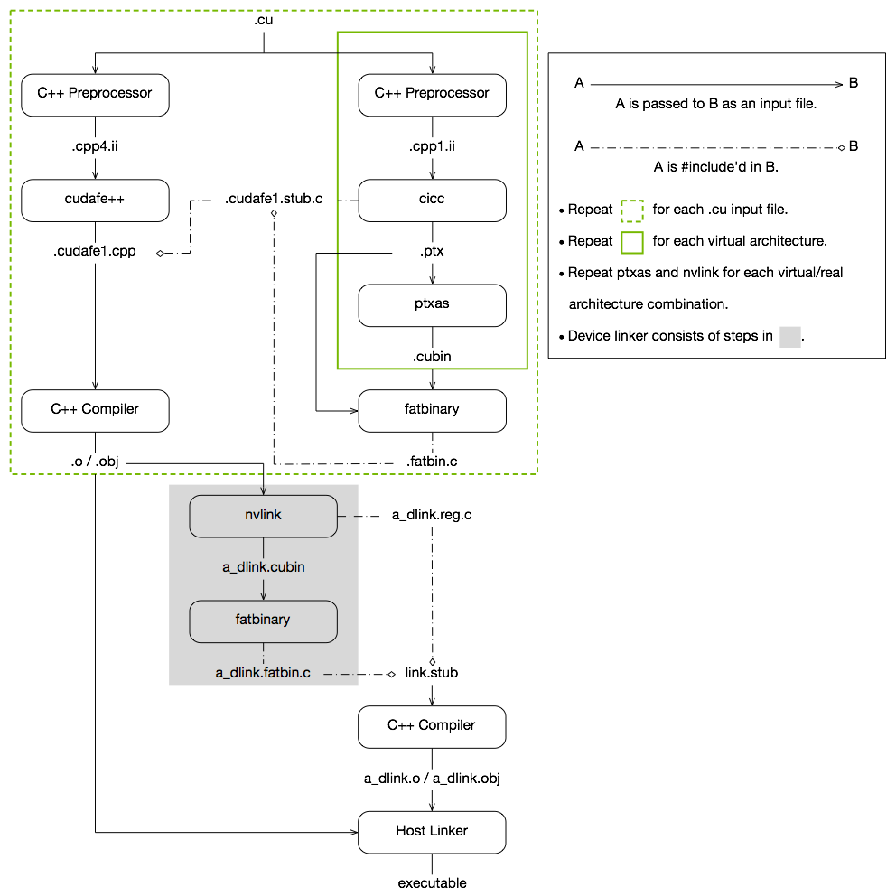

# 1. Introduction — NVIDIA CUDA Compiler Driver 13.2 documentation

**来源**: [https://docs.nvidia.com/cuda/cuda-compiler-driver-nvcc/index.html](https://docs.nvidia.com/cuda/cuda-compiler-driver-nvcc/index.html)

---

NVIDIA CUDA Compiler Driver NVCC
The documentation for`nvcc`, the CUDA compiler driver.

# 1. Introduction

## 1.1. Overview

### 1.1.1. CUDA Programming Model
The CUDA Toolkit targets a class of applications whose control part runs as a process on a general purpose computing device, and which use one or more NVIDIA GPUs as coprocessors for accelerating*single program, multiple data*(SPMD) parallel jobs. Such jobs are self-contained, in the sense that they can be executed and completed by a batch of GPU threads entirely without intervention by the host process, thereby gaining optimal benefit from the parallel graphics hardware.
The GPU code is implemented as a collection of functions in a language that is essentially C++, but with some annotations for distinguishing them from the host code, plus annotations for distinguishing different types of data memory that exists on the GPU. Such functions may have parameters, and they can be called using a syntax that is very similar to regular C function calling, but slightly extended for being able to specify the matrix of GPU threads that must execute the called function. During its life time, the host process may dispatch many parallel GPU tasks.
For more information on the CUDA programming model, consult the[CUDA C++ Programming Guide](https://docs.nvidia.com/cuda/cuda-programming-guide/index.html).

### 1.1.2. CUDA Sources
Source files for CUDA applications consist of a mixture of conventional C++ host code, plus GPU device functions. The CUDA compilation trajectory separates the device functions from the host code, compiles the device functions using the proprietary NVIDIA compilers and assembler, compiles the host code using a C++ host compiler that is available, and afterwards embeds the compiled GPU functions as fatbinary images in the host object file. In the linking stage, specific CUDA runtime libraries are added for supporting remote SPMD procedure calling and for providing explicit GPU manipulation such as allocation of GPU memory buffers and host-GPU data transfer.

### 1.1.3. Purpose of NVCC
The compilation trajectory involves several splitting, compilation, preprocessing, and merging steps for each CUDA source file. It is the purpose of`nvcc`, the CUDA compiler driver, to hide the intricate details of CUDA compilation from developers. It accepts a range of conventional compiler options, such as for defining macros and include/library paths, and for steering the compilation process. All non-CUDA compilation steps are forwarded to a C++ host compiler that is supported by`nvcc`, and`nvcc`translates its options to appropriate host compiler command line options.

## 1.2. Supported Host Compilers
A general purpose C++ host compiler is needed by`nvcc`in the following situations:
- During non-CUDA phases (except the run phase), because these phases will be forwarded by`nvcc`to this compiler.
- During CUDA phases, for several preprocessing stages and host code compilation (see alsoThe CUDA Compilation Trajectory).
`nvcc`assumes that the host compiler is installed with the standard method designed by the compiler provider. If the host compiler installation is non-standard, the user must make sure that the environment is set appropriately and use relevant`nvcc`compile options.
The following documents provide detailed information about supported host compilers:
- [NVIDIA CUDA Installation Guide for Linux](https://docs.nvidia.com/cuda/cuda-installation-guide-linux/index.html)
- [NVIDIA CUDA Installation Guide for Microsoft Windows](https://docs.nvidia.com/cuda/cuda-installation-guide-microsoft-windows/index.html)
On all platforms, the default host compiler executable (`gcc`and`g++`on Linux and`cl.exe`on Windows) found in the current execution search path will be used, unless specified otherwise with appropriate options (seefile-and-path-specifications).
Note,`nvcc`does not support the compilation of file paths that exceed the maximum path length limitations of the host system. To support the compilation of long file paths, please refer to the documentation for your system.

# 2. Compilation Phases

## 2.1. NVCC Identification Macro
`nvcc`predefines the following macros:

`__NVCC__`

Defined when compiling C/C++/CUDA source files.

`__CUDACC__`

Defined when compiling CUDA source files.

`__CUDACC_RDC__`

Defined when compiling CUDA source files in relocatable device code mode (seeNVCC Options for Separate Compilation).

`__CUDACC_EWP__`

Defined when compiling CUDA source files in extensible whole program mode (seeOptions for Specifying Behavior of Compiler/Linker).

`__CUDACC_DEBUG__`

Defined when compiling CUDA source files in the device-debug mode (seeOptions for Specifying Behavior of Compiler/Linker).

`__CUDACC_RELAXED_CONSTEXPR__`

Defined when the`--expt-relaxed-constexpr`flag is specified on the command line. Refer to the[CUDA C++ Programming Guide](https://docs.nvidia.com/cuda/cuda-programming-guide/index.html)for more details.

`__CUDACC_EXTENDED_LAMBDA__`

Defined when the`--expt-extended-lambda`or`--extended-lambda`flag is specified on the command line. Refer to the[CUDA C++ Programming Guide](https://docs.nvidia.com/cuda/cuda-programming-guide/index.html)for more details.

`__CUDACC_VER_MAJOR__`

Defined with the major version number of`nvcc`.

`__CUDACC_VER_MINOR__`

Defined with the minor version number of`nvcc`.

`__CUDACC_VER_BUILD__`

Defined with the build version number of`nvcc`.

`__NVCC_DIAG_PRAGMA_SUPPORT__`

Defined when the CUDA frontend compiler supports diagnostic control with the`nv_diag_suppress`,`nv_diag_error`,`nv_diag_warning`,`nv_diag_default`,`nv_diag_once`, and`nv_diagnostic`pragmas.

`__CUDACC_DEVICE_ATOMIC_BUILTINS__`

Defined when the CUDA frontend compiler supports device atomic compiler builtins. Refer to the[CUDA C++ Programming Guide](https://docs.nvidia.com/cuda/cuda-programming-guide/index.html)for more details.

## 2.2. NVCC Phases
A compilation phase is a logical translation step that can be selected by command line options to`nvcc`. A single compilation phase can still be broken up by`nvcc`into smaller steps, but these smaller steps are just implementations of the phase: they depend on seemingly arbitrary capabilities of the internal tools that`nvcc`uses, and all of these internals may change with a new release of the CUDA Toolkit. Hence, only compilation phases are stable across releases, and although`nvcc`provides options to display the compilation steps that it executes, these are for debugging purposes only and must not be copied and used in build scripts.
`nvcc`phases are selected by a combination of command line options and input file name suffixes, and the execution of these phases may be modified by other command line options. In phase selection, the input file suffix defines the phase input, while the command line option defines the required output of the phase.
The following paragraphs list the recognized file name suffixes and the supported compilation phases. A full explanation of the`nvcc`command line options can be found inNVCC Command Options.

## 2.3. Supported Input File Suffixes
The following table defines how`nvcc`interprets its input files:

<div style="overflow-x: auto; max-width: 100%; border-radius: 6px;">
<table border="1" cellpadding="6" cellspacing="0" style="border-collapse: collapse; width: 100%; font-family: -apple-system, BlinkMacSystemFont, Segoe UI, Helvetica, Arial, sans-serif; font-size: 13px; margin: 16px 0;">
<colgroup>
<col style="width: 15%"/>
<col style="width: 85%"/>
</colgroup>
<thead>
<tr style="border: 1px solid #d0d7de;">
<th style="background-color: #f6f8fa; font-weight: 600; text-align: left; padding: 8px 12px; border: 1px solid #d0d7de;"><p>Input File Suffix</p></th>
<th style="background-color: #f6f8fa; font-weight: 600; text-align: left; padding: 8px 12px; border: 1px solid #d0d7de;"><p>Description</p></th>
</tr>
</thead>
<tbody>
<tr style="border: 1px solid #d0d7de;">
<td style="padding: 8px 12px; border: 1px solid #d0d7de; vertical-align: top;"><p><code class="docutils literal notranslate"><span class="pre">.cu</span></code></p></td>
<td style="padding: 8px 12px; border: 1px solid #d0d7de; vertical-align: top;"><p>CUDA source file, containing host code and device functions</p></td>
</tr>
<tr style="border: 1px solid #d0d7de;">
<td style="padding: 8px 12px; border: 1px solid #d0d7de; vertical-align: top;"><p><code class="docutils literal notranslate"><span class="pre">.c</span></code></p></td>
<td style="padding: 8px 12px; border: 1px solid #d0d7de; vertical-align: top;"><p>C source file</p></td>
</tr>
<tr style="border: 1px solid #d0d7de;">
<td style="padding: 8px 12px; border: 1px solid #d0d7de; vertical-align: top;"><p><code class="docutils literal notranslate"><span class="pre">.cc</span></code>, <code class="docutils literal notranslate"><span class="pre">.cxx</span></code>, <code class="docutils literal notranslate"><span class="pre">.cpp</span></code></p></td>
<td style="padding: 8px 12px; border: 1px solid #d0d7de; vertical-align: top;"><p>C++ source file</p></td>
</tr>
<tr style="border: 1px solid #d0d7de;">
<td style="padding: 8px 12px; border: 1px solid #d0d7de; vertical-align: top;"><p><code class="docutils literal notranslate"><span class="pre">.ptx</span></code></p></td>
<td style="padding: 8px 12px; border: 1px solid #d0d7de; vertical-align: top;"><p>PTX intermediate assembly file (see <a class="reference internal" href="#cuda-compilation-from-cu-to-executable-figure"><span class="std std-ref">Figure 1</span></a>)</p></td>
</tr>
<tr style="border: 1px solid #d0d7de;">
<td style="padding: 8px 12px; border: 1px solid #d0d7de; vertical-align: top;"><p><code class="docutils literal notranslate"><span class="pre">.cubin</span></code></p></td>
<td style="padding: 8px 12px; border: 1px solid #d0d7de; vertical-align: top;"><p>CUDA device code binary file (CUBIN) for a single GPU architecture (see <a class="reference internal" href="#cuda-compilation-from-cu-to-executable-figure"><span class="std std-ref">Figure 1</span></a>)</p></td>
</tr>
<tr style="border: 1px solid #d0d7de;">
<td style="padding: 8px 12px; border: 1px solid #d0d7de; vertical-align: top;"><p><code class="docutils literal notranslate"><span class="pre">.fatbin</span></code></p></td>
<td style="padding: 8px 12px; border: 1px solid #d0d7de; vertical-align: top;"><p>CUDA fat binary file that may contain multiple PTX and CUBIN files (see <a class="reference internal" href="#cuda-compilation-from-cu-to-executable-figure"><span class="std std-ref">Figure 1</span></a>)</p></td>
</tr>
<tr style="border: 1px solid #d0d7de;">
<td style="padding: 8px 12px; border: 1px solid #d0d7de; vertical-align: top;"><p><code class="docutils literal notranslate"><span class="pre">.o</span></code>, <code class="docutils literal notranslate"><span class="pre">.obj</span></code></p></td>
<td style="padding: 8px 12px; border: 1px solid #d0d7de; vertical-align: top;"><p>Object file</p></td>
</tr>
<tr style="border: 1px solid #d0d7de;">
<td style="padding: 8px 12px; border: 1px solid #d0d7de; vertical-align: top;"><p><code class="docutils literal notranslate"><span class="pre">.a</span></code>, <code class="docutils literal notranslate"><span class="pre">.lib</span></code></p></td>
<td style="padding: 8px 12px; border: 1px solid #d0d7de; vertical-align: top;"><p>Library file</p></td>
</tr>
<tr style="border: 1px solid #d0d7de;">
<td style="padding: 8px 12px; border: 1px solid #d0d7de; vertical-align: top;"><p><code class="docutils literal notranslate"><span class="pre">.res</span></code></p></td>
<td style="padding: 8px 12px; border: 1px solid #d0d7de; vertical-align: top;"><p>Resource file</p></td>
</tr>
<tr style="border: 1px solid #d0d7de;">
<td style="padding: 8px 12px; border: 1px solid #d0d7de; vertical-align: top;"><p><code class="docutils literal notranslate"><span class="pre">.so</span></code></p></td>
<td style="padding: 8px 12px; border: 1px solid #d0d7de; vertical-align: top;"><p>Shared object file</p></td>
</tr>
</tbody>
</table>
</div>

Note that`nvcc`does not make any distinction between object, library or resource files. It just passes files of these types to the linker when the linking phase is executed.

## 2.4. Supported Phases
The following table specifies the supported compilation phases, plus the option to`nvcc`that enables the execution of each phase. It also lists the default name of the output file generated by each phase, which takes effect when no explicit output file name is specified using the option`--output-file`:

<div style="overflow-x: auto; max-width: 100%; border-radius: 6px;">
<table border="1" cellpadding="6" cellspacing="0" style="border-collapse: collapse; width: 100%; font-family: -apple-system, BlinkMacSystemFont, Segoe UI, Helvetica, Arial, sans-serif; font-size: 13px; margin: 16px 0;">
<colgroup>
<col style="width: 21%"/>
<col style="width: 13%"/>
<col style="width: 8%"/>
<col style="width: 58%"/>
</colgroup>
<thead>
<tr style="border: 1px solid #d0d7de;">
<th style="background-color: #f6f8fa; font-weight: 600; text-align: left; padding: 8px 12px; border: 1px solid #d0d7de;"><p>Phase</p></th>
<th style="background-color: #f6f8fa; font-weight: 600; text-align: left; padding: 8px 12px; border: 1px solid #d0d7de;"><p><code class="docutils literal notranslate"><span class="pre">nvcc</span></code> Option</p></th>
<th style="background-color: #f6f8fa; font-weight: 600; text-align: left; padding: 8px 12px; border: 1px solid #d0d7de;"></th>
<th style="background-color: #f6f8fa; font-weight: 600; text-align: left; padding: 8px 12px; border: 1px solid #d0d7de;"><p>Default Output File Name</p></th>
</tr>
</thead>
<tbody>
<tr style="border: 1px solid #d0d7de;">
<td style="padding: 8px 12px; border: 1px solid #d0d7de; vertical-align: top;"></td>
<td style="padding: 8px 12px; border: 1px solid #d0d7de; vertical-align: top;"><p>Long Name</p></td>
<td style="padding: 8px 12px; border: 1px solid #d0d7de; vertical-align: top;"><p>Short Name</p></td>
<td style="padding: 8px 12px; border: 1px solid #d0d7de; vertical-align: top;"></td>
</tr>
<tr style="border: 1px solid #d0d7de;">
<td style="padding: 8px 12px; border: 1px solid #d0d7de; vertical-align: top;"><p>CUDA compilation to C/C++ source file</p></td>
<td style="padding: 8px 12px; border: 1px solid #d0d7de; vertical-align: top;"><p><code class="docutils literal notranslate"><span class="pre">--cuda</span></code></p></td>
<td style="padding: 8px 12px; border: 1px solid #d0d7de; vertical-align: top;"><p><code class="docutils literal notranslate"><span class="pre">-cuda</span></code></p></td>
<td style="padding: 8px 12px; border: 1px solid #d0d7de; vertical-align: top;"><p><code class="docutils literal notranslate"><span class="pre">.cpp.ii</span></code> appended to source file name, as in <code class="docutils literal notranslate"><span class="pre">x.cu.cpp.ii</span></code>. This output file can be compiled by the host compiler that was used by <code class="docutils literal notranslate"><span class="pre">nvcc</span></code> to preprocess the <code class="docutils literal notranslate"><span class="pre">.cu</span></code> file.</p></td>
</tr>
<tr style="border: 1px solid #d0d7de;">
<td style="padding: 8px 12px; border: 1px solid #d0d7de; vertical-align: top;"><p>C/C++ preprocessing</p></td>
<td style="padding: 8px 12px; border: 1px solid #d0d7de; vertical-align: top;"><p><code class="docutils literal notranslate"><span class="pre">--preprocess</span></code></p></td>
<td style="padding: 8px 12px; border: 1px solid #d0d7de; vertical-align: top;"><p><code class="docutils literal notranslate"><span class="pre">-E</span></code></p></td>
<td style="padding: 8px 12px; border: 1px solid #d0d7de; vertical-align: top;"><p>&lt;<em>result on standard output</em>&gt;</p></td>
</tr>
<tr style="border: 1px solid #d0d7de;">
<td style="padding: 8px 12px; border: 1px solid #d0d7de; vertical-align: top;"><p>C/C++ compilation to object file</p></td>
<td style="padding: 8px 12px; border: 1px solid #d0d7de; vertical-align: top;"><p><code class="docutils literal notranslate"><span class="pre">--compile</span></code></p></td>
<td style="padding: 8px 12px; border: 1px solid #d0d7de; vertical-align: top;"><p><code class="docutils literal notranslate"><span class="pre">-c</span></code></p></td>
<td style="padding: 8px 12px; border: 1px solid #d0d7de; vertical-align: top;"><p>Source file name with suffix replaced by <code class="docutils literal notranslate"><span class="pre">o</span></code> on Linux or <code class="docutils literal notranslate"><span class="pre">obj</span></code> on Windows</p></td>
</tr>
<tr style="border: 1px solid #d0d7de;">
<td style="padding: 8px 12px; border: 1px solid #d0d7de; vertical-align: top;"><p>Cubin generation from CUDA source files</p></td>
<td style="padding: 8px 12px; border: 1px solid #d0d7de; vertical-align: top;"><p><code class="docutils literal notranslate"><span class="pre">--cubin</span></code></p></td>
<td style="padding: 8px 12px; border: 1px solid #d0d7de; vertical-align: top;"><p><code class="docutils literal notranslate"><span class="pre">-cubin</span></code></p></td>
<td style="padding: 8px 12px; border: 1px solid #d0d7de; vertical-align: top;"><p>Source file name with suffix replaced by <code class="docutils literal notranslate"><span class="pre">cubin</span></code></p></td>
</tr>
<tr style="border: 1px solid #d0d7de;">
<td style="padding: 8px 12px; border: 1px solid #d0d7de; vertical-align: top;"><p>Cubin generation from PTX intermediate files.</p></td>
<td style="padding: 8px 12px; border: 1px solid #d0d7de; vertical-align: top;"><p><code class="docutils literal notranslate"><span class="pre">--cubin</span></code></p></td>
<td style="padding: 8px 12px; border: 1px solid #d0d7de; vertical-align: top;"><p><code class="docutils literal notranslate"><span class="pre">-cubin</span></code></p></td>
<td style="padding: 8px 12px; border: 1px solid #d0d7de; vertical-align: top;"><p>Source file name with suffix replaced by <code class="docutils literal notranslate"><span class="pre">cubin</span></code></p></td>
</tr>
<tr style="border: 1px solid #d0d7de;">
<td style="padding: 8px 12px; border: 1px solid #d0d7de; vertical-align: top;"><p>PTX generation from CUDA source files</p></td>
<td style="padding: 8px 12px; border: 1px solid #d0d7de; vertical-align: top;"><p><code class="docutils literal notranslate"><span class="pre">--ptx</span></code></p></td>
<td style="padding: 8px 12px; border: 1px solid #d0d7de; vertical-align: top;"><p><code class="docutils literal notranslate"><span class="pre">-ptx</span></code></p></td>
<td style="padding: 8px 12px; border: 1px solid #d0d7de; vertical-align: top;"><p>Source file name with suffix replaced by <code class="docutils literal notranslate"><span class="pre">ptx</span></code></p></td>
</tr>
<tr style="border: 1px solid #d0d7de;">
<td style="padding: 8px 12px; border: 1px solid #d0d7de; vertical-align: top;"><p>Fatbinary generation from source, PTX or cubin files</p></td>
<td style="padding: 8px 12px; border: 1px solid #d0d7de; vertical-align: top;"><p><code class="docutils literal notranslate"><span class="pre">--fatbin</span></code></p></td>
<td style="padding: 8px 12px; border: 1px solid #d0d7de; vertical-align: top;"><p><code class="docutils literal notranslate"><span class="pre">-fatbin</span></code></p></td>
<td style="padding: 8px 12px; border: 1px solid #d0d7de; vertical-align: top;"><p>Source file name with suffix replaced by <code class="docutils literal notranslate"><span class="pre">fatbin</span></code></p></td>
</tr>
<tr style="border: 1px solid #d0d7de;">
<td style="padding: 8px 12px; border: 1px solid #d0d7de; vertical-align: top;"><p>Linking relocatable device code.</p></td>
<td style="padding: 8px 12px; border: 1px solid #d0d7de; vertical-align: top;"><p><code class="docutils literal notranslate"><span class="pre">--device-link</span></code></p></td>
<td style="padding: 8px 12px; border: 1px solid #d0d7de; vertical-align: top;"><p><code class="docutils literal notranslate"><span class="pre">-dlink</span></code></p></td>
<td style="padding: 8px 12px; border: 1px solid #d0d7de; vertical-align: top;"><p><code class="docutils literal notranslate"><span class="pre">a_dlink.obj</span></code> on Windows or <code class="docutils literal notranslate"><span class="pre">a_dlink.o</span></code> on other platforms</p></td>
</tr>
<tr style="border: 1px solid #d0d7de;">
<td style="padding: 8px 12px; border: 1px solid #d0d7de; vertical-align: top;"><p>Cubin generation from linked relocatable device code.</p></td>
<td style="padding: 8px 12px; border: 1px solid #d0d7de; vertical-align: top;"><p><code class="docutils literal notranslate"><span class="pre">--device-link</span></code><code class="docutils literal notranslate"><span class="pre">--cubin</span></code></p></td>
<td style="padding: 8px 12px; border: 1px solid #d0d7de; vertical-align: top;"><p><code class="docutils literal notranslate"><span class="pre">-dlink</span></code><code class="docutils literal notranslate"><span class="pre">-cubin</span></code></p></td>
<td style="padding: 8px 12px; border: 1px solid #d0d7de; vertical-align: top;"><p><code class="docutils literal notranslate"><span class="pre">a_dlink.cubin</span></code></p></td>
</tr>
<tr style="border: 1px solid #d0d7de;">
<td style="padding: 8px 12px; border: 1px solid #d0d7de; vertical-align: top;"><p>Fatbinary generation from linked relocatable device code</p></td>
<td style="padding: 8px 12px; border: 1px solid #d0d7de; vertical-align: top;"><p><code class="docutils literal notranslate"><span class="pre">--device-link</span></code><code class="docutils literal notranslate"><span class="pre">--fatbin</span></code></p></td>
<td style="padding: 8px 12px; border: 1px solid #d0d7de; vertical-align: top;"><p><code class="docutils literal notranslate"><span class="pre">-dlink</span></code><code class="docutils literal notranslate"><span class="pre">-fatbin</span></code></p></td>
<td style="padding: 8px 12px; border: 1px solid #d0d7de; vertical-align: top;"><p><code class="docutils literal notranslate"><span class="pre">a_dlink.fatbin</span></code></p></td>
</tr>
<tr style="border: 1px solid #d0d7de;">
<td style="padding: 8px 12px; border: 1px solid #d0d7de; vertical-align: top;"><p>Linking an executable</p></td>
<td style="padding: 8px 12px; border: 1px solid #d0d7de; vertical-align: top;"><p>&lt;<em>no phase option</em>&gt;</p></td>
<td style="padding: 8px 12px; border: 1px solid #d0d7de; vertical-align: top;"></td>
<td style="padding: 8px 12px; border: 1px solid #d0d7de; vertical-align: top;"><p><code class="docutils literal notranslate"><span class="pre">a.exe</span></code> on Windows or <code class="docutils literal notranslate"><span class="pre">a.out</span></code> on other platforms</p></td>
</tr>
<tr style="border: 1px solid #d0d7de;">
<td style="padding: 8px 12px; border: 1px solid #d0d7de; vertical-align: top;"><p>Constructing an object file archive, or library</p></td>
<td style="padding: 8px 12px; border: 1px solid #d0d7de; vertical-align: top;"><p><code class="docutils literal notranslate"><span class="pre">--lib</span></code></p></td>
<td style="padding: 8px 12px; border: 1px solid #d0d7de; vertical-align: top;"><p><code class="docutils literal notranslate"><span class="pre">-lib</span></code></p></td>
<td style="padding: 8px 12px; border: 1px solid #d0d7de; vertical-align: top;"><p><code class="docutils literal notranslate"><span class="pre">a.lib</span></code> on Windows or <code class="docutils literal notranslate"><span class="pre">a.a</span></code> on other platforms</p></td>
</tr>
<tr style="border: 1px solid #d0d7de;">
<td style="padding: 8px 12px; border: 1px solid #d0d7de; vertical-align: top;"><p><code class="docutils literal notranslate"><span class="pre">make</span></code> dependency generation</p></td>
<td style="padding: 8px 12px; border: 1px solid #d0d7de; vertical-align: top;"><p><code class="docutils literal notranslate"><span class="pre">--generate-dependencies</span></code></p></td>
<td style="padding: 8px 12px; border: 1px solid #d0d7de; vertical-align: top;"><p><code class="docutils literal notranslate"><span class="pre">-M</span></code></p></td>
<td style="padding: 8px 12px; border: 1px solid #d0d7de; vertical-align: top;"><p>&lt;<em>result on standard output</em>&gt;</p></td>
</tr>
<tr style="border: 1px solid #d0d7de;">
<td style="padding: 8px 12px; border: 1px solid #d0d7de; vertical-align: top;"><p><code class="docutils literal notranslate"><span class="pre">make</span></code> dependency generation without headers in system paths.</p></td>
<td style="padding: 8px 12px; border: 1px solid #d0d7de; vertical-align: top;"><p><code class="docutils literal notranslate"><span class="pre">--generate-nonsystem-dependencies</span></code></p></td>
<td style="padding: 8px 12px; border: 1px solid #d0d7de; vertical-align: top;"><p><code class="docutils literal notranslate"><span class="pre">-MM</span></code></p></td>
<td style="padding: 8px 12px; border: 1px solid #d0d7de; vertical-align: top;"><p>&lt;<em>result on standard output</em>&gt;</p></td>
</tr>
<tr style="border: 1px solid #d0d7de;">
<td style="padding: 8px 12px; border: 1px solid #d0d7de; vertical-align: top;"><p>Compile CUDA source to OptiX IR output.</p></td>
<td style="padding: 8px 12px; border: 1px solid #d0d7de; vertical-align: top;"><p><code class="docutils literal notranslate"><span class="pre">--optix-ir</span></code></p></td>
<td style="padding: 8px 12px; border: 1px solid #d0d7de; vertical-align: top;"><p><code class="docutils literal notranslate"><span class="pre">-optix-ir</span></code></p></td>
<td style="padding: 8px 12px; border: 1px solid #d0d7de; vertical-align: top;"><p>Source file name with suffix replaced by <code class="docutils literal notranslate"><span class="pre">optixir</span></code></p></td>
</tr>
<tr style="border: 1px solid #d0d7de;">
<td style="padding: 8px 12px; border: 1px solid #d0d7de; vertical-align: top;"><p>Compile CUDA source to LTO IR output.</p></td>
<td style="padding: 8px 12px; border: 1px solid #d0d7de; vertical-align: top;"><p><code class="docutils literal notranslate"><span class="pre">--ltoir</span></code></p></td>
<td style="padding: 8px 12px; border: 1px solid #d0d7de; vertical-align: top;"><p><code class="docutils literal notranslate"><span class="pre">-ltoir</span></code></p></td>
<td style="padding: 8px 12px; border: 1px solid #d0d7de; vertical-align: top;"><p>Source file name with suffix replaced by <code class="docutils literal notranslate"><span class="pre">ltoir</span></code></p></td>
</tr>
<tr style="border: 1px solid #d0d7de;">
<td style="padding: 8px 12px; border: 1px solid #d0d7de; vertical-align: top;"><p>Running an executable</p></td>
<td style="padding: 8px 12px; border: 1px solid #d0d7de; vertical-align: top;"><p><code class="docutils literal notranslate"><span class="pre">--run</span></code></p></td>
<td style="padding: 8px 12px; border: 1px solid #d0d7de; vertical-align: top;"><p><code class="docutils literal notranslate"><span class="pre">-run</span></code></p></td>
<td style="padding: 8px 12px; border: 1px solid #d0d7de; vertical-align: top;"></td>
</tr>
</tbody>
</table>
</div>

**Notes:**
- The last phase in this list is more of a convenience phase. It allows running the compiled and linked executable without having to explicitly set the library path to the CUDA dynamic libraries.
- Unless a phase option is specified,`nvcc`will compile and link all its input files.

# 3. The CUDA Compilation Trajectory
CUDA compilation works as follows: the input program is preprocessed for device compilation and is compiled to CUDA binary (`cubin`) and/or PTX intermediate code, which are placed in a fatbinary. The input program is preprocessed once again for host compilation and is synthesized to embed the fatbinary and transform CUDA specific C++ extensions into standard C++ constructs. Then the C++ host compiler compiles the synthesized host code with the embedded fatbinary into a host object. The exact steps that are followed to achieve this are displayed inFigure 1.
The embedded fatbinary is inspected by the CUDA runtime system whenever the device code is launched by the host program to obtain an appropriate fatbinary image for the current GPU.
CUDA programs are compiled in the whole program compilation mode by default, i.e., the device code cannot reference an entity from a separate file. In the whole program compilation mode, device link steps have no effect. For more information on the separate compilation and the whole program compilation, refer toUsing Separate Compilation in CUDA.



CUDA Compilation Trajectory

# 4. NVCC Command Options

## 4.1. Command Option Types and Notation
Each`nvcc`option has a long name and a short name, which are interchangeable with each other. These two variants are distinguished by the number of hyphens that must precede the option name: long names must be preceded by two hyphens, while short names must be preceded by a single hyphen. For example,`-I`is the short name of`--include-path`. Long options are intended for use in build scripts, where the size of the option is less important than the descriptive value. In contrast, short options are intended for interactive use.
`nvcc`recognizes three types of command options: boolean options, single value options, and list options.
Boolean options do not have an argument; they are either specified on the command line or not. Single value options must be specified at most once, but list options may be repeated. Examples of each of these option types are, respectively:`--verbose`(switch to verbose mode),`--output-file`(specify output file), and`--include-path`(specify include path).
Single value options and list options must have arguments, which must follow the name of the option itself by either one of more spaces or an equals character. When a one-character short name such as`-I`,`-l`, and`-L`is used, the value of the option may also immediately follow the option itself without being seperated by spaces or an equal character. The individual values of list options may be separated by commas in a single instance of the option, or the option may be repeated, or any combination of these two cases.
Hence, for the two sample options mentioned above that may take values, the following notations are legal:

```
-o file

```

```
-o=file

```

```
-Idir1,dir2 -I=dir3 -I dir4,dir5

```

Unless otherwise specified, long option names are used throughout this document. However, short names can be used instead of long names for the same effect.

## 4.2. Command Option Description
This section presents tables of`nvcc`options. The option type in the tables can be recognized as follows: Boolean options do not have arguments specified in the first column, while the other two types do. List options can be recognized by the repeat indicator`,...`at the end of the argument.
Long options are described in the first column of the options table, and short options occupy the second column.

### 4.2.1. File and Path Specifications

#### 4.2.1.1. --output-file file (-o)
Specify name and location of the output file.

#### 4.2.1.2. --objdir-as-tempdir (-objtemp)
Create all intermediate files in the same directory as the object file. These intermediate files are deleted when the compilation is finished. This option will take effect only if -c, -dc or -dw is also used. Using this option will ensure that the intermediate file name that is embedded in the object file will not change in multiple compiles of the same file. However, this is not guaranteed if the input is stdin. If the same file is compiled with two different options, ex., ‘nvcc -c t.cu’ and ‘nvcc -c -ptx t.cu’, then the files should be compiled in different directories. Compiling them in the same directory can either cause the compilation to fail or produce incorrect results.

#### 4.2.1.3. --pre-include file,... (-include)
Specify header files that must be pre-included during preprocessing.

#### 4.2.1.4. --library library,... (-l)
Specify libraries to be used in the linking stage without the library file extension.
The libraries are searched for on the library search paths that have been specified using option`--library-path`(seeLibraries).

#### 4.2.1.5. --define-macro def,... (-D)
Define macros to be used during preprocessing.
*def*can be either*name*or*name*=*definition*.
- *name*
  - Predefine*name*as a macro.
- *name*=*definition*
  - The contents of*definition*are tokenized and preprocessed as if they appear during translation phase three in a`#define`directive. The definition will be truncated by embedded new line characters.

#### 4.2.1.6. --undefine-macro def,... (-U)
Undefine an existing macro during preprocessing or compilation.

#### 4.2.1.7. --include-path path,... (-I)
Specify include search paths.

#### 4.2.1.8. --system-include path,... (-isystem)
Specify system include search paths.

#### 4.2.1.9. --library-path path,... (-L)
Specify library search paths (seeLibraries).

#### 4.2.1.10. --output-directory directory (-odir)
Specify the directory of the output file.
This option is intended for letting the dependency generation step (see`--generate-dependencies`) generate a rule that defines the target object file in the proper directory.

#### 4.2.1.11. --dependency-output file (-MF)
Specify the dependency output file.
This option specifies the output file for the dependency generation step (see`--generate-dependencies`). The option`--generate-dependencies`or`--generate-nonystem-dependencies`must be specified if a dependency output file is set.

#### 4.2.1.12. --generate-dependency-targets (-MP)
Add an empty target for each dependency.
This option adds phony targets to the dependency generation step (see`--generate-dependencies`) intended to avoid makefile errors if old dependencies are deleted. The input files are not emitted as phony targets.

#### 4.2.1.13. --compiler-bindir directory (-ccbin)
Specify the directory in which the default host compiler executable resides.
The host compiler executable name can be also specified to ensure that the correct host compiler is selected. In addition, driver prefix options (`--input-drive-prefix`,`--dependency-drive-prefix`, or`--drive-prefix`) may need to be specified, if`nvcc`is executed in a Cygwin shell or a MinGW shell on Windows.

#### 4.2.1.14. --allow-unsupported-compiler (-allow-unsupported-compiler)
Disable nvcc check for supported host compiler versions.
Using an unsupported host compiler may cause compilation failure or incorrect run time execution. Use at your own risk. This option has no effect on MacOS.

#### 4.2.1.15. --archiver-binary executable (-arbin)
Specify the path of the archiver tool used create static library with`--lib`.

#### 4.2.1.16. --cudart {none|shared|static |hybrid} (-cudart)
Specify the type of CUDA runtime library to be used: no CUDA runtime library, shared/dynamic CUDA runtime library, or static CUDA runtime library.
On Windows, the shared option has been replaced by a hybrid option, where a small loader library is statically linked in that dynamically loads the runtime from the Display Driver.
**Allowed Values**
- `none`
- `shared`(non-Windows)
- `static`
- `hybrid`(Windows)
**Default**
The static CUDA runtime library is used by default except on Windows, where the hybrid approach is the default instead.

#### 4.2.1.17. --cudadevrt {none|static} (-cudadevrt)
Specify the type of CUDA device runtime library to be used: no CUDA device runtime library, or static CUDA device runtime library.
**Allowed Values**
- `none`
- `static`
**Default**
The static CUDA device runtime library is used by default.

#### 4.2.1.18. --libdevice-directory directory (-ldir)
Specify the directory that contains the libdevice library files.
Libdevice library files are located in the`nvvm/libdevice`directory in the CUDA Toolkit.

#### 4.2.1.19. --target-directory string (-target-dir)
Specify the subfolder name in the targets directory where the default include and library paths are located.

### 4.2.2. Options for Specifying the Compilation Phase
Options of this category specify up to which stage the input files must be compiled.

#### 4.2.2.1. --link (-link)
Specify the default behavior: compile and link all input files.
**Default Output File Name**
`a.exe`on Windows or`a.out`on other platforms is used as the default output file name.

#### 4.2.2.2. --lib (-lib)
Compile all input files into object files, if necessary, and add the results to the specified library output file.
**Default Output File Name**
`a.lib`on Windows or`a.a`on other platforms is used as the default output file name.

#### 4.2.2.3. --device-link (-dlink)
Link object files with relocatable device code and`.ptx`,`.cubin`, and`.fatbin`files into an object file with executable device code, which can be passed to the host linker.
**Default Output File Name**
`a_dlink.obj`on Windows or`a_dlink.o`on other platforms is used as the default output file name. When this option is used in conjunction with`--fatbin`,`a_dlink.fatbin`is used as the default output file name. When this option is used in conjunction with`--cubin`,`a_dlink.cubin`is used as the default output file name.

#### 4.2.2.4. --device-c (-dc)
Compile each`.c`,`.cc`,`.cpp`,`.cxx`, and`.cu`input file into an object file that contains relocatable device code.
It is equivalent to`--relocatable-device-code=true --compile`.
**Default Output File Name**
The source file name extension is replaced by`.obj`on Windows and`.o`on other platforms to create the default output file name. For example, the default output file name for`x.cu`is`x.obj`on Windows and`x.o`on other platforms.

#### 4.2.2.5. --device-w (-dw)
Compile each`.c`,`.cc`,`.cpp`,`.cxx`, and`.cu`input file into an object file that contains executable device code.
It is equivalent to`--relocatable-device-code=false --compile`.
**Default Output File Name**
The source file name extension is replaced by`.obj`on Windows and`.o`on other platforms to create the default output file name. For example, the default output file name for`x.cu`is`x.obj`on Windows and`x.o`on other platforms.

#### 4.2.2.6. --cuda (-cuda)
Compile each`.cu`input file to a`.cu.cpp.ii`file.
**Default Output File Name**
`.cu.cpp.ii`is appended to the basename of the source file name to create the default output file name. For example, the default output file name for`x.cu`is`x.cu.cpp.ii`.

#### 4.2.2.7. --compile (-c)
Compile each`.c`,`.cc`,`.cpp`,`.cxx`, and`.cu`input file into an object file.
**Default Output File Name**
The source file name extension is replaced by`.obj`on Windows and`.o`on other platforms to create the default output file name. For example, the default output file name for`x.cu`is`x.obj`on Windows and`x.o`on other platforms.

#### 4.2.2.8. --fatbin (-fatbin)
Compile all`.cu`,`.ptx`, and`.cubin`input files to device-only`.fatbin`files.
`nvcc`discards the host code for each`.cu`input file with this option.
**Default Output File Name**
The source file name extension is replaced by`.fatbin`to create the default output file name. For example, the default output file name for`x.cu`is`x.fatbin`.

#### 4.2.2.9. --cubin (-cubin)
Compile all`.cu`and`.ptx`input files to device-only`.cubin`files.
`nvcc`discards the host code for each`.cu`input file with this option.
**Default Output File Name**
The source file name extension is replaced by`.cubin`to create the default output file name. For example, the default output file name for`x.cu`is`x.cubin`.

#### 4.2.2.10. --ptx (-ptx)
Compile all`.cu`input files to device-only`.ptx`files.
`nvcc`discards the host code for each`.cu`input file with this option.
**Default Output File Name**
The source file name extension is replaced by`.ptx`to create the default output file name. For example, the default output file name for`x.cu`is`x.ptx`.

#### 4.2.2.11. --preprocess (-E)
Preprocess all`.c`,`.cc`,`.cpp`,`.cxx`, and`.cu`input files.
**Default Output File Name**
The output is generated in*stdout*by default.

#### 4.2.2.12. --generate-dependencies (-M)
Generate a dependency file that can be included in a`Makefile`for the`.c`,`.cc`,`.cpp`,`.cxx`, and`.cu`input file.
`nvcc`uses a fixed prefix to identify dependencies in the preprocessed file ( ‘`#line 1`’ on Linux and ‘`# 1`’ on Windows). The files mentioned in source location directives starting with this prefix will be included in the dependency list.
**Default Output File Name**
The output is generated in*stdout*by default.

#### 4.2.2.13. --generate-nonsystem-dependencies (-MM)
Same as`--generate-dependencies`but skip header files found in system directories (Linux only).
**Default Output File Name**
The output is generated in*stdout*by default.

#### 4.2.2.14. --generate-dependencies-with-compile (-MD)
Generate a dependency file and compile the input file. The dependency file can be included in a`Makefile`for the`.c`,`.cc`,`.cpp`,`.cxx`, and`.cu`input file.
This option cannot be specified together with`-E`. The dependency file name is computed as follows:
- If`-MF`is specified, then the specified file is used as the dependency file name.
- If`-o`is specified, the dependency file name is computed from the specified file name by replacing the suffix with ‘.d’.
- Otherwise, the dependency file name is computed by replacing the input file names’s suffix with ‘.d’.
If the dependency file name is computed based on either`-MF`or`-o`, then multiple input files are not supported.

#### 4.2.2.15. --generate-nonsystem-dependencies-with-compile (-MMD)
Same as`--generate-dependencies-with-compile`but skip header files found in system directories (Linux only).

#### 4.2.2.16. --optix-ir (-optix-ir)
Compile CUDA source to OptiX IR (.optixir) output. The OptiX IR is only intended for consumption by OptiX through appropriate APIs. This feature is not supported with link-time-optimization (`-dlto`), the lto_NN -arch target, or with`-gencode`.
**Default Output File Name**
The source file name extension is replaced by`.optixir`to create the default output file name. For example, the default output file name for`x.cu`is`x.optixir`.

#### 4.2.2.17. --ltoir (-ltoir)
Compile CUDA source to LTO IR (.ltoir) output. This feature is only supported with link-time-optimization (`-dlto`) or the lto_NN -arch target.
**Default Output File Name**
The source file name extension is replaced by`.ltoir`to create the default output file name. For example, the default output file name for`x.cu`is`x.ltoir`.

#### 4.2.2.18. --run (-run)
Compile and link all input files into an executable, and executes it.
When the input is a single executable, it is executed without any compilation or linking. This step is intended for developers who do not want to be bothered with setting the necessary environment variables; these are set temporarily by`nvcc`.

### 4.2.3. Options for Specifying Behavior of Compiler/Linker

#### 4.2.3.1. --profile (-pg)
Instrument generated code/executable for use by`gprof`.

#### 4.2.3.2. --debug (-g)
Generate debug information for host code.

#### 4.2.3.3. --device-debug (-G)
Generate debug information for device code.
If`--dopt`is not specified, then this option turns off all optimizations on device code. It is not intended for profiling; use`--generate-line-info`instead for profiling.

#### 4.2.3.4. --extensible-whole-program (-ewp)
Generate extensible whole program device code, which allows some calls to not be resolved until linking with libcudadevrt.

#### 4.2.3.5. --no-compress (-no-compress)
Do not compress device code in fatbinary.

#### 4.2.3.6. --compress-mode {default|size|speed|balance|none} (-compress-mode)
Choose the device code compression behavior in fatbinary.
This option is not compatible with drivers released before CUDA Toolkit’s 12.4 Release.
**Allowed Values**
`default`
> Uses the default compression mode, as if this weren’t specified. The behavior of this mode can change from version to version. It is currently equivalent to`speed`.
`size`
> Uses a compression mode more focused on reduced binary size, at the cost of compression and decompression time.
`speed`
> Uses a compression mode more focused on reduced decompression time, at the cost of less reduction in final binary size.
`balance`
> Uses a compression mode that balances binary size with compression and decompression time.
`none`
> Does not perform compression. Equivalent to`--no-compress`.
**Default Value**
`default`is used as the default mode.

#### 4.2.3.7. --relocatable-ptx (-reloc-ptx)
Insert PTX from relocatable fatbins within input objects when producing final fatbin.

#### 4.2.3.8. --generate-line-info (-lineinfo)
Generate line-number information for device code.

#### 4.2.3.9. --optimization-info kind,... (-opt-info)
Provide optimization reports for the specified kind of optimization.
The following tags are supported:
`inline`
> Emit remarks related to function inlining. Inlining pass may be invoked multiple times by the compiler and a function not inlined in an earlier pass may be inlined in a subsequent pass.

#### 4.2.3.10. --optimize level (-O)
Specify optimization level for host code.

#### 4.2.3.11. --Ofast-compile level (-Ofc)
Specify the fast-compile level for device code, which controls the tradeoff between compilation speed and runtime performance by disabling certain optimizations at varying levels.
**Allowed Values**
- `max`: Focus only on the fastest compilation speed, disabling many optimizations.
- `mid`: Balance compile time and runtime, disabling expensive optimizations.
- `min`: More minimal impact on both compile time and runtime, minimizing some expensive optimizations.
- `0`: Disable fast-compile.
**Default Value**
The option is disabled by default.

#### 4.2.3.12. --dopt kind (-dopt)
Enable device code optimization. When specified along with`-G`, enables limited debug information generation for optimized device code (currently, only line number information). When`-G`is not specified,`-dopt=on`is implicit.
**Allowed Values**
- `on`: enable device code optimization.

#### 4.2.3.13. --dlink-time-opt (-dlto)
Perform link-time optimization of device code. The option ‘-lto’ is also an alias to ‘-dlto’. Link-time optimization must be specified at both compile and link time; at compile time it stores high-level intermediate code, then at link time it links together and optimizes the intermediate code. If that intermediate is not found at link time then nothing happens. Intermediate code is also stored at compile time with the`--gpu-code='lto_NN'`target. The options`-dlto -arch=sm_NN`will add a lto_NN target; if you want to only add a lto_NN target and not the compute_NN that`-arch=sm_NN`usually generates, use`-arch=lto_NN`.

#### 4.2.3.14. --gen-opt-lto (-gen-opt-lto)
Run the optimizer passes before generating the LTO IR.

#### 4.2.3.15. --split-compile number (-split-compile)
Perform compiler optimizations in parallel.
Split compilation attempts to reduce compile time by enabling the compiler to run certain optimization passes concurrently. It does this by splitting the device code into smaller translation units, each containing one or more device functions, and running optimization passes on each unit concurrently across multiple threads. It will then link back the split units prior to code generation.
The option accepts a numerical value that specifies the maximum number of threads the compiler can use. One can also allow the compiler to use the maximum threads available on the system by setting`--split-compile=0`. Setting`--split-compile=1`will cause this option to be ignored.
This option can work in conjunction with device Link Time Optimization (`-dlto`) as well as`--threads`.

#### 4.2.3.16. --split-compile-extended number (-split-compile-extended)
A more aggressive form of`-split-compile`. Available in LTO mode only.
Extended split compilation attempts to reduce compile time even further by extending concurrent compilation through to the back-end. This agressive form of split compilation can potentially impact performance of the compiled binary.
The option accepts a numerical value that specifies the maximum number of threads the compiler can use. One can also allow the compiler to use the maximum threads available on the system by setting`--split-compile-extended=0`. Setting`--split-compile-extended=1`will cause this option to be ignored.
This option is only applicable with device Link Time Optimization (`-dlto`) and can work in conjunction with`--threads`.

#### 4.2.3.17. --jobserver (-jobserver)
When using`-split-compile`or`--threads`inside of a build controlled by GNU Make, require that job slots are acquired Make’s jobserver for each of the threads used, helping prevent oversubscription.
This option does not restrict`-split-compile-extended`(the number of threads created by it will not be controlled).
This option only works when Make is called with-jset to a numerical value greater than 1, as-j(without a number) causes Make to skip making the jobserver and-j1disables all parallelism.
This requires GNU Make 4.3 or newer. For versions of Make before 4.4, or if the`--jobserver-style=pipe`is manually specified to Make, each call to NVCC must be considered a submake by make (by prepending a`+`to each line where NVCC is called) in order to provide it access to Make’s jobserver.
Using this option with an unsupported version of Make, or without the correct-jvalue may lead to undefined behavior.
We do not implement any signal handling and only minimal error handling for this feature, which can cause resources to go unused if NVCC crashes. However, it should not cause a deadlock even if an error occurs, as the job slot used by NVCC itself will always be reclaimed.
Note: This flag is only supported on Linux.

#### 4.2.3.18. --skip-ptx-semantics-check (-skip-ptx-semantics-check)
When using`--skip-ptx-semantics-check`, the PTX semantics check step is skipped if otherwise performed. It can be used for some special or legacy code where the PTX semantics check can cause known failure.

#### 4.2.3.19. --ftemplate-backtrace-limit limit (-ftemplate-backtrace-limit)
Set the maximum number of template instantiation notes for a single warning or error to limit.
A value of`0`is allowed, and indicates that no limit should be enforced. This value is also passed to the host compiler if it provides an equivalent flag.

#### 4.2.3.20. --ftemplate-depth limit (-ftemplate-depth)
Set the maximum instantiation depth for template classes to limit.
This value is also passed to the host compiler if it provides an equivalent flag.

#### 4.2.3.21. --no-exceptions (-noeh)
Disable exception handling for host code.
Disable exception handling for host code, by passing “-EHs-c-” (for cl.exe) and “–fno-exceptions” (for other host compilers) during host compiler invocation. These flags are added to the host compiler invocation before any flags passed directly to the host compiler with “-Xcompiler”
**Default (on Windows)**
- On Windows,`nvcc`passes /EHsc to the host compiler by default.
**Example (on Windows)**
- `nvcc --no-exceptions -Xcompiler /EHa x.cu`

#### 4.2.3.22. --shared (-shared)
Generate a shared library during linking.
Use option`--linker-options`when other linker options are required for more control.

#### 4.2.3.23. --x {c|c++|cu} (-x)
Explicitly specify the language for the input files, rather than letting the compiler choose a default based on the file name suffix.
**Allowed Values**
- `c`
- `c++`
- `cu`
**Default**
The language of the source code is determined based on the file name suffix.

#### 4.2.3.24. --std {c++03|c++11|c++14|c++17|c++20} (-std)
Select a particular C++ dialect.
**Allowed Values**
- `c++03`
- `c++11`
- `c++14`
- `c++17`
- `c++20`
**Default**
The default C++ dialect depends on the host compiler.`nvcc`matches the default C++ dialect that the host compiler uses.

#### 4.2.3.25. --no-host-device-initializer-list (-nohdinitlist)
Do not consider member functions of`std::initializer_list`as`__host__ __device__`functions implicitly.

#### 4.2.3.26. --expt-relaxed-constexpr (-expt-relaxed-constexpr)
**Experimental flag***: Allow host code to invoke ``__device__ constexpr`` functions, and device code to invoke ``__host__ constexpr`` functions.*
Note that the behavior of this flag may change in future compiler releases.

#### 4.2.3.27. --extended-lambda (-extended-lambda)
Allow`__host__`,`__device__`annotations in lambda declarations.

#### 4.2.3.28. --expt-extended-lambda (-expt-extended-lambda)
Alias for`--extended-lambda`.

#### 4.2.3.29. --machine {64} (-m)
Specify 64-bit architecture.
**Allowed Values**
- `64`
**Default**
This option is set based on the host platform on which`nvcc`is executed.

#### 4.2.3.30. --m64 (-m64)
Alias for`--machine=64`

#### 4.2.3.31. --host-linker-script {use-lcs|gen-lcs} (-hls)
Use the host linker script (GNU/Linux only) to enable support for certain CUDA specific requirements, while building executable files or shared libraries.
**Allowed Values**
`use-lcs`
> Prepares a host linker script and enables host linker to support relocatable device object files that are larger in size, that would otherwise, in certain cases, cause the host linker to fail with relocation truncation error.
`gen-lcs`
> Generates a host linker script that can be passed to host linker manually, in the case where host linker is invoked separately outside of nvcc. This option can be combined with`-shared`or`-r`option to generate linker scripts that can be used while generating host shared libraries or host relocatable links respectively.
> The file generated using this options must be provided as the last input file to the host linker.
> The output is generated to stdout by default. Use the option`-o`filename to specify the output filename.
A linker script may already be in used and passed to the host linker using the host linker option`--script`(or`-T`), then the generated host linker script must augment the existing linker script. In such cases, the option`-aug-hls`must be used to generate linker script that contains only the augmentation parts. Otherwise, the host linker behaviour is undefined.
A host linker option, such as`-z`with a non-default argument, that can modify the default linker script internally, is incompatible with this option and the behavior of any such usage is undefined.
**Default Value**
`use-lcs`is used as the default type.

#### 4.2.3.32. --augment-host-linker-script (-aug-hls)
Enables generation of host linker script that augments an existing host linker script (GNU/Linux only). See option`--host-linker-script`for more details.

#### 4.2.3.33. --relocatable-link (-r)
Generates a relocatable (both host and device) object when linking.

#### 4.2.3.34. --frandom-seed (-frandom-seed)
The user specified random seed will be used to replace random numbers used in generating symbol names and variable names. The option can be used to generate deterministicly identical ptx and object files.
If the input value is a valid number (decimal, octal, or hex), it will be used directly as the random seed.
Otherwise, the CRC value of the passed string will be used instead.
NVCC will also pass the option, as well as the user specified value to host compilers, if the host compiler is either GCC or Clang, since they support -frandom-seed option as well. Users are respoonsible for assigning different seed to different files.

### 4.2.4. Options for Passing Specific Phase Options
These flags allow for passing specific options directly to the internal compilation tools that`nvcc`encapsulates, without burdening`nvcc`with too-detailed knowledge on these tools.

#### 4.2.4.1. --compiler-options options,... (-Xcompiler)
Specify options directly to the compiler/preprocessor.

#### 4.2.4.2. --linker-options options,... (-Xlinker)
Specify options directly to the host linker.

#### 4.2.4.3. --archive-options options,... (-Xarchive)
Specify options directly to the library manager.

#### 4.2.4.4. --ptxas-options options,... (-Xptxas)
Specify options directly to`ptxas`, the PTX optimizing assembler.

#### 4.2.4.5. --nvlink-options options,... (-Xnvlink)
Specify options directly to`nvlink`, the device linker.

### 4.2.5. Options for Guiding the Compiler Driver

#### 4.2.5.1. --static-global-template-stub {true|false} (-static-global-template-stub)
In whole-program compilation mode (`-rdc=false`), force`static`linkage for host side stub functions generated for`__global__`function templates.
A`__global__`function represents the entry point for GPU code execution, and is typically referenced from host code. In whole program compilation mode (`nvcc`default), the device code in each translation unit forms a self-contained device program. In the code sent to the host compiler, the CUDA frontend compiler will replace the contents of the body of the original`__global__`function or function template with calls to the CUDA runtime to launch the kernel (these are referred to as ‘stub’ functions below).
When this flag is`false`, the template stub function will have weak linkage. This causes a problem if two different translation units`a.cu`and`b.cu`have the same instatiation for a`__global__`template`G`.
For example:

```
//common.h
template <typename T>
__global__ void G() { qqq = 4; }

//a.cu
static __device__ int qqq;
#include "common.h"
int main() { G<int><<<1,1>>>(); }

//b.cu
static __device__ int qqq;
#include "common.h"
int main() { G<int><<<1,1>>>(); }

```

When`a.cu`and`b.cu`are compiled in nvcc whole program mode, the device programs generated for`a.cu`and`b.cu`are separate programs, but the host linker will encounter multiple weak definitions for`G<int>`stub instantiation, and choose only one in the linked host program. As a result, launching`G<int>`from`a.cu`or`b.cu`will incorrectly launch the device program corresponding to one of`a.cu`or`b.cu`; while the correct expected behavior is that`G<int>`from`a.cu`launches the device program generated for`a.cu`, and`G<int>`from`b.cu`launches the device program generated for`b.cu`, respectively.
When the flag is`true`, the CUDA frontend compiler will make all the stub functions`static`in the generated host code. This solves the problem above, since`G<int>`in`a.cu`and`b.cu`now refer to distinct symbols in the host object code, and the host linker will not combine these symbols.
**Notes**
- This option is ignored unless the program is being compiled in whole program compilation mode (`-rdc=false`).
- Turning on this flag may break existing code in some corner cases (only in whole program compilation mode):
  1. If a`__global__`function template is declared as a friend, and the friend declaration is the first declaration of the entity.
  2. If a`__global__`function template is referenced, but not defined in the current translation unit.
**Default**
`true`

#### 4.2.5.2. --device-entity-has-hidden-visibility {true|false} (-device-entity-has-hidden-visibility)
This flag applies to`__global__`functions and function templates, and to`__constant__`,`__device__`and`__managed__`variables and variable templates, when using host compilers that support the`visibility`attribute (e.g.`gcc`,`clang`).
When this flag is enabled, the CUDA frontend compiler will implicitly add`__attribute__((visibility("hidden")))`to every declaration of these entities, unless the entity has internal linkage or the entity has non-default visibility e.g., due to`attribute((visibility("default")))`on an enclosing namespace.
If building a shared library, entities with`hidden`visibility cannot be referenced from outside the shared library. This behavior is desired for`__global__`functions/template instantiations and for`__constant__/__device__/__managed__`variables and template instantiations, because the functionality of these entities depends on the CUDA Runtime (`CUDART`) library. If such entities are referenced from outside the shared library, then subtle errors can occur if a different`CUDART`is linked in to the shared library versus the user of the shared library. By forcing`hidden`visibility for such entities, these problems are avoided (the program will fail to build).
Please also see related flag`-static-global-template-stub`, which forces internal linkage for`__global__`templates in whole program compilation mode.
**Default Value**
`true`

#### 4.2.5.3. --forward-unknown-to-host-compiler (-forward-unknown-to-host-compiler)
Forward unknown options to the host compiler. An ‘unknown option’ is a command line argument that starts with`-`followed by another character, and is not a recognized nvcc flag or an argument for a recognized nvcc flag.
If the unknown option is followed by a separate command line argument, the argument will not be forwarded, unless it begins with the`-`character.
For example:
- `nvcc -forward-unknown-to-host-compiler -foo=bar a.cu`will forward`-foo=bar`to host compiler.
- `nvcc -forward-unknown-to-host-compiler -foo bar a.cu`will report an error for`bar`argument.
- `nvcc -forward-unknown-to-host-compiler -foo -bar a.cu`will forward`-foo`and`-bar`to host compiler.
Note: On Windows, also see option`-forward-slash-prefix-opts`for forwarding options that begin with ‘/’.

#### 4.2.5.4. --forward-unknown-to-host-linker (-forward-unknown-to-host-linker)
Forward unknown options to the host linker. An ‘unknown option’ is a command line argument that starts with`-`followed by another character, and is not a recognized nvcc flag or an argument for a recognized nvcc flag.
If the unknown option is followed by a separate command line argument, the argument will not be forwarded, unless it begins with the`-`character.
For example:
- `nvcc -forward-unknown-to-host-linker -foo=bar a.cu`will forward`-foo=bar`to host linker.
- `nvcc -forward-unknown-to-host-linker -foo bar a.cu`will report an error for`bar`argument.
- `nvcc -forward-unknown-to-host-linker -foo -bar a.cu`will forward`-foo`and`-bar`to host linker.
Note: On Windows, also see option`-forward-slash-prefix-opts`for forwarding options that begin with ‘/’.

#### 4.2.5.5. --forward-unknown-opts (-forward-unknown-opts)
Implies the combination of options`-forward-unknown-to-host-linker`and`-forward-unknown-to-host-compiler`.
For example:
- `nvcc -forward-unknown-opts -foo=bar a.cu`will forward`-foo=bar`to the host linker and compiler.
- `nvcc -forward-unknown-opts -foo bar a.cu`will report an error for`bar`argument.
- `nvcc -forward-unknown-opts -foo -bar a.cu`will forward`-foo`and`-bar`to the host linker and compiler.
Note: On Windows, also see option`-forward-slash-prefix-opts`for forwarding options that begin with ‘/’.

#### 4.2.5.6. --forward-slash-prefix-opts (-forward-slash-prefix-opts)
If this flag is specified, and forwarding unknown options to host toolchain is enabled (`-forward-unknown-opts`or
`-forward-unknown-to-host-linker`or`-forward-unknown-to-host-compiler`), then a command line argument beginning
with ‘/’ is forwarded to the host toolchain.
For example:
- `nvcc -forward-slash-prefix-opts -forward-unknown-opts /T foo.cu`will forward the flag`/T`to the host compiler and linker.
When this flag is not specified, a command line argument beginning with ‘/’ is treated as an input file.
For example:
- `nvcc /T foo.cu`will treat ‘/T’ as an input file, and the Windows API function`GetFullPathName()`is used to determine the full path name.
Note: This flag is only supported on Windows.

#### 4.2.5.7. --dont-use-profile (-noprof)
Do not use configurations from the`nvcc.profile`file for compilation.

#### 4.2.5.8. --threads number (-t)
Specify the maximum number of threads to be used to execute the compilation steps in parallel.
This option can be used to improve the compilation speed when compiling for multiple architectures. The compiler creates*number*threads to execute the compilation steps in parallel. If*number*is 1, this option is ignored. If*number*is 0, the number of threads used is the number of CPUs on the machine.

#### 4.2.5.9. --dryrun (-dryrun)
List the compilation sub-commands without executing them.

#### 4.2.5.10. --verbose (-v)
List the compilation sub-commands while executing them.

#### 4.2.5.11. --keep (-keep)
Keep all intermediate files that are generated during internal compilation steps.

#### 4.2.5.12. --keep-dir directory (-keep-dir)
Keep all intermediate files that are generated during internal compilation steps in this directory.

#### 4.2.5.13. --save-temps (-save-temps)
This option is an alias of`--keep`.

#### 4.2.5.14. --clean-targets (-clean)
Delete all the non-temporary files that the same`nvcc`command would generate without this option.
This option reverses the behavior of`nvcc`. When specified, none of the compilation phases will be executed. Instead, all of the non-temporary files that`nvcc`would otherwise create will be deleted.

#### 4.2.5.15. --run-args arguments,... (-run-args)
Specify command line arguments for the executable when used in conjunction with`--run`.

#### 4.2.5.16. --use-local-env (-use-local-env)
Use this flag to force nvcc to assume that the environment for cl.exe has already been set up, and skip running the
batch file from the MSVC installation that sets up the environment for cl.exe. This can significantly reduce overall
compile time for small programs.

#### 4.2.5.17. --force-cl-env-setup (-force-cl-env-setup)
Force nvcc to always run the batch file from the MSVC installation to set up the environment for cl.exe
(matching legacy nvcc behavior).
If this flag is not specified, by default, nvcc will skip running the batch file if the following conditions are
satisfied : cl.exe is in the PATH, environment variable VSCMD_VER is set, and, if`-ccbin`is specifed, then compiler
denoted by`-ccbin`matches the cl.exe in the PATH. Skipping the batch file execution can reduce overall compile time
significantly for small programs.

#### 4.2.5.18. --input-drive-prefix prefix (-idp)
Specify the input drive prefix.
On Windows, all command line arguments that refer to file names must be converted to the Windows native format before they are passed to pure Windows executables. This option specifies how the current development environment represents absolute paths. Use`/cygwin/`as`prefix`for Cygwin build environments and`/`as`prefix`for MinGW.

#### 4.2.5.19. --dependency-drive-prefix prefix (-ddp)
Specify the dependency drive prefix.
On Windows, when generating dependency files (see`--generate-dependencies`), all file names must be converted appropriately for the instance of`make`that is used. Some instances of`make`have trouble with the colon in absolute paths in the native Windows format, which depends on the environment in which the`make`instance has been compiled. Use`/cygwin/`as`prefix`for a Cygwin`make`, and`/`as`prefix`for MinGW. Or leave these file names in the native Windows format by specifying nothing.

#### 4.2.5.20. --drive-prefix prefix (-dp)
Specify the drive prefix.
This option specifies`prefix`as both`--input-drive-prefix`and`--dependency-drive-prefix`.

#### 4.2.5.21. --dependency-target-name target (-MT)
Specify the target name of the generated rule when generating a dependency file (see`--generate-dependencies`).

#### 4.2.5.22. --no-align-double
Specify that`-malign-double`should not be passed as a compiler argument on 32-bit platforms.
**WARNING:**this makes the ABI incompatible with the CUDA’s kernel ABI for certain 64-bit types.

#### 4.2.5.23. --no-device-link (-nodlink)
Skip the device link step when linking object files.

#### 4.2.5.24. --allow-unsupported-compiler (-allow-unsupported-compiler)
Disable nvcc check for supported host compiler versions.
Using an unsupported host compiler may cause compilation failure or incorrect run time execution. Use at your own risk. This option has no effect on MacOS.

### 4.2.6. Options for Steering CUDA Compilation

#### 4.2.6.1. --default-stream {legacy|null|per-thread} (-default-stream)
Specify the stream that CUDA commands from the compiled program will be sent to by default.
**Allowed Values**
`legacy`
> The CUDA legacy stream (per context, implicitly synchronizes with other streams)
`per-thread`
> Normal CUDA stream (per thread, does not implicitly synchronize with other streams)
`null`
> Deprecated alias for`legacy`
**Default**
`legacy`is used as the default stream.

### 4.2.7. Options for Steering GPU Code Generation

#### 4.2.7.1. --gpu-architecture (-arch)
Specify the name of the class of NVIDIA virtual GPU architecture for which the CUDA input files must be compiled.
With the exception as described for the shorthand below, the architecture specified with this option must be a*virtual*architecture (such as compute_100). Normally, this option alone does not trigger assembly of the generated PTX for a*real*architecture (that is the role of`nvcc`option`--gpu-code`, see below); rather, its purpose is to control preprocessing and compilation of the input to PTX.
For convenience, in case of simple`nvcc`compilations, the following shorthand is supported. If no value for option`--gpu-code`is specified, then the value of this option defaults to the value of`--gpu-architecture`. In this situation, as the only exception to the description above, the value specified for`--gpu-architecture`may be a*real*architecture (such as a sm_100), in which case`nvcc`uses the specified*real*architecture and its closest*virtual*architecture as the effective architecture values. For example,`nvcc --gpu-architecture=sm_100`is equivalent to`nvcc --gpu-architecture=compute_100 --gpu-code=sm_100,compute_100`. If the architecture-specific*real*gpu (such as`-arch=sm_90a`) is specified, then both architecture-specific and non-architecture-specific virtual code are added to the code list:`--gpu-architecture=compute_90a --gpu-code=sm_90a,compute_90,compute_90a`.
When`-arch=native`is specified,`nvcc`detects the visible GPUs on the system and generates codes for them, no PTX program will be generated for this option. It is a warning if there are no visible supported GPU on the system, and the default architecture will be used.
If`-arch=all`is specified,`nvcc`embeds a compiled code image for all supported architectures`(sm_*)`, and a PTX program for the highest major virtual architecture. For`-arch=all-major`,`nvcc`embeds a compiled code image for all supported major versions`(sm_*0)`, plus the earliest supported, and adds a PTX program for the highest major virtual architecture.
SeeVirtual Architecture Feature Listfor the list of supported*virtual*architectures andGPU Feature Listfor the list of supported*real*architectures.
**Default**
`sm_75`is used as the default value; PTX is generated for`compute_75`then assembled and optimized for`sm_75`.

#### 4.2.7.2. --gpu-code code,... (-code)
Specify the name of the NVIDIA GPU to assemble and optimize PTX for.
`nvcc`embeds a compiled code image in the resulting executable for each specified*code*architecture, which is a true binary load image for each*real*architecture (such as sm_100), and PTX code for the*virtual*architecture (such as compute_100).
During runtime, such embedded PTX code is dynamically compiled by the CUDA runtime system if no binary load image is found for the*current*GPU.
Architectures specified for options`--gpu-architecture`and`--gpu-code`may be*virtual*as well as*real*, but the`code`architectures must be compatible with the`arch`architecture. When the`--gpu-code`option is used, the value for the`--gpu-architecture`option must be a*virtual*PTX architecture.
For instance,`--gpu-architecture=compute_100`is not compatible with`--gpu-code=sm_90`, because the earlier compilation stages will assume the availability of`compute_100`features that are not present on`sm_90`.
SeeVirtual Architecture Feature Listfor the list of supported*virtual*architectures andGPU Feature Listfor the list of supported*real*architectures.

#### 4.2.7.3. --generate-code specification (-gencode)
This option provides a generalization of the`--gpu-architecture=arch --gpu-code=code,...`option combination for specifying`nvcc`behavior with respect to code generation.
Where use of the previous options generates code for different*real*architectures with the PTX for the same*virtual*architecture, option`--generate-code`allows multiple PTX generations for different*virtual*architectures. In fact,`--gpu-architecture=arch --gpu-code=code,...`is equivalent to`--generate-code=arch=arch,code=code,...`.
`--generate-code`options may be repeated for different virtual architectures.
SeeVirtual Architecture Feature Listfor the list of supported*virtual*architectures andGPU Feature Listfor the list of supported*real*architectures.

#### 4.2.7.4. --relocatable-device-code {true|false} (-rdc)
Enable or disable the generation of relocatable device code.
If disabled, executable device code is generated. Relocatable device code must be linked before it can be executed.
**Allowed Values**
- `true`
- `false`
**Default**
The generation of relocatable device code is disabled.

#### 4.2.7.5. --entries entry,... (-e)
Specify the global entry functions for which code must be generated.
PTX generated for all entry functions, but only the selected entry functions are assembled. Entry function names for this option must be specified in the mangled name.
**Default**
`nvcc`generates code for all entry functions.

#### 4.2.7.6. --maxrregcount amount (-maxrregcount)
Specify the maximum amount of registers that GPU functions can use.
Until a function-specific limit, a higher value will generally increase the performance of individual GPU threads that execute this function. However, because thread registers are allocated from a global register pool on each GPU, a higher value of this option will also reduce the maximum thread block size, thereby reducing the amount of thread parallelism. Hence, a good`maxrregcount`value is the result of a trade-off.
A value less than the minimum registers required by ABI will be bumped up by the compiler to ABI minimum limit.
User program may not be able to make use of all registers as some registers are reserved by compiler.
**Default**
No maximum is assumed.

#### 4.2.7.7. --use_fast_math (-use_fast_math)
Make use of fast math library.
`--use_fast_math`implies`--ftz=true --prec-div=false --prec-sqrt=false --fmad=true`.

#### 4.2.7.8. --ftz {true|false} (-ftz)
Control single-precision denormals support.
`--ftz=true`flushes denormal values to zero and`--ftz=false`preserves denormal values.
`--use_fast_math`implies`--ftz=true`.
**Allowed Values**
- `true`
- `false`
**Default**
This option is set to`false`and`nvcc`preserves denormal values.

#### 4.2.7.9. --prec-div {true|false} (-prec-div)
This option controls single-precision floating-point division and reciprocals.
`--prec-div=true`enables the IEEE round-to-nearest mode and`--prec-div=false`enables the fast approximation mode.
`--use_fast_math`implies`--prec-div=false`.
**Allowed Values**
- `true`
- `false`
**Default**
This option is set to`true`and`nvcc`enables the IEEE round-to-nearest mode.

#### 4.2.7.10. --prec-sqrt {true|false} (-prec-sqrt)
This option controls single-precision floating-point square root.
`--prec-sqrt=true`enables the IEEE round-to-nearest mode and`--prec-sqrt=false`enables the fast approximation mode.
`--use_fast_math`implies`--prec-sqrt=false`.
**Allowed Values**
- `true`
- `false`
**Default**
This option is set to`true`and`nvcc`enables the IEEE round-to-nearest mode.

#### 4.2.7.11. --fmad {true|false} (-fmad)
This option enables (disables) the contraction of floating-point multiplies and adds/subtracts into floating-point multiply-add operations (FMAD, FFMA, or DFMA).
`--use_fast_math`implies`--fmad=true`.
**Allowed Values**
- `true`
- `false`
**Default**
This option is set to`true`and`nvcc`enables the contraction of floating-point multiplies and adds/subtracts into floating-point multiply-add operations (FMAD, FFMA, or DFMA).

#### 4.2.7.12. --extra-device-vectorization (-extra-device-vectorization)
This option enables more aggressive device code vectorization.

#### 4.2.7.13. --compile-as-tools-patch (-astoolspatch)
Compile patch code for CUDA tools. Implies–keep-device-functions.
May only be used in conjunction with`--ptx`or`--cubin`or`--fatbin`.
Shall not be used in conjunction with`-rdc=true`or`-ewp`.
Some PTX ISA features may not be usable in this compilation mode.

#### 4.2.7.14. --keep-device-functions (-keep-device-functions)
In whole program compilation mode, preserve user defined external linkage`__device__`function definitions in generated PTX.

#### 4.2.7.15. --jump-table-density percentage (-jtd)
Specify the case density percentage in switch statements, and use it as a minimal threshold to determine whether jump table(brx.idx instruction) will be used to implement a switch statement.
The percentage ranges from 0 to 101 inclusively.
**Default**
This option is set to`101`and`nvcc`disables jump table generation for switch statements.

### 4.2.8. Generic Tool Options

#### 4.2.8.1. --disable-warnings (-w)
Inhibit all warning messages.

#### 4.2.8.2. --source-in-ptx (-src-in-ptx)
Interleave source in PTX.
May only be used in conjunction with`--device-debug`or`--generate-line-info`.

#### 4.2.8.3. --restrict (-restrict)
Assert that all kernel pointer parameters are restrict pointers.

#### 4.2.8.4. --Wno-deprecated-gpu-targets (-Wno-deprecated-gpu-targets)
Suppress warnings about deprecated GPU target architectures.

#### 4.2.8.5. --Wno-deprecated-declarations (-Wno-deprecated-declarations)
Suppress warning on use of a deprecated entity.

#### 4.2.8.6. --Wreorder (-Wreorder)
Generate warnings when member initializers are reordered.

#### 4.2.8.7. --Wdefault-stream-launch (-Wdefault-stream-launch)
Generate warning when an explicit stream argument is not provided in the`<<<...>>>`kernel launch syntax.

#### 4.2.8.8. --Wmissing-launch-bounds (-Wmissing-launch-bounds)
Generate warning when a`__global__`function does not have an explicit`__launch_bounds__`annotation.

#### 4.2.8.9. --Wext-lambda-captures-this (-Wext-lambda-captures-this)
Generate warning when an extended lambda implicitly captures`this`.

#### 4.2.8.10. --Werror kind,... (-Werror)
Make warnings of the specified kinds into errors.
The following is the list of warning kinds accepted by this option:
`all-warnings`
> Treat all warnings as errors.
`cross-execution-space-call`
> Be more strict about unsupported cross execution space calls. The compiler will generate an error instead of a warning for a call from a`__host__``__device__`to a`__host__`function.
`reorder`
> Generate errors when member initializers are reordered.
`default-stream-launch`
> Generate error when an explicit stream argument is not provided in the`<<<...>>>`kernel launch syntax.
`missing-launch-bounds`
> Generate warning when a`__global__`function does not have an explicit`__launch_bounds__`annotation.
`ext-lambda-captures-this`
> Generate error when an extended lambda implicitly captures`this`.
`deprecated-declarations`
> Generate error on use of a deprecated entity.

#### 4.2.8.11. --display-error-number (-err-no)
This option displays a diagnostic number for any message generated by the CUDA frontend compiler (note: not the host compiler).

#### 4.2.8.12. --no-display-error-number (-no-err-no)
This option disables the display of a diagnostic number for any message generated by the CUDA frontend compiler (note: not the host compiler).

#### 4.2.8.13. --diag-error errNum,... (-diag-error)
Emit error for specified diagnostic message(s) generated by the CUDA frontend compiler (note: does not affect diagnostics generated by the host compiler/preprocessor).

#### 4.2.8.14. --diag-suppress errNum,... (-diag-suppress)
Suppress specified diagnostic message(s) generated by the CUDA frontend compiler (note: does not affect diagnostics generated by the host compiler/preprocessor).

#### 4.2.8.15. --diag-warn errNum,... (-diag-warn)
Emit warning for specified diagnostic message(s) generated by the CUDA frontend compiler (note: does not affect diagnostics generated by the host compiler/preprocessor).

#### 4.2.8.16. --resource-usage (-res-usage)
Show resource usage such as registers and memory of the GPU code.
This option implies`--nvlink-options=--verbose`when`--relocatable-device-code=true`is set. Otherwise, it implies`--ptxas-options=--verbose`.

#### 4.2.8.17. --device-stack-protector {true|false} (-device-stack-protector)
Enable or disable the generation of stack canaries in device code.
Stack canaries make it more difficult to exploit certain types of memory safety bugs involving stack-local variables.
The compiler uses heuristics to assess the risk of such a bug in each function. Only those functions which are deemed high-risk make use of a stack canary.
**Allowed Values**
- `true`
- `false`
**Default**
The generation of stack canaries in device code is disabled.

#### 4.2.8.18. --help (-h)
Print help information on this tool.

#### 4.2.8.19. --version (-V)
Print version information on this tool.

#### 4.2.8.20. --options-file file,... (-optf)
Include command line options from specified file.

#### 4.2.8.21. --time  filename (-time)
Generate a comma separated value table with the time taken by each compilation phase, and append it at the end of the file given as the option argument. If the file is empty, the column headings are generated in the first row of the table.
If the file name is`-`, the timing data is generated in stdout.

#### 4.2.8.22. --qpp-config config (-qpp-config)
Specify the configuration ([[compiler/]version,][target]) when using q++ host compiler. The argument will be forwarded to the q++ compiler with its -V flag.

#### 4.2.8.23. --list-gpu-code (-code-ls)
List the non-architecture-specific gpu architectures (sm_XX) supported by the tool and exit.
If both–list-gpu-codeand–list-gpu-archare set, the list is displayed using the same format as the–generate-codevalue.

#### 4.2.8.24. --list-gpu-arch (-arch-ls)
List the non-architecture-specific virtual device architectures (compute_XX) supported by the tool and exit.
If both–list-gpu-archand–list-gpu-codeare set, the list is displayed using the same format as the–generate-codevalue.

#### 4.2.8.25. --fdevice-time-trace (-fdevice-time-trace)
Enables the time profiler, outputting a JSON file based on given file name. If file name is ‘-’, the JSON file will have the same name as the user provided output file-o, otherwise it will be set to ‘trace.json’.

#### 4.2.8.26. --fdevice-sanitize (-fdevice-sanitize)
Enable compiler instrumentation for the compute-sanitizer tool specified by the option.
Currently, only the value`memcheck`(memory check) is supported. Binary needs to be
executed using`compute-sanitizer`at runtime, otherwise behavior is undefined.
For more informations about compile time instrumentation and the compute sanitizer,
consult the[corresponding documentation](https://docs.nvidia.com/compute-sanitizer/ComputeSanitizer#compile-time-patching).

### 4.2.9. Phase Options
The following sections lists some useful options to lower level compilation tools.

#### 4.2.9.1. Ptxas Options
The following table lists some useful`ptxas`options which can be specified with`nvcc`option`-Xptxas`.

##### 4.2.9.1.1. --allow-expensive-optimizations (-allow-expensive-optimizations)
Enable (disable) to allow compiler to perform expensive optimizations using maximum available resources (memory and compile-time).
If unspecified, default behavior is to enable this feature for optimization level >=`O2`.

##### 4.2.9.1.2. --compile-only (-c)
Generate relocatable object.

##### 4.2.9.1.3. --def-load-cache (-dlcm)
Default cache modifier on global/generic load.

##### 4.2.9.1.4. --def-store-cache (-dscm)
Default cache modifier on global/generic store.

##### 4.2.9.1.5. --device-debug (-g)
Semantics same as`nvcc`option`--device-debug`.

##### 4.2.9.1.6. --disable-optimizer-constants (-disable-optimizer-consts)
Disable use of optimizer constant bank.

##### 4.2.9.1.7. --entry entry,... (-e)
Semantics same as`nvcc`option`--entries`.

##### 4.2.9.1.8. --fmad (-fmad)
Semantics same as`nvcc`option`--fmad`.

##### 4.2.9.1.9. --force-load-cache (-flcm)
Force specified cache modifier on global/generic load.

##### 4.2.9.1.10. --force-store-cache (-fscm)
Force specified cache modifier on global/generic store.

##### 4.2.9.1.11. --generate-line-info (-lineinfo)
Semantics same as`nvcc`option`--generate-line-info`.

##### 4.2.9.1.12. --gpu-name gpuname (-arch)
Specify name of NVIDIA GPU to generate code for.
This option also takes virtual compute architectures, in which case code generation is suppressed.
This can be used for parsing only.
PTX for .target sm_XY can be compiled to all GPU targets sm_MN, sm_MNa, SM_MNf where MN >= XY. PTX
for .target sm_XYf can be compiled to GPU targets sm_XZ, sm_XZf, sm_XZa where Z >= Y and sm_XY and
sm_XZ belong in same family. PTX with .target sm_XYa can only be compiled to GPU target sm_XYa.
**Allowed Values**
> <div style="overflow-x: auto; max-width: 100%; border-radius: 6px;">
> <table border="1" cellpadding="6" cellspacing="0" style="border-collapse: collapse; width: 100%; font-family: -apple-system, BlinkMacSystemFont, Segoe UI, Helvetica, Arial, sans-serif; font-size: 13px; margin: 16px 0;">
> <colgroup>
> <col style="width: 25%"/>
> <col style="width: 25%"/>
> <col style="width: 25%"/>
> <col style="width: 25%"/>
> </colgroup>
> <tbody>
> <tr style="border: 1px solid #d0d7de;">
> <td style="padding: 8px 12px; border: 1px solid #d0d7de; vertical-align: top;"><p><code class="docutils literal notranslate"><span class="pre">compute_75</span></code></p></td>
> <td style="padding: 8px 12px; border: 1px solid #d0d7de; vertical-align: top;"><p><code class="docutils literal notranslate"><span class="pre">compute_80</span></code></p></td>
> <td style="padding: 8px 12px; border: 1px solid #d0d7de; vertical-align: top;"><p><code class="docutils literal notranslate"><span class="pre">compute_86</span></code></p></td>
> <td style="padding: 8px 12px; border: 1px solid #d0d7de; vertical-align: top;"><p><code class="docutils literal notranslate"><span class="pre">compute_87</span></code></p></td>
> </tr>
> <tr style="border: 1px solid #d0d7de;">
> <td style="padding: 8px 12px; border: 1px solid #d0d7de; vertical-align: top;"><p><code class="docutils literal notranslate"><span class="pre">compute_88</span></code></p></td>
> <td style="padding: 8px 12px; border: 1px solid #d0d7de; vertical-align: top;"><p><code class="docutils literal notranslate"><span class="pre">compute_89</span></code></p></td>
> <td style="padding: 8px 12px; border: 1px solid #d0d7de; vertical-align: top;"><p><code class="docutils literal notranslate"><span class="pre">compute_90</span></code></p></td>
> <td style="padding: 8px 12px; border: 1px solid #d0d7de; vertical-align: top;"><p><code class="docutils literal notranslate"><span class="pre">compute_90a</span></code></p></td>
> </tr>
> <tr style="border: 1px solid #d0d7de;">
> <td style="padding: 8px 12px; border: 1px solid #d0d7de; vertical-align: top;"><p><code class="docutils literal notranslate"><span class="pre">compute_100</span></code></p></td>
> <td style="padding: 8px 12px; border: 1px solid #d0d7de; vertical-align: top;"><p><code class="docutils literal notranslate"><span class="pre">compute_100f</span></code></p></td>
> <td style="padding: 8px 12px; border: 1px solid #d0d7de; vertical-align: top;"><p><code class="docutils literal notranslate"><span class="pre">compute_100a</span></code></p></td>
> <td style="padding: 8px 12px; border: 1px solid #d0d7de; vertical-align: top;"><p><code class="docutils literal notranslate"><span class="pre">compute_103</span></code></p></td>
> </tr>
> <tr style="border: 1px solid #d0d7de;">
> <td style="padding: 8px 12px; border: 1px solid #d0d7de; vertical-align: top;"><p><code class="docutils literal notranslate"><span class="pre">compute_103f</span></code></p></td>
> <td style="padding: 8px 12px; border: 1px solid #d0d7de; vertical-align: top;"><p><code class="docutils literal notranslate"><span class="pre">compute_103a</span></code></p></td>
> <td style="padding: 8px 12px; border: 1px solid #d0d7de; vertical-align: top;"><p><code class="docutils literal notranslate"><span class="pre">compute_110</span></code></p></td>
> <td style="padding: 8px 12px; border: 1px solid #d0d7de; vertical-align: top;"><p><code class="docutils literal notranslate"><span class="pre">compute_110f</span></code></p></td>
> </tr>
> <tr style="border: 1px solid #d0d7de;">
> <td style="padding: 8px 12px; border: 1px solid #d0d7de; vertical-align: top;"><p><code class="docutils literal notranslate"><span class="pre">compute_110a</span></code></p></td>
> <td style="padding: 8px 12px; border: 1px solid #d0d7de; vertical-align: top;"><p><code class="docutils literal notranslate"><span class="pre">compute_120</span></code></p></td>
> <td style="padding: 8px 12px; border: 1px solid #d0d7de; vertical-align: top;"><p><code class="docutils literal notranslate"><span class="pre">compute_120f</span></code></p></td>
> <td style="padding: 8px 12px; border: 1px solid #d0d7de; vertical-align: top;"><p><code class="docutils literal notranslate"><span class="pre">compute_120a</span></code></p></td>
> </tr>
> <tr style="border: 1px solid #d0d7de;">
> <td style="padding: 8px 12px; border: 1px solid #d0d7de; vertical-align: top;"><p><code class="docutils literal notranslate"><span class="pre">compute_121</span></code></p></td>
> <td style="padding: 8px 12px; border: 1px solid #d0d7de; vertical-align: top;"><p><code class="docutils literal notranslate"><span class="pre">compute_121f</span></code></p></td>
> <td style="padding: 8px 12px; border: 1px solid #d0d7de; vertical-align: top;"><p><code class="docutils literal notranslate"><span class="pre">compute_121a</span></code></p></td>
> <td style="padding: 8px 12px; border: 1px solid #d0d7de; vertical-align: top;"></td>
> </tr>
> <tr style="border: 1px solid #d0d7de;">
> <td style="padding: 8px 12px; border: 1px solid #d0d7de; vertical-align: top;"><p><code class="docutils literal notranslate"><span class="pre">sm_75</span></code></p></td>
> <td style="padding: 8px 12px; border: 1px solid #d0d7de; vertical-align: top;"><p><code class="docutils literal notranslate"><span class="pre">sm_80</span></code></p></td>
> <td style="padding: 8px 12px; border: 1px solid #d0d7de; vertical-align: top;"><p><code class="docutils literal notranslate"><span class="pre">sm_86</span></code></p></td>
> <td style="padding: 8px 12px; border: 1px solid #d0d7de; vertical-align: top;"><p><code class="docutils literal notranslate"><span class="pre">sm_87</span></code></p></td>
> </tr>
> <tr style="border: 1px solid #d0d7de;">
> <td style="padding: 8px 12px; border: 1px solid #d0d7de; vertical-align: top;"><p><code class="docutils literal notranslate"><span class="pre">sm_88</span></code></p></td>
> <td style="padding: 8px 12px; border: 1px solid #d0d7de; vertical-align: top;"><p><code class="docutils literal notranslate"><span class="pre">sm_89</span></code></p></td>
> <td style="padding: 8px 12px; border: 1px solid #d0d7de; vertical-align: top;"><p><code class="docutils literal notranslate"><span class="pre">sm_90</span></code></p></td>
> <td style="padding: 8px 12px; border: 1px solid #d0d7de; vertical-align: top;"><p><code class="docutils literal notranslate"><span class="pre">sm_90a</span></code></p></td>
> </tr>
> <tr style="border: 1px solid #d0d7de;">
> <td style="padding: 8px 12px; border: 1px solid #d0d7de; vertical-align: top;"><p><code class="docutils literal notranslate"><span class="pre">sm_100</span></code></p></td>
> <td style="padding: 8px 12px; border: 1px solid #d0d7de; vertical-align: top;"><p><code class="docutils literal notranslate"><span class="pre">sm_100f</span></code></p></td>
> <td style="padding: 8px 12px; border: 1px solid #d0d7de; vertical-align: top;"><p><code class="docutils literal notranslate"><span class="pre">sm_100a</span></code></p></td>
> <td style="padding: 8px 12px; border: 1px solid #d0d7de; vertical-align: top;"><p><code class="docutils literal notranslate"><span class="pre">sm_103</span></code></p></td>
> </tr>
> <tr style="border: 1px solid #d0d7de;">
> <td style="padding: 8px 12px; border: 1px solid #d0d7de; vertical-align: top;"><p><code class="docutils literal notranslate"><span class="pre">sm_103f</span></code></p></td>
> <td style="padding: 8px 12px; border: 1px solid #d0d7de; vertical-align: top;"><p><code class="docutils literal notranslate"><span class="pre">sm_103a</span></code></p></td>
> <td style="padding: 8px 12px; border: 1px solid #d0d7de; vertical-align: top;"><p><code class="docutils literal notranslate"><span class="pre">sm_110</span></code></p></td>
> <td style="padding: 8px 12px; border: 1px solid #d0d7de; vertical-align: top;"><p><code class="docutils literal notranslate"><span class="pre">sm_110f</span></code></p></td>
> </tr>
> <tr style="border: 1px solid #d0d7de;">
> <td style="padding: 8px 12px; border: 1px solid #d0d7de; vertical-align: top;"><p><code class="docutils literal notranslate"><span class="pre">sm_110a</span></code></p></td>
> <td style="padding: 8px 12px; border: 1px solid #d0d7de; vertical-align: top;"><p><code class="docutils literal notranslate"><span class="pre">sm_120</span></code></p></td>
> <td style="padding: 8px 12px; border: 1px solid #d0d7de; vertical-align: top;"><p><code class="docutils literal notranslate"><span class="pre">sm_120f</span></code></p></td>
> <td style="padding: 8px 12px; border: 1px solid #d0d7de; vertical-align: top;"><p><code class="docutils literal notranslate"><span class="pre">sm_120a</span></code></p></td>
> </tr>
> <tr style="border: 1px solid #d0d7de;">
> <td style="padding: 8px 12px; border: 1px solid #d0d7de; vertical-align: top;"><p><code class="docutils literal notranslate"><span class="pre">sm_121</span></code></p></td>
> <td style="padding: 8px 12px; border: 1px solid #d0d7de; vertical-align: top;"><p><code class="docutils literal notranslate"><span class="pre">sm_121f</span></code></p></td>
> <td style="padding: 8px 12px; border: 1px solid #d0d7de; vertical-align: top;"><p><code class="docutils literal notranslate"><span class="pre">sm_121a</span></code></p></td>
> <td style="padding: 8px 12px; border: 1px solid #d0d7de; vertical-align: top;"></td>
> </tr>
> </tbody>
> </table>
> </div>
Default value:`sm_75`

##### 4.2.9.1.13. --help (-h)
Semantics same as`nvcc`option`--help`.

##### 4.2.9.1.14. --machine (-m)
Semantics same as`nvcc`option`--machine`.

##### 4.2.9.1.15. --maxrregcount amount (-maxrregcount)
Semantics same as`nvcc`option`--maxrregcount`.

##### 4.2.9.1.16. --opt-level N (-O)
Specify optimization level.
Default value:`3`.

##### 4.2.9.1.17. --options-file file,... (-optf)
Semantics same as`nvcc`option`--options-file`.

##### 4.2.9.1.18. --position-independent-code (-pic)
Generate position-independent code.
Default value:
For whole-program compilation:`true`
Otherwise:`false`

##### 4.2.9.1.19. --preserve-relocs (-preserve-relocs)
This option will make`ptxas`to generate relocatable references for variables and preserve relocations generated for them in linked executable.

##### 4.2.9.1.20. --sp-bounds-check (-sp-bounds-check)
Generate stack-pointer bounds-checking code sequence.
This option is turned on automatically when`--device-debug`or`--opt-level=0`is specified.

##### 4.2.9.1.21. --suppress-async-bulk-multicast-advisory-warning (-suppress-async-bulk-multicast-advisory-warning)
Suppress the warning on use of`.multicast::cluster`modifier on`cp.async.bulk{.tensor}`instruction with`sm_90`.

##### 4.2.9.1.22. --verbose (-v)
Enable verbose mode which prints code generation statistics.

##### 4.2.9.1.23. --version (-V)
Semantics same as`nvcc`option`--version`.

##### 4.2.9.1.24. --warning-as-error (-Werror)
Make all warnings into errors.

##### 4.2.9.1.25. --warn-on-double-precision-use (-warn-double-usage)
Warning if double(s) are used in an instruction.

##### 4.2.9.1.26. --warn-on-local-memory-usage (-warn-lmem-usage)
Warning if local memory is used.

##### 4.2.9.1.27. --warn-on-spills (-warn-spills)
Warning if registers are spilled to local memory.

##### 4.2.9.1.28. --compile-as-tools-patch (-astoolspatch)
Compile patch code for CUDA tools.
Shall not be used in conjunction with`-Xptxas -c`or`-ewp`.
Some PTX ISA features may not be usable in this compilation mode.

##### 4.2.9.1.29. --maxntid (-maxntid)
Specify the maximum number of threads that a thread block can have.
This option will be ignored if used along with`-maxrregcount`option. This option is also ignored
for entry functions that have`.maxntid`directive specified.

##### 4.2.9.1.30. --minnctapersm (-minnctapersm)
Specify the minimum number of CTAs to be mapped to an SM.
This option will be ignored if used along with`-maxrregcount`option. This option is also ignored
for entry functions that have`.minnctapersm`directive specified.

##### 4.2.9.1.31. --override-directive-values (-override-directive-values)
Override the PTX directives values by the corresponding option values.
This option is effective only for`-minnctapersm`,`-maxntid`and`-maxrregcount`options.

##### 4.2.9.1.32. --make-errors-visible-at-exit (-make-errors-visible-at-exit)
Generate required instructions at exit point to make memory faults and errors visible at exit.

##### 4.2.9.1.33. --Ofast-compile level (-Ofc)
Specify the fast-compile level for device code, which controls the tradeoff between compilation speed and runtime performance by disabling certain optimizations at varying levels. Passed automatically at the same level when nvcc is called with`--Ofast-compile`.
**Allowed Values**
- `max`: Focus only on the fastest compilation speed, disabling many optimizations.
- `mid`: Balance compile time and runtime, disabling expensive optimizations.
- `min`: More minimal impact on both compile time and runtime, minimizing some expensive optimizations.
- `0`: Disable fast-compile.
**Default Value**
The option is disabled by default.

##### 4.2.9.1.34. --device-stack-protector (-device-stack-protector)
Enable or disable the generation of stack canaries in device code.
Stack canaries make it more difficult to exploit certain types of memory safety bugs involving stack-local variables.
The compiler uses heuristics to assess the risk of such a bug in each function. Only those functions which are deemed high-risk make use of a stack canary.
**Allowed Values**
- `true`
- `false`
**Default**
The generation of stack canaries in device code is disabled.

##### 4.2.9.1.35. --g-tensor-memory-access-check (-g-tmem-access-check)
Enable tensor memory access checks for`tcgen05`operations.
This option is enabled by default with`--device-debug`(`-g`) option.

##### 4.2.9.1.36. --gno-tensor-memory-access-check (-gno-tmem-access-check)
Disable tensor memory access checks for`tcgen05`operations.
This option will override the`--g-tensor-memory-access-check`option if both are specified.

##### 4.2.9.1.37. --split-compile (-split-compile)
Specify the maximum amount of concurrent threads to be utilized when running compiler optimizations.
If value specified is`1`, option will be ignored.
If value specified is`0`, then the number of threads will be the number of CPUs on
the underlying machine.

##### 4.2.9.1.38. --jobserver (-jobserver)
Enable GNU jobserver support.
When using`-split-compile`inside of a build controlled by GNU Make,
require that job slots are acquired Make’s jobserver for each of the threads used, helping
prevent oversubscription.
This option only works when Make is called with`-j`set to a numerical value greater
than 1, as`-j`(without a number) causes Make to skip making the jobserver and
`-j1`disables all parallelism.
This requires GNU Make 4.3 or newer.
Using this option with an unsupported version of Make, or without the correct`-j`
value may lead to undefined behavior.
Note: This flag is only supported on Linux.

#### 4.2.9.2. --sanitize (-sanitize)
Enable compiler instrumentation for the compute-sanitizer tool specified by the option.
Currently, only the value`memcheck`(memory check) is supported. Binary needs to be
executed using`compute-sanitizer`at runtime, otherwise behavior is undefined.
For more informations about compile time instrumentation and the compute sanitizer,
consult the[corresponding documentation](https://docs.nvidia.com/compute-sanitizer/ComputeSanitizer#compile-time-patching).

#### 4.2.9.3. NVLINK Options
The following is a list of some useful`nvlink`options which can be specified with`nvcc`option`--nvlink-options`.

##### 4.2.9.3.1. --disable-warnings (-w)
Inhibit all warning messages.

##### 4.2.9.3.2. --preserve-relocs (-preserve-relocs)
Preserve resolved relocations in linked executable.

##### 4.2.9.3.3. --verbose (-v)
Enable verbose mode which prints code generation statistics.

##### 4.2.9.3.4. --warning-as-error (-Werror)
Make all warnings into errors.

##### 4.2.9.3.5. --suppress-arch-warning (-suppress-arch-warning)
Suppress the warning that otherwise is printed when object does not contain code for target arch.

##### 4.2.9.3.6. --suppress-stack-size-warning (-suppress-stack-size-warning)
Suppress the warning that otherwise is printed when stack size cannot be determined.

##### 4.2.9.3.7. --dump-callgraph (-dump-callgraph)
Dump information about the callgraph and register usage.

##### 4.2.9.3.8. --dump-callgraph-no-demangle (-dump-callgraph-no-demangle)
Dump callgraph information without demangling.

##### 4.2.9.3.9. --Xptxas (-Xptxas)
Ptxas options (only used with LTO).

##### 4.2.9.3.10. --cpu-arch (-cpu-arch)
Specify the name of the cpu target architecture.

##### 4.2.9.3.11. --extra-warnings (-extrawarn)
Emit extra warnings about possible problems.

##### 4.2.9.3.12. --gen-host-linker-script (-ghls)
Specify the type of host linker script to be generated.

##### 4.2.9.3.13. --ignore-host-info (-ignore-host-info)
Ignore information about host references, so don’t remove device code that could potentially be referenced by host.

##### 4.2.9.3.14. --keep-system-libraries (-keep-system-libraries)
Don’t optimize away system library (e.g. cudadevrt) code.

##### 4.2.9.3.15. --kernels-used (-kernels-used)
Specify kernels that are used. Can be part of a kernel name so any kernels with that string in name are matched. If this option is used, then any other kernels are considered dead-code and removed.

##### 4.2.9.3.16. --options-file (-optf)
Include command line options from the specified file.

##### 4.2.9.3.17. --report-arch (-report-arch)
Report SM target arch in error messages.

##### 4.2.9.3.18. --suppress-debug-info (-suppress-debug-info)
Do not preserve debug symbols in output. This option is ignored if used without –debug option.

##### 4.2.9.3.19. --variables-used (-variables used)
Specify variables that are used. Can be part of a variable name so any variable with that string in name are matched. If this option is used, then any other variables are considered dead-code and potentially removed unless have other accesses from device code.

##### 4.2.9.3.20. --device-stack-protector {true|false} (-device-stack-protector)
Enable or disable the generation of stack canaries in device code (only used with LTO).
Stack canaries make it more difficult to exploit certain types of memory safety bugs involving stack-local variables.
The compiler uses heuristics to assess the risk of such a bug in each function. Only those functions which are deemed high-risk make use of a stack canary.
**Allowed Values**
- `true`
- `false`
**Default**
The generation of stack canaries in device code is disabled.

## 4.3. NVCC Environment Variables
**NVCC_PREPEND_FLAGS and NVCC_APPEND_FLAGS:**
The`nvcc`command line flags can be augmented using the following environment variables, if set:
`NVCC_PREPEND_FLAGS`
> Flags to be injected before the normal nvcc command line.
`NVCC_APPEND_FLAGS`
> Flags to be injected after the normal nvcc command line.
For example, after setting:

```
export NVCC_PREPEND_FLAGS='-G -keep -arch=sm_90'

export NVCC_APPEND_FLAGS='-DNAME=" foo "'

```

The following invocation:

```
nvcc foo.cu -o foo

```

Becomes equivalent to:

```
nvcc -G -keep -arch=sm_90 foo.cu -o foo -DNAME=" foo "

```

These environment variables can be useful for injecting`nvcc`flags globally without modifying build scripts.
The additional flags coming from either NVCC_PREPEND_FLAGS or NVCC_APPEND_FLAGS will be listed in the verbose log (`--verbose`).
**NVCC_CCBIN:**
A default host compiler can be set using the environment variable`NVCC_CCBIN`. For example, after setting:

```
export NVCC_CCBIN='gcc'

```

`nvcc`will choose`gcc`as the host compiler if`--compiler-bindir`is not set.
`NVCC_CCBIN`can be useful for controlling the default host compiler globally. If`NVCC_CCBIN`and`--compiler-bindir`are both set,`nvcc`will choose the host compiler specified by`--compiler-bindir`. For example:

```
export NVCC_CCBIN='gcc'

nvcc foo.cu -ccbin='clang' -o foo

```

In this case,`nvcc`will choose`clang`as the host compiler.

# 5. GPU Compilation
This chapter describes the GPU compilation model that is maintained by`nvcc`, in cooperation with the CUDA driver. It goes through some technical sections, with concrete examples at the end.

## 5.1. GPU Generations
In order to allow for architectural evolution, NVIDIA GPUs are released in different generations. New generations introduce major improvements in functionality and/or chip architecture, while GPU models within the same generation show minor configuration differences that*moderately*affect functionality, performance, or both.
All NVIDIA GPUs have a compute capability (CC) which is a two part identifier in the form`major.minor`The major version identifies the GPU generation, while the minor number identifies the version within that generation. For example, compute capability 8.6 is part of CC 8.x generation. While GPUs generations are often refered to by product names such as Hopper or Blackwell, these don’t always have a direct correspondence to major compute capability version.
Binary compatibility of GPU applications is not guaranteed across different major compute capabilities. For example, a CUDA application that has been compiled for a CC 9.0 GPU will not run on a CC 10.0 GPU (and vice versa). This is because the instruction set and instruction encodings are different between different major compute capabilities.
Binary compatibility within a major compute capability can be guaranteed under certain conditions. This is the case when two GPU versions do not show functional differences (for instance when one version is a scaled down version of the other), or when one version is functionally included in the other. An example of the latter is that code compiled for the target`sm_80`will run on all other CC 8.x GPUs, such as`sm_86`or`sm_89`.

## 5.2. GPU Feature List
The following table lists the names of the current GPU architectures, annotated with the functional capabilities that they provide. There are other differences, such as amounts of register and processor clusters, that only affect execution performance.
In NVCC, GPUs are named`sm_xy`, where`x`denotes the major compute capability, and`y`the minor compute capability. Additionally, to facilitate comparing GPU capabilities, CUDA attempts to choose its GPU names such that if`x1y1`<=`x2y2`then all non-ISA related capabilities of`sm_x1y1`are included in`sm_x2y2`.

<div style="overflow-x: auto; max-width: 100%; border-radius: 6px;">
<table border="1" cellpadding="6" cellspacing="0" style="border-collapse: collapse; width: 100%; font-family: -apple-system, BlinkMacSystemFont, Segoe UI, Helvetica, Arial, sans-serif; font-size: 13px; margin: 16px 0;">
<colgroup>
<col style="width: 49%"/>
<col style="width: 51%"/>
</colgroup>
<tbody>
<tr style="border: 1px solid #d0d7de;">
<td style="padding: 8px 12px; border: 1px solid #d0d7de; vertical-align: top;"><p><code class="docutils literal notranslate"><span class="pre">sm_75</span></code></p></td>
<td style="padding: 8px 12px; border: 1px solid #d0d7de; vertical-align: top;"><p>Turing support</p></td>
</tr>
<tr style="border: 1px solid #d0d7de;">
<td style="padding: 8px 12px; border: 1px solid #d0d7de; vertical-align: top;"><p><code class="docutils literal notranslate"><span class="pre">sm_80</span></code>, <code class="docutils literal notranslate"><span class="pre">sm_86</span></code> and <code class="docutils literal notranslate"><span class="pre">sm_87</span></code>,
<code class="docutils literal notranslate"><span class="pre">sm_88</span></code></p></td>
<td style="padding: 8px 12px; border: 1px solid #d0d7de; vertical-align: top;"><p>NVIDIA Ampere GPU architecture support</p></td>
</tr>
<tr style="border: 1px solid #d0d7de;">
<td style="padding: 8px 12px; border: 1px solid #d0d7de; vertical-align: top;"><p><code class="docutils literal notranslate"><span class="pre">sm_89</span></code></p></td>
<td style="padding: 8px 12px; border: 1px solid #d0d7de; vertical-align: top;"><p>Ada support</p></td>
</tr>
<tr style="border: 1px solid #d0d7de;">
<td style="padding: 8px 12px; border: 1px solid #d0d7de; vertical-align: top;"><p><code class="docutils literal notranslate"><span class="pre">sm_90</span></code>, <code class="docutils literal notranslate"><span class="pre">sm_90a</span></code></p></td>
<td style="padding: 8px 12px; border: 1px solid #d0d7de; vertical-align: top;"><p>Hopper support</p></td>
</tr>
<tr style="border: 1px solid #d0d7de;">
<td style="padding: 8px 12px; border: 1px solid #d0d7de; vertical-align: top;"><p><code class="docutils literal notranslate"><span class="pre">sm_100</span></code>, <code class="docutils literal notranslate"><span class="pre">sm_100f</span></code>, <code class="docutils literal notranslate"><span class="pre">sm_100a</span></code>,
<code class="docutils literal notranslate"><span class="pre">sm_103</span></code>, <code class="docutils literal notranslate"><span class="pre">sm_103f</span></code>, <code class="docutils literal notranslate"><span class="pre">sm_103a</span></code>,
<code class="docutils literal notranslate"><span class="pre">sm_110</span></code>, <code class="docutils literal notranslate"><span class="pre">sm_110f</span></code>, <code class="docutils literal notranslate"><span class="pre">sm_110a</span></code>,
<code class="docutils literal notranslate"><span class="pre">sm_120</span></code>, <code class="docutils literal notranslate"><span class="pre">sm_120f</span></code>, <code class="docutils literal notranslate"><span class="pre">sm_120a</span></code>,
<code class="docutils literal notranslate"><span class="pre">sm_121</span></code>, <code class="docutils literal notranslate"><span class="pre">sm_121f</span></code>, <code class="docutils literal notranslate"><span class="pre">sm_121a</span></code></p></td>
<td style="padding: 8px 12px; border: 1px solid #d0d7de; vertical-align: top;"><p>Blackwell support</p></td>
</tr>
</tbody>
</table>
</div>

## 5.3. Application Compatibility
Binary code compatibility over CPU generations, together with a published instruction set architecture is the usual mechanism for ensuring that distributed applications*out there in the field*will continue to run on newer versions of the CPU when these become mainstream.
This situation is different for GPUs, because NVIDIA cannot guarantee binary compatibility without sacrificing regular opportunities for GPU improvements. Rather, as is already conventional in the graphics programming domain,`nvcc`relies on a two stage compilation model for ensuring application compatibility with future GPU generations.

## 5.4. Virtual Architectures
GPU compilation is performed via an intermediate representation, PTX, which can be considered as assembly for a virtual GPU architecture. Contrary to an actual graphics processor, such a virtual GPU is defined entirely by the set of capabilities, or features, that it provides to the application. In particular, a virtual GPU architecture provides a (largely) generic instruction set, and binary instruction encoding is a non-issue because PTX programs are always represented in text format.
Hence, a`nvcc`compilation command always uses two architectures: a*virtual*intermediate architecture, plus a*real*GPU architecture to specify the intended processor to execute on. For such an`nvcc`command to be valid, the*real*architecture must be an implementation of the*virtual*architecture. This is further explained below.
The chosen virtual architecture is more of a statement on the GPU capabilities that the application requires: using a*smaller*virtual architecture still allows a*wider*range of actual architectures for the second`nvcc`stage. Conversely, specifying a virtual architecture that provides features unused by the application unnecessarily restricts the set of possible GPUs that can be specified in the second`nvcc`stage.
From this it follows that the virtual architecture should always be chosen as*low*as possible, thereby maximizing the actual GPUs to run on. The*real*architecture should be chosen as*high*as possible (assuming that this always generates better code), but this is only possible with knowledge of the actual GPUs on which the application is expected to run on. As we will see later in the situation of just-in-time compilation, where the driver has this exact knowledge, the runtime GPU is the one on which the program is about to be launched/executed.


Two-Staged Compilation with Virtual and Real Architectures

## 5.5. Virtual Architecture Feature List

<div style="overflow-x: auto; max-width: 100%; border-radius: 6px;">
<table border="1" cellpadding="6" cellspacing="0" style="border-collapse: collapse; width: 100%; font-family: -apple-system, BlinkMacSystemFont, Segoe UI, Helvetica, Arial, sans-serif; font-size: 13px; margin: 16px 0;">
<colgroup>
<col style="width: 57%"/>
<col style="width: 43%"/>
</colgroup>
<tbody>
<tr style="border: 1px solid #d0d7de;">
<td style="padding: 8px 12px; border: 1px solid #d0d7de; vertical-align: top;"><p><code class="docutils literal notranslate"><span class="pre">compute_75</span></code></p></td>
<td style="padding: 8px 12px; border: 1px solid #d0d7de; vertical-align: top;"><p>Turing support</p></td>
</tr>
<tr style="border: 1px solid #d0d7de;">
<td style="padding: 8px 12px; border: 1px solid #d0d7de; vertical-align: top;"><p><code class="docutils literal notranslate"><span class="pre">compute_80</span></code>, <code class="docutils literal notranslate"><span class="pre">compute_86</span></code> and <code class="docutils literal notranslate"><span class="pre">compute_87</span></code>,
<code class="docutils literal notranslate"><span class="pre">compute_88</span></code></p></td>
<td style="padding: 8px 12px; border: 1px solid #d0d7de; vertical-align: top;"><p>NVIDIA Ampere GPU architecture support</p></td>
</tr>
<tr style="border: 1px solid #d0d7de;">
<td style="padding: 8px 12px; border: 1px solid #d0d7de; vertical-align: top;"><p><code class="docutils literal notranslate"><span class="pre">compute_89</span></code></p></td>
<td style="padding: 8px 12px; border: 1px solid #d0d7de; vertical-align: top;"><p>Ada support</p></td>
</tr>
<tr style="border: 1px solid #d0d7de;">
<td style="padding: 8px 12px; border: 1px solid #d0d7de; vertical-align: top;"><p><code class="docutils literal notranslate"><span class="pre">compute_90</span></code>, <code class="docutils literal notranslate"><span class="pre">compute_90a</span></code></p></td>
<td style="padding: 8px 12px; border: 1px solid #d0d7de; vertical-align: top;"><p>Hopper support</p></td>
</tr>
<tr style="border: 1px solid #d0d7de;">
<td style="padding: 8px 12px; border: 1px solid #d0d7de; vertical-align: top;"><p><code class="docutils literal notranslate"><span class="pre">compute_100</span></code>, <code class="docutils literal notranslate"><span class="pre">compute_100f</span></code>, <code class="docutils literal notranslate"><span class="pre">compute_100a</span></code>,
<code class="docutils literal notranslate"><span class="pre">compute_103</span></code>, <code class="docutils literal notranslate"><span class="pre">compute_103f</span></code>, <code class="docutils literal notranslate"><span class="pre">compute_103a</span></code>,
<code class="docutils literal notranslate"><span class="pre">compute_110</span></code>, <code class="docutils literal notranslate"><span class="pre">compute_110f</span></code>, <code class="docutils literal notranslate"><span class="pre">compute_110a</span></code>,
<code class="docutils literal notranslate"><span class="pre">compute_120</span></code>, <code class="docutils literal notranslate"><span class="pre">compute_120f</span></code>, <code class="docutils literal notranslate"><span class="pre">compute_120a</span></code>,
<code class="docutils literal notranslate"><span class="pre">compute_121</span></code>, <code class="docutils literal notranslate"><span class="pre">compute_121f</span></code>, <code class="docutils literal notranslate"><span class="pre">compute_121a</span></code></p></td>
<td style="padding: 8px 12px; border: 1px solid #d0d7de; vertical-align: top;"><p>Blackwell support</p></td>
</tr>
</tbody>
</table>
</div>

The above table lists the currently defined virtual architectures. The virtual architecture naming scheme is the same as the real architecture naming scheme shown in SectionGPU Feature List.

## 5.6. Further Mechanisms
Clearly, compilation staging in itself does not help towards the goal of application compatibility with future GPUs. For this we need two other mechanisms: just-in-time compilation (JIT) and fatbinaries.

### 5.6.1. Just-in-Time Compilation
The compilation step to an actual GPU binds the code to one generation of GPUs. Within that generation, it involves a choice between GPU*coverage*and possible performance. For example, compiling to`sm_80`allows the code to run on all NVIDIA Ampere and Ada generation GPUs, but compiling to`sm_89`would probably yield better code if Ada generation GPUs are the only targets.


Just-in-Time Compilation of Device Code

By specifying a virtual code architecture instead of a*real*GPU,`nvcc`postpones the assembly of PTX code until application runtime, at which time the target GPU is exactly known. For instance, the command below allows generation of exactly matching GPU binary code, when the application is launched on an`sm_90`or later architecture.

```
nvcc x.cu --gpu-architecture=compute_90 --gpu-code=compute_90

```

The disadvantage of just-in-time compilation is increased application startup delay, but this can be alleviated by letting the CUDA driver use a compilation cache (refer to “Section 3.1.1.2. Just-in-Time Compilation” of[CUDA C++ Programming Guide](https://docs.nvidia.com/cuda/cuda-programming-guide/index.html)) which is persistent over multiple runs of the applications.

### 5.6.2. Fatbinaries
A different solution to overcome startup delay by JIT while still allowing execution on newer GPUs is to specify multiple code instances, as in

```
nvcc x.cu --gpu-architecture=compute_80 --gpu-code=compute_80,sm_86,sm_89

```

This command generates exact code for two architectures, plus PTX code for use by JIT in case a next-generation GPU is encountered.`nvcc`organizes its device code in fatbinaries, which are able to hold multiple translations of the same GPU source code. At runtime, the CUDA driver will select the most appropriate translation when the device function is launched.

## 5.7. NVCC Examples

### 5.7.1. Base Notation
`nvcc`provides the options`--gpu-architecture`and`--gpu-code`for specifying the target architectures for both translation stages. Except for allowed short hands described below, the`--gpu-architecture`option takes a single value, which must be the name of a virtual compute architecture, while option`--gpu-code`takes a list of values which must all be the names of actual GPUs.`nvcc`performs a stage 2 translation for each of these GPUs, and will embed the result in the result of compilation (which usually is a host object file or executable).
**Example**

```
nvcc x.cu --gpu-architecture=compute_80 --gpu-code=sm_80,sm_86

```

### 5.7.2. Shorthand
`nvcc`allows a number of shorthands for simple cases.

#### 5.7.2.1. Shorthand 1
`--gpu-code`arguments can be virtual architectures. In this case the stage 2 translation will be omitted for such virtual architecture, and the stage 1 PTX result will be embedded instead. At application launch, and in case the driver does not find a better alternative, the stage 2 compilation will be invoked by the driver with the PTX as input.
**Example**

```
nvcc x.cu --gpu-architecture=compute_80 --gpu-code=compute_80,sm_80,sm_86

```

#### 5.7.2.2. Shorthand 2
The`--gpu-code`option can be omitted. Only in this case, the`--gpu-architecture`value can be a non-virtual architecture. The`--gpu-code`values default to the*closest*virtual architecture that is implemented by the GPU specified with`--gpu-architecture`, plus the`--gpu-architecture`, value itself. The*closest*virtual architecture is used as the effective`--gpu-architecture`, value. If the`--gpu-architecture`value is a virtual architecture, it is also used as the effective`--gpu-code`value.
**Example**

```
nvcc x.cu --gpu-architecture=sm_86
nvcc x.cu --gpu-architecture=compute_80

```

are equivalent to

```
nvcc x.cu --gpu-architecture=compute_86 --gpu-code=sm_86,compute_86
nvcc x.cu --gpu-architecture=compute_80 --gpu-code=compute_80

```

#### 5.7.2.3. Shorthand 3
Both`--gpu-architecture`and`--gpu-code`options can be omitted.
**Example**

```
nvcc x.cu

```

is equivalent to

```
nvcc x.cu --gpu-architecture=compute_75 --gpu-code=sm_75,compute_75

```

### 5.7.3. GPU Code Generation in CUDA

#### 5.7.3.1. List of Supported GPU Codes
Below are the recognized GPU code values for compilation and optimization:
**Compute Capability Targets**

<div style="overflow-x: auto; max-width: 100%; border-radius: 6px;">
<table border="1" cellpadding="6" cellspacing="0" style="border-collapse: collapse; width: 100%; font-family: -apple-system, BlinkMacSystemFont, Segoe UI, Helvetica, Arial, sans-serif; font-size: 13px; margin: 16px 0;">
<colgroup>
<col style="width: 25%"/>
<col style="width: 25%"/>
<col style="width: 25%"/>
<col style="width: 25%"/>
</colgroup>
<tbody>
<tr style="border: 1px solid #d0d7de;">
<td style="padding: 8px 12px; border: 1px solid #d0d7de; vertical-align: top;"><p><code class="docutils literal notranslate"><span class="pre">compute_75</span></code></p></td>
<td style="padding: 8px 12px; border: 1px solid #d0d7de; vertical-align: top;"><p><code class="docutils literal notranslate"><span class="pre">compute_80</span></code></p></td>
<td style="padding: 8px 12px; border: 1px solid #d0d7de; vertical-align: top;"><p><code class="docutils literal notranslate"><span class="pre">compute_86</span></code></p></td>
<td style="padding: 8px 12px; border: 1px solid #d0d7de; vertical-align: top;"><p><code class="docutils literal notranslate"><span class="pre">compute_87</span></code></p></td>
</tr>
<tr style="border: 1px solid #d0d7de;">
<td style="padding: 8px 12px; border: 1px solid #d0d7de; vertical-align: top;"><p><code class="docutils literal notranslate"><span class="pre">compute_88</span></code></p></td>
<td style="padding: 8px 12px; border: 1px solid #d0d7de; vertical-align: top;"><p><code class="docutils literal notranslate"><span class="pre">compute_89</span></code></p></td>
<td style="padding: 8px 12px; border: 1px solid #d0d7de; vertical-align: top;"><p><code class="docutils literal notranslate"><span class="pre">compute_90</span></code></p></td>
<td style="padding: 8px 12px; border: 1px solid #d0d7de; vertical-align: top;"><p><code class="docutils literal notranslate"><span class="pre">compute_90a</span></code></p></td>
</tr>
<tr style="border: 1px solid #d0d7de;">
<td style="padding: 8px 12px; border: 1px solid #d0d7de; vertical-align: top;"><p><code class="docutils literal notranslate"><span class="pre">compute_100</span></code></p></td>
<td style="padding: 8px 12px; border: 1px solid #d0d7de; vertical-align: top;"><p><code class="docutils literal notranslate"><span class="pre">compute_100f</span></code></p></td>
<td style="padding: 8px 12px; border: 1px solid #d0d7de; vertical-align: top;"><p><code class="docutils literal notranslate"><span class="pre">compute_100a</span></code></p></td>
<td style="padding: 8px 12px; border: 1px solid #d0d7de; vertical-align: top;"><p><code class="docutils literal notranslate"><span class="pre">compute_103</span></code></p></td>
</tr>
<tr style="border: 1px solid #d0d7de;">
<td style="padding: 8px 12px; border: 1px solid #d0d7de; vertical-align: top;"><p><code class="docutils literal notranslate"><span class="pre">compute_103f</span></code></p></td>
<td style="padding: 8px 12px; border: 1px solid #d0d7de; vertical-align: top;"><p><code class="docutils literal notranslate"><span class="pre">compute_103a</span></code></p></td>
<td style="padding: 8px 12px; border: 1px solid #d0d7de; vertical-align: top;"><p><code class="docutils literal notranslate"><span class="pre">compute_110</span></code></p></td>
<td style="padding: 8px 12px; border: 1px solid #d0d7de; vertical-align: top;"><p><code class="docutils literal notranslate"><span class="pre">compute_110f</span></code></p></td>
</tr>
<tr style="border: 1px solid #d0d7de;">
<td style="padding: 8px 12px; border: 1px solid #d0d7de; vertical-align: top;"><p><code class="docutils literal notranslate"><span class="pre">compute_110a</span></code></p></td>
<td style="padding: 8px 12px; border: 1px solid #d0d7de; vertical-align: top;"><p><code class="docutils literal notranslate"><span class="pre">compute_120</span></code></p></td>
<td style="padding: 8px 12px; border: 1px solid #d0d7de; vertical-align: top;"><p><code class="docutils literal notranslate"><span class="pre">compute_120f</span></code></p></td>
<td style="padding: 8px 12px; border: 1px solid #d0d7de; vertical-align: top;"><p><code class="docutils literal notranslate"><span class="pre">compute_120a</span></code></p></td>
</tr>
<tr style="border: 1px solid #d0d7de;">
<td style="padding: 8px 12px; border: 1px solid #d0d7de; vertical-align: top;"><p><code class="docutils literal notranslate"><span class="pre">compute_121</span></code></p></td>
<td style="padding: 8px 12px; border: 1px solid #d0d7de; vertical-align: top;"><p><code class="docutils literal notranslate"><span class="pre">compute_121f</span></code></p></td>
<td style="padding: 8px 12px; border: 1px solid #d0d7de; vertical-align: top;"><p><code class="docutils literal notranslate"><span class="pre">compute_121a</span></code></p></td>
<td style="padding: 8px 12px; border: 1px solid #d0d7de; vertical-align: top;"></td>
</tr>
</tbody>
</table>
</div>

**Link-Time Optimization (LTO) Targets**

<div style="overflow-x: auto; max-width: 100%; border-radius: 6px;">
<table border="1" cellpadding="6" cellspacing="0" style="border-collapse: collapse; width: 100%; font-family: -apple-system, BlinkMacSystemFont, Segoe UI, Helvetica, Arial, sans-serif; font-size: 13px; margin: 16px 0;">
<colgroup>
<col style="width: 25%"/>
<col style="width: 25%"/>
<col style="width: 25%"/>
<col style="width: 25%"/>
</colgroup>
<tbody>
<tr style="border: 1px solid #d0d7de;">
<td style="padding: 8px 12px; border: 1px solid #d0d7de; vertical-align: top;"><p><code class="docutils literal notranslate"><span class="pre">lto_75</span></code></p></td>
<td style="padding: 8px 12px; border: 1px solid #d0d7de; vertical-align: top;"><p><code class="docutils literal notranslate"><span class="pre">lto_80</span></code></p></td>
<td style="padding: 8px 12px; border: 1px solid #d0d7de; vertical-align: top;"><p><code class="docutils literal notranslate"><span class="pre">lto_86</span></code></p></td>
<td style="padding: 8px 12px; border: 1px solid #d0d7de; vertical-align: top;"><p><code class="docutils literal notranslate"><span class="pre">lto_87</span></code></p></td>
</tr>
<tr style="border: 1px solid #d0d7de;">
<td style="padding: 8px 12px; border: 1px solid #d0d7de; vertical-align: top;"><p><code class="docutils literal notranslate"><span class="pre">lto_88</span></code></p></td>
<td style="padding: 8px 12px; border: 1px solid #d0d7de; vertical-align: top;"><p><code class="docutils literal notranslate"><span class="pre">lto_89</span></code></p></td>
<td style="padding: 8px 12px; border: 1px solid #d0d7de; vertical-align: top;"><p><code class="docutils literal notranslate"><span class="pre">lto_90</span></code></p></td>
<td style="padding: 8px 12px; border: 1px solid #d0d7de; vertical-align: top;"><p><code class="docutils literal notranslate"><span class="pre">lto_90a</span></code></p></td>
</tr>
<tr style="border: 1px solid #d0d7de;">
<td style="padding: 8px 12px; border: 1px solid #d0d7de; vertical-align: top;"><p><code class="docutils literal notranslate"><span class="pre">lto_100</span></code></p></td>
<td style="padding: 8px 12px; border: 1px solid #d0d7de; vertical-align: top;"><p><code class="docutils literal notranslate"><span class="pre">lto_100f</span></code></p></td>
<td style="padding: 8px 12px; border: 1px solid #d0d7de; vertical-align: top;"><p><code class="docutils literal notranslate"><span class="pre">lto_100a</span></code></p></td>
<td style="padding: 8px 12px; border: 1px solid #d0d7de; vertical-align: top;"><p><code class="docutils literal notranslate"><span class="pre">lto_103</span></code></p></td>
</tr>
<tr style="border: 1px solid #d0d7de;">
<td style="padding: 8px 12px; border: 1px solid #d0d7de; vertical-align: top;"><p><code class="docutils literal notranslate"><span class="pre">lto_103f</span></code></p></td>
<td style="padding: 8px 12px; border: 1px solid #d0d7de; vertical-align: top;"><p><code class="docutils literal notranslate"><span class="pre">lto_103a</span></code></p></td>
<td style="padding: 8px 12px; border: 1px solid #d0d7de; vertical-align: top;"><p><code class="docutils literal notranslate"><span class="pre">lto_110</span></code></p></td>
<td style="padding: 8px 12px; border: 1px solid #d0d7de; vertical-align: top;"><p><code class="docutils literal notranslate"><span class="pre">lto_110f</span></code></p></td>
</tr>
<tr style="border: 1px solid #d0d7de;">
<td style="padding: 8px 12px; border: 1px solid #d0d7de; vertical-align: top;"><p><code class="docutils literal notranslate"><span class="pre">lto_110a</span></code></p></td>
<td style="padding: 8px 12px; border: 1px solid #d0d7de; vertical-align: top;"><p><code class="docutils literal notranslate"><span class="pre">lto_120</span></code></p></td>
<td style="padding: 8px 12px; border: 1px solid #d0d7de; vertical-align: top;"><p><code class="docutils literal notranslate"><span class="pre">lto_120f</span></code></p></td>
<td style="padding: 8px 12px; border: 1px solid #d0d7de; vertical-align: top;"><p><code class="docutils literal notranslate"><span class="pre">lto_120a</span></code></p></td>
</tr>
<tr style="border: 1px solid #d0d7de;">
<td style="padding: 8px 12px; border: 1px solid #d0d7de; vertical-align: top;"><p><code class="docutils literal notranslate"><span class="pre">lto_121</span></code></p></td>
<td style="padding: 8px 12px; border: 1px solid #d0d7de; vertical-align: top;"><p><code class="docutils literal notranslate"><span class="pre">lto_121f</span></code></p></td>
<td style="padding: 8px 12px; border: 1px solid #d0d7de; vertical-align: top;"><p><code class="docutils literal notranslate"><span class="pre">lto_121a</span></code></p></td>
<td style="padding: 8px 12px; border: 1px solid #d0d7de; vertical-align: top;"></td>
</tr>
</tbody>
</table>
</div>

**Streaming Multiprocessor (SM) Architectures**

<div style="overflow-x: auto; max-width: 100%; border-radius: 6px;">
<table border="1" cellpadding="6" cellspacing="0" style="border-collapse: collapse; width: 100%; font-family: -apple-system, BlinkMacSystemFont, Segoe UI, Helvetica, Arial, sans-serif; font-size: 13px; margin: 16px 0;">
<colgroup>
<col style="width: 25%"/>
<col style="width: 25%"/>
<col style="width: 25%"/>
<col style="width: 25%"/>
</colgroup>
<tbody>
<tr style="border: 1px solid #d0d7de;">
<td style="padding: 8px 12px; border: 1px solid #d0d7de; vertical-align: top;"><p><code class="docutils literal notranslate"><span class="pre">sm_75</span></code></p></td>
<td style="padding: 8px 12px; border: 1px solid #d0d7de; vertical-align: top;"><p><code class="docutils literal notranslate"><span class="pre">sm_80</span></code></p></td>
<td style="padding: 8px 12px; border: 1px solid #d0d7de; vertical-align: top;"><p><code class="docutils literal notranslate"><span class="pre">sm_86</span></code></p></td>
<td style="padding: 8px 12px; border: 1px solid #d0d7de; vertical-align: top;"><p><code class="docutils literal notranslate"><span class="pre">sm_87</span></code></p></td>
</tr>
<tr style="border: 1px solid #d0d7de;">
<td style="padding: 8px 12px; border: 1px solid #d0d7de; vertical-align: top;"><p><code class="docutils literal notranslate"><span class="pre">sm_88</span></code></p></td>
<td style="padding: 8px 12px; border: 1px solid #d0d7de; vertical-align: top;"><p><code class="docutils literal notranslate"><span class="pre">sm_89</span></code></p></td>
<td style="padding: 8px 12px; border: 1px solid #d0d7de; vertical-align: top;"><p><code class="docutils literal notranslate"><span class="pre">sm_90</span></code></p></td>
<td style="padding: 8px 12px; border: 1px solid #d0d7de; vertical-align: top;"><p><code class="docutils literal notranslate"><span class="pre">sm_90a</span></code></p></td>
</tr>
<tr style="border: 1px solid #d0d7de;">
<td style="padding: 8px 12px; border: 1px solid #d0d7de; vertical-align: top;"><p><code class="docutils literal notranslate"><span class="pre">sm_100</span></code></p></td>
<td style="padding: 8px 12px; border: 1px solid #d0d7de; vertical-align: top;"><p><code class="docutils literal notranslate"><span class="pre">sm_100f</span></code></p></td>
<td style="padding: 8px 12px; border: 1px solid #d0d7de; vertical-align: top;"><p><code class="docutils literal notranslate"><span class="pre">sm_100a</span></code></p></td>
<td style="padding: 8px 12px; border: 1px solid #d0d7de; vertical-align: top;"><p><code class="docutils literal notranslate"><span class="pre">sm_103</span></code></p></td>
</tr>
<tr style="border: 1px solid #d0d7de;">
<td style="padding: 8px 12px; border: 1px solid #d0d7de; vertical-align: top;"><p><code class="docutils literal notranslate"><span class="pre">sm_103f</span></code></p></td>
<td style="padding: 8px 12px; border: 1px solid #d0d7de; vertical-align: top;"><p><code class="docutils literal notranslate"><span class="pre">sm_103a</span></code></p></td>
<td style="padding: 8px 12px; border: 1px solid #d0d7de; vertical-align: top;"><p><code class="docutils literal notranslate"><span class="pre">sm_110</span></code></p></td>
<td style="padding: 8px 12px; border: 1px solid #d0d7de; vertical-align: top;"><p><code class="docutils literal notranslate"><span class="pre">sm_110f</span></code></p></td>
</tr>
<tr style="border: 1px solid #d0d7de;">
<td style="padding: 8px 12px; border: 1px solid #d0d7de; vertical-align: top;"><p><code class="docutils literal notranslate"><span class="pre">sm_110a</span></code></p></td>
<td style="padding: 8px 12px; border: 1px solid #d0d7de; vertical-align: top;"><p><code class="docutils literal notranslate"><span class="pre">sm_120</span></code></p></td>
<td style="padding: 8px 12px; border: 1px solid #d0d7de; vertical-align: top;"><p><code class="docutils literal notranslate"><span class="pre">sm_120f</span></code></p></td>
<td style="padding: 8px 12px; border: 1px solid #d0d7de; vertical-align: top;"><p><code class="docutils literal notranslate"><span class="pre">sm_120a</span></code></p></td>
</tr>
<tr style="border: 1px solid #d0d7de;">
<td style="padding: 8px 12px; border: 1px solid #d0d7de; vertical-align: top;"><p><code class="docutils literal notranslate"><span class="pre">sm_121</span></code></p></td>
<td style="padding: 8px 12px; border: 1px solid #d0d7de; vertical-align: top;"><p><code class="docutils literal notranslate"><span class="pre">sm_121f</span></code></p></td>
<td style="padding: 8px 12px; border: 1px solid #d0d7de; vertical-align: top;"><p><code class="docutils literal notranslate"><span class="pre">sm_121a</span></code></p></td>
<td style="padding: 8px 12px; border: 1px solid #d0d7de; vertical-align: top;"></td>
</tr>
</tbody>
</table>
</div>

#### 5.7.3.2. Extended Notation
The options`--gpu-architecture`and`--gpu-code`can be used in all cases where code is to be generated for one or more GPUs using a common virtual architecture. This will cause a single invocation of`nvcc`stage 1 (that is, preprocessing and generation of virtual PTX assembly code), followed by a compilation stage 2 (binary code generation) repeated for each specified GPU.
Using a common virtual architecture means that all assumed GPU features are fixed for the entire`nvcc`compilation. For instance, the following`nvcc`command assumes only the features available in compute capability 8.0 for both`sm_80`code and the`sm_86`code:

```
nvcc x.cu --gpu-architecture=compute_80 --gpu-code=compute_80,sm_80,sm_86

```

Sometimes it is necessary to perform different GPU code generation steps, partitioned over different architectures. This is possible using`nvcc`option`--generate-code`, which then must be used instead of a`--gpu-architecture`and`--gpu-code`combination.

#### 5.7.3.3. Using Code Generation Options
Unlike option`--gpu-architecture`, option`--generate-code`may be repeated on the`nvcc`command line. It takes sub-options`arch`and`code`, which must not be confused with their main option equivalents, but behave similarly. If repeated architecture compilation is used, then the device code must use conditional compilation based on the value of the architecture identification macro`__CUDA_ARCH__`, which is described in the next section.
For example, the following assumes only the features available in compute capability 8.0 for the`sm_80`and`sm_86`code, but all features available in compute capability 9.0 support on`sm_90`:

```
nvcc x.cu \
    --generate-code arch=compute_80,code=sm_80 \
    --generate-code arch=compute_80,code=sm_86 \
    --generate-code arch=compute_90,code=sm_90

```

Or, leaving actual GPU code generation to the JIT compiler in the CUDA driver:

```
nvcc x.cu \
    --generate-code arch=compute_80,code=compute_80 \
    --generate-code arch=compute_90,code=compute_90

```

The code sub-options can be combined with a slightly more complex syntax:

```
nvcc x.cu \
    --generate-code arch=compute_80,code=[sm_80,sm_86] \
    --generate-code arch=compute_90,code=sm_90

```

### 5.7.4. Virtual Architecture Macros
The architecture identification macro`__CUDA_ARCH__`is assigned a three-digit value string`xy0`(ending in a literal`0`) for each stage 1`nvcc`compilation that compiles for`compute_xy`.
This macro can be used in the implementation of GPU functions for determining the virtual architecture for which it is currently being compiled. The host code (the non-GPU code) must*not*depend on it.
The architecture list macro`__CUDA_ARCH_LIST__`is a list of comma-separated`__CUDA_ARCH__`values for each of the virtual architectures specified in the compiler invocation. The list is sorted in numerically ascending order.
The macro`__CUDA_ARCH_LIST__`is defined when compiling C, C++ and CUDA source files.
For example, the following nvcc compilation command line will define`__CUDA_ARCH_LIST__`as`800,860,900`:

```
nvcc x.cu \
--generate-code arch=compute_90,code=sm_90 \
--generate-code arch=compute_80,code=sm_80 \
--generate-code arch=compute_86,code=sm_86 \
--generate-code arch=compute_86,code=sm_89

```

# 6. Using Separate Compilation in CUDA
Prior to the 5.0 release, CUDA did not support separate compilation, so CUDA code could not call device functions or access variables across files. Such compilation is referred to as*whole program compilation*. We have always supported the separate compilation of host code, it was just the CUDA device code that needed to all be within one file. Starting with CUDA 5.0, separate compilation of device code is supported, but the old whole program mode is still the default, so there are new options to invoke separate compilation.

## 6.1. Code Changes for Separate Compilation
The code changes required for separate compilation of device code are the same as what you already do for host code, namely using`extern`and`static`to control the visibility of symbols. Note that previously`extern`was ignored in CUDA code; now it will be honored. With the use of`static`it is possible to have multiple device symbols with the same name in different files. For this reason, the CUDA API calls that referred to symbols by their string name are deprecated; instead the symbol should be referenced by its address.

## 6.2. NVCC Options for Separate Compilation
CUDA works by embedding device code into host objects. In whole program compilation, it embeds executable device code into the host object. In separate compilation, we embed relocatable device code into the host object, and run`nvlink`, the device linker, to link all the device code together. The output of nvlink is then linked together with all the host objects by the host linker to form the final executable.
The generation of relocatable vs executable device code is controlled by the`--relocatable-device-code`option.
The`--compile`option is already used to control stopping a compile at a host object, so a new option`--device-c`is added that simply does`--relocatable-device-code=true --compile`.
To invoke just the device linker, the`--device-link`option can be used, which emits a host object containing the embedded executable device code. The output of that must then be passed to the host linker. Or:

```
nvcc <objects>

```

can be used to implicitly call both the device and host linkers. This works because if the device linker does not see any relocatable code it does not do anything.
The following figure shows the flow.


CUDA Separate Compilation Trajectory

There is also a`-r`option for doing a relocatable link that generates a new relocatable object containing relocatable device code.

## 6.3. Libraries
The device linker has the ability to read the static host library formats (`.a`on Linux and Mac OS X,`.lib`on Windows). It ignores any dynamic (`.so`or`.dll`) libraries. The`--library`and`--library-path`options can be used to pass libraries to both the device and host linker. The library name is specified without the library file extension when the`--library`option is used.

```
nvcc --gpu-architecture=sm_100 a.o b.o --library-path=<path> --library=foo

```

Alternatively, the library name, including the library file extension, can be used without the`--library`option on Windows.

```
nvcc --gpu-architecture=sm_100 a.obj b.obj foo.lib --library-path=<path>

```

Note that the device linker ignores any objects that do not have relocatable device code.

## 6.4. Examples
Suppose we have the following files:

```
//---------- b.h ----------
#define N 8

extern __device__ int g[N];

extern __device__ void bar(void);

```

```
//---------- b.cu ----------
#include "b.h"

__device__ int g[N];

__device__ void bar (void)
{
  g[threadIdx.x]++;
}

```

```
//---------- a.cu ----------
#include <stdio.h>
#include "b.h"

__global__ void foo (void) {

  __shared__ int a[N];
  a[threadIdx.x] = threadIdx.x;

  __syncthreads();

  g[threadIdx.x] = a[blockDim.x - threadIdx.x - 1];

  bar();
}

int main (void) {
  unsigned int i;
  int *dg, hg[N];
  int sum = 0;

  foo<<<1, N>>>();

  if(cudaGetSymbolAddress((void**)&dg, g)){
      printf("couldn't get the symbol addr\n");
      return 1;
  }
  if(cudaMemcpy(hg, dg, N * sizeof(int), cudaMemcpyDeviceToHost)){
      printf("couldn't memcpy\n");
      return 1;
  }

  for (i = 0; i < N; i++) {
    sum += hg[i];
  }
  if (sum == 36) {
    printf("PASSED\n");
  } else {
    printf("FAILED (%d)\n", sum);
  }

  return 0;
}

```

These can be compiled with the following commands (these examples are for Linux):

```
nvcc --gpu-architecture=sm_100 --device-c a.cu b.cu
nvcc --gpu-architecture=sm_100 a.o b.o

```

If you want to invoke the device and host linker separately, you can do:

```
nvcc --gpu-architecture=sm_100 --device-c a.cu b.cu
nvcc --gpu-architecture=sm_100 --device-link a.o b.o --output-file link.o
g++ a.o b.o link.o --library-path=<path> --library=cudart

```

Note that all desired target architectures must be passed to the device linker, as that specifies what will be in the final executable (some objects or libraries may contain device code for multiple architectures, and the link step can then choose what to put in the final executable).
If you want to use the driver API to load a linked cubin, you can request just the cubin:

```
nvcc --gpu-architecture=sm_100 --device-link a.o b.o \
    --cubin --output-file link.cubin

```

The objects could be put into a library and used with:

```
nvcc --gpu-architecture=sm_100 --device-c a.cu b.cu
nvcc --lib a.o b.o --output-file test.a
nvcc --gpu-architecture=sm_100 test.a

```

Note that only static libraries are supported by the device linker.
A PTX file can be compiled to a host object file and then linked by using:

```
nvcc --gpu-architecture=sm_100 --device-c a.ptx

```

An example that uses libraries, host linker, and dynamic parallelism would be:

```
nvcc --gpu-architecture=sm_100 --device-c a.cu b.cu
nvcc --gpu-architecture=sm_100 --device-link a.o b.o --output-file link.o
nvcc --lib --output-file libgpu.a a.o b.o link.o
g++ host.o --library=gpu --library-path=<path> \
    --library=cudadevrt --library=cudart

```

It is possible to do multiple device links within a single host executable, as long as each device link is independent of the other. This requirement of independence means that they cannot share code across device executables, nor can they share addresses (e.g., a device function address can be passed from host to device for a callback only if the device link sees both the caller and potential callback callee; you cannot pass an address from one device executable to another, as those are separate address spaces).

## 6.5. Optimization Of Separate Compilation
Separately compiled code may not have as high of performance as whole program code because of the inability to inline code across files. A way to still get optimal performance is to use link-time optimization, which stores intermediate code which is then linked together to perform high level optimizations. This can be done with the`--dlink-time-opt`or`-dlto`option. This option must be specified at both compile and link time. If only some of the files are compiled with`-dlto`, then those will be linked and optimized together while the rest uses the normal separate compilation. A side effect is that this shifts some of the compile time to the link phase, and there may be some scalability issues with really large codes. If you want to compile using`-gencode`to build for multiple arch, use`-dc -gencode arch=compute_NN,code=lto_NN`to specify the intermediate IR to be stored (where`NN`is the SM architecture version). Then use`-dlto`option to link for a specific architecture.
As of CUDA 12.0 there is support for runtime LTO via the`nvJitLink`library.

## 6.6. Potential Separate Compilation Issues

### 6.6.1. Object Compatibility
Only relocatable device code with the same ABI version, link-compatible SM target architecture, and same pointer size (32 or 64) can be linked together. The toolkit version of the linker must be >= the toolkit version of the objects. Incompatible objects will produce a link error. Link-compatible SM architectures are ones that have compatible SASS binaries that can combine without translating, e.g. sm_86 and sm_80. An object could have been compiled for a different architecture but also have PTX available, in which case the device linker will JIT the PTX to cubin for the desired architecture and then link.
If Link Time Optimization is used with`-dlto`, the intermediate LTOIR is only guaranteed to be compatible within a major release (e.g. can link together 12.0 and 12.1 LTO intermediates, but not 12.1 and 11.6).
If a kernel is limited to a certain number of registers with the`launch_bounds`attribute or the`--maxrregcount`option, then all functions that the kernel calls must not use more than that number of registers; if they exceed the limit, then a link error will be given.

### 6.6.2. JIT Linking Support
JIT linking means doing an implicit relink of the code at load time. If the cubin does not match the target architecture at load time, the driver re-invokes the device linker to generate cubin for the target architecture, by first JIT’ing the PTX for each object to the appropriate cubin, and then linking together the new cubin. If PTX or cubin for the target architecture is not found for an object, then the link will fail. Implicit JIT linking of the LTO intermediates is not supported at this time, although they can be explicitly linked with the`nvJitLink`library.

### 6.6.3. Implicit CUDA Host Code
A file like`b.cu`above only contains CUDA device code, so one might think that the b.o object doesn’t need to be passed to the host linker. But actually there is implicit host code generated whenever a device symbol can be accessed from the host side, either via a launch or an API call like`cudaGetSymbolAddress()`. This implicit host code is put into`b.o`, and needs to be passed to the host linker. Plus, for JIT linking to work all device code must be passed to the host linker, else the host executable will not contain device code needed for the JIT link. So a general rule is that the device linker and host linker must see the same host object files (if the object files have any device references in them—if a file is pure host then the device linker doesn’t need to see it). If an object file containing device code is not passed to the host linker, then you will see an error message about the function`__cudaRegisterLinkedBinary_name`calling an undefined or unresolved symbol`__fatbinwrap_name`.

### 6.6.4. Using __CUDA_ARCH__
In separate compilation,`__CUDA_ARCH__`must not be used in headers such that different objects could contain different behavior. Or, it must be guaranteed that all objects will compile for the same compute_arch. If a weak function or template function is defined in a header and its behavior depends on`__CUDA_ARCH__`, then the instances of that function in the objects could conflict if the objects are compiled for different compute arch. For example, if an a.h contains:

```
template<typename T>
__device__ T* getptr(void)
{
#if __CUDA_ARCH__ == 800
  return NULL; /* no address */
#else
  __shared__ T arr[256];
  return arr;
#endif
}

```

Then if a.cu and b.cu both include a.h and instantiate`getptr`for the same type, and b.cu expects a non-NULL address, and compile with:

```
nvcc --gpu-architecture=compute_80 --device-c a.cu
nvcc --gpu-architecture=compute_86 --device-c b.cu
nvcc --gpu-architecture=sm_86 a.o b.o

```

At link time only one version of the getptr is used, so the behavior would depend on which version is picked. To avoid this, either a.cu and b.cu must be compiled for the same compute arch, or`__CUDA_ARCH__`should not be used in the shared header function.

### 6.6.5. Device Code in Libraries
If a device function with non-weak external linkage is defined in a library as well as a non-library object (or another library), the device linker will complain about the multiple definitions (this differs from traditional host linkers that may ignore the function definition from the library object, if it was already found in an earlier object).

# 7. Miscellaneous NVCC Usage

## 7.1. Cross Compilation
Cross compilation is controlled by using the following`nvcc`command line option:
- `--compiler-bindir`is used for cross compilation, where the underlying host compiler is capable of generating objects for the target platform.
On an x86 system, if a CUDA toolkit installation has been configured to support cross compilation to both Tegra and non-Tegra ARM targets, then`nvcc`will use the non-Tegra configuration by default, when an ARM host cross compiler has been specified. To use the Tegra configuration instead, pass “`-target-dir aarch64-linux`” to nvcc.

## 7.2. Keeping Intermediate Phase Files
`nvcc`stores intermediate results by default into temporary files that are deleted immediately before it completes. The location of the temporary file directories used are, depending on the current platform, as follows:

Windows

Value of environment variable`TEMP`is used. If it is not set,`C:\Windows\temp`is used instead.

Other Platforms

Value of environment variable`TMPDIR`is used. If it is not set,`/tmp`is used instead.

Option`--keep`makes`nvcc`store these intermediate files in the current directory or in the directory specified by`--keep-dir`instead, with names as described inSupported Phases.

## 7.3. Cleaning Up Generated Files
All files generated by a particular`nvcc`command can be cleaned up by repeating the command, but with additional option`--clean-targets`. This option is particularly useful after using`--keep`, because the`--keep`option usually leaves quite an amount of intermediate files around.
Because using`--clean-targets`will remove exactly what the original`nvcc`command created, it is important to exactly repeat all of the options in the original command. For instance, in the following example, omitting`--keep`, or adding`--compile`will have different cleanup effects.

```
nvcc acos.cu --keep
nvcc acos.cu --keep --clean-targets

```

## 7.4. Printing Code Generation Statistics
A summary on the amount of used registers and the amount of memory needed per compiled device function can be printed by passing option`--resource-usage`to`nvcc`:

```
$ nvcc --resource-usage acos.cu -arch sm_80
ptxas info    : 1536 bytes gmem
ptxas info    : Compiling entry function 'acos_main' for 'sm_80'
ptxas info    : Function properties for acos_main
    0 bytes stack frame, 0 bytes spill stores, 0 bytes spill loads
ptxas info    : Used 6 registers, 1536 bytes smem, 32 bytes cmem[0]

```

As shown in the above example, the amount of statically allocated global memory (gmem) is listed.
Global memory and some of the constant banks are module scoped resources and not per kernel resources. Allocation of constant variables to constant banks is profile specific.
Followed by this, per kernel resource information is printed.
Stack frame is per thread stack usage used by this function. Spill stores and loads represent stores and loads done on stack memory which are being used for storing variables that couldn’t be allocated to physical registers.
Similarly number of registers, amount of shared memory and total space in constant bank allocated is shown.

# 8. Notices

## 8.1. Notice
This document is provided for information purposes only and shall not be regarded as a warranty of a certain functionality, condition, or quality of a product. NVIDIA Corporation (“NVIDIA”) makes no representations or warranties, expressed or implied, as to the accuracy or completeness of the information contained in this document and assumes no responsibility for any errors contained herein. NVIDIA shall have no liability for the consequences or use of such information or for any infringement of patents or other rights of third parties that may result from its use. This document is not a commitment to develop, release, or deliver any Material (defined below), code, or functionality.
NVIDIA reserves the right to make corrections, modifications, enhancements, improvements, and any other changes to this document, at any time without notice.
Customer should obtain the latest relevant information before placing orders and should verify that such information is current and complete.
NVIDIA products are sold subject to the NVIDIA standard terms and conditions of sale supplied at the time of order acknowledgement, unless otherwise agreed in an individual sales agreement signed by authorized representatives of NVIDIA and customer (“Terms of Sale”). NVIDIA hereby expressly objects to applying any customer general terms and conditions with regards to the purchase of the NVIDIA product referenced in this document. No contractual obligations are formed either directly or indirectly by this document.
NVIDIA products are not designed, authorized, or warranted to be suitable for use in medical, military, aircraft, space, or life support equipment, nor in applications where failure or malfunction of the NVIDIA product can reasonably be expected to result in personal injury, death, or property or environmental damage. NVIDIA accepts no liability for inclusion and/or use of NVIDIA products in such equipment or applications and therefore such inclusion and/or use is at customer’s own risk.
NVIDIA makes no representation or warranty that products based on this document will be suitable for any specified use. Testing of all parameters of each product is not necessarily performed by NVIDIA. It is customer’s sole responsibility to evaluate and determine the applicability of any information contained in this document, ensure the product is suitable and fit for the application planned by customer, and perform the necessary testing for the application in order to avoid a default of the application or the product. Weaknesses in customer’s product designs may affect the quality and reliability of the NVIDIA product and may result in additional or different conditions and/or requirements beyond those contained in this document. NVIDIA accepts no liability related to any default, damage, costs, or problem which may be based on or attributable to: (i) the use of the NVIDIA product in any manner that is contrary to this document or (ii) customer product designs.
No license, either expressed or implied, is granted under any NVIDIA patent right, copyright, or other NVIDIA intellectual property right under this document. Information published by NVIDIA regarding third-party products or services does not constitute a license from NVIDIA to use such products or services or a warranty or endorsement thereof. Use of such information may require a license from a third party under the patents or other intellectual property rights of the third party, or a license from NVIDIA under the patents or other intellectual property rights of NVIDIA.
Reproduction of information in this document is permissible only if approved in advance by NVIDIA in writing, reproduced without alteration and in full compliance with all applicable export laws and regulations, and accompanied by all associated conditions, limitations, and notices.
THIS DOCUMENT AND ALL NVIDIA DESIGN SPECIFICATIONS, REFERENCE BOARDS, FILES, DRAWINGS, DIAGNOSTICS, LISTS, AND OTHER DOCUMENTS (TOGETHER AND SEPARATELY, “MATERIALS”) ARE BEING PROVIDED “AS IS.” NVIDIA MAKES NO WARRANTIES, EXPRESSED, IMPLIED, STATUTORY, OR OTHERWISE WITH RESPECT TO THE MATERIALS, AND EXPRESSLY DISCLAIMS ALL IMPLIED WARRANTIES OF NONINFRINGEMENT, MERCHANTABILITY, AND FITNESS FOR A PARTICULAR PURPOSE. TO THE EXTENT NOT PROHIBITED BY LAW, IN NO EVENT WILL NVIDIA BE LIABLE FOR ANY DAMAGES, INCLUDING WITHOUT LIMITATION ANY DIRECT, INDIRECT, SPECIAL, INCIDENTAL, PUNITIVE, OR CONSEQUENTIAL DAMAGES, HOWEVER CAUSED AND REGARDLESS OF THE THEORY OF LIABILITY, ARISING OUT OF ANY USE OF THIS DOCUMENT, EVEN IF NVIDIA HAS BEEN ADVISED OF THE POSSIBILITY OF SUCH DAMAGES. Notwithstanding any damages that customer might incur for any reason whatsoever, NVIDIA’s aggregate and cumulative liability towards customer for the products described herein shall be limited in accordance with the Terms of Sale for the product.

## 8.2. OpenCL
OpenCL is a trademark of Apple Inc. used under license to the Khronos Group Inc.

## 8.3. Trademarks
NVIDIA and the NVIDIA logo are trademarks or registered trademarks of NVIDIA Corporation in the U.S. and other countries. Other company and product names may be trademarks of the respective companies with which they are associated.