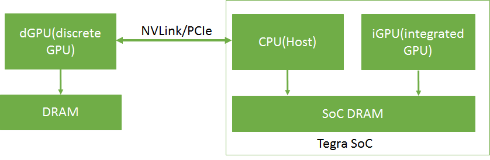
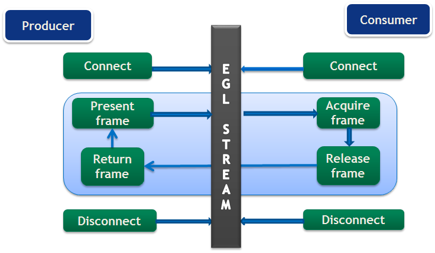
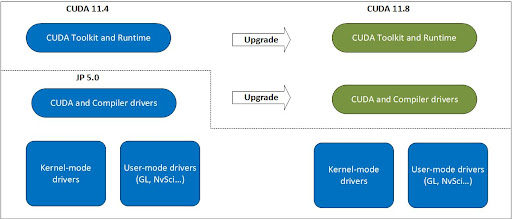
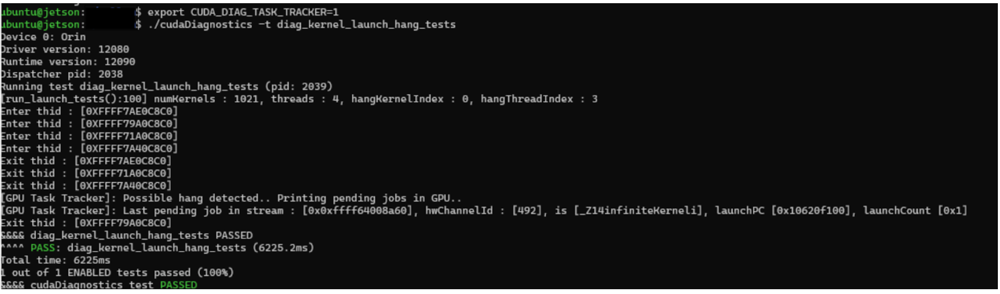
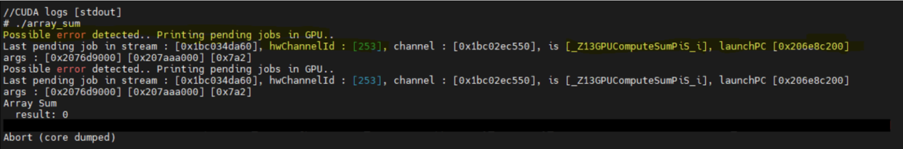
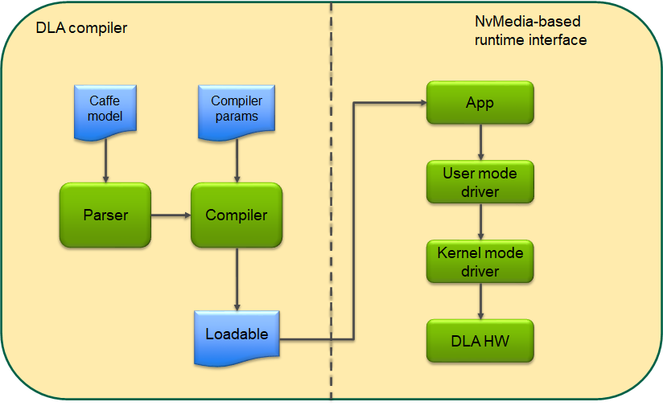
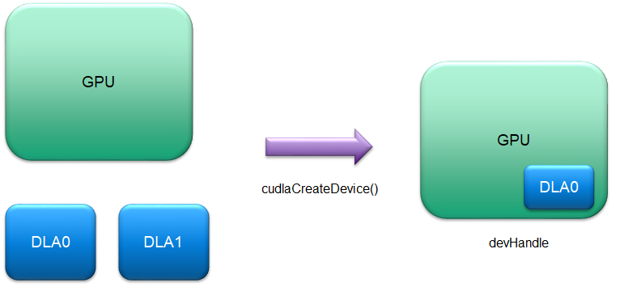
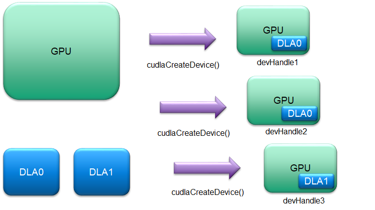
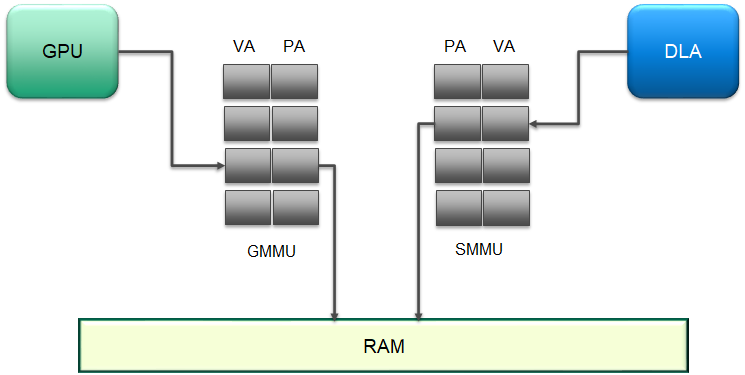
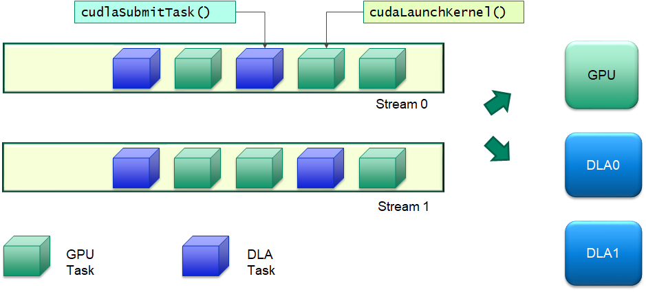

# 1. CUDA for Tegra — CUDA for Tegra 13.2 documentation

**来源**: [https://docs.nvidia.com/cuda/cuda-for-tegra-appnote/index.html](https://docs.nvidia.com/cuda/cuda-for-tegra-appnote/index.html)

---

# 1. CUDA for Tegra
This application note provides an overview of NVIDIA® Tegra® memory architecture and considerations for porting code from a discrete GPU (dGPU) attached to an x86 system to the Tegra® integrated GPU (iGPU). It also discusses EGL interoperability.

# 2. Overview
This document provides an overview of NVIDIA® Tegra® memory architecture and considerations for porting code from a discrete GPU (dGPU) attached to an x86 system to the Tegra® integrated GPU (iGPU). It also discusses EGL interoperability.
This guide is for developers who are already familiar with programming in CUDA®, and C/C++, and who want to develop applications for the Tegra® SoC.
Performance guidelines, best practices, terminology, and general information provided in the*CUDA C++ Programming Guide*and the*CUDA C++ Best Practices Guide*are applicable to all CUDA-capable GPU architectures, including Tegra® devices.
The*CUDA C++ Programming Guide*and the*CUDA C Best Practices Guide*are available at the following web sites:
*CUDA C++ Programming Guide:*
[https://docs.nvidia.com/cuda/cuda-c-programming-guide/index.html](https://docs.nvidia.com/cuda/cuda-c-programming-guide/index.html)
*CUDA C++ Best Practices Guide:*
[https://docs.nvidia.com/cuda/cuda-c-best-practices-guide/index.html](https://docs.nvidia.com/cuda/cuda-c-best-practices-guide/index.html)

# 3. Memory Management
In Tegra® devices, both the CPU (Host) and the iGPU share SoC DRAM memory. A dGPU with separate DRAM memory can be connected to the Tegra device over PCIe or NVLink. It is currently supported only on the NVIDIA DRIVE platform.
An overview of a dGPU-connected Tegra® memory system is shown inFigure 1.

[](https://docs.nvidia.com/cuda/cuda-for-tegra-appnote/_images/dGPU-connected-tegra-memory-system.png)

Figure 1dGPU-connected Tegra Memory System

In Tegra, device memory, host memory, and unified memory are allocated on the same physical SoC DRAM. On a dGPU, device memory is allocated on the
dGPU DRAM. The caching behavior in a Tegra system is different from that of an x86 system with a dGPU. The caching and accessing behavior of
different memory types in a Tegra system is shown inTable 1.

<div style="overflow-x: auto; max-width: 100%; border-radius: 6px;">
<table border="1" cellpadding="6" cellspacing="0" style="border-collapse: collapse; width: 100%; font-family: -apple-system, BlinkMacSystemFont, Segoe UI, Helvetica, Arial, sans-serif; font-size: 13px; margin: 16px 0;">
<caption>Table 1 Characteristics of Different Memory Types in a Tegra System</caption>
<colgroup>
<col style="width: 11%"/>
<col style="width: 31%"/>
<col style="width: 46%"/>
<col style="width: 13%"/>
</colgroup>
<thead>
<tr style="border: 1px solid #d0d7de;">
<th style="background-color: #f6f8fa; font-weight: 600; text-align: left; padding: 8px 12px; border: 1px solid #d0d7de;"><p><strong>Memory Type</strong></p></th>
<th style="background-color: #f6f8fa; font-weight: 600; text-align: left; padding: 8px 12px; border: 1px solid #d0d7de;"><p><strong>CPU</strong></p></th>
<th style="background-color: #f6f8fa; font-weight: 600; text-align: left; padding: 8px 12px; border: 1px solid #d0d7de;"><p><strong>iGPU</strong></p></th>
<th style="background-color: #f6f8fa; font-weight: 600; text-align: left; padding: 8px 12px; border: 1px solid #d0d7de;"><p><strong>Tegra-connected dGPU</strong></p></th>
</tr>
</thead>
<tbody>
<tr style="border: 1px solid #d0d7de;">
<td style="padding: 8px 12px; border: 1px solid #d0d7de; vertical-align: top;"><p>Device memory</p></td>
<td style="padding: 8px 12px; border: 1px solid #d0d7de; vertical-align: top;"><p>Not directly accessible</p></td>
<td style="padding: 8px 12px; border: 1px solid #d0d7de; vertical-align: top;"><p>Cached</p></td>
<td style="padding: 8px 12px; border: 1px solid #d0d7de; vertical-align: top;"><p>Cached</p></td>
</tr>
<tr style="border: 1px solid #d0d7de;">
<td style="padding: 8px 12px; border: 1px solid #d0d7de; vertical-align: top;"><p>Pageable host memory</p></td>
<td style="padding: 8px 12px; border: 1px solid #d0d7de; vertical-align: top;"><p>Cached</p></td>
<td style="padding: 8px 12px; border: 1px solid #d0d7de; vertical-align: top;"><p>Cached if cudaDeviceProp::pageableMemoryAccess is 1, else not directly accessible</p></td>
<td style="padding: 8px 12px; border: 1px solid #d0d7de; vertical-align: top;"><p>Not directly accessible</p></td>
</tr>
<tr style="border: 1px solid #d0d7de;">
<td style="padding: 8px 12px; border: 1px solid #d0d7de; vertical-align: top;"><p>Pinned host memory</p></td>
<td style="padding: 8px 12px; border: 1px solid #d0d7de; vertical-align: top;">
<ul class="simple">
<li><p>Uncached if Compute Capability &lt; 7.2</p></li>
<li><p>Cached if Compute Capability ≥ 7.2</p></li>
</ul>
</td>
<td style="padding: 8px 12px; border: 1px solid #d0d7de; vertical-align: top;"><p>Uncached</p></td>
<td style="padding: 8px 12px; border: 1px solid #d0d7de; vertical-align: top;"><p>Uncached</p></td>
</tr>
<tr style="border: 1px solid #d0d7de;">
<td style="padding: 8px 12px; border: 1px solid #d0d7de; vertical-align: top;"><p>Registered host memory</p></td>
<td style="padding: 8px 12px; border: 1px solid #d0d7de; vertical-align: top;"><p>Cached</p></td>
<td style="padding: 8px 12px; border: 1px solid #d0d7de; vertical-align: top;">
<ul class="simple">
<li><p>Uncached if device does <strong>not</strong> support sysmem full coherency</p></li>
<li><p>Cached if device <strong>does</strong> support sysmem full coherency</p></li>
<li><p>Supported only if Compute Capability ≥ 7.2</p></li>
</ul>
</td>
<td style="padding: 8px 12px; border: 1px solid #d0d7de; vertical-align: top;"><p>Uncached</p></td>
</tr>
<tr style="border: 1px solid #d0d7de;">
<td style="padding: 8px 12px; border: 1px solid #d0d7de; vertical-align: top;"><p>Unified memory</p></td>
<td style="padding: 8px 12px; border: 1px solid #d0d7de; vertical-align: top;"><p>Cached</p></td>
<td style="padding: 8px 12px; border: 1px solid #d0d7de; vertical-align: top;"><p>Cached if cudaDeviceProp::concurrentManagedAccess is 0, else decided by UVM driver (nvidia-uvm.ko)</p></td>
<td style="padding: 8px 12px; border: 1px solid #d0d7de; vertical-align: top;"><p>Not supported</p></td>
</tr>
</tbody>
</table>
</div>

On Tegra, because device memory, host memory, and unified memory are allocated on the same physical SoC DRAM, duplicate memory allocations and data transfers can be avoided.

## 3.1. I/O Coherency
I/O coherency (also known as one-way coherency) is a feature with which an I/O device such as a GPU can read the latest updates in CPU caches. It removes the need to perform CPU cache management operations when the same physical memory is shared between CPU and GPU. The GPU cache management operations still need to be performed because the coherency is one way. Please note that the CUDA driver internally performs the GPU cache management operations when managed memory or interop memory is used.
I/O coherency is supported on Tegra devices starting with Xavier SOC. Applications should realize benefits from this HW feature without needing to make changes to the application’s code (see point 2 below).
The following functionalities depend on I/O coherency support:
1. `cudaHostRegister()`/`cuMemHostRegister()`is supported only on platforms which are I/O coherent. The host register support can be queried using the device attribute[cudaDevAttrHostRegisterSupported](https://docs.nvidia.com/cuda/cuda-runtime-api/group__CUDART__TYPES.html#group__CUDART__TYPES_1gg49e2f8c2c0bd6fe264f2fc970912e5cd6ea4a004a336c3c95b6ff06ec6269e29)/ CU_DEVICE_ATTRIBUTE_HOST_REGISTER_SUPPORTED.
2. CPU cache for pinned memory allocated using`cudaMallocHost()`/`cuMemHostAlloc()`/`cuMemAllocHost()`is enabled only on platforms which are I/O coherent.

## 3.2. Sysmem Full Coherency
Sysmem Full Coherency (also known as Full Coherency or two-way coherency) is an extension to I/O coherency where additionally the CPU can also read the latest updates in the GPU’s cache. It removes the need to perform both CPU and GPU cache management operations when the same physical memory is shared between CPU and GPU, and cached on both.
Since both the CPU and iGPU can cache this memory, it becomes well suited for workloads that benefit from GPU L2 caching and simultaneous access by the CPU or other SoC engines. However, it is important to note that Fully Coherent memory may involve hardware limitations and coherence related overhead. Therefore, it is crucial to analyze the CPU and GPU access patterns or benchmark with and without Full Coherency to determine if the performance benefits outweigh the costs.
Full Coherency is supported on Tegra devices starting with Thor SoC.
The following functionality makes use of Full Coherency where it is supported by the Device:
1. GPU L2 caching is enabled for`cudaHostRegister()`/`cuMemHostRegister()`only on platforms which support sysmem full coherency. However, if the flags for this call specify that the memory is to be treated a some memory-mapped I/O space using`cudaHostRegisterIoMemory`/`CU_MEMHOSTREGISTER_IOMEMORY`, then the GPU L2 caching is not enabled.
2. On platforms that have`cudaDeviceProp::pageableMemoryAccess`as 1 for the iGPU device, GPU L2 caching is enabled for system allocations created via mmap() or malloc() that can be accessed directly on the GPU without calling any CUDA APIs to register memory.
3. On platforms that have`cudaDeviceProp::concurrentManagedAccess`as 1 for the iGPU device, the UVM driver (nvidia-uvm.ko) can decide to enable GPU L2 caching with full coherency for allocations created with`cudaMallocManaged()`with certain hints. However, on these platforms, the UVM driver currently only selects IO coherency and does not provide a way to use Full coherency.

## 3.3. Estimating Total Allocatable Device Memory on an Integrated GPU Device
The`cudaMemGetInfo()`API returns the snapshot of free and total amount of memory available for allocation for the GPU. The free memory could change if any other client allocate memory.
The discrete GPU has the dedicated DRAM called VIDMEM which is separate from CPU memory. The snapshot of free memory in discrete GPU is returned by the`cudaMemGetInfo`API.
The integrated GPU, on Tegra SoC, shares the DRAM with CPU and other the Tegra engines. The CPU can control the contents of DRAM and free DRAM memory by moving the contents of DMAR to SWAP area or vice versa. The`cudaMemGetInfo`API currently does not account for SWAP memory area. The`cudaMemGetInfo`API may return a smaller size than the actually allocatable memory since the CPU may be able to free up some DRAM region by moving pages to the SWAP area. In order to estimate the amount of allocatable device memory, CUDA application developers should consider following:
**On Linux and Android platforms:**Device allocatable memory on Linux and Android depends mainly on the total and free sizes of swap space and main memory. The following points can help users to estimate the total amount of device allocatable memory in various situations:
- Host allocated memory = Total used physical memory – Device allocated memory
- If (Host allocated memory < Free Swap Space) then Device allocatable memory = Total Physical Memory – already allocated device memory
- If (Host allocated memory > Free Swap Space) then Device allocatable memory = Total Physical Memory – (Host allocated memory - Free swap space)
Here,
- Device allocated memory is memory already allocated on the device. It can be obtained from the`NvMapMemUsed`field in`/proc/meminfo`or from the`total`field of`/sys/kernel/debug/nvmap/iovmm/clients`.
- Total used physical memory can be obtained using the`free -m`command. The`used`field in row`Mem`represents this information.
- Total Physical memory is obtained from the`MemTotal`field in`/proc/meminfo`.
- Free swap space can be find by using the`free -m`command. The`free`field in the`Swap`row represents this information.
- If the`free`command is not available, the same information can be obtained from`/proc/meminfo`as:
  - Total Used physical memory =`MemTotal`–`MemFree`
  - Free swap space =`SwapFree`
**On QNX platforms:**QNX does not use swap space, hence,`cudaMemGetInfo.free`will be a fair estimate of allocatable device memory as there is no swap space to move memory pages to swap area.

# 4. Porting Considerations
CUDA applications originally developed for dGPUs attached to x86 systems may require modifications to perform efficiently on Tegra systems. This section describes the considerations for porting such applications to a Tegra system, such as selecting an appropriate memory buffer type (pinned memory, unified memory, and others) and selecting between iGPU and dGPU, to achieve efficient performance for the application.

## 4.1. Memory Selection
CUDA applications can use various kinds of memory buffers, such as device memory, pageable host memory, pinned memory, and unified memory. Even though these memory buffer types are allocated on the same physical device, each has different accessing and caching behaviors, as shown inTable 1. It is important to select the most appropriate memory buffer type for efficient application execution.
Device Memory
Use device memory for buffers whose accessibility is limited to the iGPU. For example, in an application with multiple kernels, there may be buffers that are used only by the intermediate kernels of the application as input or output. These buffers are accessed only by the iGPU. Such buffers should be allocated with device memory.
Pinned Memory
Tegra systems with different compute capabilities exhibit different behavior in terms of I/O coherency. For example, Tegra systems with compute capability greater than or equal to 7.2 are I/O coherent and others are not I/O coherent. On Tegra systems with I/O coherency, the CPU access time of pinned memory is as good as pageable host memory because it is cached on the CPU. However, on Tegra systems without I/O coherency, the CPU access time of pinned memory is higher, because it is not cached on the CPU.
Pinned memory is recommended for small buffers because the caching effect is negligible for such buffers and also because pinned memory does not involve any additional overhead, unlike Unified Memory. With no additional overhead, pinned memory is also preferable for large buffers if the access pattern is not cache friendly on iGPU. For large buffers, when the buffer is accessed only once on iGPU in a coalescing manner, performance on iGPU can be as good as unified memory on iGPU.
Registered Host Memory
System-allocated memory, allocated with malloc(), mmap(), or similar functions, can be registered for GPU usage in CUDA using`cudaHostRegister()/cuMemHostRegister()`. Once registered for device use, it behaves similarly to pinned memory on Tegra systems that do not support Sysmem Full Coherency.
On Tegra systems that support Sysmem Full Coherency, starting with the Thor SoC, registered host memory is also cached in the iGPU’s L2 cache (unless the`cudaHostRegisterIoMemory`or`CU_MEMHOSTREGISTER_IOMEMORY`flag is specified). Refer toSysmem Full Coherencyfor guidelines on when to use Sysmem Full Coherent memory.
Pageable Host Memory
On platforms where`cudaDeviceProp::pageableMemoryAccess`is 0, use pageable host memory for buffers whose accessibility is limited to the CPU.
On platforms where`cudaDeviceProp::pageableMemoryAccess`is 1, which is only possible from Thor SoC onwards that also has the Sysmem Full Coherency feature, this memory is also directly accessible on the GPU and also cached in iGPU’s L2 cache.
This feature is only supported on Thor or later Tegra devices running L4T.
Refer toSysmem Full Coherencyfor guidelines on when to use Sysmem Full Coherent memory.
Unified Memory where cudaDeviceProp::concurrentManagedAccess is 1
The`cudaDeviceProp::concurrentManagedAccess`can be 1 only on Thor or later Tegra devices running L4T, as it is only supported there. The UVM driver (nvidia-uvm.ko) is enabled there.
For unified memory the physical pages are not mapped after alloc. GPU and CPU page faults can be handled as they come and the UVM driver can select various configs regarding caching and coherency when mapping, based on`cudaMemAdvise()`hints.
Currently, the UVM driver only selects GPU uncached and IO coherent mappings, so once mapped it behaves same as Pinned memory.
Unified Memory where cudaDeviceProp::concurrentManagedAccess is 0
Unified memory is cached on the iGPU and the CPU. On Tegra, using unified memory in applications requires additional coherency and cache maintenance operations during the kernel launch, synchronization and prefetching hint calls. This coherency maintenance overhead is slightly higher on a Tegra system with compute capability less than 7.2 as they lack I/O coherency.
On Tegra devices with I/O coherency (with a compute capability of 7.2 or greater) where unified memory is cached on both CPU and iGPU, for large buffers which are frequently accessed by the iGPU and the CPU and*the accesses on iGPU are repetitive*, unified memory is preferable since repetitive accesses can offset the cache maintenance cost. On Tegra devices without I/O coherency (with a compute capability of less than 7.2), for large buffers which are frequently accessed by the CPU and the iGPU and*the accesses on iGPU are not repetitive*, unified memory is still preferable over pinned memory because pinned memory is not cached on both CPU and iGPU. That way, the application can take advantage of unified memory caching on the CPU.
On Tegra devices with Sysmem Full Coherency, Host Registered memory or Pageable Host memory directly used on GPU that make use of this feature can outperform both Pinned memory or Unified memory.
Pinned memory, Host Registered memory, or Unified memory can all help reduce data transfer overhead between the CPU and iGPU, as each type is directly accessible by both. In an application, input and output buffers that need to be shared between the host and the iGPU can be allocated using any of these memory types.

Note
Applicable only if`cudaDeviceProp::concurrentManagedAccess`is 0, the unified memory model requires the driver and system software to manage coherence on the current Tegra SOC. Software managed coherence is by nature non-deterministic and not recommended in a safe context. Zero-copy memory (pinned memory) is preferable in these applications.

Evaluate the impact of sysmem full coherency overheads, overheads in case of unified memory with no concurrent access, pinned memory absence of GPU caching, and device memory data transfers in applications to determine the preferred memory selection.

## 4.2. Pinned Memory Guidelines on Tegra Systems with no I/O coherency
This section provides guidelines for porting applications that use pinned memory allocations in x86 systems with dGPUs to Tegra. CUDA applications developed for a dGPU attached to x86 system use pinned memory to reduce data transfer time and to overlap data transfers with kernel execution time. For specific information on this topic, see “Data Transfer Between Host and Device” and “Asynchronous and Overlapping Transfers with Computation” at the following websites.
“Data Transfer Between Host and Device”:
[https://docs.nvidia.com/cuda/cuda-c-best-practices-guide/index.html#data-transfer-between-host-and-device](https://docs.nvidia.com/cuda/cuda-c-best-practices-guide/index.html#data-transfer-between-host-and-device)
“Asynchronous and Overlapping Transfers with Computation”:
[https://docs.nvidia.com/cuda/cuda-c-best-practices-guide/index.html#asynchronous-transfers-and-overlapping-transfers-with-computation](https://docs.nvidia.com/cuda/cuda-c-best-practices-guide/index.html#asynchronous-transfers-and-overlapping-transfers-with-computation)
On Tegra systems with no I/O coherency, repetitive access of pinned memory degrades application performance, because pinned memory is not cached on the CPU in such systems.
A sample application is shown below in which a set of filters and operations (k1, k2, and k3) are applied to an image. Pinned memory is allocated to reduce data transfer time on an x86 system with a dGPU, increasing the overall application speed. However, targeting a Tegra device with the same code causes a drastic increase in the execution time of the`readImage()`function because it repeatedly accesses an uncached buffer. This increases the overall application time. If the time taken by`readImage()`is significantly higher compared to kernels execution time, it is recommended to use unified memory to reduce the`readImage()`time. Otherwise, evaluate the application with pinned memory and unified memory by removing unnecessary data transfer calls to decide best suited memory.

```
// Sample code for an x86 system with a discrete GPU
int main()
{
    int *h_a,*d_a,*d_b,*d_c,*d_d,*h_d;
    int height = 1024;
    int width = 1024;
    size_t sizeOfImage = width * height * sizeof(int); // 4MB image

    //Pinned memory allocated to reduce data transfer time
    cudaMallocHost(h_a, sizeOfImage);
    cudaMallocHost(h_d, sizeOfImage);

    //Allocate buffers on GPU
    cudaMalloc(&d_a, sizeOfImage);
    cudaMalloc(&d_b, sizeOfImage);
    cudaMalloc(&d_c, sizeOfImage);
    cudaMalloc(&d_d, sizeOfImage);

    //CPU reads Image;
    readImage(h_a); // Intialize the h_a buffer

    // Transfer image to GPU
    cudaMemcpy(d_a, h_a, sizeOfImage, cudaMemcpyHostToDevice);

    // Data transfer is fast as we used pinned memory
    // ----- CUDA Application pipeline start ----
    k1<<<..>>>(d_a,d_b) // Apply filter 1
    k2<<<..>>>(d_b,d_c)// Apply filter 2
    k3<<<..>>>(d_c,d_d)// Some operation on image data
    // ----- CUDA Application pipeline end ----

    // Transfer processed image to CPU
    cudaMemcpy(h_d, d_d, sizeOfImage, cudaMemcpyDeviceToHost);
    // Data transfer is fast as we used pinned memory

    // Use processed Image i.e h_d in later computations on CPU.
    UseImageonCPU(h_d);
}

// Porting the code on Tegra
int main()
{
    int *h_a,*d_b,*d_c,*h_d;
    int height = 1024;
    int width = 1024;
    size_t sizeOfImage = width * height * sizeof(int); // 4MB image

    //Unified memory allocated for input and output
    //buffer of application pipeline
    cudaMallocManaged(h_a, sizeOfImage,cudaMemAttachHost);
    cudaMallocManaged(h_d, sizeOfImage);

    //Intermediate buffers not needed on CPU side.
    //So allocate them on device memory
    cudaMalloc(&d_b, sizeOfImage);
    cudaMalloc(&d_c, sizeOfImage);

    //CPU reads Image;
    readImage (h_a); // Intialize the h_a buffer
    // ----- CUDA Application pipeline start ----
    // Prefetch input image data to GPU
    cudaStreamAttachMemAsync(NULL, h_a, 0, cudaMemAttachGlobal);
    k1<<<..>>>(h_a,d_b)
    k2<<<..>>>(d_b,d_c)
    k3<<<..>>>(d_c,h_d)
    // Prefetch output image data to CPU
    cudaStreamAttachMemAsync(NULL, h_d, 0, cudaMemAttachHost);
    cudaStreamSynchronize(NULL);
    // ----- CUDA Application pipeline end ----

    // Use processed Image i.e h_d on CPU side.
    UseImageonCPU(h_d);
}

```

The`cudaHostRegister()`function
The`cudaHostRegister()`function is not supported on Tegra devices with compute capability less than 7.2, because those devices do not have I/O coherency. Use other pinned memory allocation functions such as`cudaMallocHost()`and`cudaHostAlloc()`if`cudaHostRegister()`is not supported on the device.
GNU Atomic operations on pinned memory
The GNU atomic operations on uncached memory is not supported on Tegra CPU. As pinned memory is not cached on Tegra devices with compute capability less than 7.2, GNU atomic operations is not supported on pinned memory.

## 4.3. Effective Usage of Unified Memory on Tegra

### 4.3.1. Unified memory where cudaDeviceProp::concurrentManagedAccess is 0
Using unified memory in applications requires additional coherency and cache maintenance operations at kernel launch, synchronization, and prefetching hint calls. These operations are performed synchronously with other GPU work which can cause unpredictable latencies in the application.
The performance of unified memory on Tegra can be improved by providing data prefetching hints. The driver can use these prefetching hints to optimize the coherence operations. To prefetch the data, the`cudaStreamAttachMemAsync()`function can be used, in addition to the techniques described in the “Coherency and Concurrency” section of the*CUDA C Programming Guide*at the following link:
[https://docs.nvidia.com/cuda/cuda-c-programming-guide/index.html#um-coherency-hd](https://docs.nvidia.com/cuda/cuda-c-programming-guide/index.html#um-coherency-hd)
to prefetch the data. The prefetching behavior of unified memory, as triggered by the changing states of the attachment flag, is shown inTable 2.

<div style="overflow-x: auto; max-width: 100%; border-radius: 6px;">
<table border="1" cellpadding="6" cellspacing="0" style="border-collapse: collapse; width: 100%; font-family: -apple-system, BlinkMacSystemFont, Segoe UI, Helvetica, Arial, sans-serif; font-size: 13px; margin: 16px 0;">
<caption>Table 2 Unified Memory Prefetching Behavior per Changing Attachment Flag States</caption>
<colgroup>
<col style="width: 46%"/>
<col style="width: 26%"/>
<col style="width: 29%"/>
</colgroup>
<tbody>
<tr style="border: 1px solid #d0d7de;">
<td style="padding: 8px 12px; border: 1px solid #d0d7de; vertical-align: top;"><p><strong>Previous Flag</strong></p></td>
<td style="padding: 8px 12px; border: 1px solid #d0d7de; vertical-align: top;"><p><strong>Current Flag</strong></p></td>
<td style="padding: 8px 12px; border: 1px solid #d0d7de; vertical-align: top;"><p><strong>Prefetching Behavior</strong></p></td>
</tr>
<tr style="border: 1px solid #d0d7de;">
<td style="padding: 8px 12px; border: 1px solid #d0d7de; vertical-align: top;"><p>cudaMemAttachGlobal/cudaMemAttachSingle</p></td>
<td style="padding: 8px 12px; border: 1px solid #d0d7de; vertical-align: top;"><p>cudaMemAttachHost</p></td>
<td style="padding: 8px 12px; border: 1px solid #d0d7de; vertical-align: top;"><p>Causes prefetch to CPU</p></td>
</tr>
<tr style="border: 1px solid #d0d7de;">
<td style="padding: 8px 12px; border: 1px solid #d0d7de; vertical-align: top;"><p>cudaMemAttachHost</p></td>
<td style="padding: 8px 12px; border: 1px solid #d0d7de; vertical-align: top;">
<p>cudaMemAttachGlobal/</p>
<p>cudaMemAttachSingle</p>
</td>
<td style="padding: 8px 12px; border: 1px solid #d0d7de; vertical-align: top;"><p>Causes prefetch to GPU</p></td>
</tr>
<tr style="border: 1px solid #d0d7de;">
<td style="padding: 8px 12px; border: 1px solid #d0d7de; vertical-align: top;"><p>cudaMemAttachGlobal</p></td>
<td style="padding: 8px 12px; border: 1px solid #d0d7de; vertical-align: top;"><p>cudaMemAttachSingle</p></td>
<td style="padding: 8px 12px; border: 1px solid #d0d7de; vertical-align: top;"><p>No prefetch to GPU</p></td>
</tr>
<tr style="border: 1px solid #d0d7de;">
<td style="padding: 8px 12px; border: 1px solid #d0d7de; vertical-align: top;"><p>cudaMemAttachSingle</p></td>
<td style="padding: 8px 12px; border: 1px solid #d0d7de; vertical-align: top;"><p>cudaMemAttachGlobal</p></td>
<td style="padding: 8px 12px; border: 1px solid #d0d7de; vertical-align: top;"><p>No prefetch to GPU</p></td>
</tr>
</tbody>
</table>
</div>

The following example shows usage of`cudaStreamAttachMemAsync()`to prefetch data.

Note
However, not supported on Tegra devices where`cudaDeviceProp::concurrentManagedAccess`is 0, are the data prefetching techniques that use`cudaMemPrefetchAsync()`as described in the “Performance Tuning” section of the*CUDA C++ Programming Guide*at the following web site:
[https://docs.nvidia.com/cuda/cuda-c-programming-guide/index.html#um-performance-tuning](https://docs.nvidia.com/cuda/cuda-c-programming-guide/index.html#um-performance-tuning)

Note
There are limitations in QNX system software which prevent implementation of all UVM optimizations. Because of this, using`cudaStreamAttachMemAsync()`to prefetch hints on QNX does not benefit performance.

```
__global__ void matrixMul(int *p, int *q, int*r, int hp, int hq, int wp, int wq)
{
// Matrix multiplication kernel code
}
void MatrixMul(int hp, int hq, int wp, int wq)
{
    int *p,*q,*r;
    int i;
    size_t sizeP = hp*wp*sizeof(int);
    size_t sizeQ = hq*wq*sizeof(int);
    size_t sizeR = hp*wq*sizeof(int);

    //Attach buffers 'p' and 'q' to CPU and buffer 'r' to GPU
    cudaMallocManaged(&p, sizeP, cudaMemAttachHost);
    cudaMallocManaged(&q, sizeQ, cudaMemAttachHost);
    cudaMallocManaged(&r, sizeR);
    //Intialize with random values
    randFill(p,q,hp,wp,hq,wq);

    // Prefetch p,q to GPU as they are needed in computation
    cudaStreamAttachMemAsync(NULL, p, 0, cudaMemAttachGlobal);
    cudaStreamAttachMemAsync(NULL, q, 0, cudaMemAttachGlobal);
    matrixMul<<<....>>>(p,q,r, hp,hq,wp,wq);

    // Prefetch 'r' to CPU as only 'r' is needed
    cudaStreamAttachMemAsync(NULL, r, 0, cudaMemAttachHost);
    cudaStreamSynchronize(NULL);

    // Print buffer 'r' values
    for(i = 0; i < hp*wq; i++)
    printf("%d ", r[i]);
}

```

Note
An additional`cudaStreamSynchronize(NULL)`call can be added after the`matrixMul`kernel code to avoid callback threads that cause unpredictability in a`cudaStreamAttachMemAsync()`call.

### 4.3.2. Unified memory where cudaDeviceProp::concurrentManagedAccess is 1
This feature is only supported on Thor or later Tegra devices running L4T.
The UVM driver can choose various caching and coherency options with Unified memory.
Currently, it only chooses GPU uncached with IO coherency. However, after allocation the physical pages might not be mapped by default so they will only get populated on CPU or GPU faults.`cudaMemPrefetchAsync()`can be called to ensure that these pages get populated and avoid faults.
The`cudaStreamAttachMemAsync()`based prefetch that is applicable where`cudaDeviceProp::concurrentManagedAccess`is 0, is not applicable here.

## 4.4. GPU Selection
On a Tegra system with a dGPU, deciding whether a CUDA application runs on the iGPU or the dGPU can have implications for the performance of the application. Some of the factors that need to be considered while making such a decision are kernel execution time, data transfer time, data locality, and latency. For example, to run an application on a dGPU, data must be transferred between the SoC and the dGPU. This data transfer can be avoided if the application runs on an iGPU.

## 4.5. Synchronization Mechanism Selection
The`cudaSetDeviceFlags`API is used to control the synchronization behaviour of CPU thread. Until CUDA 10.1, by default, the synchronization mechanism on iGPU uses[cudaDeviceBlockingSync](https://docs.nvidia.com/cuda/cuda-runtime-api/group__CUDART__TYPES.html#group__CUDART__TYPES_1g130ddae663f1873258fee5a6e0808b71)flag, which blocks the CPU thread on a synchronization primitive when waiting for the device to finish work. The[cudaDeviceBlockingSync](https://docs.nvidia.com/cuda/cuda-runtime-api/group__CUDART__TYPES.html#group__CUDART__TYPES_1g130ddae663f1873258fee5a6e0808b71)flag is suited for platforms with power constraints. But on platforms which requires low latency,[cudaDeviceScheduleSpin](https://docs.nvidia.com/cuda/cuda-runtime-api/group__CUDART__TYPES.html#group__CUDART__TYPES_1gf01347c3dafebf07e1a0b4321a030a63)flag needs to set manually. Since CUDA 10.1, for each platform, the default synchronization flag is determined based on what is optimized for that platform. More information about the synchronization flags is given at[cudaSetDeviceFlags](https://docs.nvidia.com/cuda/cuda-runtime-api/group__CUDART__DEVICE.html#group__CUDART__DEVICE_1g69e73c7dda3fc05306ae7c811a690fac)API documentation.

## 4.6. Multi-Process Service (MPS)
MPS has long been supported for dGPUs attached to x86 systems. This capability is now available on Tegra platforms: Linux
starting with CUDA 12.5 and QNX starting with CUDA 12.8. For details,
see[Multi-Process Service (MPS)](https://docs.nvidia.com/deploy/mps/index.html). For platform constraints,
see[Limitations](https://docs.nvidia.com/deploy/mps/index.html#limitations).

## 4.7. CUDA Features Not Supported on Tegra
All core features of CUDA are supported on Tegra platforms. The exceptions are listed below.
- The`cudaHostRegister()`function is not supported on QNX systems. This is due to the limitations on QNX OS. It is supported in Linux systems with compute capability greater than or equal to 7.2.
- System wide atomics are not supported on Tegra devices with compute capability less than 7.2.
- Unified memory is not supported on dGPU attached to Tegra.
- `cudaMemPrefetchAsync()`function is not supported if`cudaDeviceProp::concurrentManagedAccess`is 0, which is the case on some Tegra platforms.
- NVIDIA management library (NVML) library is only supported on Thor or later Tegra devices running L4T. Where this is not supported, as an alternative to monitor the resource utilization,`tegrastats`can be used.
- Since CUDA 11.5, events-sharing IPC APIs have been supported on L4T and embedded Linux Tegra devices with compute capability 7.x and higher.
  Starting CUDA 13.0, memory-sharing CUDA IPC APIs would be supported on Tegra platforms with open-source GPU driver (i.e. Jetson Thor and beyond) GPU drivers. For all other Tegra platforms, EGLStream, NvSci, or the`cuMemExportToShareableHandle()`/`cuMemImportFromShareableHandle()`APIs can be used to communicate between CUDA contexts in two processes.
- Remote direct memory access (RDMA) is supported only on Tegra devices running L4T or embedded-linux.
- JIT compilation might require a considerable amount of CPU and bandwidth resources, potentially interfering with other workloads in the system. Thus, JIT compilations such as PTX-JIT and NVRTC JIT are not recommended for deterministic embedded applications and can be bypassed completely by compiling for specific GPU targets. For example: If you are compiling for SM version 87, use this nvcc flag`--generate-code arch=compute_87,code=sm_87`to create a CUDA binary for this device. This avoids JIT compilation during the first run and improves the runtime performance.
  JIT compilation is not supported on Tegra devices in the safe context.
- Peer to peer (P2P) communication calls are not supported on Tegra.
- The cuSOLVER library is not supported on Tegra systems running QNX.
- The nvGRAPH library is not supported.
- [CUB](https://nvlabs.github.io/cub/)is experimental on Tegra products.
More information on some of these features can be found at the following web sites:
IPC:
[https://docs.nvidia.com/cuda/cuda-c-programming-guide/index.html#interprocess-communication](https://docs.nvidia.com/cuda/cuda-c-programming-guide/index.html#interprocess-communication)
NVSCI:
[https://docs.nvidia.com/cuda/cuda-c-programming-guide/index.html#nvidia-softwarcommunication-interface-interoperability-nvsci](https://docs.nvidia.com/cuda/cuda-c-programming-guide/index.html#nvidia-softwarcommunication-interface-interoperability-nvsci)
RDMA:
[https://docs.nvidia.com/cuda/gpudirect-rdma/index.html](https://docs.nvidia.com/cuda/gpudirect-rdma/index.html)
P2P:
[https://docs.nvidia.com/cuda/cuda-c-programming-guide/index.html#peer-to-peer-memory-access](https://docs.nvidia.com/cuda/cuda-c-programming-guide/index.html#peer-to-peer-memory-access)

# 5. EGL Interoperability
An interop is an efficient mechanism to share resources between two APIs. To share data with multiple APIs, an API must implement an individual interop for each.
EGL provides interop extensions that allow it to function as a hub connecting APIs, removing the need for multiple interops, and encapsulating the shared resource. An API must implement these extensions to interoperate with any other API via EGL. The CUDA supported EGL interops are EGLStream, EGLImage, and EGLSync.
EGL interop extensions allow applications to switch between APIs without the need to rewrite code. For example, an EGLStream-based application in which NvMedia is the producer and CUDA is the consumer can be modified to use OpenGL as the consumer without modifying the producer code.

Note
On the DRIVE OS platform, NVSCI is provided as an alternative to EGL interoperability for safety critical applications. Please refer to[NVSCI](https://docs.nvidia.com/cuda/cuda-c-programming-guide/index.html#nvidia-softwarcommunication-interface-interoperability-nvsci)for more details.

## 5.1. EGLStream
EGLStream interoperability facilitates efficient transfer of a sequence of frames from one API to another API, allowing use of multiple Tegra® engines such as CPU, GPU, ISP, and others.
Consider an application where a camera captures images continuously, shares them with CUDA for processing, and then later renders those images using OpenGL. In this application, the image frames are shared across NvMedia, CUDA and OpenGL. The absence of EGLStream interoperability would require the application to include multiple interops and redundant data transfers between APIs. EGLStream has one producer and one consumer.
EGLStream offers the following benefits:
- Efficient transfer of frames between a producer and a consumer.
- Implicit synchronization handling.
- Cross-process support.
- dGPU and iGPU support.
- Linux, QNX, and Android operating system support.

### 5.1.1. EGLStream Flow
The EGLStream flow has the following steps:
1. Initialize producer and consumer APIs
2. Create an EGLStream and connect the consumer and the producer.
  
  Note
  EGLStream is created using`eglCreateStreamKHR()`and destroyed using`eglDestroyStreamKHR()`.
  The consumer should always connect to EGLStream before the producer.
  
  For more information see the EGLStream specification at the following web site:[https://www.khronos.org/registry/EGL/extensions/KHR/EGL_KHR_stream.txt](https://www.khronos.org/registry/EGL/extensions/KHR/EGL_KHR_stream.txt)
3. Allocate memory used for EGL frames.
4. The producer populates an EGL frame and presents it to EGLStream.
5. The consumer acquires the frame from EGLStream and releases it back to EGLStream after processing.
6. The producer collects the consumer-released frame from EGLStream.
7. The producer presents the same frame, or a new frame to EGLStream.
8. Steps 4-7 are repeated until completion of the task, with an old frame or a new frame.
9. The consumer and the producer disconnect from EGLStream.
10. Deallocate the memory used for EGL frames.
11. De-initialize the producer and consumer APIs.
EGLStream application flow is shown inFigure 2.

[](https://docs.nvidia.com/cuda/cuda-for-tegra-appnote/_images/eglstream-flow.png)

Figure 2EGLStream Flow

CUDA producer and consumer functions are listed inTable 3.

<div style="overflow-x: auto; max-width: 100%; border-radius: 6px;">
<table border="1" cellpadding="6" cellspacing="0" style="border-collapse: collapse; width: 100%; font-family: -apple-system, BlinkMacSystemFont, Segoe UI, Helvetica, Arial, sans-serif; font-size: 13px; margin: 16px 0;">
<caption>Table 3 CUDA Producer and Consumer Functions</caption>
<colgroup>
<col style="width: 10%"/>
<col style="width: 16%"/>
<col style="width: 74%"/>
</colgroup>
<tbody>
<tr style="border: 1px solid #d0d7de;">
<td style="padding: 8px 12px; border: 1px solid #d0d7de; vertical-align: top;"><p><strong>Role</strong></p></td>
<td style="padding: 8px 12px; border: 1px solid #d0d7de; vertical-align: top;"><p><strong>Functionality</strong></p></td>
<td style="padding: 8px 12px; border: 1px solid #d0d7de; vertical-align: top;"><p><strong>API</strong></p></td>
</tr>
<tr style="border: 1px solid #d0d7de;">
<td style="padding: 8px 12px; border: 1px solid #d0d7de; vertical-align: top;"><p>Producer</p></td>
<td style="padding: 8px 12px; border: 1px solid #d0d7de; vertical-align: top;"><p>To connect a producer to EGLStream</p></td>
<td style="padding: 8px 12px; border: 1px solid #d0d7de; vertical-align: top;">
<p><a class="reference external" href="https://docs.nvidia.com/cuda/cuda-driver-api/group__CUDA__EGL.html#group__CUDA__EGL_1g5d181803d994a06f1bf9b05f52757bef">cuEGLStreamProducerConnect()</a></p>
<p><a class="reference external" href="https://docs.nvidia.com/cuda/cuda-driver-api/group__CUDA__EGL.html#group__CUDA__EGL_1g5d181803d994a06f1bf9b05f52757bef">cudaEGLStreamProducerConnect()</a></p>
</td>
</tr>
<tr style="border: 1px solid #d0d7de;">
<td style="padding: 8px 12px; border: 1px solid #d0d7de; vertical-align: top;"></td>
<td style="padding: 8px 12px; border: 1px solid #d0d7de; vertical-align: top;"><p>To present frame to EGLStream</p></td>
<td style="padding: 8px 12px; border: 1px solid #d0d7de; vertical-align: top;">
<p>cuEGLStreamProducerPresentFrame()</p>
<p>cudaEGLStreamProducerPresentFrame()</p>
</td>
</tr>
<tr style="border: 1px solid #d0d7de;">
<td style="padding: 8px 12px; border: 1px solid #d0d7de; vertical-align: top;"></td>
<td style="padding: 8px 12px; border: 1px solid #d0d7de; vertical-align: top;"><p>Obtain released frames</p></td>
<td style="padding: 8px 12px; border: 1px solid #d0d7de; vertical-align: top;">
<p>cuEGLStreamProducerReturnFrame()</p>
<p>cudaEGLStreamProducerReturnFrame()</p>
</td>
</tr>
<tr style="border: 1px solid #d0d7de;">
<td style="padding: 8px 12px; border: 1px solid #d0d7de; vertical-align: top;"></td>
<td style="padding: 8px 12px; border: 1px solid #d0d7de; vertical-align: top;"><p>To disconnect from EGLStream</p></td>
<td style="padding: 8px 12px; border: 1px solid #d0d7de; vertical-align: top;">
<p><a class="reference external" href="https://docs.nvidia.com/cuda/cuda-driver-api/group__CUDA__EGL.html#group__CUDA__EGL_1gbdc9664bfb17dd3fa1e0a3ca68a8cafd">cuEGLStreamProducerDisconnect()</a></p>
<p><a class="reference external" href="https://docs.nvidia.com/cuda/cuda-driver-api/group__CUDA__EGL.html#group__CUDA__EGL_1gbdc9664bfb17dd3fa1e0a3ca68a8cafd">cudaEGLStreamProducerDisconnect()</a></p>
</td>
</tr>
<tr style="border: 1px solid #d0d7de;">
<td style="padding: 8px 12px; border: 1px solid #d0d7de; vertical-align: top;"><p>Consumer</p></td>
<td style="padding: 8px 12px; border: 1px solid #d0d7de; vertical-align: top;"><p>To connect a consumer to EGLStream</p></td>
<td style="padding: 8px 12px; border: 1px solid #d0d7de; vertical-align: top;">
<p>cuEGLStreamConsumerConnect()</p>
<p>cuEGLStreamConsumeConnectWithFlags()</p>
<p><a class="reference external" href="https://docs.nvidia.com/cuda/cuda-runtime-api/group__CUDART__EGL.html#group__CUDART__EGL_1g7993b0e3802420547e3f403549be65a1">cudaEGLStreamConsumerConnect()</a></p>
<p>cudaEGLStreamConsumerConnectWithFlags()</p>
</td>
</tr>
<tr style="border: 1px solid #d0d7de;">
<td style="padding: 8px 12px; border: 1px solid #d0d7de; vertical-align: top;"></td>
<td style="padding: 8px 12px; border: 1px solid #d0d7de; vertical-align: top;"><p>To acquire frame from EGLStream</p></td>
<td style="padding: 8px 12px; border: 1px solid #d0d7de; vertical-align: top;">
<p>cuEGLStreamConsumerAcquireFrame()</p>
<p><a class="reference external" href="https://docs.nvidia.com/cuda/cuda-runtime-api/group__CUDART__EGL.html#group__CUDART__EGL_1g83dd1bfea48c093d3f0b247754970f58">cudaEGLStreamConsumerAcquireFrame()</a></p>
</td>
</tr>
<tr style="border: 1px solid #d0d7de;">
<td style="padding: 8px 12px; border: 1px solid #d0d7de; vertical-align: top;"></td>
<td style="padding: 8px 12px; border: 1px solid #d0d7de; vertical-align: top;"><p>To release the consumed frame</p></td>
<td style="padding: 8px 12px; border: 1px solid #d0d7de; vertical-align: top;">
<p>cuEGLStreamConsumerReleaseFrame()</p>
<p>cudaEGLStreamConsumerReleaseFrame()</p>
</td>
</tr>
<tr style="border: 1px solid #d0d7de;">
<td style="padding: 8px 12px; border: 1px solid #d0d7de; vertical-align: top;"></td>
<td style="padding: 8px 12px; border: 1px solid #d0d7de; vertical-align: top;"><p>To disconnect from EGLStream</p></td>
<td style="padding: 8px 12px; border: 1px solid #d0d7de; vertical-align: top;">
<p><a class="reference external" href="https://docs.nvidia.com/cuda/cuda-driver-api/group__CUDA__EGL.html#group__CUDA__EGL_1g3ab15cff9be3b25447714101ecda6a61">cuEGLStreamConsumerDisconnect()</a></p>
<p><a class="reference external" href="https://docs.nvidia.com/cuda/cuda-runtime-api/group__CUDART__EGL.html#group__CUDART__EGL_1gb2ef252e72ad2419506f3cf305753c6a">cudaEGLStreamConsumerDisconnect()</a></p>
</td>
</tr>
</tbody>
</table>
</div>

### 5.1.2. CUDA as Producer
When CUDA is the producer, the supported consumers are CUDA, NvMedia and OpenGL. API functions to be used when CUDA is the producer are listed inTable 3. Except for connecting and disconnecting from EGLStream, all API calls are non-blocking.
The following producer side steps are shown in the example code that follows:
1. Prepare a frame (lines 3-19).
2. Connect the producer to EGLStream (line 21).
3. Populate the frame and present to EGLStream (lines 23-25).
4. Get the released frame back from EGLStream (Line 27).
5. Disconnect the consumer after completion of the task. (Line 31).

```
void ProducerThread(EGLStreamKHR eglStream) {
 //Prepares frame
 cudaEglFrame* cudaEgl = (cudaEglFrame *)malloc(sizeof(cudaEglFrame));
 cudaEgl->planeDesc[0].width = WIDTH;
 cudaEgl->planeDesc[0].depth = 0;
 cudaEgl->planeDesc[0].height = HEIGHT;
 cudaEgl->planeDesc[0].numChannels = 4;
 cudaEgl->planeDesc[0].pitch = WIDTH * cudaEgl->planeDesc[0].numChannels;
 cudaEgl->frameType = cudaEglFrameTypePitch;
 cudaEgl->planeCount = 1;
 cudaEgl->eglColorFormat = cudaEglColorFormatARGB;
 cudaEgl->planeDesc[0].channelDesc.f=cudaChannelFormatKindUnsigned
 cudaEgl->planeDesc[0].channelDesc.w = 8;
 cudaEgl->planeDesc[0].channelDesc.x = 8;
 cudaEgl->planeDesc[0].channelDesc.y = 8;
 cudaEgl->planeDesc[0].channelDesc.z = 8;
 size_t numElem = cudaEgl->planeDesc[0].pitch * cudaEgl->planeDesc[0].height;
 // Buffer allocated by producer
 cudaMalloc(&(cudaEgl->pPitch[0].ptr), numElem);
 //CUDA producer connects to EGLStream
 cudaEGLStreamProducerConnect(&conn, eglStream, WIDTH, HEIGHT))
 // Sets all elements in the buffer to 1
 K1<<<...>>>(cudaEgl->pPitch[0].ptr, 1, numElem);
 // Present frame to EGLStream
 cudaEGLStreamProducerPresentFrame(&conn, *cudaEgl, NULL);

 cudaEGLStreamProducerReturnFrame(&conn, cudaEgl, eglStream);
 .
 .
 //clean up
 cudaEGLStreamProducerDisconnect(&conn);

 .
}

```

A frame is represented as a`cudaEglFramestructure`. The`frameType`parameter in`cudaEglFrame`indicates the memory layout of the frame. The supported memory layouts are CUDA Array and device pointer. Any mismatch in the width and height values of frame with the values specified in`cudaEGLStreamProducerConnect()`leads to undefined behavior. In the sample, the CUDA producer is sending a single frame, but it can send multiple frames over a loop. CUDA cannot present more than 64 active frames to EGLStream.
The`cudaEGLStreamProducerReturnFrame()`call waits until it receives the released frame from the consumer. Once the CUDA producer presents the first frame to EGLstream, at least one frame is always available for consumer acquisition until the producer disconnects. This prevents the removal of the last frame from EGLStream, which would block[cudaEGLStreamProducerReturnFrame](https://docs.nvidia.com/cuda/cuda-driver-api/group__CUDA__EGL.html#group__CUDA__EGL_1g70c84d9d01f343fc07cd632f9cfc3a06)().
Use the`EGL_NV_stream_reset`extension to set EGLStream attribute`EGL_SUPPORT_REUSE_NV`to false to allow the last frame to be removed from EGLStream. This allows removing or returning the last frame from EGLStream.

### 5.1.3. CUDA as Consumer
When CUDA is the consumer, the supported producers are CUDA, OpenGL, NvMedia, Argus, and Camera. API functions to be used when CUDA is the consumer are listed in Table 3. Except for connecting and disconnecting from EGLStream, all API calls are non-blocking.
The following consumer side steps are shown in the sample code that follows:
1. Connect consumer to EGLStream (line 5).
2. Acquire frame from EGLStream (lines 8-10).
3. Process the frame on consumer (line 16).
4. Release frame back to EGLStream (line 19).
5. Disconnect the consumer after completion of the task (line 22).

```
void ConsumerThread(EGLStreamKHR eglStream) {
.
.
//Connect consumer to EGLStream
cudaEGLStreamConsumerConnect(&conn, eglStream);
// consumer acquires a frame
unsigned int timeout = 16000;
cudaEGLStreamConsumerAcquireFrame(& conn, &cudaResource, eglStream, timeout);
//consumer gets a cuda object pointer
cudaGraphicsResourceGetMappedEglFrame(&cudaEgl, cudaResource, 0, 0);
size_t numElem = cudaEgl->planeDesc[0].pitch * cudaEgl->planeDesc[0].height;
.
.
int checkIfOne = 1;
// Checks if each value in the buffer is 1, if any value is not 1, it sets checkIfOne = 0.
K2<<<...>>>(cudaEgl->pPitch[0].ptr, 1, numElem, checkIfOne);
.
.
cudaEGLStreamConsumerReleaseFrame(&conn, cudaResource, &eglStream);
.
.
cudaEGLStreamConsumerDisconnect(&conn);
.
}

```

In the sample code, the CUDA consumer receives a single frame, but it can also receive multiple frames over a loop. If a CUDA consumer fails to receive a new frame in the specified time limit using[cudaEGLStreamConsumerAcquireFrame()](https://docs.nvidia.com/cuda/cuda-runtime-api/group__CUDART__EGL.html#group__CUDART__EGL_1g83dd1bfea48c093d3f0b247754970f58), it reacquires the previous frame from EGLStream. The time limit is indicated by the timeout parameter.
The application can use`eglQueryStreamKHR()`to query for the availability of new frames using. If the consumer uses already released frames, it results in undefined behavior. The consumer behavior is defined only for read operations. Behavior is undefined when the consumer writes to a frame.
If the CUDA context is destroyed while connected to EGLStream, the stream is placed in the`EGL_STREAM_STATE_DISCONNECTED_KHR`state and the connection handle is invalidated.

### 5.1.4. Implicit Synchronization
EGLStream provides implicit synchronization in an application. For example, in the previous code samples, both the producer and consumer threads are running in parallel and the K1 and K2 kernel processes access the same frame, but K2 execution in the consumer thread is guaranteed to occur only after kernel K1 in the producer thread finishes. The`cudaEGLStreamConsumerAcquireFrame()`function waits on the GPU side until K1 finishes and ensures synchronization between producer and consumer. The variable`checkIfOne`is never set to 0 inside the K2 kernel in the consumer thread.
Similarly,`cudaEGLStreamProducerReturnFrame()`in the producer thread is guaranteed to get the frame only after K2 finishes and the consumer releases the frame. These non-blocking calls allow the CPU to do other computation in between, as synchronization is taken care of on the GPU side.
The`EGLStreams_CUDA_Interop`CUDA sample code shows the usage of EGLStream in detail.

### 5.1.5. Data Transfer Between Producer and Consumer
Data transfer between producer and consumer is avoided when they are present on the same device. In a Tegra® platform that includes a dGPU however, such as is in NVIDIA DRIVE™ PX 2, the producer and consumer can be present on different devices. In that case, an additional memory copy is required internally to move the frame between Tegra® SoC DRAM and dGPU DRAM. EGLStream allows producer and consumer to run on any GPU without code modification.

Note
On systems where a Tegra® device is connected to a dGPU, if a producer frame uses CUDA array, both producer and consumer should be on the same GPU. But if a producer frame uses CUDA device pointers, the consumer can be present on any GPU.

### 5.1.6. EGLStream Pipeline
An application can use multiple EGL streams in a pipeline to pass the frames from one API to another. For an application where NvMedia sends a frame to CUDA for computation, CUDA sends the same frame to OpenGL for rendering after the computation.
The EGLStream pipeline is illustrated inFigure 3.

[](https://docs.nvidia.com/cuda/cuda-for-tegra-appnote/_images/eglstream-pipeline.png)

Figure 3EGLStream Pipeline

NvMedia and CUDA connect as producer and consumer respectively to one EGLStream. CUDA and OpenGL connect as producer and consumer respectively to another EGLStream.
Using multiple EGLStreams in pipeline fashion gives the flexibility to send frames across multiple APIs without allocating additional memory or requiring explicit data transfers. Sending a frame across the above EGLStream pipeline involves the following steps.
1. NvMedia sends a frame to CUDA for processing.
2. CUDA uses the frame for computation and sends to OpenGL for rendering.
3. OpenGL consumes the frame and releases it back to CUDA.
4. CUDA releases the frame back to NvMedia.
The above steps can be performed in a loop to facilitate the transfer of multiple frames in the EGLStream pipeline.

## 5.2. EGLImage
An EGLImage interop allows an EGL client API to share image data with other EGL client APIs. For example, an application can use an EGLImage interop to share an OpenGL texture with CUDA without allocating any additional memory. A single EGLImage object can be shared across multiple client APIs for modification.
An EGLImage interop does not provide implicit synchronization. Applications must maintain synchronization to avoid race conditions.

Note
An EGLImage is created using`eglCreateImageKHR()`and destroyed using`eglDestroyImageKHR()`.

For more information see the EGLImage specification at the following web site:
[https://www.khronos.org/registry/EGL/extensions/KHR/EGL_KHR_image_base.txt](https://www.khronos.org/registry/EGL/extensions/KHR/EGL_KHR_image_base.txt)

### 5.2.1. CUDA interop with EGLImage
CUDA supports interoperation with EGLImage, allowing CUDA to read or modify the data of an EGLImage. An EGLImage can be a single or multi-planar resource. In CUDA, a single-planar EGLImage object is represented as a CUDA array or device pointer. Similarly, a multi-planar EGLImage object is represented as an array of device pointers or CUDA arrays. EGLImage is supported on Tegra® devices running the Linux, QNX, or Android operating systems.
Use the`cudaGraphicsEGLRegisterImage()`API to register an EGLImage object with CUDA. Registering an EGLImage with CUDA creates a graphics resource object. An application can use`cudaGraphicsResourceGetMappedEglFrame()`to get a frame from the graphics resource object. In CUDA, a frame is represented as a`cudaEglFrame`structure. The`frameType`parameter in cudaEglFrame indicates if the frame is a CUDA device pointer or a CUDA array. For a single planar graphics resource, an application can directly obtain a device pointer or CUDA array using`cudaGraphicsResourceGetMappedPointer()`or`cudaGraphicsSubResourceGetMappedArray()`respectively. A CUDA array can be bound to a texture or surface reference to access inside a kernel. Also, a multi-dimensional CUDA array can be read and written via`cudaMemcpy3D()`.

Note
An EGLImage cannot be created from a CUDA object. The`cudaGraphicsEGLRegisterImage()`function is only supported on Tegra® devices. Also,`cudaGraphicsEGLRegisterImage()`expects only the ‘0’ flag as other API flags are for future use.

The following sample code shows EGLImage interoperability. In the code, an EGLImage object`eglImage`is created using OpenGL texture. The`eglImage`object is mapped as a CUDA array`pArray`in CUDA. The`pArray`array is bound to a surface object to allow modification of the OpenGL texture in the changeTexture. The function`checkBuf()`checks if the texture is updated with new values.

```
int width = 256;
int height = 256;
int main()
{
 .
 .
 unsigned char *hostSurf;
 unsigned char *pSurf;
 CUarray pArray;
 unsigned int bufferSize = WIDTH * HEIGHT * 4;
 pSurf= (unsigned char *)malloc(bufferSize); hostSurf = (unsigned char *)malloc(bufferSize);
 // Initialize the buffer
 for(int y = 0; y < HEIGHT; y++)
 {
    for(int x = 0; x < WIDTH; x++)
    {
    pSurf[(y*WIDTH + x) * 4 ] = 0; pSurf[(y*WIDTH + x) * 4 + 1] = 0;
    pSurf[(y*WIDTH + x) * 4 + 2] = 0; pSurf[(y*WIDTH + x) * 4 + 3] = 0;
    }
 }

 // NOP call to error-check the above glut calls
 GL_SAFE_CALL({});

 //Init texture
 GL_SAFE_CALL(glGenTextures(1, &tex));
 GL_SAFE_CALL(glBindTexture(GL_TEXTURE_2D, tex));
 GL_SAFE_CALL(glTexImage2D(GL_TEXTURE_2D, 0, GL_RGBA, WIDTH, HEIGHT, 0, GL_RGBA, GL_UNSIGNED_BYTE, pSurf));

 EGLDisplay eglDisplayHandle = eglGetCurrentDisplay();
 EGLContext eglCtx = eglGetCurrentContext();

 // Create the EGL_Image
 EGLint eglImgAttrs[] = { EGL_IMAGE_PRESERVED_KHR, EGL_FALSE, EGL_NONE, EGL_NONE };
 EGLImageKHR eglImage = eglCreateImageKHR(eglDisplayHandle, eglCtx, EGL_GL_TEXTURE_2D_KHR, (EGLClientBuffer)(intptr_t)tex, eglImgAttrs);
 glFinish();
 glTexSubImage2D(GL_TEXTURE_2D, 0, 0, 0, WIDTH, HEIGHT, GL_RGBA, GL_UNSIGNED_BYTE, pSurf);
 glFinish();

 // Register buffer with CUDA
cuGraphicsEGLRegisterImage(&pResource, eglImage,0);

 //Get CUDA array from graphics resource object
 cuGraphicsSubResourceGetMappedArray( &pArray, pResource, 0, 0);

 cuCtxSynchronize();

 //Create a CUDA surface object from pArray
 CUresult status = CUDA_SUCCESS;
 CUDA_RESOURCE_DESC wdsc;
 memset(&wdsc, 0, sizeof(wdsc));
 wdsc.resType = CU_RESOURCE_TYPE_ARRAY; wdsc.res.array.hArray = pArray;
 CUsurfObject writeSurface;
 cuSurfObjectCreate(&writeSurface, &wdsc);

 dim3 blockSize(32,32);
 dim3 gridSize(width/blockSize.x,height/blockSize.y);
 // Modifies the OpenGL texture using CUDA surface object
 changeTexture<<<gridSize, blockSize>>>(writeSurface, width, height);
 cuCtxSynchronize();

 CUDA_MEMCPY3D cpdesc;
 memset(&cpdesc, 0, sizeof(cpdesc));
 cpdesc.srcXInBytes = cpdesc.srcY = cpdesc.srcZ = cpdesc.srcLOD = 0;
 cpdesc.dstXInBytes = cpdesc.dstY = cpdesc.dstZ = cpdesc.dstLOD = 0;
 cpdesc.srcMemoryType = CU_MEMORYTYPE_ARRAY; cpdesc.dstMemoryType = CU_MEMORYTYPE_HOST;
 cpdesc.srcArray = pArray; cpdesc.dstHost = (void *)hostSurf;
 cpdesc.WidthInBytes = WIDTH * 4; cpdesc.Height = HEIGHT; cpdesc.Depth = 1;

 //Copy CUDA surface object values to hostSurf
 cuMemcpy3D(&cpdesc);

 cuCtxSynchronize();

 unsigned char* temp = (unsigned char*)(malloc(bufferSize * sizeof(unsigned char)));
 // Get the modified texture values as
 GL_SAFE_CALL(glGetTexImage(GL_TEXTURE_2D, 0, GL_RGBA, GL_UNSIGNED_BYTE,(void*)temp));
 glFinish();
 // Check if the OpenGL texture got modified values
 checkbuf(temp,hostSurf);

 // Clean up CUDA
 cuGraphicsUnregisterResource(pResource);
 cuSurfObjectDestroy(writeSurface);
 .
 .
}
__global__ void changeTexture(cudaSurfaceObject_t arr, unsigned int width, unsigned int height){
 unsigned int x = threadIdx.x + blockIdx.x * blockDim.x;
 unsigned int y = threadIdx.y + blockIdx.y * blockDim.y;
 uchar4 data = make_uchar4(1, 2, 3, 4);
 surf2Dwrite(data, arr, x * 4, y);
}
void checkbuf(unsigned char *ref, unsigned char *hostSurf) {
 for(int y = 0; y < height*width*4; y++){
 if (ref[y] != hostSurf[y])
 printf("mis match at %d\n",y);
 }
}

```

Because EGLImage does not provide implicit synchronization, the above sample application uses`glFinish()`and`cudaThreadSynchronize()`calls to achieve synchronization. Both calls block the CPU thread. To avoid blocking the CPU thread, use EGLSync to provide synchronization. An example using EGLImage and EGLSync is shown in the following section.

## 5.3. EGLSync
EGLSync is a cross-API synchronization primitive. It allows an EGL client API to share its synchronization object with other EGL client APIs. For example, applications can use an EGLSync interop to share the OpenGL synchronization object with CUDA.

Note
An EGLSync object is created using`eglCreateSyncKHR()`and destroyed using`eglDestroySyncKHR()`.

For more information see the EGLSync specification at the following web site:
[https://www.khronos.org/registry/EGL/extensions/KHR/EGL_KHR_fence_sync.txt](https://www.khronos.org/registry/EGL/extensions/KHR/EGL_KHR_fence_sync.txt)

### 5.3.1. CUDA Interop with EGLSync
In an imaging application, where two clients run on a GPU and share a resource, the absence of a cross-API GPU synchronization object forces the clients to use CPU-side synchronization to avoid race conditions. The CUDA interop with EGLSync allows the application to exchange synchronization objects between CUDA and other client APIs directly. This avoids the need for CPU-side synchronization and allows CPU to complete other tasks. In CUDA, an EGLSync object is mapped as a CUDA event.

Note
Currently CUDA interop with EGLSync is supported only on Tegra® devices.

### 5.3.2. Creating EGLSync from a CUDA Event
Creating an EGLSync object from a CUDA event is shown in the following sample code. Note that EGLSync object creation from a CUDA event should happen immediately after the CUDA event is recorded.

```
EGLDisplay dpy = eglGetCurrentDisplay();
// Create CUDA event
cudaEvent_t event;
cudaStream_t *stream;
cudaEventCreate(&event);
cudaStreamCreate(&stream);
// Record the event with cuda event
cudaEventRecord(event, stream);
const EGLAttrib attribs[] = {
 EGL_CUDA_EVENT_HANDLE_NV, (EGLAttrib )event,
 EGL_NONE
};
//Create EGLSync from the cuda event
eglsync = eglCreateSync(dpy, EGL_NV_CUDA_EVENT_NV, attribs);
//Wait on the sync
eglWaitSyncKHR(...);

```

Note
Initialize a CUDA event before creating an EGLSync object from it to avoid undefined behavior.

### 5.3.3. Creating a CUDA Event from EGLSync
Creating a CUDA event from an EGLSync object is shown in the following sample code.

```
EGLSync eglsync;
EGLDisplay dpy = eglGetCurrentDisplay();
// Create an eglSync object from openGL fense sync object
eglsync = eglCreateSyncKHR(dpy, EGL_SYNC_FENCE_KHR, NULL);
cudaEvent_t event;
cudaStream_t* stream;
cudaStreamCreate(&stream);
// Create CUDA event from eglSync
cudaEventCreateFromEGLSync(&event, eglSync, cudaEventDefault);
// Wait on the cuda event. It waits on GPU till OpenGL finishes its
// task
cudaStreamWaitEvent(stream, event, 0);

```

Note
The`cudaEventRecord()`and`cudaEventElapsedTime()`functions are not supported for events created from an EGLSync object.

The same example given in the EGLImage section is re-written below to illustrate the usage of an EGLSync interop. In the sample code, the CPU blocking calls such as`glFinish()`and`cudaThreadSynchronize()`are replaced with EGLSync interop calls.

```
int width = 256;
int height = 256;
int main()
{
 .
 .
 unsigned char *hostSurf;
 unsigned char *pSurf;
 cudaArray_t pArray;
 unsigned int bufferSize = WIDTH * HEIGHT * 4;
 pSurf= (unsigned char *)malloc(bufferSize); hostSurf = (unsigned char *)malloc(bufferSize);
 // Intialize the buffer
 for(int y = 0; y < bufferSize; y++)
 pSurf[y] = 0;

 //Init texture
 GL_SAFE_CALL(glGenTextures(1, &tex));
 GL_SAFE_CALL(glBindTexture(GL_TEXTURE_2D, tex));
 GL_SAFE_CALL(glTexImage2D(GL_TEXTURE_2D, 0, GL_RGBA, WIDTH, HEIGHT, 0, GL_RGBA, GL_UNSIGNED_BYTE, pSurf));
 EGLDisplay eglDisplayHandle = eglGetCurrentDisplay();
 EGLContext eglCtx = eglGetCurrentContext();

 cudaEvent_t cuda_event;
 cudaEventCreateWithFlags(cuda_event, cudaEventDisableTiming);
 EGLAttribKHR eglattrib[] = { EGL_CUDA_EVENT_HANDLE_NV, (EGLAttrib) cuda_event, EGL_NONE};
 cudaStream_t* stream;
 cudaStreamCreateWithFlags(&stream,cudaStreamDefault);

 EGLSyncKHR eglsync1, eglsync2;
 cudaEvent_t egl_event;

 // Create the EGL_Image
 EGLint eglImgAttrs[] = { EGL_IMAGE_PRESERVED_KHR, EGL_FALSE, EGL_NONE, EGL_NONE };
 EGLImageKHR eglImage = eglCreateImageKHR(eglDisplayHandle, eglCtx, EGL_GL_TEXTURE_2D_KHR, (EGLClientBuffer)(intptr_t)tex, eglImgAttrs);

 glTexSubImage2D(GL_TEXTURE_2D, 0, 0, 0, WIDTH, HEIGHT, GL_RGBA, GL_UNSIGNED_BYTE, pSurf);
 //Creates an EGLSync object from GL Sync object to track
 //finishing of copy.
 eglsync1 = eglCreateSyncKHR(eglDisplayHandle, EGL_SYNC_FENCE_KHR, NULL);

 //Create CUDA event object from EGLSync obejct
 cuEventCreateFromEGLSync(&egl_event, eglsync1, cudaEventDefault);

 //Waiting on GPU to finish GL copy
 cuStreamWaitEvent(stream, egl_event, 0);

 // Register buffer with CUDA
 cudaGraphicsEGLRegisterImage(&pResource, eglImage, cudaGraphicsRegisterFlagsNone);
 //Get CUDA array from graphics resource object
 cudaGraphicsSubResourceGetMappedArray( &pArray, pResource, 0, 0);
 .
 .
 //Create a CUDA surface object from pArray
 struct cudaResourceDesc resDesc;
 memset(&resDesc, 0, sizeof(resDesc));
 resDesc.resType = cudaResourceTypeArray; resDesc.res.array.array = pArray;
 cudaSurfaceObject_t inputSurfObj = 0;
 cudaCreateSurfaceObject(&inputSurfObj, &resDesc);

 dim3 blockSize(32,32);
 dim3 gridSize(width/blockSize.x,height/blockSize.y);
 // Modifies the CUDA array using CUDA surface object
 changeTexture<<<gridSize, blockSize>>>(inputSurfObj, width, height);
 cuEventRecord(cuda_event, stream);
 //Create EGLsync object from CUDA event cuda_event
 eglsync2 = eglCreateSync64KHR(dpy, EGL_SYNC_CUDA_EVENT_NV, eglattrib);
 //waits till kernel to finish
 eglWaitSyncKHR(eglDisplayHandle, eglsync2, 0);
 .
 //Copy modified pArray values to hostSurf
 .
 unsigned char* temp = (unsigned char*)(malloc(bufferSize * sizeof(unsigned char)));
 // Get the modified texture values
 GL_SAFE_CALL(glGetTexImage(GL_TEXTURE_2D, 0, GL_RGBA, GL_UNSIGNED_BYTE,(void*)temp));
 .
 .
 // This function check if the OpenGL texture got modified values
 checkbuf(temp,hostSurf);

 // Clean up CUDA
 cudaGraphicsUnregisterResource(pResource);
 cudaDestroySurfaceObject(inputSurfObj);
 eglDestroySyncKHR(eglDisplayHandle, eglsync1);
 eglDestroySyncKHR(eglDisplayHandle, eglsync2);
 cudaEventDestroy(egl_event);
 cudaEventDestroy(cuda_event);
 .
 .
}

```

# 6. CUDA Upgradable Package for Jetson
CUDA introduced an upgrade path starting with JetPack SDK 5.0 which provides an option to update the CUDA driver and the CUDA toolkit to the latest version.

[](https://docs.nvidia.com/cuda/cuda-for-tegra-appnote/_images/upgradable-package-for-Jetson.jpg)

## 6.1. Installing the CUDA Upgrade Package

### 6.1.1. Prerequisite
The Jetson device must be installed with a compatible NVIDIA JetPack version. Refer toUse the Right Upgrade Packagefor more info.

### 6.1.2. From Network Repositories or Local Installers
The[CUDA Downloads](https://developer.nvidia.com/cuda-downloads)page provides step-by-step instructions on how to download and use the local installer or CUDA network repositories to install the latest Toolkit. The CUDA upgrade package gets downloaded and installed along with the corresponding CUDA toolkit for Linux-aarch64-jetson devices.
For use cases where applications are built on the host and require just the CUDA upgrade package to be installed independently on the target, the corresponding Debians can be found in[CUDA Repos](https://developer.download.nvidia.com/compute/cuda/repos/). Taking 11.8 for example, this can be installed by running the command:

```
$ sudo apt-get install -y cuda-compat-11-8

```

Note
This is the recommended path for CUDA upgrade for devices that have disk space (secondary storage) limitations.

The installed upgrade package is available in the versioned toolkit location. For example, for 11.8 it is located in`/usr/local/cuda-11.8/`.
The upgrade package consists of the following files:
- `libcuda.so.*`- the CUDA Driver
- `libnvidia-nvvm.so.*`- Just In Time - Link Time Optimization (CUDA 11.8 and later only)
- `libnvidia-ptxjitcompiler.so.*`- the JIT (just-in-time) compiler for PTX files
- `nvidia-cuda-mps-control`- CUDA MPS control executable
- `nvidia-cuda-mps-server`- CUDA MPS server executable
These files together implement the CUDA 11.8 driver interfaces.

Note
This package only provides the files, and does not configure the system.

**Example**
The following commands show how the CUDA Upgrade package can be installed and used to run the applications.

```
$ sudo apt-get -y install cuda
Reading package lists...
Building dependency tree...
Reading state information...
The following additional packages will be installed:
  cuda-11-8 cuda-cccl-11-8 cuda-command-line-tools-11-8 cuda-compat-11-8
  ...<snip>...
The following NEW packages will be installed:
  cuda cuda-11-8 cuda-cccl-11-8 cuda-command-line-tools-11-8 cuda-compat-11-8
  ...<snip>...
0 upgraded, 48 newly installed, 0 to remove and 38 not upgraded.
Need to get 15.7 MB/1,294 MB of archives.
After this operation, 4,375 MB of additional disk space will be used.
Get:1 https://developer.download.nvidia.com/compute/cuda/repos/ubuntu2004/arm64  cuda-compat-11-8 11.8.31339915-1 [15.8 MB]
Fetched 15.7 MB in 12s (1,338 kB/s)
Selecting previously unselected package cuda-compat-11-8.
(Reading database ...
  ...<snip>...
(Reading database ... 100%
(Reading database ... 148682 files and directories currently installed.)
Preparing to unpack .../00-cuda-compat-11-8_11.8.30682616-1_arm64.deb ...
Unpacking cuda-compat-11-8 (11.8.30682616-1) ...
  ...<snip>...
Unpacking cuda-11-8 (11.8.0-1) ...
Selecting previously unselected package cuda.
Preparing to unpack .../47-cuda_11.8.0-1_arm64.deb ...
Unpacking cuda (11.8.0-1) ...
Setting up cuda-toolkit-config-common (11.8.56-1) ...
Setting up cuda-nvml-dev-11-8 (11.8.56-1) ...
Setting up cuda-compat-11-8 (11.8.30682616-1) ...
  ...<snip>...

$ ls -l /usr/local/cuda-11.8/compat
total 55300
lrwxrwxrwx 1 root root       12 Jan  6 19:14 libcuda.so -> libcuda.so.1
lrwxrwxrwx 1 root root       14 Jan  6 19:14 libcuda.so.1 -> libcuda.so.1.1
-rw-r--r-- 1 root root 21702832 Jan  6 19:14 libcuda.so.1.1
lrwxrwxrwx 1 root root       19 Jan  6 19:14 libnvidia-nvvm.so -> libnvidia-nvvm.so.4
lrwxrwxrwx 1 root root       23 Jan  6 19:14 libnvidia-nvvm.so.4 -> libnvidia-nvvm.so.4.0.0
-rw-r--r-- 1 root root 24255256 Jan  6 19:14 libnvidia-nvvm.so.4.0.0
-rw-r--r-- 1 root root 10665608 Jan  6 19:14 libnvidia-ptxjitcompiler.so
lrwxrwxrwx 1 root root       27 Jan  6 19:14 libnvidia-ptxjitcompiler.so.1 -> libnvidia-ptxjitcompiler.so

$ export PATH=/usr/local/cuda-11.8/bin:$PATH
$ export LD_LIBRARY_PATH=/usr/local/cuda-11.8/lib64:$LD_LIBRARY_PATH

```

The user can set`LD_LIBRARY_PATH`to include the libraries installed by the upgrade package before running the CUDA 11.8 application:

```
$ LD_LIBRARY_PATH=/usr/local/cuda-11.8/compat:$LD_LIBRARY_PATH ~/Samples/1_Utilities/deviceQuery

CUDA Device Query (Runtime API) version (CUDART static linking)

Detected 1 CUDA Capable device(s)

Device 0: "Orin"
  CUDA Driver Version / Runtime Version          11.8 / 11.8
  CUDA Capability Major/Minor version number:    8.7
      ...<snip>...
deviceQuery, CUDA Driver = CUDART, CUDA Driver Version = 11.8, CUDA Runtime Version = 11.8, NumDevs = 1
Result = PASS

```

Only a single CUDA upgrade package can be installed at any point in time on a given system. While installing a new CUDA upgrade package, the previous version of the installed upgrade package will be removed and replaced with the new one. The default drivers (originally installed with the NVIDIA JetPack and part of the L4T BSP) will be retained by the installer. The application has the ability to use either the default version of CUDA (originally installed with NVIDIA JetPack) or the one installed by the upgrade package. The`LD_LIBRARY_PATH`variable can be used to choose the required version.
In addition to`LD_LIBRARY_PATH`, CUDA MPS users can set the`PATH`variable in order to use the`nvidia-cuda-mps-*`executables installed by the upgrade package before starting MPS and running the CUDA applications that use MPS. On Orin Jetson, the MPS executables installed with the upgrade package are only compatible with the CUDA driver installed with the same upgrade package, and vice versa, which can be checked with the version info. On Thor and later Jetson platforms, the existing MPS executables in the system are compatible with the CUDA driver installed with the upgrade packages. However, to use the latest MPS features, the MPS executables from the upgrade package should be used.
Installation of the upgrade package will fail if it is not compatible with the NVIDIA JetPack version.

## 6.2. Deployment Considerations for CUDA Upgrade Package

### 6.2.1. Use the Right Upgrade Package
The CUDA upgrade package is named after the highest toolkit that it can support. For example, if you are on the NVIDIA JetPack SDK 5.0 (11.4) driver but require 11.8 application support, install the CUDA upgrade package for 11.8.
Each CUDA release will support upgrades only for a specific set of NVIDIA JetPack releases. The table below shows the NVIDIA JetPack SDK version supported by each CUDA release.

<div style="overflow-x: auto; max-width: 100%; border-radius: 6px;">
<table border="1" cellpadding="6" cellspacing="0" style="border-collapse: collapse; width: 100%; font-family: -apple-system, BlinkMacSystemFont, Segoe UI, Helvetica, Arial, sans-serif; font-size: 13px; margin: 16px 0;">
<colgroup>
<col style="width: 15%"/>
<col style="width: 12%"/>
<col style="width: 12%"/>
<col style="width: 12%"/>
<col style="width: 12%"/>
<col style="width: 12%"/>
<col style="width: 23%"/>
</colgroup>
<thead>
<tr style="border: 1px solid #d0d7de;">
<th style="background-color: #f6f8fa; font-weight: 600; text-align: left; padding: 8px 12px; border: 1px solid #d0d7de;"><p>JetPack SDK</p></th>
<th style="background-color: #f6f8fa; font-weight: 600; text-align: left; padding: 8px 12px; border: 1px solid #d0d7de;"><p>CUDA 11.4</p></th>
<th style="background-color: #f6f8fa; font-weight: 600; text-align: left; padding: 8px 12px; border: 1px solid #d0d7de;"><p>CUDA 11.8</p></th>
<th style="background-color: #f6f8fa; font-weight: 600; text-align: left; padding: 8px 12px; border: 1px solid #d0d7de;"><p>CUDA 12.0</p></th>
<th style="background-color: #f6f8fa; font-weight: 600; text-align: left; padding: 8px 12px; border: 1px solid #d0d7de;"><p>CUDA 12.1</p></th>
<th style="background-color: #f6f8fa; font-weight: 600; text-align: left; padding: 8px 12px; border: 1px solid #d0d7de;"><p>CUDA 12.2</p></th>
<th style="background-color: #f6f8fa; font-weight: 600; text-align: left; padding: 8px 12px; border: 1px solid #d0d7de;"><p>CUDA 12.3 onwards</p></th>
</tr>
</thead>
<tbody>
<tr style="border: 1px solid #d0d7de;">
<td style="padding: 8px 12px; border: 1px solid #d0d7de; vertical-align: top;"><p>5.x</p></td>
<td style="padding: 8px 12px; border: 1px solid #d0d7de; vertical-align: top;"><p>default</p></td>
<td style="padding: 8px 12px; border: 1px solid #d0d7de; vertical-align: top;"><p>C</p></td>
<td style="padding: 8px 12px; border: 1px solid #d0d7de; vertical-align: top;"><p>C</p></td>
<td style="padding: 8px 12px; border: 1px solid #d0d7de; vertical-align: top;"><p>C</p></td>
<td style="padding: 8px 12px; border: 1px solid #d0d7de; vertical-align: top;"><p>C</p></td>
<td style="padding: 8px 12px; border: 1px solid #d0d7de; vertical-align: top;"><p>X</p></td>
</tr>
</tbody>
</table>
</div>

<div style="overflow-x: auto; max-width: 100%; border-radius: 6px;">
<table border="1" cellpadding="6" cellspacing="0" style="border-collapse: collapse; width: 100%; font-family: -apple-system, BlinkMacSystemFont, Segoe UI, Helvetica, Arial, sans-serif; font-size: 13px; margin: 16px 0;">
<colgroup>
<col style="width: 13%"/>
<col style="width: 11%"/>
<col style="width: 11%"/>
<col style="width: 11%"/>
<col style="width: 11%"/>
<col style="width: 11%"/>
<col style="width: 11%"/>
<col style="width: 11%"/>
<col style="width: 11%"/>
</colgroup>
<thead>
<tr style="border: 1px solid #d0d7de;">
<th style="background-color: #f6f8fa; font-weight: 600; text-align: left; padding: 8px 12px; border: 1px solid #d0d7de;"><p>JetPack SDK</p></th>
<th style="background-color: #f6f8fa; font-weight: 600; text-align: left; padding: 8px 12px; border: 1px solid #d0d7de;"><p>CUDA 12.2</p></th>
<th style="background-color: #f6f8fa; font-weight: 600; text-align: left; padding: 8px 12px; border: 1px solid #d0d7de;"><p>CUDA 12.3</p></th>
<th style="background-color: #f6f8fa; font-weight: 600; text-align: left; padding: 8px 12px; border: 1px solid #d0d7de;"><p>CUDA 12.4</p></th>
<th style="background-color: #f6f8fa; font-weight: 600; text-align: left; padding: 8px 12px; border: 1px solid #d0d7de;"><p>CUDA 12.5</p></th>
<th style="background-color: #f6f8fa; font-weight: 600; text-align: left; padding: 8px 12px; border: 1px solid #d0d7de;"><p>CUDA 12.6</p></th>
<th style="background-color: #f6f8fa; font-weight: 600; text-align: left; padding: 8px 12px; border: 1px solid #d0d7de;"><p>CUDA 12.7</p></th>
<th style="background-color: #f6f8fa; font-weight: 600; text-align: left; padding: 8px 12px; border: 1px solid #d0d7de;"><p>CUDA 12.8</p></th>
<th style="background-color: #f6f8fa; font-weight: 600; text-align: left; padding: 8px 12px; border: 1px solid #d0d7de;"><p>CUDA 12.9</p></th>
</tr>
</thead>
<tbody>
<tr style="border: 1px solid #d0d7de;">
<td style="padding: 8px 12px; border: 1px solid #d0d7de; vertical-align: top;"><p>6.x</p></td>
<td style="padding: 8px 12px; border: 1px solid #d0d7de; vertical-align: top;"><p>default</p></td>
<td style="padding: 8px 12px; border: 1px solid #d0d7de; vertical-align: top;"><p>X</p></td>
<td style="padding: 8px 12px; border: 1px solid #d0d7de; vertical-align: top;"><p>C</p></td>
<td style="padding: 8px 12px; border: 1px solid #d0d7de; vertical-align: top;"><p>C</p></td>
<td style="padding: 8px 12px; border: 1px solid #d0d7de; vertical-align: top;"><p>C</p></td>
<td style="padding: 8px 12px; border: 1px solid #d0d7de; vertical-align: top;"><p>X</p></td>
<td style="padding: 8px 12px; border: 1px solid #d0d7de; vertical-align: top;"><p>C</p></td>
<td style="padding: 8px 12px; border: 1px solid #d0d7de; vertical-align: top;"><p>C</p></td>
</tr>
</tbody>
</table>
</div>

The following table shows the CUDA UMD and CUDA Toolkit version compatibility on NVIDIA JetPack 5.x release:

<div style="overflow-x: auto; max-width: 100%; border-radius: 6px;">
<table border="1" cellpadding="6" cellspacing="0" style="border-collapse: collapse; width: 100%; font-family: -apple-system, BlinkMacSystemFont, Segoe UI, Helvetica, Arial, sans-serif; font-size: 13px; margin: 16px 0;">
<colgroup>
<col style="width: 6%"/>
<col style="width: 16%"/>
<col style="width: 20%"/>
<col style="width: 17%"/>
<col style="width: 20%"/>
<col style="width: 20%"/>
</colgroup>
<tbody>
<tr style="border: 1px solid #d0d7de;">
<td rowspan="2" style="padding: 8px 12px; border: 1px solid #d0d7de; vertical-align: top;"><p>CUDA UMD</p></td>
<td colspan="5" style="padding: 8px 12px; border: 1px solid #d0d7de; vertical-align: top;"><p>CUDA Toolkit</p></td>
</tr>
<tr style="border: 1px solid #d0d7de;">
<td style="padding: 8px 12px; border: 1px solid #d0d7de; vertical-align: top;"><p>11.4 (default - part of NVIDIA JetPack)</p></td>
<td style="padding: 8px 12px; border: 1px solid #d0d7de; vertical-align: top;"><p>11.8</p></td>
<td style="padding: 8px 12px; border: 1px solid #d0d7de; vertical-align: top;"><p>12.0</p></td>
<td style="padding: 8px 12px; border: 1px solid #d0d7de; vertical-align: top;"><p>12.1</p></td>
<td style="padding: 8px 12px; border: 1px solid #d0d7de; vertical-align: top;"><p>12.2</p></td>
</tr>
<tr style="border: 1px solid #d0d7de;">
<td style="padding: 8px 12px; border: 1px solid #d0d7de; vertical-align: top;"><p>11.4 (default – part of NVIDIA JetPack)</p></td>
<td style="padding: 8px 12px; border: 1px solid #d0d7de; vertical-align: top;"><p>C</p></td>
<td style="padding: 8px 12px; border: 1px solid #d0d7de; vertical-align: top;"><p>C (<a class="reference external" href="https://docs.nvidia.com/cuda/cuda-c-best-practices-guide/index.html#cuda-compatibility-across-minor-releases">Minor Version Compatibility</a>)</p></td>
<td style="padding: 8px 12px; border: 1px solid #d0d7de; vertical-align: top;"><p>X</p></td>
<td style="padding: 8px 12px; border: 1px solid #d0d7de; vertical-align: top;"><p>X</p></td>
<td style="padding: 8px 12px; border: 1px solid #d0d7de; vertical-align: top;"><p>X</p></td>
</tr>
<tr style="border: 1px solid #d0d7de;">
<td style="padding: 8px 12px; border: 1px solid #d0d7de; vertical-align: top;"><p>11.8 (through Upgrade Package)</p></td>
<td style="padding: 8px 12px; border: 1px solid #d0d7de; vertical-align: top;"><p>C (<a class="reference external" href="https://docs.nvidia.com/cuda/cuda-c-best-practices-guide/index.html#binary-compatibility">Binary Compatibility</a>)</p></td>
<td style="padding: 8px 12px; border: 1px solid #d0d7de; vertical-align: top;"><p>C</p></td>
<td style="padding: 8px 12px; border: 1px solid #d0d7de; vertical-align: top;"><p>X</p></td>
<td style="padding: 8px 12px; border: 1px solid #d0d7de; vertical-align: top;"><p>X</p></td>
<td style="padding: 8px 12px; border: 1px solid #d0d7de; vertical-align: top;"><p>X</p></td>
</tr>
<tr style="border: 1px solid #d0d7de;">
<td style="padding: 8px 12px; border: 1px solid #d0d7de; vertical-align: top;"><p>12.0 (through Upgrade Package)</p></td>
<td style="padding: 8px 12px; border: 1px solid #d0d7de; vertical-align: top;"><p>C (<a class="reference external" href="https://docs.nvidia.com/cuda/cuda-c-best-practices-guide/index.html#binary-compatibility">Binary Compatibility</a>)</p></td>
<td style="padding: 8px 12px; border: 1px solid #d0d7de; vertical-align: top;"><p>C (<a class="reference external" href="https://docs.nvidia.com/cuda/cuda-c-best-practices-guide/index.html#binary-compatibility">Binary Compatibility</a>)</p></td>
<td style="padding: 8px 12px; border: 1px solid #d0d7de; vertical-align: top;"><p>C</p></td>
<td style="padding: 8px 12px; border: 1px solid #d0d7de; vertical-align: top;"><p>C (<a class="reference external" href="https://docs.nvidia.com/cuda/cuda-c-best-practices-guide/index.html#cuda-compatibility-across-minor-releases">Minor Version Compatibility</a>)</p></td>
<td style="padding: 8px 12px; border: 1px solid #d0d7de; vertical-align: top;"><p>C (<a class="reference external" href="https://docs.nvidia.com/cuda/cuda-c-best-practices-guide/index.html#cuda-compatibility-across-minor-releases">Minor Version Compatibility</a>)</p></td>
</tr>
<tr style="border: 1px solid #d0d7de;">
<td style="padding: 8px 12px; border: 1px solid #d0d7de; vertical-align: top;"><p>12.1 (through Upgrade Package)</p></td>
<td style="padding: 8px 12px; border: 1px solid #d0d7de; vertical-align: top;"><p>C (<a class="reference external" href="https://docs.nvidia.com/cuda/cuda-c-best-practices-guide/index.html#binary-compatibility">Binary Compatibility</a>)</p></td>
<td style="padding: 8px 12px; border: 1px solid #d0d7de; vertical-align: top;"><p>C (<a class="reference external" href="https://docs.nvidia.com/cuda/cuda-c-best-practices-guide/index.html#binary-compatibility">Binary Compatibility</a>)</p></td>
<td style="padding: 8px 12px; border: 1px solid #d0d7de; vertical-align: top;"><p>C (<a class="reference external" href="https://docs.nvidia.com/cuda/cuda-c-best-practices-guide/index.html#binary-compatibility">Binary Compatibility</a>)</p></td>
<td style="padding: 8px 12px; border: 1px solid #d0d7de; vertical-align: top;"><p>C</p></td>
<td style="padding: 8px 12px; border: 1px solid #d0d7de; vertical-align: top;"><p>C (<a class="reference external" href="https://docs.nvidia.com/cuda/cuda-c-best-practices-guide/index.html#cuda-compatibility-across-minor-releases">Minor Version Compatibility</a>)</p></td>
</tr>
<tr style="border: 1px solid #d0d7de;">
<td style="padding: 8px 12px; border: 1px solid #d0d7de; vertical-align: top;"><p>12.2 (through Upgrade Package)</p></td>
<td style="padding: 8px 12px; border: 1px solid #d0d7de; vertical-align: top;"><p>C (<a class="reference external" href="https://docs.nvidia.com/cuda/cuda-c-best-practices-guide/index.html#binary-compatibility">Binary Compatibility</a>)</p></td>
<td style="padding: 8px 12px; border: 1px solid #d0d7de; vertical-align: top;"><p>C (<a class="reference external" href="https://docs.nvidia.com/cuda/cuda-c-best-practices-guide/index.html#binary-compatibility">Binary Compatibility</a>)</p></td>
<td style="padding: 8px 12px; border: 1px solid #d0d7de; vertical-align: top;"><p>C (<a class="reference external" href="https://docs.nvidia.com/cuda/cuda-c-best-practices-guide/index.html#binary-compatibility">Binary Compatibility</a>)</p></td>
<td style="padding: 8px 12px; border: 1px solid #d0d7de; vertical-align: top;"><p>C (<a class="reference external" href="https://docs.nvidia.com/cuda/cuda-c-best-practices-guide/index.html#binary-compatibility">Binary Compatibility</a>)</p></td>
<td style="padding: 8px 12px; border: 1px solid #d0d7de; vertical-align: top;"><p>C</p></td>
</tr>
</tbody>
</table>
</div>

The following table shows the CUDA UMD and CUDA Toolkit version compatibility on NVIDIA JetPack 6.x release:

<div style="overflow-x: auto; max-width: 100%; border-radius: 6px;">
<table border="1" cellpadding="6" cellspacing="0" style="border-collapse: collapse; width: 100%; font-family: -apple-system, BlinkMacSystemFont, Segoe UI, Helvetica, Arial, sans-serif; font-size: 13px; margin: 16px 0;">
<colgroup>
<col style="width: 5%"/>
<col style="width: 13%"/>
<col style="width: 16%"/>
<col style="width: 16%"/>
<col style="width: 16%"/>
<col style="width: 1%"/>
<col style="width: 16%"/>
<col style="width: 16%"/>
</colgroup>
<tbody>
<tr style="border: 1px solid #d0d7de;">
<td rowspan="2" style="padding: 8px 12px; border: 1px solid #d0d7de; vertical-align: top;"><p>CUDA UMD</p></td>
<td colspan="7" style="padding: 8px 12px; border: 1px solid #d0d7de; vertical-align: top;"><p>CUDA Toolkit</p></td>
</tr>
<tr style="border: 1px solid #d0d7de;">
<td style="padding: 8px 12px; border: 1px solid #d0d7de; vertical-align: top;"><p>12.2 (default - part of NVIDIA JetPack)</p></td>
<td style="padding: 8px 12px; border: 1px solid #d0d7de; vertical-align: top;"><p>12.4</p></td>
<td style="padding: 8px 12px; border: 1px solid #d0d7de; vertical-align: top;"><p>12.5</p></td>
<td style="padding: 8px 12px; border: 1px solid #d0d7de; vertical-align: top;"><p>12.6</p></td>
<td style="padding: 8px 12px; border: 1px solid #d0d7de; vertical-align: top;"><p>12.7</p></td>
<td style="padding: 8px 12px; border: 1px solid #d0d7de; vertical-align: top;"><p>12.8</p></td>
<td style="padding: 8px 12px; border: 1px solid #d0d7de; vertical-align: top;"><p>12.9</p></td>
</tr>
<tr style="border: 1px solid #d0d7de;">
<td style="padding: 8px 12px; border: 1px solid #d0d7de; vertical-align: top;"><p>12.2 (default – part of NVIDIA JetPack)</p></td>
<td style="padding: 8px 12px; border: 1px solid #d0d7de; vertical-align: top;"><p>C</p></td>
<td style="padding: 8px 12px; border: 1px solid #d0d7de; vertical-align: top;"><p>C (<a class="reference external" href="https://docs.nvidia.com/cuda/cuda-c-best-practices-guide/index.html#cuda-compatibility-across-minor-releases">Minor Version Compatibility</a>)</p></td>
<td style="padding: 8px 12px; border: 1px solid #d0d7de; vertical-align: top;"><p>C (<a class="reference external" href="https://docs.nvidia.com/cuda/cuda-c-best-practices-guide/index.html#cuda-compatibility-across-minor-releases">Minor Version Compatibility</a>)</p></td>
<td style="padding: 8px 12px; border: 1px solid #d0d7de; vertical-align: top;"><p>C (<a class="reference external" href="https://docs.nvidia.com/cuda/cuda-c-best-practices-guide/index.html#cuda-compatibility-across-minor-releases">Minor Version Compatibility</a>)</p></td>
<td style="padding: 8px 12px; border: 1px solid #d0d7de; vertical-align: top;"><p>X</p></td>
<td style="padding: 8px 12px; border: 1px solid #d0d7de; vertical-align: top;"><p>C (<a class="reference external" href="https://docs.nvidia.com/cuda/cuda-c-best-practices-guide/index.html#cuda-compatibility-across-minor-releases">Minor Version Compatibility</a>)</p></td>
<td style="padding: 8px 12px; border: 1px solid #d0d7de; vertical-align: top;"><p>C (<a class="reference external" href="https://docs.nvidia.com/cuda/cuda-c-best-practices-guide/index.html#cuda-compatibility-across-minor-releases">Minor Version Compatibility</a>)</p></td>
</tr>
<tr style="border: 1px solid #d0d7de;">
<td style="padding: 8px 12px; border: 1px solid #d0d7de; vertical-align: top;"><p>12.4 (through Upgrade Package)</p></td>
<td style="padding: 8px 12px; border: 1px solid #d0d7de; vertical-align: top;"><p>C (<a class="reference external" href="https://docs.nvidia.com/cuda/cuda-c-best-practices-guide/index.html#binary-compatibility">Binary Compatibility</a>)</p></td>
<td style="padding: 8px 12px; border: 1px solid #d0d7de; vertical-align: top;"><p>C</p></td>
<td style="padding: 8px 12px; border: 1px solid #d0d7de; vertical-align: top;"><p>C (<a class="reference external" href="https://docs.nvidia.com/cuda/cuda-c-best-practices-guide/index.html#cuda-compatibility-across-minor-releases">Minor Version Compatibility</a>)</p></td>
<td style="padding: 8px 12px; border: 1px solid #d0d7de; vertical-align: top;"><p>C (<a class="reference external" href="https://docs.nvidia.com/cuda/cuda-c-best-practices-guide/index.html#cuda-compatibility-across-minor-releases">Minor Version Compatibility</a>)</p></td>
<td style="padding: 8px 12px; border: 1px solid #d0d7de; vertical-align: top;"><p>X</p></td>
<td style="padding: 8px 12px; border: 1px solid #d0d7de; vertical-align: top;"><p>C (<a class="reference external" href="https://docs.nvidia.com/cuda/cuda-c-best-practices-guide/index.html#cuda-compatibility-across-minor-releases">Minor Version Compatibility</a>)</p></td>
<td style="padding: 8px 12px; border: 1px solid #d0d7de; vertical-align: top;"><p>C (<a class="reference external" href="https://docs.nvidia.com/cuda/cuda-c-best-practices-guide/index.html#cuda-compatibility-across-minor-releases">Minor Version Compatibility</a>)</p></td>
</tr>
<tr style="border: 1px solid #d0d7de;">
<td style="padding: 8px 12px; border: 1px solid #d0d7de; vertical-align: top;"><p>12.5 (through Upgrade Package)</p></td>
<td style="padding: 8px 12px; border: 1px solid #d0d7de; vertical-align: top;"><p>C (<a class="reference external" href="https://docs.nvidia.com/cuda/cuda-c-best-practices-guide/index.html#binary-compatibility">Binary Compatibility</a>)</p></td>
<td style="padding: 8px 12px; border: 1px solid #d0d7de; vertical-align: top;"><p>C (<a class="reference external" href="https://docs.nvidia.com/cuda/cuda-c-best-practices-guide/index.html#binary-compatibility">Binary Compatibility</a>)</p></td>
<td style="padding: 8px 12px; border: 1px solid #d0d7de; vertical-align: top;"><p>C</p></td>
<td style="padding: 8px 12px; border: 1px solid #d0d7de; vertical-align: top;"><p>C (<a class="reference external" href="https://docs.nvidia.com/cuda/cuda-c-best-practices-guide/index.html#cuda-compatibility-across-minor-releases">Minor Version Compatibility</a>)</p></td>
<td style="padding: 8px 12px; border: 1px solid #d0d7de; vertical-align: top;"><p>X</p></td>
<td style="padding: 8px 12px; border: 1px solid #d0d7de; vertical-align: top;"><p>C (<a class="reference external" href="https://docs.nvidia.com/cuda/cuda-c-best-practices-guide/index.html#cuda-compatibility-across-minor-releases">Minor Version Compatibility</a>)</p></td>
<td style="padding: 8px 12px; border: 1px solid #d0d7de; vertical-align: top;"><p>C (<a class="reference external" href="https://docs.nvidia.com/cuda/cuda-c-best-practices-guide/index.html#cuda-compatibility-across-minor-releases">Minor Version Compatibility</a>)</p></td>
</tr>
<tr style="border: 1px solid #d0d7de;">
<td style="padding: 8px 12px; border: 1px solid #d0d7de; vertical-align: top;"><p>12.6 (through Upgrade Package)</p></td>
<td style="padding: 8px 12px; border: 1px solid #d0d7de; vertical-align: top;"><p>C (<a class="reference external" href="https://docs.nvidia.com/cuda/cuda-c-best-practices-guide/index.html#binary-compatibility">Binary Compatibility</a>)</p></td>
<td style="padding: 8px 12px; border: 1px solid #d0d7de; vertical-align: top;"><p>C (<a class="reference external" href="https://docs.nvidia.com/cuda/cuda-c-best-practices-guide/index.html#binary-compatibility">Binary Compatibility</a>)</p></td>
<td style="padding: 8px 12px; border: 1px solid #d0d7de; vertical-align: top;"><p>C (<a class="reference external" href="https://docs.nvidia.com/cuda/cuda-c-best-practices-guide/index.html#binary-compatibility">Binary Compatibility</a>)</p></td>
<td style="padding: 8px 12px; border: 1px solid #d0d7de; vertical-align: top;"><p>C</p></td>
<td style="padding: 8px 12px; border: 1px solid #d0d7de; vertical-align: top;"><p>X</p></td>
<td style="padding: 8px 12px; border: 1px solid #d0d7de; vertical-align: top;"><p>C (<a class="reference external" href="https://docs.nvidia.com/cuda/cuda-c-best-practices-guide/index.html#cuda-compatibility-across-minor-releases">Minor Version Compatibility</a>)</p></td>
<td style="padding: 8px 12px; border: 1px solid #d0d7de; vertical-align: top;"><p>C (<a class="reference external" href="https://docs.nvidia.com/cuda/cuda-c-best-practices-guide/index.html#cuda-compatibility-across-minor-releases">Minor Version Compatibility</a>)</p></td>
</tr>
<tr style="border: 1px solid #d0d7de;">
<td style="padding: 8px 12px; border: 1px solid #d0d7de; vertical-align: top;"><p>12.7</p></td>
<td style="padding: 8px 12px; border: 1px solid #d0d7de; vertical-align: top;"><p>X</p></td>
<td style="padding: 8px 12px; border: 1px solid #d0d7de; vertical-align: top;"><p>X</p></td>
<td style="padding: 8px 12px; border: 1px solid #d0d7de; vertical-align: top;"><p>X</p></td>
<td style="padding: 8px 12px; border: 1px solid #d0d7de; vertical-align: top;"><p>X</p></td>
<td style="padding: 8px 12px; border: 1px solid #d0d7de; vertical-align: top;"><p>X</p></td>
<td style="padding: 8px 12px; border: 1px solid #d0d7de; vertical-align: top;"><p>X</p></td>
<td style="padding: 8px 12px; border: 1px solid #d0d7de; vertical-align: top;"><p>X</p></td>
</tr>
<tr style="border: 1px solid #d0d7de;">
<td style="padding: 8px 12px; border: 1px solid #d0d7de; vertical-align: top;"><p>12.8 (through Upgrade Package)</p></td>
<td style="padding: 8px 12px; border: 1px solid #d0d7de; vertical-align: top;"><p>C (<a class="reference external" href="https://docs.nvidia.com/cuda/cuda-c-best-practices-guide/index.html#binary-compatibility">Binary Compatibility</a>)</p></td>
<td style="padding: 8px 12px; border: 1px solid #d0d7de; vertical-align: top;"><p>C (<a class="reference external" href="https://docs.nvidia.com/cuda/cuda-c-best-practices-guide/index.html#binary-compatibility">Binary Compatibility</a>)</p></td>
<td style="padding: 8px 12px; border: 1px solid #d0d7de; vertical-align: top;"><p>C (<a class="reference external" href="https://docs.nvidia.com/cuda/cuda-c-best-practices-guide/index.html#binary-compatibility">Binary Compatibility</a>)</p></td>
<td style="padding: 8px 12px; border: 1px solid #d0d7de; vertical-align: top;"><p>C (<a class="reference external" href="https://docs.nvidia.com/cuda/cuda-c-best-practices-guide/index.html#binary-compatibility">Binary Compatibility</a>)</p></td>
<td style="padding: 8px 12px; border: 1px solid #d0d7de; vertical-align: top;"><p>X</p></td>
<td style="padding: 8px 12px; border: 1px solid #d0d7de; vertical-align: top;"><p>C</p></td>
<td style="padding: 8px 12px; border: 1px solid #d0d7de; vertical-align: top;"><p>C (<a class="reference external" href="https://docs.nvidia.com/cuda/cuda-c-best-practices-guide/index.html#binary-compatibility">Binary Compatibility</a>)</p></td>
</tr>
<tr style="border: 1px solid #d0d7de;">
<td style="padding: 8px 12px; border: 1px solid #d0d7de; vertical-align: top;"><p>12.9 (through Upgrade Package)</p></td>
<td style="padding: 8px 12px; border: 1px solid #d0d7de; vertical-align: top;"><p>C (<a class="reference external" href="https://docs.nvidia.com/cuda/cuda-c-best-practices-guide/index.html#binary-compatibility">Binary Compatibility</a>)</p></td>
<td style="padding: 8px 12px; border: 1px solid #d0d7de; vertical-align: top;"><p>C (<a class="reference external" href="https://docs.nvidia.com/cuda/cuda-c-best-practices-guide/index.html#binary-compatibility">Binary Compatibility</a>)</p></td>
<td style="padding: 8px 12px; border: 1px solid #d0d7de; vertical-align: top;"><p>C (<a class="reference external" href="https://docs.nvidia.com/cuda/cuda-c-best-practices-guide/index.html#binary-compatibility">Binary Compatibility</a>)</p></td>
<td style="padding: 8px 12px; border: 1px solid #d0d7de; vertical-align: top;"><p>C (<a class="reference external" href="https://docs.nvidia.com/cuda/cuda-c-best-practices-guide/index.html#binary-compatibility">Binary Compatibility</a>)</p></td>
<td style="padding: 8px 12px; border: 1px solid #d0d7de; vertical-align: top;"><p>X</p></td>
<td style="padding: 8px 12px; border: 1px solid #d0d7de; vertical-align: top;"><p>C (<a class="reference external" href="https://docs.nvidia.com/cuda/cuda-c-best-practices-guide/index.html#binary-compatibility">Binary Compatibility</a>)</p></td>
<td style="padding: 8px 12px; border: 1px solid #d0d7de; vertical-align: top;"><p>C</p></td>
</tr>
</tbody>
</table>
</div>

C - Compatible
X – Not compatible

Note
CUDA upgrade packages on NVIDIA JetPack SDK 5.x are available from CUDA 11.8 onwards.

### 6.2.2. Feature Exceptions
CUDA upgrade package only updates the CUDA driver interfaces while leaving the rest of the NVIDIA JetPack SDK components as is. If a new feature in the latest CUDA driver needs an updated NVIDIA JetPack SDK component/interface, it might not work and error out when used.

### 6.2.3. Check for Compatibility Support
In addition to the CUDA driver and certain compiler components, there are other drivers in the NVIDIA JetPack that remain at the default version. The CUDA upgrade path is for CUDA only.
A well-written application should use following error codes to determine if CUDA Upgrade is supported. System administrators should be aware of these error codes to determine if there are errors in the deployment.
1. `CUDA_ERROR_SYSTEM_DRIVER_MISMATCH = 803`. This error indicates that there is a mismatch between the versions of the upgraded CUDA driver and the already installed drivers on the system.
2. `CUDA_ERROR_COMPAT_NOT_SUPPORTED_ON_DEVICE = 804`. This error indicates that the system was updated to run with the CUDA upgrade package but the visible hardware detected by CUDA does not support this configuration.

# 7. CUDA Instrumentation Methods
Starting with the CUDA 12.9 release, the CUDA driver introduces lightweight instrumentation methodologies designed for debugging and development when standard developer tools are not suitable.
This user guide provides CUDA developers with an understanding of these instrumentation methods and their applications for debugging on Jetson platforms. These are lightweight instrumentation methods that aim to make debugging any CUDA issue in the “always on” manner without affecting the reproduction rate or performance of the application. They are particularly useful for diagnosing GPU crashes or hangs.

## 7.1. Prerequisites

Note
All instrumentation methodologies are provided through the new`libcuda_instrumentation.so`library.

Complete the following prerequisites before using these instrumentation methods:
1. Verify the availability of CUDA instrumented binaries on the target system:
  
  ```
  ls /usr/lib/aarch64-linux-gnu/nvidia/libcuda_*
  
  ```
  
  Expected output:
  
  ```
  /usr/lib/aarch64-linux-gnu/nvidia/libcuda_instrumentation.so
  
  ```
2. Set up the instrumented libcuda.so.1 for use:
  - Rename`libcuda_instrumentation.so`to`libcuda.so.1`:
    
    ```
    cp libcuda_instrumentation.so libcuda.so.1
    
    ```
  - Set the LD_LIBRARY_PATH to use the instrumented`libcuda.so.1`:
    
    ```
    export LD_LIBRARY_PATH=<path/to/instrumented_libcuda>:$LD_LIBRARY_PATH
    
    ```
  This ensures the application correctly links to the instrumented CUDA library during execution.

## 7.2. GPU Task Tracker

### 7.2.1. Introduction
The GPU Task Tracker is an instrumentation methodology that helps CUDA users identify faulty CUDA kernels causing application hangs or crashes. It tracks all job submissions made by applications and libraries, making it easier to pinpoint the kernel responsible for the issue.

### 7.2.2. When to use?
Use this method when a crash or hang occurs in the submitted GPU work, and the application needs to identify the specific workload responsible for the issue.

### 7.2.3. Procedure
1. Run the application with the following environment variable set to enable the GPU Task Tracker:
  
  ```
  export CUDA_DIAG_TASK_TRACKER=1
  
  ```
2. If the issue (kernel hang or GPU error) is reproduced, the framework will identify the faulty kernel, along with its stream/channel ID and program counter (PC), which is causing the hang or error.
Case 1: Sample output (if hang detected):
> > _Z14infiniteKerneli –> Name of the kernel that has hung
> 
> [](https://docs.nvidia.com/cuda/cuda-for-tegra-appnote/_images/case-1-new.png)
Case 2: Sample Output (if error is detected):
> Compare the PC and HwChannelId values from the dmesg logs for reference.
> The following details can be extracted from the logs:
> - hwChannelId (from stdout) corresponds to ch id: in dmesg.
> - Error kernel information can be found in stdout logs: For example: _Z13GPUComputeSumPiS_i
> - PC values comparison:
> - stdout: launchPC [0x206e8c200] (CUDA prints the PC value of the kernel)
> - dmesg: hww_warp_esr_pc [0x206e8cb20] (PC of the instruction where the error occurred)
> 
> [](https://docs.nvidia.com/cuda/cuda-for-tegra-appnote/_images/case-2-new.png)

# 8. cuDLA
DLA (Deep Learning Accelerator) is a fixed function accelerator present on the NVIDIA Tegra SoC and is used for inference applications. The DLA HW has superior performance/W and can natively run many of the layers in modern neural networks, thus making it an attractive value proposition for embedded AI applications. Programming the DLA typically consists of an offline and online step: in the offline step, an input network is parsed and compiled by the DLA compiler into a loadable and in the online step, that loadable is executed by the DLA HW to generate an inference result. The SW stack that is currently provided by NVIDIA to perform the online or execution step consists of NvMediaDla and the DLA runtime/KMD. Together, these APIs enable the user to submit a DLA task to the DLA HW for inferencing purposes. The main functional paths are illustrated in the figure below.

[](https://docs.nvidia.com/cuda/cuda-for-tegra-appnote/_images/cudla-functional-paths.png)

Figure 4DLA SW stack

It follows from the model above that users wishing to use GPU and DLA together in an application would have to use interop mechanisms such as EGLStreams/NvSci to share buffers as well as synchronization primitives between the GPU and DLA. These interop mechanisms usually involve many steps for each buffer that is being shared and have limited ability to fine-tune the scheduling of tasks between the GPU and DLA. cuDLA is an extension of the CUDA programming model that integrates DLA (Deep Learning Accelerator) with CUDA thereby making it possible to submit DLA tasks using CUDA programming constructs such as streams and graphs. Managing shared buffers as well as synchronizing the tasks between GPU and DLA is transparently handled by cuDLA, freeing up the programmer to focus on the high-level usecase.

## 8.1. Developer Guide
This section describes the key principles involved in programming the DLA HW using cuDLA APIs. The cuDLA interfaces expose mechanisms to initialize devices, manage memory and submit DLA tasks. As such, this section discusses how the cuDLA APIs can be used for these usecases. The detailed specification of these APIs is described in the API specification and should be referred while writing a cuDLA application.
Since cuDLA is an extension of CUDA, it is designed to work in conjunction with CUDA APIs that perform CUDA functions such as GPU management, context management etc. Therefore, the current state of the application in terms of which GPU is selected and the current active context (and its lifecycle) are all important considerations while evaluating the behavior of a cuDLA API.

### 8.1.1. Device Model
To perform any DLA operation, it is necessary that an application first create a cuDLA device handle. The`cudlaCreateDevice()`API creates a logical instance of a cuDLA device wherein the selected DLA HW instance is coupled with the current active GPU selected via CUDA. For example, the following code snippet would create a logical instance consisting of the current GPU (set via`cudaSetDevice()`) and DLA HW 0. Currently, cuDLA supports only iGPU on Tegra and an attempt to create a device handle by setting the current GPU as a dGPU would result in a device creation error during`cudlaCreateDevice()`.

```
cudlaDevHandle devHandle;
cudlaStatus ret;
ret = cudlaCreateDevice(0, &devHandle, CUDLA_CUDA_DLA);

```

[](https://docs.nvidia.com/cuda/cuda-for-tegra-appnote/_images/cuDLA-create-device.png)

Figure 5Device model

The user can create any number of such logical instances using`cudlaCreateDevice()`using any combination of GPU and DLA HW instances (subject to system resource availability):

[](https://docs.nvidia.com/cuda/cuda-for-tegra-appnote/_images/cuDLA-create-device-multiple.png)

Figure 6Device model - multiple instances

In addition,`cudlaCreateDevice()`supports an alternative flag during device creation - CUDLA_STANDALONE. This flag can be used by applications when they wish to create a cuDLA device in standalone mode i.e without coupling it with a GPU device. All device submissions can be accomplished using cuDLA in standalone mode as well but in this mode there is no support for CUDA interactions. Consequently, in what follows, two modes of execution are considered while describing a particular API or a particular usecase: the hybrid mode and the standalone mode. The API spec has complete details about which API is supported in which mode.

### 8.1.2. Loading and Querying Modules
The cuDLA device handle needs an appropriate loadable to be associated with it before any DLA task submission occurs. The loadable is usually created offline using TensorRT. The loadable has information about the number of input and output tensors as well as their respective metadata and can be queried by the application to retrieve this information. A typical application flow after a successful cuDLA device initialization would look like this (interspersed with some debug logs):

```
DPRINTF("Device created successfully\n");

// Load the loadable from 'loadableData' in which the loadable binary has
// been copied from the location of the loadable - disk or otherwise.
err = cudlaModuleLoadFromMemory(devHandle, loadableData, file_size, &amp;moduleHandle, 0);
if (err != cudlaSuccess)
{
    // handle error
}

// Get tensor attributes.
uint32_t numInputTensors = 0;
uint32_t numOutputTensors = 0;
cudlaModuleAttribute attribute;

err = cudlaModuleGetAttributes(moduleHandle, CUDLA_NUM_INPUT_TENSORS, &amp;attribute);
if (err != cudlaSuccess)
{
    // handle error
}
numInputTensors = attribute.numInputTensors;
DPRINTF("numInputTensors = %d\n", numInputTensors);

err = cudlaModuleGetAttributes(moduleHandle, CUDLA_NUM_OUTPUT_TENSORS, &amp;attribute);
if (err != cudlaSuccess)
{
    // handle error
}
numOutputTensors = attribute.numOutputTensors;
DPRINTF("numOutputTensors = %d\n", numOutputTensors);

cudlaModuleTensorDescriptor* inputTensorDesc =
        (cudlaModuleTensorDescriptor*)malloc(sizeof(cudlaModuleTensorDescriptor)
              *numInputTensors);
cudlaModuleTensorDescriptor* outputTensorDesc =
        (cudlaModuleTensorDescriptor*)malloc(sizeof(cudlaModuleTensorDescriptor)
              *numOutputTensors);

if ((inputTensorDesc == NULL) || (outputTensorDesc == NULL))
{
    // handle error
}

attribute.inputTensorDesc = inputTensorDesc;
err = cudlaModuleGetAttributes(moduleHandle,
                               CUDLA_INPUT_TENSOR_DESCRIPTORS,
                               &amp;attribute);
if (err != cudlaSuccess)
{
    // handle error
}

attribute.outputTensorDesc = outputTensorDesc;
err = cudlaModuleGetAttributes(moduleHandle,
                               CUDLA_OUTPUT_TENSOR_DESCRIPTORS,
                               &amp;attribute);
if (err != cudlaSuccess)
{
    // handle error
}

```

Applications can use the retrieved tensor descriptors to setup their data buffers in terms of size and formats. Detailed information about the contents of the tensor descriptors is present in the API specification section under`cudlaModuleGetAttributes()`.

### 8.1.3. Memory Model
The GPU and DLA have different MMUs that manage the VA to PA conversion while performing their respective functions. The figure below shows an example where the GMMU performs a translation for GPU VAs and the SMMU performs a similar function for the VAs arriving from the DLA.

[](https://docs.nvidia.com/cuda/cuda-for-tegra-appnote/_images/cuDLA-memory-model.png)

Figure 7Virtual address to physical address conversion

In hybrid mode, before a CUDA pointer can be accessed by the DLA, it is necessary that the CUDA pointer be*registered*with the DLA. This registration step creates an entry in the SMMU and returns the corresponding VA for use in task submissions. The following code snippet shows an example registration for a device handle created with the flag`CUDLA_CUDA_DLA`:

```
// Allocate memory on GPU.
void* buffer;
uint32_t size = 100;

result = cudaMalloc(&inputBufferGPU, size);
if (result != cudaSuccess)
{
    // handle error
}

// Register the CUDA-allocated buffers.
uint64_t* bufferRegisteredPtr = NULL;

err = cudlaMemRegister(devHandle,
                       (uint64_t* )inputBufferGPU,
                       size,
                       &bufferRegisteredPtr,
                       0);
if (err != cudlaSuccess)
{
    // handle error
}

```

In standalone mode, cuDLA functions without the underlying CUDA device. Consequently, in this mode, the memory allocations performed by the application (which need to be subsequently registered) need to come from outside CUDA. On Tegra systems, cuDLA supports registration of NvSciBuf allocations via the`cudlaImportExternalMemory()`API as the following code snippet shows:

```
// Allocate the NvSciBuf object.
NvSciBufObj inputBufObj;
sciError = NvSciBufObjAlloc(reconciledInputAttrList, &inputBufObj);
if (sciError != NvSciError_Success)
{
    // handle error
}

uint64_t* inputBufObjRegPtr = NULL;

// importing external memory
cudlaExternalMemoryHandleDesc memDesc = { 0 };
memset(&memDesc, 0, sizeof(memDesc));
memDesc.extBufObject = (void *)inputBufObj;
memDesc.size = size;
err = cudlaImportExternalMemory(devHandle, &memDesc, &inputBufObjRegPtr, 0);
if (err != cudlaSuccess)
{
   // handle error
}

```

### 8.1.4. Task Execution and Synchronization Model

#### 8.1.4.1. Task Execution
Submitting a DLA task for execution is similar to submitting a CUDA kernel to the GPU. cuDLA natively supports CUDA streams and works seamlessly with the stream semantics to ensure that all tasks intended for the DLA are executed by the DLA HW only after the previous tasks on the stream have completed execution. This enables applications to setup complex processing workflows between the GPU and the DLA using familiar stream semantics without having to manage memory coherency and execution dependencies between GPU and DLA. A visual illustration of the execution model is shown in the following figure. DLA tasks can be interspersed with GPU tasks in a given stream or multiple streams and`cudlaSubmitTask()`handles all the memory/execution dependencies.

[](https://docs.nvidia.com/cuda/cuda-for-tegra-appnote/_images/cuDLA-execution-model.png)

Figure 8cuDLA task execution model

The submit task API needs the input and output tensors in the form of the addresses registered with the DLA (using`cudlaMemRegister()`). An application can pre-register all the required pointers with cuDLA and then use the registered pointers during`cudlaSubmitTask()`. This API, in turn, ensures that the results of the previous operations on the underlying memory corresponding to the registered pointers is visible to the DLA before it begins execution of the current task. A typical application code consisting of CUDA and cuDLA operations is shown in the snippet below:

```
DPRINTF("ALL MEMORY REGISTERED SUCCESSFULLY\n");

// Copy data from CPU buffers to GPU buffers.
result = cudaMemcpyAsync(inputBufferGPU, inputBuffer, inputTensorDesc[0].size, cudaMemcpyHostToDevice, stream);
if (result != cudaSuccess)
{
    // handle error
}

result = cudaMemsetAsync(outputBufferGPU, 0, outputTensorDesc[0].size, stream);
if (result != cudaSuccess)
{
    // handle error
}

// Enqueue a cuDLA task.
cudlaTask task;
task.moduleHandle = moduleHandle;
task.outputTensor = &outputBufferRegisteredPtr;
task.numOutputTensors = 1;
task.numInputTensors = 1;
task.inputTensor = &inputBufferRegisteredPtr;
task.waitEvents = NULL;
task.signalEvents = NULL;
err = cudlaSubmitTask(devHandle, &task, 1, stream, 0);
if (err != cudlaSuccess)
{
    // handle error
}
DPRINTF("SUBMIT IS DONE !!!\n");

result = cudaMemcpyAsync(outputBuffer, outputBufferGPU, outputTensorDesc[0].size, cudaMemcpyDeviceToHost, stream);
if (result != cudaSuccess)
{
    // handle error
}

```

In standalone mode, the stream parameter in`cudlaSubmitTask()`must be specified as NULL as cuDLA is operating independently of CUDA. In this case, the tasks submitted to the DLA are executed in FIFO order.

##### 8.1.4.1.1. Multithreaded User Submission
Users can specify the`CUDLA_SUBMIT_SKIP_LOCK_ACQUIRE`flag during submission to a particular device handle if they are sure that submission to this particular device handle occurs only in this thread and that there is no shared data at the application level between this device handle and any other device handle which might be used in a parallel thread for submission. This flag facilitates some optimizations in the submission path which might lead to better submission times from the application point of view.

#### 8.1.4.2. Synchronization
Synchronization of tasks in hybrid mode does not need a different API. Since DLA tasks are submitted to CUDA streams, it is sufficient to wait on the stream to complete its work in order to ensure that all DLA tasks submitted on that stream are completed. In this regard DLA task synchronization is compatible with any of the different synchronization mechanisms available in CUDA – Event, Stream, Device – and the entire CUDA machinery is available for applications to setup different flows and usecases.
In standalone mode, however, the synchronization mechanisms are different given that cuDLA operates independently of CUDA. In this mode, the cudlaTask structure has a provision to specify wait and signal events that cuDLA must wait on and signal respectively as part of`cudlaSubmitTask()`. Each submitted task will wait for all its wait events to be signaled before beginning execution and will provide a signal event (if one is requested for during`cudlaSubmitTask()`) that the application (or any other entity) can wait on to ensure that the submitted task has completed execution. In cuDLA 1.0, only NvSciSync fences are supported as part of wait events. Furthermore, only NvSciSync objects can be registered and signaled as part of signal events and the fence corresponding to the signaled event is returned as part of`cudlaSubmitTask()`.
Like all memory operations, the underlying backing store for the events (in this case the NvSciSync object) must be registered with cuDLA before using it in a task submission. The code snippet below shows an example flow where the application creates an input and output NvSciSync object and registers them, creates fences corresponding to them, marks the corresponding fences as wait/signal as part of`cudlaSubmitTask()`and then signals the input fence and waits on the output fence.

##### 8.1.4.2.1. Registering an external semaphore:

```
sciError = NvSciSyncObjAlloc(nvSciSyncReconciledListObj1, &syncObj1);
if (sciError != NvSciError_Success)
{
    // handle error
}

sciError = NvSciSyncObjAlloc(nvSciSyncReconciledListObj2, &syncObj2);
if (sciError != NvSciError_Success)
{
    // handle error
}

// importing external semaphore
uint64_t* nvSciSyncObjRegPtr1 = NULL;
uint64_t* nvSciSyncObjRegPtr2 = NULL;
cudlaExternalSemaphoreHandleDesc semaMemDesc = { 0 };
memset(&semaMemDesc, 0, sizeof(semaMemDesc));
semaMemDesc.extSyncObject = syncObj1;
err = cudlaImportExternalSemaphore(devHandle,
                                   &semaMemDesc,
                                   &nvSciSyncObjRegPtr1,
                                   0);
if (err != cudlaSuccess)
{
    // handle error
}

memset(&semaMemDesc, 0, sizeof(semaMemDesc));
semaMemDesc.extSyncObject = syncObj2;
err = cudlaImportExternalSemaphore(devHandle,
                                   &semaMemDesc,
                                   &nvSciSyncObjRegPtr2,
                                   0);
if (err != cudlaSuccess)
{
    // handle error
}

DPRINTF("ALL EXTERNAL SEMAPHORES REGISTERED SUCCESSFULLY\n");

```

##### 8.1.4.2.2. Events setup for cudlaSubmitTask()

```
// Wait events
NvSciSyncFence preFence = NvSciSyncFenceInitializer;
sciError = NvSciSyncObjGenerateFence(syncObj1, &preFence);
if (sciError != NvSciError_Success)
{
    // handle error
}

cudlaWaitEvents* waitEvents;
waitEvents = (cudlaWaitEvents *)malloc(sizeof(cudlaWaitEvents));
if (waitEvents == NULL)
{
    // handle error
}

waitEvents->numEvents = 1;
CudlaFence* preFences = (CudlaFence *)malloc(waitEvents->numEvents *
                                             sizeof(CudlaFence));
if (preFences == NULL)
{
    // handle error
}

preFences[0].fence = &preFence;
preFences[0].type = CUDLA_NVSCISYNC_FENCE;
waitEvents->preFences = preFences;

// Signal Events
cudlaSignalEvents* signalEvents;
signalEvents = (cudlaSignalEvents *)malloc(sizeof(cudlaSignalEvents));
if (signalEvents == NULL)
{
    // handle error
}

signalEvents->numEvents = 1;
uint64_t** devPtrs = (uint64_t **)malloc(signalEvents->numEvents *
                                         sizeof(uint64_t *));
if (devPtrs == NULL)
{
    // handle error
}

devPtrs[0] = nvSciSyncObjRegPtr2;
signalEvents->devPtrs = devPtrs;

signalEvents->eofFences = (CudlaFence *)malloc(signalEvents->numEvents *
                                               sizeof(CudlaFence));
if (signalEvents->eofFences == NULL)
{
    // handle error
}

NvSciSyncFence eofFence = NvSciSyncFenceInitializer;
signalEvents->eofFences[0].fence = &eofFence;
signalEvents->eofFences[0].type = CUDLA_NVSCISYNC_FENCE;

// Enqueue a cuDLA task.
cudlaTask task;
task.moduleHandle = moduleHandle;
task.outputTensor = &outputBufObjRegPtr;
task.numOutputTensors = 1;
task.numInputTensors = 1;
task.inputTensor = &inputBufObjRegPtr;
task.waitEvents = waitEvents;
task.signalEvents = signalEvents;
err = cudlaSubmitTask(devHandle, &task, 1, NULL, 0);
if (err != cudlaSuccess)
{
    // handle error
}
DPRINTF("SUBMIT IS DONE !!!\n");

```

##### 8.1.4.2.3. Waiting on the signal event

```
// Signal wait events.
// For illustration purposes only. In practice, this signal will be done by another
// entity or driver that provides the data input for this particular submitted task.
NvSciSyncObjSignal(syncObj1);

// Wait for operations to finish.
// For illustration purposes only. In practice, this wait will be done by
// another entity or driver that is waiting for the output of the submitted task.
sciError = NvSciSyncFenceWait(reinterpret_cast<NvSciSyncFence*>(signalEvents->eofFences[0].fence),
                              nvSciCtx, -1);
if (sciError != NvSciError_Success)
{
    // handle error
}

```

##### 8.1.4.2.4. Supported Synchronization Primitives in cuDLA
cuDLA supports two types of NvSciSync object primitives. These are sync point and deterministic semaphores. By default, cuDLA prioritizes sync point primitive over deterministic semaphore primitive and sets these priorities in the NvSciSync attribute list when requested by the application using`cudlaGetNvSciSyncAttributes()`.
For Deterministic semaphore, the NvSciSync attribute list used to create the NvSciSync object must have the value of`NvSciSyncAttrKey_RequireDeterministicFences`key set to true. Deterministic fences allow users to enqueue a wait over the semaphore object even before corresponding signal is enqueued. For such semaphore object, cuDLA guarantees that each signal operation will increment the fence value by ‘1’. Users are expected to keep track of signals enqueued on the semaphore object and insert waits accordingly.

##### 8.1.4.2.5. Setting NvSciSyncAttrKey_RequireDeterministicFences key in NvSciSyncAttrList

```
// Set NvSciSyncAttrKey_RequireDeterministicFences key to true in
// NvScisyncAtrrList that is used to create NvSciSync object with
// Deterministic Semaphore primitive.
NvSciSyncAccessPerm cpuPerm = NvSciSyncAccessPerm_SignalOnly;
    keyValue[0].attrKey = NvSciSyncAttrKey_RequiredPerm;
    keyValue[0].value = (void*) &cpuPerm;
    keyValue[0].len = sizeof(cpuPerm);

bool detFenceReq = true;
    keyValue[1].attrKey = NvSciSyncAttrKey_RequireDeterministicFences;
    keyValue[1].value   = (const void*)&detFenceReq;
    keyValue[1].len     = sizeof(detFenceReq);

    return NvSciSyncAttrListSetAttrs(list, keyValue, 2);

```

##### 8.1.4.2.6. Timestamp Support for NvSciFence
cuDLA supports the timestamp feature of NvSci in cuDLA standalone mode.
Timestamp support enables users to get the time at which a particular fence has been signaled. This time value is the snapshot of the DLA clock in microseconds.
cuDLA users can request timestamp support by setting the value of the`NvSciSyncAttrKey_WaiterRequireTimestamps`key as true while filling up the NvSci waiter attribute list.
The users can use this timestamp along with SOF(Start Of Frame) fence and EOF(End OF Frame) fence to get a snapshot of DLA clock just before start of task & after task completion respectively. This enables users to calculate time taken by DLA to execute the submitted task.

##### 8.1.4.2.7. Requesting Timestamp Support for NvSciSync Object

```
sciError fillCpuWaiterAttrList(NvSciSyncAttrList list)
{
    bool cpuWaiter = true;
    NvSciSyncAttrKeyValuePair keyValue[3];
    memset(keyValue, 0, sizeof(keyValue));
    keyValue[0].attrKey = NvSciSyncAttrKey_NeedCpuAccess;
    keyValue[0].value = (void*) &cpuWaiter;
    keyValue[0].len = sizeof(cpuWaiter);

    NvSciSyncAccessPerm cpuPerm = NvSciSyncAccessPerm_WaitOnly;
    keyValue[1].attrKey = NvSciSyncAttrKey_RequiredPerm;
    keyValue[1].value = (void*) &cpuPerm;
    keyValue[1].len = sizeof(cpuPerm);

    bool cpuRequiresTimeStamp = true;
    keyValue[2].attrKey = NvSciSyncAttrKey_WaiterRequireTimestamps;
    keyValue[2].value = (void*) &cpuRequiresTimeStamp;
    keyValue[2].len = sizeof(cpuRequiresTimeStamp);

    return NvSciSyncAttrListSetAttrs(list, keyValue, 3);
 }

NvSciSyncCpuWaitContext nvSciCtx;
NvSciSyncModule syncModule;
NvSciSyncAttrList waiterAttrListObj = nullptr;
NvSciSyncAttrList signalerAttrListObj = nullptr;
NvSciSyncAttrList syncAttrListObj[2];
NvSciSyncAttrList nvSciSyncConflictListObj;
NvSciSyncAttrList nvSciSyncReconciledListObj;

sciError = NvSciSyncModuleOpen(&syncModule);
if (sciError != NvSciError_Success) {
    //handle error
}

sciError = NvSciSyncAttrListCreate(syncModule, &signalerAttrListObj);
if (sciError != NvSciError_Success) {
    //handle error
}

sciError = NvSciSyncAttrListCreate(syncModule, &waiterAttrListObj);
if (sciError != NvSciError_Success) {
 //handle error
}

err = cudlaGetNvSciSyncAttributes(reinterpret_cast<uint64_t*>(signalerAttrListObj),
                                  CUDLA_NVSCISYNC_ATTR_SIGNAL);
if (err != cudlaSuccess) {
    //handle error
}

sciError = fillCpuWaiterAttrList(waiterAttrListObj);
if (sciError != NvSciError_Success) {
    //handle error
}

syncAttrListObj[0] = signalerAttrListObj;
syncAttrListObj[1] = waiterAttrListObj;
sciError = NvSciSyncAttrListReconcile(syncAttrListObj,
                                      2,
                                      &nvSciSyncReconciledListObj,
                                      &nvSciSyncConflictListObj3);
if (sciError != NvSciError_Success) {
    //handle error
}

sciError = NvSciSyncObjAlloc(nvSciSyncReconciledListObj, &syncObj);
if (sciError != NvSciError_Success) {
    //handle error
}

sciError = NvSciSyncCpuWaitContextAlloc(syncModule, &nvSciCtx);
if (sciError != NvSciError_Success) {
    //handle error
}

```

##### 8.1.4.2.8. Extracting Timestamp Value from Fence
Refer to these sections for more information:
- Registering an external semaphore:
- Events setup for cudlaSubmitTask()
- Waiting on the signal event

```
// To extract Timestamp of the fence
// Timestamp will be valid only after fence is signaled
// hence Fence must be waited up on before extracting timestamp value

uint64_t eofTimestampUS = 0UL;
sciError =  NvSciSyncFenceGetTimestamp(reinterpret_cast<NvSciSyncFence*>(signalEvents->eofFences.fence), &(eofTimestampUS));
if ((sciError != NvSciError_Success) || (eofTimestampUS == 0UL)) {
    //handle error
}

```

#### 8.1.4.3. Fault Diagnostics
To perform fault diagnostics for DLA HW, users should specify the`CUDLA_MODULE_ENABLE_FAULT_DIAGNOSTICS`flag to load the module and`CUDLA_SUBMIT_DIAGNOSTICS_TASK`during task submission. This task can be used to probe the state of DLA HW. With this flag set, in standalone mode the user is not allowed to do event only submissions, where tensor information is NULL and only events (wait/signal or both) are present in task. This is because the task always runs on an internally loaded diagnostic module. This diagnostic module does not expect any input tensors and so does not require input tensor memory. However the user is expected to query the number of output tensors, allocate the output tensor memory, and pass the same while using the submit task.

#### 8.1.4.4. NOOP Submission
Users can mark certain tasks as noop tasks while calling`cudlaSubmitTask()`.
This is done by passing`CUDLA_SUBMIT_NOOP`in the`flags`parameter of`cudlaSubmitTask()`. A noop submission implies that all the other submission semantics are maintained. Specifically, the task is submitted to DLA, wait/signal events are considered before and after and stream semantics are respected. The key difference is that the task is skipped by the DLA for execution. This is supported in both hybrid and standalone modes.

### 8.1.5. Error Reporting Model
The asynchronous nature of task execution results in two kinds of errors that can get reported via cuDLA APIs:
- Synchronous errors
- Asynchronous errors
Synchronous errors are those that are reported by the cuDLA APIs as part of their return code when they are invoked in an application. Asynchronous errors are those that are detected later compared to sequential program execution. The typical scenario here is that each task submitted to the DLA HW executes after a particular duration of time. As a result, if there are errors in the task execution, they cannot be reported as part of the task submission APIs. Depending on the timing of the errors, they are reported during a subsequent cuDLA API call or after a synchronization operation. HW execution errors reported as part of cuDLA APIs are straightforward to handle at the application level. However, if there is a no cuDLA API call currently executing or about to execute in the application, then the application needs to perform extra steps to handle asynchronous errors.
In hybrid mode, DLA HW errors can get reported via CUDA synchronization operations. As mentioned in the device model section, cuDLA logically associates DLA with a GPU for the purposes of execution. Therefore, any DLA HW errors are propagated via CUDA to the user. The user needs to check for DLA-specific errors from CUDA synchronization operations and then check the cuDLA device handle for the exact error using`cudlaGetLastError()`. If there are multiple cuDLA device handles in the application and each of them have submitted some tasks to cuDLA in hybrid mode, then each and every device handle much be checked for errors. The underlying model here is to use CUDA to detect DLA HW errors and then use`cudlaGetLastError()`on the relevant handle to report the exact error. The code snippet below shows an example:

```
result = cudaStreamSynchronize(stream);
if (result != cudaSuccess)
{
    DPRINTF("Error in synchronizing stream = %s\n", cudaGetErrorName(result));

    if (result == cudaErrorExternalDevice)
    {
        cudlaStatus hwStatus = cudlaGetLastError(devHandle);
        if (hwStatus != cudlaSuccess)
        {
            DPRINTF("Asynchronous error in HW = %u\n", hwStatus);
        }
    }
}

```

This error reporting model is compatible with CUDA Driver APIs as well and therefore if the application uses CUDA Driver APIs for synchronization, similar error codes and error handling flow is applicable.
In standalone mode, the model is similar with the exception that there is no corresponding mechanism to detect errors as part of synchronization operations. In this mode, the only option that an application has to wait on the submitted tasks is to wait on the NvSciSync fence returned by the latest submission. As of this writing, NvSciSync does not support reporting DLA HW errors and therefore an application is expected to wait for the fence and then query`cudlaGetLastError()`for any errors during execution.

## 8.2. Migrating from NvMediaDla to cuDLA
NvMediaDla and cuDLA have different programming models with some degree of overlap in the functionality exposed by the respective APIs. The following table provides a mapping from the NvMediaDla API to the equivalent cuDLA API or functionality. This is intended to be used as a reference when migrating an NvMediaDla app to a cuDLA app.

<div style="overflow-x: auto; max-width: 100%; border-radius: 6px;">
<table border="1" cellpadding="6" cellspacing="0" style="border-collapse: collapse; width: 100%; font-family: -apple-system, BlinkMacSystemFont, Segoe UI, Helvetica, Arial, sans-serif; font-size: 13px; margin: 16px 0;">
<colgroup>
<col style="width: 50%"/>
<col style="width: 50%"/>
</colgroup>
<thead>
<tr style="border: 1px solid #d0d7de;">
<th style="background-color: #f6f8fa; font-weight: 600; text-align: left; padding: 8px 12px; border: 1px solid #d0d7de;"><p>NvMediaDla</p></th>
<th style="background-color: #f6f8fa; font-weight: 600; text-align: left; padding: 8px 12px; border: 1px solid #d0d7de;"><p>cuDLA</p></th>
</tr>
</thead>
<tbody>
<tr style="border: 1px solid #d0d7de;">
<td style="padding: 8px 12px; border: 1px solid #d0d7de; vertical-align: top;"><p><code class="docutils literal notranslate"><span class="pre">NvMediaDlaGetVersion()</span></code></p></td>
<td style="padding: 8px 12px; border: 1px solid #d0d7de; vertical-align: top;"><p><code class="docutils literal notranslate"><span class="pre">cudlaGetVersion()</span></code></p></td>
</tr>
<tr style="border: 1px solid #d0d7de;">
<td style="padding: 8px 12px; border: 1px solid #d0d7de; vertical-align: top;"><p><code class="docutils literal notranslate"><span class="pre">NvMediaDlaPingById()</span></code></p></td>
<td style="padding: 8px 12px; border: 1px solid #d0d7de; vertical-align: top;"><p>Not required as ping is done inside <code class="docutils literal notranslate"><span class="pre">cudlaCreateDevice</span></code> and only upon successful ping does device handle creation succeed.</p></td>
</tr>
<tr style="border: 1px solid #d0d7de;">
<td style="padding: 8px 12px; border: 1px solid #d0d7de; vertical-align: top;"><p><code class="docutils literal notranslate"><span class="pre">NvMediaDlaCreate()</span></code></p></td>
<td style="padding: 8px 12px; border: 1px solid #d0d7de; vertical-align: top;"><p><code class="docutils literal notranslate"><span class="pre">cudlaCreateDevice()</span></code></p></td>
</tr>
<tr style="border: 1px solid #d0d7de;">
<td style="padding: 8px 12px; border: 1px solid #d0d7de; vertical-align: top;"><p><code class="docutils literal notranslate"><span class="pre">NvMediaDlaDestroy()</span></code></p></td>
<td style="padding: 8px 12px; border: 1px solid #d0d7de; vertical-align: top;"><p><code class="docutils literal notranslate"><span class="pre">cudlaDestroyDevice()</span></code></p></td>
</tr>
<tr style="border: 1px solid #d0d7de;">
<td style="padding: 8px 12px; border: 1px solid #d0d7de; vertical-align: top;"><p><code class="docutils literal notranslate"><span class="pre">NvMediaDlaGetUMDVersion()</span></code></p></td>
<td style="padding: 8px 12px; border: 1px solid #d0d7de; vertical-align: top;"><p>Not available</p></td>
</tr>
<tr style="border: 1px solid #d0d7de;">
<td style="padding: 8px 12px; border: 1px solid #d0d7de; vertical-align: top;"><p><code class="docutils literal notranslate"><span class="pre">NvMediaDlaGetNumEngines()</span></code></p></td>
<td style="padding: 8px 12px; border: 1px solid #d0d7de; vertical-align: top;"><p><code class="docutils literal notranslate"><span class="pre">cudlaDeviceGetCount()</span></code></p></td>
</tr>
<tr style="border: 1px solid #d0d7de;">
<td style="padding: 8px 12px; border: 1px solid #d0d7de; vertical-align: top;"><p><code class="docutils literal notranslate"><span class="pre">NvMediaDlaGetMaxOutstandingTasks()</span></code></p></td>
<td style="padding: 8px 12px; border: 1px solid #d0d7de; vertical-align: top;"><p>Not available</p></td>
</tr>
<tr style="border: 1px solid #d0d7de;">
<td style="padding: 8px 12px; border: 1px solid #d0d7de; vertical-align: top;"><p><code class="docutils literal notranslate"><span class="pre">NvMediaDlaInit()</span></code></p></td>
<td style="padding: 8px 12px; border: 1px solid #d0d7de; vertical-align: top;"><p><code class="docutils literal notranslate"><span class="pre">cudlaCreateDevice</span></code> (but specifying number of input tasks is not available)</p></td>
</tr>
<tr style="border: 1px solid #d0d7de;">
<td style="padding: 8px 12px; border: 1px solid #d0d7de; vertical-align: top;"><p><code class="docutils literal notranslate"><span class="pre">NvMediaDlaGetInstanceId()</span></code></p></td>
<td style="padding: 8px 12px; border: 1px solid #d0d7de; vertical-align: top;"><p>Not available</p></td>
</tr>
<tr style="border: 1px solid #d0d7de;">
<td style="padding: 8px 12px; border: 1px solid #d0d7de; vertical-align: top;"><p><code class="docutils literal notranslate"><span class="pre">NvMediaDlaGetNumTasks()</span></code></p></td>
<td style="padding: 8px 12px; border: 1px solid #d0d7de; vertical-align: top;"><p>Not available</p></td>
</tr>
<tr style="border: 1px solid #d0d7de;">
<td style="padding: 8px 12px; border: 1px solid #d0d7de; vertical-align: top;"><p><code class="docutils literal notranslate"><span class="pre">NvMediaDlaLoadableCreate()</span></code></p></td>
<td style="padding: 8px 12px; border: 1px solid #d0d7de; vertical-align: top;"><p>Not required as declaring a variable of type <code class="docutils literal notranslate"><span class="pre">cudlaModule</span></code> is sufficient alongwith <code class="docutils literal notranslate"><span class="pre">cudlaModuleLoadFromMemory()</span></code>.</p></td>
</tr>
<tr style="border: 1px solid #d0d7de;">
<td style="padding: 8px 12px; border: 1px solid #d0d7de; vertical-align: top;"><p><code class="docutils literal notranslate"><span class="pre">NvMediaDlaLoadableDestroy()</span></code></p></td>
<td style="padding: 8px 12px; border: 1px solid #d0d7de; vertical-align: top;"><p>Not required as cuDLA modules are declared as variables of type <code class="docutils literal notranslate"><span class="pre">cudlaModule</span></code>.</p></td>
</tr>
<tr style="border: 1px solid #d0d7de;">
<td style="padding: 8px 12px; border: 1px solid #d0d7de; vertical-align: top;"><p><code class="docutils literal notranslate"><span class="pre">NvMediaDlaAppendLoadable()</span></code></p></td>
<td style="padding: 8px 12px; border: 1px solid #d0d7de; vertical-align: top;"><p>Not required as this is done inside <code class="docutils literal notranslate"><span class="pre">cudlaModuleLoadFromMemory()</span></code>.</p></td>
</tr>
<tr style="border: 1px solid #d0d7de;">
<td style="padding: 8px 12px; border: 1px solid #d0d7de; vertical-align: top;"><p><code class="docutils literal notranslate"><span class="pre">NvMediaDlaSetCurrentLoadable()</span></code></p></td>
<td style="padding: 8px 12px; border: 1px solid #d0d7de; vertical-align: top;"><p>Not required as this is done inside <code class="docutils literal notranslate"><span class="pre">cudlaModuleLoadFromMemory()</span></code>.</p></td>
</tr>
<tr style="border: 1px solid #d0d7de;">
<td style="padding: 8px 12px; border: 1px solid #d0d7de; vertical-align: top;"><p><code class="docutils literal notranslate"><span class="pre">NvMediaDlaGetNumOfInputTensors()</span></code></p></td>
<td style="padding: 8px 12px; border: 1px solid #d0d7de; vertical-align: top;"><p><code class="docutils literal notranslate"><span class="pre">cudlaModuleGetAttributes()</span></code></p></td>
</tr>
<tr style="border: 1px solid #d0d7de;">
<td style="padding: 8px 12px; border: 1px solid #d0d7de; vertical-align: top;"><p><code class="docutils literal notranslate"><span class="pre">NvMediaDlaGetInputTensorDescriptor()</span></code></p></td>
<td style="padding: 8px 12px; border: 1px solid #d0d7de; vertical-align: top;"><p><code class="docutils literal notranslate"><span class="pre">cudlaModuleGetAttributes()</span></code></p></td>
</tr>
<tr style="border: 1px solid #d0d7de;">
<td style="padding: 8px 12px; border: 1px solid #d0d7de; vertical-align: top;"><p><code class="docutils literal notranslate"><span class="pre">NvMediaDlaGetNumOfOutputTensors()</span></code></p></td>
<td style="padding: 8px 12px; border: 1px solid #d0d7de; vertical-align: top;"><p><code class="docutils literal notranslate"><span class="pre">cudlaModuleGetAttributes()</span></code></p></td>
</tr>
<tr style="border: 1px solid #d0d7de;">
<td style="padding: 8px 12px; border: 1px solid #d0d7de; vertical-align: top;"><p><code class="docutils literal notranslate"><span class="pre">NvMediaDlaGetOutputTensorDescriptor()</span></code></p></td>
<td style="padding: 8px 12px; border: 1px solid #d0d7de; vertical-align: top;"><p><code class="docutils literal notranslate"><span class="pre">cudlaModuleGetAttributes()</span></code></p></td>
</tr>
<tr style="border: 1px solid #d0d7de;">
<td style="padding: 8px 12px; border: 1px solid #d0d7de; vertical-align: top;"><p><code class="docutils literal notranslate"><span class="pre">NvMediaDlaDataRegister()</span></code></p></td>
<td style="padding: 8px 12px; border: 1px solid #d0d7de; vertical-align: top;"><p><code class="docutils literal notranslate"><span class="pre">cudlaMemRegister()</span></code></p></td>
</tr>
<tr style="border: 1px solid #d0d7de;">
<td style="padding: 8px 12px; border: 1px solid #d0d7de; vertical-align: top;"><p><code class="docutils literal notranslate"><span class="pre">NvMediaDlaDataUnregister()</span></code></p></td>
<td style="padding: 8px 12px; border: 1px solid #d0d7de; vertical-align: top;"><p><code class="docutils literal notranslate"><span class="pre">cudlaMemUnregister()</span></code></p></td>
</tr>
<tr style="border: 1px solid #d0d7de;">
<td style="padding: 8px 12px; border: 1px solid #d0d7de; vertical-align: top;"><p><code class="docutils literal notranslate"><span class="pre">NvMediaDlaLoadLoadable()</span></code></p></td>
<td style="padding: 8px 12px; border: 1px solid #d0d7de; vertical-align: top;"><p><code class="docutils literal notranslate"><span class="pre">cudlaModuleLoadFromMemory()</span></code></p></td>
</tr>
<tr style="border: 1px solid #d0d7de;">
<td style="padding: 8px 12px; border: 1px solid #d0d7de; vertical-align: top;"><p><code class="docutils literal notranslate"><span class="pre">NvMediaDlaRemoveLoadable()</span></code></p></td>
<td style="padding: 8px 12px; border: 1px solid #d0d7de; vertical-align: top;"><p><code class="docutils literal notranslate"><span class="pre">cudlaModuleUnload()</span></code></p></td>
</tr>
<tr style="border: 1px solid #d0d7de;">
<td style="padding: 8px 12px; border: 1px solid #d0d7de; vertical-align: top;"><p><code class="docutils literal notranslate"><span class="pre">NvMediaDlaSubmit()</span></code></p></td>
<td style="padding: 8px 12px; border: 1px solid #d0d7de; vertical-align: top;"><p><code class="docutils literal notranslate"><span class="pre">cudlaSubmitTask()</span></code></p></td>
</tr>
<tr style="border: 1px solid #d0d7de;">
<td style="padding: 8px 12px; border: 1px solid #d0d7de; vertical-align: top;"><p><code class="docutils literal notranslate"><span class="pre">NvMediaDlaNvSciSyncGetVersion()</span></code></p></td>
<td style="padding: 8px 12px; border: 1px solid #d0d7de; vertical-align: top;"><p>Not available</p></td>
</tr>
<tr style="border: 1px solid #d0d7de;">
<td style="padding: 8px 12px; border: 1px solid #d0d7de; vertical-align: top;"><p><code class="docutils literal notranslate"><span class="pre">NvMediaDlaFillNvSciSyncAttrList()</span></code></p></td>
<td style="padding: 8px 12px; border: 1px solid #d0d7de; vertical-align: top;"><p><code class="docutils literal notranslate"><span class="pre">cudlaGetNvSciSyncAttributes()</span></code></p></td>
</tr>
<tr style="border: 1px solid #d0d7de;">
<td style="padding: 8px 12px; border: 1px solid #d0d7de; vertical-align: top;"><p><code class="docutils literal notranslate"><span class="pre">NvMediaDlaRegisterNvSciSyncObj()</span></code></p></td>
<td style="padding: 8px 12px; border: 1px solid #d0d7de; vertical-align: top;"><p><code class="docutils literal notranslate"><span class="pre">cudlaImportExternalSemaphore()</span></code></p></td>
</tr>
<tr style="border: 1px solid #d0d7de;">
<td style="padding: 8px 12px; border: 1px solid #d0d7de; vertical-align: top;"><p><code class="docutils literal notranslate"><span class="pre">NvMediaDlaUnregisterNvSciSyncObj()</span></code></p></td>
<td style="padding: 8px 12px; border: 1px solid #d0d7de; vertical-align: top;"><p><code class="docutils literal notranslate"><span class="pre">cudlaMemUnregister()</span></code></p></td>
</tr>
<tr style="border: 1px solid #d0d7de;">
<td style="padding: 8px 12px; border: 1px solid #d0d7de; vertical-align: top;"><p><code class="docutils literal notranslate"><span class="pre">NvMediaDlaSetNvSciSyncObjforEOF()</span></code></p></td>
<td style="padding: 8px 12px; border: 1px solid #d0d7de; vertical-align: top;"><p>Not required as <code class="docutils literal notranslate"><span class="pre">cudlaTask</span></code> structure has the required capability to specify this.</p></td>
</tr>
<tr style="border: 1px solid #d0d7de;">
<td style="padding: 8px 12px; border: 1px solid #d0d7de; vertical-align: top;"><p><code class="docutils literal notranslate"><span class="pre">NvMediaDlaInsertPreNvSciSyncFence()</span></code></p></td>
<td style="padding: 8px 12px; border: 1px solid #d0d7de; vertical-align: top;"><p>Not required as <code class="docutils literal notranslate"><span class="pre">cudlaTask</span></code> structure has the required capability to specify this.</p></td>
</tr>
<tr style="border: 1px solid #d0d7de;">
<td style="padding: 8px 12px; border: 1px solid #d0d7de; vertical-align: top;"><p><code class="docutils literal notranslate"><span class="pre">NvMediaDlaGetEOFNvSciSyncFence()</span></code></p></td>
<td style="padding: 8px 12px; border: 1px solid #d0d7de; vertical-align: top;"><p>Not required as <code class="docutils literal notranslate"><span class="pre">cudlaTask</span></code> structure has the required capability to retrieve this.</p></td>
</tr>
</tbody>
</table>
</div>

## 8.3. Profiling a cuDLA App
cuDLA APIs can be profiled using NVIDIA Nsight Systems. The following command can be used to generate traces for cuDLA APIs. These traces can be viewed in Nsight.

```
$ nsys profile --trace nvtx -e CUDLA_NVTX_LEVEL=1 --output <file> <cudla_App>

```

## 8.4. cuDLA Release Notes
**Known Issues in cuDLA 1.2.1:**
- In hybrid mode, cuDLA internally allocates memory with CUDA using the primary context. As a result, before destroying/resetting a CUDA primary context, it is mandatory that all cuDLA device initializations are destroyed.
- Before destroying a cuDLA device handle, it is important to ensure that all tasks submitted previously to the device are completed. Failure to do so can lead to application crashes as the internal memory allocations would still be in use.
- NvSciBuf buffer allocations made by the application must adhere to DLA alignment constraints.
- It is the application’s responsibility to ensure that there are no duplicate fences specified as part of wait events while submitting tasks.
- In general, any synchronous or asynchronous error returned by cuDLA APIs must be treated as a non-recoverable error. In this case, the application is expected to restart and initialize cuDLA again in order to submit DLA tasks. The exception to this rule is`cudlaErrorMemoryRegistered`which is returned by cuDLA when the application tries to register a particular memory again without unregistering.
- cuDLA does not support UVM between CUDA and DLA.
- cuDLA does not support CUDA Graph.
- cuDLA does not support per-thread default stream.
- cuDLA does not support CNP (DLA functions cannot be used with CNP).
- cuDLA does not support block linear memory.
- cuDLA does not support CUDA VMM APIs at the present moment.
- cuDLA does not support dGPU.
- Under certain conditions, DLA FW can hang for certain tasks. This can result in the application hanging in both hybrid as well as standalone mode. Applications are expected to detect these scenarios and respond accordingly.
- Loading of multiple modules is supported.
- Layerwise statistics functionality is not supported when multiple modules are loaded.
- Layerwise statistics is supported when there is a single module loaded and the same module is used for the task submission as well as translation of statistics.

# 9. CUDA C++ Coding Guidelines

## 9.1. Version 3.0.1

### 9.1.1. Guidelines for Effective Safety-Critical Programming
This document outlines recommended coding practices and rules that improve
the robustness and safety of software developed in CUDA C++ and ISO C++ using
CUDA libraries. It is intended for developers working on safety-critical and
high-reliability applications.

Note
[Download CUDA C++ Coding Guidelines for Effective Safety-Critical Programming](https://docs.nvidia.com/cuda/cuda-for-tegra-appnote/cudaguideV3.0.1.pdf)

# 10. Notices

## 10.1. Notice
This document is provided for information purposes only and shall not be regarded as a warranty of a certain functionality, condition, or quality of a product. NVIDIA Corporation (“NVIDIA”) makes no representations or warranties, expressed or implied, as to the accuracy or completeness of the information contained in this document and assumes no responsibility for any errors contained herein. NVIDIA shall have no liability for the consequences or use of such information or for any infringement of patents or other rights of third parties that may result from its use. This document is not a commitment to develop, release, or deliver any Material (defined below), code, or functionality.
NVIDIA reserves the right to make corrections, modifications, enhancements, improvements, and any other changes to this document, at any time without notice.
Customer should obtain the latest relevant information before placing orders and should verify that such information is current and complete.
NVIDIA products are sold subject to the NVIDIA standard terms and conditions of sale supplied at the time of order acknowledgement, unless otherwise agreed in an individual sales agreement signed by authorized representatives of NVIDIA and customer (“Terms of Sale”). NVIDIA hereby expressly objects to applying any customer general terms and conditions with regards to the purchase of the NVIDIA product referenced in this document. No contractual obligations are formed either directly or indirectly by this document.
NVIDIA products are not designed, authorized, or warranted to be suitable for use in medical, military, aircraft, space, or life support equipment, nor in applications where failure or malfunction of the NVIDIA product can reasonably be expected to result in personal injury, death, or property or environmental damage. NVIDIA accepts no liability for inclusion and/or use of NVIDIA products in such equipment or applications and therefore such inclusion and/or use is at customer’s own risk.
NVIDIA makes no representation or warranty that products based on this document will be suitable for any specified use. Testing of all parameters of each product is not necessarily performed by NVIDIA. It is customer’s sole responsibility to evaluate and determine the applicability of any information contained in this document, ensure the product is suitable and fit for the application planned by customer, and perform the necessary testing for the application in order to avoid a default of the application or the product. Weaknesses in customer’s product designs may affect the quality and reliability of the NVIDIA product and may result in additional or different conditions and/or requirements beyond those contained in this document. NVIDIA accepts no liability related to any default, damage, costs, or problem which may be based on or attributable to: (i) the use of the NVIDIA product in any manner that is contrary to this document or (ii) customer product designs.
No license, either expressed or implied, is granted under any NVIDIA patent right, copyright, or other NVIDIA intellectual property right under this document. Information published by NVIDIA regarding third-party products or services does not constitute a license from NVIDIA to use such products or services or a warranty or endorsement thereof. Use of such information may require a license from a third party under the patents or other intellectual property rights of the third party, or a license from NVIDIA under the patents or other intellectual property rights of NVIDIA.
Reproduction of information in this document is permissible only if approved in advance by NVIDIA in writing, reproduced without alteration and in full compliance with all applicable export laws and regulations, and accompanied by all associated conditions, limitations, and notices.
THIS DOCUMENT AND ALL NVIDIA DESIGN SPECIFICATIONS, REFERENCE BOARDS, FILES, DRAWINGS, DIAGNOSTICS, LISTS, AND OTHER DOCUMENTS (TOGETHER AND SEPARATELY, “MATERIALS”) ARE BEING PROVIDED “AS IS.” NVIDIA MAKES NO WARRANTIES, EXPRESSED, IMPLIED, STATUTORY, OR OTHERWISE WITH RESPECT TO THE MATERIALS, AND EXPRESSLY DISCLAIMS ALL IMPLIED WARRANTIES OF NONINFRINGEMENT, MERCHANTABILITY, AND FITNESS FOR A PARTICULAR PURPOSE. TO THE EXTENT NOT PROHIBITED BY LAW, IN NO EVENT WILL NVIDIA BE LIABLE FOR ANY DAMAGES, INCLUDING WITHOUT LIMITATION ANY DIRECT, INDIRECT, SPECIAL, INCIDENTAL, PUNITIVE, OR CONSEQUENTIAL DAMAGES, HOWEVER CAUSED AND REGARDLESS OF THE THEORY OF LIABILITY, ARISING OUT OF ANY USE OF THIS DOCUMENT, EVEN IF NVIDIA HAS BEEN ADVISED OF THE POSSIBILITY OF SUCH DAMAGES. Notwithstanding any damages that customer might incur for any reason whatsoever, NVIDIA’s aggregate and cumulative liability towards customer for the products described herein shall be limited in accordance with the Terms of Sale for the product.

## 10.2. OpenCL
OpenCL is a trademark of Apple Inc. used under license to the Khronos Group Inc.

## 10.3. Trademarks
NVIDIA and the NVIDIA logo are trademarks or registered trademarks of NVIDIA Corporation in the U.S. and other countries. Other company and product names may be trademarks of the respective companies with which they are associated.