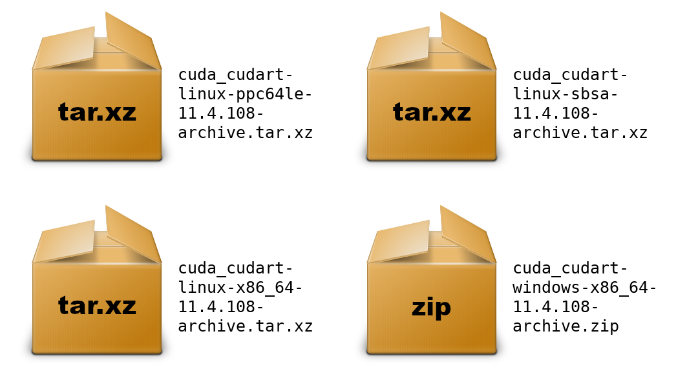
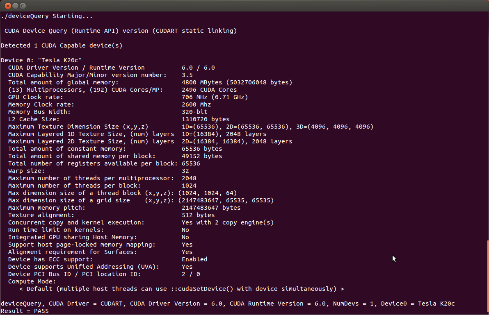
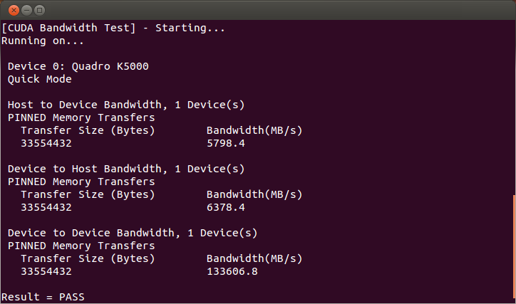

# CUDA Installation Guide for Linux — Installation Guide for Linux 13.2 documentation

**来源**: [https://docs.nvidia.com/cuda/cuda-installation-guide-linux/index.html](https://docs.nvidia.com/cuda/cuda-installation-guide-linux/index.html)

---

CUDA Installation Guide for Linux

# 1. Overview
The NVIDIA CUDA Installation Guide for Linux provides comprehensive instructions for installing the CUDA Toolkit across multiple Linux distributions and architectures. CUDA® is NVIDIA’s parallel computing platform that enables 
dramatic performance increases by harnessing GPU power for computational workloads. This guide covers four primary installation methods: package manager installation (recommended for most users, supporting RPM and DEB packages 
with native package management integration), runfile installation (distribution-independent standalone installer), Conda installation (for environment management), and pip wheels (Python-focused runtime installation). The guide 
supports major Linux distributions including Ubuntu, Red Hat Enterprise Linux, SUSE, Debian, Fedora, and specialized distributions like Amazon Linux and Azure Linux, across x86_64, ARM64-SBSA, and ARM64-Jetson architectures. 
Each installation method includes detailed pre-installation requirements (CUDA-capable GPU, supported OS version, GCC compiler), step-by-step procedures, and post-installation configuration including environment setup, sample 
verification, and integration with development tools like Nsight and CUDA-GDB.

# 2. Introduction
CUDA®is a parallel computing platform and programming model invented by NVIDIA®. It enables dramatic increases in computing performance by harnessing the power of the graphics processing unit (GPU).
CUDA was developed with several design goals in mind:
- Provide a small set of extensions to standard programming languages, like C, that enable a straightforward implementation of parallel algorithms. With CUDA C/C++, programmers can focus on the task of parallelization of the algorithms rather than spending time on their implementation.
- Support heterogeneous computation where applications use both the CPU and GPU. Serial portions of applications are run on the CPU, and parallel portions are offloaded to the GPU. As such, CUDA can be incrementally applied to existing applications. The CPU and GPU are treated as separate devices that have their own memory spaces. This configuration also allows simultaneous computation on the CPU and GPU without contention for memory resources.
CUDA-capable GPUs have hundreds of cores that can collectively run thousands of computing threads. These cores have shared resources including a register file and a shared memory. The on-chip shared memory allows parallel tasks running on these cores to share data without sending it over the system memory bus.
This guide will show you how to install and check the correct operation of the CUDA development tools.

Note
Instructions for installing NVIDIA Drivers are now in the[Driver installation guide](https://docs.nvidia.com/datacenter/tesla/driver-installation-guide/index.html).

## 2.1. System Requirements
To use NVIDIA CUDA on your system, you will need the following installed:
- CUDA-capable GPU
- A supported version of Linux with a gcc compiler and toolchain
- CUDA Toolkit (available at[https://developer.nvidia.com/cuda-downloads](https://developer.nvidia.com/cuda-downloads))
The CUDA development environment relies on tight integration with the host development environment, including the host compiler and C runtime libraries, and is therefore only supported on distribution versions that have been qualified for this CUDA Toolkit release.
The following table lists the supported Linux distributions. Please review the footnotes associated with the table.

Note
The values in the “Codename” and “Architecture” columns are used to substitute the`<distro>`and`<arch>`placeholders across this document.

<div style="overflow-x: auto; max-width: 100%; border-radius: 6px;">
<table border="1" cellpadding="6" cellspacing="0" style="border-collapse: collapse; width: 100%; font-family: -apple-system, BlinkMacSystemFont, Segoe UI, Helvetica, Arial, sans-serif; font-size: 13px; margin: 16px 0;">
<caption>Table 1 Supported Linux Distributions</caption>
<colgroup>
<col style="width: 59%"/>
<col style="width: 19%"/>
<col style="width: 22%"/>
</colgroup>
<thead>
<tr style="border: 1px solid #d0d7de;"><th style="background-color: #f6f8fa; font-weight: 600; text-align: left; padding: 8px 12px; border: 1px solid #d0d7de;"><p>Distribution</p></th>
<th style="background-color: #f6f8fa; font-weight: 600; text-align: left; padding: 8px 12px; border: 1px solid #d0d7de;"><p>Codename</p></th>
<th style="background-color: #f6f8fa; font-weight: 600; text-align: left; padding: 8px 12px; border: 1px solid #d0d7de;"><p>Architecture</p></th>
</tr>
</thead>
<tbody>
<tr style="border: 1px solid #d0d7de;"><td colspan="3" style="padding: 8px 12px; border: 1px solid #d0d7de; vertical-align: top;"><p><strong>amd64 systems (x86_64)</strong></p></td>
</tr>
<tr style="border: 1px solid #d0d7de;"><td style="padding: 8px 12px; border: 1px solid #d0d7de; vertical-align: top;"><p>Red Hat Enterprise Linux 10</p></td>
<td style="padding: 8px 12px; border: 1px solid #d0d7de; vertical-align: top;"><p>rhel10</p></td>
<td style="padding: 8px 12px; border: 1px solid #d0d7de; vertical-align: top;"><p>x86_64</p></td>
</tr>
<tr style="border: 1px solid #d0d7de;"><td style="padding: 8px 12px; border: 1px solid #d0d7de; vertical-align: top;"><p>Red Hat Enterprise Linux 9</p></td>
<td style="padding: 8px 12px; border: 1px solid #d0d7de; vertical-align: top;"><p>rhel9</p></td>
<td style="padding: 8px 12px; border: 1px solid #d0d7de; vertical-align: top;"><p>x86_64</p></td>
</tr>
<tr style="border: 1px solid #d0d7de;"><td style="padding: 8px 12px; border: 1px solid #d0d7de; vertical-align: top;"><p>Red Hat Enterprise Linux 8</p></td>
<td style="padding: 8px 12px; border: 1px solid #d0d7de; vertical-align: top;"><p>rhel8</p></td>
<td style="padding: 8px 12px; border: 1px solid #d0d7de; vertical-align: top;"><p>x86_64</p></td>
</tr>
<tr style="border: 1px solid #d0d7de;"><td style="padding: 8px 12px; border: 1px solid #d0d7de; vertical-align: top;"><p>AlmaLinux 10</p></td>
<td style="padding: 8px 12px; border: 1px solid #d0d7de; vertical-align: top;"><p>rhel10</p></td>
<td style="padding: 8px 12px; border: 1px solid #d0d7de; vertical-align: top;"><p>x86_64</p></td>
</tr>
<tr style="border: 1px solid #d0d7de;"><td style="padding: 8px 12px; border: 1px solid #d0d7de; vertical-align: top;"><p>AlmaLinux 9</p></td>
<td style="padding: 8px 12px; border: 1px solid #d0d7de; vertical-align: top;"><p>rhel9</p></td>
<td style="padding: 8px 12px; border: 1px solid #d0d7de; vertical-align: top;"><p>x86_64</p></td>
</tr>
<tr style="border: 1px solid #d0d7de;"><td style="padding: 8px 12px; border: 1px solid #d0d7de; vertical-align: top;"><p>AlmaLinux 8</p></td>
<td style="padding: 8px 12px; border: 1px solid #d0d7de; vertical-align: top;"><p>rhel8</p></td>
<td style="padding: 8px 12px; border: 1px solid #d0d7de; vertical-align: top;"><p>x86_64</p></td>
</tr>
<tr style="border: 1px solid #d0d7de;"><td style="padding: 8px 12px; border: 1px solid #d0d7de; vertical-align: top;"><p>openSUSE Leap 15 SP6</p></td>
<td style="padding: 8px 12px; border: 1px solid #d0d7de; vertical-align: top;"><p>opensuse15</p></td>
<td style="padding: 8px 12px; border: 1px solid #d0d7de; vertical-align: top;"><p>x86_64</p></td>
</tr>
<tr style="border: 1px solid #d0d7de;"><td style="padding: 8px 12px; border: 1px solid #d0d7de; vertical-align: top;"><p>openSUSE Leap 16</p></td>
<td style="padding: 8px 12px; border: 1px solid #d0d7de; vertical-align: top;"><p>suse16</p></td>
<td style="padding: 8px 12px; border: 1px solid #d0d7de; vertical-align: top;"><p>x86_64</p></td>
</tr>
<tr style="border: 1px solid #d0d7de;"><td style="padding: 8px 12px; border: 1px solid #d0d7de; vertical-align: top;"><p>Rocky Linux 10</p></td>
<td style="padding: 8px 12px; border: 1px solid #d0d7de; vertical-align: top;"><p>rhel10</p></td>
<td style="padding: 8px 12px; border: 1px solid #d0d7de; vertical-align: top;"><p>x86_64</p></td>
</tr>
<tr style="border: 1px solid #d0d7de;"><td style="padding: 8px 12px; border: 1px solid #d0d7de; vertical-align: top;"><p>Rocky Linux 9</p></td>
<td style="padding: 8px 12px; border: 1px solid #d0d7de; vertical-align: top;"><p>rhel9</p></td>
<td style="padding: 8px 12px; border: 1px solid #d0d7de; vertical-align: top;"><p>x86_64</p></td>
</tr>
<tr style="border: 1px solid #d0d7de;"><td style="padding: 8px 12px; border: 1px solid #d0d7de; vertical-align: top;"><p>Rocky Linux 8</p></td>
<td style="padding: 8px 12px; border: 1px solid #d0d7de; vertical-align: top;"><p>rhel8</p></td>
<td style="padding: 8px 12px; border: 1px solid #d0d7de; vertical-align: top;"><p>x86_64</p></td>
</tr>
<tr style="border: 1px solid #d0d7de;"><td style="padding: 8px 12px; border: 1px solid #d0d7de; vertical-align: top;"><p>SUSE Linux Enterprise Server 15 SP6+</p></td>
<td style="padding: 8px 12px; border: 1px solid #d0d7de; vertical-align: top;"><p>sles15</p></td>
<td style="padding: 8px 12px; border: 1px solid #d0d7de; vertical-align: top;"><p>x86_64</p></td>
</tr>
<tr style="border: 1px solid #d0d7de;"><td style="padding: 8px 12px; border: 1px solid #d0d7de; vertical-align: top;"><p>SUSE Linux Enterprise Server 16</p></td>
<td style="padding: 8px 12px; border: 1px solid #d0d7de; vertical-align: top;"><p>suse16</p></td>
<td style="padding: 8px 12px; border: 1px solid #d0d7de; vertical-align: top;"><p>x86_64</p></td>
</tr>
<tr style="border: 1px solid #d0d7de;"><td style="padding: 8px 12px; border: 1px solid #d0d7de; vertical-align: top;"><p>Ubuntu 24.04 LTS</p></td>
<td style="padding: 8px 12px; border: 1px solid #d0d7de; vertical-align: top;"><p>ubuntu2404</p></td>
<td style="padding: 8px 12px; border: 1px solid #d0d7de; vertical-align: top;"><p>amd64</p></td>
</tr>
<tr style="border: 1px solid #d0d7de;"><td style="padding: 8px 12px; border: 1px solid #d0d7de; vertical-align: top;"><p>Ubuntu 22.04 LTS</p></td>
<td style="padding: 8px 12px; border: 1px solid #d0d7de; vertical-align: top;"><p>ubuntu2204</p></td>
<td style="padding: 8px 12px; border: 1px solid #d0d7de; vertical-align: top;"><p>amd64</p></td>
</tr>
<tr style="border: 1px solid #d0d7de;"><td style="padding: 8px 12px; border: 1px solid #d0d7de; vertical-align: top;"><p>Debian 12</p></td>
<td style="padding: 8px 12px; border: 1px solid #d0d7de; vertical-align: top;"><p>debian12</p></td>
<td style="padding: 8px 12px; border: 1px solid #d0d7de; vertical-align: top;"><p>amd64</p></td>
</tr>
<tr style="border: 1px solid #d0d7de;"><td style="padding: 8px 12px; border: 1px solid #d0d7de; vertical-align: top;"><p>Debian 13</p></td>
<td style="padding: 8px 12px; border: 1px solid #d0d7de; vertical-align: top;"><p>debian13</p></td>
<td style="padding: 8px 12px; border: 1px solid #d0d7de; vertical-align: top;"><p>amd64</p></td>
</tr>
<tr style="border: 1px solid #d0d7de;"><td style="padding: 8px 12px; border: 1px solid #d0d7de; vertical-align: top;"><p>Fedora 43</p></td>
<td style="padding: 8px 12px; border: 1px solid #d0d7de; vertical-align: top;"><p>fedora43</p></td>
<td style="padding: 8px 12px; border: 1px solid #d0d7de; vertical-align: top;"><p>x86_64</p></td>
</tr>
<tr style="border: 1px solid #d0d7de;"><td style="padding: 8px 12px; border: 1px solid #d0d7de; vertical-align: top;"><p>KylinOS V11 2503</p></td>
<td style="padding: 8px 12px; border: 1px solid #d0d7de; vertical-align: top;"><p>kylin11</p></td>
<td style="padding: 8px 12px; border: 1px solid #d0d7de; vertical-align: top;"><p>x86_64</p></td>
</tr>
<tr style="border: 1px solid #d0d7de;"><td style="padding: 8px 12px; border: 1px solid #d0d7de; vertical-align: top;"><p>Azure Linux 3.0</p></td>
<td style="padding: 8px 12px; border: 1px solid #d0d7de; vertical-align: top;"><p>azl3</p></td>
<td style="padding: 8px 12px; border: 1px solid #d0d7de; vertical-align: top;"><p>x86_64</p></td>
</tr>
<tr style="border: 1px solid #d0d7de;"><td style="padding: 8px 12px; border: 1px solid #d0d7de; vertical-align: top;"><p>Amazon Linux 2023</p></td>
<td style="padding: 8px 12px; border: 1px solid #d0d7de; vertical-align: top;"><p>amzn2023</p></td>
<td style="padding: 8px 12px; border: 1px solid #d0d7de; vertical-align: top;"><p>x86_64</p></td>
</tr>
<tr style="border: 1px solid #d0d7de;"><td style="padding: 8px 12px; border: 1px solid #d0d7de; vertical-align: top;"><p>Oracle Linux 9</p></td>
<td style="padding: 8px 12px; border: 1px solid #d0d7de; vertical-align: top;"><p>rhel9</p></td>
<td style="padding: 8px 12px; border: 1px solid #d0d7de; vertical-align: top;"><p>x86_64</p></td>
</tr>
<tr style="border: 1px solid #d0d7de;"><td style="padding: 8px 12px; border: 1px solid #d0d7de; vertical-align: top;"><p>Oracle Linux 8</p></td>
<td style="padding: 8px 12px; border: 1px solid #d0d7de; vertical-align: top;"><p>rhel8</p></td>
<td style="padding: 8px 12px; border: 1px solid #d0d7de; vertical-align: top;"><p>x86_64</p></td>
</tr>
<tr style="border: 1px solid #d0d7de;"><td colspan="3" style="padding: 8px 12px; border: 1px solid #d0d7de; vertical-align: top;"><p><strong>arm64 systems (SBSA)</strong></p></td>
</tr>
<tr style="border: 1px solid #d0d7de;"><td style="padding: 8px 12px; border: 1px solid #d0d7de; vertical-align: top;"><p>Red Hat Enterprise Linux 10</p></td>
<td style="padding: 8px 12px; border: 1px solid #d0d7de; vertical-align: top;"><p>rhel10</p></td>
<td style="padding: 8px 12px; border: 1px solid #d0d7de; vertical-align: top;"><p>aarch64</p></td>
</tr>
<tr style="border: 1px solid #d0d7de;"><td style="padding: 8px 12px; border: 1px solid #d0d7de; vertical-align: top;"><p>Red Hat Enterprise Linux 9</p></td>
<td style="padding: 8px 12px; border: 1px solid #d0d7de; vertical-align: top;"><p>rhel9</p></td>
<td style="padding: 8px 12px; border: 1px solid #d0d7de; vertical-align: top;"><p>aarch64</p></td>
</tr>
<tr style="border: 1px solid #d0d7de;"><td style="padding: 8px 12px; border: 1px solid #d0d7de; vertical-align: top;"><p>Red Hat Enterprise Linux 8</p></td>
<td style="padding: 8px 12px; border: 1px solid #d0d7de; vertical-align: top;"><p>rhel8</p></td>
<td style="padding: 8px 12px; border: 1px solid #d0d7de; vertical-align: top;"><p>aarch64</p></td>
</tr>
<tr style="border: 1px solid #d0d7de;"><td style="padding: 8px 12px; border: 1px solid #d0d7de; vertical-align: top;"><p>SUSE Linux Enterprise Server 15 SP6+</p></td>
<td style="padding: 8px 12px; border: 1px solid #d0d7de; vertical-align: top;"><p>sles15</p></td>
<td style="padding: 8px 12px; border: 1px solid #d0d7de; vertical-align: top;"><p>aarch64</p></td>
</tr>
<tr style="border: 1px solid #d0d7de;"><td style="padding: 8px 12px; border: 1px solid #d0d7de; vertical-align: top;"><p>SUSE Linux Enterprise Server 16</p></td>
<td style="padding: 8px 12px; border: 1px solid #d0d7de; vertical-align: top;"><p>suse16</p></td>
<td style="padding: 8px 12px; border: 1px solid #d0d7de; vertical-align: top;"><p>aarch64</p></td>
</tr>
<tr style="border: 1px solid #d0d7de;"><td style="padding: 8px 12px; border: 1px solid #d0d7de; vertical-align: top;"><p>KylinOS V11 2503</p></td>
<td style="padding: 8px 12px; border: 1px solid #d0d7de; vertical-align: top;"><p>kylin11</p></td>
<td style="padding: 8px 12px; border: 1px solid #d0d7de; vertical-align: top;"><p>aarch64</p></td>
</tr>
<tr style="border: 1px solid #d0d7de;"><td style="padding: 8px 12px; border: 1px solid #d0d7de; vertical-align: top;"><p>Ubuntu 24.04 LTS</p></td>
<td style="padding: 8px 12px; border: 1px solid #d0d7de; vertical-align: top;"><p>ubuntu2404</p></td>
<td style="padding: 8px 12px; border: 1px solid #d0d7de; vertical-align: top;"><p>arm64</p></td>
</tr>
<tr style="border: 1px solid #d0d7de;"><td style="padding: 8px 12px; border: 1px solid #d0d7de; vertical-align: top;"><p>Ubuntu 22.04 LTS</p></td>
<td style="padding: 8px 12px; border: 1px solid #d0d7de; vertical-align: top;"><p>ubuntu2204</p></td>
<td style="padding: 8px 12px; border: 1px solid #d0d7de; vertical-align: top;"><p>arm64</p></td>
</tr>
<tr style="border: 1px solid #d0d7de;"><td style="padding: 8px 12px; border: 1px solid #d0d7de; vertical-align: top;"><p>Azure Linux 3.0</p></td>
<td style="padding: 8px 12px; border: 1px solid #d0d7de; vertical-align: top;"><p>azl3</p></td>
<td style="padding: 8px 12px; border: 1px solid #d0d7de; vertical-align: top;"><p>aarch64</p></td>
</tr>
<tr style="border: 1px solid #d0d7de;"><td style="padding: 8px 12px; border: 1px solid #d0d7de; vertical-align: top;"><p>Amazon Linux 2023</p></td>
<td style="padding: 8px 12px; border: 1px solid #d0d7de; vertical-align: top;"><p>amzn2023</p></td>
<td style="padding: 8px 12px; border: 1px solid #d0d7de; vertical-align: top;"><p>aarch64</p></td>
</tr>
</tbody>
</table>
</div>

<div style="overflow-x: auto; max-width: 100%; border-radius: 6px;">
<table border="1" cellpadding="6" cellspacing="0" style="border-collapse: collapse; width: 100%; font-family: -apple-system, BlinkMacSystemFont, Segoe UI, Helvetica, Arial, sans-serif; font-size: 13px; margin: 16px 0;">
<caption>Table 2 Native Linux Distribution Support and Validated OS Versions for CUDA 13.2</caption>
<colgroup>
<col style="width: 36%"/>
<col style="width: 16%"/>
<col style="width: 31%"/>
<col style="width: 11%"/>
<col style="width: 6%"/>
</colgroup>
<thead>
<tr style="border: 1px solid #d0d7de;"><th style="background-color: #f6f8fa; font-weight: 600; text-align: left; padding: 8px 12px; border: 1px solid #d0d7de;"><p>Distribution</p></th>
<th style="background-color: #f6f8fa; font-weight: 600; text-align: left; padding: 8px 12px; border: 1px solid #d0d7de;"><p>OS Version</p></th>
<th style="background-color: #f6f8fa; font-weight: 600; text-align: left; padding: 8px 12px; border: 1px solid #d0d7de;"><p>Kernel¹</p></th>
<th style="background-color: #f6f8fa; font-weight: 600; text-align: left; padding: 8px 12px; border: 1px solid #d0d7de;"><p>Default GCC</p></th>
<th style="background-color: #f6f8fa; font-weight: 600; text-align: left; padding: 8px 12px; border: 1px solid #d0d7de;"><p>GLIBC</p></th>
</tr>
</thead>
<tbody>
<tr style="border: 1px solid #d0d7de;"><td colspan="5" style="padding: 8px 12px; border: 1px solid #d0d7de; vertical-align: top;"><p><strong>x86_64</strong></p></td>
</tr>
<tr style="border: 1px solid #d0d7de;"><td style="padding: 8px 12px; border: 1px solid #d0d7de; vertical-align: top;"><p>RHEL 10</p></td>
<td style="padding: 8px 12px; border: 1px solid #d0d7de; vertical-align: top;"><p>10.1</p></td>
<td style="padding: 8px 12px; border: 1px solid #d0d7de; vertical-align: top;"><p>6.12.0-124</p></td>
<td style="padding: 8px 12px; border: 1px solid #d0d7de; vertical-align: top;"><p>14.3.1</p></td>
<td style="padding: 8px 12px; border: 1px solid #d0d7de; vertical-align: top;"><p>2.39</p></td>
</tr>
<tr style="border: 1px solid #d0d7de;"><td style="padding: 8px 12px; border: 1px solid #d0d7de; vertical-align: top;"><p>RHEL 9</p></td>
<td style="padding: 8px 12px; border: 1px solid #d0d7de; vertical-align: top;"><p>9.7</p></td>
<td style="padding: 8px 12px; border: 1px solid #d0d7de; vertical-align: top;"><p>5.14.0-611.5</p></td>
<td style="padding: 8px 12px; border: 1px solid #d0d7de; vertical-align: top;"><p>11.5.0</p></td>
<td style="padding: 8px 12px; border: 1px solid #d0d7de; vertical-align: top;"><p>2.34</p></td>
</tr>
<tr style="border: 1px solid #d0d7de;"><td style="padding: 8px 12px; border: 1px solid #d0d7de; vertical-align: top;"><p>RHEL 8</p></td>
<td style="padding: 8px 12px; border: 1px solid #d0d7de; vertical-align: top;"><p>8.10</p></td>
<td style="padding: 8px 12px; border: 1px solid #d0d7de; vertical-align: top;"><p>4.18.0-553</p></td>
<td style="padding: 8px 12px; border: 1px solid #d0d7de; vertical-align: top;"><p>8.5.0</p></td>
<td style="padding: 8px 12px; border: 1px solid #d0d7de; vertical-align: top;"><p>2.28</p></td>
</tr>
<tr style="border: 1px solid #d0d7de;"><td style="padding: 8px 12px; border: 1px solid #d0d7de; vertical-align: top;"><p>Rocky Linux 10</p></td>
<td style="padding: 8px 12px; border: 1px solid #d0d7de; vertical-align: top;"><p>10.1</p></td>
<td style="padding: 8px 12px; border: 1px solid #d0d7de; vertical-align: top;"><p>6.12.0-124</p></td>
<td style="padding: 8px 12px; border: 1px solid #d0d7de; vertical-align: top;"><p>14.3.1</p></td>
<td style="padding: 8px 12px; border: 1px solid #d0d7de; vertical-align: top;"><p>2.39</p></td>
</tr>
<tr style="border: 1px solid #d0d7de;"><td style="padding: 8px 12px; border: 1px solid #d0d7de; vertical-align: top;"><p>Rocky Linux 9</p></td>
<td style="padding: 8px 12px; border: 1px solid #d0d7de; vertical-align: top;"><p>9.7</p></td>
<td style="padding: 8px 12px; border: 1px solid #d0d7de; vertical-align: top;"><p>5.14.0-611.5</p></td>
<td style="padding: 8px 12px; border: 1px solid #d0d7de; vertical-align: top;"><p>11.5.0</p></td>
<td style="padding: 8px 12px; border: 1px solid #d0d7de; vertical-align: top;"><p>2.34</p></td>
</tr>
<tr style="border: 1px solid #d0d7de;"><td style="padding: 8px 12px; border: 1px solid #d0d7de; vertical-align: top;"><p>Rocky Linux 8</p></td>
<td style="padding: 8px 12px; border: 1px solid #d0d7de; vertical-align: top;"><p>8.10</p></td>
<td style="padding: 8px 12px; border: 1px solid #d0d7de; vertical-align: top;"><p>4.18.0-553</p></td>
<td style="padding: 8px 12px; border: 1px solid #d0d7de; vertical-align: top;"><p>8.5.0</p></td>
<td style="padding: 8px 12px; border: 1px solid #d0d7de; vertical-align: top;"><p>2.28</p></td>
</tr>
<tr style="border: 1px solid #d0d7de;"><td style="padding: 8px 12px; border: 1px solid #d0d7de; vertical-align: top;"><p>Oracle Linux 9</p></td>
<td style="padding: 8px 12px; border: 1px solid #d0d7de; vertical-align: top;"><p>9</p></td>
<td style="padding: 8px 12px; border: 1px solid #d0d7de; vertical-align: top;"><p>5.14.0-427</p></td>
<td style="padding: 8px 12px; border: 1px solid #d0d7de; vertical-align: top;"><p>11.4.1</p></td>
<td style="padding: 8px 12px; border: 1px solid #d0d7de; vertical-align: top;"><p>2.34</p></td>
</tr>
<tr style="border: 1px solid #d0d7de;"><td style="padding: 8px 12px; border: 1px solid #d0d7de; vertical-align: top;"><p>Oracle Linux 8</p></td>
<td style="padding: 8px 12px; border: 1px solid #d0d7de; vertical-align: top;"><p>8</p></td>
<td style="padding: 8px 12px; border: 1px solid #d0d7de; vertical-align: top;"><p>4.18.0-553</p></td>
<td style="padding: 8px 12px; border: 1px solid #d0d7de; vertical-align: top;"><p>8.5.0</p></td>
<td style="padding: 8px 12px; border: 1px solid #d0d7de; vertical-align: top;"><p>2.28</p></td>
</tr>
<tr style="border: 1px solid #d0d7de;"><td style="padding: 8px 12px; border: 1px solid #d0d7de; vertical-align: top;"><p>SUSE SLES 16</p></td>
<td style="padding: 8px 12px; border: 1px solid #d0d7de; vertical-align: top;"><p>16.0</p></td>
<td style="padding: 8px 12px; border: 1px solid #d0d7de; vertical-align: top;"><p>6.12.0-160000.5</p></td>
<td style="padding: 8px 12px; border: 1px solid #d0d7de; vertical-align: top;"><p>15.1.1</p></td>
<td style="padding: 8px 12px; border: 1px solid #d0d7de; vertical-align: top;"><p>2.40</p></td>
</tr>
<tr style="border: 1px solid #d0d7de;"><td style="padding: 8px 12px; border: 1px solid #d0d7de; vertical-align: top;"><p>SUSE SLES 15</p></td>
<td style="padding: 8px 12px; border: 1px solid #d0d7de; vertical-align: top;"><p>15.7</p></td>
<td style="padding: 8px 12px; border: 1px solid #d0d7de; vertical-align: top;"><p>6.4.0-150600.21</p></td>
<td style="padding: 8px 12px; border: 1px solid #d0d7de; vertical-align: top;"><p>7.5.0</p></td>
<td style="padding: 8px 12px; border: 1px solid #d0d7de; vertical-align: top;"><p>2.38</p></td>
</tr>
<tr style="border: 1px solid #d0d7de;"><td style="padding: 8px 12px; border: 1px solid #d0d7de; vertical-align: top;"><p>Ubuntu 24.04 LTS</p></td>
<td style="padding: 8px 12px; border: 1px solid #d0d7de; vertical-align: top;"><p>24.04.4</p></td>
<td style="padding: 8px 12px; border: 1px solid #d0d7de; vertical-align: top;"><p>6.17.0-19</p></td>
<td style="padding: 8px 12px; border: 1px solid #d0d7de; vertical-align: top;"><p>14.3.0</p></td>
<td style="padding: 8px 12px; border: 1px solid #d0d7de; vertical-align: top;"><p>2.39</p></td>
</tr>
<tr style="border: 1px solid #d0d7de;"><td style="padding: 8px 12px; border: 1px solid #d0d7de; vertical-align: top;"><p>Ubuntu 22.04 LTS</p></td>
<td style="padding: 8px 12px; border: 1px solid #d0d7de; vertical-align: top;"><p>22.04.5</p></td>
<td style="padding: 8px 12px; border: 1px solid #d0d7de; vertical-align: top;"><p>6.5.0-45</p></td>
<td style="padding: 8px 12px; border: 1px solid #d0d7de; vertical-align: top;"><p>12.3.0</p></td>
<td style="padding: 8px 12px; border: 1px solid #d0d7de; vertical-align: top;"><p>2.35</p></td>
</tr>
<tr style="border: 1px solid #d0d7de;"><td style="padding: 8px 12px; border: 1px solid #d0d7de; vertical-align: top;"><p>Debian 13</p></td>
<td style="padding: 8px 12px; border: 1px solid #d0d7de; vertical-align: top;"><p>13.3</p></td>
<td style="padding: 8px 12px; border: 1px solid #d0d7de; vertical-align: top;"><p>6.12.73-1</p></td>
<td style="padding: 8px 12px; border: 1px solid #d0d7de; vertical-align: top;"><p>14.2.0</p></td>
<td style="padding: 8px 12px; border: 1px solid #d0d7de; vertical-align: top;"><p>2.41</p></td>
</tr>
<tr style="border: 1px solid #d0d7de;"><td style="padding: 8px 12px; border: 1px solid #d0d7de; vertical-align: top;"><p>Debian 12</p></td>
<td style="padding: 8px 12px; border: 1px solid #d0d7de; vertical-align: top;"><p>12.13</p></td>
<td style="padding: 8px 12px; border: 1px solid #d0d7de; vertical-align: top;"><p>6.1.159</p></td>
<td style="padding: 8px 12px; border: 1px solid #d0d7de; vertical-align: top;"><p>12.2.0</p></td>
<td style="padding: 8px 12px; border: 1px solid #d0d7de; vertical-align: top;"><p>2.36</p></td>
</tr>
<tr style="border: 1px solid #d0d7de;"><td style="padding: 8px 12px; border: 1px solid #d0d7de; vertical-align: top;"><p>OpenSUSE Leap 16</p></td>
<td style="padding: 8px 12px; border: 1px solid #d0d7de; vertical-align: top;"><p>16.0</p></td>
<td style="padding: 8px 12px; border: 1px solid #d0d7de; vertical-align: top;"><p>6.12.0-160000.5</p></td>
<td style="padding: 8px 12px; border: 1px solid #d0d7de; vertical-align: top;"><p>15.1.1</p></td>
<td style="padding: 8px 12px; border: 1px solid #d0d7de; vertical-align: top;"><p>2.40</p></td>
</tr>
<tr style="border: 1px solid #d0d7de;"><td style="padding: 8px 12px; border: 1px solid #d0d7de; vertical-align: top;"><p>OpenSUSE Leap 15</p></td>
<td style="padding: 8px 12px; border: 1px solid #d0d7de; vertical-align: top;"><p>15.6</p></td>
<td style="padding: 8px 12px; border: 1px solid #d0d7de; vertical-align: top;"><p>6.4.0-150600.21</p></td>
<td style="padding: 8px 12px; border: 1px solid #d0d7de; vertical-align: top;"><p>7.5.0</p></td>
<td style="padding: 8px 12px; border: 1px solid #d0d7de; vertical-align: top;"><p>2.38</p></td>
</tr>
<tr style="border: 1px solid #d0d7de;"><td style="padding: 8px 12px; border: 1px solid #d0d7de; vertical-align: top;"><p>Fedora 43</p></td>
<td style="padding: 8px 12px; border: 1px solid #d0d7de; vertical-align: top;"><p>43</p></td>
<td style="padding: 8px 12px; border: 1px solid #d0d7de; vertical-align: top;"><p>6.17.1-300</p></td>
<td style="padding: 8px 12px; border: 1px solid #d0d7de; vertical-align: top;"><p>15.2.1</p></td>
<td style="padding: 8px 12px; border: 1px solid #d0d7de; vertical-align: top;"><p>2.42</p></td>
</tr>
<tr style="border: 1px solid #d0d7de;"><td style="padding: 8px 12px; border: 1px solid #d0d7de; vertical-align: top;"><p>KylinOS V11</p></td>
<td style="padding: 8px 12px; border: 1px solid #d0d7de; vertical-align: top;"><p>V11</p></td>
<td style="padding: 8px 12px; border: 1px solid #d0d7de; vertical-align: top;"><p>6.6.0-32.7</p></td>
<td style="padding: 8px 12px; border: 1px solid #d0d7de; vertical-align: top;"><p>12.3.1</p></td>
<td style="padding: 8px 12px; border: 1px solid #d0d7de; vertical-align: top;"><p>2.38</p></td>
</tr>
<tr style="border: 1px solid #d0d7de;"><td style="padding: 8px 12px; border: 1px solid #d0d7de; vertical-align: top;"><p>Amazon Linux 2023</p></td>
<td style="padding: 8px 12px; border: 1px solid #d0d7de; vertical-align: top;"><p>AL2023</p></td>
<td style="padding: 8px 12px; border: 1px solid #d0d7de; vertical-align: top;"><p>6.1.82-99.168</p></td>
<td style="padding: 8px 12px; border: 1px solid #d0d7de; vertical-align: top;"><p>11.4.1</p></td>
<td style="padding: 8px 12px; border: 1px solid #d0d7de; vertical-align: top;"><p>2.34</p></td>
</tr>
<tr style="border: 1px solid #d0d7de;"><td style="padding: 8px 12px; border: 1px solid #d0d7de; vertical-align: top;"><p>MSFT Azure Linux</p></td>
<td style="padding: 8px 12px; border: 1px solid #d0d7de; vertical-align: top;"><p>3.0</p></td>
<td style="padding: 8px 12px; border: 1px solid #d0d7de; vertical-align: top;"><p>6.6.64.2-9.azl3</p></td>
<td style="padding: 8px 12px; border: 1px solid #d0d7de; vertical-align: top;"><p>13.2.0</p></td>
<td style="padding: 8px 12px; border: 1px solid #d0d7de; vertical-align: top;"><p>2.38-8</p></td>
</tr>
<tr style="border: 1px solid #d0d7de;"><td colspan="5" style="padding: 8px 12px; border: 1px solid #d0d7de; vertical-align: top;"><p><strong>Generic arm64 systems (sbsa)</strong></p></td>
</tr>
<tr style="border: 1px solid #d0d7de;"><td style="padding: 8px 12px; border: 1px solid #d0d7de; vertical-align: top;"><p>RHEL 10</p></td>
<td style="padding: 8px 12px; border: 1px solid #d0d7de; vertical-align: top;"><p>10.1</p></td>
<td style="padding: 8px 12px; border: 1px solid #d0d7de; vertical-align: top;"><p>6.12.0</p></td>
<td style="padding: 8px 12px; border: 1px solid #d0d7de; vertical-align: top;"><p>14.3.1</p></td>
<td style="padding: 8px 12px; border: 1px solid #d0d7de; vertical-align: top;"><p>2.39</p></td>
</tr>
<tr style="border: 1px solid #d0d7de;"><td style="padding: 8px 12px; border: 1px solid #d0d7de; vertical-align: top;"><p>RHEL 9</p></td>
<td style="padding: 8px 12px; border: 1px solid #d0d7de; vertical-align: top;"><p>9.7</p></td>
<td style="padding: 8px 12px; border: 1px solid #d0d7de; vertical-align: top;"><p>5.14.0-611.16.1.el9_7</p></td>
<td style="padding: 8px 12px; border: 1px solid #d0d7de; vertical-align: top;"><p>11.5.0</p></td>
<td style="padding: 8px 12px; border: 1px solid #d0d7de; vertical-align: top;"><p>2.34</p></td>
</tr>
<tr style="border: 1px solid #d0d7de;"><td style="padding: 8px 12px; border: 1px solid #d0d7de; vertical-align: top;"><p>RHEL 8</p></td>
<td style="padding: 8px 12px; border: 1px solid #d0d7de; vertical-align: top;"><p>8.10</p></td>
<td style="padding: 8px 12px; border: 1px solid #d0d7de; vertical-align: top;"><p>4.18.0-553</p></td>
<td style="padding: 8px 12px; border: 1px solid #d0d7de; vertical-align: top;"><p>8.5.0</p></td>
<td style="padding: 8px 12px; border: 1px solid #d0d7de; vertical-align: top;"><p>2.28</p></td>
</tr>
<tr style="border: 1px solid #d0d7de;"><td style="padding: 8px 12px; border: 1px solid #d0d7de; vertical-align: top;"><p>Ubuntu 22.04 LTS</p></td>
<td style="padding: 8px 12px; border: 1px solid #d0d7de; vertical-align: top;"><p>22.04.5</p></td>
<td style="padding: 8px 12px; border: 1px solid #d0d7de; vertical-align: top;"><p>6.5.0-1019</p></td>
<td style="padding: 8px 12px; border: 1px solid #d0d7de; vertical-align: top;"><p>11.4.0</p></td>
<td style="padding: 8px 12px; border: 1px solid #d0d7de; vertical-align: top;"><p>2.35</p></td>
</tr>
<tr style="border: 1px solid #d0d7de;"><td style="padding: 8px 12px; border: 1px solid #d0d7de; vertical-align: top;"><p>Ubuntu 24.04 LTS</p></td>
<td style="padding: 8px 12px; border: 1px solid #d0d7de; vertical-align: top;"><p>24.04.4</p></td>
<td style="padding: 8px 12px; border: 1px solid #d0d7de; vertical-align: top;"><p>6.8.0-87</p></td>
<td style="padding: 8px 12px; border: 1px solid #d0d7de; vertical-align: top;"><p>13.4.0</p></td>
<td style="padding: 8px 12px; border: 1px solid #d0d7de; vertical-align: top;"><p>2.39</p></td>
</tr>
<tr style="border: 1px solid #d0d7de;"><td style="padding: 8px 12px; border: 1px solid #d0d7de; vertical-align: top;"><p>SUSE SLES 16</p></td>
<td style="padding: 8px 12px; border: 1px solid #d0d7de; vertical-align: top;"><p>16.0</p></td>
<td style="padding: 8px 12px; border: 1px solid #d0d7de; vertical-align: top;"><p>6.12.0</p></td>
<td style="padding: 8px 12px; border: 1px solid #d0d7de; vertical-align: top;"><p>15.1.1</p></td>
<td style="padding: 8px 12px; border: 1px solid #d0d7de; vertical-align: top;"><p>2.40</p></td>
</tr>
<tr style="border: 1px solid #d0d7de;"><td style="padding: 8px 12px; border: 1px solid #d0d7de; vertical-align: top;"><p>SUSE SLES 15</p></td>
<td style="padding: 8px 12px; border: 1px solid #d0d7de; vertical-align: top;"><p>15.7</p></td>
<td style="padding: 8px 12px; border: 1px solid #d0d7de; vertical-align: top;"><p>6.4.0-150700.51</p></td>
<td style="padding: 8px 12px; border: 1px solid #d0d7de; vertical-align: top;"><p>7.5.0</p></td>
<td style="padding: 8px 12px; border: 1px solid #d0d7de; vertical-align: top;"><p>2.38</p></td>
</tr>
<tr style="border: 1px solid #d0d7de;"><td style="padding: 8px 12px; border: 1px solid #d0d7de; vertical-align: top;"><p>Kylin OS V11</p></td>
<td style="padding: 8px 12px; border: 1px solid #d0d7de; vertical-align: top;"><p>V11</p></td>
<td style="padding: 8px 12px; border: 1px solid #d0d7de; vertical-align: top;"><p>6.6.0</p></td>
<td style="padding: 8px 12px; border: 1px solid #d0d7de; vertical-align: top;"><p>12.3.1</p></td>
<td style="padding: 8px 12px; border: 1px solid #d0d7de; vertical-align: top;"><p>2.38</p></td>
</tr>
<tr style="border: 1px solid #d0d7de;"><td colspan="5" style="padding: 8px 12px; border: 1px solid #d0d7de; vertical-align: top;"><p><strong>GRACE only arm64 systems (sbsa)</strong></p></td>
</tr>
<tr style="border: 1px solid #d0d7de;"><td style="padding: 8px 12px; border: 1px solid #d0d7de; vertical-align: top;"><p>Amazon Linux 2023</p></td>
<td style="padding: 8px 12px; border: 1px solid #d0d7de; vertical-align: top;"><p>AL2023</p></td>
<td style="padding: 8px 12px; border: 1px solid #d0d7de; vertical-align: top;"><p>6.12.16-18</p></td>
<td style="padding: 8px 12px; border: 1px solid #d0d7de; vertical-align: top;"><p>11.4.1</p></td>
<td style="padding: 8px 12px; border: 1px solid #d0d7de; vertical-align: top;"><p>2.34</p></td>
</tr>
<tr style="border: 1px solid #d0d7de;"><td style="padding: 8px 12px; border: 1px solid #d0d7de; vertical-align: top;"><p>MSFT Azure Linux</p></td>
<td style="padding: 8px 12px; border: 1px solid #d0d7de; vertical-align: top;"><p>3.0</p></td>
<td style="padding: 8px 12px; border: 1px solid #d0d7de; vertical-align: top;"><p>6.6.64.2-9.azl3</p></td>
<td style="padding: 8px 12px; border: 1px solid #d0d7de; vertical-align: top;"><p>13.2.0</p></td>
<td style="padding: 8px 12px; border: 1px solid #d0d7de; vertical-align: top;"><p>2.38-8</p></td>
</tr>
<tr style="border: 1px solid #d0d7de;"><td style="padding: 8px 12px; border: 1px solid #d0d7de; vertical-align: top;"><p>Ubuntu 22.04 LTS</p></td>
<td style="padding: 8px 12px; border: 1px solid #d0d7de; vertical-align: top;"><p>22.04.5</p></td>
<td style="padding: 8px 12px; border: 1px solid #d0d7de; vertical-align: top;"><p>6.8.0-XXXX</p></td>
<td style="padding: 8px 12px; border: 1px solid #d0d7de; vertical-align: top;"><p>11.4.0</p></td>
<td style="padding: 8px 12px; border: 1px solid #d0d7de; vertical-align: top;"><p>2.35</p></td>
</tr>
<tr style="border: 1px solid #d0d7de;"><td style="padding: 8px 12px; border: 1px solid #d0d7de; vertical-align: top;"><p>Ubuntu 24.04 LTS</p></td>
<td style="padding: 8px 12px; border: 1px solid #d0d7de; vertical-align: top;"><p>24.04.4</p></td>
<td style="padding: 8px 12px; border: 1px solid #d0d7de; vertical-align: top;"><p>6.8.0-1049-nvidia-64k</p></td>
<td style="padding: 8px 12px; border: 1px solid #d0d7de; vertical-align: top;"><p>13.3.0</p></td>
<td style="padding: 8px 12px; border: 1px solid #d0d7de; vertical-align: top;"><p>2.39</p></td>
</tr>
<tr style="border: 1px solid #d0d7de;"><td style="padding: 8px 12px; border: 1px solid #d0d7de; vertical-align: top;"><p>RHEL 10</p></td>
<td style="padding: 8px 12px; border: 1px solid #d0d7de; vertical-align: top;"><p>10.1</p></td>
<td style="padding: 8px 12px; border: 1px solid #d0d7de; vertical-align: top;"><p>6.12.0-124.21.1.el10_1.aarch64</p></td>
<td style="padding: 8px 12px; border: 1px solid #d0d7de; vertical-align: top;"><p>14.3.1</p></td>
<td style="padding: 8px 12px; border: 1px solid #d0d7de; vertical-align: top;"><p>2.39</p></td>
</tr>
<tr style="border: 1px solid #d0d7de;"><td style="padding: 8px 12px; border: 1px solid #d0d7de; vertical-align: top;"><p>RHEL 9</p></td>
<td style="padding: 8px 12px; border: 1px solid #d0d7de; vertical-align: top;"><p>9.7</p></td>
<td style="padding: 8px 12px; border: 1px solid #d0d7de; vertical-align: top;"><p>5.14.0-611.16.1.el9_7.aarch64+64k</p></td>
<td style="padding: 8px 12px; border: 1px solid #d0d7de; vertical-align: top;"><p>11.5.0</p></td>
<td style="padding: 8px 12px; border: 1px solid #d0d7de; vertical-align: top;"><p>2.34</p></td>
</tr>
<tr style="border: 1px solid #d0d7de;"><td style="padding: 8px 12px; border: 1px solid #d0d7de; vertical-align: top;"><p>SUSE SLES 16</p></td>
<td style="padding: 8px 12px; border: 1px solid #d0d7de; vertical-align: top;"><p>16.0</p></td>
<td style="padding: 8px 12px; border: 1px solid #d0d7de; vertical-align: top;"><p>6.12.0</p></td>
<td style="padding: 8px 12px; border: 1px solid #d0d7de; vertical-align: top;"><p>15.1.1</p></td>
<td style="padding: 8px 12px; border: 1px solid #d0d7de; vertical-align: top;"><p>2.40</p></td>
</tr>
<tr style="border: 1px solid #d0d7de;"><td style="padding: 8px 12px; border: 1px solid #d0d7de; vertical-align: top;"><p>SUSE SLES 15</p></td>
<td style="padding: 8px 12px; border: 1px solid #d0d7de; vertical-align: top;"><p>15.7</p></td>
<td style="padding: 8px 12px; border: 1px solid #d0d7de; vertical-align: top;"><p>6.4.0-150700.53.11.1</p></td>
<td style="padding: 8px 12px; border: 1px solid #d0d7de; vertical-align: top;"><p>7.5.0</p></td>
<td style="padding: 8px 12px; border: 1px solid #d0d7de; vertical-align: top;"><p>2.38</p></td>
</tr>
<tr style="border: 1px solid #d0d7de;"><td style="padding: 8px 12px; border: 1px solid #d0d7de; vertical-align: top;"><p>Debian 13</p></td>
<td style="padding: 8px 12px; border: 1px solid #d0d7de; vertical-align: top;"><p>13.3</p></td>
<td style="padding: 8px 12px; border: 1px solid #d0d7de; vertical-align: top;"><p>6.12.69</p></td>
<td style="padding: 8px 12px; border: 1px solid #d0d7de; vertical-align: top;"><p>14.2.0</p></td>
<td style="padding: 8px 12px; border: 1px solid #d0d7de; vertical-align: top;"><p>2.41</p></td>
</tr>
<tr style="border: 1px solid #d0d7de;"><td style="padding: 8px 12px; border: 1px solid #d0d7de; vertical-align: top;"><p>Debian 12</p></td>
<td style="padding: 8px 12px; border: 1px solid #d0d7de; vertical-align: top;"><p>12.13</p></td>
<td style="padding: 8px 12px; border: 1px solid #d0d7de; vertical-align: top;"><p>6.1.162</p></td>
<td style="padding: 8px 12px; border: 1px solid #d0d7de; vertical-align: top;"><p>12.2.0</p></td>
<td style="padding: 8px 12px; border: 1px solid #d0d7de; vertical-align: top;"><p>2.36</p></td>
</tr>
<tr style="border: 1px solid #d0d7de;"><td colspan="5" style="padding: 8px 12px; border: 1px solid #d0d7de; vertical-align: top;"><p><strong>arm64 sbsa Jetson (dGPU + iGPU with OpenRM)</strong></p></td>
</tr>
<tr style="border: 1px solid #d0d7de;"><td style="padding: 8px 12px; border: 1px solid #d0d7de; vertical-align: top;"><p>Ubuntu 24.04 LTS Rel38 (JP7.x) native</p></td>
<td style="padding: 8px 12px; border: 1px solid #d0d7de; vertical-align: top;"><p>24.04</p></td>
<td style="padding: 8px 12px; border: 1px solid #d0d7de; vertical-align: top;"><p>6.14.0-33-generic</p></td>
<td style="padding: 8px 12px; border: 1px solid #d0d7de; vertical-align: top;"><p>13.3.0</p></td>
<td style="padding: 8px 12px; border: 1px solid #d0d7de; vertical-align: top;"><p>2.39</p></td>
</tr>
<tr style="border: 1px solid #d0d7de;"><td style="padding: 8px 12px; border: 1px solid #d0d7de; vertical-align: top;"><p>Ubuntu 24.04 LTS Rel38 (JP7.x) cross</p></td>
<td style="padding: 8px 12px; border: 1px solid #d0d7de; vertical-align: top;"><p>24.04</p></td>
<td style="padding: 8px 12px; border: 1px solid #d0d7de; vertical-align: top;"><p>6.8.12-tegra</p></td>
<td style="padding: 8px 12px; border: 1px solid #d0d7de; vertical-align: top;"><p>13.3.0</p></td>
<td style="padding: 8px 12px; border: 1px solid #d0d7de; vertical-align: top;"><p>2.39</p></td>
</tr>
</tbody>
</table>
</div>

Additional information on specific kernel versions supported:
- Red Hat Enterprise Linux (RHEL):[https://access.redhat.com/articles/3078](https://access.redhat.com/articles/3078)
- SUSE Linux Enterprise Server (SLES):[https://www.suse.com/support/kb/doc/?id=000019587](https://www.suse.com/support/kb/doc/?id=000019587)
- Oracle Linux:[https://blogs.oracle.com/scoter/oracle-linux-and-unbreakable-enterprise-kernel-uek-releases](https://blogs.oracle.com/scoter/oracle-linux-and-unbreakable-enterprise-kernel-uek-releases)

## 2.2. OS Support Policy
Support for the different operating systems will continue until the standard EOSS/EOL date as defined for each operating system.
Refer to the support lifecycle for these operating systems to know their support timelines and plan to move to newer releases accordingly.

## 2.3. Host Compiler Support Policy
In order to compile the CPU “Host” code in the CUDA source, the CUDA compiler NVCC requires a compatible host compiler to be installed on the system. The version of the host compiler supported on Linux platforms is tabulated as below. NVCC performs a version check on the host compiler’s major version and so newer minor versions of the compilers listed below will be supported, but major versions falling outside the range will not be supported.

<div style="overflow-x: auto; max-width: 100%; border-radius: 6px;">
<table border="1" cellpadding="6" cellspacing="0" style="border-collapse: collapse; width: 100%; font-family: -apple-system, BlinkMacSystemFont, Segoe UI, Helvetica, Arial, sans-serif; font-size: 13px; margin: 16px 0;">
<caption>Table 3 Supported Compilers</caption>
<colgroup>
<col style="width: 21%"/>
<col style="width: 16%"/>
<col style="width: 16%"/>
<col style="width: 11%"/>
<col style="width: 11%"/>
<col style="width: 14%"/>
<col style="width: 11%"/>
</colgroup>
<thead>
<tr style="border: 1px solid #d0d7de;"><th style="background-color: #f6f8fa; font-weight: 600; text-align: left; padding: 8px 12px; border: 1px solid #d0d7de;"><p>Distribution</p></th>
<th style="background-color: #f6f8fa; font-weight: 600; text-align: left; padding: 8px 12px; border: 1px solid #d0d7de;"><p>GCC</p></th>
<th style="background-color: #f6f8fa; font-weight: 600; text-align: left; padding: 8px 12px; border: 1px solid #d0d7de;"><p>Clang</p></th>
<th style="background-color: #f6f8fa; font-weight: 600; text-align: left; padding: 8px 12px; border: 1px solid #d0d7de;"><p>NVHPC</p></th>
<th style="background-color: #f6f8fa; font-weight: 600; text-align: left; padding: 8px 12px; border: 1px solid #d0d7de;"><p>XLC</p></th>
<th style="background-color: #f6f8fa; font-weight: 600; text-align: left; padding: 8px 12px; border: 1px solid #d0d7de;"><p>ArmC/C++</p></th>
<th style="background-color: #f6f8fa; font-weight: 600; text-align: left; padding: 8px 12px; border: 1px solid #d0d7de;"><p>ICC</p></th>
</tr>
</thead>
<tbody>
<tr style="border: 1px solid #d0d7de;"><td style="padding: 8px 12px; border: 1px solid #d0d7de; vertical-align: top;"><p>x86_64</p></td>
<td style="padding: 8px 12px; border: 1px solid #d0d7de; vertical-align: top;"><p>6.x - 15.x</p></td>
<td style="padding: 8px 12px; border: 1px solid #d0d7de; vertical-align: top;"><p>7.x - 21.x</p></td>
<td style="padding: 8px 12px; border: 1px solid #d0d7de; vertical-align: top;"><p>26.1</p></td>
<td style="padding: 8px 12px; border: 1px solid #d0d7de; vertical-align: top;"><p>No</p></td>
<td style="padding: 8px 12px; border: 1px solid #d0d7de; vertical-align: top;"><p>No</p></td>
<td style="padding: 8px 12px; border: 1px solid #d0d7de; vertical-align: top;"><p>No</p></td>
</tr>
<tr style="border: 1px solid #d0d7de;"><td style="padding: 8px 12px; border: 1px solid #d0d7de; vertical-align: top;"><p>Arm64 sbsa</p></td>
<td style="padding: 8px 12px; border: 1px solid #d0d7de; vertical-align: top;"><p>6.x - 15.x</p></td>
<td style="padding: 8px 12px; border: 1px solid #d0d7de; vertical-align: top;"><p>7.x - 21.x</p></td>
<td style="padding: 8px 12px; border: 1px solid #d0d7de; vertical-align: top;"><p>26.1</p></td>
<td style="padding: 8px 12px; border: 1px solid #d0d7de; vertical-align: top;"><p>No</p></td>
<td style="padding: 8px 12px; border: 1px solid #d0d7de; vertical-align: top;"><p>24.10</p></td>
<td style="padding: 8px 12px; border: 1px solid #d0d7de; vertical-align: top;"><p>No</p></td>
</tr>
</tbody>
</table>
</div>

For GCC and Clang, the preceding table indicates the minimum version and the latest version supported. If you are on a Linux distribution that may use an older version of GCC toolchain as default than what is listed above, it is recommended to upgrade to a newer toolchain CUDA 11.0 or later toolkit. Newer GCC toolchains are available with the Red Hat Developer Toolset for example. For platforms that ship a compiler version older than GCC 6 by default, linking to static or dynamic libraries that are shipped with the CUDA Toolkit is not supported. We only support libstdc++ (GCC’s implementation) for all the supported host compilers for the platforms listed above.

### 2.3.1. Host Compiler Compatibility Packages
Really up to date distributions might ship with a newer compiler than what is covered by the Supported Compilers table above. Usually, those distribution also provide a GCC compatibility package that can be used instead of the default one.
Depending on the distribution, the package that needs to be installed is different, but the logic for configuring it is the same. If required, configuration steps are described in the relevant section for the specific Linux distribution, but they always end up with configuring the`NVCC_CCBIN`environment variable as described in the[NVCC documentation](https://docs.nvidia.com/cuda/cuda-compiler-driver-nvcc/#nvcc-environment-variables).

### 2.3.2. Supported C++ Dialects
NVCC and NVRTC (CUDA Runtime Compiler) support the following C++ dialect: C++11, C++14, C++17, C++20 on supported host compilers. The default C++ dialect of NVCC is determined by the default dialect of the host compiler used for compilation. Refer to host compiler documentation and the*CUDA Programming Guide*for more details on language support.
C++20 is supported with the following flavors of host compiler in both host and device code.

<div style="overflow-x: auto; max-width: 100%; border-radius: 6px;">
<table border="1" cellpadding="6" cellspacing="0" style="border-collapse: collapse; width: 100%; font-family: -apple-system, BlinkMacSystemFont, Segoe UI, Helvetica, Arial, sans-serif; font-size: 13px; margin: 16px 0;">
<colgroup>
<col style="width: 23%"/>
<col style="width: 23%"/>
<col style="width: 23%"/>
<col style="width: 31%"/>
</colgroup>
<thead>
<tr style="border: 1px solid #d0d7de;"><th style="background-color: #f6f8fa; font-weight: 600; text-align: left; padding: 8px 12px; border: 1px solid #d0d7de;"><p>GCC</p></th>
<th style="background-color: #f6f8fa; font-weight: 600; text-align: left; padding: 8px 12px; border: 1px solid #d0d7de;"><p>Clang</p></th>
<th style="background-color: #f6f8fa; font-weight: 600; text-align: left; padding: 8px 12px; border: 1px solid #d0d7de;"><p>NVHPC</p></th>
<th style="background-color: #f6f8fa; font-weight: 600; text-align: left; padding: 8px 12px; border: 1px solid #d0d7de;"><p>Arm C/C++</p></th>
</tr>
</thead>
<tbody>
<tr style="border: 1px solid #d0d7de;"><td style="padding: 8px 12px; border: 1px solid #d0d7de; vertical-align: top;"><p>&gt;=10.x</p></td>
<td style="padding: 8px 12px; border: 1px solid #d0d7de; vertical-align: top;"><p>&gt;=11.x</p></td>
<td style="padding: 8px 12px; border: 1px solid #d0d7de; vertical-align: top;"><p>&gt;=22.x</p></td>
<td style="padding: 8px 12px; border: 1px solid #d0d7de; vertical-align: top;"><p>&gt;=22.x</p></td>
</tr>
</tbody>
</table>
</div>

## 2.4. About This Document
This document is intended for readers familiar with the Linux environment and the compilation of C programs from the command line. You do not need previous experience with CUDA or experience with parallel computation.

### 2.4.1. Administrative Privileges
- Commands which can be executed as a normal user will be prefixed by a`$`at the beginning of the line
- Commands which require administrative privilege (`root`) will be prefixed by a`#`at the beginning of the line
Many commands in this document might require*superuser*privileges. On most distributions of Linux, this will require you to log in as`root`. For systems that have enabled the`sudo`package, use the`sudo`prefix or a`sudo`shell (`sudo -i`) for all the necessary commands.

# 3. Pre-installation Actions
Some actions must be taken before the CUDA Toolkit can be installed on Linux:
- Verify the system has a CUDA-capable GPU.
- Verify the system is running a supported version of Linux.
- Verify the system has`gcc`installed.
- Download the NVIDIA CUDA Toolkit.
- Handle conflicting installation methods.

Note
You can override the install-time prerequisite checks by running the installer with the`-override`flag. Remember that the prerequisites will still be required to use the NVIDIA CUDA Toolkit.

## 3.1. Verify You Have a CUDA-Capable GPU
To verify that your GPU is CUDA-capable, go to your distribution’s equivalent of System Properties, or, from the command line, enter:

```
$ lspci | grep -i nvidia

```

If you do not see any settings, update the PCI hardware database that Linux maintains by entering`update-pciids`(generally found in`/sbin`) at the command line and rerun the previous`lspci`command.
If your graphics card is from NVIDIA and it is listed in[https://developer.nvidia.com/cuda-gpus](https://developer.nvidia.com/cuda-gpus), your GPU is CUDA-capable. The Release Notes for the CUDA Toolkit also contain a list of supported products.

## 3.2. Verify You Have a Supported Version of Linux
The CUDA Development Tools are only supported on some specific distributions of Linux. These are listed in the CUDA Toolkit release notes.
To determine which distribution and release number you’re running, type the following at the command line:

```
$ hostnamectl

```

## 3.3. Verify the System Has gcc Installed
The`gcc`compiler is required for development using the CUDA Toolkit. It is not required for running CUDA applications. It is generally installed as part of the Linux installation, and in most cases the version of gcc installed with a supported version of Linux will work correctly.
To verify the version of gcc installed on your system, type the following on the command line:

```
gcc --version

```

If an error message displays, you need to install the development tools from your Linux distribution or obtain a version of`gcc`and its accompanying toolchain from the Web.

## 3.4. Choose an Installation Method
The CUDA Toolkit can be installed using either of two different installation mechanisms: distribution-specific packages (RPM and Deb packages), or a distribution-independent package (runfile packages).
The distribution-independent package has the advantage of working across a wider set of Linux distributions, but does not update the distribution’s native package management system. The distribution-specific packages interface with the distribution’s native package management system. It is recommended to use the distribution-specific packages, where possible.

Note
For both native as well as cross development, the toolkit must be installed using the distribution-specific installer. See theCUDA Cross-Platform Installationsection for more details.

## 3.5. Download the NVIDIA CUDA Toolkit
The NVIDIA CUDA Toolkit is available at[https://developer.nvidia.com/cuda-downloads](https://developer.nvidia.com/cuda-downloads).
Choose the platform you are using and download the NVIDIA CUDA Toolkit. The CUDA Toolkit contains the tools needed to create, build and run a CUDA application as well as libraries, header files, and other resources.
**Download Verification**
If you are using the local standalone or runfile installer, the download can be verified by comparing the MD5 checksum posted at[https://developer.download.nvidia.com/compute/cuda/13.0.0/docs/sidebar/md5sum.txt](https://developer.download.nvidia.com/compute/cuda/13.0.0/docs/sidebar/md5sum.txt)with that of the downloaded file. If either of the checksums differ, the downloaded file is corrupt and needs to be downloaded again.
To calculate the MD5 checksum of the downloaded file, run the following:

```
md5sum <file>

```

## 3.6. Handle Conflicting Installation Methods
Before installing CUDA, any previous installations that could conflict should be uninstalled. This will not affect systems which have not had CUDA installed previously, or systems where the installation method has been preserved (RPM/Deb vs. Runfile). See the following charts for specifics.

<div style="overflow-x: auto; max-width: 100%; border-radius: 6px;">
<table border="1" cellpadding="6" cellspacing="0" style="border-collapse: collapse; width: 100%; font-family: -apple-system, BlinkMacSystemFont, Segoe UI, Helvetica, Arial, sans-serif; font-size: 13px; margin: 16px 0;">
<caption>Table 4 CUDA Toolkit Installation Compatibility Matrix</caption>
<colgroup>
<col style="width: 24%"/>
<col style="width: 7%"/>
<col style="width: 25%"/>
<col style="width: 11%"/>
<col style="width: 25%"/>
<col style="width: 8%"/>
</colgroup>
<tbody>
<tr style="border: 1px solid #d0d7de;"><td colspan="2" rowspan="2" style="padding: 8px 12px; border: 1px solid #d0d7de; vertical-align: top;"></td>
<td colspan="2" style="padding: 8px 12px; border: 1px solid #d0d7de; vertical-align: top;"><p>Installed Toolkit Version == X.Y</p></td>
<td colspan="2" style="padding: 8px 12px; border: 1px solid #d0d7de; vertical-align: top;"><p>Installed Toolkit Version != X.Y</p></td>
</tr>
<tr style="border: 1px solid #d0d7de;"><td style="padding: 8px 12px; border: 1px solid #d0d7de; vertical-align: top;"><p>RPM/deb</p></td>
<td style="padding: 8px 12px; border: 1px solid #d0d7de; vertical-align: top;"><p>run</p></td>
<td style="padding: 8px 12px; border: 1px solid #d0d7de; vertical-align: top;"><p>RPM/deb</p></td>
<td style="padding: 8px 12px; border: 1px solid #d0d7de; vertical-align: top;"><p>run</p></td>
</tr>
<tr style="border: 1px solid #d0d7de;"><td rowspan="2" style="padding: 8px 12px; border: 1px solid #d0d7de; vertical-align: top;"><p>Installing Toolkit Version X.Y</p></td>
<td style="padding: 8px 12px; border: 1px solid #d0d7de; vertical-align: top;"><p>RPM/deb</p></td>
<td style="padding: 8px 12px; border: 1px solid #d0d7de; vertical-align: top;"><p>No Action</p></td>
<td style="padding: 8px 12px; border: 1px solid #d0d7de; vertical-align: top;"><p>Uninstall Run</p></td>
<td style="padding: 8px 12px; border: 1px solid #d0d7de; vertical-align: top;"><p>No Action</p></td>
<td style="padding: 8px 12px; border: 1px solid #d0d7de; vertical-align: top;"><p>No Action</p></td>
</tr>
<tr style="border: 1px solid #d0d7de;"><td style="padding: 8px 12px; border: 1px solid #d0d7de; vertical-align: top;"><p>run</p></td>
<td style="padding: 8px 12px; border: 1px solid #d0d7de; vertical-align: top;"><p>Uninstall RPM/deb</p></td>
<td style="padding: 8px 12px; border: 1px solid #d0d7de; vertical-align: top;"><p>Uninstall Run</p></td>
<td style="padding: 8px 12px; border: 1px solid #d0d7de; vertical-align: top;"><p>No Action</p></td>
<td style="padding: 8px 12px; border: 1px solid #d0d7de; vertical-align: top;"><p>No Action</p></td>
</tr>
</tbody>
</table>
</div>

Use the following command to uninstall a Toolkit runfile installation:

```
# /usr/local/cuda-X.Y/bin/cuda-uninstaller

```

Use the following commands to uninstall an RPM/Deb installation:
**Red Hat Enterprise Linux, Rocky Linux, Oracle Linux, Fedora, KylinOS, Amazon Linux:**

```
# dnf remove <package_name>

```

**Azure Linux:**

```
# tdnf remove <package_name>

```

**OpenSUSE Leap, SUSE Linux Enterprise Server:**

```
# zypper remove <package_name>

```

**Debian / Ubuntu:**

```
# apt --purge remove <package_name>

```

# 4. Package Manager Installation
Basic instructions can be found in the[Quick Start Guide](https://docs.nvidia.com/cuda/cuda-quick-start-guide/index.html#linux). Read on for more detailed instructions.

## 4.1. Overview
Installation using RPM or Debian packages interfaces with your system’s package management system. When using RPM or Debian local repo installers, the downloaded package contains a repository snapshot stored on the local filesystem in /var/. Such a package only informs the package manager where to find the actual installation packages, but will not install them.
If the online network repository is enabled, RPM or Debian packages will be automatically downloaded at installation time using the package manager: apt-get, dnf, tdnf, or zypper.
Distribution-specific instructions detail how to install CUDA:
- Red Hat Enterprise Linux / AlmaLinux / Rocky Linux / Oracle Linux
- KylinOS
- Fedora
- SUSE Linux Enterprise Server
- OpenSUSE Leap
- Windows Subsystem for Linux
- Ubuntu
- Debian
- Amazon Linux
- Azure Linux
Finally, some helpfulpackage manager capabilitiesare detailed.
These instructions are for native development only. For cross-platform development, see theCUDA Cross-Platform Environmentsection.

Note
Optional components such as`nvidia-fs`,`libnvidia-nscq`, and`fabricmanager`are not installed by default and will have to be installed separately as needed.

## 4.2. Red Hat Enterprise Linux / AlmaLinux / Rocky Linux / Oracle Linux

### 4.2.1. Preparation
1. Perform thePre-installation Actions.
2. Satisfy third-party package dependencies by enabling optional repositories:
  - **Red Hat Enterprise Linux 9:**
    
    ```
    # subscription-manager repos --enable=rhel-9-for-$arch-appstream-rpms
    # subscription-manager repos --enable=rhel-9-for-$arch-baseos-rpms
    # subscription-manager repos --enable=codeready-builder-for-rhel-9-$arch-rpms
    
    ```
  - **Red Hat Enterprise Linux 8:**
    
    ```
    # subscription-manager repos --enable=rhel-8-for-$arch-appstream-rpms
    # subscription-manager repos --enable=rhel-8-for-$arch-baseos-rpms
    # subscription-manager repos --enable=codeready-builder-for-rhel-8-$arch-rpms
    
    ```
  - **AlmaLinux 9, Rocky Linux 9:**
    
    ```
    # dnf config-manager --set-enabled crb
    
    ```
  - **AlmaLinux 8, Rocky Linux 8:**
    
    ```
    # dnf config-manager --set-enabled powertools
    
    ```
  - **Oracle Linux 9:**
    
    ```
    # dnf config-manager --set-enabled ol9_codeready_builder
    
    ```
  - **Oracle Linux 8:**
    
    ```
    # dnf config-manager --set-enabled ol8_codeready_builder
    
    ```
3. Choose an installation method:Local Repository InstallationorNetwork Repository Installation.

### 4.2.2. Local Repository Installation
Install local repository on file system:
> ```
> # rpm --install cuda-repo-<distro>-X-Y-local-<version>*.<arch>.rpm
> 
> ```

### 4.2.3. Network Repository Installation
Enable the network repository:

```
# dnf config-manager --add-repo https://developer.download.nvidia.com/compute/cuda/repos/<distro>/<arch>/cuda-<distro>.repo

```

### 4.2.4. Common Instructions

Note
Install**nvidia-gds**only after the NVIDIA driver and the CUDA Toolkit are fully installed. 
The`nvidia-fs`kernel module is built against the current driver, and installing out of order 
can cause application hangs.

These instructions apply to both local and network installations.
1. Install CUDA SDK:
  
  ```
  # dnf install cuda-toolkit
  
  ```
2. Install GPUDirect Filesystem:
  
  ```
  # dnf install nvidia-gds
  
  ```
3. Reboot the system:
  
  ```
  # reboot
  
  ```
4. Perform thepost-installation actions.

## 4.3. KylinOS

### 4.3.1. Preparation
1. Perform thepre-installation actions.
2. Choose an installation method:Local Repository InstallationorNetwork Repository Installation.

### 4.3.2. Local Repository Installation
Install local repository on file system:

```
# rpm --install cuda-repo-<distro>-X-Y-local-<version>*.<arch>.rpm

```

### 4.3.3. Network Repository Installation
Enable the network repository:

```
# dnf config-manager --add-repo https://developer.download.nvidia.com/compute/cuda/repos/<distro>/<arch>/cuda-<distro>.repo

```

### 4.3.4. Common Instructions

Note
Install**nvidia-gds**only after the NVIDIA driver and the CUDA Toolkit are fully installed. 
The`nvidia-fs`kernel module is built against the current driver, and installing out of order 
can cause application hangs.

These instructions apply to both local and network installation.
1. Install CUDA SDK:
  
  ```
  # dnf install cuda-toolkit
  
  ```
2. Install GPUDirect Filesystem:
  
  ```
  # dnf install nvidia-gds
  
  ```
3. Reboot the system:
  
  ```
  # reboot
  
  ```
4. Perform thepost-installation actions.

## 4.4. Fedora

### 4.4.1. Preparation
1. Perform thepre-installation actions.
2. Choose an installation method:Local Repository InstallationorNetwork Repository Installation.

### 4.4.2. Local Repository Installation
Install local repository on file system:

```
# rpm --install cuda-repo-<distro>-X-Y-local-<version>*.x86_64.rpm

```

### 4.4.3. Network Repository Installation
Enable the network repository:

```
# dnf config-manager addrepo --from-repofile=https://developer.download.nvidia.com/compute/cuda/repos/<distro>/x86_64/cuda-<distro>.repo

```

### 4.4.4. Common Installation Instructions

Note
Install**nvidia-gds**only after the NVIDIA driver and the CUDA Toolkit are fully installed. 
The`nvidia-fs`kernel module is built against the current driver, and installing out of order 
can cause application hangs.

These instructions apply to both local and network installation for Fedora.
1. Install CUDA SDK:
  
  ```
  # dnf install cuda-toolkit
  
  ```
2. Reboot the system:
  
  ```
  # reboot
  
  ```
3. Perform thePost-installation Actions.

### 4.4.5. GCC Compatibility Package for Fedora
The Fedora version supported might ship with a newer compiler than what is actually supported by NVCC. This can be overcome by installing the GCC compatibility package and setting a few environment variables.
As an example, Fedora 41 ships with GCC 14 and also with a compatible GCC 13 version, which can be used for NVCC. To install and configure the local NVCC binary to use that version, proceed as follows.
1. Install the packages required:
  
  ```
  # dnf install gcc13-c++
  
  ```
  
  The binaries then appear on the system in the following way:
  
  ```
  /usr/bin/gcc-13
  /usr/bin/g++-13
  
  ```
2. Override the default`g++`compiler. Refer to the[documentation for NVCC regarding the environment variables](https://docs.nvidia.com/cuda/cuda-compiler-driver-nvcc/#nvcc-environment-variables). For example:
  
  ```
  $ export NVCC_CCBIN='g++-13'
  
  ```

## 4.5. SUSE Linux Enterprise Server

### 4.5.1. Preparation
1. Perform thePre-installation Actions.
2. Choose an installation method:Local Repository InstallationorNetwork Repository Installation.

### 4.5.2. Local Repository Installation
Install local repository on file system:

```
# rpm --install cuda-repo-<distro>-X-Y-local-<version>*.<arch>.rpm

```

### 4.5.3. Network Repository Installation
1. Enable the network repository:
  
  ```
  # zypper addrepo https://developer.download.nvidia.com/compute/cuda/repos/<distro>/<arch>/cuda-<distro>.repo
  
  ```
2. Refresh Zypper repository cache:
  
  ```
  # SUSEConnect --product PackageHub/<SLES version number>/<arch>
  # zypper refresh
  
  ```

### 4.5.4. Common Installation Instructions
These instructions apply to both local and network installation for SUSE Linux Enterprise Server.
1. Install CUDA SDK:
  
  ```
  # zypper install cuda-toolkit
  
  ```
2. Reboot the system:
  
  ```
  # reboot
  
  ```
3. Perform thePost-installation Actions.

## 4.6. OpenSUSE Leap

### 4.6.1. Preparation
1. Perform thePre-installation Actions.
2. Choose an installation method:Local Repository InstallationorNetwork Repository Installation.

### 4.6.2. Local Repository Installation
Install local repository on file system:

```
# rpm --install cuda-repo-<distro>-X-Y-local-<version>*.x86_64.rpm

```

### 4.6.3. Network Repository Installation
1. Enable the network repository:
  
  ```
  # zypper addrepo https://developer.download.nvidia.com/compute/cuda/repos/<distro>/x86_64/cuda-<distro>.repo
  
  ```
2. Refresh Zypper repository cache:
  
  ```
  # zypper refresh
  
  ```

### 4.6.4. Common Installation Instructions
These instructions apply to both local and network installation for OpenSUSE Leap.
1. Install CUDA SDK:
  
  ```
  # zypper install cuda-toolkit
  
  ```
2. Reboot the system:
  
  ```
  # reboot
  
  ```
3. Perform thePost-installation Actions.

## 4.7. Windows Subsystem for Linux
These instructions must be used if you are installing in a WSL environment.

### 4.7.1. Preparation
1. Perform thePre-installation Actions.
2. Choose an installation method:Local Repository InstallationorNetwork Repository Installation.

### 4.7.2. Local Repository Installation
1. Install local repository on file system:
  
  ```
  # dpkg -i cuda-repo-<distro>-X-Y-local_<version>*_amd64.deb
  
  ```
2. Enroll ephemeral public GPG key:
  
  ```
  # cp /var/cuda-repo-<distro>-X-Y-local/cuda-*-keyring.gpg /usr/share/keyrings/
  
  ```
3. Add pin file to prioritize CUDA repository:
  
  ```
  $ wget https://developer.download.nvidia.com/compute/cuda/repos/<distro>/x86_64/cuda-<distro>.pin
  # mv cuda-<distro>.pin /etc/apt/preferences.d/cuda-repository-pin-600
  
  ```

### 4.7.3. Network Repository Installation
Install the`cuda-keyring`package:

```
$ wget https://developer.download.nvidia.com/compute/cuda/repos/<distro>/x86_64/cuda-keyring_1.1-1_all.deb
# dpkg -i cuda-keyring_1.1-1_all.deb

```

### 4.7.4. Common Installation Instructions
These instructions apply to both local and network installation for WSL.
1. Update the Apt repository cache:
  
  ```
  # apt update
  
  ```
2. Install CUDA SDK:
  
  ```
  # apt install cuda-toolkit
  
  ```
3. Perform thePost-installation Actions.

## 4.8. Ubuntu

### 4.8.1. Prepare Ubuntu
1. Perform thePre-installation Actions.
2. Choose an installation method:Local Repository InstallationorNetwork Repository Installation.

### 4.8.2. Local Repository Installation
1. Install local repository on file system:
  
  ```
  # dpkg -i cuda-repo-<distro>-X-Y-local_<version>*_<arch>.deb
  
  ```
2. Enroll ephemeral public GPG key:
  
  ```
  # cp /var/cuda-repo-<distro>-X-Y-local/cuda-*-keyring.gpg /usr/share/keyrings/
  
  ```
3. Add pin file to prioritize CUDA repository:
  
  ```
  $ wget https://developer.download.nvidia.com/compute/cuda/repos/<distro>/<arch>/cuda-<distro>.pin
  # mv cuda-<distro>.pin /etc/apt/preferences.d/cuda-repository-pin-600
  
  ```

### 4.8.3. Network Repository Installation
Install the`cuda-keyring`package:

```
$ wget https://developer.download.nvidia.com/compute/cuda/repos/<distro>/<arch>/cuda-keyring_1.1-1_all.deb
# sudo dpkg -i cuda-keyring_1.1-1_all.deb

```

```
# dpkg -i cuda-keyring_1.1-1_all.deb

```

### 4.8.4. Common Installation Instructions

Note
Install**nvidia-gds**only after the NVIDIA driver and the CUDA Toolkit are fully installed. 
The`nvidia-fs`kernel module is built against the current driver, and installing out of order 
can cause application hangs.

These instructions apply to both local and network installation for Ubuntu.
1. Update the APT repository cache:
  
  ```
  # apt update
  
  ```
2. Install CUDA SDK:
  
  Note
  These two commands must be executed separately.
  
  ```
  # apt install cuda-toolkit
  
  ```
  
  To include all GDS packages:
  
  ```
  # apt install nvidia-gds
  
  ```
  
  For native`arm64-jetson`repositories, install the additional packages:
  
  ```
  # apt install cuda-compat
  
  ```
3. Reboot the system:
  
  ```
  # reboot
  
  ```
4. Perform thePost-installation Actions.

## 4.9. Debian

### 4.9.1. Preparation
1. Perform thePre-installation Actions.
2. Enable the`contrib`repository:
  
  ```
  # add-apt-repository contrib
  
  ```
3. Choose an installation method:Local Repository InstallationorNetwork Repository Installation.

### 4.9.2. Local Repository Installation
1. Install local repository on file system:
  
  ```
  # dpkg -i cuda-repo-<distro>-X-Y-local_<version>*_amd64.deb
  
  ```
2. Enroll public GPG key:
  
  ```
  # cp /var/cuda-repo-<distro>-X-Y-local/cuda-*-keyring.gpg /usr/share/keyrings/
  
  ```

### 4.9.3. Network Repository Installation
Install the`cuda-keyring`package:

```
$ wget https://developer.download.nvidia.com/compute/cuda/repos/<distro>/<arch>/cuda-keyring_1.1-1_all.deb
# dpkg -i cuda-keyring_1.1-1_all.deb

```

### 4.9.4. Common Installation Instructions
These instructions apply to both local and network installation for Debian.
1. Update the APT repository cache:
  
  ```
  # apt update
  
  ```
2. Install CUDA SDK:
  
  ```
  # apt install cuda-toolkit
  
  ```
3. Reboot the system:
  
  ```
  # reboot
  
  ```
4. Perform thePost-installation Actions.

## 4.10. Amazon Linux

### 4.10.1. Prepare Amazon Linux
1. Perform thePre-installation Actions.
2. Choose an installation method:Local Repository InstallationorNetwork Repository Installation.

### 4.10.2. Local Repository Installation
Install local repository on file system:

```
# rpm --install cuda-repo-<distro>-X-Y-local-<version>*.x86_64.rpm

```

### 4.10.3. Network Repository Installation
Enable the network repository:

```
# dnf config-manager --add-repo https://developer.download.nvidia.com/compute/cuda/repos/<distro>/x86_64/cuda-<distro>.repo

```

### 4.10.4. Common Installation Instructions

Note
Install**nvidia-gds**only after the NVIDIA driver and the CUDA Toolkit are fully installed. 
The`nvidia-fs`kernel module is built against the current driver, and installing out of order 
can cause application hangs.

These instructions apply to both local and network installation for Amazon Linux.
1. Install CUDA SDK:
  
  ```
  # dnf install cuda-toolkit
  
  ```
2. Install GPUDirect Filesystem:
  
  ```
  # dnf install nvidia-gds
  
  ```
3. Reboot the system:
  
  ```
  # reboot
  
  ```
4. Perform thepost-installation actions.

## 4.11. Azure Linux

### 4.11.1. Prepare Azure Linux
1. Perform thePre-installation Actions.
2. Choose an installation method:Local Repository InstallationorNetwork Repository Installation.

### 4.11.2. Local Repository Installation
Install local repository on file system:

```
# rpm --install cuda-repo-<distro>-X-Y-local-<version>*.x86_64.rpm

```

### 4.11.3. Network Repository Installation
Enable the network repository:

```
# curl https://developer.download.nvidia.com/compute/cuda/repos/<distro>/x86_64/cuda-<distro>.repo -o /etc/yum.repos.d/cuda-<distro>.repo

```

### 4.11.4. Common Installation Instructions
These instructions apply to both local and network installation for Azure Linux.

Note
Install**nvidia-gds**only after the NVIDIA driver and the CUDA Toolkit are fully installed. 
The`nvidia-fs`kernel module is built against the current driver, and installing out of order 
can cause application hangs.

1. Enable the extended repository:
  **Azure Linux 2 (CBL Mariner 2.0):**
  
  ```
  # tdnf install mariner-repos-extended
  
  ```
  
  **Azure Linux 3:**
  
  ```
  # tdnf install azurelinux-repos-extended
  
  ```
2. Install CUDA SDK:
  
  ```
  # tdnf install cuda-toolkit
  
  ```
3. Install GPUDirect Filesystem:
  
  ```
  # tdnf install nvidia-gds
  
  ```
4. Reboot the system:
  
  ```
  # reboot
  
  ```
5. Perform thepost-installation-actions.

## 4.12. Additional Package Manager Capabilities
Below are some additional capabilities of the package manager that users can take advantage of.

### 4.12.1. Available Packages
The recommended installation package is the`cuda-toolkit`package. This package will install the full set of other CUDA packages required for native development and should cover most scenarios. This includes the compiler, the debugger, the profiler, the math libraries, and so on. For x86_64 platforms, this also includes Nsight Eclipse Edition and the visual profilers.
On supported platforms, the`cuda-cross-aarch64`and`cuda-cross-sbsa`packages install all the packages required for cross-platform development to`arm64-jetson`and SBSA, respectively.

Note
32-bit compilation native and cross-compilation is removed from CUDA 12.0 and later Toolkit. Use the CUDA Toolkit from earlier releases for 32-bit compilation. Hopper does not support 32-bit applications.

The packages installed by the packages above can also be installed individually by specifying their names explicitly. The list of available packages can be obtained with:
**Amazon Linux / Fedora / KylinOS / Red Hat Enterprise Linux / AlmaLinux / Rocky Linux / Oracle Linux:**

```
# dnf --disablerepo="*" --enablerepo="cuda*" list

```

**Azure Linux:**

```
# tdnf --disablerepo="*" --enablerepo="cuda-cm2-<cuda X-Y version>-local" list

```

**SUSE Linux Enterprise Server / openSUSE Leap:**

```
# zypper packages -r cuda

```

**Debian / Ubuntu:**

```
# cat /var/lib/apt/lists/*cuda*Packages | grep "Package:"

```

### 4.12.2. Meta Packages
Meta packages are RPM/Deb/Conda packages which contain no (or few) files but have multiple dependencies. They are used to install many CUDA packages when you may not know the details of the packages you want. The following table lists the meta packages.

<div style="overflow-x: auto; max-width: 100%; border-radius: 6px;">
<table border="1" cellpadding="6" cellspacing="0" style="border-collapse: collapse; width: 100%; font-family: -apple-system, BlinkMacSystemFont, Segoe UI, Helvetica, Arial, sans-serif; font-size: 13px; margin: 16px 0;">
<caption>Table 5 Meta Packages Available for CUDA 13.0</caption>
<colgroup>
<col style="width: 13%"/>
<col style="width: 87%"/>
</colgroup>
<thead>
<tr style="border: 1px solid #d0d7de;"><th style="background-color: #f6f8fa; font-weight: 600; text-align: left; padding: 8px 12px; border: 1px solid #d0d7de;"><p>Meta Package</p></th>
<th style="background-color: #f6f8fa; font-weight: 600; text-align: left; padding: 8px 12px; border: 1px solid #d0d7de;"><p>Purpose</p></th>
</tr>
</thead>
<tbody>
<tr style="border: 1px solid #d0d7de;"><td style="padding: 8px 12px; border: 1px solid #d0d7de; vertical-align: top;"><p>cuda</p></td>
<td style="padding: 8px 12px; border: 1px solid #d0d7de; vertical-align: top;"><p>Installs all CUDA Toolkit <strong>and</strong> driver packages with a full desktop experience. Installs also the next version of the <code class="docutils literal notranslate"><span class="pre">cuda</span></code> package when it’s released.</p></td>
</tr>
<tr style="border: 1px solid #d0d7de;"><td style="padding: 8px 12px; border: 1px solid #d0d7de; vertical-align: top;"><p>cuda-13.0</p></td>
<td style="padding: 8px 12px; border: 1px solid #d0d7de; vertical-align: top;"><p>Installs all CUDA Toolkit <strong>and</strong> driver packages at the version specified until an additional version of CUDA is installed.</p></td>
</tr>
<tr style="border: 1px solid #d0d7de;"><td style="padding: 8px 12px; border: 1px solid #d0d7de; vertical-align: top;"><p>cuda-toolkit</p></td>
<td style="padding: 8px 12px; border: 1px solid #d0d7de; vertical-align: top;"><p>Installs all CUDA Toolkit packages with a full desktop experience. Installs also the next version of the <code class="docutils literal notranslate"><span class="pre">cuda-toolkit</span></code> package when it’s released.</p></td>
</tr>
<tr style="border: 1px solid #d0d7de;"><td style="padding: 8px 12px; border: 1px solid #d0d7de; vertical-align: top;"><p>cuda-toolkit-13</p></td>
<td style="padding: 8px 12px; border: 1px solid #d0d7de; vertical-align: top;"><p>Installs all CUDA Toolkit packages with a full desktop experience. Will not upgrade beyond the 13.x series toolkits.</p></td>
</tr>
<tr style="border: 1px solid #d0d7de;"><td style="padding: 8px 12px; border: 1px solid #d0d7de; vertical-align: top;"><p>cuda-toolkit-13</p></td>
<td style="padding: 8px 12px; border: 1px solid #d0d7de; vertical-align: top;"><p>Installs all CUDA Toolkit packages with a full desktop experience at the version specified until an additional version of CUDA is installed.</p></td>
</tr>
<tr style="border: 1px solid #d0d7de;"><td style="padding: 8px 12px; border: 1px solid #d0d7de; vertical-align: top;"><p>cuda-tools-13.0</p></td>
<td style="padding: 8px 12px; border: 1px solid #d0d7de; vertical-align: top;"><p>Installs all CUDA command line and visual tools. Will not upgrade beyond the 13.x series toolkits.</p></td>
</tr>
<tr style="border: 1px solid #d0d7de;"><td style="padding: 8px 12px; border: 1px solid #d0d7de; vertical-align: top;"><p>cuda-runtime-13.0</p></td>
<td style="padding: 8px 12px; border: 1px solid #d0d7de; vertical-align: top;"><p>Installs all CUDA Toolkit packages required to run CUDA applications <strong>and</strong> driver, without any desktop component. Specific for compute nodes</p></td>
</tr>
<tr style="border: 1px solid #d0d7de;"><td style="padding: 8px 12px; border: 1px solid #d0d7de; vertical-align: top;"><p>cuda-compiler-13.0</p></td>
<td style="padding: 8px 12px; border: 1px solid #d0d7de; vertical-align: top;"><p>Installs all CUDA compiler packages.</p></td>
</tr>
<tr style="border: 1px solid #d0d7de;"><td style="padding: 8px 12px; border: 1px solid #d0d7de; vertical-align: top;"><p>cuda-libraries-13.0</p></td>
<td style="padding: 8px 12px; border: 1px solid #d0d7de; vertical-align: top;"><p>Installs all runtime CUDA Library packages.</p></td>
</tr>
<tr style="border: 1px solid #d0d7de;"><td style="padding: 8px 12px; border: 1px solid #d0d7de; vertical-align: top;"><p>cuda-libraries-dev-13.0</p></td>
<td style="padding: 8px 12px; border: 1px solid #d0d7de; vertical-align: top;"><p>Installs all development CUDA Library packages.</p></td>
</tr>
</tbody>
</table>
</div>

### 4.12.3. Package Upgrades
The`cuda`package points to the latest stable release of the CUDA Toolkit. When a new version is available, use the following commands to upgrade the toolkit:

#### 4.12.3.1. Amazon Linux

```
# dnf install cuda-toolkit

```

#### 4.12.3.2. Fedora
When upgrading the toolkit to a new**major**branch:

```
# dnf install cuda-toolkit

```

When upgrading the toolkit to a new**minor**branch:

```
# dnf upgrade cuda-toolkit

```

#### 4.12.3.3. KylinOS / Red Hat Enterprise Linux / AlmaLinux / Rocky Linux / Oracle Linux

```
# dnf install cuda-toolkit

```

#### 4.12.3.4. Azure Linux

```
# tdnf install cuda-toolkit

```

#### 4.12.3.5. OpenSUSE / SUSE Linux Enterprise Server

```
# zypper install cuda-toolkit

```

#### 4.12.3.6. Debian / Ubuntu

```
# apt install cuda-toolkit

```

#### 4.12.3.7. Other Package Notes
The`cuda-cross-<arch>`packages can also be upgraded in the same manner.
To avoid any automatic upgrade, and lock down the toolkit installation to the X.Y release, install the`cuda-toolkit-X-Y`or`cuda-cross-<arch>-X-Y`package.
Side-by-side installations are supported. As described in theMeta Packagessection, depending on the package you can avoid the upgrades or get the new version installed automatically.

# 5. Driver Installation
More information about driver installation can be found in the[Driver Installation Guide for Linux](https://docs.nvidia.com/datacenter/tesla/driver-installation-guide/index.html)

# 6. Runfile Installation
Basic instructions can be found in the[Quick Start Guide](https://docs.nvidia.com/cuda/cuda-quick-start-guide/index.html#linux). Read on for more detailed instructions.
This section describes the installation and configuration of CUDA when using the standalone installer. The standalone installer is a`.run`file and is completely self-contained.

## 6.1. Runfile Overview
The Runfile installation installs the CUDA Toolkit via an interactive ncurses-based interface.
Theinstallation stepsare listed below.
Finally,advanced optionsfor the installer anduninstallation stepsare detailed below.
The Runfile installation does not include support for cross-platform development. For cross-platform development, see theCUDA Cross-Platform Environmentsection.

## 6.2. Installation
1. Perform thepre-installation actions.
2. Reboot into text mode (runlevel 3).
  This can usually be accomplished by adding the number “3” to the end of the system’s kernel boot parameters.
  Since the NVIDIA drivers are not yet installed, the text terminals may not display correctly. Temporarily adding “nomodeset” to the system’s kernel boot parameters may fix this issue.
  Consult your system’s bootloader documentation for information on how to make the above boot parameter changes.
3. Run the installer and follow the on-screen prompts:
  
  ```
  # sh cuda_<version>_linux.run
  
  ```
  
  The installer will prompt for the following:
  - EULA Acceptance
  - CUDA Toolkit installation, location, and`/usr/local/cuda`symbolic link
  The default installation location for the toolkit is`/usr/local/cuda-13.0`:
  The`/usr/local/cuda`symbolic link points to the location where the CUDA Toolkit was installed. This link allows projects to use the latest CUDA Toolkit without any configuration file update.
  The installer must be executed with sufficient privileges to perform some actions. When the current privileges are insufficient to perform an action, the installer will ask for the user’s password to attempt to install with root privileges. Actions that cause the installer to attempt to install with root privileges are:
  - installing the CUDA Toolkit to a location the user does not have permission to write to
  - creating the`/usr/local/cuda`symbolic link
  Running the installer with**sudo**, as shown above, will give permission to install to directories that require root permissions. Directories and files created while running the installer with**sudo**will have root ownership.
4. Reboot the system to reload the graphical interface:
  
  ```
  # reboot
  
  ```
5. Perform thepost-installation actions.

## 6.3. Advanced Options

<div style="overflow-x: auto; max-width: 100%; border-radius: 6px;">
<table border="1" cellpadding="6" cellspacing="0" style="border-collapse: collapse; width: 100%; font-family: -apple-system, BlinkMacSystemFont, Segoe UI, Helvetica, Arial, sans-serif; font-size: 13px; margin: 16px 0;">
<colgroup>
<col style="width: 7%"/>
<col style="width: 10%"/>
<col style="width: 83%"/>
</colgroup>
<thead>
<tr style="border: 1px solid #d0d7de;"><th style="background-color: #f6f8fa; font-weight: 600; text-align: left; padding: 8px 12px; border: 1px solid #d0d7de;"><p>Action</p></th>
<th style="background-color: #f6f8fa; font-weight: 600; text-align: left; padding: 8px 12px; border: 1px solid #d0d7de;"><p>Options Used</p></th>
<th style="background-color: #f6f8fa; font-weight: 600; text-align: left; padding: 8px 12px; border: 1px solid #d0d7de;"><p>Explanation</p></th>
</tr>
</thead>
<tbody>
<tr style="border: 1px solid #d0d7de;"><td rowspan="5" style="padding: 8px 12px; border: 1px solid #d0d7de; vertical-align: top;"><p>Silent Installation</p></td>
<td style="padding: 8px 12px; border: 1px solid #d0d7de; vertical-align: top;"><p><code class="docutils literal notranslate"><span class="pre">--silent</span></code></p></td>
<td style="padding: 8px 12px; border: 1px solid #d0d7de; vertical-align: top;"><p>Required for any silent installation. Performs an installation with no further user-input and minimal command-line output based on the options provided below. Silent installations are useful for scripting the installation of CUDA. Using this option implies acceptance of the EULA. The following flags can be used to customize the actions taken during installation. At least one of <code class="docutils literal notranslate"><span class="pre">--driver</span></code>, <code class="docutils literal notranslate"><span class="pre">--uninstall</span></code>, and <code class="docutils literal notranslate"><span class="pre">--toolkit</span></code> must be passed if running with non-root permissions.</p></td>
</tr>
<tr style="border: 1px solid #d0d7de;"><td style="padding: 8px 12px; border: 1px solid #d0d7de; vertical-align: top;"><p><code class="docutils literal notranslate"><span class="pre">--driver</span></code></p></td>
<td style="padding: 8px 12px; border: 1px solid #d0d7de; vertical-align: top;"><p>Install the CUDA Driver.</p></td>
</tr>
<tr style="border: 1px solid #d0d7de;"><td style="padding: 8px 12px; border: 1px solid #d0d7de; vertical-align: top;"><p><code class="docutils literal notranslate"><span class="pre">--toolkit</span></code></p></td>
<td style="padding: 8px 12px; border: 1px solid #d0d7de; vertical-align: top;"><p>Install the CUDA Toolkit.</p></td>
</tr>
<tr style="border: 1px solid #d0d7de;"><td style="padding: 8px 12px; border: 1px solid #d0d7de; vertical-align: top;"><p><code class="docutils literal notranslate"><span class="pre">--toolkitpath=&lt;path&gt;</span></code></p></td>
<td style="padding: 8px 12px; border: 1px solid #d0d7de; vertical-align: top;"><p>Install the CUDA Toolkit to the &lt;path&gt; directory. If not provided, the default path of <code class="docutils literal notranslate"><span class="pre">/usr/local/cuda-13.0</span></code> is used.</p></td>
</tr>
<tr style="border: 1px solid #d0d7de;"><td style="padding: 8px 12px; border: 1px solid #d0d7de; vertical-align: top;"><p><code class="docutils literal notranslate"><span class="pre">--defaultroot=&lt;path&gt;</span></code></p></td>
<td style="padding: 8px 12px; border: 1px solid #d0d7de; vertical-align: top;"><p>Install libraries to the &lt;path&gt; directory. If the &lt;path&gt; is not provided, then the default path of your distribution is used. <em>This only applies to the libraries installed outside of the CUDA Toolkit path.</em></p></td>
</tr>
<tr style="border: 1px solid #d0d7de;"><td style="padding: 8px 12px; border: 1px solid #d0d7de; vertical-align: top;"><p>Extraction</p></td>
<td style="padding: 8px 12px; border: 1px solid #d0d7de; vertical-align: top;"><p><code class="docutils literal notranslate"><span class="pre">--extract=&lt;path&gt;</span></code></p></td>
<td style="padding: 8px 12px; border: 1px solid #d0d7de; vertical-align: top;"><p>Extracts to the &lt;path&gt; the following: the driver runfile, the raw files of the toolkit to &lt;path&gt;.</p>
<p>This is especially useful when one wants to install the driver using one or more of the command-line options provided by the driver installer which are not exposed in this installer.</p>
</td>
</tr>
<tr style="border: 1px solid #d0d7de;"><td style="padding: 8px 12px; border: 1px solid #d0d7de; vertical-align: top;"><p>Overriding Installation Checks</p></td>
<td style="padding: 8px 12px; border: 1px solid #d0d7de; vertical-align: top;"><p><code class="docutils literal notranslate"><span class="pre">--override</span></code></p></td>
<td style="padding: 8px 12px; border: 1px solid #d0d7de; vertical-align: top;"><p>Ignores compiler, third-party library, and toolkit detection checks which would prevent the CUDA Toolkit from installing.</p></td>
</tr>
<tr style="border: 1px solid #d0d7de;"><td style="padding: 8px 12px; border: 1px solid #d0d7de; vertical-align: top;"><p>No OpenGL Libraries</p></td>
<td style="padding: 8px 12px; border: 1px solid #d0d7de; vertical-align: top;"><p><code class="docutils literal notranslate"><span class="pre">--no-opengl-libs</span></code></p></td>
<td style="padding: 8px 12px; border: 1px solid #d0d7de; vertical-align: top;"><p>Prevents the driver installation from installing NVIDIA’s GL libraries. Useful for systems where the display is driven by a non-NVIDIA GPU. In such systems, NVIDIA’s GL libraries could prevent X from loading properly.</p></td>
</tr>
<tr style="border: 1px solid #d0d7de;"><td style="padding: 8px 12px; border: 1px solid #d0d7de; vertical-align: top;"><p>No man pages</p></td>
<td style="padding: 8px 12px; border: 1px solid #d0d7de; vertical-align: top;"><p><code class="docutils literal notranslate"><span class="pre">--no-man-page</span></code></p></td>
<td style="padding: 8px 12px; border: 1px solid #d0d7de; vertical-align: top;"><p>Do not install the man pages under <code class="docutils literal notranslate"><span class="pre">/usr/share/man</span></code>.</p></td>
</tr>
<tr style="border: 1px solid #d0d7de;"><td style="padding: 8px 12px; border: 1px solid #d0d7de; vertical-align: top;"><p>Overriding Kernel Source</p></td>
<td style="padding: 8px 12px; border: 1px solid #d0d7de; vertical-align: top;"><p><code class="docutils literal notranslate"><span class="pre">--kernel-source-path=&lt;path&gt;</span></code></p></td>
<td style="padding: 8px 12px; border: 1px solid #d0d7de; vertical-align: top;"><p>Tells the driver installation to use &lt;path&gt; as the kernel source directory when building the NVIDIA kernel module. Required for systems where the kernel source is installed to a non-standard location.</p></td>
</tr>
<tr style="border: 1px solid #d0d7de;"><td style="padding: 8px 12px; border: 1px solid #d0d7de; vertical-align: top;"><p>Running nvidia-xconfig</p></td>
<td style="padding: 8px 12px; border: 1px solid #d0d7de; vertical-align: top;"><p><code class="docutils literal notranslate"><span class="pre">--run-nvidia-xconfig</span></code></p></td>
<td style="padding: 8px 12px; border: 1px solid #d0d7de; vertical-align: top;"><p>Tells the driver installation to run nvidia-xconfig to update the system X configuration file so that the NVIDIA X driver is used. The pre-existing X configuration file will be backed up.</p></td>
</tr>
<tr style="border: 1px solid #d0d7de;"><td style="padding: 8px 12px; border: 1px solid #d0d7de; vertical-align: top;"><p>No nvidia-drm kernel module</p></td>
<td style="padding: 8px 12px; border: 1px solid #d0d7de; vertical-align: top;"><p><code class="docutils literal notranslate"><span class="pre">--no-drm</span></code></p></td>
<td style="padding: 8px 12px; border: 1px solid #d0d7de; vertical-align: top;"><p>Do not install the nvidia-drm kernel module. This option should only be used to work around failures to build or install the nvidia-drm kernel module on systems that do not need the provided features.</p></td>
</tr>
<tr style="border: 1px solid #d0d7de;"><td style="padding: 8px 12px; border: 1px solid #d0d7de; vertical-align: top;"><p>Custom Temporary Directory Selection</p></td>
<td style="padding: 8px 12px; border: 1px solid #d0d7de; vertical-align: top;"><p><code class="docutils literal notranslate"><span class="pre">--tmpdir=&lt;path&gt;</span></code></p></td>
<td style="padding: 8px 12px; border: 1px solid #d0d7de; vertical-align: top;"><p>Performs any temporary actions within &lt;path&gt; instead of <code class="docutils literal notranslate"><span class="pre">/tmp</span></code>. Useful in cases where <code class="docutils literal notranslate"><span class="pre">/tmp</span></code> cannot be used (doesn’t exist, is full, is mounted with ‘noexec’, etc.).</p></td>
</tr>
<tr style="border: 1px solid #d0d7de;"><td rowspan="3" style="padding: 8px 12px; border: 1px solid #d0d7de; vertical-align: top;"><p>Kernel Module Build Directory</p></td>
<td style="padding: 8px 12px; border: 1px solid #d0d7de; vertical-align: top;"><p><code class="docutils literal notranslate"><span class="pre">--kernel-module-build-directory=&lt;kernel|kernel-open&gt;</span></code></p></td>
<td style="padding: 8px 12px; border: 1px solid #d0d7de; vertical-align: top;"><p>Tells the driver installation to use legacy or open flavor of kernel source when building the NVIDIA kernel module. The kernel-open flavor is only supported on Turing GPUs and newer.</p></td>
</tr>
<tr style="border: 1px solid #d0d7de;"><td style="padding: 8px 12px; border: 1px solid #d0d7de; vertical-align: top;"><p><code class="docutils literal notranslate"><span class="pre">-m=kernel</span></code></p></td>
<td style="padding: 8px 12px; border: 1px solid #d0d7de; vertical-align: top;"><p>Tells the driver installation to use legacy flavor of kernel source when building the NVIDIA kernel module. Shorthand for <code class="docutils literal notranslate"><span class="pre">--kernel-module-build-directory=kernel</span></code></p></td>
</tr>
<tr style="border: 1px solid #d0d7de;"><td style="padding: 8px 12px; border: 1px solid #d0d7de; vertical-align: top;"><p><code class="docutils literal notranslate"><span class="pre">m=kernel-open</span></code></p></td>
<td style="padding: 8px 12px; border: 1px solid #d0d7de; vertical-align: top;"><p>Tells the driver installation to use open flavor of kernel source when building the NVIDIA kernel module. The kernel-open flavor is only supported on Turing GPUs and newer. Shorthand for <code class="docutils literal notranslate"><span class="pre">--kernel-module-build-directory=kernel-open</span></code></p></td>
</tr>
<tr style="border: 1px solid #d0d7de;"><td style="padding: 8px 12px; border: 1px solid #d0d7de; vertical-align: top;"><p>Show Installer Options</p></td>
<td style="padding: 8px 12px; border: 1px solid #d0d7de; vertical-align: top;"><p><code class="docutils literal notranslate"><span class="pre">--help</span></code></p></td>
<td style="padding: 8px 12px; border: 1px solid #d0d7de; vertical-align: top;"><p>Prints the list of command-line options to stdout.</p></td>
</tr>
</tbody>
</table>
</div>

## 6.4. Uninstallation
To uninstall the CUDA Toolkit, run the uninstallation script provided in the bin directory of the toolkit. By default, it is located in`/usr/local/cuda-13.0/bin`:

```
# /usr/local/cuda-13.0/bin/cuda-uninstaller

```

# 7. Conda Installation
This section describes the installation and configuration of CUDA when using the Conda installer. The Conda packages are available at[https://anaconda.org/nvidia](https://anaconda.org/nvidia).

## 7.1. Conda Overview
The Conda installation installs the CUDA Toolkit. The installation steps are listed below.

## 7.2. Installing CUDA Using Conda
To perform a basic install of all CUDA Toolkit components using Conda, run the following command:

```
$ conda install cuda -c nvidia

```

Note
Install CUDA in a dedicated Conda environment instead of the base environment to avoid installation issues.

## 7.3. Uninstalling CUDA Using Conda
To uninstall the CUDA Toolkit using Conda, run the following command:

```
$ conda remove cuda

```

## 7.4. Installing Previous CUDA Releases
All Conda packages released under a specific CUDA version are labeled with that release version. To install a previous version, include that label in the`install`command such as:

```
$ conda install cuda -c nvidia/label/cuda-12.4.0

```

## 7.5. Upgrading from cudatoolkit Package
If you had previously installed CUDA using the`cudatoolkit`package and want to maintain a similar install footprint, you can limit your installation to the following packages:
- `cuda-libraries-dev`
- `cuda-nvcc`
- `cuda-nvtx`
- `cuda-cupti`

Note
Some extra files, such as headers, will be included in this installation which were not included in the`cudatoolkit`package. If you need to reduce your installation further, replace`cuda-libraries-dev`with the specific libraries you need.

# 8. Pip Wheels
NVIDIA provides Python Wheels for installing CUDA through pip, primarily for using CUDA with Python. These packages are intended for runtime use and do not currently include developer tools (these can be installed separately).
Please note that with this installation method, CUDA installation environment is managed via pip and additional care must be taken to set up your host environment to use CUDA outside the pip environment.

## 8.1. Prerequisites
To install Wheels, you must first install the`nvidia-pyindex`package, which is required in order to set up your pip installation to fetch additional Python modules from the NVIDIA NGC PyPI repo. If your pip and setuptools Python modules are not up-to-date, then use the following command to upgrade these Python modules. If these Python modules are out-of-date then the commands which follow later in this section may fail.

```
$ python3 -m pip install --upgrade setuptools pip wheel

```

You should now be able to install the`nvidia-pyindex`module.

```
$ python3 -m pip install nvidia-pyindex

```

If your project is using a`requirements.txt`file, then you can add the following line to your`requirements.txt`file as an alternative to installing the`nvidia-pyindex`package:

```
--extra-index-url https://pypi.org/simple

```

## 8.2. Procedure
Install the CUDA runtime package:

```
$ python3 -m pip install nvidia-cuda-runtime-cu12

```

Optionally, install additional packages as listed below using the following command:

```
$ python3 -m pip install nvidia-<library>

```

## 8.3. Metapackages
The following metapackages will install the latest version of the named component on Linux for the indicated CUDA version. “cu12” should be read as “cuda12”.
- `nvidia-cublas-cu12`
- `nvidia-cuda-cccl-cu12`
- `nvidia-cuda-cupti-cu12`
- `nvidia-cuda-nvcc-cu12`
- `nvidia-cuda-nvrtc-cu12`
- `nvidia-cuda-opencl-cu12`
- `nvidia-cuda-runtime-cu12`
- `nvidia-cuda-sanitizer-api-cu12`
- `nvidia-cufft-cu12`
- `nvidia-curand-cu12`
- `nvidia-cusolver-cu12`
- `nvidia-cusparse-cu12`
- `nvidia-npp-cu12`
- `nvidia-nvfatbin-cu12`
- `nvidia-nvjitlink-cu12`
- `nvidia-nvjpeg-cu12`
- `nvidia-nvml-dev-cu12`
- `nvidia-nvtx-cu12`
These metapackages install the following packages:
- `nvidia-cublas-cu129`
- `nvidia-cuda-cccl-cu129`
- `nvidia-cuda-cupti-cu129`
- `nvidia-cuda-nvcc-cu129`
- `nvidia-cuda-nvrtc-cu129`
- `nvidia-cuda-opencl-cu129`
- `nvidia-cuda-runtime-cu129`
- `nvidia-cuda-sanitizer-api-cu129`
- `nvidia-cufft-cu129`
- `nvidia-curand-cu129`
- `nvidia-cusolver-cu129`
- `nvidia-cusparse-cu129`
- `nvidia-npp-cu129`
- `nvidia-nvfatbin-cu129`
- `nvidia-nvjitlink-cu129`
- `nvidia-nvjpeg-cu129`
- `nvidia-nvml-dev-cu129`
- `nvidia-nvtx-cu129`

# 9. CUDA Cross-Platform Environment
Cross development for`arm64-sbsa`is supported on Ubuntu 20.04, Ubuntu 22.04, Ubuntu 24.04, KylinOS 10, Red Hat Enterprise Linux 8, Red Hat Enterprise Linux 9, and SUSE Linux Enterprise Server 15.
Cross development for`arm64-jetson`is only supported on Ubuntu 22.04.
We recommend selecting a host development environment that matches the supported cross-target environment. This selection helps prevent possible host/target incompatibilities, such as`gcc`or`glibc`version mismatches.

## 9.1. CUDA Cross-Platform Installation
Some of the following steps may have already been performed as part of thenative installation sections. Such steps can safely be skipped.
These steps should be performed on the`x86_64`host system, rather than the target system. To install the native CUDA Toolkit on the target system, refer to the native installation sections inPackage Manager Installation.

### 9.1.1. Ubuntu
1. Perform thePre-installation Actions.
2. Choose an installation method:Local Cross Repository InstallationorNetwork Cross Repository Installation.

#### 9.1.1.1. Local Cross Repository Installation
1. Install repository meta-data package with:

```
# dpkg -i cuda-repo-cross-<arch>-<distro>-X-Y-local-<version>*_all.deb

```

#### 9.1.1.2. Network Cross Repository Installation
1. Install the`cuda-keyring`package:

```
$ wget https://developer.download.nvidia.com/compute/cuda/repos/<distro>/cross-linux-<arch>/cuda-keyring_1.1-1_all.deb
# dpkg -i cuda-keyring_1.1-1_all.deb

```

#### 9.1.1.3. Common Installation Instructions
1. Update the APT repository cache:

```
# apt update

```

1. Install the appropriate cross-platform CUDA Toolkit:
  1. For`arm64-sbsa`:
    
    ```
    # apt install cuda-cross-sbsa
    
    ```
  2. For`arm64-jetson`:
    
    ```
    # apt install cuda-cross-aarch64
    
    ```
  3. For QNX:
    
    ```
    # apt install cuda-cross-qnx
    
    ```
2. Perform thePost-installation Actions.

### 9.1.2. Red Hat Enterprise Linux / Rocky Linux / Oracle Linux
1. Perform thePre-installation Actions
2. Choose an installation method:Local Cross Repository InstallationorNetwork Cross Repository Installation.

#### 9.1.2.1. Local Cross Repository Installation
1. Install repository meta-data package with:
  
  ```
  # rpm -i cuda-repo-cross-<arch>-<distro>-X-Y-local-<version>*.noarch.rpm
  
  ```

#### 9.1.2.2. Network Cross Repository Installation
1. Enable the network repository:
  
  ```
  # dnf config-manager --add-repo https://developer.download.nvidia.com/compute/cuda/repos/<distro>/cross-linux-<arch>/cuda-<distro>-cross-linux-sbsa.repo
  
  ```

#### 9.1.2.3. Common Installation Instructions
1. Install the CUDA SDK:
  
  ```
  # dnf install cuda-cross-sbsa
  
  ```

### 9.1.3. SUSE Linux Enterprise Server
1. Perform thePre-installation Actions
2. Choose an installation method:Local Cross Repository InstallationorNetwork Cross Repository Installation.

#### 9.1.3.1. Local Cross Repository Installation
1. Install repository meta-data package with:
  
  ```
  # rpm -i cuda-repo-cross-<arch>-<distro>-X-Y-local-<version>*.noarch.rpm
  
  ```

#### 9.1.3.2. Network Cross Repository Installation
1. Enable the network repo:
  
  ```
  # zypper addrepo https://developer.download.nvidia.com/compute/cuda/repos/<distro>/<arch>/cuda-<distro>-cross-linux-sbsa.repo
  
  ```

#### 9.1.3.3. Common Installation Instructions
1. Refresh Zypper repository cache:
  
  ```
  # zypper refresh
  
  ```
2. Install CUDA SDK:
  
  ```
  # zypper install cuda-cross-sbsa
  
  ```

# 10. Tarball and Zip Archive Deliverables
In an effort to meet the needs of a growing customer base requiring alternative installer packaging formats, as well as a means of input into community CI/CD systems, tarball and zip archives are available for each component.
These tarball and zip archives, known as binary archives, are provided at[https://developer.download.nvidia.com/compute/cuda/redist/](https://developer.download.nvidia.com/compute/cuda/redist/).
[](https://docs.nvidia.com/cuda/cuda-installation-guide-linux/_images/tarball-archives.png)
These component .tar.xz and .zip binary archives do not replace existing packages such as .deb, .rpm, runfile, conda, etc. and are not meant for general consumption, as they are not installers. However this standardized approach will replace existing .txz archives.
For each release, a JSON manifest is provided such as**redistrib_11.4.2.json**, which corresponds to the CUDA 11.4.2 release label (CUDA 11.4 update 2) which includes the release date, the name of each component, license name, relative URL for each platform and checksums.
Package maintainers are advised to check the provided LICENSE for each component prior to redistribution. Instructions for developers using CMake and Bazel build systems are provided in the next sections.

## 10.1. Parsing Redistrib JSON
The following example of a JSON manifest contains keys for each component: name, license, version, and a platform array which includes relative_path, sha256, md5, and size (bytes) for each archive.

```
{
    "release_date": "2021-09-07",
    "cuda_cudart": {
        "name": "CUDA Runtime (cudart)",
        "license": "CUDA Toolkit",
        "version": "11.4.108",
        "linux-x86_64": {
            "relative_path": "cuda_cudart/linux-x86_64/cuda_cudart-linux-x86_64-11.4.108-archive.tar.xz",
            "sha256": "d08a1b731e5175aa3ae06a6d1c6b3059dd9ea13836d947018ea5e3ec2ca3d62b",
            "md5": "da198656b27a3559004c3b7f20e5d074",
            "size": "828300"
        },
        "linux-ppc64le": {
            "relative_path": "cuda_cudart/linux-ppc64le/cuda_cudart-linux-ppc64le-11.4.108-archive.tar.xz",
            "sha256": "831dffe062ae3ebda3d3c4010d0ee4e40a01fd5e6358098a87bb318ea7c79e0c",
            "md5": "ca73328e3f8e2bb5b1f2184c98c3a510",
            "size": "776840"
        },
        "linux-sbsa": {
            "relative_path": "cuda_cudart/linux-sbsa/cuda_cudart-linux-sbsa-11.4.108-archive.tar.xz",
            "sha256": "2ab9599bbaebdcf59add73d1f1a352ae619f8cb5ccec254093c98efd4c14553c",
            "md5": "aeb5c19661f06b6398741015ba368102",
            "size": "782372"
        },
        "windows-x86_64": {
            "relative_path": "cuda_cudart/windows-x86_64/cuda_cudart-windows-x86_64-11.4.108-archive.zip",
            "sha256": "b59756c27658d1ea87a17c06d064d1336576431cd64da5d1790d909e455d06d3",
            "md5": "7f6837a46b78198402429a3760ab28fc",
            "size": "2897751"
        }
    }
}

```

A JSON schema is provided at[https://developer.download.nvidia.com/compute/redist/redistrib-v2.schema.json](https://developer.download.nvidia.com/compute/redist/redistrib-v2.schema.json).
A sample script that parses these JSON manifests is available on[GitHub](https://github.com/NVIDIA/build-system-archive-import-examples/blob/main/parse_redist.py):
- Downloads each archive
- Validates SHA256 checksums
- Extracts archives
- Flattens into a collapsed directory structure

<div style="overflow-x: auto; max-width: 100%; border-radius: 6px;">
<table border="1" cellpadding="6" cellspacing="0" style="border-collapse: collapse; width: 100%; font-family: -apple-system, BlinkMacSystemFont, Segoe UI, Helvetica, Arial, sans-serif; font-size: 13px; margin: 16px 0;">
<caption>Table 6 Available Tarball and Zip Archives</caption>
<colgroup>
<col style="width: 30%"/>
<col style="width: 70%"/>
</colgroup>
<thead>
<tr style="border: 1px solid #d0d7de;"><th style="background-color: #f6f8fa; font-weight: 600; text-align: left; padding: 8px 12px; border: 1px solid #d0d7de;"><p>Product</p></th>
<th style="background-color: #f6f8fa; font-weight: 600; text-align: left; padding: 8px 12px; border: 1px solid #d0d7de;"><p>Example</p></th>
</tr>
</thead>
<tbody>
<tr style="border: 1px solid #d0d7de;"><td style="padding: 8px 12px; border: 1px solid #d0d7de; vertical-align: top;"><p><a class="reference external" href="https://developer.download.nvidia.com/compute/cuda/redist">CUDA Toolkit</a></p></td>
<td style="padding: 8px 12px; border: 1px solid #d0d7de; vertical-align: top;"><p><code class="docutils literal notranslate"><span class="pre">./parse_redist.py</span> <span class="pre">--product</span> <span class="pre">cuda</span> <span class="pre">--label</span> <span class="pre">13.0.0</span></code></p></td>
</tr>
<tr style="border: 1px solid #d0d7de;"><td style="padding: 8px 12px; border: 1px solid #d0d7de; vertical-align: top;"><p><a class="reference external" href="https://developer.download.nvidia.com/compute/cublasmp/redist/">cuBLASMp</a></p></td>
<td style="padding: 8px 12px; border: 1px solid #d0d7de; vertical-align: top;"><p><code class="docutils literal notranslate"><span class="pre">./parse_redist.py</span> <span class="pre">--product</span> <span class="pre">cublasmp</span> <span class="pre">--label</span> <span class="pre">0.2.1</span></code></p></td>
</tr>
<tr style="border: 1px solid #d0d7de;"><td style="padding: 8px 12px; border: 1px solid #d0d7de; vertical-align: top;"><p><a class="reference external" href="https://developer.download.nvidia.com/compute/cudnn/redist">cuDNN</a></p></td>
<td style="padding: 8px 12px; border: 1px solid #d0d7de; vertical-align: top;"><p><code class="docutils literal notranslate"><span class="pre">./parse_redist.py</span> <span class="pre">--product</span> <span class="pre">cudnn</span> <span class="pre">--label</span> <span class="pre">9.2.1</span></code></p></td>
</tr>
<tr style="border: 1px solid #d0d7de;"><td style="padding: 8px 12px; border: 1px solid #d0d7de; vertical-align: top;"><p><a class="reference external" href="https://developer.download.nvidia.com/compute/cudss/redist">cuDSS</a></p></td>
<td style="padding: 8px 12px; border: 1px solid #d0d7de; vertical-align: top;"><p><code class="docutils literal notranslate"><span class="pre">./parse_redist.py</span> <span class="pre">--product</span> <span class="pre">cudss</span> <span class="pre">--label</span> <span class="pre">0.3.0</span></code></p></td>
</tr>
<tr style="border: 1px solid #d0d7de;"><td style="padding: 8px 12px; border: 1px solid #d0d7de; vertical-align: top;"><p><a class="reference external" href="https://developer.download.nvidia.com/compute/cuquantum/redist">cuQuantum</a></p></td>
<td style="padding: 8px 12px; border: 1px solid #d0d7de; vertical-align: top;"><p><code class="docutils literal notranslate"><span class="pre">./parse_redist.py</span> <span class="pre">--product</span> <span class="pre">cuquantum</span> <span class="pre">--label</span> <span class="pre">24.03.0</span></code></p></td>
</tr>
<tr style="border: 1px solid #d0d7de;"><td style="padding: 8px 12px; border: 1px solid #d0d7de; vertical-align: top;"><p><a class="reference external" href="https://developer.download.nvidia.com/compute/cusparselt/redist">cuSPARSELt</a></p></td>
<td style="padding: 8px 12px; border: 1px solid #d0d7de; vertical-align: top;"><p><code class="docutils literal notranslate"><span class="pre">./parse_redist.py</span> <span class="pre">--product</span> <span class="pre">cusparselt</span> <span class="pre">--label</span> <span class="pre">0.6.2</span></code></p></td>
</tr>
<tr style="border: 1px solid #d0d7de;"><td style="padding: 8px 12px; border: 1px solid #d0d7de; vertical-align: top;"><p><a class="reference external" href="https://developer.download.nvidia.com/compute/cutensor/redist">cuTENSOR</a></p></td>
<td style="padding: 8px 12px; border: 1px solid #d0d7de; vertical-align: top;"><p><code class="docutils literal notranslate"><span class="pre">./parse_redist.py</span> <span class="pre">--product</span> <span class="pre">cutensor</span> <span class="pre">--label</span> <span class="pre">2.0.2.1</span></code></p></td>
</tr>
<tr style="border: 1px solid #d0d7de;"><td style="padding: 8px 12px; border: 1px solid #d0d7de; vertical-align: top;"><p><a class="reference external" href="https://developer.download.nvidia.com/compute/nvidia-driver/redist">NVIDIA driver</a></p></td>
<td style="padding: 8px 12px; border: 1px solid #d0d7de; vertical-align: top;"><p><code class="docutils literal notranslate"><span class="pre">./parse_redist.py</span> <span class="pre">--product</span> <span class="pre">nvidia-driver</span> <span class="pre">--label</span> <span class="pre">550.90.07</span></code></p></td>
</tr>
<tr style="border: 1px solid #d0d7de;"><td style="padding: 8px 12px; border: 1px solid #d0d7de; vertical-align: top;"><p><a class="reference external" href="https://developer.download.nvidia.com/compute/nvjpeg2000/redist">nvJPEG2000</a></p></td>
<td style="padding: 8px 12px; border: 1px solid #d0d7de; vertical-align: top;"><p><code class="docutils literal notranslate"><span class="pre">./parse_redist.py</span> <span class="pre">--product</span> <span class="pre">nvjpeg2000</span> <span class="pre">--label</span> <span class="pre">0.7.5</span></code></p></td>
</tr>
<tr style="border: 1px solid #d0d7de;"><td style="padding: 8px 12px; border: 1px solid #d0d7de; vertical-align: top;"><p><a class="reference external" href="https://developer.download.nvidia.com/compute/nvpl/redist">NVPL</a></p></td>
<td style="padding: 8px 12px; border: 1px solid #d0d7de; vertical-align: top;"><p><code class="docutils literal notranslate"><span class="pre">./parse_redist.py</span> <span class="pre">--product</span> <span class="pre">nvpl</span> <span class="pre">--label</span> <span class="pre">24.7</span></code></p></td>
</tr>
<tr style="border: 1px solid #d0d7de;"><td style="padding: 8px 12px; border: 1px solid #d0d7de; vertical-align: top;"><p><a class="reference external" href="https://developer.download.nvidia.com/compute/nvtiff/redist">nvTIFF</a></p></td>
<td style="padding: 8px 12px; border: 1px solid #d0d7de; vertical-align: top;"><p><code class="docutils literal notranslate"><span class="pre">./parse_redist.py</span> <span class="pre">--product</span> <span class="pre">nvtiff</span> <span class="pre">--label</span> <span class="pre">0.3.0</span></code></p></td>
</tr>
</tbody>
</table>
</div>

## 10.2. Importing Tarballs into CMake
The recommended module for importing these tarballs into the CMake build system is via[FindCUDAToolkit](https://cmake.org/cmake/help/latest/module/FindCUDAToolkit.html)(3.17 and newer).

Note
The FindCUDA module is deprecated.

The path to the extraction location can be specified with the`CUDAToolkit_ROOT`environmental variable. For example`CMakeLists.txt`and commands, see[cmake/1_FindCUDAToolkit/](https://github.com/NVIDIA/build-system-archive-import-examples/blob/main/cmake/1_FindCUDAToolkit).
For older versions of CMake, the[ExternalProject_Add](https://cmake.org/cmake/help/latest/module/ExternalProject.html)module is an alternative method. For example`CMakeLists.txt`file and commands, see[cmake/2_ExternalProject/](https://github.com/NVIDIA/build-system-archive-import-examples/tree/main/cmake/2_ExternalProject).

## 10.3. Importing Tarballs into Bazel
The recommended method of importing these tarballs into the Bazel build system is using[http_archive](https://docs.bazel.build/versions/main/repo/http.html)and[pkg_tar](https://docs.bazel.build/versions/main/be/pkg.html#pkg_tar).
For an example, see[bazel/1_pkg_tar/](https://github.com/NVIDIA/build-system-archive-import-examples/blob/main/bazel/1_pkg_tar).

# 11. Post-installation Actions
The post-installation actions must be manually performed. These actions are split into mandatory, recommended, and optional sections.

## 11.1. Mandatory Actions
Some actions must be taken after the installation before the CUDA Toolkit can be used.

### 11.1.1. Environment Setup
The`PATH`variable needs to include`export PATH=/usr/local/cuda-13.0/bin${PATH:+:${PATH}}`. Nsight Compute has moved to`/opt/nvidia/nsight-compute/`only in rpm/deb installation method. When using`.run`installer it is still located under`/usr/local/cuda-13.0/`.
To add this path to the`PATH`variable:

```
$ export PATH=${PATH}:/usr/local/cuda-13.0/bin

```

In addition, when using the runfile installation method, the`LD_LIBRARY_PATH`variable needs to contain`/usr/local/cuda-13.0/lib64`on a 64-bit system and`/usr/local/cuda-13.0/lib`for the 32 bit compatibility:

```
$ export LD_LIBRARY_PATH=${LD_LIBRARY_PATH}:/usr/local/cuda-13.0/lib64

```

Note that the above paths change when using a custom install path with the runfile installation method.

## 11.2. Recommended Actions
Other actions are recommended to verify the integrity of the installation.

### 11.2.1. Install Writable Samples
CUDA Samples are now located in[https://github.com/nvidia/cuda-samples](https://github.com/nvidia/cuda-samples), which includes instructions for obtaining, building, and running the samples.

### 11.2.2. Verify the Installation
Before continuing, it is important to verify that the CUDA toolkit can find and communicate correctly with the CUDA-capable hardware. To do this, you need to compile and run some of the sample programs, located in[https://github.com/nvidia/cuda-samples](https://github.com/nvidia/cuda-samples).

Note
Ensure the PATH and, if using the runfile installation method,`LD_LIBRARY_PATH`variables are[set correctly](https://docs.nvidia.com/cuda/cuda-installation-guide-linux/index.html#environment-setup).

#### 11.2.2.1. Running the Binaries
After compilation, find and run`deviceQuery`from[https://github.com/nvidia/cuda-samples](https://github.com/nvidia/cuda-samples). If the CUDA software is installed and configured correctly, the output for`deviceQuery`should look similar to that shown in[Figure 1](https://docs.nvidia.com/cuda/cuda-installation-guide-linux/index.html#running-binaries-valid-results-from-sample-cuda-devicequery-program).



Figure 1Valid Results from deviceQuery CUDA Sample

The exact appearance and the output lines might be different on your system. The important outcomes are that a device was found (the first highlighted line), that the device matches the one on your system (the second highlighted line), and that the test passed (the final highlighted line).
If a CUDA-capable device is installed but`deviceQuery`reports that no CUDA-capable devices are present, this likely means that the`/dev/nvidia*`files are missing or have the wrong permissions.
On systems where`SELinux`is enabled, you might need to temporarily disable this security feature to run`deviceQuery`. To do this, type:

```
setenforce 0

```

from the command line as the superuser.
Running the`bandwidthTest`program ensures that the system and the CUDA-capable device are able to communicate correctly. Its output is shown inFigure 2.



Figure 2Valid Results from bandwidthTest CUDA Sample

Note that the measurements for your CUDA-capable device description will vary from system to system. The important point is that you obtain measurements, and that the second-to-last line (inFigure 2) confirms that all necessary tests passed.
Should the tests not pass, make sure you have a CUDA-capable NVIDIA GPU on your system and make sure it is properly installed.
If you run into difficulties with the link step (such as libraries not being found), consult the Linux Release Notes found in[https://github.com/nvidia/cuda-samples](https://github.com/nvidia/cuda-samples).

### 11.2.3. Install Nsight Eclipse Plugins
To install Nsight Eclipse plugins, an installation script is provided:

```
$ /usr/local/cuda-13.0/bin/nsight_ee_plugins_manage.sh install <eclipse-dir>

```

Refer to[Nsight Eclipse Plugins Installation Guide](https://docs.nvidia.com/cuda/nsightee-plugins-install-guide/index.html)for more details.

### 11.2.4. Local Repo Removal
Removal of the local repo installer is recommended after installation of**CUDA SDK**.
**Debian / Ubuntu**

```
# apt-get remove --purge "cuda-repo-<distro>-X-Y-local*"

```

**Amazon Linux / Fedora / KylinOS / RHEL / Rocky Linux / Oracle Linux**

```
# dnf remove "cuda-repo-<distro>-X-Y-local*"

```

**Azure Linux**

```
# tdnf remove "cuda-repo-<distro>-X-Y-local*"

```

**OpenSUSE / SLES**

```
# zypper remove "cuda-repo-<distro>-X-Y-local*"

```

## 11.3. Optional Actions
Other options are not necessary to use the CUDA Toolkit, but are available to provide additional features.

### 11.3.1. Install Third-party Libraries
Some CUDA samples use third-party libraries which may not be installed by default on your system. These samples attempt to detect any required libraries when building.
If a library is not detected, it waives itself and warns you which library is missing. To build and run these samples, you must install the missing libraries. In cases where these dependencies are not installed, follow the instructions below.
**Amazon Linux / Fedora / KylinOS / RHEL / Rocky Linux / Oracle Linux**

```
# dnf install freeglut-devel libX11-devel libXi-devel libXmu-devel make mesa-libGLU-devel freeimage-devel libglfw3-devel

```

**SLES**

```
# zypper install libglut3 libX11-devel libXi6 libXmu6 libGLU1 make

```

**OpenSUSE**

```
# zypper install freeglut-devel libX11-devel libXi-devel libXmu-devel make Mesa-libGL-devel freeimage-devel

```

**Debian / Ubuntu**

```
# apt-get install g++ freeglut3-dev build-essential libx11-dev libxmu-dev libxi-dev libglu1-mesa-dev libfreeimage-dev libglfw3-dev

```

### 11.3.2. Install the Source Code for cuda-gdb
The`cuda-gdb`source must be explicitly selected for installation with the runfile installation method. During the installation, in the component selection page, expand the component “CUDA Tools 13.0” and select`cuda-gdb-src`for installation. It is unchecked by default.
To obtain a copy of the source code for`cuda-gdb`using the RPM and Debian installation methods, the`cuda-gdb-src`package must be installed.
The source code is installed as a tarball in the`/usr/local/cuda-13.2/extras`directory.

### 11.3.3. Select the Active Version of CUDA
For applications that rely on the symlinks`/usr/local/cuda`and`/usr/local/cuda-MAJOR`, you may wish to change to a different installed version of CUDA using the provided alternatives.
To show the active version of CUDA and all available versions:

```
$ update-alternatives --display cuda

```

To show the active minor version of a given major CUDA release:

```
$ update-alternatives --display cuda-12

```

To update the active version of CUDA:

```
# update-alternatives --config cuda

```

# 12. Removing CUDA Toolkit
Follow the below steps to properly uninstall the CUDA Toolkit from your system. These steps will ensure that the uninstallation will be clean.
**Amazon Linux / Fedora / Kylin OS / Red Hat Enterprise Linux / Rocky Linux / Oracle Linux:**

```
# dnf remove "cuda*" "*cublas*" "*cufft*" "*cufile*" "*curand*" "*cusolver*" "*cusparse*" "*gds-tools*" "*npp*" "*nvjpeg*" "nsight*" "*nvvm*"

```

**Azure Linux:**

```
# tdnf remove "cuda*" "*cublas*" "*cufft*" "*cufile*" "*curand*" "*cusolver*" "*cusparse*" "*gds-tools*" "*npp*" "*nvjpeg*" "nsight*" "*nvvm*"

```

And then to clean up the uninstall:

```
# tdnf autoremove

```

**OpenSUSE / SUSE Linux Enterprise Server:**

```
# zypper remove "cuda*" "*cublas*" "*cufft*" "*cufile*" "*curand*" "*cusolver*" "*cusparse*" "*gds-tools*" "*npp*" "*nvjpeg*" "nsight*" "*nvvm*"

```

**Debian / Ubuntu:**

```
# apt remove --purge "*cuda*" "*cublas*" "*cufft*" "*cufile*" "*curand*" "*cusolver*" "*cusparse*" "*gds-tools*" "*npp*" "*nvjpeg*" "nsight*" "*nvvm*"

```

And then to clean up the uninstall:

```
# apt autoremove --purge

```

# 13. Advanced Setup
Below is information on some advanced setup scenarios which are not covered in the basic instructions above.

<div style="overflow-x: auto; max-width: 100%; border-radius: 6px;">
<table border="1" cellpadding="6" cellspacing="0" style="border-collapse: collapse; width: 100%; font-family: -apple-system, BlinkMacSystemFont, Segoe UI, Helvetica, Arial, sans-serif; font-size: 13px; margin: 16px 0;">
<caption>Table 7 Advanced Setup Scenarios when Installing CUDA</caption>
<colgroup>
<col style="width: 27%"/>
<col style="width: 73%"/>
</colgroup>
<tbody>
<tr style="border: 1px solid #d0d7de;"><td style="padding: 8px 12px; border: 1px solid #d0d7de; vertical-align: top;"><p>Scenario</p></td>
<td style="padding: 8px 12px; border: 1px solid #d0d7de; vertical-align: top;"><p>Instructions</p></td>
</tr>
<tr style="border: 1px solid #d0d7de;"><td style="padding: 8px 12px; border: 1px solid #d0d7de; vertical-align: top;"><p>Install GPUDirect Storage</p></td>
<td style="padding: 8px 12px; border: 1px solid #d0d7de; vertical-align: top;"><p>Refer to <a class="reference external" href="https://docs.nvidia.com/gpudirect-storage/troubleshooting-guide/index.html">Installing GPUDirect Storage</a>.</p>
<p>GDS is supported in two different modes:</p>
<blockquote>
<div><ul class="simple">
<li><p>GDS (default/full perf mode)</p></li>
<li><p>Compatibility mode.</p></li>
</ul>
</div></blockquote>
<p>Installation instructions for them differ slightly. Compatibility mode is the only mode that is supported on certain distributions due to software dependency limitations.</p>
<p>Full GDS support is restricted to the following Linux distros:</p>
<blockquote>
<div><ul class="simple">
<li><p>Ubuntu 22.04, Ubuntu 24.04</p></li>
<li><p>RHEL 8.y (y &lt;= 10), RHEL 9.y (y &lt;= 7), and RHEL 10.z (z&lt;=1)</p></li>
</ul>
</div></blockquote>
</td>
</tr>
<tr style="border: 1px solid #d0d7de;"><td style="padding: 8px 12px; border: 1px solid #d0d7de; vertical-align: top;"><p>Install CUDA to a specific directory using the Package Manager installation method.</p></td>
<td style="padding: 8px 12px; border: 1px solid #d0d7de; vertical-align: top;"><p><strong>RPM</strong></p>
<p>The RPM packages don’t support custom install locations through the package managers (Yum and Zypper), but it is possible to install the RPM packages to a custom location using rpm’s <code class="docutils literal notranslate"><span class="pre">--relocate</span></code> parameter:</p>
<div class="highlight-text notranslate"><div class="highlight"><pre><span></span>sudo rpm --install --relocate /usr/local/cuda-13.0=/new/toolkit package.rpm
</pre></div>
</div>
<p>You will need to install the packages in the correct dependency order; this task is normally taken care of by the package managers. For example, if package “foo” has a dependency on package “bar”, you should install package “bar” first, and package “foo” second. You can check the dependencies of a RPM package as follows:</p>
<div class="highlight-text notranslate"><div class="highlight"><pre><span></span>rpm -qRp package.rpm
</pre></div>
</div>
<p>Note that the driver packages cannot be relocated.</p>
<p><strong>deb</strong></p>
<p>The Deb packages do not support custom install locations. It is however possible to extract the contents of the Deb packages and move the files to the desired install location. See the next scenario for more details one xtracting Deb packages.</p>
</td>
</tr>
<tr style="border: 1px solid #d0d7de;"><td style="padding: 8px 12px; border: 1px solid #d0d7de; vertical-align: top;"><p>Extract the contents of the installers.</p></td>
<td style="padding: 8px 12px; border: 1px solid #d0d7de; vertical-align: top;"><p><strong>Runfile</strong></p>
<p>The Runfile can be extracted into the standalone Toolkit Runfiles by using the <code class="docutils literal notranslate"><span class="pre">--extract</span></code> parameter. The Toolkit standalone Runfiles can be further extracted by running:</p>
<div class="highlight-text notranslate"><div class="highlight"><pre><span></span>./runfile.run --tar mxvf
</pre></div>
</div>
<div class="highlight-text notranslate"><div class="highlight"><pre><span></span>./runfile.run -x
</pre></div>
</div>
<p><strong>RPM</strong></p>
<p>The RPM packages can be extracted by running:</p>
<div class="highlight-text notranslate"><div class="highlight"><pre><span></span>rpm2cpio package.rpm | cpio -idmv
</pre></div>
</div>
<p><strong>deb</strong></p>
<p>The Deb packages can be extracted by running:</p>
<div class="highlight-text notranslate"><div class="highlight"><pre><span></span>dpkg-deb -x package.deb output_dir
</pre></div>
</div>
</td>
</tr>
<tr style="border: 1px solid #d0d7de;"><td style="padding: 8px 12px; border: 1px solid #d0d7de; vertical-align: top;"><p>Modify Ubuntu’s apt package manager to query specific architectures for specific repositories.</p>
<p>This is useful when a foreign architecture has been added, causing “404 Not Found” errors to appear when the repository meta-data is updated.</p>
</td>
<td style="padding: 8px 12px; border: 1px solid #d0d7de; vertical-align: top;"><p>Each repository you wish to restrict to specific architectures must have its <code class="docutils literal notranslate"><span class="pre">sources.list</span></code> entry modified. This is done by modifying the <code class="docutils literal notranslate"><span class="pre">/etc/apt/sources.list</span></code> file and any files containing repositories you wish to restrict under the <code class="docutils literal notranslate"><span class="pre">/etc/apt/sources.list.d/</span></code> directory. Normally, it is sufficient to modify only the entries in <code class="docutils literal notranslate"><span class="pre">/etc/apt/sources.list</span></code></p>
<p>An architecture-restricted repository entry looks like:</p>
<div class="highlight-text notranslate"><div class="highlight"><pre><span></span>deb [arch=&lt;arch1&gt;,&lt;arch2&gt;] &lt;url&gt;
</pre></div>
</div>
<p>For example, if you wanted to restrict a repository to only the amd64 and i386 architectures, it would look like:</p>
<div class="highlight-text notranslate"><div class="highlight"><pre><span></span>deb [arch=amd64,i386] &lt;url&gt;
</pre></div>
</div>
<p>It is not necessary to restrict the <code class="docutils literal notranslate"><span class="pre">deb-src</span></code> repositories, as these repositories don’t provide architecture-specific packages.</p>
<p>For more details, see the <code class="docutils literal notranslate"><span class="pre">sources.list</span></code> manpage.</p>
</td>
</tr>
<tr style="border: 1px solid #d0d7de;"><td style="padding: 8px 12px; border: 1px solid #d0d7de; vertical-align: top;"><p>The runfile installer fails to extract due to limited space in the TMP directory.</p></td>
<td style="padding: 8px 12px; border: 1px solid #d0d7de; vertical-align: top;"><p>This can occur on systems with limited storage in the TMP directory (usually <code class="docutils literal notranslate"><span class="pre">/tmp</span></code>), or on systems which use a tmpfs in memory to handle temporary storage. In this case, the <code class="docutils literal notranslate"><span class="pre">--tmpdir</span></code> command-line option should be used to instruct the runfile to use a directory with sufficient space to extract into. More information on this option can be found in <a class="reference internal" href="#runfile-advanced"><span class="std std-ref">Advanced Options</span></a>.</p></td>
</tr>
<tr style="border: 1px solid #d0d7de;"><td style="padding: 8px 12px; border: 1px solid #d0d7de; vertical-align: top;"><p>In case of the error: <code class="docutils literal notranslate"><span class="pre">E:</span> <span class="pre">Failed</span> <span class="pre">to</span> <span class="pre">fetch</span> <span class="pre">file:/var/cuda-repo</span> <span class="pre">File</span> <span class="pre">not</span> <span class="pre">found</span></code></p></td>
<td style="padding: 8px 12px; border: 1px solid #d0d7de; vertical-align: top;"><p><strong>Debian and Ubuntu</strong></p>
<p>This can occur when installing CUDA after uninstalling a different version. Use the following command before installation:</p>
<div class="highlight-text notranslate"><div class="highlight"><pre><span></span>sudo rm -v /var/lib/apt/lists/*cuda* /var/lib/apt/lists/*nvidia*
</pre></div>
</div>
</td>
</tr>
<tr style="border: 1px solid #d0d7de;"><td style="padding: 8px 12px; border: 1px solid #d0d7de; vertical-align: top;"><p>Verbose installation on Debian and Ubuntu</p></td>
<td style="padding: 8px 12px; border: 1px solid #d0d7de; vertical-align: top;"><p>Use the <code class="docutils literal notranslate"><span class="pre">--verbose-versions</span></code> flag, for example:</p>
<div class="highlight-text notranslate"><div class="highlight"><pre><span></span>sudo apt-get install --verbose-versions cuda
</pre></div>
</div>
</td>
</tr>
</tbody>
</table>
</div>

# 14. Additional Considerations
Now that you have CUDA-capable hardware and the NVIDIA CUDA Toolkit installed, you can examine and enjoy the numerous included programs. To begin using CUDA to accelerate the performance of your own applications, consult the CUDA C++ Programming Guide, located in`/usr/local/cuda-13.0/doc`.
A number of helpful development tools are included in the CUDA Toolkit to assist you as you develop your CUDA programs, such as NVIDIA®Nsight™ Eclipse Edition, NVIDIA Visual Profiler, CUDA-GDB, and CUDA-MEMCHECK.
For technical support on programming questions, consult and participate in the developer forums at[https://forums.developer.nvidia.com/c/accelerated-computing/cuda/206](https://forums.developer.nvidia.com/c/accelerated-computing/cuda/206).

# 15. Frequently Asked Questions

## 15.1. How do I install the Toolkit in a different location?
The Runfile installation asks where you wish to install the Toolkit during an interactive install. If installing using a non-interactive install, you can use the`--toolkitpath`parameter to change the install location:

```
# ./runfile.run --silent --toolkit --toolkitpath=/my/new/toolkit

```

The RPM and Deb packages cannot be installed to a custom install location directly using the package managers. See the “Install CUDA to a specific directory using the Package Manager installation method” scenario in theAdvanced Setupsection for more information.

## 15.2. Why do I see “nvcc: No such file or directory” when I try to build a CUDA application?
Your PATH environment variable is not set up correctly. Ensure that your PATH includes the bin directory where you installed the Toolkit, usually`/usr/local/cuda-13.0/bin`.

```
$ export PATH=/usr/local/cuda-13.0/bin${PATH:+:${PATH}}

```

## 15.3. Why do I see “error while loading shared libraries: <lib name>: cannot open shared object file: No such file or directory” when I try to run a CUDA application that uses a CUDA library?
Your LD_LIBRARY_PATH environment variable is not set up correctly. Ensure that your LD_LIBRARY_PATH includes the lib and/or lib64 directory where you installed the Toolkit, usually`/usr/local/cuda-13.0/lib{,64}`:

```
$ export LD_LIBRARY_PATH=/usr/local/cuda-13.0/lib ${LD_LIBRARY_PATH:+:${LD_LIBRARY_PATH}}

```

## 15.4. Why do I see multiple “404 Not Found” errors when updating my repository meta-data on Ubuntu?
These errors occur after adding a foreign architecture because apt is attempting to query for each architecture within each repository listed in the system’s sources.list file. Repositories that do not host packages for the newly added architecture will present this error. While noisy, the error itself does no harm. Please see theAdvanced Setupsection for details on how to modify your`sources.list`file to prevent these errors.

## 15.5. How can I tell X to ignore a GPU for compute-only use?
To make sure X doesn’t use a certain GPU for display, you need to specify which**other**GPU to use for display. For more information, please refer to the “Use a specific GPU for rendering the display” scenario in the[Advanced Setup](https://docs.nvidia.com/cuda/cuda-installation-guide-linux/index.html#advanced-setup)section.

## 15.6. Why doesn’t the cuda-repo package install the CUDA Toolkit?
When using RPM or Deb, the downloaded package is a repository package. Such a package only informs the package manager where to find the actual installation packages, but will not install them.
See thePackage Manager Installationsection for more details.

## 15.7. How do I install an older CUDA version using a network repo?
Depending on your system configuration, you may not be able to install old versions of CUDA using the cuda metapackage. In order to install a specific version of CUDA, you may need to specify all of the packages that would normally be installed by the cuda metapackage at the version you want to install.
If you are using yum to install certain packages at an older version, the dependencies may not resolve as expected. In this case you may need to pass “`--setopt=obsoletes=0`” to yum to allow an install of packages which are obsoleted at a later version than you are trying to install.

## 15.8. How do I handle “Errors were encountered while processing: glx-diversions”?
This sometimes occurs when trying to uninstall CUDA after a clean .deb installation. Run the following commands:

```
# apt install glx-diversions --reinstall
# apt remove nvidia-alternative

```

Then re-run the commands fromRemoving CUDA Toolkit.

# 16. Notices

## 16.1. Notice
This document is provided for information purposes only and shall not be regarded as a warranty of a certain functionality, condition, or quality of a product. NVIDIA Corporation (“NVIDIA”) makes no representations or warranties, expressed or implied, as to the accuracy or completeness of the information contained in this document and assumes no responsibility for any errors contained herein. NVIDIA shall have no liability for the consequences or use of such information or for any infringement of patents or other rights of third parties that may result from its use. This document is not a commitment to develop, release, or deliver any Material (defined below), code, or functionality.
NVIDIA reserves the right to make corrections, modifications, enhancements, improvements, and any other changes to this document, at any time without notice.
Customer should obtain the latest relevant information before placing orders and should verify that such information is current and complete.
NVIDIA products are sold subject to the NVIDIA standard terms and conditions of sale supplied at the time of order acknowledgement, unless otherwise agreed in an individual sales agreement signed by authorized representatives of NVIDIA and customer (“Terms of Sale”). NVIDIA hereby expressly objects to applying any customer general terms and conditions with regards to the purchase of the NVIDIA product referenced in this document. No contractual obligations are formed either directly or indirectly by this document.
NVIDIA products are not designed, authorized, or warranted to be suitable for use in medical, military, aircraft, space, or life support equipment, nor in applications where failure or malfunction of the NVIDIA product can reasonably be expected to result in personal injury, death, or property or environmental damage. NVIDIA accepts no liability for inclusion and/or use of NVIDIA products in such equipment or applications and therefore such inclusion and/or use is at customer’s own risk.
NVIDIA makes no representation or warranty that products based on this document will be suitable for any specified use. Testing of all parameters of each product is not necessarily performed by NVIDIA. It is customer’s sole responsibility to evaluate and determine the applicability of any information contained in this document, ensure the product is suitable and fit for the application planned by customer, and perform the necessary testing for the application in order to avoid a default of the application or the product. Weaknesses in customer’s product designs may affect the quality and reliability of the NVIDIA product and may result in additional or different conditions and/or requirements beyond those contained in this document. NVIDIA accepts no liability related to any default, damage, costs, or problem which may be based on or attributable to: (i) the use of the NVIDIA product in any manner that is contrary to this document or (ii) customer product designs.
No license, either expressed or implied, is granted under any NVIDIA patent right, copyright, or other NVIDIA intellectual property right under this document. Information published by NVIDIA regarding third-party products or services does not constitute a license from NVIDIA to use such products or services or a warranty or endorsement thereof. Use of such information may require a license from a third party under the patents or other intellectual property rights of the third party, or a license from NVIDIA under the patents or other intellectual property rights of NVIDIA.
Reproduction of information in this document is permissible only if approved in advance by NVIDIA in writing, reproduced without alteration and in full compliance with all applicable export laws and regulations, and accompanied by all associated conditions, limitations, and notices.
THIS DOCUMENT AND ALL NVIDIA DESIGN SPECIFICATIONS, REFERENCE BOARDS, FILES, DRAWINGS, DIAGNOSTICS, LISTS, AND OTHER DOCUMENTS (TOGETHER AND SEPARATELY, “MATERIALS”) ARE BEING PROVIDED “AS IS.” NVIDIA MAKES NO WARRANTIES, EXPRESSED, IMPLIED, STATUTORY, OR OTHERWISE WITH RESPECT TO THE MATERIALS, AND EXPRESSLY DISCLAIMS ALL IMPLIED WARRANTIES OF NONINFRINGEMENT, MERCHANTABILITY, AND FITNESS FOR A PARTICULAR PURPOSE. TO THE EXTENT NOT PROHIBITED BY LAW, IN NO EVENT WILL NVIDIA BE LIABLE FOR ANY DAMAGES, INCLUDING WITHOUT LIMITATION ANY DIRECT, INDIRECT, SPECIAL, INCIDENTAL, PUNITIVE, OR CONSEQUENTIAL DAMAGES, HOWEVER CAUSED AND REGARDLESS OF THE THEORY OF LIABILITY, ARISING OUT OF ANY USE OF THIS DOCUMENT, EVEN IF NVIDIA HAS BEEN ADVISED OF THE POSSIBILITY OF SUCH DAMAGES. Notwithstanding any damages that customer might incur for any reason whatsoever, NVIDIA’s aggregate and cumulative liability towards customer for the products described herein shall be limited in accordance with the Terms of Sale for the product.

## 16.2. OpenCL
OpenCL is a trademark of Apple Inc. used under license to the Khronos Group Inc.

## 16.3. Trademarks
NVIDIA and the NVIDIA logo are trademarks or registered trademarks of NVIDIA Corporation in the U.S. and other countries. Other company and product names may be trademarks of the respective companies with which they are associated.

# 17. Copyright
© 2009-2024 NVIDIA Corporation & affiliates. All rights reserved.
This product includes software developed by the Syncro Soft SRL ([http://www.sync.ro/](http://www.sync.ro/)).