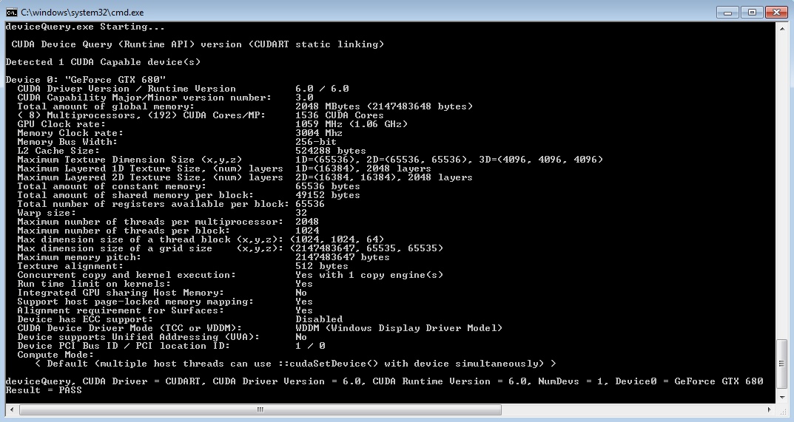
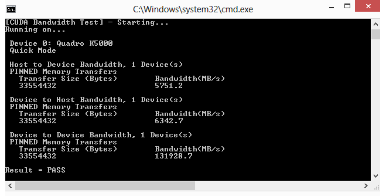

# CUDA Installation Guide for Microsoft Windows — Installation Guide Windows 13.2 documentation

**来源**: [https://docs.nvidia.com/cuda/cuda-installation-guide-microsoft-windows/index.html](https://docs.nvidia.com/cuda/cuda-installation-guide-microsoft-windows/index.html)

---

CUDA Installation Guide for Microsoft Windows

# 1. Overview
The CUDA Installation Guide for Microsoft Windows provides step-by-step instructions to help developers set up NVIDIA’s CUDA Toolkit on Windows systems. It begins by introducing CUDA as NVIDIA’s powerful parallel-computing platform—designed to accelerate compute-intensive applications by leveraging GPU capabilities. The guide details essential*system requirements*, including a CUDA-capable GPU and a compatible version of Windows, as well as the supported Visual Studio compilers. From there, it walks users through downloading the toolkit, installing both the CUDA driver and development tools, and verifying installation by compiling and running sample projects. With clear explanations geared toward both beginners and experienced developers, this guide ensures a smooth setup experience so you can start building GPU-accelerated applications on Windows right away.

# 2. Introduction
CUDA®is a parallel computing platform and programming model invented by NVIDIA. It enables dramatic increases in computing performance by harnessing the power of the graphics processing unit (GPU).
CUDA was developed with several design goals in mind:
- Provide a small set of extensions to standard programming languages, like C, that enable a straightforward implementation of parallel algorithms. With CUDA C/C++, programmers can focus on the task of parallelization of the algorithms rather than spending time on their implementation.
- Support heterogeneous computation where applications use both the CPU and GPU. Serial portions of applications are run on the CPU, and parallel portions are offloaded to the GPU. As such, CUDA can be incrementally applied to existing applications. The CPU and GPU are treated as separate devices that have their own memory spaces. This configuration also allows simultaneous computation on the CPU and GPU without contention for memory resources.
CUDA-capable GPUs have hundreds of cores that can collectively run thousands of computing threads. These cores have shared resources including a register file and a shared memory. The on-chip shared memory allows parallel tasks running on these cores to share data without sending it over the system memory bus.
This guide will show you how to install and check the correct operation of the CUDA development tools.

## 2.1. System Requirements
To use CUDA on your system, you will need the following installed:
- A CUDA-capable GPU
- A supported version of Microsoft Windows
- A supported version of Microsoft Visual Studio
- NVIDIA CUDA Toolkit (available at[https://developer.nvidia.com/cuda-downloads](https://developer.nvidia.com/cuda-downloads))
Supported Microsoft Windows®operating systems:
- Microsoft Windows 11 25H2
- Microsoft Windows 11 24H2
- Microsoft Windows 11 22H2-SV2
- Microsoft Windows 11 23H2
- Microsoft Windows 10 22H2
- Microsoft Windows Server 2022
- Microsoft Windows Server 2025

<div style="overflow-x: auto; max-width: 100%; border-radius: 6px;">
<table border="1" cellpadding="6" cellspacing="0" style="border-collapse: collapse; width: 100%; font-family: -apple-system, BlinkMacSystemFont, Segoe UI, Helvetica, Arial, sans-serif; font-size: 13px; margin: 16px 0;">
<caption>Table 1 Windows Compiler Support in CUDA 13.2</caption>
<colgroup>
<col style="width: 12%"/>
<col style="width: 30%"/>
<col style="width: 10%"/>
<col style="width: 24%"/>
<col style="width: 24%"/>
</colgroup>
<thead>
<tr style="border: 1px solid #d0d7de;"><th style="background-color: #f6f8fa; font-weight: 600; text-align: left; padding: 8px 12px; border: 1px solid #d0d7de;"><p>Compiler*</p></th>
<th style="background-color: #f6f8fa; font-weight: 600; text-align: left; padding: 8px 12px; border: 1px solid #d0d7de;"><p>IDE</p></th>
<th style="background-color: #f6f8fa; font-weight: 600; text-align: left; padding: 8px 12px; border: 1px solid #d0d7de;"><p>Native x86_64</p></th>
<th style="background-color: #f6f8fa; font-weight: 600; text-align: left; padding: 8px 12px; border: 1px solid #d0d7de;"><p>Cross-compilation (32-bit on 64-bit)</p></th>
<th style="background-color: #f6f8fa; font-weight: 600; text-align: left; padding: 8px 12px; border: 1px solid #d0d7de;"><p>C++ Dialect</p></th>
</tr>
</thead>
<tbody>
<tr style="border: 1px solid #d0d7de;"><td style="padding: 8px 12px; border: 1px solid #d0d7de; vertical-align: top;"><p>MSVC Version 195x</p></td>
<td style="padding: 8px 12px; border: 1px solid #d0d7de; vertical-align: top;"><p>Visual Studio 2026 18.x</p></td>
<td style="padding: 8px 12px; border: 1px solid #d0d7de; vertical-align: top;"><p>YES</p></td>
<td style="padding: 8px 12px; border: 1px solid #d0d7de; vertical-align: top;"><p>Not supported</p></td>
<td style="padding: 8px 12px; border: 1px solid #d0d7de; vertical-align: top;"><p>C++14(default), C++17, C++20</p></td>
</tr>
<tr style="border: 1px solid #d0d7de;"><td style="padding: 8px 12px; border: 1px solid #d0d7de; vertical-align: top;"><p>MSVC Version 193x</p></td>
<td style="padding: 8px 12px; border: 1px solid #d0d7de; vertical-align: top;"><p>Visual Studio 2022 17.x</p></td>
<td style="padding: 8px 12px; border: 1px solid #d0d7de; vertical-align: top;"><p>YES</p></td>
<td style="padding: 8px 12px; border: 1px solid #d0d7de; vertical-align: top;"><p>Not supported</p></td>
<td style="padding: 8px 12px; border: 1px solid #d0d7de; vertical-align: top;"><p>C++14 (default), C++17, C++20</p></td>
</tr>
<tr style="border: 1px solid #d0d7de;"><td style="padding: 8px 12px; border: 1px solid #d0d7de; vertical-align: top;"><p>MSVC Version 192x</p></td>
<td style="padding: 8px 12px; border: 1px solid #d0d7de; vertical-align: top;"><p>Visual Studio 2019 16.x</p></td>
<td style="padding: 8px 12px; border: 1px solid #d0d7de; vertical-align: top;"><p>YES</p></td>
<td style="padding: 8px 12px; border: 1px solid #d0d7de; vertical-align: top;"><p>Not supported</p></td>
<td style="padding: 8px 12px; border: 1px solid #d0d7de; vertical-align: top;"><p>C++14 (default), C++17</p></td>
</tr>
</tbody>
</table>
</div>

* Support for Visual Studio 2015 is deprecated in release 11.1; support for Visual Studio 2017 is deprecated in release 12.5 and dropped in release 12.9.
32-bit compilation native and cross-compilation is removed from CUDA 12.0 and later Toolkit. Use the CUDA Toolkit from earlier releases for 32-bit compilation. CUDA Driver will continue to support running 32-bit application binaries on GeForce GPUs until Ada. Ada will be the last architecture with driver support for 32-bit applications. Hopper does not support 32-bit applications.
Support for running x86 32-bit applications on x86_64 Windows is limited to use with:
- CUDA Driver
- CUDA Runtime (cudart)
- CUDA Math Library (math.h)

## 2.2. About This Document
This document is intended for readers familiar with Microsoft Windows operating systems and the Microsoft Visual Studio environment. You do not need previous experience with CUDA or experience with parallel computation.

# 3. Installing CUDA Development Tools
Basic instructions can be found in the[Quick Start Guide](https://docs.nvidia.com/cuda/cuda-quick-start-guide/index.html#windows). Read on for more detailed instructions.
The setup of CUDA development tools on a system running the appropriate version of Windows consists of a few simple steps:
- Verify the system has a CUDA-capable GPU.
- Download the NVIDIA CUDA Toolkit.
- Install the NVIDIA CUDA Toolkit.
- Test that the installed software runs correctly and communicates with the hardware.

## 3.1. Verify You Have a CUDA-capable GPU
You can verify that you have a CUDA-capable GPU through the**Display Adapters**section in the**Windows Device Manager**. Here you will find the vendor name and model of your graphics card(s). If you have an NVIDIA card that is listed in[https://developer.nvidia.com/cuda-gpus](https://developer.nvidia.com/cuda-gpus), that GPU is CUDA-capable. The Release Notes for the CUDA Toolkit also contain a list of supported products.
The**Windows Device Manager**can be opened via the following steps:
1. Open a run window from the Start Menu
2. Run:
  
  ```
  control /name Microsoft.DeviceManager
  
  ```

## 3.2. Download the NVIDIA CUDA Toolkit
The NVIDIA CUDA Toolkit is available at[https://developer.nvidia.com/cuda-downloads](https://developer.nvidia.com/cuda-downloads). Choose the platform you are using and one of the following installer formats:
1. Network Installer: A minimal installer which later downloads packages required for installation. Only the packages selected during the selection phase of the installer are downloaded. This installer is useful for users who want to minimize download time.
2. Full Installer: An installer which contains all the components of the CUDA Toolkit and does not require any further download. This installer is useful for systems which lack network access and for enterprise deployment.
The CUDA Toolkit installs the CUDA driver and tools needed to create, build and run a CUDA application as well as libraries, header files, and other resources.
The download can be verified by comparing the MD5 checksum posted at[https://developer.download.nvidia.com/compute/cuda/9.0/docs/sidebar/md5sum.txt](https://developer.download.nvidia.com/compute/cuda/9.0/docs/sidebar/md5sum.txt)with that of the downloaded file. If either of the checksums differ, the downloaded file is corrupt and needs to be downloaded again.

## 3.3. Install the CUDA Software
Before installing the toolkit, you should read the Release Notes, as they provide details on installation and software functionality.

Note
The driver and toolkit must be installed for CUDA to function. If you have not installed a stand-alone driver, install the driver from the NVIDIA CUDA Toolkit.

Note
The installation may fail if Windows Update starts after the installation has begun. Wait until Windows Update is complete and then try the installation again.

**Graphical Installation**
Install the CUDA Software by executing the CUDA installer and following the on-screen prompts.
**Silent Installation**
The installer can be executed in silent mode by executing the package with the`-s`flag. Additional parameters can be passed which will install specific subpackages instead of all packages. See the table below for a list of all the subpackage names.

<div style="overflow-x: auto; max-width: 100%; border-radius: 6px;">
<table border="1" cellpadding="6" cellspacing="0" style="border-collapse: collapse; width: 100%; font-family: -apple-system, BlinkMacSystemFont, Segoe UI, Helvetica, Arial, sans-serif; font-size: 13px; margin: 16px 0;">
<caption>Table 2 Possible Subpackage Names</caption>
<colgroup>
<col style="width: 40%"/>
<col style="width: 60%"/>
</colgroup>
<thead>
<tr style="border: 1px solid #d0d7de;"><th style="background-color: #f6f8fa; font-weight: 600; text-align: left; padding: 8px 12px; border: 1px solid #d0d7de;"><p>Subpackage Name</p></th>
<th style="background-color: #f6f8fa; font-weight: 600; text-align: left; padding: 8px 12px; border: 1px solid #d0d7de;"><p>Subpackage Description</p></th>
</tr>
</thead>
<tbody>
<tr style="border: 1px solid #d0d7de;"><td colspan="2" style="padding: 8px 12px; border: 1px solid #d0d7de; vertical-align: top;"><p>Toolkit Subpackages (defaults to C:\Program Files\NVIDIA GPU Computing Toolkit\CUDA\v13.2)</p></td>
</tr>
<tr style="border: 1px solid #d0d7de;"><td style="padding: 8px 12px; border: 1px solid #d0d7de; vertical-align: top;"><p>crt_13.2</p></td>
<td style="padding: 8px 12px; border: 1px solid #d0d7de; vertical-align: top;"><p>CUDA Runtime Library</p></td>
</tr>
<tr style="border: 1px solid #d0d7de;"><td style="padding: 8px 12px; border: 1px solid #d0d7de; vertical-align: top;"><p>ctadvisor_13.2</p></td>
<td style="padding: 8px 12px; border: 1px solid #d0d7de; vertical-align: top;"><p>CUDA Threading/Compute Advisor</p></td>
</tr>
<tr style="border: 1px solid #d0d7de;"><td rowspan="2" style="padding: 8px 12px; border: 1px solid #d0d7de; vertical-align: top;"><p>cublas_13.2</p>
<p>cublas_dev_13.2</p>
</td>
<td rowspan="2" style="padding: 8px 12px; border: 1px solid #d0d7de; vertical-align: top;"><p>cuBLAS Runtime Library</p></td>
</tr>
<tr style="border: 1px solid #d0d7de;"></tr>
<tr style="border: 1px solid #d0d7de;"><td style="padding: 8px 12px; border: 1px solid #d0d7de; vertical-align: top;"><p>cuda_profiler_api_13.2</p></td>
<td style="padding: 8px 12px; border: 1px solid #d0d7de; vertical-align: top;"><p>CUDA Profiler API</p></td>
</tr>
<tr style="border: 1px solid #d0d7de;"><td style="padding: 8px 12px; border: 1px solid #d0d7de; vertical-align: top;"><p>cudart_13.2</p></td>
<td style="padding: 8px 12px; border: 1px solid #d0d7de; vertical-align: top;"><p>CUDA Runtime Library</p></td>
</tr>
<tr style="border: 1px solid #d0d7de;"><td rowspan="2" style="padding: 8px 12px; border: 1px solid #d0d7de; vertical-align: top;"><p>cufft_13.2</p>
<p>cufft_dev_13.2</p>
</td>
<td rowspan="2" style="padding: 8px 12px; border: 1px solid #d0d7de; vertical-align: top;"><p>cuFFT Runtime Library</p></td>
</tr>
<tr style="border: 1px solid #d0d7de;"></tr>
<tr style="border: 1px solid #d0d7de;"><td style="padding: 8px 12px; border: 1px solid #d0d7de; vertical-align: top;"><p>cuobjdump_13.2</p></td>
<td style="padding: 8px 12px; border: 1px solid #d0d7de; vertical-align: top;"><p>Extracts information from cubin files</p></td>
</tr>
<tr style="border: 1px solid #d0d7de;"><td style="padding: 8px 12px; border: 1px solid #d0d7de; vertical-align: top;"><p>cupti_13.2</p></td>
<td style="padding: 8px 12px; border: 1px solid #d0d7de; vertical-align: top;"><p>The CUDA Profiling Tools Interface for creating profiling and tracing tools that target CUDA applications</p></td>
</tr>
<tr style="border: 1px solid #d0d7de;"><td rowspan="2" style="padding: 8px 12px; border: 1px solid #d0d7de; vertical-align: top;"><p>curand_13.2</p>
<p>curand_dev_13.2</p>
</td>
<td rowspan="2" style="padding: 8px 12px; border: 1px solid #d0d7de; vertical-align: top;"><p>cuRAND Runtime Library</p></td>
</tr>
<tr style="border: 1px solid #d0d7de;"></tr>
<tr style="border: 1px solid #d0d7de;"><td rowspan="2" style="padding: 8px 12px; border: 1px solid #d0d7de; vertical-align: top;"><p>cusolver_13.2</p>
<p>cusolver_dev_13.2</p>
</td>
<td rowspan="2" style="padding: 8px 12px; border: 1px solid #d0d7de; vertical-align: top;"><p>cuSOLVER Runtime Library</p></td>
</tr>
<tr style="border: 1px solid #d0d7de;"></tr>
<tr style="border: 1px solid #d0d7de;"><td rowspan="2" style="padding: 8px 12px; border: 1px solid #d0d7de; vertical-align: top;"><p>cusparse_13.2</p>
<p>cusparse_dev_13.2</p>
</td>
<td rowspan="2" style="padding: 8px 12px; border: 1px solid #d0d7de; vertical-align: top;"><p>cuSPARSE Runtime Library</p></td>
</tr>
<tr style="border: 1px solid #d0d7de;"></tr>
<tr style="border: 1px solid #d0d7de;"><td style="padding: 8px 12px; border: 1px solid #d0d7de; vertical-align: top;"><p>cuxxfilt_13.2</p></td>
<td style="padding: 8px 12px; border: 1px solid #d0d7de; vertical-align: top;"><p>The CUDA cu++ filt Demangler Tool</p></td>
</tr>
<tr style="border: 1px solid #d0d7de;"><td style="padding: 8px 12px; border: 1px solid #d0d7de; vertical-align: top;"><p>documentation_13.2</p></td>
<td style="padding: 8px 12px; border: 1px solid #d0d7de; vertical-align: top;"><p>CUDA documentation (HTML/PDF), including release notes, programming guides, best practices, API references, and library documentation</p></td>
</tr>
<tr style="border: 1px solid #d0d7de;"><td style="padding: 8px 12px; border: 1px solid #d0d7de; vertical-align: top;"><p>nsight_compute_13.2</p></td>
<td style="padding: 8px 12px; border: 1px solid #d0d7de; vertical-align: top;"><p>Nsight Compute</p></td>
</tr>
<tr style="border: 1px solid #d0d7de;"><td style="padding: 8px 12px; border: 1px solid #d0d7de; vertical-align: top;"><p>nsight_systems_13.2</p></td>
<td style="padding: 8px 12px; border: 1px solid #d0d7de; vertical-align: top;"><p>Nsight Systems</p></td>
</tr>
<tr style="border: 1px solid #d0d7de;"><td style="padding: 8px 12px; border: 1px solid #d0d7de; vertical-align: top;"><p>nsight_vse_13.2</p></td>
<td style="padding: 8px 12px; border: 1px solid #d0d7de; vertical-align: top;"><p>Installs the Nsight Visual Studio Edition plugin in all VS</p></td>
</tr>
<tr style="border: 1px solid #d0d7de;"><td rowspan="2" style="padding: 8px 12px; border: 1px solid #d0d7de; vertical-align: top;"><p>npp_13.2</p>
<p>npp_dev_13.2</p>
</td>
<td rowspan="2" style="padding: 8px 12px; border: 1px solid #d0d7de; vertical-align: top;"><p>NPP Runtime Library</p></td>
</tr>
<tr style="border: 1px solid #d0d7de;"></tr>
<tr style="border: 1px solid #d0d7de;"><td style="padding: 8px 12px; border: 1px solid #d0d7de; vertical-align: top;"><p>nvcc_13.2</p></td>
<td style="padding: 8px 12px; border: 1px solid #d0d7de; vertical-align: top;"><p>CUDA Compiler</p></td>
</tr>
<tr style="border: 1px solid #d0d7de;"><td style="padding: 8px 12px; border: 1px solid #d0d7de; vertical-align: top;"><p>nvdisasm_13.2</p></td>
<td style="padding: 8px 12px; border: 1px solid #d0d7de; vertical-align: top;"><p>Extracts information from standalone cubin files</p></td>
</tr>
<tr style="border: 1px solid #d0d7de;"><td style="padding: 8px 12px; border: 1px solid #d0d7de; vertical-align: top;"><p>nvfatbin_13.2</p></td>
<td style="padding: 8px 12px; border: 1px solid #d0d7de; vertical-align: top;"><p>Library for creating Fatbinaries at Runtime</p></td>
</tr>
<tr style="border: 1px solid #d0d7de;"><td style="padding: 8px 12px; border: 1px solid #d0d7de; vertical-align: top;"><p>nvjitlink_13.2</p></td>
<td style="padding: 8px 12px; border: 1px solid #d0d7de; vertical-align: top;"><p>nvJitLink Library</p></td>
</tr>
<tr style="border: 1px solid #d0d7de;"><td rowspan="2" style="padding: 8px 12px; border: 1px solid #d0d7de; vertical-align: top;"><p>nvjpeg_13.2</p>
<p>nvjpeg_dev_13.2</p>
</td>
<td rowspan="2" style="padding: 8px 12px; border: 1px solid #d0d7de; vertical-align: top;"><p>nvJPEG Library</p></td>
</tr>
<tr style="border: 1px solid #d0d7de;"></tr>
<tr style="border: 1px solid #d0d7de;"><td style="padding: 8px 12px; border: 1px solid #d0d7de; vertical-align: top;"><p>nvml_dev_13.2</p></td>
<td style="padding: 8px 12px; border: 1px solid #d0d7de; vertical-align: top;"><p>NVML development Libraries and headers</p></td>
</tr>
<tr style="border: 1px solid #d0d7de;"><td style="padding: 8px 12px; border: 1px solid #d0d7de; vertical-align: top;"><p>nvprune_13.2</p></td>
<td style="padding: 8px 12px; border: 1px solid #d0d7de; vertical-align: top;"><p>Prunes host object files and libraries to only contain device code for the specified targets</p></td>
</tr>
<tr style="border: 1px solid #d0d7de;"><td style="padding: 8px 12px; border: 1px solid #d0d7de; vertical-align: top;"><p>nvptxcompiler_13.2</p></td>
<td style="padding: 8px 12px; border: 1px solid #d0d7de; vertical-align: top;"><p>nvPTX Compiler Library</p></td>
</tr>
<tr style="border: 1px solid #d0d7de;"><td rowspan="2" style="padding: 8px 12px; border: 1px solid #d0d7de; vertical-align: top;"><p>nvrtc_13.2</p>
<p>nvrtc_dev_13.2</p>
</td>
<td rowspan="2" style="padding: 8px 12px; border: 1px solid #d0d7de; vertical-align: top;"><p>NVRTC Runtime Library</p></td>
</tr>
<tr style="border: 1px solid #d0d7de;"></tr>
<tr style="border: 1px solid #d0d7de;"><td style="padding: 8px 12px; border: 1px solid #d0d7de; vertical-align: top;"><p>nvtx_13.2</p></td>
<td style="padding: 8px 12px; border: 1px solid #d0d7de; vertical-align: top;"><p>NVTX on Windows</p></td>
</tr>
<tr style="border: 1px solid #d0d7de;"><td style="padding: 8px 12px; border: 1px solid #d0d7de; vertical-align: top;"><p>nvvm_13.2</p></td>
<td style="padding: 8px 12px; border: 1px solid #d0d7de; vertical-align: top;"><p>NVVM Compiler Library</p></td>
</tr>
<tr style="border: 1px solid #d0d7de;"><td style="padding: 8px 12px; border: 1px solid #d0d7de; vertical-align: top;"><p>occupancy_calculator_13.2</p></td>
<td style="padding: 8px 12px; border: 1px solid #d0d7de; vertical-align: top;"><p>Installs the CUDA_Occupancy_Calculator.xls tool</p></td>
</tr>
<tr style="border: 1px solid #d0d7de;"><td style="padding: 8px 12px; border: 1px solid #d0d7de; vertical-align: top;"><p>opencl_13.2</p></td>
<td style="padding: 8px 12px; border: 1px solid #d0d7de; vertical-align: top;"><p>OpenCL Library</p></td>
</tr>
<tr style="border: 1px solid #d0d7de;"><td style="padding: 8px 12px; border: 1px solid #d0d7de; vertical-align: top;"><p>sanitizer_13.2</p></td>
<td style="padding: 8px 12px; border: 1px solid #d0d7de; vertical-align: top;"><p>Compute Sanitizer API</p></td>
</tr>
<tr style="border: 1px solid #d0d7de;"><td style="padding: 8px 12px; border: 1px solid #d0d7de; vertical-align: top;"><p>thrust_13.2</p></td>
<td style="padding: 8px 12px; border: 1px solid #d0d7de; vertical-align: top;"><p>CUDA Thrust</p></td>
</tr>
<tr style="border: 1px solid #d0d7de;"><td style="padding: 8px 12px; border: 1px solid #d0d7de; vertical-align: top;"><p>tileiras_13.2</p></td>
<td style="padding: 8px 12px; border: 1px solid #d0d7de; vertical-align: top;"><p>CUDA Tile IR</p></td>
</tr>
<tr style="border: 1px solid #d0d7de;"><td style="padding: 8px 12px; border: 1px solid #d0d7de; vertical-align: top;"><p>visual_studio_integration_13.2</p></td>
<td style="padding: 8px 12px; border: 1px solid #d0d7de; vertical-align: top;"><p>Installs CUDA project wizard and builds customization files in VS</p></td>
</tr>
</tbody>
</table>
</div>

**Extracting and Inspecting the Files Manually**
Sometimes it may be desirable to extract or inspect the installable files directly, such as in enterprise deployment, or to browse the files before installation. The full installation package can be extracted using a decompression tool which supports the LZMA compression method, such as[7-zip](http://www.7-zip.org/)or[WinZip](http://www.winzip.com/).
Once extracted, the CUDA Toolkit files will be in the`CUDAToolkit`folder, and similarly for CUDA Visual Studio Integration. Within each directory is a .dll and .nvi file that can be ignored as they are not part of the installable files.

Note
Accessing the files in this manner does not set up any environment settings, such as variables or Visual Studio integration. This is intended for enterprise-level deployment.

### 3.3.1. Uninstalling the CUDA Software
All subpackages can be uninstalled through the Windows Control Panel by using the Programs and Features widget.

## 3.4. Using Conda to Install the CUDA Software
This section describes the installation and configuration of CUDA when using the Conda installer. The Conda packages are available at[https://anaconda.org/nvidia](https://anaconda.org/nvidia).

### 3.4.1. Conda Overview
The Conda installation installs the CUDA Toolkit. The installation steps are listed below.

### 3.4.2. Installation
To perform a basic install of all CUDA Toolkit components using Conda, run the following command:

```
conda install cuda -c nvidia

```

### 3.4.3. Uninstallation
To uninstall the CUDA Toolkit using Conda, run the following command:

```
conda remove cuda

```

### 3.4.4. Installing Previous CUDA Releases
All Conda packages released under a specific CUDA version are labeled with that release version. To install a previous version, include that label in the`install`command such as:

```
conda install cuda -c nvidia/label/cuda-11.3.0

```

Note
Some CUDA releases do not move to new versions of all installable components. When this is the case these components will be moved to the new label, and you may need to modify the install command to include both labels such as:

```
conda install cuda -c nvidia/label/cuda-11.3.0 -c nvidia/label/cuda-11.3.1

```

This example will install all packages released as part of CUDA 11.3.1.

## 3.5. Use a Suitable Driver Model
On Windows 10 and later, the operating system provides two driver models under which the NVIDIA Driver may operate:
- The WDDM driver model is used for display devices.
- The[Tesla Compute Cluster (TCC)](https://www.nvidia.com/object/software-for-tesla-products.html)mode of the NVIDIA Driver is available for non-display devices such as NVIDIA Tesla GPUs and the GeForce GTX Titan GPUs; it uses the Windows WDM driver model.
TCC is enabled by default on most recent NVIDIA Tesla GPUs. To check which driver mode is in use and/or to switch driver modes, use the`nvidia-smi`tool that is included with the NVIDIA Driver installation (see`nvidia-smi -h`for details).

Note
Keep in mind that when TCC mode is enabled for a particular GPU, that GPU*cannot*be used as a display device.

Note
NVIDIA GeForce GPUs (excluding GeForce GTX Titan GPUs) do not support TCC mode.

## 3.6. Verify the Installation
Before continuing, it is important to verify that the CUDA toolkit can find and communicate correctly with the CUDA-capable hardware. To do this, you need to compile and run some of the included sample programs.

### 3.6.1. Running the Compiled Examples
The version of the CUDA Toolkit can be checked by running`nvcc -V`in a Command Prompt window. You can display a Command Prompt window by going to:
**Start > All Programs > Accessories > Command Prompt**
CUDA Samples are located in[https://github.com/nvidia/cuda-samples](https://github.com/nvidia/cuda-samples). To use the samples, clone the project, build the samples, and run them using the instructions on the Github page.
To verify a correct configuration of the hardware and software, it is highly recommended that you build and run the`deviceQuery`sample program. The sample can be built using the provided VS solution files in the`deviceQuery`folder.
This assumes that you used the default installation directory structure. If CUDA is installed and configured correctly, the output should look similar toFigure 1.

[](https://docs.nvidia.com/cuda/cuda-installation-guide-microsoft-windows/_images/valid-results-from-sample-cuda-devicequery-program.png)

Figure 1Valid Results from deviceQuery CUDA Sample

The exact appearance and the output lines might be different on your system. The important outcomes are that a device was found, that the device(s) match what is installed in your system, and that the test passed.
If a CUDA-capable device and the CUDA Driver are installed but`deviceQuery`reports that no CUDA-capable devices are present, ensure the device and driver are properly installed.
Running the`bandwidthTest`program, located in the same directory as`deviceQuery`above, ensures that the system and the CUDA-capable device are able to communicate correctly. The output should resembleFigure 2.

[](https://docs.nvidia.com/cuda/cuda-installation-guide-microsoft-windows/_images/valid-results-from-sample-cuda-bandwidthtest-program.png)

Figure 2Valid Results from bandwidthTest CUDA Sample

The device name (second line) and the bandwidth numbers vary from system to system. The important items are the second line, which confirms a CUDA device was found, and the second-to-last line, which confirms that all necessary tests passed.
If the tests do not pass, make sure you do have a CUDA-capable NVIDIA GPU on your system and make sure it is properly installed.
To see a graphical representation of what CUDA can do, run the`particles`sample at

```
https://github.com/NVIDIA/cuda-samples/tree/master/Samples/2_Concepts_and_Techniques/particles

```

# 4. Pip Wheels
NVIDIA provides Python Wheels for installing CUDA through pip, primarily for using CUDA with Python. These packages are intended for runtime use and do not currently include developer tools (these can be installed separately).
Please note that with this installation method, CUDA installation environment is managed via pip and additional care must be taken to set up your host environment to use CUDA outside the pip environment.

## 4.1. Prerequisites
To install Wheels, you must first install the`nvidia-pyindex`package, which is required in order to set up your pip installation to fetch additional Python modules from the NVIDIA NGC PyPI repo. If your pip and setuptools Python modules are not up-to-date, then use the following command to upgrade these Python modules. If these Python modules are out-of-date then the commands which follow later in this section may fail.

```
py -m pip install --upgrade setuptools pip wheel

```

You should now be able to install the`nvidia-pyindex`module.

```
py -m pip install nvidia-pyindex

```

If your project is using a`requirements.txt`file, then you can add the following line to your`requirements.txt`file as an alternative to installing the`nvidia-pyindex`package:

```
--extra-index-url https://pypi.ngc.nvidia.com

```

## 4.2. Procedure
Install the CUDA runtime package:

```
py -m pip install nvidia-cuda-runtime-cu12

```

Optionally, install additional packages as listed below using the following command:

```
py -m pip install nvidia-<library>

```

## 4.3. Metapackages
The following metapackages will install the latest version of the named component on Windows for the indicated CUDA version. “cu12” should be read as “cuda12”.
- nvidia-cublas-cu12
- nvidia-cuda-cccl-cu12
- nvidia-cuda-cupti-cu12
- nvidia-cuda-nvcc-cu12
- nvidia-cuda-nvrtc-cu12
- nvidia-cuda-opencl-cu12
- nvidia-cuda-runtime-cu12
- nvidia-cuda-sanitizer-api-cu12
- nvidia-cufft-cu12
- nvidia-curand-cu12
- nvidia-cusolver-cu12
- nvidia-cusparse-cu12
- nvidia-npp-cu12
- nvidia-nvfatbin-cu12
- nvidia-nvjitlink-cu12
- nvidia-nvjpeg-cu12
- nvidia-nvml-dev-cu12
- nvidia-nvtx-cu12
These metapackages install the following packages:
- nvidia-cublas-cu129
- nvidia-cuda-cccl-cu129
- nvidia-cuda-cupti-cu129
- nvidia-cuda-nvcc-cu129
- nvidia-cuda-nvrtc-cu129
- nvidia-cuda-opencl-cu129
- nvidia-cuda-runtime-cu129
- nvidia-cuda-sanitizer-api-cu129
- nvidia-cufft-cu129
- nvidia-curand-cu129
- nvidia-cusolver-cu129
- nvidia-cusparse-cu129
- nvidia-npp-cu129
- nvidia-nvfatbin-cu129
- nvidia-nvjitlink-cu129
- nvidia-nvjpeg-cu129
- nvidia-nvml-dev-cu129
- nvidia-nvtx-cu129

# 5. Compiling CUDA Programs
The project files in the CUDA Samples have been designed to provide simple, one-click builds of the programs that include all source code. To build the Windows projects (for release or debug mode), use the provided`*.sln`solution files for Microsoft Visual Studio 2015 (deprecated in CUDA 11.1), 2017 (deprecated in 12.5), 2019, or 2022. You can use either the solution files located in each of the examples directories in[https://github.com/nvidia/cuda-samples](https://github.com/nvidia/cuda-samples)

## 5.1. Compiling Sample Projects
The`bandwidthTest`project is a good sample project to build and run. It is located in[https://github.com/NVIDIA/cuda-samples/tree/master/Samples/1_Utilities/bandwidthTest](https://github.com/NVIDIA/cuda-samples/tree/master/Samples/1_Utilities/bandwidthTest).
If you elected to use the default installation location, the output is placed in`CUDA Samples\v13.2\bin\win64\Release`. Build the program using the appropriate solution file and run the executable. If all works correctly, the output should be similar to[Figure 2](https://docs.nvidia.com/cuda/cuda-installation-guide-microsoft-windows/index.html#compiling-examples__valid-results-from-sample-cuda-bandwidthtest-program).

## 5.2. Sample Projects
The sample projects come in two configurations: debug and release (where release contains no debugging information) and different Visual Studio projects.
A few of the example projects require some additional setup.
These sample projects also make use of the`$CUDA_PATH`environment variable to locate where the CUDA Toolkit and the associated`.props`files are.
The environment variable is set automatically using the Build Customization`CUDA 13.2.props`file, and is installed automatically as part of the CUDA Toolkit installation process.

<div style="overflow-x: auto; max-width: 100%; border-radius: 6px;">
<table border="1" cellpadding="6" cellspacing="0" style="border-collapse: collapse; width: 100%; font-family: -apple-system, BlinkMacSystemFont, Segoe UI, Helvetica, Arial, sans-serif; font-size: 13px; margin: 16px 0;">
<caption>Table 3 CUDA Visual Studio .props locations</caption>
<colgroup>
<col style="width: 21%"/>
<col style="width: 79%"/>
</colgroup>
<thead>
<tr style="border: 1px solid #d0d7de;"><th style="background-color: #f6f8fa; font-weight: 600; text-align: left; padding: 8px 12px; border: 1px solid #d0d7de;"><p>Visual Studio</p></th>
<th style="background-color: #f6f8fa; font-weight: 600; text-align: left; padding: 8px 12px; border: 1px solid #d0d7de;"><p><code class="docutils literal notranslate"><span class="pre">CUDA</span> <span class="pre">13.2.props</span></code> file Install Directory</p></th>
</tr>
</thead>
<tbody>
<tr style="border: 1px solid #d0d7de;"><td style="padding: 8px 12px; border: 1px solid #d0d7de; vertical-align: top;"><p>Visual Studio 2019</p></td>
<td style="padding: 8px 12px; border: 1px solid #d0d7de; vertical-align: top;"><p>C:\Program Files (x86)\Microsoft Visual Studio\2019\Professional\MSBuild\Microsoft\VC\v160\BuildCustomizations</p></td>
</tr>
<tr style="border: 1px solid #d0d7de;"><td style="padding: 8px 12px; border: 1px solid #d0d7de; vertical-align: top;"><p>Visual Studio 2022</p></td>
<td style="padding: 8px 12px; border: 1px solid #d0d7de; vertical-align: top;"><p>C:\Program Files\Microsoft Visual Studio\2022\Professional\MSBuild\Microsoft\VC\v170\BuildCustomizations</p></td>
</tr>
</tbody>
</table>
</div>

You can reference this`CUDA 13.2.props`file when building your own CUDA applications.

## 5.3. Build Customizations for New Projects
When creating a new CUDA application, the Visual Studio project file must be configured to include CUDA build customizations. To accomplish this, click File-> New | Project… NVIDIA-> CUDA->, then select a template for your CUDA Toolkit version. For example, selecting the “CUDA 13.2 Runtime” template will configure your project for use with the CUDA 13.2 Toolkit. The new project is technically a C++ project (.vcxproj) that is preconfigured to use NVIDIA’s Build Customizations. All standard capabilities of Visual Studio C++ projects will be available.
To specify a custom CUDA Toolkit location, under**CUDA C/C++**, select**Common**, and set the**CUDA Toolkit Custom Dir**field as desired. Note that the selected toolkit must match the version of the Build Customizations.

Note
A supported version of MSVC must be installed to use this feature.

## 5.4. Build Customizations for Existing Projects
When adding CUDA acceleration to existing applications, the relevant Visual Studio project files must be updated to include CUDA build customizations. This can be done using one of the following two methods:
1. Open the Visual Studio project, right click on the project name, and select**Build Dependencies > Build Customizations…**, then select the CUDA Toolkit version you would like to target.
2. Alternatively, you can configure your project always to build with the most recently installed version of the CUDA Toolkit. First add a CUDA build customization to your project as above. Then, right click on the project name and select**Properties**. Under**CUDA C/C++**, select**Common**, and set the**CUDA Toolkit Custom Dir**field to`$(CUDA_PATH)`. Note that the`$(CUDA_PATH)`environment variable is set by the installer.
While Option 2 will allow your project to automatically use any new CUDA Toolkit version you may install in the future, selecting the toolkit version explicitly as in Option 1 is often better in practice, because if there are new CUDA configuration options added to the build customization rules accompanying the newer toolkit, you would not see those new options using Option 2.
If you use the`$(CUDA_PATH)`environment variable to target a version of the CUDA Toolkit for building, and you perform an installation or uninstallation of any version of the CUDA Toolkit, you should validate that the`$(CUDA_PATH)`environment variable points to the correct installation directory of the CUDA Toolkit for your purposes. You can access the value of the`$(CUDA_PATH)`environment variable via the following steps:
1. Open a run window from the Start Menu.
2. Run:
  
  ```
  control sysdm.cpl
  
  ```
3. Select the**Advanced**tab at the top of the window.
4. Click**Environment Variables**at the bottom of the window.
Files which contain CUDA code must be marked as a`CUDA C/C++`file. This can done when adding the file by right clicking the project you wish to add the file to, selecting**Add New Item**, selecting**NVIDIA CUDA 13.2\CodeCUDA C/C++ File**, and then selecting the file you wish to add.
For advanced users, if you wish to try building your project against a newer CUDA Toolkit without making changes to any of your project files, go to the Visual Studio command prompt, change the current directory to the location of your project, and execute a command such as the following:

```
msbuild <projectname.extension> /t:Rebuild /p:CudaToolkitDir="drive:/path/to/new/toolkit/"

```

# 6. Additional Considerations
Now that you have CUDA-capable hardware and the NVIDIA CUDA Toolkit installed, you can examine and enjoy the numerous included programs. To begin using CUDA to accelerate the performance of your own applications, consult the CUDA C Programming Guide, located in the CUDA Toolkit documentation directory.
A number of helpful development tools are included in the CUDA Toolkit or are available for download from the NVIDIA Developer Zone to assist you as you develop your CUDA programs, such as NVIDIA®Nsight™ Visual Studio Edition, Nsight Systems, Nsight Compute and Compute Sanitizer.
For technical support on programming questions, consult and participate in the developer forums by clicking[here](https://developer.nvidia.com/cuda/).

# 7. Notices

## 7.1. Notice
This document is provided for information purposes only and shall not be regarded as a warranty of a certain functionality, condition, or quality of a product. NVIDIA Corporation (“NVIDIA”) makes no representations or warranties, expressed or implied, as to the accuracy or completeness of the information contained in this document and assumes no responsibility for any errors contained herein. NVIDIA shall have no liability for the consequences or use of such information or for any infringement of patents or other rights of third parties that may result from its use. This document is not a commitment to develop, release, or deliver any Material (defined below), code, or functionality.
NVIDIA reserves the right to make corrections, modifications, enhancements, improvements, and any other changes to this document, at any time without notice.
Customer should obtain the latest relevant information before placing orders and should verify that such information is current and complete.
NVIDIA products are sold subject to the NVIDIA standard terms and conditions of sale supplied at the time of order acknowledgement, unless otherwise agreed in an individual sales agreement signed by authorized representatives of NVIDIA and customer (“Terms of Sale”). NVIDIA hereby expressly objects to applying any customer general terms and conditions with regards to the purchase of the NVIDIA product referenced in this document. No contractual obligations are formed either directly or indirectly by this document.
NVIDIA products are not designed, authorized, or warranted to be suitable for use in medical, military, aircraft, space, or life support equipment, nor in applications where failure or malfunction of the NVIDIA product can reasonably be expected to result in personal injury, death, or property or environmental damage. NVIDIA accepts no liability for inclusion and/or use of NVIDIA products in such equipment or applications and therefore such inclusion and/or use is at customer’s own risk.
NVIDIA makes no representation or warranty that products based on this document will be suitable for any specified use. Testing of all parameters of each product is not necessarily performed by NVIDIA. It is customer’s sole responsibility to evaluate and determine the applicability of any information contained in this document, ensure the product is suitable and fit for the application planned by customer, and perform the necessary testing for the application in order to avoid a default of the application or the product. Weaknesses in customer’s product designs may affect the quality and reliability of the NVIDIA product and may result in additional or different conditions and/or requirements beyond those contained in this document. NVIDIA accepts no liability related to any default, damage, costs, or problem which may be based on or attributable to: (i) the use of the NVIDIA product in any manner that is contrary to this document or (ii) customer product designs.
No license, either expressed or implied, is granted under any NVIDIA patent right, copyright, or other NVIDIA intellectual property right under this document. Information published by NVIDIA regarding third-party products or services does not constitute a license from NVIDIA to use such products or services or a warranty or endorsement thereof. Use of such information may require a license from a third party under the patents or other intellectual property rights of the third party, or a license from NVIDIA under the patents or other intellectual property rights of NVIDIA.
Reproduction of information in this document is permissible only if approved in advance by NVIDIA in writing, reproduced without alteration and in full compliance with all applicable export laws and regulations, and accompanied by all associated conditions, limitations, and notices.
THIS DOCUMENT AND ALL NVIDIA DESIGN SPECIFICATIONS, REFERENCE BOARDS, FILES, DRAWINGS, DIAGNOSTICS, LISTS, AND OTHER DOCUMENTS (TOGETHER AND SEPARATELY, “MATERIALS”) ARE BEING PROVIDED “AS IS.” NVIDIA MAKES NO WARRANTIES, EXPRESSED, IMPLIED, STATUTORY, OR OTHERWISE WITH RESPECT TO THE MATERIALS, AND EXPRESSLY DISCLAIMS ALL IMPLIED WARRANTIES OF NONINFRINGEMENT, MERCHANTABILITY, AND FITNESS FOR A PARTICULAR PURPOSE. TO THE EXTENT NOT PROHIBITED BY LAW, IN NO EVENT WILL NVIDIA BE LIABLE FOR ANY DAMAGES, INCLUDING WITHOUT LIMITATION ANY DIRECT, INDIRECT, SPECIAL, INCIDENTAL, PUNITIVE, OR CONSEQUENTIAL DAMAGES, HOWEVER CAUSED AND REGARDLESS OF THE THEORY OF LIABILITY, ARISING OUT OF ANY USE OF THIS DOCUMENT, EVEN IF NVIDIA HAS BEEN ADVISED OF THE POSSIBILITY OF SUCH DAMAGES. Notwithstanding any damages that customer might incur for any reason whatsoever, NVIDIA’s aggregate and cumulative liability towards customer for the products described herein shall be limited in accordance with the Terms of Sale for the product.

## 7.2. OpenCL
OpenCL is a trademark of Apple Inc. used under license to the Khronos Group Inc.

## 7.3. Trademarks
NVIDIA and the NVIDIA logo are trademarks or registered trademarks of NVIDIA Corporation in the U.S. and other countries. Other company and product names may be trademarks of the respective companies with which they are associated.