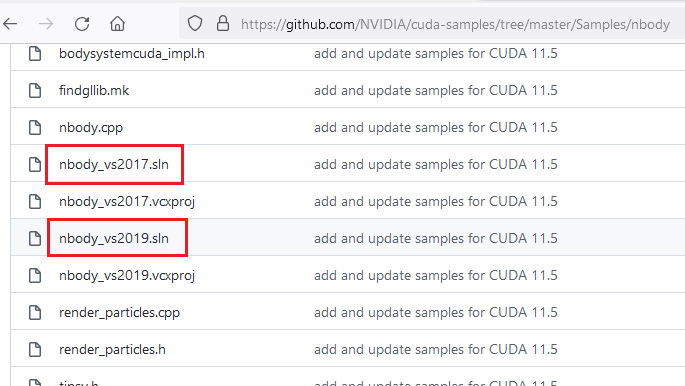
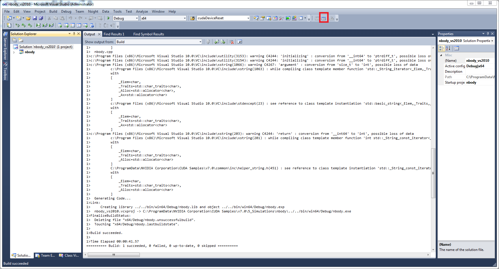

# CUDA Quick Start Guide — Quick Start Guide 13.2 documentation

**来源**: [https://docs.nvidia.com/cuda/cuda-quick-start-guide/index.html](https://docs.nvidia.com/cuda/cuda-quick-start-guide/index.html)

---

CUDA Quick Start Guide

# 1. Overview
Minimal first-steps instructions to get CUDA running on a standard system.

# 2. Introduction
This guide covers the basic instructions needed to install CUDA and verify that a CUDA application can run on each supported platform.
These instructions are intended to be used on a clean installation of a supported platform. For questions which are not answered in this document, please refer to the[Windows Installation Guide](https://docs.nvidia.com/cuda/cuda-installation-guide-microsoft-windows/)and[Linux Installation Guide](https://docs.nvidia.com/cuda/cuda-installation-guide-linux/).
The CUDA installation packages can be found on the[CUDA Downloads Page](https://developer.nvidia.com/cuda-downloads/).

# 3. Windows
When installing CUDA on Windows, you can choose between the Network Installer and the Local Installer. The Network Installer allows you to download only the files you need. The Local Installer is a stand-alone installer with a large initial download. For more details, refer to the[Windows Installation Guide](https://docs.nvidia.com/cuda/cuda-installation-guide-microsoft-windows/).

## 3.1. Network Installer
Perform the following steps to install CUDA and verify the installation.
1. Launch the downloaded installer package.
2. Read and accept the EULA.
3. Select**next**to download and install all components.
4. Once the download completes, the installation will begin automatically.
5. Once the installation completes, click “next” to acknowledge the Nsight Visual Studio Edition installation summary.
6. Click**close**to close the installer.
7. Navigate to the Samples’`nbody`directory in[https://github.com/NVIDIA/cuda-samples/tree/master/Samples/5_Domain_Specific/nbody](https://github.com/NVIDIA/cuda-samples/tree/master/Samples/5_Domain_Specific/nbody).
8. Open the`nbody`Visual Studio solution file for the version of Visual Studio you have installed, for example,`nbody_vs2019.sln`.
  
9. Open the**Build**menu within Visual Studio and click**Build Solution**.
  
10. Navigate to the CUDA Samples build directory and run the nbody sample.
  
  Note
  Run samples by navigating to the executable’s location, otherwise it will fail to locate dependent resources.

## 3.2. Local Installer
Perform the following steps to install CUDA and verify the installation.
1. Launch the downloaded installer package.
2. Read and accept the EULA.
3. Select**next**to install all components.
4. Once the installation completes, click**next**to acknowledge the Nsight Visual Studio Edition installation summary.
5. Click**close**to close the installer.
6. Navigate to the Samples’`nbody`directory in[https://github.com/NVIDIA/cuda-samples/tree/master/Samples/5_Domain_Specific/nbody](https://github.com/NVIDIA/cuda-samples/tree/master/Samples/5_Domain_Specific/nbody).
7. Open the nbody Visual Studio solution file for the version of Visual Studio you have installed.
  
8. Open the**Build**menu within Visual Studio and click**Build Solution**.
  
9. Navigate to the CUDA Samples build directory and run the nbody sample.
  
  Note
  Run samples by navigating to the executable’s location, otherwise it will fail to locate dependent resources.

## 3.3. Pip Wheels - Windows
NVIDIA provides Python Wheels for installing CUDA through pip, primarily for using CUDA with Python. These packages are intended for runtime use and do not currently include developer tools (these can be installed separately).
Please note that with this installation method, CUDA installation environment is managed via pip and additional care must be taken to set up your host environment to use CUDA outside the pip environment.
**Prerequisites**
To install Wheels, you must first install the`nvidia-pyindex`package, which is required in order to set up your pip installation to fetch additional Python modules from the NVIDIA NGC PyPI repo. If your pip and setuptools Python modules are not up-to-date, then use the following command to upgrade these Python modules. If these Python modules are out-of-date then the commands which follow later in this section may fail.

```
py -m pip install --upgrade setuptools pip wheel

```

You should now be able to install the`nvidia-pyindex`module.

```
py -m pip install nvidia-pyindex

```

If your project is using a`requirements.txt`file, then you can add the following line to your`requirements.txt`file as an alternative to installing the`nvidia-pyindex`package:

```
--extra-index-url https://pypi.ngc.nvidia.com

```

**Procedure**
Install the CUDA runtime package:

```
py -m pip install nvidia-cuda-runtime-cu12

```

Optionally, install additional packages as listed below using the following command:

```
py -m pip install nvidia-<library>

```

**Metapackages**
The following metapackages will install the latest version of the named component on Windows for the indicated CUDA version. “cu12” should be read as “cuda12”.
- nvidia-cuda-runtime-cu12
- nvidia-cuda-cupti-cu12
- nvidia-cuda-nvcc-cu12
- nvidia-nvml-dev-cu12
- nvidia-cuda-nvrtc-cu12
- nvidia-nvtx-cu12
- nvidia-cuda-sanitizer-api-cu12
- nvidia-cublas-cu12
- nvidia-cufft-cu12
- nvidia-curand-cu12
- nvidia-cusolver-cu12
- nvidia-cusparse-cu12
- nvidia-npp-cu12
- nvidia-nvjpeg-cu12
These metapackages install the following packages:
- nvidia-nvml-dev-cu126
- nvidia-cuda-nvcc-cu126
- nvidia-cuda-runtime-cu126
- nvidia-cuda-cupti-cu126
- nvidia-cublas-cu126
- nvidia-cuda-sanitizer-api-cu126
- nvidia-nvtx-cu126
- nvidia-cuda-nvrtc-cu126
- nvidia-npp-cu126
- nvidia-cusparse-cu126
- nvidia-cusolver-cu126
- nvidia-curand-cu126
- nvidia-cufft-cu126
- nvidia-nvjpeg-cu126

## 3.4. Conda
The Conda packages are available at[https://anaconda.org/nvidia](https://anaconda.org/nvidia).
**Installation**
To perform a basic install of all CUDA Toolkit components using Conda, run the following command:

```
conda install cuda -c nvidia

```

**Uninstallation**
To uninstall the CUDA Toolkit using Conda, run the following command:

```
conda remove cuda

```

# 4. Linux
CUDA on Linux can be installed using an RPM, Debian, Runfile, or Conda package, depending on the platform being installed on.

## 4.1. Linux x86_64
For development on the x86_64 architecture. In some cases, x86_64 systems may act as host platforms targeting other architectures. See the[Linux Installation Guide](https://docs.nvidia.com/cuda/cuda-installation-guide-linux/)for more details.

### 4.1.1. Redhat / CentOS
When installing CUDA on Redhat or CentOS, you can choose between the Runfile Installer and the RPM Installer. The Runfile Installer is only available as a Local Installer. The RPM Installer is available as both a Local Installer and a Network Installer. The Network Installer allows you to download only the files you need. The Local Installer is a stand-alone installer with a large initial download. In the case of the RPM installers, the instructions for the Local and Network variants are the same. For more details, refer to the[Linux Installation Guide](https://docs.nvidia.com/cuda/cuda-installation-guide-linux/).

#### 4.1.1.1. RPM Installer
Perform the following steps to install CUDA and verify the installation.
1. Install EPEL to satisfy the DKMS dependency by following the instructions at[EPEL’s website](https://fedoraproject.org/wiki/EPEL).
2. **Enable optional repos**:
  On**RHEL 8 Linux**only, execute the following steps to enable optional repositories.
  - **On x86_64 workstation:**
    
    ```
    subscription-manager repos --enable=rhel-8-for-x86_64-appstream-rpms
    subscription-manager repos --enable=rhel-8-for-x86_64-baseos-rpms
    subscription-manager repos --enable=codeready-builder-for-rhel-8-x86_64-rpms
    
    ```
3. Install the repository meta-data, clean the yum cache, and install CUDA:
  
  ```
  sudo rpm --install cuda-repo-<distro>-<version>.<architecture>.rpm
  sudo rpm --erase gpg-pubkey-7fa2af80*
  sudo yum clean expire-cache
  sudo yum install cuda
  
  ```
4. Reboot the system to load the NVIDIA drivers:
  
  ```
  sudo reboot
  
  ```
5. Set up the development environment by modifying the`PATH`and`LD_LIBRARY_PATH`variables:
  
  ```
  export PATH=/usr/local/cuda-12.8/bin${PATH:+:${PATH}}
  export LD_LIBRARY_PATH=/usr/local/cuda-12.8/lib64\
                           ${LD_LIBRARY_PATH:+:${LD_LIBRARY_PATH}}
  
  ```
6. Install a writable copy of the samples from[https://github.com/nvidia/cuda-samples](https://github.com/nvidia/cuda-samples), then build and run the nbody sample using the Linux instructions in[https://github.com/NVIDIA/cuda-samples/tree/master/Samples/5_Domain_Specific/nbody](https://github.com/NVIDIA/cuda-samples/tree/master/Samples/5_Domain_Specific/nbody).
  
  Note
  Run samples by navigating to the executable’s location, otherwise it will fail to locate dependent resources.

#### 4.1.1.2. Runfile Installer
Perform the following steps to install CUDA and verify the installation.
1. Disable the Nouveau drivers:
  1. Create a file at`/etc/modprobe.d/blacklist-nouveau.conf`with the following contents:
    
    ```
    blacklist nouveau
    options nouveau modeset=0
    
    ```
  2. Regenerate the kernel initramfs:
    
    ```
    sudo dracut --force
    
    ```
2. Reboot into runlevel 3 by temporarily adding the number “3” and the word “nomodeset” to the end of the system’s kernel boot parameters.
3. Run the installer silently to install with the default selections (implies acceptance of the EULA):
  
  ```
  sudo sh cuda_<version>_linux.run --silent
  
  ```
4. Create an xorg.conf file to use the NVIDIA GPU for display:
  
  ```
  sudo nvidia-xconfig
  
  ```
5. Reboot the system to load the graphical interface:
  
  ```
  sudo reboot
  
  ```
6. Set up the development environment by modifying the PATH and LD_LIBRARY_PATH variables:
  
  ```
  export PATH=/usr/local/cuda-12.8/bin${PATH:+:${PATH}}
  export LD_LIBRARY_PATH=/usr/local/cuda-12.8/lib64\
                           ${LD_LIBRARY_PATH:+:${LD_LIBRARY_PATH}}
  
  ```
7. Install a writable copy of the samples from[https://github.com/nvidia/cuda-samples](https://github.com/nvidia/cuda-samples), then build and run the nbody sample using the Linux instructions in[https://github.com/NVIDIA/cuda-samples/tree/master/Samples/5_Domain_Specific/nbody](https://github.com/NVIDIA/cuda-samples/tree/master/Samples/5_Domain_Specific/nbody).
  
  Note
  Run samples by navigating to the executable’s location, otherwise it will fail to locate dependent resources.

### 4.1.2. Fedora
When installing CUDA on Fedora, you can choose between the Runfile Installer and the RPM Installer. The Runfile Installer is only available as a Local Installer. The RPM Installer is available as both a Local Installer and a Network Installer. The Network Installer allows you to download only the files you need. The Local Installer is a stand-alone installer with a large initial download. In the case of the RPM installers, the instructions for the Local and Network variants are the same. For more details, refer to the[Linux Installation Guide](https://docs.nvidia.com/cuda/cuda-installation-guide-linux/).

#### 4.1.2.1. RPM Installer
Perform the following steps to install CUDA and verify the installation.
1. Install the RPMFusion free repository to satisfy the Akmods dependency:
  
  ```
  su -c 'dnf install --nogpgcheck http://download1.rpmfusion.org/free/fedora/rpmfusion-free-release-$(rpm -E %fedora).noarch.rpm'
  
  ```
2. Install the repository meta-data, clean the dnf cache, and install CUDA:
  
  ```
  sudo rpm --install cuda-repo-<distro>-<version>.<architecture>.rpm
  sudo rpm --erase gpg-pubkey-7fa2af80*
  sudo dnf clean expire-cache
  sudo dnf install cuda
  
  ```
3. Reboot the system to load the NVIDIA drivers:
  
  ```
  sudo reboot
  
  ```
4. Set up the development environment by modifying the PATH and LD_LIBRARY_PATH variables:
  
  ```
  export PATH=/usr/local/cuda-12.8/bin${PATH:+:${PATH}}
  export LD_LIBRARY_PATH=/usr/local/cuda-12.8/lib64\
                           ${LD_LIBRARY_PATH:+:${LD_LIBRARY_PATH}}
  
  ```
5. Install a writable copy of the samples from[https://github.com/nvidia/cuda-samples](https://github.com/nvidia/cuda-samples), then build and run the nbody sample using the Linux instructions in[https://github.com/NVIDIA/cuda-samples/tree/master/Samples/5_Domain_Specific/nbody](https://github.com/NVIDIA/cuda-samples/tree/master/Samples/5_Domain_Specific/nbody).
  
  Note
  Run samples by navigating to the executable’s location, otherwise it will fail to locate dependent resources.

#### 4.1.2.2. Runfile Installer
Perform the following steps to install CUDA and verify the installation.
1. Disable the Nouveau drivers:
  1. Create a file at`/usr/lib/modprobe.d/blacklist-nouveau.conf`with the following contents:
    
    ```
    blacklist nouveau
    options nouveau modeset=0
    
    ```
  2. Regenerate the kernel initramfs:
    
    ```
    sudo dracut --force
    
    ```
  3. Run the below command:
    
    ```
    sudo grub2-mkconfig -o /boot/grub2/grub.cfg
    
    ```
  4. Reboot the system:
    
    ```
    sudo reboot
    
    ```
2. Reboot into runlevel 3 by temporarily adding the number “3” and the word “nomodeset” to the end of the system’s kernel boot parameters.
3. Run the installer silently to install with the default selections (implies acceptance of the EULA):
  
  ```
  sudo sh cuda_<version>_linux.run --silent
  
  ```
4. Create an xorg.conf file to use the NVIDIA GPU for display:
  
  ```
  sudo nvidia-xconfig
  
  ```
5. Reboot the system to load the graphical interface.
6. Set up the development environment by modifying the PATH and LD_LIBRARY_PATH variables:
  
  ```
  export PATH=/usr/local/cuda-12.8/bin${PATH:+:${PATH}}
  export LD_LIBRARY_PATH=/usr/local/cuda-12.8/lib64\
                           ${LD_LIBRARY_PATH:+:${LD_LIBRARY_PATH}}
  
  ```
7. Install a writable copy of the samples from[https://github.com/nvidia/cuda-samples](https://github.com/nvidia/cuda-samples), then build and run the nbody sample using the Linux instructions in[https://github.com/NVIDIA/cuda-samples/tree/master/Samples/5_Domain_Specific/nbody](https://github.com/NVIDIA/cuda-samples/tree/master/Samples/5_Domain_Specific/nbody).
  
  Note
  Run samples by navigating to the executable’s location, otherwise it will fail to locate dependent resources.

### 4.1.3. SUSE Linux Enterprise Server
When installing CUDA on SUSE Linux Enterprise Server, you can choose between the Runfile Installer and the RPM Installer. The Runfile Installer is only available as a Local Installer. The RPM Installer is available as both a Local Installer and a Network Installer. The Network Installer allows you to download only the files you need. The Local Installer is a stand-alone installer with a large initial download. In the case of the RPM installers, the instructions for the Local and Network variants are the same. For more details, refer to the[Linux Installation Guide](https://docs.nvidia.com/cuda/cuda-installation-guide-linux/).

#### 4.1.3.1. RPM Installer
Perform the following steps to install CUDA and verify the installation.
1. Install the repository meta-data, refresh the Zypper cache, update the GPG key, and install CUDA:
  
  ```
  sudo rpm --install cuda-repo-<distro>-<version>.<architecture>.rpm
  sudo SUSEConnect --product PackageHub/15/x86_64
  sudo zypper refresh
  sudo rpm --erase gpg-pubkey-7fa2af80*
  sudo dnf config-manager --add-repo https://developer.download.nvidia.com/compute/cuda/repos/$distro/$arch/cuda-$distro.repo
  sudo zypper install cuda
  
  ```
2. Add the user to the video group:
  
  ```
  sudo usermod -a -G video <username>
  
  ```
3. Reboot the system to load the NVIDIA drivers:
  
  ```
  sudo reboot
  
  ```
4. Set up the development environment by modifying the PATH and LD_LIBRARY_PATH variables:
  
  ```
  export PATH=/usr/local/cuda-12.8/bin${PATH:+:${PATH}}
  export LD_LIBRARY_PATH=/usr/local/cuda-12.8/lib64\
                           ${LD_LIBRARY_PATH:+:${LD_LIBRARY_PATH}}
  
  ```
5. Install a writable copy of the samples from[https://github.com/nvidia/cuda-samples](https://github.com/nvidia/cuda-samples), then build and run the vectorAdd sample using the Linux instructions in[https://github.com/NVIDIA/cuda-samples/tree/master/Samples/0_Introduction/vectorAdd](https://github.com/NVIDIA/cuda-samples/tree/master/Samples/0_Introduction/vectorAdd).
  
  Note
  Run samples by navigating to the executable’s location, otherwise it will fail to locate dependent resources.

#### 4.1.3.2. Runfile Installer
Perform the following steps to install CUDA and verify the installation.
1. Reboot into runlevel 3 by temporarily adding the number “3” and the word “nomodeset” to the end of the system’s kernel boot parameters.
2. Run the installer silently to install with the default selections (implies acceptance of the EULA):
  
  ```
  sudo sh cuda_<version>_linux.run --silent
  
  ```
3. Create an xorg.conf file to use the NVIDIA GPU for display:
  
  ```
  sudo nvidia-xconfig
  
  ```
4. Reboot the system to load the graphical interface:
  
  ```
  sudo reboot
  
  ```
5. Set up the development environment by modifying the PATH and LD_LIBRARY_PATH variables:
  
  ```
  export PATH=/usr/local/cuda-12.8/bin${PATH:+:${PATH}}
  export LD_LIBRARY_PATH=/usr/local/cuda-12.8/lib64\
                           ${LD_LIBRARY_PATH:+:${LD_LIBRARY_PATH}}
  
  ```
6. Install a writable copy of the samples from[https://github.com/nvidia/cuda-samples](https://github.com/nvidia/cuda-samples), then build and run the vectorAdd sample using the Linux instructions in[https://github.com/NVIDIA/cuda-samples/tree/master/Samples/0_Introduction/vectorAdd](https://github.com/NVIDIA/cuda-samples/tree/master/Samples/0_Introduction/vectorAdd).
  
  Note
  Run samples by navigating to the executable’s location, otherwise it will fail to locate dependent resources.

### 4.1.4. OpenSUSE
When installing CUDA on OpenSUSE, you can choose between the Runfile Installer and the RPM Installer. The Runfile Installer is only available as a Local Installer. The RPM Installer is available as both a Local Installer and a Network Installer. The Network Installer allows you to download only the files you need. The Local Installer is a stand-alone installer with a large initial download. In the case of the RPM installers, the instructions for the Local and Network variants are the same. For more details, refer to the[Linux Installation Guide](https://docs.nvidia.com/cuda/cuda-installation-guide-linux/).

#### 4.1.4.1. RPM Installer
Perform the following steps to install CUDA and verify the installation.
1. Install the repository meta-data, refresh the Zypper cache, and install CUDA:
  
  ```
  sudo rpm --install cuda-repo-<distro>-<version>.<architecture>.rpm
  sudo rpm --erase gpg-pubkey-7fa2af80*
  sudo zypper refresh
  sudo zypper install cuda
  
  ```
2. Add the user to the video group:
  
  ```
  sudo usermod -a -G video <username>
  
  ```
3. Reboot the system to load the NVIDIA drivers:
  
  ```
  sudo reboot
  
  ```
4. Set up the development environment by modifying the PATH and LD_LIBRARY_PATH variables:
  
  ```
  export PATH=/usr/local/cuda-12.8/bin${PATH:+:${PATH}}
  export LD_LIBRARY_PATH=/usr/local/cuda-12.8/lib64\
                           ${LD_LIBRARY_PATH:+:${LD_LIBRARY_PATH}}
  
  ```
5. Install a writable copy of the samples from[https://github.com/nvidia/cuda-samples](https://github.com/nvidia/cuda-samples), then build and run the nbody sample using the Linux instructions in[https://github.com/NVIDIA/cuda-samples/tree/master/Samples/5_Domain_Specific/nbody](https://github.com/NVIDIA/cuda-samples/tree/master/Samples/5_Domain_Specific/nbody).
  
  Note
  Run samples by navigating to the executable’s location, otherwise it will fail to locate dependent resources.

#### 4.1.4.2. Runfile Installer
Perform the following steps to install CUDA and verify the installation.
1. Disable the Nouveau drivers:
  1. Create a file at`/etc/modprobe.d/blacklist-nouveau.conf`with the following contents:
    
    ```
    blacklist nouveau
    options nouveau modeset=0
    
    ```
  2. Regenerate the kernel initrd:
    
    ```
    sudo /sbin/mkinitrd
    
    ```
2. Reboot into runlevel 3 by temporarily adding the number “3” and the word “nomodeset” to the end of the system’s kernel boot parameters.
3. Run the installer silently to install with the default selections (implies acceptance of the EULA):
  
  ```
  sudo sh cuda_<version>_linux.run --silent
  
  ```
4. Create an xorg.conf file to use the NVIDIA GPU for display:
  
  ```
  sudo nvidia-xconfig
  
  ```
5. Reboot the system to load the graphical interface:
  
  ```
  sudo reboot
  
  ```
6. Set up the development environment by modifying the PATH and LD_LIBRARY_PATH variables:
  
  ```
  export PATH=/usr/local/cuda-12.8/bin${PATH:+:${PATH}}
  export LD_LIBRARY_PATH=/usr/local/cuda-12.8/lib64\
                      ${LD_LIBRARY_PATH:+:${LD_LIBRARY_PATH}}
  
  ```
7. Install a writable copy of the samples from[https://github.com/nvidia/cuda-samples](https://github.com/nvidia/cuda-samples), then build and run the nbody sample using the Linux instructions in[https://github.com/NVIDIA/cuda-samples/tree/master/Samples/5_Domain_Specific/nbody](https://github.com/NVIDIA/cuda-samples/tree/master/Samples/5_Domain_Specific/nbody).
  
  Note
  Run samples by navigating to the executable’s location, otherwise it will fail to locate dependent resources.

### 4.1.5. Amazon Linux 2023

#### 4.1.5.1. Prepare Amazon Linux 2023
1. Perform the[pre-installation actions.](https://docs.nvidia.com/cuda/cuda-quick-start-guide/index.html#pre-installation-actions)
2. The kernel headers and development packages for the currently running kernel can be installed with:
  
  ```
  sudo dnf install kernel-devel-$(uname -r) kernel-headers-$(uname -r) kernel-modules-extra-$(uname -r)
  
  ```
3. Choose an installation method:[local repo](https://docs.nvidia.com/cuda/cuda-quick-start-guide/index.html#local-repo-installation-for-amazon)or[network repo](https://docs.nvidia.com/cuda/cuda-quick-start-guide/index.html#network-repo-installation-for-amazon).

#### 4.1.5.2. Local Repo Installation for Amazon Linux
1. **Install local repository on file system:**
  
  ```
  sudo rpm --install cuda-repo-amzn2023-X-Y-local-<version>*.x86_64.rpm
  
  ```

#### 4.1.5.3. Network Repo Installation for Amazon Linux
1. **Enable the network repository and clean the DN cache:**
  
  ```
  sudo dnf config-manager --add-repo https://developer.download.nvidia.com/compute/cuda/repos/amzn2023/x86_64/cuda-amzn2023.repo
  sudo dnf clean expire-cache
  
  ```

#### 4.1.5.4. Common Installation Instructions for Amazon Linux
These instructions apply to both local and network installation for Amazon Linux.
1. **Install CUDA SDK:**
  
  ```
  sudo dnf module install nvidia-driver:latest-dkms
  sudo dnf install cuda-toolkit
  
  ```
2. **Install GPUDirect Filesystem:**
  
  ```
  sudo dnf install nvidia-gds
  
  ```
3. **Add libcuda.so symbolic link, if necessary:**
  The`libcuda.so`library is installed in the`/usr/lib{,64}/nvidia`directory. For pre-existing projects which use`libcuda.so`, it may be useful to add a symbolic link from`libcuda.so`in the`/usr/lib{,64}`directory.
4. **Reboot the system:**
  
  ```
  sudo reboot
  
  ```
5. Perform the[post-installation actions.](https://docs.nvidia.com/cuda/cuda-quick-start-guide/index.html#post-installation-actions)

### 4.1.6. Pip Wheels - Linux
NVIDIA provides Python Wheels for installing CUDA through pip, primarily for using CUDA with Python. These packages are intended for runtime use and do not currently include developer tools (these can be installed separately).
Please note that with this installation method, CUDA installation environment is managed via pip and additional care must be taken to set up your host environment to use CUDA outside the pip environment.
**Prerequisites**
To install Wheels, you must first install the`nvidia-pyindex`package, which is required in order to set up your pip installation to fetch additional Python modules from the NVIDIA NGC PyPI repo. If your pip and setuptools Python modules are not up-to-date, then use the following command to upgrade these Python modules. If these Python modules are out-of-date then the commands which follow later in this section may fail.

```
python3 -m pip install --upgrade setuptools pip wheel

```

You should now be able to install the`nvidia-pyindex`module.

```
python3 -m pip install nvidia-pyindex

```

If your project is using a`requirements.txt`file, then you can add the following line to your`requirements.txt`file as an alternative to installing the`nvidia-pyindex`package:

```
--extra-index-url https://pypi.ngc.nvidia.com

```

**Procedure**
Install the CUDA runtime package:

```
python3 -m pip install nvidia-cuda-runtime-cu12

```

Optionally, install additional packages as listed below using the following command:

```
python3 -m pip install nvidia-<library>

```

**Metapackages**
The following metapackages will install the latest version of the named component on Linux for the indicated CUDA version. “cu12” should be read as “cuda12”.
- nvidia-cuda-runtime-cu12
- nvidia-cuda-cupti-cu12
- nvidia-cuda-nvcc-cu12
- nvidia-nvml-dev-cu12
- nvidia-cuda-nvrtc-cu12
- nvidia-nvtx-cu12
- nvidia-cuda-sanitizer-api-cu12
- nvidia-cublas-cu12
- nvidia-cufft-cu12
- nvidia-curand-cu12
- nvidia-cusolver-cu12
- nvidia-cusparse-cu12
- nvidia-npp-cu12
- nvidia-nvjpeg-cu12
- nvidia-opencl-cu12
- nvidia-nvjitlink-cu12
These metapackages install the following packages:
- nvidia-nvml-dev-cu127
- nvidia-cuda-nvcc-cu127
- nvidia-cuda-runtime-cu127
- nvidia-cuda-cupti-cu127
- nvidia-cublas-cu127
- nvidia-cuda-sanitizer-api-cu127
- nvidia-nvtx-cu127
- nvidia-cuda-nvrtc-cu127
- nvidia-npp-cu127
- nvidia-cusparse-cu127
- nvidia-cusolver-cu127
- nvidia-curand-cu127
- nvidia-cufft-cu127
- nvidia-nvjpeg-cu127
- nvidia-opencl-cu127
- nvidia-nvjitlink-cu127

### 4.1.7. Conda
The Conda packages are available at[https://anaconda.org/nvidia](https://anaconda.org/nvidia).
**Installation**
To perform a basic install of all CUDA Toolkit components using Conda, run the following command:

```
conda install cuda -c nvidia

```

**Uninstallation**
To uninstall the CUDA Toolkit using Conda, run the following command:

```
conda remove cuda

```

### 4.1.8. WSL
These instructions must be used if you are installing in a WSL environment. Do not use the Ubuntu instructions in this case.
1. **Install repository meta-data**
  
  ```
  sudo dpkg -i cuda-repo-<distro>_<version>_<architecture>.deb
  
  ```
2. **Update the CUDA public GPG key**
  
  ```
  sudo apt-key del 7fa2af80
  
  ```
  
  When installing using the local repo:
  
  ```
  sudo cp /var/cuda-repo-wsl-ubuntu-13-0-local/cuda-*-keyring.gpg /usr/share/keyrings/
  
  ```
  
  When installing using the network repo:
  
  ```
  wget https://developer.download.nvidia.com/compute/cuda/repos/<distro>/<arch>/cuda-keyring_1.1-1_all.deb
  sudo dpkg -i cuda-keyring_1.1-1_all.deb
  
  ```
  
  Pin file to prioritize CUDA repository:
  
  ```
  wget https://developer.download.nvidia.com/compute/cuda/repos/<distro>/<architecture>/cuda-<distro>.pin
  sudo mv cuda-<distro>.pin /etc/apt/preferences.d/cuda-repository-pin-600
  
  ```
3. **Update the Apt repository cache and install CUDA**
  
  ```
  sudo apt-get update
  sudo apt-get install cuda
  
  ```

### 4.1.9. Ubuntu
When installing CUDA on Ubuntu, you can choose between the Runfile Installer and the Debian Installer. The Runfile Installer is only available as a Local Installer. The Debian Installer is available as both a Local Installer and a Network Installer. The Network Installer allows you to download only the files you need. The Local Installer is a stand-alone installer with a large initial download. In the case of the Debian installers, the instructions for the Local and Network variants are the same. For more details, refer to the[Linux Installation Guide](https://docs.nvidia.com/cuda/cuda-installation-guide-linux/).

#### 4.1.9.1. Debian Installer
Perform the following steps to install CUDA and verify the installation.
1. Install the repository meta-data, update the GPG key, update the apt-get cache, and install CUDA:
  
  ```
  sudo dpkg --install cuda-repo-<distro>-<version>.<architecture>.deb
  sudo apt-key del 7fa2af80
  wget https://developer.download.nvidia.com/compute/cuda/repos/<distro>/<arch>/cuda-keyring_1.1-1_all.deb
  sudo dpkg -i cuda-keyring_1.1-1_all.deb
  sudo add-apt-repository contrib
  sudo apt-get update
  sudo apt-get -y install cuda
  
  ```
2. Reboot the system to load the NVIDIA drivers:
  
  ```
  sudo reboot
  
  ```
3. Set up the development environment by modifying the PATH and LD_LIBRARY_PATH variables:
  
  ```
  export PATH=/usr/local/cuda-12.8/bin${PATH:+:${PATH}}
  export LD_LIBRARY_PATH=/usr/local/cuda-12.8/lib64\
                           ${LD_LIBRARY_PATH:+:${LD_LIBRARY_PATH}}
  
  ```
4. Install a writable copy of the samples from[https://github.com/nvidia/cuda-samples](https://github.com/nvidia/cuda-samples), then build and run the nbody sample using the Linux instructions in[https://github.com/NVIDIA/cuda-samples/tree/master/Samples/5_Domain_Specific/nbody](https://github.com/NVIDIA/cuda-samples/tree/master/Samples/5_Domain_Specific/nbody).
  
  Note
  Run samples by navigating to the executable’s location, otherwise it will fail to locate dependent resources.

#### 4.1.9.2. Runfile Installer
Perform the following steps to install CUDA and verify the installation.
1. Disable the Nouveau drivers:
  1. Create a file at`/etc/modprobe.d/blacklist-nouveau.conf`with the following contents:
    
    ```
    blacklist nouveau
    options nouveau modeset=0
    
    ```
  2. Regenerate the kernel initramfs:
    
    ```
    sudo update-initramfs -u
    
    ```
2. Reboot into runlevel 3 by temporarily adding the number “3” and the word “nomodeset” to the end of the system’s kernel boot parameters.
3. Run the installer silently to install with the default selections (implies acceptance of the EULA):
  
  ```
  sudo sh cuda_<version>_linux.run --silent
  
  ```
4. Create an`xorg.conf`file to use the NVIDIA GPU for display:
  
  ```
  sudo nvidia-xconfig
  
  ```
5. Reboot the system to load the graphical interface:
  
  ```
  sudo reboot
  
  ```
6. Set up the development environment by modifying the PATH and LD_LIBRARY_PATH variables:
  
  ```
  export PATH=/usr/local/cuda-12.8/bin${PATH:+:${PATH}}
  export LD_LIBRARY_PATH=/usr/local/cuda-12.8/lib64\
                           ${LD_LIBRARY_PATH:+:${LD_LIBRARY_PATH}}
  
  ```
7. Install a writable copy of the samples from[https://github.com/nvidia/cuda-samples](https://github.com/nvidia/cuda-samples), then build and run the nbody sample using the Linux instructions in[https://github.com/NVIDIA/cuda-samples/tree/master/Samples/5_Domain_Specific/nbody](https://github.com/NVIDIA/cuda-samples/tree/master/Samples/5_Domain_Specific/nbody).
  
  Note
  Run samples by navigating to the executable’s location, otherwise it will fail to locate dependent resources.

### 4.1.10. Debian
When installing CUDA on Debian 10, you can choose between the Runfile Installer and the Debian Installer. The Runfile Installer is only available as a Local Installer. The Debian Installer is available as both a Local Installer and a Network Installer. The Network Installer allows you to download only the files you need. The Local Installer is a stand-alone installer with a large initial download. For more details, refer to the[Linux Installation Guide](https://docs.nvidia.com/cuda/cuda-installation-guide-linux/).

#### 4.1.10.1. Debian Installer
Perform the following steps to install CUDA and verify the installation.
1. Install the repository meta-data, remove old GPG key, install GPG key, update the apt-get cache, and install CUDA:
  
  ```
  sudo dpkg -i cuda-repo-<distro>_<version>_<architecture>.deb
  sudo apt-key adv --fetch-keys https://developer.download.nvidia.com/compute/cuda/repos/debian10/x86_64/7fa2af80.pub
  sudo apt-key del 7fa2af80
  wget https://developer.download.nvidia.com/compute/cuda/repos/<distro>/<arch>/cuda-keyring_1.1-1_all.deb
  sudo dpkg -i cuda-keyring_1.1-1_all.deb
  sudo add-apt-repository contrib
  sudo apt-get update
  sudo apt-get -y install cuda
  
  ```
2. Reboot the system to load the NVIDIA drivers:
  
  ```
  sudo reboot
  
  ```
3. Set up the development environment by modifying the PATH and LD_LIBRARY_PATH variables:
  
  ```
  export PATH=/usr/local/cuda-12.8/bin${PATH:+:${PATH}}
  export LD_LIBRARY_PATH=/usr/local/cuda-12.8/lib64\
                           ${LD_LIBRARY_PATH:+:${LD_LIBRARY_PATH}}
  
  ```
4. Install a writable copy of the samples from[https://github.com/nvidia/cuda-samples](https://github.com/nvidia/cuda-samples), then build and run the nbody sample using the Linux instructions in[https://github.com/NVIDIA/cuda-samples/tree/master/Samples/5_Domain_Specific/nbody](https://github.com/NVIDIA/cuda-samples/tree/master/Samples/5_Domain_Specific/nbody).
  
  Note
  Run samples by navigating to the executable’s location, otherwise it will fail to locate dependent resources.

#### 4.1.10.2. Runfile Installer
Perform the following steps to install CUDA and verify the installation.
1. Disable the Nouveau drivers:
  1. Create a file at`/etc/modprobe.d/blacklist-nouveau.conf`with the following contents:
    
    ```
    blacklist nouveau
    options nouveau modeset=0
    
    ```
  2. Regenerate the kernel initramfs:
    
    ```
    sudo update-initramfs -u
    
    ```
2. Reboot into runlevel 3 by temporarily adding the number “3” and the word “nomodeset” to the end of the system’s kernel boot parameters.
3. Run the installer silently to install with the default selections (implies acceptance of the EULA):
  
  ```
  sudo sh cuda_<version>_linux.run --silent
  
  ```
4. Create an xorg.conf file to use the NVIDIA GPU for display:
  
  ```
  sudo nvidia-xconfig
  
  ```
5. Reboot the system to load the graphical interface:
  
  ```
  sudo reboot
  
  ```
6. Set up the development environment by modifying the PATH and LD_LIBRARY_PATH variables:
  
  ```
  export PATH=/usr/local/cuda-12.8/bin${PATH:+:${PATH}}
  export LD_LIBRARY_PATH=/usr/local/cuda-12.8/lib64\
                           ${LD_LIBRARY_PATH:+:${LD_LIBRARY_PATH}}
  
  ```
7. Install a writable copy of the samples from[https://github.com/nvidia/cuda-samples](https://github.com/nvidia/cuda-samples), then build and run the nbody sample using the Linux instructions in[https://github.com/NVIDIA/cuda-samples/tree/master/Samples/5_Domain_Specific/nbody](https://github.com/NVIDIA/cuda-samples/tree/master/Samples/5_Domain_Specific/nbody).
  
  Note
  Run samples by navigating to the executable’s location, otherwise it will fail to locate dependent resources.

# 5. Notices

## 5.1. Notice
This document is provided for information purposes only and shall not be regarded as a warranty of a certain functionality, condition, or quality of a product. NVIDIA Corporation (“NVIDIA”) makes no representations or warranties, expressed or implied, as to the accuracy or completeness of the information contained in this document and assumes no responsibility for any errors contained herein. NVIDIA shall have no liability for the consequences or use of such information or for any infringement of patents or other rights of third parties that may result from its use. This document is not a commitment to develop, release, or deliver any Material (defined below), code, or functionality.
NVIDIA reserves the right to make corrections, modifications, enhancements, improvements, and any other changes to this document, at any time without notice.
Customer should obtain the latest relevant information before placing orders and should verify that such information is current and complete.
NVIDIA products are sold subject to the NVIDIA standard terms and conditions of sale supplied at the time of order acknowledgement, unless otherwise agreed in an individual sales agreement signed by authorized representatives of NVIDIA and customer (“Terms of Sale”). NVIDIA hereby expressly objects to applying any customer general terms and conditions with regards to the purchase of the NVIDIA product referenced in this document. No contractual obligations are formed either directly or indirectly by this document.
NVIDIA products are not designed, authorized, or warranted to be suitable for use in medical, military, aircraft, space, or life support equipment, nor in applications where failure or malfunction of the NVIDIA product can reasonably be expected to result in personal injury, death, or property or environmental damage. NVIDIA accepts no liability for inclusion and/or use of NVIDIA products in such equipment or applications and therefore such inclusion and/or use is at customer’s own risk.
NVIDIA makes no representation or warranty that products based on this document will be suitable for any specified use. Testing of all parameters of each product is not necessarily performed by NVIDIA. It is customer’s sole responsibility to evaluate and determine the applicability of any information contained in this document, ensure the product is suitable and fit for the application planned by customer, and perform the necessary testing for the application in order to avoid a default of the application or the product. Weaknesses in customer’s product designs may affect the quality and reliability of the NVIDIA product and may result in additional or different conditions and/or requirements beyond those contained in this document. NVIDIA accepts no liability related to any default, damage, costs, or problem which may be based on or attributable to: (i) the use of the NVIDIA product in any manner that is contrary to this document or (ii) customer product designs.
No license, either expressed or implied, is granted under any NVIDIA patent right, copyright, or other NVIDIA intellectual property right under this document. Information published by NVIDIA regarding third-party products or services does not constitute a license from NVIDIA to use such products or services or a warranty or endorsement thereof. Use of such information may require a license from a third party under the patents or other intellectual property rights of the third party, or a license from NVIDIA under the patents or other intellectual property rights of NVIDIA.
Reproduction of information in this document is permissible only if approved in advance by NVIDIA in writing, reproduced without alteration and in full compliance with all applicable export laws and regulations, and accompanied by all associated conditions, limitations, and notices.
THIS DOCUMENT AND ALL NVIDIA DESIGN SPECIFICATIONS, REFERENCE BOARDS, FILES, DRAWINGS, DIAGNOSTICS, LISTS, AND OTHER DOCUMENTS (TOGETHER AND SEPARATELY, “MATERIALS”) ARE BEING PROVIDED “AS IS.” NVIDIA MAKES NO WARRANTIES, EXPRESSED, IMPLIED, STATUTORY, OR OTHERWISE WITH RESPECT TO THE MATERIALS, AND EXPRESSLY DISCLAIMS ALL IMPLIED WARRANTIES OF NONINFRINGEMENT, MERCHANTABILITY, AND FITNESS FOR A PARTICULAR PURPOSE. TO THE EXTENT NOT PROHIBITED BY LAW, IN NO EVENT WILL NVIDIA BE LIABLE FOR ANY DAMAGES, INCLUDING WITHOUT LIMITATION ANY DIRECT, INDIRECT, SPECIAL, INCIDENTAL, PUNITIVE, OR CONSEQUENTIAL DAMAGES, HOWEVER CAUSED AND REGARDLESS OF THE THEORY OF LIABILITY, ARISING OUT OF ANY USE OF THIS DOCUMENT, EVEN IF NVIDIA HAS BEEN ADVISED OF THE POSSIBILITY OF SUCH DAMAGES. Notwithstanding any damages that customer might incur for any reason whatsoever, NVIDIA’s aggregate and cumulative liability towards customer for the products described herein shall be limited in accordance with the Terms of Sale for the product.

## 5.2. OpenCL
OpenCL is a trademark of Apple Inc. used under license to the Khronos Group Inc.

## 5.3. Trademarks
NVIDIA and the NVIDIA logo are trademarks or registered trademarks of NVIDIA Corporation in the U.S. and other countries. Other company and product names may be trademarks of the respective companies with which they are associated.