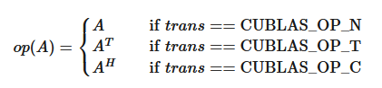
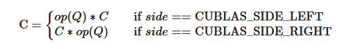
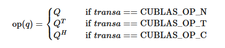
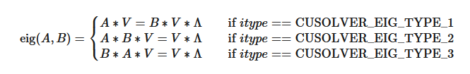
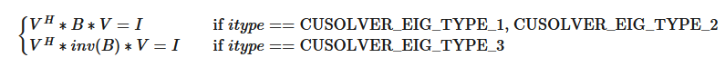
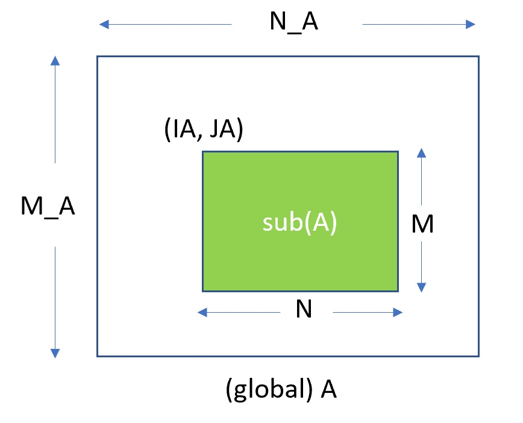

# 1. Introduction — cuSOLVER 13.2 documentation

**来源**: [https://docs.nvidia.com/cuda/cusolver/index.html](https://docs.nvidia.com/cuda/cusolver/index.html)

---

cuSOLVER API Reference
The API reference guide for cuSOLVER, a GPU accelerated library for decompositions and linear system solutions for both dense and sparse matrices.

# 1. Introduction
The cuSolver library is a high-level package based on the cuBLAS and cuSPARSE libraries. It consists of two modules corresponding to two sets of API:
1. The cuSolver API on a single GPU
2. The cuSolverMG API on a single node multiGPU
Each of these can be used independently or in concert with other toolkit libraries. To simplify the notation, cuSolver denotes single GPU API and cuSolverMg denotes multiGPU API.
The intent of cuSolver is to provide useful LAPACK-like features, such as common matrix factorization and triangular solve routines for dense matrices, a sparse least-squares solver and an eigenvalue solver. In addition cuSolver provides a new refactorization library useful for solving sequences of matrices with a shared sparsity pattern.
cuSolver combines three separate components under a single umbrella. The first part of cuSolver is called cuSolverDN, and deals with dense matrix factorization and solve routines such as LU, QR, SVD and LDLT, as well as useful utilities such as matrix and vector permutations.
Next, cuSolverSP provides a new set of sparse routines based on a sparse QR factorization. Not all matrices have a good sparsity pattern for parallelism in factorization, so the cuSolverSP library also provides a CPU path to handle those sequential-like matrices. For those matrices with abundant parallelism, the GPU path will deliver higher performance. The library is designed to be called from C and C++.
The final part is cuSolverRF, a sparse re-factorization package that can provide very good performance when solving a sequence of matrices where only the coefficients are changed but the sparsity pattern remains the same.
The GPU path of the cuSolver library assumes data is already in the device memory. It is the responsibility of the developer to allocate memory and to copy data between GPU memory and CPU memory using standard CUDA runtime API routines, such as`cudaMalloc()`,`cudaFree()`,`cudaMemcpy()`, and`cudaMemcpyAsync()`.
cuSolverMg is GPU-accelerated ScaLAPACK. By now, cuSolverMg supports 1-D column block cyclic layout and provides symmetric eigenvalue solver.

Note
The cuSolver library requires hardware with a CUDA Compute Capability (CC) of 5.0 or higher. Please see the*CUDA C++ Programming Guide*for a list of the[Compute Capabilities](https://docs.nvidia.com/cuda/cuda-c-programming-guide/index.html#compute-capabilities)corresponding to all NVIDIA GPUs.

Note
cuSolverMG is deprecated. Users are encouraged to use[cuSOLVERMp](https://docs.nvidia.com/cuda/cusolvermp/)for multi-GPU functionality, both single- and multi-node.

## 1.1. cuSolverDN: Dense LAPACK
The cuSolverDN library was designed to solve dense linear systems of the form

\[Ax = b\]
where the coefficient matrix$A\in R^{nxn}$, right-hand-side vector$b\in R^{n}$and solution vector$x\in R^{n}$
The cuSolverDN library provides QR factorization and LU with partial pivoting to handle a general matrix`A`, which may be non-symmetric. Cholesky factorization is also provided for symmetric/Hermitian matrices. For symmetric indefinite matrices, we provide Bunch-Kaufman (LDL) factorization.
The cuSolverDN library also provides a helpful bidiagonalization routine and singular value decomposition (SVD).
The cuSolverDN library targets computationally-intensive and popular routines in LAPACK, and provides an API compatible with LAPACK. The user can accelerate these time-consuming routines with cuSolverDN and keep others in LAPACK without a major change to existing code.

## 1.2. cuSolverSP: Sparse LAPACK
The cuSolverSP library was mainly designed to a solve sparse linear system

\[Ax = b\]
and the least-squares problem

\[x = {argmin}{||}A*z - b{||}\]
where sparse matrix$A\in R^{mxn}$, right-hand-side vector$b\in R^{m}$and solution vector$x\in R^{n}$. For a linear system, we require`m=n`.
The core algorithm is based on sparse QR factorization. The matrix`A`is accepted in CSR format. If matrix`A`is symmetric/Hermitian, the user has to provide a full matrix, ie fill missing lower or upper part.
If matrix`A`is symmetric positive definite and the user only needs to solve$Ax = b$, Cholesky factorization can work and the user only needs to provide the lower triangular part of`A`.
On top of the linear and least-squares solvers, the`cuSolverSP`library provides a simple eigenvalue solver based on shift-inverse power method, and a function to count the number of eigenvalues contained in a box in the complex plane.

Note
cuSolverSp is deprecated and will be removed in a future major release. It is recommended migrating to a new sparse direct solver package,[cuDSS](https://developer.nvidia.com/cudss), and you can find a transition example in[CUDALibrarySamples/cuSOLVERSp2cuDSS](https://github.com/NVIDIA/CUDALibrarySamples/tree/master/cuSOLVERSp2cuDSS)for reference.

## 1.3. cuSolverRF: Refactorization
The cuSolverRF library was designed to accelerate solution of sets of linear systems by fast re-factorization when given new coefficients in the same sparsity pattern

\[A_{i}x_{i} = f_{i}\]
where a sequence of coefficient matrices$A_{i}\in R^{nxn}$, right-hand-sides$f_{i}\in R^{n}$and solutions$x_{i}\in R^{n}$are given for`i=1,...,k`.
The cuSolverRF library is applicable when the sparsity pattern of the coefficient matrices$A_{i}$as well as the reordering to minimize fill-in and the pivoting used during the LU factorization remain the same across these linear systems. In that case, the first linear system (`i=1`) requires a full LU factorization, while the subsequent linear systems (`i=2,...,k`) require only the LU re-factorization. The later can be performed using the cuSolverRF library.
Notice that because the sparsity pattern of the coefficient matrices, the reordering and pivoting remain the same, the sparsity pattern of the resulting triangular factors$L_{i}$and$U_{i}$also remains the same. Therefore, the real difference between the full LU factorization and LU re-factorization is that the required memory is known ahead of time.

Note
cuSolverRf is deprecated and will be removed in a future major release. It is recommended migrating to a new sparse direct solver package,[cuDSS](https://developer.nvidia.com/cudss), and you can find a transition example in[CUDALibrarySamples/cuSOLVERSp2cuDSS](https://github.com/NVIDIA/CUDALibrarySamples/tree/master/cuSOLVERSp2cuDSS)for reference.

## 1.4. Naming Conventions
The cuSolverDN library provides two different APIs;`legacy`and`generic`.
The functions in the legacy API are available for data types`float`,`double`,`cuComplex`, and`cuDoubleComplex`. The naming convention for the legacy API is as follows:

<div style="overflow-x: auto; max-width: 100%; border-radius: 6px;">
<table border="1" cellpadding="6" cellspacing="0" style="border-collapse: collapse; width: 100%; font-family: -apple-system, BlinkMacSystemFont, Segoe UI, Helvetica, Arial, sans-serif; font-size: 13px; margin: 16px 0;">
<colgroup>
<col style="width: 100%"/>
</colgroup>
<tbody>
<tr style="border: 1px solid #d0d7de;">
<td style="padding: 8px 12px; border: 1px solid #d0d7de; vertical-align: top;"><p><code class="docutils literal notranslate"><span class="pre">cusolverDn</span></code>&lt;<code class="docutils literal notranslate"><span class="pre">t</span></code>&gt;&lt;<code class="docutils literal notranslate"><span class="pre">operation</span></code>&gt;</p></td>
</tr>
</tbody>
</table>
</div>

where <`t`> can be`S`,`D`,`C`,`Z`, or`X`, corresponding to the data types`float`,`double`,`cuComplex`,`cuDoubleComplex`, and the generic type, respectively. <`operation`> can be Cholesky factorization (`potrf`), LU with partial pivoting (`getrf`), QR factorization (`geqrf`) and Bunch-Kaufman factorization (`sytrf`).
The functions in the generic API provide a single entry point for each routine and support for 64-bit integers to define matrix and vector dimensions. The naming convention for the generic API is data-agnostic and is as follows:

<div style="overflow-x: auto; max-width: 100%; border-radius: 6px;">
<table border="1" cellpadding="6" cellspacing="0" style="border-collapse: collapse; width: 100%; font-family: -apple-system, BlinkMacSystemFont, Segoe UI, Helvetica, Arial, sans-serif; font-size: 13px; margin: 16px 0;">
<colgroup>
<col style="width: 100%"/>
</colgroup>
<tbody>
<tr style="border: 1px solid #d0d7de;">
<td style="padding: 8px 12px; border: 1px solid #d0d7de; vertical-align: top;"><p><code class="docutils literal notranslate"><span class="pre">cusolverDn</span></code>&lt;<code class="docutils literal notranslate"><span class="pre">operation</span></code>&gt;</p></td>
</tr>
</tbody>
</table>
</div>

where <`operation`> can be Cholesky factorization (`potrf`), LU with partial pivoting (`getrf`) and QR factorization (`geqrf`).
The cuSolverSP library functions are available for data types`float`,`double`,`cuComplex`, and`cuDoubleComplex`. The naming convention is as follows:

<div style="overflow-x: auto; max-width: 100%; border-radius: 6px;">
<table border="1" cellpadding="6" cellspacing="0" style="border-collapse: collapse; width: 100%; font-family: -apple-system, BlinkMacSystemFont, Segoe UI, Helvetica, Arial, sans-serif; font-size: 13px; margin: 16px 0;">
<colgroup>
<col style="width: 100%"/>
</colgroup>
<tbody>
<tr style="border: 1px solid #d0d7de;">
<td style="padding: 8px 12px; border: 1px solid #d0d7de; vertical-align: top;"><p><code class="docutils literal notranslate"><span class="pre">cusolverSp[Host]</span></code>&lt;<code class="docutils literal notranslate"><span class="pre">t</span></code>&gt;[&lt;<code class="docutils literal notranslate"><span class="pre">matrix</span> <span class="pre">data</span> <span class="pre">format</span></code>&gt;]&lt;<code class="docutils literal notranslate"><span class="pre">operation</span></code>&gt;[&lt;<code class="docutils literal notranslate"><span class="pre">output</span> <span class="pre">matrix</span> <span class="pre">data</span> <span class="pre">format</span></code>&gt;]&lt;<code class="docutils literal notranslate"><span class="pre">based</span> <span class="pre">on</span></code>&gt;</p></td>
</tr>
</tbody>
</table>
</div>

where`cuSolverSp`is the GPU path and`cusolverSpHost`is the corresponding CPU path. <`t`> can be`S`,`D`,`C`,`Z`, or`X`, corresponding to the data types`float`,`double`,`cuComplex`,`cuDoubleComplex`, and the generic type, respectively.
The <`matrix data format`> is`csr`, compressed sparse row format.
The <`operation`> can be`ls`,`lsq`,`eig`,`eigs`, corresponding to linear solver, least-square solver, eigenvalue solver and number of eigenvalues in a box, respectively.
The <`output matrix data format`> can be`v`or`m`, corresponding to a vector or a matrix.
<`based on`> describes which algorithm is used. For example,`qr`(sparse QR factorization) is used in linear solver and least-square solver.
All of the functions have the return type`cusolverStatus_t`and are explained in more detail in the chapters that follow.

<div style="overflow-x: auto; max-width: 100%; border-radius: 6px;">
<table border="1" cellpadding="6" cellspacing="0" style="border-collapse: collapse; width: 100%; font-family: -apple-system, BlinkMacSystemFont, Segoe UI, Helvetica, Arial, sans-serif; font-size: 13px; margin: 16px 0;">
<caption>cuSolverSP API</caption>
<colgroup>
<col style="width: 12%"/>
<col style="width: 13%"/>
<col style="width: 35%"/>
<col style="width: 14%"/>
<col style="width: 26%"/>
</colgroup>
<thead>
<tr style="border: 1px solid #d0d7de;">
<th style="background-color: #f6f8fa; font-weight: 600; text-align: left; padding: 8px 12px; border: 1px solid #d0d7de;"><p><strong>Routine</strong></p></th>
<th style="background-color: #f6f8fa; font-weight: 600; text-align: left; padding: 8px 12px; border: 1px solid #d0d7de;"><p><strong>Data format</strong></p></th>
<th style="background-color: #f6f8fa; font-weight: 600; text-align: left; padding: 8px 12px; border: 1px solid #d0d7de;"><p><strong>Operation</strong></p></th>
<th style="background-color: #f6f8fa; font-weight: 600; text-align: left; padding: 8px 12px; border: 1px solid #d0d7de;"><p><strong>Output format</strong></p></th>
<th style="background-color: #f6f8fa; font-weight: 600; text-align: left; padding: 8px 12px; border: 1px solid #d0d7de;"><p><strong>Based on</strong></p></th>
</tr>
</thead>
<tbody>
<tr style="border: 1px solid #d0d7de;">
<td style="padding: 8px 12px; border: 1px solid #d0d7de; vertical-align: top;"><p><code class="docutils literal notranslate"><span class="pre">csrlsvlu</span></code></p></td>
<td style="padding: 8px 12px; border: 1px solid #d0d7de; vertical-align: top;"><p><code class="docutils literal notranslate"><span class="pre">csr</span></code></p></td>
<td style="padding: 8px 12px; border: 1px solid #d0d7de; vertical-align: top;"><p><code class="docutils literal notranslate"><span class="pre">linear</span> <span class="pre">solver</span> <span class="pre">(ls)</span></code></p></td>
<td style="padding: 8px 12px; border: 1px solid #d0d7de; vertical-align: top;"><p><code class="docutils literal notranslate"><span class="pre">vector</span> <span class="pre">(v)</span></code></p></td>
<td style="padding: 8px 12px; border: 1px solid #d0d7de; vertical-align: top;"><p><code class="docutils literal notranslate"><span class="pre">LU</span> <span class="pre">(lu)</span> <span class="pre">with</span> <span class="pre">partial</span> <span class="pre">pivoting</span></code></p></td>
</tr>
<tr style="border: 1px solid #d0d7de;">
<td style="padding: 8px 12px; border: 1px solid #d0d7de; vertical-align: top;"><p><code class="docutils literal notranslate"><span class="pre">csrlsvqr</span></code></p></td>
<td style="padding: 8px 12px; border: 1px solid #d0d7de; vertical-align: top;"><p><code class="docutils literal notranslate"><span class="pre">csr</span></code></p></td>
<td style="padding: 8px 12px; border: 1px solid #d0d7de; vertical-align: top;"><p><code class="docutils literal notranslate"><span class="pre">linear</span> <span class="pre">solver</span> <span class="pre">(ls)</span></code></p></td>
<td style="padding: 8px 12px; border: 1px solid #d0d7de; vertical-align: top;"><p><code class="docutils literal notranslate"><span class="pre">vector</span> <span class="pre">(v)</span></code></p></td>
<td style="padding: 8px 12px; border: 1px solid #d0d7de; vertical-align: top;"><p><code class="docutils literal notranslate"><span class="pre">QR</span> <span class="pre">factorization</span> <span class="pre">(qr)</span></code></p></td>
</tr>
<tr style="border: 1px solid #d0d7de;">
<td style="padding: 8px 12px; border: 1px solid #d0d7de; vertical-align: top;"><p><code class="docutils literal notranslate"><span class="pre">csrlsvchol</span></code></p></td>
<td style="padding: 8px 12px; border: 1px solid #d0d7de; vertical-align: top;"><p><code class="docutils literal notranslate"><span class="pre">csr</span></code></p></td>
<td style="padding: 8px 12px; border: 1px solid #d0d7de; vertical-align: top;"><p><code class="docutils literal notranslate"><span class="pre">linear</span> <span class="pre">solver</span> <span class="pre">(ls)</span></code></p></td>
<td style="padding: 8px 12px; border: 1px solid #d0d7de; vertical-align: top;"><p><code class="docutils literal notranslate"><span class="pre">vector</span> <span class="pre">(v)</span></code></p></td>
<td style="padding: 8px 12px; border: 1px solid #d0d7de; vertical-align: top;"><p><code class="docutils literal notranslate"><span class="pre">Cholesky</span> <span class="pre">factorization</span> <span class="pre">(chol)</span></code></p></td>
</tr>
<tr style="border: 1px solid #d0d7de;">
<td style="padding: 8px 12px; border: 1px solid #d0d7de; vertical-align: top;"><p><code class="docutils literal notranslate"><span class="pre">csrlsqvqr</span></code></p></td>
<td style="padding: 8px 12px; border: 1px solid #d0d7de; vertical-align: top;"><p><code class="docutils literal notranslate"><span class="pre">csr</span></code></p></td>
<td style="padding: 8px 12px; border: 1px solid #d0d7de; vertical-align: top;"><p><code class="docutils literal notranslate"><span class="pre">least-square</span> <span class="pre">solver</span> <span class="pre">(lsq)</span></code></p></td>
<td style="padding: 8px 12px; border: 1px solid #d0d7de; vertical-align: top;"><p><code class="docutils literal notranslate"><span class="pre">vector</span> <span class="pre">(v)</span></code></p></td>
<td style="padding: 8px 12px; border: 1px solid #d0d7de; vertical-align: top;"><p><code class="docutils literal notranslate"><span class="pre">QR</span> <span class="pre">factorization</span> <span class="pre">(qr)</span></code></p></td>
</tr>
<tr style="border: 1px solid #d0d7de;">
<td style="padding: 8px 12px; border: 1px solid #d0d7de; vertical-align: top;"><p><code class="docutils literal notranslate"><span class="pre">csreigvsi</span></code></p></td>
<td style="padding: 8px 12px; border: 1px solid #d0d7de; vertical-align: top;"><p><code class="docutils literal notranslate"><span class="pre">csr</span></code></p></td>
<td style="padding: 8px 12px; border: 1px solid #d0d7de; vertical-align: top;"><p><code class="docutils literal notranslate"><span class="pre">eigenvalue</span> <span class="pre">solver</span> <span class="pre">(eig)</span></code></p></td>
<td style="padding: 8px 12px; border: 1px solid #d0d7de; vertical-align: top;"><p><code class="docutils literal notranslate"><span class="pre">vector</span> <span class="pre">(v)</span></code></p></td>
<td style="padding: 8px 12px; border: 1px solid #d0d7de; vertical-align: top;"><p><code class="docutils literal notranslate"><span class="pre">shift-inverse</span></code></p></td>
</tr>
<tr style="border: 1px solid #d0d7de;">
<td style="padding: 8px 12px; border: 1px solid #d0d7de; vertical-align: top;"><p><code class="docutils literal notranslate"><span class="pre">csreigs</span></code></p></td>
<td style="padding: 8px 12px; border: 1px solid #d0d7de; vertical-align: top;"><p><code class="docutils literal notranslate"><span class="pre">csr</span></code></p></td>
<td style="padding: 8px 12px; border: 1px solid #d0d7de; vertical-align: top;"><p><code class="docutils literal notranslate"><span class="pre">number</span> <span class="pre">of</span> <span class="pre">eigenvalues</span> <span class="pre">in</span> <span class="pre">a</span> <span class="pre">box</span> <span class="pre">(eigs)</span></code></p></td>
<td style="padding: 8px 12px; border: 1px solid #d0d7de; vertical-align: top;"></td>
<td style="padding: 8px 12px; border: 1px solid #d0d7de; vertical-align: top;"></td>
</tr>
<tr style="border: 1px solid #d0d7de;">
<td style="padding: 8px 12px; border: 1px solid #d0d7de; vertical-align: top;"><p><code class="docutils literal notranslate"><span class="pre">csrsymrcm</span></code></p></td>
<td style="padding: 8px 12px; border: 1px solid #d0d7de; vertical-align: top;"><p><code class="docutils literal notranslate"><span class="pre">csr</span></code></p></td>
<td style="padding: 8px 12px; border: 1px solid #d0d7de; vertical-align: top;"><p><code class="docutils literal notranslate"><span class="pre">Symmetric</span> <span class="pre">Reverse</span> <span class="pre">Cuthill-McKee</span> <span class="pre">(symrcm)</span></code></p></td>
<td style="padding: 8px 12px; border: 1px solid #d0d7de; vertical-align: top;"></td>
<td style="padding: 8px 12px; border: 1px solid #d0d7de; vertical-align: top;"></td>
</tr>
</tbody>
</table>
</div>

The cuSolverRF library routines are available for data type`double`. Most of the routines follow the naming convention:

<div style="overflow-x: auto; max-width: 100%; border-radius: 6px;">
<table border="1" cellpadding="6" cellspacing="0" style="border-collapse: collapse; width: 100%; font-family: -apple-system, BlinkMacSystemFont, Segoe UI, Helvetica, Arial, sans-serif; font-size: 13px; margin: 16px 0;">
<colgroup>
<col style="width: 100%"/>
</colgroup>
<tbody>
<tr style="border: 1px solid #d0d7de;">
<td style="padding: 8px 12px; border: 1px solid #d0d7de; vertical-align: top;"><p><code class="docutils literal notranslate"><span class="pre">cusolverRf</span></code>_&lt;<code class="docutils literal notranslate"><span class="pre">operation</span></code>&gt;_[<code class="docutils literal notranslate"><span class="pre">[Host]</span></code>](…)</p></td>
</tr>
</tbody>
</table>
</div>

where the trailing optional Host qualifier indicates the data is accessed on the host versus on the device, which is the default. The <`operation`> can be`Setup`,`Analyze`,`Refactor`,`Solve`,`ResetValues`,`AccessBundledFactors`and`ExtractSplitFactors`.
Finally, the return type of the cuSolverRF library routines is`cusolverStatus_t`.

## 1.5. Asynchronous Execution
The cuSolver library functions prefer to keep asynchronous execution as much as possible. Developers can always use the`cudaDeviceSynchronize()`function to ensure that the execution of a particular cuSolver library routine has completed.
A developer can also use the`cudaMemcpy()`routine to copy data from the device to the host and vice versa, using the`cudaMemcpyDeviceToHost`and`cudaMemcpyHostToDevice`parameters, respectively. In this case there is no need to add a call to`cudaDeviceSynchronize()`because the call to`cudaMemcpy()`with the above parameters is blocking and completes only when the results are ready on the host.

## 1.6. Library Property
The`libraryPropertyType`data type is an enumeration of library property types (that is, CUDA version X.Y.Z would yield`MAJOR_VERSION=X`,`MINOR_VERSION=Y`,`PATCH_LEVEL=Z`).

```
typedef enum libraryPropertyType_t
{
        MAJOR_VERSION,
        MINOR_VERSION,
        PATCH_LEVEL
} libraryPropertyType;

```

The following code can show the version of cusolver library.

```
int major=-1,minor=-1,patch=-1;
cusolverGetProperty(MAJOR_VERSION, &major);
cusolverGetProperty(MINOR_VERSION, &minor);
cusolverGetProperty(PATCH_LEVEL, &patch);
printf("CUSOLVER Version (Major,Minor,PatchLevel): %d.%d.%d\n", major,minor,patch);

```

## 1.7. High Precision Package
The`cusolver`library uses high precision for iterative refinement when necessary.

# 2. Using the CUSOLVER API

## 2.1. General Description
This chapter describes how to use the cuSolver library API. It is not a reference for the cuSolver API data types and functions; that is provided in subsequent chapters.

### 2.1.1. Thread Safety
*The library is thread-safe, and its functions can be called from multiple host threads.*

### 2.1.2. Scalar Parameters
In the cuSolver API, the scalar parameters can be passed by reference on the host.

### 2.1.3. Parallelism with Streams
If the application performs several small independent computations, or if it makes data transfers in parallel with the computation, then CUDA streams can be used to overlap these tasks.
The application can conceptually associate a stream with each task. To achieve the overlap of computation between the tasks, the developer should:
1. Create CUDA streams using the function`cudaStreamCreate()`, and
2. Set the stream to be used by each individual cuSolver library routine by calling, for example,cusolverDnSetStream(), just prior to calling the actual cuSolverDN routine.
The computations performed in separate streams would then be overlapped automatically on the GPU, when possible. This approach is especially useful when the computation performed by a single task is relatively small, and is not enough to fill the GPU with work, or when there is a data transfer that can be performed in parallel with the computation.

### 2.1.4. How to Link cusolver Library
`cusolver`library provides dynamic library`libcusolver.so`and static library`libcusolver_static.a`. If the user links the application with`libcusolver.so`,`libcublas.so`,`libcublasLt.so`and`libcusparse.so`are also required. If the user links the application with`libcusolver_static.a`, the following libraries are also needed,`libcudart_static.a`,`libculibos.a`,`libcusolver_lapack_static.a`,`libcusolver_metis_static.a`,`libcublas_static.a`and`libcusparse_static.a`.

### 2.1.5. Link Third-party LAPACK Library
Starting with CUDA 10.1 update 2, NVIDIA LAPACK library`libcusolver_lapack_static.a`is a subset of LAPACK and only contains GPU accelerated`stedc`and`bdsqr`. The user has to link`libcusolver_static.a`with`libcusolver_lapack_static.a`in order to build the application successfully. Prior to CUDA 10.1 update 2, the user can replace`libcusolver_lapack_static.a`with a third-party LAPACK library, for example, MKL. In CUDA 10.1 update 2, the third-party LAPACK library no longer affects the behavior of cusolver library, neither functionality nor performance. Furthermore the user cannot use`libcusolver_lapack_static.a`as a standalone LAPACK library because it is only a subset of LAPACK.
- If you use`libcusolver_static.a`, then you must link with`libcusolver_lapack_static.a`explicitly, otherwise the linker will report missing symbols. There are no symbol conflicts between`libcusolver_lapack_static.a`and other third-party LAPACK libraries, which allows linking the same application to`libcusolver_lapack_static.a`and another third-party LAPACK library.
- The`libcusolver_lapack_static.a`is built inside`libcusolver.so`. Hence, if you use`libcusolver.so`, then you don’t need to specify a LAPACK library. The`libcusolver.so`will not pick up any routines from the third-party LAPACK library even if you link the application with it.

### 2.1.6. Convention of info
Each LAPACK routine returns an`info`which indicates the position of invalid parameter. If`info = -i`, then i-th parameter is invalid. To be consistent with base-1 in LAPACK,`cusolver`does not report invalid`handle`into`info`. Instead,`cusolver`returns`CUSOLVER_STATUS_NOT_INITIALIZED`for invalid`handle`.

### 2.1.7. Usage of _bufferSize
There is no cudaMalloc inside`cuSolver`library, the user must allocate the device workspace explicitly. The routine`xyz_bufferSize`is to query the size of workspace of the routine`xyz`, for example`xyz = potrf`. To make the API simple,`xyz_bufferSize`follows almost the same signature of`xyz`even it only depends on some parameters, for example, device pointer is not used to decide the size of workspace. In most cases,`xyz_bufferSize`is called in the beginning before actual device data (pointed to by a device pointer) is prepared or before the device pointer is allocated. In such case, the user can pass null pointer to`xyz_bufferSize`without breaking the functionality.

### 2.1.8. cuSOLVERDn Logging
cuSOLVERDn logging mechanism can be enabled by setting the following environment variables before launching the target application:
- `CUSOLVERDN_LOG_LEVEL=<level>`- where`<level>`is one of the following levels:
  > - `0`- Off - logging is disabled (default)
  > - `1`- Error - only errors will be logged
  > - `2`- Trace - API calls that launch CUDA kernels will log their parameters and important information
  > - `3`- Hints - hints that can potentially improve the application’s performance
  > - `4`- Info - provides general information about the library execution, may contain details about heuristic status
  > - `5`- API Trace - API calls will log their parameter and important information
- `CUSOLVERDN_LOG_MASK=<mask>`- where mask is a combination of the following masks:
  > - `0`- Off
  > - `1`- Error
  > - `2`- Trace
  > - `4`- Hints
  > - `8`- Info
  > - `16`- API Trace
- `CUSOLVERDN_LOG_FILE=<file_name>`- where file name is a path to a log file. File name may contain`%i`, that will be replaced with the process ID, for example`<file_name>_%i.log`. If`CUSOLVERDN_LOG_FILE`is not defined, the log messages are printed to stdout.
Another option is to use the experimental cusolverDn logging API. See:
cusolverDnLoggerSetCallback(),cusolverDnLoggerSetFile(),cusolverDnLoggerOpenFile(),cusolverDnLoggerSetLevel(),cusolverDnLoggerSetMask(),cusolverDnLoggerForceDisable().

### 2.1.9. Deterministic Results
Throughout this documentation, a function is declared as*deterministic*if it computes the exact same bitwise results for every execution with the same input parameters, hard- and software environment. Conversely, a*non-deterministic*function might compute bitwise different results due to a varying order of floating point operations, e.g., a sum`s`of four values`a`,`b`,`c`,`d`can be computed in different orders:
1. `s = (a + b) + (c + d)`
2. `s = (a + (b + c)) + d`
3. `s = a + (b + (c + d))`
4. …
Due to the non-associativity of floating point arithmetic, all results might be bitwise different.
By default, cuSolverDN computes deterministic results. For improved performance of some functions, it is possible to allow non-deterministic results with`cusolverDnSetDeterministicMode()`.

### 2.1.10. Floating Point Emulation
cuSOLVERDn leverages techniques for floating point emulation as described in[cuBLAS 1.5 Floating Point Emulation](https://docs.nvidia.com/cuda/cublas/#floating-point-emulation)for improved performance. Please note that all`cusolverDn{Get,Set}{FixedPoint}Emulation*`APIs only affect execution, if a math mode, which allows floating point emulated math, is enabled. However, the corresponding configuration options, which affect floating point emulated math, can be set, regardless of the current math mode. Example:

```
cusolverDnSetMathMode(handle, CUSOLVER_DEFAULT_MATH);
cusolverDnSetEmulationStrategy(handle, EMULATION_STRATEGY_EAGER);
cusolverDnXgetrf(handle, ...); // default math
cusolverDnSetMathMode(handle, CUSOLVER_FP32_EMULATED_BF16X9_MATH);
cusolverDnXgetrf(handle, ...); // FP32 emulated math with eager emulation strategy

```

Note
Please note that cuBLAS environment variables, enabling floating point emulated math, won’t affect the cuSOLVERDn internal cuBLAS handles.

Note
Please note that the workspace sizes returned by`*_bufferSize`APIs may depend on the math mode and emulation strategy.

## 2.2. cuSolver Types Reference

### 2.2.1. cuSolverDN Types
The`float`,`double`,`cuComplex`, and`cuDoubleComplex`data types are supported. The first two are standard C data types, while the last two are exported from`cuComplex.h`. In addition, cuSolverDN uses some familiar types from cuBLAS.

#### 2.2.1.1. cusolverDnHandle_t
This is a pointer type to an opaque cuSolverDN context, which the user must initialize by callingcusolverDnCreate()prior to calling any other library function. An uninitialized Handle object will lead to unexpected behavior, including crashes of cuSolverDN. The handle created and returned bycusolverDnCreate()must be passed to every cuSolverDN function.

#### 2.2.1.2. cublasFillMode_t
The type indicates which part (lower or upper) of the dense matrix was filled and consequently should be used by the function.

<div style="overflow-x: auto; max-width: 100%; border-radius: 6px;">
<table border="1" cellpadding="6" cellspacing="0" style="border-collapse: collapse; width: 100%; font-family: -apple-system, BlinkMacSystemFont, Segoe UI, Helvetica, Arial, sans-serif; font-size: 13px; margin: 16px 0;">
<colgroup>
<col style="width: 40%"/>
<col style="width: 60%"/>
</colgroup>
<thead>
<tr style="border: 1px solid #d0d7de;">
<th style="background-color: #f6f8fa; font-weight: 600; text-align: left; padding: 8px 12px; border: 1px solid #d0d7de;"><p><strong>Value</strong></p></th>
<th style="background-color: #f6f8fa; font-weight: 600; text-align: left; padding: 8px 12px; border: 1px solid #d0d7de;"><p><strong>Meaning</strong></p></th>
</tr>
</thead>
<tbody>
<tr style="border: 1px solid #d0d7de;">
<td style="padding: 8px 12px; border: 1px solid #d0d7de; vertical-align: top;"><p><code class="docutils literal notranslate"><span class="pre">CUBLAS_FILL_MODE_LOWER</span></code></p></td>
<td style="padding: 8px 12px; border: 1px solid #d0d7de; vertical-align: top;"><p>The lower part of the matrix is filled.</p></td>
</tr>
<tr style="border: 1px solid #d0d7de;">
<td style="padding: 8px 12px; border: 1px solid #d0d7de; vertical-align: top;"><p><code class="docutils literal notranslate"><span class="pre">CUBLAS_FILL_MODE_UPPER</span></code></p></td>
<td style="padding: 8px 12px; border: 1px solid #d0d7de; vertical-align: top;"><p>The upper part of the matrix is filled.</p></td>
</tr>
<tr style="border: 1px solid #d0d7de;">
<td style="padding: 8px 12px; border: 1px solid #d0d7de; vertical-align: top;"><p><code class="docutils literal notranslate"><span class="pre">CUBLAS_FILL_MODE_FULL</span></code></p></td>
<td style="padding: 8px 12px; border: 1px solid #d0d7de; vertical-align: top;"><p>The full matrix is filled.</p></td>
</tr>
</tbody>
</table>
</div>

Notice that BLAS implementations often use Fortran characters`‘L’`or`‘l’`(lower) and`‘U’`or`‘u’`(upper) to describe which part of the matrix is filled.

#### 2.2.1.3. cublasOperation_t
The`cublasOperation_t`type indicates which operation needs to be performed with the dense matrix.

<div style="overflow-x: auto; max-width: 100%; border-radius: 6px;">
<table border="1" cellpadding="6" cellspacing="0" style="border-collapse: collapse; width: 100%; font-family: -apple-system, BlinkMacSystemFont, Segoe UI, Helvetica, Arial, sans-serif; font-size: 13px; margin: 16px 0;">
<colgroup>
<col style="width: 25%"/>
<col style="width: 75%"/>
</colgroup>
<thead>
<tr style="border: 1px solid #d0d7de;">
<th style="background-color: #f6f8fa; font-weight: 600; text-align: left; padding: 8px 12px; border: 1px solid #d0d7de;"><p><strong>Value</strong></p></th>
<th style="background-color: #f6f8fa; font-weight: 600; text-align: left; padding: 8px 12px; border: 1px solid #d0d7de;"><p><strong>Meaning</strong></p></th>
</tr>
</thead>
<tbody>
<tr style="border: 1px solid #d0d7de;">
<td style="padding: 8px 12px; border: 1px solid #d0d7de; vertical-align: top;"><p><code class="docutils literal notranslate"><span class="pre">CUBLAS_OP_N</span></code></p></td>
<td style="padding: 8px 12px; border: 1px solid #d0d7de; vertical-align: top;"><p>The non-transpose operation is selected.</p></td>
</tr>
<tr style="border: 1px solid #d0d7de;">
<td style="padding: 8px 12px; border: 1px solid #d0d7de; vertical-align: top;"><p><code class="docutils literal notranslate"><span class="pre">CUBLAS_OP_T</span></code></p></td>
<td style="padding: 8px 12px; border: 1px solid #d0d7de; vertical-align: top;"><p>The transpose operation is selected.</p></td>
</tr>
<tr style="border: 1px solid #d0d7de;">
<td style="padding: 8px 12px; border: 1px solid #d0d7de; vertical-align: top;"><p><code class="docutils literal notranslate"><span class="pre">CUBLAS_OP_C</span></code></p></td>
<td style="padding: 8px 12px; border: 1px solid #d0d7de; vertical-align: top;"><p>The conjugate transpose operation is selected.</p></td>
</tr>
</tbody>
</table>
</div>

Notice that BLAS implementations often use Fortran characters`‘N’`or`‘n’`(non-transpose),`‘T’`or`‘t’`(transpose) and`‘C’`or`‘c’`(conjugate transpose) to describe which operations need to be performed with the dense matrix.

#### 2.2.1.4. cusolverEigType_t
The`cusolverEigType_t`type indicates which type of eigenvalue the solver is.

<div style="overflow-x: auto; max-width: 100%; border-radius: 6px;">
<table border="1" cellpadding="6" cellspacing="0" style="border-collapse: collapse; width: 100%; font-family: -apple-system, BlinkMacSystemFont, Segoe UI, Helvetica, Arial, sans-serif; font-size: 13px; margin: 16px 0;">
<colgroup>
<col style="width: 59%"/>
<col style="width: 41%"/>
</colgroup>
<thead>
<tr style="border: 1px solid #d0d7de;">
<th style="background-color: #f6f8fa; font-weight: 600; text-align: left; padding: 8px 12px; border: 1px solid #d0d7de;"><p><strong>Value</strong></p></th>
<th style="background-color: #f6f8fa; font-weight: 600; text-align: left; padding: 8px 12px; border: 1px solid #d0d7de;"><p><strong>Meaning</strong></p></th>
</tr>
</thead>
<tbody>
<tr style="border: 1px solid #d0d7de;">
<td style="padding: 8px 12px; border: 1px solid #d0d7de; vertical-align: top;"><p><code class="docutils literal notranslate"><span class="pre">CUSOLVER_EIG_TYPE_1</span></code></p></td>
<td style="padding: 8px 12px; border: 1px solid #d0d7de; vertical-align: top;"><p>A*x = lambda*B*x</p></td>
</tr>
<tr style="border: 1px solid #d0d7de;">
<td style="padding: 8px 12px; border: 1px solid #d0d7de; vertical-align: top;"><p><code class="docutils literal notranslate"><span class="pre">CUSOLVER_EIG_TYPE_2</span></code></p></td>
<td style="padding: 8px 12px; border: 1px solid #d0d7de; vertical-align: top;"><p>A*B*x = lambda*x</p></td>
</tr>
<tr style="border: 1px solid #d0d7de;">
<td style="padding: 8px 12px; border: 1px solid #d0d7de; vertical-align: top;"><p><code class="docutils literal notranslate"><span class="pre">CUSOLVER_EIG_TYPE_3</span></code></p></td>
<td style="padding: 8px 12px; border: 1px solid #d0d7de; vertical-align: top;"><p>B*A*x = lambda*x</p></td>
</tr>
</tbody>
</table>
</div>

Notice that LAPACK implementations often use Fortran integer`1`(A*x = lambda*B*x),`2`(A*B*x = lambda*x),`3`(B*A*x = lambda*x) to indicate which type of eigenvalue the solver is.

#### 2.2.1.5. cusolverEigMode_t
The`cusolverEigMode_t`type indicates whether or not eigenvectors are computed.

<div style="overflow-x: auto; max-width: 100%; border-radius: 6px;">
<table border="1" cellpadding="6" cellspacing="0" style="border-collapse: collapse; width: 100%; font-family: -apple-system, BlinkMacSystemFont, Segoe UI, Helvetica, Arial, sans-serif; font-size: 13px; margin: 16px 0;">
<colgroup>
<col style="width: 40%"/>
<col style="width: 60%"/>
</colgroup>
<thead>
<tr style="border: 1px solid #d0d7de;">
<th style="background-color: #f6f8fa; font-weight: 600; text-align: left; padding: 8px 12px; border: 1px solid #d0d7de;"><p><strong>Value</strong></p></th>
<th style="background-color: #f6f8fa; font-weight: 600; text-align: left; padding: 8px 12px; border: 1px solid #d0d7de;"><p><strong>Meaning</strong></p></th>
</tr>
</thead>
<tbody>
<tr style="border: 1px solid #d0d7de;">
<td style="padding: 8px 12px; border: 1px solid #d0d7de; vertical-align: top;"><p><code class="docutils literal notranslate"><span class="pre">CUSOLVER_EIG_MODE_NOVECTOR</span></code></p></td>
<td style="padding: 8px 12px; border: 1px solid #d0d7de; vertical-align: top;"><p>Only eigenvalues are computed.</p></td>
</tr>
<tr style="border: 1px solid #d0d7de;">
<td style="padding: 8px 12px; border: 1px solid #d0d7de; vertical-align: top;"><p><code class="docutils literal notranslate"><span class="pre">CUSOLVER_EIG_MODE_VECTOR</span></code></p></td>
<td style="padding: 8px 12px; border: 1px solid #d0d7de; vertical-align: top;"><p>Both eigenvalues and eigenvectors are computed.</p></td>
</tr>
</tbody>
</table>
</div>

Notice that LAPACK implementations often use Fortran character`'N'`(only eigenvalues are computed),`'V'`(both eigenvalues and eigenvectors are computed) to indicate whether or not eigenvectors are computed.

#### 2.2.1.6. cusolverIRSRefinement_t
The`cusolverIRSRefinement_t`type indicates which solver type would be used for the specific cusolver function. Most of our experimentation shows that CUSOLVER_IRS_REFINE_GMRES is the best option.
*More details about the refinement process can be found in Azzam Haidar, Stanimire Tomov, Jack Dongarra, and Nicholas J. Higham. 2018. Harnessing GPU tensor cores for fast FP16 arithmetic to speed up mixed-precision iterative refinement solvers. In Proceedings of the International Conference for High Performance Computing, Networking, Storage, and Analysis (SC ‘18). IEEE Press, Piscataway, NJ, USA, Article 47, 11 pages.*

`CUSOLVER_IRS_REFINE_NOT_SET`

Solver is not set; this value is what is set when creating the`params`structure. IRS solver will return an error.

`CUSOLVER_IRS_REFINE_NONE`

No refinement solver, the IRS solver performs a factorization followed by a solve without any refinement. For example if the IRS solver was`cusolverDnIRSXgesv()`, this is equivalent to a Xgesv routine without refinement and where the factorization is carried out in the lowest precision. If for example the main precision was CUSOLVER_R_64F and the lowest was CUSOLVER_R_64F as well, then this is equivalent to a call to`cusolverDnDgesv()`.

`CUSOLVER_IRS_REFINE_CLASSICAL`

Classical iterative refinement solver. Similar to the one used in LAPACK routines.

`CUSOLVER_IRS_REFINE_GMRES`

GMRES (Generalized Minimal Residual) based iterative refinement solver. In recent study, the GMRES method has drawn the scientific community attention for its ability to be used as refinement solver that outperforms the classical iterative refinement method. Based on our experimentation, we recommend this setting.

`CUSOLVER_IRS_REFINE_CLASSICAL_GMRES`

Classical iterative refinement solver that uses the GMRES (Generalized Minimal Residual) internally to solve the correction equation at each iteration. We call the*classical refinement iteration*the outer iteration while the*GMRES*is called inner iteration. Note that if the tolerance of the inner GMRES is set very low, lets say to machine precision, then the outer*classical refinement iteration*will performs only one iteration and thus this option will behave like`CUSOLVER_IRS_REFINE_GMRES`.

`CUSOLVER_IRS_REFINE_GMRES_GMRES`

Similar to`CUSOLVER_IRS_REFINE_CLASSICAL_GMRES`which consists of classical refinement process that uses GMRES to solve the inner correction system; here it is a GMRES (Generalized Minimal Residual) based iterative refinement solver that uses another GMRES internally to solve the preconditioned system.

#### 2.2.1.7. cusolverDnIRSParams_t
This is a pointer type to an opaque`cusolverDnIRSParams_t`structure, which holds parameters for the iterative refinement linear solvers such as`cusolverDnXgesv()`. Use corresponding helper functions described below to either Create/Destroy this structure or Set/Get solver parameters.

#### 2.2.1.8. cusolverDnIRSInfos_t
This is a pointer type to an opaque`cusolverDnIRSInfos_t`structure, which holds information about the performed call to an iterative refinement linear solver (such as`cusolverDnXgesv()`). Use corresponding helper functions described below to either Create/Destroy this structure or retrieve solve information.

#### 2.2.1.9. cusolverDnFunction_t
The`cusolverDnFunction_t`type indicates which routine needs to be configured by`cusolverDnSetAdvOptions()`. The value`CUSOLVERDN_GETRF`corresponds to the routine`Getrf`.

<div style="overflow-x: auto; max-width: 100%; border-radius: 6px;">
<table border="1" cellpadding="6" cellspacing="0" style="border-collapse: collapse; width: 100%; font-family: -apple-system, BlinkMacSystemFont, Segoe UI, Helvetica, Arial, sans-serif; font-size: 13px; margin: 16px 0;">
<colgroup>
<col style="width: 44%"/>
<col style="width: 56%"/>
</colgroup>
<thead>
<tr style="border: 1px solid #d0d7de;">
<th style="background-color: #f6f8fa; font-weight: 600; text-align: left; padding: 8px 12px; border: 1px solid #d0d7de;"><p><strong>Value</strong></p></th>
<th style="background-color: #f6f8fa; font-weight: 600; text-align: left; padding: 8px 12px; border: 1px solid #d0d7de;"><p><strong>Meaning</strong></p></th>
</tr>
</thead>
<tbody>
<tr style="border: 1px solid #d0d7de;">
<td style="padding: 8px 12px; border: 1px solid #d0d7de; vertical-align: top;"><p><code class="docutils literal notranslate"><span class="pre">CUSOLVERDN_GETRF</span></code></p></td>
<td style="padding: 8px 12px; border: 1px solid #d0d7de; vertical-align: top;"><p>Corresponds to <code class="docutils literal notranslate"><span class="pre">Getrf</span></code>.</p></td>
</tr>
</tbody>
</table>
</div>

#### 2.2.1.10. cusolverAlgMode_t
The`cusolverAlgMode_t`type indicates which algorithm is selected by`cusolverDnSetAdvOptions()`. The set of algorithms supported for each routine is described in detail along with the routine’s documentation.
The default algorithm is`CUSOLVER_ALG_0`. The user can also provide`NULL`to use the default algorithm.

#### 2.2.1.11. cusolverStatus_t
This is the same ascusolverStatus_tin the sparse LAPACK section.

#### 2.2.1.12. cusolverDnLoggerCallback_t
cusolverDnLoggerCallback_tis a callback function pointer type.
**Parameters**

<div style="overflow-x: auto; max-width: 100%; border-radius: 6px;">
<table border="1" cellpadding="6" cellspacing="0" style="border-collapse: collapse; width: 100%; font-family: -apple-system, BlinkMacSystemFont, Segoe UI, Helvetica, Arial, sans-serif; font-size: 13px; margin: 16px 0;">
<colgroup>
<col style="width: 21%"/>
<col style="width: 14%"/>
<col style="width: 13%"/>
<col style="width: 52%"/>
</colgroup>
<thead>
<tr style="border: 1px solid #d0d7de;">
<th style="background-color: #f6f8fa; font-weight: 600; text-align: left; padding: 8px 12px; border: 1px solid #d0d7de;"><p><strong>Parameter</strong></p></th>
<th style="background-color: #f6f8fa; font-weight: 600; text-align: left; padding: 8px 12px; border: 1px solid #d0d7de;"><p><strong>Memory</strong></p></th>
<th style="background-color: #f6f8fa; font-weight: 600; text-align: left; padding: 8px 12px; border: 1px solid #d0d7de;"><p><strong>In/out</strong></p></th>
<th style="background-color: #f6f8fa; font-weight: 600; text-align: left; padding: 8px 12px; border: 1px solid #d0d7de;"><p><strong>Description</strong></p></th>
</tr>
</thead>
<tbody>
<tr style="border: 1px solid #d0d7de;">
<td style="padding: 8px 12px; border: 1px solid #d0d7de; vertical-align: top;"><p><code class="docutils literal notranslate"><span class="pre">logLevel</span></code></p></td>
<td style="padding: 8px 12px; border: 1px solid #d0d7de; vertical-align: top;"></td>
<td style="padding: 8px 12px; border: 1px solid #d0d7de; vertical-align: top;"><p>output</p></td>
<td style="padding: 8px 12px; border: 1px solid #d0d7de; vertical-align: top;"><p>See <a class="reference internal" href="#cusolverdn-logging"><span class="std std-ref">cuSOLVERDn Logging</span></a></p></td>
</tr>
<tr style="border: 1px solid #d0d7de;">
<td style="padding: 8px 12px; border: 1px solid #d0d7de; vertical-align: top;"><p><code class="docutils literal notranslate"><span class="pre">functionName</span></code></p></td>
<td style="padding: 8px 12px; border: 1px solid #d0d7de; vertical-align: top;"></td>
<td style="padding: 8px 12px; border: 1px solid #d0d7de; vertical-align: top;"><p>output</p></td>
<td style="padding: 8px 12px; border: 1px solid #d0d7de; vertical-align: top;"><p>The name of the API that logged this message.</p></td>
</tr>
<tr style="border: 1px solid #d0d7de;">
<td style="padding: 8px 12px; border: 1px solid #d0d7de; vertical-align: top;"><p><code class="docutils literal notranslate"><span class="pre">message</span></code></p></td>
<td style="padding: 8px 12px; border: 1px solid #d0d7de; vertical-align: top;"></td>
<td style="padding: 8px 12px; border: 1px solid #d0d7de; vertical-align: top;"><p>output</p></td>
<td style="padding: 8px 12px; border: 1px solid #d0d7de; vertical-align: top;"><p>The log message.</p></td>
</tr>
</tbody>
</table>
</div>

Use the below function to set the callback function:cusolverDnLoggerSetCallback().

#### 2.2.1.13. cusolverDeterministicMode_t
The`cusolverDeterministicMode_t`type indicates whether multiple cuSolver function executions with the same input have the same bitwise equal result (deterministic) or might have bitwise different results (non-deterministic). In comparison to[cublasAtomicsMode_t](https://docs.nvidia.com/cuda/cublas/#cublasatomicsmode-t), which only includes the usage of atomic functions,`cusolverDeterministicMode_t`includes all non-deterministic programming patterns. The deterministic mode can be set and queried using`cusolverDnSetDeterministicMode()`and`cusolverDnGetDeterministicMode()`routines, respectively.

<div style="overflow-x: auto; max-width: 100%; border-radius: 6px;">
<table border="1" cellpadding="6" cellspacing="0" style="border-collapse: collapse; width: 100%; font-family: -apple-system, BlinkMacSystemFont, Segoe UI, Helvetica, Arial, sans-serif; font-size: 13px; margin: 16px 0;">
<colgroup>
<col style="width: 48%"/>
<col style="width: 52%"/>
</colgroup>
<thead>
<tr style="border: 1px solid #d0d7de;">
<th style="background-color: #f6f8fa; font-weight: 600; text-align: left; padding: 8px 12px; border: 1px solid #d0d7de;"><p><strong>Value</strong></p></th>
<th style="background-color: #f6f8fa; font-weight: 600; text-align: left; padding: 8px 12px; border: 1px solid #d0d7de;"><p><strong>Meaning</strong></p></th>
</tr>
</thead>
<tbody>
<tr style="border: 1px solid #d0d7de;">
<td style="padding: 8px 12px; border: 1px solid #d0d7de; vertical-align: top;"><p><code class="docutils literal notranslate"><span class="pre">CUSOLVER_DETERMINISTIC_RESULTS</span></code></p></td>
<td style="padding: 8px 12px; border: 1px solid #d0d7de; vertical-align: top;"><p>Compute deterministic results.</p></td>
</tr>
<tr style="border: 1px solid #d0d7de;">
<td style="padding: 8px 12px; border: 1px solid #d0d7de; vertical-align: top;"><p><code class="docutils literal notranslate"><span class="pre">CUSOLVER_ALLOW_NON_DETERMINISTIC_RESULTS</span></code></p></td>
<td style="padding: 8px 12px; border: 1px solid #d0d7de; vertical-align: top;"><p>Allow non-deterministic results.</p></td>
</tr>
</tbody>
</table>
</div>

#### 2.2.1.14. cusolverMathMode_t
The`cusolverMathMode_t`type is used incusolverDnSetMathMode()to choose compute precision modes as defined in the following table:

<div style="overflow-x: auto; max-width: 100%; border-radius: 6px;">
<table border="1" cellpadding="6" cellspacing="0" style="border-collapse: collapse; width: 100%; font-family: -apple-system, BlinkMacSystemFont, Segoe UI, Helvetica, Arial, sans-serif; font-size: 13px; margin: 16px 0;">
<colgroup>
<col style="width: 28%"/>
<col style="width: 72%"/>
</colgroup>
<thead>
<tr style="border: 1px solid #d0d7de;">
<th style="background-color: #f6f8fa; font-weight: 600; text-align: left; padding: 8px 12px; border: 1px solid #d0d7de;"><p><strong>Value</strong></p></th>
<th style="background-color: #f6f8fa; font-weight: 600; text-align: left; padding: 8px 12px; border: 1px solid #d0d7de;"><p><strong>Meaning</strong></p></th>
</tr>
</thead>
<tbody>
<tr style="border: 1px solid #d0d7de;">
<td style="padding: 8px 12px; border: 1px solid #d0d7de; vertical-align: top;"><p><code class="docutils literal notranslate"><span class="pre">CUSOLVER_DEFAULT_MATH</span></code></p></td>
<td style="padding: 8px 12px; border: 1px solid #d0d7de; vertical-align: top;"><p>This is the default math mode. Tensor Cores will be used whenever possible.</p></td>
</tr>
<tr style="border: 1px solid #d0d7de;">
<td style="padding: 8px 12px; border: 1px solid #d0d7de; vertical-align: top;"><p><code class="docutils literal notranslate"><span class="pre">CUSOLVER_FP32_EMULATED_BF16X9_MATH</span></code></p></td>
<td style="padding: 8px 12px; border: 1px solid #d0d7de; vertical-align: top;"><p>Use FP32 emulation according to the configured emulation strategy (see <a class="reference internal" href="#cusolverdnsetemulationstrategy"><span class="std std-ref">cusolverDnSetEmulationStrategy()</span></a>).</p></td>
</tr>
<tr style="border: 1px solid #d0d7de;">
<td style="padding: 8px 12px; border: 1px solid #d0d7de; vertical-align: top;"><p><code class="docutils literal notranslate"><span class="pre">CUSOLVER_FP64_EMULATED_FIXEDPOINT_MATH</span></code></p></td>
<td style="padding: 8px 12px; border: 1px solid #d0d7de; vertical-align: top;"><p>Use FP64 emulation according to the configured emulation strategy (see <a class="reference internal" href="#cusolverdnsetemulationstrategy"><span class="std std-ref">cusolverDnSetEmulationStrategy()</span></a>).</p></td>
</tr>
<tr style="border: 1px solid #d0d7de;">
<td style="padding: 8px 12px; border: 1px solid #d0d7de; vertical-align: top;"><p><code class="docutils literal notranslate"><span class="pre">CUSOLVER_FP32_FP64_EMULATED_MATH</span></code></p></td>
<td style="padding: 8px 12px; border: 1px solid #d0d7de; vertical-align: top;"><p>Combination of <code class="docutils literal notranslate"><span class="pre">CUSOLVER_FP32_EMULATED_BF16X9_MATH</span></code> and <code class="docutils literal notranslate"><span class="pre">CUSOLVER_FP64_EMULATED_FIXEDPOINT_MATH</span></code>.</p></td>
</tr>
</tbody>
</table>
</div>

The following combinations of`cusolverMathMode_t`using the bitwise OR operator are allowed:
- `CUSOLVER_FP32_FP64_EMULATED_MATH`=`CUSOLVER_FP32_EMULATED_BF16X9_MATH`|`CUSOLVER_FP64_EMULATED_FIXEDPOINT_MATH`.

#### 2.2.1.15. cusolverStorevMode_t
Specifies how the vectors which define the elementary reflectors are stored.

<div style="overflow-x: auto; max-width: 100%; border-radius: 6px;">
<table border="1" cellpadding="6" cellspacing="0" style="border-collapse: collapse; width: 100%; font-family: -apple-system, BlinkMacSystemFont, Segoe UI, Helvetica, Arial, sans-serif; font-size: 13px; margin: 16px 0;">
<colgroup>
<col style="width: 70%"/>
<col style="width: 30%"/>
</colgroup>
<thead>
<tr style="border: 1px solid #d0d7de;">
<th style="background-color: #f6f8fa; font-weight: 600; text-align: left; padding: 8px 12px; border: 1px solid #d0d7de;"><p><strong>Value</strong></p></th>
<th style="background-color: #f6f8fa; font-weight: 600; text-align: left; padding: 8px 12px; border: 1px solid #d0d7de;"><p><strong>Meaning</strong></p></th>
</tr>
</thead>
<tbody>
<tr style="border: 1px solid #d0d7de;">
<td style="padding: 8px 12px; border: 1px solid #d0d7de; vertical-align: top;"><p><code class="docutils literal notranslate"><span class="pre">CUBLAS_STOREV_COLUMNWISE</span></code></p></td>
<td style="padding: 8px 12px; border: 1px solid #d0d7de; vertical-align: top;"><p>Columnwise.</p></td>
</tr>
<tr style="border: 1px solid #d0d7de;">
<td style="padding: 8px 12px; border: 1px solid #d0d7de; vertical-align: top;"><p><code class="docutils literal notranslate"><span class="pre">CUBLAS_STOREV_ROWWISE</span></code></p></td>
<td style="padding: 8px 12px; border: 1px solid #d0d7de; vertical-align: top;"><p>Rowwise.</p></td>
</tr>
</tbody>
</table>
</div>

#### 2.2.1.16. cusolverDirectMode_t
Specifies the order in which the elementary reflectors are multiplied to form the block reflector.

<div style="overflow-x: auto; max-width: 100%; border-radius: 6px;">
<table border="1" cellpadding="6" cellspacing="0" style="border-collapse: collapse; width: 100%; font-family: -apple-system, BlinkMacSystemFont, Segoe UI, Helvetica, Arial, sans-serif; font-size: 13px; margin: 16px 0;">
<colgroup>
<col style="width: 68%"/>
<col style="width: 32%"/>
</colgroup>
<thead>
<tr style="border: 1px solid #d0d7de;">
<th style="background-color: #f6f8fa; font-weight: 600; text-align: left; padding: 8px 12px; border: 1px solid #d0d7de;"><p><strong>Value</strong></p></th>
<th style="background-color: #f6f8fa; font-weight: 600; text-align: left; padding: 8px 12px; border: 1px solid #d0d7de;"><p><strong>Meaning</strong></p></th>
</tr>
</thead>
<tbody>
<tr style="border: 1px solid #d0d7de;">
<td style="padding: 8px 12px; border: 1px solid #d0d7de; vertical-align: top;"><p><code class="docutils literal notranslate"><span class="pre">CUBLAS_DIRECT_FORWARD</span></code></p></td>
<td style="padding: 8px 12px; border: 1px solid #d0d7de; vertical-align: top;"><p>Forward.</p></td>
</tr>
<tr style="border: 1px solid #d0d7de;">
<td style="padding: 8px 12px; border: 1px solid #d0d7de; vertical-align: top;"><p><code class="docutils literal notranslate"><span class="pre">CUBLAS_DIRECT_BACKWARD</span></code></p></td>
<td style="padding: 8px 12px; border: 1px solid #d0d7de; vertical-align: top;"><p>Backward.</p></td>
</tr>
</tbody>
</table>
</div>

### 2.2.2. cuSolverSP Types
The`float`,`double`,`cuComplex`, and`cuDoubleComplex`data types are supported. The first two are standard C data types, while the last two are exported from`cuComplex.h`.

#### 2.2.2.1. cusolverSpHandle_t
This is a pointer type to an opaque cuSolverSP context, which the user must initialize by calling`cusolverSpCreate()`prior to calling any other library function. An uninitialized Handle object will lead to unexpected behavior, including crashes of cuSolverSP. The handle created and returned by`cusolverSpCreate()`must be passed to every cuSolverSP function.

#### 2.2.2.2. cusparseMatDescr_t
We have chosen to keep the same structure as exists in cuSPARSE to describe the shape and properties of a matrix. This enables calls to either cuSPARSE or cuSOLVER using the same matrix description.

```
typedef struct {
    cusparseMatrixType_t MatrixType;
    cusparseFillMode_t FillMode;
    cusparseDiagType_t DiagType;
    cusparseIndexBase_t IndexBase;
} cusparseMatDescr_t;

```

Please read documentation of the cuSPARSE Library to understand each field of`cusparseMatDescr_t`.

#### 2.2.2.3. cusolverStatus_t
This is a status type returned by the library functions and it can have the following values.

`CUSOLVER_STATUS_SUCCESS`

The operation completed successfully.

`CUSOLVER_STATUS_NOT_INITIALIZED`

The cuSolver library was not initialized. This is usually caused by the lack of a prior call, an error in the CUDA Runtime API called by the cuSolver routine, or an error in the hardware setup.
**To correct:**call`cusolverDnCreate()`prior to the function call; and check that the hardware, an appropriate version of the driver, and the cuSolver library are correctly installed.

`CUSOLVER_STATUS_ALLOC_FAILED`

Resource allocation failed inside the cuSolver library. This is usually caused by a`cudaMalloc()`failure.
**To correct:**prior to the function call, deallocate previously allocated memory as much as possible.

`CUSOLVER_STATUS_INVALID_VALUE`

An unsupported value or parameter was passed to the function (a negative vector size, for example).
**To correct:**ensure that all the parameters being passed have valid values.

`CUSOLVER_STATUS_ARCH_MISMATCH`

The function requires a feature absent from the device architecture; usually caused by the lack of support for atomic operations or double precision.
**To correct:**compile and run the application on a device with compute capability 5.0 or above.

`CUSOLVER_STATUS_EXECUTION_FAILED`

The GPU program failed to execute. This is often caused by a launch failure of the kernel on the GPU, which can be caused by multiple reasons.
**To correct:**check that the hardware, an appropriate version of the driver, and the cuSolver library are correctly installed.

`CUSOLVER_STATUS_INTERNAL_ERROR`

An internal cuSolver operation failed. This error is usually caused by a`cudaMemcpyAsync()`failure.
**To correct:**check that the hardware, an appropriate version of the driver, and the cuSolver library are correctly installed. Also, check that the memory passed as a parameter to the routine is not being deallocated prior to the routine’s completion.

`CUSOLVER_STATUS_MATRIX_TYPE_NOT_SUPPORTED`

The matrix type is not supported by this function. This is usually caused by passing an invalid matrix descriptor to the function.
**To correct:**check that the fields in`descrA`were set correctly.

`CUSOLVER_STATUS_NOT_SUPPORTED`

The parameter combination is not supported, for example batched version is not supported or`M < N`is not supported.
**To correct:**consult the documentation, and use a supported configuration.

### 2.2.3. cuSolverRF Types
cuSolverRF only supports`double`.

#### 2.2.3.1. cusolverRfHandle_t
The`cusolverRfHandle_t`is a pointer to an opaque data structure that contains the cuSolverRF library handle. The user must initialize the handle by calling`cusolverRfCreate()`prior to any other cuSolverRF library calls. The handle is passed to all other cuSolverRF library calls.

#### 2.2.3.2. cusolverRfMatrixFormat_t
The`cusolverRfMatrixFormat_t`is an enum that indicates the input/output matrix format assumed by the`cusolverRfSetupDevice()`,`cusolverRfSetupHost()`,`cusolverRfResetValues()`,`cusolveRfExtractBundledFactorsHost()`and`cusolverRfExtractSplitFactorsHost()`routines.

<div style="overflow-x: auto; max-width: 100%; border-radius: 6px;">
<table border="1" cellpadding="6" cellspacing="0" style="border-collapse: collapse; width: 100%; font-family: -apple-system, BlinkMacSystemFont, Segoe UI, Helvetica, Arial, sans-serif; font-size: 13px; margin: 16px 0;">
<colgroup>
<col style="width: 43%"/>
<col style="width: 57%"/>
</colgroup>
<thead>
<tr style="border: 1px solid #d0d7de;">
<th style="background-color: #f6f8fa; font-weight: 600; text-align: left; padding: 8px 12px; border: 1px solid #d0d7de;"><p><strong>Value</strong></p></th>
<th style="background-color: #f6f8fa; font-weight: 600; text-align: left; padding: 8px 12px; border: 1px solid #d0d7de;"><p><strong>Meaning</strong></p></th>
</tr>
</thead>
<tbody>
<tr style="border: 1px solid #d0d7de;">
<td style="padding: 8px 12px; border: 1px solid #d0d7de; vertical-align: top;"><p><code class="docutils literal notranslate"><span class="pre">CUSOLVER_MATRIX_FORMAT_CSR</span></code></p></td>
<td style="padding: 8px 12px; border: 1px solid #d0d7de; vertical-align: top;"><p>Matrix format CSR is assumed. (default)</p></td>
</tr>
<tr style="border: 1px solid #d0d7de;">
<td style="padding: 8px 12px; border: 1px solid #d0d7de; vertical-align: top;"><p><code class="docutils literal notranslate"><span class="pre">CUSOLVER_MATRIX_FORMAT_CSC</span></code></p></td>
<td style="padding: 8px 12px; border: 1px solid #d0d7de; vertical-align: top;"><p>Matrix format CSC is assumed.</p></td>
</tr>
</tbody>
</table>
</div>

#### 2.2.3.3. cusolverRfNumericBoostReport_t
The`cusolverRfNumericBoostReport_t`is an enum that indicates whether numeric boosting (of the pivot) was used during the`cusolverRfRefactor()`and`cusolverRfSolve()`routines. The numeric boosting is disabled by default.

<div style="overflow-x: auto; max-width: 100%; border-radius: 6px;">
<table border="1" cellpadding="6" cellspacing="0" style="border-collapse: collapse; width: 100%; font-family: -apple-system, BlinkMacSystemFont, Segoe UI, Helvetica, Arial, sans-serif; font-size: 13px; margin: 16px 0;">
<colgroup>
<col style="width: 49%"/>
<col style="width: 51%"/>
</colgroup>
<thead>
<tr style="border: 1px solid #d0d7de;">
<th style="background-color: #f6f8fa; font-weight: 600; text-align: left; padding: 8px 12px; border: 1px solid #d0d7de;"><p><strong>Value</strong></p></th>
<th style="background-color: #f6f8fa; font-weight: 600; text-align: left; padding: 8px 12px; border: 1px solid #d0d7de;"><p><strong>Meaning</strong></p></th>
</tr>
</thead>
<tbody>
<tr style="border: 1px solid #d0d7de;">
<td style="padding: 8px 12px; border: 1px solid #d0d7de; vertical-align: top;"><p><code class="docutils literal notranslate"><span class="pre">CUSOLVER_NUMERIC_BOOST_NOT_USED</span></code></p></td>
<td style="padding: 8px 12px; border: 1px solid #d0d7de; vertical-align: top;"><p>Numeric boosting not used. (default)</p></td>
</tr>
<tr style="border: 1px solid #d0d7de;">
<td style="padding: 8px 12px; border: 1px solid #d0d7de; vertical-align: top;"><p><code class="docutils literal notranslate"><span class="pre">CUSOLVER_NUMERIC_BOOST_USED</span></code></p></td>
<td style="padding: 8px 12px; border: 1px solid #d0d7de; vertical-align: top;"><p>Numeric boosting used.</p></td>
</tr>
</tbody>
</table>
</div>

#### 2.2.3.4. cusolverRfResetValuesFastMode_t
The`cusolverRfResetValuesFastMode_t`is an enum that indicates the mode used for the`cusolverRfResetValues()`routine. The fast mode requires extra memory and is recommended only if very fast calls to`cusolverRfResetValues()`are needed.

<div style="overflow-x: auto; max-width: 100%; border-radius: 6px;">
<table border="1" cellpadding="6" cellspacing="0" style="border-collapse: collapse; width: 100%; font-family: -apple-system, BlinkMacSystemFont, Segoe UI, Helvetica, Arial, sans-serif; font-size: 13px; margin: 16px 0;">
<colgroup>
<col style="width: 57%"/>
<col style="width: 43%"/>
</colgroup>
<thead>
<tr style="border: 1px solid #d0d7de;">
<th style="background-color: #f6f8fa; font-weight: 600; text-align: left; padding: 8px 12px; border: 1px solid #d0d7de;"><p><strong>Value</strong></p></th>
<th style="background-color: #f6f8fa; font-weight: 600; text-align: left; padding: 8px 12px; border: 1px solid #d0d7de;"><p><strong>Meaning</strong></p></th>
</tr>
</thead>
<tbody>
<tr style="border: 1px solid #d0d7de;">
<td style="padding: 8px 12px; border: 1px solid #d0d7de; vertical-align: top;"><p><code class="docutils literal notranslate"><span class="pre">CUSOLVER_RESET_VALUES_FAST_MODE_OFF</span></code></p></td>
<td style="padding: 8px 12px; border: 1px solid #d0d7de; vertical-align: top;"><p>Fast mode disabled. (default)</p></td>
</tr>
<tr style="border: 1px solid #d0d7de;">
<td style="padding: 8px 12px; border: 1px solid #d0d7de; vertical-align: top;"><p><code class="docutils literal notranslate"><span class="pre">CUSOLVER_RESET_VALUES_FAST_MODE_ON</span></code></p></td>
<td style="padding: 8px 12px; border: 1px solid #d0d7de; vertical-align: top;"><p>Fast mode enabled.</p></td>
</tr>
</tbody>
</table>
</div>

#### 2.2.3.5. cusolverRfFactorization_t
The`cusolverRfFactorization_t`is an enum that indicates which (internal) algorithm is used for refactorization in the`cusolverRfRefactor()`routine.

<div style="overflow-x: auto; max-width: 100%; border-radius: 6px;">
<table border="1" cellpadding="6" cellspacing="0" style="border-collapse: collapse; width: 100%; font-family: -apple-system, BlinkMacSystemFont, Segoe UI, Helvetica, Arial, sans-serif; font-size: 13px; margin: 16px 0;">
<colgroup>
<col style="width: 48%"/>
<col style="width: 52%"/>
</colgroup>
<thead>
<tr style="border: 1px solid #d0d7de;">
<th style="background-color: #f6f8fa; font-weight: 600; text-align: left; padding: 8px 12px; border: 1px solid #d0d7de;"><p><strong>Value</strong></p></th>
<th style="background-color: #f6f8fa; font-weight: 600; text-align: left; padding: 8px 12px; border: 1px solid #d0d7de;"><p><strong>Meaning</strong></p></th>
</tr>
</thead>
<tbody>
<tr style="border: 1px solid #d0d7de;">
<td style="padding: 8px 12px; border: 1px solid #d0d7de; vertical-align: top;"><p><code class="docutils literal notranslate"><span class="pre">CUSOLVER_FACTORIZATION_ALG0</span></code></p></td>
<td style="padding: 8px 12px; border: 1px solid #d0d7de; vertical-align: top;"><p>Algorithm 0. (default)</p></td>
</tr>
<tr style="border: 1px solid #d0d7de;">
<td style="padding: 8px 12px; border: 1px solid #d0d7de; vertical-align: top;"><p><code class="docutils literal notranslate"><span class="pre">CUSOLVER_FACTORIZATION_ALG1</span></code></p></td>
<td style="padding: 8px 12px; border: 1px solid #d0d7de; vertical-align: top;"><p>Algorithm 1.</p></td>
</tr>
<tr style="border: 1px solid #d0d7de;">
<td style="padding: 8px 12px; border: 1px solid #d0d7de; vertical-align: top;"><p><code class="docutils literal notranslate"><span class="pre">CUSOLVER_FACTORIZATION_ALG2</span></code></p></td>
<td style="padding: 8px 12px; border: 1px solid #d0d7de; vertical-align: top;"><p>Algorithm 2. Domino-based scheme.</p></td>
</tr>
</tbody>
</table>
</div>

#### 2.2.3.6. cusolverRfTriangularSolve_t
The`cusolverRfTriangularSolve_t`is an enum that indicates which (internal) algorithm is used for triangular solve in the`cusolverRfSolve()`routine.

<div style="overflow-x: auto; max-width: 100%; border-radius: 6px;">
<table border="1" cellpadding="6" cellspacing="0" style="border-collapse: collapse; width: 100%; font-family: -apple-system, BlinkMacSystemFont, Segoe UI, Helvetica, Arial, sans-serif; font-size: 13px; margin: 16px 0;">
<colgroup>
<col style="width: 51%"/>
<col style="width: 49%"/>
</colgroup>
<thead>
<tr style="border: 1px solid #d0d7de;">
<th style="background-color: #f6f8fa; font-weight: 600; text-align: left; padding: 8px 12px; border: 1px solid #d0d7de;"><p><strong>Value</strong></p></th>
<th style="background-color: #f6f8fa; font-weight: 600; text-align: left; padding: 8px 12px; border: 1px solid #d0d7de;"><p><strong>Meaning</strong></p></th>
</tr>
</thead>
<tbody>
<tr style="border: 1px solid #d0d7de;">
<td style="padding: 8px 12px; border: 1px solid #d0d7de; vertical-align: top;"><p><code class="docutils literal notranslate"><span class="pre">CUSOLVER_TRIANGULAR_SOLVE_ALG1</span></code></p></td>
<td style="padding: 8px 12px; border: 1px solid #d0d7de; vertical-align: top;"><p>Algorithm 1. (default)</p></td>
</tr>
<tr style="border: 1px solid #d0d7de;">
<td style="padding: 8px 12px; border: 1px solid #d0d7de; vertical-align: top;"><p><code class="docutils literal notranslate"><span class="pre">CUSOLVER_TRIANGULAR_SOLVE_ALG2</span></code></p></td>
<td style="padding: 8px 12px; border: 1px solid #d0d7de; vertical-align: top;"><p>Algorithm 2. Domino-based scheme.</p></td>
</tr>
<tr style="border: 1px solid #d0d7de;">
<td style="padding: 8px 12px; border: 1px solid #d0d7de; vertical-align: top;"><p><code class="docutils literal notranslate"><span class="pre">CUSOLVER_TRIANGULAR_SOLVE_ALG3</span></code></p></td>
<td style="padding: 8px 12px; border: 1px solid #d0d7de; vertical-align: top;"><p>Algorithm 3. Domino-based scheme.</p></td>
</tr>
</tbody>
</table>
</div>

#### 2.2.3.7. cusolverRfUnitDiagonal_t
The`cusolverRfUnitDiagonal_t`is an enum that indicates whether and where the unit diagonal is stored in the input/output triangular factors in the`cusolverRfSetupDevice()`,`cusolverRfSetupHost()`and`cusolverRfExtractSplitFactorsHost()`routines.

<div style="overflow-x: auto; max-width: 100%; border-radius: 6px;">
<table border="1" cellpadding="6" cellspacing="0" style="border-collapse: collapse; width: 100%; font-family: -apple-system, BlinkMacSystemFont, Segoe UI, Helvetica, Arial, sans-serif; font-size: 13px; margin: 16px 0;">
<colgroup>
<col style="width: 50%"/>
<col style="width: 50%"/>
</colgroup>
<thead>
<tr style="border: 1px solid #d0d7de;">
<th style="background-color: #f6f8fa; font-weight: 600; text-align: left; padding: 8px 12px; border: 1px solid #d0d7de;"><p><strong>Value</strong></p></th>
<th style="background-color: #f6f8fa; font-weight: 600; text-align: left; padding: 8px 12px; border: 1px solid #d0d7de;"><p><strong>Meaning</strong></p></th>
</tr>
</thead>
<tbody>
<tr style="border: 1px solid #d0d7de;">
<td style="padding: 8px 12px; border: 1px solid #d0d7de; vertical-align: top;"><p><code class="docutils literal notranslate"><span class="pre">CUSOLVER_UNIT_DIAGONAL_STORED_L</span></code></p></td>
<td style="padding: 8px 12px; border: 1px solid #d0d7de; vertical-align: top;"><p>Unit diagonal is stored in lower triangular factor (default).</p></td>
</tr>
<tr style="border: 1px solid #d0d7de;">
<td style="padding: 8px 12px; border: 1px solid #d0d7de; vertical-align: top;"><p><code class="docutils literal notranslate"><span class="pre">CUSOLVER_UNIT_DIAGONAL_STORED_U</span></code></p></td>
<td style="padding: 8px 12px; border: 1px solid #d0d7de; vertical-align: top;"><p>Unit diagonal is stored in upper triangular factor.</p></td>
</tr>
<tr style="border: 1px solid #d0d7de;">
<td style="padding: 8px 12px; border: 1px solid #d0d7de; vertical-align: top;"><p><code class="docutils literal notranslate"><span class="pre">CUSOLVER_UNIT_DIAGONAL_ASSUMED_L</span></code></p></td>
<td style="padding: 8px 12px; border: 1px solid #d0d7de; vertical-align: top;"><p>Unit diagonal is assumed in lower triangular factor.</p></td>
</tr>
<tr style="border: 1px solid #d0d7de;">
<td style="padding: 8px 12px; border: 1px solid #d0d7de; vertical-align: top;"><p><code class="docutils literal notranslate"><span class="pre">CUSOLVER_UNIT_DIAGONAL_ASSUMED_U</span></code></p></td>
<td style="padding: 8px 12px; border: 1px solid #d0d7de; vertical-align: top;"><p>Unit diagonal is assumed in upper triangular factor.</p></td>
</tr>
</tbody>
</table>
</div>

#### 2.2.3.8. cusolverStatus_t
The`cusolverStatus_t`is an enum that indicates success or failure of the cuSolverRF library call. It is returned by all the cuSolver library routines, and it uses the same enumerated values as the sparse and dense Lapack routines.

## 2.3. cuSolver Formats Reference

### 2.3.1. Index Base Format
Both one-based and zero-based indexing are supported in cuSolver.

### 2.3.2. Vector (Dense) Format
The vectors are assumed to be stored linearly in memory. For example, the vector

\[\begin{split}x =
 \begin{pmatrix}
 x_1 \\
 x_2 \\
 \vdots \\
 x_n
 \end{pmatrix}\end{split}\]
is represented as

\[\begin{split}\begin{pmatrix}
 x_1 & x_2 & \ldots & x_n \\
\end{pmatrix}\end{split}\]

### 2.3.3. Matrix (Dense) Format
The dense matrices are assumed to be stored in column-major order in memory. The sub-matrix can be accessed using the leading dimension of the original matrix. For example, the`m*n`(sub-)matrix

\[\begin{split}\begin{pmatrix}
a_{1,1} & \cdots & a_{1,n} \\
a_{2,1} & \cdots & a_{2,n} \\
\vdots \\
a_{m,1} & \cdots & a_{m,n} \\
\end{pmatrix}\end{split}\]
is represented as

\[\begin{split}\begin{pmatrix}
 a_{1,1} & \ldots & a_{1,n} \\
 a_{2,1} & \ldots & a_{2,n} \\
 \vdots & \ddots & \vdots \\
 a_{m,1} & \ldots & a_{m,n} \\
 \vdots & \ddots & \vdots \\
 a_{{lda},1} & \ldots & a_{{lda},n} \\
\end{pmatrix}\end{split}\]
with its elements arranged linearly in memory as

\[\begin{split}\begin{pmatrix}
 a_{1,1} \quad a_{2,1} \quad \ldots \quad a_{m,1} \quad \ldots \quad a_{lda,1} \quad \ldots \quad a_{1,n} \quad a_{2,n} \quad \ldots \quad a_{m,n} \quad \ldots \quad a_{lda,n} \\
\end{pmatrix}\end{split}\]
where`lda`$\geq$`m`is the leading dimension of`A`.

### 2.3.4. Matrix (CSR) Format
In CSR format the matrix is represented by the following parameters:

<div style="overflow-x: auto; max-width: 100%; border-radius: 6px;">
<table border="1" cellpadding="6" cellspacing="0" style="border-collapse: collapse; width: 100%; font-family: -apple-system, BlinkMacSystemFont, Segoe UI, Helvetica, Arial, sans-serif; font-size: 13px; margin: 16px 0;">
<colgroup>
<col style="width: 6%"/>
<col style="width: 6%"/>
<col style="width: 4%"/>
<col style="width: 84%"/>
</colgroup>
<thead>
<tr style="border: 1px solid #d0d7de;">
<th style="background-color: #f6f8fa; font-weight: 600; text-align: left; padding: 8px 12px; border: 1px solid #d0d7de;"><p><strong>Parameter</strong></p></th>
<th style="background-color: #f6f8fa; font-weight: 600; text-align: left; padding: 8px 12px; border: 1px solid #d0d7de;"><p><strong>Type</strong></p></th>
<th style="background-color: #f6f8fa; font-weight: 600; text-align: left; padding: 8px 12px; border: 1px solid #d0d7de;"><p><strong>Size</strong></p></th>
<th style="background-color: #f6f8fa; font-weight: 600; text-align: left; padding: 8px 12px; border: 1px solid #d0d7de;"><p><strong>Meaning</strong></p></th>
</tr>
</thead>
<tbody>
<tr style="border: 1px solid #d0d7de;">
<td style="padding: 8px 12px; border: 1px solid #d0d7de; vertical-align: top;"><p><code class="docutils literal notranslate"><span class="pre">n</span></code></p></td>
<td style="padding: 8px 12px; border: 1px solid #d0d7de; vertical-align: top;"><p><code class="docutils literal notranslate"><span class="pre">(int)</span></code></p></td>
<td style="padding: 8px 12px; border: 1px solid #d0d7de; vertical-align: top;"></td>
<td style="padding: 8px 12px; border: 1px solid #d0d7de; vertical-align: top;"><p>The number of rows (and columns) in the matrix.</p></td>
</tr>
<tr style="border: 1px solid #d0d7de;">
<td style="padding: 8px 12px; border: 1px solid #d0d7de; vertical-align: top;"><p><code class="docutils literal notranslate"><span class="pre">nnz</span></code></p></td>
<td style="padding: 8px 12px; border: 1px solid #d0d7de; vertical-align: top;"><p><code class="docutils literal notranslate"><span class="pre">(int)</span></code></p></td>
<td style="padding: 8px 12px; border: 1px solid #d0d7de; vertical-align: top;"></td>
<td style="padding: 8px 12px; border: 1px solid #d0d7de; vertical-align: top;"><p>The number of non-zero elements in the matrix.</p></td>
</tr>
<tr style="border: 1px solid #d0d7de;">
<td style="padding: 8px 12px; border: 1px solid #d0d7de; vertical-align: top;"><p><code class="docutils literal notranslate"><span class="pre">csrRowPtr</span></code></p></td>
<td style="padding: 8px 12px; border: 1px solid #d0d7de; vertical-align: top;"><p><code class="docutils literal notranslate"><span class="pre">(int</span> <span class="pre">*)</span></code></p></td>
<td style="padding: 8px 12px; border: 1px solid #d0d7de; vertical-align: top;"><p><code class="docutils literal notranslate"><span class="pre">n+1</span></code></p></td>
<td style="padding: 8px 12px; border: 1px solid #d0d7de; vertical-align: top;"><p>The array of offsets corresponding to the start of each row in the arrays <code class="docutils literal notranslate"><span class="pre">csrColInd</span></code> and <code class="docutils literal notranslate"><span class="pre">csrVal</span></code>. This array has also an extra entry at the end that stores the number of non-zero elements in the matrix.</p></td>
</tr>
<tr style="border: 1px solid #d0d7de;">
<td style="padding: 8px 12px; border: 1px solid #d0d7de; vertical-align: top;"><p><code class="docutils literal notranslate"><span class="pre">csrColInd</span></code></p></td>
<td style="padding: 8px 12px; border: 1px solid #d0d7de; vertical-align: top;"><p><code class="docutils literal notranslate"><span class="pre">(int</span> <span class="pre">*)</span></code></p></td>
<td style="padding: 8px 12px; border: 1px solid #d0d7de; vertical-align: top;"><p><code class="docutils literal notranslate"><span class="pre">nnz</span></code></p></td>
<td style="padding: 8px 12px; border: 1px solid #d0d7de; vertical-align: top;"><p>The array of column indices corresponding to the non-zero elements in the matrix. <strong>It is assumed that this array is sorted by row and by column within each row.</strong></p></td>
</tr>
<tr style="border: 1px solid #d0d7de;">
<td style="padding: 8px 12px; border: 1px solid #d0d7de; vertical-align: top;"><p><code class="docutils literal notranslate"><span class="pre">csrVal</span></code></p></td>
<td style="padding: 8px 12px; border: 1px solid #d0d7de; vertical-align: top;"><p><code class="docutils literal notranslate"><span class="pre">(S|D|C|Z)*</span></code></p></td>
<td style="padding: 8px 12px; border: 1px solid #d0d7de; vertical-align: top;"><p><code class="docutils literal notranslate"><span class="pre">nnz</span></code></p></td>
<td style="padding: 8px 12px; border: 1px solid #d0d7de; vertical-align: top;"><p>The array of values corresponding to the non-zero elements in the matrix. <strong>It is assumed that this array is sorted by row and by column within each row.</strong></p></td>
</tr>
</tbody>
</table>
</div>

Note that in our CSR format, sparse matrices are assumed to be stored in row-major order, in other words, the index arrays are first sorted by row indices and then within each row by column indices. Also it is assumed that each pair of row and column indices appears only once.
For example, the`4x4`matrix

\[\begin{split}A = \begin{pmatrix}
 {1.0} & {3.0} & {0.0} & {0.0} \\
 {0.0} & {4.0} & {6.0} & {0.0} \\
 {2.0} & {5.0} & {7.0} & {8.0} \\
 {0.0} & {0.0} & {0.0} & {9.0} \\
\end{pmatrix}\end{split}\]
is represented as

\[\begin{split}{csrRowPtr} = \begin{pmatrix}
 0 & 2 & 4 & 8 & 9 \\
\end{pmatrix}\end{split}\]

\[\begin{split}{csrColInd} = \begin{pmatrix}
 0 & 1 & 1 & 2 & 0 & 1 & 2 & 3 & 3 \\
\end{pmatrix}\end{split}\]

\[\begin{split}{csrVal} = \begin{pmatrix}
 1.0 & 3.0 & 4.0 & 6.0 & 2.0 & 5.0 & 7.0 & 8.0 & 9.0 \\
\end{pmatrix}\end{split}\]

### 2.3.5. Matrix (CSC) Format
In CSC format the matrix is represented by the following parameters:

<div style="overflow-x: auto; max-width: 100%; border-radius: 6px;">
<table border="1" cellpadding="6" cellspacing="0" style="border-collapse: collapse; width: 100%; font-family: -apple-system, BlinkMacSystemFont, Segoe UI, Helvetica, Arial, sans-serif; font-size: 13px; margin: 16px 0;">
<colgroup>
<col style="width: 20%"/>
<col style="width: 20%"/>
<col style="width: 15%"/>
<col style="width: 45%"/>
</colgroup>
<thead>
<tr style="border: 1px solid #d0d7de;">
<th style="background-color: #f6f8fa; font-weight: 600; text-align: left; padding: 8px 12px; border: 1px solid #d0d7de;"><p><strong>Parameter</strong></p></th>
<th style="background-color: #f6f8fa; font-weight: 600; text-align: left; padding: 8px 12px; border: 1px solid #d0d7de;"><p><strong>Type</strong></p></th>
<th style="background-color: #f6f8fa; font-weight: 600; text-align: left; padding: 8px 12px; border: 1px solid #d0d7de;"><p><strong>Size</strong></p></th>
<th style="background-color: #f6f8fa; font-weight: 600; text-align: left; padding: 8px 12px; border: 1px solid #d0d7de;"><p><strong>Meaning</strong></p></th>
</tr>
</thead>
<tbody>
<tr style="border: 1px solid #d0d7de;">
<td style="padding: 8px 12px; border: 1px solid #d0d7de; vertical-align: top;"><p><code class="docutils literal notranslate"><span class="pre">n</span></code></p></td>
<td style="padding: 8px 12px; border: 1px solid #d0d7de; vertical-align: top;"><p><code class="docutils literal notranslate"><span class="pre">(int)</span></code></p></td>
<td style="padding: 8px 12px; border: 1px solid #d0d7de; vertical-align: top;"></td>
<td style="padding: 8px 12px; border: 1px solid #d0d7de; vertical-align: top;"><p>The number of rows (and columns) in the matrix.</p></td>
</tr>
<tr style="border: 1px solid #d0d7de;">
<td style="padding: 8px 12px; border: 1px solid #d0d7de; vertical-align: top;"><p><code class="docutils literal notranslate"><span class="pre">nnz</span></code></p></td>
<td style="padding: 8px 12px; border: 1px solid #d0d7de; vertical-align: top;"><p><code class="docutils literal notranslate"><span class="pre">(int)</span></code></p></td>
<td style="padding: 8px 12px; border: 1px solid #d0d7de; vertical-align: top;"></td>
<td style="padding: 8px 12px; border: 1px solid #d0d7de; vertical-align: top;"><p>The number of non-zero elements in the matrix.</p></td>
</tr>
<tr style="border: 1px solid #d0d7de;">
<td style="padding: 8px 12px; border: 1px solid #d0d7de; vertical-align: top;"><p><code class="docutils literal notranslate"><span class="pre">cscColPtr</span></code></p></td>
<td style="padding: 8px 12px; border: 1px solid #d0d7de; vertical-align: top;"><p><code class="docutils literal notranslate"><span class="pre">(int</span> <span class="pre">*)</span></code></p></td>
<td style="padding: 8px 12px; border: 1px solid #d0d7de; vertical-align: top;"><p><code class="docutils literal notranslate"><span class="pre">n+1</span></code></p></td>
<td style="padding: 8px 12px; border: 1px solid #d0d7de; vertical-align: top;"><p>The array of offsets corresponding to the start of each column in the arrays <code class="docutils literal notranslate"><span class="pre">cscRowInd</span></code> and <code class="docutils literal notranslate"><span class="pre">cscVal</span></code>. This array has also an extra entry at the end that stores the number of non-zero elements in the matrix.</p></td>
</tr>
<tr style="border: 1px solid #d0d7de;">
<td style="padding: 8px 12px; border: 1px solid #d0d7de; vertical-align: top;"><p><code class="docutils literal notranslate"><span class="pre">cscRowInd</span></code></p></td>
<td style="padding: 8px 12px; border: 1px solid #d0d7de; vertical-align: top;"><p><code class="docutils literal notranslate"><span class="pre">(int</span> <span class="pre">*)</span></code></p></td>
<td style="padding: 8px 12px; border: 1px solid #d0d7de; vertical-align: top;"><p><code class="docutils literal notranslate"><span class="pre">nnz</span></code></p></td>
<td style="padding: 8px 12px; border: 1px solid #d0d7de; vertical-align: top;"><p>The array of row indices corresponding to the non-zero elements in the matrix. <strong>It is assumed that this array is sorted by column and by row within each column.</strong></p></td>
</tr>
<tr style="border: 1px solid #d0d7de;">
<td style="padding: 8px 12px; border: 1px solid #d0d7de; vertical-align: top;"><p><code class="docutils literal notranslate"><span class="pre">cscVal</span></code></p></td>
<td style="padding: 8px 12px; border: 1px solid #d0d7de; vertical-align: top;"><p><code class="docutils literal notranslate"><span class="pre">(S|D|C|Z)*</span></code></p></td>
<td style="padding: 8px 12px; border: 1px solid #d0d7de; vertical-align: top;"><p><code class="docutils literal notranslate"><span class="pre">nnz</span></code></p></td>
<td style="padding: 8px 12px; border: 1px solid #d0d7de; vertical-align: top;"><p>The array of values corresponding to the non-zero elements in the matrix. <strong>It is assumed that this array is sorted by column and by row within each column.</strong></p></td>
</tr>
</tbody>
</table>
</div>

Note that in our CSC format, sparse matrices are assumed to be stored in column-major order, in other words, the index arrays are first sorted by column indices and then within each column by row indices. Also it is assumed that each pair of row and column indices appears only once.
For example, the`4x4`matrix

\[\begin{split}A = \begin{pmatrix}
 {1.0} & {3.0} & {0.0} & {0.0} \\
 {0.0} & {4.0} & {6.0} & {0.0} \\
 {2.0} & {5.0} & {7.0} & {8.0} \\
 {0.0} & {0.0} & {0.0} & {9.0} \\
\end{pmatrix}\end{split}\]
is represented as

\[\begin{split}{cscColPtr} = \begin{pmatrix}
 0 & 2 & 5 & 7 & 9 \\
\end{pmatrix}\end{split}\]

\[\begin{split}{cscRowInd} = \begin{pmatrix}
 0 & 2 & 0 & 1 & 2 & 1 & 2 & 2 & 3 \\
\end{pmatrix}\end{split}\]

\[\begin{split}{cscVal} = \begin{pmatrix}
 1.0 & 2.0 & 3.0 & 4.0 & 5.0 & 6.0 & 7.0 & 8.0 & 9.0 \\
\end{pmatrix}\end{split}\]

## 2.4. cuSolverDN: dense LAPACK Function Reference
This section describes the API of cuSolverDN, which provides a subset of dense LAPACK functions.

### 2.4.1. cuSolverDN Helper Function Reference
The cuSolverDN helper functions are described in this section.

#### 2.4.1.1. cusolverDnCreate()

```
cusolverStatus_t
cusolverDnCreate(cusolverDnHandle_t *handle);

```

This function initializes the cuSolverDN library and creates a handle on the cuSolverDN context. It must be called before any other cuSolverDN API function is invoked. It allocates hardware resources necessary for accessing the GPU.
This function allocates 4 MiB or 32 MiB of memory (for GPUs with Compute Capability of 9.0 and higher), which will be used as the cuBLAS workspace for the first user-defined stream on whichcusolverDnSetStream()is called.
For the default stream and in all the other cases, cuBLAS will manage its own workspace.

<div style="overflow-x: auto; max-width: 100%; border-radius: 6px;">
<table border="1" cellpadding="6" cellspacing="0" style="border-collapse: collapse; width: 100%; font-family: -apple-system, BlinkMacSystemFont, Segoe UI, Helvetica, Arial, sans-serif; font-size: 13px; margin: 16px 0;">
<colgroup>
<col style="width: 16%"/>
<col style="width: 13%"/>
<col style="width: 13%"/>
<col style="width: 58%"/>
</colgroup>
<thead>
<tr style="border: 1px solid #d0d7de;">
<th style="background-color: #f6f8fa; font-weight: 600; text-align: left; padding: 8px 12px; border: 1px solid #d0d7de;"><p><strong>Parameter</strong></p></th>
<th style="background-color: #f6f8fa; font-weight: 600; text-align: left; padding: 8px 12px; border: 1px solid #d0d7de;"><p><strong>Memory</strong></p></th>
<th style="background-color: #f6f8fa; font-weight: 600; text-align: left; padding: 8px 12px; border: 1px solid #d0d7de;"><p><strong>In/out</strong></p></th>
<th style="background-color: #f6f8fa; font-weight: 600; text-align: left; padding: 8px 12px; border: 1px solid #d0d7de;"><p><strong>Meaning</strong></p></th>
</tr>
</thead>
<tbody>
<tr style="border: 1px solid #d0d7de;">
<td style="padding: 8px 12px; border: 1px solid #d0d7de; vertical-align: top;"><p><code class="docutils literal notranslate"><span class="pre">handle</span></code></p></td>
<td style="padding: 8px 12px; border: 1px solid #d0d7de; vertical-align: top;"><p><code class="docutils literal notranslate"><span class="pre">host</span></code></p></td>
<td style="padding: 8px 12px; border: 1px solid #d0d7de; vertical-align: top;"><p><code class="docutils literal notranslate"><span class="pre">output</span></code></p></td>
<td style="padding: 8px 12px; border: 1px solid #d0d7de; vertical-align: top;"><p>The pointer to the handle to the cuSolverDN context.</p></td>
</tr>
</tbody>
</table>
</div>

**Status Returned**

`CUSOLVER_STATUS_SUCCESS`

The initialization succeeded.

`CUSOLVER_STATUS_NOT_INITIALIZED`

The CUDA Runtime initialization failed.

`CUSOLVER_STATUS_ALLOC_FAILED`

The resources could not be allocated.

`CUSOLVER_STATUS_ARCH_MISMATCH`

The device only supports compute capability 5.0 and above.

#### 2.4.1.2. cusolverDnDestroy()

```
cusolverStatus_t
cusolverDnDestroy(cusolverDnHandle_t handle);

```

This function releases CPU-side resources used by the cuSolverDN library.

<div style="overflow-x: auto; max-width: 100%; border-radius: 6px;">
<table border="1" cellpadding="6" cellspacing="0" style="border-collapse: collapse; width: 100%; font-family: -apple-system, BlinkMacSystemFont, Segoe UI, Helvetica, Arial, sans-serif; font-size: 13px; margin: 16px 0;">
<colgroup>
<col style="width: 18%"/>
<col style="width: 15%"/>
<col style="width: 15%"/>
<col style="width: 52%"/>
</colgroup>
<thead>
<tr style="border: 1px solid #d0d7de;">
<th style="background-color: #f6f8fa; font-weight: 600; text-align: left; padding: 8px 12px; border: 1px solid #d0d7de;"><p><strong>Parameter</strong></p></th>
<th style="background-color: #f6f8fa; font-weight: 600; text-align: left; padding: 8px 12px; border: 1px solid #d0d7de;"><p><strong>Memory</strong></p></th>
<th style="background-color: #f6f8fa; font-weight: 600; text-align: left; padding: 8px 12px; border: 1px solid #d0d7de;"><p><strong>In/out</strong></p></th>
<th style="background-color: #f6f8fa; font-weight: 600; text-align: left; padding: 8px 12px; border: 1px solid #d0d7de;"><p><strong>Meaning</strong></p></th>
</tr>
</thead>
<tbody>
<tr style="border: 1px solid #d0d7de;">
<td style="padding: 8px 12px; border: 1px solid #d0d7de; vertical-align: top;"><p><code class="docutils literal notranslate"><span class="pre">handle</span></code></p></td>
<td style="padding: 8px 12px; border: 1px solid #d0d7de; vertical-align: top;"><p><code class="docutils literal notranslate"><span class="pre">host</span></code></p></td>
<td style="padding: 8px 12px; border: 1px solid #d0d7de; vertical-align: top;"><p><code class="docutils literal notranslate"><span class="pre">input</span></code></p></td>
<td style="padding: 8px 12px; border: 1px solid #d0d7de; vertical-align: top;"><p>Handle to the cuSolverDN library context.</p></td>
</tr>
</tbody>
</table>
</div>

**Status Returned**

`CUSOLVER_STATUS_SUCCESS`

The shutdown succeeded.

`CUSOLVER_STATUS_NOT_INITIALIZED`

The library was not initialized.

#### 2.4.1.3. cusolverDnSetStream()

```
cusolverStatus_t
cusolverDnSetStream(cusolverDnHandle_t handle, cudaStream_t streamId)

```

This function sets the stream to be used by the cuSolverDN library to execute its routines.

<div style="overflow-x: auto; max-width: 100%; border-radius: 6px;">
<table border="1" cellpadding="6" cellspacing="0" style="border-collapse: collapse; width: 100%; font-family: -apple-system, BlinkMacSystemFont, Segoe UI, Helvetica, Arial, sans-serif; font-size: 13px; margin: 16px 0;">
<colgroup>
<col style="width: 18%"/>
<col style="width: 15%"/>
<col style="width: 15%"/>
<col style="width: 52%"/>
</colgroup>
<thead>
<tr style="border: 1px solid #d0d7de;">
<th style="background-color: #f6f8fa; font-weight: 600; text-align: left; padding: 8px 12px; border: 1px solid #d0d7de;"><p><strong>Parameter</strong></p></th>
<th style="background-color: #f6f8fa; font-weight: 600; text-align: left; padding: 8px 12px; border: 1px solid #d0d7de;"><p><strong>Memory</strong></p></th>
<th style="background-color: #f6f8fa; font-weight: 600; text-align: left; padding: 8px 12px; border: 1px solid #d0d7de;"><p><strong>In/out</strong></p></th>
<th style="background-color: #f6f8fa; font-weight: 600; text-align: left; padding: 8px 12px; border: 1px solid #d0d7de;"><p><strong>Meaning</strong></p></th>
</tr>
</thead>
<tbody>
<tr style="border: 1px solid #d0d7de;">
<td style="padding: 8px 12px; border: 1px solid #d0d7de; vertical-align: top;"><p><code class="docutils literal notranslate"><span class="pre">handle</span></code></p></td>
<td style="padding: 8px 12px; border: 1px solid #d0d7de; vertical-align: top;"><p><code class="docutils literal notranslate"><span class="pre">host</span></code></p></td>
<td style="padding: 8px 12px; border: 1px solid #d0d7de; vertical-align: top;"><p><code class="docutils literal notranslate"><span class="pre">input</span></code></p></td>
<td style="padding: 8px 12px; border: 1px solid #d0d7de; vertical-align: top;"><p>Handle to the cuSolverDN library context.</p></td>
</tr>
<tr style="border: 1px solid #d0d7de;">
<td style="padding: 8px 12px; border: 1px solid #d0d7de; vertical-align: top;"><p><code class="docutils literal notranslate"><span class="pre">streamId</span></code></p></td>
<td style="padding: 8px 12px; border: 1px solid #d0d7de; vertical-align: top;"><p><code class="docutils literal notranslate"><span class="pre">host</span></code></p></td>
<td style="padding: 8px 12px; border: 1px solid #d0d7de; vertical-align: top;"><p><code class="docutils literal notranslate"><span class="pre">input</span></code></p></td>
<td style="padding: 8px 12px; border: 1px solid #d0d7de; vertical-align: top;"><p>The stream to be used by the library.</p></td>
</tr>
</tbody>
</table>
</div>

**Status Returned**

`CUSOLVER_STATUS_SUCCESS`

The stream was set successfully.

`CUSOLVER_STATUS_NOT_INITIALIZED`

The library was not initialized.

#### 2.4.1.4. cusolverDnGetStream()

```
cusolverStatus_t
cusolverDnGetStream(cusolverDnHandle_t handle, cudaStream_t *streamId)

```

This function queries the stream to be used by the cuSolverDN library to execute its routines.

<div style="overflow-x: auto; max-width: 100%; border-radius: 6px;">
<table border="1" cellpadding="6" cellspacing="0" style="border-collapse: collapse; width: 100%; font-family: -apple-system, BlinkMacSystemFont, Segoe UI, Helvetica, Arial, sans-serif; font-size: 13px; margin: 16px 0;">
<colgroup>
<col style="width: 18%"/>
<col style="width: 15%"/>
<col style="width: 15%"/>
<col style="width: 52%"/>
</colgroup>
<thead>
<tr style="border: 1px solid #d0d7de;">
<th style="background-color: #f6f8fa; font-weight: 600; text-align: left; padding: 8px 12px; border: 1px solid #d0d7de;"><p><strong>Parameter</strong></p></th>
<th style="background-color: #f6f8fa; font-weight: 600; text-align: left; padding: 8px 12px; border: 1px solid #d0d7de;"><p><strong>Memory</strong></p></th>
<th style="background-color: #f6f8fa; font-weight: 600; text-align: left; padding: 8px 12px; border: 1px solid #d0d7de;"><p><strong>In/out</strong></p></th>
<th style="background-color: #f6f8fa; font-weight: 600; text-align: left; padding: 8px 12px; border: 1px solid #d0d7de;"><p><strong>Meaning</strong></p></th>
</tr>
</thead>
<tbody>
<tr style="border: 1px solid #d0d7de;">
<td style="padding: 8px 12px; border: 1px solid #d0d7de; vertical-align: top;"><p><code class="docutils literal notranslate"><span class="pre">handle</span></code></p></td>
<td style="padding: 8px 12px; border: 1px solid #d0d7de; vertical-align: top;"><p><code class="docutils literal notranslate"><span class="pre">host</span></code></p></td>
<td style="padding: 8px 12px; border: 1px solid #d0d7de; vertical-align: top;"><p><code class="docutils literal notranslate"><span class="pre">input</span></code></p></td>
<td style="padding: 8px 12px; border: 1px solid #d0d7de; vertical-align: top;"><p>Handle to the cuSolverDN library context.</p></td>
</tr>
<tr style="border: 1px solid #d0d7de;">
<td style="padding: 8px 12px; border: 1px solid #d0d7de; vertical-align: top;"><p><code class="docutils literal notranslate"><span class="pre">streamId</span></code></p></td>
<td style="padding: 8px 12px; border: 1px solid #d0d7de; vertical-align: top;"><p><code class="docutils literal notranslate"><span class="pre">host</span></code></p></td>
<td style="padding: 8px 12px; border: 1px solid #d0d7de; vertical-align: top;"><p><code class="docutils literal notranslate"><span class="pre">output</span></code></p></td>
<td style="padding: 8px 12px; border: 1px solid #d0d7de; vertical-align: top;"><p>The stream which is used by <code class="docutils literal notranslate"><span class="pre">handle</span></code>.</p></td>
</tr>
</tbody>
</table>
</div>

**Status Returned**

`CUSOLVER_STATUS_SUCCESS`

The stream was set successfully.

`CUSOLVER_STATUS_NOT_INITIALIZED`

The library was not initialized.

#### 2.4.1.5. cusolverDnLoggerSetCallback()

```
cusolverStatus_t cusolverDnLoggerSetCallback(cusolverDnLoggerCallback_t callback);

```

This function sets the logging callback function.
**Parameters**

<div style="overflow-x: auto; max-width: 100%; border-radius: 6px;">
<table border="1" cellpadding="6" cellspacing="0" style="border-collapse: collapse; width: 100%; font-family: -apple-system, BlinkMacSystemFont, Segoe UI, Helvetica, Arial, sans-serif; font-size: 13px; margin: 16px 0;">
<colgroup>
<col style="width: 14%"/>
<col style="width: 11%"/>
<col style="width: 11%"/>
<col style="width: 65%"/>
</colgroup>
<thead>
<tr style="border: 1px solid #d0d7de;">
<th style="background-color: #f6f8fa; font-weight: 600; text-align: left; padding: 8px 12px; border: 1px solid #d0d7de;"><p><strong>Parameter</strong></p></th>
<th style="background-color: #f6f8fa; font-weight: 600; text-align: left; padding: 8px 12px; border: 1px solid #d0d7de;"><p><strong>Memory</strong></p></th>
<th style="background-color: #f6f8fa; font-weight: 600; text-align: left; padding: 8px 12px; border: 1px solid #d0d7de;"><p><strong>In/out</strong></p></th>
<th style="background-color: #f6f8fa; font-weight: 600; text-align: left; padding: 8px 12px; border: 1px solid #d0d7de;"><p><strong>Meaning</strong></p></th>
</tr>
</thead>
<tbody>
<tr style="border: 1px solid #d0d7de;">
<td style="padding: 8px 12px; border: 1px solid #d0d7de; vertical-align: top;"><p><code class="docutils literal notranslate"><span class="pre">callback</span></code></p></td>
<td style="padding: 8px 12px; border: 1px solid #d0d7de; vertical-align: top;"></td>
<td style="padding: 8px 12px; border: 1px solid #d0d7de; vertical-align: top;"><p><code class="docutils literal notranslate"><span class="pre">input</span></code></p></td>
<td style="padding: 8px 12px; border: 1px solid #d0d7de; vertical-align: top;"><p>Pointer to a callback function. See <a class="reference internal" href="#cusolverdnloggercallback-t"><span class="std std-ref">cusolverDnLoggerCallback_t</span></a>.</p></td>
</tr>
</tbody>
</table>
</div>

**Status Returned**

`CUSOLVER_STATUS_SUCCESS`

If the callback function was successfully set.

SeecusolverStatus_tfor a complete list of valid return codes.

#### 2.4.1.6. cusolverDnLoggerSetFile()

```
cusolverStatus_t cusolverDnLoggerSetFile(FILE* file);

```

This function sets the logging output file. Note: once registered using this function call, the provided file handle must not be closed unless the function is called again to switch to a different file handle.
**Parameters**

<div style="overflow-x: auto; max-width: 100%; border-radius: 6px;">
<table border="1" cellpadding="6" cellspacing="0" style="border-collapse: collapse; width: 100%; font-family: -apple-system, BlinkMacSystemFont, Segoe UI, Helvetica, Arial, sans-serif; font-size: 13px; margin: 16px 0;">
<colgroup>
<col style="width: 14%"/>
<col style="width: 11%"/>
<col style="width: 11%"/>
<col style="width: 63%"/>
</colgroup>
<thead>
<tr style="border: 1px solid #d0d7de;">
<th style="background-color: #f6f8fa; font-weight: 600; text-align: left; padding: 8px 12px; border: 1px solid #d0d7de;"><p><strong>Parameter</strong></p></th>
<th style="background-color: #f6f8fa; font-weight: 600; text-align: left; padding: 8px 12px; border: 1px solid #d0d7de;"><p><strong>Memory</strong></p></th>
<th style="background-color: #f6f8fa; font-weight: 600; text-align: left; padding: 8px 12px; border: 1px solid #d0d7de;"><p><strong>In/out</strong></p></th>
<th style="background-color: #f6f8fa; font-weight: 600; text-align: left; padding: 8px 12px; border: 1px solid #d0d7de;"><p><strong>Meaning</strong></p></th>
</tr>
</thead>
<tbody>
<tr style="border: 1px solid #d0d7de;">
<td style="padding: 8px 12px; border: 1px solid #d0d7de; vertical-align: top;"><p><code class="docutils literal notranslate"><span class="pre">file</span></code></p></td>
<td style="padding: 8px 12px; border: 1px solid #d0d7de; vertical-align: top;"></td>
<td style="padding: 8px 12px; border: 1px solid #d0d7de; vertical-align: top;"><p><code class="docutils literal notranslate"><span class="pre">input</span></code></p></td>
<td style="padding: 8px 12px; border: 1px solid #d0d7de; vertical-align: top;"><p>Pointer to an open file. File should have write permission.</p></td>
</tr>
</tbody>
</table>
</div>

**Status Returned**

`CUSOLVER_STATUS_SUCCESS`

If logging file was successfully set.

SeecusolverStatus_tfor a complete list of valid return codes.

#### 2.4.1.7. cusolverDnLoggerOpenFile()

```
cusolverStatus_t cusolverDnLoggerOpenFile(const char* logFile);

```

This function opens a logging output file in the given path.
**Parameters**

<div style="overflow-x: auto; max-width: 100%; border-radius: 6px;">
<table border="1" cellpadding="6" cellspacing="0" style="border-collapse: collapse; width: 100%; font-family: -apple-system, BlinkMacSystemFont, Segoe UI, Helvetica, Arial, sans-serif; font-size: 13px; margin: 16px 0;">
<colgroup>
<col style="width: 18%"/>
<col style="width: 15%"/>
<col style="width: 15%"/>
<col style="width: 52%"/>
</colgroup>
<thead>
<tr style="border: 1px solid #d0d7de;">
<th style="background-color: #f6f8fa; font-weight: 600; text-align: left; padding: 8px 12px; border: 1px solid #d0d7de;"><p><strong>Parameter</strong></p></th>
<th style="background-color: #f6f8fa; font-weight: 600; text-align: left; padding: 8px 12px; border: 1px solid #d0d7de;"><p><strong>Memory</strong></p></th>
<th style="background-color: #f6f8fa; font-weight: 600; text-align: left; padding: 8px 12px; border: 1px solid #d0d7de;"><p><strong>In/out</strong></p></th>
<th style="background-color: #f6f8fa; font-weight: 600; text-align: left; padding: 8px 12px; border: 1px solid #d0d7de;"><p><strong>Meaning</strong></p></th>
</tr>
</thead>
<tbody>
<tr style="border: 1px solid #d0d7de;">
<td style="padding: 8px 12px; border: 1px solid #d0d7de; vertical-align: top;"><p><code class="docutils literal notranslate"><span class="pre">logFile</span></code></p></td>
<td style="padding: 8px 12px; border: 1px solid #d0d7de; vertical-align: top;"></td>
<td style="padding: 8px 12px; border: 1px solid #d0d7de; vertical-align: top;"><p><code class="docutils literal notranslate"><span class="pre">input</span></code></p></td>
<td style="padding: 8px 12px; border: 1px solid #d0d7de; vertical-align: top;"><p>Path of the logging output file.</p></td>
</tr>
</tbody>
</table>
</div>

**Status Returned**

`CUSOLVER_STATUS_SUCCESS`

If the logging file was successfully opened.

SeecusolverStatus_tfor a complete list of valid return codes.

#### 2.4.1.8. cusolverDnLoggerSetLevel()

```
cusolverStatus_t cusolverDnLoggerSetLevel(int level);

```

This function sets the value of the logging level.
**Parameters**

<div style="overflow-x: auto; max-width: 100%; border-radius: 6px;">
<table border="1" cellpadding="6" cellspacing="0" style="border-collapse: collapse; width: 100%; font-family: -apple-system, BlinkMacSystemFont, Segoe UI, Helvetica, Arial, sans-serif; font-size: 13px; margin: 16px 0;">
<colgroup>
<col style="width: 15%"/>
<col style="width: 12%"/>
<col style="width: 12%"/>
<col style="width: 60%"/>
</colgroup>
<thead>
<tr style="border: 1px solid #d0d7de;">
<th style="background-color: #f6f8fa; font-weight: 600; text-align: left; padding: 8px 12px; border: 1px solid #d0d7de;"><p><strong>Parameter</strong></p></th>
<th style="background-color: #f6f8fa; font-weight: 600; text-align: left; padding: 8px 12px; border: 1px solid #d0d7de;"><p><strong>Memory</strong></p></th>
<th style="background-color: #f6f8fa; font-weight: 600; text-align: left; padding: 8px 12px; border: 1px solid #d0d7de;"><p><strong>In/out</strong></p></th>
<th style="background-color: #f6f8fa; font-weight: 600; text-align: left; padding: 8px 12px; border: 1px solid #d0d7de;"><p><strong>Meaning</strong></p></th>
</tr>
</thead>
<tbody>
<tr style="border: 1px solid #d0d7de;">
<td style="padding: 8px 12px; border: 1px solid #d0d7de; vertical-align: top;"><p><code class="docutils literal notranslate"><span class="pre">level</span></code></p></td>
<td style="padding: 8px 12px; border: 1px solid #d0d7de; vertical-align: top;"></td>
<td style="padding: 8px 12px; border: 1px solid #d0d7de; vertical-align: top;"><p><code class="docutils literal notranslate"><span class="pre">input</span></code></p></td>
<td style="padding: 8px 12px; border: 1px solid #d0d7de; vertical-align: top;"><p>Value of the logging level. See <a class="reference internal" href="#cusolverdn-logging"><span class="std std-ref">cuSOLVERDn Logging</span></a>.</p></td>
</tr>
</tbody>
</table>
</div>

**Status Returned**

`CUSOLVER_STATUS_INVALID_VALUE`

If the value was not a valid logging level. SeecuSOLVERDn Logging.

`CUSOLVER_STATUS_SUCCESS`

If the logging level was successfully set.

SeecusolverStatus_tfor a complete list of valid return codes.

#### 2.4.1.9. cusolverDnLoggerSetMask()

```
cusolverStatus_t cusolverDnLoggerSetMask(int mask);

```

This function sets the value of the logging mask.
**Parameters**

<div style="overflow-x: auto; max-width: 100%; border-radius: 6px;">
<table border="1" cellpadding="6" cellspacing="0" style="border-collapse: collapse; width: 100%; font-family: -apple-system, BlinkMacSystemFont, Segoe UI, Helvetica, Arial, sans-serif; font-size: 13px; margin: 16px 0;">
<colgroup>
<col style="width: 15%"/>
<col style="width: 12%"/>
<col style="width: 12%"/>
<col style="width: 60%"/>
</colgroup>
<thead>
<tr style="border: 1px solid #d0d7de;">
<th style="background-color: #f6f8fa; font-weight: 600; text-align: left; padding: 8px 12px; border: 1px solid #d0d7de;"><p><strong>Parameter</strong></p></th>
<th style="background-color: #f6f8fa; font-weight: 600; text-align: left; padding: 8px 12px; border: 1px solid #d0d7de;"><p><strong>Memory</strong></p></th>
<th style="background-color: #f6f8fa; font-weight: 600; text-align: left; padding: 8px 12px; border: 1px solid #d0d7de;"><p><strong>In/out</strong></p></th>
<th style="background-color: #f6f8fa; font-weight: 600; text-align: left; padding: 8px 12px; border: 1px solid #d0d7de;"><p><strong>Meaning</strong></p></th>
</tr>
</thead>
<tbody>
<tr style="border: 1px solid #d0d7de;">
<td style="padding: 8px 12px; border: 1px solid #d0d7de; vertical-align: top;"><p><code class="docutils literal notranslate"><span class="pre">mask</span></code></p></td>
<td style="padding: 8px 12px; border: 1px solid #d0d7de; vertical-align: top;"></td>
<td style="padding: 8px 12px; border: 1px solid #d0d7de; vertical-align: top;"><p><code class="docutils literal notranslate"><span class="pre">input</span></code></p></td>
<td style="padding: 8px 12px; border: 1px solid #d0d7de; vertical-align: top;"><p>Value of the logging mask. See <a class="reference internal" href="#cusolverdn-logging"><span class="std std-ref">cuSOLVERDn Logging</span></a>.</p></td>
</tr>
</tbody>
</table>
</div>

**Status Returned**

`CUSOLVER_STATUS_SUCCESS`

If the logging mask was successfully set.

SeecusolverStatus_tfor a complete list of valid return codes.

#### 2.4.1.10. cusolverDnLoggerForceDisable()

```
cusolverStatus_t cusolverDnLoggerForceDisable();

```

This function disables logging for the entire run.
**Status Returned**

`CUSOLVER_STATUS_SUCCESS`

If logging was successfully disabled.

SeecusolverStatus_tfor a complete list of valid return codes.

#### 2.4.1.11. cusolverDnSetDeterministicMode()

```
cusolverStatus_t
cusolverDnSetDeterministicMode(cusolverDnHandle_t handle, cusolverDeterministicMode_t mode)

```

This function sets the deterministic mode of all cuSolverDN functions for`handle`. For improved performance,
non-deterministic results can be allowed. Affected functions are`cusolverDn<t>geqrf()`,`cusolverDn<t>syevd()`,`cusolverDn<t>syevdx()`,`cusolverDn<t>gesvd()`(if`m > n`),`cusolverDn<t>gesvdj()`,`cusolverDnXgeqrf()`,`cusolverDnXsyevd()`,`cusolverDnXsyevdx()`,`cusolverDnXgesvd()`(if`m > n`),`cusolverDnXgesvdr()`and`cusolverDnXgesvdp()`.

<div style="overflow-x: auto; max-width: 100%; border-radius: 6px;">
<table border="1" cellpadding="6" cellspacing="0" style="border-collapse: collapse; width: 100%; font-family: -apple-system, BlinkMacSystemFont, Segoe UI, Helvetica, Arial, sans-serif; font-size: 13px; margin: 16px 0;">
<colgroup>
<col style="width: 16%"/>
<col style="width: 13%"/>
<col style="width: 13%"/>
<col style="width: 58%"/>
</colgroup>
<thead>
<tr style="border: 1px solid #d0d7de;">
<th style="background-color: #f6f8fa; font-weight: 600; text-align: left; padding: 8px 12px; border: 1px solid #d0d7de;"><p><strong>Parameter</strong></p></th>
<th style="background-color: #f6f8fa; font-weight: 600; text-align: left; padding: 8px 12px; border: 1px solid #d0d7de;"><p><strong>Memory</strong></p></th>
<th style="background-color: #f6f8fa; font-weight: 600; text-align: left; padding: 8px 12px; border: 1px solid #d0d7de;"><p><strong>In/out</strong></p></th>
<th style="background-color: #f6f8fa; font-weight: 600; text-align: left; padding: 8px 12px; border: 1px solid #d0d7de;"><p><strong>Meaning</strong></p></th>
</tr>
</thead>
<tbody>
<tr style="border: 1px solid #d0d7de;">
<td style="padding: 8px 12px; border: 1px solid #d0d7de; vertical-align: top;"><p><code class="docutils literal notranslate"><span class="pre">handle</span></code></p></td>
<td style="padding: 8px 12px; border: 1px solid #d0d7de; vertical-align: top;"><p><code class="docutils literal notranslate"><span class="pre">host</span></code></p></td>
<td style="padding: 8px 12px; border: 1px solid #d0d7de; vertical-align: top;"><p><code class="docutils literal notranslate"><span class="pre">input</span></code></p></td>
<td style="padding: 8px 12px; border: 1px solid #d0d7de; vertical-align: top;"><p>Handle to the cuSolverDN library context.</p></td>
</tr>
<tr style="border: 1px solid #d0d7de;">
<td style="padding: 8px 12px; border: 1px solid #d0d7de; vertical-align: top;"><p><code class="docutils literal notranslate"><span class="pre">mode</span></code></p></td>
<td style="padding: 8px 12px; border: 1px solid #d0d7de; vertical-align: top;"><p><code class="docutils literal notranslate"><span class="pre">host</span></code></p></td>
<td style="padding: 8px 12px; border: 1px solid #d0d7de; vertical-align: top;"><p><code class="docutils literal notranslate"><span class="pre">input</span></code></p></td>
<td style="padding: 8px 12px; border: 1px solid #d0d7de; vertical-align: top;"><p>The deterministic mode to be used with <code class="docutils literal notranslate"><span class="pre">handle</span></code>.</p></td>
</tr>
</tbody>
</table>
</div>

**Status Returned**

`CUSOLVER_STATUS_SUCCESS`

The modes were set successfully.

`CUSOLVER_STATUS_NOT_INITIALIZED`

The library was not initialized.

`CUSOLVER_STATUS_INTERNAL_ERROR`

An internal error occurred.

#### 2.4.1.12. cusolverDnGetDeterministicMode()

```
cusolverStatus_t
cusolverDnGetDeterministicMode(cusolverDnHandle_t handle, cusolverDeterministicMode_t* mode)

```

This function queries the deterministic mode which is set for`handle`.

<div style="overflow-x: auto; max-width: 100%; border-radius: 6px;">
<table border="1" cellpadding="6" cellspacing="0" style="border-collapse: collapse; width: 100%; font-family: -apple-system, BlinkMacSystemFont, Segoe UI, Helvetica, Arial, sans-serif; font-size: 13px; margin: 16px 0;">
<colgroup>
<col style="width: 16%"/>
<col style="width: 13%"/>
<col style="width: 14%"/>
<col style="width: 58%"/>
</colgroup>
<thead>
<tr style="border: 1px solid #d0d7de;">
<th style="background-color: #f6f8fa; font-weight: 600; text-align: left; padding: 8px 12px; border: 1px solid #d0d7de;"><p><strong>Parameter</strong></p></th>
<th style="background-color: #f6f8fa; font-weight: 600; text-align: left; padding: 8px 12px; border: 1px solid #d0d7de;"><p><strong>Memory</strong></p></th>
<th style="background-color: #f6f8fa; font-weight: 600; text-align: left; padding: 8px 12px; border: 1px solid #d0d7de;"><p><strong>In/out</strong></p></th>
<th style="background-color: #f6f8fa; font-weight: 600; text-align: left; padding: 8px 12px; border: 1px solid #d0d7de;"><p><strong>Meaning</strong></p></th>
</tr>
</thead>
<tbody>
<tr style="border: 1px solid #d0d7de;">
<td style="padding: 8px 12px; border: 1px solid #d0d7de; vertical-align: top;"><p><code class="docutils literal notranslate"><span class="pre">handle</span></code></p></td>
<td style="padding: 8px 12px; border: 1px solid #d0d7de; vertical-align: top;"><p><code class="docutils literal notranslate"><span class="pre">host</span></code></p></td>
<td style="padding: 8px 12px; border: 1px solid #d0d7de; vertical-align: top;"><p><code class="docutils literal notranslate"><span class="pre">input</span></code></p></td>
<td style="padding: 8px 12px; border: 1px solid #d0d7de; vertical-align: top;"><p>Handle to the cuSolverDN library context.</p></td>
</tr>
<tr style="border: 1px solid #d0d7de;">
<td style="padding: 8px 12px; border: 1px solid #d0d7de; vertical-align: top;"><p><code class="docutils literal notranslate"><span class="pre">mode</span></code></p></td>
<td style="padding: 8px 12px; border: 1px solid #d0d7de; vertical-align: top;"><p><code class="docutils literal notranslate"><span class="pre">host</span></code></p></td>
<td style="padding: 8px 12px; border: 1px solid #d0d7de; vertical-align: top;"><p><code class="docutils literal notranslate"><span class="pre">output</span></code></p></td>
<td style="padding: 8px 12px; border: 1px solid #d0d7de; vertical-align: top;"><p>The deterministic mode of <code class="docutils literal notranslate"><span class="pre">handle</span></code>.</p></td>
</tr>
</tbody>
</table>
</div>

**Status Returned**

`CUSOLVER_STATUS_SUCCESS`

The modes were queried successfully.

`CUSOLVER_STATUS_NOT_INITIALIZED`

The library was not initialized.

`CUSOLVER_STATUS_INVALID_VALUE`

`mode`is a`NULL`pointer.

#### 2.4.1.13. cusolverDnSetMathMode()

```
cusolverStatus_t cusolverDnSetMathMode(cusolverDnHandle_t handle, cusolverMathMode_t modes);

```

This function sets the math modes of all cuSolverDN functions for`handle`. For more information about the effects of the corresponding math modes, please refer tocusolverMathMode_t. Note that math modes can be combined, e.g.,`cusolverDnSetMathMode(handle, CUSOLVER_FP32_EMULATED_BF16X9_MATH | CUSOLVER_FP64_EMULATED_FIXEDPOINT_MATH)`. Please seecusolverMathMode_tfor allowed combinations.

<div style="overflow-x: auto; max-width: 100%; border-radius: 6px;">
<table border="1" cellpadding="6" cellspacing="0" style="border-collapse: collapse; width: 100%; font-family: -apple-system, BlinkMacSystemFont, Segoe UI, Helvetica, Arial, sans-serif; font-size: 13px; margin: 16px 0;">
<colgroup>
<col style="width: 16%"/>
<col style="width: 13%"/>
<col style="width: 14%"/>
<col style="width: 58%"/>
</colgroup>
<thead>
<tr style="border: 1px solid #d0d7de;">
<th style="background-color: #f6f8fa; font-weight: 600; text-align: left; padding: 8px 12px; border: 1px solid #d0d7de;"><p><strong>Parameter</strong></p></th>
<th style="background-color: #f6f8fa; font-weight: 600; text-align: left; padding: 8px 12px; border: 1px solid #d0d7de;"><p><strong>Memory</strong></p></th>
<th style="background-color: #f6f8fa; font-weight: 600; text-align: left; padding: 8px 12px; border: 1px solid #d0d7de;"><p><strong>In/out</strong></p></th>
<th style="background-color: #f6f8fa; font-weight: 600; text-align: left; padding: 8px 12px; border: 1px solid #d0d7de;"><p><strong>Meaning</strong></p></th>
</tr>
</thead>
<tbody>
<tr style="border: 1px solid #d0d7de;">
<td style="padding: 8px 12px; border: 1px solid #d0d7de; vertical-align: top;"><p><code class="docutils literal notranslate"><span class="pre">handle</span></code></p></td>
<td style="padding: 8px 12px; border: 1px solid #d0d7de; vertical-align: top;"><p><code class="docutils literal notranslate"><span class="pre">host</span></code></p></td>
<td style="padding: 8px 12px; border: 1px solid #d0d7de; vertical-align: top;"><p><code class="docutils literal notranslate"><span class="pre">input</span></code></p></td>
<td style="padding: 8px 12px; border: 1px solid #d0d7de; vertical-align: top;"><p>Handle to the cuSolverDN library context.</p></td>
</tr>
<tr style="border: 1px solid #d0d7de;">
<td style="padding: 8px 12px; border: 1px solid #d0d7de; vertical-align: top;"><p><code class="docutils literal notranslate"><span class="pre">modes</span></code></p></td>
<td style="padding: 8px 12px; border: 1px solid #d0d7de; vertical-align: top;"><p><code class="docutils literal notranslate"><span class="pre">host</span></code></p></td>
<td style="padding: 8px 12px; border: 1px solid #d0d7de; vertical-align: top;"><p><code class="docutils literal notranslate"><span class="pre">input</span></code></p></td>
<td style="padding: 8px 12px; border: 1px solid #d0d7de; vertical-align: top;"><p>The math modes to be used with <code class="docutils literal notranslate"><span class="pre">handle</span></code>.</p></td>
</tr>
</tbody>
</table>
</div>

**Status Returned**

`CUSOLVER_STATUS_SUCCESS`

The mode was set successfully.

`CUSOLVER_STATUS_NOT_INITIALIZED`

The library was not initialized.

`CUSOLVER_STATUS_INVALID_VALUE`

An invalid mode was given.

`CUSOLVER_STATUS_INTERNAL_ERROR`

An internal error occurred.

Note
Please note that the workspace sizes returned by`*_bufferSize`APIs may depend on the math mode.

#### 2.4.1.14. cusolverDnGetMathMode()

```
cusolverStatus_t cusolverDnGetMathMode(cusolverDnHandle_t handle, cusolverMathMode_t* modes);

```

This function queries the math modes which are set for`handle`. Note that math modes can be combined, e.g.,`cusolverDnSetMathMode(handle, CUSOLVER_FP32_EMULATED_BF16X9_MATH | CUSOLVER_FP64_EMULATED_FIXEDPOINT_MATH)`. Please seecusolverMathMode_tfor allowed combinations.

<div style="overflow-x: auto; max-width: 100%; border-radius: 6px;">
<table border="1" cellpadding="6" cellspacing="0" style="border-collapse: collapse; width: 100%; font-family: -apple-system, BlinkMacSystemFont, Segoe UI, Helvetica, Arial, sans-serif; font-size: 13px; margin: 16px 0;">
<colgroup>
<col style="width: 16%"/>
<col style="width: 13%"/>
<col style="width: 14%"/>
<col style="width: 58%"/>
</colgroup>
<thead>
<tr style="border: 1px solid #d0d7de;">
<th style="background-color: #f6f8fa; font-weight: 600; text-align: left; padding: 8px 12px; border: 1px solid #d0d7de;"><p><strong>Parameter</strong></p></th>
<th style="background-color: #f6f8fa; font-weight: 600; text-align: left; padding: 8px 12px; border: 1px solid #d0d7de;"><p><strong>Memory</strong></p></th>
<th style="background-color: #f6f8fa; font-weight: 600; text-align: left; padding: 8px 12px; border: 1px solid #d0d7de;"><p><strong>In/out</strong></p></th>
<th style="background-color: #f6f8fa; font-weight: 600; text-align: left; padding: 8px 12px; border: 1px solid #d0d7de;"><p><strong>Meaning</strong></p></th>
</tr>
</thead>
<tbody>
<tr style="border: 1px solid #d0d7de;">
<td style="padding: 8px 12px; border: 1px solid #d0d7de; vertical-align: top;"><p><code class="docutils literal notranslate"><span class="pre">handle</span></code></p></td>
<td style="padding: 8px 12px; border: 1px solid #d0d7de; vertical-align: top;"><p><code class="docutils literal notranslate"><span class="pre">host</span></code></p></td>
<td style="padding: 8px 12px; border: 1px solid #d0d7de; vertical-align: top;"><p><code class="docutils literal notranslate"><span class="pre">input</span></code></p></td>
<td style="padding: 8px 12px; border: 1px solid #d0d7de; vertical-align: top;"><p>Handle to the cuSolverDN library context.</p></td>
</tr>
<tr style="border: 1px solid #d0d7de;">
<td style="padding: 8px 12px; border: 1px solid #d0d7de; vertical-align: top;"><p><code class="docutils literal notranslate"><span class="pre">modes</span></code></p></td>
<td style="padding: 8px 12px; border: 1px solid #d0d7de; vertical-align: top;"><p><code class="docutils literal notranslate"><span class="pre">host</span></code></p></td>
<td style="padding: 8px 12px; border: 1px solid #d0d7de; vertical-align: top;"><p><code class="docutils literal notranslate"><span class="pre">output</span></code></p></td>
<td style="padding: 8px 12px; border: 1px solid #d0d7de; vertical-align: top;"><p>The math modes of <code class="docutils literal notranslate"><span class="pre">handle</span></code>.</p></td>
</tr>
</tbody>
</table>
</div>

**Status Returned**

`CUSOLVER_STATUS_SUCCESS`

The mode was set successfully.

`CUSOLVER_STATUS_NOT_INITIALIZED`

The library was not initialized.

`CUSOLVER_STATUS_INVALID_VALUE`

`modes`is a`NULL`pointer.

#### 2.4.1.15. cusolverDnSetEmulationStrategy()

```
cusolverStatus_t cusolverDnSetEmulationStrategy( cusolverHandle_t handle, cudaEmulationStrategy_t strategy);

```

This function sets the emulation strategy of all cuSolverDN functions for`handle`. For more information about the effects of the corresponding strategies, please refer to the analogous definition of[cublasEmulationStrategy_t](https://docs.nvidia.com/cuda/cublas/#cublasemulationstrategy-t).

<div style="overflow-x: auto; max-width: 100%; border-radius: 6px;">
<table border="1" cellpadding="6" cellspacing="0" style="border-collapse: collapse; width: 100%; font-family: -apple-system, BlinkMacSystemFont, Segoe UI, Helvetica, Arial, sans-serif; font-size: 13px; margin: 16px 0;">
<colgroup>
<col style="width: 16%"/>
<col style="width: 13%"/>
<col style="width: 14%"/>
<col style="width: 58%"/>
</colgroup>
<thead>
<tr style="border: 1px solid #d0d7de;">
<th style="background-color: #f6f8fa; font-weight: 600; text-align: left; padding: 8px 12px; border: 1px solid #d0d7de;"><p><strong>Parameter</strong></p></th>
<th style="background-color: #f6f8fa; font-weight: 600; text-align: left; padding: 8px 12px; border: 1px solid #d0d7de;"><p><strong>Memory</strong></p></th>
<th style="background-color: #f6f8fa; font-weight: 600; text-align: left; padding: 8px 12px; border: 1px solid #d0d7de;"><p><strong>In/out</strong></p></th>
<th style="background-color: #f6f8fa; font-weight: 600; text-align: left; padding: 8px 12px; border: 1px solid #d0d7de;"><p><strong>Meaning</strong></p></th>
</tr>
</thead>
<tbody>
<tr style="border: 1px solid #d0d7de;">
<td style="padding: 8px 12px; border: 1px solid #d0d7de; vertical-align: top;"><p><code class="docutils literal notranslate"><span class="pre">handle</span></code></p></td>
<td style="padding: 8px 12px; border: 1px solid #d0d7de; vertical-align: top;"><p><code class="docutils literal notranslate"><span class="pre">host</span></code></p></td>
<td style="padding: 8px 12px; border: 1px solid #d0d7de; vertical-align: top;"><p><code class="docutils literal notranslate"><span class="pre">input</span></code></p></td>
<td style="padding: 8px 12px; border: 1px solid #d0d7de; vertical-align: top;"><p>Handle to the cuSolverDN library context.</p></td>
</tr>
<tr style="border: 1px solid #d0d7de;">
<td style="padding: 8px 12px; border: 1px solid #d0d7de; vertical-align: top;"><p><code class="docutils literal notranslate"><span class="pre">strategy</span></code></p></td>
<td style="padding: 8px 12px; border: 1px solid #d0d7de; vertical-align: top;"><p><code class="docutils literal notranslate"><span class="pre">host</span></code></p></td>
<td style="padding: 8px 12px; border: 1px solid #d0d7de; vertical-align: top;"><p><code class="docutils literal notranslate"><span class="pre">input</span></code></p></td>
<td style="padding: 8px 12px; border: 1px solid #d0d7de; vertical-align: top;"><p>The emulation strategy to be used with <code class="docutils literal notranslate"><span class="pre">handle</span></code>.</p></td>
</tr>
</tbody>
</table>
</div>

The emulation strategy set by this API only has an effect,**once**one of the following math modes is enabled (see alsocusolverMathMode_t):
- `CUSOLVER_FP32_EMULATED_BF16X9_MATH`
- `CUSOLVER_FP64_EMULATED_FIXEDPOINT_MATH`
- `CUSOLVER_FP32_FP64_EMULATED_MATH`
**Status Returned**

`CUSOLVER_STATUS_SUCCESS`

The strategy was set successfully.

`CUSOLVER_STATUS_NOT_INITIALIZED`

The library was not initialized.

`CUSOLVER_STATUS_INVALID_VALUE`

strategy was not a supported emulation strategy

`CUSOLVER_STATUS_INTERNAL_ERROR`

An internal error occurred.

Note
Please note that the workspace sizes returned by`*_bufferSize`APIs may depend on the emulation strategy.

#### 2.4.1.16. cusolverDnGetEmulationStrategy()

```
cusolverStatus_t cusolverDnGetEmulationStrategy(cusolverHandle_t handle, cudaEmulationStrategy_t* emulationStrategy);

```

This function queries the emulation strategy which is set for`handle`.

<div style="overflow-x: auto; max-width: 100%; border-radius: 6px;">
<table border="1" cellpadding="6" cellspacing="0" style="border-collapse: collapse; width: 100%; font-family: -apple-system, BlinkMacSystemFont, Segoe UI, Helvetica, Arial, sans-serif; font-size: 13px; margin: 16px 0;">
<colgroup>
<col style="width: 16%"/>
<col style="width: 13%"/>
<col style="width: 14%"/>
<col style="width: 58%"/>
</colgroup>
<thead>
<tr style="border: 1px solid #d0d7de;">
<th style="background-color: #f6f8fa; font-weight: 600; text-align: left; padding: 8px 12px; border: 1px solid #d0d7de;"><p><strong>Parameter</strong></p></th>
<th style="background-color: #f6f8fa; font-weight: 600; text-align: left; padding: 8px 12px; border: 1px solid #d0d7de;"><p><strong>Memory</strong></p></th>
<th style="background-color: #f6f8fa; font-weight: 600; text-align: left; padding: 8px 12px; border: 1px solid #d0d7de;"><p><strong>In/out</strong></p></th>
<th style="background-color: #f6f8fa; font-weight: 600; text-align: left; padding: 8px 12px; border: 1px solid #d0d7de;"><p><strong>Meaning</strong></p></th>
</tr>
</thead>
<tbody>
<tr style="border: 1px solid #d0d7de;">
<td style="padding: 8px 12px; border: 1px solid #d0d7de; vertical-align: top;"><p><code class="docutils literal notranslate"><span class="pre">handle</span></code></p></td>
<td style="padding: 8px 12px; border: 1px solid #d0d7de; vertical-align: top;"><p><code class="docutils literal notranslate"><span class="pre">host</span></code></p></td>
<td style="padding: 8px 12px; border: 1px solid #d0d7de; vertical-align: top;"><p><code class="docutils literal notranslate"><span class="pre">input</span></code></p></td>
<td style="padding: 8px 12px; border: 1px solid #d0d7de; vertical-align: top;"><p>Handle to the cuSolverDN library context.</p></td>
</tr>
<tr style="border: 1px solid #d0d7de;">
<td style="padding: 8px 12px; border: 1px solid #d0d7de; vertical-align: top;"><p><code class="docutils literal notranslate"><span class="pre">strategy</span></code></p></td>
<td style="padding: 8px 12px; border: 1px solid #d0d7de; vertical-align: top;"><p><code class="docutils literal notranslate"><span class="pre">host</span></code></p></td>
<td style="padding: 8px 12px; border: 1px solid #d0d7de; vertical-align: top;"><p><code class="docutils literal notranslate"><span class="pre">output</span></code></p></td>
<td style="padding: 8px 12px; border: 1px solid #d0d7de; vertical-align: top;"><p>The emulation strategy of <code class="docutils literal notranslate"><span class="pre">handle</span></code>.</p></td>
</tr>
</tbody>
</table>
</div>

The emulation strategy returned by this API only has an effect,**once**one of the following math modes is enabled (see alsocusolverMathMode_t):
- `CUSOLVER_FP32_EMULATED_BF16X9_MATH`
- `CUSOLVER_FP64_EMULATED_FIXEDPOINT_MATH`
- `CUSOLVER_FP32_FP64_EMULATED_MATH`
**Status Returned**

`CUSOLVER_STATUS_SUCCESS`

The strategy was queried successfully.

`CUSOLVER_STATUS_NOT_INITIALIZED`

The library was not initialized.

`CUSOLVER_STATUS_INVALID_VALUE`

`emulationStrategy`is a`NULL`pointer.

#### 2.4.1.17. cusolverDnSetFixedPointEmulationMantissaControl()

```
cusolverStatus_t cusolverDnSetFixedPointEmulationMantissaControl(
    cusolverDnHandle_t handle,
    cudaEmulationMantissaControl_t control);

```

This function sets how the number of mantissa bits is determined for fixed point FP64 emulation. For more information about the effects of the corresponding control modes, please refer to[cudaEmulationMantissaControl_t](https://docs.nvidia.com/cuda/cublas/#cudaemulationmantissacontrol-t).

<div style="overflow-x: auto; max-width: 100%; border-radius: 6px;">
<table border="1" cellpadding="6" cellspacing="0" style="border-collapse: collapse; width: 100%; font-family: -apple-system, BlinkMacSystemFont, Segoe UI, Helvetica, Arial, sans-serif; font-size: 13px; margin: 16px 0;">
<colgroup>
<col style="width: 16%"/>
<col style="width: 13%"/>
<col style="width: 14%"/>
<col style="width: 58%"/>
</colgroup>
<thead>
<tr style="border: 1px solid #d0d7de;">
<th style="background-color: #f6f8fa; font-weight: 600; text-align: left; padding: 8px 12px; border: 1px solid #d0d7de;"><p><strong>Parameter</strong></p></th>
<th style="background-color: #f6f8fa; font-weight: 600; text-align: left; padding: 8px 12px; border: 1px solid #d0d7de;"><p><strong>Memory</strong></p></th>
<th style="background-color: #f6f8fa; font-weight: 600; text-align: left; padding: 8px 12px; border: 1px solid #d0d7de;"><p><strong>In/out</strong></p></th>
<th style="background-color: #f6f8fa; font-weight: 600; text-align: left; padding: 8px 12px; border: 1px solid #d0d7de;"><p><strong>Meaning</strong></p></th>
</tr>
</thead>
<tbody>
<tr style="border: 1px solid #d0d7de;">
<td style="padding: 8px 12px; border: 1px solid #d0d7de; vertical-align: top;"><p><code class="docutils literal notranslate"><span class="pre">handle</span></code></p></td>
<td style="padding: 8px 12px; border: 1px solid #d0d7de; vertical-align: top;"><p><code class="docutils literal notranslate"><span class="pre">host</span></code></p></td>
<td style="padding: 8px 12px; border: 1px solid #d0d7de; vertical-align: top;"><p><code class="docutils literal notranslate"><span class="pre">input</span></code></p></td>
<td style="padding: 8px 12px; border: 1px solid #d0d7de; vertical-align: top;"><p>Handle to the cuSolverDN library context.</p></td>
</tr>
<tr style="border: 1px solid #d0d7de;">
<td style="padding: 8px 12px; border: 1px solid #d0d7de; vertical-align: top;"><p><code class="docutils literal notranslate"><span class="pre">control</span></code></p></td>
<td style="padding: 8px 12px; border: 1px solid #d0d7de; vertical-align: top;"><p><code class="docutils literal notranslate"><span class="pre">host</span></code></p></td>
<td style="padding: 8px 12px; border: 1px solid #d0d7de; vertical-align: top;"><p><code class="docutils literal notranslate"><span class="pre">input</span></code></p></td>
<td style="padding: 8px 12px; border: 1px solid #d0d7de; vertical-align: top;"><p>The mantissa control mode to be used with <code class="docutils literal notranslate"><span class="pre">handle</span></code>.</p></td>
</tr>
</tbody>
</table>
</div>

The mantissa control set by this API only has an effect,**once**one of the following math modes is enabled (see alsocusolverMathMode_t):
- `CUSOLVER_FP64_EMULATED_FIXEDPOINT_MATH`
- `CUSOLVER_FP32_FP64_EMULATED_MATH`
**Status Returned**

`CUSOLVER_STATUS_SUCCESS`

The mantissa control was set successfully.

`CUSOLVER_STATUS_NOT_INITIALIZED`

The library was not initialized.

`CUSOLVER_STATUS_INVALID_VALUE`

`control`is not a valid`cudaEmulationMantissaControl_t`value.

`CUSOLVER_STATUS_INTERNAL_ERROR`

An internal error occurred.

#### 2.4.1.18. cusolverDnGetFixedPointEmulationMantissaControl()

```
cusolverStatus_t cusolverDnGetFixedPointEmulationMantissaControl(
    cusolverDnHandle_t handle,
    cudaEmulationMantissaControl_t* control);

```

This function queries how the number of mantissa bits is determined for fixed point FP64 emulation.

<div style="overflow-x: auto; max-width: 100%; border-radius: 6px;">
<table border="1" cellpadding="6" cellspacing="0" style="border-collapse: collapse; width: 100%; font-family: -apple-system, BlinkMacSystemFont, Segoe UI, Helvetica, Arial, sans-serif; font-size: 13px; margin: 16px 0;">
<colgroup>
<col style="width: 16%"/>
<col style="width: 13%"/>
<col style="width: 14%"/>
<col style="width: 58%"/>
</colgroup>
<thead>
<tr style="border: 1px solid #d0d7de;">
<th style="background-color: #f6f8fa; font-weight: 600; text-align: left; padding: 8px 12px; border: 1px solid #d0d7de;"><p><strong>Parameter</strong></p></th>
<th style="background-color: #f6f8fa; font-weight: 600; text-align: left; padding: 8px 12px; border: 1px solid #d0d7de;"><p><strong>Memory</strong></p></th>
<th style="background-color: #f6f8fa; font-weight: 600; text-align: left; padding: 8px 12px; border: 1px solid #d0d7de;"><p><strong>In/out</strong></p></th>
<th style="background-color: #f6f8fa; font-weight: 600; text-align: left; padding: 8px 12px; border: 1px solid #d0d7de;"><p><strong>Meaning</strong></p></th>
</tr>
</thead>
<tbody>
<tr style="border: 1px solid #d0d7de;">
<td style="padding: 8px 12px; border: 1px solid #d0d7de; vertical-align: top;"><p><code class="docutils literal notranslate"><span class="pre">handle</span></code></p></td>
<td style="padding: 8px 12px; border: 1px solid #d0d7de; vertical-align: top;"><p><code class="docutils literal notranslate"><span class="pre">host</span></code></p></td>
<td style="padding: 8px 12px; border: 1px solid #d0d7de; vertical-align: top;"><p><code class="docutils literal notranslate"><span class="pre">input</span></code></p></td>
<td style="padding: 8px 12px; border: 1px solid #d0d7de; vertical-align: top;"><p>Handle to the cuSolverDN library context.</p></td>
</tr>
<tr style="border: 1px solid #d0d7de;">
<td style="padding: 8px 12px; border: 1px solid #d0d7de; vertical-align: top;"><p><code class="docutils literal notranslate"><span class="pre">control</span></code></p></td>
<td style="padding: 8px 12px; border: 1px solid #d0d7de; vertical-align: top;"><p><code class="docutils literal notranslate"><span class="pre">host</span></code></p></td>
<td style="padding: 8px 12px; border: 1px solid #d0d7de; vertical-align: top;"><p><code class="docutils literal notranslate"><span class="pre">output</span></code></p></td>
<td style="padding: 8px 12px; border: 1px solid #d0d7de; vertical-align: top;"><p>The mantissa control mode of <code class="docutils literal notranslate"><span class="pre">handle</span></code>.</p></td>
</tr>
</tbody>
</table>
</div>

The mantissa control returned by this API only has an effect,**once**one of the following math modes is enabled (see alsocusolverMathMode_t):
- `CUSOLVER_FP64_EMULATED_FIXEDPOINT_MATH`
- `CUSOLVER_FP32_FP64_EMULATED_MATH`
**Status Returned**

`CUSOLVER_STATUS_SUCCESS`

The mantissa control was queried successfully.

`CUSOLVER_STATUS_NOT_INITIALIZED`

The library was not initialized.

`CUSOLVER_STATUS_INVALID_VALUE`

`control`is a`NULL`pointer.

#### 2.4.1.19. cusolverDnSetFixedPointEmulationMaxMantissaBitCount()

```
cusolverStatus_t cusolverDnSetFixedPointEmulationMaxMantissaBitCount(
    cusolverDnHandle_t handle,
    int mantissaBitCount);

```

This function sets the maximum number of mantissa bits for fixed point FP64 emulation.

<div style="overflow-x: auto; max-width: 100%; border-radius: 6px;">
<table border="1" cellpadding="6" cellspacing="0" style="border-collapse: collapse; width: 100%; font-family: -apple-system, BlinkMacSystemFont, Segoe UI, Helvetica, Arial, sans-serif; font-size: 13px; margin: 16px 0;">
<colgroup>
<col style="width: 16%"/>
<col style="width: 9%"/>
<col style="width: 9%"/>
<col style="width: 66%"/>
</colgroup>
<thead>
<tr style="border: 1px solid #d0d7de;">
<th style="background-color: #f6f8fa; font-weight: 600; text-align: left; padding: 8px 12px; border: 1px solid #d0d7de;"><p><strong>Parameter</strong></p></th>
<th style="background-color: #f6f8fa; font-weight: 600; text-align: left; padding: 8px 12px; border: 1px solid #d0d7de;"><p><strong>Memory</strong></p></th>
<th style="background-color: #f6f8fa; font-weight: 600; text-align: left; padding: 8px 12px; border: 1px solid #d0d7de;"><p><strong>In/out</strong></p></th>
<th style="background-color: #f6f8fa; font-weight: 600; text-align: left; padding: 8px 12px; border: 1px solid #d0d7de;"><p><strong>Meaning</strong></p></th>
</tr>
</thead>
<tbody>
<tr style="border: 1px solid #d0d7de;">
<td style="padding: 8px 12px; border: 1px solid #d0d7de; vertical-align: top;"><p><code class="docutils literal notranslate"><span class="pre">handle</span></code></p></td>
<td style="padding: 8px 12px; border: 1px solid #d0d7de; vertical-align: top;"><p><code class="docutils literal notranslate"><span class="pre">host</span></code></p></td>
<td style="padding: 8px 12px; border: 1px solid #d0d7de; vertical-align: top;"><p><code class="docutils literal notranslate"><span class="pre">input</span></code></p></td>
<td style="padding: 8px 12px; border: 1px solid #d0d7de; vertical-align: top;"><p>Handle to the cuSolverDN library context.</p></td>
</tr>
<tr style="border: 1px solid #d0d7de;">
<td style="padding: 8px 12px; border: 1px solid #d0d7de; vertical-align: top;"><p><code class="docutils literal notranslate"><span class="pre">mantissaBitCount</span></code></p></td>
<td style="padding: 8px 12px; border: 1px solid #d0d7de; vertical-align: top;"><p><code class="docutils literal notranslate"><span class="pre">host</span></code></p></td>
<td style="padding: 8px 12px; border: 1px solid #d0d7de; vertical-align: top;"><p><code class="docutils literal notranslate"><span class="pre">input</span></code></p></td>
<td style="padding: 8px 12px; border: 1px solid #d0d7de; vertical-align: top;"><p>The number of mantissa bits to be used.     Setting <code class="docutils literal notranslate"><span class="pre">mantissaBitCount</span> <span class="pre">=</span> <span class="pre">0</span></code> resets
to the default configuration as described in
<a class="reference external" href="https://docs.nvidia.com/cuda/cublas/#default-library-configurations">cuBLAS defaults</a>.</p></td>
</tr>
</tbody>
</table>
</div>

The maximum mantissa bit count set by this API only has an effect,**once**one of the following math modes is enabled (see alsocusolverMathMode_t):
- `CUSOLVER_FP64_EMULATED_FIXEDPOINT_MATH`
- `CUSOLVER_FP32_FP64_EMULATED_MATH`
**Status Returned**

`CUSOLVER_STATUS_SUCCESS`

The mantissa bit count was set successfully.

`CUSOLVER_STATUS_NOT_INITIALIZED`

The library was not initialized.

`CUSOLVER_STATUS_INVALID_VALUE`

`mantissaBitCount`is less than`0`.

`CUSOLVER_STATUS_INTERNAL_ERROR`

An internal error occurred.

#### 2.4.1.20. cusolverDnGetFixedPointEmulationMaxMantissaBitCount()

```
cusolverStatus_t cusolverDnGetFixedPointEmulationMaxMantissaBitCount(
    cusolverDnHandle_t handle,
    int* mantissaBitCount);

```

This function queries the maximum number of mantissa bits used for fixed point FP64 emulation.

<div style="overflow-x: auto; max-width: 100%; border-radius: 6px;">
<table border="1" cellpadding="6" cellspacing="0" style="border-collapse: collapse; width: 100%; font-family: -apple-system, BlinkMacSystemFont, Segoe UI, Helvetica, Arial, sans-serif; font-size: 13px; margin: 16px 0;">
<colgroup>
<col style="width: 21%"/>
<col style="width: 12%"/>
<col style="width: 13%"/>
<col style="width: 54%"/>
</colgroup>
<thead>
<tr style="border: 1px solid #d0d7de;">
<th style="background-color: #f6f8fa; font-weight: 600; text-align: left; padding: 8px 12px; border: 1px solid #d0d7de;"><p><strong>Parameter</strong></p></th>
<th style="background-color: #f6f8fa; font-weight: 600; text-align: left; padding: 8px 12px; border: 1px solid #d0d7de;"><p><strong>Memory</strong></p></th>
<th style="background-color: #f6f8fa; font-weight: 600; text-align: left; padding: 8px 12px; border: 1px solid #d0d7de;"><p><strong>In/out</strong></p></th>
<th style="background-color: #f6f8fa; font-weight: 600; text-align: left; padding: 8px 12px; border: 1px solid #d0d7de;"><p><strong>Meaning</strong></p></th>
</tr>
</thead>
<tbody>
<tr style="border: 1px solid #d0d7de;">
<td style="padding: 8px 12px; border: 1px solid #d0d7de; vertical-align: top;"><p><code class="docutils literal notranslate"><span class="pre">handle</span></code></p></td>
<td style="padding: 8px 12px; border: 1px solid #d0d7de; vertical-align: top;"><p><code class="docutils literal notranslate"><span class="pre">host</span></code></p></td>
<td style="padding: 8px 12px; border: 1px solid #d0d7de; vertical-align: top;"><p><code class="docutils literal notranslate"><span class="pre">input</span></code></p></td>
<td style="padding: 8px 12px; border: 1px solid #d0d7de; vertical-align: top;"><p>Handle to the cuSolverDN library context.</p></td>
</tr>
<tr style="border: 1px solid #d0d7de;">
<td style="padding: 8px 12px; border: 1px solid #d0d7de; vertical-align: top;"><p><code class="docutils literal notranslate"><span class="pre">mantissaBitCount</span></code></p></td>
<td style="padding: 8px 12px; border: 1px solid #d0d7de; vertical-align: top;"><p><code class="docutils literal notranslate"><span class="pre">host</span></code></p></td>
<td style="padding: 8px 12px; border: 1px solid #d0d7de; vertical-align: top;"><p><code class="docutils literal notranslate"><span class="pre">output</span></code></p></td>
<td style="padding: 8px 12px; border: 1px solid #d0d7de; vertical-align: top;"><p>The maximum number of mantissa bits used.</p></td>
</tr>
</tbody>
</table>
</div>

The mantissa bit count returned by this API only has an effect,**once**one of the following math modes is enabled (see alsocusolverMathMode_t):
- `CUSOLVER_FP64_EMULATED_FIXEDPOINT_MATH`
- `CUSOLVER_FP32_FP64_EMULATED_MATH`
**Status Returned**

`CUSOLVER_STATUS_SUCCESS`

The mantissa bit count was queried successfully.

`CUSOLVER_STATUS_NOT_INITIALIZED`

The library was not initialized.

`CUSOLVER_STATUS_INVALID_VALUE`

`mantissaBitCount`is a`NULL`pointer.

#### 2.4.1.21. cusolverDnSetFixedPointEmulationMantissaBitOffset()

```
cusolverStatus_t cusolverDnSetFixedPointEmulationMantissaBitOffset(
    cusolverDnHandle_t handle,
    int mantissaBitOffset);

```

This function sets the mantissa bit offset for fixed point FP64 emulation in case of dynamic mantissa control mode.

<div style="overflow-x: auto; max-width: 100%; border-radius: 6px;">
<table border="1" cellpadding="6" cellspacing="0" style="border-collapse: collapse; width: 100%; font-family: -apple-system, BlinkMacSystemFont, Segoe UI, Helvetica, Arial, sans-serif; font-size: 13px; margin: 16px 0;">
<colgroup>
<col style="width: 20%"/>
<col style="width: 10%"/>
<col style="width: 11%"/>
<col style="width: 59%"/>
</colgroup>
<thead>
<tr style="border: 1px solid #d0d7de;">
<th style="background-color: #f6f8fa; font-weight: 600; text-align: left; padding: 8px 12px; border: 1px solid #d0d7de;"><p><strong>Parameter</strong></p></th>
<th style="background-color: #f6f8fa; font-weight: 600; text-align: left; padding: 8px 12px; border: 1px solid #d0d7de;"><p><strong>Memory</strong></p></th>
<th style="background-color: #f6f8fa; font-weight: 600; text-align: left; padding: 8px 12px; border: 1px solid #d0d7de;"><p><strong>In/out</strong></p></th>
<th style="background-color: #f6f8fa; font-weight: 600; text-align: left; padding: 8px 12px; border: 1px solid #d0d7de;"><p><strong>Meaning</strong></p></th>
</tr>
</thead>
<tbody>
<tr style="border: 1px solid #d0d7de;">
<td style="padding: 8px 12px; border: 1px solid #d0d7de; vertical-align: top;"><p><code class="docutils literal notranslate"><span class="pre">handle</span></code></p></td>
<td style="padding: 8px 12px; border: 1px solid #d0d7de; vertical-align: top;"><p><code class="docutils literal notranslate"><span class="pre">host</span></code></p></td>
<td style="padding: 8px 12px; border: 1px solid #d0d7de; vertical-align: top;"><p><code class="docutils literal notranslate"><span class="pre">input</span></code></p></td>
<td style="padding: 8px 12px; border: 1px solid #d0d7de; vertical-align: top;"><p>Handle to the cuSolverDN library context.</p></td>
</tr>
<tr style="border: 1px solid #d0d7de;">
<td style="padding: 8px 12px; border: 1px solid #d0d7de; vertical-align: top;"><p><code class="docutils literal notranslate"><span class="pre">mantissaBitOffset</span></code></p></td>
<td style="padding: 8px 12px; border: 1px solid #d0d7de; vertical-align: top;"><p><code class="docutils literal notranslate"><span class="pre">host</span></code></p></td>
<td style="padding: 8px 12px; border: 1px solid #d0d7de; vertical-align: top;"><p><code class="docutils literal notranslate"><span class="pre">input</span></code></p></td>
<td style="padding: 8px 12px; border: 1px solid #d0d7de; vertical-align: top;"><p>The mantissa bit offset (default = <code class="docutils literal notranslate"><span class="pre">0</span></code>) to be used when the
mantissa control is <code class="docutils literal notranslate"><span class="pre">CUDA_EMULATION_MANTISSA_CONTROL_DYNAMIC</span></code>.</p></td>
</tr>
</tbody>
</table>
</div>

The mantissa bit offset, which is set by this API only has an effect,**once**one of the following math modes is enabled (see alsocusolverMathMode_t):
- `CUSOLVER_FP64_EMULATED_FIXEDPOINT_MATH`
- `CUSOLVER_FP32_FP64_EMULATED_MATH`
**And**the following mantissa control is enabled (see alsocusolverDnSetFixedPointEmulationMantissaControl()):
- `CUDA_EMULATION_MANTISSA_CONTROL_DYNAMIC`
You may tune values for`mantissaBitOffset`based on your accuracy and performance requirements, e.g., choose negative values`-8`,`-16`, … for better performance while fewer mantissa bits may reduce accuracy.
Please note that values of`mantissaBitOffset`which are unequal to zero require the mantissa control to be equal to`CUDA_EMULATION_MANTISSA_CONTROL_DYNAMIC`. Otherwise, the computational cuSOLVER routines will return`CUSOLVER_STATUS_INVALID_VALUE`, indicating an unsupported handle state.
**Status Returned**

`CUSOLVER_STATUS_SUCCESS`

The mantissa bit offset was set successfully.

`CUSOLVER_STATUS_NOT_INITIALIZED`

The library was not initialized.

`CUSOLVER_STATUS_INTERNAL_ERROR`

An internal error occurred.

#### 2.4.1.22. cusolverDnGetFixedPointEmulationMantissaBitOffset()

```
cusolverStatus_t cusolverDnGetFixedPointEmulationMantissaBitOffset(
    cusolverDnHandle_t handle,
    int* mantissaBitOffset);

```

This function queries the mantissa bit offset for fixed point FP64 emulation in case of dynamic mantissa control mode.

<div style="overflow-x: auto; max-width: 100%; border-radius: 6px;">
<table border="1" cellpadding="6" cellspacing="0" style="border-collapse: collapse; width: 100%; font-family: -apple-system, BlinkMacSystemFont, Segoe UI, Helvetica, Arial, sans-serif; font-size: 13px; margin: 16px 0;">
<colgroup>
<col style="width: 22%"/>
<col style="width: 12%"/>
<col style="width: 13%"/>
<col style="width: 54%"/>
</colgroup>
<thead>
<tr style="border: 1px solid #d0d7de;">
<th style="background-color: #f6f8fa; font-weight: 600; text-align: left; padding: 8px 12px; border: 1px solid #d0d7de;"><p><strong>Parameter</strong></p></th>
<th style="background-color: #f6f8fa; font-weight: 600; text-align: left; padding: 8px 12px; border: 1px solid #d0d7de;"><p><strong>Memory</strong></p></th>
<th style="background-color: #f6f8fa; font-weight: 600; text-align: left; padding: 8px 12px; border: 1px solid #d0d7de;"><p><strong>In/out</strong></p></th>
<th style="background-color: #f6f8fa; font-weight: 600; text-align: left; padding: 8px 12px; border: 1px solid #d0d7de;"><p><strong>Meaning</strong></p></th>
</tr>
</thead>
<tbody>
<tr style="border: 1px solid #d0d7de;">
<td style="padding: 8px 12px; border: 1px solid #d0d7de; vertical-align: top;"><p><code class="docutils literal notranslate"><span class="pre">handle</span></code></p></td>
<td style="padding: 8px 12px; border: 1px solid #d0d7de; vertical-align: top;"><p><code class="docutils literal notranslate"><span class="pre">host</span></code></p></td>
<td style="padding: 8px 12px; border: 1px solid #d0d7de; vertical-align: top;"><p><code class="docutils literal notranslate"><span class="pre">input</span></code></p></td>
<td style="padding: 8px 12px; border: 1px solid #d0d7de; vertical-align: top;"><p>Handle to the cuSolverDN library context.</p></td>
</tr>
<tr style="border: 1px solid #d0d7de;">
<td style="padding: 8px 12px; border: 1px solid #d0d7de; vertical-align: top;"><p><code class="docutils literal notranslate"><span class="pre">mantissaBitOffset</span></code></p></td>
<td style="padding: 8px 12px; border: 1px solid #d0d7de; vertical-align: top;"><p><code class="docutils literal notranslate"><span class="pre">host</span></code></p></td>
<td style="padding: 8px 12px; border: 1px solid #d0d7de; vertical-align: top;"><p><code class="docutils literal notranslate"><span class="pre">output</span></code></p></td>
<td style="padding: 8px 12px; border: 1px solid #d0d7de; vertical-align: top;"><p>The mantissa bit offset used when
<code class="docutils literal notranslate"><span class="pre">CUDA_EMULATION_MANTISSA_CONTROL_DYNAMIC</span></code> is in use.</p></td>
</tr>
</tbody>
</table>
</div>

The mantissa bit offset, which is returned by this API only has an effect,**once**one of the following math modes is enabled (see alsocusolverMathMode_t):
- `CUSOLVER_FP64_EMULATED_FIXEDPOINT_MATH`
- `CUSOLVER_FP32_FP64_EMULATED_MATH`
**And**the following mantissa control is enabled (see alsocusolverDnSetFixedPointEmulationMantissaControl()):
- `CUDA_EMULATION_MANTISSA_CONTROL_DYNAMIC`
Please note that values of`mantissaBitOffset`which are unequal to zero require the mantissa control to be equal to`CUDA_EMULATION_MANTISSA_CONTROL_DYNAMIC`. Otherwise, the computational cuSOLVER routines will return`CUSOLVER_STATUS_INVALID_VALUE`, indicating an unsupported handle state.
**Status Returned**

`CUSOLVER_STATUS_SUCCESS`

The mantissa bit offset was queried successfully.

`CUSOLVER_STATUS_NOT_INITIALIZED`

The library was not initialized.

`CUSOLVER_STATUS_INVALID_VALUE`

`mantissaBitOffset`is a`NULL`pointer.

#### 2.4.1.23. cusolverDnSetEmulationSpecialValuesSupport()

```
cusolverStatus_t cusolverDnSetEmulationSpecialValuesSupport(
    cusolverDnHandle_t handle,
    cudaEmulationSpecialValuesSupport_t mask);

```

This function sets the handling of special floating point values for`handle`, which is used**once**floating point emulation is allowed.

<div style="overflow-x: auto; max-width: 100%; border-radius: 6px;">
<table border="1" cellpadding="6" cellspacing="0" style="border-collapse: collapse; width: 100%; font-family: -apple-system, BlinkMacSystemFont, Segoe UI, Helvetica, Arial, sans-serif; font-size: 13px; margin: 16px 0;">
<colgroup>
<col style="width: 9%"/>
<col style="width: 7%"/>
<col style="width: 8%"/>
<col style="width: 77%"/>
</colgroup>
<thead>
<tr style="border: 1px solid #d0d7de;">
<th style="background-color: #f6f8fa; font-weight: 600; text-align: left; padding: 8px 12px; border: 1px solid #d0d7de;"><p><strong>Parameter</strong></p></th>
<th style="background-color: #f6f8fa; font-weight: 600; text-align: left; padding: 8px 12px; border: 1px solid #d0d7de;"><p><strong>Memory</strong></p></th>
<th style="background-color: #f6f8fa; font-weight: 600; text-align: left; padding: 8px 12px; border: 1px solid #d0d7de;"><p><strong>In/out</strong></p></th>
<th style="background-color: #f6f8fa; font-weight: 600; text-align: left; padding: 8px 12px; border: 1px solid #d0d7de;"><p><strong>Meaning</strong></p></th>
</tr>
</thead>
<tbody>
<tr style="border: 1px solid #d0d7de;">
<td style="padding: 8px 12px; border: 1px solid #d0d7de; vertical-align: top;"><p><code class="docutils literal notranslate"><span class="pre">handle</span></code></p></td>
<td style="padding: 8px 12px; border: 1px solid #d0d7de; vertical-align: top;"><p><code class="docutils literal notranslate"><span class="pre">host</span></code></p></td>
<td style="padding: 8px 12px; border: 1px solid #d0d7de; vertical-align: top;"><p><code class="docutils literal notranslate"><span class="pre">input</span></code></p></td>
<td style="padding: 8px 12px; border: 1px solid #d0d7de; vertical-align: top;"><p>Handle to the cuSolverDN library context.</p></td>
</tr>
<tr style="border: 1px solid #d0d7de;">
<td style="padding: 8px 12px; border: 1px solid #d0d7de; vertical-align: top;"><p><code class="docutils literal notranslate"><span class="pre">mask</span></code></p></td>
<td style="padding: 8px 12px; border: 1px solid #d0d7de; vertical-align: top;"><p><code class="docutils literal notranslate"><span class="pre">host</span></code></p></td>
<td style="padding: 8px 12px; border: 1px solid #d0d7de; vertical-align: top;"><p><code class="docutils literal notranslate"><span class="pre">input</span></code></p></td>
<td style="padding: 8px 12px; border: 1px solid #d0d7de; vertical-align: top;"><p>If set to <code class="docutils literal notranslate"><span class="pre">CUDA_EMULATION_SPECIAL_VALUE_SUPPORT_DEFAULT</span></code>, values are propagated as expected. Performance of floating point
emulated math may improve if set to <code class="docutils literal notranslate"><span class="pre">CUDA_EMULATION_SPECIAL_VALUES_SUPPORT_NONE</span></code> for which the propagation of special values is
undefined.</p></td>
</tr>
</tbody>
</table>
</div>

The special value support set by this API only has an effect,**once**one of the following math modes is enabled (see alsocusolverMathMode_t):
- `CUSOLVER_FP32_EMULATED_BF16X9_MATH`
- `CUSOLVER_FP64_EMULATED_FIXEDPOINT_MATH`
- `CUSOLVER_FP32_FP64_EMULATED_MATH`
**Status Returned**

`CUSOLVER_STATUS_SUCCESS`

The special value support was set successfully.

`CUSOLVER_STATUS_NOT_INITIALIZED`

The library was not initialized.

`CUSOLVER_STATUS_INTERNAL_ERROR`

An internal error occurred.

#### 2.4.1.24. cusolverDnGetEmulationSpecialValuesSupport()

```
cusolverStatus_t cusolverDnGetEmulationSpecialValuesSupport(
    cusolverDnHandle_t handle,
    cudaEmulationSpecialValuesSupport_t* mask);

```

This function queries the special floating point value support which is set for`handle`if floating point emulation is allowed.

<div style="overflow-x: auto; max-width: 100%; border-radius: 6px;">
<table border="1" cellpadding="6" cellspacing="0" style="border-collapse: collapse; width: 100%; font-family: -apple-system, BlinkMacSystemFont, Segoe UI, Helvetica, Arial, sans-serif; font-size: 13px; margin: 16px 0;">
<colgroup>
<col style="width: 9%"/>
<col style="width: 7%"/>
<col style="width: 8%"/>
<col style="width: 77%"/>
</colgroup>
<thead>
<tr style="border: 1px solid #d0d7de;">
<th style="background-color: #f6f8fa; font-weight: 600; text-align: left; padding: 8px 12px; border: 1px solid #d0d7de;"><p><strong>Parameter</strong></p></th>
<th style="background-color: #f6f8fa; font-weight: 600; text-align: left; padding: 8px 12px; border: 1px solid #d0d7de;"><p><strong>Memory</strong></p></th>
<th style="background-color: #f6f8fa; font-weight: 600; text-align: left; padding: 8px 12px; border: 1px solid #d0d7de;"><p><strong>In/out</strong></p></th>
<th style="background-color: #f6f8fa; font-weight: 600; text-align: left; padding: 8px 12px; border: 1px solid #d0d7de;"><p><strong>Meaning</strong></p></th>
</tr>
</thead>
<tbody>
<tr style="border: 1px solid #d0d7de;">
<td style="padding: 8px 12px; border: 1px solid #d0d7de; vertical-align: top;"><p><code class="docutils literal notranslate"><span class="pre">handle</span></code></p></td>
<td style="padding: 8px 12px; border: 1px solid #d0d7de; vertical-align: top;"><p><code class="docutils literal notranslate"><span class="pre">host</span></code></p></td>
<td style="padding: 8px 12px; border: 1px solid #d0d7de; vertical-align: top;"><p><code class="docutils literal notranslate"><span class="pre">input</span></code></p></td>
<td style="padding: 8px 12px; border: 1px solid #d0d7de; vertical-align: top;"><p>Handle to the cuSolverDN library context.</p></td>
</tr>
<tr style="border: 1px solid #d0d7de;">
<td style="padding: 8px 12px; border: 1px solid #d0d7de; vertical-align: top;"><p><code class="docutils literal notranslate"><span class="pre">mask</span></code></p></td>
<td style="padding: 8px 12px; border: 1px solid #d0d7de; vertical-align: top;"><p><code class="docutils literal notranslate"><span class="pre">host</span></code></p></td>
<td style="padding: 8px 12px; border: 1px solid #d0d7de; vertical-align: top;"><p><code class="docutils literal notranslate"><span class="pre">output</span></code></p></td>
<td style="padding: 8px 12px; border: 1px solid #d0d7de; vertical-align: top;"><p>The special value support of <code class="docutils literal notranslate"><span class="pre">handle</span></code>. Please see
<a class="reference external" href="https://docs.nvidia.com/cuda/cublas/#cudaemulationspecialvaluessupport-t">cudaEmulationSpecialValuesSupport_t</a> for more
information about the allowed values of <code class="docutils literal notranslate"><span class="pre">mask</span></code>.</p></td>
</tr>
</tbody>
</table>
</div>

The special floating point value support returned by this API only has an effect,**once**one of the following math modes is enabled (see alsocusolverMathMode_t):
- `CUSOLVER_FP32_EMULATED_BF16X9_MATH`
- `CUSOLVER_FP64_EMULATED_FIXEDPOINT_MATH`
- `CUSOLVER_FP32_FP64_EMULATED_MATH`
Otherwise, special floating point values are handled as expected.
**Status Returned**

`CUSOLVER_STATUS_SUCCESS`

The special value handling was queried successfully.

`CUSOLVER_STATUS_NOT_INITIALIZED`

The library was not initialized.

`CUSOLVER_STATUS_INVALID_VALUE`

`mask`is a`NULL`pointer.

#### 2.4.1.25. cusolverDnCreateSyevjInfo()

```
cusolverStatus_t
cusolverDnCreateSyevjInfo(
    syevjInfo_t *info);

```

This function creates and initializes the structure of`syevj`,`syevjBatched`and`sygvj`to default values.

<div style="overflow-x: auto; max-width: 100%; border-radius: 6px;">
<table border="1" cellpadding="6" cellspacing="0" style="border-collapse: collapse; width: 100%; font-family: -apple-system, BlinkMacSystemFont, Segoe UI, Helvetica, Arial, sans-serif; font-size: 13px; margin: 16px 0;">
<colgroup>
<col style="width: 18%"/>
<col style="width: 14%"/>
<col style="width: 14%"/>
<col style="width: 53%"/>
</colgroup>
<thead>
<tr style="border: 1px solid #d0d7de;">
<th style="background-color: #f6f8fa; font-weight: 600; text-align: left; padding: 8px 12px; border: 1px solid #d0d7de;"><p><strong>Parameter</strong></p></th>
<th style="background-color: #f6f8fa; font-weight: 600; text-align: left; padding: 8px 12px; border: 1px solid #d0d7de;"><p><strong>Memory</strong></p></th>
<th style="background-color: #f6f8fa; font-weight: 600; text-align: left; padding: 8px 12px; border: 1px solid #d0d7de;"><p><strong>In/out</strong></p></th>
<th style="background-color: #f6f8fa; font-weight: 600; text-align: left; padding: 8px 12px; border: 1px solid #d0d7de;"><p><strong>Meaning</strong></p></th>
</tr>
</thead>
<tbody>
<tr style="border: 1px solid #d0d7de;">
<td style="padding: 8px 12px; border: 1px solid #d0d7de; vertical-align: top;"><p><code class="docutils literal notranslate"><span class="pre">info</span></code></p></td>
<td style="padding: 8px 12px; border: 1px solid #d0d7de; vertical-align: top;"><p><code class="docutils literal notranslate"><span class="pre">host</span></code></p></td>
<td style="padding: 8px 12px; border: 1px solid #d0d7de; vertical-align: top;"><p><code class="docutils literal notranslate"><span class="pre">output</span></code></p></td>
<td style="padding: 8px 12px; border: 1px solid #d0d7de; vertical-align: top;"><p>The pointer to the structure of <code class="docutils literal notranslate"><span class="pre">syevj</span></code>.</p></td>
</tr>
</tbody>
</table>
</div>

**Status Returned**

`CUSOLVER_STATUS_SUCCESS`

The structure was initialized successfully.

`CUSOLVER_STATUS_ALLOC_FAILED`

The resources could not be allocated.

#### 2.4.1.26. cusolverDnDestroySyevjInfo()

```
cusolverStatus_t
cusolverDnDestroySyevjInfo(
    syevjInfo_t info);

```

This function destroys and releases any memory required by the structure.

<div style="overflow-x: auto; max-width: 100%; border-radius: 6px;">
<table border="1" cellpadding="6" cellspacing="0" style="border-collapse: collapse; width: 100%; font-family: -apple-system, BlinkMacSystemFont, Segoe UI, Helvetica, Arial, sans-serif; font-size: 13px; margin: 16px 0;">
<colgroup>
<col style="width: 22%"/>
<col style="width: 17%"/>
<col style="width: 17%"/>
<col style="width: 45%"/>
</colgroup>
<thead>
<tr style="border: 1px solid #d0d7de;">
<th style="background-color: #f6f8fa; font-weight: 600; text-align: left; padding: 8px 12px; border: 1px solid #d0d7de;"><p><strong>Parameter</strong></p></th>
<th style="background-color: #f6f8fa; font-weight: 600; text-align: left; padding: 8px 12px; border: 1px solid #d0d7de;"><p><strong>Memory</strong></p></th>
<th style="background-color: #f6f8fa; font-weight: 600; text-align: left; padding: 8px 12px; border: 1px solid #d0d7de;"><p><strong>In/out</strong></p></th>
<th style="background-color: #f6f8fa; font-weight: 600; text-align: left; padding: 8px 12px; border: 1px solid #d0d7de;"><p><strong>Meaning</strong></p></th>
</tr>
</thead>
<tbody>
<tr style="border: 1px solid #d0d7de;">
<td style="padding: 8px 12px; border: 1px solid #d0d7de; vertical-align: top;"><p><code class="docutils literal notranslate"><span class="pre">info</span></code></p></td>
<td style="padding: 8px 12px; border: 1px solid #d0d7de; vertical-align: top;"><p><code class="docutils literal notranslate"><span class="pre">host</span></code></p></td>
<td style="padding: 8px 12px; border: 1px solid #d0d7de; vertical-align: top;"><p><code class="docutils literal notranslate"><span class="pre">input</span></code></p></td>
<td style="padding: 8px 12px; border: 1px solid #d0d7de; vertical-align: top;"><p>The structure of <code class="docutils literal notranslate"><span class="pre">syevj</span></code>.</p></td>
</tr>
</tbody>
</table>
</div>

**Status Returned**

`CUSOLVER_STATUS_SUCCESS`

The resources were released successfully.

#### 2.4.1.27. cusolverDnXsyevjSetTolerance()

```
cusolverStatus_t
cusolverDnXsyevjSetTolerance(
    syevjInfo_t info,
    double tolerance)

```

This function configures tolerance of`syevj`.

<div style="overflow-x: auto; max-width: 100%; border-radius: 6px;">
<table border="1" cellpadding="6" cellspacing="0" style="border-collapse: collapse; width: 100%; font-family: -apple-system, BlinkMacSystemFont, Segoe UI, Helvetica, Arial, sans-serif; font-size: 13px; margin: 16px 0;">
<colgroup>
<col style="width: 18%"/>
<col style="width: 14%"/>
<col style="width: 14%"/>
<col style="width: 53%"/>
</colgroup>
<thead>
<tr style="border: 1px solid #d0d7de;">
<th style="background-color: #f6f8fa; font-weight: 600; text-align: left; padding: 8px 12px; border: 1px solid #d0d7de;"><p><strong>Parameter</strong></p></th>
<th style="background-color: #f6f8fa; font-weight: 600; text-align: left; padding: 8px 12px; border: 1px solid #d0d7de;"><p><strong>Memory</strong></p></th>
<th style="background-color: #f6f8fa; font-weight: 600; text-align: left; padding: 8px 12px; border: 1px solid #d0d7de;"><p><strong>In/out</strong></p></th>
<th style="background-color: #f6f8fa; font-weight: 600; text-align: left; padding: 8px 12px; border: 1px solid #d0d7de;"><p><strong>Meaning</strong></p></th>
</tr>
</thead>
<tbody>
<tr style="border: 1px solid #d0d7de;">
<td style="padding: 8px 12px; border: 1px solid #d0d7de; vertical-align: top;"><p><code class="docutils literal notranslate"><span class="pre">info</span></code></p></td>
<td style="padding: 8px 12px; border: 1px solid #d0d7de; vertical-align: top;"><p><code class="docutils literal notranslate"><span class="pre">host</span></code></p></td>
<td style="padding: 8px 12px; border: 1px solid #d0d7de; vertical-align: top;"><p><code class="docutils literal notranslate"><span class="pre">in/out</span></code></p></td>
<td style="padding: 8px 12px; border: 1px solid #d0d7de; vertical-align: top;"><p>The pointer to the structure of <code class="docutils literal notranslate"><span class="pre">syevj</span></code>.</p></td>
</tr>
<tr style="border: 1px solid #d0d7de;">
<td style="padding: 8px 12px; border: 1px solid #d0d7de; vertical-align: top;"><p><code class="docutils literal notranslate"><span class="pre">tolerance</span></code></p></td>
<td style="padding: 8px 12px; border: 1px solid #d0d7de; vertical-align: top;"><p><code class="docutils literal notranslate"><span class="pre">host</span></code></p></td>
<td style="padding: 8px 12px; border: 1px solid #d0d7de; vertical-align: top;"><p><code class="docutils literal notranslate"><span class="pre">input</span></code></p></td>
<td style="padding: 8px 12px; border: 1px solid #d0d7de; vertical-align: top;"><p>Accuracy of numerical eigenvalues.</p></td>
</tr>
</tbody>
</table>
</div>

**Status Returned**

`CUSOLVER_STATUS_SUCCESS`

The operation completed successfully.

#### 2.4.1.28. cusolverDnXsyevjSetMaxSweeps()

```
cusolverStatus_t
cusolverDnXsyevjSetMaxSweeps(
    syevjInfo_t info,
    int max_sweeps)

```

This function configures maximum number of sweeps in`syevj`. The default value is 100.

<div style="overflow-x: auto; max-width: 100%; border-radius: 6px;">
<table border="1" cellpadding="6" cellspacing="0" style="border-collapse: collapse; width: 100%; font-family: -apple-system, BlinkMacSystemFont, Segoe UI, Helvetica, Arial, sans-serif; font-size: 13px; margin: 16px 0;">
<colgroup>
<col style="width: 19%"/>
<col style="width: 14%"/>
<col style="width: 14%"/>
<col style="width: 52%"/>
</colgroup>
<thead>
<tr style="border: 1px solid #d0d7de;">
<th style="background-color: #f6f8fa; font-weight: 600; text-align: left; padding: 8px 12px; border: 1px solid #d0d7de;"><p><strong>Parameter</strong></p></th>
<th style="background-color: #f6f8fa; font-weight: 600; text-align: left; padding: 8px 12px; border: 1px solid #d0d7de;"><p><strong>Memory</strong></p></th>
<th style="background-color: #f6f8fa; font-weight: 600; text-align: left; padding: 8px 12px; border: 1px solid #d0d7de;"><p><strong>In/out</strong></p></th>
<th style="background-color: #f6f8fa; font-weight: 600; text-align: left; padding: 8px 12px; border: 1px solid #d0d7de;"><p><strong>Meaning</strong></p></th>
</tr>
</thead>
<tbody>
<tr style="border: 1px solid #d0d7de;">
<td style="padding: 8px 12px; border: 1px solid #d0d7de; vertical-align: top;"><p><code class="docutils literal notranslate"><span class="pre">info</span></code></p></td>
<td style="padding: 8px 12px; border: 1px solid #d0d7de; vertical-align: top;"><p><code class="docutils literal notranslate"><span class="pre">host</span></code></p></td>
<td style="padding: 8px 12px; border: 1px solid #d0d7de; vertical-align: top;"><p><code class="docutils literal notranslate"><span class="pre">in/out</span></code></p></td>
<td style="padding: 8px 12px; border: 1px solid #d0d7de; vertical-align: top;"><p>The pointer to the structure of <code class="docutils literal notranslate"><span class="pre">syevj</span></code>.</p></td>
</tr>
<tr style="border: 1px solid #d0d7de;">
<td style="padding: 8px 12px; border: 1px solid #d0d7de; vertical-align: top;"><p><code class="docutils literal notranslate"><span class="pre">max_sweeps</span></code></p></td>
<td style="padding: 8px 12px; border: 1px solid #d0d7de; vertical-align: top;"><p><code class="docutils literal notranslate"><span class="pre">host</span></code></p></td>
<td style="padding: 8px 12px; border: 1px solid #d0d7de; vertical-align: top;"><p><code class="docutils literal notranslate"><span class="pre">input</span></code></p></td>
<td style="padding: 8px 12px; border: 1px solid #d0d7de; vertical-align: top;"><p>Maximum number of sweeps.</p></td>
</tr>
</tbody>
</table>
</div>

**Status Returned**

`CUSOLVER_STATUS_SUCCESS`

The operation completed successfully.

#### 2.4.1.29. cusolverDnXsyevjSetSortEig()

```
cusolverStatus_t
cusolverDnXsyevjSetSortEig(
    syevjInfo_t info,
    int sort_eig)

```

If`sort_eig`is zero, the eigenvalues are not sorted. This function only works for`syevjBatched`.`syevj`and`sygvj`always sort eigenvalues in ascending order. By default, eigenvalues are always sorted in ascending order.

<div style="overflow-x: auto; max-width: 100%; border-radius: 6px;">
<table border="1" cellpadding="6" cellspacing="0" style="border-collapse: collapse; width: 100%; font-family: -apple-system, BlinkMacSystemFont, Segoe UI, Helvetica, Arial, sans-serif; font-size: 13px; margin: 16px 0;">
<colgroup>
<col style="width: 15%"/>
<col style="width: 12%"/>
<col style="width: 12%"/>
<col style="width: 60%"/>
</colgroup>
<thead>
<tr style="border: 1px solid #d0d7de;">
<th style="background-color: #f6f8fa; font-weight: 600; text-align: left; padding: 8px 12px; border: 1px solid #d0d7de;"><p><strong>Parameter</strong></p></th>
<th style="background-color: #f6f8fa; font-weight: 600; text-align: left; padding: 8px 12px; border: 1px solid #d0d7de;"><p><strong>Memory</strong></p></th>
<th style="background-color: #f6f8fa; font-weight: 600; text-align: left; padding: 8px 12px; border: 1px solid #d0d7de;"><p><strong>In/out</strong></p></th>
<th style="background-color: #f6f8fa; font-weight: 600; text-align: left; padding: 8px 12px; border: 1px solid #d0d7de;"><p><strong>Meaning</strong></p></th>
</tr>
</thead>
<tbody>
<tr style="border: 1px solid #d0d7de;">
<td style="padding: 8px 12px; border: 1px solid #d0d7de; vertical-align: top;"><p><code class="docutils literal notranslate"><span class="pre">info</span></code></p></td>
<td style="padding: 8px 12px; border: 1px solid #d0d7de; vertical-align: top;"><p><code class="docutils literal notranslate"><span class="pre">host</span></code></p></td>
<td style="padding: 8px 12px; border: 1px solid #d0d7de; vertical-align: top;"><p><code class="docutils literal notranslate"><span class="pre">in/out</span></code></p></td>
<td style="padding: 8px 12px; border: 1px solid #d0d7de; vertical-align: top;"><p>The pointer to the structure of syevj.</p></td>
</tr>
<tr style="border: 1px solid #d0d7de;">
<td style="padding: 8px 12px; border: 1px solid #d0d7de; vertical-align: top;"><p><code class="docutils literal notranslate"><span class="pre">sort_eig</span></code></p></td>
<td style="padding: 8px 12px; border: 1px solid #d0d7de; vertical-align: top;"><p><code class="docutils literal notranslate"><span class="pre">host</span></code></p></td>
<td style="padding: 8px 12px; border: 1px solid #d0d7de; vertical-align: top;"><p><code class="docutils literal notranslate"><span class="pre">input</span></code></p></td>
<td style="padding: 8px 12px; border: 1px solid #d0d7de; vertical-align: top;"><p>If <code class="docutils literal notranslate"><span class="pre">sort_eig</span></code> is zero, the eigenvalues are not sorted.</p></td>
</tr>
</tbody>
</table>
</div>

**Status Returned**

`CUSOLVER_STATUS_SUCCESS`

The operation completed successfully.

#### 2.4.1.30. cusolverDnXsyevjGetResidual()

```
cusolverStatus_t
cusolverDnXsyevjGetResidual(
    cusolverDnHandle_t handle,
    syevjInfo_t info,
    double *residual)

```

This function reports residual of`syevj`or`sygvj`. It does not support`syevjBatched`. If the user calls this function after`syevjBatched`, the error`CUSOLVER_STATUS_NOT_SUPPORTED`is returned.

<div style="overflow-x: auto; max-width: 100%; border-radius: 6px;">
<table border="1" cellpadding="6" cellspacing="0" style="border-collapse: collapse; width: 100%; font-family: -apple-system, BlinkMacSystemFont, Segoe UI, Helvetica, Arial, sans-serif; font-size: 13px; margin: 16px 0;">
<colgroup>
<col style="width: 18%"/>
<col style="width: 14%"/>
<col style="width: 14%"/>
<col style="width: 53%"/>
</colgroup>
<thead>
<tr style="border: 1px solid #d0d7de;">
<th style="background-color: #f6f8fa; font-weight: 600; text-align: left; padding: 8px 12px; border: 1px solid #d0d7de;"><p><strong>Parameter</strong></p></th>
<th style="background-color: #f6f8fa; font-weight: 600; text-align: left; padding: 8px 12px; border: 1px solid #d0d7de;"><p><strong>Memory</strong></p></th>
<th style="background-color: #f6f8fa; font-weight: 600; text-align: left; padding: 8px 12px; border: 1px solid #d0d7de;"><p><strong>In/out</strong></p></th>
<th style="background-color: #f6f8fa; font-weight: 600; text-align: left; padding: 8px 12px; border: 1px solid #d0d7de;"><p><strong>Meaning</strong></p></th>
</tr>
</thead>
<tbody>
<tr style="border: 1px solid #d0d7de;">
<td style="padding: 8px 12px; border: 1px solid #d0d7de; vertical-align: top;"><p><code class="docutils literal notranslate"><span class="pre">handle</span></code></p></td>
<td style="padding: 8px 12px; border: 1px solid #d0d7de; vertical-align: top;"><p><code class="docutils literal notranslate"><span class="pre">host</span></code></p></td>
<td style="padding: 8px 12px; border: 1px solid #d0d7de; vertical-align: top;"><p><code class="docutils literal notranslate"><span class="pre">input</span></code></p></td>
<td style="padding: 8px 12px; border: 1px solid #d0d7de; vertical-align: top;"><p>Handle to the cuSolverDN library context.</p></td>
</tr>
<tr style="border: 1px solid #d0d7de;">
<td style="padding: 8px 12px; border: 1px solid #d0d7de; vertical-align: top;"><p><code class="docutils literal notranslate"><span class="pre">info</span></code></p></td>
<td style="padding: 8px 12px; border: 1px solid #d0d7de; vertical-align: top;"><p><code class="docutils literal notranslate"><span class="pre">host</span></code></p></td>
<td style="padding: 8px 12px; border: 1px solid #d0d7de; vertical-align: top;"><p><code class="docutils literal notranslate"><span class="pre">input</span></code></p></td>
<td style="padding: 8px 12px; border: 1px solid #d0d7de; vertical-align: top;"><p>The pointer to the structure of <code class="docutils literal notranslate"><span class="pre">syevj</span></code>.</p></td>
</tr>
<tr style="border: 1px solid #d0d7de;">
<td style="padding: 8px 12px; border: 1px solid #d0d7de; vertical-align: top;"><p><code class="docutils literal notranslate"><span class="pre">residual</span></code></p></td>
<td style="padding: 8px 12px; border: 1px solid #d0d7de; vertical-align: top;"><p><code class="docutils literal notranslate"><span class="pre">host</span></code></p></td>
<td style="padding: 8px 12px; border: 1px solid #d0d7de; vertical-align: top;"><p><code class="docutils literal notranslate"><span class="pre">output</span></code></p></td>
<td style="padding: 8px 12px; border: 1px solid #d0d7de; vertical-align: top;"><p>Residual of <code class="docutils literal notranslate"><span class="pre">syevj</span></code>.</p></td>
</tr>
</tbody>
</table>
</div>

**Status Returned**

`CUSOLVER_STATUS_SUCCESS`

The operation completed successfully.

`CUSOLVER_STATUS_NOT_SUPPORTED`

Does not support batched version.

#### 2.4.1.31. cusolverDnXsyevjGetSweeps()

```
cusolverStatus_t
cusolverDnXsyevjGetSweeps(
    cusolverDnHandle_t handle,
    syevjInfo_t info,
    int *executed_sweeps)

```

This function reports number of executed sweeps of`syevj`or`sygvj`. It does not support`syevjBatched`. If the user calls this function after`syevjBatched`, the error`CUSOLVER_STATUS_NOT_SUPPORTED`is returned.

<div style="overflow-x: auto; max-width: 100%; border-radius: 6px;">
<table border="1" cellpadding="6" cellspacing="0" style="border-collapse: collapse; width: 100%; font-family: -apple-system, BlinkMacSystemFont, Segoe UI, Helvetica, Arial, sans-serif; font-size: 13px; margin: 16px 0;">
<colgroup>
<col style="width: 24%"/>
<col style="width: 13%"/>
<col style="width: 13%"/>
<col style="width: 49%"/>
</colgroup>
<thead>
<tr style="border: 1px solid #d0d7de;">
<th style="background-color: #f6f8fa; font-weight: 600; text-align: left; padding: 8px 12px; border: 1px solid #d0d7de;"><p><strong>Parameter</strong></p></th>
<th style="background-color: #f6f8fa; font-weight: 600; text-align: left; padding: 8px 12px; border: 1px solid #d0d7de;"><p><strong>Memory</strong></p></th>
<th style="background-color: #f6f8fa; font-weight: 600; text-align: left; padding: 8px 12px; border: 1px solid #d0d7de;"><p><strong>In/out</strong></p></th>
<th style="background-color: #f6f8fa; font-weight: 600; text-align: left; padding: 8px 12px; border: 1px solid #d0d7de;"><p><strong>Meaning</strong></p></th>
</tr>
</thead>
<tbody>
<tr style="border: 1px solid #d0d7de;">
<td style="padding: 8px 12px; border: 1px solid #d0d7de; vertical-align: top;"><p><code class="docutils literal notranslate"><span class="pre">handle</span></code></p></td>
<td style="padding: 8px 12px; border: 1px solid #d0d7de; vertical-align: top;"><p><code class="docutils literal notranslate"><span class="pre">host</span></code></p></td>
<td style="padding: 8px 12px; border: 1px solid #d0d7de; vertical-align: top;"><p><code class="docutils literal notranslate"><span class="pre">input</span></code></p></td>
<td style="padding: 8px 12px; border: 1px solid #d0d7de; vertical-align: top;"><p>Handle to the cuSolverDN library context.</p></td>
</tr>
<tr style="border: 1px solid #d0d7de;">
<td style="padding: 8px 12px; border: 1px solid #d0d7de; vertical-align: top;"><p><code class="docutils literal notranslate"><span class="pre">info</span></code></p></td>
<td style="padding: 8px 12px; border: 1px solid #d0d7de; vertical-align: top;"><p><code class="docutils literal notranslate"><span class="pre">host</span></code></p></td>
<td style="padding: 8px 12px; border: 1px solid #d0d7de; vertical-align: top;"><p><code class="docutils literal notranslate"><span class="pre">input</span></code></p></td>
<td style="padding: 8px 12px; border: 1px solid #d0d7de; vertical-align: top;"><p>The pointer to the structure of <code class="docutils literal notranslate"><span class="pre">syevj</span></code>.</p></td>
</tr>
<tr style="border: 1px solid #d0d7de;">
<td style="padding: 8px 12px; border: 1px solid #d0d7de; vertical-align: top;"><p><code class="docutils literal notranslate"><span class="pre">executed_sweeps</span></code></p></td>
<td style="padding: 8px 12px; border: 1px solid #d0d7de; vertical-align: top;"><p><code class="docutils literal notranslate"><span class="pre">host</span></code></p></td>
<td style="padding: 8px 12px; border: 1px solid #d0d7de; vertical-align: top;"><p><code class="docutils literal notranslate"><span class="pre">output</span></code></p></td>
<td style="padding: 8px 12px; border: 1px solid #d0d7de; vertical-align: top;"><p>Number of executed sweeps.</p></td>
</tr>
</tbody>
</table>
</div>

**Status Returned**

`CUSOLVER_STATUS_SUCCESS`

The operation completed successfully.

`CUSOLVER_STATUS_NOT_SUPPORTED`

Does not support batched version.

#### 2.4.1.32. cusolverDnCreateGesvdjInfo()

```
cusolverStatus_t
cusolverDnCreateGesvdjInfo(
    gesvdjInfo_t *info);

```

This function creates and initializes the structure of`gesvdj`and`gesvdjBatched`to default values.

<div style="overflow-x: auto; max-width: 100%; border-radius: 6px;">
<table border="1" cellpadding="6" cellspacing="0" style="border-collapse: collapse; width: 100%; font-family: -apple-system, BlinkMacSystemFont, Segoe UI, Helvetica, Arial, sans-serif; font-size: 13px; margin: 16px 0;">
<colgroup>
<col style="width: 18%"/>
<col style="width: 14%"/>
<col style="width: 14%"/>
<col style="width: 54%"/>
</colgroup>
<thead>
<tr style="border: 1px solid #d0d7de;">
<th style="background-color: #f6f8fa; font-weight: 600; text-align: left; padding: 8px 12px; border: 1px solid #d0d7de;"><p><strong>Parameter</strong></p></th>
<th style="background-color: #f6f8fa; font-weight: 600; text-align: left; padding: 8px 12px; border: 1px solid #d0d7de;"><p><strong>Memory</strong></p></th>
<th style="background-color: #f6f8fa; font-weight: 600; text-align: left; padding: 8px 12px; border: 1px solid #d0d7de;"><p><strong>In/out</strong></p></th>
<th style="background-color: #f6f8fa; font-weight: 600; text-align: left; padding: 8px 12px; border: 1px solid #d0d7de;"><p><strong>Meaning</strong></p></th>
</tr>
</thead>
<tbody>
<tr style="border: 1px solid #d0d7de;">
<td style="padding: 8px 12px; border: 1px solid #d0d7de; vertical-align: top;"><p><code class="docutils literal notranslate"><span class="pre">info</span></code></p></td>
<td style="padding: 8px 12px; border: 1px solid #d0d7de; vertical-align: top;"><p><code class="docutils literal notranslate"><span class="pre">host</span></code></p></td>
<td style="padding: 8px 12px; border: 1px solid #d0d7de; vertical-align: top;"><p><code class="docutils literal notranslate"><span class="pre">output</span></code></p></td>
<td style="padding: 8px 12px; border: 1px solid #d0d7de; vertical-align: top;"><p>The pointer to the structure of <code class="docutils literal notranslate"><span class="pre">gesvdj</span></code>.</p></td>
</tr>
</tbody>
</table>
</div>

**Status Returned**

`CUSOLVER_STATUS_SUCCESS`

The structure was initialized successfully.

`CUSOLVER_STATUS_ALLOC_FAILED`

The resources could not be allocated.

#### 2.4.1.33. cusolverDnDestroyGesvdjInfo()

```
cusolverStatus_t
cusolverDnDestroyGesvdjInfo(
    gesvdjInfo_t info);

```

This function destroys and releases any memory required by the structure.

<div style="overflow-x: auto; max-width: 100%; border-radius: 6px;">
<table border="1" cellpadding="6" cellspacing="0" style="border-collapse: collapse; width: 100%; font-family: -apple-system, BlinkMacSystemFont, Segoe UI, Helvetica, Arial, sans-serif; font-size: 13px; margin: 16px 0;">
<colgroup>
<col style="width: 21%"/>
<col style="width: 16%"/>
<col style="width: 16%"/>
<col style="width: 46%"/>
</colgroup>
<thead>
<tr style="border: 1px solid #d0d7de;">
<th style="background-color: #f6f8fa; font-weight: 600; text-align: left; padding: 8px 12px; border: 1px solid #d0d7de;"><p><strong>Parameter</strong></p></th>
<th style="background-color: #f6f8fa; font-weight: 600; text-align: left; padding: 8px 12px; border: 1px solid #d0d7de;"><p><strong>Memory</strong></p></th>
<th style="background-color: #f6f8fa; font-weight: 600; text-align: left; padding: 8px 12px; border: 1px solid #d0d7de;"><p><strong>In/out</strong></p></th>
<th style="background-color: #f6f8fa; font-weight: 600; text-align: left; padding: 8px 12px; border: 1px solid #d0d7de;"><p><strong>Meaning</strong></p></th>
</tr>
</thead>
<tbody>
<tr style="border: 1px solid #d0d7de;">
<td style="padding: 8px 12px; border: 1px solid #d0d7de; vertical-align: top;"><p><code class="docutils literal notranslate"><span class="pre">info</span></code></p></td>
<td style="padding: 8px 12px; border: 1px solid #d0d7de; vertical-align: top;"><p><code class="docutils literal notranslate"><span class="pre">host</span></code></p></td>
<td style="padding: 8px 12px; border: 1px solid #d0d7de; vertical-align: top;"><p><code class="docutils literal notranslate"><span class="pre">input</span></code></p></td>
<td style="padding: 8px 12px; border: 1px solid #d0d7de; vertical-align: top;"><p>The structure of <code class="docutils literal notranslate"><span class="pre">gesvdj</span></code>.</p></td>
</tr>
</tbody>
</table>
</div>

**Status Returned**

`CUSOLVER_STATUS_SUCCESS`

The resources were released successfully.

#### 2.4.1.34. cusolverDnXgesvdjSetTolerance()

```
cusolverStatus_t
cusolverDnXgesvdjSetTolerance(
    gesvdjInfo_t info,
    double tolerance)

```

This function configures tolerance of`gesvdj`.

<div style="overflow-x: auto; max-width: 100%; border-radius: 6px;">
<table border="1" cellpadding="6" cellspacing="0" style="border-collapse: collapse; width: 100%; font-family: -apple-system, BlinkMacSystemFont, Segoe UI, Helvetica, Arial, sans-serif; font-size: 13px; margin: 16px 0;">
<colgroup>
<col style="width: 18%"/>
<col style="width: 14%"/>
<col style="width: 14%"/>
<col style="width: 54%"/>
</colgroup>
<thead>
<tr style="border: 1px solid #d0d7de;">
<th style="background-color: #f6f8fa; font-weight: 600; text-align: left; padding: 8px 12px; border: 1px solid #d0d7de;"><p><strong>Parameter</strong></p></th>
<th style="background-color: #f6f8fa; font-weight: 600; text-align: left; padding: 8px 12px; border: 1px solid #d0d7de;"><p><strong>Memory</strong></p></th>
<th style="background-color: #f6f8fa; font-weight: 600; text-align: left; padding: 8px 12px; border: 1px solid #d0d7de;"><p><strong>In/out</strong></p></th>
<th style="background-color: #f6f8fa; font-weight: 600; text-align: left; padding: 8px 12px; border: 1px solid #d0d7de;"><p><strong>Meaning</strong></p></th>
</tr>
</thead>
<tbody>
<tr style="border: 1px solid #d0d7de;">
<td style="padding: 8px 12px; border: 1px solid #d0d7de; vertical-align: top;"><p><code class="docutils literal notranslate"><span class="pre">info</span></code></p></td>
<td style="padding: 8px 12px; border: 1px solid #d0d7de; vertical-align: top;"><p><code class="docutils literal notranslate"><span class="pre">host</span></code></p></td>
<td style="padding: 8px 12px; border: 1px solid #d0d7de; vertical-align: top;"><p><code class="docutils literal notranslate"><span class="pre">in/out</span></code></p></td>
<td style="padding: 8px 12px; border: 1px solid #d0d7de; vertical-align: top;"><p>The pointer to the structure of <code class="docutils literal notranslate"><span class="pre">gesvdj</span></code>.</p></td>
</tr>
<tr style="border: 1px solid #d0d7de;">
<td style="padding: 8px 12px; border: 1px solid #d0d7de; vertical-align: top;"><p><code class="docutils literal notranslate"><span class="pre">tolerance</span></code></p></td>
<td style="padding: 8px 12px; border: 1px solid #d0d7de; vertical-align: top;"><p><code class="docutils literal notranslate"><span class="pre">host</span></code></p></td>
<td style="padding: 8px 12px; border: 1px solid #d0d7de; vertical-align: top;"><p><code class="docutils literal notranslate"><span class="pre">input</span></code></p></td>
<td style="padding: 8px 12px; border: 1px solid #d0d7de; vertical-align: top;"><p>Accuracy of numerical singular values.</p></td>
</tr>
</tbody>
</table>
</div>

**Status Returned**

`CUSOLVER_STATUS_SUCCESS`

The operation completed successfully.

#### 2.4.1.35. cusolverDnXgesvdjSetMaxSweeps()

```
cusolverStatus_t
cusolverDnXgesvdjSetMaxSweeps(
    gesvdjInfo_t info,
    int max_sweeps)

```

This function configures the maximum number of sweeps in`gesvdj`. The default value is 100.

<div style="overflow-x: auto; max-width: 100%; border-radius: 6px;">
<table border="1" cellpadding="6" cellspacing="0" style="border-collapse: collapse; width: 100%; font-family: -apple-system, BlinkMacSystemFont, Segoe UI, Helvetica, Arial, sans-serif; font-size: 13px; margin: 16px 0;">
<colgroup>
<col style="width: 19%"/>
<col style="width: 14%"/>
<col style="width: 14%"/>
<col style="width: 53%"/>
</colgroup>
<thead>
<tr style="border: 1px solid #d0d7de;">
<th style="background-color: #f6f8fa; font-weight: 600; text-align: left; padding: 8px 12px; border: 1px solid #d0d7de;"><p><strong>Parameter</strong></p></th>
<th style="background-color: #f6f8fa; font-weight: 600; text-align: left; padding: 8px 12px; border: 1px solid #d0d7de;"><p><strong>Memory</strong></p></th>
<th style="background-color: #f6f8fa; font-weight: 600; text-align: left; padding: 8px 12px; border: 1px solid #d0d7de;"><p><strong>In/out</strong></p></th>
<th style="background-color: #f6f8fa; font-weight: 600; text-align: left; padding: 8px 12px; border: 1px solid #d0d7de;"><p><strong>Meaning</strong></p></th>
</tr>
</thead>
<tbody>
<tr style="border: 1px solid #d0d7de;">
<td style="padding: 8px 12px; border: 1px solid #d0d7de; vertical-align: top;"><p><code class="docutils literal notranslate"><span class="pre">info</span></code></p></td>
<td style="padding: 8px 12px; border: 1px solid #d0d7de; vertical-align: top;"><p><code class="docutils literal notranslate"><span class="pre">host</span></code></p></td>
<td style="padding: 8px 12px; border: 1px solid #d0d7de; vertical-align: top;"><p><code class="docutils literal notranslate"><span class="pre">in/out</span></code></p></td>
<td style="padding: 8px 12px; border: 1px solid #d0d7de; vertical-align: top;"><p>The pointer to the structure of <code class="docutils literal notranslate"><span class="pre">gesvdj</span></code>.</p></td>
</tr>
<tr style="border: 1px solid #d0d7de;">
<td style="padding: 8px 12px; border: 1px solid #d0d7de; vertical-align: top;"><p><code class="docutils literal notranslate"><span class="pre">max_sweeps</span></code></p></td>
<td style="padding: 8px 12px; border: 1px solid #d0d7de; vertical-align: top;"><p><code class="docutils literal notranslate"><span class="pre">host</span></code></p></td>
<td style="padding: 8px 12px; border: 1px solid #d0d7de; vertical-align: top;"><p><code class="docutils literal notranslate"><span class="pre">input</span></code></p></td>
<td style="padding: 8px 12px; border: 1px solid #d0d7de; vertical-align: top;"><p>Maximum number of sweeps.</p></td>
</tr>
</tbody>
</table>
</div>

**Status Returned**

`CUSOLVER_STATUS_SUCCESS`

The operation completed successfully.

#### 2.4.1.36. cusolverDnXgesvdjSetSortEig()

```
cusolverStatus_t
cusolverDnXgesvdjSetSortEig(
    gesvdjInfo_t info,
    int sort_svd)

```

If`sort_svd`is zero, the singular values are not sorted. This function only works for`gesvdjBatched`.`gesvdj`always sorts singular values in descending order. By default, singular values are always sorted in descending order.

<div style="overflow-x: auto; max-width: 100%; border-radius: 6px;">
<table border="1" cellpadding="6" cellspacing="0" style="border-collapse: collapse; width: 100%; font-family: -apple-system, BlinkMacSystemFont, Segoe UI, Helvetica, Arial, sans-serif; font-size: 13px; margin: 16px 0;">
<colgroup>
<col style="width: 15%"/>
<col style="width: 12%"/>
<col style="width: 12%"/>
<col style="width: 61%"/>
</colgroup>
<thead>
<tr style="border: 1px solid #d0d7de;">
<th style="background-color: #f6f8fa; font-weight: 600; text-align: left; padding: 8px 12px; border: 1px solid #d0d7de;"><p><strong>Parameter</strong></p></th>
<th style="background-color: #f6f8fa; font-weight: 600; text-align: left; padding: 8px 12px; border: 1px solid #d0d7de;"><p><strong>Memory</strong></p></th>
<th style="background-color: #f6f8fa; font-weight: 600; text-align: left; padding: 8px 12px; border: 1px solid #d0d7de;"><p><strong>In/out</strong></p></th>
<th style="background-color: #f6f8fa; font-weight: 600; text-align: left; padding: 8px 12px; border: 1px solid #d0d7de;"><p><strong>Meaning</strong></p></th>
</tr>
</thead>
<tbody>
<tr style="border: 1px solid #d0d7de;">
<td style="padding: 8px 12px; border: 1px solid #d0d7de; vertical-align: top;"><p><code class="docutils literal notranslate"><span class="pre">info</span></code></p></td>
<td style="padding: 8px 12px; border: 1px solid #d0d7de; vertical-align: top;"><p><code class="docutils literal notranslate"><span class="pre">host</span></code></p></td>
<td style="padding: 8px 12px; border: 1px solid #d0d7de; vertical-align: top;"><p><code class="docutils literal notranslate"><span class="pre">in/out</span></code></p></td>
<td style="padding: 8px 12px; border: 1px solid #d0d7de; vertical-align: top;"><p>The pointer to the structure of <code class="docutils literal notranslate"><span class="pre">gesvdj</span></code>.</p></td>
</tr>
<tr style="border: 1px solid #d0d7de;">
<td style="padding: 8px 12px; border: 1px solid #d0d7de; vertical-align: top;"><p><code class="docutils literal notranslate"><span class="pre">sort_svd</span></code></p></td>
<td style="padding: 8px 12px; border: 1px solid #d0d7de; vertical-align: top;"><p><code class="docutils literal notranslate"><span class="pre">host</span></code></p></td>
<td style="padding: 8px 12px; border: 1px solid #d0d7de; vertical-align: top;"><p><code class="docutils literal notranslate"><span class="pre">input</span></code></p></td>
<td style="padding: 8px 12px; border: 1px solid #d0d7de; vertical-align: top;"><p>If <code class="docutils literal notranslate"><span class="pre">sort_svd</span></code> is zero, the singular values are not sorted.</p></td>
</tr>
</tbody>
</table>
</div>

**Status Returned**

`CUSOLVER_STATUS_SUCCESS`

The operation completed successfully.

#### 2.4.1.37. cusolverDnXgesvdjGetResidual()

```
cusolverStatus_t
cusolverDnXgesvdjGetResidual(
    cusolverDnHandle_t handle,
    gesvdjInfo_t info,
    double *residual)

```

This function reports the Frobenius norm of the internal residual returned by`gesvdj`. Note that this is*not*the Frobenious norm of the exact residual calculated as

\[{\|{S} - {U}^{H}*{A}*{V}\|}_{F}\]
This function does not support`gesvdjBatched`. If the user calls this function after`gesvdjBatched`, the error`CUSOLVER_STATUS_NOT_SUPPORTED`is returned.

<div style="overflow-x: auto; max-width: 100%; border-radius: 6px;">
<table border="1" cellpadding="6" cellspacing="0" style="border-collapse: collapse; width: 100%; font-family: -apple-system, BlinkMacSystemFont, Segoe UI, Helvetica, Arial, sans-serif; font-size: 13px; margin: 16px 0;">
<colgroup>
<col style="width: 18%"/>
<col style="width: 14%"/>
<col style="width: 14%"/>
<col style="width: 54%"/>
</colgroup>
<thead>
<tr style="border: 1px solid #d0d7de;">
<th style="background-color: #f6f8fa; font-weight: 600; text-align: left; padding: 8px 12px; border: 1px solid #d0d7de;"><p><strong>Parameter</strong></p></th>
<th style="background-color: #f6f8fa; font-weight: 600; text-align: left; padding: 8px 12px; border: 1px solid #d0d7de;"><p><strong>Memory</strong></p></th>
<th style="background-color: #f6f8fa; font-weight: 600; text-align: left; padding: 8px 12px; border: 1px solid #d0d7de;"><p><strong>In/out</strong></p></th>
<th style="background-color: #f6f8fa; font-weight: 600; text-align: left; padding: 8px 12px; border: 1px solid #d0d7de;"><p><strong>Meaning</strong></p></th>
</tr>
</thead>
<tbody>
<tr style="border: 1px solid #d0d7de;">
<td style="padding: 8px 12px; border: 1px solid #d0d7de; vertical-align: top;"><p><code class="docutils literal notranslate"><span class="pre">handle</span></code></p></td>
<td style="padding: 8px 12px; border: 1px solid #d0d7de; vertical-align: top;"><p><code class="docutils literal notranslate"><span class="pre">host</span></code></p></td>
<td style="padding: 8px 12px; border: 1px solid #d0d7de; vertical-align: top;"><p><code class="docutils literal notranslate"><span class="pre">input</span></code></p></td>
<td style="padding: 8px 12px; border: 1px solid #d0d7de; vertical-align: top;"><p>Handle to the cuSolverDN library context.</p></td>
</tr>
<tr style="border: 1px solid #d0d7de;">
<td style="padding: 8px 12px; border: 1px solid #d0d7de; vertical-align: top;"><p><code class="docutils literal notranslate"><span class="pre">info</span></code></p></td>
<td style="padding: 8px 12px; border: 1px solid #d0d7de; vertical-align: top;"><p><code class="docutils literal notranslate"><span class="pre">host</span></code></p></td>
<td style="padding: 8px 12px; border: 1px solid #d0d7de; vertical-align: top;"><p><code class="docutils literal notranslate"><span class="pre">input</span></code></p></td>
<td style="padding: 8px 12px; border: 1px solid #d0d7de; vertical-align: top;"><p>The pointer to the structure of <code class="docutils literal notranslate"><span class="pre">gesvdj</span></code>.</p></td>
</tr>
<tr style="border: 1px solid #d0d7de;">
<td style="padding: 8px 12px; border: 1px solid #d0d7de; vertical-align: top;"><p><code class="docutils literal notranslate"><span class="pre">residual</span></code></p></td>
<td style="padding: 8px 12px; border: 1px solid #d0d7de; vertical-align: top;"><p><code class="docutils literal notranslate"><span class="pre">host</span></code></p></td>
<td style="padding: 8px 12px; border: 1px solid #d0d7de; vertical-align: top;"><p><code class="docutils literal notranslate"><span class="pre">output</span></code></p></td>
<td style="padding: 8px 12px; border: 1px solid #d0d7de; vertical-align: top;"><p>Residual of <code class="docutils literal notranslate"><span class="pre">gesvdj</span></code>.</p></td>
</tr>
</tbody>
</table>
</div>

**Status Returned**

`CUSOLVER_STATUS_SUCCESS`

The operation completed successfully.

`CUSOLVER_STATUS_NOT_SUPPORTED`

Does not support batched version

#### 2.4.1.38. cusolverDnXgesvdjGetSweeps()

```
cusolverStatus_t
cusolverDnXgesvdjGetSweeps(
    cusolverDnHandle_t handle,
    gesvdjInfo_t info,
    int *executed_sweeps)

```

This function reports number of executed sweeps of`gesvdj`. It does not support`gesvdjBatched`. If the user calls this function after`gesvdjBatched`, the error`CUSOLVER_STATUS_NOT_SUPPORTED`is returned.

<div style="overflow-x: auto; max-width: 100%; border-radius: 6px;">
<table border="1" cellpadding="6" cellspacing="0" style="border-collapse: collapse; width: 100%; font-family: -apple-system, BlinkMacSystemFont, Segoe UI, Helvetica, Arial, sans-serif; font-size: 13px; margin: 16px 0;">
<colgroup>
<col style="width: 23%"/>
<col style="width: 13%"/>
<col style="width: 13%"/>
<col style="width: 50%"/>
</colgroup>
<thead>
<tr style="border: 1px solid #d0d7de;">
<th style="background-color: #f6f8fa; font-weight: 600; text-align: left; padding: 8px 12px; border: 1px solid #d0d7de;"><p><strong>Parameter</strong></p></th>
<th style="background-color: #f6f8fa; font-weight: 600; text-align: left; padding: 8px 12px; border: 1px solid #d0d7de;"><p><strong>Memory</strong></p></th>
<th style="background-color: #f6f8fa; font-weight: 600; text-align: left; padding: 8px 12px; border: 1px solid #d0d7de;"><p><strong>In/out</strong></p></th>
<th style="background-color: #f6f8fa; font-weight: 600; text-align: left; padding: 8px 12px; border: 1px solid #d0d7de;"><p><strong>Meaning</strong></p></th>
</tr>
</thead>
<tbody>
<tr style="border: 1px solid #d0d7de;">
<td style="padding: 8px 12px; border: 1px solid #d0d7de; vertical-align: top;"><p><code class="docutils literal notranslate"><span class="pre">handle</span></code></p></td>
<td style="padding: 8px 12px; border: 1px solid #d0d7de; vertical-align: top;"><p><code class="docutils literal notranslate"><span class="pre">host</span></code></p></td>
<td style="padding: 8px 12px; border: 1px solid #d0d7de; vertical-align: top;"><p><code class="docutils literal notranslate"><span class="pre">input</span></code></p></td>
<td style="padding: 8px 12px; border: 1px solid #d0d7de; vertical-align: top;"><p>Handle to the cuSolverDN library context.</p></td>
</tr>
<tr style="border: 1px solid #d0d7de;">
<td style="padding: 8px 12px; border: 1px solid #d0d7de; vertical-align: top;"><p><code class="docutils literal notranslate"><span class="pre">info</span></code></p></td>
<td style="padding: 8px 12px; border: 1px solid #d0d7de; vertical-align: top;"><p><code class="docutils literal notranslate"><span class="pre">host</span></code></p></td>
<td style="padding: 8px 12px; border: 1px solid #d0d7de; vertical-align: top;"><p><code class="docutils literal notranslate"><span class="pre">input</span></code></p></td>
<td style="padding: 8px 12px; border: 1px solid #d0d7de; vertical-align: top;"><p>The pointer to the structure of <code class="docutils literal notranslate"><span class="pre">gesvdj</span></code>.</p></td>
</tr>
<tr style="border: 1px solid #d0d7de;">
<td style="padding: 8px 12px; border: 1px solid #d0d7de; vertical-align: top;"><p><code class="docutils literal notranslate"><span class="pre">executed_sweeps</span></code></p></td>
<td style="padding: 8px 12px; border: 1px solid #d0d7de; vertical-align: top;"><p><code class="docutils literal notranslate"><span class="pre">host</span></code></p></td>
<td style="padding: 8px 12px; border: 1px solid #d0d7de; vertical-align: top;"><p><code class="docutils literal notranslate"><span class="pre">output</span></code></p></td>
<td style="padding: 8px 12px; border: 1px solid #d0d7de; vertical-align: top;"><p>Number of executed sweeps.</p></td>
</tr>
</tbody>
</table>
</div>

**Status Returned**

`CUSOLVER_STATUS_SUCCESS`

The operation completed successfully.

`CUSOLVER_STATUS_NOT_SUPPORTED`

Does not support batched version

#### 2.4.1.39. cusolverDnIRSParamsCreate()

```
cusolverStatus_t
cusolverDnIRSParamsCreate(cusolverDnIRSParams_t *params);

```

This function creates and initializes the structure of parameters for an IRS solver such as the`cusolverDnIRSXgesv()`or the`cusolverDnIRSXgels()`functions to default values. The params structure created by this function can be used by one or more call to the same or to a different IRS solver. Note that in CUDA 10.2, the behavior was different and a new`params`structure was needed to be created per each call to an IRS solver. Also note that the user can also change configurations of the params and then call a new IRS instance, but be careful that the previous call was done because any change to the configuration before the previous call was done could affect it.

<div style="overflow-x: auto; max-width: 100%; border-radius: 6px;">
<table border="1" cellpadding="6" cellspacing="0" style="border-collapse: collapse; width: 100%; font-family: -apple-system, BlinkMacSystemFont, Segoe UI, Helvetica, Arial, sans-serif; font-size: 13px; margin: 16px 0;">
<colgroup>
<col style="width: 15%"/>
<col style="width: 12%"/>
<col style="width: 12%"/>
<col style="width: 60%"/>
</colgroup>
<thead>
<tr style="border: 1px solid #d0d7de;">
<th style="background-color: #f6f8fa; font-weight: 600; text-align: left; padding: 8px 12px; border: 1px solid #d0d7de;"><p><strong>Parameter</strong></p></th>
<th style="background-color: #f6f8fa; font-weight: 600; text-align: left; padding: 8px 12px; border: 1px solid #d0d7de;"><p><strong>Memory</strong></p></th>
<th style="background-color: #f6f8fa; font-weight: 600; text-align: left; padding: 8px 12px; border: 1px solid #d0d7de;"><p><strong>In/out</strong></p></th>
<th style="background-color: #f6f8fa; font-weight: 600; text-align: left; padding: 8px 12px; border: 1px solid #d0d7de;"><p><strong>Meaning</strong></p></th>
</tr>
</thead>
<tbody>
<tr style="border: 1px solid #d0d7de;">
<td style="padding: 8px 12px; border: 1px solid #d0d7de; vertical-align: top;"><p><code class="docutils literal notranslate"><span class="pre">params</span></code></p></td>
<td style="padding: 8px 12px; border: 1px solid #d0d7de; vertical-align: top;"><p><code class="docutils literal notranslate"><span class="pre">host</span></code></p></td>
<td style="padding: 8px 12px; border: 1px solid #d0d7de; vertical-align: top;"><p><code class="docutils literal notranslate"><span class="pre">output</span></code></p></td>
<td style="padding: 8px 12px; border: 1px solid #d0d7de; vertical-align: top;"><p>Pointer to the <code class="docutils literal notranslate"><span class="pre">cusolverDnIRSParams_t</span> <span class="pre">Params</span></code> structure</p></td>
</tr>
</tbody>
</table>
</div>

**Status Returned**

`CUSOLVER_STATUS_SUCCESS`

The structure was created and initialized successfully.

`CUSOLVER_STATUS_ALLOC_FAILED`

The resources could not be allocated.

#### 2.4.1.40. cusolverDnIRSParamsDestroy()

```
cusolverStatus_t
cusolverDnIRSParamsDestroy(cusolverDnIRSParams_t params);

```

This function destroys and releases any memory required by the Params structure.

<div style="overflow-x: auto; max-width: 100%; border-radius: 6px;">
<table border="1" cellpadding="6" cellspacing="0" style="border-collapse: collapse; width: 100%; font-family: -apple-system, BlinkMacSystemFont, Segoe UI, Helvetica, Arial, sans-serif; font-size: 13px; margin: 16px 0;">
<colgroup>
<col style="width: 17%"/>
<col style="width: 14%"/>
<col style="width: 14%"/>
<col style="width: 56%"/>
</colgroup>
<thead>
<tr style="border: 1px solid #d0d7de;">
<th style="background-color: #f6f8fa; font-weight: 600; text-align: left; padding: 8px 12px; border: 1px solid #d0d7de;"><p><strong>Parameter</strong></p></th>
<th style="background-color: #f6f8fa; font-weight: 600; text-align: left; padding: 8px 12px; border: 1px solid #d0d7de;"><p><strong>Memory</strong></p></th>
<th style="background-color: #f6f8fa; font-weight: 600; text-align: left; padding: 8px 12px; border: 1px solid #d0d7de;"><p><strong>In/out</strong></p></th>
<th style="background-color: #f6f8fa; font-weight: 600; text-align: left; padding: 8px 12px; border: 1px solid #d0d7de;"><p><strong>Meaning</strong></p></th>
</tr>
</thead>
<tbody>
<tr style="border: 1px solid #d0d7de;">
<td style="padding: 8px 12px; border: 1px solid #d0d7de; vertical-align: top;"><p><code class="docutils literal notranslate"><span class="pre">params</span></code></p></td>
<td style="padding: 8px 12px; border: 1px solid #d0d7de; vertical-align: top;"><p><code class="docutils literal notranslate"><span class="pre">host</span></code></p></td>
<td style="padding: 8px 12px; border: 1px solid #d0d7de; vertical-align: top;"><p><code class="docutils literal notranslate"><span class="pre">input</span></code></p></td>
<td style="padding: 8px 12px; border: 1px solid #d0d7de; vertical-align: top;"><p>The <code class="docutils literal notranslate"><span class="pre">cusolverDnIRSParams_t</span> <span class="pre">Params</span></code> structure.</p></td>
</tr>
</tbody>
</table>
</div>

**Status Returned**

`CUSOLVER_STATUS_SUCCESS`

The resources were released successfully.

`CUSOLVER_STATUS_IRS_PARAMS_NOT_INITIALIZED`

The`Params`structure was not created.

`CUSOLVER_STATUS_IRS_INFOS_NOT_DESTROYED`

Not all the`Infos`structure associated with this`Params`structure have been destroyed yet.

#### 2.4.1.41. cusolverDnIRSParamsSetSolverPrecisions()

```
cusolverStatus_t
    cusolverDnIRSParamsSetSolverPrecisions(
            cusolverDnIRSParams_t params,
            cusolverPrecType_t solver_main_precision,
            cusolverPrecType_t solver_lowest_precision );

```

This function sets both the main and the lowest precision for the Iterative Refinement Solver (IRS). By main precision, we mean the precision of the Input and Output datatype. By lowest precision, we mean the solver is allowed to use as lowest computational precision during the LU factorization process. Note that the user has to set both the main and lowest precision before the first call to the IRS solver because they are NOT set by default with the`params`structure creation, as it depends on the Input Output data type and user request. It is a wrapper to both`cusolverDnIRSParamsSetSolverMainPrecision()`and`cusolverDnIRSParamsSetSolverLowestPrecision()`. All possible combinations of main/lowest precision are described in the table below. Usually the lowest precision defines the speedup that can be achieved. The ratio of the performance of the lowest precision over the main precision (e.g., Inputs/Outputs datatype) define the upper bound of the speedup that could be obtained. More precisely, it depends on many factors, but for large matrices sizes, it is the ratio of the matrix-matrix rank-k product (e.g., GEMM where K is 256 and M=N=size of the matrix) that define the possible speedup. For instance, if the inout precision is real double precision CUSOLVER_R_64F and the lowest precision is CUSOLVER_R_32F, then we can expect a speedup of at most 2X for large problem sizes. If the lowest precision was CUSOLVER_R_16F, then we can expect 3X-4X. A reasonable strategy should take the number of right-hand sides, the size of the matrix as well as the convergence rate into account.

<div style="overflow-x: auto; max-width: 100%; border-radius: 6px;">
<table border="1" cellpadding="6" cellspacing="0" style="border-collapse: collapse; width: 100%; font-family: -apple-system, BlinkMacSystemFont, Segoe UI, Helvetica, Arial, sans-serif; font-size: 13px; margin: 16px 0;">
<colgroup>
<col style="width: 35%"/>
<col style="width: 10%"/>
<col style="width: 10%"/>
<col style="width: 45%"/>
</colgroup>
<thead>
<tr style="border: 1px solid #d0d7de;">
<th style="background-color: #f6f8fa; font-weight: 600; text-align: left; padding: 8px 12px; border: 1px solid #d0d7de;"><p><strong>Parameter</strong></p></th>
<th style="background-color: #f6f8fa; font-weight: 600; text-align: left; padding: 8px 12px; border: 1px solid #d0d7de;"><p><strong>Memory</strong></p></th>
<th style="background-color: #f6f8fa; font-weight: 600; text-align: left; padding: 8px 12px; border: 1px solid #d0d7de;"><p><strong>In/out</strong></p></th>
<th style="background-color: #f6f8fa; font-weight: 600; text-align: left; padding: 8px 12px; border: 1px solid #d0d7de;"><p><strong>Meaning</strong></p></th>
</tr>
</thead>
<tbody>
<tr style="border: 1px solid #d0d7de;">
<td style="padding: 8px 12px; border: 1px solid #d0d7de; vertical-align: top;"><p><code class="docutils literal notranslate"><span class="pre">params</span></code></p></td>
<td style="padding: 8px 12px; border: 1px solid #d0d7de; vertical-align: top;"><p><code class="docutils literal notranslate"><span class="pre">host</span></code></p></td>
<td style="padding: 8px 12px; border: 1px solid #d0d7de; vertical-align: top;"><p><code class="docutils literal notranslate"><span class="pre">in/out</span></code></p></td>
<td style="padding: 8px 12px; border: 1px solid #d0d7de; vertical-align: top;"><p>The <code class="docutils literal notranslate"><span class="pre">cusolverDnIRSParams_t</span> <span class="pre">Params</span></code> structure.</p></td>
</tr>
<tr style="border: 1px solid #d0d7de;">
<td style="padding: 8px 12px; border: 1px solid #d0d7de; vertical-align: top;"><p><code class="docutils literal notranslate"><span class="pre">solver_main_precision</span></code></p></td>
<td style="padding: 8px 12px; border: 1px solid #d0d7de; vertical-align: top;"><p><code class="docutils literal notranslate"><span class="pre">host</span></code></p></td>
<td style="padding: 8px 12px; border: 1px solid #d0d7de; vertical-align: top;"><p><code class="docutils literal notranslate"><span class="pre">input</span></code></p></td>
<td style="padding: 8px 12px; border: 1px solid #d0d7de; vertical-align: top;"><p>Allowed Inputs/Outputs datatype (for example CUSOLVER_R_FP64 for a real double precision data). See the table below for the supported precisions.</p></td>
</tr>
<tr style="border: 1px solid #d0d7de;">
<td style="padding: 8px 12px; border: 1px solid #d0d7de; vertical-align: top;"><p><code class="docutils literal notranslate"><span class="pre">solver_lowest_precision</span></code></p></td>
<td style="padding: 8px 12px; border: 1px solid #d0d7de; vertical-align: top;"><p><code class="docutils literal notranslate"><span class="pre">host</span></code></p></td>
<td style="padding: 8px 12px; border: 1px solid #d0d7de; vertical-align: top;"><p><code class="docutils literal notranslate"><span class="pre">input</span></code></p></td>
<td style="padding: 8px 12px; border: 1px solid #d0d7de; vertical-align: top;"><p>Allowed lowest compute type (for example CUSOLVER_R_16F for half precision computation). See the table below for the supported precisions.</p></td>
</tr>
</tbody>
</table>
</div>

**Status Returned**

`CUSOLVER_STATUS_SUCCESS`

The operation completed successfully.

`CUSOLVER_STATUS_IRS_PARAMS_NOT_INITIALIZED`

The`Params`structure was not created.

<div style="overflow-x: auto; max-width: 100%; border-radius: 6px;">
<table border="1" cellpadding="6" cellspacing="0" style="border-collapse: collapse; width: 100%; font-family: -apple-system, BlinkMacSystemFont, Segoe UI, Helvetica, Arial, sans-serif; font-size: 13px; margin: 16px 0;">
<caption>Supported Inputs/Outputs data type and lower precision for the IRS solver</caption>
<colgroup>
<col style="width: 38%"/>
<col style="width: 62%"/>
</colgroup>
<thead>
<tr style="border: 1px solid #d0d7de;">
<th style="background-color: #f6f8fa; font-weight: 600; text-align: left; padding: 8px 12px; border: 1px solid #d0d7de;"><p><strong>Inputs/Outputs Data Type (e.g., main precision)</strong></p></th>
<th style="background-color: #f6f8fa; font-weight: 600; text-align: left; padding: 8px 12px; border: 1px solid #d0d7de;"><p><strong>Supported values for the lowest precision</strong></p></th>
</tr>
</thead>
<tbody>
<tr style="border: 1px solid #d0d7de;">
<td style="padding: 8px 12px; border: 1px solid #d0d7de; vertical-align: top;"><p><code class="docutils literal notranslate"><span class="pre">CUSOLVER_C_64F</span></code></p></td>
<td style="padding: 8px 12px; border: 1px solid #d0d7de; vertical-align: top;"><p><code class="docutils literal notranslate"><span class="pre">CUSOLVER_C_64F,</span> <span class="pre">CUSOLVER_C_32F,</span> <span class="pre">CUSOLVER_C_16F,</span> <span class="pre">CUSOLVER_C_16BF,</span> <span class="pre">CUSOLVER_C_TF32</span></code></p></td>
</tr>
<tr style="border: 1px solid #d0d7de;">
<td style="padding: 8px 12px; border: 1px solid #d0d7de; vertical-align: top;"><p><code class="docutils literal notranslate"><span class="pre">CUSOLVER_C_32F</span></code></p></td>
<td style="padding: 8px 12px; border: 1px solid #d0d7de; vertical-align: top;"><p><code class="docutils literal notranslate"><span class="pre">CUSOLVER_C_32F,</span> <span class="pre">CUSOLVER_C_16F,</span> <span class="pre">CUSOLVER_C_16BF,</span> <span class="pre">CUSOLVER_C_TF32</span></code></p></td>
</tr>
<tr style="border: 1px solid #d0d7de;">
<td style="padding: 8px 12px; border: 1px solid #d0d7de; vertical-align: top;"><p><code class="docutils literal notranslate"><span class="pre">CUSOLVER_R_64F</span></code></p></td>
<td style="padding: 8px 12px; border: 1px solid #d0d7de; vertical-align: top;"><p><code class="docutils literal notranslate"><span class="pre">CUSOLVER_R_64F,</span> <span class="pre">CUSOLVER_R_32F,</span> <span class="pre">CUSOLVER_R_16F,</span> <span class="pre">CUSOLVER_R_16BF,</span> <span class="pre">CUSOLVER_R_TF32</span></code></p></td>
</tr>
<tr style="border: 1px solid #d0d7de;">
<td style="padding: 8px 12px; border: 1px solid #d0d7de; vertical-align: top;"><p><code class="docutils literal notranslate"><span class="pre">CUSOLVER_R_32F</span></code></p></td>
<td style="padding: 8px 12px; border: 1px solid #d0d7de; vertical-align: top;"><p><code class="docutils literal notranslate"><span class="pre">CUSOLVER_R_32F,</span> <span class="pre">CUSOLVER_R_16F,</span> <span class="pre">CUSOLVER_R_16BF,</span> <span class="pre">CUSOLVER_R_TF32</span></code></p></td>
</tr>
</tbody>
</table>
</div>

#### 2.4.1.42. cusolverDnIRSParamsSetSolverMainPrecision()

```
cusolverStatus_t
cusolverDnIRSParamsSetSolverMainPrecision(
    cusolverDnIRSParams_t params,
    cusolverPrecType_t solver_main_precision);

```

This function sets the main precision for the Iterative Refinement Solver (IRS). By main precision, we mean, the type of the Input and Output data. Note that the user has to set both the main and lowest precision before a first call to the IRS solver because they are NOT set by default with the`params`structure creation, as it depends on the Input Output data type and user request. user can set it by either calling this function or by calling`cusolverDnIRSParamsSetSolverPrecisions()`which set both the main and the lowest precision together. All possible combinations of main/lowest precision are described in thetablein the`cusolverDnIRSParamsSetSolverPrecisions()`section above.

<div style="overflow-x: auto; max-width: 100%; border-radius: 6px;">
<table border="1" cellpadding="6" cellspacing="0" style="border-collapse: collapse; width: 100%; font-family: -apple-system, BlinkMacSystemFont, Segoe UI, Helvetica, Arial, sans-serif; font-size: 13px; margin: 16px 0;">
<colgroup>
<col style="width: 35%"/>
<col style="width: 10%"/>
<col style="width: 10%"/>
<col style="width: 45%"/>
</colgroup>
<thead>
<tr style="border: 1px solid #d0d7de;">
<th style="background-color: #f6f8fa; font-weight: 600; text-align: left; padding: 8px 12px; border: 1px solid #d0d7de;"><p><strong>Parameter</strong></p></th>
<th style="background-color: #f6f8fa; font-weight: 600; text-align: left; padding: 8px 12px; border: 1px solid #d0d7de;"><p><strong>Memory</strong></p></th>
<th style="background-color: #f6f8fa; font-weight: 600; text-align: left; padding: 8px 12px; border: 1px solid #d0d7de;"><p><strong>In/out</strong></p></th>
<th style="background-color: #f6f8fa; font-weight: 600; text-align: left; padding: 8px 12px; border: 1px solid #d0d7de;"><p><strong>Meaning</strong></p></th>
</tr>
</thead>
<tbody>
<tr style="border: 1px solid #d0d7de;">
<td style="padding: 8px 12px; border: 1px solid #d0d7de; vertical-align: top;"><p><code class="docutils literal notranslate"><span class="pre">params</span></code></p></td>
<td style="padding: 8px 12px; border: 1px solid #d0d7de; vertical-align: top;"><p><code class="docutils literal notranslate"><span class="pre">host</span></code></p></td>
<td style="padding: 8px 12px; border: 1px solid #d0d7de; vertical-align: top;"><p><code class="docutils literal notranslate"><span class="pre">in/out</span></code></p></td>
<td style="padding: 8px 12px; border: 1px solid #d0d7de; vertical-align: top;"><p>The <code class="docutils literal notranslate"><span class="pre">cusolverDnIRSParams_t</span> <span class="pre">Params</span></code> structure.</p></td>
</tr>
<tr style="border: 1px solid #d0d7de;">
<td style="padding: 8px 12px; border: 1px solid #d0d7de; vertical-align: top;"><p><code class="docutils literal notranslate"><span class="pre">solver_main_precision</span></code></p></td>
<td style="padding: 8px 12px; border: 1px solid #d0d7de; vertical-align: top;"><p><code class="docutils literal notranslate"><span class="pre">host</span></code></p></td>
<td style="padding: 8px 12px; border: 1px solid #d0d7de; vertical-align: top;"><p><code class="docutils literal notranslate"><span class="pre">input</span></code></p></td>
<td style="padding: 8px 12px; border: 1px solid #d0d7de; vertical-align: top;"><p>Allowed Inputs/Outputs datatype (for example CUSOLVER_R_FP64 for a real double precision data). See the table in the <a class="reference internal" href="#cusolverdnirsparamssetsolverprecisions"><span class="std std-ref">cusolverDnIRSParamsSetSolverPrecisions()</span></a> section above for the supported precisions.</p></td>
</tr>
</tbody>
</table>
</div>

**Status Returned**

`CUSOLVER_STATUS_SUCCESS`

The operation completed successfully.

`CUSOLVER_STATUS_IRS_PARAMS_NOT_INITIALIZED`

The`Params`structure was not created.

#### 2.4.1.43. cusolverDnIRSParamsSetSolverLowestPrecision()

```
cusolverStatus_t
cusolverDnIRSParamsSetSolverLowestPrecision(
    cusolverDnIRSParams_t params,
    cusolverPrecType_t lowest_precision_type);

```

This function sets the lowest precision that will be used by Iterative Refinement Solver. By lowest precision, we mean the solver is allowed to use as lowest computational precision during the LU factorization process. Note that the user has to set both the main and lowest precision before a first call to the IRS solver because they are NOT set by default with the`params`structure creation, as it depends on the Input Output data type and user request. Usually the lowest precision defines the speedup that can be achieved. The ratio of the performance of the lowest precision over the main precision (e.g., Inputs/Outputs datatype) define somehow the upper bound of the speedup that could be obtained. More precisely, it depends on many factors, but for large matrices sizes, it is the ratio of the matrix-matrix rank-k product (e.g., GEMM where K is 256 and M=N=size of the matrix) that define the possible speedup. For instance, if the inout precision is real double precision CUSOLVER_R_64F and the lowest precision is CUSOLVER_R_32F, then we can expect a speedup of at most 2X for large problem sizes. If the lowest precision was CUSOLVER_R_16F, then we can expect 3X-4X. A reasonable strategy should take the number of right-hand sides, the size of the matrix as well as the convergence rate into account.

<div style="overflow-x: auto; max-width: 100%; border-radius: 6px;">
<table border="1" cellpadding="6" cellspacing="0" style="border-collapse: collapse; width: 100%; font-family: -apple-system, BlinkMacSystemFont, Segoe UI, Helvetica, Arial, sans-serif; font-size: 13px; margin: 16px 0;">
<colgroup>
<col style="width: 35%"/>
<col style="width: 10%"/>
<col style="width: 10%"/>
<col style="width: 45%"/>
</colgroup>
<thead>
<tr style="border: 1px solid #d0d7de;">
<th style="background-color: #f6f8fa; font-weight: 600; text-align: left; padding: 8px 12px; border: 1px solid #d0d7de;"><p><strong>Parameter</strong></p></th>
<th style="background-color: #f6f8fa; font-weight: 600; text-align: left; padding: 8px 12px; border: 1px solid #d0d7de;"><p><strong>Memory</strong></p></th>
<th style="background-color: #f6f8fa; font-weight: 600; text-align: left; padding: 8px 12px; border: 1px solid #d0d7de;"><p><strong>In/out</strong></p></th>
<th style="background-color: #f6f8fa; font-weight: 600; text-align: left; padding: 8px 12px; border: 1px solid #d0d7de;"><p><strong>Meaning</strong></p></th>
</tr>
</thead>
<tbody>
<tr style="border: 1px solid #d0d7de;">
<td style="padding: 8px 12px; border: 1px solid #d0d7de; vertical-align: top;"><p><code class="docutils literal notranslate"><span class="pre">params</span></code></p></td>
<td style="padding: 8px 12px; border: 1px solid #d0d7de; vertical-align: top;"><p><code class="docutils literal notranslate"><span class="pre">host</span></code></p></td>
<td style="padding: 8px 12px; border: 1px solid #d0d7de; vertical-align: top;"><p><code class="docutils literal notranslate"><span class="pre">in/out</span></code></p></td>
<td style="padding: 8px 12px; border: 1px solid #d0d7de; vertical-align: top;"><p>The <code class="docutils literal notranslate"><span class="pre">cusolverDnIRSParams_t</span> <span class="pre">Params</span></code> structure.</p></td>
</tr>
<tr style="border: 1px solid #d0d7de;">
<td style="padding: 8px 12px; border: 1px solid #d0d7de; vertical-align: top;"><p><code class="docutils literal notranslate"><span class="pre">lowest_precision_type</span></code></p></td>
<td style="padding: 8px 12px; border: 1px solid #d0d7de; vertical-align: top;"><p><code class="docutils literal notranslate"><span class="pre">host</span></code></p></td>
<td style="padding: 8px 12px; border: 1px solid #d0d7de; vertical-align: top;"><p><code class="docutils literal notranslate"><span class="pre">input</span></code></p></td>
<td style="padding: 8px 12px; border: 1px solid #d0d7de; vertical-align: top;"><p>Allowed lowest compute type (for example CUSOLVER_R_16F for half precision computation). See the table in the <a class="reference internal" href="#cusolverdnirsparamssetsolverprecisions"><span class="std std-ref">cusolverDnIRSParamsSetSolverPrecisions()</span></a> section above for the supported precisions.</p></td>
</tr>
</tbody>
</table>
</div>

**Status Returned**

`CUSOLVER_STATUS_SUCCESS`

The operation completed successfully.

`CUSOLVER_STATUS_IRS_PARAMS_NOT_INITIALIZED`

The Params structure was not created.

#### 2.4.1.44. cusolverDnIRSParamsSetRefinementSolver()

```
cusolverStatus_t
cusolverDnIRSParamsSetRefinementSolver(
    cusolverDnIRSParams_t params,
    cusolverIRSRefinement_t solver);

```

This function sets the refinement solver to be used in the Iterative Refinement Solver functions such as the`cusolverDnIRSXgesv()`or the`cusolverDnIRSXgels()`functions. Note that the user has to set the refinement algorithm before a first call to the IRS solver because it is NOT set by default with the creating of params. Details about values that can be set to and theirs meaning are described in the table below.

<div style="overflow-x: auto; max-width: 100%; border-radius: 6px;">
<table border="1" cellpadding="6" cellspacing="0" style="border-collapse: collapse; width: 100%; font-family: -apple-system, BlinkMacSystemFont, Segoe UI, Helvetica, Arial, sans-serif; font-size: 13px; margin: 16px 0;">
<colgroup>
<col style="width: 9%"/>
<col style="width: 7%"/>
<col style="width: 7%"/>
<col style="width: 76%"/>
</colgroup>
<thead>
<tr style="border: 1px solid #d0d7de;">
<th style="background-color: #f6f8fa; font-weight: 600; text-align: left; padding: 8px 12px; border: 1px solid #d0d7de;"><p><strong>Parameter</strong></p></th>
<th style="background-color: #f6f8fa; font-weight: 600; text-align: left; padding: 8px 12px; border: 1px solid #d0d7de;"><p><strong>Memory</strong></p></th>
<th style="background-color: #f6f8fa; font-weight: 600; text-align: left; padding: 8px 12px; border: 1px solid #d0d7de;"><p><strong>In/out</strong></p></th>
<th style="background-color: #f6f8fa; font-weight: 600; text-align: left; padding: 8px 12px; border: 1px solid #d0d7de;"><p><strong>Meaning</strong></p></th>
</tr>
</thead>
<tbody>
<tr style="border: 1px solid #d0d7de;">
<td style="padding: 8px 12px; border: 1px solid #d0d7de; vertical-align: top;"><p><code class="docutils literal notranslate"><span class="pre">params</span></code></p></td>
<td style="padding: 8px 12px; border: 1px solid #d0d7de; vertical-align: top;"><p><code class="docutils literal notranslate"><span class="pre">host</span></code></p></td>
<td style="padding: 8px 12px; border: 1px solid #d0d7de; vertical-align: top;"><p><code class="docutils literal notranslate"><span class="pre">in/out</span></code></p></td>
<td style="padding: 8px 12px; border: 1px solid #d0d7de; vertical-align: top;"><p>The <code class="docutils literal notranslate"><span class="pre">cusolverDnIRSParams_t</span></code><code class="docutils literal notranslate"><span class="pre">Params</span></code> structure</p></td>
</tr>
<tr style="border: 1px solid #d0d7de;">
<td style="padding: 8px 12px; border: 1px solid #d0d7de; vertical-align: top;"><p><code class="docutils literal notranslate"><span class="pre">solver</span></code></p></td>
<td style="padding: 8px 12px; border: 1px solid #d0d7de; vertical-align: top;"><p><code class="docutils literal notranslate"><span class="pre">host</span></code></p></td>
<td style="padding: 8px 12px; border: 1px solid #d0d7de; vertical-align: top;"><p><code class="docutils literal notranslate"><span class="pre">input</span></code></p></td>
<td style="padding: 8px 12px; border: 1px solid #d0d7de; vertical-align: top;"><p>Type of the refinement solver to be used by the IRS solver such as <code class="docutils literal notranslate"><span class="pre">cusolverDnIRSXgesv()</span></code> or <code class="docutils literal notranslate"><span class="pre">cusolverDnIRSXgels()</span></code>.</p></td>
</tr>
</tbody>
</table>
</div>

**Status Returned**

`CUSOLVER_STATUS_SUCCESS`

The operation completed successfully.

`CUSOLVER_STATUS_IRS_PARAMS_NOT_INITIALIZED`

The`Params`structure was not created.

`CUSOLVER_IRS_REFINE_NOT_SET`

Solver is not set, this value is what is set when creating the params structure. IRS solver will return an error.

`CUSOLVER_IRS_REFINE_NONE`

No refinement solver; the IRS solver performs a factorization followed by a solve without any refinement. For example, if the IRS solver was`cusolverDnIRSXgesv()`, this is equivalent to a Xgesv routine without refinement and where the factorization is carried out in the lowest precision. If for example the main precision was CUSOLVER_R_64F and the lowest was CUSOLVER_R_64F as well, then this is equivalent to a call to`cusolverDnDgesv()`.

`CUSOLVER_IRS_REFINE_CLASSICAL`

Classical iterative refinement solver. Similar to the one used in LAPACK routines.

`CUSOLVER_IRS_REFINE_GMRES`

GMRES (Generalized Minimal Residual) based iterative refinement solver. In recent study, the GMRES method has drawn the scientific community attention for its ability to be used as refinement solver that outperforms the classical iterative refinement method. Based on our experimentation, we recommend this setting.

`CUSOLVER_IRS_REFINE_CLASSICAL_GMRES`

Classical iterative refinement solver that uses the GMRES (Generalized Minimal Residual) internally to solve the correction equation at each iteration. We call the*classical refinement iteration*the outer iteration while the*GMRES*is called inner iteration. Note that if the tolerance of the inner GMRES is set very low, let say to machine precision, then the outer*classical refinement iteration*will performs only one iteration and thus this option will behaves like`CUSOLVER_IRS_REFINE_GMRES`.

`CUSOLVER_IRS_REFINE_GMRES_GMRES`

Similar to`CUSOLVER_IRS_REFINE_CLASSICAL_GMRES`which consists of classical refinement process that uses GMRES to solve the inner correction system, here it is a GMRES (Generalized Minimal Residual) based iterative refinement solver that uses another GMRES internally to solve the preconditioned system.

#### 2.4.1.45. cusolverDnIRSParamsSetTol()

```
cusolverStatus_t
cusolverDnIRSParamsSetTol(
            cusolverDnIRSParams_t params,
            double val );

```

This function sets the tolerance for the refinement solver. By default it is such that all the RHS satisfy:
`RNRM < SQRT(N)*XNRM*ANRM*EPS*BWDMAX`where
- RNRM is the infinity-norm of the residual
- XNRM is the infinity-norm of the solution
- ANRM is the infinity-operator-norm of the matrix A
- EPS is the machine epsilon for the Inputs/Outputs datatype that matches LAPACK <X>LAMCH(‘Epsilon’)
- BWDMAX, the value BWDMAX is fixed to 1.0
The user can use this function to change the tolerance to a lower or higher value. Our goal is to give the user more control such a way he can investigate and control every detail of the IRS solver. Note that the tolerance value is always in*real double precision*whatever the Inputs/Outputs datatype is.

<div style="overflow-x: auto; max-width: 100%; border-radius: 6px;">
<table border="1" cellpadding="6" cellspacing="0" style="border-collapse: collapse; width: 100%; font-family: -apple-system, BlinkMacSystemFont, Segoe UI, Helvetica, Arial, sans-serif; font-size: 13px; margin: 16px 0;">
<colgroup>
<col style="width: 13%"/>
<col style="width: 10%"/>
<col style="width: 10%"/>
<col style="width: 66%"/>
</colgroup>
<thead>
<tr style="border: 1px solid #d0d7de;">
<th style="background-color: #f6f8fa; font-weight: 600; text-align: left; padding: 8px 12px; border: 1px solid #d0d7de;"><p><strong>Parameter</strong></p></th>
<th style="background-color: #f6f8fa; font-weight: 600; text-align: left; padding: 8px 12px; border: 1px solid #d0d7de;"><p><strong>Memory</strong></p></th>
<th style="background-color: #f6f8fa; font-weight: 600; text-align: left; padding: 8px 12px; border: 1px solid #d0d7de;"><p><strong>In/out</strong></p></th>
<th style="background-color: #f6f8fa; font-weight: 600; text-align: left; padding: 8px 12px; border: 1px solid #d0d7de;"><p><strong>Meaning</strong></p></th>
</tr>
</thead>
<tbody>
<tr style="border: 1px solid #d0d7de;">
<td style="padding: 8px 12px; border: 1px solid #d0d7de; vertical-align: top;"><p><code class="docutils literal notranslate"><span class="pre">params</span></code></p></td>
<td style="padding: 8px 12px; border: 1px solid #d0d7de; vertical-align: top;"><p><code class="docutils literal notranslate"><span class="pre">host</span></code></p></td>
<td style="padding: 8px 12px; border: 1px solid #d0d7de; vertical-align: top;"><p><code class="docutils literal notranslate"><span class="pre">in/out</span></code></p></td>
<td style="padding: 8px 12px; border: 1px solid #d0d7de; vertical-align: top;"><p>The <code class="docutils literal notranslate"><span class="pre">cusolverDnIRSParams_t</span> <span class="pre">Params</span></code> structure.</p></td>
</tr>
<tr style="border: 1px solid #d0d7de;">
<td style="padding: 8px 12px; border: 1px solid #d0d7de; vertical-align: top;"><p><code class="docutils literal notranslate"><span class="pre">val</span></code></p></td>
<td style="padding: 8px 12px; border: 1px solid #d0d7de; vertical-align: top;"><p><code class="docutils literal notranslate"><span class="pre">host</span></code></p></td>
<td style="padding: 8px 12px; border: 1px solid #d0d7de; vertical-align: top;"><p><code class="docutils literal notranslate"><span class="pre">input</span></code></p></td>
<td style="padding: 8px 12px; border: 1px solid #d0d7de; vertical-align: top;"><p>Double precision real value to which the refinement tolerance will be set.</p></td>
</tr>
</tbody>
</table>
</div>

**Status Returned**

`CUSOLVER_STATUS_SUCCESS`

The operation completed successfully.

`CUSOLVER_STATUS_IRS_PARAMS_NOT_INITIALIZED`

The`Params`structure was not created.

#### 2.4.1.46. cusolverDnIRSParamsSetTolInner()

```
cusolverStatus_t
    cusolverDnIRSParamsSetTolInner(
            cusolverDnIRSParams_t params,
            double val );

```

This function sets the tolerance for the inner refinement solver when the refinement solver consists of two-levels solver (for example, CUSOLVER_IRS_REFINE_CLASSICAL_GMRES or CUSOLVER_IRS_REFINE_GMRES_GMRES cases). It is not referenced in case of one level refinement solver such as CUSOLVER_IRS_REFINE_CLASSICAL or CUSOLVER_IRS_REFINE_GMRES. It is set to 1e-4 by default. This function set the tolerance for the inner solver (e.g. the inner GMRES). For example, if the Refinement Solver was set to CUSOLVER_IRS_REFINE_CLASSICAL_GMRES, setting this tolerance mean that the inner GMRES solver will converge to that tolerance at each outer iteration of the classical refinement solver. Our goal is to give the user more control such a way he can investigate and control every detail of the IRS solver. Note the, the tolerance value is always in*real double precision*whatever the Inputs/Outputs datatype is.

<div style="overflow-x: auto; max-width: 100%; border-radius: 6px;">
<table border="1" cellpadding="6" cellspacing="0" style="border-collapse: collapse; width: 100%; font-family: -apple-system, BlinkMacSystemFont, Segoe UI, Helvetica, Arial, sans-serif; font-size: 13px; margin: 16px 0;">
<colgroup>
<col style="width: 11%"/>
<col style="width: 9%"/>
<col style="width: 9%"/>
<col style="width: 71%"/>
</colgroup>
<thead>
<tr style="border: 1px solid #d0d7de;">
<th style="background-color: #f6f8fa; font-weight: 600; text-align: left; padding: 8px 12px; border: 1px solid #d0d7de;"><p><strong>Parameter</strong></p></th>
<th style="background-color: #f6f8fa; font-weight: 600; text-align: left; padding: 8px 12px; border: 1px solid #d0d7de;"><p><strong>Memory</strong></p></th>
<th style="background-color: #f6f8fa; font-weight: 600; text-align: left; padding: 8px 12px; border: 1px solid #d0d7de;"><p><strong>In/out</strong></p></th>
<th style="background-color: #f6f8fa; font-weight: 600; text-align: left; padding: 8px 12px; border: 1px solid #d0d7de;"><p><strong>Meaning</strong></p></th>
</tr>
</thead>
<tbody>
<tr style="border: 1px solid #d0d7de;">
<td style="padding: 8px 12px; border: 1px solid #d0d7de; vertical-align: top;"><p><code class="docutils literal notranslate"><span class="pre">params</span></code></p></td>
<td style="padding: 8px 12px; border: 1px solid #d0d7de; vertical-align: top;"><p><code class="docutils literal notranslate"><span class="pre">host</span></code></p></td>
<td style="padding: 8px 12px; border: 1px solid #d0d7de; vertical-align: top;"><p><code class="docutils literal notranslate"><span class="pre">in/out</span></code></p></td>
<td style="padding: 8px 12px; border: 1px solid #d0d7de; vertical-align: top;"><p>The <code class="docutils literal notranslate"><span class="pre">cusolverDnIRSParams_t</span> <span class="pre">Params</span></code> structure.</p></td>
</tr>
<tr style="border: 1px solid #d0d7de;">
<td style="padding: 8px 12px; border: 1px solid #d0d7de; vertical-align: top;"><p><code class="docutils literal notranslate"><span class="pre">val</span></code></p></td>
<td style="padding: 8px 12px; border: 1px solid #d0d7de; vertical-align: top;"><p><code class="docutils literal notranslate"><span class="pre">host</span></code></p></td>
<td style="padding: 8px 12px; border: 1px solid #d0d7de; vertical-align: top;"><p><code class="docutils literal notranslate"><span class="pre">input</span></code></p></td>
<td style="padding: 8px 12px; border: 1px solid #d0d7de; vertical-align: top;"><p>Double precision real value to which the tolerance of the inner refinement solver will be set.</p></td>
</tr>
</tbody>
</table>
</div>

**Status Returned**

`CUSOLVER_STATUS_SUCCESS`

The operation completed successfully.

`CUSOLVER_STATUS_IRS_PARAMS_NOT_INITIALIZED`

The`Params`structure was not created.

#### 2.4.1.47. cusolverDnIRSParamsSetMaxIters()

```
cusolverStatus_t
cusolverDnIRSParamsSetMaxIters(
    cusolverDnIRSParams_t params,
    int max_iters);

```

This function sets the total number of allowed refinement iterations after which the solver will stop. Total means any iteration which means the sum of the outer and the inner iterations (inner is meaningful when two-levels refinement solver is set). Default value is set to 50. Our goal is to give the user more control such a way he can investigate and control every detail of the IRS solver.

<div style="overflow-x: auto; max-width: 100%; border-radius: 6px;">
<table border="1" cellpadding="6" cellspacing="0" style="border-collapse: collapse; width: 100%; font-family: -apple-system, BlinkMacSystemFont, Segoe UI, Helvetica, Arial, sans-serif; font-size: 13px; margin: 16px 0;">
<colgroup>
<col style="width: 14%"/>
<col style="width: 11%"/>
<col style="width: 11%"/>
<col style="width: 65%"/>
</colgroup>
<thead>
<tr style="border: 1px solid #d0d7de;">
<th style="background-color: #f6f8fa; font-weight: 600; text-align: left; padding: 8px 12px; border: 1px solid #d0d7de;"><p><strong>Parameter</strong></p></th>
<th style="background-color: #f6f8fa; font-weight: 600; text-align: left; padding: 8px 12px; border: 1px solid #d0d7de;"><p><strong>Memory</strong></p></th>
<th style="background-color: #f6f8fa; font-weight: 600; text-align: left; padding: 8px 12px; border: 1px solid #d0d7de;"><p><strong>In/out</strong></p></th>
<th style="background-color: #f6f8fa; font-weight: 600; text-align: left; padding: 8px 12px; border: 1px solid #d0d7de;"><p><strong>Meaning</strong></p></th>
</tr>
</thead>
<tbody>
<tr style="border: 1px solid #d0d7de;">
<td style="padding: 8px 12px; border: 1px solid #d0d7de; vertical-align: top;"><p><code class="docutils literal notranslate"><span class="pre">params</span></code></p></td>
<td style="padding: 8px 12px; border: 1px solid #d0d7de; vertical-align: top;"><p><code class="docutils literal notranslate"><span class="pre">host</span></code></p></td>
<td style="padding: 8px 12px; border: 1px solid #d0d7de; vertical-align: top;"><p><code class="docutils literal notranslate"><span class="pre">in/out</span></code></p></td>
<td style="padding: 8px 12px; border: 1px solid #d0d7de; vertical-align: top;"><p>The <code class="docutils literal notranslate"><span class="pre">cusolverDnIRSParams_t</span> <span class="pre">Params</span></code> structure.</p></td>
</tr>
<tr style="border: 1px solid #d0d7de;">
<td style="padding: 8px 12px; border: 1px solid #d0d7de; vertical-align: top;"><p><code class="docutils literal notranslate"><span class="pre">max_iters</span></code></p></td>
<td style="padding: 8px 12px; border: 1px solid #d0d7de; vertical-align: top;"><p><code class="docutils literal notranslate"><span class="pre">host</span></code></p></td>
<td style="padding: 8px 12px; border: 1px solid #d0d7de; vertical-align: top;"><p><code class="docutils literal notranslate"><span class="pre">input</span></code></p></td>
<td style="padding: 8px 12px; border: 1px solid #d0d7de; vertical-align: top;"><p>Maximum total number of iterations allowed for the refinement solver.</p></td>
</tr>
</tbody>
</table>
</div>

**Status Returned**

`CUSOLVER_STATUS_SUCCESS`

The operation completed successfully.

`CUSOLVER_STATUS_IRS_PARAMS_NOT_INITIALIZED`

The`Params`structure was not created.

#### 2.4.1.48. cusolverDnIRSParamsSetMaxItersInner()

```
cusolverStatus_t
    cusolverDnIRSParamsSetMaxItersInner(
            cusolverDnIRSParams_t params,
            cusolver_int_t maxiters_inner );

```

This function sets the maximal number of iterations allowed for the inner refinement solver. It is not referenced in case of one level refinement solver such as CUSOLVER_IRS_REFINE_CLASSICAL or CUSOLVER_IRS_REFINE_GMRES. The inner refinement solver will stop after reaching either the inner tolerance or the MaxItersInner value. By default, it is set to 50. Note that this value could not be larger than the MaxIters since MaxIters is the total number of allowed iterations. Note that if the user calls`cusolverDnIRSParamsSetMaxIters`after calling this function,`SetMaxIters`has priority and will overwrite`MaxItersInner`to the minimum value of`(MaxIters, MaxItersInner)`.

<div style="overflow-x: auto; max-width: 100%; border-radius: 6px;">
<table border="1" cellpadding="6" cellspacing="0" style="border-collapse: collapse; width: 100%; font-family: -apple-system, BlinkMacSystemFont, Segoe UI, Helvetica, Arial, sans-serif; font-size: 13px; margin: 16px 0;">
<colgroup>
<col style="width: 6%"/>
<col style="width: 4%"/>
<col style="width: 4%"/>
<col style="width: 86%"/>
</colgroup>
<thead>
<tr style="border: 1px solid #d0d7de;">
<th style="background-color: #f6f8fa; font-weight: 600; text-align: left; padding: 8px 12px; border: 1px solid #d0d7de;"><p><strong>Parameter</strong></p></th>
<th style="background-color: #f6f8fa; font-weight: 600; text-align: left; padding: 8px 12px; border: 1px solid #d0d7de;"><p><strong>Memory</strong></p></th>
<th style="background-color: #f6f8fa; font-weight: 600; text-align: left; padding: 8px 12px; border: 1px solid #d0d7de;"><p><strong>In/out</strong></p></th>
<th style="background-color: #f6f8fa; font-weight: 600; text-align: left; padding: 8px 12px; border: 1px solid #d0d7de;"><p><strong>Meaning</strong></p></th>
</tr>
</thead>
<tbody>
<tr style="border: 1px solid #d0d7de;">
<td style="padding: 8px 12px; border: 1px solid #d0d7de; vertical-align: top;"><p><code class="docutils literal notranslate"><span class="pre">params</span></code></p></td>
<td style="padding: 8px 12px; border: 1px solid #d0d7de; vertical-align: top;"><p><code class="docutils literal notranslate"><span class="pre">host</span></code></p></td>
<td style="padding: 8px 12px; border: 1px solid #d0d7de; vertical-align: top;"><p><code class="docutils literal notranslate"><span class="pre">in/out</span></code></p></td>
<td style="padding: 8px 12px; border: 1px solid #d0d7de; vertical-align: top;"><p>The <code class="docutils literal notranslate"><span class="pre">cusolverDnIRSParams_t</span> <span class="pre">Params</span></code> structure</p></td>
</tr>
<tr style="border: 1px solid #d0d7de;">
<td style="padding: 8px 12px; border: 1px solid #d0d7de; vertical-align: top;"><p><code class="docutils literal notranslate"><span class="pre">maxiters_inner</span></code></p></td>
<td style="padding: 8px 12px; border: 1px solid #d0d7de; vertical-align: top;"><p><code class="docutils literal notranslate"><span class="pre">host</span></code></p></td>
<td style="padding: 8px 12px; border: 1px solid #d0d7de; vertical-align: top;"><p><code class="docutils literal notranslate"><span class="pre">input</span></code></p></td>
<td style="padding: 8px 12px; border: 1px solid #d0d7de; vertical-align: top;"><p>Maximum number of allowed inner iterations for the inner refinement solver. Meaningful when the refinement solver is a two-levels solver such as CUSOLVER_IRS_REFINE_CLASSICAL_GMRES or CUSOLVER_IRS_REFINE_GMRES_GMRES. Value should be less or equal to <code class="docutils literal notranslate"><span class="pre">MaxIters</span></code>.</p></td>
</tr>
</tbody>
</table>
</div>

**Status Returned**

`CUSOLVER_STATUS_SUCCESS`

The operation completed successfully.

`CUSOLVER_STATUS_IRS_PARAMS_NOT_INITIALIZED`

The`Params`structure was not created.

`CUSOLVER_STATUS_IRS_PARAMS_INVALID`

If the value was larger than`MaxIters`.

#### 2.4.1.49. cusolverDnIRSParamsEnableFallback()

```
cusolverStatus_t
    cusolverDnIRSParamsEnableFallback(
            cusolverDnIRSParams_t params );

```

This function enable the fallback to the main precision in case the Iterative Refinement Solver (IRS) failed to converge. In other term, if the IRS solver failed to converge, the solver will return a no convergence code (e.g.,`niter`< 0), but can either return the non-convergent solution as it is (e.g., disable fallback) or can fallback (e.g., enable fallback) to the main precision (which is the precision of the Inputs/Outputs data) and solve the problem from scratch returning the good solution. This is the behavior by default, and it will guarantee that the IRS solver always provide the good solution. This function is provided because we provided`cusolverDnIRSParamsDisableFallback`which allows the user to disable the fallback and thus this function allow the user to re-enable it.

<div style="overflow-x: auto; max-width: 100%; border-radius: 6px;">
<table border="1" cellpadding="6" cellspacing="0" style="border-collapse: collapse; width: 100%; font-family: -apple-system, BlinkMacSystemFont, Segoe UI, Helvetica, Arial, sans-serif; font-size: 13px; margin: 16px 0;">
<colgroup>
<col style="width: 17%"/>
<col style="width: 14%"/>
<col style="width: 14%"/>
<col style="width: 55%"/>
</colgroup>
<thead>
<tr style="border: 1px solid #d0d7de;">
<th style="background-color: #f6f8fa; font-weight: 600; text-align: left; padding: 8px 12px; border: 1px solid #d0d7de;"><p><strong>Parameter</strong></p></th>
<th style="background-color: #f6f8fa; font-weight: 600; text-align: left; padding: 8px 12px; border: 1px solid #d0d7de;"><p><strong>Memory</strong></p></th>
<th style="background-color: #f6f8fa; font-weight: 600; text-align: left; padding: 8px 12px; border: 1px solid #d0d7de;"><p><strong>In/out</strong></p></th>
<th style="background-color: #f6f8fa; font-weight: 600; text-align: left; padding: 8px 12px; border: 1px solid #d0d7de;"><p><strong>Meaning</strong></p></th>
</tr>
</thead>
<tbody>
<tr style="border: 1px solid #d0d7de;">
<td style="padding: 8px 12px; border: 1px solid #d0d7de; vertical-align: top;"><p><code class="docutils literal notranslate"><span class="pre">params</span></code></p></td>
<td style="padding: 8px 12px; border: 1px solid #d0d7de; vertical-align: top;"><p><code class="docutils literal notranslate"><span class="pre">host</span></code></p></td>
<td style="padding: 8px 12px; border: 1px solid #d0d7de; vertical-align: top;"><p><code class="docutils literal notranslate"><span class="pre">in/out</span></code></p></td>
<td style="padding: 8px 12px; border: 1px solid #d0d7de; vertical-align: top;"><p>The <code class="docutils literal notranslate"><span class="pre">cusolverDnIRSParams_t</span> <span class="pre">Params</span></code> structure</p></td>
</tr>
</tbody>
</table>
</div>

**Status Returned**

`CUSOLVER_STATUS_SUCCESS`

The operation completed successfully.

`CUSOLVER_STATUS_IRS_PARAMS_NOT_INITIALIZED`

The`Params`structure was not created.

#### 2.4.1.50. cusolverDnIRSParamsDisableFallback()

```
cusolverStatus_t
    cusolverDnIRSParamsDisableFallback(
            cusolverDnIRSParams_t params );

```

This function disables the fallback to the main precision in case the Iterative Refinement Solver (IRS) failed to converge. In other term, if the IRS solver failed to converge, the solver will return a no convergence code (e.g.,`niter`< 0), but can either return the non-convergent solution as it is (e.g., disable fallback) or can fallback (e.g., enable fallback) to the main precision (which is the precision of the Inputs/Outputs data) and solve the problem from scratch returning the good solution. This function disables the fallback and the returned solution is whatever the refinement solver was able to reach before it returns. Disabling fallback does not guarantee that the solution is the good one. However, if users want to keep getting the solution of the lower precision in case the IRS did not converge after certain number of iterations, they need to disable the fallback. The user can re-enable it by calling`cusolverDnIRSParamsEnableFallback`.

<div style="overflow-x: auto; max-width: 100%; border-radius: 6px;">
<table border="1" cellpadding="6" cellspacing="0" style="border-collapse: collapse; width: 100%; font-family: -apple-system, BlinkMacSystemFont, Segoe UI, Helvetica, Arial, sans-serif; font-size: 13px; margin: 16px 0;">
<colgroup>
<col style="width: 17%"/>
<col style="width: 14%"/>
<col style="width: 14%"/>
<col style="width: 55%"/>
</colgroup>
<thead>
<tr style="border: 1px solid #d0d7de;">
<th style="background-color: #f6f8fa; font-weight: 600; text-align: left; padding: 8px 12px; border: 1px solid #d0d7de;"><p><strong>Parameter</strong></p></th>
<th style="background-color: #f6f8fa; font-weight: 600; text-align: left; padding: 8px 12px; border: 1px solid #d0d7de;"><p><strong>Memory</strong></p></th>
<th style="background-color: #f6f8fa; font-weight: 600; text-align: left; padding: 8px 12px; border: 1px solid #d0d7de;"><p><strong>In/out</strong></p></th>
<th style="background-color: #f6f8fa; font-weight: 600; text-align: left; padding: 8px 12px; border: 1px solid #d0d7de;"><p><strong>Meaning</strong></p></th>
</tr>
</thead>
<tbody>
<tr style="border: 1px solid #d0d7de;">
<td style="padding: 8px 12px; border: 1px solid #d0d7de; vertical-align: top;"><p><code class="docutils literal notranslate"><span class="pre">params</span></code></p></td>
<td style="padding: 8px 12px; border: 1px solid #d0d7de; vertical-align: top;"><p><code class="docutils literal notranslate"><span class="pre">host</span></code></p></td>
<td style="padding: 8px 12px; border: 1px solid #d0d7de; vertical-align: top;"><p><code class="docutils literal notranslate"><span class="pre">in/out</span></code></p></td>
<td style="padding: 8px 12px; border: 1px solid #d0d7de; vertical-align: top;"><p>The <code class="docutils literal notranslate"><span class="pre">cusolverDnIRSParams_t</span> <span class="pre">Params</span></code> structure</p></td>
</tr>
</tbody>
</table>
</div>

**Status Returned**

`CUSOLVER_STATUS_SUCCESS`

The operation completed successfully.

`CUSOLVER_STATUS_IRS_PARAMS_NOT_INITIALIZED`

The`Params`structure was not created.

#### 2.4.1.51. cusolverDnIRSParamsGetMaxIters()

```
cusolverStatus_t
    cusolverDnIRSParamsGetMaxIters(
            cusolverDnIRSParams_t params,
            cusolver_int_t *maxiters );

```

This function returns the current setting in the`params`structure for the maximal allowed number of iterations (for example, either the default`MaxIters`, or the one set by the user in case he set it using`cusolverDnIRSParamsSetMaxIters`). Note that this function returns the current setting in the`params`configuration and not to be confused with the`cusolverDnIRSInfosGetMaxIters`which return the maximal allowed number of iterations for a particular call to an IRS solver. To be clearer, the`params`structure can be used for many calls to an IRS solver. A user can change the allowed`MaxIters`between calls while the`Infos`structure in`cusolverDnIRSInfosGetMaxIters`contains information about a particular call and cannot be reused for different calls, and thus,`cusolverDnIRSInfosGetMaxIters`returns the allowed`MaxIters`for that call.

<div style="overflow-x: auto; max-width: 100%; border-radius: 6px;">
<table border="1" cellpadding="6" cellspacing="0" style="border-collapse: collapse; width: 100%; font-family: -apple-system, BlinkMacSystemFont, Segoe UI, Helvetica, Arial, sans-serif; font-size: 13px; margin: 16px 0;">
<colgroup>
<col style="width: 16%"/>
<col style="width: 13%"/>
<col style="width: 13%"/>
<col style="width: 59%"/>
</colgroup>
<thead>
<tr style="border: 1px solid #d0d7de;">
<th style="background-color: #f6f8fa; font-weight: 600; text-align: left; padding: 8px 12px; border: 1px solid #d0d7de;"><p><strong>Parameter</strong></p></th>
<th style="background-color: #f6f8fa; font-weight: 600; text-align: left; padding: 8px 12px; border: 1px solid #d0d7de;"><p><strong>Memory</strong></p></th>
<th style="background-color: #f6f8fa; font-weight: 600; text-align: left; padding: 8px 12px; border: 1px solid #d0d7de;"><p><strong>In/out</strong></p></th>
<th style="background-color: #f6f8fa; font-weight: 600; text-align: left; padding: 8px 12px; border: 1px solid #d0d7de;"><p><strong>Meaning</strong></p></th>
</tr>
</thead>
<tbody>
<tr style="border: 1px solid #d0d7de;">
<td style="padding: 8px 12px; border: 1px solid #d0d7de; vertical-align: top;"><p><code class="docutils literal notranslate"><span class="pre">params</span></code></p></td>
<td style="padding: 8px 12px; border: 1px solid #d0d7de; vertical-align: top;"><p><code class="docutils literal notranslate"><span class="pre">host</span></code></p></td>
<td style="padding: 8px 12px; border: 1px solid #d0d7de; vertical-align: top;"><p><code class="docutils literal notranslate"><span class="pre">in</span></code></p></td>
<td style="padding: 8px 12px; border: 1px solid #d0d7de; vertical-align: top;"><p>The <code class="docutils literal notranslate"><span class="pre">cusolverDnIRSParams_t</span> <span class="pre">Params</span></code> structure.</p></td>
</tr>
<tr style="border: 1px solid #d0d7de;">
<td style="padding: 8px 12px; border: 1px solid #d0d7de; vertical-align: top;"><p><code class="docutils literal notranslate"><span class="pre">maxiters</span></code></p></td>
<td style="padding: 8px 12px; border: 1px solid #d0d7de; vertical-align: top;"><p><code class="docutils literal notranslate"><span class="pre">host</span></code></p></td>
<td style="padding: 8px 12px; border: 1px solid #d0d7de; vertical-align: top;"><p><code class="docutils literal notranslate"><span class="pre">output</span></code></p></td>
<td style="padding: 8px 12px; border: 1px solid #d0d7de; vertical-align: top;"><p>The maximal number of iterations that is currently set.</p></td>
</tr>
</tbody>
</table>
</div>

**Status Returned**

`CUSOLVER_STATUS_SUCCESS`

The operation completed successfully.

`CUSOLVER_STATUS_IRS_PARAMS_NOT_INITIALIZED`

The`Params`structure was not created.

#### 2.4.1.52. cusolverDnIRSInfosCreate()

```
cusolverStatus_t
cusolverDnIRSInfosCreate(
    cusolverDnIRSInfos_t* infos )

```

This function creates and initializes the`Infos`structure that will hold the refinement information of an Iterative Refinement Solver (IRS) call. Such information includes the total number of iterations that was needed to converge (`Niters`), the outer number of iterations (meaningful when two-levels preconditioner such as CUSOLVER_IRS_REFINE_CLASSICAL_GMRES is used ), the maximal number of iterations that was allowed for that call, and a pointer to the matrix of the convergence history residual norms. The`Infos`structure needs to be created before a call to an IRS solver. The`Infos`structure is valid for only one call to an IRS solver, since it holds info about that solve and thus each solve will requires its own`Infos`structure.

<div style="overflow-x: auto; max-width: 100%; border-radius: 6px;">
<table border="1" cellpadding="6" cellspacing="0" style="border-collapse: collapse; width: 100%; font-family: -apple-system, BlinkMacSystemFont, Segoe UI, Helvetica, Arial, sans-serif; font-size: 13px; margin: 16px 0;">
<colgroup>
<col style="width: 15%"/>
<col style="width: 12%"/>
<col style="width: 12%"/>
<col style="width: 60%"/>
</colgroup>
<thead>
<tr style="border: 1px solid #d0d7de;">
<th style="background-color: #f6f8fa; font-weight: 600; text-align: left; padding: 8px 12px; border: 1px solid #d0d7de;"><p><strong>Parameter</strong></p></th>
<th style="background-color: #f6f8fa; font-weight: 600; text-align: left; padding: 8px 12px; border: 1px solid #d0d7de;"><p><strong>Memory</strong></p></th>
<th style="background-color: #f6f8fa; font-weight: 600; text-align: left; padding: 8px 12px; border: 1px solid #d0d7de;"><p><strong>In/out</strong></p></th>
<th style="background-color: #f6f8fa; font-weight: 600; text-align: left; padding: 8px 12px; border: 1px solid #d0d7de;"><p><strong>Meaning</strong></p></th>
</tr>
</thead>
<tbody>
<tr style="border: 1px solid #d0d7de;">
<td style="padding: 8px 12px; border: 1px solid #d0d7de; vertical-align: top;"><p><code class="docutils literal notranslate"><span class="pre">info</span></code></p></td>
<td style="padding: 8px 12px; border: 1px solid #d0d7de; vertical-align: top;"><p><code class="docutils literal notranslate"><span class="pre">host</span></code></p></td>
<td style="padding: 8px 12px; border: 1px solid #d0d7de; vertical-align: top;"><p><code class="docutils literal notranslate"><span class="pre">output</span></code></p></td>
<td style="padding: 8px 12px; border: 1px solid #d0d7de; vertical-align: top;"><p>Pointer to the <code class="docutils literal notranslate"><span class="pre">cusolverDnIRSInfos_t</span> <span class="pre">Infos</span></code> structure.</p></td>
</tr>
</tbody>
</table>
</div>

**Status Returned**

`CUSOLVER_STATUS_SUCCESS`

The structure was initialized successfully.

`CUSOLVER_STATUS_ALLOC_FAILED`

The resources could not be allocated.

#### 2.4.1.53. cusolverDnIRSInfosDestroy()

```
cusolverStatus_t
cusolverDnIRSInfosDestroy(
    cusolverDnIRSInfos_t infos );

```

This function destroys and releases any memory required by the`Infos`structure. This function destroys all the information (for example, Niters performed, OuterNiters performed, residual history etc.) about a solver call; thus, this function should only be called after the user is finished with the information.

<div style="overflow-x: auto; max-width: 100%; border-radius: 6px;">
<table border="1" cellpadding="6" cellspacing="0" style="border-collapse: collapse; width: 100%; font-family: -apple-system, BlinkMacSystemFont, Segoe UI, Helvetica, Arial, sans-serif; font-size: 13px; margin: 16px 0;">
<colgroup>
<col style="width: 17%"/>
<col style="width: 14%"/>
<col style="width: 14%"/>
<col style="width: 55%"/>
</colgroup>
<thead>
<tr style="border: 1px solid #d0d7de;">
<th style="background-color: #f6f8fa; font-weight: 600; text-align: left; padding: 8px 12px; border: 1px solid #d0d7de;"><p><strong>Parameter</strong></p></th>
<th style="background-color: #f6f8fa; font-weight: 600; text-align: left; padding: 8px 12px; border: 1px solid #d0d7de;"><p><strong>Memory</strong></p></th>
<th style="background-color: #f6f8fa; font-weight: 600; text-align: left; padding: 8px 12px; border: 1px solid #d0d7de;"><p><strong>In/out</strong></p></th>
<th style="background-color: #f6f8fa; font-weight: 600; text-align: left; padding: 8px 12px; border: 1px solid #d0d7de;"><p><strong>Meaning</strong></p></th>
</tr>
</thead>
<tbody>
<tr style="border: 1px solid #d0d7de;">
<td style="padding: 8px 12px; border: 1px solid #d0d7de; vertical-align: top;"><p><code class="docutils literal notranslate"><span class="pre">info</span></code></p></td>
<td style="padding: 8px 12px; border: 1px solid #d0d7de; vertical-align: top;"><p><code class="docutils literal notranslate"><span class="pre">host</span></code></p></td>
<td style="padding: 8px 12px; border: 1px solid #d0d7de; vertical-align: top;"><p><code class="docutils literal notranslate"><span class="pre">in/out</span></code></p></td>
<td style="padding: 8px 12px; border: 1px solid #d0d7de; vertical-align: top;"><p>The <code class="docutils literal notranslate"><span class="pre">cusolverDnIRSInfos_t</span> <span class="pre">Infos</span></code> structure.</p></td>
</tr>
</tbody>
</table>
</div>

**Status Returned**

`CUSOLVER_STATUS_SUCCESS`

The resources were released successfully.

`CUSOLVER_STATUS_IRS_INFOS_NOT_INITIALIZED`

The`Infos`structure was not created.

#### 2.4.1.54. cusolverDnIRSInfosGetMaxIters()

```
cusolverStatus_t
    cusolverDnIRSInfosGetMaxIters(
            cusolverDnIRSInfos_t infos,
            cusolver_int_t *maxiters );

```

This function returns the maximal allowed number of iterations that was set for the corresponding call to the IRS solver. Note that this function returns the setting that was set when that call happened and is not to be confused with the`cusolverDnIRSParamsGetMaxIters`which returns the current setting in the`params`configuration structure. To be clearer, the`params`structure can be used for many calls to an IRS solver. A user can change the allowed`MaxIters`between calls while the`Infos`structure in`cusolverDnIRSInfosGetMaxIters`contains information about a particular call and cannot be reused for different calls, thus`cusolverDnIRSInfosGetMaxIters`returns the allowed`MaxIters`for that call.

<div style="overflow-x: auto; max-width: 100%; border-radius: 6px;">
<table border="1" cellpadding="6" cellspacing="0" style="border-collapse: collapse; width: 100%; font-family: -apple-system, BlinkMacSystemFont, Segoe UI, Helvetica, Arial, sans-serif; font-size: 13px; margin: 16px 0;">
<colgroup>
<col style="width: 16%"/>
<col style="width: 13%"/>
<col style="width: 13%"/>
<col style="width: 59%"/>
</colgroup>
<thead>
<tr style="border: 1px solid #d0d7de;">
<th style="background-color: #f6f8fa; font-weight: 600; text-align: left; padding: 8px 12px; border: 1px solid #d0d7de;"><p><strong>Parameter</strong></p></th>
<th style="background-color: #f6f8fa; font-weight: 600; text-align: left; padding: 8px 12px; border: 1px solid #d0d7de;"><p><strong>Memory</strong></p></th>
<th style="background-color: #f6f8fa; font-weight: 600; text-align: left; padding: 8px 12px; border: 1px solid #d0d7de;"><p><strong>In/out</strong></p></th>
<th style="background-color: #f6f8fa; font-weight: 600; text-align: left; padding: 8px 12px; border: 1px solid #d0d7de;"><p><strong>Meaning</strong></p></th>
</tr>
</thead>
<tbody>
<tr style="border: 1px solid #d0d7de;">
<td style="padding: 8px 12px; border: 1px solid #d0d7de; vertical-align: top;"><p><code class="docutils literal notranslate"><span class="pre">infos</span></code></p></td>
<td style="padding: 8px 12px; border: 1px solid #d0d7de; vertical-align: top;"><p><code class="docutils literal notranslate"><span class="pre">host</span></code></p></td>
<td style="padding: 8px 12px; border: 1px solid #d0d7de; vertical-align: top;"><p><code class="docutils literal notranslate"><span class="pre">in</span></code></p></td>
<td style="padding: 8px 12px; border: 1px solid #d0d7de; vertical-align: top;"><p>The <code class="docutils literal notranslate"><span class="pre">cusolverDnIRSInfos_t</span> <span class="pre">Infos</span></code> structure.</p></td>
</tr>
<tr style="border: 1px solid #d0d7de;">
<td style="padding: 8px 12px; border: 1px solid #d0d7de; vertical-align: top;"><p><code class="docutils literal notranslate"><span class="pre">maxiters</span></code></p></td>
<td style="padding: 8px 12px; border: 1px solid #d0d7de; vertical-align: top;"><p><code class="docutils literal notranslate"><span class="pre">host</span></code></p></td>
<td style="padding: 8px 12px; border: 1px solid #d0d7de; vertical-align: top;"><p><code class="docutils literal notranslate"><span class="pre">output</span></code></p></td>
<td style="padding: 8px 12px; border: 1px solid #d0d7de; vertical-align: top;"><p>The maximal number of iterations that is currently set.</p></td>
</tr>
</tbody>
</table>
</div>

**Status Returned**

`CUSOLVER_STATUS_SUCCESS`

The operation completed successfully.

`CUSOLVER_STATUS_IRS_INFOS_NOT_INITIALIZED`

The`Infos`structure was not created.

#### 2.4.1.55. cusolverDnIRSInfosGetNiters()

```
cusolverStatus_t cusolverDnIRSInfosGetNiters(
            cusolverDnIRSInfos_t infos,
            cusolver_int_t *niters );

```

This function returns the total number of iterations performed by the IRS solver. If it was negative, it means that the IRS solver did not converge and if the user did not disable the fallback to full precision, then the fallback to a full precision solution happened and solution is good. Please refer to the description of negative`niters`values in the corresponding IRS linear solver functions such as`cusolverDnXgesv()`or`cusolverDnXgels()`.

<div style="overflow-x: auto; max-width: 100%; border-radius: 6px;">
<table border="1" cellpadding="6" cellspacing="0" style="border-collapse: collapse; width: 100%; font-family: -apple-system, BlinkMacSystemFont, Segoe UI, Helvetica, Arial, sans-serif; font-size: 13px; margin: 16px 0;">
<colgroup>
<col style="width: 15%"/>
<col style="width: 12%"/>
<col style="width: 12%"/>
<col style="width: 61%"/>
</colgroup>
<thead>
<tr style="border: 1px solid #d0d7de;">
<th style="background-color: #f6f8fa; font-weight: 600; text-align: left; padding: 8px 12px; border: 1px solid #d0d7de;"><p><strong>Parameter</strong></p></th>
<th style="background-color: #f6f8fa; font-weight: 600; text-align: left; padding: 8px 12px; border: 1px solid #d0d7de;"><p><strong>Memory</strong></p></th>
<th style="background-color: #f6f8fa; font-weight: 600; text-align: left; padding: 8px 12px; border: 1px solid #d0d7de;"><p><strong>In/out</strong></p></th>
<th style="background-color: #f6f8fa; font-weight: 600; text-align: left; padding: 8px 12px; border: 1px solid #d0d7de;"><p><strong>Meaning</strong></p></th>
</tr>
</thead>
<tbody>
<tr style="border: 1px solid #d0d7de;">
<td style="padding: 8px 12px; border: 1px solid #d0d7de; vertical-align: top;"><p><code class="docutils literal notranslate"><span class="pre">infos</span></code></p></td>
<td style="padding: 8px 12px; border: 1px solid #d0d7de; vertical-align: top;"><p><code class="docutils literal notranslate"><span class="pre">host</span></code></p></td>
<td style="padding: 8px 12px; border: 1px solid #d0d7de; vertical-align: top;"><p><code class="docutils literal notranslate"><span class="pre">in</span></code></p></td>
<td style="padding: 8px 12px; border: 1px solid #d0d7de; vertical-align: top;"><p>The <code class="docutils literal notranslate"><span class="pre">cusolverDnIRSInfos_t</span> <span class="pre">Infos</span></code> structure.</p></td>
</tr>
<tr style="border: 1px solid #d0d7de;">
<td style="padding: 8px 12px; border: 1px solid #d0d7de; vertical-align: top;"><p><code class="docutils literal notranslate"><span class="pre">niters</span></code></p></td>
<td style="padding: 8px 12px; border: 1px solid #d0d7de; vertical-align: top;"><p><code class="docutils literal notranslate"><span class="pre">host</span></code></p></td>
<td style="padding: 8px 12px; border: 1px solid #d0d7de; vertical-align: top;"><p><code class="docutils literal notranslate"><span class="pre">output</span></code></p></td>
<td style="padding: 8px 12px; border: 1px solid #d0d7de; vertical-align: top;"><p>The total number of iterations performed by the IRS solver.</p></td>
</tr>
</tbody>
</table>
</div>

**Status Returned**

`CUSOLVER_STATUS_SUCCESS`

The operation completed successfully.

`CUSOLVER_STATUS_IRS_INFOS_NOT_INITIALIZED`

The`Infos`structure was not created.

#### 2.4.1.56. cusolverDnIRSInfosGetOuterNiters()

```
cusolverStatus_t
    cusolverDnIRSInfosGetOuterNiters(
            cusolverDnIRSInfos_t infos,
            cusolver_int_t *outer_niters );

```

This function returns the number of iterations performed by the outer refinement loop of the IRS solver. When the refinement solver consists of a one-level solver such as`CUSOLVER_IRS_REFINE_CLASSICAL`or`CUSOLVER_IRS_REFINE_GMRES`, it is the same as`Niters`. When the refinement solver consists of a two-levels solver such as`CUSOLVER_IRS_REFINE_CLASSICAL_GMRES`or`CUSOLVER_IRS_REFINE_GMRES_GMRES`, it is the number of iterations of the outer loop. Refer to the description of thecusolverIRSRefinement_tfor more details.

<div style="overflow-x: auto; max-width: 100%; border-radius: 6px;">
<table border="1" cellpadding="6" cellspacing="0" style="border-collapse: collapse; width: 100%; font-family: -apple-system, BlinkMacSystemFont, Segoe UI, Helvetica, Arial, sans-serif; font-size: 13px; margin: 16px 0;">
<colgroup>
<col style="width: 16%"/>
<col style="width: 10%"/>
<col style="width: 10%"/>
<col style="width: 64%"/>
</colgroup>
<thead>
<tr style="border: 1px solid #d0d7de;">
<th style="background-color: #f6f8fa; font-weight: 600; text-align: left; padding: 8px 12px; border: 1px solid #d0d7de;"><p><strong>Parameter</strong></p></th>
<th style="background-color: #f6f8fa; font-weight: 600; text-align: left; padding: 8px 12px; border: 1px solid #d0d7de;"><p><strong>Memory</strong></p></th>
<th style="background-color: #f6f8fa; font-weight: 600; text-align: left; padding: 8px 12px; border: 1px solid #d0d7de;"><p><strong>In/out</strong></p></th>
<th style="background-color: #f6f8fa; font-weight: 600; text-align: left; padding: 8px 12px; border: 1px solid #d0d7de;"><p><strong>Meaning</strong></p></th>
</tr>
</thead>
<tbody>
<tr style="border: 1px solid #d0d7de;">
<td style="padding: 8px 12px; border: 1px solid #d0d7de; vertical-align: top;"><p><code class="docutils literal notranslate"><span class="pre">infos</span></code></p></td>
<td style="padding: 8px 12px; border: 1px solid #d0d7de; vertical-align: top;"><p><code class="docutils literal notranslate"><span class="pre">host</span></code></p></td>
<td style="padding: 8px 12px; border: 1px solid #d0d7de; vertical-align: top;"><p><code class="docutils literal notranslate"><span class="pre">in</span></code></p></td>
<td style="padding: 8px 12px; border: 1px solid #d0d7de; vertical-align: top;"><p>The <code class="docutils literal notranslate"><span class="pre">cusolverDnIRSInfos_t</span> <span class="pre">Infos</span></code> structure.</p></td>
</tr>
<tr style="border: 1px solid #d0d7de;">
<td style="padding: 8px 12px; border: 1px solid #d0d7de; vertical-align: top;"><p><code class="docutils literal notranslate"><span class="pre">outer_niters</span></code></p></td>
<td style="padding: 8px 12px; border: 1px solid #d0d7de; vertical-align: top;"><p><code class="docutils literal notranslate"><span class="pre">host</span></code></p></td>
<td style="padding: 8px 12px; border: 1px solid #d0d7de; vertical-align: top;"><p><code class="docutils literal notranslate"><span class="pre">output</span></code></p></td>
<td style="padding: 8px 12px; border: 1px solid #d0d7de; vertical-align: top;"><p>The number of iterations of the outer refinement loop of the IRS solver.</p></td>
</tr>
</tbody>
</table>
</div>

**Status Returned**

`CUSOLVER_STATUS_SUCCESS`

The operation completed successfully.

`CUSOLVER_STATUS_IRS_INFOS_NOT_INITIALIZED`

The`Infos`structure was not created.

#### 2.4.1.57. cusolverDnIRSInfosRequestResidual()

```
cusolverStatus_t cusolverDnIRSInfosRequestResidual(
        cusolverDnIRSInfos_t infos );

```

This function tells the IRS solver to store the convergence history (residual norms) of the refinement phase in a matrix that can be accessed via a pointer returned by the`cusolverDnIRSInfosGetResidualHistory()`function.

<div style="overflow-x: auto; max-width: 100%; border-radius: 6px;">
<table border="1" cellpadding="6" cellspacing="0" style="border-collapse: collapse; width: 100%; font-family: -apple-system, BlinkMacSystemFont, Segoe UI, Helvetica, Arial, sans-serif; font-size: 13px; margin: 16px 0;">
<colgroup>
<col style="width: 18%"/>
<col style="width: 14%"/>
<col style="width: 14%"/>
<col style="width: 54%"/>
</colgroup>
<thead>
<tr style="border: 1px solid #d0d7de;">
<th style="background-color: #f6f8fa; font-weight: 600; text-align: left; padding: 8px 12px; border: 1px solid #d0d7de;"><p><strong>Parameter</strong></p></th>
<th style="background-color: #f6f8fa; font-weight: 600; text-align: left; padding: 8px 12px; border: 1px solid #d0d7de;"><p><strong>Memory</strong></p></th>
<th style="background-color: #f6f8fa; font-weight: 600; text-align: left; padding: 8px 12px; border: 1px solid #d0d7de;"><p><strong>In/out</strong></p></th>
<th style="background-color: #f6f8fa; font-weight: 600; text-align: left; padding: 8px 12px; border: 1px solid #d0d7de;"><p><strong>Meaning</strong></p></th>
</tr>
</thead>
<tbody>
<tr style="border: 1px solid #d0d7de;">
<td style="padding: 8px 12px; border: 1px solid #d0d7de; vertical-align: top;"><p><code class="docutils literal notranslate"><span class="pre">infos</span></code></p></td>
<td style="padding: 8px 12px; border: 1px solid #d0d7de; vertical-align: top;"><p><code class="docutils literal notranslate"><span class="pre">host</span></code></p></td>
<td style="padding: 8px 12px; border: 1px solid #d0d7de; vertical-align: top;"><p><code class="docutils literal notranslate"><span class="pre">in</span></code></p></td>
<td style="padding: 8px 12px; border: 1px solid #d0d7de; vertical-align: top;"><p>The <code class="docutils literal notranslate"><span class="pre">cusolverDnIRSInfos_t</span> <span class="pre">Infos</span></code> structure</p></td>
</tr>
</tbody>
</table>
</div>

**Status Returned**

`CUSOLVER_STATUS_SUCCESS`

The operation completed successfully.

`CUSOLVER_STATUS_IRS_INFOS_NOT_INITIALIZED`

The`Infos`structure was not created.

#### 2.4.1.58. cusolverDnIRSInfosGetResidualHistory()

```
cusolverStatus_t
cusolverDnIRSInfosGetResidualHistory(
    cusolverDnIRSInfos_t infos,
    void **residual_history );

```

If the user called`cusolverDnIRSInfosRequestResidual()`before the call to the IRS function, then the IRS solver will store the convergence history (residual norms) of the refinement phase in a matrix that can be accessed via a pointer returned by this function. The datatype of the residual norms depends on the input and output data type. If the Inputs/Outputs datatype is double precision real or complex (CUSOLVER_R_FP64 or CUSOLVER_C_FP64), this residual will be of type real double precision (FP64)*double*, otherwise if the Inputs/Outputs datatype is single precision real or complex (CUSOLVER_R_FP32 or CUSOLVER_C_FP32), this residual will be real single precision FP32*float*.
The residual history matrix consists of two columns (even for the multiple right-hand side case NRHS) of`MaxIters+1`row, thus a matrix of size (`MaxIters+1,2`). Only the first`OuterNiters+1`rows contains the residual norms the other (e.g., OuterNiters+2:Maxiters+1) are garbage. On the first column, each row*“i”*specify the total number of iterations happened till this outer iteration*“i”*and on the second columns the residual norm corresponding to this outer iteration*“i”*. Thus, the first row (e.g., outer iteration*“0”*) consists of the initial residual (e.g., the residual before the refinement loop start) then the consecutive rows are the residual obtained at each outer iteration of the refinement loop. Note, it only consists of the history of the outer loop.
If the refinement solver was`CUSOLVER_IRS_REFINE_CLASSICAL`or`CUSOLVER_IRS_REFINE_GMRES`, then OuterNiters=Niters (Niters is the total number of iterations performed) and there is Niters+1 rows of norms that correspond to the Niters outer iterations.
If the refinement solver was`CUSOLVER_IRS_REFINE_CLASSICAL_GMRES`or`CUSOLVER_IRS_REFINE_GMRES_GMRES`, then OuterNiters <= Niters corresponds to the outer iterations performed by the outer refinement loop. Thus, there is OuterNiters+1 residual norms where row*“i”*correspond to the outer iteration*“i”*and the first column specify the total number of iterations (outer and inner) that were performed till this step the second columns correspond to the residual norm at this step.
For example, let’s say the user specifies`CUSOLVER_IRS_REFINE_CLASSICAL_GMRES`as a refinement solver and say it needed 3 outer iterations to converge and 4,3,3 inner iterations at each outer, respectively. This consists of 10 total iterations. Row 0 corresponds to the first residual before the refinement start, so it has 0 in its first column. On row 1 which corresponds to the outer iteration 1, it will be 4 (4 is the total number of iterations that were performed till now), on row 2 it will be 7, and on row 3 it will be 10.
In summary, let’s define`ldh=Maxiters+1`, the leading dimension of the residual matrix. then`residual_history[i]`shows the total number of iterations performed at the outer iteration*“i”*and`residual_history[i+ldh]`corresponds to the norm of the residual at this outer iteration.

<div style="overflow-x: auto; max-width: 100%; border-radius: 6px;">
<table border="1" cellpadding="6" cellspacing="0" style="border-collapse: collapse; width: 100%; font-family: -apple-system, BlinkMacSystemFont, Segoe UI, Helvetica, Arial, sans-serif; font-size: 13px; margin: 16px 0;">
<colgroup>
<col style="width: 10%"/>
<col style="width: 5%"/>
<col style="width: 5%"/>
<col style="width: 80%"/>
</colgroup>
<thead>
<tr style="border: 1px solid #d0d7de;">
<th style="background-color: #f6f8fa; font-weight: 600; text-align: left; padding: 8px 12px; border: 1px solid #d0d7de;"><p><strong>Parameter</strong></p></th>
<th style="background-color: #f6f8fa; font-weight: 600; text-align: left; padding: 8px 12px; border: 1px solid #d0d7de;"><p><strong>Memory</strong></p></th>
<th style="background-color: #f6f8fa; font-weight: 600; text-align: left; padding: 8px 12px; border: 1px solid #d0d7de;"><p><strong>In/out</strong></p></th>
<th style="background-color: #f6f8fa; font-weight: 600; text-align: left; padding: 8px 12px; border: 1px solid #d0d7de;"><p><strong>Meaning</strong></p></th>
</tr>
</thead>
<tbody>
<tr style="border: 1px solid #d0d7de;">
<td style="padding: 8px 12px; border: 1px solid #d0d7de; vertical-align: top;"><p><code class="docutils literal notranslate"><span class="pre">infos</span></code></p></td>
<td style="padding: 8px 12px; border: 1px solid #d0d7de; vertical-align: top;"><p><code class="docutils literal notranslate"><span class="pre">host</span></code></p></td>
<td style="padding: 8px 12px; border: 1px solid #d0d7de; vertical-align: top;"><p><code class="docutils literal notranslate"><span class="pre">in</span></code></p></td>
<td style="padding: 8px 12px; border: 1px solid #d0d7de; vertical-align: top;"><p>The <code class="docutils literal notranslate"><span class="pre">cusolverDnIRSInfos_t</span> <span class="pre">Infos</span></code> structure.</p></td>
</tr>
<tr style="border: 1px solid #d0d7de;">
<td style="padding: 8px 12px; border: 1px solid #d0d7de; vertical-align: top;"><p><code class="docutils literal notranslate"><span class="pre">residual_history</span></code></p></td>
<td style="padding: 8px 12px; border: 1px solid #d0d7de; vertical-align: top;"><p><code class="docutils literal notranslate"><span class="pre">host</span></code></p></td>
<td style="padding: 8px 12px; border: 1px solid #d0d7de; vertical-align: top;"><p><code class="docutils literal notranslate"><span class="pre">output</span></code></p></td>
<td style="padding: 8px 12px; border: 1px solid #d0d7de; vertical-align: top;"><p>Returns a void pointer to the matrix of the convergence history residual norms. See the description above for the relation between the residual norm datatype and the inout datatype.</p></td>
</tr>
</tbody>
</table>
</div>

**Status Returned**

`CUSOLVER_STATUS_SUCCESS`

The operation completed successfully.

`CUSOLVER_STATUS_IRS_INFOS_NOT_INITIALIZED`

The`Infos`structure was not created

`CUSOLVER_STATUS_INVALID_VALUE`

This function was called without calling`cusolverDnIRSInfosRequestResidual()`in advance.

#### 2.4.1.59. cusolverDnCreateParams()

```
cusolverStatus_t
cusolverDnCreateParams(
    cusolverDnParams_t *params);

```

This function creates and initializes the structure of`64-bit API`to default values.

<div style="overflow-x: auto; max-width: 100%; border-radius: 6px;">
<table border="1" cellpadding="6" cellspacing="0" style="border-collapse: collapse; width: 100%; font-family: -apple-system, BlinkMacSystemFont, Segoe UI, Helvetica, Arial, sans-serif; font-size: 13px; margin: 16px 0;">
<colgroup>
<col style="width: 17%"/>
<col style="width: 14%"/>
<col style="width: 14%"/>
<col style="width: 56%"/>
</colgroup>
<thead>
<tr style="border: 1px solid #d0d7de;">
<th style="background-color: #f6f8fa; font-weight: 600; text-align: left; padding: 8px 12px; border: 1px solid #d0d7de;"><p><strong>Parameter</strong></p></th>
<th style="background-color: #f6f8fa; font-weight: 600; text-align: left; padding: 8px 12px; border: 1px solid #d0d7de;"><p><strong>Memory</strong></p></th>
<th style="background-color: #f6f8fa; font-weight: 600; text-align: left; padding: 8px 12px; border: 1px solid #d0d7de;"><p><strong>In/out</strong></p></th>
<th style="background-color: #f6f8fa; font-weight: 600; text-align: left; padding: 8px 12px; border: 1px solid #d0d7de;"><p><strong>Meaning</strong></p></th>
</tr>
</thead>
<tbody>
<tr style="border: 1px solid #d0d7de;">
<td style="padding: 8px 12px; border: 1px solid #d0d7de; vertical-align: top;"><p><code class="docutils literal notranslate"><span class="pre">params</span></code></p></td>
<td style="padding: 8px 12px; border: 1px solid #d0d7de; vertical-align: top;"><p><code class="docutils literal notranslate"><span class="pre">host</span></code></p></td>
<td style="padding: 8px 12px; border: 1px solid #d0d7de; vertical-align: top;"><p><code class="docutils literal notranslate"><span class="pre">output</span></code></p></td>
<td style="padding: 8px 12px; border: 1px solid #d0d7de; vertical-align: top;"><p>The pointer to the structure of <code class="docutils literal notranslate"><span class="pre">64-bit</span> <span class="pre">API</span></code>.</p></td>
</tr>
</tbody>
</table>
</div>

**Status Returned**

`CUSOLVER_STATUS_SUCCESS`

The structure was initialized successfully.

`CUSOLVER_STATUS_ALLOC_FAILED`

The resources could not be allocated.

#### 2.4.1.60. cusolverDnDestroyParams()

```
cusolverStatus_t
cusolverDnDestroyParams(
    cusolverDnParams_t params);

```

This function destroys and releases any memory required by the structure.

<div style="overflow-x: auto; max-width: 100%; border-radius: 6px;">
<table border="1" cellpadding="6" cellspacing="0" style="border-collapse: collapse; width: 100%; font-family: -apple-system, BlinkMacSystemFont, Segoe UI, Helvetica, Arial, sans-serif; font-size: 13px; margin: 16px 0;">
<colgroup>
<col style="width: 20%"/>
<col style="width: 15%"/>
<col style="width: 15%"/>
<col style="width: 49%"/>
</colgroup>
<thead>
<tr style="border: 1px solid #d0d7de;">
<th style="background-color: #f6f8fa; font-weight: 600; text-align: left; padding: 8px 12px; border: 1px solid #d0d7de;"><p><strong>Parameter</strong></p></th>
<th style="background-color: #f6f8fa; font-weight: 600; text-align: left; padding: 8px 12px; border: 1px solid #d0d7de;"><p><strong>Memory</strong></p></th>
<th style="background-color: #f6f8fa; font-weight: 600; text-align: left; padding: 8px 12px; border: 1px solid #d0d7de;"><p><strong>In/out</strong></p></th>
<th style="background-color: #f6f8fa; font-weight: 600; text-align: left; padding: 8px 12px; border: 1px solid #d0d7de;"><p><strong>Meaning</strong></p></th>
</tr>
</thead>
<tbody>
<tr style="border: 1px solid #d0d7de;">
<td style="padding: 8px 12px; border: 1px solid #d0d7de; vertical-align: top;"><p><code class="docutils literal notranslate"><span class="pre">params</span></code></p></td>
<td style="padding: 8px 12px; border: 1px solid #d0d7de; vertical-align: top;"><p><code class="docutils literal notranslate"><span class="pre">host</span></code></p></td>
<td style="padding: 8px 12px; border: 1px solid #d0d7de; vertical-align: top;"><p><code class="docutils literal notranslate"><span class="pre">input</span></code></p></td>
<td style="padding: 8px 12px; border: 1px solid #d0d7de; vertical-align: top;"><p>The structure of <code class="docutils literal notranslate"><span class="pre">64-bit</span> <span class="pre">API</span></code>.</p></td>
</tr>
</tbody>
</table>
</div>

**Status Returned**

`CUSOLVER_STATUS_SUCCESS`

The resources were released successfully.

#### 2.4.1.61. cusolverDnSetAdvOptions()

```
cusolverStatus_t
cusolverDnSetAdvOptions (
    cusolverDnParams_t params,
    cusolverDnFunction_t function,
    cusolverAlgMode_t algo   );

```

This function configures algorithm`algo`of`function`, a`64-bit API`routine.

<div style="overflow-x: auto; max-width: 100%; border-radius: 6px;">
<table border="1" cellpadding="6" cellspacing="0" style="border-collapse: collapse; width: 100%; font-family: -apple-system, BlinkMacSystemFont, Segoe UI, Helvetica, Arial, sans-serif; font-size: 13px; margin: 16px 0;">
<colgroup>
<col style="width: 17%"/>
<col style="width: 14%"/>
<col style="width: 14%"/>
<col style="width: 56%"/>
</colgroup>
<thead>
<tr style="border: 1px solid #d0d7de;">
<th style="background-color: #f6f8fa; font-weight: 600; text-align: left; padding: 8px 12px; border: 1px solid #d0d7de;"><p><strong>Parameter</strong></p></th>
<th style="background-color: #f6f8fa; font-weight: 600; text-align: left; padding: 8px 12px; border: 1px solid #d0d7de;"><p><strong>Memory</strong></p></th>
<th style="background-color: #f6f8fa; font-weight: 600; text-align: left; padding: 8px 12px; border: 1px solid #d0d7de;"><p><strong>In/out</strong></p></th>
<th style="background-color: #f6f8fa; font-weight: 600; text-align: left; padding: 8px 12px; border: 1px solid #d0d7de;"><p><strong>Meaning</strong></p></th>
</tr>
</thead>
<tbody>
<tr style="border: 1px solid #d0d7de;">
<td style="padding: 8px 12px; border: 1px solid #d0d7de; vertical-align: top;"><p><code class="docutils literal notranslate"><span class="pre">params</span></code></p></td>
<td style="padding: 8px 12px; border: 1px solid #d0d7de; vertical-align: top;"><p><code class="docutils literal notranslate"><span class="pre">host</span></code></p></td>
<td style="padding: 8px 12px; border: 1px solid #d0d7de; vertical-align: top;"><p><code class="docutils literal notranslate"><span class="pre">in/out</span></code></p></td>
<td style="padding: 8px 12px; border: 1px solid #d0d7de; vertical-align: top;"><p>The pointer to the structure of <code class="docutils literal notranslate"><span class="pre">64-bit</span> <span class="pre">API</span></code>.</p></td>
</tr>
<tr style="border: 1px solid #d0d7de;">
<td style="padding: 8px 12px; border: 1px solid #d0d7de; vertical-align: top;"><p><code class="docutils literal notranslate"><span class="pre">function</span></code></p></td>
<td style="padding: 8px 12px; border: 1px solid #d0d7de; vertical-align: top;"><p><code class="docutils literal notranslate"><span class="pre">host</span></code></p></td>
<td style="padding: 8px 12px; border: 1px solid #d0d7de; vertical-align: top;"><p><code class="docutils literal notranslate"><span class="pre">input</span></code></p></td>
<td style="padding: 8px 12px; border: 1px solid #d0d7de; vertical-align: top;"><p>The routine to be configured.</p></td>
</tr>
<tr style="border: 1px solid #d0d7de;">
<td style="padding: 8px 12px; border: 1px solid #d0d7de; vertical-align: top;"><p><code class="docutils literal notranslate"><span class="pre">algo</span></code></p></td>
<td style="padding: 8px 12px; border: 1px solid #d0d7de; vertical-align: top;"><p><code class="docutils literal notranslate"><span class="pre">host</span></code></p></td>
<td style="padding: 8px 12px; border: 1px solid #d0d7de; vertical-align: top;"><p><code class="docutils literal notranslate"><span class="pre">input</span></code></p></td>
<td style="padding: 8px 12px; border: 1px solid #d0d7de; vertical-align: top;"><p>The algorithm to be configured.</p></td>
</tr>
</tbody>
</table>
</div>

**Status Returned**

`CUSOLVER_STATUS_SUCCESS`

The operation completed successfully.

`CUSOLVER_STATUS_INVALID_VALUE`

Wrong combination of`function`and`algo`.

### 2.4.2. Dense Linear Solver Reference (legacy)
This section describes linear solver API of cuSolverDN, including Cholesky factorization, LU with partial pivoting, QR factorization and Bunch-Kaufman (LDLT) factorization.

#### 2.4.2.1. cusolverDn<t>potrf()
These helper functions calculate the necessary size of work buffers.

```
cusolverStatus_t
cusolverDnSpotrf_bufferSize(cusolverDnHandle_t handle,
                 cublasFillMode_t uplo,
                 int n,
                 float *A,
                 int lda,
                 int *Lwork );

cusolverStatus_t
cusolverDnDpotrf_bufferSize(cusolverDnHandle_t handle,
                 cublasFillMode_t uplo,
                 int n,
                 double *A,
                 int lda,
                 int *Lwork );

cusolverStatus_t
cusolverDnCpotrf_bufferSize(cusolverDnHandle_t handle,
                 cublasFillMode_t uplo,
                 int n,
                 cuComplex *A,
                 int lda,
                 int *Lwork );

cusolverStatus_t
cusolverDnZpotrf_bufferSize(cusolverDnHandle_t handle,
                 cublasFillMode_t uplo,
                 int n,
                 cuDoubleComplex *A,
                 int lda,
                 int *Lwork);

```

The S and D data types are real valued single and double precision, respectively.

```
cusolverStatus_t
cusolverDnSpotrf(cusolverDnHandle_t handle,
           cublasFillMode_t uplo,
           int n,
           float *A,
           int lda,
           float *Workspace,
           int Lwork,
           int *devInfo );

cusolverStatus_t
cusolverDnDpotrf(cusolverDnHandle_t handle,
           cublasFillMode_t uplo,
           int n,
           double *A,
           int lda,
           double *Workspace,
           int Lwork,
           int *devInfo );

```

The C and Z data types are complex valued single and double precision, respectively.

```
cusolverStatus_t
cusolverDnCpotrf(cusolverDnHandle_t handle,
           cublasFillMode_t uplo,
           int n,
           cuComplex *A,
           int lda,
           cuComplex *Workspace,
           int Lwork,
           int *devInfo );

cusolverStatus_t
cusolverDnZpotrf(cusolverDnHandle_t handle,
           cublasFillMode_t uplo,
           int n,
           cuDoubleComplex *A,
           int lda,
           cuDoubleComplex *Workspace,
           int Lwork,
           int *devInfo );

```

This function computes the Cholesky factorization of a Hermitian positive-definite matrix.
`A`is an$n \times n$Hermitian matrix, only the lower or upper part is meaningful. The input parameter`uplo`indicates which part of the matrix is used. The function will leave the other part untouched.
If input parameter`uplo`is`CUBLAS_FILL_MODE_LOWER`, only the lower triangular part of`A`is processed, and replaced by the lower triangular Cholesky factor`L`.

\[A = L*L^{H}\]
If input parameter`uplo`is`CUBLAS_FILL_MODE_UPPER`, only upper triangular part of`A`is processed, and replaced by upper triangular Cholesky factor`U`.

\[A = U^{H}*U\]
The user has to provide working space which is pointed by input parameter`Workspace`. The input parameter`Lwork`is size of the working space, and it is returned by`potrf_bufferSize()`.
If Cholesky factorization failed, i.e. some leading minor of`A`is not positive definite, or equivalently some diagonal elements of`L`or`U`is not a real number. The output parameter`devInfo`would indicate smallest leading minor of`A`which is not positive definite.
If output parameter`devInfo = -i`(less than zero), the`i-th`parameter is wrong (not counting handle).

<div style="overflow-x: auto; max-width: 100%; border-radius: 6px;">
<table border="1" cellpadding="6" cellspacing="0" style="border-collapse: collapse; width: 100%; font-family: -apple-system, BlinkMacSystemFont, Segoe UI, Helvetica, Arial, sans-serif; font-size: 13px; margin: 16px 0;">
<caption>API of potrf</caption>
<colgroup>
<col style="width: 17%"/>
<col style="width: 17%"/>
<col style="width: 17%"/>
<col style="width: 50%"/>
</colgroup>
<thead>
<tr style="border: 1px solid #d0d7de;">
<th style="background-color: #f6f8fa; font-weight: 600; text-align: left; padding: 8px 12px; border: 1px solid #d0d7de;"><p><strong>Parameter</strong></p></th>
<th style="background-color: #f6f8fa; font-weight: 600; text-align: left; padding: 8px 12px; border: 1px solid #d0d7de;"><p><strong>Memory</strong></p></th>
<th style="background-color: #f6f8fa; font-weight: 600; text-align: left; padding: 8px 12px; border: 1px solid #d0d7de;"><p><strong>In/out</strong></p></th>
<th style="background-color: #f6f8fa; font-weight: 600; text-align: left; padding: 8px 12px; border: 1px solid #d0d7de;"><p><strong>Meaning</strong></p></th>
</tr>
</thead>
<tbody>
<tr style="border: 1px solid #d0d7de;">
<td style="padding: 8px 12px; border: 1px solid #d0d7de; vertical-align: top;"><p><code class="docutils literal notranslate"><span class="pre">handle</span></code></p></td>
<td style="padding: 8px 12px; border: 1px solid #d0d7de; vertical-align: top;"><p><code class="docutils literal notranslate"><span class="pre">host</span></code></p></td>
<td style="padding: 8px 12px; border: 1px solid #d0d7de; vertical-align: top;"><p><code class="docutils literal notranslate"><span class="pre">input</span></code></p></td>
<td style="padding: 8px 12px; border: 1px solid #d0d7de; vertical-align: top;"><p>Handle to the cuSolverDN library context.</p></td>
</tr>
<tr style="border: 1px solid #d0d7de;">
<td style="padding: 8px 12px; border: 1px solid #d0d7de; vertical-align: top;"><p><code class="docutils literal notranslate"><span class="pre">uplo</span></code></p></td>
<td style="padding: 8px 12px; border: 1px solid #d0d7de; vertical-align: top;"><p><code class="docutils literal notranslate"><span class="pre">host</span></code></p></td>
<td style="padding: 8px 12px; border: 1px solid #d0d7de; vertical-align: top;"><p><code class="docutils literal notranslate"><span class="pre">input</span></code></p></td>
<td style="padding: 8px 12px; border: 1px solid #d0d7de; vertical-align: top;"><p>Indicates if matrix <code class="docutils literal notranslate"><span class="pre">A</span></code> lower or upper part is stored; the other part is not referenced.</p></td>
</tr>
<tr style="border: 1px solid #d0d7de;">
<td style="padding: 8px 12px; border: 1px solid #d0d7de; vertical-align: top;"><p><code class="docutils literal notranslate"><span class="pre">n</span></code></p></td>
<td style="padding: 8px 12px; border: 1px solid #d0d7de; vertical-align: top;"><p><code class="docutils literal notranslate"><span class="pre">host</span></code></p></td>
<td style="padding: 8px 12px; border: 1px solid #d0d7de; vertical-align: top;"><p><code class="docutils literal notranslate"><span class="pre">input</span></code></p></td>
<td style="padding: 8px 12px; border: 1px solid #d0d7de; vertical-align: top;"><p>Number of rows and columns of matrix <code class="docutils literal notranslate"><span class="pre">A</span></code>.</p></td>
</tr>
<tr style="border: 1px solid #d0d7de;">
<td style="padding: 8px 12px; border: 1px solid #d0d7de; vertical-align: top;"><p><code class="docutils literal notranslate"><span class="pre">A</span></code></p></td>
<td style="padding: 8px 12px; border: 1px solid #d0d7de; vertical-align: top;"><p><code class="docutils literal notranslate"><span class="pre">device</span></code></p></td>
<td style="padding: 8px 12px; border: 1px solid #d0d7de; vertical-align: top;"><p><code class="docutils literal notranslate"><span class="pre">in/out</span></code></p></td>
<td style="padding: 8px 12px; border: 1px solid #d0d7de; vertical-align: top;"><p>&lt;type&gt; array of dimension <code class="docutils literal notranslate"><span class="pre">lda</span> <span class="pre">*</span> <span class="pre">n</span></code> with <code class="docutils literal notranslate"><span class="pre">lda</span></code> is not less than <code class="docutils literal notranslate"><span class="pre">max(1,n)</span></code>.</p></td>
</tr>
<tr style="border: 1px solid #d0d7de;">
<td style="padding: 8px 12px; border: 1px solid #d0d7de; vertical-align: top;"><p><code class="docutils literal notranslate"><span class="pre">lda</span></code></p></td>
<td style="padding: 8px 12px; border: 1px solid #d0d7de; vertical-align: top;"><p><code class="docutils literal notranslate"><span class="pre">host</span></code></p></td>
<td style="padding: 8px 12px; border: 1px solid #d0d7de; vertical-align: top;"><p><code class="docutils literal notranslate"><span class="pre">input</span></code></p></td>
<td style="padding: 8px 12px; border: 1px solid #d0d7de; vertical-align: top;"><p>Leading dimension of two-dimensional array used to store matrix <code class="docutils literal notranslate"><span class="pre">A</span></code>.</p></td>
</tr>
<tr style="border: 1px solid #d0d7de;">
<td style="padding: 8px 12px; border: 1px solid #d0d7de; vertical-align: top;"><p><code class="docutils literal notranslate"><span class="pre">Workspace</span></code></p></td>
<td style="padding: 8px 12px; border: 1px solid #d0d7de; vertical-align: top;"><p><code class="docutils literal notranslate"><span class="pre">device</span></code></p></td>
<td style="padding: 8px 12px; border: 1px solid #d0d7de; vertical-align: top;"><p><code class="docutils literal notranslate"><span class="pre">in/out</span></code></p></td>
<td style="padding: 8px 12px; border: 1px solid #d0d7de; vertical-align: top;"><p>Working space, &lt;type&gt; array of size <code class="docutils literal notranslate"><span class="pre">Lwork</span></code>.</p></td>
</tr>
<tr style="border: 1px solid #d0d7de;">
<td style="padding: 8px 12px; border: 1px solid #d0d7de; vertical-align: top;"><p><code class="docutils literal notranslate"><span class="pre">Lwork</span></code></p></td>
<td style="padding: 8px 12px; border: 1px solid #d0d7de; vertical-align: top;"><p><code class="docutils literal notranslate"><span class="pre">host</span></code></p></td>
<td style="padding: 8px 12px; border: 1px solid #d0d7de; vertical-align: top;"><p><code class="docutils literal notranslate"><span class="pre">input</span></code></p></td>
<td style="padding: 8px 12px; border: 1px solid #d0d7de; vertical-align: top;"><p>Size of <code class="docutils literal notranslate"><span class="pre">Workspace</span></code>, returned by <code class="docutils literal notranslate"><span class="pre">potrf_bufferSize</span></code>.</p></td>
</tr>
<tr style="border: 1px solid #d0d7de;">
<td style="padding: 8px 12px; border: 1px solid #d0d7de; vertical-align: top;"><p><code class="docutils literal notranslate"><span class="pre">devInfo</span></code></p></td>
<td style="padding: 8px 12px; border: 1px solid #d0d7de; vertical-align: top;"><p><code class="docutils literal notranslate"><span class="pre">device</span></code></p></td>
<td style="padding: 8px 12px; border: 1px solid #d0d7de; vertical-align: top;"><p><code class="docutils literal notranslate"><span class="pre">output</span></code></p></td>
<td style="padding: 8px 12px; border: 1px solid #d0d7de; vertical-align: top;"><p>If <code class="docutils literal notranslate"><span class="pre">devInfo</span> <span class="pre">=</span> <span class="pre">0</span></code>, the Cholesky factorization is successful. if <code class="docutils literal notranslate"><span class="pre">devInfo</span> <span class="pre">=</span> <span class="pre">-i</span></code>, the <code class="docutils literal notranslate"><span class="pre">i-th</span></code> parameter is wrong (not counting handle). if <code class="docutils literal notranslate"><span class="pre">devInfo</span> <span class="pre">=</span> <span class="pre">i</span></code>, the leading minor of order i is not positive definite.</p></td>
</tr>
</tbody>
</table>
</div>

**Status Returned**

`CUSOLVER_STATUS_SUCCESS`

The operation completed successfully.

`CUSOLVER_STATUS_NOT_INITIALIZED`

The library was not initialized.

`CUSOLVER_STATUS_INVALID_VALUE`

Invalid parameters were passed (`n<0`or`lda<max(1,n)`).

`CUSOLVER_STATUS_ARCH_MISMATCH`

The device only supports compute capability 5.0 and above.

`CUSOLVER_STATUS_INTERNAL_ERROR`

An internal operation failed.

#### 2.4.2.2. cusolverDn<t>potrs()

```
cusolverStatus_t
cusolverDnSpotrs(cusolverDnHandle_t handle,
           cublasFillMode_t uplo,
           int n,
           int nrhs,
           const float *A,
           int lda,
           float *B,
           int ldb,
           int *devInfo);

cusolverStatus_t
cusolverDnDpotrs(cusolverDnHandle_t handle,
           cublasFillMode_t uplo,
           int n,
           int nrhs,
           const double *A,
           int lda,
           double *B,
           int ldb,
           int *devInfo);

cusolverStatus_t
cusolverDnCpotrs(cusolverDnHandle_t handle,
           cublasFillMode_t uplo,
           int n,
           int nrhs,
           const cuComplex *A,
           int lda,
           cuComplex *B,
           int ldb,
           int *devInfo);

cusolverStatus_t
cusolverDnZpotrs(cusolverDnHandle_t handle,
           cublasFillMode_t uplo,
           int n,
           int nrhs,
           const cuDoubleComplex *A,
           int lda,
           cuDoubleComplex *B,
           int ldb,
           int *devInfo);

```

This function solves a system of linear equations

\[A*X = B\]
where`A`is an$n \times n$Hermitian matrix, only lower or upper part is meaningful. The input parameter`uplo`indicates which part of the matrix is used. The function will leave the other part untouched.
The user has to call`potrf`first to factorize matrix`A`. If input parameter`uplo`is`CUBLAS_FILL_MODE_LOWER`,`A`is lower triangular Cholesky factor`L`corresponding to$A = L*L^H$. If input parameter`uplo`is`CUBLAS_FILL_MODE_UPPER`,`A`is upper triangular Cholesky factor`U`corresponding to$A = U^{H}*U$.
The operation is in-place, i.e. matrix`X`overwrites matrix`B`with the same leading dimension`ldb`.
If output parameter`devInfo = -i`(less than zero), the`i-th`parameter is wrong (not counting handle).

<div style="overflow-x: auto; max-width: 100%; border-radius: 6px;">
<table border="1" cellpadding="6" cellspacing="0" style="border-collapse: collapse; width: 100%; font-family: -apple-system, BlinkMacSystemFont, Segoe UI, Helvetica, Arial, sans-serif; font-size: 13px; margin: 16px 0;">
<caption>API of potrs</caption>
<colgroup>
<col style="width: 17%"/>
<col style="width: 17%"/>
<col style="width: 17%"/>
<col style="width: 50%"/>
</colgroup>
<thead>
<tr style="border: 1px solid #d0d7de;">
<th style="background-color: #f6f8fa; font-weight: 600; text-align: left; padding: 8px 12px; border: 1px solid #d0d7de;"><p><strong>Parameter</strong></p></th>
<th style="background-color: #f6f8fa; font-weight: 600; text-align: left; padding: 8px 12px; border: 1px solid #d0d7de;"><p><strong>Memory</strong></p></th>
<th style="background-color: #f6f8fa; font-weight: 600; text-align: left; padding: 8px 12px; border: 1px solid #d0d7de;"><p><strong>In/out</strong></p></th>
<th style="background-color: #f6f8fa; font-weight: 600; text-align: left; padding: 8px 12px; border: 1px solid #d0d7de;"><p><strong>Meaning</strong></p></th>
</tr>
</thead>
<tbody>
<tr style="border: 1px solid #d0d7de;">
<td style="padding: 8px 12px; border: 1px solid #d0d7de; vertical-align: top;"><p><code class="docutils literal notranslate"><span class="pre">handle</span></code></p></td>
<td style="padding: 8px 12px; border: 1px solid #d0d7de; vertical-align: top;"><p><code class="docutils literal notranslate"><span class="pre">host</span></code></p></td>
<td style="padding: 8px 12px; border: 1px solid #d0d7de; vertical-align: top;"><p><code class="docutils literal notranslate"><span class="pre">input</span></code></p></td>
<td style="padding: 8px 12px; border: 1px solid #d0d7de; vertical-align: top;"><p>Handle to the cuSolverDN library context.</p></td>
</tr>
<tr style="border: 1px solid #d0d7de;">
<td style="padding: 8px 12px; border: 1px solid #d0d7de; vertical-align: top;"><p><code class="docutils literal notranslate"><span class="pre">uplo</span></code></p></td>
<td style="padding: 8px 12px; border: 1px solid #d0d7de; vertical-align: top;"><p><code class="docutils literal notranslate"><span class="pre">host</span></code></p></td>
<td style="padding: 8px 12px; border: 1px solid #d0d7de; vertical-align: top;"><p><code class="docutils literal notranslate"><span class="pre">input</span></code></p></td>
<td style="padding: 8px 12px; border: 1px solid #d0d7de; vertical-align: top;"><p>Indicates if matrix <code class="docutils literal notranslate"><span class="pre">A</span></code> lower or upper part is stored, the other part is not referenced.</p></td>
</tr>
<tr style="border: 1px solid #d0d7de;">
<td style="padding: 8px 12px; border: 1px solid #d0d7de; vertical-align: top;"><p><code class="docutils literal notranslate"><span class="pre">n</span></code></p></td>
<td style="padding: 8px 12px; border: 1px solid #d0d7de; vertical-align: top;"><p><code class="docutils literal notranslate"><span class="pre">host</span></code></p></td>
<td style="padding: 8px 12px; border: 1px solid #d0d7de; vertical-align: top;"><p><code class="docutils literal notranslate"><span class="pre">input</span></code></p></td>
<td style="padding: 8px 12px; border: 1px solid #d0d7de; vertical-align: top;"><p>Number of rows and columns of matrix <code class="docutils literal notranslate"><span class="pre">A</span></code>.</p></td>
</tr>
<tr style="border: 1px solid #d0d7de;">
<td style="padding: 8px 12px; border: 1px solid #d0d7de; vertical-align: top;"><p><code class="docutils literal notranslate"><span class="pre">nrhs</span></code></p></td>
<td style="padding: 8px 12px; border: 1px solid #d0d7de; vertical-align: top;"><p><code class="docutils literal notranslate"><span class="pre">host</span></code></p></td>
<td style="padding: 8px 12px; border: 1px solid #d0d7de; vertical-align: top;"><p><code class="docutils literal notranslate"><span class="pre">input</span></code></p></td>
<td style="padding: 8px 12px; border: 1px solid #d0d7de; vertical-align: top;"><p>Number of columns of matrix <code class="docutils literal notranslate"><span class="pre">X</span></code> and <code class="docutils literal notranslate"><span class="pre">B</span></code>.</p></td>
</tr>
<tr style="border: 1px solid #d0d7de;">
<td style="padding: 8px 12px; border: 1px solid #d0d7de; vertical-align: top;"><p><code class="docutils literal notranslate"><span class="pre">A</span></code></p></td>
<td style="padding: 8px 12px; border: 1px solid #d0d7de; vertical-align: top;"><p><code class="docutils literal notranslate"><span class="pre">device</span></code></p></td>
<td style="padding: 8px 12px; border: 1px solid #d0d7de; vertical-align: top;"><p><code class="docutils literal notranslate"><span class="pre">input</span></code></p></td>
<td style="padding: 8px 12px; border: 1px solid #d0d7de; vertical-align: top;"><p>&lt;type&gt; array of dimension <code class="docutils literal notranslate"><span class="pre">lda</span> <span class="pre">*</span> <span class="pre">n</span></code> with <code class="docutils literal notranslate"><span class="pre">lda</span></code> is not less than <code class="docutils literal notranslate"><span class="pre">max(1,n)</span></code>. <code class="docutils literal notranslate"><span class="pre">A</span></code> is either lower Cholesky factor <code class="docutils literal notranslate"><span class="pre">L</span></code> or upper Cholesky factor <code class="docutils literal notranslate"><span class="pre">U</span></code>.</p></td>
</tr>
<tr style="border: 1px solid #d0d7de;">
<td style="padding: 8px 12px; border: 1px solid #d0d7de; vertical-align: top;"><p><code class="docutils literal notranslate"><span class="pre">lda</span></code></p></td>
<td style="padding: 8px 12px; border: 1px solid #d0d7de; vertical-align: top;"><p><code class="docutils literal notranslate"><span class="pre">host</span></code></p></td>
<td style="padding: 8px 12px; border: 1px solid #d0d7de; vertical-align: top;"><p><code class="docutils literal notranslate"><span class="pre">input</span></code></p></td>
<td style="padding: 8px 12px; border: 1px solid #d0d7de; vertical-align: top;"><p>Leading dimension of two-dimensional array used to store matrix <code class="docutils literal notranslate"><span class="pre">A</span></code>.</p></td>
</tr>
<tr style="border: 1px solid #d0d7de;">
<td style="padding: 8px 12px; border: 1px solid #d0d7de; vertical-align: top;"><p><code class="docutils literal notranslate"><span class="pre">B</span></code></p></td>
<td style="padding: 8px 12px; border: 1px solid #d0d7de; vertical-align: top;"><p><code class="docutils literal notranslate"><span class="pre">device</span></code></p></td>
<td style="padding: 8px 12px; border: 1px solid #d0d7de; vertical-align: top;"><p><code class="docutils literal notranslate"><span class="pre">in/out</span></code></p></td>
<td style="padding: 8px 12px; border: 1px solid #d0d7de; vertical-align: top;"><p>&lt;type&gt; array of dimension <code class="docutils literal notranslate"><span class="pre">ldb</span> <span class="pre">*</span> <span class="pre">nrhs</span></code>. <code class="docutils literal notranslate"><span class="pre">ldb</span></code> is not less than <code class="docutils literal notranslate"><span class="pre">max(1,n)</span></code>. As an input, <code class="docutils literal notranslate"><span class="pre">B</span></code> is right hand side matrix. As an output, <code class="docutils literal notranslate"><span class="pre">B</span></code> is the solution matrix.</p></td>
</tr>
<tr style="border: 1px solid #d0d7de;">
<td style="padding: 8px 12px; border: 1px solid #d0d7de; vertical-align: top;"><p><code class="docutils literal notranslate"><span class="pre">devInfo</span></code></p></td>
<td style="padding: 8px 12px; border: 1px solid #d0d7de; vertical-align: top;"><p><code class="docutils literal notranslate"><span class="pre">device</span></code></p></td>
<td style="padding: 8px 12px; border: 1px solid #d0d7de; vertical-align: top;"><p><code class="docutils literal notranslate"><span class="pre">output</span></code></p></td>
<td style="padding: 8px 12px; border: 1px solid #d0d7de; vertical-align: top;"><p>If <code class="docutils literal notranslate"><span class="pre">devInfo</span> <span class="pre">=</span> <span class="pre">0</span></code>, the Cholesky factorization is successful. if <code class="docutils literal notranslate"><span class="pre">devInfo</span> <span class="pre">=</span> <span class="pre">-i</span></code>, the <code class="docutils literal notranslate"><span class="pre">i-th</span></code> parameter is wrong (not counting handle).</p></td>
</tr>
</tbody>
</table>
</div>

**Status Returned**

`CUSOLVER_STATUS_SUCCESS`

The operation completed successfully.

`CUSOLVER_STATUS_NOT_INITIALIZED`

The library was not initialized.

`CUSOLVER_STATUS_INVALID_VALUE`

Invalid parameters were passed (`n<0`,`nrhs<0`,`lda<max(1,n)`or`ldb<max(1,n)`).

`CUSOLVER_STATUS_ARCH_MISMATCH`

The device only supports compute capability 5.0 and above.

`CUSOLVER_STATUS_INTERNAL_ERROR`

An internal operation failed.

#### 2.4.2.3. cusolverDn<t>potri()
These helper functions calculate the necessary size of work buffers.

```
cusolverStatus_t
cusolverDnSpotri_bufferSize(cusolverDnHandle_t handle,
                 cublasFillMode_t uplo,
                 int n,
                 float *A,
                 int lda,
                 int *Lwork );

cusolverStatus_t
cusolverDnDpotri_bufferSize(cusolverDnHandle_t handle,
                 cublasFillMode_t uplo,
                 int n,
                 double *A,
                 int lda,
                 int *Lwork );

cusolverStatus_t
cusolverDnCpotri_bufferSize(cusolverDnHandle_t handle,
                 cublasFillMode_t uplo,
                 int n,
                 cuComplex *A,
                 int lda,
                 int *Lwork );

cusolverStatus_t
cusolverDnZpotri_bufferSize(cusolverDnHandle_t handle,
                 cublasFillMode_t uplo,
                 int n,
                 cuDoubleComplex *A,
                 int lda,
                 int *Lwork);

```

The S and D data types are real valued single and double precision, respectively.

```
cusolverStatus_t
cusolverDnSpotri(cusolverDnHandle_t handle,
           cublasFillMode_t uplo,
           int n,
           float *A,
           int lda,
           float *Workspace,
           int Lwork,
           int *devInfo );

cusolverStatus_t
cusolverDnDpotri(cusolverDnHandle_t handle,
           cublasFillMode_t uplo,
           int n,
           double *A,
           int lda,
           double *Workspace,
           int Lwork,
           int *devInfo );

```

The C and Z data types are complex valued single and double precision, respectively.

```
cusolverStatus_t
cusolverDnCpotri(cusolverDnHandle_t handle,
           cublasFillMode_t uplo,
           int n,
           cuComplex *A,
           int lda,
           cuComplex *Workspace,
           int Lwork,
           int *devInfo );

cusolverStatus_t
cusolverDnZpotri(cusolverDnHandle_t handle,
           cublasFillMode_t uplo,
           int n,
           cuDoubleComplex *A,
           int lda,
           cuDoubleComplex *Workspace,
           int Lwork,
           int *devInfo );

```

This function computes the inverse of a positive-definite matrix`A`using the Cholesky factorization

\[A = L*L^H = U^{H}*U\]
computed by`potrf()`.
`A`is an$n \times n$matrix containing the triangular factor`L`or`U`computed by the Cholesky factorization. Only lower or upper part is meaningful and the input parameter`uplo`indicates which part of the matrix is used. The function would leave the other part untouched.
If the input parameter`uplo`is`CUBLAS_FILL_MODE_LOWER`, only lower triangular part of`A`is processed, and replaced the by lower triangular part of the inverse of`A`.
If the input parameter`uplo`is`CUBLAS_FILL_MODE_UPPER`, only upper triangular part of`A`is processed, and replaced by the upper triangular part of the inverse of`A`.
The user has to provide the working space which is pointed to by input parameter`Workspace`. The input parameter`Lwork`is the size of the working space, returned by`potri_bufferSize()`.
If the computation of the inverse fails, i.e. some leading minor of`L`or`U`, is null, the output parameter`devInfo`would indicate the smallest leading minor of`L`or`U`which is not positive definite.
If the output parameter`devInfo = -i`(less than zero), the`i-th`parameter is wrong (not counting the handle).

<div style="overflow-x: auto; max-width: 100%; border-radius: 6px;">
<table border="1" cellpadding="6" cellspacing="0" style="border-collapse: collapse; width: 100%; font-family: -apple-system, BlinkMacSystemFont, Segoe UI, Helvetica, Arial, sans-serif; font-size: 13px; margin: 16px 0;">
<caption>API of potri</caption>
<colgroup>
<col style="width: 17%"/>
<col style="width: 17%"/>
<col style="width: 17%"/>
<col style="width: 50%"/>
</colgroup>
<thead>
<tr style="border: 1px solid #d0d7de;">
<th style="background-color: #f6f8fa; font-weight: 600; text-align: left; padding: 8px 12px; border: 1px solid #d0d7de;"><p><strong>Parameter</strong></p></th>
<th style="background-color: #f6f8fa; font-weight: 600; text-align: left; padding: 8px 12px; border: 1px solid #d0d7de;"><p><strong>Memory</strong></p></th>
<th style="background-color: #f6f8fa; font-weight: 600; text-align: left; padding: 8px 12px; border: 1px solid #d0d7de;"><p><strong>In/out</strong></p></th>
<th style="background-color: #f6f8fa; font-weight: 600; text-align: left; padding: 8px 12px; border: 1px solid #d0d7de;"><p><strong>Meaning</strong></p></th>
</tr>
</thead>
<tbody>
<tr style="border: 1px solid #d0d7de;">
<td style="padding: 8px 12px; border: 1px solid #d0d7de; vertical-align: top;"><p><code class="docutils literal notranslate"><span class="pre">handle</span></code></p></td>
<td style="padding: 8px 12px; border: 1px solid #d0d7de; vertical-align: top;"><p><code class="docutils literal notranslate"><span class="pre">host</span></code></p></td>
<td style="padding: 8px 12px; border: 1px solid #d0d7de; vertical-align: top;"><p><code class="docutils literal notranslate"><span class="pre">input</span></code></p></td>
<td style="padding: 8px 12px; border: 1px solid #d0d7de; vertical-align: top;"><p>Handle to the cuSolverDN library context.</p></td>
</tr>
<tr style="border: 1px solid #d0d7de;">
<td style="padding: 8px 12px; border: 1px solid #d0d7de; vertical-align: top;"><p><code class="docutils literal notranslate"><span class="pre">uplo</span></code></p></td>
<td style="padding: 8px 12px; border: 1px solid #d0d7de; vertical-align: top;"><p><code class="docutils literal notranslate"><span class="pre">host</span></code></p></td>
<td style="padding: 8px 12px; border: 1px solid #d0d7de; vertical-align: top;"><p><code class="docutils literal notranslate"><span class="pre">input</span></code></p></td>
<td style="padding: 8px 12px; border: 1px solid #d0d7de; vertical-align: top;"><p>Indicates if matrix <code class="docutils literal notranslate"><span class="pre">A</span></code> lower or upper part is stored, the other part is not referenced.</p></td>
</tr>
<tr style="border: 1px solid #d0d7de;">
<td style="padding: 8px 12px; border: 1px solid #d0d7de; vertical-align: top;"><p><code class="docutils literal notranslate"><span class="pre">n</span></code></p></td>
<td style="padding: 8px 12px; border: 1px solid #d0d7de; vertical-align: top;"><p><code class="docutils literal notranslate"><span class="pre">host</span></code></p></td>
<td style="padding: 8px 12px; border: 1px solid #d0d7de; vertical-align: top;"><p><code class="docutils literal notranslate"><span class="pre">input</span></code></p></td>
<td style="padding: 8px 12px; border: 1px solid #d0d7de; vertical-align: top;"><p>Number of rows and columns of matrix <code class="docutils literal notranslate"><span class="pre">A</span></code>.</p></td>
</tr>
<tr style="border: 1px solid #d0d7de;">
<td style="padding: 8px 12px; border: 1px solid #d0d7de; vertical-align: top;"><p><code class="docutils literal notranslate"><span class="pre">A</span></code></p></td>
<td style="padding: 8px 12px; border: 1px solid #d0d7de; vertical-align: top;"><p><code class="docutils literal notranslate"><span class="pre">device</span></code></p></td>
<td style="padding: 8px 12px; border: 1px solid #d0d7de; vertical-align: top;"><p><code class="docutils literal notranslate"><span class="pre">in/out</span></code></p></td>
<td style="padding: 8px 12px; border: 1px solid #d0d7de; vertical-align: top;"><p>&lt;type&gt; array of dimension <code class="docutils literal notranslate"><span class="pre">lda</span> <span class="pre">*</span> <span class="pre">n</span></code> where <code class="docutils literal notranslate"><span class="pre">lda</span></code> is not less than <code class="docutils literal notranslate"><span class="pre">max(1,n)</span></code>.</p></td>
</tr>
<tr style="border: 1px solid #d0d7de;">
<td style="padding: 8px 12px; border: 1px solid #d0d7de; vertical-align: top;"><p><code class="docutils literal notranslate"><span class="pre">lda</span></code></p></td>
<td style="padding: 8px 12px; border: 1px solid #d0d7de; vertical-align: top;"><p><code class="docutils literal notranslate"><span class="pre">host</span></code></p></td>
<td style="padding: 8px 12px; border: 1px solid #d0d7de; vertical-align: top;"><p><code class="docutils literal notranslate"><span class="pre">input</span></code></p></td>
<td style="padding: 8px 12px; border: 1px solid #d0d7de; vertical-align: top;"><p>Leading dimension of two-dimensional array used to store matrix <code class="docutils literal notranslate"><span class="pre">A</span></code>.</p></td>
</tr>
<tr style="border: 1px solid #d0d7de;">
<td style="padding: 8px 12px; border: 1px solid #d0d7de; vertical-align: top;"><p><code class="docutils literal notranslate"><span class="pre">Workspace</span></code></p></td>
<td style="padding: 8px 12px; border: 1px solid #d0d7de; vertical-align: top;"><p><code class="docutils literal notranslate"><span class="pre">device</span></code></p></td>
<td style="padding: 8px 12px; border: 1px solid #d0d7de; vertical-align: top;"><p><code class="docutils literal notranslate"><span class="pre">in/out</span></code></p></td>
<td style="padding: 8px 12px; border: 1px solid #d0d7de; vertical-align: top;"><p>Working space, &lt;type&gt; array of size <code class="docutils literal notranslate"><span class="pre">Lwork</span></code>.</p></td>
</tr>
<tr style="border: 1px solid #d0d7de;">
<td style="padding: 8px 12px; border: 1px solid #d0d7de; vertical-align: top;"><p><code class="docutils literal notranslate"><span class="pre">Lwork</span></code></p></td>
<td style="padding: 8px 12px; border: 1px solid #d0d7de; vertical-align: top;"><p><code class="docutils literal notranslate"><span class="pre">host</span></code></p></td>
<td style="padding: 8px 12px; border: 1px solid #d0d7de; vertical-align: top;"><p><code class="docutils literal notranslate"><span class="pre">input</span></code></p></td>
<td style="padding: 8px 12px; border: 1px solid #d0d7de; vertical-align: top;"><p>Size of <code class="docutils literal notranslate"><span class="pre">Workspace</span></code>, returned by <code class="docutils literal notranslate"><span class="pre">potri_bufferSize</span></code>.</p></td>
</tr>
<tr style="border: 1px solid #d0d7de;">
<td style="padding: 8px 12px; border: 1px solid #d0d7de; vertical-align: top;"><p><code class="docutils literal notranslate"><span class="pre">devInfo</span></code></p></td>
<td style="padding: 8px 12px; border: 1px solid #d0d7de; vertical-align: top;"><p><code class="docutils literal notranslate"><span class="pre">device</span></code></p></td>
<td style="padding: 8px 12px; border: 1px solid #d0d7de; vertical-align: top;"><p><code class="docutils literal notranslate"><span class="pre">output</span></code></p></td>
<td style="padding: 8px 12px; border: 1px solid #d0d7de; vertical-align: top;"><p>If <code class="docutils literal notranslate"><span class="pre">devInfo</span> <span class="pre">=</span> <span class="pre">0</span></code>, the computation of the inverse is successful. if <code class="docutils literal notranslate"><span class="pre">devInfo</span> <span class="pre">=</span> <span class="pre">-i</span></code>, the <code class="docutils literal notranslate"><span class="pre">i-th</span></code> parameter is wrong (not counting handle). if <code class="docutils literal notranslate"><span class="pre">devInfo</span> <span class="pre">=</span> <span class="pre">i</span></code>, the leading minor of order <code class="docutils literal notranslate"><span class="pre">i</span></code> is zero.</p></td>
</tr>
</tbody>
</table>
</div>

**Status Returned**

`CUSOLVER_STATUS_SUCCESS`

The operation completed successfully.

`CUSOLVER_STATUS_NOT_INITIALIZED`

The library was not initialized.

`CUSOLVER_STATUS_INVALID_VALUE`

Invalid parameters were passed (`n<0`or`lda<max(1,n)`).

`CUSOLVER_STATUS_ARCH_MISMATCH`

The device only supports compute capability 5.0 and above.

`CUSOLVER_STATUS_INTERNAL_ERROR`

An internal operation failed.

#### 2.4.2.4. cusolverDn<t>getrf()
These helper functions calculate the size of work buffers needed.
Please visit[cuSOLVER Library Samples - getrf](https://github.com/NVIDIA/CUDALibrarySamples/tree/master/cuSOLVER/getrf)for a code example.

```
cusolverStatus_t
cusolverDnSgetrf_bufferSize(cusolverDnHandle_t handle,
                      int m,
                      int n,
                      float *A,
                      int lda,
                      int *Lwork );

cusolverStatus_t
cusolverDnDgetrf_bufferSize(cusolverDnHandle_t handle,
                      int m,
                      int n,
                      double *A,
                      int lda,
                      int *Lwork );

cusolverStatus_t
cusolverDnCgetrf_bufferSize(cusolverDnHandle_t handle,
                      int m,
                      int n,
                      cuComplex *A,
                      int lda,
                      int *Lwork );

cusolverStatus_t
cusolverDnZgetrf_bufferSize(cusolverDnHandle_t handle,
                      int m,
                      int n,
                      cuDoubleComplex *A,
                      int lda,
                      int *Lwork );

```

The S and D data types are real single and double precision, respectively.

```
cusolverStatus_t
cusolverDnSgetrf(cusolverDnHandle_t handle,
           int m,
           int n,
           float *A,
           int lda,
           float *Workspace,
           int *devIpiv,
           int *devInfo );

cusolverStatus_t
cusolverDnDgetrf(cusolverDnHandle_t handle,
           int m,
           int n,
           double *A,
           int lda,
           double *Workspace,
           int *devIpiv,
           int *devInfo );

```

The C and Z data types are complex valued single and double precision, respectively.

```
cusolverStatus_t
cusolverDnCgetrf(cusolverDnHandle_t handle,
           int m,
           int n,
           cuComplex *A,
           int lda,
           cuComplex *Workspace,
           int *devIpiv,
           int *devInfo );

cusolverStatus_t
cusolverDnZgetrf(cusolverDnHandle_t handle,
           int m,
           int n,
           cuDoubleComplex *A,
           int lda,
           cuDoubleComplex *Workspace,
           int *devIpiv,
           int *devInfo );

```

This function computes the LU factorization of an$m \times n$matrix

\[P*A = L*U\]
where`A`is an$m \times n$matrix,`P`is a permutation matrix,`L`is a lower triangular matrix with unit diagonal, and`U`is an upper triangular matrix.
The user has to provide working space which is pointed by input parameter`Workspace`. The input parameter`Lwork`is size of the working space, and it is returned by`getrf_bufferSize()`.
If LU factorization failed, i.e. matrix`A`(`U`) is singular, The output parameter`devInfo=i`indicates`U(i,i) = 0`.
If output parameter`devInfo = -i`(less than zero), the`i-th`parameter is wrong (not counting handle).
If`devIpiv`is null, no pivoting is performed. The factorization is`A=L*U`, which is not numerically stable.
No matter LU factorization failed or not, the output parameter`devIpiv`contains pivoting sequence, row`i`is interchanged with row`devIpiv(i)`.
The user can combine`getrf`and`getrs`to complete a linear solver.
Remark:`getrf`uses fastest implementation with large workspace of size`m*n`. The user can choose the legacy implementation with minimal workspace by`Getrf`and`cusolverDnSetAdvOptions(params, CUSOLVERDN_GETRF, CUSOLVER_ALG_1)`.

<div style="overflow-x: auto; max-width: 100%; border-radius: 6px;">
<table border="1" cellpadding="6" cellspacing="0" style="border-collapse: collapse; width: 100%; font-family: -apple-system, BlinkMacSystemFont, Segoe UI, Helvetica, Arial, sans-serif; font-size: 13px; margin: 16px 0;">
<caption>API of getrf</caption>
<colgroup>
<col style="width: 17%"/>
<col style="width: 17%"/>
<col style="width: 17%"/>
<col style="width: 50%"/>
</colgroup>
<thead>
<tr style="border: 1px solid #d0d7de;">
<th style="background-color: #f6f8fa; font-weight: 600; text-align: left; padding: 8px 12px; border: 1px solid #d0d7de;"><p><strong>Parameter</strong></p></th>
<th style="background-color: #f6f8fa; font-weight: 600; text-align: left; padding: 8px 12px; border: 1px solid #d0d7de;"><p><strong>Memory</strong></p></th>
<th style="background-color: #f6f8fa; font-weight: 600; text-align: left; padding: 8px 12px; border: 1px solid #d0d7de;"><p><strong>In/out</strong></p></th>
<th style="background-color: #f6f8fa; font-weight: 600; text-align: left; padding: 8px 12px; border: 1px solid #d0d7de;"><p><strong>Meaning</strong></p></th>
</tr>
</thead>
<tbody>
<tr style="border: 1px solid #d0d7de;">
<td style="padding: 8px 12px; border: 1px solid #d0d7de; vertical-align: top;"><p><code class="docutils literal notranslate"><span class="pre">handle</span></code></p></td>
<td style="padding: 8px 12px; border: 1px solid #d0d7de; vertical-align: top;"><p><code class="docutils literal notranslate"><span class="pre">host</span></code></p></td>
<td style="padding: 8px 12px; border: 1px solid #d0d7de; vertical-align: top;"><p><code class="docutils literal notranslate"><span class="pre">input</span></code></p></td>
<td style="padding: 8px 12px; border: 1px solid #d0d7de; vertical-align: top;"><p>Handle to the cuSolverDN library context.</p></td>
</tr>
<tr style="border: 1px solid #d0d7de;">
<td style="padding: 8px 12px; border: 1px solid #d0d7de; vertical-align: top;"><p><code class="docutils literal notranslate"><span class="pre">m</span></code></p></td>
<td style="padding: 8px 12px; border: 1px solid #d0d7de; vertical-align: top;"><p><code class="docutils literal notranslate"><span class="pre">host</span></code></p></td>
<td style="padding: 8px 12px; border: 1px solid #d0d7de; vertical-align: top;"><p><code class="docutils literal notranslate"><span class="pre">input</span></code></p></td>
<td style="padding: 8px 12px; border: 1px solid #d0d7de; vertical-align: top;"><p>Number of rows of matrix <code class="docutils literal notranslate"><span class="pre">A</span></code>.</p></td>
</tr>
<tr style="border: 1px solid #d0d7de;">
<td style="padding: 8px 12px; border: 1px solid #d0d7de; vertical-align: top;"><p><code class="docutils literal notranslate"><span class="pre">n</span></code></p></td>
<td style="padding: 8px 12px; border: 1px solid #d0d7de; vertical-align: top;"><p><code class="docutils literal notranslate"><span class="pre">host</span></code></p></td>
<td style="padding: 8px 12px; border: 1px solid #d0d7de; vertical-align: top;"><p><code class="docutils literal notranslate"><span class="pre">input</span></code></p></td>
<td style="padding: 8px 12px; border: 1px solid #d0d7de; vertical-align: top;"><p>Number of columns of matrix <code class="docutils literal notranslate"><span class="pre">A</span></code>.</p></td>
</tr>
<tr style="border: 1px solid #d0d7de;">
<td style="padding: 8px 12px; border: 1px solid #d0d7de; vertical-align: top;"><p><code class="docutils literal notranslate"><span class="pre">A</span></code></p></td>
<td style="padding: 8px 12px; border: 1px solid #d0d7de; vertical-align: top;"><p><code class="docutils literal notranslate"><span class="pre">device</span></code></p></td>
<td style="padding: 8px 12px; border: 1px solid #d0d7de; vertical-align: top;"><p><code class="docutils literal notranslate"><span class="pre">in/out</span></code></p></td>
<td style="padding: 8px 12px; border: 1px solid #d0d7de; vertical-align: top;"><p>&lt;type&gt; array of dimension <code class="docutils literal notranslate"><span class="pre">lda</span> <span class="pre">*</span> <span class="pre">n</span></code> with <code class="docutils literal notranslate"><span class="pre">lda</span></code> is not less than <code class="docutils literal notranslate"><span class="pre">max(1,m)</span></code>.</p></td>
</tr>
<tr style="border: 1px solid #d0d7de;">
<td style="padding: 8px 12px; border: 1px solid #d0d7de; vertical-align: top;"><p><code class="docutils literal notranslate"><span class="pre">lda</span></code></p></td>
<td style="padding: 8px 12px; border: 1px solid #d0d7de; vertical-align: top;"><p><code class="docutils literal notranslate"><span class="pre">host</span></code></p></td>
<td style="padding: 8px 12px; border: 1px solid #d0d7de; vertical-align: top;"><p><code class="docutils literal notranslate"><span class="pre">input</span></code></p></td>
<td style="padding: 8px 12px; border: 1px solid #d0d7de; vertical-align: top;"><p>Leading dimension of two-dimensional array used to store matrix <code class="docutils literal notranslate"><span class="pre">A</span></code>.</p></td>
</tr>
<tr style="border: 1px solid #d0d7de;">
<td style="padding: 8px 12px; border: 1px solid #d0d7de; vertical-align: top;"><p><code class="docutils literal notranslate"><span class="pre">Workspace</span></code></p></td>
<td style="padding: 8px 12px; border: 1px solid #d0d7de; vertical-align: top;"><p><code class="docutils literal notranslate"><span class="pre">device</span></code></p></td>
<td style="padding: 8px 12px; border: 1px solid #d0d7de; vertical-align: top;"><p><code class="docutils literal notranslate"><span class="pre">in/out</span></code></p></td>
<td style="padding: 8px 12px; border: 1px solid #d0d7de; vertical-align: top;"><p>Working space, &lt;type&gt; array of size <code class="docutils literal notranslate"><span class="pre">Lwork</span></code>.</p></td>
</tr>
<tr style="border: 1px solid #d0d7de;">
<td style="padding: 8px 12px; border: 1px solid #d0d7de; vertical-align: top;"><p><code class="docutils literal notranslate"><span class="pre">devIpiv</span></code></p></td>
<td style="padding: 8px 12px; border: 1px solid #d0d7de; vertical-align: top;"><p><code class="docutils literal notranslate"><span class="pre">device</span></code></p></td>
<td style="padding: 8px 12px; border: 1px solid #d0d7de; vertical-align: top;"><p><code class="docutils literal notranslate"><span class="pre">output</span></code></p></td>
<td style="padding: 8px 12px; border: 1px solid #d0d7de; vertical-align: top;"><p>Array of size at least <code class="docutils literal notranslate"><span class="pre">min(m,n)</span></code>, containing pivot indices.</p></td>
</tr>
<tr style="border: 1px solid #d0d7de;">
<td style="padding: 8px 12px; border: 1px solid #d0d7de; vertical-align: top;"><p><code class="docutils literal notranslate"><span class="pre">devInfo</span></code></p></td>
<td style="padding: 8px 12px; border: 1px solid #d0d7de; vertical-align: top;"><p><code class="docutils literal notranslate"><span class="pre">device</span></code></p></td>
<td style="padding: 8px 12px; border: 1px solid #d0d7de; vertical-align: top;"><p><code class="docutils literal notranslate"><span class="pre">output</span></code></p></td>
<td style="padding: 8px 12px; border: 1px solid #d0d7de; vertical-align: top;"><p>If <code class="docutils literal notranslate"><span class="pre">devInfo</span> <span class="pre">=</span> <span class="pre">0</span></code>, the LU factorization is successful. if <code class="docutils literal notranslate"><span class="pre">devInfo</span> <span class="pre">=</span> <span class="pre">-i</span></code>, the <code class="docutils literal notranslate"><span class="pre">i-th</span></code> parameter is wrong (not counting handle). if <code class="docutils literal notranslate"><span class="pre">devInfo</span> <span class="pre">=</span> <span class="pre">i</span></code>, the <code class="docutils literal notranslate"><span class="pre">U(i,i)</span> <span class="pre">=</span> <span class="pre">0</span></code>.</p></td>
</tr>
</tbody>
</table>
</div>

**Status Returned**

`CUSOLVER_STATUS_SUCCESS`

The operation completed successfully.

`CUSOLVER_STATUS_NOT_INITIALIZED`

The library was not initialized.

`CUSOLVER_STATUS_INVALID_VALUE`

Invalid parameters were passed (`m,n<0`or`lda<max(1,m)`).

`CUSOLVER_STATUS_ARCH_MISMATCH`

The device only supports compute capability 5.0 and above.

`CUSOLVER_STATUS_INTERNAL_ERROR`

An internal operation failed.

#### 2.4.2.5. cusolverDn<t>getrs()
Please visit[cuSOLVER Library Samples - getrf](https://github.com/NVIDIA/CUDALibrarySamples/tree/master/cuSOLVER/getrf)for a code example.

```
cusolverStatus_t
cusolverDnSgetrs(cusolverDnHandle_t handle,
           cublasOperation_t trans,
           int n,
           int nrhs,
           const float *A,
           int lda,
           const int *devIpiv,
           float *B,
           int ldb,
           int *devInfo );

cusolverStatus_t
cusolverDnDgetrs(cusolverDnHandle_t handle,
           cublasOperation_t trans,
           int n,
           int nrhs,
           const double *A,
           int lda,
           const int *devIpiv,
           double *B,
           int ldb,
           int *devInfo );

cusolverStatus_t
cusolverDnCgetrs(cusolverDnHandle_t handle,
           cublasOperation_t trans,
           int n,
           int nrhs,
           const cuComplex *A,
           int lda,
           const int *devIpiv,
           cuComplex *B,
           int ldb,
           int *devInfo );

cusolverStatus_t
cusolverDnZgetrs(cusolverDnHandle_t handle,
           cublasOperation_t trans,
           int n,
           int nrhs,
           const cuDoubleComplex *A,
           int lda,
           const int *devIpiv,
           cuDoubleComplex *B,
           int ldb,
           int *devInfo );

```

This function solves a linear system of multiple right-hand sides

\[op(A)*X = B\]
where`A`is an$n \times n$matrix, and was LU-factored by`getrf`, that is, lower triangular part of A is`L`, and upper triangular part (including diagonal elements) of`A`is`U`.`B`is an$n\times {nrhs}$right-hand side matrix.
The input parameter`trans`is defined by

The input parameter`devIpiv`is an output of`getrf`. It contains pivot indices, which are used to permutate right-hand sides.
If output parameter`devInfo = -i`(less than zero), the`i-th`parameter is wrong (not counting handle).
The user can combine`getrf`and`getrs`to complete a linear solver.

<div style="overflow-x: auto; max-width: 100%; border-radius: 6px;">
<table border="1" cellpadding="6" cellspacing="0" style="border-collapse: collapse; width: 100%; font-family: -apple-system, BlinkMacSystemFont, Segoe UI, Helvetica, Arial, sans-serif; font-size: 13px; margin: 16px 0;">
<colgroup>
<col style="width: 15%"/>
<col style="width: 15%"/>
<col style="width: 15%"/>
<col style="width: 55%"/>
</colgroup>
<thead>
<tr style="border: 1px solid #d0d7de;">
<th style="background-color: #f6f8fa; font-weight: 600; text-align: left; padding: 8px 12px; border: 1px solid #d0d7de;"><p><strong>Parameter</strong></p></th>
<th style="background-color: #f6f8fa; font-weight: 600; text-align: left; padding: 8px 12px; border: 1px solid #d0d7de;"><p><strong>Memory</strong></p></th>
<th style="background-color: #f6f8fa; font-weight: 600; text-align: left; padding: 8px 12px; border: 1px solid #d0d7de;"><p><strong>In/out</strong></p></th>
<th style="background-color: #f6f8fa; font-weight: 600; text-align: left; padding: 8px 12px; border: 1px solid #d0d7de;"><p><strong>Meaning</strong></p></th>
</tr>
</thead>
<tbody>
<tr style="border: 1px solid #d0d7de;">
<td style="padding: 8px 12px; border: 1px solid #d0d7de; vertical-align: top;"><p><code class="docutils literal notranslate"><span class="pre">handle</span></code></p></td>
<td style="padding: 8px 12px; border: 1px solid #d0d7de; vertical-align: top;"><p><code class="docutils literal notranslate"><span class="pre">host</span></code></p></td>
<td style="padding: 8px 12px; border: 1px solid #d0d7de; vertical-align: top;"><p><code class="docutils literal notranslate"><span class="pre">input</span></code></p></td>
<td style="padding: 8px 12px; border: 1px solid #d0d7de; vertical-align: top;"><p>Handle to the cuSolverDN library context.</p></td>
</tr>
<tr style="border: 1px solid #d0d7de;">
<td style="padding: 8px 12px; border: 1px solid #d0d7de; vertical-align: top;"><p><code class="docutils literal notranslate"><span class="pre">trans</span></code></p></td>
<td style="padding: 8px 12px; border: 1px solid #d0d7de; vertical-align: top;"><p><code class="docutils literal notranslate"><span class="pre">host</span></code></p></td>
<td style="padding: 8px 12px; border: 1px solid #d0d7de; vertical-align: top;"><p><code class="docutils literal notranslate"><span class="pre">input</span></code></p></td>
<td style="padding: 8px 12px; border: 1px solid #d0d7de; vertical-align: top;"><p>Operation <code class="docutils literal notranslate"><span class="pre">op(A)</span></code> that is non- or (conj.) transpose.</p></td>
</tr>
<tr style="border: 1px solid #d0d7de;">
<td style="padding: 8px 12px; border: 1px solid #d0d7de; vertical-align: top;"><p><code class="docutils literal notranslate"><span class="pre">n</span></code></p></td>
<td style="padding: 8px 12px; border: 1px solid #d0d7de; vertical-align: top;"><p><code class="docutils literal notranslate"><span class="pre">host</span></code></p></td>
<td style="padding: 8px 12px; border: 1px solid #d0d7de; vertical-align: top;"><p><code class="docutils literal notranslate"><span class="pre">input</span></code></p></td>
<td style="padding: 8px 12px; border: 1px solid #d0d7de; vertical-align: top;"><p>Number of rows and columns of matrix <code class="docutils literal notranslate"><span class="pre">A</span></code>.</p></td>
</tr>
<tr style="border: 1px solid #d0d7de;">
<td style="padding: 8px 12px; border: 1px solid #d0d7de; vertical-align: top;"><p><code class="docutils literal notranslate"><span class="pre">nrhs</span></code></p></td>
<td style="padding: 8px 12px; border: 1px solid #d0d7de; vertical-align: top;"><p><code class="docutils literal notranslate"><span class="pre">host</span></code></p></td>
<td style="padding: 8px 12px; border: 1px solid #d0d7de; vertical-align: top;"><p><code class="docutils literal notranslate"><span class="pre">input</span></code></p></td>
<td style="padding: 8px 12px; border: 1px solid #d0d7de; vertical-align: top;"><p>Number of right-hand sides.</p></td>
</tr>
<tr style="border: 1px solid #d0d7de;">
<td style="padding: 8px 12px; border: 1px solid #d0d7de; vertical-align: top;"><p><code class="docutils literal notranslate"><span class="pre">A</span></code></p></td>
<td style="padding: 8px 12px; border: 1px solid #d0d7de; vertical-align: top;"><p><code class="docutils literal notranslate"><span class="pre">device</span></code></p></td>
<td style="padding: 8px 12px; border: 1px solid #d0d7de; vertical-align: top;"><p><code class="docutils literal notranslate"><span class="pre">input</span></code></p></td>
<td style="padding: 8px 12px; border: 1px solid #d0d7de; vertical-align: top;"><p>&lt;type&gt; array of dimension <code class="docutils literal notranslate"><span class="pre">lda</span> <span class="pre">*</span> <span class="pre">n</span></code> with <code class="docutils literal notranslate"><span class="pre">lda</span></code> is not less than <code class="docutils literal notranslate"><span class="pre">max(1,n)</span></code>.</p></td>
</tr>
<tr style="border: 1px solid #d0d7de;">
<td style="padding: 8px 12px; border: 1px solid #d0d7de; vertical-align: top;"><p><code class="docutils literal notranslate"><span class="pre">lda</span></code></p></td>
<td style="padding: 8px 12px; border: 1px solid #d0d7de; vertical-align: top;"><p><code class="docutils literal notranslate"><span class="pre">host</span></code></p></td>
<td style="padding: 8px 12px; border: 1px solid #d0d7de; vertical-align: top;"><p><code class="docutils literal notranslate"><span class="pre">input</span></code></p></td>
<td style="padding: 8px 12px; border: 1px solid #d0d7de; vertical-align: top;"><p>Leading dimension of two-dimensional array used to store matrix <code class="docutils literal notranslate"><span class="pre">A</span></code>.</p></td>
</tr>
<tr style="border: 1px solid #d0d7de;">
<td style="padding: 8px 12px; border: 1px solid #d0d7de; vertical-align: top;"><p><code class="docutils literal notranslate"><span class="pre">devIpiv</span></code></p></td>
<td style="padding: 8px 12px; border: 1px solid #d0d7de; vertical-align: top;"><p><code class="docutils literal notranslate"><span class="pre">device</span></code></p></td>
<td style="padding: 8px 12px; border: 1px solid #d0d7de; vertical-align: top;"><p><code class="docutils literal notranslate"><span class="pre">input</span></code></p></td>
<td style="padding: 8px 12px; border: 1px solid #d0d7de; vertical-align: top;"><p>Array of size at least <code class="docutils literal notranslate"><span class="pre">n</span></code>, containing pivot indices.</p></td>
</tr>
<tr style="border: 1px solid #d0d7de;">
<td style="padding: 8px 12px; border: 1px solid #d0d7de; vertical-align: top;"><p><code class="docutils literal notranslate"><span class="pre">B</span></code></p></td>
<td style="padding: 8px 12px; border: 1px solid #d0d7de; vertical-align: top;"><p><code class="docutils literal notranslate"><span class="pre">device</span></code></p></td>
<td style="padding: 8px 12px; border: 1px solid #d0d7de; vertical-align: top;"><p><code class="docutils literal notranslate"><span class="pre">output</span></code></p></td>
<td style="padding: 8px 12px; border: 1px solid #d0d7de; vertical-align: top;"><p>&lt;type&gt; array of dimension <code class="docutils literal notranslate"><span class="pre">ldb</span> <span class="pre">*</span> <span class="pre">nrhs</span></code> with <code class="docutils literal notranslate"><span class="pre">ldb</span></code> is not less than <code class="docutils literal notranslate"><span class="pre">max(1,n)</span></code>.</p></td>
</tr>
<tr style="border: 1px solid #d0d7de;">
<td style="padding: 8px 12px; border: 1px solid #d0d7de; vertical-align: top;"><p><code class="docutils literal notranslate"><span class="pre">ldb</span></code></p></td>
<td style="padding: 8px 12px; border: 1px solid #d0d7de; vertical-align: top;"><p><code class="docutils literal notranslate"><span class="pre">host</span></code></p></td>
<td style="padding: 8px 12px; border: 1px solid #d0d7de; vertical-align: top;"><p><code class="docutils literal notranslate"><span class="pre">input</span></code></p></td>
<td style="padding: 8px 12px; border: 1px solid #d0d7de; vertical-align: top;"><p>Leading dimension of two-dimensional array used to store matrix <code class="docutils literal notranslate"><span class="pre">B</span></code>.</p></td>
</tr>
<tr style="border: 1px solid #d0d7de;">
<td style="padding: 8px 12px; border: 1px solid #d0d7de; vertical-align: top;"><p><code class="docutils literal notranslate"><span class="pre">devInfo</span></code></p></td>
<td style="padding: 8px 12px; border: 1px solid #d0d7de; vertical-align: top;"><p><code class="docutils literal notranslate"><span class="pre">device</span></code></p></td>
<td style="padding: 8px 12px; border: 1px solid #d0d7de; vertical-align: top;"><p><code class="docutils literal notranslate"><span class="pre">output</span></code></p></td>
<td style="padding: 8px 12px; border: 1px solid #d0d7de; vertical-align: top;"><p>If <code class="docutils literal notranslate"><span class="pre">devInfo</span> <span class="pre">=</span> <span class="pre">0</span></code>, the operation is successful. if <code class="docutils literal notranslate"><span class="pre">devInfo</span> <span class="pre">=</span> <span class="pre">-i</span></code>, the <code class="docutils literal notranslate"><span class="pre">i-th</span></code> parameter is wrong (not counting handle).</p></td>
</tr>
</tbody>
</table>
</div>

**Status Returned**

`CUSOLVER_STATUS_SUCCESS`

The operation completed successfully.

`CUSOLVER_STATUS_NOT_INITIALIZED`

The library was not initialized.

`CUSOLVER_STATUS_INVALID_VALUE`

Invalid parameters were passed (`n<0`or`lda<max(1,n)`or`ldb<max(1,n)`).

`CUSOLVER_STATUS_ARCH_MISMATCH`

The device only supports compute capability 5.0 and above.

`CUSOLVER_STATUS_INTERNAL_ERROR`

An internal operation failed.

#### 2.4.2.6. cusolverDn<t1><t2>gesv()
These functions are modelled after functions DSGESV and ZCGESV from LAPACK. They compute the solution of a system of linear equations with one or multiple right hand sides using mixed precision iterative refinement techniques based on the LU factorization`Xgesv`. These functions are similar in term of functionalities to the full precision LU solver (`Xgesv`, where X denotes Z,C,D,S) but it uses lower precision internally in order to provide faster time to solution, from here comes the name mixed precision. Mixed precision iterative refinement techniques means that the solver compute an LU factorization in lower precision and then iteratively refine the solution to achieve the accuracy of the Inputs/Outputs datatype precision. The <t1> corresponds to the Inputs/Outputs datatype precision while <t2> represent the internal lower precision at which the factorization will be carried on.

\[A \times X = B\]
Where`A`is`n-by-n`matrix and`X`and`B`are`n-by-nrhs`matrices.
Functions API are designed to be as close as possible to LAPACK API to be considered as a quick and easy drop-in replacement. Parameters and behavior are mostly the same as LAPACK counterparts. Description of these functions and differences from LAPACK is given below.`<t1><t2>gesv()`functions are designated by two floating point precisions The <t1> corresponds to the main precision (e.g., Inputs/Outputs datatype precision) and the <t2> represent the internal lower precision at which the factorization will be carried on.`cusolver<t1><t2>gesv()`first attempts to factorize the matrix in lower precision and use this factorization within an iterative refinement procedure to obtain a solution with same normwise backward error as the main precision <t1>. If the approach fails to converge, then the method fallback to the main precision factorization and solve (Xgesv) such a way that there is always a good solution at the output of these functions. If <t2> is equal to <t1>, then it is not a mixed precision process but rather a full one precision factorization, solve and refinement within the same main precision.
The iterative refinement process is stopped if
> `ITER > ITERMAX`
or for all the RHS we have:
> `RNRM < SQRT(N)*XNRM*ANRM*EPS*BWDMAX`
where
- ITER is the number of the current iteration in the iterative refinement process
- RNRM is the infinity-norm of the residual
- XNRM is the infinity-norm of the solution
- ANRM is the infinity-operator-norm of the matrix A
- EPS is the machine epsilon that matches LAPACK <t1>LAMCH(‘Epsilon’)
The value ITERMAX and BWDMAX are fixed to 50 and 1.0 respectively.
The function returns value describes the results of the solving process. A`CUSOLVER_STATUS_SUCCESS`indicates that the function finished with success otherwise, it indicates if one of the API arguments is incorrect, or if the function did not finish with success. More details about the error will be in the`niters`and the`dinfo`API parameters. See their description below for more details. User should provide the required workspace allocated on device memory. The amount of bytes required can be queried by calling the respective function`<t1><t2>gesv_bufferSize()`.
Note that in addition to the two mixed precision functions available in LAPACK (for example,`dsgesv`and`zcgesv`), we provide a large set of mixed precision functions that include half, bfloat and tensorfloat as a lower precision as well as same precision functions (, main and lowest precision are equal <t2> is equal to <t1>). The following table specifies which precisions will be used for which interface function.
Tensor Float (TF32), introduced with NVIDIA Ampere Architecture GPUs, is the most robust tensor core accelerated compute mode for the iterative refinement solver. It is able to solve the widest range of problems in HPC arising from different applications and provides up to 4X and 5X speedup for real and complex systems, respectively. On Volta and Turing architecture GPUs, half precision tensor core acceleration is recommended. In cases where the iterative refinement solver fails to converge to the desired accuracy (main precision, INOUT data precision), it is recommended to use main precision as internal lowest precision (i.e.,`cusolverDn[DD,ZZ]gesv`for the FP64 case).

<div style="overflow-x: auto; max-width: 100%; border-radius: 6px;">
<table border="1" cellpadding="6" cellspacing="0" style="border-collapse: collapse; width: 100%; font-family: -apple-system, BlinkMacSystemFont, Segoe UI, Helvetica, Arial, sans-serif; font-size: 13px; margin: 16px 0;">
<caption>Supported combinations of floating point precisions for cusolver &lt;t 1&gt;&lt;t 2&gt;gesv() functions</caption>
<colgroup>
<col style="width: 25%"/>
<col style="width: 43%"/>
<col style="width: 32%"/>
</colgroup>
<thead>
<tr style="border: 1px solid #d0d7de;">
<th style="background-color: #f6f8fa; font-weight: 600; text-align: left; padding: 8px 12px; border: 1px solid #d0d7de;"><p><strong>Interface function</strong></p></th>
<th style="background-color: #f6f8fa; font-weight: 600; text-align: left; padding: 8px 12px; border: 1px solid #d0d7de;">
<p><strong>Main precision</strong></p>
<p><strong>(matrix, rhs and solution datatype)</strong></p>
</th>
<th style="background-color: #f6f8fa; font-weight: 600; text-align: left; padding: 8px 12px; border: 1px solid #d0d7de;">
<p><strong>Lowest precision allowed</strong></p>
<p><strong>to be used internally</strong></p>
</th>
</tr>
</thead>
<tbody>
<tr style="border: 1px solid #d0d7de;">
<td style="padding: 8px 12px; border: 1px solid #d0d7de; vertical-align: top;"><p><code class="docutils literal notranslate"><span class="pre">cusolverDnZZgesv</span></code></p></td>
<td style="padding: 8px 12px; border: 1px solid #d0d7de; vertical-align: top;"><p><code class="docutils literal notranslate"><span class="pre">cuDoubleComplex</span></code></p></td>
<td style="padding: 8px 12px; border: 1px solid #d0d7de; vertical-align: top;"><p><code class="docutils literal notranslate"><span class="pre">double</span> <span class="pre">complex</span></code></p></td>
</tr>
<tr style="border: 1px solid #d0d7de;">
<td style="padding: 8px 12px; border: 1px solid #d0d7de; vertical-align: top;"><p><code class="docutils literal notranslate"><span class="pre">cusolverDnZCgesv</span></code>*</p></td>
<td style="padding: 8px 12px; border: 1px solid #d0d7de; vertical-align: top;"><p><code class="docutils literal notranslate"><span class="pre">cuDoubleComplex</span></code></p></td>
<td style="padding: 8px 12px; border: 1px solid #d0d7de; vertical-align: top;"><p><code class="docutils literal notranslate"><span class="pre">single</span> <span class="pre">complex</span></code></p></td>
</tr>
<tr style="border: 1px solid #d0d7de;">
<td style="padding: 8px 12px; border: 1px solid #d0d7de; vertical-align: top;"><p><code class="docutils literal notranslate"><span class="pre">cusolverDnZKgesv</span></code></p></td>
<td style="padding: 8px 12px; border: 1px solid #d0d7de; vertical-align: top;"><p><code class="docutils literal notranslate"><span class="pre">cuDoubleComplex</span></code></p></td>
<td style="padding: 8px 12px; border: 1px solid #d0d7de; vertical-align: top;"><p><code class="docutils literal notranslate"><span class="pre">half</span> <span class="pre">complex</span></code></p></td>
</tr>
<tr style="border: 1px solid #d0d7de;">
<td style="padding: 8px 12px; border: 1px solid #d0d7de; vertical-align: top;"><p><code class="docutils literal notranslate"><span class="pre">cusolverDnZEgesv</span></code></p></td>
<td style="padding: 8px 12px; border: 1px solid #d0d7de; vertical-align: top;"><p><code class="docutils literal notranslate"><span class="pre">cuDoubleComplex</span></code></p></td>
<td style="padding: 8px 12px; border: 1px solid #d0d7de; vertical-align: top;"><p><code class="docutils literal notranslate"><span class="pre">bfloat</span> <span class="pre">complex</span></code></p></td>
</tr>
<tr style="border: 1px solid #d0d7de;">
<td style="padding: 8px 12px; border: 1px solid #d0d7de; vertical-align: top;"><p><code class="docutils literal notranslate"><span class="pre">cusolverDnZYgesv</span></code></p></td>
<td style="padding: 8px 12px; border: 1px solid #d0d7de; vertical-align: top;"><p><code class="docutils literal notranslate"><span class="pre">cuDoubleComplex</span></code></p></td>
<td style="padding: 8px 12px; border: 1px solid #d0d7de; vertical-align: top;"><p><code class="docutils literal notranslate"><span class="pre">tensorfloat</span> <span class="pre">complex</span></code></p></td>
</tr>
<tr style="border: 1px solid #d0d7de;">
<td style="padding: 8px 12px; border: 1px solid #d0d7de; vertical-align: top;"><p><code class="docutils literal notranslate"><span class="pre">cusolverDnCCgesv</span></code></p></td>
<td style="padding: 8px 12px; border: 1px solid #d0d7de; vertical-align: top;"><p><code class="docutils literal notranslate"><span class="pre">cuComplex</span></code></p></td>
<td style="padding: 8px 12px; border: 1px solid #d0d7de; vertical-align: top;"><p><code class="docutils literal notranslate"><span class="pre">single</span> <span class="pre">complex</span></code></p></td>
</tr>
<tr style="border: 1px solid #d0d7de;">
<td style="padding: 8px 12px; border: 1px solid #d0d7de; vertical-align: top;"><p><code class="docutils literal notranslate"><span class="pre">cusolverDnCKgesv</span></code></p></td>
<td style="padding: 8px 12px; border: 1px solid #d0d7de; vertical-align: top;"><p><code class="docutils literal notranslate"><span class="pre">cuComplex</span></code></p></td>
<td style="padding: 8px 12px; border: 1px solid #d0d7de; vertical-align: top;"><p><code class="docutils literal notranslate"><span class="pre">half</span> <span class="pre">complex</span></code></p></td>
</tr>
<tr style="border: 1px solid #d0d7de;">
<td style="padding: 8px 12px; border: 1px solid #d0d7de; vertical-align: top;"><p><code class="docutils literal notranslate"><span class="pre">cusolverDnCEgesv</span></code></p></td>
<td style="padding: 8px 12px; border: 1px solid #d0d7de; vertical-align: top;"><p><code class="docutils literal notranslate"><span class="pre">cuComplex</span></code></p></td>
<td style="padding: 8px 12px; border: 1px solid #d0d7de; vertical-align: top;"><p><code class="docutils literal notranslate"><span class="pre">bfloat</span> <span class="pre">complex</span></code></p></td>
</tr>
<tr style="border: 1px solid #d0d7de;">
<td style="padding: 8px 12px; border: 1px solid #d0d7de; vertical-align: top;"><p><code class="docutils literal notranslate"><span class="pre">cusolverDnCYgesv</span></code></p></td>
<td style="padding: 8px 12px; border: 1px solid #d0d7de; vertical-align: top;"><p><code class="docutils literal notranslate"><span class="pre">cuComplex</span></code></p></td>
<td style="padding: 8px 12px; border: 1px solid #d0d7de; vertical-align: top;"><p><code class="docutils literal notranslate"><span class="pre">tensorfloat</span> <span class="pre">complex</span></code></p></td>
</tr>
<tr style="border: 1px solid #d0d7de;">
<td style="padding: 8px 12px; border: 1px solid #d0d7de; vertical-align: top;"><p><code class="docutils literal notranslate"><span class="pre">cusolverDnDDgesv</span></code></p></td>
<td style="padding: 8px 12px; border: 1px solid #d0d7de; vertical-align: top;"><p><code class="docutils literal notranslate"><span class="pre">double</span></code></p></td>
<td style="padding: 8px 12px; border: 1px solid #d0d7de; vertical-align: top;"><p><code class="docutils literal notranslate"><span class="pre">double</span></code></p></td>
</tr>
<tr style="border: 1px solid #d0d7de;">
<td style="padding: 8px 12px; border: 1px solid #d0d7de; vertical-align: top;"><p><code class="docutils literal notranslate"><span class="pre">cusolverDnDSgesv</span></code>*</p></td>
<td style="padding: 8px 12px; border: 1px solid #d0d7de; vertical-align: top;"><p><code class="docutils literal notranslate"><span class="pre">double</span></code></p></td>
<td style="padding: 8px 12px; border: 1px solid #d0d7de; vertical-align: top;"><p><code class="docutils literal notranslate"><span class="pre">single</span></code></p></td>
</tr>
<tr style="border: 1px solid #d0d7de;">
<td style="padding: 8px 12px; border: 1px solid #d0d7de; vertical-align: top;"><p><code class="docutils literal notranslate"><span class="pre">cusolverDnDHgesv</span></code></p></td>
<td style="padding: 8px 12px; border: 1px solid #d0d7de; vertical-align: top;"><p><code class="docutils literal notranslate"><span class="pre">double</span></code></p></td>
<td style="padding: 8px 12px; border: 1px solid #d0d7de; vertical-align: top;"><p><code class="docutils literal notranslate"><span class="pre">half</span></code></p></td>
</tr>
<tr style="border: 1px solid #d0d7de;">
<td style="padding: 8px 12px; border: 1px solid #d0d7de; vertical-align: top;"><p><code class="docutils literal notranslate"><span class="pre">cusolverDnDBgesv</span></code></p></td>
<td style="padding: 8px 12px; border: 1px solid #d0d7de; vertical-align: top;"><p><code class="docutils literal notranslate"><span class="pre">double</span></code></p></td>
<td style="padding: 8px 12px; border: 1px solid #d0d7de; vertical-align: top;"><p><code class="docutils literal notranslate"><span class="pre">bfloat</span></code></p></td>
</tr>
<tr style="border: 1px solid #d0d7de;">
<td style="padding: 8px 12px; border: 1px solid #d0d7de; vertical-align: top;"><p><code class="docutils literal notranslate"><span class="pre">cusolverDnDXgesv</span></code></p></td>
<td style="padding: 8px 12px; border: 1px solid #d0d7de; vertical-align: top;"><p><code class="docutils literal notranslate"><span class="pre">double</span></code></p></td>
<td style="padding: 8px 12px; border: 1px solid #d0d7de; vertical-align: top;"><p><code class="docutils literal notranslate"><span class="pre">tensorfloat</span></code></p></td>
</tr>
<tr style="border: 1px solid #d0d7de;">
<td style="padding: 8px 12px; border: 1px solid #d0d7de; vertical-align: top;"><p><code class="docutils literal notranslate"><span class="pre">cusolverDnSSgesv</span></code></p></td>
<td style="padding: 8px 12px; border: 1px solid #d0d7de; vertical-align: top;"><p><code class="docutils literal notranslate"><span class="pre">float</span></code></p></td>
<td style="padding: 8px 12px; border: 1px solid #d0d7de; vertical-align: top;"><p><code class="docutils literal notranslate"><span class="pre">single</span></code></p></td>
</tr>
<tr style="border: 1px solid #d0d7de;">
<td style="padding: 8px 12px; border: 1px solid #d0d7de; vertical-align: top;"><p><code class="docutils literal notranslate"><span class="pre">cusolverDnSHgesv</span></code></p></td>
<td style="padding: 8px 12px; border: 1px solid #d0d7de; vertical-align: top;"><p><code class="docutils literal notranslate"><span class="pre">float</span></code></p></td>
<td style="padding: 8px 12px; border: 1px solid #d0d7de; vertical-align: top;"><p><code class="docutils literal notranslate"><span class="pre">half</span></code></p></td>
</tr>
<tr style="border: 1px solid #d0d7de;">
<td style="padding: 8px 12px; border: 1px solid #d0d7de; vertical-align: top;"><p><code class="docutils literal notranslate"><span class="pre">cusolverDnSBgesv</span></code></p></td>
<td style="padding: 8px 12px; border: 1px solid #d0d7de; vertical-align: top;"><p><code class="docutils literal notranslate"><span class="pre">float</span></code></p></td>
<td style="padding: 8px 12px; border: 1px solid #d0d7de; vertical-align: top;"><p><code class="docutils literal notranslate"><span class="pre">bfloat</span></code></p></td>
</tr>
<tr style="border: 1px solid #d0d7de;">
<td style="padding: 8px 12px; border: 1px solid #d0d7de; vertical-align: top;"><p><code class="docutils literal notranslate"><span class="pre">cusolverDnSXgesv</span></code></p></td>
<td style="padding: 8px 12px; border: 1px solid #d0d7de; vertical-align: top;"><p><code class="docutils literal notranslate"><span class="pre">float</span></code></p></td>
<td style="padding: 8px 12px; border: 1px solid #d0d7de; vertical-align: top;"><p><code class="docutils literal notranslate"><span class="pre">tensorfloat</span></code></p></td>
</tr>
</tbody>
</table>
</div>

* Has LAPACK counterparts
`cusolverDn<t1><t2>gesv_bufferSize()`functions will return workspace buffer size in bytes required for the corresponding`cusolverDn<t1><t2>gesv()`function.

```
cusolverStatus_t
cusolverDnZZgesv_bufferSize(
    cusolverHandle_t                handle,
    int                             n,
    int                             nrhs,
    cuDoubleComplex             *   dA,
    int                             ldda,
    int                         *   dipiv,
    cuDoubleComplex             *   dB,
    int                             lddb,
    cuDoubleComplex             *   dX,
    int                             lddx,
    void                        *   dwork,
    size_t                      *   lwork_bytes);

cusolverStatus_t
cusolverDnZCgesv_bufferSize(
    cusolverHandle_t                handle,
    int                             n,
    int                             nrhs,
    cuDoubleComplex             *   dA,
    int                             ldda,
    int                         *   dipiv,
    cuDoubleComplex             *   dB,
    int                             lddb,
    cuDoubleComplex             *   dX,
    int                             lddx,
    void                        *   dwork,
    size_t                      *   lwork_bytes);

cusolverStatus_t
cusolverDnZKgesv_bufferSize(
    cusolverHandle_t                handle,
    int                             n,
    int                             nrhs,
    cuDoubleComplex             *   dA,
    int                             ldda,
    int                         *   dipiv,
    cuDoubleComplex             *   dB,
    int                             lddb,
    cuDoubleComplex             *   dX,
    int                             lddx,
    void                        *   dwork,
    size_t                      *   lwork_bytes);

cusolverStatus_t
cusolverDnZEgesv_bufferSize(
    cusolverHandle_t                handle,
    int                             n,
    int                             nrhs,
    cuDoubleComplex             *   dA,
    int                             ldda,
    int                         *   dipiv,
    cuDoubleComplex             *   dB,
    int                             lddb,
    cuDoubleComplex             *   dX,
    int                             lddx,
    void                        *   dwork,
    size_t                      *   lwork_bytes);

cusolverStatus_t
cusolverDnZYgesv_bufferSize(
    cusolverHandle_t                handle,
    int                             n,
    int                             nrhs,
    cuDoubleComplex             *   dA,
    int                             ldda,
    int                         *   dipiv,
    cuDoubleComplex             *   dB,
    int                             lddb,
    cuDoubleComplex             *   dX,
    int                             lddx,
    void                        *   dwork,
    size_t                      *   lwork_bytes);

cusolverStatus_t
cusolverDnCCgesv_bufferSize(
    cusolverHandle_t                handle,
    int                             n,
    int                             nrhs,
    cuComplex                   *   dA,
    int                             ldda,
    int                         *   dipiv,
    cuComplex                   *   dB,
    int                             lddb,
    cuComplex                   *   dX,
    int                             lddx,
    void                        *   dwork,
    size_t                      *   lwork_bytes);

cusolverStatus_t
cusolverDnCKgesv_bufferSize(
    cusolverHandle_t                handle,
    int                             n,
    int                             nrhs,
    cuComplex                   *   dA,
    int                             ldda,
    int                         *   dipiv,
    cuComplex                   *   dB,
    int                             lddb,
    cuComplex                   *   dX,
    int                             lddx,
    void                        *   dwork,
    size_t                      *   lwork_bytes);

cusolverStatus_t
cusolverDnCEgesv_bufferSize(
    cusolverHandle_t                handle,
    int                             n,
    int                             nrhs,
    cuComplex                   *   dA,
    int                             ldda,
    int                         *   dipiv,
    cuComplex                   *   dB,
    int                             lddb,
    cuComplex                   *   dX,
    int                             lddx,
    void                        *   dwork,
    size_t                      *   lwork_bytes);

cusolverStatus_t
cusolverDnCYgesv_bufferSize(
    cusolverHandle_t                handle,
    int                             n,
    int                             nrhs,
    cuComplex                   *   dA,
    int                             ldda,
    int                         *   dipiv,
    cuComplex                   *   dB,
    int                             lddb,
    cuComplex                   *   dX,
    int                             lddx,
    void                        *   dwork,
    size_t                      *   lwork_bytes);

cusolverStatus_t
cusolverDnDDgesv_bufferSize(
    cusolverHandle_t                handle,
    int                             n,
    int                             nrhs,
    double                      *   dA,
    int                             ldda,
    int                         *   dipiv,
    double                      *   dB,
    int                             lddb,
    double                      *   dX,
    int                             lddx,
    void                        *   dwork,
    size_t                      *   lwork_bytes);

cusolverStatus_t
cusolverDnDSgesv_bufferSize(
    cusolverHandle_t                handle,
    int                             n,
    int                             nrhs,
    double                      *   dA,
    int                             ldda,
    int                         *   dipiv,
    double                      *   dB,
    int                             lddb,
    double                      *   dX,
    int                             lddx,
    void                        *   dwork,
    size_t                      *   lwork_bytes);

cusolverStatus_t
cusolverDnDHgesv_bufferSize(
    cusolverHandle_t                handle,
    int                             n,
    int                             nrhs,
    double                      *   dA,
    int                             ldda,
    int                         *   dipiv,
    double                      *   dB,
    int                             lddb,
    double                      *   dX,
    int                             lddx,
    void                        *   dwork,
    size_t                      *   lwork_bytes);

cusolverStatus_t
cusolverDnDBgesv_bufferSize(
    cusolverHandle_t                handle,
    int                             n,
    int                             nrhs,
    double                      *   dA,
    int                             ldda,
    int                         *   dipiv,
    double                      *   dB,
    int                             lddb,
    double                      *   dX,
    int                             lddx,
    void                        *   dwork,
    size_t                      *   lwork_bytes);

cusolverStatus_t
cusolverDnDXgesv_bufferSize(
    cusolverHandle_t                handle,
    int                             n,
    int                             nrhs,
    double                      *   dA,
    int                             ldda,
    int                         *   dipiv,
    double                      *   dB,
    int                             lddb,
    double                      *   dX,
    int                             lddx,
    void                        *   dwork,
    size_t                      *   lwork_bytes);

cusolverStatus_t
cusolverDnSSgesv_bufferSize(
    cusolverHandle_t                handle,
    int                             n,
    int                             nrhs,
    float                       *   dA,
    int                             ldda,
    int                         *   dipiv,
    float                       *   dB,
    int                             lddb,
    float                       *   dX,
    int                             lddx,
    void                        *   dwork,
    size_t                      *   lwork_bytes);

cusolverStatus_t
cusolverDnSHgesv_bufferSize(
    cusolverHandle_t                handle,
    int                             n,
    int                             nrhs,
    float                       *   dA,
    int                             ldda,
    int                         *   dipiv,
    float                       *   dB,
    int                             lddb,
    float                       *   dX,
    int                             lddx,
    void                        *   dwork,
    size_t                      *   lwork_bytes);

cusolverStatus_t
cusolverDnSBgesv_bufferSize(
    cusolverHandle_t                handle,
    int                             n,
    int                             nrhs,
    float                       *   dA,
    int                             ldda,
    int                         *   dipiv,
    float                       *   dB,
    int                             lddb,
    float                       *   dX,
    int                             lddx,
    void                        *   dwork,
    size_t                      *   lwork_bytes);

cusolverStatus_t
cusolverDnSXgesv_bufferSize(
    cusolverHandle_t                handle,
    int                             n,
    int                             nrhs,
    float                       *   dA,
    int                             ldda,
    int                         *   dipiv,
    float                       *   dB,
    int                             lddb,
    float                       *   dX,
    int                             lddx,
    void                        *   dwork,
    size_t                      *   lwork_bytes);

```

<div style="overflow-x: auto; max-width: 100%; border-radius: 6px;">
<table border="1" cellpadding="6" cellspacing="0" style="border-collapse: collapse; width: 100%; font-family: -apple-system, BlinkMacSystemFont, Segoe UI, Helvetica, Arial, sans-serif; font-size: 13px; margin: 16px 0;">
<caption>Parameters of cusolverDn&lt;T 1&gt;&lt;T 2&gt;gesv_bufferSize() functions</caption>
<colgroup>
<col style="width: 17%"/>
<col style="width: 17%"/>
<col style="width: 17%"/>
<col style="width: 50%"/>
</colgroup>
<thead>
<tr style="border: 1px solid #d0d7de;">
<th style="background-color: #f6f8fa; font-weight: 600; text-align: left; padding: 8px 12px; border: 1px solid #d0d7de;"><p><strong>Parameter</strong></p></th>
<th style="background-color: #f6f8fa; font-weight: 600; text-align: left; padding: 8px 12px; border: 1px solid #d0d7de;"><p><strong>Memory</strong></p></th>
<th style="background-color: #f6f8fa; font-weight: 600; text-align: left; padding: 8px 12px; border: 1px solid #d0d7de;"><p><strong>In/out</strong></p></th>
<th style="background-color: #f6f8fa; font-weight: 600; text-align: left; padding: 8px 12px; border: 1px solid #d0d7de;"><p><strong>Meaning</strong></p></th>
</tr>
</thead>
<tbody>
<tr style="border: 1px solid #d0d7de;">
<td style="padding: 8px 12px; border: 1px solid #d0d7de; vertical-align: top;"><p><code class="docutils literal notranslate"><span class="pre">handle</span></code></p></td>
<td style="padding: 8px 12px; border: 1px solid #d0d7de; vertical-align: top;"><p><code class="docutils literal notranslate"><span class="pre">host</span></code></p></td>
<td style="padding: 8px 12px; border: 1px solid #d0d7de; vertical-align: top;"><p><code class="docutils literal notranslate"><span class="pre">input</span></code></p></td>
<td style="padding: 8px 12px; border: 1px solid #d0d7de; vertical-align: top;"><p>Handle to the cusolverDN library context.</p></td>
</tr>
<tr style="border: 1px solid #d0d7de;">
<td style="padding: 8px 12px; border: 1px solid #d0d7de; vertical-align: top;"><p><code class="docutils literal notranslate"><span class="pre">n</span></code></p></td>
<td style="padding: 8px 12px; border: 1px solid #d0d7de; vertical-align: top;"><p><code class="docutils literal notranslate"><span class="pre">host</span></code></p></td>
<td style="padding: 8px 12px; border: 1px solid #d0d7de; vertical-align: top;"><p><code class="docutils literal notranslate"><span class="pre">input</span></code></p></td>
<td style="padding: 8px 12px; border: 1px solid #d0d7de; vertical-align: top;"><p>Number of rows and columns of square matrix <code class="docutils literal notranslate"><span class="pre">A</span></code>. Should be non-negative.</p></td>
</tr>
<tr style="border: 1px solid #d0d7de;">
<td style="padding: 8px 12px; border: 1px solid #d0d7de; vertical-align: top;"><p><code class="docutils literal notranslate"><span class="pre">nrhs</span></code></p></td>
<td style="padding: 8px 12px; border: 1px solid #d0d7de; vertical-align: top;"><p><code class="docutils literal notranslate"><span class="pre">host</span></code></p></td>
<td style="padding: 8px 12px; border: 1px solid #d0d7de; vertical-align: top;"><p><code class="docutils literal notranslate"><span class="pre">input</span></code></p></td>
<td style="padding: 8px 12px; border: 1px solid #d0d7de; vertical-align: top;"><p>Number of right hand sides to solve. Should be non-negative.</p></td>
</tr>
<tr style="border: 1px solid #d0d7de;">
<td style="padding: 8px 12px; border: 1px solid #d0d7de; vertical-align: top;"><p><code class="docutils literal notranslate"><span class="pre">dA</span></code></p></td>
<td style="padding: 8px 12px; border: 1px solid #d0d7de; vertical-align: top;"><p><code class="docutils literal notranslate"><span class="pre">device</span></code></p></td>
<td style="padding: 8px 12px; border: 1px solid #d0d7de; vertical-align: top;"><p><code class="docutils literal notranslate"><span class="pre">None</span></code></p></td>
<td style="padding: 8px 12px; border: 1px solid #d0d7de; vertical-align: top;"><p>Matrix <code class="docutils literal notranslate"><span class="pre">A</span></code> with size <code class="docutils literal notranslate"><span class="pre">n-by-n</span></code>. Can be <code class="docutils literal notranslate"><span class="pre">NULL</span></code>.</p></td>
</tr>
<tr style="border: 1px solid #d0d7de;">
<td style="padding: 8px 12px; border: 1px solid #d0d7de; vertical-align: top;"><p><code class="docutils literal notranslate"><span class="pre">ldda</span></code></p></td>
<td style="padding: 8px 12px; border: 1px solid #d0d7de; vertical-align: top;"><p><code class="docutils literal notranslate"><span class="pre">host</span></code></p></td>
<td style="padding: 8px 12px; border: 1px solid #d0d7de; vertical-align: top;"><p><code class="docutils literal notranslate"><span class="pre">input</span></code></p></td>
<td style="padding: 8px 12px; border: 1px solid #d0d7de; vertical-align: top;"><p>Leading dimension of two-dimensional array used to store matrix <code class="docutils literal notranslate"><span class="pre">A</span></code>. <code class="docutils literal notranslate"><span class="pre">lda</span> <span class="pre">&gt;=</span> <span class="pre">n</span></code>.</p></td>
</tr>
<tr style="border: 1px solid #d0d7de;">
<td style="padding: 8px 12px; border: 1px solid #d0d7de; vertical-align: top;"><p><code class="docutils literal notranslate"><span class="pre">dipiv</span></code></p></td>
<td style="padding: 8px 12px; border: 1px solid #d0d7de; vertical-align: top;"><p><code class="docutils literal notranslate"><span class="pre">device</span></code></p></td>
<td style="padding: 8px 12px; border: 1px solid #d0d7de; vertical-align: top;"><p><code class="docutils literal notranslate"><span class="pre">None</span></code></p></td>
<td style="padding: 8px 12px; border: 1px solid #d0d7de; vertical-align: top;"><p>Pivoting sequence. Not used and can be <code class="docutils literal notranslate"><span class="pre">NULL</span></code>.</p></td>
</tr>
<tr style="border: 1px solid #d0d7de;">
<td style="padding: 8px 12px; border: 1px solid #d0d7de; vertical-align: top;"><p><code class="docutils literal notranslate"><span class="pre">dB</span></code></p></td>
<td style="padding: 8px 12px; border: 1px solid #d0d7de; vertical-align: top;"><p><code class="docutils literal notranslate"><span class="pre">device</span></code></p></td>
<td style="padding: 8px 12px; border: 1px solid #d0d7de; vertical-align: top;"><p><code class="docutils literal notranslate"><span class="pre">None</span></code></p></td>
<td style="padding: 8px 12px; border: 1px solid #d0d7de; vertical-align: top;"><p>Set of right hand sides <code class="docutils literal notranslate"><span class="pre">B</span></code> of size <code class="docutils literal notranslate"><span class="pre">n-by-nrhs</span></code>. Can be <code class="docutils literal notranslate"><span class="pre">NULL</span></code>.</p></td>
</tr>
<tr style="border: 1px solid #d0d7de;">
<td style="padding: 8px 12px; border: 1px solid #d0d7de; vertical-align: top;"><p><code class="docutils literal notranslate"><span class="pre">lddb</span></code></p></td>
<td style="padding: 8px 12px; border: 1px solid #d0d7de; vertical-align: top;"><p><code class="docutils literal notranslate"><span class="pre">host</span></code></p></td>
<td style="padding: 8px 12px; border: 1px solid #d0d7de; vertical-align: top;"><p><code class="docutils literal notranslate"><span class="pre">input</span></code></p></td>
<td style="padding: 8px 12px; border: 1px solid #d0d7de; vertical-align: top;"><p>Leading dimension of two-dimensional array used to store matrix of right hand sides <code class="docutils literal notranslate"><span class="pre">B</span></code>. <code class="docutils literal notranslate"><span class="pre">ldb</span> <span class="pre">&gt;=</span> <span class="pre">n</span></code>.</p></td>
</tr>
<tr style="border: 1px solid #d0d7de;">
<td style="padding: 8px 12px; border: 1px solid #d0d7de; vertical-align: top;"><p><code class="docutils literal notranslate"><span class="pre">dX</span></code></p></td>
<td style="padding: 8px 12px; border: 1px solid #d0d7de; vertical-align: top;"><p><code class="docutils literal notranslate"><span class="pre">device</span></code></p></td>
<td style="padding: 8px 12px; border: 1px solid #d0d7de; vertical-align: top;"><p><code class="docutils literal notranslate"><span class="pre">None</span></code></p></td>
<td style="padding: 8px 12px; border: 1px solid #d0d7de; vertical-align: top;"><p>Set of solution vectors <code class="docutils literal notranslate"><span class="pre">X</span></code> of size <code class="docutils literal notranslate"><span class="pre">n-by-nrhs</span></code>. Can be <code class="docutils literal notranslate"><span class="pre">NULL</span></code>.</p></td>
</tr>
<tr style="border: 1px solid #d0d7de;">
<td style="padding: 8px 12px; border: 1px solid #d0d7de; vertical-align: top;"><p><code class="docutils literal notranslate"><span class="pre">lddx</span></code></p></td>
<td style="padding: 8px 12px; border: 1px solid #d0d7de; vertical-align: top;"><p><code class="docutils literal notranslate"><span class="pre">host</span></code></p></td>
<td style="padding: 8px 12px; border: 1px solid #d0d7de; vertical-align: top;"><p><code class="docutils literal notranslate"><span class="pre">input</span></code></p></td>
<td style="padding: 8px 12px; border: 1px solid #d0d7de; vertical-align: top;"><p>Leading dimension of two-dimensional array used to store matrix of solution vectors <code class="docutils literal notranslate"><span class="pre">X</span></code>. <code class="docutils literal notranslate"><span class="pre">ldx</span> <span class="pre">&gt;=</span> <span class="pre">n</span></code>.</p></td>
</tr>
<tr style="border: 1px solid #d0d7de;">
<td style="padding: 8px 12px; border: 1px solid #d0d7de; vertical-align: top;"><p><code class="docutils literal notranslate"><span class="pre">dwork</span></code></p></td>
<td style="padding: 8px 12px; border: 1px solid #d0d7de; vertical-align: top;"><p><code class="docutils literal notranslate"><span class="pre">device</span></code></p></td>
<td style="padding: 8px 12px; border: 1px solid #d0d7de; vertical-align: top;"><p><code class="docutils literal notranslate"><span class="pre">none</span></code></p></td>
<td style="padding: 8px 12px; border: 1px solid #d0d7de; vertical-align: top;"><p>Pointer to device workspace. Not used and can be <code class="docutils literal notranslate"><span class="pre">NULL</span></code>.</p></td>
</tr>
<tr style="border: 1px solid #d0d7de;">
<td style="padding: 8px 12px; border: 1px solid #d0d7de; vertical-align: top;"><p><code class="docutils literal notranslate"><span class="pre">lwork_bytes</span></code></p></td>
<td style="padding: 8px 12px; border: 1px solid #d0d7de; vertical-align: top;"><p><code class="docutils literal notranslate"><span class="pre">host</span></code></p></td>
<td style="padding: 8px 12px; border: 1px solid #d0d7de; vertical-align: top;"><p><code class="docutils literal notranslate"><span class="pre">output</span></code></p></td>
<td style="padding: 8px 12px; border: 1px solid #d0d7de; vertical-align: top;"><p>Pointer to a variable where required size of temporary workspace in bytes will be stored. Can’t be NULL.</p></td>
</tr>
</tbody>
</table>
</div>

```
cusolverStatus_t cusolverDnZZgesv(
        cusolverDnHandle_t      handle,
        int                     n,
        int                     nrhs,
        cuDoubleComplex     *   dA,
        int                     ldda,
        int                 *   dipiv,
        cuDoubleComplex     *   dB,
        int                     lddb,
        cuDoubleComplex     *   dX,
        int                     lddx,
        void                *   dWorkspace,
        size_t                  lwork_bytes,
        int                 *   niter,
        int                 *   dinfo);

cusolverStatus_t cusolverDnZCgesv(
        cusolverDnHandle_t      handle,
        int                     n,
        int                     nrhs,
        cuDoubleComplex     *   dA,
        int                     ldda,
        int                 *   dipiv,
        cuDoubleComplex     *   dB,
        int                     lddb,
        cuDoubleComplex     *   dX,
        int                     lddx,
        void                *   dWorkspace,
        size_t                  lwork_bytes,
        int                 *   niter,
        int                 *   dinfo);

cusolverStatus_t cusolverDnZKgesv(
        cusolverDnHandle_t      handle,
        int                     n,
        int                     nrhs,
        cuDoubleComplex     *   dA,
        int                     ldda,
        int                 *   dipiv,
        cuDoubleComplex     *   dB,
        int                     lddb,
        cuDoubleComplex     *   dX,
        int                     lddx,
        void                *   dWorkspace,
        size_t                  lwork_bytes,
        int                 *   niter,
        int                 *   dinfo);

cusolverStatus_t cusolverDnZEgesv(
        cusolverDnHandle_t      handle,
        int                     n,
        int                     nrhs,
        cuDoubleComplex     *   dA,
        int                     ldda,
        int                 *   dipiv,
        cuDoubleComplex     *   dB,
        int                     lddb,
        cuDoubleComplex     *   dX,
        int                     lddx,
        void                *   dWorkspace,
        size_t                  lwork_bytes,
        int                 *   niter,
        int                 *   dinfo);

cusolverStatus_t cusolverDnZYgesv(
        cusolverDnHandle_t      handle,
        int                     n,
        int                     nrhs,
        cuDoubleComplex     *   dA,
        int                     ldda,
        int                 *   dipiv,
        cuDoubleComplex     *   dB,
        int                     lddb,
        cuDoubleComplex     *   dX,
        int                     lddx,
        void                *   dWorkspace,
        size_t                  lwork_bytes,
        int                 *   niter,
        int                 *   dinfo);

cusolverStatus_t cusolverDnCCgesv(
        cusolverDnHandle_t      handle,
        int                     n,
        int                     nrhs,
        cuComplex           *   dA,
        int                     ldda,
        int                 *   dipiv,
        cuComplex           *   dB,
        int                     lddb,
        cuComplex           *   dX,
        int                     lddx,
        void                *   dWorkspace,
        size_t                  lwork_bytes,
        int                 *   niter,
        int                 *   dinfo);

cusolverStatus_t cusolverDnCKgesv(
        cusolverDnHandle_t      handle,
        int                     n,
        int                     nrhs,
        cuComplex           *   dA,
        int                     ldda,
        int                 *   dipiv,
        cuComplex           *   dB,
        int                     lddb,
        cuComplex           *   dX,
        int                     lddx,
        void                *   dWorkspace,
        size_t                  lwork_bytes,
        int                 *   niter,
        int                 *   dinfo);

cusolverStatus_t cusolverDnCEgesv(
        cusolverDnHandle_t      handle,
        int                     n,
        int                     nrhs,
        cuComplex           *   dA,
        int                     ldda,
        int                 *   dipiv,
        cuComplex           *   dB,
        int                     lddb,
        cuComplex           *   dX,
        int                     lddx,
        void                *   dWorkspace,
        size_t                  lwork_bytes,
        int                 *   niter,
        int                 *   dinfo);

cusolverStatus_t cusolverDnCYgesv(
        cusolverDnHandle_t      handle,
        int                     n,
        int                     nrhs,
        cuComplex           *   dA,
        int                     ldda,
        int                 *   dipiv,
        cuComplex           *   dB,
        int                     lddb,
        cuComplex           *   dX,
        int                     lddx,
        void                *   dWorkspace,
        size_t                  lwork_bytes,
        int                 *   niter,
        int                 *   dinfo);

cusolverStatus_t cusolverDnDDgesv(
        cusolverDnHandle_t      handle,
        int                     n,
        int                     nrhs,
        double              *   dA,
        int                     ldda,
        int                 *   dipiv,
        double              *   dB,
        int                     lddb,
        double              *   dX,
        int                     lddx,
        void                *   dWorkspace,
        size_t                  lwork_bytes,
        int                 *   niter,
        int                 *   dinfo);

cusolverStatus_t cusolverDnDSgesv(
        cusolverDnHandle_t      handle,
        int                     n,
        int                     nrhs,
        double              *   dA,
        int                     ldda,
        int                 *   dipiv,
        double              *   dB,
        int                     lddb,
        double              *   dX,
        int                     lddx,
        void                *   dWorkspace,
        size_t                  lwork_bytes,
        int                 *   niter,
        int                 *   dinfo);

cusolverStatus_t cusolverDnDHgesv(
        cusolverDnHandle_t      handle,
        int                     n,
        int                     nrhs,
        double              *   dA,
        int                     ldda,
        int                 *   dipiv,
        double              *   dB,
        int                     lddb,
        double              *   dX,
        int                     lddx,
        void                *   dWorkspace,
        size_t                  lwork_bytes,
        int                 *   niter,
        int                 *   dinfo);

cusolverStatus_t cusolverDnDBgesv(
        cusolverDnHandle_t      handle,
        int                     n,
        int                     nrhs,
        double              *   dA,
        int                     ldda,
        int                 *   dipiv,
        double              *   dB,
        int                     lddb,
        double              *   dX,
        int                     lddx,
        void                *   dWorkspace,
        size_t                  lwork_bytes,
        int                 *   niter,
        int                 *   dinfo);

cusolverStatus_t cusolverDnDXgesv(
        cusolverDnHandle_t      handle,
        int                     n,
        int                     nrhs,
        double              *   dA,
        int                     ldda,
        int                 *   dipiv,
        double              *   dB,
        int                     lddb,
        double              *   dX,
        int                     lddx,
        void                *   dWorkspace,
        size_t                  lwork_bytes,
        int                 *   niter,
        int                 *   dinfo);

cusolverStatus_t cusolverDnSSgesv(
        cusolverDnHandle_t      handle,
        int                     n,
        int                     nrhs,
        float               *   dA,
        int                     ldda,
        int                 *   dipiv,
        float               *   dB,
        int                     lddb,
        float               *   dX,
        int                     lddx,
        void                *   dWorkspace,
        size_t                  lwork_bytes,
        int                 *   niter,
        int                 *   dinfo);

cusolverStatus_t cusolverDnSHgesv(
        cusolverDnHandle_t      handle,
        int                     n,
        int                     nrhs,
        float               *   dA,
        int                     ldda,
        int                 *   dipiv,
        float               *   dB,
        int                     lddb,
        float               *   dX,
        int                     lddx,
        void                *   dWorkspace,
        size_t                  lwork_bytes,
        int                 *   niter,
        int                 *   dinfo);

cusolverStatus_t cusolverDnSBgesv(
        cusolverDnHandle_t      handle,
        int                     n,
        int                     nrhs,
        float               *   dA,
        int                     ldda,
        int                 *   dipiv,
        float               *   dB,
        int                     lddb,
        float               *   dX,
        int                     lddx,
        void                *   dWorkspace,
        size_t                  lwork_bytes,
        int                 *   niter,
        int                 *   dinfo);

cusolverStatus_t cusolverDnSXgesv(
        cusolverDnHandle_t      handle,
        int                     n,
        int                     nrhs,
        float               *   dA,
        int                     ldda,
        int                 *   dipiv,
        float               *   dB,
        int                     lddb,
        float               *   dX,
        int                     lddx,
        void                *   dWorkspace,
        size_t                  lwork_bytes,
        int                 *   niter,
        int                 *   dinfo);

```

<div style="overflow-x: auto; max-width: 100%; border-radius: 6px;">
<table border="1" cellpadding="6" cellspacing="0" style="border-collapse: collapse; width: 100%; font-family: -apple-system, BlinkMacSystemFont, Segoe UI, Helvetica, Arial, sans-serif; font-size: 13px; margin: 16px 0;">
<caption>Parameters of cusolverDn&lt;T 1&gt;&lt;T 2&gt;gesv() functions</caption>
<colgroup>
<col style="width: 15%"/>
<col style="width: 15%"/>
<col style="width: 15%"/>
<col style="width: 55%"/>
</colgroup>
<thead>
<tr style="border: 1px solid #d0d7de;">
<th style="background-color: #f6f8fa; font-weight: 600; text-align: left; padding: 8px 12px; border: 1px solid #d0d7de;"><p><strong>Parameter</strong></p></th>
<th style="background-color: #f6f8fa; font-weight: 600; text-align: left; padding: 8px 12px; border: 1px solid #d0d7de;"><p><strong>Memory</strong></p></th>
<th style="background-color: #f6f8fa; font-weight: 600; text-align: left; padding: 8px 12px; border: 1px solid #d0d7de;"><p><strong>In/out</strong></p></th>
<th style="background-color: #f6f8fa; font-weight: 600; text-align: left; padding: 8px 12px; border: 1px solid #d0d7de;"><p><strong>Meaning</strong></p></th>
</tr>
</thead>
<tbody>
<tr style="border: 1px solid #d0d7de;">
<td style="padding: 8px 12px; border: 1px solid #d0d7de; vertical-align: top;"><p><code class="docutils literal notranslate"><span class="pre">handle</span></code></p></td>
<td style="padding: 8px 12px; border: 1px solid #d0d7de; vertical-align: top;"><p><code class="docutils literal notranslate"><span class="pre">host</span></code></p></td>
<td style="padding: 8px 12px; border: 1px solid #d0d7de; vertical-align: top;"><p><code class="docutils literal notranslate"><span class="pre">input</span></code></p></td>
<td style="padding: 8px 12px; border: 1px solid #d0d7de; vertical-align: top;"><p>Handle to the cusolverDN library context.</p></td>
</tr>
<tr style="border: 1px solid #d0d7de;">
<td style="padding: 8px 12px; border: 1px solid #d0d7de; vertical-align: top;"><p><code class="docutils literal notranslate"><span class="pre">n</span></code></p></td>
<td style="padding: 8px 12px; border: 1px solid #d0d7de; vertical-align: top;"><p><code class="docutils literal notranslate"><span class="pre">host</span></code></p></td>
<td style="padding: 8px 12px; border: 1px solid #d0d7de; vertical-align: top;"><p><code class="docutils literal notranslate"><span class="pre">input</span></code></p></td>
<td style="padding: 8px 12px; border: 1px solid #d0d7de; vertical-align: top;"><p>Number of rows and columns of square matrix <code class="docutils literal notranslate"><span class="pre">A</span></code>. Should be non-negative.</p></td>
</tr>
<tr style="border: 1px solid #d0d7de;">
<td style="padding: 8px 12px; border: 1px solid #d0d7de; vertical-align: top;"><p><code class="docutils literal notranslate"><span class="pre">nrhs</span></code></p></td>
<td style="padding: 8px 12px; border: 1px solid #d0d7de; vertical-align: top;"><p><code class="docutils literal notranslate"><span class="pre">host</span></code></p></td>
<td style="padding: 8px 12px; border: 1px solid #d0d7de; vertical-align: top;"><p><code class="docutils literal notranslate"><span class="pre">input</span></code></p></td>
<td style="padding: 8px 12px; border: 1px solid #d0d7de; vertical-align: top;"><p>Number of right hand sides to solve. Should be non-negative.</p></td>
</tr>
<tr style="border: 1px solid #d0d7de;">
<td style="padding: 8px 12px; border: 1px solid #d0d7de; vertical-align: top;"><p><code class="docutils literal notranslate"><span class="pre">dA</span></code></p></td>
<td style="padding: 8px 12px; border: 1px solid #d0d7de; vertical-align: top;"><p><code class="docutils literal notranslate"><span class="pre">device</span></code></p></td>
<td style="padding: 8px 12px; border: 1px solid #d0d7de; vertical-align: top;"><p><code class="docutils literal notranslate"><span class="pre">in/out</span></code></p></td>
<td style="padding: 8px 12px; border: 1px solid #d0d7de; vertical-align: top;"><p>Matrix <code class="docutils literal notranslate"><span class="pre">A</span></code> with size <code class="docutils literal notranslate"><span class="pre">n-by-n</span></code>. Can’t be <code class="docutils literal notranslate"><span class="pre">NULL</span></code>. On return - unchanged if the iterative refinement process converged. If not - will contains the factorization of the matrix A in the main precision &lt;T1&gt; (<code class="docutils literal notranslate"><span class="pre">A</span> <span class="pre">=</span> <span class="pre">P</span> <span class="pre">*</span> <span class="pre">L</span> <span class="pre">*</span> <span class="pre">U</span></code>, where P - permutation matrix defined by vector ipiv, L and U - lower and upper triangular matrices).</p></td>
</tr>
<tr style="border: 1px solid #d0d7de;">
<td style="padding: 8px 12px; border: 1px solid #d0d7de; vertical-align: top;"><p><code class="docutils literal notranslate"><span class="pre">ldda</span></code></p></td>
<td style="padding: 8px 12px; border: 1px solid #d0d7de; vertical-align: top;"><p><code class="docutils literal notranslate"><span class="pre">host</span></code></p></td>
<td style="padding: 8px 12px; border: 1px solid #d0d7de; vertical-align: top;"><p><code class="docutils literal notranslate"><span class="pre">input</span></code></p></td>
<td style="padding: 8px 12px; border: 1px solid #d0d7de; vertical-align: top;"><p>Leading dimension of two-dimensional array used to store matrix <code class="docutils literal notranslate"><span class="pre">A</span></code>. <code class="docutils literal notranslate"><span class="pre">lda</span> <span class="pre">&gt;=</span> <span class="pre">n</span></code>.</p></td>
</tr>
<tr style="border: 1px solid #d0d7de;">
<td style="padding: 8px 12px; border: 1px solid #d0d7de; vertical-align: top;"><p><code class="docutils literal notranslate"><span class="pre">dipiv</span></code></p></td>
<td style="padding: 8px 12px; border: 1px solid #d0d7de; vertical-align: top;"><p><code class="docutils literal notranslate"><span class="pre">device</span></code></p></td>
<td style="padding: 8px 12px; border: 1px solid #d0d7de; vertical-align: top;"><p><code class="docutils literal notranslate"><span class="pre">output</span></code></p></td>
<td style="padding: 8px 12px; border: 1px solid #d0d7de; vertical-align: top;"><p>Vector that defines permutation for the factorization - row <code class="docutils literal notranslate"><span class="pre">i</span></code> was interchanged with row <code class="docutils literal notranslate"><span class="pre">ipiv[i]</span></code></p></td>
</tr>
<tr style="border: 1px solid #d0d7de;">
<td style="padding: 8px 12px; border: 1px solid #d0d7de; vertical-align: top;"><p><code class="docutils literal notranslate"><span class="pre">dB</span></code></p></td>
<td style="padding: 8px 12px; border: 1px solid #d0d7de; vertical-align: top;"><p><code class="docutils literal notranslate"><span class="pre">device</span></code></p></td>
<td style="padding: 8px 12px; border: 1px solid #d0d7de; vertical-align: top;"><p><code class="docutils literal notranslate"><span class="pre">input</span></code></p></td>
<td style="padding: 8px 12px; border: 1px solid #d0d7de; vertical-align: top;"><p>Set of right hand sides <code class="docutils literal notranslate"><span class="pre">B</span></code> of size <code class="docutils literal notranslate"><span class="pre">n-by-nrhs</span></code>. Can’t be <code class="docutils literal notranslate"><span class="pre">NULL</span></code>.</p></td>
</tr>
<tr style="border: 1px solid #d0d7de;">
<td style="padding: 8px 12px; border: 1px solid #d0d7de; vertical-align: top;"><p><code class="docutils literal notranslate"><span class="pre">lddb</span></code></p></td>
<td style="padding: 8px 12px; border: 1px solid #d0d7de; vertical-align: top;"><p><code class="docutils literal notranslate"><span class="pre">host</span></code></p></td>
<td style="padding: 8px 12px; border: 1px solid #d0d7de; vertical-align: top;"><p><code class="docutils literal notranslate"><span class="pre">input</span></code></p></td>
<td style="padding: 8px 12px; border: 1px solid #d0d7de; vertical-align: top;"><p>Leading dimension of two-dimensional array used to store matrix of right hand sides <code class="docutils literal notranslate"><span class="pre">B</span></code>. <code class="docutils literal notranslate"><span class="pre">ldb</span> <span class="pre">&gt;=</span> <span class="pre">n</span></code>.</p></td>
</tr>
<tr style="border: 1px solid #d0d7de;">
<td style="padding: 8px 12px; border: 1px solid #d0d7de; vertical-align: top;"><p><code class="docutils literal notranslate"><span class="pre">dX</span></code></p></td>
<td style="padding: 8px 12px; border: 1px solid #d0d7de; vertical-align: top;"><p><code class="docutils literal notranslate"><span class="pre">device</span></code></p></td>
<td style="padding: 8px 12px; border: 1px solid #d0d7de; vertical-align: top;"><p><code class="docutils literal notranslate"><span class="pre">output</span></code></p></td>
<td style="padding: 8px 12px; border: 1px solid #d0d7de; vertical-align: top;"><p>Set of solution vectors <code class="docutils literal notranslate"><span class="pre">X</span></code> of size <code class="docutils literal notranslate"><span class="pre">n-by-nrhs</span></code>. Can’t be <code class="docutils literal notranslate"><span class="pre">NULL</span></code>.</p></td>
</tr>
<tr style="border: 1px solid #d0d7de;">
<td style="padding: 8px 12px; border: 1px solid #d0d7de; vertical-align: top;"><p><code class="docutils literal notranslate"><span class="pre">lddx</span></code></p></td>
<td style="padding: 8px 12px; border: 1px solid #d0d7de; vertical-align: top;"><p><code class="docutils literal notranslate"><span class="pre">host</span></code></p></td>
<td style="padding: 8px 12px; border: 1px solid #d0d7de; vertical-align: top;"><p><code class="docutils literal notranslate"><span class="pre">input</span></code></p></td>
<td style="padding: 8px 12px; border: 1px solid #d0d7de; vertical-align: top;"><p>Leading dimension of two-dimensional array used to store matrix of solution vectors <code class="docutils literal notranslate"><span class="pre">X</span></code>. <code class="docutils literal notranslate"><span class="pre">ldx</span> <span class="pre">&gt;=</span> <span class="pre">n</span></code>.</p></td>
</tr>
<tr style="border: 1px solid #d0d7de;">
<td style="padding: 8px 12px; border: 1px solid #d0d7de; vertical-align: top;"><p><code class="docutils literal notranslate"><span class="pre">dWorkspace</span></code></p></td>
<td style="padding: 8px 12px; border: 1px solid #d0d7de; vertical-align: top;"><p><code class="docutils literal notranslate"><span class="pre">device</span></code></p></td>
<td style="padding: 8px 12px; border: 1px solid #d0d7de; vertical-align: top;"><p><code class="docutils literal notranslate"><span class="pre">input</span></code></p></td>
<td style="padding: 8px 12px; border: 1px solid #d0d7de; vertical-align: top;"><p>Pointer to an allocated workspace in device memory of size <code class="docutils literal notranslate"><span class="pre">lwork_bytes</span></code>.</p></td>
</tr>
<tr style="border: 1px solid #d0d7de;">
<td style="padding: 8px 12px; border: 1px solid #d0d7de; vertical-align: top;"><p><code class="docutils literal notranslate"><span class="pre">lwork_bytes</span></code></p></td>
<td style="padding: 8px 12px; border: 1px solid #d0d7de; vertical-align: top;"><p><code class="docutils literal notranslate"><span class="pre">host</span></code></p></td>
<td style="padding: 8px 12px; border: 1px solid #d0d7de; vertical-align: top;"><p><code class="docutils literal notranslate"><span class="pre">input</span></code></p></td>
<td style="padding: 8px 12px; border: 1px solid #d0d7de; vertical-align: top;"><p>Size of the allocated device workspace. Should be at least what was returned by <code class="docutils literal notranslate"><span class="pre">cusolverDn&lt;T1&gt;&lt;T2&gt;gesv_bufferSize()</span></code> function.</p></td>
</tr>
<tr style="border: 1px solid #d0d7de;">
<td style="padding: 8px 12px; border: 1px solid #d0d7de; vertical-align: top;"><p><code class="docutils literal notranslate"><span class="pre">niters</span></code></p></td>
<td style="padding: 8px 12px; border: 1px solid #d0d7de; vertical-align: top;"><p><code class="docutils literal notranslate"><span class="pre">host</span></code></p></td>
<td style="padding: 8px 12px; border: 1px solid #d0d7de; vertical-align: top;"><p><code class="docutils literal notranslate"><span class="pre">output</span></code></p></td>
<td style="padding: 8px 12px; border: 1px solid #d0d7de; vertical-align: top;">
<p>If <code class="docutils literal notranslate"><span class="pre">iter</span></code> is</p>
<ul class="simple">
<li><p>&lt;0 : iterative refinement has failed, main precision (Inputs/Outputs precision) factorization has been performed</p></li>
<li><p>-1 : taking into account machine parameters, n, nrhs, it is a priori not worth working in lower precision</p></li>
<li><p>-2 : overflow of an entry when moving from main to lower precision</p></li>
<li><p>-3 : failure during the factorization</p></li>
<li><p>-5 : overflow occurred during computation</p></li>
<li><p>-50: solver stopped the iterative refinement after reaching maximum allowed iterations</p></li>
<li><p>&gt;0 : iter is a number of iterations solver performed to reach convergence criteria</p></li>
</ul>
</td>
</tr>
<tr style="border: 1px solid #d0d7de;">
<td style="padding: 8px 12px; border: 1px solid #d0d7de; vertical-align: top;"><p><code class="docutils literal notranslate"><span class="pre">dinfo</span></code></p></td>
<td style="padding: 8px 12px; border: 1px solid #d0d7de; vertical-align: top;"><p><code class="docutils literal notranslate"><span class="pre">device</span></code></p></td>
<td style="padding: 8px 12px; border: 1px solid #d0d7de; vertical-align: top;"><p><code class="docutils literal notranslate"><span class="pre">output</span></code></p></td>
<td style="padding: 8px 12px; border: 1px solid #d0d7de; vertical-align: top;"><p>Status of the IRS solver on the return. If 0 - solve was successful. If <code class="docutils literal notranslate"><span class="pre">dinfo</span></code> = -<code class="docutils literal notranslate"><span class="pre">i</span></code> then <code class="docutils literal notranslate"><span class="pre">i</span></code>-th argument is not valid. If <code class="docutils literal notranslate"><span class="pre">dinfo</span></code> = <code class="docutils literal notranslate"><span class="pre">i</span></code>, then <code class="docutils literal notranslate"><span class="pre">U(i,i)</span></code> computed in main precision is exactly zero. The factorization has been completed, but the factor U is exactly singular, so the solution could not be computed.</p></td>
</tr>
</tbody>
</table>
</div>

**Status Returned**

`CUSOLVER_STATUS_SUCCESS`

The operation completed successfully.

`CUSOLVER_STATUS_NOT_INITIALIZED`

The library was not initialized.

`CUSOLVER_STATUS_INVALID_VALUE`

Invalid parameters were passed, for example:
- `n<0`
- `lda<max(1,n)`
- `ldb<max(1,n)`
- `ldx<max(1,n)`

`CUSOLVER_STATUS_ARCH_MISMATCH`

The IRS solver supports compute capability 7.0 and above. The lowest precision options CUSOLVER_[CR]_16BF and CUSOLVER_[CR]_TF32 are only available on compute capability 8.0 and above.

`CUSOLVER_STATUS_INVALID_WORKSPACE`

`lwork_bytes`is smaller than the required workspace.

`CUSOLVER_STATUS_IRS_OUT_OF_RANGE`

Numerical error related to niters <0, see`niters`description for more details.

`CUSOLVER_STATUS_INTERNAL_ERROR`

An internal error occurred, check the`dinfo`and the`niters`arguments for more details.

#### 2.4.2.7. cusolverDnIRSXgesv()
This function is designed to perform same functionality as`cusolverDn<T1><T2>gesv()`functions, but wrapped in a more generic and expert interface that gives user more control to parametrize the function as well as it provides more information on output.`cusolverDnIRSXgesv()`allows additional control of the solver parameters such as setting:
- the main precision (Inputs/Outputs precision) of the solver
- the lowest precision to be used internally by the solver
- the refinement solver type
- the maximum allowed number of iterations in the refinement phase
- the tolerance of the refinement solver
- the fallback to main precision
- and more
through the configuration parameters structure`gesv_irs_params`and its helper functions. For more details about what configuration can be set and its meaning please refer to all the functions in the cuSolverDN Helper Function Section that start with`cusolverDnIRSParamsxxxx()`. Moreover,`cusolverDnIRSXgesv()`provides additional information on the output such as the convergence history (e.g., the residual norms) at each iteration and the number of iterations needed to converge. For more details about what information can be retrieved and its meaning please refer to all the functions in the cuSolverDN Helper Function Section that start with`cusolverDnIRSInfosxxxx()`
The function returns value describes the results of the solving process. A CUSOLVER_STATUS_SUCCESS indicates that the function finished with success otherwise, it indicates if one of the API arguments is incorrect, or if the configurations of params/infos structure is incorrect or if the function did not finish with success. More details about the error can be found by checking the`niters`and the`dinfo`API parameters. See their description below for further details. User should provide the required workspace allocated on device for the`cusolverDnIRSXgesv()`function. The amount of bytes required for the function can be queried by calling the respective function`cusolverDnIRSXgesv_bufferSize()`. Note that, if the user would like a particular configuration to be set via the params structure, it should be set before the call to`cusolverDnIRSXgesv_bufferSize()`to get the size of the required workspace.
Tensor Float (TF32), introduced with NVIDIA Ampere architecture GPUs, is the most robust tensor core accelerated compute mode for the iterative refinement solver. It is able to solve the widest range of problems in HPC arising from different applications and provides up to 4X and 5X speedup for real and complex systems, respectively. On Volta and Turing architecture GPUs, half precision tensor core acceleration is recommended. In cases where the iterative refinement solver fails to converge to the desired accuracy (main precision, INOUT data precision), it is recommended to use main precision as internal lowest precision.
The following table provides all possible combinations values for the lowest precision corresponding to the Inputs/Outputs data type. Note that if the lowest precision matches the Inputs/Outputs datatype, then the main precision factorization will be used.

<div style="overflow-x: auto; max-width: 100%; border-radius: 6px;">
<table border="1" cellpadding="6" cellspacing="0" style="border-collapse: collapse; width: 100%; font-family: -apple-system, BlinkMacSystemFont, Segoe UI, Helvetica, Arial, sans-serif; font-size: 13px; margin: 16px 0;">
<caption>Supported Inputs/Outputs data type and lower precision for the IRS solver</caption>
<colgroup>
<col style="width: 38%"/>
<col style="width: 62%"/>
</colgroup>
<thead>
<tr style="border: 1px solid #d0d7de;">
<th style="background-color: #f6f8fa; font-weight: 600; text-align: left; padding: 8px 12px; border: 1px solid #d0d7de;"><p><strong>Inputs/Outputs Data Type (e.g., main precision)</strong></p></th>
<th style="background-color: #f6f8fa; font-weight: 600; text-align: left; padding: 8px 12px; border: 1px solid #d0d7de;"><p><strong>Supported values for the lowest precision</strong></p></th>
</tr>
</thead>
<tbody>
<tr style="border: 1px solid #d0d7de;">
<td style="padding: 8px 12px; border: 1px solid #d0d7de; vertical-align: top;"><p><code class="docutils literal notranslate"><span class="pre">CUSOLVER_C_64F</span></code></p></td>
<td style="padding: 8px 12px; border: 1px solid #d0d7de; vertical-align: top;"><p><code class="docutils literal notranslate"><span class="pre">CUSOLVER_C_64F,</span> <span class="pre">CUSOLVER_C_32F,</span> <span class="pre">CUSOLVER_C_16F,</span> <span class="pre">CUSOLVER_C_16BF,</span> <span class="pre">CUSOLVER_C_TF32</span></code></p></td>
</tr>
<tr style="border: 1px solid #d0d7de;">
<td style="padding: 8px 12px; border: 1px solid #d0d7de; vertical-align: top;"><p><code class="docutils literal notranslate"><span class="pre">CUSOLVER_C_32F</span></code></p></td>
<td style="padding: 8px 12px; border: 1px solid #d0d7de; vertical-align: top;"><p><code class="docutils literal notranslate"><span class="pre">CUSOLVER_C_32F,</span> <span class="pre">CUSOLVER_C_16F,</span> <span class="pre">CUSOLVER_C_16BF,</span> <span class="pre">CUSOLVER_C_TF32</span></code></p></td>
</tr>
<tr style="border: 1px solid #d0d7de;">
<td style="padding: 8px 12px; border: 1px solid #d0d7de; vertical-align: top;"><p><code class="docutils literal notranslate"><span class="pre">CUSOLVER_R_64F</span></code></p></td>
<td style="padding: 8px 12px; border: 1px solid #d0d7de; vertical-align: top;"><p><code class="docutils literal notranslate"><span class="pre">CUSOLVER_R_64F,</span> <span class="pre">CUSOLVER_R_32F,</span> <span class="pre">CUSOLVER_R_16F,</span> <span class="pre">CUSOLVER_R_16BF,</span> <span class="pre">CUSOLVER_R_TF32</span></code></p></td>
</tr>
<tr style="border: 1px solid #d0d7de;">
<td style="padding: 8px 12px; border: 1px solid #d0d7de; vertical-align: top;"><p><code class="docutils literal notranslate"><span class="pre">CUSOLVER_R_32F</span></code></p></td>
<td style="padding: 8px 12px; border: 1px solid #d0d7de; vertical-align: top;"><p><code class="docutils literal notranslate"><span class="pre">CUSOLVER_R_32F,</span> <span class="pre">CUSOLVER_R_16F,</span> <span class="pre">CUSOLVER_R_16BF,</span> <span class="pre">CUSOLVER_R_TF32</span></code></p></td>
</tr>
</tbody>
</table>
</div>

The`cusolverDnIRSXgesv_bufferSize()`function returns the required workspace buffer size in bytes for the corresponding`cusolverDnXgesv()`call with the given`gesv_irs_params`configuration.

```
cusolverStatus_t
cusolverDnIRSXgesv_bufferSize(
        cusolverDnHandle_t          handle,
        cusolverDnIRSParams_t       gesv_irs_params,
        cusolver_int_t              n,
        cusolver_int_t              nrhs,
        size_t                  *   lwork_bytes);

```

<div style="overflow-x: auto; max-width: 100%; border-radius: 6px;">
<table border="1" cellpadding="6" cellspacing="0" style="border-collapse: collapse; width: 100%; font-family: -apple-system, BlinkMacSystemFont, Segoe UI, Helvetica, Arial, sans-serif; font-size: 13px; margin: 16px 0;">
<caption>Parameters of cusolverDnIRSXgesv_bufferSize() functions</caption>
<colgroup>
<col style="width: 15%"/>
<col style="width: 15%"/>
<col style="width: 15%"/>
<col style="width: 55%"/>
</colgroup>
<thead>
<tr style="border: 1px solid #d0d7de;">
<th style="background-color: #f6f8fa; font-weight: 600; text-align: left; padding: 8px 12px; border: 1px solid #d0d7de;"><p><strong>Parameter</strong></p></th>
<th style="background-color: #f6f8fa; font-weight: 600; text-align: left; padding: 8px 12px; border: 1px solid #d0d7de;"><p><strong>Memory</strong></p></th>
<th style="background-color: #f6f8fa; font-weight: 600; text-align: left; padding: 8px 12px; border: 1px solid #d0d7de;"><p><strong>In/out</strong></p></th>
<th style="background-color: #f6f8fa; font-weight: 600; text-align: left; padding: 8px 12px; border: 1px solid #d0d7de;"><p><strong>Meaning</strong></p></th>
</tr>
</thead>
<tbody>
<tr style="border: 1px solid #d0d7de;">
<td style="padding: 8px 12px; border: 1px solid #d0d7de; vertical-align: top;"><p><code class="docutils literal notranslate"><span class="pre">handle</span></code></p></td>
<td style="padding: 8px 12px; border: 1px solid #d0d7de; vertical-align: top;"><p><code class="docutils literal notranslate"><span class="pre">host</span></code></p></td>
<td style="padding: 8px 12px; border: 1px solid #d0d7de; vertical-align: top;"><p><code class="docutils literal notranslate"><span class="pre">input</span></code></p></td>
<td style="padding: 8px 12px; border: 1px solid #d0d7de; vertical-align: top;"><p>Handle to the cusolverDn library context.</p></td>
</tr>
<tr style="border: 1px solid #d0d7de;">
<td style="padding: 8px 12px; border: 1px solid #d0d7de; vertical-align: top;"><p><code class="docutils literal notranslate"><span class="pre">params</span></code></p></td>
<td style="padding: 8px 12px; border: 1px solid #d0d7de; vertical-align: top;"><p><code class="docutils literal notranslate"><span class="pre">host</span></code></p></td>
<td style="padding: 8px 12px; border: 1px solid #d0d7de; vertical-align: top;"><p><code class="docutils literal notranslate"><span class="pre">input</span></code></p></td>
<td style="padding: 8px 12px; border: 1px solid #d0d7de; vertical-align: top;"><p><code class="docutils literal notranslate"><span class="pre">Xgesv</span></code> configuration parameters</p></td>
</tr>
<tr style="border: 1px solid #d0d7de;">
<td style="padding: 8px 12px; border: 1px solid #d0d7de; vertical-align: top;"><p><code class="docutils literal notranslate"><span class="pre">n</span></code></p></td>
<td style="padding: 8px 12px; border: 1px solid #d0d7de; vertical-align: top;"><p><code class="docutils literal notranslate"><span class="pre">host</span></code></p></td>
<td style="padding: 8px 12px; border: 1px solid #d0d7de; vertical-align: top;"><p><code class="docutils literal notranslate"><span class="pre">input</span></code></p></td>
<td style="padding: 8px 12px; border: 1px solid #d0d7de; vertical-align: top;"><p>Number of rows and columns of the square matrix <code class="docutils literal notranslate"><span class="pre">A</span></code>. Should be non-negative.</p></td>
</tr>
<tr style="border: 1px solid #d0d7de;">
<td style="padding: 8px 12px; border: 1px solid #d0d7de; vertical-align: top;"><p><code class="docutils literal notranslate"><span class="pre">nrhs</span></code></p></td>
<td style="padding: 8px 12px; border: 1px solid #d0d7de; vertical-align: top;"><p><code class="docutils literal notranslate"><span class="pre">host</span></code></p></td>
<td style="padding: 8px 12px; border: 1px solid #d0d7de; vertical-align: top;"><p><code class="docutils literal notranslate"><span class="pre">input</span></code></p></td>
<td style="padding: 8px 12px; border: 1px solid #d0d7de; vertical-align: top;"><p>Number of right hand sides to solve. Should be non-negative. Note that <code class="docutils literal notranslate"><span class="pre">nrhs</span></code> is limited to 1 if the selected IRS refinement solver is CUSOLVER_IRS_REFINE_GMRES, CUSOLVER_IRS_REFINE_GMRES_GMRES, CUSOLVER_IRS_REFINE_CLASSICAL_GMRES.</p></td>
</tr>
<tr style="border: 1px solid #d0d7de;">
<td style="padding: 8px 12px; border: 1px solid #d0d7de; vertical-align: top;"><p><code class="docutils literal notranslate"><span class="pre">lwork_bytes</span></code></p></td>
<td style="padding: 8px 12px; border: 1px solid #d0d7de; vertical-align: top;"><p><code class="docutils literal notranslate"><span class="pre">host</span></code></p></td>
<td style="padding: 8px 12px; border: 1px solid #d0d7de; vertical-align: top;"><p><code class="docutils literal notranslate"><span class="pre">out</span></code></p></td>
<td style="padding: 8px 12px; border: 1px solid #d0d7de; vertical-align: top;"><p>Pointer to a variable, where the required size in bytes, of the workspace will be stored after a call to <code class="docutils literal notranslate"><span class="pre">cusolverDnIRSXgesv_bufferSize</span></code>. Can’t be NULL.</p></td>
</tr>
</tbody>
</table>
</div>

```
cusolverStatus_t cusolverDnIRSXgesv(
        cusolverDnHandle_t          handle,
        cusolverDnIRSParams_t       gesv_irs_params,
        cusolverDnIRSInfos_t        gesv_irs_infos,
        int                         n,
        int                         nrhs,
        void                    *   dA,
        int                         ldda,
        void                    *   dB,
        int                         lddb,
        void                    *   dX,
        int                         lddx,
        void                    *   dWorkspace,
        size_t                      lwork_bytes,
        int                     *   dinfo);

```

<div style="overflow-x: auto; max-width: 100%; border-radius: 6px;">
<table border="1" cellpadding="6" cellspacing="0" style="border-collapse: collapse; width: 100%; font-family: -apple-system, BlinkMacSystemFont, Segoe UI, Helvetica, Arial, sans-serif; font-size: 13px; margin: 16px 0;">
<caption>Parameters of cusolverDnIRSXgesv() functions</caption>
<colgroup>
<col style="width: 15%"/>
<col style="width: 15%"/>
<col style="width: 15%"/>
<col style="width: 55%"/>
</colgroup>
<thead>
<tr style="border: 1px solid #d0d7de;">
<th style="background-color: #f6f8fa; font-weight: 600; text-align: left; padding: 8px 12px; border: 1px solid #d0d7de;"><p><strong>Parameter</strong></p></th>
<th style="background-color: #f6f8fa; font-weight: 600; text-align: left; padding: 8px 12px; border: 1px solid #d0d7de;"><p><strong>Memory</strong></p></th>
<th style="background-color: #f6f8fa; font-weight: 600; text-align: left; padding: 8px 12px; border: 1px solid #d0d7de;"><p><strong>In/out</strong></p></th>
<th style="background-color: #f6f8fa; font-weight: 600; text-align: left; padding: 8px 12px; border: 1px solid #d0d7de;"><p><strong>Meaning</strong></p></th>
</tr>
</thead>
<tbody>
<tr style="border: 1px solid #d0d7de;">
<td style="padding: 8px 12px; border: 1px solid #d0d7de; vertical-align: top;"><p><code class="docutils literal notranslate"><span class="pre">handle</span></code></p></td>
<td style="padding: 8px 12px; border: 1px solid #d0d7de; vertical-align: top;"><p><code class="docutils literal notranslate"><span class="pre">host</span></code></p></td>
<td style="padding: 8px 12px; border: 1px solid #d0d7de; vertical-align: top;"><p><code class="docutils literal notranslate"><span class="pre">input</span></code></p></td>
<td style="padding: 8px 12px; border: 1px solid #d0d7de; vertical-align: top;"><p>Handle to the cusolverDn library context.</p></td>
</tr>
<tr style="border: 1px solid #d0d7de;">
<td style="padding: 8px 12px; border: 1px solid #d0d7de; vertical-align: top;"><p><code class="docutils literal notranslate"><span class="pre">gesv_irs_params</span></code></p></td>
<td style="padding: 8px 12px; border: 1px solid #d0d7de; vertical-align: top;"><p><code class="docutils literal notranslate"><span class="pre">host</span></code></p></td>
<td style="padding: 8px 12px; border: 1px solid #d0d7de; vertical-align: top;"><p><code class="docutils literal notranslate"><span class="pre">input</span></code></p></td>
<td style="padding: 8px 12px; border: 1px solid #d0d7de; vertical-align: top;"><p>Configuration parameters structure, can serve one or more calls to any IRS solver</p></td>
</tr>
<tr style="border: 1px solid #d0d7de;">
<td style="padding: 8px 12px; border: 1px solid #d0d7de; vertical-align: top;"><p><code class="docutils literal notranslate"><span class="pre">gesv_irs_infos</span></code></p></td>
<td style="padding: 8px 12px; border: 1px solid #d0d7de; vertical-align: top;"><p><code class="docutils literal notranslate"><span class="pre">host</span></code></p></td>
<td style="padding: 8px 12px; border: 1px solid #d0d7de; vertical-align: top;"><p><code class="docutils literal notranslate"><span class="pre">in/out</span></code></p></td>
<td style="padding: 8px 12px; border: 1px solid #d0d7de; vertical-align: top;"><p>Info structure, where information about a particular solve will be stored. The <code class="docutils literal notranslate"><span class="pre">gesv_irs_infos</span></code> structure correspond to a particular call. Thus different calls requires different <code class="docutils literal notranslate"><span class="pre">gesv_irs_infos</span></code> structure otherwise, it will be overwritten.</p></td>
</tr>
<tr style="border: 1px solid #d0d7de;">
<td style="padding: 8px 12px; border: 1px solid #d0d7de; vertical-align: top;"><p><code class="docutils literal notranslate"><span class="pre">n</span></code></p></td>
<td style="padding: 8px 12px; border: 1px solid #d0d7de; vertical-align: top;"><p><code class="docutils literal notranslate"><span class="pre">host</span></code></p></td>
<td style="padding: 8px 12px; border: 1px solid #d0d7de; vertical-align: top;"><p><code class="docutils literal notranslate"><span class="pre">input</span></code></p></td>
<td style="padding: 8px 12px; border: 1px solid #d0d7de; vertical-align: top;"><p>Number of rows and columns of square matrix <code class="docutils literal notranslate"><span class="pre">A</span></code>. Should be non-negative.</p></td>
</tr>
<tr style="border: 1px solid #d0d7de;">
<td style="padding: 8px 12px; border: 1px solid #d0d7de; vertical-align: top;"><p><code class="docutils literal notranslate"><span class="pre">nrhs</span></code></p></td>
<td style="padding: 8px 12px; border: 1px solid #d0d7de; vertical-align: top;"><p><code class="docutils literal notranslate"><span class="pre">host</span></code></p></td>
<td style="padding: 8px 12px; border: 1px solid #d0d7de; vertical-align: top;"><p><code class="docutils literal notranslate"><span class="pre">input</span></code></p></td>
<td style="padding: 8px 12px; border: 1px solid #d0d7de; vertical-align: top;"><p>Number of right hand sides to solve. Should be non-negative. Note that, <code class="docutils literal notranslate"><span class="pre">nrhs</span></code> is limited to 1 if the selected IRS refinement solver is CUSOLVER_IRS_REFINE_GMRES, CUSOLVER_IRS_REFINE_GMRES_GMRES, CUSOLVER_IRS_REFINE_CLASSICAL_GMRES.</p></td>
</tr>
<tr style="border: 1px solid #d0d7de;">
<td style="padding: 8px 12px; border: 1px solid #d0d7de; vertical-align: top;"><p><code class="docutils literal notranslate"><span class="pre">dA</span></code></p></td>
<td style="padding: 8px 12px; border: 1px solid #d0d7de; vertical-align: top;"><p><code class="docutils literal notranslate"><span class="pre">device</span></code></p></td>
<td style="padding: 8px 12px; border: 1px solid #d0d7de; vertical-align: top;"><p><code class="docutils literal notranslate"><span class="pre">in/out</span></code></p></td>
<td style="padding: 8px 12px; border: 1px solid #d0d7de; vertical-align: top;"><p>Matrix <code class="docutils literal notranslate"><span class="pre">A</span></code> with size <code class="docutils literal notranslate"><span class="pre">n-by-n</span></code>. Can’t be <code class="docutils literal notranslate"><span class="pre">NULL</span></code>. On return - will contain the factorization of the matrix A in the main precision (<code class="docutils literal notranslate"><span class="pre">A</span> <span class="pre">=</span> <span class="pre">P</span> <span class="pre">*</span> <span class="pre">L</span> <span class="pre">*</span> <span class="pre">U</span></code>, where P - permutation matrix defined by vector ipiv, L and U - lower and upper triangular matrices) if the iterative refinement solver was set to CUSOLVER_IRS_REFINE_NONE and the lowest precision is equal to the main precision (Inputs/Outputs datatype), or if the iterative refinement solver did not converge and the fallback to main precision was enabled (fallback enabled is the default setting); unchanged otherwise.</p></td>
</tr>
<tr style="border: 1px solid #d0d7de;">
<td style="padding: 8px 12px; border: 1px solid #d0d7de; vertical-align: top;"><p><code class="docutils literal notranslate"><span class="pre">ldda</span></code></p></td>
<td style="padding: 8px 12px; border: 1px solid #d0d7de; vertical-align: top;"><p><code class="docutils literal notranslate"><span class="pre">host</span></code></p></td>
<td style="padding: 8px 12px; border: 1px solid #d0d7de; vertical-align: top;"><p><code class="docutils literal notranslate"><span class="pre">input</span></code></p></td>
<td style="padding: 8px 12px; border: 1px solid #d0d7de; vertical-align: top;"><p>Leading dimension of two-dimensional array used to store matrix <code class="docutils literal notranslate"><span class="pre">A</span></code>. <code class="docutils literal notranslate"><span class="pre">lda</span> <span class="pre">&gt;=</span> <span class="pre">n</span></code>.</p></td>
</tr>
<tr style="border: 1px solid #d0d7de;">
<td style="padding: 8px 12px; border: 1px solid #d0d7de; vertical-align: top;"><p><code class="docutils literal notranslate"><span class="pre">dB</span></code></p></td>
<td style="padding: 8px 12px; border: 1px solid #d0d7de; vertical-align: top;"><p><code class="docutils literal notranslate"><span class="pre">device</span></code></p></td>
<td style="padding: 8px 12px; border: 1px solid #d0d7de; vertical-align: top;"><p><code class="docutils literal notranslate"><span class="pre">input</span></code></p></td>
<td style="padding: 8px 12px; border: 1px solid #d0d7de; vertical-align: top;"><p>Set of right hand sides <code class="docutils literal notranslate"><span class="pre">B</span></code> of size <code class="docutils literal notranslate"><span class="pre">n-by-nrhs</span></code>. Can’t be <code class="docutils literal notranslate"><span class="pre">NULL</span></code>.</p></td>
</tr>
<tr style="border: 1px solid #d0d7de;">
<td style="padding: 8px 12px; border: 1px solid #d0d7de; vertical-align: top;"><p><code class="docutils literal notranslate"><span class="pre">lddb</span></code></p></td>
<td style="padding: 8px 12px; border: 1px solid #d0d7de; vertical-align: top;"><p><code class="docutils literal notranslate"><span class="pre">host</span></code></p></td>
<td style="padding: 8px 12px; border: 1px solid #d0d7de; vertical-align: top;"><p><code class="docutils literal notranslate"><span class="pre">input</span></code></p></td>
<td style="padding: 8px 12px; border: 1px solid #d0d7de; vertical-align: top;"><p>Leading dimension of two-dimensional array used to store matrix of right hand sides <code class="docutils literal notranslate"><span class="pre">B</span></code>. <code class="docutils literal notranslate"><span class="pre">ldb</span> <span class="pre">&gt;=</span> <span class="pre">n</span></code>.</p></td>
</tr>
<tr style="border: 1px solid #d0d7de;">
<td style="padding: 8px 12px; border: 1px solid #d0d7de; vertical-align: top;"><p><code class="docutils literal notranslate"><span class="pre">dX</span></code></p></td>
<td style="padding: 8px 12px; border: 1px solid #d0d7de; vertical-align: top;"><p><code class="docutils literal notranslate"><span class="pre">device</span></code></p></td>
<td style="padding: 8px 12px; border: 1px solid #d0d7de; vertical-align: top;"><p><code class="docutils literal notranslate"><span class="pre">output</span></code></p></td>
<td style="padding: 8px 12px; border: 1px solid #d0d7de; vertical-align: top;"><p>Set of solution vectors <code class="docutils literal notranslate"><span class="pre">X</span></code> of size <code class="docutils literal notranslate"><span class="pre">n-by-nrhs</span></code>. Can’t be <code class="docutils literal notranslate"><span class="pre">NULL</span></code>.</p></td>
</tr>
<tr style="border: 1px solid #d0d7de;">
<td style="padding: 8px 12px; border: 1px solid #d0d7de; vertical-align: top;"><p><code class="docutils literal notranslate"><span class="pre">lddx</span></code></p></td>
<td style="padding: 8px 12px; border: 1px solid #d0d7de; vertical-align: top;"><p><code class="docutils literal notranslate"><span class="pre">host</span></code></p></td>
<td style="padding: 8px 12px; border: 1px solid #d0d7de; vertical-align: top;"><p><code class="docutils literal notranslate"><span class="pre">input</span></code></p></td>
<td style="padding: 8px 12px; border: 1px solid #d0d7de; vertical-align: top;"><p>Leading dimension of two-dimensional array used to store matrix of solution vectors <code class="docutils literal notranslate"><span class="pre">X</span></code>. <code class="docutils literal notranslate"><span class="pre">ldx</span> <span class="pre">&gt;=</span> <span class="pre">n</span></code>.</p></td>
</tr>
<tr style="border: 1px solid #d0d7de;">
<td style="padding: 8px 12px; border: 1px solid #d0d7de; vertical-align: top;"><p><code class="docutils literal notranslate"><span class="pre">dWorkspace</span></code></p></td>
<td style="padding: 8px 12px; border: 1px solid #d0d7de; vertical-align: top;"><p><code class="docutils literal notranslate"><span class="pre">device</span></code></p></td>
<td style="padding: 8px 12px; border: 1px solid #d0d7de; vertical-align: top;"><p><code class="docutils literal notranslate"><span class="pre">input</span></code></p></td>
<td style="padding: 8px 12px; border: 1px solid #d0d7de; vertical-align: top;"><p>Pointer to an allocated workspace in device memory of size lwork_bytes.</p></td>
</tr>
<tr style="border: 1px solid #d0d7de;">
<td style="padding: 8px 12px; border: 1px solid #d0d7de; vertical-align: top;"><p><code class="docutils literal notranslate"><span class="pre">lwork_bytes</span></code></p></td>
<td style="padding: 8px 12px; border: 1px solid #d0d7de; vertical-align: top;"><p><code class="docutils literal notranslate"><span class="pre">host</span></code></p></td>
<td style="padding: 8px 12px; border: 1px solid #d0d7de; vertical-align: top;"><p><code class="docutils literal notranslate"><span class="pre">input</span></code></p></td>
<td style="padding: 8px 12px; border: 1px solid #d0d7de; vertical-align: top;"><p>Size of the allocated device workspace. Should be at least what was returned by <code class="docutils literal notranslate"><span class="pre">cusolverDnIRSXgesv_bufferSize()</span></code> function</p></td>
</tr>
<tr style="border: 1px solid #d0d7de;">
<td style="padding: 8px 12px; border: 1px solid #d0d7de; vertical-align: top;"><p><code class="docutils literal notranslate"><span class="pre">niters</span></code></p></td>
<td style="padding: 8px 12px; border: 1px solid #d0d7de; vertical-align: top;"><p><code class="docutils literal notranslate"><span class="pre">host</span></code></p></td>
<td style="padding: 8px 12px; border: 1px solid #d0d7de; vertical-align: top;"><p><code class="docutils literal notranslate"><span class="pre">output</span></code></p></td>
<td style="padding: 8px 12px; border: 1px solid #d0d7de; vertical-align: top;">
<p>If iter is</p>
<ul class="simple">
<li><p>&lt;0 : iterative refinement has failed, main precision (Inputs/Outputs precision) factorization has been performed if fallback is enabled.</p></li>
<li><p>-1 : taking into account machine parameters, n, nrhs, it is a priori not worth working in lower precision</p></li>
<li><p>-2 : overflow of an entry when moving from main to lower precision</p></li>
<li><p>-3 : failure during the factorization</p></li>
<li><p>-5 : overflow occurred during computation</p></li>
<li><p>-maxiter: solver stopped the iterative refinement after reaching maximum allowed iterations.</p></li>
<li><p>&gt;0 : iter is a number of iterations solver performed to reach convergence criteria</p></li>
</ul>
</td>
</tr>
<tr style="border: 1px solid #d0d7de;">
<td style="padding: 8px 12px; border: 1px solid #d0d7de; vertical-align: top;"><p><code class="docutils literal notranslate"><span class="pre">dinfo</span></code></p></td>
<td style="padding: 8px 12px; border: 1px solid #d0d7de; vertical-align: top;"><p><code class="docutils literal notranslate"><span class="pre">device</span></code></p></td>
<td style="padding: 8px 12px; border: 1px solid #d0d7de; vertical-align: top;"><p><code class="docutils literal notranslate"><span class="pre">output</span></code></p></td>
<td style="padding: 8px 12px; border: 1px solid #d0d7de; vertical-align: top;"><p>Status of the IRS solver on the return. If 0 - solve was successful. If dinfo = -<code class="docutils literal notranslate"><span class="pre">i</span></code> then <code class="docutils literal notranslate"><span class="pre">i</span></code>-th argument is not valid. If dinfo = <code class="docutils literal notranslate"><span class="pre">i</span></code>, then <code class="docutils literal notranslate"><span class="pre">U(i,i)</span></code> computed in main precision is exactly zero. The factorization has been completed, but the factor U is exactly singular, so the solution could not be computed.</p></td>
</tr>
</tbody>
</table>
</div>

**Status Returned**

`CUSOLVER_STATUS_SUCCESS`

The operation completed successfully.

`CUSOLVER_STATUS_NOT_INITIALIZED`

The library was not initialized.

`CUSOLVER_STATUS_INVALID_VALUE`

Invalid parameters were passed, for example:
- `n<0`
- `lda<max(1,n)`
- `ldb<max(1,n)`
- `ldx<max(1,n)`

`CUSOLVER_STATUS_ARCH_MISMATCH`

The IRS solver supports compute capability 7.0 and above. The lowest precision options CUSOLVER_[CR]_16BF and CUSOLVER_[CR]_TF32 are only available on compute capability 8.0 and above.

`CUSOLVER_STATUS_INVALID_WORKSPACE`

`lwork_bytes`is smaller than the required workspace. Could happen if the users called`cusolverDnIRSXgesv_bufferSize()`function, then changed some of the configurations setting such as the lowest precision.

`CUSOLVER_STATUS_IRS_OUT_OF_RANGE`

Numerical error related to niters <0, see niters description for more details.

`CUSOLVER_STATUS_INTERNAL_ERROR`

An internal error occurred, check the`dinfo`and the`niters`arguments for more details.

`CUSOLVER_STATUS_IRS_PARAMS_NOT_INITIALIZED`

The configuration parameter`gesv_irs_params`structure was not created.

`CUSOLVER_STATUS_IRS_PARAMS_INVALID`

One of the configuration parameter in the`gesv_irs_params`structure is not valid.

`CUSOLVER_STATUS_IRS_PARAMS_INVALID_PREC`

The main and/or the lowest precision configuration parameter in the`gesv_irs_params`structure is not valid, check the table above for the supported combinations.

`CUSOLVER_STATUS_IRS_PARAMS_INVALID_MAXITER`

The maxiter configuration parameter in the`gesv_irs_params`structure is not valid.

`CUSOLVER_STATUS_IRS_PARAMS_INVALID_REFINE`

The refinement solver configuration parameter in the`gesv_irs_params`structure is not valid.

`CUSOLVER_STATUS_IRS_NOT_SUPPORTED`

One of the configuration parameter in the`gesv_irs_params`structure is not supported. For example if nrhs >1, and refinement solver was set to`CUSOLVER_IRS_REFINE_GMRES`.

`CUSOLVER_STATUS_IRS_INFOS_NOT_INITIALIZED`

The information structure`gesv_irs_infos`was not created.

`CUSOLVER_STATUS_ALLOC_FAILED`

CPU memory allocation failed, most likely during the allocation of the residual array that store the residual norms.

#### 2.4.2.8. cusolverDn<t>geqrf()
These helper functions calculate the size of work buffers needed.

```
cusolverStatus_t
cusolverDnSgeqrf_bufferSize(cusolverDnHandle_t handle,
                      int m,
                      int n,
                      float *A,
                      int lda,
                      int *Lwork );

cusolverStatus_t
cusolverDnDgeqrf_bufferSize(cusolverDnHandle_t handle,
                      int m,
                      int n,
                      double *A,
                      int lda,
                      int *Lwork );

cusolverStatus_t
cusolverDnCgeqrf_bufferSize(cusolverDnHandle_t handle,
                      int m,
                      int n,
                      cuComplex *A,
                      int lda,
                      int *Lwork );

cusolverStatus_t
cusolverDnZgeqrf_bufferSize(cusolverDnHandle_t handle,
                      int m,
                      int n,
                      cuDoubleComplex *A,
                      int lda,
                      int *Lwork );

```

The S and D data types are real valued single and double precision, respectively.

```
cusolverStatus_t
cusolverDnSgeqrf(cusolverDnHandle_t handle,
           int m,
           int n,
           float *A,
           int lda,
           float *TAU,
           float *Workspace,
           int Lwork,
           int *devInfo );

cusolverStatus_t
cusolverDnDgeqrf(cusolverDnHandle_t handle,
           int m,
           int n,
           double *A,
           int lda,
           double *TAU,
           double *Workspace,
           int Lwork,
           int *devInfo );

```

The C and Z data types are complex valued single and double precision, respectively.

```
cusolverStatus_t
cusolverDnCgeqrf(cusolverDnHandle_t handle,
           int m,
           int n,
           cuComplex *A,
           int lda,
           cuComplex *TAU,
           cuComplex *Workspace,
           int Lwork,
           int *devInfo );

cusolverStatus_t
cusolverDnZgeqrf(cusolverDnHandle_t handle,
           int m,
           int n,
           cuDoubleComplex *A,
           int lda,
           cuDoubleComplex *TAU,
           cuDoubleComplex *Workspace,
           int Lwork,
           int *devInfo );

```

This function computes the QR factorization of an$m \times n$matrix

\[A = Q*R\]
where`A`is an$m \times n$matrix,`Q`is an$m \times n$matrix, and`R`is a$n \times n$upper triangular matrix.
The user has to provide working space which is pointed by input parameter`Workspace`. The input parameter`Lwork`is size of the working space, and it is returned by`geqrf_bufferSize()`.
The matrix`R`is overwritten in upper triangular part of`A`, including diagonal elements.
The matrix`Q`is not formed explicitly, instead, a sequence of householder vectors are stored in lower triangular part of`A`. The leading nonzero element of householder vector is assumed to be 1 such that output parameter`TAU`contains the scaling factor`τ`. If`v`is original householder vector,`q`is the new householder vector corresponding to`τ`, satisfying the following relation

\[I - 2*v*v^{H} = I - \tau*q*q^{H}\]
If output parameter`devInfo = -i`(less than zero), the`i-th`parameter is wrong (not counting handle).

<div style="overflow-x: auto; max-width: 100%; border-radius: 6px;">
<table border="1" cellpadding="6" cellspacing="0" style="border-collapse: collapse; width: 100%; font-family: -apple-system, BlinkMacSystemFont, Segoe UI, Helvetica, Arial, sans-serif; font-size: 13px; margin: 16px 0;">
<caption>API of geqrf</caption>
<colgroup>
<col style="width: 17%"/>
<col style="width: 17%"/>
<col style="width: 17%"/>
<col style="width: 50%"/>
</colgroup>
<thead>
<tr style="border: 1px solid #d0d7de;">
<th style="background-color: #f6f8fa; font-weight: 600; text-align: left; padding: 8px 12px; border: 1px solid #d0d7de;"><p><strong>Parameter</strong></p></th>
<th style="background-color: #f6f8fa; font-weight: 600; text-align: left; padding: 8px 12px; border: 1px solid #d0d7de;"><p><strong>Memory</strong></p></th>
<th style="background-color: #f6f8fa; font-weight: 600; text-align: left; padding: 8px 12px; border: 1px solid #d0d7de;"><p><strong>In/out</strong></p></th>
<th style="background-color: #f6f8fa; font-weight: 600; text-align: left; padding: 8px 12px; border: 1px solid #d0d7de;"><p><strong>Meaning</strong></p></th>
</tr>
</thead>
<tbody>
<tr style="border: 1px solid #d0d7de;">
<td style="padding: 8px 12px; border: 1px solid #d0d7de; vertical-align: top;"><p><code class="docutils literal notranslate"><span class="pre">handle</span></code></p></td>
<td style="padding: 8px 12px; border: 1px solid #d0d7de; vertical-align: top;"><p><code class="docutils literal notranslate"><span class="pre">host</span></code></p></td>
<td style="padding: 8px 12px; border: 1px solid #d0d7de; vertical-align: top;"><p><code class="docutils literal notranslate"><span class="pre">input</span></code></p></td>
<td style="padding: 8px 12px; border: 1px solid #d0d7de; vertical-align: top;"><p>Handle to the cuSolverDN library context.</p></td>
</tr>
<tr style="border: 1px solid #d0d7de;">
<td style="padding: 8px 12px; border: 1px solid #d0d7de; vertical-align: top;"><p><code class="docutils literal notranslate"><span class="pre">m</span></code></p></td>
<td style="padding: 8px 12px; border: 1px solid #d0d7de; vertical-align: top;"><p><code class="docutils literal notranslate"><span class="pre">host</span></code></p></td>
<td style="padding: 8px 12px; border: 1px solid #d0d7de; vertical-align: top;"><p><code class="docutils literal notranslate"><span class="pre">input</span></code></p></td>
<td style="padding: 8px 12px; border: 1px solid #d0d7de; vertical-align: top;"><p>Number of rows of matrix <code class="docutils literal notranslate"><span class="pre">A</span></code>.</p></td>
</tr>
<tr style="border: 1px solid #d0d7de;">
<td style="padding: 8px 12px; border: 1px solid #d0d7de; vertical-align: top;"><p><code class="docutils literal notranslate"><span class="pre">n</span></code></p></td>
<td style="padding: 8px 12px; border: 1px solid #d0d7de; vertical-align: top;"><p><code class="docutils literal notranslate"><span class="pre">host</span></code></p></td>
<td style="padding: 8px 12px; border: 1px solid #d0d7de; vertical-align: top;"><p><code class="docutils literal notranslate"><span class="pre">input</span></code></p></td>
<td style="padding: 8px 12px; border: 1px solid #d0d7de; vertical-align: top;"><p>Number of columns of matrix <code class="docutils literal notranslate"><span class="pre">A</span></code>.</p></td>
</tr>
<tr style="border: 1px solid #d0d7de;">
<td style="padding: 8px 12px; border: 1px solid #d0d7de; vertical-align: top;"><p><code class="docutils literal notranslate"><span class="pre">A</span></code></p></td>
<td style="padding: 8px 12px; border: 1px solid #d0d7de; vertical-align: top;"><p><code class="docutils literal notranslate"><span class="pre">device</span></code></p></td>
<td style="padding: 8px 12px; border: 1px solid #d0d7de; vertical-align: top;"><p><code class="docutils literal notranslate"><span class="pre">in/out</span></code></p></td>
<td style="padding: 8px 12px; border: 1px solid #d0d7de; vertical-align: top;"><p>&lt;type&gt; array of dimension <code class="docutils literal notranslate"><span class="pre">lda</span> <span class="pre">*</span> <span class="pre">n</span></code> with <code class="docutils literal notranslate"><span class="pre">lda</span></code> is not less than <code class="docutils literal notranslate"><span class="pre">max(1,m)</span></code>.</p></td>
</tr>
<tr style="border: 1px solid #d0d7de;">
<td style="padding: 8px 12px; border: 1px solid #d0d7de; vertical-align: top;"><p><code class="docutils literal notranslate"><span class="pre">lda</span></code></p></td>
<td style="padding: 8px 12px; border: 1px solid #d0d7de; vertical-align: top;"><p><code class="docutils literal notranslate"><span class="pre">host</span></code></p></td>
<td style="padding: 8px 12px; border: 1px solid #d0d7de; vertical-align: top;"><p><code class="docutils literal notranslate"><span class="pre">input</span></code></p></td>
<td style="padding: 8px 12px; border: 1px solid #d0d7de; vertical-align: top;"><p>Leading dimension of two-dimensional array used to store matrix <code class="docutils literal notranslate"><span class="pre">A</span></code>.</p></td>
</tr>
<tr style="border: 1px solid #d0d7de;">
<td style="padding: 8px 12px; border: 1px solid #d0d7de; vertical-align: top;"><p><code class="docutils literal notranslate"><span class="pre">TAU</span></code></p></td>
<td style="padding: 8px 12px; border: 1px solid #d0d7de; vertical-align: top;"><p><code class="docutils literal notranslate"><span class="pre">device</span></code></p></td>
<td style="padding: 8px 12px; border: 1px solid #d0d7de; vertical-align: top;"><p><code class="docutils literal notranslate"><span class="pre">output</span></code></p></td>
<td style="padding: 8px 12px; border: 1px solid #d0d7de; vertical-align: top;"><p>&lt;type&gt; array of dimension at least <code class="docutils literal notranslate"><span class="pre">min(m,n)</span></code>.</p></td>
</tr>
<tr style="border: 1px solid #d0d7de;">
<td style="padding: 8px 12px; border: 1px solid #d0d7de; vertical-align: top;"><p><code class="docutils literal notranslate"><span class="pre">Workspace</span></code></p></td>
<td style="padding: 8px 12px; border: 1px solid #d0d7de; vertical-align: top;"><p><code class="docutils literal notranslate"><span class="pre">device</span></code></p></td>
<td style="padding: 8px 12px; border: 1px solid #d0d7de; vertical-align: top;"><p><code class="docutils literal notranslate"><span class="pre">in/out</span></code></p></td>
<td style="padding: 8px 12px; border: 1px solid #d0d7de; vertical-align: top;"><p>Working space, &lt;type&gt; array of size <code class="docutils literal notranslate"><span class="pre">Lwork</span></code>.</p></td>
</tr>
<tr style="border: 1px solid #d0d7de;">
<td style="padding: 8px 12px; border: 1px solid #d0d7de; vertical-align: top;"><p><code class="docutils literal notranslate"><span class="pre">Lwork</span></code></p></td>
<td style="padding: 8px 12px; border: 1px solid #d0d7de; vertical-align: top;"><p><code class="docutils literal notranslate"><span class="pre">host</span></code></p></td>
<td style="padding: 8px 12px; border: 1px solid #d0d7de; vertical-align: top;"><p><code class="docutils literal notranslate"><span class="pre">input</span></code></p></td>
<td style="padding: 8px 12px; border: 1px solid #d0d7de; vertical-align: top;"><p>Size of working array <code class="docutils literal notranslate"><span class="pre">Workspace</span></code>.</p></td>
</tr>
<tr style="border: 1px solid #d0d7de;">
<td style="padding: 8px 12px; border: 1px solid #d0d7de; vertical-align: top;"><p><code class="docutils literal notranslate"><span class="pre">devInfo</span></code></p></td>
<td style="padding: 8px 12px; border: 1px solid #d0d7de; vertical-align: top;"><p><code class="docutils literal notranslate"><span class="pre">device</span></code></p></td>
<td style="padding: 8px 12px; border: 1px solid #d0d7de; vertical-align: top;"><p><code class="docutils literal notranslate"><span class="pre">output</span></code></p></td>
<td style="padding: 8px 12px; border: 1px solid #d0d7de; vertical-align: top;"><p>If <code class="docutils literal notranslate"><span class="pre">devInfo</span> <span class="pre">=</span> <span class="pre">0</span></code>, the LU factorization is successful. if <code class="docutils literal notranslate"><span class="pre">devInfo</span> <span class="pre">=</span> <span class="pre">-i</span></code>, the <code class="docutils literal notranslate"><span class="pre">i-th</span></code> parameter is wrong (not counting handle).</p></td>
</tr>
</tbody>
</table>
</div>

**Status Returned**

`CUSOLVER_STATUS_SUCCESS`

The operation completed successfully.

`CUSOLVER_STATUS_NOT_INITIALIZED`

The library was not initialized.

`CUSOLVER_STATUS_INVALID_VALUE`

Invalid parameters were passed (`m,n<0`or`lda<max(1,m)`).

`CUSOLVER_STATUS_ARCH_MISMATCH`

The device only supports compute capability 5.0 and above.

`CUSOLVER_STATUS_INTERNAL_ERROR`

An internal operation failed.

#### 2.4.2.9. cusolverDn<t1><t2>gels()
These functions compute the solution of a system of linear equations with one or multiple right hand sides using mixed precision iterative refinement techniques based on the QR factorization Xgels. These functions are similar in term of functionalities to the full precision LAPACK QR (least squares) solver (Xgels, where X denotes Z,C,D,S) but it uses lower precision internally in order to provide faster time to solution, from here comes the name mixed precision. Mixed precision iterative refinement techniques means that the solver compute an QR factorization in lower precision and then iteratively refine the solution to achieve the accuracy of the Inputs/Outputs datatype precision. The <t1> corresponds to the Inputs/Outputs datatype precision while <t2> represent the internal lower precision at which the factorization will be carried on.

\[A \times X = B\]
Where`A`is`m-by-n`matrix and`X`is`n-by-nrhs`and`B`is`m-by-nrhs`matrices.
Functions API are designed to be as close as possible to LAPACK API to be considered as a quick and easy drop-in replacement. Description of these functions is given below.`<t1><t2>gels()`functions are designated by two floating point precisions The`<t1>`corresponds to the main precision (e.g., Inputs/Outputs datatype precision) and the`<t2>`represent the internal lower precision at which the factorization will be carried on.`cusolver<t1><t2>gels()`first attempts to factorize the matrix in lower precision and use this factorization within an iterative refinement procedure to obtain a solution with same normwise backward error as the main precision`<t1>`. If the approach fails to converge, then the method fallback to the main precision factorization and solve (Xgels) such a way that there is always a good solution at the output of these functions. If`<t2>`is equal to`<t1>`, then it is not a mixed precision process but rather a full one precision factorization, solve and refinement within the same main precision.
The iterative refinement process is stopped if:
`ITER > ITERMAX`
or for all the RHS we have:
`RNRM < SQRT(N)*XNRM*ANRM*EPS*BWDMAX`
where
- ITER is the number of the current iteration in the iterative refinement process
- RNRM is the infinity-norm of the residual
- XNRM is the infinity-norm of the solution
- ANRM is the infinity-operator-norm of the matrix A
- EPS is the machine epsilon that matches`LAPACK<t1>LAMCH('Epsilon')`
The values ITERMAX and BWDMAX are fixed to 50 and 1.0 respectively.
The function returns value describes the results of the solving process. A`CUSOLVER_STATUS_SUCCESS`indicates that the function finished with success otherwise, it indicates if one of the API arguments is incorrect, or if the function did not finish with success. More details about the error will be in the`niters`and the`dinfo`API parameters. See their description below for more details. User should provide the required workspace allocated on device memory. The amount of bytes required can be queried by calling the respective function`<t1><t2>gels_bufferSize()`.
We provide a large set of mixed precision functions that include half, bfloat and tensorfloat as a lower precision as well as same precision functions (e.g., main and lowest precision are equal`<t2>`is equal to`<t1>`). The following table specifies which precisions will be used for which interface function:
Tensor Float (TF32), introduced with NVIDIA Ampere Architecture GPUs, is the most robust tensor core accelerated compute mode for the iterative refinement solver. It is able to solve the widest range of problems in HPC arising from different applications and provides up to 4X and 5X speedup for real and complex systems, respectively. On Volta and Turing architecture GPUs, half precision tensor core acceleration is recommended. In cases where the iterative refinement solver fails to converge to the desired accuracy (main precision, INOUT data precision), it is recommended to use main precision as internal lowest precision (i.e.,`cusolverDn[DD,ZZ]gels`for the FP64 case).

<div style="overflow-x: auto; max-width: 100%; border-radius: 6px;">
<table border="1" cellpadding="6" cellspacing="0" style="border-collapse: collapse; width: 100%; font-family: -apple-system, BlinkMacSystemFont, Segoe UI, Helvetica, Arial, sans-serif; font-size: 13px; margin: 16px 0;">
<caption>Supported combinations of floating point precisions for cusolver &lt;t 1&gt;&lt;t 2&gt;gels() functions</caption>
<colgroup>
<col style="width: 40%"/>
<col style="width: 40%"/>
<col style="width: 20%"/>
</colgroup>
<thead>
<tr style="border: 1px solid #d0d7de;">
<th style="background-color: #f6f8fa; font-weight: 600; text-align: left; padding: 8px 12px; border: 1px solid #d0d7de;"><p><strong>Interface function</strong></p></th>
<th style="background-color: #f6f8fa; font-weight: 600; text-align: left; padding: 8px 12px; border: 1px solid #d0d7de;"><p><strong>Main precision (matrix, rhs and solution datatype)</strong></p></th>
<th style="background-color: #f6f8fa; font-weight: 600; text-align: left; padding: 8px 12px; border: 1px solid #d0d7de;"><p><strong>Lowest precision allowed to be used internally</strong></p></th>
</tr>
</thead>
<tbody>
<tr style="border: 1px solid #d0d7de;">
<td style="padding: 8px 12px; border: 1px solid #d0d7de; vertical-align: top;"><p><code class="docutils literal notranslate"><span class="pre">cusolverDnZZgels</span></code></p></td>
<td style="padding: 8px 12px; border: 1px solid #d0d7de; vertical-align: top;"><p><code class="docutils literal notranslate"><span class="pre">cuDoubleComplex</span></code></p></td>
<td style="padding: 8px 12px; border: 1px solid #d0d7de; vertical-align: top;"><p><code class="docutils literal notranslate"><span class="pre">double</span> <span class="pre">complex</span></code></p></td>
</tr>
<tr style="border: 1px solid #d0d7de;">
<td style="padding: 8px 12px; border: 1px solid #d0d7de; vertical-align: top;"><p><code class="docutils literal notranslate"><span class="pre">cusolverDnZCgels</span></code></p></td>
<td style="padding: 8px 12px; border: 1px solid #d0d7de; vertical-align: top;"><p><code class="docutils literal notranslate"><span class="pre">cuDoubleComplex</span></code></p></td>
<td style="padding: 8px 12px; border: 1px solid #d0d7de; vertical-align: top;"><p><code class="docutils literal notranslate"><span class="pre">single</span> <span class="pre">complex</span></code></p></td>
</tr>
<tr style="border: 1px solid #d0d7de;">
<td style="padding: 8px 12px; border: 1px solid #d0d7de; vertical-align: top;"><p><code class="docutils literal notranslate"><span class="pre">cusolverDnZKgels</span></code></p></td>
<td style="padding: 8px 12px; border: 1px solid #d0d7de; vertical-align: top;"><p><code class="docutils literal notranslate"><span class="pre">cuDoubleComplex</span></code></p></td>
<td style="padding: 8px 12px; border: 1px solid #d0d7de; vertical-align: top;"><p><code class="docutils literal notranslate"><span class="pre">half</span> <span class="pre">complex</span></code></p></td>
</tr>
<tr style="border: 1px solid #d0d7de;">
<td style="padding: 8px 12px; border: 1px solid #d0d7de; vertical-align: top;"><p><code class="docutils literal notranslate"><span class="pre">cusolverDnZEgels</span></code></p></td>
<td style="padding: 8px 12px; border: 1px solid #d0d7de; vertical-align: top;"><p><code class="docutils literal notranslate"><span class="pre">cuDoubleComplex</span></code></p></td>
<td style="padding: 8px 12px; border: 1px solid #d0d7de; vertical-align: top;"><p><code class="docutils literal notranslate"><span class="pre">bfloat</span> <span class="pre">complex</span></code></p></td>
</tr>
<tr style="border: 1px solid #d0d7de;">
<td style="padding: 8px 12px; border: 1px solid #d0d7de; vertical-align: top;"><p><code class="docutils literal notranslate"><span class="pre">cusolverDnZYgels</span></code></p></td>
<td style="padding: 8px 12px; border: 1px solid #d0d7de; vertical-align: top;"><p><code class="docutils literal notranslate"><span class="pre">cuDoubleComplex</span></code></p></td>
<td style="padding: 8px 12px; border: 1px solid #d0d7de; vertical-align: top;"><p><code class="docutils literal notranslate"><span class="pre">tensorfloat</span> <span class="pre">complex</span></code></p></td>
</tr>
<tr style="border: 1px solid #d0d7de;">
<td style="padding: 8px 12px; border: 1px solid #d0d7de; vertical-align: top;"><p><code class="docutils literal notranslate"><span class="pre">cusolverDnCCgels</span></code></p></td>
<td style="padding: 8px 12px; border: 1px solid #d0d7de; vertical-align: top;"><p><code class="docutils literal notranslate"><span class="pre">cuComplex</span></code></p></td>
<td style="padding: 8px 12px; border: 1px solid #d0d7de; vertical-align: top;"><p><code class="docutils literal notranslate"><span class="pre">single</span> <span class="pre">complex</span></code></p></td>
</tr>
<tr style="border: 1px solid #d0d7de;">
<td style="padding: 8px 12px; border: 1px solid #d0d7de; vertical-align: top;"><p><code class="docutils literal notranslate"><span class="pre">cusolverDnCKgels</span></code></p></td>
<td style="padding: 8px 12px; border: 1px solid #d0d7de; vertical-align: top;"><p><code class="docutils literal notranslate"><span class="pre">cuComplex</span></code></p></td>
<td style="padding: 8px 12px; border: 1px solid #d0d7de; vertical-align: top;"><p><code class="docutils literal notranslate"><span class="pre">half</span> <span class="pre">complex</span></code></p></td>
</tr>
<tr style="border: 1px solid #d0d7de;">
<td style="padding: 8px 12px; border: 1px solid #d0d7de; vertical-align: top;"><p><code class="docutils literal notranslate"><span class="pre">cusolverDnCEgels</span></code></p></td>
<td style="padding: 8px 12px; border: 1px solid #d0d7de; vertical-align: top;"><p><code class="docutils literal notranslate"><span class="pre">cuComplex</span></code></p></td>
<td style="padding: 8px 12px; border: 1px solid #d0d7de; vertical-align: top;"><p><code class="docutils literal notranslate"><span class="pre">bfloat</span> <span class="pre">complex</span></code></p></td>
</tr>
<tr style="border: 1px solid #d0d7de;">
<td style="padding: 8px 12px; border: 1px solid #d0d7de; vertical-align: top;"><p><code class="docutils literal notranslate"><span class="pre">cusolverDnCYgels</span></code></p></td>
<td style="padding: 8px 12px; border: 1px solid #d0d7de; vertical-align: top;"><p><code class="docutils literal notranslate"><span class="pre">cuComplex</span></code></p></td>
<td style="padding: 8px 12px; border: 1px solid #d0d7de; vertical-align: top;"><p><code class="docutils literal notranslate"><span class="pre">tensorfloat</span> <span class="pre">complex</span></code></p></td>
</tr>
<tr style="border: 1px solid #d0d7de;">
<td style="padding: 8px 12px; border: 1px solid #d0d7de; vertical-align: top;"><p><code class="docutils literal notranslate"><span class="pre">cusolverDnDDgels</span></code></p></td>
<td style="padding: 8px 12px; border: 1px solid #d0d7de; vertical-align: top;"><p><code class="docutils literal notranslate"><span class="pre">double</span></code></p></td>
<td style="padding: 8px 12px; border: 1px solid #d0d7de; vertical-align: top;"><p><code class="docutils literal notranslate"><span class="pre">double</span></code></p></td>
</tr>
<tr style="border: 1px solid #d0d7de;">
<td style="padding: 8px 12px; border: 1px solid #d0d7de; vertical-align: top;"><p><code class="docutils literal notranslate"><span class="pre">cusolverDnDSgels</span></code></p></td>
<td style="padding: 8px 12px; border: 1px solid #d0d7de; vertical-align: top;"><p><code class="docutils literal notranslate"><span class="pre">double</span></code></p></td>
<td style="padding: 8px 12px; border: 1px solid #d0d7de; vertical-align: top;"><p><code class="docutils literal notranslate"><span class="pre">single</span></code></p></td>
</tr>
<tr style="border: 1px solid #d0d7de;">
<td style="padding: 8px 12px; border: 1px solid #d0d7de; vertical-align: top;"><p><code class="docutils literal notranslate"><span class="pre">cusolverDnDHgels</span></code></p></td>
<td style="padding: 8px 12px; border: 1px solid #d0d7de; vertical-align: top;"><p><code class="docutils literal notranslate"><span class="pre">double</span></code></p></td>
<td style="padding: 8px 12px; border: 1px solid #d0d7de; vertical-align: top;"><p><code class="docutils literal notranslate"><span class="pre">half</span></code></p></td>
</tr>
<tr style="border: 1px solid #d0d7de;">
<td style="padding: 8px 12px; border: 1px solid #d0d7de; vertical-align: top;"><p><code class="docutils literal notranslate"><span class="pre">cusolverDnDBgels</span></code></p></td>
<td style="padding: 8px 12px; border: 1px solid #d0d7de; vertical-align: top;"><p><code class="docutils literal notranslate"><span class="pre">double</span></code></p></td>
<td style="padding: 8px 12px; border: 1px solid #d0d7de; vertical-align: top;"><p><code class="docutils literal notranslate"><span class="pre">bfloat</span></code></p></td>
</tr>
<tr style="border: 1px solid #d0d7de;">
<td style="padding: 8px 12px; border: 1px solid #d0d7de; vertical-align: top;"><p><code class="docutils literal notranslate"><span class="pre">cusolverDnDXgels</span></code></p></td>
<td style="padding: 8px 12px; border: 1px solid #d0d7de; vertical-align: top;"><p><code class="docutils literal notranslate"><span class="pre">double</span></code></p></td>
<td style="padding: 8px 12px; border: 1px solid #d0d7de; vertical-align: top;"><p><code class="docutils literal notranslate"><span class="pre">tensorfloat</span></code></p></td>
</tr>
<tr style="border: 1px solid #d0d7de;">
<td style="padding: 8px 12px; border: 1px solid #d0d7de; vertical-align: top;"><p><code class="docutils literal notranslate"><span class="pre">cusolverDnSSgels</span></code></p></td>
<td style="padding: 8px 12px; border: 1px solid #d0d7de; vertical-align: top;"><p><code class="docutils literal notranslate"><span class="pre">float</span></code></p></td>
<td style="padding: 8px 12px; border: 1px solid #d0d7de; vertical-align: top;"><p><code class="docutils literal notranslate"><span class="pre">single</span></code></p></td>
</tr>
<tr style="border: 1px solid #d0d7de;">
<td style="padding: 8px 12px; border: 1px solid #d0d7de; vertical-align: top;"><p><code class="docutils literal notranslate"><span class="pre">cusolverDnSHgels</span></code></p></td>
<td style="padding: 8px 12px; border: 1px solid #d0d7de; vertical-align: top;"><p><code class="docutils literal notranslate"><span class="pre">float</span></code></p></td>
<td style="padding: 8px 12px; border: 1px solid #d0d7de; vertical-align: top;"><p><code class="docutils literal notranslate"><span class="pre">half</span></code></p></td>
</tr>
<tr style="border: 1px solid #d0d7de;">
<td style="padding: 8px 12px; border: 1px solid #d0d7de; vertical-align: top;"><p><code class="docutils literal notranslate"><span class="pre">cusolverDnSBgels</span></code></p></td>
<td style="padding: 8px 12px; border: 1px solid #d0d7de; vertical-align: top;"><p><code class="docutils literal notranslate"><span class="pre">float</span></code></p></td>
<td style="padding: 8px 12px; border: 1px solid #d0d7de; vertical-align: top;"><p><code class="docutils literal notranslate"><span class="pre">bfloat</span></code></p></td>
</tr>
<tr style="border: 1px solid #d0d7de;">
<td style="padding: 8px 12px; border: 1px solid #d0d7de; vertical-align: top;"><p><code class="docutils literal notranslate"><span class="pre">cusolverDnSXgels</span></code></p></td>
<td style="padding: 8px 12px; border: 1px solid #d0d7de; vertical-align: top;"><p><code class="docutils literal notranslate"><span class="pre">float</span></code></p></td>
<td style="padding: 8px 12px; border: 1px solid #d0d7de; vertical-align: top;"><p><code class="docutils literal notranslate"><span class="pre">tensorfloat</span></code></p></td>
</tr>
</tbody>
</table>
</div>

`cusolverDn<t1><t2>gels_bufferSize()`functions will return workspace buffer size in bytes required for the corresponding`cusolverDn<t1><t2>gels()`function.

```
cusolverStatus_t
cusolverDnZZgels_bufferSize(
    cusolverHandle_t                handle,
    int                             m,
    int                             n,
    int                             nrhs,
    cuDoubleComplex             *   dA,
    int                             ldda,
    cuDoubleComplex             *   dB,
    int                             lddb,
    cuDoubleComplex             *   dX,
    int                             lddx,
    void                        *   dwork,
    size_t                      *   lwork_bytes);

cusolverStatus_t
cusolverDnZCgels_bufferSize(
    cusolverHandle_t                handle,
    int                             m,
    int                             n,
    int                             nrhs,
    cuDoubleComplex             *   dA,
    int                             ldda,
    cuDoubleComplex             *   dB,
    int                             lddb,
    cuDoubleComplex             *   dX,
    int                             lddx,
    void                        *   dwork,
    size_t                      *   lwork_bytes);

cusolverStatus_t
cusolverDnZKgels_bufferSize(
    cusolverHandle_t                handle,
    int                             m,
    int                             n,
    int                             nrhs,
    cuDoubleComplex             *   dA,
    int                             ldda,
    cuDoubleComplex             *   dB,
    int                             lddb,
    cuDoubleComplex             *   dX,
    int                             lddx,
    void                        *   dwork,
    size_t                      *   lwork_bytes);

cusolverStatus_t
cusolverDnZEgels_bufferSize(
    cusolverHandle_t                handle,
    int                             m,
    int                             n,
    int                             nrhs,
    cuDoubleComplex             *   dA,
    int                             ldda,
    cuDoubleComplex             *   dB,
    int                             lddb,
    cuDoubleComplex             *   dX,
    int                             lddx,
    void                        *   dwork,
    size_t                      *   lwork_bytes);

cusolverStatus_t
cusolverDnZYgels_bufferSize(
    cusolverHandle_t                handle,
    int                             m,
    int                             n,
    int                             nrhs,
    cuDoubleComplex             *   dA,
    int                             ldda,
    cuDoubleComplex             *   dB,
    int                             lddb,
    cuDoubleComplex             *   dX,
    int                             lddx,
    void                        *   dwork,
    size_t                      *   lwork_bytes);

cusolverStatus_t
cusolverDnCCgels_bufferSize(
    cusolverHandle_t                handle,
    int                             m,
    int                             n,
    int                             nrhs,
    cuComplex                   *   dA,
    int                             ldda,
    cuComplex                   *   dB,
    int                             lddb,
    cuComplex                   *   dX,
    int                             lddx,
    void                        *   dwork,
    size_t                      *   lwork_bytes);

cusolverStatus_t
cusolverDnCKgels_bufferSize(
    cusolverHandle_t                handle,
    int                             m,
    int                             n,
    int                             nrhs,
    cuComplex                   *   dA,
    int                             ldda,
    cuComplex                   *   dB,
    int                             lddb,
    cuComplex                   *   dX,
    int                             lddx,
    void                        *   dwork,
    size_t                      *   lwork_bytes);

cusolverStatus_t
cusolverDnCEgels_bufferSize(
    cusolverHandle_t                handle,
    int                             m,
    int                             n,
    int                             nrhs,
    cuComplex                   *   dA,
    int                             ldda,
    cuComplex                   *   dB,
    int                             lddb,
    cuComplex                   *   dX,
    int                             lddx,
    void                        *   dwork,
    size_t                      *   lwork_bytes);

cusolverStatus_t
cusolverDnCYgels_bufferSize(
    cusolverHandle_t                handle,
    int                             m,
    int                             n,
    int                             nrhs,
    cuComplex                   *   dA,
    int                             ldda,
    cuComplex                   *   dB,
    int                             lddb,
    cuComplex                   *   dX,
    int                             lddx,
    void                        *   dwork,
    size_t                      *   lwork_bytes);

cusolverStatus_t
cusolverDnDDgels_bufferSize(
    cusolverHandle_t                handle,
    int                             m,
    int                             n,
    int                             nrhs,
    double                      *   dA,
    int                             ldda,
    double                      *   dB,
    int                             lddb,
    double                      *   dX,
    int                             lddx,
    void                        *   dwork,
    size_t                      *   lwork_bytes);

cusolverStatus_t
cusolverDnDSgels_bufferSize(
    cusolverHandle_t                handle,
    int                             m,
    int                             n,
    int                             nrhs,
    double                      *   dA,
    int                             ldda,
    double                      *   dB,
    int                             lddb,
    double                      *   dX,
    int                             lddx,
    void                        *   dwork,
    size_t                      *   lwork_bytes);

cusolverStatus_t
cusolverDnDHgels_bufferSize(
    cusolverHandle_t                handle,
    int                             m,
    int                             n,
    int                             nrhs,
    double                      *   dA,
    int                             ldda,
    double                      *   dB,
    int                             lddb,
    double                      *   dX,
    int                             lddx,
    void                        *   dwork,
    size_t                      *   lwork_bytes);

cusolverStatus_t
cusolverDnDBgels_bufferSize(
    cusolverHandle_t                handle,
    int                             m,
    int                             n,
    int                             nrhs,
    double                      *   dA,
    int                             ldda,
    double                      *   dB,
    int                             lddb,
    double                      *   dX,
    int                             lddx,
    void                        *   dwork,
    size_t                      *   lwork_bytes);

cusolverStatus_t
cusolverDnDXgels_bufferSize(
    cusolverHandle_t                handle,
    int                             m,
    int                             n,
    int                             nrhs,
    double                      *   dA,
    int                             ldda,
    double                      *   dB,
    int                             lddb,
    double                      *   dX,
    int                             lddx,
    void                        *   dwork,
    size_t                      *   lwork_bytes);

cusolverStatus_t
cusolverDnSSgels_bufferSize(
    cusolverHandle_t                handle,
    int                             m,
    int                             n,
    int                             nrhs,
    float                       *   dA,
    int                             ldda,
    float                       *   dB,
    int                             lddb,
    float                       *   dX,
    int                             lddx,
    void                        *   dwork,
    size_t                      *   lwork_bytes);

cusolverStatus_t
cusolverDnSHgels_bufferSize(
    cusolverHandle_t                handle,
    int                             m,
    int                             n,
    int                             nrhs,
    float                       *   dA,
    int                             ldda,
    float                       *   dB,
    int                             lddb,
    float                       *   dX,
    int                             lddx,
    void                        *   dwork,
    size_t                      *   lwork_bytes);

cusolverStatus_t
cusolverDnSBgels_bufferSize(
    cusolverHandle_t                handle,
    int                             m,
    int                             n,
    int                             nrhs,
    float                       *   dA,
    int                             ldda,
    float                       *   dB,
    int                             lddb,
    float                       *   dX,
    int                             lddx,
    void                        *   dwork,
    size_t                      *   lwork_bytes);

cusolverStatus_t
cusolverDnSXgels_bufferSize(
    cusolverHandle_t                handle,
    int                             m,
    int                             n,
    int                             nrhs,
    float                       *   dA,
    int                             ldda,
    float                       *   dB,
    int                             lddb,
    float                       *   dX,
    int                             lddx,
    void                        *   dwork,
    size_t                      *   lwork_bytes);

```

<div style="overflow-x: auto; max-width: 100%; border-radius: 6px;">
<table border="1" cellpadding="6" cellspacing="0" style="border-collapse: collapse; width: 100%; font-family: -apple-system, BlinkMacSystemFont, Segoe UI, Helvetica, Arial, sans-serif; font-size: 13px; margin: 16px 0;">
<caption>Parameters of cusolverDn&lt;T 1&gt;&lt;T 2&gt;gels_bufferSize() functions</caption>
<colgroup>
<col style="width: 15%"/>
<col style="width: 15%"/>
<col style="width: 15%"/>
<col style="width: 55%"/>
</colgroup>
<thead>
<tr style="border: 1px solid #d0d7de;">
<th style="background-color: #f6f8fa; font-weight: 600; text-align: left; padding: 8px 12px; border: 1px solid #d0d7de;"><p><strong>Parameter</strong></p></th>
<th style="background-color: #f6f8fa; font-weight: 600; text-align: left; padding: 8px 12px; border: 1px solid #d0d7de;"><p><strong>Memory</strong></p></th>
<th style="background-color: #f6f8fa; font-weight: 600; text-align: left; padding: 8px 12px; border: 1px solid #d0d7de;"><p><strong>In/out</strong></p></th>
<th style="background-color: #f6f8fa; font-weight: 600; text-align: left; padding: 8px 12px; border: 1px solid #d0d7de;"><p><strong>Meaning</strong></p></th>
</tr>
</thead>
<tbody>
<tr style="border: 1px solid #d0d7de;">
<td style="padding: 8px 12px; border: 1px solid #d0d7de; vertical-align: top;"><p><code class="docutils literal notranslate"><span class="pre">handle</span></code></p></td>
<td style="padding: 8px 12px; border: 1px solid #d0d7de; vertical-align: top;"><p><code class="docutils literal notranslate"><span class="pre">host</span></code></p></td>
<td style="padding: 8px 12px; border: 1px solid #d0d7de; vertical-align: top;"><p><code class="docutils literal notranslate"><span class="pre">input</span></code></p></td>
<td style="padding: 8px 12px; border: 1px solid #d0d7de; vertical-align: top;"><p>Handle to the cusolverDN library context.</p></td>
</tr>
<tr style="border: 1px solid #d0d7de;">
<td style="padding: 8px 12px; border: 1px solid #d0d7de; vertical-align: top;"><p><code class="docutils literal notranslate"><span class="pre">m</span></code></p></td>
<td style="padding: 8px 12px; border: 1px solid #d0d7de; vertical-align: top;"><p><code class="docutils literal notranslate"><span class="pre">host</span></code></p></td>
<td style="padding: 8px 12px; border: 1px solid #d0d7de; vertical-align: top;"><p><code class="docutils literal notranslate"><span class="pre">input</span></code></p></td>
<td style="padding: 8px 12px; border: 1px solid #d0d7de; vertical-align: top;"><p>Number of rows of the matrix <code class="docutils literal notranslate"><span class="pre">A</span></code>. Should be non-negative and n&lt;=m</p></td>
</tr>
<tr style="border: 1px solid #d0d7de;">
<td style="padding: 8px 12px; border: 1px solid #d0d7de; vertical-align: top;"><p><code class="docutils literal notranslate"><span class="pre">n</span></code></p></td>
<td style="padding: 8px 12px; border: 1px solid #d0d7de; vertical-align: top;"><p><code class="docutils literal notranslate"><span class="pre">host</span></code></p></td>
<td style="padding: 8px 12px; border: 1px solid #d0d7de; vertical-align: top;"><p><code class="docutils literal notranslate"><span class="pre">input</span></code></p></td>
<td style="padding: 8px 12px; border: 1px solid #d0d7de; vertical-align: top;"><p>Number of columns of the matrix <code class="docutils literal notranslate"><span class="pre">A</span></code>. Should be non-negative and n&lt;=m.</p></td>
</tr>
<tr style="border: 1px solid #d0d7de;">
<td style="padding: 8px 12px; border: 1px solid #d0d7de; vertical-align: top;"><p><code class="docutils literal notranslate"><span class="pre">nrhs</span></code></p></td>
<td style="padding: 8px 12px; border: 1px solid #d0d7de; vertical-align: top;"><p><code class="docutils literal notranslate"><span class="pre">host</span></code></p></td>
<td style="padding: 8px 12px; border: 1px solid #d0d7de; vertical-align: top;"><p><code class="docutils literal notranslate"><span class="pre">input</span></code></p></td>
<td style="padding: 8px 12px; border: 1px solid #d0d7de; vertical-align: top;"><p>Number of right hand sides to solve. Should be non-negative.</p></td>
</tr>
<tr style="border: 1px solid #d0d7de;">
<td style="padding: 8px 12px; border: 1px solid #d0d7de; vertical-align: top;"><p><code class="docutils literal notranslate"><span class="pre">dA</span></code></p></td>
<td style="padding: 8px 12px; border: 1px solid #d0d7de; vertical-align: top;"><p><code class="docutils literal notranslate"><span class="pre">device</span></code></p></td>
<td style="padding: 8px 12px; border: 1px solid #d0d7de; vertical-align: top;"><p><code class="docutils literal notranslate"><span class="pre">None</span></code></p></td>
<td style="padding: 8px 12px; border: 1px solid #d0d7de; vertical-align: top;"><p>Matrix <code class="docutils literal notranslate"><span class="pre">A</span></code> with size <code class="docutils literal notranslate"><span class="pre">m-by-n</span></code>. Can be <code class="docutils literal notranslate"><span class="pre">NULL</span></code>.</p></td>
</tr>
<tr style="border: 1px solid #d0d7de;">
<td style="padding: 8px 12px; border: 1px solid #d0d7de; vertical-align: top;"><p><code class="docutils literal notranslate"><span class="pre">ldda</span></code></p></td>
<td style="padding: 8px 12px; border: 1px solid #d0d7de; vertical-align: top;"><p><code class="docutils literal notranslate"><span class="pre">host</span></code></p></td>
<td style="padding: 8px 12px; border: 1px solid #d0d7de; vertical-align: top;"><p><code class="docutils literal notranslate"><span class="pre">input</span></code></p></td>
<td style="padding: 8px 12px; border: 1px solid #d0d7de; vertical-align: top;"><p>Leading dimension of two-dimensional array used to store matrix <code class="docutils literal notranslate"><span class="pre">A</span></code>. <code class="docutils literal notranslate"><span class="pre">ldda</span> <span class="pre">&gt;=</span> <span class="pre">m</span></code>.</p></td>
</tr>
<tr style="border: 1px solid #d0d7de;">
<td style="padding: 8px 12px; border: 1px solid #d0d7de; vertical-align: top;"><p><code class="docutils literal notranslate"><span class="pre">dB</span></code></p></td>
<td style="padding: 8px 12px; border: 1px solid #d0d7de; vertical-align: top;"><p><code class="docutils literal notranslate"><span class="pre">device</span></code></p></td>
<td style="padding: 8px 12px; border: 1px solid #d0d7de; vertical-align: top;"><p><code class="docutils literal notranslate"><span class="pre">None</span></code></p></td>
<td style="padding: 8px 12px; border: 1px solid #d0d7de; vertical-align: top;"><p>Set of right hand sides <code class="docutils literal notranslate"><span class="pre">B</span></code> of size <code class="docutils literal notranslate"><span class="pre">m-by-nrhs</span></code>. Can be <code class="docutils literal notranslate"><span class="pre">NULL</span></code>.</p></td>
</tr>
<tr style="border: 1px solid #d0d7de;">
<td style="padding: 8px 12px; border: 1px solid #d0d7de; vertical-align: top;"><p><code class="docutils literal notranslate"><span class="pre">lddb</span></code></p></td>
<td style="padding: 8px 12px; border: 1px solid #d0d7de; vertical-align: top;"><p><code class="docutils literal notranslate"><span class="pre">host</span></code></p></td>
<td style="padding: 8px 12px; border: 1px solid #d0d7de; vertical-align: top;"><p><code class="docutils literal notranslate"><span class="pre">input</span></code></p></td>
<td style="padding: 8px 12px; border: 1px solid #d0d7de; vertical-align: top;"><p>Leading dimension of two-dimensional array used to store matrix of right hand sides <code class="docutils literal notranslate"><span class="pre">B</span></code>. <code class="docutils literal notranslate"><span class="pre">lddb</span> <span class="pre">&gt;=</span> <span class="pre">max(1,m)</span></code>.</p></td>
</tr>
<tr style="border: 1px solid #d0d7de;">
<td style="padding: 8px 12px; border: 1px solid #d0d7de; vertical-align: top;"><p><code class="docutils literal notranslate"><span class="pre">dX</span></code></p></td>
<td style="padding: 8px 12px; border: 1px solid #d0d7de; vertical-align: top;"><p><code class="docutils literal notranslate"><span class="pre">device</span></code></p></td>
<td style="padding: 8px 12px; border: 1px solid #d0d7de; vertical-align: top;"><p><code class="docutils literal notranslate"><span class="pre">None</span></code></p></td>
<td style="padding: 8px 12px; border: 1px solid #d0d7de; vertical-align: top;"><p>Set of solution vectors <code class="docutils literal notranslate"><span class="pre">X</span></code> of size <code class="docutils literal notranslate"><span class="pre">n-by-nrhs</span></code>. Can be <code class="docutils literal notranslate"><span class="pre">NULL</span></code>.</p></td>
</tr>
<tr style="border: 1px solid #d0d7de;">
<td style="padding: 8px 12px; border: 1px solid #d0d7de; vertical-align: top;"><p><code class="docutils literal notranslate"><span class="pre">lddx</span></code></p></td>
<td style="padding: 8px 12px; border: 1px solid #d0d7de; vertical-align: top;"><p><code class="docutils literal notranslate"><span class="pre">host</span></code></p></td>
<td style="padding: 8px 12px; border: 1px solid #d0d7de; vertical-align: top;"><p><code class="docutils literal notranslate"><span class="pre">input</span></code></p></td>
<td style="padding: 8px 12px; border: 1px solid #d0d7de; vertical-align: top;"><p>Leading dimension of two-dimensional array used to store matrix of solution vectors <code class="docutils literal notranslate"><span class="pre">X</span></code>. <code class="docutils literal notranslate"><span class="pre">lddx</span> <span class="pre">&gt;=</span> <span class="pre">max(1,n)</span></code>.</p></td>
</tr>
<tr style="border: 1px solid #d0d7de;">
<td style="padding: 8px 12px; border: 1px solid #d0d7de; vertical-align: top;"><p><code class="docutils literal notranslate"><span class="pre">dwork</span></code></p></td>
<td style="padding: 8px 12px; border: 1px solid #d0d7de; vertical-align: top;"><p><code class="docutils literal notranslate"><span class="pre">device</span></code></p></td>
<td style="padding: 8px 12px; border: 1px solid #d0d7de; vertical-align: top;"><p><code class="docutils literal notranslate"><span class="pre">none</span></code></p></td>
<td style="padding: 8px 12px; border: 1px solid #d0d7de; vertical-align: top;"><p>Pointer to device workspace. Not used and can be <code class="docutils literal notranslate"><span class="pre">NULL</span></code>.</p></td>
</tr>
<tr style="border: 1px solid #d0d7de;">
<td style="padding: 8px 12px; border: 1px solid #d0d7de; vertical-align: top;"><p><code class="docutils literal notranslate"><span class="pre">lwork_bytes</span></code></p></td>
<td style="padding: 8px 12px; border: 1px solid #d0d7de; vertical-align: top;"><p><code class="docutils literal notranslate"><span class="pre">host</span></code></p></td>
<td style="padding: 8px 12px; border: 1px solid #d0d7de; vertical-align: top;"><p><code class="docutils literal notranslate"><span class="pre">output</span></code></p></td>
<td style="padding: 8px 12px; border: 1px solid #d0d7de; vertical-align: top;"><p>Pointer to a variable where required size of temporary workspace in bytes will be stored. Can’t be NULL.</p></td>
</tr>
</tbody>
</table>
</div>

```
cusolverStatus_t cusolverDnZZgels(
        cusolverDnHandle_t      handle,
        int                     m,
        int                     n,
        int                     nrhs,
        cuDoubleComplex     *   dA,
        int                     ldda,
        cuDoubleComplex     *   dB,
        int                     lddb,
        cuDoubleComplex     *   dX,
        int                     lddx,
        void                *   dWorkspace,
        size_t                  lwork_bytes,
        int                 *   niter,
        int                 *   dinfo);

cusolverStatus_t cusolverDnZCgels(
        cusolverDnHandle_t      handle,
        int                     m,
        int                     n,
        int                     nrhs,
        cuDoubleComplex     *   dA,
        int                     ldda,
        cuDoubleComplex     *   dB,
        int                     lddb,
        cuDoubleComplex     *   dX,
        int                     lddx,
        void                *   dWorkspace,
        size_t                  lwork_bytes,
        int                 *   niter,
        int                 *   dinfo);

cusolverStatus_t cusolverDnZKgels(
        cusolverDnHandle_t      handle,
        int                     m,
        int                     n,
        int                     nrhs,
        cuDoubleComplex     *   dA,
        int                     ldda,
        cuDoubleComplex     *   dB,
        int                     lddb,
        cuDoubleComplex     *   dX,
        int                     lddx,
        void                *   dWorkspace,
        size_t                  lwork_bytes,
        int                 *   niter,
        int                 *   dinfo);

cusolverStatus_t cusolverDnZEgels(
        cusolverDnHandle_t      handle,
        int                     m,
        int                     n,
        int                     nrhs,
        cuDoubleComplex     *   dA,
        int                     ldda,
        cuDoubleComplex     *   dB,
        int                     lddb,
        cuDoubleComplex     *   dX,
        int                     lddx,
        void                *   dWorkspace,
        size_t                  lwork_bytes,
        int                 *   niter,
        int                 *   dinfo);

cusolverStatus_t cusolverDnZYgels(
        cusolverDnHandle_t      handle,
        int                     m,
        int                     n,
        int                     nrhs,
        cuDoubleComplex     *   dA,
        int                     ldda,
        cuDoubleComplex     *   dB,
        int                     lddb,
        cuDoubleComplex     *   dX,
        int                     lddx,
        void                *   dWorkspace,
        size_t                  lwork_bytes,
        int                 *   niter,
        int                 *   dinfo);

cusolverStatus_t cusolverDnCCgels(
        cusolverDnHandle_t      handle,
        int                     m,
        int                     n,
        int                     nrhs,
        cuComplex           *   dA,
        int                     ldda,
        cuComplex           *   dB,
        int                     lddb,
        cuComplex           *   dX,
        int                     lddx,
        void                *   dWorkspace,
        size_t                  lwork_bytes,
        int                 *   niter,
        int                 *   dinfo);

cusolverStatus_t cusolverDnCKgels(
        cusolverDnHandle_t      handle,
        int                     m,
        int                     n,
        int                     nrhs,
        cuComplex           *   dA,
        int                     ldda,
        cuComplex           *   dB,
        int                     lddb,
        cuComplex           *   dX,
        int                     lddx,
        void                *   dWorkspace,
        size_t                  lwork_bytes,
        int                 *   niter,
        int                 *   dinfo);

cusolverStatus_t cusolverDnCEgels(
        cusolverDnHandle_t      handle,
        int                     m,
        int                     n,
        int                     nrhs,
        cuComplex           *   dA,
        int                     ldda,
        cuComplex           *   dB,
        int                     lddb,
        cuComplex           *   dX,
        int                     lddx,
        void                *   dWorkspace,
        size_t                  lwork_bytes,
        int                 *   niter,
        int                 *   dinfo);

cusolverStatus_t cusolverDnCYgels(
        cusolverDnHandle_t      handle,
        int                     m,
        int                     n,
        int                     nrhs,
        cuComplex           *   dA,
        int                     ldda,
        cuComplex           *   dB,
        int                     lddb,
        cuComplex           *   dX,
        int                     lddx,
        void                *   dWorkspace,
        size_t                  lwork_bytes,
        int                 *   niter,
        int                 *   dinfo);

cusolverStatus_t cusolverDnDDgels(
        cusolverDnHandle_t      handle,
        int                     m,
        int                     n,
        int                     nrhs,
        double              *   dA,
        int                     ldda,
        double              *   dB,
        int                     lddb,
        double              *   dX,
        int                     lddx,
        void                *   dWorkspace,
        size_t                  lwork_bytes,
        int                 *   niter,
        int                 *   dinfo);

cusolverStatus_t cusolverDnDSgels(
        cusolverDnHandle_t      handle,
        int                     m,
        int                     n,
        int                     nrhs,
        double              *   dA,
        int                     ldda,
        double              *   dB,
        int                     lddb,
        double              *   dX,
        int                     lddx,
        void                *   dWorkspace,
        size_t                  lwork_bytes,
        int                 *   niter,
        int                 *   dinfo);

cusolverStatus_t cusolverDnDHgels(
        cusolverDnHandle_t      handle,
        int                     m,
        int                     n,
        int                     nrhs,
        double              *   dA,
        int                     ldda,
        double              *   dB,
        int                     lddb,
        double              *   dX,
        int                     lddx,
        void                *   dWorkspace,
        size_t                  lwork_bytes,
        int                 *   niter,
        int                 *   dinfo);

cusolverStatus_t cusolverDnDBgels(
        cusolverDnHandle_t      handle,
        int                     m,
        int                     n,
        int                     nrhs,
        double              *   dA,
        int                     ldda,
        double              *   dB,
        int                     lddb,
        double              *   dX,
        int                     lddx,
        void                *   dWorkspace,
        size_t                  lwork_bytes,
        int                 *   niter,
        int                 *   dinfo);

cusolverStatus_t cusolverDnDXgels(
        cusolverDnHandle_t      handle,
        int                     m,
        int                     n,
        int                     nrhs,
        double              *   dA,
        int                     ldda,
        double              *   dB,
        int                     lddb,
        double              *   dX,
        int                     lddx,
        void                *   dWorkspace,
        size_t                  lwork_bytes,
        int                 *   niter,
        int                 *   dinfo);

cusolverStatus_t cusolverDnSSgels(
        cusolverDnHandle_t      handle,
        int                     m,
        int                     n,
        int                     nrhs,
        float               *   dA,
        int                     ldda,
        float               *   dB,
        int                     lddb,
        float               *   dX,
        int                     lddx,
        void                *   dWorkspace,
        size_t                  lwork_bytes,
        int                 *   niter,
        int                 *   dinfo);

cusolverStatus_t cusolverDnSHgels(
        cusolverDnHandle_t      handle,
        int                     m,
        int                     n,
        int                     nrhs,
        float               *   dA,
        int                     ldda,
        float               *   dB,
        int                     lddb,
        float               *   dX,
        int                     lddx,
        void                *   dWorkspace,
        size_t                  lwork_bytes,
        int                 *   niter,
        int                 *   dinfo);

cusolverStatus_t cusolverDnSBgels(
        cusolverDnHandle_t      handle,
        int                     m,
        int                     n,
        int                     nrhs,
        float               *   dA,
        int                     ldda,
        float               *   dB,
        int                     lddb,
        float               *   dX,
        int                     lddx,
        void                *   dWorkspace,
        size_t                  lwork_bytes,
        int                 *   niter,
        int                 *   dinfo);

cusolverStatus_t cusolverDnSXgels(
        cusolverDnHandle_t      handle,
        int                     m,
        int                     n,
        int                     nrhs,
        float               *   dA,
        int                     ldda,
        float               *   dB,
        int                     lddb,
        float               *   dX,
        int                     lddx,
        void                *   dWorkspace,
        size_t                  lwork_bytes,
        int                 *   niter,
        int                 *   dinfo);

```

<div style="overflow-x: auto; max-width: 100%; border-radius: 6px;">
<table border="1" cellpadding="6" cellspacing="0" style="border-collapse: collapse; width: 100%; font-family: -apple-system, BlinkMacSystemFont, Segoe UI, Helvetica, Arial, sans-serif; font-size: 13px; margin: 16px 0;">
<caption>Parameters of cusolverDn&lt;T 1&gt;&lt;T 2&gt;gels() functions</caption>
<colgroup>
<col style="width: 15%"/>
<col style="width: 15%"/>
<col style="width: 15%"/>
<col style="width: 55%"/>
</colgroup>
<thead>
<tr style="border: 1px solid #d0d7de;">
<th style="background-color: #f6f8fa; font-weight: 600; text-align: left; padding: 8px 12px; border: 1px solid #d0d7de;"><p><strong>Parameter</strong></p></th>
<th style="background-color: #f6f8fa; font-weight: 600; text-align: left; padding: 8px 12px; border: 1px solid #d0d7de;"><p><strong>Memory</strong></p></th>
<th style="background-color: #f6f8fa; font-weight: 600; text-align: left; padding: 8px 12px; border: 1px solid #d0d7de;"><p><strong>In/out</strong></p></th>
<th style="background-color: #f6f8fa; font-weight: 600; text-align: left; padding: 8px 12px; border: 1px solid #d0d7de;"><p><strong>Meaning</strong></p></th>
</tr>
</thead>
<tbody>
<tr style="border: 1px solid #d0d7de;">
<td style="padding: 8px 12px; border: 1px solid #d0d7de; vertical-align: top;"><p><code class="docutils literal notranslate"><span class="pre">handle</span></code></p></td>
<td style="padding: 8px 12px; border: 1px solid #d0d7de; vertical-align: top;"><p><code class="docutils literal notranslate"><span class="pre">host</span></code></p></td>
<td style="padding: 8px 12px; border: 1px solid #d0d7de; vertical-align: top;"><p><code class="docutils literal notranslate"><span class="pre">input</span></code></p></td>
<td style="padding: 8px 12px; border: 1px solid #d0d7de; vertical-align: top;"><p>Handle to the cusolverDN library context.</p></td>
</tr>
<tr style="border: 1px solid #d0d7de;">
<td style="padding: 8px 12px; border: 1px solid #d0d7de; vertical-align: top;"><p><code class="docutils literal notranslate"><span class="pre">m</span></code></p></td>
<td style="padding: 8px 12px; border: 1px solid #d0d7de; vertical-align: top;"><p><code class="docutils literal notranslate"><span class="pre">host</span></code></p></td>
<td style="padding: 8px 12px; border: 1px solid #d0d7de; vertical-align: top;"><p><code class="docutils literal notranslate"><span class="pre">input</span></code></p></td>
<td style="padding: 8px 12px; border: 1px solid #d0d7de; vertical-align: top;"><p>Number of rows of the matrix <code class="docutils literal notranslate"><span class="pre">A</span></code>. Should be non-negative and n&lt;=m</p></td>
</tr>
<tr style="border: 1px solid #d0d7de;">
<td style="padding: 8px 12px; border: 1px solid #d0d7de; vertical-align: top;"><p><code class="docutils literal notranslate"><span class="pre">n</span></code></p></td>
<td style="padding: 8px 12px; border: 1px solid #d0d7de; vertical-align: top;"><p><code class="docutils literal notranslate"><span class="pre">host</span></code></p></td>
<td style="padding: 8px 12px; border: 1px solid #d0d7de; vertical-align: top;"><p><code class="docutils literal notranslate"><span class="pre">input</span></code></p></td>
<td style="padding: 8px 12px; border: 1px solid #d0d7de; vertical-align: top;"><p>Number of columns of the matrix <code class="docutils literal notranslate"><span class="pre">A</span></code>. Should be non-negative and n&lt;=m.</p></td>
</tr>
<tr style="border: 1px solid #d0d7de;">
<td style="padding: 8px 12px; border: 1px solid #d0d7de; vertical-align: top;"><p><code class="docutils literal notranslate"><span class="pre">nrhs</span></code></p></td>
<td style="padding: 8px 12px; border: 1px solid #d0d7de; vertical-align: top;"><p><code class="docutils literal notranslate"><span class="pre">host</span></code></p></td>
<td style="padding: 8px 12px; border: 1px solid #d0d7de; vertical-align: top;"><p><code class="docutils literal notranslate"><span class="pre">input</span></code></p></td>
<td style="padding: 8px 12px; border: 1px solid #d0d7de; vertical-align: top;"><p>Number of right hand sides to solve. Should be non-negative.</p></td>
</tr>
<tr style="border: 1px solid #d0d7de;">
<td style="padding: 8px 12px; border: 1px solid #d0d7de; vertical-align: top;"><p><code class="docutils literal notranslate"><span class="pre">dA</span></code></p></td>
<td style="padding: 8px 12px; border: 1px solid #d0d7de; vertical-align: top;"><p><code class="docutils literal notranslate"><span class="pre">device</span></code></p></td>
<td style="padding: 8px 12px; border: 1px solid #d0d7de; vertical-align: top;"><p><code class="docutils literal notranslate"><span class="pre">in/out</span></code></p></td>
<td style="padding: 8px 12px; border: 1px solid #d0d7de; vertical-align: top;"><p>Matrix <code class="docutils literal notranslate"><span class="pre">A</span></code> with size <code class="docutils literal notranslate"><span class="pre">m-by-n</span></code>. Can’t be <code class="docutils literal notranslate"><span class="pre">NULL</span></code>. On return - unchanged if the lowest precision is not equal to the main precision and the iterative refinement solver converged, - garbage otherwise.</p></td>
</tr>
<tr style="border: 1px solid #d0d7de;">
<td style="padding: 8px 12px; border: 1px solid #d0d7de; vertical-align: top;"><p><code class="docutils literal notranslate"><span class="pre">ldda</span></code></p></td>
<td style="padding: 8px 12px; border: 1px solid #d0d7de; vertical-align: top;"><p><code class="docutils literal notranslate"><span class="pre">host</span></code></p></td>
<td style="padding: 8px 12px; border: 1px solid #d0d7de; vertical-align: top;"><p><code class="docutils literal notranslate"><span class="pre">input</span></code></p></td>
<td style="padding: 8px 12px; border: 1px solid #d0d7de; vertical-align: top;"><p>Leading dimension of two-dimensional array used to store matrix <code class="docutils literal notranslate"><span class="pre">A</span></code>. <code class="docutils literal notranslate"><span class="pre">ldda</span> <span class="pre">&gt;=</span> <span class="pre">m</span></code>.</p></td>
</tr>
<tr style="border: 1px solid #d0d7de;">
<td style="padding: 8px 12px; border: 1px solid #d0d7de; vertical-align: top;"><p><code class="docutils literal notranslate"><span class="pre">dB</span></code></p></td>
<td style="padding: 8px 12px; border: 1px solid #d0d7de; vertical-align: top;"><p><code class="docutils literal notranslate"><span class="pre">device</span></code></p></td>
<td style="padding: 8px 12px; border: 1px solid #d0d7de; vertical-align: top;"><p><code class="docutils literal notranslate"><span class="pre">input</span></code></p></td>
<td style="padding: 8px 12px; border: 1px solid #d0d7de; vertical-align: top;"><p>Set of right hand sides <code class="docutils literal notranslate"><span class="pre">B</span></code> of size <code class="docutils literal notranslate"><span class="pre">m-by-nrhs</span></code>. Can’t be <code class="docutils literal notranslate"><span class="pre">NULL</span></code>.</p></td>
</tr>
<tr style="border: 1px solid #d0d7de;">
<td style="padding: 8px 12px; border: 1px solid #d0d7de; vertical-align: top;"><p><code class="docutils literal notranslate"><span class="pre">lddb</span></code></p></td>
<td style="padding: 8px 12px; border: 1px solid #d0d7de; vertical-align: top;"><p><code class="docutils literal notranslate"><span class="pre">host</span></code></p></td>
<td style="padding: 8px 12px; border: 1px solid #d0d7de; vertical-align: top;"><p><code class="docutils literal notranslate"><span class="pre">input</span></code></p></td>
<td style="padding: 8px 12px; border: 1px solid #d0d7de; vertical-align: top;"><p>Leading dimension of two-dimensional array used to store matrix of right hand sides <code class="docutils literal notranslate"><span class="pre">B</span></code>. <code class="docutils literal notranslate"><span class="pre">lddb</span> <span class="pre">&gt;=</span> <span class="pre">max(1,m)</span></code>.</p></td>
</tr>
<tr style="border: 1px solid #d0d7de;">
<td style="padding: 8px 12px; border: 1px solid #d0d7de; vertical-align: top;"><p><code class="docutils literal notranslate"><span class="pre">dX</span></code></p></td>
<td style="padding: 8px 12px; border: 1px solid #d0d7de; vertical-align: top;"><p><code class="docutils literal notranslate"><span class="pre">device</span></code></p></td>
<td style="padding: 8px 12px; border: 1px solid #d0d7de; vertical-align: top;"><p><code class="docutils literal notranslate"><span class="pre">output</span></code></p></td>
<td style="padding: 8px 12px; border: 1px solid #d0d7de; vertical-align: top;"><p>Set of solution vectors <code class="docutils literal notranslate"><span class="pre">X</span></code> of size <code class="docutils literal notranslate"><span class="pre">n-by-nrhs</span></code>. Can’t be <code class="docutils literal notranslate"><span class="pre">NULL</span></code>.</p></td>
</tr>
<tr style="border: 1px solid #d0d7de;">
<td style="padding: 8px 12px; border: 1px solid #d0d7de; vertical-align: top;"><p><code class="docutils literal notranslate"><span class="pre">lddx</span></code></p></td>
<td style="padding: 8px 12px; border: 1px solid #d0d7de; vertical-align: top;"><p><code class="docutils literal notranslate"><span class="pre">host</span></code></p></td>
<td style="padding: 8px 12px; border: 1px solid #d0d7de; vertical-align: top;"><p><code class="docutils literal notranslate"><span class="pre">input</span></code></p></td>
<td style="padding: 8px 12px; border: 1px solid #d0d7de; vertical-align: top;"><p>Leading dimension of two-dimensional array used to store matrix of solution vectors <code class="docutils literal notranslate"><span class="pre">X</span></code>. <code class="docutils literal notranslate"><span class="pre">lddx</span> <span class="pre">&gt;=</span> <span class="pre">max(1,n)</span></code>.</p></td>
</tr>
<tr style="border: 1px solid #d0d7de;">
<td style="padding: 8px 12px; border: 1px solid #d0d7de; vertical-align: top;"><p><code class="docutils literal notranslate"><span class="pre">dWorkspace</span></code></p></td>
<td style="padding: 8px 12px; border: 1px solid #d0d7de; vertical-align: top;"><p><code class="docutils literal notranslate"><span class="pre">device</span></code></p></td>
<td style="padding: 8px 12px; border: 1px solid #d0d7de; vertical-align: top;"><p><code class="docutils literal notranslate"><span class="pre">input</span></code></p></td>
<td style="padding: 8px 12px; border: 1px solid #d0d7de; vertical-align: top;"><p>Pointer to an allocated workspace in device memory of size lwork_bytes.</p></td>
</tr>
<tr style="border: 1px solid #d0d7de;">
<td style="padding: 8px 12px; border: 1px solid #d0d7de; vertical-align: top;"><p><code class="docutils literal notranslate"><span class="pre">lwork_bytes</span></code></p></td>
<td style="padding: 8px 12px; border: 1px solid #d0d7de; vertical-align: top;"><p><code class="docutils literal notranslate"><span class="pre">host</span></code></p></td>
<td style="padding: 8px 12px; border: 1px solid #d0d7de; vertical-align: top;"><p><code class="docutils literal notranslate"><span class="pre">input</span></code></p></td>
<td style="padding: 8px 12px; border: 1px solid #d0d7de; vertical-align: top;"><p>Size of the allocated device workspace. Should be at least what was returned by <code class="docutils literal notranslate"><span class="pre">cusolverDn&lt;T1&gt;&lt;T2&gt;gels_bufferSize()</span></code> function</p></td>
</tr>
<tr style="border: 1px solid #d0d7de;">
<td style="padding: 8px 12px; border: 1px solid #d0d7de; vertical-align: top;"><p><code class="docutils literal notranslate"><span class="pre">niters</span></code></p></td>
<td style="padding: 8px 12px; border: 1px solid #d0d7de; vertical-align: top;"><p><code class="docutils literal notranslate"><span class="pre">host</span></code></p></td>
<td style="padding: 8px 12px; border: 1px solid #d0d7de; vertical-align: top;"><p><code class="docutils literal notranslate"><span class="pre">output</span></code></p></td>
<td style="padding: 8px 12px; border: 1px solid #d0d7de; vertical-align: top;">
<p>If iter is</p>
<ul class="simple">
<li><p>&lt;0 : iterative refinement has failed, main precision (Inputs/Outputs precision) factorization has been performed.</p></li>
<li><p>-1 : taking into account machine parameters, n, nrhs, it is a priori not worth working in lower precision</p></li>
<li><p>-2 : overflow of an entry when moving from main to lower precision</p></li>
<li><p>-3 : failure during the factorization</p></li>
<li><p>-5 : overflow occurred during computation</p></li>
<li><p>-50: solver stopped the iterative refinement after reaching maximum allowed iterations.</p></li>
<li><p>&gt;0 : iter is a number of iterations solver performed to reach convergence criteria</p></li>
</ul>
</td>
</tr>
<tr style="border: 1px solid #d0d7de;">
<td style="padding: 8px 12px; border: 1px solid #d0d7de; vertical-align: top;"><p><code class="docutils literal notranslate"><span class="pre">dinfo</span></code></p></td>
<td style="padding: 8px 12px; border: 1px solid #d0d7de; vertical-align: top;"><p><code class="docutils literal notranslate"><span class="pre">device</span></code></p></td>
<td style="padding: 8px 12px; border: 1px solid #d0d7de; vertical-align: top;"><p><code class="docutils literal notranslate"><span class="pre">output</span></code></p></td>
<td style="padding: 8px 12px; border: 1px solid #d0d7de; vertical-align: top;"><p>Status of the IRS solver on the return. If 0 - solve was successful. If dinfo = -<code class="docutils literal notranslate"><span class="pre">i</span></code> then <code class="docutils literal notranslate"><span class="pre">i</span></code>-th argument is not valid.</p></td>
</tr>
</tbody>
</table>
</div>

**Status Returned**

`CUSOLVER_STATUS_SUCCESS`

The operation completed successfully.

`CUSOLVER_STATUS_NOT_INITIALIZED`

The library was not initialized.

`CUSOLVER_STATUS_INVALID_VALUE`

Invalid parameters were passed, for example:
- `n<0`
- `ldda<max(1,m)`
- `lddb<max(1,m)`
- `lddx<max(1,n)`

`CUSOLVER_STATUS_ARCH_MISMATCH`

The IRS solver supports compute capability 7.0 and above. The lowest precision options CUSOLVER_[CR]_16BF and CUSOLVER_[CR]_TF32 are only available on compute capability 8.0 and above.

`CUSOLVER_STATUS_INVALID_WORKSPACE`

`lwork_bytes`is smaller than the required workspace.

`CUSOLVER_STATUS_IRS_OUT_OF_RANGE`

Numerical error related to niters <0, see niters description for more details.

`CUSOLVER_STATUS_INTERNAL_ERROR`

An internal error occurred; check the`dinfo`and the`niters`arguments for more details.

#### 2.4.2.10. cusolverDnIRSXgels()
This function is designed to perform same functionality as`cusolverDn<T1><T2>gels()`functions, but wrapped in a more generic and expert interface that gives user more control to parametrize the function as well as it provides more information on output.`cusolverDnIRSXgels()`allows additional control of the solver parameters such as setting:
- the main precision (Inputs/Outputs precision) of the solver,
- the lowest precision to be used internally by the solver,
- the refinement solver type
- the maximum allowed number of iterations in the refinement phase
- the tolerance of the refinement solver
- the fallback to main precision
- and others
through the configuration parameters structure`gels_irs_params`and its helper functions. For more details about what configuration can be set and its meaning please refer to all the functions in the cuSolverDN Helper Function Section that start with`cusolverDnIRSParamsxxxx()`. Moreover,`cusolverDnIRSXgels()`provides additional information on the output such as the convergence history (e.g., the residual norms) at each iteration and the number of iterations needed to converge. For more details about what information can be retrieved and its meaning please refer to all the functions in the cuSolverDN Helper Function Section that start with`cusolverDnIRSInfosxxxx()`.
The function returns value describes the results of the solving process. A CUSOLVER_STATUS_SUCCESS indicates that the function finished with success otherwise, it indicates if one of the API arguments is incorrect, or if the configurations of params/infos structure is incorrect or if the function did not finish with success. More details about the error can be found by checking the`niters`and the`dinfo`API parameters. See their description below for further details. Users should provide the required workspace allocated on device for the`cusolverDnIRSXgels()`function. The amount of bytes required for the function can be queried by calling the respective function`cusolverDnIRSXgels_bufferSize()`. Note that, if the user would like a particular configuration to be set via the params structure, it should be set before the call to`cusolverDnIRSXgels_bufferSize()`to get the size of the required workspace.
The following table provides all possible combinations values for the lowest precision corresponding to the Inputs/Outputs data type. Note that if the lowest precision matches the Inputs/Outputs datatype, then main precision factorization will be used
Tensor Float (TF32), introduced with NVIDIA Ampere Architecture GPUs, is the most robust tensor core accelerated compute mode for the iterative refinement solver. It is able to solve the widest range of problems in HPC arising from different applications and provides up to 4X and 5X speedup for real and complex systems, respectively. On Volta and Turing architecture GPUs, half precision tensor core acceleration is recommended. In cases where the iterative refinement solver fails to converge to the desired accuracy (main precision, INOUT data precision), it is recommended to use main precision as internal lowest precision.

<div style="overflow-x: auto; max-width: 100%; border-radius: 6px;">
<table border="1" cellpadding="6" cellspacing="0" style="border-collapse: collapse; width: 100%; font-family: -apple-system, BlinkMacSystemFont, Segoe UI, Helvetica, Arial, sans-serif; font-size: 13px; margin: 16px 0;">
<caption>Supported Inputs/Outputs data type and lower precision for the IRS solver</caption>
<colgroup>
<col style="width: 38%"/>
<col style="width: 62%"/>
</colgroup>
<thead>
<tr style="border: 1px solid #d0d7de;">
<th style="background-color: #f6f8fa; font-weight: 600; text-align: left; padding: 8px 12px; border: 1px solid #d0d7de;"><p><strong>Inputs/Outputs Data Type (e.g., main precision)</strong></p></th>
<th style="background-color: #f6f8fa; font-weight: 600; text-align: left; padding: 8px 12px; border: 1px solid #d0d7de;"><p><strong>Supported values for the lowest precision</strong></p></th>
</tr>
</thead>
<tbody>
<tr style="border: 1px solid #d0d7de;">
<td style="padding: 8px 12px; border: 1px solid #d0d7de; vertical-align: top;"><p><code class="docutils literal notranslate"><span class="pre">CUSOLVER_C_64F</span></code></p></td>
<td style="padding: 8px 12px; border: 1px solid #d0d7de; vertical-align: top;"><p><code class="docutils literal notranslate"><span class="pre">CUSOLVER_C_64F,</span> <span class="pre">CUSOLVER_C_32F,</span> <span class="pre">CUSOLVER_C_16F,</span> <span class="pre">CUSOLVER_C_16BF,</span> <span class="pre">CUSOLVER_C_TF32</span></code></p></td>
</tr>
<tr style="border: 1px solid #d0d7de;">
<td style="padding: 8px 12px; border: 1px solid #d0d7de; vertical-align: top;"><p><code class="docutils literal notranslate"><span class="pre">CUSOLVER_C_32F</span></code></p></td>
<td style="padding: 8px 12px; border: 1px solid #d0d7de; vertical-align: top;"><p><code class="docutils literal notranslate"><span class="pre">CUSOLVER_C_32F,</span> <span class="pre">CUSOLVER_C_16F,</span> <span class="pre">CUSOLVER_C_16BF,</span> <span class="pre">CUSOLVER_C_TF32</span></code></p></td>
</tr>
<tr style="border: 1px solid #d0d7de;">
<td style="padding: 8px 12px; border: 1px solid #d0d7de; vertical-align: top;"><p><code class="docutils literal notranslate"><span class="pre">CUSOLVER_R_64F</span></code></p></td>
<td style="padding: 8px 12px; border: 1px solid #d0d7de; vertical-align: top;"><p><code class="docutils literal notranslate"><span class="pre">CUSOLVER_R_64F,</span> <span class="pre">CUSOLVER_R_32F,</span> <span class="pre">CUSOLVER_R_16F,</span> <span class="pre">CUSOLVER_R_16BF,</span> <span class="pre">CUSOLVER_R_TF32</span></code></p></td>
</tr>
<tr style="border: 1px solid #d0d7de;">
<td style="padding: 8px 12px; border: 1px solid #d0d7de; vertical-align: top;"><p><code class="docutils literal notranslate"><span class="pre">CUSOLVER_R_32F</span></code></p></td>
<td style="padding: 8px 12px; border: 1px solid #d0d7de; vertical-align: top;"><p><code class="docutils literal notranslate"><span class="pre">CUSOLVER_R_32F,</span> <span class="pre">CUSOLVER_R_16F,</span> <span class="pre">CUSOLVER_R_16BF,</span> <span class="pre">CUSOLVER_R_TF32</span></code></p></td>
</tr>
</tbody>
</table>
</div>

The`cusolverDnIRSXgels_bufferSize()`function return the required workspace buffer size in bytes for the corresponding`cusolverDnXgels()`call with given`gels_irs_params`configuration.

```
cusolverStatus_t
cusolverDnIRSXgels_bufferSize(
        cusolverDnHandle_t          handle,
        cusolverDnIRSParams_t       gels_irs_params,
        cusolver_int_t              m,
        cusolver_int_t              n,
        cusolver_int_t              nrhs,
        size_t                  *   lwork_bytes);

```

<div style="overflow-x: auto; max-width: 100%; border-radius: 6px;">
<table border="1" cellpadding="6" cellspacing="0" style="border-collapse: collapse; width: 100%; font-family: -apple-system, BlinkMacSystemFont, Segoe UI, Helvetica, Arial, sans-serif; font-size: 13px; margin: 16px 0;">
<caption>Parameters of cusolverDnIRSXgels_bufferSize() functions</caption>
<colgroup>
<col style="width: 20%"/>
<col style="width: 15%"/>
<col style="width: 15%"/>
<col style="width: 50%"/>
</colgroup>
<thead>
<tr style="border: 1px solid #d0d7de;">
<th style="background-color: #f6f8fa; font-weight: 600; text-align: left; padding: 8px 12px; border: 1px solid #d0d7de;"><p><strong>Parameter</strong></p></th>
<th style="background-color: #f6f8fa; font-weight: 600; text-align: left; padding: 8px 12px; border: 1px solid #d0d7de;"><p><strong>Memory</strong></p></th>
<th style="background-color: #f6f8fa; font-weight: 600; text-align: left; padding: 8px 12px; border: 1px solid #d0d7de;"><p><strong>In/out</strong></p></th>
<th style="background-color: #f6f8fa; font-weight: 600; text-align: left; padding: 8px 12px; border: 1px solid #d0d7de;"><p><strong>Meaning</strong></p></th>
</tr>
</thead>
<tbody>
<tr style="border: 1px solid #d0d7de;">
<td style="padding: 8px 12px; border: 1px solid #d0d7de; vertical-align: top;"><p><code class="docutils literal notranslate"><span class="pre">handle</span></code></p></td>
<td style="padding: 8px 12px; border: 1px solid #d0d7de; vertical-align: top;"><p><code class="docutils literal notranslate"><span class="pre">host</span></code></p></td>
<td style="padding: 8px 12px; border: 1px solid #d0d7de; vertical-align: top;"><p><code class="docutils literal notranslate"><span class="pre">input</span></code></p></td>
<td style="padding: 8px 12px; border: 1px solid #d0d7de; vertical-align: top;"><p>Handle to the cusolverDn library context.</p></td>
</tr>
<tr style="border: 1px solid #d0d7de;">
<td style="padding: 8px 12px; border: 1px solid #d0d7de; vertical-align: top;"><p><code class="docutils literal notranslate"><span class="pre">params</span></code></p></td>
<td style="padding: 8px 12px; border: 1px solid #d0d7de; vertical-align: top;"><p><code class="docutils literal notranslate"><span class="pre">host</span></code></p></td>
<td style="padding: 8px 12px; border: 1px solid #d0d7de; vertical-align: top;"><p><code class="docutils literal notranslate"><span class="pre">input</span></code></p></td>
<td style="padding: 8px 12px; border: 1px solid #d0d7de; vertical-align: top;"><p>Xgels configuration parameters</p></td>
</tr>
<tr style="border: 1px solid #d0d7de;">
<td style="padding: 8px 12px; border: 1px solid #d0d7de; vertical-align: top;"><p><code class="docutils literal notranslate"><span class="pre">m</span></code></p></td>
<td style="padding: 8px 12px; border: 1px solid #d0d7de; vertical-align: top;"><p><code class="docutils literal notranslate"><span class="pre">host</span></code></p></td>
<td style="padding: 8px 12px; border: 1px solid #d0d7de; vertical-align: top;"><p><code class="docutils literal notranslate"><span class="pre">input</span></code></p></td>
<td style="padding: 8px 12px; border: 1px solid #d0d7de; vertical-align: top;"><p>Number of rows of the matrix <code class="docutils literal notranslate"><span class="pre">A</span></code>. Should be non-negative and n&lt;=m</p></td>
</tr>
<tr style="border: 1px solid #d0d7de;">
<td style="padding: 8px 12px; border: 1px solid #d0d7de; vertical-align: top;"><p><code class="docutils literal notranslate"><span class="pre">n</span></code></p></td>
<td style="padding: 8px 12px; border: 1px solid #d0d7de; vertical-align: top;"><p><code class="docutils literal notranslate"><span class="pre">host</span></code></p></td>
<td style="padding: 8px 12px; border: 1px solid #d0d7de; vertical-align: top;"><p><code class="docutils literal notranslate"><span class="pre">input</span></code></p></td>
<td style="padding: 8px 12px; border: 1px solid #d0d7de; vertical-align: top;"><p>Number of columns of the matrix <code class="docutils literal notranslate"><span class="pre">A</span></code>. Should be non-negative and n&lt;=m.</p></td>
</tr>
<tr style="border: 1px solid #d0d7de;">
<td style="padding: 8px 12px; border: 1px solid #d0d7de; vertical-align: top;"><p><code class="docutils literal notranslate"><span class="pre">nrhs</span></code></p></td>
<td style="padding: 8px 12px; border: 1px solid #d0d7de; vertical-align: top;"><p><code class="docutils literal notranslate"><span class="pre">host</span></code></p></td>
<td style="padding: 8px 12px; border: 1px solid #d0d7de; vertical-align: top;"><p><code class="docutils literal notranslate"><span class="pre">input</span></code></p></td>
<td style="padding: 8px 12px; border: 1px solid #d0d7de; vertical-align: top;"><p>Number of right hand sides to solve. Should be non-negative. Note that, <code class="docutils literal notranslate"><span class="pre">nrhs</span></code> is limited to 1 if the selected IRS refinement solver is <code class="docutils literal notranslate"><span class="pre">CUSOLVER_IRS_REFINE_GMRES</span></code>, <code class="docutils literal notranslate"><span class="pre">CUSOLVER_IRS_REFINE_GMRES_GMRES</span></code>, <code class="docutils literal notranslate"><span class="pre">CUSOLVER_IRS_REFINE_CLASSICAL_GMRES</span></code>.</p></td>
</tr>
<tr style="border: 1px solid #d0d7de;">
<td style="padding: 8px 12px; border: 1px solid #d0d7de; vertical-align: top;"><p><code class="docutils literal notranslate"><span class="pre">lwork_bytes</span></code></p></td>
<td style="padding: 8px 12px; border: 1px solid #d0d7de; vertical-align: top;"><p><code class="docutils literal notranslate"><span class="pre">host</span></code></p></td>
<td style="padding: 8px 12px; border: 1px solid #d0d7de; vertical-align: top;"><p><code class="docutils literal notranslate"><span class="pre">out</span></code></p></td>
<td style="padding: 8px 12px; border: 1px solid #d0d7de; vertical-align: top;"><p>Pointer to a variable, where the required size in bytes, of the workspace will be stored after a call to <code class="docutils literal notranslate"><span class="pre">cusolverDnIRSXgels_bufferSize</span></code>. Can’t be NULL.</p></td>
</tr>
</tbody>
</table>
</div>

```
cusolverStatus_t cusolverDnIRSXgels(
        cusolverDnHandle_t          handle,
        cusolverDnIRSParams_t       gels_irs_params,
        cusolverDnIRSInfos_t        gels_irs_infos,
        int                         m,
        int                         n,
        int                         nrhs,
        void                    *   dA,
        int                         ldda,
        void                    *   dB,
        int                         lddb,
        void                    *   dX,
        int                         lddx,
        void                    *   dWorkspace,
        size_t                      lwork_bytes,
        int                     *   dinfo);

```

<div style="overflow-x: auto; max-width: 100%; border-radius: 6px;">
<table border="1" cellpadding="6" cellspacing="0" style="border-collapse: collapse; width: 100%; font-family: -apple-system, BlinkMacSystemFont, Segoe UI, Helvetica, Arial, sans-serif; font-size: 13px; margin: 16px 0;">
<caption>Parameters of cusolverDnIRSXgels() functions</caption>
<colgroup>
<col style="width: 15%"/>
<col style="width: 15%"/>
<col style="width: 15%"/>
<col style="width: 55%"/>
</colgroup>
<thead>
<tr style="border: 1px solid #d0d7de;">
<th style="background-color: #f6f8fa; font-weight: 600; text-align: left; padding: 8px 12px; border: 1px solid #d0d7de;"><p><strong>Parameter</strong></p></th>
<th style="background-color: #f6f8fa; font-weight: 600; text-align: left; padding: 8px 12px; border: 1px solid #d0d7de;"><p><strong>Memory</strong></p></th>
<th style="background-color: #f6f8fa; font-weight: 600; text-align: left; padding: 8px 12px; border: 1px solid #d0d7de;"><p><strong>In/out</strong></p></th>
<th style="background-color: #f6f8fa; font-weight: 600; text-align: left; padding: 8px 12px; border: 1px solid #d0d7de;"><p><strong>Meaning</strong></p></th>
</tr>
</thead>
<tbody>
<tr style="border: 1px solid #d0d7de;">
<td style="padding: 8px 12px; border: 1px solid #d0d7de; vertical-align: top;"><p><code class="docutils literal notranslate"><span class="pre">handle</span></code></p></td>
<td style="padding: 8px 12px; border: 1px solid #d0d7de; vertical-align: top;"><p><code class="docutils literal notranslate"><span class="pre">host</span></code></p></td>
<td style="padding: 8px 12px; border: 1px solid #d0d7de; vertical-align: top;"><p><code class="docutils literal notranslate"><span class="pre">input</span></code></p></td>
<td style="padding: 8px 12px; border: 1px solid #d0d7de; vertical-align: top;"><p>Handle to the cusolverDn library context.</p></td>
</tr>
<tr style="border: 1px solid #d0d7de;">
<td style="padding: 8px 12px; border: 1px solid #d0d7de; vertical-align: top;"><p><code class="docutils literal notranslate"><span class="pre">gels_irs_params</span></code></p></td>
<td style="padding: 8px 12px; border: 1px solid #d0d7de; vertical-align: top;"><p><code class="docutils literal notranslate"><span class="pre">host</span></code></p></td>
<td style="padding: 8px 12px; border: 1px solid #d0d7de; vertical-align: top;"><p><code class="docutils literal notranslate"><span class="pre">input</span></code></p></td>
<td style="padding: 8px 12px; border: 1px solid #d0d7de; vertical-align: top;"><p>Configuration parameters structure, can serve one or more calls to any IRS solver</p></td>
</tr>
<tr style="border: 1px solid #d0d7de;">
<td style="padding: 8px 12px; border: 1px solid #d0d7de; vertical-align: top;"><p><code class="docutils literal notranslate"><span class="pre">gels_irs_infos</span></code></p></td>
<td style="padding: 8px 12px; border: 1px solid #d0d7de; vertical-align: top;"><p><code class="docutils literal notranslate"><span class="pre">host</span></code></p></td>
<td style="padding: 8px 12px; border: 1px solid #d0d7de; vertical-align: top;"><p><code class="docutils literal notranslate"><span class="pre">in/out</span></code></p></td>
<td style="padding: 8px 12px; border: 1px solid #d0d7de; vertical-align: top;"><p>Info structure, where information about a particular solve will be stored. The <code class="docutils literal notranslate"><span class="pre">gels_irs_infos</span></code> structure correspond to a particular call. Thus different calls requires different <code class="docutils literal notranslate"><span class="pre">gels_irs_infos</span></code> structure otherwise, it will be overwritten.</p></td>
</tr>
<tr style="border: 1px solid #d0d7de;">
<td style="padding: 8px 12px; border: 1px solid #d0d7de; vertical-align: top;"><p><code class="docutils literal notranslate"><span class="pre">m</span></code></p></td>
<td style="padding: 8px 12px; border: 1px solid #d0d7de; vertical-align: top;"><p><code class="docutils literal notranslate"><span class="pre">host</span></code></p></td>
<td style="padding: 8px 12px; border: 1px solid #d0d7de; vertical-align: top;"><p><code class="docutils literal notranslate"><span class="pre">input</span></code></p></td>
<td style="padding: 8px 12px; border: 1px solid #d0d7de; vertical-align: top;"><p>Number of rows of the matrix <code class="docutils literal notranslate"><span class="pre">A</span></code>. Should be non-negative and n&lt;=m</p></td>
</tr>
<tr style="border: 1px solid #d0d7de;">
<td style="padding: 8px 12px; border: 1px solid #d0d7de; vertical-align: top;"><p><code class="docutils literal notranslate"><span class="pre">n</span></code></p></td>
<td style="padding: 8px 12px; border: 1px solid #d0d7de; vertical-align: top;"><p><code class="docutils literal notranslate"><span class="pre">host</span></code></p></td>
<td style="padding: 8px 12px; border: 1px solid #d0d7de; vertical-align: top;"><p><code class="docutils literal notranslate"><span class="pre">input</span></code></p></td>
<td style="padding: 8px 12px; border: 1px solid #d0d7de; vertical-align: top;"><p>Number of columns of the matrix <code class="docutils literal notranslate"><span class="pre">A</span></code>. Should be non-negative and n&lt;=m.</p></td>
</tr>
<tr style="border: 1px solid #d0d7de;">
<td style="padding: 8px 12px; border: 1px solid #d0d7de; vertical-align: top;"><p><code class="docutils literal notranslate"><span class="pre">nrhs</span></code></p></td>
<td style="padding: 8px 12px; border: 1px solid #d0d7de; vertical-align: top;"><p><code class="docutils literal notranslate"><span class="pre">host</span></code></p></td>
<td style="padding: 8px 12px; border: 1px solid #d0d7de; vertical-align: top;"><p><code class="docutils literal notranslate"><span class="pre">input</span></code></p></td>
<td style="padding: 8px 12px; border: 1px solid #d0d7de; vertical-align: top;"><p>Number of right hand sides to solve. Should be non-negative. Note that, <code class="docutils literal notranslate"><span class="pre">nrhs</span></code> is limited to 1 if the selected IRS refinement solver is CUSOLVER_IRS_REFINE_GMRES, CUSOLVER_IRS_REFINE_GMRES_GMRES, CUSOLVER_IRS_REFINE_CLASSICAL_GMRES.</p></td>
</tr>
<tr style="border: 1px solid #d0d7de;">
<td style="padding: 8px 12px; border: 1px solid #d0d7de; vertical-align: top;"><p><code class="docutils literal notranslate"><span class="pre">dA</span></code></p></td>
<td style="padding: 8px 12px; border: 1px solid #d0d7de; vertical-align: top;"><p><code class="docutils literal notranslate"><span class="pre">device</span></code></p></td>
<td style="padding: 8px 12px; border: 1px solid #d0d7de; vertical-align: top;"><p><code class="docutils literal notranslate"><span class="pre">in/out</span></code></p></td>
<td style="padding: 8px 12px; border: 1px solid #d0d7de; vertical-align: top;"><p>Matrix <code class="docutils literal notranslate"><span class="pre">A</span></code> with size <code class="docutils literal notranslate"><span class="pre">m-by-n</span></code>. Can’t be <code class="docutils literal notranslate"><span class="pre">NULL</span></code>. On return - unchanged if the lowest precision is not equal to the main precision and the iterative refinement solver converged, - garbage otherwise.</p></td>
</tr>
<tr style="border: 1px solid #d0d7de;">
<td style="padding: 8px 12px; border: 1px solid #d0d7de; vertical-align: top;"><p><code class="docutils literal notranslate"><span class="pre">ldda</span></code></p></td>
<td style="padding: 8px 12px; border: 1px solid #d0d7de; vertical-align: top;"><p><code class="docutils literal notranslate"><span class="pre">host</span></code></p></td>
<td style="padding: 8px 12px; border: 1px solid #d0d7de; vertical-align: top;"><p><code class="docutils literal notranslate"><span class="pre">input</span></code></p></td>
<td style="padding: 8px 12px; border: 1px solid #d0d7de; vertical-align: top;"><p>Leading dimension of two-dimensional array used to store matrix <code class="docutils literal notranslate"><span class="pre">A</span></code>. <code class="docutils literal notranslate"><span class="pre">ldda</span> <span class="pre">&gt;=</span> <span class="pre">m</span></code>.</p></td>
</tr>
<tr style="border: 1px solid #d0d7de;">
<td style="padding: 8px 12px; border: 1px solid #d0d7de; vertical-align: top;"><p><code class="docutils literal notranslate"><span class="pre">dB</span></code></p></td>
<td style="padding: 8px 12px; border: 1px solid #d0d7de; vertical-align: top;"><p><code class="docutils literal notranslate"><span class="pre">device</span></code></p></td>
<td style="padding: 8px 12px; border: 1px solid #d0d7de; vertical-align: top;"><p><code class="docutils literal notranslate"><span class="pre">input</span></code></p></td>
<td style="padding: 8px 12px; border: 1px solid #d0d7de; vertical-align: top;"><p>Set of right hand sides <code class="docutils literal notranslate"><span class="pre">B</span></code> of size <code class="docutils literal notranslate"><span class="pre">m-by-nrhs</span></code>. Can’t be <code class="docutils literal notranslate"><span class="pre">NULL</span></code>.</p></td>
</tr>
<tr style="border: 1px solid #d0d7de;">
<td style="padding: 8px 12px; border: 1px solid #d0d7de; vertical-align: top;"><p><code class="docutils literal notranslate"><span class="pre">lddb</span></code></p></td>
<td style="padding: 8px 12px; border: 1px solid #d0d7de; vertical-align: top;"><p><code class="docutils literal notranslate"><span class="pre">host</span></code></p></td>
<td style="padding: 8px 12px; border: 1px solid #d0d7de; vertical-align: top;"><p><code class="docutils literal notranslate"><span class="pre">input</span></code></p></td>
<td style="padding: 8px 12px; border: 1px solid #d0d7de; vertical-align: top;"><p>Leading dimension of two-dimensional array used to store matrix of right hand sides <code class="docutils literal notranslate"><span class="pre">B</span></code>. <code class="docutils literal notranslate"><span class="pre">lddb</span> <span class="pre">&gt;=</span> <span class="pre">max(1,m)</span></code>.</p></td>
</tr>
<tr style="border: 1px solid #d0d7de;">
<td style="padding: 8px 12px; border: 1px solid #d0d7de; vertical-align: top;"><p><code class="docutils literal notranslate"><span class="pre">dX</span></code></p></td>
<td style="padding: 8px 12px; border: 1px solid #d0d7de; vertical-align: top;"><p><code class="docutils literal notranslate"><span class="pre">device</span></code></p></td>
<td style="padding: 8px 12px; border: 1px solid #d0d7de; vertical-align: top;"><p><code class="docutils literal notranslate"><span class="pre">output</span></code></p></td>
<td style="padding: 8px 12px; border: 1px solid #d0d7de; vertical-align: top;"><p>Set of solution vectors <code class="docutils literal notranslate"><span class="pre">X</span></code> of size <code class="docutils literal notranslate"><span class="pre">n-by-nrhs</span></code>. Can’t be <code class="docutils literal notranslate"><span class="pre">NULL</span></code>.</p></td>
</tr>
<tr style="border: 1px solid #d0d7de;">
<td style="padding: 8px 12px; border: 1px solid #d0d7de; vertical-align: top;"><p><code class="docutils literal notranslate"><span class="pre">lddx</span></code></p></td>
<td style="padding: 8px 12px; border: 1px solid #d0d7de; vertical-align: top;"><p><code class="docutils literal notranslate"><span class="pre">host</span></code></p></td>
<td style="padding: 8px 12px; border: 1px solid #d0d7de; vertical-align: top;"><p><code class="docutils literal notranslate"><span class="pre">input</span></code></p></td>
<td style="padding: 8px 12px; border: 1px solid #d0d7de; vertical-align: top;"><p>Leading dimension of two-dimensional array used to store matrix of solution vectors <code class="docutils literal notranslate"><span class="pre">X</span></code>. <code class="docutils literal notranslate"><span class="pre">lddx</span> <span class="pre">&gt;=</span> <span class="pre">max(1,n)</span></code>.</p></td>
</tr>
<tr style="border: 1px solid #d0d7de;">
<td style="padding: 8px 12px; border: 1px solid #d0d7de; vertical-align: top;"><p><code class="docutils literal notranslate"><span class="pre">dWorkspace</span></code></p></td>
<td style="padding: 8px 12px; border: 1px solid #d0d7de; vertical-align: top;"><p><code class="docutils literal notranslate"><span class="pre">device</span></code></p></td>
<td style="padding: 8px 12px; border: 1px solid #d0d7de; vertical-align: top;"><p><code class="docutils literal notranslate"><span class="pre">input</span></code></p></td>
<td style="padding: 8px 12px; border: 1px solid #d0d7de; vertical-align: top;"><p>Pointer to an allocated workspace in device memory of size lwork_bytes.</p></td>
</tr>
<tr style="border: 1px solid #d0d7de;">
<td style="padding: 8px 12px; border: 1px solid #d0d7de; vertical-align: top;"><p><code class="docutils literal notranslate"><span class="pre">lwork_bytes</span></code></p></td>
<td style="padding: 8px 12px; border: 1px solid #d0d7de; vertical-align: top;"><p><code class="docutils literal notranslate"><span class="pre">host</span></code></p></td>
<td style="padding: 8px 12px; border: 1px solid #d0d7de; vertical-align: top;"><p><code class="docutils literal notranslate"><span class="pre">input</span></code></p></td>
<td style="padding: 8px 12px; border: 1px solid #d0d7de; vertical-align: top;"><p>Size of the allocated device workspace. Should be at least what was returned by <code class="docutils literal notranslate"><span class="pre">cusolverDnIRSXgels_bufferSize()</span></code> function.</p></td>
</tr>
<tr style="border: 1px solid #d0d7de;">
<td style="padding: 8px 12px; border: 1px solid #d0d7de; vertical-align: top;"><p><code class="docutils literal notranslate"><span class="pre">niters</span></code></p></td>
<td style="padding: 8px 12px; border: 1px solid #d0d7de; vertical-align: top;"><p><code class="docutils literal notranslate"><span class="pre">host</span></code></p></td>
<td style="padding: 8px 12px; border: 1px solid #d0d7de; vertical-align: top;"><p><code class="docutils literal notranslate"><span class="pre">output</span></code></p></td>
<td style="padding: 8px 12px; border: 1px solid #d0d7de; vertical-align: top;">
<p>If <code class="docutils literal notranslate"><span class="pre">iter</span></code> is</p>
<ul class="simple">
<li><p>&lt;0 : iterative refinement has failed, main precision (Inputs/Outputs precision) factorization has been performed if fallback is enabled</p></li>
<li><p>-1 : taking into account machine parameters, n, nrhs, it is a priori not worth working in lower precision</p></li>
<li><p>-2 : overflow of an entry when moving from main to lower precision</p></li>
<li><p>-3 : failure during the factorization</p></li>
<li><p>-5 : overflow occurred during computation</p></li>
<li><p><code class="docutils literal notranslate"><span class="pre">-maxiter</span></code>: solver stopped the iterative refinement after reaching maximum allowed iterations</p></li>
<li><p>&gt;0 : iter is a number of iterations solver performed to reach convergence criteria</p></li>
</ul>
</td>
</tr>
<tr style="border: 1px solid #d0d7de;">
<td style="padding: 8px 12px; border: 1px solid #d0d7de; vertical-align: top;"><p><code class="docutils literal notranslate"><span class="pre">dinfo</span></code></p></td>
<td style="padding: 8px 12px; border: 1px solid #d0d7de; vertical-align: top;"><p><code class="docutils literal notranslate"><span class="pre">device</span></code></p></td>
<td style="padding: 8px 12px; border: 1px solid #d0d7de; vertical-align: top;"><p><code class="docutils literal notranslate"><span class="pre">output</span></code></p></td>
<td style="padding: 8px 12px; border: 1px solid #d0d7de; vertical-align: top;"><p>Status of the IRS solver on the return. If 0 - solve was successful. If dinfo = -<code class="docutils literal notranslate"><span class="pre">i</span></code> then <code class="docutils literal notranslate"><span class="pre">i</span></code>-th argument is not valid.</p></td>
</tr>
</tbody>
</table>
</div>

**Status Returned**

`CUSOLVER_STATUS_SUCCESS`

The operation completed successfully.

`CUSOLVER_STATUS_NOT_INITIALIZED`

The library was not initialized.

`CUSOLVER_STATUS_INVALID_VALUE`

Invalid parameters were passed, for example:
- `n<0`
- `ldda<max(1,m)`
- `lddb<max(1,m)`
- `lddx<max(1,n)`

`CUSOLVER_STATUS_ARCH_MISMATCH`

The IRS solver supports compute capability 7.0 and above. The lowest precision options CUSOLVER_[CR]_16BF and CUSOLVER_[CR]_TF32 are only available on compute capability 8.0 and above.

`CUSOLVER_STATUS_INVALID_WORKSPACE`

`lwork_bytes`is smaller than the required workspace. Could happen if the users called`cusolverDnIRSXgels_bufferSize()`function, then changed some of the configurations setting such as the lowest precision.

`CUSOLVER_STATUS_IRS_OUT_OF_RANGE`

Numerical error related to`niters`<0; see`niters`description for more details.

`CUSOLVER_STATUS_INTERNAL_ERROR`

An internal error occurred, check the`dinfo`and the`niters`arguments for more details.

`CUSOLVER_STATUS_IRS_PARAMS_NOT_INITIALIZED`

The configuration parameter`gels_irs_params`structure was not created.

`CUSOLVER_STATUS_IRS_PARAMS_INVALID`

One of the configuration parameter in the`gels_irs_params`structure is not valid.

`CUSOLVER_STATUS_IRS_PARAMS_INVALID_PREC`

The main and/or the lowest precision configuration parameter in the`gels_irs_params`structure is not valid, check the table above for the supported combinations.

`CUSOLVER_STATUS_IRS_PARAMS_INVALID_MAXITER`

The maxiter configuration parameter in the`gels_irs_params`structure is not valid.

`CUSOLVER_STATUS_IRS_PARAMS_INVALID_REFINE`

The refinement solver configuration parameter in the`gels_irs_params`structure is not valid.

`CUSOLVER_STATUS_IRS_NOT_SUPPORTED`

One of the configuration parameter in the`gels_irs_params`structure is not supported. For example if nrhs >1, and refinement solver was set to`CUSOLVER_IRS_REFINE_GMRES`.

`CUSOLVER_STATUS_IRS_INFOS_NOT_INITIALIZED`

The information structure`gels_irs_infos`was not created.

`CUSOLVER_STATUS_ALLOC_FAILED`

CPU memory allocation failed, most likely during the allocation of the residual array that store the residual norms.

#### 2.4.2.11. cusolverDn<t>ormqr()
These helper functions calculate the size of work buffers needed. Please visit[cuSOLVER Library Samples - ormqr](https://github.com/NVIDIA/CUDALibrarySamples/tree/master/cuSOLVER/ormqr)for a code example.

```
cusolverStatus_t
cusolverDnSormqr_bufferSize(
    cusolverDnHandle_t handle,
    cublasSideMode_t side,
    cublasOperation_t trans,
    int m,
    int n,
    int k,
    const float *A,
    int lda,
    const float *tau,
    const float *C,
    int ldc,
    int *lwork);

cusolverStatus_t
cusolverDnDormqr_bufferSize(
    cusolverDnHandle_t handle,
    cublasSideMode_t side,
    cublasOperation_t trans,
    int m,
    int n,
    int k,
    const double *A,
    int lda,
    const double *tau,
    const double *C,
    int ldc,
    int *lwork);

cusolverStatus_t
cusolverDnCunmqr_bufferSize(
    cusolverDnHandle_t handle,
    cublasSideMode_t side,
    cublasOperation_t trans,
    int m,
    int n,
    int k,
    const cuComplex *A,
    int lda,
    const cuComplex *tau,
    const cuComplex *C,
    int ldc,
    int *lwork);

cusolverStatus_t
cusolverDnZunmqr_bufferSize(
    cusolverDnHandle_t handle,
    cublasSideMode_t side,
    cublasOperation_t trans,
    int m,
    int n,
    int k,
    const cuDoubleComplex *A,
    int lda,
    const cuDoubleComplex *tau,
    const cuDoubleComplex *C,
    int ldc,
    int *lwork);

```

The S and D data types are real valued single and double precision, respectively.

```
cusolverStatus_t
cusolverDnSormqr(
    cusolverDnHandle_t handle,
    cublasSideMode_t side,
    cublasOperation_t trans,
    int m,
    int n,
    int k,
    const float *A,
    int lda,
    const float *tau,
    float *C,
    int ldc,
    float *work,
    int lwork,
    int *devInfo);

cusolverStatus_t
cusolverDnDormqr(
    cusolverDnHandle_t handle,
    cublasSideMode_t side,
    cublasOperation_t trans,
    int m,
    int n,
    int k,
    const double *A,
    int lda,
    const double *tau,
    double *C,
    int ldc,
    double *work,
    int lwork,
    int *devInfo);

```

The C and Z data types are complex valued single and double precision, respectively.

```
cusolverStatus_t
cusolverDnCunmqr(
    cusolverDnHandle_t handle,
    cublasSideMode_t side,
    cublasOperation_t trans,
    int m,
    int n,
    int k,
    const cuComplex *A,
    int lda,
    const cuComplex *tau,
    cuComplex *C,
    int ldc,
    cuComplex *work,
    int lwork,
    int *devInfo);

cusolverStatus_t
cusolverDnZunmqr(
    cusolverDnHandle_t handle,
    cublasSideMode_t side,
    cublasOperation_t trans,
    int m,
    int n,
    int k,
    const cuDoubleComplex *A,
    int lda,
    const cuDoubleComplex *tau,
    cuDoubleComplex *C,
    int ldc,
    cuDoubleComplex *work,
    int lwork,
    int *devInfo);

```

This function overwrites$m \times n$matrix`C`by

The operation of`Q`is defined by

`Q`is a unitary matrix formed by a sequence of elementary reflection vectors from QR factorization (`geqrf`) of`A`.
`Q`=`H(1)``H(2)`…`H(k)`
`Q`is of order`m`if`side`=`CUBLAS_SIDE_LEFT`and of order`n`if`side`=`CUBLAS_SIDE_RIGHT`.
The user has to provide working space which is pointed by input parameter`work`. The input parameter`lwork`is size of the working space, and it is returned by`geqrf_bufferSize()`or`ormqr_bufferSize()`. Please note that the size in bytes of the working space is equal to`sizeof(<type>) * lwork`.
If output parameter`devInfo = -i`(less than zero), the`i-th`parameter is wrong (not counting handle).
The user can combine`geqrf`,`ormqr`and`trsm`to complete a linear solver or a least-square solver.

<div style="overflow-x: auto; max-width: 100%; border-radius: 6px;">
<table border="1" cellpadding="6" cellspacing="0" style="border-collapse: collapse; width: 100%; font-family: -apple-system, BlinkMacSystemFont, Segoe UI, Helvetica, Arial, sans-serif; font-size: 13px; margin: 16px 0;">
<caption>API of ormqr</caption>
<colgroup>
<col style="width: 17%"/>
<col style="width: 17%"/>
<col style="width: 17%"/>
<col style="width: 50%"/>
</colgroup>
<thead>
<tr style="border: 1px solid #d0d7de;">
<th style="background-color: #f6f8fa; font-weight: 600; text-align: left; padding: 8px 12px; border: 1px solid #d0d7de;"><p><strong>Parameter</strong></p></th>
<th style="background-color: #f6f8fa; font-weight: 600; text-align: left; padding: 8px 12px; border: 1px solid #d0d7de;"><p><strong>Memory</strong></p></th>
<th style="background-color: #f6f8fa; font-weight: 600; text-align: left; padding: 8px 12px; border: 1px solid #d0d7de;"><p><strong>In/out</strong></p></th>
<th style="background-color: #f6f8fa; font-weight: 600; text-align: left; padding: 8px 12px; border: 1px solid #d0d7de;"><p><strong>Meaning</strong></p></th>
</tr>
</thead>
<tbody>
<tr style="border: 1px solid #d0d7de;">
<td style="padding: 8px 12px; border: 1px solid #d0d7de; vertical-align: top;"><p><code class="docutils literal notranslate"><span class="pre">handle</span></code></p></td>
<td style="padding: 8px 12px; border: 1px solid #d0d7de; vertical-align: top;"><p><code class="docutils literal notranslate"><span class="pre">host</span></code></p></td>
<td style="padding: 8px 12px; border: 1px solid #d0d7de; vertical-align: top;"><p><code class="docutils literal notranslate"><span class="pre">input</span></code></p></td>
<td style="padding: 8px 12px; border: 1px solid #d0d7de; vertical-align: top;"><p>Handle to the cuSolverDn library context.</p></td>
</tr>
<tr style="border: 1px solid #d0d7de;">
<td style="padding: 8px 12px; border: 1px solid #d0d7de; vertical-align: top;"><p><code class="docutils literal notranslate"><span class="pre">side</span></code></p></td>
<td style="padding: 8px 12px; border: 1px solid #d0d7de; vertical-align: top;"><p><code class="docutils literal notranslate"><span class="pre">host</span></code></p></td>
<td style="padding: 8px 12px; border: 1px solid #d0d7de; vertical-align: top;"><p><code class="docutils literal notranslate"><span class="pre">input</span></code></p></td>
<td style="padding: 8px 12px; border: 1px solid #d0d7de; vertical-align: top;"><p>Indicates if matrix <code class="docutils literal notranslate"><span class="pre">Q</span></code> is on the left or right of <code class="docutils literal notranslate"><span class="pre">C</span></code>.</p></td>
</tr>
<tr style="border: 1px solid #d0d7de;">
<td style="padding: 8px 12px; border: 1px solid #d0d7de; vertical-align: top;"><p><code class="docutils literal notranslate"><span class="pre">trans</span></code></p></td>
<td style="padding: 8px 12px; border: 1px solid #d0d7de; vertical-align: top;"><p><code class="docutils literal notranslate"><span class="pre">host</span></code></p></td>
<td style="padding: 8px 12px; border: 1px solid #d0d7de; vertical-align: top;"><p><code class="docutils literal notranslate"><span class="pre">input</span></code></p></td>
<td style="padding: 8px 12px; border: 1px solid #d0d7de; vertical-align: top;"><p>Operation <code class="docutils literal notranslate"><span class="pre">op(Q)</span></code> that is non- or (conj.) transpose.</p></td>
</tr>
<tr style="border: 1px solid #d0d7de;">
<td style="padding: 8px 12px; border: 1px solid #d0d7de; vertical-align: top;"><p><code class="docutils literal notranslate"><span class="pre">m</span></code></p></td>
<td style="padding: 8px 12px; border: 1px solid #d0d7de; vertical-align: top;"><p><code class="docutils literal notranslate"><span class="pre">host</span></code></p></td>
<td style="padding: 8px 12px; border: 1px solid #d0d7de; vertical-align: top;"><p><code class="docutils literal notranslate"><span class="pre">input</span></code></p></td>
<td style="padding: 8px 12px; border: 1px solid #d0d7de; vertical-align: top;"><p>Number of rows of matrix <code class="docutils literal notranslate"><span class="pre">C</span></code>.</p></td>
</tr>
<tr style="border: 1px solid #d0d7de;">
<td style="padding: 8px 12px; border: 1px solid #d0d7de; vertical-align: top;"><p><code class="docutils literal notranslate"><span class="pre">n</span></code></p></td>
<td style="padding: 8px 12px; border: 1px solid #d0d7de; vertical-align: top;"><p><code class="docutils literal notranslate"><span class="pre">host</span></code></p></td>
<td style="padding: 8px 12px; border: 1px solid #d0d7de; vertical-align: top;"><p><code class="docutils literal notranslate"><span class="pre">input</span></code></p></td>
<td style="padding: 8px 12px; border: 1px solid #d0d7de; vertical-align: top;"><p>Number of columns of matrix <code class="docutils literal notranslate"><span class="pre">C</span></code>.</p></td>
</tr>
<tr style="border: 1px solid #d0d7de;">
<td style="padding: 8px 12px; border: 1px solid #d0d7de; vertical-align: top;"><p><code class="docutils literal notranslate"><span class="pre">k</span></code></p></td>
<td style="padding: 8px 12px; border: 1px solid #d0d7de; vertical-align: top;"><p><code class="docutils literal notranslate"><span class="pre">host</span></code></p></td>
<td style="padding: 8px 12px; border: 1px solid #d0d7de; vertical-align: top;"><p><code class="docutils literal notranslate"><span class="pre">input</span></code></p></td>
<td style="padding: 8px 12px; border: 1px solid #d0d7de; vertical-align: top;"><p>Number of elementary reflections whose product defines the matrix Q. If <code class="docutils literal notranslate"><span class="pre">side</span></code> is <code class="docutils literal notranslate"><span class="pre">CUBLAS_SIDE_LEFT</span></code>, <code class="docutils literal notranslate"><span class="pre">m</span> <span class="pre">&gt;=</span> <span class="pre">k</span> <span class="pre">&gt;=</span> <span class="pre">0</span></code>; if <code class="docutils literal notranslate"><span class="pre">side</span></code> is <code class="docutils literal notranslate"><span class="pre">CUBLAS_SIDE_RIGHT</span></code>, <code class="docutils literal notranslate"><span class="pre">n</span> <span class="pre">&gt;=</span> <span class="pre">k</span> <span class="pre">&gt;=</span> <span class="pre">0</span></code>.</p></td>
</tr>
<tr style="border: 1px solid #d0d7de;">
<td style="padding: 8px 12px; border: 1px solid #d0d7de; vertical-align: top;"><p><code class="docutils literal notranslate"><span class="pre">A</span></code></p></td>
<td style="padding: 8px 12px; border: 1px solid #d0d7de; vertical-align: top;"><p><code class="docutils literal notranslate"><span class="pre">device</span></code></p></td>
<td style="padding: 8px 12px; border: 1px solid #d0d7de; vertical-align: top;"><p><code class="docutils literal notranslate"><span class="pre">in</span></code></p></td>
<td style="padding: 8px 12px; border: 1px solid #d0d7de; vertical-align: top;"><p>&lt;type&gt; array of dimension <code class="docutils literal notranslate"><span class="pre">lda</span> <span class="pre">*</span> <span class="pre">k</span></code> with <code class="docutils literal notranslate"><span class="pre">lda</span></code> is not less than <code class="docutils literal notranslate"><span class="pre">max(1,m)</span></code>. The matrix <code class="docutils literal notranslate"><span class="pre">A</span></code> is from <code class="docutils literal notranslate"><span class="pre">geqrf</span></code>, so i-th column contains elementary reflection vector.</p></td>
</tr>
<tr style="border: 1px solid #d0d7de;">
<td style="padding: 8px 12px; border: 1px solid #d0d7de; vertical-align: top;"><p><code class="docutils literal notranslate"><span class="pre">lda</span></code></p></td>
<td style="padding: 8px 12px; border: 1px solid #d0d7de; vertical-align: top;"><p><code class="docutils literal notranslate"><span class="pre">host</span></code></p></td>
<td style="padding: 8px 12px; border: 1px solid #d0d7de; vertical-align: top;"><p><code class="docutils literal notranslate"><span class="pre">input</span></code></p></td>
<td style="padding: 8px 12px; border: 1px solid #d0d7de; vertical-align: top;"><p>Leading dimension of two-dimensional array used to store matrix <code class="docutils literal notranslate"><span class="pre">A</span></code>. If <code class="docutils literal notranslate"><span class="pre">side</span></code> is <code class="docutils literal notranslate"><span class="pre">CUBLAS_SIDE_LEFT</span></code>, lda &gt;= max(1,m); if <code class="docutils literal notranslate"><span class="pre">side</span></code> is <code class="docutils literal notranslate"><span class="pre">CUBLAS_SIDE_RIGHT</span></code>, lda &gt;= max(1,n).</p></td>
</tr>
<tr style="border: 1px solid #d0d7de;">
<td style="padding: 8px 12px; border: 1px solid #d0d7de; vertical-align: top;"><p><code class="docutils literal notranslate"><span class="pre">tau</span></code></p></td>
<td style="padding: 8px 12px; border: 1px solid #d0d7de; vertical-align: top;"><p><code class="docutils literal notranslate"><span class="pre">device</span></code></p></td>
<td style="padding: 8px 12px; border: 1px solid #d0d7de; vertical-align: top;"><p><code class="docutils literal notranslate"><span class="pre">input</span></code></p></td>
<td style="padding: 8px 12px; border: 1px solid #d0d7de; vertical-align: top;"><p>&lt;type&gt; array of dimension <code class="docutils literal notranslate"><span class="pre">k</span></code>. The vector <code class="docutils literal notranslate"><span class="pre">tau</span></code> is from <code class="docutils literal notranslate"><span class="pre">geqrf</span></code>, so <code class="docutils literal notranslate"><span class="pre">tau(i)</span></code> is the scalar of the i-th elementary reflection vector.</p></td>
</tr>
<tr style="border: 1px solid #d0d7de;">
<td style="padding: 8px 12px; border: 1px solid #d0d7de; vertical-align: top;"><p><code class="docutils literal notranslate"><span class="pre">C</span></code></p></td>
<td style="padding: 8px 12px; border: 1px solid #d0d7de; vertical-align: top;"><p><code class="docutils literal notranslate"><span class="pre">device</span></code></p></td>
<td style="padding: 8px 12px; border: 1px solid #d0d7de; vertical-align: top;"><p><code class="docutils literal notranslate"><span class="pre">in/out</span></code></p></td>
<td style="padding: 8px 12px; border: 1px solid #d0d7de; vertical-align: top;"><p>&lt;type&gt; array of size <code class="docutils literal notranslate"><span class="pre">ldc</span> <span class="pre">*</span> <span class="pre">n</span></code>. On exit, <code class="docutils literal notranslate"><span class="pre">C</span></code> is overwritten by <code class="docutils literal notranslate"><span class="pre">op(Q)*C</span></code> or <code class="docutils literal notranslate"><span class="pre">C*op(Q)</span></code>.</p></td>
</tr>
<tr style="border: 1px solid #d0d7de;">
<td style="padding: 8px 12px; border: 1px solid #d0d7de; vertical-align: top;"><p><code class="docutils literal notranslate"><span class="pre">ldc</span></code></p></td>
<td style="padding: 8px 12px; border: 1px solid #d0d7de; vertical-align: top;"><p><code class="docutils literal notranslate"><span class="pre">host</span></code></p></td>
<td style="padding: 8px 12px; border: 1px solid #d0d7de; vertical-align: top;"><p><code class="docutils literal notranslate"><span class="pre">input</span></code></p></td>
<td style="padding: 8px 12px; border: 1px solid #d0d7de; vertical-align: top;"><p>Leading dimension of two-dimensional array of matrix <code class="docutils literal notranslate"><span class="pre">C</span></code>. ldc &gt;= max(1,m).</p></td>
</tr>
<tr style="border: 1px solid #d0d7de;">
<td style="padding: 8px 12px; border: 1px solid #d0d7de; vertical-align: top;"><p><code class="docutils literal notranslate"><span class="pre">work</span></code></p></td>
<td style="padding: 8px 12px; border: 1px solid #d0d7de; vertical-align: top;"><p><code class="docutils literal notranslate"><span class="pre">device</span></code></p></td>
<td style="padding: 8px 12px; border: 1px solid #d0d7de; vertical-align: top;"><p><code class="docutils literal notranslate"><span class="pre">in/out</span></code></p></td>
<td style="padding: 8px 12px; border: 1px solid #d0d7de; vertical-align: top;"><p>Working space, &lt;type&gt; array of size <code class="docutils literal notranslate"><span class="pre">lwork</span></code>.</p></td>
</tr>
<tr style="border: 1px solid #d0d7de;">
<td style="padding: 8px 12px; border: 1px solid #d0d7de; vertical-align: top;"><p><code class="docutils literal notranslate"><span class="pre">lwork</span></code></p></td>
<td style="padding: 8px 12px; border: 1px solid #d0d7de; vertical-align: top;"><p><code class="docutils literal notranslate"><span class="pre">host</span></code></p></td>
<td style="padding: 8px 12px; border: 1px solid #d0d7de; vertical-align: top;"><p><code class="docutils literal notranslate"><span class="pre">input</span></code></p></td>
<td style="padding: 8px 12px; border: 1px solid #d0d7de; vertical-align: top;"><p>Size of working array <code class="docutils literal notranslate"><span class="pre">work</span></code>.</p></td>
</tr>
<tr style="border: 1px solid #d0d7de;">
<td style="padding: 8px 12px; border: 1px solid #d0d7de; vertical-align: top;"><p><code class="docutils literal notranslate"><span class="pre">devInfo</span></code></p></td>
<td style="padding: 8px 12px; border: 1px solid #d0d7de; vertical-align: top;"><p><code class="docutils literal notranslate"><span class="pre">device</span></code></p></td>
<td style="padding: 8px 12px; border: 1px solid #d0d7de; vertical-align: top;"><p><code class="docutils literal notranslate"><span class="pre">output</span></code></p></td>
<td style="padding: 8px 12px; border: 1px solid #d0d7de; vertical-align: top;"><p>If <code class="docutils literal notranslate"><span class="pre">devInfo</span> <span class="pre">=</span> <span class="pre">0</span></code>, the ormqr is successful. If <code class="docutils literal notranslate"><span class="pre">devInfo</span> <span class="pre">=</span> <span class="pre">-i</span></code>, the <code class="docutils literal notranslate"><span class="pre">i-th</span></code> parameter is wrong (not counting handle).</p></td>
</tr>
</tbody>
</table>
</div>

**Status Returned**

`CUSOLVER_STATUS_SUCCESS`

The operation completed successfully.

`CUSOLVER_STATUS_NOT_INITIALIZED`

The library was not initialized.

`CUSOLVER_STATUS_INVALID_VALUE`

Invalid parameters were passed (`m,n,k<0`,`k > m`if`CUBLAS_SIDE_LEFT`,`k > n`if`CUBLAS_SIDE_RIGHT`, wrong`lda`or`ldc`or invalid`trans`).

`CUSOLVER_STATUS_ARCH_MISMATCH`

The device only supports compute capability 5.0 and above.

`CUSOLVER_STATUS_INTERNAL_ERROR`

An internal operation failed.

#### 2.4.2.12. cusolverDn<t>orgqr()
These helper functions calculate the size of work buffers needed. Please visit[cuSOLVER Library Samples - orgqr](https://github.com/NVIDIA/CUDALibrarySamples/tree/master/cuSOLVER/orgqr)for a code example.

```
cusolverStatus_t
cusolverDnSorgqr_bufferSize(
    cusolverDnHandle_t handle,
    int m,
    int n,
    int k,
    const float *A,
    int lda,
    const float *tau,
    int *lwork);

cusolverStatus_t
cusolverDnDorgqr_bufferSize(
    cusolverDnHandle_t handle,
    int m,
    int n,
    int k,
    const double *A,
    int lda,
    const double *tau,
    int *lwork);

cusolverStatus_t
cusolverDnCungqr_bufferSize(
    cusolverDnHandle_t handle,
    int m,
    int n,
    int k,
    const cuComplex *A,
    int lda,
    const cuComplex *tau,
    int *lwork);

cusolverStatus_t
cusolverDnZungqr_bufferSize(
    cusolverDnHandle_t handle,
    int m,
    int n,
    int k,
    const cuDoubleComplex *A,
    int lda,
    const cuDoubleComplex *tau,
    int *lwork);

```

The S and D data types are real valued single and double precision, respectively.

```
cusolverStatus_t
cusolverDnSorgqr(
    cusolverDnHandle_t handle,
    int m,
    int n,
    int k,
    float *A,
    int lda,
    const float *tau,
    float *work,
    int lwork,
    int *devInfo);

cusolverStatus_t
cusolverDnDorgqr(
    cusolverDnHandle_t handle,
    int m,
    int n,
    int k,
    double *A,
    int lda,
    const double *tau,
    double *work,
    int lwork,
    int *devInfo);

```

The C and Z data types are complex valued single and double precision, respectively.

```
cusolverStatus_t
cusolverDnCungqr(
    cusolverDnHandle_t handle,
    int m,
    int n,
    int k,
    cuComplex *A,
    int lda,
    const cuComplex *tau,
    cuComplex *work,
    int lwork,
    int *devInfo);

cusolverStatus_t
cusolverDnZungqr(
    cusolverDnHandle_t handle,
    int m,
    int n,
    int k,
    cuDoubleComplex *A,
    int lda,
    const cuDoubleComplex *tau,
    cuDoubleComplex *work,
    int lwork,
    int *devInfo);

```

This function overwrites$m \times n$matrix`A`by

\[Q = {H(1)}*{H(2)}*{...}*{H(k)}\]
where`Q`is a unitary matrix formed by a sequence of elementary reflection vectors stored in`A`.
The user has to provide working space which is pointed by input parameter`work`. The input parameter`lwork`is size of the working space, and it is returned by`orgqr_bufferSize()`. Please note that the size in bytes of the working space is equal to`sizeof(<type>) * lwork`.
If output parameter`devInfo = -i`(less than zero), the`i-th`parameter is wrong (not counting handle).
The user can combine`geqrf`,`orgqr`to complete orthogonalization.

<div style="overflow-x: auto; max-width: 100%; border-radius: 6px;">
<table border="1" cellpadding="6" cellspacing="0" style="border-collapse: collapse; width: 100%; font-family: -apple-system, BlinkMacSystemFont, Segoe UI, Helvetica, Arial, sans-serif; font-size: 13px; margin: 16px 0;">
<caption>API of orgqr</caption>
<colgroup>
<col style="width: 17%"/>
<col style="width: 17%"/>
<col style="width: 17%"/>
<col style="width: 50%"/>
</colgroup>
<thead>
<tr style="border: 1px solid #d0d7de;">
<th style="background-color: #f6f8fa; font-weight: 600; text-align: left; padding: 8px 12px; border: 1px solid #d0d7de;"><p><strong>Parameter</strong></p></th>
<th style="background-color: #f6f8fa; font-weight: 600; text-align: left; padding: 8px 12px; border: 1px solid #d0d7de;"><p><strong>Memory</strong></p></th>
<th style="background-color: #f6f8fa; font-weight: 600; text-align: left; padding: 8px 12px; border: 1px solid #d0d7de;"><p><strong>In/out</strong></p></th>
<th style="background-color: #f6f8fa; font-weight: 600; text-align: left; padding: 8px 12px; border: 1px solid #d0d7de;"><p><strong>Meaning</strong></p></th>
</tr>
</thead>
<tbody>
<tr style="border: 1px solid #d0d7de;">
<td style="padding: 8px 12px; border: 1px solid #d0d7de; vertical-align: top;"><p><code class="docutils literal notranslate"><span class="pre">handle</span></code></p></td>
<td style="padding: 8px 12px; border: 1px solid #d0d7de; vertical-align: top;"><p><code class="docutils literal notranslate"><span class="pre">host</span></code></p></td>
<td style="padding: 8px 12px; border: 1px solid #d0d7de; vertical-align: top;"><p><code class="docutils literal notranslate"><span class="pre">input</span></code></p></td>
<td style="padding: 8px 12px; border: 1px solid #d0d7de; vertical-align: top;"><p>Handle to the cuSolverDN library context.</p></td>
</tr>
<tr style="border: 1px solid #d0d7de;">
<td style="padding: 8px 12px; border: 1px solid #d0d7de; vertical-align: top;"><p><code class="docutils literal notranslate"><span class="pre">m</span></code></p></td>
<td style="padding: 8px 12px; border: 1px solid #d0d7de; vertical-align: top;"><p><code class="docutils literal notranslate"><span class="pre">host</span></code></p></td>
<td style="padding: 8px 12px; border: 1px solid #d0d7de; vertical-align: top;"><p><code class="docutils literal notranslate"><span class="pre">input</span></code></p></td>
<td style="padding: 8px 12px; border: 1px solid #d0d7de; vertical-align: top;"><p>Number of rows of matrix <code class="docutils literal notranslate"><span class="pre">Q</span></code>. m &gt;= 0;</p></td>
</tr>
<tr style="border: 1px solid #d0d7de;">
<td style="padding: 8px 12px; border: 1px solid #d0d7de; vertical-align: top;"><p><code class="docutils literal notranslate"><span class="pre">n</span></code></p></td>
<td style="padding: 8px 12px; border: 1px solid #d0d7de; vertical-align: top;"><p><code class="docutils literal notranslate"><span class="pre">host</span></code></p></td>
<td style="padding: 8px 12px; border: 1px solid #d0d7de; vertical-align: top;"><p><code class="docutils literal notranslate"><span class="pre">input</span></code></p></td>
<td style="padding: 8px 12px; border: 1px solid #d0d7de; vertical-align: top;"><p>Number of columns of matrix <code class="docutils literal notranslate"><span class="pre">Q</span></code>. m &gt;= n &gt;= 0;</p></td>
</tr>
<tr style="border: 1px solid #d0d7de;">
<td style="padding: 8px 12px; border: 1px solid #d0d7de; vertical-align: top;"><p><code class="docutils literal notranslate"><span class="pre">k</span></code></p></td>
<td style="padding: 8px 12px; border: 1px solid #d0d7de; vertical-align: top;"><p><code class="docutils literal notranslate"><span class="pre">host</span></code></p></td>
<td style="padding: 8px 12px; border: 1px solid #d0d7de; vertical-align: top;"><p><code class="docutils literal notranslate"><span class="pre">input</span></code></p></td>
<td style="padding: 8px 12px; border: 1px solid #d0d7de; vertical-align: top;"><p>Number of elementary reflections whose product defines the matrix <code class="docutils literal notranslate"><span class="pre">Q</span></code>. n &gt;= k &gt;= 0;</p></td>
</tr>
<tr style="border: 1px solid #d0d7de;">
<td style="padding: 8px 12px; border: 1px solid #d0d7de; vertical-align: top;"><p><code class="docutils literal notranslate"><span class="pre">A</span></code></p></td>
<td style="padding: 8px 12px; border: 1px solid #d0d7de; vertical-align: top;"><p><code class="docutils literal notranslate"><span class="pre">device</span></code></p></td>
<td style="padding: 8px 12px; border: 1px solid #d0d7de; vertical-align: top;"><p><code class="docutils literal notranslate"><span class="pre">in/out</span></code></p></td>
<td style="padding: 8px 12px; border: 1px solid #d0d7de; vertical-align: top;"><p>&lt;type&gt; array of dimension <code class="docutils literal notranslate"><span class="pre">lda</span> <span class="pre">*</span> <span class="pre">n</span></code> with <code class="docutils literal notranslate"><span class="pre">lda</span></code> is not less than <code class="docutils literal notranslate"><span class="pre">max(1,m)</span></code>. i-th column of <code class="docutils literal notranslate"><span class="pre">A</span></code> contains elementary reflection vector.</p></td>
</tr>
<tr style="border: 1px solid #d0d7de;">
<td style="padding: 8px 12px; border: 1px solid #d0d7de; vertical-align: top;"><p><code class="docutils literal notranslate"><span class="pre">lda</span></code></p></td>
<td style="padding: 8px 12px; border: 1px solid #d0d7de; vertical-align: top;"><p><code class="docutils literal notranslate"><span class="pre">host</span></code></p></td>
<td style="padding: 8px 12px; border: 1px solid #d0d7de; vertical-align: top;"><p><code class="docutils literal notranslate"><span class="pre">input</span></code></p></td>
<td style="padding: 8px 12px; border: 1px solid #d0d7de; vertical-align: top;"><p>Leading dimension of two-dimensional array used to store matrix <code class="docutils literal notranslate"><span class="pre">A</span></code>. lda &gt;= max(1,m).</p></td>
</tr>
<tr style="border: 1px solid #d0d7de;">
<td style="padding: 8px 12px; border: 1px solid #d0d7de; vertical-align: top;"><p><code class="docutils literal notranslate"><span class="pre">tau</span></code></p></td>
<td style="padding: 8px 12px; border: 1px solid #d0d7de; vertical-align: top;"><p><code class="docutils literal notranslate"><span class="pre">device</span></code></p></td>
<td style="padding: 8px 12px; border: 1px solid #d0d7de; vertical-align: top;"><p><code class="docutils literal notranslate"><span class="pre">input</span></code></p></td>
<td style="padding: 8px 12px; border: 1px solid #d0d7de; vertical-align: top;"><p>&lt;type&gt; array of dimension <code class="docutils literal notranslate"><span class="pre">k</span></code>. <code class="docutils literal notranslate"><span class="pre">tau(i)</span></code> is the scalar of i-th elementary reflection vector.</p></td>
</tr>
<tr style="border: 1px solid #d0d7de;">
<td style="padding: 8px 12px; border: 1px solid #d0d7de; vertical-align: top;"><p><code class="docutils literal notranslate"><span class="pre">work</span></code></p></td>
<td style="padding: 8px 12px; border: 1px solid #d0d7de; vertical-align: top;"><p><code class="docutils literal notranslate"><span class="pre">device</span></code></p></td>
<td style="padding: 8px 12px; border: 1px solid #d0d7de; vertical-align: top;"><p><code class="docutils literal notranslate"><span class="pre">in/out</span></code></p></td>
<td style="padding: 8px 12px; border: 1px solid #d0d7de; vertical-align: top;"><p>Working space, &lt;type&gt; array of size <code class="docutils literal notranslate"><span class="pre">lwork</span></code>.</p></td>
</tr>
<tr style="border: 1px solid #d0d7de;">
<td style="padding: 8px 12px; border: 1px solid #d0d7de; vertical-align: top;"><p><code class="docutils literal notranslate"><span class="pre">lwork</span></code></p></td>
<td style="padding: 8px 12px; border: 1px solid #d0d7de; vertical-align: top;"><p><code class="docutils literal notranslate"><span class="pre">host</span></code></p></td>
<td style="padding: 8px 12px; border: 1px solid #d0d7de; vertical-align: top;"><p><code class="docutils literal notranslate"><span class="pre">input</span></code></p></td>
<td style="padding: 8px 12px; border: 1px solid #d0d7de; vertical-align: top;"><p>Size of working array <code class="docutils literal notranslate"><span class="pre">work</span></code>.</p></td>
</tr>
<tr style="border: 1px solid #d0d7de;">
<td style="padding: 8px 12px; border: 1px solid #d0d7de; vertical-align: top;"><p><code class="docutils literal notranslate"><span class="pre">devInfo</span></code></p></td>
<td style="padding: 8px 12px; border: 1px solid #d0d7de; vertical-align: top;"><p><code class="docutils literal notranslate"><span class="pre">device</span></code></p></td>
<td style="padding: 8px 12px; border: 1px solid #d0d7de; vertical-align: top;"><p><code class="docutils literal notranslate"><span class="pre">output</span></code></p></td>
<td style="padding: 8px 12px; border: 1px solid #d0d7de; vertical-align: top;"><p>If <code class="docutils literal notranslate"><span class="pre">info</span> <span class="pre">=</span> <span class="pre">0</span></code>, the orgqr is successful. if <code class="docutils literal notranslate"><span class="pre">info</span> <span class="pre">=</span> <span class="pre">-i</span></code>, the <code class="docutils literal notranslate"><span class="pre">i-th</span></code> parameter is wrong (not counting handle).</p></td>
</tr>
</tbody>
</table>
</div>

**Status Returned**

`CUSOLVER_STATUS_SUCCESS`

The operation completed successfully.

`CUSOLVER_STATUS_NOT_INITIALIZED`

The library was not initialized.

`CUSOLVER_STATUS_INVALID_VALUE`

Invalid parameters were passed (`m,n,k<0`,`n>m`,`k>n`or`lda<m`).

`CUSOLVER_STATUS_ARCH_MISMATCH`

The device only supports compute capability 5.0 and above.

`CUSOLVER_STATUS_INTERNAL_ERROR`

An internal operation failed.

#### 2.4.2.13. cusolverDn<t>sytrf()
These helper functions calculate the size of the needed buffers.

```
cusolverStatus_t
cusolverDnSsytrf_bufferSize(cusolverDnHandle_t handle,
                      int n,
                      float *A,
                      int lda,
                      int *lwork );

cusolverStatus_t
cusolverDnDsytrf_bufferSize(cusolverDnHandle_t handle,
                      int n,
                      double *A,
                      int lda,
                      int *lwork );

cusolverStatus_t
cusolverDnCsytrf_bufferSize(cusolverDnHandle_t handle,
                      int n,
                      cuComplex *A,
                      int lda,
                      int *lwork );

cusolverStatus_t
cusolverDnZsytrf_bufferSize(cusolverDnHandle_t handle,
                      int n,
                      cuDoubleComplex *A,
                      int lda,
                      int *lwork );

```

The S and D data types are real valued single and double precision, respectively.

```
cusolverStatus_t
cusolverDnSsytrf(cusolverDnHandle_t handle,
           cublasFillMode_t uplo,
           int n,
           float *A,
           int lda,
           int *devIpiv,
           float *work,
           int lwork,
           int *devInfo );

cusolverStatus_t
cusolverDnDsytrf(cusolverDnHandle_t handle,
           cublasFillMode_t uplo,
           int n,
           double *A,
           int lda,
           int *devIpiv,
           double *work,
           int lwork,
           int *devInfo );

```

The C and Z data types are complex valued single and double precision, respectively.

```
cusolverStatus_t
cusolverDnCsytrf(cusolverDnHandle_t handle,
           cublasFillMode_t uplo,
           int n,
           cuComplex *A,
           int lda,
           int *devIpiv,
           cuComplex *work,
           int lwork,
           int *devInfo );

cusolverStatus_t
cusolverDnZsytrf(cusolverDnHandle_t handle,
           cublasFillMode_t uplo,
           int n,
           cuDoubleComplex *A,
           int lda,
           int *devIpiv,
           cuDoubleComplex *work,
           int lwork,
           int *devInfo );

```

This function computes the factorization of a symmetric indefinite matrix using the Bunch-Kaufman diagonal pivoting.
`A`is a$n \times n$symmetric matrix, only lower or upper part is meaningful. The input parameter`uplo`indicates which part of the matrix is used. If`devIpiv`is null, no pivoting is performed, which is not numerically stable.
If input parameter`uplo`is`CUBLAS_FILL_MODE_LOWER`, only lower triangular part of`A`is processed, and replaced by lower triangular factor`L`and block diagonal matrix`D`. Each block of`D`is either 1x1 or 2x2 block, depending on pivoting.

\[P*A*P^{T} = L*D*L^{T}\]
If input parameter`uplo`is`CUBLAS_FILL_MODE_UPPER`, only upper triangular part of`A`is processed, and replaced by upper triangular factor`U`and block diagonal matrix`D`.

\[P*A*P^{T} = U*D*U^{T}\]
The user has to provide working space which is pointed by input parameter`work`. The input parameter`lwork`is size of the working space, and it is returned by`sytrf_bufferSize()`. Please note that the size in bytes of the working space is equal to`sizeof(<type>) * lwork`. When no pivoting is performed, the other triangular part of the input matrix`A`is used as workspace.
If Bunch-Kaufman factorization failed, i.e.`A`is singular. The output parameter`devInfo = i`would indicate`D(i,i)=0`.
If output parameter`devInfo = -i`(less than zero), the`i-th`parameter is wrong (not counting handle).
The output parameter`devIpiv`contains pivoting sequence. If`devIpiv(i) = k > 0`,`D(i,i)`is 1x1 block, and`i-th`row/column of`A`is interchanged with`k-th`row/column of`A`. If`uplo`is`CUBLAS_FILL_MODE_UPPER`and`devIpiv(i-1) = devIpiv(i) = -m < 0`,`D(i-1:i,i-1:i)`is a 2x2 block, and`(i-1)-th`row/column is interchanged with`m-th`row/column. If`uplo`is`CUBLAS_FILL_MODE_LOWER`and`devIpiv(i+1) = devIpiv(i) = -m < 0`,`D(i:i+1,i:i+1)`is a 2x2 block, and`(i+1)-th`row/column is interchanged with`m-th`row/column.

<div style="overflow-x: auto; max-width: 100%; border-radius: 6px;">
<table border="1" cellpadding="6" cellspacing="0" style="border-collapse: collapse; width: 100%; font-family: -apple-system, BlinkMacSystemFont, Segoe UI, Helvetica, Arial, sans-serif; font-size: 13px; margin: 16px 0;">
<caption>API of sytrf</caption>
<colgroup>
<col style="width: 17%"/>
<col style="width: 17%"/>
<col style="width: 17%"/>
<col style="width: 50%"/>
</colgroup>
<thead>
<tr style="border: 1px solid #d0d7de;">
<th style="background-color: #f6f8fa; font-weight: 600; text-align: left; padding: 8px 12px; border: 1px solid #d0d7de;"><p><strong>Parameter</strong></p></th>
<th style="background-color: #f6f8fa; font-weight: 600; text-align: left; padding: 8px 12px; border: 1px solid #d0d7de;"><p><strong>Memory</strong></p></th>
<th style="background-color: #f6f8fa; font-weight: 600; text-align: left; padding: 8px 12px; border: 1px solid #d0d7de;"><p><strong>In/out</strong></p></th>
<th style="background-color: #f6f8fa; font-weight: 600; text-align: left; padding: 8px 12px; border: 1px solid #d0d7de;"><p><strong>Meaning</strong></p></th>
</tr>
</thead>
<tbody>
<tr style="border: 1px solid #d0d7de;">
<td style="padding: 8px 12px; border: 1px solid #d0d7de; vertical-align: top;"><p><code class="docutils literal notranslate"><span class="pre">handle</span></code></p></td>
<td style="padding: 8px 12px; border: 1px solid #d0d7de; vertical-align: top;"><p><code class="docutils literal notranslate"><span class="pre">host</span></code></p></td>
<td style="padding: 8px 12px; border: 1px solid #d0d7de; vertical-align: top;"><p><code class="docutils literal notranslate"><span class="pre">input</span></code></p></td>
<td style="padding: 8px 12px; border: 1px solid #d0d7de; vertical-align: top;"><p>Handle to the cuSolverDN library context.</p></td>
</tr>
<tr style="border: 1px solid #d0d7de;">
<td style="padding: 8px 12px; border: 1px solid #d0d7de; vertical-align: top;"><p><code class="docutils literal notranslate"><span class="pre">uplo</span></code></p></td>
<td style="padding: 8px 12px; border: 1px solid #d0d7de; vertical-align: top;"><p><code class="docutils literal notranslate"><span class="pre">host</span></code></p></td>
<td style="padding: 8px 12px; border: 1px solid #d0d7de; vertical-align: top;"><p><code class="docutils literal notranslate"><span class="pre">input</span></code></p></td>
<td style="padding: 8px 12px; border: 1px solid #d0d7de; vertical-align: top;"><p>Indicates if matrix <code class="docutils literal notranslate"><span class="pre">A</span></code> lower or upper part is stored, the other part is not referenced.</p></td>
</tr>
<tr style="border: 1px solid #d0d7de;">
<td style="padding: 8px 12px; border: 1px solid #d0d7de; vertical-align: top;"><p><code class="docutils literal notranslate"><span class="pre">n</span></code></p></td>
<td style="padding: 8px 12px; border: 1px solid #d0d7de; vertical-align: top;"><p><code class="docutils literal notranslate"><span class="pre">host</span></code></p></td>
<td style="padding: 8px 12px; border: 1px solid #d0d7de; vertical-align: top;"><p><code class="docutils literal notranslate"><span class="pre">input</span></code></p></td>
<td style="padding: 8px 12px; border: 1px solid #d0d7de; vertical-align: top;"><p>Number of rows and columns of matrix <code class="docutils literal notranslate"><span class="pre">A</span></code>.</p></td>
</tr>
<tr style="border: 1px solid #d0d7de;">
<td style="padding: 8px 12px; border: 1px solid #d0d7de; vertical-align: top;"><p><code class="docutils literal notranslate"><span class="pre">A</span></code></p></td>
<td style="padding: 8px 12px; border: 1px solid #d0d7de; vertical-align: top;"><p><code class="docutils literal notranslate"><span class="pre">device</span></code></p></td>
<td style="padding: 8px 12px; border: 1px solid #d0d7de; vertical-align: top;"><p><code class="docutils literal notranslate"><span class="pre">in/out</span></code></p></td>
<td style="padding: 8px 12px; border: 1px solid #d0d7de; vertical-align: top;"><p>&lt;type&gt; array of dimension <code class="docutils literal notranslate"><span class="pre">lda</span> <span class="pre">*</span> <span class="pre">n</span></code> with <code class="docutils literal notranslate"><span class="pre">lda</span></code> is not less than <code class="docutils literal notranslate"><span class="pre">max(1,n)</span></code>.</p></td>
</tr>
<tr style="border: 1px solid #d0d7de;">
<td style="padding: 8px 12px; border: 1px solid #d0d7de; vertical-align: top;"><p><code class="docutils literal notranslate"><span class="pre">lda</span></code></p></td>
<td style="padding: 8px 12px; border: 1px solid #d0d7de; vertical-align: top;"><p><code class="docutils literal notranslate"><span class="pre">host</span></code></p></td>
<td style="padding: 8px 12px; border: 1px solid #d0d7de; vertical-align: top;"><p><code class="docutils literal notranslate"><span class="pre">input</span></code></p></td>
<td style="padding: 8px 12px; border: 1px solid #d0d7de; vertical-align: top;"><p>Leading dimension of two-dimensional array used to store matrix <code class="docutils literal notranslate"><span class="pre">A</span></code>.</p></td>
</tr>
<tr style="border: 1px solid #d0d7de;">
<td style="padding: 8px 12px; border: 1px solid #d0d7de; vertical-align: top;"><p><code class="docutils literal notranslate"><span class="pre">devIpiv</span></code></p></td>
<td style="padding: 8px 12px; border: 1px solid #d0d7de; vertical-align: top;"><p><code class="docutils literal notranslate"><span class="pre">device</span></code></p></td>
<td style="padding: 8px 12px; border: 1px solid #d0d7de; vertical-align: top;"><p><code class="docutils literal notranslate"><span class="pre">output</span></code></p></td>
<td style="padding: 8px 12px; border: 1px solid #d0d7de; vertical-align: top;"><p>Array of size at least <code class="docutils literal notranslate"><span class="pre">n</span></code>, containing pivot indices. To perform no pivoting, set the argument <code class="docutils literal notranslate"><span class="pre">NULL</span></code>.</p></td>
</tr>
<tr style="border: 1px solid #d0d7de;">
<td style="padding: 8px 12px; border: 1px solid #d0d7de; vertical-align: top;"><p><code class="docutils literal notranslate"><span class="pre">work</span></code></p></td>
<td style="padding: 8px 12px; border: 1px solid #d0d7de; vertical-align: top;"><p><code class="docutils literal notranslate"><span class="pre">device</span></code></p></td>
<td style="padding: 8px 12px; border: 1px solid #d0d7de; vertical-align: top;"><p><code class="docutils literal notranslate"><span class="pre">in/out</span></code></p></td>
<td style="padding: 8px 12px; border: 1px solid #d0d7de; vertical-align: top;"><p>Working space, &lt;type&gt; array of size <code class="docutils literal notranslate"><span class="pre">lwork</span></code>.</p></td>
</tr>
<tr style="border: 1px solid #d0d7de;">
<td style="padding: 8px 12px; border: 1px solid #d0d7de; vertical-align: top;"><p><code class="docutils literal notranslate"><span class="pre">lwork</span></code></p></td>
<td style="padding: 8px 12px; border: 1px solid #d0d7de; vertical-align: top;"><p><code class="docutils literal notranslate"><span class="pre">host</span></code></p></td>
<td style="padding: 8px 12px; border: 1px solid #d0d7de; vertical-align: top;"><p><code class="docutils literal notranslate"><span class="pre">input</span></code></p></td>
<td style="padding: 8px 12px; border: 1px solid #d0d7de; vertical-align: top;"><p>Size of working space <code class="docutils literal notranslate"><span class="pre">work</span></code>.</p></td>
</tr>
<tr style="border: 1px solid #d0d7de;">
<td style="padding: 8px 12px; border: 1px solid #d0d7de; vertical-align: top;"><p><code class="docutils literal notranslate"><span class="pre">devInfo</span></code></p></td>
<td style="padding: 8px 12px; border: 1px solid #d0d7de; vertical-align: top;"><p><code class="docutils literal notranslate"><span class="pre">device</span></code></p></td>
<td style="padding: 8px 12px; border: 1px solid #d0d7de; vertical-align: top;"><p><code class="docutils literal notranslate"><span class="pre">output</span></code></p></td>
<td style="padding: 8px 12px; border: 1px solid #d0d7de; vertical-align: top;"><p>If <code class="docutils literal notranslate"><span class="pre">devInfo</span> <span class="pre">=</span> <span class="pre">0</span></code>, the LU factorization is successful. if <code class="docutils literal notranslate"><span class="pre">devInfo</span> <span class="pre">=</span> <span class="pre">-i</span></code>, the <code class="docutils literal notranslate"><span class="pre">i-th</span></code> parameter is wrong (not counting handle). if <code class="docutils literal notranslate"><span class="pre">devInfo</span> <span class="pre">=</span> <span class="pre">i</span></code>, the <code class="docutils literal notranslate"><span class="pre">D(i,i)</span> <span class="pre">=</span> <span class="pre">0</span></code>.</p></td>
</tr>
</tbody>
</table>
</div>

**Status Returned**

`CUSOLVER_STATUS_SUCCESS`

The operation completed successfully.

`CUSOLVER_STATUS_NOT_INITIALIZED`

The library was not initialized.

`CUSOLVER_STATUS_INVALID_VALUE`

Invalid parameters were passed (`n<0`or`lda<max(1,n)`).

`CUSOLVER_STATUS_ARCH_MISMATCH`

The device only supports compute capability 5.0 and above.

`CUSOLVER_STATUS_INTERNAL_ERROR`

An internal operation failed.

#### 2.4.2.14. cusolverDn<t>potrfBatched()
The S and D data types are real valued single and double precision, respectively. Please visit[cuSOLVER Library Samples - potrfBatched](https://github.com/NVIDIA/CUDALibrarySamples/tree/master/cuSOLVER/potrfBatched)for a code example.

```
cusolverStatus_t
cusolverDnSpotrfBatched(
    cusolverDnHandle_t handle,
    cublasFillMode_t uplo,
    int n,
    float *Aarray[],
    int lda,
    int *infoArray,
    int batchSize);

cusolverStatus_t
cusolverDnDpotrfBatched(
    cusolverDnHandle_t handle,
    cublasFillMode_t uplo,
    int n,
    double *Aarray[],
    int lda,
    int *infoArray,
    int batchSize);

```

The C and Z data types are complex valued single and double precision, respectively.

```
cusolverStatus_t
cusolverDnCpotrfBatched(
    cusolverDnHandle_t handle,
    cublasFillMode_t uplo,
    int n,
    cuComplex *Aarray[],
    int lda,
    int *infoArray,
    int batchSize);

cusolverStatus_t
cusolverDnZpotrfBatched(
    cusolverDnHandle_t handle,
    cublasFillMode_t uplo,
    int n,
    cuDoubleComplex *Aarray[],
    int lda,
    int *infoArray,
    int batchSize);

```

This function computes the Cholesky factorization of a sequence of Hermitian positive-definite matrices.
Each`Aarray[i] for i=0,1,..., batchSize-1`is a$n \times n$Hermitian matrix, only lower or upper part is meaningful. The input parameter`uplo`indicates which part of the matrix is used.
If input parameter`uplo`is`CUBLAS_FILL_MODE_LOWER`, only lower triangular part of`A`is processed, and replaced by lower triangular Cholesky factor`L`.

\[A = L*L^{H}\]
If input parameter`uplo`is`CUBLAS_FILL_MODE_UPPER`, only upper triangular part of`A`is processed, and replaced by upper triangular Cholesky factor`U`.

\[A = U^{H}*U\]
If Cholesky factorization failed, i.e. some leading minor of`A`is not positive definite, or equivalently some diagonal elements of`L`or`U`is not a real number. The output parameter`infoArray`would indicate smallest leading minor of`A`which is not positive definite.
`infoArray`is an integer array of size`batchsize`. If`potrfBatched`returns`CUSOLVER_STATUS_INVALID_VALUE`,`infoArray[0] = -i`(less than zero), meaning that the`i-th`parameter is wrong (not counting handle). If`potrfBatched`returns`CUSOLVER_STATUS_SUCCESS`but`infoArray[i] = k`is positive, then`i-th`matrix is not positive definite and the Cholesky factorization failed at row`k`.
Remark: the other part of`A`is used as a workspace. For example, if`uplo`is`CUBLAS_FILL_MODE_UPPER`, upper triangle of`A`contains Cholesky factor`U`and lower triangle of`A`is destroyed after`potrfBatched`.

<div style="overflow-x: auto; max-width: 100%; border-radius: 6px;">
<table border="1" cellpadding="6" cellspacing="0" style="border-collapse: collapse; width: 100%; font-family: -apple-system, BlinkMacSystemFont, Segoe UI, Helvetica, Arial, sans-serif; font-size: 13px; margin: 16px 0;">
<caption>API of potrfBatched</caption>
<colgroup>
<col style="width: 17%"/>
<col style="width: 17%"/>
<col style="width: 17%"/>
<col style="width: 50%"/>
</colgroup>
<thead>
<tr style="border: 1px solid #d0d7de;">
<th style="background-color: #f6f8fa; font-weight: 600; text-align: left; padding: 8px 12px; border: 1px solid #d0d7de;"><p><strong>Parameter</strong></p></th>
<th style="background-color: #f6f8fa; font-weight: 600; text-align: left; padding: 8px 12px; border: 1px solid #d0d7de;"><p><strong>Memory</strong></p></th>
<th style="background-color: #f6f8fa; font-weight: 600; text-align: left; padding: 8px 12px; border: 1px solid #d0d7de;"><p><strong>In/out</strong></p></th>
<th style="background-color: #f6f8fa; font-weight: 600; text-align: left; padding: 8px 12px; border: 1px solid #d0d7de;"><p><strong>Meaning</strong></p></th>
</tr>
</thead>
<tbody>
<tr style="border: 1px solid #d0d7de;">
<td style="padding: 8px 12px; border: 1px solid #d0d7de; vertical-align: top;"><p><code class="docutils literal notranslate"><span class="pre">handle</span></code></p></td>
<td style="padding: 8px 12px; border: 1px solid #d0d7de; vertical-align: top;"><p><code class="docutils literal notranslate"><span class="pre">host</span></code></p></td>
<td style="padding: 8px 12px; border: 1px solid #d0d7de; vertical-align: top;"><p><code class="docutils literal notranslate"><span class="pre">input</span></code></p></td>
<td style="padding: 8px 12px; border: 1px solid #d0d7de; vertical-align: top;"><p>Handle to the cuSolverDN library context.</p></td>
</tr>
<tr style="border: 1px solid #d0d7de;">
<td style="padding: 8px 12px; border: 1px solid #d0d7de; vertical-align: top;"><p><code class="docutils literal notranslate"><span class="pre">uplo</span></code></p></td>
<td style="padding: 8px 12px; border: 1px solid #d0d7de; vertical-align: top;"><p><code class="docutils literal notranslate"><span class="pre">host</span></code></p></td>
<td style="padding: 8px 12px; border: 1px solid #d0d7de; vertical-align: top;"><p><code class="docutils literal notranslate"><span class="pre">input</span></code></p></td>
<td style="padding: 8px 12px; border: 1px solid #d0d7de; vertical-align: top;"><p>Indicates if lower or upper part is stored; the other part is used as a workspace.</p></td>
</tr>
<tr style="border: 1px solid #d0d7de;">
<td style="padding: 8px 12px; border: 1px solid #d0d7de; vertical-align: top;"><p><code class="docutils literal notranslate"><span class="pre">n</span></code></p></td>
<td style="padding: 8px 12px; border: 1px solid #d0d7de; vertical-align: top;"><p><code class="docutils literal notranslate"><span class="pre">host</span></code></p></td>
<td style="padding: 8px 12px; border: 1px solid #d0d7de; vertical-align: top;"><p><code class="docutils literal notranslate"><span class="pre">input</span></code></p></td>
<td style="padding: 8px 12px; border: 1px solid #d0d7de; vertical-align: top;"><p>Number of rows and columns of matrix <code class="docutils literal notranslate"><span class="pre">A</span></code>.</p></td>
</tr>
<tr style="border: 1px solid #d0d7de;">
<td style="padding: 8px 12px; border: 1px solid #d0d7de; vertical-align: top;"><p><code class="docutils literal notranslate"><span class="pre">Aarray</span></code></p></td>
<td style="padding: 8px 12px; border: 1px solid #d0d7de; vertical-align: top;"><p><code class="docutils literal notranslate"><span class="pre">device</span></code></p></td>
<td style="padding: 8px 12px; border: 1px solid #d0d7de; vertical-align: top;"><p><code class="docutils literal notranslate"><span class="pre">in/out</span></code></p></td>
<td style="padding: 8px 12px; border: 1px solid #d0d7de; vertical-align: top;"><p>Array of pointers to &lt;type&gt; array of dimension <code class="docutils literal notranslate"><span class="pre">lda</span> <span class="pre">*</span> <span class="pre">n</span></code> with <code class="docutils literal notranslate"><span class="pre">lda</span></code> is not less than <code class="docutils literal notranslate"><span class="pre">max(1,n)</span></code>.</p></td>
</tr>
<tr style="border: 1px solid #d0d7de;">
<td style="padding: 8px 12px; border: 1px solid #d0d7de; vertical-align: top;"><p><code class="docutils literal notranslate"><span class="pre">lda</span></code></p></td>
<td style="padding: 8px 12px; border: 1px solid #d0d7de; vertical-align: top;"><p><code class="docutils literal notranslate"><span class="pre">host</span></code></p></td>
<td style="padding: 8px 12px; border: 1px solid #d0d7de; vertical-align: top;"><p><code class="docutils literal notranslate"><span class="pre">input</span></code></p></td>
<td style="padding: 8px 12px; border: 1px solid #d0d7de; vertical-align: top;"><p>Leading dimension of two-dimensional array used to store each matrix <code class="docutils literal notranslate"><span class="pre">Aarray[i]</span></code>.</p></td>
</tr>
<tr style="border: 1px solid #d0d7de;">
<td style="padding: 8px 12px; border: 1px solid #d0d7de; vertical-align: top;"><p><code class="docutils literal notranslate"><span class="pre">infoArray</span></code></p></td>
<td style="padding: 8px 12px; border: 1px solid #d0d7de; vertical-align: top;"><p><code class="docutils literal notranslate"><span class="pre">device</span></code></p></td>
<td style="padding: 8px 12px; border: 1px solid #d0d7de; vertical-align: top;"><p><code class="docutils literal notranslate"><span class="pre">output</span></code></p></td>
<td style="padding: 8px 12px; border: 1px solid #d0d7de; vertical-align: top;"><p>Array of size <code class="docutils literal notranslate"><span class="pre">batchSize</span></code>. <code class="docutils literal notranslate"><span class="pre">infoArray[i]</span></code> contains information of factorization of <code class="docutils literal notranslate"><span class="pre">Aarray[i]</span></code>. if <code class="docutils literal notranslate"><span class="pre">potrfBatched</span></code> returns <code class="docutils literal notranslate"><span class="pre">CUSOLVER_STATUS_INVALID_VALUE</span></code>, <code class="docutils literal notranslate"><span class="pre">infoArray[0]</span> <span class="pre">=</span> <span class="pre">-i</span></code> (less than zero) means the <code class="docutils literal notranslate"><span class="pre">i-th</span></code> parameter is wrong (not counting handle). if <code class="docutils literal notranslate"><span class="pre">potrfBatched</span></code> returns <code class="docutils literal notranslate"><span class="pre">CUSOLVER_STATUS_SUCCESS</span></code>, <code class="docutils literal notranslate"><span class="pre">infoArray[i]</span> <span class="pre">=</span> <span class="pre">0</span></code> means the Cholesky factorization of <code class="docutils literal notranslate"><span class="pre">i-th</span></code> matrix is successful, and <code class="docutils literal notranslate"><span class="pre">infoArray[i]</span> <span class="pre">=</span> <span class="pre">k</span></code> means the leading submatrix of order k of <code class="docutils literal notranslate"><span class="pre">i-th</span></code> matrix is not positive definite.</p></td>
</tr>
<tr style="border: 1px solid #d0d7de;">
<td style="padding: 8px 12px; border: 1px solid #d0d7de; vertical-align: top;"><p><code class="docutils literal notranslate"><span class="pre">batchSize</span></code></p></td>
<td style="padding: 8px 12px; border: 1px solid #d0d7de; vertical-align: top;"><p><code class="docutils literal notranslate"><span class="pre">host</span></code></p></td>
<td style="padding: 8px 12px; border: 1px solid #d0d7de; vertical-align: top;"><p><code class="docutils literal notranslate"><span class="pre">input</span></code></p></td>
<td style="padding: 8px 12px; border: 1px solid #d0d7de; vertical-align: top;"><p>Number of pointers in <code class="docutils literal notranslate"><span class="pre">Aarray</span></code>.</p></td>
</tr>
</tbody>
</table>
</div>

**Status Returned**

`CUSOLVER_STATUS_SUCCESS`

The operation completed successfully.

`CUSOLVER_STATUS_NOT_INITIALIZED`

The library was not initialized.

`CUSOLVER_STATUS_INVALID_VALUE`

Invalid parameters were passed (`n<0`or`lda<max(1,n)`or`batchSize<1`).

`CUSOLVER_STATUS_INTERNAL_ERROR`

An internal operation failed.

#### 2.4.2.15. cusolverDn<t>potrsBatched()

```
cusolverStatus_t
cusolverDnSpotrsBatched(
    cusolverDnHandle_t handle,
    cublasFillMode_t uplo,
    int n,
    int nrhs,
    float *Aarray[],
    int lda,
    float *Barray[],
    int ldb,
    int *info,
    int batchSize);

cusolverStatus_t
cusolverDnDpotrsBatched(
    cusolverDnHandle_t handle,
    cublasFillMode_t uplo,
    int n,
    int nrhs,
    double *Aarray[],
    int lda,
    double *Barray[],
    int ldb,
    int *info,
    int batchSize);

cusolverStatus_t
cusolverDnCpotrsBatched(
    cusolverDnHandle_t handle,
    cublasFillMode_t uplo,
    int n,
    int nrhs,
    cuComplex *Aarray[],
    int lda,
    cuComplex *Barray[],
    int ldb,
    int *info,
    int batchSize);

cusolverStatus_t
cusolverDnZpotrsBatched(
    cusolverDnHandle_t handle,
    cublasFillMode_t uplo,
    int n,
    int nrhs,
    cuDoubleComplex *Aarray[],
    int lda,
    cuDoubleComplex *Barray[],
    int ldb,
    int *info,
    int batchSize);

```

This function solves a sequence of linear systems

\[{A\lbrack i\rbrack}*{X\lbrack i\rbrack} = {B\lbrack i\rbrack}\]
where each`Aarray[i] for i=0,1,..., batchSize-1`is a$n \times n$Hermitian matrix, only lower or upper part is meaningful. The input parameter`uplo`indicates which part of the matrix is used.
The user has to call`potrfBatched`first to factorize matrix`Aarray[i]`. If input parameter`uplo`is`CUBLAS_FILL_MODE_LOWER`,`A`is lower triangular Cholesky factor`L`corresponding to$A = L*L^{H}$. If input parameter`uplo`is`CUBLAS_FILL_MODE_UPPER`,`A`is upper triangular Cholesky factor`U`corresponding to$A = U^{H}*U$.
The operation is in-place, i.e. matrix`X`overwrites matrix`B`with the same leading dimension`ldb`.
The output parameter`info`is a scalar. If`info = -i`(less than zero), the`i-th`parameter is wrong (not counting handle).
Remark 1: only`nrhs=1`is supported.
Remark 2:`infoArray`from`potrfBatched`indicates if the matrix is positive definite.`info`from`potrsBatched`only shows which input parameter is wrong (not counting handle).
Remark 3: the other part of`A`is used as a workspace. For example, if`uplo`is`CUBLAS_FILL_MODE_UPPER`, upper triangle of`A`contains Cholesky factor`U`and lower triangle of`A`is destroyed after`potrsBatched`.
Please visit[cuSOLVER Library Samples - potrfBatched](https://github.com/NVIDIA/CUDALibrarySamples/tree/master/cuSOLVER/potrfBatched)for a code example.

<div style="overflow-x: auto; max-width: 100%; border-radius: 6px;">
<table border="1" cellpadding="6" cellspacing="0" style="border-collapse: collapse; width: 100%; font-family: -apple-system, BlinkMacSystemFont, Segoe UI, Helvetica, Arial, sans-serif; font-size: 13px; margin: 16px 0;">
<caption>API of potrsBatched</caption>
<colgroup>
<col style="width: 17%"/>
<col style="width: 17%"/>
<col style="width: 17%"/>
<col style="width: 50%"/>
</colgroup>
<thead>
<tr style="border: 1px solid #d0d7de;">
<th style="background-color: #f6f8fa; font-weight: 600; text-align: left; padding: 8px 12px; border: 1px solid #d0d7de;"><p><strong>Parameter</strong></p></th>
<th style="background-color: #f6f8fa; font-weight: 600; text-align: left; padding: 8px 12px; border: 1px solid #d0d7de;"><p><strong>Memory</strong></p></th>
<th style="background-color: #f6f8fa; font-weight: 600; text-align: left; padding: 8px 12px; border: 1px solid #d0d7de;"><p><strong>In/out</strong></p></th>
<th style="background-color: #f6f8fa; font-weight: 600; text-align: left; padding: 8px 12px; border: 1px solid #d0d7de;"><p><strong>Meaning</strong></p></th>
</tr>
</thead>
<tbody>
<tr style="border: 1px solid #d0d7de;">
<td style="padding: 8px 12px; border: 1px solid #d0d7de; vertical-align: top;"><p><code class="docutils literal notranslate"><span class="pre">handle</span></code></p></td>
<td style="padding: 8px 12px; border: 1px solid #d0d7de; vertical-align: top;"><p><code class="docutils literal notranslate"><span class="pre">host</span></code></p></td>
<td style="padding: 8px 12px; border: 1px solid #d0d7de; vertical-align: top;"><p><code class="docutils literal notranslate"><span class="pre">input</span></code></p></td>
<td style="padding: 8px 12px; border: 1px solid #d0d7de; vertical-align: top;"><p>Handle to the cuSolverDN library context.</p></td>
</tr>
<tr style="border: 1px solid #d0d7de;">
<td style="padding: 8px 12px; border: 1px solid #d0d7de; vertical-align: top;"><p><code class="docutils literal notranslate"><span class="pre">uplo</span></code></p></td>
<td style="padding: 8px 12px; border: 1px solid #d0d7de; vertical-align: top;"><p><code class="docutils literal notranslate"><span class="pre">host</span></code></p></td>
<td style="padding: 8px 12px; border: 1px solid #d0d7de; vertical-align: top;"><p><code class="docutils literal notranslate"><span class="pre">input</span></code></p></td>
<td style="padding: 8px 12px; border: 1px solid #d0d7de; vertical-align: top;"><p>Indicates if matrix <code class="docutils literal notranslate"><span class="pre">A</span></code> lower or upper part is stored.</p></td>
</tr>
<tr style="border: 1px solid #d0d7de;">
<td style="padding: 8px 12px; border: 1px solid #d0d7de; vertical-align: top;"><p><code class="docutils literal notranslate"><span class="pre">n</span></code></p></td>
<td style="padding: 8px 12px; border: 1px solid #d0d7de; vertical-align: top;"><p><code class="docutils literal notranslate"><span class="pre">host</span></code></p></td>
<td style="padding: 8px 12px; border: 1px solid #d0d7de; vertical-align: top;"><p><code class="docutils literal notranslate"><span class="pre">input</span></code></p></td>
<td style="padding: 8px 12px; border: 1px solid #d0d7de; vertical-align: top;"><p>Number of rows and columns of matrix <code class="docutils literal notranslate"><span class="pre">A</span></code>.</p></td>
</tr>
<tr style="border: 1px solid #d0d7de;">
<td style="padding: 8px 12px; border: 1px solid #d0d7de; vertical-align: top;"><p><code class="docutils literal notranslate"><span class="pre">nrhs</span></code></p></td>
<td style="padding: 8px 12px; border: 1px solid #d0d7de; vertical-align: top;"><p><code class="docutils literal notranslate"><span class="pre">host</span></code></p></td>
<td style="padding: 8px 12px; border: 1px solid #d0d7de; vertical-align: top;"><p><code class="docutils literal notranslate"><span class="pre">input</span></code></p></td>
<td style="padding: 8px 12px; border: 1px solid #d0d7de; vertical-align: top;"><p>Number of columns of matrix <code class="docutils literal notranslate"><span class="pre">X</span></code> and <code class="docutils literal notranslate"><span class="pre">B</span></code>.</p></td>
</tr>
<tr style="border: 1px solid #d0d7de;">
<td style="padding: 8px 12px; border: 1px solid #d0d7de; vertical-align: top;"><p><code class="docutils literal notranslate"><span class="pre">Aarray</span></code></p></td>
<td style="padding: 8px 12px; border: 1px solid #d0d7de; vertical-align: top;"><p><code class="docutils literal notranslate"><span class="pre">device</span></code></p></td>
<td style="padding: 8px 12px; border: 1px solid #d0d7de; vertical-align: top;"><p><code class="docutils literal notranslate"><span class="pre">in/out</span></code></p></td>
<td style="padding: 8px 12px; border: 1px solid #d0d7de; vertical-align: top;"><p>Array of pointers to &lt;type&gt; array of dimension <code class="docutils literal notranslate"><span class="pre">lda</span> <span class="pre">*</span> <span class="pre">n</span></code> with <code class="docutils literal notranslate"><span class="pre">lda</span></code> is not less than <code class="docutils literal notranslate"><span class="pre">max(1,n)</span></code>. <code class="docutils literal notranslate"><span class="pre">Aarray[i]</span></code> is either lower Cholesky factor <code class="docutils literal notranslate"><span class="pre">L</span></code> or upper Cholesky factor <code class="docutils literal notranslate"><span class="pre">U</span></code>.</p></td>
</tr>
<tr style="border: 1px solid #d0d7de;">
<td style="padding: 8px 12px; border: 1px solid #d0d7de; vertical-align: top;"><p><code class="docutils literal notranslate"><span class="pre">lda</span></code></p></td>
<td style="padding: 8px 12px; border: 1px solid #d0d7de; vertical-align: top;"><p><code class="docutils literal notranslate"><span class="pre">host</span></code></p></td>
<td style="padding: 8px 12px; border: 1px solid #d0d7de; vertical-align: top;"><p><code class="docutils literal notranslate"><span class="pre">input</span></code></p></td>
<td style="padding: 8px 12px; border: 1px solid #d0d7de; vertical-align: top;"><p>Leading dimension of two-dimensional array used to store each matrix <code class="docutils literal notranslate"><span class="pre">Aarray[i]</span></code>.</p></td>
</tr>
<tr style="border: 1px solid #d0d7de;">
<td style="padding: 8px 12px; border: 1px solid #d0d7de; vertical-align: top;"><p><code class="docutils literal notranslate"><span class="pre">Barray</span></code></p></td>
<td style="padding: 8px 12px; border: 1px solid #d0d7de; vertical-align: top;"><p><code class="docutils literal notranslate"><span class="pre">device</span></code></p></td>
<td style="padding: 8px 12px; border: 1px solid #d0d7de; vertical-align: top;"><p><code class="docutils literal notranslate"><span class="pre">in/out</span></code></p></td>
<td style="padding: 8px 12px; border: 1px solid #d0d7de; vertical-align: top;"><p>Array of pointers to &lt;type&gt; array of dimension <code class="docutils literal notranslate"><span class="pre">ldb</span> <span class="pre">*</span> <span class="pre">nrhs</span></code>. <code class="docutils literal notranslate"><span class="pre">ldb</span></code> is not less than <code class="docutils literal notranslate"><span class="pre">max(1,n)</span></code>. As an input, <code class="docutils literal notranslate"><span class="pre">Barray[i]</span></code> is right hand side matrix. As an output, <code class="docutils literal notranslate"><span class="pre">Barray[i]</span></code> is the solution matrix.</p></td>
</tr>
<tr style="border: 1px solid #d0d7de;">
<td style="padding: 8px 12px; border: 1px solid #d0d7de; vertical-align: top;"><p><code class="docutils literal notranslate"><span class="pre">ldb</span></code></p></td>
<td style="padding: 8px 12px; border: 1px solid #d0d7de; vertical-align: top;"><p><code class="docutils literal notranslate"><span class="pre">host</span></code></p></td>
<td style="padding: 8px 12px; border: 1px solid #d0d7de; vertical-align: top;"><p><code class="docutils literal notranslate"><span class="pre">input</span></code></p></td>
<td style="padding: 8px 12px; border: 1px solid #d0d7de; vertical-align: top;"><p>Leading dimension of two-dimensional array used to store each matrix <code class="docutils literal notranslate"><span class="pre">Barray[i]</span></code>.</p></td>
</tr>
<tr style="border: 1px solid #d0d7de;">
<td style="padding: 8px 12px; border: 1px solid #d0d7de; vertical-align: top;"><p><code class="docutils literal notranslate"><span class="pre">info</span></code></p></td>
<td style="padding: 8px 12px; border: 1px solid #d0d7de; vertical-align: top;"><p><code class="docutils literal notranslate"><span class="pre">device</span></code></p></td>
<td style="padding: 8px 12px; border: 1px solid #d0d7de; vertical-align: top;"><p><code class="docutils literal notranslate"><span class="pre">output</span></code></p></td>
<td style="padding: 8px 12px; border: 1px solid #d0d7de; vertical-align: top;"><p>If <code class="docutils literal notranslate"><span class="pre">info</span> <span class="pre">=</span> <span class="pre">0</span></code>, all parameters are correct. if <code class="docutils literal notranslate"><span class="pre">info</span> <span class="pre">=</span> <span class="pre">-i</span></code>, the <code class="docutils literal notranslate"><span class="pre">i-th</span></code> parameter is wrong (not counting handle).</p></td>
</tr>
<tr style="border: 1px solid #d0d7de;">
<td style="padding: 8px 12px; border: 1px solid #d0d7de; vertical-align: top;"><p><code class="docutils literal notranslate"><span class="pre">batchSize</span></code></p></td>
<td style="padding: 8px 12px; border: 1px solid #d0d7de; vertical-align: top;"><p><code class="docutils literal notranslate"><span class="pre">host</span></code></p></td>
<td style="padding: 8px 12px; border: 1px solid #d0d7de; vertical-align: top;"><p><code class="docutils literal notranslate"><span class="pre">input</span></code></p></td>
<td style="padding: 8px 12px; border: 1px solid #d0d7de; vertical-align: top;"><p>Number of pointers in <code class="docutils literal notranslate"><span class="pre">Aarray</span></code>.</p></td>
</tr>
</tbody>
</table>
</div>

**Status Returned**

`CUSOLVER_STATUS_SUCCESS`

The operation completed successfully.

`CUSOLVER_STATUS_NOT_INITIALIZED`

The library was not initialized.

`CUSOLVER_STATUS_INVALID_VALUE`

Invalid parameters were passed (`n<0`,`nrhs<0`,`lda<max(1,n)`,`ldb<max(1,n)`or`batchSize<0`).

`CUSOLVER_STATUS_INTERNAL_ERROR`

An internal operation failed.

### 2.4.3. Dense Eigenvalue Solver Reference (legacy)
This chapter describes eigenvalue solver API of cuSolverDN, including bidiagonalization and SVD.

#### 2.4.3.1. cusolverDn<t>gebrd()
These helper functions calculate the size of work buffers needed.

```
cusolverStatus_t
cusolverDnSgebrd_bufferSize(
    cusolverDnHandle_t handle,
    int m,
    int n,
    int *Lwork );

cusolverStatus_t
cusolverDnDgebrd_bufferSize(
    cusolverDnHandle_t handle,
    int m,
    int n,
    int *Lwork );

cusolverStatus_t
cusolverDnCgebrd_bufferSize(
    cusolverDnHandle_t handle,
    int m,
    int n,
    int *Lwork );

cusolverStatus_t
cusolverDnZgebrd_bufferSize(
    cusolverDnHandle_t handle,
    int m,
    int n,
    int *Lwork );

```

The S and D data types are real valued single and double precision, respectively.

```
cusolverStatus_t
cusolverDnSgebrd(cusolverDnHandle_t handle,
           int m,
           int n,
           float *A,
           int lda,
           float *D,
           float *E,
           float *TAUQ,
           float *TAUP,
           float *Work,
           int Lwork,
           int *devInfo );

cusolverStatus_t
cusolverDnDgebrd(cusolverDnHandle_t handle,
           int m,
           int n,
           double *A,
           int lda,
           double *D,
           double *E,
           double *TAUQ,
           double *TAUP,
           double *Work,
           int Lwork,
           int *devInfo );

```

The C and Z data types are complex valued single and double precision, respectively.

```
cusolverStatus_t
cusolverDnCgebrd(cusolverDnHandle_t handle,
           int m,
           int n,
           cuComplex *A,
           int lda,
           float *D,
           float *E,
           cuComplex *TAUQ,
           cuComplex *TAUP,
           cuComplex *Work,
           int Lwork,
           int *devInfo );

cusolverStatus_t
cusolverDnZgebrd(cusolverDnHandle_t handle,
           int m,
           int n,
           cuDoubleComplex *A,
           int lda,
           double *D,
           double *E,
           cuDoubleComplex *TAUQ,
           cuDoubleComplex *TAUP,
           cuDoubleComplex *Work,
           int Lwork,
           int *devInfo );

```

This function reduces a general$m \times n$matrix`A`to a real upper or lower bidiagonal form`B`by an orthogonal transformation:$Q^{H}*A*P = B$
If`m>=n`,`B`is upper bidiagonal; if`m<n`,`B`is lower bidiagonal.
The matrix`Q`and`P`are overwritten into matrix`A`in the following sense:
- if`m>=n`, the diagonal and the first superdiagonal are overwritten with the upper bidiagonal matrix`B`; the elements below the diagonal, with the array`TAUQ`, represent the orthogonal matrix`Q`as a product of elementary reflectors, and the elements above the first superdiagonal, with the array`TAUP`, represent the orthogonal matrix`P`as a product of elementary reflectors.
- if`m<n`, the diagonal and the first subdiagonal are overwritten with the lower bidiagonal matrix`B`; the elements below the first subdiagonal, with the array`TAUQ`, represent the orthogonal matrix`Q`as a product of elementary reflectors, and the elements above the diagonal, with the array`TAUP`, represent the orthogonal matrix`P`as a product of elementary reflectors.
The user has to provide working space which is pointed by input parameter`Work`. The input parameter`Lwork`is size of the working space, and it is returned by`gebrd_bufferSize()`.
If output parameter`devInfo = -i`(less than zero), the`i-th`parameter is wrong (not counting handle).
Remark:`gebrd`only supports`m>=n`.

<div style="overflow-x: auto; max-width: 100%; border-radius: 6px;">
<table border="1" cellpadding="6" cellspacing="0" style="border-collapse: collapse; width: 100%; font-family: -apple-system, BlinkMacSystemFont, Segoe UI, Helvetica, Arial, sans-serif; font-size: 13px; margin: 16px 0;">
<caption>API of gebrd</caption>
<colgroup>
<col style="width: 17%"/>
<col style="width: 17%"/>
<col style="width: 17%"/>
<col style="width: 50%"/>
</colgroup>
<thead>
<tr style="border: 1px solid #d0d7de;">
<th style="background-color: #f6f8fa; font-weight: 600; text-align: left; padding: 8px 12px; border: 1px solid #d0d7de;"><p><strong>Parameter</strong></p></th>
<th style="background-color: #f6f8fa; font-weight: 600; text-align: left; padding: 8px 12px; border: 1px solid #d0d7de;"><p><strong>Memory</strong></p></th>
<th style="background-color: #f6f8fa; font-weight: 600; text-align: left; padding: 8px 12px; border: 1px solid #d0d7de;"><p><strong>In/out</strong></p></th>
<th style="background-color: #f6f8fa; font-weight: 600; text-align: left; padding: 8px 12px; border: 1px solid #d0d7de;"><p><strong>Meaning</strong></p></th>
</tr>
</thead>
<tbody>
<tr style="border: 1px solid #d0d7de;">
<td style="padding: 8px 12px; border: 1px solid #d0d7de; vertical-align: top;"><p><code class="docutils literal notranslate"><span class="pre">handle</span></code></p></td>
<td style="padding: 8px 12px; border: 1px solid #d0d7de; vertical-align: top;"><p><code class="docutils literal notranslate"><span class="pre">host</span></code></p></td>
<td style="padding: 8px 12px; border: 1px solid #d0d7de; vertical-align: top;"><p><code class="docutils literal notranslate"><span class="pre">input</span></code></p></td>
<td style="padding: 8px 12px; border: 1px solid #d0d7de; vertical-align: top;"><p>Handle to the cuSolverDN library context.</p></td>
</tr>
<tr style="border: 1px solid #d0d7de;">
<td style="padding: 8px 12px; border: 1px solid #d0d7de; vertical-align: top;"><p><code class="docutils literal notranslate"><span class="pre">m</span></code></p></td>
<td style="padding: 8px 12px; border: 1px solid #d0d7de; vertical-align: top;"><p><code class="docutils literal notranslate"><span class="pre">host</span></code></p></td>
<td style="padding: 8px 12px; border: 1px solid #d0d7de; vertical-align: top;"><p><code class="docutils literal notranslate"><span class="pre">input</span></code></p></td>
<td style="padding: 8px 12px; border: 1px solid #d0d7de; vertical-align: top;"><p>Number of rows of matrix <code class="docutils literal notranslate"><span class="pre">A</span></code>.</p></td>
</tr>
<tr style="border: 1px solid #d0d7de;">
<td style="padding: 8px 12px; border: 1px solid #d0d7de; vertical-align: top;"><p><code class="docutils literal notranslate"><span class="pre">n</span></code></p></td>
<td style="padding: 8px 12px; border: 1px solid #d0d7de; vertical-align: top;"><p><code class="docutils literal notranslate"><span class="pre">host</span></code></p></td>
<td style="padding: 8px 12px; border: 1px solid #d0d7de; vertical-align: top;"><p><code class="docutils literal notranslate"><span class="pre">input</span></code></p></td>
<td style="padding: 8px 12px; border: 1px solid #d0d7de; vertical-align: top;"><p>Number of columns of matrix <code class="docutils literal notranslate"><span class="pre">A</span></code>.</p></td>
</tr>
<tr style="border: 1px solid #d0d7de;">
<td style="padding: 8px 12px; border: 1px solid #d0d7de; vertical-align: top;"><p><code class="docutils literal notranslate"><span class="pre">A</span></code></p></td>
<td style="padding: 8px 12px; border: 1px solid #d0d7de; vertical-align: top;"><p><code class="docutils literal notranslate"><span class="pre">device</span></code></p></td>
<td style="padding: 8px 12px; border: 1px solid #d0d7de; vertical-align: top;"><p><code class="docutils literal notranslate"><span class="pre">in/out</span></code></p></td>
<td style="padding: 8px 12px; border: 1px solid #d0d7de; vertical-align: top;"><p>&lt;type&gt; array of dimension <code class="docutils literal notranslate"><span class="pre">lda</span> <span class="pre">*</span> <span class="pre">n</span></code> with <code class="docutils literal notranslate"><span class="pre">lda</span></code> is not less than <code class="docutils literal notranslate"><span class="pre">max(1,n)</span></code>.</p></td>
</tr>
<tr style="border: 1px solid #d0d7de;">
<td style="padding: 8px 12px; border: 1px solid #d0d7de; vertical-align: top;"><p><code class="docutils literal notranslate"><span class="pre">lda</span></code></p></td>
<td style="padding: 8px 12px; border: 1px solid #d0d7de; vertical-align: top;"><p><code class="docutils literal notranslate"><span class="pre">host</span></code></p></td>
<td style="padding: 8px 12px; border: 1px solid #d0d7de; vertical-align: top;"><p><code class="docutils literal notranslate"><span class="pre">input</span></code></p></td>
<td style="padding: 8px 12px; border: 1px solid #d0d7de; vertical-align: top;"><p>Leading dimension of two-dimensional array used to store matrix <code class="docutils literal notranslate"><span class="pre">A</span></code>.</p></td>
</tr>
<tr style="border: 1px solid #d0d7de;">
<td style="padding: 8px 12px; border: 1px solid #d0d7de; vertical-align: top;"><p><code class="docutils literal notranslate"><span class="pre">D</span></code></p></td>
<td style="padding: 8px 12px; border: 1px solid #d0d7de; vertical-align: top;"><p><code class="docutils literal notranslate"><span class="pre">device</span></code></p></td>
<td style="padding: 8px 12px; border: 1px solid #d0d7de; vertical-align: top;"><p><code class="docutils literal notranslate"><span class="pre">output</span></code></p></td>
<td style="padding: 8px 12px; border: 1px solid #d0d7de; vertical-align: top;"><p>Real array of dimension <code class="docutils literal notranslate"><span class="pre">min(m,n)</span></code>. The diagonal elements of the bidiagonal matrix <code class="docutils literal notranslate"><span class="pre">B</span></code>: <code class="docutils literal notranslate"><span class="pre">D(i)</span> <span class="pre">=</span> <span class="pre">A(i,i)</span></code>.</p></td>
</tr>
<tr style="border: 1px solid #d0d7de;">
<td style="padding: 8px 12px; border: 1px solid #d0d7de; vertical-align: top;"><p><code class="docutils literal notranslate"><span class="pre">E</span></code></p></td>
<td style="padding: 8px 12px; border: 1px solid #d0d7de; vertical-align: top;"><p><code class="docutils literal notranslate"><span class="pre">device</span></code></p></td>
<td style="padding: 8px 12px; border: 1px solid #d0d7de; vertical-align: top;"><p><code class="docutils literal notranslate"><span class="pre">output</span></code></p></td>
<td style="padding: 8px 12px; border: 1px solid #d0d7de; vertical-align: top;"><p>Real array of dimension <code class="docutils literal notranslate"><span class="pre">min(m,n)</span></code>. The off-diagonal elements of the bidiagonal matrix <code class="docutils literal notranslate"><span class="pre">B</span></code>: if <code class="docutils literal notranslate"><span class="pre">m&gt;=n</span></code>, <code class="docutils literal notranslate"><span class="pre">E(i)</span> <span class="pre">=</span> <span class="pre">A(i,i+1)</span></code> for <code class="docutils literal notranslate"><span class="pre">i</span> <span class="pre">=</span> <span class="pre">1,2,...,n-1</span></code>; if <code class="docutils literal notranslate"><span class="pre">m&lt;n</span></code>, <code class="docutils literal notranslate"><span class="pre">E(i)</span> <span class="pre">=</span> <span class="pre">A(i+1,i)</span></code> for <code class="docutils literal notranslate"><span class="pre">i</span> <span class="pre">=</span> <span class="pre">1,2,...,m-1</span></code>.</p></td>
</tr>
<tr style="border: 1px solid #d0d7de;">
<td style="padding: 8px 12px; border: 1px solid #d0d7de; vertical-align: top;"><p><code class="docutils literal notranslate"><span class="pre">TAUQ</span></code></p></td>
<td style="padding: 8px 12px; border: 1px solid #d0d7de; vertical-align: top;"><p><code class="docutils literal notranslate"><span class="pre">device</span></code></p></td>
<td style="padding: 8px 12px; border: 1px solid #d0d7de; vertical-align: top;"><p><code class="docutils literal notranslate"><span class="pre">output</span></code></p></td>
<td style="padding: 8px 12px; border: 1px solid #d0d7de; vertical-align: top;"><p>&lt;type&gt; array of dimension <code class="docutils literal notranslate"><span class="pre">min(m,n)</span></code>. The scalar factors of the elementary reflectors which represent the orthogonal matrix <code class="docutils literal notranslate"><span class="pre">Q</span></code>.</p></td>
</tr>
<tr style="border: 1px solid #d0d7de;">
<td style="padding: 8px 12px; border: 1px solid #d0d7de; vertical-align: top;"><p><code class="docutils literal notranslate"><span class="pre">TAUP</span></code></p></td>
<td style="padding: 8px 12px; border: 1px solid #d0d7de; vertical-align: top;"><p><code class="docutils literal notranslate"><span class="pre">device</span></code></p></td>
<td style="padding: 8px 12px; border: 1px solid #d0d7de; vertical-align: top;"><p><code class="docutils literal notranslate"><span class="pre">output</span></code></p></td>
<td style="padding: 8px 12px; border: 1px solid #d0d7de; vertical-align: top;"><p>&lt;type&gt; array of dimension <code class="docutils literal notranslate"><span class="pre">min(m,n)</span></code>. The scalar factors of the elementary reflectors which represent the orthogonal matrix <code class="docutils literal notranslate"><span class="pre">P</span></code>.</p></td>
</tr>
<tr style="border: 1px solid #d0d7de;">
<td style="padding: 8px 12px; border: 1px solid #d0d7de; vertical-align: top;"><p><code class="docutils literal notranslate"><span class="pre">Work</span></code></p></td>
<td style="padding: 8px 12px; border: 1px solid #d0d7de; vertical-align: top;"><p><code class="docutils literal notranslate"><span class="pre">device</span></code></p></td>
<td style="padding: 8px 12px; border: 1px solid #d0d7de; vertical-align: top;"><p><code class="docutils literal notranslate"><span class="pre">in/out</span></code></p></td>
<td style="padding: 8px 12px; border: 1px solid #d0d7de; vertical-align: top;"><p>Working space, &lt;type&gt; array of size <code class="docutils literal notranslate"><span class="pre">Lwork</span></code>.</p></td>
</tr>
<tr style="border: 1px solid #d0d7de;">
<td style="padding: 8px 12px; border: 1px solid #d0d7de; vertical-align: top;"><p><code class="docutils literal notranslate"><span class="pre">Lwork</span></code></p></td>
<td style="padding: 8px 12px; border: 1px solid #d0d7de; vertical-align: top;"><p><code class="docutils literal notranslate"><span class="pre">host</span></code></p></td>
<td style="padding: 8px 12px; border: 1px solid #d0d7de; vertical-align: top;"><p><code class="docutils literal notranslate"><span class="pre">input</span></code></p></td>
<td style="padding: 8px 12px; border: 1px solid #d0d7de; vertical-align: top;"><p>Size of <code class="docutils literal notranslate"><span class="pre">Work</span></code>, returned by <code class="docutils literal notranslate"><span class="pre">gebrd_bufferSize</span></code>.</p></td>
</tr>
<tr style="border: 1px solid #d0d7de;">
<td style="padding: 8px 12px; border: 1px solid #d0d7de; vertical-align: top;"><p><code class="docutils literal notranslate"><span class="pre">devInfo</span></code></p></td>
<td style="padding: 8px 12px; border: 1px solid #d0d7de; vertical-align: top;"><p><code class="docutils literal notranslate"><span class="pre">device</span></code></p></td>
<td style="padding: 8px 12px; border: 1px solid #d0d7de; vertical-align: top;"><p><code class="docutils literal notranslate"><span class="pre">output</span></code></p></td>
<td style="padding: 8px 12px; border: 1px solid #d0d7de; vertical-align: top;"><p>If <code class="docutils literal notranslate"><span class="pre">devInfo</span> <span class="pre">=</span> <span class="pre">0</span></code>, the operation is successful. if <code class="docutils literal notranslate"><span class="pre">devInfo</span> <span class="pre">=</span> <span class="pre">-i</span></code>, the <code class="docutils literal notranslate"><span class="pre">i-th</span></code> parameter is wrong (not counting handle).</p></td>
</tr>
</tbody>
</table>
</div>

**Status Returned**

`CUSOLVER_STATUS_SUCCESS`

The operation completed successfully.

`CUSOLVER_STATUS_NOT_INITIALIZED`

The library was not initialized.

`CUSOLVER_STATUS_INVALID_VALUE`

Invalid parameters were passed (`m,n<0`, or`lda<max(1,m)`).

`CUSOLVER_STATUS_ARCH_MISMATCH`

The device only supports compute capability 5.0 and above.

`CUSOLVER_STATUS_INTERNAL_ERROR`

An internal operation failed.

#### 2.4.3.2. cusolverDn<t>orgbr()
These helper functions calculate the size of work buffers needed.

```
cusolverStatus_t
cusolverDnSorgbr_bufferSize(
    cusolverDnHandle_t handle,
    cublasSideMode_t side,
    int m,
    int n,
    int k,
    const float *A,
    int lda,
    const float *tau,
    int *lwork);

cusolverStatus_t
cusolverDnDorgbr_bufferSize(
    cusolverDnHandle_t handle,
    cublasSideMode_t side,
    int m,
    int n,
    int k,
    const double *A,
    int lda,
    const double *tau,
    int *lwork);

cusolverStatus_t
cusolverDnCungbr_bufferSize(
    cusolverDnHandle_t handle,
    cublasSideMode_t side,
    int m,
    int n,
    int k,
    const cuComplex *A,
    int lda,
    const cuComplex *tau,
    int *lwork);

cusolverStatus_t
cusolverDnZungbr_bufferSize(
    cusolverDnHandle_t handle,
    cublasSideMode_t side,
    int m,
    int n,
    int k,
    const cuDoubleComplex *A,
    int lda,
    const cuDoubleComplex *tau,
    int *lwork);

```

The S and D data types are real valued single and double precision, respectively.

```
cusolverStatus_t
cusolverDnSorgbr(
    cusolverDnHandle_t handle,
    cublasSideMode_t side,
    int m,
    int n,
    int k,
    float *A,
    int lda,
    const float *tau,
    float *work,
    int lwork,
    int *devInfo);

cusolverStatus_t
cusolverDnDorgbr(
    cusolverDnHandle_t handle,
    cublasSideMode_t side,
    int m,
    int n,
    int k,
    double *A,
    int lda,
    const double *tau,
    double *work,
    int lwork,
    int *devInfo);

```

The C and Z data types are complex valued single and double precision, respectively.

```
cusolverStatus_t
cusolverDnCungbr(
    cusolverDnHandle_t handle,
    cublasSideMode_t side,
    int m,
    int n,
    int k,
    cuComplex *A,
    int lda,
    const cuComplex *tau,
    cuComplex *work,
    int lwork,
    int *devInfo);

cusolverStatus_t
cusolverDnZungbr(
    cusolverDnHandle_t handle,
    cublasSideMode_t side,
    int m,
    int n,
    int k,
    cuDoubleComplex *A,
    int lda,
    const cuDoubleComplex *tau,
    cuDoubleComplex *work,
    int lwork,
    int *devInfo);

```

This function generates one of the unitary matrices`Q`or`P**H`determined by`gebrd`when reducing a matrix A to bidiagonal form:$Q^{H}*A*P = B$
`Q`and`P**H`are defined as products of elementary reflectors H(i) or G(i) respectively.
The user has to provide working space which is pointed by input parameter`work`. The input parameter`lwork`is size of the working space, and it is returned by`orgbr_bufferSize()`. Please note that the size in bytes of the working space is equal to`sizeof(<type>) * lwork`.
If output parameter`devInfo = -i`(less than zero), the`i-th`parameter is wrong (not counting handle).

<div style="overflow-x: auto; max-width: 100%; border-radius: 6px;">
<table border="1" cellpadding="6" cellspacing="0" style="border-collapse: collapse; width: 100%; font-family: -apple-system, BlinkMacSystemFont, Segoe UI, Helvetica, Arial, sans-serif; font-size: 13px; margin: 16px 0;">
<caption>API of orgbr</caption>
<colgroup>
<col style="width: 17%"/>
<col style="width: 17%"/>
<col style="width: 17%"/>
<col style="width: 50%"/>
</colgroup>
<thead>
<tr style="border: 1px solid #d0d7de;">
<th style="background-color: #f6f8fa; font-weight: 600; text-align: left; padding: 8px 12px; border: 1px solid #d0d7de;"><p><strong>Parameter</strong></p></th>
<th style="background-color: #f6f8fa; font-weight: 600; text-align: left; padding: 8px 12px; border: 1px solid #d0d7de;"><p><strong>Memory</strong></p></th>
<th style="background-color: #f6f8fa; font-weight: 600; text-align: left; padding: 8px 12px; border: 1px solid #d0d7de;"><p><strong>In/out</strong></p></th>
<th style="background-color: #f6f8fa; font-weight: 600; text-align: left; padding: 8px 12px; border: 1px solid #d0d7de;"><p><strong>Meaning</strong></p></th>
</tr>
</thead>
<tbody>
<tr style="border: 1px solid #d0d7de;">
<td style="padding: 8px 12px; border: 1px solid #d0d7de; vertical-align: top;"><p><code class="docutils literal notranslate"><span class="pre">handle</span></code></p></td>
<td style="padding: 8px 12px; border: 1px solid #d0d7de; vertical-align: top;"><p><code class="docutils literal notranslate"><span class="pre">host</span></code></p></td>
<td style="padding: 8px 12px; border: 1px solid #d0d7de; vertical-align: top;"><p><code class="docutils literal notranslate"><span class="pre">input</span></code></p></td>
<td style="padding: 8px 12px; border: 1px solid #d0d7de; vertical-align: top;"><p>Handle to the cuSolverDN library context.</p></td>
</tr>
<tr style="border: 1px solid #d0d7de;">
<td style="padding: 8px 12px; border: 1px solid #d0d7de; vertical-align: top;"><p><code class="docutils literal notranslate"><span class="pre">side</span></code></p></td>
<td style="padding: 8px 12px; border: 1px solid #d0d7de; vertical-align: top;"><p><code class="docutils literal notranslate"><span class="pre">host</span></code></p></td>
<td style="padding: 8px 12px; border: 1px solid #d0d7de; vertical-align: top;"><p><code class="docutils literal notranslate"><span class="pre">input</span></code></p></td>
<td style="padding: 8px 12px; border: 1px solid #d0d7de; vertical-align: top;"><p>If <code class="docutils literal notranslate"><span class="pre">side</span></code> = <code class="docutils literal notranslate"><span class="pre">CUBLAS_SIDE_LEFT</span></code>, generate Q. if <code class="docutils literal notranslate"><span class="pre">side</span></code> = <code class="docutils literal notranslate"><span class="pre">CUBLAS_SIDE_RIGHT</span></code>, generate P**T.</p></td>
</tr>
<tr style="border: 1px solid #d0d7de;">
<td style="padding: 8px 12px; border: 1px solid #d0d7de; vertical-align: top;"><p><code class="docutils literal notranslate"><span class="pre">m</span></code></p></td>
<td style="padding: 8px 12px; border: 1px solid #d0d7de; vertical-align: top;"><p><code class="docutils literal notranslate"><span class="pre">host</span></code></p></td>
<td style="padding: 8px 12px; border: 1px solid #d0d7de; vertical-align: top;"><p><code class="docutils literal notranslate"><span class="pre">input</span></code></p></td>
<td style="padding: 8px 12px; border: 1px solid #d0d7de; vertical-align: top;"><p>Number of rows of matrix <code class="docutils literal notranslate"><span class="pre">Q</span></code> or <code class="docutils literal notranslate"><span class="pre">P**T</span></code>.</p></td>
</tr>
<tr style="border: 1px solid #d0d7de;">
<td style="padding: 8px 12px; border: 1px solid #d0d7de; vertical-align: top;"><p><code class="docutils literal notranslate"><span class="pre">n</span></code></p></td>
<td style="padding: 8px 12px; border: 1px solid #d0d7de; vertical-align: top;"><p><code class="docutils literal notranslate"><span class="pre">host</span></code></p></td>
<td style="padding: 8px 12px; border: 1px solid #d0d7de; vertical-align: top;"><p><code class="docutils literal notranslate"><span class="pre">input</span></code></p></td>
<td style="padding: 8px 12px; border: 1px solid #d0d7de; vertical-align: top;"><p>If <code class="docutils literal notranslate"><span class="pre">side</span></code> = <code class="docutils literal notranslate"><span class="pre">CUBLAS_SIDE_LEFT</span></code>, m&gt;= n&gt;= min(m,k). if <code class="docutils literal notranslate"><span class="pre">side</span></code> = <code class="docutils literal notranslate"><span class="pre">CUBLAS_SIDE_RIGHT</span></code>, n&gt;= m&gt;= min(n,k).</p></td>
</tr>
<tr style="border: 1px solid #d0d7de;">
<td style="padding: 8px 12px; border: 1px solid #d0d7de; vertical-align: top;"><p><code class="docutils literal notranslate"><span class="pre">k</span></code></p></td>
<td style="padding: 8px 12px; border: 1px solid #d0d7de; vertical-align: top;"><p><code class="docutils literal notranslate"><span class="pre">host</span></code></p></td>
<td style="padding: 8px 12px; border: 1px solid #d0d7de; vertical-align: top;"><p><code class="docutils literal notranslate"><span class="pre">input</span></code></p></td>
<td style="padding: 8px 12px; border: 1px solid #d0d7de; vertical-align: top;"><p>If <code class="docutils literal notranslate"><span class="pre">side</span></code> = <code class="docutils literal notranslate"><span class="pre">CUBLAS_SIDE_LEFT</span></code>, the number of columns in the original m-by-k matrix reduced by <code class="docutils literal notranslate"><span class="pre">gebrd</span></code>. if <code class="docutils literal notranslate"><span class="pre">side</span></code> = <code class="docutils literal notranslate"><span class="pre">CUBLAS_SIDE_RIGHT</span></code>, the number of rows in the original k-by-n matrix reduced by <code class="docutils literal notranslate"><span class="pre">gebrd</span></code>.</p></td>
</tr>
<tr style="border: 1px solid #d0d7de;">
<td style="padding: 8px 12px; border: 1px solid #d0d7de; vertical-align: top;"><p><code class="docutils literal notranslate"><span class="pre">A</span></code></p></td>
<td style="padding: 8px 12px; border: 1px solid #d0d7de; vertical-align: top;"><p><code class="docutils literal notranslate"><span class="pre">device</span></code></p></td>
<td style="padding: 8px 12px; border: 1px solid #d0d7de; vertical-align: top;"><p><code class="docutils literal notranslate"><span class="pre">in/out</span></code></p></td>
<td style="padding: 8px 12px; border: 1px solid #d0d7de; vertical-align: top;"><p>&lt;type&gt; array of dimension <code class="docutils literal notranslate"><span class="pre">lda</span> <span class="pre">*</span> <span class="pre">n</span></code> On entry, the vectors which define the elementary reflectors, as returned by <code class="docutils literal notranslate"><span class="pre">gebrd</span></code>. On exit, the m-by-n matrix <code class="docutils literal notranslate"><span class="pre">Q</span></code> or <code class="docutils literal notranslate"><span class="pre">P**T</span></code>.</p></td>
</tr>
<tr style="border: 1px solid #d0d7de;">
<td style="padding: 8px 12px; border: 1px solid #d0d7de; vertical-align: top;"><p><code class="docutils literal notranslate"><span class="pre">lda</span></code></p></td>
<td style="padding: 8px 12px; border: 1px solid #d0d7de; vertical-align: top;"><p><code class="docutils literal notranslate"><span class="pre">host</span></code></p></td>
<td style="padding: 8px 12px; border: 1px solid #d0d7de; vertical-align: top;"><p><code class="docutils literal notranslate"><span class="pre">input</span></code></p></td>
<td style="padding: 8px 12px; border: 1px solid #d0d7de; vertical-align: top;"><p>Leading dimension of two-dimensional array used to store matrix <code class="docutils literal notranslate"><span class="pre">A</span></code>. lda &gt;= max(1,m);</p></td>
</tr>
<tr style="border: 1px solid #d0d7de;">
<td style="padding: 8px 12px; border: 1px solid #d0d7de; vertical-align: top;"><p><code class="docutils literal notranslate"><span class="pre">tau</span></code></p></td>
<td style="padding: 8px 12px; border: 1px solid #d0d7de; vertical-align: top;"><p><code class="docutils literal notranslate"><span class="pre">device</span></code></p></td>
<td style="padding: 8px 12px; border: 1px solid #d0d7de; vertical-align: top;"><p><code class="docutils literal notranslate"><span class="pre">input</span></code></p></td>
<td style="padding: 8px 12px; border: 1px solid #d0d7de; vertical-align: top;"><p>&lt;type&gt; array of dimension <code class="docutils literal notranslate"><span class="pre">min(m,k)</span></code> if <code class="docutils literal notranslate"><span class="pre">side</span></code> is <code class="docutils literal notranslate"><span class="pre">CUBLAS_SIDE_LEFT</span></code>; of dimension <code class="docutils literal notranslate"><span class="pre">min(n,k)</span></code> if <code class="docutils literal notranslate"><span class="pre">side</span></code> is <code class="docutils literal notranslate"><span class="pre">CUBLAS_SIDE_RIGHT</span></code>; tau(i) must contain the scalar factor of the elementary reflector H(i) or G(i), which determines Q or P**T, as returned by <code class="docutils literal notranslate"><span class="pre">gebrd</span></code> in its array argument <code class="docutils literal notranslate"><span class="pre">TAUQ</span></code> or <code class="docutils literal notranslate"><span class="pre">TAUP</span></code>.</p></td>
</tr>
<tr style="border: 1px solid #d0d7de;">
<td style="padding: 8px 12px; border: 1px solid #d0d7de; vertical-align: top;"><p><code class="docutils literal notranslate"><span class="pre">work</span></code></p></td>
<td style="padding: 8px 12px; border: 1px solid #d0d7de; vertical-align: top;"><p><code class="docutils literal notranslate"><span class="pre">device</span></code></p></td>
<td style="padding: 8px 12px; border: 1px solid #d0d7de; vertical-align: top;"><p><code class="docutils literal notranslate"><span class="pre">in/out</span></code></p></td>
<td style="padding: 8px 12px; border: 1px solid #d0d7de; vertical-align: top;"><p>Working space, &lt;type&gt; array of size <code class="docutils literal notranslate"><span class="pre">lwork</span></code>.</p></td>
</tr>
<tr style="border: 1px solid #d0d7de;">
<td style="padding: 8px 12px; border: 1px solid #d0d7de; vertical-align: top;"><p><code class="docutils literal notranslate"><span class="pre">lwork</span></code></p></td>
<td style="padding: 8px 12px; border: 1px solid #d0d7de; vertical-align: top;"><p><code class="docutils literal notranslate"><span class="pre">host</span></code></p></td>
<td style="padding: 8px 12px; border: 1px solid #d0d7de; vertical-align: top;"><p><code class="docutils literal notranslate"><span class="pre">input</span></code></p></td>
<td style="padding: 8px 12px; border: 1px solid #d0d7de; vertical-align: top;"><p>Size of working array <code class="docutils literal notranslate"><span class="pre">work</span></code>.</p></td>
</tr>
<tr style="border: 1px solid #d0d7de;">
<td style="padding: 8px 12px; border: 1px solid #d0d7de; vertical-align: top;"><p><code class="docutils literal notranslate"><span class="pre">devInfo</span></code></p></td>
<td style="padding: 8px 12px; border: 1px solid #d0d7de; vertical-align: top;"><p><code class="docutils literal notranslate"><span class="pre">device</span></code></p></td>
<td style="padding: 8px 12px; border: 1px solid #d0d7de; vertical-align: top;"><p><code class="docutils literal notranslate"><span class="pre">output</span></code></p></td>
<td style="padding: 8px 12px; border: 1px solid #d0d7de; vertical-align: top;"><p>If <code class="docutils literal notranslate"><span class="pre">info</span> <span class="pre">=</span> <span class="pre">0</span></code>, the ormqr is successful. if <code class="docutils literal notranslate"><span class="pre">info</span> <span class="pre">=</span> <span class="pre">-i</span></code>, the <code class="docutils literal notranslate"><span class="pre">i-th</span></code> parameter is wrong (not counting handle).</p></td>
</tr>
</tbody>
</table>
</div>

**Status Returned**

`CUSOLVER_STATUS_SUCCESS`

The operation completed successfully.

`CUSOLVER_STATUS_NOT_INITIALIZED`

The library was not initialized.

`CUSOLVER_STATUS_INVALID_VALUE`

Invalid parameters were passed (`m,n<0`or wrong`lda`).

`CUSOLVER_STATUS_ARCH_MISMATCH`

The device only supports compute capability 5.0 and above.

`CUSOLVER_STATUS_INTERNAL_ERROR`

An internal operation failed.

#### 2.4.3.3. cusolverDn<t>sytrd()
These helper functions calculate the size of work buffers needed.

```
cusolverStatus_t
cusolverDnSsytrd_bufferSize(
    cusolverDnHandle_t handle,
    cublasFillMode_t uplo,
    int n,
    const float *A,
    int lda,
    const float *d,
    const float *e,
    const float *tau,
    int *lwork);

cusolverStatus_t
cusolverDnDsytrd_bufferSize(
    cusolverDnHandle_t handle,
    cublasFillMode_t uplo,
    int n,
    const double *A,
    int lda,
    const double *d,
    const double *e,
    const double *tau,
    int *lwork);

cusolverStatus_t
cusolverDnChetrd_bufferSize(
    cusolverDnHandle_t handle,
    cublasFillMode_t uplo,
    int n,
    const cuComplex *A,
    int lda,
    const float *d,
    const float *e,
    const cuComplex *tau,
    int *lwork);

cusolverStatus_t
cusolverDnZhetrd_bufferSize(
    cusolverDnHandle_t handle,
    cublasFillMode_t uplo,
    int n,
    const cuDoubleComplex *A,
    int lda,
    const double *d,
    const double *e,
    const cuDoubleComplex *tau,
    int *lwork);

```

The S and D data types are real valued single and double precision, respectively.

```
cusolverStatus_t
cusolverDnSsytrd(
    cusolverDnHandle_t handle,
    cublasFillMode_t uplo,
    int n,
    float *A,
    int lda,
    float *d,
    float *e,
    float *tau,
    float *work,
    int lwork,
    int *devInfo);

cusolverStatus_t
cusolverDnDsytrd(
    cusolverDnHandle_t handle,
    cublasFillMode_t uplo,
    int n,
    double *A,
    int lda,
    double *d,
    double *e,
    double *tau,
    double *work,
    int lwork,
    int *devInfo);

```

The C and Z data types are complex valued single and double precision, respectively.

```
cusolverStatus_t
cusolverDnChetrd(
    cusolverDnHandle_t handle,
    cublasFillMode_t uplo,
    int n,
    cuComplex *A,
    int lda,
    float *d,
    float *e,
    cuComplex *tau,
    cuComplex *work,
    int lwork,
    int *devInfo);

cusolverStatus_t CUDENSEAPI cusolverDnZhetrd(
    cusolverDnHandle_t handle,
    cublasFillMode_t uplo,
    int n,
    cuDoubleComplex *A,
    int lda,
    double *d,
    double *e,
    cuDoubleComplex *tau,
    cuDoubleComplex *work,
    int lwork,
    int *devInfo);

```

This function reduces a general symmetric (Hermitian)$n \times n$matrix`A`to real symmetric tridiagonal form`T`by an orthogonal transformation:$Q^{H}*A*Q = T$
As an output,`A`contains`T`and householder reflection vectors. If`uplo`=`CUBLAS_FILL_MODE_UPPER`, the diagonal and first superdiagonal of`A`are overwritten by the corresponding elements of the tridiagonal matrix`T`, and the elements above the first superdiagonal, with the array`tau`, represent the orthogonal matrix`Q`as a product of elementary reflectors; If`uplo`=`CUBLAS_FILL_MODE_LOWER`, the diagonal and first subdiagonal of`A`are overwritten by the corresponding elements of the tridiagonal matrix`T`, and the elements below the first subdiagonal, with the array`tau`, represent the orthogonal matrix`Q`as a product of elementary reflectors.
The user has to provide working space which is pointed by input parameter`work`. The input parameter`lwork`is size of the working space, and it is returned by`sytrd_bufferSize()`. Please note that the size in bytes of the working space is equal to`sizeof(<type>) * lwork`.
If output parameter`devInfo = -i`(less than zero), the`i-th`parameter is wrong (not counting handle). Note that the problem size`n`is limited by a condition`n*lda < INT32_MAX`primarily due to the current implementation constraints.

<div style="overflow-x: auto; max-width: 100%; border-radius: 6px;">
<table border="1" cellpadding="6" cellspacing="0" style="border-collapse: collapse; width: 100%; font-family: -apple-system, BlinkMacSystemFont, Segoe UI, Helvetica, Arial, sans-serif; font-size: 13px; margin: 16px 0;">
<caption>API of sytrd</caption>
<colgroup>
<col style="width: 17%"/>
<col style="width: 17%"/>
<col style="width: 17%"/>
<col style="width: 50%"/>
</colgroup>
<thead>
<tr style="border: 1px solid #d0d7de;">
<th style="background-color: #f6f8fa; font-weight: 600; text-align: left; padding: 8px 12px; border: 1px solid #d0d7de;"><p><strong>Parameter</strong></p></th>
<th style="background-color: #f6f8fa; font-weight: 600; text-align: left; padding: 8px 12px; border: 1px solid #d0d7de;"><p><strong>Memory</strong></p></th>
<th style="background-color: #f6f8fa; font-weight: 600; text-align: left; padding: 8px 12px; border: 1px solid #d0d7de;"><p><strong>In/out</strong></p></th>
<th style="background-color: #f6f8fa; font-weight: 600; text-align: left; padding: 8px 12px; border: 1px solid #d0d7de;"><p><strong>Meaning</strong></p></th>
</tr>
</thead>
<tbody>
<tr style="border: 1px solid #d0d7de;">
<td style="padding: 8px 12px; border: 1px solid #d0d7de; vertical-align: top;"><p><code class="docutils literal notranslate"><span class="pre">handle</span></code></p></td>
<td style="padding: 8px 12px; border: 1px solid #d0d7de; vertical-align: top;"><p><code class="docutils literal notranslate"><span class="pre">host</span></code></p></td>
<td style="padding: 8px 12px; border: 1px solid #d0d7de; vertical-align: top;"><p><code class="docutils literal notranslate"><span class="pre">input</span></code></p></td>
<td style="padding: 8px 12px; border: 1px solid #d0d7de; vertical-align: top;"><p>Handle to the cuSolverDN library context.</p></td>
</tr>
<tr style="border: 1px solid #d0d7de;">
<td style="padding: 8px 12px; border: 1px solid #d0d7de; vertical-align: top;"><p><code class="docutils literal notranslate"><span class="pre">uplo</span></code></p></td>
<td style="padding: 8px 12px; border: 1px solid #d0d7de; vertical-align: top;"><p><code class="docutils literal notranslate"><span class="pre">host</span></code></p></td>
<td style="padding: 8px 12px; border: 1px solid #d0d7de; vertical-align: top;"><p><code class="docutils literal notranslate"><span class="pre">input</span></code></p></td>
<td style="padding: 8px 12px; border: 1px solid #d0d7de; vertical-align: top;"><p>Specifies which part of <code class="docutils literal notranslate"><span class="pre">A</span></code> is stored. <code class="docutils literal notranslate"><span class="pre">uplo</span></code> = <code class="docutils literal notranslate"><span class="pre">CUBLAS_FILL_MODE_LOWER</span></code>: Lower triangle of <code class="docutils literal notranslate"><span class="pre">A</span></code> is stored. <code class="docutils literal notranslate"><span class="pre">uplo</span></code> = <code class="docutils literal notranslate"><span class="pre">CUBLAS_FILL_MODE_UPPER</span></code>: Upper triangle of <code class="docutils literal notranslate"><span class="pre">A</span></code> is stored.</p></td>
</tr>
<tr style="border: 1px solid #d0d7de;">
<td style="padding: 8px 12px; border: 1px solid #d0d7de; vertical-align: top;"><p><code class="docutils literal notranslate"><span class="pre">n</span></code></p></td>
<td style="padding: 8px 12px; border: 1px solid #d0d7de; vertical-align: top;"><p><code class="docutils literal notranslate"><span class="pre">host</span></code></p></td>
<td style="padding: 8px 12px; border: 1px solid #d0d7de; vertical-align: top;"><p><code class="docutils literal notranslate"><span class="pre">input</span></code></p></td>
<td style="padding: 8px 12px; border: 1px solid #d0d7de; vertical-align: top;"><p>Number of rows (columns) of matrix <code class="docutils literal notranslate"><span class="pre">A</span></code>.</p></td>
</tr>
<tr style="border: 1px solid #d0d7de;">
<td style="padding: 8px 12px; border: 1px solid #d0d7de; vertical-align: top;"><p><code class="docutils literal notranslate"><span class="pre">A</span></code></p></td>
<td style="padding: 8px 12px; border: 1px solid #d0d7de; vertical-align: top;"><p><code class="docutils literal notranslate"><span class="pre">device</span></code></p></td>
<td style="padding: 8px 12px; border: 1px solid #d0d7de; vertical-align: top;"><p><code class="docutils literal notranslate"><span class="pre">in/out</span></code></p></td>
<td style="padding: 8px 12px; border: 1px solid #d0d7de; vertical-align: top;"><p>&lt;type&gt; array of dimension <code class="docutils literal notranslate"><span class="pre">lda</span> <span class="pre">*</span> <span class="pre">n</span></code> with <code class="docutils literal notranslate"><span class="pre">lda</span></code> is not less than <code class="docutils literal notranslate"><span class="pre">max(1,n)</span></code>. If <code class="docutils literal notranslate"><span class="pre">uplo</span></code> = <code class="docutils literal notranslate"><span class="pre">CUBLAS_FILL_MODE_UPPER</span></code>, the leading n-by-n upper triangular part of <code class="docutils literal notranslate"><span class="pre">A</span></code> contains the upper triangular part of the matrix <code class="docutils literal notranslate"><span class="pre">A</span></code>, and the strictly lower triangular part of <code class="docutils literal notranslate"><span class="pre">A</span></code> is not referenced. If <code class="docutils literal notranslate"><span class="pre">uplo</span></code> = <code class="docutils literal notranslate"><span class="pre">CUBLAS_FILL_MODE_LOWER</span></code>, the leading n-by-n lower triangular part of <code class="docutils literal notranslate"><span class="pre">A</span></code> contains the lower triangular part of the matrix <code class="docutils literal notranslate"><span class="pre">A</span></code>, and the strictly upper triangular part of <code class="docutils literal notranslate"><span class="pre">A</span></code> is not referenced. On exit, <code class="docutils literal notranslate"><span class="pre">A</span></code> is overwritten by <code class="docutils literal notranslate"><span class="pre">T</span></code> and householder reflection vectors.</p></td>
</tr>
<tr style="border: 1px solid #d0d7de;">
<td style="padding: 8px 12px; border: 1px solid #d0d7de; vertical-align: top;"><p><code class="docutils literal notranslate"><span class="pre">lda</span></code></p></td>
<td style="padding: 8px 12px; border: 1px solid #d0d7de; vertical-align: top;"><p><code class="docutils literal notranslate"><span class="pre">host</span></code></p></td>
<td style="padding: 8px 12px; border: 1px solid #d0d7de; vertical-align: top;"><p><code class="docutils literal notranslate"><span class="pre">input</span></code></p></td>
<td style="padding: 8px 12px; border: 1px solid #d0d7de; vertical-align: top;"><p>Leading dimension of two-dimensional array used to store matrix <code class="docutils literal notranslate"><span class="pre">A</span></code>. <code class="docutils literal notranslate"><span class="pre">lda</span> <span class="pre">&gt;=</span> <span class="pre">max(1,n)</span></code>.</p></td>
</tr>
<tr style="border: 1px solid #d0d7de;">
<td style="padding: 8px 12px; border: 1px solid #d0d7de; vertical-align: top;"><p><code class="docutils literal notranslate"><span class="pre">D</span></code></p></td>
<td style="padding: 8px 12px; border: 1px solid #d0d7de; vertical-align: top;"><p><code class="docutils literal notranslate"><span class="pre">device</span></code></p></td>
<td style="padding: 8px 12px; border: 1px solid #d0d7de; vertical-align: top;"><p><code class="docutils literal notranslate"><span class="pre">output</span></code></p></td>
<td style="padding: 8px 12px; border: 1px solid #d0d7de; vertical-align: top;"><p>Real array of dimension <code class="docutils literal notranslate"><span class="pre">n</span></code>. The diagonal elements of the tridiagonal matrix <code class="docutils literal notranslate"><span class="pre">T</span></code>: <code class="docutils literal notranslate"><span class="pre">D(i)</span> <span class="pre">=</span> <span class="pre">A(i,i)</span></code>.</p></td>
</tr>
<tr style="border: 1px solid #d0d7de;">
<td style="padding: 8px 12px; border: 1px solid #d0d7de; vertical-align: top;"><p><code class="docutils literal notranslate"><span class="pre">E</span></code></p></td>
<td style="padding: 8px 12px; border: 1px solid #d0d7de; vertical-align: top;"><p><code class="docutils literal notranslate"><span class="pre">device</span></code></p></td>
<td style="padding: 8px 12px; border: 1px solid #d0d7de; vertical-align: top;"><p><code class="docutils literal notranslate"><span class="pre">output</span></code></p></td>
<td style="padding: 8px 12px; border: 1px solid #d0d7de; vertical-align: top;"><p>Real array of dimension <code class="docutils literal notranslate"><span class="pre">(n-1)</span></code>. The off-diagonal elements of the tridiagonal matrix <code class="docutils literal notranslate"><span class="pre">T</span></code>: if <code class="docutils literal notranslate"><span class="pre">uplo</span></code> = <code class="docutils literal notranslate"><span class="pre">CUBLAS_FILL_MODE_UPPER</span></code>, <code class="docutils literal notranslate"><span class="pre">E(i)</span> <span class="pre">=</span> <span class="pre">A(i,i+1)</span></code>. if <code class="docutils literal notranslate"><span class="pre">uplo</span></code> = <code class="docutils literal notranslate"><span class="pre">CUBLAS_FILL_MODE_LOWER</span></code><code class="docutils literal notranslate"><span class="pre">E(i)</span> <span class="pre">=</span> <span class="pre">A(i+1,i)</span></code>.</p></td>
</tr>
<tr style="border: 1px solid #d0d7de;">
<td style="padding: 8px 12px; border: 1px solid #d0d7de; vertical-align: top;"><p><code class="docutils literal notranslate"><span class="pre">tau</span></code></p></td>
<td style="padding: 8px 12px; border: 1px solid #d0d7de; vertical-align: top;"><p><code class="docutils literal notranslate"><span class="pre">device</span></code></p></td>
<td style="padding: 8px 12px; border: 1px solid #d0d7de; vertical-align: top;"><p><code class="docutils literal notranslate"><span class="pre">output</span></code></p></td>
<td style="padding: 8px 12px; border: 1px solid #d0d7de; vertical-align: top;"><p>&lt;type&gt; array of dimension <code class="docutils literal notranslate"><span class="pre">(n-1)</span></code>. The scalar factors of the elementary reflectors which represent the orthogonal matrix <code class="docutils literal notranslate"><span class="pre">Q</span></code>.</p></td>
</tr>
<tr style="border: 1px solid #d0d7de;">
<td style="padding: 8px 12px; border: 1px solid #d0d7de; vertical-align: top;"><p><code class="docutils literal notranslate"><span class="pre">work</span></code></p></td>
<td style="padding: 8px 12px; border: 1px solid #d0d7de; vertical-align: top;"><p><code class="docutils literal notranslate"><span class="pre">device</span></code></p></td>
<td style="padding: 8px 12px; border: 1px solid #d0d7de; vertical-align: top;"><p><code class="docutils literal notranslate"><span class="pre">in/out</span></code></p></td>
<td style="padding: 8px 12px; border: 1px solid #d0d7de; vertical-align: top;"><p>Working space, &lt;type&gt; array of size <code class="docutils literal notranslate"><span class="pre">lwork</span></code>.</p></td>
</tr>
<tr style="border: 1px solid #d0d7de;">
<td style="padding: 8px 12px; border: 1px solid #d0d7de; vertical-align: top;"><p><code class="docutils literal notranslate"><span class="pre">lwork</span></code></p></td>
<td style="padding: 8px 12px; border: 1px solid #d0d7de; vertical-align: top;"><p><code class="docutils literal notranslate"><span class="pre">host</span></code></p></td>
<td style="padding: 8px 12px; border: 1px solid #d0d7de; vertical-align: top;"><p><code class="docutils literal notranslate"><span class="pre">input</span></code></p></td>
<td style="padding: 8px 12px; border: 1px solid #d0d7de; vertical-align: top;"><p>Size of <code class="docutils literal notranslate"><span class="pre">work</span></code>, returned by <code class="docutils literal notranslate"><span class="pre">sytrd_bufferSize</span></code>.</p></td>
</tr>
<tr style="border: 1px solid #d0d7de;">
<td style="padding: 8px 12px; border: 1px solid #d0d7de; vertical-align: top;"><p><code class="docutils literal notranslate"><span class="pre">devInfo</span></code></p></td>
<td style="padding: 8px 12px; border: 1px solid #d0d7de; vertical-align: top;"><p><code class="docutils literal notranslate"><span class="pre">device</span></code></p></td>
<td style="padding: 8px 12px; border: 1px solid #d0d7de; vertical-align: top;"><p><code class="docutils literal notranslate"><span class="pre">output</span></code></p></td>
<td style="padding: 8px 12px; border: 1px solid #d0d7de; vertical-align: top;"><p>If <code class="docutils literal notranslate"><span class="pre">devInfo</span> <span class="pre">=</span> <span class="pre">0</span></code>, the operation is successful. if <code class="docutils literal notranslate"><span class="pre">devInfo</span> <span class="pre">=</span> <span class="pre">-i</span></code>, the <code class="docutils literal notranslate"><span class="pre">i-th</span></code> parameter is wrong (not counting handle).</p></td>
</tr>
</tbody>
</table>
</div>

**Status Returned**

`CUSOLVER_STATUS_SUCCESS`

The operation completed successfully.

`CUSOLVER_STATUS_NOT_INITIALIZED`

The library was not initialized.

`CUSOLVER_STATUS_INVALID_VALUE`

Invalid parameters were passed (`n<0`, or`lda<max(1,n)`, or`uplo`is not`CUBLAS_FILL_MODE_LOWER`or`CUBLAS_FILL_MODE_UPPER`).

`CUSOLVER_STATUS_ARCH_MISMATCH`

The device only supports compute capability 5.0 and above.

`CUSOLVER_STATUS_INTERNAL_ERROR`

An internal operation failed.

#### 2.4.3.4. cusolverDn<t>ormtr()
These helper functions calculate the size of work buffers needed.

```
cusolverStatus_t
cusolverDnSormtr_bufferSize(
    cusolverDnHandle_t handle,
    cublasSideMode_t side,
    cublasFillMode_t uplo,
    cublasOperation_t trans,
    int m,
    int n,
    const float *A,
    int lda,
    const float *tau,
    const float *C,
    int ldc,
    int *lwork);

cusolverStatus_t
cusolverDnDormtr_bufferSize(
    cusolverDnHandle_t handle,
    cublasSideMode_t side,
    cublasFillMode_t uplo,
    cublasOperation_t trans,
    int m,
    int n,
    const double *A,
    int lda,
    const double *tau,
    const double *C,
    int ldc,
    int *lwork);

cusolverStatus_t
cusolverDnCunmtr_bufferSize(
    cusolverDnHandle_t handle,
    cublasSideMode_t side,
    cublasFillMode_t uplo,
    cublasOperation_t trans,
    int m,
    int n,
    const cuComplex *A,
    int lda,
    const cuComplex *tau,
    const cuComplex *C,
    int ldc,
    int *lwork);

cusolverStatus_t
cusolverDnZunmtr_bufferSize(
    cusolverDnHandle_t handle,
    cublasSideMode_t side,
    cublasFillMode_t uplo,
    cublasOperation_t trans,
    int m,
    int n,
    const cuDoubleComplex *A,
    int lda,
    const cuDoubleComplex *tau,
    const cuDoubleComplex *C,
    int ldc,
    int *lwork);

```

The S and D data types are real valued single and double precision, respectively.

```
cusolverStatus_t
cusolverDnSormtr(
    cusolverDnHandle_t handle,
    cublasSideMode_t side,
    cublasFillMode_t uplo,
    cublasOperation_t trans,
    int m,
    int n,
    float *A,
    int lda,
    float *tau,
    float *C,
    int ldc,
    float *work,
    int lwork,
    int *devInfo);

cusolverStatus_t
cusolverDnDormtr(
    cusolverDnHandle_t handle,
    cublasSideMode_t side,
    cublasFillMode_t uplo,
    cublasOperation_t trans,
    int m,
    int n,
    double *A,
    int lda,
    double *tau,
    double *C,
    int ldc,
    double *work,
    int lwork,
    int *devInfo);

```

The C and Z data types are complex valued single and double precision, respectively.

```
cusolverStatus_t
cusolverDnCunmtr(
    cusolverDnHandle_t handle,
    cublasSideMode_t side,
    cublasFillMode_t uplo,
    cublasOperation_t trans,
    int m,
    int n,
    cuComplex *A,
    int lda,
    cuComplex *tau,
    cuComplex *C,
    int ldc,
    cuComplex *work,
    int lwork,
    int *devInfo);

cusolverStatus_t
cusolverDnZunmtr(
    cusolverDnHandle_t handle,
    cublasSideMode_t side,
    cublasFillMode_t uplo,
    cublasOperation_t trans,
    int m,
    int n,
    cuDoubleComplex *A,
    int lda,
    cuDoubleComplex *tau,
    cuDoubleComplex *C,
    int ldc,
    cuDoubleComplex *work,
    int lwork,
    int *devInfo);

```

This function overwrites$m \times n$matrix`C`by

where`Q`is a unitary matrix formed by a sequence of elementary reflection vectors from`sytrd`.
The operation on`Q`is defined by

The user has to provide working space which is pointed by input parameter`work`. The input parameter`lwork`is size of the working space, and it is returned by`ormtr_bufferSize()`. Please note that the size in bytes of the working space is equal to`sizeof(<type>) * lwork`.
If output parameter`devInfo = -i`(less than zero), the`i-th`parameter is wrong (not counting handle).

<div style="overflow-x: auto; max-width: 100%; border-radius: 6px;">
<table border="1" cellpadding="6" cellspacing="0" style="border-collapse: collapse; width: 100%; font-family: -apple-system, BlinkMacSystemFont, Segoe UI, Helvetica, Arial, sans-serif; font-size: 13px; margin: 16px 0;">
<caption>API of ormtr</caption>
<colgroup>
<col style="width: 17%"/>
<col style="width: 17%"/>
<col style="width: 17%"/>
<col style="width: 50%"/>
</colgroup>
<thead>
<tr style="border: 1px solid #d0d7de;">
<th style="background-color: #f6f8fa; font-weight: 600; text-align: left; padding: 8px 12px; border: 1px solid #d0d7de;"><p><strong>Parameter</strong></p></th>
<th style="background-color: #f6f8fa; font-weight: 600; text-align: left; padding: 8px 12px; border: 1px solid #d0d7de;"><p><strong>Memory</strong></p></th>
<th style="background-color: #f6f8fa; font-weight: 600; text-align: left; padding: 8px 12px; border: 1px solid #d0d7de;"><p><strong>In/out</strong></p></th>
<th style="background-color: #f6f8fa; font-weight: 600; text-align: left; padding: 8px 12px; border: 1px solid #d0d7de;"><p><strong>Meaning</strong></p></th>
</tr>
</thead>
<tbody>
<tr style="border: 1px solid #d0d7de;">
<td style="padding: 8px 12px; border: 1px solid #d0d7de; vertical-align: top;"><p><code class="docutils literal notranslate"><span class="pre">handle</span></code></p></td>
<td style="padding: 8px 12px; border: 1px solid #d0d7de; vertical-align: top;"><p><code class="docutils literal notranslate"><span class="pre">host</span></code></p></td>
<td style="padding: 8px 12px; border: 1px solid #d0d7de; vertical-align: top;"><p><code class="docutils literal notranslate"><span class="pre">input</span></code></p></td>
<td style="padding: 8px 12px; border: 1px solid #d0d7de; vertical-align: top;"><p>Handle to the cuSolverDN library context.</p></td>
</tr>
<tr style="border: 1px solid #d0d7de;">
<td style="padding: 8px 12px; border: 1px solid #d0d7de; vertical-align: top;"><p><code class="docutils literal notranslate"><span class="pre">side</span></code></p></td>
<td style="padding: 8px 12px; border: 1px solid #d0d7de; vertical-align: top;"><p><code class="docutils literal notranslate"><span class="pre">host</span></code></p></td>
<td style="padding: 8px 12px; border: 1px solid #d0d7de; vertical-align: top;"><p><code class="docutils literal notranslate"><span class="pre">input</span></code></p></td>
<td style="padding: 8px 12px; border: 1px solid #d0d7de; vertical-align: top;"><p><code class="docutils literal notranslate"><span class="pre">side</span></code> = <code class="docutils literal notranslate"><span class="pre">CUBLAS_SIDE_LEFT</span></code>, apply Q or Q**T from the Left; <code class="docutils literal notranslate"><span class="pre">side</span></code> = <code class="docutils literal notranslate"><span class="pre">CUBLAS_SIDE_RIGHT</span></code>, apply Q or Q**T from the Right.</p></td>
</tr>
<tr style="border: 1px solid #d0d7de;">
<td style="padding: 8px 12px; border: 1px solid #d0d7de; vertical-align: top;"><p><code class="docutils literal notranslate"><span class="pre">uplo</span></code></p></td>
<td style="padding: 8px 12px; border: 1px solid #d0d7de; vertical-align: top;"><p><code class="docutils literal notranslate"><span class="pre">host</span></code></p></td>
<td style="padding: 8px 12px; border: 1px solid #d0d7de; vertical-align: top;"><p><code class="docutils literal notranslate"><span class="pre">input</span></code></p></td>
<td style="padding: 8px 12px; border: 1px solid #d0d7de; vertical-align: top;"><p><code class="docutils literal notranslate"><span class="pre">uplo</span></code> = <code class="docutils literal notranslate"><span class="pre">CUBLAS_FILL_MODE_LOWER</span></code>: Lower triangle of <code class="docutils literal notranslate"><span class="pre">A</span></code> contains elementary reflectors from <code class="docutils literal notranslate"><span class="pre">sytrd</span></code>. <code class="docutils literal notranslate"><span class="pre">uplo</span></code> = <code class="docutils literal notranslate"><span class="pre">CUBLAS_FILL_MODE_UPPER</span></code>: Upper triangle of <code class="docutils literal notranslate"><span class="pre">A</span></code> contains elementary reflectors from <code class="docutils literal notranslate"><span class="pre">sytrd</span></code>.</p></td>
</tr>
<tr style="border: 1px solid #d0d7de;">
<td style="padding: 8px 12px; border: 1px solid #d0d7de; vertical-align: top;"><p><code class="docutils literal notranslate"><span class="pre">trans</span></code></p></td>
<td style="padding: 8px 12px; border: 1px solid #d0d7de; vertical-align: top;"><p><code class="docutils literal notranslate"><span class="pre">host</span></code></p></td>
<td style="padding: 8px 12px; border: 1px solid #d0d7de; vertical-align: top;"><p><code class="docutils literal notranslate"><span class="pre">input</span></code></p></td>
<td style="padding: 8px 12px; border: 1px solid #d0d7de; vertical-align: top;"><p>Operation <code class="docutils literal notranslate"><span class="pre">op(Q)</span></code> that is non- or (conj.) transpose.</p></td>
</tr>
<tr style="border: 1px solid #d0d7de;">
<td style="padding: 8px 12px; border: 1px solid #d0d7de; vertical-align: top;"><p><code class="docutils literal notranslate"><span class="pre">m</span></code></p></td>
<td style="padding: 8px 12px; border: 1px solid #d0d7de; vertical-align: top;"><p><code class="docutils literal notranslate"><span class="pre">host</span></code></p></td>
<td style="padding: 8px 12px; border: 1px solid #d0d7de; vertical-align: top;"><p><code class="docutils literal notranslate"><span class="pre">input</span></code></p></td>
<td style="padding: 8px 12px; border: 1px solid #d0d7de; vertical-align: top;"><p>Number of rows of matrix <code class="docutils literal notranslate"><span class="pre">C</span></code>.</p></td>
</tr>
<tr style="border: 1px solid #d0d7de;">
<td style="padding: 8px 12px; border: 1px solid #d0d7de; vertical-align: top;"><p><code class="docutils literal notranslate"><span class="pre">n</span></code></p></td>
<td style="padding: 8px 12px; border: 1px solid #d0d7de; vertical-align: top;"><p><code class="docutils literal notranslate"><span class="pre">host</span></code></p></td>
<td style="padding: 8px 12px; border: 1px solid #d0d7de; vertical-align: top;"><p><code class="docutils literal notranslate"><span class="pre">input</span></code></p></td>
<td style="padding: 8px 12px; border: 1px solid #d0d7de; vertical-align: top;"><p>Number of columns of matrix <code class="docutils literal notranslate"><span class="pre">C</span></code>.</p></td>
</tr>
<tr style="border: 1px solid #d0d7de;">
<td style="padding: 8px 12px; border: 1px solid #d0d7de; vertical-align: top;"><p><code class="docutils literal notranslate"><span class="pre">A</span></code></p></td>
<td style="padding: 8px 12px; border: 1px solid #d0d7de; vertical-align: top;"><p><code class="docutils literal notranslate"><span class="pre">device</span></code></p></td>
<td style="padding: 8px 12px; border: 1px solid #d0d7de; vertical-align: top;"><p><code class="docutils literal notranslate"><span class="pre">in/out</span></code></p></td>
<td style="padding: 8px 12px; border: 1px solid #d0d7de; vertical-align: top;"><p>&lt;type&gt; array of dimension <code class="docutils literal notranslate"><span class="pre">lda</span> <span class="pre">*</span> <span class="pre">m</span></code> if <code class="docutils literal notranslate"><span class="pre">side</span></code> = <code class="docutils literal notranslate"><span class="pre">CUBLAS_SIDE_LEFT</span></code>; <code class="docutils literal notranslate"><span class="pre">lda</span> <span class="pre">*</span> <span class="pre">n</span></code> if <code class="docutils literal notranslate"><span class="pre">side</span></code> = <code class="docutils literal notranslate"><span class="pre">CUBLAS_SIDE_RIGHT</span></code>. The matrix <code class="docutils literal notranslate"><span class="pre">A</span></code> from <code class="docutils literal notranslate"><span class="pre">sytrd</span></code> contains the elementary reflectors.</p></td>
</tr>
<tr style="border: 1px solid #d0d7de;">
<td style="padding: 8px 12px; border: 1px solid #d0d7de; vertical-align: top;"><p><code class="docutils literal notranslate"><span class="pre">lda</span></code></p></td>
<td style="padding: 8px 12px; border: 1px solid #d0d7de; vertical-align: top;"><p><code class="docutils literal notranslate"><span class="pre">host</span></code></p></td>
<td style="padding: 8px 12px; border: 1px solid #d0d7de; vertical-align: top;"><p><code class="docutils literal notranslate"><span class="pre">input</span></code></p></td>
<td style="padding: 8px 12px; border: 1px solid #d0d7de; vertical-align: top;"><p>Leading dimension of two-dimensional array used to store matrix <code class="docutils literal notranslate"><span class="pre">A</span></code>. if <code class="docutils literal notranslate"><span class="pre">side</span></code> is <code class="docutils literal notranslate"><span class="pre">CUBLAS_SIDE_LEFT</span></code>, lda &gt;= max(1,m); if <code class="docutils literal notranslate"><span class="pre">side</span></code> is <code class="docutils literal notranslate"><span class="pre">CUBLAS_SIDE_RIGHT</span></code>, lda &gt;= max(1,n).</p></td>
</tr>
<tr style="border: 1px solid #d0d7de;">
<td style="padding: 8px 12px; border: 1px solid #d0d7de; vertical-align: top;"><p><code class="docutils literal notranslate"><span class="pre">tau</span></code></p></td>
<td style="padding: 8px 12px; border: 1px solid #d0d7de; vertical-align: top;"><p><code class="docutils literal notranslate"><span class="pre">device</span></code></p></td>
<td style="padding: 8px 12px; border: 1px solid #d0d7de; vertical-align: top;"><p><code class="docutils literal notranslate"><span class="pre">output</span></code></p></td>
<td style="padding: 8px 12px; border: 1px solid #d0d7de; vertical-align: top;"><p>&lt;type&gt; array of dimension <code class="docutils literal notranslate"><span class="pre">(m-1)</span></code> if <code class="docutils literal notranslate"><span class="pre">side</span></code> is <code class="docutils literal notranslate"><span class="pre">CUBLAS_SIDE_LEFT</span></code>; of dimension <code class="docutils literal notranslate"><span class="pre">(n-1)</span></code> if <code class="docutils literal notranslate"><span class="pre">side</span></code> is <code class="docutils literal notranslate"><span class="pre">CUBLAS_SIDE_RIGHT</span></code>; The vector <code class="docutils literal notranslate"><span class="pre">tau</span></code> is from <code class="docutils literal notranslate"><span class="pre">sytrd</span></code>, so <code class="docutils literal notranslate"><span class="pre">tau(i)</span></code> is the scalar of i-th elementary reflection vector.</p></td>
</tr>
<tr style="border: 1px solid #d0d7de;">
<td style="padding: 8px 12px; border: 1px solid #d0d7de; vertical-align: top;"><p><code class="docutils literal notranslate"><span class="pre">C</span></code></p></td>
<td style="padding: 8px 12px; border: 1px solid #d0d7de; vertical-align: top;"><p><code class="docutils literal notranslate"><span class="pre">device</span></code></p></td>
<td style="padding: 8px 12px; border: 1px solid #d0d7de; vertical-align: top;"><p><code class="docutils literal notranslate"><span class="pre">in/out</span></code></p></td>
<td style="padding: 8px 12px; border: 1px solid #d0d7de; vertical-align: top;"><p>&lt;type&gt; array of size <code class="docutils literal notranslate"><span class="pre">ldc</span> <span class="pre">*</span> <span class="pre">n</span></code>. On exit, <code class="docutils literal notranslate"><span class="pre">C</span></code> is overwritten by <code class="docutils literal notranslate"><span class="pre">op(Q)*C</span></code> or <code class="docutils literal notranslate"><span class="pre">C*op(Q)</span></code>.</p></td>
</tr>
<tr style="border: 1px solid #d0d7de;">
<td style="padding: 8px 12px; border: 1px solid #d0d7de; vertical-align: top;"><p><code class="docutils literal notranslate"><span class="pre">ldc</span></code></p></td>
<td style="padding: 8px 12px; border: 1px solid #d0d7de; vertical-align: top;"><p><code class="docutils literal notranslate"><span class="pre">host</span></code></p></td>
<td style="padding: 8px 12px; border: 1px solid #d0d7de; vertical-align: top;"><p><code class="docutils literal notranslate"><span class="pre">input</span></code></p></td>
<td style="padding: 8px 12px; border: 1px solid #d0d7de; vertical-align: top;"><p>Leading dimension of two-dimensional array of matrix <code class="docutils literal notranslate"><span class="pre">C</span></code>. ldc &gt;= max(1,m).</p></td>
</tr>
<tr style="border: 1px solid #d0d7de;">
<td style="padding: 8px 12px; border: 1px solid #d0d7de; vertical-align: top;"><p><code class="docutils literal notranslate"><span class="pre">work</span></code></p></td>
<td style="padding: 8px 12px; border: 1px solid #d0d7de; vertical-align: top;"><p><code class="docutils literal notranslate"><span class="pre">device</span></code></p></td>
<td style="padding: 8px 12px; border: 1px solid #d0d7de; vertical-align: top;"><p><code class="docutils literal notranslate"><span class="pre">in/out</span></code></p></td>
<td style="padding: 8px 12px; border: 1px solid #d0d7de; vertical-align: top;"><p>Working space, &lt;type&gt; array of size <code class="docutils literal notranslate"><span class="pre">lwork</span></code>.</p></td>
</tr>
<tr style="border: 1px solid #d0d7de;">
<td style="padding: 8px 12px; border: 1px solid #d0d7de; vertical-align: top;"><p><code class="docutils literal notranslate"><span class="pre">lwork</span></code></p></td>
<td style="padding: 8px 12px; border: 1px solid #d0d7de; vertical-align: top;"><p><code class="docutils literal notranslate"><span class="pre">host</span></code></p></td>
<td style="padding: 8px 12px; border: 1px solid #d0d7de; vertical-align: top;"><p><code class="docutils literal notranslate"><span class="pre">input</span></code></p></td>
<td style="padding: 8px 12px; border: 1px solid #d0d7de; vertical-align: top;"><p>Size of working array <code class="docutils literal notranslate"><span class="pre">work</span></code>.</p></td>
</tr>
<tr style="border: 1px solid #d0d7de;">
<td style="padding: 8px 12px; border: 1px solid #d0d7de; vertical-align: top;"><p><code class="docutils literal notranslate"><span class="pre">devInfo</span></code></p></td>
<td style="padding: 8px 12px; border: 1px solid #d0d7de; vertical-align: top;"><p><code class="docutils literal notranslate"><span class="pre">device</span></code></p></td>
<td style="padding: 8px 12px; border: 1px solid #d0d7de; vertical-align: top;"><p><code class="docutils literal notranslate"><span class="pre">output</span></code></p></td>
<td style="padding: 8px 12px; border: 1px solid #d0d7de; vertical-align: top;"><p>If <code class="docutils literal notranslate"><span class="pre">devInfo</span> <span class="pre">=</span> <span class="pre">0</span></code>, the ormqr is successful. if <code class="docutils literal notranslate"><span class="pre">devInfo</span> <span class="pre">=</span> <span class="pre">-i</span></code>, the <code class="docutils literal notranslate"><span class="pre">i-th</span></code> parameter is wrong (not counting handle).</p></td>
</tr>
</tbody>
</table>
</div>

**Status Returned**

`CUSOLVER_STATUS_SUCCESS`

The operation completed successfully.

`CUSOLVER_STATUS_NOT_INITIALIZED`

The library was not initialized.

`CUSOLVER_STATUS_INVALID_VALUE`

Invalid parameters were passed (`m,n<0`or wrong`lda`or`ldc`).

`CUSOLVER_STATUS_ARCH_MISMATCH`

The device only supports compute capability 5.0 and above.

`CUSOLVER_STATUS_INTERNAL_ERROR`

An internal operation failed.

#### 2.4.3.5. cusolverDn<t>orgtr()
These helper functions calculate the size of work buffers needed.

```
cusolverStatus_t
cusolverDnSorgtr_bufferSize(
    cusolverDnHandle_t handle,
    cublasFillMode_t uplo,
    int n,
    const float *A,
    int lda,
    const float *tau,
    int *lwork);

cusolverStatus_t
cusolverDnDorgtr_bufferSize(
    cusolverDnHandle_t handle,
    cublasFillMode_t uplo,
    int n,
    const double *A,
    int lda,
    const double *tau,
    int *lwork);

cusolverStatus_t
cusolverDnCungtr_bufferSize(
    cusolverDnHandle_t handle,
    cublasFillMode_t uplo,
    int n,
    const cuComplex *A,
    int lda,
    const cuComplex *tau,
    int *lwork);

cusolverStatus_t
cusolverDnZungtr_bufferSize(
    cusolverDnHandle_t handle,
    cublasFillMode_t uplo,
    int n,
    const cuDoubleComplex *A,
    int lda,
    const cuDoubleComplex *tau,
    int *lwork);

```

The S and D data types are real valued single and double precision, respectively.

```
cusolverStatus_t
cusolverDnSorgtr(
    cusolverDnHandle_t handle,
    cublasFillMode_t uplo,
    int n,
    float *A,
    int lda,
    const float *tau,
    float *work,
    int lwork,
    int *devInfo);

cusolverStatus_t
cusolverDnDorgtr(
    cusolverDnHandle_t handle,
    cublasFillMode_t uplo,
    int n,
    double *A,
    int lda,
    const double *tau,
    double *work,
    int lwork,
    int *devInfo);

```

The C and Z data types are complex valued single and double precision, respectively.

```
cusolverStatus_t
cusolverDnCungtr(
    cusolverDnHandle_t handle,
    cublasFillMode_t uplo,
    int n,
    cuComplex *A,
    int lda,
    const cuComplex *tau,
    cuComplex *work,
    int lwork,
    int *devInfo);

cusolverStatus_t
cusolverDnZungtr(
    cusolverDnHandle_t handle,
    cublasFillMode_t uplo,
    int n,
    cuDoubleComplex *A,
    int lda,
    const cuDoubleComplex *tau,
    cuDoubleComplex *work,
    int lwork,
    int *devInfo);

```

This function generates a unitary matrix`Q`which is defined as the product of n-1 elementary reflectors of order n, as returned by`sytrd`:
The user has to provide working space which is pointed by input parameter`work`. The input parameter`lwork`is size of the working space, and it is returned by`orgtr_bufferSize()`. Please note that the size in bytes of the working space is equal to`sizeof(<type>) * lwork`.
If output parameter`devInfo = -i`(less than zero), the`i-th`parameter is wrong (not counting handle).

<div style="overflow-x: auto; max-width: 100%; border-radius: 6px;">
<table border="1" cellpadding="6" cellspacing="0" style="border-collapse: collapse; width: 100%; font-family: -apple-system, BlinkMacSystemFont, Segoe UI, Helvetica, Arial, sans-serif; font-size: 13px; margin: 16px 0;">
<caption>API of orgtr</caption>
<colgroup>
<col style="width: 17%"/>
<col style="width: 17%"/>
<col style="width: 17%"/>
<col style="width: 50%"/>
</colgroup>
<thead>
<tr style="border: 1px solid #d0d7de;">
<th style="background-color: #f6f8fa; font-weight: 600; text-align: left; padding: 8px 12px; border: 1px solid #d0d7de;"><p><strong>Parameter</strong></p></th>
<th style="background-color: #f6f8fa; font-weight: 600; text-align: left; padding: 8px 12px; border: 1px solid #d0d7de;"><p><strong>Memory</strong></p></th>
<th style="background-color: #f6f8fa; font-weight: 600; text-align: left; padding: 8px 12px; border: 1px solid #d0d7de;"><p><strong>In/out</strong></p></th>
<th style="background-color: #f6f8fa; font-weight: 600; text-align: left; padding: 8px 12px; border: 1px solid #d0d7de;"><p><strong>Meaning</strong></p></th>
</tr>
</thead>
<tbody>
<tr style="border: 1px solid #d0d7de;">
<td style="padding: 8px 12px; border: 1px solid #d0d7de; vertical-align: top;"><p><code class="docutils literal notranslate"><span class="pre">handle</span></code></p></td>
<td style="padding: 8px 12px; border: 1px solid #d0d7de; vertical-align: top;"><p><code class="docutils literal notranslate"><span class="pre">host</span></code></p></td>
<td style="padding: 8px 12px; border: 1px solid #d0d7de; vertical-align: top;"><p><code class="docutils literal notranslate"><span class="pre">input</span></code></p></td>
<td style="padding: 8px 12px; border: 1px solid #d0d7de; vertical-align: top;"><p>Handle to the cuSolverDN library context.</p></td>
</tr>
<tr style="border: 1px solid #d0d7de;">
<td style="padding: 8px 12px; border: 1px solid #d0d7de; vertical-align: top;"><p><code class="docutils literal notranslate"><span class="pre">uplo</span></code></p></td>
<td style="padding: 8px 12px; border: 1px solid #d0d7de; vertical-align: top;"><p><code class="docutils literal notranslate"><span class="pre">host</span></code></p></td>
<td style="padding: 8px 12px; border: 1px solid #d0d7de; vertical-align: top;"><p><code class="docutils literal notranslate"><span class="pre">input</span></code></p></td>
<td style="padding: 8px 12px; border: 1px solid #d0d7de; vertical-align: top;"><p><code class="docutils literal notranslate"><span class="pre">uplo</span></code> = <code class="docutils literal notranslate"><span class="pre">CUBLAS_FILL_MODE_LOWER</span></code>: Lower triangle of <code class="docutils literal notranslate"><span class="pre">A</span></code> contains elementary reflectors from <code class="docutils literal notranslate"><span class="pre">sytrd</span></code>. <code class="docutils literal notranslate"><span class="pre">uplo</span></code> = <code class="docutils literal notranslate"><span class="pre">CUBLAS_FILL_MODE_UPPER</span></code>: Upper triangle of <code class="docutils literal notranslate"><span class="pre">A</span></code> contains elementary reflectors from <code class="docutils literal notranslate"><span class="pre">sytrd</span></code>.</p></td>
</tr>
<tr style="border: 1px solid #d0d7de;">
<td style="padding: 8px 12px; border: 1px solid #d0d7de; vertical-align: top;"><p><code class="docutils literal notranslate"><span class="pre">n</span></code></p></td>
<td style="padding: 8px 12px; border: 1px solid #d0d7de; vertical-align: top;"><p><code class="docutils literal notranslate"><span class="pre">host</span></code></p></td>
<td style="padding: 8px 12px; border: 1px solid #d0d7de; vertical-align: top;"><p><code class="docutils literal notranslate"><span class="pre">input</span></code></p></td>
<td style="padding: 8px 12px; border: 1px solid #d0d7de; vertical-align: top;"><p>Number of rows (columns) of matrix <code class="docutils literal notranslate"><span class="pre">Q</span></code>.</p></td>
</tr>
<tr style="border: 1px solid #d0d7de;">
<td style="padding: 8px 12px; border: 1px solid #d0d7de; vertical-align: top;"><p><code class="docutils literal notranslate"><span class="pre">A</span></code></p></td>
<td style="padding: 8px 12px; border: 1px solid #d0d7de; vertical-align: top;"><p><code class="docutils literal notranslate"><span class="pre">device</span></code></p></td>
<td style="padding: 8px 12px; border: 1px solid #d0d7de; vertical-align: top;"><p><code class="docutils literal notranslate"><span class="pre">in/out</span></code></p></td>
<td style="padding: 8px 12px; border: 1px solid #d0d7de; vertical-align: top;"><p>&lt;type&gt; array of dimension <code class="docutils literal notranslate"><span class="pre">lda</span> <span class="pre">*</span> <span class="pre">n</span></code> On entry, matrix <code class="docutils literal notranslate"><span class="pre">A</span></code> from <code class="docutils literal notranslate"><span class="pre">sytrd</span></code> contains the elementary reflectors. On exit, matrix <code class="docutils literal notranslate"><span class="pre">A</span></code> contains the n-by-n orthogonal matrix <code class="docutils literal notranslate"><span class="pre">Q</span></code>.</p></td>
</tr>
<tr style="border: 1px solid #d0d7de;">
<td style="padding: 8px 12px; border: 1px solid #d0d7de; vertical-align: top;"><p><code class="docutils literal notranslate"><span class="pre">lda</span></code></p></td>
<td style="padding: 8px 12px; border: 1px solid #d0d7de; vertical-align: top;"><p><code class="docutils literal notranslate"><span class="pre">host</span></code></p></td>
<td style="padding: 8px 12px; border: 1px solid #d0d7de; vertical-align: top;"><p><code class="docutils literal notranslate"><span class="pre">input</span></code></p></td>
<td style="padding: 8px 12px; border: 1px solid #d0d7de; vertical-align: top;"><p>Leading dimension of two-dimensional array used to store matrix <code class="docutils literal notranslate"><span class="pre">A</span></code>. lda &gt;= max(1,n).</p></td>
</tr>
<tr style="border: 1px solid #d0d7de;">
<td style="padding: 8px 12px; border: 1px solid #d0d7de; vertical-align: top;"><p><code class="docutils literal notranslate"><span class="pre">tau</span></code></p></td>
<td style="padding: 8px 12px; border: 1px solid #d0d7de; vertical-align: top;"><p><code class="docutils literal notranslate"><span class="pre">device</span></code></p></td>
<td style="padding: 8px 12px; border: 1px solid #d0d7de; vertical-align: top;"><p><code class="docutils literal notranslate"><span class="pre">input</span></code></p></td>
<td style="padding: 8px 12px; border: 1px solid #d0d7de; vertical-align: top;"><p>&lt;type&gt; array of dimension <code class="docutils literal notranslate"><span class="pre">(n-1)</span></code><code class="docutils literal notranslate"><span class="pre">tau(i)</span></code> is the scalar of i-th elementary reflection vector.</p></td>
</tr>
<tr style="border: 1px solid #d0d7de;">
<td style="padding: 8px 12px; border: 1px solid #d0d7de; vertical-align: top;"><p><code class="docutils literal notranslate"><span class="pre">work</span></code></p></td>
<td style="padding: 8px 12px; border: 1px solid #d0d7de; vertical-align: top;"><p><code class="docutils literal notranslate"><span class="pre">device</span></code></p></td>
<td style="padding: 8px 12px; border: 1px solid #d0d7de; vertical-align: top;"><p><code class="docutils literal notranslate"><span class="pre">in/out</span></code></p></td>
<td style="padding: 8px 12px; border: 1px solid #d0d7de; vertical-align: top;"><p>Working space, &lt;type&gt; array of size <code class="docutils literal notranslate"><span class="pre">lwork</span></code>.</p></td>
</tr>
<tr style="border: 1px solid #d0d7de;">
<td style="padding: 8px 12px; border: 1px solid #d0d7de; vertical-align: top;"><p><code class="docutils literal notranslate"><span class="pre">lwork</span></code></p></td>
<td style="padding: 8px 12px; border: 1px solid #d0d7de; vertical-align: top;"><p><code class="docutils literal notranslate"><span class="pre">host</span></code></p></td>
<td style="padding: 8px 12px; border: 1px solid #d0d7de; vertical-align: top;"><p><code class="docutils literal notranslate"><span class="pre">input</span></code></p></td>
<td style="padding: 8px 12px; border: 1px solid #d0d7de; vertical-align: top;"><p>Size of working array <code class="docutils literal notranslate"><span class="pre">work</span></code>.</p></td>
</tr>
<tr style="border: 1px solid #d0d7de;">
<td style="padding: 8px 12px; border: 1px solid #d0d7de; vertical-align: top;"><p><code class="docutils literal notranslate"><span class="pre">devInfo</span></code></p></td>
<td style="padding: 8px 12px; border: 1px solid #d0d7de; vertical-align: top;"><p><code class="docutils literal notranslate"><span class="pre">device</span></code></p></td>
<td style="padding: 8px 12px; border: 1px solid #d0d7de; vertical-align: top;"><p><code class="docutils literal notranslate"><span class="pre">output</span></code></p></td>
<td style="padding: 8px 12px; border: 1px solid #d0d7de; vertical-align: top;"><p>If <code class="docutils literal notranslate"><span class="pre">devInfo</span> <span class="pre">=</span> <span class="pre">0</span></code>, the orgtr is successful. if <code class="docutils literal notranslate"><span class="pre">devInfo</span> <span class="pre">=</span> <span class="pre">-i</span></code>, the <code class="docutils literal notranslate"><span class="pre">i-th</span></code> parameter is wrong (not counting handle).</p></td>
</tr>
</tbody>
</table>
</div>

**Status Returned**

`CUSOLVER_STATUS_SUCCESS`

The operation completed successfully.

`CUSOLVER_STATUS_NOT_INITIALIZED`

The library was not initialized.

`CUSOLVER_STATUS_INVALID_VALUE`

Invalid parameters were passed (`n<0`or wrong`lda`).

`CUSOLVER_STATUS_ARCH_MISMATCH`

The device only supports compute capability 5.0 and above.

`CUSOLVER_STATUS_INTERNAL_ERROR`

An internal operation failed.

#### 2.4.3.6. cusolverDn<t>gesvd()
The helper functions below can calculate the sizes needed for pre-allocated buffer.

```
cusolverStatus_t
cusolverDnSgesvd_bufferSize(
    cusolverDnHandle_t handle,
    int m,
    int n,
    int *lwork );

cusolverStatus_t
cusolverDnDgesvd_bufferSize(
    cusolverDnHandle_t handle,
    int m,
    int n,
    int *lwork );

cusolverStatus_t
cusolverDnCgesvd_bufferSize(
    cusolverDnHandle_t handle,
    int m,
    int n,
    int *lwork );

cusolverStatus_t
cusolverDnZgesvd_bufferSize(
    cusolverDnHandle_t handle,
    int m,
    int n,
    int *lwork );

```

The S and D data types are real valued single and double precision, respectively.

```
cusolverStatus_t
cusolverDnSgesvd (
    cusolverDnHandle_t handle,
    signed char jobu,
    signed char jobvt,
    int m,
    int n,
    float *A,
    int lda,
    float *S,
    float *U,
    int ldu,
    float *VT,
    int ldvt,
    float *work,
    int lwork,
    float *rwork,
    int *devInfo);

cusolverStatus_t
cusolverDnDgesvd (
    cusolverDnHandle_t handle,
    signed char jobu,
    signed char jobvt,
    int m,
    int n,
    double *A,
    int lda,
    double *S,
    double *U,
    int ldu,
    double *VT,
    int ldvt,
    double *work,
    int lwork,
    double *rwork,
    int *devInfo);

```

The C and Z data types are complex valued single and double precision, respectively.

```
cusolverStatus_t
cusolverDnCgesvd (
    cusolverDnHandle_t handle,
    signed char jobu,
    signed char jobvt,
    int m,
    int n,
    cuComplex *A,
    int lda,
    float *S,
    cuComplex *U,
    int ldu,
    cuComplex *VT,
    int ldvt,
    cuComplex *work,
    int lwork,
    float *rwork,
    int *devInfo);

cusolverStatus_t
cusolverDnZgesvd (
    cusolverDnHandle_t handle,
    signed char jobu,
    signed char jobvt,
    int m,
    int n,
    cuDoubleComplex *A,
    int lda,
    double *S,
    cuDoubleComplex *U,
    int ldu,
    cuDoubleComplex *VT,
    int ldvt,
    cuDoubleComplex *work,
    int lwork,
    double *rwork,
    int *devInfo);

```

This function computes the singular value decomposition (SVD) of an$m \times n$matrix`A`and corresponding the left and/or right singular vectors. The SVD is written

\[A = U*\Sigma*V^{H}\]
where`Σ`is an$m \times n$matrix which is zero except for its`min(m,n)`diagonal elements,`U`is an$m \times m$unitary matrix, and`V`is an$n \times n$unitary matrix. The diagonal elements of`Σ`are the singular values of`A`; they are real and non-negative, and are returned in descending order. The first`min(m,n)`columns of`U`and`V`are the left and right singular vectors of`A`.
The user has to provide working space which is pointed by input parameter`work`. The input parameter`lwork`is size of the working space, and it is returned by`gesvd_bufferSize()`. Please note that the size in bytes of the working space is equal to`sizeof(<type>) * lwork`.
If output parameter`devInfo = -i`(less than zero), the`i-th`parameter is wrong (not counting handle). if`bdsqr`did not converge,`devInfo`specifies how many superdiagonals of an intermediate bidiagonal form did not converge to zero.
The`rwork`is real array of dimension (min(m,n)-1). If`devInfo`>0 and`rwork`is not NULL,`rwork`contains the unconverged superdiagonal elements of an upper bidiagonal matrix. This is slightly different from LAPACK which puts unconverged superdiagonal elements in`work`if type is`real`; in`rwork`if type is`complex`.`rwork`can be a NULL pointer if the user does not want the information from superdiagonal.
Please visit[cuSOLVER Library Samples - gesvd](https://github.com/NVIDIA/CUDALibrarySamples/tree/master/cuSOLVER/gesvd)for a code example.
Remark 1:`gesvd`only supports`m>=n`.
Remark 2: the routine returns$V^{H}$, not`V`.

<div style="overflow-x: auto; max-width: 100%; border-radius: 6px;">
<table border="1" cellpadding="6" cellspacing="0" style="border-collapse: collapse; width: 100%; font-family: -apple-system, BlinkMacSystemFont, Segoe UI, Helvetica, Arial, sans-serif; font-size: 13px; margin: 16px 0;">
<caption>API of gesvd</caption>
<colgroup>
<col style="width: 17%"/>
<col style="width: 17%"/>
<col style="width: 17%"/>
<col style="width: 50%"/>
</colgroup>
<thead>
<tr style="border: 1px solid #d0d7de;">
<th style="background-color: #f6f8fa; font-weight: 600; text-align: left; padding: 8px 12px; border: 1px solid #d0d7de;"><p><strong>Parameter</strong></p></th>
<th style="background-color: #f6f8fa; font-weight: 600; text-align: left; padding: 8px 12px; border: 1px solid #d0d7de;"><p><strong>Memory</strong></p></th>
<th style="background-color: #f6f8fa; font-weight: 600; text-align: left; padding: 8px 12px; border: 1px solid #d0d7de;"><p><strong>In/out</strong></p></th>
<th style="background-color: #f6f8fa; font-weight: 600; text-align: left; padding: 8px 12px; border: 1px solid #d0d7de;"><p><strong>Meaning</strong></p></th>
</tr>
</thead>
<tbody>
<tr style="border: 1px solid #d0d7de;">
<td style="padding: 8px 12px; border: 1px solid #d0d7de; vertical-align: top;"><p><code class="docutils literal notranslate"><span class="pre">handle</span></code></p></td>
<td style="padding: 8px 12px; border: 1px solid #d0d7de; vertical-align: top;"><p><code class="docutils literal notranslate"><span class="pre">host</span></code></p></td>
<td style="padding: 8px 12px; border: 1px solid #d0d7de; vertical-align: top;"><p><code class="docutils literal notranslate"><span class="pre">input</span></code></p></td>
<td style="padding: 8px 12px; border: 1px solid #d0d7de; vertical-align: top;"><p>Handle to the cuSolverDN library context.</p></td>
</tr>
<tr style="border: 1px solid #d0d7de;">
<td style="padding: 8px 12px; border: 1px solid #d0d7de; vertical-align: top;"><p><code class="docutils literal notranslate"><span class="pre">jobu</span></code></p></td>
<td style="padding: 8px 12px; border: 1px solid #d0d7de; vertical-align: top;"><p><code class="docutils literal notranslate"><span class="pre">host</span></code></p></td>
<td style="padding: 8px 12px; border: 1px solid #d0d7de; vertical-align: top;"><p><code class="docutils literal notranslate"><span class="pre">input</span></code></p></td>
<td style="padding: 8px 12px; border: 1px solid #d0d7de; vertical-align: top;"><p>Specifies options for computing all or part of the matrix <code class="docutils literal notranslate"><span class="pre">U</span></code>: = ‘A’: all m columns of U are returned in array U: = ‘S’: the first min(m,n) columns of U (the left singular vectors) are returned in the array U; = ‘O’: the first min(m,n) columns of U (the left singular vectors) are overwritten on the array A; = ‘N’: no columns of U (no left singular vectors) are computed.</p></td>
</tr>
<tr style="border: 1px solid #d0d7de;">
<td style="padding: 8px 12px; border: 1px solid #d0d7de; vertical-align: top;"><p><code class="docutils literal notranslate"><span class="pre">jobvt</span></code></p></td>
<td style="padding: 8px 12px; border: 1px solid #d0d7de; vertical-align: top;"><p><code class="docutils literal notranslate"><span class="pre">host</span></code></p></td>
<td style="padding: 8px 12px; border: 1px solid #d0d7de; vertical-align: top;"><p><code class="docutils literal notranslate"><span class="pre">input</span></code></p></td>
<td style="padding: 8px 12px; border: 1px solid #d0d7de; vertical-align: top;"><p>Specifies options for computing all or part of the matrix V**T: = ‘A’: all N rows of V**T are returned in the array VT; = ‘S’: the first min(m,n) rows of V**T (the right singular vectors) are returned in the array VT; = ‘O’: the first min(m,n) rows of V**T (the right singular vectors) are overwritten on the array A; = ‘N’: no rows of V**T (no right singular vectors) are computed.</p></td>
</tr>
<tr style="border: 1px solid #d0d7de;">
<td style="padding: 8px 12px; border: 1px solid #d0d7de; vertical-align: top;"><p><code class="docutils literal notranslate"><span class="pre">m</span></code></p></td>
<td style="padding: 8px 12px; border: 1px solid #d0d7de; vertical-align: top;"><p><code class="docutils literal notranslate"><span class="pre">host</span></code></p></td>
<td style="padding: 8px 12px; border: 1px solid #d0d7de; vertical-align: top;"><p><code class="docutils literal notranslate"><span class="pre">input</span></code></p></td>
<td style="padding: 8px 12px; border: 1px solid #d0d7de; vertical-align: top;"><p>Number of rows of matrix <code class="docutils literal notranslate"><span class="pre">A</span></code>.</p></td>
</tr>
<tr style="border: 1px solid #d0d7de;">
<td style="padding: 8px 12px; border: 1px solid #d0d7de; vertical-align: top;"><p><code class="docutils literal notranslate"><span class="pre">n</span></code></p></td>
<td style="padding: 8px 12px; border: 1px solid #d0d7de; vertical-align: top;"><p><code class="docutils literal notranslate"><span class="pre">host</span></code></p></td>
<td style="padding: 8px 12px; border: 1px solid #d0d7de; vertical-align: top;"><p><code class="docutils literal notranslate"><span class="pre">input</span></code></p></td>
<td style="padding: 8px 12px; border: 1px solid #d0d7de; vertical-align: top;"><p>Number of columns of matrix <code class="docutils literal notranslate"><span class="pre">A</span></code>.</p></td>
</tr>
<tr style="border: 1px solid #d0d7de;">
<td style="padding: 8px 12px; border: 1px solid #d0d7de; vertical-align: top;"><p><code class="docutils literal notranslate"><span class="pre">A</span></code></p></td>
<td style="padding: 8px 12px; border: 1px solid #d0d7de; vertical-align: top;"><p><code class="docutils literal notranslate"><span class="pre">device</span></code></p></td>
<td style="padding: 8px 12px; border: 1px solid #d0d7de; vertical-align: top;"><p><code class="docutils literal notranslate"><span class="pre">in/out</span></code></p></td>
<td style="padding: 8px 12px; border: 1px solid #d0d7de; vertical-align: top;"><p>&lt;type&gt; array of dimension <code class="docutils literal notranslate"><span class="pre">lda</span> <span class="pre">*</span> <span class="pre">n</span></code> with <code class="docutils literal notranslate"><span class="pre">lda</span></code> is not less than <code class="docutils literal notranslate"><span class="pre">max(1,m)</span></code>. On exit, the contents of <code class="docutils literal notranslate"><span class="pre">A</span></code> are destroyed.</p></td>
</tr>
<tr style="border: 1px solid #d0d7de;">
<td style="padding: 8px 12px; border: 1px solid #d0d7de; vertical-align: top;"><p><code class="docutils literal notranslate"><span class="pre">lda</span></code></p></td>
<td style="padding: 8px 12px; border: 1px solid #d0d7de; vertical-align: top;"><p><code class="docutils literal notranslate"><span class="pre">host</span></code></p></td>
<td style="padding: 8px 12px; border: 1px solid #d0d7de; vertical-align: top;"><p><code class="docutils literal notranslate"><span class="pre">input</span></code></p></td>
<td style="padding: 8px 12px; border: 1px solid #d0d7de; vertical-align: top;"><p>Leading dimension of two-dimensional array used to store matrix <code class="docutils literal notranslate"><span class="pre">A</span></code>.</p></td>
</tr>
<tr style="border: 1px solid #d0d7de;">
<td style="padding: 8px 12px; border: 1px solid #d0d7de; vertical-align: top;"><p><code class="docutils literal notranslate"><span class="pre">S</span></code></p></td>
<td style="padding: 8px 12px; border: 1px solid #d0d7de; vertical-align: top;"><p><code class="docutils literal notranslate"><span class="pre">device</span></code></p></td>
<td style="padding: 8px 12px; border: 1px solid #d0d7de; vertical-align: top;"><p><code class="docutils literal notranslate"><span class="pre">output</span></code></p></td>
<td style="padding: 8px 12px; border: 1px solid #d0d7de; vertical-align: top;"><p>Real array of dimension <code class="docutils literal notranslate"><span class="pre">min(m,n)</span></code>. The singular values of A, sorted so that <code class="docutils literal notranslate"><span class="pre">S(i)</span> <span class="pre">&gt;=</span> <span class="pre">S(i+1)</span></code>.</p></td>
</tr>
<tr style="border: 1px solid #d0d7de;">
<td style="padding: 8px 12px; border: 1px solid #d0d7de; vertical-align: top;"><p><code class="docutils literal notranslate"><span class="pre">U</span></code></p></td>
<td style="padding: 8px 12px; border: 1px solid #d0d7de; vertical-align: top;"><p><code class="docutils literal notranslate"><span class="pre">device</span></code></p></td>
<td style="padding: 8px 12px; border: 1px solid #d0d7de; vertical-align: top;"><p><code class="docutils literal notranslate"><span class="pre">output</span></code></p></td>
<td style="padding: 8px 12px; border: 1px solid #d0d7de; vertical-align: top;"><p>&lt;type&gt; array of dimension <code class="docutils literal notranslate"><span class="pre">ldu</span> <span class="pre">*</span> <span class="pre">m</span></code> with <code class="docutils literal notranslate"><span class="pre">ldu</span></code> is not less than <code class="docutils literal notranslate"><span class="pre">max(1,m)</span></code>. <code class="docutils literal notranslate"><span class="pre">U</span></code> contains the <span class="math notranslate nohighlight">\(m \times m\)</span> unitary matrix <code class="docutils literal notranslate"><span class="pre">U</span></code>.</p></td>
</tr>
<tr style="border: 1px solid #d0d7de;">
<td style="padding: 8px 12px; border: 1px solid #d0d7de; vertical-align: top;"><p><code class="docutils literal notranslate"><span class="pre">ldu</span></code></p></td>
<td style="padding: 8px 12px; border: 1px solid #d0d7de; vertical-align: top;"><p><code class="docutils literal notranslate"><span class="pre">host</span></code></p></td>
<td style="padding: 8px 12px; border: 1px solid #d0d7de; vertical-align: top;"><p><code class="docutils literal notranslate"><span class="pre">input</span></code></p></td>
<td style="padding: 8px 12px; border: 1px solid #d0d7de; vertical-align: top;"><p>Leading dimension of two-dimensional array used to store matrix <code class="docutils literal notranslate"><span class="pre">U</span></code>.</p></td>
</tr>
<tr style="border: 1px solid #d0d7de;">
<td style="padding: 8px 12px; border: 1px solid #d0d7de; vertical-align: top;"><p><code class="docutils literal notranslate"><span class="pre">VT</span></code></p></td>
<td style="padding: 8px 12px; border: 1px solid #d0d7de; vertical-align: top;"><p><code class="docutils literal notranslate"><span class="pre">device</span></code></p></td>
<td style="padding: 8px 12px; border: 1px solid #d0d7de; vertical-align: top;"><p><code class="docutils literal notranslate"><span class="pre">output</span></code></p></td>
<td style="padding: 8px 12px; border: 1px solid #d0d7de; vertical-align: top;"><p>&lt;type&gt; array of dimension <code class="docutils literal notranslate"><span class="pre">ldvt</span> <span class="pre">*</span> <span class="pre">n</span></code> with <code class="docutils literal notranslate"><span class="pre">ldvt</span></code> is not less than <code class="docutils literal notranslate"><span class="pre">max(1,n)</span></code>. <code class="docutils literal notranslate"><span class="pre">VT</span></code> contains the <span class="math notranslate nohighlight">\(n \times n\)</span> unitary matrix V**T.</p></td>
</tr>
<tr style="border: 1px solid #d0d7de;">
<td style="padding: 8px 12px; border: 1px solid #d0d7de; vertical-align: top;"><p><code class="docutils literal notranslate"><span class="pre">ldvt</span></code></p></td>
<td style="padding: 8px 12px; border: 1px solid #d0d7de; vertical-align: top;"><p><code class="docutils literal notranslate"><span class="pre">host</span></code></p></td>
<td style="padding: 8px 12px; border: 1px solid #d0d7de; vertical-align: top;"><p><code class="docutils literal notranslate"><span class="pre">input</span></code></p></td>
<td style="padding: 8px 12px; border: 1px solid #d0d7de; vertical-align: top;"><p>Leading dimension of two-dimensional array used to store matrix <code class="docutils literal notranslate"><span class="pre">Vt</span></code>.</p></td>
</tr>
<tr style="border: 1px solid #d0d7de;">
<td style="padding: 8px 12px; border: 1px solid #d0d7de; vertical-align: top;"><p><code class="docutils literal notranslate"><span class="pre">work</span></code></p></td>
<td style="padding: 8px 12px; border: 1px solid #d0d7de; vertical-align: top;"><p><code class="docutils literal notranslate"><span class="pre">device</span></code></p></td>
<td style="padding: 8px 12px; border: 1px solid #d0d7de; vertical-align: top;"><p><code class="docutils literal notranslate"><span class="pre">in/out</span></code></p></td>
<td style="padding: 8px 12px; border: 1px solid #d0d7de; vertical-align: top;"><p>Working space, &lt;type&gt; array of size <code class="docutils literal notranslate"><span class="pre">lwork</span></code>.</p></td>
</tr>
<tr style="border: 1px solid #d0d7de;">
<td style="padding: 8px 12px; border: 1px solid #d0d7de; vertical-align: top;"><p><code class="docutils literal notranslate"><span class="pre">lwork</span></code></p></td>
<td style="padding: 8px 12px; border: 1px solid #d0d7de; vertical-align: top;"><p><code class="docutils literal notranslate"><span class="pre">host</span></code></p></td>
<td style="padding: 8px 12px; border: 1px solid #d0d7de; vertical-align: top;"><p><code class="docutils literal notranslate"><span class="pre">input</span></code></p></td>
<td style="padding: 8px 12px; border: 1px solid #d0d7de; vertical-align: top;"><p>Size of <code class="docutils literal notranslate"><span class="pre">work</span></code>, returned by <code class="docutils literal notranslate"><span class="pre">gesvd_bufferSize</span></code>.</p></td>
</tr>
<tr style="border: 1px solid #d0d7de;">
<td style="padding: 8px 12px; border: 1px solid #d0d7de; vertical-align: top;"><p><code class="docutils literal notranslate"><span class="pre">rwork</span></code></p></td>
<td style="padding: 8px 12px; border: 1px solid #d0d7de; vertical-align: top;"><p><code class="docutils literal notranslate"><span class="pre">device</span></code></p></td>
<td style="padding: 8px 12px; border: 1px solid #d0d7de; vertical-align: top;"><p><code class="docutils literal notranslate"><span class="pre">input</span></code></p></td>
<td style="padding: 8px 12px; border: 1px solid #d0d7de; vertical-align: top;"><p>Real array of dimension min(m,n)-1. It contains the unconverged superdiagonal elements of an upper bidiagonal matrix if <code class="docutils literal notranslate"><span class="pre">devInfo</span> <span class="pre">&gt;</span> <span class="pre">0</span></code>.</p></td>
</tr>
<tr style="border: 1px solid #d0d7de;">
<td style="padding: 8px 12px; border: 1px solid #d0d7de; vertical-align: top;"><p><code class="docutils literal notranslate"><span class="pre">devInfo</span></code></p></td>
<td style="padding: 8px 12px; border: 1px solid #d0d7de; vertical-align: top;"><p><code class="docutils literal notranslate"><span class="pre">device</span></code></p></td>
<td style="padding: 8px 12px; border: 1px solid #d0d7de; vertical-align: top;"><p><code class="docutils literal notranslate"><span class="pre">output</span></code></p></td>
<td style="padding: 8px 12px; border: 1px solid #d0d7de; vertical-align: top;"><p>If <code class="docutils literal notranslate"><span class="pre">devInfo</span> <span class="pre">=</span> <span class="pre">0</span></code>, the operation is successful. if <code class="docutils literal notranslate"><span class="pre">devInfo</span> <span class="pre">=</span> <span class="pre">-i</span></code>, the <code class="docutils literal notranslate"><span class="pre">i-th</span></code> parameter is wrong (not counting handle). If <code class="docutils literal notranslate"><span class="pre">devInfo</span> <span class="pre">&gt;</span> <span class="pre">0</span></code>, <code class="docutils literal notranslate"><span class="pre">devInfo</span></code> indicates how many superdiagonals of an intermediate bidiagonal form did not converge to zero.</p></td>
</tr>
</tbody>
</table>
</div>

**Status Returned**

`CUSOLVER_STATUS_SUCCESS`

The operation completed successfully.

`CUSOLVER_STATUS_NOT_INITIALIZED`

The library was not initialized.

`CUSOLVER_STATUS_INVALID_VALUE`

Invalid parameters were passed (`m,n<0`or`lda<max(1,m)`or`ldu<max(1,m)`or`ldvt<max(1,n)`).

`CUSOLVER_STATUS_ARCH_MISMATCH`

The device only supports compute capability 5.0 and above.

`CUSOLVER_STATUS_INTERNAL_ERROR`

An internal operation failed.

#### 2.4.3.7. cusolverDn<t>gesvdj()
The helper functions below can calculate the sizes needed for pre-allocated buffer.

```
cusolverStatus_t
cusolverDnSgesvdj_bufferSize(
    cusolverDnHandle_t handle,
    cusolverEigMode_t jobz,
    int econ,
    int m,
    int n,
    const float *A,
    int lda,
    const float *S,
    const float *U,
    int ldu,
    const float *V,
    int ldv,
    int *lwork,
    gesvdjInfo_t params);

cusolverStatus_t
cusolverDnDgesvdj_bufferSize(
    cusolverDnHandle_t handle,
    cusolverEigMode_t jobz,
    int econ,
    int m,
    int n,
    const double *A,
    int lda,
    const double *S,
    const double *U,
    int ldu,
    const double *V,
    int ldv,
    int *lwork,
    gesvdjInfo_t params);

cusolverStatus_t
cusolverDnCgesvdj_bufferSize(
    cusolverDnHandle_t handle,
    cusolverEigMode_t jobz,
    int econ,
    int m,
    int n,
    const cuComplex *A,
    int lda,
    const float *S,
    const cuComplex *U,
    int ldu,
    const cuComplex *V,
    int ldv,
    int *lwork,
    gesvdjInfo_t params);

cusolverStatus_t
cusolverDnZgesvdj_bufferSize(
    cusolverDnHandle_t handle,
    cusolverEigMode_t jobz,
    int econ,
    int m,
    int n,
    const cuDoubleComplex *A,
    int lda,
    const double *S,
    const cuDoubleComplex *U,
    int ldu,
    const cuDoubleComplex *V,
    int ldv,
    int *lwork,
    gesvdjInfo_t params);

```

The S and D data types are real valued single and double precision, respectively.

```
cusolverStatus_t
cusolverDnSgesvdj(
    cusolverDnHandle_t handle,
    cusolverEigMode_t jobz,
    int econ,
    int m,
    int n,
    float *A,
    int lda,
    float *S,
    float *U,
    int ldu,
    float *V,
    int ldv,
    float *work,
    int lwork,
    int *info,
    gesvdjInfo_t params);

cusolverStatus_t
cusolverDnDgesvdj(
    cusolverDnHandle_t handle,
    cusolverEigMode_t jobz,
    int econ,
    int m,
    int n,
    double *A,
    int lda,
    double *S,
    double *U,
    int ldu,
    double *V,
    int ldv,
    double *work,
    int lwork,
    int *info,
    gesvdjInfo_t params);

```

The C and Z data types are complex valued single and double precision, respectively.

```
cusolverStatus_t
cusolverDnCgesvdj(
    cusolverDnHandle_t handle,
    cusolverEigMode_t jobz,
    int econ,
    int m,
    int n,
    cuComplex *A,
    int lda,
    float *S,
    cuComplex *U,
    int ldu,
    cuComplex *V,
    int ldv,
    cuComplex *work,
    int lwork,
    int *info,
    gesvdjInfo_t params);

cusolverStatus_t
cusolverDnZgesvdj(
    cusolverDnHandle_t handle,
    cusolverEigMode_t jobz,
    int econ,
    int m,
    int n,
    cuDoubleComplex *A,
    int lda,
    double *S,
    cuDoubleComplex *U,
    int ldu,
    cuDoubleComplex *V,
    int ldv,
    cuDoubleComplex *work,
    int lwork,
    int *info,
    gesvdjInfo_t params);

```

This function computes the singular value decomposition (SVD) of an$m \times n$matrix`A`and corresponding the left and/or right singular vectors. The SVD is written:

\[A = U*\Sigma*V^{H}\]
where`Σ`is an$m \times n$matrix which is zero except for its`min(m,n)`diagonal elements,`U`is an$m \times m$unitary matrix, and`V`is an$n \times n$unitary matrix. The diagonal elements of`Σ`are the singular values of`A`; they are real and non-negative, and are returned in descending order. The first`min(m,n)`columns of`U`and`V`are the left and right singular vectors of`A`.
`gesvdj`has the same functionality as`gesvd`. The difference is that`gesvd`uses QR algorithm and`gesvdj`uses Jacobi method. The parallelism of Jacobi method gives GPU better performance on small and medium size matrices. Moreover the user can configure`gesvdj`to perform approximation up to certain accuracy.
`gesvdj`iteratively generates a sequence of unitary matrices to transform matrix`A`to the following form

\[U^{H}*A*V = S + E\]
where`S`is diagonal and diagonal of`E`is zero.
During the iterations, the Frobenius norm of`E`decreases monotonically. As`E`goes down to zero,`S`is the set of singular values. In practice, Jacobi method stops if

\[{\|E\|}_{F}\leq\operatorname{eps}*{\|A\|}_{F}\]
where`eps`is given tolerance. Note that if the real residual norm

\[{\|{S} - {U}^{H}*{A}*{V}\|}_{F}\]
is computed, it will differ from${\|{E}\|}_{F}$up to roundoff errors of order$N = max(m, n)$, to still have the standard SVD accuracy expectation

\[\frac{\|S - U^{H} * A * V\|_F}{O(N) * \|A\|_F} \leq \frac{\|E\|_F}{\|A\|_F} \leq \operatorname{eps}\]
$O(N)$is typically$N$, but the constant depends on the number of sweeps, which gives an upper roundoff error bound of$sweeps * N$.
`gesvdj`has two parameters to control the accuracy. First parameter is tolerance (`eps`). The default value is machine accuracy but The user can use function`cusolverDnXgesvdjSetTolerance`to set a priori tolerance. The second parameter is maximum number of sweeps which controls number of iterations of Jacobi method. The default value is 100 but the user can use function`cusolverDnXgesvdjSetMaxSweeps`to set a proper bound. The experiments show 15 sweeps are good enough to converge to machine accuracy.`gesvdj`stops either tolerance is met or maximum number of sweeps is met.
Jacobi method has quadratic convergence, so the accuracy is not proportional to number of sweeps. To guarantee certain accuracy, the user should configure tolerance only.
The user has to provide working space which is pointed by input parameter`work`. The input parameter`lwork`is the size of the working space, and it is returned by`gesvdj_bufferSize()`. Please note that the size in bytes of the working space is equal to`sizeof(<type>) * lwork`.
If output parameter`info = -i`(less than zero), the`i-th`parameter is wrong (not counting handle). If`info = min(m,n)+1`,`gesvdj`does not converge under given tolerance and maximum sweeps.
If the user sets an improper tolerance,`gesvdj`may not converge. For example, tolerance should not be smaller than machine accuracy.
Please visit[cuSOLVER Library Samples - gesvdj](https://github.com/NVIDIA/CUDALibrarySamples/tree/master/cuSOLVER/gesvdj)for a code example.
Remark 1:`gesvdj`supports any combination of`m`and`n`.
Remark 2: the routine returns`V`, not$V^{H}$. This is different from`gesvd`.

<div style="overflow-x: auto; max-width: 100%; border-radius: 6px;">
<table border="1" cellpadding="6" cellspacing="0" style="border-collapse: collapse; width: 100%; font-family: -apple-system, BlinkMacSystemFont, Segoe UI, Helvetica, Arial, sans-serif; font-size: 13px; margin: 16px 0;">
<caption>API of gesvdj</caption>
<colgroup>
<col style="width: 17%"/>
<col style="width: 17%"/>
<col style="width: 17%"/>
<col style="width: 50%"/>
</colgroup>
<thead>
<tr style="border: 1px solid #d0d7de;">
<th style="background-color: #f6f8fa; font-weight: 600; text-align: left; padding: 8px 12px; border: 1px solid #d0d7de;"><p><strong>Parameter</strong></p></th>
<th style="background-color: #f6f8fa; font-weight: 600; text-align: left; padding: 8px 12px; border: 1px solid #d0d7de;"><p><strong>Memory</strong></p></th>
<th style="background-color: #f6f8fa; font-weight: 600; text-align: left; padding: 8px 12px; border: 1px solid #d0d7de;"><p><strong>In/out</strong></p></th>
<th style="background-color: #f6f8fa; font-weight: 600; text-align: left; padding: 8px 12px; border: 1px solid #d0d7de;"><p><strong>Meaning</strong></p></th>
</tr>
</thead>
<tbody>
<tr style="border: 1px solid #d0d7de;">
<td style="padding: 8px 12px; border: 1px solid #d0d7de; vertical-align: top;"><p><code class="docutils literal notranslate"><span class="pre">handle</span></code></p></td>
<td style="padding: 8px 12px; border: 1px solid #d0d7de; vertical-align: top;"><p><code class="docutils literal notranslate"><span class="pre">host</span></code></p></td>
<td style="padding: 8px 12px; border: 1px solid #d0d7de; vertical-align: top;"><p><code class="docutils literal notranslate"><span class="pre">input</span></code></p></td>
<td style="padding: 8px 12px; border: 1px solid #d0d7de; vertical-align: top;"><p>Handle to the cuSolverDN library context.</p></td>
</tr>
<tr style="border: 1px solid #d0d7de;">
<td style="padding: 8px 12px; border: 1px solid #d0d7de; vertical-align: top;"><p><code class="docutils literal notranslate"><span class="pre">jobz</span></code></p></td>
<td style="padding: 8px 12px; border: 1px solid #d0d7de; vertical-align: top;"><p><code class="docutils literal notranslate"><span class="pre">host</span></code></p></td>
<td style="padding: 8px 12px; border: 1px solid #d0d7de; vertical-align: top;"><p><code class="docutils literal notranslate"><span class="pre">input</span></code></p></td>
<td style="padding: 8px 12px; border: 1px solid #d0d7de; vertical-align: top;"><p>Specifies options to either compute singular value only or singular vectors as well: <code class="docutils literal notranslate"><span class="pre">jobz</span></code> = <code class="docutils literal notranslate"><span class="pre">CUSOLVER_EIG_MODE_NOVECTOR</span></code> : Compute singular values only; <code class="docutils literal notranslate"><span class="pre">jobz</span></code> = <code class="docutils literal notranslate"><span class="pre">CUSOLVER_EIG_MODE_VECTOR</span></code> : Compute singular values and singular vectors.</p></td>
</tr>
<tr style="border: 1px solid #d0d7de;">
<td style="padding: 8px 12px; border: 1px solid #d0d7de; vertical-align: top;"><p><code class="docutils literal notranslate"><span class="pre">econ</span></code></p></td>
<td style="padding: 8px 12px; border: 1px solid #d0d7de; vertical-align: top;"><p><code class="docutils literal notranslate"><span class="pre">host</span></code></p></td>
<td style="padding: 8px 12px; border: 1px solid #d0d7de; vertical-align: top;"><p><code class="docutils literal notranslate"><span class="pre">input</span></code></p></td>
<td style="padding: 8px 12px; border: 1px solid #d0d7de; vertical-align: top;"><p><code class="docutils literal notranslate"><span class="pre">econ</span></code> = 1 for economy size for <code class="docutils literal notranslate"><span class="pre">U</span></code> and <code class="docutils literal notranslate"><span class="pre">V</span></code>.</p></td>
</tr>
<tr style="border: 1px solid #d0d7de;">
<td style="padding: 8px 12px; border: 1px solid #d0d7de; vertical-align: top;"><p><code class="docutils literal notranslate"><span class="pre">m</span></code></p></td>
<td style="padding: 8px 12px; border: 1px solid #d0d7de; vertical-align: top;"><p><code class="docutils literal notranslate"><span class="pre">host</span></code></p></td>
<td style="padding: 8px 12px; border: 1px solid #d0d7de; vertical-align: top;"><p><code class="docutils literal notranslate"><span class="pre">input</span></code></p></td>
<td style="padding: 8px 12px; border: 1px solid #d0d7de; vertical-align: top;"><p>Number of rows of matrix <code class="docutils literal notranslate"><span class="pre">A</span></code>.</p></td>
</tr>
<tr style="border: 1px solid #d0d7de;">
<td style="padding: 8px 12px; border: 1px solid #d0d7de; vertical-align: top;"><p><code class="docutils literal notranslate"><span class="pre">n</span></code></p></td>
<td style="padding: 8px 12px; border: 1px solid #d0d7de; vertical-align: top;"><p><code class="docutils literal notranslate"><span class="pre">host</span></code></p></td>
<td style="padding: 8px 12px; border: 1px solid #d0d7de; vertical-align: top;"><p><code class="docutils literal notranslate"><span class="pre">input</span></code></p></td>
<td style="padding: 8px 12px; border: 1px solid #d0d7de; vertical-align: top;"><p>Number of columns of matrix <code class="docutils literal notranslate"><span class="pre">A</span></code>.</p></td>
</tr>
<tr style="border: 1px solid #d0d7de;">
<td style="padding: 8px 12px; border: 1px solid #d0d7de; vertical-align: top;"><p><code class="docutils literal notranslate"><span class="pre">A</span></code></p></td>
<td style="padding: 8px 12px; border: 1px solid #d0d7de; vertical-align: top;"><p><code class="docutils literal notranslate"><span class="pre">device</span></code></p></td>
<td style="padding: 8px 12px; border: 1px solid #d0d7de; vertical-align: top;"><p><code class="docutils literal notranslate"><span class="pre">in/out</span></code></p></td>
<td style="padding: 8px 12px; border: 1px solid #d0d7de; vertical-align: top;"><p>&lt;type&gt; array of dimension <code class="docutils literal notranslate"><span class="pre">lda</span> <span class="pre">*</span> <span class="pre">n</span></code> with <code class="docutils literal notranslate"><span class="pre">lda</span></code> is not less than <code class="docutils literal notranslate"><span class="pre">max(1,m)</span></code>. On exit, the contents of <code class="docutils literal notranslate"><span class="pre">A</span></code> are destroyed.</p></td>
</tr>
<tr style="border: 1px solid #d0d7de;">
<td style="padding: 8px 12px; border: 1px solid #d0d7de; vertical-align: top;"><p><code class="docutils literal notranslate"><span class="pre">lda</span></code></p></td>
<td style="padding: 8px 12px; border: 1px solid #d0d7de; vertical-align: top;"><p><code class="docutils literal notranslate"><span class="pre">host</span></code></p></td>
<td style="padding: 8px 12px; border: 1px solid #d0d7de; vertical-align: top;"><p><code class="docutils literal notranslate"><span class="pre">input</span></code></p></td>
<td style="padding: 8px 12px; border: 1px solid #d0d7de; vertical-align: top;"><p>Leading dimension of two-dimensional array used to store matrix <code class="docutils literal notranslate"><span class="pre">A</span></code>.</p></td>
</tr>
<tr style="border: 1px solid #d0d7de;">
<td style="padding: 8px 12px; border: 1px solid #d0d7de; vertical-align: top;"><p><code class="docutils literal notranslate"><span class="pre">S</span></code></p></td>
<td style="padding: 8px 12px; border: 1px solid #d0d7de; vertical-align: top;"><p><code class="docutils literal notranslate"><span class="pre">device</span></code></p></td>
<td style="padding: 8px 12px; border: 1px solid #d0d7de; vertical-align: top;"><p><code class="docutils literal notranslate"><span class="pre">output</span></code></p></td>
<td style="padding: 8px 12px; border: 1px solid #d0d7de; vertical-align: top;"><p>Real array of dimension <code class="docutils literal notranslate"><span class="pre">min(m,n)</span></code>. The singular values of A, sorted so that <code class="docutils literal notranslate"><span class="pre">S(i)</span> <span class="pre">&gt;=</span> <span class="pre">S(i+1)</span></code>.</p></td>
</tr>
<tr style="border: 1px solid #d0d7de;">
<td style="padding: 8px 12px; border: 1px solid #d0d7de; vertical-align: top;"><p><code class="docutils literal notranslate"><span class="pre">U</span></code></p></td>
<td style="padding: 8px 12px; border: 1px solid #d0d7de; vertical-align: top;"><p><code class="docutils literal notranslate"><span class="pre">device</span></code></p></td>
<td style="padding: 8px 12px; border: 1px solid #d0d7de; vertical-align: top;"><p><code class="docutils literal notranslate"><span class="pre">output</span></code></p></td>
<td style="padding: 8px 12px; border: 1px solid #d0d7de; vertical-align: top;"><p>&lt;type&gt; array of dimension <code class="docutils literal notranslate"><span class="pre">ldu</span> <span class="pre">*</span> <span class="pre">m</span></code> if <code class="docutils literal notranslate"><span class="pre">econ</span></code> is zero. If <code class="docutils literal notranslate"><span class="pre">econ</span></code> is nonzero, the dimension is <code class="docutils literal notranslate"><span class="pre">ldu</span> <span class="pre">*</span> <span class="pre">min(m,n)</span></code>. <code class="docutils literal notranslate"><span class="pre">U</span></code> contains the left singular vectors.</p></td>
</tr>
<tr style="border: 1px solid #d0d7de;">
<td style="padding: 8px 12px; border: 1px solid #d0d7de; vertical-align: top;"><p><code class="docutils literal notranslate"><span class="pre">ldu</span></code></p></td>
<td style="padding: 8px 12px; border: 1px solid #d0d7de; vertical-align: top;"><p><code class="docutils literal notranslate"><span class="pre">host</span></code></p></td>
<td style="padding: 8px 12px; border: 1px solid #d0d7de; vertical-align: top;"><p><code class="docutils literal notranslate"><span class="pre">input</span></code></p></td>
<td style="padding: 8px 12px; border: 1px solid #d0d7de; vertical-align: top;"><p>Leading dimension of two-dimensional array used to store matrix <code class="docutils literal notranslate"><span class="pre">U</span></code>. <code class="docutils literal notranslate"><span class="pre">ldu</span></code> is not less than <code class="docutils literal notranslate"><span class="pre">max(1,m)</span></code>.</p></td>
</tr>
<tr style="border: 1px solid #d0d7de;">
<td style="padding: 8px 12px; border: 1px solid #d0d7de; vertical-align: top;"><p><code class="docutils literal notranslate"><span class="pre">V</span></code></p></td>
<td style="padding: 8px 12px; border: 1px solid #d0d7de; vertical-align: top;"><p><code class="docutils literal notranslate"><span class="pre">device</span></code></p></td>
<td style="padding: 8px 12px; border: 1px solid #d0d7de; vertical-align: top;"><p><code class="docutils literal notranslate"><span class="pre">output</span></code></p></td>
<td style="padding: 8px 12px; border: 1px solid #d0d7de; vertical-align: top;"><p>&lt;type&gt; array of dimension <code class="docutils literal notranslate"><span class="pre">ldv</span> <span class="pre">*</span> <span class="pre">n</span></code> if <code class="docutils literal notranslate"><span class="pre">econ</span></code> is zero. If <code class="docutils literal notranslate"><span class="pre">econ</span></code> is nonzero, the dimension is <code class="docutils literal notranslate"><span class="pre">ldv</span> <span class="pre">*</span> <span class="pre">min(m,n)</span></code>. <code class="docutils literal notranslate"><span class="pre">V</span></code> contains the right singular vectors.</p></td>
</tr>
<tr style="border: 1px solid #d0d7de;">
<td style="padding: 8px 12px; border: 1px solid #d0d7de; vertical-align: top;"><p><code class="docutils literal notranslate"><span class="pre">ldv</span></code></p></td>
<td style="padding: 8px 12px; border: 1px solid #d0d7de; vertical-align: top;"><p><code class="docutils literal notranslate"><span class="pre">host</span></code></p></td>
<td style="padding: 8px 12px; border: 1px solid #d0d7de; vertical-align: top;"><p><code class="docutils literal notranslate"><span class="pre">input</span></code></p></td>
<td style="padding: 8px 12px; border: 1px solid #d0d7de; vertical-align: top;"><p>Leading dimension of two-dimensional array used to store matrix <code class="docutils literal notranslate"><span class="pre">V</span></code>. <code class="docutils literal notranslate"><span class="pre">ldv</span></code> is not less than <code class="docutils literal notranslate"><span class="pre">max(1,n)</span></code>.</p></td>
</tr>
<tr style="border: 1px solid #d0d7de;">
<td style="padding: 8px 12px; border: 1px solid #d0d7de; vertical-align: top;"><p><code class="docutils literal notranslate"><span class="pre">work</span></code></p></td>
<td style="padding: 8px 12px; border: 1px solid #d0d7de; vertical-align: top;"><p><code class="docutils literal notranslate"><span class="pre">device</span></code></p></td>
<td style="padding: 8px 12px; border: 1px solid #d0d7de; vertical-align: top;"><p><code class="docutils literal notranslate"><span class="pre">in/out</span></code></p></td>
<td style="padding: 8px 12px; border: 1px solid #d0d7de; vertical-align: top;"><p>&lt;type&gt; array of size <code class="docutils literal notranslate"><span class="pre">lwork</span></code>, working space.</p></td>
</tr>
<tr style="border: 1px solid #d0d7de;">
<td style="padding: 8px 12px; border: 1px solid #d0d7de; vertical-align: top;"><p><code class="docutils literal notranslate"><span class="pre">lwork</span></code></p></td>
<td style="padding: 8px 12px; border: 1px solid #d0d7de; vertical-align: top;"><p><code class="docutils literal notranslate"><span class="pre">host</span></code></p></td>
<td style="padding: 8px 12px; border: 1px solid #d0d7de; vertical-align: top;"><p><code class="docutils literal notranslate"><span class="pre">input</span></code></p></td>
<td style="padding: 8px 12px; border: 1px solid #d0d7de; vertical-align: top;"><p>Size of <code class="docutils literal notranslate"><span class="pre">work</span></code>, returned by <code class="docutils literal notranslate"><span class="pre">gesvdj_bufferSize</span></code>.</p></td>
</tr>
<tr style="border: 1px solid #d0d7de;">
<td style="padding: 8px 12px; border: 1px solid #d0d7de; vertical-align: top;"><p><code class="docutils literal notranslate"><span class="pre">info</span></code></p></td>
<td style="padding: 8px 12px; border: 1px solid #d0d7de; vertical-align: top;"><p><code class="docutils literal notranslate"><span class="pre">device</span></code></p></td>
<td style="padding: 8px 12px; border: 1px solid #d0d7de; vertical-align: top;"><p><code class="docutils literal notranslate"><span class="pre">output</span></code></p></td>
<td style="padding: 8px 12px; border: 1px solid #d0d7de; vertical-align: top;"><p>If <code class="docutils literal notranslate"><span class="pre">info</span> <span class="pre">=</span> <span class="pre">0</span></code>, the operation is successful. if <code class="docutils literal notranslate"><span class="pre">info</span> <span class="pre">=</span> <span class="pre">-i</span></code>, the <code class="docutils literal notranslate"><span class="pre">i-th</span></code> parameter is wrong (not counting handle). if <code class="docutils literal notranslate"><span class="pre">info</span> <span class="pre">=</span>  <span class="pre">min(m,n)+1</span></code>, <code class="docutils literal notranslate"><span class="pre">gesvdj</span></code> dose not converge under given tolerance and maximum sweeps.</p></td>
</tr>
<tr style="border: 1px solid #d0d7de;">
<td style="padding: 8px 12px; border: 1px solid #d0d7de; vertical-align: top;"><p><code class="docutils literal notranslate"><span class="pre">params</span></code></p></td>
<td style="padding: 8px 12px; border: 1px solid #d0d7de; vertical-align: top;"><p><code class="docutils literal notranslate"><span class="pre">host</span></code></p></td>
<td style="padding: 8px 12px; border: 1px solid #d0d7de; vertical-align: top;"><p><code class="docutils literal notranslate"><span class="pre">input</span></code></p></td>
<td style="padding: 8px 12px; border: 1px solid #d0d7de; vertical-align: top;"><p>Structure filled with parameters of Jacobi algorithm and results of <code class="docutils literal notranslate"><span class="pre">gesvdj</span></code>. <code class="docutils literal notranslate"><span class="pre">params</span></code> can be destroyed after the host thread exits the routine.</p></td>
</tr>
</tbody>
</table>
</div>

**Status Returned**

`CUSOLVER_STATUS_SUCCESS`

The operation completed successfully.

`CUSOLVER_STATUS_NOT_INITIALIZED`

The library was not initialized.

`CUSOLVER_STATUS_INVALID_VALUE`

Invalid parameters were passed (`m,n<0`or`lda<max(1,m)`or`ldu<max(1,m)`or`ldv<max(1,n)`or`jobz`is not`CUSOLVER_EIG_MODE_NOVECTOR`or`CUSOLVER_EIG_MODE_VECTOR`).

`CUSOLVER_STATUS_INTERNAL_ERROR`

An internal operation failed.

#### 2.4.3.8. cusolverDn<t>gesvdjBatched()
The helper functions below can calculate the sizes needed for pre-allocated buffer.

```
cusolverStatus_t
cusolverDnSgesvdjBatched_bufferSize(
    cusolverDnHandle_t handle,
    cusolverEigMode_t jobz,
    int m,
    int n,
    const float *A,
    int lda,
    const float *S,
    const float *U,
    int ldu,
    const float *V,
    int ldv,
    int *lwork,
    gesvdjInfo_t params,
    int batchSize);

cusolverStatus_t
cusolverDnDgesvdjBatched_bufferSize(
    cusolverDnHandle_t handle,
    cusolverEigMode_t jobz,
    int m,
    int n,
    const double *A,
    int lda,
    const double *S,
    const double *U,
    int ldu,
    const double *V,
    int ldv,
    int *lwork,
    gesvdjInfo_t params,
    int batchSize);

cusolverStatus_t
cusolverDnCgesvdjBatched_bufferSize(
    cusolverDnHandle_t handle,
    cusolverEigMode_t jobz,
    int m,
    int n,
    const cuComplex *A,
    int lda,
    const float *S,
    const cuComplex *U,
    int ldu,
    const cuComplex *V,
    int ldv,
    int *lwork,
    gesvdjInfo_t params,
    int batchSize);

cusolverStatus_t
cusolverDnZgesvdjBatched_bufferSize(
    cusolverDnHandle_t handle,
    cusolverEigMode_t jobz,
    int m,
    int n,
    const cuDoubleComplex *A,
    int lda,
    const double *S,
    const cuDoubleComplex *U,
    int ldu,
    const cuDoubleComplex *V,
    int ldv,
    int *lwork,
    gesvdjInfo_t params,
    int batchSize);

```

The S and D data types are real valued single and double precision, respectively.

```
cusolverStatus_t
cusolverDnSgesvdjBatched(
    cusolverDnHandle_t handle,
    cusolverEigMode_t jobz,
    int m,
    int n,
    float *A,
    int lda,
    float *S,
    float *U,
    int ldu,
    float *V,
    int ldv,
    float *work,
    int lwork,
    int *info,
    gesvdjInfo_t params,
    int batchSize);

cusolverStatus_t
cusolverDnDgesvdjBatched(
    cusolverDnHandle_t handle,
    cusolverEigMode_t jobz,
    int m,
    int n,
    double *A,
    int lda,
    double *S,
    double *U,
    int ldu,
    double *V,
    int ldv,
    double *work,
    int lwork,
    int *info,
    gesvdjInfo_t params,
    int batchSize);

```

The C and Z data types are complex valued single and double precision, respectively.

```
cusolverStatus_t
cusolverDnCgesvdjBatched(
    cusolverDnHandle_t handle,
    cusolverEigMode_t jobz,
    int m,
    int n,
    cuComplex *A,
    int lda,
    float *S,
    cuComplex *U,
    int ldu,
    cuComplex *V,
    int ldv,
    cuComplex *work,
    int lwork,
    int *info,
    gesvdjInfo_t params,
    int batchSize);

cusolverStatus_t
cusolverDnZgesvdjBatched(
    cusolverDnHandle_t handle,
    cusolverEigMode_t jobz,
    int m,
    int n,
    cuDoubleComplex *A,
    int lda,
    double *S,
    cuDoubleComplex *U,
    int ldu,
    cuDoubleComplex *V,
    int ldv,
    cuDoubleComplex *work,
    int lwork,
    int *info,
    gesvdjInfo_t params,
    int batchSize);

```

This function computes singular values and singular vectors of a sequence of general$m \times n$matrices

\[A_{j} = U_{j}*\Sigma_{j}*V_{j}^{H}\]
where$\Sigma_{j}$is a real$m \times n$diagonal matrix which is zero except for its`min(m,n)`diagonal elements.$U_{j}$(left singular vectors) is an$m \times m$unitary matrix and$V_{j}$(right singular vectors) is a$n \times n$unitary matrix. The diagonal elements of$\Sigma_{j}$are the singular values of$A_{j}$in either descending order or non-sorting order.
`gesvdjBatched`performs`gesvdj`on each matrix. It requires that all matrices are of the same size`m,n`no greater than 32 and are packed in contiguous way,

\[\begin{split}A = \begin{pmatrix}
 {A0} & {A1} & \cdots \\
\end{pmatrix}\end{split}\]
Each matrix is column-major with leading dimension`lda`, so the formula for random access is$A_{k}\operatorname{(i,j)} = {A\lbrack\ i\ +\ lda*j\ +\ lda*n*k\rbrack}$.
The parameter`S`also contains singular values of each matrix in contiguous way,

\[\begin{split}S = \begin{pmatrix}
 {S0} & {S1} & \cdots \\
\end{pmatrix}\end{split}\]
The formula for random access of`S`is$S_{k}\operatorname{(j)} = {S\lbrack\ j\ +\ min(m,n)*k\rbrack}$.
Except for tolerance and maximum sweeps,`gesvdjBatched`can either sort the singular values in descending order (default) or chose as-is (without sorting) by the function`cusolverDnXgesvdjSetSortEig`. If the user packs several tiny matrices into diagonal blocks of one matrix, non-sorting option can separate singular values of those tiny matrices.
`gesvdjBatched`cannot report residual and executed sweeps by function`cusolverDnXgesvdjGetResidual`and`cusolverDnXgesvdjGetSweeps`. Any call of the above two returns`CUSOLVER_STATUS_NOT_SUPPORTED`. The user needs to compute residual explicitly.
The user has to provide working space pointed by input parameter`work`. The input parameter`lwork`is the size of the working space, and it is returned by`gesvdjBatched_bufferSize()`. Please note that the size in bytes of the working space is equal to`sizeof(<type>) * lwork`.
The output parameter`info`is an integer array of size`batchSize`. If the function returns`CUSOLVER_STATUS_INVALID_VALUE`, the first element`info[0] = -i`(less than zero) indicates`i-th`parameter is wrong (not counting handle). Otherwise, if`info[i] = min(m,n)+1`,`gesvdjBatched`does not converge on`i-th`matrix under given tolerance and maximum sweeps.
Please visit[cuSOLVER Library Samples - gesvdjBatched](https://github.com/NVIDIA/CUDALibrarySamples/tree/master/cuSOLVER/gesvdjBatched)for a code example.

<div style="overflow-x: auto; max-width: 100%; border-radius: 6px;">
<table border="1" cellpadding="6" cellspacing="0" style="border-collapse: collapse; width: 100%; font-family: -apple-system, BlinkMacSystemFont, Segoe UI, Helvetica, Arial, sans-serif; font-size: 13px; margin: 16px 0;">
<caption>API of gesvdjBatched</caption>
<colgroup>
<col style="width: 17%"/>
<col style="width: 17%"/>
<col style="width: 17%"/>
<col style="width: 50%"/>
</colgroup>
<thead>
<tr style="border: 1px solid #d0d7de;">
<th style="background-color: #f6f8fa; font-weight: 600; text-align: left; padding: 8px 12px; border: 1px solid #d0d7de;"><p><strong>Parameter</strong></p></th>
<th style="background-color: #f6f8fa; font-weight: 600; text-align: left; padding: 8px 12px; border: 1px solid #d0d7de;"><p><strong>Memory</strong></p></th>
<th style="background-color: #f6f8fa; font-weight: 600; text-align: left; padding: 8px 12px; border: 1px solid #d0d7de;"><p><strong>In/out</strong></p></th>
<th style="background-color: #f6f8fa; font-weight: 600; text-align: left; padding: 8px 12px; border: 1px solid #d0d7de;"><p><strong>Meaning</strong></p></th>
</tr>
</thead>
<tbody>
<tr style="border: 1px solid #d0d7de;">
<td style="padding: 8px 12px; border: 1px solid #d0d7de; vertical-align: top;"><p><code class="docutils literal notranslate"><span class="pre">handle</span></code></p></td>
<td style="padding: 8px 12px; border: 1px solid #d0d7de; vertical-align: top;"><p><code class="docutils literal notranslate"><span class="pre">host</span></code></p></td>
<td style="padding: 8px 12px; border: 1px solid #d0d7de; vertical-align: top;"><p><code class="docutils literal notranslate"><span class="pre">input</span></code></p></td>
<td style="padding: 8px 12px; border: 1px solid #d0d7de; vertical-align: top;"><p>Handle to the cuSolverDN library context.</p></td>
</tr>
<tr style="border: 1px solid #d0d7de;">
<td style="padding: 8px 12px; border: 1px solid #d0d7de; vertical-align: top;"><p><code class="docutils literal notranslate"><span class="pre">jobz</span></code></p></td>
<td style="padding: 8px 12px; border: 1px solid #d0d7de; vertical-align: top;"><p><code class="docutils literal notranslate"><span class="pre">host</span></code></p></td>
<td style="padding: 8px 12px; border: 1px solid #d0d7de; vertical-align: top;"><p><code class="docutils literal notranslate"><span class="pre">input</span></code></p></td>
<td style="padding: 8px 12px; border: 1px solid #d0d7de; vertical-align: top;"><p>Specifies options to either compute singular value only or singular vectors as well: <code class="docutils literal notranslate"><span class="pre">jobz</span></code> = <code class="docutils literal notranslate"><span class="pre">CUSOLVER_EIG_MODE_NOVECTOR</span></code> : Compute singular values only; <code class="docutils literal notranslate"><span class="pre">jobz</span></code> = <code class="docutils literal notranslate"><span class="pre">CUSOLVER_EIG_MODE_VECTOR</span></code> : Compute singular values and singular vectors.</p></td>
</tr>
<tr style="border: 1px solid #d0d7de;">
<td style="padding: 8px 12px; border: 1px solid #d0d7de; vertical-align: top;"><p><code class="docutils literal notranslate"><span class="pre">m</span></code></p></td>
<td style="padding: 8px 12px; border: 1px solid #d0d7de; vertical-align: top;"><p><code class="docutils literal notranslate"><span class="pre">host</span></code></p></td>
<td style="padding: 8px 12px; border: 1px solid #d0d7de; vertical-align: top;"><p><code class="docutils literal notranslate"><span class="pre">input</span></code></p></td>
<td style="padding: 8px 12px; border: 1px solid #d0d7de; vertical-align: top;"><p>Number of rows of matrix <code class="docutils literal notranslate"><span class="pre">Aj</span></code>. <code class="docutils literal notranslate"><span class="pre">m</span></code> is no greater than 32.</p></td>
</tr>
<tr style="border: 1px solid #d0d7de;">
<td style="padding: 8px 12px; border: 1px solid #d0d7de; vertical-align: top;"><p><code class="docutils literal notranslate"><span class="pre">n</span></code></p></td>
<td style="padding: 8px 12px; border: 1px solid #d0d7de; vertical-align: top;"><p><code class="docutils literal notranslate"><span class="pre">host</span></code></p></td>
<td style="padding: 8px 12px; border: 1px solid #d0d7de; vertical-align: top;"><p><code class="docutils literal notranslate"><span class="pre">input</span></code></p></td>
<td style="padding: 8px 12px; border: 1px solid #d0d7de; vertical-align: top;"><p>Number of columns of matrix <code class="docutils literal notranslate"><span class="pre">Aj</span></code>. <code class="docutils literal notranslate"><span class="pre">n</span></code> is no greater than 32.</p></td>
</tr>
<tr style="border: 1px solid #d0d7de;">
<td style="padding: 8px 12px; border: 1px solid #d0d7de; vertical-align: top;"><p><code class="docutils literal notranslate"><span class="pre">A</span></code></p></td>
<td style="padding: 8px 12px; border: 1px solid #d0d7de; vertical-align: top;"><p><code class="docutils literal notranslate"><span class="pre">device</span></code></p></td>
<td style="padding: 8px 12px; border: 1px solid #d0d7de; vertical-align: top;"><p><code class="docutils literal notranslate"><span class="pre">in/out</span></code></p></td>
<td style="padding: 8px 12px; border: 1px solid #d0d7de; vertical-align: top;"><p>&lt;type&gt; array of dimension <code class="docutils literal notranslate"><span class="pre">lda</span> <span class="pre">*</span> <span class="pre">n</span> <span class="pre">*</span> <span class="pre">batchSize</span></code> with <code class="docutils literal notranslate"><span class="pre">lda</span></code> is not less than <code class="docutils literal notranslate"><span class="pre">max(1,n)</span></code>. on Exit: the contents of <code class="docutils literal notranslate"><span class="pre">Aj</span></code> are destroyed.</p></td>
</tr>
<tr style="border: 1px solid #d0d7de;">
<td style="padding: 8px 12px; border: 1px solid #d0d7de; vertical-align: top;"><p><code class="docutils literal notranslate"><span class="pre">lda</span></code></p></td>
<td style="padding: 8px 12px; border: 1px solid #d0d7de; vertical-align: top;"><p><code class="docutils literal notranslate"><span class="pre">host</span></code></p></td>
<td style="padding: 8px 12px; border: 1px solid #d0d7de; vertical-align: top;"><p><code class="docutils literal notranslate"><span class="pre">input</span></code></p></td>
<td style="padding: 8px 12px; border: 1px solid #d0d7de; vertical-align: top;"><p>Lading dimension of two-dimensional array used to store matrix <code class="docutils literal notranslate"><span class="pre">Aj</span></code>.</p></td>
</tr>
<tr style="border: 1px solid #d0d7de;">
<td style="padding: 8px 12px; border: 1px solid #d0d7de; vertical-align: top;"><p><code class="docutils literal notranslate"><span class="pre">S</span></code></p></td>
<td style="padding: 8px 12px; border: 1px solid #d0d7de; vertical-align: top;"><p><code class="docutils literal notranslate"><span class="pre">device</span></code></p></td>
<td style="padding: 8px 12px; border: 1px solid #d0d7de; vertical-align: top;"><p><code class="docutils literal notranslate"><span class="pre">output</span></code></p></td>
<td style="padding: 8px 12px; border: 1px solid #d0d7de; vertical-align: top;"><p>Areal array of dimension <code class="docutils literal notranslate"><span class="pre">min(m,n)*batchSize</span></code>. It stores the singular values of <code class="docutils literal notranslate"><span class="pre">Aj</span></code> in descending order or non-sorting order.</p></td>
</tr>
<tr style="border: 1px solid #d0d7de;">
<td style="padding: 8px 12px; border: 1px solid #d0d7de; vertical-align: top;"><p><code class="docutils literal notranslate"><span class="pre">U</span></code></p></td>
<td style="padding: 8px 12px; border: 1px solid #d0d7de; vertical-align: top;"><p><code class="docutils literal notranslate"><span class="pre">device</span></code></p></td>
<td style="padding: 8px 12px; border: 1px solid #d0d7de; vertical-align: top;"><p><code class="docutils literal notranslate"><span class="pre">output</span></code></p></td>
<td style="padding: 8px 12px; border: 1px solid #d0d7de; vertical-align: top;"><p>&lt;type&gt; array of dimension <code class="docutils literal notranslate"><span class="pre">ldu</span> <span class="pre">*</span> <span class="pre">m</span> <span class="pre">*</span> <span class="pre">batchSize</span></code>. <code class="docutils literal notranslate"><span class="pre">Uj</span></code> contains the left singular vectors of <code class="docutils literal notranslate"><span class="pre">Aj</span></code>.</p></td>
</tr>
<tr style="border: 1px solid #d0d7de;">
<td style="padding: 8px 12px; border: 1px solid #d0d7de; vertical-align: top;"><p><code class="docutils literal notranslate"><span class="pre">ldu</span></code></p></td>
<td style="padding: 8px 12px; border: 1px solid #d0d7de; vertical-align: top;"><p><code class="docutils literal notranslate"><span class="pre">host</span></code></p></td>
<td style="padding: 8px 12px; border: 1px solid #d0d7de; vertical-align: top;"><p><code class="docutils literal notranslate"><span class="pre">input</span></code></p></td>
<td style="padding: 8px 12px; border: 1px solid #d0d7de; vertical-align: top;"><p>Leading dimension of two-dimensional array used to store matrix <code class="docutils literal notranslate"><span class="pre">Uj</span></code>. <code class="docutils literal notranslate"><span class="pre">ldu</span></code> is not less than <code class="docutils literal notranslate"><span class="pre">max(1,m)</span></code>.</p></td>
</tr>
<tr style="border: 1px solid #d0d7de;">
<td style="padding: 8px 12px; border: 1px solid #d0d7de; vertical-align: top;"><p><code class="docutils literal notranslate"><span class="pre">V</span></code></p></td>
<td style="padding: 8px 12px; border: 1px solid #d0d7de; vertical-align: top;"><p><code class="docutils literal notranslate"><span class="pre">device</span></code></p></td>
<td style="padding: 8px 12px; border: 1px solid #d0d7de; vertical-align: top;"><p><code class="docutils literal notranslate"><span class="pre">output</span></code></p></td>
<td style="padding: 8px 12px; border: 1px solid #d0d7de; vertical-align: top;"><p>&lt;type&gt; array of dimension <code class="docutils literal notranslate"><span class="pre">ldv</span> <span class="pre">*</span> <span class="pre">n</span> <span class="pre">*</span> <span class="pre">batchSize</span></code>. <code class="docutils literal notranslate"><span class="pre">Vj</span></code> contains the right singular vectors of <code class="docutils literal notranslate"><span class="pre">Aj</span></code>.</p></td>
</tr>
<tr style="border: 1px solid #d0d7de;">
<td style="padding: 8px 12px; border: 1px solid #d0d7de; vertical-align: top;"><p><code class="docutils literal notranslate"><span class="pre">ldv</span></code></p></td>
<td style="padding: 8px 12px; border: 1px solid #d0d7de; vertical-align: top;"><p><code class="docutils literal notranslate"><span class="pre">host</span></code></p></td>
<td style="padding: 8px 12px; border: 1px solid #d0d7de; vertical-align: top;"><p><code class="docutils literal notranslate"><span class="pre">input</span></code></p></td>
<td style="padding: 8px 12px; border: 1px solid #d0d7de; vertical-align: top;"><p>Leading dimension of two-dimensional array used to store matrix <code class="docutils literal notranslate"><span class="pre">Vj</span></code>. <code class="docutils literal notranslate"><span class="pre">ldv</span></code> is not less than <code class="docutils literal notranslate"><span class="pre">max(1,n)</span></code>.</p></td>
</tr>
<tr style="border: 1px solid #d0d7de;">
<td style="padding: 8px 12px; border: 1px solid #d0d7de; vertical-align: top;"><p><code class="docutils literal notranslate"><span class="pre">work</span></code></p></td>
<td style="padding: 8px 12px; border: 1px solid #d0d7de; vertical-align: top;"><p><code class="docutils literal notranslate"><span class="pre">device</span></code></p></td>
<td style="padding: 8px 12px; border: 1px solid #d0d7de; vertical-align: top;"><p><code class="docutils literal notranslate"><span class="pre">in/out</span></code></p></td>
<td style="padding: 8px 12px; border: 1px solid #d0d7de; vertical-align: top;"><p>&lt;type&gt; array of size <code class="docutils literal notranslate"><span class="pre">lwork</span></code>, working space.</p></td>
</tr>
<tr style="border: 1px solid #d0d7de;">
<td style="padding: 8px 12px; border: 1px solid #d0d7de; vertical-align: top;"><p><code class="docutils literal notranslate"><span class="pre">lwork</span></code></p></td>
<td style="padding: 8px 12px; border: 1px solid #d0d7de; vertical-align: top;"><p><code class="docutils literal notranslate"><span class="pre">host</span></code></p></td>
<td style="padding: 8px 12px; border: 1px solid #d0d7de; vertical-align: top;"><p><code class="docutils literal notranslate"><span class="pre">input</span></code></p></td>
<td style="padding: 8px 12px; border: 1px solid #d0d7de; vertical-align: top;"><p>Size of <code class="docutils literal notranslate"><span class="pre">work</span></code>, returned by <code class="docutils literal notranslate"><span class="pre">gesvdjBatched_bufferSize</span></code>.</p></td>
</tr>
<tr style="border: 1px solid #d0d7de;">
<td style="padding: 8px 12px; border: 1px solid #d0d7de; vertical-align: top;"><p><code class="docutils literal notranslate"><span class="pre">info</span></code></p></td>
<td style="padding: 8px 12px; border: 1px solid #d0d7de; vertical-align: top;"><p><code class="docutils literal notranslate"><span class="pre">device</span></code></p></td>
<td style="padding: 8px 12px; border: 1px solid #d0d7de; vertical-align: top;"><p><code class="docutils literal notranslate"><span class="pre">output</span></code></p></td>
<td style="padding: 8px 12px; border: 1px solid #d0d7de; vertical-align: top;"><p>An integer array of dimension <code class="docutils literal notranslate"><span class="pre">batchSize</span></code>. If <code class="docutils literal notranslate"><span class="pre">CUSOLVER_STATUS_INVALID_VALUE</span></code> is returned, <code class="docutils literal notranslate"><span class="pre">info[0]</span> <span class="pre">=</span> <span class="pre">-i</span></code> (less than zero) indicates <code class="docutils literal notranslate"><span class="pre">i-th</span></code> parameter is wrong (not counting handle). Otherwise, if <code class="docutils literal notranslate"><span class="pre">info[i]</span> <span class="pre">=</span> <span class="pre">0</span></code>, the operation is successful. if <code class="docutils literal notranslate"><span class="pre">info[i]</span> <span class="pre">=</span> <span class="pre">min(m,n)+1</span></code>, <code class="docutils literal notranslate"><span class="pre">gesvdjBatched</span></code> dose not converge on <code class="docutils literal notranslate"><span class="pre">i-th</span></code> matrix under given tolerance and maximum sweeps.</p></td>
</tr>
<tr style="border: 1px solid #d0d7de;">
<td style="padding: 8px 12px; border: 1px solid #d0d7de; vertical-align: top;"><p><code class="docutils literal notranslate"><span class="pre">params</span></code></p></td>
<td style="padding: 8px 12px; border: 1px solid #d0d7de; vertical-align: top;"><p><code class="docutils literal notranslate"><span class="pre">host</span></code></p></td>
<td style="padding: 8px 12px; border: 1px solid #d0d7de; vertical-align: top;"><p><code class="docutils literal notranslate"><span class="pre">input</span></code></p></td>
<td style="padding: 8px 12px; border: 1px solid #d0d7de; vertical-align: top;"><p>Structure filled with parameters of Jacobi algorithm. <code class="docutils literal notranslate"><span class="pre">params</span></code> can be destroyed after the host thread exits the routine.</p></td>
</tr>
<tr style="border: 1px solid #d0d7de;">
<td style="padding: 8px 12px; border: 1px solid #d0d7de; vertical-align: top;"><p><code class="docutils literal notranslate"><span class="pre">batchSize</span></code></p></td>
<td style="padding: 8px 12px; border: 1px solid #d0d7de; vertical-align: top;"><p><code class="docutils literal notranslate"><span class="pre">host</span></code></p></td>
<td style="padding: 8px 12px; border: 1px solid #d0d7de; vertical-align: top;"><p><code class="docutils literal notranslate"><span class="pre">input</span></code></p></td>
<td style="padding: 8px 12px; border: 1px solid #d0d7de; vertical-align: top;"><p>Number of matrices.</p></td>
</tr>
</tbody>
</table>
</div>

**Status Returned**

`CUSOLVER_STATUS_SUCCESS`

The operation completed successfully.

`CUSOLVER_STATUS_NOT_INITIALIZED`

The library was not initialized.

`CUSOLVER_STATUS_INVALID_VALUE`

Invalid parameters were passed (`m,n<0`or`lda<max(1,m)`or`ldu<max(1,m)`or`ldv<max(1,n)`or`jobz`is not`CUSOLVER_EIG_MODE_NOVECTOR`or`CUSOLVER_EIG_MODE_VECTOR`, or`batchSize<0`).

`CUSOLVER_STATUS_INTERNAL_ERROR`

An internal operation failed.

#### 2.4.3.9. cusolverDn<t>gesvdaStridedBatched()
The helper functions below can calculate the sizes needed for pre-allocated buffer.

```
cusolverStatus_t
cusolverDnSgesvdaStridedBatched_bufferSize(
    cusolverDnHandle_t handle,
    cusolverEigMode_t jobz,
    int rank,
    int m,
    int n,
    const float *A,
    int lda,
    long long int strideA,
    const float *S,
    long long int strideS,
    const float *U,
    int ldu,
    long long int strideU,
    const float *V,
    int ldv,
    long long int strideV,
    int *lwork,
    int batchSize);

cusolverStatus_t
cusolverDnDgesvdaStridedBatched_bufferSize(
    cusolverDnHandle_t handle,
    cusolverEigMode_t jobz,
    int rank,
    int m,
    int n,
    const double *A,
    int lda,
    long long int strideA,
    const double *S,
    long long int strideS,
    const double *U,
    int ldu,
    long long int strideU,
    const double *V,
    int ldv,
    long long int strideV,
    int *lwork,
    int batchSize);

cusolverStatus_t
cusolverDnCgesvdaStridedBatched_bufferSize(
    cusolverDnHandle_t handle,
    cusolverEigMode_t jobz,
    int rank,
    int m,
    int n,
    const cuComplex *A,
    int lda,
    long long int strideA,
    const float *S,
    long long int strideS,
    const cuComplex *U,
    int ldu,
    long long int strideU,
    const cuComplex *V,
    int ldv,
    long long int strideV,
    int *lwork,
    int batchSize);

cusolverStatus_t
cusolverDnZgesvdaStridedBatched_bufferSize(
    cusolverDnHandle_t handle,
    cusolverEigMode_t jobz,
    int rank,
    int m,
    int n,
    const cuDoubleComplex *A,
    int lda,
    long long int strideA,
    const double *S,
    long long int strideS,
    const cuDoubleComplex *U,
    int ldu,
    long long int strideU,
    const cuDoubleComplex *V,
    int ldv,
    long long int strideV,
    int *lwork,
    int batchSize);

```

The S and D data types are real valued single and double precision, respectively.

```
cusolverStatus_t
cusolverDnSgesvdaStridedBatched(
    cusolverDnHandle_t handle,
    cusolverEigMode_t jobz,
    int rank,
    int m,
    int n,
    const float *A,
    int lda,
    long long int strideA,
    float *S,
    long long int strideS,
    float *U,
    int ldu,
    long long int strideU,
    float *V,
    int ldv,
    long long int strideV,
    float *work,
    int lwork,
    int *info,
    double *h_R_nrmF,
    int batchSize);

cusolverStatus_t
cusolverDnDgesvdaStridedBatched(
    cusolverDnHandle_t handle,
    cusolverEigMode_t jobz,
    int rank,
    int m,
    int n,
    const double *A,
    int lda,
    long long int strideA,
    double *S,
    long long int strideS,
    double *U,
    int ldu,
    long long int strideU,
    double *V,
    int ldv,
    long long int strideV,
    double *work,
    int lwork,
    int *info,
    double *h_R_nrmF,
    int batchSize);

```

The C and Z data types are complex valued single and double precision, respectively.

```
cusolverStatus_t
cusolverDnCgesvdaStridedBatched(
    cusolverDnHandle_t handle,
    cusolverEigMode_t jobz,
    int rank,
    int m,
    int n,
    const cuComplex *A,
    int lda,
    long long int strideA,
    float *S,
    long long int strideS,
    cuComplex *U,
    int ldu,
    long long int strideU,
    cuComplex *V,
    int ldv,
    long long int strideV,
    cuComplex *work,
    int lwork,
    int *info,
    double *h_R_nrmF,
    int batchSize);

cusolverStatus_t
cusolverDnZgesvdaStridedBatched(
    cusolverDnHandle_t handle,
    cusolverEigMode_t jobz,
    int rank,
    int m,
    int n,
    const cuDoubleComplex *A,
    int lda,
    long long int strideA,
    double *S,
    long long int strideS,
    cuDoubleComplex *U,
    int ldu,
    long long int strideU,
    cuDoubleComplex *V,
    int ldv,
    long long int strideV,
    cuDoubleComplex *work,
    int lwork,
    int *info,
    double *h_R_nrmF,
    int batchSize);

```

This function`gesvda`(`a`stands for approximate) approximates the singular value decomposition of a tall skinny$m \times n$matrix`A`and corresponding the left and right singular vectors. The economy form of SVD is written by

\[A = U*\Sigma*V^{H}\]
where`Σ`is an$n \times n$matrix.`U`is an$m \times n$unitary matrix, and`V`is an$n \times n$unitary matrix. The diagonal elements of`Σ`are the singular values of`A`; they are real and non-negative, and are returned in descending order.`U`and`V`are the left and right singular vectors of`A`.
`gesvda`computes eigenvalues of`A**T*A`, or`A**H*A`(if`A`is complex), to approximate singular values and singular vectors. It generates matrices`U`and`V`and transforms the matrix`A`to the following form

\[U^{H}*A*V = S + E\]
where`S`is diagonal and`E`depends on rounding errors. To certain conditions,`U`,`V`and`S`approximate singular values and singular vectors up to machine zero of single precision. In general,`V`is unitary,`S`is more accurate than`U`. If singular value is far from zero, then left singular vector`U`is accurate. In other words, the accuracy of singular values and left singular vectors depend on the distance between singular value and zero. Since the computation of`A**T*A`, or`A**H*A`can greatly amplify errors, it is recommended to use`gesvda`only with well-conditioned data.
The input parameter`rank`decides the number of singular values and singular vectors are computed in parameter`S`,`U`and`V`.
The output parameter`h_RnrmF`computes Frobenius norm of residual. To compute`h_RnrmF`,`info != NULL`is required.

\[A - U*S*V^{H}\]
if the parameter`rank`is equal`n`. Otherwise,`h_RnrmF`reports

\[{\|}U*S*V^{H}{\|} - {\|S\|}\]
in Frobenius norm sense, that is, how far`U`is from unitary.
`gesvdaStridedBatched`performs`gesvda`on each matrix. It requires that all matrices are of the same size`m,n`and are packed in a contiguous way,

\[\begin{split}A = \begin{pmatrix}
 {A0} & {A1} & \cdots \\
\end{pmatrix}\end{split}\]
Each matrix is column-major with leading dimension`lda`, so the formula for random access is$A_{k}\operatorname{(i,j)} = {A\lbrack\ i\ +\ lda*j\ +\ strideA*k\rbrack}$. Similarly, the formula for random access of`S`is$S_{k}\operatorname{(j)} = {S\lbrack\ j\ +\ StrideS*k\rbrack}$, the formula for random access of`U`is$U_{k}\operatorname{(i,j)} = {U\lbrack\ i\ +\ ldu*j\ +\ strideU*k\rbrack}$and the formula for random access of`V`is$V_{k}\operatorname{(i,j)} = {V\lbrack\ i\ +\ ldv*j\ +\ strideV*k\rbrack}$.
The user has to provide working space which is pointed by input parameter`work`. The input parameter`lwork`is the size of the working space, and it is returned by`gesvdaStridedBatched_bufferSize()`. Please note that the size in bytes of the working space is equal to`sizeof(<type>) * lwork`.
The output parameter`info`is an integer array of size`batchSize`. If the function returns`CUSOLVER_STATUS_INVALID_VALUE`, the first element`info[0] = -i`(less than zero) indicates`i-th`parameter is wrong (not counting handle). Otherwise, if`info[i] = min(m,n)+1`,`gesvdaStridedBatched`did not converge on the`i-th`matrix. If`0 < info[i] < min(m,n)+1`,`gesvdaStridedBatched`could not compute an SVD of the`i-th`matrix fully; the leading singular values`Si[k]`,`0 <= k <= info[i]-1`, and corresponding singular vectors may still be useful. In this case, if`h_RnrmF`is requested,`h_RnrmF`reports the residual as if`rank`was set to`info[i]-1`.
Note that the problem size is limited by the condition`batchSize*stride{A/S/U/V}<=INT32_MAX`primarily due to the current implementation constraints.
Please visit[cuSOLVER Library Samples - gesvdaStridedBatched](https://github.com/NVIDIA/CUDALibrarySamples/tree/master/cuSOLVER/gesvdaStridedBatched)for a code example.
Remark 1: The routine returns`V`, not$V^{H}$. This is different from`gesvd`.
Remark 2: The routine only supports`m >=n`.
Remark 3: It is recommended to use an FP64 data type, that is`DgesvdaStridedBatched`or`ZgesvdaStridedBatched`.
Remark 4: If the user is confident on the accuracy of singular values and singular vectors, for example, certain conditions hold (required singular value is far from zero), then the performance can be improved by passing a null pointer to`h_RnrmF`, i.e. no computation of the residual norm.

<div style="overflow-x: auto; max-width: 100%; border-radius: 6px;">
<table border="1" cellpadding="6" cellspacing="0" style="border-collapse: collapse; width: 100%; font-family: -apple-system, BlinkMacSystemFont, Segoe UI, Helvetica, Arial, sans-serif; font-size: 13px; margin: 16px 0;">
<caption>API of gesvdaStridedBatched</caption>
<colgroup>
<col style="width: 17%"/>
<col style="width: 17%"/>
<col style="width: 17%"/>
<col style="width: 50%"/>
</colgroup>
<thead>
<tr style="border: 1px solid #d0d7de;">
<th style="background-color: #f6f8fa; font-weight: 600; text-align: left; padding: 8px 12px; border: 1px solid #d0d7de;"><p><strong>Parameter</strong></p></th>
<th style="background-color: #f6f8fa; font-weight: 600; text-align: left; padding: 8px 12px; border: 1px solid #d0d7de;"><p><strong>Memory</strong></p></th>
<th style="background-color: #f6f8fa; font-weight: 600; text-align: left; padding: 8px 12px; border: 1px solid #d0d7de;"><p><strong>In/out</strong></p></th>
<th style="background-color: #f6f8fa; font-weight: 600; text-align: left; padding: 8px 12px; border: 1px solid #d0d7de;"><p><strong>Meaning</strong></p></th>
</tr>
</thead>
<tbody>
<tr style="border: 1px solid #d0d7de;">
<td style="padding: 8px 12px; border: 1px solid #d0d7de; vertical-align: top;"><p><code class="docutils literal notranslate"><span class="pre">handle</span></code></p></td>
<td style="padding: 8px 12px; border: 1px solid #d0d7de; vertical-align: top;"><p><code class="docutils literal notranslate"><span class="pre">host</span></code></p></td>
<td style="padding: 8px 12px; border: 1px solid #d0d7de; vertical-align: top;"><p><code class="docutils literal notranslate"><span class="pre">input</span></code></p></td>
<td style="padding: 8px 12px; border: 1px solid #d0d7de; vertical-align: top;"><p>Handle to the cuSolverDN library context.</p></td>
</tr>
<tr style="border: 1px solid #d0d7de;">
<td style="padding: 8px 12px; border: 1px solid #d0d7de; vertical-align: top;"><p><code class="docutils literal notranslate"><span class="pre">jobz</span></code></p></td>
<td style="padding: 8px 12px; border: 1px solid #d0d7de; vertical-align: top;"><p><code class="docutils literal notranslate"><span class="pre">host</span></code></p></td>
<td style="padding: 8px 12px; border: 1px solid #d0d7de; vertical-align: top;"><p><code class="docutils literal notranslate"><span class="pre">input</span></code></p></td>
<td style="padding: 8px 12px; border: 1px solid #d0d7de; vertical-align: top;"><p>Specifies options to either compute singular value only or singular vectors as well: <code class="docutils literal notranslate"><span class="pre">jobz</span></code> = <code class="docutils literal notranslate"><span class="pre">CUSOLVER_EIG_MODE_NOVECTOR</span></code> : Compute singular values only; <code class="docutils literal notranslate"><span class="pre">jobz</span></code> = <code class="docutils literal notranslate"><span class="pre">CUSOLVER_EIG_MODE_VECTOR</span></code> : Compute singular values and singular vectors.</p></td>
</tr>
<tr style="border: 1px solid #d0d7de;">
<td style="padding: 8px 12px; border: 1px solid #d0d7de; vertical-align: top;"><p><code class="docutils literal notranslate"><span class="pre">rank</span></code></p></td>
<td style="padding: 8px 12px; border: 1px solid #d0d7de; vertical-align: top;"><p><code class="docutils literal notranslate"><span class="pre">host</span></code></p></td>
<td style="padding: 8px 12px; border: 1px solid #d0d7de; vertical-align: top;"><p><code class="docutils literal notranslate"><span class="pre">input</span></code></p></td>
<td style="padding: 8px 12px; border: 1px solid #d0d7de; vertical-align: top;"><p>Number of singular values (from largest to smallest).</p></td>
</tr>
<tr style="border: 1px solid #d0d7de;">
<td style="padding: 8px 12px; border: 1px solid #d0d7de; vertical-align: top;"><p><code class="docutils literal notranslate"><span class="pre">m</span></code></p></td>
<td style="padding: 8px 12px; border: 1px solid #d0d7de; vertical-align: top;"><p><code class="docutils literal notranslate"><span class="pre">host</span></code></p></td>
<td style="padding: 8px 12px; border: 1px solid #d0d7de; vertical-align: top;"><p><code class="docutils literal notranslate"><span class="pre">input</span></code></p></td>
<td style="padding: 8px 12px; border: 1px solid #d0d7de; vertical-align: top;"><p>Number of rows of matrix <code class="docutils literal notranslate"><span class="pre">Aj</span></code>.</p></td>
</tr>
<tr style="border: 1px solid #d0d7de;">
<td style="padding: 8px 12px; border: 1px solid #d0d7de; vertical-align: top;"><p><code class="docutils literal notranslate"><span class="pre">n</span></code></p></td>
<td style="padding: 8px 12px; border: 1px solid #d0d7de; vertical-align: top;"><p><code class="docutils literal notranslate"><span class="pre">host</span></code></p></td>
<td style="padding: 8px 12px; border: 1px solid #d0d7de; vertical-align: top;"><p><code class="docutils literal notranslate"><span class="pre">input</span></code></p></td>
<td style="padding: 8px 12px; border: 1px solid #d0d7de; vertical-align: top;"><p>Number of columns of matrix <code class="docutils literal notranslate"><span class="pre">Aj</span></code>.</p></td>
</tr>
<tr style="border: 1px solid #d0d7de;">
<td style="padding: 8px 12px; border: 1px solid #d0d7de; vertical-align: top;"><p><code class="docutils literal notranslate"><span class="pre">A</span></code></p></td>
<td style="padding: 8px 12px; border: 1px solid #d0d7de; vertical-align: top;"><p><code class="docutils literal notranslate"><span class="pre">device</span></code></p></td>
<td style="padding: 8px 12px; border: 1px solid #d0d7de; vertical-align: top;"><p><code class="docutils literal notranslate"><span class="pre">input</span></code></p></td>
<td style="padding: 8px 12px; border: 1px solid #d0d7de; vertical-align: top;"><p>&lt;type&gt; array of dimension <code class="docutils literal notranslate"><span class="pre">strideA</span> <span class="pre">*</span> <span class="pre">batchSize</span></code> with <code class="docutils literal notranslate"><span class="pre">lda</span></code> is not less than <code class="docutils literal notranslate"><span class="pre">max(1,m)</span></code>. <code class="docutils literal notranslate"><span class="pre">Aj</span></code> is of dimension <code class="docutils literal notranslate"><span class="pre">m</span> <span class="pre">*</span> <span class="pre">n</span></code>.</p></td>
</tr>
<tr style="border: 1px solid #d0d7de;">
<td style="padding: 8px 12px; border: 1px solid #d0d7de; vertical-align: top;"><p><code class="docutils literal notranslate"><span class="pre">lda</span></code></p></td>
<td style="padding: 8px 12px; border: 1px solid #d0d7de; vertical-align: top;"><p><code class="docutils literal notranslate"><span class="pre">host</span></code></p></td>
<td style="padding: 8px 12px; border: 1px solid #d0d7de; vertical-align: top;"><p><code class="docutils literal notranslate"><span class="pre">input</span></code></p></td>
<td style="padding: 8px 12px; border: 1px solid #d0d7de; vertical-align: top;"><p>Leading dimension of two-dimensional array used to store matrix <code class="docutils literal notranslate"><span class="pre">Aj</span></code>.</p></td>
</tr>
<tr style="border: 1px solid #d0d7de;">
<td style="padding: 8px 12px; border: 1px solid #d0d7de; vertical-align: top;"><p><code class="docutils literal notranslate"><span class="pre">strideA</span></code></p></td>
<td style="padding: 8px 12px; border: 1px solid #d0d7de; vertical-align: top;"><p><code class="docutils literal notranslate"><span class="pre">host</span></code></p></td>
<td style="padding: 8px 12px; border: 1px solid #d0d7de; vertical-align: top;"><p><code class="docutils literal notranslate"><span class="pre">input</span></code></p></td>
<td style="padding: 8px 12px; border: 1px solid #d0d7de; vertical-align: top;"><p>Value of type long long int that gives the address offset between <code class="docutils literal notranslate"><span class="pre">A[i]</span></code> and <code class="docutils literal notranslate"><span class="pre">A[i+1]</span></code>. <code class="docutils literal notranslate"><span class="pre">strideA</span></code> is not less than <code class="docutils literal notranslate"><span class="pre">lda*n</span></code>.</p></td>
</tr>
<tr style="border: 1px solid #d0d7de;">
<td style="padding: 8px 12px; border: 1px solid #d0d7de; vertical-align: top;"><p><code class="docutils literal notranslate"><span class="pre">S</span></code></p></td>
<td style="padding: 8px 12px; border: 1px solid #d0d7de; vertical-align: top;"><p><code class="docutils literal notranslate"><span class="pre">device</span></code></p></td>
<td style="padding: 8px 12px; border: 1px solid #d0d7de; vertical-align: top;"><p><code class="docutils literal notranslate"><span class="pre">output</span></code></p></td>
<td style="padding: 8px 12px; border: 1px solid #d0d7de; vertical-align: top;"><p>A real array of dimension <code class="docutils literal notranslate"><span class="pre">strideS*batchSize</span></code>. It stores the singular values of <code class="docutils literal notranslate"><span class="pre">Aj</span></code> in descending order. <code class="docutils literal notranslate"><span class="pre">Sj</span></code> is of dimension <code class="docutils literal notranslate"><span class="pre">rank</span> <span class="pre">*</span> <span class="pre">1</span></code></p></td>
</tr>
<tr style="border: 1px solid #d0d7de;">
<td style="padding: 8px 12px; border: 1px solid #d0d7de; vertical-align: top;"><p><code class="docutils literal notranslate"><span class="pre">strideS</span></code></p></td>
<td style="padding: 8px 12px; border: 1px solid #d0d7de; vertical-align: top;"><p><code class="docutils literal notranslate"><span class="pre">host</span></code></p></td>
<td style="padding: 8px 12px; border: 1px solid #d0d7de; vertical-align: top;"><p><code class="docutils literal notranslate"><span class="pre">input</span></code></p></td>
<td style="padding: 8px 12px; border: 1px solid #d0d7de; vertical-align: top;"><p>Value of type long long int that gives the address offset between <code class="docutils literal notranslate"><span class="pre">S[i]</span></code> and <code class="docutils literal notranslate"><span class="pre">S[i+1]</span></code>. <code class="docutils literal notranslate"><span class="pre">strideS</span></code> is not less than <code class="docutils literal notranslate"><span class="pre">rank</span></code>.</p></td>
</tr>
<tr style="border: 1px solid #d0d7de;">
<td style="padding: 8px 12px; border: 1px solid #d0d7de; vertical-align: top;"><p><code class="docutils literal notranslate"><span class="pre">U</span></code></p></td>
<td style="padding: 8px 12px; border: 1px solid #d0d7de; vertical-align: top;"><p><code class="docutils literal notranslate"><span class="pre">device</span></code></p></td>
<td style="padding: 8px 12px; border: 1px solid #d0d7de; vertical-align: top;"><p><code class="docutils literal notranslate"><span class="pre">output</span></code></p></td>
<td style="padding: 8px 12px; border: 1px solid #d0d7de; vertical-align: top;"><p>&lt;type&gt; array of dimension <code class="docutils literal notranslate"><span class="pre">strideU</span> <span class="pre">*</span> <span class="pre">batchSize</span></code>. <code class="docutils literal notranslate"><span class="pre">Uj</span></code> contains the left singular vectors of <code class="docutils literal notranslate"><span class="pre">Aj</span></code>. <code class="docutils literal notranslate"><span class="pre">Uj</span></code> is of dimension <code class="docutils literal notranslate"><span class="pre">m</span> <span class="pre">*</span> <span class="pre">rank</span></code>.</p></td>
</tr>
<tr style="border: 1px solid #d0d7de;">
<td style="padding: 8px 12px; border: 1px solid #d0d7de; vertical-align: top;"><p><code class="docutils literal notranslate"><span class="pre">ldu</span></code></p></td>
<td style="padding: 8px 12px; border: 1px solid #d0d7de; vertical-align: top;"><p><code class="docutils literal notranslate"><span class="pre">host</span></code></p></td>
<td style="padding: 8px 12px; border: 1px solid #d0d7de; vertical-align: top;"><p><code class="docutils literal notranslate"><span class="pre">input</span></code></p></td>
<td style="padding: 8px 12px; border: 1px solid #d0d7de; vertical-align: top;"><p>Leading dimension of two-dimensional array used to store matrix <code class="docutils literal notranslate"><span class="pre">Uj</span></code>. <code class="docutils literal notranslate"><span class="pre">ldu</span></code> is not less than <code class="docutils literal notranslate"><span class="pre">max(1,m)</span></code>.</p></td>
</tr>
<tr style="border: 1px solid #d0d7de;">
<td style="padding: 8px 12px; border: 1px solid #d0d7de; vertical-align: top;"><p><code class="docutils literal notranslate"><span class="pre">strideU</span></code></p></td>
<td style="padding: 8px 12px; border: 1px solid #d0d7de; vertical-align: top;"><p><code class="docutils literal notranslate"><span class="pre">host</span></code></p></td>
<td style="padding: 8px 12px; border: 1px solid #d0d7de; vertical-align: top;"><p><code class="docutils literal notranslate"><span class="pre">input</span></code></p></td>
<td style="padding: 8px 12px; border: 1px solid #d0d7de; vertical-align: top;"><p>Value of type long long int that gives the address offset between <code class="docutils literal notranslate"><span class="pre">U[i]</span></code> and <code class="docutils literal notranslate"><span class="pre">U[i+1]</span></code>. <code class="docutils literal notranslate"><span class="pre">strideU</span></code> is not less than <code class="docutils literal notranslate"><span class="pre">ldu*rank</span></code>.</p></td>
</tr>
<tr style="border: 1px solid #d0d7de;">
<td style="padding: 8px 12px; border: 1px solid #d0d7de; vertical-align: top;"><p><code class="docutils literal notranslate"><span class="pre">V</span></code></p></td>
<td style="padding: 8px 12px; border: 1px solid #d0d7de; vertical-align: top;"><p><code class="docutils literal notranslate"><span class="pre">device</span></code></p></td>
<td style="padding: 8px 12px; border: 1px solid #d0d7de; vertical-align: top;"><p><code class="docutils literal notranslate"><span class="pre">output</span></code></p></td>
<td style="padding: 8px 12px; border: 1px solid #d0d7de; vertical-align: top;"><p>&lt;type&gt; array of dimension <code class="docutils literal notranslate"><span class="pre">strideV</span> <span class="pre">*</span> <span class="pre">batchSize</span></code>. <code class="docutils literal notranslate"><span class="pre">Vj</span></code> contains the right singular vectors of <code class="docutils literal notranslate"><span class="pre">Aj</span></code>. <code class="docutils literal notranslate"><span class="pre">Vj</span></code> is of dimension <code class="docutils literal notranslate"><span class="pre">n</span> <span class="pre">*</span> <span class="pre">rank</span></code>.</p></td>
</tr>
<tr style="border: 1px solid #d0d7de;">
<td style="padding: 8px 12px; border: 1px solid #d0d7de; vertical-align: top;"><p><code class="docutils literal notranslate"><span class="pre">ldv</span></code></p></td>
<td style="padding: 8px 12px; border: 1px solid #d0d7de; vertical-align: top;"><p><code class="docutils literal notranslate"><span class="pre">host</span></code></p></td>
<td style="padding: 8px 12px; border: 1px solid #d0d7de; vertical-align: top;"><p><code class="docutils literal notranslate"><span class="pre">input</span></code></p></td>
<td style="padding: 8px 12px; border: 1px solid #d0d7de; vertical-align: top;"><p>Leading dimension of two-dimensional array used to store matrix <code class="docutils literal notranslate"><span class="pre">Vj</span></code>. <code class="docutils literal notranslate"><span class="pre">ldv</span></code> is not less than <code class="docutils literal notranslate"><span class="pre">max(1,n)</span></code>.</p></td>
</tr>
<tr style="border: 1px solid #d0d7de;">
<td style="padding: 8px 12px; border: 1px solid #d0d7de; vertical-align: top;"><p><code class="docutils literal notranslate"><span class="pre">strideV</span></code></p></td>
<td style="padding: 8px 12px; border: 1px solid #d0d7de; vertical-align: top;"><p><code class="docutils literal notranslate"><span class="pre">host</span></code></p></td>
<td style="padding: 8px 12px; border: 1px solid #d0d7de; vertical-align: top;"><p><code class="docutils literal notranslate"><span class="pre">input</span></code></p></td>
<td style="padding: 8px 12px; border: 1px solid #d0d7de; vertical-align: top;"><p>Value of type long long int that gives the address offset between <code class="docutils literal notranslate"><span class="pre">V[i]</span></code> and <code class="docutils literal notranslate"><span class="pre">V[i+1]</span></code>. <code class="docutils literal notranslate"><span class="pre">strideV</span></code> is not less than <code class="docutils literal notranslate"><span class="pre">ldv*rank</span></code>.</p></td>
</tr>
<tr style="border: 1px solid #d0d7de;">
<td style="padding: 8px 12px; border: 1px solid #d0d7de; vertical-align: top;"><p><code class="docutils literal notranslate"><span class="pre">work</span></code></p></td>
<td style="padding: 8px 12px; border: 1px solid #d0d7de; vertical-align: top;"><p><code class="docutils literal notranslate"><span class="pre">device</span></code></p></td>
<td style="padding: 8px 12px; border: 1px solid #d0d7de; vertical-align: top;"><p><code class="docutils literal notranslate"><span class="pre">in/out</span></code></p></td>
<td style="padding: 8px 12px; border: 1px solid #d0d7de; vertical-align: top;"><p>&lt;type&gt; array of size <code class="docutils literal notranslate"><span class="pre">lwork</span></code>, working space.</p></td>
</tr>
<tr style="border: 1px solid #d0d7de;">
<td style="padding: 8px 12px; border: 1px solid #d0d7de; vertical-align: top;"><p><code class="docutils literal notranslate"><span class="pre">lwork</span></code></p></td>
<td style="padding: 8px 12px; border: 1px solid #d0d7de; vertical-align: top;"><p><code class="docutils literal notranslate"><span class="pre">host</span></code></p></td>
<td style="padding: 8px 12px; border: 1px solid #d0d7de; vertical-align: top;"><p><code class="docutils literal notranslate"><span class="pre">input</span></code></p></td>
<td style="padding: 8px 12px; border: 1px solid #d0d7de; vertical-align: top;"><p>Size of <code class="docutils literal notranslate"><span class="pre">work</span></code>, returned by <code class="docutils literal notranslate"><span class="pre">gesvdaStridedBatched_bufferSize</span></code>.</p></td>
</tr>
<tr style="border: 1px solid #d0d7de;">
<td style="padding: 8px 12px; border: 1px solid #d0d7de; vertical-align: top;"><p><code class="docutils literal notranslate"><span class="pre">info</span></code></p></td>
<td style="padding: 8px 12px; border: 1px solid #d0d7de; vertical-align: top;"><p><code class="docutils literal notranslate"><span class="pre">device</span></code></p></td>
<td style="padding: 8px 12px; border: 1px solid #d0d7de; vertical-align: top;"><p><code class="docutils literal notranslate"><span class="pre">output</span></code></p></td>
<td style="padding: 8px 12px; border: 1px solid #d0d7de; vertical-align: top;"><p>An integer array of dimension <code class="docutils literal notranslate"><span class="pre">batchSize</span></code>. If <code class="docutils literal notranslate"><span class="pre">CUSOLVER_STATUS_INVALID_VALUE</span></code> is returned, <code class="docutils literal notranslate"><span class="pre">info[0]</span> <span class="pre">=</span> <span class="pre">-i</span></code> (less than zero) indicates <code class="docutils literal notranslate"><span class="pre">i-th</span></code> parameter is wrong (not counting handle). Otherwise, if <code class="docutils literal notranslate"><span class="pre">info[i]</span> <span class="pre">=</span> <span class="pre">0</span></code>, the operation is successful. If <code class="docutils literal notranslate"><span class="pre">info[i]</span> <span class="pre">=</span> <span class="pre">min(m,n)+1</span></code>, <code class="docutils literal notranslate"><span class="pre">gesvdaStridedBatched</span></code> did not converge on the <code class="docutils literal notranslate"><span class="pre">i-th</span></code> matrix. If <code class="docutils literal notranslate"><span class="pre">0</span> <span class="pre">&lt;</span> <span class="pre">info[i]</span> <span class="pre">&lt;</span> <span class="pre">min(m,n)+1</span></code>, <code class="docutils literal notranslate"><span class="pre">gesvdaStridedBatched</span></code> computed only a partial SVD of the <code class="docutils literal notranslate"><span class="pre">i-th</span></code> matrix.</p></td>
</tr>
<tr style="border: 1px solid #d0d7de;">
<td style="padding: 8px 12px; border: 1px solid #d0d7de; vertical-align: top;"><p><code class="docutils literal notranslate"><span class="pre">h_RnrmF</span></code></p></td>
<td style="padding: 8px 12px; border: 1px solid #d0d7de; vertical-align: top;"><p><code class="docutils literal notranslate"><span class="pre">host</span></code></p></td>
<td style="padding: 8px 12px; border: 1px solid #d0d7de; vertical-align: top;"><p><code class="docutils literal notranslate"><span class="pre">output</span></code></p></td>
<td style="padding: 8px 12px; border: 1px solid #d0d7de; vertical-align: top;"><p>&lt;double&gt; array of size <code class="docutils literal notranslate"><span class="pre">batchSize</span></code>. <code class="docutils literal notranslate"><span class="pre">h_RnrmF[i]</span></code> is norm of residual of <code class="docutils literal notranslate"><span class="pre">i-th</span></code> matrix. If <code class="docutils literal notranslate"><span class="pre">0</span> <span class="pre">&lt;</span> <span class="pre">info[i]</span> <span class="pre">&lt;</span> <span class="pre">min(m,n)+1</span></code>, <code class="docutils literal notranslate"><span class="pre">h_RnrmF[i]</span></code> reports the residual as if <code class="docutils literal notranslate"><span class="pre">rank</span></code> of the <code class="docutils literal notranslate"><span class="pre">i-th</span></code> matrix had been set to <code class="docutils literal notranslate"><span class="pre">info[i]-1</span></code>.</p></td>
</tr>
<tr style="border: 1px solid #d0d7de;">
<td style="padding: 8px 12px; border: 1px solid #d0d7de; vertical-align: top;"><p><code class="docutils literal notranslate"><span class="pre">batchSize</span></code></p></td>
<td style="padding: 8px 12px; border: 1px solid #d0d7de; vertical-align: top;"><p><code class="docutils literal notranslate"><span class="pre">host</span></code></p></td>
<td style="padding: 8px 12px; border: 1px solid #d0d7de; vertical-align: top;"><p><code class="docutils literal notranslate"><span class="pre">input</span></code></p></td>
<td style="padding: 8px 12px; border: 1px solid #d0d7de; vertical-align: top;"><p>Number of matrices. <code class="docutils literal notranslate"><span class="pre">batchSize</span></code> is not less than 1.</p></td>
</tr>
</tbody>
</table>
</div>

**Status Returned**

`CUSOLVER_STATUS_SUCCESS`

The operation completed successfully.

`CUSOLVER_STATUS_NOT_INITIALIZED`

The library was not initialized.

`CUSOLVER_STATUS_INVALID_VALUE`

Invalid parameters were passed (`m,n<0`or`batchSize*stride{A/S/U/V}>INT32_MAX`or`lda<max(1,m)`or`ldu<max(1,m)`or`ldv<max(1,n)`or`strideA<lda*n`or`strideS<rank`or`strideU<ldu*rank`or`strideV<ldv*rank`or`batchSize<1`or`jobz`is not`CUSOLVER_EIG_MODE_NOVECTOR`or`CUSOLVER_EIG_MODE_VECTOR`).

`CUSOLVER_STATUS_INTERNAL_ERROR`

An internal operation failed.

#### 2.4.3.10. cusolverDn<t>syevd()
The helper functions below can calculate the sizes needed for pre-allocated buffer.

```
cusolverStatus_t
cusolverDnSsyevd_bufferSize(
    cusolverDnHandle_t handle,
    cusolverEigMode_t jobz,
    cublasFillMode_t uplo,
    int n,
    const float *A,
    int lda,
    const float *W,
    int *lwork);

cusolverStatus_t
cusolverDnDsyevd_bufferSize(
    cusolverDnHandle_t handle,
    cusolverEigMode_t jobz,
    cublasFillMode_t uplo,
    int n,
    const double *A,
    int lda,
    const double *W,
    int *lwork);

cusolverStatus_t
cusolverDnCheevd_bufferSize(
    cusolverDnHandle_t handle,
    cusolverEigMode_t jobz,
    cublasFillMode_t uplo,
    int n,
    const cuComplex *A,
    int lda,
    const float *W,
    int *lwork);

cusolverStatus_t
cusolverDnZheevd_bufferSize(
    cusolverDnHandle_t handle,
    cusolverEigMode_t jobz,
    cublasFillMode_t uplo,
    int n,
    const cuDoubleComplex *A,
    int lda,
    const double *W,
    int *lwork);

```

The S and D data types are real valued single and double precision, respectively.

```
cusolverStatus_t
cusolverDnSsyevd(
    cusolverDnHandle_t handle,
    cusolverEigMode_t jobz,
    cublasFillMode_t uplo,
    int n,
    float *A,
    int lda,
    float *W,
    float *work,
    int lwork,
    int *devInfo);

cusolverStatus_t
cusolverDnDsyevd(
    cusolverDnHandle_t handle,
    cusolverEigMode_t jobz,
    cublasFillMode_t uplo,
    int n,
    double *A,
    int lda,
    double *W,
    double *work,
    int lwork,
    int *devInfo);

```

The C and Z data types are complex valued single and double precision, respectively.

```
cusolverStatus_t
cusolverDnCheevd(
    cusolverDnHandle_t handle,
    cusolverEigMode_t jobz,
    cublasFillMode_t uplo,
    int n,
    cuComplex *A,
    int lda,
    float *W,
    cuComplex *work,
    int lwork,
    int *devInfo);

cusolverStatus_t
cusolverDnZheevd(
    cusolverDnHandle_t handle,
    cusolverEigMode_t jobz,
    cublasFillMode_t uplo,
    int n,
    cuDoubleComplex *A,
    int lda,
    double *W,
    cuDoubleComplex *work,
    int lwork,
    int *devInfo);

```

This function computes eigenvalues and eigenvectors of a symmetric (Hermitian)$n \times n$matrix`A`. The standard symmetric eigenvalue problem is

\[A*V = V*\Lambda\]
where`Λ`is a real$n \times n$diagonal matrix.`V`is an$n \times n$unitary matrix. The diagonal elements of`Λ`are the eigenvalues of`A`in ascending order.
The user has to provide working space which is pointed by input parameter`work`. The input parameter`lwork`is size of the working space, and it is returned by`syevd_bufferSize()`. Please note that the size in bytes of the working space is equal to`sizeof(<type>) * lwork`.
If output parameter`devInfo = -i`(less than zero), the`i-th`parameter is wrong (not counting handle). If`devInfo = i`(greater than zero),`i`off-diagonal elements of an intermediate tridiagonal form did not converge to zero.
If`jobz`= CUSOLVER_EIG_MODE_VECTOR,`A`contains the orthonormal eigenvectors of the matrix`A`. The eigenvectors are computed by a divide and conquer algorithm.
Please visit[cuSOLVER Library Samples - syevd](https://github.com/NVIDIA/CUDALibrarySamples/tree/master/cuSOLVER/syevd)for a code example.

<div style="overflow-x: auto; max-width: 100%; border-radius: 6px;">
<table border="1" cellpadding="6" cellspacing="0" style="border-collapse: collapse; width: 100%; font-family: -apple-system, BlinkMacSystemFont, Segoe UI, Helvetica, Arial, sans-serif; font-size: 13px; margin: 16px 0;">
<caption>API of syevd</caption>
<colgroup>
<col style="width: 17%"/>
<col style="width: 17%"/>
<col style="width: 17%"/>
<col style="width: 50%"/>
</colgroup>
<thead>
<tr style="border: 1px solid #d0d7de;">
<th style="background-color: #f6f8fa; font-weight: 600; text-align: left; padding: 8px 12px; border: 1px solid #d0d7de;"><p><strong>Parameter</strong></p></th>
<th style="background-color: #f6f8fa; font-weight: 600; text-align: left; padding: 8px 12px; border: 1px solid #d0d7de;"><p><strong>Memory</strong></p></th>
<th style="background-color: #f6f8fa; font-weight: 600; text-align: left; padding: 8px 12px; border: 1px solid #d0d7de;"><p><strong>In/out</strong></p></th>
<th style="background-color: #f6f8fa; font-weight: 600; text-align: left; padding: 8px 12px; border: 1px solid #d0d7de;"><p><strong>Meaning</strong></p></th>
</tr>
</thead>
<tbody>
<tr style="border: 1px solid #d0d7de;">
<td style="padding: 8px 12px; border: 1px solid #d0d7de; vertical-align: top;"><p><code class="docutils literal notranslate"><span class="pre">handle</span></code></p></td>
<td style="padding: 8px 12px; border: 1px solid #d0d7de; vertical-align: top;"><p><code class="docutils literal notranslate"><span class="pre">host</span></code></p></td>
<td style="padding: 8px 12px; border: 1px solid #d0d7de; vertical-align: top;"><p><code class="docutils literal notranslate"><span class="pre">input</span></code></p></td>
<td style="padding: 8px 12px; border: 1px solid #d0d7de; vertical-align: top;"><p>Handle to the cuSolverDN library context.</p></td>
</tr>
<tr style="border: 1px solid #d0d7de;">
<td style="padding: 8px 12px; border: 1px solid #d0d7de; vertical-align: top;"><p><code class="docutils literal notranslate"><span class="pre">jobz</span></code></p></td>
<td style="padding: 8px 12px; border: 1px solid #d0d7de; vertical-align: top;"><p><code class="docutils literal notranslate"><span class="pre">host</span></code></p></td>
<td style="padding: 8px 12px; border: 1px solid #d0d7de; vertical-align: top;"><p><code class="docutils literal notranslate"><span class="pre">input</span></code></p></td>
<td style="padding: 8px 12px; border: 1px solid #d0d7de; vertical-align: top;"><p>Specifies options to either compute eigenvalue only or compute eigen-pair: <code class="docutils literal notranslate"><span class="pre">jobz</span></code> = <code class="docutils literal notranslate"><span class="pre">CUSOLVER_EIG_MODE_NOVECTOR</span></code> : Compute eigenvalues only; <code class="docutils literal notranslate"><span class="pre">jobz</span></code> = <code class="docutils literal notranslate"><span class="pre">CUSOLVER_EIG_MODE_VECTOR</span></code> : Compute eigenvalues and eigenvectors.</p></td>
</tr>
<tr style="border: 1px solid #d0d7de;">
<td style="padding: 8px 12px; border: 1px solid #d0d7de; vertical-align: top;"><p><code class="docutils literal notranslate"><span class="pre">uplo</span></code></p></td>
<td style="padding: 8px 12px; border: 1px solid #d0d7de; vertical-align: top;"><p><code class="docutils literal notranslate"><span class="pre">host</span></code></p></td>
<td style="padding: 8px 12px; border: 1px solid #d0d7de; vertical-align: top;"><p><code class="docutils literal notranslate"><span class="pre">input</span></code></p></td>
<td style="padding: 8px 12px; border: 1px solid #d0d7de; vertical-align: top;"><p>Specifies which part of <code class="docutils literal notranslate"><span class="pre">A</span></code> is stored. <code class="docutils literal notranslate"><span class="pre">uplo</span></code> = <code class="docutils literal notranslate"><span class="pre">CUBLAS_FILL_MODE_LOWER</span></code>: Lower triangle of <code class="docutils literal notranslate"><span class="pre">A</span></code> is stored. <code class="docutils literal notranslate"><span class="pre">uplo</span></code> = <code class="docutils literal notranslate"><span class="pre">CUBLAS_FILL_MODE_UPPER</span></code>: Upper triangle of <code class="docutils literal notranslate"><span class="pre">A</span></code> is stored.</p></td>
</tr>
<tr style="border: 1px solid #d0d7de;">
<td style="padding: 8px 12px; border: 1px solid #d0d7de; vertical-align: top;"><p><code class="docutils literal notranslate"><span class="pre">n</span></code></p></td>
<td style="padding: 8px 12px; border: 1px solid #d0d7de; vertical-align: top;"><p><code class="docutils literal notranslate"><span class="pre">host</span></code></p></td>
<td style="padding: 8px 12px; border: 1px solid #d0d7de; vertical-align: top;"><p><code class="docutils literal notranslate"><span class="pre">input</span></code></p></td>
<td style="padding: 8px 12px; border: 1px solid #d0d7de; vertical-align: top;"><p>Number of rows (or columns) of matrix <code class="docutils literal notranslate"><span class="pre">A</span></code>.</p></td>
</tr>
<tr style="border: 1px solid #d0d7de;">
<td style="padding: 8px 12px; border: 1px solid #d0d7de; vertical-align: top;"><p><code class="docutils literal notranslate"><span class="pre">A</span></code></p></td>
<td style="padding: 8px 12px; border: 1px solid #d0d7de; vertical-align: top;"><p><code class="docutils literal notranslate"><span class="pre">device</span></code></p></td>
<td style="padding: 8px 12px; border: 1px solid #d0d7de; vertical-align: top;"><p><code class="docutils literal notranslate"><span class="pre">in/out</span></code></p></td>
<td style="padding: 8px 12px; border: 1px solid #d0d7de; vertical-align: top;"><p>&lt;type&gt; array of dimension <code class="docutils literal notranslate"><span class="pre">lda</span> <span class="pre">*</span> <span class="pre">n</span></code> with <code class="docutils literal notranslate"><span class="pre">lda</span></code> is not less than <code class="docutils literal notranslate"><span class="pre">max(1,n)</span></code>. If <code class="docutils literal notranslate"><span class="pre">uplo</span></code> = <code class="docutils literal notranslate"><span class="pre">CUBLAS_FILL_MODE_UPPER</span></code>, the leading n-by-n upper triangular part of <code class="docutils literal notranslate"><span class="pre">A</span></code> contains the upper triangular part of the matrix <code class="docutils literal notranslate"><span class="pre">A</span></code>. If <code class="docutils literal notranslate"><span class="pre">uplo</span></code> = <code class="docutils literal notranslate"><span class="pre">CUBLAS_FILL_MODE_LOWER</span></code>, the leading n-by-n lower triangular part of <code class="docutils literal notranslate"><span class="pre">A</span></code> contains the lower triangular part of the matrix <code class="docutils literal notranslate"><span class="pre">A</span></code>. On exit, if <code class="docutils literal notranslate"><span class="pre">jobz</span></code> = <code class="docutils literal notranslate"><span class="pre">CUSOLVER_EIG_MODE_VECTOR</span></code>, and <code class="docutils literal notranslate"><span class="pre">devInfo</span></code> = 0, <code class="docutils literal notranslate"><span class="pre">A</span></code> contains the orthonormal eigenvectors of the matrix <code class="docutils literal notranslate"><span class="pre">A</span></code>. If <code class="docutils literal notranslate"><span class="pre">jobz</span></code> = <code class="docutils literal notranslate"><span class="pre">CUSOLVER_EIG_MODE_NOVECTOR</span></code>, the contents of <code class="docutils literal notranslate"><span class="pre">A</span></code> are destroyed.</p></td>
</tr>
<tr style="border: 1px solid #d0d7de;">
<td style="padding: 8px 12px; border: 1px solid #d0d7de; vertical-align: top;"><p><code class="docutils literal notranslate"><span class="pre">lda</span></code></p></td>
<td style="padding: 8px 12px; border: 1px solid #d0d7de; vertical-align: top;"><p><code class="docutils literal notranslate"><span class="pre">host</span></code></p></td>
<td style="padding: 8px 12px; border: 1px solid #d0d7de; vertical-align: top;"><p><code class="docutils literal notranslate"><span class="pre">input</span></code></p></td>
<td style="padding: 8px 12px; border: 1px solid #d0d7de; vertical-align: top;"><p>Leading dimension of two-dimensional array used to store matrix <code class="docutils literal notranslate"><span class="pre">A</span></code>.</p></td>
</tr>
<tr style="border: 1px solid #d0d7de;">
<td style="padding: 8px 12px; border: 1px solid #d0d7de; vertical-align: top;"><p><code class="docutils literal notranslate"><span class="pre">W</span></code></p></td>
<td style="padding: 8px 12px; border: 1px solid #d0d7de; vertical-align: top;"><p><code class="docutils literal notranslate"><span class="pre">device</span></code></p></td>
<td style="padding: 8px 12px; border: 1px solid #d0d7de; vertical-align: top;"><p><code class="docutils literal notranslate"><span class="pre">output</span></code></p></td>
<td style="padding: 8px 12px; border: 1px solid #d0d7de; vertical-align: top;"><p>A real array of dimension <code class="docutils literal notranslate"><span class="pre">n</span></code>. The eigenvalue values of <code class="docutils literal notranslate"><span class="pre">A</span></code>, in ascending order ie, sorted so that <code class="docutils literal notranslate"><span class="pre">W(i)</span> <span class="pre">&lt;=</span> <span class="pre">W(i+1)</span></code>.</p></td>
</tr>
<tr style="border: 1px solid #d0d7de;">
<td style="padding: 8px 12px; border: 1px solid #d0d7de; vertical-align: top;"><p><code class="docutils literal notranslate"><span class="pre">work</span></code></p></td>
<td style="padding: 8px 12px; border: 1px solid #d0d7de; vertical-align: top;"><p><code class="docutils literal notranslate"><span class="pre">device</span></code></p></td>
<td style="padding: 8px 12px; border: 1px solid #d0d7de; vertical-align: top;"><p><code class="docutils literal notranslate"><span class="pre">in/out</span></code></p></td>
<td style="padding: 8px 12px; border: 1px solid #d0d7de; vertical-align: top;"><p>Working space, &lt;type&gt; array of size <code class="docutils literal notranslate"><span class="pre">lwork</span></code>.</p></td>
</tr>
<tr style="border: 1px solid #d0d7de;">
<td style="padding: 8px 12px; border: 1px solid #d0d7de; vertical-align: top;"><p><code class="docutils literal notranslate"><span class="pre">Lwork</span></code></p></td>
<td style="padding: 8px 12px; border: 1px solid #d0d7de; vertical-align: top;"><p><code class="docutils literal notranslate"><span class="pre">host</span></code></p></td>
<td style="padding: 8px 12px; border: 1px solid #d0d7de; vertical-align: top;"><p><code class="docutils literal notranslate"><span class="pre">input</span></code></p></td>
<td style="padding: 8px 12px; border: 1px solid #d0d7de; vertical-align: top;"><p>Size of <code class="docutils literal notranslate"><span class="pre">work</span></code>, returned by <code class="docutils literal notranslate"><span class="pre">syevd_bufferSize</span></code>.</p></td>
</tr>
<tr style="border: 1px solid #d0d7de;">
<td style="padding: 8px 12px; border: 1px solid #d0d7de; vertical-align: top;"><p><code class="docutils literal notranslate"><span class="pre">devInfo</span></code></p></td>
<td style="padding: 8px 12px; border: 1px solid #d0d7de; vertical-align: top;"><p><code class="docutils literal notranslate"><span class="pre">device</span></code></p></td>
<td style="padding: 8px 12px; border: 1px solid #d0d7de; vertical-align: top;"><p><code class="docutils literal notranslate"><span class="pre">output</span></code></p></td>
<td style="padding: 8px 12px; border: 1px solid #d0d7de; vertical-align: top;"><p>If <code class="docutils literal notranslate"><span class="pre">devInfo</span> <span class="pre">=</span> <span class="pre">0</span></code>, the operation is successful. If <code class="docutils literal notranslate"><span class="pre">devInfo</span> <span class="pre">=</span> <span class="pre">-i</span></code>, the <code class="docutils literal notranslate"><span class="pre">i-th</span></code> parameter is wrong (not counting handle). If <code class="docutils literal notranslate"><span class="pre">devInfo</span> <span class="pre">=</span> <span class="pre">i</span> <span class="pre">(&gt;</span> <span class="pre">0)</span></code>, <code class="docutils literal notranslate"><span class="pre">devInfo</span></code> indicates <code class="docutils literal notranslate"><span class="pre">i</span></code> off-diagonal elements of an intermediate tridiagonal form did not converge to zero;</p></td>
</tr>
</tbody>
</table>
</div>

**Status Returned**

`CUSOLVER_STATUS_SUCCESS`

The operation completed successfully.

`CUSOLVER_STATUS_NOT_INITIALIZED`

The library was not initialized.

`CUSOLVER_STATUS_INVALID_VALUE`

Invalid parameters were passed (`n<0`, or`lda<max(1,n)`, or`jobz`is not`CUSOLVER_EIG_MODE_NOVECTOR`or`CUSOLVER_EIG_MODE_VECTOR`, or`uplo`is not`CUBLAS_FILL_MODE_LOWER`or`CUBLAS_FILL_MODE_UPPER`).

`CUSOLVER_STATUS_ARCH_MISMATCH`

The device only supports compute capability 5.0 and above.

`CUSOLVER_STATUS_INTERNAL_ERROR`

An internal operation failed.

#### 2.4.3.11. cusolverDn<t>syevdx()
The helper functions below can calculate the sizes needed for pre-allocated buffer.

```
cusolverStatus_t
cusolverDnSsyevdx_bufferSize(
    cusolverDnHandle_t handle,
    cusolverEigMode_t jobz,
    cusolverEigRange_t range,
    cublasFillMode_t uplo,
    int n,
    const float *A,
    int lda,
    float vl,
    float vu,
    int il,
    int iu,
    int *h_meig,
    const float *W,
    int *lwork);

cusolverStatus_t
cusolverDnDsyevdx_bufferSize(
    cusolverDnHandle_t handle,
    cusolverEigMode_t jobz,
    cusolverEigRange_t range,
    cublasFillMode_t uplo,
    int n,
    const double *A,
    int lda,
    double vl,
    double vu,
    int il,
    int iu,
    int *h_meig,
    const double *W,
    int *lwork);

cusolverStatus_t
cusolverDnCheevdx_bufferSize(
    cusolverDnHandle_t handle,
    cusolverEigMode_t jobz,
    cusolverEigRange_t range,
    cublasFillMode_t uplo,
    int n,
    const cuComplex *A,
    int lda,
    float vl,
    float vu,
    int il,
    int iu,
    int *h_meig,
    const float *W,
    int *lwork);

cusolverStatus_t
cusolverDnZheevdx_bufferSize(
    cusolverDnHandle_t handle,
    cusolverEigMode_t jobz,
    cusolverEigRange_t range,
    cublasFillMode_t uplo,
    int n,
    const cuDoubleComplex *A,
    int lda,
    double vl,
    double vu,
    int il,
    int iu,
    int *h_meig,
    const double *W,
    int *lwork);

```

The S and D data types are real valued single and double precision, respectively.

```
cusolverStatus_t
cusolverDnSsyevdx(
    cusolverDnHandle_t handle,
    cusolverEigMode_t jobz,
    cusolverEigRange_t range,
    cublasFillMode_t uplo,
    int n,
    float *A,
    int lda,
    float vl,
    float vu,
    int il,
    int iu,
    int *h_meig,
    float *W,
    float *work,
    int lwork,
    int *devInfo);

cusolverStatus_t
cusolverDnDsyevdx(
    cusolverDnHandle_t handle,
    cusolverEigMode_t jobz,
    cusolverEigRange_t range,
    cublasFillMode_t uplo,
    int n,
    double *A,
    int lda,
    double vl,
    double vu,
    int il,
    int iu,
    int *h_meig,
    double *W,
    double *work,
    int lwork,
    int *devInfo);

```

The C and Z data types are complex valued single and double precision, respectively.

```
cusolverStatus_t
cusolverDnCheevdx(
    cusolverDnHandle_t handle,
    cusolverEigMode_t jobz,
    cusolverEigRange_t range,
    cublasFillMode_t uplo,
    int n,
    cuComplex *A,
    int lda,
    float vl,
    float vu,
    int il,
    int iu,
    int *h_meig,
    float *W,
    cuComplex *work,
    int lwork,
    int *devInfo);

cusolverStatus_t
cusolverDnZheevdx(
    cusolverDnHandle_t handle,
    cusolverEigMode_t jobz,
    cusolverEigRange_t range,
    cublasFillMode_t uplo,
    int n,
    cuDoubleComplex *A,
    int lda,
    double vl,
    double vu,
    int il,
    int iu,
    int *h_meig,
    double *W,
    cuDoubleComplex *work,
    int lwork,
    int *devInfo);

```

This function computes all or selection of the eigenvalues and optionally eigenvectors of a symmetric (Hermitian)$n \times n$matrix`A`. The standard symmetric eigenvalue problem is:

\[A*V = V*\Lambda\]
where`Λ`is a real`n×h_meig`diagonal matrix.`V`is an`n×h_meig`unitary matrix.`h_meig`is the number of eigenvalues/eigenvectors computed by the routine,`h_meig`is equal to`n`when the whole spectrum (e.g.,`range`=`CUSOLVER_EIG_RANGE_ALL`) is requested. The diagonal elements of`Λ`are the eigenvalues of`A`in ascending order.
The user has to provide working space which is pointed by input parameter`work`. The input parameter`lwork`is size of the working space, and it is returned by`syevdx_bufferSize()`. Please note that the size in bytes of the working space is equal to`sizeof(<type>) * lwork`.
If output parameter`devInfo = -i`(less than zero), the`i-th`parameter is wrong (not counting handle). If`devInfo = i`(greater than zero),`i`off-diagonal elements of an intermediate tridiagonal form did not converge to zero.
If`jobz`= CUSOLVER_EIG_MODE_VECTOR,`A`contains the orthonormal eigenvectors of the matrix`A`. The eigenvectors are computed by a divide and conquer algorithm.
Please visit[cuSOLVER Library Samples - syevdx](https://github.com/NVIDIA/CUDALibrarySamples/tree/master/cuSOLVER/syevdx)for a code example.

<div style="overflow-x: auto; max-width: 100%; border-radius: 6px;">
<table border="1" cellpadding="6" cellspacing="0" style="border-collapse: collapse; width: 100%; font-family: -apple-system, BlinkMacSystemFont, Segoe UI, Helvetica, Arial, sans-serif; font-size: 13px; margin: 16px 0;">
<caption>API of syevdx</caption>
<colgroup>
<col style="width: 17%"/>
<col style="width: 17%"/>
<col style="width: 17%"/>
<col style="width: 50%"/>
</colgroup>
<thead>
<tr style="border: 1px solid #d0d7de;">
<th style="background-color: #f6f8fa; font-weight: 600; text-align: left; padding: 8px 12px; border: 1px solid #d0d7de;"><p><strong>Parameter</strong></p></th>
<th style="background-color: #f6f8fa; font-weight: 600; text-align: left; padding: 8px 12px; border: 1px solid #d0d7de;"><p><strong>Memory</strong></p></th>
<th style="background-color: #f6f8fa; font-weight: 600; text-align: left; padding: 8px 12px; border: 1px solid #d0d7de;"><p><strong>In/out</strong></p></th>
<th style="background-color: #f6f8fa; font-weight: 600; text-align: left; padding: 8px 12px; border: 1px solid #d0d7de;"><p><strong>Meaning</strong></p></th>
</tr>
</thead>
<tbody>
<tr style="border: 1px solid #d0d7de;">
<td style="padding: 8px 12px; border: 1px solid #d0d7de; vertical-align: top;"><p><code class="docutils literal notranslate"><span class="pre">handle</span></code></p></td>
<td style="padding: 8px 12px; border: 1px solid #d0d7de; vertical-align: top;"><p><code class="docutils literal notranslate"><span class="pre">host</span></code></p></td>
<td style="padding: 8px 12px; border: 1px solid #d0d7de; vertical-align: top;"><p><code class="docutils literal notranslate"><span class="pre">input</span></code></p></td>
<td style="padding: 8px 12px; border: 1px solid #d0d7de; vertical-align: top;"><p>Handle to the cuSolverDN library context.</p></td>
</tr>
<tr style="border: 1px solid #d0d7de;">
<td style="padding: 8px 12px; border: 1px solid #d0d7de; vertical-align: top;"><p><code class="docutils literal notranslate"><span class="pre">jobz</span></code></p></td>
<td style="padding: 8px 12px; border: 1px solid #d0d7de; vertical-align: top;"><p><code class="docutils literal notranslate"><span class="pre">host</span></code></p></td>
<td style="padding: 8px 12px; border: 1px solid #d0d7de; vertical-align: top;"><p><code class="docutils literal notranslate"><span class="pre">input</span></code></p></td>
<td style="padding: 8px 12px; border: 1px solid #d0d7de; vertical-align: top;"><p>Specifies options to either compute eigenvalue only or compute eigen-pair: <code class="docutils literal notranslate"><span class="pre">jobz</span></code> = <code class="docutils literal notranslate"><span class="pre">CUSOLVER_EIG_MODE_NOVECTOR</span></code> : Compute eigenvalues only; <code class="docutils literal notranslate"><span class="pre">jobz</span></code> = <code class="docutils literal notranslate"><span class="pre">CUSOLVER_EIG_MODE_VECTOR</span></code> : Compute eigenvalues and eigenvectors.</p></td>
</tr>
<tr style="border: 1px solid #d0d7de;">
<td style="padding: 8px 12px; border: 1px solid #d0d7de; vertical-align: top;"><p><code class="docutils literal notranslate"><span class="pre">range</span></code></p></td>
<td style="padding: 8px 12px; border: 1px solid #d0d7de; vertical-align: top;"><p><code class="docutils literal notranslate"><span class="pre">host</span></code></p></td>
<td style="padding: 8px 12px; border: 1px solid #d0d7de; vertical-align: top;"><p><code class="docutils literal notranslate"><span class="pre">input</span></code></p></td>
<td style="padding: 8px 12px; border: 1px solid #d0d7de; vertical-align: top;"><p>Specifies options to which selection of eigenvalues and optionally eigenvectors that need to be computed: <code class="docutils literal notranslate"><span class="pre">range</span></code> = <code class="docutils literal notranslate"><span class="pre">CUSOLVER_EIG_RANGE_ALL</span></code> : all eigenvalues/eigenvectors will be found, will becomes the classical syevd/heevd routine; <code class="docutils literal notranslate"><span class="pre">range</span></code> = <code class="docutils literal notranslate"><span class="pre">CUSOLVER_EIG_RANGE_V</span></code> : all eigenvalues/eigenvectors in the half-open interval (vl,vu] will be found; <code class="docutils literal notranslate"><span class="pre">range</span></code> = <code class="docutils literal notranslate"><span class="pre">CUSOLVER_EIG_RANGE_I</span></code> : the il-th through iu-th eigenvalues/eigenvectors will be found;</p></td>
</tr>
<tr style="border: 1px solid #d0d7de;">
<td style="padding: 8px 12px; border: 1px solid #d0d7de; vertical-align: top;"><p><code class="docutils literal notranslate"><span class="pre">uplo</span></code></p></td>
<td style="padding: 8px 12px; border: 1px solid #d0d7de; vertical-align: top;"><p><code class="docutils literal notranslate"><span class="pre">host</span></code></p></td>
<td style="padding: 8px 12px; border: 1px solid #d0d7de; vertical-align: top;"><p><code class="docutils literal notranslate"><span class="pre">input</span></code></p></td>
<td style="padding: 8px 12px; border: 1px solid #d0d7de; vertical-align: top;"><p>Specifies which part of <code class="docutils literal notranslate"><span class="pre">A</span></code> is stored. <code class="docutils literal notranslate"><span class="pre">uplo</span></code> = <code class="docutils literal notranslate"><span class="pre">CUBLAS_FILL_MODE_LOWER</span></code>: Lower triangle of <code class="docutils literal notranslate"><span class="pre">A</span></code> is stored. <code class="docutils literal notranslate"><span class="pre">uplo</span></code> = <code class="docutils literal notranslate"><span class="pre">CUBLAS_FILL_MODE_UPPER</span></code>: Upper triangle of <code class="docutils literal notranslate"><span class="pre">A</span></code> is stored.</p></td>
</tr>
<tr style="border: 1px solid #d0d7de;">
<td style="padding: 8px 12px; border: 1px solid #d0d7de; vertical-align: top;"><p><code class="docutils literal notranslate"><span class="pre">n</span></code></p></td>
<td style="padding: 8px 12px; border: 1px solid #d0d7de; vertical-align: top;"><p><code class="docutils literal notranslate"><span class="pre">host</span></code></p></td>
<td style="padding: 8px 12px; border: 1px solid #d0d7de; vertical-align: top;"><p><code class="docutils literal notranslate"><span class="pre">input</span></code></p></td>
<td style="padding: 8px 12px; border: 1px solid #d0d7de; vertical-align: top;"><p>Number of rows (or columns) of matrix <code class="docutils literal notranslate"><span class="pre">A</span></code>.</p></td>
</tr>
<tr style="border: 1px solid #d0d7de;">
<td style="padding: 8px 12px; border: 1px solid #d0d7de; vertical-align: top;"><p><code class="docutils literal notranslate"><span class="pre">A</span></code></p></td>
<td style="padding: 8px 12px; border: 1px solid #d0d7de; vertical-align: top;"><p><code class="docutils literal notranslate"><span class="pre">device</span></code></p></td>
<td style="padding: 8px 12px; border: 1px solid #d0d7de; vertical-align: top;"><p><code class="docutils literal notranslate"><span class="pre">in/out</span></code></p></td>
<td style="padding: 8px 12px; border: 1px solid #d0d7de; vertical-align: top;"><p>&lt;type&gt; array of dimension <code class="docutils literal notranslate"><span class="pre">lda</span> <span class="pre">*</span> <span class="pre">n</span></code> with <code class="docutils literal notranslate"><span class="pre">lda</span></code> is not less than <code class="docutils literal notranslate"><span class="pre">max(1,n)</span></code>. If <code class="docutils literal notranslate"><span class="pre">uplo</span></code> = <code class="docutils literal notranslate"><span class="pre">CUBLAS_FILL_MODE_UPPER</span></code>, the leading n-by-n upper triangular part of <code class="docutils literal notranslate"><span class="pre">A</span></code> contains the upper triangular part of the matrix <code class="docutils literal notranslate"><span class="pre">A</span></code>. If <code class="docutils literal notranslate"><span class="pre">uplo</span></code> = <code class="docutils literal notranslate"><span class="pre">CUBLAS_FILL_MODE_LOWER</span></code>, the leading n-by-n lower triangular part of <code class="docutils literal notranslate"><span class="pre">A</span></code> contains the lower triangular part of the matrix <code class="docutils literal notranslate"><span class="pre">A</span></code>. On exit, if <code class="docutils literal notranslate"><span class="pre">jobz</span></code> = <code class="docutils literal notranslate"><span class="pre">CUSOLVER_EIG_MODE_VECTOR</span></code>, and <code class="docutils literal notranslate"><span class="pre">devInfo</span></code> = 0, <code class="docutils literal notranslate"><span class="pre">A</span></code> contains the orthonormal eigenvectors of the matrix <code class="docutils literal notranslate"><span class="pre">A</span></code>. If <code class="docutils literal notranslate"><span class="pre">jobz</span></code> = <code class="docutils literal notranslate"><span class="pre">CUSOLVER_EIG_MODE_NOVECTOR</span></code>, the contents of <code class="docutils literal notranslate"><span class="pre">A</span></code> are destroyed.</p></td>
</tr>
<tr style="border: 1px solid #d0d7de;">
<td style="padding: 8px 12px; border: 1px solid #d0d7de; vertical-align: top;"><p><code class="docutils literal notranslate"><span class="pre">lda</span></code></p></td>
<td style="padding: 8px 12px; border: 1px solid #d0d7de; vertical-align: top;"><p><code class="docutils literal notranslate"><span class="pre">host</span></code></p></td>
<td style="padding: 8px 12px; border: 1px solid #d0d7de; vertical-align: top;"><p><code class="docutils literal notranslate"><span class="pre">input</span></code></p></td>
<td style="padding: 8px 12px; border: 1px solid #d0d7de; vertical-align: top;"><p>Leading dimension of two-dimensional array used to store matrix <code class="docutils literal notranslate"><span class="pre">A</span></code>.<code class="docutils literal notranslate"><span class="pre">lda</span></code> is not less than<code class="docutils literal notranslate"><span class="pre">max(1,n)</span></code>.</p></td>
</tr>
<tr style="border: 1px solid #d0d7de;">
<td style="padding: 8px 12px; border: 1px solid #d0d7de; vertical-align: top;"><p><code class="docutils literal notranslate"><span class="pre">vl,vu</span></code></p></td>
<td style="padding: 8px 12px; border: 1px solid #d0d7de; vertical-align: top;"><p><code class="docutils literal notranslate"><span class="pre">host</span></code></p></td>
<td style="padding: 8px 12px; border: 1px solid #d0d7de; vertical-align: top;"><p><code class="docutils literal notranslate"><span class="pre">input</span></code></p></td>
<td style="padding: 8px 12px; border: 1px solid #d0d7de; vertical-align: top;"><p>Real values float or double for (C, S) or (Z, D) precision respectively. If <code class="docutils literal notranslate"><span class="pre">range</span></code> = <code class="docutils literal notranslate"><span class="pre">CUSOLVER_EIG_RANGE_V</span></code>, the lower and upper bounds of the interval to be searched for eigenvalues. vl &gt; vu. Not referenced if <code class="docutils literal notranslate"><span class="pre">range</span></code> = <code class="docutils literal notranslate"><span class="pre">CUSOLVER_EIG_RANGE_ALL</span></code> or <code class="docutils literal notranslate"><span class="pre">range</span></code> = <code class="docutils literal notranslate"><span class="pre">CUSOLVER_EIG_RANGE_I</span></code>. Note that, if eigenvalues are very close to each other, it is well known that two different eigenvalues routines might find slightly different number of eigenvalues inside the same interval. This is due to the fact that different eigenvalue algorithms, or even same algorithm but different run might find eigenvalues within some rounding error close to the machine precision. Thus, if the user wants to be sure not to miss any eigenvalue within the interval bound, we suggest that the user subtract/add epsilon (machine precision) to the interval bound such as <code class="docutils literal notranslate"><span class="pre">(vl=vl-eps,</span> <span class="pre">vu=vu+eps]</span></code>. This suggestion is valid for any selective routine from cuSolver or LAPACK.</p></td>
</tr>
<tr style="border: 1px solid #d0d7de;">
<td style="padding: 8px 12px; border: 1px solid #d0d7de; vertical-align: top;"><p><code class="docutils literal notranslate"><span class="pre">il,iu</span></code></p></td>
<td style="padding: 8px 12px; border: 1px solid #d0d7de; vertical-align: top;"><p><code class="docutils literal notranslate"><span class="pre">host</span></code></p></td>
<td style="padding: 8px 12px; border: 1px solid #d0d7de; vertical-align: top;"><p><code class="docutils literal notranslate"><span class="pre">input</span></code></p></td>
<td style="padding: 8px 12px; border: 1px solid #d0d7de; vertical-align: top;"><p>Integer. If <code class="docutils literal notranslate"><span class="pre">range</span></code> = <code class="docutils literal notranslate"><span class="pre">CUSOLVER_EIG_RANGE_I</span></code>, the indices (in ascending order) of the smallest and largest eigenvalues to be returned. 1 &lt;= il &lt;= <code class="docutils literal notranslate"><span class="pre">iu</span></code> &lt;= n, if <code class="docutils literal notranslate"><span class="pre">n</span></code> &gt; 0; <code class="docutils literal notranslate"><span class="pre">il</span></code> = 1 and <code class="docutils literal notranslate"><span class="pre">iu</span></code> = 0 if <code class="docutils literal notranslate"><span class="pre">n</span></code> = 0. Not referenced if <code class="docutils literal notranslate"><span class="pre">range</span></code> = <code class="docutils literal notranslate"><span class="pre">CUSOLVER_EIG_RANGE_ALL</span></code> or <code class="docutils literal notranslate"><span class="pre">range</span></code> = <code class="docutils literal notranslate"><span class="pre">CUSOLVER_EIG_RANGE_V</span></code>.</p></td>
</tr>
<tr style="border: 1px solid #d0d7de;">
<td style="padding: 8px 12px; border: 1px solid #d0d7de; vertical-align: top;"><p><code class="docutils literal notranslate"><span class="pre">h_meig</span></code></p></td>
<td style="padding: 8px 12px; border: 1px solid #d0d7de; vertical-align: top;"><p><code class="docutils literal notranslate"><span class="pre">host</span></code></p></td>
<td style="padding: 8px 12px; border: 1px solid #d0d7de; vertical-align: top;"><p><code class="docutils literal notranslate"><span class="pre">output</span></code></p></td>
<td style="padding: 8px 12px; border: 1px solid #d0d7de; vertical-align: top;"><p>Integer. The total number of eigenvalues found. 0 &lt;= <code class="docutils literal notranslate"><span class="pre">h_meig</span></code> &lt;= n. If <code class="docutils literal notranslate"><span class="pre">range</span></code> = <code class="docutils literal notranslate"><span class="pre">CUSOLVER_EIG_RANGE_ALL</span></code>, <code class="docutils literal notranslate"><span class="pre">h_meig</span></code> = n, and if <code class="docutils literal notranslate"><span class="pre">range</span></code> = <code class="docutils literal notranslate"><span class="pre">CUSOLVER_EIG_RANGE_I</span></code>, <code class="docutils literal notranslate"><span class="pre">h_meig</span></code> = <code class="docutils literal notranslate"><span class="pre">iu-il</span></code>+1.</p></td>
</tr>
<tr style="border: 1px solid #d0d7de;">
<td style="padding: 8px 12px; border: 1px solid #d0d7de; vertical-align: top;"><p><code class="docutils literal notranslate"><span class="pre">W</span></code></p></td>
<td style="padding: 8px 12px; border: 1px solid #d0d7de; vertical-align: top;"><p><code class="docutils literal notranslate"><span class="pre">device</span></code></p></td>
<td style="padding: 8px 12px; border: 1px solid #d0d7de; vertical-align: top;"><p><code class="docutils literal notranslate"><span class="pre">output</span></code></p></td>
<td style="padding: 8px 12px; border: 1px solid #d0d7de; vertical-align: top;"><p>A real array of dimension <code class="docutils literal notranslate"><span class="pre">n</span></code>. The eigenvalue values of <code class="docutils literal notranslate"><span class="pre">A</span></code>, in ascending order ie, sorted so that <code class="docutils literal notranslate"><span class="pre">W(i)</span> <span class="pre">&lt;=</span> <span class="pre">W(i+1)</span></code>.</p></td>
</tr>
<tr style="border: 1px solid #d0d7de;">
<td style="padding: 8px 12px; border: 1px solid #d0d7de; vertical-align: top;"><p><code class="docutils literal notranslate"><span class="pre">work</span></code></p></td>
<td style="padding: 8px 12px; border: 1px solid #d0d7de; vertical-align: top;"><p><code class="docutils literal notranslate"><span class="pre">device</span></code></p></td>
<td style="padding: 8px 12px; border: 1px solid #d0d7de; vertical-align: top;"><p><code class="docutils literal notranslate"><span class="pre">in/out</span></code></p></td>
<td style="padding: 8px 12px; border: 1px solid #d0d7de; vertical-align: top;"><p>Working space, &lt;type&gt; array of size <code class="docutils literal notranslate"><span class="pre">lwork</span></code>.</p></td>
</tr>
<tr style="border: 1px solid #d0d7de;">
<td style="padding: 8px 12px; border: 1px solid #d0d7de; vertical-align: top;"><p><code class="docutils literal notranslate"><span class="pre">lwork</span></code></p></td>
<td style="padding: 8px 12px; border: 1px solid #d0d7de; vertical-align: top;"><p><code class="docutils literal notranslate"><span class="pre">host</span></code></p></td>
<td style="padding: 8px 12px; border: 1px solid #d0d7de; vertical-align: top;"><p><code class="docutils literal notranslate"><span class="pre">input</span></code></p></td>
<td style="padding: 8px 12px; border: 1px solid #d0d7de; vertical-align: top;"><p>Size of <code class="docutils literal notranslate"><span class="pre">work</span></code>, returned by <code class="docutils literal notranslate"><span class="pre">syevdx_bufferSize</span></code>.</p></td>
</tr>
<tr style="border: 1px solid #d0d7de;">
<td style="padding: 8px 12px; border: 1px solid #d0d7de; vertical-align: top;"><p><code class="docutils literal notranslate"><span class="pre">devInfo</span></code></p></td>
<td style="padding: 8px 12px; border: 1px solid #d0d7de; vertical-align: top;"><p><code class="docutils literal notranslate"><span class="pre">device</span></code></p></td>
<td style="padding: 8px 12px; border: 1px solid #d0d7de; vertical-align: top;"><p><code class="docutils literal notranslate"><span class="pre">output</span></code></p></td>
<td style="padding: 8px 12px; border: 1px solid #d0d7de; vertical-align: top;"><p>If <code class="docutils literal notranslate"><span class="pre">devInfo</span> <span class="pre">=</span> <span class="pre">0</span></code>, the operation is successful. If <code class="docutils literal notranslate"><span class="pre">devInfo</span> <span class="pre">=</span> <span class="pre">-i</span></code>, the <code class="docutils literal notranslate"><span class="pre">i-th</span></code> parameter is wrong (not counting handle). If <code class="docutils literal notranslate"><span class="pre">devInfo</span> <span class="pre">=</span> <span class="pre">i</span> <span class="pre">(&gt;</span> <span class="pre">0)</span></code>, <code class="docutils literal notranslate"><span class="pre">devInfo</span></code> indicates <code class="docutils literal notranslate"><span class="pre">i</span></code> off-diagonal elements of an intermediate tridiagonal form did not converge to zero.</p></td>
</tr>
</tbody>
</table>
</div>

**Status Returned**

`CUSOLVER_STATUS_SUCCESS`

The operation completed successfully.

`CUSOLVER_STATUS_NOT_INITIALIZED`

The library was not initialized.

`CUSOLVER_STATUS_INVALID_VALUE`

Invalid parameters were passed (`n<0`, or`lda<max(1,n)`, or`jobz`is not`CUSOLVER_EIG_MODE_NOVECTOR`or`CUSOLVER_EIG_MODE_VECTOR`, or`range`is not`CUSOLVER_EIG_RANGE_ALL`or`CUSOLVER_EIG_RANGE_V`or`CUSOLVER_EIG_RANGE_I`, or`uplo`is not`CUBLAS_FILL_MODE_LOWER`or`CUBLAS_FILL_MODE_UPPER`).

`CUSOLVER_STATUS_ARCH_MISMATCH`

The device only supports compute capability 5.0 and above.

`CUSOLVER_STATUS_INTERNAL_ERROR`

An internal operation failed.

#### 2.4.3.12. cusolverDn<t>sygvd()
The helper functions below can calculate the sizes needed for pre-allocated buffer.

```
cusolverStatus_t
cusolverDnSsygvd_bufferSize(
    cusolverDnHandle_t handle,
    cusolverEigType_t itype,
    cusolverEigMode_t jobz,
    cublasFillMode_t uplo,
    int n,
    const float *A,
    int lda,
    const float *B,
    int ldb,
    const float *W,
    int *lwork);

cusolverStatus_t
cusolverDnDsygvd_bufferSize(
    cusolverDnHandle_t handle,
    cusolverEigType_t itype,
    cusolverEigMode_t jobz,
    cublasFillMode_t uplo,
    int n,
    const double *A,
    int lda,
    const double *B,
    int ldb,
    const double *W,
    int *lwork);

cusolverStatus_t
cusolverDnChegvd_bufferSize(
    cusolverDnHandle_t handle,
    cusolverEigType_t itype,
    cusolverEigMode_t jobz,
    cublasFillMode_t uplo,
    int n,
    const cuComplex *A,
    int lda,
    const cuComplex *B,
    int ldb,
    const float *W,
    int *lwork);

cusolverStatus_t
cusolverDnZhegvd_bufferSize(
    cusolverDnHandle_t handle,
    cusolverEigType_t itype,
    cusolverEigMode_t jobz,
    cublasFillMode_t uplo,
    int n,
    const cuDoubleComplex *A,
    int lda,
    const cuDoubleComplex *B,
    int ldb,
    const double *W,
    int *lwork);

```

The S and D data types are real valued single and double precision, respectively.

```
cusolverStatus_t
cusolverDnSsygvd(
    cusolverDnHandle_t handle,
    cusolverEigType_t itype,
    cusolverEigMode_t jobz,
    cublasFillMode_t uplo,
    int n,
    float *A,
    int lda,
    float *B,
    int ldb,
    float *W,
    float *work,
    int lwork,
    int *devInfo);

cusolverStatus_t
cusolverDnDsygvd(
    cusolverDnHandle_t handle,
    cusolverEigType_t itype,
    cusolverEigMode_t jobz,
    cublasFillMode_t uplo,
    int n,
    double *A,
    int lda,
    double *B,
    int ldb,
    double *W,
    double *work,
    int lwork,
    int *devInfo);

```

The C and Z data types are complex valued single and double precision, respectively.

```
cusolverStatus_t
cusolverDnChegvd(
    cusolverDnHandle_t handle,
    cusolverEigType_t itype,
    cusolverEigMode_t jobz,
    cublasFillMode_t uplo,
    int n,
    cuComplex *A,
    int lda,
    cuComplex *B,
    int ldb,
    float *W,
    cuComplex *work,
    int lwork,
    int *devInfo);

cusolverStatus_t
cusolverDnZhegvd(
    cusolverDnHandle_t handle,
    cusolverEigType_t itype,
    cusolverEigMode_t jobz,
    cublasFillMode_t uplo,
    int n,
    cuDoubleComplex *A,
    int lda,
    cuDoubleComplex *B,
    int ldb,
    double *W,
    cuDoubleComplex *work,
    int lwork,
    int *devInfo);

```

This function computes eigenvalues and eigenvectors of a symmetric (Hermitian)$n \times n$matrix-pair (`A`,`B`). The generalized symmetric-definite eigenvalue problem is

where the matrix`B`is positive definite.`Λ`is a real$n \times n$diagonal matrix. The diagonal elements of`Λ`are the eigenvalues of (`A`,`B`) in ascending order.`V`is an$n \times n$orthogonal matrix. The eigenvectors are normalized as follows:

The user has to provide working space which is pointed by input parameter`work`. The input parameter`lwork`is size of the working space, and it is returned by`sygvd_bufferSize()`. Please note that the size in bytes of the working space is equal to`sizeof(<type>) * lwork`.
If output parameter`devInfo = -i`(less than zero), the`i-th`parameter is wrong (not counting handle). If`devInfo = i`(i > 0 and i<=n) and`jobz`= CUSOLVER_EIG_MODE_NOVECTOR,`i`off-diagonal elements of an intermediate tridiagonal form did not converge to zero. If`devInfo = N + i`(i > 0), then the leading minor of order`i`of`B`is not positive definite. The factorization of`B`could not be completed and no eigenvalues or eigenvectors were computed.
if`jobz`= CUSOLVER_EIG_MODE_VECTOR,`A`contains the orthogonal eigenvectors of the matrix`A`. The eigenvectors are computed by divide and conquer algorithm.
Please visit[cuSOLVER Library Samples - sygvd](https://github.com/NVIDIA/CUDALibrarySamples/tree/master/cuSOLVER/sygvd)for a code example.

<div style="overflow-x: auto; max-width: 100%; border-radius: 6px;">
<table border="1" cellpadding="6" cellspacing="0" style="border-collapse: collapse; width: 100%; font-family: -apple-system, BlinkMacSystemFont, Segoe UI, Helvetica, Arial, sans-serif; font-size: 13px; margin: 16px 0;">
<caption>API of sygvd</caption>
<colgroup>
<col style="width: 17%"/>
<col style="width: 17%"/>
<col style="width: 17%"/>
<col style="width: 50%"/>
</colgroup>
<thead>
<tr style="border: 1px solid #d0d7de;">
<th style="background-color: #f6f8fa; font-weight: 600; text-align: left; padding: 8px 12px; border: 1px solid #d0d7de;"><p><strong>Parameter</strong></p></th>
<th style="background-color: #f6f8fa; font-weight: 600; text-align: left; padding: 8px 12px; border: 1px solid #d0d7de;"><p><strong>Memory</strong></p></th>
<th style="background-color: #f6f8fa; font-weight: 600; text-align: left; padding: 8px 12px; border: 1px solid #d0d7de;"><p><strong>In/out</strong></p></th>
<th style="background-color: #f6f8fa; font-weight: 600; text-align: left; padding: 8px 12px; border: 1px solid #d0d7de;"><p><strong>Meaning</strong></p></th>
</tr>
</thead>
<tbody>
<tr style="border: 1px solid #d0d7de;">
<td style="padding: 8px 12px; border: 1px solid #d0d7de; vertical-align: top;"><p><code class="docutils literal notranslate"><span class="pre">handle</span></code></p></td>
<td style="padding: 8px 12px; border: 1px solid #d0d7de; vertical-align: top;"><p><code class="docutils literal notranslate"><span class="pre">host</span></code></p></td>
<td style="padding: 8px 12px; border: 1px solid #d0d7de; vertical-align: top;"><p><code class="docutils literal notranslate"><span class="pre">input</span></code></p></td>
<td style="padding: 8px 12px; border: 1px solid #d0d7de; vertical-align: top;"><p>Handle to the cuSolverDN library context.</p></td>
</tr>
<tr style="border: 1px solid #d0d7de;">
<td style="padding: 8px 12px; border: 1px solid #d0d7de; vertical-align: top;"><p><code class="docutils literal notranslate"><span class="pre">itype</span></code></p></td>
<td style="padding: 8px 12px; border: 1px solid #d0d7de; vertical-align: top;"><p><code class="docutils literal notranslate"><span class="pre">host</span></code></p></td>
<td style="padding: 8px 12px; border: 1px solid #d0d7de; vertical-align: top;"><p><code class="docutils literal notranslate"><span class="pre">input</span></code></p></td>
<td style="padding: 8px 12px; border: 1px solid #d0d7de; vertical-align: top;">
<p>Specifies the problem type to be solved:</p>
<ul class="simple">
<li><p><code class="docutils literal notranslate"><span class="pre">itype</span></code>=CUSOLVER_EIG_TYPE_1: A*x = (lambda)*B*x.</p></li>
<li><p><code class="docutils literal notranslate"><span class="pre">itype</span></code>=CUSOLVER_EIG_TYPE_2: A*B*x = (lambda)*x.</p></li>
<li><p><code class="docutils literal notranslate"><span class="pre">itype</span></code>=CUSOLVER_EIG_TYPE_3: B*A*x = (lambda)*x.</p></li>
</ul>
</td>
</tr>
<tr style="border: 1px solid #d0d7de;">
<td style="padding: 8px 12px; border: 1px solid #d0d7de; vertical-align: top;"><p><code class="docutils literal notranslate"><span class="pre">jobz</span></code></p></td>
<td style="padding: 8px 12px; border: 1px solid #d0d7de; vertical-align: top;"><p><code class="docutils literal notranslate"><span class="pre">host</span></code></p></td>
<td style="padding: 8px 12px; border: 1px solid #d0d7de; vertical-align: top;"><p><code class="docutils literal notranslate"><span class="pre">input</span></code></p></td>
<td style="padding: 8px 12px; border: 1px solid #d0d7de; vertical-align: top;"><p>Specifies options to either compute eigenvalue only or compute eigen-pair: <code class="docutils literal notranslate"><span class="pre">jobz</span></code> = <code class="docutils literal notranslate"><span class="pre">CUSOLVER_EIG_MODE_NOVECTOR</span></code> : Compute eigenvalues only; <code class="docutils literal notranslate"><span class="pre">jobz</span></code> = <code class="docutils literal notranslate"><span class="pre">CUSOLVER_EIG_MODE_VECTOR</span></code> : Compute eigenvalues and eigenvectors.</p></td>
</tr>
<tr style="border: 1px solid #d0d7de;">
<td style="padding: 8px 12px; border: 1px solid #d0d7de; vertical-align: top;"><p><code class="docutils literal notranslate"><span class="pre">uplo</span></code></p></td>
<td style="padding: 8px 12px; border: 1px solid #d0d7de; vertical-align: top;"><p><code class="docutils literal notranslate"><span class="pre">host</span></code></p></td>
<td style="padding: 8px 12px; border: 1px solid #d0d7de; vertical-align: top;"><p><code class="docutils literal notranslate"><span class="pre">input</span></code></p></td>
<td style="padding: 8px 12px; border: 1px solid #d0d7de; vertical-align: top;"><p>Specifies which part of <code class="docutils literal notranslate"><span class="pre">A</span></code> and <code class="docutils literal notranslate"><span class="pre">B</span></code> are stored. <code class="docutils literal notranslate"><span class="pre">uplo</span></code> = <code class="docutils literal notranslate"><span class="pre">CUBLAS_FILL_MODE_LOWER</span></code>: Lower triangle of <code class="docutils literal notranslate"><span class="pre">A</span></code> and <code class="docutils literal notranslate"><span class="pre">B</span></code> are stored. <code class="docutils literal notranslate"><span class="pre">uplo</span></code> = <code class="docutils literal notranslate"><span class="pre">CUBLAS_FILL_MODE_UPPER</span></code>: Upper triangle of <code class="docutils literal notranslate"><span class="pre">A</span></code> and <code class="docutils literal notranslate"><span class="pre">B</span></code> are stored.</p></td>
</tr>
<tr style="border: 1px solid #d0d7de;">
<td style="padding: 8px 12px; border: 1px solid #d0d7de; vertical-align: top;"><p><code class="docutils literal notranslate"><span class="pre">n</span></code></p></td>
<td style="padding: 8px 12px; border: 1px solid #d0d7de; vertical-align: top;"><p><code class="docutils literal notranslate"><span class="pre">host</span></code></p></td>
<td style="padding: 8px 12px; border: 1px solid #d0d7de; vertical-align: top;"><p><code class="docutils literal notranslate"><span class="pre">input</span></code></p></td>
<td style="padding: 8px 12px; border: 1px solid #d0d7de; vertical-align: top;"><p>Number of rows (or columns) of matrix <code class="docutils literal notranslate"><span class="pre">A</span></code> and <code class="docutils literal notranslate"><span class="pre">B</span></code>.</p></td>
</tr>
<tr style="border: 1px solid #d0d7de;">
<td style="padding: 8px 12px; border: 1px solid #d0d7de; vertical-align: top;"><p><code class="docutils literal notranslate"><span class="pre">A</span></code></p></td>
<td style="padding: 8px 12px; border: 1px solid #d0d7de; vertical-align: top;"><p><code class="docutils literal notranslate"><span class="pre">device</span></code></p></td>
<td style="padding: 8px 12px; border: 1px solid #d0d7de; vertical-align: top;"><p><code class="docutils literal notranslate"><span class="pre">in/out</span></code></p></td>
<td style="padding: 8px 12px; border: 1px solid #d0d7de; vertical-align: top;"><p>&lt;type&gt; array of dimension <code class="docutils literal notranslate"><span class="pre">lda</span> <span class="pre">*</span> <span class="pre">n</span></code> with <code class="docutils literal notranslate"><span class="pre">lda</span></code> is not less than <code class="docutils literal notranslate"><span class="pre">max(1,n)</span></code>. If <code class="docutils literal notranslate"><span class="pre">uplo</span></code> = <code class="docutils literal notranslate"><span class="pre">CUBLAS_FILL_MODE_UPPER</span></code>, the leading n-by-n upper triangular part of <code class="docutils literal notranslate"><span class="pre">A</span></code> contains the upper triangular part of the matrix <code class="docutils literal notranslate"><span class="pre">A</span></code>. If <code class="docutils literal notranslate"><span class="pre">uplo</span></code> = <code class="docutils literal notranslate"><span class="pre">CUBLAS_FILL_MODE_LOWER</span></code>, the leading n-by-n lower triangular part of <code class="docutils literal notranslate"><span class="pre">A</span></code> contains the lower triangular part of the matrix <code class="docutils literal notranslate"><span class="pre">A</span></code>. On exit, if <code class="docutils literal notranslate"><span class="pre">jobz</span></code> = <code class="docutils literal notranslate"><span class="pre">CUSOLVER_EIG_MODE_VECTOR</span></code>, and <code class="docutils literal notranslate"><span class="pre">devInfo</span></code> = 0, <code class="docutils literal notranslate"><span class="pre">A</span></code> contains the orthonormal eigenvectors of the matrix <code class="docutils literal notranslate"><span class="pre">A</span></code>. If <code class="docutils literal notranslate"><span class="pre">jobz</span></code> = <code class="docutils literal notranslate"><span class="pre">CUSOLVER_EIG_MODE_NOVECTOR</span></code>, the contents of <code class="docutils literal notranslate"><span class="pre">A</span></code> are destroyed.</p></td>
</tr>
<tr style="border: 1px solid #d0d7de;">
<td style="padding: 8px 12px; border: 1px solid #d0d7de; vertical-align: top;"><p><code class="docutils literal notranslate"><span class="pre">lda</span></code></p></td>
<td style="padding: 8px 12px; border: 1px solid #d0d7de; vertical-align: top;"><p><code class="docutils literal notranslate"><span class="pre">host</span></code></p></td>
<td style="padding: 8px 12px; border: 1px solid #d0d7de; vertical-align: top;"><p><code class="docutils literal notranslate"><span class="pre">input</span></code></p></td>
<td style="padding: 8px 12px; border: 1px solid #d0d7de; vertical-align: top;"><p>Leading dimension of two-dimensional array used to store matrix <code class="docutils literal notranslate"><span class="pre">A</span></code>. <code class="docutils literal notranslate"><span class="pre">lda</span></code> is not less than <code class="docutils literal notranslate"><span class="pre">max(1,n)</span></code>.</p></td>
</tr>
<tr style="border: 1px solid #d0d7de;">
<td style="padding: 8px 12px; border: 1px solid #d0d7de; vertical-align: top;"><p><code class="docutils literal notranslate"><span class="pre">B</span></code></p></td>
<td style="padding: 8px 12px; border: 1px solid #d0d7de; vertical-align: top;"><p><code class="docutils literal notranslate"><span class="pre">device</span></code></p></td>
<td style="padding: 8px 12px; border: 1px solid #d0d7de; vertical-align: top;"><p><code class="docutils literal notranslate"><span class="pre">in/out</span></code></p></td>
<td style="padding: 8px 12px; border: 1px solid #d0d7de; vertical-align: top;"><p>&lt;type&gt; array of dimension <code class="docutils literal notranslate"><span class="pre">ldb</span> <span class="pre">*</span> <span class="pre">n</span></code>. If <code class="docutils literal notranslate"><span class="pre">uplo</span></code> = <code class="docutils literal notranslate"><span class="pre">CUBLAS_FILL_MODE_UPPER</span></code>, the leading n-by-n upper triangular part of <code class="docutils literal notranslate"><span class="pre">B</span></code> contains the upper triangular part of the matrix <code class="docutils literal notranslate"><span class="pre">B</span></code>. If <code class="docutils literal notranslate"><span class="pre">uplo</span></code> = <code class="docutils literal notranslate"><span class="pre">CUBLAS_FILL_MODE_LOWER</span></code>, the leading n-by-n lower triangular part of <code class="docutils literal notranslate"><span class="pre">B</span></code> contains the lower triangular part of the matrix <code class="docutils literal notranslate"><span class="pre">B</span></code>. On exit, if <code class="docutils literal notranslate"><span class="pre">devInfo</span></code> is less than <code class="docutils literal notranslate"><span class="pre">n</span></code>, <code class="docutils literal notranslate"><span class="pre">B</span></code> is overwritten by triangular factor <code class="docutils literal notranslate"><span class="pre">U</span></code> or <code class="docutils literal notranslate"><span class="pre">L</span></code> from the Cholesky factorization of <code class="docutils literal notranslate"><span class="pre">B</span></code>.</p></td>
</tr>
<tr style="border: 1px solid #d0d7de;">
<td style="padding: 8px 12px; border: 1px solid #d0d7de; vertical-align: top;"><p><code class="docutils literal notranslate"><span class="pre">ldb</span></code></p></td>
<td style="padding: 8px 12px; border: 1px solid #d0d7de; vertical-align: top;"><p><code class="docutils literal notranslate"><span class="pre">host</span></code></p></td>
<td style="padding: 8px 12px; border: 1px solid #d0d7de; vertical-align: top;"><p><code class="docutils literal notranslate"><span class="pre">input</span></code></p></td>
<td style="padding: 8px 12px; border: 1px solid #d0d7de; vertical-align: top;"><p>Leading dimension of two-dimensional array used to store matrix <code class="docutils literal notranslate"><span class="pre">B</span></code>. <code class="docutils literal notranslate"><span class="pre">ldb</span></code> is not less than <code class="docutils literal notranslate"><span class="pre">max(1,n)</span></code>.</p></td>
</tr>
<tr style="border: 1px solid #d0d7de;">
<td style="padding: 8px 12px; border: 1px solid #d0d7de; vertical-align: top;"><p><code class="docutils literal notranslate"><span class="pre">W</span></code></p></td>
<td style="padding: 8px 12px; border: 1px solid #d0d7de; vertical-align: top;"><p><code class="docutils literal notranslate"><span class="pre">device</span></code></p></td>
<td style="padding: 8px 12px; border: 1px solid #d0d7de; vertical-align: top;"><p><code class="docutils literal notranslate"><span class="pre">output</span></code></p></td>
<td style="padding: 8px 12px; border: 1px solid #d0d7de; vertical-align: top;"><p>A real array of dimension <code class="docutils literal notranslate"><span class="pre">n</span></code>. The eigenvalue values of <code class="docutils literal notranslate"><span class="pre">A</span></code>, sorted so that <code class="docutils literal notranslate"><span class="pre">W(i)</span> <span class="pre">&gt;=</span> <span class="pre">W(i+1)</span></code>.</p></td>
</tr>
<tr style="border: 1px solid #d0d7de;">
<td style="padding: 8px 12px; border: 1px solid #d0d7de; vertical-align: top;"><p><code class="docutils literal notranslate"><span class="pre">work</span></code></p></td>
<td style="padding: 8px 12px; border: 1px solid #d0d7de; vertical-align: top;"><p><code class="docutils literal notranslate"><span class="pre">device</span></code></p></td>
<td style="padding: 8px 12px; border: 1px solid #d0d7de; vertical-align: top;"><p><code class="docutils literal notranslate"><span class="pre">in/out</span></code></p></td>
<td style="padding: 8px 12px; border: 1px solid #d0d7de; vertical-align: top;"><p>Working space, &lt;type&gt; array of size <code class="docutils literal notranslate"><span class="pre">lwork</span></code>.</p></td>
</tr>
<tr style="border: 1px solid #d0d7de;">
<td style="padding: 8px 12px; border: 1px solid #d0d7de; vertical-align: top;"><p><code class="docutils literal notranslate"><span class="pre">Lwork</span></code></p></td>
<td style="padding: 8px 12px; border: 1px solid #d0d7de; vertical-align: top;"><p><code class="docutils literal notranslate"><span class="pre">host</span></code></p></td>
<td style="padding: 8px 12px; border: 1px solid #d0d7de; vertical-align: top;"><p><code class="docutils literal notranslate"><span class="pre">input</span></code></p></td>
<td style="padding: 8px 12px; border: 1px solid #d0d7de; vertical-align: top;"><p>Size of <code class="docutils literal notranslate"><span class="pre">work</span></code>, returned by <code class="docutils literal notranslate"><span class="pre">sygvd_bufferSize</span></code>.</p></td>
</tr>
<tr style="border: 1px solid #d0d7de;">
<td style="padding: 8px 12px; border: 1px solid #d0d7de; vertical-align: top;"><p><code class="docutils literal notranslate"><span class="pre">devInfo</span></code></p></td>
<td style="padding: 8px 12px; border: 1px solid #d0d7de; vertical-align: top;"><p><code class="docutils literal notranslate"><span class="pre">device</span></code></p></td>
<td style="padding: 8px 12px; border: 1px solid #d0d7de; vertical-align: top;"><p><code class="docutils literal notranslate"><span class="pre">output</span></code></p></td>
<td style="padding: 8px 12px; border: 1px solid #d0d7de; vertical-align: top;"><p>If <code class="docutils literal notranslate"><span class="pre">devInfo</span> <span class="pre">=</span> <span class="pre">0</span></code>, the operation is successful. If <code class="docutils literal notranslate"><span class="pre">devInfo</span> <span class="pre">=</span> <span class="pre">-i</span></code>, the <code class="docutils literal notranslate"><span class="pre">i-th</span></code> parameter is wrong (not counting handle). If <code class="docutils literal notranslate"><span class="pre">devInfo</span> <span class="pre">=</span> <span class="pre">i</span> <span class="pre">(&gt;</span> <span class="pre">0)</span></code>, <code class="docutils literal notranslate"><span class="pre">devInfo</span></code> indicates either <code class="docutils literal notranslate"><span class="pre">potrf</span></code> or <code class="docutils literal notranslate"><span class="pre">syevd</span></code> is wrong.</p></td>
</tr>
</tbody>
</table>
</div>

**Status Returned**

`CUSOLVER_STATUS_SUCCESS`

The operation completed successfully.

`CUSOLVER_STATUS_NOT_INITIALIZED`

The library was not initialized.

`CUSOLVER_STATUS_INVALID_VALUE`

Invalid parameters were passed (`n<0`, or`lda<max(1,n)`, or`ldb<max(1,n)`, or`itype`is not 1, 2 or 3, or`jobz`is notCUSOLVER_EIG_MODE_NOVECTORorCUSOLVER_EIG_MODE_VECTOR, or`uplo`is not`CUBLAS_FILL_MODE_LOWER`or`CUBLAS_FILL_MODE_UPPER`).

`CUSOLVER_STATUS_ARCH_MISMATCH`

The device only supports compute capability 5.0 and above.

`CUSOLVER_STATUS_INTERNAL_ERROR`

An internal operation failed.

#### 2.4.3.13. cusolverDn<t>sygvdx()
The helper functions below can calculate the sizes needed for pre-allocated buffer.

```
cusolverStatus_t
cusolverDnSsygvdx_bufferSize(
    cusolverDnHandle_t handle,
    cusolverEigType_t itype,
    cusolverEigMode_t jobz,
    cusolverEigRange_t range,
    cublasFillMode_t uplo,
    int n,
    const float *A,
    int lda,
    const float *B,
    int ldb,
    float vl,
    float vu,
    int il,
    int iu,
    int *h_meig,
    const float *W,
    int *lwork);

cusolverStatus_t
cusolverDnDsygvdx_bufferSize(
    cusolverDnHandle_t handle,
    cusolverEigType_t itype,
    cusolverEigMode_t jobz,
    cusolverEigRange_t range,
    cublasFillMode_t uplo,
    int n,
    const double *A,
    int lda,
    const double *B,
    int ldb,
    double vl,
    double vu,
    int il,
    int iu,
    int *h_meig,
    const double *W,
    int *lwork);

cusolverStatus_t
cusolverDnChegvdx_bufferSize(
    cusolverDnHandle_t handle,
    cusolverEigType_t itype,
    cusolverEigMode_t jobz,
    cusolverEigRange_t range,
    cublasFillMode_t uplo,
    int n,
    const cuComplex *A,
    int lda,
    const cuComplex *B,
    int ldb,
    float vl,
    float vu,
    int il,
    int iu,
    int *h_meig,
    const float *W,
    int *lwork);

cusolverStatus_t
cusolverDnZhegvdx_bufferSize(
    cusolverDnHandle_t handle,
    cusolverEigType_t itype,
    cusolverEigMode_t jobz,
    cusolverEigRange_t range,
    cublasFillMode_t uplo,
    int n,
    const cuDoubleComplex *A,
    int lda,
    const cuDoubleComplex *B,
    int ldb,
    double vl,
    double vu,
    int il,
    int iu,
    int *h_meig,
    const double *W,
    int *lwork);

```

The S and D data types are real valued single and double precision, respectively.

```
cusolverStatus_t
cusolverDnSsygvdx(
    cusolverDnHandle_t handle,
    cusolverEigType_t itype,
    cusolverEigMode_t jobz,
    cusolverEigRange_t range,
    cublasFillMode_t uplo,
    int n,
    float *A,
    int lda,
    float *B,
    int ldb,
    float vl,
    float vu,
    int il,
    int iu,
    int *h_meig,
    float *W,
    float *work,
    int lwork,
    int *devInfo);

cusolverStatus_t
cusolverDnDsygvdx(
    cusolverDnHandle_t handle,
    cusolverEigType_t itype,
    cusolverEigMode_t jobz,
    cusolverEigRange_t range,
    cublasFillMode_t uplo,
    int n,
    double *A,
    int lda,
    double *B,
    int ldb,
    double vl,
    double vu,
    int il,
    int iu,
    int *h_meig,
    double *W,
    double *work,
    int lwork,
    int *devInfo);

```

The C and Z data types are complex valued single and double precision, respectively.

```
cusolverStatus_t
cusolverDnChegvdx(
    cusolverDnHandle_t handle,
    cusolverEigType_t itype,
    cusolverEigMode_t jobz,
    cusolverEigRange_t range,
    cublasFillMode_t uplo,
    int n,
    cuComplex *A,
    int lda,
    cuComplex *B,
    int ldb,
    float vl,
    float vu,
    int il,
    int iu,
    int *h_meig,
    float *W,
    cuComplex *work,
    int lwork,
    int *devInfo);

cusolverStatus_t
cusolverDnZhegvdx(
    cusolverDnHandle_t handle,
    cusolverEigType_t itype,
    cusolverEigMode_t jobz,
    cusolverEigRange_t range,
    cublasFillMode_t uplo,
    int n,
    cuDoubleComplex *A,
    int lda,
    cuDoubleComplex *B,
    int ldb,
    double vl,
    double vu,
    int il,
    int iu,
    int *h_meig,
    double *W,
    cuDoubleComplex *work,
    int lwork,
    int *devInfo);

```

This function computes all or selection of the eigenvalues and optionally eigenvectors of a symmetric (Hermitian)$n \times n$matrix-pair (`A`,`B`). The generalized symmetric-definite eigenvalue problem is

where the matrix`B`is positive definite.`Λ`is a real$n \times {h\_meig}$diagonal matrix. The diagonal elements of`Λ`are the eigenvalues of (`A`,`B`) in ascending order.`V`is an$n \times {h\_meig}$orthogonal matrix.`h_meig`is the number of eigenvalues/eigenvectors computed by the routine,`h_meig`is equal to`n`when the whole spectrum (for example,`range`=`CUSOLVER_EIG_RANGE_ALL`) is requested. The eigenvectors are normalized as follows:

The user has to provide working space which is pointed by input parameter`work`. The input parameter`lwork`is size of the working space, and it is returned by`sygvdx_bufferSize()`. Please note that the size in bytes of the working space is equal to`sizeof(<type>) * lwork`.
If output parameter`devInfo = -i`(less than zero), the`i-th`parameter is wrong (not counting handle). If`devInfo = i`(i > 0 and i<=n) and`jobz`= CUSOLVER_EIG_MODE_NOVECTOR,`i`off-diagonal elements of an intermediate tridiagonal form did not converge to zero. If`devInfo = n + i`(i > 0), then the leading minor of order`i`of`B`is not positive definite. The factorization of`B`could not be completed and no eigenvalues or eigenvectors were computed.
If`jobz`= CUSOLVER_EIG_MODE_VECTOR,`A`contains the orthogonal eigenvectors of the matrix`A`. The eigenvectors are computed by divide and conquer algorithm.
Please visit[cuSOLVER Library Samples - sygvdx](https://github.com/NVIDIA/CUDALibrarySamples/tree/master/cuSOLVER/sygvdx)for a code example.

<div style="overflow-x: auto; max-width: 100%; border-radius: 6px;">
<table border="1" cellpadding="6" cellspacing="0" style="border-collapse: collapse; width: 100%; font-family: -apple-system, BlinkMacSystemFont, Segoe UI, Helvetica, Arial, sans-serif; font-size: 13px; margin: 16px 0;">
<caption>API of sygvdx</caption>
<colgroup>
<col style="width: 17%"/>
<col style="width: 17%"/>
<col style="width: 17%"/>
<col style="width: 50%"/>
</colgroup>
<thead>
<tr style="border: 1px solid #d0d7de;">
<th style="background-color: #f6f8fa; font-weight: 600; text-align: left; padding: 8px 12px; border: 1px solid #d0d7de;"><p><strong>Parameter</strong></p></th>
<th style="background-color: #f6f8fa; font-weight: 600; text-align: left; padding: 8px 12px; border: 1px solid #d0d7de;"><p><strong>Memory</strong></p></th>
<th style="background-color: #f6f8fa; font-weight: 600; text-align: left; padding: 8px 12px; border: 1px solid #d0d7de;"><p><strong>In/out</strong></p></th>
<th style="background-color: #f6f8fa; font-weight: 600; text-align: left; padding: 8px 12px; border: 1px solid #d0d7de;"><p><strong>Meaning</strong></p></th>
</tr>
</thead>
<tbody>
<tr style="border: 1px solid #d0d7de;">
<td style="padding: 8px 12px; border: 1px solid #d0d7de; vertical-align: top;"><p><code class="docutils literal notranslate"><span class="pre">handle</span></code></p></td>
<td style="padding: 8px 12px; border: 1px solid #d0d7de; vertical-align: top;"><p><code class="docutils literal notranslate"><span class="pre">host</span></code></p></td>
<td style="padding: 8px 12px; border: 1px solid #d0d7de; vertical-align: top;"><p><code class="docutils literal notranslate"><span class="pre">input</span></code></p></td>
<td style="padding: 8px 12px; border: 1px solid #d0d7de; vertical-align: top;"><p>Handle to the cuSolverDN library context.</p></td>
</tr>
<tr style="border: 1px solid #d0d7de;">
<td style="padding: 8px 12px; border: 1px solid #d0d7de; vertical-align: top;"><p><code class="docutils literal notranslate"><span class="pre">itype</span></code></p></td>
<td style="padding: 8px 12px; border: 1px solid #d0d7de; vertical-align: top;"><p><code class="docutils literal notranslate"><span class="pre">host</span></code></p></td>
<td style="padding: 8px 12px; border: 1px solid #d0d7de; vertical-align: top;"><p><code class="docutils literal notranslate"><span class="pre">input</span></code></p></td>
<td style="padding: 8px 12px; border: 1px solid #d0d7de; vertical-align: top;">
<p>Specifies the problem type to be solved:</p>
<ul class="simple">
<li><p><code class="docutils literal notranslate"><span class="pre">itype</span></code> =CUSOLVER_EIG_TYPE_1: A*x = (lambda)*B*x</p></li>
<li><p><code class="docutils literal notranslate"><span class="pre">itype</span></code> =CUSOLVER_EIG_TYPE_2: A*B*x = (lambda)*x</p></li>
<li><p><code class="docutils literal notranslate"><span class="pre">itype</span></code> =CUSOLVER_EIG_TYPE_3: B*A*x = (lambda)*x</p></li>
</ul>
</td>
</tr>
<tr style="border: 1px solid #d0d7de;">
<td style="padding: 8px 12px; border: 1px solid #d0d7de; vertical-align: top;"><p><code class="docutils literal notranslate"><span class="pre">jobz</span></code></p></td>
<td style="padding: 8px 12px; border: 1px solid #d0d7de; vertical-align: top;"><p><code class="docutils literal notranslate"><span class="pre">host</span></code></p></td>
<td style="padding: 8px 12px; border: 1px solid #d0d7de; vertical-align: top;"><p><code class="docutils literal notranslate"><span class="pre">input</span></code></p></td>
<td style="padding: 8px 12px; border: 1px solid #d0d7de; vertical-align: top;"><p>Specifies options to either compute eigenvalue only or compute eigen-pair: <code class="docutils literal notranslate"><span class="pre">jobz</span></code> = <code class="docutils literal notranslate"><span class="pre">CUSOLVER_EIG_MODE_NOVECTOR</span></code> : Compute eigenvalues only; <code class="docutils literal notranslate"><span class="pre">jobz</span></code> = <code class="docutils literal notranslate"><span class="pre">CUSOLVER_EIG_MODE_VECTOR</span></code> : Compute eigenvalues and eigenvectors.</p></td>
</tr>
<tr style="border: 1px solid #d0d7de;">
<td style="padding: 8px 12px; border: 1px solid #d0d7de; vertical-align: top;"><p><code class="docutils literal notranslate"><span class="pre">range</span></code></p></td>
<td style="padding: 8px 12px; border: 1px solid #d0d7de; vertical-align: top;"><p><code class="docutils literal notranslate"><span class="pre">host</span></code></p></td>
<td style="padding: 8px 12px; border: 1px solid #d0d7de; vertical-align: top;"><p><code class="docutils literal notranslate"><span class="pre">input</span></code></p></td>
<td style="padding: 8px 12px; border: 1px solid #d0d7de; vertical-align: top;"><p>Specifies options to which selection of eigenvalues and optionally eigenvectors that need to be computed: <code class="docutils literal notranslate"><span class="pre">range</span></code> = <code class="docutils literal notranslate"><span class="pre">CUSOLVER_EIG_RANGE_ALL</span></code> : all eigenvalues/eigenvectors will be found, will becomes the classical syevd/heevd routine; <code class="docutils literal notranslate"><span class="pre">range</span></code> = <code class="docutils literal notranslate"><span class="pre">CUSOLVER_EIG_RANGE_V</span></code> : all eigenvalues/eigenvectors in the half-open interval <code class="docutils literal notranslate"><span class="pre">(vl,vu]</span></code> will be found; <code class="docutils literal notranslate"><span class="pre">range</span></code> = <code class="docutils literal notranslate"><span class="pre">CUSOLVER_EIG_RANGE_I</span></code> : the il-th through iu-th eigenvalues/eigenvectors will be found;</p></td>
</tr>
<tr style="border: 1px solid #d0d7de;">
<td style="padding: 8px 12px; border: 1px solid #d0d7de; vertical-align: top;"><p><code class="docutils literal notranslate"><span class="pre">uplo</span></code></p></td>
<td style="padding: 8px 12px; border: 1px solid #d0d7de; vertical-align: top;"><p><code class="docutils literal notranslate"><span class="pre">host</span></code></p></td>
<td style="padding: 8px 12px; border: 1px solid #d0d7de; vertical-align: top;"><p><code class="docutils literal notranslate"><span class="pre">input</span></code></p></td>
<td style="padding: 8px 12px; border: 1px solid #d0d7de; vertical-align: top;"><p>Specifies which part of <code class="docutils literal notranslate"><span class="pre">A</span></code> and <code class="docutils literal notranslate"><span class="pre">B</span></code> are stored. <code class="docutils literal notranslate"><span class="pre">uplo</span></code> = <code class="docutils literal notranslate"><span class="pre">CUBLAS_FILL_MODE_LOWER</span></code>: Lower triangle of <code class="docutils literal notranslate"><span class="pre">A</span></code> and <code class="docutils literal notranslate"><span class="pre">B</span></code> are stored. <code class="docutils literal notranslate"><span class="pre">uplo</span></code> = <code class="docutils literal notranslate"><span class="pre">CUBLAS_FILL_MODE_UPPER</span></code>: Upper triangle of <code class="docutils literal notranslate"><span class="pre">A</span></code> and <code class="docutils literal notranslate"><span class="pre">B</span></code> are stored.</p></td>
</tr>
<tr style="border: 1px solid #d0d7de;">
<td style="padding: 8px 12px; border: 1px solid #d0d7de; vertical-align: top;"><p><code class="docutils literal notranslate"><span class="pre">n</span></code></p></td>
<td style="padding: 8px 12px; border: 1px solid #d0d7de; vertical-align: top;"><p><code class="docutils literal notranslate"><span class="pre">host</span></code></p></td>
<td style="padding: 8px 12px; border: 1px solid #d0d7de; vertical-align: top;"><p><code class="docutils literal notranslate"><span class="pre">input</span></code></p></td>
<td style="padding: 8px 12px; border: 1px solid #d0d7de; vertical-align: top;"><p>Number of rows (or columns) of matrix <code class="docutils literal notranslate"><span class="pre">A</span></code> and <code class="docutils literal notranslate"><span class="pre">B</span></code>.</p></td>
</tr>
<tr style="border: 1px solid #d0d7de;">
<td style="padding: 8px 12px; border: 1px solid #d0d7de; vertical-align: top;"><p><code class="docutils literal notranslate"><span class="pre">A</span></code></p></td>
<td style="padding: 8px 12px; border: 1px solid #d0d7de; vertical-align: top;"><p><code class="docutils literal notranslate"><span class="pre">device</span></code></p></td>
<td style="padding: 8px 12px; border: 1px solid #d0d7de; vertical-align: top;"><p><code class="docutils literal notranslate"><span class="pre">in/out</span></code></p></td>
<td style="padding: 8px 12px; border: 1px solid #d0d7de; vertical-align: top;"><p>&lt;type&gt; array of dimension <code class="docutils literal notranslate"><span class="pre">lda</span> <span class="pre">*</span> <span class="pre">n</span></code> with <code class="docutils literal notranslate"><span class="pre">lda</span></code> is not less than <code class="docutils literal notranslate"><span class="pre">max(1,n)</span></code>. If <code class="docutils literal notranslate"><span class="pre">uplo</span></code> = <code class="docutils literal notranslate"><span class="pre">CUBLAS_FILL_MODE_UPPER</span></code>, the leading n-by-n upper triangular part of <code class="docutils literal notranslate"><span class="pre">A</span></code> contains the upper triangular part of the matrix <code class="docutils literal notranslate"><span class="pre">A</span></code>. If <code class="docutils literal notranslate"><span class="pre">uplo</span></code> = <code class="docutils literal notranslate"><span class="pre">CUBLAS_FILL_MODE_LOWER</span></code>, the leading n-by-n lower triangular part of <code class="docutils literal notranslate"><span class="pre">A</span></code> contains the lower triangular part of the matrix <code class="docutils literal notranslate"><span class="pre">A</span></code>. On exit, if <code class="docutils literal notranslate"><span class="pre">jobz</span></code> = <code class="docutils literal notranslate"><span class="pre">CUSOLVER_EIG_MODE_VECTOR</span></code>, and <code class="docutils literal notranslate"><span class="pre">devInfo</span></code> = 0, <code class="docutils literal notranslate"><span class="pre">A</span></code> contains the orthonormal eigenvectors of the matrix <code class="docutils literal notranslate"><span class="pre">A</span></code>. If <code class="docutils literal notranslate"><span class="pre">jobz</span></code> = <code class="docutils literal notranslate"><span class="pre">CUSOLVER_EIG_MODE_NOVECTOR</span></code>, the contents of <code class="docutils literal notranslate"><span class="pre">A</span></code> are destroyed.</p></td>
</tr>
<tr style="border: 1px solid #d0d7de;">
<td style="padding: 8px 12px; border: 1px solid #d0d7de; vertical-align: top;"><p><code class="docutils literal notranslate"><span class="pre">lda</span></code></p></td>
<td style="padding: 8px 12px; border: 1px solid #d0d7de; vertical-align: top;"><p><code class="docutils literal notranslate"><span class="pre">host</span></code></p></td>
<td style="padding: 8px 12px; border: 1px solid #d0d7de; vertical-align: top;"><p><code class="docutils literal notranslate"><span class="pre">input</span></code></p></td>
<td style="padding: 8px 12px; border: 1px solid #d0d7de; vertical-align: top;"><p>Leading dimension of two-dimensional array used to store matrix <code class="docutils literal notranslate"><span class="pre">A</span></code>. <code class="docutils literal notranslate"><span class="pre">lda</span></code> is not less than <code class="docutils literal notranslate"><span class="pre">max(1,n)</span></code>.</p></td>
</tr>
<tr style="border: 1px solid #d0d7de;">
<td style="padding: 8px 12px; border: 1px solid #d0d7de; vertical-align: top;"><p><code class="docutils literal notranslate"><span class="pre">B</span></code></p></td>
<td style="padding: 8px 12px; border: 1px solid #d0d7de; vertical-align: top;"><p><code class="docutils literal notranslate"><span class="pre">device</span></code></p></td>
<td style="padding: 8px 12px; border: 1px solid #d0d7de; vertical-align: top;"><p><code class="docutils literal notranslate"><span class="pre">in/out</span></code></p></td>
<td style="padding: 8px 12px; border: 1px solid #d0d7de; vertical-align: top;"><p>&lt;type&gt; array of dimension <code class="docutils literal notranslate"><span class="pre">ldb</span> <span class="pre">*</span> <span class="pre">n</span></code>. If <code class="docutils literal notranslate"><span class="pre">uplo</span></code> = <code class="docutils literal notranslate"><span class="pre">CUBLAS_FILL_MODE_UPPER</span></code>, the leading n-by-n upper triangular part of <code class="docutils literal notranslate"><span class="pre">B</span></code> contains the upper triangular part of the matrix <code class="docutils literal notranslate"><span class="pre">B</span></code>. If <code class="docutils literal notranslate"><span class="pre">uplo</span></code> = <code class="docutils literal notranslate"><span class="pre">CUBLAS_FILL_MODE_LOWER</span></code>, the leading n-by-n lower triangular part of <code class="docutils literal notranslate"><span class="pre">B</span></code> contains the lower triangular part of the matrix <code class="docutils literal notranslate"><span class="pre">B</span></code>. On exit, if <code class="docutils literal notranslate"><span class="pre">devInfo</span></code> is less than <code class="docutils literal notranslate"><span class="pre">n</span></code>, <code class="docutils literal notranslate"><span class="pre">B</span></code> is overwritten by triangular factor <code class="docutils literal notranslate"><span class="pre">U</span></code> or <code class="docutils literal notranslate"><span class="pre">L</span></code> from the Cholesky factorization of <code class="docutils literal notranslate"><span class="pre">B</span></code>.</p></td>
</tr>
<tr style="border: 1px solid #d0d7de;">
<td style="padding: 8px 12px; border: 1px solid #d0d7de; vertical-align: top;"><p><code class="docutils literal notranslate"><span class="pre">ldb</span></code></p></td>
<td style="padding: 8px 12px; border: 1px solid #d0d7de; vertical-align: top;"><p><code class="docutils literal notranslate"><span class="pre">host</span></code></p></td>
<td style="padding: 8px 12px; border: 1px solid #d0d7de; vertical-align: top;"><p><code class="docutils literal notranslate"><span class="pre">input</span></code></p></td>
<td style="padding: 8px 12px; border: 1px solid #d0d7de; vertical-align: top;"><p>Leading dimension of two-dimensional array used to store matrix <code class="docutils literal notranslate"><span class="pre">B</span></code>. <code class="docutils literal notranslate"><span class="pre">ldb</span></code> is not less than <code class="docutils literal notranslate"><span class="pre">max(1,n)</span></code>.</p></td>
</tr>
<tr style="border: 1px solid #d0d7de;">
<td style="padding: 8px 12px; border: 1px solid #d0d7de; vertical-align: top;"><p><code class="docutils literal notranslate"><span class="pre">vl,vu</span></code></p></td>
<td style="padding: 8px 12px; border: 1px solid #d0d7de; vertical-align: top;"><p><code class="docutils literal notranslate"><span class="pre">host</span></code></p></td>
<td style="padding: 8px 12px; border: 1px solid #d0d7de; vertical-align: top;"><p><code class="docutils literal notranslate"><span class="pre">input</span></code></p></td>
<td style="padding: 8px 12px; border: 1px solid #d0d7de; vertical-align: top;"><p>Real values float or double for (C, S) or (Z, D) precision respectively. If <code class="docutils literal notranslate"><span class="pre">range</span></code> = <code class="docutils literal notranslate"><span class="pre">CUSOLVER_EIG_RANGE_V</span></code>, the lower and upper bounds of the interval to be searched for eigenvalues. vl &gt; vu. Not referenced if <code class="docutils literal notranslate"><span class="pre">range</span></code> = <code class="docutils literal notranslate"><span class="pre">CUSOLVER_EIG_RANGE_ALL</span></code> or <code class="docutils literal notranslate"><span class="pre">range</span></code> = <code class="docutils literal notranslate"><span class="pre">CUSOLVER_EIG_RANGE_I</span></code>. Note that, if eigenvalues are very close to each other, it is well known that two different eigenvalues routines might find slightly different number of eigenvalues inside the same interval. This is due to the fact that different eigenvalue algorithms, or even same algorithm but different run might find eigenvalues within some rounding error close to the machine precision. Thus, if the user want to be sure not to miss any eigenvalue within the interval bound, we suggest that, the user subtract/add epsilon (machine precision) to the interval bound such as (<code class="docutils literal notranslate"><span class="pre">vl</span></code>=<code class="docutils literal notranslate"><span class="pre">vl</span></code>-<code class="docutils literal notranslate"><span class="pre">eps</span></code>, <code class="docutils literal notranslate"><span class="pre">vu</span></code>=<code class="docutils literal notranslate"><span class="pre">vu</span></code>+<code class="docutils literal notranslate"><span class="pre">eps</span></code>]. this suggestion is valid for any selective routine from cuSolver or LAPACK.</p></td>
</tr>
<tr style="border: 1px solid #d0d7de;">
<td style="padding: 8px 12px; border: 1px solid #d0d7de; vertical-align: top;"><p><code class="docutils literal notranslate"><span class="pre">il,iu</span></code></p></td>
<td style="padding: 8px 12px; border: 1px solid #d0d7de; vertical-align: top;"><p><code class="docutils literal notranslate"><span class="pre">host</span></code></p></td>
<td style="padding: 8px 12px; border: 1px solid #d0d7de; vertical-align: top;"><p><code class="docutils literal notranslate"><span class="pre">input</span></code></p></td>
<td style="padding: 8px 12px; border: 1px solid #d0d7de; vertical-align: top;"><p>Integer. If <code class="docutils literal notranslate"><span class="pre">range</span></code> = <code class="docutils literal notranslate"><span class="pre">CUSOLVER_EIG_RANGE_I</span></code>, the indices (in ascending order) of the smallest and largest eigenvalues to be returned. 1 &lt;= <code class="docutils literal notranslate"><span class="pre">il</span></code> &lt;= <code class="docutils literal notranslate"><span class="pre">iu</span></code> &lt;= <code class="docutils literal notranslate"><span class="pre">n</span></code>, if <code class="docutils literal notranslate"><span class="pre">n</span></code> &gt; 0; <code class="docutils literal notranslate"><span class="pre">il</span></code> = 1 and <code class="docutils literal notranslate"><span class="pre">iu</span></code> = 0 if <code class="docutils literal notranslate"><span class="pre">n</span></code> = 0. Not referenced if <code class="docutils literal notranslate"><span class="pre">range</span></code> = <code class="docutils literal notranslate"><span class="pre">CUSOLVER_EIG_RANGE_ALL</span></code> or <code class="docutils literal notranslate"><span class="pre">range</span></code> = <code class="docutils literal notranslate"><span class="pre">CUSOLVER_EIG_RANGE_V</span></code>.</p></td>
</tr>
<tr style="border: 1px solid #d0d7de;">
<td style="padding: 8px 12px; border: 1px solid #d0d7de; vertical-align: top;"><p><code class="docutils literal notranslate"><span class="pre">h_meig</span></code></p></td>
<td style="padding: 8px 12px; border: 1px solid #d0d7de; vertical-align: top;"><p><code class="docutils literal notranslate"><span class="pre">host</span></code></p></td>
<td style="padding: 8px 12px; border: 1px solid #d0d7de; vertical-align: top;"><p><code class="docutils literal notranslate"><span class="pre">output</span></code></p></td>
<td style="padding: 8px 12px; border: 1px solid #d0d7de; vertical-align: top;"><p>Integer. The total number of eigenvalues found. 0 &lt;= h_meig &lt;= n. If <code class="docutils literal notranslate"><span class="pre">range</span></code> = <code class="docutils literal notranslate"><span class="pre">CUSOLVER_EIG_RANGE_ALL</span></code>, h_meig = n, and if <code class="docutils literal notranslate"><span class="pre">range</span></code> = <code class="docutils literal notranslate"><span class="pre">CUSOLVER_EIG_RANGE_I</span></code>, h_meig = iu-il+1.</p></td>
</tr>
<tr style="border: 1px solid #d0d7de;">
<td style="padding: 8px 12px; border: 1px solid #d0d7de; vertical-align: top;"><p><code class="docutils literal notranslate"><span class="pre">W</span></code></p></td>
<td style="padding: 8px 12px; border: 1px solid #d0d7de; vertical-align: top;"><p><code class="docutils literal notranslate"><span class="pre">device</span></code></p></td>
<td style="padding: 8px 12px; border: 1px solid #d0d7de; vertical-align: top;"><p><code class="docutils literal notranslate"><span class="pre">output</span></code></p></td>
<td style="padding: 8px 12px; border: 1px solid #d0d7de; vertical-align: top;"><p>A real array of dimension <code class="docutils literal notranslate"><span class="pre">n</span></code>. The eigenvalue values of <code class="docutils literal notranslate"><span class="pre">A</span></code>, sorted so that <code class="docutils literal notranslate"><span class="pre">W(i)</span> <span class="pre">&gt;=</span> <span class="pre">W(i+1)</span></code>.</p></td>
</tr>
<tr style="border: 1px solid #d0d7de;">
<td style="padding: 8px 12px; border: 1px solid #d0d7de; vertical-align: top;"><p><code class="docutils literal notranslate"><span class="pre">work</span></code></p></td>
<td style="padding: 8px 12px; border: 1px solid #d0d7de; vertical-align: top;"><p><code class="docutils literal notranslate"><span class="pre">device</span></code></p></td>
<td style="padding: 8px 12px; border: 1px solid #d0d7de; vertical-align: top;"><p><code class="docutils literal notranslate"><span class="pre">in/out</span></code></p></td>
<td style="padding: 8px 12px; border: 1px solid #d0d7de; vertical-align: top;"><p>Working space, &lt;type&gt; array of size <code class="docutils literal notranslate"><span class="pre">lwork</span></code>.</p></td>
</tr>
<tr style="border: 1px solid #d0d7de;">
<td style="padding: 8px 12px; border: 1px solid #d0d7de; vertical-align: top;"><p><code class="docutils literal notranslate"><span class="pre">lwork</span></code></p></td>
<td style="padding: 8px 12px; border: 1px solid #d0d7de; vertical-align: top;"><p><code class="docutils literal notranslate"><span class="pre">host</span></code></p></td>
<td style="padding: 8px 12px; border: 1px solid #d0d7de; vertical-align: top;"><p><code class="docutils literal notranslate"><span class="pre">input</span></code></p></td>
<td style="padding: 8px 12px; border: 1px solid #d0d7de; vertical-align: top;"><p>Size of <code class="docutils literal notranslate"><span class="pre">work</span></code>, returned by <code class="docutils literal notranslate"><span class="pre">sygvdx_bufferSize</span></code>.</p></td>
</tr>
<tr style="border: 1px solid #d0d7de;">
<td style="padding: 8px 12px; border: 1px solid #d0d7de; vertical-align: top;"><p><code class="docutils literal notranslate"><span class="pre">devInfo</span></code></p></td>
<td style="padding: 8px 12px; border: 1px solid #d0d7de; vertical-align: top;"><p><code class="docutils literal notranslate"><span class="pre">device</span></code></p></td>
<td style="padding: 8px 12px; border: 1px solid #d0d7de; vertical-align: top;"><p><code class="docutils literal notranslate"><span class="pre">output</span></code></p></td>
<td style="padding: 8px 12px; border: 1px solid #d0d7de; vertical-align: top;"><p>If <code class="docutils literal notranslate"><span class="pre">devInfo</span> <span class="pre">=</span> <span class="pre">0</span></code>, the operation is successful. If <code class="docutils literal notranslate"><span class="pre">devInfo</span> <span class="pre">=</span> <span class="pre">-i</span></code>, the <code class="docutils literal notranslate"><span class="pre">i-th</span></code> parameter is wrong (not counting handle). If <code class="docutils literal notranslate"><span class="pre">devInfo</span> <span class="pre">=</span> <span class="pre">i</span> <span class="pre">(&gt;</span> <span class="pre">0)</span></code>, <code class="docutils literal notranslate"><span class="pre">devInfo</span></code> indicates either <code class="docutils literal notranslate"><span class="pre">potrf</span></code> or <code class="docutils literal notranslate"><span class="pre">syevd</span></code> is wrong.</p></td>
</tr>
</tbody>
</table>
</div>

**Status Returned**

`CUSOLVER_STATUS_SUCCESS`

The operation completed successfully.

`CUSOLVER_STATUS_NOT_INITIALIZED`

The library was not initialized.

`CUSOLVER_STATUS_INVALID_VALUE`

Invalid parameters were passed (`n<0`, or`lda<max(1,n)`, or`ldb<max(1,n)`, or`itype`is not`CUSOLVER_EIG_TYPE_1`or`CUSOLVER_EIG_TYPE_2`or`CUSOLVER_EIG_TYPE_3`or`jobz`is not`CUSOLVER_EIG_MODE_NOVECTOR`or`CUSOLVER_EIG_MODE_VECTORL`, or`range`is not`CUSOLVER_EIG_RANGE_ALL`or`CUSOLVER_EIG_RANGE_V`or`CUSOLVER_EIG_RANGE_I`, or`uplo`is not`CUBLAS_FILL_MODE_LOWER`or`CUBLAS_FILL_MODE_UPPER`).

`CUSOLVER_STATUS_ARCH_MISMATCH`

The device only supports compute capability 5.0 and above.

`CUSOLVER_STATUS_INTERNAL_ERROR`

An internal operation failed.

#### 2.4.3.14. cusolverDn<t>syevj()
The helper functions below can calculate the sizes needed for pre-allocated buffer.

```
cusolverStatus_t
cusolverDnSsyevj_bufferSize(
    cusolverDnHandle_t handle,
    cusolverEigMode_t jobz,
    cublasFillMode_t uplo,
    int n,
    const float *A,
    int lda,
    const float *W,
    int *lwork,
    syevjInfo_t params);

cusolverStatus_t
cusolverDnDsyevj_bufferSize(
    cusolverDnHandle_t handle,
    cusolverEigMode_t jobz,
    cublasFillMode_t uplo,
    int n,
    const double *A,
    int lda,
    const double *W,
    int *lwork,
    syevjInfo_t params);

cusolverStatus_t
cusolverDnCheevj_bufferSize(
    cusolverDnHandle_t handle,
    cusolverEigMode_t jobz,
    cublasFillMode_t uplo,
    int n,
    const cuComplex *A,
    int lda,
    const float *W,
    int *lwork,
    syevjInfo_t params);

cusolverStatus_t
cusolverDnZheevj_bufferSize(
    cusolverDnHandle_t handle,
    cusolverEigMode_t jobz,
    cublasFillMode_t uplo,
    int n,
    const cuDoubleComplex *A,
    int lda,
    const double *W,
    int *lwork,
    syevjInfo_t params);

```

The S and D data types are real valued single and double precision, respectively.

```
cusolverStatus_t
cusolverDnSsyevj(
    cusolverDnHandle_t handle,
    cusolverEigMode_t jobz,
    cublasFillMode_t uplo,
    int n,
    float *A,
    int lda,
    float *W,
    float *work,
    int lwork,
    int *info,
    syevjInfo_t params);

cusolverStatus_t
cusolverDnDsyevj(
    cusolverDnHandle_t handle,
    cusolverEigMode_t jobz,
    cublasFillMode_t uplo,
    int n,
    double *A,
    int lda,
    double *W,
    double *work,
    int lwork,
    int *info,
    syevjInfo_t params);

```

The C and Z data types are complex valued single and double precision, respectively.

```
cusolverStatus_t
cusolverDnCheevj(
    cusolverDnHandle_t handle,
    cusolverEigMode_t jobz,
    cublasFillMode_t uplo,
    int n,
    cuComplex *A,
    int lda,
    float *W,
    cuComplex *work,
    int lwork,
    int *info,
    syevjInfo_t params);

cusolverStatus_t
cusolverDnZheevj(
    cusolverDnHandle_t handle,
    cusolverEigMode_t jobz,
    cublasFillMode_t uplo,
    int n,
    cuDoubleComplex *A,
    int lda,
    double *W,
    cuDoubleComplex *work,
    int lwork,
    int *info,
    syevjInfo_t params);

```

This function computes eigenvalues and eigenvectors of a symmetric (Hermitian)$n \times n$matrix`A`. The standard symmetric eigenvalue problem is

\[A*Q = Q*\Lambda\]
where`Λ`is a real$n \times n$diagonal matrix.`Q`is an$n \times n$unitary matrix. The diagonal elements of`Λ`are the eigenvalues of`A`in ascending order.
`syevj`has the same functionality as`syevd`. The difference is that`syevd`uses QR algorithm and`syevj`uses Jacobi method. The parallelism of Jacobi method gives GPU better performance on small and medium size matrices. Moreover the user can configure`syevj`to perform approximation up to certain accuracy.
How does it work?
`syevj`iteratively generates a sequence of unitary matrices to transform matrix`A`to the following form

\[V^{H}*A*V = W + E\]
where`W`is diagonal and`E`is symmetric without diagonal.
During the iterations, the Frobenius norm of`E`decreases monotonically. As`E`goes down to zero,`W`is the set of eigenvalues. In practice, Jacobi method stops if

\[{\|E\|}_{F}\leq\operatorname{eps}*{\|A\|}_{F}\]
where`eps`is the given tolerance.
`syevj`has two parameters to control the accuracy. First parameter is tolerance (`eps`). The default value is machine accuracy but The user can use function`cusolverDnXsyevjSetTolerance`to set a priori tolerance. The second parameter is maximum number of sweeps which controls number of iterations of Jacobi method. The default value is 100 but the user can use function`cusolverDnXsyevjSetMaxSweeps`to set a proper bound. The experiments show 15 sweeps are good enough to converge to machine accuracy.`syevj`stops either tolerance is met or maximum number of sweeps is met.
The Jacobi method has quadratic convergence, so the accuracy is not proportional to number of sweeps. To guarantee certain accuracy, the user should configure tolerance only.
After`syevj`, the user can query residual by function`cusolverDnXsyevjGetResidual`and number of executed sweeps by function`cusolverDnXsyevjGetSweeps`. However the user needs to be aware that residual is the Frobenius norm of`E`, not accuracy of individual eigenvalue, i.e.

\[{residual}={\|E\|}_{F} = {{\|}\Lambda - W{\|}}_{F}\]
The same as`syevd`, the user has to provide working space pointed by input parameter`work`. The input parameter`lwork`is the size of the working space, and it is returned by`syevj_bufferSize()`. Please note that the size in bytes of the working space is equal to`sizeof(<type>) * lwork`.
If output parameter`info = -i`(less than zero), the`i-th`parameter is wrong (not counting handle). If`info = n+1`,`syevj`does not converge under given tolerance and maximum sweeps.
If the user sets an improper tolerance,`syevj`may not converge. For example, tolerance should not be smaller than machine accuracy.
If`jobz`= CUSOLVER_EIG_MODE_VECTOR,`A`contains the orthonormal eigenvectors`V`.
Please visit[cuSOLVER Library Samples - syevj](https://github.com/NVIDIA/CUDALibrarySamples/tree/master/cuSOLVER/syevj)for a code example.

<div style="overflow-x: auto; max-width: 100%; border-radius: 6px;">
<table border="1" cellpadding="6" cellspacing="0" style="border-collapse: collapse; width: 100%; font-family: -apple-system, BlinkMacSystemFont, Segoe UI, Helvetica, Arial, sans-serif; font-size: 13px; margin: 16px 0;">
<caption>API of syevj</caption>
<colgroup>
<col style="width: 17%"/>
<col style="width: 17%"/>
<col style="width: 17%"/>
<col style="width: 50%"/>
</colgroup>
<thead>
<tr style="border: 1px solid #d0d7de;">
<th style="background-color: #f6f8fa; font-weight: 600; text-align: left; padding: 8px 12px; border: 1px solid #d0d7de;"><p><strong>Parameter</strong></p></th>
<th style="background-color: #f6f8fa; font-weight: 600; text-align: left; padding: 8px 12px; border: 1px solid #d0d7de;"><p><strong>Memory</strong></p></th>
<th style="background-color: #f6f8fa; font-weight: 600; text-align: left; padding: 8px 12px; border: 1px solid #d0d7de;"><p><strong>In/out</strong></p></th>
<th style="background-color: #f6f8fa; font-weight: 600; text-align: left; padding: 8px 12px; border: 1px solid #d0d7de;"><p><strong>Meaning</strong></p></th>
</tr>
</thead>
<tbody>
<tr style="border: 1px solid #d0d7de;">
<td style="padding: 8px 12px; border: 1px solid #d0d7de; vertical-align: top;"><p><code class="docutils literal notranslate"><span class="pre">handle</span></code></p></td>
<td style="padding: 8px 12px; border: 1px solid #d0d7de; vertical-align: top;"><p><code class="docutils literal notranslate"><span class="pre">host</span></code></p></td>
<td style="padding: 8px 12px; border: 1px solid #d0d7de; vertical-align: top;"><p><code class="docutils literal notranslate"><span class="pre">input</span></code></p></td>
<td style="padding: 8px 12px; border: 1px solid #d0d7de; vertical-align: top;"><p>Handle to the cuSolverDN library context.</p></td>
</tr>
<tr style="border: 1px solid #d0d7de;">
<td style="padding: 8px 12px; border: 1px solid #d0d7de; vertical-align: top;"><p><code class="docutils literal notranslate"><span class="pre">jobz</span></code></p></td>
<td style="padding: 8px 12px; border: 1px solid #d0d7de; vertical-align: top;"><p><code class="docutils literal notranslate"><span class="pre">host</span></code></p></td>
<td style="padding: 8px 12px; border: 1px solid #d0d7de; vertical-align: top;"><p><code class="docutils literal notranslate"><span class="pre">input</span></code></p></td>
<td style="padding: 8px 12px; border: 1px solid #d0d7de; vertical-align: top;"><p>Specifies options to either compute eigenvalue only or compute eigen-pair: <code class="docutils literal notranslate"><span class="pre">jobz</span></code> = <code class="docutils literal notranslate"><span class="pre">CUSOLVER_EIG_MODE_NOVECTOR</span></code> : Compute eigenvalues only; <code class="docutils literal notranslate"><span class="pre">jobz</span></code> = <code class="docutils literal notranslate"><span class="pre">CUSOLVER_EIG_MODE_VECTOR</span></code> : Compute eigenvalues and eigenvectors.</p></td>
</tr>
<tr style="border: 1px solid #d0d7de;">
<td style="padding: 8px 12px; border: 1px solid #d0d7de; vertical-align: top;"><p><code class="docutils literal notranslate"><span class="pre">uplo</span></code></p></td>
<td style="padding: 8px 12px; border: 1px solid #d0d7de; vertical-align: top;"><p><code class="docutils literal notranslate"><span class="pre">host</span></code></p></td>
<td style="padding: 8px 12px; border: 1px solid #d0d7de; vertical-align: top;"><p><code class="docutils literal notranslate"><span class="pre">input</span></code></p></td>
<td style="padding: 8px 12px; border: 1px solid #d0d7de; vertical-align: top;"><p>Specifies which part of <code class="docutils literal notranslate"><span class="pre">A</span></code> is stored. <code class="docutils literal notranslate"><span class="pre">uplo</span></code> = <code class="docutils literal notranslate"><span class="pre">CUBLAS_FILL_MODE_LOWER</span></code>: Lower triangle of <code class="docutils literal notranslate"><span class="pre">A</span></code> is stored. <code class="docutils literal notranslate"><span class="pre">uplo</span></code> = <code class="docutils literal notranslate"><span class="pre">CUBLAS_FILL_MODE_UPPER</span></code>: Upper triangle of <code class="docutils literal notranslate"><span class="pre">A</span></code> is stored.</p></td>
</tr>
<tr style="border: 1px solid #d0d7de;">
<td style="padding: 8px 12px; border: 1px solid #d0d7de; vertical-align: top;"><p><code class="docutils literal notranslate"><span class="pre">n</span></code></p></td>
<td style="padding: 8px 12px; border: 1px solid #d0d7de; vertical-align: top;"><p><code class="docutils literal notranslate"><span class="pre">host</span></code></p></td>
<td style="padding: 8px 12px; border: 1px solid #d0d7de; vertical-align: top;"><p><code class="docutils literal notranslate"><span class="pre">input</span></code></p></td>
<td style="padding: 8px 12px; border: 1px solid #d0d7de; vertical-align: top;"><p>Number of rows (or columns) of matrix <code class="docutils literal notranslate"><span class="pre">A</span></code>.</p></td>
</tr>
<tr style="border: 1px solid #d0d7de;">
<td style="padding: 8px 12px; border: 1px solid #d0d7de; vertical-align: top;"><p><code class="docutils literal notranslate"><span class="pre">A</span></code></p></td>
<td style="padding: 8px 12px; border: 1px solid #d0d7de; vertical-align: top;"><p><code class="docutils literal notranslate"><span class="pre">device</span></code></p></td>
<td style="padding: 8px 12px; border: 1px solid #d0d7de; vertical-align: top;"><p><code class="docutils literal notranslate"><span class="pre">in/out</span></code></p></td>
<td style="padding: 8px 12px; border: 1px solid #d0d7de; vertical-align: top;"><p>&lt;type&gt; array of dimension <code class="docutils literal notranslate"><span class="pre">lda</span> <span class="pre">*</span> <span class="pre">n</span></code> with <code class="docutils literal notranslate"><span class="pre">lda</span></code> is not less than <code class="docutils literal notranslate"><span class="pre">max(1,n)</span></code>. If <code class="docutils literal notranslate"><span class="pre">uplo</span></code> = <code class="docutils literal notranslate"><span class="pre">CUBLAS_FILL_MODE_UPPER</span></code>, the leading n-by-n upper triangular part of <code class="docutils literal notranslate"><span class="pre">A</span></code> contains the upper triangular part of the matrix <code class="docutils literal notranslate"><span class="pre">A</span></code>. If <code class="docutils literal notranslate"><span class="pre">uplo</span></code> = <code class="docutils literal notranslate"><span class="pre">CUBLAS_FILL_MODE_LOWER</span></code>, the leading n-by-n lower triangular part of <code class="docutils literal notranslate"><span class="pre">A</span></code> contains the lower triangular part of the matrix <code class="docutils literal notranslate"><span class="pre">A</span></code>. On exit, if <code class="docutils literal notranslate"><span class="pre">jobz</span></code> = <code class="docutils literal notranslate"><span class="pre">CUSOLVER_EIG_MODE_VECTOR</span></code>, and <code class="docutils literal notranslate"><span class="pre">info</span></code> = 0, <code class="docutils literal notranslate"><span class="pre">A</span></code> contains the orthonormal eigenvectors of the matrix <code class="docutils literal notranslate"><span class="pre">A</span></code>. If <code class="docutils literal notranslate"><span class="pre">jobz</span></code> = <code class="docutils literal notranslate"><span class="pre">CUSOLVER_EIG_MODE_NOVECTOR</span></code>, the contents of <code class="docutils literal notranslate"><span class="pre">A</span></code> are destroyed.</p></td>
</tr>
<tr style="border: 1px solid #d0d7de;">
<td style="padding: 8px 12px; border: 1px solid #d0d7de; vertical-align: top;"><p><code class="docutils literal notranslate"><span class="pre">lda</span></code></p></td>
<td style="padding: 8px 12px; border: 1px solid #d0d7de; vertical-align: top;"><p><code class="docutils literal notranslate"><span class="pre">host</span></code></p></td>
<td style="padding: 8px 12px; border: 1px solid #d0d7de; vertical-align: top;"><p><code class="docutils literal notranslate"><span class="pre">input</span></code></p></td>
<td style="padding: 8px 12px; border: 1px solid #d0d7de; vertical-align: top;"><p>Leading dimension of two-dimensional array used to store matrix <code class="docutils literal notranslate"><span class="pre">A</span></code>.</p></td>
</tr>
<tr style="border: 1px solid #d0d7de;">
<td style="padding: 8px 12px; border: 1px solid #d0d7de; vertical-align: top;"><p><code class="docutils literal notranslate"><span class="pre">W</span></code></p></td>
<td style="padding: 8px 12px; border: 1px solid #d0d7de; vertical-align: top;"><p><code class="docutils literal notranslate"><span class="pre">device</span></code></p></td>
<td style="padding: 8px 12px; border: 1px solid #d0d7de; vertical-align: top;"><p><code class="docutils literal notranslate"><span class="pre">output</span></code></p></td>
<td style="padding: 8px 12px; border: 1px solid #d0d7de; vertical-align: top;"><p>A real array of dimension <code class="docutils literal notranslate"><span class="pre">n</span></code>. The eigenvalue values of <code class="docutils literal notranslate"><span class="pre">A</span></code>, in ascending order ie, sorted so that <code class="docutils literal notranslate"><span class="pre">W(i)</span> <span class="pre">&lt;=</span> <span class="pre">W(i+1)</span></code>.</p></td>
</tr>
<tr style="border: 1px solid #d0d7de;">
<td style="padding: 8px 12px; border: 1px solid #d0d7de; vertical-align: top;"><p><code class="docutils literal notranslate"><span class="pre">work</span></code></p></td>
<td style="padding: 8px 12px; border: 1px solid #d0d7de; vertical-align: top;"><p><code class="docutils literal notranslate"><span class="pre">device</span></code></p></td>
<td style="padding: 8px 12px; border: 1px solid #d0d7de; vertical-align: top;"><p><code class="docutils literal notranslate"><span class="pre">in/out</span></code></p></td>
<td style="padding: 8px 12px; border: 1px solid #d0d7de; vertical-align: top;"><p>Working space, &lt;type&gt; array of size <code class="docutils literal notranslate"><span class="pre">lwork</span></code>.</p></td>
</tr>
<tr style="border: 1px solid #d0d7de;">
<td style="padding: 8px 12px; border: 1px solid #d0d7de; vertical-align: top;"><p><code class="docutils literal notranslate"><span class="pre">lwork</span></code></p></td>
<td style="padding: 8px 12px; border: 1px solid #d0d7de; vertical-align: top;"><p><code class="docutils literal notranslate"><span class="pre">host</span></code></p></td>
<td style="padding: 8px 12px; border: 1px solid #d0d7de; vertical-align: top;"><p><code class="docutils literal notranslate"><span class="pre">input</span></code></p></td>
<td style="padding: 8px 12px; border: 1px solid #d0d7de; vertical-align: top;"><p>Size of <code class="docutils literal notranslate"><span class="pre">work</span></code>, returned by <code class="docutils literal notranslate"><span class="pre">syevj_bufferSize</span></code>.</p></td>
</tr>
<tr style="border: 1px solid #d0d7de;">
<td style="padding: 8px 12px; border: 1px solid #d0d7de; vertical-align: top;"><p><code class="docutils literal notranslate"><span class="pre">info</span></code></p></td>
<td style="padding: 8px 12px; border: 1px solid #d0d7de; vertical-align: top;"><p><code class="docutils literal notranslate"><span class="pre">device</span></code></p></td>
<td style="padding: 8px 12px; border: 1px solid #d0d7de; vertical-align: top;"><p><code class="docutils literal notranslate"><span class="pre">output</span></code></p></td>
<td style="padding: 8px 12px; border: 1px solid #d0d7de; vertical-align: top;"><p>If <code class="docutils literal notranslate"><span class="pre">info</span> <span class="pre">=</span> <span class="pre">0</span></code>, the operation is successful. If <code class="docutils literal notranslate"><span class="pre">info</span> <span class="pre">=</span> <span class="pre">-i</span></code>, the <code class="docutils literal notranslate"><span class="pre">i-th</span></code> parameter is wrong (not counting handle). If <code class="docutils literal notranslate"><span class="pre">info</span> <span class="pre">=</span> <span class="pre">n+1</span></code>, <code class="docutils literal notranslate"><span class="pre">syevj</span></code> does not converge under given tolerance and maximum sweeps.</p></td>
</tr>
<tr style="border: 1px solid #d0d7de;">
<td style="padding: 8px 12px; border: 1px solid #d0d7de; vertical-align: top;"><p><code class="docutils literal notranslate"><span class="pre">params</span></code></p></td>
<td style="padding: 8px 12px; border: 1px solid #d0d7de; vertical-align: top;"><p><code class="docutils literal notranslate"><span class="pre">host</span></code></p></td>
<td style="padding: 8px 12px; border: 1px solid #d0d7de; vertical-align: top;"><p><code class="docutils literal notranslate"><span class="pre">in/out</span></code></p></td>
<td style="padding: 8px 12px; border: 1px solid #d0d7de; vertical-align: top;"><p>Structure filled with parameters of Jacobi algorithm and results of <code class="docutils literal notranslate"><span class="pre">syevj</span></code>.</p></td>
</tr>
</tbody>
</table>
</div>

**Status Returned**

`CUSOLVER_STATUS_SUCCESS`

The operation completed successfully.

`CUSOLVER_STATUS_NOT_INITIALIZED`

The library was not initialized.

`CUSOLVER_STATUS_INVALID_VALUE`

Invalid parameters were passed (`n<0`, or`lda<max(1,n)`, or`jobz`is not`CUSOLVER_EIG_MODE_NOVECTOR`or`CUSOLVER_EIG_MODE_VECTOR`, or`uplo`is not`CUBLAS_FILL_MODE_LOWER`or`CUBLAS_FILL_MODE_UPPER`).

`CUSOLVER_STATUS_INTERNAL_ERROR`

An internal operation failed.

#### 2.4.3.15. cusolverDn<t>sygvj()
The helper functions below can calculate the sizes needed for pre-allocated buffer.

```
cusolverStatus_t
cusolverDnSsygvj_bufferSize(
    cusolverDnHandle_t handle,
    cusolverEigType_t itype,
    cusolverEigMode_t jobz,
    cublasFillMode_t uplo,
    int n,
    const float *A,
    int lda,
    const float *B,
    int ldb,
    const float *W,
    int *lwork,
    syevjInfo_t params);

cusolverStatus_t
cusolverDnDsygvj_bufferSize(
    cusolverDnHandle_t handle,
    cusolverEigType_t itype,
    cusolverEigMode_t jobz,
    cublasFillMode_t uplo,
    int n,
    const double *A,
    int lda,
    const double *B,
    int ldb,
    const double *W,
    int *lwork,
    syevjInfo_t params);

cusolverStatus_t
cusolverDnChegvj_bufferSize(
    cusolverDnHandle_t handle,
    cusolverEigType_t itype,
    cusolverEigMode_t jobz,
    cublasFillMode_t uplo,
    int n,
    const cuComplex *A,
    int lda,
    const cuComplex *B,
    int ldb,
    const float *W,
    int *lwork,
    syevjInfo_t params);

cusolverStatus_t
cusolverDnZhegvj_bufferSize(
    cusolverDnHandle_t handle,
    cusolverEigType_t itype,
    cusolverEigMode_t jobz,
    cublasFillMode_t uplo,
    int n,
    const cuDoubleComplex *A,
    int lda,
    const cuDoubleComplex *B,
    int ldb,
    const double *W,
    int *lwork,
    syevjInfo_t params);

```

The S and D data types are real valued single and double precision, respectively.

```
cusolverStatus_t
cusolverDnSsygvj(
    cusolverDnHandle_t handle,
    cusolverEigType_t itype,
    cusolverEigMode_t jobz,
    cublasFillMode_t uplo,
    int n,
    float *A,
    int lda,
    float *B,
    int ldb,
    float *W,
    float *work,
    int lwork,
    int *info,
    syevjInfo_t params);

cusolverStatus_t
cusolverDnDsygvj(
    cusolverDnHandle_t handle,
    cusolverEigType_t itype,
    cusolverEigMode_t jobz,
    cublasFillMode_t uplo,
    int n,
    double *A,
    int lda,
    double *B,
    int ldb,
    double *W,
    double *work,
    int lwork,
    int *info,
    syevjInfo_t params);

```

The C and Z data types are complex valued single and double precision, respectively.

```
cusolverStatus_t
cusolverDnChegvj(
    cusolverDnHandle_t handle,
    cusolverEigType_t itype,
    cusolverEigMode_t jobz,
    cublasFillMode_t uplo,
    int n,
    cuComplex *A,
    int lda,
    cuComplex *B,
    int ldb,
    float *W,
    cuComplex *work,
    int lwork,
    int *info,
    syevjInfo_t params);

cusolverStatus_t
cusolverDnZhegvj(
    cusolverDnHandle_t handle,
    cusolverEigType_t itype,
    cusolverEigMode_t jobz,
    cublasFillMode_t uplo,
    int n,
    cuDoubleComplex *A,
    int lda,
    cuDoubleComplex *B,
    int ldb,
    double *W,
    cuDoubleComplex *work,
    int lwork,
    int *info,
    syevjInfo_t params);

```

This function computes eigenvalues and eigenvectors of a symmetric (Hermitian)$n \times n$matrix-pair (`A`,`B`). The generalized symmetric-definite eigenvalue problem is

where the matrix`B`is positive definite.`Λ`is a real$n \times n$diagonal matrix. The diagonal elements of`Λ`are the eigenvalues of (`A`,`B`) in ascending order.`V`is an$n \times n$orthogonal matrix. The eigenvectors are normalized as follows:

This function has the same functionality as`sygvd`except that`syevd`in`sygvd`is replaced by`syevj`in`sygvj`. Therefore,`sygvj`inherits properties of`syevj`, the user can use`cusolverDnXsyevjSetTolerance`and`cusolverDnXsyevjSetMaxSweeps`to configure tolerance and maximum sweeps.
However the meaning of residual is different from`syevj`.`sygvj`first computes Cholesky factorization of matrix`B`,

\[B = L*L^{H}\]
transform the problem to standard eigenvalue problem, then calls`syevj`.
For example, the standard eigenvalue problem of type I is

\[M*Q = Q*\Lambda\]
where matrix`M`is symmetric

\[M = L^{-1}*A*L^{-H}\]
The residual is the result of`syevj`on matrix`M`, not`A`.
The user has to provide working space which is pointed by input parameter`work`. The input parameter`lwork`is the size of the working space, and it is returned by`sygvj_bufferSize()`. Please note that the size in bytes of the working space is equal to`sizeof(<type>) * lwork`.
If output parameter`info = -i`(less than zero), the`i-th`parameter is wrong (not counting handle). If`info = i`(i > 0 and i<=n),`B`is not positive definite, the factorization of`B`could not be completed and no eigenvalues or eigenvectors were computed. If`info = n+1`,`syevj`does not converge under given tolerance and maximum sweeps. In this case, the eigenvalues and eigenvectors are still computed because non-convergence comes from improper tolerance of maximum sweeps.
if`jobz`= CUSOLVER_EIG_MODE_VECTOR,`A`contains the orthogonal eigenvectors`V`.
Please visit[cuSOLVER Library Samples - sygvj](https://github.com/NVIDIA/CUDALibrarySamples/tree/master/cuSOLVER/sygvj)for a code example.

<div style="overflow-x: auto; max-width: 100%; border-radius: 6px;">
<table border="1" cellpadding="6" cellspacing="0" style="border-collapse: collapse; width: 100%; font-family: -apple-system, BlinkMacSystemFont, Segoe UI, Helvetica, Arial, sans-serif; font-size: 13px; margin: 16px 0;">
<caption>API of sygvj</caption>
<colgroup>
<col style="width: 17%"/>
<col style="width: 17%"/>
<col style="width: 17%"/>
<col style="width: 50%"/>
</colgroup>
<thead>
<tr style="border: 1px solid #d0d7de;">
<th style="background-color: #f6f8fa; font-weight: 600; text-align: left; padding: 8px 12px; border: 1px solid #d0d7de;"><p><strong>Parameter</strong></p></th>
<th style="background-color: #f6f8fa; font-weight: 600; text-align: left; padding: 8px 12px; border: 1px solid #d0d7de;"><p><strong>Memory</strong></p></th>
<th style="background-color: #f6f8fa; font-weight: 600; text-align: left; padding: 8px 12px; border: 1px solid #d0d7de;"><p><strong>In/out</strong></p></th>
<th style="background-color: #f6f8fa; font-weight: 600; text-align: left; padding: 8px 12px; border: 1px solid #d0d7de;"><p><strong>Meaning</strong></p></th>
</tr>
</thead>
<tbody>
<tr style="border: 1px solid #d0d7de;">
<td style="padding: 8px 12px; border: 1px solid #d0d7de; vertical-align: top;"><p><code class="docutils literal notranslate"><span class="pre">handle</span></code></p></td>
<td style="padding: 8px 12px; border: 1px solid #d0d7de; vertical-align: top;"><p><code class="docutils literal notranslate"><span class="pre">host</span></code></p></td>
<td style="padding: 8px 12px; border: 1px solid #d0d7de; vertical-align: top;"><p><code class="docutils literal notranslate"><span class="pre">input</span></code></p></td>
<td style="padding: 8px 12px; border: 1px solid #d0d7de; vertical-align: top;"><p>Handle to the cuSolverDN library context.</p></td>
</tr>
<tr style="border: 1px solid #d0d7de;">
<td style="padding: 8px 12px; border: 1px solid #d0d7de; vertical-align: top;"><p><code class="docutils literal notranslate"><span class="pre">itype</span></code></p></td>
<td style="padding: 8px 12px; border: 1px solid #d0d7de; vertical-align: top;"><p><code class="docutils literal notranslate"><span class="pre">host</span></code></p></td>
<td style="padding: 8px 12px; border: 1px solid #d0d7de; vertical-align: top;"><p><code class="docutils literal notranslate"><span class="pre">input</span></code></p></td>
<td style="padding: 8px 12px; border: 1px solid #d0d7de; vertical-align: top;"><p>Specifies the problem type to be solved: <code class="docutils literal notranslate"><span class="pre">itype</span></code>=CUSOLVER_EIG_TYPE_1: A*x = (lambda)*B*x. <code class="docutils literal notranslate"><span class="pre">itype</span></code>=CUSOLVER_EIG_TYPE_2: A*B*x = (lambda)*x. <code class="docutils literal notranslate"><span class="pre">itype</span></code>=CUSOLVER_EIG_TYPE_3: B*A*x = (lambda)*x.</p></td>
</tr>
<tr style="border: 1px solid #d0d7de;">
<td style="padding: 8px 12px; border: 1px solid #d0d7de; vertical-align: top;"><p><code class="docutils literal notranslate"><span class="pre">jobz</span></code></p></td>
<td style="padding: 8px 12px; border: 1px solid #d0d7de; vertical-align: top;"><p><code class="docutils literal notranslate"><span class="pre">host</span></code></p></td>
<td style="padding: 8px 12px; border: 1px solid #d0d7de; vertical-align: top;"><p><code class="docutils literal notranslate"><span class="pre">input</span></code></p></td>
<td style="padding: 8px 12px; border: 1px solid #d0d7de; vertical-align: top;"><p>Specifies options to either compute eigenvalue only or compute eigen-pair: <code class="docutils literal notranslate"><span class="pre">jobz</span></code> = <code class="docutils literal notranslate"><span class="pre">CUSOLVER_EIG_MODE_NOVECTOR</span></code> : Compute eigenvalues only; <code class="docutils literal notranslate"><span class="pre">jobz</span></code> = <code class="docutils literal notranslate"><span class="pre">CUSOLVER_EIG_MODE_VECTOR</span></code> : Compute eigenvalues and eigenvectors.</p></td>
</tr>
<tr style="border: 1px solid #d0d7de;">
<td style="padding: 8px 12px; border: 1px solid #d0d7de; vertical-align: top;"><p><code class="docutils literal notranslate"><span class="pre">uplo</span></code></p></td>
<td style="padding: 8px 12px; border: 1px solid #d0d7de; vertical-align: top;"><p><code class="docutils literal notranslate"><span class="pre">host</span></code></p></td>
<td style="padding: 8px 12px; border: 1px solid #d0d7de; vertical-align: top;"><p><code class="docutils literal notranslate"><span class="pre">input</span></code></p></td>
<td style="padding: 8px 12px; border: 1px solid #d0d7de; vertical-align: top;"><p>Specifies which part of <code class="docutils literal notranslate"><span class="pre">A</span></code> and <code class="docutils literal notranslate"><span class="pre">B</span></code> are stored. <code class="docutils literal notranslate"><span class="pre">uplo</span></code> = <code class="docutils literal notranslate"><span class="pre">CUBLAS_FILL_MODE_LOWER</span></code>: Lower triangle of <code class="docutils literal notranslate"><span class="pre">A</span></code> and <code class="docutils literal notranslate"><span class="pre">B</span></code> are stored. <code class="docutils literal notranslate"><span class="pre">uplo</span></code> = <code class="docutils literal notranslate"><span class="pre">CUBLAS_FILL_MODE_UPPER</span></code>: Upper triangle of <code class="docutils literal notranslate"><span class="pre">A</span></code> and <code class="docutils literal notranslate"><span class="pre">B</span></code> are stored.</p></td>
</tr>
<tr style="border: 1px solid #d0d7de;">
<td style="padding: 8px 12px; border: 1px solid #d0d7de; vertical-align: top;"><p><code class="docutils literal notranslate"><span class="pre">n</span></code></p></td>
<td style="padding: 8px 12px; border: 1px solid #d0d7de; vertical-align: top;"><p><code class="docutils literal notranslate"><span class="pre">host</span></code></p></td>
<td style="padding: 8px 12px; border: 1px solid #d0d7de; vertical-align: top;"><p><code class="docutils literal notranslate"><span class="pre">input</span></code></p></td>
<td style="padding: 8px 12px; border: 1px solid #d0d7de; vertical-align: top;"><p>Number of rows (or columns) of matrix <code class="docutils literal notranslate"><span class="pre">A</span></code> and <code class="docutils literal notranslate"><span class="pre">B</span></code>.</p></td>
</tr>
<tr style="border: 1px solid #d0d7de;">
<td style="padding: 8px 12px; border: 1px solid #d0d7de; vertical-align: top;"><p><code class="docutils literal notranslate"><span class="pre">A</span></code></p></td>
<td style="padding: 8px 12px; border: 1px solid #d0d7de; vertical-align: top;"><p><code class="docutils literal notranslate"><span class="pre">device</span></code></p></td>
<td style="padding: 8px 12px; border: 1px solid #d0d7de; vertical-align: top;"><p><code class="docutils literal notranslate"><span class="pre">in/out</span></code></p></td>
<td style="padding: 8px 12px; border: 1px solid #d0d7de; vertical-align: top;"><p>&lt;type&gt; array of dimension <code class="docutils literal notranslate"><span class="pre">lda</span> <span class="pre">*</span> <span class="pre">n</span></code> with <code class="docutils literal notranslate"><span class="pre">lda</span></code> is not less than <code class="docutils literal notranslate"><span class="pre">max(1,n)</span></code>. If <code class="docutils literal notranslate"><span class="pre">uplo</span></code> = <code class="docutils literal notranslate"><span class="pre">CUBLAS_FILL_MODE_UPPER</span></code>, the leading n-by-n upper triangular part of <code class="docutils literal notranslate"><span class="pre">A</span></code> contains the upper triangular part of the matrix <code class="docutils literal notranslate"><span class="pre">A</span></code>. If <code class="docutils literal notranslate"><span class="pre">uplo</span></code> = <code class="docutils literal notranslate"><span class="pre">CUBLAS_FILL_MODE_LOWER</span></code>, the leading n-by-n lower triangular part of <code class="docutils literal notranslate"><span class="pre">A</span></code> contains the lower triangular part of the matrix <code class="docutils literal notranslate"><span class="pre">A</span></code>. On exit, if <code class="docutils literal notranslate"><span class="pre">jobz</span></code> = <code class="docutils literal notranslate"><span class="pre">CUSOLVER_EIG_MODE_VECTOR</span></code>, and <code class="docutils literal notranslate"><span class="pre">info</span></code> = 0, <code class="docutils literal notranslate"><span class="pre">A</span></code> contains the orthonormal eigenvectors of the matrix <code class="docutils literal notranslate"><span class="pre">A</span></code>. If <code class="docutils literal notranslate"><span class="pre">jobz</span></code> = <code class="docutils literal notranslate"><span class="pre">CUSOLVER_EIG_MODE_NOVECTOR</span></code>, the contents of <code class="docutils literal notranslate"><span class="pre">A</span></code> are destroyed.</p></td>
</tr>
<tr style="border: 1px solid #d0d7de;">
<td style="padding: 8px 12px; border: 1px solid #d0d7de; vertical-align: top;"><p><code class="docutils literal notranslate"><span class="pre">lda</span></code></p></td>
<td style="padding: 8px 12px; border: 1px solid #d0d7de; vertical-align: top;"><p><code class="docutils literal notranslate"><span class="pre">host</span></code></p></td>
<td style="padding: 8px 12px; border: 1px solid #d0d7de; vertical-align: top;"><p><code class="docutils literal notranslate"><span class="pre">input</span></code></p></td>
<td style="padding: 8px 12px; border: 1px solid #d0d7de; vertical-align: top;"><p>Leading dimension of two-dimensional array used to store matrix <code class="docutils literal notranslate"><span class="pre">A</span></code>. <code class="docutils literal notranslate"><span class="pre">lda</span></code> is not less than <code class="docutils literal notranslate"><span class="pre">max(1,n)</span></code>.</p></td>
</tr>
<tr style="border: 1px solid #d0d7de;">
<td style="padding: 8px 12px; border: 1px solid #d0d7de; vertical-align: top;"><p><code class="docutils literal notranslate"><span class="pre">B</span></code></p></td>
<td style="padding: 8px 12px; border: 1px solid #d0d7de; vertical-align: top;"><p><code class="docutils literal notranslate"><span class="pre">device</span></code></p></td>
<td style="padding: 8px 12px; border: 1px solid #d0d7de; vertical-align: top;"><p><code class="docutils literal notranslate"><span class="pre">in/out</span></code></p></td>
<td style="padding: 8px 12px; border: 1px solid #d0d7de; vertical-align: top;"><p>&lt;type&gt; array of dimension <code class="docutils literal notranslate"><span class="pre">ldb</span> <span class="pre">*</span> <span class="pre">n</span></code>. If <code class="docutils literal notranslate"><span class="pre">uplo</span></code> = <code class="docutils literal notranslate"><span class="pre">CUBLAS_FILL_MODE_UPPER</span></code>, the leading n-by-n upper triangular part of <code class="docutils literal notranslate"><span class="pre">B</span></code> contains the upper triangular part of the matrix <code class="docutils literal notranslate"><span class="pre">B</span></code>. If <code class="docutils literal notranslate"><span class="pre">uplo</span></code> = <code class="docutils literal notranslate"><span class="pre">CUBLAS_FILL_MODE_LOWER</span></code>, the leading n-by-n lower triangular part of <code class="docutils literal notranslate"><span class="pre">B</span></code> contains the lower triangular part of the matrix <code class="docutils literal notranslate"><span class="pre">B</span></code>. On exit, if <code class="docutils literal notranslate"><span class="pre">info</span></code> is less than <code class="docutils literal notranslate"><span class="pre">n</span></code>, <code class="docutils literal notranslate"><span class="pre">B</span></code> is overwritten by triangular factor <code class="docutils literal notranslate"><span class="pre">U</span></code> or <code class="docutils literal notranslate"><span class="pre">L</span></code> from the Cholesky factorization of <code class="docutils literal notranslate"><span class="pre">B</span></code>.</p></td>
</tr>
<tr style="border: 1px solid #d0d7de;">
<td style="padding: 8px 12px; border: 1px solid #d0d7de; vertical-align: top;"><p><code class="docutils literal notranslate"><span class="pre">ldb</span></code></p></td>
<td style="padding: 8px 12px; border: 1px solid #d0d7de; vertical-align: top;"><p><code class="docutils literal notranslate"><span class="pre">host</span></code></p></td>
<td style="padding: 8px 12px; border: 1px solid #d0d7de; vertical-align: top;"><p><code class="docutils literal notranslate"><span class="pre">input</span></code></p></td>
<td style="padding: 8px 12px; border: 1px solid #d0d7de; vertical-align: top;"><p>Leading dimension of two-dimensional array used to store matrix <code class="docutils literal notranslate"><span class="pre">B</span></code>. <code class="docutils literal notranslate"><span class="pre">ldb</span></code> is not less than <code class="docutils literal notranslate"><span class="pre">max(1,n)</span></code>.</p></td>
</tr>
<tr style="border: 1px solid #d0d7de;">
<td style="padding: 8px 12px; border: 1px solid #d0d7de; vertical-align: top;"><p><code class="docutils literal notranslate"><span class="pre">W</span></code></p></td>
<td style="padding: 8px 12px; border: 1px solid #d0d7de; vertical-align: top;"><p><code class="docutils literal notranslate"><span class="pre">device</span></code></p></td>
<td style="padding: 8px 12px; border: 1px solid #d0d7de; vertical-align: top;"><p><code class="docutils literal notranslate"><span class="pre">output</span></code></p></td>
<td style="padding: 8px 12px; border: 1px solid #d0d7de; vertical-align: top;"><p>A real array of dimension <code class="docutils literal notranslate"><span class="pre">n</span></code>. The eigenvalue values of <code class="docutils literal notranslate"><span class="pre">A</span></code>, sorted so that <code class="docutils literal notranslate"><span class="pre">W(i)</span> <span class="pre">&gt;=</span> <span class="pre">W(i+1)</span></code>.</p></td>
</tr>
<tr style="border: 1px solid #d0d7de;">
<td style="padding: 8px 12px; border: 1px solid #d0d7de; vertical-align: top;"><p><code class="docutils literal notranslate"><span class="pre">work</span></code></p></td>
<td style="padding: 8px 12px; border: 1px solid #d0d7de; vertical-align: top;"><p><code class="docutils literal notranslate"><span class="pre">device</span></code></p></td>
<td style="padding: 8px 12px; border: 1px solid #d0d7de; vertical-align: top;"><p><code class="docutils literal notranslate"><span class="pre">in/out</span></code></p></td>
<td style="padding: 8px 12px; border: 1px solid #d0d7de; vertical-align: top;"><p>Working space, &lt;type&gt; array of size <code class="docutils literal notranslate"><span class="pre">lwork</span></code>.</p></td>
</tr>
<tr style="border: 1px solid #d0d7de;">
<td style="padding: 8px 12px; border: 1px solid #d0d7de; vertical-align: top;"><p><code class="docutils literal notranslate"><span class="pre">lwork</span></code></p></td>
<td style="padding: 8px 12px; border: 1px solid #d0d7de; vertical-align: top;"><p><code class="docutils literal notranslate"><span class="pre">host</span></code></p></td>
<td style="padding: 8px 12px; border: 1px solid #d0d7de; vertical-align: top;"><p><code class="docutils literal notranslate"><span class="pre">input</span></code></p></td>
<td style="padding: 8px 12px; border: 1px solid #d0d7de; vertical-align: top;"><p>Size of <code class="docutils literal notranslate"><span class="pre">work</span></code>, returned by <code class="docutils literal notranslate"><span class="pre">sygvj_bufferSize</span></code>.</p></td>
</tr>
<tr style="border: 1px solid #d0d7de;">
<td style="padding: 8px 12px; border: 1px solid #d0d7de; vertical-align: top;"><p><code class="docutils literal notranslate"><span class="pre">info</span></code></p></td>
<td style="padding: 8px 12px; border: 1px solid #d0d7de; vertical-align: top;"><p><code class="docutils literal notranslate"><span class="pre">device</span></code></p></td>
<td style="padding: 8px 12px; border: 1px solid #d0d7de; vertical-align: top;"><p><code class="docutils literal notranslate"><span class="pre">output</span></code></p></td>
<td style="padding: 8px 12px; border: 1px solid #d0d7de; vertical-align: top;"><p>If <code class="docutils literal notranslate"><span class="pre">info</span> <span class="pre">=</span> <span class="pre">0</span></code>, the operation is successful. if <code class="docutils literal notranslate"><span class="pre">info</span> <span class="pre">=</span> <span class="pre">-i</span></code>, the <code class="docutils literal notranslate"><span class="pre">i-th</span></code> parameter is wrong (not counting handle). If <code class="docutils literal notranslate"><span class="pre">info</span> <span class="pre">=</span> <span class="pre">i</span> <span class="pre">(&gt;</span> <span class="pre">0)</span></code>, <code class="docutils literal notranslate"><span class="pre">info</span></code> indicates either <code class="docutils literal notranslate"><span class="pre">B</span></code> is not positive definite or <code class="docutils literal notranslate"><span class="pre">syevj</span></code> (called by <code class="docutils literal notranslate"><span class="pre">sygvj</span></code>) does not converge.</p></td>
</tr>
</tbody>
</table>
</div>

**Status Returned**

`CUSOLVER_STATUS_SUCCESS`

The operation completed successfully.

`CUSOLVER_STATUS_NOT_INITIALIZED`

The library was not initialized.

`CUSOLVER_STATUS_INVALID_VALUE`

Invalid parameters were passed (`n<0`, or`lda<max(1,n)`, or`ldb<max(1,n)`, or`itype`is not 1, 2 or 3, or`jobz`is not`CUSOLVER_EIG_MODE_NOVECTOR`or`CUSOLVER_EIG_MODE_VECTOR`, or`uplo`is not`CUBLAS_FILL_MODE_LOWER`or`CUBLAS_FILL_MODE_UPPER`).

`CUSOLVER_STATUS_INTERNAL_ERROR`

An internal operation failed.

#### 2.4.3.16. cusolverDn<t>syevjBatched()
The helper functions below can calculate the sizes needed for pre-allocated buffer.

```
cusolverStatus_t
cusolverDnSsyevjBatched_bufferSize(
    cusolverDnHandle_t handle,
    cusolverEigMode_t jobz,
    cublasFillMode_t uplo,
    int n,
    const float *A,
    int lda,
    const float *W,
    int *lwork,
    syevjInfo_t params,
    int batchSize
    );

cusolverStatus_t
cusolverDnDsyevjBatched_bufferSize(
    cusolverDnHandle_t handle,
    cusolverEigMode_t jobz,
    cublasFillMode_t uplo,
    int n,
    const double *A,
    int lda,
    const double *W,
    int *lwork,
    syevjInfo_t params,
    int batchSize
    );

cusolverStatus_t
cusolverDnCheevjBatched_bufferSize(
    cusolverDnHandle_t handle,
    cusolverEigMode_t jobz,
    cublasFillMode_t uplo,
    int n,
    const cuComplex *A,
    int lda,
    const float *W,
    int *lwork,
    syevjInfo_t params,
    int batchSize
    );

cusolverStatus_t
cusolverDnZheevjBatched_bufferSize(
    cusolverDnHandle_t handle,
    cusolverEigMode_t jobz,
    cublasFillMode_t uplo,
    int n,
    const cuDoubleComplex *A,
    int lda,
    const double *W,
    int *lwork,
    syevjInfo_t params,
    int batchSize
    );

```

The S and D data types are real valued single and double precision, respectively.

```
cusolverStatus_t
cusolverDnSsyevjBatched(
    cusolverDnHandle_t handle,
    cusolverEigMode_t jobz,
    cublasFillMode_t uplo,
    int n,
    float *A,
    int lda,
    float *W,
    float *work,
    int lwork,
    int *info,
    syevjInfo_t params,
    int batchSize
    );

cusolverStatus_t
cusolverDnDsyevjBatched(
    cusolverDnHandle_t handle,
    cusolverEigMode_t jobz,
    cublasFillMode_t uplo,
    int n,
    double *A,
    int lda,
    double *W,
    double *work,
    int lwork,
    int *info,
    syevjInfo_t params,
    int batchSize
    );

```

The C and Z data types are complex valued single and double precision, respectively.

```
cusolverStatus_t
cusolverDnCheevjBatched(
    cusolverDnHandle_t handle,
    cusolverEigMode_t jobz,
    cublasFillMode_t uplo,
    int n,
    cuComplex *A,
    int lda,
    float *W,
    cuComplex *work,
    int lwork,
    int *info,
    syevjInfo_t params,
    int batchSize
    );

cusolverStatus_t
cusolverDnZheevjBatched(
    cusolverDnHandle_t handle,
    cusolverEigMode_t jobz,
    cublasFillMode_t uplo,
    int n,
    cuDoubleComplex *A,
    int lda,
    double *W,
    cuDoubleComplex *work,
    int lwork,
    int *info,
    syevjInfo_t params,
    int batchSize
    );

```

This function computes eigenvalues and eigenvectors of a sequence of symmetric (Hermitian)$n \times n$matrices

\[A_{j}*Q_{j} = Q_{j}*\Lambda_{j}\]
where$\Lambda_{j}$is a real$n \times n$diagonal matrix.$Q_j$is an$n \times n$unitary matrix. The diagonal elements of$\Lambda_j$are the eigenvalues of$A_j$in either ascending order or non-sorting order.
`syevjBatched`performs`syevj`on each matrix. It requires that all matrices are of the same size`n`and are packed in contiguous way,

\[\begin{split}A = \begin{pmatrix}
 {A0} & {A1} & \cdots \\
\end{pmatrix}\end{split}\]
Each matrix is column-major with leading dimension`lda`, so the formula for random access is$A_{k}\operatorname{(i,j)} = {A\lbrack\ i\ +\ lda*j\ +\ lda*n*k\rbrack}$.
The parameter`W`also contains eigenvalues of each matrix in contiguous way,

\[\begin{split}W = \begin{pmatrix}
 {W0} & {W1} & \cdots \\
\end{pmatrix}\end{split}\]
The formula for random access of`W`is$W_{k}\operatorname{(j)} = {W\lbrack\ j\ +\ n*k\rbrack}$.
Except for tolerance and maximum sweeps,`syevjBatched`can either sort the eigenvalues in ascending order (default) or chose as-is (without sorting) by the function`cusolverDnXsyevjSetSortEig`. If the user packs several tiny matrices into diagonal blocks of one matrix, non-sorting option can separate spectrum of those tiny matrices.
`syevjBatched`cannot report residual and executed sweeps by function`cusolverDnXsyevjGetResidual`and`cusolverDnXsyevjGetSweeps`. Any call of the above two returns`CUSOLVER_STATUS_NOT_SUPPORTED`. The user needs to compute residual explicitly.
The user has to provide working space pointed by input parameter`work`. The input parameter`lwork`is the size of the working space, and it is returned by`syevjBatched_bufferSize()`. Please note that the size in bytes of the working space is equal to`sizeof(<type>) * lwork`.
The output parameter`info`is an integer array of size`batchSize`. If the function returns`CUSOLVER_STATUS_INVALID_VALUE`, the first element`info[0] = -i`(less than zero) indicates`i-th`parameter is wrong (not counting handle). Otherwise, if`info[i] = n+1`,`syevjBatched`does not converge on`i-th`matrix under given tolerance and maximum sweeps.
If`jobz`= CUSOLVER_EIG_MODE_VECTOR,$A_j$contains the orthonormal eigenvectors$V_j$.
Please visit[cuSOLVER Library Samples - syevjBatched](https://github.com/NVIDIA/CUDALibrarySamples/tree/master/cuSOLVER/syevjBatched)for a code example.

<div style="overflow-x: auto; max-width: 100%; border-radius: 6px;">
<table border="1" cellpadding="6" cellspacing="0" style="border-collapse: collapse; width: 100%; font-family: -apple-system, BlinkMacSystemFont, Segoe UI, Helvetica, Arial, sans-serif; font-size: 13px; margin: 16px 0;">
<caption>API of syevjBatched</caption>
<colgroup>
<col style="width: 17%"/>
<col style="width: 17%"/>
<col style="width: 17%"/>
<col style="width: 50%"/>
</colgroup>
<thead>
<tr style="border: 1px solid #d0d7de;">
<th style="background-color: #f6f8fa; font-weight: 600; text-align: left; padding: 8px 12px; border: 1px solid #d0d7de;"><p><strong>Parameter</strong></p></th>
<th style="background-color: #f6f8fa; font-weight: 600; text-align: left; padding: 8px 12px; border: 1px solid #d0d7de;"><p><strong>Memory</strong></p></th>
<th style="background-color: #f6f8fa; font-weight: 600; text-align: left; padding: 8px 12px; border: 1px solid #d0d7de;"><p><strong>In/out</strong></p></th>
<th style="background-color: #f6f8fa; font-weight: 600; text-align: left; padding: 8px 12px; border: 1px solid #d0d7de;"><p><strong>Meaning</strong></p></th>
</tr>
</thead>
<tbody>
<tr style="border: 1px solid #d0d7de;">
<td style="padding: 8px 12px; border: 1px solid #d0d7de; vertical-align: top;"><p><code class="docutils literal notranslate"><span class="pre">handle</span></code></p></td>
<td style="padding: 8px 12px; border: 1px solid #d0d7de; vertical-align: top;"><p><code class="docutils literal notranslate"><span class="pre">host</span></code></p></td>
<td style="padding: 8px 12px; border: 1px solid #d0d7de; vertical-align: top;"><p><code class="docutils literal notranslate"><span class="pre">input</span></code></p></td>
<td style="padding: 8px 12px; border: 1px solid #d0d7de; vertical-align: top;"><p>Handle to the cuSolverDN library context.</p></td>
</tr>
<tr style="border: 1px solid #d0d7de;">
<td style="padding: 8px 12px; border: 1px solid #d0d7de; vertical-align: top;"><p><code class="docutils literal notranslate"><span class="pre">jobz</span></code></p></td>
<td style="padding: 8px 12px; border: 1px solid #d0d7de; vertical-align: top;"><p><code class="docutils literal notranslate"><span class="pre">host</span></code></p></td>
<td style="padding: 8px 12px; border: 1px solid #d0d7de; vertical-align: top;"><p><code class="docutils literal notranslate"><span class="pre">input</span></code></p></td>
<td style="padding: 8px 12px; border: 1px solid #d0d7de; vertical-align: top;"><p>Specifies options to either compute eigenvalue only or compute eigen-pair: <code class="docutils literal notranslate"><span class="pre">jobz</span></code> = <code class="docutils literal notranslate"><span class="pre">CUSOLVER_EIG_MODE_NOVECTOR</span></code> : Compute eigenvalues only; <code class="docutils literal notranslate"><span class="pre">jobz</span></code> = <code class="docutils literal notranslate"><span class="pre">CUSOLVER_EIG_MODE_VECTOR</span></code> : Compute eigenvalues and eigenvectors.</p></td>
</tr>
<tr style="border: 1px solid #d0d7de;">
<td style="padding: 8px 12px; border: 1px solid #d0d7de; vertical-align: top;"><p><code class="docutils literal notranslate"><span class="pre">uplo</span></code></p></td>
<td style="padding: 8px 12px; border: 1px solid #d0d7de; vertical-align: top;"><p><code class="docutils literal notranslate"><span class="pre">host</span></code></p></td>
<td style="padding: 8px 12px; border: 1px solid #d0d7de; vertical-align: top;"><p><code class="docutils literal notranslate"><span class="pre">input</span></code></p></td>
<td style="padding: 8px 12px; border: 1px solid #d0d7de; vertical-align: top;"><p>Specifies which part of <code class="docutils literal notranslate"><span class="pre">Aj</span></code> is stored. <code class="docutils literal notranslate"><span class="pre">uplo</span></code> = <code class="docutils literal notranslate"><span class="pre">CUBLAS_FILL_MODE_LOWER</span></code>: Lower triangle of <code class="docutils literal notranslate"><span class="pre">Aj</span></code> is stored. <code class="docutils literal notranslate"><span class="pre">uplo</span></code> = <code class="docutils literal notranslate"><span class="pre">CUBLAS_FILL_MODE_UPPER</span></code>: Upper triangle of <code class="docutils literal notranslate"><span class="pre">Aj</span></code> is stored.</p></td>
</tr>
<tr style="border: 1px solid #d0d7de;">
<td style="padding: 8px 12px; border: 1px solid #d0d7de; vertical-align: top;"><p><code class="docutils literal notranslate"><span class="pre">n</span></code></p></td>
<td style="padding: 8px 12px; border: 1px solid #d0d7de; vertical-align: top;"><p><code class="docutils literal notranslate"><span class="pre">host</span></code></p></td>
<td style="padding: 8px 12px; border: 1px solid #d0d7de; vertical-align: top;"><p><code class="docutils literal notranslate"><span class="pre">input</span></code></p></td>
<td style="padding: 8px 12px; border: 1px solid #d0d7de; vertical-align: top;"><p>Number of rows (or columns) of matrix each <code class="docutils literal notranslate"><span class="pre">Aj</span></code>.</p></td>
</tr>
<tr style="border: 1px solid #d0d7de;">
<td style="padding: 8px 12px; border: 1px solid #d0d7de; vertical-align: top;"><p><code class="docutils literal notranslate"><span class="pre">A</span></code></p></td>
<td style="padding: 8px 12px; border: 1px solid #d0d7de; vertical-align: top;"><p><code class="docutils literal notranslate"><span class="pre">device</span></code></p></td>
<td style="padding: 8px 12px; border: 1px solid #d0d7de; vertical-align: top;"><p><code class="docutils literal notranslate"><span class="pre">in/out</span></code></p></td>
<td style="padding: 8px 12px; border: 1px solid #d0d7de; vertical-align: top;"><p>&lt;type&gt; array of dimension <code class="docutils literal notranslate"><span class="pre">lda</span> <span class="pre">*</span> <span class="pre">n</span> <span class="pre">*</span> <span class="pre">batchSize</span></code> with <code class="docutils literal notranslate"><span class="pre">lda</span></code> is not less than <code class="docutils literal notranslate"><span class="pre">max(1,n)</span></code>. If <code class="docutils literal notranslate"><span class="pre">uplo</span></code> = <code class="docutils literal notranslate"><span class="pre">CUBLAS_FILL_MODE_UPPER</span></code>, the leading n-by-n upper triangular part of <code class="docutils literal notranslate"><span class="pre">Aj</span></code> contains the upper triangular part of the matrix <code class="docutils literal notranslate"><span class="pre">Aj</span></code>. If <code class="docutils literal notranslate"><span class="pre">uplo</span></code> = <code class="docutils literal notranslate"><span class="pre">CUBLAS_FILL_MODE_LOWER</span></code>, the leading n-by-n lower triangular part of <code class="docutils literal notranslate"><span class="pre">Aj</span></code> contains the lower triangular part of the matrix <code class="docutils literal notranslate"><span class="pre">Aj</span></code>. On exit, if <code class="docutils literal notranslate"><span class="pre">jobz</span></code> = <code class="docutils literal notranslate"><span class="pre">CUSOLVER_EIG_MODE_VECTOR</span></code>, and <code class="docutils literal notranslate"><span class="pre">info[j]</span></code> = 0, <code class="docutils literal notranslate"><span class="pre">Aj</span></code> contains the orthonormal eigenvectors of the matrix <code class="docutils literal notranslate"><span class="pre">Aj</span></code>. If <code class="docutils literal notranslate"><span class="pre">jobz</span></code> = <code class="docutils literal notranslate"><span class="pre">CUSOLVER_EIG_MODE_NOVECTOR</span></code>, the contents of <code class="docutils literal notranslate"><span class="pre">Aj</span></code> are destroyed.</p></td>
</tr>
<tr style="border: 1px solid #d0d7de;">
<td style="padding: 8px 12px; border: 1px solid #d0d7de; vertical-align: top;"><p><code class="docutils literal notranslate"><span class="pre">lda</span></code></p></td>
<td style="padding: 8px 12px; border: 1px solid #d0d7de; vertical-align: top;"><p><code class="docutils literal notranslate"><span class="pre">host</span></code></p></td>
<td style="padding: 8px 12px; border: 1px solid #d0d7de; vertical-align: top;"><p><code class="docutils literal notranslate"><span class="pre">input</span></code></p></td>
<td style="padding: 8px 12px; border: 1px solid #d0d7de; vertical-align: top;"><p>Leading dimension of two-dimensional array used to store matrix <code class="docutils literal notranslate"><span class="pre">Aj</span></code>.</p></td>
</tr>
<tr style="border: 1px solid #d0d7de;">
<td style="padding: 8px 12px; border: 1px solid #d0d7de; vertical-align: top;"><p><code class="docutils literal notranslate"><span class="pre">W</span></code></p></td>
<td style="padding: 8px 12px; border: 1px solid #d0d7de; vertical-align: top;"><p><code class="docutils literal notranslate"><span class="pre">device</span></code></p></td>
<td style="padding: 8px 12px; border: 1px solid #d0d7de; vertical-align: top;"><p><code class="docutils literal notranslate"><span class="pre">output</span></code></p></td>
<td style="padding: 8px 12px; border: 1px solid #d0d7de; vertical-align: top;"><p>A real array of dimension <code class="docutils literal notranslate"><span class="pre">n*batchSize</span></code>. It stores the eigenvalues of <code class="docutils literal notranslate"><span class="pre">Aj</span></code> in ascending order or non-sorting order.</p></td>
</tr>
<tr style="border: 1px solid #d0d7de;">
<td style="padding: 8px 12px; border: 1px solid #d0d7de; vertical-align: top;"><p><code class="docutils literal notranslate"><span class="pre">work</span></code></p></td>
<td style="padding: 8px 12px; border: 1px solid #d0d7de; vertical-align: top;"><p><code class="docutils literal notranslate"><span class="pre">device</span></code></p></td>
<td style="padding: 8px 12px; border: 1px solid #d0d7de; vertical-align: top;"><p><code class="docutils literal notranslate"><span class="pre">in/out</span></code></p></td>
<td style="padding: 8px 12px; border: 1px solid #d0d7de; vertical-align: top;"><p>&lt;type&gt; array of size <code class="docutils literal notranslate"><span class="pre">lwork</span></code>, workspace.</p></td>
</tr>
<tr style="border: 1px solid #d0d7de;">
<td style="padding: 8px 12px; border: 1px solid #d0d7de; vertical-align: top;"><p><code class="docutils literal notranslate"><span class="pre">lwork</span></code></p></td>
<td style="padding: 8px 12px; border: 1px solid #d0d7de; vertical-align: top;"><p><code class="docutils literal notranslate"><span class="pre">host</span></code></p></td>
<td style="padding: 8px 12px; border: 1px solid #d0d7de; vertical-align: top;"><p><code class="docutils literal notranslate"><span class="pre">input</span></code></p></td>
<td style="padding: 8px 12px; border: 1px solid #d0d7de; vertical-align: top;"><p>Size of <code class="docutils literal notranslate"><span class="pre">work</span></code>, returned by <code class="docutils literal notranslate"><span class="pre">syevjBatched_bufferSize</span></code>.</p></td>
</tr>
<tr style="border: 1px solid #d0d7de;">
<td style="padding: 8px 12px; border: 1px solid #d0d7de; vertical-align: top;"><p><code class="docutils literal notranslate"><span class="pre">info</span></code></p></td>
<td style="padding: 8px 12px; border: 1px solid #d0d7de; vertical-align: top;"><p><code class="docutils literal notranslate"><span class="pre">device</span></code></p></td>
<td style="padding: 8px 12px; border: 1px solid #d0d7de; vertical-align: top;"><p><code class="docutils literal notranslate"><span class="pre">output</span></code></p></td>
<td style="padding: 8px 12px; border: 1px solid #d0d7de; vertical-align: top;"><p>An integer array of dimension <code class="docutils literal notranslate"><span class="pre">batchSize</span></code>. If <code class="docutils literal notranslate"><span class="pre">CUSOLVER_STATUS_INVALID_VALUE</span></code> is returned, <code class="docutils literal notranslate"><span class="pre">info[0]</span> <span class="pre">=</span> <span class="pre">-i</span></code> (less than zero) indicates <code class="docutils literal notranslate"><span class="pre">i-th</span></code> parameter is wrong (not counting handle). Otherwise, if <code class="docutils literal notranslate"><span class="pre">info[i]</span> <span class="pre">=</span> <span class="pre">0</span></code>, the operation is successful. If <code class="docutils literal notranslate"><span class="pre">info[i]</span> <span class="pre">=</span> <span class="pre">n+1</span></code>, <code class="docutils literal notranslate"><span class="pre">syevjBatched</span></code> does not converge on <code class="docutils literal notranslate"><span class="pre">i-th</span></code> matrix under given tolerance and maximum sweeps.</p></td>
</tr>
<tr style="border: 1px solid #d0d7de;">
<td style="padding: 8px 12px; border: 1px solid #d0d7de; vertical-align: top;"><p><code class="docutils literal notranslate"><span class="pre">params</span></code></p></td>
<td style="padding: 8px 12px; border: 1px solid #d0d7de; vertical-align: top;"><p><code class="docutils literal notranslate"><span class="pre">host</span></code></p></td>
<td style="padding: 8px 12px; border: 1px solid #d0d7de; vertical-align: top;"><p><code class="docutils literal notranslate"><span class="pre">in/out</span></code></p></td>
<td style="padding: 8px 12px; border: 1px solid #d0d7de; vertical-align: top;"><p>Structure filled with parameters of Jacobi algorithm.</p></td>
</tr>
<tr style="border: 1px solid #d0d7de;">
<td style="padding: 8px 12px; border: 1px solid #d0d7de; vertical-align: top;"><p><code class="docutils literal notranslate"><span class="pre">batchSize</span></code></p></td>
<td style="padding: 8px 12px; border: 1px solid #d0d7de; vertical-align: top;"><p><code class="docutils literal notranslate"><span class="pre">host</span></code></p></td>
<td style="padding: 8px 12px; border: 1px solid #d0d7de; vertical-align: top;"><p><code class="docutils literal notranslate"><span class="pre">input</span></code></p></td>
<td style="padding: 8px 12px; border: 1px solid #d0d7de; vertical-align: top;"><p>Number of matrices.</p></td>
</tr>
</tbody>
</table>
</div>

**Status Returned**

`CUSOLVER_STATUS_SUCCESS`

The operation completed successfully.

`CUSOLVER_STATUS_NOT_INITIALIZED`

The library was not initialized.

`CUSOLVER_STATUS_INVALID_VALUE`

Invalid parameters were passed (`n<0`, or`lda<max(1,n)`, or`jobz`is not`CUSOLVER_EIG_MODE_NOVECTOR`or`CUSOLVER_EIG_MODE_VECTOR`, or`uplo`is not`CUBLAS_FILL_MODE_LOWER`or`CUBLAS_FILL_MODE_UPPER`), or`batchSize<0`.

`CUSOLVER_STATUS_INTERNAL_ERROR`

An internal operation failed.

### 2.4.4. Dense Linear Solver Reference (64-bit API)
This section describes linear solver 64-bit API of cuSolverDN, including Cholesky factorization, LU with partial pivoting and QR factorization.

#### 2.4.4.1. cusolverDnXpotrf()
The helper functions below can calculate the sizes needed for pre-allocated buffer.

```
cusolverStatus_t
cusolverDnXpotrf_bufferSize(
    cusolverDnHandle_t handle,
    cusolverDnParams_t params,
    cublasFillMode_t uplo,
    int64_t n,
    cudaDataType dataTypeA,
    const void *A,
    int64_t lda,
    cudaDataType computeType,
    size_t *workspaceInBytesOnDevice,
    size_t *workspaceInBytesOnHost)

```

The following routine:

```
cusolverStatus_t
cusolverDnXpotrf(
    cusolverDnHandle_t handle,
    cusolverDnParams_t params,
    cublasFillMode_t uplo,
    int64_t n,
    cudaDataType dataTypeA,
    void *A,
    int64_t lda,
    cudaDataType computeType,
    void *bufferOnDevice,
    size_t workspaceInBytesOnDevice,
    void *bufferOnHost,
    size_t workspaceInBytesOnHost,
    int *info )

```

computes the Cholesky factorization of a Hermitian positive-definite matrix using the generic API interface.
`A`is a$n \times n$Hermitian matrix, only lower or upper part is meaningful. The input parameter`uplo`indicates which part of the matrix is used. The function will leave the other part untouched.
If input parameter`uplo`is`CUBLAS_FILL_MODE_LOWER`, only lower triangular part of`A`is processed, and replaced by lower triangular Cholesky factor`L`.

\[A = L*L^{H}\]
If input parameter`uplo`is`CUBLAS_FILL_MODE_UPPER`, only upper triangular part of`A`is processed, and replaced by upper triangular Cholesky factor`U`.

\[A = U^{H}*U\]
The user has to provide device and host working spaces which are pointed by input parameters`bufferOnDevice`and`bufferOnHost`. The input parameters`workspaceInBytesOnDevice`(and`workspaceInBytesOnHost`) is size in bytes of the device (and host) working space, and it is returned by`cusolverDnXpotrf_bufferSize()`.
If Cholesky factorization failed, i.e. some leading minor of`A`is not positive definite, or equivalently some diagonal elements of`L`or`U`is not a real number. The output parameter`info`would indicate smallest leading minor of`A`which is not positive definite.
If output parameter`info = -i`(less than zero), the`i-th`parameter is wrong (not counting handle).
Currently,`cusolverDnXpotrf`supports only the default algorithm.
Please visit[cuSOLVER Library Samples - Xpotrf](https://github.com/NVIDIA/CUDALibrarySamples/tree/master/cuSOLVER/Xpotrf)for a code example.
**Algorithms supported by cusolverDnXpotrf**

<div style="overflow-x: auto; max-width: 100%; border-radius: 6px;">
<table border="1" cellpadding="6" cellspacing="0" style="border-collapse: collapse; width: 100%; font-family: -apple-system, BlinkMacSystemFont, Segoe UI, Helvetica, Arial, sans-serif; font-size: 13px; margin: 16px 0;">
<colgroup>
<col style="width: 63%"/>
<col style="width: 38%"/>
</colgroup>
<tbody>
<tr style="border: 1px solid #d0d7de;">
<td style="padding: 8px 12px; border: 1px solid #d0d7de; vertical-align: top;"><p><code class="docutils literal notranslate"><span class="pre">CUSOLVER_ALG_0</span></code> or <code class="docutils literal notranslate"><span class="pre">NULL</span></code></p></td>
<td style="padding: 8px 12px; border: 1px solid #d0d7de; vertical-align: top;"><p>Default algorithm.</p></td>
</tr>
</tbody>
</table>
</div>

List of input arguments for`cusolverDnXpotrf_bufferSize`and`cusolverDnXpotrf`:

<div style="overflow-x: auto; max-width: 100%; border-radius: 6px;">
<table border="1" cellpadding="6" cellspacing="0" style="border-collapse: collapse; width: 100%; font-family: -apple-system, BlinkMacSystemFont, Segoe UI, Helvetica, Arial, sans-serif; font-size: 13px; margin: 16px 0;">
<caption>API of potrf</caption>
<colgroup>
<col style="width: 17%"/>
<col style="width: 17%"/>
<col style="width: 17%"/>
<col style="width: 50%"/>
</colgroup>
<thead>
<tr style="border: 1px solid #d0d7de;">
<th style="background-color: #f6f8fa; font-weight: 600; text-align: left; padding: 8px 12px; border: 1px solid #d0d7de;"><p><strong>Parameter</strong></p></th>
<th style="background-color: #f6f8fa; font-weight: 600; text-align: left; padding: 8px 12px; border: 1px solid #d0d7de;"><p><strong>Memory</strong></p></th>
<th style="background-color: #f6f8fa; font-weight: 600; text-align: left; padding: 8px 12px; border: 1px solid #d0d7de;"><p><strong>In/out</strong></p></th>
<th style="background-color: #f6f8fa; font-weight: 600; text-align: left; padding: 8px 12px; border: 1px solid #d0d7de;"><p><strong>Meaning</strong></p></th>
</tr>
</thead>
<tbody>
<tr style="border: 1px solid #d0d7de;">
<td style="padding: 8px 12px; border: 1px solid #d0d7de; vertical-align: top;"><p><code class="docutils literal notranslate"><span class="pre">handle</span></code></p></td>
<td style="padding: 8px 12px; border: 1px solid #d0d7de; vertical-align: top;"><p><code class="docutils literal notranslate"><span class="pre">host</span></code></p></td>
<td style="padding: 8px 12px; border: 1px solid #d0d7de; vertical-align: top;"><p><code class="docutils literal notranslate"><span class="pre">input</span></code></p></td>
<td style="padding: 8px 12px; border: 1px solid #d0d7de; vertical-align: top;"><p>Handle to the cuSolverDN library context.</p></td>
</tr>
<tr style="border: 1px solid #d0d7de;">
<td style="padding: 8px 12px; border: 1px solid #d0d7de; vertical-align: top;"><p><code class="docutils literal notranslate"><span class="pre">params</span></code></p></td>
<td style="padding: 8px 12px; border: 1px solid #d0d7de; vertical-align: top;"><p><code class="docutils literal notranslate"><span class="pre">host</span></code></p></td>
<td style="padding: 8px 12px; border: 1px solid #d0d7de; vertical-align: top;"><p><code class="docutils literal notranslate"><span class="pre">input</span></code></p></td>
<td style="padding: 8px 12px; border: 1px solid #d0d7de; vertical-align: top;"><p>Structure with information collected by <code class="docutils literal notranslate"><span class="pre">cusolverDnSetAdvOptions</span></code>.</p></td>
</tr>
<tr style="border: 1px solid #d0d7de;">
<td style="padding: 8px 12px; border: 1px solid #d0d7de; vertical-align: top;"><p><code class="docutils literal notranslate"><span class="pre">uplo</span></code></p></td>
<td style="padding: 8px 12px; border: 1px solid #d0d7de; vertical-align: top;"><p><code class="docutils literal notranslate"><span class="pre">host</span></code></p></td>
<td style="padding: 8px 12px; border: 1px solid #d0d7de; vertical-align: top;"><p><code class="docutils literal notranslate"><span class="pre">input</span></code></p></td>
<td style="padding: 8px 12px; border: 1px solid #d0d7de; vertical-align: top;"><p>Indicates if matrix <code class="docutils literal notranslate"><span class="pre">A</span></code> lower or upper part is stored, the other part is not referenced.</p></td>
</tr>
<tr style="border: 1px solid #d0d7de;">
<td style="padding: 8px 12px; border: 1px solid #d0d7de; vertical-align: top;"><p><code class="docutils literal notranslate"><span class="pre">n</span></code></p></td>
<td style="padding: 8px 12px; border: 1px solid #d0d7de; vertical-align: top;"><p><code class="docutils literal notranslate"><span class="pre">host</span></code></p></td>
<td style="padding: 8px 12px; border: 1px solid #d0d7de; vertical-align: top;"><p><code class="docutils literal notranslate"><span class="pre">input</span></code></p></td>
<td style="padding: 8px 12px; border: 1px solid #d0d7de; vertical-align: top;"><p>Number of rows and columns of matrix <code class="docutils literal notranslate"><span class="pre">A</span></code>.</p></td>
</tr>
<tr style="border: 1px solid #d0d7de;">
<td style="padding: 8px 12px; border: 1px solid #d0d7de; vertical-align: top;"><p><code class="docutils literal notranslate"><span class="pre">dataTypeA</span></code></p></td>
<td style="padding: 8px 12px; border: 1px solid #d0d7de; vertical-align: top;"><p><code class="docutils literal notranslate"><span class="pre">host</span></code></p></td>
<td style="padding: 8px 12px; border: 1px solid #d0d7de; vertical-align: top;"><p><code class="docutils literal notranslate"><span class="pre">in</span></code></p></td>
<td style="padding: 8px 12px; border: 1px solid #d0d7de; vertical-align: top;"><p>Data type of array <code class="docutils literal notranslate"><span class="pre">A</span></code>.</p></td>
</tr>
<tr style="border: 1px solid #d0d7de;">
<td style="padding: 8px 12px; border: 1px solid #d0d7de; vertical-align: top;"><p><code class="docutils literal notranslate"><span class="pre">A</span></code></p></td>
<td style="padding: 8px 12px; border: 1px solid #d0d7de; vertical-align: top;"><p><code class="docutils literal notranslate"><span class="pre">device</span></code></p></td>
<td style="padding: 8px 12px; border: 1px solid #d0d7de; vertical-align: top;"><p><code class="docutils literal notranslate"><span class="pre">in/out</span></code></p></td>
<td style="padding: 8px 12px; border: 1px solid #d0d7de; vertical-align: top;"><p>Array of dimension <code class="docutils literal notranslate"><span class="pre">lda</span> <span class="pre">*</span> <span class="pre">n</span></code> with <code class="docutils literal notranslate"><span class="pre">lda</span></code> is not less than <code class="docutils literal notranslate"><span class="pre">max(1,n)</span></code>.</p></td>
</tr>
<tr style="border: 1px solid #d0d7de;">
<td style="padding: 8px 12px; border: 1px solid #d0d7de; vertical-align: top;"><p><code class="docutils literal notranslate"><span class="pre">lda</span></code></p></td>
<td style="padding: 8px 12px; border: 1px solid #d0d7de; vertical-align: top;"><p><code class="docutils literal notranslate"><span class="pre">host</span></code></p></td>
<td style="padding: 8px 12px; border: 1px solid #d0d7de; vertical-align: top;"><p><code class="docutils literal notranslate"><span class="pre">input</span></code></p></td>
<td style="padding: 8px 12px; border: 1px solid #d0d7de; vertical-align: top;"><p>Leading dimension of two-dimensional array used to store matrix <code class="docutils literal notranslate"><span class="pre">A</span></code>.</p></td>
</tr>
<tr style="border: 1px solid #d0d7de;">
<td style="padding: 8px 12px; border: 1px solid #d0d7de; vertical-align: top;"><p><code class="docutils literal notranslate"><span class="pre">computeType</span></code></p></td>
<td style="padding: 8px 12px; border: 1px solid #d0d7de; vertical-align: top;"><p><code class="docutils literal notranslate"><span class="pre">host</span></code></p></td>
<td style="padding: 8px 12px; border: 1px solid #d0d7de; vertical-align: top;"><p><code class="docutils literal notranslate"><span class="pre">in</span></code></p></td>
<td style="padding: 8px 12px; border: 1px solid #d0d7de; vertical-align: top;"><p>Data type of computation.</p></td>
</tr>
<tr style="border: 1px solid #d0d7de;">
<td style="padding: 8px 12px; border: 1px solid #d0d7de; vertical-align: top;"><p><code class="docutils literal notranslate"><span class="pre">bufferOnDevice</span></code></p></td>
<td style="padding: 8px 12px; border: 1px solid #d0d7de; vertical-align: top;"><p><code class="docutils literal notranslate"><span class="pre">device</span></code></p></td>
<td style="padding: 8px 12px; border: 1px solid #d0d7de; vertical-align: top;"><p><code class="docutils literal notranslate"><span class="pre">in/out</span></code></p></td>
<td style="padding: 8px 12px; border: 1px solid #d0d7de; vertical-align: top;"><p>Device workspace. Array of type <code class="docutils literal notranslate"><span class="pre">void</span></code> of size <code class="docutils literal notranslate"><span class="pre">workspaceInBytesOnDevice</span></code> bytes.</p></td>
</tr>
<tr style="border: 1px solid #d0d7de;">
<td style="padding: 8px 12px; border: 1px solid #d0d7de; vertical-align: top;"><p><code class="docutils literal notranslate"><span class="pre">workspaceInBytesOnDevice</span></code></p></td>
<td style="padding: 8px 12px; border: 1px solid #d0d7de; vertical-align: top;"><p><code class="docutils literal notranslate"><span class="pre">host</span></code></p></td>
<td style="padding: 8px 12px; border: 1px solid #d0d7de; vertical-align: top;"><p><code class="docutils literal notranslate"><span class="pre">input</span></code></p></td>
<td style="padding: 8px 12px; border: 1px solid #d0d7de; vertical-align: top;"><p>Size in bytes of <code class="docutils literal notranslate"><span class="pre">bufferOnDevice</span></code>, returned by <code class="docutils literal notranslate"><span class="pre">cusolverDnXpotrf_bufferSize</span></code>.</p></td>
</tr>
<tr style="border: 1px solid #d0d7de;">
<td style="padding: 8px 12px; border: 1px solid #d0d7de; vertical-align: top;"><p><code class="docutils literal notranslate"><span class="pre">bufferOnHost</span></code></p></td>
<td style="padding: 8px 12px; border: 1px solid #d0d7de; vertical-align: top;"><p><code class="docutils literal notranslate"><span class="pre">host</span></code></p></td>
<td style="padding: 8px 12px; border: 1px solid #d0d7de; vertical-align: top;"><p><code class="docutils literal notranslate"><span class="pre">in/out</span></code></p></td>
<td style="padding: 8px 12px; border: 1px solid #d0d7de; vertical-align: top;"><p>Host workspace. Array of type <code class="docutils literal notranslate"><span class="pre">void</span></code> of size <code class="docutils literal notranslate"><span class="pre">workspaceInBytesOnHost</span></code> bytes.</p></td>
</tr>
<tr style="border: 1px solid #d0d7de;">
<td style="padding: 8px 12px; border: 1px solid #d0d7de; vertical-align: top;"><p><code class="docutils literal notranslate"><span class="pre">workspaceInBytesOnHost</span></code></p></td>
<td style="padding: 8px 12px; border: 1px solid #d0d7de; vertical-align: top;"><p><code class="docutils literal notranslate"><span class="pre">host</span></code></p></td>
<td style="padding: 8px 12px; border: 1px solid #d0d7de; vertical-align: top;"><p><code class="docutils literal notranslate"><span class="pre">input</span></code></p></td>
<td style="padding: 8px 12px; border: 1px solid #d0d7de; vertical-align: top;"><p>Size in bytes of <code class="docutils literal notranslate"><span class="pre">bufferOnHost</span></code>, returned by <code class="docutils literal notranslate"><span class="pre">cusolverDnXpotrf_bufferSize</span></code>.</p></td>
</tr>
<tr style="border: 1px solid #d0d7de;">
<td style="padding: 8px 12px; border: 1px solid #d0d7de; vertical-align: top;"><p><code class="docutils literal notranslate"><span class="pre">info</span></code></p></td>
<td style="padding: 8px 12px; border: 1px solid #d0d7de; vertical-align: top;"><p><code class="docutils literal notranslate"><span class="pre">device</span></code></p></td>
<td style="padding: 8px 12px; border: 1px solid #d0d7de; vertical-align: top;"><p><code class="docutils literal notranslate"><span class="pre">output</span></code></p></td>
<td style="padding: 8px 12px; border: 1px solid #d0d7de; vertical-align: top;"><p>If <code class="docutils literal notranslate"><span class="pre">info</span> <span class="pre">=</span> <span class="pre">0</span></code>, the Cholesky factorization is successful. If <code class="docutils literal notranslate"><span class="pre">info</span> <span class="pre">=</span> <span class="pre">-i</span></code>, the <code class="docutils literal notranslate"><span class="pre">i-th</span></code> parameter is wrong (not counting handle). If <code class="docutils literal notranslate"><span class="pre">info</span> <span class="pre">=</span> <span class="pre">i</span></code>, the leading minor of order <code class="docutils literal notranslate"><span class="pre">i</span></code> is not positive definite.</p></td>
</tr>
</tbody>
</table>
</div>

The generic API has two different types,`dataTypeA`is data type of the matrix`A`,`computeType`is compute type of the operation.`cusolverDnXpotrf`only supports the following four combinations.
**Valid combination of data type and compute type**

<div style="overflow-x: auto; max-width: 100%; border-radius: 6px;">
<table border="1" cellpadding="6" cellspacing="0" style="border-collapse: collapse; width: 100%; font-family: -apple-system, BlinkMacSystemFont, Segoe UI, Helvetica, Arial, sans-serif; font-size: 13px; margin: 16px 0;">
<colgroup>
<col style="width: 35%"/>
<col style="width: 38%"/>
<col style="width: 28%"/>
</colgroup>
<thead>
<tr style="border: 1px solid #d0d7de;">
<th style="background-color: #f6f8fa; font-weight: 600; text-align: left; padding: 8px 12px; border: 1px solid #d0d7de;"><p><strong>DataTypeA</strong></p></th>
<th style="background-color: #f6f8fa; font-weight: 600; text-align: left; padding: 8px 12px; border: 1px solid #d0d7de;"><p><strong>ComputeType</strong></p></th>
<th style="background-color: #f6f8fa; font-weight: 600; text-align: left; padding: 8px 12px; border: 1px solid #d0d7de;"><p><strong>Meaning</strong></p></th>
</tr>
</thead>
<tbody>
<tr style="border: 1px solid #d0d7de;">
<td style="padding: 8px 12px; border: 1px solid #d0d7de; vertical-align: top;"><p><code class="docutils literal notranslate"><span class="pre">CUDA_R_32F</span></code></p></td>
<td style="padding: 8px 12px; border: 1px solid #d0d7de; vertical-align: top;"><p><code class="docutils literal notranslate"><span class="pre">CUDA_R_32F</span></code></p></td>
<td style="padding: 8px 12px; border: 1px solid #d0d7de; vertical-align: top;"><p><code class="docutils literal notranslate"><span class="pre">SPOTRF</span></code></p></td>
</tr>
<tr style="border: 1px solid #d0d7de;">
<td style="padding: 8px 12px; border: 1px solid #d0d7de; vertical-align: top;"><p><code class="docutils literal notranslate"><span class="pre">CUDA_R_64F</span></code></p></td>
<td style="padding: 8px 12px; border: 1px solid #d0d7de; vertical-align: top;"><p><code class="docutils literal notranslate"><span class="pre">CUDA_R_64F</span></code></p></td>
<td style="padding: 8px 12px; border: 1px solid #d0d7de; vertical-align: top;"><p><code class="docutils literal notranslate"><span class="pre">DPOTRF</span></code></p></td>
</tr>
<tr style="border: 1px solid #d0d7de;">
<td style="padding: 8px 12px; border: 1px solid #d0d7de; vertical-align: top;"><p><code class="docutils literal notranslate"><span class="pre">CUDA_C_32F</span></code></p></td>
<td style="padding: 8px 12px; border: 1px solid #d0d7de; vertical-align: top;"><p><code class="docutils literal notranslate"><span class="pre">CUDA_C_32F</span></code></p></td>
<td style="padding: 8px 12px; border: 1px solid #d0d7de; vertical-align: top;"><p><code class="docutils literal notranslate"><span class="pre">CPOTRF</span></code></p></td>
</tr>
<tr style="border: 1px solid #d0d7de;">
<td style="padding: 8px 12px; border: 1px solid #d0d7de; vertical-align: top;"><p><code class="docutils literal notranslate"><span class="pre">CUDA_C_64F</span></code></p></td>
<td style="padding: 8px 12px; border: 1px solid #d0d7de; vertical-align: top;"><p><code class="docutils literal notranslate"><span class="pre">CUDA_C_64F</span></code></p></td>
<td style="padding: 8px 12px; border: 1px solid #d0d7de; vertical-align: top;"><p><code class="docutils literal notranslate"><span class="pre">ZPOTRF</span></code></p></td>
</tr>
</tbody>
</table>
</div>

**Status Returned**

`CUSOLVER_STATUS_SUCCESS`

The operation completed successfully.

`CUSOLVER_STATUS_NOT_INITIALIZED`

The library was not initialized.

`CUSOLVER_STATUS_INVALID_VALUE`

Invalid parameters were passed (`n<0`or`lda<max(1,n)`).

`CUSOLVER_STATUS_INTERNAL_ERROR`

An internal operation failed.

#### 2.4.4.2. cusolverDnXpotrs()

```
cusolverStatus_t
cusolverDnXpotrs(
    cusolverDnHandle_t handle,
    cusolverDnParams_t params,
    cublasFillMode_t uplo,
    int64_t n,
    int64_t nrhs,
    cudaDataType dataTypeA,
    const void *A,
    int64_t lda,
    cudaDataType dataTypeB,
    void *B,
    int64_t ldb,
    int *info)

```

This function solves a system of linear equations

\[A*X = B\]
where`A`is a$n \times n$Hermitian matrix, only lower or upper part is meaningful using the generic API interface. The input parameter`uplo`indicates which part of the matrix is used. The function will leave the other part untouched.
The user has to call`cusolverDnXpotrf`first to factorize matrix`A`. If input parameter`uplo`is`CUBLAS_FILL_MODE_LOWER`,`A`is lower triangular Cholesky factor`L`corresponding to$A = L*L^{H}$. If input parameter`uplo`is`CUBLAS_FILL_MODE_UPPER`,`A`is upper triangular Cholesky factor`U`corresponding to$A = U^{H}*U$.
The operation is in-place, i.e. matrix`X`overwrites matrix`B`with the same leading dimension`ldb`.
If output parameter`info = -i`(less than zero), the`i-th`parameter is wrong (not counting handle).
Currently,`cusolverDnXpotrs`supports only the default algorithm.
Please visit[cuSOLVER Library Samples - Xpotrf](https://github.com/NVIDIA/CUDALibrarySamples/tree/master/cuSOLVER/Xpotrf)for a code example.
**Algorithms supported by cusolverDnXpotrs**

<div style="overflow-x: auto; max-width: 100%; border-radius: 6px;">
<table border="1" cellpadding="6" cellspacing="0" style="border-collapse: collapse; width: 100%; font-family: -apple-system, BlinkMacSystemFont, Segoe UI, Helvetica, Arial, sans-serif; font-size: 13px; margin: 16px 0;">
<colgroup>
<col style="width: 63%"/>
<col style="width: 38%"/>
</colgroup>
<tbody>
<tr style="border: 1px solid #d0d7de;">
<td style="padding: 8px 12px; border: 1px solid #d0d7de; vertical-align: top;"><p><code class="docutils literal notranslate"><span class="pre">CUSOLVER_ALG_0</span></code> or <code class="docutils literal notranslate"><span class="pre">NULL</span></code></p></td>
<td style="padding: 8px 12px; border: 1px solid #d0d7de; vertical-align: top;"><p>Default algorithm.</p></td>
</tr>
</tbody>
</table>
</div>

List of input arguments for`cusolverDnXpotrs`:

<div style="overflow-x: auto; max-width: 100%; border-radius: 6px;">
<table border="1" cellpadding="6" cellspacing="0" style="border-collapse: collapse; width: 100%; font-family: -apple-system, BlinkMacSystemFont, Segoe UI, Helvetica, Arial, sans-serif; font-size: 13px; margin: 16px 0;">
<caption>API of potrs</caption>
<colgroup>
<col style="width: 17%"/>
<col style="width: 17%"/>
<col style="width: 17%"/>
<col style="width: 50%"/>
</colgroup>
<thead>
<tr style="border: 1px solid #d0d7de;">
<th style="background-color: #f6f8fa; font-weight: 600; text-align: left; padding: 8px 12px; border: 1px solid #d0d7de;"><p><strong>Parameter</strong></p></th>
<th style="background-color: #f6f8fa; font-weight: 600; text-align: left; padding: 8px 12px; border: 1px solid #d0d7de;"><p><strong>Memory</strong></p></th>
<th style="background-color: #f6f8fa; font-weight: 600; text-align: left; padding: 8px 12px; border: 1px solid #d0d7de;"><p><strong>In/out</strong></p></th>
<th style="background-color: #f6f8fa; font-weight: 600; text-align: left; padding: 8px 12px; border: 1px solid #d0d7de;"><p><strong>Meaning</strong></p></th>
</tr>
</thead>
<tbody>
<tr style="border: 1px solid #d0d7de;">
<td style="padding: 8px 12px; border: 1px solid #d0d7de; vertical-align: top;"><p><code class="docutils literal notranslate"><span class="pre">handle</span></code></p></td>
<td style="padding: 8px 12px; border: 1px solid #d0d7de; vertical-align: top;"><p><code class="docutils literal notranslate"><span class="pre">host</span></code></p></td>
<td style="padding: 8px 12px; border: 1px solid #d0d7de; vertical-align: top;"><p><code class="docutils literal notranslate"><span class="pre">input</span></code></p></td>
<td style="padding: 8px 12px; border: 1px solid #d0d7de; vertical-align: top;"><p>Handle to the cuSolverDN library context.</p></td>
</tr>
<tr style="border: 1px solid #d0d7de;">
<td style="padding: 8px 12px; border: 1px solid #d0d7de; vertical-align: top;"><p><code class="docutils literal notranslate"><span class="pre">params</span></code></p></td>
<td style="padding: 8px 12px; border: 1px solid #d0d7de; vertical-align: top;"><p><code class="docutils literal notranslate"><span class="pre">host</span></code></p></td>
<td style="padding: 8px 12px; border: 1px solid #d0d7de; vertical-align: top;"><p><code class="docutils literal notranslate"><span class="pre">input</span></code></p></td>
<td style="padding: 8px 12px; border: 1px solid #d0d7de; vertical-align: top;"><p>Structure with information collected by <code class="docutils literal notranslate"><span class="pre">cusolverDnSetAdvOptions</span></code>.</p></td>
</tr>
<tr style="border: 1px solid #d0d7de;">
<td style="padding: 8px 12px; border: 1px solid #d0d7de; vertical-align: top;"><p><code class="docutils literal notranslate"><span class="pre">uplo</span></code></p></td>
<td style="padding: 8px 12px; border: 1px solid #d0d7de; vertical-align: top;"><p><code class="docutils literal notranslate"><span class="pre">host</span></code></p></td>
<td style="padding: 8px 12px; border: 1px solid #d0d7de; vertical-align: top;"><p><code class="docutils literal notranslate"><span class="pre">input</span></code></p></td>
<td style="padding: 8px 12px; border: 1px solid #d0d7de; vertical-align: top;"><p>Indicates if matrix <code class="docutils literal notranslate"><span class="pre">A</span></code> lower or upper part is stored, the other part is not referenced.</p></td>
</tr>
<tr style="border: 1px solid #d0d7de;">
<td style="padding: 8px 12px; border: 1px solid #d0d7de; vertical-align: top;"><p><code class="docutils literal notranslate"><span class="pre">n</span></code></p></td>
<td style="padding: 8px 12px; border: 1px solid #d0d7de; vertical-align: top;"><p><code class="docutils literal notranslate"><span class="pre">host</span></code></p></td>
<td style="padding: 8px 12px; border: 1px solid #d0d7de; vertical-align: top;"><p><code class="docutils literal notranslate"><span class="pre">input</span></code></p></td>
<td style="padding: 8px 12px; border: 1px solid #d0d7de; vertical-align: top;"><p>Number of rows and columns of matrix <code class="docutils literal notranslate"><span class="pre">A</span></code>.</p></td>
</tr>
<tr style="border: 1px solid #d0d7de;">
<td style="padding: 8px 12px; border: 1px solid #d0d7de; vertical-align: top;"><p><code class="docutils literal notranslate"><span class="pre">nrhs</span></code></p></td>
<td style="padding: 8px 12px; border: 1px solid #d0d7de; vertical-align: top;"><p><code class="docutils literal notranslate"><span class="pre">host</span></code></p></td>
<td style="padding: 8px 12px; border: 1px solid #d0d7de; vertical-align: top;"><p><code class="docutils literal notranslate"><span class="pre">input</span></code></p></td>
<td style="padding: 8px 12px; border: 1px solid #d0d7de; vertical-align: top;"><p>Number of columns of matrix <code class="docutils literal notranslate"><span class="pre">X</span></code> and <code class="docutils literal notranslate"><span class="pre">B</span></code>.</p></td>
</tr>
<tr style="border: 1px solid #d0d7de;">
<td style="padding: 8px 12px; border: 1px solid #d0d7de; vertical-align: top;"><p><code class="docutils literal notranslate"><span class="pre">dataTypeA</span></code></p></td>
<td style="padding: 8px 12px; border: 1px solid #d0d7de; vertical-align: top;"><p><code class="docutils literal notranslate"><span class="pre">host</span></code></p></td>
<td style="padding: 8px 12px; border: 1px solid #d0d7de; vertical-align: top;"><p><code class="docutils literal notranslate"><span class="pre">in</span></code></p></td>
<td style="padding: 8px 12px; border: 1px solid #d0d7de; vertical-align: top;"><p>Data type of array <code class="docutils literal notranslate"><span class="pre">A</span></code>.</p></td>
</tr>
<tr style="border: 1px solid #d0d7de;">
<td style="padding: 8px 12px; border: 1px solid #d0d7de; vertical-align: top;"><p><code class="docutils literal notranslate"><span class="pre">A</span></code></p></td>
<td style="padding: 8px 12px; border: 1px solid #d0d7de; vertical-align: top;"><p><code class="docutils literal notranslate"><span class="pre">device</span></code></p></td>
<td style="padding: 8px 12px; border: 1px solid #d0d7de; vertical-align: top;"><p><code class="docutils literal notranslate"><span class="pre">input</span></code></p></td>
<td style="padding: 8px 12px; border: 1px solid #d0d7de; vertical-align: top;"><p>Array of dimension <code class="docutils literal notranslate"><span class="pre">lda</span> <span class="pre">*</span> <span class="pre">n</span></code> with <code class="docutils literal notranslate"><span class="pre">lda</span></code> is not less than <code class="docutils literal notranslate"><span class="pre">max(1,n)</span></code>. <code class="docutils literal notranslate"><span class="pre">A</span></code> is either lower Cholesky factor <code class="docutils literal notranslate"><span class="pre">L</span></code> or upper Cholesky factor <code class="docutils literal notranslate"><span class="pre">U</span></code>.</p></td>
</tr>
<tr style="border: 1px solid #d0d7de;">
<td style="padding: 8px 12px; border: 1px solid #d0d7de; vertical-align: top;"><p><code class="docutils literal notranslate"><span class="pre">lda</span></code></p></td>
<td style="padding: 8px 12px; border: 1px solid #d0d7de; vertical-align: top;"><p><code class="docutils literal notranslate"><span class="pre">host</span></code></p></td>
<td style="padding: 8px 12px; border: 1px solid #d0d7de; vertical-align: top;"><p><code class="docutils literal notranslate"><span class="pre">input</span></code></p></td>
<td style="padding: 8px 12px; border: 1px solid #d0d7de; vertical-align: top;"><p>Leading dimension of two-dimensional array used to store matrix <code class="docutils literal notranslate"><span class="pre">A</span></code>.</p></td>
</tr>
<tr style="border: 1px solid #d0d7de;">
<td style="padding: 8px 12px; border: 1px solid #d0d7de; vertical-align: top;"><p><code class="docutils literal notranslate"><span class="pre">dataTypeB</span></code></p></td>
<td style="padding: 8px 12px; border: 1px solid #d0d7de; vertical-align: top;"><p><code class="docutils literal notranslate"><span class="pre">host</span></code></p></td>
<td style="padding: 8px 12px; border: 1px solid #d0d7de; vertical-align: top;"><p><code class="docutils literal notranslate"><span class="pre">in</span></code></p></td>
<td style="padding: 8px 12px; border: 1px solid #d0d7de; vertical-align: top;"><p>Data type of array <code class="docutils literal notranslate"><span class="pre">B</span></code>.</p></td>
</tr>
<tr style="border: 1px solid #d0d7de;">
<td style="padding: 8px 12px; border: 1px solid #d0d7de; vertical-align: top;"><p><code class="docutils literal notranslate"><span class="pre">B</span></code></p></td>
<td style="padding: 8px 12px; border: 1px solid #d0d7de; vertical-align: top;"><p><code class="docutils literal notranslate"><span class="pre">device</span></code></p></td>
<td style="padding: 8px 12px; border: 1px solid #d0d7de; vertical-align: top;"><p><code class="docutils literal notranslate"><span class="pre">in/out</span></code></p></td>
<td style="padding: 8px 12px; border: 1px solid #d0d7de; vertical-align: top;"><p>Array of dimension <code class="docutils literal notranslate"><span class="pre">ldb</span> <span class="pre">*</span> <span class="pre">nrhs</span></code>. <code class="docutils literal notranslate"><span class="pre">ldb</span></code> is not less than <code class="docutils literal notranslate"><span class="pre">max(1,n)</span></code>. As an input, <code class="docutils literal notranslate"><span class="pre">B</span></code> is right hand side matrix. As an output, <code class="docutils literal notranslate"><span class="pre">B</span></code> is the solution matrix.</p></td>
</tr>
<tr style="border: 1px solid #d0d7de;">
<td style="padding: 8px 12px; border: 1px solid #d0d7de; vertical-align: top;"><p><code class="docutils literal notranslate"><span class="pre">info</span></code></p></td>
<td style="padding: 8px 12px; border: 1px solid #d0d7de; vertical-align: top;"><p><code class="docutils literal notranslate"><span class="pre">device</span></code></p></td>
<td style="padding: 8px 12px; border: 1px solid #d0d7de; vertical-align: top;"><p><code class="docutils literal notranslate"><span class="pre">output</span></code></p></td>
<td style="padding: 8px 12px; border: 1px solid #d0d7de; vertical-align: top;"><p>If <code class="docutils literal notranslate"><span class="pre">info</span> <span class="pre">=</span> <span class="pre">0</span></code>, the Cholesky factorization is successful. if <code class="docutils literal notranslate"><span class="pre">info</span> <span class="pre">=</span> <span class="pre">-i</span></code>, the <code class="docutils literal notranslate"><span class="pre">i-th</span></code> parameter is wrong (not counting handle).</p></td>
</tr>
</tbody>
</table>
</div>

The generic API has two different types,`dataTypeA`is data type of the matrix`A`,`dataTypeB`is data type of the matrix`B`.`cusolverDnXpotrs`only supports the following four combinations.
**Valid combination of data type and compute type**

<div style="overflow-x: auto; max-width: 100%; border-radius: 6px;">
<table border="1" cellpadding="6" cellspacing="0" style="border-collapse: collapse; width: 100%; font-family: -apple-system, BlinkMacSystemFont, Segoe UI, Helvetica, Arial, sans-serif; font-size: 13px; margin: 16px 0;">
<colgroup>
<col style="width: 36%"/>
<col style="width: 36%"/>
<col style="width: 28%"/>
</colgroup>
<thead>
<tr style="border: 1px solid #d0d7de;">
<th style="background-color: #f6f8fa; font-weight: 600; text-align: left; padding: 8px 12px; border: 1px solid #d0d7de;"><p><strong>dataTypeA</strong></p></th>
<th style="background-color: #f6f8fa; font-weight: 600; text-align: left; padding: 8px 12px; border: 1px solid #d0d7de;"><p><strong>dataTypeB</strong></p></th>
<th style="background-color: #f6f8fa; font-weight: 600; text-align: left; padding: 8px 12px; border: 1px solid #d0d7de;"><p><strong>Meaning</strong></p></th>
</tr>
</thead>
<tbody>
<tr style="border: 1px solid #d0d7de;">
<td style="padding: 8px 12px; border: 1px solid #d0d7de; vertical-align: top;"><p><code class="docutils literal notranslate"><span class="pre">CUDA_R_32F</span></code></p></td>
<td style="padding: 8px 12px; border: 1px solid #d0d7de; vertical-align: top;"><p><code class="docutils literal notranslate"><span class="pre">CUDA_R_32F</span></code></p></td>
<td style="padding: 8px 12px; border: 1px solid #d0d7de; vertical-align: top;"><p><code class="docutils literal notranslate"><span class="pre">SPOTRS</span></code></p></td>
</tr>
<tr style="border: 1px solid #d0d7de;">
<td style="padding: 8px 12px; border: 1px solid #d0d7de; vertical-align: top;"><p><code class="docutils literal notranslate"><span class="pre">CUDA_R_64F</span></code></p></td>
<td style="padding: 8px 12px; border: 1px solid #d0d7de; vertical-align: top;"><p><code class="docutils literal notranslate"><span class="pre">CUDA_R_64F</span></code></p></td>
<td style="padding: 8px 12px; border: 1px solid #d0d7de; vertical-align: top;"><p><code class="docutils literal notranslate"><span class="pre">DPOTRS</span></code></p></td>
</tr>
<tr style="border: 1px solid #d0d7de;">
<td style="padding: 8px 12px; border: 1px solid #d0d7de; vertical-align: top;"><p><code class="docutils literal notranslate"><span class="pre">CUDA_C_32F</span></code></p></td>
<td style="padding: 8px 12px; border: 1px solid #d0d7de; vertical-align: top;"><p><code class="docutils literal notranslate"><span class="pre">CUDA_C_32F</span></code></p></td>
<td style="padding: 8px 12px; border: 1px solid #d0d7de; vertical-align: top;"><p><code class="docutils literal notranslate"><span class="pre">CPOTRS</span></code></p></td>
</tr>
<tr style="border: 1px solid #d0d7de;">
<td style="padding: 8px 12px; border: 1px solid #d0d7de; vertical-align: top;"><p><code class="docutils literal notranslate"><span class="pre">CUDA_C_64F</span></code></p></td>
<td style="padding: 8px 12px; border: 1px solid #d0d7de; vertical-align: top;"><p><code class="docutils literal notranslate"><span class="pre">CUDA_C_64F</span></code></p></td>
<td style="padding: 8px 12px; border: 1px solid #d0d7de; vertical-align: top;"><p><code class="docutils literal notranslate"><span class="pre">ZPOTRS</span></code></p></td>
</tr>
</tbody>
</table>
</div>

**Status Returned**

`CUSOLVER_STATUS_SUCCESS`

The operation completed successfully.

`CUSOLVER_STATUS_NOT_INITIALIZED`

The library was not initialized.

`CUSOLVER_STATUS_INVALID_VALUE`

Invalid parameters were passed (`n<0`,`nrhs<0`,`lda<max(1,n)`or`ldb<max(1,n)`).

`CUSOLVER_STATUS_INTERNAL_ERROR`

An internal operation failed.

#### 2.4.4.3. cusolverDnXgetrf()
The helper function below can calculate the sizes needed for pre-allocated buffer.

```
cusolverStatus_t cusolverDnXgetrf_bufferSize(
    cusolverDnHandle_t handle,
    cusolverDnParams_t params,
    int64_t m,
    int64_t n,
    cudaDataType dataTypeA,
    const void *A,
    int64_t lda,
    cudaDataType computeType,
    size_t *workspaceInBytesOnDevice,
    size_t *workspaceInBytesOnHost)

```

The function below

```
cusolverStatus_t
cusolverDnXgetrf(
    cusolverDnHandle_t handle,
    cusolverDnParams_t params,
    int64_t m,
    int64_t n,
    cudaDataType dataTypeA,
    void *A,
    int64_t lda,
    int64_t *ipiv,
    cudaDataType computeType,
    void *bufferOnDevice,
    size_t workspaceInBytesOnDevice,
    void *bufferOnHost,
    size_t workspaceInBytesOnHost,
    int *info )

```

computes the LU factorization of a$m \times n$matrix

\[P*A = L*U\]
where`A`is a$m \times n$matrix,`P`is a permutation matrix,`L`is a lower triangular matrix with unit diagonal, and`U`is an upper triangular matrix using the generic API interface.
If LU factorization failed, i.e. matrix`A`(`U`) is singular, The output parameter`info=i`indicates`U(i,i) = 0`.
If output parameter`info = -i`(less than zero), the`i-th`parameter is wrong (not counting handle).
If`ipiv`is null, no pivoting is performed. The factorization is`A=L*U`, which is not numerically stable.
No matter LU factorization failed or not, the output parameter`ipiv`contains pivoting sequence, row`i`is interchanged with row`ipiv(i)`.
The user has to provide device and host working spaces which are pointed by input parameters`bufferOnDevice`and`bufferOnHost`. The input parameters`workspaceInBytesOnDevice`(and`workspaceInBytesOnHost`) is size in bytes of the device (and host) working space, and it is returned by`cusolverDnXgetrf_bufferSize()`.
The user can combine`cusolverDnXgetrf`and`cusolverDnGetrs`to complete a linear solver.
Currently,`cusolverDnXgetrf`supports two algorithms. To select legacy implementation, the user has to call`cusolverDnSetAdvOptions`.
Please visit[cuSOLVER Library Samples - Xgetrf](https://github.com/NVIDIA/CUDALibrarySamples/tree/master/cuSOLVER/Xgetrf)for a code example.
**Algorithms supported by cusolverDnXgetrf**

<div style="overflow-x: auto; max-width: 100%; border-radius: 6px;">
<table border="1" cellpadding="6" cellspacing="0" style="border-collapse: collapse; width: 100%; font-family: -apple-system, BlinkMacSystemFont, Segoe UI, Helvetica, Arial, sans-serif; font-size: 13px; margin: 16px 0;">
<colgroup>
<col style="width: 28%"/>
<col style="width: 72%"/>
</colgroup>
<tbody>
<tr style="border: 1px solid #d0d7de;">
<td style="padding: 8px 12px; border: 1px solid #d0d7de; vertical-align: top;"><p><code class="docutils literal notranslate"><span class="pre">CUSOLVER_ALG_0</span></code> or <code class="docutils literal notranslate"><span class="pre">NULL</span></code></p></td>
<td style="padding: 8px 12px; border: 1px solid #d0d7de; vertical-align: top;"><p>Default algorithm. The fastest, requires a large workspace of <code class="docutils literal notranslate"><span class="pre">m*n</span></code> elements.</p></td>
</tr>
<tr style="border: 1px solid #d0d7de;">
<td style="padding: 8px 12px; border: 1px solid #d0d7de; vertical-align: top;"><p><code class="docutils literal notranslate"><span class="pre">CUSOLVER_ALG_1</span></code></p></td>
<td style="padding: 8px 12px; border: 1px solid #d0d7de; vertical-align: top;"><p>Legacy implementation</p></td>
</tr>
</tbody>
</table>
</div>

List of input arguments for`cusolverDnXgetrf_bufferSize`and`cusolverDnXgetrf`:

<div style="overflow-x: auto; max-width: 100%; border-radius: 6px;">
<table border="1" cellpadding="6" cellspacing="0" style="border-collapse: collapse; width: 100%; font-family: -apple-system, BlinkMacSystemFont, Segoe UI, Helvetica, Arial, sans-serif; font-size: 13px; margin: 16px 0;">
<caption>API of cusolverDnXgetrf</caption>
<colgroup>
<col style="width: 17%"/>
<col style="width: 17%"/>
<col style="width: 17%"/>
<col style="width: 50%"/>
</colgroup>
<thead>
<tr style="border: 1px solid #d0d7de;">
<th style="background-color: #f6f8fa; font-weight: 600; text-align: left; padding: 8px 12px; border: 1px solid #d0d7de;"><p><strong>Parameter</strong></p></th>
<th style="background-color: #f6f8fa; font-weight: 600; text-align: left; padding: 8px 12px; border: 1px solid #d0d7de;"><p><strong>Memory</strong></p></th>
<th style="background-color: #f6f8fa; font-weight: 600; text-align: left; padding: 8px 12px; border: 1px solid #d0d7de;"><p><strong>In/out</strong></p></th>
<th style="background-color: #f6f8fa; font-weight: 600; text-align: left; padding: 8px 12px; border: 1px solid #d0d7de;"><p><strong>Meaning</strong></p></th>
</tr>
</thead>
<tbody>
<tr style="border: 1px solid #d0d7de;">
<td style="padding: 8px 12px; border: 1px solid #d0d7de; vertical-align: top;"><p><code class="docutils literal notranslate"><span class="pre">handle</span></code></p></td>
<td style="padding: 8px 12px; border: 1px solid #d0d7de; vertical-align: top;"><p><code class="docutils literal notranslate"><span class="pre">host</span></code></p></td>
<td style="padding: 8px 12px; border: 1px solid #d0d7de; vertical-align: top;"><p><code class="docutils literal notranslate"><span class="pre">input</span></code></p></td>
<td style="padding: 8px 12px; border: 1px solid #d0d7de; vertical-align: top;"><p>Handle to the cuSolverDN library context.</p></td>
</tr>
<tr style="border: 1px solid #d0d7de;">
<td style="padding: 8px 12px; border: 1px solid #d0d7de; vertical-align: top;"><p><code class="docutils literal notranslate"><span class="pre">params</span></code></p></td>
<td style="padding: 8px 12px; border: 1px solid #d0d7de; vertical-align: top;"><p><code class="docutils literal notranslate"><span class="pre">host</span></code></p></td>
<td style="padding: 8px 12px; border: 1px solid #d0d7de; vertical-align: top;"><p><code class="docutils literal notranslate"><span class="pre">input</span></code></p></td>
<td style="padding: 8px 12px; border: 1px solid #d0d7de; vertical-align: top;"><p>Structure with information collected by <code class="docutils literal notranslate"><span class="pre">cusolverDnSetAdvOptions</span></code>.</p></td>
</tr>
<tr style="border: 1px solid #d0d7de;">
<td style="padding: 8px 12px; border: 1px solid #d0d7de; vertical-align: top;"><p><code class="docutils literal notranslate"><span class="pre">m</span></code></p></td>
<td style="padding: 8px 12px; border: 1px solid #d0d7de; vertical-align: top;"><p><code class="docutils literal notranslate"><span class="pre">host</span></code></p></td>
<td style="padding: 8px 12px; border: 1px solid #d0d7de; vertical-align: top;"><p><code class="docutils literal notranslate"><span class="pre">input</span></code></p></td>
<td style="padding: 8px 12px; border: 1px solid #d0d7de; vertical-align: top;"><p>Number of rows of matrix <code class="docutils literal notranslate"><span class="pre">A</span></code>.</p></td>
</tr>
<tr style="border: 1px solid #d0d7de;">
<td style="padding: 8px 12px; border: 1px solid #d0d7de; vertical-align: top;"><p><code class="docutils literal notranslate"><span class="pre">n</span></code></p></td>
<td style="padding: 8px 12px; border: 1px solid #d0d7de; vertical-align: top;"><p><code class="docutils literal notranslate"><span class="pre">host</span></code></p></td>
<td style="padding: 8px 12px; border: 1px solid #d0d7de; vertical-align: top;"><p><code class="docutils literal notranslate"><span class="pre">input</span></code></p></td>
<td style="padding: 8px 12px; border: 1px solid #d0d7de; vertical-align: top;"><p>Number of columns of matrix <code class="docutils literal notranslate"><span class="pre">A</span></code>.</p></td>
</tr>
<tr style="border: 1px solid #d0d7de;">
<td style="padding: 8px 12px; border: 1px solid #d0d7de; vertical-align: top;"><p><code class="docutils literal notranslate"><span class="pre">dataTypeA</span></code></p></td>
<td style="padding: 8px 12px; border: 1px solid #d0d7de; vertical-align: top;"><p><code class="docutils literal notranslate"><span class="pre">host</span></code></p></td>
<td style="padding: 8px 12px; border: 1px solid #d0d7de; vertical-align: top;"><p><code class="docutils literal notranslate"><span class="pre">in</span></code></p></td>
<td style="padding: 8px 12px; border: 1px solid #d0d7de; vertical-align: top;"><p>Data type of array <code class="docutils literal notranslate"><span class="pre">A</span></code>.</p></td>
</tr>
<tr style="border: 1px solid #d0d7de;">
<td style="padding: 8px 12px; border: 1px solid #d0d7de; vertical-align: top;"><p><code class="docutils literal notranslate"><span class="pre">A</span></code></p></td>
<td style="padding: 8px 12px; border: 1px solid #d0d7de; vertical-align: top;"><p><code class="docutils literal notranslate"><span class="pre">device</span></code></p></td>
<td style="padding: 8px 12px; border: 1px solid #d0d7de; vertical-align: top;"><p><code class="docutils literal notranslate"><span class="pre">in/out</span></code></p></td>
<td style="padding: 8px 12px; border: 1px solid #d0d7de; vertical-align: top;"><p>&lt;type&gt; array of dimension <code class="docutils literal notranslate"><span class="pre">lda</span> <span class="pre">*</span> <span class="pre">n</span></code> with <code class="docutils literal notranslate"><span class="pre">lda</span></code> is not less than <code class="docutils literal notranslate"><span class="pre">max(1,m)</span></code>.</p></td>
</tr>
<tr style="border: 1px solid #d0d7de;">
<td style="padding: 8px 12px; border: 1px solid #d0d7de; vertical-align: top;"><p><code class="docutils literal notranslate"><span class="pre">lda</span></code></p></td>
<td style="padding: 8px 12px; border: 1px solid #d0d7de; vertical-align: top;"><p><code class="docutils literal notranslate"><span class="pre">host</span></code></p></td>
<td style="padding: 8px 12px; border: 1px solid #d0d7de; vertical-align: top;"><p><code class="docutils literal notranslate"><span class="pre">input</span></code></p></td>
<td style="padding: 8px 12px; border: 1px solid #d0d7de; vertical-align: top;"><p>Leading dimension of two-dimensional array used to store matrix <code class="docutils literal notranslate"><span class="pre">A</span></code>.</p></td>
</tr>
<tr style="border: 1px solid #d0d7de;">
<td style="padding: 8px 12px; border: 1px solid #d0d7de; vertical-align: top;"><p><code class="docutils literal notranslate"><span class="pre">ipiv</span></code></p></td>
<td style="padding: 8px 12px; border: 1px solid #d0d7de; vertical-align: top;"><p><code class="docutils literal notranslate"><span class="pre">device</span></code></p></td>
<td style="padding: 8px 12px; border: 1px solid #d0d7de; vertical-align: top;"><p><code class="docutils literal notranslate"><span class="pre">output</span></code></p></td>
<td style="padding: 8px 12px; border: 1px solid #d0d7de; vertical-align: top;"><p>Array of size at least <code class="docutils literal notranslate"><span class="pre">min(m,n)</span></code>, containing pivot indices.</p></td>
</tr>
<tr style="border: 1px solid #d0d7de;">
<td style="padding: 8px 12px; border: 1px solid #d0d7de; vertical-align: top;"><p><code class="docutils literal notranslate"><span class="pre">computeType</span></code></p></td>
<td style="padding: 8px 12px; border: 1px solid #d0d7de; vertical-align: top;"><p><code class="docutils literal notranslate"><span class="pre">host</span></code></p></td>
<td style="padding: 8px 12px; border: 1px solid #d0d7de; vertical-align: top;"><p><code class="docutils literal notranslate"><span class="pre">in</span></code></p></td>
<td style="padding: 8px 12px; border: 1px solid #d0d7de; vertical-align: top;"><p>Data type of computation.</p></td>
</tr>
<tr style="border: 1px solid #d0d7de;">
<td style="padding: 8px 12px; border: 1px solid #d0d7de; vertical-align: top;"><p><code class="docutils literal notranslate"><span class="pre">bufferOnDevice</span></code></p></td>
<td style="padding: 8px 12px; border: 1px solid #d0d7de; vertical-align: top;"><p><code class="docutils literal notranslate"><span class="pre">device</span></code></p></td>
<td style="padding: 8px 12px; border: 1px solid #d0d7de; vertical-align: top;"><p><code class="docutils literal notranslate"><span class="pre">in/out</span></code></p></td>
<td style="padding: 8px 12px; border: 1px solid #d0d7de; vertical-align: top;"><p>Device workspace. Array of type <code class="docutils literal notranslate"><span class="pre">void</span></code> of size <code class="docutils literal notranslate"><span class="pre">workspaceInBytesOnDevice</span></code> bytes.</p></td>
</tr>
<tr style="border: 1px solid #d0d7de;">
<td style="padding: 8px 12px; border: 1px solid #d0d7de; vertical-align: top;"><p><code class="docutils literal notranslate"><span class="pre">workspaceInBytesOnDevice</span></code></p></td>
<td style="padding: 8px 12px; border: 1px solid #d0d7de; vertical-align: top;"><p><code class="docutils literal notranslate"><span class="pre">host</span></code></p></td>
<td style="padding: 8px 12px; border: 1px solid #d0d7de; vertical-align: top;"><p><code class="docutils literal notranslate"><span class="pre">input</span></code></p></td>
<td style="padding: 8px 12px; border: 1px solid #d0d7de; vertical-align: top;"><p>Size in bytes of <code class="docutils literal notranslate"><span class="pre">bufferOnDevice</span></code>, returned by <code class="docutils literal notranslate"><span class="pre">cusolverDnXgetrf_bufferSize</span></code>.</p></td>
</tr>
<tr style="border: 1px solid #d0d7de;">
<td style="padding: 8px 12px; border: 1px solid #d0d7de; vertical-align: top;"><p><code class="docutils literal notranslate"><span class="pre">bufferOnHost</span></code></p></td>
<td style="padding: 8px 12px; border: 1px solid #d0d7de; vertical-align: top;"><p><code class="docutils literal notranslate"><span class="pre">host</span></code></p></td>
<td style="padding: 8px 12px; border: 1px solid #d0d7de; vertical-align: top;"><p><code class="docutils literal notranslate"><span class="pre">in/out</span></code></p></td>
<td style="padding: 8px 12px; border: 1px solid #d0d7de; vertical-align: top;"><p>Host workspace. Array of type <code class="docutils literal notranslate"><span class="pre">void</span></code> of size <code class="docutils literal notranslate"><span class="pre">workspaceInBytesOnHost</span></code> bytes.</p></td>
</tr>
<tr style="border: 1px solid #d0d7de;">
<td style="padding: 8px 12px; border: 1px solid #d0d7de; vertical-align: top;"><p><code class="docutils literal notranslate"><span class="pre">workspaceInBytesOnHost</span></code></p></td>
<td style="padding: 8px 12px; border: 1px solid #d0d7de; vertical-align: top;"><p><code class="docutils literal notranslate"><span class="pre">host</span></code></p></td>
<td style="padding: 8px 12px; border: 1px solid #d0d7de; vertical-align: top;"><p><code class="docutils literal notranslate"><span class="pre">input</span></code></p></td>
<td style="padding: 8px 12px; border: 1px solid #d0d7de; vertical-align: top;"><p>Size in bytes of <code class="docutils literal notranslate"><span class="pre">bufferOnHost</span></code>, returned by <code class="docutils literal notranslate"><span class="pre">cusolverDnXgetrf_bufferSize</span></code>.</p></td>
</tr>
<tr style="border: 1px solid #d0d7de;">
<td style="padding: 8px 12px; border: 1px solid #d0d7de; vertical-align: top;"><p><code class="docutils literal notranslate"><span class="pre">info</span></code></p></td>
<td style="padding: 8px 12px; border: 1px solid #d0d7de; vertical-align: top;"><p><code class="docutils literal notranslate"><span class="pre">device</span></code></p></td>
<td style="padding: 8px 12px; border: 1px solid #d0d7de; vertical-align: top;"><p><code class="docutils literal notranslate"><span class="pre">output</span></code></p></td>
<td style="padding: 8px 12px; border: 1px solid #d0d7de; vertical-align: top;"><p>If <code class="docutils literal notranslate"><span class="pre">info</span> <span class="pre">=</span> <span class="pre">0</span></code>, the LU factorization is successful. if <code class="docutils literal notranslate"><span class="pre">info</span> <span class="pre">=</span> <span class="pre">-i</span></code>, the <code class="docutils literal notranslate"><span class="pre">i-th</span></code> parameter is wrong (not counting handle). If <code class="docutils literal notranslate"><span class="pre">info</span> <span class="pre">=</span> <span class="pre">i</span></code>, the <code class="docutils literal notranslate"><span class="pre">U(i,i)</span> <span class="pre">=</span> <span class="pre">0</span></code>.</p></td>
</tr>
</tbody>
</table>
</div>

The generic API has two different types,`dataTypeA`is data type of the matrix`A`,`computeType`is compute type of the operation.`cusolverDnXgetrf`only supports the following four combinations.
**Valid combination of data type and compute type**

<div style="overflow-x: auto; max-width: 100%; border-radius: 6px;">
<table border="1" cellpadding="6" cellspacing="0" style="border-collapse: collapse; width: 100%; font-family: -apple-system, BlinkMacSystemFont, Segoe UI, Helvetica, Arial, sans-serif; font-size: 13px; margin: 16px 0;">
<colgroup>
<col style="width: 35%"/>
<col style="width: 38%"/>
<col style="width: 28%"/>
</colgroup>
<thead>
<tr style="border: 1px solid #d0d7de;">
<th style="background-color: #f6f8fa; font-weight: 600; text-align: left; padding: 8px 12px; border: 1px solid #d0d7de;"><p><strong>DataTypeA</strong></p></th>
<th style="background-color: #f6f8fa; font-weight: 600; text-align: left; padding: 8px 12px; border: 1px solid #d0d7de;"><p><strong>ComputeType</strong></p></th>
<th style="background-color: #f6f8fa; font-weight: 600; text-align: left; padding: 8px 12px; border: 1px solid #d0d7de;"><p><strong>Meaning</strong></p></th>
</tr>
</thead>
<tbody>
<tr style="border: 1px solid #d0d7de;">
<td style="padding: 8px 12px; border: 1px solid #d0d7de; vertical-align: top;"><p><code class="docutils literal notranslate"><span class="pre">CUDA_R_32F</span></code></p></td>
<td style="padding: 8px 12px; border: 1px solid #d0d7de; vertical-align: top;"><p><code class="docutils literal notranslate"><span class="pre">CUDA_R_32F</span></code></p></td>
<td style="padding: 8px 12px; border: 1px solid #d0d7de; vertical-align: top;"><p><code class="docutils literal notranslate"><span class="pre">SGETRF</span></code></p></td>
</tr>
<tr style="border: 1px solid #d0d7de;">
<td style="padding: 8px 12px; border: 1px solid #d0d7de; vertical-align: top;"><p><code class="docutils literal notranslate"><span class="pre">CUDA_R_64F</span></code></p></td>
<td style="padding: 8px 12px; border: 1px solid #d0d7de; vertical-align: top;"><p><code class="docutils literal notranslate"><span class="pre">CUDA_R_64F</span></code></p></td>
<td style="padding: 8px 12px; border: 1px solid #d0d7de; vertical-align: top;"><p><code class="docutils literal notranslate"><span class="pre">DGETRF</span></code></p></td>
</tr>
<tr style="border: 1px solid #d0d7de;">
<td style="padding: 8px 12px; border: 1px solid #d0d7de; vertical-align: top;"><p><code class="docutils literal notranslate"><span class="pre">CUDA_C_32F</span></code></p></td>
<td style="padding: 8px 12px; border: 1px solid #d0d7de; vertical-align: top;"><p><code class="docutils literal notranslate"><span class="pre">CUDA_C_32F</span></code></p></td>
<td style="padding: 8px 12px; border: 1px solid #d0d7de; vertical-align: top;"><p><code class="docutils literal notranslate"><span class="pre">CGETRF</span></code></p></td>
</tr>
<tr style="border: 1px solid #d0d7de;">
<td style="padding: 8px 12px; border: 1px solid #d0d7de; vertical-align: top;"><p><code class="docutils literal notranslate"><span class="pre">CUDA_C_64F</span></code></p></td>
<td style="padding: 8px 12px; border: 1px solid #d0d7de; vertical-align: top;"><p><code class="docutils literal notranslate"><span class="pre">CUDA_C_64F</span></code></p></td>
<td style="padding: 8px 12px; border: 1px solid #d0d7de; vertical-align: top;"><p><code class="docutils literal notranslate"><span class="pre">ZGETRF</span></code></p></td>
</tr>
</tbody>
</table>
</div>

**Status Returned**

`CUSOLVER_STATUS_SUCCESS`

The operation completed successfully.

`CUSOLVER_STATUS_NOT_INITIALIZED`

The library was not initialized.

`CUSOLVER_STATUS_INVALID_VALUE`

Invalid parameters were passed (`m,n<0`or`lda<max(1,m)`).

`CUSOLVER_STATUS_INTERNAL_ERROR`

An internal operation failed.

#### 2.4.4.4. cusolverDnXgetrs()

```
cusolverStatus_t
cusolverDnXgetrs(
    cusolverDnHandle_t handle,
    cusolverDnParams_t params,
    cublasOperation_t trans,
    int64_t n,
    int64_t nrhs,
    cudaDataType dataTypeA,
    const void *A,
    int64_t lda,
    const int64_t *ipiv,
    cudaDataType dataTypeB,
    void *B,
    int64_t ldb,
    int *info )

```

This function solves a linear system of multiple right-hand sides

\[op(A)*X = B\]
where`A`is an$n \times n$matrix, and was LU-factored by`cusolverDnXgetrf`, that is, lower triangular part of A is`L`, and upper triangular part (including diagonal elements) of`A`is`U`.`B`is an$n \times {nrhs}$right-hand side matrix using the generic API interface.
The input parameter`trans`is defined by

The input parameter`ipiv`is an output of`cusolverDnXgetrf`. It contains pivot indices, which are used to permutate right-hand sides.
If output parameter`info = -i`(less than zero), the`i-th`parameter is wrong (not counting handle).
The user can combine`cusolverDnXgetrf`and`cusolverDnXgetrs`to complete a linear solver.
Currently,`cusolverDnXgetrs`supports only the default algorithm.
Please visit[cuSOLVER Library Samples - Xgetrf](https://github.com/NVIDIA/CUDALibrarySamples/tree/master/cuSOLVER/Xgetrf)for a code example.
**Algorithms supported by cusolverDnXgetrs**

<div style="overflow-x: auto; max-width: 100%; border-radius: 6px;">
<table border="1" cellpadding="6" cellspacing="0" style="border-collapse: collapse; width: 100%; font-family: -apple-system, BlinkMacSystemFont, Segoe UI, Helvetica, Arial, sans-serif; font-size: 13px; margin: 16px 0;">
<colgroup>
<col style="width: 63%"/>
<col style="width: 38%"/>
</colgroup>
<tbody>
<tr style="border: 1px solid #d0d7de;">
<td style="padding: 8px 12px; border: 1px solid #d0d7de; vertical-align: top;"><p><code class="docutils literal notranslate"><span class="pre">CUSOLVER_ALG_0</span></code> or <code class="docutils literal notranslate"><span class="pre">NULL</span></code></p></td>
<td style="padding: 8px 12px; border: 1px solid #d0d7de; vertical-align: top;"><p>Default algorithm.</p></td>
</tr>
</tbody>
</table>
</div>

List of input arguments for`cusolverDnXgetrs`:

<div style="overflow-x: auto; max-width: 100%; border-radius: 6px;">
<table border="1" cellpadding="6" cellspacing="0" style="border-collapse: collapse; width: 100%; font-family: -apple-system, BlinkMacSystemFont, Segoe UI, Helvetica, Arial, sans-serif; font-size: 13px; margin: 16px 0;">
<colgroup>
<col style="width: 17%"/>
<col style="width: 17%"/>
<col style="width: 17%"/>
<col style="width: 50%"/>
</colgroup>
<thead>
<tr style="border: 1px solid #d0d7de;">
<th style="background-color: #f6f8fa; font-weight: 600; text-align: left; padding: 8px 12px; border: 1px solid #d0d7de;"><p><strong>Parameter</strong></p></th>
<th style="background-color: #f6f8fa; font-weight: 600; text-align: left; padding: 8px 12px; border: 1px solid #d0d7de;"><p><strong>Memory</strong></p></th>
<th style="background-color: #f6f8fa; font-weight: 600; text-align: left; padding: 8px 12px; border: 1px solid #d0d7de;"><p><strong>In/out</strong></p></th>
<th style="background-color: #f6f8fa; font-weight: 600; text-align: left; padding: 8px 12px; border: 1px solid #d0d7de;"><p><strong>Meaning</strong></p></th>
</tr>
</thead>
<tbody>
<tr style="border: 1px solid #d0d7de;">
<td style="padding: 8px 12px; border: 1px solid #d0d7de; vertical-align: top;"><p><code class="docutils literal notranslate"><span class="pre">handle</span></code></p></td>
<td style="padding: 8px 12px; border: 1px solid #d0d7de; vertical-align: top;"><p><code class="docutils literal notranslate"><span class="pre">host</span></code></p></td>
<td style="padding: 8px 12px; border: 1px solid #d0d7de; vertical-align: top;"><p><code class="docutils literal notranslate"><span class="pre">input</span></code></p></td>
<td style="padding: 8px 12px; border: 1px solid #d0d7de; vertical-align: top;"><p>Handle to the cuSolverDN library context.</p></td>
</tr>
<tr style="border: 1px solid #d0d7de;">
<td style="padding: 8px 12px; border: 1px solid #d0d7de; vertical-align: top;"><p><code class="docutils literal notranslate"><span class="pre">params</span></code></p></td>
<td style="padding: 8px 12px; border: 1px solid #d0d7de; vertical-align: top;"><p><code class="docutils literal notranslate"><span class="pre">host</span></code></p></td>
<td style="padding: 8px 12px; border: 1px solid #d0d7de; vertical-align: top;"><p><code class="docutils literal notranslate"><span class="pre">input</span></code></p></td>
<td style="padding: 8px 12px; border: 1px solid #d0d7de; vertical-align: top;"><p>Structure with information collected by <code class="docutils literal notranslate"><span class="pre">cusolverDnSetAdvOptions</span></code>.</p></td>
</tr>
<tr style="border: 1px solid #d0d7de;">
<td style="padding: 8px 12px; border: 1px solid #d0d7de; vertical-align: top;"><p><code class="docutils literal notranslate"><span class="pre">trans</span></code></p></td>
<td style="padding: 8px 12px; border: 1px solid #d0d7de; vertical-align: top;"><p><code class="docutils literal notranslate"><span class="pre">host</span></code></p></td>
<td style="padding: 8px 12px; border: 1px solid #d0d7de; vertical-align: top;"><p><code class="docutils literal notranslate"><span class="pre">input</span></code></p></td>
<td style="padding: 8px 12px; border: 1px solid #d0d7de; vertical-align: top;"><p>Operation <code class="docutils literal notranslate"><span class="pre">op(A)</span></code> that is non- or (conj.) transpose.</p></td>
</tr>
<tr style="border: 1px solid #d0d7de;">
<td style="padding: 8px 12px; border: 1px solid #d0d7de; vertical-align: top;"><p><code class="docutils literal notranslate"><span class="pre">n</span></code></p></td>
<td style="padding: 8px 12px; border: 1px solid #d0d7de; vertical-align: top;"><p><code class="docutils literal notranslate"><span class="pre">host</span></code></p></td>
<td style="padding: 8px 12px; border: 1px solid #d0d7de; vertical-align: top;"><p><code class="docutils literal notranslate"><span class="pre">input</span></code></p></td>
<td style="padding: 8px 12px; border: 1px solid #d0d7de; vertical-align: top;"><p>Number of rows and columns of matrix <code class="docutils literal notranslate"><span class="pre">A</span></code>.</p></td>
</tr>
<tr style="border: 1px solid #d0d7de;">
<td style="padding: 8px 12px; border: 1px solid #d0d7de; vertical-align: top;"><p><code class="docutils literal notranslate"><span class="pre">nrhs</span></code></p></td>
<td style="padding: 8px 12px; border: 1px solid #d0d7de; vertical-align: top;"><p><code class="docutils literal notranslate"><span class="pre">host</span></code></p></td>
<td style="padding: 8px 12px; border: 1px solid #d0d7de; vertical-align: top;"><p><code class="docutils literal notranslate"><span class="pre">input</span></code></p></td>
<td style="padding: 8px 12px; border: 1px solid #d0d7de; vertical-align: top;"><p>Number of right-hand sides.</p></td>
</tr>
<tr style="border: 1px solid #d0d7de;">
<td style="padding: 8px 12px; border: 1px solid #d0d7de; vertical-align: top;"><p><code class="docutils literal notranslate"><span class="pre">dataTypeA</span></code></p></td>
<td style="padding: 8px 12px; border: 1px solid #d0d7de; vertical-align: top;"><p><code class="docutils literal notranslate"><span class="pre">host</span></code></p></td>
<td style="padding: 8px 12px; border: 1px solid #d0d7de; vertical-align: top;"><p><code class="docutils literal notranslate"><span class="pre">in</span></code></p></td>
<td style="padding: 8px 12px; border: 1px solid #d0d7de; vertical-align: top;"><p>Data type of array <code class="docutils literal notranslate"><span class="pre">A</span></code>.</p></td>
</tr>
<tr style="border: 1px solid #d0d7de;">
<td style="padding: 8px 12px; border: 1px solid #d0d7de; vertical-align: top;"><p><code class="docutils literal notranslate"><span class="pre">A</span></code></p></td>
<td style="padding: 8px 12px; border: 1px solid #d0d7de; vertical-align: top;"><p><code class="docutils literal notranslate"><span class="pre">device</span></code></p></td>
<td style="padding: 8px 12px; border: 1px solid #d0d7de; vertical-align: top;"><p><code class="docutils literal notranslate"><span class="pre">input</span></code></p></td>
<td style="padding: 8px 12px; border: 1px solid #d0d7de; vertical-align: top;"><p>Array of dimension <code class="docutils literal notranslate"><span class="pre">lda</span> <span class="pre">*</span> <span class="pre">n</span></code> with <code class="docutils literal notranslate"><span class="pre">lda</span></code> is not less than <code class="docutils literal notranslate"><span class="pre">max(1,n)</span></code>.</p></td>
</tr>
<tr style="border: 1px solid #d0d7de;">
<td style="padding: 8px 12px; border: 1px solid #d0d7de; vertical-align: top;"><p><code class="docutils literal notranslate"><span class="pre">lda</span></code></p></td>
<td style="padding: 8px 12px; border: 1px solid #d0d7de; vertical-align: top;"><p><code class="docutils literal notranslate"><span class="pre">host</span></code></p></td>
<td style="padding: 8px 12px; border: 1px solid #d0d7de; vertical-align: top;"><p><code class="docutils literal notranslate"><span class="pre">input</span></code></p></td>
<td style="padding: 8px 12px; border: 1px solid #d0d7de; vertical-align: top;"><p>Leading dimension of two-dimensional array used to store matrix <code class="docutils literal notranslate"><span class="pre">A</span></code>.</p></td>
</tr>
<tr style="border: 1px solid #d0d7de;">
<td style="padding: 8px 12px; border: 1px solid #d0d7de; vertical-align: top;"><p><code class="docutils literal notranslate"><span class="pre">ipiv</span></code></p></td>
<td style="padding: 8px 12px; border: 1px solid #d0d7de; vertical-align: top;"><p><code class="docutils literal notranslate"><span class="pre">device</span></code></p></td>
<td style="padding: 8px 12px; border: 1px solid #d0d7de; vertical-align: top;"><p><code class="docutils literal notranslate"><span class="pre">input</span></code></p></td>
<td style="padding: 8px 12px; border: 1px solid #d0d7de; vertical-align: top;"><p>Array of size at least <code class="docutils literal notranslate"><span class="pre">n</span></code>, containing pivot indices.</p></td>
</tr>
<tr style="border: 1px solid #d0d7de;">
<td style="padding: 8px 12px; border: 1px solid #d0d7de; vertical-align: top;"><p><code class="docutils literal notranslate"><span class="pre">dataTypeB</span></code></p></td>
<td style="padding: 8px 12px; border: 1px solid #d0d7de; vertical-align: top;"><p><code class="docutils literal notranslate"><span class="pre">host</span></code></p></td>
<td style="padding: 8px 12px; border: 1px solid #d0d7de; vertical-align: top;"><p><code class="docutils literal notranslate"><span class="pre">in</span></code></p></td>
<td style="padding: 8px 12px; border: 1px solid #d0d7de; vertical-align: top;"><p>Data type of array <code class="docutils literal notranslate"><span class="pre">B</span></code>.</p></td>
</tr>
<tr style="border: 1px solid #d0d7de;">
<td style="padding: 8px 12px; border: 1px solid #d0d7de; vertical-align: top;"><p><code class="docutils literal notranslate"><span class="pre">B</span></code></p></td>
<td style="padding: 8px 12px; border: 1px solid #d0d7de; vertical-align: top;"><p><code class="docutils literal notranslate"><span class="pre">device</span></code></p></td>
<td style="padding: 8px 12px; border: 1px solid #d0d7de; vertical-align: top;"><p><code class="docutils literal notranslate"><span class="pre">output</span></code></p></td>
<td style="padding: 8px 12px; border: 1px solid #d0d7de; vertical-align: top;"><p>&lt;type&gt; array of dimension <code class="docutils literal notranslate"><span class="pre">ldb</span> <span class="pre">*</span> <span class="pre">nrhs</span></code> with <code class="docutils literal notranslate"><span class="pre">ldb</span></code> is not less than <code class="docutils literal notranslate"><span class="pre">max(1,n)</span></code>.</p></td>
</tr>
<tr style="border: 1px solid #d0d7de;">
<td style="padding: 8px 12px; border: 1px solid #d0d7de; vertical-align: top;"><p><code class="docutils literal notranslate"><span class="pre">ldb</span></code></p></td>
<td style="padding: 8px 12px; border: 1px solid #d0d7de; vertical-align: top;"><p><code class="docutils literal notranslate"><span class="pre">host</span></code></p></td>
<td style="padding: 8px 12px; border: 1px solid #d0d7de; vertical-align: top;"><p><code class="docutils literal notranslate"><span class="pre">input</span></code></p></td>
<td style="padding: 8px 12px; border: 1px solid #d0d7de; vertical-align: top;"><p>Leading dimension of two-dimensional array used to store matrix <code class="docutils literal notranslate"><span class="pre">B</span></code>.</p></td>
</tr>
<tr style="border: 1px solid #d0d7de;">
<td style="padding: 8px 12px; border: 1px solid #d0d7de; vertical-align: top;"><p><code class="docutils literal notranslate"><span class="pre">info</span></code></p></td>
<td style="padding: 8px 12px; border: 1px solid #d0d7de; vertical-align: top;"><p><code class="docutils literal notranslate"><span class="pre">device</span></code></p></td>
<td style="padding: 8px 12px; border: 1px solid #d0d7de; vertical-align: top;"><p><code class="docutils literal notranslate"><span class="pre">output</span></code></p></td>
<td style="padding: 8px 12px; border: 1px solid #d0d7de; vertical-align: top;"><p>If <code class="docutils literal notranslate"><span class="pre">info</span> <span class="pre">=</span> <span class="pre">0</span></code>, the operation is successful. If <code class="docutils literal notranslate"><span class="pre">info</span> <span class="pre">=</span> <span class="pre">-i</span></code>, the <code class="docutils literal notranslate"><span class="pre">i-th</span></code> parameter is wrong (not counting handle).</p></td>
</tr>
</tbody>
</table>
</div>

The generic API has two different types:`dataTypeA`is data type of the matrix`A`and`dataTypeB`is data type of the matrix`B`.`cusolverDnXgetrs`only supports the following four combinations:
**Valid combination of data type and compute type**

<div style="overflow-x: auto; max-width: 100%; border-radius: 6px;">
<table border="1" cellpadding="6" cellspacing="0" style="border-collapse: collapse; width: 100%; font-family: -apple-system, BlinkMacSystemFont, Segoe UI, Helvetica, Arial, sans-serif; font-size: 13px; margin: 16px 0;">
<colgroup>
<col style="width: 36%"/>
<col style="width: 36%"/>
<col style="width: 28%"/>
</colgroup>
<thead>
<tr style="border: 1px solid #d0d7de;">
<th style="background-color: #f6f8fa; font-weight: 600; text-align: left; padding: 8px 12px; border: 1px solid #d0d7de;"><p><strong>DataTypeA</strong></p></th>
<th style="background-color: #f6f8fa; font-weight: 600; text-align: left; padding: 8px 12px; border: 1px solid #d0d7de;"><p><strong>dataTypeB</strong></p></th>
<th style="background-color: #f6f8fa; font-weight: 600; text-align: left; padding: 8px 12px; border: 1px solid #d0d7de;"><p><strong>Meaning</strong></p></th>
</tr>
</thead>
<tbody>
<tr style="border: 1px solid #d0d7de;">
<td style="padding: 8px 12px; border: 1px solid #d0d7de; vertical-align: top;"><p><code class="docutils literal notranslate"><span class="pre">CUDA_R_32F</span></code></p></td>
<td style="padding: 8px 12px; border: 1px solid #d0d7de; vertical-align: top;"><p><code class="docutils literal notranslate"><span class="pre">CUDA_R_32F</span></code></p></td>
<td style="padding: 8px 12px; border: 1px solid #d0d7de; vertical-align: top;"><p><code class="docutils literal notranslate"><span class="pre">SGETRS</span></code></p></td>
</tr>
<tr style="border: 1px solid #d0d7de;">
<td style="padding: 8px 12px; border: 1px solid #d0d7de; vertical-align: top;"><p><code class="docutils literal notranslate"><span class="pre">CUDA_R_64F</span></code></p></td>
<td style="padding: 8px 12px; border: 1px solid #d0d7de; vertical-align: top;"><p><code class="docutils literal notranslate"><span class="pre">CUDA_R_64F</span></code></p></td>
<td style="padding: 8px 12px; border: 1px solid #d0d7de; vertical-align: top;"><p><code class="docutils literal notranslate"><span class="pre">DGETRS</span></code></p></td>
</tr>
<tr style="border: 1px solid #d0d7de;">
<td style="padding: 8px 12px; border: 1px solid #d0d7de; vertical-align: top;"><p><code class="docutils literal notranslate"><span class="pre">CUDA_C_32F</span></code></p></td>
<td style="padding: 8px 12px; border: 1px solid #d0d7de; vertical-align: top;"><p><code class="docutils literal notranslate"><span class="pre">CUDA_C_32F</span></code></p></td>
<td style="padding: 8px 12px; border: 1px solid #d0d7de; vertical-align: top;"><p><code class="docutils literal notranslate"><span class="pre">CGETRS</span></code></p></td>
</tr>
<tr style="border: 1px solid #d0d7de;">
<td style="padding: 8px 12px; border: 1px solid #d0d7de; vertical-align: top;"><p><code class="docutils literal notranslate"><span class="pre">CUDA_C_64F</span></code></p></td>
<td style="padding: 8px 12px; border: 1px solid #d0d7de; vertical-align: top;"><p><code class="docutils literal notranslate"><span class="pre">CUDA_C_64F</span></code></p></td>
<td style="padding: 8px 12px; border: 1px solid #d0d7de; vertical-align: top;"><p><code class="docutils literal notranslate"><span class="pre">ZGETRS</span></code></p></td>
</tr>
</tbody>
</table>
</div>

**Status Returned**

`CUSOLVER_STATUS_SUCCESS`

The operation completed successfully.

`CUSOLVER_STATUS_NOT_INITIALIZED`

The library was not initialized.

`CUSOLVER_STATUS_INVALID_VALUE`

Invalid parameters were passed (`n<0`or`lda<max(1,n)`or`ldb<max(1,n)`).

`CUSOLVER_STATUS_INTERNAL_ERROR`

An internal operation failed.

#### 2.4.4.5. cusolverDnXgeqrf()
The helper functions below can calculate the sizes needed for pre-allocated buffer.

```
cusolverStatus_t
cusolverDnXgeqrf_bufferSize(
    cusolverDnHandle_t handle,
    cusolverDnParams_t params,
    int64_t m,
    int64_t n,
    cudaDataType dataTypeA,
    const void *A,
    int64_t lda,
    cudaDataType dataTypeTau,
    const void *tau,
    cudaDataType computeType,
    size_t *workspaceInBytesOnDevice,
    size_t *workspaceInBytesOnHost)

```

The following routine:

```
cusolverStatus_t cusolverDnXgeqrf(
    cusolverDnHandle_t handle,
    cusolverDnParams_t params,
    int64_t m,
    int64_t n,
    cudaDataType dataTypeA,
    void *A,
    int64_t lda,
    cudaDataType dataTypeTau,
    void *tau,
    cudaDataType computeType,
    void *bufferOnDevice,
    size_t workspaceInBytesOnDevice,
    void *bufferOnHost,
    size_t workspaceInBytesOnHost,
    int *info )

```

computes the QR factorization of a$m \times n$matrix

\[A = Q*R\]
where`A`is an$m \times n$matrix,`Q`is a$m \times n$matrix, and`R`is an$n \times n$upper triangular matrix using the generic API interface.
The user has to provide device and host working spaces which are pointed by input parameters`bufferOnDevice`and`bufferOnHost`. The input parameters`workspaceInBytesOnDevice`(and`workspaceInBytesOnHost`) is size in bytes of the device (and host) working space, and it is returned by`cusolverDnXgeqrf_bufferSize()`.
The matrix`R`is overwritten in upper triangular part of`A`, including diagonal elements.
The matrix`Q`is not formed explicitly, instead, a sequence of householder vectors are stored in lower triangular part of`A`. The leading nonzero element of householder vector is assumed to be 1 such that output parameter`TAU`contains the scaling factor`τ`. If`v`is original householder vector,`q`is the new householder vector corresponding to`τ`, satisfying the following relation

\[I - 2*v*v^{H} = I - \tau*q*q^{H}\]
If output parameter`info = -i`(less than zero), the`i-th`parameter is wrong (not counting handle).
Currently,`cusolverDnXgeqrf`supports only the default algorithm.
Please visit[cuSOLVER Library Samples - Xgeqrf](https://github.com/NVIDIA/CUDALibrarySamples/tree/master/cuSOLVER/Xgeqrf)for a code example.
**Algorithms supported by cusolverDnXgeqrf**

<div style="overflow-x: auto; max-width: 100%; border-radius: 6px;">
<table border="1" cellpadding="6" cellspacing="0" style="border-collapse: collapse; width: 100%; font-family: -apple-system, BlinkMacSystemFont, Segoe UI, Helvetica, Arial, sans-serif; font-size: 13px; margin: 16px 0;">
<colgroup>
<col style="width: 63%"/>
<col style="width: 38%"/>
</colgroup>
<tbody>
<tr style="border: 1px solid #d0d7de;">
<td style="padding: 8px 12px; border: 1px solid #d0d7de; vertical-align: top;"><p><code class="docutils literal notranslate"><span class="pre">CUSOLVER_ALG_0</span></code> or <code class="docutils literal notranslate"><span class="pre">NULL</span></code></p></td>
<td style="padding: 8px 12px; border: 1px solid #d0d7de; vertical-align: top;"><p>Default algorithm.</p></td>
</tr>
</tbody>
</table>
</div>

List of input arguments for`cusolverDnXgeqrf_bufferSize`and`cusolverDnXgeqrf`:

<div style="overflow-x: auto; max-width: 100%; border-radius: 6px;">
<table border="1" cellpadding="6" cellspacing="0" style="border-collapse: collapse; width: 100%; font-family: -apple-system, BlinkMacSystemFont, Segoe UI, Helvetica, Arial, sans-serif; font-size: 13px; margin: 16px 0;">
<caption>API of geqrf</caption>
<colgroup>
<col style="width: 17%"/>
<col style="width: 17%"/>
<col style="width: 17%"/>
<col style="width: 50%"/>
</colgroup>
<thead>
<tr style="border: 1px solid #d0d7de;">
<th style="background-color: #f6f8fa; font-weight: 600; text-align: left; padding: 8px 12px; border: 1px solid #d0d7de;"><p><strong>Parameter</strong></p></th>
<th style="background-color: #f6f8fa; font-weight: 600; text-align: left; padding: 8px 12px; border: 1px solid #d0d7de;"><p><strong>Memory</strong></p></th>
<th style="background-color: #f6f8fa; font-weight: 600; text-align: left; padding: 8px 12px; border: 1px solid #d0d7de;"><p><strong>In/out</strong></p></th>
<th style="background-color: #f6f8fa; font-weight: 600; text-align: left; padding: 8px 12px; border: 1px solid #d0d7de;"><p><strong>Meaning</strong></p></th>
</tr>
</thead>
<tbody>
<tr style="border: 1px solid #d0d7de;">
<td style="padding: 8px 12px; border: 1px solid #d0d7de; vertical-align: top;"><p><code class="docutils literal notranslate"><span class="pre">handle</span></code></p></td>
<td style="padding: 8px 12px; border: 1px solid #d0d7de; vertical-align: top;"><p><code class="docutils literal notranslate"><span class="pre">host</span></code></p></td>
<td style="padding: 8px 12px; border: 1px solid #d0d7de; vertical-align: top;"><p><code class="docutils literal notranslate"><span class="pre">input</span></code></p></td>
<td style="padding: 8px 12px; border: 1px solid #d0d7de; vertical-align: top;"><p>Handle to the cuSolverDN library context.</p></td>
</tr>
<tr style="border: 1px solid #d0d7de;">
<td style="padding: 8px 12px; border: 1px solid #d0d7de; vertical-align: top;"><p><code class="docutils literal notranslate"><span class="pre">params</span></code></p></td>
<td style="padding: 8px 12px; border: 1px solid #d0d7de; vertical-align: top;"><p><code class="docutils literal notranslate"><span class="pre">host</span></code></p></td>
<td style="padding: 8px 12px; border: 1px solid #d0d7de; vertical-align: top;"><p><code class="docutils literal notranslate"><span class="pre">input</span></code></p></td>
<td style="padding: 8px 12px; border: 1px solid #d0d7de; vertical-align: top;"><p>Structure with information collected by <code class="docutils literal notranslate"><span class="pre">cusolverDnSetAdvOptions</span></code>.</p></td>
</tr>
<tr style="border: 1px solid #d0d7de;">
<td style="padding: 8px 12px; border: 1px solid #d0d7de; vertical-align: top;"><p><code class="docutils literal notranslate"><span class="pre">m</span></code></p></td>
<td style="padding: 8px 12px; border: 1px solid #d0d7de; vertical-align: top;"><p><code class="docutils literal notranslate"><span class="pre">host</span></code></p></td>
<td style="padding: 8px 12px; border: 1px solid #d0d7de; vertical-align: top;"><p><code class="docutils literal notranslate"><span class="pre">input</span></code></p></td>
<td style="padding: 8px 12px; border: 1px solid #d0d7de; vertical-align: top;"><p>Number of rows of matrix <code class="docutils literal notranslate"><span class="pre">A</span></code>.</p></td>
</tr>
<tr style="border: 1px solid #d0d7de;">
<td style="padding: 8px 12px; border: 1px solid #d0d7de; vertical-align: top;"><p><code class="docutils literal notranslate"><span class="pre">n</span></code></p></td>
<td style="padding: 8px 12px; border: 1px solid #d0d7de; vertical-align: top;"><p><code class="docutils literal notranslate"><span class="pre">host</span></code></p></td>
<td style="padding: 8px 12px; border: 1px solid #d0d7de; vertical-align: top;"><p><code class="docutils literal notranslate"><span class="pre">input</span></code></p></td>
<td style="padding: 8px 12px; border: 1px solid #d0d7de; vertical-align: top;"><p>Number of columns of matrix <code class="docutils literal notranslate"><span class="pre">A</span></code>.</p></td>
</tr>
<tr style="border: 1px solid #d0d7de;">
<td style="padding: 8px 12px; border: 1px solid #d0d7de; vertical-align: top;"><p><code class="docutils literal notranslate"><span class="pre">dataTypeA</span></code></p></td>
<td style="padding: 8px 12px; border: 1px solid #d0d7de; vertical-align: top;"><p><code class="docutils literal notranslate"><span class="pre">host</span></code></p></td>
<td style="padding: 8px 12px; border: 1px solid #d0d7de; vertical-align: top;"><p><code class="docutils literal notranslate"><span class="pre">in</span></code></p></td>
<td style="padding: 8px 12px; border: 1px solid #d0d7de; vertical-align: top;"><p>Data type of array <code class="docutils literal notranslate"><span class="pre">A</span></code>.</p></td>
</tr>
<tr style="border: 1px solid #d0d7de;">
<td style="padding: 8px 12px; border: 1px solid #d0d7de; vertical-align: top;"><p><code class="docutils literal notranslate"><span class="pre">A</span></code></p></td>
<td style="padding: 8px 12px; border: 1px solid #d0d7de; vertical-align: top;"><p><code class="docutils literal notranslate"><span class="pre">device</span></code></p></td>
<td style="padding: 8px 12px; border: 1px solid #d0d7de; vertical-align: top;"><p><code class="docutils literal notranslate"><span class="pre">in/out</span></code></p></td>
<td style="padding: 8px 12px; border: 1px solid #d0d7de; vertical-align: top;"><p>Array of dimension <code class="docutils literal notranslate"><span class="pre">lda</span> <span class="pre">*</span> <span class="pre">n</span></code> with <code class="docutils literal notranslate"><span class="pre">lda</span></code> is not less than <code class="docutils literal notranslate"><span class="pre">max(1,m)</span></code>.</p></td>
</tr>
<tr style="border: 1px solid #d0d7de;">
<td style="padding: 8px 12px; border: 1px solid #d0d7de; vertical-align: top;"><p><code class="docutils literal notranslate"><span class="pre">lda</span></code></p></td>
<td style="padding: 8px 12px; border: 1px solid #d0d7de; vertical-align: top;"><p><code class="docutils literal notranslate"><span class="pre">host</span></code></p></td>
<td style="padding: 8px 12px; border: 1px solid #d0d7de; vertical-align: top;"><p><code class="docutils literal notranslate"><span class="pre">input</span></code></p></td>
<td style="padding: 8px 12px; border: 1px solid #d0d7de; vertical-align: top;"><p>Leading dimension of two-dimensional array used to store matrix <code class="docutils literal notranslate"><span class="pre">A</span></code>.</p></td>
</tr>
<tr style="border: 1px solid #d0d7de;">
<td style="padding: 8px 12px; border: 1px solid #d0d7de; vertical-align: top;"><p><code class="docutils literal notranslate"><span class="pre">dataTypeTau</span></code></p></td>
<td style="padding: 8px 12px; border: 1px solid #d0d7de; vertical-align: top;"><p><code class="docutils literal notranslate"><span class="pre">host</span></code></p></td>
<td style="padding: 8px 12px; border: 1px solid #d0d7de; vertical-align: top;"><p><code class="docutils literal notranslate"><span class="pre">in</span></code></p></td>
<td style="padding: 8px 12px; border: 1px solid #d0d7de; vertical-align: top;"><p>Data type of array <code class="docutils literal notranslate"><span class="pre">tau</span></code>.</p></td>
</tr>
<tr style="border: 1px solid #d0d7de;">
<td style="padding: 8px 12px; border: 1px solid #d0d7de; vertical-align: top;"><p><code class="docutils literal notranslate"><span class="pre">tau</span></code></p></td>
<td style="padding: 8px 12px; border: 1px solid #d0d7de; vertical-align: top;"><p><code class="docutils literal notranslate"><span class="pre">device</span></code></p></td>
<td style="padding: 8px 12px; border: 1px solid #d0d7de; vertical-align: top;"><p><code class="docutils literal notranslate"><span class="pre">output</span></code></p></td>
<td style="padding: 8px 12px; border: 1px solid #d0d7de; vertical-align: top;"><p>Array of dimension at least <code class="docutils literal notranslate"><span class="pre">min(m,n)</span></code>.</p></td>
</tr>
<tr style="border: 1px solid #d0d7de;">
<td style="padding: 8px 12px; border: 1px solid #d0d7de; vertical-align: top;"><p><code class="docutils literal notranslate"><span class="pre">computeType</span></code></p></td>
<td style="padding: 8px 12px; border: 1px solid #d0d7de; vertical-align: top;"><p><code class="docutils literal notranslate"><span class="pre">host</span></code></p></td>
<td style="padding: 8px 12px; border: 1px solid #d0d7de; vertical-align: top;"><p><code class="docutils literal notranslate"><span class="pre">in</span></code></p></td>
<td style="padding: 8px 12px; border: 1px solid #d0d7de; vertical-align: top;"><p>Data type of computation.</p></td>
</tr>
<tr style="border: 1px solid #d0d7de;">
<td style="padding: 8px 12px; border: 1px solid #d0d7de; vertical-align: top;"><p><code class="docutils literal notranslate"><span class="pre">bufferOnDevice</span></code></p></td>
<td style="padding: 8px 12px; border: 1px solid #d0d7de; vertical-align: top;"><p><code class="docutils literal notranslate"><span class="pre">device</span></code></p></td>
<td style="padding: 8px 12px; border: 1px solid #d0d7de; vertical-align: top;"><p><code class="docutils literal notranslate"><span class="pre">in/out</span></code></p></td>
<td style="padding: 8px 12px; border: 1px solid #d0d7de; vertical-align: top;"><p>Device workspace. Array of type <code class="docutils literal notranslate"><span class="pre">void</span></code> of size <code class="docutils literal notranslate"><span class="pre">workspaceInBytesOnDevice</span></code> bytes.</p></td>
</tr>
<tr style="border: 1px solid #d0d7de;">
<td style="padding: 8px 12px; border: 1px solid #d0d7de; vertical-align: top;"><p><code class="docutils literal notranslate"><span class="pre">workspaceInBytesOnDevice</span></code></p></td>
<td style="padding: 8px 12px; border: 1px solid #d0d7de; vertical-align: top;"><p><code class="docutils literal notranslate"><span class="pre">host</span></code></p></td>
<td style="padding: 8px 12px; border: 1px solid #d0d7de; vertical-align: top;"><p><code class="docutils literal notranslate"><span class="pre">input</span></code></p></td>
<td style="padding: 8px 12px; border: 1px solid #d0d7de; vertical-align: top;"><p>Size in bytes of <code class="docutils literal notranslate"><span class="pre">bufferOnDevice</span></code>, returned by <code class="docutils literal notranslate"><span class="pre">cusolverDnXgeqrf_bufferSize</span></code>.</p></td>
</tr>
<tr style="border: 1px solid #d0d7de;">
<td style="padding: 8px 12px; border: 1px solid #d0d7de; vertical-align: top;"><p><code class="docutils literal notranslate"><span class="pre">bufferOnHost</span></code></p></td>
<td style="padding: 8px 12px; border: 1px solid #d0d7de; vertical-align: top;"><p><code class="docutils literal notranslate"><span class="pre">host</span></code></p></td>
<td style="padding: 8px 12px; border: 1px solid #d0d7de; vertical-align: top;"><p><code class="docutils literal notranslate"><span class="pre">in/out</span></code></p></td>
<td style="padding: 8px 12px; border: 1px solid #d0d7de; vertical-align: top;"><p>Host workspace. Array of type <code class="docutils literal notranslate"><span class="pre">void</span></code> of size <code class="docutils literal notranslate"><span class="pre">workspaceInBytesOnHost</span></code> bytes.</p></td>
</tr>
<tr style="border: 1px solid #d0d7de;">
<td style="padding: 8px 12px; border: 1px solid #d0d7de; vertical-align: top;"><p><code class="docutils literal notranslate"><span class="pre">workspaceInBytesOnHost</span></code></p></td>
<td style="padding: 8px 12px; border: 1px solid #d0d7de; vertical-align: top;"><p><code class="docutils literal notranslate"><span class="pre">host</span></code></p></td>
<td style="padding: 8px 12px; border: 1px solid #d0d7de; vertical-align: top;"><p><code class="docutils literal notranslate"><span class="pre">input</span></code></p></td>
<td style="padding: 8px 12px; border: 1px solid #d0d7de; vertical-align: top;"><p>Size in bytes of <code class="docutils literal notranslate"><span class="pre">bufferOnHost</span></code>, returned by <code class="docutils literal notranslate"><span class="pre">cusolverDnXgeqrf_bufferSize</span></code>.</p></td>
</tr>
<tr style="border: 1px solid #d0d7de;">
<td style="padding: 8px 12px; border: 1px solid #d0d7de; vertical-align: top;"><p><code class="docutils literal notranslate"><span class="pre">info</span></code></p></td>
<td style="padding: 8px 12px; border: 1px solid #d0d7de; vertical-align: top;"><p><code class="docutils literal notranslate"><span class="pre">device</span></code></p></td>
<td style="padding: 8px 12px; border: 1px solid #d0d7de; vertical-align: top;"><p><code class="docutils literal notranslate"><span class="pre">output</span></code></p></td>
<td style="padding: 8px 12px; border: 1px solid #d0d7de; vertical-align: top;"><p>If <code class="docutils literal notranslate"><span class="pre">info</span> <span class="pre">=</span> <span class="pre">0</span></code>, the QR factorization is successful. If <code class="docutils literal notranslate"><span class="pre">info</span> <span class="pre">=</span> <span class="pre">-i</span></code>, the <code class="docutils literal notranslate"><span class="pre">i-th</span></code> parameter is wrong (not counting handle).</p></td>
</tr>
</tbody>
</table>
</div>

The generic API has two different types,`dataTypeA`is data type of the matrix`A`,`dataTypeTau`is data type of the array`tau`and`computeType`is compute type of the operation.`cusolverDnXgeqrf`only supports the following four combinations.
**Valid combination of data type and compute type**

<div style="overflow-x: auto; max-width: 100%; border-radius: 6px;">
<table border="1" cellpadding="6" cellspacing="0" style="border-collapse: collapse; width: 100%; font-family: -apple-system, BlinkMacSystemFont, Segoe UI, Helvetica, Arial, sans-serif; font-size: 13px; margin: 16px 0;">
<colgroup>
<col style="width: 35%"/>
<col style="width: 38%"/>
<col style="width: 28%"/>
</colgroup>
<thead>
<tr style="border: 1px solid #d0d7de;">
<th style="background-color: #f6f8fa; font-weight: 600; text-align: left; padding: 8px 12px; border: 1px solid #d0d7de;"><p><strong>DataTypeA</strong></p></th>
<th style="background-color: #f6f8fa; font-weight: 600; text-align: left; padding: 8px 12px; border: 1px solid #d0d7de;"><p><strong>ComputeType</strong></p></th>
<th style="background-color: #f6f8fa; font-weight: 600; text-align: left; padding: 8px 12px; border: 1px solid #d0d7de;"><p><strong>Meaning</strong></p></th>
</tr>
</thead>
<tbody>
<tr style="border: 1px solid #d0d7de;">
<td style="padding: 8px 12px; border: 1px solid #d0d7de; vertical-align: top;"><p><code class="docutils literal notranslate"><span class="pre">CUDA_R_32F</span></code></p></td>
<td style="padding: 8px 12px; border: 1px solid #d0d7de; vertical-align: top;"><p><code class="docutils literal notranslate"><span class="pre">CUDA_R_32F</span></code></p></td>
<td style="padding: 8px 12px; border: 1px solid #d0d7de; vertical-align: top;"><p><code class="docutils literal notranslate"><span class="pre">SGEQRF</span></code></p></td>
</tr>
<tr style="border: 1px solid #d0d7de;">
<td style="padding: 8px 12px; border: 1px solid #d0d7de; vertical-align: top;"><p><code class="docutils literal notranslate"><span class="pre">CUDA_R_64F</span></code></p></td>
<td style="padding: 8px 12px; border: 1px solid #d0d7de; vertical-align: top;"><p><code class="docutils literal notranslate"><span class="pre">CUDA_R_64F</span></code></p></td>
<td style="padding: 8px 12px; border: 1px solid #d0d7de; vertical-align: top;"><p><code class="docutils literal notranslate"><span class="pre">DGEQRF</span></code></p></td>
</tr>
<tr style="border: 1px solid #d0d7de;">
<td style="padding: 8px 12px; border: 1px solid #d0d7de; vertical-align: top;"><p><code class="docutils literal notranslate"><span class="pre">CUDA_C_32F</span></code></p></td>
<td style="padding: 8px 12px; border: 1px solid #d0d7de; vertical-align: top;"><p><code class="docutils literal notranslate"><span class="pre">CUDA_C_32F</span></code></p></td>
<td style="padding: 8px 12px; border: 1px solid #d0d7de; vertical-align: top;"><p><code class="docutils literal notranslate"><span class="pre">CGEQRF</span></code></p></td>
</tr>
<tr style="border: 1px solid #d0d7de;">
<td style="padding: 8px 12px; border: 1px solid #d0d7de; vertical-align: top;"><p><code class="docutils literal notranslate"><span class="pre">CUDA_C_64F</span></code></p></td>
<td style="padding: 8px 12px; border: 1px solid #d0d7de; vertical-align: top;"><p><code class="docutils literal notranslate"><span class="pre">CUDA_C_64F</span></code></p></td>
<td style="padding: 8px 12px; border: 1px solid #d0d7de; vertical-align: top;"><p><code class="docutils literal notranslate"><span class="pre">ZGEQRF</span></code></p></td>
</tr>
</tbody>
</table>
</div>

**Status Returned**

`CUSOLVER_STATUS_SUCCESS`

The operation completed successfully.

`CUSOLVER_STATUS_NOT_INITIALIZED`

The library was not initialized.

`CUSOLVER_STATUS_INVALID_VALUE`

Invalid parameters were passed (`m,n<0`or`lda<max(1,m)`).

`CUSOLVER_STATUS_INTERNAL_ERROR`

An internal operation failed.

#### 2.4.4.6. cusolverDnXsytrs()
The helper functions below can calculate the sizes needed for pre-allocated buffers.

```
cusolverStatus_t
cusolverDnXsytrs_bufferSize(
    cusolverDnHandle_t handle,
    cublasFillMode_t uplo,
    int64_t n,
    int64_t nrhs,
    cudaDataType dataTypeA,
    const void *A,
    int64_t lda,
    const int64_t *devIpiv,
    cudaDataType dataTypeB,
    void *B,
    int64_t ldb,
    size_t *workspaceInBytesOnDevice,
    size_t *workspaceInBytesOnHost);

```

The following routine:

```
cusolverStatus_t cusolverDnXsytrs(
    cusolverDnHandle_t handle,
    cublasFillMode_t uplo,
    int64_t n,
    int64_t nrhs,
    cudaDataType dataTypeA,
    const void *A,
    int64_t lda,
    const int64_t *devIpiv,
    cudaDataType dataTypeB,
    void *B,
    int64_t ldb,
    void *bufferOnDevice,
    size_t workspaceInBytesOnDevice,
    void *bufferOnHost,
    size_t workspaceInBytesOnHost,
    int *devInfo);

```

solves a system of linear equations using the generic API interface.
`A`contains the factorization from`cusolverDn<t>sytrf()`, only lower or upper part is meaningful, the other part is not touched.
If input parameter`uplo`is`CUBLAS_FILL_MODE_LOWER`, the details of the factorization are stores as:

\[A = L*D*L^{T}\]
If input parameter`uplo`is`CUBLAS_FILL_MODE_UPPER`, the details of the factorization are stores as:

\[A = U*D*U^{T}\]
The user has to provide the pivot indices that can be obtained by`cusolverDn<t>sytrf()`as well as device and host work spaces which are pointed by input parameters`bufferOnDevice`and`bufferOnHost`. The input parameters`workspaceInBytesOnDevice`and`workspaceInBytesOnHost`are sizes in bytes of the device and host work spaces, and they are returned by`cusolverDnXsytrs_bufferSize()`.
To factorize and solve the symmetric system without pivoting, the user should set`devIpiv = NULL`when calling`cusolverDn<t>sytrf`and`cusolverDnXsytrs`.
If output parameter`devInfo = -i`(less than zero), the`i-th`parameter is wrong (not counting handle).
List of input arguments for`cusolverDnXsytrs_bufferSize`and`cusolverDnXsytrs`:

<div style="overflow-x: auto; max-width: 100%; border-radius: 6px;">
<table border="1" cellpadding="6" cellspacing="0" style="border-collapse: collapse; width: 100%; font-family: -apple-system, BlinkMacSystemFont, Segoe UI, Helvetica, Arial, sans-serif; font-size: 13px; margin: 16px 0;">
<caption>API of sytrs</caption>
<colgroup>
<col style="width: 17%"/>
<col style="width: 17%"/>
<col style="width: 17%"/>
<col style="width: 50%"/>
</colgroup>
<thead>
<tr style="border: 1px solid #d0d7de;">
<th style="background-color: #f6f8fa; font-weight: 600; text-align: left; padding: 8px 12px; border: 1px solid #d0d7de;"><p><strong>Parameter</strong></p></th>
<th style="background-color: #f6f8fa; font-weight: 600; text-align: left; padding: 8px 12px; border: 1px solid #d0d7de;"><p><strong>Memory</strong></p></th>
<th style="background-color: #f6f8fa; font-weight: 600; text-align: left; padding: 8px 12px; border: 1px solid #d0d7de;"><p><strong>In/out</strong></p></th>
<th style="background-color: #f6f8fa; font-weight: 600; text-align: left; padding: 8px 12px; border: 1px solid #d0d7de;"><p><strong>Meaning</strong></p></th>
</tr>
</thead>
<tbody>
<tr style="border: 1px solid #d0d7de;">
<td style="padding: 8px 12px; border: 1px solid #d0d7de; vertical-align: top;"><p><code class="docutils literal notranslate"><span class="pre">handle</span></code></p></td>
<td style="padding: 8px 12px; border: 1px solid #d0d7de; vertical-align: top;"><p><code class="docutils literal notranslate"><span class="pre">host</span></code></p></td>
<td style="padding: 8px 12px; border: 1px solid #d0d7de; vertical-align: top;"><p><code class="docutils literal notranslate"><span class="pre">input</span></code></p></td>
<td style="padding: 8px 12px; border: 1px solid #d0d7de; vertical-align: top;"><p>Handle to the cuSolverDN library context.</p></td>
</tr>
<tr style="border: 1px solid #d0d7de;">
<td style="padding: 8px 12px; border: 1px solid #d0d7de; vertical-align: top;"><p><code class="docutils literal notranslate"><span class="pre">uplo</span></code></p></td>
<td style="padding: 8px 12px; border: 1px solid #d0d7de; vertical-align: top;"><p><code class="docutils literal notranslate"><span class="pre">host</span></code></p></td>
<td style="padding: 8px 12px; border: 1px solid #d0d7de; vertical-align: top;"><p><code class="docutils literal notranslate"><span class="pre">input</span></code></p></td>
<td style="padding: 8px 12px; border: 1px solid #d0d7de; vertical-align: top;"><p>Indicates if matrix <code class="docutils literal notranslate"><span class="pre">A</span></code> lower or upper part is stored, the other part is not referenced.</p></td>
</tr>
<tr style="border: 1px solid #d0d7de;">
<td style="padding: 8px 12px; border: 1px solid #d0d7de; vertical-align: top;"><p><code class="docutils literal notranslate"><span class="pre">n</span></code></p></td>
<td style="padding: 8px 12px; border: 1px solid #d0d7de; vertical-align: top;"><p><code class="docutils literal notranslate"><span class="pre">host</span></code></p></td>
<td style="padding: 8px 12px; border: 1px solid #d0d7de; vertical-align: top;"><p><code class="docutils literal notranslate"><span class="pre">input</span></code></p></td>
<td style="padding: 8px 12px; border: 1px solid #d0d7de; vertical-align: top;"><p>Number of rows and columns of matrix <code class="docutils literal notranslate"><span class="pre">A</span></code>.</p></td>
</tr>
<tr style="border: 1px solid #d0d7de;">
<td style="padding: 8px 12px; border: 1px solid #d0d7de; vertical-align: top;"><p><code class="docutils literal notranslate"><span class="pre">nrhs</span></code></p></td>
<td style="padding: 8px 12px; border: 1px solid #d0d7de; vertical-align: top;"><p><code class="docutils literal notranslate"><span class="pre">host</span></code></p></td>
<td style="padding: 8px 12px; border: 1px solid #d0d7de; vertical-align: top;"><p><code class="docutils literal notranslate"><span class="pre">input</span></code></p></td>
<td style="padding: 8px 12px; border: 1px solid #d0d7de; vertical-align: top;"><p>Number of right-hand sides.</p></td>
</tr>
<tr style="border: 1px solid #d0d7de;">
<td style="padding: 8px 12px; border: 1px solid #d0d7de; vertical-align: top;"><p><code class="docutils literal notranslate"><span class="pre">dataTypeA</span></code></p></td>
<td style="padding: 8px 12px; border: 1px solid #d0d7de; vertical-align: top;"><p><code class="docutils literal notranslate"><span class="pre">host</span></code></p></td>
<td style="padding: 8px 12px; border: 1px solid #d0d7de; vertical-align: top;"><p><code class="docutils literal notranslate"><span class="pre">in</span></code></p></td>
<td style="padding: 8px 12px; border: 1px solid #d0d7de; vertical-align: top;"><p>Data type of array <code class="docutils literal notranslate"><span class="pre">A</span></code>.</p></td>
</tr>
<tr style="border: 1px solid #d0d7de;">
<td style="padding: 8px 12px; border: 1px solid #d0d7de; vertical-align: top;"><p><code class="docutils literal notranslate"><span class="pre">A</span></code></p></td>
<td style="padding: 8px 12px; border: 1px solid #d0d7de; vertical-align: top;"><p><code class="docutils literal notranslate"><span class="pre">device</span></code></p></td>
<td style="padding: 8px 12px; border: 1px solid #d0d7de; vertical-align: top;"><p><code class="docutils literal notranslate"><span class="pre">input</span></code></p></td>
<td style="padding: 8px 12px; border: 1px solid #d0d7de; vertical-align: top;"><p>Array of dimension <code class="docutils literal notranslate"><span class="pre">lda</span> <span class="pre">*</span> <span class="pre">n</span></code> with <code class="docutils literal notranslate"><span class="pre">lda</span></code> is not less than <code class="docutils literal notranslate"><span class="pre">max(1,n)</span></code>.</p></td>
</tr>
<tr style="border: 1px solid #d0d7de;">
<td style="padding: 8px 12px; border: 1px solid #d0d7de; vertical-align: top;"><p><code class="docutils literal notranslate"><span class="pre">lda</span></code></p></td>
<td style="padding: 8px 12px; border: 1px solid #d0d7de; vertical-align: top;"><p><code class="docutils literal notranslate"><span class="pre">host</span></code></p></td>
<td style="padding: 8px 12px; border: 1px solid #d0d7de; vertical-align: top;"><p><code class="docutils literal notranslate"><span class="pre">input</span></code></p></td>
<td style="padding: 8px 12px; border: 1px solid #d0d7de; vertical-align: top;"><p>Leading dimension of two-dimensional array used to store matrix <code class="docutils literal notranslate"><span class="pre">A</span></code>.</p></td>
</tr>
<tr style="border: 1px solid #d0d7de;">
<td style="padding: 8px 12px; border: 1px solid #d0d7de; vertical-align: top;"><p><code class="docutils literal notranslate"><span class="pre">devIpiv</span></code></p></td>
<td style="padding: 8px 12px; border: 1px solid #d0d7de; vertical-align: top;"><p><code class="docutils literal notranslate"><span class="pre">device</span></code></p></td>
<td style="padding: 8px 12px; border: 1px solid #d0d7de; vertical-align: top;"><p><code class="docutils literal notranslate"><span class="pre">input</span></code></p></td>
<td style="padding: 8px 12px; border: 1px solid #d0d7de; vertical-align: top;"><p>Array of size at least <code class="docutils literal notranslate"><span class="pre">n</span></code>, containing pivot indices. To solve the system without pivoting, set the argument <code class="docutils literal notranslate"><span class="pre">NULL</span></code>.</p></td>
</tr>
<tr style="border: 1px solid #d0d7de;">
<td style="padding: 8px 12px; border: 1px solid #d0d7de; vertical-align: top;"><p><code class="docutils literal notranslate"><span class="pre">dataTypeB</span></code></p></td>
<td style="padding: 8px 12px; border: 1px solid #d0d7de; vertical-align: top;"><p><code class="docutils literal notranslate"><span class="pre">host</span></code></p></td>
<td style="padding: 8px 12px; border: 1px solid #d0d7de; vertical-align: top;"><p><code class="docutils literal notranslate"><span class="pre">in</span></code></p></td>
<td style="padding: 8px 12px; border: 1px solid #d0d7de; vertical-align: top;"><p>Data type of array <code class="docutils literal notranslate"><span class="pre">B</span></code>.</p></td>
</tr>
<tr style="border: 1px solid #d0d7de;">
<td style="padding: 8px 12px; border: 1px solid #d0d7de; vertical-align: top;"><p><code class="docutils literal notranslate"><span class="pre">B</span></code></p></td>
<td style="padding: 8px 12px; border: 1px solid #d0d7de; vertical-align: top;"><p><code class="docutils literal notranslate"><span class="pre">device</span></code></p></td>
<td style="padding: 8px 12px; border: 1px solid #d0d7de; vertical-align: top;"><p><code class="docutils literal notranslate"><span class="pre">in/out</span></code></p></td>
<td style="padding: 8px 12px; border: 1px solid #d0d7de; vertical-align: top;"><p>Array of dimension <code class="docutils literal notranslate"><span class="pre">ldb</span> <span class="pre">*</span> <span class="pre">nrhs</span></code> with <code class="docutils literal notranslate"><span class="pre">ldb</span></code> is not less than <code class="docutils literal notranslate"><span class="pre">max(1,nrhs)</span></code>.</p></td>
</tr>
<tr style="border: 1px solid #d0d7de;">
<td style="padding: 8px 12px; border: 1px solid #d0d7de; vertical-align: top;"><p><code class="docutils literal notranslate"><span class="pre">ldb</span></code></p></td>
<td style="padding: 8px 12px; border: 1px solid #d0d7de; vertical-align: top;"><p><code class="docutils literal notranslate"><span class="pre">host</span></code></p></td>
<td style="padding: 8px 12px; border: 1px solid #d0d7de; vertical-align: top;"><p><code class="docutils literal notranslate"><span class="pre">input</span></code></p></td>
<td style="padding: 8px 12px; border: 1px solid #d0d7de; vertical-align: top;"><p>Leading dimension of two-dimensional array used to store matrix <code class="docutils literal notranslate"><span class="pre">B</span></code>.</p></td>
</tr>
<tr style="border: 1px solid #d0d7de;">
<td style="padding: 8px 12px; border: 1px solid #d0d7de; vertical-align: top;"><p><code class="docutils literal notranslate"><span class="pre">bufferOnDevice</span></code></p></td>
<td style="padding: 8px 12px; border: 1px solid #d0d7de; vertical-align: top;"><p><code class="docutils literal notranslate"><span class="pre">device</span></code></p></td>
<td style="padding: 8px 12px; border: 1px solid #d0d7de; vertical-align: top;"><p><code class="docutils literal notranslate"><span class="pre">in/out</span></code></p></td>
<td style="padding: 8px 12px; border: 1px solid #d0d7de; vertical-align: top;"><p>Device workspace. Array of type <code class="docutils literal notranslate"><span class="pre">void</span></code> of size <code class="docutils literal notranslate"><span class="pre">workspaceInBytesOnDevice</span></code> bytes.</p></td>
</tr>
<tr style="border: 1px solid #d0d7de;">
<td style="padding: 8px 12px; border: 1px solid #d0d7de; vertical-align: top;"><p><code class="docutils literal notranslate"><span class="pre">workspaceInBytesOnDevice</span></code></p></td>
<td style="padding: 8px 12px; border: 1px solid #d0d7de; vertical-align: top;"><p><code class="docutils literal notranslate"><span class="pre">host</span></code></p></td>
<td style="padding: 8px 12px; border: 1px solid #d0d7de; vertical-align: top;"><p><code class="docutils literal notranslate"><span class="pre">input</span></code></p></td>
<td style="padding: 8px 12px; border: 1px solid #d0d7de; vertical-align: top;"><p>Size in bytes of <code class="docutils literal notranslate"><span class="pre">bufferOnDevice</span></code>, returned by <code class="docutils literal notranslate"><span class="pre">cusolverDnXsytrs_bufferSize</span></code>.</p></td>
</tr>
<tr style="border: 1px solid #d0d7de;">
<td style="padding: 8px 12px; border: 1px solid #d0d7de; vertical-align: top;"><p><code class="docutils literal notranslate"><span class="pre">bufferOnHost</span></code></p></td>
<td style="padding: 8px 12px; border: 1px solid #d0d7de; vertical-align: top;"><p><code class="docutils literal notranslate"><span class="pre">host</span></code></p></td>
<td style="padding: 8px 12px; border: 1px solid #d0d7de; vertical-align: top;"><p><code class="docutils literal notranslate"><span class="pre">in/out</span></code></p></td>
<td style="padding: 8px 12px; border: 1px solid #d0d7de; vertical-align: top;"><p>Host workspace. Array of type <code class="docutils literal notranslate"><span class="pre">void</span></code> of size <code class="docutils literal notranslate"><span class="pre">workspaceInBytesOnHost</span></code> bytes.</p></td>
</tr>
<tr style="border: 1px solid #d0d7de;">
<td style="padding: 8px 12px; border: 1px solid #d0d7de; vertical-align: top;"><p><code class="docutils literal notranslate"><span class="pre">workspaceInBytesOnHost</span></code></p></td>
<td style="padding: 8px 12px; border: 1px solid #d0d7de; vertical-align: top;"><p><code class="docutils literal notranslate"><span class="pre">host</span></code></p></td>
<td style="padding: 8px 12px; border: 1px solid #d0d7de; vertical-align: top;"><p><code class="docutils literal notranslate"><span class="pre">input</span></code></p></td>
<td style="padding: 8px 12px; border: 1px solid #d0d7de; vertical-align: top;"><p>Size in bytes of <code class="docutils literal notranslate"><span class="pre">bufferOnHost</span></code>, returned by <code class="docutils literal notranslate"><span class="pre">cusolverDnXsytrs_bufferSize</span></code>.</p></td>
</tr>
<tr style="border: 1px solid #d0d7de;">
<td style="padding: 8px 12px; border: 1px solid #d0d7de; vertical-align: top;"><p><code class="docutils literal notranslate"><span class="pre">devInfo</span></code></p></td>
<td style="padding: 8px 12px; border: 1px solid #d0d7de; vertical-align: top;"><p><code class="docutils literal notranslate"><span class="pre">device</span></code></p></td>
<td style="padding: 8px 12px; border: 1px solid #d0d7de; vertical-align: top;"><p><code class="docutils literal notranslate"><span class="pre">output</span></code></p></td>
<td style="padding: 8px 12px; border: 1px solid #d0d7de; vertical-align: top;"><p>If <code class="docutils literal notranslate"><span class="pre">devInfo</span> <span class="pre">=</span> <span class="pre">-i</span></code>, the <code class="docutils literal notranslate"><span class="pre">i-th</span></code> parameter is wrong (not counting handle). Otherwise, it sets <code class="docutils literal notranslate"><span class="pre">devInfo</span> <span class="pre">=</span> <span class="pre">0</span></code> indicating all parameters are valid.</p></td>
</tr>
</tbody>
</table>
</div>

The generic API has two different types:`dataTypeA`is data type of the matrix`A`,`dataTypeB`is data type of the matrix`A`.`cusolverDnXsytrs`only supports the following four combinations:
**Valid combination of data type and compute type**

<div style="overflow-x: auto; max-width: 100%; border-radius: 6px;">
<table border="1" cellpadding="6" cellspacing="0" style="border-collapse: collapse; width: 100%; font-family: -apple-system, BlinkMacSystemFont, Segoe UI, Helvetica, Arial, sans-serif; font-size: 13px; margin: 16px 0;">
<colgroup>
<col style="width: 36%"/>
<col style="width: 36%"/>
<col style="width: 28%"/>
</colgroup>
<thead>
<tr style="border: 1px solid #d0d7de;">
<th style="background-color: #f6f8fa; font-weight: 600; text-align: left; padding: 8px 12px; border: 1px solid #d0d7de;"><p><strong>DataTypeA</strong></p></th>
<th style="background-color: #f6f8fa; font-weight: 600; text-align: left; padding: 8px 12px; border: 1px solid #d0d7de;"><p><strong>DataTypeB</strong></p></th>
<th style="background-color: #f6f8fa; font-weight: 600; text-align: left; padding: 8px 12px; border: 1px solid #d0d7de;"><p><strong>Meaning</strong></p></th>
</tr>
</thead>
<tbody>
<tr style="border: 1px solid #d0d7de;">
<td style="padding: 8px 12px; border: 1px solid #d0d7de; vertical-align: top;"><p><code class="docutils literal notranslate"><span class="pre">CUDA_R_32F</span></code></p></td>
<td style="padding: 8px 12px; border: 1px solid #d0d7de; vertical-align: top;"><p><code class="docutils literal notranslate"><span class="pre">CUDA_R_32F</span></code></p></td>
<td style="padding: 8px 12px; border: 1px solid #d0d7de; vertical-align: top;"><p><code class="docutils literal notranslate"><span class="pre">SSYTRS</span></code></p></td>
</tr>
<tr style="border: 1px solid #d0d7de;">
<td style="padding: 8px 12px; border: 1px solid #d0d7de; vertical-align: top;"><p><code class="docutils literal notranslate"><span class="pre">CUDA_R_64F</span></code></p></td>
<td style="padding: 8px 12px; border: 1px solid #d0d7de; vertical-align: top;"><p><code class="docutils literal notranslate"><span class="pre">CUDA_R_64F</span></code></p></td>
<td style="padding: 8px 12px; border: 1px solid #d0d7de; vertical-align: top;"><p><code class="docutils literal notranslate"><span class="pre">DSYTRS</span></code></p></td>
</tr>
<tr style="border: 1px solid #d0d7de;">
<td style="padding: 8px 12px; border: 1px solid #d0d7de; vertical-align: top;"><p><code class="docutils literal notranslate"><span class="pre">CUDA_C_32F</span></code></p></td>
<td style="padding: 8px 12px; border: 1px solid #d0d7de; vertical-align: top;"><p><code class="docutils literal notranslate"><span class="pre">CUDA_C_32F</span></code></p></td>
<td style="padding: 8px 12px; border: 1px solid #d0d7de; vertical-align: top;"><p><code class="docutils literal notranslate"><span class="pre">CSYTRS</span></code></p></td>
</tr>
<tr style="border: 1px solid #d0d7de;">
<td style="padding: 8px 12px; border: 1px solid #d0d7de; vertical-align: top;"><p><code class="docutils literal notranslate"><span class="pre">CUDA_C_64F</span></code></p></td>
<td style="padding: 8px 12px; border: 1px solid #d0d7de; vertical-align: top;"><p><code class="docutils literal notranslate"><span class="pre">CUDA_C_64F</span></code></p></td>
<td style="padding: 8px 12px; border: 1px solid #d0d7de; vertical-align: top;"><p><code class="docutils literal notranslate"><span class="pre">ZSYTRS</span></code></p></td>
</tr>
</tbody>
</table>
</div>

**Status Returned**

`CUSOLVER_STATUS_SUCCESS`

The operation completed successfully.

`CUSOLVER_STATUS_NOT_INITIALIZED`

The library was not initialized.

`CUSOLVER_STATUS_INVALID_VALUE`

Invalid parameters were passed (`n<0`or`lda<max(1,n)`).

`CUSOLVER_STATUS_MATRIX_TYPE_NOT_SUPPORTED`

Data type is not supported.

`CUSOLVER_STATUS_INTERNAL_ERROR`

An internal operation failed.

#### 2.4.4.7. cusolverDnXtrtri()
The helper functions below can calculate the sizes needed for pre-allocated buffers.

```
cusolverStatus_t
cusolverDnXtrtri_bufferSize(
    cusolverDnHandle_t handle,
    cublasFillMode_t uplo,
    cublasDiagType_t diag,
    int64_t n,
    cudaDataType dataTypeA,
    void *A,
    int64_t lda,
    size_t *workspaceInBytesOnDevice,
    size_t *workspaceInBytesOnHost);

```

The following routine:

```
cusolverStatus_t
cusolverDnXtrtri(
    cusolverDnHandle_t handle,
    cublasFillMode_t uplo,
    cublasDiagType_t diag,
    int64_t n,
    cudaDataType dataTypeA,
    void *A,
    int64_t lda,
    void *bufferOnDevice,
    size_t workspaceInBytesOnDevice,
    void *bufferOnHost,
    size_t workspaceInBytesOnHost,
    int *info);

```

computes the inverse of a triangular matrix using the generic API interface.
`A`is an$n \times n$triangular matrix, only lower or upper part is meaningful. The input parameter`uplo`indicates which part of the matrix is used. The function will leave the other part untouched.
If input parameter`uplo`is`CUBLAS_FILL_MODE_LOWER`, only lower triangular part of`A`is processed, and replaced by lower triangular inverse.
If input parameter`uplo`is`CUBLAS_FILL_MODE_UPPER`, only upper triangular part of`A`is processed, and replaced by upper triangular inverse.
The user has to provide device and host work spaces which are pointed by input parameters`bufferOnDevice`and`bufferOnHost`. The input parameters`workspaceInBytesOnDevice`and`workspaceInBytesOnHost`are sizes in bytes of the device and host work spaces, and they are returned by`cusolverDnXtrtri_bufferSize()`.
If matrix inversion fails, the output parameter`info = i`shows`A(i,i) = 0`.
If output parameter`info = -i`(less than zero), the`i-th`parameter is wrong (not counting handle).
Please visit[cuSOLVER Library Samples - Xtrtri](https://github.com/NVIDIA/CUDALibrarySamples/tree/master/cuSOLVER/Xtrtri)for a code example.
List of input arguments for`cusolverDnXtrtri_bufferSize`and`cusolverDnXtrtri`:

<div style="overflow-x: auto; max-width: 100%; border-radius: 6px;">
<table border="1" cellpadding="6" cellspacing="0" style="border-collapse: collapse; width: 100%; font-family: -apple-system, BlinkMacSystemFont, Segoe UI, Helvetica, Arial, sans-serif; font-size: 13px; margin: 16px 0;">
<caption>API of trtri</caption>
<colgroup>
<col style="width: 17%"/>
<col style="width: 17%"/>
<col style="width: 17%"/>
<col style="width: 50%"/>
</colgroup>
<thead>
<tr style="border: 1px solid #d0d7de;">
<th style="background-color: #f6f8fa; font-weight: 600; text-align: left; padding: 8px 12px; border: 1px solid #d0d7de;"><p><strong>Parameter</strong></p></th>
<th style="background-color: #f6f8fa; font-weight: 600; text-align: left; padding: 8px 12px; border: 1px solid #d0d7de;"><p><strong>Memory</strong></p></th>
<th style="background-color: #f6f8fa; font-weight: 600; text-align: left; padding: 8px 12px; border: 1px solid #d0d7de;"><p><strong>In/out</strong></p></th>
<th style="background-color: #f6f8fa; font-weight: 600; text-align: left; padding: 8px 12px; border: 1px solid #d0d7de;"><p><strong>Meaning</strong></p></th>
</tr>
</thead>
<tbody>
<tr style="border: 1px solid #d0d7de;">
<td style="padding: 8px 12px; border: 1px solid #d0d7de; vertical-align: top;"><p><code class="docutils literal notranslate"><span class="pre">handle</span></code></p></td>
<td style="padding: 8px 12px; border: 1px solid #d0d7de; vertical-align: top;"><p><code class="docutils literal notranslate"><span class="pre">host</span></code></p></td>
<td style="padding: 8px 12px; border: 1px solid #d0d7de; vertical-align: top;"><p><code class="docutils literal notranslate"><span class="pre">input</span></code></p></td>
<td style="padding: 8px 12px; border: 1px solid #d0d7de; vertical-align: top;"><p>Handle to the cuSolverDN library context.</p></td>
</tr>
<tr style="border: 1px solid #d0d7de;">
<td style="padding: 8px 12px; border: 1px solid #d0d7de; vertical-align: top;"><p><code class="docutils literal notranslate"><span class="pre">uplo</span></code></p></td>
<td style="padding: 8px 12px; border: 1px solid #d0d7de; vertical-align: top;"><p><code class="docutils literal notranslate"><span class="pre">host</span></code></p></td>
<td style="padding: 8px 12px; border: 1px solid #d0d7de; vertical-align: top;"><p><code class="docutils literal notranslate"><span class="pre">input</span></code></p></td>
<td style="padding: 8px 12px; border: 1px solid #d0d7de; vertical-align: top;"><p>Indicates if matrix <code class="docutils literal notranslate"><span class="pre">A</span></code> lower or upper part is stored, the other part is not referenced.</p></td>
</tr>
<tr style="border: 1px solid #d0d7de;">
<td style="padding: 8px 12px; border: 1px solid #d0d7de; vertical-align: top;"><p><code class="docutils literal notranslate"><span class="pre">diag</span></code></p></td>
<td style="padding: 8px 12px; border: 1px solid #d0d7de; vertical-align: top;"><p><code class="docutils literal notranslate"><span class="pre">host</span></code></p></td>
<td style="padding: 8px 12px; border: 1px solid #d0d7de; vertical-align: top;"><p><code class="docutils literal notranslate"><span class="pre">input</span></code></p></td>
<td style="padding: 8px 12px; border: 1px solid #d0d7de; vertical-align: top;"><p>The enumerated unit diagonal type.</p></td>
</tr>
<tr style="border: 1px solid #d0d7de;">
<td style="padding: 8px 12px; border: 1px solid #d0d7de; vertical-align: top;"><p><code class="docutils literal notranslate"><span class="pre">n</span></code></p></td>
<td style="padding: 8px 12px; border: 1px solid #d0d7de; vertical-align: top;"><p><code class="docutils literal notranslate"><span class="pre">host</span></code></p></td>
<td style="padding: 8px 12px; border: 1px solid #d0d7de; vertical-align: top;"><p><code class="docutils literal notranslate"><span class="pre">input</span></code></p></td>
<td style="padding: 8px 12px; border: 1px solid #d0d7de; vertical-align: top;"><p>Number of rows and columns of matrix <code class="docutils literal notranslate"><span class="pre">A</span></code>.</p></td>
</tr>
<tr style="border: 1px solid #d0d7de;">
<td style="padding: 8px 12px; border: 1px solid #d0d7de; vertical-align: top;"><p><code class="docutils literal notranslate"><span class="pre">dataTypeA</span></code></p></td>
<td style="padding: 8px 12px; border: 1px solid #d0d7de; vertical-align: top;"><p><code class="docutils literal notranslate"><span class="pre">host</span></code></p></td>
<td style="padding: 8px 12px; border: 1px solid #d0d7de; vertical-align: top;"><p><code class="docutils literal notranslate"><span class="pre">in</span></code></p></td>
<td style="padding: 8px 12px; border: 1px solid #d0d7de; vertical-align: top;"><p>Data type of array <code class="docutils literal notranslate"><span class="pre">A</span></code>.</p></td>
</tr>
<tr style="border: 1px solid #d0d7de;">
<td style="padding: 8px 12px; border: 1px solid #d0d7de; vertical-align: top;"><p><code class="docutils literal notranslate"><span class="pre">A</span></code></p></td>
<td style="padding: 8px 12px; border: 1px solid #d0d7de; vertical-align: top;"><p><code class="docutils literal notranslate"><span class="pre">device</span></code></p></td>
<td style="padding: 8px 12px; border: 1px solid #d0d7de; vertical-align: top;"><p><code class="docutils literal notranslate"><span class="pre">in/out</span></code></p></td>
<td style="padding: 8px 12px; border: 1px solid #d0d7de; vertical-align: top;"><p>Array of dimension <code class="docutils literal notranslate"><span class="pre">lda</span> <span class="pre">*</span> <span class="pre">n</span></code> with <code class="docutils literal notranslate"><span class="pre">lda</span></code> is not less than <code class="docutils literal notranslate"><span class="pre">max(1,n)</span></code>.</p></td>
</tr>
<tr style="border: 1px solid #d0d7de;">
<td style="padding: 8px 12px; border: 1px solid #d0d7de; vertical-align: top;"><p><code class="docutils literal notranslate"><span class="pre">lda</span></code></p></td>
<td style="padding: 8px 12px; border: 1px solid #d0d7de; vertical-align: top;"><p><code class="docutils literal notranslate"><span class="pre">host</span></code></p></td>
<td style="padding: 8px 12px; border: 1px solid #d0d7de; vertical-align: top;"><p><code class="docutils literal notranslate"><span class="pre">input</span></code></p></td>
<td style="padding: 8px 12px; border: 1px solid #d0d7de; vertical-align: top;"><p>Leading dimension of two-dimensional array used to store matrix <code class="docutils literal notranslate"><span class="pre">A</span></code>.</p></td>
</tr>
<tr style="border: 1px solid #d0d7de;">
<td style="padding: 8px 12px; border: 1px solid #d0d7de; vertical-align: top;"><p><code class="docutils literal notranslate"><span class="pre">bufferOnDevice</span></code></p></td>
<td style="padding: 8px 12px; border: 1px solid #d0d7de; vertical-align: top;"><p><code class="docutils literal notranslate"><span class="pre">device</span></code></p></td>
<td style="padding: 8px 12px; border: 1px solid #d0d7de; vertical-align: top;"><p><code class="docutils literal notranslate"><span class="pre">in/out</span></code></p></td>
<td style="padding: 8px 12px; border: 1px solid #d0d7de; vertical-align: top;"><p>Device workspace. Array of type <code class="docutils literal notranslate"><span class="pre">void</span></code> of size <code class="docutils literal notranslate"><span class="pre">workspaceInBytesOnDevice</span></code> bytes.</p></td>
</tr>
<tr style="border: 1px solid #d0d7de;">
<td style="padding: 8px 12px; border: 1px solid #d0d7de; vertical-align: top;"><p><code class="docutils literal notranslate"><span class="pre">workspaceInBytesOnDevice</span></code></p></td>
<td style="padding: 8px 12px; border: 1px solid #d0d7de; vertical-align: top;"><p><code class="docutils literal notranslate"><span class="pre">host</span></code></p></td>
<td style="padding: 8px 12px; border: 1px solid #d0d7de; vertical-align: top;"><p><code class="docutils literal notranslate"><span class="pre">input</span></code></p></td>
<td style="padding: 8px 12px; border: 1px solid #d0d7de; vertical-align: top;"><p>Size in bytes of <code class="docutils literal notranslate"><span class="pre">bufferOnDevice</span></code>, returned by <code class="docutils literal notranslate"><span class="pre">cusolverDnXtrtri_bufferSize</span></code>.</p></td>
</tr>
<tr style="border: 1px solid #d0d7de;">
<td style="padding: 8px 12px; border: 1px solid #d0d7de; vertical-align: top;"><p><code class="docutils literal notranslate"><span class="pre">bufferOnHost</span></code></p></td>
<td style="padding: 8px 12px; border: 1px solid #d0d7de; vertical-align: top;"><p><code class="docutils literal notranslate"><span class="pre">host</span></code></p></td>
<td style="padding: 8px 12px; border: 1px solid #d0d7de; vertical-align: top;"><p><code class="docutils literal notranslate"><span class="pre">in/out</span></code></p></td>
<td style="padding: 8px 12px; border: 1px solid #d0d7de; vertical-align: top;"><p>Host workspace. Array of type <code class="docutils literal notranslate"><span class="pre">void</span></code> of size <code class="docutils literal notranslate"><span class="pre">workspaceInBytesOnHost</span></code> bytes.</p></td>
</tr>
<tr style="border: 1px solid #d0d7de;">
<td style="padding: 8px 12px; border: 1px solid #d0d7de; vertical-align: top;"><p><code class="docutils literal notranslate"><span class="pre">workspaceInBytesOnHost</span></code></p></td>
<td style="padding: 8px 12px; border: 1px solid #d0d7de; vertical-align: top;"><p><code class="docutils literal notranslate"><span class="pre">host</span></code></p></td>
<td style="padding: 8px 12px; border: 1px solid #d0d7de; vertical-align: top;"><p><code class="docutils literal notranslate"><span class="pre">input</span></code></p></td>
<td style="padding: 8px 12px; border: 1px solid #d0d7de; vertical-align: top;"><p>Size in bytes of <code class="docutils literal notranslate"><span class="pre">bufferOnHost</span></code>, returned by <code class="docutils literal notranslate"><span class="pre">cusolverDnXtrtri_bufferSize</span></code>.</p></td>
</tr>
<tr style="border: 1px solid #d0d7de;">
<td style="padding: 8px 12px; border: 1px solid #d0d7de; vertical-align: top;"><p><code class="docutils literal notranslate"><span class="pre">info</span></code></p></td>
<td style="padding: 8px 12px; border: 1px solid #d0d7de; vertical-align: top;"><p><code class="docutils literal notranslate"><span class="pre">device</span></code></p></td>
<td style="padding: 8px 12px; border: 1px solid #d0d7de; vertical-align: top;"><p><code class="docutils literal notranslate"><span class="pre">output</span></code></p></td>
<td style="padding: 8px 12px; border: 1px solid #d0d7de; vertical-align: top;"><p>If <code class="docutils literal notranslate"><span class="pre">info</span> <span class="pre">=</span> <span class="pre">0</span></code>, the matrix inversion succeeded. If <code class="docutils literal notranslate"><span class="pre">info</span> <span class="pre">=</span> <span class="pre">-i</span></code>, the <code class="docutils literal notranslate"><span class="pre">i-th</span></code> parameter is wrong (not counting handle). If <code class="docutils literal notranslate"><span class="pre">info</span> <span class="pre">=</span> <span class="pre">i</span></code>, <code class="docutils literal notranslate"><span class="pre">A(i,i)</span> <span class="pre">=</span> <span class="pre">0</span></code>.</p></td>
</tr>
</tbody>
</table>
</div>

**Valid data types**

<div style="overflow-x: auto; max-width: 100%; border-radius: 6px;">
<table border="1" cellpadding="6" cellspacing="0" style="border-collapse: collapse; width: 100%; font-family: -apple-system, BlinkMacSystemFont, Segoe UI, Helvetica, Arial, sans-serif; font-size: 13px; margin: 16px 0;">
<colgroup>
<col style="width: 56%"/>
<col style="width: 44%"/>
</colgroup>
<tbody>
<tr style="border: 1px solid #d0d7de;">
<td style="padding: 8px 12px; border: 1px solid #d0d7de; vertical-align: top;"><p><code class="docutils literal notranslate"><span class="pre">DataTypeA</span></code></p></td>
<td style="padding: 8px 12px; border: 1px solid #d0d7de; vertical-align: top;"><p><code class="docutils literal notranslate"><span class="pre">Meaning</span></code></p></td>
</tr>
<tr style="border: 1px solid #d0d7de;">
<td style="padding: 8px 12px; border: 1px solid #d0d7de; vertical-align: top;"><p><code class="docutils literal notranslate"><span class="pre">CUDA_R_32F</span></code></p></td>
<td style="padding: 8px 12px; border: 1px solid #d0d7de; vertical-align: top;"><p><code class="docutils literal notranslate"><span class="pre">STRTRI</span></code></p></td>
</tr>
<tr style="border: 1px solid #d0d7de;">
<td style="padding: 8px 12px; border: 1px solid #d0d7de; vertical-align: top;"><p><code class="docutils literal notranslate"><span class="pre">CUDA_R_64F</span></code></p></td>
<td style="padding: 8px 12px; border: 1px solid #d0d7de; vertical-align: top;"><p><code class="docutils literal notranslate"><span class="pre">DTRTRI</span></code></p></td>
</tr>
<tr style="border: 1px solid #d0d7de;">
<td style="padding: 8px 12px; border: 1px solid #d0d7de; vertical-align: top;"><p><code class="docutils literal notranslate"><span class="pre">CUDA_C_32F</span></code></p></td>
<td style="padding: 8px 12px; border: 1px solid #d0d7de; vertical-align: top;"><p><code class="docutils literal notranslate"><span class="pre">CTRTRI</span></code></p></td>
</tr>
<tr style="border: 1px solid #d0d7de;">
<td style="padding: 8px 12px; border: 1px solid #d0d7de; vertical-align: top;"><p><code class="docutils literal notranslate"><span class="pre">CUDA_C_64F</span></code></p></td>
<td style="padding: 8px 12px; border: 1px solid #d0d7de; vertical-align: top;"><p><code class="docutils literal notranslate"><span class="pre">ZTRTRI</span></code></p></td>
</tr>
</tbody>
</table>
</div>

**Status Returned**

`CUSOLVER_STATUS_SUCCESS`

The operation completed successfully.

`CUSOLVER_STATUS_NOT_INITIALIZED`

The library was not initialized.

`CUSOLVER_STATUS_NOT_SUPPORTED`

Data type is not supported.

`CUSOLVER_STATUS_INVALID_VALUE`

Invalid parameters were passed (`n<0`or`lda<max(1,n)`).

`CUSOLVER_STATUS_INTERNAL_ERROR`

An internal operation failed.

#### 2.4.4.8. cusolverDnXlarft()
The helper functions below can calculate the sizes needed for pre-allocated buffer.

```
cusolverStatus_t cusolverDnXlarft_bufferSize(
   cusolverDnHandle_t handle,
   cusolverDnParams_t params,
   cusolverDirectMode_t direct,
   cusolverStorevMode_t storev,
   int64_t n,
   int64_t k,
   cudaDataType dataTypeV,
   const void *V,
   int64_t ldv,
   cudaDataType dataTypeTau,
   const void *tau,
   cudaDataType dataTypeT,
   void *T,
   int64_t ldt,
   cudaDataType computeType,
   size_t *workspaceInBytesOnDevice,
   size_t *workspaceInBytesOnHost)

```

The following routine:

```
cusolverStatus_t cusolverDnXlarft(
   cusolverDnHandle_t handle,
   cusolverDnParams_t params,
   cusolverDirectMode_t direct,
   cusolverStorevMode_t storev,
   int64_t n,
   int64_t k,
   cudaDataType dataTypeV,
   const void *V,
   int64_t ldv,
   cudaDataType dataTypeTau,
   const void *tau,
   cudaDataType dataTypeT,
   void *T,
   int64_t ldt,
   cudaDataType computeType,
   void *bufferOnDevice,
   size_t workspaceInBytesOnDevice,
   void *bufferOnHost,
   size_t workspaceInBytesOnHost)

```

forms the triangular factor`T`of a real block reflector`H`of order`n`, which is defined as a product of`k`elementary reflectors.
If:
> - `direct == CUBLAS_DIRECT_FORWARD`:$H = H(1) H(2) ... H(k)$and`T`is upper triangular;
> - `direct == CUBLAS_DIRECT_BACKWARD`:$H = H(k) ... H(2) H(1)$and`T`is lower triangular.
Only`storev == CUBLAS_STOREV_COLUMNWISE`is supported, which indicates that the vector defining the elementary reflector`H(i)`is stored in the i-th column of the array`V`, and$H = I - V * T * V^{T}$($H = I - V * T * V^{H}$for complex types).
The user has to provide device and host working spaces which are pointed by input parameters`bufferOnDevice`and`bufferOnHost`. The input parameters`workspaceInBytesOnDevice`(and`workspaceInBytesOnHost`) is size in bytes of the device (and host) working space, and it is returned by`cusolverDnXlarft_bufferSize()`.
Currently, only`n >= k`scenario is supported.

<div style="overflow-x: auto; max-width: 100%; border-radius: 6px;">
<table border="1" cellpadding="6" cellspacing="0" style="border-collapse: collapse; width: 100%; font-family: -apple-system, BlinkMacSystemFont, Segoe UI, Helvetica, Arial, sans-serif; font-size: 13px; margin: 16px 0;">
<caption>API of larft</caption>
<colgroup>
<col style="width: 17%"/>
<col style="width: 17%"/>
<col style="width: 17%"/>
<col style="width: 50%"/>
</colgroup>
<thead>
<tr style="border: 1px solid #d0d7de;">
<th style="background-color: #f6f8fa; font-weight: 600; text-align: left; padding: 8px 12px; border: 1px solid #d0d7de;"><p><strong>Parameter</strong></p></th>
<th style="background-color: #f6f8fa; font-weight: 600; text-align: left; padding: 8px 12px; border: 1px solid #d0d7de;"><p><strong>Memory</strong></p></th>
<th style="background-color: #f6f8fa; font-weight: 600; text-align: left; padding: 8px 12px; border: 1px solid #d0d7de;"><p><strong>In/out</strong></p></th>
<th style="background-color: #f6f8fa; font-weight: 600; text-align: left; padding: 8px 12px; border: 1px solid #d0d7de;"><p><strong>Meaning</strong></p></th>
</tr>
</thead>
<tbody>
<tr style="border: 1px solid #d0d7de;">
<td style="padding: 8px 12px; border: 1px solid #d0d7de; vertical-align: top;"><p><code class="docutils literal notranslate"><span class="pre">handle</span></code></p></td>
<td style="padding: 8px 12px; border: 1px solid #d0d7de; vertical-align: top;"><p><code class="docutils literal notranslate"><span class="pre">host</span></code></p></td>
<td style="padding: 8px 12px; border: 1px solid #d0d7de; vertical-align: top;"><p><code class="docutils literal notranslate"><span class="pre">input</span></code></p></td>
<td style="padding: 8px 12px; border: 1px solid #d0d7de; vertical-align: top;"><p>Handle to the cuSolverDN library context.</p></td>
</tr>
<tr style="border: 1px solid #d0d7de;">
<td style="padding: 8px 12px; border: 1px solid #d0d7de; vertical-align: top;"><p><code class="docutils literal notranslate"><span class="pre">params</span></code></p></td>
<td style="padding: 8px 12px; border: 1px solid #d0d7de; vertical-align: top;"><p><code class="docutils literal notranslate"><span class="pre">host</span></code></p></td>
<td style="padding: 8px 12px; border: 1px solid #d0d7de; vertical-align: top;"><p><code class="docutils literal notranslate"><span class="pre">input</span></code></p></td>
<td style="padding: 8px 12px; border: 1px solid #d0d7de; vertical-align: top;"><p>Structure with information collected by <code class="docutils literal notranslate"><span class="pre">cusolverDnSetAdvOptions</span></code>.</p></td>
</tr>
<tr style="border: 1px solid #d0d7de;">
<td style="padding: 8px 12px; border: 1px solid #d0d7de; vertical-align: top;"><p><code class="docutils literal notranslate"><span class="pre">direct</span></code></p></td>
<td style="padding: 8px 12px; border: 1px solid #d0d7de; vertical-align: top;"><p><code class="docutils literal notranslate"><span class="pre">host</span></code></p></td>
<td style="padding: 8px 12px; border: 1px solid #d0d7de; vertical-align: top;"><p><code class="docutils literal notranslate"><span class="pre">input</span></code></p></td>
<td style="padding: 8px 12px; border: 1px solid #d0d7de; vertical-align: top;"><p>Specifies the order in which the elementary reflectors are multiplied to form the block reflector.</p></td>
</tr>
<tr style="border: 1px solid #d0d7de;">
<td style="padding: 8px 12px; border: 1px solid #d0d7de; vertical-align: top;"><p><code class="docutils literal notranslate"><span class="pre">storev</span></code></p></td>
<td style="padding: 8px 12px; border: 1px solid #d0d7de; vertical-align: top;"><p><code class="docutils literal notranslate"><span class="pre">host</span></code></p></td>
<td style="padding: 8px 12px; border: 1px solid #d0d7de; vertical-align: top;"><p><code class="docutils literal notranslate"><span class="pre">input</span></code></p></td>
<td style="padding: 8px 12px; border: 1px solid #d0d7de; vertical-align: top;"><p>Specifies how the vectors which define the elementary reflectors are stored.</p></td>
</tr>
<tr style="border: 1px solid #d0d7de;">
<td style="padding: 8px 12px; border: 1px solid #d0d7de; vertical-align: top;"><p><code class="docutils literal notranslate"><span class="pre">n</span></code></p></td>
<td style="padding: 8px 12px; border: 1px solid #d0d7de; vertical-align: top;"><p><code class="docutils literal notranslate"><span class="pre">host</span></code></p></td>
<td style="padding: 8px 12px; border: 1px solid #d0d7de; vertical-align: top;"><p><code class="docutils literal notranslate"><span class="pre">input</span></code></p></td>
<td style="padding: 8px 12px; border: 1px solid #d0d7de; vertical-align: top;"><p>The order of the block reflector <code class="docutils literal notranslate"><span class="pre">H</span></code>. <code class="docutils literal notranslate"><span class="pre">n</span> <span class="pre">&gt;=</span> <span class="pre">0</span></code>.</p></td>
</tr>
<tr style="border: 1px solid #d0d7de;">
<td style="padding: 8px 12px; border: 1px solid #d0d7de; vertical-align: top;"><p><code class="docutils literal notranslate"><span class="pre">k</span></code></p></td>
<td style="padding: 8px 12px; border: 1px solid #d0d7de; vertical-align: top;"><p><code class="docutils literal notranslate"><span class="pre">host</span></code></p></td>
<td style="padding: 8px 12px; border: 1px solid #d0d7de; vertical-align: top;"><p><code class="docutils literal notranslate"><span class="pre">input</span></code></p></td>
<td style="padding: 8px 12px; border: 1px solid #d0d7de; vertical-align: top;"><p>The order of the triangular factor <code class="docutils literal notranslate"><span class="pre">T</span></code> (= the number of elementary reflectors). <code class="docutils literal notranslate"><span class="pre">k</span> <span class="pre">&gt;=</span> <span class="pre">1</span></code>.</p></td>
</tr>
<tr style="border: 1px solid #d0d7de;">
<td style="padding: 8px 12px; border: 1px solid #d0d7de; vertical-align: top;"><p><code class="docutils literal notranslate"><span class="pre">dataTypeV</span></code></p></td>
<td style="padding: 8px 12px; border: 1px solid #d0d7de; vertical-align: top;"><p><code class="docutils literal notranslate"><span class="pre">host</span></code></p></td>
<td style="padding: 8px 12px; border: 1px solid #d0d7de; vertical-align: top;"><p><code class="docutils literal notranslate"><span class="pre">input</span></code></p></td>
<td style="padding: 8px 12px; border: 1px solid #d0d7de; vertical-align: top;"><p>Data type of array <code class="docutils literal notranslate"><span class="pre">V</span></code>.</p></td>
</tr>
<tr style="border: 1px solid #d0d7de;">
<td style="padding: 8px 12px; border: 1px solid #d0d7de; vertical-align: top;"><p><code class="docutils literal notranslate"><span class="pre">V</span></code></p></td>
<td style="padding: 8px 12px; border: 1px solid #d0d7de; vertical-align: top;"><p><code class="docutils literal notranslate"><span class="pre">device</span></code></p></td>
<td style="padding: 8px 12px; border: 1px solid #d0d7de; vertical-align: top;"><p><code class="docutils literal notranslate"><span class="pre">input</span></code></p></td>
<td style="padding: 8px 12px; border: 1px solid #d0d7de; vertical-align: top;"><p>The matrix <code class="docutils literal notranslate"><span class="pre">V</span></code> of dimension <code class="docutils literal notranslate"><span class="pre">lda</span> <span class="pre">*</span> <span class="pre">k</span></code>.</p></td>
</tr>
<tr style="border: 1px solid #d0d7de;">
<td style="padding: 8px 12px; border: 1px solid #d0d7de; vertical-align: top;"><p><code class="docutils literal notranslate"><span class="pre">ldv</span></code></p></td>
<td style="padding: 8px 12px; border: 1px solid #d0d7de; vertical-align: top;"><p><code class="docutils literal notranslate"><span class="pre">host</span></code></p></td>
<td style="padding: 8px 12px; border: 1px solid #d0d7de; vertical-align: top;"><p><code class="docutils literal notranslate"><span class="pre">input</span></code></p></td>
<td style="padding: 8px 12px; border: 1px solid #d0d7de; vertical-align: top;"><p>Leading dimension of the array <code class="docutils literal notranslate"><span class="pre">V</span></code>. <code class="docutils literal notranslate"><span class="pre">ldv</span> <span class="pre">&gt;=</span> <span class="pre">max(1,n)</span></code>.</p></td>
</tr>
<tr style="border: 1px solid #d0d7de;">
<td style="padding: 8px 12px; border: 1px solid #d0d7de; vertical-align: top;"><p><code class="docutils literal notranslate"><span class="pre">dataTypeTau</span></code></p></td>
<td style="padding: 8px 12px; border: 1px solid #d0d7de; vertical-align: top;"><p><code class="docutils literal notranslate"><span class="pre">host</span></code></p></td>
<td style="padding: 8px 12px; border: 1px solid #d0d7de; vertical-align: top;"><p><code class="docutils literal notranslate"><span class="pre">input</span></code></p></td>
<td style="padding: 8px 12px; border: 1px solid #d0d7de; vertical-align: top;"><p>Data type of array <code class="docutils literal notranslate"><span class="pre">tau</span></code>.</p></td>
</tr>
<tr style="border: 1px solid #d0d7de;">
<td style="padding: 8px 12px; border: 1px solid #d0d7de; vertical-align: top;"><p><code class="docutils literal notranslate"><span class="pre">tau</span></code></p></td>
<td style="padding: 8px 12px; border: 1px solid #d0d7de; vertical-align: top;"><p><code class="docutils literal notranslate"><span class="pre">device</span></code></p></td>
<td style="padding: 8px 12px; border: 1px solid #d0d7de; vertical-align: top;"><p><code class="docutils literal notranslate"><span class="pre">input</span></code></p></td>
<td style="padding: 8px 12px; border: 1px solid #d0d7de; vertical-align: top;"><p>Dimension <code class="docutils literal notranslate"><span class="pre">k</span></code>. <code class="docutils literal notranslate"><span class="pre">tau(i)</span></code> must contain the scalar factor of the elementary reflector <code class="docutils literal notranslate"><span class="pre">H(i)</span></code>.</p></td>
</tr>
<tr style="border: 1px solid #d0d7de;">
<td style="padding: 8px 12px; border: 1px solid #d0d7de; vertical-align: top;"><p><code class="docutils literal notranslate"><span class="pre">dataTypeT</span></code></p></td>
<td style="padding: 8px 12px; border: 1px solid #d0d7de; vertical-align: top;"><p><code class="docutils literal notranslate"><span class="pre">host</span></code></p></td>
<td style="padding: 8px 12px; border: 1px solid #d0d7de; vertical-align: top;"><p><code class="docutils literal notranslate"><span class="pre">input</span></code></p></td>
<td style="padding: 8px 12px; border: 1px solid #d0d7de; vertical-align: top;"><p>Data type of array <code class="docutils literal notranslate"><span class="pre">T</span></code>.</p></td>
</tr>
<tr style="border: 1px solid #d0d7de;">
<td style="padding: 8px 12px; border: 1px solid #d0d7de; vertical-align: top;"><p><code class="docutils literal notranslate"><span class="pre">T</span></code></p></td>
<td style="padding: 8px 12px; border: 1px solid #d0d7de; vertical-align: top;"><p><code class="docutils literal notranslate"><span class="pre">device</span></code></p></td>
<td style="padding: 8px 12px; border: 1px solid #d0d7de; vertical-align: top;"><p><code class="docutils literal notranslate"><span class="pre">output</span></code></p></td>
<td style="padding: 8px 12px; border: 1px solid #d0d7de; vertical-align: top;"><p>Dimension <code class="docutils literal notranslate"><span class="pre">ldt</span> <span class="pre">*</span> <span class="pre">k</span></code>. The <span class="math notranslate nohighlight">\(k \times k\)</span> triangular factor <code class="docutils literal notranslate"><span class="pre">T</span></code> of the block reflector. If <code class="docutils literal notranslate"><span class="pre">direct</span> <span class="pre">==</span> <span class="pre">CUBLAS_DIRECT_FORWARD</span></code>, <code class="docutils literal notranslate"><span class="pre">T</span></code> is upper triangular; if <code class="docutils literal notranslate"><span class="pre">direct</span> <span class="pre">==</span> <span class="pre">CUBLAS_DIRECT_BACKWARD</span></code>, <code class="docutils literal notranslate"><span class="pre">T</span></code> is lower triangular.</p></td>
</tr>
<tr style="border: 1px solid #d0d7de;">
<td style="padding: 8px 12px; border: 1px solid #d0d7de; vertical-align: top;"><p><code class="docutils literal notranslate"><span class="pre">ldt</span></code></p></td>
<td style="padding: 8px 12px; border: 1px solid #d0d7de; vertical-align: top;"><p><code class="docutils literal notranslate"><span class="pre">host</span></code></p></td>
<td style="padding: 8px 12px; border: 1px solid #d0d7de; vertical-align: top;"><p><code class="docutils literal notranslate"><span class="pre">input</span></code></p></td>
<td style="padding: 8px 12px; border: 1px solid #d0d7de; vertical-align: top;"><p>The leading dimension of the array <code class="docutils literal notranslate"><span class="pre">T</span></code>. <code class="docutils literal notranslate"><span class="pre">ldt</span> <span class="pre">&gt;=</span> <span class="pre">k</span></code>.</p></td>
</tr>
<tr style="border: 1px solid #d0d7de;">
<td style="padding: 8px 12px; border: 1px solid #d0d7de; vertical-align: top;"><p><code class="docutils literal notranslate"><span class="pre">computeType</span></code></p></td>
<td style="padding: 8px 12px; border: 1px solid #d0d7de; vertical-align: top;"><p><code class="docutils literal notranslate"><span class="pre">host</span></code></p></td>
<td style="padding: 8px 12px; border: 1px solid #d0d7de; vertical-align: top;"><p><code class="docutils literal notranslate"><span class="pre">input</span></code></p></td>
<td style="padding: 8px 12px; border: 1px solid #d0d7de; vertical-align: top;"><p>Data type of computation.</p></td>
</tr>
<tr style="border: 1px solid #d0d7de;">
<td style="padding: 8px 12px; border: 1px solid #d0d7de; vertical-align: top;"><p><code class="docutils literal notranslate"><span class="pre">bufferOnDevice</span></code></p></td>
<td style="padding: 8px 12px; border: 1px solid #d0d7de; vertical-align: top;"><p><code class="docutils literal notranslate"><span class="pre">device</span></code></p></td>
<td style="padding: 8px 12px; border: 1px solid #d0d7de; vertical-align: top;"><p><code class="docutils literal notranslate"><span class="pre">in/out</span></code></p></td>
<td style="padding: 8px 12px; border: 1px solid #d0d7de; vertical-align: top;"><p>Device workspace. Array of type <code class="docutils literal notranslate"><span class="pre">void</span></code> of size <code class="docutils literal notranslate"><span class="pre">workspaceInBytesOnDevice</span></code> bytes.</p></td>
</tr>
<tr style="border: 1px solid #d0d7de;">
<td style="padding: 8px 12px; border: 1px solid #d0d7de; vertical-align: top;"><p><code class="docutils literal notranslate"><span class="pre">workspaceInBytesOnDevice</span></code></p></td>
<td style="padding: 8px 12px; border: 1px solid #d0d7de; vertical-align: top;"><p><code class="docutils literal notranslate"><span class="pre">host</span></code></p></td>
<td style="padding: 8px 12px; border: 1px solid #d0d7de; vertical-align: top;"><p><code class="docutils literal notranslate"><span class="pre">input</span></code></p></td>
<td style="padding: 8px 12px; border: 1px solid #d0d7de; vertical-align: top;"><p>Size in bytes of <code class="docutils literal notranslate"><span class="pre">bufferOnDevice</span></code>, returned by <code class="docutils literal notranslate"><span class="pre">cusolverDnXlarft_bufferSize</span></code>.</p></td>
</tr>
<tr style="border: 1px solid #d0d7de;">
<td style="padding: 8px 12px; border: 1px solid #d0d7de; vertical-align: top;"><p><code class="docutils literal notranslate"><span class="pre">bufferOnHost</span></code></p></td>
<td style="padding: 8px 12px; border: 1px solid #d0d7de; vertical-align: top;"><p><code class="docutils literal notranslate"><span class="pre">host</span></code></p></td>
<td style="padding: 8px 12px; border: 1px solid #d0d7de; vertical-align: top;"><p><code class="docutils literal notranslate"><span class="pre">in/out</span></code></p></td>
<td style="padding: 8px 12px; border: 1px solid #d0d7de; vertical-align: top;"><p>Host workspace. Array of type <code class="docutils literal notranslate"><span class="pre">void</span></code> of size <code class="docutils literal notranslate"><span class="pre">workspaceInBytesOnHost</span></code> bytes.</p></td>
</tr>
<tr style="border: 1px solid #d0d7de;">
<td style="padding: 8px 12px; border: 1px solid #d0d7de; vertical-align: top;"><p><code class="docutils literal notranslate"><span class="pre">workspaceInBytesOnHost</span></code></p></td>
<td style="padding: 8px 12px; border: 1px solid #d0d7de; vertical-align: top;"><p><code class="docutils literal notranslate"><span class="pre">host</span></code></p></td>
<td style="padding: 8px 12px; border: 1px solid #d0d7de; vertical-align: top;"><p><code class="docutils literal notranslate"><span class="pre">input</span></code></p></td>
<td style="padding: 8px 12px; border: 1px solid #d0d7de; vertical-align: top;"><p>Size in bytes of <code class="docutils literal notranslate"><span class="pre">bufferOnHost</span></code>, returned by <code class="docutils literal notranslate"><span class="pre">cusolverDnXlarft_bufferSize</span></code>.</p></td>
</tr>
</tbody>
</table>
</div>

The generic API has four different types:
> - `dataTypeV`is data type of the array`V`
> - `dataTypeTau`is data type of the array`tau`
> - `dataTypeT`is data type of the array`T`
> - `computeType`is compute type of the operation
`cusolverDnXlarft`only supports the following four combinations.
**Valid combinations of data types and compute types**

<div style="overflow-x: auto; max-width: 100%; border-radius: 6px;">
<table border="1" cellpadding="6" cellspacing="0" style="border-collapse: collapse; width: 100%; font-family: -apple-system, BlinkMacSystemFont, Segoe UI, Helvetica, Arial, sans-serif; font-size: 13px; margin: 16px 0;">
<colgroup>
<col style="width: 20%"/>
<col style="width: 22%"/>
<col style="width: 20%"/>
<col style="width: 22%"/>
<col style="width: 16%"/>
</colgroup>
<thead>
<tr style="border: 1px solid #d0d7de;">
<th style="background-color: #f6f8fa; font-weight: 600; text-align: left; padding: 8px 12px; border: 1px solid #d0d7de;"><p><strong>DataTypeV</strong></p></th>
<th style="background-color: #f6f8fa; font-weight: 600; text-align: left; padding: 8px 12px; border: 1px solid #d0d7de;"><p><strong>DataTypeTau</strong></p></th>
<th style="background-color: #f6f8fa; font-weight: 600; text-align: left; padding: 8px 12px; border: 1px solid #d0d7de;"><p><strong>DataTypeT</strong></p></th>
<th style="background-color: #f6f8fa; font-weight: 600; text-align: left; padding: 8px 12px; border: 1px solid #d0d7de;"><p><strong>ComputeType</strong></p></th>
<th style="background-color: #f6f8fa; font-weight: 600; text-align: left; padding: 8px 12px; border: 1px solid #d0d7de;"><p><strong>Meaning</strong></p></th>
</tr>
</thead>
<tbody>
<tr style="border: 1px solid #d0d7de;">
<td style="padding: 8px 12px; border: 1px solid #d0d7de; vertical-align: top;"><p><code class="docutils literal notranslate"><span class="pre">CUDA_R_32F</span></code></p></td>
<td style="padding: 8px 12px; border: 1px solid #d0d7de; vertical-align: top;"><p><code class="docutils literal notranslate"><span class="pre">CUDA_R_32F</span></code></p></td>
<td style="padding: 8px 12px; border: 1px solid #d0d7de; vertical-align: top;"><p><code class="docutils literal notranslate"><span class="pre">CUDA_R_32F</span></code></p></td>
<td style="padding: 8px 12px; border: 1px solid #d0d7de; vertical-align: top;"><p><code class="docutils literal notranslate"><span class="pre">CUDA_R_32F</span></code></p></td>
<td style="padding: 8px 12px; border: 1px solid #d0d7de; vertical-align: top;"><p><code class="docutils literal notranslate"><span class="pre">SLARFT</span></code></p></td>
</tr>
<tr style="border: 1px solid #d0d7de;">
<td style="padding: 8px 12px; border: 1px solid #d0d7de; vertical-align: top;"><p><code class="docutils literal notranslate"><span class="pre">CUDA_R_64F</span></code></p></td>
<td style="padding: 8px 12px; border: 1px solid #d0d7de; vertical-align: top;"><p><code class="docutils literal notranslate"><span class="pre">CUDA_R_64F</span></code></p></td>
<td style="padding: 8px 12px; border: 1px solid #d0d7de; vertical-align: top;"><p><code class="docutils literal notranslate"><span class="pre">CUDA_R_64F</span></code></p></td>
<td style="padding: 8px 12px; border: 1px solid #d0d7de; vertical-align: top;"><p><code class="docutils literal notranslate"><span class="pre">CUDA_R_64F</span></code></p></td>
<td style="padding: 8px 12px; border: 1px solid #d0d7de; vertical-align: top;"><p><code class="docutils literal notranslate"><span class="pre">DLARFT</span></code></p></td>
</tr>
<tr style="border: 1px solid #d0d7de;">
<td style="padding: 8px 12px; border: 1px solid #d0d7de; vertical-align: top;"><p><code class="docutils literal notranslate"><span class="pre">CUDA_C_32F</span></code></p></td>
<td style="padding: 8px 12px; border: 1px solid #d0d7de; vertical-align: top;"><p><code class="docutils literal notranslate"><span class="pre">CUDA_C_32F</span></code></p></td>
<td style="padding: 8px 12px; border: 1px solid #d0d7de; vertical-align: top;"><p><code class="docutils literal notranslate"><span class="pre">CUDA_C_32F</span></code></p></td>
<td style="padding: 8px 12px; border: 1px solid #d0d7de; vertical-align: top;"><p><code class="docutils literal notranslate"><span class="pre">CUDA_C_32F</span></code></p></td>
<td style="padding: 8px 12px; border: 1px solid #d0d7de; vertical-align: top;"><p><code class="docutils literal notranslate"><span class="pre">CLARFT</span></code></p></td>
</tr>
<tr style="border: 1px solid #d0d7de;">
<td style="padding: 8px 12px; border: 1px solid #d0d7de; vertical-align: top;"><p><code class="docutils literal notranslate"><span class="pre">CUDA_C_64F</span></code></p></td>
<td style="padding: 8px 12px; border: 1px solid #d0d7de; vertical-align: top;"><p><code class="docutils literal notranslate"><span class="pre">CUDA_C_64F</span></code></p></td>
<td style="padding: 8px 12px; border: 1px solid #d0d7de; vertical-align: top;"><p><code class="docutils literal notranslate"><span class="pre">CUDA_C_64F</span></code></p></td>
<td style="padding: 8px 12px; border: 1px solid #d0d7de; vertical-align: top;"><p><code class="docutils literal notranslate"><span class="pre">CUDA_C_64F</span></code></p></td>
<td style="padding: 8px 12px; border: 1px solid #d0d7de; vertical-align: top;"><p><code class="docutils literal notranslate"><span class="pre">ZLARFT</span></code></p></td>
</tr>
</tbody>
</table>
</div>

**Status Returned**

`CUSOLVER_STATUS_SUCCESS`

The operation completed successfully.

`CUSOLVER_STATUS_NOT_INITIALIZED`

The library was not initialized.

`CUSOLVER_STATUS_INVALID_VALUE`

Invalid parameters were passed (`n == 0`,`k > n`, or`storev == CUBLAS_STOREV_ROWWISE`).

`CUSOLVER_STATUS_INTERNAL_ERROR`

An internal operation failed.

### 2.4.5. Dense Eigenvalue Solver Reference (64-bit API)
This section describes eigenvalue solver API of cuSolverDN, including bidiagonalization and SVD.

#### 2.4.5.1. cusolverDnXgesvd()
The helper functions below can calculate the sizes needed for pre-allocated buffer.

```
cusolverStatus_t
cusolverDnXgesvd_bufferSize(
    cusolverDnHandle_t handle,
    cusolverDnParams_t params,
    signed char jobu,
    signed char jobvt,
    int64_t m,
    int64_t n,
    cudaDataType dataTypeA,
    const void *A,
    int64_t lda,
    cudaDataType dataTypeS,
    const void *S,
    cudaDataType dataTypeU,
    const void *U,
    int64_t ldu,
    cudaDataType dataTypeVT,
    const void *VT,
    int64_t ldvt,
    cudaDataType computeType,
    size_t *workspaceInBytesOnDevice,
    size_t *workspaceInBytesOnHost)

```

The following routine:

```
cusolverStatus_t
cusolverDnXgesvd(
    cusolverDnHandle_t handle,
    cusolverDnParams_t params,
    signed char jobu,
    signed char jobvt,
    int64_t m,
    int64_t n,
    cudaDataType dataTypeA,
    void *A,
    int64_t lda,
    cudaDataType dataTypeS,
    void *S,
    cudaDataType dataTypeU,
    void *U,
    int64_t ldu,
    cudaDataType dataTypeVT,
    void *VT,
    int64_t ldvt,
    cudaDataType computeType,
    void *bufferOnDevice,
    size_t workspaceInBytesOnDevice,
    void *bufferOnHost,
    size_t workspaceInBytesOnHost,
    int *info)

```

This function computes the singular value decomposition (SVD) of an$m \times n$matrix`A`and corresponding the left and/or right singular vectors. The SVD is written

\[A = U*\Sigma*V^{H}\]
where`Σ`is an$m \times n$matrix which is zero except for its`min(m,n)`diagonal elements,`U`is an$m \times m$unitary matrix, and`V`is an$n \times n$unitary matrix. The diagonal elements of`Σ`are the singular values of`A`; they are real and non-negative, and are returned in descending order. The first`min(m,n)`columns of`U`and`V`are the left and right singular vectors of`A`.
The user has to provide device and host working spaces which are pointed by input parameters`bufferOnDevice`and`bufferOnHost`. The input parameters`workspaceInBytesOnDevice`(and`workspaceInBytesOnHost`) is size in bytes of the device (and host) working space, and it is returned by`cusolverDnXgesvd_bufferSize()`.
If output parameter`info = -i`(less than zero), the`i-th`parameter is wrong (not counting handle). if`bdsqr`did not converge,`info`specifies how many superdiagonals of an intermediate bidiagonal form did not converge to zero.
Currently,`cusolverDnXgesvd`supports only the default algorithm.
**Algorithms supported by cusolverDnXgesvd**

<div style="overflow-x: auto; max-width: 100%; border-radius: 6px;">
<table border="1" cellpadding="6" cellspacing="0" style="border-collapse: collapse; width: 100%; font-family: -apple-system, BlinkMacSystemFont, Segoe UI, Helvetica, Arial, sans-serif; font-size: 13px; margin: 16px 0;">
<colgroup>
<col style="width: 63%"/>
<col style="width: 38%"/>
</colgroup>
<tbody>
<tr style="border: 1px solid #d0d7de;">
<td style="padding: 8px 12px; border: 1px solid #d0d7de; vertical-align: top;"><p><code class="docutils literal notranslate"><span class="pre">CUSOLVER_ALG_0</span></code> or <code class="docutils literal notranslate"><span class="pre">NULL</span></code></p></td>
<td style="padding: 8px 12px; border: 1px solid #d0d7de; vertical-align: top;"><p>Default algorithm.</p></td>
</tr>
</tbody>
</table>
</div>

Please visit[cuSOLVER Library Samples - Xgesvd](https://github.com/NVIDIA/CUDALibrarySamples/tree/master/cuSOLVER/Xgesvd)for a code example.
Remark 1:`gesvd`only supports`m>=n`.
Remark 2: the routine returns$V^H$, not`V`.
List of input arguments for`cusolverDnXgesvd_bufferSize`and`cusolverDnXgesvd`:

<div style="overflow-x: auto; max-width: 100%; border-radius: 6px;">
<table border="1" cellpadding="6" cellspacing="0" style="border-collapse: collapse; width: 100%; font-family: -apple-system, BlinkMacSystemFont, Segoe UI, Helvetica, Arial, sans-serif; font-size: 13px; margin: 16px 0;">
<caption>API of cusolverDnXgesvd</caption>
<colgroup>
<col style="width: 17%"/>
<col style="width: 17%"/>
<col style="width: 17%"/>
<col style="width: 50%"/>
</colgroup>
<thead>
<tr style="border: 1px solid #d0d7de;">
<th style="background-color: #f6f8fa; font-weight: 600; text-align: left; padding: 8px 12px; border: 1px solid #d0d7de;"><p><strong>Parameter</strong></p></th>
<th style="background-color: #f6f8fa; font-weight: 600; text-align: left; padding: 8px 12px; border: 1px solid #d0d7de;"><p><strong>Memory</strong></p></th>
<th style="background-color: #f6f8fa; font-weight: 600; text-align: left; padding: 8px 12px; border: 1px solid #d0d7de;"><p><strong>In/out</strong></p></th>
<th style="background-color: #f6f8fa; font-weight: 600; text-align: left; padding: 8px 12px; border: 1px solid #d0d7de;"><p><strong>Meaning</strong></p></th>
</tr>
</thead>
<tbody>
<tr style="border: 1px solid #d0d7de;">
<td style="padding: 8px 12px; border: 1px solid #d0d7de; vertical-align: top;"><p><code class="docutils literal notranslate"><span class="pre">handle</span></code></p></td>
<td style="padding: 8px 12px; border: 1px solid #d0d7de; vertical-align: top;"><p><code class="docutils literal notranslate"><span class="pre">host</span></code></p></td>
<td style="padding: 8px 12px; border: 1px solid #d0d7de; vertical-align: top;"><p><code class="docutils literal notranslate"><span class="pre">input</span></code></p></td>
<td style="padding: 8px 12px; border: 1px solid #d0d7de; vertical-align: top;"><p>Handle to the cuSolverDN library context.</p></td>
</tr>
<tr style="border: 1px solid #d0d7de;">
<td style="padding: 8px 12px; border: 1px solid #d0d7de; vertical-align: top;"><p><code class="docutils literal notranslate"><span class="pre">params</span></code></p></td>
<td style="padding: 8px 12px; border: 1px solid #d0d7de; vertical-align: top;"><p><code class="docutils literal notranslate"><span class="pre">host</span></code></p></td>
<td style="padding: 8px 12px; border: 1px solid #d0d7de; vertical-align: top;"><p><code class="docutils literal notranslate"><span class="pre">input</span></code></p></td>
<td style="padding: 8px 12px; border: 1px solid #d0d7de; vertical-align: top;"><p>Structure with information collected by <code class="docutils literal notranslate"><span class="pre">cusolverDnSetAdvOptions</span></code>.</p></td>
</tr>
<tr style="border: 1px solid #d0d7de;">
<td style="padding: 8px 12px; border: 1px solid #d0d7de; vertical-align: top;"><p><code class="docutils literal notranslate"><span class="pre">jobu</span></code></p></td>
<td style="padding: 8px 12px; border: 1px solid #d0d7de; vertical-align: top;"><p><code class="docutils literal notranslate"><span class="pre">host</span></code></p></td>
<td style="padding: 8px 12px; border: 1px solid #d0d7de; vertical-align: top;"><p><code class="docutils literal notranslate"><span class="pre">input</span></code></p></td>
<td style="padding: 8px 12px; border: 1px solid #d0d7de; vertical-align: top;"><p>Specifies options for computing all or part of the matrix <code class="docutils literal notranslate"><span class="pre">U</span></code>: = ‘A’: all m columns of U are returned in array U: = ‘S’: the first min(m,n) columns of U (the left singular vectors) are returned in the array U; = ‘O’: the first min(m,n) columns of U (the left singular vectors) are overwritten on the array A; = ‘N’: no columns of U (no left singular vectors) are computed.</p></td>
</tr>
<tr style="border: 1px solid #d0d7de;">
<td style="padding: 8px 12px; border: 1px solid #d0d7de; vertical-align: top;"><p><code class="docutils literal notranslate"><span class="pre">jobvt</span></code></p></td>
<td style="padding: 8px 12px; border: 1px solid #d0d7de; vertical-align: top;"><p><code class="docutils literal notranslate"><span class="pre">host</span></code></p></td>
<td style="padding: 8px 12px; border: 1px solid #d0d7de; vertical-align: top;"><p><code class="docutils literal notranslate"><span class="pre">input</span></code></p></td>
<td style="padding: 8px 12px; border: 1px solid #d0d7de; vertical-align: top;"><p>Specifies options for computing all or part of the matrix V**T: = ‘A’: all N rows of V**T are returned in the array VT; = ‘S’: the first min(m,n) rows of V**T (the right singular vectors) are returned in the array VT; = ‘O’: the first min(m,n) rows of V**T (the right singular vectors) are overwritten on the array A; = ‘N’: no rows of V**T (no right singular vectors) are computed.</p></td>
</tr>
<tr style="border: 1px solid #d0d7de;">
<td style="padding: 8px 12px; border: 1px solid #d0d7de; vertical-align: top;"><p><code class="docutils literal notranslate"><span class="pre">m</span></code></p></td>
<td style="padding: 8px 12px; border: 1px solid #d0d7de; vertical-align: top;"><p><code class="docutils literal notranslate"><span class="pre">host</span></code></p></td>
<td style="padding: 8px 12px; border: 1px solid #d0d7de; vertical-align: top;"><p><code class="docutils literal notranslate"><span class="pre">input</span></code></p></td>
<td style="padding: 8px 12px; border: 1px solid #d0d7de; vertical-align: top;"><p>Number of rows of matrix <code class="docutils literal notranslate"><span class="pre">A</span></code>.</p></td>
</tr>
<tr style="border: 1px solid #d0d7de;">
<td style="padding: 8px 12px; border: 1px solid #d0d7de; vertical-align: top;"><p><code class="docutils literal notranslate"><span class="pre">n</span></code></p></td>
<td style="padding: 8px 12px; border: 1px solid #d0d7de; vertical-align: top;"><p><code class="docutils literal notranslate"><span class="pre">host</span></code></p></td>
<td style="padding: 8px 12px; border: 1px solid #d0d7de; vertical-align: top;"><p><code class="docutils literal notranslate"><span class="pre">input</span></code></p></td>
<td style="padding: 8px 12px; border: 1px solid #d0d7de; vertical-align: top;"><p>Number of columns of matrix <code class="docutils literal notranslate"><span class="pre">A</span></code>.</p></td>
</tr>
<tr style="border: 1px solid #d0d7de;">
<td style="padding: 8px 12px; border: 1px solid #d0d7de; vertical-align: top;"><p><code class="docutils literal notranslate"><span class="pre">dataTypeA</span></code></p></td>
<td style="padding: 8px 12px; border: 1px solid #d0d7de; vertical-align: top;"><p><code class="docutils literal notranslate"><span class="pre">host</span></code></p></td>
<td style="padding: 8px 12px; border: 1px solid #d0d7de; vertical-align: top;"><p><code class="docutils literal notranslate"><span class="pre">input</span></code></p></td>
<td style="padding: 8px 12px; border: 1px solid #d0d7de; vertical-align: top;"><p>Data type of array <code class="docutils literal notranslate"><span class="pre">A</span></code>.</p></td>
</tr>
<tr style="border: 1px solid #d0d7de;">
<td style="padding: 8px 12px; border: 1px solid #d0d7de; vertical-align: top;"><p><code class="docutils literal notranslate"><span class="pre">A</span></code></p></td>
<td style="padding: 8px 12px; border: 1px solid #d0d7de; vertical-align: top;"><p><code class="docutils literal notranslate"><span class="pre">device</span></code></p></td>
<td style="padding: 8px 12px; border: 1px solid #d0d7de; vertical-align: top;"><p><code class="docutils literal notranslate"><span class="pre">in/out</span></code></p></td>
<td style="padding: 8px 12px; border: 1px solid #d0d7de; vertical-align: top;"><p>Array of dimension <code class="docutils literal notranslate"><span class="pre">lda</span> <span class="pre">*</span> <span class="pre">n</span></code> with <code class="docutils literal notranslate"><span class="pre">lda</span></code> is not less than <code class="docutils literal notranslate"><span class="pre">max(1,m)</span></code>. On exit, if <code class="docutils literal notranslate"><span class="pre">jobu</span></code> = ‘O’, <code class="docutils literal notranslate"><span class="pre">A</span></code> is overwritten with <code class="docutils literal notranslate"><span class="pre">U</span></code>; if <code class="docutils literal notranslate"><span class="pre">jobvt</span></code> = ‘O’, <code class="docutils literal notranslate"><span class="pre">A</span></code> is overwritten with <code class="docutils literal notranslate"><span class="pre">VT</span></code>; otherwise, the contents of <code class="docutils literal notranslate"><span class="pre">A</span></code> are destroyed.</p></td>
</tr>
<tr style="border: 1px solid #d0d7de;">
<td style="padding: 8px 12px; border: 1px solid #d0d7de; vertical-align: top;"><p><code class="docutils literal notranslate"><span class="pre">lda</span></code></p></td>
<td style="padding: 8px 12px; border: 1px solid #d0d7de; vertical-align: top;"><p><code class="docutils literal notranslate"><span class="pre">host</span></code></p></td>
<td style="padding: 8px 12px; border: 1px solid #d0d7de; vertical-align: top;"><p><code class="docutils literal notranslate"><span class="pre">input</span></code></p></td>
<td style="padding: 8px 12px; border: 1px solid #d0d7de; vertical-align: top;"><p>Leading dimension of two-dimensional array used to store matrix <code class="docutils literal notranslate"><span class="pre">A</span></code>.</p></td>
</tr>
<tr style="border: 1px solid #d0d7de;">
<td style="padding: 8px 12px; border: 1px solid #d0d7de; vertical-align: top;"><p><code class="docutils literal notranslate"><span class="pre">dataTypeS</span></code></p></td>
<td style="padding: 8px 12px; border: 1px solid #d0d7de; vertical-align: top;"><p><code class="docutils literal notranslate"><span class="pre">host</span></code></p></td>
<td style="padding: 8px 12px; border: 1px solid #d0d7de; vertical-align: top;"><p><code class="docutils literal notranslate"><span class="pre">input</span></code></p></td>
<td style="padding: 8px 12px; border: 1px solid #d0d7de; vertical-align: top;"><p>Data type of array <code class="docutils literal notranslate"><span class="pre">S</span></code>.</p></td>
</tr>
<tr style="border: 1px solid #d0d7de;">
<td style="padding: 8px 12px; border: 1px solid #d0d7de; vertical-align: top;"><p><code class="docutils literal notranslate"><span class="pre">S</span></code></p></td>
<td style="padding: 8px 12px; border: 1px solid #d0d7de; vertical-align: top;"><p><code class="docutils literal notranslate"><span class="pre">device</span></code></p></td>
<td style="padding: 8px 12px; border: 1px solid #d0d7de; vertical-align: top;"><p><code class="docutils literal notranslate"><span class="pre">output</span></code></p></td>
<td style="padding: 8px 12px; border: 1px solid #d0d7de; vertical-align: top;"><p>Real array of dimension <code class="docutils literal notranslate"><span class="pre">min(m,n)</span></code>. The singular values of A, sorted so that <code class="docutils literal notranslate"><span class="pre">S(i)</span> <span class="pre">&gt;=</span> <span class="pre">S(i+1)</span></code>.</p></td>
</tr>
<tr style="border: 1px solid #d0d7de;">
<td style="padding: 8px 12px; border: 1px solid #d0d7de; vertical-align: top;"><p><code class="docutils literal notranslate"><span class="pre">dataTypeU</span></code></p></td>
<td style="padding: 8px 12px; border: 1px solid #d0d7de; vertical-align: top;"><p><code class="docutils literal notranslate"><span class="pre">host</span></code></p></td>
<td style="padding: 8px 12px; border: 1px solid #d0d7de; vertical-align: top;"><p><code class="docutils literal notranslate"><span class="pre">input</span></code></p></td>
<td style="padding: 8px 12px; border: 1px solid #d0d7de; vertical-align: top;"><p>Data type of array <code class="docutils literal notranslate"><span class="pre">U</span></code>.</p></td>
</tr>
<tr style="border: 1px solid #d0d7de;">
<td style="padding: 8px 12px; border: 1px solid #d0d7de; vertical-align: top;"><p><code class="docutils literal notranslate"><span class="pre">U</span></code></p></td>
<td style="padding: 8px 12px; border: 1px solid #d0d7de; vertical-align: top;"><p><code class="docutils literal notranslate"><span class="pre">device</span></code></p></td>
<td style="padding: 8px 12px; border: 1px solid #d0d7de; vertical-align: top;"><p><code class="docutils literal notranslate"><span class="pre">output</span></code></p></td>
<td style="padding: 8px 12px; border: 1px solid #d0d7de; vertical-align: top;"><p>Array of dimension <code class="docutils literal notranslate"><span class="pre">ldu</span> <span class="pre">*</span> <span class="pre">m</span></code> with <code class="docutils literal notranslate"><span class="pre">ldu</span></code> is not less than <code class="docutils literal notranslate"><span class="pre">max(1,m)</span></code>. If <code class="docutils literal notranslate"><span class="pre">jobu</span></code> = ‘A’, <code class="docutils literal notranslate"><span class="pre">U</span></code> contains the <span class="math notranslate nohighlight">\(m \times m\)</span> unitary matrix <code class="docutils literal notranslate"><span class="pre">U</span></code>. If <code class="docutils literal notranslate"><span class="pre">jobu</span></code> = ‘S’, <code class="docutils literal notranslate"><span class="pre">U</span></code> contains the first min(m,n) columns of U. If <code class="docutils literal notranslate"><span class="pre">jobu</span></code> = ‘N’ or ‘O’, <code class="docutils literal notranslate"><span class="pre">U</span></code> is not referenced.</p></td>
</tr>
<tr style="border: 1px solid #d0d7de;">
<td style="padding: 8px 12px; border: 1px solid #d0d7de; vertical-align: top;"><p><code class="docutils literal notranslate"><span class="pre">ldu</span></code></p></td>
<td style="padding: 8px 12px; border: 1px solid #d0d7de; vertical-align: top;"><p><code class="docutils literal notranslate"><span class="pre">host</span></code></p></td>
<td style="padding: 8px 12px; border: 1px solid #d0d7de; vertical-align: top;"><p><code class="docutils literal notranslate"><span class="pre">input</span></code></p></td>
<td style="padding: 8px 12px; border: 1px solid #d0d7de; vertical-align: top;"><p>Leading dimension of two-dimensional array used to store matrix <code class="docutils literal notranslate"><span class="pre">U</span></code>. If <code class="docutils literal notranslate"><span class="pre">jobu</span></code> = ‘A’ or ‘S’, <code class="docutils literal notranslate"><span class="pre">ldu</span> <span class="pre">&gt;=</span> <span class="pre">max(1,m)</span></code>. Otherwise, <code class="docutils literal notranslate"><span class="pre">ldu</span> <span class="pre">&gt;=</span> <span class="pre">1</span></code>.</p></td>
</tr>
<tr style="border: 1px solid #d0d7de;">
<td style="padding: 8px 12px; border: 1px solid #d0d7de; vertical-align: top;"><p><code class="docutils literal notranslate"><span class="pre">dataTypeVT</span></code></p></td>
<td style="padding: 8px 12px; border: 1px solid #d0d7de; vertical-align: top;"><p><code class="docutils literal notranslate"><span class="pre">host</span></code></p></td>
<td style="padding: 8px 12px; border: 1px solid #d0d7de; vertical-align: top;"><p><code class="docutils literal notranslate"><span class="pre">input</span></code></p></td>
<td style="padding: 8px 12px; border: 1px solid #d0d7de; vertical-align: top;"><p>Data type of array <code class="docutils literal notranslate"><span class="pre">VT</span></code>.</p></td>
</tr>
<tr style="border: 1px solid #d0d7de;">
<td style="padding: 8px 12px; border: 1px solid #d0d7de; vertical-align: top;"><p><code class="docutils literal notranslate"><span class="pre">VT</span></code></p></td>
<td style="padding: 8px 12px; border: 1px solid #d0d7de; vertical-align: top;"><p><code class="docutils literal notranslate"><span class="pre">device</span></code></p></td>
<td style="padding: 8px 12px; border: 1px solid #d0d7de; vertical-align: top;"><p><code class="docutils literal notranslate"><span class="pre">output</span></code></p></td>
<td style="padding: 8px 12px; border: 1px solid #d0d7de; vertical-align: top;"><p>Array of dimension <code class="docutils literal notranslate"><span class="pre">ldvt</span> <span class="pre">*</span> <span class="pre">n</span></code> with <code class="docutils literal notranslate"><span class="pre">ldvt</span></code> is not less than <code class="docutils literal notranslate"><span class="pre">max(1,n)</span></code>. If <code class="docutils literal notranslate"><span class="pre">jobvt</span></code> = ‘A’,``VT`` contains the <span class="math notranslate nohighlight">\(n \times n\)</span> unitary matrix V**T. If <code class="docutils literal notranslate"><span class="pre">jobvt</span></code> = ‘S’, <code class="docutils literal notranslate"><span class="pre">VT</span></code> contains the first min(m,n) rows of V**T. If <code class="docutils literal notranslate"><span class="pre">jobvt</span></code> = ‘N’ or ‘O’, <code class="docutils literal notranslate"><span class="pre">VT</span></code> is not referenced</p></td>
</tr>
<tr style="border: 1px solid #d0d7de;">
<td style="padding: 8px 12px; border: 1px solid #d0d7de; vertical-align: top;"><p><code class="docutils literal notranslate"><span class="pre">ldvt</span></code></p></td>
<td style="padding: 8px 12px; border: 1px solid #d0d7de; vertical-align: top;"><p><code class="docutils literal notranslate"><span class="pre">host</span></code></p></td>
<td style="padding: 8px 12px; border: 1px solid #d0d7de; vertical-align: top;"><p><code class="docutils literal notranslate"><span class="pre">input</span></code></p></td>
<td style="padding: 8px 12px; border: 1px solid #d0d7de; vertical-align: top;"><p>Leading dimension of two-dimensional array used to store matrix <code class="docutils literal notranslate"><span class="pre">VT</span></code>.  If <code class="docutils literal notranslate"><span class="pre">jobvt</span></code> = ‘A’, <code class="docutils literal notranslate"><span class="pre">ldvt</span> <span class="pre">&gt;=</span> <span class="pre">max(1,n)</span></code>. If <code class="docutils literal notranslate"><span class="pre">jobvt</span></code> = ‘S’, <code class="docutils literal notranslate"><span class="pre">ldvt</span> <span class="pre">&gt;=</span> <span class="pre">max(1,min(m,n))</span></code>. Otherwise, <code class="docutils literal notranslate"><span class="pre">ldvt</span> <span class="pre">&gt;=</span> <span class="pre">1</span></code>.</p></td>
</tr>
<tr style="border: 1px solid #d0d7de;">
<td style="padding: 8px 12px; border: 1px solid #d0d7de; vertical-align: top;"><p><code class="docutils literal notranslate"><span class="pre">computeType</span></code></p></td>
<td style="padding: 8px 12px; border: 1px solid #d0d7de; vertical-align: top;"><p><code class="docutils literal notranslate"><span class="pre">host</span></code></p></td>
<td style="padding: 8px 12px; border: 1px solid #d0d7de; vertical-align: top;"><p><code class="docutils literal notranslate"><span class="pre">input</span></code></p></td>
<td style="padding: 8px 12px; border: 1px solid #d0d7de; vertical-align: top;"><p>Data type of computation.</p></td>
</tr>
<tr style="border: 1px solid #d0d7de;">
<td style="padding: 8px 12px; border: 1px solid #d0d7de; vertical-align: top;"><p><code class="docutils literal notranslate"><span class="pre">bufferOnDevice</span></code></p></td>
<td style="padding: 8px 12px; border: 1px solid #d0d7de; vertical-align: top;"><p><code class="docutils literal notranslate"><span class="pre">device</span></code></p></td>
<td style="padding: 8px 12px; border: 1px solid #d0d7de; vertical-align: top;"><p><code class="docutils literal notranslate"><span class="pre">in/out</span></code></p></td>
<td style="padding: 8px 12px; border: 1px solid #d0d7de; vertical-align: top;"><p>Device workspace. Array of type <code class="docutils literal notranslate"><span class="pre">void</span></code> of size <code class="docutils literal notranslate"><span class="pre">workspaceInBytesOnDevice</span></code> bytes.</p></td>
</tr>
<tr style="border: 1px solid #d0d7de;">
<td style="padding: 8px 12px; border: 1px solid #d0d7de; vertical-align: top;"><p><code class="docutils literal notranslate"><span class="pre">workspaceInBytesOnDevice</span></code></p></td>
<td style="padding: 8px 12px; border: 1px solid #d0d7de; vertical-align: top;"><p><code class="docutils literal notranslate"><span class="pre">host</span></code></p></td>
<td style="padding: 8px 12px; border: 1px solid #d0d7de; vertical-align: top;"><p><code class="docutils literal notranslate"><span class="pre">input</span></code></p></td>
<td style="padding: 8px 12px; border: 1px solid #d0d7de; vertical-align: top;"><p>Size in bytes of <code class="docutils literal notranslate"><span class="pre">bufferOnDevice</span></code>, returned by <code class="docutils literal notranslate"><span class="pre">cusolverDnXgesvd_bufferSize</span></code>.</p></td>
</tr>
<tr style="border: 1px solid #d0d7de;">
<td style="padding: 8px 12px; border: 1px solid #d0d7de; vertical-align: top;"><p><code class="docutils literal notranslate"><span class="pre">bufferOnHost</span></code></p></td>
<td style="padding: 8px 12px; border: 1px solid #d0d7de; vertical-align: top;"><p><code class="docutils literal notranslate"><span class="pre">host</span></code></p></td>
<td style="padding: 8px 12px; border: 1px solid #d0d7de; vertical-align: top;"><p><code class="docutils literal notranslate"><span class="pre">in/out</span></code></p></td>
<td style="padding: 8px 12px; border: 1px solid #d0d7de; vertical-align: top;"><p>Host workspace. Array of type <code class="docutils literal notranslate"><span class="pre">void</span></code> of size <code class="docutils literal notranslate"><span class="pre">workspaceInBytesOnHost</span></code> bytes.</p></td>
</tr>
<tr style="border: 1px solid #d0d7de;">
<td style="padding: 8px 12px; border: 1px solid #d0d7de; vertical-align: top;"><p><code class="docutils literal notranslate"><span class="pre">workspaceInBytesOnHost</span></code></p></td>
<td style="padding: 8px 12px; border: 1px solid #d0d7de; vertical-align: top;"><p><code class="docutils literal notranslate"><span class="pre">host</span></code></p></td>
<td style="padding: 8px 12px; border: 1px solid #d0d7de; vertical-align: top;"><p><code class="docutils literal notranslate"><span class="pre">input</span></code></p></td>
<td style="padding: 8px 12px; border: 1px solid #d0d7de; vertical-align: top;"><p>Size in bytes of <code class="docutils literal notranslate"><span class="pre">bufferOnHost</span></code>, returned by <code class="docutils literal notranslate"><span class="pre">cusolverDnXgesvd_bufferSize</span></code>.</p></td>
</tr>
<tr style="border: 1px solid #d0d7de;">
<td style="padding: 8px 12px; border: 1px solid #d0d7de; vertical-align: top;"><p><code class="docutils literal notranslate"><span class="pre">info</span></code></p></td>
<td style="padding: 8px 12px; border: 1px solid #d0d7de; vertical-align: top;"><p><code class="docutils literal notranslate"><span class="pre">device</span></code></p></td>
<td style="padding: 8px 12px; border: 1px solid #d0d7de; vertical-align: top;"><p><code class="docutils literal notranslate"><span class="pre">output</span></code></p></td>
<td style="padding: 8px 12px; border: 1px solid #d0d7de; vertical-align: top;"><p>If <code class="docutils literal notranslate"><span class="pre">info</span> <span class="pre">=</span> <span class="pre">0</span></code>, the operation is successful. If <code class="docutils literal notranslate"><span class="pre">info</span> <span class="pre">=</span> <span class="pre">-i</span></code>, the <code class="docutils literal notranslate"><span class="pre">i-th</span></code> parameter is wrong (not counting handle). If <code class="docutils literal notranslate"><span class="pre">info</span> <span class="pre">&gt;</span> <span class="pre">0</span></code>, <code class="docutils literal notranslate"><span class="pre">info</span></code> indicates how many superdiagonals of an intermediate bidiagonal form did not converge to zero.</p></td>
</tr>
</tbody>
</table>
</div>

The generic API has three different types,`dataTypeA`is data type of the matrix`A`,`dataTypeS`is data type of the vector`S`and`dataTypeU`is data type of the matrix`U`,`dataTypeVT`is data type of the matrix`VT`,`computeType`is compute type of the operation.`cusolverDnXgesvd`only supports the following four combinations.
**Valid combination of data type and compute type**

<div style="overflow-x: auto; max-width: 100%; border-radius: 6px;">
<table border="1" cellpadding="6" cellspacing="0" style="border-collapse: collapse; width: 100%; font-family: -apple-system, BlinkMacSystemFont, Segoe UI, Helvetica, Arial, sans-serif; font-size: 13px; margin: 16px 0;">
<colgroup>
<col style="width: 17%"/>
<col style="width: 17%"/>
<col style="width: 17%"/>
<col style="width: 17%"/>
<col style="width: 18%"/>
<col style="width: 14%"/>
</colgroup>
<thead>
<tr style="border: 1px solid #d0d7de;">
<th style="background-color: #f6f8fa; font-weight: 600; text-align: left; padding: 8px 12px; border: 1px solid #d0d7de;"><p><strong>DataTypeA</strong></p></th>
<th style="background-color: #f6f8fa; font-weight: 600; text-align: left; padding: 8px 12px; border: 1px solid #d0d7de;"><p><strong>DataTypeS</strong></p></th>
<th style="background-color: #f6f8fa; font-weight: 600; text-align: left; padding: 8px 12px; border: 1px solid #d0d7de;"><p><strong>DataTypeU</strong></p></th>
<th style="background-color: #f6f8fa; font-weight: 600; text-align: left; padding: 8px 12px; border: 1px solid #d0d7de;"><p><strong>DataTypeVT</strong></p></th>
<th style="background-color: #f6f8fa; font-weight: 600; text-align: left; padding: 8px 12px; border: 1px solid #d0d7de;"><p><strong>ComputeType</strong></p></th>
<th style="background-color: #f6f8fa; font-weight: 600; text-align: left; padding: 8px 12px; border: 1px solid #d0d7de;"><p><strong>Meaning</strong></p></th>
</tr>
</thead>
<tbody>
<tr style="border: 1px solid #d0d7de;">
<td style="padding: 8px 12px; border: 1px solid #d0d7de; vertical-align: top;"><p><code class="docutils literal notranslate"><span class="pre">CUDA_R_32F</span></code></p></td>
<td style="padding: 8px 12px; border: 1px solid #d0d7de; vertical-align: top;"><p><code class="docutils literal notranslate"><span class="pre">CUDA_R_32F</span></code></p></td>
<td style="padding: 8px 12px; border: 1px solid #d0d7de; vertical-align: top;"><p><code class="docutils literal notranslate"><span class="pre">CUDA_R_32F</span></code></p></td>
<td style="padding: 8px 12px; border: 1px solid #d0d7de; vertical-align: top;"><p><code class="docutils literal notranslate"><span class="pre">CUDA_R_32F</span></code></p></td>
<td style="padding: 8px 12px; border: 1px solid #d0d7de; vertical-align: top;"><p><code class="docutils literal notranslate"><span class="pre">CUDA_R_32F</span></code></p></td>
<td style="padding: 8px 12px; border: 1px solid #d0d7de; vertical-align: top;"><p><code class="docutils literal notranslate"><span class="pre">SGESVD</span></code></p></td>
</tr>
<tr style="border: 1px solid #d0d7de;">
<td style="padding: 8px 12px; border: 1px solid #d0d7de; vertical-align: top;"><p><code class="docutils literal notranslate"><span class="pre">CUDA_R_64F</span></code></p></td>
<td style="padding: 8px 12px; border: 1px solid #d0d7de; vertical-align: top;"><p><code class="docutils literal notranslate"><span class="pre">CUDA_R_64F</span></code></p></td>
<td style="padding: 8px 12px; border: 1px solid #d0d7de; vertical-align: top;"><p><code class="docutils literal notranslate"><span class="pre">CUDA_R_64F</span></code></p></td>
<td style="padding: 8px 12px; border: 1px solid #d0d7de; vertical-align: top;"><p><code class="docutils literal notranslate"><span class="pre">CUDA_R_64F</span></code></p></td>
<td style="padding: 8px 12px; border: 1px solid #d0d7de; vertical-align: top;"><p><code class="docutils literal notranslate"><span class="pre">CUDA_R_64F</span></code></p></td>
<td style="padding: 8px 12px; border: 1px solid #d0d7de; vertical-align: top;"><p><code class="docutils literal notranslate"><span class="pre">DGESVD</span></code></p></td>
</tr>
<tr style="border: 1px solid #d0d7de;">
<td style="padding: 8px 12px; border: 1px solid #d0d7de; vertical-align: top;"><p><code class="docutils literal notranslate"><span class="pre">CUDA_C_32F</span></code></p></td>
<td style="padding: 8px 12px; border: 1px solid #d0d7de; vertical-align: top;"><p><code class="docutils literal notranslate"><span class="pre">CUDA_R_32F</span></code></p></td>
<td style="padding: 8px 12px; border: 1px solid #d0d7de; vertical-align: top;"><p><code class="docutils literal notranslate"><span class="pre">CUDA_C_32F</span></code></p></td>
<td style="padding: 8px 12px; border: 1px solid #d0d7de; vertical-align: top;"><p><code class="docutils literal notranslate"><span class="pre">CUDA_C_32F</span></code></p></td>
<td style="padding: 8px 12px; border: 1px solid #d0d7de; vertical-align: top;"><p><code class="docutils literal notranslate"><span class="pre">CUDA_C_32F</span></code></p></td>
<td style="padding: 8px 12px; border: 1px solid #d0d7de; vertical-align: top;"><p><code class="docutils literal notranslate"><span class="pre">CGESVD</span></code></p></td>
</tr>
<tr style="border: 1px solid #d0d7de;">
<td style="padding: 8px 12px; border: 1px solid #d0d7de; vertical-align: top;"><p><code class="docutils literal notranslate"><span class="pre">CUDA_C_64F</span></code></p></td>
<td style="padding: 8px 12px; border: 1px solid #d0d7de; vertical-align: top;"><p><code class="docutils literal notranslate"><span class="pre">CUDA_R_64F</span></code></p></td>
<td style="padding: 8px 12px; border: 1px solid #d0d7de; vertical-align: top;"><p><code class="docutils literal notranslate"><span class="pre">CUDA_C_64F</span></code></p></td>
<td style="padding: 8px 12px; border: 1px solid #d0d7de; vertical-align: top;"><p><code class="docutils literal notranslate"><span class="pre">CUDA_C_64F</span></code></p></td>
<td style="padding: 8px 12px; border: 1px solid #d0d7de; vertical-align: top;"><p><code class="docutils literal notranslate"><span class="pre">CUDA_C_64F</span></code></p></td>
<td style="padding: 8px 12px; border: 1px solid #d0d7de; vertical-align: top;"><p><code class="docutils literal notranslate"><span class="pre">ZGESVD</span></code></p></td>
</tr>
</tbody>
</table>
</div>

**Status Returned**

`CUSOLVER_STATUS_SUCCESS`

The operation completed successfully.

`CUSOLVER_STATUS_NOT_INITIALIZED`

The library was not initialized.

`CUSOLVER_STATUS_INVALID_VALUE`

Invalid parameters were passed (`m,n<0`, or`lda<max(1,m)`, or`ldu<1`, or if`jobu\`\`='S' or 'A' \`\`ldu<m`, or`ldvt<1`, or if`jobvt`= ‘A’`ldvt<n`, or if`jobvt`= ‘S’`ldvt<min(m,n)`, or`jobu`,`jobvt`are none of ‘N’, ‘O’, ‘S’, ‘A’, or`jobu`=`jobvt`= ‘O’ ).

`CUSOLVER_STATUS_INTERNAL_ERROR`

An internal operation failed.

#### 2.4.5.2. cusolverDnXgesvdp()
The helper functions below can calculate the sizes needed for pre-allocated buffer.

```
cusolverStatus_t
cusolverDnXgesvdp_bufferSize(
    cusolverDnHandle_t handle,
    cusolverDnParams_t params,
    cusolverEigMode_t jobz,
    int econ,
    int64_t m,
    int64_t n,
    cudaDataType dataTypeA,
    const void *A,
    int64_t lda,
    cudaDataType dataTypeS,
    const void *S,
    cudaDataType dataTypeU,
    const void *U,
    int64_t ldu,
    cudaDataType dataTypeV,
    const void *V,
    int64_t ldv,
    cudaDataType computeType,
    size_t *workspaceInBytesOnDevice,
    size_t *workspaceInBytesOnHost)

```

The routine below:

```
cusolverStatus_t
cusolverDnXgesvdp(
    cusolverDnHandle_t handle,
    cusolverDnParams_t params,
    cusolverEigMode_t jobz,
    int econ,
    int64_t m,
    int64_t n,
    cudaDataType dataTypeA,
    void *A,
    int64_t lda,
    cudaDataType dataTypeS,
    void *S,
    cudaDataType dataTypeU,
    void *U,
    int64_t ldu,
    cudaDataType dataTypeV,
    void *V,
    int64_t ldv,
    cudaDataType computeType,
    void *bufferOnDevice,
    size_t workspaceInBytesOnDevice,
    void *bufferOnHost,
    size_t workspaceInBytesOnHost,
    int *d_info,
    double *h_err_sigma)

```

This function computes the singular value decomposition (SVD) of an$m \times n$matrix`A`and corresponding the left and/or right singular vectors. The SVD is written

\[A = U*\Sigma*V^H\]
where`Σ`is an$m \times n$matrix which is zero except for its`min(m,n)`diagonal elements,`U`is an$m \times m$unitary matrix, and`V`is an$n \times n$unitary matrix. The diagonal elements of`Σ`are the singular values of`A`; they are real and non-negative, and are returned in descending order. The first`min(m,n)`columns of`U`and`V`are the left and right singular vectors of`A`.
`cusolverDnXgesvdp`combines polar decomposition in [14] and`cusolverDnXsyevd`to compute SVD. It is much faster than`cusolverDnXgesvd`which is based on QR algorithm. However polar decomposition in [14] may not deliver a full unitary matrix when the matrix A has a singular value close to zero. To workaround the issue when the singular value is close to zero, we add a small perturbation so polar decomposition can deliver the correct result. The consequence is inaccurate singular values shifted by this perturbation. The output parameter`h_err_sigma`is the magnitude of this perturbation. In other words,`h_err_sigma`shows the accuracy of SVD.
The user has to provide device and host working spaces which are pointed by input parameters`bufferOnDevice`and`bufferOnHost`. The input parameters`workspaceInBytesOnDevice`(and`workspaceInBytesOnHost`) is size in bytes of the device (and host) working space, and it is returned by`cusolverDnXgesvdp_bufferSize()`.
If output parameter`info = -i`(less than zero), the`i-th`parameter is wrong (not counting handle).
Currently,`cusolverDnXgesvdp`supports only the default algorithm.
**Algorithms supported by cusolverDnXgesvdp**

<div style="overflow-x: auto; max-width: 100%; border-radius: 6px;">
<table border="1" cellpadding="6" cellspacing="0" style="border-collapse: collapse; width: 100%; font-family: -apple-system, BlinkMacSystemFont, Segoe UI, Helvetica, Arial, sans-serif; font-size: 13px; margin: 16px 0;">
<colgroup>
<col style="width: 63%"/>
<col style="width: 38%"/>
</colgroup>
<tbody>
<tr style="border: 1px solid #d0d7de;">
<td style="padding: 8px 12px; border: 1px solid #d0d7de; vertical-align: top;"><p><code class="docutils literal notranslate"><span class="pre">CUSOLVER_ALG_0</span></code> or <code class="docutils literal notranslate"><span class="pre">NULL</span></code></p></td>
<td style="padding: 8px 12px; border: 1px solid #d0d7de; vertical-align: top;"><p>Default algorithm.</p></td>
</tr>
</tbody>
</table>
</div>

Please visit[cuSOLVER Library Samples - Xgesvdp](https://github.com/NVIDIA/CUDALibrarySamples/tree/master/cuSOLVER/Xgesvdp)for a code example.
Remark 1:`gesvdp`supports`n>=m`as well.
Remark 2: the routine returns`V`, not$V^{H}$
List of input arguments for`cusolverDnXgesvdp_bufferSize`and`cusolverDnXgesvdp`:

<div style="overflow-x: auto; max-width: 100%; border-radius: 6px;">
<table border="1" cellpadding="6" cellspacing="0" style="border-collapse: collapse; width: 100%; font-family: -apple-system, BlinkMacSystemFont, Segoe UI, Helvetica, Arial, sans-serif; font-size: 13px; margin: 16px 0;">
<caption>API of cusolverDnXgesvdp</caption>
<colgroup>
<col style="width: 17%"/>
<col style="width: 17%"/>
<col style="width: 17%"/>
<col style="width: 50%"/>
</colgroup>
<thead>
<tr style="border: 1px solid #d0d7de;">
<th style="background-color: #f6f8fa; font-weight: 600; text-align: left; padding: 8px 12px; border: 1px solid #d0d7de;"><p><strong>Parameter</strong></p></th>
<th style="background-color: #f6f8fa; font-weight: 600; text-align: left; padding: 8px 12px; border: 1px solid #d0d7de;"><p><strong>Memory</strong></p></th>
<th style="background-color: #f6f8fa; font-weight: 600; text-align: left; padding: 8px 12px; border: 1px solid #d0d7de;"><p><strong>In/out</strong></p></th>
<th style="background-color: #f6f8fa; font-weight: 600; text-align: left; padding: 8px 12px; border: 1px solid #d0d7de;"><p><strong>Meaning</strong></p></th>
</tr>
</thead>
<tbody>
<tr style="border: 1px solid #d0d7de;">
<td style="padding: 8px 12px; border: 1px solid #d0d7de; vertical-align: top;"><p><code class="docutils literal notranslate"><span class="pre">handle</span></code></p></td>
<td style="padding: 8px 12px; border: 1px solid #d0d7de; vertical-align: top;"><p><code class="docutils literal notranslate"><span class="pre">host</span></code></p></td>
<td style="padding: 8px 12px; border: 1px solid #d0d7de; vertical-align: top;"><p><code class="docutils literal notranslate"><span class="pre">input</span></code></p></td>
<td style="padding: 8px 12px; border: 1px solid #d0d7de; vertical-align: top;"><p>Handle to the cuSolverDN library context.</p></td>
</tr>
<tr style="border: 1px solid #d0d7de;">
<td style="padding: 8px 12px; border: 1px solid #d0d7de; vertical-align: top;"><p><code class="docutils literal notranslate"><span class="pre">params</span></code></p></td>
<td style="padding: 8px 12px; border: 1px solid #d0d7de; vertical-align: top;"><p><code class="docutils literal notranslate"><span class="pre">host</span></code></p></td>
<td style="padding: 8px 12px; border: 1px solid #d0d7de; vertical-align: top;"><p><code class="docutils literal notranslate"><span class="pre">input</span></code></p></td>
<td style="padding: 8px 12px; border: 1px solid #d0d7de; vertical-align: top;"><p>Structure with information collected by <code class="docutils literal notranslate"><span class="pre">cusolverDnSetAdvOptions</span></code>.</p></td>
</tr>
<tr style="border: 1px solid #d0d7de;">
<td style="padding: 8px 12px; border: 1px solid #d0d7de; vertical-align: top;"><p><code class="docutils literal notranslate"><span class="pre">jobz</span></code></p></td>
<td style="padding: 8px 12px; border: 1px solid #d0d7de; vertical-align: top;"><p><code class="docutils literal notranslate"><span class="pre">host</span></code></p></td>
<td style="padding: 8px 12px; border: 1px solid #d0d7de; vertical-align: top;"><p><code class="docutils literal notranslate"><span class="pre">input</span></code></p></td>
<td style="padding: 8px 12px; border: 1px solid #d0d7de; vertical-align: top;">
<p>Specifies options to either compute singular values only or compute singular vectors as well:</p>
<p><code class="docutils literal notranslate"><span class="pre">jobz</span></code> = <code class="docutils literal notranslate"><span class="pre">CUSOLVER_EIG_MODE_NOVECTOR</span></code> : Compute singular values only.</p>
<p><code class="docutils literal notranslate"><span class="pre">jobz</span></code> = <code class="docutils literal notranslate"><span class="pre">CUSOLVER_EIG_MODE_VECTOR</span></code> : Compute singular values and singular vectors.</p>
</td>
</tr>
<tr style="border: 1px solid #d0d7de;">
<td style="padding: 8px 12px; border: 1px solid #d0d7de; vertical-align: top;"><p><code class="docutils literal notranslate"><span class="pre">econ</span></code></p></td>
<td style="padding: 8px 12px; border: 1px solid #d0d7de; vertical-align: top;"><p><code class="docutils literal notranslate"><span class="pre">host</span></code></p></td>
<td style="padding: 8px 12px; border: 1px solid #d0d7de; vertical-align: top;"><p><code class="docutils literal notranslate"><span class="pre">input</span></code></p></td>
<td style="padding: 8px 12px; border: 1px solid #d0d7de; vertical-align: top;"><p><code class="docutils literal notranslate"><span class="pre">econ</span> <span class="pre">=</span> <span class="pre">1</span></code> for economy size for <code class="docutils literal notranslate"><span class="pre">U</span></code> and <code class="docutils literal notranslate"><span class="pre">V</span></code>.</p></td>
</tr>
<tr style="border: 1px solid #d0d7de;">
<td style="padding: 8px 12px; border: 1px solid #d0d7de; vertical-align: top;"><p><code class="docutils literal notranslate"><span class="pre">m</span></code></p></td>
<td style="padding: 8px 12px; border: 1px solid #d0d7de; vertical-align: top;"><p><code class="docutils literal notranslate"><span class="pre">host</span></code></p></td>
<td style="padding: 8px 12px; border: 1px solid #d0d7de; vertical-align: top;"><p><code class="docutils literal notranslate"><span class="pre">input</span></code></p></td>
<td style="padding: 8px 12px; border: 1px solid #d0d7de; vertical-align: top;"><p>Number of rows of matrix <code class="docutils literal notranslate"><span class="pre">A</span></code>.</p></td>
</tr>
<tr style="border: 1px solid #d0d7de;">
<td style="padding: 8px 12px; border: 1px solid #d0d7de; vertical-align: top;"><p><code class="docutils literal notranslate"><span class="pre">n</span></code></p></td>
<td style="padding: 8px 12px; border: 1px solid #d0d7de; vertical-align: top;"><p><code class="docutils literal notranslate"><span class="pre">host</span></code></p></td>
<td style="padding: 8px 12px; border: 1px solid #d0d7de; vertical-align: top;"><p><code class="docutils literal notranslate"><span class="pre">input</span></code></p></td>
<td style="padding: 8px 12px; border: 1px solid #d0d7de; vertical-align: top;"><p>Number of columns of matrix <code class="docutils literal notranslate"><span class="pre">A</span></code>.</p></td>
</tr>
<tr style="border: 1px solid #d0d7de;">
<td style="padding: 8px 12px; border: 1px solid #d0d7de; vertical-align: top;"><p><code class="docutils literal notranslate"><span class="pre">dataTypeA</span></code></p></td>
<td style="padding: 8px 12px; border: 1px solid #d0d7de; vertical-align: top;"><p><code class="docutils literal notranslate"><span class="pre">host</span></code></p></td>
<td style="padding: 8px 12px; border: 1px solid #d0d7de; vertical-align: top;"><p><code class="docutils literal notranslate"><span class="pre">input</span></code></p></td>
<td style="padding: 8px 12px; border: 1px solid #d0d7de; vertical-align: top;"><p>Data type of array <code class="docutils literal notranslate"><span class="pre">A</span></code>.</p></td>
</tr>
<tr style="border: 1px solid #d0d7de;">
<td style="padding: 8px 12px; border: 1px solid #d0d7de; vertical-align: top;"><p><code class="docutils literal notranslate"><span class="pre">A</span></code></p></td>
<td style="padding: 8px 12px; border: 1px solid #d0d7de; vertical-align: top;"><p><code class="docutils literal notranslate"><span class="pre">device</span></code></p></td>
<td style="padding: 8px 12px; border: 1px solid #d0d7de; vertical-align: top;"><p><code class="docutils literal notranslate"><span class="pre">in/out</span></code></p></td>
<td style="padding: 8px 12px; border: 1px solid #d0d7de; vertical-align: top;"><p>Array of dimension <code class="docutils literal notranslate"><span class="pre">lda</span> <span class="pre">*</span> <span class="pre">n</span></code> with <code class="docutils literal notranslate"><span class="pre">lda</span></code> is not less than <code class="docutils literal notranslate"><span class="pre">max(1,m)</span></code>. On exit, the contents of <code class="docutils literal notranslate"><span class="pre">A</span></code> are destroyed.</p></td>
</tr>
<tr style="border: 1px solid #d0d7de;">
<td style="padding: 8px 12px; border: 1px solid #d0d7de; vertical-align: top;"><p><code class="docutils literal notranslate"><span class="pre">lda</span></code></p></td>
<td style="padding: 8px 12px; border: 1px solid #d0d7de; vertical-align: top;"><p><code class="docutils literal notranslate"><span class="pre">host</span></code></p></td>
<td style="padding: 8px 12px; border: 1px solid #d0d7de; vertical-align: top;"><p><code class="docutils literal notranslate"><span class="pre">input</span></code></p></td>
<td style="padding: 8px 12px; border: 1px solid #d0d7de; vertical-align: top;"><p>Leading dimension of two-dimensional array used to store matrix <code class="docutils literal notranslate"><span class="pre">A</span></code>.</p></td>
</tr>
<tr style="border: 1px solid #d0d7de;">
<td style="padding: 8px 12px; border: 1px solid #d0d7de; vertical-align: top;"><p><code class="docutils literal notranslate"><span class="pre">dataTypeS</span></code></p></td>
<td style="padding: 8px 12px; border: 1px solid #d0d7de; vertical-align: top;"><p><code class="docutils literal notranslate"><span class="pre">host</span></code></p></td>
<td style="padding: 8px 12px; border: 1px solid #d0d7de; vertical-align: top;"><p><code class="docutils literal notranslate"><span class="pre">input</span></code></p></td>
<td style="padding: 8px 12px; border: 1px solid #d0d7de; vertical-align: top;"><p>Data type of array <code class="docutils literal notranslate"><span class="pre">S</span></code>.</p></td>
</tr>
<tr style="border: 1px solid #d0d7de;">
<td style="padding: 8px 12px; border: 1px solid #d0d7de; vertical-align: top;"><p><code class="docutils literal notranslate"><span class="pre">S</span></code></p></td>
<td style="padding: 8px 12px; border: 1px solid #d0d7de; vertical-align: top;"><p><code class="docutils literal notranslate"><span class="pre">device</span></code></p></td>
<td style="padding: 8px 12px; border: 1px solid #d0d7de; vertical-align: top;"><p><code class="docutils literal notranslate"><span class="pre">output</span></code></p></td>
<td style="padding: 8px 12px; border: 1px solid #d0d7de; vertical-align: top;"><p>Real array of dimension <code class="docutils literal notranslate"><span class="pre">min(m,n)</span></code>. The singular values of A, sorted so that <code class="docutils literal notranslate"><span class="pre">S(i)</span> <span class="pre">&gt;=</span> <span class="pre">S(i+1)</span></code>.</p></td>
</tr>
<tr style="border: 1px solid #d0d7de;">
<td style="padding: 8px 12px; border: 1px solid #d0d7de; vertical-align: top;"><p><code class="docutils literal notranslate"><span class="pre">dataTypeU</span></code></p></td>
<td style="padding: 8px 12px; border: 1px solid #d0d7de; vertical-align: top;"><p><code class="docutils literal notranslate"><span class="pre">host</span></code></p></td>
<td style="padding: 8px 12px; border: 1px solid #d0d7de; vertical-align: top;"><p><code class="docutils literal notranslate"><span class="pre">input</span></code></p></td>
<td style="padding: 8px 12px; border: 1px solid #d0d7de; vertical-align: top;"><p>Data type of array <code class="docutils literal notranslate"><span class="pre">U</span></code>.</p></td>
</tr>
<tr style="border: 1px solid #d0d7de;">
<td style="padding: 8px 12px; border: 1px solid #d0d7de; vertical-align: top;"><p><code class="docutils literal notranslate"><span class="pre">U</span></code></p></td>
<td style="padding: 8px 12px; border: 1px solid #d0d7de; vertical-align: top;"><p><code class="docutils literal notranslate"><span class="pre">device</span></code></p></td>
<td style="padding: 8px 12px; border: 1px solid #d0d7de; vertical-align: top;"><p><code class="docutils literal notranslate"><span class="pre">output</span></code></p></td>
<td style="padding: 8px 12px; border: 1px solid #d0d7de; vertical-align: top;"><p>Array of dimension <code class="docutils literal notranslate"><span class="pre">ldu</span> <span class="pre">*</span> <span class="pre">m</span></code> with <code class="docutils literal notranslate"><span class="pre">ldu</span></code> is not less than <code class="docutils literal notranslate"><span class="pre">max(1,m)</span></code>. <code class="docutils literal notranslate"><span class="pre">U</span></code> contains the <span class="math notranslate nohighlight">\(m \times m\)</span> unitary matrix <code class="docutils literal notranslate"><span class="pre">U</span></code>. If <code class="docutils literal notranslate"><span class="pre">econ=1</span></code>, only reports first <code class="docutils literal notranslate"><span class="pre">min(m,n)</span></code> columns of <code class="docutils literal notranslate"><span class="pre">U</span></code>.</p></td>
</tr>
<tr style="border: 1px solid #d0d7de;">
<td style="padding: 8px 12px; border: 1px solid #d0d7de; vertical-align: top;"><p><code class="docutils literal notranslate"><span class="pre">ldu</span></code></p></td>
<td style="padding: 8px 12px; border: 1px solid #d0d7de; vertical-align: top;"><p><code class="docutils literal notranslate"><span class="pre">host</span></code></p></td>
<td style="padding: 8px 12px; border: 1px solid #d0d7de; vertical-align: top;"><p><code class="docutils literal notranslate"><span class="pre">input</span></code></p></td>
<td style="padding: 8px 12px; border: 1px solid #d0d7de; vertical-align: top;"><p>Leading dimension of two-dimensional array used to store matrix <code class="docutils literal notranslate"><span class="pre">U</span></code>.</p></td>
</tr>
<tr style="border: 1px solid #d0d7de;">
<td style="padding: 8px 12px; border: 1px solid #d0d7de; vertical-align: top;"><p><code class="docutils literal notranslate"><span class="pre">dataTypeV</span></code></p></td>
<td style="padding: 8px 12px; border: 1px solid #d0d7de; vertical-align: top;"><p><code class="docutils literal notranslate"><span class="pre">host</span></code></p></td>
<td style="padding: 8px 12px; border: 1px solid #d0d7de; vertical-align: top;"><p><code class="docutils literal notranslate"><span class="pre">input</span></code></p></td>
<td style="padding: 8px 12px; border: 1px solid #d0d7de; vertical-align: top;"><p>Data type of array <code class="docutils literal notranslate"><span class="pre">V</span></code>.</p></td>
</tr>
<tr style="border: 1px solid #d0d7de;">
<td style="padding: 8px 12px; border: 1px solid #d0d7de; vertical-align: top;"><p><code class="docutils literal notranslate"><span class="pre">V</span></code></p></td>
<td style="padding: 8px 12px; border: 1px solid #d0d7de; vertical-align: top;"><p><code class="docutils literal notranslate"><span class="pre">device</span></code></p></td>
<td style="padding: 8px 12px; border: 1px solid #d0d7de; vertical-align: top;"><p><code class="docutils literal notranslate"><span class="pre">output</span></code></p></td>
<td style="padding: 8px 12px; border: 1px solid #d0d7de; vertical-align: top;"><p>Array of dimension <code class="docutils literal notranslate"><span class="pre">ldv</span> <span class="pre">*</span> <span class="pre">n</span></code> with <code class="docutils literal notranslate"><span class="pre">ldv</span></code> is not less than <code class="docutils literal notranslate"><span class="pre">max(1,n)</span></code>. <code class="docutils literal notranslate"><span class="pre">V</span></code> contains the <span class="math notranslate nohighlight">\(n \times n\)</span> unitary matrix V. if <code class="docutils literal notranslate"><span class="pre">econ=1</span></code>, only reports first <code class="docutils literal notranslate"><span class="pre">min(m,n)</span></code> columns of <code class="docutils literal notranslate"><span class="pre">V</span></code>.</p></td>
</tr>
<tr style="border: 1px solid #d0d7de;">
<td style="padding: 8px 12px; border: 1px solid #d0d7de; vertical-align: top;"><p><code class="docutils literal notranslate"><span class="pre">ldv</span></code></p></td>
<td style="padding: 8px 12px; border: 1px solid #d0d7de; vertical-align: top;"><p><code class="docutils literal notranslate"><span class="pre">host</span></code></p></td>
<td style="padding: 8px 12px; border: 1px solid #d0d7de; vertical-align: top;"><p><code class="docutils literal notranslate"><span class="pre">input</span></code></p></td>
<td style="padding: 8px 12px; border: 1px solid #d0d7de; vertical-align: top;"><p>Leading dimension of two-dimensional array used to store matrix <code class="docutils literal notranslate"><span class="pre">V</span></code>.</p></td>
</tr>
<tr style="border: 1px solid #d0d7de;">
<td style="padding: 8px 12px; border: 1px solid #d0d7de; vertical-align: top;"><p><code class="docutils literal notranslate"><span class="pre">computeType</span></code></p></td>
<td style="padding: 8px 12px; border: 1px solid #d0d7de; vertical-align: top;"><p><code class="docutils literal notranslate"><span class="pre">host</span></code></p></td>
<td style="padding: 8px 12px; border: 1px solid #d0d7de; vertical-align: top;"><p><code class="docutils literal notranslate"><span class="pre">input</span></code></p></td>
<td style="padding: 8px 12px; border: 1px solid #d0d7de; vertical-align: top;"><p>Data type of computation.</p></td>
</tr>
<tr style="border: 1px solid #d0d7de;">
<td style="padding: 8px 12px; border: 1px solid #d0d7de; vertical-align: top;"><p><code class="docutils literal notranslate"><span class="pre">bufferOnDevice</span></code></p></td>
<td style="padding: 8px 12px; border: 1px solid #d0d7de; vertical-align: top;"><p><code class="docutils literal notranslate"><span class="pre">device</span></code></p></td>
<td style="padding: 8px 12px; border: 1px solid #d0d7de; vertical-align: top;"><p><code class="docutils literal notranslate"><span class="pre">in/out</span></code></p></td>
<td style="padding: 8px 12px; border: 1px solid #d0d7de; vertical-align: top;"><p>Device workspace. Array of type <code class="docutils literal notranslate"><span class="pre">void</span></code> of size <code class="docutils literal notranslate"><span class="pre">workspaceInBytesOnDevice</span></code> bytes.</p></td>
</tr>
<tr style="border: 1px solid #d0d7de;">
<td style="padding: 8px 12px; border: 1px solid #d0d7de; vertical-align: top;"><p><code class="docutils literal notranslate"><span class="pre">workspaceInBytesOnDevice</span></code></p></td>
<td style="padding: 8px 12px; border: 1px solid #d0d7de; vertical-align: top;"><p><code class="docutils literal notranslate"><span class="pre">host</span></code></p></td>
<td style="padding: 8px 12px; border: 1px solid #d0d7de; vertical-align: top;"><p><code class="docutils literal notranslate"><span class="pre">input</span></code></p></td>
<td style="padding: 8px 12px; border: 1px solid #d0d7de; vertical-align: top;"><p>Size in bytes of <code class="docutils literal notranslate"><span class="pre">bufferOnDevice</span></code>, returned by <code class="docutils literal notranslate"><span class="pre">cusolverDnXgesvdp_bufferSize</span></code>.</p></td>
</tr>
<tr style="border: 1px solid #d0d7de;">
<td style="padding: 8px 12px; border: 1px solid #d0d7de; vertical-align: top;"><p><code class="docutils literal notranslate"><span class="pre">bufferOnHost</span></code></p></td>
<td style="padding: 8px 12px; border: 1px solid #d0d7de; vertical-align: top;"><p><code class="docutils literal notranslate"><span class="pre">host</span></code></p></td>
<td style="padding: 8px 12px; border: 1px solid #d0d7de; vertical-align: top;"><p><code class="docutils literal notranslate"><span class="pre">in/out</span></code></p></td>
<td style="padding: 8px 12px; border: 1px solid #d0d7de; vertical-align: top;"><p>Host workspace. Array of type <code class="docutils literal notranslate"><span class="pre">void</span></code> of size <code class="docutils literal notranslate"><span class="pre">workspaceInBytesOnHost</span></code> bytes.</p></td>
</tr>
<tr style="border: 1px solid #d0d7de;">
<td style="padding: 8px 12px; border: 1px solid #d0d7de; vertical-align: top;"><p><code class="docutils literal notranslate"><span class="pre">workspaceInBytesOnHost</span></code></p></td>
<td style="padding: 8px 12px; border: 1px solid #d0d7de; vertical-align: top;"><p><code class="docutils literal notranslate"><span class="pre">host</span></code></p></td>
<td style="padding: 8px 12px; border: 1px solid #d0d7de; vertical-align: top;"><p><code class="docutils literal notranslate"><span class="pre">input</span></code></p></td>
<td style="padding: 8px 12px; border: 1px solid #d0d7de; vertical-align: top;"><p>Size in bytes of <code class="docutils literal notranslate"><span class="pre">bufferOnHost</span></code>, returned by <code class="docutils literal notranslate"><span class="pre">cusolverDnXgesvdp_bufferSize</span></code>.</p></td>
</tr>
<tr style="border: 1px solid #d0d7de;">
<td style="padding: 8px 12px; border: 1px solid #d0d7de; vertical-align: top;"><p><code class="docutils literal notranslate"><span class="pre">info</span></code></p></td>
<td style="padding: 8px 12px; border: 1px solid #d0d7de; vertical-align: top;"><p><code class="docutils literal notranslate"><span class="pre">device</span></code></p></td>
<td style="padding: 8px 12px; border: 1px solid #d0d7de; vertical-align: top;"><p><code class="docutils literal notranslate"><span class="pre">output</span></code></p></td>
<td style="padding: 8px 12px; border: 1px solid #d0d7de; vertical-align: top;"><p>If <code class="docutils literal notranslate"><span class="pre">info</span> <span class="pre">=</span> <span class="pre">0</span></code>, the operation is successful. If <code class="docutils literal notranslate"><span class="pre">info</span> <span class="pre">=</span> <span class="pre">-i</span></code>, the <code class="docutils literal notranslate"><span class="pre">i-th</span></code> parameter is wrong (not counting handle).</p></td>
</tr>
<tr style="border: 1px solid #d0d7de;">
<td style="padding: 8px 12px; border: 1px solid #d0d7de; vertical-align: top;"><p><code class="docutils literal notranslate"><span class="pre">h_err_sigma</span></code></p></td>
<td style="padding: 8px 12px; border: 1px solid #d0d7de; vertical-align: top;"><p><code class="docutils literal notranslate"><span class="pre">host</span></code></p></td>
<td style="padding: 8px 12px; border: 1px solid #d0d7de; vertical-align: top;"><p><code class="docutils literal notranslate"><span class="pre">output</span></code></p></td>
<td style="padding: 8px 12px; border: 1px solid #d0d7de; vertical-align: top;"><p>Magnitude of the perturbation, showing the accuracy of SVD.</p></td>
</tr>
</tbody>
</table>
</div>

The generic API has three different types,`dataTypeA`is data type of the matrix`A`,`dataTypeS`is data type of the vector`S`and`dataTypeU`is data type of the matrix`U`,`dataTypeV`is data type of the matrix`V`,`computeType`is compute type of the operation.`cusolverDnXgesvdp`only supports the following four combinations:
**Valid combination of data type and compute type**

<div style="overflow-x: auto; max-width: 100%; border-radius: 6px;">
<table border="1" cellpadding="6" cellspacing="0" style="border-collapse: collapse; width: 100%; font-family: -apple-system, BlinkMacSystemFont, Segoe UI, Helvetica, Arial, sans-serif; font-size: 13px; margin: 16px 0;">
<colgroup>
<col style="width: 17%"/>
<col style="width: 17%"/>
<col style="width: 17%"/>
<col style="width: 17%"/>
<col style="width: 18%"/>
<col style="width: 14%"/>
</colgroup>
<thead>
<tr style="border: 1px solid #d0d7de;">
<th style="background-color: #f6f8fa; font-weight: 600; text-align: left; padding: 8px 12px; border: 1px solid #d0d7de;"><p><strong>DataTypeA</strong></p></th>
<th style="background-color: #f6f8fa; font-weight: 600; text-align: left; padding: 8px 12px; border: 1px solid #d0d7de;"><p><strong>DataTypeS</strong></p></th>
<th style="background-color: #f6f8fa; font-weight: 600; text-align: left; padding: 8px 12px; border: 1px solid #d0d7de;"><p><strong>DataTypeU</strong></p></th>
<th style="background-color: #f6f8fa; font-weight: 600; text-align: left; padding: 8px 12px; border: 1px solid #d0d7de;"><p><strong>DataTypeV</strong></p></th>
<th style="background-color: #f6f8fa; font-weight: 600; text-align: left; padding: 8px 12px; border: 1px solid #d0d7de;"><p><strong>ComputeType</strong></p></th>
<th style="background-color: #f6f8fa; font-weight: 600; text-align: left; padding: 8px 12px; border: 1px solid #d0d7de;"><p><strong>Meaning</strong></p></th>
</tr>
</thead>
<tbody>
<tr style="border: 1px solid #d0d7de;">
<td style="padding: 8px 12px; border: 1px solid #d0d7de; vertical-align: top;"><p><code class="docutils literal notranslate"><span class="pre">CUDA_R_32F</span></code></p></td>
<td style="padding: 8px 12px; border: 1px solid #d0d7de; vertical-align: top;"><p><code class="docutils literal notranslate"><span class="pre">CUDA_R_32F</span></code></p></td>
<td style="padding: 8px 12px; border: 1px solid #d0d7de; vertical-align: top;"><p><code class="docutils literal notranslate"><span class="pre">CUDA_R_32F</span></code></p></td>
<td style="padding: 8px 12px; border: 1px solid #d0d7de; vertical-align: top;"><p><code class="docutils literal notranslate"><span class="pre">CUDA_R_32F</span></code></p></td>
<td style="padding: 8px 12px; border: 1px solid #d0d7de; vertical-align: top;"><p><code class="docutils literal notranslate"><span class="pre">CUDA_R_32F</span></code></p></td>
<td style="padding: 8px 12px; border: 1px solid #d0d7de; vertical-align: top;"><p><code class="docutils literal notranslate"><span class="pre">SGESVDP</span></code></p></td>
</tr>
<tr style="border: 1px solid #d0d7de;">
<td style="padding: 8px 12px; border: 1px solid #d0d7de; vertical-align: top;"><p><code class="docutils literal notranslate"><span class="pre">CUDA_R_64F</span></code></p></td>
<td style="padding: 8px 12px; border: 1px solid #d0d7de; vertical-align: top;"><p><code class="docutils literal notranslate"><span class="pre">CUDA_R_64F</span></code></p></td>
<td style="padding: 8px 12px; border: 1px solid #d0d7de; vertical-align: top;"><p><code class="docutils literal notranslate"><span class="pre">CUDA_R_64F</span></code></p></td>
<td style="padding: 8px 12px; border: 1px solid #d0d7de; vertical-align: top;"><p><code class="docutils literal notranslate"><span class="pre">CUDA_R_64F</span></code></p></td>
<td style="padding: 8px 12px; border: 1px solid #d0d7de; vertical-align: top;"><p><code class="docutils literal notranslate"><span class="pre">CUDA_R_64F</span></code></p></td>
<td style="padding: 8px 12px; border: 1px solid #d0d7de; vertical-align: top;"><p><code class="docutils literal notranslate"><span class="pre">DGESVDP</span></code></p></td>
</tr>
<tr style="border: 1px solid #d0d7de;">
<td style="padding: 8px 12px; border: 1px solid #d0d7de; vertical-align: top;"><p><code class="docutils literal notranslate"><span class="pre">CUDA_C_32F</span></code></p></td>
<td style="padding: 8px 12px; border: 1px solid #d0d7de; vertical-align: top;"><p><code class="docutils literal notranslate"><span class="pre">CUDA_R_32F</span></code></p></td>
<td style="padding: 8px 12px; border: 1px solid #d0d7de; vertical-align: top;"><p><code class="docutils literal notranslate"><span class="pre">CUDA_C_32F</span></code></p></td>
<td style="padding: 8px 12px; border: 1px solid #d0d7de; vertical-align: top;"><p><code class="docutils literal notranslate"><span class="pre">CUDA_C_32F</span></code></p></td>
<td style="padding: 8px 12px; border: 1px solid #d0d7de; vertical-align: top;"><p><code class="docutils literal notranslate"><span class="pre">CUDA_C_32F</span></code></p></td>
<td style="padding: 8px 12px; border: 1px solid #d0d7de; vertical-align: top;"><p><code class="docutils literal notranslate"><span class="pre">CGESVDP</span></code></p></td>
</tr>
<tr style="border: 1px solid #d0d7de;">
<td style="padding: 8px 12px; border: 1px solid #d0d7de; vertical-align: top;"><p><code class="docutils literal notranslate"><span class="pre">CUDA_C_64F</span></code></p></td>
<td style="padding: 8px 12px; border: 1px solid #d0d7de; vertical-align: top;"><p><code class="docutils literal notranslate"><span class="pre">CUDA_R_64F</span></code></p></td>
<td style="padding: 8px 12px; border: 1px solid #d0d7de; vertical-align: top;"><p><code class="docutils literal notranslate"><span class="pre">CUDA_C_64F</span></code></p></td>
<td style="padding: 8px 12px; border: 1px solid #d0d7de; vertical-align: top;"><p><code class="docutils literal notranslate"><span class="pre">CUDA_C_64F</span></code></p></td>
<td style="padding: 8px 12px; border: 1px solid #d0d7de; vertical-align: top;"><p><code class="docutils literal notranslate"><span class="pre">CUDA_C_64F</span></code></p></td>
<td style="padding: 8px 12px; border: 1px solid #d0d7de; vertical-align: top;"><p><code class="docutils literal notranslate"><span class="pre">ZGESVDP</span></code></p></td>
</tr>
</tbody>
</table>
</div>

**Status Returned**

`CUSOLVER_STATUS_SUCCESS`

The operation completed successfully.

`CUSOLVER_STATUS_NOT_INITIALIZED`

The library was not initialized.

`CUSOLVER_STATUS_INVALID_VALUE`

Invalid parameters were passed (`m,n<0`or`lda<max(1,m)`or`ldu<max(1,m)`or`ldv<max(1,n)`).

`CUSOLVER_STATUS_INTERNAL_ERROR`

An internal operation failed.

#### 2.4.5.3. cusolverDnXgesvdr()
The helper functions below can calculate the sizes needed for pre-allocated buffer.

```
cusolverStatus_t
cusolverDnXgesvdr_bufferSize (
    cusolverDnHandle_t handle,
    cusolverDnParams_t params,
    signed char jobu,
    signed char jobv,
    int64_t m,
    int64_t n,
    int64_t k,
    int64_t p,
    int64_t niters,
    cudaDataType dataTypeA,
    const void *A,
    int64_t lda,
    cudaDataType dataTypeSrand,
    const void *Srand,
    cudaDataType dataTypeUrand,
    const void *Urand,
    int64_t ldUrand,
    cudaDataType dataTypeVrand,
    const void *Vrand,
    int64_t ldVrand,
    cudaDataType computeType,
    size_t *workspaceInBytesOnDevice,
    size_t *workspaceInBytesOnHost )

```

The routine below

```
cusolverStatus_t
cusolverDnXgesvdr(
    cusolverDnHandle_t handle,
    cusolverDnParams_t params,
    signed char jobu,
    signed char jobv,
    int64_t m,
    int64_t n,
    int64_t k,
    int64_t p,
    int64_t niters,
    cudaDataType dataTypeA,
    void *A,
    int64_t lda,
    cudaDataType dataTypeSrand,
    void *Srand,
    cudaDataType  dataTypeUrand,
    void *Urand,
    int64_t ldUrand,
    cudaDataType dataTypeVrand,
    void *Vrand,
    int64_t ldVrand,
    cudaDataType computeType,
    void *bufferOnDevice,
    size_t workspaceInBytesOnDevice,
    void *bufferOnHost,
    size_t workspaceInBytesOnHost,
    int *d_info)

```

This function computes the approximated rank-k singular value decomposition (k-SVD) of an$m \times n$matrix`A`and the corresponding left and/or right singular vectors. The k-SVD is written as

\[A_{k}\approx U*\Sigma*V^{H}\]
where`Σ`is a$k \times k$matrix which is zero except for its diagonal elements,`U`is an$m \times k$orthonormal matrix, and`V`is an$k \times n$orthonormal matrix. The diagonal elements of`Σ`are the approximated singular values of`A`; they are real and non-negative, and are returned in descending order. The columns of`U`and`V`are the top-`k`left and right singular vectors of`A`.
`cusolverDnXgesvdr`implements randomized methods described in [15] to compute k-SVD that is accurate with high probability if the conditions described in [15] hold.`cusolverDnXgesvdr`is intended to compute a very small portion of the spectrum (meaning that`k`is very small compared to`min(m,n)`). of`A`fast and with good quality, specially when the dimensions of the matrix are large.
The accuracy of the method depends on the spectrum of`A`, the number of power iterations`niters`, the oversampling parameter`p`and the ratio between`p`and the dimensions of the matrix`A`. Larger values of oversampling`p`or larger number of iterations`niters`might produce more accurate approximations, but it will also increase the run time of`cusolverDnXgesvdr`.
Our recommendation is to use two iterations and set the oversampling to at least`2k`. Once the solver provides enough accuracy, adjust the values of`k`and`niters`for better performance.
The user has to provide device and host working spaces which are pointed by input parameters`bufferOnDevice`and`bufferOnHost`. The input parameters`workspaceInBytesOnDevice`(and`workspaceInBytesOnHost`) is size in bytes of the device (and host) working space, and it is returned by`cusolverDnXgesvdr_bufferSize()`.
If output parameter`info = -i`(less than zero), the`i-th`parameter is wrong (not counting handle).
Currently,`cusolverDnXgesvdr`supports only the default algorithm.
**Algorithms supported by cusolverDnXgesvdr**

<div style="overflow-x: auto; max-width: 100%; border-radius: 6px;">
<table border="1" cellpadding="6" cellspacing="0" style="border-collapse: collapse; width: 100%; font-family: -apple-system, BlinkMacSystemFont, Segoe UI, Helvetica, Arial, sans-serif; font-size: 13px; margin: 16px 0;">
<colgroup>
<col style="width: 63%"/>
<col style="width: 38%"/>
</colgroup>
<tbody>
<tr style="border: 1px solid #d0d7de;">
<td style="padding: 8px 12px; border: 1px solid #d0d7de; vertical-align: top;"><p><code class="docutils literal notranslate"><span class="pre">CUSOLVER_ALG_0</span></code> or <code class="docutils literal notranslate"><span class="pre">NULL</span></code></p></td>
<td style="padding: 8px 12px; border: 1px solid #d0d7de; vertical-align: top;"><p>Default algorithm.</p></td>
</tr>
</tbody>
</table>
</div>

Please visit[cuSOLVER Library Samples - Xgesvdr](https://github.com/NVIDIA/CUDALibrarySamples/tree/master/cuSOLVER/Xgesvdr)for a code example.
Remark 1:`gesvdr`supports`n>=m`as well.
Remark 2: the routine returns`V`, not$V^{H}$
List of input arguments for`cusolverDnXgesvdr_bufferSize`and`cusolverDnXgesvdr`:

<div style="overflow-x: auto; max-width: 100%; border-radius: 6px;">
<table border="1" cellpadding="6" cellspacing="0" style="border-collapse: collapse; width: 100%; font-family: -apple-system, BlinkMacSystemFont, Segoe UI, Helvetica, Arial, sans-serif; font-size: 13px; margin: 16px 0;">
<caption>API of cusolverDnXgesvdr</caption>
<colgroup>
<col style="width: 17%"/>
<col style="width: 17%"/>
<col style="width: 17%"/>
<col style="width: 50%"/>
</colgroup>
<thead>
<tr style="border: 1px solid #d0d7de;">
<th style="background-color: #f6f8fa; font-weight: 600; text-align: left; padding: 8px 12px; border: 1px solid #d0d7de;"><p><strong>Parameter</strong></p></th>
<th style="background-color: #f6f8fa; font-weight: 600; text-align: left; padding: 8px 12px; border: 1px solid #d0d7de;"><p><strong>Memory</strong></p></th>
<th style="background-color: #f6f8fa; font-weight: 600; text-align: left; padding: 8px 12px; border: 1px solid #d0d7de;"><p><strong>In/out</strong></p></th>
<th style="background-color: #f6f8fa; font-weight: 600; text-align: left; padding: 8px 12px; border: 1px solid #d0d7de;"><p><strong>Meaning</strong></p></th>
</tr>
</thead>
<tbody>
<tr style="border: 1px solid #d0d7de;">
<td style="padding: 8px 12px; border: 1px solid #d0d7de; vertical-align: top;"><p><code class="docutils literal notranslate"><span class="pre">handle</span></code></p></td>
<td style="padding: 8px 12px; border: 1px solid #d0d7de; vertical-align: top;"><p><code class="docutils literal notranslate"><span class="pre">host</span></code></p></td>
<td style="padding: 8px 12px; border: 1px solid #d0d7de; vertical-align: top;"><p><code class="docutils literal notranslate"><span class="pre">input</span></code></p></td>
<td style="padding: 8px 12px; border: 1px solid #d0d7de; vertical-align: top;"><p>Handle to the cuSolverDN library context.</p></td>
</tr>
<tr style="border: 1px solid #d0d7de;">
<td style="padding: 8px 12px; border: 1px solid #d0d7de; vertical-align: top;"><p><code class="docutils literal notranslate"><span class="pre">params</span></code></p></td>
<td style="padding: 8px 12px; border: 1px solid #d0d7de; vertical-align: top;"><p><code class="docutils literal notranslate"><span class="pre">host</span></code></p></td>
<td style="padding: 8px 12px; border: 1px solid #d0d7de; vertical-align: top;"><p><code class="docutils literal notranslate"><span class="pre">input</span></code></p></td>
<td style="padding: 8px 12px; border: 1px solid #d0d7de; vertical-align: top;"><p>Structure with information collected by <code class="docutils literal notranslate"><span class="pre">cusolverDnSetAdvOptions</span></code>.</p></td>
</tr>
<tr style="border: 1px solid #d0d7de;">
<td style="padding: 8px 12px; border: 1px solid #d0d7de; vertical-align: top;"><p><code class="docutils literal notranslate"><span class="pre">jobu</span></code></p></td>
<td style="padding: 8px 12px; border: 1px solid #d0d7de; vertical-align: top;"><p><code class="docutils literal notranslate"><span class="pre">host</span></code></p></td>
<td style="padding: 8px 12px; border: 1px solid #d0d7de; vertical-align: top;"><p><code class="docutils literal notranslate"><span class="pre">input</span></code></p></td>
<td style="padding: 8px 12px; border: 1px solid #d0d7de; vertical-align: top;"><p>Specifies options for computing all or part of the matrix <code class="docutils literal notranslate"><span class="pre">U</span></code>: = ‘S’: the first k columns of U (the left singular vectors) are returned in the array U; = ‘N’: no columns of U (no left singular vectors) are computed.</p></td>
</tr>
<tr style="border: 1px solid #d0d7de;">
<td style="padding: 8px 12px; border: 1px solid #d0d7de; vertical-align: top;"><p><code class="docutils literal notranslate"><span class="pre">jobv</span></code></p></td>
<td style="padding: 8px 12px; border: 1px solid #d0d7de; vertical-align: top;"><p><code class="docutils literal notranslate"><span class="pre">host</span></code></p></td>
<td style="padding: 8px 12px; border: 1px solid #d0d7de; vertical-align: top;"><p><code class="docutils literal notranslate"><span class="pre">input</span></code></p></td>
<td style="padding: 8px 12px; border: 1px solid #d0d7de; vertical-align: top;"><p>Specifies options for computing all or part of the matrix V: = ‘S’: the first k rows of V (the right singular vectors) are returned in the array V; = ‘N’: no rows of V (no right singular vectors) are computed.</p></td>
</tr>
<tr style="border: 1px solid #d0d7de;">
<td style="padding: 8px 12px; border: 1px solid #d0d7de; vertical-align: top;"><p><code class="docutils literal notranslate"><span class="pre">m</span></code></p></td>
<td style="padding: 8px 12px; border: 1px solid #d0d7de; vertical-align: top;"><p><code class="docutils literal notranslate"><span class="pre">host</span></code></p></td>
<td style="padding: 8px 12px; border: 1px solid #d0d7de; vertical-align: top;"><p><code class="docutils literal notranslate"><span class="pre">input</span></code></p></td>
<td style="padding: 8px 12px; border: 1px solid #d0d7de; vertical-align: top;"><p>Number of rows of matrix <code class="docutils literal notranslate"><span class="pre">A</span></code>.</p></td>
</tr>
<tr style="border: 1px solid #d0d7de;">
<td style="padding: 8px 12px; border: 1px solid #d0d7de; vertical-align: top;"><p><code class="docutils literal notranslate"><span class="pre">n</span></code></p></td>
<td style="padding: 8px 12px; border: 1px solid #d0d7de; vertical-align: top;"><p><code class="docutils literal notranslate"><span class="pre">host</span></code></p></td>
<td style="padding: 8px 12px; border: 1px solid #d0d7de; vertical-align: top;"><p><code class="docutils literal notranslate"><span class="pre">input</span></code></p></td>
<td style="padding: 8px 12px; border: 1px solid #d0d7de; vertical-align: top;"><p>Number of columns of matrix <code class="docutils literal notranslate"><span class="pre">A</span></code>.</p></td>
</tr>
<tr style="border: 1px solid #d0d7de;">
<td style="padding: 8px 12px; border: 1px solid #d0d7de; vertical-align: top;"><p><code class="docutils literal notranslate"><span class="pre">k</span></code></p></td>
<td style="padding: 8px 12px; border: 1px solid #d0d7de; vertical-align: top;"><p><code class="docutils literal notranslate"><span class="pre">host</span></code></p></td>
<td style="padding: 8px 12px; border: 1px solid #d0d7de; vertical-align: top;"><p><code class="docutils literal notranslate"><span class="pre">input</span></code></p></td>
<td style="padding: 8px 12px; border: 1px solid #d0d7de; vertical-align: top;"><p>Rank of the k-SVD decomposition of matrix <code class="docutils literal notranslate"><span class="pre">A</span></code>. <code class="docutils literal notranslate"><span class="pre">rank</span></code> is less than <code class="docutils literal notranslate"><span class="pre">min(m,n)</span></code>.</p></td>
</tr>
<tr style="border: 1px solid #d0d7de;">
<td style="padding: 8px 12px; border: 1px solid #d0d7de; vertical-align: top;"><p><code class="docutils literal notranslate"><span class="pre">p</span></code></p></td>
<td style="padding: 8px 12px; border: 1px solid #d0d7de; vertical-align: top;"><p><code class="docutils literal notranslate"><span class="pre">host</span></code></p></td>
<td style="padding: 8px 12px; border: 1px solid #d0d7de; vertical-align: top;"><p><code class="docutils literal notranslate"><span class="pre">input</span></code></p></td>
<td style="padding: 8px 12px; border: 1px solid #d0d7de; vertical-align: top;"><p>Oversampling. The size of the subspace will be <code class="docutils literal notranslate"><span class="pre">(k</span> <span class="pre">+</span> <span class="pre">p)</span></code>. <code class="docutils literal notranslate"><span class="pre">(k+p)</span></code> is less than <code class="docutils literal notranslate"><span class="pre">min(m,n)</span></code>.</p></td>
</tr>
<tr style="border: 1px solid #d0d7de;">
<td style="padding: 8px 12px; border: 1px solid #d0d7de; vertical-align: top;"><p><code class="docutils literal notranslate"><span class="pre">niters</span></code></p></td>
<td style="padding: 8px 12px; border: 1px solid #d0d7de; vertical-align: top;"><p><code class="docutils literal notranslate"><span class="pre">host</span></code></p></td>
<td style="padding: 8px 12px; border: 1px solid #d0d7de; vertical-align: top;"><p><code class="docutils literal notranslate"><span class="pre">input</span></code></p></td>
<td style="padding: 8px 12px; border: 1px solid #d0d7de; vertical-align: top;"><p>Number of iteration of power method.</p></td>
</tr>
<tr style="border: 1px solid #d0d7de;">
<td style="padding: 8px 12px; border: 1px solid #d0d7de; vertical-align: top;"><p><code class="docutils literal notranslate"><span class="pre">dataTypeA</span></code></p></td>
<td style="padding: 8px 12px; border: 1px solid #d0d7de; vertical-align: top;"><p><code class="docutils literal notranslate"><span class="pre">host</span></code></p></td>
<td style="padding: 8px 12px; border: 1px solid #d0d7de; vertical-align: top;"><p><code class="docutils literal notranslate"><span class="pre">input</span></code></p></td>
<td style="padding: 8px 12px; border: 1px solid #d0d7de; vertical-align: top;"><p>Data type of array <code class="docutils literal notranslate"><span class="pre">A</span></code>.</p></td>
</tr>
<tr style="border: 1px solid #d0d7de;">
<td style="padding: 8px 12px; border: 1px solid #d0d7de; vertical-align: top;"><p><code class="docutils literal notranslate"><span class="pre">A</span></code></p></td>
<td style="padding: 8px 12px; border: 1px solid #d0d7de; vertical-align: top;"><p><code class="docutils literal notranslate"><span class="pre">device</span></code></p></td>
<td style="padding: 8px 12px; border: 1px solid #d0d7de; vertical-align: top;"><p><code class="docutils literal notranslate"><span class="pre">in/out</span></code></p></td>
<td style="padding: 8px 12px; border: 1px solid #d0d7de; vertical-align: top;"><p>Array of dimension <code class="docutils literal notranslate"><span class="pre">lda</span> <span class="pre">*</span> <span class="pre">n</span></code> with <code class="docutils literal notranslate"><span class="pre">lda</span></code> is not less than <code class="docutils literal notranslate"><span class="pre">max(1,m)</span></code>. On exit, the contents of <code class="docutils literal notranslate"><span class="pre">A</span></code> are destroyed.</p></td>
</tr>
<tr style="border: 1px solid #d0d7de;">
<td style="padding: 8px 12px; border: 1px solid #d0d7de; vertical-align: top;"><p><code class="docutils literal notranslate"><span class="pre">lda</span></code></p></td>
<td style="padding: 8px 12px; border: 1px solid #d0d7de; vertical-align: top;"><p><code class="docutils literal notranslate"><span class="pre">host</span></code></p></td>
<td style="padding: 8px 12px; border: 1px solid #d0d7de; vertical-align: top;"><p><code class="docutils literal notranslate"><span class="pre">input</span></code></p></td>
<td style="padding: 8px 12px; border: 1px solid #d0d7de; vertical-align: top;"><p>Leading dimension of two-dimensional array used to store matrix <code class="docutils literal notranslate"><span class="pre">A</span></code>.</p></td>
</tr>
<tr style="border: 1px solid #d0d7de;">
<td style="padding: 8px 12px; border: 1px solid #d0d7de; vertical-align: top;"><p><code class="docutils literal notranslate"><span class="pre">dataTypeS</span></code></p></td>
<td style="padding: 8px 12px; border: 1px solid #d0d7de; vertical-align: top;"><p><code class="docutils literal notranslate"><span class="pre">host</span></code></p></td>
<td style="padding: 8px 12px; border: 1px solid #d0d7de; vertical-align: top;"><p><code class="docutils literal notranslate"><span class="pre">input</span></code></p></td>
<td style="padding: 8px 12px; border: 1px solid #d0d7de; vertical-align: top;"><p>Data type of array <code class="docutils literal notranslate"><span class="pre">S</span></code>.</p></td>
</tr>
<tr style="border: 1px solid #d0d7de;">
<td style="padding: 8px 12px; border: 1px solid #d0d7de; vertical-align: top;"><p><code class="docutils literal notranslate"><span class="pre">S</span></code></p></td>
<td style="padding: 8px 12px; border: 1px solid #d0d7de; vertical-align: top;"><p><code class="docutils literal notranslate"><span class="pre">device</span></code></p></td>
<td style="padding: 8px 12px; border: 1px solid #d0d7de; vertical-align: top;"><p><code class="docutils literal notranslate"><span class="pre">output</span></code></p></td>
<td style="padding: 8px 12px; border: 1px solid #d0d7de; vertical-align: top;"><p>Real array of dimension <code class="docutils literal notranslate"><span class="pre">min(m,n)</span></code>. The singular values of A, sorted so that <code class="docutils literal notranslate"><span class="pre">S(i)</span> <span class="pre">&gt;=</span> <span class="pre">S(i+1)</span></code>.</p></td>
</tr>
<tr style="border: 1px solid #d0d7de;">
<td style="padding: 8px 12px; border: 1px solid #d0d7de; vertical-align: top;"><p><code class="docutils literal notranslate"><span class="pre">dataTypeU</span></code></p></td>
<td style="padding: 8px 12px; border: 1px solid #d0d7de; vertical-align: top;"><p><code class="docutils literal notranslate"><span class="pre">host</span></code></p></td>
<td style="padding: 8px 12px; border: 1px solid #d0d7de; vertical-align: top;"><p><code class="docutils literal notranslate"><span class="pre">input</span></code></p></td>
<td style="padding: 8px 12px; border: 1px solid #d0d7de; vertical-align: top;"><p>Data type of array <code class="docutils literal notranslate"><span class="pre">U</span></code>.</p></td>
</tr>
<tr style="border: 1px solid #d0d7de;">
<td style="padding: 8px 12px; border: 1px solid #d0d7de; vertical-align: top;"><p><code class="docutils literal notranslate"><span class="pre">U</span></code></p></td>
<td style="padding: 8px 12px; border: 1px solid #d0d7de; vertical-align: top;"><p><code class="docutils literal notranslate"><span class="pre">device</span></code></p></td>
<td style="padding: 8px 12px; border: 1px solid #d0d7de; vertical-align: top;"><p><code class="docutils literal notranslate"><span class="pre">output</span></code></p></td>
<td style="padding: 8px 12px; border: 1px solid #d0d7de; vertical-align: top;"><p>Array of dimension <code class="docutils literal notranslate"><span class="pre">ldu</span> <span class="pre">*</span> <span class="pre">m</span></code> with <code class="docutils literal notranslate"><span class="pre">ldu</span></code> is not less than <code class="docutils literal notranslate"><span class="pre">max(1,m)</span></code>. <code class="docutils literal notranslate"><span class="pre">U</span></code> contains the <span class="math notranslate nohighlight">\(m \times m\)</span> unitary matrix <code class="docutils literal notranslate"><span class="pre">U</span></code>. if <code class="docutils literal notranslate"><span class="pre">jobu=S</span></code>, only reports first min(m,n) columns of <code class="docutils literal notranslate"><span class="pre">U</span></code>.</p></td>
</tr>
<tr style="border: 1px solid #d0d7de;">
<td style="padding: 8px 12px; border: 1px solid #d0d7de; vertical-align: top;"><p><code class="docutils literal notranslate"><span class="pre">ldu</span></code></p></td>
<td style="padding: 8px 12px; border: 1px solid #d0d7de; vertical-align: top;"><p><code class="docutils literal notranslate"><span class="pre">host</span></code></p></td>
<td style="padding: 8px 12px; border: 1px solid #d0d7de; vertical-align: top;"><p><code class="docutils literal notranslate"><span class="pre">input</span></code></p></td>
<td style="padding: 8px 12px; border: 1px solid #d0d7de; vertical-align: top;"><p>Leading dimension of two-dimensional array used to store matrix <code class="docutils literal notranslate"><span class="pre">U</span></code>.</p></td>
</tr>
<tr style="border: 1px solid #d0d7de;">
<td style="padding: 8px 12px; border: 1px solid #d0d7de; vertical-align: top;"><p><code class="docutils literal notranslate"><span class="pre">dataTypeV</span></code></p></td>
<td style="padding: 8px 12px; border: 1px solid #d0d7de; vertical-align: top;"><p><code class="docutils literal notranslate"><span class="pre">host</span></code></p></td>
<td style="padding: 8px 12px; border: 1px solid #d0d7de; vertical-align: top;"><p><code class="docutils literal notranslate"><span class="pre">input</span></code></p></td>
<td style="padding: 8px 12px; border: 1px solid #d0d7de; vertical-align: top;"><p>Data type of array <code class="docutils literal notranslate"><span class="pre">V</span></code>.</p></td>
</tr>
<tr style="border: 1px solid #d0d7de;">
<td style="padding: 8px 12px; border: 1px solid #d0d7de; vertical-align: top;"><p><code class="docutils literal notranslate"><span class="pre">V</span></code></p></td>
<td style="padding: 8px 12px; border: 1px solid #d0d7de; vertical-align: top;"><p><code class="docutils literal notranslate"><span class="pre">device</span></code></p></td>
<td style="padding: 8px 12px; border: 1px solid #d0d7de; vertical-align: top;"><p><code class="docutils literal notranslate"><span class="pre">output</span></code></p></td>
<td style="padding: 8px 12px; border: 1px solid #d0d7de; vertical-align: top;"><p>Array of dimension <code class="docutils literal notranslate"><span class="pre">ldv</span> <span class="pre">*</span> <span class="pre">n</span></code> with <code class="docutils literal notranslate"><span class="pre">ldv</span></code> is not less than <code class="docutils literal notranslate"><span class="pre">max(1,n)</span></code>. <code class="docutils literal notranslate"><span class="pre">V</span></code> contains the <span class="math notranslate nohighlight">\(n \times n\)</span> unitary matrix V. If <code class="docutils literal notranslate"><span class="pre">jobv=S</span></code>, only reports first min(m,n) columns of <code class="docutils literal notranslate"><span class="pre">V</span></code>.</p></td>
</tr>
<tr style="border: 1px solid #d0d7de;">
<td style="padding: 8px 12px; border: 1px solid #d0d7de; vertical-align: top;"><p><code class="docutils literal notranslate"><span class="pre">ldv</span></code></p></td>
<td style="padding: 8px 12px; border: 1px solid #d0d7de; vertical-align: top;"><p><code class="docutils literal notranslate"><span class="pre">host</span></code></p></td>
<td style="padding: 8px 12px; border: 1px solid #d0d7de; vertical-align: top;"><p><code class="docutils literal notranslate"><span class="pre">input</span></code></p></td>
<td style="padding: 8px 12px; border: 1px solid #d0d7de; vertical-align: top;"><p>Leading dimension of two-dimensional array used to store matrix <code class="docutils literal notranslate"><span class="pre">V</span></code>.</p></td>
</tr>
<tr style="border: 1px solid #d0d7de;">
<td style="padding: 8px 12px; border: 1px solid #d0d7de; vertical-align: top;"><p><code class="docutils literal notranslate"><span class="pre">computeType</span></code></p></td>
<td style="padding: 8px 12px; border: 1px solid #d0d7de; vertical-align: top;"><p><code class="docutils literal notranslate"><span class="pre">host</span></code></p></td>
<td style="padding: 8px 12px; border: 1px solid #d0d7de; vertical-align: top;"><p><code class="docutils literal notranslate"><span class="pre">input</span></code></p></td>
<td style="padding: 8px 12px; border: 1px solid #d0d7de; vertical-align: top;"><p>Data type of computation.</p></td>
</tr>
<tr style="border: 1px solid #d0d7de;">
<td style="padding: 8px 12px; border: 1px solid #d0d7de; vertical-align: top;"><p><code class="docutils literal notranslate"><span class="pre">bufferOnDevice</span></code></p></td>
<td style="padding: 8px 12px; border: 1px solid #d0d7de; vertical-align: top;"><p><code class="docutils literal notranslate"><span class="pre">device</span></code></p></td>
<td style="padding: 8px 12px; border: 1px solid #d0d7de; vertical-align: top;"><p><code class="docutils literal notranslate"><span class="pre">in/out</span></code></p></td>
<td style="padding: 8px 12px; border: 1px solid #d0d7de; vertical-align: top;"><p>Device workspace. Array of type <code class="docutils literal notranslate"><span class="pre">void</span></code> of size <code class="docutils literal notranslate"><span class="pre">workspaceInBytesOnDevice</span></code> bytes.</p></td>
</tr>
<tr style="border: 1px solid #d0d7de;">
<td style="padding: 8px 12px; border: 1px solid #d0d7de; vertical-align: top;"><p><code class="docutils literal notranslate"><span class="pre">workspaceInBytesOnDevice</span></code></p></td>
<td style="padding: 8px 12px; border: 1px solid #d0d7de; vertical-align: top;"><p><code class="docutils literal notranslate"><span class="pre">host</span></code></p></td>
<td style="padding: 8px 12px; border: 1px solid #d0d7de; vertical-align: top;"><p><code class="docutils literal notranslate"><span class="pre">input</span></code></p></td>
<td style="padding: 8px 12px; border: 1px solid #d0d7de; vertical-align: top;"><p>Size in bytes of <code class="docutils literal notranslate"><span class="pre">bufferOnDevice</span></code>, returned by <code class="docutils literal notranslate"><span class="pre">cusolverDnXgesvdr_bufferSize</span></code>.</p></td>
</tr>
<tr style="border: 1px solid #d0d7de;">
<td style="padding: 8px 12px; border: 1px solid #d0d7de; vertical-align: top;"><p><code class="docutils literal notranslate"><span class="pre">bufferOnHost</span></code></p></td>
<td style="padding: 8px 12px; border: 1px solid #d0d7de; vertical-align: top;"><p><code class="docutils literal notranslate"><span class="pre">host</span></code></p></td>
<td style="padding: 8px 12px; border: 1px solid #d0d7de; vertical-align: top;"><p><code class="docutils literal notranslate"><span class="pre">in/out</span></code></p></td>
<td style="padding: 8px 12px; border: 1px solid #d0d7de; vertical-align: top;"><p>Host workspace. Array of type <code class="docutils literal notranslate"><span class="pre">void</span></code> of size <code class="docutils literal notranslate"><span class="pre">workspaceInBytesOnHost</span></code> bytes.</p></td>
</tr>
<tr style="border: 1px solid #d0d7de;">
<td style="padding: 8px 12px; border: 1px solid #d0d7de; vertical-align: top;"><p><code class="docutils literal notranslate"><span class="pre">workspaceInBytesOnHost</span></code></p></td>
<td style="padding: 8px 12px; border: 1px solid #d0d7de; vertical-align: top;"><p><code class="docutils literal notranslate"><span class="pre">host</span></code></p></td>
<td style="padding: 8px 12px; border: 1px solid #d0d7de; vertical-align: top;"><p><code class="docutils literal notranslate"><span class="pre">input</span></code></p></td>
<td style="padding: 8px 12px; border: 1px solid #d0d7de; vertical-align: top;"><p>Size in bytes of <code class="docutils literal notranslate"><span class="pre">bufferOnHost</span></code>, returned by <code class="docutils literal notranslate"><span class="pre">cusolverDnXgesvdr_bufferSize</span></code>.</p></td>
</tr>
<tr style="border: 1px solid #d0d7de;">
<td style="padding: 8px 12px; border: 1px solid #d0d7de; vertical-align: top;"><p><code class="docutils literal notranslate"><span class="pre">d_info</span></code></p></td>
<td style="padding: 8px 12px; border: 1px solid #d0d7de; vertical-align: top;"><p><code class="docutils literal notranslate"><span class="pre">device</span></code></p></td>
<td style="padding: 8px 12px; border: 1px solid #d0d7de; vertical-align: top;"><p><code class="docutils literal notranslate"><span class="pre">output</span></code></p></td>
<td style="padding: 8px 12px; border: 1px solid #d0d7de; vertical-align: top;"><p>If <code class="docutils literal notranslate"><span class="pre">info</span> <span class="pre">=</span> <span class="pre">0</span></code>, the operation is successful. If <code class="docutils literal notranslate"><span class="pre">info</span> <span class="pre">=</span> <span class="pre">-i</span></code>, the <code class="docutils literal notranslate"><span class="pre">i-th</span></code> parameter is wrong (not counting handle).</p></td>
</tr>
</tbody>
</table>
</div>

The generic API has five different types,`dataTypeA`is data type of the matrix`A`,`dataTypeS`is data type of the vector`S`and`dataTypeU`is data type of the matrix`U`,`dataTypeV`is data type of the matrix`V`,`computeType`is compute type of the operation.`cusolverDnXgesvdr`only supports the following four combinations.
**Valid combination of data type and compute type**

<div style="overflow-x: auto; max-width: 100%; border-radius: 6px;">
<table border="1" cellpadding="6" cellspacing="0" style="border-collapse: collapse; width: 100%; font-family: -apple-system, BlinkMacSystemFont, Segoe UI, Helvetica, Arial, sans-serif; font-size: 13px; margin: 16px 0;">
<colgroup>
<col style="width: 17%"/>
<col style="width: 17%"/>
<col style="width: 17%"/>
<col style="width: 17%"/>
<col style="width: 18%"/>
<col style="width: 14%"/>
</colgroup>
<thead>
<tr style="border: 1px solid #d0d7de;">
<th style="background-color: #f6f8fa; font-weight: 600; text-align: left; padding: 8px 12px; border: 1px solid #d0d7de;"><p><strong>DataTypeA</strong></p></th>
<th style="background-color: #f6f8fa; font-weight: 600; text-align: left; padding: 8px 12px; border: 1px solid #d0d7de;"><p><strong>DataTypeS</strong></p></th>
<th style="background-color: #f6f8fa; font-weight: 600; text-align: left; padding: 8px 12px; border: 1px solid #d0d7de;"><p><strong>DataTypeU</strong></p></th>
<th style="background-color: #f6f8fa; font-weight: 600; text-align: left; padding: 8px 12px; border: 1px solid #d0d7de;"><p><strong>DataTypeV</strong></p></th>
<th style="background-color: #f6f8fa; font-weight: 600; text-align: left; padding: 8px 12px; border: 1px solid #d0d7de;"><p><strong>ComputeType</strong></p></th>
<th style="background-color: #f6f8fa; font-weight: 600; text-align: left; padding: 8px 12px; border: 1px solid #d0d7de;"><p><strong>Meaning</strong></p></th>
</tr>
</thead>
<tbody>
<tr style="border: 1px solid #d0d7de;">
<td style="padding: 8px 12px; border: 1px solid #d0d7de; vertical-align: top;"><p><code class="docutils literal notranslate"><span class="pre">CUDA_R_32F</span></code></p></td>
<td style="padding: 8px 12px; border: 1px solid #d0d7de; vertical-align: top;"><p><code class="docutils literal notranslate"><span class="pre">CUDA_R_32F</span></code></p></td>
<td style="padding: 8px 12px; border: 1px solid #d0d7de; vertical-align: top;"><p><code class="docutils literal notranslate"><span class="pre">CUDA_R_32F</span></code></p></td>
<td style="padding: 8px 12px; border: 1px solid #d0d7de; vertical-align: top;"><p><code class="docutils literal notranslate"><span class="pre">CUDA_R_32F</span></code></p></td>
<td style="padding: 8px 12px; border: 1px solid #d0d7de; vertical-align: top;"><p><code class="docutils literal notranslate"><span class="pre">CUDA_R_32F</span></code></p></td>
<td style="padding: 8px 12px; border: 1px solid #d0d7de; vertical-align: top;"><p><code class="docutils literal notranslate"><span class="pre">SGESVDR</span></code></p></td>
</tr>
<tr style="border: 1px solid #d0d7de;">
<td style="padding: 8px 12px; border: 1px solid #d0d7de; vertical-align: top;"><p><code class="docutils literal notranslate"><span class="pre">CUDA_R_64F</span></code></p></td>
<td style="padding: 8px 12px; border: 1px solid #d0d7de; vertical-align: top;"><p><code class="docutils literal notranslate"><span class="pre">CUDA_R_64F</span></code></p></td>
<td style="padding: 8px 12px; border: 1px solid #d0d7de; vertical-align: top;"><p><code class="docutils literal notranslate"><span class="pre">CUDA_R_64F</span></code></p></td>
<td style="padding: 8px 12px; border: 1px solid #d0d7de; vertical-align: top;"><p><code class="docutils literal notranslate"><span class="pre">CUDA_R_64F</span></code></p></td>
<td style="padding: 8px 12px; border: 1px solid #d0d7de; vertical-align: top;"><p><code class="docutils literal notranslate"><span class="pre">CUDA_R_64F</span></code></p></td>
<td style="padding: 8px 12px; border: 1px solid #d0d7de; vertical-align: top;"><p><code class="docutils literal notranslate"><span class="pre">DGESVDR</span></code></p></td>
</tr>
<tr style="border: 1px solid #d0d7de;">
<td style="padding: 8px 12px; border: 1px solid #d0d7de; vertical-align: top;"><p><code class="docutils literal notranslate"><span class="pre">CUDA_C_32F</span></code></p></td>
<td style="padding: 8px 12px; border: 1px solid #d0d7de; vertical-align: top;"><p><code class="docutils literal notranslate"><span class="pre">CUDA_R_32F</span></code></p></td>
<td style="padding: 8px 12px; border: 1px solid #d0d7de; vertical-align: top;"><p><code class="docutils literal notranslate"><span class="pre">CUDA_C_32F</span></code></p></td>
<td style="padding: 8px 12px; border: 1px solid #d0d7de; vertical-align: top;"><p><code class="docutils literal notranslate"><span class="pre">CUDA_C_32F</span></code></p></td>
<td style="padding: 8px 12px; border: 1px solid #d0d7de; vertical-align: top;"><p><code class="docutils literal notranslate"><span class="pre">CUDA_C_32F</span></code></p></td>
<td style="padding: 8px 12px; border: 1px solid #d0d7de; vertical-align: top;"><p><code class="docutils literal notranslate"><span class="pre">CGESVDR</span></code></p></td>
</tr>
<tr style="border: 1px solid #d0d7de;">
<td style="padding: 8px 12px; border: 1px solid #d0d7de; vertical-align: top;"><p><code class="docutils literal notranslate"><span class="pre">CUDA_C_64F</span></code></p></td>
<td style="padding: 8px 12px; border: 1px solid #d0d7de; vertical-align: top;"><p><code class="docutils literal notranslate"><span class="pre">CUDA_R_64F</span></code></p></td>
<td style="padding: 8px 12px; border: 1px solid #d0d7de; vertical-align: top;"><p><code class="docutils literal notranslate"><span class="pre">CUDA_C_64F</span></code></p></td>
<td style="padding: 8px 12px; border: 1px solid #d0d7de; vertical-align: top;"><p><code class="docutils literal notranslate"><span class="pre">CUDA_C_64F</span></code></p></td>
<td style="padding: 8px 12px; border: 1px solid #d0d7de; vertical-align: top;"><p><code class="docutils literal notranslate"><span class="pre">CUDA_C_64F</span></code></p></td>
<td style="padding: 8px 12px; border: 1px solid #d0d7de; vertical-align: top;"><p><code class="docutils literal notranslate"><span class="pre">ZGESVDR</span></code></p></td>
</tr>
</tbody>
</table>
</div>

**Status Returned**

`CUSOLVER_STATUS_SUCCESS`

The operation completed successfully.

`CUSOLVER_STATUS_NOT_INITIALIZED`

The library was not initialized.

`CUSOLVER_STATUS_INVALID_VALUE`

Invalid parameters were passed (`m,n<0`or`lda<max(1,m)`or`ldu<max(1,m)`or`ldv<max(1,n)`).

`CUSOLVER_STATUS_INTERNAL_ERROR`

An internal operation failed.

#### 2.4.5.4. cusolverDnXsyevd()
The helper functions below can calculate the sizes needed for pre-allocated buffer.

```
cusolverStatus_t
cusolverDnXsyevd_bufferSize(
    cusolverDnHandle_t handle,
    cusolverDnParams_t params,
    cusolverEigMode_t jobz,
    cublasFillMode_t uplo,
    int64_t n,
    cudaDataType dataTypeA,
    const void *A,
    int64_t lda,
    cudaDataType dataTypeW,
    const void *W,
    cudaDataType computeType,
    size_t *workspaceInBytesOnDevice,
    size_t *workspaceInBytesOnHost)

```

The following routine:

```
cusolverStatus_t
cusolverDnXsyevd(
    cusolverDnHandle_t handle,
    cusolverDnParams_t params,
    cusolverEigMode_t jobz,
    cublasFillMode_t uplo,
    int64_t n,
    cudaDataType dataTypeA,
    void *A,
    int64_t lda,
    cudaDataType dataTypeW,
    void *W,
    cudaDataType computeType,
    void *bufferOnDevice,
    size_t workspaceInBytesOnDevice,
    void *bufferOnHost,
    size_t workspaceInBytesOnHost,
    int *info)

```

computes eigenvalues and eigenvectors of a symmetric (Hermitian)$n \times n$matrix`A`using the generic API interface. The standard symmetric eigenvalue problem is

\[A*V = V*\Lambda\]
where`Λ`is a real$n \times n$diagonal matrix.`V`is an$n \times n$unitary matrix. The diagonal elements of`Λ`are the eigenvalues of`A`in ascending order.
The user has to provide device and host working spaces which are pointed by input parameters`bufferOnDevice`and`bufferOnHost`. The input parameters`workspaceInBytesOnDevice`(and`workspaceInBytesOnHost`) is size in bytes of the device (and host) working space, and it is returned by`cusolverDnXsyevd_bufferSize()`.
If output parameter`info = -i`(less than zero), the`i-th`parameter is wrong (not counting handle). If`info = i`(greater than zero),`i`off-diagonal elements of an intermediate tridiagonal form did not converge to zero.
If`jobz`= CUSOLVER_EIG_MODE_VECTOR,`A`contains the orthonormal eigenvectors of the matrix`A`. The eigenvectors are computed by a divide and conquer algorithm.
Please visit[cuSOLVER Library Samples - Xsyevd](https://github.com/NVIDIA/CUDALibrarySamples/tree/master/cuSOLVER/Xsyevd)for a code example.
Currently,`cusolverDnXsyevd`supports only the default algorithm.
**Algorithms supported by cusolverDnXsyevd**

<div style="overflow-x: auto; max-width: 100%; border-radius: 6px;">
<table border="1" cellpadding="6" cellspacing="0" style="border-collapse: collapse; width: 100%; font-family: -apple-system, BlinkMacSystemFont, Segoe UI, Helvetica, Arial, sans-serif; font-size: 13px; margin: 16px 0;">
<colgroup>
<col style="width: 63%"/>
<col style="width: 38%"/>
</colgroup>
<tbody>
<tr style="border: 1px solid #d0d7de;">
<td style="padding: 8px 12px; border: 1px solid #d0d7de; vertical-align: top;"><p><code class="docutils literal notranslate"><span class="pre">CUSOLVER_ALG_0</span></code> or <code class="docutils literal notranslate"><span class="pre">NULL</span></code></p></td>
<td style="padding: 8px 12px; border: 1px solid #d0d7de; vertical-align: top;"><p>Default algorithm.</p></td>
</tr>
</tbody>
</table>
</div>

List of input arguments for`cusolverDnXsyevd_bufferSize`and`cusolverDnXsyevd`:

<div style="overflow-x: auto; max-width: 100%; border-radius: 6px;">
<table border="1" cellpadding="6" cellspacing="0" style="border-collapse: collapse; width: 100%; font-family: -apple-system, BlinkMacSystemFont, Segoe UI, Helvetica, Arial, sans-serif; font-size: 13px; margin: 16px 0;">
<caption>API of cusolverDnXsyevd</caption>
<colgroup>
<col style="width: 17%"/>
<col style="width: 17%"/>
<col style="width: 17%"/>
<col style="width: 50%"/>
</colgroup>
<thead>
<tr style="border: 1px solid #d0d7de;">
<th style="background-color: #f6f8fa; font-weight: 600; text-align: left; padding: 8px 12px; border: 1px solid #d0d7de;"><p><strong>Parameter</strong></p></th>
<th style="background-color: #f6f8fa; font-weight: 600; text-align: left; padding: 8px 12px; border: 1px solid #d0d7de;"><p><strong>Memory</strong></p></th>
<th style="background-color: #f6f8fa; font-weight: 600; text-align: left; padding: 8px 12px; border: 1px solid #d0d7de;"><p><strong>In/out</strong></p></th>
<th style="background-color: #f6f8fa; font-weight: 600; text-align: left; padding: 8px 12px; border: 1px solid #d0d7de;"><p><strong>Meaning</strong></p></th>
</tr>
</thead>
<tbody>
<tr style="border: 1px solid #d0d7de;">
<td style="padding: 8px 12px; border: 1px solid #d0d7de; vertical-align: top;"><p><code class="docutils literal notranslate"><span class="pre">handle</span></code></p></td>
<td style="padding: 8px 12px; border: 1px solid #d0d7de; vertical-align: top;"><p><code class="docutils literal notranslate"><span class="pre">host</span></code></p></td>
<td style="padding: 8px 12px; border: 1px solid #d0d7de; vertical-align: top;"><p><code class="docutils literal notranslate"><span class="pre">input</span></code></p></td>
<td style="padding: 8px 12px; border: 1px solid #d0d7de; vertical-align: top;"><p>Handle to the cuSolverDN library context.</p></td>
</tr>
<tr style="border: 1px solid #d0d7de;">
<td style="padding: 8px 12px; border: 1px solid #d0d7de; vertical-align: top;"><p><code class="docutils literal notranslate"><span class="pre">params</span></code></p></td>
<td style="padding: 8px 12px; border: 1px solid #d0d7de; vertical-align: top;"><p><code class="docutils literal notranslate"><span class="pre">host</span></code></p></td>
<td style="padding: 8px 12px; border: 1px solid #d0d7de; vertical-align: top;"><p><code class="docutils literal notranslate"><span class="pre">input</span></code></p></td>
<td style="padding: 8px 12px; border: 1px solid #d0d7de; vertical-align: top;"><p>Structure with information collected by <code class="docutils literal notranslate"><span class="pre">cusolverDnSetAdvOptions</span></code>.</p></td>
</tr>
<tr style="border: 1px solid #d0d7de;">
<td style="padding: 8px 12px; border: 1px solid #d0d7de; vertical-align: top;"><p><code class="docutils literal notranslate"><span class="pre">jobz</span></code></p></td>
<td style="padding: 8px 12px; border: 1px solid #d0d7de; vertical-align: top;"><p><code class="docutils literal notranslate"><span class="pre">host</span></code></p></td>
<td style="padding: 8px 12px; border: 1px solid #d0d7de; vertical-align: top;"><p><code class="docutils literal notranslate"><span class="pre">input</span></code></p></td>
<td style="padding: 8px 12px; border: 1px solid #d0d7de; vertical-align: top;"><p>Specifies options to either compute eigenvalue only or compute eigen-pair: <code class="docutils literal notranslate"><span class="pre">jobz</span></code> = <code class="docutils literal notranslate"><span class="pre">CUSOLVER_EIG_MODE_NOVECTOR</span></code> : Compute eigenvalues only; <code class="docutils literal notranslate"><span class="pre">jobz</span></code> = <code class="docutils literal notranslate"><span class="pre">CUSOLVER_EIG_MODE_VECTOR</span></code> : Compute eigenvalues and eigenvectors.</p></td>
</tr>
<tr style="border: 1px solid #d0d7de;">
<td style="padding: 8px 12px; border: 1px solid #d0d7de; vertical-align: top;"><p><code class="docutils literal notranslate"><span class="pre">uplo</span></code></p></td>
<td style="padding: 8px 12px; border: 1px solid #d0d7de; vertical-align: top;"><p><code class="docutils literal notranslate"><span class="pre">host</span></code></p></td>
<td style="padding: 8px 12px; border: 1px solid #d0d7de; vertical-align: top;"><p><code class="docutils literal notranslate"><span class="pre">input</span></code></p></td>
<td style="padding: 8px 12px; border: 1px solid #d0d7de; vertical-align: top;"><p>Specifies which part of <code class="docutils literal notranslate"><span class="pre">A</span></code> is stored. <code class="docutils literal notranslate"><span class="pre">uplo</span></code> = <code class="docutils literal notranslate"><span class="pre">CUBLAS_FILL_MODE_LOWER</span></code>: Lower triangle of <code class="docutils literal notranslate"><span class="pre">A</span></code> is stored. <code class="docutils literal notranslate"><span class="pre">uplo</span></code> = <code class="docutils literal notranslate"><span class="pre">CUBLAS_FILL_MODE_UPPER</span></code>: Upper triangle of <code class="docutils literal notranslate"><span class="pre">A</span></code> is stored.</p></td>
</tr>
<tr style="border: 1px solid #d0d7de;">
<td style="padding: 8px 12px; border: 1px solid #d0d7de; vertical-align: top;"><p><code class="docutils literal notranslate"><span class="pre">n</span></code></p></td>
<td style="padding: 8px 12px; border: 1px solid #d0d7de; vertical-align: top;"><p><code class="docutils literal notranslate"><span class="pre">host</span></code></p></td>
<td style="padding: 8px 12px; border: 1px solid #d0d7de; vertical-align: top;"><p><code class="docutils literal notranslate"><span class="pre">input</span></code></p></td>
<td style="padding: 8px 12px; border: 1px solid #d0d7de; vertical-align: top;"><p>Number of rows (or columns) of matrix <code class="docutils literal notranslate"><span class="pre">A</span></code>.</p></td>
</tr>
<tr style="border: 1px solid #d0d7de;">
<td style="padding: 8px 12px; border: 1px solid #d0d7de; vertical-align: top;"><p><code class="docutils literal notranslate"><span class="pre">dataTypeA</span></code></p></td>
<td style="padding: 8px 12px; border: 1px solid #d0d7de; vertical-align: top;"><p><code class="docutils literal notranslate"><span class="pre">host</span></code></p></td>
<td style="padding: 8px 12px; border: 1px solid #d0d7de; vertical-align: top;"><p><code class="docutils literal notranslate"><span class="pre">in</span></code></p></td>
<td style="padding: 8px 12px; border: 1px solid #d0d7de; vertical-align: top;"><p>Data type of array <code class="docutils literal notranslate"><span class="pre">A</span></code>.</p></td>
</tr>
<tr style="border: 1px solid #d0d7de;">
<td style="padding: 8px 12px; border: 1px solid #d0d7de; vertical-align: top;"><p><code class="docutils literal notranslate"><span class="pre">A</span></code></p></td>
<td style="padding: 8px 12px; border: 1px solid #d0d7de; vertical-align: top;"><p><code class="docutils literal notranslate"><span class="pre">device</span></code></p></td>
<td style="padding: 8px 12px; border: 1px solid #d0d7de; vertical-align: top;"><p><code class="docutils literal notranslate"><span class="pre">in/out</span></code></p></td>
<td style="padding: 8px 12px; border: 1px solid #d0d7de; vertical-align: top;"><p>Array of dimension <code class="docutils literal notranslate"><span class="pre">lda</span> <span class="pre">*</span> <span class="pre">n</span></code> with <code class="docutils literal notranslate"><span class="pre">lda</span></code> is not less than <code class="docutils literal notranslate"><span class="pre">max(1,n)</span></code>. If <code class="docutils literal notranslate"><span class="pre">uplo</span></code> = <code class="docutils literal notranslate"><span class="pre">CUBLAS_FILL_MODE_UPPER</span></code>, the leading n-by-n upper triangular part of <code class="docutils literal notranslate"><span class="pre">A</span></code> contains the upper triangular part of the matrix <code class="docutils literal notranslate"><span class="pre">A</span></code>. If <code class="docutils literal notranslate"><span class="pre">uplo</span></code> = <code class="docutils literal notranslate"><span class="pre">CUBLAS_FILL_MODE_LOWER</span></code>, the leading n-by-n lower triangular part of <code class="docutils literal notranslate"><span class="pre">A</span></code> contains the lower triangular part of the matrix <code class="docutils literal notranslate"><span class="pre">A</span></code>. On exit, if <code class="docutils literal notranslate"><span class="pre">jobz</span></code> = <code class="docutils literal notranslate"><span class="pre">CUSOLVER_EIG_MODE_VECTOR</span></code>, and <code class="docutils literal notranslate"><span class="pre">info</span></code> = 0, <code class="docutils literal notranslate"><span class="pre">A</span></code> contains the orthonormal eigenvectors of the matrix <code class="docutils literal notranslate"><span class="pre">A</span></code>. If <code class="docutils literal notranslate"><span class="pre">jobz</span></code> = <code class="docutils literal notranslate"><span class="pre">CUSOLVER_EIG_MODE_NOVECTOR</span></code>, the contents of <code class="docutils literal notranslate"><span class="pre">A</span></code> are destroyed.</p></td>
</tr>
<tr style="border: 1px solid #d0d7de;">
<td style="padding: 8px 12px; border: 1px solid #d0d7de; vertical-align: top;"><p><code class="docutils literal notranslate"><span class="pre">lda</span></code></p></td>
<td style="padding: 8px 12px; border: 1px solid #d0d7de; vertical-align: top;"><p><code class="docutils literal notranslate"><span class="pre">host</span></code></p></td>
<td style="padding: 8px 12px; border: 1px solid #d0d7de; vertical-align: top;"><p><code class="docutils literal notranslate"><span class="pre">input</span></code></p></td>
<td style="padding: 8px 12px; border: 1px solid #d0d7de; vertical-align: top;"><p>Leading dimension of two-dimensional array used to store matrix <code class="docutils literal notranslate"><span class="pre">A</span></code>.</p></td>
</tr>
<tr style="border: 1px solid #d0d7de;">
<td style="padding: 8px 12px; border: 1px solid #d0d7de; vertical-align: top;"><p><code class="docutils literal notranslate"><span class="pre">dataTypeW</span></code></p></td>
<td style="padding: 8px 12px; border: 1px solid #d0d7de; vertical-align: top;"><p><code class="docutils literal notranslate"><span class="pre">host</span></code></p></td>
<td style="padding: 8px 12px; border: 1px solid #d0d7de; vertical-align: top;"><p><code class="docutils literal notranslate"><span class="pre">in</span></code></p></td>
<td style="padding: 8px 12px; border: 1px solid #d0d7de; vertical-align: top;"><p>Data type of array <code class="docutils literal notranslate"><span class="pre">W</span></code>.</p></td>
</tr>
<tr style="border: 1px solid #d0d7de;">
<td style="padding: 8px 12px; border: 1px solid #d0d7de; vertical-align: top;"><p><code class="docutils literal notranslate"><span class="pre">W</span></code></p></td>
<td style="padding: 8px 12px; border: 1px solid #d0d7de; vertical-align: top;"><p><code class="docutils literal notranslate"><span class="pre">device</span></code></p></td>
<td style="padding: 8px 12px; border: 1px solid #d0d7de; vertical-align: top;"><p><code class="docutils literal notranslate"><span class="pre">output</span></code></p></td>
<td style="padding: 8px 12px; border: 1px solid #d0d7de; vertical-align: top;"><p>A real array of dimension <code class="docutils literal notranslate"><span class="pre">n</span></code>. The eigenvalue values of <code class="docutils literal notranslate"><span class="pre">A</span></code>, in ascending order, i.e., sorted so that <code class="docutils literal notranslate"><span class="pre">W(i)</span> <span class="pre">&lt;=</span> <span class="pre">W(i+1)</span></code>.</p></td>
</tr>
<tr style="border: 1px solid #d0d7de;">
<td style="padding: 8px 12px; border: 1px solid #d0d7de; vertical-align: top;"><p><code class="docutils literal notranslate"><span class="pre">computeType</span></code></p></td>
<td style="padding: 8px 12px; border: 1px solid #d0d7de; vertical-align: top;"><p><code class="docutils literal notranslate"><span class="pre">host</span></code></p></td>
<td style="padding: 8px 12px; border: 1px solid #d0d7de; vertical-align: top;"><p><code class="docutils literal notranslate"><span class="pre">in</span></code></p></td>
<td style="padding: 8px 12px; border: 1px solid #d0d7de; vertical-align: top;"><p>Data type of computation.</p></td>
</tr>
<tr style="border: 1px solid #d0d7de;">
<td style="padding: 8px 12px; border: 1px solid #d0d7de; vertical-align: top;"><p><code class="docutils literal notranslate"><span class="pre">bufferOnDevice</span></code></p></td>
<td style="padding: 8px 12px; border: 1px solid #d0d7de; vertical-align: top;"><p><code class="docutils literal notranslate"><span class="pre">device</span></code></p></td>
<td style="padding: 8px 12px; border: 1px solid #d0d7de; vertical-align: top;"><p><code class="docutils literal notranslate"><span class="pre">in/out</span></code></p></td>
<td style="padding: 8px 12px; border: 1px solid #d0d7de; vertical-align: top;"><p>Device workspace. Array of type <code class="docutils literal notranslate"><span class="pre">void</span></code> of size <code class="docutils literal notranslate"><span class="pre">workspaceInBytesOnDevice</span></code> bytes.</p></td>
</tr>
<tr style="border: 1px solid #d0d7de;">
<td style="padding: 8px 12px; border: 1px solid #d0d7de; vertical-align: top;"><p><code class="docutils literal notranslate"><span class="pre">workspaceInBytesOnDevice</span></code></p></td>
<td style="padding: 8px 12px; border: 1px solid #d0d7de; vertical-align: top;"><p><code class="docutils literal notranslate"><span class="pre">host</span></code></p></td>
<td style="padding: 8px 12px; border: 1px solid #d0d7de; vertical-align: top;"><p><code class="docutils literal notranslate"><span class="pre">input</span></code></p></td>
<td style="padding: 8px 12px; border: 1px solid #d0d7de; vertical-align: top;"><p>Size in bytes of <code class="docutils literal notranslate"><span class="pre">bufferOnDevice</span></code>, returned by <code class="docutils literal notranslate"><span class="pre">cusolverDnXsyevd_bufferSize</span></code>.</p></td>
</tr>
<tr style="border: 1px solid #d0d7de;">
<td style="padding: 8px 12px; border: 1px solid #d0d7de; vertical-align: top;"><p><code class="docutils literal notranslate"><span class="pre">bufferOnHost</span></code></p></td>
<td style="padding: 8px 12px; border: 1px solid #d0d7de; vertical-align: top;"><p><code class="docutils literal notranslate"><span class="pre">host</span></code></p></td>
<td style="padding: 8px 12px; border: 1px solid #d0d7de; vertical-align: top;"><p><code class="docutils literal notranslate"><span class="pre">in/out</span></code></p></td>
<td style="padding: 8px 12px; border: 1px solid #d0d7de; vertical-align: top;"><p>Host workspace. Array of type <code class="docutils literal notranslate"><span class="pre">void</span></code> of size <code class="docutils literal notranslate"><span class="pre">workspaceInBytesOnHost</span></code> bytes.</p></td>
</tr>
<tr style="border: 1px solid #d0d7de;">
<td style="padding: 8px 12px; border: 1px solid #d0d7de; vertical-align: top;"><p><code class="docutils literal notranslate"><span class="pre">workspaceInBytesOnHost</span></code></p></td>
<td style="padding: 8px 12px; border: 1px solid #d0d7de; vertical-align: top;"><p><code class="docutils literal notranslate"><span class="pre">host</span></code></p></td>
<td style="padding: 8px 12px; border: 1px solid #d0d7de; vertical-align: top;"><p><code class="docutils literal notranslate"><span class="pre">input</span></code></p></td>
<td style="padding: 8px 12px; border: 1px solid #d0d7de; vertical-align: top;"><p>Size in bytes of <code class="docutils literal notranslate"><span class="pre">bufferOnHost</span></code>, returned by <code class="docutils literal notranslate"><span class="pre">cusolverDnXsyevd_bufferSize</span></code>.</p></td>
</tr>
<tr style="border: 1px solid #d0d7de;">
<td style="padding: 8px 12px; border: 1px solid #d0d7de; vertical-align: top;"><p><code class="docutils literal notranslate"><span class="pre">info</span></code></p></td>
<td style="padding: 8px 12px; border: 1px solid #d0d7de; vertical-align: top;"><p><code class="docutils literal notranslate"><span class="pre">device</span></code></p></td>
<td style="padding: 8px 12px; border: 1px solid #d0d7de; vertical-align: top;"><p><code class="docutils literal notranslate"><span class="pre">output</span></code></p></td>
<td style="padding: 8px 12px; border: 1px solid #d0d7de; vertical-align: top;"><p>If <code class="docutils literal notranslate"><span class="pre">info</span> <span class="pre">=</span> <span class="pre">0</span></code>, the operation is successful. If <code class="docutils literal notranslate"><span class="pre">info</span> <span class="pre">=</span> <span class="pre">-i</span></code>, the <code class="docutils literal notranslate"><span class="pre">i-th</span></code> parameter is wrong (not counting handle). If <code class="docutils literal notranslate"><span class="pre">info</span> <span class="pre">=</span> <span class="pre">i</span> <span class="pre">(&gt;</span> <span class="pre">0)</span></code>, <code class="docutils literal notranslate"><span class="pre">info</span></code> indicates <code class="docutils literal notranslate"><span class="pre">i</span></code> off-diagonal elements of an intermediate tridiagonal form did not converge to zero.</p></td>
</tr>
</tbody>
</table>
</div>

The generic API has three different types,`dataTypeA`is data type of the matrix`A`,`dataTypeW`is data type of the matrix`W`and`computeType`is compute type of the operation.`cusolverDnXsyevd`only supports the following four combinations.
**Valid combination of data type and compute type**

<div style="overflow-x: auto; max-width: 100%; border-radius: 6px;">
<table border="1" cellpadding="6" cellspacing="0" style="border-collapse: collapse; width: 100%; font-family: -apple-system, BlinkMacSystemFont, Segoe UI, Helvetica, Arial, sans-serif; font-size: 13px; margin: 16px 0;">
<colgroup>
<col style="width: 26%"/>
<col style="width: 26%"/>
<col style="width: 28%"/>
<col style="width: 20%"/>
</colgroup>
<thead>
<tr style="border: 1px solid #d0d7de;">
<th style="background-color: #f6f8fa; font-weight: 600; text-align: left; padding: 8px 12px; border: 1px solid #d0d7de;"><p><strong>DataTypeA</strong></p></th>
<th style="background-color: #f6f8fa; font-weight: 600; text-align: left; padding: 8px 12px; border: 1px solid #d0d7de;"><p><strong>DataTypeW</strong></p></th>
<th style="background-color: #f6f8fa; font-weight: 600; text-align: left; padding: 8px 12px; border: 1px solid #d0d7de;"><p><strong>ComputeType</strong></p></th>
<th style="background-color: #f6f8fa; font-weight: 600; text-align: left; padding: 8px 12px; border: 1px solid #d0d7de;"><p><strong>Meaning</strong></p></th>
</tr>
</thead>
<tbody>
<tr style="border: 1px solid #d0d7de;">
<td style="padding: 8px 12px; border: 1px solid #d0d7de; vertical-align: top;"><p><code class="docutils literal notranslate"><span class="pre">CUDA_R_32F</span></code></p></td>
<td style="padding: 8px 12px; border: 1px solid #d0d7de; vertical-align: top;"><p><code class="docutils literal notranslate"><span class="pre">CUDA_R_32F</span></code></p></td>
<td style="padding: 8px 12px; border: 1px solid #d0d7de; vertical-align: top;"><p><code class="docutils literal notranslate"><span class="pre">CUDA_R_32F</span></code></p></td>
<td style="padding: 8px 12px; border: 1px solid #d0d7de; vertical-align: top;"><p><code class="docutils literal notranslate"><span class="pre">SSYEVD</span></code></p></td>
</tr>
<tr style="border: 1px solid #d0d7de;">
<td style="padding: 8px 12px; border: 1px solid #d0d7de; vertical-align: top;"><p><code class="docutils literal notranslate"><span class="pre">CUDA_R_64F</span></code></p></td>
<td style="padding: 8px 12px; border: 1px solid #d0d7de; vertical-align: top;"><p><code class="docutils literal notranslate"><span class="pre">CUDA_R_64F</span></code></p></td>
<td style="padding: 8px 12px; border: 1px solid #d0d7de; vertical-align: top;"><p><code class="docutils literal notranslate"><span class="pre">CUDA_R_64F</span></code></p></td>
<td style="padding: 8px 12px; border: 1px solid #d0d7de; vertical-align: top;"><p><code class="docutils literal notranslate"><span class="pre">DSYEVD</span></code></p></td>
</tr>
<tr style="border: 1px solid #d0d7de;">
<td style="padding: 8px 12px; border: 1px solid #d0d7de; vertical-align: top;"><p><code class="docutils literal notranslate"><span class="pre">CUDA_C_32F</span></code></p></td>
<td style="padding: 8px 12px; border: 1px solid #d0d7de; vertical-align: top;"><p><code class="docutils literal notranslate"><span class="pre">CUDA_R_32F</span></code></p></td>
<td style="padding: 8px 12px; border: 1px solid #d0d7de; vertical-align: top;"><p><code class="docutils literal notranslate"><span class="pre">CUDA_C_32F</span></code></p></td>
<td style="padding: 8px 12px; border: 1px solid #d0d7de; vertical-align: top;"><p><code class="docutils literal notranslate"><span class="pre">CHEEVD</span></code></p></td>
</tr>
<tr style="border: 1px solid #d0d7de;">
<td style="padding: 8px 12px; border: 1px solid #d0d7de; vertical-align: top;"><p><code class="docutils literal notranslate"><span class="pre">CUDA_C_64F</span></code></p></td>
<td style="padding: 8px 12px; border: 1px solid #d0d7de; vertical-align: top;"><p><code class="docutils literal notranslate"><span class="pre">CUDA_R_64F</span></code></p></td>
<td style="padding: 8px 12px; border: 1px solid #d0d7de; vertical-align: top;"><p><code class="docutils literal notranslate"><span class="pre">CUDA_C_64F</span></code></p></td>
<td style="padding: 8px 12px; border: 1px solid #d0d7de; vertical-align: top;"><p><code class="docutils literal notranslate"><span class="pre">ZHEEVD</span></code></p></td>
</tr>
</tbody>
</table>
</div>

**Status Returned**

`CUSOLVER_STATUS_SUCCESS`

The operation completed successfully.

`CUSOLVER_STATUS_NOT_INITIALIZED`

The library was not initialized.

`CUSOLVER_STATUS_INVALID_VALUE`

Invalid parameters were passed (`n<0`, or`lda<max(1,n)`, or`jobz`is not`CUSOLVER_EIG_MODE_NOVECTOR`or`CUSOLVER_EIG_MODE_VECTOR`, or`uplo`is not`CUBLAS_FILL_MODE_LOWER`or`CUBLAS_FILL_MODE_UPPER`).

`CUSOLVER_STATUS_INTERNAL_ERROR`

An internal operation failed.

#### 2.4.5.5. cusolverDnXsyevdx()
The helper functions below can calculate the sizes needed for pre-allocated buffer.

```
cusolverStatus_t
cusolverDnXsyevdx_bufferSize(
    cusolverDnHandle_t handle,
    cusolverDnParams_t params,
    cusolverEigMode_t jobz,
    cusolverEigRange_t range,
    cublasFillMode_t uplo,
    int64_t n,
    cudaDataType dataTypeA,
    const void *A,
    int64_t lda,
    void *vl,
    void *vu,
    int64_t il,
    int64_t iu,
    int64_t *h_meig,
    cudaDataType dataTypeW,
    const void *W,
    cudaDataType computeType,
    size_t *workspaceInBytesOnDevice,
    size_t *workspaceInBytesOnHost)

```

The following routine:

```
cusolverStatus_t cusolverDnXsyevdx(
    cusolverDnHandle_t handle,
    cusolverDnParams_t params,
    cusolverEigMode_t jobz,
    cusolverEigRange_t range,
    cublasFillMode_t uplo,
    int64_t n,
    cudaDataType dataTypeA,
    void *A,
    int64_t lda,
    void * vl,
    void * vu,
    int64_t il,
    int64_t iu,
    int64_t *meig64,
    cudaDataType dataTypeW,
    void *W,
    cudaDataType computeType,
    void *bufferOnDevice,
    size_t workspaceInBytesOnDevice,
    void *bufferOnHost,
    size_t workspaceInBytesOnHost,
    int *info)

```

computes all or selection of the eigenvalues and optionally eigenvectors of a symmetric (Hermitian)$n \times n$matrix`A`using the generic API interface. The standard symmetric eigenvalue problem is

\[A*V = V*\Lambda\]
where`Λ`is a real`n×h_meig`diagonal matrix.`V`is an`n×h_meig`unitary matrix.`h_meig`is the number of eigenvalues/eigenvectors computed by the routine,`h_meig`is equal to`n`when the whole spectrum (e.g.,`range`=`CUSOLVER_EIG_RANGE_ALL`) is requested. The diagonal elements of`Λ`are the eigenvalues of`A`in ascending order.
The user has to provide device and host working spaces which are pointed by input parameters`bufferOnDevice`and`bufferOnHost`. The input parameters`workspaceInBytesOnDevice`(and`workspaceInBytesOnHost`) is size in bytes of the device (and host) working space, and it is returned by`cusolverDnXsyevdx_bufferSize()`.
If output parameter`info = -i`(less than zero), the`i-th`parameter is wrong (not counting handle). If`info = i`(greater than zero),`i`off-diagonal elements of an intermediate tridiagonal form did not converge to zero.
if`jobz`= CUSOLVER_EIG_MODE_VECTOR,`A`contains the orthonormal eigenvectors of the matrix`A`. The eigenvectors are computed by a divide and conquer algorithm.
Currently,`cusolverDnXsyevdx`supports only the default algorithm.
Please visit[cuSOLVER Library Samples - Xsyevdx](https://github.com/NVIDIA/CUDALibrarySamples/tree/master/cuSOLVER/Xsyevdx)for a code example.
**Algorithms supported by cusolverDnXsyevdx**

<div style="overflow-x: auto; max-width: 100%; border-radius: 6px;">
<table border="1" cellpadding="6" cellspacing="0" style="border-collapse: collapse; width: 100%; font-family: -apple-system, BlinkMacSystemFont, Segoe UI, Helvetica, Arial, sans-serif; font-size: 13px; margin: 16px 0;">
<colgroup>
<col style="width: 63%"/>
<col style="width: 38%"/>
</colgroup>
<tbody>
<tr style="border: 1px solid #d0d7de;">
<td style="padding: 8px 12px; border: 1px solid #d0d7de; vertical-align: top;"><p><code class="docutils literal notranslate"><span class="pre">CUSOLVER_ALG_0</span></code> or <code class="docutils literal notranslate"><span class="pre">NULL</span></code></p></td>
<td style="padding: 8px 12px; border: 1px solid #d0d7de; vertical-align: top;"><p>Default algorithm.</p></td>
</tr>
</tbody>
</table>
</div>

List of input arguments for`cusolverDnXsyevdx_bufferSize`and`cusolverDnXsyevdx`:

<div style="overflow-x: auto; max-width: 100%; border-radius: 6px;">
<table border="1" cellpadding="6" cellspacing="0" style="border-collapse: collapse; width: 100%; font-family: -apple-system, BlinkMacSystemFont, Segoe UI, Helvetica, Arial, sans-serif; font-size: 13px; margin: 16px 0;">
<caption>API of cusolverDnXsyevdx</caption>
<colgroup>
<col style="width: 17%"/>
<col style="width: 17%"/>
<col style="width: 17%"/>
<col style="width: 50%"/>
</colgroup>
<thead>
<tr style="border: 1px solid #d0d7de;">
<th style="background-color: #f6f8fa; font-weight: 600; text-align: left; padding: 8px 12px; border: 1px solid #d0d7de;"><p><strong>Parameter</strong></p></th>
<th style="background-color: #f6f8fa; font-weight: 600; text-align: left; padding: 8px 12px; border: 1px solid #d0d7de;"><p><strong>Memory</strong></p></th>
<th style="background-color: #f6f8fa; font-weight: 600; text-align: left; padding: 8px 12px; border: 1px solid #d0d7de;"><p><strong>In/out</strong></p></th>
<th style="background-color: #f6f8fa; font-weight: 600; text-align: left; padding: 8px 12px; border: 1px solid #d0d7de;"><p><strong>Meaning</strong></p></th>
</tr>
</thead>
<tbody>
<tr style="border: 1px solid #d0d7de;">
<td style="padding: 8px 12px; border: 1px solid #d0d7de; vertical-align: top;"><p><code class="docutils literal notranslate"><span class="pre">handle</span></code></p></td>
<td style="padding: 8px 12px; border: 1px solid #d0d7de; vertical-align: top;"><p><code class="docutils literal notranslate"><span class="pre">host</span></code></p></td>
<td style="padding: 8px 12px; border: 1px solid #d0d7de; vertical-align: top;"><p><code class="docutils literal notranslate"><span class="pre">input</span></code></p></td>
<td style="padding: 8px 12px; border: 1px solid #d0d7de; vertical-align: top;"><p>Handle to the cuSolverDN library context.</p></td>
</tr>
<tr style="border: 1px solid #d0d7de;">
<td style="padding: 8px 12px; border: 1px solid #d0d7de; vertical-align: top;"><p><code class="docutils literal notranslate"><span class="pre">params</span></code></p></td>
<td style="padding: 8px 12px; border: 1px solid #d0d7de; vertical-align: top;"><p><code class="docutils literal notranslate"><span class="pre">host</span></code></p></td>
<td style="padding: 8px 12px; border: 1px solid #d0d7de; vertical-align: top;"><p><code class="docutils literal notranslate"><span class="pre">input</span></code></p></td>
<td style="padding: 8px 12px; border: 1px solid #d0d7de; vertical-align: top;"><p>Structure with information collected by <code class="docutils literal notranslate"><span class="pre">cusolverDnSetAdvOptions</span></code>.</p></td>
</tr>
<tr style="border: 1px solid #d0d7de;">
<td style="padding: 8px 12px; border: 1px solid #d0d7de; vertical-align: top;"><p><code class="docutils literal notranslate"><span class="pre">jobz</span></code></p></td>
<td style="padding: 8px 12px; border: 1px solid #d0d7de; vertical-align: top;"><p><code class="docutils literal notranslate"><span class="pre">host</span></code></p></td>
<td style="padding: 8px 12px; border: 1px solid #d0d7de; vertical-align: top;"><p><code class="docutils literal notranslate"><span class="pre">input</span></code></p></td>
<td style="padding: 8px 12px; border: 1px solid #d0d7de; vertical-align: top;"><p>Specifies options to either compute eigenvalue only or compute eigen-pair: <code class="docutils literal notranslate"><span class="pre">jobz</span></code> = <code class="docutils literal notranslate"><span class="pre">CUSOLVER_EIG_MODE_NOVECTOR</span></code> : Compute eigenvalues only; <code class="docutils literal notranslate"><span class="pre">jobz</span></code> = <code class="docutils literal notranslate"><span class="pre">CUSOLVER_EIG_MODE_VECTOR</span></code> : Compute eigenvalues and eigenvectors.</p></td>
</tr>
<tr style="border: 1px solid #d0d7de;">
<td style="padding: 8px 12px; border: 1px solid #d0d7de; vertical-align: top;"><p><code class="docutils literal notranslate"><span class="pre">range</span></code></p></td>
<td style="padding: 8px 12px; border: 1px solid #d0d7de; vertical-align: top;"><p><code class="docutils literal notranslate"><span class="pre">host</span></code></p></td>
<td style="padding: 8px 12px; border: 1px solid #d0d7de; vertical-align: top;"><p><code class="docutils literal notranslate"><span class="pre">input</span></code></p></td>
<td style="padding: 8px 12px; border: 1px solid #d0d7de; vertical-align: top;"><p>Specifies options to which selection of eigenvalues and optionally eigenvectors that need to be computed: <code class="docutils literal notranslate"><span class="pre">range</span></code> = <code class="docutils literal notranslate"><span class="pre">CUSOLVER_EIG_RANGE_ALL</span></code> : all eigenvalues/eigenvectors will be found, will becomes the classical syevd/heevd routine; <code class="docutils literal notranslate"><span class="pre">range</span></code> = <code class="docutils literal notranslate"><span class="pre">CUSOLVER_EIG_RANGE_V</span></code> : all eigenvalues/eigenvectors in the half-open interval (vl,vu] will be found; <code class="docutils literal notranslate"><span class="pre">range</span></code> = <code class="docutils literal notranslate"><span class="pre">CUSOLVER_EIG_RANGE_I</span></code> : the il-th through iu-th eigenvalues/eigenvectors will be found;</p></td>
</tr>
<tr style="border: 1px solid #d0d7de;">
<td style="padding: 8px 12px; border: 1px solid #d0d7de; vertical-align: top;"><p><code class="docutils literal notranslate"><span class="pre">uplo</span></code></p></td>
<td style="padding: 8px 12px; border: 1px solid #d0d7de; vertical-align: top;"><p><code class="docutils literal notranslate"><span class="pre">host</span></code></p></td>
<td style="padding: 8px 12px; border: 1px solid #d0d7de; vertical-align: top;"><p><code class="docutils literal notranslate"><span class="pre">input</span></code></p></td>
<td style="padding: 8px 12px; border: 1px solid #d0d7de; vertical-align: top;"><p>Specifies which part of <code class="docutils literal notranslate"><span class="pre">A</span></code> is stored. <code class="docutils literal notranslate"><span class="pre">uplo</span></code> = <code class="docutils literal notranslate"><span class="pre">CUBLAS_FILL_MODE_LOWER</span></code>: Lower triangle of <code class="docutils literal notranslate"><span class="pre">A</span></code> is stored. <code class="docutils literal notranslate"><span class="pre">uplo</span></code> = <code class="docutils literal notranslate"><span class="pre">CUBLAS_FILL_MODE_UPPER</span></code>: Upper triangle of <code class="docutils literal notranslate"><span class="pre">A</span></code> is stored.</p></td>
</tr>
<tr style="border: 1px solid #d0d7de;">
<td style="padding: 8px 12px; border: 1px solid #d0d7de; vertical-align: top;"><p><code class="docutils literal notranslate"><span class="pre">n</span></code></p></td>
<td style="padding: 8px 12px; border: 1px solid #d0d7de; vertical-align: top;"><p><code class="docutils literal notranslate"><span class="pre">host</span></code></p></td>
<td style="padding: 8px 12px; border: 1px solid #d0d7de; vertical-align: top;"><p><code class="docutils literal notranslate"><span class="pre">input</span></code></p></td>
<td style="padding: 8px 12px; border: 1px solid #d0d7de; vertical-align: top;"><p>Number of rows (or columns) of matrix <code class="docutils literal notranslate"><span class="pre">A</span></code>.</p></td>
</tr>
<tr style="border: 1px solid #d0d7de;">
<td style="padding: 8px 12px; border: 1px solid #d0d7de; vertical-align: top;"><p><code class="docutils literal notranslate"><span class="pre">dataTypeA</span></code></p></td>
<td style="padding: 8px 12px; border: 1px solid #d0d7de; vertical-align: top;"><p><code class="docutils literal notranslate"><span class="pre">host</span></code></p></td>
<td style="padding: 8px 12px; border: 1px solid #d0d7de; vertical-align: top;"><p><code class="docutils literal notranslate"><span class="pre">in</span></code></p></td>
<td style="padding: 8px 12px; border: 1px solid #d0d7de; vertical-align: top;"><p>Data type of array <code class="docutils literal notranslate"><span class="pre">A</span></code>.</p></td>
</tr>
<tr style="border: 1px solid #d0d7de;">
<td style="padding: 8px 12px; border: 1px solid #d0d7de; vertical-align: top;"><p><code class="docutils literal notranslate"><span class="pre">A</span></code></p></td>
<td style="padding: 8px 12px; border: 1px solid #d0d7de; vertical-align: top;"><p><code class="docutils literal notranslate"><span class="pre">device</span></code></p></td>
<td style="padding: 8px 12px; border: 1px solid #d0d7de; vertical-align: top;"><p><code class="docutils literal notranslate"><span class="pre">in/out</span></code></p></td>
<td style="padding: 8px 12px; border: 1px solid #d0d7de; vertical-align: top;"><p>Array of dimension <code class="docutils literal notranslate"><span class="pre">lda</span> <span class="pre">*</span> <span class="pre">n</span></code> with <code class="docutils literal notranslate"><span class="pre">lda</span></code> is not less than <code class="docutils literal notranslate"><span class="pre">max(1,n)</span></code>. If <code class="docutils literal notranslate"><span class="pre">uplo</span></code> = <code class="docutils literal notranslate"><span class="pre">CUBLAS_FILL_MODE_UPPER</span></code>, the leading n-by-n upper triangular part of <code class="docutils literal notranslate"><span class="pre">A</span></code> contains the upper triangular part of the matrix <code class="docutils literal notranslate"><span class="pre">A</span></code>. If <code class="docutils literal notranslate"><span class="pre">uplo</span></code> = <code class="docutils literal notranslate"><span class="pre">CUBLAS_FILL_MODE_LOWER</span></code>, the leading n-by-n lower triangular part of <code class="docutils literal notranslate"><span class="pre">A</span></code> contains the lower triangular part of the matrix <code class="docutils literal notranslate"><span class="pre">A</span></code>. On exit, if <code class="docutils literal notranslate"><span class="pre">jobz</span></code> = <code class="docutils literal notranslate"><span class="pre">CUSOLVER_EIG_MODE_VECTOR</span></code>, and <code class="docutils literal notranslate"><span class="pre">info</span></code> = 0, <code class="docutils literal notranslate"><span class="pre">A</span></code> contains the orthonormal eigenvectors of the matrix <code class="docutils literal notranslate"><span class="pre">A</span></code>. If <code class="docutils literal notranslate"><span class="pre">jobz</span></code> = <code class="docutils literal notranslate"><span class="pre">CUSOLVER_EIG_MODE_NOVECTOR</span></code>, the contents of <code class="docutils literal notranslate"><span class="pre">A</span></code> are destroyed.</p></td>
</tr>
<tr style="border: 1px solid #d0d7de;">
<td style="padding: 8px 12px; border: 1px solid #d0d7de; vertical-align: top;"><p><code class="docutils literal notranslate"><span class="pre">lda</span></code></p></td>
<td style="padding: 8px 12px; border: 1px solid #d0d7de; vertical-align: top;"><p><code class="docutils literal notranslate"><span class="pre">host</span></code></p></td>
<td style="padding: 8px 12px; border: 1px solid #d0d7de; vertical-align: top;"><p><code class="docutils literal notranslate"><span class="pre">input</span></code></p></td>
<td style="padding: 8px 12px; border: 1px solid #d0d7de; vertical-align: top;"><p>Leading dimension of two-dimensional array used to store matrix <code class="docutils literal notranslate"><span class="pre">A</span></code>.<code class="docutils literal notranslate"><span class="pre">lda</span></code> is not less than<code class="docutils literal notranslate"><span class="pre">max(1,n)</span></code>.</p></td>
</tr>
<tr style="border: 1px solid #d0d7de;">
<td style="padding: 8px 12px; border: 1px solid #d0d7de; vertical-align: top;"><p><code class="docutils literal notranslate"><span class="pre">vl,vu</span></code></p></td>
<td style="padding: 8px 12px; border: 1px solid #d0d7de; vertical-align: top;"><p><code class="docutils literal notranslate"><span class="pre">host</span></code></p></td>
<td style="padding: 8px 12px; border: 1px solid #d0d7de; vertical-align: top;"><p><code class="docutils literal notranslate"><span class="pre">input</span></code></p></td>
<td style="padding: 8px 12px; border: 1px solid #d0d7de; vertical-align: top;"><p>If <code class="docutils literal notranslate"><span class="pre">range</span></code> = <code class="docutils literal notranslate"><span class="pre">CUSOLVER_EIG_RANGE_V</span></code>, the lower and upper bounds of the interval to be searched for eigenvalues. vl &gt; vu. Not referenced if <code class="docutils literal notranslate"><span class="pre">range</span></code> = <code class="docutils literal notranslate"><span class="pre">CUSOLVER_EIG_RANGE_ALL</span></code> or <code class="docutils literal notranslate"><span class="pre">range</span></code> = <code class="docutils literal notranslate"><span class="pre">CUSOLVER_EIG_RANGE_I</span></code>. Note that, if eigenvalues are very close to each other, it is well known that two different eigenvalues routines might find slightly different number of eigenvalues inside the same interval. This is due to the fact that different eigenvalue algorithms, or even same algorithm but different run might find eigenvalues within some rounding error close to the machine precision. Thus, if the user want to be sure not to miss any eigenvalue within the interval bound, we suggest that, the user subtract/add epsilon (machine precision) to the interval bound such as (vl=vl-eps, vu=vu+eps]. this suggestion is valid for any selective routine from cuSolver or LAPACK.</p></td>
</tr>
<tr style="border: 1px solid #d0d7de;">
<td style="padding: 8px 12px; border: 1px solid #d0d7de; vertical-align: top;"><p><code class="docutils literal notranslate"><span class="pre">il,iu</span></code></p></td>
<td style="padding: 8px 12px; border: 1px solid #d0d7de; vertical-align: top;"><p><code class="docutils literal notranslate"><span class="pre">host</span></code></p></td>
<td style="padding: 8px 12px; border: 1px solid #d0d7de; vertical-align: top;"><p><code class="docutils literal notranslate"><span class="pre">input</span></code></p></td>
<td style="padding: 8px 12px; border: 1px solid #d0d7de; vertical-align: top;"><p>Integer. If <code class="docutils literal notranslate"><span class="pre">range</span></code> = <code class="docutils literal notranslate"><span class="pre">CUSOLVER_EIG_RANGE_I</span></code>, the indices (in ascending order) of the smallest and largest eigenvalues to be returned. 1 &lt;= il &lt;= iu &lt;= n, if n &gt; 0; il = 1 and iu = 0 if n = 0. Not referenced if <code class="docutils literal notranslate"><span class="pre">range</span></code> = <code class="docutils literal notranslate"><span class="pre">CUSOLVER_EIG_RANGE_ALL</span></code> or <code class="docutils literal notranslate"><span class="pre">range</span></code> = <code class="docutils literal notranslate"><span class="pre">CUSOLVER_EIG_RANGE_V</span></code>.</p></td>
</tr>
<tr style="border: 1px solid #d0d7de;">
<td style="padding: 8px 12px; border: 1px solid #d0d7de; vertical-align: top;"><p><code class="docutils literal notranslate"><span class="pre">h_meig</span></code></p></td>
<td style="padding: 8px 12px; border: 1px solid #d0d7de; vertical-align: top;"><p><code class="docutils literal notranslate"><span class="pre">host</span></code></p></td>
<td style="padding: 8px 12px; border: 1px solid #d0d7de; vertical-align: top;"><p><code class="docutils literal notranslate"><span class="pre">output</span></code></p></td>
<td style="padding: 8px 12px; border: 1px solid #d0d7de; vertical-align: top;"><p>Integer. The total number of eigenvalues found. 0 &lt;= h_meig &lt;= n. If <code class="docutils literal notranslate"><span class="pre">range</span></code> = <code class="docutils literal notranslate"><span class="pre">CUSOLVER_EIG_RANGE_ALL</span></code>, h_meig = n, and if <code class="docutils literal notranslate"><span class="pre">range</span></code> = <code class="docutils literal notranslate"><span class="pre">CUSOLVER_EIG_RANGE_I</span></code>, h_meig = iu-il+1.</p></td>
</tr>
<tr style="border: 1px solid #d0d7de;">
<td style="padding: 8px 12px; border: 1px solid #d0d7de; vertical-align: top;"><p><code class="docutils literal notranslate"><span class="pre">dataTypeW</span></code></p></td>
<td style="padding: 8px 12px; border: 1px solid #d0d7de; vertical-align: top;"><p><code class="docutils literal notranslate"><span class="pre">host</span></code></p></td>
<td style="padding: 8px 12px; border: 1px solid #d0d7de; vertical-align: top;"><p><code class="docutils literal notranslate"><span class="pre">in</span></code></p></td>
<td style="padding: 8px 12px; border: 1px solid #d0d7de; vertical-align: top;"><p>Data type of array <code class="docutils literal notranslate"><span class="pre">W</span></code>.</p></td>
</tr>
<tr style="border: 1px solid #d0d7de;">
<td style="padding: 8px 12px; border: 1px solid #d0d7de; vertical-align: top;"><p><code class="docutils literal notranslate"><span class="pre">W</span></code></p></td>
<td style="padding: 8px 12px; border: 1px solid #d0d7de; vertical-align: top;"><p><code class="docutils literal notranslate"><span class="pre">device</span></code></p></td>
<td style="padding: 8px 12px; border: 1px solid #d0d7de; vertical-align: top;"><p><code class="docutils literal notranslate"><span class="pre">output</span></code></p></td>
<td style="padding: 8px 12px; border: 1px solid #d0d7de; vertical-align: top;"><p>A real array of dimension <code class="docutils literal notranslate"><span class="pre">n</span></code>. The eigenvalue values of <code class="docutils literal notranslate"><span class="pre">A</span></code>, in ascending order, i.e., sorted so that <code class="docutils literal notranslate"><span class="pre">W(i)</span> <span class="pre">&lt;=</span> <span class="pre">W(i+1)</span></code>.</p></td>
</tr>
<tr style="border: 1px solid #d0d7de;">
<td style="padding: 8px 12px; border: 1px solid #d0d7de; vertical-align: top;"><p><code class="docutils literal notranslate"><span class="pre">computeType</span></code></p></td>
<td style="padding: 8px 12px; border: 1px solid #d0d7de; vertical-align: top;"><p><code class="docutils literal notranslate"><span class="pre">host</span></code></p></td>
<td style="padding: 8px 12px; border: 1px solid #d0d7de; vertical-align: top;"><p><code class="docutils literal notranslate"><span class="pre">in</span></code></p></td>
<td style="padding: 8px 12px; border: 1px solid #d0d7de; vertical-align: top;"><p>Data type of computation.</p></td>
</tr>
<tr style="border: 1px solid #d0d7de;">
<td style="padding: 8px 12px; border: 1px solid #d0d7de; vertical-align: top;"><p><code class="docutils literal notranslate"><span class="pre">bufferOnDevice</span></code></p></td>
<td style="padding: 8px 12px; border: 1px solid #d0d7de; vertical-align: top;"><p><code class="docutils literal notranslate"><span class="pre">device</span></code></p></td>
<td style="padding: 8px 12px; border: 1px solid #d0d7de; vertical-align: top;"><p><code class="docutils literal notranslate"><span class="pre">in/out</span></code></p></td>
<td style="padding: 8px 12px; border: 1px solid #d0d7de; vertical-align: top;"><p>Device workspace. Array of type <code class="docutils literal notranslate"><span class="pre">void</span></code> of size <code class="docutils literal notranslate"><span class="pre">workspaceInBytesOnDevice</span></code> bytes.</p></td>
</tr>
<tr style="border: 1px solid #d0d7de;">
<td style="padding: 8px 12px; border: 1px solid #d0d7de; vertical-align: top;"><p><code class="docutils literal notranslate"><span class="pre">workspaceInBytesOnDevice</span></code></p></td>
<td style="padding: 8px 12px; border: 1px solid #d0d7de; vertical-align: top;"><p><code class="docutils literal notranslate"><span class="pre">host</span></code></p></td>
<td style="padding: 8px 12px; border: 1px solid #d0d7de; vertical-align: top;"><p><code class="docutils literal notranslate"><span class="pre">input</span></code></p></td>
<td style="padding: 8px 12px; border: 1px solid #d0d7de; vertical-align: top;"><p>Size in bytes of <code class="docutils literal notranslate"><span class="pre">bufferOnDevice</span></code>, returned by <code class="docutils literal notranslate"><span class="pre">cusolverDnXsyevdx_bufferSize</span></code>.</p></td>
</tr>
<tr style="border: 1px solid #d0d7de;">
<td style="padding: 8px 12px; border: 1px solid #d0d7de; vertical-align: top;"><p><code class="docutils literal notranslate"><span class="pre">bufferOnHost</span></code></p></td>
<td style="padding: 8px 12px; border: 1px solid #d0d7de; vertical-align: top;"><p><code class="docutils literal notranslate"><span class="pre">host</span></code></p></td>
<td style="padding: 8px 12px; border: 1px solid #d0d7de; vertical-align: top;"><p><code class="docutils literal notranslate"><span class="pre">in/out</span></code></p></td>
<td style="padding: 8px 12px; border: 1px solid #d0d7de; vertical-align: top;"><p>Host workspace. Array of type <code class="docutils literal notranslate"><span class="pre">void</span></code> of size <code class="docutils literal notranslate"><span class="pre">workspaceInBytesOnHost</span></code> bytes.</p></td>
</tr>
<tr style="border: 1px solid #d0d7de;">
<td style="padding: 8px 12px; border: 1px solid #d0d7de; vertical-align: top;"><p><code class="docutils literal notranslate"><span class="pre">workspaceInBytesOnHost</span></code></p></td>
<td style="padding: 8px 12px; border: 1px solid #d0d7de; vertical-align: top;"><p><code class="docutils literal notranslate"><span class="pre">host</span></code></p></td>
<td style="padding: 8px 12px; border: 1px solid #d0d7de; vertical-align: top;"><p><code class="docutils literal notranslate"><span class="pre">input</span></code></p></td>
<td style="padding: 8px 12px; border: 1px solid #d0d7de; vertical-align: top;"><p>Size in bytes of <code class="docutils literal notranslate"><span class="pre">bufferOnHost</span></code>, returned by <code class="docutils literal notranslate"><span class="pre">cusolverDnXsyevdx_bufferSize</span></code>.</p></td>
</tr>
<tr style="border: 1px solid #d0d7de;">
<td style="padding: 8px 12px; border: 1px solid #d0d7de; vertical-align: top;"><p><code class="docutils literal notranslate"><span class="pre">info</span></code></p></td>
<td style="padding: 8px 12px; border: 1px solid #d0d7de; vertical-align: top;"><p><code class="docutils literal notranslate"><span class="pre">device</span></code></p></td>
<td style="padding: 8px 12px; border: 1px solid #d0d7de; vertical-align: top;"><p><code class="docutils literal notranslate"><span class="pre">output</span></code></p></td>
<td style="padding: 8px 12px; border: 1px solid #d0d7de; vertical-align: top;"><p>If <code class="docutils literal notranslate"><span class="pre">info</span> <span class="pre">=</span> <span class="pre">0</span></code>, the operation is successful. if <code class="docutils literal notranslate"><span class="pre">info</span> <span class="pre">=</span>  <span class="pre">-i</span></code>, the <code class="docutils literal notranslate"><span class="pre">i-th</span></code> parameter is wrong (not counting handle). If <code class="docutils literal notranslate"><span class="pre">info</span> <span class="pre">=</span> <span class="pre">i</span> <span class="pre">(&gt;</span> <span class="pre">0)</span></code>, <code class="docutils literal notranslate"><span class="pre">info</span></code> indicates <code class="docutils literal notranslate"><span class="pre">i</span></code> off-diagonal elements of an intermediate tridiagonal form did not converge to zero.</p></td>
</tr>
</tbody>
</table>
</div>

The generic API has three different types,`dataTypeA`is data type of the matrix`A`,`dataTypeW`is data type of the matrix`W`and`computeType`is compute type of the operation.`cusolverDnXsyevdx`only supports the following four combinations:
**Valid combination of data type and compute type**

<div style="overflow-x: auto; max-width: 100%; border-radius: 6px;">
<table border="1" cellpadding="6" cellspacing="0" style="border-collapse: collapse; width: 100%; font-family: -apple-system, BlinkMacSystemFont, Segoe UI, Helvetica, Arial, sans-serif; font-size: 13px; margin: 16px 0;">
<colgroup>
<col style="width: 26%"/>
<col style="width: 26%"/>
<col style="width: 28%"/>
<col style="width: 20%"/>
</colgroup>
<thead>
<tr style="border: 1px solid #d0d7de;">
<th style="background-color: #f6f8fa; font-weight: 600; text-align: left; padding: 8px 12px; border: 1px solid #d0d7de;"><p><strong>DataTypeA</strong></p></th>
<th style="background-color: #f6f8fa; font-weight: 600; text-align: left; padding: 8px 12px; border: 1px solid #d0d7de;"><p><strong>DataTypeW</strong></p></th>
<th style="background-color: #f6f8fa; font-weight: 600; text-align: left; padding: 8px 12px; border: 1px solid #d0d7de;"><p><strong>ComputeType</strong></p></th>
<th style="background-color: #f6f8fa; font-weight: 600; text-align: left; padding: 8px 12px; border: 1px solid #d0d7de;"><p><strong>Meaning</strong></p></th>
</tr>
</thead>
<tbody>
<tr style="border: 1px solid #d0d7de;">
<td style="padding: 8px 12px; border: 1px solid #d0d7de; vertical-align: top;"><p><code class="docutils literal notranslate"><span class="pre">CUDA_R_32F</span></code></p></td>
<td style="padding: 8px 12px; border: 1px solid #d0d7de; vertical-align: top;"><p><code class="docutils literal notranslate"><span class="pre">CUDA_R_32F</span></code></p></td>
<td style="padding: 8px 12px; border: 1px solid #d0d7de; vertical-align: top;"><p><code class="docutils literal notranslate"><span class="pre">CUDA_R_32F</span></code></p></td>
<td style="padding: 8px 12px; border: 1px solid #d0d7de; vertical-align: top;"><p><code class="docutils literal notranslate"><span class="pre">SSYEVDX</span></code></p></td>
</tr>
<tr style="border: 1px solid #d0d7de;">
<td style="padding: 8px 12px; border: 1px solid #d0d7de; vertical-align: top;"><p><code class="docutils literal notranslate"><span class="pre">CUDA_R_64F</span></code></p></td>
<td style="padding: 8px 12px; border: 1px solid #d0d7de; vertical-align: top;"><p><code class="docutils literal notranslate"><span class="pre">CUDA_R_64F</span></code></p></td>
<td style="padding: 8px 12px; border: 1px solid #d0d7de; vertical-align: top;"><p><code class="docutils literal notranslate"><span class="pre">CUDA_R_64F</span></code></p></td>
<td style="padding: 8px 12px; border: 1px solid #d0d7de; vertical-align: top;"><p><code class="docutils literal notranslate"><span class="pre">DSYEVDX</span></code></p></td>
</tr>
<tr style="border: 1px solid #d0d7de;">
<td style="padding: 8px 12px; border: 1px solid #d0d7de; vertical-align: top;"><p><code class="docutils literal notranslate"><span class="pre">CUDA_C_32F</span></code></p></td>
<td style="padding: 8px 12px; border: 1px solid #d0d7de; vertical-align: top;"><p><code class="docutils literal notranslate"><span class="pre">CUDA_R_32F</span></code></p></td>
<td style="padding: 8px 12px; border: 1px solid #d0d7de; vertical-align: top;"><p><code class="docutils literal notranslate"><span class="pre">CUDA_C_32F</span></code></p></td>
<td style="padding: 8px 12px; border: 1px solid #d0d7de; vertical-align: top;"><p><code class="docutils literal notranslate"><span class="pre">CHEEVDX</span></code></p></td>
</tr>
<tr style="border: 1px solid #d0d7de;">
<td style="padding: 8px 12px; border: 1px solid #d0d7de; vertical-align: top;"><p><code class="docutils literal notranslate"><span class="pre">CUDA_C_64F</span></code></p></td>
<td style="padding: 8px 12px; border: 1px solid #d0d7de; vertical-align: top;"><p><code class="docutils literal notranslate"><span class="pre">CUDA_R_64F</span></code></p></td>
<td style="padding: 8px 12px; border: 1px solid #d0d7de; vertical-align: top;"><p><code class="docutils literal notranslate"><span class="pre">CUDA_C_64F</span></code></p></td>
<td style="padding: 8px 12px; border: 1px solid #d0d7de; vertical-align: top;"><p><code class="docutils literal notranslate"><span class="pre">ZHEEVDX</span></code></p></td>
</tr>
</tbody>
</table>
</div>

**Status Returned**

`CUSOLVER_STATUS_SUCCESS`

The operation completed successfully.

`CUSOLVER_STATUS_NOT_INITIALIZED`

The library was not initialized.

`CUSOLVER_STATUS_INVALID_VALUE`

Invalid parameters were passed (`n<0`, or`lda<max(1,n)`, or`jobz`is not`CUSOLVER_EIG_MODE_NOVECTOR`or`CUSOLVER_EIG_MODE_VECTOR`, or`range`is not`CUSOLVER_EIG_RANGE_ALL`or`CUSOLVER_EIG_RANGE_V`or`CUSOLVER_EIG_RANGE_I`, or`uplo`is not`CUBLAS_FILL_MODE_LOWER`or`CUBLAS_FILL_MODE_UPPER`).

`CUSOLVER_STATUS_INTERNAL_ERROR`

An internal operation failed.

#### 2.4.5.6. cusolverDnXsygvd()
The helper functions below can calculate the sizes needed for pre-allocated buffer.

```
cusolverStatus_t
cusolverDnXsygvd_bufferSize(
    cusolverDnHandle_t handle,
    cusolverDnParams_t params,
    cusolverEigType_t  itype,
    cusolverEigMode_t jobz,
    cublasFillMode_t uplo,
    int64_t n,
    cudaDataType dataTypeA,
    const void *A,
    int64_t lda,
    cudaDataType dataTypeB,
    const void *B,
    int64_t ldb,
    cudaDataType dataTypeW,
    const void *W,
    cudaDataType computeType,
    size_t *workspaceInBytesOnDevice,
    size_t *workspaceInBytesOnHost)

```

The following routine computes all the eigenvalues, and optionally, the eigenvectors of a generalized symmetric (Hermitian) definite eigenproblem.

```
cusolverStatus_t
cusolverDnXsygvd(
    cusolverDnHandle_t handle,
    cusolverDnParams_t params,
    cusolverEigType_t  itype,
    cusolverEigMode_t jobz,
    cublasFillMode_t uplo,
    int64_t n,
    cudaDataType dataTypeA,
    void *A,
    int64_t lda,
    cudaDataType dataTypeB,
    void *B,
    int64_t ldb,
    cudaDataType dataTypeW,
    void *W,
    cudaDataType computeType,
    void *bufferOnDevice,
    size_t workspaceInBytesOnDevice,
    void *bufferOnHost,
    size_t workspaceInBytesOnHost,
    int *  info)

```

The generalized symmetric (Hermitian) definite eigenvalue problem is

where the matrix`A`and`B`are$n \times n$; A is symmetric/Hermitian and B is symmetrix/Hermitian positive definite. The eigenvalues of (`A`,`B`) are computed and stored in the`W`vector in ascending order.`V`is an$n \times n$orthogonal matrix. The eigenvectors are normalized as follows:v

The user has to provide device and host working spaces which are pointed by input parameters`bufferOnDevice`and`bufferOnHost`. The input parameters`workspaceInBytesOnDevice`(and`workspaceInBytesOnHost`) is size in bytes of the device (and host) working space, and it is returned by`cusolverDnXsygvd_bufferSize()`.
If output parameter`info = -i`(less than zero), the`i-th`parameter is wrong (not counting handle). If`info = i`(i > 0 and i<=n) and`jobz`= CUSOLVER_EIG_MODE_NOVECTOR,`i`off-diagonal elements of an intermediate tridiagonal form did not converge to zero. If`info = n + i`(i > 0), then the leading minor of order`i`of`B`is not positive definite. The factorization of`B`could not be completed and no eigenvalues or eigenvectors were computed.
If`jobz`= CUSOLVER_EIG_MODE_VECTOR,`A`contains the orthonormal eigenvectors of the matrix`A`. The eigenvectors are computed by a divide and conquer algorithm.
Currently,`cusolverDnXsygvd`supports only the default algorithm.
**Algorithms supported by cusolverDnXsygvd**

<div style="overflow-x: auto; max-width: 100%; border-radius: 6px;">
<table border="1" cellpadding="6" cellspacing="0" style="border-collapse: collapse; width: 100%; font-family: -apple-system, BlinkMacSystemFont, Segoe UI, Helvetica, Arial, sans-serif; font-size: 13px; margin: 16px 0;">
<colgroup>
<col style="width: 63%"/>
<col style="width: 38%"/>
</colgroup>
<tbody>
<tr style="border: 1px solid #d0d7de;">
<td style="padding: 8px 12px; border: 1px solid #d0d7de; vertical-align: top;"><p><code class="docutils literal notranslate"><span class="pre">CUSOLVER_ALG_0</span></code> or <code class="docutils literal notranslate"><span class="pre">NULL</span></code></p></td>
<td style="padding: 8px 12px; border: 1px solid #d0d7de; vertical-align: top;"><p>Default algorithm.</p></td>
</tr>
</tbody>
</table>
</div>

List of input arguments for`cusolverDnXsygvd_bufferSize`and`cusolverDnXsygvd`:

<div style="overflow-x: auto; max-width: 100%; border-radius: 6px;">
<table border="1" cellpadding="6" cellspacing="0" style="border-collapse: collapse; width: 100%; font-family: -apple-system, BlinkMacSystemFont, Segoe UI, Helvetica, Arial, sans-serif; font-size: 13px; margin: 16px 0;">
<caption>API of cusolverDnXsygvd</caption>
<colgroup>
<col style="width: 17%"/>
<col style="width: 17%"/>
<col style="width: 17%"/>
<col style="width: 50%"/>
</colgroup>
<thead>
<tr style="border: 1px solid #d0d7de;">
<th style="background-color: #f6f8fa; font-weight: 600; text-align: left; padding: 8px 12px; border: 1px solid #d0d7de;"><p><strong>Parameter</strong></p></th>
<th style="background-color: #f6f8fa; font-weight: 600; text-align: left; padding: 8px 12px; border: 1px solid #d0d7de;"><p><strong>Memory</strong></p></th>
<th style="background-color: #f6f8fa; font-weight: 600; text-align: left; padding: 8px 12px; border: 1px solid #d0d7de;"><p><strong>In/out</strong></p></th>
<th style="background-color: #f6f8fa; font-weight: 600; text-align: left; padding: 8px 12px; border: 1px solid #d0d7de;"><p><strong>Meaning</strong></p></th>
</tr>
</thead>
<tbody>
<tr style="border: 1px solid #d0d7de;">
<td style="padding: 8px 12px; border: 1px solid #d0d7de; vertical-align: top;"><p><code class="docutils literal notranslate"><span class="pre">handle</span></code></p></td>
<td style="padding: 8px 12px; border: 1px solid #d0d7de; vertical-align: top;"><p><code class="docutils literal notranslate"><span class="pre">host</span></code></p></td>
<td style="padding: 8px 12px; border: 1px solid #d0d7de; vertical-align: top;"><p><code class="docutils literal notranslate"><span class="pre">input</span></code></p></td>
<td style="padding: 8px 12px; border: 1px solid #d0d7de; vertical-align: top;"><p>Handle to the cuSolverDN library context.</p></td>
</tr>
<tr style="border: 1px solid #d0d7de;">
<td style="padding: 8px 12px; border: 1px solid #d0d7de; vertical-align: top;"><p><code class="docutils literal notranslate"><span class="pre">params</span></code></p></td>
<td style="padding: 8px 12px; border: 1px solid #d0d7de; vertical-align: top;"><p><code class="docutils literal notranslate"><span class="pre">host</span></code></p></td>
<td style="padding: 8px 12px; border: 1px solid #d0d7de; vertical-align: top;"><p><code class="docutils literal notranslate"><span class="pre">input</span></code></p></td>
<td style="padding: 8px 12px; border: 1px solid #d0d7de; vertical-align: top;"><p>Structure with information collected by <code class="docutils literal notranslate"><span class="pre">cusolverDnSetAdvOptions</span></code>.</p></td>
</tr>
<tr style="border: 1px solid #d0d7de;">
<td style="padding: 8px 12px; border: 1px solid #d0d7de; vertical-align: top;"><p><code class="docutils literal notranslate"><span class="pre">itype</span></code></p></td>
<td style="padding: 8px 12px; border: 1px solid #d0d7de; vertical-align: top;"><p><code class="docutils literal notranslate"><span class="pre">host</span></code></p></td>
<td style="padding: 8px 12px; border: 1px solid #d0d7de; vertical-align: top;"><p><code class="docutils literal notranslate"><span class="pre">input</span></code></p></td>
<td style="padding: 8px 12px; border: 1px solid #d0d7de; vertical-align: top;">
<p>Specifies the problem type to be solved:</p>
<ul class="simple">
<li><p><code class="docutils literal notranslate"><span class="pre">itype</span></code>=CUSOLVER_EIG_TYPE_1: A*x = (lambda)*B*x.</p></li>
<li><p><code class="docutils literal notranslate"><span class="pre">itype</span></code>=CUSOLVER_EIG_TYPE_2: A*B*x = (lambda)*x.</p></li>
<li><p><code class="docutils literal notranslate"><span class="pre">itype</span></code>=CUSOLVER_EIG_TYPE_3: B*A*x = (lambda)*x.</p></li>
</ul>
</td>
</tr>
<tr style="border: 1px solid #d0d7de;">
<td style="padding: 8px 12px; border: 1px solid #d0d7de; vertical-align: top;"><p><code class="docutils literal notranslate"><span class="pre">jobz</span></code></p></td>
<td style="padding: 8px 12px; border: 1px solid #d0d7de; vertical-align: top;"><p><code class="docutils literal notranslate"><span class="pre">host</span></code></p></td>
<td style="padding: 8px 12px; border: 1px solid #d0d7de; vertical-align: top;"><p><code class="docutils literal notranslate"><span class="pre">input</span></code></p></td>
<td style="padding: 8px 12px; border: 1px solid #d0d7de; vertical-align: top;"><p>Specifies options to either compute eigenvalue only or compute eigen-pair: <code class="docutils literal notranslate"><span class="pre">jobz</span></code> = <code class="docutils literal notranslate"><span class="pre">CUSOLVER_EIG_MODE_NOVECTOR</span></code> : Compute eigenvalues only; <code class="docutils literal notranslate"><span class="pre">jobz</span></code> = <code class="docutils literal notranslate"><span class="pre">CUSOLVER_EIG_MODE_VECTOR</span></code> : Compute eigenvalues and eigenvectors.</p></td>
</tr>
<tr style="border: 1px solid #d0d7de;">
<td style="padding: 8px 12px; border: 1px solid #d0d7de; vertical-align: top;"><p><code class="docutils literal notranslate"><span class="pre">uplo</span></code></p></td>
<td style="padding: 8px 12px; border: 1px solid #d0d7de; vertical-align: top;"><p><code class="docutils literal notranslate"><span class="pre">host</span></code></p></td>
<td style="padding: 8px 12px; border: 1px solid #d0d7de; vertical-align: top;"><p><code class="docutils literal notranslate"><span class="pre">input</span></code></p></td>
<td style="padding: 8px 12px; border: 1px solid #d0d7de; vertical-align: top;"><p>Specifies which part of <code class="docutils literal notranslate"><span class="pre">A</span></code> is stored. <code class="docutils literal notranslate"><span class="pre">uplo</span></code> = <code class="docutils literal notranslate"><span class="pre">CUBLAS_FILL_MODE_LOWER</span></code>: Lower triangle of <code class="docutils literal notranslate"><span class="pre">A</span></code> is stored. <code class="docutils literal notranslate"><span class="pre">uplo</span></code> = <code class="docutils literal notranslate"><span class="pre">CUBLAS_FILL_MODE_UPPER</span></code>: Upper triangle of <code class="docutils literal notranslate"><span class="pre">A</span></code> is stored.</p></td>
</tr>
<tr style="border: 1px solid #d0d7de;">
<td style="padding: 8px 12px; border: 1px solid #d0d7de; vertical-align: top;"><p><code class="docutils literal notranslate"><span class="pre">n</span></code></p></td>
<td style="padding: 8px 12px; border: 1px solid #d0d7de; vertical-align: top;"><p><code class="docutils literal notranslate"><span class="pre">host</span></code></p></td>
<td style="padding: 8px 12px; border: 1px solid #d0d7de; vertical-align: top;"><p><code class="docutils literal notranslate"><span class="pre">input</span></code></p></td>
<td style="padding: 8px 12px; border: 1px solid #d0d7de; vertical-align: top;"><p>Number of rows (or columns) of matrix <code class="docutils literal notranslate"><span class="pre">A</span></code>.</p></td>
</tr>
<tr style="border: 1px solid #d0d7de;">
<td style="padding: 8px 12px; border: 1px solid #d0d7de; vertical-align: top;"><p><code class="docutils literal notranslate"><span class="pre">dataTypeA</span></code></p></td>
<td style="padding: 8px 12px; border: 1px solid #d0d7de; vertical-align: top;"><p><code class="docutils literal notranslate"><span class="pre">host</span></code></p></td>
<td style="padding: 8px 12px; border: 1px solid #d0d7de; vertical-align: top;"><p><code class="docutils literal notranslate"><span class="pre">in</span></code></p></td>
<td style="padding: 8px 12px; border: 1px solid #d0d7de; vertical-align: top;"><p>Data type of array <code class="docutils literal notranslate"><span class="pre">A</span></code>.</p></td>
</tr>
<tr style="border: 1px solid #d0d7de;">
<td style="padding: 8px 12px; border: 1px solid #d0d7de; vertical-align: top;"><p><code class="docutils literal notranslate"><span class="pre">A</span></code></p></td>
<td style="padding: 8px 12px; border: 1px solid #d0d7de; vertical-align: top;"><p><code class="docutils literal notranslate"><span class="pre">device</span></code></p></td>
<td style="padding: 8px 12px; border: 1px solid #d0d7de; vertical-align: top;"><p><code class="docutils literal notranslate"><span class="pre">in/out</span></code></p></td>
<td style="padding: 8px 12px; border: 1px solid #d0d7de; vertical-align: top;"><p>Array of dimension <code class="docutils literal notranslate"><span class="pre">lda</span> <span class="pre">*</span> <span class="pre">n</span></code> with <code class="docutils literal notranslate"><span class="pre">lda</span></code> is not less than <code class="docutils literal notranslate"><span class="pre">max(1,n)</span></code>. If <code class="docutils literal notranslate"><span class="pre">uplo</span></code> = <code class="docutils literal notranslate"><span class="pre">CUBLAS_FILL_MODE_UPPER</span></code>, the leading n-by-n upper triangular part of <code class="docutils literal notranslate"><span class="pre">A</span></code> contains the upper triangular part of the matrix <code class="docutils literal notranslate"><span class="pre">A</span></code>. If <code class="docutils literal notranslate"><span class="pre">uplo</span></code> = <code class="docutils literal notranslate"><span class="pre">CUBLAS_FILL_MODE_LOWER</span></code>, the leading n-by-n lower triangular part of <code class="docutils literal notranslate"><span class="pre">A</span></code> contains the lower triangular part of the matrix <code class="docutils literal notranslate"><span class="pre">A</span></code>. On exit, if <code class="docutils literal notranslate"><span class="pre">jobz</span></code> = <code class="docutils literal notranslate"><span class="pre">CUSOLVER_EIG_MODE_VECTOR</span></code>, and <code class="docutils literal notranslate"><span class="pre">info</span></code> = 0, <code class="docutils literal notranslate"><span class="pre">A</span></code> contains the orthonormal eigenvectors of the matrix <code class="docutils literal notranslate"><span class="pre">A</span></code>. If <code class="docutils literal notranslate"><span class="pre">jobz</span></code> = <code class="docutils literal notranslate"><span class="pre">CUSOLVER_EIG_MODE_NOVECTOR</span></code>, the contents of <code class="docutils literal notranslate"><span class="pre">A</span></code> are destroyed.</p></td>
</tr>
<tr style="border: 1px solid #d0d7de;">
<td style="padding: 8px 12px; border: 1px solid #d0d7de; vertical-align: top;"><p><code class="docutils literal notranslate"><span class="pre">lda</span></code></p></td>
<td style="padding: 8px 12px; border: 1px solid #d0d7de; vertical-align: top;"><p><code class="docutils literal notranslate"><span class="pre">host</span></code></p></td>
<td style="padding: 8px 12px; border: 1px solid #d0d7de; vertical-align: top;"><p><code class="docutils literal notranslate"><span class="pre">input</span></code></p></td>
<td style="padding: 8px 12px; border: 1px solid #d0d7de; vertical-align: top;"><p>Leading dimension of two-dimensional array used to store matrix <code class="docutils literal notranslate"><span class="pre">A</span></code>.</p></td>
</tr>
<tr style="border: 1px solid #d0d7de;">
<td style="padding: 8px 12px; border: 1px solid #d0d7de; vertical-align: top;"><p><code class="docutils literal notranslate"><span class="pre">dataTypeB</span></code></p></td>
<td style="padding: 8px 12px; border: 1px solid #d0d7de; vertical-align: top;"><p><code class="docutils literal notranslate"><span class="pre">host</span></code></p></td>
<td style="padding: 8px 12px; border: 1px solid #d0d7de; vertical-align: top;"><p><code class="docutils literal notranslate"><span class="pre">in</span></code></p></td>
<td style="padding: 8px 12px; border: 1px solid #d0d7de; vertical-align: top;"><p>Data type of array <code class="docutils literal notranslate"><span class="pre">B</span></code>.</p></td>
</tr>
<tr style="border: 1px solid #d0d7de;">
<td style="padding: 8px 12px; border: 1px solid #d0d7de; vertical-align: top;"><p><code class="docutils literal notranslate"><span class="pre">B</span></code></p></td>
<td style="padding: 8px 12px; border: 1px solid #d0d7de; vertical-align: top;"><p><code class="docutils literal notranslate"><span class="pre">device</span></code></p></td>
<td style="padding: 8px 12px; border: 1px solid #d0d7de; vertical-align: top;"><p><code class="docutils literal notranslate"><span class="pre">in/out</span></code></p></td>
<td style="padding: 8px 12px; border: 1px solid #d0d7de; vertical-align: top;"><p>Array of dimension <code class="docutils literal notranslate"><span class="pre">ldb</span> <span class="pre">*</span> <span class="pre">n</span></code> with <code class="docutils literal notranslate"><span class="pre">ldb</span></code> is not less than <code class="docutils literal notranslate"><span class="pre">max(1,n)</span></code>. If <code class="docutils literal notranslate"><span class="pre">uplo</span></code> = <code class="docutils literal notranslate"><span class="pre">CUBLAS_FILL_MODE_UPPER</span></code>, the leading n-by-n upper triangular part of <code class="docutils literal notranslate"><span class="pre">B</span></code> contains the upper triangular part of the matrix <code class="docutils literal notranslate"><span class="pre">B</span></code>. If <code class="docutils literal notranslate"><span class="pre">uplo</span></code> = <code class="docutils literal notranslate"><span class="pre">CUBLAS_FILL_MODE_LOWER</span></code>, the leading n-by-n lower triangular part of <code class="docutils literal notranslate"><span class="pre">B</span></code> contains the lower triangular part of the matrix <code class="docutils literal notranslate"><span class="pre">B</span></code>. On exit, if <code class="docutils literal notranslate"><span class="pre">devInfo</span></code> is less than <code class="docutils literal notranslate"><span class="pre">n</span></code>, <code class="docutils literal notranslate"><span class="pre">B</span></code> is overwritten by triangular factor <code class="docutils literal notranslate"><span class="pre">U</span></code> or <code class="docutils literal notranslate"><span class="pre">L</span></code> from the Cholesky factorization of <code class="docutils literal notranslate"><span class="pre">B</span></code>.</p></td>
</tr>
<tr style="border: 1px solid #d0d7de;">
<td style="padding: 8px 12px; border: 1px solid #d0d7de; vertical-align: top;"><p><code class="docutils literal notranslate"><span class="pre">ldb</span></code></p></td>
<td style="padding: 8px 12px; border: 1px solid #d0d7de; vertical-align: top;"><p><code class="docutils literal notranslate"><span class="pre">host</span></code></p></td>
<td style="padding: 8px 12px; border: 1px solid #d0d7de; vertical-align: top;"><p><code class="docutils literal notranslate"><span class="pre">input</span></code></p></td>
<td style="padding: 8px 12px; border: 1px solid #d0d7de; vertical-align: top;"><p>Leading dimension of two-dimensional array used to store matrix <code class="docutils literal notranslate"><span class="pre">B</span></code>.</p></td>
</tr>
<tr style="border: 1px solid #d0d7de;">
<td style="padding: 8px 12px; border: 1px solid #d0d7de; vertical-align: top;"><p><code class="docutils literal notranslate"><span class="pre">dataTypeW</span></code></p></td>
<td style="padding: 8px 12px; border: 1px solid #d0d7de; vertical-align: top;"><p><code class="docutils literal notranslate"><span class="pre">host</span></code></p></td>
<td style="padding: 8px 12px; border: 1px solid #d0d7de; vertical-align: top;"><p><code class="docutils literal notranslate"><span class="pre">in</span></code></p></td>
<td style="padding: 8px 12px; border: 1px solid #d0d7de; vertical-align: top;"><p>Data type of array <code class="docutils literal notranslate"><span class="pre">W</span></code>.</p></td>
</tr>
<tr style="border: 1px solid #d0d7de;">
<td style="padding: 8px 12px; border: 1px solid #d0d7de; vertical-align: top;"><p><code class="docutils literal notranslate"><span class="pre">W</span></code></p></td>
<td style="padding: 8px 12px; border: 1px solid #d0d7de; vertical-align: top;"><p><code class="docutils literal notranslate"><span class="pre">device</span></code></p></td>
<td style="padding: 8px 12px; border: 1px solid #d0d7de; vertical-align: top;"><p><code class="docutils literal notranslate"><span class="pre">output</span></code></p></td>
<td style="padding: 8px 12px; border: 1px solid #d0d7de; vertical-align: top;"><p>A real array of dimension <code class="docutils literal notranslate"><span class="pre">n</span></code>. The eigenvalue values of <code class="docutils literal notranslate"><span class="pre">A</span></code>, in ascending order, i.e., sorted so that <code class="docutils literal notranslate"><span class="pre">W(i)</span> <span class="pre">&lt;=</span> <span class="pre">W(i+1)</span></code>.</p></td>
</tr>
<tr style="border: 1px solid #d0d7de;">
<td style="padding: 8px 12px; border: 1px solid #d0d7de; vertical-align: top;"><p><code class="docutils literal notranslate"><span class="pre">computeType</span></code></p></td>
<td style="padding: 8px 12px; border: 1px solid #d0d7de; vertical-align: top;"><p><code class="docutils literal notranslate"><span class="pre">host</span></code></p></td>
<td style="padding: 8px 12px; border: 1px solid #d0d7de; vertical-align: top;"><p><code class="docutils literal notranslate"><span class="pre">in</span></code></p></td>
<td style="padding: 8px 12px; border: 1px solid #d0d7de; vertical-align: top;"><p>Data type of computation.</p></td>
</tr>
<tr style="border: 1px solid #d0d7de;">
<td style="padding: 8px 12px; border: 1px solid #d0d7de; vertical-align: top;"><p><code class="docutils literal notranslate"><span class="pre">bufferOnDevice</span></code></p></td>
<td style="padding: 8px 12px; border: 1px solid #d0d7de; vertical-align: top;"><p><code class="docutils literal notranslate"><span class="pre">device</span></code></p></td>
<td style="padding: 8px 12px; border: 1px solid #d0d7de; vertical-align: top;"><p><code class="docutils literal notranslate"><span class="pre">in/out</span></code></p></td>
<td style="padding: 8px 12px; border: 1px solid #d0d7de; vertical-align: top;"><p>Device workspace. Array of type <code class="docutils literal notranslate"><span class="pre">void</span></code> of size <code class="docutils literal notranslate"><span class="pre">workspaceInBytesOnDevice</span></code> bytes.</p></td>
</tr>
<tr style="border: 1px solid #d0d7de;">
<td style="padding: 8px 12px; border: 1px solid #d0d7de; vertical-align: top;"><p><code class="docutils literal notranslate"><span class="pre">workspaceInBytesOnDevice</span></code></p></td>
<td style="padding: 8px 12px; border: 1px solid #d0d7de; vertical-align: top;"><p><code class="docutils literal notranslate"><span class="pre">host</span></code></p></td>
<td style="padding: 8px 12px; border: 1px solid #d0d7de; vertical-align: top;"><p><code class="docutils literal notranslate"><span class="pre">input</span></code></p></td>
<td style="padding: 8px 12px; border: 1px solid #d0d7de; vertical-align: top;"><p>Size in bytes of <code class="docutils literal notranslate"><span class="pre">bufferOnDevice</span></code>, returned by <code class="docutils literal notranslate"><span class="pre">cusolverDnXsygvd_bufferSize</span></code>.</p></td>
</tr>
<tr style="border: 1px solid #d0d7de;">
<td style="padding: 8px 12px; border: 1px solid #d0d7de; vertical-align: top;"><p><code class="docutils literal notranslate"><span class="pre">bufferOnHost</span></code></p></td>
<td style="padding: 8px 12px; border: 1px solid #d0d7de; vertical-align: top;"><p><code class="docutils literal notranslate"><span class="pre">host</span></code></p></td>
<td style="padding: 8px 12px; border: 1px solid #d0d7de; vertical-align: top;"><p><code class="docutils literal notranslate"><span class="pre">in/out</span></code></p></td>
<td style="padding: 8px 12px; border: 1px solid #d0d7de; vertical-align: top;"><p>Host workspace. Array of type <code class="docutils literal notranslate"><span class="pre">void</span></code> of size <code class="docutils literal notranslate"><span class="pre">workspaceInBytesOnHost</span></code> bytes.</p></td>
</tr>
<tr style="border: 1px solid #d0d7de;">
<td style="padding: 8px 12px; border: 1px solid #d0d7de; vertical-align: top;"><p><code class="docutils literal notranslate"><span class="pre">workspaceInBytesOnHost</span></code></p></td>
<td style="padding: 8px 12px; border: 1px solid #d0d7de; vertical-align: top;"><p><code class="docutils literal notranslate"><span class="pre">host</span></code></p></td>
<td style="padding: 8px 12px; border: 1px solid #d0d7de; vertical-align: top;"><p><code class="docutils literal notranslate"><span class="pre">input</span></code></p></td>
<td style="padding: 8px 12px; border: 1px solid #d0d7de; vertical-align: top;"><p>Size in bytes of <code class="docutils literal notranslate"><span class="pre">bufferOnHost</span></code>, returned by <code class="docutils literal notranslate"><span class="pre">cusolverDnXsygvd_bufferSize</span></code>.</p></td>
</tr>
<tr style="border: 1px solid #d0d7de;">
<td style="padding: 8px 12px; border: 1px solid #d0d7de; vertical-align: top;"><p><code class="docutils literal notranslate"><span class="pre">info</span></code></p></td>
<td style="padding: 8px 12px; border: 1px solid #d0d7de; vertical-align: top;"><p><code class="docutils literal notranslate"><span class="pre">device</span></code></p></td>
<td style="padding: 8px 12px; border: 1px solid #d0d7de; vertical-align: top;"><p><code class="docutils literal notranslate"><span class="pre">output</span></code></p></td>
<td style="padding: 8px 12px; border: 1px solid #d0d7de; vertical-align: top;"><p>If <code class="docutils literal notranslate"><span class="pre">info</span> <span class="pre">=</span> <span class="pre">0</span></code>, the operation is successful. If <code class="docutils literal notranslate"><span class="pre">info</span> <span class="pre">=</span> <span class="pre">-i</span></code>, the <code class="docutils literal notranslate"><span class="pre">i-th</span></code> parameter is wrong (not counting handle). If <code class="docutils literal notranslate"><span class="pre">info</span> <span class="pre">=</span> <span class="pre">i</span> <span class="pre">(&gt;</span> <span class="pre">0)</span></code>, <code class="docutils literal notranslate"><span class="pre">info</span></code> indicates either <code class="docutils literal notranslate"><span class="pre">potrf</span></code> or <code class="docutils literal notranslate"><span class="pre">syevd</span></code> is wrong.</p></td>
</tr>
</tbody>
</table>
</div>

The generic API has four different data types,`dataTypeA`is data type of the matrix`A`,`dataTypeB`is data type of the matrix`B`,`dataTypeW`is data type of the matrix`W`and`computeType`is compute type of the operation.`cusolverDnXsygvd`only supports the following four combinations.
**Valid combination of data type and compute type**

<div style="overflow-x: auto; max-width: 100%; border-radius: 6px;">
<table border="1" cellpadding="6" cellspacing="0" style="border-collapse: collapse; width: 100%; font-family: -apple-system, BlinkMacSystemFont, Segoe UI, Helvetica, Arial, sans-serif; font-size: 13px; margin: 16px 0;">
<colgroup>
<col style="width: 21%"/>
<col style="width: 21%"/>
<col style="width: 21%"/>
<col style="width: 22%"/>
<col style="width: 16%"/>
</colgroup>
<thead>
<tr style="border: 1px solid #d0d7de;">
<th style="background-color: #f6f8fa; font-weight: 600; text-align: left; padding: 8px 12px; border: 1px solid #d0d7de;"><p><strong>DataTypeA</strong></p></th>
<th style="background-color: #f6f8fa; font-weight: 600; text-align: left; padding: 8px 12px; border: 1px solid #d0d7de;"><p><strong>DataTypeB</strong></p></th>
<th style="background-color: #f6f8fa; font-weight: 600; text-align: left; padding: 8px 12px; border: 1px solid #d0d7de;"><p><strong>DataTypeW</strong></p></th>
<th style="background-color: #f6f8fa; font-weight: 600; text-align: left; padding: 8px 12px; border: 1px solid #d0d7de;"><p><strong>ComputeType</strong></p></th>
<th style="background-color: #f6f8fa; font-weight: 600; text-align: left; padding: 8px 12px; border: 1px solid #d0d7de;"><p><strong>Meaning</strong></p></th>
</tr>
</thead>
<tbody>
<tr style="border: 1px solid #d0d7de;">
<td style="padding: 8px 12px; border: 1px solid #d0d7de; vertical-align: top;"><p><code class="docutils literal notranslate"><span class="pre">CUDA_R_32F</span></code></p></td>
<td style="padding: 8px 12px; border: 1px solid #d0d7de; vertical-align: top;"><p><code class="docutils literal notranslate"><span class="pre">CUDA_R_32F</span></code></p></td>
<td style="padding: 8px 12px; border: 1px solid #d0d7de; vertical-align: top;"><p><code class="docutils literal notranslate"><span class="pre">CUDA_R_32F</span></code></p></td>
<td style="padding: 8px 12px; border: 1px solid #d0d7de; vertical-align: top;"><p><code class="docutils literal notranslate"><span class="pre">CUDA_R_32F</span></code></p></td>
<td style="padding: 8px 12px; border: 1px solid #d0d7de; vertical-align: top;"><p><code class="docutils literal notranslate"><span class="pre">SSYGVD</span></code></p></td>
</tr>
<tr style="border: 1px solid #d0d7de;">
<td style="padding: 8px 12px; border: 1px solid #d0d7de; vertical-align: top;"><p><code class="docutils literal notranslate"><span class="pre">CUDA_R_64F</span></code></p></td>
<td style="padding: 8px 12px; border: 1px solid #d0d7de; vertical-align: top;"><p><code class="docutils literal notranslate"><span class="pre">CUDA_R_64F</span></code></p></td>
<td style="padding: 8px 12px; border: 1px solid #d0d7de; vertical-align: top;"><p><code class="docutils literal notranslate"><span class="pre">CUDA_R_64F</span></code></p></td>
<td style="padding: 8px 12px; border: 1px solid #d0d7de; vertical-align: top;"><p><code class="docutils literal notranslate"><span class="pre">CUDA_R_64F</span></code></p></td>
<td style="padding: 8px 12px; border: 1px solid #d0d7de; vertical-align: top;"><p><code class="docutils literal notranslate"><span class="pre">DSYGVD</span></code></p></td>
</tr>
<tr style="border: 1px solid #d0d7de;">
<td style="padding: 8px 12px; border: 1px solid #d0d7de; vertical-align: top;"><p><code class="docutils literal notranslate"><span class="pre">CUDA_C_32F</span></code></p></td>
<td style="padding: 8px 12px; border: 1px solid #d0d7de; vertical-align: top;"><p><code class="docutils literal notranslate"><span class="pre">CUDA_C_32F</span></code></p></td>
<td style="padding: 8px 12px; border: 1px solid #d0d7de; vertical-align: top;"><p><code class="docutils literal notranslate"><span class="pre">CUDA_R_32F</span></code></p></td>
<td style="padding: 8px 12px; border: 1px solid #d0d7de; vertical-align: top;"><p><code class="docutils literal notranslate"><span class="pre">CUDA_C_32F</span></code></p></td>
<td style="padding: 8px 12px; border: 1px solid #d0d7de; vertical-align: top;"><p><code class="docutils literal notranslate"><span class="pre">CHEGVD</span></code></p></td>
</tr>
<tr style="border: 1px solid #d0d7de;">
<td style="padding: 8px 12px; border: 1px solid #d0d7de; vertical-align: top;"><p><code class="docutils literal notranslate"><span class="pre">CUDA_C_64F</span></code></p></td>
<td style="padding: 8px 12px; border: 1px solid #d0d7de; vertical-align: top;"><p><code class="docutils literal notranslate"><span class="pre">CUDA_C_64F</span></code></p></td>
<td style="padding: 8px 12px; border: 1px solid #d0d7de; vertical-align: top;"><p><code class="docutils literal notranslate"><span class="pre">CUDA_R_64F</span></code></p></td>
<td style="padding: 8px 12px; border: 1px solid #d0d7de; vertical-align: top;"><p><code class="docutils literal notranslate"><span class="pre">CUDA_C_64F</span></code></p></td>
<td style="padding: 8px 12px; border: 1px solid #d0d7de; vertical-align: top;"><p><code class="docutils literal notranslate"><span class="pre">ZHEGVD</span></code></p></td>
</tr>
</tbody>
</table>
</div>

**Status Returned**

`CUSOLVER_STATUS_SUCCESS`

The operation completed successfully.

`CUSOLVER_STATUS_NOT_INITIALIZED`

The library was not initialized.

`CUSOLVER_STATUS_INVALID_VALUE`

Invalid parameters were passed (`n<0`, or`lda<max(1,n)`, or`ldb<max(1,n)`, or`itype`is not 1, 2 or 3, or`jobz`is notCUSOLVER_EIG_MODE_NOVECTORorCUSOLVER_EIG_MODE_VECTOR, or`uplo`is not`CUBLAS_FILL_MODE_LOWER`or`CUBLAS_FILL_MODE_UPPER`), or the combination of`dataType{A,B,C}`and`computeType`are not supported.

`CUSOLVER_STATUS_INTERNAL_ERROR`

An internal operation failed.

#### 2.4.5.7. cusolverDnXsygvdx()
The helper function below can calculate the sizes needed for pre-allocated buffer.

```
cusolverStatus_t
cusolverDnXsygvdx_bufferSize(
    cusolverDnHandle_t handle,
    cusolverDnParams_t params,
    cusolverEigType_t  itype,
    cusolverEigMode_t jobz,
    cublasFillMode_t uplo,
    int64_t n,
    cudaDataType dataTypeA,
    const void *A,
    int64_t lda,
    cudaDataType dataTypeB,
    const void *B,
    int64_t ldb,
    void *vl,
    void *vu,
    int64_t il,
    int64_t iu,
    int64_t *h_meig,
    cudaDataType dataTypeW,
    const void *W,
    cudaDataType computeType,
    size_t *workspaceInBytesOnDevice,
    size_t *workspaceInBytesOnHost)

```

The following routine computes all or selection of the eigenvalues, and optionally, the eigenvectors of a generalized symmetric (Hermitian) definite eigenproblem.

```
cusolverStatus_t
cusolverDnXsygvdx(
    cusolverDnHandle_t handle,
    cusolverDnParams_t params,
    cusolverEigType_t  itype,
    cusolverEigMode_t jobz,
    cusolverEigRange_t range,
    cublasFillMode_t uplo,
    int64_t n,
    cudaDataType dataTypeA,
    void *A,
    int64_t lda,
    cudaDataType dataTypeB,
    void *d_B,
    int64_t ldb,
    void *vl,
    void *vu,
    int64_t il,
    int64_t iu,
    int64_t *h_meig,
    cudaDataType dataTypeW,
    void *W,
    cudaDataType computeType,
    void *bufferOnDevice,
    size_t workspaceInBytesOnDevice,
    void *bufferOnHost,
    size_t workspaceInBytesOnHost,
    int *info)

```

The generalized symmetric-definite eigenvalue problem is

where the matrix`A`and`B`are$n \times n$; A is symmetric/Hermitian and B is symmetrix/Hermitian positive definite. The eigenvalues of (`A`,`B`) are computed and stored in the`W`vector in ascending order.`h_meig`represents the number of eigenvalues/eigenvectors computed by the routine,`h_meig`is equal to`n`when the whole spectrum (for example,`range`=`CUSOLVER_EIG_RANGE_ALL`) is requested.`V`is an$n \times n$orthogonal matrix. The eigenvectors are normalized as follows:

The user has to provide device and host working spaces which are pointed by input parameters`bufferOnDevice`and`bufferOnHost`. The input parameters`workspaceInBytesOnDevice`(and`workspaceInBytesOnHost`) is size in bytes of the device (and host) working space, and it is returned by`cusolverDnXsygvdx_bufferSize()`.
If output parameter`info = -i`(less than zero), the`i-th`parameter is wrong (not counting handle). If`info = i`(i > 0 and i<=n) and`jobz`= CUSOLVER_EIG_MODE_NOVECTOR,`i`off-diagonal elements of an intermediate tridiagonal form did not converge to zero. If`info = n + i`(i > 0), then the leading minor of order`i`of`B`is not positive definite. The factorization of`B`could not be completed and no eigenvalues or eigenvectors were computed.
If`jobz`= CUSOLVER_EIG_MODE_VECTOR,`A`contains the orthogonal eigenvectors of the matrix`A`. The eigenvectors are computed by divide and conquer algorithm.
**Algorithms supported by cusolverDnXsygvdx**

<div style="overflow-x: auto; max-width: 100%; border-radius: 6px;">
<table border="1" cellpadding="6" cellspacing="0" style="border-collapse: collapse; width: 100%; font-family: -apple-system, BlinkMacSystemFont, Segoe UI, Helvetica, Arial, sans-serif; font-size: 13px; margin: 16px 0;">
<colgroup>
<col style="width: 63%"/>
<col style="width: 38%"/>
</colgroup>
<tbody>
<tr style="border: 1px solid #d0d7de;">
<td style="padding: 8px 12px; border: 1px solid #d0d7de; vertical-align: top;"><p><code class="docutils literal notranslate"><span class="pre">CUSOLVER_ALG_0</span></code> or <code class="docutils literal notranslate"><span class="pre">NULL</span></code></p></td>
<td style="padding: 8px 12px; border: 1px solid #d0d7de; vertical-align: top;"><p>Default algorithm.</p></td>
</tr>
</tbody>
</table>
</div>

List of input arguments for`cusolverDnXsygvdx_bufferSize`and`cusolverDnXsygvdx`:

<div style="overflow-x: auto; max-width: 100%; border-radius: 6px;">
<table border="1" cellpadding="6" cellspacing="0" style="border-collapse: collapse; width: 100%; font-family: -apple-system, BlinkMacSystemFont, Segoe UI, Helvetica, Arial, sans-serif; font-size: 13px; margin: 16px 0;">
<caption>API of cusolverDnXsygvdx</caption>
<colgroup>
<col style="width: 17%"/>
<col style="width: 17%"/>
<col style="width: 17%"/>
<col style="width: 50%"/>
</colgroup>
<thead>
<tr style="border: 1px solid #d0d7de;">
<th style="background-color: #f6f8fa; font-weight: 600; text-align: left; padding: 8px 12px; border: 1px solid #d0d7de;"><p><strong>Parameter</strong></p></th>
<th style="background-color: #f6f8fa; font-weight: 600; text-align: left; padding: 8px 12px; border: 1px solid #d0d7de;"><p><strong>Memory</strong></p></th>
<th style="background-color: #f6f8fa; font-weight: 600; text-align: left; padding: 8px 12px; border: 1px solid #d0d7de;"><p><strong>In/out</strong></p></th>
<th style="background-color: #f6f8fa; font-weight: 600; text-align: left; padding: 8px 12px; border: 1px solid #d0d7de;"><p><strong>Meaning</strong></p></th>
</tr>
</thead>
<tbody>
<tr style="border: 1px solid #d0d7de;">
<td style="padding: 8px 12px; border: 1px solid #d0d7de; vertical-align: top;"><p><code class="docutils literal notranslate"><span class="pre">handle</span></code></p></td>
<td style="padding: 8px 12px; border: 1px solid #d0d7de; vertical-align: top;"><p><code class="docutils literal notranslate"><span class="pre">host</span></code></p></td>
<td style="padding: 8px 12px; border: 1px solid #d0d7de; vertical-align: top;"><p><code class="docutils literal notranslate"><span class="pre">input</span></code></p></td>
<td style="padding: 8px 12px; border: 1px solid #d0d7de; vertical-align: top;"><p>Handle to the cuSolverDN library context.</p></td>
</tr>
<tr style="border: 1px solid #d0d7de;">
<td style="padding: 8px 12px; border: 1px solid #d0d7de; vertical-align: top;"><p><code class="docutils literal notranslate"><span class="pre">params</span></code></p></td>
<td style="padding: 8px 12px; border: 1px solid #d0d7de; vertical-align: top;"><p><code class="docutils literal notranslate"><span class="pre">host</span></code></p></td>
<td style="padding: 8px 12px; border: 1px solid #d0d7de; vertical-align: top;"><p><code class="docutils literal notranslate"><span class="pre">input</span></code></p></td>
<td style="padding: 8px 12px; border: 1px solid #d0d7de; vertical-align: top;"><p>Structure with information collected by <code class="docutils literal notranslate"><span class="pre">cusolverDnSetAdvOptions</span></code>.</p></td>
</tr>
<tr style="border: 1px solid #d0d7de;">
<td style="padding: 8px 12px; border: 1px solid #d0d7de; vertical-align: top;"><p><code class="docutils literal notranslate"><span class="pre">itype</span></code></p></td>
<td style="padding: 8px 12px; border: 1px solid #d0d7de; vertical-align: top;"><p><code class="docutils literal notranslate"><span class="pre">host</span></code></p></td>
<td style="padding: 8px 12px; border: 1px solid #d0d7de; vertical-align: top;"><p><code class="docutils literal notranslate"><span class="pre">input</span></code></p></td>
<td style="padding: 8px 12px; border: 1px solid #d0d7de; vertical-align: top;">
<p>Specifies the problem type to be solved:</p>
<ul class="simple">
<li><p><code class="docutils literal notranslate"><span class="pre">itype</span></code>=CUSOLVER_EIG_TYPE_1: A*x = (lambda)*B*x.</p></li>
<li><p><code class="docutils literal notranslate"><span class="pre">itype</span></code>=CUSOLVER_EIG_TYPE_2: A*B*x = (lambda)*x.</p></li>
<li><p><code class="docutils literal notranslate"><span class="pre">itype</span></code>=CUSOLVER_EIG_TYPE_3: B*A*x = (lambda)*x.</p></li>
</ul>
</td>
</tr>
<tr style="border: 1px solid #d0d7de;">
<td style="padding: 8px 12px; border: 1px solid #d0d7de; vertical-align: top;"><p><code class="docutils literal notranslate"><span class="pre">jobz</span></code></p></td>
<td style="padding: 8px 12px; border: 1px solid #d0d7de; vertical-align: top;"><p><code class="docutils literal notranslate"><span class="pre">host</span></code></p></td>
<td style="padding: 8px 12px; border: 1px solid #d0d7de; vertical-align: top;"><p><code class="docutils literal notranslate"><span class="pre">input</span></code></p></td>
<td style="padding: 8px 12px; border: 1px solid #d0d7de; vertical-align: top;"><p>Specifies options to either compute eigenvalue only or compute eigen-pair: <code class="docutils literal notranslate"><span class="pre">jobz</span></code> = <code class="docutils literal notranslate"><span class="pre">CUSOLVER_EIG_MODE_NOVECTOR</span></code> : Compute eigenvalues only; <code class="docutils literal notranslate"><span class="pre">jobz</span></code> = <code class="docutils literal notranslate"><span class="pre">CUSOLVER_EIG_MODE_VECTOR</span></code> : Compute eigenvalues and eigenvectors.</p></td>
</tr>
<tr style="border: 1px solid #d0d7de;">
<td style="padding: 8px 12px; border: 1px solid #d0d7de; vertical-align: top;"><p><code class="docutils literal notranslate"><span class="pre">range</span></code></p></td>
<td style="padding: 8px 12px; border: 1px solid #d0d7de; vertical-align: top;"><p><code class="docutils literal notranslate"><span class="pre">host</span></code></p></td>
<td style="padding: 8px 12px; border: 1px solid #d0d7de; vertical-align: top;"><p><code class="docutils literal notranslate"><span class="pre">input</span></code></p></td>
<td style="padding: 8px 12px; border: 1px solid #d0d7de; vertical-align: top;"><p>Specifies options to which selection of eigenvalues and optionally eigenvectors that need to be computed: <code class="docutils literal notranslate"><span class="pre">range</span></code> = <code class="docutils literal notranslate"><span class="pre">CUSOLVER_EIG_RANGE_ALL</span></code> : all eigenvalues/eigenvectors will be found, will becomes the classical sygvd/hegvd routine; <code class="docutils literal notranslate"><span class="pre">range</span></code> = <code class="docutils literal notranslate"><span class="pre">CUSOLVER_EIG_RANGE_V</span></code> : all eigenvalues/eigenvectors in the half-open interval (vl,vu] will be found; <code class="docutils literal notranslate"><span class="pre">range</span></code> = <code class="docutils literal notranslate"><span class="pre">CUSOLVER_EIG_RANGE_I</span></code> : the il-th through iu-th eigenvalues/eigenvectors will be found;</p></td>
</tr>
<tr style="border: 1px solid #d0d7de;">
<td style="padding: 8px 12px; border: 1px solid #d0d7de; vertical-align: top;"><p><code class="docutils literal notranslate"><span class="pre">uplo</span></code></p></td>
<td style="padding: 8px 12px; border: 1px solid #d0d7de; vertical-align: top;"><p><code class="docutils literal notranslate"><span class="pre">host</span></code></p></td>
<td style="padding: 8px 12px; border: 1px solid #d0d7de; vertical-align: top;"><p><code class="docutils literal notranslate"><span class="pre">input</span></code></p></td>
<td style="padding: 8px 12px; border: 1px solid #d0d7de; vertical-align: top;"><p>Specifies which part of <code class="docutils literal notranslate"><span class="pre">A</span></code> is stored. <code class="docutils literal notranslate"><span class="pre">uplo</span></code> = <code class="docutils literal notranslate"><span class="pre">CUBLAS_FILL_MODE_LOWER</span></code>: Lower triangle of <code class="docutils literal notranslate"><span class="pre">A</span></code> is stored. <code class="docutils literal notranslate"><span class="pre">uplo</span></code> = <code class="docutils literal notranslate"><span class="pre">CUBLAS_FILL_MODE_UPPER</span></code>: Upper triangle of <code class="docutils literal notranslate"><span class="pre">A</span></code> is stored.</p></td>
</tr>
<tr style="border: 1px solid #d0d7de;">
<td style="padding: 8px 12px; border: 1px solid #d0d7de; vertical-align: top;"><p><code class="docutils literal notranslate"><span class="pre">n</span></code></p></td>
<td style="padding: 8px 12px; border: 1px solid #d0d7de; vertical-align: top;"><p><code class="docutils literal notranslate"><span class="pre">host</span></code></p></td>
<td style="padding: 8px 12px; border: 1px solid #d0d7de; vertical-align: top;"><p><code class="docutils literal notranslate"><span class="pre">input</span></code></p></td>
<td style="padding: 8px 12px; border: 1px solid #d0d7de; vertical-align: top;"><p>Number of rows (or columns) of matrix <code class="docutils literal notranslate"><span class="pre">A</span></code>.</p></td>
</tr>
<tr style="border: 1px solid #d0d7de;">
<td style="padding: 8px 12px; border: 1px solid #d0d7de; vertical-align: top;"><p><code class="docutils literal notranslate"><span class="pre">dataTypeA</span></code></p></td>
<td style="padding: 8px 12px; border: 1px solid #d0d7de; vertical-align: top;"><p><code class="docutils literal notranslate"><span class="pre">host</span></code></p></td>
<td style="padding: 8px 12px; border: 1px solid #d0d7de; vertical-align: top;"><p><code class="docutils literal notranslate"><span class="pre">in</span></code></p></td>
<td style="padding: 8px 12px; border: 1px solid #d0d7de; vertical-align: top;"><p>Data type of array <code class="docutils literal notranslate"><span class="pre">A</span></code>.</p></td>
</tr>
<tr style="border: 1px solid #d0d7de;">
<td style="padding: 8px 12px; border: 1px solid #d0d7de; vertical-align: top;"><p><code class="docutils literal notranslate"><span class="pre">A</span></code></p></td>
<td style="padding: 8px 12px; border: 1px solid #d0d7de; vertical-align: top;"><p><code class="docutils literal notranslate"><span class="pre">device</span></code></p></td>
<td style="padding: 8px 12px; border: 1px solid #d0d7de; vertical-align: top;"><p><code class="docutils literal notranslate"><span class="pre">in/out</span></code></p></td>
<td style="padding: 8px 12px; border: 1px solid #d0d7de; vertical-align: top;"><p>Array of dimension <code class="docutils literal notranslate"><span class="pre">lda</span> <span class="pre">*</span> <span class="pre">n</span></code> with <code class="docutils literal notranslate"><span class="pre">lda</span></code> is not less than <code class="docutils literal notranslate"><span class="pre">max(1,n)</span></code>. If <code class="docutils literal notranslate"><span class="pre">uplo</span></code> = <code class="docutils literal notranslate"><span class="pre">CUBLAS_FILL_MODE_UPPER</span></code>, the leading n-by-n upper triangular part of <code class="docutils literal notranslate"><span class="pre">A</span></code> contains the upper triangular part of the matrix <code class="docutils literal notranslate"><span class="pre">A</span></code>. If <code class="docutils literal notranslate"><span class="pre">uplo</span></code> = <code class="docutils literal notranslate"><span class="pre">CUBLAS_FILL_MODE_LOWER</span></code>, the leading n-by-n lower triangular part of <code class="docutils literal notranslate"><span class="pre">A</span></code> contains the lower triangular part of the matrix <code class="docutils literal notranslate"><span class="pre">A</span></code>. On exit, if <code class="docutils literal notranslate"><span class="pre">jobz</span></code> = <code class="docutils literal notranslate"><span class="pre">CUSOLVER_EIG_MODE_VECTOR</span></code>, and <code class="docutils literal notranslate"><span class="pre">info</span></code> = 0, <code class="docutils literal notranslate"><span class="pre">A</span></code> contains the orthonormal eigenvectors of the matrix <code class="docutils literal notranslate"><span class="pre">A</span></code>. If <code class="docutils literal notranslate"><span class="pre">jobz</span></code> = <code class="docutils literal notranslate"><span class="pre">CUSOLVER_EIG_MODE_NOVECTOR</span></code>, the contents of <code class="docutils literal notranslate"><span class="pre">A</span></code> are destroyed.</p></td>
</tr>
<tr style="border: 1px solid #d0d7de;">
<td style="padding: 8px 12px; border: 1px solid #d0d7de; vertical-align: top;"><p><code class="docutils literal notranslate"><span class="pre">lda</span></code></p></td>
<td style="padding: 8px 12px; border: 1px solid #d0d7de; vertical-align: top;"><p><code class="docutils literal notranslate"><span class="pre">host</span></code></p></td>
<td style="padding: 8px 12px; border: 1px solid #d0d7de; vertical-align: top;"><p><code class="docutils literal notranslate"><span class="pre">input</span></code></p></td>
<td style="padding: 8px 12px; border: 1px solid #d0d7de; vertical-align: top;"><p>Leading dimension of two-dimensional array used to store matrix <code class="docutils literal notranslate"><span class="pre">A</span></code>.<code class="docutils literal notranslate"><span class="pre">lda</span></code> is not less than<code class="docutils literal notranslate"><span class="pre">max(1,n)</span></code>.</p></td>
</tr>
<tr style="border: 1px solid #d0d7de;">
<td style="padding: 8px 12px; border: 1px solid #d0d7de; vertical-align: top;"><p><code class="docutils literal notranslate"><span class="pre">dataTypeB</span></code></p></td>
<td style="padding: 8px 12px; border: 1px solid #d0d7de; vertical-align: top;"><p><code class="docutils literal notranslate"><span class="pre">host</span></code></p></td>
<td style="padding: 8px 12px; border: 1px solid #d0d7de; vertical-align: top;"><p><code class="docutils literal notranslate"><span class="pre">in</span></code></p></td>
<td style="padding: 8px 12px; border: 1px solid #d0d7de; vertical-align: top;"><p>Data type of array <code class="docutils literal notranslate"><span class="pre">B</span></code>.</p></td>
</tr>
<tr style="border: 1px solid #d0d7de;">
<td style="padding: 8px 12px; border: 1px solid #d0d7de; vertical-align: top;"><p><code class="docutils literal notranslate"><span class="pre">B</span></code></p></td>
<td style="padding: 8px 12px; border: 1px solid #d0d7de; vertical-align: top;"><p><code class="docutils literal notranslate"><span class="pre">device</span></code></p></td>
<td style="padding: 8px 12px; border: 1px solid #d0d7de; vertical-align: top;"><p><code class="docutils literal notranslate"><span class="pre">in/out</span></code></p></td>
<td style="padding: 8px 12px; border: 1px solid #d0d7de; vertical-align: top;"><p>Array of dimension <code class="docutils literal notranslate"><span class="pre">ldb</span> <span class="pre">*</span> <span class="pre">n</span></code> with <code class="docutils literal notranslate"><span class="pre">ldb</span></code> is not less than <code class="docutils literal notranslate"><span class="pre">max(1,n)</span></code>. If <code class="docutils literal notranslate"><span class="pre">uplo</span></code> = <code class="docutils literal notranslate"><span class="pre">CUBLAS_FILL_MODE_UPPER</span></code>, the leading n-by-n upper triangular part of <code class="docutils literal notranslate"><span class="pre">B</span></code> contains the upper triangular part of the matrix <code class="docutils literal notranslate"><span class="pre">B</span></code>. If <code class="docutils literal notranslate"><span class="pre">uplo</span></code> = <code class="docutils literal notranslate"><span class="pre">CUBLAS_FILL_MODE_LOWER</span></code>, the leading n-by-n lower triangular part of <code class="docutils literal notranslate"><span class="pre">B</span></code> contains the lower triangular part of the matrix <code class="docutils literal notranslate"><span class="pre">B</span></code>. On exit, if <code class="docutils literal notranslate"><span class="pre">devInfo</span></code> is less than <code class="docutils literal notranslate"><span class="pre">n</span></code>, <code class="docutils literal notranslate"><span class="pre">B</span></code> is overwritten by triangular factor <code class="docutils literal notranslate"><span class="pre">U</span></code> or <code class="docutils literal notranslate"><span class="pre">L</span></code> from the Cholesky factorization of <code class="docutils literal notranslate"><span class="pre">B</span></code>.</p></td>
</tr>
<tr style="border: 1px solid #d0d7de;">
<td style="padding: 8px 12px; border: 1px solid #d0d7de; vertical-align: top;"><p><code class="docutils literal notranslate"><span class="pre">ldb</span></code></p></td>
<td style="padding: 8px 12px; border: 1px solid #d0d7de; vertical-align: top;"><p><code class="docutils literal notranslate"><span class="pre">host</span></code></p></td>
<td style="padding: 8px 12px; border: 1px solid #d0d7de; vertical-align: top;"><p><code class="docutils literal notranslate"><span class="pre">input</span></code></p></td>
<td style="padding: 8px 12px; border: 1px solid #d0d7de; vertical-align: top;"><p>Leading dimension of two-dimensional array used to store matrix <code class="docutils literal notranslate"><span class="pre">B</span></code>.</p></td>
</tr>
<tr style="border: 1px solid #d0d7de;">
<td style="padding: 8px 12px; border: 1px solid #d0d7de; vertical-align: top;"><p><code class="docutils literal notranslate"><span class="pre">computeType</span></code></p></td>
<td style="padding: 8px 12px; border: 1px solid #d0d7de; vertical-align: top;"><p><code class="docutils literal notranslate"><span class="pre">host</span></code></p></td>
<td style="padding: 8px 12px; border: 1px solid #d0d7de; vertical-align: top;"><p><code class="docutils literal notranslate"><span class="pre">in</span></code></p></td>
<td style="padding: 8px 12px; border: 1px solid #d0d7de; vertical-align: top;"><p>Data type of computation.</p></td>
</tr>
<tr style="border: 1px solid #d0d7de;">
<td style="padding: 8px 12px; border: 1px solid #d0d7de; vertical-align: top;"><p><code class="docutils literal notranslate"><span class="pre">vl,vu</span></code></p></td>
<td style="padding: 8px 12px; border: 1px solid #d0d7de; vertical-align: top;"><p><code class="docutils literal notranslate"><span class="pre">host</span></code></p></td>
<td style="padding: 8px 12px; border: 1px solid #d0d7de; vertical-align: top;"><p><code class="docutils literal notranslate"><span class="pre">input</span></code></p></td>
<td style="padding: 8px 12px; border: 1px solid #d0d7de; vertical-align: top;"><p>If <code class="docutils literal notranslate"><span class="pre">range</span></code> = <code class="docutils literal notranslate"><span class="pre">CUSOLVER_EIG_RANGE_V</span></code>, the lower and upper bounds of the interval to be searched for eigenvalues. The values are treated as <code class="docutils literal notranslate"><span class="pre">dataTypeW</span></code>.  vl &gt; vu. Not referenced if <code class="docutils literal notranslate"><span class="pre">range</span></code> = <code class="docutils literal notranslate"><span class="pre">CUSOLVER_EIG_RANGE_ALL</span></code> or <code class="docutils literal notranslate"><span class="pre">range</span></code> = <code class="docutils literal notranslate"><span class="pre">CUSOLVER_EIG_RANGE_I</span></code>.
Note that, if eigenvalues are very close to each other, it is well known that two different eigenvalues routines might find slightly different number of eigenvalues inside the same interval. This is due to the fact that different eigenvalue algorithms, or even same algorithm but different run might find eigenvalues within some rounding error close to the machine precision. Thus, if the user want to be sure not to miss any eigenvalue within the interval bound, we suggest that, the user subtract/add epsilon (machine precision) to the interval bound such as (vl=vl-eps, vu=vu+eps]. this suggestion is valid for any selective routine from cuSolver or LAPACK.</p></td>
</tr>
<tr style="border: 1px solid #d0d7de;">
<td style="padding: 8px 12px; border: 1px solid #d0d7de; vertical-align: top;"><p><code class="docutils literal notranslate"><span class="pre">il,iu</span></code></p></td>
<td style="padding: 8px 12px; border: 1px solid #d0d7de; vertical-align: top;"><p><code class="docutils literal notranslate"><span class="pre">host</span></code></p></td>
<td style="padding: 8px 12px; border: 1px solid #d0d7de; vertical-align: top;"><p><code class="docutils literal notranslate"><span class="pre">input</span></code></p></td>
<td style="padding: 8px 12px; border: 1px solid #d0d7de; vertical-align: top;"><p>Integer. If <code class="docutils literal notranslate"><span class="pre">range</span></code> = <code class="docutils literal notranslate"><span class="pre">CUSOLVER_EIG_RANGE_I</span></code>, the indices (in ascending order) of the smallest and largest eigenvalues to be returned. 1 &lt;= il &lt;= iu &lt;= n, if n &gt; 0; il = 1 and iu = 0 if n = 0. Not referenced if <code class="docutils literal notranslate"><span class="pre">range</span></code> = <code class="docutils literal notranslate"><span class="pre">CUSOLVER_EIG_RANGE_ALL</span></code> or <code class="docutils literal notranslate"><span class="pre">range</span></code> = <code class="docutils literal notranslate"><span class="pre">CUSOLVER_EIG_RANGE_V</span></code>.</p></td>
</tr>
<tr style="border: 1px solid #d0d7de;">
<td style="padding: 8px 12px; border: 1px solid #d0d7de; vertical-align: top;"><p><code class="docutils literal notranslate"><span class="pre">h_meig</span></code></p></td>
<td style="padding: 8px 12px; border: 1px solid #d0d7de; vertical-align: top;"><p><code class="docutils literal notranslate"><span class="pre">host</span></code></p></td>
<td style="padding: 8px 12px; border: 1px solid #d0d7de; vertical-align: top;"><p><code class="docutils literal notranslate"><span class="pre">output</span></code></p></td>
<td style="padding: 8px 12px; border: 1px solid #d0d7de; vertical-align: top;"><p>Integer. The total number of eigenvalues found. 0 &lt;= h_meig &lt;= n. If <code class="docutils literal notranslate"><span class="pre">range</span></code> = <code class="docutils literal notranslate"><span class="pre">CUSOLVER_EIG_RANGE_ALL</span></code>, h_meig = n, and if <code class="docutils literal notranslate"><span class="pre">range</span></code> = <code class="docutils literal notranslate"><span class="pre">CUSOLVER_EIG_RANGE_I</span></code>, h_meig = iu-il+1.</p></td>
</tr>
<tr style="border: 1px solid #d0d7de;">
<td style="padding: 8px 12px; border: 1px solid #d0d7de; vertical-align: top;"><p><code class="docutils literal notranslate"><span class="pre">dataTypeW</span></code></p></td>
<td style="padding: 8px 12px; border: 1px solid #d0d7de; vertical-align: top;"><p><code class="docutils literal notranslate"><span class="pre">host</span></code></p></td>
<td style="padding: 8px 12px; border: 1px solid #d0d7de; vertical-align: top;"><p><code class="docutils literal notranslate"><span class="pre">in</span></code></p></td>
<td style="padding: 8px 12px; border: 1px solid #d0d7de; vertical-align: top;"><p>Data type of array <code class="docutils literal notranslate"><span class="pre">W</span></code>.</p></td>
</tr>
<tr style="border: 1px solid #d0d7de;">
<td style="padding: 8px 12px; border: 1px solid #d0d7de; vertical-align: top;"><p><code class="docutils literal notranslate"><span class="pre">W</span></code></p></td>
<td style="padding: 8px 12px; border: 1px solid #d0d7de; vertical-align: top;"><p><code class="docutils literal notranslate"><span class="pre">device</span></code></p></td>
<td style="padding: 8px 12px; border: 1px solid #d0d7de; vertical-align: top;"><p><code class="docutils literal notranslate"><span class="pre">output</span></code></p></td>
<td style="padding: 8px 12px; border: 1px solid #d0d7de; vertical-align: top;"><p>A real array of dimension <code class="docutils literal notranslate"><span class="pre">n</span></code>. The eigenvalue values of <code class="docutils literal notranslate"><span class="pre">A</span></code>, in ascending order, i.e., sorted so that <code class="docutils literal notranslate"><span class="pre">W(i)</span> <span class="pre">&lt;=</span> <span class="pre">W(i+1)</span></code>.</p></td>
</tr>
<tr style="border: 1px solid #d0d7de;">
<td style="padding: 8px 12px; border: 1px solid #d0d7de; vertical-align: top;"><p><code class="docutils literal notranslate"><span class="pre">computeType</span></code></p></td>
<td style="padding: 8px 12px; border: 1px solid #d0d7de; vertical-align: top;"><p><code class="docutils literal notranslate"><span class="pre">host</span></code></p></td>
<td style="padding: 8px 12px; border: 1px solid #d0d7de; vertical-align: top;"><p><code class="docutils literal notranslate"><span class="pre">in</span></code></p></td>
<td style="padding: 8px 12px; border: 1px solid #d0d7de; vertical-align: top;"><p>Data type of computation.</p></td>
</tr>
<tr style="border: 1px solid #d0d7de;">
<td style="padding: 8px 12px; border: 1px solid #d0d7de; vertical-align: top;"><p><code class="docutils literal notranslate"><span class="pre">bufferOnDevice</span></code></p></td>
<td style="padding: 8px 12px; border: 1px solid #d0d7de; vertical-align: top;"><p><code class="docutils literal notranslate"><span class="pre">device</span></code></p></td>
<td style="padding: 8px 12px; border: 1px solid #d0d7de; vertical-align: top;"><p><code class="docutils literal notranslate"><span class="pre">in/out</span></code></p></td>
<td style="padding: 8px 12px; border: 1px solid #d0d7de; vertical-align: top;"><p>Device workspace. Array of type <code class="docutils literal notranslate"><span class="pre">void</span></code> of size <code class="docutils literal notranslate"><span class="pre">workspaceInBytesOnDevice</span></code> bytes.</p></td>
</tr>
<tr style="border: 1px solid #d0d7de;">
<td style="padding: 8px 12px; border: 1px solid #d0d7de; vertical-align: top;"><p><code class="docutils literal notranslate"><span class="pre">workspaceInBytesOnDevice</span></code></p></td>
<td style="padding: 8px 12px; border: 1px solid #d0d7de; vertical-align: top;"><p><code class="docutils literal notranslate"><span class="pre">host</span></code></p></td>
<td style="padding: 8px 12px; border: 1px solid #d0d7de; vertical-align: top;"><p><code class="docutils literal notranslate"><span class="pre">input</span></code></p></td>
<td style="padding: 8px 12px; border: 1px solid #d0d7de; vertical-align: top;"><p>Size in bytes of <code class="docutils literal notranslate"><span class="pre">bufferOnDevice</span></code>, returned by <code class="docutils literal notranslate"><span class="pre">cusolverDnXsygvdx_bufferSize</span></code>.</p></td>
</tr>
<tr style="border: 1px solid #d0d7de;">
<td style="padding: 8px 12px; border: 1px solid #d0d7de; vertical-align: top;"><p><code class="docutils literal notranslate"><span class="pre">bufferOnHost</span></code></p></td>
<td style="padding: 8px 12px; border: 1px solid #d0d7de; vertical-align: top;"><p><code class="docutils literal notranslate"><span class="pre">host</span></code></p></td>
<td style="padding: 8px 12px; border: 1px solid #d0d7de; vertical-align: top;"><p><code class="docutils literal notranslate"><span class="pre">in/out</span></code></p></td>
<td style="padding: 8px 12px; border: 1px solid #d0d7de; vertical-align: top;"><p>Host workspace. Array of type <code class="docutils literal notranslate"><span class="pre">void</span></code> of size <code class="docutils literal notranslate"><span class="pre">workspaceInBytesOnHost</span></code> bytes.</p></td>
</tr>
<tr style="border: 1px solid #d0d7de;">
<td style="padding: 8px 12px; border: 1px solid #d0d7de; vertical-align: top;"><p><code class="docutils literal notranslate"><span class="pre">workspaceInBytesOnHost</span></code></p></td>
<td style="padding: 8px 12px; border: 1px solid #d0d7de; vertical-align: top;"><p><code class="docutils literal notranslate"><span class="pre">host</span></code></p></td>
<td style="padding: 8px 12px; border: 1px solid #d0d7de; vertical-align: top;"><p><code class="docutils literal notranslate"><span class="pre">input</span></code></p></td>
<td style="padding: 8px 12px; border: 1px solid #d0d7de; vertical-align: top;"><p>Size in bytes of <code class="docutils literal notranslate"><span class="pre">bufferOnHost</span></code>, returned by <code class="docutils literal notranslate"><span class="pre">cusolverDnXsygvdx_bufferSize</span></code>.</p></td>
</tr>
<tr style="border: 1px solid #d0d7de;">
<td style="padding: 8px 12px; border: 1px solid #d0d7de; vertical-align: top;"><p><code class="docutils literal notranslate"><span class="pre">info</span></code></p></td>
<td style="padding: 8px 12px; border: 1px solid #d0d7de; vertical-align: top;"><p><code class="docutils literal notranslate"><span class="pre">device</span></code></p></td>
<td style="padding: 8px 12px; border: 1px solid #d0d7de; vertical-align: top;"><p><code class="docutils literal notranslate"><span class="pre">output</span></code></p></td>
<td style="padding: 8px 12px; border: 1px solid #d0d7de; vertical-align: top;"><p>If <code class="docutils literal notranslate"><span class="pre">info</span> <span class="pre">=</span> <span class="pre">0</span></code>, the operation is successful. If <code class="docutils literal notranslate"><span class="pre">info</span> <span class="pre">=</span> <span class="pre">-i</span></code>, the <code class="docutils literal notranslate"><span class="pre">i-th</span></code> parameter is wrong (not counting handle). If <code class="docutils literal notranslate"><span class="pre">info</span> <span class="pre">=</span> <span class="pre">i</span> <span class="pre">(&gt;</span> <span class="pre">0)</span></code>, <code class="docutils literal notranslate"><span class="pre">info</span></code> indicates either <code class="docutils literal notranslate"><span class="pre">potrf</span></code> or <code class="docutils literal notranslate"><span class="pre">syevd</span></code> is wrong.</p></td>
</tr>
</tbody>
</table>
</div>

The generic API has four different types,`dataTypeA`is data type of the matrix`A`,`dataTypeB`is data type of the matrix`B`,`dataTypeW`is data type of the matrix`W`and`computeType`is compute type of the operation.`cusolverDnXsygvdx`only supports the following four combinations:
**Valid combination of data type and compute type**

<div style="overflow-x: auto; max-width: 100%; border-radius: 6px;">
<table border="1" cellpadding="6" cellspacing="0" style="border-collapse: collapse; width: 100%; font-family: -apple-system, BlinkMacSystemFont, Segoe UI, Helvetica, Arial, sans-serif; font-size: 13px; margin: 16px 0;">
<colgroup>
<col style="width: 21%"/>
<col style="width: 21%"/>
<col style="width: 21%"/>
<col style="width: 22%"/>
<col style="width: 16%"/>
</colgroup>
<thead>
<tr style="border: 1px solid #d0d7de;">
<th style="background-color: #f6f8fa; font-weight: 600; text-align: left; padding: 8px 12px; border: 1px solid #d0d7de;"><p><strong>DataTypeA</strong></p></th>
<th style="background-color: #f6f8fa; font-weight: 600; text-align: left; padding: 8px 12px; border: 1px solid #d0d7de;"><p><strong>DataTypeB</strong></p></th>
<th style="background-color: #f6f8fa; font-weight: 600; text-align: left; padding: 8px 12px; border: 1px solid #d0d7de;"><p><strong>DataTypeW</strong></p></th>
<th style="background-color: #f6f8fa; font-weight: 600; text-align: left; padding: 8px 12px; border: 1px solid #d0d7de;"><p><strong>ComputeType</strong></p></th>
<th style="background-color: #f6f8fa; font-weight: 600; text-align: left; padding: 8px 12px; border: 1px solid #d0d7de;"><p><strong>Meaning</strong></p></th>
</tr>
</thead>
<tbody>
<tr style="border: 1px solid #d0d7de;">
<td style="padding: 8px 12px; border: 1px solid #d0d7de; vertical-align: top;"><p><code class="docutils literal notranslate"><span class="pre">CUDA_R_32F</span></code></p></td>
<td style="padding: 8px 12px; border: 1px solid #d0d7de; vertical-align: top;"><p><code class="docutils literal notranslate"><span class="pre">CUDA_R_32F</span></code></p></td>
<td style="padding: 8px 12px; border: 1px solid #d0d7de; vertical-align: top;"><p><code class="docutils literal notranslate"><span class="pre">CUDA_R_32F</span></code></p></td>
<td style="padding: 8px 12px; border: 1px solid #d0d7de; vertical-align: top;"><p><code class="docutils literal notranslate"><span class="pre">CUDA_R_32F</span></code></p></td>
<td style="padding: 8px 12px; border: 1px solid #d0d7de; vertical-align: top;"><p><code class="docutils literal notranslate"><span class="pre">SSYGVDX</span></code></p></td>
</tr>
<tr style="border: 1px solid #d0d7de;">
<td style="padding: 8px 12px; border: 1px solid #d0d7de; vertical-align: top;"><p><code class="docutils literal notranslate"><span class="pre">CUDA_R_64F</span></code></p></td>
<td style="padding: 8px 12px; border: 1px solid #d0d7de; vertical-align: top;"><p><code class="docutils literal notranslate"><span class="pre">CUDA_R_64F</span></code></p></td>
<td style="padding: 8px 12px; border: 1px solid #d0d7de; vertical-align: top;"><p><code class="docutils literal notranslate"><span class="pre">CUDA_R_64F</span></code></p></td>
<td style="padding: 8px 12px; border: 1px solid #d0d7de; vertical-align: top;"><p><code class="docutils literal notranslate"><span class="pre">CUDA_R_64F</span></code></p></td>
<td style="padding: 8px 12px; border: 1px solid #d0d7de; vertical-align: top;"><p><code class="docutils literal notranslate"><span class="pre">DSYGVDX</span></code></p></td>
</tr>
<tr style="border: 1px solid #d0d7de;">
<td style="padding: 8px 12px; border: 1px solid #d0d7de; vertical-align: top;"><p><code class="docutils literal notranslate"><span class="pre">CUDA_C_32F</span></code></p></td>
<td style="padding: 8px 12px; border: 1px solid #d0d7de; vertical-align: top;"><p><code class="docutils literal notranslate"><span class="pre">CUDA_C_32F</span></code></p></td>
<td style="padding: 8px 12px; border: 1px solid #d0d7de; vertical-align: top;"><p><code class="docutils literal notranslate"><span class="pre">CUDA_R_32F</span></code></p></td>
<td style="padding: 8px 12px; border: 1px solid #d0d7de; vertical-align: top;"><p><code class="docutils literal notranslate"><span class="pre">CUDA_C_32F</span></code></p></td>
<td style="padding: 8px 12px; border: 1px solid #d0d7de; vertical-align: top;"><p><code class="docutils literal notranslate"><span class="pre">CHEGVDX</span></code></p></td>
</tr>
<tr style="border: 1px solid #d0d7de;">
<td style="padding: 8px 12px; border: 1px solid #d0d7de; vertical-align: top;"><p><code class="docutils literal notranslate"><span class="pre">CUDA_C_64F</span></code></p></td>
<td style="padding: 8px 12px; border: 1px solid #d0d7de; vertical-align: top;"><p><code class="docutils literal notranslate"><span class="pre">CUDA_C_64F</span></code></p></td>
<td style="padding: 8px 12px; border: 1px solid #d0d7de; vertical-align: top;"><p><code class="docutils literal notranslate"><span class="pre">CUDA_R_64F</span></code></p></td>
<td style="padding: 8px 12px; border: 1px solid #d0d7de; vertical-align: top;"><p><code class="docutils literal notranslate"><span class="pre">CUDA_C_64F</span></code></p></td>
<td style="padding: 8px 12px; border: 1px solid #d0d7de; vertical-align: top;"><p><code class="docutils literal notranslate"><span class="pre">ZHEGVDX</span></code></p></td>
</tr>
</tbody>
</table>
</div>

**Status Returned**

`CUSOLVER_STATUS_SUCCESS`

The operation completed successfully.

`CUSOLVER_STATUS_NOT_INITIALIZED`

The library was not initialized.

`CUSOLVER_STATUS_INVALID_VALUE`

Invalid parameters were passed (`n<0`, or`lda<max(1,n)`, or`ldb<max(1,n)`, or`itype`is not 1, 2 or 3, or`jobz`is notCUSOLVER_EIG_MODE_NOVECTORorCUSOLVER_EIG_MODE_VECTOR, or`range`is not`CUSOLVER_EIG_RANGE_ALL`or`CUSOLVER_EIG_RANGE_V`or`CUSOLVER_EIG_RANGE_I`, or`uplo`is not`CUBLAS_FILL_MODE_LOWER`or`CUBLAS_FILL_MODE_UPPER`), or the combination of`dataType{A,B,C}`and`computeType`are not supported.

`CUSOLVER_STATUS_INTERNAL_ERROR`

An internal operation failed.

#### 2.4.5.8. cusolverDnXsyevBatched()
The helper functions below can calculate the sizes needed for pre-allocated buffer.

```
cusolverStatus_t
cusolverDnXsyevBatched_bufferSize(
    cusolverDnHandle_t handle,
    cusolverDnParams_t params,
    cusolverEigMode_t  jobz,
    cublasFillMode_t uplo,
    int64_t n,
    cudaDataType dataTypeA,
    const void *A,
    int64_t lda,
    cudaDataType dataTypeW,
    const void *W,
    cudaDataType computeType,
    size_t *workspaceInBytesOnDevice,
    size_t *workspaceInBytesOnHost,
    int64_t batchSize)

```

The following routine:

```
cusolverStatus_t
cusolverDnXsyevBatched(
    cusolverDnHandle_t handle,
    cusolverDnParams_t params,
    cusolverEigMode_t jobz,
    cublasFillMode_t uplo,
    int64_t n,
    cudaDataType dataTypeA,
    void *A,
    int64_t lda,
    cudaDataType dataTypeW,
    void *W,
    cudaDataType computeType,
    void *bufferOnDevice,
    size_t workspaceInBytesOnDevice,
    void *bufferOnHost,
    size_t workspaceInBytesOnHost,
    int *info,
    int64_t batchSize)

```

computes eigenvalues and eigenvectors of a sequence of symmetric (Hermitian)$n \times n$matrices

\[A_j*V_j = V_j*\Lambda_j\]
where$\Lambda_j$is a real$n \times n$diagonal matrix.$V_j$is an$n \times n$unitary matrix. The diagonal elements of$\Lambda_j$are the eigenvalues of$A_j$in ascending order.
`syevBatched`performs an eigendecomposition on each matrix. It requires that all matrices are of the same size`n`and are packed in a contiguous way,

\[\begin{split}A = \begin{pmatrix}
 {A0} & {A1} & \cdots \\
\end{pmatrix}\end{split}\]
Each matrix is column-major with leading dimension`lda`, so the formula for random access is$A_{k}\operatorname{(i,j)} = {A\lbrack\ i\ +\ lda*j\ +\ lda*n*k\rbrack}$.
The parameter`W`also contains the eigenvalues of each matrix in a contiguous way,

\[\begin{split}W = \begin{pmatrix}
 {W0} & {W1} & \cdots \\
\end{pmatrix}\end{split}\]
The formula for random access of`W`is$W_{k}\operatorname{(j)} = {W\lbrack\ j\ +\ n*k\rbrack}$.
The user has to provide device and host working space which are pointed to by the input parameters`bufferOnDevice`and`bufferOnHost`. The input parameters`workspaceInBytesOnDevice`and`workspaceInBytesOnHost`denote the size in bytes of the device and host working space, and returned by`cusolverDnXsyevBatched_bufferSize()`.
The output parameter`info`is an integer array of size`batchSize`. If the function returns`CUSOLVER_STATUS_INVALID_VALUE`, the first element`info[0] = -i`(less than zero) indicates the`i-th`parameter is wrong (not counting handle). Otherwise, if`info[i] > 0`,`syevBatched`does not converge on the`i-th`matrix.
If`jobz`= CUSOLVER_EIG_MODE_VECTOR,$A_{j}$contains the orthonormal eigenvectors of the matrix$A_{j}$.
Note that the problem size is limited by the condition`n*lda*batchSize<=INT32_MAX`primarily due to the current implementation constraints.

<div style="overflow-x: auto; max-width: 100%; border-radius: 6px;">
<table border="1" cellpadding="6" cellspacing="0" style="border-collapse: collapse; width: 100%; font-family: -apple-system, BlinkMacSystemFont, Segoe UI, Helvetica, Arial, sans-serif; font-size: 13px; margin: 16px 0;">
<caption>Algorithms supported by cusolverDnXsyevBatched</caption>
<colgroup>
<col style="width: 28%"/>
<col style="width: 72%"/>
</colgroup>
<tbody>
<tr style="border: 1px solid #d0d7de;">
<td style="padding: 8px 12px; border: 1px solid #d0d7de; vertical-align: top;"><p><code class="docutils literal notranslate"><span class="pre">CUSOLVER_ALG_0</span></code> or <code class="docutils literal notranslate"><span class="pre">NULL</span></code></p></td>
<td style="padding: 8px 12px; border: 1px solid #d0d7de; vertical-align: top;"><p>Default. May switch between algorithms for best performance.</p></td>
</tr>
<tr style="border: 1px solid #d0d7de;">
<td style="padding: 8px 12px; border: 1px solid #d0d7de; vertical-align: top;"><p><code class="docutils literal notranslate"><span class="pre">CUSOLVER_ALG_1</span></code></p></td>
<td style="padding: 8px 12px; border: 1px solid #d0d7de; vertical-align: top;"><p>Uses a single algorithm for consistent accuracy over all n.</p></td>
</tr>
</tbody>
</table>
</div>

List of input arguments for`cusolverDnXsyevBatched_bufferSize`and`cusolverDnXsyevBatched`:

<div style="overflow-x: auto; max-width: 100%; border-radius: 6px;">
<table border="1" cellpadding="6" cellspacing="0" style="border-collapse: collapse; width: 100%; font-family: -apple-system, BlinkMacSystemFont, Segoe UI, Helvetica, Arial, sans-serif; font-size: 13px; margin: 16px 0;">
<caption>API of cusolverDnXsyevBatched</caption>
<colgroup>
<col style="width: 17%"/>
<col style="width: 17%"/>
<col style="width: 17%"/>
<col style="width: 50%"/>
</colgroup>
<thead>
<tr style="border: 1px solid #d0d7de;">
<th style="background-color: #f6f8fa; font-weight: 600; text-align: left; padding: 8px 12px; border: 1px solid #d0d7de;"><p><strong>Parameter</strong></p></th>
<th style="background-color: #f6f8fa; font-weight: 600; text-align: left; padding: 8px 12px; border: 1px solid #d0d7de;"><p><strong>Memory</strong></p></th>
<th style="background-color: #f6f8fa; font-weight: 600; text-align: left; padding: 8px 12px; border: 1px solid #d0d7de;"><p><strong>In/out</strong></p></th>
<th style="background-color: #f6f8fa; font-weight: 600; text-align: left; padding: 8px 12px; border: 1px solid #d0d7de;"><p><strong>Meaning</strong></p></th>
</tr>
</thead>
<tbody>
<tr style="border: 1px solid #d0d7de;">
<td style="padding: 8px 12px; border: 1px solid #d0d7de; vertical-align: top;"><p><code class="docutils literal notranslate"><span class="pre">handle</span></code></p></td>
<td style="padding: 8px 12px; border: 1px solid #d0d7de; vertical-align: top;"><p><code class="docutils literal notranslate"><span class="pre">host</span></code></p></td>
<td style="padding: 8px 12px; border: 1px solid #d0d7de; vertical-align: top;"><p><code class="docutils literal notranslate"><span class="pre">input</span></code></p></td>
<td style="padding: 8px 12px; border: 1px solid #d0d7de; vertical-align: top;"><p>Handle to the cuSolverDN library context.</p></td>
</tr>
<tr style="border: 1px solid #d0d7de;">
<td style="padding: 8px 12px; border: 1px solid #d0d7de; vertical-align: top;"><p><code class="docutils literal notranslate"><span class="pre">params</span></code></p></td>
<td style="padding: 8px 12px; border: 1px solid #d0d7de; vertical-align: top;"><p><code class="docutils literal notranslate"><span class="pre">host</span></code></p></td>
<td style="padding: 8px 12px; border: 1px solid #d0d7de; vertical-align: top;"><p><code class="docutils literal notranslate"><span class="pre">input</span></code></p></td>
<td style="padding: 8px 12px; border: 1px solid #d0d7de; vertical-align: top;"><p>Structure with information collected by <code class="docutils literal notranslate"><span class="pre">cusolverDnSetAdvOptions</span></code>.</p></td>
</tr>
<tr style="border: 1px solid #d0d7de;">
<td style="padding: 8px 12px; border: 1px solid #d0d7de; vertical-align: top;"><p><code class="docutils literal notranslate"><span class="pre">jobz</span></code></p></td>
<td style="padding: 8px 12px; border: 1px solid #d0d7de; vertical-align: top;"><p><code class="docutils literal notranslate"><span class="pre">host</span></code></p></td>
<td style="padding: 8px 12px; border: 1px solid #d0d7de; vertical-align: top;"><p><code class="docutils literal notranslate"><span class="pre">input</span></code></p></td>
<td style="padding: 8px 12px; border: 1px solid #d0d7de; vertical-align: top;"><p>Specifies options to either compute eigenvalue only or compute eigen-pair: <code class="docutils literal notranslate"><span class="pre">jobz</span></code> = <code class="docutils literal notranslate"><span class="pre">CUSOLVER_EIG_MODE_NOVECTOR</span></code> : Compute eigenvalues only; <code class="docutils literal notranslate"><span class="pre">jobz</span></code> = <code class="docutils literal notranslate"><span class="pre">CUSOLVER_EIG_MODE_VECTOR</span></code> : Compute eigenvalues and eigenvectors.</p></td>
</tr>
<tr style="border: 1px solid #d0d7de;">
<td style="padding: 8px 12px; border: 1px solid #d0d7de; vertical-align: top;"><p><code class="docutils literal notranslate"><span class="pre">uplo</span></code></p></td>
<td style="padding: 8px 12px; border: 1px solid #d0d7de; vertical-align: top;"><p><code class="docutils literal notranslate"><span class="pre">host</span></code></p></td>
<td style="padding: 8px 12px; border: 1px solid #d0d7de; vertical-align: top;"><p><code class="docutils literal notranslate"><span class="pre">input</span></code></p></td>
<td style="padding: 8px 12px; border: 1px solid #d0d7de; vertical-align: top;"><p>Specifies which part of <code class="docutils literal notranslate"><span class="pre">A</span></code> is stored. <code class="docutils literal notranslate"><span class="pre">uplo</span></code> = <code class="docutils literal notranslate"><span class="pre">CUBLAS_FILL_MODE_LOWER</span></code>: Lower triangle of <code class="docutils literal notranslate"><span class="pre">A</span></code> is stored. <code class="docutils literal notranslate"><span class="pre">uplo</span></code> = <code class="docutils literal notranslate"><span class="pre">CUBLAS_FILL_MODE_UPPER</span></code>: Upper triangle of <code class="docutils literal notranslate"><span class="pre">A</span></code> is stored.</p></td>
</tr>
<tr style="border: 1px solid #d0d7de;">
<td style="padding: 8px 12px; border: 1px solid #d0d7de; vertical-align: top;"><p><code class="docutils literal notranslate"><span class="pre">n</span></code></p></td>
<td style="padding: 8px 12px; border: 1px solid #d0d7de; vertical-align: top;"><p><code class="docutils literal notranslate"><span class="pre">host</span></code></p></td>
<td style="padding: 8px 12px; border: 1px solid #d0d7de; vertical-align: top;"><p><code class="docutils literal notranslate"><span class="pre">input</span></code></p></td>
<td style="padding: 8px 12px; border: 1px solid #d0d7de; vertical-align: top;"><p>Number of rows (or columns) of matrix <code class="docutils literal notranslate"><span class="pre">A</span></code>.</p></td>
</tr>
<tr style="border: 1px solid #d0d7de;">
<td style="padding: 8px 12px; border: 1px solid #d0d7de; vertical-align: top;"><p><code class="docutils literal notranslate"><span class="pre">dataTypeA</span></code></p></td>
<td style="padding: 8px 12px; border: 1px solid #d0d7de; vertical-align: top;"><p><code class="docutils literal notranslate"><span class="pre">host</span></code></p></td>
<td style="padding: 8px 12px; border: 1px solid #d0d7de; vertical-align: top;"><p><code class="docutils literal notranslate"><span class="pre">in</span></code></p></td>
<td style="padding: 8px 12px; border: 1px solid #d0d7de; vertical-align: top;"><p>Data type of array <code class="docutils literal notranslate"><span class="pre">A</span></code>.</p></td>
</tr>
<tr style="border: 1px solid #d0d7de;">
<td style="padding: 8px 12px; border: 1px solid #d0d7de; vertical-align: top;"><p><code class="docutils literal notranslate"><span class="pre">A</span></code></p></td>
<td style="padding: 8px 12px; border: 1px solid #d0d7de; vertical-align: top;"><p><code class="docutils literal notranslate"><span class="pre">device</span></code></p></td>
<td style="padding: 8px 12px; border: 1px solid #d0d7de; vertical-align: top;"><p><code class="docutils literal notranslate"><span class="pre">in/out</span></code></p></td>
<td style="padding: 8px 12px; border: 1px solid #d0d7de; vertical-align: top;"><p>Array of dimension <code class="docutils literal notranslate"><span class="pre">lda</span> <span class="pre">*</span> <span class="pre">n</span> <span class="pre">*</span> <span class="pre">batchSize</span></code> with <code class="docutils literal notranslate"><span class="pre">lda</span></code> is not less than <code class="docutils literal notranslate"><span class="pre">max(1,n)</span></code>. If <code class="docutils literal notranslate"><span class="pre">uplo</span></code> = <code class="docutils literal notranslate"><span class="pre">CUBLAS_FILL_MODE_UPPER</span></code>, the leading n-by-n upper triangular part of <code class="docutils literal notranslate"><span class="pre">Aj</span></code> contains the upper triangular part of the matrix <code class="docutils literal notranslate"><span class="pre">Aj</span></code>. If <code class="docutils literal notranslate"><span class="pre">uplo</span></code> = <code class="docutils literal notranslate"><span class="pre">CUBLAS_FILL_MODE_LOWER</span></code>, the leading n-by-n lower triangular part of <code class="docutils literal notranslate"><span class="pre">Aj</span></code> contains the lower triangular part of the matrix <code class="docutils literal notranslate"><span class="pre">Aj</span></code>. On exit, if <code class="docutils literal notranslate"><span class="pre">jobz</span></code> = <code class="docutils literal notranslate"><span class="pre">CUSOLVER_EIG_MODE_VECTOR</span></code>, and <code class="docutils literal notranslate"><span class="pre">info[j]</span></code> = 0, <code class="docutils literal notranslate"><span class="pre">Aj</span></code> contains the orthonormal eigenvectors of the matrix <code class="docutils literal notranslate"><span class="pre">Aj</span></code>. If <code class="docutils literal notranslate"><span class="pre">jobz</span></code> = <code class="docutils literal notranslate"><span class="pre">CUSOLVER_EIG_MODE_NOVECTOR</span></code>, the contents of <code class="docutils literal notranslate"><span class="pre">Aj</span></code> are destroyed.</p></td>
</tr>
<tr style="border: 1px solid #d0d7de;">
<td style="padding: 8px 12px; border: 1px solid #d0d7de; vertical-align: top;"><p><code class="docutils literal notranslate"><span class="pre">lda</span></code></p></td>
<td style="padding: 8px 12px; border: 1px solid #d0d7de; vertical-align: top;"><p><code class="docutils literal notranslate"><span class="pre">host</span></code></p></td>
<td style="padding: 8px 12px; border: 1px solid #d0d7de; vertical-align: top;"><p><code class="docutils literal notranslate"><span class="pre">input</span></code></p></td>
<td style="padding: 8px 12px; border: 1px solid #d0d7de; vertical-align: top;"><p>Leading dimension of two-dimensional array used to store matrix <code class="docutils literal notranslate"><span class="pre">Aj</span></code>.<code class="docutils literal notranslate"><span class="pre">lda</span></code> is not less than<code class="docutils literal notranslate"><span class="pre">max(1,n)</span></code>.</p></td>
</tr>
<tr style="border: 1px solid #d0d7de;">
<td style="padding: 8px 12px; border: 1px solid #d0d7de; vertical-align: top;"><p><code class="docutils literal notranslate"><span class="pre">dataTypeW</span></code></p></td>
<td style="padding: 8px 12px; border: 1px solid #d0d7de; vertical-align: top;"><p><code class="docutils literal notranslate"><span class="pre">host</span></code></p></td>
<td style="padding: 8px 12px; border: 1px solid #d0d7de; vertical-align: top;"><p><code class="docutils literal notranslate"><span class="pre">in</span></code></p></td>
<td style="padding: 8px 12px; border: 1px solid #d0d7de; vertical-align: top;"><p>Data type of array <code class="docutils literal notranslate"><span class="pre">W</span></code>.</p></td>
</tr>
<tr style="border: 1px solid #d0d7de;">
<td style="padding: 8px 12px; border: 1px solid #d0d7de; vertical-align: top;"><p><code class="docutils literal notranslate"><span class="pre">W</span></code></p></td>
<td style="padding: 8px 12px; border: 1px solid #d0d7de; vertical-align: top;"><p><code class="docutils literal notranslate"><span class="pre">device</span></code></p></td>
<td style="padding: 8px 12px; border: 1px solid #d0d7de; vertical-align: top;"><p><code class="docutils literal notranslate"><span class="pre">output</span></code></p></td>
<td style="padding: 8px 12px; border: 1px solid #d0d7de; vertical-align: top;"><p>A real array of dimension <code class="docutils literal notranslate"><span class="pre">n</span> <span class="pre">*</span> <span class="pre">batchSize</span></code>. The eigenvalue values of <code class="docutils literal notranslate"><span class="pre">Aj</span></code>, in ascending order, i.e., sorted so that <code class="docutils literal notranslate"><span class="pre">Wj(i)</span> <span class="pre">&lt;=</span> <span class="pre">Wj(i+1)</span></code>.</p></td>
</tr>
<tr style="border: 1px solid #d0d7de;">
<td style="padding: 8px 12px; border: 1px solid #d0d7de; vertical-align: top;"><p><code class="docutils literal notranslate"><span class="pre">computeType</span></code></p></td>
<td style="padding: 8px 12px; border: 1px solid #d0d7de; vertical-align: top;"><p><code class="docutils literal notranslate"><span class="pre">host</span></code></p></td>
<td style="padding: 8px 12px; border: 1px solid #d0d7de; vertical-align: top;"><p><code class="docutils literal notranslate"><span class="pre">in</span></code></p></td>
<td style="padding: 8px 12px; border: 1px solid #d0d7de; vertical-align: top;"><p>Data type of computation.</p></td>
</tr>
<tr style="border: 1px solid #d0d7de;">
<td style="padding: 8px 12px; border: 1px solid #d0d7de; vertical-align: top;"><p><code class="docutils literal notranslate"><span class="pre">bufferOnDevice</span></code></p></td>
<td style="padding: 8px 12px; border: 1px solid #d0d7de; vertical-align: top;"><p><code class="docutils literal notranslate"><span class="pre">device</span></code></p></td>
<td style="padding: 8px 12px; border: 1px solid #d0d7de; vertical-align: top;"><p><code class="docutils literal notranslate"><span class="pre">in/out</span></code></p></td>
<td style="padding: 8px 12px; border: 1px solid #d0d7de; vertical-align: top;"><p>Device workspace. Array of type <code class="docutils literal notranslate"><span class="pre">void</span></code> of size <code class="docutils literal notranslate"><span class="pre">workspaceInBytesOnDevice</span></code> bytes.</p></td>
</tr>
<tr style="border: 1px solid #d0d7de;">
<td style="padding: 8px 12px; border: 1px solid #d0d7de; vertical-align: top;"><p><code class="docutils literal notranslate"><span class="pre">workspaceInBytesOnDevice</span></code></p></td>
<td style="padding: 8px 12px; border: 1px solid #d0d7de; vertical-align: top;"><p><code class="docutils literal notranslate"><span class="pre">host</span></code></p></td>
<td style="padding: 8px 12px; border: 1px solid #d0d7de; vertical-align: top;"><p><code class="docutils literal notranslate"><span class="pre">input</span></code></p></td>
<td style="padding: 8px 12px; border: 1px solid #d0d7de; vertical-align: top;"><p>Size in bytes of <code class="docutils literal notranslate"><span class="pre">bufferOnDevice</span></code>, returned by <code class="docutils literal notranslate"><span class="pre">cusolverDnXsyevBatched_bufferSize</span></code>.</p></td>
</tr>
<tr style="border: 1px solid #d0d7de;">
<td style="padding: 8px 12px; border: 1px solid #d0d7de; vertical-align: top;"><p><code class="docutils literal notranslate"><span class="pre">bufferOnHost</span></code></p></td>
<td style="padding: 8px 12px; border: 1px solid #d0d7de; vertical-align: top;"><p><code class="docutils literal notranslate"><span class="pre">host</span></code></p></td>
<td style="padding: 8px 12px; border: 1px solid #d0d7de; vertical-align: top;"><p><code class="docutils literal notranslate"><span class="pre">in/out</span></code></p></td>
<td style="padding: 8px 12px; border: 1px solid #d0d7de; vertical-align: top;"><p>Host workspace. Array of type <code class="docutils literal notranslate"><span class="pre">void</span></code> of size <code class="docutils literal notranslate"><span class="pre">workspaceInBytesOnHost</span></code> bytes.</p></td>
</tr>
<tr style="border: 1px solid #d0d7de;">
<td style="padding: 8px 12px; border: 1px solid #d0d7de; vertical-align: top;"><p><code class="docutils literal notranslate"><span class="pre">workspaceInBytesOnHost</span></code></p></td>
<td style="padding: 8px 12px; border: 1px solid #d0d7de; vertical-align: top;"><p><code class="docutils literal notranslate"><span class="pre">host</span></code></p></td>
<td style="padding: 8px 12px; border: 1px solid #d0d7de; vertical-align: top;"><p><code class="docutils literal notranslate"><span class="pre">input</span></code></p></td>
<td style="padding: 8px 12px; border: 1px solid #d0d7de; vertical-align: top;"><p>Size in bytes of <code class="docutils literal notranslate"><span class="pre">bufferOnHost</span></code>, returned by <code class="docutils literal notranslate"><span class="pre">cusolverDnXsyevBatched_bufferSize</span></code>.</p></td>
</tr>
<tr style="border: 1px solid #d0d7de;">
<td style="padding: 8px 12px; border: 1px solid #d0d7de; vertical-align: top;"><p><code class="docutils literal notranslate"><span class="pre">info</span></code></p></td>
<td style="padding: 8px 12px; border: 1px solid #d0d7de; vertical-align: top;"><p><code class="docutils literal notranslate"><span class="pre">device</span></code></p></td>
<td style="padding: 8px 12px; border: 1px solid #d0d7de; vertical-align: top;"><p><code class="docutils literal notranslate"><span class="pre">output</span></code></p></td>
<td style="padding: 8px 12px; border: 1px solid #d0d7de; vertical-align: top;"><p>An integer array of dimension <code class="docutils literal notranslate"><span class="pre">batchSize</span></code>. If <code class="docutils literal notranslate"><span class="pre">CUSOLVER_STATUS_INVALID_VALUE</span></code> is returned, <code class="docutils literal notranslate"><span class="pre">info[0]</span> <span class="pre">=</span> <span class="pre">-i</span></code> (less than zero) indicates <code class="docutils literal notranslate"><span class="pre">i-th</span></code> parameter is wrong (not counting handle). Otherwise, if <code class="docutils literal notranslate"><span class="pre">info[i]</span> <span class="pre">=</span> <span class="pre">0</span></code>, the operation is successful. If <code class="docutils literal notranslate"><span class="pre">info[i]</span> <span class="pre">&gt;</span> <span class="pre">0</span></code>, <code class="docutils literal notranslate"><span class="pre">syevBatched</span></code> does not converge on the <code class="docutils literal notranslate"><span class="pre">i-th</span></code> matrix.</p></td>
</tr>
<tr style="border: 1px solid #d0d7de;">
<td style="padding: 8px 12px; border: 1px solid #d0d7de; vertical-align: top;"><p><code class="docutils literal notranslate"><span class="pre">batchSize</span></code></p></td>
<td style="padding: 8px 12px; border: 1px solid #d0d7de; vertical-align: top;"><p><code class="docutils literal notranslate"><span class="pre">host</span></code></p></td>
<td style="padding: 8px 12px; border: 1px solid #d0d7de; vertical-align: top;"><p><code class="docutils literal notranslate"><span class="pre">input</span></code></p></td>
<td style="padding: 8px 12px; border: 1px solid #d0d7de; vertical-align: top;"><p>Number of matrices. <code class="docutils literal notranslate"><span class="pre">batchSize</span></code> is not less than 1.</p></td>
</tr>
</tbody>
</table>
</div>

The generic API has three different types,`dataTypeA`is data type of the matrix`A`,`dataTypeW`is data type of the array`W`and`computeType`is compute type of the operation.`cusolverDnXsyevBatched`only supports the following four combinations:
**Valid combination of data type and compute type**

<div style="overflow-x: auto; max-width: 100%; border-radius: 6px;">
<table border="1" cellpadding="6" cellspacing="0" style="border-collapse: collapse; width: 100%; font-family: -apple-system, BlinkMacSystemFont, Segoe UI, Helvetica, Arial, sans-serif; font-size: 13px; margin: 16px 0;">
<colgroup>
<col style="width: 24%"/>
<col style="width: 24%"/>
<col style="width: 25%"/>
<col style="width: 27%"/>
</colgroup>
<thead>
<tr style="border: 1px solid #d0d7de;">
<th style="background-color: #f6f8fa; font-weight: 600; text-align: left; padding: 8px 12px; border: 1px solid #d0d7de;"><p><strong>DataTypeA</strong></p></th>
<th style="background-color: #f6f8fa; font-weight: 600; text-align: left; padding: 8px 12px; border: 1px solid #d0d7de;"><p><strong>DataTypeW</strong></p></th>
<th style="background-color: #f6f8fa; font-weight: 600; text-align: left; padding: 8px 12px; border: 1px solid #d0d7de;"><p><strong>ComputeType</strong></p></th>
<th style="background-color: #f6f8fa; font-weight: 600; text-align: left; padding: 8px 12px; border: 1px solid #d0d7de;"><p><strong>Meaning</strong></p></th>
</tr>
</thead>
<tbody>
<tr style="border: 1px solid #d0d7de;">
<td style="padding: 8px 12px; border: 1px solid #d0d7de; vertical-align: top;"><p><code class="docutils literal notranslate"><span class="pre">CUDA_R_32F</span></code></p></td>
<td style="padding: 8px 12px; border: 1px solid #d0d7de; vertical-align: top;"><p><code class="docutils literal notranslate"><span class="pre">CUDA_R_32F</span></code></p></td>
<td style="padding: 8px 12px; border: 1px solid #d0d7de; vertical-align: top;"><p><code class="docutils literal notranslate"><span class="pre">CUDA_R_32F</span></code></p></td>
<td style="padding: 8px 12px; border: 1px solid #d0d7de; vertical-align: top;"><p><code class="docutils literal notranslate"><span class="pre">SSYEVBATCHED</span></code></p></td>
</tr>
<tr style="border: 1px solid #d0d7de;">
<td style="padding: 8px 12px; border: 1px solid #d0d7de; vertical-align: top;"><p><code class="docutils literal notranslate"><span class="pre">CUDA_R_64F</span></code></p></td>
<td style="padding: 8px 12px; border: 1px solid #d0d7de; vertical-align: top;"><p><code class="docutils literal notranslate"><span class="pre">CUDA_R_64F</span></code></p></td>
<td style="padding: 8px 12px; border: 1px solid #d0d7de; vertical-align: top;"><p><code class="docutils literal notranslate"><span class="pre">CUDA_R_64F</span></code></p></td>
<td style="padding: 8px 12px; border: 1px solid #d0d7de; vertical-align: top;"><p><code class="docutils literal notranslate"><span class="pre">DSYEVBATCHED</span></code></p></td>
</tr>
<tr style="border: 1px solid #d0d7de;">
<td style="padding: 8px 12px; border: 1px solid #d0d7de; vertical-align: top;"><p><code class="docutils literal notranslate"><span class="pre">CUDA_C_32F</span></code></p></td>
<td style="padding: 8px 12px; border: 1px solid #d0d7de; vertical-align: top;"><p><code class="docutils literal notranslate"><span class="pre">CUDA_R_32F</span></code></p></td>
<td style="padding: 8px 12px; border: 1px solid #d0d7de; vertical-align: top;"><p><code class="docutils literal notranslate"><span class="pre">CUDA_C_32F</span></code></p></td>
<td style="padding: 8px 12px; border: 1px solid #d0d7de; vertical-align: top;"><p><code class="docutils literal notranslate"><span class="pre">CSYEVBATCHED</span></code></p></td>
</tr>
<tr style="border: 1px solid #d0d7de;">
<td style="padding: 8px 12px; border: 1px solid #d0d7de; vertical-align: top;"><p><code class="docutils literal notranslate"><span class="pre">CUDA_C_64F</span></code></p></td>
<td style="padding: 8px 12px; border: 1px solid #d0d7de; vertical-align: top;"><p><code class="docutils literal notranslate"><span class="pre">CUDA_R_64F</span></code></p></td>
<td style="padding: 8px 12px; border: 1px solid #d0d7de; vertical-align: top;"><p><code class="docutils literal notranslate"><span class="pre">CUDA_C_64F</span></code></p></td>
<td style="padding: 8px 12px; border: 1px solid #d0d7de; vertical-align: top;"><p><code class="docutils literal notranslate"><span class="pre">ZSYEVBATCHED</span></code></p></td>
</tr>
</tbody>
</table>
</div>

**Status Returned**

`CUSOLVER_STATUS_SUCCESS`

The operation completed successfully.

`CUSOLVER_STATUS_NOT_INITIALIZED`

The library was not initialized.

`CUSOLVER_STATUS_INVALID_VALUE`

Invalid parameters were passed (`n<0`, or`n*lda*batchSize>INT32_MAX`, or`lda<max(1,n)`, or`jobz`is not`CUSOLVER_EIG_MODE_NOVECTOR`or`uplo`is not`CUBLAS_FILL_MODE_LOWER`or`CUBLAS_FILL_MODE_UPPER`or`batchSize<0`).

`CUSOLVER_STATUS_INTERNAL_ERROR`

An internal operation failed.

#### 2.4.5.9. cusolverDnXgeev()
The helper functions below can calculate the sizes needed for pre-allocated buffer.

```
cusolverStatus_t
cusolverDnXgeev_bufferSize(
    cusolverDnHandle_t handle,
    cusolverDnParams_t params,
    cusolverEigMode_t jobvl,
    cusolverEigMode_t jobvr,
    int64_t n,
    cudaDataType dataTypeA,
    const void *A,
    int64_t lda,
    cudaDataType dataTypeW,
    const void *W,
    cudaDataType dataTypeVL,
    const void *VL,
    int64_t ldvl,
    cudaDataType dataTypeVR,
    const void *VR,
    int64_t ldvr,
    cudaDataType computeType,
    size_t *workspaceInBytesOnDevice,
    size_t *workspaceInBytesOnHost)

```

The following routine:

```
cusolverStatus_t
cusolverDnXgeev(
    cusolverDnHandle_t handle,
    cusolverDnParams_t params,
    cusolverEigMode_t jobvl,
    cusolverEigMode_t jobvr,
    int64_t n,
    cudaDataType dataTypeA,
    void *A,
    int64_t lda,
    cudaDataType dataTypeW,
    void *W,
    cudaDataType dataTypeVL,
    void *VL,
    int64_t ldvl,
    cudaDataType dataTypeVR,
    void *VR,
    int64_t ldvr,
    cudaDataType computeType,
    void *bufferOnDevice,
    size_t workspaceInBytesOnDevice,
    void *bufferOnHost,
    size_t workspaceInBytesOnHost,
    int *info)

```

computes for an n-by-n real non-symmetric or complex non-Hermitian matrix`A`the eigenvalues and, optionally, the left and/or right eigenvectors. The right eigenvector`v(j)`of`A`satisfies

\[A*v(j) = w(j)*v(j)\]
where`w(j)`is its eigenvalue. The left eigenvalue`u(j)`of`A`satisfies

\[u(j)^{H}*A = w(j)*v(j)^{H}\]
where$u(j)^{H}$denotes the conjugate-transpose of`u(j)`.
The computed eigenvectors are normalized to have Euclidean norm equal to 1 and largest component real.
If`A`is real-valued, there are two options to return the eigenvalues in`W`. The first options sets all data types to real-valued types. Then`W`holds`2*n`entries. The first n entries hold the real parts and the last n entries hold the imaginary parts. The LAPACK interface with separate arrays for the real parts`WR`and the imaginary parts`WI`can be recovered by settings pointers`WR = W`,`WI = W+n`. The second option uses a complex data type for`W`. Then`W`is n entries long; each real eigenvalue is stored as a complex number and for each complex conjugate pair, both eigenvalues are returned. The computation is still executed fully in real arithmetic.
The user has to provide device and host working space which are pointed to by the input parameters`bufferOnDevice`and`bufferOnHost`. The input parameters`workspaceInBytesOnDevice`and`workspaceInBytesOnHost`denote the size in bytes of the device and host working space, and returned by`cusolverDnXgeev_bufferSize()`.
If the output parameter`info = -i`(less than zero), the`i-th`parameter is wrong (not counting handle). If`info = 0`, the QR algorithm converged and`W`contains the computed eigenvalues of`A`and, if requested, the corresponding left and/or right eigenvectors have been computed. If`info = i`(greater than zero), the QR algorithm failed to compute all the eigenvalues and no eigenvectors have been computed. The elements`i+1:n`of`W`contain eigenvalues which have converged.
Remark 1:`geev`only supports the computation of right eigenvectors. So,`jobvl`=`CUSOLVER_EIG_MODE_NOVECTOR`must be set.
Remark 2:`geev`uses balancing to improve the conditioning of the eigenvalues and eigenvectors.
Remark 3:`geev`is a hybrid CPU-GPU algorithm. Best performance is attained with pinned host memory.
Currently,`cusolverDnXgeev`supports only the default algorithm.
Please visit[cuSOLVER Library Samples - Xgeev](https://github.com/NVIDIA/CUDALibrarySamples/tree/master/cuSOLVER/Xgeev)for a code example.
**Table of algorithms supported by cusolverDnXgeev**

<div style="overflow-x: auto; max-width: 100%; border-radius: 6px;">
<table border="1" cellpadding="6" cellspacing="0" style="border-collapse: collapse; width: 100%; font-family: -apple-system, BlinkMacSystemFont, Segoe UI, Helvetica, Arial, sans-serif; font-size: 13px; margin: 16px 0;">
<colgroup>
<col style="width: 63%"/>
<col style="width: 38%"/>
</colgroup>
<tbody>
<tr style="border: 1px solid #d0d7de;">
<td style="padding: 8px 12px; border: 1px solid #d0d7de; vertical-align: top;"><p><code class="docutils literal notranslate"><span class="pre">CUSOLVER_ALG_0</span></code> or <code class="docutils literal notranslate"><span class="pre">NULL</span></code></p></td>
<td style="padding: 8px 12px; border: 1px solid #d0d7de; vertical-align: top;"><p>Default algorithm.</p></td>
</tr>
</tbody>
</table>
</div>

List of input arguments for`cusolverDnXgeev_bufferSize`and`cusolverDnXgeev`:

<div style="overflow-x: auto; max-width: 100%; border-radius: 6px;">
<table border="1" cellpadding="6" cellspacing="0" style="border-collapse: collapse; width: 100%; font-family: -apple-system, BlinkMacSystemFont, Segoe UI, Helvetica, Arial, sans-serif; font-size: 13px; margin: 16px 0;">
<caption>API of cusolverDnXgeev</caption>
<colgroup>
<col style="width: 17%"/>
<col style="width: 17%"/>
<col style="width: 17%"/>
<col style="width: 50%"/>
</colgroup>
<thead>
<tr style="border: 1px solid #d0d7de;">
<th style="background-color: #f6f8fa; font-weight: 600; text-align: left; padding: 8px 12px; border: 1px solid #d0d7de;"><p><strong>Parameter</strong></p></th>
<th style="background-color: #f6f8fa; font-weight: 600; text-align: left; padding: 8px 12px; border: 1px solid #d0d7de;"><p><strong>Memory</strong></p></th>
<th style="background-color: #f6f8fa; font-weight: 600; text-align: left; padding: 8px 12px; border: 1px solid #d0d7de;"><p><strong>In/out</strong></p></th>
<th style="background-color: #f6f8fa; font-weight: 600; text-align: left; padding: 8px 12px; border: 1px solid #d0d7de;"><p><strong>Meaning</strong></p></th>
</tr>
</thead>
<tbody>
<tr style="border: 1px solid #d0d7de;">
<td style="padding: 8px 12px; border: 1px solid #d0d7de; vertical-align: top;"><p><code class="docutils literal notranslate"><span class="pre">handle</span></code></p></td>
<td style="padding: 8px 12px; border: 1px solid #d0d7de; vertical-align: top;"><p><code class="docutils literal notranslate"><span class="pre">host</span></code></p></td>
<td style="padding: 8px 12px; border: 1px solid #d0d7de; vertical-align: top;"><p><code class="docutils literal notranslate"><span class="pre">input</span></code></p></td>
<td style="padding: 8px 12px; border: 1px solid #d0d7de; vertical-align: top;"><p>Handle to the cuSolverDN library context.</p></td>
</tr>
<tr style="border: 1px solid #d0d7de;">
<td style="padding: 8px 12px; border: 1px solid #d0d7de; vertical-align: top;"><p><code class="docutils literal notranslate"><span class="pre">params</span></code></p></td>
<td style="padding: 8px 12px; border: 1px solid #d0d7de; vertical-align: top;"><p><code class="docutils literal notranslate"><span class="pre">host</span></code></p></td>
<td style="padding: 8px 12px; border: 1px solid #d0d7de; vertical-align: top;"><p><code class="docutils literal notranslate"><span class="pre">input</span></code></p></td>
<td style="padding: 8px 12px; border: 1px solid #d0d7de; vertical-align: top;"><p>Structure with information collected by <code class="docutils literal notranslate"><span class="pre">cusolverDnSetAdvOptions</span></code>.</p></td>
</tr>
<tr style="border: 1px solid #d0d7de;">
<td style="padding: 8px 12px; border: 1px solid #d0d7de; vertical-align: top;"><p><code class="docutils literal notranslate"><span class="pre">jobvl</span></code></p></td>
<td style="padding: 8px 12px; border: 1px solid #d0d7de; vertical-align: top;"><p><code class="docutils literal notranslate"><span class="pre">host</span></code></p></td>
<td style="padding: 8px 12px; border: 1px solid #d0d7de; vertical-align: top;"><p><code class="docutils literal notranslate"><span class="pre">input</span></code></p></td>
<td style="padding: 8px 12px; border: 1px solid #d0d7de; vertical-align: top;"><p>Specifies whether or not to compute left eigenvectors. <code class="docutils literal notranslate"><span class="pre">jobvl</span></code> = <code class="docutils literal notranslate"><span class="pre">CUSOLVER_EIG_MODE_NOVECTOR</span></code>: Do not compute left eigenvectors of <cite>A</cite>; <code class="docutils literal notranslate"><span class="pre">jobvl</span></code> = <code class="docutils literal notranslate"><span class="pre">CUSOLVER_EIG_MODE_VECTOR</span></code>: Compute left eigenvectors of <cite>A</cite>.</p></td>
</tr>
<tr style="border: 1px solid #d0d7de;">
<td style="padding: 8px 12px; border: 1px solid #d0d7de; vertical-align: top;"><p><code class="docutils literal notranslate"><span class="pre">jobvr</span></code></p></td>
<td style="padding: 8px 12px; border: 1px solid #d0d7de; vertical-align: top;"><p><code class="docutils literal notranslate"><span class="pre">host</span></code></p></td>
<td style="padding: 8px 12px; border: 1px solid #d0d7de; vertical-align: top;"><p><code class="docutils literal notranslate"><span class="pre">input</span></code></p></td>
<td style="padding: 8px 12px; border: 1px solid #d0d7de; vertical-align: top;"><p>Specifies whether or not to compute right eigenvectors. <code class="docutils literal notranslate"><span class="pre">jobvl</span></code> = <code class="docutils literal notranslate"><span class="pre">CUSOLVER_EIG_MODE_NOVECTOR</span></code>: Do not compute left eigenvectors of <cite>A</cite>; <code class="docutils literal notranslate"><span class="pre">jobvl</span></code> = <code class="docutils literal notranslate"><span class="pre">CUSOLVER_EIG_MODE_VECTOR</span></code>: Compute left eigenvectors of <cite>A</cite>.</p></td>
</tr>
<tr style="border: 1px solid #d0d7de;">
<td style="padding: 8px 12px; border: 1px solid #d0d7de; vertical-align: top;"><p><code class="docutils literal notranslate"><span class="pre">n</span></code></p></td>
<td style="padding: 8px 12px; border: 1px solid #d0d7de; vertical-align: top;"><p><code class="docutils literal notranslate"><span class="pre">host</span></code></p></td>
<td style="padding: 8px 12px; border: 1px solid #d0d7de; vertical-align: top;"><p><code class="docutils literal notranslate"><span class="pre">input</span></code></p></td>
<td style="padding: 8px 12px; border: 1px solid #d0d7de; vertical-align: top;"><p>Number of rows (or columns) of matrix <code class="docutils literal notranslate"><span class="pre">A</span></code>.</p></td>
</tr>
<tr style="border: 1px solid #d0d7de;">
<td style="padding: 8px 12px; border: 1px solid #d0d7de; vertical-align: top;"><p><code class="docutils literal notranslate"><span class="pre">dataTypeA</span></code></p></td>
<td style="padding: 8px 12px; border: 1px solid #d0d7de; vertical-align: top;"><p><code class="docutils literal notranslate"><span class="pre">host</span></code></p></td>
<td style="padding: 8px 12px; border: 1px solid #d0d7de; vertical-align: top;"><p><code class="docutils literal notranslate"><span class="pre">in</span></code></p></td>
<td style="padding: 8px 12px; border: 1px solid #d0d7de; vertical-align: top;"><p>Data type of array <code class="docutils literal notranslate"><span class="pre">A</span></code>.</p></td>
</tr>
<tr style="border: 1px solid #d0d7de;">
<td style="padding: 8px 12px; border: 1px solid #d0d7de; vertical-align: top;"><p><code class="docutils literal notranslate"><span class="pre">A</span></code></p></td>
<td style="padding: 8px 12px; border: 1px solid #d0d7de; vertical-align: top;"><p><code class="docutils literal notranslate"><span class="pre">device</span></code></p></td>
<td style="padding: 8px 12px; border: 1px solid #d0d7de; vertical-align: top;"><p><code class="docutils literal notranslate"><span class="pre">in/out</span></code></p></td>
<td style="padding: 8px 12px; border: 1px solid #d0d7de; vertical-align: top;"><p>Array of dimension <code class="docutils literal notranslate"><span class="pre">lda</span> <span class="pre">*</span> <span class="pre">n</span></code> with <code class="docutils literal notranslate"><span class="pre">lda</span></code> is not less than <code class="docutils literal notranslate"><span class="pre">max(1,n)</span></code>. On entry, the n-by-n matrix <code class="docutils literal notranslate"><span class="pre">A</span></code>. On exit, <code class="docutils literal notranslate"><span class="pre">A</span></code> has been overwritten.</p></td>
</tr>
<tr style="border: 1px solid #d0d7de;">
<td style="padding: 8px 12px; border: 1px solid #d0d7de; vertical-align: top;"><p><code class="docutils literal notranslate"><span class="pre">lda</span></code></p></td>
<td style="padding: 8px 12px; border: 1px solid #d0d7de; vertical-align: top;"><p><code class="docutils literal notranslate"><span class="pre">host</span></code></p></td>
<td style="padding: 8px 12px; border: 1px solid #d0d7de; vertical-align: top;"><p><code class="docutils literal notranslate"><span class="pre">input</span></code></p></td>
<td style="padding: 8px 12px; border: 1px solid #d0d7de; vertical-align: top;"><p>Leading dimension of two-dimensional array used to store matrix <code class="docutils literal notranslate"><span class="pre">A</span></code>.</p></td>
</tr>
<tr style="border: 1px solid #d0d7de;">
<td style="padding: 8px 12px; border: 1px solid #d0d7de; vertical-align: top;"><p><code class="docutils literal notranslate"><span class="pre">dataTypeW</span></code></p></td>
<td style="padding: 8px 12px; border: 1px solid #d0d7de; vertical-align: top;"><p><code class="docutils literal notranslate"><span class="pre">host</span></code></p></td>
<td style="padding: 8px 12px; border: 1px solid #d0d7de; vertical-align: top;"><p><code class="docutils literal notranslate"><span class="pre">in</span></code></p></td>
<td style="padding: 8px 12px; border: 1px solid #d0d7de; vertical-align: top;"><p>Data type of array <code class="docutils literal notranslate"><span class="pre">W</span></code>.</p></td>
</tr>
<tr style="border: 1px solid #d0d7de;">
<td style="padding: 8px 12px; border: 1px solid #d0d7de; vertical-align: top;"><p><code class="docutils literal notranslate"><span class="pre">W</span></code></p></td>
<td style="padding: 8px 12px; border: 1px solid #d0d7de; vertical-align: top;"><p><code class="docutils literal notranslate"><span class="pre">device</span></code></p></td>
<td style="padding: 8px 12px; border: 1px solid #d0d7de; vertical-align: top;"><p><code class="docutils literal notranslate"><span class="pre">output</span></code></p></td>
<td style="padding: 8px 12px; border: 1px solid #d0d7de; vertical-align: top;"><p>Array holding the computed eigenvalues of <code class="docutils literal notranslate"><span class="pre">A</span></code>. Its length is <code class="docutils literal notranslate"><span class="pre">2*n</span></code> if <code class="docutils literal notranslate"><span class="pre">dataTypeA</span></code> = <code class="docutils literal notranslate"><span class="pre">CUDA_R_32F</span></code> and <code class="docutils literal notranslate"><span class="pre">dataTypeW</span></code> = <code class="docutils literal notranslate"><span class="pre">CUDA_R_32F</span></code> or <code class="docutils literal notranslate"><span class="pre">dataTypeA</span></code> = <code class="docutils literal notranslate"><span class="pre">CUDA_R_64F</span></code> and <code class="docutils literal notranslate"><span class="pre">dataTypeW</span></code> = <code class="docutils literal notranslate"><span class="pre">CUDA_R_64F</span></code> and the first n entries of <code class="docutils literal notranslate"><span class="pre">W</span></code> hold the real parts and the last n entries of <code class="docutils literal notranslate"><span class="pre">W</span></code> hold the imaginary parts of the eigenvalues. Otherwise, the length is <cite>n</cite>.</p></td>
</tr>
<tr style="border: 1px solid #d0d7de;">
<td style="padding: 8px 12px; border: 1px solid #d0d7de; vertical-align: top;"><p><code class="docutils literal notranslate"><span class="pre">dataTypeVL</span></code></p></td>
<td style="padding: 8px 12px; border: 1px solid #d0d7de; vertical-align: top;"><p><code class="docutils literal notranslate"><span class="pre">host</span></code></p></td>
<td style="padding: 8px 12px; border: 1px solid #d0d7de; vertical-align: top;"><p><code class="docutils literal notranslate"><span class="pre">in</span></code></p></td>
<td style="padding: 8px 12px; border: 1px solid #d0d7de; vertical-align: top;"><p>Data type of array <code class="docutils literal notranslate"><span class="pre">VL</span></code>.</p></td>
</tr>
<tr style="border: 1px solid #d0d7de;">
<td style="padding: 8px 12px; border: 1px solid #d0d7de; vertical-align: top;"><p><code class="docutils literal notranslate"><span class="pre">VL</span></code></p></td>
<td style="padding: 8px 12px; border: 1px solid #d0d7de; vertical-align: top;"><p><code class="docutils literal notranslate"><span class="pre">device</span></code></p></td>
<td style="padding: 8px 12px; border: 1px solid #d0d7de; vertical-align: top;"><p><code class="docutils literal notranslate"><span class="pre">output</span></code></p></td>
<td style="padding: 8px 12px; border: 1px solid #d0d7de; vertical-align: top;"><p>Array of dimension <code class="docutils literal notranslate"><span class="pre">ldvl</span> <span class="pre">*</span> <span class="pre">n</span></code>. If <code class="docutils literal notranslate"><span class="pre">jobvl</span></code> = <code class="docutils literal notranslate"><span class="pre">CUSOLVER_EIG_MODE_VECTOR</span></code>, the left eigenvectors <code class="docutils literal notranslate"><span class="pre">u(j)</span></code> are stored one after another in the columns of <code class="docutils literal notranslate"><span class="pre">VL</span></code>, in the same order as their eigenvalues. If <code class="docutils literal notranslate"><span class="pre">datatypeVL</span></code> is complex or the <code class="docutils literal notranslate"><span class="pre">j-th</span></code> eigenvalue is real, then <code class="docutils literal notranslate"><span class="pre">u(j)</span> <span class="pre">=</span> <span class="pre">VL(:,j)</span></code>, the <code class="docutils literal notranslate"><span class="pre">j-th</span></code> column of <code class="docutils literal notranslate"><span class="pre">VL</span></code>. If <code class="docutils literal notranslate"><span class="pre">dataTypeVL</span></code> is real and the <code class="docutils literal notranslate"><span class="pre">j-th</span></code> and <code class="docutils literal notranslate"><span class="pre">(j+1)-st</span></code> eigenvalues form a complex conjugate pair, then <code class="docutils literal notranslate"><span class="pre">u(j)</span> <span class="pre">=</span> <span class="pre">VL(:,j)</span> <span class="pre">+</span> <span class="pre">i*VL(:,j+1)</span></code> and <code class="docutils literal notranslate"><span class="pre">u(j+1)</span> <span class="pre">=</span> <span class="pre">VL(:,j)</span> <span class="pre">-</span> <span class="pre">i*VL(:,j+1)</span></code>. If <code class="docutils literal notranslate"><span class="pre">jobvl</span></code> = <code class="docutils literal notranslate"><span class="pre">CUSOLVER_EIG_MODE_NOVECTOR</span></code>, <code class="docutils literal notranslate"><span class="pre">VL</span></code> is not referenced.</p></td>
</tr>
<tr style="border: 1px solid #d0d7de;">
<td style="padding: 8px 12px; border: 1px solid #d0d7de; vertical-align: top;"><p><code class="docutils literal notranslate"><span class="pre">ldvl</span></code></p></td>
<td style="padding: 8px 12px; border: 1px solid #d0d7de; vertical-align: top;"><p><code class="docutils literal notranslate"><span class="pre">host</span></code></p></td>
<td style="padding: 8px 12px; border: 1px solid #d0d7de; vertical-align: top;"><p><code class="docutils literal notranslate"><span class="pre">input</span></code></p></td>
<td style="padding: 8px 12px; border: 1px solid #d0d7de; vertical-align: top;"><p>Leading dimension of two-dimensional array used to store matrix <code class="docutils literal notranslate"><span class="pre">VL</span></code> with <code class="docutils literal notranslate"><span class="pre">ldvl</span> <span class="pre">&gt;=</span> <span class="pre">1</span></code>. If <code class="docutils literal notranslate"><span class="pre">jobvl</span></code> = <code class="docutils literal notranslate"><span class="pre">CUSOLVER_EIG_MODE_VECTOR</span></code>, <code class="docutils literal notranslate"><span class="pre">ldvl</span> <span class="pre">&gt;=</span> <span class="pre">n</span></code>.</p></td>
</tr>
<tr style="border: 1px solid #d0d7de;">
<td style="padding: 8px 12px; border: 1px solid #d0d7de; vertical-align: top;"><p><code class="docutils literal notranslate"><span class="pre">dataTypeVR</span></code></p></td>
<td style="padding: 8px 12px; border: 1px solid #d0d7de; vertical-align: top;"><p><code class="docutils literal notranslate"><span class="pre">host</span></code></p></td>
<td style="padding: 8px 12px; border: 1px solid #d0d7de; vertical-align: top;"><p><code class="docutils literal notranslate"><span class="pre">in</span></code></p></td>
<td style="padding: 8px 12px; border: 1px solid #d0d7de; vertical-align: top;"><p>Data type of array <code class="docutils literal notranslate"><span class="pre">VR</span></code>.</p></td>
</tr>
<tr style="border: 1px solid #d0d7de;">
<td style="padding: 8px 12px; border: 1px solid #d0d7de; vertical-align: top;"><p><code class="docutils literal notranslate"><span class="pre">VR</span></code></p></td>
<td style="padding: 8px 12px; border: 1px solid #d0d7de; vertical-align: top;"><p><code class="docutils literal notranslate"><span class="pre">device</span></code></p></td>
<td style="padding: 8px 12px; border: 1px solid #d0d7de; vertical-align: top;"><p><code class="docutils literal notranslate"><span class="pre">output</span></code></p></td>
<td style="padding: 8px 12px; border: 1px solid #d0d7de; vertical-align: top;"><p>Array of dimension <code class="docutils literal notranslate"><span class="pre">ldvr</span> <span class="pre">*</span> <span class="pre">n</span></code>. If <code class="docutils literal notranslate"><span class="pre">jobvr</span></code> = <code class="docutils literal notranslate"><span class="pre">CUSOLVER_EIG_MODE_VECTOR</span></code>, the right eigenvectors <code class="docutils literal notranslate"><span class="pre">v(j)</span></code> are stored one after another in the columns of <code class="docutils literal notranslate"><span class="pre">VR</span></code>, in the same order as their eigenvalues. If <code class="docutils literal notranslate"><span class="pre">datatypeVR</span></code> is complex or the <code class="docutils literal notranslate"><span class="pre">j-th</span></code> eigenvalue is real, then <code class="docutils literal notranslate"><span class="pre">v(j)</span> <span class="pre">=</span> <span class="pre">VR(:,j)</span></code>, the <code class="docutils literal notranslate"><span class="pre">j-th</span></code> column of <code class="docutils literal notranslate"><span class="pre">VR</span></code>. If <code class="docutils literal notranslate"><span class="pre">dataTypeVR</span></code> is real and the <code class="docutils literal notranslate"><span class="pre">j-th</span></code> and <code class="docutils literal notranslate"><span class="pre">(j+1)-st</span></code> eigenvalues form a complex conjugate pair, then <code class="docutils literal notranslate"><span class="pre">v(j)</span> <span class="pre">=</span> <span class="pre">VR(:,j)</span> <span class="pre">+</span> <span class="pre">i*VR(:,j+1)</span></code> and <code class="docutils literal notranslate"><span class="pre">v(j+1)</span> <span class="pre">=</span> <span class="pre">VR(:,j)</span> <span class="pre">-</span> <span class="pre">i*VR(:,j+1)</span></code>. If <code class="docutils literal notranslate"><span class="pre">jobvr</span></code> = <code class="docutils literal notranslate"><span class="pre">CUSOLVER_EIG_MODE_NOVECTOR</span></code>, <code class="docutils literal notranslate"><span class="pre">VR</span></code> is not referenced.</p></td>
</tr>
<tr style="border: 1px solid #d0d7de;">
<td style="padding: 8px 12px; border: 1px solid #d0d7de; vertical-align: top;"><p><code class="docutils literal notranslate"><span class="pre">ldvr</span></code></p></td>
<td style="padding: 8px 12px; border: 1px solid #d0d7de; vertical-align: top;"><p><code class="docutils literal notranslate"><span class="pre">host</span></code></p></td>
<td style="padding: 8px 12px; border: 1px solid #d0d7de; vertical-align: top;"><p><code class="docutils literal notranslate"><span class="pre">input</span></code></p></td>
<td style="padding: 8px 12px; border: 1px solid #d0d7de; vertical-align: top;"><p>Leading dimension of two-dimensional array used to store matrix <code class="docutils literal notranslate"><span class="pre">VR</span></code> with <code class="docutils literal notranslate"><span class="pre">ldvr</span> <span class="pre">&gt;=</span> <span class="pre">1</span></code>. If <code class="docutils literal notranslate"><span class="pre">jobvr</span></code> = <code class="docutils literal notranslate"><span class="pre">CUSOLVER_EIG_MODE_VECTOR</span></code>, <code class="docutils literal notranslate"><span class="pre">ldvr</span> <span class="pre">&gt;=</span> <span class="pre">n</span></code>.</p></td>
</tr>
<tr style="border: 1px solid #d0d7de;">
<td style="padding: 8px 12px; border: 1px solid #d0d7de; vertical-align: top;"><p><code class="docutils literal notranslate"><span class="pre">computeType</span></code></p></td>
<td style="padding: 8px 12px; border: 1px solid #d0d7de; vertical-align: top;"><p><code class="docutils literal notranslate"><span class="pre">host</span></code></p></td>
<td style="padding: 8px 12px; border: 1px solid #d0d7de; vertical-align: top;"><p><code class="docutils literal notranslate"><span class="pre">in</span></code></p></td>
<td style="padding: 8px 12px; border: 1px solid #d0d7de; vertical-align: top;"><p>Data type of computation.</p></td>
</tr>
<tr style="border: 1px solid #d0d7de;">
<td style="padding: 8px 12px; border: 1px solid #d0d7de; vertical-align: top;"><p><code class="docutils literal notranslate"><span class="pre">bufferOnDevice</span></code></p></td>
<td style="padding: 8px 12px; border: 1px solid #d0d7de; vertical-align: top;"><p><code class="docutils literal notranslate"><span class="pre">device</span></code></p></td>
<td style="padding: 8px 12px; border: 1px solid #d0d7de; vertical-align: top;"><p><code class="docutils literal notranslate"><span class="pre">in/out</span></code></p></td>
<td style="padding: 8px 12px; border: 1px solid #d0d7de; vertical-align: top;"><p>Device workspace. Array of type <code class="docutils literal notranslate"><span class="pre">void</span></code> of size <code class="docutils literal notranslate"><span class="pre">workspaceInBytesOnDevice</span></code> bytes.</p></td>
</tr>
<tr style="border: 1px solid #d0d7de;">
<td style="padding: 8px 12px; border: 1px solid #d0d7de; vertical-align: top;"><p><code class="docutils literal notranslate"><span class="pre">workspaceInBytesOnDevice</span></code></p></td>
<td style="padding: 8px 12px; border: 1px solid #d0d7de; vertical-align: top;"><p><code class="docutils literal notranslate"><span class="pre">host</span></code></p></td>
<td style="padding: 8px 12px; border: 1px solid #d0d7de; vertical-align: top;"><p><code class="docutils literal notranslate"><span class="pre">input</span></code></p></td>
<td style="padding: 8px 12px; border: 1px solid #d0d7de; vertical-align: top;"><p>Size in bytes of <code class="docutils literal notranslate"><span class="pre">bufferOnDevice</span></code>, returned by <code class="docutils literal notranslate"><span class="pre">cusolverDnXgeev_bufferSize</span></code>.</p></td>
</tr>
<tr style="border: 1px solid #d0d7de;">
<td style="padding: 8px 12px; border: 1px solid #d0d7de; vertical-align: top;"><p><code class="docutils literal notranslate"><span class="pre">bufferOnHost</span></code></p></td>
<td style="padding: 8px 12px; border: 1px solid #d0d7de; vertical-align: top;"><p><code class="docutils literal notranslate"><span class="pre">host</span></code></p></td>
<td style="padding: 8px 12px; border: 1px solid #d0d7de; vertical-align: top;"><p><code class="docutils literal notranslate"><span class="pre">in/out</span></code></p></td>
<td style="padding: 8px 12px; border: 1px solid #d0d7de; vertical-align: top;"><p>Host workspace. Array of type <code class="docutils literal notranslate"><span class="pre">void</span></code> of size <code class="docutils literal notranslate"><span class="pre">workspaceInBytesOnHost</span></code> bytes.</p></td>
</tr>
<tr style="border: 1px solid #d0d7de;">
<td style="padding: 8px 12px; border: 1px solid #d0d7de; vertical-align: top;"><p><code class="docutils literal notranslate"><span class="pre">workspaceInBytesOnHost</span></code></p></td>
<td style="padding: 8px 12px; border: 1px solid #d0d7de; vertical-align: top;"><p><code class="docutils literal notranslate"><span class="pre">host</span></code></p></td>
<td style="padding: 8px 12px; border: 1px solid #d0d7de; vertical-align: top;"><p><code class="docutils literal notranslate"><span class="pre">input</span></code></p></td>
<td style="padding: 8px 12px; border: 1px solid #d0d7de; vertical-align: top;"><p>Size in bytes of <code class="docutils literal notranslate"><span class="pre">bufferOnHost</span></code>, returned by <code class="docutils literal notranslate"><span class="pre">cusolverDnXgeev_bufferSize</span></code>.</p></td>
</tr>
<tr style="border: 1px solid #d0d7de;">
<td style="padding: 8px 12px; border: 1px solid #d0d7de; vertical-align: top;"><p><code class="docutils literal notranslate"><span class="pre">info</span></code></p></td>
<td style="padding: 8px 12px; border: 1px solid #d0d7de; vertical-align: top;"><p><code class="docutils literal notranslate"><span class="pre">device</span></code></p></td>
<td style="padding: 8px 12px; border: 1px solid #d0d7de; vertical-align: top;"><p><code class="docutils literal notranslate"><span class="pre">output</span></code></p></td>
<td style="padding: 8px 12px; border: 1px solid #d0d7de; vertical-align: top;"><p>If <code class="docutils literal notranslate"><span class="pre">info</span> <span class="pre">=</span> <span class="pre">0</span></code>, the operation is successful. If <code class="docutils literal notranslate"><span class="pre">info</span> <span class="pre">=</span> <span class="pre">-i</span></code>, the <code class="docutils literal notranslate"><span class="pre">i-th</span></code> parameter is wrong (not counting handle). If <code class="docutils literal notranslate"><span class="pre">info</span> <span class="pre">=</span> <span class="pre">i</span></code> (greater than zero), the QR algorithm failed to compute all the eigenvalues and no eigenvectors have been computed; elements <code class="docutils literal notranslate"><span class="pre">i+1:n</span></code> of <code class="docutils literal notranslate"><span class="pre">W</span></code> contain eigenvalues which have converged.</p></td>
</tr>
</tbody>
</table>
</div>

The generic API has five different types,`dataTypeA`is the data type of the matrix`A`,`dataTypeW`is the data type of the array`W`,`dataTypeVL`is the data type of the matrix`VL`,`dataTypeVR`is the data type of the matrix`VR`and`computeType`is compute type of the operation.`cusolverDnXgeev`only supports the following four combinations:
**Valid combination of data type and compute type**

<div style="overflow-x: auto; max-width: 100%; border-radius: 6px;">
<table border="1" cellpadding="6" cellspacing="0" style="border-collapse: collapse; width: 100%; font-family: -apple-system, BlinkMacSystemFont, Segoe UI, Helvetica, Arial, sans-serif; font-size: 13px; margin: 16px 0;">
<colgroup>
<col style="width: 14%"/>
<col style="width: 14%"/>
<col style="width: 14%"/>
<col style="width: 14%"/>
<col style="width: 16%"/>
<col style="width: 26%"/>
</colgroup>
<thead>
<tr style="border: 1px solid #d0d7de;">
<th style="background-color: #f6f8fa; font-weight: 600; text-align: left; padding: 8px 12px; border: 1px solid #d0d7de;"><p><strong>DataTypeA</strong></p></th>
<th style="background-color: #f6f8fa; font-weight: 600; text-align: left; padding: 8px 12px; border: 1px solid #d0d7de;"><p><strong>DataTypeW</strong></p></th>
<th style="background-color: #f6f8fa; font-weight: 600; text-align: left; padding: 8px 12px; border: 1px solid #d0d7de;"><p><strong>DataTypeVL</strong></p></th>
<th style="background-color: #f6f8fa; font-weight: 600; text-align: left; padding: 8px 12px; border: 1px solid #d0d7de;"><p><strong>DataTypeVR</strong></p></th>
<th style="background-color: #f6f8fa; font-weight: 600; text-align: left; padding: 8px 12px; border: 1px solid #d0d7de;"><p><strong>ComputeType</strong></p></th>
<th style="background-color: #f6f8fa; font-weight: 600; text-align: left; padding: 8px 12px; border: 1px solid #d0d7de;"><p><strong>Meaning</strong></p></th>
</tr>
</thead>
<tbody>
<tr style="border: 1px solid #d0d7de;">
<td style="padding: 8px 12px; border: 1px solid #d0d7de; vertical-align: top;"><p><code class="docutils literal notranslate"><span class="pre">CUDA_R_32F</span></code></p></td>
<td style="padding: 8px 12px; border: 1px solid #d0d7de; vertical-align: top;"><p><code class="docutils literal notranslate"><span class="pre">CUDA_R_32F</span></code></p></td>
<td style="padding: 8px 12px; border: 1px solid #d0d7de; vertical-align: top;"><p><code class="docutils literal notranslate"><span class="pre">CUDA_R_32F</span></code></p></td>
<td style="padding: 8px 12px; border: 1px solid #d0d7de; vertical-align: top;"><p><code class="docutils literal notranslate"><span class="pre">CUDA_R_32F</span></code></p></td>
<td style="padding: 8px 12px; border: 1px solid #d0d7de; vertical-align: top;"><p><code class="docutils literal notranslate"><span class="pre">CUDA_R_32F</span></code></p></td>
<td style="padding: 8px 12px; border: 1px solid #d0d7de; vertical-align: top;"><p><code class="docutils literal notranslate"><span class="pre">SGEEV</span></code></p></td>
</tr>
<tr style="border: 1px solid #d0d7de;">
<td style="padding: 8px 12px; border: 1px solid #d0d7de; vertical-align: top;"><p><code class="docutils literal notranslate"><span class="pre">CUDA_R_32F</span></code></p></td>
<td style="padding: 8px 12px; border: 1px solid #d0d7de; vertical-align: top;"><p><code class="docutils literal notranslate"><span class="pre">CUDA_C_32F</span></code></p></td>
<td style="padding: 8px 12px; border: 1px solid #d0d7de; vertical-align: top;"><p><code class="docutils literal notranslate"><span class="pre">CUDA_R_32F</span></code></p></td>
<td style="padding: 8px 12px; border: 1px solid #d0d7de; vertical-align: top;"><p><code class="docutils literal notranslate"><span class="pre">CUDA_R_32F</span></code></p></td>
<td style="padding: 8px 12px; border: 1px solid #d0d7de; vertical-align: top;"><p><code class="docutils literal notranslate"><span class="pre">CUDA_R_32F</span></code></p></td>
<td style="padding: 8px 12px; border: 1px solid #d0d7de; vertical-align: top;"><p>32F mixed real-complex</p></td>
</tr>
<tr style="border: 1px solid #d0d7de;">
<td style="padding: 8px 12px; border: 1px solid #d0d7de; vertical-align: top;"><p><code class="docutils literal notranslate"><span class="pre">CUDA_R_64F</span></code></p></td>
<td style="padding: 8px 12px; border: 1px solid #d0d7de; vertical-align: top;"><p><code class="docutils literal notranslate"><span class="pre">CUDA_R_64F</span></code></p></td>
<td style="padding: 8px 12px; border: 1px solid #d0d7de; vertical-align: top;"><p><code class="docutils literal notranslate"><span class="pre">CUDA_R_64F</span></code></p></td>
<td style="padding: 8px 12px; border: 1px solid #d0d7de; vertical-align: top;"><p><code class="docutils literal notranslate"><span class="pre">CUDA_R_64F</span></code></p></td>
<td style="padding: 8px 12px; border: 1px solid #d0d7de; vertical-align: top;"><p><code class="docutils literal notranslate"><span class="pre">CUDA_R_64F</span></code></p></td>
<td style="padding: 8px 12px; border: 1px solid #d0d7de; vertical-align: top;"><p><code class="docutils literal notranslate"><span class="pre">DGEEV</span></code></p></td>
</tr>
<tr style="border: 1px solid #d0d7de;">
<td style="padding: 8px 12px; border: 1px solid #d0d7de; vertical-align: top;"><p><code class="docutils literal notranslate"><span class="pre">CUDA_R_64F</span></code></p></td>
<td style="padding: 8px 12px; border: 1px solid #d0d7de; vertical-align: top;"><p><code class="docutils literal notranslate"><span class="pre">CUDA_C_64F</span></code></p></td>
<td style="padding: 8px 12px; border: 1px solid #d0d7de; vertical-align: top;"><p><code class="docutils literal notranslate"><span class="pre">CUDA_R_64F</span></code></p></td>
<td style="padding: 8px 12px; border: 1px solid #d0d7de; vertical-align: top;"><p><code class="docutils literal notranslate"><span class="pre">CUDA_R_64F</span></code></p></td>
<td style="padding: 8px 12px; border: 1px solid #d0d7de; vertical-align: top;"><p><code class="docutils literal notranslate"><span class="pre">CUDA_R_64F</span></code></p></td>
<td style="padding: 8px 12px; border: 1px solid #d0d7de; vertical-align: top;"><p>64F mixed real-complex</p></td>
</tr>
<tr style="border: 1px solid #d0d7de;">
<td style="padding: 8px 12px; border: 1px solid #d0d7de; vertical-align: top;"><p><code class="docutils literal notranslate"><span class="pre">CUDA_C_32F</span></code></p></td>
<td style="padding: 8px 12px; border: 1px solid #d0d7de; vertical-align: top;"><p><code class="docutils literal notranslate"><span class="pre">CUDA_C_32F</span></code></p></td>
<td style="padding: 8px 12px; border: 1px solid #d0d7de; vertical-align: top;"><p><code class="docutils literal notranslate"><span class="pre">CUDA_C_32F</span></code></p></td>
<td style="padding: 8px 12px; border: 1px solid #d0d7de; vertical-align: top;"><p><code class="docutils literal notranslate"><span class="pre">CUDA_C_32F</span></code></p></td>
<td style="padding: 8px 12px; border: 1px solid #d0d7de; vertical-align: top;"><p><code class="docutils literal notranslate"><span class="pre">CUDA_C_32F</span></code></p></td>
<td style="padding: 8px 12px; border: 1px solid #d0d7de; vertical-align: top;"><p><code class="docutils literal notranslate"><span class="pre">CGEEV</span></code></p></td>
</tr>
<tr style="border: 1px solid #d0d7de;">
<td style="padding: 8px 12px; border: 1px solid #d0d7de; vertical-align: top;"><p><code class="docutils literal notranslate"><span class="pre">CUDA_C_64F</span></code></p></td>
<td style="padding: 8px 12px; border: 1px solid #d0d7de; vertical-align: top;"><p><code class="docutils literal notranslate"><span class="pre">CUDA_C_64F</span></code></p></td>
<td style="padding: 8px 12px; border: 1px solid #d0d7de; vertical-align: top;"><p><code class="docutils literal notranslate"><span class="pre">CUDA_C_64F</span></code></p></td>
<td style="padding: 8px 12px; border: 1px solid #d0d7de; vertical-align: top;"><p><code class="docutils literal notranslate"><span class="pre">CUDA_C_64F</span></code></p></td>
<td style="padding: 8px 12px; border: 1px solid #d0d7de; vertical-align: top;"><p><code class="docutils literal notranslate"><span class="pre">CUDA_C_64F</span></code></p></td>
<td style="padding: 8px 12px; border: 1px solid #d0d7de; vertical-align: top;"><p><code class="docutils literal notranslate"><span class="pre">ZGEEV</span></code></p></td>
</tr>
</tbody>
</table>
</div>

**Status Returned**

`CUSOLVER_STATUS_SUCCESS`

The operation completed successfully.

`CUSOLVER_STATUS_NOT_INITIALIZED`

The library was not initialized.

`CUSOLVER_STATUS_INVALID_VALUE`

Invalid parameters were passed (`jobvl`is not`CUSOLVER_EIG_MODE_NOVECTOR`or`CUSOLVER_EIG_MODE_VECTOR`, or`jobvr`is not`CUSOLVER_EIG_MODE_NOVECTOR`or`CUSOLVER_EIG_MODE_VECTOR`,`n<0`, or`lda < max(1,n)`, or`ldvl < n`if`jobvl`is`CUSOLVER_EIG_MODE_VECTOR`, or`ldvr < n`if`jobvr`is`CUSOLVER_EIG_MODE_VECTOR`).

`CUSOLVER_STATUS_INTERNAL_ERROR`

An internal operation failed.

## 2.5. cuSolverSP: sparse LAPACK Function Reference [[DEPRECATED]]
[[DEPRECATED]] cuSolverSP is deprecated and will be removed in a future major version.
Please use the[cuDSS](https://developer.nvidia.com/cudss)library instead for better performance and support.
For the transition, please visit[cuDSS Library Samples](https://github.com/NVIDIA/CUDALibrarySamples/tree/master/cuDSS)for a code example.
This section describes the API of cuSolverSP, which provides a subset of LAPACK functions for sparse matrices in CSR or CSC format.

### 2.5.1. Helper Function Reference

#### 2.5.1.1. cusolverSpCreate() [[DEPRECATED]]
[[DEPRECATED]] This function is deprecated and will be removed in a future major version.
Please use the[cuDSS](https://developer.nvidia.com/cudss)library instead for better performance and support.
For the transition, please visit[cuDSS Library Samples](https://github.com/NVIDIA/CUDALibrarySamples/tree/master/cuDSS)for a code example.

```
cusolverStatus_t
cusolverSpCreate(cusolverSpHandle_t *handle)

```

This function initializes the cuSolverSP library and creates a handle on the cuSolver context. It must be called before any other cuSolverSP API function is invoked. It allocates hardware resources necessary for accessing the GPU.
**Output**

<div style="overflow-x: auto; max-width: 100%; border-radius: 6px;">
<table border="1" cellpadding="6" cellspacing="0" style="border-collapse: collapse; width: 100%; font-family: -apple-system, BlinkMacSystemFont, Segoe UI, Helvetica, Arial, sans-serif; font-size: 13px; margin: 16px 0;">
<colgroup>
<col style="width: 16%"/>
<col style="width: 84%"/>
</colgroup>
<tbody>
<tr style="border: 1px solid #d0d7de;">
<td style="padding: 8px 12px; border: 1px solid #d0d7de; vertical-align: top;"><p><code class="docutils literal notranslate"><span class="pre">handle</span></code></p></td>
<td style="padding: 8px 12px; border: 1px solid #d0d7de; vertical-align: top;"><p>The pointer to the handle to the cuSolverSP context.</p></td>
</tr>
</tbody>
</table>
</div>

**Status Returned**

`CUSOLVER_STATUS_SUCCESS`

The initialization succeeded.

`CUSOLVER_STATUS_NOT_INITIALIZED`

The CUDA Runtime initialization failed.

`CUSOLVER_STATUS_ALLOC_FAILED`

The resources could not be allocated.

`CUSOLVER_STATUS_ARCH_MISMATCH`

The device only supports compute capability 5.0 and above.

#### 2.5.1.2. cusolverSpDestroy() [[DEPRECATED]]
[[DEPRECATED]] This function is deprecated and will be removed in a future major version.
Please use the[cuDSS](https://developer.nvidia.com/cudss)library instead for better performance and support.
For the transition, please visit[cuDSS Library Samples](https://github.com/NVIDIA/CUDALibrarySamples/tree/master/cuDSS)for a code example.

```
cusolverStatus_t
cusolverSpDestroy(cusolverSpHandle_t handle)

```

This function releases CPU-side resources used by the cuSolverSP library.
**Input**

<div style="overflow-x: auto; max-width: 100%; border-radius: 6px;">
<table border="1" cellpadding="6" cellspacing="0" style="border-collapse: collapse; width: 100%; font-family: -apple-system, BlinkMacSystemFont, Segoe UI, Helvetica, Arial, sans-serif; font-size: 13px; margin: 16px 0;">
<colgroup>
<col style="width: 21%"/>
<col style="width: 79%"/>
</colgroup>
<tbody>
<tr style="border: 1px solid #d0d7de;">
<td style="padding: 8px 12px; border: 1px solid #d0d7de; vertical-align: top;"><p><code class="docutils literal notranslate"><span class="pre">handle</span></code></p></td>
<td style="padding: 8px 12px; border: 1px solid #d0d7de; vertical-align: top;"><p>The handle to the cuSolverSP context.</p></td>
</tr>
</tbody>
</table>
</div>

**Status Returned**

`CUSOLVER_STATUS_SUCCESS`

The shutdown succeeded.

`CUSOLVER_STATUS_NOT_INITIALIZED`

The library was not initialized.

#### 2.5.1.3. cusolverSpSetStream() [[DEPRECATED]]
[[DEPRECATED]] This function is deprecated and will be removed in a future major version.
Please use the[cuDSS](https://developer.nvidia.com/cudss)library instead for better performance and support.
For the transition, please visit[cuDSS Library Samples](https://github.com/NVIDIA/CUDALibrarySamples/tree/master/cuDSS)for a code example.

```
cusolverStatus_t
cusolverSpSetStream(cusolverSpHandle_t handle, cudaStream_t streamId)

```

This function sets the stream to be used by the cuSolverSP library to execute its routines.
**Input**

<div style="overflow-x: auto; max-width: 100%; border-radius: 6px;">
<table border="1" cellpadding="6" cellspacing="0" style="border-collapse: collapse; width: 100%; font-family: -apple-system, BlinkMacSystemFont, Segoe UI, Helvetica, Arial, sans-serif; font-size: 13px; margin: 16px 0;">
<colgroup>
<col style="width: 24%"/>
<col style="width: 76%"/>
</colgroup>
<tbody>
<tr style="border: 1px solid #d0d7de;">
<td style="padding: 8px 12px; border: 1px solid #d0d7de; vertical-align: top;"><p><code class="docutils literal notranslate"><span class="pre">handle</span></code></p></td>
<td style="padding: 8px 12px; border: 1px solid #d0d7de; vertical-align: top;"><p>The handle to the cuSolverSP context.</p></td>
</tr>
<tr style="border: 1px solid #d0d7de;">
<td style="padding: 8px 12px; border: 1px solid #d0d7de; vertical-align: top;"><p><code class="docutils literal notranslate"><span class="pre">streamId</span></code></p></td>
<td style="padding: 8px 12px; border: 1px solid #d0d7de; vertical-align: top;"><p>The stream to be used by the library.</p></td>
</tr>
</tbody>
</table>
</div>

**Status Returned**

`CUSOLVER_STATUS_SUCCESS`

The stream was set successfully.

`CUSOLVER_STATUS_NOT_INITIALIZED`

The library was not initialized.

#### 2.5.1.4. cusolverSpXcsrissym() [[DEPRECATED]]
[[DEPRECATED]] This function is deprecated and will be removed in a future major version.

```
cusolverStatus_t
cusolverSpXcsrissymHost(cusolverSpHandle_t handle,
              int m,
              int nnzA,
              const cusparseMatDescr_t descrA,
              const int *csrRowPtrA,
              const int *csrEndPtrA,
              const int *csrColIndA,
              int *issym);

```

This function checks if`A`has symmetric pattern or not. The output parameter`issym`reports 1 if`A`is symmetric; otherwise, it reports 0.
The matrix`A`is an$m \times m$sparse matrix that is defined in CSR storage format by the four arrays`csrValA`,`csrRowPtrA`,`csrEndPtrA`and`csrColIndA`.
The supported matrix type is`CUSPARSE_MATRIX_TYPE_GENERAL`.
The`csrlsvlu`and`csrlsvqr`do not accept non-general matrix. the user has to extend the matrix into its missing upper/lower part, otherwise the result is not expected. The user can use`csrissym`to check if the matrix has symmetric pattern or not.
Remark 1: only CPU path is provided.
Remark 2: the user has to check returned status to get valid information. The function converts`A`to CSC format and compare CSR and CSC format. If the CSC failed because of insufficient resources,`issym`is undefined, and this state can only be detected by the return status code.
**Input**

<div style="overflow-x: auto; max-width: 100%; border-radius: 6px;">
<table border="1" cellpadding="6" cellspacing="0" style="border-collapse: collapse; width: 100%; font-family: -apple-system, BlinkMacSystemFont, Segoe UI, Helvetica, Arial, sans-serif; font-size: 13px; margin: 16px 0;">
<colgroup>
<col style="width: 33%"/>
<col style="width: 33%"/>
<col style="width: 33%"/>
</colgroup>
<thead>
<tr style="border: 1px solid #d0d7de;">
<th style="background-color: #f6f8fa; font-weight: 600; text-align: left; padding: 8px 12px; border: 1px solid #d0d7de;"><p><strong>Parameter</strong></p></th>
<th style="background-color: #f6f8fa; font-weight: 600; text-align: left; padding: 8px 12px; border: 1px solid #d0d7de;"><p><strong>MemorySpace</strong></p></th>
<th style="background-color: #f6f8fa; font-weight: 600; text-align: left; padding: 8px 12px; border: 1px solid #d0d7de;"><p><strong>Description</strong></p></th>
</tr>
</thead>
<tbody>
<tr style="border: 1px solid #d0d7de;">
<td style="padding: 8px 12px; border: 1px solid #d0d7de; vertical-align: top;"><p><code class="docutils literal notranslate"><span class="pre">handle</span></code></p></td>
<td style="padding: 8px 12px; border: 1px solid #d0d7de; vertical-align: top;"><p><code class="docutils literal notranslate"><span class="pre">host</span></code></p></td>
<td style="padding: 8px 12px; border: 1px solid #d0d7de; vertical-align: top;"><p>Handle to the cuSolverSP library context.</p></td>
</tr>
<tr style="border: 1px solid #d0d7de;">
<td style="padding: 8px 12px; border: 1px solid #d0d7de; vertical-align: top;"><p><code class="docutils literal notranslate"><span class="pre">m</span></code></p></td>
<td style="padding: 8px 12px; border: 1px solid #d0d7de; vertical-align: top;"><p><code class="docutils literal notranslate"><span class="pre">host</span></code></p></td>
<td style="padding: 8px 12px; border: 1px solid #d0d7de; vertical-align: top;"><p>Number of rows and columns of matrix <code class="docutils literal notranslate"><span class="pre">A</span></code>.</p></td>
</tr>
<tr style="border: 1px solid #d0d7de;">
<td style="padding: 8px 12px; border: 1px solid #d0d7de; vertical-align: top;"><p><code class="docutils literal notranslate"><span class="pre">nnzA</span></code></p></td>
<td style="padding: 8px 12px; border: 1px solid #d0d7de; vertical-align: top;"><p><code class="docutils literal notranslate"><span class="pre">host</span></code></p></td>
<td style="padding: 8px 12px; border: 1px solid #d0d7de; vertical-align: top;"><p>Number of nonzeros of matrix <code class="docutils literal notranslate"><span class="pre">A</span></code>. It is the size of <code class="docutils literal notranslate"><span class="pre">csrValA</span></code> and <code class="docutils literal notranslate"><span class="pre">csrColIndA</span></code>.</p></td>
</tr>
<tr style="border: 1px solid #d0d7de;">
<td style="padding: 8px 12px; border: 1px solid #d0d7de; vertical-align: top;"><p><code class="docutils literal notranslate"><span class="pre">descrA</span></code></p></td>
<td style="padding: 8px 12px; border: 1px solid #d0d7de; vertical-align: top;"><p><code class="docutils literal notranslate"><span class="pre">host</span></code></p></td>
<td style="padding: 8px 12px; border: 1px solid #d0d7de; vertical-align: top;"><p>The descriptor of matrix <code class="docutils literal notranslate"><span class="pre">A</span></code>. The supported matrix type is <code class="docutils literal notranslate"><span class="pre">CUSPARSE_MATRIX_TYPE_GENERAL</span></code>. Also, the supported index bases are <code class="docutils literal notranslate"><span class="pre">CUSPARSE_INDEX_BASE_ZERO</span></code> and <code class="docutils literal notranslate"><span class="pre">CUSPARSE_INDEX_BASE_ONE</span></code>.</p></td>
</tr>
<tr style="border: 1px solid #d0d7de;">
<td style="padding: 8px 12px; border: 1px solid #d0d7de; vertical-align: top;"><p><code class="docutils literal notranslate"><span class="pre">csrRowPtrA</span></code></p></td>
<td style="padding: 8px 12px; border: 1px solid #d0d7de; vertical-align: top;"><p><code class="docutils literal notranslate"><span class="pre">host</span></code></p></td>
<td style="padding: 8px 12px; border: 1px solid #d0d7de; vertical-align: top;"><p>Integer array of <code class="docutils literal notranslate"><span class="pre">m</span></code> elements that contains the start of every row.</p></td>
</tr>
<tr style="border: 1px solid #d0d7de;">
<td style="padding: 8px 12px; border: 1px solid #d0d7de; vertical-align: top;"><p><code class="docutils literal notranslate"><span class="pre">csrEndPtrA</span></code></p></td>
<td style="padding: 8px 12px; border: 1px solid #d0d7de; vertical-align: top;"><p><code class="docutils literal notranslate"><span class="pre">host</span></code></p></td>
<td style="padding: 8px 12px; border: 1px solid #d0d7de; vertical-align: top;"><p>Integer array of <code class="docutils literal notranslate"><span class="pre">m</span></code> elements that contains the end of the last row plus one.</p></td>
</tr>
<tr style="border: 1px solid #d0d7de;">
<td style="padding: 8px 12px; border: 1px solid #d0d7de; vertical-align: top;"><p><code class="docutils literal notranslate"><span class="pre">csrColIndA</span></code></p></td>
<td style="padding: 8px 12px; border: 1px solid #d0d7de; vertical-align: top;"><p><code class="docutils literal notranslate"><span class="pre">host</span></code></p></td>
<td style="padding: 8px 12px; border: 1px solid #d0d7de; vertical-align: top;"><p>Integer array of <code class="docutils literal notranslate"><span class="pre">nnzA</span></code>column indices of the nonzero elements of matrix <code class="docutils literal notranslate"><span class="pre">A</span></code>.</p></td>
</tr>
</tbody>
</table>
</div>

**Output**

<div style="overflow-x: auto; max-width: 100%; border-radius: 6px;">
<table border="1" cellpadding="6" cellspacing="0" style="border-collapse: collapse; width: 100%; font-family: -apple-system, BlinkMacSystemFont, Segoe UI, Helvetica, Arial, sans-serif; font-size: 13px; margin: 16px 0;">
<colgroup>
<col style="width: 20%"/>
<col style="width: 23%"/>
<col style="width: 57%"/>
</colgroup>
<thead>
<tr style="border: 1px solid #d0d7de;">
<th style="background-color: #f6f8fa; font-weight: 600; text-align: left; padding: 8px 12px; border: 1px solid #d0d7de;"><p><strong>Parameter</strong></p></th>
<th style="background-color: #f6f8fa; font-weight: 600; text-align: left; padding: 8px 12px; border: 1px solid #d0d7de;"><p><strong>MemorySpace</strong></p></th>
<th style="background-color: #f6f8fa; font-weight: 600; text-align: left; padding: 8px 12px; border: 1px solid #d0d7de;"><p><strong>Description</strong></p></th>
</tr>
</thead>
<tbody>
<tr style="border: 1px solid #d0d7de;">
<td style="padding: 8px 12px; border: 1px solid #d0d7de; vertical-align: top;"><p><code class="docutils literal notranslate"><span class="pre">issym</span></code></p></td>
<td style="padding: 8px 12px; border: 1px solid #d0d7de; vertical-align: top;"><p><code class="docutils literal notranslate"><span class="pre">host</span></code></p></td>
<td style="padding: 8px 12px; border: 1px solid #d0d7de; vertical-align: top;"><p>1 if <code class="docutils literal notranslate"><span class="pre">A</span></code> is symmetric; 0 otherwise.</p></td>
</tr>
</tbody>
</table>
</div>

**Status Returned**

`CUSOLVER_STATUS_SUCCESS`

The operation completed successfully.

`CUSOLVER_STATUS_NOT_INITIALIZED`

The library was not initialized.

`CUSOLVER_STATUS_ALLOC_FAILED`

The resources could not be allocated.

`CUSOLVER_STATUS_INVALID_VALUE`

Invalid parameters were passed (`m,nnzA<=0`), base index is not 0 or 1.

`CUSOLVER_STATUS_ARCH_MISMATCH`

The device only supports compute capability 5.0 and above.

`CUSOLVER_STATUS_INTERNAL_ERROR`

An internal operation failed.

`CUSOLVER_STATUS_MATRIX_TYPE_NOT_SUPPORTED`

The matrix type is not supported.

### 2.5.2. High Level Function Reference
This section describes high level API of cuSolverSP, including linear solver, least-square solver and eigenvalue solver. The high-level API is designed for ease-of-use, so it allocates any required memory under the hood automatically. If the host or GPU system memory is not enough, an error is returned.

#### 2.5.2.1. cusolverSp<t>csrlsvlu() [[DEPRECATED]]
[[DEPRECATED]] This function is deprecated and will be removed in a future major version.
Please use the[cuDSS](https://developer.nvidia.com/cudss)library instead for better performance and support.
For the transition, please visit[cuDSS Library Samples](https://github.com/NVIDIA/CUDALibrarySamples/tree/master/cuDSS)for a code example.

```
cusolverStatus_t
cusolverSpScsrlsvlu[Host](cusolverSpHandle_t handle,
                 int n,
                 int nnzA,
                 const cusparseMatDescr_t descrA,
                 const float *csrValA,
                 const int *csrRowPtrA,
                 const int *csrColIndA,
                 const float *b,
                 float tol,
                 int reorder,
                 float *x,
                 int *singularity);

cusolverStatus_t
cusolverSpDcsrlsvlu[Host](cusolverSpHandle_t handle,
                 int n,
                 int nnzA,
                 const cusparseMatDescr_t descrA,
                 const double *csrValA,
                 const int *csrRowPtrA,
                 const int *csrColIndA,
                 const double *b,
                 double tol,
                 int reorder,
                 double *x,
                 int *singularity);

cusolverStatus_t
cusolverSpCcsrlsvlu[Host](cusolverSpHandle_t handle,
                 int n,
                 int nnzA,
                 const cusparseMatDescr_t descrA,
                 const cuComplex *csrValA,
                 const int *csrRowPtrA,
                 const int *csrColIndA,
                 const cuComplex *b,
                 float tol,
                 int reorder,
                 cuComplex *x,
                 int *singularity);

cusolverStatus_t
cusolverSpZcsrlsvlu[Host](cusolverSpHandle_t handle,
                 int n,
                 int nnzA,
                 const cusparseMatDescr_t descrA,
                 const cuDoubleComplex *csrValA,
                 const int *csrRowPtrA,
                 const int *csrColIndA,
                 const cuDoubleComplex *b,
                 double tol,
                 int reorder,
                 cuDoubleComplex *x,
                 int *singularity);

```

This function solves the linear system

\[A*x = b\]
where`A`is an$n \times n$sparse matrix that is defined in CSR storage format by the three arrays`csrValA`,`csrRowPtrA`, and`csrColIndA`.`b`is the right-hand-side vector of size`n`, and`x`is the solution vector of size`n`.
The supported matrix type is`CUSPARSE_MATRIX_TYPE_GENERAL`. If matrix`A`is symmetric/Hermitian and only lower/upper part is used or meaningful, the user has to extend the matrix into its missing upper/lower part, otherwise the result would be wrong.
The linear system is solved by sparse LU with partial pivoting:

\[P*A = L*U\]
`cusolver`library provides three reordering schemes,`symrcm``symamd`, and`csrmetisnd`to reduce zero fill-in which dramatically affects the performance of LU factorization. The input parameter`reorder`can enable`symrcm`(`symamd`or`csrmetisnd`) if`reorder`is 1 (2, or 3), otherwise, no reordering is performed.
If`reorder`is nonzero,`csrlsvlu`does

\[P*A*Q^{T} = L*U\]
where$Q = {symrcm}(A + A^{T})$.
If`A`is singular under given tolerance (`max(tol,0)`), then some diagonal elements of`U`is zero, i.e.

\[{|U(j,j)|} < {tol\ for\ some\ j}\]
The output parameter`singularity`is the smallest index of such`j`. If`A`is non-singular,`singularity`is -1. The index is base-0, independent of base index of`A`. For example, if 2nd column of`A`is the same as first column, then`A`is singular and`singularity = 1`which means`U(1,1)≈0`.
Remark 1:`csrlsvlu`performs traditional LU with partial pivoting, the pivot of k-th column is determined dynamically based on the k-th column of intermediate matrix.`csrlsvlu`follows Gilbert and Peierls’s algorithm [4] which uses depth-first-search and topological ordering to solve triangular system (Davis also describes this algorithm in detail in his book [1]). Since CUDA 10.1,`csrlsvlu`will incrementally reallocate the memory to store`L`and`U`. This feature can avoid over-estimate size from QR factorization. In some cases, zero fill-in of QR can be order of magnitude higher than LU.
Remark 2: only CPU (Host) path is provided.
**Input**

<div style="overflow-x: auto; max-width: 100%; border-radius: 6px;">
<table border="1" cellpadding="6" cellspacing="0" style="border-collapse: collapse; width: 100%; font-family: -apple-system, BlinkMacSystemFont, Segoe UI, Helvetica, Arial, sans-serif; font-size: 13px; margin: 16px 0;">
<colgroup>
<col style="width: 17%"/>
<col style="width: 17%"/>
<col style="width: 17%"/>
<col style="width: 50%"/>
</colgroup>
<thead>
<tr style="border: 1px solid #d0d7de;">
<th style="background-color: #f6f8fa; font-weight: 600; text-align: left; padding: 8px 12px; border: 1px solid #d0d7de;"><p><strong>Parameter</strong></p></th>
<th style="background-color: #f6f8fa; font-weight: 600; text-align: left; padding: 8px 12px; border: 1px solid #d0d7de;"><p><strong>cusolverSp MemSpace</strong></p></th>
<th style="background-color: #f6f8fa; font-weight: 600; text-align: left; padding: 8px 12px; border: 1px solid #d0d7de;"><p><strong>*Host MemSpace</strong></p></th>
<th style="background-color: #f6f8fa; font-weight: 600; text-align: left; padding: 8px 12px; border: 1px solid #d0d7de;"><p><strong>Description</strong></p></th>
</tr>
</thead>
<tbody>
<tr style="border: 1px solid #d0d7de;">
<td style="padding: 8px 12px; border: 1px solid #d0d7de; vertical-align: top;"><p><code class="docutils literal notranslate"><span class="pre">handle</span></code></p></td>
<td style="padding: 8px 12px; border: 1px solid #d0d7de; vertical-align: top;"><p><code class="docutils literal notranslate"><span class="pre">host</span></code></p></td>
<td style="padding: 8px 12px; border: 1px solid #d0d7de; vertical-align: top;"><p><code class="docutils literal notranslate"><span class="pre">host</span></code></p></td>
<td style="padding: 8px 12px; border: 1px solid #d0d7de; vertical-align: top;"><p>Handle to the cuSolverSP library context.</p></td>
</tr>
<tr style="border: 1px solid #d0d7de;">
<td style="padding: 8px 12px; border: 1px solid #d0d7de; vertical-align: top;"><p><code class="docutils literal notranslate"><span class="pre">n</span></code></p></td>
<td style="padding: 8px 12px; border: 1px solid #d0d7de; vertical-align: top;"><p><code class="docutils literal notranslate"><span class="pre">host</span></code></p></td>
<td style="padding: 8px 12px; border: 1px solid #d0d7de; vertical-align: top;"><p><code class="docutils literal notranslate"><span class="pre">host</span></code></p></td>
<td style="padding: 8px 12px; border: 1px solid #d0d7de; vertical-align: top;"><p>Number of rows and columns of matrix <code class="docutils literal notranslate"><span class="pre">A</span></code>.</p></td>
</tr>
<tr style="border: 1px solid #d0d7de;">
<td style="padding: 8px 12px; border: 1px solid #d0d7de; vertical-align: top;"><p><code class="docutils literal notranslate"><span class="pre">nnzA</span></code></p></td>
<td style="padding: 8px 12px; border: 1px solid #d0d7de; vertical-align: top;"><p><code class="docutils literal notranslate"><span class="pre">host</span></code></p></td>
<td style="padding: 8px 12px; border: 1px solid #d0d7de; vertical-align: top;"><p><code class="docutils literal notranslate"><span class="pre">host</span></code></p></td>
<td style="padding: 8px 12px; border: 1px solid #d0d7de; vertical-align: top;"><p>Number of nonzeros of matrix <code class="docutils literal notranslate"><span class="pre">A</span></code>.</p></td>
</tr>
<tr style="border: 1px solid #d0d7de;">
<td style="padding: 8px 12px; border: 1px solid #d0d7de; vertical-align: top;"><p><code class="docutils literal notranslate"><span class="pre">descrA</span></code></p></td>
<td style="padding: 8px 12px; border: 1px solid #d0d7de; vertical-align: top;"><p><code class="docutils literal notranslate"><span class="pre">host</span></code></p></td>
<td style="padding: 8px 12px; border: 1px solid #d0d7de; vertical-align: top;"><p><code class="docutils literal notranslate"><span class="pre">host</span></code></p></td>
<td style="padding: 8px 12px; border: 1px solid #d0d7de; vertical-align: top;"><p>The descriptor of matrix <code class="docutils literal notranslate"><span class="pre">A</span></code>. The supported matrix type is <code class="docutils literal notranslate"><span class="pre">CUSPARSE_MATRIX_TYPE_GENERAL</span></code>. Also, the supported index bases are <code class="docutils literal notranslate"><span class="pre">CUSPARSE_INDEX_BASE_ZERO</span></code> and <code class="docutils literal notranslate"><span class="pre">CUSPARSE_INDEX_BASE_ONE</span></code>.</p></td>
</tr>
<tr style="border: 1px solid #d0d7de;">
<td style="padding: 8px 12px; border: 1px solid #d0d7de; vertical-align: top;"><p><code class="docutils literal notranslate"><span class="pre">csrValA</span></code></p></td>
<td style="padding: 8px 12px; border: 1px solid #d0d7de; vertical-align: top;"><p><code class="docutils literal notranslate"><span class="pre">device</span></code></p></td>
<td style="padding: 8px 12px; border: 1px solid #d0d7de; vertical-align: top;"><p><code class="docutils literal notranslate"><span class="pre">host</span></code></p></td>
<td style="padding: 8px 12px; border: 1px solid #d0d7de; vertical-align: top;"><p>&lt;type&gt; array of <code class="docutils literal notranslate"><span class="pre">nnzA</span></code><span class="math notranslate nohighlight">\(( =\)</span><code class="docutils literal notranslate"><span class="pre">csrRowPtrA(n)</span></code><span class="math notranslate nohighlight">\(-\)</span><code class="docutils literal notranslate"><span class="pre">csrRowPtrA(0)</span></code><span class="math notranslate nohighlight">\()\)</span> nonzero elements of matrix <code class="docutils literal notranslate"><span class="pre">A</span></code>.</p></td>
</tr>
<tr style="border: 1px solid #d0d7de;">
<td style="padding: 8px 12px; border: 1px solid #d0d7de; vertical-align: top;"><p><code class="docutils literal notranslate"><span class="pre">csrRowPtrA</span></code></p></td>
<td style="padding: 8px 12px; border: 1px solid #d0d7de; vertical-align: top;"><p><code class="docutils literal notranslate"><span class="pre">device</span></code></p></td>
<td style="padding: 8px 12px; border: 1px solid #d0d7de; vertical-align: top;"><p><code class="docutils literal notranslate"><span class="pre">host</span></code></p></td>
<td style="padding: 8px 12px; border: 1px solid #d0d7de; vertical-align: top;"><p>Integer array of <code class="docutils literal notranslate"><span class="pre">n</span></code><span class="math notranslate nohighlight">\(+ 1\)</span> elements that contains the start of every row and the end of the last row plus one.</p></td>
</tr>
<tr style="border: 1px solid #d0d7de;">
<td style="padding: 8px 12px; border: 1px solid #d0d7de; vertical-align: top;"><p><code class="docutils literal notranslate"><span class="pre">csrColIndA</span></code></p></td>
<td style="padding: 8px 12px; border: 1px solid #d0d7de; vertical-align: top;"><p><code class="docutils literal notranslate"><span class="pre">device</span></code></p></td>
<td style="padding: 8px 12px; border: 1px solid #d0d7de; vertical-align: top;"><p><code class="docutils literal notranslate"><span class="pre">host</span></code></p></td>
<td style="padding: 8px 12px; border: 1px solid #d0d7de; vertical-align: top;"><p>Integer array of <code class="docutils literal notranslate"><span class="pre">nnzA</span></code><span class="math notranslate nohighlight">\(( =\)</span><code class="docutils literal notranslate"><span class="pre">csrRowPtrA(n)</span></code><span class="math notranslate nohighlight">\(-\)</span><code class="docutils literal notranslate"><span class="pre">csrRowPtrA(0)</span></code><span class="math notranslate nohighlight">\()\)</span> column indices of the nonzero elements of matrix <code class="docutils literal notranslate"><span class="pre">A</span></code>.</p></td>
</tr>
<tr style="border: 1px solid #d0d7de;">
<td style="padding: 8px 12px; border: 1px solid #d0d7de; vertical-align: top;"><p><code class="docutils literal notranslate"><span class="pre">b</span></code></p></td>
<td style="padding: 8px 12px; border: 1px solid #d0d7de; vertical-align: top;"><p><code class="docutils literal notranslate"><span class="pre">device</span></code></p></td>
<td style="padding: 8px 12px; border: 1px solid #d0d7de; vertical-align: top;"><p><code class="docutils literal notranslate"><span class="pre">host</span></code></p></td>
<td style="padding: 8px 12px; border: 1px solid #d0d7de; vertical-align: top;"><p>Right hand side vector of size <code class="docutils literal notranslate"><span class="pre">n</span></code>.</p></td>
</tr>
<tr style="border: 1px solid #d0d7de;">
<td style="padding: 8px 12px; border: 1px solid #d0d7de; vertical-align: top;"><p><code class="docutils literal notranslate"><span class="pre">tol</span></code></p></td>
<td style="padding: 8px 12px; border: 1px solid #d0d7de; vertical-align: top;"><p><code class="docutils literal notranslate"><span class="pre">host</span></code></p></td>
<td style="padding: 8px 12px; border: 1px solid #d0d7de; vertical-align: top;"><p><code class="docutils literal notranslate"><span class="pre">host</span></code></p></td>
<td style="padding: 8px 12px; border: 1px solid #d0d7de; vertical-align: top;"><p>Tolerance to decide if singular or not.</p></td>
</tr>
<tr style="border: 1px solid #d0d7de;">
<td style="padding: 8px 12px; border: 1px solid #d0d7de; vertical-align: top;"><p><code class="docutils literal notranslate"><span class="pre">reorder</span></code></p></td>
<td style="padding: 8px 12px; border: 1px solid #d0d7de; vertical-align: top;"><p><code class="docutils literal notranslate"><span class="pre">host</span></code></p></td>
<td style="padding: 8px 12px; border: 1px solid #d0d7de; vertical-align: top;"><p><code class="docutils literal notranslate"><span class="pre">host</span></code></p></td>
<td style="padding: 8px 12px; border: 1px solid #d0d7de; vertical-align: top;"><p>No ordering if <code class="docutils literal notranslate"><span class="pre">reorder</span></code>=0. Otherwise, <code class="docutils literal notranslate"><span class="pre">symrcm</span></code>, <code class="docutils literal notranslate"><span class="pre">symamd</span></code>, or <code class="docutils literal notranslate"><span class="pre">csrmetisnd</span></code> is used to reduce zero fill-in.</p></td>
</tr>
</tbody>
</table>
</div>

**Output**

<div style="overflow-x: auto; max-width: 100%; border-radius: 6px;">
<table border="1" cellpadding="6" cellspacing="0" style="border-collapse: collapse; width: 100%; font-family: -apple-system, BlinkMacSystemFont, Segoe UI, Helvetica, Arial, sans-serif; font-size: 13px; margin: 16px 0;">
<colgroup>
<col style="width: 12%"/>
<col style="width: 17%"/>
<col style="width: 15%"/>
<col style="width: 56%"/>
</colgroup>
<thead>
<tr style="border: 1px solid #d0d7de;">
<th style="background-color: #f6f8fa; font-weight: 600; text-align: left; padding: 8px 12px; border: 1px solid #d0d7de;"><p><strong>Parameter</strong></p></th>
<th style="background-color: #f6f8fa; font-weight: 600; text-align: left; padding: 8px 12px; border: 1px solid #d0d7de;"><p><strong>cusolverSp MemSpace</strong></p></th>
<th style="background-color: #f6f8fa; font-weight: 600; text-align: left; padding: 8px 12px; border: 1px solid #d0d7de;"><p><strong>*Host MemSpace</strong></p></th>
<th style="background-color: #f6f8fa; font-weight: 600; text-align: left; padding: 8px 12px; border: 1px solid #d0d7de;"><p><strong>Description</strong></p></th>
</tr>
</thead>
<tbody>
<tr style="border: 1px solid #d0d7de;">
<td style="padding: 8px 12px; border: 1px solid #d0d7de; vertical-align: top;"><p><code class="docutils literal notranslate"><span class="pre">x</span></code></p></td>
<td style="padding: 8px 12px; border: 1px solid #d0d7de; vertical-align: top;"><p><code class="docutils literal notranslate"><span class="pre">device</span></code></p></td>
<td style="padding: 8px 12px; border: 1px solid #d0d7de; vertical-align: top;"><p><code class="docutils literal notranslate"><span class="pre">host</span></code></p></td>
<td style="padding: 8px 12px; border: 1px solid #d0d7de; vertical-align: top;"><p>Solution vector of size <code class="docutils literal notranslate"><span class="pre">n</span></code>, x = inv(A)*b.</p></td>
</tr>
<tr style="border: 1px solid #d0d7de;">
<td style="padding: 8px 12px; border: 1px solid #d0d7de; vertical-align: top;"><p><code class="docutils literal notranslate"><span class="pre">singularity</span></code></p></td>
<td style="padding: 8px 12px; border: 1px solid #d0d7de; vertical-align: top;"><p><code class="docutils literal notranslate"><span class="pre">host</span></code></p></td>
<td style="padding: 8px 12px; border: 1px solid #d0d7de; vertical-align: top;"><p><code class="docutils literal notranslate"><span class="pre">host</span></code></p></td>
<td style="padding: 8px 12px; border: 1px solid #d0d7de; vertical-align: top;"><p>-1 if <code class="docutils literal notranslate"><span class="pre">A</span></code> is invertible. Otherwise, first index <code class="docutils literal notranslate"><span class="pre">j</span></code> such that <code class="docutils literal notranslate"><span class="pre">U(j,j)≈0</span></code></p></td>
</tr>
</tbody>
</table>
</div>

**Status Returned**

`CUSOLVER_STATUS_SUCCESS`

The operation completed successfully.

`CUSOLVER_STATUS_NOT_INITIALIZED`

The library was not initialized.

`CUSOLVER_STATUS_ALLOC_FAILED`

The resources could not be allocated.

`CUSOLVER_STATUS_INVALID_VALUE`

Invalid parameters were passed (`n,nnzA<=0`, base index is not 0 or 1,`reorder`is not 0,1,2,3).

`CUSOLVER_STATUS_ARCH_MISMATCH`

The device only supports compute capability 5.0 and above.

`CUSOLVER_STATUS_INTERNAL_ERROR`

An internal operation failed.

`CUSOLVER_STATUS_MATRIX_TYPE_NOT_SUPPORTED`

The matrix type is not supported.

#### 2.5.2.2. cusolverSp<t>csrlsvqr() [[DEPRECATED]]
[[DEPRECATED]] This function is deprecated and will be removed in a future major version.

```
cusolverStatus_t
cusolverSpScsrlsvqr[Host](cusolverSpHandle_t handle,
                 int m,
                 int nnz,
                 const cusparseMatDescr_t descrA,
                 const float *csrValA,
                 const int *csrRowPtrA,
                 const int *csrColIndA,
                 const float *b,
                 float tol,
                 int reorder,
                 float *x,
                 int *singularity);

cusolverStatus_t
cusolverSpDcsrlsvqr[Host](cusolverSpHandle_t handle,
                 int m,
                 int nnz,
                 const cusparseMatDescr_t descrA,
                 const double *csrValA,
                 const int *csrRowPtrA,
                 const int *csrColIndA,
                 const double *b,
                 double tol,
                 int reorder,
                 double *x,
                 int *singularity);

cusolverStatus_t
cusolverSpCcsrlsvqr[Host](cusolverSpHandle_t handle,
                 int m,
                 int nnz,
                 const cusparseMatDescr_t descrA,
                 const cuComplex *csrValA,
                 const int *csrRowPtrA,
                 const int *csrColIndA,
                 const cuComplex *b,
                 float tol,
                 int reorder,
                 cuComplex *x,
                 int *singularity);

cusolverStatus_t
cusolverSpZcsrlsvqr[Host](cusolverSpHandle_t handle,
                 int m,
                 int nnz,
                 const cusparseMatDescr_t descrA,
                 const cuDoubleComplex *csrValA,
                 const int *csrRowPtrA,
                 const int *csrColIndA,
                 const cuDoubleComplex *b,
                 double tol,
                 int reorder,
                 cuDoubleComplex *x,
                 int *singularity);

```

This function solves the linear system

\[A*x = b\]
`A`is an$m \times m$sparse matrix that is defined in CSR storage format by the three arrays`csrValA`,`csrRowPtrA`, and`csrColIndA`.`b`is the right-hand-side vector of size`m`, and`x`is the solution vector of size`m`.
The supported matrix type is`CUSPARSE_MATRIX_TYPE_GENERAL`. If matrix`A`is symmetric/Hermitian and only lower/upper part is used or meaningful, the user has to extend the matrix into its missing upper/lower part, otherwise the result would be wrong.
The linear system is solved by sparse QR factorization,

\[A\ =\ Q*R\]
If`A`is singular under given tolerance (`max(tol,0)`), then some diagonal elements of`R`is zero, i.e.

\[{|R(j,j)|} < {tol\ for\ some\ j}\]
The output parameter`singularity`is the smallest index of such`j`. If`A`is non-singular,`singularity`is -1. The`singularity`is base-0, independent of base index of`A`. For example, if 2nd column of`A`is the same as first column, then`A`is singular and`singularity = 1`which means`R(1,1)≈0`.
`cusolver`library provides three reordering schemes,`symrcm``symamd`, and`csrmetisnd`to reduce zero fill-in which dramatically affects the performance of QR factorization. The input parameter`reorder`can enable`symrcm`(`symamd`or`csrmetisnd`) if`reorder`is 1 (2, or 3), otherwise, no reordering is performed.
**Input**

<div style="overflow-x: auto; max-width: 100%; border-radius: 6px;">
<table border="1" cellpadding="6" cellspacing="0" style="border-collapse: collapse; width: 100%; font-family: -apple-system, BlinkMacSystemFont, Segoe UI, Helvetica, Arial, sans-serif; font-size: 13px; margin: 16px 0;">
<colgroup>
<col style="width: 17%"/>
<col style="width: 17%"/>
<col style="width: 17%"/>
<col style="width: 50%"/>
</colgroup>
<thead>
<tr style="border: 1px solid #d0d7de;">
<th style="background-color: #f6f8fa; font-weight: 600; text-align: left; padding: 8px 12px; border: 1px solid #d0d7de;"><p><strong>Parameter</strong></p></th>
<th style="background-color: #f6f8fa; font-weight: 600; text-align: left; padding: 8px 12px; border: 1px solid #d0d7de;"><p><strong>cusolverSp MemSpace</strong></p></th>
<th style="background-color: #f6f8fa; font-weight: 600; text-align: left; padding: 8px 12px; border: 1px solid #d0d7de;"><p><strong>*Host MemSpace</strong></p></th>
<th style="background-color: #f6f8fa; font-weight: 600; text-align: left; padding: 8px 12px; border: 1px solid #d0d7de;"><p><strong>Description</strong></p></th>
</tr>
</thead>
<tbody>
<tr style="border: 1px solid #d0d7de;">
<td style="padding: 8px 12px; border: 1px solid #d0d7de; vertical-align: top;"><p><code class="docutils literal notranslate"><span class="pre">handle</span></code></p></td>
<td style="padding: 8px 12px; border: 1px solid #d0d7de; vertical-align: top;"><p><code class="docutils literal notranslate"><span class="pre">host</span></code></p></td>
<td style="padding: 8px 12px; border: 1px solid #d0d7de; vertical-align: top;"><p><code class="docutils literal notranslate"><span class="pre">host</span></code></p></td>
<td style="padding: 8px 12px; border: 1px solid #d0d7de; vertical-align: top;"><p>Handle to the cuSolverSP library context.</p></td>
</tr>
<tr style="border: 1px solid #d0d7de;">
<td style="padding: 8px 12px; border: 1px solid #d0d7de; vertical-align: top;"><p><code class="docutils literal notranslate"><span class="pre">m</span></code></p></td>
<td style="padding: 8px 12px; border: 1px solid #d0d7de; vertical-align: top;"><p><code class="docutils literal notranslate"><span class="pre">host</span></code></p></td>
<td style="padding: 8px 12px; border: 1px solid #d0d7de; vertical-align: top;"><p><code class="docutils literal notranslate"><span class="pre">host</span></code></p></td>
<td style="padding: 8px 12px; border: 1px solid #d0d7de; vertical-align: top;"><p>Number of rows and columns of matrix <code class="docutils literal notranslate"><span class="pre">A</span></code>.</p></td>
</tr>
<tr style="border: 1px solid #d0d7de;">
<td style="padding: 8px 12px; border: 1px solid #d0d7de; vertical-align: top;"><p><code class="docutils literal notranslate"><span class="pre">nnz</span></code></p></td>
<td style="padding: 8px 12px; border: 1px solid #d0d7de; vertical-align: top;"><p><code class="docutils literal notranslate"><span class="pre">host</span></code></p></td>
<td style="padding: 8px 12px; border: 1px solid #d0d7de; vertical-align: top;"><p><code class="docutils literal notranslate"><span class="pre">host</span></code></p></td>
<td style="padding: 8px 12px; border: 1px solid #d0d7de; vertical-align: top;"><p>Number of nonzeros of matrix <code class="docutils literal notranslate"><span class="pre">A</span></code>.</p></td>
</tr>
<tr style="border: 1px solid #d0d7de;">
<td style="padding: 8px 12px; border: 1px solid #d0d7de; vertical-align: top;"><p><code class="docutils literal notranslate"><span class="pre">descrA</span></code></p></td>
<td style="padding: 8px 12px; border: 1px solid #d0d7de; vertical-align: top;"><p><code class="docutils literal notranslate"><span class="pre">host</span></code></p></td>
<td style="padding: 8px 12px; border: 1px solid #d0d7de; vertical-align: top;"><p><code class="docutils literal notranslate"><span class="pre">host</span></code></p></td>
<td style="padding: 8px 12px; border: 1px solid #d0d7de; vertical-align: top;"><p>The descriptor of matrix <code class="docutils literal notranslate"><span class="pre">A</span></code>. The supported matrix type is <code class="docutils literal notranslate"><span class="pre">CUSPARSE_MATRIX_TYPE_GENERAL</span></code>. Also, the supported index bases are <code class="docutils literal notranslate"><span class="pre">CUSPARSE_INDEX_BASE_ZERO</span></code> and <code class="docutils literal notranslate"><span class="pre">CUSPARSE_INDEX_BASE_ONE</span></code>.</p></td>
</tr>
<tr style="border: 1px solid #d0d7de;">
<td style="padding: 8px 12px; border: 1px solid #d0d7de; vertical-align: top;"><p><code class="docutils literal notranslate"><span class="pre">csrValA</span></code></p></td>
<td style="padding: 8px 12px; border: 1px solid #d0d7de; vertical-align: top;"><p><code class="docutils literal notranslate"><span class="pre">device</span></code></p></td>
<td style="padding: 8px 12px; border: 1px solid #d0d7de; vertical-align: top;"><p><code class="docutils literal notranslate"><span class="pre">host</span></code></p></td>
<td style="padding: 8px 12px; border: 1px solid #d0d7de; vertical-align: top;"><p>&lt;type&gt; array of <code class="docutils literal notranslate"><span class="pre">nnz</span></code><span class="math notranslate nohighlight">\(( =\)</span><code class="docutils literal notranslate"><span class="pre">csrRowPtrA(m)</span></code><span class="math notranslate nohighlight">\(-\)</span><code class="docutils literal notranslate"><span class="pre">csrRowPtrA(0)</span></code><span class="math notranslate nohighlight">\()\)</span> nonzero elements of matrix <code class="docutils literal notranslate"><span class="pre">A</span></code>.</p></td>
</tr>
<tr style="border: 1px solid #d0d7de;">
<td style="padding: 8px 12px; border: 1px solid #d0d7de; vertical-align: top;"><p><code class="docutils literal notranslate"><span class="pre">csrRowPtrA</span></code></p></td>
<td style="padding: 8px 12px; border: 1px solid #d0d7de; vertical-align: top;"><p><code class="docutils literal notranslate"><span class="pre">device</span></code></p></td>
<td style="padding: 8px 12px; border: 1px solid #d0d7de; vertical-align: top;"><p><code class="docutils literal notranslate"><span class="pre">host</span></code></p></td>
<td style="padding: 8px 12px; border: 1px solid #d0d7de; vertical-align: top;"><p>Integer array of <code class="docutils literal notranslate"><span class="pre">m</span></code><span class="math notranslate nohighlight">\(+ 1\)</span> elements that contains the start of every row and the end of the last row plus one.</p></td>
</tr>
<tr style="border: 1px solid #d0d7de;">
<td style="padding: 8px 12px; border: 1px solid #d0d7de; vertical-align: top;"><p><code class="docutils literal notranslate"><span class="pre">csrColIndA</span></code></p></td>
<td style="padding: 8px 12px; border: 1px solid #d0d7de; vertical-align: top;"><p><code class="docutils literal notranslate"><span class="pre">device</span></code></p></td>
<td style="padding: 8px 12px; border: 1px solid #d0d7de; vertical-align: top;"><p><code class="docutils literal notranslate"><span class="pre">host</span></code></p></td>
<td style="padding: 8px 12px; border: 1px solid #d0d7de; vertical-align: top;"><p>Integer array of <code class="docutils literal notranslate"><span class="pre">nnz</span></code><span class="math notranslate nohighlight">\(( =\)</span><code class="docutils literal notranslate"><span class="pre">csrRowPtrA(m)</span></code><span class="math notranslate nohighlight">\(-\)</span><code class="docutils literal notranslate"><span class="pre">csrRowPtrA(0)</span></code><span class="math notranslate nohighlight">\()\)</span> column indices of the nonzero elements of matrix <code class="docutils literal notranslate"><span class="pre">A</span></code>.</p></td>
</tr>
<tr style="border: 1px solid #d0d7de;">
<td style="padding: 8px 12px; border: 1px solid #d0d7de; vertical-align: top;"><p><code class="docutils literal notranslate"><span class="pre">b</span></code></p></td>
<td style="padding: 8px 12px; border: 1px solid #d0d7de; vertical-align: top;"><p><code class="docutils literal notranslate"><span class="pre">device</span></code></p></td>
<td style="padding: 8px 12px; border: 1px solid #d0d7de; vertical-align: top;"><p><code class="docutils literal notranslate"><span class="pre">host</span></code></p></td>
<td style="padding: 8px 12px; border: 1px solid #d0d7de; vertical-align: top;"><p>Right hand side vector of size <code class="docutils literal notranslate"><span class="pre">m</span></code>.</p></td>
</tr>
<tr style="border: 1px solid #d0d7de;">
<td style="padding: 8px 12px; border: 1px solid #d0d7de; vertical-align: top;"><p><code class="docutils literal notranslate"><span class="pre">tol</span></code></p></td>
<td style="padding: 8px 12px; border: 1px solid #d0d7de; vertical-align: top;"><p><code class="docutils literal notranslate"><span class="pre">host</span></code></p></td>
<td style="padding: 8px 12px; border: 1px solid #d0d7de; vertical-align: top;"><p><code class="docutils literal notranslate"><span class="pre">host</span></code></p></td>
<td style="padding: 8px 12px; border: 1px solid #d0d7de; vertical-align: top;"><p>Tolerance to decide if singular or not.</p></td>
</tr>
<tr style="border: 1px solid #d0d7de;">
<td style="padding: 8px 12px; border: 1px solid #d0d7de; vertical-align: top;"><p><code class="docutils literal notranslate"><span class="pre">reorder</span></code></p></td>
<td style="padding: 8px 12px; border: 1px solid #d0d7de; vertical-align: top;"><p><code class="docutils literal notranslate"><span class="pre">host</span></code></p></td>
<td style="padding: 8px 12px; border: 1px solid #d0d7de; vertical-align: top;"><p><code class="docutils literal notranslate"><span class="pre">host</span></code></p></td>
<td style="padding: 8px 12px; border: 1px solid #d0d7de; vertical-align: top;"><p>No ordering if <code class="docutils literal notranslate"><span class="pre">reorder</span></code>=0. Otherwise, <code class="docutils literal notranslate"><span class="pre">symrcm</span></code>, <code class="docutils literal notranslate"><span class="pre">symamd</span></code>, or <code class="docutils literal notranslate"><span class="pre">csrmetisnd</span></code> is used to reduce zero fill-in.</p></td>
</tr>
</tbody>
</table>
</div>

**Output**

<div style="overflow-x: auto; max-width: 100%; border-radius: 6px;">
<table border="1" cellpadding="6" cellspacing="0" style="border-collapse: collapse; width: 100%; font-family: -apple-system, BlinkMacSystemFont, Segoe UI, Helvetica, Arial, sans-serif; font-size: 13px; margin: 16px 0;">
<colgroup>
<col style="width: 12%"/>
<col style="width: 18%"/>
<col style="width: 15%"/>
<col style="width: 55%"/>
</colgroup>
<thead>
<tr style="border: 1px solid #d0d7de;">
<th style="background-color: #f6f8fa; font-weight: 600; text-align: left; padding: 8px 12px; border: 1px solid #d0d7de;"><p><strong>Parameter</strong></p></th>
<th style="background-color: #f6f8fa; font-weight: 600; text-align: left; padding: 8px 12px; border: 1px solid #d0d7de;"><p><strong>cusolverSp MemSpace</strong></p></th>
<th style="background-color: #f6f8fa; font-weight: 600; text-align: left; padding: 8px 12px; border: 1px solid #d0d7de;"><p><strong>*Host MemSpace</strong></p></th>
<th style="background-color: #f6f8fa; font-weight: 600; text-align: left; padding: 8px 12px; border: 1px solid #d0d7de;"><p><strong>Description</strong></p></th>
</tr>
</thead>
<tbody>
<tr style="border: 1px solid #d0d7de;">
<td style="padding: 8px 12px; border: 1px solid #d0d7de; vertical-align: top;"><p><code class="docutils literal notranslate"><span class="pre">x</span></code></p></td>
<td style="padding: 8px 12px; border: 1px solid #d0d7de; vertical-align: top;"><p><code class="docutils literal notranslate"><span class="pre">device</span></code></p></td>
<td style="padding: 8px 12px; border: 1px solid #d0d7de; vertical-align: top;"><p><code class="docutils literal notranslate"><span class="pre">host</span></code></p></td>
<td style="padding: 8px 12px; border: 1px solid #d0d7de; vertical-align: top;"><p>Solution vector of size <code class="docutils literal notranslate"><span class="pre">m</span></code>, x = inv(A)*b.</p></td>
</tr>
<tr style="border: 1px solid #d0d7de;">
<td style="padding: 8px 12px; border: 1px solid #d0d7de; vertical-align: top;"><p><code class="docutils literal notranslate"><span class="pre">singularity</span></code></p></td>
<td style="padding: 8px 12px; border: 1px solid #d0d7de; vertical-align: top;"><p><code class="docutils literal notranslate"><span class="pre">host</span></code></p></td>
<td style="padding: 8px 12px; border: 1px solid #d0d7de; vertical-align: top;"><p><code class="docutils literal notranslate"><span class="pre">host</span></code></p></td>
<td style="padding: 8px 12px; border: 1px solid #d0d7de; vertical-align: top;"><p>-1 if <code class="docutils literal notranslate"><span class="pre">A</span></code> is invertible. Otherwise, first index j such that <code class="docutils literal notranslate"><span class="pre">R(j,j)≈0</span></code></p></td>
</tr>
</tbody>
</table>
</div>

**Status Returned**

`CUSOLVER_STATUS_SUCCESS`

The operation completed successfully.

`CUSOLVER_STATUS_NOT_INITIALIZED`

The library was not initialized.

`CUSOLVER_STATUS_ALLOC_FAILED`

The resources could not be allocated.

`CUSOLVER_STATUS_INVALID_VALUE`

Invalid parameters were passed (`m,nnz<=0`, base index is not 0 or 1,`reorder`is not 0,1,2,3)

`CUSOLVER_STATUS_ARCH_MISMATCH`

The device only supports compute capability 5.0 and above.

`CUSOLVER_STATUS_INTERNAL_ERROR`

An internal operation failed.

`CUSOLVER_STATUS_MATRIX_TYPE_NOT_SUPPORTED`

The matrix type is not supported.

#### 2.5.2.3. cusolverSp<t>csrlsvchol() [[DEPRECATED]]
[[DEPRECATED]] This function is deprecated and will be removed in a future major version.
Please use the[cuDSS](https://developer.nvidia.com/cudss)library instead for better performance and support.
For the transition, please visit[cuDSS Library Samples](https://github.com/NVIDIA/CUDALibrarySamples/tree/master/cuDSS)for a code example.

```
cusolverStatus_t
cusolverSpScsrlsvchol[Host](cusolverSpHandle_t handle,
                     int m,
                     int nnz,
                     const cusparseMatDescr_t descrA,
                     const float *csrVal,
                     const int *csrRowPtr,
                     const int *csrColInd,
                     const float *b,
                     float tol,
                     int reorder,
                     float *x,
                     int *singularity);

cusolverStatus_t
cusolverSpDcsrlsvchol[Host](cusolverSpHandle_t handle,
                     int m,
                     int nnz,
                     const cusparseMatDescr_t descrA,
                     const double *csrVal,
                     const int *csrRowPtr,
                     const int *csrColInd,
                     const double *b,
                     double tol,
                     int reorder,
                     double *x,
                     int *singularity);

cusolverStatus_t
cusolverSpCcsrlsvchol[Host](cusolverSpHandle_t handle,
                     int m,
                     int nnz,
                     const cusparseMatDescr_t descrA,
                     const cuComplex *csrVal,
                     const int *csrRowPtr,
                     const int *csrColInd,
                     const cuComplex *b,
                     float tol,
                     int reorder,
                     cuComplex *x,
                     int *singularity);

cusolverStatus_t
cusolverSpZcsrlsvchol[Host](cusolverSpHandle_t handle,
                     int m,
                     int nnz,
                     const cusparseMatDescr_t descrA,
                     const cuDoubleComplex *csrVal,
                     const int *csrRowPtr,
                     const int *csrColInd,
                     const cuDoubleComplex *b,
                     double tol,
                     int reorder,
                     cuDoubleComplex *x,
                     int *singularity);

```

This function solves the linear system

\[A*x = b\]
`A`is an$m \times m$symmetric positive definite sparse matrix that is defined in CSR storage format by the three arrays`csrValA`,`csrRowPtrA`, and`csrColIndA`.`b`is the right-hand-side vector of size`m`, and`x`is the solution vector of size`m`.
The supported matrix type is`CUSPARSE_MATRIX_TYPE_GENERAL`and upper triangular part of`A`is ignored (if parameter`reorder`is zero). In other words, suppose input matrix`A`is decomposed as$A = L + D + U$, where`L`is lower triangular,`D`is diagonal and`U`is upper triangular. The function would ignore`U`and regard`A`as a symmetric matrix with the formula$A = L + D + L^{H}$. If parameter`reorder`is nonzero, the user has to extend`A`to a full matrix, otherwise the solution would be wrong.
The linear system is solved by sparse Cholesky factorization,

\[A = G*G^{H}\]
where`G`is the Cholesky factor, a lower triangular matrix.
The output parameter`singularity`has two meanings:
- If`A`is not positive definite, there exists some integer`k`such that`A(0:k, 0:k)`is not positive definite.`singularity`is the minimum of such`k`.
- If`A`is positive definite but near singular under tolerance (`max(tol,0)`), i.e. there exists some integer`k`such that$G\begin{pmatrix}
  {k,k} \\
  \end{pmatrix}<={tol}$.`singularity`is the minimum of such`k`.
`singularity`is base-0. If`A`is positive definite and not near singular under tolerance,`singularity`is -1. If the user wants to know if`A`is positive definite or not,`tol=0`is enough.
`cusolver`library provides three reordering schemes,`symrcm``symamd`, and`csrmetisnd`to reduce zero fill-in which dramatically affects the performance of Cholesky factorization. The input parameter`reorder`can enable`symrcm`(`symamd`or`csrmetisnd`) if`reorder`is 1 (2, or 3), otherwise, no reordering is performed.
Remark 1: the function works for in-place (`x`and`b`point to the same memory block) and out-of-place.
Remark 2: the function only works on 32-bit index, if matrix`G`has large zero fill-in such that number of nonzeros is bigger than$2^{31}$, then`CUSOLVER_STATUS_ALLOC_FAILED`is returned.
**Input**

<div style="overflow-x: auto; max-width: 100%; border-radius: 6px;">
<table border="1" cellpadding="6" cellspacing="0" style="border-collapse: collapse; width: 100%; font-family: -apple-system, BlinkMacSystemFont, Segoe UI, Helvetica, Arial, sans-serif; font-size: 13px; margin: 16px 0;">
<colgroup>
<col style="width: 17%"/>
<col style="width: 17%"/>
<col style="width: 17%"/>
<col style="width: 50%"/>
</colgroup>
<thead>
<tr style="border: 1px solid #d0d7de;">
<th style="background-color: #f6f8fa; font-weight: 600; text-align: left; padding: 8px 12px; border: 1px solid #d0d7de;"><p><strong>Parameter</strong></p></th>
<th style="background-color: #f6f8fa; font-weight: 600; text-align: left; padding: 8px 12px; border: 1px solid #d0d7de;"><p><strong>cusolverSp MemSpace</strong></p></th>
<th style="background-color: #f6f8fa; font-weight: 600; text-align: left; padding: 8px 12px; border: 1px solid #d0d7de;"><p><strong>*Host MemSpace</strong></p></th>
<th style="background-color: #f6f8fa; font-weight: 600; text-align: left; padding: 8px 12px; border: 1px solid #d0d7de;"><p><strong>Description</strong></p></th>
</tr>
</thead>
<tbody>
<tr style="border: 1px solid #d0d7de;">
<td style="padding: 8px 12px; border: 1px solid #d0d7de; vertical-align: top;"><p><code class="docutils literal notranslate"><span class="pre">handle</span></code></p></td>
<td style="padding: 8px 12px; border: 1px solid #d0d7de; vertical-align: top;"><p><code class="docutils literal notranslate"><span class="pre">host</span></code></p></td>
<td style="padding: 8px 12px; border: 1px solid #d0d7de; vertical-align: top;"><p><code class="docutils literal notranslate"><span class="pre">host</span></code></p></td>
<td style="padding: 8px 12px; border: 1px solid #d0d7de; vertical-align: top;"><p>Handle to the cuSolverSP library context.</p></td>
</tr>
<tr style="border: 1px solid #d0d7de;">
<td style="padding: 8px 12px; border: 1px solid #d0d7de; vertical-align: top;"><p><code class="docutils literal notranslate"><span class="pre">m</span></code></p></td>
<td style="padding: 8px 12px; border: 1px solid #d0d7de; vertical-align: top;"><p><code class="docutils literal notranslate"><span class="pre">host</span></code></p></td>
<td style="padding: 8px 12px; border: 1px solid #d0d7de; vertical-align: top;"><p><code class="docutils literal notranslate"><span class="pre">host</span></code></p></td>
<td style="padding: 8px 12px; border: 1px solid #d0d7de; vertical-align: top;"><p>Number of rows and columns of matrix <code class="docutils literal notranslate"><span class="pre">A</span></code>.</p></td>
</tr>
<tr style="border: 1px solid #d0d7de;">
<td style="padding: 8px 12px; border: 1px solid #d0d7de; vertical-align: top;"><p><code class="docutils literal notranslate"><span class="pre">nnz</span></code></p></td>
<td style="padding: 8px 12px; border: 1px solid #d0d7de; vertical-align: top;"><p><code class="docutils literal notranslate"><span class="pre">host</span></code></p></td>
<td style="padding: 8px 12px; border: 1px solid #d0d7de; vertical-align: top;"><p><code class="docutils literal notranslate"><span class="pre">host</span></code></p></td>
<td style="padding: 8px 12px; border: 1px solid #d0d7de; vertical-align: top;"><p>Number of nonzeros of matrix <code class="docutils literal notranslate"><span class="pre">A</span></code>.</p></td>
</tr>
<tr style="border: 1px solid #d0d7de;">
<td style="padding: 8px 12px; border: 1px solid #d0d7de; vertical-align: top;"><p><code class="docutils literal notranslate"><span class="pre">descrA</span></code></p></td>
<td style="padding: 8px 12px; border: 1px solid #d0d7de; vertical-align: top;"><p><code class="docutils literal notranslate"><span class="pre">host</span></code></p></td>
<td style="padding: 8px 12px; border: 1px solid #d0d7de; vertical-align: top;"><p><code class="docutils literal notranslate"><span class="pre">host</span></code></p></td>
<td style="padding: 8px 12px; border: 1px solid #d0d7de; vertical-align: top;"><p>The descriptor of matrix <code class="docutils literal notranslate"><span class="pre">A</span></code>. The supported matrix type is <code class="docutils literal notranslate"><span class="pre">CUSPARSE_MATRIX_TYPE_GENERAL</span></code>. Also, the supported index bases are <code class="docutils literal notranslate"><span class="pre">CUSPARSE_INDEX_BASE_ZERO</span></code> and <code class="docutils literal notranslate"><span class="pre">CUSPARSE_INDEX_BASE_ONE</span></code>.</p></td>
</tr>
<tr style="border: 1px solid #d0d7de;">
<td style="padding: 8px 12px; border: 1px solid #d0d7de; vertical-align: top;"><p><code class="docutils literal notranslate"><span class="pre">csrValA</span></code></p></td>
<td style="padding: 8px 12px; border: 1px solid #d0d7de; vertical-align: top;"><p><code class="docutils literal notranslate"><span class="pre">device</span></code></p></td>
<td style="padding: 8px 12px; border: 1px solid #d0d7de; vertical-align: top;"><p><code class="docutils literal notranslate"><span class="pre">host</span></code></p></td>
<td style="padding: 8px 12px; border: 1px solid #d0d7de; vertical-align: top;"><p>&lt;type&gt; array of <code class="docutils literal notranslate"><span class="pre">nnz</span></code><span class="math notranslate nohighlight">\(( =\)</span><code class="docutils literal notranslate"><span class="pre">csrRowPtrA(m)</span></code><span class="math notranslate nohighlight">\(-\)</span><code class="docutils literal notranslate"><span class="pre">csrRowPtrA(0)</span></code><span class="math notranslate nohighlight">\()\)</span> nonzero elements of matrix <code class="docutils literal notranslate"><span class="pre">A</span></code>.</p></td>
</tr>
<tr style="border: 1px solid #d0d7de;">
<td style="padding: 8px 12px; border: 1px solid #d0d7de; vertical-align: top;"><p><code class="docutils literal notranslate"><span class="pre">csrRowPtrA</span></code></p></td>
<td style="padding: 8px 12px; border: 1px solid #d0d7de; vertical-align: top;"><p><code class="docutils literal notranslate"><span class="pre">device</span></code></p></td>
<td style="padding: 8px 12px; border: 1px solid #d0d7de; vertical-align: top;"><p><code class="docutils literal notranslate"><span class="pre">host</span></code></p></td>
<td style="padding: 8px 12px; border: 1px solid #d0d7de; vertical-align: top;"><p>Integer array of <code class="docutils literal notranslate"><span class="pre">m</span></code><span class="math notranslate nohighlight">\(+ 1\)</span> elements that contains the start of every row and the end of the last row plus one.</p></td>
</tr>
<tr style="border: 1px solid #d0d7de;">
<td style="padding: 8px 12px; border: 1px solid #d0d7de; vertical-align: top;"><p><code class="docutils literal notranslate"><span class="pre">csrColIndA</span></code></p></td>
<td style="padding: 8px 12px; border: 1px solid #d0d7de; vertical-align: top;"><p><code class="docutils literal notranslate"><span class="pre">device</span></code></p></td>
<td style="padding: 8px 12px; border: 1px solid #d0d7de; vertical-align: top;"><p><code class="docutils literal notranslate"><span class="pre">host</span></code></p></td>
<td style="padding: 8px 12px; border: 1px solid #d0d7de; vertical-align: top;"><p>Integer array of <code class="docutils literal notranslate"><span class="pre">nnz</span></code><span class="math notranslate nohighlight">\(( =\)</span><code class="docutils literal notranslate"><span class="pre">csrRowPtrA(m)</span></code><span class="math notranslate nohighlight">\(-\)</span><code class="docutils literal notranslate"><span class="pre">csrRowPtrA(0)</span></code><span class="math notranslate nohighlight">\()\)</span> column indices of the nonzero elements of matrix <code class="docutils literal notranslate"><span class="pre">A</span></code>.</p></td>
</tr>
<tr style="border: 1px solid #d0d7de;">
<td style="padding: 8px 12px; border: 1px solid #d0d7de; vertical-align: top;"><p><code class="docutils literal notranslate"><span class="pre">b</span></code></p></td>
<td style="padding: 8px 12px; border: 1px solid #d0d7de; vertical-align: top;"><p><code class="docutils literal notranslate"><span class="pre">device</span></code></p></td>
<td style="padding: 8px 12px; border: 1px solid #d0d7de; vertical-align: top;"><p><code class="docutils literal notranslate"><span class="pre">host</span></code></p></td>
<td style="padding: 8px 12px; border: 1px solid #d0d7de; vertical-align: top;"><p>Right hand side vector of size <code class="docutils literal notranslate"><span class="pre">m</span></code>.</p></td>
</tr>
<tr style="border: 1px solid #d0d7de;">
<td style="padding: 8px 12px; border: 1px solid #d0d7de; vertical-align: top;"><p><code class="docutils literal notranslate"><span class="pre">tol</span></code></p></td>
<td style="padding: 8px 12px; border: 1px solid #d0d7de; vertical-align: top;"><p><code class="docutils literal notranslate"><span class="pre">host</span></code></p></td>
<td style="padding: 8px 12px; border: 1px solid #d0d7de; vertical-align: top;"><p><code class="docutils literal notranslate"><span class="pre">host</span></code></p></td>
<td style="padding: 8px 12px; border: 1px solid #d0d7de; vertical-align: top;"><p>Tolerance to decide singularity.</p></td>
</tr>
<tr style="border: 1px solid #d0d7de;">
<td style="padding: 8px 12px; border: 1px solid #d0d7de; vertical-align: top;"><p><code class="docutils literal notranslate"><span class="pre">reorder</span></code></p></td>
<td style="padding: 8px 12px; border: 1px solid #d0d7de; vertical-align: top;"><p><code class="docutils literal notranslate"><span class="pre">host</span></code></p></td>
<td style="padding: 8px 12px; border: 1px solid #d0d7de; vertical-align: top;"><p><code class="docutils literal notranslate"><span class="pre">host</span></code></p></td>
<td style="padding: 8px 12px; border: 1px solid #d0d7de; vertical-align: top;"><p>No ordering if <code class="docutils literal notranslate"><span class="pre">reorder</span></code>=0. Otherwise, <code class="docutils literal notranslate"><span class="pre">symrcm</span></code>, <code class="docutils literal notranslate"><span class="pre">symamd</span></code>, or <code class="docutils literal notranslate"><span class="pre">csrmetisnd</span></code> is used to reduce zero fill-in.</p></td>
</tr>
</tbody>
</table>
</div>

**Output**

<div style="overflow-x: auto; max-width: 100%; border-radius: 6px;">
<table border="1" cellpadding="6" cellspacing="0" style="border-collapse: collapse; width: 100%; font-family: -apple-system, BlinkMacSystemFont, Segoe UI, Helvetica, Arial, sans-serif; font-size: 13px; margin: 16px 0;">
<colgroup>
<col style="width: 15%"/>
<col style="width: 23%"/>
<col style="width: 19%"/>
<col style="width: 43%"/>
</colgroup>
<thead>
<tr style="border: 1px solid #d0d7de;">
<th style="background-color: #f6f8fa; font-weight: 600; text-align: left; padding: 8px 12px; border: 1px solid #d0d7de;"><p><strong>Parameter</strong></p></th>
<th style="background-color: #f6f8fa; font-weight: 600; text-align: left; padding: 8px 12px; border: 1px solid #d0d7de;"><p><strong>cusolverSp MemSpace</strong></p></th>
<th style="background-color: #f6f8fa; font-weight: 600; text-align: left; padding: 8px 12px; border: 1px solid #d0d7de;"><p><strong>*Host MemSpace</strong></p></th>
<th style="background-color: #f6f8fa; font-weight: 600; text-align: left; padding: 8px 12px; border: 1px solid #d0d7de;"><p><strong>Description</strong></p></th>
</tr>
</thead>
<tbody>
<tr style="border: 1px solid #d0d7de;">
<td style="padding: 8px 12px; border: 1px solid #d0d7de; vertical-align: top;"><p><code class="docutils literal notranslate"><span class="pre">x</span></code></p></td>
<td style="padding: 8px 12px; border: 1px solid #d0d7de; vertical-align: top;"><p><code class="docutils literal notranslate"><span class="pre">device</span></code></p></td>
<td style="padding: 8px 12px; border: 1px solid #d0d7de; vertical-align: top;"><p><code class="docutils literal notranslate"><span class="pre">host</span></code></p></td>
<td style="padding: 8px 12px; border: 1px solid #d0d7de; vertical-align: top;"><p>Solution vector of size <code class="docutils literal notranslate"><span class="pre">m</span></code>, x = inv(A)*b.</p></td>
</tr>
<tr style="border: 1px solid #d0d7de;">
<td style="padding: 8px 12px; border: 1px solid #d0d7de; vertical-align: top;"><p><code class="docutils literal notranslate"><span class="pre">singularity</span></code></p></td>
<td style="padding: 8px 12px; border: 1px solid #d0d7de; vertical-align: top;"><p><code class="docutils literal notranslate"><span class="pre">host</span></code></p></td>
<td style="padding: 8px 12px; border: 1px solid #d0d7de; vertical-align: top;"><p><code class="docutils literal notranslate"><span class="pre">host</span></code></p></td>
<td style="padding: 8px 12px; border: 1px solid #d0d7de; vertical-align: top;"><p>-1 if <code class="docutils literal notranslate"><span class="pre">A</span></code> is symmetric positive definite.</p></td>
</tr>
</tbody>
</table>
</div>

**Status Returned**

`CUSOLVER_STATUS_SUCCESS`

The operation completed successfully.

`CUSOLVER_STATUS_NOT_INITIALIZED`

The library was not initialized.

`CUSOLVER_STATUS_ALLOC_FAILED`

The resources could not be allocated.

`CUSOLVER_STATUS_INVALID_VALUE`

Invalid parameters were passed (`m,nnz<=0`, base index is not 0 or 1,`reorder`is not 0,1,2,3).

`CUSOLVER_STATUS_ARCH_MISMATCH`

The device only supports compute capability 5.0 and above.

`CUSOLVER_STATUS_INTERNAL_ERROR`

An internal operation failed.

`CUSOLVER_STATUS_MATRIX_TYPE_NOT_SUPPORTED`

The matrix type is not supported.

#### 2.5.2.4. cusolverSp<t>csrlsqvqr() [[DEPRECATED]]
[[DEPRECATED]] This function is deprecated and will be removed in a future major version.
The S and D data types are real valued single and double precision, respectively.

```
cusolverStatus_t
cusolverSpScsrlsqvqr[Host](cusolverSpHandle_t handle,
                  int m,
                  int n,
                  int nnz,
                  const cusparseMatDescr_t descrA,
                  const float *csrValA,
                  const int *csrRowPtrA,
                  const int *csrColIndA,
                  const float *b,
                  float tol,
                  int *rankA,
                  float *x,
                  int *p,
                  float *min_norm);

cusolverStatus_t
cusolverSpDcsrlsqvqr[Host](cusolverSpHandle_t handle,
                  int m,
                  int n,
                  int nnz,
                  const cusparseMatDescr_t descrA,
                  const double *csrValA,
                  const int *csrRowPtrA,
                  const int *csrColIndA,
                  const double *b,
                  double tol,
                  int *rankA,
                  double *x,
                  int *p,
                  double *min_norm);

```

The C and Z data types are complex valued single and double precision, respectively.

```
cusolverStatus_t
cusolverSpCcsrlsqvqr[Host](cusolverSpHandle_t handle,
                  int m,
                  int n,
                  int nnz,
                  const cusparseMatDescr_t descrA,
                  const cuComplex *csrValA,
                  const int *csrRowPtrA,
                  const int *csrColIndA,
                  const cuComplex *b,
                  float tol,
                  int *rankA,
                  cuComplex *x,
                  int *p,
                  float *min_norm);

cusolverStatus_t
cusolverSpZcsrlsqvqr[Host](cusolverSpHandle_t handle,
                  int m,
                  int n,
                  int nnz,
                  const cusparseMatDescr_t descrA,
                  const cuDoubleComplex *csrValA,
                  const int *csrRowPtrA,
                  const int *csrColIndA,
                  const cuDoubleComplex *b,
                  double tol,
                  int *rankA,
                  cuDoubleComplex *x,
                  int *p,
                  double *min_norm);

```

This function solves the following least-square problem:

\[x = {argmin}{\|}A*z - b{\|}\]
`A`is an$m \times n$sparse matrix that is defined in CSR storage format by the three arrays`csrValA`,`csrRowPtrA`, and`csrColIndA`.`b`is the right-hand-side vector of size`m`, and`x`is the least-square solution vector of size`n`.
The supported matrix type is`CUSPARSE_MATRIX_TYPE_GENERAL`. If`A`is square, symmetric/Hermitian and only lower/upper part is used or meaningful, the user has to extend the matrix into its missing upper/lower part, otherwise the result is wrong.
This function only works if`m`is greater or equal to`n`, in other words,`A`is a tall matrix.
The least-square problem is solved by sparse QR factorization with column pivoting,

\[A*P^{T} = Q*R\]
If`A`is of full rank (i.e. all columns of`A`are linear independent), then matrix`P`is an identity. Suppose rank of`A`is`k`, less than`n`, the permutation matrix`P`reorders columns of`A`in the following sense:

\[\begin{split}A*P^{T} = \begin{pmatrix}
 A_1 & A_2 \\
 \end{pmatrix} = \begin{pmatrix}
 Q_1 & Q_2 \\
 \end{pmatrix}\begin{pmatrix}
 R_{11} & R_{12} \\
 & R_{22} \\
\end{pmatrix}\end{split}\]
where$R_{11}$and`A`have the same rank, but$R_{22}$is almost zero, i.e. every column of$A_{2}$is linear combination of$A_{1}$.
The input parameter`tol`decides numerical rank. The absolute value of every entry in$R_{22}$is less than or equal to`tolerance=max(tol,0)`.
The output parameter`rankA`denotes numerical rank of`A`.
Suppose$y = P*x$and$c = Q^{H}*b$, the least square problem can be reformed by

\[\left. \min\|A*x - b\| = \min\|R*y - c \right.\|\]
or in matrix form

\[\begin{split}\begin{pmatrix}
 R_{11} & R_{12} \\
 & R_{22} \\
 \end{pmatrix}\begin{pmatrix}
 y_{1} \\
 y_{2} \\
 \end{pmatrix} = \begin{pmatrix}
 c_{1} \\
 c_{2} \\
\end{pmatrix}\end{split}\]
The output parameter`min_norm`is$\left. \|c_{2} \right.\|$, which is minimum value of least-square problem.
If`A`is not of full rank, above equation does not have a unique solution. The least-square problem is equivalent to

\[\begin{split}\begin{matrix}
 \left. \min\|y \right.\| \\
 {{subject\ to}R_{11}*y_{1} + R_{12}*y_{2} = c_{1}} \\
\end{matrix}\end{split}\]
Or equivalently another least-square problem

\[\begin{split} \left.min\| \begin{pmatrix}
 R_{11} \backslash R_{12} \\
 I
 \end{pmatrix}
 * y_2 -
 \begin{pmatrix}
 R_{11} \backslash c_1 \\
 O
 \end{pmatrix}
\right.\|\end{split}\]
The output parameter`x`is$P^{T}*y$, the solution of least-square problem.
The output parameter`p`is a vector of size`n`. It corresponds to a permutation matrix`P`.`p(i)=j`means`(P*x)(i) = x(j)`. If`A`is of full rank,`p=0:n-1`.
Remark 1:`p`is always base 0, independent of base index of`A`.
Remark 2: only CPU (Host) path is provided.
**Input**

<div style="overflow-x: auto; max-width: 100%; border-radius: 6px;">
<table border="1" cellpadding="6" cellspacing="0" style="border-collapse: collapse; width: 100%; font-family: -apple-system, BlinkMacSystemFont, Segoe UI, Helvetica, Arial, sans-serif; font-size: 13px; margin: 16px 0;">
<colgroup>
<col style="width: 7%"/>
<col style="width: 7%"/>
<col style="width: 20%"/>
<col style="width: 66%"/>
</colgroup>
<thead>
<tr style="border: 1px solid #d0d7de;">
<th style="background-color: #f6f8fa; font-weight: 600; text-align: left; padding: 8px 12px; border: 1px solid #d0d7de;"><p><strong>Parameter</strong></p></th>
<th style="background-color: #f6f8fa; font-weight: 600; text-align: left; padding: 8px 12px; border: 1px solid #d0d7de;"><p><strong>cusolverSp MemSpace</strong></p></th>
<th style="background-color: #f6f8fa; font-weight: 600; text-align: left; padding: 8px 12px; border: 1px solid #d0d7de;"><p><strong>*Host MemSpace</strong></p></th>
<th style="background-color: #f6f8fa; font-weight: 600; text-align: left; padding: 8px 12px; border: 1px solid #d0d7de;"><p><strong>Description</strong></p></th>
</tr>
</thead>
<tbody>
<tr style="border: 1px solid #d0d7de;">
<td style="padding: 8px 12px; border: 1px solid #d0d7de; vertical-align: top;"><p><code class="docutils literal notranslate"><span class="pre">handle</span></code></p></td>
<td style="padding: 8px 12px; border: 1px solid #d0d7de; vertical-align: top;"><p><code class="docutils literal notranslate"><span class="pre">host</span></code></p></td>
<td style="padding: 8px 12px; border: 1px solid #d0d7de; vertical-align: top;"><p><code class="docutils literal notranslate"><span class="pre">host</span></code></p></td>
<td style="padding: 8px 12px; border: 1px solid #d0d7de; vertical-align: top;"><p>Handle to the cuSolver library context.</p></td>
</tr>
<tr style="border: 1px solid #d0d7de;">
<td style="padding: 8px 12px; border: 1px solid #d0d7de; vertical-align: top;"><p><code class="docutils literal notranslate"><span class="pre">m</span></code></p></td>
<td style="padding: 8px 12px; border: 1px solid #d0d7de; vertical-align: top;"><p><code class="docutils literal notranslate"><span class="pre">host</span></code></p></td>
<td style="padding: 8px 12px; border: 1px solid #d0d7de; vertical-align: top;"><p><code class="docutils literal notranslate"><span class="pre">host</span></code></p></td>
<td style="padding: 8px 12px; border: 1px solid #d0d7de; vertical-align: top;"><p>Number of rows of matrix <code class="docutils literal notranslate"><span class="pre">A</span></code>.</p></td>
</tr>
<tr style="border: 1px solid #d0d7de;">
<td style="padding: 8px 12px; border: 1px solid #d0d7de; vertical-align: top;"><p><code class="docutils literal notranslate"><span class="pre">n</span></code></p></td>
<td style="padding: 8px 12px; border: 1px solid #d0d7de; vertical-align: top;"><p><code class="docutils literal notranslate"><span class="pre">host</span></code></p></td>
<td style="padding: 8px 12px; border: 1px solid #d0d7de; vertical-align: top;"><p><code class="docutils literal notranslate"><span class="pre">host</span></code></p></td>
<td style="padding: 8px 12px; border: 1px solid #d0d7de; vertical-align: top;"><p>Number of columns of matrix <code class="docutils literal notranslate"><span class="pre">A</span></code>.</p></td>
</tr>
<tr style="border: 1px solid #d0d7de;">
<td style="padding: 8px 12px; border: 1px solid #d0d7de; vertical-align: top;"><p><code class="docutils literal notranslate"><span class="pre">nnz</span></code></p></td>
<td style="padding: 8px 12px; border: 1px solid #d0d7de; vertical-align: top;"><p><code class="docutils literal notranslate"><span class="pre">host</span></code></p></td>
<td style="padding: 8px 12px; border: 1px solid #d0d7de; vertical-align: top;"><p><code class="docutils literal notranslate"><span class="pre">host</span></code></p></td>
<td style="padding: 8px 12px; border: 1px solid #d0d7de; vertical-align: top;"><p>Number of nonzeros of matrix <code class="docutils literal notranslate"><span class="pre">A</span></code>.</p></td>
</tr>
<tr style="border: 1px solid #d0d7de;">
<td style="padding: 8px 12px; border: 1px solid #d0d7de; vertical-align: top;"><p><code class="docutils literal notranslate"><span class="pre">descrA</span></code></p></td>
<td style="padding: 8px 12px; border: 1px solid #d0d7de; vertical-align: top;"><p><code class="docutils literal notranslate"><span class="pre">host</span></code></p></td>
<td style="padding: 8px 12px; border: 1px solid #d0d7de; vertical-align: top;"><p><code class="docutils literal notranslate"><span class="pre">host</span></code></p></td>
<td style="padding: 8px 12px; border: 1px solid #d0d7de; vertical-align: top;"><p>The descriptor of matrix <code class="docutils literal notranslate"><span class="pre">A</span></code>. The supported matrix type is <code class="docutils literal notranslate"><span class="pre">CUSPARSE_MATRIX_TYPE_GENERAL</span></code>. Also, the supported index bases are <code class="docutils literal notranslate"><span class="pre">CUSPARSE_INDEX_BASE_ZERO</span></code> and <code class="docutils literal notranslate"><span class="pre">CUSPARSE_INDEX_BASE_ONE</span></code>.</p></td>
</tr>
<tr style="border: 1px solid #d0d7de;">
<td style="padding: 8px 12px; border: 1px solid #d0d7de; vertical-align: top;"><p><code class="docutils literal notranslate"><span class="pre">csrValA</span></code></p></td>
<td style="padding: 8px 12px; border: 1px solid #d0d7de; vertical-align: top;"><p><code class="docutils literal notranslate"><span class="pre">device</span></code></p></td>
<td style="padding: 8px 12px; border: 1px solid #d0d7de; vertical-align: top;"><p><code class="docutils literal notranslate"><span class="pre">host</span></code></p></td>
<td style="padding: 8px 12px; border: 1px solid #d0d7de; vertical-align: top;"><p>&lt;type&gt; array of <code class="docutils literal notranslate"><span class="pre">nnz</span></code><span class="math notranslate nohighlight">\(( =\)</span><code class="docutils literal notranslate"><span class="pre">csrRowPtrA(m)</span></code><span class="math notranslate nohighlight">\(-\)</span><code class="docutils literal notranslate"><span class="pre">csrRowPtrA(0)</span></code><span class="math notranslate nohighlight">\()\)</span> nonzero elements of matrix <code class="docutils literal notranslate"><span class="pre">A</span></code>.</p></td>
</tr>
<tr style="border: 1px solid #d0d7de;">
<td style="padding: 8px 12px; border: 1px solid #d0d7de; vertical-align: top;"><p><code class="docutils literal notranslate"><span class="pre">csrRowPtrA</span></code></p></td>
<td style="padding: 8px 12px; border: 1px solid #d0d7de; vertical-align: top;"><p><code class="docutils literal notranslate"><span class="pre">device</span></code></p></td>
<td style="padding: 8px 12px; border: 1px solid #d0d7de; vertical-align: top;"><p><code class="docutils literal notranslate"><span class="pre">host</span></code></p></td>
<td style="padding: 8px 12px; border: 1px solid #d0d7de; vertical-align: top;"><p>Integer array of <code class="docutils literal notranslate"><span class="pre">m</span></code><span class="math notranslate nohighlight">\(+ 1\)</span> elements that contains the start of every row and the end of the last row plus one.</p></td>
</tr>
<tr style="border: 1px solid #d0d7de;">
<td style="padding: 8px 12px; border: 1px solid #d0d7de; vertical-align: top;"><p><code class="docutils literal notranslate"><span class="pre">csrColIndA</span></code></p></td>
<td style="padding: 8px 12px; border: 1px solid #d0d7de; vertical-align: top;"><p><code class="docutils literal notranslate"><span class="pre">device</span></code></p></td>
<td style="padding: 8px 12px; border: 1px solid #d0d7de; vertical-align: top;"><p><code class="docutils literal notranslate"><span class="pre">host</span></code></p></td>
<td style="padding: 8px 12px; border: 1px solid #d0d7de; vertical-align: top;"><p>Integer array of <code class="docutils literal notranslate"><span class="pre">nnz</span></code><span class="math notranslate nohighlight">\(( =\)</span><code class="docutils literal notranslate"><span class="pre">csrRowPtrA(m)</span></code><span class="math notranslate nohighlight">\(-\)</span><code class="docutils literal notranslate"><span class="pre">csrRowPtrA(0)</span></code><span class="math notranslate nohighlight">\()\)</span> column indices of the nonzero elements of matrix <code class="docutils literal notranslate"><span class="pre">A</span></code>.</p></td>
</tr>
<tr style="border: 1px solid #d0d7de;">
<td style="padding: 8px 12px; border: 1px solid #d0d7de; vertical-align: top;"><p><code class="docutils literal notranslate"><span class="pre">b</span></code></p></td>
<td style="padding: 8px 12px; border: 1px solid #d0d7de; vertical-align: top;"><p><code class="docutils literal notranslate"><span class="pre">device</span></code></p></td>
<td style="padding: 8px 12px; border: 1px solid #d0d7de; vertical-align: top;"><p><code class="docutils literal notranslate"><span class="pre">host</span></code></p></td>
<td style="padding: 8px 12px; border: 1px solid #d0d7de; vertical-align: top;"><p>Right hand side vector of size <code class="docutils literal notranslate"><span class="pre">m</span></code>.</p></td>
</tr>
<tr style="border: 1px solid #d0d7de;">
<td style="padding: 8px 12px; border: 1px solid #d0d7de; vertical-align: top;"><p><code class="docutils literal notranslate"><span class="pre">tol</span></code></p></td>
<td style="padding: 8px 12px; border: 1px solid #d0d7de; vertical-align: top;"><p><code class="docutils literal notranslate"><span class="pre">host</span></code></p></td>
<td style="padding: 8px 12px; border: 1px solid #d0d7de; vertical-align: top;"><p><code class="docutils literal notranslate"><span class="pre">host</span></code></p></td>
<td style="padding: 8px 12px; border: 1px solid #d0d7de; vertical-align: top;"><p>Tolerance to decide rank of <code class="docutils literal notranslate"><span class="pre">A</span></code>.</p></td>
</tr>
</tbody>
</table>
</div>

**Output**

<div style="overflow-x: auto; max-width: 100%; border-radius: 6px;">
<table border="1" cellpadding="6" cellspacing="0" style="border-collapse: collapse; width: 100%; font-family: -apple-system, BlinkMacSystemFont, Segoe UI, Helvetica, Arial, sans-serif; font-size: 13px; margin: 16px 0;">
<colgroup>
<col style="width: 10%"/>
<col style="width: 16%"/>
<col style="width: 14%"/>
<col style="width: 60%"/>
</colgroup>
<thead>
<tr style="border: 1px solid #d0d7de;">
<th style="background-color: #f6f8fa; font-weight: 600; text-align: left; padding: 8px 12px; border: 1px solid #d0d7de;"><p><strong>Parameter</strong></p></th>
<th style="background-color: #f6f8fa; font-weight: 600; text-align: left; padding: 8px 12px; border: 1px solid #d0d7de;"><p><strong>cusolverSp MemSpace</strong></p></th>
<th style="background-color: #f6f8fa; font-weight: 600; text-align: left; padding: 8px 12px; border: 1px solid #d0d7de;"><p><strong>*Host MemSpace</strong></p></th>
<th style="background-color: #f6f8fa; font-weight: 600; text-align: left; padding: 8px 12px; border: 1px solid #d0d7de;"><p><strong>Description</strong></p></th>
</tr>
</thead>
<tbody>
<tr style="border: 1px solid #d0d7de;">
<td style="padding: 8px 12px; border: 1px solid #d0d7de; vertical-align: top;"><p><code class="docutils literal notranslate"><span class="pre">rankA</span></code></p></td>
<td style="padding: 8px 12px; border: 1px solid #d0d7de; vertical-align: top;"><p><code class="docutils literal notranslate"><span class="pre">host</span></code></p></td>
<td style="padding: 8px 12px; border: 1px solid #d0d7de; vertical-align: top;"><p><code class="docutils literal notranslate"><span class="pre">host</span></code></p></td>
<td style="padding: 8px 12px; border: 1px solid #d0d7de; vertical-align: top;"><p>Numerical rank of <code class="docutils literal notranslate"><span class="pre">A</span></code>.</p></td>
</tr>
<tr style="border: 1px solid #d0d7de;">
<td style="padding: 8px 12px; border: 1px solid #d0d7de; vertical-align: top;"><p><code class="docutils literal notranslate"><span class="pre">x</span></code></p></td>
<td style="padding: 8px 12px; border: 1px solid #d0d7de; vertical-align: top;"><p><code class="docutils literal notranslate"><span class="pre">device</span></code></p></td>
<td style="padding: 8px 12px; border: 1px solid #d0d7de; vertical-align: top;"><p><code class="docutils literal notranslate"><span class="pre">host</span></code></p></td>
<td style="padding: 8px 12px; border: 1px solid #d0d7de; vertical-align: top;"><p>Solution vector of size <code class="docutils literal notranslate"><span class="pre">n</span></code>, x=pinv(A)*b.</p></td>
</tr>
<tr style="border: 1px solid #d0d7de;">
<td style="padding: 8px 12px; border: 1px solid #d0d7de; vertical-align: top;"><p><code class="docutils literal notranslate"><span class="pre">p</span></code></p></td>
<td style="padding: 8px 12px; border: 1px solid #d0d7de; vertical-align: top;"><p><code class="docutils literal notranslate"><span class="pre">device</span></code></p></td>
<td style="padding: 8px 12px; border: 1px solid #d0d7de; vertical-align: top;"><p><code class="docutils literal notranslate"><span class="pre">host</span></code></p></td>
<td style="padding: 8px 12px; border: 1px solid #d0d7de; vertical-align: top;"><p>A vector of size <code class="docutils literal notranslate"><span class="pre">n</span></code>, which represents the permutation matrix <code class="docutils literal notranslate"><span class="pre">P</span></code> satisfying A*P^T=Q*R.</p></td>
</tr>
<tr style="border: 1px solid #d0d7de;">
<td style="padding: 8px 12px; border: 1px solid #d0d7de; vertical-align: top;"><p><code class="docutils literal notranslate"><span class="pre">min_norm</span></code></p></td>
<td style="padding: 8px 12px; border: 1px solid #d0d7de; vertical-align: top;"><p><code class="docutils literal notranslate"><span class="pre">host</span></code></p></td>
<td style="padding: 8px 12px; border: 1px solid #d0d7de; vertical-align: top;"><p><code class="docutils literal notranslate"><span class="pre">host</span></code></p></td>
<td style="padding: 8px 12px; border: 1px solid #d0d7de; vertical-align: top;"><p><code class="docutils literal notranslate"><span class="pre">||A*x-b||,</span> <span class="pre">x=pinv(A)*b</span></code>.</p></td>
</tr>
</tbody>
</table>
</div>

**Status Returned**

`CUSOLVER_STATUS_SUCCESS`

The operation completed successfully.

`CUSOLVER_STATUS_NOT_INITIALIZED`

The library was not initialized.

`CUSOLVER_STATUS_ALLOC_FAILED`

The resources could not be allocated.

`CUSOLVER_STATUS_INVALID_VALUE`

Invalid parameters were passed (`m,n,nnz<=0`), base index is not 0 or 1.

`CUSOLVER_STATUS_ARCH_MISMATCH`

The device only supports compute capability 5.0 and above.

`CUSOLVER_STATUS_INTERNAL_ERROR`

An internal operation failed.

`CUSOLVER_STATUS_MATRIX_TYPE_NOT_SUPPORTED`

The matrix type is not supported.

#### 2.5.2.5. cusolverSp<t>csreigvsi() [[DEPRECATED]]
[[DEPRECATED]] This function is deprecated and will be removed in a future major version.
Please use the[cuDSS](https://developer.nvidia.com/cudss)library instead for better performance and support.
For the transition, please visit[cuDSS Library Samples](https://github.com/NVIDIA/CUDALibrarySamples/blob/master/cuSOLVERSp2cuDSS/csreigvsi2cuDSS_double.cpp)for a code example.
The S and D data types are real valued single and double precision, respectively.

```
cusolverStatus_t
cusolverSpScsreigvsi[Host](cusolverSpHandle_t handle,
                 int m,
                 int nnz,
                 const cusparseMatDescr_t descrA,
                 const float *csrValA,
                 const int *csrRowPtrA,
                 const int *csrColIndA,
                 float mu0,
                 const float *x0,
                 int maxite,
                 float tol,
                 float *mu,
                 float *x);

cusolverStatus_t
cusolverSpDcsreigvsi[Host](cusolverSpHandle_t handle,
                 int m,
                 int nnz,
                 const cusparseMatDescr_t descrA,
                 const double *csrValA,
                 const int *csrRowPtrA,
                 const int *csrColIndA,
                 double mu0,
                 const double *x0,
                 int maxite,
                 double tol,
                 double *mu,
                 double *x);

```

The C and Z data types are complex valued single and double precision, respectively.

```
cusolverStatus_t
cusolverSpCcsreigvsi[Host](cusolverSpHandle_t handle,
                 int m,
                 int nnz,
                 const cusparseMatDescr_t descrA,
                 const cuComplex *csrValA,
                 const int *csrRowPtrA,
                 const int *csrColIndA,
                 cuComplex mu0,
                 const cuComplex *x0,
                 int maxite,
                 float tol,
                 cuComplex *mu,
                 cuComplex *x);

cusolverStatus_t
cusolverSpZcsreigvsi(cusolverSpHandle_t handle,
                 int m,
                 int nnz,
                 const cusparseMatDescr_t descrA,
                 const cuDoubleComplex *csrValA,
                 const int *csrRowPtrA,
                 const int *csrColIndA,
                 cuDoubleComplex mu0,
                 const cuDoubleComplex *x0,
                 int maxite,
                 double tol,
                 cuDoubleComplex *mu,
                 cuDoubleComplex *x);

```

This function solves the simple eigenvalue problem$A*x = \lambda*x$by shift-inverse method.
`A`is an$m \times m$sparse matrix that is defined in CSR storage format by the three arrays`csrValA`,`csrRowPtrA`, and`csrColIndA`. The output parameter`x`is the approximated eigenvector of size`m`,
The following shift-inverse method corrects eigenpair step-by-step until convergence.
It accepts several parameters:
`mu0`is an initial guess of eigenvalue. The shift-inverse method will converge to the eigenvalue`mu`nearest`mu0`if`mu`is a singleton. Otherwise, the shift-inverse method may not converge.
`x0`is an initial eigenvector. If the user has no preference, just chose`x0`randomly.`x0`must be nonzero. It can be non-unit length.
`tol`is the tolerance to decide convergence. If`tol`is less than zero, it would be treated as zero.
`maxite`is maximum number of iterations. It is useful when shift-inverse method does not converge because the tolerance is too small or the desired eigenvalue is not a singleton.
**Shift-Inverse Method**
Given an initial guess of eigenvalue μ0 and initial vector x0

\[\begin{split}x (0) = x0 \text{ of unit length} \\
\text{for }j = 0 : maxite \\
& \text{solve } ( A - \mu0 * I ) * x^{k+1} = x^{k} \\
& \text{normalize } x^{k+1} \text{ to unit length} \\
& \text{compute approx. eigenvalue } \mu = x^H * A * x \text{ where } x = x^{k+1} \\
& if \| A * x^{k+1} - \mu * x^{k+1} \| < \text{ tolerance, then stop} \\
\text{endfor}\end{split}\]
The supported matrix type is`CUSPARSE_MATRIX_TYPE_GENERAL`. If`A`is symmetric/Hermitian and only lower/upper part is used or meaningful, the user has to extend the matrix into its missing upper/lower part, otherwise the result is wrong.
Remark 1:`[cu|h]solver[S|D]csreigvsi`only allows`mu0`as a real number. This works if`A`is symmetric. Otherwise, the non-real eigenvalue has a conjugate counterpart on the complex plan, and shift-inverse method would not converge to such eigenvalue even the eigenvalue is a singleton. The user has to extend`A`to complex numbers and call`[cu|h]solver[C|Z]csreigvsi`with`mu0`not on real axis.
Remark 2: the tolerance`tol`should not be smaller than |mu0|*eps, where eps is machine zero. Otherwise, shift-inverse may not converge because of small tolerance.
**Input**

<div style="overflow-x: auto; max-width: 100%; border-radius: 6px;">
<table border="1" cellpadding="6" cellspacing="0" style="border-collapse: collapse; width: 100%; font-family: -apple-system, BlinkMacSystemFont, Segoe UI, Helvetica, Arial, sans-serif; font-size: 13px; margin: 16px 0;">
<colgroup>
<col style="width: 7%"/>
<col style="width: 7%"/>
<col style="width: 20%"/>
<col style="width: 66%"/>
</colgroup>
<thead>
<tr style="border: 1px solid #d0d7de;">
<th style="background-color: #f6f8fa; font-weight: 600; text-align: left; padding: 8px 12px; border: 1px solid #d0d7de;"><p><strong>Parameter</strong></p></th>
<th style="background-color: #f6f8fa; font-weight: 600; text-align: left; padding: 8px 12px; border: 1px solid #d0d7de;"><p><strong>cusolverSp MemSpace</strong></p></th>
<th style="background-color: #f6f8fa; font-weight: 600; text-align: left; padding: 8px 12px; border: 1px solid #d0d7de;"><p><strong>*Host MemSpace</strong></p></th>
<th style="background-color: #f6f8fa; font-weight: 600; text-align: left; padding: 8px 12px; border: 1px solid #d0d7de;"><p><strong>Description</strong></p></th>
</tr>
</thead>
<tbody>
<tr style="border: 1px solid #d0d7de;">
<td style="padding: 8px 12px; border: 1px solid #d0d7de; vertical-align: top;"><p><code class="docutils literal notranslate"><span class="pre">handle</span></code></p></td>
<td style="padding: 8px 12px; border: 1px solid #d0d7de; vertical-align: top;"><p><code class="docutils literal notranslate"><span class="pre">host</span></code></p></td>
<td style="padding: 8px 12px; border: 1px solid #d0d7de; vertical-align: top;"><p><code class="docutils literal notranslate"><span class="pre">host</span></code></p></td>
<td style="padding: 8px 12px; border: 1px solid #d0d7de; vertical-align: top;"><p>Handle to the cuSolver library context.</p></td>
</tr>
<tr style="border: 1px solid #d0d7de;">
<td style="padding: 8px 12px; border: 1px solid #d0d7de; vertical-align: top;"><p><code class="docutils literal notranslate"><span class="pre">m</span></code></p></td>
<td style="padding: 8px 12px; border: 1px solid #d0d7de; vertical-align: top;"><p><code class="docutils literal notranslate"><span class="pre">host</span></code></p></td>
<td style="padding: 8px 12px; border: 1px solid #d0d7de; vertical-align: top;"><p><code class="docutils literal notranslate"><span class="pre">host</span></code></p></td>
<td style="padding: 8px 12px; border: 1px solid #d0d7de; vertical-align: top;"><p>Number of rows and columns of matrix <code class="docutils literal notranslate"><span class="pre">A</span></code>.</p></td>
</tr>
<tr style="border: 1px solid #d0d7de;">
<td style="padding: 8px 12px; border: 1px solid #d0d7de; vertical-align: top;"><p><code class="docutils literal notranslate"><span class="pre">nnz</span></code></p></td>
<td style="padding: 8px 12px; border: 1px solid #d0d7de; vertical-align: top;"><p><code class="docutils literal notranslate"><span class="pre">host</span></code></p></td>
<td style="padding: 8px 12px; border: 1px solid #d0d7de; vertical-align: top;"><p><code class="docutils literal notranslate"><span class="pre">host</span></code></p></td>
<td style="padding: 8px 12px; border: 1px solid #d0d7de; vertical-align: top;"><p>Number of nonzeros of matrix <code class="docutils literal notranslate"><span class="pre">A</span></code>.</p></td>
</tr>
<tr style="border: 1px solid #d0d7de;">
<td style="padding: 8px 12px; border: 1px solid #d0d7de; vertical-align: top;"><p><code class="docutils literal notranslate"><span class="pre">descrA</span></code></p></td>
<td style="padding: 8px 12px; border: 1px solid #d0d7de; vertical-align: top;"><p><code class="docutils literal notranslate"><span class="pre">host</span></code></p></td>
<td style="padding: 8px 12px; border: 1px solid #d0d7de; vertical-align: top;"><p><code class="docutils literal notranslate"><span class="pre">host</span></code></p></td>
<td style="padding: 8px 12px; border: 1px solid #d0d7de; vertical-align: top;"><p>The descriptor of matrix <code class="docutils literal notranslate"><span class="pre">A</span></code>. The supported matrix type is <code class="docutils literal notranslate"><span class="pre">CUSPARSE_MATRIX_TYPE_GENERAL</span></code>. Also, the supported index bases are <code class="docutils literal notranslate"><span class="pre">CUSPARSE_INDEX_BASE_ZERO</span></code> and <code class="docutils literal notranslate"><span class="pre">CUSPARSE_INDEX_BASE_ONE</span></code>.</p></td>
</tr>
<tr style="border: 1px solid #d0d7de;">
<td style="padding: 8px 12px; border: 1px solid #d0d7de; vertical-align: top;"><p><code class="docutils literal notranslate"><span class="pre">csrValA</span></code></p></td>
<td style="padding: 8px 12px; border: 1px solid #d0d7de; vertical-align: top;"><p><code class="docutils literal notranslate"><span class="pre">device</span></code></p></td>
<td style="padding: 8px 12px; border: 1px solid #d0d7de; vertical-align: top;"><p><code class="docutils literal notranslate"><span class="pre">host</span></code></p></td>
<td style="padding: 8px 12px; border: 1px solid #d0d7de; vertical-align: top;"><p>&lt;type&gt; array of <code class="docutils literal notranslate"><span class="pre">nnz</span></code><span class="math notranslate nohighlight">\(( =\)</span><code class="docutils literal notranslate"><span class="pre">csrRowPtrA(m)</span></code><span class="math notranslate nohighlight">\(-\)</span><code class="docutils literal notranslate"><span class="pre">csrRowPtrA(0)</span></code><span class="math notranslate nohighlight">\()\)</span> nonzero elements of matrix <code class="docutils literal notranslate"><span class="pre">A</span></code>.</p></td>
</tr>
<tr style="border: 1px solid #d0d7de;">
<td style="padding: 8px 12px; border: 1px solid #d0d7de; vertical-align: top;"><p><code class="docutils literal notranslate"><span class="pre">csrRowPtrA</span></code></p></td>
<td style="padding: 8px 12px; border: 1px solid #d0d7de; vertical-align: top;"><p><code class="docutils literal notranslate"><span class="pre">device</span></code></p></td>
<td style="padding: 8px 12px; border: 1px solid #d0d7de; vertical-align: top;"><p><code class="docutils literal notranslate"><span class="pre">host</span></code></p></td>
<td style="padding: 8px 12px; border: 1px solid #d0d7de; vertical-align: top;"><p>Integer array of <code class="docutils literal notranslate"><span class="pre">m</span></code><span class="math notranslate nohighlight">\(+ 1\)</span> elements that contains the start of every row and the end of the last row plus one.</p></td>
</tr>
<tr style="border: 1px solid #d0d7de;">
<td style="padding: 8px 12px; border: 1px solid #d0d7de; vertical-align: top;"><p><code class="docutils literal notranslate"><span class="pre">csrColIndA</span></code></p></td>
<td style="padding: 8px 12px; border: 1px solid #d0d7de; vertical-align: top;"><p><code class="docutils literal notranslate"><span class="pre">device</span></code></p></td>
<td style="padding: 8px 12px; border: 1px solid #d0d7de; vertical-align: top;"><p><code class="docutils literal notranslate"><span class="pre">host</span></code></p></td>
<td style="padding: 8px 12px; border: 1px solid #d0d7de; vertical-align: top;"><p>Integer array of <code class="docutils literal notranslate"><span class="pre">nnz</span></code><span class="math notranslate nohighlight">\(( =\)</span><code class="docutils literal notranslate"><span class="pre">csrRowPtrA(m)</span></code><span class="math notranslate nohighlight">\(-\)</span><code class="docutils literal notranslate"><span class="pre">csrRowPtrA(0)</span></code><span class="math notranslate nohighlight">\()\)</span> column indices of the nonzero elements of matrix <code class="docutils literal notranslate"><span class="pre">A</span></code>.</p></td>
</tr>
<tr style="border: 1px solid #d0d7de;">
<td style="padding: 8px 12px; border: 1px solid #d0d7de; vertical-align: top;"><p><code class="docutils literal notranslate"><span class="pre">mu0</span></code></p></td>
<td style="padding: 8px 12px; border: 1px solid #d0d7de; vertical-align: top;"><p><code class="docutils literal notranslate"><span class="pre">host</span></code></p></td>
<td style="padding: 8px 12px; border: 1px solid #d0d7de; vertical-align: top;"><p><code class="docutils literal notranslate"><span class="pre">host</span></code></p></td>
<td style="padding: 8px 12px; border: 1px solid #d0d7de; vertical-align: top;"><p>Initial guess of eigenvalue.</p></td>
</tr>
<tr style="border: 1px solid #d0d7de;">
<td style="padding: 8px 12px; border: 1px solid #d0d7de; vertical-align: top;"><p><code class="docutils literal notranslate"><span class="pre">x0</span></code></p></td>
<td style="padding: 8px 12px; border: 1px solid #d0d7de; vertical-align: top;"><p><code class="docutils literal notranslate"><span class="pre">device</span></code></p></td>
<td style="padding: 8px 12px; border: 1px solid #d0d7de; vertical-align: top;"><p><code class="docutils literal notranslate"><span class="pre">host</span></code></p></td>
<td style="padding: 8px 12px; border: 1px solid #d0d7de; vertical-align: top;"><p>Initial guess of eigenvector, a vector of size <code class="docutils literal notranslate"><span class="pre">m</span></code>.</p></td>
</tr>
<tr style="border: 1px solid #d0d7de;">
<td style="padding: 8px 12px; border: 1px solid #d0d7de; vertical-align: top;"><p><code class="docutils literal notranslate"><span class="pre">maxite</span></code></p></td>
<td style="padding: 8px 12px; border: 1px solid #d0d7de; vertical-align: top;"><p><code class="docutils literal notranslate"><span class="pre">host</span></code></p></td>
<td style="padding: 8px 12px; border: 1px solid #d0d7de; vertical-align: top;"><p><code class="docutils literal notranslate"><span class="pre">host</span></code></p></td>
<td style="padding: 8px 12px; border: 1px solid #d0d7de; vertical-align: top;"><p>Maximum iterations in shift-inverse method.</p></td>
</tr>
<tr style="border: 1px solid #d0d7de;">
<td style="padding: 8px 12px; border: 1px solid #d0d7de; vertical-align: top;"><p><code class="docutils literal notranslate"><span class="pre">tol</span></code></p></td>
<td style="padding: 8px 12px; border: 1px solid #d0d7de; vertical-align: top;"><p><code class="docutils literal notranslate"><span class="pre">host</span></code></p></td>
<td style="padding: 8px 12px; border: 1px solid #d0d7de; vertical-align: top;"><p><code class="docutils literal notranslate"><span class="pre">host</span></code></p></td>
<td style="padding: 8px 12px; border: 1px solid #d0d7de; vertical-align: top;"><p>Tolerance for convergence.</p></td>
</tr>
</tbody>
</table>
</div>

**Output**

<div style="overflow-x: auto; max-width: 100%; border-radius: 6px;">
<table border="1" cellpadding="6" cellspacing="0" style="border-collapse: collapse; width: 100%; font-family: -apple-system, BlinkMacSystemFont, Segoe UI, Helvetica, Arial, sans-serif; font-size: 13px; margin: 16px 0;">
<colgroup>
<col style="width: 13%"/>
<col style="width: 21%"/>
<col style="width: 18%"/>
<col style="width: 49%"/>
</colgroup>
<thead>
<tr style="border: 1px solid #d0d7de;">
<th style="background-color: #f6f8fa; font-weight: 600; text-align: left; padding: 8px 12px; border: 1px solid #d0d7de;"><p><strong>Parameter</strong></p></th>
<th style="background-color: #f6f8fa; font-weight: 600; text-align: left; padding: 8px 12px; border: 1px solid #d0d7de;"><p><strong>cusolverSp MemSpace</strong></p></th>
<th style="background-color: #f6f8fa; font-weight: 600; text-align: left; padding: 8px 12px; border: 1px solid #d0d7de;"><p><strong>*Host MemSpace</strong></p></th>
<th style="background-color: #f6f8fa; font-weight: 600; text-align: left; padding: 8px 12px; border: 1px solid #d0d7de;"><p><strong>Description</strong></p></th>
</tr>
</thead>
<tbody>
<tr style="border: 1px solid #d0d7de;">
<td style="padding: 8px 12px; border: 1px solid #d0d7de; vertical-align: top;"><p><code class="docutils literal notranslate"><span class="pre">mu</span></code></p></td>
<td style="padding: 8px 12px; border: 1px solid #d0d7de; vertical-align: top;"><p><code class="docutils literal notranslate"><span class="pre">device</span></code></p></td>
<td style="padding: 8px 12px; border: 1px solid #d0d7de; vertical-align: top;"><p><code class="docutils literal notranslate"><span class="pre">host</span></code></p></td>
<td style="padding: 8px 12px; border: 1px solid #d0d7de; vertical-align: top;"><p>Approximated eigenvalue nearest <code class="docutils literal notranslate"><span class="pre">mu0</span></code> under tolerance.</p></td>
</tr>
<tr style="border: 1px solid #d0d7de;">
<td style="padding: 8px 12px; border: 1px solid #d0d7de; vertical-align: top;"><p><code class="docutils literal notranslate"><span class="pre">x</span></code></p></td>
<td style="padding: 8px 12px; border: 1px solid #d0d7de; vertical-align: top;"><p><code class="docutils literal notranslate"><span class="pre">device</span></code></p></td>
<td style="padding: 8px 12px; border: 1px solid #d0d7de; vertical-align: top;"><p><code class="docutils literal notranslate"><span class="pre">host</span></code></p></td>
<td style="padding: 8px 12px; border: 1px solid #d0d7de; vertical-align: top;"><p>Approximated eigenvector of size <code class="docutils literal notranslate"><span class="pre">m</span></code>.</p></td>
</tr>
</tbody>
</table>
</div>

**Status Returned**

`CUSOLVER_STATUS_SUCCESS`

The operation completed successfully.

`CUSOLVER_STATUS_NOT_INITIALIZED`

The library was not initialized.

`CUSOLVER_STATUS_ALLOC_FAILED`

The resources could not be allocated.

`CUSOLVER_STATUS_INVALID_VALUE`

Invalid parameters were passed (`m,nnz<=0`), base index is not 0 or 1.

`CUSOLVER_STATUS_ARCH_MISMATCH`

The device only supports compute capability 5.0 and above.

`CUSOLVER_STATUS_INTERNAL_ERROR`

An internal operation failed.

`CUSOLVER_STATUS_MATRIX_TYPE_NOT_SUPPORTED`

The matrix type is not supported.

#### 2.5.2.6. cusolverSp<t>csreigs() [[DEPRECATED]]
[[DEPRECATED]] This function is deprecated and will be removed in a future major version.
Please use the[cuDSS](https://developer.nvidia.com/cudss)library instead for better performance and support.
For the transition, please visit[cuDSS Library Samples](https://github.com/NVIDIA/CUDALibrarySamples/blob/master/cuSOLVERSp2cuDSS/csreigs2cuDSS_dcomplex.cpp)for a code example.

```
cusolverStatus_t
solverspScsreigs[Host](cusolverSpHandle_t handle,
                int m,
                int nnz,
                const cusparseMatDescr_t descrA,
                const float *csrValA,
                const int *csrRowPtrA,
                const int *csrColIndA,
                cuComplex left_bottom_corner,
                cuComplex right_upper_corner,
                int *num_eigs);

cusolverStatus_t
cusolverSpDcsreigs[Host](cusolverSpHandle_t handle,
                int m,
                int nnz,
                const cusparseMatDescr_t descrA,
                const double *csrValA,
                const int *csrRowPtrA,
                const int *csrColIndA,
                cuDoubleComplex left_bottom_corner,
                cuDoubleComplex right_upper_corner,
                int *num_eigs);

cusolverStatus_t
cusolverSpCcsreigs[Host](cusolverSpHandle_t handle,
                int m,
                int nnz,
                const cusparseMatDescr_t descrA,
                const cuComplex *csrValA,
                const int *csrRowPtrA,
                const int *csrColIndA,
                cuComplex left_bottom_corner,
                cuComplex right_upper_corner,
                int *num_eigs);

cusolverStatus_t
cusolverSpZcsreigs[Host](cusolverSpHandle_t handle,
                int m,
                int nnz,
                const cusparseMatDescr_t descrA,
                const cuDoubleComplex *csrValA,
                const int *csrRowPtrA,
                const int *csrColIndA,
                cuDoubleComplex left_bottom_corner,
                cuDoubleComplex right_upper_corner,
                int *num_eigs);

```

This function computes number of algebraic eigenvalues in a given box`B`by contour integral

\[\text{number of algebraic eigenvalues in box B} = \frac{1}{2*\pi*\sqrt{- 1}}\oint_{C}\frac{P^{\prime}{(z)}}{P(z)}dz\]
where closed line`C`is boundary of the box`B`which is a rectangle specified by two points, one is left bottom corner (input parameter`left_bottom_corner`) and the other is right upper corner (input parameter`right_upper_corner`).`P(z)=det(A - z*I)`is the characteristic polynomial of`A`.
`A`is an$m \times m$sparse matrix that is defined in CSR storage format by the three arrays`csrValA`,`csrRowPtrA`, and`csrColIndA`.
The output parameter`num_eigs`is number of algebraic eigenvalues in the box`B`. This number may not be accurate due to several reasons:
1. The contour`C`is close to some eigenvalues or even passes through some eigenvalues.
2. The numerical integration is not accurate due to coarse grid size. The default resolution is 1200 grids along contour`C`uniformly.
Even though`csreigs`may not be accurate, it still can give the user some idea how many eigenvalues in a region where the resolution of disk theorem is bad. For example, standard 3-point stencil of finite difference of Laplacian operator is a tridiagonal matrix, and disk theorem would show “all eigenvalues are in the interval [0, 4*N^2]” where N is number of grids. In this case,`csreigs`is useful for any interval inside [0, 4*N^2].
Remark 1: if`A`is symmetric in real or Hermitian in complex, all eigenvalues are real. The user still needs to specify a box, not an interval. The height of the box can be much smaller than the width.
Remark 2: only CPU (Host) path is provided.
**Input**

<div style="overflow-x: auto; max-width: 100%; border-radius: 6px;">
<table border="1" cellpadding="6" cellspacing="0" style="border-collapse: collapse; width: 100%; font-family: -apple-system, BlinkMacSystemFont, Segoe UI, Helvetica, Arial, sans-serif; font-size: 13px; margin: 16px 0;">
<colgroup>
<col style="width: 15%"/>
<col style="width: 15%"/>
<col style="width: 15%"/>
<col style="width: 55%"/>
</colgroup>
<thead>
<tr style="border: 1px solid #d0d7de;">
<th style="background-color: #f6f8fa; font-weight: 600; text-align: left; padding: 8px 12px; border: 1px solid #d0d7de;"><p><strong>Parameter</strong></p></th>
<th style="background-color: #f6f8fa; font-weight: 600; text-align: left; padding: 8px 12px; border: 1px solid #d0d7de;"><p><strong>cusolverSp MemSpace</strong></p></th>
<th style="background-color: #f6f8fa; font-weight: 600; text-align: left; padding: 8px 12px; border: 1px solid #d0d7de;"><p><strong>*Host MemSpace</strong></p></th>
<th style="background-color: #f6f8fa; font-weight: 600; text-align: left; padding: 8px 12px; border: 1px solid #d0d7de;"><p><strong>Description</strong></p></th>
</tr>
</thead>
<tbody>
<tr style="border: 1px solid #d0d7de;">
<td style="padding: 8px 12px; border: 1px solid #d0d7de; vertical-align: top;"><p><code class="docutils literal notranslate"><span class="pre">handle</span></code></p></td>
<td style="padding: 8px 12px; border: 1px solid #d0d7de; vertical-align: top;"><p><code class="docutils literal notranslate"><span class="pre">host</span></code></p></td>
<td style="padding: 8px 12px; border: 1px solid #d0d7de; vertical-align: top;"><p><code class="docutils literal notranslate"><span class="pre">host</span></code></p></td>
<td style="padding: 8px 12px; border: 1px solid #d0d7de; vertical-align: top;"><p>Handle to the cuSolverSP library context.</p></td>
</tr>
<tr style="border: 1px solid #d0d7de;">
<td style="padding: 8px 12px; border: 1px solid #d0d7de; vertical-align: top;"><p><code class="docutils literal notranslate"><span class="pre">m</span></code></p></td>
<td style="padding: 8px 12px; border: 1px solid #d0d7de; vertical-align: top;"><p><code class="docutils literal notranslate"><span class="pre">host</span></code></p></td>
<td style="padding: 8px 12px; border: 1px solid #d0d7de; vertical-align: top;"><p><code class="docutils literal notranslate"><span class="pre">host</span></code></p></td>
<td style="padding: 8px 12px; border: 1px solid #d0d7de; vertical-align: top;"><p>Number of rows and columns of matrix <code class="docutils literal notranslate"><span class="pre">A</span></code>.</p></td>
</tr>
<tr style="border: 1px solid #d0d7de;">
<td style="padding: 8px 12px; border: 1px solid #d0d7de; vertical-align: top;"><p><code class="docutils literal notranslate"><span class="pre">nnz</span></code></p></td>
<td style="padding: 8px 12px; border: 1px solid #d0d7de; vertical-align: top;"><p><code class="docutils literal notranslate"><span class="pre">host</span></code></p></td>
<td style="padding: 8px 12px; border: 1px solid #d0d7de; vertical-align: top;"><p><code class="docutils literal notranslate"><span class="pre">host</span></code></p></td>
<td style="padding: 8px 12px; border: 1px solid #d0d7de; vertical-align: top;"><p>Number of nonzeros of matrix <code class="docutils literal notranslate"><span class="pre">A</span></code>.</p></td>
</tr>
<tr style="border: 1px solid #d0d7de;">
<td style="padding: 8px 12px; border: 1px solid #d0d7de; vertical-align: top;"><p><code class="docutils literal notranslate"><span class="pre">descrA</span></code></p></td>
<td style="padding: 8px 12px; border: 1px solid #d0d7de; vertical-align: top;"><p><code class="docutils literal notranslate"><span class="pre">host</span></code></p></td>
<td style="padding: 8px 12px; border: 1px solid #d0d7de; vertical-align: top;"><p><code class="docutils literal notranslate"><span class="pre">host</span></code></p></td>
<td style="padding: 8px 12px; border: 1px solid #d0d7de; vertical-align: top;"><p>The descriptor of matrix <code class="docutils literal notranslate"><span class="pre">A</span></code>. The supported matrix type is <code class="docutils literal notranslate"><span class="pre">CUSPARSE_MATRIX_TYPE_GENERAL</span></code>. Also, the supported index bases are <code class="docutils literal notranslate"><span class="pre">CUSPARSE_INDEX_BASE_ZERO</span></code> and <code class="docutils literal notranslate"><span class="pre">CUSPARSE_INDEX_BASE_ONE</span></code>.</p></td>
</tr>
<tr style="border: 1px solid #d0d7de;">
<td style="padding: 8px 12px; border: 1px solid #d0d7de; vertical-align: top;"><p><code class="docutils literal notranslate"><span class="pre">csrValA</span></code></p></td>
<td style="padding: 8px 12px; border: 1px solid #d0d7de; vertical-align: top;"><p><code class="docutils literal notranslate"><span class="pre">device</span></code></p></td>
<td style="padding: 8px 12px; border: 1px solid #d0d7de; vertical-align: top;"><p><code class="docutils literal notranslate"><span class="pre">host</span></code></p></td>
<td style="padding: 8px 12px; border: 1px solid #d0d7de; vertical-align: top;"><p>&lt;type&gt; array of <code class="docutils literal notranslate"><span class="pre">nnz</span></code><span class="math notranslate nohighlight">\(( =\)</span><code class="docutils literal notranslate"><span class="pre">csrRowPtrA(m)</span></code><span class="math notranslate nohighlight">\(-\)</span><code class="docutils literal notranslate"><span class="pre">csrRowPtrA(0)</span></code><span class="math notranslate nohighlight">\()\)</span> nonzero elements of matrix <code class="docutils literal notranslate"><span class="pre">A</span></code>.</p></td>
</tr>
<tr style="border: 1px solid #d0d7de;">
<td style="padding: 8px 12px; border: 1px solid #d0d7de; vertical-align: top;"><p><code class="docutils literal notranslate"><span class="pre">csrRowPtrA</span></code></p></td>
<td style="padding: 8px 12px; border: 1px solid #d0d7de; vertical-align: top;"><p><code class="docutils literal notranslate"><span class="pre">device</span></code></p></td>
<td style="padding: 8px 12px; border: 1px solid #d0d7de; vertical-align: top;"><p><code class="docutils literal notranslate"><span class="pre">host</span></code></p></td>
<td style="padding: 8px 12px; border: 1px solid #d0d7de; vertical-align: top;"><p>Integer array of <code class="docutils literal notranslate"><span class="pre">m</span></code><span class="math notranslate nohighlight">\(+ 1\)</span> elements that contains the start of every row and the end of the last row plus one.</p></td>
</tr>
<tr style="border: 1px solid #d0d7de;">
<td style="padding: 8px 12px; border: 1px solid #d0d7de; vertical-align: top;"><p><code class="docutils literal notranslate"><span class="pre">csrColIndA</span></code></p></td>
<td style="padding: 8px 12px; border: 1px solid #d0d7de; vertical-align: top;"><p><code class="docutils literal notranslate"><span class="pre">device</span></code></p></td>
<td style="padding: 8px 12px; border: 1px solid #d0d7de; vertical-align: top;"><p><code class="docutils literal notranslate"><span class="pre">host</span></code></p></td>
<td style="padding: 8px 12px; border: 1px solid #d0d7de; vertical-align: top;"><p>Integer array of <code class="docutils literal notranslate"><span class="pre">nnz</span></code><span class="math notranslate nohighlight">\(( =\)</span><code class="docutils literal notranslate"><span class="pre">csrRowPtrA(m)</span></code><span class="math notranslate nohighlight">\(-\)</span><code class="docutils literal notranslate"><span class="pre">csrRowPtrA(0)</span></code><span class="math notranslate nohighlight">\()\)</span> column indices of the nonzero elements of matrix <code class="docutils literal notranslate"><span class="pre">A</span></code>.</p></td>
</tr>
<tr style="border: 1px solid #d0d7de;">
<td style="padding: 8px 12px; border: 1px solid #d0d7de; vertical-align: top;"><p><code class="docutils literal notranslate"><span class="pre">left_bottom_corner</span></code></p></td>
<td style="padding: 8px 12px; border: 1px solid #d0d7de; vertical-align: top;"><p><code class="docutils literal notranslate"><span class="pre">host</span></code></p></td>
<td style="padding: 8px 12px; border: 1px solid #d0d7de; vertical-align: top;"><p><code class="docutils literal notranslate"><span class="pre">host</span></code></p></td>
<td style="padding: 8px 12px; border: 1px solid #d0d7de; vertical-align: top;"><p>Left bottom corner of the box.</p></td>
</tr>
<tr style="border: 1px solid #d0d7de;">
<td style="padding: 8px 12px; border: 1px solid #d0d7de; vertical-align: top;"><p><code class="docutils literal notranslate"><span class="pre">right_upper_corner</span></code></p></td>
<td style="padding: 8px 12px; border: 1px solid #d0d7de; vertical-align: top;"><p><code class="docutils literal notranslate"><span class="pre">host</span></code></p></td>
<td style="padding: 8px 12px; border: 1px solid #d0d7de; vertical-align: top;"><p><code class="docutils literal notranslate"><span class="pre">host</span></code></p></td>
<td style="padding: 8px 12px; border: 1px solid #d0d7de; vertical-align: top;"><p>Right upper corner of the box.</p></td>
</tr>
</tbody>
</table>
</div>

**Output**

<div style="overflow-x: auto; max-width: 100%; border-radius: 6px;">
<table border="1" cellpadding="6" cellspacing="0" style="border-collapse: collapse; width: 100%; font-family: -apple-system, BlinkMacSystemFont, Segoe UI, Helvetica, Arial, sans-serif; font-size: 13px; margin: 16px 0;">
<colgroup>
<col style="width: 14%"/>
<col style="width: 24%"/>
<col style="width: 20%"/>
<col style="width: 41%"/>
</colgroup>
<thead>
<tr style="border: 1px solid #d0d7de;">
<th style="background-color: #f6f8fa; font-weight: 600; text-align: left; padding: 8px 12px; border: 1px solid #d0d7de;"><p><strong>Parameter</strong></p></th>
<th style="background-color: #f6f8fa; font-weight: 600; text-align: left; padding: 8px 12px; border: 1px solid #d0d7de;"><p><strong>cusolverSp MemSpace</strong></p></th>
<th style="background-color: #f6f8fa; font-weight: 600; text-align: left; padding: 8px 12px; border: 1px solid #d0d7de;"><p><strong>*Host MemSpace</strong></p></th>
<th style="background-color: #f6f8fa; font-weight: 600; text-align: left; padding: 8px 12px; border: 1px solid #d0d7de;"><p><strong>Description</strong></p></th>
</tr>
</thead>
<tbody>
<tr style="border: 1px solid #d0d7de;">
<td style="padding: 8px 12px; border: 1px solid #d0d7de; vertical-align: top;"><p><code class="docutils literal notranslate"><span class="pre">num_eigs</span></code></p></td>
<td style="padding: 8px 12px; border: 1px solid #d0d7de; vertical-align: top;"><p><code class="docutils literal notranslate"><span class="pre">host</span></code></p></td>
<td style="padding: 8px 12px; border: 1px solid #d0d7de; vertical-align: top;"><p><code class="docutils literal notranslate"><span class="pre">host</span></code></p></td>
<td style="padding: 8px 12px; border: 1px solid #d0d7de; vertical-align: top;"><p>Number of algebraic eigenvalues in a box.</p></td>
</tr>
</tbody>
</table>
</div>

**Status Returned**

`CUSOLVER_STATUS_SUCCESS`

The operation completed successfully.

`CUSOLVER_STATUS_NOT_INITIALIZED`

The library was not initialized.

`CUSOLVER_STATUS_ALLOC_FAILED`

The resources could not be allocated.

`CUSOLVER_STATUS_INVALID_VALUE`

Invalid parameters were passed (`m,nnz<=0`), base index is not 0 or 1.

`CUSOLVER_STATUS_ARCH_MISMATCH`

The device only supports compute capability 5.0 and above.

`CUSOLVER_STATUS_INTERNAL_ERROR`

An internal operation failed.

`CUSOLVER_STATUS_MATRIX_TYPE_NOT_SUPPORTED`

The matrix type is not supported.

### 2.5.3. Low Level Function Reference
This section describes low level API of cuSolverSP, including symrcm and batched QR.

#### 2.5.3.1. cusolverSpXcsrsymrcm() [[DEPRECATED]]
[[DEPRECATED]] This function is deprecated and will be removed in a future major version.

```
cusolverStatus_t
cusolverSpXcsrsymrcmHost(cusolverSpHandle_t handle,
             int n,
             int nnzA,
             const cusparseMatDescr_t descrA,
             const int *csrRowPtrA,
             const int *csrColIndA,
             int *p);

```

This function implements Symmetric Reverse Cuthill-McKee permutation. It returns a permutation vector`p`such that`A(p,p)`would concentrate nonzeros to diagonal. This is equivalent to`symrcm`in MATLAB, however the result may not be the same because of different heuristics in the pseudoperipheral finder. The`cuSolverSP`library implements`symrcm`based on the following two papers:
> - E. Cuthill and J. McKee, Reducing the bandwidth of sparse symmetric matrices, ACM ‘69 Proceedings of the 1969 24th national conference, Pages 157-172
> - Alan George, Joseph W. H. Liu, An Implementation of a Pseudoperipheral Node Finder, ACM Transactions on Mathematical Software (TOMS) Volume 5 Issue 3, Sept. 1979, Pages 284-295
The output parameter`p`is an integer array of`n`elements. It represents a permutation array and it indexed using the base-0 convention. The permutation array`p`corresponds to a permutation matrix`P`, and satisfies the following relation:

\[{A(p,p)} = P*A*P^{T}\]
`A`is an$n \times n$sparse matrix that is defined in CSR storage format by the three arrays`csrValA`,`csrRowPtrA`, and`csrColIndA`.
The supported matrix type is`CUSPARSE_MATRIX_TYPE_GENERAL`. Internally`rcm`works on$A + A^{T}$, the user does not need to extend the matrix if the matrix is not symmetric.
Remark 1: only CPU (Host) path is provided.
**Input**

<div style="overflow-x: auto; max-width: 100%; border-radius: 6px;">
<table border="1" cellpadding="6" cellspacing="0" style="border-collapse: collapse; width: 100%; font-family: -apple-system, BlinkMacSystemFont, Segoe UI, Helvetica, Arial, sans-serif; font-size: 13px; margin: 16px 0;">
<colgroup>
<col style="width: 15%"/>
<col style="width: 20%"/>
<col style="width: 65%"/>
</colgroup>
<thead>
<tr style="border: 1px solid #d0d7de;">
<th style="background-color: #f6f8fa; font-weight: 600; text-align: left; padding: 8px 12px; border: 1px solid #d0d7de;"><p><strong>Parameter</strong></p></th>
<th style="background-color: #f6f8fa; font-weight: 600; text-align: left; padding: 8px 12px; border: 1px solid #d0d7de;"><p><strong>*Host MemSpace</strong></p></th>
<th style="background-color: #f6f8fa; font-weight: 600; text-align: left; padding: 8px 12px; border: 1px solid #d0d7de;"><p><strong>Description</strong></p></th>
</tr>
</thead>
<tbody>
<tr style="border: 1px solid #d0d7de;">
<td style="padding: 8px 12px; border: 1px solid #d0d7de; vertical-align: top;"><p><code class="docutils literal notranslate"><span class="pre">handle</span></code></p></td>
<td style="padding: 8px 12px; border: 1px solid #d0d7de; vertical-align: top;"><p><code class="docutils literal notranslate"><span class="pre">host</span></code></p></td>
<td style="padding: 8px 12px; border: 1px solid #d0d7de; vertical-align: top;"><p>Handle to the cuSolverSP library context.</p></td>
</tr>
<tr style="border: 1px solid #d0d7de;">
<td style="padding: 8px 12px; border: 1px solid #d0d7de; vertical-align: top;"><p><code class="docutils literal notranslate"><span class="pre">n</span></code></p></td>
<td style="padding: 8px 12px; border: 1px solid #d0d7de; vertical-align: top;"><p><code class="docutils literal notranslate"><span class="pre">host</span></code></p></td>
<td style="padding: 8px 12px; border: 1px solid #d0d7de; vertical-align: top;"><p>Number of rows and columns of matrix <code class="docutils literal notranslate"><span class="pre">A</span></code>.</p></td>
</tr>
<tr style="border: 1px solid #d0d7de;">
<td style="padding: 8px 12px; border: 1px solid #d0d7de; vertical-align: top;"><p><code class="docutils literal notranslate"><span class="pre">nnzA</span></code></p></td>
<td style="padding: 8px 12px; border: 1px solid #d0d7de; vertical-align: top;"><p><code class="docutils literal notranslate"><span class="pre">host</span></code></p></td>
<td style="padding: 8px 12px; border: 1px solid #d0d7de; vertical-align: top;"><p>Number of nonzeros of matrix <code class="docutils literal notranslate"><span class="pre">A</span></code>. It is the size of <code class="docutils literal notranslate"><span class="pre">csrValA</span></code> and <code class="docutils literal notranslate"><span class="pre">csrColIndA</span></code>.</p></td>
</tr>
<tr style="border: 1px solid #d0d7de;">
<td style="padding: 8px 12px; border: 1px solid #d0d7de; vertical-align: top;"><p><code class="docutils literal notranslate"><span class="pre">descrA</span></code></p></td>
<td style="padding: 8px 12px; border: 1px solid #d0d7de; vertical-align: top;"><p><code class="docutils literal notranslate"><span class="pre">host</span></code></p></td>
<td style="padding: 8px 12px; border: 1px solid #d0d7de; vertical-align: top;"><p>The descriptor of matrix <code class="docutils literal notranslate"><span class="pre">A</span></code>. The supported matrix type is <code class="docutils literal notranslate"><span class="pre">CUSPARSE_MATRIX_TYPE_GENERAL</span></code>. Also, the supported index bases are <code class="docutils literal notranslate"><span class="pre">CUSPARSE_INDEX_BASE_ZERO</span></code> and <code class="docutils literal notranslate"><span class="pre">CUSPARSE_INDEX_BASE_ONE</span></code>.</p></td>
</tr>
<tr style="border: 1px solid #d0d7de;">
<td style="padding: 8px 12px; border: 1px solid #d0d7de; vertical-align: top;"><p><code class="docutils literal notranslate"><span class="pre">csrRowPtrA</span></code></p></td>
<td style="padding: 8px 12px; border: 1px solid #d0d7de; vertical-align: top;"><p><code class="docutils literal notranslate"><span class="pre">host</span></code></p></td>
<td style="padding: 8px 12px; border: 1px solid #d0d7de; vertical-align: top;"><p>Integer array of <code class="docutils literal notranslate"><span class="pre">n+1</span></code> elements that contains the start of every row and the end of the last row plus one.</p></td>
</tr>
<tr style="border: 1px solid #d0d7de;">
<td style="padding: 8px 12px; border: 1px solid #d0d7de; vertical-align: top;"><p><code class="docutils literal notranslate"><span class="pre">csrColIndA</span></code></p></td>
<td style="padding: 8px 12px; border: 1px solid #d0d7de; vertical-align: top;"><p><code class="docutils literal notranslate"><span class="pre">host</span></code></p></td>
<td style="padding: 8px 12px; border: 1px solid #d0d7de; vertical-align: top;"><p>Integer array of <code class="docutils literal notranslate"><span class="pre">nnzA</span></code>column indices of the nonzero elements of matrix <code class="docutils literal notranslate"><span class="pre">A</span></code>.</p></td>
</tr>
</tbody>
</table>
</div>

**Output**

<div style="overflow-x: auto; max-width: 100%; border-radius: 6px;">
<table border="1" cellpadding="6" cellspacing="0" style="border-collapse: collapse; width: 100%; font-family: -apple-system, BlinkMacSystemFont, Segoe UI, Helvetica, Arial, sans-serif; font-size: 13px; margin: 16px 0;">
<colgroup>
<col style="width: 23%"/>
<col style="width: 19%"/>
<col style="width: 58%"/>
</colgroup>
<thead>
<tr style="border: 1px solid #d0d7de;">
<th style="background-color: #f6f8fa; font-weight: 600; text-align: left; padding: 8px 12px; border: 1px solid #d0d7de;"><p><strong>Parameter</strong></p></th>
<th style="background-color: #f6f8fa; font-weight: 600; text-align: left; padding: 8px 12px; border: 1px solid #d0d7de;"><p><strong>hsolver</strong></p></th>
<th style="background-color: #f6f8fa; font-weight: 600; text-align: left; padding: 8px 12px; border: 1px solid #d0d7de;"><p><strong>Description</strong></p></th>
</tr>
</thead>
<tbody>
<tr style="border: 1px solid #d0d7de;">
<td style="padding: 8px 12px; border: 1px solid #d0d7de; vertical-align: top;"><p><code class="docutils literal notranslate"><span class="pre">p</span></code></p></td>
<td style="padding: 8px 12px; border: 1px solid #d0d7de; vertical-align: top;"><p><code class="docutils literal notranslate"><span class="pre">host</span></code></p></td>
<td style="padding: 8px 12px; border: 1px solid #d0d7de; vertical-align: top;"><p>Permutation vector of size <code class="docutils literal notranslate"><span class="pre">n</span></code>.</p></td>
</tr>
</tbody>
</table>
</div>

**Status Returned**

`CUSOLVER_STATUS_SUCCESS`

The operation completed successfully.

`CUSOLVER_STATUS_NOT_INITIALIZED`

The library was not initialized.

`CUSOLVER_STATUS_ALLOC_FAILED`

The resources could not be allocated.

`CUSOLVER_STATUS_INVALID_VALUE`

Invalid parameters were passed (`n,nnzA<=0`), base index is not 0 or 1.

`CUSOLVER_STATUS_ARCH_MISMATCH`

The device only supports compute capability 5.0 and above.

`CUSOLVER_STATUS_INTERNAL_ERROR`

An internal operation failed.

`CUSOLVER_STATUS_MATRIX_TYPE_NOT_SUPPORTED`

The matrix type is not supported.

#### 2.5.3.2. cusolverSpXcsrsymmdq() [[DEPRECATED]]
[[DEPRECATED]] This function is deprecated and will be removed in a future major version.

```
cusolverStatus_t
cusolverSpXcsrsymmdqHost(cusolverSpHandle_t handle,
             int n,
             int nnzA,
             const cusparseMatDescr_t descrA,
             const int *csrRowPtrA,
             const int *csrColIndA,
             int *p);

```

This function implements Symmetric Minimum Degree Algorithm based on Quotient Graph. It returns a permutation vector`p`such that`A(p,p)`would have less zero fill-in during Cholesky factorization. The`cuSolverSP`library implements`symmdq`based on the following two papers:
Patrick R. Amestoy, Timothy A. Davis, Iain S. Duff, An Approximate Minimum Degree Ordering Algorithm, SIAM J. Matrix Analysis Applic. Vol 17, no 4, pp. 886-905, Dec. 1996.
Alan George, Joseph W. Liu, A Fast Implementation of the Minimum Degree Algorithm Using Quotient Graphs, ACM Transactions on Mathematical Software, Vol 6, No. 3, September 1980, page 337-358.
The output parameter`p`is an integer array of`n`elements. It represents a permutation array with base-0 index. The permutation array`p`corresponds to a permutation matrix`P`, and satisfies the following relation:

\[{A(p,p)} = P*A*P^{T}\]
`A`is an$n \times n$sparse matrix that is defined in CSR storage format by the three arrays`csrValA`,`csrRowPtrA`, and`csrColIndA`.
The supported matrix type is`CUSPARSE_MATRIX_TYPE_GENERAL`. Internally`mdq`works on$A + A^{T}$, the user does not need to extend the matrix if the matrix is not symmetric.
Remark 1: only CPU (Host) path is provided.
**Input**

<div style="overflow-x: auto; max-width: 100%; border-radius: 6px;">
<table border="1" cellpadding="6" cellspacing="0" style="border-collapse: collapse; width: 100%; font-family: -apple-system, BlinkMacSystemFont, Segoe UI, Helvetica, Arial, sans-serif; font-size: 13px; margin: 16px 0;">
<colgroup>
<col style="width: 30%"/>
<col style="width: 30%"/>
<col style="width: 40%"/>
</colgroup>
<thead>
<tr style="border: 1px solid #d0d7de;">
<th style="background-color: #f6f8fa; font-weight: 600; text-align: left; padding: 8px 12px; border: 1px solid #d0d7de;"><p><strong>Parameter</strong></p></th>
<th style="background-color: #f6f8fa; font-weight: 600; text-align: left; padding: 8px 12px; border: 1px solid #d0d7de;"><p><strong>*Host MemSpace</strong></p></th>
<th style="background-color: #f6f8fa; font-weight: 600; text-align: left; padding: 8px 12px; border: 1px solid #d0d7de;"><p><strong>Description</strong></p></th>
</tr>
</thead>
<tbody>
<tr style="border: 1px solid #d0d7de;">
<td style="padding: 8px 12px; border: 1px solid #d0d7de; vertical-align: top;"><p><code class="docutils literal notranslate"><span class="pre">handle</span></code></p></td>
<td style="padding: 8px 12px; border: 1px solid #d0d7de; vertical-align: top;"><p><code class="docutils literal notranslate"><span class="pre">host</span></code></p></td>
<td style="padding: 8px 12px; border: 1px solid #d0d7de; vertical-align: top;"><p>Handle to the cuSolverSP library context.</p></td>
</tr>
<tr style="border: 1px solid #d0d7de;">
<td style="padding: 8px 12px; border: 1px solid #d0d7de; vertical-align: top;"><p><code class="docutils literal notranslate"><span class="pre">n</span></code></p></td>
<td style="padding: 8px 12px; border: 1px solid #d0d7de; vertical-align: top;"><p><code class="docutils literal notranslate"><span class="pre">host</span></code></p></td>
<td style="padding: 8px 12px; border: 1px solid #d0d7de; vertical-align: top;"><p>Number of rows and columns of matrix <code class="docutils literal notranslate"><span class="pre">A</span></code>.</p></td>
</tr>
<tr style="border: 1px solid #d0d7de;">
<td style="padding: 8px 12px; border: 1px solid #d0d7de; vertical-align: top;"><p><code class="docutils literal notranslate"><span class="pre">nnzA</span></code></p></td>
<td style="padding: 8px 12px; border: 1px solid #d0d7de; vertical-align: top;"><p><code class="docutils literal notranslate"><span class="pre">host</span></code></p></td>
<td style="padding: 8px 12px; border: 1px solid #d0d7de; vertical-align: top;"><p>Number of nonzeros of matrix <code class="docutils literal notranslate"><span class="pre">A</span></code>. It is the size of <code class="docutils literal notranslate"><span class="pre">csrValA</span></code> and <code class="docutils literal notranslate"><span class="pre">csrColIndA</span></code>.</p></td>
</tr>
<tr style="border: 1px solid #d0d7de;">
<td style="padding: 8px 12px; border: 1px solid #d0d7de; vertical-align: top;"><p><code class="docutils literal notranslate"><span class="pre">descrA</span></code></p></td>
<td style="padding: 8px 12px; border: 1px solid #d0d7de; vertical-align: top;"><p><code class="docutils literal notranslate"><span class="pre">host</span></code></p></td>
<td style="padding: 8px 12px; border: 1px solid #d0d7de; vertical-align: top;"><p>The descriptor of matrix <code class="docutils literal notranslate"><span class="pre">A</span></code>. The supported matrix type is <code class="docutils literal notranslate"><span class="pre">CUSPARSE_MATRIX_TYPE_GENERAL</span></code>. Also, the supported index bases are <code class="docutils literal notranslate"><span class="pre">CUSPARSE_INDEX_BASE_ZERO</span></code> and <code class="docutils literal notranslate"><span class="pre">CUSPARSE_INDEX_BASE_ONE</span></code>.</p></td>
</tr>
<tr style="border: 1px solid #d0d7de;">
<td style="padding: 8px 12px; border: 1px solid #d0d7de; vertical-align: top;"><p><code class="docutils literal notranslate"><span class="pre">csrRowPtrA</span></code></p></td>
<td style="padding: 8px 12px; border: 1px solid #d0d7de; vertical-align: top;"><p><code class="docutils literal notranslate"><span class="pre">host</span></code></p></td>
<td style="padding: 8px 12px; border: 1px solid #d0d7de; vertical-align: top;"><p>Integer array of <code class="docutils literal notranslate"><span class="pre">n+1</span></code> elements that contains the start of every row and the end of the last row plus one.</p></td>
</tr>
<tr style="border: 1px solid #d0d7de;">
<td style="padding: 8px 12px; border: 1px solid #d0d7de; vertical-align: top;"><p><code class="docutils literal notranslate"><span class="pre">csrColIndA</span></code></p></td>
<td style="padding: 8px 12px; border: 1px solid #d0d7de; vertical-align: top;"><p><code class="docutils literal notranslate"><span class="pre">host</span></code></p></td>
<td style="padding: 8px 12px; border: 1px solid #d0d7de; vertical-align: top;"><p>Integer array of <code class="docutils literal notranslate"><span class="pre">nnzA</span></code>column indices of the nonzero elements of matrix <code class="docutils literal notranslate"><span class="pre">A</span></code>.</p></td>
</tr>
</tbody>
</table>
</div>

**Output**

<div style="overflow-x: auto; max-width: 100%; border-radius: 6px;">
<table border="1" cellpadding="6" cellspacing="0" style="border-collapse: collapse; width: 100%; font-family: -apple-system, BlinkMacSystemFont, Segoe UI, Helvetica, Arial, sans-serif; font-size: 13px; margin: 16px 0;">
<colgroup>
<col style="width: 23%"/>
<col style="width: 19%"/>
<col style="width: 58%"/>
</colgroup>
<thead>
<tr style="border: 1px solid #d0d7de;">
<th style="background-color: #f6f8fa; font-weight: 600; text-align: left; padding: 8px 12px; border: 1px solid #d0d7de;"><p><strong>Parameter</strong></p></th>
<th style="background-color: #f6f8fa; font-weight: 600; text-align: left; padding: 8px 12px; border: 1px solid #d0d7de;"><p><strong>hsolver</strong></p></th>
<th style="background-color: #f6f8fa; font-weight: 600; text-align: left; padding: 8px 12px; border: 1px solid #d0d7de;"><p><strong>Description</strong></p></th>
</tr>
</thead>
<tbody>
<tr style="border: 1px solid #d0d7de;">
<td style="padding: 8px 12px; border: 1px solid #d0d7de; vertical-align: top;"><p><code class="docutils literal notranslate"><span class="pre">p</span></code></p></td>
<td style="padding: 8px 12px; border: 1px solid #d0d7de; vertical-align: top;"><p><code class="docutils literal notranslate"><span class="pre">host</span></code></p></td>
<td style="padding: 8px 12px; border: 1px solid #d0d7de; vertical-align: top;"><p>Permutation vector of size <code class="docutils literal notranslate"><span class="pre">n</span></code>.</p></td>
</tr>
</tbody>
</table>
</div>

**Status Returned**

`CUSOLVER_STATUS_SUCCESS`

The operation completed successfully.

`CUSOLVER_STATUS_NOT_INITIALIZED`

The library was not initialized.

`CUSOLVER_STATUS_ALLOC_FAILED`

The resources could not be allocated.

`CUSOLVER_STATUS_INVALID_VALUE`

Invalid parameters were passed (`n,nnzA<=0`), base index is not 0 or 1.

`CUSOLVER_STATUS_ARCH_MISMATCH`

The device only supports compute capability 5.0 and above.

`CUSOLVER_STATUS_INTERNAL_ERROR`

An internal operation failed.

`CUSOLVER_STATUS_MATRIX_TYPE_NOT_SUPPORTED`

The matrix type is not supported.

#### 2.5.3.3. cusolverSpXcsrsymamd() [[DEPRECATED]]
[[DEPRECATED]] This function is deprecated and will be removed in a future major version.

```
cusolverStatus_t
cusolverSpXcsrsymamdHost(cusolverSpHandle_t handle,
             int n,
             int nnzA,
             const cusparseMatDescr_t descrA,
             const int *csrRowPtrA,
             const int *csrColIndA,
             int *p);

```

This function implements Symmetric Approximate Minimum Degree Algorithm based on Quotient Graph. It returns a permutation vector`p`such that`A(p,p)`would have less zero fill-in during Cholesky factorization. The`cuSolverSP`library implements`symamd`based on the following paper:
Patrick R. Amestoy, Timothy A. Davis, Iain S. Duff, An Approximate Minimum Degree Ordering Algorithm, SIAM J. Matrix Analysis Applic. Vol 17, no 4, pp. 886-905, Dec. 1996.
The output parameter`p`is an integer array of`n`elements. It represents a permutation array with base-0 index. The permutation array`p`corresponds to a permutation matrix`P`, and satisfies the following relation:

\[{A(p,p)} = P*A*P^{T}\]
`A`is an$n \times n$sparse matrix that is defined in CSR storage format by the three arrays`csrValA`,`csrRowPtrA`, and`csrColIndA`.
The supported matrix type is`CUSPARSE_MATRIX_TYPE_GENERAL`. Internally`amd`works on$A + A^{T}$, the user does not need to extend the matrix if the matrix is not symmetric.
Remark 1: only CPU (Host) path is provided.
**Input**

<div style="overflow-x: auto; max-width: 100%; border-radius: 6px;">
<table border="1" cellpadding="6" cellspacing="0" style="border-collapse: collapse; width: 100%; font-family: -apple-system, BlinkMacSystemFont, Segoe UI, Helvetica, Arial, sans-serif; font-size: 13px; margin: 16px 0;">
<colgroup>
<col style="width: 15%"/>
<col style="width: 20%"/>
<col style="width: 65%"/>
</colgroup>
<thead>
<tr style="border: 1px solid #d0d7de;">
<th style="background-color: #f6f8fa; font-weight: 600; text-align: left; padding: 8px 12px; border: 1px solid #d0d7de;"><p><strong>Parameter</strong></p></th>
<th style="background-color: #f6f8fa; font-weight: 600; text-align: left; padding: 8px 12px; border: 1px solid #d0d7de;"><p><strong>*Host MemSpace</strong></p></th>
<th style="background-color: #f6f8fa; font-weight: 600; text-align: left; padding: 8px 12px; border: 1px solid #d0d7de;"><p><strong>Description</strong></p></th>
</tr>
</thead>
<tbody>
<tr style="border: 1px solid #d0d7de;">
<td style="padding: 8px 12px; border: 1px solid #d0d7de; vertical-align: top;"><p><code class="docutils literal notranslate"><span class="pre">handle</span></code></p></td>
<td style="padding: 8px 12px; border: 1px solid #d0d7de; vertical-align: top;"><p><code class="docutils literal notranslate"><span class="pre">host</span></code></p></td>
<td style="padding: 8px 12px; border: 1px solid #d0d7de; vertical-align: top;"><p>Handle to the cuSolverSP library context.</p></td>
</tr>
<tr style="border: 1px solid #d0d7de;">
<td style="padding: 8px 12px; border: 1px solid #d0d7de; vertical-align: top;"><p><code class="docutils literal notranslate"><span class="pre">n</span></code></p></td>
<td style="padding: 8px 12px; border: 1px solid #d0d7de; vertical-align: top;"><p><code class="docutils literal notranslate"><span class="pre">host</span></code></p></td>
<td style="padding: 8px 12px; border: 1px solid #d0d7de; vertical-align: top;"><p>Number of rows and columns of matrix <code class="docutils literal notranslate"><span class="pre">A</span></code>.</p></td>
</tr>
<tr style="border: 1px solid #d0d7de;">
<td style="padding: 8px 12px; border: 1px solid #d0d7de; vertical-align: top;"><p><code class="docutils literal notranslate"><span class="pre">nnzA</span></code></p></td>
<td style="padding: 8px 12px; border: 1px solid #d0d7de; vertical-align: top;"><p><code class="docutils literal notranslate"><span class="pre">host</span></code></p></td>
<td style="padding: 8px 12px; border: 1px solid #d0d7de; vertical-align: top;"><p>Number of nonzeros of matrix <code class="docutils literal notranslate"><span class="pre">A</span></code>. It is the size of <code class="docutils literal notranslate"><span class="pre">csrValA</span></code> and <code class="docutils literal notranslate"><span class="pre">csrColIndA</span></code>.</p></td>
</tr>
<tr style="border: 1px solid #d0d7de;">
<td style="padding: 8px 12px; border: 1px solid #d0d7de; vertical-align: top;"><p><code class="docutils literal notranslate"><span class="pre">descrA</span></code></p></td>
<td style="padding: 8px 12px; border: 1px solid #d0d7de; vertical-align: top;"><p><code class="docutils literal notranslate"><span class="pre">host</span></code></p></td>
<td style="padding: 8px 12px; border: 1px solid #d0d7de; vertical-align: top;"><p>The descriptor of matrix <code class="docutils literal notranslate"><span class="pre">A</span></code>. The supported matrix type is <code class="docutils literal notranslate"><span class="pre">CUSPARSE_MATRIX_TYPE_GENERAL</span></code>. Also, the supported index bases are <code class="docutils literal notranslate"><span class="pre">CUSPARSE_INDEX_BASE_ZERO</span></code> and <code class="docutils literal notranslate"><span class="pre">CUSPARSE_INDEX_BASE_ONE</span></code>.</p></td>
</tr>
<tr style="border: 1px solid #d0d7de;">
<td style="padding: 8px 12px; border: 1px solid #d0d7de; vertical-align: top;"><p><code class="docutils literal notranslate"><span class="pre">csrRowPtrA</span></code></p></td>
<td style="padding: 8px 12px; border: 1px solid #d0d7de; vertical-align: top;"><p><code class="docutils literal notranslate"><span class="pre">host</span></code></p></td>
<td style="padding: 8px 12px; border: 1px solid #d0d7de; vertical-align: top;"><p>Integer array of <code class="docutils literal notranslate"><span class="pre">n+1</span></code> elements that contains the start of every row and the end of the last row plus one.</p></td>
</tr>
<tr style="border: 1px solid #d0d7de;">
<td style="padding: 8px 12px; border: 1px solid #d0d7de; vertical-align: top;"><p><code class="docutils literal notranslate"><span class="pre">csrColIndA</span></code></p></td>
<td style="padding: 8px 12px; border: 1px solid #d0d7de; vertical-align: top;"><p><code class="docutils literal notranslate"><span class="pre">host</span></code></p></td>
<td style="padding: 8px 12px; border: 1px solid #d0d7de; vertical-align: top;"><p>Integer array of <code class="docutils literal notranslate"><span class="pre">nnzA</span></code>column indices of the nonzero elements of matrix <code class="docutils literal notranslate"><span class="pre">A</span></code>.</p></td>
</tr>
</tbody>
</table>
</div>

**Output**

<div style="overflow-x: auto; max-width: 100%; border-radius: 6px;">
<table border="1" cellpadding="6" cellspacing="0" style="border-collapse: collapse; width: 100%; font-family: -apple-system, BlinkMacSystemFont, Segoe UI, Helvetica, Arial, sans-serif; font-size: 13px; margin: 16px 0;">
<colgroup>
<col style="width: 23%"/>
<col style="width: 19%"/>
<col style="width: 58%"/>
</colgroup>
<thead>
<tr style="border: 1px solid #d0d7de;">
<th style="background-color: #f6f8fa; font-weight: 600; text-align: left; padding: 8px 12px; border: 1px solid #d0d7de;"><p><strong>Parameter</strong></p></th>
<th style="background-color: #f6f8fa; font-weight: 600; text-align: left; padding: 8px 12px; border: 1px solid #d0d7de;"><p><strong>hsolver</strong></p></th>
<th style="background-color: #f6f8fa; font-weight: 600; text-align: left; padding: 8px 12px; border: 1px solid #d0d7de;"><p><strong>Description</strong></p></th>
</tr>
</thead>
<tbody>
<tr style="border: 1px solid #d0d7de;">
<td style="padding: 8px 12px; border: 1px solid #d0d7de; vertical-align: top;"><p><code class="docutils literal notranslate"><span class="pre">p</span></code></p></td>
<td style="padding: 8px 12px; border: 1px solid #d0d7de; vertical-align: top;"><p><code class="docutils literal notranslate"><span class="pre">host</span></code></p></td>
<td style="padding: 8px 12px; border: 1px solid #d0d7de; vertical-align: top;"><p>Permutation vector of size <code class="docutils literal notranslate"><span class="pre">n</span></code>.</p></td>
</tr>
</tbody>
</table>
</div>

**Status Returned**

`CUSOLVER_STATUS_SUCCESS`

The operation completed successfully.

`CUSOLVER_STATUS_NOT_INITIALIZED`

The library was not initialized.

`CUSOLVER_STATUS_ALLOC_FAILED`

The resources could not be allocated.

`CUSOLVER_STATUS_INVALID_VALUE`

Invalid parameters were passed (`n,nnzA<=0`), base index is not 0 or 1.

`CUSOLVER_STATUS_ARCH_MISMATCH`

The device only supports compute capability 5.0 and above.

`CUSOLVER_STATUS_INTERNAL_ERROR`

An internal operation failed.

`CUSOLVER_STATUS_MATRIX_TYPE_NOT_SUPPORTED`

The matrix type is not supported.

#### 2.5.3.4. cusolverSpXcsrmetisnd() [[DEPRECATED]]
[[DEPRECATED]] This function is deprecated and will be removed in a future major version.

```
cusolverStatus_t
cusolverSpXcsrmetisndHost(
    cusolverSpHandle_t handle,
    int n,
    int nnzA,
    const cusparseMatDescr_t descrA,
    const int *csrRowPtrA,
    const int *csrColIndA,
    const int64_t *options,
    int *p);

```

This function is a wrapper of`METIS_NodeND`. It returns a permutation vector`p`such that`A(p,p)`would have less zero fill-in during nested dissection. The`cuSolverSP`library links`libcusolver_metis_static.a`which is 64-bit metis-5.1.0 .
The parameter`options`is the configuration of`metis`. For those who do not have experiences of`metis`, set`options = NULL`for default setting.
The output parameter`p`is an integer array of`n`elements. It represents a permutation array with base-0 index. The permutation array`p`corresponds to a permutation matrix`P`, and satisfies the following relation:

\[{A(p,p)} = P*A*P^{T}\]
`A`is an$n \times n$sparse matrix that is defined in CSR storage format by the three arrays`csrValA`,`csrRowPtrA`, and`csrColIndA`.
The supported matrix type is`CUSPARSE_MATRIX_TYPE_GENERAL`. Internally`csrmetisnd`works on$A + A^{T}$, the user does not need to extend the matrix if the matrix is not symmetric.
Remark 1: only CPU (Host) path is provided.
**Input**

<div style="overflow-x: auto; max-width: 100%; border-radius: 6px;">
<table border="1" cellpadding="6" cellspacing="0" style="border-collapse: collapse; width: 100%; font-family: -apple-system, BlinkMacSystemFont, Segoe UI, Helvetica, Arial, sans-serif; font-size: 13px; margin: 16px 0;">
<colgroup>
<col style="width: 15%"/>
<col style="width: 20%"/>
<col style="width: 65%"/>
</colgroup>
<thead>
<tr style="border: 1px solid #d0d7de;">
<th style="background-color: #f6f8fa; font-weight: 600; text-align: left; padding: 8px 12px; border: 1px solid #d0d7de;"><p><strong>Parameter</strong></p></th>
<th style="background-color: #f6f8fa; font-weight: 600; text-align: left; padding: 8px 12px; border: 1px solid #d0d7de;"><p><strong>*Host MemSpace</strong></p></th>
<th style="background-color: #f6f8fa; font-weight: 600; text-align: left; padding: 8px 12px; border: 1px solid #d0d7de;"><p><strong>Description</strong></p></th>
</tr>
</thead>
<tbody>
<tr style="border: 1px solid #d0d7de;">
<td style="padding: 8px 12px; border: 1px solid #d0d7de; vertical-align: top;"><p><code class="docutils literal notranslate"><span class="pre">handle</span></code></p></td>
<td style="padding: 8px 12px; border: 1px solid #d0d7de; vertical-align: top;"><p><code class="docutils literal notranslate"><span class="pre">host</span></code></p></td>
<td style="padding: 8px 12px; border: 1px solid #d0d7de; vertical-align: top;"><p>Handle to the cuSolverSP library context.</p></td>
</tr>
<tr style="border: 1px solid #d0d7de;">
<td style="padding: 8px 12px; border: 1px solid #d0d7de; vertical-align: top;"><p><code class="docutils literal notranslate"><span class="pre">n</span></code></p></td>
<td style="padding: 8px 12px; border: 1px solid #d0d7de; vertical-align: top;"><p><code class="docutils literal notranslate"><span class="pre">host</span></code></p></td>
<td style="padding: 8px 12px; border: 1px solid #d0d7de; vertical-align: top;"><p>Number of rows and columns of matrix <code class="docutils literal notranslate"><span class="pre">A</span></code>.</p></td>
</tr>
<tr style="border: 1px solid #d0d7de;">
<td style="padding: 8px 12px; border: 1px solid #d0d7de; vertical-align: top;"><p><code class="docutils literal notranslate"><span class="pre">nnzA</span></code></p></td>
<td style="padding: 8px 12px; border: 1px solid #d0d7de; vertical-align: top;"><p><code class="docutils literal notranslate"><span class="pre">host</span></code></p></td>
<td style="padding: 8px 12px; border: 1px solid #d0d7de; vertical-align: top;"><p>Number of nonzeros of matrix <code class="docutils literal notranslate"><span class="pre">A</span></code>. It is the size of <code class="docutils literal notranslate"><span class="pre">csrValA</span></code> and <code class="docutils literal notranslate"><span class="pre">csrColIndA</span></code>.</p></td>
</tr>
<tr style="border: 1px solid #d0d7de;">
<td style="padding: 8px 12px; border: 1px solid #d0d7de; vertical-align: top;"><p><code class="docutils literal notranslate"><span class="pre">descrA</span></code></p></td>
<td style="padding: 8px 12px; border: 1px solid #d0d7de; vertical-align: top;"><p><code class="docutils literal notranslate"><span class="pre">host</span></code></p></td>
<td style="padding: 8px 12px; border: 1px solid #d0d7de; vertical-align: top;"><p>The descriptor of matrix <code class="docutils literal notranslate"><span class="pre">A</span></code>. The supported matrix type is <code class="docutils literal notranslate"><span class="pre">CUSPARSE_MATRIX_TYPE_GENERAL</span></code>. Also, the supported index bases are <code class="docutils literal notranslate"><span class="pre">CUSPARSE_INDEX_BASE_ZERO</span></code> and <code class="docutils literal notranslate"><span class="pre">CUSPARSE_INDEX_BASE_ONE</span></code>.</p></td>
</tr>
<tr style="border: 1px solid #d0d7de;">
<td style="padding: 8px 12px; border: 1px solid #d0d7de; vertical-align: top;"><p><code class="docutils literal notranslate"><span class="pre">csrRowPtrA</span></code></p></td>
<td style="padding: 8px 12px; border: 1px solid #d0d7de; vertical-align: top;"><p><code class="docutils literal notranslate"><span class="pre">host</span></code></p></td>
<td style="padding: 8px 12px; border: 1px solid #d0d7de; vertical-align: top;"><p>Integer array of <code class="docutils literal notranslate"><span class="pre">n+1</span></code> elements that contains the start of every row and the end of the last row plus one.</p></td>
</tr>
<tr style="border: 1px solid #d0d7de;">
<td style="padding: 8px 12px; border: 1px solid #d0d7de; vertical-align: top;"><p><code class="docutils literal notranslate"><span class="pre">csrColIndA</span></code></p></td>
<td style="padding: 8px 12px; border: 1px solid #d0d7de; vertical-align: top;"><p><code class="docutils literal notranslate"><span class="pre">host</span></code></p></td>
<td style="padding: 8px 12px; border: 1px solid #d0d7de; vertical-align: top;"><p>Integer array of <code class="docutils literal notranslate"><span class="pre">nnzA</span></code>column indices of the nonzero elements of matrix <code class="docutils literal notranslate"><span class="pre">A</span></code>.</p></td>
</tr>
<tr style="border: 1px solid #d0d7de;">
<td style="padding: 8px 12px; border: 1px solid #d0d7de; vertical-align: top;"><p><code class="docutils literal notranslate"><span class="pre">options</span></code></p></td>
<td style="padding: 8px 12px; border: 1px solid #d0d7de; vertical-align: top;"><p><code class="docutils literal notranslate"><span class="pre">host</span></code></p></td>
<td style="padding: 8px 12px; border: 1px solid #d0d7de; vertical-align: top;"><p>Integer array to configure <code class="docutils literal notranslate"><span class="pre">metis</span></code>.</p></td>
</tr>
</tbody>
</table>
</div>

**Output**

<div style="overflow-x: auto; max-width: 100%; border-radius: 6px;">
<table border="1" cellpadding="6" cellspacing="0" style="border-collapse: collapse; width: 100%; font-family: -apple-system, BlinkMacSystemFont, Segoe UI, Helvetica, Arial, sans-serif; font-size: 13px; margin: 16px 0;">
<colgroup>
<col style="width: 20%"/>
<col style="width: 29%"/>
<col style="width: 51%"/>
</colgroup>
<thead>
<tr style="border: 1px solid #d0d7de;">
<th style="background-color: #f6f8fa; font-weight: 600; text-align: left; padding: 8px 12px; border: 1px solid #d0d7de;"><p><strong>Parameter</strong></p></th>
<th style="background-color: #f6f8fa; font-weight: 600; text-align: left; padding: 8px 12px; border: 1px solid #d0d7de;"><p><strong>*Host MemSpace</strong></p></th>
<th style="background-color: #f6f8fa; font-weight: 600; text-align: left; padding: 8px 12px; border: 1px solid #d0d7de;"><p><strong>Description</strong></p></th>
</tr>
</thead>
<tbody>
<tr style="border: 1px solid #d0d7de;">
<td style="padding: 8px 12px; border: 1px solid #d0d7de; vertical-align: top;"><p><code class="docutils literal notranslate"><span class="pre">p</span></code></p></td>
<td style="padding: 8px 12px; border: 1px solid #d0d7de; vertical-align: top;"><p><code class="docutils literal notranslate"><span class="pre">host</span></code></p></td>
<td style="padding: 8px 12px; border: 1px solid #d0d7de; vertical-align: top;"><p>Permutation vector of size <code class="docutils literal notranslate"><span class="pre">n</span></code>.</p></td>
</tr>
</tbody>
</table>
</div>

**Status Returned**

`CUSOLVER_STATUS_SUCCESS`

The operation completed successfully.

`CUSOLVER_STATUS_NOT_INITIALIZED`

The library was not initialized.

`CUSOLVER_STATUS_ALLOC_FAILED`

The resources could not be allocated.

`CUSOLVER_STATUS_INVALID_VALUE`

Invalid parameters were passed (`n,nnzA<=0`), base index is not 0 or 1.

`CUSOLVER_STATUS_INTERNAL_ERROR`

An internal operation failed.

`CUSOLVER_STATUS_MATRIX_TYPE_NOT_SUPPORTED`

The matrix type is not supported.

#### 2.5.3.5. cusolverSpXcsrzfd() [[DEPRECATED]]
[[DEPRECATED]] This function is deprecated and will be removed in a future major version.

```
cusolverStatus_t
cusolverSpScsrzfdHost(
    cusolverSpHandle_t handle,
    int n,
    int nnzA,
    const cusparseMatDescr_t descrA,
    const float *csrValA,
    const int *csrRowPtrA,
    const int *csrColIndA,
    int *P,
    int *numnz)

cusolverStatus_t
cusolverSpDcsrzfdHost(
    cusolverSpHandle_t handle,
    int n,
    int nnzA,
    const cusparseMatDescr_t descrA,
    const double *csrValA,
    const int *csrRowPtrA,
    const int *csrColIndA,
    int *P,
    int *numnz)

cusolverStatus_t
cusolverSpCcsrzfdHost(
    cusolverSpHandle_t handle,
    int n,
    int nnzA,
    const cusparseMatDescr_t descrA,
    const cuComplex *csrValA,
    const int *csrRowPtrA,
    const int *csrColIndA,
    int *P,
    int *numnz)

cusolverStatus_t
cusolverSpZcsrzfdHost(
    cusolverSpHandle_t handle,
    int n,
    int nnzA,
    const cusparseMatDescr_t descrA,
    const cuDoubleComplex *csrValA,
    const int *csrRowPtrA,
    const int *csrColIndA,
    int *P,
    int *numnz)

```

This function implements MC21, zero-free diagonal algorithm. It returns a permutation vector`p`such that`A(p,:)`has no zero diagonal.
`A`is an$n \times n$sparse matrix that is defined in CSR storage format by the three arrays`csrValA`,`csrRowPtrA`, and`csrColIndA`. The supported matrix type is`CUSPARSE_MATRIX_TYPE_GENERAL`.
The output parameter`p`is an integer array of`n`elements. It represents a permutation array with base-0 index. The permutation array`p`corresponds to a permutation matrix`P`, and satisfies the following relation:

\[{A(p,:)} = P*A\]
The output parameter`numnz`describes number of nonzero diagonal in permutated matrix`A(p,:)`. If`numnz`is less than`n`, matrix`A`has structural singularity.
Remark 1: only CPU (Host) path is provided.
Remark 2: this routine does not maximize diagonal value of permuted matrix. The user cannot expect this routine can make “LU without pivoting” stable.
**Input**

<div style="overflow-x: auto; max-width: 100%; border-radius: 6px;">
<table border="1" cellpadding="6" cellspacing="0" style="border-collapse: collapse; width: 100%; font-family: -apple-system, BlinkMacSystemFont, Segoe UI, Helvetica, Arial, sans-serif; font-size: 13px; margin: 16px 0;">
<colgroup>
<col style="width: 15%"/>
<col style="width: 20%"/>
<col style="width: 65%"/>
</colgroup>
<thead>
<tr style="border: 1px solid #d0d7de;">
<th style="background-color: #f6f8fa; font-weight: 600; text-align: left; padding: 8px 12px; border: 1px solid #d0d7de;"><p><strong>Parameter</strong></p></th>
<th style="background-color: #f6f8fa; font-weight: 600; text-align: left; padding: 8px 12px; border: 1px solid #d0d7de;"><p><strong>*Host MemSpace</strong></p></th>
<th style="background-color: #f6f8fa; font-weight: 600; text-align: left; padding: 8px 12px; border: 1px solid #d0d7de;"><p><strong>Description</strong></p></th>
</tr>
</thead>
<tbody>
<tr style="border: 1px solid #d0d7de;">
<td style="padding: 8px 12px; border: 1px solid #d0d7de; vertical-align: top;"><p><code class="docutils literal notranslate"><span class="pre">handle</span></code></p></td>
<td style="padding: 8px 12px; border: 1px solid #d0d7de; vertical-align: top;"><p><code class="docutils literal notranslate"><span class="pre">host</span></code></p></td>
<td style="padding: 8px 12px; border: 1px solid #d0d7de; vertical-align: top;"><p>Handle to the cuSolverSP library context.</p></td>
</tr>
<tr style="border: 1px solid #d0d7de;">
<td style="padding: 8px 12px; border: 1px solid #d0d7de; vertical-align: top;"><p><code class="docutils literal notranslate"><span class="pre">n</span></code></p></td>
<td style="padding: 8px 12px; border: 1px solid #d0d7de; vertical-align: top;"><p><code class="docutils literal notranslate"><span class="pre">host</span></code></p></td>
<td style="padding: 8px 12px; border: 1px solid #d0d7de; vertical-align: top;"><p>Number of rows and columns of matrix <code class="docutils literal notranslate"><span class="pre">A</span></code>.</p></td>
</tr>
<tr style="border: 1px solid #d0d7de;">
<td style="padding: 8px 12px; border: 1px solid #d0d7de; vertical-align: top;"><p><code class="docutils literal notranslate"><span class="pre">nnzA</span></code></p></td>
<td style="padding: 8px 12px; border: 1px solid #d0d7de; vertical-align: top;"><p><code class="docutils literal notranslate"><span class="pre">host</span></code></p></td>
<td style="padding: 8px 12px; border: 1px solid #d0d7de; vertical-align: top;"><p>Number of nonzeros of matrix <code class="docutils literal notranslate"><span class="pre">A</span></code>. It is the size of <code class="docutils literal notranslate"><span class="pre">csrValA</span></code> and <code class="docutils literal notranslate"><span class="pre">csrColIndA</span></code>.</p></td>
</tr>
<tr style="border: 1px solid #d0d7de;">
<td style="padding: 8px 12px; border: 1px solid #d0d7de; vertical-align: top;"><p><code class="docutils literal notranslate"><span class="pre">descrA</span></code></p></td>
<td style="padding: 8px 12px; border: 1px solid #d0d7de; vertical-align: top;"><p><code class="docutils literal notranslate"><span class="pre">host</span></code></p></td>
<td style="padding: 8px 12px; border: 1px solid #d0d7de; vertical-align: top;"><p>The descriptor of matrix <code class="docutils literal notranslate"><span class="pre">A</span></code>. The supported matrix type is <code class="docutils literal notranslate"><span class="pre">CUSPARSE_MATRIX_TYPE_GENERAL</span></code>. Also, the supported index bases are <code class="docutils literal notranslate"><span class="pre">CUSPARSE_INDEX_BASE_ZERO</span></code> and <code class="docutils literal notranslate"><span class="pre">CUSPARSE_INDEX_BASE_ONE</span></code>.</p></td>
</tr>
<tr style="border: 1px solid #d0d7de;">
<td style="padding: 8px 12px; border: 1px solid #d0d7de; vertical-align: top;"><p><code class="docutils literal notranslate"><span class="pre">csrValA</span></code></p></td>
<td style="padding: 8px 12px; border: 1px solid #d0d7de; vertical-align: top;"><p><code class="docutils literal notranslate"><span class="pre">host</span></code></p></td>
<td style="padding: 8px 12px; border: 1px solid #d0d7de; vertical-align: top;"><p>&lt;type&gt; array of <code class="docutils literal notranslate"><span class="pre">nnzA</span></code><span class="math notranslate nohighlight">\(( =\)</span><code class="docutils literal notranslate"><span class="pre">csrRowPtrA(m)</span></code><span class="math notranslate nohighlight">\(-\)</span><code class="docutils literal notranslate"><span class="pre">csrRowPtrA(0)</span></code><span class="math notranslate nohighlight">\()\)</span> nonzero elements of matrix <code class="docutils literal notranslate"><span class="pre">A</span></code>.</p></td>
</tr>
<tr style="border: 1px solid #d0d7de;">
<td style="padding: 8px 12px; border: 1px solid #d0d7de; vertical-align: top;"><p><code class="docutils literal notranslate"><span class="pre">csrRowPtrA</span></code></p></td>
<td style="padding: 8px 12px; border: 1px solid #d0d7de; vertical-align: top;"><p><code class="docutils literal notranslate"><span class="pre">host</span></code></p></td>
<td style="padding: 8px 12px; border: 1px solid #d0d7de; vertical-align: top;"><p>Integer array of <code class="docutils literal notranslate"><span class="pre">n+1</span></code> elements that contains the start of every row and the end of the last row plus one.</p></td>
</tr>
<tr style="border: 1px solid #d0d7de;">
<td style="padding: 8px 12px; border: 1px solid #d0d7de; vertical-align: top;"><p><code class="docutils literal notranslate"><span class="pre">csrColIndA</span></code></p></td>
<td style="padding: 8px 12px; border: 1px solid #d0d7de; vertical-align: top;"><p><code class="docutils literal notranslate"><span class="pre">host</span></code></p></td>
<td style="padding: 8px 12px; border: 1px solid #d0d7de; vertical-align: top;"><p>Integer array of <code class="docutils literal notranslate"><span class="pre">nnzA</span></code>column indices of the nonzero elements of matrix <code class="docutils literal notranslate"><span class="pre">A</span></code>.</p></td>
</tr>
</tbody>
</table>
</div>

**Output**

<div style="overflow-x: auto; max-width: 100%; border-radius: 6px;">
<table border="1" cellpadding="6" cellspacing="0" style="border-collapse: collapse; width: 100%; font-family: -apple-system, BlinkMacSystemFont, Segoe UI, Helvetica, Arial, sans-serif; font-size: 13px; margin: 16px 0;">
<colgroup>
<col style="width: 17%"/>
<col style="width: 24%"/>
<col style="width: 59%"/>
</colgroup>
<thead>
<tr style="border: 1px solid #d0d7de;">
<th style="background-color: #f6f8fa; font-weight: 600; text-align: left; padding: 8px 12px; border: 1px solid #d0d7de;"><p><strong>Parameter</strong></p></th>
<th style="background-color: #f6f8fa; font-weight: 600; text-align: left; padding: 8px 12px; border: 1px solid #d0d7de;"><p><strong>*Host MemSpace</strong></p></th>
<th style="background-color: #f6f8fa; font-weight: 600; text-align: left; padding: 8px 12px; border: 1px solid #d0d7de;"><p><strong>Description</strong></p></th>
</tr>
</thead>
<tbody>
<tr style="border: 1px solid #d0d7de;">
<td style="padding: 8px 12px; border: 1px solid #d0d7de; vertical-align: top;"><p><code class="docutils literal notranslate"><span class="pre">p</span></code></p></td>
<td style="padding: 8px 12px; border: 1px solid #d0d7de; vertical-align: top;"><p><code class="docutils literal notranslate"><span class="pre">host</span></code></p></td>
<td style="padding: 8px 12px; border: 1px solid #d0d7de; vertical-align: top;"><p>Permutation vector of size <code class="docutils literal notranslate"><span class="pre">n</span></code>.</p></td>
</tr>
<tr style="border: 1px solid #d0d7de;">
<td style="padding: 8px 12px; border: 1px solid #d0d7de; vertical-align: top;"><p><code class="docutils literal notranslate"><span class="pre">numnz</span></code></p></td>
<td style="padding: 8px 12px; border: 1px solid #d0d7de; vertical-align: top;"><p><code class="docutils literal notranslate"><span class="pre">host</span></code></p></td>
<td style="padding: 8px 12px; border: 1px solid #d0d7de; vertical-align: top;"><p>Number of nonzeros on diagonal of permuted matrix.</p></td>
</tr>
</tbody>
</table>
</div>

**Status Returned**

`CUSOLVER_STATUS_SUCCESS`

The operation completed successfully.

`CUSOLVER_STATUS_NOT_INITIALIZED`

The library was not initialized.

`CUSOLVER_STATUS_ALLOC_FAILED`

The resources could not be allocated.

`CUSOLVER_STATUS_INVALID_VALUE`

Invalid parameters were passed (`n,nnzA<=0`), base index is not 0 or 1.

`CUSOLVER_STATUS_ARCH_MISMATCH`

The device only supports compute capability 5.0 and above.

`CUSOLVER_STATUS_INTERNAL_ERROR`

An internal operation failed.

`CUSOLVER_STATUS_MATRIX_TYPE_NOT_SUPPORTED`

The matrix type is not supported.

#### 2.5.3.6. cusolverSpXcsrperm() [[DEPRECATED]]
[[DEPRECATED]] This function is deprecated and will be removed in a future major version.

```
cusolverStatus_t
cusolverSpXcsrperm_bufferSizeHost(cusolverSpHandle_t handle,
                          int m,
                          int n,
                          int nnzA,
                          const cusparseMatDescr_t descrA,
                          int *csrRowPtrA,
                          int *csrColIndA,
                          const int *p,
                          const int *q,
                          size_t *bufferSizeInBytes);

cusolverStatus_t
cusolverSpXcsrpermHost(cusolverSpHandle_t handle,
                int m,
                int n,
                int nnzA,
                const cusparseMatDescr_t descrA,
                int *csrRowPtrA,
                int *csrColIndA,
                const int *p,
                const int *q,
                int *map,
                void *pBuffer);

```

Given a left permutation vector`p`which corresponds to permutation matrix`P`and a right permutation vector`q`which corresponds to permutation matrix`Q`, this function computes permutation of matrix`A`by

\[B = P*A*Q^T\]
`A`is an$m \times n$sparse matrix that is defined in CSR storage format by the three arrays`csrValA`,`csrRowPtrA`and`csrColIndA`.
The operation is in-place, i.e. the matrix`A`is overwritten by`B`.
The permutation vector`p`and`q`are base 0.`p`performs row permutation while`q`performs column permutation. One can also use MATLAB command$B = {A(p,q)}$to permutate matrix`A`.
This function only computes sparsity pattern of`B`. The user can use parameter`map`to get`csrValB`as well. The parameter`map`is an input/output. If the user sets`map=0:1:(nnzA-1)`before calling`csrperm`,`csrValB=csrValA(map)`.
The supported matrix type is`CUSPARSE_MATRIX_TYPE_GENERAL`. If`A`is symmetric and only lower/upper part is provided, the user has to pass$A + A^{T}$into this function.
This function requires a buffer size returned by`csrperm_bufferSize()`. The address of`pBuffer`must be a multiple of 128 bytes. If it is not,`CUSOLVER_STATUS_INVALID_VALUE`is returned.
For example, if matrix`A`is

\[\begin{split}A = \begin{pmatrix}
 {1.0} & {2.0} & {3.0} \\
 {4.0} & {5.0} & {6.0} \\
 {7.0} & {8.0} & {9.0} \\
\end{pmatrix}\end{split}\]
and left permutation vector`p=(0,2,1)`, right permutation vector`q=(2,1,0)`, then$P*A*Q^{T}$is

\[\begin{split}P*A*Q^{T} = \begin{pmatrix}
 {3.0} & {2.0} & {1.0} \\
 {9.0} & {8.0} & {7.0} \\
 {6.0} & {5.0} & {4.0} \\
\end{pmatrix}\end{split}\]
Remark 1: only CPU (Host) path is provided.
Remark 2: the user can combine`csrsymrcm`and`csrperm`to get$P*A*P^{T}$which has less zero fill-in during QR factorization.
**Input**

<div style="overflow-x: auto; max-width: 100%; border-radius: 6px;">
<table border="1" cellpadding="6" cellspacing="0" style="border-collapse: collapse; width: 100%; font-family: -apple-system, BlinkMacSystemFont, Segoe UI, Helvetica, Arial, sans-serif; font-size: 13px; margin: 16px 0;">
<colgroup>
<col style="width: 15%"/>
<col style="width: 20%"/>
<col style="width: 65%"/>
</colgroup>
<thead>
<tr style="border: 1px solid #d0d7de;">
<th style="background-color: #f6f8fa; font-weight: 600; text-align: left; padding: 8px 12px; border: 1px solid #d0d7de;"><p><strong>Parameter</strong></p></th>
<th style="background-color: #f6f8fa; font-weight: 600; text-align: left; padding: 8px 12px; border: 1px solid #d0d7de;"><p><strong>cusolverSp MemSpace</strong></p></th>
<th style="background-color: #f6f8fa; font-weight: 600; text-align: left; padding: 8px 12px; border: 1px solid #d0d7de;"><p><strong>Description</strong></p></th>
</tr>
</thead>
<tbody>
<tr style="border: 1px solid #d0d7de;">
<td style="padding: 8px 12px; border: 1px solid #d0d7de; vertical-align: top;"><p><code class="docutils literal notranslate"><span class="pre">handle</span></code></p></td>
<td style="padding: 8px 12px; border: 1px solid #d0d7de; vertical-align: top;"><p><code class="docutils literal notranslate"><span class="pre">host</span></code></p></td>
<td style="padding: 8px 12px; border: 1px solid #d0d7de; vertical-align: top;"><p>Handle to the cuSolver library context.</p></td>
</tr>
<tr style="border: 1px solid #d0d7de;">
<td style="padding: 8px 12px; border: 1px solid #d0d7de; vertical-align: top;"><p><code class="docutils literal notranslate"><span class="pre">m</span></code></p></td>
<td style="padding: 8px 12px; border: 1px solid #d0d7de; vertical-align: top;"><p><code class="docutils literal notranslate"><span class="pre">host</span></code></p></td>
<td style="padding: 8px 12px; border: 1px solid #d0d7de; vertical-align: top;"><p>Number of rows of matrix <code class="docutils literal notranslate"><span class="pre">A</span></code>.</p></td>
</tr>
<tr style="border: 1px solid #d0d7de;">
<td style="padding: 8px 12px; border: 1px solid #d0d7de; vertical-align: top;"><p><code class="docutils literal notranslate"><span class="pre">n</span></code></p></td>
<td style="padding: 8px 12px; border: 1px solid #d0d7de; vertical-align: top;"><p><code class="docutils literal notranslate"><span class="pre">host</span></code></p></td>
<td style="padding: 8px 12px; border: 1px solid #d0d7de; vertical-align: top;"><p>Number of columns of matrix <code class="docutils literal notranslate"><span class="pre">A</span></code>.</p></td>
</tr>
<tr style="border: 1px solid #d0d7de;">
<td style="padding: 8px 12px; border: 1px solid #d0d7de; vertical-align: top;"><p><code class="docutils literal notranslate"><span class="pre">nnzA</span></code></p></td>
<td style="padding: 8px 12px; border: 1px solid #d0d7de; vertical-align: top;"><p><code class="docutils literal notranslate"><span class="pre">host</span></code></p></td>
<td style="padding: 8px 12px; border: 1px solid #d0d7de; vertical-align: top;"><p>Number of nonzeros of matrix <code class="docutils literal notranslate"><span class="pre">A</span></code>. It is the size of <code class="docutils literal notranslate"><span class="pre">csrValA</span></code> and <code class="docutils literal notranslate"><span class="pre">csrColIndA</span></code>.</p></td>
</tr>
<tr style="border: 1px solid #d0d7de;">
<td style="padding: 8px 12px; border: 1px solid #d0d7de; vertical-align: top;"><p><code class="docutils literal notranslate"><span class="pre">descrA</span></code></p></td>
<td style="padding: 8px 12px; border: 1px solid #d0d7de; vertical-align: top;"><p><code class="docutils literal notranslate"><span class="pre">host</span></code></p></td>
<td style="padding: 8px 12px; border: 1px solid #d0d7de; vertical-align: top;"><p>The descriptor of matrix <code class="docutils literal notranslate"><span class="pre">A</span></code>. The supported matrix type is <code class="docutils literal notranslate"><span class="pre">CUSPARSE_MATRIX_TYPE_GENERAL</span></code>. Also, the supported index bases are <code class="docutils literal notranslate"><span class="pre">CUSPARSE_INDEX_BASE_ZERO</span></code> and <code class="docutils literal notranslate"><span class="pre">CUSPARSE_INDEX_BASE_ONE</span></code>.</p></td>
</tr>
<tr style="border: 1px solid #d0d7de;">
<td style="padding: 8px 12px; border: 1px solid #d0d7de; vertical-align: top;"><p><code class="docutils literal notranslate"><span class="pre">csrRowPtrA</span></code></p></td>
<td style="padding: 8px 12px; border: 1px solid #d0d7de; vertical-align: top;"><p><code class="docutils literal notranslate"><span class="pre">host</span></code></p></td>
<td style="padding: 8px 12px; border: 1px solid #d0d7de; vertical-align: top;"><p>Integer array of <code class="docutils literal notranslate"><span class="pre">m+1</span></code> elements that contains the start of every row and end of last row plus one of matrix <code class="docutils literal notranslate"><span class="pre">A</span></code>.</p></td>
</tr>
<tr style="border: 1px solid #d0d7de;">
<td style="padding: 8px 12px; border: 1px solid #d0d7de; vertical-align: top;"><p><code class="docutils literal notranslate"><span class="pre">csrColIndA</span></code></p></td>
<td style="padding: 8px 12px; border: 1px solid #d0d7de; vertical-align: top;"><p><code class="docutils literal notranslate"><span class="pre">host</span></code></p></td>
<td style="padding: 8px 12px; border: 1px solid #d0d7de; vertical-align: top;"><p>Integer array of <code class="docutils literal notranslate"><span class="pre">nnzA</span></code>column indices of the nonzero elements of matrix <code class="docutils literal notranslate"><span class="pre">A</span></code>.</p></td>
</tr>
<tr style="border: 1px solid #d0d7de;">
<td style="padding: 8px 12px; border: 1px solid #d0d7de; vertical-align: top;"><p><code class="docutils literal notranslate"><span class="pre">p</span></code></p></td>
<td style="padding: 8px 12px; border: 1px solid #d0d7de; vertical-align: top;"><p><code class="docutils literal notranslate"><span class="pre">host</span></code></p></td>
<td style="padding: 8px 12px; border: 1px solid #d0d7de; vertical-align: top;"><p>Left permutation vector of size <code class="docutils literal notranslate"><span class="pre">m</span></code>.</p></td>
</tr>
<tr style="border: 1px solid #d0d7de;">
<td style="padding: 8px 12px; border: 1px solid #d0d7de; vertical-align: top;"><p><code class="docutils literal notranslate"><span class="pre">q</span></code></p></td>
<td style="padding: 8px 12px; border: 1px solid #d0d7de; vertical-align: top;"><p><code class="docutils literal notranslate"><span class="pre">host</span></code></p></td>
<td style="padding: 8px 12px; border: 1px solid #d0d7de; vertical-align: top;"><p>Right permutation vector of size <code class="docutils literal notranslate"><span class="pre">n</span></code>.</p></td>
</tr>
<tr style="border: 1px solid #d0d7de;">
<td style="padding: 8px 12px; border: 1px solid #d0d7de; vertical-align: top;"><p><code class="docutils literal notranslate"><span class="pre">map</span></code></p></td>
<td style="padding: 8px 12px; border: 1px solid #d0d7de; vertical-align: top;"><p><code class="docutils literal notranslate"><span class="pre">host</span></code></p></td>
<td style="padding: 8px 12px; border: 1px solid #d0d7de; vertical-align: top;"><p>Integer array of <code class="docutils literal notranslate"><span class="pre">nnzA</span></code> indices. If the user wants to get relationship between <code class="docutils literal notranslate"><span class="pre">A</span></code> and <code class="docutils literal notranslate"><span class="pre">B</span></code>, <code class="docutils literal notranslate"><span class="pre">map</span></code> must be set <code class="docutils literal notranslate"><span class="pre">0:1:(nnzA-1)</span></code>.</p></td>
</tr>
<tr style="border: 1px solid #d0d7de;">
<td style="padding: 8px 12px; border: 1px solid #d0d7de; vertical-align: top;"><p><code class="docutils literal notranslate"><span class="pre">pBuffer</span></code></p></td>
<td style="padding: 8px 12px; border: 1px solid #d0d7de; vertical-align: top;"><p><code class="docutils literal notranslate"><span class="pre">host</span></code></p></td>
<td style="padding: 8px 12px; border: 1px solid #d0d7de; vertical-align: top;"><p>Buffer allocated by the user, the size is returned by <code class="docutils literal notranslate"><span class="pre">csrperm_bufferSize()</span></code>.</p></td>
</tr>
</tbody>
</table>
</div>

**Output**

<div style="overflow-x: auto; max-width: 100%; border-radius: 6px;">
<table border="1" cellpadding="6" cellspacing="0" style="border-collapse: collapse; width: 100%; font-family: -apple-system, BlinkMacSystemFont, Segoe UI, Helvetica, Arial, sans-serif; font-size: 13px; margin: 16px 0;">
<colgroup>
<col style="width: 15%"/>
<col style="width: 8%"/>
<col style="width: 76%"/>
</colgroup>
<thead>
<tr style="border: 1px solid #d0d7de;">
<th style="background-color: #f6f8fa; font-weight: 600; text-align: left; padding: 8px 12px; border: 1px solid #d0d7de;"><p><strong>Parameter</strong></p></th>
<th style="background-color: #f6f8fa; font-weight: 600; text-align: left; padding: 8px 12px; border: 1px solid #d0d7de;"><p><strong>hsolver</strong></p></th>
<th style="background-color: #f6f8fa; font-weight: 600; text-align: left; padding: 8px 12px; border: 1px solid #d0d7de;"><p><strong>Description</strong></p></th>
</tr>
</thead>
<tbody>
<tr style="border: 1px solid #d0d7de;">
<td style="padding: 8px 12px; border: 1px solid #d0d7de; vertical-align: top;"><p><code class="docutils literal notranslate"><span class="pre">csrRowPtrA</span></code></p></td>
<td style="padding: 8px 12px; border: 1px solid #d0d7de; vertical-align: top;"><p><code class="docutils literal notranslate"><span class="pre">host</span></code></p></td>
<td style="padding: 8px 12px; border: 1px solid #d0d7de; vertical-align: top;"><p>Integer array of <code class="docutils literal notranslate"><span class="pre">m+1</span></code> elements that contains the start of every row and end of last row plus one of matrix <code class="docutils literal notranslate"><span class="pre">B</span></code>.</p></td>
</tr>
<tr style="border: 1px solid #d0d7de;">
<td style="padding: 8px 12px; border: 1px solid #d0d7de; vertical-align: top;"><p><code class="docutils literal notranslate"><span class="pre">csrColIndA</span></code></p></td>
<td style="padding: 8px 12px; border: 1px solid #d0d7de; vertical-align: top;"><p><code class="docutils literal notranslate"><span class="pre">host</span></code></p></td>
<td style="padding: 8px 12px; border: 1px solid #d0d7de; vertical-align: top;"><p>Integer array of <code class="docutils literal notranslate"><span class="pre">nnzA</span></code>column indices of the nonzero elements of matrix <code class="docutils literal notranslate"><span class="pre">B</span></code>.</p></td>
</tr>
<tr style="border: 1px solid #d0d7de;">
<td style="padding: 8px 12px; border: 1px solid #d0d7de; vertical-align: top;"><p><code class="docutils literal notranslate"><span class="pre">map</span></code></p></td>
<td style="padding: 8px 12px; border: 1px solid #d0d7de; vertical-align: top;"><p><code class="docutils literal notranslate"><span class="pre">host</span></code></p></td>
<td style="padding: 8px 12px; border: 1px solid #d0d7de; vertical-align: top;"><p>Integer array of <code class="docutils literal notranslate"><span class="pre">nnzA</span></code> indices that maps matrix <code class="docutils literal notranslate"><span class="pre">A</span></code> to matrix <code class="docutils literal notranslate"><span class="pre">B</span></code>.</p></td>
</tr>
<tr style="border: 1px solid #d0d7de;">
<td style="padding: 8px 12px; border: 1px solid #d0d7de; vertical-align: top;"><p><code class="docutils literal notranslate"><span class="pre">pBufferSizeInBytes</span></code></p></td>
<td style="padding: 8px 12px; border: 1px solid #d0d7de; vertical-align: top;"><p><code class="docutils literal notranslate"><span class="pre">host</span></code></p></td>
<td style="padding: 8px 12px; border: 1px solid #d0d7de; vertical-align: top;"><p>Number of bytes of the buffer.</p></td>
</tr>
</tbody>
</table>
</div>

**Status Returned**

`CUSOLVER_STATUS_SUCCESS`

The operation completed successfully.

`CUSOLVER_STATUS_NOT_INITIALIZED`

The library was not initialized.

`CUSOLVER_STATUS_ALLOC_FAILED`

The resources could not be allocated.

`CUSOLVER_STATUS_INVALID_VALUE`

Invalid parameters were passed (`m,n,nnzA<=0`), base index is not 0 or 1.

`CUSOLVER_STATUS_ARCH_MISMATCH`

The device only supports compute capability 5.0 and above.

`CUSOLVER_STATUS_INTERNAL_ERROR`

An internal operation failed.

`CUSOLVER_STATUS_MATRIX_TYPE_NOT_SUPPORTED`

The matrix type is not supported.

#### 2.5.3.7. cusolverSpXcsrqrBatched() [[DEPRECATED]]
[[DEPRECATED]] This function is deprecated and will be removed in a future major version.
The create and destroy methods start and end the lifetime of a csrqrInfo object.

```
cusolverStatus_t
cusolverSpCreateCsrqrInfo(csrqrInfo_t *info);

cusolverStatus_t
cusolverSpDestroyCsrqrInfo(csrqrInfo_t info);

```

Analysis is the same for all data types, but each data type has a unique buffer size.

```
cusolverStatus_t
cusolverSpXcsrqrAnalysisBatched(cusolverSpHandle_t handle,
                           int m,
                           int n,
                           int nnzA,
                           const cusparseMatDescr_t descrA,
                           const int *csrRowPtrA,
                           const int *csrColIndA,
                           csrqrInfo_t info);

cusolverStatus_t
cusolverSpScsrqrBufferInfoBatched(cusolverSpHandle_t handle,
                           int m,
                           int n,
                           int nnzA,
                           const cusparseMatDescr_t descrA,
                           const float *csrValA,
                           const int *csrRowPtrA,
                           const int *csrColIndA,
                           int batchSize,
                           csrqrInfo_t info,
                           size_t *internalDataInBytes,
                           size_t *workspaceInBytes);

cusolverStatus_t
cusolverSpDcsrqrBufferInfoBatched(cusolverSpHandle_t handle,
                           int m,
                           int n,
                           int nnzA,
                           const cusparseMatDescr_t descrA,
                           const double *csrValA,
                           const int *csrRowPtrA,
                           const int *csrColIndA,
                           int batchSize,
                           csrqrInfo_t info,
                           size_t *internalDataInBytes,
                           size_t *workspaceInBytes);

```

Calculate buffer sizes for complex valued data types.

```
cusolverStatus_t
cusolverSpCcsrqrBufferInfoBatched(cusolverSpHandle_t handle,
                           int m,
                           int n,
                           int nnzA,
                           const cusparseMatDescr_t descrA,
                           const cuComplex *csrValA,
                           const int *csrRowPtrA,
                           const int *csrColIndA,
                           int batchSize,
                           csrqrInfo_t info,
                           size_t *internalDataInBytes,
                           size_t *workspaceInBytes);

cusolverStatus_t
cusolverSpZcsrqrBufferInfoBatched(cusolverSpHandle_t handle,
                           int m,
                           int n,
                           int nnzA,
                           const cusparseMatDescr_t descrA,
                           const cuDoubleComplex *csrValA,
                           const int *csrRowPtrA,
                           const int *csrColIndA,
                           int batchSize,
                           csrqrInfo_t info,
                           size_t *internalDataInBytes,
                           size_t *workspaceInBytes);

```

The S and D data types are real valued single and double precision, respectively.

```
cusolverStatus_t
cusolverSpScsrqrsvBatched(cusolverSpHandle_t handle,
                        int m,
                        int n,
                        int nnzA,
                        const cusparseMatDescr_t descrA,
                        const float *csrValA,
                        const int *csrRowPtrA,
                        const int *csrColIndA,
                        const float *b,
                        float *x,
                        int batchSize,
                        csrqrInfo_t info,
                        void *pBuffer);

cusolverStatus_t
cusolverSpDcsrqrsvBatched(cusolverSpHandle_t handle,
                        int m,
                        int n,
                        int nnz,
                        const cusparseMatDescr_t descrA,
                        const double *csrValA,
                        const int *csrRowPtrA,
                        const int *csrColIndA,
                        const double *b,
                        double *x,
                        int batchSize,
                        csrqrInfo_t info,
                        void *pBuffer);

```

The C and Z data types are complex valued single and double precision, respectively.

```
cusolverStatus_t
cusolverSpCcsrqrsvBatched(cusolverSpHandle_t handle,
                        int m,
                        int n,
                        int nnzA,
                        const cusparseMatDescr_t descrA,
                        const cuComplex *csrValA,
                        const int *csrRowPtrA,
                        const int *csrColIndA,
                        const cuComplex *b,
                        cuComplex *x,
                        int batchSize,
                        csrqrInfo_t info,
                        void *pBuffer);

cusolverStatus_t
cusolverSpZcsrqrsvBatched(cusolverSpHandle_t handle,
                        int m,
                        int n,
                        int nnzA,
                        const cusparseMatDescr_t descrA,
                        const cuDoubleComplex *csrValA,
                        const int *csrRowPtrA,
                        const int *csrColIndA,
                        const cuDoubleComplex *b,
                        cuDoubleComplex *x,
                        int batchSize,
                        csrqrInfo_t info,
                        void *pBuffer);

```

The batched sparse QR factorization is used to solve either a set of least-squares problems

\[x_j = {argmin}{\|}A_{j}*z - b_{j}{\|}{,\ j\ =\ 1,2,...,\ batchSize}\]
or a set of linear systems

\[A_{j}x_{j} = b_{j}{,\ j\ =\ 1,2,...,\ batchSize}\]
where each$A_{j}$is an$m \times n$sparse matrix that is defined in CSR storage format by the four arrays`csrValA`,`csrRowPtrA`and`csrColIndA`.
The supported matrix type is`CUSPARSE_MATRIX_TYPE_GENERAL`. If`A`is symmetric and only lower/upper part is provided, the user has to pass$A + A^{H}$into this function.
The prerequisite to use batched sparse QR has two-folds. First all matrices$A_{j}$must have the same sparsity pattern. Second, no column pivoting is used in least-square problem, so the solution is valid only if$A_{j}$is of full rank for all`j = 1,2,..., batchSize`. All matrices have the same sparsity pattern, so only one copy of`csrRowPtrA`and`csrColIndA`is used. But the array`csrValA`stores coefficients of$A_{j}$one after another. In other words,`csrValA[k*nnzA : (k+1)*nnzA]`is the value of$A_{k}$.
The batched QR uses opaque data structure`csrqrInfo`to keep intermediate data, for example, matrix`Q`and matrix`R`of QR factorization. The user needs to create`csrqrInfo`first by`cusolverSpCreateCsrqrInfo`before any function in batched QR operation. The`csrqrInfo`would not release internal data until`cusolverSpDestroyCsrqrInfo`is called.
There are three routines in batched sparse QR,`cusolverSpXcsrqrAnalysisBatched`,`cusolverSp[S|D|C|Z]csrqrBufferInfoBatched`and`cusolverSp[S|D|C|Z]csrqrsvBatched`.
First,`cusolverSpXcsrqrAnalysisBatched`is the analysis phase, used to analyze sparsity pattern of matrix`Q`and matrix`R`of QR factorization. Also parallelism is extracted during analysis phase. Once analysis phase is done, the size of working space to perform QR is known. However`cusolverSpXcsrqrAnalysisBatched`uses CPU to analyze the structure of matrix`A`, and this may consume a lot of memory. If host memory is not sufficient to finish the analysis,`CUSOLVER_STATUS_ALLOC_FAILED`is returned. The required memory for analysis is proportional to zero fill-in in QR factorization. The user may need to perform some kind of reordering to minimize zero fill-in, for example,`colamd`or`symrcm`in MATLAB.`cuSolverSP`library provides`symrcm`(`cusolverSpXcsrsymrcm`).
Second, the user needs to choose proper`batchSize`and to prepare working space for sparse QR. There are two memory blocks used in batched sparse QR. One is internal memory block used to store matrix`Q`and matrix`R`. The other is working space used to perform numerical factorization. The size of the former is proportional to`batchSize`, and the size is specified by returned parameter`internalDataInBytes`of`cusolverSp[S|D|C|Z]csrqrBufferInfoBatched`. while the size of the latter is almost independent of`batchSize`, and the size is specified by returned parameter`workspaceInBytes`of`cusolverSp[S|D|C|Z]csrqrBufferInfoBatched`. The internal memory block is allocated implicitly during first call of`cusolverSp[S|D|C|Z]csrqrsvBatched`. The user only needs to allocate working space for`cusolverSp[S|D|C|Z]csrqrsvBatched`.
Instead of trying all batched matrices, the user can find maximum`batchSize`by querying`cusolverSp[S|D|C|Z]csrqrBufferInfoBatched`. For example, the user can increase`batchSize`till summation of`internalDataInBytes`and`workspaceInBytes`is greater than size of available device memory.
Suppose that the user needs to perform 253 linear solvers and available device memory is 2GB. if`cusolverSp[S|D|C|Z]csrqrsvBatched`can only afford`batchSize`100, the user has to call`cusolverSp[S|D|C|Z]csrqrsvBatched`three times to finish all. The user calls`cusolverSp[S|D|C|Z]csrqrBufferInfoBatched`with`batchSize`100. The opaque`info`would remember this`batchSize`and any subsequent call of`cusolverSp[S|D|C|Z]csrqrsvBatched`cannot exceed this value. In this example, the first two calls of`cusolverSp[S|D|C|Z]csrqrsvBatched`will use`batchSize`100, and last call of`cusolverSp[S|D|C|Z]csrqrsvBatched`will use`batchSize`53.
Example: suppose that A0, A1, .., A9 have the same sparsity pattern, the following code solves 10 linear systems$A_{j}x_{j} = b_{j}{,\ j\ =\ 0,2,...,\ 9}$by batched sparse QR.

```
// Suppose that A0, A1, .., A9 are m x m sparse matrix represented by CSR format,
// Each matrix Aj has nonzero nnzA, and shares the same csrRowPtrA and csrColIndA.
// csrValA is aggregation of A0, A1, ..., A9.
int m ; // number of rows and columns of each Aj
int nnzA ; // number of nonzeros of each Aj
int *csrRowPtrA ; // each Aj has the same csrRowPtrA
int *csrColIndA ; // each Aj has the same csrColIndA
double *csrValA ; // aggregation of A0,A1,...,A9
const int batchSize = 10; // 10 linear systems

cusolverSpHandle_t handle; // handle to cusolver library
csrqrInfo_t info = NULL;
cusparseMatDescr_t descrA = NULL;
void *pBuffer = NULL; // working space for numerical factorization

// step 1: create a descriptor
cusparseCreateMatDescr(&descrA);
cusparseSetMatIndexBase(descrA, CUSPARSE_INDEX_BASE_ONE); // A is base-1
cusparseSetMatType(descrA, CUSPARSE_MATRIX_TYPE_GENERAL); // A is a general matrix

// step 2: create empty info structure
cusolverSpCreateCsrqrInfo(&info);

// step 3: symbolic analysis
cusolverSpXcsrqrAnalysisBatched(
    handle, m, m, nnzA,
    descrA, csrRowPtrA, csrColIndA, info);

```

```
// step 4: allocate working space for Aj*xj=bj
cusolverSpDcsrqrBufferInfoBatched(
    handle, m, m, nnzA,
    descrA,
    csrValA, csrRowPtrA, csrColIndA,
    batchSize,
    info,
    &internalDataInBytes,
    &workspaceInBytes);

cudaMalloc(&pBuffer, workspaceInBytes);

// step 5: solve Aj*xj = bj
cusolverSpDcsrqrsvBatched(
    handle, m, m, nnzA,
    descrA, csrValA, csrRowPtrA, csrColIndA,
    b,
    x,
    batchSize,
    info,
    pBuffer);

// step 7: destroy info
cusolverSpDestroyCsrqrInfo(info);

```

Please refer to[cuSOLVER Library Samples - csrqr](https://github.com/NVIDIA/CUDALibrarySamples/tree/master/cuSOLVER/csrqr)for a code example.
Remark 1: only GPU (device) path is provided.
**Input**

<div style="overflow-x: auto; max-width: 100%; border-radius: 6px;">
<table border="1" cellpadding="6" cellspacing="0" style="border-collapse: collapse; width: 100%; font-family: -apple-system, BlinkMacSystemFont, Segoe UI, Helvetica, Arial, sans-serif; font-size: 13px; margin: 16px 0;">
<colgroup>
<col style="width: 15%"/>
<col style="width: 20%"/>
<col style="width: 65%"/>
</colgroup>
<thead>
<tr style="border: 1px solid #d0d7de;">
<th style="background-color: #f6f8fa; font-weight: 600; text-align: left; padding: 8px 12px; border: 1px solid #d0d7de;"><p><strong>Parameter</strong></p></th>
<th style="background-color: #f6f8fa; font-weight: 600; text-align: left; padding: 8px 12px; border: 1px solid #d0d7de;"><p><strong>cusolverSp MemSpace</strong></p></th>
<th style="background-color: #f6f8fa; font-weight: 600; text-align: left; padding: 8px 12px; border: 1px solid #d0d7de;"><p><strong>Description</strong></p></th>
</tr>
</thead>
<tbody>
<tr style="border: 1px solid #d0d7de;">
<td style="padding: 8px 12px; border: 1px solid #d0d7de; vertical-align: top;"><p><code class="docutils literal notranslate"><span class="pre">handle</span></code></p></td>
<td style="padding: 8px 12px; border: 1px solid #d0d7de; vertical-align: top;"><p><code class="docutils literal notranslate"><span class="pre">host</span></code></p></td>
<td style="padding: 8px 12px; border: 1px solid #d0d7de; vertical-align: top;"><p>Handle to the cuSolverSP library context.</p></td>
</tr>
<tr style="border: 1px solid #d0d7de;">
<td style="padding: 8px 12px; border: 1px solid #d0d7de; vertical-align: top;"><p><code class="docutils literal notranslate"><span class="pre">m</span></code></p></td>
<td style="padding: 8px 12px; border: 1px solid #d0d7de; vertical-align: top;"><p><code class="docutils literal notranslate"><span class="pre">host</span></code></p></td>
<td style="padding: 8px 12px; border: 1px solid #d0d7de; vertical-align: top;"><p>Number of rows of each matrix <code class="docutils literal notranslate"><span class="pre">Aj</span></code>.</p></td>
</tr>
<tr style="border: 1px solid #d0d7de;">
<td style="padding: 8px 12px; border: 1px solid #d0d7de; vertical-align: top;"><p><code class="docutils literal notranslate"><span class="pre">n</span></code></p></td>
<td style="padding: 8px 12px; border: 1px solid #d0d7de; vertical-align: top;"><p><code class="docutils literal notranslate"><span class="pre">host</span></code></p></td>
<td style="padding: 8px 12px; border: 1px solid #d0d7de; vertical-align: top;"><p>Number of columns of each matrix <code class="docutils literal notranslate"><span class="pre">Aj</span></code>.</p></td>
</tr>
<tr style="border: 1px solid #d0d7de;">
<td style="padding: 8px 12px; border: 1px solid #d0d7de; vertical-align: top;"><p><code class="docutils literal notranslate"><span class="pre">nnzA</span></code></p></td>
<td style="padding: 8px 12px; border: 1px solid #d0d7de; vertical-align: top;"><p><code class="docutils literal notranslate"><span class="pre">host</span></code></p></td>
<td style="padding: 8px 12px; border: 1px solid #d0d7de; vertical-align: top;"><p>Number of nonzeros of each matrix <code class="docutils literal notranslate"><span class="pre">Aj</span></code>. It is the size <code class="docutils literal notranslate"><span class="pre">csrColIndA</span></code>.</p></td>
</tr>
<tr style="border: 1px solid #d0d7de;">
<td style="padding: 8px 12px; border: 1px solid #d0d7de; vertical-align: top;"><p><code class="docutils literal notranslate"><span class="pre">descrA</span></code></p></td>
<td style="padding: 8px 12px; border: 1px solid #d0d7de; vertical-align: top;"><p><code class="docutils literal notranslate"><span class="pre">host</span></code></p></td>
<td style="padding: 8px 12px; border: 1px solid #d0d7de; vertical-align: top;"><p>The descriptor of each matrix <code class="docutils literal notranslate"><span class="pre">Aj</span></code>. The supported matrix type is <code class="docutils literal notranslate"><span class="pre">CUSPARSE_MATRIX_TYPE_GENERAL</span></code>. Also, the supported index bases are <code class="docutils literal notranslate"><span class="pre">CUSPARSE_INDEX_BASE_ZERO</span></code> and <code class="docutils literal notranslate"><span class="pre">CUSPARSE_INDEX_BASE_ONE</span></code>.</p></td>
</tr>
<tr style="border: 1px solid #d0d7de;">
<td style="padding: 8px 12px; border: 1px solid #d0d7de; vertical-align: top;"><p><code class="docutils literal notranslate"><span class="pre">csrValA</span></code></p></td>
<td style="padding: 8px 12px; border: 1px solid #d0d7de; vertical-align: top;"><p><code class="docutils literal notranslate"><span class="pre">device</span></code></p></td>
<td style="padding: 8px 12px; border: 1px solid #d0d7de; vertical-align: top;"><p>&lt;type&gt; array of <code class="docutils literal notranslate"><span class="pre">nnzA*batchSize</span></code> nonzero elements of matrices <code class="docutils literal notranslate"><span class="pre">A0,</span> <span class="pre">A1,</span> <span class="pre">...</span></code>. All matrices are aggregated one after another.</p></td>
</tr>
<tr style="border: 1px solid #d0d7de;">
<td style="padding: 8px 12px; border: 1px solid #d0d7de; vertical-align: top;"><p><code class="docutils literal notranslate"><span class="pre">csrRowPtrA</span></code></p></td>
<td style="padding: 8px 12px; border: 1px solid #d0d7de; vertical-align: top;"><p><code class="docutils literal notranslate"><span class="pre">device</span></code></p></td>
<td style="padding: 8px 12px; border: 1px solid #d0d7de; vertical-align: top;"><p>Integer array of <code class="docutils literal notranslate"><span class="pre">m+1</span></code> elements that contains the start of every row and the end of the last row plus one.</p></td>
</tr>
<tr style="border: 1px solid #d0d7de;">
<td style="padding: 8px 12px; border: 1px solid #d0d7de; vertical-align: top;"><p><code class="docutils literal notranslate"><span class="pre">csrColIndA</span></code></p></td>
<td style="padding: 8px 12px; border: 1px solid #d0d7de; vertical-align: top;"><p><code class="docutils literal notranslate"><span class="pre">device</span></code></p></td>
<td style="padding: 8px 12px; border: 1px solid #d0d7de; vertical-align: top;"><p>Integer array of <code class="docutils literal notranslate"><span class="pre">nnzA</span></code>column indices of the nonzero elements of each matrix <code class="docutils literal notranslate"><span class="pre">Aj</span></code>.</p></td>
</tr>
<tr style="border: 1px solid #d0d7de;">
<td style="padding: 8px 12px; border: 1px solid #d0d7de; vertical-align: top;"><p><code class="docutils literal notranslate"><span class="pre">b</span></code></p></td>
<td style="padding: 8px 12px; border: 1px solid #d0d7de; vertical-align: top;"><p><code class="docutils literal notranslate"><span class="pre">device</span></code></p></td>
<td style="padding: 8px 12px; border: 1px solid #d0d7de; vertical-align: top;"><p>&lt;type&gt; array of <code class="docutils literal notranslate"><span class="pre">m*batchSize</span></code> of right-hand-side vectors <code class="docutils literal notranslate"><span class="pre">b0,</span> <span class="pre">b1,</span> <span class="pre">...</span></code>. All vectors are aggregated one after another.</p></td>
</tr>
<tr style="border: 1px solid #d0d7de;">
<td style="padding: 8px 12px; border: 1px solid #d0d7de; vertical-align: top;"><p><code class="docutils literal notranslate"><span class="pre">batchSize</span></code></p></td>
<td style="padding: 8px 12px; border: 1px solid #d0d7de; vertical-align: top;"><p><code class="docutils literal notranslate"><span class="pre">host</span></code></p></td>
<td style="padding: 8px 12px; border: 1px solid #d0d7de; vertical-align: top;"><p>Number of systems to be solved.</p></td>
</tr>
<tr style="border: 1px solid #d0d7de;">
<td style="padding: 8px 12px; border: 1px solid #d0d7de; vertical-align: top;"><p><code class="docutils literal notranslate"><span class="pre">info</span></code></p></td>
<td style="padding: 8px 12px; border: 1px solid #d0d7de; vertical-align: top;"><p><code class="docutils literal notranslate"><span class="pre">host</span></code></p></td>
<td style="padding: 8px 12px; border: 1px solid #d0d7de; vertical-align: top;"><p>Opaque structure for QR factorization.</p></td>
</tr>
<tr style="border: 1px solid #d0d7de;">
<td style="padding: 8px 12px; border: 1px solid #d0d7de; vertical-align: top;"><p><code class="docutils literal notranslate"><span class="pre">pBuffer</span></code></p></td>
<td style="padding: 8px 12px; border: 1px solid #d0d7de; vertical-align: top;"><p><code class="docutils literal notranslate"><span class="pre">device</span></code></p></td>
<td style="padding: 8px 12px; border: 1px solid #d0d7de; vertical-align: top;"><p>Buffer allocated by the user, the size is returned by <code class="docutils literal notranslate"><span class="pre">cusolverSpXcsrqrBufferInfoBatched()</span></code>.</p></td>
</tr>
</tbody>
</table>
</div>

**Output**

<div style="overflow-x: auto; max-width: 100%; border-radius: 6px;">
<table border="1" cellpadding="6" cellspacing="0" style="border-collapse: collapse; width: 100%; font-family: -apple-system, BlinkMacSystemFont, Segoe UI, Helvetica, Arial, sans-serif; font-size: 13px; margin: 16px 0;">
<colgroup>
<col style="width: 15%"/>
<col style="width: 15%"/>
<col style="width: 70%"/>
</colgroup>
<thead>
<tr style="border: 1px solid #d0d7de;">
<th style="background-color: #f6f8fa; font-weight: 600; text-align: left; padding: 8px 12px; border: 1px solid #d0d7de;"><p><strong>Parameter</strong></p></th>
<th style="background-color: #f6f8fa; font-weight: 600; text-align: left; padding: 8px 12px; border: 1px solid #d0d7de;"><p><strong>cusolverSp MemSpace</strong></p></th>
<th style="background-color: #f6f8fa; font-weight: 600; text-align: left; padding: 8px 12px; border: 1px solid #d0d7de;"><p><strong>Description</strong></p></th>
</tr>
</thead>
<tbody>
<tr style="border: 1px solid #d0d7de;">
<td style="padding: 8px 12px; border: 1px solid #d0d7de; vertical-align: top;"><p><code class="docutils literal notranslate"><span class="pre">x</span></code></p></td>
<td style="padding: 8px 12px; border: 1px solid #d0d7de; vertical-align: top;"><p><code class="docutils literal notranslate"><span class="pre">device</span></code></p></td>
<td style="padding: 8px 12px; border: 1px solid #d0d7de; vertical-align: top;"><p>&lt;type&gt; array of <code class="docutils literal notranslate"><span class="pre">m*batchSize</span></code> of solution vectors <code class="docutils literal notranslate"><span class="pre">x0,</span> <span class="pre">x1,</span> <span class="pre">...</span></code>. All vectors are aggregated one after another.</p></td>
</tr>
<tr style="border: 1px solid #d0d7de;">
<td style="padding: 8px 12px; border: 1px solid #d0d7de; vertical-align: top;"><p><code class="docutils literal notranslate"><span class="pre">internalDataInBytes</span></code></p></td>
<td style="padding: 8px 12px; border: 1px solid #d0d7de; vertical-align: top;"><p><code class="docutils literal notranslate"><span class="pre">host</span></code></p></td>
<td style="padding: 8px 12px; border: 1px solid #d0d7de; vertical-align: top;"><p>Number of bytes of the internal data.</p></td>
</tr>
<tr style="border: 1px solid #d0d7de;">
<td style="padding: 8px 12px; border: 1px solid #d0d7de; vertical-align: top;"><p><code class="docutils literal notranslate"><span class="pre">workspaceInBytes</span></code></p></td>
<td style="padding: 8px 12px; border: 1px solid #d0d7de; vertical-align: top;"><p><code class="docutils literal notranslate"><span class="pre">host</span></code></p></td>
<td style="padding: 8px 12px; border: 1px solid #d0d7de; vertical-align: top;"><p>Number of bytes of the buffer in numerical factorization.</p></td>
</tr>
</tbody>
</table>
</div>

**Status Returned**

`CUSOLVER_STATUS_SUCCESS`

The operation completed successfully.

`CUSOLVER_STATUS_NOT_INITIALIZED`

The library was not initialized.

`CUSOLVER_STATUS_ALLOC_FAILED`

The resources could not be allocated.

`CUSOLVER_STATUS_INVALID_VALUE`

Invalid parameters were passed (`m,n,nnzA<=0`), base index is not 0 or 1.

`CUSOLVER_STATUS_ARCH_MISMATCH`

The device only supports compute capability 5.0 and above.

`CUSOLVER_STATUS_INTERNAL_ERROR`

An internal operation failed.

`CUSOLVER_STATUS_MATRIX_TYPE_NOT_SUPPORTED`

The matrix type is not supported.

## 2.6. cuSolverRF: Refactorization Reference [[DEPRECATED]]
[[DEPRECATED]] cuSolverRF is deprecated and will be removed in a future major version.
Please use the[cuDSS](https://developer.nvidia.com/cudss)library instead for better performance and support.
For the transition, please visit[cuDSS Library Samples](https://github.com/NVIDIA/CUDALibrarySamples/tree/master/cuDSS)for a code example.
This section describes API of cuSolverRF, a library for fast refactorization.

### 2.6.1. cusolverRfAccessBundledFactorsDevice() [[DEPRECATED]]
[[DEPRECATED]] This function is deprecated and will be removed in a future major version.
Please use the[cuDSS](https://developer.nvidia.com/cudss)library instead for better performance and support.
For the transition, please visit[cuDSS Library Samples](https://github.com/NVIDIA/CUDALibrarySamples/tree/master/cuDSS)for a code example.

```
cusolverStatus_t
cusolverRfAccessBundledFactorsDevice(/* Input */
                                  cusolverRfHandle_t handle,
                                  /* Output (in the host memory) */
                                  int* nnzM,
                                  /* Output (in the device memory) */
                                  int** Mp,
                                  int** Mi,
                                  double** Mx);

```

This routine allows direct access to the lower`L`and upper`U`triangular factors stored in the cuSolverRF library handle. The factors are compressed into a single matrix`M=(L-I)+U`, where the unitary diagonal of`L`is not stored. It is assumed that a prior call to the`cusolverRfRefactor()`was done in order to generate these triangular factors.

<div style="overflow-x: auto; max-width: 100%; border-radius: 6px;">
<table border="1" cellpadding="6" cellspacing="0" style="border-collapse: collapse; width: 100%; font-family: -apple-system, BlinkMacSystemFont, Segoe UI, Helvetica, Arial, sans-serif; font-size: 13px; margin: 16px 0;">
<colgroup>
<col style="width: 17%"/>
<col style="width: 17%"/>
<col style="width: 17%"/>
<col style="width: 50%"/>
</colgroup>
<thead>
<tr style="border: 1px solid #d0d7de;">
<th style="background-color: #f6f8fa; font-weight: 600; text-align: left; padding: 8px 12px; border: 1px solid #d0d7de;"><p><strong>Parameter</strong></p></th>
<th style="background-color: #f6f8fa; font-weight: 600; text-align: left; padding: 8px 12px; border: 1px solid #d0d7de;"><p><strong>MemSpace</strong></p></th>
<th style="background-color: #f6f8fa; font-weight: 600; text-align: left; padding: 8px 12px; border: 1px solid #d0d7de;"><p><strong>In/out</strong></p></th>
<th style="background-color: #f6f8fa; font-weight: 600; text-align: left; padding: 8px 12px; border: 1px solid #d0d7de;"><p><strong>Meaning</strong></p></th>
</tr>
</thead>
<tbody>
<tr style="border: 1px solid #d0d7de;">
<td style="padding: 8px 12px; border: 1px solid #d0d7de; vertical-align: top;"><p><code class="docutils literal notranslate"><span class="pre">handle</span></code></p></td>
<td style="padding: 8px 12px; border: 1px solid #d0d7de; vertical-align: top;"><p><code class="docutils literal notranslate"><span class="pre">host</span></code></p></td>
<td style="padding: 8px 12px; border: 1px solid #d0d7de; vertical-align: top;"><p><code class="docutils literal notranslate"><span class="pre">input</span></code></p></td>
<td style="padding: 8px 12px; border: 1px solid #d0d7de; vertical-align: top;"><p>The handle to the cuSolverRF library.</p></td>
</tr>
<tr style="border: 1px solid #d0d7de;">
<td style="padding: 8px 12px; border: 1px solid #d0d7de; vertical-align: top;"><p><code class="docutils literal notranslate"><span class="pre">nnzM</span></code></p></td>
<td style="padding: 8px 12px; border: 1px solid #d0d7de; vertical-align: top;"><p><code class="docutils literal notranslate"><span class="pre">host</span></code></p></td>
<td style="padding: 8px 12px; border: 1px solid #d0d7de; vertical-align: top;"><p><code class="docutils literal notranslate"><span class="pre">output</span></code></p></td>
<td style="padding: 8px 12px; border: 1px solid #d0d7de; vertical-align: top;"><p>The number of non-zero elements of matrix <code class="docutils literal notranslate"><span class="pre">M</span></code>.</p></td>
</tr>
<tr style="border: 1px solid #d0d7de;">
<td style="padding: 8px 12px; border: 1px solid #d0d7de; vertical-align: top;"><p><code class="docutils literal notranslate"><span class="pre">Mp</span></code></p></td>
<td style="padding: 8px 12px; border: 1px solid #d0d7de; vertical-align: top;"><p><code class="docutils literal notranslate"><span class="pre">device</span></code></p></td>
<td style="padding: 8px 12px; border: 1px solid #d0d7de; vertical-align: top;"><p><code class="docutils literal notranslate"><span class="pre">output</span></code></p></td>
<td style="padding: 8px 12px; border: 1px solid #d0d7de; vertical-align: top;"><p>The array of offsets corresponding to the start of each row in the arrays <code class="docutils literal notranslate"><span class="pre">Mi</span></code> and <code class="docutils literal notranslate"><span class="pre">Mx</span></code>. This array has also an extra entry at the end that stores the number of non-zero elements in the matrix <code class="docutils literal notranslate"><span class="pre">M</span></code>. The array size is <code class="docutils literal notranslate"><span class="pre">n+1</span></code>.</p></td>
</tr>
<tr style="border: 1px solid #d0d7de;">
<td style="padding: 8px 12px; border: 1px solid #d0d7de; vertical-align: top;"><p><code class="docutils literal notranslate"><span class="pre">Mi</span></code></p></td>
<td style="padding: 8px 12px; border: 1px solid #d0d7de; vertical-align: top;"><p><code class="docutils literal notranslate"><span class="pre">device</span></code></p></td>
<td style="padding: 8px 12px; border: 1px solid #d0d7de; vertical-align: top;"><p><code class="docutils literal notranslate"><span class="pre">output</span></code></p></td>
<td style="padding: 8px 12px; border: 1px solid #d0d7de; vertical-align: top;"><p>The array of column indices corresponding to the non-zero elements in the matrix <code class="docutils literal notranslate"><span class="pre">M</span></code>. It is assumed that this array is sorted by row and by column within each row. The array size is <code class="docutils literal notranslate"><span class="pre">nnzM</span></code>.</p></td>
</tr>
<tr style="border: 1px solid #d0d7de;">
<td style="padding: 8px 12px; border: 1px solid #d0d7de; vertical-align: top;"><p><code class="docutils literal notranslate"><span class="pre">Mx</span></code></p></td>
<td style="padding: 8px 12px; border: 1px solid #d0d7de; vertical-align: top;"><p><code class="docutils literal notranslate"><span class="pre">device</span></code></p></td>
<td style="padding: 8px 12px; border: 1px solid #d0d7de; vertical-align: top;"><p><code class="docutils literal notranslate"><span class="pre">output</span></code></p></td>
<td style="padding: 8px 12px; border: 1px solid #d0d7de; vertical-align: top;"><p>The array of values corresponding to the non-zero elements in the matrix <code class="docutils literal notranslate"><span class="pre">M</span></code>. It is assumed that this array is sorted by row and by column within each row. The array size is <code class="docutils literal notranslate"><span class="pre">nnzM</span></code>.</p></td>
</tr>
</tbody>
</table>
</div>

**Status Returned**

`CUSOLVER_STATUS_SUCCESS`

The operation completed successfully.

`CUSOLVER_STATUS_NOT_INITIALIZED`

The library was not initialized.

`CUSOLVER_STATUS_EXECUTION_FAILED`

A kernel failed to launch on the GPU.

### 2.6.2. cusolverRfAnalyze() [[DEPRECATED]]
[[DEPRECATED]] This function is deprecated and will be removed in a future major version.
Please use the[cuDSS](https://developer.nvidia.com/cudss)library instead for better performance and support.
For the transition, please visit[cuDSS Library Samples](https://github.com/NVIDIA/CUDALibrarySamples/tree/master/cuDSS)for a code example.

```
cusolverStatus_t
cusolverRfAnalyze(cusolverRfHandle_t handle);

```

This routine performs the appropriate analysis of parallelism available in the LU re-factorization depending upon the algorithm chosen by the user.

\[A = L*U\]
It is assumed that a prior call to the`cusolverRfSetup[Host|Device]()`was done in order to create internal data structures needed for the analysis.
This routine needs to be called only once for a single linear system

\[A_{i}x_{i} = f_{i}\]

<div style="overflow-x: auto; max-width: 100%; border-radius: 6px;">
<table border="1" cellpadding="6" cellspacing="0" style="border-collapse: collapse; width: 100%; font-family: -apple-system, BlinkMacSystemFont, Segoe UI, Helvetica, Arial, sans-serif; font-size: 13px; margin: 16px 0;">
<colgroup>
<col style="width: 19%"/>
<col style="width: 18%"/>
<col style="width: 15%"/>
<col style="width: 49%"/>
</colgroup>
<thead>
<tr style="border: 1px solid #d0d7de;">
<th style="background-color: #f6f8fa; font-weight: 600; text-align: left; padding: 8px 12px; border: 1px solid #d0d7de;"><p><strong>Parameter</strong></p></th>
<th style="background-color: #f6f8fa; font-weight: 600; text-align: left; padding: 8px 12px; border: 1px solid #d0d7de;"><p><strong>MemSpace</strong></p></th>
<th style="background-color: #f6f8fa; font-weight: 600; text-align: left; padding: 8px 12px; border: 1px solid #d0d7de;"><p><strong>In/out</strong></p></th>
<th style="background-color: #f6f8fa; font-weight: 600; text-align: left; padding: 8px 12px; border: 1px solid #d0d7de;"><p><strong>Meaning</strong></p></th>
</tr>
</thead>
<tbody>
<tr style="border: 1px solid #d0d7de;">
<td style="padding: 8px 12px; border: 1px solid #d0d7de; vertical-align: top;"><p><code class="docutils literal notranslate"><span class="pre">handle</span></code></p></td>
<td style="padding: 8px 12px; border: 1px solid #d0d7de; vertical-align: top;"><p><code class="docutils literal notranslate"><span class="pre">host</span></code></p></td>
<td style="padding: 8px 12px; border: 1px solid #d0d7de; vertical-align: top;"><p><code class="docutils literal notranslate"><span class="pre">in/out</span></code></p></td>
<td style="padding: 8px 12px; border: 1px solid #d0d7de; vertical-align: top;"><p>The handle to the cuSolverRF library.</p></td>
</tr>
</tbody>
</table>
</div>

**Status Returned**

`CUSOLVER_STATUS_SUCCESS`

The operation completed successfully.

`CUSOLVER_STATUS_NOT_INITIALIZED`

The library was not initialized.

`CUSOLVER_STATUS_EXECUTION_FAILED`

A kernel failed to launch on the GPU.

`CUSOLVER_STATUS_ALLOC_FAILED`

An allocation of memory failed.

cusolverRfSetupDevice() [[DEPRECATED]]

---

[[DEPRECATED]] This function is deprecated and will be removed in a future major version.
Please use the[cuDSS](https://developer.nvidia.com/cudss)library instead for better performance and support.
For the transition, please visit[cuDSS Library Samples](https://github.com/NVIDIA/CUDALibrarySamples/tree/master/cuDSS)for a code example.

```
cusolverStatus_t
cusolverRfSetupDevice(/* Input (in the device memory) */
                    int n,
                    int nnzA,
                    int* csrRowPtrA,
                    int* csrColIndA,
                    double* csrValA,
                    int nnzL,
                    int* csrRowPtrL,
                    int* csrColIndL,
                    double* csrValL,
                    int nnzU,
                    int* csrRowPtrU,
                    int* csrColIndU,
                    double* csrValU,
                    int* P,
                    int* Q,
                    /* Output */
                    cusolverRfHandle_t handle);

```

This routine assembles the internal data structures of the cuSolverRF library. It is often the first routine to be called after the call to the`cusolverRfCreate()`routine.
This routine accepts as input (on the device) the original matrix`A`, the lower`(L)`and upper`(U)`triangular factors, as well as the left`(P)`and the right`(Q)`permutations resulting from the full LU factorization of the first`(i=1)`linear system

\[A_{i}x_{i} = f_{i}\]
The permutations`P`and`Q`represent the final composition of all the left and right reorderings applied to the original matrix`A`, respectively. However, these permutations are often associated with partial pivoting and reordering to minimize fill-in, respectively.
This routine needs to be called only once for a single linear system

\[A_{i}x_{i} = f_{i}\]

<div style="overflow-x: auto; max-width: 100%; border-radius: 6px;">
<table border="1" cellpadding="6" cellspacing="0" style="border-collapse: collapse; width: 100%; font-family: -apple-system, BlinkMacSystemFont, Segoe UI, Helvetica, Arial, sans-serif; font-size: 13px; margin: 16px 0;">
<colgroup>
<col style="width: 17%"/>
<col style="width: 17%"/>
<col style="width: 17%"/>
<col style="width: 50%"/>
</colgroup>
<thead>
<tr style="border: 1px solid #d0d7de;">
<th style="background-color: #f6f8fa; font-weight: 600; text-align: left; padding: 8px 12px; border: 1px solid #d0d7de;"><p><strong>Parameter</strong></p></th>
<th style="background-color: #f6f8fa; font-weight: 600; text-align: left; padding: 8px 12px; border: 1px solid #d0d7de;"><p><strong>MemSpace</strong></p></th>
<th style="background-color: #f6f8fa; font-weight: 600; text-align: left; padding: 8px 12px; border: 1px solid #d0d7de;"><p><strong>In/out</strong></p></th>
<th style="background-color: #f6f8fa; font-weight: 600; text-align: left; padding: 8px 12px; border: 1px solid #d0d7de;"><p><strong>Meaning</strong></p></th>
</tr>
</thead>
<tbody>
<tr style="border: 1px solid #d0d7de;">
<td style="padding: 8px 12px; border: 1px solid #d0d7de; vertical-align: top;"><p><code class="docutils literal notranslate"><span class="pre">n</span></code></p></td>
<td style="padding: 8px 12px; border: 1px solid #d0d7de; vertical-align: top;"><p><code class="docutils literal notranslate"><span class="pre">host</span></code></p></td>
<td style="padding: 8px 12px; border: 1px solid #d0d7de; vertical-align: top;"><p><code class="docutils literal notranslate"><span class="pre">input</span></code></p></td>
<td style="padding: 8px 12px; border: 1px solid #d0d7de; vertical-align: top;"><p>The number of rows (and columns) of matrix <code class="docutils literal notranslate"><span class="pre">A</span></code>.</p></td>
</tr>
<tr style="border: 1px solid #d0d7de;">
<td style="padding: 8px 12px; border: 1px solid #d0d7de; vertical-align: top;"><p><code class="docutils literal notranslate"><span class="pre">nnzA</span></code></p></td>
<td style="padding: 8px 12px; border: 1px solid #d0d7de; vertical-align: top;"><p><code class="docutils literal notranslate"><span class="pre">host</span></code></p></td>
<td style="padding: 8px 12px; border: 1px solid #d0d7de; vertical-align: top;"><p><code class="docutils literal notranslate"><span class="pre">input</span></code></p></td>
<td style="padding: 8px 12px; border: 1px solid #d0d7de; vertical-align: top;"><p>The number of non-zero elements of matrix <code class="docutils literal notranslate"><span class="pre">A</span></code>.</p></td>
</tr>
<tr style="border: 1px solid #d0d7de;">
<td style="padding: 8px 12px; border: 1px solid #d0d7de; vertical-align: top;"><p><code class="docutils literal notranslate"><span class="pre">csrRowPtrA</span></code></p></td>
<td style="padding: 8px 12px; border: 1px solid #d0d7de; vertical-align: top;"><p><code class="docutils literal notranslate"><span class="pre">device</span></code></p></td>
<td style="padding: 8px 12px; border: 1px solid #d0d7de; vertical-align: top;"><p><code class="docutils literal notranslate"><span class="pre">input</span></code></p></td>
<td style="padding: 8px 12px; border: 1px solid #d0d7de; vertical-align: top;"><p>The array of offsets corresponding to the start of each row in the arrays <code class="docutils literal notranslate"><span class="pre">csrColIndA</span></code> and <code class="docutils literal notranslate"><span class="pre">csrValA</span></code>. This array has also an extra entry at the end that stores the number of non-zero elements in the matrix. The array size is <code class="docutils literal notranslate"><span class="pre">n+1</span></code>.</p></td>
</tr>
<tr style="border: 1px solid #d0d7de;">
<td style="padding: 8px 12px; border: 1px solid #d0d7de; vertical-align: top;"><p><code class="docutils literal notranslate"><span class="pre">csrColIndA</span></code></p></td>
<td style="padding: 8px 12px; border: 1px solid #d0d7de; vertical-align: top;"><p><code class="docutils literal notranslate"><span class="pre">device</span></code></p></td>
<td style="padding: 8px 12px; border: 1px solid #d0d7de; vertical-align: top;"><p><code class="docutils literal notranslate"><span class="pre">input</span></code></p></td>
<td style="padding: 8px 12px; border: 1px solid #d0d7de; vertical-align: top;"><p>The array of column indices corresponding to the non-zero elements in the matrix. It is assumed that this array is sorted by row and by column within each row. The array size is <code class="docutils literal notranslate"><span class="pre">nnzA</span></code>.</p></td>
</tr>
<tr style="border: 1px solid #d0d7de;">
<td style="padding: 8px 12px; border: 1px solid #d0d7de; vertical-align: top;"><p><code class="docutils literal notranslate"><span class="pre">csrValA</span></code></p></td>
<td style="padding: 8px 12px; border: 1px solid #d0d7de; vertical-align: top;"><p><code class="docutils literal notranslate"><span class="pre">device</span></code></p></td>
<td style="padding: 8px 12px; border: 1px solid #d0d7de; vertical-align: top;"><p><code class="docutils literal notranslate"><span class="pre">input</span></code></p></td>
<td style="padding: 8px 12px; border: 1px solid #d0d7de; vertical-align: top;"><p>The array of values corresponding to the non-zero elements in the matrix. It is assumed that this array is sorted by row and by column within each row. The array size is <code class="docutils literal notranslate"><span class="pre">nnzA</span></code>.</p></td>
</tr>
<tr style="border: 1px solid #d0d7de;">
<td style="padding: 8px 12px; border: 1px solid #d0d7de; vertical-align: top;"><p><code class="docutils literal notranslate"><span class="pre">nnzL</span></code></p></td>
<td style="padding: 8px 12px; border: 1px solid #d0d7de; vertical-align: top;"><p><code class="docutils literal notranslate"><span class="pre">host</span></code></p></td>
<td style="padding: 8px 12px; border: 1px solid #d0d7de; vertical-align: top;"><p><code class="docutils literal notranslate"><span class="pre">input</span></code></p></td>
<td style="padding: 8px 12px; border: 1px solid #d0d7de; vertical-align: top;"><p>The number of non-zero elements of matrix <code class="docutils literal notranslate"><span class="pre">L</span></code>.</p></td>
</tr>
<tr style="border: 1px solid #d0d7de;">
<td style="padding: 8px 12px; border: 1px solid #d0d7de; vertical-align: top;"><p><code class="docutils literal notranslate"><span class="pre">csrRowPtrL</span></code></p></td>
<td style="padding: 8px 12px; border: 1px solid #d0d7de; vertical-align: top;"><p><code class="docutils literal notranslate"><span class="pre">device</span></code></p></td>
<td style="padding: 8px 12px; border: 1px solid #d0d7de; vertical-align: top;"><p><code class="docutils literal notranslate"><span class="pre">input</span></code></p></td>
<td style="padding: 8px 12px; border: 1px solid #d0d7de; vertical-align: top;"><p>The array of offsets corresponding to the start of each row in the arrays <code class="docutils literal notranslate"><span class="pre">csrColIndL</span></code> and <code class="docutils literal notranslate"><span class="pre">csrValL</span></code>. This array has also an extra entry at the end that stores the number of non-zero elements in the matrix <code class="docutils literal notranslate"><span class="pre">L</span></code>. The array size is <code class="docutils literal notranslate"><span class="pre">n+1</span></code>.</p></td>
</tr>
<tr style="border: 1px solid #d0d7de;">
<td style="padding: 8px 12px; border: 1px solid #d0d7de; vertical-align: top;"><p><code class="docutils literal notranslate"><span class="pre">csrColIndL</span></code></p></td>
<td style="padding: 8px 12px; border: 1px solid #d0d7de; vertical-align: top;"><p><code class="docutils literal notranslate"><span class="pre">device</span></code></p></td>
<td style="padding: 8px 12px; border: 1px solid #d0d7de; vertical-align: top;"><p><code class="docutils literal notranslate"><span class="pre">input</span></code></p></td>
<td style="padding: 8px 12px; border: 1px solid #d0d7de; vertical-align: top;"><p>The array of column indices corresponding to the non-zero elements in the matrix <code class="docutils literal notranslate"><span class="pre">L</span></code>. It is assumed that this array is sorted by row and by column within each row. The array size is <code class="docutils literal notranslate"><span class="pre">nnzL</span></code>.</p></td>
</tr>
<tr style="border: 1px solid #d0d7de;">
<td style="padding: 8px 12px; border: 1px solid #d0d7de; vertical-align: top;"><p><code class="docutils literal notranslate"><span class="pre">csrValL</span></code></p></td>
<td style="padding: 8px 12px; border: 1px solid #d0d7de; vertical-align: top;"><p><code class="docutils literal notranslate"><span class="pre">device</span></code></p></td>
<td style="padding: 8px 12px; border: 1px solid #d0d7de; vertical-align: top;"><p><code class="docutils literal notranslate"><span class="pre">input</span></code></p></td>
<td style="padding: 8px 12px; border: 1px solid #d0d7de; vertical-align: top;"><p>The array of values corresponding to the non-zero elements in the matrix <code class="docutils literal notranslate"><span class="pre">L</span></code>. It is assumed that this array is sorted by row and by column within each row. The array size is <code class="docutils literal notranslate"><span class="pre">nnzL</span></code>.</p></td>
</tr>
<tr style="border: 1px solid #d0d7de;">
<td style="padding: 8px 12px; border: 1px solid #d0d7de; vertical-align: top;"><p><code class="docutils literal notranslate"><span class="pre">nnzU</span></code></p></td>
<td style="padding: 8px 12px; border: 1px solid #d0d7de; vertical-align: top;"><p><code class="docutils literal notranslate"><span class="pre">host</span></code></p></td>
<td style="padding: 8px 12px; border: 1px solid #d0d7de; vertical-align: top;"><p><code class="docutils literal notranslate"><span class="pre">input</span></code></p></td>
<td style="padding: 8px 12px; border: 1px solid #d0d7de; vertical-align: top;"><p>The number of non-zero elements of matrix <code class="docutils literal notranslate"><span class="pre">U</span></code>.</p></td>
</tr>
<tr style="border: 1px solid #d0d7de;">
<td style="padding: 8px 12px; border: 1px solid #d0d7de; vertical-align: top;"><p><code class="docutils literal notranslate"><span class="pre">csrRowPtrU</span></code></p></td>
<td style="padding: 8px 12px; border: 1px solid #d0d7de; vertical-align: top;"><p><code class="docutils literal notranslate"><span class="pre">device</span></code></p></td>
<td style="padding: 8px 12px; border: 1px solid #d0d7de; vertical-align: top;"><p><code class="docutils literal notranslate"><span class="pre">input</span></code></p></td>
<td style="padding: 8px 12px; border: 1px solid #d0d7de; vertical-align: top;"><p>The array of offsets corresponding to the start of each row in the arrays <code class="docutils literal notranslate"><span class="pre">csrColIndU</span></code> and <code class="docutils literal notranslate"><span class="pre">csrValU</span></code>. This array has also an extra entry at the end that stores the number of non-zero elements in the matrix <code class="docutils literal notranslate"><span class="pre">U</span></code>. The array size is <code class="docutils literal notranslate"><span class="pre">n+1</span></code>.</p></td>
</tr>
<tr style="border: 1px solid #d0d7de;">
<td style="padding: 8px 12px; border: 1px solid #d0d7de; vertical-align: top;"><p><code class="docutils literal notranslate"><span class="pre">csrColIndU</span></code></p></td>
<td style="padding: 8px 12px; border: 1px solid #d0d7de; vertical-align: top;"><p><code class="docutils literal notranslate"><span class="pre">device</span></code></p></td>
<td style="padding: 8px 12px; border: 1px solid #d0d7de; vertical-align: top;"><p><code class="docutils literal notranslate"><span class="pre">input</span></code></p></td>
<td style="padding: 8px 12px; border: 1px solid #d0d7de; vertical-align: top;"><p>The array of column indices corresponding to the non-zero elements in the matrix <code class="docutils literal notranslate"><span class="pre">U</span></code>. It is assumed that this array is sorted by row and by column within each row. The array size is <code class="docutils literal notranslate"><span class="pre">nnzU</span></code>.</p></td>
</tr>
<tr style="border: 1px solid #d0d7de;">
<td style="padding: 8px 12px; border: 1px solid #d0d7de; vertical-align: top;"><p><code class="docutils literal notranslate"><span class="pre">csrValU</span></code></p></td>
<td style="padding: 8px 12px; border: 1px solid #d0d7de; vertical-align: top;"><p><code class="docutils literal notranslate"><span class="pre">device</span></code></p></td>
<td style="padding: 8px 12px; border: 1px solid #d0d7de; vertical-align: top;"><p><code class="docutils literal notranslate"><span class="pre">input</span></code></p></td>
<td style="padding: 8px 12px; border: 1px solid #d0d7de; vertical-align: top;"><p>The array of values corresponding to the non-zero elements in the matrix <code class="docutils literal notranslate"><span class="pre">U</span></code>. It is assumed that this array is sorted by row and by column within each row. The array size is <code class="docutils literal notranslate"><span class="pre">nnzU</span></code>.</p></td>
</tr>
<tr style="border: 1px solid #d0d7de;">
<td style="padding: 8px 12px; border: 1px solid #d0d7de; vertical-align: top;"><p><code class="docutils literal notranslate"><span class="pre">P</span></code></p></td>
<td style="padding: 8px 12px; border: 1px solid #d0d7de; vertical-align: top;"><p><code class="docutils literal notranslate"><span class="pre">device</span></code></p></td>
<td style="padding: 8px 12px; border: 1px solid #d0d7de; vertical-align: top;"><p><code class="docutils literal notranslate"><span class="pre">input</span></code></p></td>
<td style="padding: 8px 12px; border: 1px solid #d0d7de; vertical-align: top;"><p>The left permutation (often associated with pivoting). The array size in <code class="docutils literal notranslate"><span class="pre">n</span></code>.</p></td>
</tr>
<tr style="border: 1px solid #d0d7de;">
<td style="padding: 8px 12px; border: 1px solid #d0d7de; vertical-align: top;"><p><code class="docutils literal notranslate"><span class="pre">Q</span></code></p></td>
<td style="padding: 8px 12px; border: 1px solid #d0d7de; vertical-align: top;"><p><code class="docutils literal notranslate"><span class="pre">device</span></code></p></td>
<td style="padding: 8px 12px; border: 1px solid #d0d7de; vertical-align: top;"><p><code class="docutils literal notranslate"><span class="pre">input</span></code></p></td>
<td style="padding: 8px 12px; border: 1px solid #d0d7de; vertical-align: top;"><p>The right permutation (often associated with reordering). The array size in <code class="docutils literal notranslate"><span class="pre">n</span></code>.</p></td>
</tr>
<tr style="border: 1px solid #d0d7de;">
<td style="padding: 8px 12px; border: 1px solid #d0d7de; vertical-align: top;"><p><code class="docutils literal notranslate"><span class="pre">handle</span></code></p></td>
<td style="padding: 8px 12px; border: 1px solid #d0d7de; vertical-align: top;"><p><code class="docutils literal notranslate"><span class="pre">host</span></code></p></td>
<td style="padding: 8px 12px; border: 1px solid #d0d7de; vertical-align: top;"><p><code class="docutils literal notranslate"><span class="pre">output</span></code></p></td>
<td style="padding: 8px 12px; border: 1px solid #d0d7de; vertical-align: top;"><p>The handle to the cuSolverRF library.</p></td>
</tr>
</tbody>
</table>
</div>

**Status Returned**

`CUSOLVER_STATUS_SUCCESS`

The operation completed successfully.

`CUSOLVER_STATUS_NOT_INITIALIZED`

The library was not initialized.

`CUSOLVER_STATUS_INVALID_VALUE`

An unsupported value or parameter was passed.

`CUSOLVER_STATUS_ALLOC_FAILED`

An allocation of memory failed.

`CUSOLVER_STATUS_EXECUTION_FAILED`

A kernel failed to launch on the GPU.

`CUSOLVER_STATUS_INTERNAL_ERROR`

An internal operation failed.

### 2.6.3. cusolverRfSetupHost() [[DEPRECATED]]
[[DEPRECATED]] This function is deprecated and will be removed in a future major version.
Please use the[cuDSS](https://developer.nvidia.com/cudss)library instead for better performance and support.
For the transition, please visit[cuDSS Library Samples](https://github.com/NVIDIA/CUDALibrarySamples/tree/master/cuDSS)for a code example.

```
cusolverStatus_t
cusolverRfSetupHost(/* Input (in the host memory) */
                  int n,
                  int nnzA,
                  int* h_csrRowPtrA,
                  int* h_csrColIndA,
                  double* h_csrValA,
                  int nnzL,
                  int* h_csrRowPtrL,
                  int* h_csrColIndL,
                  double* h_csrValL,
                  int nnzU,
                  int* h_csrRowPtrU,
                  int* h_csrColIndU,
                  double* h_csrValU,
                  int* h_P,
                  int* h_Q,
                  /* Output */
                  cusolverRfHandle_t handle);

```

This routine assembles the internal data structures of the cuSolverRF library. It is often the first routine to be called after the call to the`cusolverRfCreate()`routine.
This routine accepts as input (on the host) the original matrix`A`, the lower`(L)`and upper`(U)`triangular factors, as well as the left`(P)`and the right`(Q)`permutations resulting from the full LU factorization of the first`(i=1)`linear system

\[A_{i}x_{i} = f_{i}\]
The permutations`P`and`Q`represent the final composition of all the left and right reorderings applied to the original matrix`A`, respectively. However, these permutations are often associated with partial pivoting and reordering to minimize fill-in, respectively.
This routine needs to be called only once for a single linear system

\[A_{i}x_{i} = f_{i}\]

<div style="overflow-x: auto; max-width: 100%; border-radius: 6px;">
<table border="1" cellpadding="6" cellspacing="0" style="border-collapse: collapse; width: 100%; font-family: -apple-system, BlinkMacSystemFont, Segoe UI, Helvetica, Arial, sans-serif; font-size: 13px; margin: 16px 0;">
<colgroup>
<col style="width: 17%"/>
<col style="width: 17%"/>
<col style="width: 17%"/>
<col style="width: 50%"/>
</colgroup>
<thead>
<tr style="border: 1px solid #d0d7de;">
<th style="background-color: #f6f8fa; font-weight: 600; text-align: left; padding: 8px 12px; border: 1px solid #d0d7de;"><p><strong>Parameter</strong></p></th>
<th style="background-color: #f6f8fa; font-weight: 600; text-align: left; padding: 8px 12px; border: 1px solid #d0d7de;"><p><strong>MemSpace</strong></p></th>
<th style="background-color: #f6f8fa; font-weight: 600; text-align: left; padding: 8px 12px; border: 1px solid #d0d7de;"><p><strong>In/out</strong></p></th>
<th style="background-color: #f6f8fa; font-weight: 600; text-align: left; padding: 8px 12px; border: 1px solid #d0d7de;"><p><strong>Meaning</strong></p></th>
</tr>
</thead>
<tbody>
<tr style="border: 1px solid #d0d7de;">
<td style="padding: 8px 12px; border: 1px solid #d0d7de; vertical-align: top;"><p><code class="docutils literal notranslate"><span class="pre">n</span></code></p></td>
<td style="padding: 8px 12px; border: 1px solid #d0d7de; vertical-align: top;"><p><code class="docutils literal notranslate"><span class="pre">host</span></code></p></td>
<td style="padding: 8px 12px; border: 1px solid #d0d7de; vertical-align: top;"><p><code class="docutils literal notranslate"><span class="pre">input</span></code></p></td>
<td style="padding: 8px 12px; border: 1px solid #d0d7de; vertical-align: top;"><p>The number of rows (and columns) of matrix <code class="docutils literal notranslate"><span class="pre">A</span></code>.</p></td>
</tr>
<tr style="border: 1px solid #d0d7de;">
<td style="padding: 8px 12px; border: 1px solid #d0d7de; vertical-align: top;"><p><code class="docutils literal notranslate"><span class="pre">nnzA</span></code></p></td>
<td style="padding: 8px 12px; border: 1px solid #d0d7de; vertical-align: top;"><p><code class="docutils literal notranslate"><span class="pre">host</span></code></p></td>
<td style="padding: 8px 12px; border: 1px solid #d0d7de; vertical-align: top;"><p><code class="docutils literal notranslate"><span class="pre">input</span></code></p></td>
<td style="padding: 8px 12px; border: 1px solid #d0d7de; vertical-align: top;"><p>The number of non-zero elements of matrix <code class="docutils literal notranslate"><span class="pre">A</span></code>.</p></td>
</tr>
<tr style="border: 1px solid #d0d7de;">
<td style="padding: 8px 12px; border: 1px solid #d0d7de; vertical-align: top;"><p><code class="docutils literal notranslate"><span class="pre">h_csrRowPtrA</span></code></p></td>
<td style="padding: 8px 12px; border: 1px solid #d0d7de; vertical-align: top;"><p><code class="docutils literal notranslate"><span class="pre">host</span></code></p></td>
<td style="padding: 8px 12px; border: 1px solid #d0d7de; vertical-align: top;"><p><code class="docutils literal notranslate"><span class="pre">input</span></code></p></td>
<td style="padding: 8px 12px; border: 1px solid #d0d7de; vertical-align: top;"><p>The array of offsets corresponding to the start of each row in the arrays <code class="docutils literal notranslate"><span class="pre">h_csrColIndA</span></code> and <code class="docutils literal notranslate"><span class="pre">h_csrValA</span></code>. This array has also an extra entry at the end that stores the number of non-zero elements in the matrix. The array size is <code class="docutils literal notranslate"><span class="pre">n+1</span></code>.</p></td>
</tr>
<tr style="border: 1px solid #d0d7de;">
<td style="padding: 8px 12px; border: 1px solid #d0d7de; vertical-align: top;"><p><code class="docutils literal notranslate"><span class="pre">h_csrColIndA</span></code></p></td>
<td style="padding: 8px 12px; border: 1px solid #d0d7de; vertical-align: top;"><p><code class="docutils literal notranslate"><span class="pre">host</span></code></p></td>
<td style="padding: 8px 12px; border: 1px solid #d0d7de; vertical-align: top;"><p><code class="docutils literal notranslate"><span class="pre">input</span></code></p></td>
<td style="padding: 8px 12px; border: 1px solid #d0d7de; vertical-align: top;"><p>The array of column indices corresponding to the non-zero elements in the matrix. It is assumed that this array is sorted by row and by column within each row. The array size is <code class="docutils literal notranslate"><span class="pre">nnzA</span></code>.</p></td>
</tr>
<tr style="border: 1px solid #d0d7de;">
<td style="padding: 8px 12px; border: 1px solid #d0d7de; vertical-align: top;"><p><code class="docutils literal notranslate"><span class="pre">h_csrValA</span></code></p></td>
<td style="padding: 8px 12px; border: 1px solid #d0d7de; vertical-align: top;"><p><code class="docutils literal notranslate"><span class="pre">host</span></code></p></td>
<td style="padding: 8px 12px; border: 1px solid #d0d7de; vertical-align: top;"><p><code class="docutils literal notranslate"><span class="pre">input</span></code></p></td>
<td style="padding: 8px 12px; border: 1px solid #d0d7de; vertical-align: top;"><p>The array of values corresponding to the non-zero elements in the matrix. It is assumed that this array is sorted by row and by column within each row. The array size is <code class="docutils literal notranslate"><span class="pre">nnzA</span></code>.</p></td>
</tr>
<tr style="border: 1px solid #d0d7de;">
<td style="padding: 8px 12px; border: 1px solid #d0d7de; vertical-align: top;"><p><code class="docutils literal notranslate"><span class="pre">nnzL</span></code></p></td>
<td style="padding: 8px 12px; border: 1px solid #d0d7de; vertical-align: top;"><p><code class="docutils literal notranslate"><span class="pre">host</span></code></p></td>
<td style="padding: 8px 12px; border: 1px solid #d0d7de; vertical-align: top;"><p><code class="docutils literal notranslate"><span class="pre">input</span></code></p></td>
<td style="padding: 8px 12px; border: 1px solid #d0d7de; vertical-align: top;"><p>The number of non-zero elements of matrix <code class="docutils literal notranslate"><span class="pre">L</span></code>.</p></td>
</tr>
<tr style="border: 1px solid #d0d7de;">
<td style="padding: 8px 12px; border: 1px solid #d0d7de; vertical-align: top;"><p><code class="docutils literal notranslate"><span class="pre">h_csrRowPtrL</span></code></p></td>
<td style="padding: 8px 12px; border: 1px solid #d0d7de; vertical-align: top;"><p><code class="docutils literal notranslate"><span class="pre">host</span></code></p></td>
<td style="padding: 8px 12px; border: 1px solid #d0d7de; vertical-align: top;"><p><code class="docutils literal notranslate"><span class="pre">input</span></code></p></td>
<td style="padding: 8px 12px; border: 1px solid #d0d7de; vertical-align: top;"><p>The array of offsets corresponding to the start of each row in the arrays <code class="docutils literal notranslate"><span class="pre">h_csrColIndL</span></code> and <code class="docutils literal notranslate"><span class="pre">h_csrValL</span></code>. This array has also an extra entry at the end that stores the number of non-zero elements in the matrix <code class="docutils literal notranslate"><span class="pre">L</span></code>. The array size is <code class="docutils literal notranslate"><span class="pre">n+1</span></code>.</p></td>
</tr>
<tr style="border: 1px solid #d0d7de;">
<td style="padding: 8px 12px; border: 1px solid #d0d7de; vertical-align: top;"><p><code class="docutils literal notranslate"><span class="pre">h_csrColIndL</span></code></p></td>
<td style="padding: 8px 12px; border: 1px solid #d0d7de; vertical-align: top;"><p><code class="docutils literal notranslate"><span class="pre">host</span></code></p></td>
<td style="padding: 8px 12px; border: 1px solid #d0d7de; vertical-align: top;"><p><code class="docutils literal notranslate"><span class="pre">input</span></code></p></td>
<td style="padding: 8px 12px; border: 1px solid #d0d7de; vertical-align: top;"><p>The array of column indices corresponding to the non-zero elements in the matrix <code class="docutils literal notranslate"><span class="pre">L</span></code>. It is assumed that this array is sorted by row and by column within each row. The array size is <code class="docutils literal notranslate"><span class="pre">nnzL</span></code>.</p></td>
</tr>
<tr style="border: 1px solid #d0d7de;">
<td style="padding: 8px 12px; border: 1px solid #d0d7de; vertical-align: top;"><p><code class="docutils literal notranslate"><span class="pre">h_csrValL</span></code></p></td>
<td style="padding: 8px 12px; border: 1px solid #d0d7de; vertical-align: top;"><p><code class="docutils literal notranslate"><span class="pre">host</span></code></p></td>
<td style="padding: 8px 12px; border: 1px solid #d0d7de; vertical-align: top;"><p><code class="docutils literal notranslate"><span class="pre">input</span></code></p></td>
<td style="padding: 8px 12px; border: 1px solid #d0d7de; vertical-align: top;"><p>The array of values corresponding to the non-zero elements in the matrix <code class="docutils literal notranslate"><span class="pre">L</span></code>. It is assumed that this array is sorted by row and by column within each row. The array size is <code class="docutils literal notranslate"><span class="pre">nnzL</span></code>.</p></td>
</tr>
<tr style="border: 1px solid #d0d7de;">
<td style="padding: 8px 12px; border: 1px solid #d0d7de; vertical-align: top;"><p><code class="docutils literal notranslate"><span class="pre">nnzU</span></code></p></td>
<td style="padding: 8px 12px; border: 1px solid #d0d7de; vertical-align: top;"><p><code class="docutils literal notranslate"><span class="pre">host</span></code></p></td>
<td style="padding: 8px 12px; border: 1px solid #d0d7de; vertical-align: top;"><p><code class="docutils literal notranslate"><span class="pre">input</span></code></p></td>
<td style="padding: 8px 12px; border: 1px solid #d0d7de; vertical-align: top;"><p>The number of non-zero elements of matrix <code class="docutils literal notranslate"><span class="pre">U</span></code>.</p></td>
</tr>
<tr style="border: 1px solid #d0d7de;">
<td style="padding: 8px 12px; border: 1px solid #d0d7de; vertical-align: top;"><p><code class="docutils literal notranslate"><span class="pre">h_csrRowPtrU</span></code></p></td>
<td style="padding: 8px 12px; border: 1px solid #d0d7de; vertical-align: top;"><p><code class="docutils literal notranslate"><span class="pre">host</span></code></p></td>
<td style="padding: 8px 12px; border: 1px solid #d0d7de; vertical-align: top;"><p><code class="docutils literal notranslate"><span class="pre">input</span></code></p></td>
<td style="padding: 8px 12px; border: 1px solid #d0d7de; vertical-align: top;"><p>The array of offsets corresponding to the start of each row in the arrays <code class="docutils literal notranslate"><span class="pre">h_csrColIndU</span></code> and <code class="docutils literal notranslate"><span class="pre">h_csrValU</span></code>. This array has also an extra entry at the end that stores the number of non-zero elements in the matrix <code class="docutils literal notranslate"><span class="pre">U</span></code>. The array size is <code class="docutils literal notranslate"><span class="pre">n+1</span></code>.</p></td>
</tr>
<tr style="border: 1px solid #d0d7de;">
<td style="padding: 8px 12px; border: 1px solid #d0d7de; vertical-align: top;"><p><code class="docutils literal notranslate"><span class="pre">h_csrColIndU</span></code></p></td>
<td style="padding: 8px 12px; border: 1px solid #d0d7de; vertical-align: top;"><p><code class="docutils literal notranslate"><span class="pre">host</span></code></p></td>
<td style="padding: 8px 12px; border: 1px solid #d0d7de; vertical-align: top;"><p><code class="docutils literal notranslate"><span class="pre">input</span></code></p></td>
<td style="padding: 8px 12px; border: 1px solid #d0d7de; vertical-align: top;"><p>The array of column indices corresponding to the non-zero elements in the matrix <code class="docutils literal notranslate"><span class="pre">U</span></code>. It is assumed that this array is sorted by row and by column within each row. The array size is <code class="docutils literal notranslate"><span class="pre">nnzU</span></code>.</p></td>
</tr>
<tr style="border: 1px solid #d0d7de;">
<td style="padding: 8px 12px; border: 1px solid #d0d7de; vertical-align: top;"><p><code class="docutils literal notranslate"><span class="pre">h_csrValU</span></code></p></td>
<td style="padding: 8px 12px; border: 1px solid #d0d7de; vertical-align: top;"><p><code class="docutils literal notranslate"><span class="pre">host</span></code></p></td>
<td style="padding: 8px 12px; border: 1px solid #d0d7de; vertical-align: top;"><p><code class="docutils literal notranslate"><span class="pre">input</span></code></p></td>
<td style="padding: 8px 12px; border: 1px solid #d0d7de; vertical-align: top;"><p>The array of values corresponding to the non-zero elements in the matrix <code class="docutils literal notranslate"><span class="pre">U</span></code>. It is assumed that this array is sorted by row and by column within each row. The array size is <code class="docutils literal notranslate"><span class="pre">nnzU</span></code>.</p></td>
</tr>
<tr style="border: 1px solid #d0d7de;">
<td style="padding: 8px 12px; border: 1px solid #d0d7de; vertical-align: top;"><p><code class="docutils literal notranslate"><span class="pre">h_P</span></code></p></td>
<td style="padding: 8px 12px; border: 1px solid #d0d7de; vertical-align: top;"><p><code class="docutils literal notranslate"><span class="pre">host</span></code></p></td>
<td style="padding: 8px 12px; border: 1px solid #d0d7de; vertical-align: top;"><p><code class="docutils literal notranslate"><span class="pre">input</span></code></p></td>
<td style="padding: 8px 12px; border: 1px solid #d0d7de; vertical-align: top;"><p>The left permutation (often associated with pivoting). The array size in <code class="docutils literal notranslate"><span class="pre">n</span></code>.</p></td>
</tr>
<tr style="border: 1px solid #d0d7de;">
<td style="padding: 8px 12px; border: 1px solid #d0d7de; vertical-align: top;"><p><code class="docutils literal notranslate"><span class="pre">h_Q</span></code></p></td>
<td style="padding: 8px 12px; border: 1px solid #d0d7de; vertical-align: top;"><p><code class="docutils literal notranslate"><span class="pre">host</span></code></p></td>
<td style="padding: 8px 12px; border: 1px solid #d0d7de; vertical-align: top;"><p><code class="docutils literal notranslate"><span class="pre">input</span></code></p></td>
<td style="padding: 8px 12px; border: 1px solid #d0d7de; vertical-align: top;"><p>The right permutation (often associated with reordering). The array size in <code class="docutils literal notranslate"><span class="pre">n</span></code>.</p></td>
</tr>
<tr style="border: 1px solid #d0d7de;">
<td style="padding: 8px 12px; border: 1px solid #d0d7de; vertical-align: top;"><p><code class="docutils literal notranslate"><span class="pre">handle</span></code></p></td>
<td style="padding: 8px 12px; border: 1px solid #d0d7de; vertical-align: top;"><p><code class="docutils literal notranslate"><span class="pre">host</span></code></p></td>
<td style="padding: 8px 12px; border: 1px solid #d0d7de; vertical-align: top;"><p><code class="docutils literal notranslate"><span class="pre">output</span></code></p></td>
<td style="padding: 8px 12px; border: 1px solid #d0d7de; vertical-align: top;"><p>The handle to the cuSolverRF library.</p></td>
</tr>
</tbody>
</table>
</div>

**Status Returned**

`CUSOLVER_STATUS_SUCCESS`

The operation completed successfully.

`CUSOLVER_STATUS_NOT_INITIALIZED`

The library was not initialized.

`CUSOLVER_STATUS_INVALID_VALUE`

An unsupported value or parameter was passed.

`CUSOLVER_STATUS_ALLOC_FAILED`

An allocation of memory failed.

`CUSOLVER_STATUS_EXECUTION_FAILED`

A kernel failed to launch on the GPU.

`CUSOLVER_STATUS_INTERNAL_ERROR`

An internal operation failed.

### 2.6.4. cusolverRfCreate() [[DEPRECATED]]
[[DEPRECATED]] This function is deprecated and will be removed in a future major version.
Please use the[cuDSS](https://developer.nvidia.com/cudss)library instead for better performance and support.
For the transition, please visit[cuDSS Library Samples](https://github.com/NVIDIA/CUDALibrarySamples/tree/master/cuDSS)for a code example.

```
cusolverStatus_t cusolverRfCreate(cusolverRfHandle_t *handle);

```

This routine initializes the cuSolverRF library. It allocates required resources and must be called prior to any other cuSolverRF library routine.

<div style="overflow-x: auto; max-width: 100%; border-radius: 6px;">
<table border="1" cellpadding="6" cellspacing="0" style="border-collapse: collapse; width: 100%; font-family: -apple-system, BlinkMacSystemFont, Segoe UI, Helvetica, Arial, sans-serif; font-size: 13px; margin: 16px 0;">
<colgroup>
<col style="width: 17%"/>
<col style="width: 16%"/>
<col style="width: 14%"/>
<col style="width: 53%"/>
</colgroup>
<thead>
<tr style="border: 1px solid #d0d7de;">
<th style="background-color: #f6f8fa; font-weight: 600; text-align: left; padding: 8px 12px; border: 1px solid #d0d7de;"><p><strong>Parameter</strong></p></th>
<th style="background-color: #f6f8fa; font-weight: 600; text-align: left; padding: 8px 12px; border: 1px solid #d0d7de;"><p><strong>MemSpace</strong></p></th>
<th style="background-color: #f6f8fa; font-weight: 600; text-align: left; padding: 8px 12px; border: 1px solid #d0d7de;"><p><strong>In/out</strong></p></th>
<th style="background-color: #f6f8fa; font-weight: 600; text-align: left; padding: 8px 12px; border: 1px solid #d0d7de;"><p><strong>Meaning</strong></p></th>
</tr>
</thead>
<tbody>
<tr style="border: 1px solid #d0d7de;">
<td style="padding: 8px 12px; border: 1px solid #d0d7de; vertical-align: top;"><p><code class="docutils literal notranslate"><span class="pre">handle</span></code></p></td>
<td style="padding: 8px 12px; border: 1px solid #d0d7de; vertical-align: top;"><p><code class="docutils literal notranslate"><span class="pre">host</span></code></p></td>
<td style="padding: 8px 12px; border: 1px solid #d0d7de; vertical-align: top;"><p><code class="docutils literal notranslate"><span class="pre">output</span></code></p></td>
<td style="padding: 8px 12px; border: 1px solid #d0d7de; vertical-align: top;"><p>The pointer to the cuSolverRF library handle.</p></td>
</tr>
</tbody>
</table>
</div>

**Status Returned**

`CUSOLVER_STATUS_SUCCESS`

The operation completed successfully.

`CUSOLVER_STATUS_NOT_INITIALIZED`

The library was not initialized.

`CUSOLVER_STATUS_ALLOC_FAILED`

An allocation of memory failed.

`CUSOLVER_STATUS_INTERNAL_ERROR`

An internal operation failed.

### 2.6.5. cusolverRfExtractBundledFactorsHost() [[DEPRECATED]]
[[DEPRECATED]] This function is deprecated and will be removed in a future major version.
Please use the[cuDSS](https://developer.nvidia.com/cudss)library instead for better performance and support.
For the transition, please visit[cuDSS Library Samples](https://github.com/NVIDIA/CUDALibrarySamples/tree/master/cuDSS)for a code example.

```
cusolverStatus_t
cusolverRfExtractBundledFactorsHost(/* Input */
                                 cusolverRfHandle_t handle,
                                 /* Output (in the host memory) */
                                 int* h_nnzM,
                                 int** h_Mp,
                                 int** h_Mi,
                                 double** h_Mx);

```

This routine extracts lower`(L)`and upper`(U)`triangular factors from the cuSolverRF library handle into the host memory. The factors are compressed into a single matrix`M=(L-I)+U`, where the unitary diagonal of`(L)`is not stored. It is assumed that a prior call to the`cusolverRfRefactor()`was done in order to generate these triangular factors.

<div style="overflow-x: auto; max-width: 100%; border-radius: 6px;">
<table border="1" cellpadding="6" cellspacing="0" style="border-collapse: collapse; width: 100%; font-family: -apple-system, BlinkMacSystemFont, Segoe UI, Helvetica, Arial, sans-serif; font-size: 13px; margin: 16px 0;">
<colgroup>
<col style="width: 17%"/>
<col style="width: 17%"/>
<col style="width: 17%"/>
<col style="width: 50%"/>
</colgroup>
<thead>
<tr style="border: 1px solid #d0d7de;">
<th style="background-color: #f6f8fa; font-weight: 600; text-align: left; padding: 8px 12px; border: 1px solid #d0d7de;"><p><strong>Parameter</strong></p></th>
<th style="background-color: #f6f8fa; font-weight: 600; text-align: left; padding: 8px 12px; border: 1px solid #d0d7de;"><p><strong>MemSpace</strong></p></th>
<th style="background-color: #f6f8fa; font-weight: 600; text-align: left; padding: 8px 12px; border: 1px solid #d0d7de;"><p><strong>In/out</strong></p></th>
<th style="background-color: #f6f8fa; font-weight: 600; text-align: left; padding: 8px 12px; border: 1px solid #d0d7de;"><p><strong>Meaning</strong></p></th>
</tr>
</thead>
<tbody>
<tr style="border: 1px solid #d0d7de;">
<td style="padding: 8px 12px; border: 1px solid #d0d7de; vertical-align: top;"><p><code class="docutils literal notranslate"><span class="pre">handle</span></code></p></td>
<td style="padding: 8px 12px; border: 1px solid #d0d7de; vertical-align: top;"><p><code class="docutils literal notranslate"><span class="pre">host</span></code></p></td>
<td style="padding: 8px 12px; border: 1px solid #d0d7de; vertical-align: top;"><p><code class="docutils literal notranslate"><span class="pre">input</span></code></p></td>
<td style="padding: 8px 12px; border: 1px solid #d0d7de; vertical-align: top;"><p>The handle to the cuSolverRF library.</p></td>
</tr>
<tr style="border: 1px solid #d0d7de;">
<td style="padding: 8px 12px; border: 1px solid #d0d7de; vertical-align: top;"><p><code class="docutils literal notranslate"><span class="pre">h_nnzM</span></code></p></td>
<td style="padding: 8px 12px; border: 1px solid #d0d7de; vertical-align: top;"><p><code class="docutils literal notranslate"><span class="pre">host</span></code></p></td>
<td style="padding: 8px 12px; border: 1px solid #d0d7de; vertical-align: top;"><p><code class="docutils literal notranslate"><span class="pre">output</span></code></p></td>
<td style="padding: 8px 12px; border: 1px solid #d0d7de; vertical-align: top;"><p>The number of non-zero elements of matrix <code class="docutils literal notranslate"><span class="pre">M</span></code>.</p></td>
</tr>
<tr style="border: 1px solid #d0d7de;">
<td style="padding: 8px 12px; border: 1px solid #d0d7de; vertical-align: top;"><p><code class="docutils literal notranslate"><span class="pre">h_Mp</span></code></p></td>
<td style="padding: 8px 12px; border: 1px solid #d0d7de; vertical-align: top;"><p><code class="docutils literal notranslate"><span class="pre">host</span></code></p></td>
<td style="padding: 8px 12px; border: 1px solid #d0d7de; vertical-align: top;"><p><code class="docutils literal notranslate"><span class="pre">output</span></code></p></td>
<td style="padding: 8px 12px; border: 1px solid #d0d7de; vertical-align: top;"><p>The array of offsets corresponding to the start of each row in the arrays <code class="docutils literal notranslate"><span class="pre">h_Mi</span></code> and <code class="docutils literal notranslate"><span class="pre">h_Mx</span></code>. This array has also an extra entry at the end that stores the number of non-zero elements in the matrix <code class="docutils literal notranslate"><span class="pre">M</span></code>. The array size is <code class="docutils literal notranslate"><span class="pre">n+1</span></code>.</p></td>
</tr>
<tr style="border: 1px solid #d0d7de;">
<td style="padding: 8px 12px; border: 1px solid #d0d7de; vertical-align: top;"><p><code class="docutils literal notranslate"><span class="pre">h_Mi</span></code></p></td>
<td style="padding: 8px 12px; border: 1px solid #d0d7de; vertical-align: top;"><p><code class="docutils literal notranslate"><span class="pre">host</span></code></p></td>
<td style="padding: 8px 12px; border: 1px solid #d0d7de; vertical-align: top;"><p><code class="docutils literal notranslate"><span class="pre">output</span></code></p></td>
<td style="padding: 8px 12px; border: 1px solid #d0d7de; vertical-align: top;"><p>The array of column indices corresponding to the non-zero elements in the matrix. It is assumed that this array is sorted by row and by column within each row. The array size is <code class="docutils literal notranslate"><span class="pre">h_nnzM</span></code>.</p></td>
</tr>
<tr style="border: 1px solid #d0d7de;">
<td style="padding: 8px 12px; border: 1px solid #d0d7de; vertical-align: top;"><p><code class="docutils literal notranslate"><span class="pre">h_Mx</span></code></p></td>
<td style="padding: 8px 12px; border: 1px solid #d0d7de; vertical-align: top;"><p><code class="docutils literal notranslate"><span class="pre">host</span></code></p></td>
<td style="padding: 8px 12px; border: 1px solid #d0d7de; vertical-align: top;"><p><code class="docutils literal notranslate"><span class="pre">output</span></code></p></td>
<td style="padding: 8px 12px; border: 1px solid #d0d7de; vertical-align: top;"><p>The array of values corresponding to the non-zero elements in the matrix. It is assumed that this array is sorted by row and by column within each row. The array size is <code class="docutils literal notranslate"><span class="pre">h_nnzM</span></code>.</p></td>
</tr>
</tbody>
</table>
</div>

**Status Returned**

`CUSOLVER_STATUS_SUCCESS`

The operation completed successfully.

`CUSOLVER_STATUS_NOT_INITIALIZED`

The library was not initialized.

`CUSOLVER_STATUS_ALLOC_FAILED`

An allocation of memory failed.

`CUSOLVER_STATUS_EXECUTION_FAILED`

A kernel failed to launch on the GPU.

### 2.6.6. cusolverRfExtractSplitFactorsHost() [[DEPRECATED]]
[[DEPRECATED]] This function is deprecated and will be removed in a future major version.
Please use the[cuDSS](https://developer.nvidia.com/cudss)library instead for better performance and support.
For the transition, please visit[cuDSS Library Samples](https://github.com/NVIDIA/CUDALibrarySamples/tree/master/cuDSS)for a code example.

```
cusolverStatus_t
cusolverRfExtractSplitFactorsHost(/* Input */
                               cusolverRfHandle_t handle,
                               /* Output (in the host memory) */
                               int* h_nnzL,
                               int** h_Lp,
                               int** h_Li,
                               double** h_Lx,
                               int* h_nnzU,
                               int** h_Up,
                               int** h_Ui,
                               double** h_Ux);

```

This routine extracts lower`(L)`and upper`(U)`triangular factors from the cuSolverRF library handle into the host memory. It is assumed that a prior call to the`cusolverRfRefactor()`was done in order to generate these triangular factors.

<div style="overflow-x: auto; max-width: 100%; border-radius: 6px;">
<table border="1" cellpadding="6" cellspacing="0" style="border-collapse: collapse; width: 100%; font-family: -apple-system, BlinkMacSystemFont, Segoe UI, Helvetica, Arial, sans-serif; font-size: 13px; margin: 16px 0;">
<colgroup>
<col style="width: 17%"/>
<col style="width: 17%"/>
<col style="width: 17%"/>
<col style="width: 50%"/>
</colgroup>
<thead>
<tr style="border: 1px solid #d0d7de;">
<th style="background-color: #f6f8fa; font-weight: 600; text-align: left; padding: 8px 12px; border: 1px solid #d0d7de;"><p><strong>Parameter</strong></p></th>
<th style="background-color: #f6f8fa; font-weight: 600; text-align: left; padding: 8px 12px; border: 1px solid #d0d7de;"><p><strong>MemSpace</strong></p></th>
<th style="background-color: #f6f8fa; font-weight: 600; text-align: left; padding: 8px 12px; border: 1px solid #d0d7de;"><p><strong>In/out</strong></p></th>
<th style="background-color: #f6f8fa; font-weight: 600; text-align: left; padding: 8px 12px; border: 1px solid #d0d7de;"><p><strong>Meaning</strong></p></th>
</tr>
</thead>
<tbody>
<tr style="border: 1px solid #d0d7de;">
<td style="padding: 8px 12px; border: 1px solid #d0d7de; vertical-align: top;"><p><code class="docutils literal notranslate"><span class="pre">handle</span></code></p></td>
<td style="padding: 8px 12px; border: 1px solid #d0d7de; vertical-align: top;"><p><code class="docutils literal notranslate"><span class="pre">host</span></code></p></td>
<td style="padding: 8px 12px; border: 1px solid #d0d7de; vertical-align: top;"><p><code class="docutils literal notranslate"><span class="pre">input</span></code></p></td>
<td style="padding: 8px 12px; border: 1px solid #d0d7de; vertical-align: top;"><p>The handle to the cuSolverRF library.</p></td>
</tr>
<tr style="border: 1px solid #d0d7de;">
<td style="padding: 8px 12px; border: 1px solid #d0d7de; vertical-align: top;"><p><code class="docutils literal notranslate"><span class="pre">h_nnzL</span></code></p></td>
<td style="padding: 8px 12px; border: 1px solid #d0d7de; vertical-align: top;"><p><code class="docutils literal notranslate"><span class="pre">host</span></code></p></td>
<td style="padding: 8px 12px; border: 1px solid #d0d7de; vertical-align: top;"><p><code class="docutils literal notranslate"><span class="pre">output</span></code></p></td>
<td style="padding: 8px 12px; border: 1px solid #d0d7de; vertical-align: top;"><p>The number of non-zero elements of matrix <code class="docutils literal notranslate"><span class="pre">L</span></code>.</p></td>
</tr>
<tr style="border: 1px solid #d0d7de;">
<td style="padding: 8px 12px; border: 1px solid #d0d7de; vertical-align: top;"><p><code class="docutils literal notranslate"><span class="pre">h_Lp</span></code></p></td>
<td style="padding: 8px 12px; border: 1px solid #d0d7de; vertical-align: top;"><p><code class="docutils literal notranslate"><span class="pre">host</span></code></p></td>
<td style="padding: 8px 12px; border: 1px solid #d0d7de; vertical-align: top;"><p><code class="docutils literal notranslate"><span class="pre">output</span></code></p></td>
<td style="padding: 8px 12px; border: 1px solid #d0d7de; vertical-align: top;"><p>The array of offsets corresponding to the start of each row in the arrays <code class="docutils literal notranslate"><span class="pre">h_Li</span></code> and <code class="docutils literal notranslate"><span class="pre">h_Lx</span></code>. This array has also an extra entry at the end that stores the number of non-zero elements in the matrix <code class="docutils literal notranslate"><span class="pre">L</span></code>. The array size is <code class="docutils literal notranslate"><span class="pre">n+1</span></code>.</p></td>
</tr>
<tr style="border: 1px solid #d0d7de;">
<td style="padding: 8px 12px; border: 1px solid #d0d7de; vertical-align: top;"><p><code class="docutils literal notranslate"><span class="pre">h_Li</span></code></p></td>
<td style="padding: 8px 12px; border: 1px solid #d0d7de; vertical-align: top;"><p><code class="docutils literal notranslate"><span class="pre">host</span></code></p></td>
<td style="padding: 8px 12px; border: 1px solid #d0d7de; vertical-align: top;"><p><code class="docutils literal notranslate"><span class="pre">output</span></code></p></td>
<td style="padding: 8px 12px; border: 1px solid #d0d7de; vertical-align: top;"><p>The array of column indices corresponding to the non-zero elements in the matrix <code class="docutils literal notranslate"><span class="pre">L</span></code>. It is assumed that this array is sorted by row and by column within each row. The array size is <code class="docutils literal notranslate"><span class="pre">h_nnzL</span></code>.</p></td>
</tr>
<tr style="border: 1px solid #d0d7de;">
<td style="padding: 8px 12px; border: 1px solid #d0d7de; vertical-align: top;"><p><code class="docutils literal notranslate"><span class="pre">h_Lx</span></code></p></td>
<td style="padding: 8px 12px; border: 1px solid #d0d7de; vertical-align: top;"><p><code class="docutils literal notranslate"><span class="pre">host</span></code></p></td>
<td style="padding: 8px 12px; border: 1px solid #d0d7de; vertical-align: top;"><p><code class="docutils literal notranslate"><span class="pre">output</span></code></p></td>
<td style="padding: 8px 12px; border: 1px solid #d0d7de; vertical-align: top;"><p>The array of values corresponding to the non-zero elements in the matrix <code class="docutils literal notranslate"><span class="pre">L</span></code>. It is assumed that this array is sorted by row and by column within each row. The array size is <code class="docutils literal notranslate"><span class="pre">h_nnzL</span></code>.</p></td>
</tr>
<tr style="border: 1px solid #d0d7de;">
<td style="padding: 8px 12px; border: 1px solid #d0d7de; vertical-align: top;"><p><code class="docutils literal notranslate"><span class="pre">h_nnzU</span></code></p></td>
<td style="padding: 8px 12px; border: 1px solid #d0d7de; vertical-align: top;"><p><code class="docutils literal notranslate"><span class="pre">host</span></code></p></td>
<td style="padding: 8px 12px; border: 1px solid #d0d7de; vertical-align: top;"><p><code class="docutils literal notranslate"><span class="pre">output</span></code></p></td>
<td style="padding: 8px 12px; border: 1px solid #d0d7de; vertical-align: top;"><p>The number of non-zero elements of matrix <code class="docutils literal notranslate"><span class="pre">U</span></code>.</p></td>
</tr>
<tr style="border: 1px solid #d0d7de;">
<td style="padding: 8px 12px; border: 1px solid #d0d7de; vertical-align: top;"><p><code class="docutils literal notranslate"><span class="pre">h_Up</span></code></p></td>
<td style="padding: 8px 12px; border: 1px solid #d0d7de; vertical-align: top;"><p><code class="docutils literal notranslate"><span class="pre">host</span></code></p></td>
<td style="padding: 8px 12px; border: 1px solid #d0d7de; vertical-align: top;"><p><code class="docutils literal notranslate"><span class="pre">output</span></code></p></td>
<td style="padding: 8px 12px; border: 1px solid #d0d7de; vertical-align: top;"><p>The array of offsets corresponding to the start of each row in the arrays <code class="docutils literal notranslate"><span class="pre">h_Ui</span></code> and <code class="docutils literal notranslate"><span class="pre">h_Ux</span></code>. This array has also an extra entry at the end that stores the number of non-zero elements in the matrix <code class="docutils literal notranslate"><span class="pre">U</span></code>. The array size is <code class="docutils literal notranslate"><span class="pre">n+1</span></code>.</p></td>
</tr>
<tr style="border: 1px solid #d0d7de;">
<td style="padding: 8px 12px; border: 1px solid #d0d7de; vertical-align: top;"><p><code class="docutils literal notranslate"><span class="pre">h_Ui</span></code></p></td>
<td style="padding: 8px 12px; border: 1px solid #d0d7de; vertical-align: top;"><p><code class="docutils literal notranslate"><span class="pre">host</span></code></p></td>
<td style="padding: 8px 12px; border: 1px solid #d0d7de; vertical-align: top;"><p><code class="docutils literal notranslate"><span class="pre">output</span></code></p></td>
<td style="padding: 8px 12px; border: 1px solid #d0d7de; vertical-align: top;"><p>The array of column indices corresponding to the non-zero elements in the matrix <code class="docutils literal notranslate"><span class="pre">U</span></code>. It is assumed that this array is sorted by row and by column within each row. The array size is <code class="docutils literal notranslate"><span class="pre">h_nnzU</span></code>.</p></td>
</tr>
<tr style="border: 1px solid #d0d7de;">
<td style="padding: 8px 12px; border: 1px solid #d0d7de; vertical-align: top;"><p><code class="docutils literal notranslate"><span class="pre">h_Ux</span></code></p></td>
<td style="padding: 8px 12px; border: 1px solid #d0d7de; vertical-align: top;"><p><code class="docutils literal notranslate"><span class="pre">host</span></code></p></td>
<td style="padding: 8px 12px; border: 1px solid #d0d7de; vertical-align: top;"><p><code class="docutils literal notranslate"><span class="pre">output</span></code></p></td>
<td style="padding: 8px 12px; border: 1px solid #d0d7de; vertical-align: top;"><p>The array of values corresponding to the non-zero elements in the matrix <code class="docutils literal notranslate"><span class="pre">U</span></code>. It is assumed that this array is sorted by row and by column within each row. The array size is <code class="docutils literal notranslate"><span class="pre">h_nnzU</span></code>.</p></td>
</tr>
</tbody>
</table>
</div>

**Status Returned**

`CUSOLVER_STATUS_SUCCESS`

The operation completed successfully.

`CUSOLVER_STATUS_NOT_INITIALIZED`

The library was not initialized.

`CUSOLVER_STATUS_ALLOC_FAILED`

An allocation of memory failed.

`CUSOLVER_STATUS_EXECUTION_FAILED`

A kernel failed to launch on the GPU.

### 2.6.7. cusolverRfDestroy() [[DEPRECATED]]
[[DEPRECATED]] This function is deprecated and will be removed in a future major version.
Please use the[cuDSS](https://developer.nvidia.com/cudss)library instead for better performance and support.
For the transition, please visit[cuDSS Library Samples](https://github.com/NVIDIA/CUDALibrarySamples/tree/master/cuDSS)for a code example.

```
cusolverStatus_t cusolverRfDestroy(cusolverRfHandle_t handle);

```

This routine shuts down the cuSolverRF library. It releases acquired resources and must be called after all the cuSolverRF library routines.

<div style="overflow-x: auto; max-width: 100%; border-radius: 6px;">
<table border="1" cellpadding="6" cellspacing="0" style="border-collapse: collapse; width: 100%; font-family: -apple-system, BlinkMacSystemFont, Segoe UI, Helvetica, Arial, sans-serif; font-size: 13px; margin: 16px 0;">
<colgroup>
<col style="width: 20%"/>
<col style="width: 18%"/>
<col style="width: 15%"/>
<col style="width: 46%"/>
</colgroup>
<thead>
<tr style="border: 1px solid #d0d7de;">
<th style="background-color: #f6f8fa; font-weight: 600; text-align: left; padding: 8px 12px; border: 1px solid #d0d7de;"><p><strong>Parameter</strong></p></th>
<th style="background-color: #f6f8fa; font-weight: 600; text-align: left; padding: 8px 12px; border: 1px solid #d0d7de;"><p><strong>MemSpace</strong></p></th>
<th style="background-color: #f6f8fa; font-weight: 600; text-align: left; padding: 8px 12px; border: 1px solid #d0d7de;"><p><strong>In/out</strong></p></th>
<th style="background-color: #f6f8fa; font-weight: 600; text-align: left; padding: 8px 12px; border: 1px solid #d0d7de;"><p><strong>Meaning</strong></p></th>
</tr>
</thead>
<tbody>
<tr style="border: 1px solid #d0d7de;">
<td style="padding: 8px 12px; border: 1px solid #d0d7de; vertical-align: top;"><p><code class="docutils literal notranslate"><span class="pre">handle</span></code></p></td>
<td style="padding: 8px 12px; border: 1px solid #d0d7de; vertical-align: top;"><p><code class="docutils literal notranslate"><span class="pre">host</span></code></p></td>
<td style="padding: 8px 12px; border: 1px solid #d0d7de; vertical-align: top;"><p><code class="docutils literal notranslate"><span class="pre">input</span></code></p></td>
<td style="padding: 8px 12px; border: 1px solid #d0d7de; vertical-align: top;"><p>The cuSolverRF library handle.</p></td>
</tr>
</tbody>
</table>
</div>

**Status Returned**

`CUSOLVER_STATUS_SUCCESS`

The operation completed successfully.

`CUSOLVER_STATUS_NOT_INITIALIZED`

The library was not initialized.

### 2.6.8. cusolverRfGetMatrixFormat() [[DEPRECATED]]
[[DEPRECATED]] This function is deprecated and will be removed in a future major version.
Please use the[cuDSS](https://developer.nvidia.com/cudss)library instead for better performance and support.
For the transition, please visit[cuDSS Library Samples](https://github.com/NVIDIA/CUDALibrarySamples/tree/master/cuDSS)for a code example.

```
cusolverStatus_t
cusolverRfGetMatrixFormat(cusolverRfHandle_t handle,
                      cusolverRfMatrixFormat_t *format,
                      cusolverRfUnitDiagonal_t *diag);

```

This routine gets the matrix format used in the`cusolverRfSetupDevice()`,`cusolverRfSetupHost()`,`cusolverRfResetValues()`,`cusolverRfExtractBundledFactorsHost()`and`cusolverRfExtractSplitFactorsHost()`routines.

<div style="overflow-x: auto; max-width: 100%; border-radius: 6px;">
<table border="1" cellpadding="6" cellspacing="0" style="border-collapse: collapse; width: 100%; font-family: -apple-system, BlinkMacSystemFont, Segoe UI, Helvetica, Arial, sans-serif; font-size: 13px; margin: 16px 0;">
<colgroup>
<col style="width: 19%"/>
<col style="width: 18%"/>
<col style="width: 15%"/>
<col style="width: 49%"/>
</colgroup>
<thead>
<tr style="border: 1px solid #d0d7de;">
<th style="background-color: #f6f8fa; font-weight: 600; text-align: left; padding: 8px 12px; border: 1px solid #d0d7de;"><p><strong>Parameter</strong></p></th>
<th style="background-color: #f6f8fa; font-weight: 600; text-align: left; padding: 8px 12px; border: 1px solid #d0d7de;"><p><strong>MemSpace</strong></p></th>
<th style="background-color: #f6f8fa; font-weight: 600; text-align: left; padding: 8px 12px; border: 1px solid #d0d7de;"><p><strong>In/out</strong></p></th>
<th style="background-color: #f6f8fa; font-weight: 600; text-align: left; padding: 8px 12px; border: 1px solid #d0d7de;"><p><strong>Meaning</strong></p></th>
</tr>
</thead>
<tbody>
<tr style="border: 1px solid #d0d7de;">
<td style="padding: 8px 12px; border: 1px solid #d0d7de; vertical-align: top;"><p><code class="docutils literal notranslate"><span class="pre">handle</span></code></p></td>
<td style="padding: 8px 12px; border: 1px solid #d0d7de; vertical-align: top;"><p><code class="docutils literal notranslate"><span class="pre">host</span></code></p></td>
<td style="padding: 8px 12px; border: 1px solid #d0d7de; vertical-align: top;"><p><code class="docutils literal notranslate"><span class="pre">input</span></code></p></td>
<td style="padding: 8px 12px; border: 1px solid #d0d7de; vertical-align: top;"><p>The handle to the cuSolverRF library.</p></td>
</tr>
<tr style="border: 1px solid #d0d7de;">
<td style="padding: 8px 12px; border: 1px solid #d0d7de; vertical-align: top;"><p><code class="docutils literal notranslate"><span class="pre">format</span></code></p></td>
<td style="padding: 8px 12px; border: 1px solid #d0d7de; vertical-align: top;"><p><code class="docutils literal notranslate"><span class="pre">host</span></code></p></td>
<td style="padding: 8px 12px; border: 1px solid #d0d7de; vertical-align: top;"><p><code class="docutils literal notranslate"><span class="pre">output</span></code></p></td>
<td style="padding: 8px 12px; border: 1px solid #d0d7de; vertical-align: top;"><p>The enumerated matrix format type.</p></td>
</tr>
<tr style="border: 1px solid #d0d7de;">
<td style="padding: 8px 12px; border: 1px solid #d0d7de; vertical-align: top;"><p><code class="docutils literal notranslate"><span class="pre">diag</span></code></p></td>
<td style="padding: 8px 12px; border: 1px solid #d0d7de; vertical-align: top;"><p><code class="docutils literal notranslate"><span class="pre">host</span></code></p></td>
<td style="padding: 8px 12px; border: 1px solid #d0d7de; vertical-align: top;"><p><code class="docutils literal notranslate"><span class="pre">output</span></code></p></td>
<td style="padding: 8px 12px; border: 1px solid #d0d7de; vertical-align: top;"><p>The enumerated unit diagonal type.</p></td>
</tr>
</tbody>
</table>
</div>

**Status Returned**

`CUSOLVER_STATUS_SUCCESS`

The operation completed successfully.

`CUSOLVER_STATUS_NOT_INITIALIZED`

The library was not initialized.

### 2.6.9. cusolverRfGetNumericProperties() [[DEPRECATED]]
[[DEPRECATED]] This function is deprecated and will be removed in a future major version.
Please use the[cuDSS](https://developer.nvidia.com/cudss)library instead for better performance and support.
For the transition, please visit[cuDSS Library Samples](https://github.com/NVIDIA/CUDALibrarySamples/tree/master/cuDSS)for a code example.

```
cusolverStatus_t
cusolverRfGetNumericProperties(cusolverRfHandle_t handle,
                           double *zero,
                           double *boost);

```

This routine gets the numeric values used for checking for ‘’zero’’ pivot and for boosting it in the`cusolverRfRefactor()`and`cusolverRfSolve()`routines. The numeric boosting will be used only if`boost > 0.0`.

<div style="overflow-x: auto; max-width: 100%; border-radius: 6px;">
<table border="1" cellpadding="6" cellspacing="0" style="border-collapse: collapse; width: 100%; font-family: -apple-system, BlinkMacSystemFont, Segoe UI, Helvetica, Arial, sans-serif; font-size: 13px; margin: 16px 0;">
<colgroup>
<col style="width: 13%"/>
<col style="width: 12%"/>
<col style="width: 10%"/>
<col style="width: 64%"/>
</colgroup>
<thead>
<tr style="border: 1px solid #d0d7de;">
<th style="background-color: #f6f8fa; font-weight: 600; text-align: left; padding: 8px 12px; border: 1px solid #d0d7de;"><p><strong>Parameter</strong></p></th>
<th style="background-color: #f6f8fa; font-weight: 600; text-align: left; padding: 8px 12px; border: 1px solid #d0d7de;"><p><strong>MemSpace</strong></p></th>
<th style="background-color: #f6f8fa; font-weight: 600; text-align: left; padding: 8px 12px; border: 1px solid #d0d7de;"><p><strong>In/out</strong></p></th>
<th style="background-color: #f6f8fa; font-weight: 600; text-align: left; padding: 8px 12px; border: 1px solid #d0d7de;"><p><strong>Meaning</strong></p></th>
</tr>
</thead>
<tbody>
<tr style="border: 1px solid #d0d7de;">
<td style="padding: 8px 12px; border: 1px solid #d0d7de; vertical-align: top;"><p><code class="docutils literal notranslate"><span class="pre">handle</span></code></p></td>
<td style="padding: 8px 12px; border: 1px solid #d0d7de; vertical-align: top;"><p><code class="docutils literal notranslate"><span class="pre">host</span></code></p></td>
<td style="padding: 8px 12px; border: 1px solid #d0d7de; vertical-align: top;"><p><code class="docutils literal notranslate"><span class="pre">input</span></code></p></td>
<td style="padding: 8px 12px; border: 1px solid #d0d7de; vertical-align: top;"><p>The handle to the cuSolverRF library.</p></td>
</tr>
<tr style="border: 1px solid #d0d7de;">
<td style="padding: 8px 12px; border: 1px solid #d0d7de; vertical-align: top;"><p><code class="docutils literal notranslate"><span class="pre">zero</span></code></p></td>
<td style="padding: 8px 12px; border: 1px solid #d0d7de; vertical-align: top;"><p><code class="docutils literal notranslate"><span class="pre">host</span></code></p></td>
<td style="padding: 8px 12px; border: 1px solid #d0d7de; vertical-align: top;"><p><code class="docutils literal notranslate"><span class="pre">output</span></code></p></td>
<td style="padding: 8px 12px; border: 1px solid #d0d7de; vertical-align: top;"><p>The value below which zero pivot is flagged.</p></td>
</tr>
<tr style="border: 1px solid #d0d7de;">
<td style="padding: 8px 12px; border: 1px solid #d0d7de; vertical-align: top;"><p><code class="docutils literal notranslate"><span class="pre">boost</span></code></p></td>
<td style="padding: 8px 12px; border: 1px solid #d0d7de; vertical-align: top;"><p><code class="docutils literal notranslate"><span class="pre">host</span></code></p></td>
<td style="padding: 8px 12px; border: 1px solid #d0d7de; vertical-align: top;"><p><code class="docutils literal notranslate"><span class="pre">output</span></code></p></td>
<td style="padding: 8px 12px; border: 1px solid #d0d7de; vertical-align: top;"><p>The value which is substituted for zero pivot (if the later is flagged).</p></td>
</tr>
</tbody>
</table>
</div>

**Status Returned**

`CUSOLVER_STATUS_SUCCESS`

The operation completed successfully.

`CUSOLVER_STATUS_NOT_INITIALIZED`

The library was not initialized.

### 2.6.10. cusolverRfGetNumericBoostReport() [[DEPRECATED]]
[[DEPRECATED]] This function is deprecated and will be removed in a future major version.
Please use the[cuDSS](https://developer.nvidia.com/cudss)library instead for better performance and support.
For the transition, please visit[cuDSS Library Samples](https://github.com/NVIDIA/CUDALibrarySamples/tree/master/cuDSS)for a code example.

```
cusolverStatus_t
cusolverRfGetNumericBoostReport(cusolverRfHandle_t handle,
                             cusolverRfNumericBoostReport_t *report);

```

This routine gets the report whether numeric boosting was used in the`cusolverRfRefactor()`and`cusolverRfSolve()`routines.

<div style="overflow-x: auto; max-width: 100%; border-radius: 6px;">
<table border="1" cellpadding="6" cellspacing="0" style="border-collapse: collapse; width: 100%; font-family: -apple-system, BlinkMacSystemFont, Segoe UI, Helvetica, Arial, sans-serif; font-size: 13px; margin: 16px 0;">
<colgroup>
<col style="width: 19%"/>
<col style="width: 18%"/>
<col style="width: 15%"/>
<col style="width: 49%"/>
</colgroup>
<thead>
<tr style="border: 1px solid #d0d7de;">
<th style="background-color: #f6f8fa; font-weight: 600; text-align: left; padding: 8px 12px; border: 1px solid #d0d7de;"><p><strong>Parameter</strong></p></th>
<th style="background-color: #f6f8fa; font-weight: 600; text-align: left; padding: 8px 12px; border: 1px solid #d0d7de;"><p><strong>MemSpace</strong></p></th>
<th style="background-color: #f6f8fa; font-weight: 600; text-align: left; padding: 8px 12px; border: 1px solid #d0d7de;"><p><strong>In/out</strong></p></th>
<th style="background-color: #f6f8fa; font-weight: 600; text-align: left; padding: 8px 12px; border: 1px solid #d0d7de;"><p><strong>Meaning</strong></p></th>
</tr>
</thead>
<tbody>
<tr style="border: 1px solid #d0d7de;">
<td style="padding: 8px 12px; border: 1px solid #d0d7de; vertical-align: top;"><p><code class="docutils literal notranslate"><span class="pre">handle</span></code></p></td>
<td style="padding: 8px 12px; border: 1px solid #d0d7de; vertical-align: top;"><p><code class="docutils literal notranslate"><span class="pre">host</span></code></p></td>
<td style="padding: 8px 12px; border: 1px solid #d0d7de; vertical-align: top;"><p><code class="docutils literal notranslate"><span class="pre">input</span></code></p></td>
<td style="padding: 8px 12px; border: 1px solid #d0d7de; vertical-align: top;"><p>The handle to the cuSolverRF library.</p></td>
</tr>
<tr style="border: 1px solid #d0d7de;">
<td style="padding: 8px 12px; border: 1px solid #d0d7de; vertical-align: top;"><p><code class="docutils literal notranslate"><span class="pre">report</span></code></p></td>
<td style="padding: 8px 12px; border: 1px solid #d0d7de; vertical-align: top;"><p><code class="docutils literal notranslate"><span class="pre">host</span></code></p></td>
<td style="padding: 8px 12px; border: 1px solid #d0d7de; vertical-align: top;"><p><code class="docutils literal notranslate"><span class="pre">output</span></code></p></td>
<td style="padding: 8px 12px; border: 1px solid #d0d7de; vertical-align: top;"><p>The enumerated boosting report type.</p></td>
</tr>
</tbody>
</table>
</div>

**Status Returned**

`CUSOLVER_STATUS_SUCCESS`

The operation completed successfully.

`CUSOLVER_STATUS_NOT_INITIALIZED`

The library was not initialized.

### 2.6.11. cusolverRfGetResetValuesFastMode() [[DEPRECATED]]
[[DEPRECATED]] This function is deprecated and will be removed in a future major version.
Please use the[cuDSS](https://developer.nvidia.com/cudss)library instead for better performance and support.
For the transition, please visit[cuDSS Library Samples](https://github.com/NVIDIA/CUDALibrarySamples/tree/master/cuDSS)for a code example.

```
cusolverStatus_t
cusolverRfGetResetValuesFastMode(cusolverRfHandle_t handle,
                               cusolverRfResetValuesFastMode_t *fastMode);

```

This routine gets the mode used in the`cusolverRfResetValues`routine.

<div style="overflow-x: auto; max-width: 100%; border-radius: 6px;">
<table border="1" cellpadding="6" cellspacing="0" style="border-collapse: collapse; width: 100%; font-family: -apple-system, BlinkMacSystemFont, Segoe UI, Helvetica, Arial, sans-serif; font-size: 13px; margin: 16px 0;">
<colgroup>
<col style="width: 19%"/>
<col style="width: 18%"/>
<col style="width: 15%"/>
<col style="width: 49%"/>
</colgroup>
<thead>
<tr style="border: 1px solid #d0d7de;">
<th style="background-color: #f6f8fa; font-weight: 600; text-align: left; padding: 8px 12px; border: 1px solid #d0d7de;"><p><strong>Parameter</strong></p></th>
<th style="background-color: #f6f8fa; font-weight: 600; text-align: left; padding: 8px 12px; border: 1px solid #d0d7de;"><p><strong>MemSpace</strong></p></th>
<th style="background-color: #f6f8fa; font-weight: 600; text-align: left; padding: 8px 12px; border: 1px solid #d0d7de;"><p><strong>In/out</strong></p></th>
<th style="background-color: #f6f8fa; font-weight: 600; text-align: left; padding: 8px 12px; border: 1px solid #d0d7de;"><p><strong>Meaning</strong></p></th>
</tr>
</thead>
<tbody>
<tr style="border: 1px solid #d0d7de;">
<td style="padding: 8px 12px; border: 1px solid #d0d7de; vertical-align: top;"><p><code class="docutils literal notranslate"><span class="pre">handle</span></code></p></td>
<td style="padding: 8px 12px; border: 1px solid #d0d7de; vertical-align: top;"><p><code class="docutils literal notranslate"><span class="pre">host</span></code></p></td>
<td style="padding: 8px 12px; border: 1px solid #d0d7de; vertical-align: top;"><p><code class="docutils literal notranslate"><span class="pre">input</span></code></p></td>
<td style="padding: 8px 12px; border: 1px solid #d0d7de; vertical-align: top;"><p>The handle to the cuSolverRF library.</p></td>
</tr>
<tr style="border: 1px solid #d0d7de;">
<td style="padding: 8px 12px; border: 1px solid #d0d7de; vertical-align: top;"><p><code class="docutils literal notranslate"><span class="pre">fastMode</span></code></p></td>
<td style="padding: 8px 12px; border: 1px solid #d0d7de; vertical-align: top;"><p><code class="docutils literal notranslate"><span class="pre">host</span></code></p></td>
<td style="padding: 8px 12px; border: 1px solid #d0d7de; vertical-align: top;"><p><code class="docutils literal notranslate"><span class="pre">output</span></code></p></td>
<td style="padding: 8px 12px; border: 1px solid #d0d7de; vertical-align: top;"><p>The enumerated mode type.</p></td>
</tr>
</tbody>
</table>
</div>

**Status Returned**

`CUSOLVER_STATUS_SUCCESS`

The operation completed successfully.

`CUSOLVER_STATUS_NOT_INITIALIZED`

The library was not initialized.

### 2.6.12. cusolverRfGetAlgs()

```
cusolverStatus_t
cusolverRfGetAlgs(cusolverRfHandle_t handle,
             cusolverRfFactorization_t* fact_alg,
             cusolverRfTriangularSolve_t* solve_alg);

```

This routine gets the algorithm used for the refactorization in`cusolverRfRefactor()`and the triangular solve in`cusolverRfSolve()`.

<div style="overflow-x: auto; max-width: 100%; border-radius: 6px;">
<table border="1" cellpadding="6" cellspacing="0" style="border-collapse: collapse; width: 100%; font-family: -apple-system, BlinkMacSystemFont, Segoe UI, Helvetica, Arial, sans-serif; font-size: 13px; margin: 16px 0;">
<colgroup>
<col style="width: 19%"/>
<col style="width: 18%"/>
<col style="width: 15%"/>
<col style="width: 49%"/>
</colgroup>
<thead>
<tr style="border: 1px solid #d0d7de;">
<th style="background-color: #f6f8fa; font-weight: 600; text-align: left; padding: 8px 12px; border: 1px solid #d0d7de;"><p><strong>Parameter</strong></p></th>
<th style="background-color: #f6f8fa; font-weight: 600; text-align: left; padding: 8px 12px; border: 1px solid #d0d7de;"><p><strong>MemSpace</strong></p></th>
<th style="background-color: #f6f8fa; font-weight: 600; text-align: left; padding: 8px 12px; border: 1px solid #d0d7de;"><p><strong>In/out</strong></p></th>
<th style="background-color: #f6f8fa; font-weight: 600; text-align: left; padding: 8px 12px; border: 1px solid #d0d7de;"><p><strong>Meaning</strong></p></th>
</tr>
</thead>
<tbody>
<tr style="border: 1px solid #d0d7de;">
<td style="padding: 8px 12px; border: 1px solid #d0d7de; vertical-align: top;"><p><code class="docutils literal notranslate"><span class="pre">handle</span></code></p></td>
<td style="padding: 8px 12px; border: 1px solid #d0d7de; vertical-align: top;"><p><code class="docutils literal notranslate"><span class="pre">host</span></code></p></td>
<td style="padding: 8px 12px; border: 1px solid #d0d7de; vertical-align: top;"><p><code class="docutils literal notranslate"><span class="pre">input</span></code></p></td>
<td style="padding: 8px 12px; border: 1px solid #d0d7de; vertical-align: top;"><p>The handle to the cuSolverRF library.</p></td>
</tr>
<tr style="border: 1px solid #d0d7de;">
<td style="padding: 8px 12px; border: 1px solid #d0d7de; vertical-align: top;"><p><code class="docutils literal notranslate"><span class="pre">alg</span></code></p></td>
<td style="padding: 8px 12px; border: 1px solid #d0d7de; vertical-align: top;"><p><code class="docutils literal notranslate"><span class="pre">host</span></code></p></td>
<td style="padding: 8px 12px; border: 1px solid #d0d7de; vertical-align: top;"><p><code class="docutils literal notranslate"><span class="pre">output</span></code></p></td>
<td style="padding: 8px 12px; border: 1px solid #d0d7de; vertical-align: top;"><p>The enumerated algorithm type.</p></td>
</tr>
</tbody>
</table>
</div>

**Status Returned**

`CUSOLVER_STATUS_SUCCESS`

The operation completed successfully.

`CUSOLVER_STATUS_NOT_INITIALIZED`

The library was not initialized.

### 2.6.13. cusolverRfRefactor() [[DEPRECATED]]
[[DEPRECATED]] This function is deprecated and will be removed in a future major version.
Please use the[cuDSS](https://developer.nvidia.com/cudss)library instead for better performance and support.
For the transition, please visit[cuDSS Library Samples](https://github.com/NVIDIA/CUDALibrarySamples/tree/master/cuDSS)for a code example.

```
cusolverStatus_t cusolverRfRefactor(cusolverRfHandle_t handle);

```

This routine performs the LU re-factorization:

\[A = L*U\]
exploring the available parallelism on the GPU. It is assumed that a prior call to the`cusolverRfAnalyze()`was done in order to find the available parallelism.
This routine may be called multiple times, once for each of the linear systems:

\[A_{i}x_{i} = f_{i}\]
There are some constraints to the combination of algorithms used for refactorization and solving routines,`cusolverRfRefactor()`and`cusolverRfSolve()`. The wrong combination generates the error code`CUSOLVER_STATUS_INVALID_VALUE`. The table below summarizes the supported combinations of algorithms:
**Compatible algorithms for solving and refactorization routines.**

<div style="overflow-x: auto; max-width: 100%; border-radius: 6px;">
<table border="1" cellpadding="6" cellspacing="0" style="border-collapse: collapse; width: 100%; font-family: -apple-system, BlinkMacSystemFont, Segoe UI, Helvetica, Arial, sans-serif; font-size: 13px; margin: 16px 0;">
<colgroup>
<col style="width: 41%"/>
<col style="width: 59%"/>
</colgroup>
<thead>
<tr style="border: 1px solid #d0d7de;">
<th style="background-color: #f6f8fa; font-weight: 600; text-align: left; padding: 8px 12px; border: 1px solid #d0d7de;"><p><strong>Factorization</strong></p></th>
<th style="background-color: #f6f8fa; font-weight: 600; text-align: left; padding: 8px 12px; border: 1px solid #d0d7de;"><p><strong>Solving</strong></p></th>
</tr>
</thead>
<tbody>
<tr style="border: 1px solid #d0d7de;">
<td style="padding: 8px 12px; border: 1px solid #d0d7de; vertical-align: top;"><p><code class="docutils literal notranslate"><span class="pre">CUSOLVERRF_FACTORIZATION_ALG0</span></code></p></td>
<td style="padding: 8px 12px; border: 1px solid #d0d7de; vertical-align: top;"><p><code class="docutils literal notranslate"><span class="pre">TRIANGULAR_SOLVE_ALG1</span></code></p></td>
</tr>
<tr style="border: 1px solid #d0d7de;">
<td style="padding: 8px 12px; border: 1px solid #d0d7de; vertical-align: top;"><p><code class="docutils literal notranslate"><span class="pre">CUSOLVERRF_FACTORIZATION_ALG1</span></code></p></td>
<td style="padding: 8px 12px; border: 1px solid #d0d7de; vertical-align: top;"><p><code class="docutils literal notranslate"><span class="pre">TRIANGULAR_SOLVE_ALG2,</span> <span class="pre">TRIANGULAR_SOLVE_ALG3</span></code></p></td>
</tr>
<tr style="border: 1px solid #d0d7de;">
<td style="padding: 8px 12px; border: 1px solid #d0d7de; vertical-align: top;"><p><code class="docutils literal notranslate"><span class="pre">CUSOLVERRF_FACTORIZATION_ALG2</span></code></p></td>
<td style="padding: 8px 12px; border: 1px solid #d0d7de; vertical-align: top;"><p><code class="docutils literal notranslate"><span class="pre">TRIANGULAR_SOLVE_ALG2,</span> <span class="pre">TRIANGULAR_SOLVE_ALG3</span></code></p></td>
</tr>
</tbody>
</table>
</div>

<div style="overflow-x: auto; max-width: 100%; border-radius: 6px;">
<table border="1" cellpadding="6" cellspacing="0" style="border-collapse: collapse; width: 100%; font-family: -apple-system, BlinkMacSystemFont, Segoe UI, Helvetica, Arial, sans-serif; font-size: 13px; margin: 16px 0;">
<colgroup>
<col style="width: 19%"/>
<col style="width: 18%"/>
<col style="width: 15%"/>
<col style="width: 49%"/>
</colgroup>
<thead>
<tr style="border: 1px solid #d0d7de;">
<th style="background-color: #f6f8fa; font-weight: 600; text-align: left; padding: 8px 12px; border: 1px solid #d0d7de;"><p><strong>Parameter</strong></p></th>
<th style="background-color: #f6f8fa; font-weight: 600; text-align: left; padding: 8px 12px; border: 1px solid #d0d7de;"><p><strong>MemSpace</strong></p></th>
<th style="background-color: #f6f8fa; font-weight: 600; text-align: left; padding: 8px 12px; border: 1px solid #d0d7de;"><p><strong>In/out</strong></p></th>
<th style="background-color: #f6f8fa; font-weight: 600; text-align: left; padding: 8px 12px; border: 1px solid #d0d7de;"><p><strong>Meaning</strong></p></th>
</tr>
</thead>
<tbody>
<tr style="border: 1px solid #d0d7de;">
<td style="padding: 8px 12px; border: 1px solid #d0d7de; vertical-align: top;"><p><code class="docutils literal notranslate"><span class="pre">handle</span></code></p></td>
<td style="padding: 8px 12px; border: 1px solid #d0d7de; vertical-align: top;"><p><code class="docutils literal notranslate"><span class="pre">host</span></code></p></td>
<td style="padding: 8px 12px; border: 1px solid #d0d7de; vertical-align: top;"><p><code class="docutils literal notranslate"><span class="pre">in/out</span></code></p></td>
<td style="padding: 8px 12px; border: 1px solid #d0d7de; vertical-align: top;"><p>The handle to the cuSolverRF library.</p></td>
</tr>
</tbody>
</table>
</div>

**Status Returned**

`CUSOLVER_STATUS_SUCCESS`

The operation completed successfully.

`CUSOLVER_STATUS_NOT_INITIALIZED`

The library was not initialized.

`CUSOLVER_STATUS_EXECUTION_FAILED`

A kernel failed to launch on the GPU.

`CUSOLVER_STATUS_ZERO_PIVOT`

A zero pivot was encountered during the computation.

### 2.6.14. cusolverRfResetValues() [[DEPRECATED]]
[[DEPRECATED]] This function is deprecated and will be removed in a future major version.
Please use the[cuDSS](https://developer.nvidia.com/cudss)library instead for better performance and support.
For the transition, please visit[cuDSS Library Samples](https://github.com/NVIDIA/CUDALibrarySamples/tree/master/cuDSS)for a code example.

```
cusolverStatus_t
cusolverRfResetValues(/* Input (in the device memory) */
                 int n,
                 int nnzA,
                 int* csrRowPtrA,
                 int* csrColIndA,
                 double* csrValA,
                 int* P,
                 int* Q,
                 /* Output */
                 cusolverRfHandle_t handle);

```

This routine updates internal data structures with the values of the new coefficient matrix. It is assumed that the arrays`csrRowPtrA`,`csrColIndA`,`P`and`Q`have not changed since the last call to the`cusolverRfSetup[Host|Device]`routine. This assumption reflects the fact that the sparsity pattern of coefficient matrices as well as reordering to minimize fill-in and pivoting remain the same in the set of linear systems:

\[A_{i}x_{i} = f_{i}\]
This routine may be called multiple times, once for each of the linear systems:

\[A_{i}x_{i} = f_{i}\]

<div style="overflow-x: auto; max-width: 100%; border-radius: 6px;">
<table border="1" cellpadding="6" cellspacing="0" style="border-collapse: collapse; width: 100%; font-family: -apple-system, BlinkMacSystemFont, Segoe UI, Helvetica, Arial, sans-serif; font-size: 13px; margin: 16px 0;">
<colgroup>
<col style="width: 17%"/>
<col style="width: 17%"/>
<col style="width: 17%"/>
<col style="width: 50%"/>
</colgroup>
<thead>
<tr style="border: 1px solid #d0d7de;">
<th style="background-color: #f6f8fa; font-weight: 600; text-align: left; padding: 8px 12px; border: 1px solid #d0d7de;"><p><strong>Parameter</strong></p></th>
<th style="background-color: #f6f8fa; font-weight: 600; text-align: left; padding: 8px 12px; border: 1px solid #d0d7de;"><p><strong>MemSpace</strong></p></th>
<th style="background-color: #f6f8fa; font-weight: 600; text-align: left; padding: 8px 12px; border: 1px solid #d0d7de;"><p><strong>In/out</strong></p></th>
<th style="background-color: #f6f8fa; font-weight: 600; text-align: left; padding: 8px 12px; border: 1px solid #d0d7de;"><p><strong>Meaning</strong></p></th>
</tr>
</thead>
<tbody>
<tr style="border: 1px solid #d0d7de;">
<td style="padding: 8px 12px; border: 1px solid #d0d7de; vertical-align: top;"><p><code class="docutils literal notranslate"><span class="pre">n</span></code></p></td>
<td style="padding: 8px 12px; border: 1px solid #d0d7de; vertical-align: top;"><p><code class="docutils literal notranslate"><span class="pre">host</span></code></p></td>
<td style="padding: 8px 12px; border: 1px solid #d0d7de; vertical-align: top;"><p><code class="docutils literal notranslate"><span class="pre">input</span></code></p></td>
<td style="padding: 8px 12px; border: 1px solid #d0d7de; vertical-align: top;"><p>The number of rows (and columns) of matrix <code class="docutils literal notranslate"><span class="pre">A</span></code>.</p></td>
</tr>
<tr style="border: 1px solid #d0d7de;">
<td style="padding: 8px 12px; border: 1px solid #d0d7de; vertical-align: top;"><p><code class="docutils literal notranslate"><span class="pre">nnzA</span></code></p></td>
<td style="padding: 8px 12px; border: 1px solid #d0d7de; vertical-align: top;"><p><code class="docutils literal notranslate"><span class="pre">host</span></code></p></td>
<td style="padding: 8px 12px; border: 1px solid #d0d7de; vertical-align: top;"><p><code class="docutils literal notranslate"><span class="pre">input</span></code></p></td>
<td style="padding: 8px 12px; border: 1px solid #d0d7de; vertical-align: top;"><p>The number of non-zero elements of matrix <code class="docutils literal notranslate"><span class="pre">A</span></code>.</p></td>
</tr>
<tr style="border: 1px solid #d0d7de;">
<td style="padding: 8px 12px; border: 1px solid #d0d7de; vertical-align: top;"><p><code class="docutils literal notranslate"><span class="pre">csrRowPtrA</span></code></p></td>
<td style="padding: 8px 12px; border: 1px solid #d0d7de; vertical-align: top;"><p><code class="docutils literal notranslate"><span class="pre">device</span></code></p></td>
<td style="padding: 8px 12px; border: 1px solid #d0d7de; vertical-align: top;"><p><code class="docutils literal notranslate"><span class="pre">input</span></code></p></td>
<td style="padding: 8px 12px; border: 1px solid #d0d7de; vertical-align: top;"><p>The array of offsets corresponding to the start of each row in the arrays <code class="docutils literal notranslate"><span class="pre">csrColIndA</span></code> and <code class="docutils literal notranslate"><span class="pre">csrValA</span></code>. This array has also an extra entry at the end that stores the number of non-zero elements in the matrix. The array size is <code class="docutils literal notranslate"><span class="pre">n+1</span></code>.</p></td>
</tr>
<tr style="border: 1px solid #d0d7de;">
<td style="padding: 8px 12px; border: 1px solid #d0d7de; vertical-align: top;"><p><code class="docutils literal notranslate"><span class="pre">csrColIndA</span></code></p></td>
<td style="padding: 8px 12px; border: 1px solid #d0d7de; vertical-align: top;"><p><code class="docutils literal notranslate"><span class="pre">device</span></code></p></td>
<td style="padding: 8px 12px; border: 1px solid #d0d7de; vertical-align: top;"><p><code class="docutils literal notranslate"><span class="pre">input</span></code></p></td>
<td style="padding: 8px 12px; border: 1px solid #d0d7de; vertical-align: top;"><p>The array of column indices corresponding to the non-zero elements in the matrix. It is assumed that this array is sorted by row and by column within each row. The array size is <code class="docutils literal notranslate"><span class="pre">nnzA</span></code>.</p></td>
</tr>
<tr style="border: 1px solid #d0d7de;">
<td style="padding: 8px 12px; border: 1px solid #d0d7de; vertical-align: top;"><p><code class="docutils literal notranslate"><span class="pre">csrValA</span></code></p></td>
<td style="padding: 8px 12px; border: 1px solid #d0d7de; vertical-align: top;"><p><code class="docutils literal notranslate"><span class="pre">device</span></code></p></td>
<td style="padding: 8px 12px; border: 1px solid #d0d7de; vertical-align: top;"><p><code class="docutils literal notranslate"><span class="pre">input</span></code></p></td>
<td style="padding: 8px 12px; border: 1px solid #d0d7de; vertical-align: top;"><p>The array of values corresponding to the non-zero elements in the matrix. It is assumed that this array is sorted by row and by column within each row. The array size is <code class="docutils literal notranslate"><span class="pre">nnzA</span></code>.</p></td>
</tr>
<tr style="border: 1px solid #d0d7de;">
<td style="padding: 8px 12px; border: 1px solid #d0d7de; vertical-align: top;"><p><code class="docutils literal notranslate"><span class="pre">P</span></code></p></td>
<td style="padding: 8px 12px; border: 1px solid #d0d7de; vertical-align: top;"><p><code class="docutils literal notranslate"><span class="pre">device</span></code></p></td>
<td style="padding: 8px 12px; border: 1px solid #d0d7de; vertical-align: top;"><p><code class="docutils literal notranslate"><span class="pre">input</span></code></p></td>
<td style="padding: 8px 12px; border: 1px solid #d0d7de; vertical-align: top;"><p>The left permutation (often associated with pivoting). The array size in <code class="docutils literal notranslate"><span class="pre">n</span></code>.</p></td>
</tr>
<tr style="border: 1px solid #d0d7de;">
<td style="padding: 8px 12px; border: 1px solid #d0d7de; vertical-align: top;"><p><code class="docutils literal notranslate"><span class="pre">Q</span></code></p></td>
<td style="padding: 8px 12px; border: 1px solid #d0d7de; vertical-align: top;"><p><code class="docutils literal notranslate"><span class="pre">device</span></code></p></td>
<td style="padding: 8px 12px; border: 1px solid #d0d7de; vertical-align: top;"><p><code class="docutils literal notranslate"><span class="pre">input</span></code></p></td>
<td style="padding: 8px 12px; border: 1px solid #d0d7de; vertical-align: top;"><p>The right permutation (often associated with reordering). The array size in <code class="docutils literal notranslate"><span class="pre">n</span></code>.</p></td>
</tr>
<tr style="border: 1px solid #d0d7de;">
<td style="padding: 8px 12px; border: 1px solid #d0d7de; vertical-align: top;"><p><code class="docutils literal notranslate"><span class="pre">handle</span></code></p></td>
<td style="padding: 8px 12px; border: 1px solid #d0d7de; vertical-align: top;"><p><code class="docutils literal notranslate"><span class="pre">host</span></code></p></td>
<td style="padding: 8px 12px; border: 1px solid #d0d7de; vertical-align: top;"><p><code class="docutils literal notranslate"><span class="pre">output</span></code></p></td>
<td style="padding: 8px 12px; border: 1px solid #d0d7de; vertical-align: top;"><p>The handle to the cuSolverRF library.</p></td>
</tr>
</tbody>
</table>
</div>

**Status Returned**

`CUSOLVER_STATUS_SUCCESS`

The operation completed successfully.

`CUSOLVER_STATUS_NOT_INITIALIZED`

The library was not initialized.

`CUSOLVER_STATUS_INVALID_VALUE`

An unsupported value or parameter was passed.

`CUSOLVER_STATUS_EXECUTION_FAILED`

A kernel failed to launch on the GPU.

### 2.6.15. cusolverRfSetMatrixFormat() [[DEPRECATED]]
[[DEPRECATED]] This function is deprecated and will be removed in a future major version.
Please use the[cuDSS](https://developer.nvidia.com/cudss)library instead for better performance and support.
For the transition, please visit[cuDSS Library Samples](https://github.com/NVIDIA/CUDALibrarySamples/tree/master/cuDSS)for a code example.

```
cusolverStatus_t
cusolverRfSetMatrixFormat(cusolverRfHandle_t handle,
                      cusolverRfMatrixFormat_t format,
                      cusolverRfUnitDiagonal_t diag);

```

This routine sets the matrix format used in the`cusolverRfSetupDevice()`,`cusolverRfSetupHost()`,`cusolverRfResetValues()`,`cusolverRfExtractBundledFactorsHost()`and`cusolverRfExtractSplitFactorsHost()`routines. It may be called once prior to`cusolverRfSetupDevice()`and`cusolverRfSetupHost()`routines.

<div style="overflow-x: auto; max-width: 100%; border-radius: 6px;">
<table border="1" cellpadding="6" cellspacing="0" style="border-collapse: collapse; width: 100%; font-family: -apple-system, BlinkMacSystemFont, Segoe UI, Helvetica, Arial, sans-serif; font-size: 13px; margin: 16px 0;">
<colgroup>
<col style="width: 19%"/>
<col style="width: 18%"/>
<col style="width: 15%"/>
<col style="width: 49%"/>
</colgroup>
<thead>
<tr style="border: 1px solid #d0d7de;">
<th style="background-color: #f6f8fa; font-weight: 600; text-align: left; padding: 8px 12px; border: 1px solid #d0d7de;"><p><strong>Parameter</strong></p></th>
<th style="background-color: #f6f8fa; font-weight: 600; text-align: left; padding: 8px 12px; border: 1px solid #d0d7de;"><p><strong>MemSpace</strong></p></th>
<th style="background-color: #f6f8fa; font-weight: 600; text-align: left; padding: 8px 12px; border: 1px solid #d0d7de;"><p><strong>In/out</strong></p></th>
<th style="background-color: #f6f8fa; font-weight: 600; text-align: left; padding: 8px 12px; border: 1px solid #d0d7de;"><p><strong>Meaning</strong></p></th>
</tr>
</thead>
<tbody>
<tr style="border: 1px solid #d0d7de;">
<td style="padding: 8px 12px; border: 1px solid #d0d7de; vertical-align: top;"><p><code class="docutils literal notranslate"><span class="pre">handle</span></code></p></td>
<td style="padding: 8px 12px; border: 1px solid #d0d7de; vertical-align: top;"><p><code class="docutils literal notranslate"><span class="pre">host</span></code></p></td>
<td style="padding: 8px 12px; border: 1px solid #d0d7de; vertical-align: top;"><p><code class="docutils literal notranslate"><span class="pre">input</span></code></p></td>
<td style="padding: 8px 12px; border: 1px solid #d0d7de; vertical-align: top;"><p>The handle to the cuSolverRF library.</p></td>
</tr>
<tr style="border: 1px solid #d0d7de;">
<td style="padding: 8px 12px; border: 1px solid #d0d7de; vertical-align: top;"><p><code class="docutils literal notranslate"><span class="pre">format</span></code></p></td>
<td style="padding: 8px 12px; border: 1px solid #d0d7de; vertical-align: top;"><p><code class="docutils literal notranslate"><span class="pre">host</span></code></p></td>
<td style="padding: 8px 12px; border: 1px solid #d0d7de; vertical-align: top;"><p><code class="docutils literal notranslate"><span class="pre">input</span></code></p></td>
<td style="padding: 8px 12px; border: 1px solid #d0d7de; vertical-align: top;"><p>The enumerated matrix format type.</p></td>
</tr>
<tr style="border: 1px solid #d0d7de;">
<td style="padding: 8px 12px; border: 1px solid #d0d7de; vertical-align: top;"><p><code class="docutils literal notranslate"><span class="pre">diag</span></code></p></td>
<td style="padding: 8px 12px; border: 1px solid #d0d7de; vertical-align: top;"><p><code class="docutils literal notranslate"><span class="pre">host</span></code></p></td>
<td style="padding: 8px 12px; border: 1px solid #d0d7de; vertical-align: top;"><p><code class="docutils literal notranslate"><span class="pre">input</span></code></p></td>
<td style="padding: 8px 12px; border: 1px solid #d0d7de; vertical-align: top;"><p>The enumerated unit diagonal type.</p></td>
</tr>
</tbody>
</table>
</div>

**Status Returned**

`CUSOLVER_STATUS_SUCCESS`

The operation completed successfully.

`CUSOLVER_STATUS_NOT_INITIALIZED`

The library was not initialized.

`CUSOLVER_STATUS_INVALID_VALUE`

An enumerated mode parameter is wrong.

### 2.6.16. cusolverRfSetNumericProperties() [[DEPRECATED]]
[[DEPRECATED]] This function is deprecated and will be removed in a future major version.
Please use the[cuDSS](https://developer.nvidia.com/cudss)library instead for better performance and support.
For the transition, please visit[cuDSS Library Samples](https://github.com/NVIDIA/CUDALibrarySamples/tree/master/cuDSS)for a code example.

```
cusolverStatus_t
cusolverRfSetNumericProperties(cusolverRfHandle_t handle,
                           double zero,
                           double boost);

```

This routine sets the numeric values used for checking for ‘’zero’’ pivot and for boosting it in the`cusolverRfRefactor()`and`cusolverRfSolve()`routines. It may be called multiple times prior to`cusolverRfRefactor()`and`cusolverRfSolve()`routines. The numeric boosting will be used only if`boost > 0.0`.

<div style="overflow-x: auto; max-width: 100%; border-radius: 6px;">
<table border="1" cellpadding="6" cellspacing="0" style="border-collapse: collapse; width: 100%; font-family: -apple-system, BlinkMacSystemFont, Segoe UI, Helvetica, Arial, sans-serif; font-size: 13px; margin: 16px 0;">
<colgroup>
<col style="width: 13%"/>
<col style="width: 12%"/>
<col style="width: 10%"/>
<col style="width: 64%"/>
</colgroup>
<thead>
<tr style="border: 1px solid #d0d7de;">
<th style="background-color: #f6f8fa; font-weight: 600; text-align: left; padding: 8px 12px; border: 1px solid #d0d7de;"><p><strong>Parameter</strong></p></th>
<th style="background-color: #f6f8fa; font-weight: 600; text-align: left; padding: 8px 12px; border: 1px solid #d0d7de;"><p><strong>MemSpace</strong></p></th>
<th style="background-color: #f6f8fa; font-weight: 600; text-align: left; padding: 8px 12px; border: 1px solid #d0d7de;"><p><strong>In/out</strong></p></th>
<th style="background-color: #f6f8fa; font-weight: 600; text-align: left; padding: 8px 12px; border: 1px solid #d0d7de;"><p><strong>Meaning</strong></p></th>
</tr>
</thead>
<tbody>
<tr style="border: 1px solid #d0d7de;">
<td style="padding: 8px 12px; border: 1px solid #d0d7de; vertical-align: top;"><p><code class="docutils literal notranslate"><span class="pre">handle</span></code></p></td>
<td style="padding: 8px 12px; border: 1px solid #d0d7de; vertical-align: top;"><p><code class="docutils literal notranslate"><span class="pre">host</span></code></p></td>
<td style="padding: 8px 12px; border: 1px solid #d0d7de; vertical-align: top;"><p><code class="docutils literal notranslate"><span class="pre">input</span></code></p></td>
<td style="padding: 8px 12px; border: 1px solid #d0d7de; vertical-align: top;"><p>The handle to the cuSolverRF library.</p></td>
</tr>
<tr style="border: 1px solid #d0d7de;">
<td style="padding: 8px 12px; border: 1px solid #d0d7de; vertical-align: top;"><p><code class="docutils literal notranslate"><span class="pre">zero</span></code></p></td>
<td style="padding: 8px 12px; border: 1px solid #d0d7de; vertical-align: top;"><p><code class="docutils literal notranslate"><span class="pre">host</span></code></p></td>
<td style="padding: 8px 12px; border: 1px solid #d0d7de; vertical-align: top;"><p><code class="docutils literal notranslate"><span class="pre">input</span></code></p></td>
<td style="padding: 8px 12px; border: 1px solid #d0d7de; vertical-align: top;"><p>The value below which zero pivot is flagged.</p></td>
</tr>
<tr style="border: 1px solid #d0d7de;">
<td style="padding: 8px 12px; border: 1px solid #d0d7de; vertical-align: top;"><p><code class="docutils literal notranslate"><span class="pre">boost</span></code></p></td>
<td style="padding: 8px 12px; border: 1px solid #d0d7de; vertical-align: top;"><p><code class="docutils literal notranslate"><span class="pre">host</span></code></p></td>
<td style="padding: 8px 12px; border: 1px solid #d0d7de; vertical-align: top;"><p><code class="docutils literal notranslate"><span class="pre">input</span></code></p></td>
<td style="padding: 8px 12px; border: 1px solid #d0d7de; vertical-align: top;"><p>The value which is substituted for zero pivot (if the later is flagged).</p></td>
</tr>
</tbody>
</table>
</div>

**Status Returned**

`CUSOLVER_STATUS_SUCCESS`

The operation completed successfully.

`CUSOLVER_STATUS_NOT_INITIALIZED`

The library was not initialized.

### 2.6.17. cusolverRfSetResetValuesFastMode() [[DEPRECATED]]
[[DEPRECATED]] This function is deprecated and will be removed in a future major version.
Please use the[cuDSS](https://developer.nvidia.com/cudss)library instead for better performance and support.
For the transition, please visit[cuDSS Library Samples](https://github.com/NVIDIA/CUDALibrarySamples/tree/master/cuDSS)for a code example.

```
cusolverStatus_t
cusolverRfSetResetValuesFastMode(cusolverRfHandle_t handle,
                               cusolverRfResetValuesFastMode_t fastMode);

```

This routine sets the mode used in the`cusolverRfResetValues`routine. The fast mode requires extra memory and is recommended only if very fast calls to`cusolverRfResetValues()`are needed. It may be called once prior to`cusolverRfAnalyze()`routine.

<div style="overflow-x: auto; max-width: 100%; border-radius: 6px;">
<table border="1" cellpadding="6" cellspacing="0" style="border-collapse: collapse; width: 100%; font-family: -apple-system, BlinkMacSystemFont, Segoe UI, Helvetica, Arial, sans-serif; font-size: 13px; margin: 16px 0;">
<colgroup>
<col style="width: 19%"/>
<col style="width: 18%"/>
<col style="width: 15%"/>
<col style="width: 49%"/>
</colgroup>
<thead>
<tr style="border: 1px solid #d0d7de;">
<th style="background-color: #f6f8fa; font-weight: 600; text-align: left; padding: 8px 12px; border: 1px solid #d0d7de;"><p><strong>Parameter</strong></p></th>
<th style="background-color: #f6f8fa; font-weight: 600; text-align: left; padding: 8px 12px; border: 1px solid #d0d7de;"><p><strong>MemSpace</strong></p></th>
<th style="background-color: #f6f8fa; font-weight: 600; text-align: left; padding: 8px 12px; border: 1px solid #d0d7de;"><p><strong>In/out</strong></p></th>
<th style="background-color: #f6f8fa; font-weight: 600; text-align: left; padding: 8px 12px; border: 1px solid #d0d7de;"><p><strong>Meaning</strong></p></th>
</tr>
</thead>
<tbody>
<tr style="border: 1px solid #d0d7de;">
<td style="padding: 8px 12px; border: 1px solid #d0d7de; vertical-align: top;"><p><code class="docutils literal notranslate"><span class="pre">handle</span></code></p></td>
<td style="padding: 8px 12px; border: 1px solid #d0d7de; vertical-align: top;"><p><code class="docutils literal notranslate"><span class="pre">host</span></code></p></td>
<td style="padding: 8px 12px; border: 1px solid #d0d7de; vertical-align: top;"><p><code class="docutils literal notranslate"><span class="pre">input</span></code></p></td>
<td style="padding: 8px 12px; border: 1px solid #d0d7de; vertical-align: top;"><p>The handle to the cuSolverRF library.</p></td>
</tr>
<tr style="border: 1px solid #d0d7de;">
<td style="padding: 8px 12px; border: 1px solid #d0d7de; vertical-align: top;"><p><code class="docutils literal notranslate"><span class="pre">fastMode</span></code></p></td>
<td style="padding: 8px 12px; border: 1px solid #d0d7de; vertical-align: top;"><p><code class="docutils literal notranslate"><span class="pre">host</span></code></p></td>
<td style="padding: 8px 12px; border: 1px solid #d0d7de; vertical-align: top;"><p><code class="docutils literal notranslate"><span class="pre">input</span></code></p></td>
<td style="padding: 8px 12px; border: 1px solid #d0d7de; vertical-align: top;"><p>The enumerated mode type.</p></td>
</tr>
</tbody>
</table>
</div>

**Status Returned**

`CUSOLVER_STATUS_SUCCESS`

The operation completed successfully.

`CUSOLVER_STATUS_NOT_INITIALIZED`

The library was not initialized.

`CUSOLVER_STATUS_INVALID_VALUE`

An enumerated mode parameter is wrong.

### 2.6.18. cusolverRfSetAlgs() [[DEPRECATED]]
[[DEPRECATED]] This function is deprecated and will be removed in a future major version.
Please use the[cuDSS](https://developer.nvidia.com/cudss)library instead for better performance and support.
For the transition, please visit[cuDSS Library Samples](https://github.com/NVIDIA/CUDALibrarySamples/tree/master/cuDSS)for a code example.

```
cusolverStatus_t
cusolverRfSetAlgs(cusolverRfHandle_t handle,
             cusolverRfFactorization_t fact_alg,
             cusolverRfTriangularSolve_t alg);

```

This routine sets the algorithm used for the refactorization in`cusolverRfRefactor()`and the triangular solve in`cusolverRfSolve()`. It may be called once prior to`cusolverRfAnalyze()`routine.

<div style="overflow-x: auto; max-width: 100%; border-radius: 6px;">
<table border="1" cellpadding="6" cellspacing="0" style="border-collapse: collapse; width: 100%; font-family: -apple-system, BlinkMacSystemFont, Segoe UI, Helvetica, Arial, sans-serif; font-size: 13px; margin: 16px 0;">
<colgroup>
<col style="width: 19%"/>
<col style="width: 18%"/>
<col style="width: 15%"/>
<col style="width: 49%"/>
</colgroup>
<thead>
<tr style="border: 1px solid #d0d7de;">
<th style="background-color: #f6f8fa; font-weight: 600; text-align: left; padding: 8px 12px; border: 1px solid #d0d7de;"><p><strong>Parameter</strong></p></th>
<th style="background-color: #f6f8fa; font-weight: 600; text-align: left; padding: 8px 12px; border: 1px solid #d0d7de;"><p><strong>MemSpace</strong></p></th>
<th style="background-color: #f6f8fa; font-weight: 600; text-align: left; padding: 8px 12px; border: 1px solid #d0d7de;"><p><strong>In/out</strong></p></th>
<th style="background-color: #f6f8fa; font-weight: 600; text-align: left; padding: 8px 12px; border: 1px solid #d0d7de;"><p><strong>Meaning</strong></p></th>
</tr>
</thead>
<tbody>
<tr style="border: 1px solid #d0d7de;">
<td style="padding: 8px 12px; border: 1px solid #d0d7de; vertical-align: top;"><p><code class="docutils literal notranslate"><span class="pre">handle</span></code></p></td>
<td style="padding: 8px 12px; border: 1px solid #d0d7de; vertical-align: top;"><p><code class="docutils literal notranslate"><span class="pre">host</span></code></p></td>
<td style="padding: 8px 12px; border: 1px solid #d0d7de; vertical-align: top;"><p><code class="docutils literal notranslate"><span class="pre">input</span></code></p></td>
<td style="padding: 8px 12px; border: 1px solid #d0d7de; vertical-align: top;"><p>The handle to the cuSolverRF library.</p></td>
</tr>
<tr style="border: 1px solid #d0d7de;">
<td style="padding: 8px 12px; border: 1px solid #d0d7de; vertical-align: top;"><p><code class="docutils literal notranslate"><span class="pre">alg</span></code></p></td>
<td style="padding: 8px 12px; border: 1px solid #d0d7de; vertical-align: top;"><p><code class="docutils literal notranslate"><span class="pre">host</span></code></p></td>
<td style="padding: 8px 12px; border: 1px solid #d0d7de; vertical-align: top;"><p><code class="docutils literal notranslate"><span class="pre">input</span></code></p></td>
<td style="padding: 8px 12px; border: 1px solid #d0d7de; vertical-align: top;"><p>The enumerated algorithm type.</p></td>
</tr>
</tbody>
</table>
</div>

**Status Returned**

`CUSOLVER_STATUS_SUCCESS`

The operation completed successfully.

`CUSOLVER_STATUS_NOT_INITIALIZED`

The library was not initialized.

### 2.6.19. cusolverRfSolve() [[DEPRECATED]]
[[DEPRECATED]] This function is deprecated and will be removed in a future major version.
Please use the[cuDSS](https://developer.nvidia.com/cudss)library instead for better performance and support.
For the transition, please visit[cuDSS Library Samples](https://github.com/NVIDIA/CUDALibrarySamples/tree/master/cuDSS)for a code example.

```
cusolverStatus_t
cusolverRfSolve(/* Input (in the device memory) */
          cusolverRfHandle_t handle,
          int *P,
          int *Q,
          int nrhs,
          double *Temp,
          int ldt,
          /* Input/Output (in the device memory) */
          double *XF,
          /* Input */
          int ldxf);

```

This routine performs the forward and backward solve with the lower$L\in R^{nxn}$and upper$U\in R^{nxn}$triangular factors resulting from the LU re-factorization:

\[A = L*U\]
which is assumed to have been computed by a prior call to the`cusolverRfRefactor()`routine.
The routine can solve linear systems with multiple right-hand-sides (RHS):

\[AX = {(LU)}X = L{(UX)} = LY = F~{where}~UX = Y\]
even though currently only a single RHS is supported.
This routine may be called multiple times, once for each of the linear systems:

\[A_{i}x_{i} = f_{i}\]

<div style="overflow-x: auto; max-width: 100%; border-radius: 6px;">
<table border="1" cellpadding="6" cellspacing="0" style="border-collapse: collapse; width: 100%; font-family: -apple-system, BlinkMacSystemFont, Segoe UI, Helvetica, Arial, sans-serif; font-size: 13px; margin: 16px 0;">
<colgroup>
<col style="width: 10%"/>
<col style="width: 10%"/>
<col style="width: 8%"/>
<col style="width: 72%"/>
</colgroup>
<thead>
<tr style="border: 1px solid #d0d7de;">
<th style="background-color: #f6f8fa; font-weight: 600; text-align: left; padding: 8px 12px; border: 1px solid #d0d7de;"><p><strong>Parameter</strong></p></th>
<th style="background-color: #f6f8fa; font-weight: 600; text-align: left; padding: 8px 12px; border: 1px solid #d0d7de;"><p><strong>MemSpace</strong></p></th>
<th style="background-color: #f6f8fa; font-weight: 600; text-align: left; padding: 8px 12px; border: 1px solid #d0d7de;"><p><strong>In/out</strong></p></th>
<th style="background-color: #f6f8fa; font-weight: 600; text-align: left; padding: 8px 12px; border: 1px solid #d0d7de;"><p><strong>Meaning</strong></p></th>
</tr>
</thead>
<tbody>
<tr style="border: 1px solid #d0d7de;">
<td style="padding: 8px 12px; border: 1px solid #d0d7de; vertical-align: top;"><p><code class="docutils literal notranslate"><span class="pre">handle</span></code></p></td>
<td style="padding: 8px 12px; border: 1px solid #d0d7de; vertical-align: top;"><p><code class="docutils literal notranslate"><span class="pre">host</span></code></p></td>
<td style="padding: 8px 12px; border: 1px solid #d0d7de; vertical-align: top;"><p><code class="docutils literal notranslate"><span class="pre">output</span></code></p></td>
<td style="padding: 8px 12px; border: 1px solid #d0d7de; vertical-align: top;"><p>The handle to the cuSolverRF library.</p></td>
</tr>
<tr style="border: 1px solid #d0d7de;">
<td style="padding: 8px 12px; border: 1px solid #d0d7de; vertical-align: top;"><p><code class="docutils literal notranslate"><span class="pre">P</span></code></p></td>
<td style="padding: 8px 12px; border: 1px solid #d0d7de; vertical-align: top;"><p><code class="docutils literal notranslate"><span class="pre">device</span></code></p></td>
<td style="padding: 8px 12px; border: 1px solid #d0d7de; vertical-align: top;"><p><code class="docutils literal notranslate"><span class="pre">input</span></code></p></td>
<td style="padding: 8px 12px; border: 1px solid #d0d7de; vertical-align: top;"><p>The left permutation (often associated with pivoting). The array size in <code class="docutils literal notranslate"><span class="pre">n</span></code>.</p></td>
</tr>
<tr style="border: 1px solid #d0d7de;">
<td style="padding: 8px 12px; border: 1px solid #d0d7de; vertical-align: top;"><p><code class="docutils literal notranslate"><span class="pre">Q</span></code></p></td>
<td style="padding: 8px 12px; border: 1px solid #d0d7de; vertical-align: top;"><p><code class="docutils literal notranslate"><span class="pre">device</span></code></p></td>
<td style="padding: 8px 12px; border: 1px solid #d0d7de; vertical-align: top;"><p><code class="docutils literal notranslate"><span class="pre">input</span></code></p></td>
<td style="padding: 8px 12px; border: 1px solid #d0d7de; vertical-align: top;"><p>The right permutation (often associated with reordering). The array size in <code class="docutils literal notranslate"><span class="pre">n</span></code>.</p></td>
</tr>
<tr style="border: 1px solid #d0d7de;">
<td style="padding: 8px 12px; border: 1px solid #d0d7de; vertical-align: top;"><p><code class="docutils literal notranslate"><span class="pre">nrhs</span></code></p></td>
<td style="padding: 8px 12px; border: 1px solid #d0d7de; vertical-align: top;"><p><code class="docutils literal notranslate"><span class="pre">host</span></code></p></td>
<td style="padding: 8px 12px; border: 1px solid #d0d7de; vertical-align: top;"><p><code class="docutils literal notranslate"><span class="pre">input</span></code></p></td>
<td style="padding: 8px 12px; border: 1px solid #d0d7de; vertical-align: top;"><p>The number right-hand-sides to be solved.</p></td>
</tr>
<tr style="border: 1px solid #d0d7de;">
<td style="padding: 8px 12px; border: 1px solid #d0d7de; vertical-align: top;"><p><code class="docutils literal notranslate"><span class="pre">Temp</span></code></p></td>
<td style="padding: 8px 12px; border: 1px solid #d0d7de; vertical-align: top;"><p><code class="docutils literal notranslate"><span class="pre">device</span></code></p></td>
<td style="padding: 8px 12px; border: 1px solid #d0d7de; vertical-align: top;"><p><code class="docutils literal notranslate"><span class="pre">input</span></code></p></td>
<td style="padding: 8px 12px; border: 1px solid #d0d7de; vertical-align: top;"><p>The dense matrix that contains temporary workspace (of size <code class="docutils literal notranslate"><span class="pre">ldt*nrhs</span></code>).</p></td>
</tr>
<tr style="border: 1px solid #d0d7de;">
<td style="padding: 8px 12px; border: 1px solid #d0d7de; vertical-align: top;"><p><code class="docutils literal notranslate"><span class="pre">ldt</span></code></p></td>
<td style="padding: 8px 12px; border: 1px solid #d0d7de; vertical-align: top;"><p><code class="docutils literal notranslate"><span class="pre">host</span></code></p></td>
<td style="padding: 8px 12px; border: 1px solid #d0d7de; vertical-align: top;"><p><code class="docutils literal notranslate"><span class="pre">input</span></code></p></td>
<td style="padding: 8px 12px; border: 1px solid #d0d7de; vertical-align: top;"><p>The leading dimension of dense matrix Temp (<code class="docutils literal notranslate"><span class="pre">ldt</span> <span class="pre">&gt;=</span> <span class="pre">n</span></code>).</p></td>
</tr>
<tr style="border: 1px solid #d0d7de;">
<td style="padding: 8px 12px; border: 1px solid #d0d7de; vertical-align: top;"><p><code class="docutils literal notranslate"><span class="pre">XF</span></code></p></td>
<td style="padding: 8px 12px; border: 1px solid #d0d7de; vertical-align: top;"><p><code class="docutils literal notranslate"><span class="pre">device</span></code></p></td>
<td style="padding: 8px 12px; border: 1px solid #d0d7de; vertical-align: top;"><p><code class="docutils literal notranslate"><span class="pre">in/out</span></code></p></td>
<td style="padding: 8px 12px; border: 1px solid #d0d7de; vertical-align: top;"><p>The dense matrix that contains the right-hand-sides <code class="docutils literal notranslate"><span class="pre">F</span></code> and solutions <code class="docutils literal notranslate"><span class="pre">X</span></code> (of size <code class="docutils literal notranslate"><span class="pre">ldxf*nrhs</span></code>).</p></td>
</tr>
<tr style="border: 1px solid #d0d7de;">
<td style="padding: 8px 12px; border: 1px solid #d0d7de; vertical-align: top;"><p><code class="docutils literal notranslate"><span class="pre">ldxf</span></code></p></td>
<td style="padding: 8px 12px; border: 1px solid #d0d7de; vertical-align: top;"><p><code class="docutils literal notranslate"><span class="pre">host</span></code></p></td>
<td style="padding: 8px 12px; border: 1px solid #d0d7de; vertical-align: top;"><p><code class="docutils literal notranslate"><span class="pre">input</span></code></p></td>
<td style="padding: 8px 12px; border: 1px solid #d0d7de; vertical-align: top;"><p>The leading dimension of dense matrix <code class="docutils literal notranslate"><span class="pre">XF</span></code> (<code class="docutils literal notranslate"><span class="pre">ldxf</span> <span class="pre">&gt;=</span> <span class="pre">n</span></code>).</p></td>
</tr>
</tbody>
</table>
</div>

**Status Returned**

`CUSOLVER_STATUS_SUCCESS`

The operation completed successfully.

`CUSOLVER_STATUS_NOT_INITIALIZED`

The library was not initialized.

`CUSOLVER_STATUS_INVALID_VALUE`

An unsupported value or parameter was passed.

`CUSOLVER_STATUS_EXECUTION_FAILED`

A kernel failed to launch on the GPU.

`CUSOLVER_STATUS_INTERNAL_ERROR`

An internal operation failed.

### 2.6.20. cusolverRfBatchSetupHost() [[DEPRECATED]]
[[DEPRECATED]] This function is deprecated and will be removed in a future major version.
Please use the[cuDSS](https://developer.nvidia.com/cudss)library instead for better performance and support.
For the transition, please visit[cuDSS Library Samples](https://github.com/NVIDIA/CUDALibrarySamples/tree/master/cuDSS)for a code example.

```
cusolverStatus_t
cusolverRfBatchSetupHost(/* Input (in the host memory) */
                       int batchSize,
                       int n,
                       int nnzA,
                       int* h_csrRowPtrA,
                       int* h_csrColIndA,
                       double *h_csrValA_array[],
                       int nnzL,
                       int* h_csrRowPtrL,
                       int* h_csrColIndL,
                       double *h_csrValL,
                       int nnzU,
                       int* h_csrRowPtrU,
                       int* h_csrColIndU,
                       double *h_csrValU,
                       int* h_P,
                       int* h_Q,
                       /* Output */
                       cusolverRfHandle_t handle);

```

This routine assembles the internal data structures of the cuSolverRF library for batched operation. It is called after the call to the`cusolverRfCreate()`routine, and before any other batched routines.
The batched operation assumes that the user has the following linear systems:

\[A_{j}x_{j} = b_{j}{, j = 1,2,..., batchSize}\]
where each matrix in the set:$\{ A_{j}\}$has the same sparsity pattern, and quite similar such that factorization can be done by the same permutation`P`and`Q`. In other words,$A_{j}{,\ j>1}$is a small perturbation of$A_{1}$.
This routine accepts as input (on the host) the original matrix`A`(sparsity pattern and batched values), the lower`(L)`and upper`(U)`triangular factors, as well as the left`(P)`and the right`(Q)`permutations resulting from the full LU factorization of the first`(i=1)`linear system:

\[A_{i}x_{i} = f_{i}\]
The permutations`P`and`Q`represent the final composition of all the left and right reorderings applied to the original matrix`A`, respectively. However, these permutations are often associated with partial pivoting and reordering to minimize fill-in, respectively.
Remark 1: the matrices`A`,`L`and`U`must be CSR format and base-0.
Remark 2: to get best performance,`batchSize`should be multiple of 32 and greater or equal to 32. The algorithm is memory-bound, once bandwidth limit is reached, there is no room to improve performance by large`batchSize`. In practice,`batchSize`of 32 - 128 is often enough to obtain good performance, but in some cases larger`batchSize`might be beneficial.
The following routine needs to be called only once for a single linear system:

\[A_{i}x_{i} = f_{i}\]

<div style="overflow-x: auto; max-width: 100%; border-radius: 6px;">
<table border="1" cellpadding="6" cellspacing="0" style="border-collapse: collapse; width: 100%; font-family: -apple-system, BlinkMacSystemFont, Segoe UI, Helvetica, Arial, sans-serif; font-size: 13px; margin: 16px 0;">
<colgroup>
<col style="width: 17%"/>
<col style="width: 17%"/>
<col style="width: 17%"/>
<col style="width: 50%"/>
</colgroup>
<thead>
<tr style="border: 1px solid #d0d7de;">
<th style="background-color: #f6f8fa; font-weight: 600; text-align: left; padding: 8px 12px; border: 1px solid #d0d7de;"><p><strong>Parameter</strong></p></th>
<th style="background-color: #f6f8fa; font-weight: 600; text-align: left; padding: 8px 12px; border: 1px solid #d0d7de;"><p><strong>MemSpace</strong></p></th>
<th style="background-color: #f6f8fa; font-weight: 600; text-align: left; padding: 8px 12px; border: 1px solid #d0d7de;"><p><strong>In/out</strong></p></th>
<th style="background-color: #f6f8fa; font-weight: 600; text-align: left; padding: 8px 12px; border: 1px solid #d0d7de;"><p><strong>Meaning</strong></p></th>
</tr>
</thead>
<tbody>
<tr style="border: 1px solid #d0d7de;">
<td style="padding: 8px 12px; border: 1px solid #d0d7de; vertical-align: top;"><p><code class="docutils literal notranslate"><span class="pre">batchSize</span></code></p></td>
<td style="padding: 8px 12px; border: 1px solid #d0d7de; vertical-align: top;"><p><code class="docutils literal notranslate"><span class="pre">host</span></code></p></td>
<td style="padding: 8px 12px; border: 1px solid #d0d7de; vertical-align: top;"><p><code class="docutils literal notranslate"><span class="pre">input</span></code></p></td>
<td style="padding: 8px 12px; border: 1px solid #d0d7de; vertical-align: top;"><p>The number of matrices in the batched mode.</p></td>
</tr>
<tr style="border: 1px solid #d0d7de;">
<td style="padding: 8px 12px; border: 1px solid #d0d7de; vertical-align: top;"><p><code class="docutils literal notranslate"><span class="pre">n</span></code></p></td>
<td style="padding: 8px 12px; border: 1px solid #d0d7de; vertical-align: top;"><p><code class="docutils literal notranslate"><span class="pre">host</span></code></p></td>
<td style="padding: 8px 12px; border: 1px solid #d0d7de; vertical-align: top;"><p><code class="docutils literal notranslate"><span class="pre">input</span></code></p></td>
<td style="padding: 8px 12px; border: 1px solid #d0d7de; vertical-align: top;"><p>The number of rows (and columns) of matrix <code class="docutils literal notranslate"><span class="pre">A</span></code>.</p></td>
</tr>
<tr style="border: 1px solid #d0d7de;">
<td style="padding: 8px 12px; border: 1px solid #d0d7de; vertical-align: top;"><p><code class="docutils literal notranslate"><span class="pre">nnzA</span></code></p></td>
<td style="padding: 8px 12px; border: 1px solid #d0d7de; vertical-align: top;"><p><code class="docutils literal notranslate"><span class="pre">host</span></code></p></td>
<td style="padding: 8px 12px; border: 1px solid #d0d7de; vertical-align: top;"><p><code class="docutils literal notranslate"><span class="pre">input</span></code></p></td>
<td style="padding: 8px 12px; border: 1px solid #d0d7de; vertical-align: top;"><p>The number of non-zero elements of matrix <code class="docutils literal notranslate"><span class="pre">A</span></code>.</p></td>
</tr>
<tr style="border: 1px solid #d0d7de;">
<td style="padding: 8px 12px; border: 1px solid #d0d7de; vertical-align: top;"><p><code class="docutils literal notranslate"><span class="pre">h_csrRowPtrA</span></code></p></td>
<td style="padding: 8px 12px; border: 1px solid #d0d7de; vertical-align: top;"><p><code class="docutils literal notranslate"><span class="pre">host</span></code></p></td>
<td style="padding: 8px 12px; border: 1px solid #d0d7de; vertical-align: top;"><p><code class="docutils literal notranslate"><span class="pre">input</span></code></p></td>
<td style="padding: 8px 12px; border: 1px solid #d0d7de; vertical-align: top;"><p>The array of offsets corresponding to the start of each row in the arrays <code class="docutils literal notranslate"><span class="pre">h_csrColIndA</span></code> and <code class="docutils literal notranslate"><span class="pre">h_csrValA</span></code>. This array has also an extra entry at the end that stores the number of non-zero elements in the matrix. The array size is <code class="docutils literal notranslate"><span class="pre">n+1</span></code>.</p></td>
</tr>
<tr style="border: 1px solid #d0d7de;">
<td style="padding: 8px 12px; border: 1px solid #d0d7de; vertical-align: top;"><p><code class="docutils literal notranslate"><span class="pre">h_csrColIndA</span></code></p></td>
<td style="padding: 8px 12px; border: 1px solid #d0d7de; vertical-align: top;"><p><code class="docutils literal notranslate"><span class="pre">host</span></code></p></td>
<td style="padding: 8px 12px; border: 1px solid #d0d7de; vertical-align: top;"><p><code class="docutils literal notranslate"><span class="pre">input</span></code></p></td>
<td style="padding: 8px 12px; border: 1px solid #d0d7de; vertical-align: top;"><p>The array of column indices corresponding to the non-zero elements in the matrix. It is assumed that this array is sorted by row and by column within each row. The array size is <code class="docutils literal notranslate"><span class="pre">nnzA</span></code>.</p></td>
</tr>
<tr style="border: 1px solid #d0d7de;">
<td style="padding: 8px 12px; border: 1px solid #d0d7de; vertical-align: top;"><p><code class="docutils literal notranslate"><span class="pre">h_csrValA_array</span></code></p></td>
<td style="padding: 8px 12px; border: 1px solid #d0d7de; vertical-align: top;"><p><code class="docutils literal notranslate"><span class="pre">host</span></code></p></td>
<td style="padding: 8px 12px; border: 1px solid #d0d7de; vertical-align: top;"><p><code class="docutils literal notranslate"><span class="pre">input</span></code></p></td>
<td style="padding: 8px 12px; border: 1px solid #d0d7de; vertical-align: top;"><p>Array of pointers of size <code class="docutils literal notranslate"><span class="pre">batchSize</span></code>, each pointer points to the array of values corresponding to the non-zero elements in the matrix.</p></td>
</tr>
<tr style="border: 1px solid #d0d7de;">
<td style="padding: 8px 12px; border: 1px solid #d0d7de; vertical-align: top;"><p><code class="docutils literal notranslate"><span class="pre">nnzL</span></code></p></td>
<td style="padding: 8px 12px; border: 1px solid #d0d7de; vertical-align: top;"><p><code class="docutils literal notranslate"><span class="pre">host</span></code></p></td>
<td style="padding: 8px 12px; border: 1px solid #d0d7de; vertical-align: top;"><p><code class="docutils literal notranslate"><span class="pre">input</span></code></p></td>
<td style="padding: 8px 12px; border: 1px solid #d0d7de; vertical-align: top;"><p>The number of non-zero elements of matrix <code class="docutils literal notranslate"><span class="pre">L</span></code>.</p></td>
</tr>
<tr style="border: 1px solid #d0d7de;">
<td style="padding: 8px 12px; border: 1px solid #d0d7de; vertical-align: top;"><p><code class="docutils literal notranslate"><span class="pre">h_csrRowPtrL</span></code></p></td>
<td style="padding: 8px 12px; border: 1px solid #d0d7de; vertical-align: top;"><p><code class="docutils literal notranslate"><span class="pre">host</span></code></p></td>
<td style="padding: 8px 12px; border: 1px solid #d0d7de; vertical-align: top;"><p><code class="docutils literal notranslate"><span class="pre">input</span></code></p></td>
<td style="padding: 8px 12px; border: 1px solid #d0d7de; vertical-align: top;"><p>The array of offsets corresponding to the start of each row in the arrays <code class="docutils literal notranslate"><span class="pre">h_csrColIndL</span></code> and <code class="docutils literal notranslate"><span class="pre">h_csrValL</span></code>. This array has also an extra entry at the end that stores the number of non-zero elements in the matrix <code class="docutils literal notranslate"><span class="pre">L</span></code>. The array size is <code class="docutils literal notranslate"><span class="pre">n+1</span></code>.</p></td>
</tr>
<tr style="border: 1px solid #d0d7de;">
<td style="padding: 8px 12px; border: 1px solid #d0d7de; vertical-align: top;"><p><code class="docutils literal notranslate"><span class="pre">h_csrColIndL</span></code></p></td>
<td style="padding: 8px 12px; border: 1px solid #d0d7de; vertical-align: top;"><p><code class="docutils literal notranslate"><span class="pre">host</span></code></p></td>
<td style="padding: 8px 12px; border: 1px solid #d0d7de; vertical-align: top;"><p><code class="docutils literal notranslate"><span class="pre">input</span></code></p></td>
<td style="padding: 8px 12px; border: 1px solid #d0d7de; vertical-align: top;"><p>The array of column indices corresponding to the non-zero elements in the matrix <code class="docutils literal notranslate"><span class="pre">L</span></code>. It is assumed that this array is sorted by row and by column within each row. The array size is <code class="docutils literal notranslate"><span class="pre">nnzL</span></code>.</p></td>
</tr>
<tr style="border: 1px solid #d0d7de;">
<td style="padding: 8px 12px; border: 1px solid #d0d7de; vertical-align: top;"><p><code class="docutils literal notranslate"><span class="pre">h_csrValL</span></code></p></td>
<td style="padding: 8px 12px; border: 1px solid #d0d7de; vertical-align: top;"><p><code class="docutils literal notranslate"><span class="pre">host</span></code></p></td>
<td style="padding: 8px 12px; border: 1px solid #d0d7de; vertical-align: top;"><p><code class="docutils literal notranslate"><span class="pre">input</span></code></p></td>
<td style="padding: 8px 12px; border: 1px solid #d0d7de; vertical-align: top;"><p>The array of values corresponding to the non-zero elements in the matrix <code class="docutils literal notranslate"><span class="pre">L</span></code>. It is assumed that this array is sorted by row and by column within each row. The array size is <code class="docutils literal notranslate"><span class="pre">nnzL</span></code>.</p></td>
</tr>
<tr style="border: 1px solid #d0d7de;">
<td style="padding: 8px 12px; border: 1px solid #d0d7de; vertical-align: top;"><p><code class="docutils literal notranslate"><span class="pre">nnzU</span></code></p></td>
<td style="padding: 8px 12px; border: 1px solid #d0d7de; vertical-align: top;"><p><code class="docutils literal notranslate"><span class="pre">host</span></code></p></td>
<td style="padding: 8px 12px; border: 1px solid #d0d7de; vertical-align: top;"><p><code class="docutils literal notranslate"><span class="pre">input</span></code></p></td>
<td style="padding: 8px 12px; border: 1px solid #d0d7de; vertical-align: top;"><p>The number of non-zero elements of matrix <code class="docutils literal notranslate"><span class="pre">U</span></code>.</p></td>
</tr>
<tr style="border: 1px solid #d0d7de;">
<td style="padding: 8px 12px; border: 1px solid #d0d7de; vertical-align: top;"><p><code class="docutils literal notranslate"><span class="pre">h_csrRowPtrU</span></code></p></td>
<td style="padding: 8px 12px; border: 1px solid #d0d7de; vertical-align: top;"><p><code class="docutils literal notranslate"><span class="pre">host</span></code></p></td>
<td style="padding: 8px 12px; border: 1px solid #d0d7de; vertical-align: top;"><p><code class="docutils literal notranslate"><span class="pre">input</span></code></p></td>
<td style="padding: 8px 12px; border: 1px solid #d0d7de; vertical-align: top;"><p>The array of offsets corresponding to the start of each row in the arrays <code class="docutils literal notranslate"><span class="pre">h_csrColIndU</span></code> and <code class="docutils literal notranslate"><span class="pre">h_csrValU</span></code>. This array has also an extra entry at the end that stores the number of non-zero elements in the matrix <code class="docutils literal notranslate"><span class="pre">U</span></code>. The array size is <code class="docutils literal notranslate"><span class="pre">n+1</span></code>.</p></td>
</tr>
<tr style="border: 1px solid #d0d7de;">
<td style="padding: 8px 12px; border: 1px solid #d0d7de; vertical-align: top;"><p><code class="docutils literal notranslate"><span class="pre">h_csrColIndU</span></code></p></td>
<td style="padding: 8px 12px; border: 1px solid #d0d7de; vertical-align: top;"><p><code class="docutils literal notranslate"><span class="pre">host</span></code></p></td>
<td style="padding: 8px 12px; border: 1px solid #d0d7de; vertical-align: top;"><p><code class="docutils literal notranslate"><span class="pre">input</span></code></p></td>
<td style="padding: 8px 12px; border: 1px solid #d0d7de; vertical-align: top;"><p>The array of column indices corresponding to the non-zero elements in the matrix <code class="docutils literal notranslate"><span class="pre">U</span></code>. It is assumed that this array is sorted by row and by column within each row. The array size is <code class="docutils literal notranslate"><span class="pre">nnzU</span></code>.</p></td>
</tr>
<tr style="border: 1px solid #d0d7de;">
<td style="padding: 8px 12px; border: 1px solid #d0d7de; vertical-align: top;"><p><code class="docutils literal notranslate"><span class="pre">h_csrValU</span></code></p></td>
<td style="padding: 8px 12px; border: 1px solid #d0d7de; vertical-align: top;"><p><code class="docutils literal notranslate"><span class="pre">host</span></code></p></td>
<td style="padding: 8px 12px; border: 1px solid #d0d7de; vertical-align: top;"><p><code class="docutils literal notranslate"><span class="pre">input</span></code></p></td>
<td style="padding: 8px 12px; border: 1px solid #d0d7de; vertical-align: top;"><p>The array of values corresponding to the non-zero elements in the matrix <code class="docutils literal notranslate"><span class="pre">U</span></code>. It is assumed that this array is sorted by row and by column within each row. The array size is <code class="docutils literal notranslate"><span class="pre">nnzU</span></code>.</p></td>
</tr>
<tr style="border: 1px solid #d0d7de;">
<td style="padding: 8px 12px; border: 1px solid #d0d7de; vertical-align: top;"><p><code class="docutils literal notranslate"><span class="pre">h_P</span></code></p></td>
<td style="padding: 8px 12px; border: 1px solid #d0d7de; vertical-align: top;"><p><code class="docutils literal notranslate"><span class="pre">host</span></code></p></td>
<td style="padding: 8px 12px; border: 1px solid #d0d7de; vertical-align: top;"><p><code class="docutils literal notranslate"><span class="pre">input</span></code></p></td>
<td style="padding: 8px 12px; border: 1px solid #d0d7de; vertical-align: top;"><p>The left permutation (often associated with pivoting). The array size in <code class="docutils literal notranslate"><span class="pre">n</span></code>.</p></td>
</tr>
<tr style="border: 1px solid #d0d7de;">
<td style="padding: 8px 12px; border: 1px solid #d0d7de; vertical-align: top;"><p><code class="docutils literal notranslate"><span class="pre">h_Q</span></code></p></td>
<td style="padding: 8px 12px; border: 1px solid #d0d7de; vertical-align: top;"><p><code class="docutils literal notranslate"><span class="pre">host</span></code></p></td>
<td style="padding: 8px 12px; border: 1px solid #d0d7de; vertical-align: top;"><p><code class="docutils literal notranslate"><span class="pre">input</span></code></p></td>
<td style="padding: 8px 12px; border: 1px solid #d0d7de; vertical-align: top;"><p>The right permutation (often associated with reordering). The array size in <code class="docutils literal notranslate"><span class="pre">n</span></code>.</p></td>
</tr>
<tr style="border: 1px solid #d0d7de;">
<td style="padding: 8px 12px; border: 1px solid #d0d7de; vertical-align: top;"><p><code class="docutils literal notranslate"><span class="pre">handle</span></code></p></td>
<td style="padding: 8px 12px; border: 1px solid #d0d7de; vertical-align: top;"><p><code class="docutils literal notranslate"><span class="pre">host</span></code></p></td>
<td style="padding: 8px 12px; border: 1px solid #d0d7de; vertical-align: top;"><p><code class="docutils literal notranslate"><span class="pre">output</span></code></p></td>
<td style="padding: 8px 12px; border: 1px solid #d0d7de; vertical-align: top;"><p>The handle to the cuSolverRF library.</p></td>
</tr>
</tbody>
</table>
</div>

**Status Returned**

`CUSOLVER_STATUS_SUCCESS`

The operation completed successfully.

`CUSOLVER_STATUS_NOT_INITIALIZED`

The library was not initialized.

`CUSOLVER_STATUS_INVALID_VALUE`

An unsupported value or parameter was passed.

`CUSOLVER_STATUS_ALLOC_FAILED`

An allocation of memory failed.

`CUSOLVER_STATUS_EXECUTION_FAILED`

A kernel failed to launch on the GPU.

`CUSOLVER_STATUS_INTERNAL_ERROR`

An internal operation failed.

### 2.6.21. cusolverRfBatchAnalyze() [[DEPRECATED]]
[[DEPRECATED]] This function is deprecated and will be removed in a future major version.
Please use the[cuDSS](https://developer.nvidia.com/cudss)library instead for better performance and support.
For the transition, please visit[cuDSS Library Samples](https://github.com/NVIDIA/CUDALibrarySamples/tree/master/cuDSS)for a code example.

```
cusolverStatus_t cusolverRfBatchAnalyze(cusolverRfHandle_t handle);

```

This routine performs the appropriate analysis of parallelism available in the batched LU re-factorization.
It is assumed that a prior call to the`cusolverRfBatchSetup[Host]()`was done in order to create internal data structures needed for the analysis.
The following routine needs to be called only once for a single linear system:

\[A_{j}x_{j} = b_{j}{, j = 1,2,..., batchSize}\]

<div style="overflow-x: auto; max-width: 100%; border-radius: 6px;">
<table border="1" cellpadding="6" cellspacing="0" style="border-collapse: collapse; width: 100%; font-family: -apple-system, BlinkMacSystemFont, Segoe UI, Helvetica, Arial, sans-serif; font-size: 13px; margin: 16px 0;">
<colgroup>
<col style="width: 19%"/>
<col style="width: 15%"/>
<col style="width: 15%"/>
<col style="width: 50%"/>
</colgroup>
<thead>
<tr style="border: 1px solid #d0d7de;">
<th style="background-color: #f6f8fa; font-weight: 600; text-align: left; padding: 8px 12px; border: 1px solid #d0d7de;"><p><strong>Parameter</strong></p></th>
<th style="background-color: #f6f8fa; font-weight: 600; text-align: left; padding: 8px 12px; border: 1px solid #d0d7de;"><p><strong>Memory</strong></p></th>
<th style="background-color: #f6f8fa; font-weight: 600; text-align: left; padding: 8px 12px; border: 1px solid #d0d7de;"><p><strong>In/out</strong></p></th>
<th style="background-color: #f6f8fa; font-weight: 600; text-align: left; padding: 8px 12px; border: 1px solid #d0d7de;"><p><strong>Meaning</strong></p></th>
</tr>
</thead>
<tbody>
<tr style="border: 1px solid #d0d7de;">
<td style="padding: 8px 12px; border: 1px solid #d0d7de; vertical-align: top;"><p><code class="docutils literal notranslate"><span class="pre">handle</span></code></p></td>
<td style="padding: 8px 12px; border: 1px solid #d0d7de; vertical-align: top;"><p><code class="docutils literal notranslate"><span class="pre">host</span></code></p></td>
<td style="padding: 8px 12px; border: 1px solid #d0d7de; vertical-align: top;"><p><code class="docutils literal notranslate"><span class="pre">in/out</span></code></p></td>
<td style="padding: 8px 12px; border: 1px solid #d0d7de; vertical-align: top;"><p>The handle to the cuSolverRF library.</p></td>
</tr>
</tbody>
</table>
</div>

**Status Returned**

`CUSOLVER_STATUS_SUCCESS`

The operation completed successfully.

`CUSOLVER_STATUS_NOT_INITIALIZED`

The library was not initialized.

`CUSOLVER_STATUS_EXECUTION_FAILED`

A kernel failed to launch on the GPU.

`CUSOLVER_STATUS_ALLOC_FAILED`

An allocation of memory failed.

`CUSOLVER_STATUS_INTERNAL_ERROR`

An internal operation failed.

### 2.6.22. cusolverRfBatchResetValues() [[DEPRECATED]]
[[DEPRECATED]] This function is deprecated and will be removed in a future major version.
Please use the[cuDSS](https://developer.nvidia.com/cudss)library instead for better performance and support.
For the transition, please visit[cuDSS Library Samples](https://github.com/NVIDIA/CUDALibrarySamples/tree/master/cuDSS)for a code example.

```
cusolverStatus_t
cusolverRfBatchResetValues(/* Input (in the device memory) */
                      int batchSize,
                      int n,
                      int nnzA,
                      int* csrRowPtrA,
                      int* csrColIndA,
                      double* csrValA_array[],
                      int *P,
                      int *Q,
                      /* Output */
                      cusolverRfHandle_t handle);

```

This routine updates internal data structures with the values of the new coefficient matrix. It is assumed that the arrays`csrRowPtrA`,`csrColIndA`,`P`and`Q`have not changed since the last call to the`cusolverRfbatch_setup_host`routine.
This assumption reflects the fact that the sparsity pattern of coefficient matrices as well as reordering to minimize fill-in and pivoting remain the same in the set of linear systems:

\[A_{j}x_{j} = b_{j}{, j\ = 1,2,..., batchSize}\]
The input parameter`csrValA_array`is an array of pointers on device memory.`csrValA_array(j)`points to matrix:$A_{j}$which is also on device memory.

<div style="overflow-x: auto; max-width: 100%; border-radius: 6px;">
<table border="1" cellpadding="6" cellspacing="0" style="border-collapse: collapse; width: 100%; font-family: -apple-system, BlinkMacSystemFont, Segoe UI, Helvetica, Arial, sans-serif; font-size: 13px; margin: 16px 0;">
<colgroup>
<col style="width: 17%"/>
<col style="width: 17%"/>
<col style="width: 17%"/>
<col style="width: 50%"/>
</colgroup>
<thead>
<tr style="border: 1px solid #d0d7de;">
<th style="background-color: #f6f8fa; font-weight: 600; text-align: left; padding: 8px 12px; border: 1px solid #d0d7de;"><p><strong>Parameter</strong></p></th>
<th style="background-color: #f6f8fa; font-weight: 600; text-align: left; padding: 8px 12px; border: 1px solid #d0d7de;"><p><strong>MemSpace</strong></p></th>
<th style="background-color: #f6f8fa; font-weight: 600; text-align: left; padding: 8px 12px; border: 1px solid #d0d7de;"><p><strong>In/out</strong></p></th>
<th style="background-color: #f6f8fa; font-weight: 600; text-align: left; padding: 8px 12px; border: 1px solid #d0d7de;"><p><strong>Meaning</strong></p></th>
</tr>
</thead>
<tbody>
<tr style="border: 1px solid #d0d7de;">
<td style="padding: 8px 12px; border: 1px solid #d0d7de; vertical-align: top;"><p><code class="docutils literal notranslate"><span class="pre">batchSize</span></code></p></td>
<td style="padding: 8px 12px; border: 1px solid #d0d7de; vertical-align: top;"><p><code class="docutils literal notranslate"><span class="pre">host</span></code></p></td>
<td style="padding: 8px 12px; border: 1px solid #d0d7de; vertical-align: top;"><p><code class="docutils literal notranslate"><span class="pre">input</span></code></p></td>
<td style="padding: 8px 12px; border: 1px solid #d0d7de; vertical-align: top;"><p>The number of matrices in batched mode.</p></td>
</tr>
<tr style="border: 1px solid #d0d7de;">
<td style="padding: 8px 12px; border: 1px solid #d0d7de; vertical-align: top;"><p><code class="docutils literal notranslate"><span class="pre">n</span></code></p></td>
<td style="padding: 8px 12px; border: 1px solid #d0d7de; vertical-align: top;"><p><code class="docutils literal notranslate"><span class="pre">host</span></code></p></td>
<td style="padding: 8px 12px; border: 1px solid #d0d7de; vertical-align: top;"><p><code class="docutils literal notranslate"><span class="pre">input</span></code></p></td>
<td style="padding: 8px 12px; border: 1px solid #d0d7de; vertical-align: top;"><p>The number of rows (and columns) of matrix <code class="docutils literal notranslate"><span class="pre">A</span></code>.</p></td>
</tr>
<tr style="border: 1px solid #d0d7de;">
<td style="padding: 8px 12px; border: 1px solid #d0d7de; vertical-align: top;"><p><code class="docutils literal notranslate"><span class="pre">nnzA</span></code></p></td>
<td style="padding: 8px 12px; border: 1px solid #d0d7de; vertical-align: top;"><p><code class="docutils literal notranslate"><span class="pre">host</span></code></p></td>
<td style="padding: 8px 12px; border: 1px solid #d0d7de; vertical-align: top;"><p><code class="docutils literal notranslate"><span class="pre">input</span></code></p></td>
<td style="padding: 8px 12px; border: 1px solid #d0d7de; vertical-align: top;"><p>The number of non-zero elements of matrix <code class="docutils literal notranslate"><span class="pre">A</span></code>.</p></td>
</tr>
<tr style="border: 1px solid #d0d7de;">
<td style="padding: 8px 12px; border: 1px solid #d0d7de; vertical-align: top;"><p><code class="docutils literal notranslate"><span class="pre">csrRowPtrA</span></code></p></td>
<td style="padding: 8px 12px; border: 1px solid #d0d7de; vertical-align: top;"><p><code class="docutils literal notranslate"><span class="pre">device</span></code></p></td>
<td style="padding: 8px 12px; border: 1px solid #d0d7de; vertical-align: top;"><p><code class="docutils literal notranslate"><span class="pre">input</span></code></p></td>
<td style="padding: 8px 12px; border: 1px solid #d0d7de; vertical-align: top;"><p>The array of offsets corresponding to the start of each row in the arrays <code class="docutils literal notranslate"><span class="pre">csrColIndA</span></code> and <code class="docutils literal notranslate"><span class="pre">csrValA</span></code>. This array has also an extra entry at the end that stores the number of non-zero elements in the matrix. The array size is <code class="docutils literal notranslate"><span class="pre">n+1</span></code>.</p></td>
</tr>
<tr style="border: 1px solid #d0d7de;">
<td style="padding: 8px 12px; border: 1px solid #d0d7de; vertical-align: top;"><p><code class="docutils literal notranslate"><span class="pre">csrColIndA</span></code></p></td>
<td style="padding: 8px 12px; border: 1px solid #d0d7de; vertical-align: top;"><p><code class="docutils literal notranslate"><span class="pre">device</span></code></p></td>
<td style="padding: 8px 12px; border: 1px solid #d0d7de; vertical-align: top;"><p><code class="docutils literal notranslate"><span class="pre">input</span></code></p></td>
<td style="padding: 8px 12px; border: 1px solid #d0d7de; vertical-align: top;"><p>The array of column indices corresponding to the non-zero elements in the matrix. It is assumed that this array is sorted by row and by column within each row. The array size is <code class="docutils literal notranslate"><span class="pre">nnzA</span></code>.</p></td>
</tr>
<tr style="border: 1px solid #d0d7de;">
<td style="padding: 8px 12px; border: 1px solid #d0d7de; vertical-align: top;"><p><code class="docutils literal notranslate"><span class="pre">csrValA_array</span></code></p></td>
<td style="padding: 8px 12px; border: 1px solid #d0d7de; vertical-align: top;"><p><code class="docutils literal notranslate"><span class="pre">device</span></code></p></td>
<td style="padding: 8px 12px; border: 1px solid #d0d7de; vertical-align: top;"><p><code class="docutils literal notranslate"><span class="pre">input</span></code></p></td>
<td style="padding: 8px 12px; border: 1px solid #d0d7de; vertical-align: top;"><p>Array of pointers of size <code class="docutils literal notranslate"><span class="pre">batchSize</span></code>, each pointer points to the array of values corresponding to the non-zero elements in the matrix.</p></td>
</tr>
<tr style="border: 1px solid #d0d7de;">
<td style="padding: 8px 12px; border: 1px solid #d0d7de; vertical-align: top;"><p><code class="docutils literal notranslate"><span class="pre">P</span></code></p></td>
<td style="padding: 8px 12px; border: 1px solid #d0d7de; vertical-align: top;"><p><code class="docutils literal notranslate"><span class="pre">device</span></code></p></td>
<td style="padding: 8px 12px; border: 1px solid #d0d7de; vertical-align: top;"><p><code class="docutils literal notranslate"><span class="pre">input</span></code></p></td>
<td style="padding: 8px 12px; border: 1px solid #d0d7de; vertical-align: top;"><p>The left permutation (often associated with pivoting). The array size in <code class="docutils literal notranslate"><span class="pre">n</span></code>.</p></td>
</tr>
<tr style="border: 1px solid #d0d7de;">
<td style="padding: 8px 12px; border: 1px solid #d0d7de; vertical-align: top;"><p><code class="docutils literal notranslate"><span class="pre">Q</span></code></p></td>
<td style="padding: 8px 12px; border: 1px solid #d0d7de; vertical-align: top;"><p><code class="docutils literal notranslate"><span class="pre">device</span></code></p></td>
<td style="padding: 8px 12px; border: 1px solid #d0d7de; vertical-align: top;"><p><code class="docutils literal notranslate"><span class="pre">input</span></code></p></td>
<td style="padding: 8px 12px; border: 1px solid #d0d7de; vertical-align: top;"><p>The right permutation (often associated with reordering). The array size in <code class="docutils literal notranslate"><span class="pre">n</span></code>.</p></td>
</tr>
<tr style="border: 1px solid #d0d7de;">
<td style="padding: 8px 12px; border: 1px solid #d0d7de; vertical-align: top;"><p><code class="docutils literal notranslate"><span class="pre">handle</span></code></p></td>
<td style="padding: 8px 12px; border: 1px solid #d0d7de; vertical-align: top;"><p><code class="docutils literal notranslate"><span class="pre">host</span></code></p></td>
<td style="padding: 8px 12px; border: 1px solid #d0d7de; vertical-align: top;"><p><code class="docutils literal notranslate"><span class="pre">output</span></code></p></td>
<td style="padding: 8px 12px; border: 1px solid #d0d7de; vertical-align: top;"><p>The handle to the cuSolverRF library.</p></td>
</tr>
</tbody>
</table>
</div>

**Status Returned**

`CUSOLVER_STATUS_SUCCESS`

The operation completed successfully.

`CUSOLVER_STATUS_NOT_INITIALIZED`

The library was not initialized.

`CUSOLVER_STATUS_INVALID_VALUE`

An unsupported value or parameter was passed.

`CUSOLVER_STATUS_EXECUTION_FAILED`

A kernel failed to launch on the GPU.

### 2.6.23. cusolverRfBatchRefactor() [[DEPRECATED]]
[[DEPRECATED]] This function is deprecated and will be removed in a future major version.
Please use the[cuDSS](https://developer.nvidia.com/cudss)library instead for better performance and support.
For the transition, please visit[cuDSS Library Samples](https://github.com/NVIDIA/CUDALibrarySamples/tree/master/cuDSS)for a code example.

```
cusolverStatus_t cusolverRfBatchRefactor(cusolverRfHandle_t handle);

```

This routine performs the LU re-factorization:

\[M_{j} = P*A_{j}*Q^{T} = L_{j}*U_{j}\]
exploring the available parallelism on the GPU. It is assumed that a prior call to the`cusolverRfBatchAnalyze()`was done in order to find the available parallelism.
Remark:`cusolverRfBatchRefactor()`would not report any failure of LU refactorization. The user has to call`cusolverRfBatchZeroPivot()`to know which matrix failed the LU refactorization.

<div style="overflow-x: auto; max-width: 100%; border-radius: 6px;">
<table border="1" cellpadding="6" cellspacing="0" style="border-collapse: collapse; width: 100%; font-family: -apple-system, BlinkMacSystemFont, Segoe UI, Helvetica, Arial, sans-serif; font-size: 13px; margin: 16px 0;">
<colgroup>
<col style="width: 19%"/>
<col style="width: 15%"/>
<col style="width: 15%"/>
<col style="width: 50%"/>
</colgroup>
<thead>
<tr style="border: 1px solid #d0d7de;">
<th style="background-color: #f6f8fa; font-weight: 600; text-align: left; padding: 8px 12px; border: 1px solid #d0d7de;"><p><strong>Parameter</strong></p></th>
<th style="background-color: #f6f8fa; font-weight: 600; text-align: left; padding: 8px 12px; border: 1px solid #d0d7de;"><p><strong>Memory</strong></p></th>
<th style="background-color: #f6f8fa; font-weight: 600; text-align: left; padding: 8px 12px; border: 1px solid #d0d7de;"><p><strong>In/out</strong></p></th>
<th style="background-color: #f6f8fa; font-weight: 600; text-align: left; padding: 8px 12px; border: 1px solid #d0d7de;"><p><strong>Meaning</strong></p></th>
</tr>
</thead>
<tbody>
<tr style="border: 1px solid #d0d7de;">
<td style="padding: 8px 12px; border: 1px solid #d0d7de; vertical-align: top;"><p><code class="docutils literal notranslate"><span class="pre">handle</span></code></p></td>
<td style="padding: 8px 12px; border: 1px solid #d0d7de; vertical-align: top;"><p><code class="docutils literal notranslate"><span class="pre">host</span></code></p></td>
<td style="padding: 8px 12px; border: 1px solid #d0d7de; vertical-align: top;"><p><code class="docutils literal notranslate"><span class="pre">in/out</span></code></p></td>
<td style="padding: 8px 12px; border: 1px solid #d0d7de; vertical-align: top;"><p>The handle to the cuSolverRF library.</p></td>
</tr>
</tbody>
</table>
</div>

**Status Returned**

`CUSOLVER_STATUS_SUCCESS`

The operation completed successfully.

`CUSOLVER_STATUS_NOT_INITIALIZED`

The library was not initialized.

`CUSOLVER_STATUS_EXECUTION_FAILED`

A kernel failed to launch on the GPU.

### 2.6.24. cusolverRfBatchSolve() [[DEPRECATED]]
[[DEPRECATED]] This function is deprecated and will be removed in a future major version.
Please use the[cuDSS](https://developer.nvidia.com/cudss)library instead for better performance and support.
For the transition, please visit[cuDSS Library Samples](https://github.com/NVIDIA/CUDALibrarySamples/tree/master/cuDSS)for a code example.

```
cusolverStatus_t
cusolverRfBatchSolve(/* Input (in the device memory) */
               cusolverRfHandle_t handle,
               int *P,
               int *Q,
               int nrhs,
               double *Temp,
               int ldt,
               /* Input/Output (in the device memory) */
               double *XF_array[],
               /* Input */
               int ldxf);

```

To solve$A_{j}*x_{j} = b_{j}$, first we reform the equation by$M_{j}*Q*x_{j} = P*b_{j}$where$M_{j} = P*A_{j}*Q^{T}$. Then do refactorization$M_{j} = L_{j}*U_{j}$by`cusolverRfBatch_Refactor()`. Further`cusolverRfBatch_Solve()`takes over the remaining steps, including:
$z_{j} = P*b_{j}$
$M_{j}*y_{j} = z_{j}$
$x_{j} = Q^{T}*y_{j}$
The input parameter`XF_array`is an array of pointers on device memory.`XF_array(j)`points to matrix$x_{j}$which is also on device memory.
Remark 1: only a single rhs is supported.
Remark 2: no singularity is reported during backward solve. If some matrix$A_{j}$failed the refactorization and$U_{j}$has some zero diagonal, backward solve would compute NAN. The user has to call`cusolverRfBatch_Zero_Pivot`to check if refactorization is successful or not.

<div style="overflow-x: auto; max-width: 100%; border-radius: 6px;">
<table border="1" cellpadding="6" cellspacing="0" style="border-collapse: collapse; width: 100%; font-family: -apple-system, BlinkMacSystemFont, Segoe UI, Helvetica, Arial, sans-serif; font-size: 13px; margin: 16px 0;">
<colgroup>
<col style="width: 17%"/>
<col style="width: 17%"/>
<col style="width: 17%"/>
<col style="width: 50%"/>
</colgroup>
<thead>
<tr style="border: 1px solid #d0d7de;">
<th style="background-color: #f6f8fa; font-weight: 600; text-align: left; padding: 8px 12px; border: 1px solid #d0d7de;"><p><strong>Parameter</strong></p></th>
<th style="background-color: #f6f8fa; font-weight: 600; text-align: left; padding: 8px 12px; border: 1px solid #d0d7de;"><p><strong>MemSpace</strong></p></th>
<th style="background-color: #f6f8fa; font-weight: 600; text-align: left; padding: 8px 12px; border: 1px solid #d0d7de;"><p><strong>In/out</strong></p></th>
<th style="background-color: #f6f8fa; font-weight: 600; text-align: left; padding: 8px 12px; border: 1px solid #d0d7de;"><p><strong>Meaning</strong></p></th>
</tr>
</thead>
<tbody>
<tr style="border: 1px solid #d0d7de;">
<td style="padding: 8px 12px; border: 1px solid #d0d7de; vertical-align: top;"><p><code class="docutils literal notranslate"><span class="pre">handle</span></code></p></td>
<td style="padding: 8px 12px; border: 1px solid #d0d7de; vertical-align: top;"><p><code class="docutils literal notranslate"><span class="pre">host</span></code></p></td>
<td style="padding: 8px 12px; border: 1px solid #d0d7de; vertical-align: top;"><p><code class="docutils literal notranslate"><span class="pre">output</span></code></p></td>
<td style="padding: 8px 12px; border: 1px solid #d0d7de; vertical-align: top;"><p>The handle to the cuSolverRF library.</p></td>
</tr>
<tr style="border: 1px solid #d0d7de;">
<td style="padding: 8px 12px; border: 1px solid #d0d7de; vertical-align: top;"><p><code class="docutils literal notranslate"><span class="pre">P</span></code></p></td>
<td style="padding: 8px 12px; border: 1px solid #d0d7de; vertical-align: top;"><p><code class="docutils literal notranslate"><span class="pre">device</span></code></p></td>
<td style="padding: 8px 12px; border: 1px solid #d0d7de; vertical-align: top;"><p><code class="docutils literal notranslate"><span class="pre">input</span></code></p></td>
<td style="padding: 8px 12px; border: 1px solid #d0d7de; vertical-align: top;"><p>The left permutation (often associated with pivoting). The array size in <code class="docutils literal notranslate"><span class="pre">n</span></code>.</p></td>
</tr>
<tr style="border: 1px solid #d0d7de;">
<td style="padding: 8px 12px; border: 1px solid #d0d7de; vertical-align: top;"><p><code class="docutils literal notranslate"><span class="pre">Q</span></code></p></td>
<td style="padding: 8px 12px; border: 1px solid #d0d7de; vertical-align: top;"><p><code class="docutils literal notranslate"><span class="pre">device</span></code></p></td>
<td style="padding: 8px 12px; border: 1px solid #d0d7de; vertical-align: top;"><p><code class="docutils literal notranslate"><span class="pre">input</span></code></p></td>
<td style="padding: 8px 12px; border: 1px solid #d0d7de; vertical-align: top;"><p>The right permutation (often associated with reordering). The array size in <code class="docutils literal notranslate"><span class="pre">n</span></code>.</p></td>
</tr>
<tr style="border: 1px solid #d0d7de;">
<td style="padding: 8px 12px; border: 1px solid #d0d7de; vertical-align: top;"><p><code class="docutils literal notranslate"><span class="pre">nrhs</span></code></p></td>
<td style="padding: 8px 12px; border: 1px solid #d0d7de; vertical-align: top;"><p><code class="docutils literal notranslate"><span class="pre">host</span></code></p></td>
<td style="padding: 8px 12px; border: 1px solid #d0d7de; vertical-align: top;"><p><code class="docutils literal notranslate"><span class="pre">input</span></code></p></td>
<td style="padding: 8px 12px; border: 1px solid #d0d7de; vertical-align: top;"><p>The number right-hand-sides to be solved.</p></td>
</tr>
<tr style="border: 1px solid #d0d7de;">
<td style="padding: 8px 12px; border: 1px solid #d0d7de; vertical-align: top;"><p><code class="docutils literal notranslate"><span class="pre">Temp</span></code></p></td>
<td style="padding: 8px 12px; border: 1px solid #d0d7de; vertical-align: top;"><p><code class="docutils literal notranslate"><span class="pre">device</span></code></p></td>
<td style="padding: 8px 12px; border: 1px solid #d0d7de; vertical-align: top;"><p><code class="docutils literal notranslate"><span class="pre">input</span></code></p></td>
<td style="padding: 8px 12px; border: 1px solid #d0d7de; vertical-align: top;"><p>The dense matrix that contains temporary workspace (of size <code class="docutils literal notranslate"><span class="pre">ldt*nrhs</span></code>).</p></td>
</tr>
<tr style="border: 1px solid #d0d7de;">
<td style="padding: 8px 12px; border: 1px solid #d0d7de; vertical-align: top;"><p><code class="docutils literal notranslate"><span class="pre">ldt</span></code></p></td>
<td style="padding: 8px 12px; border: 1px solid #d0d7de; vertical-align: top;"><p><code class="docutils literal notranslate"><span class="pre">host</span></code></p></td>
<td style="padding: 8px 12px; border: 1px solid #d0d7de; vertical-align: top;"><p><code class="docutils literal notranslate"><span class="pre">input</span></code></p></td>
<td style="padding: 8px 12px; border: 1px solid #d0d7de; vertical-align: top;"><p>The leading dimension of dense matrix Temp (<code class="docutils literal notranslate"><span class="pre">ldt</span> <span class="pre">&gt;=</span> <span class="pre">n</span></code>).</p></td>
</tr>
<tr style="border: 1px solid #d0d7de;">
<td style="padding: 8px 12px; border: 1px solid #d0d7de; vertical-align: top;"><p><code class="docutils literal notranslate"><span class="pre">XF_array</span></code></p></td>
<td style="padding: 8px 12px; border: 1px solid #d0d7de; vertical-align: top;"><p><code class="docutils literal notranslate"><span class="pre">device</span></code></p></td>
<td style="padding: 8px 12px; border: 1px solid #d0d7de; vertical-align: top;"><p><code class="docutils literal notranslate"><span class="pre">in/out</span></code></p></td>
<td style="padding: 8px 12px; border: 1px solid #d0d7de; vertical-align: top;"><p>Array of pointers of size <code class="docutils literal notranslate"><span class="pre">batchSize</span></code>, each pointer points to the dense matrix that contains the right-hand-sides <code class="docutils literal notranslate"><span class="pre">F</span></code> and solutions <code class="docutils literal notranslate"><span class="pre">X</span></code> (of size <code class="docutils literal notranslate"><span class="pre">ldxf*nrhs</span></code>).</p></td>
</tr>
<tr style="border: 1px solid #d0d7de;">
<td style="padding: 8px 12px; border: 1px solid #d0d7de; vertical-align: top;"><p><code class="docutils literal notranslate"><span class="pre">ldxf</span></code></p></td>
<td style="padding: 8px 12px; border: 1px solid #d0d7de; vertical-align: top;"><p><code class="docutils literal notranslate"><span class="pre">host</span></code></p></td>
<td style="padding: 8px 12px; border: 1px solid #d0d7de; vertical-align: top;"><p><code class="docutils literal notranslate"><span class="pre">input</span></code></p></td>
<td style="padding: 8px 12px; border: 1px solid #d0d7de; vertical-align: top;"><p>The leading dimension of dense matrix <code class="docutils literal notranslate"><span class="pre">XF</span></code> (<code class="docutils literal notranslate"><span class="pre">ldxf</span> <span class="pre">&gt;=</span> <span class="pre">n</span></code>).</p></td>
</tr>
</tbody>
</table>
</div>

**Status Returned**

`CUSOLVER_STATUS_SUCCESS`

The operation completed successfully.

`CUSOLVER_STATUS_NOT_INITIALIZED`

The library was not initialized.

`CUSOLVER_STATUS_INVALID_VALUE`

An unsupported value or parameter was passed.

`CUSOLVER_STATUS_EXECUTION_FAILED`

A kernel failed to launch on the GPU.

`CUSOLVER_STATUS_INTERNAL_ERROR`

An internal operation failed.

### 2.6.25. cusolverRfBatchZeroPivot() [[DEPRECATED]]
[[DEPRECATED]] This function is deprecated and will be removed in a future major version.
Please use the[cuDSS](https://developer.nvidia.com/cudss)library instead for better performance and support.
For the transition, please visit[cuDSS Library Samples](https://github.com/NVIDIA/CUDALibrarySamples/tree/master/cuDSS)for a code example.

```
cusolverStatus_t
cusolverRfBatchZeroPivot(/* Input */
                    cusolverRfHandle_t handle
                    /* Output (in the host memory) */
                    int *position);

```

Although$A_{j}$is close to each other, it does not mean$M_{j} = P*A_{j}*Q^{T} = L_{j}*U_{j}$exists for every j. The user can query which matrix failed LU refactorization by checking corresponding value in`position`array. The input parameter`position`is an integer array of size`batchSize`.
The`j-th`component denotes the refactorization result of matrix$A_{j}$. If`position(j)`is -1, the LU refactorization of matrix$A_{j}$is successful. If`position(j)`is`k >= 0`, matrix$A_{j}$is not LU factorizable and its matrix$U_{j}{(j,j)}$is zero.
The return value of`cusolverRfBatch_Zero_Pivot`is`CUSOLVER_STATUS_ZERO_PIVOT`if there exists one$A_{j}$which failed LU refactorization. The user can redo LU factorization to get new permutation`P`and`Q`if error code`CUSOLVER_STATUS_ZERO_PIVOT`is returned.

<div style="overflow-x: auto; max-width: 100%; border-radius: 6px;">
<table border="1" cellpadding="6" cellspacing="0" style="border-collapse: collapse; width: 100%; font-family: -apple-system, BlinkMacSystemFont, Segoe UI, Helvetica, Arial, sans-serif; font-size: 13px; margin: 16px 0;">
<colgroup>
<col style="width: 17%"/>
<col style="width: 17%"/>
<col style="width: 17%"/>
<col style="width: 50%"/>
</colgroup>
<thead>
<tr style="border: 1px solid #d0d7de;">
<th style="background-color: #f6f8fa; font-weight: 600; text-align: left; padding: 8px 12px; border: 1px solid #d0d7de;"><p><strong>Parameter</strong></p></th>
<th style="background-color: #f6f8fa; font-weight: 600; text-align: left; padding: 8px 12px; border: 1px solid #d0d7de;"><p><strong>MemSpace</strong></p></th>
<th style="background-color: #f6f8fa; font-weight: 600; text-align: left; padding: 8px 12px; border: 1px solid #d0d7de;"><p><strong>In/out</strong></p></th>
<th style="background-color: #f6f8fa; font-weight: 600; text-align: left; padding: 8px 12px; border: 1px solid #d0d7de;"><p><strong>Meaning</strong></p></th>
</tr>
</thead>
<tbody>
<tr style="border: 1px solid #d0d7de;">
<td style="padding: 8px 12px; border: 1px solid #d0d7de; vertical-align: top;"><p><code class="docutils literal notranslate"><span class="pre">handle</span></code></p></td>
<td style="padding: 8px 12px; border: 1px solid #d0d7de; vertical-align: top;"><p><code class="docutils literal notranslate"><span class="pre">host</span></code></p></td>
<td style="padding: 8px 12px; border: 1px solid #d0d7de; vertical-align: top;"><p><code class="docutils literal notranslate"><span class="pre">input</span></code></p></td>
<td style="padding: 8px 12px; border: 1px solid #d0d7de; vertical-align: top;"><p>The handle to the cuSolverRF library.</p></td>
</tr>
<tr style="border: 1px solid #d0d7de;">
<td style="padding: 8px 12px; border: 1px solid #d0d7de; vertical-align: top;"><p><code class="docutils literal notranslate"><span class="pre">position</span></code></p></td>
<td style="padding: 8px 12px; border: 1px solid #d0d7de; vertical-align: top;"><p><code class="docutils literal notranslate"><span class="pre">host</span></code></p></td>
<td style="padding: 8px 12px; border: 1px solid #d0d7de; vertical-align: top;"><p><code class="docutils literal notranslate"><span class="pre">output</span></code></p></td>
<td style="padding: 8px 12px; border: 1px solid #d0d7de; vertical-align: top;"><p>Integer array of size <code class="docutils literal notranslate"><span class="pre">batchSize</span></code>. The value of <code class="docutils literal notranslate"><span class="pre">position(j)</span></code> reports singularity of matrix <code class="docutils literal notranslate"><span class="pre">Aj</span></code>, -1 if no structural/numerical zero, <code class="docutils literal notranslate"><span class="pre">k</span> <span class="pre">&gt;=</span> <span class="pre">0</span></code> if <code class="docutils literal notranslate"><span class="pre">Aj(k,k)</span></code> is either structural zero or numerical zero.</p></td>
</tr>
</tbody>
</table>
</div>

**Status Returned**

`CUSOLVER_STATUS_SUCCESS`

The operation completed successfully.

`CUSOLVER_STATUS_NOT_INITIALIZED`

The library was not initialized.

`CUSOLVER_STATUS_ZERO_PIVOT`

A zero pivot was encountered during the computation.

# 3. Using the CUSOLVERMG API

Note
cuSolverMG is deprecated. Users are encouraged to use[cuSOLVERMp](https://docs.nvidia.com/cuda/cusolvermp/)for multi-GPU functionality, both single- and multi-node.

## 3.1. General Description
This section describes how to use the cuSolverMG library API. It is not a reference for the cuSolverMG API data types and functions; that is provided in subsequent chapters.

### 3.1.1. Thread Safety
The library is thread-safe only if there is one cuSolverMG context per thread.

### 3.1.2. Determinism
Currently all cuSolverMG API routines from a given toolkit version generate the same bit-wise results when the following conditions are respected:
- all GPUs participating to the computation have the same compute-capabilities and the same number of SMs.
- the tiles size is kept the same between run.
- number of logical GPUs is kept the same. The order of GPUs are not important because all have the same compute-capabilities.

### 3.1.3. Tile Strategy
The tiling strategy of cuSolverMG is compatible with ScaLAPACK. The current release only supports 1-D column block cyclic, column-major PACKED format.
Figure 1.a shows a partition of the matrix A of dimension`M_A`by`N_A`. Each column tile has`T_A`columns. There are seven columns of tiles, labeled as 0,1,2,3,4,5,6, distributed into three GPUs in a`cyclic`way, i.e. each GPU takes one column tile in turn. For example, GPU 0 has column tile 0, 3, 6 (yellow tiles) and GPU 1 takes column tiles next to GPU 0 (blue tiles). Not all GPUs have the same number of tiles; in this example, GPU 0 has three tiles, others have only two tiles.
Figure 1.b shows two possible formats to store those column tiles locally in each GPU. Left side is called PACKED format and right side is UNPACKED format. PACKED format aggregates three column tiles in a contiguous memory block while UNPACKED format distributes these three column tiles into different memory blocks. The only difference between them is that PACKED format can have a big GEMM call instead of three GEMM calls in UNPACKED format. So theoretically speaking, PACKED format can deliver better performance than UNPACKED format.`cuSolverMG`only supports PACKED format in the API. In order to achieve maximal performance, the user just needs to choose the proper tile size`T_A`to partition the matrix, not too small, for example 256 or above is enough.
There is another parameter, called`LLD_A`, to control the leading dimension of the local matrix in each GPU.`LLD_A`must be greater or equal to`M_A`. The purpose of`LLD_A`is for better performance of GEMM. For small problems, GEMM is faster if`LLD_A`is power of 2. However for big problems,`LLD_A`does not show significant improvement.`cuSolverMG`only supports`LLD_A=M_A`.


Example of`cuSolverMG`tiling for 3 GPUs

The processing grid in`cuSolverMG`is a list of GPU IDs, similar to the process ID in`ScaLAPACK`.`cuSolverMG`only supports 1D column block cyclic, so only 1D grid is supported as well. Suppose`deviceId`is a list of GPU IDs, both`deviceId=1,1,1`and`deviceId=2,1,0`are valid. The former describes three logical devices that are selected to run`cuSolverMG`routines, and all have the same physical ID, 0. The latter still uses three logical devices, but each has a different physical ID. The current design only accepts 32 logical devices, that is, the length of`deviceId`is less or equal to 32. Figure 1 uses`deviceId=0,1,2`.
In practice, the matrix A is distributed into GPUs listed in`deviceId`. If the user chooses`deviceId=1,1,1`, all columns tile are located in GPU 1, this will limit the size of the problem because of memory capacity of one GPU. Besides, multiGPU routine adds extra overhead on data communication through the off-chip bus, which has a big performance impact if NVLINK is not supported or used. It would be faster to run on a single GPU instead of running multiGPU version with devices of the same GPU ID.

### 3.1.4. Global Matrix Versus Local Matrix
Operating a submatrix of the matrix A is simple in dense linear algebra, just shift the pointer to the starting point of the submatrix relative to A. For example,`gesvd(10,10, A)`is SVD of`A(0:9,0:9)`.`gesvd(10,10, A + 5 + 2*lda )`is SVD of 10-by-10 submatrix starting at`A(5,2)`.
However it is not simple to operate on a submatrix of a distributed matrix because different starting point of the submatrix changes the distribution of the layout of that submatrix.`ScaLAPACK`introduces two parameters,`IA`and`JA`, to locate the submatrix. Figure 2 shows (global) matrix A of dimension`M_A`by`N_A`. The`sub(A)`is a`M`by`N`submatrix of A, starting at`IA`and`JA`. Please be aware that`IA`and`JA`are base-1.
Given a distributed matrix`A`, the user can compute eigenvalues of the submatrix`sub(A)`by either calling`syevd(A, IA, JA)`or gathering`sub(A)`to another distributed matrix`B`and calling`syevd(B, IB=1, JB=1)`.



global matrix and local matrix

### 3.1.5. Usage of _bufferSize
There is no cudaMalloc inside`cuSolverMG`library, so the user must allocate the device workspace explicitly. The routine`xyz_bufferSize`is to query the size of workspace of the routine`xyz`, for example`xyz = syevd`. To make the API simple,`xyz_bufferSize`follows almost the same signature of`xyz`even it only depends on some parameters, for example, the device pointer is not used to decide the size of workspace. In most cases,`xyz_bufferSize`is called in the beginning before actual device data (pointing by a device pointer) is prepared or before the device pointer is allocated. In such cases, the user can pass a null pointer to`xyz_bufferSize`without breaking the functionality.
`xyz_bufferSize`returns bufferSize for each device. The size is number of elements, not number of bytes.

### 3.1.6. Synchronization
All routines are in synchronous (blocking call) manner. The data is ready after the routine. However the user has to prepare the distributed data before calling the routine. For example, if the user has multiple streams to set up the matrix, stream synchronization or device synchronization is necessary to guarantee the distributed matrix is ready.

### 3.1.7. Context Switch
The user does not need to restore the device by`cudaSetDevice()`after each cuSolverMG call. All routines set the device back to what the caller has.

### 3.1.8. NVLINK
The peer-to-peer communication via NVLINK can dramatically reduce the overhead of data exchange among GPUs.`cuSolverMG`does not enable NVLINK implicitly, instead, it gives this option back to the user, not to interfere with other libraries. The example code H.1 shows how to enable peer-to-peer communication.

## 3.2. cuSolverMG Types Reference

### 3.2.1. cuSolverMG Types
The`float`,`double`,`cuComplex`, and`cuDoubleComplex`data types are supported. The first two are standard C data types, while the last two are exported from`cuComplex.h`. In addition, cuSolverMG uses some familiar types from cuBLAS.

### 3.2.2. cusolverMgHandle_t
This is a pointer type to an opaque cuSolverMG context, which the user must initialize by calling`cusolverMgCreate()`prior to calling any other library function. An un-initialized handle object will lead to unexpected behavior, including crashes of cuSolverMG. The handle created and returned by`cusolverMgCreate()`must be passed to every cuSolverMG function.

### 3.2.3. cusolverMgGridMapping_t
The type indicates layout of grids.

<div style="overflow-x: auto; max-width: 100%; border-radius: 6px;">
<table border="1" cellpadding="6" cellspacing="0" style="border-collapse: collapse; width: 100%; font-family: -apple-system, BlinkMacSystemFont, Segoe UI, Helvetica, Arial, sans-serif; font-size: 13px; margin: 16px 0;">
<colgroup>
<col style="width: 62%"/>
<col style="width: 38%"/>
</colgroup>
<thead>
<tr style="border: 1px solid #d0d7de;">
<th style="background-color: #f6f8fa; font-weight: 600; text-align: left; padding: 8px 12px; border: 1px solid #d0d7de;"><p><strong>Value</strong></p></th>
<th style="background-color: #f6f8fa; font-weight: 600; text-align: left; padding: 8px 12px; border: 1px solid #d0d7de;"><p><strong>Meaning</strong></p></th>
</tr>
</thead>
<tbody>
<tr style="border: 1px solid #d0d7de;">
<td style="padding: 8px 12px; border: 1px solid #d0d7de; vertical-align: top;"><p><code class="docutils literal notranslate"><span class="pre">CUDALIBMG_GRID_MAPPING_ROW_MAJOR</span></code></p></td>
<td style="padding: 8px 12px; border: 1px solid #d0d7de; vertical-align: top;"><p>Row-major ordering.</p></td>
</tr>
<tr style="border: 1px solid #d0d7de;">
<td style="padding: 8px 12px; border: 1px solid #d0d7de; vertical-align: top;"><p><code class="docutils literal notranslate"><span class="pre">CUDALIBMG_GRID_MAPPING_COL_MAJOR</span></code></p></td>
<td style="padding: 8px 12px; border: 1px solid #d0d7de; vertical-align: top;"><p>Column-major ordering.</p></td>
</tr>
</tbody>
</table>
</div>

### 3.2.4. cudaLibMgGrid_t
Opaque structure of the distributed grid.

### 3.2.5. cudaLibMgMatrixDesc_t
Opaque structure of the distributed matrix descriptor.

## 3.3. Helper Function Reference

### 3.3.1. cusolverMgCreate() [DEPRECATED]
[[DEPRECATED]] cuSolverMG is deprecated. Users are encouraged to use[cuSOLVERMp](https://docs.nvidia.com/cuda/cusolvermp/)for multi-GPU functionality, both single- and multi-node.

```
cusolverStatus_t
cusolverMgCreate(cusolverMgHandle_t *handle)

```

This function initializes the cuSolverMG library and creates a handle on the cuSolverMG context. It must be called before any other cuSolverMG API function is invoked. It allocates hardware resources necessary for accessing the GPU.
**Output**

<div style="overflow-x: auto; max-width: 100%; border-radius: 6px;">
<table border="1" cellpadding="6" cellspacing="0" style="border-collapse: collapse; width: 100%; font-family: -apple-system, BlinkMacSystemFont, Segoe UI, Helvetica, Arial, sans-serif; font-size: 13px; margin: 16px 0;">
<colgroup>
<col style="width: 16%"/>
<col style="width: 84%"/>
</colgroup>
<tbody>
<tr style="border: 1px solid #d0d7de;">
<td style="padding: 8px 12px; border: 1px solid #d0d7de; vertical-align: top;"><p><code class="docutils literal notranslate"><span class="pre">handle</span></code></p></td>
<td style="padding: 8px 12px; border: 1px solid #d0d7de; vertical-align: top;"><p>The pointer to the handle to the cuSolverMG context.</p></td>
</tr>
</tbody>
</table>
</div>

**Status Returned**

`CUSOLVER_STATUS_SUCCESS`

The initialization succeeded.

`CUSOLVER_STATUS_ALLOC_FAILED`

The resources could not be allocated.

### 3.3.2. cusolverMgDestroy() [DEPRECATED]
[[DEPRECATED]] cuSolverMG is deprecated. Users are encouraged to use[cuSOLVERMp](https://docs.nvidia.com/cuda/cusolvermp/)for multi-GPU functionality, both single- and multi-node.

```
cusolverStatus_t
cusolverMgDestroy( cusolverMgHandle_t handle)

```

This function releases CPU-side resources used by the cuSolverMG library.
**Input**

<div style="overflow-x: auto; max-width: 100%; border-radius: 6px;">
<table border="1" cellpadding="6" cellspacing="0" style="border-collapse: collapse; width: 100%; font-family: -apple-system, BlinkMacSystemFont, Segoe UI, Helvetica, Arial, sans-serif; font-size: 13px; margin: 16px 0;">
<colgroup>
<col style="width: 21%"/>
<col style="width: 79%"/>
</colgroup>
<tbody>
<tr style="border: 1px solid #d0d7de;">
<td style="padding: 8px 12px; border: 1px solid #d0d7de; vertical-align: top;"><p><code class="docutils literal notranslate"><span class="pre">handle</span></code></p></td>
<td style="padding: 8px 12px; border: 1px solid #d0d7de; vertical-align: top;"><p>The handle to the cuSolverMG context.</p></td>
</tr>
</tbody>
</table>
</div>

**Status Returned**

`CUSOLVER_STATUS_SUCCESS`

The shutdown succeeded.

### 3.3.3. cusolverMgDeviceSelect() [DEPRECATED]
[[DEPRECATED]] cuSolverMG is deprecated. Users are encouraged to use[cuSOLVERMp](https://docs.nvidia.com/cuda/cusolvermp/)for multi-GPU functionality, both single- and multi-node.

```
cusolverStatus_t
cusolverMgDeviceSelect(
    cusolverMgHandle_t handle,
    int nbDevices,
    int deviceId[] )

```

This function registers a subset of devices (GPUs) to`cuSolverMG`handle. Such subset of devices is used in subsequent API calls. The array`deviceId`contains a list of logical device ID. The term`logical`means repeated device ID are permitted. For example, suppose the user has only one GPU in the system, say device 0. If the user sets`deviceId=0,0,0`, then`cuSolverMG`treats them as three independent GPUs, one stream each, so concurrent kernel launches still hold. The current design only supports up to 32 logical devices.
**Input**

<div style="overflow-x: auto; max-width: 100%; border-radius: 6px;">
<table border="1" cellpadding="6" cellspacing="0" style="border-collapse: collapse; width: 100%; font-family: -apple-system, BlinkMacSystemFont, Segoe UI, Helvetica, Arial, sans-serif; font-size: 13px; margin: 16px 0;">
<colgroup>
<col style="width: 20%"/>
<col style="width: 80%"/>
</colgroup>
<tbody>
<tr style="border: 1px solid #d0d7de;">
<td style="padding: 8px 12px; border: 1px solid #d0d7de; vertical-align: top;"><p><code class="docutils literal notranslate"><span class="pre">handle</span></code></p></td>
<td style="padding: 8px 12px; border: 1px solid #d0d7de; vertical-align: top;"><p>The pointer to the handle to the cuSolverMG context.</p></td>
</tr>
<tr style="border: 1px solid #d0d7de;">
<td style="padding: 8px 12px; border: 1px solid #d0d7de; vertical-align: top;"><p><code class="docutils literal notranslate"><span class="pre">nbDevices</span></code></p></td>
<td style="padding: 8px 12px; border: 1px solid #d0d7de; vertical-align: top;"><p>The number of logical devices.</p></td>
</tr>
<tr style="border: 1px solid #d0d7de;">
<td style="padding: 8px 12px; border: 1px solid #d0d7de; vertical-align: top;"><p><code class="docutils literal notranslate"><span class="pre">deviceId</span></code></p></td>
<td style="padding: 8px 12px; border: 1px solid #d0d7de; vertical-align: top;"><p>An integer array of size <code class="docutils literal notranslate"><span class="pre">nbDevices</span></code>.</p></td>
</tr>
</tbody>
</table>
</div>

**Status Returned**

`CUSOLVER_STATUS_SUCCESS`

The initialization succeeded.

`CUSOLVER_STATUS_INVALID_VALUE`

`nbDevices`must be greater than zero, and less or equal to 32.

`CUSOLVER_STATUS_ALLOC_FAILED`

The resources could not be allocated.

`CUSOLVER_STATUS_INTERNAL_ERROR`

Internal error occurred when setting internal streams and events.

### 3.3.4. cusolverMgCreateDeviceGrid() [DEPRECATED]
[[DEPRECATED]] cuSolverMG is deprecated. Users are encouraged to use[cuSOLVERMp](https://docs.nvidia.com/cuda/cusolvermp/)for multi-GPU functionality, both single- and multi-node.

```
cusolverStatus_t
cusolverMgCreateDeviceGrid(
    cusolverMgGrid_t* grid,
    int32_t numRowDevices,
    int32_t numColDevices,
    const int32_t deviceId[],
    cusolverMgGridMapping_t mapping)

```

This function sets up a grid of devices.
Only 1-D column block cyclic is supported, so`numRowDevices`must be equal to 1.

Warning
`cusolverMgCreateDeviceGrid()`must be consistent with`cusolverMgDeviceSelect()`, i.e.`numColDevices`must be equal to`nbDevices`in`cusolverMgDeviceSelect()`.

<div style="overflow-x: auto; max-width: 100%; border-radius: 6px;">
<table border="1" cellpadding="6" cellspacing="0" style="border-collapse: collapse; width: 100%; font-family: -apple-system, BlinkMacSystemFont, Segoe UI, Helvetica, Arial, sans-serif; font-size: 13px; margin: 16px 0;">
<colgroup>
<col style="width: 17%"/>
<col style="width: 13%"/>
<col style="width: 11%"/>
<col style="width: 59%"/>
</colgroup>
<thead>
<tr style="border: 1px solid #d0d7de;">
<th style="background-color: #f6f8fa; font-weight: 600; text-align: left; padding: 8px 12px; border: 1px solid #d0d7de;"><p><strong>Parameter</strong></p></th>
<th style="background-color: #f6f8fa; font-weight: 600; text-align: left; padding: 8px 12px; border: 1px solid #d0d7de;"><p><strong>MemSpace</strong></p></th>
<th style="background-color: #f6f8fa; font-weight: 600; text-align: left; padding: 8px 12px; border: 1px solid #d0d7de;"><p><strong>In/out</strong></p></th>
<th style="background-color: #f6f8fa; font-weight: 600; text-align: left; padding: 8px 12px; border: 1px solid #d0d7de;"><p><strong>Meaning</strong></p></th>
</tr>
</thead>
<tbody>
<tr style="border: 1px solid #d0d7de;">
<td style="padding: 8px 12px; border: 1px solid #d0d7de; vertical-align: top;"><p><code class="docutils literal notranslate"><span class="pre">grid</span></code></p></td>
<td style="padding: 8px 12px; border: 1px solid #d0d7de; vertical-align: top;"><p><code class="docutils literal notranslate"><span class="pre">host</span></code></p></td>
<td style="padding: 8px 12px; border: 1px solid #d0d7de; vertical-align: top;"><p><code class="docutils literal notranslate"><span class="pre">output</span></code></p></td>
<td style="padding: 8px 12px; border: 1px solid #d0d7de; vertical-align: top;"><p>The pointer to the opaque structure.</p></td>
</tr>
<tr style="border: 1px solid #d0d7de;">
<td style="padding: 8px 12px; border: 1px solid #d0d7de; vertical-align: top;"><p><code class="docutils literal notranslate"><span class="pre">numRowDevices</span></code></p></td>
<td style="padding: 8px 12px; border: 1px solid #d0d7de; vertical-align: top;"><p><code class="docutils literal notranslate"><span class="pre">host</span></code></p></td>
<td style="padding: 8px 12px; border: 1px solid #d0d7de; vertical-align: top;"><p><code class="docutils literal notranslate"><span class="pre">input</span></code></p></td>
<td style="padding: 8px 12px; border: 1px solid #d0d7de; vertical-align: top;"><p>Number of devices in the row.</p></td>
</tr>
<tr style="border: 1px solid #d0d7de;">
<td style="padding: 8px 12px; border: 1px solid #d0d7de; vertical-align: top;"><p><code class="docutils literal notranslate"><span class="pre">numColDevices</span></code></p></td>
<td style="padding: 8px 12px; border: 1px solid #d0d7de; vertical-align: top;"><p><code class="docutils literal notranslate"><span class="pre">host</span></code></p></td>
<td style="padding: 8px 12px; border: 1px solid #d0d7de; vertical-align: top;"><p><code class="docutils literal notranslate"><span class="pre">input</span></code></p></td>
<td style="padding: 8px 12px; border: 1px solid #d0d7de; vertical-align: top;"><p>Number of devices in the column.</p></td>
</tr>
<tr style="border: 1px solid #d0d7de;">
<td style="padding: 8px 12px; border: 1px solid #d0d7de; vertical-align: top;"><p><code class="docutils literal notranslate"><span class="pre">deviceId</span></code></p></td>
<td style="padding: 8px 12px; border: 1px solid #d0d7de; vertical-align: top;"><p><code class="docutils literal notranslate"><span class="pre">host</span></code></p></td>
<td style="padding: 8px 12px; border: 1px solid #d0d7de; vertical-align: top;"><p><code class="docutils literal notranslate"><span class="pre">input</span></code></p></td>
<td style="padding: 8px 12px; border: 1px solid #d0d7de; vertical-align: top;"><p>Integer array of size <code class="docutils literal notranslate"><span class="pre">numColDevices</span></code>, containing device IDs.</p></td>
</tr>
<tr style="border: 1px solid #d0d7de;">
<td style="padding: 8px 12px; border: 1px solid #d0d7de; vertical-align: top;"><p><code class="docutils literal notranslate"><span class="pre">mapping</span></code></p></td>
<td style="padding: 8px 12px; border: 1px solid #d0d7de; vertical-align: top;"><p><code class="docutils literal notranslate"><span class="pre">host</span></code></p></td>
<td style="padding: 8px 12px; border: 1px solid #d0d7de; vertical-align: top;"><p><code class="docutils literal notranslate"><span class="pre">input</span></code></p></td>
<td style="padding: 8px 12px; border: 1px solid #d0d7de; vertical-align: top;"><p>Row-major or column-major ordering.</p></td>
</tr>
</tbody>
</table>
</div>

**Status Returned**

`CUSOLVER_STATUS_SUCCESS`

The operation completed successfully.

`CUSOLVER_STATUS_INVALID_VALUE`

`numColDevices`is not greater than 0.`numRowDevices`is not 1.

### 3.3.5. cusolverMgDestroyGrid() [DEPRECATED]
[[DEPRECATED]] cuSolverMG is deprecated. Users are encouraged to use[cuSOLVERMp](https://docs.nvidia.com/cuda/cusolvermp/)for multi-GPU functionality, both single- and multi-node.

```
cusolverStatus_t
cusolverMgDestroyGrid(
    cusolverMgGrid_t grid)

```

This function releases resources of a grid.

<div style="overflow-x: auto; max-width: 100%; border-radius: 6px;">
<table border="1" cellpadding="6" cellspacing="0" style="border-collapse: collapse; width: 100%; font-family: -apple-system, BlinkMacSystemFont, Segoe UI, Helvetica, Arial, sans-serif; font-size: 13px; margin: 16px 0;">
<colgroup>
<col style="width: 18%"/>
<col style="width: 16%"/>
<col style="width: 21%"/>
<col style="width: 45%"/>
</colgroup>
<thead>
<tr style="border: 1px solid #d0d7de;">
<th style="background-color: #f6f8fa; font-weight: 600; text-align: left; padding: 8px 12px; border: 1px solid #d0d7de;"><p><strong>Parameter</strong></p></th>
<th style="background-color: #f6f8fa; font-weight: 600; text-align: left; padding: 8px 12px; border: 1px solid #d0d7de;"><p><strong>MemSpace</strong></p></th>
<th style="background-color: #f6f8fa; font-weight: 600; text-align: left; padding: 8px 12px; border: 1px solid #d0d7de;"><p><strong>In/out</strong></p></th>
<th style="background-color: #f6f8fa; font-weight: 600; text-align: left; padding: 8px 12px; border: 1px solid #d0d7de;"><p><strong>Meaning</strong></p></th>
</tr>
</thead>
<tbody>
<tr style="border: 1px solid #d0d7de;">
<td style="padding: 8px 12px; border: 1px solid #d0d7de; vertical-align: top;"><p><code class="docutils literal notranslate"><span class="pre">grid</span></code></p></td>
<td style="padding: 8px 12px; border: 1px solid #d0d7de; vertical-align: top;"><p><code class="docutils literal notranslate"><span class="pre">host</span></code></p></td>
<td style="padding: 8px 12px; border: 1px solid #d0d7de; vertical-align: top;"><p><code class="docutils literal notranslate"><span class="pre">input/output</span></code></p></td>
<td style="padding: 8px 12px; border: 1px solid #d0d7de; vertical-align: top;"><p>The pointer to the opaque structure.</p></td>
</tr>
</tbody>
</table>
</div>

**Status Returned**

`CUSOLVER_STATUS_SUCCESS`

The operation completed successfully.

### 3.3.6. cusolverMgCreateMatrixDesc() [DEPRECATED]
[[DEPRECATED]] cuSolverMG is deprecated. Users are encouraged to use[cuSOLVERMp](https://docs.nvidia.com/cuda/cusolvermp/)for multi-GPU functionality, both single- and multi-node.

```
cusolverStatus_t
cusolverMgCreateMatrixDesc(
    cusolverMgMatrixDesc_t * desc,
    int64_t numRows,
    int64_t numCols,
    int64_t rowBlockSize,
    int64_t colBlockSize,
    cudaDataType_t dataType,
    const cusolverMgGrid_t grid)

```

This function sets up the matrix descriptor`desc`.
Only 1-D column block cyclic is supported, so`numRows`must be equal to`rowBlockSize`.

<div style="overflow-x: auto; max-width: 100%; border-radius: 6px;">
<table border="1" cellpadding="6" cellspacing="0" style="border-collapse: collapse; width: 100%; font-family: -apple-system, BlinkMacSystemFont, Segoe UI, Helvetica, Arial, sans-serif; font-size: 13px; margin: 16px 0;">
<colgroup>
<col style="width: 23%"/>
<col style="width: 15%"/>
<col style="width: 15%"/>
<col style="width: 46%"/>
</colgroup>
<thead>
<tr style="border: 1px solid #d0d7de;">
<th style="background-color: #f6f8fa; font-weight: 600; text-align: left; padding: 8px 12px; border: 1px solid #d0d7de;"><p><strong>Parameter</strong></p></th>
<th style="background-color: #f6f8fa; font-weight: 600; text-align: left; padding: 8px 12px; border: 1px solid #d0d7de;"><p><strong>Memory</strong></p></th>
<th style="background-color: #f6f8fa; font-weight: 600; text-align: left; padding: 8px 12px; border: 1px solid #d0d7de;"><p><strong>In/out</strong></p></th>
<th style="background-color: #f6f8fa; font-weight: 600; text-align: left; padding: 8px 12px; border: 1px solid #d0d7de;"><p><strong>Meaning</strong></p></th>
</tr>
</thead>
<tbody>
<tr style="border: 1px solid #d0d7de;">
<td style="padding: 8px 12px; border: 1px solid #d0d7de; vertical-align: top;"><p><code class="docutils literal notranslate"><span class="pre">desc</span></code></p></td>
<td style="padding: 8px 12px; border: 1px solid #d0d7de; vertical-align: top;"><p><code class="docutils literal notranslate"><span class="pre">host</span></code></p></td>
<td style="padding: 8px 12px; border: 1px solid #d0d7de; vertical-align: top;"><p><code class="docutils literal notranslate"><span class="pre">output</span></code></p></td>
<td style="padding: 8px 12px; border: 1px solid #d0d7de; vertical-align: top;"><p>The matrix descriptor.</p></td>
</tr>
<tr style="border: 1px solid #d0d7de;">
<td style="padding: 8px 12px; border: 1px solid #d0d7de; vertical-align: top;"><p><code class="docutils literal notranslate"><span class="pre">numRows</span></code></p></td>
<td style="padding: 8px 12px; border: 1px solid #d0d7de; vertical-align: top;"><p><code class="docutils literal notranslate"><span class="pre">host</span></code></p></td>
<td style="padding: 8px 12px; border: 1px solid #d0d7de; vertical-align: top;"><p><code class="docutils literal notranslate"><span class="pre">input</span></code></p></td>
<td style="padding: 8px 12px; border: 1px solid #d0d7de; vertical-align: top;"><p>The number of rows of global A.</p></td>
</tr>
<tr style="border: 1px solid #d0d7de;">
<td style="padding: 8px 12px; border: 1px solid #d0d7de; vertical-align: top;"><p><code class="docutils literal notranslate"><span class="pre">numCols</span></code></p></td>
<td style="padding: 8px 12px; border: 1px solid #d0d7de; vertical-align: top;"><p><code class="docutils literal notranslate"><span class="pre">host</span></code></p></td>
<td style="padding: 8px 12px; border: 1px solid #d0d7de; vertical-align: top;"><p><code class="docutils literal notranslate"><span class="pre">input</span></code></p></td>
<td style="padding: 8px 12px; border: 1px solid #d0d7de; vertical-align: top;"><p>The number of columns of global A.</p></td>
</tr>
<tr style="border: 1px solid #d0d7de;">
<td style="padding: 8px 12px; border: 1px solid #d0d7de; vertical-align: top;"><p><code class="docutils literal notranslate"><span class="pre">rowBlockSize</span></code></p></td>
<td style="padding: 8px 12px; border: 1px solid #d0d7de; vertical-align: top;"><p><code class="docutils literal notranslate"><span class="pre">host</span></code></p></td>
<td style="padding: 8px 12px; border: 1px solid #d0d7de; vertical-align: top;"><p><code class="docutils literal notranslate"><span class="pre">input</span></code></p></td>
<td style="padding: 8px 12px; border: 1px solid #d0d7de; vertical-align: top;"><p>The number of rows per tile.</p></td>
</tr>
<tr style="border: 1px solid #d0d7de;">
<td style="padding: 8px 12px; border: 1px solid #d0d7de; vertical-align: top;"><p><code class="docutils literal notranslate"><span class="pre">colBlockSize</span></code></p></td>
<td style="padding: 8px 12px; border: 1px solid #d0d7de; vertical-align: top;"><p><code class="docutils literal notranslate"><span class="pre">host</span></code></p></td>
<td style="padding: 8px 12px; border: 1px solid #d0d7de; vertical-align: top;"><p><code class="docutils literal notranslate"><span class="pre">input</span></code></p></td>
<td style="padding: 8px 12px; border: 1px solid #d0d7de; vertical-align: top;"><p>The number of columns per tile.</p></td>
</tr>
<tr style="border: 1px solid #d0d7de;">
<td style="padding: 8px 12px; border: 1px solid #d0d7de; vertical-align: top;"><p><code class="docutils literal notranslate"><span class="pre">dataType</span></code></p></td>
<td style="padding: 8px 12px; border: 1px solid #d0d7de; vertical-align: top;"><p><code class="docutils literal notranslate"><span class="pre">host</span></code></p></td>
<td style="padding: 8px 12px; border: 1px solid #d0d7de; vertical-align: top;"><p><code class="docutils literal notranslate"><span class="pre">input</span></code></p></td>
<td style="padding: 8px 12px; border: 1px solid #d0d7de; vertical-align: top;"><p>Data type of the matrix.</p></td>
</tr>
<tr style="border: 1px solid #d0d7de;">
<td style="padding: 8px 12px; border: 1px solid #d0d7de; vertical-align: top;"><p><code class="docutils literal notranslate"><span class="pre">grid</span></code></p></td>
<td style="padding: 8px 12px; border: 1px solid #d0d7de; vertical-align: top;"><p><code class="docutils literal notranslate"><span class="pre">host</span></code></p></td>
<td style="padding: 8px 12px; border: 1px solid #d0d7de; vertical-align: top;"><p><code class="docutils literal notranslate"><span class="pre">input</span></code></p></td>
<td style="padding: 8px 12px; border: 1px solid #d0d7de; vertical-align: top;"><p>The pointer to structure of grid.</p></td>
</tr>
</tbody>
</table>
</div>

**Status Returned**

`CUSOLVER_STATUS_SUCCESS`

The operation completed successfully.

`CUSOLVER_STATUS_INVALID_VALUE`

`numRows`,`numCols`, or`rowBlockSize`or`colBlockSize`is less than 0.`numRows`is not equal to`rowBlockSize`.

### 3.3.7. cusolverMgDestroyMatrixDesc() [DEPRECATED]
[[DEPRECATED]] cuSolverMG is deprecated. Users are encouraged to use[cuSOLVERMp](https://docs.nvidia.com/cuda/cusolvermp/)for multi-GPU functionality, both single- and multi-node.

```
cusolverStatus_t
cusolverMgDestroyMatrixDesc(
    cusolverMgMatrixDesc_t desc)

```

This function releases the matrix descriptor`desc`.

<div style="overflow-x: auto; max-width: 100%; border-radius: 6px;">
<table border="1" cellpadding="6" cellspacing="0" style="border-collapse: collapse; width: 100%; font-family: -apple-system, BlinkMacSystemFont, Segoe UI, Helvetica, Arial, sans-serif; font-size: 13px; margin: 16px 0;">
<colgroup>
<col style="width: 21%"/>
<col style="width: 16%"/>
<col style="width: 26%"/>
<col style="width: 36%"/>
</colgroup>
<thead>
<tr style="border: 1px solid #d0d7de;">
<th style="background-color: #f6f8fa; font-weight: 600; text-align: left; padding: 8px 12px; border: 1px solid #d0d7de;"><p><strong>Parameter</strong></p></th>
<th style="background-color: #f6f8fa; font-weight: 600; text-align: left; padding: 8px 12px; border: 1px solid #d0d7de;"><p><strong>Memory</strong></p></th>
<th style="background-color: #f6f8fa; font-weight: 600; text-align: left; padding: 8px 12px; border: 1px solid #d0d7de;"><p><strong>In/out</strong></p></th>
<th style="background-color: #f6f8fa; font-weight: 600; text-align: left; padding: 8px 12px; border: 1px solid #d0d7de;"><p><strong>Meaning</strong></p></th>
</tr>
</thead>
<tbody>
<tr style="border: 1px solid #d0d7de;">
<td style="padding: 8px 12px; border: 1px solid #d0d7de; vertical-align: top;"><p><code class="docutils literal notranslate"><span class="pre">desc</span></code></p></td>
<td style="padding: 8px 12px; border: 1px solid #d0d7de; vertical-align: top;"><p><code class="docutils literal notranslate"><span class="pre">host</span></code></p></td>
<td style="padding: 8px 12px; border: 1px solid #d0d7de; vertical-align: top;"><p><code class="docutils literal notranslate"><span class="pre">input/output</span></code></p></td>
<td style="padding: 8px 12px; border: 1px solid #d0d7de; vertical-align: top;"><p>The matrix descriptor.</p></td>
</tr>
</tbody>
</table>
</div>

**Status Returned**

`CUSOLVER_STATUS_SUCCESS`

The operation completed successfully.

## 3.4. Dense Linear Solver Reference
This section describes the linear solver API of cuSolverMG.

### 3.4.1. cusolverMgPotrf() [DEPRECATED]
[[DEPRECATED]] cuSolverMG is deprecated. Users are encouraged to use[cuSOLVERMp](https://docs.nvidia.com/cuda/cusolvermp/)for multi-GPU functionality, both single- and multi-node.
The following helper function can calculate the sizes needed for pre-allocated buffer for`cusolverMgPotrf`:

```
cusolverStatus_t
cusolverMgPotrf_bufferSize(
    cusolverMgHandle_t handle,
    cublasFillMode_t uplo,
    int N,
    void *array_d_A[],
    int IA,
    int JA,
    cudaLibMgMatrixDesc_t descrA,
    cudaDataType computeType,
    int64_t *lwork)

```

The following routine:

```
cusolverStatus_t
cusolverMgPotrf(
    cusolverMgHandle_t handle,
    cublasFillMode_t uplo,
    int N,
    void *array_d_A[],
    int IA,
    int JA,
    cudaLibMgMatrixDesc_t descrA,
    cudaDataType computeType,
    void *array_d_work[],
    int64_t lwork,
    int *info)

```

computes the Cholesky factorization of a Hermitian positive-definite matrix using the generic API interface.
`A`is an$n \times n$Hermitian matrix; only lower or upper part is meaningful. The input parameter`uplo`indicates which part of the matrix is used. The function would leave other parts untouched.
If input parameter`uplo`is`CUBLAS_FILL_MODE_LOWER`, only lower triangular part of`A`is processed, and replaced by lower triangular Cholesky factor`L`:

\[A = L*L^{H}\]
If input parameter`uplo`is`CUBLAS_FILL_MODE_UPPER`, only upper triangular part of`A`is processed, and replaced by upper triangular Cholesky factor`U`:

\[A = U^{H}*U\]
The user has to provide device working space in`array_d_work`.`array_d_work`is a host pointer array of dimension`G`, where`G`is number of devices.`array_d_work[j]`is a device pointer pointing to a device memory in j-th device. The data type of`array_d_work[j]`is`computeType`. The size of`array_d_work[j]`is`lwork`which is the number of elements per device, returned by`cusolverMgPotrf_bufferSize()`.
If Cholesky factorization failed, i.e. some leading minor of`A`is not positive definite, or equivalently some diagonal elements of`L`or`U`is not a real number. The output parameter`info`would indicate smallest leading minor of`A`which is not positive definite.
If output parameter`info = -i`(less than zero), the`i-th`parameter is wrong (not counting handle).
The generic API has two different types,`dataTypeA`is data type of the matrix`A`, and`computeType`is compute type of the operation and data type of the workspace (`array_d_work`)`descrA`contains`dataTypeA`, so there is no explicit parameter of`dataTypeA`.`cusolverMgPotrf`only supports the following four combinations.
Please visit[cuSOLVER Library Samples - MgPotrf](https://github.com/NVIDIA/CUDALibrarySamples/tree/master/cuSOLVER/MgPotrf)for a code example.
**Valid combination of data type and compute type**

<div style="overflow-x: auto; max-width: 100%; border-radius: 6px;">
<table border="1" cellpadding="6" cellspacing="0" style="border-collapse: collapse; width: 100%; font-family: -apple-system, BlinkMacSystemFont, Segoe UI, Helvetica, Arial, sans-serif; font-size: 13px; margin: 16px 0;">
<colgroup>
<col style="width: 35%"/>
<col style="width: 38%"/>
<col style="width: 28%"/>
</colgroup>
<thead>
<tr style="border: 1px solid #d0d7de;">
<th style="background-color: #f6f8fa; font-weight: 600; text-align: left; padding: 8px 12px; border: 1px solid #d0d7de;"><p><strong>DataTypeA</strong></p></th>
<th style="background-color: #f6f8fa; font-weight: 600; text-align: left; padding: 8px 12px; border: 1px solid #d0d7de;"><p><strong>ComputeType</strong></p></th>
<th style="background-color: #f6f8fa; font-weight: 600; text-align: left; padding: 8px 12px; border: 1px solid #d0d7de;"><p><strong>Meaning</strong></p></th>
</tr>
</thead>
<tbody>
<tr style="border: 1px solid #d0d7de;">
<td style="padding: 8px 12px; border: 1px solid #d0d7de; vertical-align: top;"><p><code class="docutils literal notranslate"><span class="pre">CUDA_R_32F</span></code></p></td>
<td style="padding: 8px 12px; border: 1px solid #d0d7de; vertical-align: top;"><p><code class="docutils literal notranslate"><span class="pre">CUDA_R_32F</span></code></p></td>
<td style="padding: 8px 12px; border: 1px solid #d0d7de; vertical-align: top;"><p><code class="docutils literal notranslate"><span class="pre">SPOTRF</span></code></p></td>
</tr>
<tr style="border: 1px solid #d0d7de;">
<td style="padding: 8px 12px; border: 1px solid #d0d7de; vertical-align: top;"><p><code class="docutils literal notranslate"><span class="pre">CUDA_R_64F</span></code></p></td>
<td style="padding: 8px 12px; border: 1px solid #d0d7de; vertical-align: top;"><p><code class="docutils literal notranslate"><span class="pre">CUDA_R_64F</span></code></p></td>
<td style="padding: 8px 12px; border: 1px solid #d0d7de; vertical-align: top;"><p><code class="docutils literal notranslate"><span class="pre">DPOTRF</span></code></p></td>
</tr>
<tr style="border: 1px solid #d0d7de;">
<td style="padding: 8px 12px; border: 1px solid #d0d7de; vertical-align: top;"><p><code class="docutils literal notranslate"><span class="pre">CUDA_C_32F</span></code></p></td>
<td style="padding: 8px 12px; border: 1px solid #d0d7de; vertical-align: top;"><p><code class="docutils literal notranslate"><span class="pre">CUDA_C_32F</span></code></p></td>
<td style="padding: 8px 12px; border: 1px solid #d0d7de; vertical-align: top;"><p><code class="docutils literal notranslate"><span class="pre">CPOTRF</span></code></p></td>
</tr>
<tr style="border: 1px solid #d0d7de;">
<td style="padding: 8px 12px; border: 1px solid #d0d7de; vertical-align: top;"><p><code class="docutils literal notranslate"><span class="pre">CUDA_C_64F</span></code></p></td>
<td style="padding: 8px 12px; border: 1px solid #d0d7de; vertical-align: top;"><p><code class="docutils literal notranslate"><span class="pre">CUDA_C_64F</span></code></p></td>
<td style="padding: 8px 12px; border: 1px solid #d0d7de; vertical-align: top;"><p><code class="docutils literal notranslate"><span class="pre">ZPOTRF</span></code></p></td>
</tr>
</tbody>
</table>
</div>

<div style="overflow-x: auto; max-width: 100%; border-radius: 6px;">
<table border="1" cellpadding="6" cellspacing="0" style="border-collapse: collapse; width: 100%; font-family: -apple-system, BlinkMacSystemFont, Segoe UI, Helvetica, Arial, sans-serif; font-size: 13px; margin: 16px 0;">
<caption>API of potrf</caption>
<colgroup>
<col style="width: 20%"/>
<col style="width: 20%"/>
<col style="width: 20%"/>
<col style="width: 40%"/>
</colgroup>
<thead>
<tr style="border: 1px solid #d0d7de;">
<th style="background-color: #f6f8fa; font-weight: 600; text-align: left; padding: 8px 12px; border: 1px solid #d0d7de;"><p><strong>Parameter</strong></p></th>
<th style="background-color: #f6f8fa; font-weight: 600; text-align: left; padding: 8px 12px; border: 1px solid #d0d7de;"><p><strong>Memory</strong></p></th>
<th style="background-color: #f6f8fa; font-weight: 600; text-align: left; padding: 8px 12px; border: 1px solid #d0d7de;"><p><strong>In/out</strong></p></th>
<th style="background-color: #f6f8fa; font-weight: 600; text-align: left; padding: 8px 12px; border: 1px solid #d0d7de;"><p><strong>Meaning</strong></p></th>
</tr>
</thead>
<tbody>
<tr style="border: 1px solid #d0d7de;">
<td style="padding: 8px 12px; border: 1px solid #d0d7de; vertical-align: top;"><p><code class="docutils literal notranslate"><span class="pre">handle</span></code></p></td>
<td style="padding: 8px 12px; border: 1px solid #d0d7de; vertical-align: top;"><p><code class="docutils literal notranslate"><span class="pre">host</span></code></p></td>
<td style="padding: 8px 12px; border: 1px solid #d0d7de; vertical-align: top;"><p><code class="docutils literal notranslate"><span class="pre">input</span></code></p></td>
<td style="padding: 8px 12px; border: 1px solid #d0d7de; vertical-align: top;"><p>Handle to the cuSolverMg library context.</p></td>
</tr>
<tr style="border: 1px solid #d0d7de;">
<td style="padding: 8px 12px; border: 1px solid #d0d7de; vertical-align: top;"><p><code class="docutils literal notranslate"><span class="pre">uplo</span></code></p></td>
<td style="padding: 8px 12px; border: 1px solid #d0d7de; vertical-align: top;"><p><code class="docutils literal notranslate"><span class="pre">host</span></code></p></td>
<td style="padding: 8px 12px; border: 1px solid #d0d7de; vertical-align: top;"><p><code class="docutils literal notranslate"><span class="pre">input</span></code></p></td>
<td style="padding: 8px 12px; border: 1px solid #d0d7de; vertical-align: top;"><p>Indicates if matrix <code class="docutils literal notranslate"><span class="pre">A</span></code> lower or upper part is stored, the other part is not referenced. Only <code class="docutils literal notranslate"><span class="pre">CUBLAS_FILL_MODE_LOWER</span></code> is supported.</p></td>
</tr>
<tr style="border: 1px solid #d0d7de;">
<td style="padding: 8px 12px; border: 1px solid #d0d7de; vertical-align: top;"><p><code class="docutils literal notranslate"><span class="pre">N</span></code></p></td>
<td style="padding: 8px 12px; border: 1px solid #d0d7de; vertical-align: top;"><p><code class="docutils literal notranslate"><span class="pre">host</span></code></p></td>
<td style="padding: 8px 12px; border: 1px solid #d0d7de; vertical-align: top;"><p><code class="docutils literal notranslate"><span class="pre">input</span></code></p></td>
<td style="padding: 8px 12px; border: 1px solid #d0d7de; vertical-align: top;"><p>Number of rows and columns of matrix <code class="docutils literal notranslate"><span class="pre">sub(A)</span></code>.</p></td>
</tr>
<tr style="border: 1px solid #d0d7de;">
<td style="padding: 8px 12px; border: 1px solid #d0d7de; vertical-align: top;"><p><code class="docutils literal notranslate"><span class="pre">array_d_A</span></code></p></td>
<td style="padding: 8px 12px; border: 1px solid #d0d7de; vertical-align: top;"><p><code class="docutils literal notranslate"><span class="pre">host</span></code></p></td>
<td style="padding: 8px 12px; border: 1px solid #d0d7de; vertical-align: top;"><p><code class="docutils literal notranslate"><span class="pre">in/out</span></code></p></td>
<td style="padding: 8px 12px; border: 1px solid #d0d7de; vertical-align: top;"><p>A host pointer array of dimension <code class="docutils literal notranslate"><span class="pre">G</span></code>. It contains a distributed &lt;type&gt; array containing <code class="docutils literal notranslate"><span class="pre">sub(A)</span></code> of dimension <code class="docutils literal notranslate"><span class="pre">N</span> <span class="pre">*</span> <span class="pre">N</span></code>. On exit, <code class="docutils literal notranslate"><span class="pre">sub(A)</span></code> contains the factors <code class="docutils literal notranslate"><span class="pre">L</span></code> or <code class="docutils literal notranslate"><span class="pre">U</span></code>.</p></td>
</tr>
<tr style="border: 1px solid #d0d7de;">
<td style="padding: 8px 12px; border: 1px solid #d0d7de; vertical-align: top;"><p><code class="docutils literal notranslate"><span class="pre">IA</span></code></p></td>
<td style="padding: 8px 12px; border: 1px solid #d0d7de; vertical-align: top;"><p><code class="docutils literal notranslate"><span class="pre">host</span></code></p></td>
<td style="padding: 8px 12px; border: 1px solid #d0d7de; vertical-align: top;"><p><code class="docutils literal notranslate"><span class="pre">input</span></code></p></td>
<td style="padding: 8px 12px; border: 1px solid #d0d7de; vertical-align: top;"><p>The row index in the global array A indicating the first row of <code class="docutils literal notranslate"><span class="pre">sub(A)</span></code>.</p></td>
</tr>
<tr style="border: 1px solid #d0d7de;">
<td style="padding: 8px 12px; border: 1px solid #d0d7de; vertical-align: top;"><p><code class="docutils literal notranslate"><span class="pre">JA</span></code></p></td>
<td style="padding: 8px 12px; border: 1px solid #d0d7de; vertical-align: top;"><p><code class="docutils literal notranslate"><span class="pre">host</span></code></p></td>
<td style="padding: 8px 12px; border: 1px solid #d0d7de; vertical-align: top;"><p><code class="docutils literal notranslate"><span class="pre">input</span></code></p></td>
<td style="padding: 8px 12px; border: 1px solid #d0d7de; vertical-align: top;"><p>The column index in the global array A indicating the first column of <code class="docutils literal notranslate"><span class="pre">sub(A)</span></code>.</p></td>
</tr>
<tr style="border: 1px solid #d0d7de;">
<td style="padding: 8px 12px; border: 1px solid #d0d7de; vertical-align: top;"><p><code class="docutils literal notranslate"><span class="pre">descrA</span></code></p></td>
<td style="padding: 8px 12px; border: 1px solid #d0d7de; vertical-align: top;"><p><code class="docutils literal notranslate"><span class="pre">host</span></code></p></td>
<td style="padding: 8px 12px; border: 1px solid #d0d7de; vertical-align: top;"><p><code class="docutils literal notranslate"><span class="pre">input</span></code></p></td>
<td style="padding: 8px 12px; border: 1px solid #d0d7de; vertical-align: top;"><p>Matrix descriptor for the distributed matrix A.</p></td>
</tr>
<tr style="border: 1px solid #d0d7de;">
<td style="padding: 8px 12px; border: 1px solid #d0d7de; vertical-align: top;"><p><code class="docutils literal notranslate"><span class="pre">computeType</span></code></p></td>
<td style="padding: 8px 12px; border: 1px solid #d0d7de; vertical-align: top;"><p><code class="docutils literal notranslate"><span class="pre">host</span></code></p></td>
<td style="padding: 8px 12px; border: 1px solid #d0d7de; vertical-align: top;"><p><code class="docutils literal notranslate"><span class="pre">input</span></code></p></td>
<td style="padding: 8px 12px; border: 1px solid #d0d7de; vertical-align: top;"><p>Data type used for computation.</p></td>
</tr>
<tr style="border: 1px solid #d0d7de;">
<td style="padding: 8px 12px; border: 1px solid #d0d7de; vertical-align: top;"><p><code class="docutils literal notranslate"><span class="pre">array_d_work</span></code></p></td>
<td style="padding: 8px 12px; border: 1px solid #d0d7de; vertical-align: top;"><p><code class="docutils literal notranslate"><span class="pre">host</span></code></p></td>
<td style="padding: 8px 12px; border: 1px solid #d0d7de; vertical-align: top;"><p><code class="docutils literal notranslate"><span class="pre">in/out</span></code></p></td>
<td style="padding: 8px 12px; border: 1px solid #d0d7de; vertical-align: top;"><p>A host pointer array of dimension <code class="docutils literal notranslate"><span class="pre">G</span></code>. <code class="docutils literal notranslate"><span class="pre">array_d_work[j]</span></code> points to a device working space in <code class="docutils literal notranslate"><span class="pre">j-th</span></code> device, &lt;type&gt; array of size <code class="docutils literal notranslate"><span class="pre">lwork</span></code>.</p></td>
</tr>
<tr style="border: 1px solid #d0d7de;">
<td style="padding: 8px 12px; border: 1px solid #d0d7de; vertical-align: top;"><p><code class="docutils literal notranslate"><span class="pre">lwork</span></code></p></td>
<td style="padding: 8px 12px; border: 1px solid #d0d7de; vertical-align: top;"><p><code class="docutils literal notranslate"><span class="pre">host</span></code></p></td>
<td style="padding: 8px 12px; border: 1px solid #d0d7de; vertical-align: top;"><p><code class="docutils literal notranslate"><span class="pre">input</span></code></p></td>
<td style="padding: 8px 12px; border: 1px solid #d0d7de; vertical-align: top;"><p>Sze of <code class="docutils literal notranslate"><span class="pre">array_d_work[j]</span></code>, returned by <code class="docutils literal notranslate"><span class="pre">cusolverMgPotrf_bufferSize</span></code>. <code class="docutils literal notranslate"><span class="pre">lwork</span></code> denotes number of elements, not number of bytes.</p></td>
</tr>
<tr style="border: 1px solid #d0d7de;">
<td style="padding: 8px 12px; border: 1px solid #d0d7de; vertical-align: top;"><p><code class="docutils literal notranslate"><span class="pre">info</span></code></p></td>
<td style="padding: 8px 12px; border: 1px solid #d0d7de; vertical-align: top;"><p><code class="docutils literal notranslate"><span class="pre">host</span></code></p></td>
<td style="padding: 8px 12px; border: 1px solid #d0d7de; vertical-align: top;"><p><code class="docutils literal notranslate"><span class="pre">output</span></code></p></td>
<td style="padding: 8px 12px; border: 1px solid #d0d7de; vertical-align: top;">
<p>If <code class="docutils literal notranslate"><span class="pre">info</span> <span class="pre">=</span> <span class="pre">0</span></code>, the Cholesky factorization is successful.</p>
<p>If <code class="docutils literal notranslate"><span class="pre">info</span> <span class="pre">=</span> <span class="pre">-i</span></code>, the <code class="docutils literal notranslate"><span class="pre">i-th</span></code> parameter is wrong (not counting handle).</p>
<p>If <code class="docutils literal notranslate"><span class="pre">info</span> <span class="pre">=</span> <span class="pre">i</span></code>, the leading minor of order <code class="docutils literal notranslate"><span class="pre">i</span></code> is not positive definite.</p>
</td>
</tr>
</tbody>
</table>
</div>

**Status Returned**

`CUSOLVER_STATUS_SUCCESS`

The operation completed successfully.

`CUSOLVER_STATUS_NOT_INITIALIZED`

The library was not initialized.

`CUSOLVER_STATUS_INVALID_VALUE`

Invalid parameters were passed (`M,N<0`).

`CUSOLVER_STATUS_ARCH_MISMATCH`

The device only supports compute capability 5.0 and above.

`CUSOLVER_STATUS_INTERNAL_ERROR`

An internal operation failed.

### 3.4.2. cusolverMgPotrs() [DEPRECATED]
[[DEPRECATED]] cuSolverMG is deprecated. Users are encouraged to use[cuSOLVERMp](https://docs.nvidia.com/cuda/cusolvermp/)for multi-GPU functionality, both single- and multi-node.
The helper function below can calculate the sizes needed for pre-allocated buffer for`cusolverMgPotrs`.

```
cusolverStatus_t
cusolverMgPotrs_bufferSize(
    cusolverMgHandle_t handle,
    cublasFillMode_t uplo,
    int n,
    int nrhs,
    void *array_d_A[],
    int IA,
    int JA,
    cudaLibMgMatrixDesc_t descrA,
    void *array_d_B[],
    int IB,
    int JB,
    cudaLibMgMatrixDesc_t descrB,
    cudaDataType computeType,
    int64_t *lwork )

```

The following routine:

```
cusolverStatus_t
cusolverMgPotrs(
    cusolverMgHandle_t handle,
    cublasFillMode_t uplo,
    int n,
    int nrhs,
    void *array_d_A[],
    int IA,
    int JA,
    cudaLibMgMatrixDesc_t descrA,
    void *array_d_B[],
    int IB,
    int JB,
    cudaLibMgMatrixDesc_t descrB,
    cudaDataType computeType,
    void *array_d_work[],
    int64_t lwork,
    int *info)

```

This function solves a system of linear equations:

\[A*X = B\]
where`A`is an$n \times n$Hermitian matrix, only lower or upper part is meaningful using the generic API interface. The input parameter`uplo`indicates which part of the matrix is used. The function would leave other parts untouched.
If input parameter`uplo`is`CUBLAS_FILL_MODE_LOWER`, the matrix should`A`contain the lower triangular factor for Cholesky decomposition previously computed by`cusolverMgPotrf`routine.

\[A = L*L^{H}\]
If input parameter`uplo`is`CUBLAS_FILL_MODE_UPPER`, the matrix should`A`contain the upper triangular factor for Cholesky decomposition previously computed by the`cusolverMgPotrf`routine.

\[A = U^{H}*U\]
The operation is in-place, i.e. matrix`B`contains the solution of the linear system on exit.
If output parameter`info = -i`(less than zero), the`i-th`parameter is wrong (not counting handle).
The user has to provide device working space in`array_d_work`.`array_d_work`is a host pointer array of dimension`G`, where`G`is the number of devices.`array_d_work[j]`is a device pointer pointing to a device memory in the`j`-th device. The data type of`array_d_work[j]`is`computeType`. The size of`array_d_work[j]`is`lwork`which is number of elements per device, returned by`cusolverMgPotrs_bufferSize()`.
If output parameter`info = -i`(less than zero), the`i`-th parameter is wrong (not counting handle).
The generic API has four different types:`dataTypeA`is data type of the matrix`A`,`dataTypeB`is data type of the matrix`B`,`computeType`is compute type of the operation and data type of the workspace (`array_d_work`)`descrA`contains`dataTypeA`and`descrB`contains`dataTypeB`and so there is no explicit parameter of`dataTypeA`and`dataTypeB`.`cusolverMgPotrs`only supports the following four combinations.
Please visit[cuSOLVER Library Samples - MgPotrf](https://github.com/NVIDIA/CUDALibrarySamples/tree/master/cuSOLVER/MgPotrf)for a code example.
**Valid combination of data type and compute type**

<div style="overflow-x: auto; max-width: 100%; border-radius: 6px;">
<table border="1" cellpadding="6" cellspacing="0" style="border-collapse: collapse; width: 100%; font-family: -apple-system, BlinkMacSystemFont, Segoe UI, Helvetica, Arial, sans-serif; font-size: 13px; margin: 16px 0;">
<colgroup>
<col style="width: 26%"/>
<col style="width: 26%"/>
<col style="width: 28%"/>
<col style="width: 20%"/>
</colgroup>
<thead>
<tr style="border: 1px solid #d0d7de;">
<th style="background-color: #f6f8fa; font-weight: 600; text-align: left; padding: 8px 12px; border: 1px solid #d0d7de;"><p><strong>DataTypeA</strong></p></th>
<th style="background-color: #f6f8fa; font-weight: 600; text-align: left; padding: 8px 12px; border: 1px solid #d0d7de;"><p><strong>DataTypeB</strong></p></th>
<th style="background-color: #f6f8fa; font-weight: 600; text-align: left; padding: 8px 12px; border: 1px solid #d0d7de;"><p><strong>ComputeType</strong></p></th>
<th style="background-color: #f6f8fa; font-weight: 600; text-align: left; padding: 8px 12px; border: 1px solid #d0d7de;"><p><strong>Meaning</strong></p></th>
</tr>
</thead>
<tbody>
<tr style="border: 1px solid #d0d7de;">
<td style="padding: 8px 12px; border: 1px solid #d0d7de; vertical-align: top;"><p><code class="docutils literal notranslate"><span class="pre">CUDA_R_32F</span></code></p></td>
<td style="padding: 8px 12px; border: 1px solid #d0d7de; vertical-align: top;"><p><code class="docutils literal notranslate"><span class="pre">CUDA_R_32F</span></code></p></td>
<td style="padding: 8px 12px; border: 1px solid #d0d7de; vertical-align: top;"><p><code class="docutils literal notranslate"><span class="pre">CUDA_R_32F</span></code></p></td>
<td style="padding: 8px 12px; border: 1px solid #d0d7de; vertical-align: top;"><p><code class="docutils literal notranslate"><span class="pre">SPOTRS</span></code></p></td>
</tr>
<tr style="border: 1px solid #d0d7de;">
<td style="padding: 8px 12px; border: 1px solid #d0d7de; vertical-align: top;"><p><code class="docutils literal notranslate"><span class="pre">CUDA_R_64F</span></code></p></td>
<td style="padding: 8px 12px; border: 1px solid #d0d7de; vertical-align: top;"><p><code class="docutils literal notranslate"><span class="pre">CUDA_R_64F</span></code></p></td>
<td style="padding: 8px 12px; border: 1px solid #d0d7de; vertical-align: top;"><p><code class="docutils literal notranslate"><span class="pre">CUDA_R_64F</span></code></p></td>
<td style="padding: 8px 12px; border: 1px solid #d0d7de; vertical-align: top;"><p><code class="docutils literal notranslate"><span class="pre">DPOTRS</span></code></p></td>
</tr>
<tr style="border: 1px solid #d0d7de;">
<td style="padding: 8px 12px; border: 1px solid #d0d7de; vertical-align: top;"><p><code class="docutils literal notranslate"><span class="pre">CUDA_C_32F</span></code></p></td>
<td style="padding: 8px 12px; border: 1px solid #d0d7de; vertical-align: top;"><p><code class="docutils literal notranslate"><span class="pre">CUDA_C_32F</span></code></p></td>
<td style="padding: 8px 12px; border: 1px solid #d0d7de; vertical-align: top;"><p><code class="docutils literal notranslate"><span class="pre">CUDA_C_32F</span></code></p></td>
<td style="padding: 8px 12px; border: 1px solid #d0d7de; vertical-align: top;"><p><code class="docutils literal notranslate"><span class="pre">CPOTRS</span></code></p></td>
</tr>
<tr style="border: 1px solid #d0d7de;">
<td style="padding: 8px 12px; border: 1px solid #d0d7de; vertical-align: top;"><p><code class="docutils literal notranslate"><span class="pre">CUDA_C_64F</span></code></p></td>
<td style="padding: 8px 12px; border: 1px solid #d0d7de; vertical-align: top;"><p><code class="docutils literal notranslate"><span class="pre">CUDA_C_64F</span></code></p></td>
<td style="padding: 8px 12px; border: 1px solid #d0d7de; vertical-align: top;"><p><code class="docutils literal notranslate"><span class="pre">CUDA_C_64F</span></code></p></td>
<td style="padding: 8px 12px; border: 1px solid #d0d7de; vertical-align: top;"><p><code class="docutils literal notranslate"><span class="pre">ZPOTRS</span></code></p></td>
</tr>
</tbody>
</table>
</div>

<div style="overflow-x: auto; max-width: 100%; border-radius: 6px;">
<table border="1" cellpadding="6" cellspacing="0" style="border-collapse: collapse; width: 100%; font-family: -apple-system, BlinkMacSystemFont, Segoe UI, Helvetica, Arial, sans-serif; font-size: 13px; margin: 16px 0;">
<caption>API of potrs</caption>
<colgroup>
<col style="width: 20%"/>
<col style="width: 20%"/>
<col style="width: 20%"/>
<col style="width: 40%"/>
</colgroup>
<thead>
<tr style="border: 1px solid #d0d7de;">
<th style="background-color: #f6f8fa; font-weight: 600; text-align: left; padding: 8px 12px; border: 1px solid #d0d7de;"><p><strong>Parameter</strong></p></th>
<th style="background-color: #f6f8fa; font-weight: 600; text-align: left; padding: 8px 12px; border: 1px solid #d0d7de;"><p><strong>Memory</strong></p></th>
<th style="background-color: #f6f8fa; font-weight: 600; text-align: left; padding: 8px 12px; border: 1px solid #d0d7de;"><p><strong>In/out</strong></p></th>
<th style="background-color: #f6f8fa; font-weight: 600; text-align: left; padding: 8px 12px; border: 1px solid #d0d7de;"><p><strong>Meaning</strong></p></th>
</tr>
</thead>
<tbody>
<tr style="border: 1px solid #d0d7de;">
<td style="padding: 8px 12px; border: 1px solid #d0d7de; vertical-align: top;"><p><code class="docutils literal notranslate"><span class="pre">handle</span></code></p></td>
<td style="padding: 8px 12px; border: 1px solid #d0d7de; vertical-align: top;"><p><code class="docutils literal notranslate"><span class="pre">host</span></code></p></td>
<td style="padding: 8px 12px; border: 1px solid #d0d7de; vertical-align: top;"><p><code class="docutils literal notranslate"><span class="pre">input</span></code></p></td>
<td style="padding: 8px 12px; border: 1px solid #d0d7de; vertical-align: top;"><p>Handle to the cuSolverMg library context.</p></td>
</tr>
<tr style="border: 1px solid #d0d7de;">
<td style="padding: 8px 12px; border: 1px solid #d0d7de; vertical-align: top;"><p><code class="docutils literal notranslate"><span class="pre">uplo</span></code></p></td>
<td style="padding: 8px 12px; border: 1px solid #d0d7de; vertical-align: top;"><p><code class="docutils literal notranslate"><span class="pre">host</span></code></p></td>
<td style="padding: 8px 12px; border: 1px solid #d0d7de; vertical-align: top;"><p><code class="docutils literal notranslate"><span class="pre">input</span></code></p></td>
<td style="padding: 8px 12px; border: 1px solid #d0d7de; vertical-align: top;"><p>Indicates if matrix <code class="docutils literal notranslate"><span class="pre">A</span></code> lower or upper part is stored, the other part is not referenced. Only <code class="docutils literal notranslate"><span class="pre">CUBLAS_FILL_MODE_LOWER</span></code> is supported.</p></td>
</tr>
<tr style="border: 1px solid #d0d7de;">
<td style="padding: 8px 12px; border: 1px solid #d0d7de; vertical-align: top;"><p><code class="docutils literal notranslate"><span class="pre">N</span></code></p></td>
<td style="padding: 8px 12px; border: 1px solid #d0d7de; vertical-align: top;"><p><code class="docutils literal notranslate"><span class="pre">host</span></code></p></td>
<td style="padding: 8px 12px; border: 1px solid #d0d7de; vertical-align: top;"><p><code class="docutils literal notranslate"><span class="pre">input</span></code></p></td>
<td style="padding: 8px 12px; border: 1px solid #d0d7de; vertical-align: top;"><p>Number of rows and columns of matrix <code class="docutils literal notranslate"><span class="pre">sub(A)</span></code>.</p></td>
</tr>
<tr style="border: 1px solid #d0d7de;">
<td style="padding: 8px 12px; border: 1px solid #d0d7de; vertical-align: top;"><p><code class="docutils literal notranslate"><span class="pre">NRHS</span></code></p></td>
<td style="padding: 8px 12px; border: 1px solid #d0d7de; vertical-align: top;"><p><code class="docutils literal notranslate"><span class="pre">host</span></code></p></td>
<td style="padding: 8px 12px; border: 1px solid #d0d7de; vertical-align: top;"><p><code class="docutils literal notranslate"><span class="pre">input</span></code></p></td>
<td style="padding: 8px 12px; border: 1px solid #d0d7de; vertical-align: top;"><p>Number of columns of matrix <code class="docutils literal notranslate"><span class="pre">sub(A)</span></code> and <code class="docutils literal notranslate"><span class="pre">sub(B)</span></code>.</p></td>
</tr>
<tr style="border: 1px solid #d0d7de;">
<td style="padding: 8px 12px; border: 1px solid #d0d7de; vertical-align: top;"><p><code class="docutils literal notranslate"><span class="pre">array_d_A</span></code></p></td>
<td style="padding: 8px 12px; border: 1px solid #d0d7de; vertical-align: top;"><p><code class="docutils literal notranslate"><span class="pre">host</span></code></p></td>
<td style="padding: 8px 12px; border: 1px solid #d0d7de; vertical-align: top;"><p><code class="docutils literal notranslate"><span class="pre">in/out</span></code></p></td>
<td style="padding: 8px 12px; border: 1px solid #d0d7de; vertical-align: top;"><p>A host pointer array of dimension <code class="docutils literal notranslate"><span class="pre">G</span></code>. It contains a distributed &lt;type&gt; array containing <code class="docutils literal notranslate"><span class="pre">sub(A)</span></code> of dimension <code class="docutils literal notranslate"><span class="pre">M</span> <span class="pre">*</span> <span class="pre">N</span></code>. On exit, <code class="docutils literal notranslate"><span class="pre">sub(A)</span></code> contains the factors <code class="docutils literal notranslate"><span class="pre">L</span></code> and <code class="docutils literal notranslate"><span class="pre">U</span></code>.</p></td>
</tr>
<tr style="border: 1px solid #d0d7de;">
<td style="padding: 8px 12px; border: 1px solid #d0d7de; vertical-align: top;"><p><code class="docutils literal notranslate"><span class="pre">IA</span></code></p></td>
<td style="padding: 8px 12px; border: 1px solid #d0d7de; vertical-align: top;"><p><code class="docutils literal notranslate"><span class="pre">host</span></code></p></td>
<td style="padding: 8px 12px; border: 1px solid #d0d7de; vertical-align: top;"><p><code class="docutils literal notranslate"><span class="pre">input</span></code></p></td>
<td style="padding: 8px 12px; border: 1px solid #d0d7de; vertical-align: top;"><p>The row index in the global array A indicating the first row of <code class="docutils literal notranslate"><span class="pre">sub(A)</span></code>.</p></td>
</tr>
<tr style="border: 1px solid #d0d7de;">
<td style="padding: 8px 12px; border: 1px solid #d0d7de; vertical-align: top;"><p><code class="docutils literal notranslate"><span class="pre">JA</span></code></p></td>
<td style="padding: 8px 12px; border: 1px solid #d0d7de; vertical-align: top;"><p><code class="docutils literal notranslate"><span class="pre">host</span></code></p></td>
<td style="padding: 8px 12px; border: 1px solid #d0d7de; vertical-align: top;"><p><code class="docutils literal notranslate"><span class="pre">input</span></code></p></td>
<td style="padding: 8px 12px; border: 1px solid #d0d7de; vertical-align: top;"><p>The column index in the global array A indicating the first column of <code class="docutils literal notranslate"><span class="pre">sub(A)</span></code>.</p></td>
</tr>
<tr style="border: 1px solid #d0d7de;">
<td style="padding: 8px 12px; border: 1px solid #d0d7de; vertical-align: top;"><p><code class="docutils literal notranslate"><span class="pre">descrA</span></code></p></td>
<td style="padding: 8px 12px; border: 1px solid #d0d7de; vertical-align: top;"><p><code class="docutils literal notranslate"><span class="pre">host</span></code></p></td>
<td style="padding: 8px 12px; border: 1px solid #d0d7de; vertical-align: top;"><p><code class="docutils literal notranslate"><span class="pre">input</span></code></p></td>
<td style="padding: 8px 12px; border: 1px solid #d0d7de; vertical-align: top;"><p>Matrix descriptor for the distributed matrix A.</p></td>
</tr>
<tr style="border: 1px solid #d0d7de;">
<td style="padding: 8px 12px; border: 1px solid #d0d7de; vertical-align: top;"><p><code class="docutils literal notranslate"><span class="pre">array_d_B</span></code></p></td>
<td style="padding: 8px 12px; border: 1px solid #d0d7de; vertical-align: top;"><p><code class="docutils literal notranslate"><span class="pre">host</span></code></p></td>
<td style="padding: 8px 12px; border: 1px solid #d0d7de; vertical-align: top;"><p><code class="docutils literal notranslate"><span class="pre">in/out</span></code></p></td>
<td style="padding: 8px 12px; border: 1px solid #d0d7de; vertical-align: top;"><p>A host pointer array of dimension <code class="docutils literal notranslate"><span class="pre">G</span></code>. It contains a distributed &lt;type&gt; array containing <code class="docutils literal notranslate"><span class="pre">sub(B)</span></code> of dimension <code class="docutils literal notranslate"><span class="pre">N</span> <span class="pre">*</span> <span class="pre">NRHS</span></code>. On exit, <code class="docutils literal notranslate"><span class="pre">sub(A)</span></code> contains the solution to the linear system.</p></td>
</tr>
<tr style="border: 1px solid #d0d7de;">
<td style="padding: 8px 12px; border: 1px solid #d0d7de; vertical-align: top;"><p><code class="docutils literal notranslate"><span class="pre">IB</span></code></p></td>
<td style="padding: 8px 12px; border: 1px solid #d0d7de; vertical-align: top;"><p><code class="docutils literal notranslate"><span class="pre">host</span></code></p></td>
<td style="padding: 8px 12px; border: 1px solid #d0d7de; vertical-align: top;"><p><code class="docutils literal notranslate"><span class="pre">input</span></code></p></td>
<td style="padding: 8px 12px; border: 1px solid #d0d7de; vertical-align: top;"><p>The row index in the global array B indicating the first row of <code class="docutils literal notranslate"><span class="pre">sub(B)</span></code>.</p></td>
</tr>
<tr style="border: 1px solid #d0d7de;">
<td style="padding: 8px 12px; border: 1px solid #d0d7de; vertical-align: top;"><p><code class="docutils literal notranslate"><span class="pre">JB</span></code></p></td>
<td style="padding: 8px 12px; border: 1px solid #d0d7de; vertical-align: top;"><p><code class="docutils literal notranslate"><span class="pre">host</span></code></p></td>
<td style="padding: 8px 12px; border: 1px solid #d0d7de; vertical-align: top;"><p><code class="docutils literal notranslate"><span class="pre">input</span></code></p></td>
<td style="padding: 8px 12px; border: 1px solid #d0d7de; vertical-align: top;"><p>The column index in the global array B indicating the first column of <code class="docutils literal notranslate"><span class="pre">sub(B)</span></code>.</p></td>
</tr>
<tr style="border: 1px solid #d0d7de;">
<td style="padding: 8px 12px; border: 1px solid #d0d7de; vertical-align: top;"><p><code class="docutils literal notranslate"><span class="pre">descrB</span></code></p></td>
<td style="padding: 8px 12px; border: 1px solid #d0d7de; vertical-align: top;"><p><code class="docutils literal notranslate"><span class="pre">host</span></code></p></td>
<td style="padding: 8px 12px; border: 1px solid #d0d7de; vertical-align: top;"><p><code class="docutils literal notranslate"><span class="pre">input</span></code></p></td>
<td style="padding: 8px 12px; border: 1px solid #d0d7de; vertical-align: top;"><p>Matrix descriptor for the distributed matrix B.</p></td>
</tr>
<tr style="border: 1px solid #d0d7de;">
<td style="padding: 8px 12px; border: 1px solid #d0d7de; vertical-align: top;"><p><code class="docutils literal notranslate"><span class="pre">computeType</span></code></p></td>
<td style="padding: 8px 12px; border: 1px solid #d0d7de; vertical-align: top;"><p><code class="docutils literal notranslate"><span class="pre">host</span></code></p></td>
<td style="padding: 8px 12px; border: 1px solid #d0d7de; vertical-align: top;"><p><code class="docutils literal notranslate"><span class="pre">input</span></code></p></td>
<td style="padding: 8px 12px; border: 1px solid #d0d7de; vertical-align: top;"><p>Data type used for computation.</p></td>
</tr>
<tr style="border: 1px solid #d0d7de;">
<td style="padding: 8px 12px; border: 1px solid #d0d7de; vertical-align: top;"><p><code class="docutils literal notranslate"><span class="pre">array_d_work</span></code></p></td>
<td style="padding: 8px 12px; border: 1px solid #d0d7de; vertical-align: top;"><p><code class="docutils literal notranslate"><span class="pre">host</span></code></p></td>
<td style="padding: 8px 12px; border: 1px solid #d0d7de; vertical-align: top;"><p><code class="docutils literal notranslate"><span class="pre">in/out</span></code></p></td>
<td style="padding: 8px 12px; border: 1px solid #d0d7de; vertical-align: top;"><p>A host pointer array of dimension <code class="docutils literal notranslate"><span class="pre">G</span></code>. <code class="docutils literal notranslate"><span class="pre">array_d_work[j]</span></code> points to a device working space in <code class="docutils literal notranslate"><span class="pre">j-th</span></code> device, &lt;type&gt; array of size <code class="docutils literal notranslate"><span class="pre">lwork</span></code>.</p></td>
</tr>
<tr style="border: 1px solid #d0d7de;">
<td style="padding: 8px 12px; border: 1px solid #d0d7de; vertical-align: top;"><p><code class="docutils literal notranslate"><span class="pre">lwork</span></code></p></td>
<td style="padding: 8px 12px; border: 1px solid #d0d7de; vertical-align: top;"><p><code class="docutils literal notranslate"><span class="pre">host</span></code></p></td>
<td style="padding: 8px 12px; border: 1px solid #d0d7de; vertical-align: top;"><p><code class="docutils literal notranslate"><span class="pre">input</span></code></p></td>
<td style="padding: 8px 12px; border: 1px solid #d0d7de; vertical-align: top;"><p>Size of <code class="docutils literal notranslate"><span class="pre">array_d_work[j]</span></code>, returned by <code class="docutils literal notranslate"><span class="pre">cusolverMgPotrs_bufferSize</span></code>. <code class="docutils literal notranslate"><span class="pre">lwork</span></code> denotes number of elements, not number of bytes.</p></td>
</tr>
<tr style="border: 1px solid #d0d7de;">
<td style="padding: 8px 12px; border: 1px solid #d0d7de; vertical-align: top;"><p><code class="docutils literal notranslate"><span class="pre">info</span></code></p></td>
<td style="padding: 8px 12px; border: 1px solid #d0d7de; vertical-align: top;"><p><code class="docutils literal notranslate"><span class="pre">host</span></code></p></td>
<td style="padding: 8px 12px; border: 1px solid #d0d7de; vertical-align: top;"><p><code class="docutils literal notranslate"><span class="pre">output</span></code></p></td>
<td style="padding: 8px 12px; border: 1px solid #d0d7de; vertical-align: top;">
<p>If <code class="docutils literal notranslate"><span class="pre">info</span> <span class="pre">=</span> <span class="pre">0</span></code>, the routine successful.</p>
<p>If <code class="docutils literal notranslate"><span class="pre">info</span> <span class="pre">=</span> <span class="pre">-i</span></code>, the <code class="docutils literal notranslate"><span class="pre">i-th</span></code> parameter is wrong (not counting handle).</p>
</td>
</tr>
</tbody>
</table>
</div>

**Status Returned**

`CUSOLVER_STATUS_SUCCESS`

The operation completed successfully.

`CUSOLVER_STATUS_NOT_INITIALIZED`

The library was not initialized.

`CUSOLVER_STATUS_INVALID_VALUE`

Invalid parameters were passed (`M,N<0`).

`CUSOLVER_STATUS_ARCH_MISMATCH`

The device only supports compute capability 5.0 and above.

`CUSOLVER_STATUS_INTERNAL_ERROR`

An internal operation failed.

### 3.4.3. cusolverMgPotri() [DEPRECATED]
[[DEPRECATED]] cuSolverMG is deprecated. Users are encouraged to use[cuSOLVERMp](https://docs.nvidia.com/cuda/cusolvermp/)for multi-GPU functionality, both single- and multi-node.
The helper function below can calculate the sizes needed for pre-allocated buffer for`cusolverMgPotri`.

```
cusolverStatus_t
cusolverMgPotri_bufferSize(
    cusolverMgHandle_t handle,
    cublasFillMode_t uplo,
    int N,
    void *array_d_A[],
    int IA,
    int JA,
    cudaLibMgMatrixDesc_t descrA,
    cudaDataType computeType,
    int64_t *lwork)

```

The following routine:

```
cusolverStatus_t
cusolverMgPotri(
    cusolverMgHandle_t handle,
    cublasFillMode_t uplo,
    int N,
    void *array_d_A[],
    int IA,
    int JA,
    cudaLibMgMatrixDesc_t descrA,
    cudaDataType computeType,
    void *array_d_work[],
    int64_t lwork,
    int *info)

```

This function computes the inverse of a Hermitian positive-definite matrix`A`using the Cholesky factorization

\[A = L*L^{H} = U^{H}*U\]
computed by`cusolverMgPotrf()`.
If the input parameter`uplo`is`CUBLAS_FILL_MODE_LOWER`, on input, matrix`A`contains the lower triangular factor of`A`computed by`cusolverMgPotrf`. Only lower triangular part of`A`is processed, and replaced the by lower triangular part of the inverse of`A`.
If the input parameter`uplo`is`CUBLAS_FILL_MODE_UPPER`, on input, matrix`A`contains the upper triangular factor of`A`computed by`cusolverMgPotrf`. Only upper triangular part of`A`is processed, and replaced the by upper triangular part of the inverse of`A`.
The user has to provide device working space in`array_d_work`.`array_d_work`is a host pointer array of dimension`G`, where`G`is number of devices.`array_d_work[j]`is a device pointer pointing to a device memory in the`j`-th device. The data type of`array_d_work[j]`is`computeType`. The size of`array_d_work[j]`is`lwork`which is number of elements per device, returned by`cusolverMgPotri_bufferSize()`.
If the computation of the inverse fails, i.e. some leading minor of`L`or`U`, is null, the output parameter`info`would indicate the smallest leading minor of`L`or`U`which is not positive definite.
If the output parameter`info = -i`(less than zero), the`i-th`parameter is wrong (not counting the handle).
The generic API has two different types,`dataTypeA`is data type of the matrix`A`,`computeType`is compute type of the operation and data type of the workspace (`array_d_work`)`descrA`contains`dataTypeA`, so there is no explicit parameter of`dataTypeA`.`cusolverMgPotri`only supports the following four combinations.
Please visit[cuSOLVER Library Samples - MgPotrf](https://github.com/NVIDIA/CUDALibrarySamples/tree/master/cuSOLVER/MgPotrf)for a code example.
**Valid combinations of data type and compute type**

<div style="overflow-x: auto; max-width: 100%; border-radius: 6px;">
<table border="1" cellpadding="6" cellspacing="0" style="border-collapse: collapse; width: 100%; font-family: -apple-system, BlinkMacSystemFont, Segoe UI, Helvetica, Arial, sans-serif; font-size: 13px; margin: 16px 0;">
<colgroup>
<col style="width: 35%"/>
<col style="width: 38%"/>
<col style="width: 28%"/>
</colgroup>
<thead>
<tr style="border: 1px solid #d0d7de;">
<th style="background-color: #f6f8fa; font-weight: 600; text-align: left; padding: 8px 12px; border: 1px solid #d0d7de;"><p><strong>DataTypeA</strong></p></th>
<th style="background-color: #f6f8fa; font-weight: 600; text-align: left; padding: 8px 12px; border: 1px solid #d0d7de;"><p><strong>ComputeType</strong></p></th>
<th style="background-color: #f6f8fa; font-weight: 600; text-align: left; padding: 8px 12px; border: 1px solid #d0d7de;"><p><strong>Meaning</strong></p></th>
</tr>
</thead>
<tbody>
<tr style="border: 1px solid #d0d7de;">
<td style="padding: 8px 12px; border: 1px solid #d0d7de; vertical-align: top;"><p><code class="docutils literal notranslate"><span class="pre">CUDA_R_32F</span></code></p></td>
<td style="padding: 8px 12px; border: 1px solid #d0d7de; vertical-align: top;"><p><code class="docutils literal notranslate"><span class="pre">CUDA_R_32F</span></code></p></td>
<td style="padding: 8px 12px; border: 1px solid #d0d7de; vertical-align: top;"><p><code class="docutils literal notranslate"><span class="pre">SPOTRI</span></code></p></td>
</tr>
<tr style="border: 1px solid #d0d7de;">
<td style="padding: 8px 12px; border: 1px solid #d0d7de; vertical-align: top;"><p><code class="docutils literal notranslate"><span class="pre">CUDA_R_64F</span></code></p></td>
<td style="padding: 8px 12px; border: 1px solid #d0d7de; vertical-align: top;"><p><code class="docutils literal notranslate"><span class="pre">CUDA_R_64F</span></code></p></td>
<td style="padding: 8px 12px; border: 1px solid #d0d7de; vertical-align: top;"><p><code class="docutils literal notranslate"><span class="pre">DPOTRI</span></code></p></td>
</tr>
<tr style="border: 1px solid #d0d7de;">
<td style="padding: 8px 12px; border: 1px solid #d0d7de; vertical-align: top;"><p><code class="docutils literal notranslate"><span class="pre">CUDA_C_32F</span></code></p></td>
<td style="padding: 8px 12px; border: 1px solid #d0d7de; vertical-align: top;"><p><code class="docutils literal notranslate"><span class="pre">CUDA_C_32F</span></code></p></td>
<td style="padding: 8px 12px; border: 1px solid #d0d7de; vertical-align: top;"><p><code class="docutils literal notranslate"><span class="pre">CPOTRI</span></code></p></td>
</tr>
<tr style="border: 1px solid #d0d7de;">
<td style="padding: 8px 12px; border: 1px solid #d0d7de; vertical-align: top;"><p><code class="docutils literal notranslate"><span class="pre">CUDA_C_64F</span></code></p></td>
<td style="padding: 8px 12px; border: 1px solid #d0d7de; vertical-align: top;"><p><code class="docutils literal notranslate"><span class="pre">CUDA_C_64F</span></code></p></td>
<td style="padding: 8px 12px; border: 1px solid #d0d7de; vertical-align: top;"><p><code class="docutils literal notranslate"><span class="pre">ZPOTRI</span></code></p></td>
</tr>
</tbody>
</table>
</div>

<div style="overflow-x: auto; max-width: 100%; border-radius: 6px;">
<table border="1" cellpadding="6" cellspacing="0" style="border-collapse: collapse; width: 100%; font-family: -apple-system, BlinkMacSystemFont, Segoe UI, Helvetica, Arial, sans-serif; font-size: 13px; margin: 16px 0;">
<caption>API of potri</caption>
<colgroup>
<col style="width: 20%"/>
<col style="width: 20%"/>
<col style="width: 20%"/>
<col style="width: 40%"/>
</colgroup>
<thead>
<tr style="border: 1px solid #d0d7de;">
<th style="background-color: #f6f8fa; font-weight: 600; text-align: left; padding: 8px 12px; border: 1px solid #d0d7de;"><p><strong>Parameter</strong></p></th>
<th style="background-color: #f6f8fa; font-weight: 600; text-align: left; padding: 8px 12px; border: 1px solid #d0d7de;"><p><strong>Memory</strong></p></th>
<th style="background-color: #f6f8fa; font-weight: 600; text-align: left; padding: 8px 12px; border: 1px solid #d0d7de;"><p><strong>In/out</strong></p></th>
<th style="background-color: #f6f8fa; font-weight: 600; text-align: left; padding: 8px 12px; border: 1px solid #d0d7de;"><p><strong>Meaning</strong></p></th>
</tr>
</thead>
<tbody>
<tr style="border: 1px solid #d0d7de;">
<td style="padding: 8px 12px; border: 1px solid #d0d7de; vertical-align: top;"><p><code class="docutils literal notranslate"><span class="pre">handle</span></code></p></td>
<td style="padding: 8px 12px; border: 1px solid #d0d7de; vertical-align: top;"><p><code class="docutils literal notranslate"><span class="pre">host</span></code></p></td>
<td style="padding: 8px 12px; border: 1px solid #d0d7de; vertical-align: top;"><p><code class="docutils literal notranslate"><span class="pre">input</span></code></p></td>
<td style="padding: 8px 12px; border: 1px solid #d0d7de; vertical-align: top;"><p>Handle to the cuSolverMg library context.</p></td>
</tr>
<tr style="border: 1px solid #d0d7de;">
<td style="padding: 8px 12px; border: 1px solid #d0d7de; vertical-align: top;"><p><code class="docutils literal notranslate"><span class="pre">uplo</span></code></p></td>
<td style="padding: 8px 12px; border: 1px solid #d0d7de; vertical-align: top;"><p><code class="docutils literal notranslate"><span class="pre">host</span></code></p></td>
<td style="padding: 8px 12px; border: 1px solid #d0d7de; vertical-align: top;"><p><code class="docutils literal notranslate"><span class="pre">input</span></code></p></td>
<td style="padding: 8px 12px; border: 1px solid #d0d7de; vertical-align: top;"><p>Indicates if matrix <code class="docutils literal notranslate"><span class="pre">A</span></code> lower or upper part is stored, the other part is not referenced. Only <code class="docutils literal notranslate"><span class="pre">CUBLAS_FILL_MODE_LOWER</span></code> is supported.</p></td>
</tr>
<tr style="border: 1px solid #d0d7de;">
<td style="padding: 8px 12px; border: 1px solid #d0d7de; vertical-align: top;"><p><code class="docutils literal notranslate"><span class="pre">N</span></code></p></td>
<td style="padding: 8px 12px; border: 1px solid #d0d7de; vertical-align: top;"><p><code class="docutils literal notranslate"><span class="pre">host</span></code></p></td>
<td style="padding: 8px 12px; border: 1px solid #d0d7de; vertical-align: top;"><p><code class="docutils literal notranslate"><span class="pre">input</span></code></p></td>
<td style="padding: 8px 12px; border: 1px solid #d0d7de; vertical-align: top;"><p>Number of rows and columns of matrix <code class="docutils literal notranslate"><span class="pre">sub(A)</span></code>.</p></td>
</tr>
<tr style="border: 1px solid #d0d7de;">
<td style="padding: 8px 12px; border: 1px solid #d0d7de; vertical-align: top;"><p><code class="docutils literal notranslate"><span class="pre">array_d_A</span></code></p></td>
<td style="padding: 8px 12px; border: 1px solid #d0d7de; vertical-align: top;"><p><code class="docutils literal notranslate"><span class="pre">host</span></code></p></td>
<td style="padding: 8px 12px; border: 1px solid #d0d7de; vertical-align: top;"><p><code class="docutils literal notranslate"><span class="pre">in/out</span></code></p></td>
<td style="padding: 8px 12px; border: 1px solid #d0d7de; vertical-align: top;"><p>A host pointer array of dimension <code class="docutils literal notranslate"><span class="pre">G</span></code>. It contains a distributed &lt;type&gt; array containing <code class="docutils literal notranslate"><span class="pre">sub(A)</span></code> of dimension <code class="docutils literal notranslate"><span class="pre">N</span> <span class="pre">*</span> <span class="pre">N</span></code>. On exit, <code class="docutils literal notranslate"><span class="pre">sub(A)</span></code> contains the upper or lower triangular part of the inverse of A depending on the value of <code class="docutils literal notranslate"><span class="pre">uplo</span></code> argument.</p></td>
</tr>
<tr style="border: 1px solid #d0d7de;">
<td style="padding: 8px 12px; border: 1px solid #d0d7de; vertical-align: top;"><p><code class="docutils literal notranslate"><span class="pre">IA</span></code></p></td>
<td style="padding: 8px 12px; border: 1px solid #d0d7de; vertical-align: top;"><p><code class="docutils literal notranslate"><span class="pre">host</span></code></p></td>
<td style="padding: 8px 12px; border: 1px solid #d0d7de; vertical-align: top;"><p><code class="docutils literal notranslate"><span class="pre">input</span></code></p></td>
<td style="padding: 8px 12px; border: 1px solid #d0d7de; vertical-align: top;"><p>The row index in the global array A indicating the first row of <code class="docutils literal notranslate"><span class="pre">sub(A)</span></code>.</p></td>
</tr>
<tr style="border: 1px solid #d0d7de;">
<td style="padding: 8px 12px; border: 1px solid #d0d7de; vertical-align: top;"><p><code class="docutils literal notranslate"><span class="pre">JA</span></code></p></td>
<td style="padding: 8px 12px; border: 1px solid #d0d7de; vertical-align: top;"><p><code class="docutils literal notranslate"><span class="pre">host</span></code></p></td>
<td style="padding: 8px 12px; border: 1px solid #d0d7de; vertical-align: top;"><p><code class="docutils literal notranslate"><span class="pre">input</span></code></p></td>
<td style="padding: 8px 12px; border: 1px solid #d0d7de; vertical-align: top;"><p>The column index in the global array A indicating the first column of <code class="docutils literal notranslate"><span class="pre">sub(A)</span></code>.</p></td>
</tr>
<tr style="border: 1px solid #d0d7de;">
<td style="padding: 8px 12px; border: 1px solid #d0d7de; vertical-align: top;"><p><code class="docutils literal notranslate"><span class="pre">descrA</span></code></p></td>
<td style="padding: 8px 12px; border: 1px solid #d0d7de; vertical-align: top;"><p><code class="docutils literal notranslate"><span class="pre">host</span></code></p></td>
<td style="padding: 8px 12px; border: 1px solid #d0d7de; vertical-align: top;"><p><code class="docutils literal notranslate"><span class="pre">input</span></code></p></td>
<td style="padding: 8px 12px; border: 1px solid #d0d7de; vertical-align: top;"><p>Matrix descriptor for the distributed matrix A.</p></td>
</tr>
<tr style="border: 1px solid #d0d7de;">
<td style="padding: 8px 12px; border: 1px solid #d0d7de; vertical-align: top;"><p><code class="docutils literal notranslate"><span class="pre">computeType</span></code></p></td>
<td style="padding: 8px 12px; border: 1px solid #d0d7de; vertical-align: top;"><p><code class="docutils literal notranslate"><span class="pre">host</span></code></p></td>
<td style="padding: 8px 12px; border: 1px solid #d0d7de; vertical-align: top;"><p><code class="docutils literal notranslate"><span class="pre">input</span></code></p></td>
<td style="padding: 8px 12px; border: 1px solid #d0d7de; vertical-align: top;"><p>Data type used for computation.</p></td>
</tr>
<tr style="border: 1px solid #d0d7de;">
<td style="padding: 8px 12px; border: 1px solid #d0d7de; vertical-align: top;"><p><code class="docutils literal notranslate"><span class="pre">array_d_work</span></code></p></td>
<td style="padding: 8px 12px; border: 1px solid #d0d7de; vertical-align: top;"><p><code class="docutils literal notranslate"><span class="pre">host</span></code></p></td>
<td style="padding: 8px 12px; border: 1px solid #d0d7de; vertical-align: top;"><p><code class="docutils literal notranslate"><span class="pre">in/out</span></code></p></td>
<td style="padding: 8px 12px; border: 1px solid #d0d7de; vertical-align: top;"><p>A host pointer array of dimension <code class="docutils literal notranslate"><span class="pre">G</span></code>. <code class="docutils literal notranslate"><span class="pre">array_d_work[j]</span></code> points to a device working space in <code class="docutils literal notranslate"><span class="pre">j-th</span></code> device, &lt;type&gt; array of size <code class="docutils literal notranslate"><span class="pre">lwork</span></code>.</p></td>
</tr>
<tr style="border: 1px solid #d0d7de;">
<td style="padding: 8px 12px; border: 1px solid #d0d7de; vertical-align: top;"><p><code class="docutils literal notranslate"><span class="pre">lwork</span></code></p></td>
<td style="padding: 8px 12px; border: 1px solid #d0d7de; vertical-align: top;"><p><code class="docutils literal notranslate"><span class="pre">host</span></code></p></td>
<td style="padding: 8px 12px; border: 1px solid #d0d7de; vertical-align: top;"><p><code class="docutils literal notranslate"><span class="pre">input</span></code></p></td>
<td style="padding: 8px 12px; border: 1px solid #d0d7de; vertical-align: top;"><p>Size of <code class="docutils literal notranslate"><span class="pre">array_d_work[j]</span></code>, returned by <code class="docutils literal notranslate"><span class="pre">cusolverMgPotri_bufferSize</span></code>. <code class="docutils literal notranslate"><span class="pre">lwork</span></code> denotes number of elements, not number of bytes.</p></td>
</tr>
<tr style="border: 1px solid #d0d7de;">
<td style="padding: 8px 12px; border: 1px solid #d0d7de; vertical-align: top;"><p><code class="docutils literal notranslate"><span class="pre">info</span></code></p></td>
<td style="padding: 8px 12px; border: 1px solid #d0d7de; vertical-align: top;"><p><code class="docutils literal notranslate"><span class="pre">host</span></code></p></td>
<td style="padding: 8px 12px; border: 1px solid #d0d7de; vertical-align: top;"><p><code class="docutils literal notranslate"><span class="pre">output</span></code></p></td>
<td style="padding: 8px 12px; border: 1px solid #d0d7de; vertical-align: top;">
<p>If <code class="docutils literal notranslate"><span class="pre">info</span> <span class="pre">=</span> <span class="pre">0</span></code>, the Cholesky factorization is successful.</p>
<p>If <code class="docutils literal notranslate"><span class="pre">info</span> <span class="pre">=</span> <span class="pre">-i</span></code>, the <code class="docutils literal notranslate"><span class="pre">i-th</span></code> parameter is wrong (not counting handle).</p>
<p>If <code class="docutils literal notranslate"><span class="pre">info</span> <span class="pre">=</span>  <span class="pre">i</span></code>, the leading minor of order i is zero.</p>
</td>
</tr>
</tbody>
</table>
</div>

**Status Returned**

`CUSOLVER_STATUS_SUCCESS`

The operation completed successfully.

`CUSOLVER_STATUS_NOT_INITIALIZED`

The library was not initialized.

`CUSOLVER_STATUS_INVALID_VALUE`

Invalid parameters were passed (`M,N<0`).

`CUSOLVER_STATUS_ARCH_MISMATCH`

The device only supports compute capability 5.0 and above.

`CUSOLVER_STATUS_INTERNAL_ERROR`

An internal operation failed.

### 3.4.4. cusolverMgGetrf() [DEPRECATED]
[[DEPRECATED]] cuSolverMG is deprecated. Users are encouraged to use[cuSOLVERMp](https://docs.nvidia.com/cuda/cusolvermp/)for multi-GPU functionality, both single- and multi-node.
The helper functions below can calculate the sizes needed for pre-allocated buffer.

```
cusolverStatus_t
cusolverMgGetrf_bufferSize(
    cusolverMgHandle_t handle,
    int M,
    int N,
    void *array_d_A[],
    int IA,
    int JA,
    cudaLibMgMatrixDesc_t descrA,
    int *array_d_IPIV[],
    cudaDataType_t computeType,
    int64_t *lwork);

```

```
cusolverStatus_t
cusolverMgGetrf(
    cusolverMgHandle_t handle,
    int M,
    int N,
    void *array_d_A[],
    int IA,
    int JA,
    cudaLibMgMatrixDesc_t descrA,
    int *array_d_IPIV[],
    cudaDataType_t computeType,
    void *array_d_work[],
    int64_t lwork,
    int *info );

```

This function computes the LU factorization of an$M \times N$matrix

\[P*A = L*U\]
where`A`is an$M \times N$matrix,`P`is a permutation matrix,`L`is a lower triangular matrix with unit diagonal, and`U`is an upper triangular matrix.
The user has to provide device working space in`array_d_work`.`array_d_work`is a host pointer array of dimension`G`, where`G`is number of devices.`array_d_work[j]`is a device pointer pointing to a device memory in j-th device. The data type of`array_d_work[j]`is`computeType`. The size of`array_d_work[j]`is`lwork`which is number of elements per device, returned by`cusolverMgGetrf_bufferSize()`.
If LU factorization failed, i.e. matrix`A`(`U`) is singular, The output parameter`info=i`indicates`U(i,i) = 0`.
If output parameter`info = -i`(less than zero), the`i-th`parameter is wrong (not counting handle).
If`array_d_IPIV`is null, no pivoting is performed. The factorization is`A=L*U`, which is not numerically stable.
`array_d_IPIV`must be consistent with`array_d_A`, i.e.`JA`is the first column of`sub(A)`, also the first column of`sub(IPIV)`.
No matter LU factorization failed or not, the output parameter`array_d_IPIV`contains pivoting sequence, row`i`is interchanged with row`array_d_IPIV(i)`.
The generic API has three different types,`dataTypeA`is data type of the matrix`A`,`computeType`is compute type of the operation and data type of the workspace (`array_d_work`)`descrA`contains`dataTypeA`, so there is no explicit parameter of`dataTypeA`.`cusolverMgGetrf`only supports the following four combinations.
Please visit[cuSOLVER Library Samples - MgGetrf](https://github.com/NVIDIA/CUDALibrarySamples/tree/master/cuSOLVER/MgGetrf)for a code example.
**Valid combinations of data type and compute type**

<div style="overflow-x: auto; max-width: 100%; border-radius: 6px;">
<table border="1" cellpadding="6" cellspacing="0" style="border-collapse: collapse; width: 100%; font-family: -apple-system, BlinkMacSystemFont, Segoe UI, Helvetica, Arial, sans-serif; font-size: 13px; margin: 16px 0;">
<colgroup>
<col style="width: 35%"/>
<col style="width: 38%"/>
<col style="width: 28%"/>
</colgroup>
<thead>
<tr style="border: 1px solid #d0d7de;">
<th style="background-color: #f6f8fa; font-weight: 600; text-align: left; padding: 8px 12px; border: 1px solid #d0d7de;"><p><strong>DataTypeA</strong></p></th>
<th style="background-color: #f6f8fa; font-weight: 600; text-align: left; padding: 8px 12px; border: 1px solid #d0d7de;"><p><strong>ComputeType</strong></p></th>
<th style="background-color: #f6f8fa; font-weight: 600; text-align: left; padding: 8px 12px; border: 1px solid #d0d7de;"><p><strong>Meaning</strong></p></th>
</tr>
</thead>
<tbody>
<tr style="border: 1px solid #d0d7de;">
<td style="padding: 8px 12px; border: 1px solid #d0d7de; vertical-align: top;"><p><code class="docutils literal notranslate"><span class="pre">CUDA_R_32F</span></code></p></td>
<td style="padding: 8px 12px; border: 1px solid #d0d7de; vertical-align: top;"><p><code class="docutils literal notranslate"><span class="pre">CUDA_R_32F</span></code></p></td>
<td style="padding: 8px 12px; border: 1px solid #d0d7de; vertical-align: top;"><p><code class="docutils literal notranslate"><span class="pre">SGETRF</span></code></p></td>
</tr>
<tr style="border: 1px solid #d0d7de;">
<td style="padding: 8px 12px; border: 1px solid #d0d7de; vertical-align: top;"><p><code class="docutils literal notranslate"><span class="pre">CUDA_R_64F</span></code></p></td>
<td style="padding: 8px 12px; border: 1px solid #d0d7de; vertical-align: top;"><p><code class="docutils literal notranslate"><span class="pre">CUDA_R_64F</span></code></p></td>
<td style="padding: 8px 12px; border: 1px solid #d0d7de; vertical-align: top;"><p><code class="docutils literal notranslate"><span class="pre">DGETRF</span></code></p></td>
</tr>
<tr style="border: 1px solid #d0d7de;">
<td style="padding: 8px 12px; border: 1px solid #d0d7de; vertical-align: top;"><p><code class="docutils literal notranslate"><span class="pre">CUDA_C_32F</span></code></p></td>
<td style="padding: 8px 12px; border: 1px solid #d0d7de; vertical-align: top;"><p><code class="docutils literal notranslate"><span class="pre">CUDA_C_32F</span></code></p></td>
<td style="padding: 8px 12px; border: 1px solid #d0d7de; vertical-align: top;"><p><code class="docutils literal notranslate"><span class="pre">CGETRF</span></code></p></td>
</tr>
<tr style="border: 1px solid #d0d7de;">
<td style="padding: 8px 12px; border: 1px solid #d0d7de; vertical-align: top;"><p><code class="docutils literal notranslate"><span class="pre">CUDA_C_64F</span></code></p></td>
<td style="padding: 8px 12px; border: 1px solid #d0d7de; vertical-align: top;"><p><code class="docutils literal notranslate"><span class="pre">CUDA_C_64F</span></code></p></td>
<td style="padding: 8px 12px; border: 1px solid #d0d7de; vertical-align: top;"><p><code class="docutils literal notranslate"><span class="pre">ZGETRF</span></code></p></td>
</tr>
</tbody>
</table>
</div>

Remark 1: tile size`TA`must be less or equal to 512.

<div style="overflow-x: auto; max-width: 100%; border-radius: 6px;">
<table border="1" cellpadding="6" cellspacing="0" style="border-collapse: collapse; width: 100%; font-family: -apple-system, BlinkMacSystemFont, Segoe UI, Helvetica, Arial, sans-serif; font-size: 13px; margin: 16px 0;">
<caption>API of getrf</caption>
<colgroup>
<col style="width: 20%"/>
<col style="width: 20%"/>
<col style="width: 20%"/>
<col style="width: 40%"/>
</colgroup>
<thead>
<tr style="border: 1px solid #d0d7de;">
<th style="background-color: #f6f8fa; font-weight: 600; text-align: left; padding: 8px 12px; border: 1px solid #d0d7de;"><p><strong>Parameter</strong></p></th>
<th style="background-color: #f6f8fa; font-weight: 600; text-align: left; padding: 8px 12px; border: 1px solid #d0d7de;"><p><strong>Memory</strong></p></th>
<th style="background-color: #f6f8fa; font-weight: 600; text-align: left; padding: 8px 12px; border: 1px solid #d0d7de;"><p><strong>In/out</strong></p></th>
<th style="background-color: #f6f8fa; font-weight: 600; text-align: left; padding: 8px 12px; border: 1px solid #d0d7de;"><p><strong>Meaning</strong></p></th>
</tr>
</thead>
<tbody>
<tr style="border: 1px solid #d0d7de;">
<td style="padding: 8px 12px; border: 1px solid #d0d7de; vertical-align: top;"><p><code class="docutils literal notranslate"><span class="pre">handle</span></code></p></td>
<td style="padding: 8px 12px; border: 1px solid #d0d7de; vertical-align: top;"><p><code class="docutils literal notranslate"><span class="pre">host</span></code></p></td>
<td style="padding: 8px 12px; border: 1px solid #d0d7de; vertical-align: top;"><p><code class="docutils literal notranslate"><span class="pre">input</span></code></p></td>
<td style="padding: 8px 12px; border: 1px solid #d0d7de; vertical-align: top;"><p>Handle to the cuSolverMg library context.</p></td>
</tr>
<tr style="border: 1px solid #d0d7de;">
<td style="padding: 8px 12px; border: 1px solid #d0d7de; vertical-align: top;"><p><code class="docutils literal notranslate"><span class="pre">M</span></code></p></td>
<td style="padding: 8px 12px; border: 1px solid #d0d7de; vertical-align: top;"><p><code class="docutils literal notranslate"><span class="pre">host</span></code></p></td>
<td style="padding: 8px 12px; border: 1px solid #d0d7de; vertical-align: top;"><p><code class="docutils literal notranslate"><span class="pre">input</span></code></p></td>
<td style="padding: 8px 12px; border: 1px solid #d0d7de; vertical-align: top;"><p>Number of rows of matrix <code class="docutils literal notranslate"><span class="pre">sub(A)</span></code>.</p></td>
</tr>
<tr style="border: 1px solid #d0d7de;">
<td style="padding: 8px 12px; border: 1px solid #d0d7de; vertical-align: top;"><p><code class="docutils literal notranslate"><span class="pre">N</span></code></p></td>
<td style="padding: 8px 12px; border: 1px solid #d0d7de; vertical-align: top;"><p><code class="docutils literal notranslate"><span class="pre">host</span></code></p></td>
<td style="padding: 8px 12px; border: 1px solid #d0d7de; vertical-align: top;"><p><code class="docutils literal notranslate"><span class="pre">input</span></code></p></td>
<td style="padding: 8px 12px; border: 1px solid #d0d7de; vertical-align: top;"><p>Number of columns of matrix <code class="docutils literal notranslate"><span class="pre">sub(A)</span></code>.</p></td>
</tr>
<tr style="border: 1px solid #d0d7de;">
<td style="padding: 8px 12px; border: 1px solid #d0d7de; vertical-align: top;"><p><code class="docutils literal notranslate"><span class="pre">array_d_A</span></code></p></td>
<td style="padding: 8px 12px; border: 1px solid #d0d7de; vertical-align: top;"><p><code class="docutils literal notranslate"><span class="pre">host</span></code></p></td>
<td style="padding: 8px 12px; border: 1px solid #d0d7de; vertical-align: top;"><p><code class="docutils literal notranslate"><span class="pre">in/out</span></code></p></td>
<td style="padding: 8px 12px; border: 1px solid #d0d7de; vertical-align: top;"><p>A host pointer array of dimension <code class="docutils literal notranslate"><span class="pre">G</span></code>. It contains a distributed &lt;type&gt; array containing <code class="docutils literal notranslate"><span class="pre">sub(A)</span></code> of dimension <code class="docutils literal notranslate"><span class="pre">M</span> <span class="pre">*</span> <span class="pre">N</span></code>. On exit, <code class="docutils literal notranslate"><span class="pre">sub(A)</span></code> contains the factors <code class="docutils literal notranslate"><span class="pre">L</span></code> and <code class="docutils literal notranslate"><span class="pre">U</span></code>.</p></td>
</tr>
<tr style="border: 1px solid #d0d7de;">
<td style="padding: 8px 12px; border: 1px solid #d0d7de; vertical-align: top;"><p><code class="docutils literal notranslate"><span class="pre">IA</span></code></p></td>
<td style="padding: 8px 12px; border: 1px solid #d0d7de; vertical-align: top;"><p><code class="docutils literal notranslate"><span class="pre">host</span></code></p></td>
<td style="padding: 8px 12px; border: 1px solid #d0d7de; vertical-align: top;"><p><code class="docutils literal notranslate"><span class="pre">input</span></code></p></td>
<td style="padding: 8px 12px; border: 1px solid #d0d7de; vertical-align: top;"><p>The row index in the global array A indicating the first row of <code class="docutils literal notranslate"><span class="pre">sub(A)</span></code>.</p></td>
</tr>
<tr style="border: 1px solid #d0d7de;">
<td style="padding: 8px 12px; border: 1px solid #d0d7de; vertical-align: top;"><p><code class="docutils literal notranslate"><span class="pre">JA</span></code></p></td>
<td style="padding: 8px 12px; border: 1px solid #d0d7de; vertical-align: top;"><p><code class="docutils literal notranslate"><span class="pre">host</span></code></p></td>
<td style="padding: 8px 12px; border: 1px solid #d0d7de; vertical-align: top;"><p><code class="docutils literal notranslate"><span class="pre">input</span></code></p></td>
<td style="padding: 8px 12px; border: 1px solid #d0d7de; vertical-align: top;"><p>The column index in the global array A indicating the first column of <code class="docutils literal notranslate"><span class="pre">sub(A)</span></code>.</p></td>
</tr>
<tr style="border: 1px solid #d0d7de;">
<td style="padding: 8px 12px; border: 1px solid #d0d7de; vertical-align: top;"><p><code class="docutils literal notranslate"><span class="pre">descrA</span></code></p></td>
<td style="padding: 8px 12px; border: 1px solid #d0d7de; vertical-align: top;"><p><code class="docutils literal notranslate"><span class="pre">host</span></code></p></td>
<td style="padding: 8px 12px; border: 1px solid #d0d7de; vertical-align: top;"><p><code class="docutils literal notranslate"><span class="pre">input</span></code></p></td>
<td style="padding: 8px 12px; border: 1px solid #d0d7de; vertical-align: top;"><p>Matrix descriptor for the distributed matrix A.</p></td>
</tr>
<tr style="border: 1px solid #d0d7de;">
<td style="padding: 8px 12px; border: 1px solid #d0d7de; vertical-align: top;"><p><code class="docutils literal notranslate"><span class="pre">array_d_IPIV</span></code></p></td>
<td style="padding: 8px 12px; border: 1px solid #d0d7de; vertical-align: top;"><p><code class="docutils literal notranslate"><span class="pre">host</span></code></p></td>
<td style="padding: 8px 12px; border: 1px solid #d0d7de; vertical-align: top;"><p><code class="docutils literal notranslate"><span class="pre">output</span></code></p></td>
<td style="padding: 8px 12px; border: 1px solid #d0d7de; vertical-align: top;"><p>A host pointer array of dimension <code class="docutils literal notranslate"><span class="pre">G</span></code>. it contains a distributed integer array containing <code class="docutils literal notranslate"><span class="pre">sub(IPIV)</span></code> of size <code class="docutils literal notranslate"><span class="pre">min(M,N)</span></code>. <code class="docutils literal notranslate"><span class="pre">sub(IPIV)</span></code> contains pivot indices.</p></td>
</tr>
<tr style="border: 1px solid #d0d7de;">
<td style="padding: 8px 12px; border: 1px solid #d0d7de; vertical-align: top;"><p><code class="docutils literal notranslate"><span class="pre">computeType</span></code></p></td>
<td style="padding: 8px 12px; border: 1px solid #d0d7de; vertical-align: top;"><p><code class="docutils literal notranslate"><span class="pre">host</span></code></p></td>
<td style="padding: 8px 12px; border: 1px solid #d0d7de; vertical-align: top;"><p><code class="docutils literal notranslate"><span class="pre">input</span></code></p></td>
<td style="padding: 8px 12px; border: 1px solid #d0d7de; vertical-align: top;"><p>Data type used for computation.</p></td>
</tr>
<tr style="border: 1px solid #d0d7de;">
<td style="padding: 8px 12px; border: 1px solid #d0d7de; vertical-align: top;"><p><code class="docutils literal notranslate"><span class="pre">array_d_work</span></code></p></td>
<td style="padding: 8px 12px; border: 1px solid #d0d7de; vertical-align: top;"><p><code class="docutils literal notranslate"><span class="pre">host</span></code></p></td>
<td style="padding: 8px 12px; border: 1px solid #d0d7de; vertical-align: top;"><p><code class="docutils literal notranslate"><span class="pre">in/out</span></code></p></td>
<td style="padding: 8px 12px; border: 1px solid #d0d7de; vertical-align: top;"><p>A host pointer array of dimension <code class="docutils literal notranslate"><span class="pre">G</span></code>. <code class="docutils literal notranslate"><span class="pre">array_d_work[j]</span></code> points to a device working space in <code class="docutils literal notranslate"><span class="pre">j-th</span></code> device, &lt;type&gt; array of size <code class="docutils literal notranslate"><span class="pre">lwork</span></code>.</p></td>
</tr>
<tr style="border: 1px solid #d0d7de;">
<td style="padding: 8px 12px; border: 1px solid #d0d7de; vertical-align: top;"><p><code class="docutils literal notranslate"><span class="pre">lwork</span></code></p></td>
<td style="padding: 8px 12px; border: 1px solid #d0d7de; vertical-align: top;"><p><code class="docutils literal notranslate"><span class="pre">host</span></code></p></td>
<td style="padding: 8px 12px; border: 1px solid #d0d7de; vertical-align: top;"><p><code class="docutils literal notranslate"><span class="pre">input</span></code></p></td>
<td style="padding: 8px 12px; border: 1px solid #d0d7de; vertical-align: top;"><p>Size of <code class="docutils literal notranslate"><span class="pre">array_d_work[j]</span></code>, returned by <code class="docutils literal notranslate"><span class="pre">cusolverMgGetrf_bufferSize</span></code>. <code class="docutils literal notranslate"><span class="pre">lwork</span></code> denotes number of elements, not number of bytes.</p></td>
</tr>
<tr style="border: 1px solid #d0d7de;">
<td style="padding: 8px 12px; border: 1px solid #d0d7de; vertical-align: top;"><p><code class="docutils literal notranslate"><span class="pre">info</span></code></p></td>
<td style="padding: 8px 12px; border: 1px solid #d0d7de; vertical-align: top;"><p><code class="docutils literal notranslate"><span class="pre">host</span></code></p></td>
<td style="padding: 8px 12px; border: 1px solid #d0d7de; vertical-align: top;"><p><code class="docutils literal notranslate"><span class="pre">output</span></code></p></td>
<td style="padding: 8px 12px; border: 1px solid #d0d7de; vertical-align: top;">
<p>If <code class="docutils literal notranslate"><span class="pre">info</span> <span class="pre">=</span> <span class="pre">0</span></code>, the LU factorization is successful.</p>
<p>If <code class="docutils literal notranslate"><span class="pre">info</span> <span class="pre">=</span> <span class="pre">-i</span></code>, the <code class="docutils literal notranslate"><span class="pre">i-th</span></code> parameter is wrong (not counting handle).</p>
<p>If <code class="docutils literal notranslate"><span class="pre">info</span> <span class="pre">=</span>  <span class="pre">i</span></code>, the <code class="docutils literal notranslate"><span class="pre">U(i,i)</span> <span class="pre">=</span> <span class="pre">0</span></code>.</p>
</td>
</tr>
</tbody>
</table>
</div>

**Status Returned**

`CUSOLVER_STATUS_SUCCESS`

The operation completed successfully.

`CUSOLVER_STATUS_INVALID_VALUE`

Invalid parameters were passed (`M,N<0`).

`CUSOLVER_STATUS_INTERNAL_ERROR`

An internal operation failed.

### 3.4.5. cusolverMgGetrs() [DEPRECATED]
[[DEPRECATED]] cuSolverMG is deprecated. Users are encouraged to use[cuSOLVERMp](https://docs.nvidia.com/cuda/cusolvermp/)for multi-GPU functionality, both single- and multi-node.
The helper functions below can calculate the sizes needed for pre-allocated buffer.

```
cusolverStatus_t
cusolverMgGetrs_bufferSize(
    cusolverMgHandle_t handle,
    cublasOperation_t TRANS,
    int N,
    int NRHS,
    void *array_d_A[],
    int IA,
    int JA,
    cudaLibMgMatrixDesc_t descrA,
    int *array_d_IPIV[],
    void *array_d_B[],
    int IB,
    int JB,
    cudaLibMgMatrixDesc_t descrB,
    cudaDataType_t computeType,
    int64_t *lwork);

```

```
cusolverStatus_t
cusolverMgGetrs(
    cusolverMgHandle_t handle,
    cublasOperation_t TRANS,
    int N,
    int NRHS,
    void *array_d_A[],
    int IA,
    int JA,
    cudaLibMgMatrixDesc_t descrA,
    int *array_d_IPIV[],
    void *array_d_B[],
    int IB,
    int JB,
    cudaLibMgMatrixDesc_t descrB,
    cudaDataType_t computeType,
    void *array_d_work[],
    int64_t lwork,
    int *info );

```

This function solves a linear system of multiple right-hand sides

\[op(A)*X = B\]
where`A`is an$N \times N$matrix, and was LU-factored by`getrf`, that is, lower triangular part of A is`L`, and upper triangular part (including diagonal elements) of`A`is`U`.`B`is an$N \times {NRHS}$right-hand side matrix. The solution matrix`X`overwrites the right-hand-side matrix`B`.
The input parameter`TRANS`is defined by

The user has to provide device working space in`array_d_work`.`array_d_work`is a host pointer array of dimension`G`, where`G`is number of devices.`array_d_work[j]`is a device pointer pointing to a device memory in j-th device. The data type of`array_d_work[j]`is`computeType`. The size of`array_d_work[j]`is`lwork`which is number of elements per device, returned by`cusolverMgGetrs_bufferSize()`.
If`array_d_IPIV`is null, no pivoting is performed. Otherwise,`array_d_IPIV`is an output of`getrf`. It contains pivot indices, which are used to permutate right-hand sides.
If output parameter`info = -i`(less than zero), the`i-th`parameter is wrong (not counting handle).
The generic API has three different types,`dataTypeA`is data type of the matrix`A`,`dataTypeB`is data type of the matrix`B`, and`computeType`is compute type of the operation and data type of the workspace (`array_d_work`)`descrA`contains`dataTypeA`, so there is no explicit parameter of`dataTypeA`.`descrB`contains`dataTypeB`, so there is no explicit parameter of`dataTypeB`.`cusolverMgGetrs`only supports the following four combinations.
**Valid combinations of data type and compute type**

<div style="overflow-x: auto; max-width: 100%; border-radius: 6px;">
<table border="1" cellpadding="6" cellspacing="0" style="border-collapse: collapse; width: 100%; font-family: -apple-system, BlinkMacSystemFont, Segoe UI, Helvetica, Arial, sans-serif; font-size: 13px; margin: 16px 0;">
<colgroup>
<col style="width: 26%"/>
<col style="width: 26%"/>
<col style="width: 28%"/>
<col style="width: 20%"/>
</colgroup>
<thead>
<tr style="border: 1px solid #d0d7de;">
<th style="background-color: #f6f8fa; font-weight: 600; text-align: left; padding: 8px 12px; border: 1px solid #d0d7de;"><p><strong>DataTypeA</strong></p></th>
<th style="background-color: #f6f8fa; font-weight: 600; text-align: left; padding: 8px 12px; border: 1px solid #d0d7de;"><p><strong>DataTypeB</strong></p></th>
<th style="background-color: #f6f8fa; font-weight: 600; text-align: left; padding: 8px 12px; border: 1px solid #d0d7de;"><p><strong>ComputeType</strong></p></th>
<th style="background-color: #f6f8fa; font-weight: 600; text-align: left; padding: 8px 12px; border: 1px solid #d0d7de;"><p><strong>Meaning</strong></p></th>
</tr>
</thead>
<tbody>
<tr style="border: 1px solid #d0d7de;">
<td style="padding: 8px 12px; border: 1px solid #d0d7de; vertical-align: top;"><p><code class="docutils literal notranslate"><span class="pre">CUDA_R_32F</span></code></p></td>
<td style="padding: 8px 12px; border: 1px solid #d0d7de; vertical-align: top;"><p><code class="docutils literal notranslate"><span class="pre">CUDA_R_32F</span></code></p></td>
<td style="padding: 8px 12px; border: 1px solid #d0d7de; vertical-align: top;"><p><code class="docutils literal notranslate"><span class="pre">CUDA_R_32F</span></code></p></td>
<td style="padding: 8px 12px; border: 1px solid #d0d7de; vertical-align: top;"><p><code class="docutils literal notranslate"><span class="pre">SGETRS</span></code></p></td>
</tr>
<tr style="border: 1px solid #d0d7de;">
<td style="padding: 8px 12px; border: 1px solid #d0d7de; vertical-align: top;"><p><code class="docutils literal notranslate"><span class="pre">CUDA_R_64F</span></code></p></td>
<td style="padding: 8px 12px; border: 1px solid #d0d7de; vertical-align: top;"><p><code class="docutils literal notranslate"><span class="pre">CUDA_R_64F</span></code></p></td>
<td style="padding: 8px 12px; border: 1px solid #d0d7de; vertical-align: top;"><p><code class="docutils literal notranslate"><span class="pre">CUDA_R_64F</span></code></p></td>
<td style="padding: 8px 12px; border: 1px solid #d0d7de; vertical-align: top;"><p><code class="docutils literal notranslate"><span class="pre">DGETRS</span></code></p></td>
</tr>
<tr style="border: 1px solid #d0d7de;">
<td style="padding: 8px 12px; border: 1px solid #d0d7de; vertical-align: top;"><p><code class="docutils literal notranslate"><span class="pre">CUDA_C_32F</span></code></p></td>
<td style="padding: 8px 12px; border: 1px solid #d0d7de; vertical-align: top;"><p><code class="docutils literal notranslate"><span class="pre">CUDA_C_32F</span></code></p></td>
<td style="padding: 8px 12px; border: 1px solid #d0d7de; vertical-align: top;"><p><code class="docutils literal notranslate"><span class="pre">CUDA_C_32F</span></code></p></td>
<td style="padding: 8px 12px; border: 1px solid #d0d7de; vertical-align: top;"><p><code class="docutils literal notranslate"><span class="pre">CGETRS</span></code></p></td>
</tr>
<tr style="border: 1px solid #d0d7de;">
<td style="padding: 8px 12px; border: 1px solid #d0d7de; vertical-align: top;"><p><code class="docutils literal notranslate"><span class="pre">CUDA_C_64F</span></code></p></td>
<td style="padding: 8px 12px; border: 1px solid #d0d7de; vertical-align: top;"><p><code class="docutils literal notranslate"><span class="pre">CUDA_C_64F</span></code></p></td>
<td style="padding: 8px 12px; border: 1px solid #d0d7de; vertical-align: top;"><p><code class="docutils literal notranslate"><span class="pre">CUDA_C_64F</span></code></p></td>
<td style="padding: 8px 12px; border: 1px solid #d0d7de; vertical-align: top;"><p><code class="docutils literal notranslate"><span class="pre">ZGETRS</span></code></p></td>
</tr>
</tbody>
</table>
</div>

Remark 1: tile size`TA`must be less or equal to 512.
Remark 2: only support`TRANS=CUBLAS_OP_N`.
Please visit[cuSOLVER Library Samples - MgGetrf](https://github.com/NVIDIA/CUDALibrarySamples/tree/master/cuSOLVER/MgGetrf)for a code example.

<div style="overflow-x: auto; max-width: 100%; border-radius: 6px;">
<table border="1" cellpadding="6" cellspacing="0" style="border-collapse: collapse; width: 100%; font-family: -apple-system, BlinkMacSystemFont, Segoe UI, Helvetica, Arial, sans-serif; font-size: 13px; margin: 16px 0;">
<caption>API of getrs</caption>
<colgroup>
<col style="width: 20%"/>
<col style="width: 20%"/>
<col style="width: 20%"/>
<col style="width: 40%"/>
</colgroup>
<thead>
<tr style="border: 1px solid #d0d7de;">
<th style="background-color: #f6f8fa; font-weight: 600; text-align: left; padding: 8px 12px; border: 1px solid #d0d7de;"><p><strong>Parameter</strong></p></th>
<th style="background-color: #f6f8fa; font-weight: 600; text-align: left; padding: 8px 12px; border: 1px solid #d0d7de;"><p><strong>Memory</strong></p></th>
<th style="background-color: #f6f8fa; font-weight: 600; text-align: left; padding: 8px 12px; border: 1px solid #d0d7de;"><p><strong>In/out</strong></p></th>
<th style="background-color: #f6f8fa; font-weight: 600; text-align: left; padding: 8px 12px; border: 1px solid #d0d7de;"><p><strong>Meaning</strong></p></th>
</tr>
</thead>
<tbody>
<tr style="border: 1px solid #d0d7de;">
<td style="padding: 8px 12px; border: 1px solid #d0d7de; vertical-align: top;"><p><code class="docutils literal notranslate"><span class="pre">handle</span></code></p></td>
<td style="padding: 8px 12px; border: 1px solid #d0d7de; vertical-align: top;"><p><code class="docutils literal notranslate"><span class="pre">host</span></code></p></td>
<td style="padding: 8px 12px; border: 1px solid #d0d7de; vertical-align: top;"><p><code class="docutils literal notranslate"><span class="pre">input</span></code></p></td>
<td style="padding: 8px 12px; border: 1px solid #d0d7de; vertical-align: top;"><p>Handle to the cuSolverMG library context.</p></td>
</tr>
<tr style="border: 1px solid #d0d7de;">
<td style="padding: 8px 12px; border: 1px solid #d0d7de; vertical-align: top;"><p><code class="docutils literal notranslate"><span class="pre">TRANS</span></code></p></td>
<td style="padding: 8px 12px; border: 1px solid #d0d7de; vertical-align: top;"><p><code class="docutils literal notranslate"><span class="pre">host</span></code></p></td>
<td style="padding: 8px 12px; border: 1px solid #d0d7de; vertical-align: top;"><p><code class="docutils literal notranslate"><span class="pre">input</span></code></p></td>
<td style="padding: 8px 12px; border: 1px solid #d0d7de; vertical-align: top;"><p>Operation <code class="docutils literal notranslate"><span class="pre">op(A)</span></code> that is non- or (conj.) transpose.</p></td>
</tr>
<tr style="border: 1px solid #d0d7de;">
<td style="padding: 8px 12px; border: 1px solid #d0d7de; vertical-align: top;"><p><code class="docutils literal notranslate"><span class="pre">N</span></code></p></td>
<td style="padding: 8px 12px; border: 1px solid #d0d7de; vertical-align: top;"><p><code class="docutils literal notranslate"><span class="pre">host</span></code></p></td>
<td style="padding: 8px 12px; border: 1px solid #d0d7de; vertical-align: top;"><p><code class="docutils literal notranslate"><span class="pre">input</span></code></p></td>
<td style="padding: 8px 12px; border: 1px solid #d0d7de; vertical-align: top;"><p>Number of rows and columns of matrix <code class="docutils literal notranslate"><span class="pre">sub(A)</span></code>.</p></td>
</tr>
<tr style="border: 1px solid #d0d7de;">
<td style="padding: 8px 12px; border: 1px solid #d0d7de; vertical-align: top;"><p><code class="docutils literal notranslate"><span class="pre">NRHS</span></code></p></td>
<td style="padding: 8px 12px; border: 1px solid #d0d7de; vertical-align: top;"><p><code class="docutils literal notranslate"><span class="pre">host</span></code></p></td>
<td style="padding: 8px 12px; border: 1px solid #d0d7de; vertical-align: top;"><p><code class="docutils literal notranslate"><span class="pre">input</span></code></p></td>
<td style="padding: 8px 12px; border: 1px solid #d0d7de; vertical-align: top;"><p>Number of columns of matrix <code class="docutils literal notranslate"><span class="pre">sub(B)</span></code>.</p></td>
</tr>
<tr style="border: 1px solid #d0d7de;">
<td style="padding: 8px 12px; border: 1px solid #d0d7de; vertical-align: top;"><p><code class="docutils literal notranslate"><span class="pre">array_d_A</span></code></p></td>
<td style="padding: 8px 12px; border: 1px solid #d0d7de; vertical-align: top;"><p><code class="docutils literal notranslate"><span class="pre">host</span></code></p></td>
<td style="padding: 8px 12px; border: 1px solid #d0d7de; vertical-align: top;"><p><code class="docutils literal notranslate"><span class="pre">input</span></code></p></td>
<td style="padding: 8px 12px; border: 1px solid #d0d7de; vertical-align: top;"><p>A host pointer array of dimension <code class="docutils literal notranslate"><span class="pre">G</span></code>. It contains a distributed &lt;type&gt; array containing <code class="docutils literal notranslate"><span class="pre">sub(A)</span></code> of dimension <code class="docutils literal notranslate"><span class="pre">M</span> <span class="pre">*</span> <span class="pre">N</span></code>. <code class="docutils literal notranslate"><span class="pre">sub(A)</span></code> contains the factors <code class="docutils literal notranslate"><span class="pre">L</span></code> and <code class="docutils literal notranslate"><span class="pre">U</span></code>.</p></td>
</tr>
<tr style="border: 1px solid #d0d7de;">
<td style="padding: 8px 12px; border: 1px solid #d0d7de; vertical-align: top;"><p><code class="docutils literal notranslate"><span class="pre">IA</span></code></p></td>
<td style="padding: 8px 12px; border: 1px solid #d0d7de; vertical-align: top;"><p><code class="docutils literal notranslate"><span class="pre">host</span></code></p></td>
<td style="padding: 8px 12px; border: 1px solid #d0d7de; vertical-align: top;"><p><code class="docutils literal notranslate"><span class="pre">input</span></code></p></td>
<td style="padding: 8px 12px; border: 1px solid #d0d7de; vertical-align: top;"><p>The row index in the global array A indicating the first row of <code class="docutils literal notranslate"><span class="pre">sub(A)</span></code>.</p></td>
</tr>
<tr style="border: 1px solid #d0d7de;">
<td style="padding: 8px 12px; border: 1px solid #d0d7de; vertical-align: top;"><p><code class="docutils literal notranslate"><span class="pre">JA</span></code></p></td>
<td style="padding: 8px 12px; border: 1px solid #d0d7de; vertical-align: top;"><p><code class="docutils literal notranslate"><span class="pre">host</span></code></p></td>
<td style="padding: 8px 12px; border: 1px solid #d0d7de; vertical-align: top;"><p><code class="docutils literal notranslate"><span class="pre">input</span></code></p></td>
<td style="padding: 8px 12px; border: 1px solid #d0d7de; vertical-align: top;"><p>The column index in the global array A indicating the first column of <code class="docutils literal notranslate"><span class="pre">sub(A)</span></code>.</p></td>
</tr>
<tr style="border: 1px solid #d0d7de;">
<td style="padding: 8px 12px; border: 1px solid #d0d7de; vertical-align: top;"><p><code class="docutils literal notranslate"><span class="pre">descrA</span></code></p></td>
<td style="padding: 8px 12px; border: 1px solid #d0d7de; vertical-align: top;"><p><code class="docutils literal notranslate"><span class="pre">host</span></code></p></td>
<td style="padding: 8px 12px; border: 1px solid #d0d7de; vertical-align: top;"><p><code class="docutils literal notranslate"><span class="pre">input</span></code></p></td>
<td style="padding: 8px 12px; border: 1px solid #d0d7de; vertical-align: top;"><p>Matrix descriptor for the distributed matrix A.</p></td>
</tr>
<tr style="border: 1px solid #d0d7de;">
<td style="padding: 8px 12px; border: 1px solid #d0d7de; vertical-align: top;"><p><code class="docutils literal notranslate"><span class="pre">array_d_IPIV</span></code></p></td>
<td style="padding: 8px 12px; border: 1px solid #d0d7de; vertical-align: top;"><p><code class="docutils literal notranslate"><span class="pre">host</span></code></p></td>
<td style="padding: 8px 12px; border: 1px solid #d0d7de; vertical-align: top;"><p><code class="docutils literal notranslate"><span class="pre">input</span></code></p></td>
<td style="padding: 8px 12px; border: 1px solid #d0d7de; vertical-align: top;"><p>A host pointer array of dimension <code class="docutils literal notranslate"><span class="pre">G</span></code>. it contains a distributed integer array containing <code class="docutils literal notranslate"><span class="pre">sub(IPIV)</span></code> of dimension <code class="docutils literal notranslate"><span class="pre">min(M,N)</span></code>. <code class="docutils literal notranslate"><span class="pre">sub(IPIV)</span></code> contains pivot indices.</p></td>
</tr>
<tr style="border: 1px solid #d0d7de;">
<td style="padding: 8px 12px; border: 1px solid #d0d7de; vertical-align: top;"><p><code class="docutils literal notranslate"><span class="pre">array_d_B</span></code></p></td>
<td style="padding: 8px 12px; border: 1px solid #d0d7de; vertical-align: top;"><p><code class="docutils literal notranslate"><span class="pre">host</span></code></p></td>
<td style="padding: 8px 12px; border: 1px solid #d0d7de; vertical-align: top;"><p><code class="docutils literal notranslate"><span class="pre">in/out</span></code></p></td>
<td style="padding: 8px 12px; border: 1px solid #d0d7de; vertical-align: top;"><p>A host pointer array of dimension <code class="docutils literal notranslate"><span class="pre">G</span></code>. It contains a distributed &lt;type&gt; array containing <code class="docutils literal notranslate"><span class="pre">sub(B)</span></code> of dimension <code class="docutils literal notranslate"><span class="pre">N</span> <span class="pre">*</span> <span class="pre">NRHS</span></code>.</p></td>
</tr>
<tr style="border: 1px solid #d0d7de;">
<td style="padding: 8px 12px; border: 1px solid #d0d7de; vertical-align: top;"><p><code class="docutils literal notranslate"><span class="pre">IB</span></code></p></td>
<td style="padding: 8px 12px; border: 1px solid #d0d7de; vertical-align: top;"><p><code class="docutils literal notranslate"><span class="pre">host</span></code></p></td>
<td style="padding: 8px 12px; border: 1px solid #d0d7de; vertical-align: top;"><p><code class="docutils literal notranslate"><span class="pre">input</span></code></p></td>
<td style="padding: 8px 12px; border: 1px solid #d0d7de; vertical-align: top;"><p>The row index in the global array B indicating the first row of <code class="docutils literal notranslate"><span class="pre">sub(B)</span></code>.</p></td>
</tr>
<tr style="border: 1px solid #d0d7de;">
<td style="padding: 8px 12px; border: 1px solid #d0d7de; vertical-align: top;"><p><code class="docutils literal notranslate"><span class="pre">JB</span></code></p></td>
<td style="padding: 8px 12px; border: 1px solid #d0d7de; vertical-align: top;"><p><code class="docutils literal notranslate"><span class="pre">host</span></code></p></td>
<td style="padding: 8px 12px; border: 1px solid #d0d7de; vertical-align: top;"><p><code class="docutils literal notranslate"><span class="pre">input</span></code></p></td>
<td style="padding: 8px 12px; border: 1px solid #d0d7de; vertical-align: top;"><p>The column index in the global array B indicating the first column of <code class="docutils literal notranslate"><span class="pre">sub(B)</span></code>.</p></td>
</tr>
<tr style="border: 1px solid #d0d7de;">
<td style="padding: 8px 12px; border: 1px solid #d0d7de; vertical-align: top;"><p><code class="docutils literal notranslate"><span class="pre">descrB</span></code></p></td>
<td style="padding: 8px 12px; border: 1px solid #d0d7de; vertical-align: top;"><p><code class="docutils literal notranslate"><span class="pre">host</span></code></p></td>
<td style="padding: 8px 12px; border: 1px solid #d0d7de; vertical-align: top;"><p><code class="docutils literal notranslate"><span class="pre">input</span></code></p></td>
<td style="padding: 8px 12px; border: 1px solid #d0d7de; vertical-align: top;"><p>Matrix descriptor for the distributed matrix B.</p></td>
</tr>
<tr style="border: 1px solid #d0d7de;">
<td style="padding: 8px 12px; border: 1px solid #d0d7de; vertical-align: top;"><p><code class="docutils literal notranslate"><span class="pre">computeType</span></code></p></td>
<td style="padding: 8px 12px; border: 1px solid #d0d7de; vertical-align: top;"><p><code class="docutils literal notranslate"><span class="pre">host</span></code></p></td>
<td style="padding: 8px 12px; border: 1px solid #d0d7de; vertical-align: top;"><p><code class="docutils literal notranslate"><span class="pre">input</span></code></p></td>
<td style="padding: 8px 12px; border: 1px solid #d0d7de; vertical-align: top;"><p>Data type used for computation.</p></td>
</tr>
<tr style="border: 1px solid #d0d7de;">
<td style="padding: 8px 12px; border: 1px solid #d0d7de; vertical-align: top;"><p><code class="docutils literal notranslate"><span class="pre">array_d_work</span></code></p></td>
<td style="padding: 8px 12px; border: 1px solid #d0d7de; vertical-align: top;"><p><code class="docutils literal notranslate"><span class="pre">host</span></code></p></td>
<td style="padding: 8px 12px; border: 1px solid #d0d7de; vertical-align: top;"><p><code class="docutils literal notranslate"><span class="pre">in/out</span></code></p></td>
<td style="padding: 8px 12px; border: 1px solid #d0d7de; vertical-align: top;"><p>A host pointer array of dimension <code class="docutils literal notranslate"><span class="pre">G</span></code>. <code class="docutils literal notranslate"><span class="pre">array_d_work[j]</span></code> points to a device working space in <code class="docutils literal notranslate"><span class="pre">j-th</span></code> device, &lt;type&gt; array of size <code class="docutils literal notranslate"><span class="pre">lwork</span></code>.</p></td>
</tr>
<tr style="border: 1px solid #d0d7de;">
<td style="padding: 8px 12px; border: 1px solid #d0d7de; vertical-align: top;"><p><code class="docutils literal notranslate"><span class="pre">lwork</span></code></p></td>
<td style="padding: 8px 12px; border: 1px solid #d0d7de; vertical-align: top;"><p><code class="docutils literal notranslate"><span class="pre">host</span></code></p></td>
<td style="padding: 8px 12px; border: 1px solid #d0d7de; vertical-align: top;"><p><code class="docutils literal notranslate"><span class="pre">input</span></code></p></td>
<td style="padding: 8px 12px; border: 1px solid #d0d7de; vertical-align: top;"><p>Size of <code class="docutils literal notranslate"><span class="pre">array_d_work[j]</span></code>, returned by <code class="docutils literal notranslate"><span class="pre">cusolverMgGetrs_bufferSize</span></code>. <code class="docutils literal notranslate"><span class="pre">lwork</span></code> denotes number of elements, not number of bytes.</p></td>
</tr>
<tr style="border: 1px solid #d0d7de;">
<td style="padding: 8px 12px; border: 1px solid #d0d7de; vertical-align: top;"><p><code class="docutils literal notranslate"><span class="pre">info</span></code></p></td>
<td style="padding: 8px 12px; border: 1px solid #d0d7de; vertical-align: top;"><p><code class="docutils literal notranslate"><span class="pre">host</span></code></p></td>
<td style="padding: 8px 12px; border: 1px solid #d0d7de; vertical-align: top;"><p><code class="docutils literal notranslate"><span class="pre">output</span></code></p></td>
<td style="padding: 8px 12px; border: 1px solid #d0d7de; vertical-align: top;">
<p>If <code class="docutils literal notranslate"><span class="pre">info</span> <span class="pre">=</span> <span class="pre">0</span></code>, the operation is successful.</p>
<p>If <code class="docutils literal notranslate"><span class="pre">info</span> <span class="pre">=</span> <span class="pre">-i</span></code>, the <code class="docutils literal notranslate"><span class="pre">i-th</span></code> parameter is wrong (not counting handle).</p>
</td>
</tr>
</tbody>
</table>
</div>

**Status Returned**

`CUSOLVER_STATUS_SUCCESS`

The operation completed successfully.

`CUSOLVER_STATUS_INVALID_VALUE`

Invalid parameters were passed (`N<0`or`NRHS<0`).

`CUSOLVER_STATUS_INTERNAL_ERROR`

An internal operation failed.

## 3.5. Dense Eigenvalue Solver Reference
This section describes the eigenvalue solver API of cuSolverMG.

### 3.5.1. cusolverMgSyevd() [DEPRECATED]
[[DEPRECATED]] cuSolverMG is deprecated. Users are encouraged to use[cuSOLVERMp](https://docs.nvidia.com/cuda/cusolvermp/)for multi-GPU functionality, both single- and multi-node.
The helper functions below can calculate the sizes needed for pre-allocated buffer.

```
cusolverStatus_t
cusolverMgSyevd_bufferSize(
    cusolverMgHandle_t handle,
    cusolverEigMode_t jobz,
    cublasFillMode_t uplo,
    int N,
    void *array_d_A[],
    int IA,
    int JA,
    cudaLibMgMatrixDesc_t descrA,
    void *W,
    cudaDataType_t dataTypeW,
    cudaDataType_t computeType,
    int64_t *lwork
    );

```

```
cusolverStatus_t
cusolverMgSyevd(
    cusolverMgHandle_t handle,
    cusolverEigMode_t jobz,
    cublasFillMode_t uplo,
    int N,
    void *array_d_A[],
    int IA,
    int JA,
    cudaLibMgMatrixDesc_t descrA,
    void *W,
    cudaDataType_t dataTypeW,
    cudaDataType_t computeType,
    void *array_d_work[],
    int64_t lwork,
    int *info );

```

This function computes eigenvalues and eigenvectors of a symmetric (Hermitian)$N \times N$matrix`A`. The standard symmetric eigenvalue problem is:

\[A*V = V*\Lambda\]
where`Λ`is a real$N \times N$diagonal matrix.`V`is an$N \times N$unitary matrix. The diagonal elements of`Λ`are the eigenvalues of`A`in ascending order.
`cusolverMgSyevd`returns the eigenvalues in`W`and overwrites the eigenvectors in`A`.`W`is a host$1 \times N$vector.
The generic API has three different types,`dataTypeA`is data type of the matrix`A`,`dataTypeW`is data type of the vector`W`, and`computeType`is compute type of the operation and data type of the workspace (`array_d_work`)`descrA`contains`dataTypeA`, so there is no explicit parameter of`dataTypeA`.`cusolverMgSyevd`only supports the following four combinations.
**Valid combination of data type and compute type**

<div style="overflow-x: auto; max-width: 100%; border-radius: 6px;">
<table border="1" cellpadding="6" cellspacing="0" style="border-collapse: collapse; width: 100%; font-family: -apple-system, BlinkMacSystemFont, Segoe UI, Helvetica, Arial, sans-serif; font-size: 13px; margin: 16px 0;">
<colgroup>
<col style="width: 26%"/>
<col style="width: 26%"/>
<col style="width: 28%"/>
<col style="width: 20%"/>
</colgroup>
<thead>
<tr style="border: 1px solid #d0d7de;">
<th style="background-color: #f6f8fa; font-weight: 600; text-align: left; padding: 8px 12px; border: 1px solid #d0d7de;"><p><strong>DataTypeA</strong></p></th>
<th style="background-color: #f6f8fa; font-weight: 600; text-align: left; padding: 8px 12px; border: 1px solid #d0d7de;"><p><strong>DataTypeW</strong></p></th>
<th style="background-color: #f6f8fa; font-weight: 600; text-align: left; padding: 8px 12px; border: 1px solid #d0d7de;"><p><strong>ComputeType</strong></p></th>
<th style="background-color: #f6f8fa; font-weight: 600; text-align: left; padding: 8px 12px; border: 1px solid #d0d7de;"><p><strong>Meaning</strong></p></th>
</tr>
</thead>
<tbody>
<tr style="border: 1px solid #d0d7de;">
<td style="padding: 8px 12px; border: 1px solid #d0d7de; vertical-align: top;"><p><code class="docutils literal notranslate"><span class="pre">CUDA_R_32F</span></code></p></td>
<td style="padding: 8px 12px; border: 1px solid #d0d7de; vertical-align: top;"><p><code class="docutils literal notranslate"><span class="pre">CUDA_R_32F</span></code></p></td>
<td style="padding: 8px 12px; border: 1px solid #d0d7de; vertical-align: top;"><p><code class="docutils literal notranslate"><span class="pre">CUDA_R_32F</span></code></p></td>
<td style="padding: 8px 12px; border: 1px solid #d0d7de; vertical-align: top;"><p><code class="docutils literal notranslate"><span class="pre">SSYEVD</span></code></p></td>
</tr>
<tr style="border: 1px solid #d0d7de;">
<td style="padding: 8px 12px; border: 1px solid #d0d7de; vertical-align: top;"><p><code class="docutils literal notranslate"><span class="pre">CUDA_R_64F</span></code></p></td>
<td style="padding: 8px 12px; border: 1px solid #d0d7de; vertical-align: top;"><p><code class="docutils literal notranslate"><span class="pre">CUDA_R_64F</span></code></p></td>
<td style="padding: 8px 12px; border: 1px solid #d0d7de; vertical-align: top;"><p><code class="docutils literal notranslate"><span class="pre">CUDA_R_64F</span></code></p></td>
<td style="padding: 8px 12px; border: 1px solid #d0d7de; vertical-align: top;"><p><code class="docutils literal notranslate"><span class="pre">DSYEVD</span></code></p></td>
</tr>
<tr style="border: 1px solid #d0d7de;">
<td style="padding: 8px 12px; border: 1px solid #d0d7de; vertical-align: top;"><p><code class="docutils literal notranslate"><span class="pre">CUDA_C_32F</span></code></p></td>
<td style="padding: 8px 12px; border: 1px solid #d0d7de; vertical-align: top;"><p><code class="docutils literal notranslate"><span class="pre">CUDA_R_32F</span></code></p></td>
<td style="padding: 8px 12px; border: 1px solid #d0d7de; vertical-align: top;"><p><code class="docutils literal notranslate"><span class="pre">CUDA_C_32F</span></code></p></td>
<td style="padding: 8px 12px; border: 1px solid #d0d7de; vertical-align: top;"><p><code class="docutils literal notranslate"><span class="pre">CHEEVD</span></code></p></td>
</tr>
<tr style="border: 1px solid #d0d7de;">
<td style="padding: 8px 12px; border: 1px solid #d0d7de; vertical-align: top;"><p><code class="docutils literal notranslate"><span class="pre">CUDA_C_64F</span></code></p></td>
<td style="padding: 8px 12px; border: 1px solid #d0d7de; vertical-align: top;"><p><code class="docutils literal notranslate"><span class="pre">CUDA_R_64F</span></code></p></td>
<td style="padding: 8px 12px; border: 1px solid #d0d7de; vertical-align: top;"><p><code class="docutils literal notranslate"><span class="pre">CUDA_C_64F</span></code></p></td>
<td style="padding: 8px 12px; border: 1px solid #d0d7de; vertical-align: top;"><p><code class="docutils literal notranslate"><span class="pre">ZHEEVD</span></code></p></td>
</tr>
</tbody>
</table>
</div>

The user has to provide device working space in`array_d_work`.`array_d_work`is a host pointer array of dimension`G`, where`G`is number of devices.`array_d_work[j]`is a device pointer pointing to a device memory in j-th device. The data type of`array_d_work[j]`is`computeType`. The size of`array_d_work[j]`is`lwork`which is number of elements per device, returned by`cusolverMgSyevd_bufferSize()`.
`array_d_A`is also a host pointer array of dimension`G`.`array_d_A[j]`is a device pointer pointing to a device memory in j-th device. The data type of`array_d_A[j]`is`dataTypeA`. The size of`array_d_A[j]`is about`N*TA*(blocks per device)`. The user has to prepare`array_d_A`manually (see[cuSOLVER Library Samples - MgSyevd](https://github.com/NVIDIA/CUDALibrarySamples/tree/master/cuSOLVER/MgSyevd)for a code example.).
If output parameter`info = -i`(less than zero), the`i-th`parameter is wrong (not counting handle). If`info = i`(greater than zero), the algorithm failed to converge all eigenvalues.
If`jobz`= CUSOLVER_EIG_MODE_VECTOR,`A`contains the orthonormal eigenvectors of the matrix`A`. The eigenvectors are computed by a divide and conquer algorithm.
Remark 1: only`CUBLAS_FILL_MODE_LOWER`is supported, so the user has to prepare lower triangle of`A`.
Remark 2: only`IA=1`and`JA=1`are supported.
Remark 3: tile size`TA`must be less or equal to 1024. To achieve best performance,`TA`should be 256 or 512.
Please visit[cuSOLVER Library Samples - MgSyevd](https://github.com/NVIDIA/CUDALibrarySamples/tree/master/cuSOLVER/MgSyevd)for a code example.

<div style="overflow-x: auto; max-width: 100%; border-radius: 6px;">
<table border="1" cellpadding="6" cellspacing="0" style="border-collapse: collapse; width: 100%; font-family: -apple-system, BlinkMacSystemFont, Segoe UI, Helvetica, Arial, sans-serif; font-size: 13px; margin: 16px 0;">
<caption>API of syevd</caption>
<colgroup>
<col style="width: 20%"/>
<col style="width: 20%"/>
<col style="width: 20%"/>
<col style="width: 40%"/>
</colgroup>
<thead>
<tr style="border: 1px solid #d0d7de;">
<th style="background-color: #f6f8fa; font-weight: 600; text-align: left; padding: 8px 12px; border: 1px solid #d0d7de;"><p><strong>Parameter</strong></p></th>
<th style="background-color: #f6f8fa; font-weight: 600; text-align: left; padding: 8px 12px; border: 1px solid #d0d7de;"><p><strong>Memory</strong></p></th>
<th style="background-color: #f6f8fa; font-weight: 600; text-align: left; padding: 8px 12px; border: 1px solid #d0d7de;"><p><strong>In/out</strong></p></th>
<th style="background-color: #f6f8fa; font-weight: 600; text-align: left; padding: 8px 12px; border: 1px solid #d0d7de;"><p><strong>Meaning</strong></p></th>
</tr>
</thead>
<tbody>
<tr style="border: 1px solid #d0d7de;">
<td style="padding: 8px 12px; border: 1px solid #d0d7de; vertical-align: top;"><p><code class="docutils literal notranslate"><span class="pre">handle</span></code></p></td>
<td style="padding: 8px 12px; border: 1px solid #d0d7de; vertical-align: top;"><p><code class="docutils literal notranslate"><span class="pre">host</span></code></p></td>
<td style="padding: 8px 12px; border: 1px solid #d0d7de; vertical-align: top;"><p><code class="docutils literal notranslate"><span class="pre">input</span></code></p></td>
<td style="padding: 8px 12px; border: 1px solid #d0d7de; vertical-align: top;"><p>Handle to the cuSolverMG library context.</p></td>
</tr>
<tr style="border: 1px solid #d0d7de;">
<td style="padding: 8px 12px; border: 1px solid #d0d7de; vertical-align: top;"><p><code class="docutils literal notranslate"><span class="pre">jobz</span></code></p></td>
<td style="padding: 8px 12px; border: 1px solid #d0d7de; vertical-align: top;"><p><code class="docutils literal notranslate"><span class="pre">host</span></code></p></td>
<td style="padding: 8px 12px; border: 1px solid #d0d7de; vertical-align: top;"><p><code class="docutils literal notranslate"><span class="pre">input</span></code></p></td>
<td style="padding: 8px 12px; border: 1px solid #d0d7de; vertical-align: top;">
<p>Specifies options to either compute eigenvalue only or compute eigen-pair:</p>
<p><code class="docutils literal notranslate"><span class="pre">jobz</span></code> = <code class="docutils literal notranslate"><span class="pre">CUSOLVER_EIG_MODE_NOVECTOR</span></code> : Compute eigenvalues only</p>
<p><code class="docutils literal notranslate"><span class="pre">jobz</span></code> = <code class="docutils literal notranslate"><span class="pre">CUSOLVER_EIG_MODE_VECTOR</span></code> : Compute eigenvalues and eigenvectors</p>
</td>
</tr>
<tr style="border: 1px solid #d0d7de;">
<td style="padding: 8px 12px; border: 1px solid #d0d7de; vertical-align: top;"><p><code class="docutils literal notranslate"><span class="pre">uplo</span></code></p></td>
<td style="padding: 8px 12px; border: 1px solid #d0d7de; vertical-align: top;"><p><code class="docutils literal notranslate"><span class="pre">host</span></code></p></td>
<td style="padding: 8px 12px; border: 1px solid #d0d7de; vertical-align: top;"><p><code class="docutils literal notranslate"><span class="pre">input</span></code></p></td>
<td style="padding: 8px 12px; border: 1px solid #d0d7de; vertical-align: top;">
<p>Specifies which part of <code class="docutils literal notranslate"><span class="pre">A</span></code> is stored.</p>
<p><code class="docutils literal notranslate"><span class="pre">uplo</span></code> = <code class="docutils literal notranslate"><span class="pre">CUBLAS_FILL_MODE_LOWER</span></code>: Lower triangle of <code class="docutils literal notranslate"><span class="pre">A</span></code> is stored.</p>
<p><code class="docutils literal notranslate"><span class="pre">uplo</span></code> = <code class="docutils literal notranslate"><span class="pre">CUBLAS_FILL_MODE_UPPER</span></code>: Upper triangle of <code class="docutils literal notranslate"><span class="pre">A</span></code> is stored.</p>
<p>Only <code class="docutils literal notranslate"><span class="pre">CUBLAS_FILL_MODE_LOWER</span></code> is supported.</p>
</td>
</tr>
<tr style="border: 1px solid #d0d7de;">
<td style="padding: 8px 12px; border: 1px solid #d0d7de; vertical-align: top;"><p><code class="docutils literal notranslate"><span class="pre">N</span></code></p></td>
<td style="padding: 8px 12px; border: 1px solid #d0d7de; vertical-align: top;"><p><code class="docutils literal notranslate"><span class="pre">host</span></code></p></td>
<td style="padding: 8px 12px; border: 1px solid #d0d7de; vertical-align: top;"><p><code class="docutils literal notranslate"><span class="pre">input</span></code></p></td>
<td style="padding: 8px 12px; border: 1px solid #d0d7de; vertical-align: top;"><p>Number of rows (or columns) of matrix <code class="docutils literal notranslate"><span class="pre">sub(A)</span></code>.</p></td>
</tr>
<tr style="border: 1px solid #d0d7de;">
<td style="padding: 8px 12px; border: 1px solid #d0d7de; vertical-align: top;"><p><code class="docutils literal notranslate"><span class="pre">array_d_A</span></code></p></td>
<td style="padding: 8px 12px; border: 1px solid #d0d7de; vertical-align: top;"><p><code class="docutils literal notranslate"><span class="pre">host</span></code></p></td>
<td style="padding: 8px 12px; border: 1px solid #d0d7de; vertical-align: top;"><p><code class="docutils literal notranslate"><span class="pre">in/out</span></code></p></td>
<td style="padding: 8px 12px; border: 1px solid #d0d7de; vertical-align: top;">
<p>A host pointer array of dimension <code class="docutils literal notranslate"><span class="pre">G</span></code>. It contains a distributed &lt;type&gt; array containing <code class="docutils literal notranslate"><span class="pre">sub(A)</span></code> of dimension <code class="docutils literal notranslate"><span class="pre">N</span> <span class="pre">*</span> <span class="pre">N</span></code>.</p>
<p>If <code class="docutils literal notranslate"><span class="pre">uplo</span></code> = <code class="docutils literal notranslate"><span class="pre">CUBLAS_FILL_MODE_UPPER</span></code>, the leading N-by-N upper triangular part of <code class="docutils literal notranslate"><span class="pre">sub(A)</span></code> contains the upper triangular part of the matrix <code class="docutils literal notranslate"><span class="pre">sub(A)</span></code>.</p>
<p>If <code class="docutils literal notranslate"><span class="pre">uplo</span></code> = <code class="docutils literal notranslate"><span class="pre">CUBLAS_FILL_MODE_LOWER</span></code>, the leading N-by-N lower triangular part of <code class="docutils literal notranslate"><span class="pre">sub(A)</span></code> contains the lower triangular part of the matrix <code class="docutils literal notranslate"><span class="pre">sub(A)</span></code>. On exit, if <code class="docutils literal notranslate"><span class="pre">jobz</span></code> = <code class="docutils literal notranslate"><span class="pre">CUSOLVER_EIG_MODE_VECTOR</span></code>, and <code class="docutils literal notranslate"><span class="pre">info</span></code> = 0, <code class="docutils literal notranslate"><span class="pre">sub(A)</span></code> contains the orthonormal eigenvectors of the matrix <code class="docutils literal notranslate"><span class="pre">sub(A)</span></code>.</p>
<p>If <code class="docutils literal notranslate"><span class="pre">jobz</span></code> = <code class="docutils literal notranslate"><span class="pre">CUSOLVER_EIG_MODE_NOVECTOR</span></code>, the contents of <code class="docutils literal notranslate"><span class="pre">A</span></code> are destroyed.</p>
</td>
</tr>
<tr style="border: 1px solid #d0d7de;">
<td style="padding: 8px 12px; border: 1px solid #d0d7de; vertical-align: top;"><p><code class="docutils literal notranslate"><span class="pre">IA</span></code></p></td>
<td style="padding: 8px 12px; border: 1px solid #d0d7de; vertical-align: top;"><p><code class="docutils literal notranslate"><span class="pre">host</span></code></p></td>
<td style="padding: 8px 12px; border: 1px solid #d0d7de; vertical-align: top;"><p><code class="docutils literal notranslate"><span class="pre">input</span></code></p></td>
<td style="padding: 8px 12px; border: 1px solid #d0d7de; vertical-align: top;"><p>The row index in the global array A indicating the first row of <code class="docutils literal notranslate"><span class="pre">sub(A)</span></code>.</p></td>
</tr>
<tr style="border: 1px solid #d0d7de;">
<td style="padding: 8px 12px; border: 1px solid #d0d7de; vertical-align: top;"><p><code class="docutils literal notranslate"><span class="pre">JA</span></code></p></td>
<td style="padding: 8px 12px; border: 1px solid #d0d7de; vertical-align: top;"><p><code class="docutils literal notranslate"><span class="pre">host</span></code></p></td>
<td style="padding: 8px 12px; border: 1px solid #d0d7de; vertical-align: top;"><p><code class="docutils literal notranslate"><span class="pre">input</span></code></p></td>
<td style="padding: 8px 12px; border: 1px solid #d0d7de; vertical-align: top;"><p>The column index in the global array A indicating the first column of <code class="docutils literal notranslate"><span class="pre">sub(A)</span></code>.</p></td>
</tr>
<tr style="border: 1px solid #d0d7de;">
<td style="padding: 8px 12px; border: 1px solid #d0d7de; vertical-align: top;"><p><code class="docutils literal notranslate"><span class="pre">descrA</span></code></p></td>
<td style="padding: 8px 12px; border: 1px solid #d0d7de; vertical-align: top;"><p><code class="docutils literal notranslate"><span class="pre">host</span></code></p></td>
<td style="padding: 8px 12px; border: 1px solid #d0d7de; vertical-align: top;"><p><code class="docutils literal notranslate"><span class="pre">input</span></code></p></td>
<td style="padding: 8px 12px; border: 1px solid #d0d7de; vertical-align: top;"><p>Matrix descriptor for the distributed matrix A.</p></td>
</tr>
<tr style="border: 1px solid #d0d7de;">
<td style="padding: 8px 12px; border: 1px solid #d0d7de; vertical-align: top;"><p><code class="docutils literal notranslate"><span class="pre">W</span></code></p></td>
<td style="padding: 8px 12px; border: 1px solid #d0d7de; vertical-align: top;"><p><code class="docutils literal notranslate"><span class="pre">host</span></code></p></td>
<td style="padding: 8px 12px; border: 1px solid #d0d7de; vertical-align: top;"><p><code class="docutils literal notranslate"><span class="pre">output</span></code></p></td>
<td style="padding: 8px 12px; border: 1px solid #d0d7de; vertical-align: top;"><p>A real array of dimension <code class="docutils literal notranslate"><span class="pre">N</span></code>. The eigenvalue values of <code class="docutils literal notranslate"><span class="pre">sub(A)</span></code>, in ascending order, that is, sorted so that <code class="docutils literal notranslate"><span class="pre">W(i)</span> <span class="pre">&lt;=</span>  <span class="pre">W(i+1)</span></code>.</p></td>
</tr>
<tr style="border: 1px solid #d0d7de;">
<td style="padding: 8px 12px; border: 1px solid #d0d7de; vertical-align: top;"><p><code class="docutils literal notranslate"><span class="pre">dataTypeW</span></code></p></td>
<td style="padding: 8px 12px; border: 1px solid #d0d7de; vertical-align: top;"><p><code class="docutils literal notranslate"><span class="pre">host</span></code></p></td>
<td style="padding: 8px 12px; border: 1px solid #d0d7de; vertical-align: top;"><p><code class="docutils literal notranslate"><span class="pre">input</span></code></p></td>
<td style="padding: 8px 12px; border: 1px solid #d0d7de; vertical-align: top;"><p>Data type of the vector W.</p></td>
</tr>
<tr style="border: 1px solid #d0d7de;">
<td style="padding: 8px 12px; border: 1px solid #d0d7de; vertical-align: top;"><p><code class="docutils literal notranslate"><span class="pre">computeType</span></code></p></td>
<td style="padding: 8px 12px; border: 1px solid #d0d7de; vertical-align: top;"><p><code class="docutils literal notranslate"><span class="pre">host</span></code></p></td>
<td style="padding: 8px 12px; border: 1px solid #d0d7de; vertical-align: top;"><p><code class="docutils literal notranslate"><span class="pre">input</span></code></p></td>
<td style="padding: 8px 12px; border: 1px solid #d0d7de; vertical-align: top;"><p>Data type used for computation.</p></td>
</tr>
<tr style="border: 1px solid #d0d7de;">
<td style="padding: 8px 12px; border: 1px solid #d0d7de; vertical-align: top;"><p><code class="docutils literal notranslate"><span class="pre">array_d_work</span></code></p></td>
<td style="padding: 8px 12px; border: 1px solid #d0d7de; vertical-align: top;"><p><code class="docutils literal notranslate"><span class="pre">host</span></code></p></td>
<td style="padding: 8px 12px; border: 1px solid #d0d7de; vertical-align: top;"><p><code class="docutils literal notranslate"><span class="pre">in/out</span></code></p></td>
<td style="padding: 8px 12px; border: 1px solid #d0d7de; vertical-align: top;"><p>A host pointer array of dimension <code class="docutils literal notranslate"><span class="pre">G</span></code>. <code class="docutils literal notranslate"><span class="pre">array_d_work[j]</span></code> points to a device working space in <code class="docutils literal notranslate"><span class="pre">j-th</span></code> device, &lt;type&gt; array of size <code class="docutils literal notranslate"><span class="pre">lwork</span></code>.</p></td>
</tr>
<tr style="border: 1px solid #d0d7de;">
<td style="padding: 8px 12px; border: 1px solid #d0d7de; vertical-align: top;"><p><code class="docutils literal notranslate"><span class="pre">lwork</span></code></p></td>
<td style="padding: 8px 12px; border: 1px solid #d0d7de; vertical-align: top;"><p><code class="docutils literal notranslate"><span class="pre">host</span></code></p></td>
<td style="padding: 8px 12px; border: 1px solid #d0d7de; vertical-align: top;"><p><code class="docutils literal notranslate"><span class="pre">input</span></code></p></td>
<td style="padding: 8px 12px; border: 1px solid #d0d7de; vertical-align: top;"><p>Size of <code class="docutils literal notranslate"><span class="pre">array_d_work[j]</span></code>, returned by <code class="docutils literal notranslate"><span class="pre">cusolverMgSyevd_bufferSize</span></code>. <code class="docutils literal notranslate"><span class="pre">lwork</span></code> denotes number of elements, not number of bytes.</p></td>
</tr>
<tr style="border: 1px solid #d0d7de;">
<td style="padding: 8px 12px; border: 1px solid #d0d7de; vertical-align: top;"><p><code class="docutils literal notranslate"><span class="pre">info</span></code></p></td>
<td style="padding: 8px 12px; border: 1px solid #d0d7de; vertical-align: top;"><p><code class="docutils literal notranslate"><span class="pre">host</span></code></p></td>
<td style="padding: 8px 12px; border: 1px solid #d0d7de; vertical-align: top;"><p><code class="docutils literal notranslate"><span class="pre">output</span></code></p></td>
<td style="padding: 8px 12px; border: 1px solid #d0d7de; vertical-align: top;">
<p>If <code class="docutils literal notranslate"><span class="pre">info</span> <span class="pre">=</span> <span class="pre">0</span></code>, the operation is successful.</p>
<p>If <code class="docutils literal notranslate"><span class="pre">info</span> <span class="pre">=</span> <span class="pre">-i</span></code>, the <code class="docutils literal notranslate"><span class="pre">i-th</span></code> parameter is wrong (not counting handle).</p>
<p>If <code class="docutils literal notranslate"><span class="pre">info</span> <span class="pre">=</span>  <span class="pre">i</span> <span class="pre">(&gt;</span> <span class="pre">0)</span></code>, not all eigenvalues converged.</p>
</td>
</tr>
</tbody>
</table>
</div>

**Status Returned**

`CUSOLVER_STATUS_SUCCESS`

The operation completed successfully.

`CUSOLVER_STATUS_INVALID_VALUE`

Invalid parameters were passed (`N<0`, or`lda<max(1,N)`, or`jobz`is not`CUSOLVER_EIG_MODE_NOVECTOR`or`CUSOLVER_EIG_MODE_VECTOR`, or`uplo`is not`CUBLAS_FILL_MODE_LOWER`, or`IA`and`JA`are not 1, or`N`is bigger than dimension of global`A`, or the combination of`dataType`and`computeType`is not valid.

`CUSOLVER_STATUS_INTERNAL_ERROR`

An internal operation failed.

# 4. Acknowledgements
NVIDIA would like to thank the following individuals and institutions for their contributions:
- CPU LAPACK routines from netlib, CLAPACK-3.2.1 ([http://www.netlib.org/clapack/](http://www.netlib.org/clapack/))
The following is license of CLAPACK-3.2.1.
Copyright (c) 1992-2008 The University of Tennessee. All rights reserved.
Redistribution and use in source and binary forms, with or without modification, are permitted provided that the following conditions are met:
- Redistributions of source code must retain the above copyright notice, this list of conditions and the following disclaimer.
- Redistributions in binary form must reproduce the above copyright notice, this list of conditions and the following disclaimer listed in this license in the documentation and/or other materials provided with the distribution.
- Neither the name of the copyright holders nor the names of its contributors may be used to endorse or promote products derived from this software without specific prior written permission.
THIS SOFTWARE IS PROVIDED BY THE COPYRIGHT HOLDERS AND CONTRIBUTORS “AS IS” AND ANY EXPRESS OR IMPLIED WARRANTIES, INCLUDING, BUT NOT LIMITED TO, THE IMPLIED WARRANTIES OF MERCHANTABILITY AND FITNESS FOR A PARTICULAR PURPOSE ARE DISCLAIMED. IN NO EVENT SHALL THE COPYRIGHT OWNER OR CONTRIBUTORS BE LIABLE FOR ANY DIRECT, INDIRECT, INCIDENTAL, SPECIAL, EXEMPLARY, OR CONSEQUENTIAL DAMAGES (INCLUDING, BUT NOT LIMITED TO, PROCUREMENT OF SUBSTITUTE GOODS OR SERVICES; LOSS OF USE, DATA, OR PROFITS; OR BUSINESS INTERRUPTION) HOWEVER CAUSED AND ON ANY THEORY OF LIABILITY, WHETHER IN CONTRACT, STRICT LIABILITY, OR TORT (INCLUDING NEGLIGENCE OR OTHERWISE) ARISING IN ANY WAY OUT OF THE USE OF THIS SOFTWARE, EVEN IF ADVISED OF THE POSSIBILITY OF SUCH DAMAGE.
- METIS-5.1.0 ([http://glaros.dtc.umn.edu/gkhome/metis/metis/overview](http://glaros.dtc.umn.edu/gkhome/metis/metis/overview))
The following is license of METIS (Apache 2.0 license).
Copyright 1995-2013, Regents of the University of Minnesota
Licensed under the Apache License, Version 2.0 (the “License”); you may not use this file except in compliance with the License. You may obtain a copy of the License at
[http://www.apache.org/licenses/LICENSE-2.0](http://www.apache.org/licenses/LICENSE-2.0)
Unless required by applicable law or agreed to in writing, software distributed under the License is distributed on an “AS IS” BASIS, WITHOUT WARRANTIES OR CONDITIONS OF ANY KIND, either express or implied. See the License for the specific language governing permissions and limitations under the License.
- QD (A C++/fortran-90 double-double and quad-double package) ([http://crd-legacy.lbl.gov/~dhbailey/mpdist/](http://crd-legacy.lbl.gov/~dhbailey/mpdist/))
The following is license of QD (modified BSD license).
Copyright (c) 2003-2009, The Regents of the University of California, through Lawrence Berkeley National Laboratory (subject to receipt of any required approvals from U.S. Dept. of Energy) All rights reserved.
1. Redistribution and use in source and binary forms, with or without modification, are permitted provided that the following conditions are met:
1. Redistributions of source code must retain the copyright notice, this list of conditions and the following disclaimer.
2. Redistributions in binary form must reproduce the copyright notice, this list of conditions and the following disclaimer in the documentation and/or other materials provided with the distribution.
3. Neither the name of the University of California, Lawrence Berkeley National Laboratory, U.S. Dept. of Energy nor the names of its contributors may be used to endorse or promote products derived from this software without specific prior written permission.
1. THIS SOFTWARE IS PROVIDED BY THE COPYRIGHT HOLDERS AND CONTRIBUTORS “AS IS” AND ANY EXPRESS OR IMPLIED WARRANTIES, INCLUDING, BUT NOT LIMITED TO, THE IMPLIED WARRANTIES OF MERCHANTABILITY AND FITNESS FOR A PARTICULAR PURPOSE ARE DISCLAIMED. IN NO EVENT SHALL THE COPYRIGHT OWNER OR CONTRIBUTORS BE LIABLE FOR ANY DIRECT, INDIRECT, INCIDENTAL, SPECIAL, EXEMPLARY, OR CONSEQUENTIAL DAMAGES (INCLUDING, BUT NOT LIMITED TO, PROCUREMENT OF SUBSTITUTE GOODS OR SERVICES; LOSS OF USE, DATA, OR PROFITS; OR BUSINESS INTERRUPTION) HOWEVER CAUSED AND ON ANY THEORY OF LIABILITY, WHETHER IN CONTRACT, STRICT LIABILITY, OR TORT (INCLUDING NEGLIGENCE OR OTHERWISE) ARISING IN ANY WAY OUT OF THE USE OF THIS SOFTWARE, EVEN IF ADVISED OF THE POSSIBILITY OF SUCH DAMAGE.
2. You are under no obligation whatsoever to provide any bug fixes, patches, or upgrades to the features, functionality or performance of the source code (“Enhancements”) to anyone; however, if you choose to make your Enhancements available either publicly, or directly to Lawrence Berkeley National Laboratory, without imposing a separate written license agreement for such Enhancements, then you hereby grant the following license: a non-exclusive, royalty-free perpetual license to install, use, modify, prepare derivative works, incorporate into other computer software, distribute, and sublicense such enhancements or derivative works thereof, in binary and source code form.

# 5. Bibliography
[1] Timothy A. Davis, Direct Methods for sparse Linear Systems, siam 2006.
[2] E. Chuthill and J. McKee, reducing the bandwidth of sparse symmetric matrices, ACM ‘69 Proceedings of the 1969 24th national conference, Pages 157-172.
[3] Alan George, Joseph W. H. Liu, An Implementation of a Pseudoperipheral Node Finder, ACM Transactions on Mathematical Software (TOMS) Volume 5 Issue 3, Sept. 1979 Pages 284-295.
[4] J. R. Gilbert and T. Peierls, Sparse partial pivoting in time proportional to arithmetic operations, SIAM J. Sci. Statist. Comput., 9 (1988), pp. 862-874.
[5] Alan George and Esmond Ng, An Implementation of Gaussian Elimination with Partial Pivoting for Sparse Systems, SIAM J. Sci. and Stat. Comput., 6(2), 390-409.
[6] Alan George and Esmond Ng, Symbolic Factorization for Sparse Gaussian Elimination with Partial Pivoting, SIAM J. Sci. and Stat. Comput., 8(6), 877-898.
[7] John R. Gilbert, Xiaoye S. Li, Esmond G. Ng, Barry W. Peyton, Computing Row and Column Counts for Sparse QR and LU Factorization, BIT 2001, Vol. 41, No. 4, pp. 693-711.
[8] Patrick R. Amestoy, Timothy A. Davis, Iain S. Duff, An Approximate Minimum Degree Ordering Algorithm, SIAM J. Matrix Analysis Applic. Vol 17, no 4, pp. 886-905, Dec. 1996.
[9] Alan George, Joseph W. Liu, A Fast Implementation of the Minimum Degree Algorithm Using Quotient Graphs, ACM Transactions on Mathematical Software, Vol 6, No. 3, September 1980, page 337-358.
[10] Alan George, Joseph W. Liu, Computer Solution of Large Sparse Positive Definite Systems, Englewood Cliffs, New Jersey: Prentice-Hall, 1981.
[11] Iain S. Duff, ALGORITHM 575 Permutations for a Zero-Free Diagonal, ACM Transactions on Mathematical Software, Vol 7, No 3, September 1981, Page 387-390
[12] Iain S. Duff and Jacko Koster, On algorithms for permuting large entries to the diagonal of a sparse matrix, SIAM Journal on Matrix Analysis and Applications, 2001, Vol. 22, No. 4 : pp. 973-996
[13] “A Fast and Highly Quality Multilevel Scheme for Partitioning Irregular Graphs”. George Karypis and Vipin Kumar. SIAM Journal on Scientific Computing, Vol. 20, No. 1, pp. 359-392, 1999.
[14] YUJI NAKATSUKASA, ZHAOJUN BAI, AND FRANC¸OIS GYGI, OPTIMIZING HALLEY’S ITERATION FOR COMPUTING THE MATRIX POLAR DECOMPOSITION, SIAM J. Matrix Anal. Appl., 31 (5): 2700-2720,2010
[15] Halko, Nathan, Per-Gunnar Martinsson, and Joel A. Tropp. “Finding structure with randomness: Probabilistic algorithms for constructing approximate matrix decompositions.” SIAM review 53.2 (2011): 217-288.

# 6. Notices

## 6.1. Notice
This document is provided for information purposes only and shall not be regarded as a warranty of a certain functionality, condition, or quality of a product. NVIDIA Corporation (“NVIDIA”) makes no representations or warranties, expressed or implied, as to the accuracy or completeness of the information contained in this document and assumes no responsibility for any errors contained herein. NVIDIA shall have no liability for the consequences or use of such information or for any infringement of patents or other rights of third parties that may result from its use. This document is not a commitment to develop, release, or deliver any Material (defined below), code, or functionality.
NVIDIA reserves the right to make corrections, modifications, enhancements, improvements, and any other changes to this document, at any time without notice.
Customer should obtain the latest relevant information before placing orders and should verify that such information is current and complete.
NVIDIA products are sold subject to the NVIDIA standard terms and conditions of sale supplied at the time of order acknowledgement, unless otherwise agreed in an individual sales agreement signed by authorized representatives of NVIDIA and customer (“Terms of Sale”). NVIDIA hereby expressly objects to applying any customer general terms and conditions with regards to the purchase of the NVIDIA product referenced in this document. No contractual obligations are formed either directly or indirectly by this document.
NVIDIA products are not designed, authorized, or warranted to be suitable for use in medical, military, aircraft, space, or life support equipment, nor in applications where failure or malfunction of the NVIDIA product can reasonably be expected to result in personal injury, death, or property or environmental damage. NVIDIA accepts no liability for inclusion and/or use of NVIDIA products in such equipment or applications and therefore such inclusion and/or use is at customer’s own risk.
NVIDIA makes no representation or warranty that products based on this document will be suitable for any specified use. Testing of all parameters of each product is not necessarily performed by NVIDIA. It is customer’s sole responsibility to evaluate and determine the applicability of any information contained in this document, ensure the product is suitable and fit for the application planned by customer, and perform the necessary testing for the application in order to avoid a default of the application or the product. Weaknesses in customer’s product designs may affect the quality and reliability of the NVIDIA product and may result in additional or different conditions and/or requirements beyond those contained in this document. NVIDIA accepts no liability related to any default, damage, costs, or problem which may be based on or attributable to: (i) the use of the NVIDIA product in any manner that is contrary to this document or (ii) customer product designs.
No license, either expressed or implied, is granted under any NVIDIA patent right, copyright, or other NVIDIA intellectual property right under this document. Information published by NVIDIA regarding third-party products or services does not constitute a license from NVIDIA to use such products or services or a warranty or endorsement thereof. Use of such information may require a license from a third party under the patents or other intellectual property rights of the third party, or a license from NVIDIA under the patents or other intellectual property rights of NVIDIA.
Reproduction of information in this document is permissible only if approved in advance by NVIDIA in writing, reproduced without alteration and in full compliance with all applicable export laws and regulations, and accompanied by all associated conditions, limitations, and notices.
THIS DOCUMENT AND ALL NVIDIA DESIGN SPECIFICATIONS, REFERENCE BOARDS, FILES, DRAWINGS, DIAGNOSTICS, LISTS, AND OTHER DOCUMENTS (TOGETHER AND SEPARATELY, “MATERIALS”) ARE BEING PROVIDED “AS IS.” NVIDIA MAKES NO WARRANTIES, EXPRESSED, IMPLIED, STATUTORY, OR OTHERWISE WITH RESPECT TO THE MATERIALS, AND EXPRESSLY DISCLAIMS ALL IMPLIED WARRANTIES OF NONINFRINGEMENT, MERCHANTABILITY, AND FITNESS FOR A PARTICULAR PURPOSE. TO THE EXTENT NOT PROHIBITED BY LAW, IN NO EVENT WILL NVIDIA BE LIABLE FOR ANY DAMAGES, INCLUDING WITHOUT LIMITATION ANY DIRECT, INDIRECT, SPECIAL, INCIDENTAL, PUNITIVE, OR CONSEQUENTIAL DAMAGES, HOWEVER CAUSED AND REGARDLESS OF THE THEORY OF LIABILITY, ARISING OUT OF ANY USE OF THIS DOCUMENT, EVEN IF NVIDIA HAS BEEN ADVISED OF THE POSSIBILITY OF SUCH DAMAGES. Notwithstanding any damages that customer might incur for any reason whatsoever, NVIDIA’s aggregate and cumulative liability towards customer for the products described herein shall be limited in accordance with the Terms of Sale for the product.

## 6.2. OpenCL
OpenCL is a trademark of Apple Inc. used under license to the Khronos Group Inc.

## 6.3. Trademarks
NVIDIA and the NVIDIA logo are trademarks or registered trademarks of NVIDIA Corporation in the U.S. and other countries. Other company and product names may be trademarks of the respective companies with which they are associated.