# 1. Introduction — cuSPARSE 13.2 documentation

**来源**: [https://docs.nvidia.com/cuda/cusparse/index.html](https://docs.nvidia.com/cuda/cusparse/index.html)

---

cuSPARSE
The API reference guide for cuSPARSE, the CUDA sparse matrix library.

# 1. Introduction
The cuSPARSE library contains a set of GPU-accelerated basic linear algebra subroutines used for handling sparse matrices that perform significantly faster than CPU-only alternatives. Depending on the specific operation, the library targets matrices with sparsity ratios in the range between 70%-99.9%.
It is implemented on top of the NVIDIA® CUDA™ runtime (which is part of the CUDA Toolkit) and is designed to be called from C and C++.
See also[cuSPARSELt: A High-Performance CUDA Library for Sparse Matrix-Matrix Multiplication](https://docs.nvidia.com/cuda/cusparselt/index.html)
cuSPARSE Release Notes:[cuda-toolkit-release-notes](https://docs.nvidia.com/cuda/cuda-toolkit-release-notes/index.html#cusparse-library)
cuSPARSE GitHub Samples:[CUDALibrarySamples](https://github.com/NVIDIA/CUDALibrarySamples/tree/main/cuSPARSE)
Nvidia Developer Forum:[GPU-Accelerated Libraries](https://forums.developer.nvidia.com/c/accelerated-computing/gpu-accelerated-libraries/12)
Provide Feedback:[Math-Libs-Feedback@nvidia.com](mailto:Math-Libs-Feedback%40nvidia.com?subject=cuSPARSE-Feedback)
Recent cuSPARSE/cuSPARSELt Blog Posts and GTC presentations:
- [Exploiting NVIDIA Ampere Structured Sparsity with cuSPARSELt](https://developer.nvidia.com/blog/exploiting-ampere-structured-sparsity-with-cusparselt/)
- [Accelerating Matrix Multiplication with Block Sparse Format and NVIDIA Tensor Cores](https://developer.nvidia.com/blog/accelerating-matrix-multiplication-with-block-sparse-format-and-nvidia-tensor-cores/)
- [Just-In-Time Link-Time Optimization Adoption in cuSPARSE/cuFFT: Use Case Overview](https://www.nvidia.com/en-us/on-demand/session/gtcfall21-a31155/?playlistId=playList-ead11304-9931-4e91-9d5a-fb0e1ef27014)
- [Structured Sparsity in the NVIDIA Ampere Architecture and Applications in Search Engines](https://developer.nvidia.com/blog/structured-sparsity-in-the-nvidia-ampere-architecture-and-applications-in-search-engines/)
- [Making the Most of Structured Sparsity in the NVIDIA Ampere Architecture](https://www.nvidia.com/en-us/on-demand/session/gtcspring21-s31552/)
The library routines provide the following functionalities:
- Operations between a**sparse vector**and a**dense vector**: sum, dot product, scatter, gather
- Operations between a**dense matrix**and a**sparse vector**: multiplication
- Operations between a**sparse matrix**and a**dense vector**: multiplication, triangular solver, tridiagonal solver, pentadiagonal solver
- Operations between a**sparse matrix**and a**dense matrix**: multiplication, triangular solver, tridiagonal solver, pentadiagonal solver
- Operations between a**sparse matrix**and a**sparse matrix**: sum, multiplication
- Operations between**dense matrices**with output a**sparse matrix**: multiplication
- **Sparse matrix preconditioners**: Incomplete Cholesky Factorization (level 0), Incomplete LU Factorization (level 0)
- Reordering and Conversion operations between different**sparse matrix storage formats**

---

## 1.1. Library Organization and Features
The cuSPARSE library is organized in two set of APIs:
- The**Legacy APIs**, inspired by the Sparse BLAS standard, provide a limited set of functionalities and*will not be improved in future releases*, even if standard maintenance is still ensured. Some routines in this category could be deprecated and removed in the short-term. A replacement will be provided for the most important of them during the deprecation process.
- The**Generic APIs**provide the*standard interface layer of cuSPARSE*. They allow computing the most common sparse linear algebra operations, such as sparse matrix-vector (SpMV) and sparse matrix-matrix multiplication (SpMM), in a flexible way. The new APIs have the following capabilities and features:
  > - Set matrix data*layouts*, number of*batches*, and*storage formats*(for example, CSR, COO, and so on).
  > - Set input/output/compute data types. This also allows*mixed data-type computation*.
  > - Set types of sparse vector/matrix*indices*(e.g. 32-bit, 64-bit).
  > - Choose the*algorithm*for the computation.
  > - Guarantee external device memory for internal operations.
  > - Provide extensive*consistency checks*across input matrices and vectors. This includes the validation of sizes, data types, layout, allowed operations, etc.
  > - Provide constant descriptors for vector and matrix inputs to support const-safe interface and guarantee that the APIs do not modify their inputs.

---

## 1.2. Static Library Support
Starting with CUDA 6.5, the cuSPARSE library is also delivered in a*static*form as`libcusparse_static.a`on Linux.
For example, to compile a small application using cuSPARSE against the*dynamic library*, the following command can be used:

```
nvcc my_cusparse_app.cu  -lcusparse  -o my_cusparse_app

```

Whereas to compile against the*static library*, the following command has to be used:

```
nvcc my_cusparse_app.cu  -lcusparse_static -o my_cusparse_app

```

It is also possible to use the native Host C++ compiler. Depending on the Host Operating system, some additional libraries like`pthread`or`dl`might be needed on the linking line. The following command on Linux is suggested:

```
gcc my_cusparse_app.c -lcusparse_static -lcudart_static -lpthread -ldl -I <cuda-toolkit-path>/include -L <cuda-toolkit-path>/lib64 -o my_cusparse_app

```

Note that in the latter case, the library`cuda`is not needed. The CUDA Runtime will try to open explicitly the`cuda`library if needed. In the case of a system which does not have the CUDA driver installed, this allows the application to gracefully manage this issue and potentially run if a CPU-only path is available.

---

## 1.3. Library Dependencies
Starting with CUDA 12.0, cuSPARSE will depend onnvJitLinklibrary for JIT (Just-In-Time) LTO (Link-Time-Optimization) capabilities; refer to thecusparseSpMMOp()APIs for more information.
If the user links to the*dynamic library*, the environment variables for loading the libraries at run-time (such as`LD_LIBRARY_PATH`on Linux and`PATH`on Windows) must include the path where`libnvjitlink.so`is located. If it is in the same directory as cuSPARSE, the user doesn’t need to take any action.
If linking to the*static library*, the user needs to link with`-lnvjitlink`and set the environment variables for loading the libraries at compile-time`LIBRARY_PATH/PATH`accordingly.

---

# 2. Using the cuSPARSE API
This chapter describes how to use the cuSPARSE library API. It is not a reference for the cuSPARSE API data types and functions; that is provided in subsequent chapters.

## 2.1. APIs Usage Notes
The cuSPARSE library allows developers to access the computational resources of the NVIDIA graphics processing unit (GPU).
- *The cuSPARSE APIs assume that input and output data (vectors and matrices) reside in GPU (device) memory*.
- The input and output*scalars*(e.g.$\alpha$and$\beta$) can be passed by reference on the host or the device, instead of only being allowed to be passed by value on the host. This allows library functions to execute asynchronously using streams even when they are generated by a previous kernel resulting in maximum parallelism.
- The handle to the*cuSPARSE library context*is initialized using the function and is explicitly passed to every subsequent library function call. This allows the user to have more control over the library setup when using multiple host threads and multiple GPUs.
- The error status`cusparseStatus_t`is returned by all cuSPARSE library function calls.
It is the responsibility of the developer to allocate memory and to copy data between GPU memory and CPU memory using standard CUDA runtime API routines, such as`cudaMalloc()`,`cudaFree()`,`cudaMemcpy()`, and`cudaMemcpyAsync()`.
The cuSPARSE library functions are executed**asynchronously**with respect to the host and may return control to the application on the host before the result is ready. Developers can use the`cudaDeviceSynchronize()`function to ensure that the execution of a particular cuSPARSE library routine has completed.
A developer can also use the`cudaMemcpy()`routine to copy data from the device to the host and vice versa, using the`cudaMemcpyDeviceToHost`and`cudaMemcpyHostToDevice`parameters, respectively. In this case there is no need to add a call to`cudaDeviceSynchronize()`because the call to`cudaMemcpy()`with the above parameters is blocking and completes only when the results are ready on the host.

---

## 2.2. Deprecated APIs
The cuSPARSE library documentation explicitly indicates the set of APIs/enumerators/data structures that are deprecated. The library policy for deprecated APIs is the following:
1. An API is marked`[[DEPRECATED]]`on a release X.Y (e.g. 11.2)
  > - The documentation indices a replacement if available
  > - Otherwise, the functionality will not be maintained in the future
2. The API will be removed in the release X+1.0 (e.g. 12.0)
Correctness bugs are still addressed even for deprecated APIs, while performance issues are not always ensured.
In addition to the documentation, deprecated APIs generate a*compile-time*warning for most platforms when used. Deprecation warnings can be disabled by defining the macro`DISABLE_CUSPARSE_DEPRECATED`before including`cusparse.h`or by passing the flag`-DDISABLE_CUSPARSE_DEPRECATED`to the compiler.

## 2.3. Thread Safety
The library is thread safe.
It is safe to call any function from any thread at any time,
as long as none of the data it is using is being written to from another thread at the same time.
Whether or not a cuSPARSE function writes to an object is typically indicated via`const`parameters.
It is not recommended to share the samecuSPARSE handleacross multiple threads.
It is possible to do so, but changes to the handle
(e.g.[set stream](https://docs.nvidia.com/cuda/cusparse/index.html#cusparsesetstream)ordestroy)
will affect all threads and introduce global synchronization issues. E.g.`cusparseSetStream`changes
the stream being used by all threads sharing the same handle.

---

## 2.4. Result Reproducibility
The design of cuSPARSE prioritizes performance over bit-wise reproducibility.
Operations using transpose or conjugate-transpose
[cusparseOperation_t](https://docs.nvidia.com/cuda/cusparse/index.html#cusparseoperation-t)
have no reproducibility guarantees.
For the remaining operations,
performing the same API call twice with the exact same arguments,
on the same machine, with the same executable will produce bit-wise identical results.
This bit-wise reproducibility can be disrupted by changes to:
hardware, CUDA drivers, cuSPARSE version, memory alignment of the data, or algorithm selection.

---

## 2.5. NaN and Inf Propagation
Floating-point numbers have special values for NaN (not-a-number) and Inf (infinity).
Functions in cuSPARSE make no guarantees about the propagation of NaN and Inf.
The cuSPARSE algorithms evaluate assuming all finite floating-point values.
NaN and Inf appear in the output only if the algorithms happen to generate or propagate them.
Because the algorithms are subject to change based on toolkit version and runtime considerations,
so too are the propagation behaviours of NaN and Inf.
NaN propagation is different in cuSPARSE than in
typical dense numerical linear algebra, such as cuBLAS.
The dot product between vectors`[0, 1, 0]`and`[1, 1, NaN]`
is NaN when using typical dense numerical algorithms,
but will be 1.0 with typical sparse numerical algorithms.

---

## 2.6. Parallelism with Streams
If the application performs several small independent computations, or if it makes data transfers in parallel with the computation, CUDA streams can be used to overlap these tasks.
The application can conceptually associate a stream with each task. To achieve the overlap of computation between the tasks, the developer should create CUDA streams using the function`cudaStreamCreate()`and set the stream to be used by each individual cuSPARSE library routine by calling`cusparseSetStream()`just before calling the actual cuSPARSE routine. Then, computations performed in separate streams would be overlapped automatically on the GPU, when possible. This approach is especially useful when the computation performed by a single task is relatively small and is not enough to fill the GPU with work, or when there is a data transfer that can be performed in parallel with the computation.
When streams are used, we recommend using the new cuSPARSE API with scalar parameters and results passed by reference in the device memory to achieve maximum computational overlap.
Although a developer can create many streams, in practice it is not possible to have more than 16 concurrent kernels executing at the same time.

---

## 2.7. Compatibility and Versioning
The cuSPARSE APIs are intended to be backward compatible at the source level with future releases (unless stated otherwise in the release notes of a specific future release). In other words, if a program uses cuSPARSE, it should continue to compile and work correctly with newer versions of cuSPARSE without source code changes. cuSPARSE is not guaranteed to be backward compatible at the binary level. Using different versions of the`cusparse.h`header file and shared library is not supported. Using different versions of cuSPARSE and the CUDA runtime is not supported.

---

The library uses the standard**version semantic**convention for identify different releases.
The*version*takes the form of four fields joined by periods:`MAJOR.MINOR.PATCH.BUILD`
These*version fields*are incremented based on the following rules:
- `MAJOR`: API breaking changes or new CUDA major version (breaking changes at lower level, e.g. drivers, compilers, libraries)
- `MINOR`: new APIs and functionalities
- `PATCH`: Bug fixes or performance improvements (or*****new CUDA release)
- `BUILD`: Internal build number
*****Different CUDA toolkit releases ensure distinct library versions even if there are no changes at library level.

---

## 2.8. Optimization Notes
Most of the cuSPARSE routines can be optimized by exploiting*CUDA Graphs capture*and*Hardware Memory Compression*features.
More in details, a single cuSPARSE call or a sequence of calls can be captured by a[CUDA Graph](https://docs.nvidia.com/cuda/cuda-c-programming-guide/index.html#cuda-graphs)and executed in a second moment. This minimizes kernels launch overhead and allows the CUDA runtime to optimize the whole workflow. A full example of CUDA graphs capture applied to a cuSPARSE routine can be found in[cuSPARSE Library Samples - CUDA Graph](https://github.com/NVIDIA/CUDALibrarySamples/tree/main/cuSPARSE/graph_capture).
Secondly, the data types and functionalities involved in cuSPARSE are suitable for*Hardware Memory Compression*available in Ampere GPU devices (compute capability 8.0) or above. The feature allows memory compression for data with enough zero bytes without no loss of information. The device memory must be allocation with the[CUDA driver APIs](https://docs.nvidia.com/cuda/cuda-driver-api/group__CUDA__VA.html). A full example of Hardware Memory Compression applied to a cuSPARSE routine can be found in[cuSPARSE Library Samples - Memory Compression](https://github.com/NVIDIA/CUDALibrarySamples/tree/main/cuSPARSE/compression).

---

# 3. cuSPARSE Storage Formats
The cuSPARSE library supports dense and sparse vector, and dense and sparse matrix formats.

## 3.1. Index Base
The library supports zero- and one-based indexing to ensure the compatibility with C/C++ and Fortran languages respectively. The index base is selected through the`cusparseIndexBase_t`type.

---

## 3.2. Vector Formats
This section describes dense and sparse vector formats.

### 3.2.1. Dense Vector Format
Dense vectors are represented with a single data array that is stored linearly in memory, such as the following$7 \times 1$dense vector.

[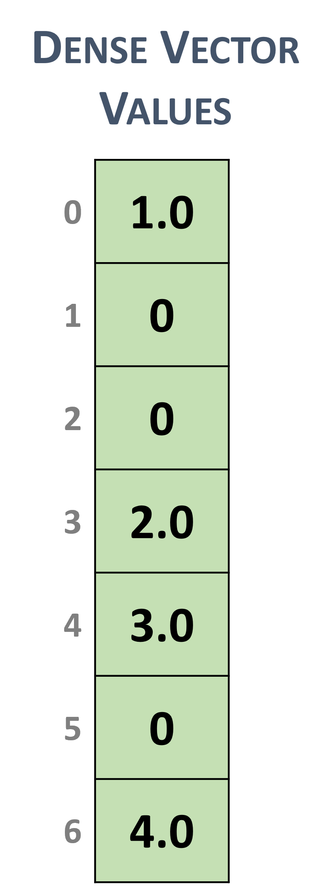](https://docs.nvidia.com/cuda/cusparse/_images/dense_vector.png)

Dense vector representation

---

### 3.2.2. Sparse Vector Format
Sparse vectors are represented with two arrays.
- The**values**array stores the nonzero values from the equivalent array in dense format.
- The**indices**array represent the positions of the corresponding nonzero values in the equivalent array in dense format.
For example, the dense vector in section 3.2.1 can be stored as a sparse vector with zero-based or one-based indexing.

[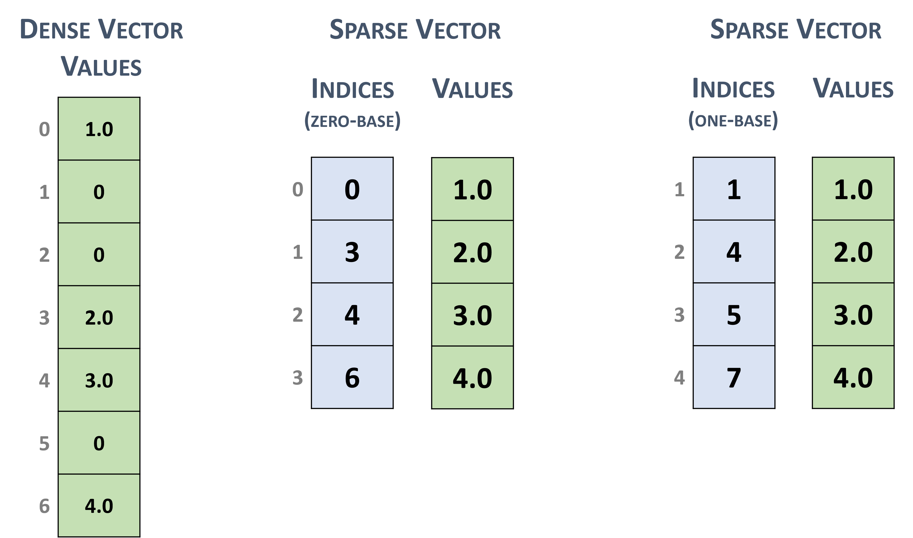](https://docs.nvidia.com/cuda/cusparse/_images/sparse_vector.png)

Sparse vector representation

Note
The cuSPARSE routines assume that the indices are provided in increasing order and that each index appears only once. In the opposite case, the correctness of the computation is not always ensured.

---

## 3.3. Matrix Formats
Dense and several sparse formats for matrices are discussed in this section.

### 3.3.1. Dense Matrix Format
A dense matrix can be stored in both*row-major*and*column-major*memory layout (ordering) and it is represented by the following parameters.
- The**number of rows**in the matrix.
- The**number of columns**in the matrix.
- The**leading dimension**, which must be
  > - Greater than or equal to the*number of columns*in the*row-major*layout
  > - Greater than or equal to the*number of rows*in the*column-major*layout
- The pointers to the**values**array of length
  > - $rows \times leading\; dimension$in the*row-major*layout
  > - $columns \times leading\; dimension$in the*column-major*layout
The following figure represents a$5 \times 2$dense matrix with both memory layouts

[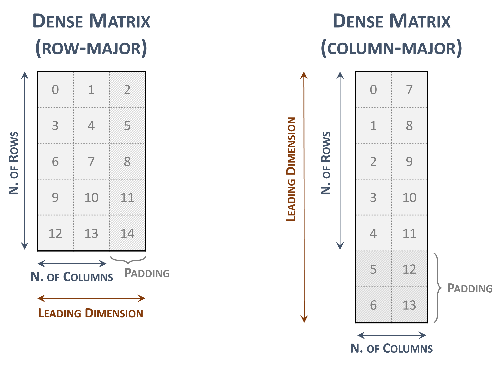](https://docs.nvidia.com/cuda/cusparse/_images/dense_matrix.png)

Dense matrix representations

The indices within the matrix represents the contiguous locations in memory.
The leading dimension is useful to represent a sub-matrix within the original one

[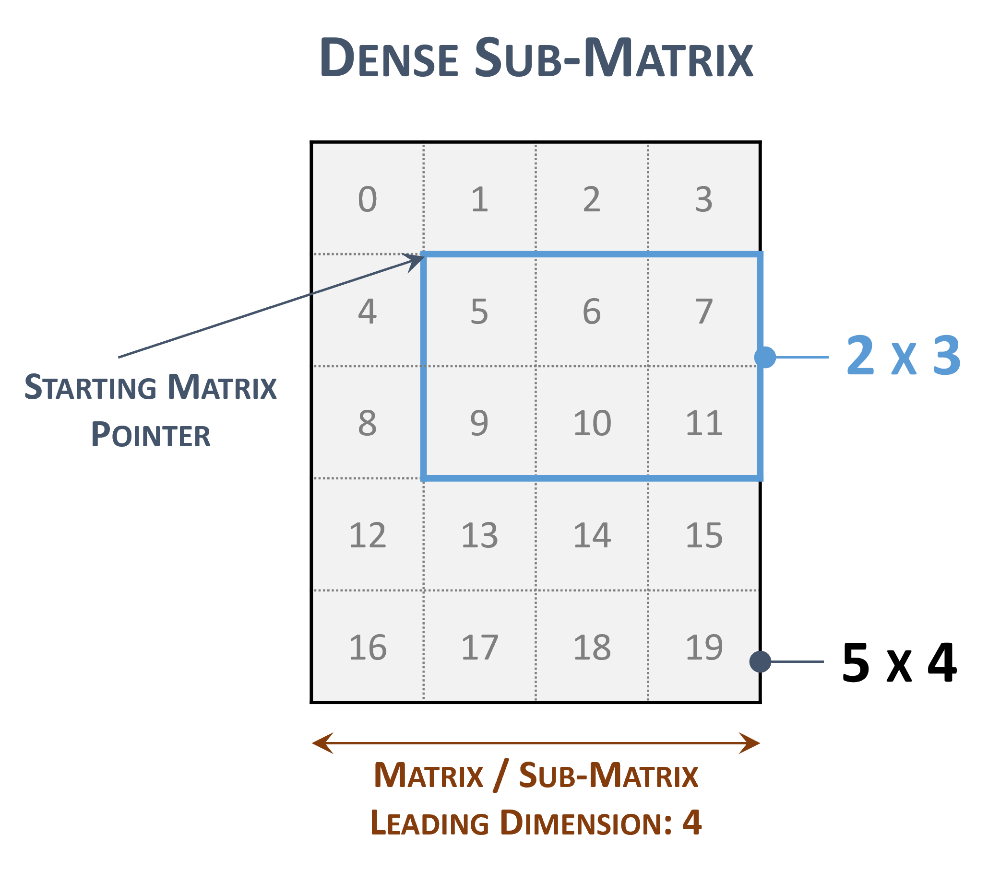](https://docs.nvidia.com/cuda/cusparse/_images/sub_matrix.png)

Sub-matrix representations

---

### 3.3.2. Coordinate (COO)
A sparse matrix stored in**COO**format is represented by the following parameters.
- The**number of rows**in the matrix.
- The**number of columns**in the matrix.
- The**number of non-zero elements**(`nnz`) in the matrix.
- The pointers to the**row indices**array of length`nnz`that contains the row indices of the corresponding elements in the*values array*.
- The pointers to the**column indices**array of length`nnz`that contains the column indices of the corresponding elements in the*values array*.
- The pointers to the**values**array of length`nnz`that holds all nonzero values of the matrix in row-major ordering.
- Each entry of the COO representation consists of a`<row, column>`pair.
- The COO format is assumed to be sorted**by row**.
The following example shows a$5 \times 4$matrix represented in COO format.

[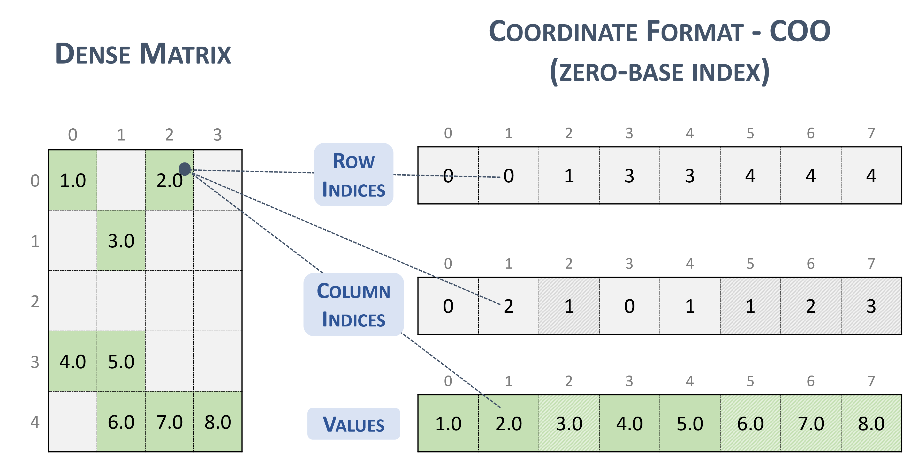](https://docs.nvidia.com/cuda/cusparse/_images/coo.png)

[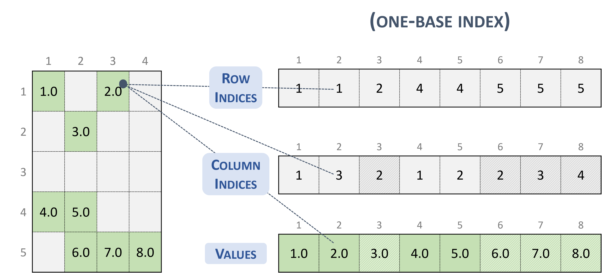](https://docs.nvidia.com/cuda/cusparse/_images/coo_one_base.png)

Note
cuSPARSE supports both*sorted*and*unsorted*column indices within a given row.

Note
If the column indices within a given row are not unique, the correctness of the computation is not always ensured.

Given an entry in the COO format (zero-base), the corresponding position in the dense matrix is computed as:

```
// row-major
rows_indices[i] * leading_dimension + column_indices[i]

// column-major
column_indices[i] * leading_dimension + rows_indices[i]

```

---

### 3.3.3. Compressed Sparse Row (CSR)
The**CSR**format is similar to COO, where the*row indices*are compressed and replaced by an array of*offsets*.
A sparse matrix stored in CSR format is represented by the following parameters.
- The**number of rows**in the matrix.
- The**number of columns**in the matrix.
- The**number of non-zero elements**(`nnz`) in the matrix.
- The pointers to the**row offsets**array of length*number of rows + 1*that represents the starting position of each row in the*columns and values arrays*.
- The pointers to the**column indices**array of length`nnz`that contains the column indices of the corresponding elements in the*values array*.
- The pointers to the**values**array of length`nnz`that holds all nonzero values of the matrix in row-major ordering.
The following example shows a$5 \times 4$matrix represented in CSR format.

[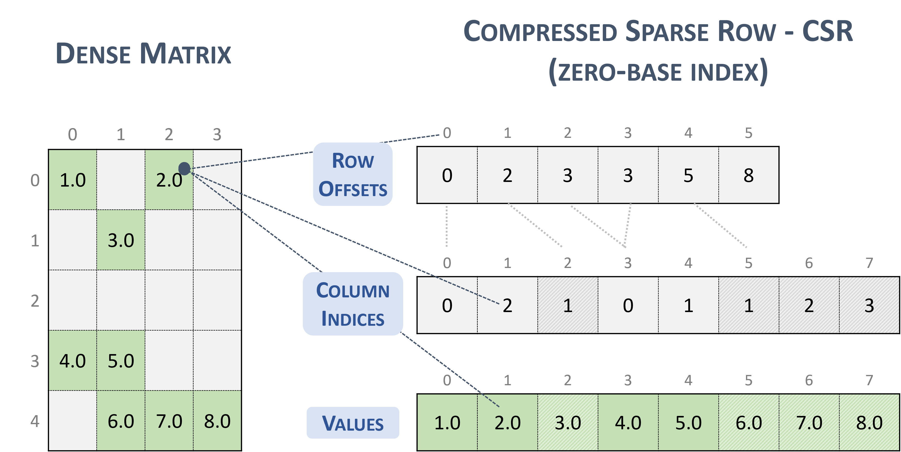](https://docs.nvidia.com/cuda/cusparse/_images/csr.png)

[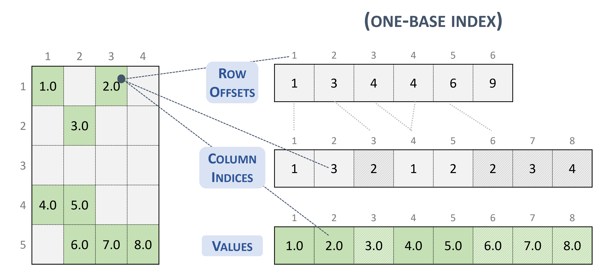](https://docs.nvidia.com/cuda/cusparse/_images/csr_one_base.png)

Note
cuSPARSE supports both*sorted*and*unsorted*column indices within a given row.

Note
If the*column indices*within a given*row*are not unique, the correctness of the computation is not always ensured.

Given an entry in the CSR format (zero-base), the corresponding position in the dense matrix is computed as:

```
// row-major
row * leading_dimension + column_indices[row_offsets[row] + k]

// column-major
column_indices[row_offsets[row] + k] * leading_dimension + row

```

---

### 3.3.4. Compressed Sparse Column (CSC)
The**CSC**format is similar to COO, where the*column indices*are compressed and replaced by an array of*offsets*.
A sparse matrix stored in CSC format is represented by the following parameters.
- The**number of rows**in the matrix.
- The**number of columns**in the matrix.
- The**number of non-zero elements**(`nnz`) in the matrix.
- The pointers to the**column offsets**array of length*number of column + 1*that represents the starting position of each column in the*columns and values arrays*.
- The pointers to the**row indices**array of length`nnz`that contains row indices of the corresponding elements in the*values array*.
- The pointers to the**values**array of length`nnz`that holds all nonzero values of the matrix in column-major ordering.
The following example shows a$5 \times 4$matrix represented in CSC format.

[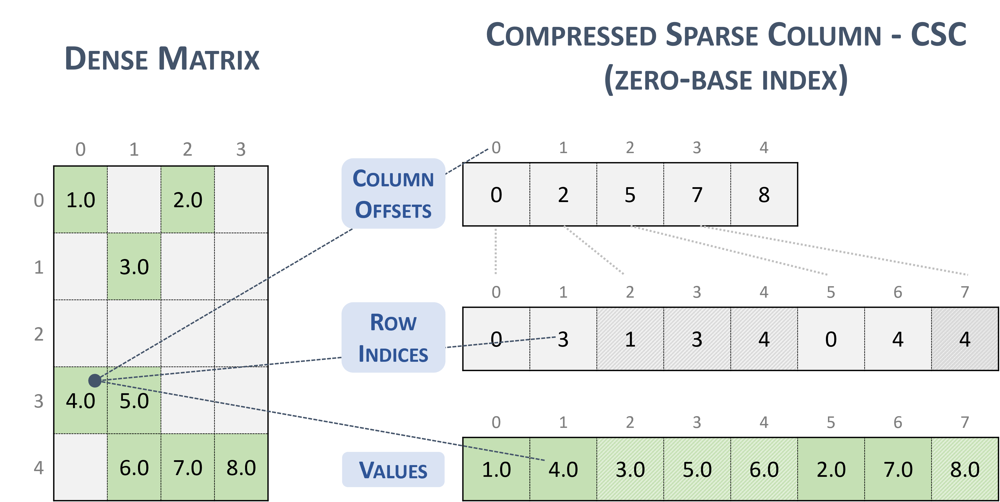](https://docs.nvidia.com/cuda/cusparse/_images/csc.png)

[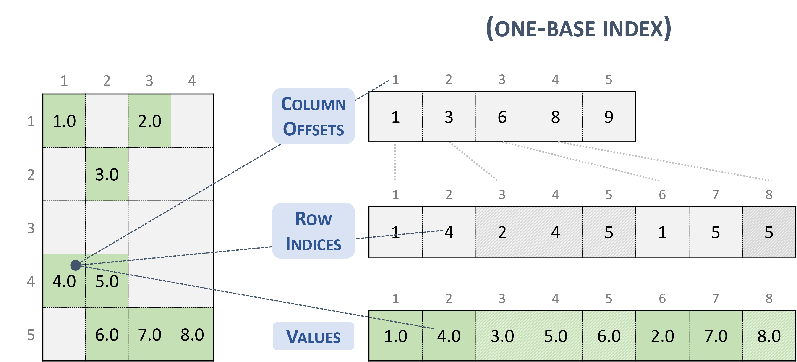](https://docs.nvidia.com/cuda/cusparse/_images/csc_one_base.png)

Note
The CSR format has exactly the same memory layout as its transpose in CSC format (and vice versa).

Note
cuSPARSE supports both*sorted*and*unsorted*row indices within a given column.

Note
If the*row indices*within a given*column*are not unique, the correctness of the computation is not always ensured.

Given an entry in the CSC format (zero-base), the corresponding position in the dense matrix is computed as:

```
// row-major
row_indices[column_offsets[column] + k] * leading_dimension + column

// column-major
column * leading_dimension + row_indices[column_offsets[column] + k]

```

---

### 3.3.5. Sliced Ellpack (SELL)
The**Sliced Ellpack**format is standardized and well-known as the state of the art.
This format allows to significantly improve the performance of all problems that involve low variability in the number of nonzero elements per row.
A matrix in the Sliced Ellpack format is divided into*slices*of an*exact number of rows*($sliceSize$), defined by the user.
The maximum row length (i.e., the maximum non-zeros per row) is found for each slice, and every row in the slice is padded to the maximum row length.
The value`-1`is used for padding.
A$m \times n$sparse matrix$A$is equivalent to a*sliced sparse matrix*$A_{s}$with$nslices = \left \lceil{\frac{m}{sliceSize}}\right \rceil$slice rows and$n$columns.
To improve memory coalescing and memory utilization, each slice is stored in*column-major*order.
A sparse matrix stored in SELL format is represented by the following parameters.
- The**number of slices**.
- The**number of rows**in the matrix.
- The**number of columns**in the matrix.
- The**number of non-zero elements**(`nnz`) in the matrix.
- The**total number elements**(`sellValuesSize`), including non-zero values and padded elements.
- The pointer to the**slice offsets**of length$nslices + 1$that holds offsets of the slides corresponding to the columns and values arrays.
- The pointer to the**column indices**array of length`sellValuesSize`that contains column indices of the corresponding elements in the*values*array. The column indices are stored in*column-major*layout. Value`-1`refers to padding.
- The pointer to the**values**array of length`sellValuesSize`that holds all non-zero values and padding in*column-major*layout.
The following example shows a$5 \times 4$matrix represented in SELL format.

[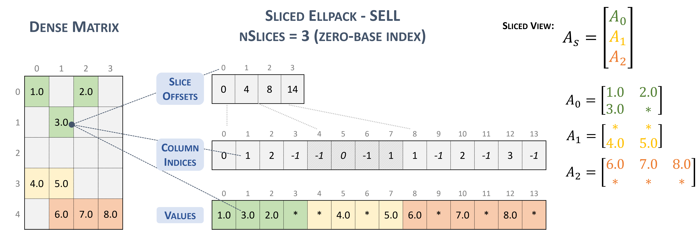](https://docs.nvidia.com/cuda/cusparse/_images/sell.png)

[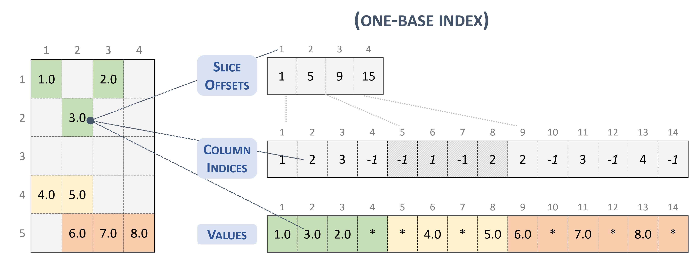](https://docs.nvidia.com/cuda/cusparse/_images/sell_one_base.png)

---

### 3.3.6. Block Sparse Row (BSR)
The BSR format is similar to CSR, where the*column indices*represent two-dimensional blocks instead of a single matrix entry.
A matrix in the Block Sparse Row format is organized into blocks of size$blockSize$, defined by the user.
A$m \times n$sparse matrix$A$is equivalent to a*block sparse matrix*$A_{B}$:$mb \times nb$with$mb = \frac{m}{blockSize}$*block rows*and$nb = \frac{n}{blockSize}$*block columns*.
If$m$or$n$is not multiple of$blockSize$, the user needs to pad the matrix with zeros.

Note
cuSPARSE currently supports only*square*blocks.

The BSR format stores the blocks in row-major ordering. However, the internal storage format of blocks can be*column-major*(`cusparseDirection_t=CUSPARSE_DIRECTION_COLUMN`) or*row-major*(`cusparseDirection_t=CUSPARSE_DIRECTION_ROW`), independently of the base index.
A sparse matrix stored in BSR format is represented by the following parameters.
- The**block size**.
- The**number of row blocks**in the matrix.
- The**number of column blocks**in the matrix.
- The**number of non-zero blocks**(`nnzb`) in the matrix.
- The pointers to the**row block offsets**array of length*number of row blocks + 1*that represents the starting position of each row block in the*columns and values arrays*.
- The pointers to the**column block indices**array of length`nnzb`that contains the location of the corresponding elements in the values array.
- The pointers to the**values array**of length`nnzb`that holds all nonzero values of the matrix.
The following example shows a$4 \times 7$matrix represented in BSR format.

[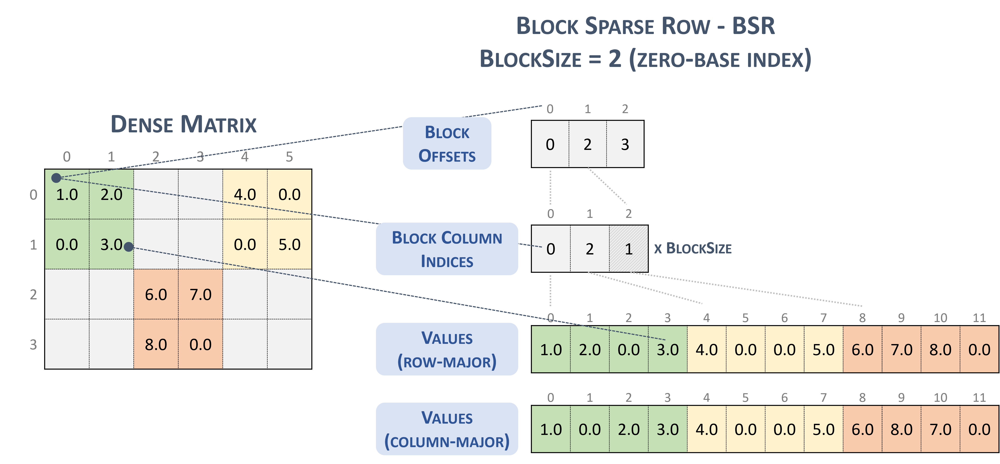](https://docs.nvidia.com/cuda/cusparse/_images/bsr.png)

[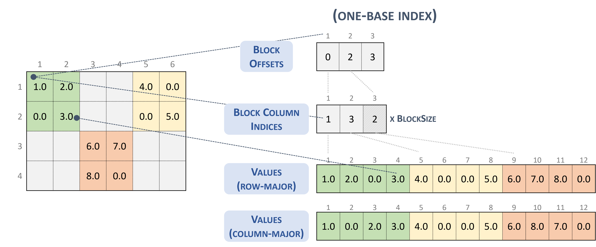](https://docs.nvidia.com/cuda/cusparse/_images/bsr_one_base.png)

---

### 3.3.7. Blocked Ellpack (BLOCKED-ELL)
The Blocked Ellpack format is similar to the standard Ellpack, where the*column indices*represent two-dimensional blocks instead of a single matrix entry.
A matrix in the Blocked Ellpack format is organized into blocks of size$blockSize$, defined by the user. The number of columns per row$nEllCols$is also defined by the user ($nEllCols \le n$).
A$m \times n$sparse matrix$A$is equivalent to a*Blocked-ELL*matrix$A_{B}$:$mb \times nb$with$mb = \left \lceil{\frac{m}{blockSize}}\right \rceil$*block rows*, and$nb = \left \lceil{\frac{nEllCols}{blockSize}}\right \rceil$block columns.
If$m$or$n$is not multiple of$blockSize$, then the remaining elements are zero.
A sparse matrix stored in Blocked-ELL format is represented by the following parameters.
- The**block size**.
- The**number of rows**in the matrix.
- The**number of columns**in the matrix.
- The**number of columns per row**(`nEllCols`) in the matrix.
- The pointers to the**column block indices**array of length$mb \times nb$that contains the location of the corresponding elements in the values array. Empty blocks can be represented with`-1`index.
- The pointers to the**values array**of length$m \times nEllCols$that holds all nonzero values of the matrix in row-major ordering.
The following example shows a$9 \times 9$matrix represented in Blocked-ELL format.

[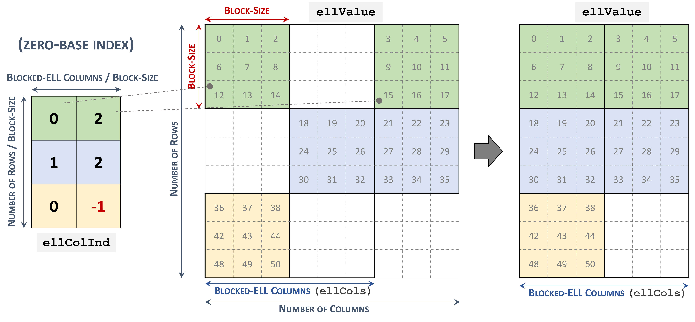](https://docs.nvidia.com/cuda/cusparse/_images/blockedell.png)

[](https://docs.nvidia.com/cuda/cusparse/_images/blockedell_one_base.png)

---

### 3.3.8. Extended BSR Format (BSRX) [DEPRECATED]
BSRX is the same as the BSR format, but the array`bsrRowPtrA`is separated into two parts. The first nonzero block of each row is still specified by the array`bsrRowPtrA`, which is the same as in BSR, but the position next to the last nonzero block of each row is specified by the array`bsrEndPtrA`. Briefly, BSRX format is simply like a 4-vector variant of BSR format.
Matrix`A`is represented in BSRX format by the following parameters.

<div style="overflow-x: auto; max-width: 100%; border-radius: 6px;">
<table border="1" cellpadding="6" cellspacing="0" style="border-collapse: collapse; width: 100%; font-family: -apple-system, BlinkMacSystemFont, Segoe UI, Helvetica, Arial, sans-serif; font-size: 13px; margin: 16px 0;">
<colgroup>
<col style="width: 6%"/>
<col style="width: 4%"/>
<col style="width: 90%"/>
</colgroup>
<tbody>
<tr style="border: 1px solid #d0d7de;">
<td style="padding: 8px 12px; border: 1px solid #d0d7de; vertical-align: top;"><p><code class="docutils literal notranslate"><span class="pre">blockDim</span></code></p></td>
<td style="padding: 8px 12px; border: 1px solid #d0d7de; vertical-align: top;"><p>(integer)</p></td>
<td style="padding: 8px 12px; border: 1px solid #d0d7de; vertical-align: top;"><p>Block dimension of matrix <code class="docutils literal notranslate"><span class="pre">A</span></code>.</p></td>
</tr>
<tr style="border: 1px solid #d0d7de;">
<td style="padding: 8px 12px; border: 1px solid #d0d7de; vertical-align: top;"><p><code class="docutils literal notranslate"><span class="pre">mb</span></code></p></td>
<td style="padding: 8px 12px; border: 1px solid #d0d7de; vertical-align: top;"><p>(integer)</p></td>
<td style="padding: 8px 12px; border: 1px solid #d0d7de; vertical-align: top;"><p>The number of block rows of <code class="docutils literal notranslate"><span class="pre">A</span></code>.</p></td>
</tr>
<tr style="border: 1px solid #d0d7de;">
<td style="padding: 8px 12px; border: 1px solid #d0d7de; vertical-align: top;"><p><code class="docutils literal notranslate"><span class="pre">nb</span></code></p></td>
<td style="padding: 8px 12px; border: 1px solid #d0d7de; vertical-align: top;"><p>(integer)</p></td>
<td style="padding: 8px 12px; border: 1px solid #d0d7de; vertical-align: top;"><p>The number of block columns of <code class="docutils literal notranslate"><span class="pre">A</span></code>.</p></td>
</tr>
<tr style="border: 1px solid #d0d7de;">
<td style="padding: 8px 12px; border: 1px solid #d0d7de; vertical-align: top;"><p><code class="docutils literal notranslate"><span class="pre">nnzb</span></code></p></td>
<td style="padding: 8px 12px; border: 1px solid #d0d7de; vertical-align: top;"><p>(integer)</p></td>
<td style="padding: 8px 12px; border: 1px solid #d0d7de; vertical-align: top;"><p>number of nonzero blocks in the matrix <code class="docutils literal notranslate"><span class="pre">A</span></code>.</p></td>
</tr>
<tr style="border: 1px solid #d0d7de;">
<td style="padding: 8px 12px; border: 1px solid #d0d7de; vertical-align: top;"><p><code class="docutils literal notranslate"><span class="pre">bsrValA</span></code></p></td>
<td style="padding: 8px 12px; border: 1px solid #d0d7de; vertical-align: top;"><p>(pointer)</p></td>
<td style="padding: 8px 12px; border: 1px solid #d0d7de; vertical-align: top;"><p>Points to the data array of length <span class="math notranslate nohighlight">\(nnzb \ast blockDim^{2}\)</span> that holds all the elements of the nonzero blocks of <code class="docutils literal notranslate"><span class="pre">A</span></code>. The block elements are stored in either column-major order or row-major order.</p></td>
</tr>
<tr style="border: 1px solid #d0d7de;">
<td style="padding: 8px 12px; border: 1px solid #d0d7de; vertical-align: top;"><p><code class="docutils literal notranslate"><span class="pre">bsrRowPtrA</span></code></p></td>
<td style="padding: 8px 12px; border: 1px solid #d0d7de; vertical-align: top;"><p>(pointer)</p></td>
<td style="padding: 8px 12px; border: 1px solid #d0d7de; vertical-align: top;"><p>Points to the integer array of length <code class="docutils literal notranslate"><span class="pre">mb</span></code> that holds indices into the arrays <code class="docutils literal notranslate"><span class="pre">bsrColIndA</span></code> and <code class="docutils literal notranslate"><span class="pre">bsrValA</span></code>; <code class="docutils literal notranslate"><span class="pre">bsrRowPtrA(i)</span></code> is the position of the first nonzero block of the <code class="docutils literal notranslate"><span class="pre">i</span></code>th block row in <code class="docutils literal notranslate"><span class="pre">bsrColIndA</span></code> and <code class="docutils literal notranslate"><span class="pre">bsrValA</span></code>.</p></td>
</tr>
<tr style="border: 1px solid #d0d7de;">
<td style="padding: 8px 12px; border: 1px solid #d0d7de; vertical-align: top;"><p><code class="docutils literal notranslate"><span class="pre">bsrEndPtrA</span></code></p></td>
<td style="padding: 8px 12px; border: 1px solid #d0d7de; vertical-align: top;"><p>(pointer)</p></td>
<td style="padding: 8px 12px; border: 1px solid #d0d7de; vertical-align: top;"><p>Points to the integer array of length <code class="docutils literal notranslate"><span class="pre">mb</span></code> that holds indices into the arrays <code class="docutils literal notranslate"><span class="pre">bsrColIndA</span></code> and <code class="docutils literal notranslate"><span class="pre">bsrValA</span></code>; <code class="docutils literal notranslate"><span class="pre">bsrRowPtrA(i)</span></code> is the position next to the last nonzero block of the <code class="docutils literal notranslate"><span class="pre">i</span></code>th block row in <code class="docutils literal notranslate"><span class="pre">bsrColIndA</span></code> and <code class="docutils literal notranslate"><span class="pre">bsrValA</span></code>.</p></td>
</tr>
<tr style="border: 1px solid #d0d7de;">
<td style="padding: 8px 12px; border: 1px solid #d0d7de; vertical-align: top;"><p><code class="docutils literal notranslate"><span class="pre">bsrColIndA</span></code></p></td>
<td style="padding: 8px 12px; border: 1px solid #d0d7de; vertical-align: top;"><p>(pointer)</p></td>
<td style="padding: 8px 12px; border: 1px solid #d0d7de; vertical-align: top;"><p>Points to the integer array of length <code class="docutils literal notranslate"><span class="pre">nnzb</span></code> that contains the column indices of the corresponding blocks in array <code class="docutils literal notranslate"><span class="pre">bsrValA</span></code>.</p></td>
</tr>
</tbody>
</table>
</div>

A simple conversion between BSR and BSRX can be done as follows. Suppose the developer has a$2 \times 3$block sparse matrix$A_{b}$represented as shown.

\[\begin{split}A_{b} = \begin{bmatrix}
 A_{00} & A_{01} & A_{02} \\
 A_{10} & A_{11} & A_{12} \\
 \end{bmatrix}\end{split}\]
Assume it has this BSR format:

\[\begin{split}\begin{matrix}
 \text{bsrValA of BSR} & = & \begin{bmatrix}
 A_{00} & A_{01} & A_{10} & A_{11} & A_{12} \\
 \end{bmatrix} \\
 \text{bsrRowPtrA of BSR} & = & \begin{bmatrix}
 {0\phantom{.0}} & {2\phantom{.0}} & 5 \\
 \end{bmatrix} \\
 \text{bsrColIndA of BSR} & = & \begin{bmatrix}
 {0\phantom{.0}} & {1\phantom{.0}} & {0\phantom{.0}} & {1\phantom{.0}} & 2 \\
 \end{bmatrix} \\
 \end{matrix}\end{split}\]
The`bsrRowPtrA`of the BSRX format is simply the first two elements of the`bsrRowPtrA`BSR format. The`bsrEndPtrA`of BSRX format is the last two elements of the`bsrRowPtrA`of BSR format.

\[\begin{split}\begin{matrix}
 \text{bsrRowPtrA of BSRX} & = & \begin{bmatrix}
 {0\phantom{.0}} & 2 \\
 \end{bmatrix} \\
 \text{bsrEndPtrA of BSRX} & = & \begin{bmatrix}
 {2\phantom{.0}} & 5 \\
 \end{bmatrix} \\
 \end{matrix}\end{split}\]
The advantage of the BSRX format is that the developer can specify a submatrix in the original BSR format by modifying`bsrRowPtrA`and`bsrEndPtrA`while keeping`bsrColIndA`and`bsrValA`unchanged.
For example, to create another block matrix$\widetilde{A} = \begin{bmatrix}
O & O & O \\
O & A_{11} & O \\
\end{bmatrix}$that is slightly different from$A$, the developer can keep`bsrColIndA`and`bsrValA`, but reconstruct$\widetilde{A}$by properly setting of`bsrRowPtrA`and`bsrEndPtrA`. The following 4-vector characterizes$\widetilde{A}$.

\[\begin{split}\begin{matrix}
 {\text{bsrValA of }\widetilde{A}} & = & \begin{bmatrix}
 A_{00} & A_{01} & A_{10} & A_{11} & A_{12} \\
 \end{bmatrix} \\
 {\text{bsrColIndA of }\widetilde{A}} & = & \begin{bmatrix}
 {0\phantom{.0}} & {1\phantom{.0}} & {0\phantom{.0}} & {1\phantom{.0}} & 2 \\
 \end{bmatrix} \\
 {\text{bsrRowPtrA of }\widetilde{A}} & = & \begin{bmatrix}
 {0\phantom{.0}} & 3 \\
 \end{bmatrix} \\
 {\text{bsrEndPtrA of }\widetilde{A}} & = & \begin{bmatrix}
 {0\phantom{.0}} & 4 \\
 \end{bmatrix} \\
 \end{matrix}\end{split}\]

---

# 4. cuSPARSE Basic APIs

## 4.1. cuSPARSE Types Reference

### 4.1.1. cudaDataType_t
The section describes the types shared by multiple CUDA Libraries and defined in the header file`library_types.h`. The`cudaDataType`type is an enumerator to specify the data precision. It is used when the data reference does not carry the type itself (e.g.`void*`). For example, it is used in the routine`cusparseSpMM()`.

<div style="overflow-x: auto; max-width: 100%; border-radius: 6px;">
<table border="1" cellpadding="6" cellspacing="0" style="border-collapse: collapse; width: 100%; font-family: -apple-system, BlinkMacSystemFont, Segoe UI, Helvetica, Arial, sans-serif; font-size: 13px; margin: 16px 0;">
<colgroup>
<col style="width: 14%"/>
<col style="width: 47%"/>
<col style="width: 17%"/>
<col style="width: 11%"/>
<col style="width: 11%"/>
</colgroup>
<thead>
<tr style="border: 1px solid #d0d7de;">
<th style="background-color: #f6f8fa; font-weight: 600; text-align: left; padding: 8px 12px; border: 1px solid #d0d7de;"><p>Value</p></th>
<th style="background-color: #f6f8fa; font-weight: 600; text-align: left; padding: 8px 12px; border: 1px solid #d0d7de;"><p>Meaning</p></th>
<th style="background-color: #f6f8fa; font-weight: 600; text-align: left; padding: 8px 12px; border: 1px solid #d0d7de;"><p>Data Type</p></th>
<th style="background-color: #f6f8fa; font-weight: 600; text-align: left; padding: 8px 12px; border: 1px solid #d0d7de;"><p>Header</p></th>
<th style="background-color: #f6f8fa; font-weight: 600; text-align: left; padding: 8px 12px; border: 1px solid #d0d7de;"></th>
</tr>
</thead>
<tbody>
<tr style="border: 1px solid #d0d7de;">
<td style="padding: 8px 12px; border: 1px solid #d0d7de; vertical-align: top;"><p><code class="docutils literal notranslate"><span class="pre">CUDA_R_16F</span></code></p></td>
<td style="padding: 8px 12px; border: 1px solid #d0d7de; vertical-align: top;"><p>The data type is 16-bit IEEE-754 floating-point</p></td>
<td style="padding: 8px 12px; border: 1px solid #d0d7de; vertical-align: top;"><p><code class="docutils literal notranslate"><span class="pre">__half</span></code></p></td>
<td style="padding: 8px 12px; border: 1px solid #d0d7de; vertical-align: top;"><p>cuda_fp16.h</p></td>
<td style="padding: 8px 12px; border: 1px solid #d0d7de; vertical-align: top;"></td>
</tr>
<tr style="border: 1px solid #d0d7de;">
<td style="padding: 8px 12px; border: 1px solid #d0d7de; vertical-align: top;"><p><code class="docutils literal notranslate"><span class="pre">CUDA_C_16F</span></code></p></td>
<td style="padding: 8px 12px; border: 1px solid #d0d7de; vertical-align: top;"><p>The data type is 16-bit complex IEEE-754 floating-point</p></td>
<td style="padding: 8px 12px; border: 1px solid #d0d7de; vertical-align: top;"><p><code class="docutils literal notranslate"><span class="pre">__half2</span></code></p></td>
<td style="padding: 8px 12px; border: 1px solid #d0d7de; vertical-align: top;"><p>cuda_fp16.h</p></td>
<td style="padding: 8px 12px; border: 1px solid #d0d7de; vertical-align: top;"><p>[DEPRECATED]</p></td>
</tr>
<tr style="border: 1px solid #d0d7de;">
<td style="padding: 8px 12px; border: 1px solid #d0d7de; vertical-align: top;"><p><code class="docutils literal notranslate"><span class="pre">CUDA_R_16BF</span></code></p></td>
<td style="padding: 8px 12px; border: 1px solid #d0d7de; vertical-align: top;"><p>The data type is 16-bit bfloat floating-point</p></td>
<td style="padding: 8px 12px; border: 1px solid #d0d7de; vertical-align: top;"><p><code class="docutils literal notranslate"><span class="pre">__nv_bfloat16</span></code></p></td>
<td style="padding: 8px 12px; border: 1px solid #d0d7de; vertical-align: top;"><p>cuda_bf16.h</p></td>
<td style="padding: 8px 12px; border: 1px solid #d0d7de; vertical-align: top;"></td>
</tr>
<tr style="border: 1px solid #d0d7de;">
<td style="padding: 8px 12px; border: 1px solid #d0d7de; vertical-align: top;"><p><code class="docutils literal notranslate"><span class="pre">CUDA_C_16BF</span></code></p></td>
<td style="padding: 8px 12px; border: 1px solid #d0d7de; vertical-align: top;"><p>The data type is 16-bit complex bfloat floating-point</p></td>
<td style="padding: 8px 12px; border: 1px solid #d0d7de; vertical-align: top;"><p><code class="docutils literal notranslate"><span class="pre">__nv_bfloat162</span></code></p></td>
<td style="padding: 8px 12px; border: 1px solid #d0d7de; vertical-align: top;"><p>cuda_bf16.h</p></td>
<td style="padding: 8px 12px; border: 1px solid #d0d7de; vertical-align: top;"><p>[DEPRECATED]</p></td>
</tr>
<tr style="border: 1px solid #d0d7de;">
<td style="padding: 8px 12px; border: 1px solid #d0d7de; vertical-align: top;"><p><code class="docutils literal notranslate"><span class="pre">CUDA_R_32F</span></code></p></td>
<td style="padding: 8px 12px; border: 1px solid #d0d7de; vertical-align: top;"><p>The data type is 32-bit IEEE-754 floating-point</p></td>
<td style="padding: 8px 12px; border: 1px solid #d0d7de; vertical-align: top;"><p><code class="docutils literal notranslate"><span class="pre">float</span></code></p></td>
<td style="padding: 8px 12px; border: 1px solid #d0d7de; vertical-align: top;"></td>
<td style="padding: 8px 12px; border: 1px solid #d0d7de; vertical-align: top;"></td>
</tr>
<tr style="border: 1px solid #d0d7de;">
<td style="padding: 8px 12px; border: 1px solid #d0d7de; vertical-align: top;"><p><code class="docutils literal notranslate"><span class="pre">CUDA_C_32F</span></code></p></td>
<td style="padding: 8px 12px; border: 1px solid #d0d7de; vertical-align: top;"><p>The data type is 32-bit complex IEEE-754 floating-point</p></td>
<td style="padding: 8px 12px; border: 1px solid #d0d7de; vertical-align: top;"><p><code class="docutils literal notranslate"><span class="pre">cuComplex</span></code></p></td>
<td style="padding: 8px 12px; border: 1px solid #d0d7de; vertical-align: top;"><p>cuComplex.h</p></td>
<td style="padding: 8px 12px; border: 1px solid #d0d7de; vertical-align: top;"></td>
</tr>
<tr style="border: 1px solid #d0d7de;">
<td style="padding: 8px 12px; border: 1px solid #d0d7de; vertical-align: top;"><p><code class="docutils literal notranslate"><span class="pre">CUDA_R_64F</span></code></p></td>
<td style="padding: 8px 12px; border: 1px solid #d0d7de; vertical-align: top;"><p>The data type is 64-bit IEEE-754 floating-point</p></td>
<td style="padding: 8px 12px; border: 1px solid #d0d7de; vertical-align: top;"><p><code class="docutils literal notranslate"><span class="pre">double</span></code></p></td>
<td style="padding: 8px 12px; border: 1px solid #d0d7de; vertical-align: top;"></td>
<td style="padding: 8px 12px; border: 1px solid #d0d7de; vertical-align: top;"></td>
</tr>
<tr style="border: 1px solid #d0d7de;">
<td style="padding: 8px 12px; border: 1px solid #d0d7de; vertical-align: top;"><p><code class="docutils literal notranslate"><span class="pre">CUDA_C_64F</span></code></p></td>
<td style="padding: 8px 12px; border: 1px solid #d0d7de; vertical-align: top;"><p>The data type is 64-bit complex IEEE-754 floating-point</p></td>
<td style="padding: 8px 12px; border: 1px solid #d0d7de; vertical-align: top;"><p><code class="docutils literal notranslate"><span class="pre">cuDoubleComplex</span></code></p></td>
<td style="padding: 8px 12px; border: 1px solid #d0d7de; vertical-align: top;"><p>cuComplex.h</p></td>
<td style="padding: 8px 12px; border: 1px solid #d0d7de; vertical-align: top;"></td>
</tr>
<tr style="border: 1px solid #d0d7de;">
<td style="padding: 8px 12px; border: 1px solid #d0d7de; vertical-align: top;"><p><code class="docutils literal notranslate"><span class="pre">CUDA_R_8I</span></code></p></td>
<td style="padding: 8px 12px; border: 1px solid #d0d7de; vertical-align: top;"><p>The data type is 8-bit integer</p></td>
<td style="padding: 8px 12px; border: 1px solid #d0d7de; vertical-align: top;"><p><code class="docutils literal notranslate"><span class="pre">int8_t</span></code></p></td>
<td style="padding: 8px 12px; border: 1px solid #d0d7de; vertical-align: top;"><p>stdint.h</p></td>
<td style="padding: 8px 12px; border: 1px solid #d0d7de; vertical-align: top;"></td>
</tr>
<tr style="border: 1px solid #d0d7de;">
<td style="padding: 8px 12px; border: 1px solid #d0d7de; vertical-align: top;"><p><code class="docutils literal notranslate"><span class="pre">CUDA_R_32I</span></code></p></td>
<td style="padding: 8px 12px; border: 1px solid #d0d7de; vertical-align: top;"><p>The data type is 32-bit integer</p></td>
<td style="padding: 8px 12px; border: 1px solid #d0d7de; vertical-align: top;"><p><code class="docutils literal notranslate"><span class="pre">int32_t</span></code></p></td>
<td style="padding: 8px 12px; border: 1px solid #d0d7de; vertical-align: top;"><p>stdint.h</p></td>
<td style="padding: 8px 12px; border: 1px solid #d0d7de; vertical-align: top;"></td>
</tr>
</tbody>
</table>
</div>

**IMPORTANT:**The Generic API routines allow all data types reported in the respective section of the documentation only on GPU architectures with*native*support for them. If a specific GPU model does not provide*native*support for a given data type, the routine returns`CUSPARSE_STATUS_ARCH_MISMATCH`error.
Unsupported data types and Compute Capability (CC):
- `__half`on GPUs with`CC < 53`(e.g. Kepler)
- `__nv_bfloat16`on GPUs with`CC < 80`(e.g. Kepler, Maxwell, Pascal, Volta, Turing)
see[https://developer.nvidia.com/cuda-gpus](https://developer.nvidia.com/cuda-gpus)

---

### 4.1.2. cusparseStatus_t
This data type represents the status returned by the library functions and it can have the following values:

<div style="overflow-x: auto; max-width: 100%; border-radius: 6px;">
<table border="1" cellpadding="6" cellspacing="0" style="border-collapse: collapse; width: 100%; font-family: -apple-system, BlinkMacSystemFont, Segoe UI, Helvetica, Arial, sans-serif; font-size: 13px; margin: 16px 0;">
<colgroup>
<col style="width: 16%"/>
<col style="width: 84%"/>
</colgroup>
<thead>
<tr style="border: 1px solid #d0d7de;">
<th style="background-color: #f6f8fa; font-weight: 600; text-align: left; padding: 8px 12px; border: 1px solid #d0d7de;"><p>Value</p></th>
<th style="background-color: #f6f8fa; font-weight: 600; text-align: left; padding: 8px 12px; border: 1px solid #d0d7de;"><p>Description</p></th>
</tr>
</thead>
<tbody>
<tr style="border: 1px solid #d0d7de;">
<td style="padding: 8px 12px; border: 1px solid #d0d7de; vertical-align: top;"><p><code class="docutils literal notranslate"><span class="pre">CUSPARSE_STATUS_SUCCESS</span></code></p></td>
<td style="padding: 8px 12px; border: 1px solid #d0d7de; vertical-align: top;"><p>The operation completed successfully</p></td>
</tr>
<tr style="border: 1px solid #d0d7de;">
<td style="padding: 8px 12px; border: 1px solid #d0d7de; vertical-align: top;"><p><code class="docutils literal notranslate"><span class="pre">CUSPARSE_STATUS_NOT_INITIALIZED</span></code></p></td>
<td style="padding: 8px 12px; border: 1px solid #d0d7de; vertical-align: top;">
<p>The cuSPARSE library was not initialized. This is usually caused by the lack of a prior call, an error in the CUDA Runtime API called by the cuSPARSE routine, or an error in the hardware setup</p>
<p><strong>To correct:</strong> call <code class="docutils literal notranslate"><span class="pre">cusparseCreate()</span></code> prior to the function call; and check that the hardware, an appropriate version of the driver, and the cuSPARSE library are correctly installed</p>
<p>The error also applies to generic APIs (<a class="reference internal" href="#cusparse-generic-api-reference"><span class="std std-ref">cuSPARSE Generic APIs</span></a>) for indicating a matrix/vector descriptor not initialized</p>
</td>
</tr>
<tr style="border: 1px solid #d0d7de;">
<td style="padding: 8px 12px; border: 1px solid #d0d7de; vertical-align: top;"><p><code class="docutils literal notranslate"><span class="pre">CUSPARSE_STATUS_ALLOC_FAILED</span></code></p></td>
<td style="padding: 8px 12px; border: 1px solid #d0d7de; vertical-align: top;">
<p>Resource allocation failed inside the cuSPARSE library. This is usually caused by a device memory allocation (<code class="docutils literal notranslate"><span class="pre">cudaMalloc()</span></code>) or by a host memory allocation failure</p>
<p><strong>To correct:</strong> prior to the function call, deallocate previously allocated memory as much as possible</p>
</td>
</tr>
<tr style="border: 1px solid #d0d7de;">
<td style="padding: 8px 12px; border: 1px solid #d0d7de; vertical-align: top;"><p><code class="docutils literal notranslate"><span class="pre">CUSPARSE_STATUS_INVALID_VALUE</span></code></p></td>
<td style="padding: 8px 12px; border: 1px solid #d0d7de; vertical-align: top;">
<p>An unsupported value or parameter was passed to the function (a negative vector size, for example)</p>
<p><strong>To correct:</strong> ensure that all the parameters being passed have valid values</p>
</td>
</tr>
<tr style="border: 1px solid #d0d7de;">
<td style="padding: 8px 12px; border: 1px solid #d0d7de; vertical-align: top;"><p><code class="docutils literal notranslate"><span class="pre">CUSPARSE_STATUS_ARCH_MISMATCH</span></code></p></td>
<td style="padding: 8px 12px; border: 1px solid #d0d7de; vertical-align: top;">
<p>The function requires a feature absent from the device architecture</p>
<p><strong>To correct:</strong> compile and run the application on a device with appropriate compute capability</p>
</td>
</tr>
<tr style="border: 1px solid #d0d7de;">
<td style="padding: 8px 12px; border: 1px solid #d0d7de; vertical-align: top;"><p><code class="docutils literal notranslate"><span class="pre">CUSPARSE_STATUS_EXECUTION_FAILED</span></code></p></td>
<td style="padding: 8px 12px; border: 1px solid #d0d7de; vertical-align: top;">
<p>The GPU program failed to execute. This is often caused by a launch failure of the kernel on the GPU, which can be caused by multiple reasons</p>
<p><strong>To correct:</strong> check that the hardware, an appropriate version of the driver, and the cuSPARSE library are correctly installed</p>
</td>
</tr>
<tr style="border: 1px solid #d0d7de;">
<td style="padding: 8px 12px; border: 1px solid #d0d7de; vertical-align: top;"><p><code class="docutils literal notranslate"><span class="pre">CUSPARSE_STATUS_INTERNAL_ERROR</span></code></p></td>
<td style="padding: 8px 12px; border: 1px solid #d0d7de; vertical-align: top;">
<p>An internal cuSPARSE operation failed</p>
<p><strong>To correct:</strong> check that the hardware, an appropriate version of the driver, and the cuSPARSE library are correctly installed. Also, check that the memory passed as a parameter to the routine is not being deallocated prior to the routine completion</p>
</td>
</tr>
<tr style="border: 1px solid #d0d7de;">
<td style="padding: 8px 12px; border: 1px solid #d0d7de; vertical-align: top;"><p><code class="docutils literal notranslate"><span class="pre">CUSPARSE_STATUS_MATRIX_TYPE_NOT_SUPPORTED</span></code></p></td>
<td style="padding: 8px 12px; border: 1px solid #d0d7de; vertical-align: top;">
<p>The matrix type is not supported by this function. This is usually caused by passing an invalid matrix descriptor to the function</p>
<p><strong>To correct:</strong> check that the fields in <code class="docutils literal notranslate"><span class="pre">cusparseMatDescr_t</span> <span class="pre">descrA</span></code> were set correctly</p>
</td>
</tr>
<tr style="border: 1px solid #d0d7de;">
<td style="padding: 8px 12px; border: 1px solid #d0d7de; vertical-align: top;"><p><code class="docutils literal notranslate"><span class="pre">CUSPARSE_STATUS_NOT_SUPPORTED</span></code></p></td>
<td style="padding: 8px 12px; border: 1px solid #d0d7de; vertical-align: top;"><p>The operation or data type combination is currently not supported by the function</p></td>
</tr>
<tr style="border: 1px solid #d0d7de;">
<td style="padding: 8px 12px; border: 1px solid #d0d7de; vertical-align: top;"><p><code class="docutils literal notranslate"><span class="pre">CUSPARSE_STATUS_INSUFFICIENT_RESOURCES</span></code></p></td>
<td style="padding: 8px 12px; border: 1px solid #d0d7de; vertical-align: top;"><p>The resources for the computation, such as GPU global or shared memory, are not sufficient to complete the operation. The error can also indicate that the current computation mode (e.g. bit size of sparse matrix indices) does not allow to handle the given input</p></td>
</tr>
</tbody>
</table>
</div>

---

### 4.1.3. cusparseHandle_t
This is a pointer type to an opaque cuSPARSE context, which the user must initialize by calling prior to calling`cusparseCreate()`any other library function. The handle created and returned by`cusparseCreate()`must be passed to every cuSPARSE function.

---

### 4.1.4. cusparsePointerMode_t
This type indicates whether the scalar values are passed by reference on the host or device. It is important to point out that if several scalar values are passed by reference in the function call, all of them will conform to the same single pointer mode. The pointer mode can be set and retrieved using`cusparseSetPointerMode()`and`cusparseGetPointerMode()`routines, respectively.

<div style="overflow-x: auto; max-width: 100%; border-radius: 6px;">
<table border="1" cellpadding="6" cellspacing="0" style="border-collapse: collapse; width: 100%; font-family: -apple-system, BlinkMacSystemFont, Segoe UI, Helvetica, Arial, sans-serif; font-size: 13px; margin: 16px 0;">
<colgroup>
<col style="width: 40%"/>
<col style="width: 60%"/>
</colgroup>
<thead>
<tr style="border: 1px solid #d0d7de;">
<th style="background-color: #f6f8fa; font-weight: 600; text-align: left; padding: 8px 12px; border: 1px solid #d0d7de;"><p>Value</p></th>
<th style="background-color: #f6f8fa; font-weight: 600; text-align: left; padding: 8px 12px; border: 1px solid #d0d7de;"><p>Meaning</p></th>
</tr>
</thead>
<tbody>
<tr style="border: 1px solid #d0d7de;">
<td style="padding: 8px 12px; border: 1px solid #d0d7de; vertical-align: top;"><p><code class="docutils literal notranslate"><span class="pre">CUSPARSE_POINTER_MODE_HOST</span></code></p></td>
<td style="padding: 8px 12px; border: 1px solid #d0d7de; vertical-align: top;"><p>The scalars are passed by reference on the host.</p></td>
</tr>
<tr style="border: 1px solid #d0d7de;">
<td style="padding: 8px 12px; border: 1px solid #d0d7de; vertical-align: top;"><p><code class="docutils literal notranslate"><span class="pre">CUSPARSE_POINTER_MODE_DEVICE</span></code></p></td>
<td style="padding: 8px 12px; border: 1px solid #d0d7de; vertical-align: top;"><p>The scalars are passed by reference on the device.</p></td>
</tr>
</tbody>
</table>
</div>

---

### 4.1.5. cusparseOperation_t
This type indicates which operations is applied to the related input (e.g. sparse matrix, or vector).

<div style="overflow-x: auto; max-width: 100%; border-radius: 6px;">
<table border="1" cellpadding="6" cellspacing="0" style="border-collapse: collapse; width: 100%; font-family: -apple-system, BlinkMacSystemFont, Segoe UI, Helvetica, Arial, sans-serif; font-size: 13px; margin: 16px 0;">
<colgroup>
<col style="width: 48%"/>
<col style="width: 52%"/>
</colgroup>
<thead>
<tr style="border: 1px solid #d0d7de;">
<th style="background-color: #f6f8fa; font-weight: 600; text-align: left; padding: 8px 12px; border: 1px solid #d0d7de;"><p>Value</p></th>
<th style="background-color: #f6f8fa; font-weight: 600; text-align: left; padding: 8px 12px; border: 1px solid #d0d7de;"><p>Meaning</p></th>
</tr>
</thead>
<tbody>
<tr style="border: 1px solid #d0d7de;">
<td style="padding: 8px 12px; border: 1px solid #d0d7de; vertical-align: top;"><p><code class="docutils literal notranslate"><span class="pre">CUSPARSE_OPERATION_NON_TRANSPOSE</span></code></p></td>
<td style="padding: 8px 12px; border: 1px solid #d0d7de; vertical-align: top;"><p>The non-transpose operation is selected.</p></td>
</tr>
<tr style="border: 1px solid #d0d7de;">
<td style="padding: 8px 12px; border: 1px solid #d0d7de; vertical-align: top;"><p><code class="docutils literal notranslate"><span class="pre">CUSPARSE_OPERATION_TRANSPOSE</span></code></p></td>
<td style="padding: 8px 12px; border: 1px solid #d0d7de; vertical-align: top;"><p>The transpose operation is selected.</p></td>
</tr>
<tr style="border: 1px solid #d0d7de;">
<td style="padding: 8px 12px; border: 1px solid #d0d7de; vertical-align: top;"><p><code class="docutils literal notranslate"><span class="pre">CUSPARSE_OPERATION_CONJUGATE_TRANSPOSE</span></code></p></td>
<td style="padding: 8px 12px; border: 1px solid #d0d7de; vertical-align: top;"><p>The conjugate transpose operation is selected.</p></td>
</tr>
</tbody>
</table>
</div>

---

### 4.1.6. cusparseDiagType_t
This type indicates if the matrix diagonal entries are unity. The diagonal elements are always assumed to be present, but if`CUSPARSE_DIAG_TYPE_UNIT`is passed to an API routine, then the routine assumes that all diagonal entries are unity and will not read or modify those entries. Note that in this case the routine assumes the diagonal entries are equal to one, regardless of what those entries are actually set to in memory.

<div style="overflow-x: auto; max-width: 100%; border-radius: 6px;">
<table border="1" cellpadding="6" cellspacing="0" style="border-collapse: collapse; width: 100%; font-family: -apple-system, BlinkMacSystemFont, Segoe UI, Helvetica, Arial, sans-serif; font-size: 13px; margin: 16px 0;">
<colgroup>
<col style="width: 43%"/>
<col style="width: 57%"/>
</colgroup>
<thead>
<tr style="border: 1px solid #d0d7de;">
<th style="background-color: #f6f8fa; font-weight: 600; text-align: left; padding: 8px 12px; border: 1px solid #d0d7de;"><p>Value</p></th>
<th style="background-color: #f6f8fa; font-weight: 600; text-align: left; padding: 8px 12px; border: 1px solid #d0d7de;"><p>Meaning</p></th>
</tr>
</thead>
<tbody>
<tr style="border: 1px solid #d0d7de;">
<td style="padding: 8px 12px; border: 1px solid #d0d7de; vertical-align: top;"><p><code class="docutils literal notranslate"><span class="pre">CUSPARSE_DIAG_TYPE_NON_UNIT</span></code></p></td>
<td style="padding: 8px 12px; border: 1px solid #d0d7de; vertical-align: top;"><p>The matrix diagonal has non-unit elements.</p></td>
</tr>
<tr style="border: 1px solid #d0d7de;">
<td style="padding: 8px 12px; border: 1px solid #d0d7de; vertical-align: top;"><p><code class="docutils literal notranslate"><span class="pre">CUSPARSE_DIAG_TYPE_UNIT</span></code></p></td>
<td style="padding: 8px 12px; border: 1px solid #d0d7de; vertical-align: top;"><p>The matrix diagonal has unit elements.</p></td>
</tr>
</tbody>
</table>
</div>

---

### 4.1.7. cusparseFillMode_t
This type indicates if the lower or upper part of a matrix is stored in sparse storage.

<div style="overflow-x: auto; max-width: 100%; border-radius: 6px;">
<table border="1" cellpadding="6" cellspacing="0" style="border-collapse: collapse; width: 100%; font-family: -apple-system, BlinkMacSystemFont, Segoe UI, Helvetica, Arial, sans-serif; font-size: 13px; margin: 16px 0;">
<colgroup>
<col style="width: 44%"/>
<col style="width: 56%"/>
</colgroup>
<thead>
<tr style="border: 1px solid #d0d7de;">
<th style="background-color: #f6f8fa; font-weight: 600; text-align: left; padding: 8px 12px; border: 1px solid #d0d7de;"><p>Value</p></th>
<th style="background-color: #f6f8fa; font-weight: 600; text-align: left; padding: 8px 12px; border: 1px solid #d0d7de;"><p>Meaning</p></th>
</tr>
</thead>
<tbody>
<tr style="border: 1px solid #d0d7de;">
<td style="padding: 8px 12px; border: 1px solid #d0d7de; vertical-align: top;"><p><code class="docutils literal notranslate"><span class="pre">CUSPARSE_FILL_MODE_LOWER</span></code></p></td>
<td style="padding: 8px 12px; border: 1px solid #d0d7de; vertical-align: top;"><p>The lower triangular part is stored.</p></td>
</tr>
<tr style="border: 1px solid #d0d7de;">
<td style="padding: 8px 12px; border: 1px solid #d0d7de; vertical-align: top;"><p><code class="docutils literal notranslate"><span class="pre">CUSPARSE_FILL_MODE_UPPER</span></code></p></td>
<td style="padding: 8px 12px; border: 1px solid #d0d7de; vertical-align: top;"><p>The upper triangular part is stored.</p></td>
</tr>
</tbody>
</table>
</div>

---

### 4.1.8. cusparseIndexBase_t
This type indicates if the base of the matrix indices is zero or one.

<div style="overflow-x: auto; max-width: 100%; border-radius: 6px;">
<table border="1" cellpadding="6" cellspacing="0" style="border-collapse: collapse; width: 100%; font-family: -apple-system, BlinkMacSystemFont, Segoe UI, Helvetica, Arial, sans-serif; font-size: 13px; margin: 16px 0;">
<colgroup>
<col style="width: 37%"/>
<col style="width: 63%"/>
</colgroup>
<thead>
<tr style="border: 1px solid #d0d7de;">
<th style="background-color: #f6f8fa; font-weight: 600; text-align: left; padding: 8px 12px; border: 1px solid #d0d7de;"><p>Value</p></th>
<th style="background-color: #f6f8fa; font-weight: 600; text-align: left; padding: 8px 12px; border: 1px solid #d0d7de;"><p>Meaning</p></th>
</tr>
</thead>
<tbody>
<tr style="border: 1px solid #d0d7de;">
<td style="padding: 8px 12px; border: 1px solid #d0d7de; vertical-align: top;"><p><code class="docutils literal notranslate"><span class="pre">CUSPARSE_INDEX_BASE_ZERO</span></code></p></td>
<td style="padding: 8px 12px; border: 1px solid #d0d7de; vertical-align: top;"><p>The base index is zero (C compatibility).</p></td>
</tr>
<tr style="border: 1px solid #d0d7de;">
<td style="padding: 8px 12px; border: 1px solid #d0d7de; vertical-align: top;"><p><code class="docutils literal notranslate"><span class="pre">CUSPARSE_INDEX_BASE_ONE</span></code></p></td>
<td style="padding: 8px 12px; border: 1px solid #d0d7de; vertical-align: top;"><p>The base index is one  (Fortran compatibility).</p></td>
</tr>
</tbody>
</table>
</div>

---

### 4.1.9. cusparseDirection_t
This type indicates whether the elements of a dense matrix should be parsed by rows or by columns (assuming column-major storage in memory of the dense matrix) in function cusparse[S|D|C|Z]nnz. Besides storage format of blocks in BSR format is also controlled by this type.

<div style="overflow-x: auto; max-width: 100%; border-radius: 6px;">
<table border="1" cellpadding="6" cellspacing="0" style="border-collapse: collapse; width: 100%; font-family: -apple-system, BlinkMacSystemFont, Segoe UI, Helvetica, Arial, sans-serif; font-size: 13px; margin: 16px 0;">
<colgroup>
<col style="width: 43%"/>
<col style="width: 57%"/>
</colgroup>
<thead>
<tr style="border: 1px solid #d0d7de;">
<th style="background-color: #f6f8fa; font-weight: 600; text-align: left; padding: 8px 12px; border: 1px solid #d0d7de;"><p>Value</p></th>
<th style="background-color: #f6f8fa; font-weight: 600; text-align: left; padding: 8px 12px; border: 1px solid #d0d7de;"><p>Meaning</p></th>
</tr>
</thead>
<tbody>
<tr style="border: 1px solid #d0d7de;">
<td style="padding: 8px 12px; border: 1px solid #d0d7de; vertical-align: top;"><p><code class="docutils literal notranslate"><span class="pre">CUSPARSE_DIRECTION_ROW</span></code></p></td>
<td style="padding: 8px 12px; border: 1px solid #d0d7de; vertical-align: top;"><p>The matrix should be parsed by rows.</p></td>
</tr>
<tr style="border: 1px solid #d0d7de;">
<td style="padding: 8px 12px; border: 1px solid #d0d7de; vertical-align: top;"><p><code class="docutils literal notranslate"><span class="pre">CUSPARSE_DIRECTION_COLUMN</span></code></p></td>
<td style="padding: 8px 12px; border: 1px solid #d0d7de; vertical-align: top;"><p>The matrix should be parsed by columns.</p></td>
</tr>
</tbody>
</table>
</div>

---

## 4.2. cuSPARSE Management API
The cuSPARSE functions for managing the library are described in this section.

---

### 4.2.1. cusparseCreate()

```
cusparseStatus_t
cusparseCreate(cusparseHandle_t *handle)

```

This function initializes the cuSPARSE library and creates a handle on the cuSPARSE context. It must be called before any other cuSPARSE API function is invoked. It allocates hardware resources necessary for accessing the GPU.

<div style="overflow-x: auto; max-width: 100%; border-radius: 6px;">
<table border="1" cellpadding="6" cellspacing="0" style="border-collapse: collapse; width: 100%; font-family: -apple-system, BlinkMacSystemFont, Segoe UI, Helvetica, Arial, sans-serif; font-size: 13px; margin: 16px 0;">
<colgroup>
<col style="width: 15%"/>
<col style="width: 9%"/>
<col style="width: 75%"/>
</colgroup>
<thead>
<tr style="border: 1px solid #d0d7de;">
<th style="background-color: #f6f8fa; font-weight: 600; text-align: left; padding: 8px 12px; border: 1px solid #d0d7de;"><p>Param.</p></th>
<th style="background-color: #f6f8fa; font-weight: 600; text-align: left; padding: 8px 12px; border: 1px solid #d0d7de;"><p>In/out</p></th>
<th style="background-color: #f6f8fa; font-weight: 600; text-align: left; padding: 8px 12px; border: 1px solid #d0d7de;"><p>Meaning</p></th>
</tr>
</thead>
<tbody>
<tr style="border: 1px solid #d0d7de;">
<td style="padding: 8px 12px; border: 1px solid #d0d7de; vertical-align: top;"><p><code class="docutils literal notranslate"><span class="pre">handle</span></code></p></td>
<td style="padding: 8px 12px; border: 1px solid #d0d7de; vertical-align: top;"><p>IN</p></td>
<td style="padding: 8px 12px; border: 1px solid #d0d7de; vertical-align: top;"><p>The pointer to the handle to the cuSPARSE context</p></td>
</tr>
</tbody>
</table>
</div>

Refer tocusparseStatus_tfor the description of the return status.

---

### 4.2.2. cusparseDestroy()

```
cusparseStatus_t
cusparseDestroy(cusparseHandle_t handle)

```

This function releases CPU-side resources used by the cuSPARSE library. The release of GPU-side resources may be deferred until the application shuts down.

<div style="overflow-x: auto; max-width: 100%; border-radius: 6px;">
<table border="1" cellpadding="6" cellspacing="0" style="border-collapse: collapse; width: 100%; font-family: -apple-system, BlinkMacSystemFont, Segoe UI, Helvetica, Arial, sans-serif; font-size: 13px; margin: 16px 0;">
<colgroup>
<col style="width: 20%"/>
<col style="width: 12%"/>
<col style="width: 68%"/>
</colgroup>
<thead>
<tr style="border: 1px solid #d0d7de;">
<th style="background-color: #f6f8fa; font-weight: 600; text-align: left; padding: 8px 12px; border: 1px solid #d0d7de;"><p>Param.</p></th>
<th style="background-color: #f6f8fa; font-weight: 600; text-align: left; padding: 8px 12px; border: 1px solid #d0d7de;"><p>In/out</p></th>
<th style="background-color: #f6f8fa; font-weight: 600; text-align: left; padding: 8px 12px; border: 1px solid #d0d7de;"><p>Meaning</p></th>
</tr>
</thead>
<tbody>
<tr style="border: 1px solid #d0d7de;">
<td style="padding: 8px 12px; border: 1px solid #d0d7de; vertical-align: top;"><p><code class="docutils literal notranslate"><span class="pre">handle</span></code></p></td>
<td style="padding: 8px 12px; border: 1px solid #d0d7de; vertical-align: top;"><p>IN</p></td>
<td style="padding: 8px 12px; border: 1px solid #d0d7de; vertical-align: top;"><p>The handle to the cuSPARSE context</p></td>
</tr>
</tbody>
</table>
</div>

Refer tocusparseStatus_tfor the description of the return status.

---

### 4.2.3. cusparseGetErrorName()

```
const char*
cusparseGetErrorString(cusparseStatus_t status)

```

The function returns the string representation of an error code enum name. If the error code is not recognized, “unrecognized error code” is returned.

<div style="overflow-x: auto; max-width: 100%; border-radius: 6px;">
<table border="1" cellpadding="6" cellspacing="0" style="border-collapse: collapse; width: 100%; font-family: -apple-system, BlinkMacSystemFont, Segoe UI, Helvetica, Arial, sans-serif; font-size: 13px; margin: 16px 0;">
<colgroup>
<col style="width: 27%"/>
<col style="width: 11%"/>
<col style="width: 63%"/>
</colgroup>
<thead>
<tr style="border: 1px solid #d0d7de;">
<th style="background-color: #f6f8fa; font-weight: 600; text-align: left; padding: 8px 12px; border: 1px solid #d0d7de;"><p>Param.</p></th>
<th style="background-color: #f6f8fa; font-weight: 600; text-align: left; padding: 8px 12px; border: 1px solid #d0d7de;"><p>In/out</p></th>
<th style="background-color: #f6f8fa; font-weight: 600; text-align: left; padding: 8px 12px; border: 1px solid #d0d7de;"><p>Meaning</p></th>
</tr>
</thead>
<tbody>
<tr style="border: 1px solid #d0d7de;">
<td style="padding: 8px 12px; border: 1px solid #d0d7de; vertical-align: top;"><p><code class="docutils literal notranslate"><span class="pre">status</span></code></p></td>
<td style="padding: 8px 12px; border: 1px solid #d0d7de; vertical-align: top;"><p>IN</p></td>
<td style="padding: 8px 12px; border: 1px solid #d0d7de; vertical-align: top;"><p>Error code to convert to string</p></td>
</tr>
<tr style="border: 1px solid #d0d7de;">
<td style="padding: 8px 12px; border: 1px solid #d0d7de; vertical-align: top;"><p><code class="docutils literal notranslate"><span class="pre">const</span> <span class="pre">char*</span></code></p></td>
<td style="padding: 8px 12px; border: 1px solid #d0d7de; vertical-align: top;"><p>OUT</p></td>
<td style="padding: 8px 12px; border: 1px solid #d0d7de; vertical-align: top;"><p>Pointer to a NULL-terminated string</p></td>
</tr>
</tbody>
</table>
</div>

---

### 4.2.4. cusparseGetErrorString()

```
const char*
cusparseGetErrorString(cusparseStatus_t status)

```

Returns the description string for an error code. If the error code is not recognized, “unrecognized error code” is returned.

<div style="overflow-x: auto; max-width: 100%; border-radius: 6px;">
<table border="1" cellpadding="6" cellspacing="0" style="border-collapse: collapse; width: 100%; font-family: -apple-system, BlinkMacSystemFont, Segoe UI, Helvetica, Arial, sans-serif; font-size: 13px; margin: 16px 0;">
<colgroup>
<col style="width: 27%"/>
<col style="width: 11%"/>
<col style="width: 63%"/>
</colgroup>
<thead>
<tr style="border: 1px solid #d0d7de;">
<th style="background-color: #f6f8fa; font-weight: 600; text-align: left; padding: 8px 12px; border: 1px solid #d0d7de;"><p>Param.</p></th>
<th style="background-color: #f6f8fa; font-weight: 600; text-align: left; padding: 8px 12px; border: 1px solid #d0d7de;"><p>In/out</p></th>
<th style="background-color: #f6f8fa; font-weight: 600; text-align: left; padding: 8px 12px; border: 1px solid #d0d7de;"><p>Meaning</p></th>
</tr>
</thead>
<tbody>
<tr style="border: 1px solid #d0d7de;">
<td style="padding: 8px 12px; border: 1px solid #d0d7de; vertical-align: top;"><p><code class="docutils literal notranslate"><span class="pre">status</span></code></p></td>
<td style="padding: 8px 12px; border: 1px solid #d0d7de; vertical-align: top;"><p>IN</p></td>
<td style="padding: 8px 12px; border: 1px solid #d0d7de; vertical-align: top;"><p>Error code to convert to string</p></td>
</tr>
<tr style="border: 1px solid #d0d7de;">
<td style="padding: 8px 12px; border: 1px solid #d0d7de; vertical-align: top;"><p><code class="docutils literal notranslate"><span class="pre">const</span> <span class="pre">char*</span></code></p></td>
<td style="padding: 8px 12px; border: 1px solid #d0d7de; vertical-align: top;"><p>OUT</p></td>
<td style="padding: 8px 12px; border: 1px solid #d0d7de; vertical-align: top;"><p>Pointer to a NULL-terminated string</p></td>
</tr>
</tbody>
</table>
</div>

---

### 4.2.5. cusparseGetProperty()

```
cusparseStatus_t
cusparseGetProperty(libraryPropertyType type,
                    int*                value)

```

The function returns the value of the requested property. Refer to`libraryPropertyType`for supported types.

<div style="overflow-x: auto; max-width: 100%; border-radius: 6px;">
<table border="1" cellpadding="6" cellspacing="0" style="border-collapse: collapse; width: 100%; font-family: -apple-system, BlinkMacSystemFont, Segoe UI, Helvetica, Arial, sans-serif; font-size: 13px; margin: 16px 0;">
<colgroup>
<col style="width: 20%"/>
<col style="width: 13%"/>
<col style="width: 67%"/>
</colgroup>
<thead>
<tr style="border: 1px solid #d0d7de;">
<th style="background-color: #f6f8fa; font-weight: 600; text-align: left; padding: 8px 12px; border: 1px solid #d0d7de;"><p>Param.</p></th>
<th style="background-color: #f6f8fa; font-weight: 600; text-align: left; padding: 8px 12px; border: 1px solid #d0d7de;"><p>In/out</p></th>
<th style="background-color: #f6f8fa; font-weight: 600; text-align: left; padding: 8px 12px; border: 1px solid #d0d7de;"><p>Meaning</p></th>
</tr>
</thead>
<tbody>
<tr style="border: 1px solid #d0d7de;">
<td style="padding: 8px 12px; border: 1px solid #d0d7de; vertical-align: top;"><p><code class="docutils literal notranslate"><span class="pre">type</span></code></p></td>
<td style="padding: 8px 12px; border: 1px solid #d0d7de; vertical-align: top;"><p>IN</p></td>
<td style="padding: 8px 12px; border: 1px solid #d0d7de; vertical-align: top;"><p>Requested property</p></td>
</tr>
<tr style="border: 1px solid #d0d7de;">
<td style="padding: 8px 12px; border: 1px solid #d0d7de; vertical-align: top;"><p><code class="docutils literal notranslate"><span class="pre">value</span></code></p></td>
<td style="padding: 8px 12px; border: 1px solid #d0d7de; vertical-align: top;"><p>OUT</p></td>
<td style="padding: 8px 12px; border: 1px solid #d0d7de; vertical-align: top;"><p>Value of the requested property</p></td>
</tr>
</tbody>
</table>
</div>

`libraryPropertyType`(defined in`library_types.h`):

<div style="overflow-x: auto; max-width: 100%; border-radius: 6px;">
<table border="1" cellpadding="6" cellspacing="0" style="border-collapse: collapse; width: 100%; font-family: -apple-system, BlinkMacSystemFont, Segoe UI, Helvetica, Arial, sans-serif; font-size: 13px; margin: 16px 0;">
<colgroup>
<col style="width: 31%"/>
<col style="width: 69%"/>
</colgroup>
<thead>
<tr style="border: 1px solid #d0d7de;">
<th style="background-color: #f6f8fa; font-weight: 600; text-align: left; padding: 8px 12px; border: 1px solid #d0d7de;"><p>Value</p></th>
<th style="background-color: #f6f8fa; font-weight: 600; text-align: left; padding: 8px 12px; border: 1px solid #d0d7de;"><p>Meaning</p></th>
</tr>
</thead>
<tbody>
<tr style="border: 1px solid #d0d7de;">
<td style="padding: 8px 12px; border: 1px solid #d0d7de; vertical-align: top;"><p><code class="docutils literal notranslate"><span class="pre">MAJOR_VERSION</span></code></p></td>
<td style="padding: 8px 12px; border: 1px solid #d0d7de; vertical-align: top;"><p>Enumerator to query the major version</p></td>
</tr>
<tr style="border: 1px solid #d0d7de;">
<td style="padding: 8px 12px; border: 1px solid #d0d7de; vertical-align: top;"><p><code class="docutils literal notranslate"><span class="pre">MINOR_VERSION</span></code></p></td>
<td style="padding: 8px 12px; border: 1px solid #d0d7de; vertical-align: top;"><p>Enumerator to query the minor version</p></td>
</tr>
<tr style="border: 1px solid #d0d7de;">
<td style="padding: 8px 12px; border: 1px solid #d0d7de; vertical-align: top;"><p><code class="docutils literal notranslate"><span class="pre">PATCH_LEVEL</span></code></p></td>
<td style="padding: 8px 12px; border: 1px solid #d0d7de; vertical-align: top;"><p>Number to identify the patch level</p></td>
</tr>
</tbody>
</table>
</div>

Refer tocusparseStatus_tfor the description of the return status.

---

### 4.2.6. cusparseGetVersion()

```
cusparseStatus_t
cusparseGetVersion(cusparseHandle_t handle,
                   int*             version)

```

This function returns the version number of the cuSPARSE library.

<div style="overflow-x: auto; max-width: 100%; border-radius: 6px;">
<table border="1" cellpadding="6" cellspacing="0" style="border-collapse: collapse; width: 100%; font-family: -apple-system, BlinkMacSystemFont, Segoe UI, Helvetica, Arial, sans-serif; font-size: 13px; margin: 16px 0;">
<colgroup>
<col style="width: 22%"/>
<col style="width: 12%"/>
<col style="width: 66%"/>
</colgroup>
<thead>
<tr style="border: 1px solid #d0d7de;">
<th style="background-color: #f6f8fa; font-weight: 600; text-align: left; padding: 8px 12px; border: 1px solid #d0d7de;"><p>Param.</p></th>
<th style="background-color: #f6f8fa; font-weight: 600; text-align: left; padding: 8px 12px; border: 1px solid #d0d7de;"><p>In/out</p></th>
<th style="background-color: #f6f8fa; font-weight: 600; text-align: left; padding: 8px 12px; border: 1px solid #d0d7de;"><p>Meaning</p></th>
</tr>
</thead>
<tbody>
<tr style="border: 1px solid #d0d7de;">
<td style="padding: 8px 12px; border: 1px solid #d0d7de; vertical-align: top;"><p><code class="docutils literal notranslate"><span class="pre">handle</span></code></p></td>
<td style="padding: 8px 12px; border: 1px solid #d0d7de; vertical-align: top;"><p>IN</p></td>
<td style="padding: 8px 12px; border: 1px solid #d0d7de; vertical-align: top;"><p>cuSPARSE handle</p></td>
</tr>
<tr style="border: 1px solid #d0d7de;">
<td style="padding: 8px 12px; border: 1px solid #d0d7de; vertical-align: top;"><p><code class="docutils literal notranslate"><span class="pre">version</span></code></p></td>
<td style="padding: 8px 12px; border: 1px solid #d0d7de; vertical-align: top;"><p>OUT</p></td>
<td style="padding: 8px 12px; border: 1px solid #d0d7de; vertical-align: top;"><p>The version number of the library</p></td>
</tr>
</tbody>
</table>
</div>

Refer tocusparseStatus_tfor the description of the return status.

---

### 4.2.7. cusparseGetPointerMode()

```
cusparseStatus_t
cusparseGetPointerMode(cusparseHandlet handle,
                       cusparsePointerMode_t *mode)

```

This function obtains the pointer mode used by the cuSPARSE library. Please see the section on the`cusparsePointerMode_t`type for more details.

<div style="overflow-x: auto; max-width: 100%; border-radius: 6px;">
<table border="1" cellpadding="6" cellspacing="0" style="border-collapse: collapse; width: 100%; font-family: -apple-system, BlinkMacSystemFont, Segoe UI, Helvetica, Arial, sans-serif; font-size: 13px; margin: 16px 0;">
<colgroup>
<col style="width: 18%"/>
<col style="width: 11%"/>
<col style="width: 71%"/>
</colgroup>
<thead>
<tr style="border: 1px solid #d0d7de;">
<th style="background-color: #f6f8fa; font-weight: 600; text-align: left; padding: 8px 12px; border: 1px solid #d0d7de;"><p>Param.</p></th>
<th style="background-color: #f6f8fa; font-weight: 600; text-align: left; padding: 8px 12px; border: 1px solid #d0d7de;"><p>In/out</p></th>
<th style="background-color: #f6f8fa; font-weight: 600; text-align: left; padding: 8px 12px; border: 1px solid #d0d7de;"><p>Meaning</p></th>
</tr>
</thead>
<tbody>
<tr style="border: 1px solid #d0d7de;">
<td style="padding: 8px 12px; border: 1px solid #d0d7de; vertical-align: top;"><p><code class="docutils literal notranslate"><span class="pre">handle</span></code></p></td>
<td style="padding: 8px 12px; border: 1px solid #d0d7de; vertical-align: top;"><p>IN</p></td>
<td style="padding: 8px 12px; border: 1px solid #d0d7de; vertical-align: top;"><p>The handle to the cuSPARSE context</p></td>
</tr>
<tr style="border: 1px solid #d0d7de;">
<td style="padding: 8px 12px; border: 1px solid #d0d7de; vertical-align: top;"><p><code class="docutils literal notranslate"><span class="pre">mode</span></code></p></td>
<td style="padding: 8px 12px; border: 1px solid #d0d7de; vertical-align: top;"><p>OUT</p></td>
<td style="padding: 8px 12px; border: 1px solid #d0d7de; vertical-align: top;"><p>One of the enumerated pointer mode types</p></td>
</tr>
</tbody>
</table>
</div>

Refer tocusparseStatus_tfor the description of the return status.

---

### 4.2.8. cusparseSetPointerMode()

```
cusparseStatus_t
cusparseSetPointerMode(cusparseHandle_t handle,
                       cusparsePointerMode_t mode)

```

This function sets the pointer mode used by the cuSPARSE library. The*default*is for the values to be passed by reference on the host. Please see the section on the`cublasPointerMode_t`type for more details.

<div style="overflow-x: auto; max-width: 100%; border-radius: 6px;">
<table border="1" cellpadding="6" cellspacing="0" style="border-collapse: collapse; width: 100%; font-family: -apple-system, BlinkMacSystemFont, Segoe UI, Helvetica, Arial, sans-serif; font-size: 13px; margin: 16px 0;">
<colgroup>
<col style="width: 18%"/>
<col style="width: 11%"/>
<col style="width: 71%"/>
</colgroup>
<thead>
<tr style="border: 1px solid #d0d7de;">
<th style="background-color: #f6f8fa; font-weight: 600; text-align: left; padding: 8px 12px; border: 1px solid #d0d7de;"><p>Param.</p></th>
<th style="background-color: #f6f8fa; font-weight: 600; text-align: left; padding: 8px 12px; border: 1px solid #d0d7de;"><p>In/out</p></th>
<th style="background-color: #f6f8fa; font-weight: 600; text-align: left; padding: 8px 12px; border: 1px solid #d0d7de;"><p>Meaning</p></th>
</tr>
</thead>
<tbody>
<tr style="border: 1px solid #d0d7de;">
<td style="padding: 8px 12px; border: 1px solid #d0d7de; vertical-align: top;"><p><code class="docutils literal notranslate"><span class="pre">handle</span></code></p></td>
<td style="padding: 8px 12px; border: 1px solid #d0d7de; vertical-align: top;"><p>IN</p></td>
<td style="padding: 8px 12px; border: 1px solid #d0d7de; vertical-align: top;"><p>The handle to the cuSPARSE context</p></td>
</tr>
<tr style="border: 1px solid #d0d7de;">
<td style="padding: 8px 12px; border: 1px solid #d0d7de; vertical-align: top;"><p><code class="docutils literal notranslate"><span class="pre">mode</span></code></p></td>
<td style="padding: 8px 12px; border: 1px solid #d0d7de; vertical-align: top;"><p>IN</p></td>
<td style="padding: 8px 12px; border: 1px solid #d0d7de; vertical-align: top;"><p>One of the enumerated pointer mode types</p></td>
</tr>
</tbody>
</table>
</div>

Refer tocusparseStatus_tfor the description of the return status.

---

### 4.2.9. cusparseGetStream()

```
cusparseStatus_t
cusparseGetStream(cusparseHandle_t handle, cudaStream_t *streamId)

```

This function gets the cuSPARSE library stream, which is being used to to execute all calls to the cuSPARSE library functions. If the cuSPARSE library stream is not set, all kernels use the default NULL stream.

<div style="overflow-x: auto; max-width: 100%; border-radius: 6px;">
<table border="1" cellpadding="6" cellspacing="0" style="border-collapse: collapse; width: 100%; font-family: -apple-system, BlinkMacSystemFont, Segoe UI, Helvetica, Arial, sans-serif; font-size: 13px; margin: 16px 0;">
<colgroup>
<col style="width: 23%"/>
<col style="width: 12%"/>
<col style="width: 65%"/>
</colgroup>
<thead>
<tr style="border: 1px solid #d0d7de;">
<th style="background-color: #f6f8fa; font-weight: 600; text-align: left; padding: 8px 12px; border: 1px solid #d0d7de;"><p>Param.</p></th>
<th style="background-color: #f6f8fa; font-weight: 600; text-align: left; padding: 8px 12px; border: 1px solid #d0d7de;"><p>In/out</p></th>
<th style="background-color: #f6f8fa; font-weight: 600; text-align: left; padding: 8px 12px; border: 1px solid #d0d7de;"><p>Meaning</p></th>
</tr>
</thead>
<tbody>
<tr style="border: 1px solid #d0d7de;">
<td style="padding: 8px 12px; border: 1px solid #d0d7de; vertical-align: top;"><p><code class="docutils literal notranslate"><span class="pre">handle</span></code></p></td>
<td style="padding: 8px 12px; border: 1px solid #d0d7de; vertical-align: top;"><p>IN</p></td>
<td style="padding: 8px 12px; border: 1px solid #d0d7de; vertical-align: top;"><p>The handle to the cuSPARSE context</p></td>
</tr>
<tr style="border: 1px solid #d0d7de;">
<td style="padding: 8px 12px; border: 1px solid #d0d7de; vertical-align: top;"><p><code class="docutils literal notranslate"><span class="pre">streamId</span></code></p></td>
<td style="padding: 8px 12px; border: 1px solid #d0d7de; vertical-align: top;"><p>OUT</p></td>
<td style="padding: 8px 12px; border: 1px solid #d0d7de; vertical-align: top;"><p>The stream used by the library</p></td>
</tr>
</tbody>
</table>
</div>

Refer tocusparseStatus_tfor the description of the return status.

---

### 4.2.10. cusparseSetStream()

```
cusparseStatus_t
cusparseSetStream(cusparseHandle_t handle, cudaStream_t streamId)

```

This function sets the stream to be used by the cuSPARSE library to execute its routines.

<div style="overflow-x: auto; max-width: 100%; border-radius: 6px;">
<table border="1" cellpadding="6" cellspacing="0" style="border-collapse: collapse; width: 100%; font-family: -apple-system, BlinkMacSystemFont, Segoe UI, Helvetica, Arial, sans-serif; font-size: 13px; margin: 16px 0;">
<colgroup>
<col style="width: 22%"/>
<col style="width: 11%"/>
<col style="width: 67%"/>
</colgroup>
<thead>
<tr style="border: 1px solid #d0d7de;">
<th style="background-color: #f6f8fa; font-weight: 600; text-align: left; padding: 8px 12px; border: 1px solid #d0d7de;"><p>Param.</p></th>
<th style="background-color: #f6f8fa; font-weight: 600; text-align: left; padding: 8px 12px; border: 1px solid #d0d7de;"><p>In/out</p></th>
<th style="background-color: #f6f8fa; font-weight: 600; text-align: left; padding: 8px 12px; border: 1px solid #d0d7de;"><p>Meaning</p></th>
</tr>
</thead>
<tbody>
<tr style="border: 1px solid #d0d7de;">
<td style="padding: 8px 12px; border: 1px solid #d0d7de; vertical-align: top;"><p><code class="docutils literal notranslate"><span class="pre">handle</span></code></p></td>
<td style="padding: 8px 12px; border: 1px solid #d0d7de; vertical-align: top;"><p>IN</p></td>
<td style="padding: 8px 12px; border: 1px solid #d0d7de; vertical-align: top;"><p>The handle to the cuSPARSE context</p></td>
</tr>
<tr style="border: 1px solid #d0d7de;">
<td style="padding: 8px 12px; border: 1px solid #d0d7de; vertical-align: top;"><p><code class="docutils literal notranslate"><span class="pre">streamId</span></code></p></td>
<td style="padding: 8px 12px; border: 1px solid #d0d7de; vertical-align: top;"><p>IN</p></td>
<td style="padding: 8px 12px; border: 1px solid #d0d7de; vertical-align: top;"><p>The stream to be used by the library</p></td>
</tr>
</tbody>
</table>
</div>

Refer tocusparseStatus_tfor the description of the return status.

---

## 4.3. cuSPARSE Logging API
cuSPARSE logging mechanism can be enabled by setting the following environment variables before launching the target application:
`CUSPARSE_LOG_LEVEL=<level>`- while level is one of the following levels:
- `0`-**Off**- logging is disabled (default)
- `1`-**Error**- only errors will be logged
- `2`-**Trace**- API calls that launch CUDA kernels will log their parameters and important information
- `3`-**Hints**- hints that can potentially improve the application’s performance
- `4`-**Info**- provides general information about the library execution, may contain details about heuristic status
- `5`-**API Trace**- API calls will log their parameter and important information
`CUSPARSE_LOG_MASK=<mask>`- while mask is a combination of the following masks:
- `0`-**Off**
- `1`-**Error**
- `2`-**Trace**
- `4`-**Hints**
- `8`-**Info**
- `16`-**API Trace**
`CUSPARSE_LOG_FILE=<file_name>`- while file name is a path to a logging file. File name may contain`%i`, that will be replaced with the process id. E.g`<file_name>_%i.log`.
If`CUSPARSE_LOG_FILE`is not defined, the log messages are printed to`stdout`.
Starting from CUDA 12.3, it is also possible to dump sparse matrices (CSR, CSC, COO, SELL, BSR) in binary files during the creation by setting the environment variable`CUSPARSE_STORE_INPUT_MATRIX`. Later on, the binary files can be send to[Math-Libs-Feedback@nvidia.com](mailto:Math-Libs-Feedback%40nvidia.com?subject=cuSPARSE-Feedback)for debugging and reproducibility purposes of a specific correctness/performance issue.
Another option is to use the experimental cuSPARSE logging API. Refer to:
- cusparseLoggerSetCallback()
- cusparseLoggerSetFile()
- cusparseLoggerOpenFile()
- cusparseLoggerSetLevel()
- cusparseLoggerSetMask()

Note
The logging mechanism is not available for the legacy APIs.

---

### 4.3.1. cusparseLoggerSetCallback()

```
cusparseStatus_t
cusparseLoggerSetCallback(cusparseLoggerCallback_t callback)

```

*Experimental*: The function sets the logging callback function.

<div style="overflow-x: auto; max-width: 100%; border-radius: 6px;">
<table border="1" cellpadding="6" cellspacing="0" style="border-collapse: collapse; width: 100%; font-family: -apple-system, BlinkMacSystemFont, Segoe UI, Helvetica, Arial, sans-serif; font-size: 13px; margin: 16px 0;">
<colgroup>
<col style="width: 25%"/>
<col style="width: 13%"/>
<col style="width: 63%"/>
</colgroup>
<thead>
<tr style="border: 1px solid #d0d7de;">
<th style="background-color: #f6f8fa; font-weight: 600; text-align: left; padding: 8px 12px; border: 1px solid #d0d7de;"><p>Param.</p></th>
<th style="background-color: #f6f8fa; font-weight: 600; text-align: left; padding: 8px 12px; border: 1px solid #d0d7de;"><p>In/out</p></th>
<th style="background-color: #f6f8fa; font-weight: 600; text-align: left; padding: 8px 12px; border: 1px solid #d0d7de;"><p>Meaning</p></th>
</tr>
</thead>
<tbody>
<tr style="border: 1px solid #d0d7de;">
<td style="padding: 8px 12px; border: 1px solid #d0d7de; vertical-align: top;"><p><code class="docutils literal notranslate"><span class="pre">callback</span></code></p></td>
<td style="padding: 8px 12px; border: 1px solid #d0d7de; vertical-align: top;"><p>IN</p></td>
<td style="padding: 8px 12px; border: 1px solid #d0d7de; vertical-align: top;"><p>Pointer to a callback function</p></td>
</tr>
</tbody>
</table>
</div>

where`cusparseLoggerCallback_t`has the following signature:

```
void (*cusparseLoggerCallback_t)(int         logLevel,
                                 const char* functionName,
                                 const char* message)

```

<div style="overflow-x: auto; max-width: 100%; border-radius: 6px;">
<table border="1" cellpadding="6" cellspacing="0" style="border-collapse: collapse; width: 100%; font-family: -apple-system, BlinkMacSystemFont, Segoe UI, Helvetica, Arial, sans-serif; font-size: 13px; margin: 16px 0;">
<colgroup>
<col style="width: 24%"/>
<col style="width: 9%"/>
<col style="width: 67%"/>
</colgroup>
<thead>
<tr style="border: 1px solid #d0d7de;">
<th style="background-color: #f6f8fa; font-weight: 600; text-align: left; padding: 8px 12px; border: 1px solid #d0d7de;"><p>Param.</p></th>
<th style="background-color: #f6f8fa; font-weight: 600; text-align: left; padding: 8px 12px; border: 1px solid #d0d7de;"><p>In/out</p></th>
<th style="background-color: #f6f8fa; font-weight: 600; text-align: left; padding: 8px 12px; border: 1px solid #d0d7de;"><p>Meaning</p></th>
</tr>
</thead>
<tbody>
<tr style="border: 1px solid #d0d7de;">
<td style="padding: 8px 12px; border: 1px solid #d0d7de; vertical-align: top;"><p><code class="docutils literal notranslate"><span class="pre">logLevel</span></code></p></td>
<td style="padding: 8px 12px; border: 1px solid #d0d7de; vertical-align: top;"><p>IN</p></td>
<td style="padding: 8px 12px; border: 1px solid #d0d7de; vertical-align: top;"><p>Selected log level</p></td>
</tr>
<tr style="border: 1px solid #d0d7de;">
<td style="padding: 8px 12px; border: 1px solid #d0d7de; vertical-align: top;"><p><code class="docutils literal notranslate"><span class="pre">functionName</span></code></p></td>
<td style="padding: 8px 12px; border: 1px solid #d0d7de; vertical-align: top;"><p>IN</p></td>
<td style="padding: 8px 12px; border: 1px solid #d0d7de; vertical-align: top;"><p>The name of the API that logged this message</p></td>
</tr>
<tr style="border: 1px solid #d0d7de;">
<td style="padding: 8px 12px; border: 1px solid #d0d7de; vertical-align: top;"><p><code class="docutils literal notranslate"><span class="pre">message</span></code></p></td>
<td style="padding: 8px 12px; border: 1px solid #d0d7de; vertical-align: top;"><p>IN</p></td>
<td style="padding: 8px 12px; border: 1px solid #d0d7de; vertical-align: top;"><p>The log message</p></td>
</tr>
</tbody>
</table>
</div>

SeecusparseStatus_tfor the description of the return status.

---

### 4.3.2. cusparseLoggerSetFile()

```
cusparseStatus_t
cusparseLoggerSetFile(FILE* file)

```

*Experimental*: The function sets the logging output file. Note: once registered using this function call, the provided file handle must not be closed unless the function is called again to switch to a different file handle.

<div style="overflow-x: auto; max-width: 100%; border-radius: 6px;">
<table border="1" cellpadding="6" cellspacing="0" style="border-collapse: collapse; width: 100%; font-family: -apple-system, BlinkMacSystemFont, Segoe UI, Helvetica, Arial, sans-serif; font-size: 13px; margin: 16px 0;">
<colgroup>
<col style="width: 13%"/>
<col style="width: 10%"/>
<col style="width: 77%"/>
</colgroup>
<thead>
<tr style="border: 1px solid #d0d7de;">
<th style="background-color: #f6f8fa; font-weight: 600; text-align: left; padding: 8px 12px; border: 1px solid #d0d7de;"><p>Param.</p></th>
<th style="background-color: #f6f8fa; font-weight: 600; text-align: left; padding: 8px 12px; border: 1px solid #d0d7de;"><p>In/out</p></th>
<th style="background-color: #f6f8fa; font-weight: 600; text-align: left; padding: 8px 12px; border: 1px solid #d0d7de;"><p>Meaning</p></th>
</tr>
</thead>
<tbody>
<tr style="border: 1px solid #d0d7de;">
<td style="padding: 8px 12px; border: 1px solid #d0d7de; vertical-align: top;"><p><code class="docutils literal notranslate"><span class="pre">file</span></code></p></td>
<td style="padding: 8px 12px; border: 1px solid #d0d7de; vertical-align: top;"><p>IN</p></td>
<td style="padding: 8px 12px; border: 1px solid #d0d7de; vertical-align: top;"><p>Pointer to an open file. File should have write permission</p></td>
</tr>
</tbody>
</table>
</div>

SeecusparseStatus_tfor the description of the return status.

---

### 4.3.3. cusparseLoggerOpenFile()

```
cusparseStatus_t
cusparseLoggerOpenFile(const char* logFile)

```

*Experimental*: The function opens a logging output file in the given path.

<div style="overflow-x: auto; max-width: 100%; border-radius: 6px;">
<table border="1" cellpadding="6" cellspacing="0" style="border-collapse: collapse; width: 100%; font-family: -apple-system, BlinkMacSystemFont, Segoe UI, Helvetica, Arial, sans-serif; font-size: 13px; margin: 16px 0;">
<colgroup>
<col style="width: 23%"/>
<col style="width: 13%"/>
<col style="width: 65%"/>
</colgroup>
<thead>
<tr style="border: 1px solid #d0d7de;">
<th style="background-color: #f6f8fa; font-weight: 600; text-align: left; padding: 8px 12px; border: 1px solid #d0d7de;"><p>Param.</p></th>
<th style="background-color: #f6f8fa; font-weight: 600; text-align: left; padding: 8px 12px; border: 1px solid #d0d7de;"><p>In/out</p></th>
<th style="background-color: #f6f8fa; font-weight: 600; text-align: left; padding: 8px 12px; border: 1px solid #d0d7de;"><p>Meaning</p></th>
</tr>
</thead>
<tbody>
<tr style="border: 1px solid #d0d7de;">
<td style="padding: 8px 12px; border: 1px solid #d0d7de; vertical-align: top;"><p><code class="docutils literal notranslate"><span class="pre">logFile</span></code></p></td>
<td style="padding: 8px 12px; border: 1px solid #d0d7de; vertical-align: top;"><p>IN</p></td>
<td style="padding: 8px 12px; border: 1px solid #d0d7de; vertical-align: top;"><p>Path of the logging output file</p></td>
</tr>
</tbody>
</table>
</div>

SeecusparseStatus_tfor the description of the return status.

---

### 4.3.4. cusparseLoggerSetLevel()

```
cusparseStatus_t
cusparseLoggerSetLevel(int level)

```

*Experimental*: The function sets the value of the logging level. path.

<div style="overflow-x: auto; max-width: 100%; border-radius: 6px;">
<table border="1" cellpadding="6" cellspacing="0" style="border-collapse: collapse; width: 100%; font-family: -apple-system, BlinkMacSystemFont, Segoe UI, Helvetica, Arial, sans-serif; font-size: 13px; margin: 16px 0;">
<colgroup>
<col style="width: 22%"/>
<col style="width: 15%"/>
<col style="width: 63%"/>
</colgroup>
<thead>
<tr style="border: 1px solid #d0d7de;">
<th style="background-color: #f6f8fa; font-weight: 600; text-align: left; padding: 8px 12px; border: 1px solid #d0d7de;"><p>Param.</p></th>
<th style="background-color: #f6f8fa; font-weight: 600; text-align: left; padding: 8px 12px; border: 1px solid #d0d7de;"><p>In/out</p></th>
<th style="background-color: #f6f8fa; font-weight: 600; text-align: left; padding: 8px 12px; border: 1px solid #d0d7de;"><p>Meaning</p></th>
</tr>
</thead>
<tbody>
<tr style="border: 1px solid #d0d7de;">
<td style="padding: 8px 12px; border: 1px solid #d0d7de; vertical-align: top;"><p><code class="docutils literal notranslate"><span class="pre">level</span></code></p></td>
<td style="padding: 8px 12px; border: 1px solid #d0d7de; vertical-align: top;"><p>IN</p></td>
<td style="padding: 8px 12px; border: 1px solid #d0d7de; vertical-align: top;"><p>Value of the logging level</p></td>
</tr>
</tbody>
</table>
</div>

SeecusparseStatus_tfor the description of the return status

---

### 4.3.5. cusparseLoggerSetMask()

```
cusparseStatus_t
cusparseLoggerSetMask(int mask)

```

*Experimental*: The function sets the value of the logging mask.

<div style="overflow-x: auto; max-width: 100%; border-radius: 6px;">
<table border="1" cellpadding="6" cellspacing="0" style="border-collapse: collapse; width: 100%; font-family: -apple-system, BlinkMacSystemFont, Segoe UI, Helvetica, Arial, sans-serif; font-size: 13px; margin: 16px 0;">
<colgroup>
<col style="width: 21%"/>
<col style="width: 15%"/>
<col style="width: 64%"/>
</colgroup>
<thead>
<tr style="border: 1px solid #d0d7de;">
<th style="background-color: #f6f8fa; font-weight: 600; text-align: left; padding: 8px 12px; border: 1px solid #d0d7de;"><p>Param.</p></th>
<th style="background-color: #f6f8fa; font-weight: 600; text-align: left; padding: 8px 12px; border: 1px solid #d0d7de;"><p>In/out</p></th>
<th style="background-color: #f6f8fa; font-weight: 600; text-align: left; padding: 8px 12px; border: 1px solid #d0d7de;"><p>Meaning</p></th>
</tr>
</thead>
<tbody>
<tr style="border: 1px solid #d0d7de;">
<td style="padding: 8px 12px; border: 1px solid #d0d7de; vertical-align: top;"><p><code class="docutils literal notranslate"><span class="pre">mask</span></code></p></td>
<td style="padding: 8px 12px; border: 1px solid #d0d7de; vertical-align: top;"><p>IN</p></td>
<td style="padding: 8px 12px; border: 1px solid #d0d7de; vertical-align: top;"><p>Value of the logging mask</p></td>
</tr>
</tbody>
</table>
</div>

SeecusparseStatus_tfor the description of the return status

---

# 5. cuSPARSE Legacy APIs

## 5.1. Naming Conventions
The cuSPARSE legacy functions are available for data types`float`,`double`,`cuComplex`, and`cuDoubleComplex`. The sparse Level 2, and Level 3 functions follow this naming convention:
`cusparse`<`t`>[<`matrix data format`>]<`operation`>[<`output matrix data format`>]
where <`t`> can be`S`,`D`,`C`,`Z`, or`X`, corresponding to the data types`float`,`double`,`cuComplex`,`cuDoubleComplex`, and the generic type, respectively.
The <`matrix data format`> can be`dense`,`coo`,`csr`, or`csc`, corresponding to the dense, coordinate, compressed sparse row, and compressed sparse column formats, respectively.

## 5.2. cuSPARSE Legacy Types Reference

### 5.2.1. cusparseAction_t
This type indicates whether the operation is performed only on indices or on data and indices.

<div style="overflow-x: auto; max-width: 100%; border-radius: 6px;">
<table border="1" cellpadding="6" cellspacing="0" style="border-collapse: collapse; width: 100%; font-family: -apple-system, BlinkMacSystemFont, Segoe UI, Helvetica, Arial, sans-serif; font-size: 13px; margin: 16px 0;">
<colgroup>
<col style="width: 38%"/>
<col style="width: 62%"/>
</colgroup>
<thead>
<tr style="border: 1px solid #d0d7de;">
<th style="background-color: #f6f8fa; font-weight: 600; text-align: left; padding: 8px 12px; border: 1px solid #d0d7de;"><p>Value</p></th>
<th style="background-color: #f6f8fa; font-weight: 600; text-align: left; padding: 8px 12px; border: 1px solid #d0d7de;"><p>Meaning</p></th>
</tr>
</thead>
<tbody>
<tr style="border: 1px solid #d0d7de;">
<td style="padding: 8px 12px; border: 1px solid #d0d7de; vertical-align: top;"><p><code class="docutils literal notranslate"><span class="pre">CUSPARSE_ACTION_SYMBOLIC</span></code></p></td>
<td style="padding: 8px 12px; border: 1px solid #d0d7de; vertical-align: top;"><p>the operation is performed only on indices.</p></td>
</tr>
<tr style="border: 1px solid #d0d7de;">
<td style="padding: 8px 12px; border: 1px solid #d0d7de; vertical-align: top;"><p><code class="docutils literal notranslate"><span class="pre">CUSPARSE_ACTION_NUMERIC</span></code></p></td>
<td style="padding: 8px 12px; border: 1px solid #d0d7de; vertical-align: top;"><p>the operation is performed on data and indices.</p></td>
</tr>
</tbody>
</table>
</div>

### 5.2.2. cusparseMatDescr_t
This structure is used to describe the shape and properties of a matrix.

```
typedef struct {
    cusparseMatrixType_t MatrixType;
    cusparseFillMode_t FillMode;
    cusparseDiagType_t DiagType;
    cusparseIndexBase_t IndexBase;
} cusparseMatDescr_t;

```

### 5.2.3. cusparseMatrixType_t
This type indicates the type of matrix stored in sparse storage. Notice that for symmetric, Hermitian and triangular matrices only their lower or upper part is assumed to be stored.
The whole idea of matrix type and fill mode is to keep minimum storage for symmetric/Hermitian matrix, and also to take advantage of symmetric property on SpMV (Sparse Matrix Vector multiplication). To compute`y=A*x`when`A`is symmetric and only lower triangular part is stored, two steps are needed. First step is to compute`y=(L+D)*x`and second step is to compute`y=L^T*x + y`. Given the fact that the transpose operation`y=L^T*x`is 10x slower than non-transpose version`y=L*x`, the symmetric property does not show up any performance gain. It is better for the user to extend the symmetric matrix to a general matrix and apply`y=A*x`with matrix type`CUSPARSE_MATRIX_TYPE_GENERAL`.
In general, SpMV, preconditioners (incomplete Cholesky or incomplete LU) and triangular solver are combined together in iterative solvers, for example PCG and GMRES. If the user always uses general matrix (instead of symmetric matrix), there is no need to support other than general matrix in preconditioners. Therefore the new routines,`[bsr|csr]sv2`(triangular solver),`[bsr|csr]ilu02`(incomplete LU) and`[bsr|csr]ic02`(incomplete Cholesky), only support matrix type`CUSPARSE_MATRIX_TYPE_GENERAL`.

<div style="overflow-x: auto; max-width: 100%; border-radius: 6px;">
<table border="1" cellpadding="6" cellspacing="0" style="border-collapse: collapse; width: 100%; font-family: -apple-system, BlinkMacSystemFont, Segoe UI, Helvetica, Arial, sans-serif; font-size: 13px; margin: 16px 0;">
<colgroup>
<col style="width: 58%"/>
<col style="width: 42%"/>
</colgroup>
<thead>
<tr style="border: 1px solid #d0d7de;">
<th style="background-color: #f6f8fa; font-weight: 600; text-align: left; padding: 8px 12px; border: 1px solid #d0d7de;"><p>Value</p></th>
<th style="background-color: #f6f8fa; font-weight: 600; text-align: left; padding: 8px 12px; border: 1px solid #d0d7de;"><p>Meaning</p></th>
</tr>
</thead>
<tbody>
<tr style="border: 1px solid #d0d7de;">
<td style="padding: 8px 12px; border: 1px solid #d0d7de; vertical-align: top;"><p><code class="docutils literal notranslate"><span class="pre">CUSPARSE_MATRIX_TYPE_GENERAL</span></code></p></td>
<td style="padding: 8px 12px; border: 1px solid #d0d7de; vertical-align: top;"><p>the matrix is general.</p></td>
</tr>
<tr style="border: 1px solid #d0d7de;">
<td style="padding: 8px 12px; border: 1px solid #d0d7de; vertical-align: top;"><p><code class="docutils literal notranslate"><span class="pre">CUSPARSE_MATRIX_TYPE_SYMMETRIC</span></code></p></td>
<td style="padding: 8px 12px; border: 1px solid #d0d7de; vertical-align: top;"><p>the matrix is symmetric.</p></td>
</tr>
<tr style="border: 1px solid #d0d7de;">
<td style="padding: 8px 12px; border: 1px solid #d0d7de; vertical-align: top;"><p><code class="docutils literal notranslate"><span class="pre">CUSPARSE_MATRIX_TYPE_HERMITIAN</span></code></p></td>
<td style="padding: 8px 12px; border: 1px solid #d0d7de; vertical-align: top;"><p>the matrix is Hermitian.</p></td>
</tr>
<tr style="border: 1px solid #d0d7de;">
<td style="padding: 8px 12px; border: 1px solid #d0d7de; vertical-align: top;"><p><code class="docutils literal notranslate"><span class="pre">CUSPARSE_MATRIX_TYPE_TRIANGULAR</span></code></p></td>
<td style="padding: 8px 12px; border: 1px solid #d0d7de; vertical-align: top;"><p>the matrix is triangular.</p></td>
</tr>
</tbody>
</table>
</div>

### 5.2.4. cusparseColorInfo_t [DEPRECATED]
This is a pointer type to an opaque structure holding the information used in`csrcolor()`.

### 5.2.5. cusparseSolvePolicy_t [DEPRECATED]
This type indicates whether level information is generated and used in`csrsv2, csric02, csrilu02, bsrsv2, bsric02 and bsrilu02`.

<div style="overflow-x: auto; max-width: 100%; border-radius: 6px;">
<table border="1" cellpadding="6" cellspacing="0" style="border-collapse: collapse; width: 100%; font-family: -apple-system, BlinkMacSystemFont, Segoe UI, Helvetica, Arial, sans-serif; font-size: 13px; margin: 16px 0;">
<colgroup>
<col style="width: 45%"/>
<col style="width: 55%"/>
</colgroup>
<thead>
<tr style="border: 1px solid #d0d7de;">
<th style="background-color: #f6f8fa; font-weight: 600; text-align: left; padding: 8px 12px; border: 1px solid #d0d7de;"><p>Value</p></th>
<th style="background-color: #f6f8fa; font-weight: 600; text-align: left; padding: 8px 12px; border: 1px solid #d0d7de;"><p>Meaning</p></th>
</tr>
</thead>
<tbody>
<tr style="border: 1px solid #d0d7de;">
<td style="padding: 8px 12px; border: 1px solid #d0d7de; vertical-align: top;"><p><code class="docutils literal notranslate"><span class="pre">CUSPARSE_SOLVE_POLICY_NO_LEVEL</span></code></p></td>
<td style="padding: 8px 12px; border: 1px solid #d0d7de; vertical-align: top;"><p>no level information is generated and used.</p></td>
</tr>
<tr style="border: 1px solid #d0d7de;">
<td style="padding: 8px 12px; border: 1px solid #d0d7de; vertical-align: top;"><p><code class="docutils literal notranslate"><span class="pre">CUSPARSE_SOLVE_POLICY_USE_LEVEL</span></code></p></td>
<td style="padding: 8px 12px; border: 1px solid #d0d7de; vertical-align: top;"><p>generate and use level information.</p></td>
</tr>
</tbody>
</table>
</div>

### 5.2.6. bsric02Info_t [DEPRECATED]
This is a pointer type to an opaque structure holding the information used in`bsric02_bufferSize()`,`bsric02_analysis()`, and`bsric02()`.

### 5.2.7. bsrilu02Info_t [DEPRECATED]
This is a pointer type to an opaque structure holding the information used in`bsrilu02_bufferSize()`,`bsrilu02_analysis()`, and`bsrilu02()`.

### 5.2.8. bsrsm2Info_t [DEPRECATED]
This is a pointer type to an opaque structure holding the information used in`bsrsm2_bufferSize()`,`bsrsm2_analysis()`, and`bsrsm2_solve()`.

### 5.2.9. bsrsv2Info_t [DEPRECATED]
This is a pointer type to an opaque structure holding the information used in`bsrsv2_bufferSize()`,`bsrsv2_analysis()`, and`bsrsv2_solve()`.

### 5.2.10. csric02Info_t [DEPRECATED]
This is a pointer type to an opaque structure holding the information used in`csric02_bufferSize()`,`csric02_analysis()`, and`csric02()`.

### 5.2.11. csrilu02Info_t [DEPRECATED]
This is a pointer type to an opaque structure holding the information used in`csrilu02_bufferSize()`,`csrilu02_analysis()`, and`csrilu02()`.

## 5.3. cuSPARSE Helper Function Reference
The cuSPARSE helper functions are described in this section.

### 5.3.1. cusparseCreateColorInfo() [DEPRECATED]
> >*The routine will be removed in the next major release*

```
cusparseStatus_t
cusparseCreateColorInfo(cusparseColorInfo_t* info)

```

This function creates and initializes the`cusparseColorInfo_t`structure to*default*values.
**Input**

<div style="overflow-x: auto; max-width: 100%; border-radius: 6px;">
<table border="1" cellpadding="6" cellspacing="0" style="border-collapse: collapse; width: 100%; font-family: -apple-system, BlinkMacSystemFont, Segoe UI, Helvetica, Arial, sans-serif; font-size: 13px; margin: 16px 0;">
<colgroup>
<col style="width: 13%"/>
<col style="width: 87%"/>
</colgroup>
<tbody>
<tr style="border: 1px solid #d0d7de;">
<td style="padding: 8px 12px; border: 1px solid #d0d7de; vertical-align: top;"><p><code class="docutils literal notranslate"><span class="pre">info</span></code></p></td>
<td style="padding: 8px 12px; border: 1px solid #d0d7de; vertical-align: top;"><p>the pointer to the <code class="docutils literal notranslate"><span class="pre">cusparseColorInfo_t</span></code> structure</p></td>
</tr>
</tbody>
</table>
</div>

SeecusparseStatus_tfor the description of the return status.

### 5.3.2. cusparseCreateMatDescr()

```
cusparseStatus_t
cusparseCreateMatDescr(cusparseMatDescr_t *descrA)

```

This function initializes the matrix descriptor. It sets the fields`MatrixType`and`IndexBase`to the*default*values`CUSPARSE_MATRIX_TYPE_GENERAL`and`CUSPARSE_INDEX_BASE_ZERO`, respectively, while leaving other fields uninitialized.
**Input**

<div style="overflow-x: auto; max-width: 100%; border-radius: 6px;">
<table border="1" cellpadding="6" cellspacing="0" style="border-collapse: collapse; width: 100%; font-family: -apple-system, BlinkMacSystemFont, Segoe UI, Helvetica, Arial, sans-serif; font-size: 13px; margin: 16px 0;">
<colgroup>
<col style="width: 21%"/>
<col style="width: 79%"/>
</colgroup>
<tbody>
<tr style="border: 1px solid #d0d7de;">
<td style="padding: 8px 12px; border: 1px solid #d0d7de; vertical-align: top;"><p><code class="docutils literal notranslate"><span class="pre">descrA</span></code></p></td>
<td style="padding: 8px 12px; border: 1px solid #d0d7de; vertical-align: top;"><p>the pointer to the matrix descriptor.</p></td>
</tr>
</tbody>
</table>
</div>

SeecusparseStatus_tfor the description of the return status.

### 5.3.3. cusparseDestroyColorInfo() [DEPRECATED]
> >*The routine will be removed in the next major release*

```
cusparseStatus_t
cusparseDestroyColorInfo(cusparseColorInfo_t info)

```

This function destroys and releases any memory required by the structure.
**Input**

<div style="overflow-x: auto; max-width: 100%; border-radius: 6px;">
<table border="1" cellpadding="6" cellspacing="0" style="border-collapse: collapse; width: 100%; font-family: -apple-system, BlinkMacSystemFont, Segoe UI, Helvetica, Arial, sans-serif; font-size: 13px; margin: 16px 0;">
<colgroup>
<col style="width: 15%"/>
<col style="width: 85%"/>
</colgroup>
<tbody>
<tr style="border: 1px solid #d0d7de;">
<td style="padding: 8px 12px; border: 1px solid #d0d7de; vertical-align: top;"><p><code class="docutils literal notranslate"><span class="pre">info</span></code></p></td>
<td style="padding: 8px 12px; border: 1px solid #d0d7de; vertical-align: top;"><p>the pointer to the structure of <code class="docutils literal notranslate"><span class="pre">csrcolor()</span></code></p></td>
</tr>
</tbody>
</table>
</div>

SeecusparseStatus_tfor the description of the return status.

### 5.3.4. cusparseDestroyMatDescr()

```
cusparseStatus_t
cusparseDestroyMatDescr(cusparseMatDescr_t descrA)

```

This function releases the memory allocated for the matrix descriptor.
**Input**

<div style="overflow-x: auto; max-width: 100%; border-radius: 6px;">
<table border="1" cellpadding="6" cellspacing="0" style="border-collapse: collapse; width: 100%; font-family: -apple-system, BlinkMacSystemFont, Segoe UI, Helvetica, Arial, sans-serif; font-size: 13px; margin: 16px 0;">
<colgroup>
<col style="width: 31%"/>
<col style="width: 69%"/>
</colgroup>
<tbody>
<tr style="border: 1px solid #d0d7de;">
<td style="padding: 8px 12px; border: 1px solid #d0d7de; vertical-align: top;"><p><code class="docutils literal notranslate"><span class="pre">descrA</span></code></p></td>
<td style="padding: 8px 12px; border: 1px solid #d0d7de; vertical-align: top;"><p>the matrix descriptor.</p></td>
</tr>
</tbody>
</table>
</div>

SeecusparseStatus_tfor the description of the return status.

### 5.3.5. cusparseGetMatDiagType()

```
cusparseDiagType_t
cusparseGetMatDiagType(const cusparseMatDescr_t descrA)

```

This function returns the`DiagType`field of the matrix descriptor`descrA`.
**Input**

<div style="overflow-x: auto; max-width: 100%; border-radius: 6px;">
<table border="1" cellpadding="6" cellspacing="0" style="border-collapse: collapse; width: 100%; font-family: -apple-system, BlinkMacSystemFont, Segoe UI, Helvetica, Arial, sans-serif; font-size: 13px; margin: 16px 0;">
<colgroup>
<col style="width: 31%"/>
<col style="width: 69%"/>
</colgroup>
<tbody>
<tr style="border: 1px solid #d0d7de;">
<td style="padding: 8px 12px; border: 1px solid #d0d7de; vertical-align: top;"><p><code class="docutils literal notranslate"><span class="pre">descrA</span></code></p></td>
<td style="padding: 8px 12px; border: 1px solid #d0d7de; vertical-align: top;"><p>the matrix descriptor.</p></td>
</tr>
</tbody>
</table>
</div>

**Returned**

<div style="overflow-x: auto; max-width: 100%; border-radius: 6px;">
<table border="1" cellpadding="6" cellspacing="0" style="border-collapse: collapse; width: 100%; font-family: -apple-system, BlinkMacSystemFont, Segoe UI, Helvetica, Arial, sans-serif; font-size: 13px; margin: 16px 0;">
<colgroup>
<col style="width: 14%"/>
<col style="width: 86%"/>
</colgroup>
<tbody>
<tr style="border: 1px solid #d0d7de;">
<td style="padding: 8px 12px; border: 1px solid #d0d7de; vertical-align: top;"><p> </p></td>
<td style="padding: 8px 12px; border: 1px solid #d0d7de; vertical-align: top;"><p>One of the enumerated diagType types.</p></td>
</tr>
</tbody>
</table>
</div>

### 5.3.6. cusparseGetMatFillMode()

```
cusparseFillMode_t
cusparseGetMatFillMode(const cusparseMatDescr_t descrA)

```

This function returns the`FillMode`field of the matrix descriptor`descrA`.
**Input**

<div style="overflow-x: auto; max-width: 100%; border-radius: 6px;">
<table border="1" cellpadding="6" cellspacing="0" style="border-collapse: collapse; width: 100%; font-family: -apple-system, BlinkMacSystemFont, Segoe UI, Helvetica, Arial, sans-serif; font-size: 13px; margin: 16px 0;">
<colgroup>
<col style="width: 31%"/>
<col style="width: 69%"/>
</colgroup>
<tbody>
<tr style="border: 1px solid #d0d7de;">
<td style="padding: 8px 12px; border: 1px solid #d0d7de; vertical-align: top;"><p><code class="docutils literal notranslate"><span class="pre">descrA</span></code></p></td>
<td style="padding: 8px 12px; border: 1px solid #d0d7de; vertical-align: top;"><p>the matrix descriptor.</p></td>
</tr>
</tbody>
</table>
</div>

**Returned**

<div style="overflow-x: auto; max-width: 100%; border-radius: 6px;">
<table border="1" cellpadding="6" cellspacing="0" style="border-collapse: collapse; width: 100%; font-family: -apple-system, BlinkMacSystemFont, Segoe UI, Helvetica, Arial, sans-serif; font-size: 13px; margin: 16px 0;">
<colgroup>
<col style="width: 14%"/>
<col style="width: 86%"/>
</colgroup>
<tbody>
<tr style="border: 1px solid #d0d7de;">
<td style="padding: 8px 12px; border: 1px solid #d0d7de; vertical-align: top;"><p> </p></td>
<td style="padding: 8px 12px; border: 1px solid #d0d7de; vertical-align: top;"><p>One of the enumerated fillMode types.</p></td>
</tr>
</tbody>
</table>
</div>

### 5.3.7. cusparseGetMatIndexBase()

```
cusparseIndexBase_t
cusparseGetMatIndexBase(const cusparseMatDescr_t descrA)

```

This function returns the`IndexBase`field of the matrix descriptor`descrA`.
**Input**

<div style="overflow-x: auto; max-width: 100%; border-radius: 6px;">
<table border="1" cellpadding="6" cellspacing="0" style="border-collapse: collapse; width: 100%; font-family: -apple-system, BlinkMacSystemFont, Segoe UI, Helvetica, Arial, sans-serif; font-size: 13px; margin: 16px 0;">
<colgroup>
<col style="width: 31%"/>
<col style="width: 69%"/>
</colgroup>
<tbody>
<tr style="border: 1px solid #d0d7de;">
<td style="padding: 8px 12px; border: 1px solid #d0d7de; vertical-align: top;"><p><code class="docutils literal notranslate"><span class="pre">descrA</span></code></p></td>
<td style="padding: 8px 12px; border: 1px solid #d0d7de; vertical-align: top;"><p>the matrix descriptor.</p></td>
</tr>
</tbody>
</table>
</div>

**Returned**

<div style="overflow-x: auto; max-width: 100%; border-radius: 6px;">
<table border="1" cellpadding="6" cellspacing="0" style="border-collapse: collapse; width: 100%; font-family: -apple-system, BlinkMacSystemFont, Segoe UI, Helvetica, Arial, sans-serif; font-size: 13px; margin: 16px 0;">
<colgroup>
<col style="width: 14%"/>
<col style="width: 86%"/>
</colgroup>
<tbody>
<tr style="border: 1px solid #d0d7de;">
<td style="padding: 8px 12px; border: 1px solid #d0d7de; vertical-align: top;"><p> </p></td>
<td style="padding: 8px 12px; border: 1px solid #d0d7de; vertical-align: top;"><p>One of the enumerated indexBase types.</p></td>
</tr>
</tbody>
</table>
</div>

### 5.3.8. cusparseGetMatType()

```
cusparseMatrixType_t
cusparseGetMatType(const cusparseMatDescr_t descrA)

```

This function returns the`MatrixType`field of the matrix descriptor`descrA`.
**Input**

<div style="overflow-x: auto; max-width: 100%; border-radius: 6px;">
<table border="1" cellpadding="6" cellspacing="0" style="border-collapse: collapse; width: 100%; font-family: -apple-system, BlinkMacSystemFont, Segoe UI, Helvetica, Arial, sans-serif; font-size: 13px; margin: 16px 0;">
<colgroup>
<col style="width: 31%"/>
<col style="width: 69%"/>
</colgroup>
<tbody>
<tr style="border: 1px solid #d0d7de;">
<td style="padding: 8px 12px; border: 1px solid #d0d7de; vertical-align: top;"><p><code class="docutils literal notranslate"><span class="pre">descrA</span></code></p></td>
<td style="padding: 8px 12px; border: 1px solid #d0d7de; vertical-align: top;"><p>the matrix descriptor.</p></td>
</tr>
</tbody>
</table>
</div>

**Returned**

<div style="overflow-x: auto; max-width: 100%; border-radius: 6px;">
<table border="1" cellpadding="6" cellspacing="0" style="border-collapse: collapse; width: 100%; font-family: -apple-system, BlinkMacSystemFont, Segoe UI, Helvetica, Arial, sans-serif; font-size: 13px; margin: 16px 0;">
<colgroup>
<col style="width: 15%"/>
<col style="width: 85%"/>
</colgroup>
<tbody>
<tr style="border: 1px solid #d0d7de;">
<td style="padding: 8px 12px; border: 1px solid #d0d7de; vertical-align: top;"><p> </p></td>
<td style="padding: 8px 12px; border: 1px solid #d0d7de; vertical-align: top;"><p>One of the enumerated matrix types.</p></td>
</tr>
</tbody>
</table>
</div>

### 5.3.9. cusparseSetMatDiagType()

```
cusparseStatus_t
cusparseSetMatDiagType(cusparseMatDescr_t descrA,
                       cusparseDiagType_t diagType)

```

This function sets the`DiagType`field of the matrix descriptor`descrA`.
**Input**

<div style="overflow-x: auto; max-width: 100%; border-radius: 6px;">
<table border="1" cellpadding="6" cellspacing="0" style="border-collapse: collapse; width: 100%; font-family: -apple-system, BlinkMacSystemFont, Segoe UI, Helvetica, Arial, sans-serif; font-size: 13px; margin: 16px 0;">
<colgroup>
<col style="width: 24%"/>
<col style="width: 76%"/>
</colgroup>
<tbody>
<tr style="border: 1px solid #d0d7de;">
<td style="padding: 8px 12px; border: 1px solid #d0d7de; vertical-align: top;"><p><code class="docutils literal notranslate"><span class="pre">diagType</span></code></p></td>
<td style="padding: 8px 12px; border: 1px solid #d0d7de; vertical-align: top;"><p>One of the enumerated diagType types.</p></td>
</tr>
</tbody>
</table>
</div>

**Output**

<div style="overflow-x: auto; max-width: 100%; border-radius: 6px;">
<table border="1" cellpadding="6" cellspacing="0" style="border-collapse: collapse; width: 100%; font-family: -apple-system, BlinkMacSystemFont, Segoe UI, Helvetica, Arial, sans-serif; font-size: 13px; margin: 16px 0;">
<colgroup>
<col style="width: 31%"/>
<col style="width: 69%"/>
</colgroup>
<tbody>
<tr style="border: 1px solid #d0d7de;">
<td style="padding: 8px 12px; border: 1px solid #d0d7de; vertical-align: top;"><p><code class="docutils literal notranslate"><span class="pre">descrA</span></code></p></td>
<td style="padding: 8px 12px; border: 1px solid #d0d7de; vertical-align: top;"><p>the matrix descriptor.</p></td>
</tr>
</tbody>
</table>
</div>

SeecusparseStatus_tfor the description of the return status.

### 5.3.10. cusparseSetMatFillMode()

```
cusparseStatus_t
cusparseSetMatFillMode(cusparseMatDescr_t descrA,
                       cusparseFillMode_t fillMode)

```

This function sets the`FillMode`field of the matrix descriptor`descrA`.
**Input**

<div style="overflow-x: auto; max-width: 100%; border-radius: 6px;">
<table border="1" cellpadding="6" cellspacing="0" style="border-collapse: collapse; width: 100%; font-family: -apple-system, BlinkMacSystemFont, Segoe UI, Helvetica, Arial, sans-serif; font-size: 13px; margin: 16px 0;">
<colgroup>
<col style="width: 24%"/>
<col style="width: 76%"/>
</colgroup>
<tbody>
<tr style="border: 1px solid #d0d7de;">
<td style="padding: 8px 12px; border: 1px solid #d0d7de; vertical-align: top;"><p><code class="docutils literal notranslate"><span class="pre">fillMode</span></code></p></td>
<td style="padding: 8px 12px; border: 1px solid #d0d7de; vertical-align: top;"><p>One of the enumerated fillMode types.</p></td>
</tr>
</tbody>
</table>
</div>

**Output**

<div style="overflow-x: auto; max-width: 100%; border-radius: 6px;">
<table border="1" cellpadding="6" cellspacing="0" style="border-collapse: collapse; width: 100%; font-family: -apple-system, BlinkMacSystemFont, Segoe UI, Helvetica, Arial, sans-serif; font-size: 13px; margin: 16px 0;">
<colgroup>
<col style="width: 31%"/>
<col style="width: 69%"/>
</colgroup>
<tbody>
<tr style="border: 1px solid #d0d7de;">
<td style="padding: 8px 12px; border: 1px solid #d0d7de; vertical-align: top;"><p><code class="docutils literal notranslate"><span class="pre">descrA</span></code></p></td>
<td style="padding: 8px 12px; border: 1px solid #d0d7de; vertical-align: top;"><p>the matrix descriptor.</p></td>
</tr>
</tbody>
</table>
</div>

SeecusparseStatus_tfor the description of the return status.

### 5.3.11. cusparseSetMatIndexBase()

```
cusparseStatus_t
cusparseSetMatIndexBase(cusparseMatDescr_t descrA,
                        cusparseIndexBase_t base)

```

This function sets the`IndexBase`field of the matrix descriptor`descrA`.
**Input**

<div style="overflow-x: auto; max-width: 100%; border-radius: 6px;">
<table border="1" cellpadding="6" cellspacing="0" style="border-collapse: collapse; width: 100%; font-family: -apple-system, BlinkMacSystemFont, Segoe UI, Helvetica, Arial, sans-serif; font-size: 13px; margin: 16px 0;">
<colgroup>
<col style="width: 17%"/>
<col style="width: 83%"/>
</colgroup>
<tbody>
<tr style="border: 1px solid #d0d7de;">
<td style="padding: 8px 12px; border: 1px solid #d0d7de; vertical-align: top;"><p><code class="docutils literal notranslate"><span class="pre">base</span></code></p></td>
<td style="padding: 8px 12px; border: 1px solid #d0d7de; vertical-align: top;"><p>One of the enumerated indexBase types.</p></td>
</tr>
</tbody>
</table>
</div>

**Output**

<div style="overflow-x: auto; max-width: 100%; border-radius: 6px;">
<table border="1" cellpadding="6" cellspacing="0" style="border-collapse: collapse; width: 100%; font-family: -apple-system, BlinkMacSystemFont, Segoe UI, Helvetica, Arial, sans-serif; font-size: 13px; margin: 16px 0;">
<colgroup>
<col style="width: 31%"/>
<col style="width: 69%"/>
</colgroup>
<tbody>
<tr style="border: 1px solid #d0d7de;">
<td style="padding: 8px 12px; border: 1px solid #d0d7de; vertical-align: top;"><p><code class="docutils literal notranslate"><span class="pre">descrA</span></code></p></td>
<td style="padding: 8px 12px; border: 1px solid #d0d7de; vertical-align: top;"><p>the matrix descriptor.</p></td>
</tr>
</tbody>
</table>
</div>

SeecusparseStatus_tfor the description of the return status.

### 5.3.12. cusparseSetMatType()

```
cusparseStatus_t
cusparseSetMatType(cusparseMatDescr_t descrA, cusparseMatrixType_t type)

```

This function sets the`MatrixType`field of the matrix descriptor`descrA`.
**Input**

<div style="overflow-x: auto; max-width: 100%; border-radius: 6px;">
<table border="1" cellpadding="6" cellspacing="0" style="border-collapse: collapse; width: 100%; font-family: -apple-system, BlinkMacSystemFont, Segoe UI, Helvetica, Arial, sans-serif; font-size: 13px; margin: 16px 0;">
<colgroup>
<col style="width: 19%"/>
<col style="width: 81%"/>
</colgroup>
<tbody>
<tr style="border: 1px solid #d0d7de;">
<td style="padding: 8px 12px; border: 1px solid #d0d7de; vertical-align: top;"><p><code class="docutils literal notranslate"><span class="pre">type</span></code></p></td>
<td style="padding: 8px 12px; border: 1px solid #d0d7de; vertical-align: top;"><p>One of the enumerated matrix types.</p></td>
</tr>
</tbody>
</table>
</div>

**Output**

<div style="overflow-x: auto; max-width: 100%; border-radius: 6px;">
<table border="1" cellpadding="6" cellspacing="0" style="border-collapse: collapse; width: 100%; font-family: -apple-system, BlinkMacSystemFont, Segoe UI, Helvetica, Arial, sans-serif; font-size: 13px; margin: 16px 0;">
<colgroup>
<col style="width: 31%"/>
<col style="width: 69%"/>
</colgroup>
<tbody>
<tr style="border: 1px solid #d0d7de;">
<td style="padding: 8px 12px; border: 1px solid #d0d7de; vertical-align: top;"><p><code class="docutils literal notranslate"><span class="pre">descrA</span></code></p></td>
<td style="padding: 8px 12px; border: 1px solid #d0d7de; vertical-align: top;"><p>the matrix descriptor.</p></td>
</tr>
</tbody>
</table>
</div>

SeecusparseStatus_tfor the description of the return status.

### 5.3.13. cusparseCreateCsric02Info() [DEPRECATED]
> >*The routine will be removed in the next major release*

```
cusparseStatus_t
cusparseCreateCsric02Info(csric02Info_t *info);

```

This function creates and initializes the solve and analysis structure of incomplete Cholesky to*default*values.
**Input**

<div style="overflow-x: auto; max-width: 100%; border-radius: 6px;">
<table border="1" cellpadding="6" cellspacing="0" style="border-collapse: collapse; width: 100%; font-family: -apple-system, BlinkMacSystemFont, Segoe UI, Helvetica, Arial, sans-serif; font-size: 13px; margin: 16px 0;">
<colgroup>
<col style="width: 12%"/>
<col style="width: 88%"/>
</colgroup>
<tbody>
<tr style="border: 1px solid #d0d7de;">
<td style="padding: 8px 12px; border: 1px solid #d0d7de; vertical-align: top;"><p><code class="docutils literal notranslate"><span class="pre">info</span></code></p></td>
<td style="padding: 8px 12px; border: 1px solid #d0d7de; vertical-align: top;"><p>the pointer to the solve and analysis structure of incomplete Cholesky.</p></td>
</tr>
</tbody>
</table>
</div>

SeecusparseStatus_tfor the description of the return status.

### 5.3.14. cusparseDestroyCsric02Info() [DEPRECATED]
> >*The routine will be removed in the next major release*

```
cusparseStatus_t
cusparseDestroyCsric02Info(csric02Info_t info);

```

This function destroys and releases any memory required by the structure.
**Input**

<div style="overflow-x: auto; max-width: 100%; border-radius: 6px;">
<table border="1" cellpadding="6" cellspacing="0" style="border-collapse: collapse; width: 100%; font-family: -apple-system, BlinkMacSystemFont, Segoe UI, Helvetica, Arial, sans-serif; font-size: 13px; margin: 16px 0;">
<colgroup>
<col style="width: 11%"/>
<col style="width: 89%"/>
</colgroup>
<tbody>
<tr style="border: 1px solid #d0d7de;">
<td style="padding: 8px 12px; border: 1px solid #d0d7de; vertical-align: top;"><p><code class="docutils literal notranslate"><span class="pre">info</span></code></p></td>
<td style="padding: 8px 12px; border: 1px solid #d0d7de; vertical-align: top;"><p>the solve <code class="docutils literal notranslate"><span class="pre">(csric02_solve)</span></code> and analysis <code class="docutils literal notranslate"><span class="pre">(csric02_analysis)</span></code> structure.</p></td>
</tr>
</tbody>
</table>
</div>

SeecusparseStatus_tfor the description of the return status.

### 5.3.15. cusparseCreateCsrilu02Info() [DEPRECATED]
> >*The routine will be removed in the next major release*

```
cusparseStatus_t
cusparseCreateCsrilu02Info(csrilu02Info_t *info);

```

This function creates and initializes the solve and analysis structure of incomplete LU to*default*values.
**Input**

<div style="overflow-x: auto; max-width: 100%; border-radius: 6px;">
<table border="1" cellpadding="6" cellspacing="0" style="border-collapse: collapse; width: 100%; font-family: -apple-system, BlinkMacSystemFont, Segoe UI, Helvetica, Arial, sans-serif; font-size: 13px; margin: 16px 0;">
<colgroup>
<col style="width: 13%"/>
<col style="width: 87%"/>
</colgroup>
<tbody>
<tr style="border: 1px solid #d0d7de;">
<td style="padding: 8px 12px; border: 1px solid #d0d7de; vertical-align: top;"><p><code class="docutils literal notranslate"><span class="pre">info</span></code></p></td>
<td style="padding: 8px 12px; border: 1px solid #d0d7de; vertical-align: top;"><p>the pointer to the solve and analysis structure of incomplete LU.</p></td>
</tr>
</tbody>
</table>
</div>

SeecusparseStatus_tfor the description of the return status.

### 5.3.16. cusparseDestroyCsrilu02Info() [DEPRECATED]
> >*The routine will be removed in the next major release*

```
cusparseStatus_t
cusparseDestroyCsrilu02Info(csrilu02Info_t info);

```

This function destroys and releases any memory required by the structure.
**Input**

<div style="overflow-x: auto; max-width: 100%; border-radius: 6px;">
<table border="1" cellpadding="6" cellspacing="0" style="border-collapse: collapse; width: 100%; font-family: -apple-system, BlinkMacSystemFont, Segoe UI, Helvetica, Arial, sans-serif; font-size: 13px; margin: 16px 0;">
<colgroup>
<col style="width: 11%"/>
<col style="width: 89%"/>
</colgroup>
<tbody>
<tr style="border: 1px solid #d0d7de;">
<td style="padding: 8px 12px; border: 1px solid #d0d7de; vertical-align: top;"><p><code class="docutils literal notranslate"><span class="pre">info</span></code></p></td>
<td style="padding: 8px 12px; border: 1px solid #d0d7de; vertical-align: top;"><p>the solve <code class="docutils literal notranslate"><span class="pre">(csrilu02_solve)</span></code> and analysis <code class="docutils literal notranslate"><span class="pre">(csrilu02_analysis)</span></code> structure.</p></td>
</tr>
</tbody>
</table>
</div>

SeecusparseStatus_tfor the description of the return status.

### 5.3.17. cusparseCreateBsrsv2Info() [DEPRECATED]
> >*The routine will be removed in the next major release*

```
cusparseStatus_t
cusparseCreateBsrsv2Info(bsrsv2Info_t *info);

```

This function creates and initializes the solve and analysis structure of bsrsv2 to*default*values.
**Input**

<div style="overflow-x: auto; max-width: 100%; border-radius: 6px;">
<table border="1" cellpadding="6" cellspacing="0" style="border-collapse: collapse; width: 100%; font-family: -apple-system, BlinkMacSystemFont, Segoe UI, Helvetica, Arial, sans-serif; font-size: 13px; margin: 16px 0;">
<colgroup>
<col style="width: 12%"/>
<col style="width: 88%"/>
</colgroup>
<tbody>
<tr style="border: 1px solid #d0d7de;">
<td style="padding: 8px 12px; border: 1px solid #d0d7de; vertical-align: top;"><p><code class="docutils literal notranslate"><span class="pre">info</span></code></p></td>
<td style="padding: 8px 12px; border: 1px solid #d0d7de; vertical-align: top;"><p>the pointer to the solve and analysis structure of bsrsv2.</p></td>
</tr>
</tbody>
</table>
</div>

SeecusparseStatus_tfor the description of the return status.

### 5.3.18. cusparseDestroyBsrsv2Info() [DEPRECATED]
> >*The routine will be removed in the next major release*

```
cusparseStatus_t
cusparseDestroyBsrsv2Info(bsrsv2Info_t info);

```

This function destroys and releases any memory required by the structure.
**Input**

<div style="overflow-x: auto; max-width: 100%; border-radius: 6px;">
<table border="1" cellpadding="6" cellspacing="0" style="border-collapse: collapse; width: 100%; font-family: -apple-system, BlinkMacSystemFont, Segoe UI, Helvetica, Arial, sans-serif; font-size: 13px; margin: 16px 0;">
<colgroup>
<col style="width: 12%"/>
<col style="width: 88%"/>
</colgroup>
<tbody>
<tr style="border: 1px solid #d0d7de;">
<td style="padding: 8px 12px; border: 1px solid #d0d7de; vertical-align: top;"><p><code class="docutils literal notranslate"><span class="pre">info</span></code></p></td>
<td style="padding: 8px 12px; border: 1px solid #d0d7de; vertical-align: top;"><p>the solve <code class="docutils literal notranslate"><span class="pre">(bsrsv2_solve)</span></code> and analysis <code class="docutils literal notranslate"><span class="pre">(bsrsv2_analysis)</span></code> structure.</p></td>
</tr>
</tbody>
</table>
</div>

SeecusparseStatus_tfor the description of the return status.

### 5.3.19. cusparseCreateBsrsm2Info() [DEPRECATED]
> >*The routine will be removed in the next major release*

```
cusparseStatus_t
cusparseCreateBsrsm2Info(bsrsm2Info_t *info);

```

This function creates and initializes the solve and analysis structure of bsrsm2 to*default*values.
**Input**

<div style="overflow-x: auto; max-width: 100%; border-radius: 6px;">
<table border="1" cellpadding="6" cellspacing="0" style="border-collapse: collapse; width: 100%; font-family: -apple-system, BlinkMacSystemFont, Segoe UI, Helvetica, Arial, sans-serif; font-size: 13px; margin: 16px 0;">
<colgroup>
<col style="width: 12%"/>
<col style="width: 88%"/>
</colgroup>
<tbody>
<tr style="border: 1px solid #d0d7de;">
<td style="padding: 8px 12px; border: 1px solid #d0d7de; vertical-align: top;"><p><code class="docutils literal notranslate"><span class="pre">info</span></code></p></td>
<td style="padding: 8px 12px; border: 1px solid #d0d7de; vertical-align: top;"><p>the pointer to the solve and analysis structure of bsrsm2.</p></td>
</tr>
</tbody>
</table>
</div>

SeecusparseStatus_tfor the description of the return status.

### 5.3.20. cusparseDestroyBsrsm2Info() [DEPRECATED]
> >*The routine will be removed in the next major release*

```
cusparseStatus_t
cusparseDestroyBsrsm2Info(bsrsm2Info_t info);

```

This function destroys and releases any memory required by the structure.
**Input**

<div style="overflow-x: auto; max-width: 100%; border-radius: 6px;">
<table border="1" cellpadding="6" cellspacing="0" style="border-collapse: collapse; width: 100%; font-family: -apple-system, BlinkMacSystemFont, Segoe UI, Helvetica, Arial, sans-serif; font-size: 13px; margin: 16px 0;">
<colgroup>
<col style="width: 12%"/>
<col style="width: 88%"/>
</colgroup>
<tbody>
<tr style="border: 1px solid #d0d7de;">
<td style="padding: 8px 12px; border: 1px solid #d0d7de; vertical-align: top;"><p><code class="docutils literal notranslate"><span class="pre">info</span></code></p></td>
<td style="padding: 8px 12px; border: 1px solid #d0d7de; vertical-align: top;"><p>the solve <code class="docutils literal notranslate"><span class="pre">(bsrsm2_solve)</span></code> and analysis <code class="docutils literal notranslate"><span class="pre">(bsrsm2_analysis)</span></code> structure.</p></td>
</tr>
</tbody>
</table>
</div>

SeecusparseStatus_tfor the description of the return status.

### 5.3.21. cusparseCreateBsric02Info() [DEPRECATED]
> >*The routine will be removed in the next major release*

```
cusparseStatus_t
cusparseCreateBsric02Info(bsric02Info_t *info);

```

This function creates and initializes the solve and analysis structure of block incomplete Cholesky to*default*values.
**Input**

<div style="overflow-x: auto; max-width: 100%; border-radius: 6px;">
<table border="1" cellpadding="6" cellspacing="0" style="border-collapse: collapse; width: 100%; font-family: -apple-system, BlinkMacSystemFont, Segoe UI, Helvetica, Arial, sans-serif; font-size: 13px; margin: 16px 0;">
<colgroup>
<col style="width: 11%"/>
<col style="width: 89%"/>
</colgroup>
<tbody>
<tr style="border: 1px solid #d0d7de;">
<td style="padding: 8px 12px; border: 1px solid #d0d7de; vertical-align: top;"><p><code class="docutils literal notranslate"><span class="pre">info</span></code></p></td>
<td style="padding: 8px 12px; border: 1px solid #d0d7de; vertical-align: top;"><p>the pointer to the solve and analysis structure of block incomplete Cholesky.</p></td>
</tr>
</tbody>
</table>
</div>

SeecusparseStatus_tfor the description of the return status.

### 5.3.22. cusparseDestroyBsric02Info() [DEPRECATED]
> >*The routine will be removed in the next major release*

```
cusparseStatus_t
cusparseDestroyBsric02Info(bsric02Info_t info);

```

This function destroys and releases any memory required by the structure.
**Input**

<div style="overflow-x: auto; max-width: 100%; border-radius: 6px;">
<table border="1" cellpadding="6" cellspacing="0" style="border-collapse: collapse; width: 100%; font-family: -apple-system, BlinkMacSystemFont, Segoe UI, Helvetica, Arial, sans-serif; font-size: 13px; margin: 16px 0;">
<colgroup>
<col style="width: 11%"/>
<col style="width: 89%"/>
</colgroup>
<tbody>
<tr style="border: 1px solid #d0d7de;">
<td style="padding: 8px 12px; border: 1px solid #d0d7de; vertical-align: top;"><p><code class="docutils literal notranslate"><span class="pre">info</span></code></p></td>
<td style="padding: 8px 12px; border: 1px solid #d0d7de; vertical-align: top;"><p>the solve <code class="docutils literal notranslate"><span class="pre">(bsric02_solve)</span></code> and analysis <code class="docutils literal notranslate"><span class="pre">(bsric02_analysis)</span></code> structure.</p></td>
</tr>
</tbody>
</table>
</div>

SeecusparseStatus_tfor the description of the return status.

### 5.3.23. cusparseCreateBsrilu02Info() [DEPRECATED]
> >*The routine will be removed in the next major release*

```
cusparseStatus_t
cusparseCreateBsrilu02Info(bsrilu02Info_t *info);

```

This function creates and initializes the solve and analysis structure of block incomplete LU to*default*values.
**Input**

<div style="overflow-x: auto; max-width: 100%; border-radius: 6px;">
<table border="1" cellpadding="6" cellspacing="0" style="border-collapse: collapse; width: 100%; font-family: -apple-system, BlinkMacSystemFont, Segoe UI, Helvetica, Arial, sans-serif; font-size: 13px; margin: 16px 0;">
<colgroup>
<col style="width: 12%"/>
<col style="width: 88%"/>
</colgroup>
<tbody>
<tr style="border: 1px solid #d0d7de;">
<td style="padding: 8px 12px; border: 1px solid #d0d7de; vertical-align: top;"><p><code class="docutils literal notranslate"><span class="pre">info</span></code></p></td>
<td style="padding: 8px 12px; border: 1px solid #d0d7de; vertical-align: top;"><p>the pointer to the solve and analysis structure of block incomplete LU.</p></td>
</tr>
</tbody>
</table>
</div>

SeecusparseStatus_tfor the description of the return status.

### 5.3.24. cusparseDestroyBsrilu02Info() [DEPRECATED]
> >*The routine will be removed in the next major release*

```
cusparseStatus_t
cusparseDestroyBsrilu02Info(bsrilu02Info_t info);

```

This function destroys and releases any memory required by the structure.
**Input**

<div style="overflow-x: auto; max-width: 100%; border-radius: 6px;">
<table border="1" cellpadding="6" cellspacing="0" style="border-collapse: collapse; width: 100%; font-family: -apple-system, BlinkMacSystemFont, Segoe UI, Helvetica, Arial, sans-serif; font-size: 13px; margin: 16px 0;">
<colgroup>
<col style="width: 11%"/>
<col style="width: 89%"/>
</colgroup>
<tbody>
<tr style="border: 1px solid #d0d7de;">
<td style="padding: 8px 12px; border: 1px solid #d0d7de; vertical-align: top;"><p><code class="docutils literal notranslate"><span class="pre">info</span></code></p></td>
<td style="padding: 8px 12px; border: 1px solid #d0d7de; vertical-align: top;"><p>the solve <code class="docutils literal notranslate"><span class="pre">(bsrilu02_solve)</span></code> and analysis <code class="docutils literal notranslate"><span class="pre">(bsrilu02_analysis)</span></code> structure.</p></td>
</tr>
</tbody>
</table>
</div>

SeecusparseStatus_tfor the description of the return status.

### 5.3.25. cusparseCreatePruneInfo() [DEPRECATED]
> >*The routine will be removed in the next major release*

```
cusparseStatus_t
cusparseCreatePruneInfo(pruneInfo_t *info);

```

This function creates and initializes structure of`prune`to*default*values.
**Input**

<div style="overflow-x: auto; max-width: 100%; border-radius: 6px;">
<table border="1" cellpadding="6" cellspacing="0" style="border-collapse: collapse; width: 100%; font-family: -apple-system, BlinkMacSystemFont, Segoe UI, Helvetica, Arial, sans-serif; font-size: 13px; margin: 16px 0;">
<colgroup>
<col style="width: 16%"/>
<col style="width: 84%"/>
</colgroup>
<tbody>
<tr style="border: 1px solid #d0d7de;">
<td style="padding: 8px 12px; border: 1px solid #d0d7de; vertical-align: top;"><p><code class="docutils literal notranslate"><span class="pre">info</span></code></p></td>
<td style="padding: 8px 12px; border: 1px solid #d0d7de; vertical-align: top;"><p>the pointer to the structure of <code class="docutils literal notranslate"><span class="pre">prune</span></code>.</p></td>
</tr>
</tbody>
</table>
</div>

SeecusparseStatus_tfor the description of the return status.

### 5.3.26. cusparseDestroyPruneInfo() [DEPRECATED]
> >*The routine will be removed in the next major release*

```
cusparseStatus_t
cusparseDestroyPruneInfo(pruneInfo_t info);

```

This function destroys and releases any memory required by the structure.
**Input**

<div style="overflow-x: auto; max-width: 100%; border-radius: 6px;">
<table border="1" cellpadding="6" cellspacing="0" style="border-collapse: collapse; width: 100%; font-family: -apple-system, BlinkMacSystemFont, Segoe UI, Helvetica, Arial, sans-serif; font-size: 13px; margin: 16px 0;">
<colgroup>
<col style="width: 23%"/>
<col style="width: 77%"/>
</colgroup>
<tbody>
<tr style="border: 1px solid #d0d7de;">
<td style="padding: 8px 12px; border: 1px solid #d0d7de; vertical-align: top;"><p><code class="docutils literal notranslate"><span class="pre">info</span></code></p></td>
<td style="padding: 8px 12px; border: 1px solid #d0d7de; vertical-align: top;"><p>the structure of <code class="docutils literal notranslate"><span class="pre">prune</span></code>.</p></td>
</tr>
</tbody>
</table>
</div>

SeecusparseStatus_tfor the description of the return status.

## 5.4. cuSPARSE Level 2 Function Reference
This chapter describes the sparse linear algebra functions that perform operations between sparse matrices and dense vectors.

### 5.4.1. cusparse<t>bsrmv() [DEPRECATED]

```
cusparseStatus_t
cusparseSbsrmv(cusparseHandle_t         handle,
               cusparseDirection_t      dir,
               cusparseOperation_t      trans,
               int                      mb,
               int                      nb,
               int                      nnzb,
               const float*             alpha,
               const cusparseMatDescr_t descr,
               const float*             bsrVal,
               const int*               bsrRowPtr,
               const int*               bsrColInd,
               int                      blockDim,
               const float*             x,
               const float*             beta,
               float*                   y)

cusparseStatus_t
cusparseDbsrmv(cusparseHandle_t         handle,
               cusparseDirection_t      dir,
               cusparseOperation_t      trans,
               int                      mb,
               int                      nb,
               int                      nnzb,
               const double*            alpha,
               const cusparseMatDescr_t descr,
               const double*            bsrVal,
               const int*               bsrRowPtr,
               const int*               bsrColInd,
               int                      blockDim,
               const double*            x,
               const double*            beta,
               double*                  y)

cusparseStatus_t
cusparseCbsrmv(cusparseHandle_t         handle,
               cusparseDirection_t      dir,
               cusparseOperation_t      trans,
               int                      mb,
               int                      nb,
               int                      nnzb,
               const cuComplex*         alpha,
               const cusparseMatDescr_t descr,
               const cuComplex*         bsrVal,
               const int*               bsrRowPtr,
               const int*               bsrColInd,
               int                      blockDim,
               const cuComplex*         x,
               const cuComplex*         beta,
               cuComplex*               y)

cusparseStatus_t
cusparseZbsrmv(cusparseHandle_t         handle,
               cusparseDirection_t      dir,
               cusparseOperation_t      trans,
               int                      mb,
               int                      nb,
               int                      nnzb,
               const cuDoubleComplex*   alpha,
               const cusparseMatDescr_t descr,
               const cuDoubleComplex*   bsrVal,
               const int*               bsrRowPtr,
               const int*               bsrColInd,
               int                      blockDim,
               const cuDoubleComplex*   x,
               const cuDoubleComplex*   beta,
               cuDoubleComplex*         y)

```

This function performs the matrix-vector operation

\[\text{y} = \alpha \ast \text{op}(A) \ast \text{x} + \beta \ast \text{y}\]
where$A\text{ is an }(mb \ast blockDim) \times (nb \ast blockDim)$sparse matrix that is defined in BSR storage format by the three arrays`bsrVal`,`bsrRowPtr`, and`bsrColInd`);`x`and`y`are vectors;$\alpha\text{ and }\beta$are scalars; and
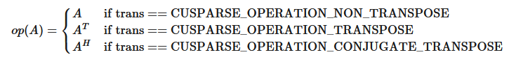
`bsrmv()`has the following properties:
- The routine requires no extra storage.
- The routine supports asynchronous execution.
- The routine supports CUDA graph capture.
Several comments on`bsrmv()`:
- Only`blockDim > 1`is supported
- Only`CUSPARSE_OPERATION_NON_TRANSPOSE`is supported, that is

\[\text{y} = \alpha \ast A \ast \text{x} + \beta{} \ast \text{y}\]
- Only`CUSPARSE_MATRIX_TYPE_GENERAL`is supported.
- The size of vector`x`should be$(nb \ast blockDim)$at least, and the size of vector`y`should be$(mb \ast blockDim)$at least; otherwise, the kernel may return`CUSPARSE_STATUS_EXECUTION_FAILED`because of an out-of-bounds array.
For example, suppose the user has a CSR format and wants to try`bsrmv()`, the following code demonstrates how to use`csr2bsr()`conversion and`bsrmv()`multiplication in single precision.

```
// Suppose that A is m x n sparse matrix represented by CSR format,
// hx is a host vector of size n, and hy is also a host vector of size m.
// m and n are not multiple of blockDim.
// step 1: transform CSR to BSR with column-major order
int base, nnz;
int nnzb;
cusparseDirection_t dirA = CUSPARSE_DIRECTION_COLUMN;
int mb = (m + blockDim-1)/blockDim;
int nb = (n + blockDim-1)/blockDim;
cudaMalloc((void**)&bsrRowPtrC, sizeof(int) *(mb+1));
cusparseXcsr2bsrNnz(handle, dirA, m, n,
        descrA, csrRowPtrA, csrColIndA, blockDim,
        descrC, bsrRowPtrC, &nnzb);
cudaMalloc((void**)&bsrColIndC, sizeof(int)*nnzb);
cudaMalloc((void**)&bsrValC, sizeof(float)*(blockDim*blockDim)*nnzb);
cusparseScsr2bsr(handle, dirA, m, n,
        descrA, csrValA, csrRowPtrA, csrColIndA, blockDim,
        descrC, bsrValC, bsrRowPtrC, bsrColIndC);
// step 2: allocate vector x and vector y large enough for bsrmv
cudaMalloc((void**)&x, sizeof(float)*(nb*blockDim));
cudaMalloc((void**)&y, sizeof(float)*(mb*blockDim));
cudaMemcpy(x, hx, sizeof(float)*n, cudaMemcpyHostToDevice);
cudaMemcpy(y, hy, sizeof(float)*m, cudaMemcpyHostToDevice);
// step 3: perform bsrmv
cusparseSbsrmv(handle, dirA, transA, mb, nb, nnzb, &alpha,
   descrC, bsrValC, bsrRowPtrC, bsrColIndC, blockDim, x, &beta, y);

```

**Input**

<div style="overflow-x: auto; max-width: 100%; border-radius: 6px;">
<table border="1" cellpadding="6" cellspacing="0" style="border-collapse: collapse; width: 100%; font-family: -apple-system, BlinkMacSystemFont, Segoe UI, Helvetica, Arial, sans-serif; font-size: 13px; margin: 16px 0;">
<colgroup>
<col style="width: 20%"/>
<col style="width: 80%"/>
</colgroup>
<tbody>
<tr style="border: 1px solid #d0d7de;">
<td style="padding: 8px 12px; border: 1px solid #d0d7de; vertical-align: top;"><p><code class="docutils literal notranslate"><span class="pre">handle</span></code></p></td>
<td style="padding: 8px 12px; border: 1px solid #d0d7de; vertical-align: top;"><p>handle to the cuSPARSE library context.</p></td>
</tr>
<tr style="border: 1px solid #d0d7de;">
<td style="padding: 8px 12px; border: 1px solid #d0d7de; vertical-align: top;"><p><code class="docutils literal notranslate"><span class="pre">dir</span></code></p></td>
<td style="padding: 8px 12px; border: 1px solid #d0d7de; vertical-align: top;"><p>storage format of blocks, either <code class="docutils literal notranslate"><span class="pre">CUSPARSE_DIRECTION_ROW</span></code> or <code class="docutils literal notranslate"><span class="pre">CUSPARSE_DIRECTION_COLUMN</span></code>.</p></td>
</tr>
<tr style="border: 1px solid #d0d7de;">
<td style="padding: 8px 12px; border: 1px solid #d0d7de; vertical-align: top;"><p><code class="docutils literal notranslate"><span class="pre">trans</span></code></p></td>
<td style="padding: 8px 12px; border: 1px solid #d0d7de; vertical-align: top;"><p>the operation <span class="math notranslate nohighlight">\(\text{op}(A)\)</span> . Only <code class="docutils literal notranslate"><span class="pre">CUSPARSE_OPERATION_NON_TRANSPOSE</span></code> is supported.</p></td>
</tr>
<tr style="border: 1px solid #d0d7de;">
<td style="padding: 8px 12px; border: 1px solid #d0d7de; vertical-align: top;"><p><code class="docutils literal notranslate"><span class="pre">mb</span></code></p></td>
<td style="padding: 8px 12px; border: 1px solid #d0d7de; vertical-align: top;"><p>number of block rows of matrix <span class="math notranslate nohighlight">\(A\)</span>.</p></td>
</tr>
<tr style="border: 1px solid #d0d7de;">
<td style="padding: 8px 12px; border: 1px solid #d0d7de; vertical-align: top;"><p><code class="docutils literal notranslate"><span class="pre">nb</span></code></p></td>
<td style="padding: 8px 12px; border: 1px solid #d0d7de; vertical-align: top;"><p>number of block columns of matrix <span class="math notranslate nohighlight">\(A\)</span>.</p></td>
</tr>
<tr style="border: 1px solid #d0d7de;">
<td style="padding: 8px 12px; border: 1px solid #d0d7de; vertical-align: top;"><p><code class="docutils literal notranslate"><span class="pre">nnzb</span></code></p></td>
<td style="padding: 8px 12px; border: 1px solid #d0d7de; vertical-align: top;"><p>number of nonzero blocks of matrix <span class="math notranslate nohighlight">\(A\)</span>.</p></td>
</tr>
<tr style="border: 1px solid #d0d7de;">
<td style="padding: 8px 12px; border: 1px solid #d0d7de; vertical-align: top;"><p><code class="docutils literal notranslate"><span class="pre">alpha</span></code></p></td>
<td style="padding: 8px 12px; border: 1px solid #d0d7de; vertical-align: top;"><p>&lt;type&gt; scalar used for multiplication.</p></td>
</tr>
<tr style="border: 1px solid #d0d7de;">
<td style="padding: 8px 12px; border: 1px solid #d0d7de; vertical-align: top;"><p><code class="docutils literal notranslate"><span class="pre">descr</span></code></p></td>
<td style="padding: 8px 12px; border: 1px solid #d0d7de; vertical-align: top;"><p>the descriptor of matrix <span class="math notranslate nohighlight">\(A\)</span>. The supported matrix type is <code class="docutils literal notranslate"><span class="pre">CUSPARSE_MATRIX_TYPE_GENERAL</span></code>. Also, the supported index bases are <code class="docutils literal notranslate"><span class="pre">CUSPARSE_INDEX_BASE_ZERO</span></code> and <code class="docutils literal notranslate"><span class="pre">CUSPARSE_INDEX_BASE_ONE</span></code>.</p></td>
</tr>
<tr style="border: 1px solid #d0d7de;">
<td style="padding: 8px 12px; border: 1px solid #d0d7de; vertical-align: top;"><p><code class="docutils literal notranslate"><span class="pre">bsrVal</span></code></p></td>
<td style="padding: 8px 12px; border: 1px solid #d0d7de; vertical-align: top;"><p>&lt;type&gt; array of <code class="docutils literal notranslate"><span class="pre">nnz</span></code><span class="math notranslate nohighlight">\(( =\)</span><code class="docutils literal notranslate"><span class="pre">csrRowPtrA(mb)</span></code><span class="math notranslate nohighlight">\(-\)</span><code class="docutils literal notranslate"><span class="pre">csrRowPtrA(0)</span></code><span class="math notranslate nohighlight">\()\)</span> nonzero blocks of matrix <span class="math notranslate nohighlight">\(A\)</span>.</p></td>
</tr>
<tr style="border: 1px solid #d0d7de;">
<td style="padding: 8px 12px; border: 1px solid #d0d7de; vertical-align: top;"><p><code class="docutils literal notranslate"><span class="pre">bsrRowPtr</span></code></p></td>
<td style="padding: 8px 12px; border: 1px solid #d0d7de; vertical-align: top;"><p>integer array of <code class="docutils literal notranslate"><span class="pre">mb</span></code><span class="math notranslate nohighlight">\(+ 1\)</span> elements that contains the start of every block row and the end of the last block row plus one.</p></td>
</tr>
<tr style="border: 1px solid #d0d7de;">
<td style="padding: 8px 12px; border: 1px solid #d0d7de; vertical-align: top;"><p><code class="docutils literal notranslate"><span class="pre">bsrColInd</span></code></p></td>
<td style="padding: 8px 12px; border: 1px solid #d0d7de; vertical-align: top;"><p>integer array of <code class="docutils literal notranslate"><span class="pre">nnz</span></code><span class="math notranslate nohighlight">\(( =\)</span><code class="docutils literal notranslate"><span class="pre">csrRowPtrA(mb)</span></code><span class="math notranslate nohighlight">\(-\)</span><code class="docutils literal notranslate"><span class="pre">csrRowPtrA(0)</span></code><span class="math notranslate nohighlight">\()\)</span> column indices of the nonzero blocks of matrix <span class="math notranslate nohighlight">\(A\)</span>.</p></td>
</tr>
<tr style="border: 1px solid #d0d7de;">
<td style="padding: 8px 12px; border: 1px solid #d0d7de; vertical-align: top;"><p><code class="docutils literal notranslate"><span class="pre">blockDim</span></code></p></td>
<td style="padding: 8px 12px; border: 1px solid #d0d7de; vertical-align: top;"><p>block dimension of sparse matrix <span class="math notranslate nohighlight">\(A\)</span>, larger than zero.</p></td>
</tr>
<tr style="border: 1px solid #d0d7de;">
<td style="padding: 8px 12px; border: 1px solid #d0d7de; vertical-align: top;"><p><code class="docutils literal notranslate"><span class="pre">x</span></code></p></td>
<td style="padding: 8px 12px; border: 1px solid #d0d7de; vertical-align: top;"><p>&lt;type&gt; vector of <span class="math notranslate nohighlight">\(nb \ast blockDim\)</span> elements.</p></td>
</tr>
<tr style="border: 1px solid #d0d7de;">
<td style="padding: 8px 12px; border: 1px solid #d0d7de; vertical-align: top;"><p><code class="docutils literal notranslate"><span class="pre">beta</span></code></p></td>
<td style="padding: 8px 12px; border: 1px solid #d0d7de; vertical-align: top;"><p>&lt;type&gt; scalar used for multiplication. If <code class="docutils literal notranslate"><span class="pre">beta</span></code> is zero, <code class="docutils literal notranslate"><span class="pre">y</span></code> does not have to be a valid input.</p></td>
</tr>
<tr style="border: 1px solid #d0d7de;">
<td style="padding: 8px 12px; border: 1px solid #d0d7de; vertical-align: top;"><p><code class="docutils literal notranslate"><span class="pre">y</span></code></p></td>
<td style="padding: 8px 12px; border: 1px solid #d0d7de; vertical-align: top;"><p>&lt;type&gt; vector of <span class="math notranslate nohighlight">\(mb \ast blockDim\)</span> elements.</p></td>
</tr>
</tbody>
</table>
</div>

**Output**

<div style="overflow-x: auto; max-width: 100%; border-radius: 6px;">
<table border="1" cellpadding="6" cellspacing="0" style="border-collapse: collapse; width: 100%; font-family: -apple-system, BlinkMacSystemFont, Segoe UI, Helvetica, Arial, sans-serif; font-size: 13px; margin: 16px 0;">
<colgroup>
<col style="width: 19%"/>
<col style="width: 81%"/>
</colgroup>
<tbody>
<tr style="border: 1px solid #d0d7de;">
<td style="padding: 8px 12px; border: 1px solid #d0d7de; vertical-align: top;"><p><code class="docutils literal notranslate"><span class="pre">y</span></code></p></td>
<td style="padding: 8px 12px; border: 1px solid #d0d7de; vertical-align: top;"><p>&lt;type&gt; updated vector.</p></td>
</tr>
</tbody>
</table>
</div>

SeecusparseStatus_tfor the description of the return status.

### 5.4.2. cusparse<t>bsrxmv() [DEPRECATED]
> >*The routine will be removed in the next major release*

```
cusparseStatus_t
cusparseSbsrxmv(cusparseHandle_t         handle,
                cusparseDirection_t      dir,
                cusparseOperation_t      trans,
                int                      sizeOfMask,
                int                      mb,
                int                      nb,
                int                      nnzb,
                const float*             alpha,
                const cusparseMatDescr_t descr,
                const float*             bsrVal,
                const int*               bsrMaskPtr,
                const int*               bsrRowPtr,
                const int*               bsrEndPtr,
                const int*               bsrColInd,
                int                      blockDim,
                const float*             x,
                const float*             beta,
                float*                   y)

cusparseStatus_t
cusparseDbsrxmv(cusparseHandle_t         handle,
                cusparseDirection_t      dir,
                cusparseOperation_t      trans,
                int                      sizeOfMask,
                int                      mb,
                int                      nb,
                int                      nnzb,
                const double*            alpha,
                const cusparseMatDescr_t descr,
                const double*            bsrVal,
                const int*               bsrMaskPtr,
                const int*               bsrRowPtr,
                const int*               bsrEndPtr,
                const int*               bsrColInd,
                int                      blockDim,
                const double*            x,
                const double*            beta,
                double*                  y)

cusparseStatus_t
cusparseCbsrxmv(cusparseHandle_t         handle,
                cusparseDirection_t      dir,
                cusparseOperation_t      trans,
                int                      sizeOfMask,
                int                      mb,
                int                      nb,
                int                      nnzb,
                const cuComplex*         alpha,
                const cusparseMatDescr_t descr,
                const cuComplex*         bsrVal,
                const int*               bsrMaskPtr,
                const int*               bsrRowPtr,
                const int*               bsrEndPtr,
                const int*               bsrColInd,
                int                      blockDim,
                const cuComplex*         x,
                const cuComplex*         beta,
                cuComplex*               y)

cusparseStatus_t
cusparseZbsrxmv(cusparseHandle_t         handle,
                cusparseDirection_t      dir,
                cusparseOperation_t      trans,
                int                      sizeOfMask,
                int                      mb,
                int                      nb,
                int                      nnzb,
                const cuDoubleComplex*   alpha,
                const cusparseMatDescr_t descr,
                const cuDoubleComplex*   bsrVal,
                const int*               bsrMaskPtr,
                const int*               bsrRowPtr,
                const int*               bsrEndPtr,
                const int*               bsrColInd,
                int                      blockDim,
                const cuDoubleComplex*   x,
                const cuDoubleComplex*   beta,
                cuDoubleComplex*         y)

```

This function performs a`bsrmv`and a mask operation

\[\text{y(mask)} = (\alpha \ast \text{op}(A) \ast \text{x} + \beta \ast \text{y})\text{(mask)}\]
where$A\text{ is an }(mb \ast blockDim) \times (nb \ast blockDim)$sparse matrix that is defined in BSRX storage format by the four arrays`bsrVal`,`bsrRowPtr`,`bsrEndPtr`, and`bsrColInd`);`x`and`y`are vectors;$\alpha\text{~and~}\beta$are scalars; and

The mask operation is defined by array`bsrMaskPtr`which contains updated block row indices of$y$. If row$i$is not specified in`bsrMaskPtr`, then`bsrxmv()`does not touch row block$i$of$A$and$y$.
For example, consider the$2 \times 3$block matrix$A$:

\[\begin{split}\begin{matrix}
{A = \begin{bmatrix}
A_{11} & A_{12} & O \\
A_{21} & A_{22} & A_{23} \\
\end{bmatrix}} \\
\end{matrix}\end{split}\]
and its one-based BSR format (three vector form) is:

\[\begin{split}\begin{matrix}
\text{bsrVal} & = & \begin{bmatrix}
A_{11} & A_{12} & A_{21} & A_{22} & A_{23} \\
\end{bmatrix} \\
\text{bsrRowPtr} & = & \begin{bmatrix}
{1\phantom{.0}} & {3\phantom{.0}} & 6 \\
\end{bmatrix} \\
\text{bsrColInd} & = & \begin{bmatrix}
{1\phantom{.0}} & {2\phantom{.0}} & {1\phantom{.0}} & {2\phantom{.0}} & 3 \\
\end{bmatrix} \\
\end{matrix}\end{split}\]
Suppose we want to do the following`bsrmv`operation on a matrix$\bar{A}$which is slightly different from$A$.

\[\begin{split}\begin{bmatrix}
y_{1} \\
y_{2} \\
\end{bmatrix}:=alpha \ast (\widetilde{A} = \begin{bmatrix}
O & O & O \\
O & A_{22} & O \\
\end{bmatrix}) \ast \begin{bmatrix}
x_{1} \\
x_{2} \\
x_{3} \\
\end{bmatrix} + \begin{bmatrix}
y_{1} \\
{beta \ast y_{2}} \\
\end{bmatrix}\end{split}\]
We don’t need to create another BSR format for the new matrix$\bar{A}$, all that we should do is to keep`bsrVal`and`bsrColInd`unchanged, but modify`bsrRowPtr`and add an additional array`bsrEndPtr`which points to the last nonzero elements per row of$\bar{A}$plus 1.
For example, the following`bsrRowPtr`and`bsrEndPtr`can represent matrix$\bar{A}$:

\[\begin{split}\begin{matrix}
 \text{bsrRowPtr} & = & \begin{bmatrix}
 {1\phantom{.0}} & 4 \\
 \end{bmatrix} \\
 \text{bsrEndPtr} & = & \begin{bmatrix}
 {1\phantom{.0}} & 5 \\
 \end{bmatrix} \\
 \end{matrix}\end{split}\]
Further we can use a mask operator (specified by array`bsrMaskPtr`) to update particular block row indices of$y$only because$y_{1}$is never changed. In this case,`bsrMaskPtr`$=$[2] and`sizeOfMask`=1.
The mask operator is equivalent to the following operation:

\[\begin{split}\begin{bmatrix}
 ? \\
 y_{2} \\
 \end{bmatrix}:=alpha \ast \begin{bmatrix}
 ? & ? & ? \\
 O & A_{22} & O \\
 \end{bmatrix} \ast \begin{bmatrix}
 x_{1} \\
 x_{2} \\
 x_{3} \\
 \end{bmatrix} + beta \ast \begin{bmatrix}
 ? \\
 y_{2} \\
 \end{bmatrix}\end{split}\]
If a block row is not present in the`bsrMaskPtr`, then no calculation is performed on that row, and the corresponding value in`y`is unmodified. The question mark “?” is used to inidcate row blocks not in`bsrMaskPtr`.
In this case, first row block is not present in`bsrMaskPtr`, so`bsrRowPtr[0]`and`bsrEndPtr[0]`are not touched also.

\[\begin{split}\begin{matrix}
 \text{bsrRowPtr} & = & \begin{bmatrix}
 {?\phantom{.0}} & 4 \\
 \end{bmatrix} \\
 \text{bsrEndPtr} & = & \begin{bmatrix}
 {?\phantom{.0}} & 5 \\
 \end{bmatrix} \\
 \end{matrix}\end{split}\]
`bsrxmv()`has the following properties:
- The routine requires no extra storage.
- The routine supports asynchronous execution.
- The routine supports CUDA graph capture.
A couple of comments on`bsrxmv()`:
- Only`blockDim > 1`is supported
- Only`CUSPARSE_OPERATION_NON_TRANSPOSE`and`CUSPARSE_MATRIX_TYPE_GENERAL`are supported.
- Parameters`bsrMaskPtr`,`bsrRowPtr`,`bsrEndPtr`and`bsrColInd`are consistent with base index, either one-based or zero-based. The above example is one-based.
**Input**

<div style="overflow-x: auto; max-width: 100%; border-radius: 6px;">
<table border="1" cellpadding="6" cellspacing="0" style="border-collapse: collapse; width: 100%; font-family: -apple-system, BlinkMacSystemFont, Segoe UI, Helvetica, Arial, sans-serif; font-size: 13px; margin: 16px 0;">
<colgroup>
<col style="width: 20%"/>
<col style="width: 80%"/>
</colgroup>
<tbody>
<tr style="border: 1px solid #d0d7de;">
<td style="padding: 8px 12px; border: 1px solid #d0d7de; vertical-align: top;"><p><code class="docutils literal notranslate"><span class="pre">handle</span></code></p></td>
<td style="padding: 8px 12px; border: 1px solid #d0d7de; vertical-align: top;"><p>handle to the cuSPARSE library context.</p></td>
</tr>
<tr style="border: 1px solid #d0d7de;">
<td style="padding: 8px 12px; border: 1px solid #d0d7de; vertical-align: top;"><p><code class="docutils literal notranslate"><span class="pre">dir</span></code></p></td>
<td style="padding: 8px 12px; border: 1px solid #d0d7de; vertical-align: top;"><p>storage format of blocks, either <code class="docutils literal notranslate"><span class="pre">CUSPARSE_DIRECTION_ROW</span></code> or <code class="docutils literal notranslate"><span class="pre">CUSPARSE_DIRECTION_COLUMN</span></code>.</p></td>
</tr>
<tr style="border: 1px solid #d0d7de;">
<td style="padding: 8px 12px; border: 1px solid #d0d7de; vertical-align: top;"><p><code class="docutils literal notranslate"><span class="pre">trans</span></code></p></td>
<td style="padding: 8px 12px; border: 1px solid #d0d7de; vertical-align: top;"><p>the operation <span class="math notranslate nohighlight">\(\text{op}(A)\)</span> . Only <code class="docutils literal notranslate"><span class="pre">CUSPARSE_OPERATION_NON_TRANSPOSE</span></code> is supported.</p></td>
</tr>
<tr style="border: 1px solid #d0d7de;">
<td style="padding: 8px 12px; border: 1px solid #d0d7de; vertical-align: top;"><p><code class="docutils literal notranslate"><span class="pre">sizeOfMask</span></code></p></td>
<td style="padding: 8px 12px; border: 1px solid #d0d7de; vertical-align: top;"><p>number of updated block rows of <span class="math notranslate nohighlight">\(y\)</span>.</p></td>
</tr>
<tr style="border: 1px solid #d0d7de;">
<td style="padding: 8px 12px; border: 1px solid #d0d7de; vertical-align: top;"><p><code class="docutils literal notranslate"><span class="pre">mb</span></code></p></td>
<td style="padding: 8px 12px; border: 1px solid #d0d7de; vertical-align: top;"><p>number of block rows of matrix <span class="math notranslate nohighlight">\(A\)</span>.</p></td>
</tr>
<tr style="border: 1px solid #d0d7de;">
<td style="padding: 8px 12px; border: 1px solid #d0d7de; vertical-align: top;"><p><code class="docutils literal notranslate"><span class="pre">nb</span></code></p></td>
<td style="padding: 8px 12px; border: 1px solid #d0d7de; vertical-align: top;"><p>number of block columns of matrix <span class="math notranslate nohighlight">\(A\)</span>.</p></td>
</tr>
<tr style="border: 1px solid #d0d7de;">
<td style="padding: 8px 12px; border: 1px solid #d0d7de; vertical-align: top;"><p><code class="docutils literal notranslate"><span class="pre">nnzb</span></code></p></td>
<td style="padding: 8px 12px; border: 1px solid #d0d7de; vertical-align: top;"><p>number of nonzero blocks of matrix <span class="math notranslate nohighlight">\(A\)</span>.</p></td>
</tr>
<tr style="border: 1px solid #d0d7de;">
<td style="padding: 8px 12px; border: 1px solid #d0d7de; vertical-align: top;"><p><code class="docutils literal notranslate"><span class="pre">alpha</span></code></p></td>
<td style="padding: 8px 12px; border: 1px solid #d0d7de; vertical-align: top;"><p>&lt;type&gt; scalar used for multiplication.</p></td>
</tr>
<tr style="border: 1px solid #d0d7de;">
<td style="padding: 8px 12px; border: 1px solid #d0d7de; vertical-align: top;"><p><code class="docutils literal notranslate"><span class="pre">descr</span></code></p></td>
<td style="padding: 8px 12px; border: 1px solid #d0d7de; vertical-align: top;"><p>the descriptor of matrix <span class="math notranslate nohighlight">\(A\)</span>. The supported matrix type is <code class="docutils literal notranslate"><span class="pre">CUSPARSE_MATRIX_TYPE_GENERAL</span></code>. Also, the supported index bases are <code class="docutils literal notranslate"><span class="pre">CUSPARSE_INDEX_BASE_ZERO</span></code> and <code class="docutils literal notranslate"><span class="pre">CUSPARSE_INDEX_BASE_ONE</span></code>.</p></td>
</tr>
<tr style="border: 1px solid #d0d7de;">
<td style="padding: 8px 12px; border: 1px solid #d0d7de; vertical-align: top;"><p><code class="docutils literal notranslate"><span class="pre">bsrVal</span></code></p></td>
<td style="padding: 8px 12px; border: 1px solid #d0d7de; vertical-align: top;"><p>&lt;type&gt; array of <code class="docutils literal notranslate"><span class="pre">nnz</span></code> nonzero blocks of matrix <span class="math notranslate nohighlight">\(A\)</span>.</p></td>
</tr>
<tr style="border: 1px solid #d0d7de;">
<td style="padding: 8px 12px; border: 1px solid #d0d7de; vertical-align: top;"><p><code class="docutils literal notranslate"><span class="pre">bsrMaskPtr</span></code></p></td>
<td style="padding: 8px 12px; border: 1px solid #d0d7de; vertical-align: top;"><p>integer array of <code class="docutils literal notranslate"><span class="pre">sizeOfMask</span></code> elements that contains the indices corresponding to updated block rows.</p></td>
</tr>
<tr style="border: 1px solid #d0d7de;">
<td style="padding: 8px 12px; border: 1px solid #d0d7de; vertical-align: top;"><p><code class="docutils literal notranslate"><span class="pre">bsrRowPtr</span></code></p></td>
<td style="padding: 8px 12px; border: 1px solid #d0d7de; vertical-align: top;"><p>integer array of <code class="docutils literal notranslate"><span class="pre">mb</span></code> elements that contains the start of every block row.</p></td>
</tr>
<tr style="border: 1px solid #d0d7de;">
<td style="padding: 8px 12px; border: 1px solid #d0d7de; vertical-align: top;"><p><code class="docutils literal notranslate"><span class="pre">bsrEndPtr</span></code></p></td>
<td style="padding: 8px 12px; border: 1px solid #d0d7de; vertical-align: top;"><p>integer array of <code class="docutils literal notranslate"><span class="pre">mb</span></code> elements that contains the end of the every block row plus one.</p></td>
</tr>
<tr style="border: 1px solid #d0d7de;">
<td style="padding: 8px 12px; border: 1px solid #d0d7de; vertical-align: top;"><p><code class="docutils literal notranslate"><span class="pre">bsrColInd</span></code></p></td>
<td style="padding: 8px 12px; border: 1px solid #d0d7de; vertical-align: top;"><p>integer array of <code class="docutils literal notranslate"><span class="pre">nnzb</span></code> column indices of the nonzero blocks of matrix <span class="math notranslate nohighlight">\(A\)</span>.</p></td>
</tr>
<tr style="border: 1px solid #d0d7de;">
<td style="padding: 8px 12px; border: 1px solid #d0d7de; vertical-align: top;"><p><code class="docutils literal notranslate"><span class="pre">blockDim</span></code></p></td>
<td style="padding: 8px 12px; border: 1px solid #d0d7de; vertical-align: top;"><p>block dimension of sparse matrix <span class="math notranslate nohighlight">\(A\)</span>, larger than zero.</p></td>
</tr>
<tr style="border: 1px solid #d0d7de;">
<td style="padding: 8px 12px; border: 1px solid #d0d7de; vertical-align: top;"><p><code class="docutils literal notranslate"><span class="pre">x</span></code></p></td>
<td style="padding: 8px 12px; border: 1px solid #d0d7de; vertical-align: top;"><p>&lt;type&gt; vector of <span class="math notranslate nohighlight">\(nb \ast blockDim\)</span> elements.</p></td>
</tr>
<tr style="border: 1px solid #d0d7de;">
<td style="padding: 8px 12px; border: 1px solid #d0d7de; vertical-align: top;"><p><code class="docutils literal notranslate"><span class="pre">beta</span></code></p></td>
<td style="padding: 8px 12px; border: 1px solid #d0d7de; vertical-align: top;"><p>&lt;type&gt; scalar used for multiplication. If <code class="docutils literal notranslate"><span class="pre">beta</span></code> is zero, <code class="docutils literal notranslate"><span class="pre">y</span></code> does not have to be a valid input.</p></td>
</tr>
<tr style="border: 1px solid #d0d7de;">
<td style="padding: 8px 12px; border: 1px solid #d0d7de; vertical-align: top;"><p><code class="docutils literal notranslate"><span class="pre">y</span></code></p></td>
<td style="padding: 8px 12px; border: 1px solid #d0d7de; vertical-align: top;"><p>&lt;type&gt; vector of <span class="math notranslate nohighlight">\(mb \ast blockDim\)</span> elements.</p></td>
</tr>
</tbody>
</table>
</div>

SeecusparseStatus_tfor the description of the return status.

### 5.4.3. cusparse<t>bsrsv2_bufferSize() [DEPRECATED]
> >*The routine will be removed in the next major release*

```
cusparseStatus_t
cusparseSbsrsv2_bufferSize(cusparseHandle_t         handle,
                           cusparseDirection_t      dirA,
                           cusparseOperation_t      transA,
                           int                      mb,
                           int                      nnzb,
                           const cusparseMatDescr_t descrA,
                           float*                   bsrValA,
                           const int*               bsrRowPtrA,
                           const int*               bsrColIndA,
                           int                      blockDim,
                           bsrsv2Info_t             info,
                           int*                     pBufferSizeInBytes)

cusparseStatus_t
cusparseDbsrsv2_bufferSize(cusparseHandle_t         handle,
                           cusparseDirection_t      dirA,
                           cusparseOperation_t      transA,
                           int                      mb,
                           int                      nnzb,
                           const cusparseMatDescr_t descrA,
                           double*                  bsrValA,
                           const int*               bsrRowPtrA,
                           const int*               bsrColIndA,
                           int                      blockDim,
                           bsrsv2Info_t             info,
                           int*                     pBufferSizeInBytes)

cusparseStatus_t
cusparseCbsrsv2_bufferSize(cusparseHandle_t         handle,
                           cusparseDirection_t      dirA,
                           cusparseOperation_t      transA,
                           int                      mb,
                           int                      nnzb,
                           const cusparseMatDescr_t descrA,
                           cuComplex*               bsrValA,
                           const int*               bsrRowPtrA,
                           const int*               bsrColIndA,
                           int                      blockDim,
                           bsrsv2Info_t             info,
                           int*                     pBufferSizeInBytes)

cusparseStatus_t
cusparseZbsrsv2_bufferSize(cusparseHandle_t         handle,
                           cusparseDirection_t      dirA,
                           cusparseOperation_t      transA,
                           int                      mb,
                           int                      nnzb,
                           const cusparseMatDescr_t descrA,
                           cuDoubleComplex*         bsrValA,
                           const int*               bsrRowPtrA,
                           const int*               bsrColIndA,
                           int                      blockDim,
                           bsrsv2Info_t             info,
                           int*                     pBufferSizeInBytes)

```

This function returns size of the buffer used in`bsrsv2`, a new sparse triangular linear system`op(A)*y =`$\alpha$`x`.
`A`is an`(mb*blockDim)x(mb*blockDim)`sparse matrix that is defined in BSR storage format by the three arrays`bsrValA`,`bsrRowPtrA`, and`bsrColIndA`);`x`and`y`are the right-hand-side and the solution vectors;$\alpha$is a scalar; and

Although there are six combinations in terms of parameter`trans`and the upper (lower) triangular part of`A`,`bsrsv2_bufferSize()`returns the maximum size buffer among these combinations. The buffer size depends on the dimensions`mb`,`blockDim`, and the number of nonzero blocks of the matrix`nnzb`. If the user changes the matrix, it is necessary to call`bsrsv2_bufferSize()`again to have the correct buffer size; otherwise a segmentation fault may occur.
- The routine requires no extra storage.
- The routine supports asynchronous execution.
- The routine supports CUDA graph capture.
**Input**

<div style="overflow-x: auto; max-width: 100%; border-radius: 6px;">
<table border="1" cellpadding="6" cellspacing="0" style="border-collapse: collapse; width: 100%; font-family: -apple-system, BlinkMacSystemFont, Segoe UI, Helvetica, Arial, sans-serif; font-size: 13px; margin: 16px 0;">
<colgroup>
<col style="width: 20%"/>
<col style="width: 80%"/>
</colgroup>
<tbody>
<tr style="border: 1px solid #d0d7de;">
<td style="padding: 8px 12px; border: 1px solid #d0d7de; vertical-align: top;"><p><code class="docutils literal notranslate"><span class="pre">handle</span></code></p></td>
<td style="padding: 8px 12px; border: 1px solid #d0d7de; vertical-align: top;"><p>handle to the cuSPARSE library context.</p></td>
</tr>
<tr style="border: 1px solid #d0d7de;">
<td style="padding: 8px 12px; border: 1px solid #d0d7de; vertical-align: top;"><p><code class="docutils literal notranslate"><span class="pre">dirA</span></code></p></td>
<td style="padding: 8px 12px; border: 1px solid #d0d7de; vertical-align: top;"><p>storage format of blocks, either <code class="docutils literal notranslate"><span class="pre">CUSPARSE_DIRECTION_ROW</span></code> or <code class="docutils literal notranslate"><span class="pre">CUSPARSE_DIRECTION_COLUMN</span></code>.</p></td>
</tr>
<tr style="border: 1px solid #d0d7de;">
<td style="padding: 8px 12px; border: 1px solid #d0d7de; vertical-align: top;"><p><code class="docutils literal notranslate"><span class="pre">transA</span></code></p></td>
<td style="padding: 8px 12px; border: 1px solid #d0d7de; vertical-align: top;"><p>the operation <span class="math notranslate nohighlight">\(\text{op}(A)\)</span> .</p></td>
</tr>
<tr style="border: 1px solid #d0d7de;">
<td style="padding: 8px 12px; border: 1px solid #d0d7de; vertical-align: top;"><p><code class="docutils literal notranslate"><span class="pre">mb</span></code></p></td>
<td style="padding: 8px 12px; border: 1px solid #d0d7de; vertical-align: top;"><p>number of block rows of matrix <code class="docutils literal notranslate"><span class="pre">A</span></code>.</p></td>
</tr>
<tr style="border: 1px solid #d0d7de;">
<td style="padding: 8px 12px; border: 1px solid #d0d7de; vertical-align: top;"><p><code class="docutils literal notranslate"><span class="pre">nnzb</span></code></p></td>
<td style="padding: 8px 12px; border: 1px solid #d0d7de; vertical-align: top;"><p>number of nonzero blocks of matrix <code class="docutils literal notranslate"><span class="pre">A</span></code>.</p></td>
</tr>
<tr style="border: 1px solid #d0d7de;">
<td style="padding: 8px 12px; border: 1px solid #d0d7de; vertical-align: top;"><p><code class="docutils literal notranslate"><span class="pre">descrA</span></code></p></td>
<td style="padding: 8px 12px; border: 1px solid #d0d7de; vertical-align: top;"><p>the descriptor of matrix <code class="docutils literal notranslate"><span class="pre">A</span></code>. The supported matrix type is <code class="docutils literal notranslate"><span class="pre">CUSPARSE_MATRIX_TYPE_GENERAL</span></code>, while the supported diagonal types are <code class="docutils literal notranslate"><span class="pre">CUSPARSE_DIAG_TYPE_UNIT</span></code> and <code class="docutils literal notranslate"><span class="pre">CUSPARSE_DIAG_TYPE_NON_UNIT</span></code>.</p></td>
</tr>
<tr style="border: 1px solid #d0d7de;">
<td style="padding: 8px 12px; border: 1px solid #d0d7de; vertical-align: top;"><p><code class="docutils literal notranslate"><span class="pre">bsrValA</span></code></p></td>
<td style="padding: 8px 12px; border: 1px solid #d0d7de; vertical-align: top;"><p>&lt;type&gt; array of <code class="docutils literal notranslate"><span class="pre">nnzb</span></code><span class="math notranslate nohighlight">\(( =\)</span><code class="docutils literal notranslate"><span class="pre">bsrRowPtrA(mb)</span></code><span class="math notranslate nohighlight">\(-\)</span><code class="docutils literal notranslate"><span class="pre">bsrRowPtrA(0)</span></code><span class="math notranslate nohighlight">\()\)</span> nonzero blocks of matrix <code class="docutils literal notranslate"><span class="pre">A</span></code>.</p></td>
</tr>
<tr style="border: 1px solid #d0d7de;">
<td style="padding: 8px 12px; border: 1px solid #d0d7de; vertical-align: top;"><p><code class="docutils literal notranslate"><span class="pre">bsrRowPtrA</span></code></p></td>
<td style="padding: 8px 12px; border: 1px solid #d0d7de; vertical-align: top;"><p>integer array of <code class="docutils literal notranslate"><span class="pre">mb</span></code><span class="math notranslate nohighlight">\(+ 1\)</span> elements that contains the start of every block row and the end of the last block row plus one.</p></td>
</tr>
<tr style="border: 1px solid #d0d7de;">
<td style="padding: 8px 12px; border: 1px solid #d0d7de; vertical-align: top;"><p><code class="docutils literal notranslate"><span class="pre">bsrColIndA</span></code></p></td>
<td style="padding: 8px 12px; border: 1px solid #d0d7de; vertical-align: top;"><p>integer array of <code class="docutils literal notranslate"><span class="pre">nnzb</span></code><span class="math notranslate nohighlight">\(( =\)</span><code class="docutils literal notranslate"><span class="pre">bsrRowPtrA(mb)</span></code><span class="math notranslate nohighlight">\(-\)</span><code class="docutils literal notranslate"><span class="pre">bsrRowPtrA(0)</span></code><span class="math notranslate nohighlight">\()\)</span> column indices of the nonzero blocks of matrix <code class="docutils literal notranslate"><span class="pre">A</span></code>.</p></td>
</tr>
<tr style="border: 1px solid #d0d7de;">
<td style="padding: 8px 12px; border: 1px solid #d0d7de; vertical-align: top;"><p><code class="docutils literal notranslate"><span class="pre">blockDim</span></code></p></td>
<td style="padding: 8px 12px; border: 1px solid #d0d7de; vertical-align: top;"><p>block dimension of sparse matrix A; must be larger than zero.</p></td>
</tr>
</tbody>
</table>
</div>

**Output**

<div style="overflow-x: auto; max-width: 100%; border-radius: 6px;">
<table border="1" cellpadding="6" cellspacing="0" style="border-collapse: collapse; width: 100%; font-family: -apple-system, BlinkMacSystemFont, Segoe UI, Helvetica, Arial, sans-serif; font-size: 13px; margin: 16px 0;">
<colgroup>
<col style="width: 20%"/>
<col style="width: 80%"/>
</colgroup>
<tbody>
<tr style="border: 1px solid #d0d7de;">
<td style="padding: 8px 12px; border: 1px solid #d0d7de; vertical-align: top;"><p><code class="docutils literal notranslate"><span class="pre">info</span></code></p></td>
<td style="padding: 8px 12px; border: 1px solid #d0d7de; vertical-align: top;"><p>record of internal states based on different algorithms.</p></td>
</tr>
<tr style="border: 1px solid #d0d7de;">
<td style="padding: 8px 12px; border: 1px solid #d0d7de; vertical-align: top;"><p><code class="docutils literal notranslate"><span class="pre">pBufferSizeInBytes</span></code></p></td>
<td style="padding: 8px 12px; border: 1px solid #d0d7de; vertical-align: top;"><p>number of bytes of the buffer used in the <code class="docutils literal notranslate"><span class="pre">bsrsv2_analysis()</span></code> and <code class="docutils literal notranslate"><span class="pre">bsrsv2_solve()</span></code>.</p></td>
</tr>
</tbody>
</table>
</div>

SeecusparseStatus_tfor the description of the return status.

### 5.4.4. cusparse<t>bsrsv2_analysis() [DEPRECATED]
> >*The routine will be removed in the next major release*

```
cusparseStatus_t
cusparseSbsrsv2_analysis(cusparseHandle_t         handle,
                         cusparseDirection_t      dirA,
                         cusparseOperation_t      transA,
                         int                      mb,
                         int                      nnzb,
                         const cusparseMatDescr_t descrA,
                         const float*             bsrValA,
                         const int*               bsrRowPtrA,
                         const int*               bsrColIndA,
                         int                      blockDim,
                         bsrsv2Info_t             info,
                         cusparseSolvePolicy_t    policy,
                         void*                    pBuffer)

cusparseStatus_t
cusparseDbsrsv2_analysis(cusparseHandle_t         handle,
                         cusparseDirection_t      dirA,
                         cusparseOperation_t      transA,
                         int                      mb,
                         int                      nnzb,
                         const cusparseMatDescr_t descrA,
                         const double*            bsrValA,
                         const int*               bsrRowPtrA,
                         const int*               bsrColIndA,
                         int                      blockDim,
                         bsrsv2Info_t             info,
                         cusparseSolvePolicy_t    policy,
                         void*                    pBuffer)

cusparseStatus_t
cusparseDbsrsv2_analysis(cusparseHandle_t         handle,
                         cusparseDirection_t      dirA,
                         cusparseOperation_t      transA,
                         int                      mb,
                         int                      nnzb,
                         const cusparseMatDescr_t descrA,
                         const cuComplex*         bsrValA,
                         const int*               bsrRowPtrA,
                         const int*               bsrColIndA,
                         int                      blockDim,
                         bsrsv2Info_t             info,
                         cusparseSolvePolicy_t    policy,
                         void*                    pBuffer)

cusparseStatus_t
cusparseZbsrsv2_analysis(cusparseHandle_t         handle,
                         cusparseDirection_t      dirA,
                         cusparseOperation_t      transA,
                         int                      mb,
                         int                      nnzb,
                         const cusparseMatDescr_t descrA,
                         const cuDoubleComplex*   bsrValA,
                         const int*               bsrRowPtrA,
                         const int*               bsrColIndA,
                         int                      blockDim,
                         bsrsv2Info_t             info,
                         cusparseSolvePolicy_t    policy,
                         void*                    pBuffer)

```

This function performs the analysis phase of`bsrsv2`, a new sparse triangular linear system`op(A)*y =`$\alpha$`x`.
`A`is an`(mb*blockDim)x(mb*blockDim)`sparse matrix that is defined in BSR storage format by the three arrays`bsrValA`,`bsrRowPtrA`, and`bsrColIndA`);`x`and`y`are the right-hand side and the solution vectors;$\alpha$is a scalar; and

The block of BSR format is of size`blockDim*blockDim`, stored as column-major or row-major as determined by parameter`dirA`, which is either`CUSPARSE_DIRECTION_COLUMN`or`CUSPARSE_DIRECTION_ROW`. The matrix type must be`CUSPARSE_MATRIX_TYPE_GENERAL`, and the fill mode and diagonal type are ignored.
It is expected that this function will be executed only once for a given matrix and a particular operation type.
This function requires a buffer size returned by`bsrsv2_bufferSize()`. The address of`pBuffer`must be multiple of 128 bytes. If it is not,`CUSPARSE_STATUS_INVALID_VALUE`is returned.
Function`bsrsv2_analysis()`reports a structural zero and computes level information, which stored in the opaque structure`info`. The level information can extract more parallelism for a triangular solver. However`bsrsv2_solve()`can be done without level information. To disable level information, the user needs to specify the policy of the triangular solver as`CUSPARSE_SOLVE_POLICY_NO_LEVEL`.
Function`bsrsv2_analysis()`always reports the first structural zero, even when parameter`policy`is`CUSPARSE_SOLVE_POLICY_NO_LEVEL`. No structural zero is reported if`CUSPARSE_DIAG_TYPE_UNIT`is specified, even if block`A(j,j)`is missing for some`j`. The user needs to call`cusparseXbsrsv2_zeroPivot()`to know where the structural zero is.
It is the user’s choice whether to call`bsrsv2_solve()`if`bsrsv2_analysis()`reports a structural zero. In this case, the user can still call`bsrsv2_solve()`, which will return a numerical zero at the same position as a structural zero. However the result`x`is meaningless.
- This function requires temporary extra storage that is allocated internally
- The routine supports asynchronous execution if the Stream Ordered Memory Allocator is available
- The routine supports CUDA graph capture if the Stream Ordered Memory Allocator is available
**Input**

<div style="overflow-x: auto; max-width: 100%; border-radius: 6px;">
<table border="1" cellpadding="6" cellspacing="0" style="border-collapse: collapse; width: 100%; font-family: -apple-system, BlinkMacSystemFont, Segoe UI, Helvetica, Arial, sans-serif; font-size: 13px; margin: 16px 0;">
<colgroup>
<col style="width: 20%"/>
<col style="width: 80%"/>
</colgroup>
<tbody>
<tr style="border: 1px solid #d0d7de;">
<td style="padding: 8px 12px; border: 1px solid #d0d7de; vertical-align: top;"><p><code class="docutils literal notranslate"><span class="pre">handle</span></code></p></td>
<td style="padding: 8px 12px; border: 1px solid #d0d7de; vertical-align: top;"><p>handle to the cuSPARSE library context.</p></td>
</tr>
<tr style="border: 1px solid #d0d7de;">
<td style="padding: 8px 12px; border: 1px solid #d0d7de; vertical-align: top;"><p><code class="docutils literal notranslate"><span class="pre">dirA</span></code></p></td>
<td style="padding: 8px 12px; border: 1px solid #d0d7de; vertical-align: top;"><p>storage format of blocks, either <code class="docutils literal notranslate"><span class="pre">CUSPARSE_DIRECTION_ROW</span></code> or <code class="docutils literal notranslate"><span class="pre">CUSPARSE_DIRECTION_COLUMN</span></code>.</p></td>
</tr>
<tr style="border: 1px solid #d0d7de;">
<td style="padding: 8px 12px; border: 1px solid #d0d7de; vertical-align: top;"><p><code class="docutils literal notranslate"><span class="pre">transA</span></code></p></td>
<td style="padding: 8px 12px; border: 1px solid #d0d7de; vertical-align: top;"><p>the operation <span class="math notranslate nohighlight">\(\text{op}(A)\)</span> .</p></td>
</tr>
<tr style="border: 1px solid #d0d7de;">
<td style="padding: 8px 12px; border: 1px solid #d0d7de; vertical-align: top;"><p><code class="docutils literal notranslate"><span class="pre">mb</span></code></p></td>
<td style="padding: 8px 12px; border: 1px solid #d0d7de; vertical-align: top;"><p>number of block rows of matrix <code class="docutils literal notranslate"><span class="pre">A</span></code>.</p></td>
</tr>
<tr style="border: 1px solid #d0d7de;">
<td style="padding: 8px 12px; border: 1px solid #d0d7de; vertical-align: top;"><p><code class="docutils literal notranslate"><span class="pre">nnzb</span></code></p></td>
<td style="padding: 8px 12px; border: 1px solid #d0d7de; vertical-align: top;"><p>number of nonzero blocks of matrix <code class="docutils literal notranslate"><span class="pre">A</span></code>.</p></td>
</tr>
<tr style="border: 1px solid #d0d7de;">
<td style="padding: 8px 12px; border: 1px solid #d0d7de; vertical-align: top;"><p><code class="docutils literal notranslate"><span class="pre">descrA</span></code></p></td>
<td style="padding: 8px 12px; border: 1px solid #d0d7de; vertical-align: top;"><p>the descriptor of matrix <code class="docutils literal notranslate"><span class="pre">A</span></code>. The supported matrix type is <code class="docutils literal notranslate"><span class="pre">CUSPARSE_MATRIX_TYPE_GENERAL</span></code>, while the supported diagonal types are <code class="docutils literal notranslate"><span class="pre">CUSPARSE_DIAG_TYPE_UNIT</span></code> and <code class="docutils literal notranslate"><span class="pre">CUSPARSE_DIAG_TYPE_NON_UNIT</span></code>.</p></td>
</tr>
<tr style="border: 1px solid #d0d7de;">
<td style="padding: 8px 12px; border: 1px solid #d0d7de; vertical-align: top;"><p><code class="docutils literal notranslate"><span class="pre">bsrValA</span></code></p></td>
<td style="padding: 8px 12px; border: 1px solid #d0d7de; vertical-align: top;"><p>&lt;type&gt; array of <code class="docutils literal notranslate"><span class="pre">nnzb</span></code><span class="math notranslate nohighlight">\(( =\)</span><code class="docutils literal notranslate"><span class="pre">bsrRowPtrA(mb)</span></code><span class="math notranslate nohighlight">\(-\)</span><code class="docutils literal notranslate"><span class="pre">bsrRowPtrA(0)</span></code><span class="math notranslate nohighlight">\()\)</span> nonzero blocks of matrix <code class="docutils literal notranslate"><span class="pre">A</span></code>.</p></td>
</tr>
<tr style="border: 1px solid #d0d7de;">
<td style="padding: 8px 12px; border: 1px solid #d0d7de; vertical-align: top;"><p><code class="docutils literal notranslate"><span class="pre">bsrRowPtrA</span></code></p></td>
<td style="padding: 8px 12px; border: 1px solid #d0d7de; vertical-align: top;"><p>integer array of <code class="docutils literal notranslate"><span class="pre">mb</span></code><span class="math notranslate nohighlight">\(+ 1\)</span> elements that contains the start of every block row and the end of the last block row plus one.</p></td>
</tr>
<tr style="border: 1px solid #d0d7de;">
<td style="padding: 8px 12px; border: 1px solid #d0d7de; vertical-align: top;"><p><code class="docutils literal notranslate"><span class="pre">bsrColIndA</span></code></p></td>
<td style="padding: 8px 12px; border: 1px solid #d0d7de; vertical-align: top;"><p>integer array of <code class="docutils literal notranslate"><span class="pre">nnzb</span></code><span class="math notranslate nohighlight">\(( =\)</span><code class="docutils literal notranslate"><span class="pre">bsrRowPtrA(mb)</span></code><span class="math notranslate nohighlight">\(-\)</span><code class="docutils literal notranslate"><span class="pre">bsrRowPtrA(0)</span></code><span class="math notranslate nohighlight">\()\)</span> column indices of the nonzero blocks of matrix <code class="docutils literal notranslate"><span class="pre">A</span></code>.</p></td>
</tr>
<tr style="border: 1px solid #d0d7de;">
<td style="padding: 8px 12px; border: 1px solid #d0d7de; vertical-align: top;"><p><code class="docutils literal notranslate"><span class="pre">blockDim</span></code></p></td>
<td style="padding: 8px 12px; border: 1px solid #d0d7de; vertical-align: top;"><p>block dimension of sparse matrix A, larger than zero.</p></td>
</tr>
<tr style="border: 1px solid #d0d7de;">
<td style="padding: 8px 12px; border: 1px solid #d0d7de; vertical-align: top;"><p><code class="docutils literal notranslate"><span class="pre">info</span></code></p></td>
<td style="padding: 8px 12px; border: 1px solid #d0d7de; vertical-align: top;"><p>structure initialized using <code class="docutils literal notranslate"><span class="pre">cusparseCreateBsrsv2Info()</span></code>.</p></td>
</tr>
<tr style="border: 1px solid #d0d7de;">
<td style="padding: 8px 12px; border: 1px solid #d0d7de; vertical-align: top;"><p><code class="docutils literal notranslate"><span class="pre">policy</span></code></p></td>
<td style="padding: 8px 12px; border: 1px solid #d0d7de; vertical-align: top;"><p>the supported policies are <code class="docutils literal notranslate"><span class="pre">CUSPARSE_SOLVE_POLICY_NO_LEVEL</span></code> and <code class="docutils literal notranslate"><span class="pre">CUSPARSE_SOLVE_POLICY_USE_LEVEL</span></code>.</p></td>
</tr>
<tr style="border: 1px solid #d0d7de;">
<td style="padding: 8px 12px; border: 1px solid #d0d7de; vertical-align: top;"><p><code class="docutils literal notranslate"><span class="pre">pBuffer</span></code></p></td>
<td style="padding: 8px 12px; border: 1px solid #d0d7de; vertical-align: top;"><p>buffer allocated by the user, the size is return by <code class="docutils literal notranslate"><span class="pre">bsrsv2_bufferSize()</span></code>.</p></td>
</tr>
</tbody>
</table>
</div>

**Output**

<div style="overflow-x: auto; max-width: 100%; border-radius: 6px;">
<table border="1" cellpadding="6" cellspacing="0" style="border-collapse: collapse; width: 100%; font-family: -apple-system, BlinkMacSystemFont, Segoe UI, Helvetica, Arial, sans-serif; font-size: 13px; margin: 16px 0;">
<colgroup>
<col style="width: 7%"/>
<col style="width: 93%"/>
</colgroup>
<tbody>
<tr style="border: 1px solid #d0d7de;">
<td style="padding: 8px 12px; border: 1px solid #d0d7de; vertical-align: top;"><p><code class="docutils literal notranslate"><span class="pre">info</span></code></p></td>
<td style="padding: 8px 12px; border: 1px solid #d0d7de; vertical-align: top;"><p>structure filled with information collected during the analysis phase (that should be passed to the solve phase unchanged).</p></td>
</tr>
</tbody>
</table>
</div>

SeecusparseStatus_tfor the description of the return status.

### 5.4.5. cusparse<t>bsrsv2_solve() [DEPRECATED]
> >*The routine will be removed in the next major release*

```
cusparseStatus_t
cusparseSbsrsv2_solve(cusparseHandle_t         handle,
                      cusparseDirection_t      dirA,
                      cusparseOperation_t      transA,
                      int                      mb,
                      int                      nnzb,
                      const float*             alpha,
                      const cusparseMatDescr_t descrA,
                      const float*             bsrValA,
                      const int*               bsrRowPtrA,
                      const int*               bsrColIndA,
                      int                      blockDim,
                      bsrsv2Info_t             info,
                      const float*             x,
                      float*                   y,
                      cusparseSolvePolicy_t    policy,
                      void*                    pBuffer)

cusparseStatus_t
cusparseDbsrsv2_solve(cusparseHandle_t         handle,
                      cusparseDirection_t      dirA,
                      cusparseOperation_t      transA,
                      int                      mb,
                      int                      nnzb,
                      const double*            alpha,
                      const cusparseMatDescr_t descrA,
                      const double*            bsrValA,
                      const int*               bsrRowPtrA,
                      const int*               bsrColIndA,
                      int                      blockDim,
                      bsrsv2Info_t             info,
                      const double*            x,
                      double*                  y,
                      cusparseSolvePolicy_t    policy,
                      void*                    pBuffer)

cusparseStatus_t
cusparseCbsrsv2_solve(cusparseHandle_t         handle,
                      cusparseDirection_t      dirA,
                      cusparseOperation_t      transA,
                      int                      mb,
                      int                      nnzb,
                      const cuComplex*         alpha,
                      const cusparseMatDescr_t descrA,
                      const cuComplex*         bsrValA,
                      const int*               bsrRowPtrA,
                      const int*               bsrColIndA,
                      int                      blockDim,
                      bsrsv2Info_t             info,
                      const cuComplex*         x,
                      cuComplex*               y,
                      cusparseSolvePolicy_t    policy,
                      void*                    pBuffer)

cusparseStatus_t
cusparseZbsrsv2_solve(cusparseHandle_t         handle,
                      cusparseDirection_t      dirA,
                      cusparseOperation_t      transA,
                      int                      mb,
                      int                      nnzb,
                      const cuDoubleComplex*   alpha,
                      const cusparseMatDescr_t descrA,
                      const cuDoubleComplex*   bsrValA,
                      const int*               bsrRowPtrA,
                      const int*               bsrColIndA,
                      int                      blockDim,
                      bsrsv2Info_t             info,
                      const cuDoubleComplex*   x,
                      cuDoubleComplex*         y,
                      cusparseSolvePolicy_t    policy,
                      void*                    pBuffer)

```

This function performs the solve phase of`bsrsv2`, a new sparse triangular linear system`op(A)*y =`$\alpha$`x`.
`A`is an`(mb*blockDim)x(mb*blockDim)`sparse matrix that is defined in BSR storage format by the three arrays`bsrValA`,`bsrRowPtrA`, and`bsrColIndA`);`x`and`y`are the right-hand-side and the solution vectors;$\alpha$is a scalar; and

The block in BSR format is of size`blockDim*blockDim`, stored as column-major or row-major as determined by parameter`dirA`, which is either`CUSPARSE_DIRECTION_COLUMN`or`CUSPARSE_DIRECTION_ROW`. The matrix type must be`CUSPARSE_MATRIX_TYPE_GENERAL`, and the fill mode and diagonal type are ignored. Function`bsrsv02_solve()`can support an arbitrary`blockDim`.
This function may be executed multiple times for a given matrix and a particular operation type.
This function requires a buffer size returned by`bsrsv2_bufferSize()`. The address of`pBuffer`must be multiple of 128 bytes. If it is not,`CUSPARSE_STATUS_INVALID_VALUE`is returned.
Although`bsrsv2_solve()`can be done without level information, the user still needs to be aware of consistency. If`bsrsv2_analysis()`is called with policy`CUSPARSE_SOLVE_POLICY_USE_LEVEL`,`bsrsv2_solve()`can be run with or without levels. On the other hand, if`bsrsv2_analysis()`is called with`CUSPARSE_SOLVE_POLICY_NO_LEVEL`,`bsrsv2_solve()`can only accept`CUSPARSE_SOLVE_POLICY_NO_LEVEL`; otherwise,`CUSPARSE_STATUS_INVALID_VALUE`is returned.
The level information may not improve the performance, but may spend extra time doing analysis. For example, a tridiagonal matrix has no parallelism. In this case,`CUSPARSE_SOLVE_POLICY_NO_LEVEL`performs better than`CUSPARSE_SOLVE_POLICY_USE_LEVEL`. If the user has an iterative solver, the best approach is to do`bsrsv2_analysis()`with`CUSPARSE_SOLVE_POLICY_USE_LEVEL`once. Then do`bsrsv2_solve()`with`CUSPARSE_SOLVE_POLICY_NO_LEVEL`in the first run, and with`CUSPARSE_SOLVE_POLICY_USE_LEVEL`in the second run, and pick the fastest one to perform the remaining iterations.
Function`bsrsv02_solve()`has the same behavior as`csrsv02_solve()`. That is,`bsr2csr(bsrsv02(A)) = csrsv02(bsr2csr(A))`. The numerical zero of`csrsv02_solve()`means there exists some zero`A(j,j)`. The numerical zero of`bsrsv02_solve()`means there exists some block`A(j,j)`that is not invertible.
Function`bsrsv2_solve()`reports the first numerical zero, including a structural zero. No numerical zero is reported if`CUSPARSE_DIAG_TYPE_UNIT`is specified, even if`A(j,j)`is not invertible for some`j`. The user needs to call`cusparseXbsrsv2_zeroPivot()`to know where the numerical zero is.
The function supports the following properties if`pBuffer != NULL`:
- The routine requires no extra storage.
- The routine supports asynchronous execution.
- The routine supports CUDA graph capture.
For example, suppose L is a lower triangular matrix with unit diagonal, then the following code solves`L*y=x`by level information.

```
// Suppose that L is m x m sparse matrix represented by BSR format,
// The number of block rows/columns is mb, and
// the number of nonzero blocks is nnzb.
// L is lower triangular with unit diagonal.
// Assumption:
// - dimension of matrix L is m(=mb*blockDim),
// - matrix L has nnz(=nnzb*blockDim*blockDim) nonzero elements,
// - handle is already created by cusparseCreate(),
// - (d_bsrRowPtr, d_bsrColInd, d_bsrVal) is BSR of L on device memory,
// - d_x is right hand side vector on device memory.
// - d_y is solution vector on device memory.
// - d_x and d_y are of size m.
cusparseMatDescr_t descr = 0;
bsrsv2Info_t info = 0;
int pBufferSize;
void *pBuffer = 0;
int structural_zero;
int numerical_zero;
const double alpha = 1.;
const cusparseSolvePolicy_t policy = CUSPARSE_SOLVE_POLICY_USE_LEVEL;
const cusparseOperation_t trans = CUSPARSE_OPERATION_NON_TRANSPOSE;
const cusparseDirection_t dir = CUSPARSE_DIRECTION_COLUMN;

// step 1: create a descriptor which contains
// - matrix L is base-1
// - matrix L is lower triangular
// - matrix L has unit diagonal, specified by parameter CUSPARSE_DIAG_TYPE_UNIT
//   (L may not have all diagonal elements.)
cusparseCreateMatDescr(&descr);
cusparseSetMatIndexBase(descr, CUSPARSE_INDEX_BASE_ONE);
cusparseSetMatFillMode(descr, CUSPARSE_FILL_MODE_LOWER);
cusparseSetMatDiagType(descr, CUSPARSE_DIAG_TYPE_UNIT);

// step 2: create a empty info structure
cusparseCreateBsrsv2Info(&info);

// step 3: query how much memory used in bsrsv2, and allocate the buffer
cusparseDbsrsv2_bufferSize(handle, dir, trans, mb, nnzb, descr,
    d_bsrVal, d_bsrRowPtr, d_bsrColInd, blockDim, &pBufferSize);

// pBuffer returned by cudaMalloc is automatically aligned to 128 bytes.
cudaMalloc((void**)&pBuffer, pBufferSize);

// step 4: perform analysis
cusparseDbsrsv2_analysis(handle, dir, trans, mb, nnzb, descr,
    d_bsrVal, d_bsrRowPtr, d_bsrColInd, blockDim,
    info, policy, pBuffer);
// L has unit diagonal, so no structural zero is reported.
status = cusparseXbsrsv2_zeroPivot(handle, info, &structural_zero);
if (CUSPARSE_STATUS_ZERO_PIVOT == status){
   printf("L(%d,%d) is missing\n", structural_zero, structural_zero);
}

// step 5: solve L*y = x
cusparseDbsrsv2_solve(handle, dir, trans, mb, nnzb, &alpha, descr,
   d_bsrVal, d_bsrRowPtr, d_bsrColInd, blockDim, info,
   d_x, d_y, policy, pBuffer);
// L has unit diagonal, so no numerical zero is reported.
status = cusparseXbsrsv2_zeroPivot(handle, info, &numerical_zero);
if (CUSPARSE_STATUS_ZERO_PIVOT == status){
   printf("L(%d,%d) is zero\n", numerical_zero, numerical_zero);
}

// step 6: free resources
cudaFree(pBuffer);
cusparseDestroyBsrsv2Info(info);
cusparseDestroyMatDescr(descr);
cusparseDestroy(handle);

```

**Input**

<div style="overflow-x: auto; max-width: 100%; border-radius: 6px;">
<table border="1" cellpadding="6" cellspacing="0" style="border-collapse: collapse; width: 100%; font-family: -apple-system, BlinkMacSystemFont, Segoe UI, Helvetica, Arial, sans-serif; font-size: 13px; margin: 16px 0;">
<colgroup>
<col style="width: 20%"/>
<col style="width: 80%"/>
</colgroup>
<tbody>
<tr style="border: 1px solid #d0d7de;">
<td style="padding: 8px 12px; border: 1px solid #d0d7de; vertical-align: top;"><p><code class="docutils literal notranslate"><span class="pre">handle</span></code></p></td>
<td style="padding: 8px 12px; border: 1px solid #d0d7de; vertical-align: top;"><p>handle to the cuSPARSE library context.</p></td>
</tr>
<tr style="border: 1px solid #d0d7de;">
<td style="padding: 8px 12px; border: 1px solid #d0d7de; vertical-align: top;"><p><code class="docutils literal notranslate"><span class="pre">dirA</span></code></p></td>
<td style="padding: 8px 12px; border: 1px solid #d0d7de; vertical-align: top;"><p>storage format of blocks, either <code class="docutils literal notranslate"><span class="pre">CUSPARSE_DIRECTION_ROW</span></code> or <code class="docutils literal notranslate"><span class="pre">CUSPARSE_DIRECTION_COLUMN</span></code>.</p></td>
</tr>
<tr style="border: 1px solid #d0d7de;">
<td style="padding: 8px 12px; border: 1px solid #d0d7de; vertical-align: top;"><p><code class="docutils literal notranslate"><span class="pre">transA</span></code></p></td>
<td style="padding: 8px 12px; border: 1px solid #d0d7de; vertical-align: top;"><p>the operation <span class="math notranslate nohighlight">\(\text{op}(A)\)</span>.</p></td>
</tr>
<tr style="border: 1px solid #d0d7de;">
<td style="padding: 8px 12px; border: 1px solid #d0d7de; vertical-align: top;"><p><code class="docutils literal notranslate"><span class="pre">mb</span></code></p></td>
<td style="padding: 8px 12px; border: 1px solid #d0d7de; vertical-align: top;"><p>number of block rows and block columns of matrix <code class="docutils literal notranslate"><span class="pre">A</span></code>.</p></td>
</tr>
<tr style="border: 1px solid #d0d7de;">
<td style="padding: 8px 12px; border: 1px solid #d0d7de; vertical-align: top;"><p><code class="docutils literal notranslate"><span class="pre">alpha</span></code></p></td>
<td style="padding: 8px 12px; border: 1px solid #d0d7de; vertical-align: top;"><p>&lt;type&gt; scalar used for multiplication.</p></td>
</tr>
<tr style="border: 1px solid #d0d7de;">
<td style="padding: 8px 12px; border: 1px solid #d0d7de; vertical-align: top;"><p><code class="docutils literal notranslate"><span class="pre">descrA</span></code></p></td>
<td style="padding: 8px 12px; border: 1px solid #d0d7de; vertical-align: top;"><p>the descriptor of matrix <code class="docutils literal notranslate"><span class="pre">A</span></code>. The supported matrix type is <code class="docutils literal notranslate"><span class="pre">CUSPARSE_MATRIX_TYPE_GENERAL</span></code>, while the supported diagonal types are <code class="docutils literal notranslate"><span class="pre">CUSPARSE_DIAG_TYPE_UNIT</span></code> and <code class="docutils literal notranslate"><span class="pre">CUSPARSE_DIAG_TYPE_NON_UNIT</span></code>.</p></td>
</tr>
<tr style="border: 1px solid #d0d7de;">
<td style="padding: 8px 12px; border: 1px solid #d0d7de; vertical-align: top;"><p><code class="docutils literal notranslate"><span class="pre">bsrValA</span></code></p></td>
<td style="padding: 8px 12px; border: 1px solid #d0d7de; vertical-align: top;"><p>&lt;type&gt; array of <code class="docutils literal notranslate"><span class="pre">nnzb</span></code><span class="math notranslate nohighlight">\(( =\)</span><code class="docutils literal notranslate"><span class="pre">bsrRowPtrA(mb)</span></code><span class="math notranslate nohighlight">\(-\)</span><code class="docutils literal notranslate"><span class="pre">bsrRowPtrA(0)</span></code><span class="math notranslate nohighlight">\()\)</span> nonzero blocks of matrix <code class="docutils literal notranslate"><span class="pre">A</span></code>.</p></td>
</tr>
<tr style="border: 1px solid #d0d7de;">
<td style="padding: 8px 12px; border: 1px solid #d0d7de; vertical-align: top;"><p><code class="docutils literal notranslate"><span class="pre">bsrRowPtrA</span></code></p></td>
<td style="padding: 8px 12px; border: 1px solid #d0d7de; vertical-align: top;"><p>integer array of <code class="docutils literal notranslate"><span class="pre">mb</span></code><span class="math notranslate nohighlight">\(+ 1\)</span> elements that contains the start of every block row and the end of the last block row plus one.</p></td>
</tr>
<tr style="border: 1px solid #d0d7de;">
<td style="padding: 8px 12px; border: 1px solid #d0d7de; vertical-align: top;"><p><code class="docutils literal notranslate"><span class="pre">bsrColIndA</span></code></p></td>
<td style="padding: 8px 12px; border: 1px solid #d0d7de; vertical-align: top;"><p>integer array of <code class="docutils literal notranslate"><span class="pre">nnzb</span></code><span class="math notranslate nohighlight">\(( =\)</span><code class="docutils literal notranslate"><span class="pre">bsrRowPtrA(mb)</span></code><span class="math notranslate nohighlight">\(-\)</span><code class="docutils literal notranslate"><span class="pre">bsrRowPtrA(0)</span></code><span class="math notranslate nohighlight">\()\)</span> column indices of the nonzero blocks of matrix <code class="docutils literal notranslate"><span class="pre">A</span></code>.</p></td>
</tr>
<tr style="border: 1px solid #d0d7de;">
<td style="padding: 8px 12px; border: 1px solid #d0d7de; vertical-align: top;"><p><code class="docutils literal notranslate"><span class="pre">blockDim</span></code></p></td>
<td style="padding: 8px 12px; border: 1px solid #d0d7de; vertical-align: top;"><p>block dimension of sparse matrix <code class="docutils literal notranslate"><span class="pre">A</span></code>, larger than zero.</p></td>
</tr>
<tr style="border: 1px solid #d0d7de;">
<td style="padding: 8px 12px; border: 1px solid #d0d7de; vertical-align: top;"><p><code class="docutils literal notranslate"><span class="pre">info</span></code></p></td>
<td style="padding: 8px 12px; border: 1px solid #d0d7de; vertical-align: top;"><p>structure with information collected during the analysis phase (that should have been passed to the solve phase unchanged).</p></td>
</tr>
<tr style="border: 1px solid #d0d7de;">
<td style="padding: 8px 12px; border: 1px solid #d0d7de; vertical-align: top;"><p><code class="docutils literal notranslate"><span class="pre">x</span></code></p></td>
<td style="padding: 8px 12px; border: 1px solid #d0d7de; vertical-align: top;"><p>&lt;type&gt; right-hand-side vector of size <code class="docutils literal notranslate"><span class="pre">m</span></code>.</p></td>
</tr>
<tr style="border: 1px solid #d0d7de;">
<td style="padding: 8px 12px; border: 1px solid #d0d7de; vertical-align: top;"><p><code class="docutils literal notranslate"><span class="pre">policy</span></code></p></td>
<td style="padding: 8px 12px; border: 1px solid #d0d7de; vertical-align: top;"><p>the supported policies are <code class="docutils literal notranslate"><span class="pre">CUSPARSE_SOLVE_POLICY_NO_LEVEL</span></code> and <code class="docutils literal notranslate"><span class="pre">CUSPARSE_SOLVE_POLICY_USE_LEVEL</span></code>.</p></td>
</tr>
<tr style="border: 1px solid #d0d7de;">
<td style="padding: 8px 12px; border: 1px solid #d0d7de; vertical-align: top;"><p><code class="docutils literal notranslate"><span class="pre">pBuffer</span></code></p></td>
<td style="padding: 8px 12px; border: 1px solid #d0d7de; vertical-align: top;"><p>buffer allocated by the user, the size is returned by <code class="docutils literal notranslate"><span class="pre">bsrsv2_bufferSize()</span></code>.</p></td>
</tr>
</tbody>
</table>
</div>

**Output**

<div style="overflow-x: auto; max-width: 100%; border-radius: 6px;">
<table border="1" cellpadding="6" cellspacing="0" style="border-collapse: collapse; width: 100%; font-family: -apple-system, BlinkMacSystemFont, Segoe UI, Helvetica, Arial, sans-serif; font-size: 13px; margin: 16px 0;">
<colgroup>
<col style="width: 12%"/>
<col style="width: 88%"/>
</colgroup>
<tbody>
<tr style="border: 1px solid #d0d7de;">
<td style="padding: 8px 12px; border: 1px solid #d0d7de; vertical-align: top;"><p><code class="docutils literal notranslate"><span class="pre">y</span></code></p></td>
<td style="padding: 8px 12px; border: 1px solid #d0d7de; vertical-align: top;"><p>&lt;type&gt; solution vector of size <code class="docutils literal notranslate"><span class="pre">m</span></code>.</p></td>
</tr>
</tbody>
</table>
</div>

SeecusparseStatus_tfor the description of the return status.

### 5.4.6. cusparseXbsrsv2_zeroPivot() [DEPRECATED]
> >*The routine will be removed in the next major release*

```
cusparseStatus_t
cusparseXbsrsv2_zeroPivot(cusparseHandle_t handle,
                          bsrsv2Info_t     info,
                          int*             position)

```

If the returned error code is`CUSPARSE_STATUS_ZERO_PIVOT`,`position=j`means`A(j,j)`is either structural zero or numerical zero (singular block). Otherwise`position=-1`.
The`position`can be 0-based or 1-based, the same as the matrix.
Function`cusparseXbsrsv2_zeroPivot()`is a blocking call. It calls`cudaDeviceSynchronize()`to make sure all previous kernels are done.
The`position`can be in the host memory or device memory. The user can set the proper mode with`cusparseSetPointerMode()`.
- The routine requires no extra storage
- The routine supports asynchronous execution if the Stream Ordered Memory Allocator is available
- The routine supports CUDA graph capture if the Stream Ordered Memory Allocator is available
**Input**

<div style="overflow-x: auto; max-width: 100%; border-radius: 6px;">
<table border="1" cellpadding="6" cellspacing="0" style="border-collapse: collapse; width: 100%; font-family: -apple-system, BlinkMacSystemFont, Segoe UI, Helvetica, Arial, sans-serif; font-size: 13px; margin: 16px 0;">
<colgroup>
<col style="width: 20%"/>
<col style="width: 80%"/>
</colgroup>
<tbody>
<tr style="border: 1px solid #d0d7de;">
<td style="padding: 8px 12px; border: 1px solid #d0d7de; vertical-align: top;"><p><code class="docutils literal notranslate"><span class="pre">handle</span></code></p></td>
<td style="padding: 8px 12px; border: 1px solid #d0d7de; vertical-align: top;"><p>handle to the cuSPARSE library context.</p></td>
</tr>
<tr style="border: 1px solid #d0d7de;">
<td style="padding: 8px 12px; border: 1px solid #d0d7de; vertical-align: top;"><p><code class="docutils literal notranslate"><span class="pre">info</span></code></p></td>
<td style="padding: 8px 12px; border: 1px solid #d0d7de; vertical-align: top;"><p><code class="docutils literal notranslate"><span class="pre">info</span></code> contains a structural zero or numerical zero if the user already called <code class="docutils literal notranslate"><span class="pre">bsrsv2_analysis()</span></code> or <code class="docutils literal notranslate"><span class="pre">bsrsv2_solve()</span></code>.</p></td>
</tr>
</tbody>
</table>
</div>

**Output**

<div style="overflow-x: auto; max-width: 100%; border-radius: 6px;">
<table border="1" cellpadding="6" cellspacing="0" style="border-collapse: collapse; width: 100%; font-family: -apple-system, BlinkMacSystemFont, Segoe UI, Helvetica, Arial, sans-serif; font-size: 13px; margin: 16px 0;">
<colgroup>
<col style="width: 10%"/>
<col style="width: 90%"/>
</colgroup>
<tbody>
<tr style="border: 1px solid #d0d7de;">
<td style="padding: 8px 12px; border: 1px solid #d0d7de; vertical-align: top;"><p><code class="docutils literal notranslate"><span class="pre">position</span></code></p></td>
<td style="padding: 8px 12px; border: 1px solid #d0d7de; vertical-align: top;"><p>if no structural or numerical zero, <code class="docutils literal notranslate"><span class="pre">position</span></code> is -1; otherwise if <code class="docutils literal notranslate"><span class="pre">A(j,j)</span></code> is missing or <code class="docutils literal notranslate"><span class="pre">U(j,j)</span></code> is zero, <code class="docutils literal notranslate"><span class="pre">position=j</span></code>.</p></td>
</tr>
</tbody>
</table>
</div>

SeecusparseStatus_tfor the description of the return status

### 5.4.7. cusparse<t>gemvi() [DEPRECATED]
> >*This routine will be removed in a future major release.*

```
cusparseStatus_t
cusparseSgemvi_bufferSize(cusparseHandle_t    handle,
                          cusparseOperation_t transA,
                          int                 m,
                          int                 n,
                          int                 nnz,
                          int*                pBufferSize)

cusparseStatus_t
cusparseDgemvi_bufferSize(cusparseHandle_t    handle,
                          cusparseOperation_t transA,
                          int                 m,
                          int                 n,
                          int                 nnz,
                          int*                pBufferSize)

cusparseStatus_t
cusparseCgemvi_bufferSize(cusparseHandle_t    handle,
                          cusparseOperation_t transA,
                          int                 m,
                          int                 n,
                          int                 nnz,
                          int*                pBufferSize)

cusparseStatus_t
cusparseZgemvi_bufferSize(cusparseHandle_t    handle,
                          cusparseOperation_t transA,
                          int                 m,
                          int                 n,
                          int                 nnz,
                          int*                pBufferSize)

```

```
cusparseStatus_t
cusparseSgemvi(cusparseHandle_t     handle,
               cusparseOperation_t  transA,
               int                  m,
               int                  n,
               const float*         alpha,
               const float*         A,
               int                  lda,
               int                  nnz,
               const float*         x,
               const int*           xInd,
               const float*         beta,
               float*               y,
               cusparseIndexBase_t  idxBase,
               void*                pBuffer)

cusparseStatus_t
cusparseDgemvi(cusparseHandle_t     handle,
               cusparseOperation_t  transA,
               int                  m,
               int                  n,
               const double*        alpha,
               const double*        A,
               int                  lda,
               int                  nnz,
               const double*        x,
               const int*           xInd,
               const double*        beta,
               double*              y,
               cusparseIndexBase_t  idxBase,
               void*                pBuffer)

cusparseStatus_t
cusparseCgemvi(cusparseHandle_t     handle,
               cusparseOperation_t  transA,
               int                  m,
               int                  n,
               const cuComplex*     alpha,
               const cuComplex*     A,
               int                  lda,
               int                  nnz,
               const cuComplex*     x,
               const int*           xInd,
               const cuComplex*     beta,
               cuComplex*           y,
               cusparseIndexBase_t  idxBase,
               void*                pBuffer)

cusparseStatus_t
cusparseZgemvi(cusparseHandle_t       handle,
               cusparseOperation_t    transA,
               int                    m,
               int                    n,
               const cuDoubleComplex* alpha,
               const cuDoubleComplex* A,
               int                    lda,
               int                    nnz,
               const cuDoubleComplex* x,
               const int*             xInd,
               const cuDoubleComplex* beta,
               cuDoubleComplex*       y,
               cusparseIndexBase_t    idxBase,
               void*                  pBuffer)

```

This function performs the matrix-vector operation

\[\text{y} = \alpha \ast \text{op}(A) \ast \text{x} + \beta \ast \text{y}\]
`A`is an$m \times n$dense matrix and a sparse vector`x`that is defined in a sparse storage format by the two arrays`xVal, xInd`of length`nnz`, and`y`is a dense vector;$\alpha \;$and$\beta \;$are scalars; and
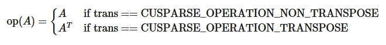
- The routine supports asynchronous execution
- The routine supports CUDA graph capture
The function`cusparse<t>gemvi_bufferSize()`returns the size of buffer used in`cusparse<t>gemvi()`.
**Input**

<div style="overflow-x: auto; max-width: 100%; border-radius: 6px;">
<table border="1" cellpadding="6" cellspacing="0" style="border-collapse: collapse; width: 100%; font-family: -apple-system, BlinkMacSystemFont, Segoe UI, Helvetica, Arial, sans-serif; font-size: 13px; margin: 16px 0;">
<colgroup>
<col style="width: 20%"/>
<col style="width: 80%"/>
</colgroup>
<tbody>
<tr style="border: 1px solid #d0d7de;">
<td style="padding: 8px 12px; border: 1px solid #d0d7de; vertical-align: top;"><p><code class="docutils literal notranslate"><span class="pre">handle</span></code></p></td>
<td style="padding: 8px 12px; border: 1px solid #d0d7de; vertical-align: top;"><p>Handle to the cuSPARSE library context.</p></td>
</tr>
<tr style="border: 1px solid #d0d7de;">
<td style="padding: 8px 12px; border: 1px solid #d0d7de; vertical-align: top;"><p><code class="docutils literal notranslate"><span class="pre">trans</span></code></p></td>
<td style="padding: 8px 12px; border: 1px solid #d0d7de; vertical-align: top;"><p>The operation <span class="math notranslate nohighlight">\(\text{op}(A)\)</span>.</p></td>
</tr>
<tr style="border: 1px solid #d0d7de;">
<td style="padding: 8px 12px; border: 1px solid #d0d7de; vertical-align: top;"><p><code class="docutils literal notranslate"><span class="pre">m</span></code></p></td>
<td style="padding: 8px 12px; border: 1px solid #d0d7de; vertical-align: top;"><p>Number of rows of matrix <code class="docutils literal notranslate"><span class="pre">A</span></code>.</p></td>
</tr>
<tr style="border: 1px solid #d0d7de;">
<td style="padding: 8px 12px; border: 1px solid #d0d7de; vertical-align: top;"><p><code class="docutils literal notranslate"><span class="pre">n</span></code></p></td>
<td style="padding: 8px 12px; border: 1px solid #d0d7de; vertical-align: top;"><p>Number of columns of matrix <code class="docutils literal notranslate"><span class="pre">A</span></code>.</p></td>
</tr>
<tr style="border: 1px solid #d0d7de;">
<td style="padding: 8px 12px; border: 1px solid #d0d7de; vertical-align: top;"><p><code class="docutils literal notranslate"><span class="pre">alpha</span></code></p></td>
<td style="padding: 8px 12px; border: 1px solid #d0d7de; vertical-align: top;"><p>&lt;type&gt; scalar used for multiplication.</p></td>
</tr>
<tr style="border: 1px solid #d0d7de;">
<td style="padding: 8px 12px; border: 1px solid #d0d7de; vertical-align: top;"><p><code class="docutils literal notranslate"><span class="pre">A</span></code></p></td>
<td style="padding: 8px 12px; border: 1px solid #d0d7de; vertical-align: top;"><p>The pointer to dense matrix <code class="docutils literal notranslate"><span class="pre">A</span></code>.</p></td>
</tr>
<tr style="border: 1px solid #d0d7de;">
<td style="padding: 8px 12px; border: 1px solid #d0d7de; vertical-align: top;"><p><code class="docutils literal notranslate"><span class="pre">lda</span></code></p></td>
<td style="padding: 8px 12px; border: 1px solid #d0d7de; vertical-align: top;"><p>Size of the leading dimension of <code class="docutils literal notranslate"><span class="pre">A</span></code>.</p></td>
</tr>
<tr style="border: 1px solid #d0d7de;">
<td style="padding: 8px 12px; border: 1px solid #d0d7de; vertical-align: top;"><p><code class="docutils literal notranslate"><span class="pre">nnz</span></code></p></td>
<td style="padding: 8px 12px; border: 1px solid #d0d7de; vertical-align: top;"><p>Number of nonzero elements of vector <code class="docutils literal notranslate"><span class="pre">x</span></code>.</p></td>
</tr>
<tr style="border: 1px solid #d0d7de;">
<td style="padding: 8px 12px; border: 1px solid #d0d7de; vertical-align: top;"><p><code class="docutils literal notranslate"><span class="pre">x</span></code></p></td>
<td style="padding: 8px 12px; border: 1px solid #d0d7de; vertical-align: top;"><p>&lt;type&gt; sparse vector of <code class="docutils literal notranslate"><span class="pre">nnz</span></code> elements of size <code class="docutils literal notranslate"><span class="pre">n</span></code> if <span class="math notranslate nohighlight">\(\text{op}(A)=A\)</span>, and size <code class="docutils literal notranslate"><span class="pre">m</span></code> if <span class="math notranslate nohighlight">\(\text{op}(A)=A^{T}\)</span>.</p></td>
</tr>
<tr style="border: 1px solid #d0d7de;">
<td style="padding: 8px 12px; border: 1px solid #d0d7de; vertical-align: top;"><p><code class="docutils literal notranslate"><span class="pre">xInd</span></code></p></td>
<td style="padding: 8px 12px; border: 1px solid #d0d7de; vertical-align: top;"><p>Indices of non-zero values in <code class="docutils literal notranslate"><span class="pre">x</span></code>.</p></td>
</tr>
<tr style="border: 1px solid #d0d7de;">
<td style="padding: 8px 12px; border: 1px solid #d0d7de; vertical-align: top;"><p><code class="docutils literal notranslate"><span class="pre">beta</span></code></p></td>
<td style="padding: 8px 12px; border: 1px solid #d0d7de; vertical-align: top;"><p>&lt;type&gt; scalar used for multiplication. If <code class="docutils literal notranslate"><span class="pre">beta</span></code> is zero, <code class="docutils literal notranslate"><span class="pre">y</span></code> does not have to be a valid input.</p></td>
</tr>
<tr style="border: 1px solid #d0d7de;">
<td style="padding: 8px 12px; border: 1px solid #d0d7de; vertical-align: top;"><p><code class="docutils literal notranslate"><span class="pre">y</span></code></p></td>
<td style="padding: 8px 12px; border: 1px solid #d0d7de; vertical-align: top;"><p>&lt;type&gt; dense vector of <code class="docutils literal notranslate"><span class="pre">m</span></code> elements if <span class="math notranslate nohighlight">\(\text{op}(A)=A\)</span>, and <code class="docutils literal notranslate"><span class="pre">n</span></code> elements if <span class="math notranslate nohighlight">\(\text{op}(A)=A^{T}\)</span>.</p></td>
</tr>
<tr style="border: 1px solid #d0d7de;">
<td style="padding: 8px 12px; border: 1px solid #d0d7de; vertical-align: top;"><p><code class="docutils literal notranslate"><span class="pre">idxBase</span></code></p></td>
<td style="padding: 8px 12px; border: 1px solid #d0d7de; vertical-align: top;"><p>0 or 1, for 0 based or 1 based indexing, respectively.</p></td>
</tr>
<tr style="border: 1px solid #d0d7de;">
<td style="padding: 8px 12px; border: 1px solid #d0d7de; vertical-align: top;"><p><code class="docutils literal notranslate"><span class="pre">pBufferSize</span></code></p></td>
<td style="padding: 8px 12px; border: 1px solid #d0d7de; vertical-align: top;"><p>Number of elements needed the buffer used in <code class="docutils literal notranslate"><span class="pre">cusparse&lt;t&gt;gemvi()</span></code>.</p></td>
</tr>
<tr style="border: 1px solid #d0d7de;">
<td style="padding: 8px 12px; border: 1px solid #d0d7de; vertical-align: top;"><p><code class="docutils literal notranslate"><span class="pre">pBuffer</span></code></p></td>
<td style="padding: 8px 12px; border: 1px solid #d0d7de; vertical-align: top;"><p>Working space buffer.</p></td>
</tr>
</tbody>
</table>
</div>

**Output**

<div style="overflow-x: auto; max-width: 100%; border-radius: 6px;">
<table border="1" cellpadding="6" cellspacing="0" style="border-collapse: collapse; width: 100%; font-family: -apple-system, BlinkMacSystemFont, Segoe UI, Helvetica, Arial, sans-serif; font-size: 13px; margin: 16px 0;">
<colgroup>
<col style="width: 19%"/>
<col style="width: 81%"/>
</colgroup>
<tbody>
<tr style="border: 1px solid #d0d7de;">
<td style="padding: 8px 12px; border: 1px solid #d0d7de; vertical-align: top;"><p><code class="docutils literal notranslate"><span class="pre">y</span></code></p></td>
<td style="padding: 8px 12px; border: 1px solid #d0d7de; vertical-align: top;"><p>&lt;type&gt; updated dense vector.</p></td>
</tr>
</tbody>
</table>
</div>

SeecusparseStatus_tfor the description of the return status.

## 5.5. cuSPARSE Level 3 Function Reference
This chapter describes sparse linear algebra functions that perform operations between sparse and (usually tall) dense matrices.

### 5.5.1. cusparse<t>bsrmm() [DEPRECATED]
> >*This routine will be removed in a future major release.**Use cusparseSpMM() with BSR matrices instead.*

```
cusparseStatus_t
cusparseSbsrmm(cusparseHandle_t         handle,
               cusparseDirection_t      dirA,
               cusparseOperation_t      transA,
               cusparseOperation_t      transB,
               int                      mb,
               int                      n,
               int                      kb,
               int                      nnzb,
               const float*             alpha,
               const cusparseMatDescr_t descrA,
               const float*             bsrValA,
               const int*               bsrRowPtrA,
               const int*               bsrColIndA,
               int                      blockDim,
               const float*             B,
               int                      ldb,
               const float*             beta,
               float*                   C,
               int                      ldc)

cusparseStatus_t
cusparseDbsrmm(cusparseHandle_t         handle,
               cusparseDirection_t      dirA,
               cusparseOperation_t      transA,
               cusparseOperation_t      transB,
               int                      mb,
               int                      n,
               int                      kb,
               int                      nnzb,
               const double*            alpha,
               const cusparseMatDescr_t descrA,
               const double*            bsrValA,
               const int*               bsrRowPtrA,
               const int*               bsrColIndA,
               int                      blockDim,
               const double*            B,
               int                      ldb,
               const double*            beta,
               double*                  C,
               int                      ldc)

cusparseStatus_t
cusparseCbsrmm(cusparseHandle_t         handle,
               cusparseDirection_t      dirA,
               cusparseOperation_t      transA,
               cusparseOperation_t      transB,
               int                      mb,
               int                      n,
               int                      kb,
               int                      nnzb,
               const cuComplex*         alpha,
               const cusparseMatDescr_t descrA,
               const cuComplex*         bsrValA,
               const int*               bsrRowPtrA,
               const int*               bsrColIndA,
               int                      blockDim,
               const cuComplex*         B,
               int                      ldb,
               const cuComplex*         beta,
               cuComplex*               C,
               int                      ldc)

cusparseStatus_t
cusparseZbsrmm(cusparseHandle_t         handle,
               cusparseDirection_t      dirA,
               cusparseOperation_t      transA,
               cusparseOperation_t      transB,
               int                      mb,
               int                      n,
               int                      kb,
               int                      nnzb,
               const cuDoubleComplex*   alpha,
               const cusparseMatDescr_t descrA,
               const cuDoubleComplex*   bsrValA,
               const int*               bsrRowPtrA,
               const int*               bsrColIndA,
               int                      blockDim,
               const cuDoubleComplex*   B,
               int                      ldb,
               const cuDoubleComplex*   beta,
               cuDoubleComplex*         C,
               int                      ldc)

```

This function performs one of the following matrix-matrix operations:

\[C = \alpha \ast \text{op}(A) \ast \text{op}(B) + \beta \ast C\]
`A`is an$mb \times kb$sparse matrix that is defined in BSR storage format by the three arrays`bsrValA`,`bsrRowPtrA`, and`bsrColIndA`;`B`and`C`are dense matrices;$\alpha\text{~and~}\beta$are scalars; and
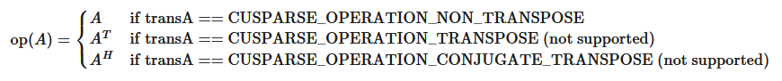
and
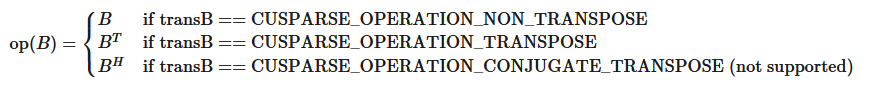
The function has the following limitations:
- only`CUSPARSE_MATRIX_TYPE_GENERAL`matrix type is supported
- only`blockDim > 1`is supported
- if`blockDim`≤ 4, then max(mb)/max(n) = 524,272
- if 4 <`blockDim`≤ 8, then max(mb) = 524,272, max(n) = 262,136
- if`blockDim`> 8, then m < 65,535 and max(n) = 262,136
The motivation of`transpose(B)`is to improve memory access of matrix`B`. The computational pattern of`A*transpose(B)`with matrix`B`in column-major order is equivalent to`A*B`with matrix`B`in row-major order.
In practice, no operation in an iterative solver or eigenvalue solver uses`A*transpose(B)`. However, we can perform`A*transpose(transpose(B))`which is the same as`A*B`. For example, suppose`A`is`mb*kb`,`B`is`k*n`and`C`is`m*n`, the following code shows usage of`cusparseDbsrmm()`.

```
// A is mb*kb, B is k*n and C is m*n
    const int m = mb*blockSize;
    const int k = kb*blockSize;
    const int ldb_B = k; // leading dimension of B
    const int ldc   = m; // leading dimension of C
// perform C:=alpha*A*B + beta*C
    cusparseSetMatType(descrA, CUSPARSE_MATRIX_TYPE_GENERAL );
    cusparseDbsrmm(cusparse_handle,
               CUSPARSE_DIRECTION_COLUMN,
               CUSPARSE_OPERATION_NON_TRANSPOSE,
               CUSPARSE_OPERATION_NON_TRANSPOSE,
               mb, n, kb, nnzb, alpha,
               descrA, bsrValA, bsrRowPtrA, bsrColIndA, blockSize,
               B, ldb_B,
               beta, C, ldc);

```

Instead of using`A*B`, our proposal is to transpose`B`to`Bt`by first calling`cublas<t>geam()`, and then to perform`A*transpose(Bt)`.

```
// step 1: Bt := transpose(B)
    const int m = mb*blockSize;
    const int k = kb*blockSize;
    double *Bt;
    const int ldb_Bt = n; // leading dimension of Bt
    cudaMalloc((void**)&Bt, sizeof(double)*ldb_Bt*k);
    double one  = 1.0;
    double zero = 0.0;
    cublasSetPointerMode(cublas_handle, CUBLAS_POINTER_MODE_HOST);
    cublasDgeam(cublas_handle, CUBLAS_OP_T, CUBLAS_OP_T,
        n, k, &one, B, int ldb_B, &zero, B, int ldb_B, Bt, ldb_Bt);

// step 2: perform C:=alpha*A*transpose(Bt) + beta*C
    cusparseDbsrmm(cusparse_handle,
               CUSPARSE_DIRECTION_COLUMN,
               CUSPARSE_OPERATION_NON_TRANSPOSE,
               CUSPARSE_OPERATION_TRANSPOSE,
               mb, n, kb, nnzb, alpha,
               descrA, bsrValA, bsrRowPtrA, bsrColIndA, blockSize,
               Bt, ldb_Bt,
               beta, C, ldc);

```

`bsrmm()`has the following properties:
- The routine requires no extra storage.
- The routine supports asynchronous execution.
- The routine supports CUDA graph capture.
**Input**

<div style="overflow-x: auto; max-width: 100%; border-radius: 6px;">
<table border="1" cellpadding="6" cellspacing="0" style="border-collapse: collapse; width: 100%; font-family: -apple-system, BlinkMacSystemFont, Segoe UI, Helvetica, Arial, sans-serif; font-size: 13px; margin: 16px 0;">
<colgroup>
<col style="width: 20%"/>
<col style="width: 80%"/>
</colgroup>
<tbody>
<tr style="border: 1px solid #d0d7de;">
<td style="padding: 8px 12px; border: 1px solid #d0d7de; vertical-align: top;"><p><code class="docutils literal notranslate"><span class="pre">handle</span></code></p></td>
<td style="padding: 8px 12px; border: 1px solid #d0d7de; vertical-align: top;"><p>handle to the cuSPARSE library context.</p></td>
</tr>
<tr style="border: 1px solid #d0d7de;">
<td style="padding: 8px 12px; border: 1px solid #d0d7de; vertical-align: top;"><p><code class="docutils literal notranslate"><span class="pre">dir</span></code></p></td>
<td style="padding: 8px 12px; border: 1px solid #d0d7de; vertical-align: top;"><p>storage format of blocks, either <code class="docutils literal notranslate"><span class="pre">CUSPARSE_DIRECTION_ROW</span></code> or <code class="docutils literal notranslate"><span class="pre">CUSPARSE_DIRECTION_COLUMN</span></code>.</p></td>
</tr>
<tr style="border: 1px solid #d0d7de;">
<td style="padding: 8px 12px; border: 1px solid #d0d7de; vertical-align: top;"><p><code class="docutils literal notranslate"><span class="pre">transA</span></code></p></td>
<td style="padding: 8px 12px; border: 1px solid #d0d7de; vertical-align: top;"><p>the operation <code class="docutils literal notranslate"><span class="pre">op(A)</span></code>.</p></td>
</tr>
<tr style="border: 1px solid #d0d7de;">
<td style="padding: 8px 12px; border: 1px solid #d0d7de; vertical-align: top;"><p><code class="docutils literal notranslate"><span class="pre">transB</span></code></p></td>
<td style="padding: 8px 12px; border: 1px solid #d0d7de; vertical-align: top;"><p>the operation <code class="docutils literal notranslate"><span class="pre">op(B)</span></code>.</p></td>
</tr>
<tr style="border: 1px solid #d0d7de;">
<td style="padding: 8px 12px; border: 1px solid #d0d7de; vertical-align: top;"><p><code class="docutils literal notranslate"><span class="pre">mb</span></code></p></td>
<td style="padding: 8px 12px; border: 1px solid #d0d7de; vertical-align: top;"><p>number of block rows of sparse matrix <code class="docutils literal notranslate"><span class="pre">A</span></code>.</p></td>
</tr>
<tr style="border: 1px solid #d0d7de;">
<td style="padding: 8px 12px; border: 1px solid #d0d7de; vertical-align: top;"><p><code class="docutils literal notranslate"><span class="pre">n</span></code></p></td>
<td style="padding: 8px 12px; border: 1px solid #d0d7de; vertical-align: top;"><p>number of columns of dense matrix <code class="docutils literal notranslate"><span class="pre">op(B)</span></code> and <code class="docutils literal notranslate"><span class="pre">A</span></code>.</p></td>
</tr>
<tr style="border: 1px solid #d0d7de;">
<td style="padding: 8px 12px; border: 1px solid #d0d7de; vertical-align: top;"><p><code class="docutils literal notranslate"><span class="pre">kb</span></code></p></td>
<td style="padding: 8px 12px; border: 1px solid #d0d7de; vertical-align: top;"><p>number of block columns of sparse matrix <code class="docutils literal notranslate"><span class="pre">A</span></code>.</p></td>
</tr>
<tr style="border: 1px solid #d0d7de;">
<td style="padding: 8px 12px; border: 1px solid #d0d7de; vertical-align: top;"><p><code class="docutils literal notranslate"><span class="pre">nnzb</span></code></p></td>
<td style="padding: 8px 12px; border: 1px solid #d0d7de; vertical-align: top;"><p>number of non-zero blocks of sparse matrix <code class="docutils literal notranslate"><span class="pre">A</span></code>.</p></td>
</tr>
<tr style="border: 1px solid #d0d7de;">
<td style="padding: 8px 12px; border: 1px solid #d0d7de; vertical-align: top;"><p><code class="docutils literal notranslate"><span class="pre">alpha</span></code></p></td>
<td style="padding: 8px 12px; border: 1px solid #d0d7de; vertical-align: top;"><p>&lt;type&gt; scalar used for multiplication.</p></td>
</tr>
<tr style="border: 1px solid #d0d7de;">
<td style="padding: 8px 12px; border: 1px solid #d0d7de; vertical-align: top;"><p><code class="docutils literal notranslate"><span class="pre">descrA</span></code></p></td>
<td style="padding: 8px 12px; border: 1px solid #d0d7de; vertical-align: top;"><p>the descriptor of matrix <code class="docutils literal notranslate"><span class="pre">A</span></code>. The supported matrix type is <code class="docutils literal notranslate"><span class="pre">CUSPARSE_MATRIX_TYPE_GENERAL</span></code>. Also, the supported index bases are <code class="docutils literal notranslate"><span class="pre">CUSPARSE_INDEX_BASE_ZERO</span></code> and <code class="docutils literal notranslate"><span class="pre">CUSPARSE_INDEX_BASE_ONE</span></code>.</p></td>
</tr>
<tr style="border: 1px solid #d0d7de;">
<td style="padding: 8px 12px; border: 1px solid #d0d7de; vertical-align: top;"><p><code class="docutils literal notranslate"><span class="pre">bsrValA</span></code></p></td>
<td style="padding: 8px 12px; border: 1px solid #d0d7de; vertical-align: top;"><p>&lt;type&gt; array of <code class="docutils literal notranslate"><span class="pre">nnzb</span></code><span class="math notranslate nohighlight">\(( =\)</span><code class="docutils literal notranslate"><span class="pre">bsrRowPtrA(mb)</span></code><span class="math notranslate nohighlight">\(-\)</span><code class="docutils literal notranslate"><span class="pre">bsrRowPtrA(0)</span></code><span class="math notranslate nohighlight">\()\)</span> nonzero blocks of matrix <code class="docutils literal notranslate"><span class="pre">A</span></code>.</p></td>
</tr>
<tr style="border: 1px solid #d0d7de;">
<td style="padding: 8px 12px; border: 1px solid #d0d7de; vertical-align: top;"><p><code class="docutils literal notranslate"><span class="pre">bsrRowPtrA</span></code></p></td>
<td style="padding: 8px 12px; border: 1px solid #d0d7de; vertical-align: top;"><p>integer array of <code class="docutils literal notranslate"><span class="pre">mb</span></code><span class="math notranslate nohighlight">\(+ 1\)</span> elements that contains the start of every block row and the end of the last block row plus one.</p></td>
</tr>
<tr style="border: 1px solid #d0d7de;">
<td style="padding: 8px 12px; border: 1px solid #d0d7de; vertical-align: top;"><p><code class="docutils literal notranslate"><span class="pre">bsrColIndA</span></code></p></td>
<td style="padding: 8px 12px; border: 1px solid #d0d7de; vertical-align: top;"><p>integer array of <code class="docutils literal notranslate"><span class="pre">nnzb</span></code><span class="math notranslate nohighlight">\(( =\)</span><code class="docutils literal notranslate"><span class="pre">bsrRowPtrA(mb)</span></code><span class="math notranslate nohighlight">\(-\)</span><code class="docutils literal notranslate"><span class="pre">bsrRowPtrA(0)</span></code><span class="math notranslate nohighlight">\()\)</span> column indices of the nonzero blocks of matrix <code class="docutils literal notranslate"><span class="pre">A</span></code>.</p></td>
</tr>
<tr style="border: 1px solid #d0d7de;">
<td style="padding: 8px 12px; border: 1px solid #d0d7de; vertical-align: top;"><p><code class="docutils literal notranslate"><span class="pre">blockDim</span></code></p></td>
<td style="padding: 8px 12px; border: 1px solid #d0d7de; vertical-align: top;"><p>block dimension of sparse matrix <code class="docutils literal notranslate"><span class="pre">A</span></code>, larger than zero.</p></td>
</tr>
<tr style="border: 1px solid #d0d7de;">
<td style="padding: 8px 12px; border: 1px solid #d0d7de; vertical-align: top;"><p><code class="docutils literal notranslate"><span class="pre">B</span></code></p></td>
<td style="padding: 8px 12px; border: 1px solid #d0d7de; vertical-align: top;"><p>array of dimensions <code class="docutils literal notranslate"><span class="pre">(ldb,</span> <span class="pre">n)</span></code> if <code class="docutils literal notranslate"><span class="pre">op(B)=B</span></code> and <code class="docutils literal notranslate"><span class="pre">(ldb,</span> <span class="pre">k)</span></code> otherwise.</p></td>
</tr>
<tr style="border: 1px solid #d0d7de;">
<td style="padding: 8px 12px; border: 1px solid #d0d7de; vertical-align: top;"><p><code class="docutils literal notranslate"><span class="pre">ldb</span></code></p></td>
<td style="padding: 8px 12px; border: 1px solid #d0d7de; vertical-align: top;"><p>leading dimension of <code class="docutils literal notranslate"><span class="pre">B</span></code>. If <code class="docutils literal notranslate"><span class="pre">op(B)=B</span></code>, it must be at least <span class="math notranslate nohighlight">\(\max\text{(1,\ k)}\)</span> If <code class="docutils literal notranslate"><span class="pre">op(B)</span> <span class="pre">!=</span> <span class="pre">B</span></code>, it must be at least <code class="docutils literal notranslate"><span class="pre">max(1,</span> <span class="pre">n)</span></code>.</p></td>
</tr>
<tr style="border: 1px solid #d0d7de;">
<td style="padding: 8px 12px; border: 1px solid #d0d7de; vertical-align: top;"><p><code class="docutils literal notranslate"><span class="pre">beta</span></code></p></td>
<td style="padding: 8px 12px; border: 1px solid #d0d7de; vertical-align: top;"><p>&lt;type&gt; scalar used for multiplication. If <code class="docutils literal notranslate"><span class="pre">beta</span></code> is zero, <code class="docutils literal notranslate"><span class="pre">C</span></code> does not have to be a valid input.</p></td>
</tr>
<tr style="border: 1px solid #d0d7de;">
<td style="padding: 8px 12px; border: 1px solid #d0d7de; vertical-align: top;"><p><code class="docutils literal notranslate"><span class="pre">C</span></code></p></td>
<td style="padding: 8px 12px; border: 1px solid #d0d7de; vertical-align: top;"><p>array of dimensions <code class="docutils literal notranslate"><span class="pre">(ldc,</span> <span class="pre">n)</span></code>.</p></td>
</tr>
<tr style="border: 1px solid #d0d7de;">
<td style="padding: 8px 12px; border: 1px solid #d0d7de; vertical-align: top;"><p><code class="docutils literal notranslate"><span class="pre">ldc</span></code></p></td>
<td style="padding: 8px 12px; border: 1px solid #d0d7de; vertical-align: top;"><p>leading dimension of <code class="docutils literal notranslate"><span class="pre">C</span></code>. It must be at least <span class="math notranslate nohighlight">\(\max\text{(1,\ m)}\)</span> if <code class="docutils literal notranslate"><span class="pre">op(A)=A</span></code> and at least <span class="math notranslate nohighlight">\(\max\text{(1,\ k)}\)</span> otherwise.</p></td>
</tr>
</tbody>
</table>
</div>

**Output**

<div style="overflow-x: auto; max-width: 100%; border-radius: 6px;">
<table border="1" cellpadding="6" cellspacing="0" style="border-collapse: collapse; width: 100%; font-family: -apple-system, BlinkMacSystemFont, Segoe UI, Helvetica, Arial, sans-serif; font-size: 13px; margin: 16px 0;">
<colgroup>
<col style="width: 9%"/>
<col style="width: 91%"/>
</colgroup>
<tbody>
<tr style="border: 1px solid #d0d7de;">
<td style="padding: 8px 12px; border: 1px solid #d0d7de; vertical-align: top;"><p><code class="docutils literal notranslate"><span class="pre">C</span></code></p></td>
<td style="padding: 8px 12px; border: 1px solid #d0d7de; vertical-align: top;"><p>&lt;type&gt; updated array of dimensions <code class="docutils literal notranslate"><span class="pre">(ldc,</span> <span class="pre">n)</span></code>.</p></td>
</tr>
</tbody>
</table>
</div>

SeecusparseStatus_tfor the description of the return status.

### 5.5.2. cusparse<t>bsrsm2_bufferSize() [DEPRECATED]
> >*The routine will be removed in the next major release*

```
cusparseStatus_t
cusparseSbsrsm2_bufferSize(cusparseHandle_t         handle,
                           cusparseDirection_t      dirA,
                           cusparseOperation_t      transA,
                           cusparseOperation_t      transX,
                           int                      mb,
                           int                      n,
                           int                      nnzb,
                           const cusparseMatDescr_t descrA,
                           float*                   bsrSortedValA,
                           const int*               bsrSortedRowPtrA,
                           const int*               bsrSortedColIndA,
                           int                      blockDim,
                           bsrsm2Info_t             info,
                           int*                     pBufferSizeInBytes)

cusparseStatus_t
cusparseDbsrsm2_bufferSize(cusparseHandle_t         handle,
                           cusparseDirection_t      dirA,
                           cusparseOperation_t      transA,
                           cusparseOperation_t      transX,
                           int                      mb,
                           int                      n,
                           int                      nnzb,
                           const cusparseMatDescr_t descrA,
                           double*                  bsrSortedValA,
                           const int*               bsrSortedRowPtrA,
                           const int*               bsrSortedColIndA,
                           int                      blockDim,
                           bsrsm2Info_t             info,
                           int*                     pBufferSizeInBytes)

cusparseStatus_t
cusparseCbsrsm2_bufferSize(cusparseHandle_t         handle,
                           cusparseDirection_t      dirA,
                           cusparseOperation_t      transA,
                           cusparseOperation_t      transX,
                           int                      mb,
                           int                      n,
                           int                      nnzb,
                           const cusparseMatDescr_t descrA,
                           cuComplex*               bsrSortedValA,
                           const int*               bsrSortedRowPtrA,
                           const int*               bsrSortedColIndA,
                           int                      blockDim,
                           bsrsm2Info_t             info,
                           int*                     pBufferSizeInBytes)

cusparseStatus_t
cusparseZbsrsm2_bufferSize(cusparseHandle_t         handle,
                           cusparseDirection_t      dirA,
                           cusparseOperation_t      transA,
                           cusparseOperation_t      transX,
                           int                      mb,
                           int                      n,
                           int                      nnzb,
                           const cusparseMatDescr_t descrA,
                           cuDoubleComplex*         bsrSortedValA,
                           const int*               bsrSortedRowPtrA,
                           const int*               bsrSortedColIndA,
                           int                      blockDim,
                           bsrsm2Info_t             info,
                           int*                     pBufferSizeInBytes)

```

This function returns size of buffer used in`bsrsm2()`, a new sparse triangular linear system`op(A)*op(X)=`$\alpha$`op(B)`.
`A`is an`(mb*blockDim)x(mb*blockDim)`sparse matrix that is defined in BSR storage format by the three arrays`bsrValA`,`bsrRowPtrA`, and`bsrColIndA`);`B`and`X`are the right-hand-side and the solution matrices;$\alpha$is a scalar; and
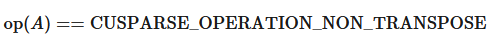
Although there are six combinations in terms of parameter`trans`and the upper (and lower) triangular part of`A`,`bsrsm2_bufferSize()`returns the maximum size of the buffer among these combinations. The buffer size depends on dimension`mb,blockDim`and the number of nonzeros of the matrix,`nnzb`. If the user changes the matrix, it is necessary to call`bsrsm2_bufferSize()`again to get the correct buffer size, otherwise a segmentation fault may occur.
- The routine requires no extra storage.
- The routine supports asynchronous execution.
- The routine supports CUDA graph capture.
**Input**

<div style="overflow-x: auto; max-width: 100%; border-radius: 6px;">
<table border="1" cellpadding="6" cellspacing="0" style="border-collapse: collapse; width: 100%; font-family: -apple-system, BlinkMacSystemFont, Segoe UI, Helvetica, Arial, sans-serif; font-size: 13px; margin: 16px 0;">
<colgroup>
<col style="width: 20%"/>
<col style="width: 80%"/>
</colgroup>
<tbody>
<tr style="border: 1px solid #d0d7de;">
<td style="padding: 8px 12px; border: 1px solid #d0d7de; vertical-align: top;"><p><code class="docutils literal notranslate"><span class="pre">handle</span></code></p></td>
<td style="padding: 8px 12px; border: 1px solid #d0d7de; vertical-align: top;"><p>handle to the cuSPARSE library context.</p></td>
</tr>
<tr style="border: 1px solid #d0d7de;">
<td style="padding: 8px 12px; border: 1px solid #d0d7de; vertical-align: top;"><p><code class="docutils literal notranslate"><span class="pre">dirA</span></code></p></td>
<td style="padding: 8px 12px; border: 1px solid #d0d7de; vertical-align: top;"><p>storage format of blocks, either <code class="docutils literal notranslate"><span class="pre">CUSPARSE_DIRECTION_ROW</span></code> or <code class="docutils literal notranslate"><span class="pre">CUSPARSE_DIRECTION_COLUMN</span></code>.</p></td>
</tr>
<tr style="border: 1px solid #d0d7de;">
<td style="padding: 8px 12px; border: 1px solid #d0d7de; vertical-align: top;"><p><code class="docutils literal notranslate"><span class="pre">transA</span></code></p></td>
<td style="padding: 8px 12px; border: 1px solid #d0d7de; vertical-align: top;"><p>the operation <code class="docutils literal notranslate"><span class="pre">op(A)</span></code>.</p></td>
</tr>
<tr style="border: 1px solid #d0d7de;">
<td style="padding: 8px 12px; border: 1px solid #d0d7de; vertical-align: top;"><p><code class="docutils literal notranslate"><span class="pre">transX</span></code></p></td>
<td style="padding: 8px 12px; border: 1px solid #d0d7de; vertical-align: top;"><p>the operation <code class="docutils literal notranslate"><span class="pre">op(X)</span></code>.</p></td>
</tr>
<tr style="border: 1px solid #d0d7de;">
<td style="padding: 8px 12px; border: 1px solid #d0d7de; vertical-align: top;"><p><code class="docutils literal notranslate"><span class="pre">mb</span></code></p></td>
<td style="padding: 8px 12px; border: 1px solid #d0d7de; vertical-align: top;"><p>number of block rows of matrix <code class="docutils literal notranslate"><span class="pre">A</span></code>.</p></td>
</tr>
<tr style="border: 1px solid #d0d7de;">
<td style="padding: 8px 12px; border: 1px solid #d0d7de; vertical-align: top;"><p><code class="docutils literal notranslate"><span class="pre">n</span></code></p></td>
<td style="padding: 8px 12px; border: 1px solid #d0d7de; vertical-align: top;"><p>number of columns of matrix <code class="docutils literal notranslate"><span class="pre">op(B)</span></code> and <code class="docutils literal notranslate"><span class="pre">op(X)</span></code>.</p></td>
</tr>
<tr style="border: 1px solid #d0d7de;">
<td style="padding: 8px 12px; border: 1px solid #d0d7de; vertical-align: top;"><p><code class="docutils literal notranslate"><span class="pre">nnzb</span></code></p></td>
<td style="padding: 8px 12px; border: 1px solid #d0d7de; vertical-align: top;"><p>number of nonzero blocks of matrix <code class="docutils literal notranslate"><span class="pre">A</span></code>.</p></td>
</tr>
<tr style="border: 1px solid #d0d7de;">
<td style="padding: 8px 12px; border: 1px solid #d0d7de; vertical-align: top;"><p><code class="docutils literal notranslate"><span class="pre">descrA</span></code></p></td>
<td style="padding: 8px 12px; border: 1px solid #d0d7de; vertical-align: top;"><p>the descriptor of matrix <code class="docutils literal notranslate"><span class="pre">A</span></code>. The supported matrix type is <code class="docutils literal notranslate"><span class="pre">CUSPARSE_MATRIX_TYPE_GENERAL</span></code>, while the supported diagonal types are <code class="docutils literal notranslate"><span class="pre">CUSPARSE_DIAG_TYPE_UNIT</span></code> and <code class="docutils literal notranslate"><span class="pre">CUSPARSE_DIAG_TYPE_NON_UNIT</span></code>.</p></td>
</tr>
<tr style="border: 1px solid #d0d7de;">
<td style="padding: 8px 12px; border: 1px solid #d0d7de; vertical-align: top;"><p><code class="docutils literal notranslate"><span class="pre">bsrValA</span></code></p></td>
<td style="padding: 8px 12px; border: 1px solid #d0d7de; vertical-align: top;"><p>&lt;type&gt; array of <code class="docutils literal notranslate"><span class="pre">nnzb</span></code><span class="math notranslate nohighlight">\(( =\)</span><code class="docutils literal notranslate"><span class="pre">bsrRowPtrA(mb)</span></code><span class="math notranslate nohighlight">\(-\)</span><code class="docutils literal notranslate"><span class="pre">bsrRowPtrA(0)</span></code><span class="math notranslate nohighlight">\()\)</span> nonzero blocks of matrix <code class="docutils literal notranslate"><span class="pre">A</span></code>.</p></td>
</tr>
<tr style="border: 1px solid #d0d7de;">
<td style="padding: 8px 12px; border: 1px solid #d0d7de; vertical-align: top;"><p><code class="docutils literal notranslate"><span class="pre">bsrRowPtrA</span></code></p></td>
<td style="padding: 8px 12px; border: 1px solid #d0d7de; vertical-align: top;"><p>integer array of <code class="docutils literal notranslate"><span class="pre">mb</span></code><span class="math notranslate nohighlight">\(+ 1\)</span> elements that contains the start of every block row and the end of the last block row plus one.</p></td>
</tr>
<tr style="border: 1px solid #d0d7de;">
<td style="padding: 8px 12px; border: 1px solid #d0d7de; vertical-align: top;"><p><code class="docutils literal notranslate"><span class="pre">bsrColIndA</span></code></p></td>
<td style="padding: 8px 12px; border: 1px solid #d0d7de; vertical-align: top;"><p>integer array of <code class="docutils literal notranslate"><span class="pre">nnzb</span></code><span class="math notranslate nohighlight">\(( =\)</span><code class="docutils literal notranslate"><span class="pre">bsrRowPtrA(mb)</span></code><span class="math notranslate nohighlight">\(-\)</span><code class="docutils literal notranslate"><span class="pre">bsrRowPtrA(0)</span></code><span class="math notranslate nohighlight">\()\)</span> column indices of the nonzero blocks of matrix <code class="docutils literal notranslate"><span class="pre">A</span></code>.</p></td>
</tr>
<tr style="border: 1px solid #d0d7de;">
<td style="padding: 8px 12px; border: 1px solid #d0d7de; vertical-align: top;"><p><code class="docutils literal notranslate"><span class="pre">blockDim</span></code></p></td>
<td style="padding: 8px 12px; border: 1px solid #d0d7de; vertical-align: top;"><p>block dimension of sparse matrix <code class="docutils literal notranslate"><span class="pre">A</span></code>; larger than zero.</p></td>
</tr>
</tbody>
</table>
</div>

**Output**

<div style="overflow-x: auto; max-width: 100%; border-radius: 6px;">
<table border="1" cellpadding="6" cellspacing="0" style="border-collapse: collapse; width: 100%; font-family: -apple-system, BlinkMacSystemFont, Segoe UI, Helvetica, Arial, sans-serif; font-size: 13px; margin: 16px 0;">
<colgroup>
<col style="width: 22%"/>
<col style="width: 78%"/>
</colgroup>
<tbody>
<tr style="border: 1px solid #d0d7de;">
<td style="padding: 8px 12px; border: 1px solid #d0d7de; vertical-align: top;"><p><code class="docutils literal notranslate"><span class="pre">info</span></code></p></td>
<td style="padding: 8px 12px; border: 1px solid #d0d7de; vertical-align: top;"><p>record internal states based on different algorithms.</p></td>
</tr>
<tr style="border: 1px solid #d0d7de;">
<td style="padding: 8px 12px; border: 1px solid #d0d7de; vertical-align: top;"><p><code class="docutils literal notranslate"><span class="pre">pBufferSizeInBytes</span></code></p></td>
<td style="padding: 8px 12px; border: 1px solid #d0d7de; vertical-align: top;"><p>number of bytes of the buffer used in <code class="docutils literal notranslate"><span class="pre">bsrsm2_analysis()</span></code> and <code class="docutils literal notranslate"><span class="pre">bsrsm2_solve()</span></code>.</p></td>
</tr>
</tbody>
</table>
</div>

SeecusparseStatus_tfor the description of the return status.

### 5.5.3. cusparse<t>bsrsm2_analysis() [DEPRECATED]
> >*The routine will be removed in the next major release*

```
cusparseStatus_t
cusparseSbsrsm2_analysis(cusparseHandle_t         handle,
                         cusparseDirection_t      dirA,
                         cusparseOperation_t      transA,
                         cusparseOperation_t      transX,
                         int                      mb,
                         int                      n,
                         int                      nnzb,
                         const cusparseMatDescr_t descrA,
                         const float*             bsrSortedVal,
                         const int*               bsrSortedRowPtr,
                         const int*               bsrSortedColInd,
                         int                      blockDim,
                         bsrsm2Info_t             info,
                         cusparseSolvePolicy_t    policy,
                         void*                    pBuffer)

cusparseStatus_t
cusparseDbsrsm2_analysis(cusparseHandle_t         handle,
                         cusparseDirection_t      dirA,
                         cusparseOperation_t      transA,
                         cusparseOperation_t      transX,
                         int                      mb,
                         int                      n,
                         int                      nnzb,
                         const cusparseMatDescr_t descrA,
                         const double*            bsrSortedVal,
                         const int*               bsrSortedRowPtr,
                         const int*               bsrSortedColInd,
                         int                      blockDim,
                         bsrsm2Info_t             info,
                         cusparseSolvePolicy_t    policy,
                         void*                    pBuffer)

cusparseStatus_t
cusparseCbsrsm2_analysis(cusparseHandle_t         handle,
                         cusparseDirection_t      dirA,
                         cusparseOperation_t      transA,
                         cusparseOperation_t      transX,
                         int                      mb,
                         int                      n,
                         int                      nnzb,
                         const cusparseMatDescr_t descrA,
                         const cuComplex*         bsrSortedVal,
                         const int*               bsrSortedRowPtr,
                         const int*               bsrSortedColInd,
                         int                      blockDim,
                         bsrsm2Info_t             info,
                         cusparseSolvePolicy_t    policy,
                         void*                    pBuffer)

cusparseStatus_t
cusparseZbsrsm2_analysis(cusparseHandle_t         handle,
                         cusparseDirection_t      dirA,
                         cusparseOperation_t      transA,
                         cusparseOperation_t      transX,
                         int                      mb,
                         int                      n,
                         int                      nnzb,
                         const cusparseMatDescr_t descrA,
                         const cuDoubleComplex*   bsrSortedVal,
                         const int*               bsrSortedRowPtr,
                         const int*               bsrSortedColInd,
                         int                      blockDim,
                         bsrsm2Info_t             info,
                         cusparseSolvePolicy_t    policy,
                         void*                    pBuffer)

```

This function performs the analysis phase of`bsrsm2()`, a new sparse triangular linear system`op(A)*op(X) =`$\alpha$`op(B)`.
`A`is an`(mb*blockDim)x(mb*blockDim)`sparse matrix that is defined in BSR storage format by the three arrays`bsrValA`,`bsrRowPtrA`, and`bsrColIndA`);`B`and`X`are the right-hand-side and the solution matrices;$\alpha$is a scalar; and

and
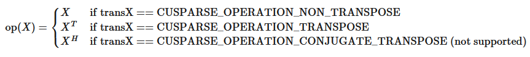
and`op(B)`and`op(X)`are equal.
The block of BSR format is of size`blockDim*blockDim`, stored in column-major or row-major as determined by parameter`dirA`, which is either`CUSPARSE_DIRECTION_ROW`or`CUSPARSE_DIRECTION_COLUMN`. The matrix type must be`CUSPARSE_MATRIX_TYPE_GENERAL`, and the fill mode and diagonal type are ignored.
It is expected that this function will be executed only once for a given matrix and a particular operation type.
This function requires the buffer size returned by`bsrsm2_bufferSize()`. The address of`pBuffer`must be multiple of 128 bytes. If not,`CUSPARSE_STATUS_INVALID_VALUE`is returned.
Function`bsrsm2_analysis()`reports a structural zero and computes the level information stored in opaque structure`info`. The level information can extract more parallelism during a triangular solver. However`bsrsm2_solve()`can be done without level information. To disable level information, the user needs to specify the policy of the triangular solver as`CUSPARSE_SOLVE_POLICY_NO_LEVEL`.
Function`bsrsm2_analysis()`always reports the first structural zero, even if the parameter`policy`is`CUSPARSE_SOLVE_POLICY_NO_LEVEL`. Besides, no structural zero is reported if`CUSPARSE_DIAG_TYPE_UNIT`is specified, even if block`A(j,j)`is missing for some`j`. The user must call`cusparseXbsrsm2_query_zero_pivot()`to know where the structural zero is.
If`bsrsm2_analysis()`reports a structural zero, the solve will return a numerical zero in the same position as the structural zero but this result`X`is meaningless.
- This function requires temporary extra storage that is allocated internally.
- The routine supports asynchronous execution if the Stream Ordered Memory Allocator is available.
- The routine supports CUDA graph capture if the Stream Ordered Memory Allocator is available.
**Input**

<div style="overflow-x: auto; max-width: 100%; border-radius: 6px;">
<table border="1" cellpadding="6" cellspacing="0" style="border-collapse: collapse; width: 100%; font-family: -apple-system, BlinkMacSystemFont, Segoe UI, Helvetica, Arial, sans-serif; font-size: 13px; margin: 16px 0;">
<colgroup>
<col style="width: 20%"/>
<col style="width: 80%"/>
</colgroup>
<tbody>
<tr style="border: 1px solid #d0d7de;">
<td style="padding: 8px 12px; border: 1px solid #d0d7de; vertical-align: top;"><p><code class="docutils literal notranslate"><span class="pre">handle</span></code></p></td>
<td style="padding: 8px 12px; border: 1px solid #d0d7de; vertical-align: top;"><p>handle to the cuSPARSE library context.</p></td>
</tr>
<tr style="border: 1px solid #d0d7de;">
<td style="padding: 8px 12px; border: 1px solid #d0d7de; vertical-align: top;"><p><code class="docutils literal notranslate"><span class="pre">dirA</span></code></p></td>
<td style="padding: 8px 12px; border: 1px solid #d0d7de; vertical-align: top;"><p>storage format of blocks, either <code class="docutils literal notranslate"><span class="pre">CUSPARSE_DIRECTION_ROW</span></code> or <code class="docutils literal notranslate"><span class="pre">CUSPARSE_DIRECTION_COLUMN</span></code>.</p></td>
</tr>
<tr style="border: 1px solid #d0d7de;">
<td style="padding: 8px 12px; border: 1px solid #d0d7de; vertical-align: top;"><p><code class="docutils literal notranslate"><span class="pre">transA</span></code></p></td>
<td style="padding: 8px 12px; border: 1px solid #d0d7de; vertical-align: top;"><p>the operation <code class="docutils literal notranslate"><span class="pre">op(A)</span></code>.</p></td>
</tr>
<tr style="border: 1px solid #d0d7de;">
<td style="padding: 8px 12px; border: 1px solid #d0d7de; vertical-align: top;"><p><code class="docutils literal notranslate"><span class="pre">transX</span></code></p></td>
<td style="padding: 8px 12px; border: 1px solid #d0d7de; vertical-align: top;"><p>the operation <code class="docutils literal notranslate"><span class="pre">op(B)</span></code> and <code class="docutils literal notranslate"><span class="pre">op(X)</span></code>.</p></td>
</tr>
<tr style="border: 1px solid #d0d7de;">
<td style="padding: 8px 12px; border: 1px solid #d0d7de; vertical-align: top;"><p><code class="docutils literal notranslate"><span class="pre">mb</span></code></p></td>
<td style="padding: 8px 12px; border: 1px solid #d0d7de; vertical-align: top;"><p>number of block rows of matrix <code class="docutils literal notranslate"><span class="pre">A</span></code>.</p></td>
</tr>
<tr style="border: 1px solid #d0d7de;">
<td style="padding: 8px 12px; border: 1px solid #d0d7de; vertical-align: top;"><p><code class="docutils literal notranslate"><span class="pre">n</span></code></p></td>
<td style="padding: 8px 12px; border: 1px solid #d0d7de; vertical-align: top;"><p>number of columns of matrix <code class="docutils literal notranslate"><span class="pre">op(B)</span></code> and <code class="docutils literal notranslate"><span class="pre">op(X)</span></code>.</p></td>
</tr>
<tr style="border: 1px solid #d0d7de;">
<td style="padding: 8px 12px; border: 1px solid #d0d7de; vertical-align: top;"><p><code class="docutils literal notranslate"><span class="pre">nnzb</span></code></p></td>
<td style="padding: 8px 12px; border: 1px solid #d0d7de; vertical-align: top;"><p>number of non-zero blocks of matrix <code class="docutils literal notranslate"><span class="pre">A</span></code>.</p></td>
</tr>
<tr style="border: 1px solid #d0d7de;">
<td style="padding: 8px 12px; border: 1px solid #d0d7de; vertical-align: top;"><p><code class="docutils literal notranslate"><span class="pre">descrA</span></code></p></td>
<td style="padding: 8px 12px; border: 1px solid #d0d7de; vertical-align: top;"><p>the descriptor of matrix <code class="docutils literal notranslate"><span class="pre">A</span></code>. The supported matrix type is <code class="docutils literal notranslate"><span class="pre">CUSPARSE_MATRIX_TYPE_GENERAL</span></code>, while the supported diagonal types are <code class="docutils literal notranslate"><span class="pre">CUSPARSE_DIAG_TYPE_UNIT</span></code> and <code class="docutils literal notranslate"><span class="pre">CUSPARSE_DIAG_TYPE_NON_UNIT</span></code>.</p></td>
</tr>
<tr style="border: 1px solid #d0d7de;">
<td style="padding: 8px 12px; border: 1px solid #d0d7de; vertical-align: top;"><p><code class="docutils literal notranslate"><span class="pre">bsrValA</span></code></p></td>
<td style="padding: 8px 12px; border: 1px solid #d0d7de; vertical-align: top;"><p>&lt;type&gt; array of <code class="docutils literal notranslate"><span class="pre">nnzb</span></code><span class="math notranslate nohighlight">\(( =\)</span><code class="docutils literal notranslate"><span class="pre">bsrRowPtrA(mb)</span></code><span class="math notranslate nohighlight">\(-\)</span><code class="docutils literal notranslate"><span class="pre">bsrRowPtrA(0)</span></code><span class="math notranslate nohighlight">\()\)</span> nonzero blocks of matrix <code class="docutils literal notranslate"><span class="pre">A</span></code>.</p></td>
</tr>
<tr style="border: 1px solid #d0d7de;">
<td style="padding: 8px 12px; border: 1px solid #d0d7de; vertical-align: top;"><p><code class="docutils literal notranslate"><span class="pre">bsrRowPtrA</span></code></p></td>
<td style="padding: 8px 12px; border: 1px solid #d0d7de; vertical-align: top;"><p>integer array of <code class="docutils literal notranslate"><span class="pre">mb</span></code><span class="math notranslate nohighlight">\(+ 1\)</span> elements that contains the start of every block row and the end of the last block row plus one.</p></td>
</tr>
<tr style="border: 1px solid #d0d7de;">
<td style="padding: 8px 12px; border: 1px solid #d0d7de; vertical-align: top;"><p><code class="docutils literal notranslate"><span class="pre">bsrColIndA</span></code></p></td>
<td style="padding: 8px 12px; border: 1px solid #d0d7de; vertical-align: top;"><p>integer array of <code class="docutils literal notranslate"><span class="pre">nnzb</span></code><span class="math notranslate nohighlight">\(( =\)</span><code class="docutils literal notranslate"><span class="pre">bsrRowPtrA(mb)</span></code><span class="math notranslate nohighlight">\(-\)</span><code class="docutils literal notranslate"><span class="pre">bsrRowPtrA(0)</span></code><span class="math notranslate nohighlight">\()\)</span> column indices of the nonzero blocks of matrix <code class="docutils literal notranslate"><span class="pre">A</span></code>.</p></td>
</tr>
<tr style="border: 1px solid #d0d7de;">
<td style="padding: 8px 12px; border: 1px solid #d0d7de; vertical-align: top;"><p><code class="docutils literal notranslate"><span class="pre">blockDim</span></code></p></td>
<td style="padding: 8px 12px; border: 1px solid #d0d7de; vertical-align: top;"><p>block dimension of sparse matrix <code class="docutils literal notranslate"><span class="pre">A</span></code>; larger than zero.</p></td>
</tr>
<tr style="border: 1px solid #d0d7de;">
<td style="padding: 8px 12px; border: 1px solid #d0d7de; vertical-align: top;"><p><code class="docutils literal notranslate"><span class="pre">info</span></code></p></td>
<td style="padding: 8px 12px; border: 1px solid #d0d7de; vertical-align: top;"><p>structure initialized using <code class="docutils literal notranslate"><span class="pre">cusparseCreateBsrsm2Info</span></code>.</p></td>
</tr>
<tr style="border: 1px solid #d0d7de;">
<td style="padding: 8px 12px; border: 1px solid #d0d7de; vertical-align: top;"><p><code class="docutils literal notranslate"><span class="pre">policy</span></code></p></td>
<td style="padding: 8px 12px; border: 1px solid #d0d7de; vertical-align: top;"><p>The supported policies are <code class="docutils literal notranslate"><span class="pre">CUSPARSE_SOLVE_POLICY_NO_LEVEL</span></code> and <code class="docutils literal notranslate"><span class="pre">CUSPARSE_SOLVE_POLICY_USE_LEVEL</span></code>.</p></td>
</tr>
<tr style="border: 1px solid #d0d7de;">
<td style="padding: 8px 12px; border: 1px solid #d0d7de; vertical-align: top;"><p><code class="docutils literal notranslate"><span class="pre">pBuffer</span></code></p></td>
<td style="padding: 8px 12px; border: 1px solid #d0d7de; vertical-align: top;"><p>buffer allocated by the user; the size is return by <code class="docutils literal notranslate"><span class="pre">bsrsm2_bufferSize()</span></code>.</p></td>
</tr>
</tbody>
</table>
</div>

**Output**

<div style="overflow-x: auto; max-width: 100%; border-radius: 6px;">
<table border="1" cellpadding="6" cellspacing="0" style="border-collapse: collapse; width: 100%; font-family: -apple-system, BlinkMacSystemFont, Segoe UI, Helvetica, Arial, sans-serif; font-size: 13px; margin: 16px 0;">
<colgroup>
<col style="width: 7%"/>
<col style="width: 93%"/>
</colgroup>
<tbody>
<tr style="border: 1px solid #d0d7de;">
<td style="padding: 8px 12px; border: 1px solid #d0d7de; vertical-align: top;"><p><code class="docutils literal notranslate"><span class="pre">info</span></code></p></td>
<td style="padding: 8px 12px; border: 1px solid #d0d7de; vertical-align: top;"><p>structure filled with information collected during the analysis phase (that should be passed to the solve phase unchanged).</p></td>
</tr>
</tbody>
</table>
</div>

SeecusparseStatus_tfor the description of the return status.

### 5.5.4. cusparse<t>bsrsm2_solve() [DEPRECATED]
> >*The routine will be removed in the next major release*

```
cusparseStatus_t
cusparseSbsrsm2_solve(cusparseHandle_t         handle,
                      cusparseDirection_t      dirA,
                      cusparseOperation_t      transA,
                      cusparseOperation_t      transX,
                      int                      mb,
                      int                      n,
                      int                      nnzb,
                      const float*             alpha,
                      const cusparseMatDescr_t descrA,
                      const float*             bsrSortedVal,
                      const int*               bsrSortedRowPtr,
                      const int*               bsrSortedColInd,
                      int                      blockDim,
                      bsrsm2Info_t             info,
                      const float*             B,
                      int                      ldb,
                      float*                   X,
                      int                      ldx,
                      cusparseSolvePolicy_t    policy,
                      void*                    pBuffer)

cusparseStatus_t
cusparseDbsrsm2_solve(cusparseHandle_t         handle,
                      cusparseDirection_t      dirA,
                      cusparseOperation_t      transA,
                      cusparseOperation_t      transX,
                      int                      mb,
                      int                      n,
                      int                      nnzb,
                      const double*            alpha,
                      const cusparseMatDescr_t descrA,
                      const double*            bsrSortedVal,
                      const int*               bsrSortedRowPtr,
                      const int*               bsrSortedColInd,
                      int                      blockDim,
                      bsrsm2Info_t             info,
                      const double*            B,
                      int                      ldb,
                      double*                  X,
                      int                      ldx,
                      cusparseSolvePolicy_t    policy,
                      void*                    pBuffer)

cusparseStatus_t
cusparseCbsrsm2_solve(cusparseHandle_t         handle,
                      cusparseDirection_t      dirA,
                      cusparseOperation_t      transA,
                      cusparseOperation_t      transX,
                      int                      mb,
                      int                      n,
                      int                      nnzb,
                      const cuComplex*         alpha,
                      const cusparseMatDescr_t descrA,
                      const cuComplex*         bsrSortedVal,
                      const int*               bsrSortedRowPtr,
                      const int*               bsrSortedColInd,
                      int                      blockDim,
                      bsrsm2Info_t             info,
                      const cuComplex*         B,
                      int                      ldb,
                      cuComplex*               X,
                      int                      ldx,
                      cusparseSolvePolicy_t    policy,
                      void*                    pBuffer)

cusparseStatus_t
cusparseZbsrsm2_solve(cusparseHandle_t         handle,
                      cusparseDirection_t      dirA,
                      cusparseOperation_t      transA,
                      cusparseOperation_t      transX,
                      int                      mb,
                      int                      n,
                      int                      nnzb,
                      const cuDoubleComplex*   alpha,
                      const cusparseMatDescr_t descrA,
                      const cuDoubleComplex*   bsrSortedVal,
                      const int*               bsrSortedRowPtr,
                      const int*               bsrSortedColInd,
                      int                      blockDim,
                      bsrsm2Info_t             info,
                      const cuDoubleComplex*   B,
                      int                      ldb,
                      cuDoubleComplex*         X,
                      int                      ldx,
                      cusparseSolvePolicy_t    policy,
                      void*                    pBuffer)

```

This function performs the solve phase of the solution of a sparse triangular linear system:

\[\text{op}(A) \ast \text{op(X)} = \alpha \ast \text{op(B)}\]
`A`is an`(mb*blockDim)x(mb*blockDim)`sparse matrix that is defined in BSR storage format by the three arrays`bsrValA`,`bsrRowPtrA`, and`bsrColIndA`);`B`and`X`are the right-hand-side and the solution matrices;$\alpha$is a scalar, and

and
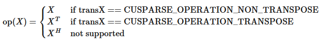
Only`op(A)=A`is supported.
`op(B)`and`op(X)`must be performed in the same way. In other words, if`op(B)=B`,`op(X)=X`.
The block of BSR format is of size`blockDim*blockDim`, stored as column-major or row-major as determined by parameter`dirA`, which is either`CUSPARSE_DIRECTION_ROW`or`CUSPARSE_DIRECTION_COLUMN`. The matrix type must be`CUSPARSE_MATRIX_TYPE_GENERAL`, and the fill mode and diagonal type are ignored. Function`bsrsm02_solve()`can support an arbitrary`blockDim`.
This function may be executed multiple times for a given matrix and a particular operation type.
This function requires the buffer size returned by`bsrsm2_bufferSize()`. The address of`pBuffer`must be multiple of 128 bytes. If it is not,`CUSPARSE_STATUS_INVALID_VALUE`is returned.
Although`bsrsm2_solve()`can be done without level information, the user still needs to be aware of consistency. If`bsrsm2_analysis()`is called with policy`CUSPARSE_SOLVE_POLICY_USE_LEVEL`,`bsrsm2_solve()`can be run with or without levels. On the other hand, if`bsrsm2_analysis()`is called with`CUSPARSE_SOLVE_POLICY_NO_LEVEL`,`bsrsm2_solve()`can only accept`CUSPARSE_SOLVE_POLICY_NO_LEVEL`; otherwise,`CUSPARSE_STATUS_INVALID_VALUE`is returned.
Function`bsrsm02_solve()`has the same behavior as`bsrsv02_solve()`, reporting the first numerical zero, including a structural zero. The user must call`cusparseXbsrsm2_query_zero_pivot()`to know where the numerical zero is.
The motivation of`transpose(X)`is to improve the memory access of matrix`X`. The computational pattern of`transpose(X)`with matrix`X`in column-major order is equivalent to`X`with matrix`X`in row-major order.
In-place is supported and requires that`B`and`X`point to the same memory block, and`ldb=ldx`.
The function supports the following properties if`pBuffer != NULL`:
- The routine requires no extra storage.
- The routine supports asynchronous execution.
- The routine supports CUDA graph capture.
**Input**

<div style="overflow-x: auto; max-width: 100%; border-radius: 6px;">
<table border="1" cellpadding="6" cellspacing="0" style="border-collapse: collapse; width: 100%; font-family: -apple-system, BlinkMacSystemFont, Segoe UI, Helvetica, Arial, sans-serif; font-size: 13px; margin: 16px 0;">
<colgroup>
<col style="width: 20%"/>
<col style="width: 80%"/>
</colgroup>
<tbody>
<tr style="border: 1px solid #d0d7de;">
<td style="padding: 8px 12px; border: 1px solid #d0d7de; vertical-align: top;"><p><code class="docutils literal notranslate"><span class="pre">handle</span></code></p></td>
<td style="padding: 8px 12px; border: 1px solid #d0d7de; vertical-align: top;"><p>handle to the cuSPARSE library context.</p></td>
</tr>
<tr style="border: 1px solid #d0d7de;">
<td style="padding: 8px 12px; border: 1px solid #d0d7de; vertical-align: top;"><p><code class="docutils literal notranslate"><span class="pre">dirA</span></code></p></td>
<td style="padding: 8px 12px; border: 1px solid #d0d7de; vertical-align: top;"><p>storage format of blocks, either <code class="docutils literal notranslate"><span class="pre">CUSPARSE_DIRECTION_ROW</span></code> or <code class="docutils literal notranslate"><span class="pre">CUSPARSE_DIRECTION_COLUMN</span></code>.</p></td>
</tr>
<tr style="border: 1px solid #d0d7de;">
<td style="padding: 8px 12px; border: 1px solid #d0d7de; vertical-align: top;"><p><code class="docutils literal notranslate"><span class="pre">transA</span></code></p></td>
<td style="padding: 8px 12px; border: 1px solid #d0d7de; vertical-align: top;"><p>the operation <code class="docutils literal notranslate"><span class="pre">op(A)</span></code>.</p></td>
</tr>
<tr style="border: 1px solid #d0d7de;">
<td style="padding: 8px 12px; border: 1px solid #d0d7de; vertical-align: top;"><p><code class="docutils literal notranslate"><span class="pre">transX</span></code></p></td>
<td style="padding: 8px 12px; border: 1px solid #d0d7de; vertical-align: top;"><p>the operation <code class="docutils literal notranslate"><span class="pre">op(B)</span></code> and <code class="docutils literal notranslate"><span class="pre">op(X)</span></code>.</p></td>
</tr>
<tr style="border: 1px solid #d0d7de;">
<td style="padding: 8px 12px; border: 1px solid #d0d7de; vertical-align: top;"><p><code class="docutils literal notranslate"><span class="pre">mb</span></code></p></td>
<td style="padding: 8px 12px; border: 1px solid #d0d7de; vertical-align: top;"><p>number of block rows of matrix <code class="docutils literal notranslate"><span class="pre">A</span></code>.</p></td>
</tr>
<tr style="border: 1px solid #d0d7de;">
<td style="padding: 8px 12px; border: 1px solid #d0d7de; vertical-align: top;"><p><code class="docutils literal notranslate"><span class="pre">n</span></code></p></td>
<td style="padding: 8px 12px; border: 1px solid #d0d7de; vertical-align: top;"><p>number of columns of matrix <code class="docutils literal notranslate"><span class="pre">op(B)</span></code> and <code class="docutils literal notranslate"><span class="pre">op(X)</span></code>.</p></td>
</tr>
<tr style="border: 1px solid #d0d7de;">
<td style="padding: 8px 12px; border: 1px solid #d0d7de; vertical-align: top;"><p><code class="docutils literal notranslate"><span class="pre">nnzb</span></code></p></td>
<td style="padding: 8px 12px; border: 1px solid #d0d7de; vertical-align: top;"><p>number of non-zero blocks of matrix <code class="docutils literal notranslate"><span class="pre">A</span></code>.</p></td>
</tr>
<tr style="border: 1px solid #d0d7de;">
<td style="padding: 8px 12px; border: 1px solid #d0d7de; vertical-align: top;"><p><code class="docutils literal notranslate"><span class="pre">alpha</span></code></p></td>
<td style="padding: 8px 12px; border: 1px solid #d0d7de; vertical-align: top;"><p>&lt;type&gt; scalar used for multiplication.</p></td>
</tr>
<tr style="border: 1px solid #d0d7de;">
<td style="padding: 8px 12px; border: 1px solid #d0d7de; vertical-align: top;"><p><code class="docutils literal notranslate"><span class="pre">descrA</span></code></p></td>
<td style="padding: 8px 12px; border: 1px solid #d0d7de; vertical-align: top;"><p>the descriptor of matrix <code class="docutils literal notranslate"><span class="pre">A</span></code>. The supported matrix type is <code class="docutils literal notranslate"><span class="pre">CUSPARSE_MATRIX_TYPE_GENERAL</span></code>, while the supported diagonal types are <code class="docutils literal notranslate"><span class="pre">CUSPARSE_DIAG_TYPE_UNIT</span></code> and <code class="docutils literal notranslate"><span class="pre">CUSPARSE_DIAG_TYPE_NON_UNIT</span></code>.</p></td>
</tr>
<tr style="border: 1px solid #d0d7de;">
<td style="padding: 8px 12px; border: 1px solid #d0d7de; vertical-align: top;"><p><code class="docutils literal notranslate"><span class="pre">bsrValA</span></code></p></td>
<td style="padding: 8px 12px; border: 1px solid #d0d7de; vertical-align: top;"><p>&lt;type&gt; array of <code class="docutils literal notranslate"><span class="pre">nnzb</span></code><span class="math notranslate nohighlight">\(( =\)</span><code class="docutils literal notranslate"><span class="pre">bsrRowPtrA(mb)</span></code><span class="math notranslate nohighlight">\(-\)</span><code class="docutils literal notranslate"><span class="pre">bsrRowPtrA(0)</span></code><span class="math notranslate nohighlight">\()\)</span> non-zero blocks of matrix <code class="docutils literal notranslate"><span class="pre">A</span></code>.</p></td>
</tr>
<tr style="border: 1px solid #d0d7de;">
<td style="padding: 8px 12px; border: 1px solid #d0d7de; vertical-align: top;"><p><code class="docutils literal notranslate"><span class="pre">bsrRowPtrA</span></code></p></td>
<td style="padding: 8px 12px; border: 1px solid #d0d7de; vertical-align: top;"><p>integer array of <code class="docutils literal notranslate"><span class="pre">mb</span></code><span class="math notranslate nohighlight">\(+ 1\)</span> elements that contains the start of every block row and the end of the last block row plus one.</p></td>
</tr>
<tr style="border: 1px solid #d0d7de;">
<td style="padding: 8px 12px; border: 1px solid #d0d7de; vertical-align: top;"><p><code class="docutils literal notranslate"><span class="pre">bsrColIndA</span></code></p></td>
<td style="padding: 8px 12px; border: 1px solid #d0d7de; vertical-align: top;"><p>integer array of <code class="docutils literal notranslate"><span class="pre">nnzb</span></code><span class="math notranslate nohighlight">\(( =\)</span><code class="docutils literal notranslate"><span class="pre">bsrRowPtrA(mb)</span></code><span class="math notranslate nohighlight">\(-\)</span><code class="docutils literal notranslate"><span class="pre">bsrRowPtrA(0)</span></code><span class="math notranslate nohighlight">\()\)</span> column indices of the nonzero blocks of matrix <code class="docutils literal notranslate"><span class="pre">A</span></code>.</p></td>
</tr>
<tr style="border: 1px solid #d0d7de;">
<td style="padding: 8px 12px; border: 1px solid #d0d7de; vertical-align: top;"><p><code class="docutils literal notranslate"><span class="pre">blockDim</span></code></p></td>
<td style="padding: 8px 12px; border: 1px solid #d0d7de; vertical-align: top;"><p>block dimension of sparse matrix <code class="docutils literal notranslate"><span class="pre">A</span></code>; larger than zero.</p></td>
</tr>
<tr style="border: 1px solid #d0d7de;">
<td style="padding: 8px 12px; border: 1px solid #d0d7de; vertical-align: top;"><p><code class="docutils literal notranslate"><span class="pre">info</span></code></p></td>
<td style="padding: 8px 12px; border: 1px solid #d0d7de; vertical-align: top;"><p>structure initialized using <code class="docutils literal notranslate"><span class="pre">cusparseCreateBsrsm2Info()</span></code>.</p></td>
</tr>
<tr style="border: 1px solid #d0d7de;">
<td style="padding: 8px 12px; border: 1px solid #d0d7de; vertical-align: top;"><p><code class="docutils literal notranslate"><span class="pre">B</span></code></p></td>
<td style="padding: 8px 12px; border: 1px solid #d0d7de; vertical-align: top;"><p>&lt;type&gt; right-hand-side array.</p></td>
</tr>
<tr style="border: 1px solid #d0d7de;">
<td style="padding: 8px 12px; border: 1px solid #d0d7de; vertical-align: top;"><p><code class="docutils literal notranslate"><span class="pre">ldb</span></code></p></td>
<td style="padding: 8px 12px; border: 1px solid #d0d7de; vertical-align: top;"><p>leading dimension of <code class="docutils literal notranslate"><span class="pre">B</span></code>. If <code class="docutils literal notranslate"><span class="pre">op(B)=B</span></code>, <code class="docutils literal notranslate"><span class="pre">ldb</span> <span class="pre">&gt;=</span> <span class="pre">(mb*blockDim)</span></code>; otherwise, <code class="docutils literal notranslate"><span class="pre">ldb</span> <span class="pre">&gt;=</span> <span class="pre">n</span></code>.</p></td>
</tr>
<tr style="border: 1px solid #d0d7de;">
<td style="padding: 8px 12px; border: 1px solid #d0d7de; vertical-align: top;"><p><code class="docutils literal notranslate"><span class="pre">ldx</span></code></p></td>
<td style="padding: 8px 12px; border: 1px solid #d0d7de; vertical-align: top;"><p>leading dimension of <code class="docutils literal notranslate"><span class="pre">X</span></code>. If <code class="docutils literal notranslate"><span class="pre">op(X)=X</span></code>, then <code class="docutils literal notranslate"><span class="pre">ldx</span> <span class="pre">&gt;=</span> <span class="pre">(mb*blockDim)</span></code>. otherwise <code class="docutils literal notranslate"><span class="pre">ldx</span> <span class="pre">&gt;=</span> <span class="pre">n</span></code>.</p></td>
</tr>
<tr style="border: 1px solid #d0d7de;">
<td style="padding: 8px 12px; border: 1px solid #d0d7de; vertical-align: top;"><p><code class="docutils literal notranslate"><span class="pre">policy</span></code></p></td>
<td style="padding: 8px 12px; border: 1px solid #d0d7de; vertical-align: top;"><p>the supported policies are <code class="docutils literal notranslate"><span class="pre">CUSPARSE_SOLVE_POLICY_NO_LEVEL</span></code> and <code class="docutils literal notranslate"><span class="pre">CUSPARSE_SOLVE_POLICY_USE_LEVEL</span></code>.</p></td>
</tr>
<tr style="border: 1px solid #d0d7de;">
<td style="padding: 8px 12px; border: 1px solid #d0d7de; vertical-align: top;"><p><code class="docutils literal notranslate"><span class="pre">pBuffer</span></code></p></td>
<td style="padding: 8px 12px; border: 1px solid #d0d7de; vertical-align: top;"><p>buffer allocated by the user; the size is returned by <code class="docutils literal notranslate"><span class="pre">bsrsm2_bufferSize()</span></code>.</p></td>
</tr>
</tbody>
</table>
</div>

**Output**

<div style="overflow-x: auto; max-width: 100%; border-radius: 6px;">
<table border="1" cellpadding="6" cellspacing="0" style="border-collapse: collapse; width: 100%; font-family: -apple-system, BlinkMacSystemFont, Segoe UI, Helvetica, Arial, sans-serif; font-size: 13px; margin: 16px 0;">
<colgroup>
<col style="width: 8%"/>
<col style="width: 92%"/>
</colgroup>
<tbody>
<tr style="border: 1px solid #d0d7de;">
<td style="padding: 8px 12px; border: 1px solid #d0d7de; vertical-align: top;"><p><code class="docutils literal notranslate"><span class="pre">X</span></code></p></td>
<td style="padding: 8px 12px; border: 1px solid #d0d7de; vertical-align: top;"><p>&lt;type&gt; solution array with leading dimensions <code class="docutils literal notranslate"><span class="pre">ldx</span></code>.</p></td>
</tr>
</tbody>
</table>
</div>

SeecusparseStatus_tfor the description of the return status.

### 5.5.5. cusparseXbsrsm2_zeroPivot() [DEPRECATED]
> >*The routine will be removed in the next major release*

```
cusparseStatus_t
cusparseXbsrsm2_zeroPivot(cusparseHandle_t handle,
                          bsrsm2Info_t     info,
                          int*             position)

```

If the returned error code is`CUSPARSE_STATUS_ZERO_PIVOT`,`position=j`means`A(j,j)`is either a structural zero or a numerical zero (singular block). Otherwise`position=-1`.
The`position`can be 0-base or 1-base, the same as the matrix.
Function`cusparseXbsrsm2_zeroPivot()`is a blocking call. It calls`cudaDeviceSynchronize()`to make sure all previous kernels are done.
The`position`can be in the host memory or device memory. The user can set the proper mode with`cusparseSetPointerMode()`.
- The routine requires no extra storage.
- The routine supports asynchronous execution if the Stream Ordered Memory Allocator is available.
- The routine supports CUDA graph capture if the Stream Ordered Memory Allocator is available.
**Input**

<div style="overflow-x: auto; max-width: 100%; border-radius: 6px;">
<table border="1" cellpadding="6" cellspacing="0" style="border-collapse: collapse; width: 100%; font-family: -apple-system, BlinkMacSystemFont, Segoe UI, Helvetica, Arial, sans-serif; font-size: 13px; margin: 16px 0;">
<colgroup>
<col style="width: 20%"/>
<col style="width: 80%"/>
</colgroup>
<tbody>
<tr style="border: 1px solid #d0d7de;">
<td style="padding: 8px 12px; border: 1px solid #d0d7de; vertical-align: top;"><p><code class="docutils literal notranslate"><span class="pre">handle</span></code></p></td>
<td style="padding: 8px 12px; border: 1px solid #d0d7de; vertical-align: top;"><p>handle to the cuSPARSE library context.</p></td>
</tr>
<tr style="border: 1px solid #d0d7de;">
<td style="padding: 8px 12px; border: 1px solid #d0d7de; vertical-align: top;"><p><code class="docutils literal notranslate"><span class="pre">info</span></code></p></td>
<td style="padding: 8px 12px; border: 1px solid #d0d7de; vertical-align: top;"><p><code class="docutils literal notranslate"><span class="pre">info</span></code> contains a structural zero or a numerical zero if the user already called <code class="docutils literal notranslate"><span class="pre">bsrsm2_analysis()</span></code> or <code class="docutils literal notranslate"><span class="pre">bsrsm2_solve()</span></code>.</p></td>
</tr>
</tbody>
</table>
</div>

**Output**

<div style="overflow-x: auto; max-width: 100%; border-radius: 6px;">
<table border="1" cellpadding="6" cellspacing="0" style="border-collapse: collapse; width: 100%; font-family: -apple-system, BlinkMacSystemFont, Segoe UI, Helvetica, Arial, sans-serif; font-size: 13px; margin: 16px 0;">
<colgroup>
<col style="width: 20%"/>
<col style="width: 80%"/>
</colgroup>
<tbody>
<tr style="border: 1px solid #d0d7de;">
<td style="padding: 8px 12px; border: 1px solid #d0d7de; vertical-align: top;"><p><code class="docutils literal notranslate"><span class="pre">position</span></code></p></td>
<td style="padding: 8px 12px; border: 1px solid #d0d7de; vertical-align: top;"><p>if no structural or numerical zero, <code class="docutils literal notranslate"><span class="pre">position</span></code> is -1; otherwise, if <code class="docutils literal notranslate"><span class="pre">A(j,j)</span></code> is missing or <code class="docutils literal notranslate"><span class="pre">U(j,j)</span></code> is zero, <code class="docutils literal notranslate"><span class="pre">position=j</span></code>.</p></td>
</tr>
</tbody>
</table>
</div>

SeecusparseStatus_tfor the description of the return status.

## 5.6. cuSPARSE Extra Function Reference
This chapter describes the extra routines used to manipulate sparse matrices.

### 5.6.1. cusparse<t>csrgeam2()

```
cusparseStatus_t
cusparseScsrgeam2_bufferSizeExt(cusparseHandle_t         handle,
                                int                      m,
                                int                      n,
                                const float*             alpha,
                                const cusparseMatDescr_t descrA,
                                int                      nnzA,
                                const float*             csrSortedValA,
                                const int*               csrSortedRowPtrA,
                                const int*               csrSortedColIndA,
                                const float*             beta,
                                const cusparseMatDescr_t descrB,
                                int                      nnzB,
                                const float*             csrSortedValB,
                                const int*               csrSortedRowPtrB,
                                const int*               csrSortedColIndB,
                                const cusparseMatDescr_t descrC,
                                const float*             csrSortedValC,
                                const int*               csrSortedRowPtrC,
                                const int*               csrSortedColIndC,
                                size_t*                  pBufferSizeInBytes)

cusparseStatus_t
cusparseDcsrgeam2_bufferSizeExt(cusparseHandle_t         handle,
                                int                      m,
                                int                      n,
                                const double*            alpha,
                                const cusparseMatDescr_t descrA,
                                int                      nnzA,
                                const double*            csrSortedValA,
                                const int*               csrSortedRowPtrA,
                                const int*               csrSortedColIndA,
                                const double*            beta,
                                const cusparseMatDescr_t descrB,
                                int                      nnzB,
                                const double*            csrSortedValB,
                                const int*               csrSortedRowPtrB,
                                const int*               csrSortedColIndB,
                                const cusparseMatDescr_t descrC,
                                const double*            csrSortedValC,
                                const int*               csrSortedRowPtrC,
                                const int*               csrSortedColIndC,
                                size_t*                  pBufferSizeInBytes)

cusparseStatus_t
cusparseCcsrgeam2_bufferSizeExt(cusparseHandle_t         handle,
                                int                      m,
                                int                      n,
                                const cuComplex*         alpha,
                                const cusparseMatDescr_t descrA,
                                int                      nnzA,
                                const cuComplex*         csrSortedValA,
                                const int*               csrSortedRowPtrA,
                                const int*               csrSortedColIndA,
                                const cuComplex*         beta,
                                const cusparseMatDescr_t descrB,
                                int                      nnzB,
                                const cuComplex*         csrSortedValB,
                                const int*               csrSortedRowPtrB,
                                const int*               csrSortedColIndB,
                                const cusparseMatDescr_t descrC,
                                const cuComplex*         csrSortedValC,
                                const int*               csrSortedRowPtrC,
                                const int*               csrSortedColIndC,
                                size_t*                  pBufferSizeInBytes)

cusparseStatus_t
cusparseZcsrgeam2_bufferSizeExt(cusparseHandle_t         handle,
                                int                      m,
                                int                      n,
                                const cuDoubleComplex*   alpha,
                                const cusparseMatDescr_t descrA,
                                int                      nnzA,
                                const cuDoubleComplex*   csrSortedValA,
                                const int*               csrSortedRowPtrA,
                                const int*               csrSortedColIndA,
                                const cuDoubleComplex*   beta,
                                const cusparseMatDescr_t descrB,
                                int                      nnzB,
                                const cuDoubleComplex*   csrSortedValB,
                                const int*               csrSortedRowPtrB,
                                const int*               csrSortedColIndB,
                                const cusparseMatDescr_t descrC,
                                const cuDoubleComplex*   csrSortedValC,
                                const int*               csrSortedRowPtrC,
                                const int*               csrSortedColIndC,
                                size_t*                  pBufferSizeInBytes)

cusparseStatus_t
cusparseXcsrgeam2Nnz(cusparseHandle_t         handle,
                     int                      m,
                     int                      n,
                     const cusparseMatDescr_t descrA,
                     int                      nnzA,
                     const int*               csrSortedRowPtrA,
                     const int*               csrSortedColIndA,
                     const cusparseMatDescr_t descrB,
                     int                      nnzB,
                     const int*               csrSortedRowPtrB,
                     const int*               csrSortedColIndB,
                     const cusparseMatDescr_t descrC,
                     int*                     csrSortedRowPtrC,
                     int*                     nnzTotalDevHostPtr,
                     void*                    workspace)

```

```
cusparseStatus_t
cusparseScsrgeam2(cusparseHandle_t         handle,
                  int                      m,
                  int                      n,
                  const float*             alpha,
                  const cusparseMatDescr_t descrA,
                  int                      nnzA,
                  const float*             csrSortedValA,
                  const int*               csrSortedRowPtrA,
                  const int*               csrSortedColIndA,
                  const float*             beta,
                  const cusparseMatDescr_t descrB,
                  int                      nnzB,
                  const float*             csrSortedValB,
                  const int*               csrSortedRowPtrB,
                  const int*               csrSortedColIndB,
                  const cusparseMatDescr_t descrC,
                  float*                   csrSortedValC,
                  int*                     csrSortedRowPtrC,
                  int*                     csrSortedColIndC,
                  void*                    pBuffer)

cusparseStatus_t
cusparseDcsrgeam2(cusparseHandle_t         handle,
                  int                      m,
                  int                      n,
                  const double*            alpha,
                  const cusparseMatDescr_t descrA,
                  int                      nnzA,
                  const double*            csrSortedValA,
                  const int*               csrSortedRowPtrA,
                  const int*               csrSortedColIndA,
                  const double*            beta,
                  const cusparseMatDescr_t descrB,
                  int                      nnzB,
                  const double*            csrSortedValB,
                  const int*               csrSortedRowPtrB,
                  const int*               csrSortedColIndB,
                  const cusparseMatDescr_t descrC,
                  double*                  csrSortedValC,
                  int*                     csrSortedRowPtrC,
                  int*                     csrSortedColIndC,
                  void*                    pBuffer)

cusparseStatus_t
cusparseCcsrgeam2(cusparseHandle_t         handle,
                  int                      m,
                  int                      n,
                  const cuComplex*         alpha,
                  const cusparseMatDescr_t descrA,
                  int                      nnzA,
                  const cuComplex*         csrSortedValA,
                  const int*               csrSortedRowPtrA,
                  const int*               csrSortedColIndA,
                  const cuComplex*         beta,
                  const cusparseMatDescr_t descrB,
                  int                      nnzB,
                  const cuComplex*         csrSortedValB,
                  const int*               csrSortedRowPtrB,
                  const int*               csrSortedColIndB,
                  const cusparseMatDescr_t descrC,
                  cuComplex*               csrSortedValC,
                  int*                     csrSortedRowPtrC,
                  int*                     csrSortedColIndC,
                  void*                    pBuffer)

cusparseStatus_t
cusparseZcsrgeam2(cusparseHandle_t         handle,
                  int                      m,
                  int                      n,
                  const cuDoubleComplex*   alpha,
                  const cusparseMatDescr_t descrA,
                  int                      nnzA,
                  const cuDoubleComplex*   csrSortedValA,
                  const int*               csrSortedRowPtrA,
                  const int*               csrSortedColIndA,
                  const cuDoubleComplex*   beta,
                  const cusparseMatDescr_t descrB,
                  int                      nnzB,
                  const cuDoubleComplex*   csrSortedValB,
                  const int*               csrSortedRowPtrB,
                  const int*               csrSortedColIndB,
                  const cusparseMatDescr_t descrC,
                  cuDoubleComplex*         csrSortedValC,
                  int*                     csrSortedRowPtrC,
                  int*                     csrSortedColIndC,
                  void*                    pBuffer)

```

This function performs following matrix-matrix operation

\[C = \alpha \ast A + \beta \ast B\]
where`A`,`B`, and`C`are$m \times n$sparse matrices (defined in CSR storage format by the three arrays`csrValA|csrValB|csrValC`,`csrRowPtrA|csrRowPtrB|csrRowPtrC`, and`csrColIndA|csrColIndB|csrcolIndC`respectively), and$\alpha\text{~and~}\beta$are scalars. Since`A`and`B`have different sparsity patterns, cuSPARSE adopts a two-step approach to complete sparse matrix`C`. In the first step, the user allocates`csrRowPtrC`of`m+1`elements and uses function`cusparseXcsrgeam2Nnz()`to determine`csrRowPtrC`and the total number of nonzero elements. In the second step, the user gathers`nnzC`(number of nonzero elements of matrix`C`) from either`(nnzC=*nnzTotalDevHostPtr)`or`(nnzC=csrRowPtrC(m)-csrRowPtrC(0))`and allocates`csrValC, csrColIndC`of`nnzC`elements respectively, then finally calls function`cusparse[S|D|C|Z]csrgeam2()`to complete matrix`C`.
The general procedure is as follows:

```
int baseC, nnzC;
/* alpha, nnzTotalDevHostPtr points to host memory */
size_t BufferSizeInBytes;
char *buffer = NULL;
int *nnzTotalDevHostPtr = &nnzC;
cusparseSetPointerMode(handle, CUSPARSE_POINTER_MODE_HOST);
cudaMalloc((void**)&csrRowPtrC, sizeof(int)*(m+1));
/* prepare buffer */
cusparseScsrgeam2_bufferSizeExt(handle, m, n,
    alpha,
    descrA, nnzA,
    csrValA, csrRowPtrA, csrColIndA,
    beta,
    descrB, nnzB,
    csrValB, csrRowPtrB, csrColIndB,
    descrC,
    csrValC, csrRowPtrC, csrColIndC
    &bufferSizeInBytes
    );
cudaMalloc((void**)&buffer, sizeof(char)*bufferSizeInBytes);
cusparseXcsrgeam2Nnz(handle, m, n,
        descrA, nnzA, csrRowPtrA, csrColIndA,
        descrB, nnzB, csrRowPtrB, csrColIndB,
        descrC, csrRowPtrC, nnzTotalDevHostPtr,
        buffer);
if (NULL != nnzTotalDevHostPtr){
    nnzC = *nnzTotalDevHostPtr;
}else{
    cudaMemcpy(&nnzC, csrRowPtrC+m, sizeof(int), cudaMemcpyDeviceToHost);
    cudaMemcpy(&baseC, csrRowPtrC, sizeof(int), cudaMemcpyDeviceToHost);
    nnzC -= baseC;
}
cudaMalloc((void**)&csrColIndC, sizeof(int)*nnzC);
cudaMalloc((void**)&csrValC, sizeof(float)*nnzC);
cusparseScsrgeam2(handle, m, n,
        alpha,
        descrA, nnzA,
        csrValA, csrRowPtrA, csrColIndA,
        beta,
        descrB, nnzB,
        csrValB, csrRowPtrB, csrColIndB,
        descrC,
        csrValC, csrRowPtrC, csrColIndC
        buffer);

```

Several comments on`csrgeam2()`:
- The other three combinations, NT, TN, and TT, are not supported by cuSPARSE. In order to do any one of the three, the user should use the routine`csr2csc()`to convert$A$|$B$to$A^{T}$|$B^{T}$.
- Only`CUSPARSE_MATRIX_TYPE_GENERAL`is supported. If either`A`or`B`is symmetric or Hermitian, then the user must extend the matrix to a full one and reconfigure the`MatrixType`field of the descriptor to`CUSPARSE_MATRIX_TYPE_GENERAL`.
- If the sparsity pattern of matrix`C`is known, the user can skip the call to function`cusparseXcsrgeam2Nnz()`. For example, suppose that the user has an iterative algorithm which would update`A`and`B`iteratively but keep the sparsity patterns. The user can call function`cusparseXcsrgeam2Nnz()`once to set up the sparsity pattern of`C`, then call function`cusparse[S|D|C|Z]geam()`only for each iteration.
- The pointers`alpha`and`beta`must be valid.
- When`alpha`or`beta`is zero, it is not considered a special case by cuSPARSE. The sparsity pattern of`C`is independent of the value of`alpha`and`beta`. If the user wants$C = 0 \times A + 1 \times B^{T}$, then`csr2csc()`is better than`csrgeam2()`.
- `csrgeam2()`is the same as`csrgeam()`except`csrgeam2()`needs explicit buffer where`csrgeam()`allocates the buffer internally.
- This function requires temporary extra storage that is allocated internally.
- The routine supports asynchronous execution if the Stream Ordered Memory Allocator is available.
- The routine supports CUDA graph capture if the Stream Ordered Memory Allocator is available.
**Input**

<div style="overflow-x: auto; max-width: 100%; border-radius: 6px;">
<table border="1" cellpadding="6" cellspacing="0" style="border-collapse: collapse; width: 100%; font-family: -apple-system, BlinkMacSystemFont, Segoe UI, Helvetica, Arial, sans-serif; font-size: 13px; margin: 16px 0;">
<colgroup>
<col style="width: 20%"/>
<col style="width: 80%"/>
</colgroup>
<tbody>
<tr style="border: 1px solid #d0d7de;">
<td style="padding: 8px 12px; border: 1px solid #d0d7de; vertical-align: top;"><p><code class="docutils literal notranslate"><span class="pre">handle</span></code></p></td>
<td style="padding: 8px 12px; border: 1px solid #d0d7de; vertical-align: top;"><p>handle to the cuSPARSE library context.</p></td>
</tr>
<tr style="border: 1px solid #d0d7de;">
<td style="padding: 8px 12px; border: 1px solid #d0d7de; vertical-align: top;"><p><code class="docutils literal notranslate"><span class="pre">m</span></code></p></td>
<td style="padding: 8px 12px; border: 1px solid #d0d7de; vertical-align: top;"><p>number of rows of sparse matrix <code class="docutils literal notranslate"><span class="pre">A,B,C</span></code>.</p></td>
</tr>
<tr style="border: 1px solid #d0d7de;">
<td style="padding: 8px 12px; border: 1px solid #d0d7de; vertical-align: top;"><p><code class="docutils literal notranslate"><span class="pre">n</span></code></p></td>
<td style="padding: 8px 12px; border: 1px solid #d0d7de; vertical-align: top;"><p>number of columns of sparse matrix <code class="docutils literal notranslate"><span class="pre">A,B,C</span></code>.</p></td>
</tr>
<tr style="border: 1px solid #d0d7de;">
<td style="padding: 8px 12px; border: 1px solid #d0d7de; vertical-align: top;"><p><code class="docutils literal notranslate"><span class="pre">alpha</span></code></p></td>
<td style="padding: 8px 12px; border: 1px solid #d0d7de; vertical-align: top;"><p>&lt;type&gt; scalar used for multiplication.</p></td>
</tr>
<tr style="border: 1px solid #d0d7de;">
<td style="padding: 8px 12px; border: 1px solid #d0d7de; vertical-align: top;"><p><code class="docutils literal notranslate"><span class="pre">descrA</span></code></p></td>
<td style="padding: 8px 12px; border: 1px solid #d0d7de; vertical-align: top;"><p>the descriptor of matrix <code class="docutils literal notranslate"><span class="pre">A</span></code>. The supported matrix type is <code class="docutils literal notranslate"><span class="pre">CUSPARSE_MATRIX_TYPE_GENERAL</span></code> only.</p></td>
</tr>
<tr style="border: 1px solid #d0d7de;">
<td style="padding: 8px 12px; border: 1px solid #d0d7de; vertical-align: top;"><p><code class="docutils literal notranslate"><span class="pre">nnzA</span></code></p></td>
<td style="padding: 8px 12px; border: 1px solid #d0d7de; vertical-align: top;"><p>number of nonzero elements of sparse matrix <code class="docutils literal notranslate"><span class="pre">A</span></code>.</p></td>
</tr>
<tr style="border: 1px solid #d0d7de;">
<td style="padding: 8px 12px; border: 1px solid #d0d7de; vertical-align: top;"><p><code class="docutils literal notranslate"><span class="pre">csrValA</span></code></p></td>
<td style="padding: 8px 12px; border: 1px solid #d0d7de; vertical-align: top;"><p>&lt;type&gt; array of <code class="docutils literal notranslate"><span class="pre">nnzA</span></code><span class="math notranslate nohighlight">\(( =\)</span><code class="docutils literal notranslate"><span class="pre">csrRowPtrA(m)</span></code><span class="math notranslate nohighlight">\(-\)</span><code class="docutils literal notranslate"><span class="pre">csrRowPtrA(0)</span></code><span class="math notranslate nohighlight">\()\)</span> nonzero elements of matrix <code class="docutils literal notranslate"><span class="pre">A</span></code>.</p></td>
</tr>
<tr style="border: 1px solid #d0d7de;">
<td style="padding: 8px 12px; border: 1px solid #d0d7de; vertical-align: top;"><p><code class="docutils literal notranslate"><span class="pre">csrRowPtrA</span></code></p></td>
<td style="padding: 8px 12px; border: 1px solid #d0d7de; vertical-align: top;"><p>integer array of <code class="docutils literal notranslate"><span class="pre">m</span></code><span class="math notranslate nohighlight">\(+ 1\)</span> elements that contains the start of every row and the end of the last row plus one.</p></td>
</tr>
<tr style="border: 1px solid #d0d7de;">
<td style="padding: 8px 12px; border: 1px solid #d0d7de; vertical-align: top;"><p><code class="docutils literal notranslate"><span class="pre">csrColIndA</span></code></p></td>
<td style="padding: 8px 12px; border: 1px solid #d0d7de; vertical-align: top;"><p>integer array of <code class="docutils literal notranslate"><span class="pre">nnzA</span></code><span class="math notranslate nohighlight">\(( =\)</span><code class="docutils literal notranslate"><span class="pre">csrRowPtrA(m)</span></code><span class="math notranslate nohighlight">\(-\)</span><code class="docutils literal notranslate"><span class="pre">csrRowPtrA(0)</span></code><span class="math notranslate nohighlight">\()\)</span> column indices of the nonzero elements of matrix <code class="docutils literal notranslate"><span class="pre">A</span></code>.</p></td>
</tr>
<tr style="border: 1px solid #d0d7de;">
<td style="padding: 8px 12px; border: 1px solid #d0d7de; vertical-align: top;"><p><code class="docutils literal notranslate"><span class="pre">beta</span></code></p></td>
<td style="padding: 8px 12px; border: 1px solid #d0d7de; vertical-align: top;"><p>&lt;type&gt; scalar used for multiplication. If <code class="docutils literal notranslate"><span class="pre">beta</span></code> is zero, <code class="docutils literal notranslate"><span class="pre">y</span></code> does not have to be a valid input.</p></td>
</tr>
<tr style="border: 1px solid #d0d7de;">
<td style="padding: 8px 12px; border: 1px solid #d0d7de; vertical-align: top;"><p><code class="docutils literal notranslate"><span class="pre">descrB</span></code></p></td>
<td style="padding: 8px 12px; border: 1px solid #d0d7de; vertical-align: top;"><p>the descriptor of matrix <code class="docutils literal notranslate"><span class="pre">B</span></code>. The supported matrix type is <code class="docutils literal notranslate"><span class="pre">CUSPARSE_MATRIX_TYPE_GENERAL</span></code> only.</p></td>
</tr>
<tr style="border: 1px solid #d0d7de;">
<td style="padding: 8px 12px; border: 1px solid #d0d7de; vertical-align: top;"><p><code class="docutils literal notranslate"><span class="pre">nnzB</span></code></p></td>
<td style="padding: 8px 12px; border: 1px solid #d0d7de; vertical-align: top;"><p>number of nonzero elements of sparse matrix <code class="docutils literal notranslate"><span class="pre">B</span></code>.</p></td>
</tr>
<tr style="border: 1px solid #d0d7de;">
<td style="padding: 8px 12px; border: 1px solid #d0d7de; vertical-align: top;"><p><code class="docutils literal notranslate"><span class="pre">csrValB</span></code></p></td>
<td style="padding: 8px 12px; border: 1px solid #d0d7de; vertical-align: top;"><p>&lt;type&gt; array of <code class="docutils literal notranslate"><span class="pre">nnzB</span></code><span class="math notranslate nohighlight">\(( =\)</span><code class="docutils literal notranslate"><span class="pre">csrRowPtrB(m)</span></code><span class="math notranslate nohighlight">\(-\)</span><code class="docutils literal notranslate"><span class="pre">csrRowPtrB(0)</span></code><span class="math notranslate nohighlight">\()\)</span> nonzero elements of matrix <code class="docutils literal notranslate"><span class="pre">B</span></code>.</p></td>
</tr>
<tr style="border: 1px solid #d0d7de;">
<td style="padding: 8px 12px; border: 1px solid #d0d7de; vertical-align: top;"><p><code class="docutils literal notranslate"><span class="pre">csrRowPtrB</span></code></p></td>
<td style="padding: 8px 12px; border: 1px solid #d0d7de; vertical-align: top;"><p>integer array of <code class="docutils literal notranslate"><span class="pre">m</span></code><span class="math notranslate nohighlight">\(+ 1\)</span> elements that contains the start of every row and the end of the last row plus one.</p></td>
</tr>
<tr style="border: 1px solid #d0d7de;">
<td style="padding: 8px 12px; border: 1px solid #d0d7de; vertical-align: top;"><p><code class="docutils literal notranslate"><span class="pre">csrColIndB</span></code></p></td>
<td style="padding: 8px 12px; border: 1px solid #d0d7de; vertical-align: top;"><p>integer array of <code class="docutils literal notranslate"><span class="pre">nnzB</span></code><span class="math notranslate nohighlight">\(( =\)</span><code class="docutils literal notranslate"><span class="pre">csrRowPtrB(m)</span></code><span class="math notranslate nohighlight">\(-\)</span><code class="docutils literal notranslate"><span class="pre">csrRowPtrB(0)</span></code><span class="math notranslate nohighlight">\()\)</span> column indices of the nonzero elements of matrix <code class="docutils literal notranslate"><span class="pre">B</span></code>.</p></td>
</tr>
<tr style="border: 1px solid #d0d7de;">
<td style="padding: 8px 12px; border: 1px solid #d0d7de; vertical-align: top;"><p><code class="docutils literal notranslate"><span class="pre">descrC</span></code></p></td>
<td style="padding: 8px 12px; border: 1px solid #d0d7de; vertical-align: top;"><p>the descriptor of matrix <code class="docutils literal notranslate"><span class="pre">C</span></code>. The supported matrix type is <code class="docutils literal notranslate"><span class="pre">CUSPARSE_MATRIX_TYPE_GENERAL</span></code> only.</p></td>
</tr>
</tbody>
</table>
</div>

**Output**

<div style="overflow-x: auto; max-width: 100%; border-radius: 6px;">
<table border="1" cellpadding="6" cellspacing="0" style="border-collapse: collapse; width: 100%; font-family: -apple-system, BlinkMacSystemFont, Segoe UI, Helvetica, Arial, sans-serif; font-size: 13px; margin: 16px 0;">
<colgroup>
<col style="width: 20%"/>
<col style="width: 80%"/>
</colgroup>
<tbody>
<tr style="border: 1px solid #d0d7de;">
<td style="padding: 8px 12px; border: 1px solid #d0d7de; vertical-align: top;"><p><code class="docutils literal notranslate"><span class="pre">csrValC</span></code></p></td>
<td style="padding: 8px 12px; border: 1px solid #d0d7de; vertical-align: top;"><p>&lt;type&gt; array of <code class="docutils literal notranslate"><span class="pre">nnzC</span></code><span class="math notranslate nohighlight">\(( =\)</span><code class="docutils literal notranslate"><span class="pre">csrRowPtrC(m)</span></code><span class="math notranslate nohighlight">\(-\)</span><code class="docutils literal notranslate"><span class="pre">csrRowPtrC(0)</span></code><span class="math notranslate nohighlight">\()\)</span> nonzero elements of matrix <code class="docutils literal notranslate"><span class="pre">C</span></code>.</p></td>
</tr>
<tr style="border: 1px solid #d0d7de;">
<td style="padding: 8px 12px; border: 1px solid #d0d7de; vertical-align: top;"><p><code class="docutils literal notranslate"><span class="pre">csrRowPtrC</span></code></p></td>
<td style="padding: 8px 12px; border: 1px solid #d0d7de; vertical-align: top;"><p>integer array of <code class="docutils literal notranslate"><span class="pre">m</span></code><span class="math notranslate nohighlight">\(+ 1\)</span> elements that contains the start of every row and the end of the last row plus one.</p></td>
</tr>
<tr style="border: 1px solid #d0d7de;">
<td style="padding: 8px 12px; border: 1px solid #d0d7de; vertical-align: top;"><p><code class="docutils literal notranslate"><span class="pre">csrColIndC</span></code></p></td>
<td style="padding: 8px 12px; border: 1px solid #d0d7de; vertical-align: top;"><p>integer array of <code class="docutils literal notranslate"><span class="pre">nnzC</span></code><span class="math notranslate nohighlight">\(( =\)</span><code class="docutils literal notranslate"><span class="pre">csrRowPtrC(m)</span></code><span class="math notranslate nohighlight">\(-\)</span><code class="docutils literal notranslate"><span class="pre">csrRowPtrC(0)</span></code><span class="math notranslate nohighlight">\()\)</span> column indices of the nonzero elements of matrix<code class="docutils literal notranslate"><span class="pre">C</span></code>.</p></td>
</tr>
<tr style="border: 1px solid #d0d7de;">
<td style="padding: 8px 12px; border: 1px solid #d0d7de; vertical-align: top;"><p><code class="docutils literal notranslate"><span class="pre">nnzTotalDevHostPtr</span></code></p></td>
<td style="padding: 8px 12px; border: 1px solid #d0d7de; vertical-align: top;"><p>total number of nonzero elements in device or host memory. It is equal to <code class="docutils literal notranslate"><span class="pre">(csrRowPtrC(m)-csrRowPtrC(0))</span></code>.</p></td>
</tr>
</tbody>
</table>
</div>

SeecusparseStatus_tfor the description of the return status

## 5.7. cuSPARSE Preconditioners Reference
This chapter describes the routines that implement different preconditioners.

### 5.7.1. Incomplete Cholesky Factorization: level 0 [DEPRECATED]
Different algorithms for ic0 are discussed in this section.

#### 5.7.1.1. cusparse<t>csric02_bufferSize() [DEPRECATED]
> >*The routine will be removed in the next major release*

```
cusparseStatus_t
cusparseScsric02_bufferSize(cusparseHandle_t         handle,
                            int                      m,
                            int                      nnz,
                            const cusparseMatDescr_t descrA,
                            float*                   csrValA,
                            const int*               csrRowPtrA,
                            const int*               csrColIndA,
                            csric02Info_t            info,
                            int*                     pBufferSizeInBytes)

cusparseStatus_t
cusparseDcsric02_bufferSize(cusparseHandle_t         handle,
                            int                      m,
                            int                      nnz,
                            const cusparseMatDescr_t descrA,
                            double*                  csrValA,
                            const int*               csrRowPtrA,
                            const int*               csrColIndA,
                            csric02Info_t            info,
                            int*                     pBufferSizeInBytes)

cusparseStatus_t
cusparseCcsric02_bufferSize(cusparseHandle_t         handle,
                            int                      m,
                            int                      nnz,
                            const cusparseMatDescr_t descrA,
                            cuComplex*               csrValA,
                            const int*               csrRowPtrA,
                            const int*               csrColIndA,
                            csric02Info_t            info,
                            int*                     pBufferSizeInBytes)

cusparseStatus_t
cusparseZcsric02_bufferSize(cusparseHandle_t         handle,
                            int                      m,
                            int                      nnz,
                            const cusparseMatDescr_t descrA,
                            cuDoubleComplex*         csrValA,
                            const int*               csrRowPtrA,
                            const int*               csrColIndA,
                            csric02Info_t            info,
                            int*                     pBufferSizeInBytes)

```

This function returns size of buffer used in computing the incomplete-Cholesky factorization with$0$fill-in and no pivoting:

\[A \approx LL^{H}\]
`A`is an$m \times m$sparse matrix that is defined in CSR storage format by the three arrays`csrValA`,`csrRowPtrA`, and`csrColIndA`.
The buffer size depends on dimension`m`and`nnz`, the number of nonzeros of the matrix. If the user changes the matrix, it is necessary to call`csric02_bufferSize()`again to have the correct buffer size; otherwise, a segmentation fault may occur.
- The routine requires no extra storage.
- The routine supports asynchronous execution.
- The routine supports CUDA graph capture.
**Input**

<div style="overflow-x: auto; max-width: 100%; border-radius: 6px;">
<table border="1" cellpadding="6" cellspacing="0" style="border-collapse: collapse; width: 100%; font-family: -apple-system, BlinkMacSystemFont, Segoe UI, Helvetica, Arial, sans-serif; font-size: 13px; margin: 16px 0;">
<colgroup>
<col style="width: 8%"/>
<col style="width: 92%"/>
</colgroup>
<tbody>
<tr style="border: 1px solid #d0d7de;">
<td style="padding: 8px 12px; border: 1px solid #d0d7de; vertical-align: top;"><p><code class="docutils literal notranslate"><span class="pre">handle</span></code></p></td>
<td style="padding: 8px 12px; border: 1px solid #d0d7de; vertical-align: top;"><p>handle to the cuSPARSE library context.</p></td>
</tr>
<tr style="border: 1px solid #d0d7de;">
<td style="padding: 8px 12px; border: 1px solid #d0d7de; vertical-align: top;"><p><code class="docutils literal notranslate"><span class="pre">m</span></code></p></td>
<td style="padding: 8px 12px; border: 1px solid #d0d7de; vertical-align: top;"><p>number of rows and columns of matrix <code class="docutils literal notranslate"><span class="pre">A</span></code>.</p></td>
</tr>
<tr style="border: 1px solid #d0d7de;">
<td style="padding: 8px 12px; border: 1px solid #d0d7de; vertical-align: top;"><p><code class="docutils literal notranslate"><span class="pre">nnz</span></code></p></td>
<td style="padding: 8px 12px; border: 1px solid #d0d7de; vertical-align: top;"><p>number of nonzeros of matrix <code class="docutils literal notranslate"><span class="pre">A</span></code>.</p></td>
</tr>
<tr style="border: 1px solid #d0d7de;">
<td style="padding: 8px 12px; border: 1px solid #d0d7de; vertical-align: top;"><p><code class="docutils literal notranslate"><span class="pre">descrA</span></code></p></td>
<td style="padding: 8px 12px; border: 1px solid #d0d7de; vertical-align: top;"><p>the descriptor of matrix <code class="docutils literal notranslate"><span class="pre">A</span></code>. The supported matrix type is <code class="docutils literal notranslate"><span class="pre">CUSPARSE_MATRIX_TYPE_GENERAL</span></code>. Also, the supported index bases are <code class="docutils literal notranslate"><span class="pre">CUSPARSE_INDEX_BASE_ZERO</span></code> and <code class="docutils literal notranslate"><span class="pre">CUSPARSE_INDEX_BASE_ONE</span></code>.</p></td>
</tr>
<tr style="border: 1px solid #d0d7de;">
<td style="padding: 8px 12px; border: 1px solid #d0d7de; vertical-align: top;"><p><code class="docutils literal notranslate"><span class="pre">csrValA</span></code></p></td>
<td style="padding: 8px 12px; border: 1px solid #d0d7de; vertical-align: top;"><p>&lt;type&gt; array of <code class="docutils literal notranslate"><span class="pre">nnz</span></code><span class="math notranslate nohighlight">\(( =\)</span><code class="docutils literal notranslate"><span class="pre">csrRowPtrA(m)</span></code><span class="math notranslate nohighlight">\(-\)</span><code class="docutils literal notranslate"><span class="pre">csrRowPtrA(0)</span></code><span class="math notranslate nohighlight">\()\)</span> nonzero elements of matrix <code class="docutils literal notranslate"><span class="pre">A</span></code>.</p></td>
</tr>
<tr style="border: 1px solid #d0d7de;">
<td style="padding: 8px 12px; border: 1px solid #d0d7de; vertical-align: top;"><p><code class="docutils literal notranslate"><span class="pre">csrRowPtrA</span></code></p></td>
<td style="padding: 8px 12px; border: 1px solid #d0d7de; vertical-align: top;"><p>integer array of <code class="docutils literal notranslate"><span class="pre">m</span></code><span class="math notranslate nohighlight">\(+ 1\)</span> elements that contains the start of every row and the end of the last row plus one.</p></td>
</tr>
<tr style="border: 1px solid #d0d7de;">
<td style="padding: 8px 12px; border: 1px solid #d0d7de; vertical-align: top;"><p><code class="docutils literal notranslate"><span class="pre">csrColIndA</span></code></p></td>
<td style="padding: 8px 12px; border: 1px solid #d0d7de; vertical-align: top;"><p>integer array of <code class="docutils literal notranslate"><span class="pre">nnz</span></code><span class="math notranslate nohighlight">\(( =\)</span><code class="docutils literal notranslate"><span class="pre">csrRowPtrA(m)</span></code><span class="math notranslate nohighlight">\(-\)</span><code class="docutils literal notranslate"><span class="pre">csrRowPtrA(0)</span></code><span class="math notranslate nohighlight">\()\)</span> column indices of the nonzero elements of matrix <code class="docutils literal notranslate"><span class="pre">A</span></code>.</p></td>
</tr>
</tbody>
</table>
</div>

**Output**

<div style="overflow-x: auto; max-width: 100%; border-radius: 6px;">
<table border="1" cellpadding="6" cellspacing="0" style="border-collapse: collapse; width: 100%; font-family: -apple-system, BlinkMacSystemFont, Segoe UI, Helvetica, Arial, sans-serif; font-size: 13px; margin: 16px 0;">
<colgroup>
<col style="width: 23%"/>
<col style="width: 77%"/>
</colgroup>
<tbody>
<tr style="border: 1px solid #d0d7de;">
<td style="padding: 8px 12px; border: 1px solid #d0d7de; vertical-align: top;"><p><code class="docutils literal notranslate"><span class="pre">info</span></code></p></td>
<td style="padding: 8px 12px; border: 1px solid #d0d7de; vertical-align: top;"><p>record internal states based on different algorithms</p></td>
</tr>
<tr style="border: 1px solid #d0d7de;">
<td style="padding: 8px 12px; border: 1px solid #d0d7de; vertical-align: top;"><p><code class="docutils literal notranslate"><span class="pre">pBufferSizeInBytes</span></code></p></td>
<td style="padding: 8px 12px; border: 1px solid #d0d7de; vertical-align: top;"><p>number of bytes of the buffer used in <code class="docutils literal notranslate"><span class="pre">csric02_analysis()</span></code> and <code class="docutils literal notranslate"><span class="pre">csric02()</span></code></p></td>
</tr>
</tbody>
</table>
</div>

SeecusparseStatus_tfor the description of the return status.

#### 5.7.1.2. cusparse<t>csric02_analysis() [DEPRECATED]
> >*The routine will be removed in the next major release*

```
cusparseStatus_t
cusparseScsric02_analysis(cusparseHandle_t         handle,
                          int                      m,
                          int                      nnz,
                          const cusparseMatDescr_t descrA,
                          const float*             csrValA,
                          const int*               csrRowPtrA,
                          const int*               csrColIndA,
                          csric02Info_t            info,
                          cusparseSolvePolicy_t    policy,
                          void*                    pBuffer)

cusparseStatus_t
cusparseDcsric02_analysis(cusparseHandle_t         handle,
                          int                      m,
                          int                      nnz,
                          const cusparseMatDescr_t descrA,
                          const double*            csrValA,
                          const int*               csrRowPtrA,
                          const int*               csrColIndA,
                          csric02Info_t            info,
                          cusparseSolvePolicy_t    policy,
                          void*                    pBuffer)

cusparseStatus_t
cusparseCcsric02_analysis(cusparseHandle_t         handle,
                          int                      m,
                          int                      nnz,
                          const cusparseMatDescr_t descrA,
                          const cuComplex*         csrValA,
                          const int*               csrRowPtrA,
                          const int*               csrColIndA,
                          csric02Info_t            info,
                          cusparseSolvePolicy_t    policy,
                          void*                    pBuffer)

cusparseStatus_t
cusparseZcsric02_analysis(cusparseHandle_t         handle,
                          int                      m,
                          int                      nnz,
                          const cusparseMatDescr_t descrA,
                          const cuDoubleComplex*   csrValA,
                          const int*               csrRowPtrA,
                          const int*               csrColIndA,
                          csric02Info_t            info,
                          cusparseSolvePolicy_t    policy,
                          void*                    pBuffer)

```

This function performs the analysis phase of the incomplete-Cholesky factorization with$0$fill-in and no pivoting:

\[A \approx LL^{H}\]
`A`is an$m \times m$sparse matrix that is defined in CSR storage format by the three arrays`csrValA`,`csrRowPtrA`, and`csrColIndA`.
This function requires a buffer size returned by`csric02_bufferSize()`. The address of`pBuffer`must be multiple of 128 bytes. If not,`CUSPARSE_STATUS_INVALID_VALUE`is returned.
Function`csric02_analysis()`reports a structural zero and computes level information stored in the opaque structure`info`. The level information can extract more parallelism during incomplete Cholesky factorization. However`csric02()`can be done without level information. To disable level information, the user must specify the policy of`csric02_analysis()`and`csric02()`as`CUSPARSE_SOLVE_POLICY_NO_LEVEL`.
Function`csric02_analysis()`always reports the first structural zero, even if the policy is`CUSPARSE_SOLVE_POLICY_NO_LEVEL`. The user needs to call`cusparseXcsric02_zeroPivot()`to know where the structural zero is.
It is the user’s choice whether to call`csric02()`if`csric02_analysis()`reports a structural zero. In this case, the user can still call`csric02()`, which will return a numerical zero at the same position as the structural zero. However the result is meaningless.
- This function requires temporary extra storage that is allocated internally
- The routine supports asynchronous execution if the Stream Ordered Memory Allocator is available
- The routine supports CUDA graph capture if the Stream Ordered Memory Allocator is available
**Input**

<div style="overflow-x: auto; max-width: 100%; border-radius: 6px;">
<table border="1" cellpadding="6" cellspacing="0" style="border-collapse: collapse; width: 100%; font-family: -apple-system, BlinkMacSystemFont, Segoe UI, Helvetica, Arial, sans-serif; font-size: 13px; margin: 16px 0;">
<colgroup>
<col style="width: 8%"/>
<col style="width: 92%"/>
</colgroup>
<tbody>
<tr style="border: 1px solid #d0d7de;">
<td style="padding: 8px 12px; border: 1px solid #d0d7de; vertical-align: top;"><p><code class="docutils literal notranslate"><span class="pre">handle</span></code></p></td>
<td style="padding: 8px 12px; border: 1px solid #d0d7de; vertical-align: top;"><p>handle to the cuSPARSE library context.</p></td>
</tr>
<tr style="border: 1px solid #d0d7de;">
<td style="padding: 8px 12px; border: 1px solid #d0d7de; vertical-align: top;"><p><code class="docutils literal notranslate"><span class="pre">m</span></code></p></td>
<td style="padding: 8px 12px; border: 1px solid #d0d7de; vertical-align: top;"><p>number of rows and columns of matrix <code class="docutils literal notranslate"><span class="pre">A</span></code>.</p></td>
</tr>
<tr style="border: 1px solid #d0d7de;">
<td style="padding: 8px 12px; border: 1px solid #d0d7de; vertical-align: top;"><p><code class="docutils literal notranslate"><span class="pre">nnz</span></code></p></td>
<td style="padding: 8px 12px; border: 1px solid #d0d7de; vertical-align: top;"><p>number of nonzeros of matrix <code class="docutils literal notranslate"><span class="pre">A</span></code>.</p></td>
</tr>
<tr style="border: 1px solid #d0d7de;">
<td style="padding: 8px 12px; border: 1px solid #d0d7de; vertical-align: top;"><p><code class="docutils literal notranslate"><span class="pre">descrA</span></code></p></td>
<td style="padding: 8px 12px; border: 1px solid #d0d7de; vertical-align: top;"><p>the descriptor of matrix <code class="docutils literal notranslate"><span class="pre">A</span></code>. The supported matrix type is <code class="docutils literal notranslate"><span class="pre">CUSPARSE_MATRIX_TYPE_GENERAL</span></code>. Also, the supported index bases are <code class="docutils literal notranslate"><span class="pre">CUSPARSE_INDEX_BASE_ZERO</span></code> and <code class="docutils literal notranslate"><span class="pre">CUSPARSE_INDEX_BASE_ONE</span></code>.</p></td>
</tr>
<tr style="border: 1px solid #d0d7de;">
<td style="padding: 8px 12px; border: 1px solid #d0d7de; vertical-align: top;"><p><code class="docutils literal notranslate"><span class="pre">csrValA</span></code></p></td>
<td style="padding: 8px 12px; border: 1px solid #d0d7de; vertical-align: top;"><p>&lt;type&gt; array of <code class="docutils literal notranslate"><span class="pre">nnz</span></code><span class="math notranslate nohighlight">\(( =\)</span><code class="docutils literal notranslate"><span class="pre">csrRowPtrA(m)</span></code><span class="math notranslate nohighlight">\(-\)</span><code class="docutils literal notranslate"><span class="pre">csrRowPtrA(0)</span></code><span class="math notranslate nohighlight">\()\)</span> nonzero elements of matrix <code class="docutils literal notranslate"><span class="pre">A</span></code>.</p></td>
</tr>
<tr style="border: 1px solid #d0d7de;">
<td style="padding: 8px 12px; border: 1px solid #d0d7de; vertical-align: top;"><p><code class="docutils literal notranslate"><span class="pre">csrRowPtrA</span></code></p></td>
<td style="padding: 8px 12px; border: 1px solid #d0d7de; vertical-align: top;"><p>integer array of <code class="docutils literal notranslate"><span class="pre">m</span></code><span class="math notranslate nohighlight">\(+ 1\)</span> elements that contains the start of every row and the end of the last row plus one.</p></td>
</tr>
<tr style="border: 1px solid #d0d7de;">
<td style="padding: 8px 12px; border: 1px solid #d0d7de; vertical-align: top;"><p><code class="docutils literal notranslate"><span class="pre">csrColIndA</span></code></p></td>
<td style="padding: 8px 12px; border: 1px solid #d0d7de; vertical-align: top;"><p>integer array of <code class="docutils literal notranslate"><span class="pre">nnz</span></code><span class="math notranslate nohighlight">\(( =\)</span><code class="docutils literal notranslate"><span class="pre">csrRowPtrA(m)</span></code><span class="math notranslate nohighlight">\(-\)</span><code class="docutils literal notranslate"><span class="pre">csrRowPtrA(0)</span></code><span class="math notranslate nohighlight">\()\)</span> column indices of the nonzero elements of matrix <code class="docutils literal notranslate"><span class="pre">A</span></code>.</p></td>
</tr>
<tr style="border: 1px solid #d0d7de;">
<td style="padding: 8px 12px; border: 1px solid #d0d7de; vertical-align: top;"><p><code class="docutils literal notranslate"><span class="pre">info</span></code></p></td>
<td style="padding: 8px 12px; border: 1px solid #d0d7de; vertical-align: top;"><p>structure initialized using <code class="docutils literal notranslate"><span class="pre">cusparseCreateCsric02Info()</span></code>.</p></td>
</tr>
<tr style="border: 1px solid #d0d7de;">
<td style="padding: 8px 12px; border: 1px solid #d0d7de; vertical-align: top;"><p><code class="docutils literal notranslate"><span class="pre">policy</span></code></p></td>
<td style="padding: 8px 12px; border: 1px solid #d0d7de; vertical-align: top;"><p>the supported policies are <code class="docutils literal notranslate"><span class="pre">CUSPARSE_SOLVE_POLICY_NO_LEVEL</span></code> and <code class="docutils literal notranslate"><span class="pre">CUSPARSE_SOLVE_POLICY_USE_LEVEL</span></code>.</p></td>
</tr>
<tr style="border: 1px solid #d0d7de;">
<td style="padding: 8px 12px; border: 1px solid #d0d7de; vertical-align: top;"><p><code class="docutils literal notranslate"><span class="pre">pBuffer</span></code></p></td>
<td style="padding: 8px 12px; border: 1px solid #d0d7de; vertical-align: top;"><p>buffer allocated by the user; the size is returned by <code class="docutils literal notranslate"><span class="pre">csric02_bufferSize()</span></code>.</p></td>
</tr>
</tbody>
</table>
</div>

**Output**

<div style="overflow-x: auto; max-width: 100%; border-radius: 6px;">
<table border="1" cellpadding="6" cellspacing="0" style="border-collapse: collapse; width: 100%; font-family: -apple-system, BlinkMacSystemFont, Segoe UI, Helvetica, Arial, sans-serif; font-size: 13px; margin: 16px 0;">
<colgroup>
<col style="width: 11%"/>
<col style="width: 89%"/>
</colgroup>
<tbody>
<tr style="border: 1px solid #d0d7de;">
<td style="padding: 8px 12px; border: 1px solid #d0d7de; vertical-align: top;"><p><code class="docutils literal notranslate"><span class="pre">info</span></code></p></td>
<td style="padding: 8px 12px; border: 1px solid #d0d7de; vertical-align: top;"><p>number of bytes of the buffer used in <code class="docutils literal notranslate"><span class="pre">csric02_analysis()</span></code> and <code class="docutils literal notranslate"><span class="pre">csric02()</span></code></p></td>
</tr>
</tbody>
</table>
</div>

SeecusparseStatus_tfor the description of the return status.

#### 5.7.1.3. cusparse<t>csric02() [DEPRECATED]
> >*The routine will be removed in the next major release*

```
cusparseStatus_t
cusparseScsric02(cusparseHandle_t         handle,
                 int                      m,
                 int                      nnz,
                 const cusparseMatDescr_t descrA,
                 float*                   csrValA_valM,
                 const int*               csrRowPtrA,
                 const int*               csrColIndA,
                 csric02Info_t            info,
                 cusparseSolvePolicy_t    policy,
                 void*                    pBuffer)

cusparseStatus_t
cusparseDcsric02(cusparseHandle_t         handle,
                 int                      m,
                 int                      nnz,
                 const cusparseMatDescr_t descrA,
                 double*                  csrValA_valM,
                 const int*               csrRowPtrA,
                 const int*               csrColIndA,
                 csric02Info_t            info,
                 cusparseSolvePolicy_t    policy,
                 void*                    pBuffer)

cusparseStatus_t
cusparseCcsric02(cusparseHandle_t         handle,
                 int                      m,
                 int                      nnz,
                 const cusparseMatDescr_t descrA,
                 cuComplex*               csrValA_valM,
                 const int*               csrRowPtrA,
                 const int*               csrColIndA,
                 csric02Info_t            info,
                 cusparseSolvePolicy_t    policy,
                 void*                    pBuffer)

cusparseStatus_t
cusparseZcsric02(cusparseHandle_t         handle,
                 int                      m,
                 int                      nnz,
                 const cusparseMatDescr_t descrA,
                 cuDoubleComplex*         csrValA_valM,
                 const int*               csrRowPtrA,
                 const int*               csrColIndA,
                 csric02Info_t            info,
                 cusparseSolvePolicy_t    policy,
                 void*                    pBuffer)

```

This function performs the solve phase of the computing the incomplete-Cholesky factorization with$0$fill-in and no pivoting:

\[A \approx LL^{H}\]
This function requires a buffer size returned by`csric02_bufferSize()`. The address of`pBuffer`must be a multiple of 128 bytes. If not,`CUSPARSE_STATUS_INVALID_VALUE`is returned.
Although`csric02()`can be done without level information, the user still needs to be aware of consistency. If`csric02_analysis()`is called with policy`CUSPARSE_SOLVE_POLICY_USE_LEVEL`,`csric02()`can be run with or without levels. On the other hand, if`csric02_analysis()`is called with`CUSPARSE_SOLVE_POLICY_NO_LEVEL`,`csric02()`can only accept`CUSPARSE_SOLVE_POLICY_NO_LEVEL`; otherwise,`CUSPARSE_STATUS_INVALID_VALUE`is returned.
Function`csric02()`reports the first numerical zero, including a structural zero. The user must call`cusparseXcsric02_zeroPivot()`to know where the numerical zero is.
Function`csric02()`only takes the lower triangular part of matrix`A`to perform factorization. The matrix type must be`CUSPARSE_MATRIX_TYPE_GENERAL`, the fill mode and diagonal type are ignored, and the strictly upper triangular part is ignored and never touched. It does not matter if`A`is Hermitian or not. In other words, from the point of view of`csric02()``A`is Hermitian and only the lower triangular part is provided.

Note
In practice, a positive definite matrix may not have incomplete cholesky factorization. To the best of our knowledge, only matrix`M`can guarantee the existence of incomplete cholesky factorization. If`csric02()`failed cholesky factorization and reported a numerical zero, it is possible that incomplete cholesky factorization does not exist.

For example, suppose`A`is a realm times mmatrix, the following code solves the precondition system`M*y = x`where`M`is the product of Cholesky factorization`L`and its transpose.

\[M = LL^{H}\]

```
// Suppose that A is m x m sparse matrix represented by CSR format,
// Assumption:
// - handle is already created by cusparseCreate(),
// - (d_csrRowPtr, d_csrColInd, d_csrVal) is CSR of A on device memory,
// - d_x is right hand side vector on device memory,
// - d_y is solution vector on device memory.
// - d_z is intermediate result on device memory.

cusparseMatDescr_t descr_M = 0;
cusparseMatDescr_t descr_L = 0;
csric02Info_t info_M  = 0;
csrsv2Info_t  info_L  = 0;
csrsv2Info_t  info_Lt = 0;
int pBufferSize_M;
int pBufferSize_L;
int pBufferSize_Lt;
int pBufferSize;
void *pBuffer = 0;
int structural_zero;
int numerical_zero;
const double alpha = 1.;
const cusparseSolvePolicy_t policy_M  = CUSPARSE_SOLVE_POLICY_NO_LEVEL;
const cusparseSolvePolicy_t policy_L  = CUSPARSE_SOLVE_POLICY_NO_LEVEL;
const cusparseSolvePolicy_t policy_Lt = CUSPARSE_SOLVE_POLICY_USE_LEVEL;
const cusparseOperation_t trans_L  = CUSPARSE_OPERATION_NON_TRANSPOSE;
const cusparseOperation_t trans_Lt = CUSPARSE_OPERATION_TRANSPOSE;

// step 1: create a descriptor which contains
// - matrix M is base-1
// - matrix L is base-1
// - matrix L is lower triangular
// - matrix L has non-unit diagonal
cusparseCreateMatDescr(&descr_M);
cusparseSetMatIndexBase(descr_M, CUSPARSE_INDEX_BASE_ONE);
cusparseSetMatType(descr_M, CUSPARSE_MATRIX_TYPE_GENERAL);

cusparseCreateMatDescr(&descr_L);
cusparseSetMatIndexBase(descr_L, CUSPARSE_INDEX_BASE_ONE);
cusparseSetMatType(descr_L, CUSPARSE_MATRIX_TYPE_GENERAL);
cusparseSetMatFillMode(descr_L, CUSPARSE_FILL_MODE_LOWER);
cusparseSetMatDiagType(descr_L, CUSPARSE_DIAG_TYPE_NON_UNIT);

// step 2: create a empty info structure
// we need one info for csric02 and two info's for csrsv2
cusparseCreateCsric02Info(&info_M);
cusparseCreateCsrsv2Info(&info_L);
cusparseCreateCsrsv2Info(&info_Lt);

// step 3: query how much memory used in csric02 and csrsv2, and allocate the buffer
cusparseDcsric02_bufferSize(handle, m, nnz,
    descr_M, d_csrVal, d_csrRowPtr, d_csrColInd, info_M, &bufferSize_M);
cusparseDcsrsv2_bufferSize(handle, trans_L, m, nnz,
    descr_L, d_csrVal, d_csrRowPtr, d_csrColInd, info_L, &pBufferSize_L);
cusparseDcsrsv2_bufferSize(handle, trans_Lt, m, nnz,
    descr_L, d_csrVal, d_csrRowPtr, d_csrColInd, info_Lt,&pBufferSize_Lt);

pBufferSize = max(bufferSize_M, max(pBufferSize_L, pBufferSize_Lt));

// pBuffer returned by cudaMalloc is automatically aligned to 128 bytes.
cudaMalloc((void**)&pBuffer, pBufferSize);

// step 4: perform analysis of incomplete Cholesky on M
//         perform analysis of triangular solve on L
//         perform analysis of triangular solve on L'
// The lower triangular part of M has the same sparsity pattern as L, so
// we can do analysis of csric02 and csrsv2 simultaneously.

cusparseDcsric02_analysis(handle, m, nnz, descr_M,
    d_csrVal, d_csrRowPtr, d_csrColInd, info_M,
    policy_M, pBuffer);
status = cusparseXcsric02_zeroPivot(handle, info_M, &structural_zero);
if (CUSPARSE_STATUS_ZERO_PIVOT == status){
   printf("A(%d,%d) is missing\n", structural_zero, structural_zero);
}

cusparseDcsrsv2_analysis(handle, trans_L, m, nnz, descr_L,
    d_csrVal, d_csrRowPtr, d_csrColInd,
    info_L, policy_L, pBuffer);

cusparseDcsrsv2_analysis(handle, trans_Lt, m, nnz, descr_L,
    d_csrVal, d_csrRowPtr, d_csrColInd,
    info_Lt, policy_Lt, pBuffer);

// step 5: M = L * L'
cusparseDcsric02(handle, m, nnz, descr_M,
    d_csrVal, d_csrRowPtr, d_csrColInd, info_M, policy_M, pBuffer);
status = cusparseXcsric02_zeroPivot(handle, info_M, &numerical_zero);
if (CUSPARSE_STATUS_ZERO_PIVOT == status){
   printf("L(%d,%d) is zero\n", numerical_zero, numerical_zero);
}

// step 6: solve L*z = x
cusparseDcsrsv2_solve(handle, trans_L, m, nnz, &alpha, descr_L, // replace with cusparseSpSV
   d_csrVal, d_csrRowPtr, d_csrColInd, info_L,
   d_x, d_z, policy_L, pBuffer);

// step 7: solve L'*y = z
cusparseDcsrsv2_solve(handle, trans_Lt, m, nnz, &alpha, descr_L, // replace with cusparseSpSV
   d_csrVal, d_csrRowPtr, d_csrColInd, info_Lt,
   d_z, d_y, policy_Lt, pBuffer);

// step 6: free resources
cudaFree(pBuffer);
cusparseDestroyMatDescr(descr_M);
cusparseDestroyMatDescr(descr_L);
cusparseDestroyCsric02Info(info_M);
cusparseDestroyCsrsv2Info(info_L);
cusparseDestroyCsrsv2Info(info_Lt);
cusparseDestroy(handle);

```

The function supports the following properties if`pBuffer != NULL`:
- This function requires temporary extra storage that is allocated internally.
- The routine supports asynchronous execution if the Stream Ordered Memory Allocator is available.
- The routine supports CUDA graph capture if the Stream Ordered Memory Allocator is available.
**Input**

<div style="overflow-x: auto; max-width: 100%; border-radius: 6px;">
<table border="1" cellpadding="6" cellspacing="0" style="border-collapse: collapse; width: 100%; font-family: -apple-system, BlinkMacSystemFont, Segoe UI, Helvetica, Arial, sans-serif; font-size: 13px; margin: 16px 0;">
<colgroup>
<col style="width: 8%"/>
<col style="width: 92%"/>
</colgroup>
<tbody>
<tr style="border: 1px solid #d0d7de;">
<td style="padding: 8px 12px; border: 1px solid #d0d7de; vertical-align: top;"><p><code class="docutils literal notranslate"><span class="pre">handle</span></code></p></td>
<td style="padding: 8px 12px; border: 1px solid #d0d7de; vertical-align: top;"><p>handle to the cuSPARSE library context.</p></td>
</tr>
<tr style="border: 1px solid #d0d7de;">
<td style="padding: 8px 12px; border: 1px solid #d0d7de; vertical-align: top;"><p><code class="docutils literal notranslate"><span class="pre">m</span></code></p></td>
<td style="padding: 8px 12px; border: 1px solid #d0d7de; vertical-align: top;"><p>number of rows and columns of matrix <code class="docutils literal notranslate"><span class="pre">A</span></code>.</p></td>
</tr>
<tr style="border: 1px solid #d0d7de;">
<td style="padding: 8px 12px; border: 1px solid #d0d7de; vertical-align: top;"><p><code class="docutils literal notranslate"><span class="pre">nnz</span></code></p></td>
<td style="padding: 8px 12px; border: 1px solid #d0d7de; vertical-align: top;"><p>number of nonzeros of matrix <code class="docutils literal notranslate"><span class="pre">A</span></code>.</p></td>
</tr>
<tr style="border: 1px solid #d0d7de;">
<td style="padding: 8px 12px; border: 1px solid #d0d7de; vertical-align: top;"><p><code class="docutils literal notranslate"><span class="pre">descrA</span></code></p></td>
<td style="padding: 8px 12px; border: 1px solid #d0d7de; vertical-align: top;"><p>the descriptor of matrix <code class="docutils literal notranslate"><span class="pre">A</span></code>. The supported matrix type is <code class="docutils literal notranslate"><span class="pre">CUSPARSE_MATRIX_TYPE_GENERAL</span></code>. Also, the supported index bases are <code class="docutils literal notranslate"><span class="pre">CUSPARSE_INDEX_BASE_ZERO</span></code> and <code class="docutils literal notranslate"><span class="pre">CUSPARSE_INDEX_BASE_ONE</span></code>.</p></td>
</tr>
<tr style="border: 1px solid #d0d7de;">
<td style="padding: 8px 12px; border: 1px solid #d0d7de; vertical-align: top;"><p><code class="docutils literal notranslate"><span class="pre">csrValA_valM</span></code></p></td>
<td style="padding: 8px 12px; border: 1px solid #d0d7de; vertical-align: top;"><p>&lt;type&gt; array of <code class="docutils literal notranslate"><span class="pre">nnz</span></code><span class="math notranslate nohighlight">\(( =\)</span><code class="docutils literal notranslate"><span class="pre">csrRowPtrA(m)</span></code><span class="math notranslate nohighlight">\(-\)</span><code class="docutils literal notranslate"><span class="pre">csrRowPtrA(0)</span></code><span class="math notranslate nohighlight">\()\)</span> nonzero elements of matrix <code class="docutils literal notranslate"><span class="pre">A</span></code>.</p></td>
</tr>
<tr style="border: 1px solid #d0d7de;">
<td style="padding: 8px 12px; border: 1px solid #d0d7de; vertical-align: top;"><p><code class="docutils literal notranslate"><span class="pre">csrRowPtrA</span></code></p></td>
<td style="padding: 8px 12px; border: 1px solid #d0d7de; vertical-align: top;"><p>integer array of <code class="docutils literal notranslate"><span class="pre">m</span></code><span class="math notranslate nohighlight">\(+ 1\)</span> elements that contains the start of every row and the end of the last row plus one.</p></td>
</tr>
<tr style="border: 1px solid #d0d7de;">
<td style="padding: 8px 12px; border: 1px solid #d0d7de; vertical-align: top;"><p><code class="docutils literal notranslate"><span class="pre">csrColIndA</span></code></p></td>
<td style="padding: 8px 12px; border: 1px solid #d0d7de; vertical-align: top;"><p>integer array of <code class="docutils literal notranslate"><span class="pre">nnz</span></code><span class="math notranslate nohighlight">\(( =\)</span><code class="docutils literal notranslate"><span class="pre">csrRowPtrA(m)</span></code><span class="math notranslate nohighlight">\(-\)</span><code class="docutils literal notranslate"><span class="pre">csrRowPtrA(0)</span></code><span class="math notranslate nohighlight">\()\)</span> column indices of the nonzero elements of matrix <code class="docutils literal notranslate"><span class="pre">A</span></code>.</p></td>
</tr>
<tr style="border: 1px solid #d0d7de;">
<td style="padding: 8px 12px; border: 1px solid #d0d7de; vertical-align: top;"><p><code class="docutils literal notranslate"><span class="pre">info</span></code></p></td>
<td style="padding: 8px 12px; border: 1px solid #d0d7de; vertical-align: top;"><p>structure with information collected during the analysis phase (that should have been passed to the solve phase unchanged).</p></td>
</tr>
<tr style="border: 1px solid #d0d7de;">
<td style="padding: 8px 12px; border: 1px solid #d0d7de; vertical-align: top;"><p><code class="docutils literal notranslate"><span class="pre">policy</span></code></p></td>
<td style="padding: 8px 12px; border: 1px solid #d0d7de; vertical-align: top;"><p>the supported policies are <code class="docutils literal notranslate"><span class="pre">CUSPARSE_SOLVE_POLICY_NO_LEVEL</span></code> and <code class="docutils literal notranslate"><span class="pre">CUSPARSE_SOLVE_POLICY_USE_LEVEL</span></code>.</p></td>
</tr>
<tr style="border: 1px solid #d0d7de;">
<td style="padding: 8px 12px; border: 1px solid #d0d7de; vertical-align: top;"><p><code class="docutils literal notranslate"><span class="pre">pBuffer</span></code></p></td>
<td style="padding: 8px 12px; border: 1px solid #d0d7de; vertical-align: top;"><p>buffer allocated by the user; the size is returned by <code class="docutils literal notranslate"><span class="pre">csric02_bufferSize()</span></code>.</p></td>
</tr>
</tbody>
</table>
</div>

**Output**

<div style="overflow-x: auto; max-width: 100%; border-radius: 6px;">
<table border="1" cellpadding="6" cellspacing="0" style="border-collapse: collapse; width: 100%; font-family: -apple-system, BlinkMacSystemFont, Segoe UI, Helvetica, Arial, sans-serif; font-size: 13px; margin: 16px 0;">
<colgroup>
<col style="width: 19%"/>
<col style="width: 81%"/>
</colgroup>
<tbody>
<tr style="border: 1px solid #d0d7de;">
<td style="padding: 8px 12px; border: 1px solid #d0d7de; vertical-align: top;"><p><code class="docutils literal notranslate"><span class="pre">csrValA_valM</span></code></p></td>
<td style="padding: 8px 12px; border: 1px solid #d0d7de; vertical-align: top;"><p>&lt;type&gt; matrix containing the incomplete-Cholesky lower triangular factor.</p></td>
</tr>
</tbody>
</table>
</div>

SeecusparseStatus_tfor the description of the return status.

#### 5.7.1.4. cusparseXcsric02_zeroPivot() [DEPRECATED]
> >*The routine will be removed in the next major release*

```
cusparseStatus_t
cusparseXcsric02_zeroPivot(cusparseHandle_t handle,
                           csric02Info_t    info,
                           int*             position)

```

If the returned error code is`CUSPARSE_STATUS_ZERO_PIVOT`,`position=j`means`A(j,j)`has either a structural zero or a numerical zero; otherwise,`position=-1`.
The`position`can be 0-based or 1-based, the same as the matrix.
Function`cusparseXcsric02_zeroPivot()`is a blocking call. It calls`cudaDeviceSynchronize()`to make sure all previous kernels are done.
The`position`can be in the host memory or device memory. The user can set proper mode with`cusparseSetPointerMode()`.
- The routine requires no extra storage.
- The routine supports asynchronous execution if the Stream Ordered Memory Allocator is available.
- The routine supports CUDA graph capture if the Stream Ordered Memory Allocator is available.
**Input**

<div style="overflow-x: auto; max-width: 100%; border-radius: 6px;">
<table border="1" cellpadding="6" cellspacing="0" style="border-collapse: collapse; width: 100%; font-family: -apple-system, BlinkMacSystemFont, Segoe UI, Helvetica, Arial, sans-serif; font-size: 13px; margin: 16px 0;">
<colgroup>
<col style="width: 9%"/>
<col style="width: 91%"/>
</colgroup>
<tbody>
<tr style="border: 1px solid #d0d7de;">
<td style="padding: 8px 12px; border: 1px solid #d0d7de; vertical-align: top;"><p><code class="docutils literal notranslate"><span class="pre">handle</span></code></p></td>
<td style="padding: 8px 12px; border: 1px solid #d0d7de; vertical-align: top;"><p>handle to the cuSPARSE library context.</p></td>
</tr>
<tr style="border: 1px solid #d0d7de;">
<td style="padding: 8px 12px; border: 1px solid #d0d7de; vertical-align: top;"><p><code class="docutils literal notranslate"><span class="pre">info</span></code></p></td>
<td style="padding: 8px 12px; border: 1px solid #d0d7de; vertical-align: top;"><p><code class="docutils literal notranslate"><span class="pre">info</span></code> contains structural zero or numerical zero if the user already called <code class="docutils literal notranslate"><span class="pre">csric02_analysis()</span></code> or <code class="docutils literal notranslate"><span class="pre">csric02()</span></code>.</p></td>
</tr>
</tbody>
</table>
</div>

**Output**

<div style="overflow-x: auto; max-width: 100%; border-radius: 6px;">
<table border="1" cellpadding="6" cellspacing="0" style="border-collapse: collapse; width: 100%; font-family: -apple-system, BlinkMacSystemFont, Segoe UI, Helvetica, Arial, sans-serif; font-size: 13px; margin: 16px 0;">
<colgroup>
<col style="width: 10%"/>
<col style="width: 90%"/>
</colgroup>
<tbody>
<tr style="border: 1px solid #d0d7de;">
<td style="padding: 8px 12px; border: 1px solid #d0d7de; vertical-align: top;"><p><code class="docutils literal notranslate"><span class="pre">position</span></code></p></td>
<td style="padding: 8px 12px; border: 1px solid #d0d7de; vertical-align: top;"><p>if no structural or numerical zero, <code class="docutils literal notranslate"><span class="pre">position</span></code> is -1; otherwise, if <code class="docutils literal notranslate"><span class="pre">A(j,j)</span></code> is missing or <code class="docutils literal notranslate"><span class="pre">L(j,j)</span></code> is zero, <code class="docutils literal notranslate"><span class="pre">position=j</span></code>.</p></td>
</tr>
</tbody>
</table>
</div>

SeecusparseStatus_tfor the description of the return status.

#### 5.7.1.5. cusparse<t>bsric02_bufferSize() [DEPRECATED]
> >*The routine will be removed in the next major release*

```
cusparseStatus_t
cusparseSbsric02_bufferSize(cusparseHandle_t         handle,
                            cusparseDirection_t      dirA,
                            int                      mb,
                            int                      nnzb,
                            const cusparseMatDescr_t descrA,
                            float*                   bsrValA,
                            const int*               bsrRowPtrA,
                            const int*               bsrColIndA,
                            int                      blockDim,
                            bsric02Info_t            info,
                            int*                     pBufferSizeInBytes)

cusparseStatus_t
cusparseDbsric02_bufferSize(cusparseHandle_t         handle,
                            cusparseDirection_t      dirA,
                            int                      mb,
                            int                      nnzb,
                            const cusparseMatDescr_t descrA,
                            double*                  bsrValA,
                            const int*               bsrRowPtrA,
                            const int*               bsrColIndA,
                            int                      blockDim,
                            bsric02Info_t            info,
                            int*                     pBufferSizeInBytes)

cusparseStatus_t
cusparseCbsric02_bufferSize(cusparseHandle_t         handle,
                            cusparseDirection_t      dirA,
                            int                      mb,
                            int                      nnzb,
                            const cusparseMatDescr_t descrA,
                            cuComplex*               bsrValA,
                            const int*               bsrRowPtrA,
                            const int*               bsrColIndA,
                            int                      blockDim,
                            bsric02Info_t            info,
                            int*                     pBufferSizeInBytes)

cusparseStatus_t
cusparseZbsric02_bufferSize(cusparseHandle_t         handle,
                            cusparseDirection_t      dirA,
                            int                      mb,
                            int                      nnzb,
                            const cusparseMatDescr_t descrA,
                            cuDoubleComplex*         bsrValA,
                            const int*               bsrRowPtrA,
                            const int*               bsrColIndA,
                            int                      blockDim,
                            bsric02Info_t            info,
                            int*                     pBufferSizeInBytes)

```

This function returns the size of a buffer used in computing the incomplete-Cholesky factorization with 0 fill-in and no pivoting

\[A \approx LL^{H}\]
`A`is an`(mb*blockDim)*(mb*blockDim)`sparse matrix that is defined in BSR storage format by the three arrays`bsrValA`,`bsrRowPtrA`, and`bsrColIndA`.
The buffer size depends on the dimensions of`mb`,`blockDim`, and the number of nonzero blocks of the matrix`nnzb`. If the user changes the matrix, it is necessary to call`bsric02_bufferSize()`again to have the correct buffer size; otherwise, a segmentation fault may occur.
- The routine requires no extra storage.
- The routine supports asynchronous execution.
- The routine supports CUDA graph capture.
**Input**

<div style="overflow-x: auto; max-width: 100%; border-radius: 6px;">
<table border="1" cellpadding="6" cellspacing="0" style="border-collapse: collapse; width: 100%; font-family: -apple-system, BlinkMacSystemFont, Segoe UI, Helvetica, Arial, sans-serif; font-size: 13px; margin: 16px 0;">
<colgroup>
<col style="width: 8%"/>
<col style="width: 92%"/>
</colgroup>
<tbody>
<tr style="border: 1px solid #d0d7de;">
<td style="padding: 8px 12px; border: 1px solid #d0d7de; vertical-align: top;"><p><code class="docutils literal notranslate"><span class="pre">handle</span></code></p></td>
<td style="padding: 8px 12px; border: 1px solid #d0d7de; vertical-align: top;"><p>handle to the cuSPARSE library context.</p></td>
</tr>
<tr style="border: 1px solid #d0d7de;">
<td style="padding: 8px 12px; border: 1px solid #d0d7de; vertical-align: top;"><p><code class="docutils literal notranslate"><span class="pre">dirA</span></code></p></td>
<td style="padding: 8px 12px; border: 1px solid #d0d7de; vertical-align: top;"><p>storage format of blocks, either <code class="docutils literal notranslate"><span class="pre">CUSPARSE_DIRECTION_ROW</span></code> or <code class="docutils literal notranslate"><span class="pre">CUSPARSE_DIRECTION_COLUMN</span></code>.</p></td>
</tr>
<tr style="border: 1px solid #d0d7de;">
<td style="padding: 8px 12px; border: 1px solid #d0d7de; vertical-align: top;"><p><code class="docutils literal notranslate"><span class="pre">mb</span></code></p></td>
<td style="padding: 8px 12px; border: 1px solid #d0d7de; vertical-align: top;"><p>number of block rows and block columns of matrix <code class="docutils literal notranslate"><span class="pre">A</span></code>.</p></td>
</tr>
<tr style="border: 1px solid #d0d7de;">
<td style="padding: 8px 12px; border: 1px solid #d0d7de; vertical-align: top;"><p><code class="docutils literal notranslate"><span class="pre">nnzb</span></code></p></td>
<td style="padding: 8px 12px; border: 1px solid #d0d7de; vertical-align: top;"><p>number of nonzero blocks of matrix <code class="docutils literal notranslate"><span class="pre">A</span></code>.</p></td>
</tr>
<tr style="border: 1px solid #d0d7de;">
<td style="padding: 8px 12px; border: 1px solid #d0d7de; vertical-align: top;"><p><code class="docutils literal notranslate"><span class="pre">descrA</span></code></p></td>
<td style="padding: 8px 12px; border: 1px solid #d0d7de; vertical-align: top;"><p>the descriptor of matrix <code class="docutils literal notranslate"><span class="pre">A</span></code>. The supported matrix type is <code class="docutils literal notranslate"><span class="pre">CUSPARSE_MATRIX_TYPE_GENERAL</span></code>. Also, the supported index bases are <code class="docutils literal notranslate"><span class="pre">CUSPARSE_INDEX_BASE_ZERO</span></code> and <code class="docutils literal notranslate"><span class="pre">CUSPARSE_INDEX_BASE_ONE</span></code>.</p></td>
</tr>
<tr style="border: 1px solid #d0d7de;">
<td style="padding: 8px 12px; border: 1px solid #d0d7de; vertical-align: top;"><p><code class="docutils literal notranslate"><span class="pre">bsrValA</span></code></p></td>
<td style="padding: 8px 12px; border: 1px solid #d0d7de; vertical-align: top;"><p>&lt;type&gt; array of <code class="docutils literal notranslate"><span class="pre">nnzb</span></code><span class="math notranslate nohighlight">\(( =\)</span><code class="docutils literal notranslate"><span class="pre">bsrRowPtrA(mb)</span></code><span class="math notranslate nohighlight">\(-\)</span><code class="docutils literal notranslate"><span class="pre">bsrRowPtrA(0)</span></code><span class="math notranslate nohighlight">\()\)</span> nonzero blocks of matrix <code class="docutils literal notranslate"><span class="pre">A</span></code>.</p></td>
</tr>
<tr style="border: 1px solid #d0d7de;">
<td style="padding: 8px 12px; border: 1px solid #d0d7de; vertical-align: top;"><p><code class="docutils literal notranslate"><span class="pre">bsrRowPtrA</span></code></p></td>
<td style="padding: 8px 12px; border: 1px solid #d0d7de; vertical-align: top;"><p>integer array of <code class="docutils literal notranslate"><span class="pre">mb</span></code><span class="math notranslate nohighlight">\(+ 1\)</span> elements that contains the start of every block row and the end of the last block row plus one.</p></td>
</tr>
<tr style="border: 1px solid #d0d7de;">
<td style="padding: 8px 12px; border: 1px solid #d0d7de; vertical-align: top;"><p><code class="docutils literal notranslate"><span class="pre">bsrColIndA</span></code></p></td>
<td style="padding: 8px 12px; border: 1px solid #d0d7de; vertical-align: top;"><p>integer array of <code class="docutils literal notranslate"><span class="pre">nnzb</span></code><span class="math notranslate nohighlight">\(( =\)</span><code class="docutils literal notranslate"><span class="pre">bsrRowPtrA(mb)</span></code><span class="math notranslate nohighlight">\(-\)</span><code class="docutils literal notranslate"><span class="pre">bsrRowPtrA(0)</span></code><span class="math notranslate nohighlight">\()\)</span> column indices of the nonzero blocks of matrix <code class="docutils literal notranslate"><span class="pre">A</span></code>.</p></td>
</tr>
<tr style="border: 1px solid #d0d7de;">
<td style="padding: 8px 12px; border: 1px solid #d0d7de; vertical-align: top;"><p><code class="docutils literal notranslate"><span class="pre">blockDim</span></code></p></td>
<td style="padding: 8px 12px; border: 1px solid #d0d7de; vertical-align: top;"><p>block dimension of sparse matrix A, larger than zero.</p></td>
</tr>
</tbody>
</table>
</div>

**Output**

<div style="overflow-x: auto; max-width: 100%; border-radius: 6px;">
<table border="1" cellpadding="6" cellspacing="0" style="border-collapse: collapse; width: 100%; font-family: -apple-system, BlinkMacSystemFont, Segoe UI, Helvetica, Arial, sans-serif; font-size: 13px; margin: 16px 0;">
<colgroup>
<col style="width: 23%"/>
<col style="width: 77%"/>
</colgroup>
<tbody>
<tr style="border: 1px solid #d0d7de;">
<td style="padding: 8px 12px; border: 1px solid #d0d7de; vertical-align: top;"><p><code class="docutils literal notranslate"><span class="pre">info</span></code></p></td>
<td style="padding: 8px 12px; border: 1px solid #d0d7de; vertical-align: top;"><p>record internal states based on different algorithms.</p></td>
</tr>
<tr style="border: 1px solid #d0d7de;">
<td style="padding: 8px 12px; border: 1px solid #d0d7de; vertical-align: top;"><p><code class="docutils literal notranslate"><span class="pre">pBufferSizeInBytes</span></code></p></td>
<td style="padding: 8px 12px; border: 1px solid #d0d7de; vertical-align: top;"><p>number of bytes of the buffer used in <code class="docutils literal notranslate"><span class="pre">bsric02_analysis()</span></code> and <code class="docutils literal notranslate"><span class="pre">bsric02()</span></code>.</p></td>
</tr>
</tbody>
</table>
</div>

SeecusparseStatus_tfor the description of the return status.

#### 5.7.1.6. cusparse<t>bsric02_analysis() [DEPRECATED]
> >*The routine will be removed in the next major release*

```
cusparseStatus_t
cusparseSbsric02_analysis(cusparseHandle_t        handle,
                          cusparseDirection_t     dirA,
                          int                      mb,
                          int                      nnzb,
                          const cusparseMatDescr_t descrA,
                          const float*             bsrValA,
                          const int*               bsrRowPtrA,
                          const int*               bsrColIndA,
                          int                      blockDim,
                          bsric02Info_t            info,
                          cusparseSolvePolicy_t    policy,
                          void*                    pBuffer)

cusparseStatus_t
cusparseDbsric02_analysis(cusparseHandle_t        handle,
                          cusparseDirection_t     dirA,
                          int                      mb,
                          int                      nnzb,
                          const cusparseMatDescr_t descrA,
                          const double*            bsrValA,
                          const int*               bsrRowPtrA,
                          const int*               bsrColIndA,
                          int                      blockDim,
                          bsric02Info_t            info,
                          cusparseSolvePolicy_t    policy,
                          void*                    pBuffer)

cusparseStatus_t
cusparseCbsric02_analysis(cusparseHandle_t        handle,
                          cusparseDirection_t     dirA,
                          int                      mb,
                          int                      nnzb,
                          const cusparseMatDescr_t descrA,
                          const cuComplex*         bsrValA,
                          const int*               bsrRowPtrA,
                          const int*               bsrColIndA,
                          int                      blockDim,
                          bsric02Info_t            info,
                          cusparseSolvePolicy_t    policy,
                          void*                    pBuffer)

cusparseStatus_t
cusparseZbsric02_analysis(cusparseHandle_t        handle,
                          cusparseDirection_t     dirA,
                          int                      mb,
                          int                      nnzb,
                          const cusparseMatDescr_t descrA,
                          const cuDoubleComplex*   bsrValA,
                          const int*               bsrRowPtrA,
                          const int*               bsrColIndA,
                          int                      blockDim,
                          bsric02Info_t            info,
                          cusparseSolvePolicy_t    policy,
                          void*                    pBuffer)

```

This function performs the analysis phase of the incomplete-Cholesky factorization with 0 fill-in and no pivoting

\[A \approx LL^{H}\]
`A`is an`(mb*blockDim)x(mb*blockDim)`sparse matrix that is defined in BSR storage format by the three arrays`bsrValA`,`bsrRowPtrA`, and`bsrColIndA`. The block in BSR format is of size`blockDim*blockDim`, stored as column-major or row-major as determined by parameter`dirA`, which is either`CUSPARSE_DIRECTION_COLUMN`or`CUSPARSE_DIRECTION_ROW`. The matrix type must be`CUSPARSE_MATRIX_TYPE_GENERAL`, and the fill mode and diagonal type are ignored.
This function requires a buffer size returned by`bsric02_bufferSize90`. The address of`pBuffer`must be a multiple of 128 bytes. If it is not,`CUSPARSE_STATUS_INVALID_VALUE`is returned.
Function`bsric02_analysis()`reports structural zero and computes level information stored in the opaque structure`info`. The level information can extract more parallelism during incomplete Cholesky factorization. However`bsric02()`can be done without level information. To disable level information, the user needs to specify the parameter`policy`of`bsric02[_analysis| ]`as`CUSPARSE_SOLVE_POLICY_NO_LEVEL`.
Function`bsric02_analysis`always reports the first structural zero, even when parameter`policy`is`CUSPARSE_SOLVE_POLICY_NO_LEVEL`. The user must call`cusparseXbsric02_zeroPivot()`to know where the structural zero is.
It is the user’s choice whether to call`bsric02()`if`bsric02_analysis()`reports a structural zero. In this case, the user can still call`bsric02()`, which returns a numerical zero in the same position as the structural zero. However the result is meaningless.
- This function requires temporary extra storage that is allocated internally.
- The routine supports asynchronous execution if the Stream Ordered Memory Allocator is available.
- The routine supports CUDA graph capture if the Stream Ordered Memory Allocator is available.
**Input**

<div style="overflow-x: auto; max-width: 100%; border-radius: 6px;">
<table border="1" cellpadding="6" cellspacing="0" style="border-collapse: collapse; width: 100%; font-family: -apple-system, BlinkMacSystemFont, Segoe UI, Helvetica, Arial, sans-serif; font-size: 13px; margin: 16px 0;">
<colgroup>
<col style="width: 8%"/>
<col style="width: 92%"/>
</colgroup>
<tbody>
<tr style="border: 1px solid #d0d7de;">
<td style="padding: 8px 12px; border: 1px solid #d0d7de; vertical-align: top;"><p><code class="docutils literal notranslate"><span class="pre">handle</span></code></p></td>
<td style="padding: 8px 12px; border: 1px solid #d0d7de; vertical-align: top;"><p>handle to the cuSPARSE library context.</p></td>
</tr>
<tr style="border: 1px solid #d0d7de;">
<td style="padding: 8px 12px; border: 1px solid #d0d7de; vertical-align: top;"><p><code class="docutils literal notranslate"><span class="pre">dirA</span></code></p></td>
<td style="padding: 8px 12px; border: 1px solid #d0d7de; vertical-align: top;"><p>storage format of blocks, either <code class="docutils literal notranslate"><span class="pre">CUSPARSE_DIRECTION_ROW</span></code> or <code class="docutils literal notranslate"><span class="pre">CUSPARSE_DIRECTION_COLUMN</span></code>.</p></td>
</tr>
<tr style="border: 1px solid #d0d7de;">
<td style="padding: 8px 12px; border: 1px solid #d0d7de; vertical-align: top;"><p><code class="docutils literal notranslate"><span class="pre">mb</span></code></p></td>
<td style="padding: 8px 12px; border: 1px solid #d0d7de; vertical-align: top;"><p>number of block rows and block columns of matrix <code class="docutils literal notranslate"><span class="pre">A</span></code>.</p></td>
</tr>
<tr style="border: 1px solid #d0d7de;">
<td style="padding: 8px 12px; border: 1px solid #d0d7de; vertical-align: top;"><p><code class="docutils literal notranslate"><span class="pre">nnzb</span></code></p></td>
<td style="padding: 8px 12px; border: 1px solid #d0d7de; vertical-align: top;"><p>number of nonzero blocks of matrix <code class="docutils literal notranslate"><span class="pre">A</span></code>.</p></td>
</tr>
<tr style="border: 1px solid #d0d7de;">
<td style="padding: 8px 12px; border: 1px solid #d0d7de; vertical-align: top;"><p><code class="docutils literal notranslate"><span class="pre">descrA</span></code></p></td>
<td style="padding: 8px 12px; border: 1px solid #d0d7de; vertical-align: top;"><p>the descriptor of matrix <code class="docutils literal notranslate"><span class="pre">A</span></code>. The supported matrix type is <code class="docutils literal notranslate"><span class="pre">CUSPARSE_MATRIX_TYPE_GENERAL</span></code>. Also, the supported index bases are <code class="docutils literal notranslate"><span class="pre">CUSPARSE_INDEX_BASE_ZERO</span></code> and <code class="docutils literal notranslate"><span class="pre">CUSPARSE_INDEX_BASE_ONE</span></code>.</p></td>
</tr>
<tr style="border: 1px solid #d0d7de;">
<td style="padding: 8px 12px; border: 1px solid #d0d7de; vertical-align: top;"><p><code class="docutils literal notranslate"><span class="pre">bsrValA</span></code></p></td>
<td style="padding: 8px 12px; border: 1px solid #d0d7de; vertical-align: top;"><p>&lt;type&gt; array of <code class="docutils literal notranslate"><span class="pre">nnzb</span></code><span class="math notranslate nohighlight">\(( =\)</span><code class="docutils literal notranslate"><span class="pre">bsrRowPtrA(mb)</span></code><span class="math notranslate nohighlight">\(-\)</span><code class="docutils literal notranslate"><span class="pre">bsrRowPtrA(0)</span></code><span class="math notranslate nohighlight">\()\)</span> nonzero blocks of matrix <code class="docutils literal notranslate"><span class="pre">A</span></code>.</p></td>
</tr>
<tr style="border: 1px solid #d0d7de;">
<td style="padding: 8px 12px; border: 1px solid #d0d7de; vertical-align: top;"><p><code class="docutils literal notranslate"><span class="pre">bsrRowPtrA</span></code></p></td>
<td style="padding: 8px 12px; border: 1px solid #d0d7de; vertical-align: top;"><p>integer array of <code class="docutils literal notranslate"><span class="pre">mb</span></code><span class="math notranslate nohighlight">\(+ 1\)</span> elements that contains the start of every block row and the end of the last block row plus one.</p></td>
</tr>
<tr style="border: 1px solid #d0d7de;">
<td style="padding: 8px 12px; border: 1px solid #d0d7de; vertical-align: top;"><p><code class="docutils literal notranslate"><span class="pre">bsrColIndA</span></code></p></td>
<td style="padding: 8px 12px; border: 1px solid #d0d7de; vertical-align: top;"><p>integer array of <code class="docutils literal notranslate"><span class="pre">nnzb</span></code><span class="math notranslate nohighlight">\(( =\)</span><code class="docutils literal notranslate"><span class="pre">bsrRowPtrA(mb)</span></code><span class="math notranslate nohighlight">\(-\)</span><code class="docutils literal notranslate"><span class="pre">bsrRowPtrA(0)</span></code><span class="math notranslate nohighlight">\()\)</span> column indices of the nonzero blocks of matrix <code class="docutils literal notranslate"><span class="pre">A</span></code>.</p></td>
</tr>
<tr style="border: 1px solid #d0d7de;">
<td style="padding: 8px 12px; border: 1px solid #d0d7de; vertical-align: top;"><p><code class="docutils literal notranslate"><span class="pre">blockDim</span></code></p></td>
<td style="padding: 8px 12px; border: 1px solid #d0d7de; vertical-align: top;"><p>block dimension of sparse matrix A; must be larger than zero.</p></td>
</tr>
<tr style="border: 1px solid #d0d7de;">
<td style="padding: 8px 12px; border: 1px solid #d0d7de; vertical-align: top;"><p><code class="docutils literal notranslate"><span class="pre">info</span></code></p></td>
<td style="padding: 8px 12px; border: 1px solid #d0d7de; vertical-align: top;"><p>structure initialized using <code class="docutils literal notranslate"><span class="pre">cusparseCreateBsric02Info()</span></code>.</p></td>
</tr>
<tr style="border: 1px solid #d0d7de;">
<td style="padding: 8px 12px; border: 1px solid #d0d7de; vertical-align: top;"><p><code class="docutils literal notranslate"><span class="pre">policy</span></code></p></td>
<td style="padding: 8px 12px; border: 1px solid #d0d7de; vertical-align: top;"><p>the supported policies are <code class="docutils literal notranslate"><span class="pre">CUSPARSE_SOLVE_POLICY_NO_LEVEL</span></code> and <code class="docutils literal notranslate"><span class="pre">CUSPARSE_SOLVE_POLICY_USE_LEVEL</span></code>.</p></td>
</tr>
<tr style="border: 1px solid #d0d7de;">
<td style="padding: 8px 12px; border: 1px solid #d0d7de; vertical-align: top;"><p><code class="docutils literal notranslate"><span class="pre">pBuffer</span></code></p></td>
<td style="padding: 8px 12px; border: 1px solid #d0d7de; vertical-align: top;"><p>buffer allocated by the user; the size is returned by <code class="docutils literal notranslate"><span class="pre">bsric02_bufferSize()</span></code>.</p></td>
</tr>
</tbody>
</table>
</div>

**Output**

<div style="overflow-x: auto; max-width: 100%; border-radius: 6px;">
<table border="1" cellpadding="6" cellspacing="0" style="border-collapse: collapse; width: 100%; font-family: -apple-system, BlinkMacSystemFont, Segoe UI, Helvetica, Arial, sans-serif; font-size: 13px; margin: 16px 0;">
<colgroup>
<col style="width: 7%"/>
<col style="width: 93%"/>
</colgroup>
<tbody>
<tr style="border: 1px solid #d0d7de;">
<td style="padding: 8px 12px; border: 1px solid #d0d7de; vertical-align: top;"><p><code class="docutils literal notranslate"><span class="pre">info</span></code></p></td>
<td style="padding: 8px 12px; border: 1px solid #d0d7de; vertical-align: top;"><p>Structure filled with information collected during the analysis phase (that should be passed to the solve phase unchanged).</p></td>
</tr>
</tbody>
</table>
</div>

SeecusparseStatus_tfor the description of the return status.

#### 5.7.1.7. cusparse<t>bsric02() [DEPRECATED]
> >*The routine will be removed in the next major release*

```
cusparseStatus_t
cusparseSbsric02(cusparseHandle_t         handle,
                 cusparseDirection_t      dirA,
                 int                      mb,
                 int                      nnzb,
                 const cusparseMatDescr_t descrA,
                 float*                   bsrValA,
                 const int*               bsrRowPtrA,
                 const int*               bsrColIndA,
                 int                      blockDim,
                 bsric02Info_t            info,
                 cusparseSolvePolicy_t    policy,
                 void*                    pBuffer)

cusparseStatus_t
cusparseDbsric02(cusparseHandle_t         handle,
                 cusparseDirection_t      dirA,
                 int                      mb,
                 int                      nnzb,
                 const cusparseMatDescr_t descrA,
                 double*                  bsrValA,
                 const int*               bsrRowPtrA,
                 const int*               bsrColIndA,
                 int                      blockDim,
                 bsric02Info_t            info,
                 cusparseSolvePolicy_t    policy,
                 void*                    pBuffer)

cusparseStatus_t
cusparseCbsric02(cusparseHandle_t         handle,
                 cusparseDirection_t      dirA,
                 int                      mb,
                 int                      nnzb,
                 const cusparseMatDescr_t descrA,
                 cuComplex*               bsrValA,
                 const int*               bsrRowPtrA,
                 const int*               bsrColIndA,
                 int                      blockDim,
                 bsric02Info_t            info,
                 cusparseSolvePolicy_t    policy,
                 void*                    pBuffer)

cusparseStatus_t
cusparseZbsric02(cusparseHandle_t         handle,
                 cusparseDirection_t      dirA,
                 int                      mb,
                 int                      nnzb,
                 const cusparseMatDescr_t descrA,
                 cuDoubleComplex*         bsrValA,
                 const int*               bsrRowPtrA,
                 const int*               bsrColIndA,
                 int                      blockDim,
                 bsric02Info_t            info,
                 cusparseSolvePolicy_t    policy,
                 void*                    pBuffer)

```

This function performs the solve phase of the incomplete-Cholesky factorization with 0 fill-in and no pivoting.

\[A \approx LL^{H}\]
`A`is an`(mb*blockDim)x(mb*blockDim)`sparse matrix that is defined in BSR storage format by the three arrays`bsrValA`,`bsrRowPtrA`, and`bsrColIndA`. The block in BSR format is of size`blockDim*blockDim`, stored as column-major or row-major as determined by parameter`dirA`, which is either`CUSPARSE_DIRECTION_COLUMN`or`CUSPARSE_DIRECTION_ROW`. The matrix type must be`CUSPARSE_MATRIX_TYPE_GENERAL`, and the fill mode and diagonal type are ignored.
This function requires a buffer size returned by`bsric02_bufferSize()`. The address of`pBuffer`must be a multiple of 128 bytes. If it is not,`CUSPARSE_STATUS_INVALID_VALUE`is returned.
Although`bsric02()`can be done without level information, the user must be aware of consistency. If`bsric02_analysis()`is called with policy`CUSPARSE_SOLVE_POLICY_USE_LEVEL`,`bsric02()`can be run with or without levels. On the other hand, if`bsric02_analysis()`is called with`CUSPARSE_SOLVE_POLICY_NO_LEVEL`,`bsric02()`can only accept`CUSPARSE_SOLVE_POLICY_NO_LEVEL`; otherwise,`CUSPARSE_STATUS_INVALID_VALUE`is returned.
Function`bsric02()`has the same behavior as`csric02()`. That is,`bsr2csr(bsric02(A)) = csric02(bsr2csr(A))`. The numerical zero of`csric02()`means there exists some zero`L(j,j)`. The numerical zero of`bsric02()`means there exists some block`Lj,j)`that is not invertible.
Function`bsric02`reports the first numerical zero, including a structural zero. The user must call`cusparseXbsric02_zeroPivot()`to know where the numerical zero is.
The`bsric02()`function only takes the lower triangular part of matrix`A`to perform factorization. The strictly upper triangular part is ignored and never touched. It does not matter if`A`is Hermitian or not. In other words, from the point of view of`bsric02()`,`A`is Hermitian and only the lower triangular part is provided. Moreover, the imaginary part of diagonal elements of diagonal blocks is ignored.
For example, suppose`A`is a real m-by-m matrix, where`m=mb*blockDim`. The following code solves precondition system`M*y = x`, where`M`is the product of Cholesky factorization`L`and its transpose.

\[M = LL^{H}\]

```
// Suppose that A is m x m sparse matrix represented by BSR format,
// The number of block rows/columns is mb, and
// the number of nonzero blocks is nnzb.
// Assumption:
// - handle is already created by cusparseCreate(),
// - (d_bsrRowPtr, d_bsrColInd, d_bsrVal) is BSR of A on device memory,
// - d_x is right hand side vector on device memory,
// - d_y is solution vector on device memory.
// - d_z is intermediate result on device memory.
// - d_x, d_y and d_z are of size m.
cusparseMatDescr_t descr_M = 0;
cusparseMatDescr_t descr_L = 0;
bsric02Info_t info_M  = 0;
bsrsv2Info_t  info_L  = 0;
bsrsv2Info_t  info_Lt = 0;
int pBufferSize_M;
int pBufferSize_L;
int pBufferSize_Lt;
int pBufferSize;
void *pBuffer = 0;
int structural_zero;
int numerical_zero;
const double alpha = 1.;
const cusparseSolvePolicy_t policy_M  = CUSPARSE_SOLVE_POLICY_NO_LEVEL;
const cusparseSolvePolicy_t policy_L  = CUSPARSE_SOLVE_POLICY_NO_LEVEL;
const cusparseSolvePolicy_t policy_Lt = CUSPARSE_SOLVE_POLICY_USE_LEVEL;
const cusparseOperation_t trans_L  = CUSPARSE_OPERATION_NON_TRANSPOSE;
const cusparseOperation_t trans_Lt = CUSPARSE_OPERATION_TRANSPOSE;
const cusparseDirection_t dir = CUSPARSE_DIRECTION_COLUMN;

// step 1: create a descriptor which contains
// - matrix M is base-1
// - matrix L is base-1
// - matrix L is lower triangular
// - matrix L has non-unit diagonal
cusparseCreateMatDescr(&descr_M);
cusparseSetMatIndexBase(descr_M, CUSPARSE_INDEX_BASE_ONE);
cusparseSetMatType(descr_M, CUSPARSE_MATRIX_TYPE_GENERAL);

cusparseCreateMatDescr(&descr_L);
cusparseSetMatIndexBase(descr_L, CUSPARSE_INDEX_BASE_ONE);
cusparseSetMatType(descr_L, CUSPARSE_MATRIX_TYPE_GENERAL);
cusparseSetMatFillMode(descr_L, CUSPARSE_FILL_MODE_LOWER);
cusparseSetMatDiagType(descr_L, CUSPARSE_DIAG_TYPE_NON_UNIT);

// step 2: create a empty info structure
// we need one info for bsric02 and two info's for bsrsv2
cusparseCreateBsric02Info(&info_M);
cusparseCreateBsrsv2Info(&info_L);
cusparseCreateBsrsv2Info(&info_Lt);

// step 3: query how much memory used in bsric02 and bsrsv2, and allocate the buffer
cusparseDbsric02_bufferSize(handle, dir, mb, nnzb,
    descr_M, d_bsrVal, d_bsrRowPtr, d_bsrColInd, blockDim, info_M, &bufferSize_M);
cusparseDbsrsv2_bufferSize(handle, dir, trans_L, mb, nnzb,
    descr_L, d_bsrVal, d_bsrRowPtr, d_bsrColInd, blockDim, info_L, &pBufferSize_L);
cusparseDbsrsv2_bufferSize(handle, dir, trans_Lt, mb, nnzb,
    descr_L, d_bsrVal, d_bsrRowPtr, d_bsrColInd, blockDim, info_Lt, &pBufferSize_Lt);

pBufferSize = max(bufferSize_M, max(pBufferSize_L, pBufferSize_Lt));

// pBuffer returned by cudaMalloc is automatically aligned to 128 bytes.
cudaMalloc((void**)&pBuffer, pBufferSize);

// step 4: perform analysis of incomplete Cholesky on M
//         perform analysis of triangular solve on L
//         perform analysis of triangular solve on L'
// The lower triangular part of M has the same sparsity pattern as L, so
// we can do analysis of bsric02 and bsrsv2 simultaneously.

cusparseDbsric02_analysis(handle, dir, mb, nnzb, descr_M,
    d_bsrVal, d_bsrRowPtr, d_bsrColInd, blockDim, info_M,
    policy_M, pBuffer);
status = cusparseXbsric02_zeroPivot(handle, info_M, &structural_zero);
if (CUSPARSE_STATUS_ZERO_PIVOT == status){
   printf("A(%d,%d) is missing\n", structural_zero, structural_zero);
}

cusparseDbsrsv2_analysis(handle, dir, trans_L, mb, nnzb, descr_L,
    d_bsrVal, d_bsrRowPtr, d_bsrColInd, blockDim,
    info_L, policy_L, pBuffer);

cusparseDbsrsv2_analysis(handle, dir, trans_Lt, mb, nnzb, descr_L,
    d_bsrVal, d_bsrRowPtr, d_bsrColInd, blockDim,
    info_Lt, policy_Lt, pBuffer);

// step 5: M = L * L'
cusparseDbsric02_solve(handle, dir, mb, nnzb, descr_M,
    d_bsrVal, d_bsrRowPtr, d_bsrColInd, blockDim, info_M, policy_M, pBuffer);
status = cusparseXbsric02_zeroPivot(handle, info_M, &numerical_zero);
if (CUSPARSE_STATUS_ZERO_PIVOT == status){
   printf("L(%d,%d) is not positive definite\n", numerical_zero, numerical_zero);
}

// step 6: solve L*z = x
cusparseDbsrsv2_solve(handle, dir, trans_L, mb, nnzb, &alpha, descr_L,
   d_bsrVal, d_bsrRowPtr, d_bsrColInd, blockDim, info_L,
   d_x, d_z, policy_L, pBuffer);

// step 7: solve L'*y = z
cusparseDbsrsv2_solve(handle, dir, trans_Lt, mb, nnzb, &alpha, descr_L,
   d_bsrVal, d_bsrRowPtr, d_bsrColInd, blockDim, info_Lt,
   d_z, d_y, policy_Lt, pBuffer);

// step 6: free resources
cudaFree(pBuffer);
cusparseDestroyMatDescr(descr_M);
cusparseDestroyMatDescr(descr_L);
cusparseDestroyBsric02Info(info_M);
cusparseDestroyBsrsv2Info(info_L);
cusparseDestroyBsrsv2Info(info_Lt);
cusparseDestroy(handle);

```

The function supports the following properties if`pBuffer != NULL`:
- The routine requires no extra storage.
- The routine supports asynchronous execution.
- The routine supports CUDA graph capture.
**Input**

<div style="overflow-x: auto; max-width: 100%; border-radius: 6px;">
<table border="1" cellpadding="6" cellspacing="0" style="border-collapse: collapse; width: 100%; font-family: -apple-system, BlinkMacSystemFont, Segoe UI, Helvetica, Arial, sans-serif; font-size: 13px; margin: 16px 0;">
<colgroup>
<col style="width: 8%"/>
<col style="width: 92%"/>
</colgroup>
<tbody>
<tr style="border: 1px solid #d0d7de;">
<td style="padding: 8px 12px; border: 1px solid #d0d7de; vertical-align: top;"><p><code class="docutils literal notranslate"><span class="pre">handle</span></code></p></td>
<td style="padding: 8px 12px; border: 1px solid #d0d7de; vertical-align: top;"><p>handle to the cuSPARSE library context.</p></td>
</tr>
<tr style="border: 1px solid #d0d7de;">
<td style="padding: 8px 12px; border: 1px solid #d0d7de; vertical-align: top;"><p><code class="docutils literal notranslate"><span class="pre">dirA</span></code></p></td>
<td style="padding: 8px 12px; border: 1px solid #d0d7de; vertical-align: top;"><p>storage format of blocks, either <code class="docutils literal notranslate"><span class="pre">CUSPARSE_DIRECTION_ROW</span></code> or <code class="docutils literal notranslate"><span class="pre">CUSPARSE_DIRECTION_COLUMN</span></code>.</p></td>
</tr>
<tr style="border: 1px solid #d0d7de;">
<td style="padding: 8px 12px; border: 1px solid #d0d7de; vertical-align: top;"><p><code class="docutils literal notranslate"><span class="pre">mb</span></code></p></td>
<td style="padding: 8px 12px; border: 1px solid #d0d7de; vertical-align: top;"><p>number of block rows and block columns of matrix <code class="docutils literal notranslate"><span class="pre">A</span></code>.</p></td>
</tr>
<tr style="border: 1px solid #d0d7de;">
<td style="padding: 8px 12px; border: 1px solid #d0d7de; vertical-align: top;"><p><code class="docutils literal notranslate"><span class="pre">nnzb</span></code></p></td>
<td style="padding: 8px 12px; border: 1px solid #d0d7de; vertical-align: top;"><p>number of nonzero blocks of matrix <code class="docutils literal notranslate"><span class="pre">A</span></code>.</p></td>
</tr>
<tr style="border: 1px solid #d0d7de;">
<td style="padding: 8px 12px; border: 1px solid #d0d7de; vertical-align: top;"><p><code class="docutils literal notranslate"><span class="pre">descrA</span></code></p></td>
<td style="padding: 8px 12px; border: 1px solid #d0d7de; vertical-align: top;"><p>the descriptor of matrix <code class="docutils literal notranslate"><span class="pre">A</span></code>. The supported matrix type is <code class="docutils literal notranslate"><span class="pre">CUSPARSE_MATRIX_TYPE_GENERAL</span></code>. Also, the supported index bases are <code class="docutils literal notranslate"><span class="pre">CUSPARSE_INDEX_BASE_ZERO</span></code> and <code class="docutils literal notranslate"><span class="pre">CUSPARSE_INDEX_BASE_ONE</span></code>.</p></td>
</tr>
<tr style="border: 1px solid #d0d7de;">
<td style="padding: 8px 12px; border: 1px solid #d0d7de; vertical-align: top;"><p><code class="docutils literal notranslate"><span class="pre">bsrValA</span></code></p></td>
<td style="padding: 8px 12px; border: 1px solid #d0d7de; vertical-align: top;"><p>&lt;type&gt; array of <code class="docutils literal notranslate"><span class="pre">nnzb</span></code><span class="math notranslate nohighlight">\(( =\)</span><code class="docutils literal notranslate"><span class="pre">bsrRowPtrA(mb)</span></code><span class="math notranslate nohighlight">\(-\)</span><code class="docutils literal notranslate"><span class="pre">bsrRowPtrA(0)</span></code><span class="math notranslate nohighlight">\()\)</span> nonzero blocks of matrix <code class="docutils literal notranslate"><span class="pre">A</span></code>.</p></td>
</tr>
<tr style="border: 1px solid #d0d7de;">
<td style="padding: 8px 12px; border: 1px solid #d0d7de; vertical-align: top;"><p><code class="docutils literal notranslate"><span class="pre">bsrRowPtrA</span></code></p></td>
<td style="padding: 8px 12px; border: 1px solid #d0d7de; vertical-align: top;"><p>integer array of <code class="docutils literal notranslate"><span class="pre">mb</span></code><span class="math notranslate nohighlight">\(+ 1\)</span> elements that contains the start of every block row and the end of the last block row plus one.</p></td>
</tr>
<tr style="border: 1px solid #d0d7de;">
<td style="padding: 8px 12px; border: 1px solid #d0d7de; vertical-align: top;"><p><code class="docutils literal notranslate"><span class="pre">bsrColIndA</span></code></p></td>
<td style="padding: 8px 12px; border: 1px solid #d0d7de; vertical-align: top;"><p>integer array of <code class="docutils literal notranslate"><span class="pre">nnzb</span></code><span class="math notranslate nohighlight">\(( =\)</span><code class="docutils literal notranslate"><span class="pre">bsrRowPtrA(mb)</span></code><span class="math notranslate nohighlight">\(-\)</span><code class="docutils literal notranslate"><span class="pre">bsrRowPtrA(0)</span></code><span class="math notranslate nohighlight">\()\)</span> column indices of the nonzero blocks of matrix <code class="docutils literal notranslate"><span class="pre">A</span></code>.</p></td>
</tr>
<tr style="border: 1px solid #d0d7de;">
<td style="padding: 8px 12px; border: 1px solid #d0d7de; vertical-align: top;"><p><code class="docutils literal notranslate"><span class="pre">blockDim</span></code></p></td>
<td style="padding: 8px 12px; border: 1px solid #d0d7de; vertical-align: top;"><p>block dimension of sparse matrix A, larger than zero.</p></td>
</tr>
<tr style="border: 1px solid #d0d7de;">
<td style="padding: 8px 12px; border: 1px solid #d0d7de; vertical-align: top;"><p><code class="docutils literal notranslate"><span class="pre">info</span></code></p></td>
<td style="padding: 8px 12px; border: 1px solid #d0d7de; vertical-align: top;"><p>structure with information collected during the analysis phase (that should have been passed to the solve phase unchanged).</p></td>
</tr>
<tr style="border: 1px solid #d0d7de;">
<td style="padding: 8px 12px; border: 1px solid #d0d7de; vertical-align: top;"><p><code class="docutils literal notranslate"><span class="pre">policy</span></code></p></td>
<td style="padding: 8px 12px; border: 1px solid #d0d7de; vertical-align: top;"><p>the supported policies are <code class="docutils literal notranslate"><span class="pre">CUSPARSE_SOLVE_POLICY_NO_LEVEL</span></code> and <code class="docutils literal notranslate"><span class="pre">CUSPARSE_SOLVE_POLICY_USE_LEVEL</span></code>.</p></td>
</tr>
<tr style="border: 1px solid #d0d7de;">
<td style="padding: 8px 12px; border: 1px solid #d0d7de; vertical-align: top;"><p><code class="docutils literal notranslate"><span class="pre">pBuffer</span></code></p></td>
<td style="padding: 8px 12px; border: 1px solid #d0d7de; vertical-align: top;"><p>buffer allocated by the user, the size is returned by <code class="docutils literal notranslate"><span class="pre">bsric02_bufferSize()</span></code>.</p></td>
</tr>
</tbody>
</table>
</div>

**Output**

<div style="overflow-x: auto; max-width: 100%; border-radius: 6px;">
<table border="1" cellpadding="6" cellspacing="0" style="border-collapse: collapse; width: 100%; font-family: -apple-system, BlinkMacSystemFont, Segoe UI, Helvetica, Arial, sans-serif; font-size: 13px; margin: 16px 0;">
<colgroup>
<col style="width: 15%"/>
<col style="width: 85%"/>
</colgroup>
<tbody>
<tr style="border: 1px solid #d0d7de;">
<td style="padding: 8px 12px; border: 1px solid #d0d7de; vertical-align: top;"><p><code class="docutils literal notranslate"><span class="pre">bsrValA</span></code></p></td>
<td style="padding: 8px 12px; border: 1px solid #d0d7de; vertical-align: top;"><p>&lt;type&gt; matrix containing the incomplete-Cholesky lower triangular factor.</p></td>
</tr>
</tbody>
</table>
</div>

SeecusparseStatus_tfor the description of the return status.

#### 5.7.1.8. cusparseXbsric02_zeroPivot() [DEPRECATED]
> >*The routine will be removed in the next major release*

```
cusparseStatus_t
cusparseXbsric02_zeroPivot(cusparseHandle_t handle,
                           bsric02Info_t    info,
                           int*             position)

```

If the returned error code is`CUSPARSE_STATUS_ZERO_PIVOT`,`position=j`means`A(j,j)`has either a structural zero or a numerical zero (the block is not positive definite). Otherwise`position=-1`.
The`position`can be 0-based or 1-based, the same as the matrix.
Function`cusparseXbsric02_zeroPivot()`is a blocking call. It calls`cudaDeviceSynchronize()`to make sure all previous kernels are done.
The`position`can be in the host memory or device memory. The user can set the proper mode with`cusparseSetPointerMode()`.
- The routine requires no extra storage.
- The routine supports asynchronous execution if the Stream Ordered Memory Allocator is available.
- The routine supports CUDA graph capture if the Stream Ordered Memory Allocator is available.
**Input**

<div style="overflow-x: auto; max-width: 100%; border-radius: 6px;">
<table border="1" cellpadding="6" cellspacing="0" style="border-collapse: collapse; width: 100%; font-family: -apple-system, BlinkMacSystemFont, Segoe UI, Helvetica, Arial, sans-serif; font-size: 13px; margin: 16px 0;">
<colgroup>
<col style="width: 9%"/>
<col style="width: 91%"/>
</colgroup>
<tbody>
<tr style="border: 1px solid #d0d7de;">
<td style="padding: 8px 12px; border: 1px solid #d0d7de; vertical-align: top;"><p><code class="docutils literal notranslate"><span class="pre">handle</span></code></p></td>
<td style="padding: 8px 12px; border: 1px solid #d0d7de; vertical-align: top;"><p>handle to the cuSPARSE library context.</p></td>
</tr>
<tr style="border: 1px solid #d0d7de;">
<td style="padding: 8px 12px; border: 1px solid #d0d7de; vertical-align: top;"><p><code class="docutils literal notranslate"><span class="pre">info</span></code></p></td>
<td style="padding: 8px 12px; border: 1px solid #d0d7de; vertical-align: top;"><p><code class="docutils literal notranslate"><span class="pre">info</span></code> contains a structural zero or a numerical zero if the user already called <code class="docutils literal notranslate"><span class="pre">bsric02_analysis()</span></code> or <code class="docutils literal notranslate"><span class="pre">bsric02()</span></code>.</p></td>
</tr>
</tbody>
</table>
</div>

**Output**

<div style="overflow-x: auto; max-width: 100%; border-radius: 6px;">
<table border="1" cellpadding="6" cellspacing="0" style="border-collapse: collapse; width: 100%; font-family: -apple-system, BlinkMacSystemFont, Segoe UI, Helvetica, Arial, sans-serif; font-size: 13px; margin: 16px 0;">
<colgroup>
<col style="width: 9%"/>
<col style="width: 91%"/>
</colgroup>
<tbody>
<tr style="border: 1px solid #d0d7de;">
<td style="padding: 8px 12px; border: 1px solid #d0d7de; vertical-align: top;"><p><code class="docutils literal notranslate"><span class="pre">position</span></code></p></td>
<td style="padding: 8px 12px; border: 1px solid #d0d7de; vertical-align: top;"><p>If no structural or numerical zero, <code class="docutils literal notranslate"><span class="pre">position</span></code> is -1, otherwise if <code class="docutils literal notranslate"><span class="pre">A(j,j)</span></code> is missing or <code class="docutils literal notranslate"><span class="pre">L(j,j)</span></code> is not positive definite, <code class="docutils literal notranslate"><span class="pre">position=j</span></code>.</p></td>
</tr>
</tbody>
</table>
</div>

SeecusparseStatus_tfor the description of the return status.

### 5.7.2. Incomplete LU Factorization: level 0 [DEPRECATED]
Different algorithms for ilu0 are discussed in this section.

#### 5.7.2.1. cusparse<t>csrilu02_numericBoost() [DEPRECATED]
> >*The routine will be removed in the next major release*

```
cusparseStatus_t
cusparseScsrilu02_numericBoost(cusparseHandle_t handle,
                               csrilu02Info_t   info,
                               int              enable_boost,
                               double*          tol,
                               float*           boost_val)

cusparseStatus_t
cusparseDcsrilu02_numericBoost(cusparseHandle_t handle,
                               csrilu02Info_t   info,
                               int              enable_boost,
                               double*          tol,
                               double*          boost_val)

cusparseStatus_t
cusparseCcsrilu02_numericBoost(cusparseHandle_t handle,
                               csrilu02Info_t   info,
                               int              enable_boost,
                               double*          tol,
                               cuComplex*       boost_val)

cusparseStatus_t
cusparseZcsrilu02_numericBoost(cusparseHandle_t handle,
                               csrilu02Info_t   info,
                               int              enable_boost,
                               double*          tol,
                               cuDoubleComplex* boost_val)

```

The user can use a boost value to replace a numerical value in incomplete LU factorization. The`tol`is used to determine a numerical zero, and the`boost_val`is used to replace a numerical zero. The behavior is
if`tol >= fabs(A(j,j))`, then`A(j,j)=boost_val`.
To enable a boost value, the user has to set parameter`enable_boost`to 1 before calling`csrilu02()`. To disable a boost value, the user can call`csrilu02_numericBoost()`again with parameter`enable_boost=0`.
If`enable_boost=0`,`tol`and`boost_val`are ignored.
Both`tol`and`boost_val`can be in the host memory or device memory. The user can set the proper mode with`cusparseSetPointerMode()`.
- The routine requires no extra storage.
- The routine supports asynchronous execution.
- The routine supports CUDA graph capture.
**Input**

<div style="overflow-x: auto; max-width: 100%; border-radius: 6px;">
<table border="1" cellpadding="6" cellspacing="0" style="border-collapse: collapse; width: 100%; font-family: -apple-system, BlinkMacSystemFont, Segoe UI, Helvetica, Arial, sans-serif; font-size: 13px; margin: 16px 0;">
<colgroup>
<col style="width: 21%"/>
<col style="width: 79%"/>
</colgroup>
<tbody>
<tr style="border: 1px solid #d0d7de;">
<td style="padding: 8px 12px; border: 1px solid #d0d7de; vertical-align: top;"><p><code class="docutils literal notranslate"><span class="pre">handle</span></code></p></td>
<td style="padding: 8px 12px; border: 1px solid #d0d7de; vertical-align: top;"><p>handle to the cuSPARSE library context</p></td>
</tr>
<tr style="border: 1px solid #d0d7de;">
<td style="padding: 8px 12px; border: 1px solid #d0d7de; vertical-align: top;"><p><code class="docutils literal notranslate"><span class="pre">info</span></code></p></td>
<td style="padding: 8px 12px; border: 1px solid #d0d7de; vertical-align: top;"><p>structure initialized using <code class="docutils literal notranslate"><span class="pre">cusparseCreateCsrilu02Info()</span></code></p></td>
</tr>
<tr style="border: 1px solid #d0d7de;">
<td style="padding: 8px 12px; border: 1px solid #d0d7de; vertical-align: top;"><p><code class="docutils literal notranslate"><span class="pre">enable_boost</span></code></p></td>
<td style="padding: 8px 12px; border: 1px solid #d0d7de; vertical-align: top;"><p>disable boost by <code class="docutils literal notranslate"><span class="pre">enable_boost=0</span></code>; otherwise, boost is enabled</p></td>
</tr>
<tr style="border: 1px solid #d0d7de;">
<td style="padding: 8px 12px; border: 1px solid #d0d7de; vertical-align: top;"><p><code class="docutils literal notranslate"><span class="pre">tol</span></code></p></td>
<td style="padding: 8px 12px; border: 1px solid #d0d7de; vertical-align: top;"><p>tolerance to determine a numerical zero</p></td>
</tr>
<tr style="border: 1px solid #d0d7de;">
<td style="padding: 8px 12px; border: 1px solid #d0d7de; vertical-align: top;"><p><code class="docutils literal notranslate"><span class="pre">boost_val</span></code></p></td>
<td style="padding: 8px 12px; border: 1px solid #d0d7de; vertical-align: top;"><p>boost value to replace a numerical zero</p></td>
</tr>
</tbody>
</table>
</div>

SeecusparseStatus_tfor the description of the return status.

#### 5.7.2.2. cusparse<t>csrilu02_bufferSize() [DEPRECATED]
> >*The routine will be removed in the next major release*

```
cusparseStatus_t
cusparseScsrilu02_bufferSize(cusparseHandle_t         handle,
                             int                      m,
                             int                      nnz,
                             const cusparseMatDescr_t descrA,
                             float*                   csrValA,
                             const int*               csrRowPtrA,
                             const int*               csrColIndA,
                             csrilu02Info_t           info,
                             int*                     pBufferSizeInBytes)

cusparseStatus_t
cusparseDcsrilu02_bufferSize(cusparseHandle_t         handle,
                             int                      m,
                             int                      nnz,
                             const cusparseMatDescr_t descrA,
                             double*                  csrValA,
                             const int*               csrRowPtrA,
                             const int*               csrColIndA,
                             csrilu02Info_t           info,
                             int*                     pBufferSizeInBytes)

cusparseStatus_t
cusparseCcsrilu02_bufferSize(cusparseHandle_t         handle,
                             int                      m,
                             int                      nnz,
                             const cusparseMatDescr_t descrA,
                             cuComplex*               csrValA,
                             const int*               csrRowPtrA,
                             const int*               csrColIndA,
                             csrilu02Info_t           info,
                             int*                     pBufferSizeInBytes)

cusparseStatus_t
cusparseZcsrilu02_bufferSize(cusparseHandle_t         handle,
                             int                      m,
                             int                      nnz,
                             const cusparseMatDescr_t descrA,
                             cuDoubleComplex*         csrValA,
                             const int*               csrRowPtrA,
                             const int*               csrColIndA,
                             csrilu02Info_t           info,
                             int*                     pBufferSizeInBytes)

```

This function returns size of the buffer used in computing the incomplete-LU factorization with$0$fill-in and no pivoting:

\[A \approx LU\]
`A`is an$m \times m$sparse matrix that is defined in CSR storage format by the three arrays`csrValA`,`csrRowPtrA`, and`csrColIndA`.
The buffer size depends on the dimension`m`and`nnz`, the number of nonzeros of the matrix. If the user changes the matrix, it is necessary to call`csrilu02_bufferSize()`again to have the correct buffer size; otherwise, a segmentation fault may occur.
- The routine requires no extra storage.
- The routine supports asynchronous execution.
- The routine supports CUDA graph capture.
**Input**

<div style="overflow-x: auto; max-width: 100%; border-radius: 6px;">
<table border="1" cellpadding="6" cellspacing="0" style="border-collapse: collapse; width: 100%; font-family: -apple-system, BlinkMacSystemFont, Segoe UI, Helvetica, Arial, sans-serif; font-size: 13px; margin: 16px 0;">
<colgroup>
<col style="width: 8%"/>
<col style="width: 92%"/>
</colgroup>
<tbody>
<tr style="border: 1px solid #d0d7de;">
<td style="padding: 8px 12px; border: 1px solid #d0d7de; vertical-align: top;"><p><code class="docutils literal notranslate"><span class="pre">handle</span></code></p></td>
<td style="padding: 8px 12px; border: 1px solid #d0d7de; vertical-align: top;"><p>handle to the cuSPARSE library context.</p></td>
</tr>
<tr style="border: 1px solid #d0d7de;">
<td style="padding: 8px 12px; border: 1px solid #d0d7de; vertical-align: top;"><p><code class="docutils literal notranslate"><span class="pre">m</span></code></p></td>
<td style="padding: 8px 12px; border: 1px solid #d0d7de; vertical-align: top;"><p>number of rows and columns of matrix <code class="docutils literal notranslate"><span class="pre">A</span></code>.</p></td>
</tr>
<tr style="border: 1px solid #d0d7de;">
<td style="padding: 8px 12px; border: 1px solid #d0d7de; vertical-align: top;"><p><code class="docutils literal notranslate"><span class="pre">nnz</span></code></p></td>
<td style="padding: 8px 12px; border: 1px solid #d0d7de; vertical-align: top;"><p>number of nonzeros of matrix <code class="docutils literal notranslate"><span class="pre">A</span></code>.</p></td>
</tr>
<tr style="border: 1px solid #d0d7de;">
<td style="padding: 8px 12px; border: 1px solid #d0d7de; vertical-align: top;"><p><code class="docutils literal notranslate"><span class="pre">descrA</span></code></p></td>
<td style="padding: 8px 12px; border: 1px solid #d0d7de; vertical-align: top;"><p>the descriptor of matrix <code class="docutils literal notranslate"><span class="pre">A</span></code>. The supported matrix type is <code class="docutils literal notranslate"><span class="pre">CUSPARSE_MATRIX_TYPE_GENERAL</span></code>. Also, the supported index bases are <code class="docutils literal notranslate"><span class="pre">CUSPARSE_INDEX_BASE_ZERO</span></code> and <code class="docutils literal notranslate"><span class="pre">CUSPARSE_INDEX_BASE_ONE</span></code>.</p></td>
</tr>
<tr style="border: 1px solid #d0d7de;">
<td style="padding: 8px 12px; border: 1px solid #d0d7de; vertical-align: top;"><p><code class="docutils literal notranslate"><span class="pre">csrValA</span></code></p></td>
<td style="padding: 8px 12px; border: 1px solid #d0d7de; vertical-align: top;"><p>&lt;type&gt; array of <code class="docutils literal notranslate"><span class="pre">nnz</span></code><span class="math notranslate nohighlight">\(( =\)</span><code class="docutils literal notranslate"><span class="pre">csrRowPtrA(m)</span></code><span class="math notranslate nohighlight">\(-\)</span><code class="docutils literal notranslate"><span class="pre">csrRowPtrA(0)</span></code><span class="math notranslate nohighlight">\()\)</span> nonzero elements of matrix <code class="docutils literal notranslate"><span class="pre">A</span></code>.</p></td>
</tr>
<tr style="border: 1px solid #d0d7de;">
<td style="padding: 8px 12px; border: 1px solid #d0d7de; vertical-align: top;"><p><code class="docutils literal notranslate"><span class="pre">csrRowPtrA</span></code></p></td>
<td style="padding: 8px 12px; border: 1px solid #d0d7de; vertical-align: top;"><p>integer array of <code class="docutils literal notranslate"><span class="pre">m</span></code><span class="math notranslate nohighlight">\(+ 1\)</span> elements that contains the start of every row and the end of the last row plus one.</p></td>
</tr>
<tr style="border: 1px solid #d0d7de;">
<td style="padding: 8px 12px; border: 1px solid #d0d7de; vertical-align: top;"><p><code class="docutils literal notranslate"><span class="pre">csrColIndA</span></code></p></td>
<td style="padding: 8px 12px; border: 1px solid #d0d7de; vertical-align: top;"><p>integer array of <code class="docutils literal notranslate"><span class="pre">nnz</span></code><span class="math notranslate nohighlight">\(( =\)</span><code class="docutils literal notranslate"><span class="pre">csrRowPtrA(m)</span></code><span class="math notranslate nohighlight">\(-\)</span><code class="docutils literal notranslate"><span class="pre">csrRowPtrA(0)</span></code><span class="math notranslate nohighlight">\()\)</span> column indices of the nonzero elements of matrix <code class="docutils literal notranslate"><span class="pre">A</span></code>.</p></td>
</tr>
</tbody>
</table>
</div>

**Output**

<div style="overflow-x: auto; max-width: 100%; border-radius: 6px;">
<table border="1" cellpadding="6" cellspacing="0" style="border-collapse: collapse; width: 100%; font-family: -apple-system, BlinkMacSystemFont, Segoe UI, Helvetica, Arial, sans-serif; font-size: 13px; margin: 16px 0;">
<colgroup>
<col style="width: 23%"/>
<col style="width: 77%"/>
</colgroup>
<tbody>
<tr style="border: 1px solid #d0d7de;">
<td style="padding: 8px 12px; border: 1px solid #d0d7de; vertical-align: top;"><p><code class="docutils literal notranslate"><span class="pre">info</span></code></p></td>
<td style="padding: 8px 12px; border: 1px solid #d0d7de; vertical-align: top;"><p>record internal states based on different algorithms</p></td>
</tr>
<tr style="border: 1px solid #d0d7de;">
<td style="padding: 8px 12px; border: 1px solid #d0d7de; vertical-align: top;"><p><code class="docutils literal notranslate"><span class="pre">pBufferSizeInBytes</span></code></p></td>
<td style="padding: 8px 12px; border: 1px solid #d0d7de; vertical-align: top;"><p>number of bytes of the buffer used in <code class="docutils literal notranslate"><span class="pre">csrilu02_analysis()</span></code> and <code class="docutils literal notranslate"><span class="pre">csrilu02()</span></code></p></td>
</tr>
</tbody>
</table>
</div>

SeecusparseStatus_tfor the description of the return status.

#### 5.7.2.3. cusparse<t>csrilu02_analysis() [DEPRECATED]
> >*The routine will be removed in the next major release*

```
cusparseStatus_t
cusparseScsrilu02_analysis(cusparseHandle_t         handle,
                           int                      m,
                           int                      nnz,
                           const cusparseMatDescr_t descrA,
                           const float*             csrValA,
                           const int*               csrRowPtrA,
                           const int*               csrColIndA,
                           csrilu02Info_t           info,
                           cusparseSolvePolicy_t    policy,
                           void*                    pBuffer)

cusparseStatus_t
cusparseDcsrilu02_analysis(cusparseHandle_t         handle,
                           int                      m,
                           int                      nnz,
                           const cusparseMatDescr_t descrA,
                           const double*            csrValA,
                           const int*               csrRowPtrA,
                           const int*               csrColIndA,
                           csrilu02Info_t           info,
                           cusparseSolvePolicy_t    policy,
                           void*                    pBuffer)

cusparseStatus_t
cusparseCcsrilu02_analysis(cusparseHandle_t         handle,
                           int                      m,
                           int                      nnz,
                           const cusparseMatDescr_t descrA,
                           const cuComplex*         csrValA,
                           const int*               csrRowPtrA,
                           const int*               csrColIndA,
                           csrilu02Info_t           info,
                           cusparseSolvePolicy_t    policy,
                           void*                    pBuffer)

cusparseStatus_t
cusparseZcsrilu02_analysis(cusparseHandle_t         handle,
                           int                      m,
                           int                      nnz,
                           const cusparseMatDescr_t descrA,
                           const cuDoubleComplex*   csrValA,
                           const int*               csrRowPtrA,
                           const int*               csrColIndA,
                           csrilu02Info_t           info,
                           cusparseSolvePolicy_t    policy,
                           void*                    pBuffer)

```

This function performs the analysis phase of the incomplete-LU factorization with$0$fill-in and no pivoting:

\[A \approx LU\]
`A`is an$m \times m$sparse matrix that is defined in CSR storage format by the three arrays`csrValA`,`csrRowPtrA`, and`csrColIndA`.
This function requires the buffer size returned by`csrilu02_bufferSize()`. The address of`pBuffer`must be a multiple of 128 bytes. If not,`CUSPARSE_STATUS_INVALID_VALUE`is returned.
Function`csrilu02_analysis()`reports a structural zero and computes level information stored in the opaque structure`info`. The level information can extract more parallelism during incomplete LU factorization; however`csrilu02()`can be done without level information. To disable level information, the user must specify the policy of`csrilu02()`as`CUSPARSE_SOLVE_POLICY_NO_LEVEL`.
It is the user’s choice whether to call`csrilu02()`if`csrilu02_analysis()`reports a structural zero. In this case, the user can still call`csrilu02()`, which will return a numerical zero at the same position as the structural zero. However, the result is meaningless.
- This function requires temporary extra storage that is allocated internally.
- The routine supports asynchronous execution if the Stream Ordered Memory Allocator is available.
- The routine supports CUDA graph capture if the Stream Ordered Memory Allocator is available.
**Input**

<div style="overflow-x: auto; max-width: 100%; border-radius: 6px;">
<table border="1" cellpadding="6" cellspacing="0" style="border-collapse: collapse; width: 100%; font-family: -apple-system, BlinkMacSystemFont, Segoe UI, Helvetica, Arial, sans-serif; font-size: 13px; margin: 16px 0;">
<colgroup>
<col style="width: 8%"/>
<col style="width: 92%"/>
</colgroup>
<tbody>
<tr style="border: 1px solid #d0d7de;">
<td style="padding: 8px 12px; border: 1px solid #d0d7de; vertical-align: top;"><p><code class="docutils literal notranslate"><span class="pre">handle</span></code></p></td>
<td style="padding: 8px 12px; border: 1px solid #d0d7de; vertical-align: top;"><p>handle to the cuSPARSE library context.</p></td>
</tr>
<tr style="border: 1px solid #d0d7de;">
<td style="padding: 8px 12px; border: 1px solid #d0d7de; vertical-align: top;"><p><code class="docutils literal notranslate"><span class="pre">m</span></code></p></td>
<td style="padding: 8px 12px; border: 1px solid #d0d7de; vertical-align: top;"><p>number of rows and columns of matrix <code class="docutils literal notranslate"><span class="pre">A</span></code>.</p></td>
</tr>
<tr style="border: 1px solid #d0d7de;">
<td style="padding: 8px 12px; border: 1px solid #d0d7de; vertical-align: top;"><p><code class="docutils literal notranslate"><span class="pre">nnz</span></code></p></td>
<td style="padding: 8px 12px; border: 1px solid #d0d7de; vertical-align: top;"><p>number of nonzeros of matrix <code class="docutils literal notranslate"><span class="pre">A</span></code>.</p></td>
</tr>
<tr style="border: 1px solid #d0d7de;">
<td style="padding: 8px 12px; border: 1px solid #d0d7de; vertical-align: top;"><p><code class="docutils literal notranslate"><span class="pre">descrA</span></code></p></td>
<td style="padding: 8px 12px; border: 1px solid #d0d7de; vertical-align: top;"><p>the descriptor of matrix <code class="docutils literal notranslate"><span class="pre">A</span></code>. The supported matrix type is <code class="docutils literal notranslate"><span class="pre">CUSPARSE_MATRIX_TYPE_GENERAL</span></code>. Also, the supported index bases are <code class="docutils literal notranslate"><span class="pre">CUSPARSE_INDEX_BASE_ZERO</span></code> and <code class="docutils literal notranslate"><span class="pre">CUSPARSE_INDEX_BASE_ONE</span></code>.</p></td>
</tr>
<tr style="border: 1px solid #d0d7de;">
<td style="padding: 8px 12px; border: 1px solid #d0d7de; vertical-align: top;"><p><code class="docutils literal notranslate"><span class="pre">csrValA</span></code></p></td>
<td style="padding: 8px 12px; border: 1px solid #d0d7de; vertical-align: top;"><p>&lt;type&gt; array of <code class="docutils literal notranslate"><span class="pre">nnz</span></code><span class="math notranslate nohighlight">\(( =\)</span><code class="docutils literal notranslate"><span class="pre">csrRowPtrA(m)</span></code><span class="math notranslate nohighlight">\(-\)</span><code class="docutils literal notranslate"><span class="pre">csrRowPtrA(0)</span></code><span class="math notranslate nohighlight">\()\)</span> nonzero elements of matrix <code class="docutils literal notranslate"><span class="pre">A</span></code>.</p></td>
</tr>
<tr style="border: 1px solid #d0d7de;">
<td style="padding: 8px 12px; border: 1px solid #d0d7de; vertical-align: top;"><p><code class="docutils literal notranslate"><span class="pre">csrRowPtrA</span></code></p></td>
<td style="padding: 8px 12px; border: 1px solid #d0d7de; vertical-align: top;"><p>integer array of <code class="docutils literal notranslate"><span class="pre">m</span></code><span class="math notranslate nohighlight">\(+ 1\)</span> elements that contains the start of every row and the end of the last row plus one.</p></td>
</tr>
<tr style="border: 1px solid #d0d7de;">
<td style="padding: 8px 12px; border: 1px solid #d0d7de; vertical-align: top;"><p><code class="docutils literal notranslate"><span class="pre">csrColIndA</span></code></p></td>
<td style="padding: 8px 12px; border: 1px solid #d0d7de; vertical-align: top;"><p>integer array of <code class="docutils literal notranslate"><span class="pre">nnz</span></code><span class="math notranslate nohighlight">\(( =\)</span><code class="docutils literal notranslate"><span class="pre">csrRowPtrA(m)</span></code><span class="math notranslate nohighlight">\(-\)</span><code class="docutils literal notranslate"><span class="pre">csrRowPtrA(0)</span></code><span class="math notranslate nohighlight">\()\)</span> column indices of the nonzero elements of matrix <code class="docutils literal notranslate"><span class="pre">A</span></code>.</p></td>
</tr>
<tr style="border: 1px solid #d0d7de;">
<td style="padding: 8px 12px; border: 1px solid #d0d7de; vertical-align: top;"><p><code class="docutils literal notranslate"><span class="pre">info</span></code></p></td>
<td style="padding: 8px 12px; border: 1px solid #d0d7de; vertical-align: top;"><p>structure initialized using <code class="docutils literal notranslate"><span class="pre">cusparseCreateCsrilu02Info()</span></code>.</p></td>
</tr>
<tr style="border: 1px solid #d0d7de;">
<td style="padding: 8px 12px; border: 1px solid #d0d7de; vertical-align: top;"><p><code class="docutils literal notranslate"><span class="pre">policy</span></code></p></td>
<td style="padding: 8px 12px; border: 1px solid #d0d7de; vertical-align: top;"><p>the supported policies are <code class="docutils literal notranslate"><span class="pre">CUSPARSE_SOLVE_POLICY_NO_LEVEL</span></code> and <code class="docutils literal notranslate"><span class="pre">CUSPARSE_SOLVE_POLICY_USE_LEVEL</span></code>.</p></td>
</tr>
<tr style="border: 1px solid #d0d7de;">
<td style="padding: 8px 12px; border: 1px solid #d0d7de; vertical-align: top;"><p><code class="docutils literal notranslate"><span class="pre">pBuffer</span></code></p></td>
<td style="padding: 8px 12px; border: 1px solid #d0d7de; vertical-align: top;"><p>buffer allocated by the user, the size is returned by <code class="docutils literal notranslate"><span class="pre">csrilu02_bufferSize()</span></code>.</p></td>
</tr>
</tbody>
</table>
</div>

**Output**

<div style="overflow-x: auto; max-width: 100%; border-radius: 6px;">
<table border="1" cellpadding="6" cellspacing="0" style="border-collapse: collapse; width: 100%; font-family: -apple-system, BlinkMacSystemFont, Segoe UI, Helvetica, Arial, sans-serif; font-size: 13px; margin: 16px 0;">
<colgroup>
<col style="width: 7%"/>
<col style="width: 93%"/>
</colgroup>
<tbody>
<tr style="border: 1px solid #d0d7de;">
<td style="padding: 8px 12px; border: 1px solid #d0d7de; vertical-align: top;"><p><code class="docutils literal notranslate"><span class="pre">info</span></code></p></td>
<td style="padding: 8px 12px; border: 1px solid #d0d7de; vertical-align: top;"><p>Structure filled with information collected during the analysis phase (that should be passed to the solve phase unchanged).</p></td>
</tr>
</tbody>
</table>
</div>

SeecusparseStatus_tfor the description of the return status.

#### 5.7.2.4. cusparse<t>csrilu02() [DEPRECATED]
> >*The routine will be removed in the next major release*

```
cusparseStatus_t
cusparseScsrilu02(cusparseHandle_t         handle,
                  int                      m,
                  int                      nnz,
                  const cusparseMatDescr_t descrA,
                  float*                   csrValA_valM,
                  const int*               csrRowPtrA,
                  const int*               csrColIndA,
                  csrilu02Info_t           info,
                  cusparseSolvePolicy_t    policy,
                  void*                    pBuffer)

cusparseStatus_t
cusparseDcsrilu02(cusparseHandle_t         handle,
                  int                      m,
                  int                      nnz,
                  const cusparseMatDescr_t descrA,
                  double*                  csrValA_valM,
                  const int*               csrRowPtrA,
                  const int*               csrColIndA,
                  csrilu02Info_t           info,
                  cusparseSolvePolicy_t    policy,
                  void*                    pBuffer)

cusparseStatus_t
cusparseCcsrilu02(cusparseHandle_t         handle,
                  int                      m,
                  int                      nnz,
                  const cusparseMatDescr_t descrA,
                  cuComplex*               csrValA_valM,
                  const int*               csrRowPtrA,
                  const int*               csrColIndA,
                  csrilu02Info_t           info,
                  cusparseSolvePolicy_t    policy,
                  void*                    pBuffer)

cusparseStatus_t
cusparseZcsrilu02(cusparseHandle_t         handle,
                  int                      m,
                  int                      nnz,
                  const cusparseMatDescr_t descrA,
                  cuDoubleComplex*         csrValA_valM,
                  const int*               csrRowPtrA,
                  const int*               csrColIndA,
                  csrilu02Info_t           info,
                  cusparseSolvePolicy_t    policy,
                  void*                    pBuffer)

```

This function performs the solve phase of the incomplete-LU factorization with$0$fill-in and no pivoting:

\[A \approx LU\]
`A`is an$m \times m$sparse matrix that is defined in CSR storage format by the three arrays`csrValA_valM`,`csrRowPtrA`, and`csrColIndA`.
This function requires a buffer size returned by`csrilu02_bufferSize()`. The address of`pBuffer`must be a multiple of 128 bytes. If not,`CUSPARSE_STATUS_INVALID_VALUE`is returned.
The matrix type must be`CUSPARSE_MATRIX_TYPE_GENERAL`. The fill mode and diagonal type are ignored.
Although`csrilu02()`can be done without level information, the user still needs to be aware of consistency. If`csrilu02_analysis()`is called with policy`CUSPARSE_SOLVE_POLICY_USE_LEVEL`,`csrilu02()`can be run with or without levels. On the other hand, if`csrilu02_analysis()`is called with`CUSPARSE_SOLVE_POLICY_NO_LEVEL`,`csrilu02()`can only accept`CUSPARSE_SOLVE_POLICY_NO_LEVEL`; otherwise,`CUSPARSE_STATUS_INVALID_VALUE`is returned.
Function`csrilu02()`reports the first numerical zero, including a structural zero. The user must call`cusparseXcsrilu02_zeroPivot()`to know where the numerical zero is.
For example, suppose`A`is a real$m \times m$matrix, the following code solves precondition system`M*y = x`where`M`is the product of LU factors`L`and`U`.

```
// Suppose that A is m x m sparse matrix represented by CSR format,
// Assumption:
// - handle is already created by cusparseCreate(),
// - (d_csrRowPtr, d_csrColInd, d_csrVal) is CSR of A on device memory,
// - d_x is right hand side vector on device memory,
// - d_y is solution vector on device memory.
// - d_z is intermediate result on device memory.

cusparseMatDescr_t descr_M = 0;
cusparseMatDescr_t descr_L = 0;
cusparseMatDescr_t descr_U = 0;
csrilu02Info_t info_M  = 0;
csrsv2Info_t  info_L  = 0;
csrsv2Info_t  info_U  = 0;
int pBufferSize_M;
int pBufferSize_L;
int pBufferSize_U;
int pBufferSize;
void *pBuffer = 0;
int structural_zero;
int numerical_zero;
const double alpha = 1.;
const cusparseSolvePolicy_t policy_M = CUSPARSE_SOLVE_POLICY_NO_LEVEL;
const cusparseSolvePolicy_t policy_L = CUSPARSE_SOLVE_POLICY_NO_LEVEL;
const cusparseSolvePolicy_t policy_U = CUSPARSE_SOLVE_POLICY_USE_LEVEL;
const cusparseOperation_t trans_L  = CUSPARSE_OPERATION_NON_TRANSPOSE;
const cusparseOperation_t trans_U  = CUSPARSE_OPERATION_NON_TRANSPOSE;

// step 1: create a descriptor which contains
// - matrix M is base-1
// - matrix L is base-1
// - matrix L is lower triangular
// - matrix L has unit diagonal
// - matrix U is base-1
// - matrix U is upper triangular
// - matrix U has non-unit diagonal
cusparseCreateMatDescr(&descr_M);
cusparseSetMatIndexBase(descr_M, CUSPARSE_INDEX_BASE_ONE);
cusparseSetMatType(descr_M, CUSPARSE_MATRIX_TYPE_GENERAL);

cusparseCreateMatDescr(&descr_L);
cusparseSetMatIndexBase(descr_L, CUSPARSE_INDEX_BASE_ONE);
cusparseSetMatType(descr_L, CUSPARSE_MATRIX_TYPE_GENERAL);
cusparseSetMatFillMode(descr_L, CUSPARSE_FILL_MODE_LOWER);
cusparseSetMatDiagType(descr_L, CUSPARSE_DIAG_TYPE_UNIT);

cusparseCreateMatDescr(&descr_U);
cusparseSetMatIndexBase(descr_U, CUSPARSE_INDEX_BASE_ONE);
cusparseSetMatType(descr_U, CUSPARSE_MATRIX_TYPE_GENERAL);
cusparseSetMatFillMode(descr_U, CUSPARSE_FILL_MODE_UPPER);
cusparseSetMatDiagType(descr_U, CUSPARSE_DIAG_TYPE_NON_UNIT);

// step 2: create a empty info structure
// we need one info for csrilu02 and two info's for csrsv2
cusparseCreateCsrilu02Info(&info_M);
cusparseCreateCsrsv2Info(&info_L);
cusparseCreateCsrsv2Info(&info_U);

// step 3: query how much memory used in csrilu02 and csrsv2, and allocate the buffer
cusparseDcsrilu02_bufferSize(handle, m, nnz,
    descr_M, d_csrVal, d_csrRowPtr, d_csrColInd, info_M, &pBufferSize_M);
cusparseDcsrsv2_bufferSize(handle, trans_L, m, nnz,
    descr_L, d_csrVal, d_csrRowPtr, d_csrColInd, info_L, &pBufferSize_L);
cusparseDcsrsv2_bufferSize(handle, trans_U, m, nnz,
    descr_U, d_csrVal, d_csrRowPtr, d_csrColInd, info_U, &pBufferSize_U);

pBufferSize = max(pBufferSize_M, max(pBufferSize_L, pBufferSize_U));

// pBuffer returned by cudaMalloc is automatically aligned to 128 bytes.
cudaMalloc((void**)&pBuffer, pBufferSize);

// step 4: perform analysis of incomplete Cholesky on M
//         perform analysis of triangular solve on L
//         perform analysis of triangular solve on U
// The lower(upper) triangular part of M has the same sparsity pattern as L(U),
// we can do analysis of csrilu0 and csrsv2 simultaneously.

cusparseDcsrilu02_analysis(handle, m, nnz, descr_M,
    d_csrVal, d_csrRowPtr, d_csrColInd, info_M,
    policy_M, pBuffer);
status = cusparseXcsrilu02_zeroPivot(handle, info_M, &structural_zero);
if (CUSPARSE_STATUS_ZERO_PIVOT == status){
   printf("A(%d,%d) is missing\n", structural_zero, structural_zero);
}

cusparseDcsrsv2_analysis(handle, trans_L, m, nnz, descr_L,
    d_csrVal, d_csrRowPtr, d_csrColInd,
    info_L, policy_L, pBuffer);

cusparseDcsrsv2_analysis(handle, trans_U, m, nnz, descr_U,
    d_csrVal, d_csrRowPtr, d_csrColInd,
    info_U, policy_U, pBuffer);

// step 5: M = L * U
cusparseDcsrilu02(handle, m, nnz, descr_M,
    d_csrVal, d_csrRowPtr, d_csrColInd, info_M, policy_M, pBuffer);
status = cusparseXcsrilu02_zeroPivot(handle, info_M, &numerical_zero);
if (CUSPARSE_STATUS_ZERO_PIVOT == status){
   printf("U(%d,%d) is zero\n", numerical_zero, numerical_zero);
}

// step 6: solve L*z = x
cusparseDcsrsv2_solve(handle, trans_L, m, nnz, &alpha, descr_L, // replace with cusparseSpSV
   d_csrVal, d_csrRowPtr, d_csrColInd, info_L,
   d_x, d_z, policy_L, pBuffer);

// step 7: solve U*y = z
cusparseDcsrsv2_solve(handle, trans_U, m, nnz, &alpha, descr_U, // replace with cusparseSpSV
   d_csrVal, d_csrRowPtr, d_csrColInd, info_U,
   d_z, d_y, policy_U, pBuffer);

// step 6: free resources
cudaFree(pBuffer);
cusparseDestroyMatDescr(descr_M);
cusparseDestroyMatDescr(descr_L);
cusparseDestroyMatDescr(descr_U);
cusparseDestroyCsrilu02Info(info_M);
cusparseDestroyCsrsv2Info(info_L);
cusparseDestroyCsrsv2Info(info_U);
cusparseDestroy(handle);

```

The function supports the following properties if`pBuffer != NULL`:
- The routine requires no extra storage
- The routine supports asynchronous execution
- The routine supports CUDA graph capture
**Input**

<div style="overflow-x: auto; max-width: 100%; border-radius: 6px;">
<table border="1" cellpadding="6" cellspacing="0" style="border-collapse: collapse; width: 100%; font-family: -apple-system, BlinkMacSystemFont, Segoe UI, Helvetica, Arial, sans-serif; font-size: 13px; margin: 16px 0;">
<colgroup>
<col style="width: 8%"/>
<col style="width: 92%"/>
</colgroup>
<tbody>
<tr style="border: 1px solid #d0d7de;">
<td style="padding: 8px 12px; border: 1px solid #d0d7de; vertical-align: top;"><p><code class="docutils literal notranslate"><span class="pre">handle</span></code></p></td>
<td style="padding: 8px 12px; border: 1px solid #d0d7de; vertical-align: top;"><p>handle to the cuSPARSE library context.</p></td>
</tr>
<tr style="border: 1px solid #d0d7de;">
<td style="padding: 8px 12px; border: 1px solid #d0d7de; vertical-align: top;"><p><code class="docutils literal notranslate"><span class="pre">m</span></code></p></td>
<td style="padding: 8px 12px; border: 1px solid #d0d7de; vertical-align: top;"><p>number of rows and columns of matrix <code class="docutils literal notranslate"><span class="pre">A</span></code>.</p></td>
</tr>
<tr style="border: 1px solid #d0d7de;">
<td style="padding: 8px 12px; border: 1px solid #d0d7de; vertical-align: top;"><p><code class="docutils literal notranslate"><span class="pre">nnz</span></code></p></td>
<td style="padding: 8px 12px; border: 1px solid #d0d7de; vertical-align: top;"><p>number of nonzeros of matrix <code class="docutils literal notranslate"><span class="pre">A</span></code>.</p></td>
</tr>
<tr style="border: 1px solid #d0d7de;">
<td style="padding: 8px 12px; border: 1px solid #d0d7de; vertical-align: top;"><p><code class="docutils literal notranslate"><span class="pre">descrA</span></code></p></td>
<td style="padding: 8px 12px; border: 1px solid #d0d7de; vertical-align: top;"><p>the descriptor of matrix <code class="docutils literal notranslate"><span class="pre">A</span></code>. The supported matrix type is <code class="docutils literal notranslate"><span class="pre">CUSPARSE_MATRIX_TYPE_GENERAL</span></code>. Also, the supported index bases are <code class="docutils literal notranslate"><span class="pre">CUSPARSE_INDEX_BASE_ZERO</span></code> and <code class="docutils literal notranslate"><span class="pre">CUSPARSE_INDEX_BASE_ONE</span></code>.</p></td>
</tr>
<tr style="border: 1px solid #d0d7de;">
<td style="padding: 8px 12px; border: 1px solid #d0d7de; vertical-align: top;"><p><code class="docutils literal notranslate"><span class="pre">csrValA_valM</span></code></p></td>
<td style="padding: 8px 12px; border: 1px solid #d0d7de; vertical-align: top;"><p>&lt;type&gt; array of <code class="docutils literal notranslate"><span class="pre">nnz</span></code><span class="math notranslate nohighlight">\(( =\)</span><code class="docutils literal notranslate"><span class="pre">csrRowPtrA(m)</span></code><span class="math notranslate nohighlight">\(-\)</span><code class="docutils literal notranslate"><span class="pre">csrRowPtrA(0)</span></code><span class="math notranslate nohighlight">\()\)</span> nonzero elements of matrix <code class="docutils literal notranslate"><span class="pre">A</span></code>.</p></td>
</tr>
<tr style="border: 1px solid #d0d7de;">
<td style="padding: 8px 12px; border: 1px solid #d0d7de; vertical-align: top;"><p><code class="docutils literal notranslate"><span class="pre">csrRowPtrA</span></code></p></td>
<td style="padding: 8px 12px; border: 1px solid #d0d7de; vertical-align: top;"><p>integer array of <code class="docutils literal notranslate"><span class="pre">m</span></code><span class="math notranslate nohighlight">\(+ 1\)</span> elements that contains the start of every row and the end of the last row plus one.</p></td>
</tr>
<tr style="border: 1px solid #d0d7de;">
<td style="padding: 8px 12px; border: 1px solid #d0d7de; vertical-align: top;"><p><code class="docutils literal notranslate"><span class="pre">csrColIndA</span></code></p></td>
<td style="padding: 8px 12px; border: 1px solid #d0d7de; vertical-align: top;"><p>integer array of <code class="docutils literal notranslate"><span class="pre">nnz</span></code><span class="math notranslate nohighlight">\(( =\)</span><code class="docutils literal notranslate"><span class="pre">csrRowPtrA(m)</span></code><span class="math notranslate nohighlight">\(-\)</span><code class="docutils literal notranslate"><span class="pre">csrRowPtrA(0)</span></code><span class="math notranslate nohighlight">\()\)</span> column indices of the nonzero elements of matrix <code class="docutils literal notranslate"><span class="pre">A</span></code>.</p></td>
</tr>
<tr style="border: 1px solid #d0d7de;">
<td style="padding: 8px 12px; border: 1px solid #d0d7de; vertical-align: top;"><p><code class="docutils literal notranslate"><span class="pre">info</span></code></p></td>
<td style="padding: 8px 12px; border: 1px solid #d0d7de; vertical-align: top;"><p>structure with information collected during the analysis phase (that should have been passed to the solve phase unchanged).</p></td>
</tr>
<tr style="border: 1px solid #d0d7de;">
<td style="padding: 8px 12px; border: 1px solid #d0d7de; vertical-align: top;"><p><code class="docutils literal notranslate"><span class="pre">policy</span></code></p></td>
<td style="padding: 8px 12px; border: 1px solid #d0d7de; vertical-align: top;"><p>the supported policies are <code class="docutils literal notranslate"><span class="pre">CUSPARSE_SOLVE_POLICY_NO_LEVEL</span></code> and <code class="docutils literal notranslate"><span class="pre">CUSPARSE_SOLVE_POLICY_USE_LEVEL</span></code>.</p></td>
</tr>
<tr style="border: 1px solid #d0d7de;">
<td style="padding: 8px 12px; border: 1px solid #d0d7de; vertical-align: top;"><p><code class="docutils literal notranslate"><span class="pre">pBuffer</span></code></p></td>
<td style="padding: 8px 12px; border: 1px solid #d0d7de; vertical-align: top;"><p>buffer allocated by the user; the size is returned by <code class="docutils literal notranslate"><span class="pre">csrilu02_bufferSize()</span></code>.</p></td>
</tr>
</tbody>
</table>
</div>

**Output**

<div style="overflow-x: auto; max-width: 100%; border-radius: 6px;">
<table border="1" cellpadding="6" cellspacing="0" style="border-collapse: collapse; width: 100%; font-family: -apple-system, BlinkMacSystemFont, Segoe UI, Helvetica, Arial, sans-serif; font-size: 13px; margin: 16px 0;">
<colgroup>
<col style="width: 18%"/>
<col style="width: 82%"/>
</colgroup>
<tbody>
<tr style="border: 1px solid #d0d7de;">
<td style="padding: 8px 12px; border: 1px solid #d0d7de; vertical-align: top;"><p><code class="docutils literal notranslate"><span class="pre">csrValA_valM</span></code></p></td>
<td style="padding: 8px 12px; border: 1px solid #d0d7de; vertical-align: top;"><p>&lt;type&gt; matrix containing the incomplete-LU lower and upper triangular factors.</p></td>
</tr>
</tbody>
</table>
</div>

SeecusparseStatus_tfor the description of the return status.

#### 5.7.2.5. cusparseXcsrilu02_zeroPivot() [DEPRECATED]
> >*The routine will be removed in the next major release*

```
cusparseStatus_t
cusparseXcsrilu02_zeroPivot(cusparseHandle_t handle,
                            csrilu02Info_t   info,
                            int*             position)

```

If the returned error code is`CUSPARSE_STATUS_ZERO_PIVOT`,`position=j`means`A(j,j)`has either a structural zero or a numerical zero; otherwise,`position=-1`.
The`position`can be 0-based or 1-based, the same as the matrix.
Function`cusparseXcsrilu02_zeroPivot()`is a blocking call. It calls`cudaDeviceSynchronize(`) to make sure all previous kernels are done.
The`position`can be in the host memory or device memory. The user can set proper mode with`cusparseSetPointerMode()`.
- The routine requires no extra storage
- The routine supports asynchronous execution if the Stream Ordered Memory Allocator is available
- The routine supports CUDA graph capture if the Stream Ordered Memory Allocator is available
**Input**

<div style="overflow-x: auto; max-width: 100%; border-radius: 6px;">
<table border="1" cellpadding="6" cellspacing="0" style="border-collapse: collapse; width: 100%; font-family: -apple-system, BlinkMacSystemFont, Segoe UI, Helvetica, Arial, sans-serif; font-size: 13px; margin: 16px 0;">
<colgroup>
<col style="width: 9%"/>
<col style="width: 91%"/>
</colgroup>
<tbody>
<tr style="border: 1px solid #d0d7de;">
<td style="padding: 8px 12px; border: 1px solid #d0d7de; vertical-align: top;"><p><code class="docutils literal notranslate"><span class="pre">handle</span></code></p></td>
<td style="padding: 8px 12px; border: 1px solid #d0d7de; vertical-align: top;"><p>Handle to the cuSPARSE library context.</p></td>
</tr>
<tr style="border: 1px solid #d0d7de;">
<td style="padding: 8px 12px; border: 1px solid #d0d7de; vertical-align: top;"><p><code class="docutils literal notranslate"><span class="pre">info</span></code></p></td>
<td style="padding: 8px 12px; border: 1px solid #d0d7de; vertical-align: top;"><p><code class="docutils literal notranslate"><span class="pre">info</span></code> contains structural zero or numerical zero if the user already called <code class="docutils literal notranslate"><span class="pre">csrilu02_analysis()</span></code> or <code class="docutils literal notranslate"><span class="pre">csrilu02()</span></code>.</p></td>
</tr>
</tbody>
</table>
</div>

**Output**

<div style="overflow-x: auto; max-width: 100%; border-radius: 6px;">
<table border="1" cellpadding="6" cellspacing="0" style="border-collapse: collapse; width: 100%; font-family: -apple-system, BlinkMacSystemFont, Segoe UI, Helvetica, Arial, sans-serif; font-size: 13px; margin: 16px 0;">
<colgroup>
<col style="width: 10%"/>
<col style="width: 90%"/>
</colgroup>
<tbody>
<tr style="border: 1px solid #d0d7de;">
<td style="padding: 8px 12px; border: 1px solid #d0d7de; vertical-align: top;"><p><code class="docutils literal notranslate"><span class="pre">position</span></code></p></td>
<td style="padding: 8px 12px; border: 1px solid #d0d7de; vertical-align: top;"><p>If no structural or numerical zero, <code class="docutils literal notranslate"><span class="pre">position</span></code> is -1; otherwise if <code class="docutils literal notranslate"><span class="pre">A(j,j)</span></code> is missing or <code class="docutils literal notranslate"><span class="pre">U(j,j)</span></code> is zero, <code class="docutils literal notranslate"><span class="pre">position=j</span></code>.</p></td>
</tr>
</tbody>
</table>
</div>

SeecusparseStatus_tfor the description of the return status.

#### 5.7.2.6. cusparse<t>bsrilu02_numericBoost() [DEPRECATED]
> >*The routine will be removed in the next major release*

```
cusparseStatus_t
cusparseSbsrilu02_numericBoost(cusparseHandle_t handle,
                               bsrilu02Info_t   info,
                               int              enable_boost,
                               double*          tol,
                               float*           boost_val)

cusparseStatus_t
cusparseDbsrilu02_numericBoost(cusparseHandle_t handle,
                               bsrilu02Info_t   info,
                               int              enable_boost,
                               double*          tol,
                               double*          boost_val)

cusparseStatus_t
cusparseCbsrilu02_numericBoost(cusparseHandle_t handle,
                               bsrilu02Info_t   info,
                               int              enable_boost,
                               double*          tol,
                               cuComplex*       boost_val)

cusparseStatus_t
cusparseZbsrilu02_numericBoost(cusparseHandle_t handle,
                               bsrilu02Info_t   info,
                               int              enable_boost,
                               double*          tol,
                               cuDoubleComplex* boost_val)

```

The user can use a boost value to replace a numerical value in incomplete LU factorization. Parameter`tol`is used to determine a numerical zero, and`boost_val`is used to replace a numerical zero. The behavior is as follows:
if`tol >= fabs(A(j,j))`, then reset each diagonal element of block`A(j,j)`by`boost_val`.
To enable a boost value, the user sets parameter`enable_boost`to 1 before calling`bsrilu02()`. To disable the boost value, the user can call`bsrilu02_numericBoost()`with parameter`enable_boost=0`.
If`enable_boost=0`,`tol`and`boost_val`are ignored.
Both`tol`and`boost_val`can be in host memory or device memory. The user can set the proper mode with`cusparseSetPointerMode()`.
- The routine requires no extra storage.
- The routine supports asynchronous execution.
- The routine supports CUDA graph capture.
**Input**

<div style="overflow-x: auto; max-width: 100%; border-radius: 6px;">
<table border="1" cellpadding="6" cellspacing="0" style="border-collapse: collapse; width: 100%; font-family: -apple-system, BlinkMacSystemFont, Segoe UI, Helvetica, Arial, sans-serif; font-size: 13px; margin: 16px 0;">
<colgroup>
<col style="width: 19%"/>
<col style="width: 81%"/>
</colgroup>
<tbody>
<tr style="border: 1px solid #d0d7de;">
<td style="padding: 8px 12px; border: 1px solid #d0d7de; vertical-align: top;"><p><code class="docutils literal notranslate"><span class="pre">handle</span></code></p></td>
<td style="padding: 8px 12px; border: 1px solid #d0d7de; vertical-align: top;"><p>handle to the cuSPARSE library context.</p></td>
</tr>
<tr style="border: 1px solid #d0d7de;">
<td style="padding: 8px 12px; border: 1px solid #d0d7de; vertical-align: top;"><p><code class="docutils literal notranslate"><span class="pre">info</span></code></p></td>
<td style="padding: 8px 12px; border: 1px solid #d0d7de; vertical-align: top;"><p>structure initialized using <code class="docutils literal notranslate"><span class="pre">cusparseCreateBsrilu02Info()</span></code>.</p></td>
</tr>
<tr style="border: 1px solid #d0d7de;">
<td style="padding: 8px 12px; border: 1px solid #d0d7de; vertical-align: top;"><p><code class="docutils literal notranslate"><span class="pre">enable_boost</span></code></p></td>
<td style="padding: 8px 12px; border: 1px solid #d0d7de; vertical-align: top;"><p>disable boost by setting <code class="docutils literal notranslate"><span class="pre">enable_boost=0</span></code>. Otherwise, boost is enabled.</p></td>
</tr>
<tr style="border: 1px solid #d0d7de;">
<td style="padding: 8px 12px; border: 1px solid #d0d7de; vertical-align: top;"><p><code class="docutils literal notranslate"><span class="pre">tol</span></code></p></td>
<td style="padding: 8px 12px; border: 1px solid #d0d7de; vertical-align: top;"><p>tolerance to determine a numerical zero.</p></td>
</tr>
<tr style="border: 1px solid #d0d7de;">
<td style="padding: 8px 12px; border: 1px solid #d0d7de; vertical-align: top;"><p><code class="docutils literal notranslate"><span class="pre">boost_val</span></code></p></td>
<td style="padding: 8px 12px; border: 1px solid #d0d7de; vertical-align: top;"><p>boost value to replace a numerical zero.</p></td>
</tr>
</tbody>
</table>
</div>

SeecusparseStatus_tfor the description of the return status.

#### 5.7.2.7. cusparse<t>bsrilu02_bufferSize() [DEPRECATED]
> >*The routine will be removed in the next major release*

```
cusparseStatus_t
cusparseSbsrilu02_bufferSize(cusparseHandle_t handle,
                             cusparseDirection_t dirA,
                             int mb,
                             int nnzb,
                             const cusparseMatDescr_t descrA,
                             float *bsrValA,
                             const int *bsrRowPtrA,
                             const int *bsrColIndA,
                             int blockDim,
                             bsrilu02Info_t info,
                             int *pBufferSizeInBytes);

cusparseStatus_t
cusparseDbsrilu02_bufferSize(cusparseHandle_t handle,
                             cusparseDirection_t dirA,
                             int mb,
                             int nnzb,
                             const cusparseMatDescr_t descrA,
                             double *bsrValA,
                             const int *bsrRowPtrA,
                             const int *bsrColIndA,
                             int blockDim,
                             bsrilu02Info_t info,
                             int *pBufferSizeInBytes);

cusparseStatus_t
cusparseCbsrilu02_bufferSize(cusparseHandle_t handle,
                             cusparseDirection_t dirA,
                             int mb,
                             int nnzb,
                             const cusparseMatDescr_t descrA,
                             cuComplex *bsrValA,
                             const int *bsrRowPtrA,
                             const int *bsrColIndA,
                             int blockDim,
                             bsrilu02Info_t info,
                             int *pBufferSizeInBytes);

cusparseStatus_t
cusparseZbsrilu02_bufferSize(cusparseHandle_t handle,
                             cusparseDirection_t dirA,
                             int mb,
                             int nnzb,
                             const cusparseMatDescr_t descrA,
                             cuDoubleComplex *bsrValA,
                             const int *bsrRowPtrA,
                             const int *bsrColIndA,
                             int blockDim,
                             bsrilu02Info_t info,
                             int *pBufferSizeInBytes);

```

This function returns the size of the buffer used in computing the incomplete-LU factorization with 0 fill-in and no pivoting.

\[A \approx LU\]
`A`is an`(mb*blockDim)x(mb*blockDim)`sparse matrix that is defined in BSR storage format by the three arrays`bsrValA`,`bsrRowPtrA`, and`bsrColIndA`.
The buffer size depends on the dimensions of`mb`,`blockDim`, and the number of nonzero blocks of the matrix`nnzb`. If the user changes the matrix, it is necessary to call`bsrilu02_bufferSize()`again to have the correct buffer size; otherwise, a segmentation fault may occur.
**Input**

<div style="overflow-x: auto; max-width: 100%; border-radius: 6px;">
<table border="1" cellpadding="6" cellspacing="0" style="border-collapse: collapse; width: 100%; font-family: -apple-system, BlinkMacSystemFont, Segoe UI, Helvetica, Arial, sans-serif; font-size: 13px; margin: 16px 0;">
<colgroup>
<col style="width: 8%"/>
<col style="width: 92%"/>
</colgroup>
<tbody>
<tr style="border: 1px solid #d0d7de;">
<td style="padding: 8px 12px; border: 1px solid #d0d7de; vertical-align: top;"><p><code class="docutils literal notranslate"><span class="pre">handle</span></code></p></td>
<td style="padding: 8px 12px; border: 1px solid #d0d7de; vertical-align: top;"><p>handle to the cuSPARSE library context.</p></td>
</tr>
<tr style="border: 1px solid #d0d7de;">
<td style="padding: 8px 12px; border: 1px solid #d0d7de; vertical-align: top;"><p><code class="docutils literal notranslate"><span class="pre">dirA</span></code></p></td>
<td style="padding: 8px 12px; border: 1px solid #d0d7de; vertical-align: top;"><p>storage format of blocks, either <code class="docutils literal notranslate"><span class="pre">CUSPARSE_DIRECTION_ROW</span></code> or <code class="docutils literal notranslate"><span class="pre">CUSPARSE_DIRECTION_COLUMN</span></code>.</p></td>
</tr>
<tr style="border: 1px solid #d0d7de;">
<td style="padding: 8px 12px; border: 1px solid #d0d7de; vertical-align: top;"><p><code class="docutils literal notranslate"><span class="pre">mb</span></code></p></td>
<td style="padding: 8px 12px; border: 1px solid #d0d7de; vertical-align: top;"><p>number of block rows and columns of matrix <code class="docutils literal notranslate"><span class="pre">A</span></code>.</p></td>
</tr>
<tr style="border: 1px solid #d0d7de;">
<td style="padding: 8px 12px; border: 1px solid #d0d7de; vertical-align: top;"><p><code class="docutils literal notranslate"><span class="pre">nnzb</span></code></p></td>
<td style="padding: 8px 12px; border: 1px solid #d0d7de; vertical-align: top;"><p>number of nonzero blocks of matrix <code class="docutils literal notranslate"><span class="pre">A</span></code>.</p></td>
</tr>
<tr style="border: 1px solid #d0d7de;">
<td style="padding: 8px 12px; border: 1px solid #d0d7de; vertical-align: top;"><p><code class="docutils literal notranslate"><span class="pre">descrA</span></code></p></td>
<td style="padding: 8px 12px; border: 1px solid #d0d7de; vertical-align: top;"><p>the descriptor of matrix <code class="docutils literal notranslate"><span class="pre">A</span></code>. The supported matrix type is <code class="docutils literal notranslate"><span class="pre">CUSPARSE_MATRIX_TYPE_GENERAL</span></code>. Also, the supported index bases are <code class="docutils literal notranslate"><span class="pre">CUSPARSE_INDEX_BASE_ZERO</span></code> and <code class="docutils literal notranslate"><span class="pre">CUSPARSE_INDEX_BASE_ONE</span></code>.</p></td>
</tr>
<tr style="border: 1px solid #d0d7de;">
<td style="padding: 8px 12px; border: 1px solid #d0d7de; vertical-align: top;"><p><code class="docutils literal notranslate"><span class="pre">bsrValA</span></code></p></td>
<td style="padding: 8px 12px; border: 1px solid #d0d7de; vertical-align: top;"><p>&lt;type&gt; array of <code class="docutils literal notranslate"><span class="pre">nnzb</span></code><span class="math notranslate nohighlight">\(( =\)</span><code class="docutils literal notranslate"><span class="pre">bsrRowPtrA(mb)</span></code><span class="math notranslate nohighlight">\(-\)</span><code class="docutils literal notranslate"><span class="pre">bsrRowPtrA(0)</span></code><span class="math notranslate nohighlight">\()\)</span> nonzero blocks of matrix <code class="docutils literal notranslate"><span class="pre">A</span></code>.</p></td>
</tr>
<tr style="border: 1px solid #d0d7de;">
<td style="padding: 8px 12px; border: 1px solid #d0d7de; vertical-align: top;"><p><code class="docutils literal notranslate"><span class="pre">bsrRowPtrA</span></code></p></td>
<td style="padding: 8px 12px; border: 1px solid #d0d7de; vertical-align: top;"><p>integer array of <code class="docutils literal notranslate"><span class="pre">mb</span></code><span class="math notranslate nohighlight">\(+ 1\)</span> elements that contains the start of every block row and the end of the last block row plus one.</p></td>
</tr>
<tr style="border: 1px solid #d0d7de;">
<td style="padding: 8px 12px; border: 1px solid #d0d7de; vertical-align: top;"><p><code class="docutils literal notranslate"><span class="pre">bsrColIndA</span></code></p></td>
<td style="padding: 8px 12px; border: 1px solid #d0d7de; vertical-align: top;"><p>integer array of <code class="docutils literal notranslate"><span class="pre">nnzb</span></code><span class="math notranslate nohighlight">\(( =\)</span><code class="docutils literal notranslate"><span class="pre">bsrRowPtrA(mb)</span></code><span class="math notranslate nohighlight">\(-\)</span><code class="docutils literal notranslate"><span class="pre">bsrRowPtrA(0)</span></code><span class="math notranslate nohighlight">\()\)</span> column indices of the nonzero blocks of matrix <code class="docutils literal notranslate"><span class="pre">A</span></code>.</p></td>
</tr>
<tr style="border: 1px solid #d0d7de;">
<td style="padding: 8px 12px; border: 1px solid #d0d7de; vertical-align: top;"><p><code class="docutils literal notranslate"><span class="pre">blockDim</span></code></p></td>
<td style="padding: 8px 12px; border: 1px solid #d0d7de; vertical-align: top;"><p>block dimension of sparse matrix A, larger than zero.</p></td>
</tr>
</tbody>
</table>
</div>

**Output**

<div style="overflow-x: auto; max-width: 100%; border-radius: 6px;">
<table border="1" cellpadding="6" cellspacing="0" style="border-collapse: collapse; width: 100%; font-family: -apple-system, BlinkMacSystemFont, Segoe UI, Helvetica, Arial, sans-serif; font-size: 13px; margin: 16px 0;">
<colgroup>
<col style="width: 22%"/>
<col style="width: 78%"/>
</colgroup>
<tbody>
<tr style="border: 1px solid #d0d7de;">
<td style="padding: 8px 12px; border: 1px solid #d0d7de; vertical-align: top;"><p><code class="docutils literal notranslate"><span class="pre">info</span></code></p></td>
<td style="padding: 8px 12px; border: 1px solid #d0d7de; vertical-align: top;"><p>record internal states based on different algorithms.</p></td>
</tr>
<tr style="border: 1px solid #d0d7de;">
<td style="padding: 8px 12px; border: 1px solid #d0d7de; vertical-align: top;"><p><code class="docutils literal notranslate"><span class="pre">pBufferSizeInBytes</span></code></p></td>
<td style="padding: 8px 12px; border: 1px solid #d0d7de; vertical-align: top;"><p>number of bytes of the buffer used in <code class="docutils literal notranslate"><span class="pre">bsrilu02_analysis()</span></code> and <code class="docutils literal notranslate"><span class="pre">bsrilu02()</span></code>.</p></td>
</tr>
</tbody>
</table>
</div>

**Status Returned**

<div style="overflow-x: auto; max-width: 100%; border-radius: 6px;">
<table border="1" cellpadding="6" cellspacing="0" style="border-collapse: collapse; width: 100%; font-family: -apple-system, BlinkMacSystemFont, Segoe UI, Helvetica, Arial, sans-serif; font-size: 13px; margin: 16px 0;">
<colgroup>
<col style="width: 38%"/>
<col style="width: 62%"/>
</colgroup>
<tbody>
<tr style="border: 1px solid #d0d7de;">
<td style="padding: 8px 12px; border: 1px solid #d0d7de; vertical-align: top;"><p><code class="docutils literal notranslate"><span class="pre">CUSPARSE_STATUS_SUCCESS</span></code></p></td>
<td style="padding: 8px 12px; border: 1px solid #d0d7de; vertical-align: top;"><p>the operation completed successfully.</p></td>
</tr>
<tr style="border: 1px solid #d0d7de;">
<td style="padding: 8px 12px; border: 1px solid #d0d7de; vertical-align: top;"><p><code class="docutils literal notranslate"><span class="pre">CUSPARSE_STATUS_NOT_INITIALIZED</span></code></p></td>
<td style="padding: 8px 12px; border: 1px solid #d0d7de; vertical-align: top;"><p>the library was not initialized.</p></td>
</tr>
<tr style="border: 1px solid #d0d7de;">
<td style="padding: 8px 12px; border: 1px solid #d0d7de; vertical-align: top;"><p><code class="docutils literal notranslate"><span class="pre">CUSPARSE_STATUS_ALLOC_FAILED</span></code></p></td>
<td style="padding: 8px 12px; border: 1px solid #d0d7de; vertical-align: top;"><p>the resources could not be allocated.</p></td>
</tr>
<tr style="border: 1px solid #d0d7de;">
<td style="padding: 8px 12px; border: 1px solid #d0d7de; vertical-align: top;"><p><code class="docutils literal notranslate"><span class="pre">CUSPARSE_STATUS_INVALID_VALUE</span></code></p></td>
<td style="padding: 8px 12px; border: 1px solid #d0d7de; vertical-align: top;"><p>invalid parameters were passed (<code class="docutils literal notranslate"><span class="pre">mb,nnzb&lt;=0</span></code>), base index is not 0 or 1.</p></td>
</tr>
<tr style="border: 1px solid #d0d7de;">
<td style="padding: 8px 12px; border: 1px solid #d0d7de; vertical-align: top;"><p><code class="docutils literal notranslate"><span class="pre">CUSPARSE_STATUS_ARCH_MISMATCH</span></code></p></td>
<td style="padding: 8px 12px; border: 1px solid #d0d7de; vertical-align: top;"><p>the device only supports compute capability 2.0 and above.</p></td>
</tr>
<tr style="border: 1px solid #d0d7de;">
<td style="padding: 8px 12px; border: 1px solid #d0d7de; vertical-align: top;"><p><code class="docutils literal notranslate"><span class="pre">CUSPARSE_STATUS_INTERNAL_ERROR</span></code></p></td>
<td style="padding: 8px 12px; border: 1px solid #d0d7de; vertical-align: top;"><p>an internal operation failed.</p></td>
</tr>
<tr style="border: 1px solid #d0d7de;">
<td style="padding: 8px 12px; border: 1px solid #d0d7de; vertical-align: top;"><p><code class="docutils literal notranslate"><span class="pre">CUSPARSE_STATUS_MATRIX_TYPE_NOT_SUPPORTED</span></code></p></td>
<td style="padding: 8px 12px; border: 1px solid #d0d7de; vertical-align: top;"><p>the matrix type is not supported.</p></td>
</tr>
</tbody>
</table>
</div>

#### 5.7.2.8. cusparse<t>bsrilu02_analysis() [DEPRECATED]
> >*The routine will be removed in the next major release*

```
cusparseStatus_t
cusparseSbsrilu02_analysis(cusparseHandle_t         handle,
                           cusparseDirection_t      dirA,
                           int                      mb,
                           int                      nnzb,
                           const cusparseMatDescr_t descrA,
                           float*                   bsrValA,
                           const int*               bsrRowPtrA,
                           const int*               bsrColIndA,
                           int                      blockDim,
                           bsrilu02Info_t           info,
                           cusparseSolvePolicy_t    policy,
                           void*                    pBuffer)

cusparseStatus_t
cusparseDbsrilu02_analysis(cusparseHandle_t         handle,
                           cusparseDirection_t      dirA,
                           int                      mb,
                           int                      nnzb,
                           const cusparseMatDescr_t descrA,
                           double*                  bsrValA,
                           const int*               bsrRowPtrA,
                           const int*               bsrColIndA,
                           int                      blockDim,
                           bsrilu02Info_t           info,
                           cusparseSolvePolicy_t    policy,
                           void*                    pBuffer)

cusparseStatus_t
cusparseCbsrilu02_analysis(cusparseHandle_t         handle,
                           cusparseDirection_t      dirA,
                           int                      mb,
                           int                      nnzb,
                           const cusparseMatDescr_t descrA,
                           cuComplex*               bsrValA,
                           const int*               bsrRowPtrA,
                           const int*               bsrColIndA,
                           int                      blockDim,
                           bsrilu02Info_t           info,
                           cusparseSolvePolicy_t    policy,
                           void*                    pBuffer)

cusparseStatus_t
cusparseZbsrilu02_analysis(cusparseHandle_t         handle,
                           cusparseDirection_t      dirA,
                           int                      mb,
                           int                      nnzb,
                           const cusparseMatDescr_t descrA,
                           cuDoubleComplex*         bsrValA,
                           const int*               bsrRowPtrA,
                           const int*               bsrColIndA,
                           int                      blockDim,
                           bsrilu02Info_t           info,
                           cusparseSolvePolicy_t    policy,
                           void*                    pBuffer)

```

This function performs the analysis phase of the incomplete-LU factorization with 0 fill-in and no pivoting.

<div style="overflow-x: auto; max-width: 100%; border-radius: 6px;">
<table border="1" cellpadding="6" cellspacing="0" style="border-collapse: collapse; width: 100%; font-family: -apple-system, BlinkMacSystemFont, Segoe UI, Helvetica, Arial, sans-serif; font-size: 13px; margin: 16px 0;">
<colgroup>
<col style="width: 100%"/>
</colgroup>
<tbody>
<tr style="border: 1px solid #d0d7de;">
<td style="padding: 8px 12px; border: 1px solid #d0d7de; vertical-align: top;"><p><span class="math notranslate nohighlight">\(A \approx LU\)</span></p></td>
</tr>
</tbody>
</table>
</div>

`A`is an`(mb*blockDim)×(mb*blockDim)`sparse matrix that is defined in BSR storage format by the three arrays`bsrValA`,`bsrRowPtrA`, and`bsrColIndA`. The block in BSR format is of size`blockDim*blockDim`, stored as column-major or row-major as determined by parameter`dirA`, which is either`CUSPARSE_DIRECTION_COLUMN`or`CUSPARSE_DIRECTION_ROW`. The matrix type must be`CUSPARSE_MATRIX_TYPE_GENERAL`, and the fill mode and diagonal type are ignored.
This function requires a buffer size returned by`bsrilu02_bufferSize()`. The address of`pBuffer`must be multiple of 128 bytes. If it is not,`CUSPARSE_STATUS_INVALID_VALUE`is returned.
Function`bsrilu02_analysis()`reports a structural zero and computes level information stored in the opaque structure`info`. The level information can extract more parallelism during incomplete LU factorization. However`bsrilu02()`can be done without level information. To disable level information, the user needs to specify the parameter`policy`of`bsrilu02[_analysis| ]`as`CUSPARSE_SOLVE_POLICY_NO_LEVEL`.
Function`bsrilu02_analysis()`always reports the first structural zero, even with parameter`policy`is`CUSPARSE_SOLVE_POLICY_NO_LEVEL`. The user must call`cusparseXbsrilu02_zeroPivot()`to know where the structural zero is.
It is the user’s choice whether to call`bsrilu02()`if`bsrilu02_analysis()`reports a structural zero. In this case, the user can still call`bsrilu02()`, which will return a numerical zero at the same position as the structural zero. However the result is meaningless.
- This function requires temporary extra storage that is allocated internally.
- The routine supports asynchronous execution if the Stream Ordered Memory Allocator is available.
- The routine supports CUDA graph capture if the Stream Ordered Memory Allocator is available.
**Input**

<div style="overflow-x: auto; max-width: 100%; border-radius: 6px;">
<table border="1" cellpadding="6" cellspacing="0" style="border-collapse: collapse; width: 100%; font-family: -apple-system, BlinkMacSystemFont, Segoe UI, Helvetica, Arial, sans-serif; font-size: 13px; margin: 16px 0;">
<colgroup>
<col style="width: 8%"/>
<col style="width: 92%"/>
</colgroup>
<tbody>
<tr style="border: 1px solid #d0d7de;">
<td style="padding: 8px 12px; border: 1px solid #d0d7de; vertical-align: top;"><p><code class="docutils literal notranslate"><span class="pre">handle</span></code></p></td>
<td style="padding: 8px 12px; border: 1px solid #d0d7de; vertical-align: top;"><p>handle to the cuSPARSE library context.</p></td>
</tr>
<tr style="border: 1px solid #d0d7de;">
<td style="padding: 8px 12px; border: 1px solid #d0d7de; vertical-align: top;"><p><code class="docutils literal notranslate"><span class="pre">dirA</span></code></p></td>
<td style="padding: 8px 12px; border: 1px solid #d0d7de; vertical-align: top;"><p>storage format of blocks, either <code class="docutils literal notranslate"><span class="pre">CUSPARSE_DIRECTION_ROW</span></code> or <code class="docutils literal notranslate"><span class="pre">CUSPARSE_DIRECTION_COLUMN</span></code>.</p></td>
</tr>
<tr style="border: 1px solid #d0d7de;">
<td style="padding: 8px 12px; border: 1px solid #d0d7de; vertical-align: top;"><p><code class="docutils literal notranslate"><span class="pre">mb</span></code></p></td>
<td style="padding: 8px 12px; border: 1px solid #d0d7de; vertical-align: top;"><p>number of block rows and block columns of matrix <code class="docutils literal notranslate"><span class="pre">A</span></code>.</p></td>
</tr>
<tr style="border: 1px solid #d0d7de;">
<td style="padding: 8px 12px; border: 1px solid #d0d7de; vertical-align: top;"><p><code class="docutils literal notranslate"><span class="pre">nnzb</span></code></p></td>
<td style="padding: 8px 12px; border: 1px solid #d0d7de; vertical-align: top;"><p>number of nonzero blocks of matrix <code class="docutils literal notranslate"><span class="pre">A</span></code>.</p></td>
</tr>
<tr style="border: 1px solid #d0d7de;">
<td style="padding: 8px 12px; border: 1px solid #d0d7de; vertical-align: top;"><p><code class="docutils literal notranslate"><span class="pre">descrA</span></code></p></td>
<td style="padding: 8px 12px; border: 1px solid #d0d7de; vertical-align: top;"><p>the descriptor of matrix <code class="docutils literal notranslate"><span class="pre">A</span></code>. The supported matrix type is <code class="docutils literal notranslate"><span class="pre">CUSPARSE_MATRIX_TYPE_GENERAL</span></code>. Also, the supported index bases are <code class="docutils literal notranslate"><span class="pre">CUSPARSE_INDEX_BASE_ZERO</span></code> and <code class="docutils literal notranslate"><span class="pre">CUSPARSE_INDEX_BASE_ONE</span></code>.</p></td>
</tr>
<tr style="border: 1px solid #d0d7de;">
<td style="padding: 8px 12px; border: 1px solid #d0d7de; vertical-align: top;"><p><code class="docutils literal notranslate"><span class="pre">bsrValA</span></code></p></td>
<td style="padding: 8px 12px; border: 1px solid #d0d7de; vertical-align: top;"><p>&lt;type&gt; array of <code class="docutils literal notranslate"><span class="pre">nnzb</span></code><span class="math notranslate nohighlight">\(( =\)</span><code class="docutils literal notranslate"><span class="pre">bsrRowPtrA(mb)</span></code><span class="math notranslate nohighlight">\(-\)</span><code class="docutils literal notranslate"><span class="pre">bsrRowPtrA(0)</span></code><span class="math notranslate nohighlight">\()\)</span> nonzero blocks of matrix <code class="docutils literal notranslate"><span class="pre">A</span></code>.</p></td>
</tr>
<tr style="border: 1px solid #d0d7de;">
<td style="padding: 8px 12px; border: 1px solid #d0d7de; vertical-align: top;"><p><code class="docutils literal notranslate"><span class="pre">bsrRowPtrA</span></code></p></td>
<td style="padding: 8px 12px; border: 1px solid #d0d7de; vertical-align: top;"><p>integer array of <code class="docutils literal notranslate"><span class="pre">mb</span></code><span class="math notranslate nohighlight">\(+ 1\)</span> elements that contains the start of every block row and the end of the last block row plus one.</p></td>
</tr>
<tr style="border: 1px solid #d0d7de;">
<td style="padding: 8px 12px; border: 1px solid #d0d7de; vertical-align: top;"><p><code class="docutils literal notranslate"><span class="pre">bsrColIndA</span></code></p></td>
<td style="padding: 8px 12px; border: 1px solid #d0d7de; vertical-align: top;"><p>integer array of <code class="docutils literal notranslate"><span class="pre">nnzb</span></code><span class="math notranslate nohighlight">\(( =\)</span><code class="docutils literal notranslate"><span class="pre">bsrRowPtrA(mb)</span></code><span class="math notranslate nohighlight">\(-\)</span><code class="docutils literal notranslate"><span class="pre">bsrRowPtrA(0)</span></code><span class="math notranslate nohighlight">\()\)</span> column indices of the nonzero blocks of matrix <code class="docutils literal notranslate"><span class="pre">A</span></code>.</p></td>
</tr>
<tr style="border: 1px solid #d0d7de;">
<td style="padding: 8px 12px; border: 1px solid #d0d7de; vertical-align: top;"><p><code class="docutils literal notranslate"><span class="pre">blockDim</span></code></p></td>
<td style="padding: 8px 12px; border: 1px solid #d0d7de; vertical-align: top;"><p>block dimension of sparse matrix A, larger than zero.</p></td>
</tr>
<tr style="border: 1px solid #d0d7de;">
<td style="padding: 8px 12px; border: 1px solid #d0d7de; vertical-align: top;"><p><code class="docutils literal notranslate"><span class="pre">info</span></code></p></td>
<td style="padding: 8px 12px; border: 1px solid #d0d7de; vertical-align: top;"><p>structure initialized using <code class="docutils literal notranslate"><span class="pre">cusparseCreateBsrilu02Info()</span></code>.</p></td>
</tr>
<tr style="border: 1px solid #d0d7de;">
<td style="padding: 8px 12px; border: 1px solid #d0d7de; vertical-align: top;"><p><code class="docutils literal notranslate"><span class="pre">policy</span></code></p></td>
<td style="padding: 8px 12px; border: 1px solid #d0d7de; vertical-align: top;"><p>the supported policies are <code class="docutils literal notranslate"><span class="pre">CUSPARSE_SOLVE_POLICY_NO_LEVEL</span></code> and <code class="docutils literal notranslate"><span class="pre">CUSPARSE_SOLVE_POLICY_USE_LEVEL</span></code>.</p></td>
</tr>
<tr style="border: 1px solid #d0d7de;">
<td style="padding: 8px 12px; border: 1px solid #d0d7de; vertical-align: top;"><p><code class="docutils literal notranslate"><span class="pre">pBuffer</span></code></p></td>
<td style="padding: 8px 12px; border: 1px solid #d0d7de; vertical-align: top;"><p>buffer allocated by the user, the size is returned by <code class="docutils literal notranslate"><span class="pre">bsrilu02_bufferSize()</span></code>.</p></td>
</tr>
</tbody>
</table>
</div>

**Output**

<div style="overflow-x: auto; max-width: 100%; border-radius: 6px;">
<table border="1" cellpadding="6" cellspacing="0" style="border-collapse: collapse; width: 100%; font-family: -apple-system, BlinkMacSystemFont, Segoe UI, Helvetica, Arial, sans-serif; font-size: 13px; margin: 16px 0;">
<colgroup>
<col style="width: 7%"/>
<col style="width: 93%"/>
</colgroup>
<tbody>
<tr style="border: 1px solid #d0d7de;">
<td style="padding: 8px 12px; border: 1px solid #d0d7de; vertical-align: top;"><p><code class="docutils literal notranslate"><span class="pre">info</span></code></p></td>
<td style="padding: 8px 12px; border: 1px solid #d0d7de; vertical-align: top;"><p>structure filled with information collected during the analysis phase (that should be passed to the solve phase unchanged)</p></td>
</tr>
</tbody>
</table>
</div>

SeecusparseStatus_tfor the description of the return status.

#### 5.7.2.9. cusparse<t>bsrilu02() [DEPRECATED]
> >*The routine will be removed in the next major release*

```
cusparseStatus_t
cusparseSbsrilu02(cusparseHandle_t         handle,
                  cusparseDirection_t      dirA,
                  int                      mb,
                  int                      nnzb,
                  const cusparseMatDescr_t descry,
                  float*                   bsrValA,
                  const int*               bsrRowPtrA,
                  const int*               bsrColIndA,
                  int                      blockDim,
                  bsrilu02Info_t           info,
                  cusparseSolvePolicy_t    policy,
                  void*                    pBuffer)

cusparseStatus_t
cusparseDbsrilu02(cusparseHandle_t         handle,
                  cusparseDirection_t      dirA,
                  int                      mb,
                  int                      nnzb,
                  const cusparseMatDescr_t descry,
                  double*                  bsrValA,
                  const int*               bsrRowPtrA,
                  const int*               bsrColIndA,
                  int                      blockDim,
                  bsrilu02Info_t           info,
                  cusparseSolvePolicy_t    policy,
                  void*                    pBuffer)

cusparseStatus_t
cusparseCbsrilu02(cusparseHandle_t         handle,
                  cusparseDirection_t      dirA,
                  int                      mb,
                  int                      nnzb,
                  const cusparseMatDescr_t descry,
                  cuComplex*               bsrValA,
                  const int*               bsrRowPtrA,
                  const int*               bsrColIndA,
                  int                      blockDim,
                  bsrilu02Info_t           info,
                  cusparseSolvePolicy_t    policy,
                  void*                    pBuffer)

cusparseStatus_t
cusparseZbsrilu02(cusparseHandle_t         handle,
                  cusparseDirection_t      dirA,
                  int                      mb,
                  int                      nnzb,
                  const cusparseMatDescr_t descry,
                  cuDoubleComplex*         bsrValA,
                  const int*               bsrRowPtrA,
                  const int*               bsrColIndA,
                  int                      blockDim,
                  bsrilu02Info_t           info,
                  cusparseSolvePolicy_t    policy,
                  void*                    pBuffer)

```

This function performs the solve phase of the incomplete-LU factorization with 0 fill-in and no pivoting.

\[A \approx LU\]
`A`is an`(mb*blockDim)×(mb*blockDim)`sparse matrix that is defined in BSR storage format by the three arrays`bsrValA`,`bsrRowPtrA`, and`bsrColIndA`. The block in BSR format is of size`blockDim*blockDim`, stored as column-major or row-major determined by parameter`dirA`, which is either`CUSPARSE_DIRECTION_COLUMN`or`CUSPARSE_DIRECTION_ROW`. The matrix type must be`CUSPARSE_MATRIX_TYPE_GENERAL`, and the fill mode and diagonal type are ignored. Function`bsrilu02()`supports an arbitrary`blockDim`.
This function requires a buffer size returned by`bsrilu02_bufferSize()`. The address of`pBuffer`must be a multiple of 128 bytes. If it is not,`CUSPARSE_STATUS_INVALID_VALUE`is returned.
Although`bsrilu02()`can be used without level information, the user must be aware of consistency. If`bsrilu02_analysis()`is called with policy`CUSPARSE_SOLVE_POLICY_USE_LEVEL`,`bsrilu02()`can be run with or without levels. On the other hand, if`bsrilu02_analysis()`is called with`CUSPARSE_SOLVE_POLICY_NO_LEVEL`,`bsrilu02()`can only accept`CUSPARSE_SOLVE_POLICY_NO_LEVEL`; otherwise,`CUSPARSE_STATUS_INVALID_VALUE`is returned.
Function`bsrilu02()`has the same behavior as`csrilu02()`. That is,`bsr2csr(bsrilu02(A)) = csrilu02(bsr2csr(A))`. The numerical zero of`csrilu02()`means there exists some zero`U(j,j)`. The numerical zero of`bsrilu02()`means there exists some block`U(j,j)`that is not invertible.
Function`bsrilu02`reports the first numerical zero, including a structural zero. The user must call`cusparseXbsrilu02_zeroPivot()`to know where the numerical zero is.
For example, suppose`A`is a real m-by-m matrix where`m=mb*blockDim`. The following code solves precondition system`M*y = x`, where`M`is the product of LU factors`L`and`U`.

```
// Suppose that A is m x m sparse matrix represented by BSR format,
// The number of block rows/columns is mb, and
// the number of nonzero blocks is nnzb.
// Assumption:
// - handle is already created by cusparseCreate(),
// - (d_bsrRowPtr, d_bsrColInd, d_bsrVal) is BSR of A on device memory,
// - d_x is right hand side vector on device memory.
// - d_y is solution vector on device memory.
// - d_z is intermediate result on device memory.
// - d_x, d_y and d_z are of size m.
cusparseMatDescr_t descr_M = 0;
cusparseMatDescr_t descr_L = 0;
cusparseMatDescr_t descr_U = 0;
bsrilu02Info_t info_M = 0;
bsrsv2Info_t   info_L = 0;
bsrsv2Info_t   info_U = 0;
int pBufferSize_M;
int pBufferSize_L;
int pBufferSize_U;
int pBufferSize;
void *pBuffer = 0;
int structural_zero;
int numerical_zero;
const double alpha = 1.;
const cusparseSolvePolicy_t policy_M = CUSPARSE_SOLVE_POLICY_NO_LEVEL;
const cusparseSolvePolicy_t policy_L = CUSPARSE_SOLVE_POLICY_NO_LEVEL;
const cusparseSolvePolicy_t policy_U = CUSPARSE_SOLVE_POLICY_USE_LEVEL;
const cusparseOperation_t trans_L  = CUSPARSE_OPERATION_NON_TRANSPOSE;
const cusparseOperation_t trans_U  = CUSPARSE_OPERATION_NON_TRANSPOSE;
const cusparseDirection_t dir = CUSPARSE_DIRECTION_COLUMN;

// step 1: create a descriptor which contains
// - matrix M is base-1
// - matrix L is base-1
// - matrix L is lower triangular
// - matrix L has unit diagonal
// - matrix U is base-1
// - matrix U is upper triangular
// - matrix U has non-unit diagonal
cusparseCreateMatDescr(&descr_M);
cusparseSetMatIndexBase(descr_M, CUSPARSE_INDEX_BASE_ONE);
cusparseSetMatType(descr_M, CUSPARSE_MATRIX_TYPE_GENERAL);

cusparseCreateMatDescr(&descr_L);
cusparseSetMatIndexBase(descr_L, CUSPARSE_INDEX_BASE_ONE);
cusparseSetMatType(descr_L, CUSPARSE_MATRIX_TYPE_GENERAL);
cusparseSetMatFillMode(descr_L, CUSPARSE_FILL_MODE_LOWER);
cusparseSetMatDiagType(descr_L, CUSPARSE_DIAG_TYPE_UNIT);

cusparseCreateMatDescr(&descr_U);
cusparseSetMatIndexBase(descr_U, CUSPARSE_INDEX_BASE_ONE);
cusparseSetMatType(descr_U, CUSPARSE_MATRIX_TYPE_GENERAL);
cusparseSetMatFillMode(descr_U, CUSPARSE_FILL_MODE_UPPER);
cusparseSetMatDiagType(descr_U, CUSPARSE_DIAG_TYPE_NON_UNIT);

// step 2: create a empty info structure
// we need one info for bsrilu02 and two info's for bsrsv2
cusparseCreateBsrilu02Info(&info_M);
cusparseCreateBsrsv2Info(&info_L);
cusparseCreateBsrsv2Info(&info_U);

// step 3: query how much memory used in bsrilu02 and bsrsv2, and allocate the buffer
cusparseDbsrilu02_bufferSize(handle, dir, mb, nnzb,
    descr_M, d_bsrVal, d_bsrRowPtr, d_bsrColInd, blockDim, info_M, &pBufferSize_M);
cusparseDbsrsv2_bufferSize(handle, dir, trans_L, mb, nnzb,
    descr_L, d_bsrVal, d_bsrRowPtr, d_bsrColInd, blockDim, info_L, &pBufferSize_L);
cusparseDbsrsv2_bufferSize(handle, dir, trans_U, mb, nnzb,
    descr_U, d_bsrVal, d_bsrRowPtr, d_bsrColInd, blockDim, info_U, &pBufferSize_U);

pBufferSize = max(pBufferSize_M, max(pBufferSize_L, pBufferSize_U));

// pBuffer returned by cudaMalloc is automatically aligned to 128 bytes.
cudaMalloc((void**)&pBuffer, pBufferSize);

// step 4: perform analysis of incomplete LU factorization on M
//         perform analysis of triangular solve on L
//         perform analysis of triangular solve on U
// The lower(upper) triangular part of M has the same sparsity pattern as L(U),
// we can do analysis of bsrilu0 and bsrsv2 simultaneously.

cusparseDbsrilu02_analysis(handle, dir, mb, nnzb, descr_M,
    d_bsrVal, d_bsrRowPtr, d_bsrColInd, blockDim, info_M,
    policy_M, pBuffer);
status = cusparseXbsrilu02_zeroPivot(handle, info_M, &structural_zero);
if (CUSPARSE_STATUS_ZERO_PIVOT == statuss){
   printf("A(%d,%d) is missing\n", structural_zero, structural_zero);
}

cusparseDbsrsv2_analysis(handle, dir, trans_L, mb, nnzb, descr_L,
    d_bsrVal, d_bsrRowPtr, d_bsrColInd, blockDim,
    info_L, policy_L, pBuffer);

cusparseDbsrsv2_analysis(handle, dir, trans_U, mb, nnzb, descr_U,
    d_bsrVal, d_bsrRowPtr, d_bsrColInd, blockDim,
    info_U, policy_U, pBuffer);

// step 5: M = L * U
cusparseDbsrilu02(handle, dir, mb, nnzb, descr_M,
    d_bsrVal, d_bsrRowPtr, d_bsrColInd, blockDim, info_M, policy_M, pBuffer);
status = cusparseXbsrilu02_zeroPivot(handle, info_M, &numerical_zero);
if (CUSPARSE_STATUS_ZERO_PIVOT == statuss){
   printf("block U(%d,%d) is not invertible\n", numerical_zero, numerical_zero);
}

// step 6: solve L*z = x
cusparseDbsrsv2_solve(handle, dir, trans_L, mb, nnzb, &alpha, descr_L,
   d_bsrVal, d_bsrRowPtr, d_bsrColInd, blockDim, info_L,
   d_x, d_z, policy_L, pBuffer);

// step 7: solve U*y = z
cusparseDbsrsv2_solve(handle, dir, trans_U, mb, nnzb, &alpha, descr_U,
   d_bsrVal, d_bsrRowPtr, d_bsrColInd, blockDim, info_U,
   d_z, d_y, policy_U, pBuffer);

// step 6: free resources
cudaFree(pBuffer);
cusparseDestroyMatDescr(descr_M);
cusparseDestroyMatDescr(descr_L);
cusparseDestroyMatDescr(descr_U);
cusparseDestroyBsrilu02Info(info_M);
cusparseDestroyBsrsv2Info(info_L);
cusparseDestroyBsrsv2Info(info_U);
cusparseDestroy(handle);

```

The function supports the following properties if`pBuffer != NULL`:
- The routine requires no extra storage.
- The routine supports asynchronous execution.
- The routine supports CUDA graph capture.
**Input**

<div style="overflow-x: auto; max-width: 100%; border-radius: 6px;">
<table border="1" cellpadding="6" cellspacing="0" style="border-collapse: collapse; width: 100%; font-family: -apple-system, BlinkMacSystemFont, Segoe UI, Helvetica, Arial, sans-serif; font-size: 13px; margin: 16px 0;">
<colgroup>
<col style="width: 20%"/>
<col style="width: 80%"/>
</colgroup>
<tbody>
<tr style="border: 1px solid #d0d7de;">
<td style="padding: 8px 12px; border: 1px solid #d0d7de; vertical-align: top;"><p><code class="docutils literal notranslate"><span class="pre">handle</span></code></p></td>
<td style="padding: 8px 12px; border: 1px solid #d0d7de; vertical-align: top;"><p>handle to the cuSPARSE library context.</p></td>
</tr>
<tr style="border: 1px solid #d0d7de;">
<td style="padding: 8px 12px; border: 1px solid #d0d7de; vertical-align: top;"><p><code class="docutils literal notranslate"><span class="pre">dirA</span></code></p></td>
<td style="padding: 8px 12px; border: 1px solid #d0d7de; vertical-align: top;"><p>storage format of blocks: either <code class="docutils literal notranslate"><span class="pre">CUSPARSE_DIRECTION_ROW</span></code> or <code class="docutils literal notranslate"><span class="pre">CUSPARSE_DIRECTION_COLUMN</span></code>.</p></td>
</tr>
<tr style="border: 1px solid #d0d7de;">
<td style="padding: 8px 12px; border: 1px solid #d0d7de; vertical-align: top;"><p><code class="docutils literal notranslate"><span class="pre">mb</span></code></p></td>
<td style="padding: 8px 12px; border: 1px solid #d0d7de; vertical-align: top;"><p>number of block rows and block columns of matrix <code class="docutils literal notranslate"><span class="pre">A</span></code>.</p></td>
</tr>
<tr style="border: 1px solid #d0d7de;">
<td style="padding: 8px 12px; border: 1px solid #d0d7de; vertical-align: top;"><p><code class="docutils literal notranslate"><span class="pre">nnzb</span></code></p></td>
<td style="padding: 8px 12px; border: 1px solid #d0d7de; vertical-align: top;"><p>number of nonzero blocks of matrix <code class="docutils literal notranslate"><span class="pre">A</span></code>.</p></td>
</tr>
<tr style="border: 1px solid #d0d7de;">
<td style="padding: 8px 12px; border: 1px solid #d0d7de; vertical-align: top;"><p><code class="docutils literal notranslate"><span class="pre">descrA</span></code></p></td>
<td style="padding: 8px 12px; border: 1px solid #d0d7de; vertical-align: top;"><p>the descriptor of matrix <code class="docutils literal notranslate"><span class="pre">A</span></code>. The supported matrix type is <code class="docutils literal notranslate"><span class="pre">CUSPARSE_MATRIX_TYPE_GENERAL</span></code>. Also, the supported index bases are <code class="docutils literal notranslate"><span class="pre">CUSPARSE_INDEX_BASE_ZERO</span></code> and <code class="docutils literal notranslate"><span class="pre">CUSPARSE_INDEX_BASE_ONE</span></code>.</p></td>
</tr>
<tr style="border: 1px solid #d0d7de;">
<td style="padding: 8px 12px; border: 1px solid #d0d7de; vertical-align: top;"><p><code class="docutils literal notranslate"><span class="pre">bsrValA</span></code></p></td>
<td style="padding: 8px 12px; border: 1px solid #d0d7de; vertical-align: top;"><p>&lt;type&gt; array of <code class="docutils literal notranslate"><span class="pre">nnzb</span></code><span class="math notranslate nohighlight">\(( =\)</span><code class="docutils literal notranslate"><span class="pre">bsrRowPtrA(mb)</span></code><span class="math notranslate nohighlight">\(-\)</span><code class="docutils literal notranslate"><span class="pre">bsrRowPtrA(0)</span></code><span class="math notranslate nohighlight">\()\)</span> nonzero blocks of matrix <code class="docutils literal notranslate"><span class="pre">A</span></code>.</p></td>
</tr>
<tr style="border: 1px solid #d0d7de;">
<td style="padding: 8px 12px; border: 1px solid #d0d7de; vertical-align: top;"><p><code class="docutils literal notranslate"><span class="pre">bsrRowPtrA</span></code></p></td>
<td style="padding: 8px 12px; border: 1px solid #d0d7de; vertical-align: top;"><p>integer array of <code class="docutils literal notranslate"><span class="pre">mb</span></code><span class="math notranslate nohighlight">\(+ 1\)</span> elements that contains the start of every block row and the end of the last block row plus one.</p></td>
</tr>
<tr style="border: 1px solid #d0d7de;">
<td style="padding: 8px 12px; border: 1px solid #d0d7de; vertical-align: top;"><p><code class="docutils literal notranslate"><span class="pre">bsrColIndA</span></code></p></td>
<td style="padding: 8px 12px; border: 1px solid #d0d7de; vertical-align: top;"><p>integer array of <code class="docutils literal notranslate"><span class="pre">nnzb</span></code><span class="math notranslate nohighlight">\(( =\)</span><code class="docutils literal notranslate"><span class="pre">bsrRowPtrA(mb)</span></code><span class="math notranslate nohighlight">\(-\)</span><code class="docutils literal notranslate"><span class="pre">bsrRowPtrA(0)</span></code><span class="math notranslate nohighlight">\()\)</span> column indices of the nonzero blocks of matrix <code class="docutils literal notranslate"><span class="pre">A</span></code>.</p></td>
</tr>
<tr style="border: 1px solid #d0d7de;">
<td style="padding: 8px 12px; border: 1px solid #d0d7de; vertical-align: top;"><p><code class="docutils literal notranslate"><span class="pre">blockDim</span></code></p></td>
<td style="padding: 8px 12px; border: 1px solid #d0d7de; vertical-align: top;"><p>block dimension of sparse matrix A; must be larger than zero.</p></td>
</tr>
<tr style="border: 1px solid #d0d7de;">
<td style="padding: 8px 12px; border: 1px solid #d0d7de; vertical-align: top;"><p><code class="docutils literal notranslate"><span class="pre">info</span></code></p></td>
<td style="padding: 8px 12px; border: 1px solid #d0d7de; vertical-align: top;"><p>structure with information collected during the analysis phase (that should have been passed to the solve phase unchanged).</p></td>
</tr>
<tr style="border: 1px solid #d0d7de;">
<td style="padding: 8px 12px; border: 1px solid #d0d7de; vertical-align: top;"><p><code class="docutils literal notranslate"><span class="pre">policy</span></code></p></td>
<td style="padding: 8px 12px; border: 1px solid #d0d7de; vertical-align: top;"><p>the supported policies are <code class="docutils literal notranslate"><span class="pre">CUSPARSE_SOLVE_POLICY_NO_LEVEL</span></code> and <code class="docutils literal notranslate"><span class="pre">CUSPARSE_SOLVE_POLICY_USE_LEVEL</span></code>.</p></td>
</tr>
<tr style="border: 1px solid #d0d7de;">
<td style="padding: 8px 12px; border: 1px solid #d0d7de; vertical-align: top;"><p><code class="docutils literal notranslate"><span class="pre">pBuffer</span></code></p></td>
<td style="padding: 8px 12px; border: 1px solid #d0d7de; vertical-align: top;"><p>buffer allocated by the user; the size is returned by <code class="docutils literal notranslate"><span class="pre">bsrilu02_bufferSize()</span></code>.</p></td>
</tr>
</tbody>
</table>
</div>

**Output**

<div style="overflow-x: auto; max-width: 100%; border-radius: 6px;">
<table border="1" cellpadding="6" cellspacing="0" style="border-collapse: collapse; width: 100%; font-family: -apple-system, BlinkMacSystemFont, Segoe UI, Helvetica, Arial, sans-serif; font-size: 13px; margin: 16px 0;">
<colgroup>
<col style="width: 14%"/>
<col style="width: 86%"/>
</colgroup>
<tbody>
<tr style="border: 1px solid #d0d7de;">
<td style="padding: 8px 12px; border: 1px solid #d0d7de; vertical-align: top;"><p><code class="docutils literal notranslate"><span class="pre">bsrValA</span></code></p></td>
<td style="padding: 8px 12px; border: 1px solid #d0d7de; vertical-align: top;"><p>&lt;type&gt; matrix containing the incomplete-LU lower and upper triangular factors</p></td>
</tr>
</tbody>
</table>
</div>

SeecusparseStatus_tfor the description of the return status.

#### 5.7.2.10. cusparseXbsrilu02_zeroPivot() [DEPRECATED]
> >*The routine will be removed in the next major release*

```
cusparseStatus_t
cusparseXbsrilu02_zeroPivot(cusparseHandle_t handle,
                            bsrilu02Info_t   info,
                            int*             position)

```

If the returned error code is`CUSPARSE_STATUS_ZERO_PIVOT`,`position=j`means`A(j,j)`has either a structural zero or a numerical zero (the block is not invertible). Otherwise`position=-1`.
The`position`can be 0-based or 1-based, the same as the matrix.
Function`cusparseXbsrilu02_zeroPivot()`is a blocking call. It calls`cudaDeviceSynchronize()`to make sure all previous kernels are done.
The`position`can be in the host memory or device memory. The user can set proper the mode with`cusparseSetPointerMode()`.
- The routine requires no extra storage.
- The routine supports asynchronous execution if the Stream Ordered Memory Allocator is available.
- The routine supports CUDA graph capture if the Stream Ordered Memory Allocator is available.
**Input**

<div style="overflow-x: auto; max-width: 100%; border-radius: 6px;">
<table border="1" cellpadding="6" cellspacing="0" style="border-collapse: collapse; width: 100%; font-family: -apple-system, BlinkMacSystemFont, Segoe UI, Helvetica, Arial, sans-serif; font-size: 13px; margin: 16px 0;">
<colgroup>
<col style="width: 9%"/>
<col style="width: 91%"/>
</colgroup>
<tbody>
<tr style="border: 1px solid #d0d7de;">
<td style="padding: 8px 12px; border: 1px solid #d0d7de; vertical-align: top;"><p><code class="docutils literal notranslate"><span class="pre">handle</span></code></p></td>
<td style="padding: 8px 12px; border: 1px solid #d0d7de; vertical-align: top;"><p>handle to the cuSPARSE library context.</p></td>
</tr>
<tr style="border: 1px solid #d0d7de;">
<td style="padding: 8px 12px; border: 1px solid #d0d7de; vertical-align: top;"><p><code class="docutils literal notranslate"><span class="pre">info</span></code></p></td>
<td style="padding: 8px 12px; border: 1px solid #d0d7de; vertical-align: top;"><p><code class="docutils literal notranslate"><span class="pre">info</span></code> contains structural zero or numerical zero if the user already called <code class="docutils literal notranslate"><span class="pre">bsrilu02_analysis()</span></code> or <code class="docutils literal notranslate"><span class="pre">bsrilu02()</span></code>.</p></td>
</tr>
</tbody>
</table>
</div>

**Output**

<div style="overflow-x: auto; max-width: 100%; border-radius: 6px;">
<table border="1" cellpadding="6" cellspacing="0" style="border-collapse: collapse; width: 100%; font-family: -apple-system, BlinkMacSystemFont, Segoe UI, Helvetica, Arial, sans-serif; font-size: 13px; margin: 16px 0;">
<colgroup>
<col style="width: 9%"/>
<col style="width: 91%"/>
</colgroup>
<tbody>
<tr style="border: 1px solid #d0d7de;">
<td style="padding: 8px 12px; border: 1px solid #d0d7de; vertical-align: top;"><p><code class="docutils literal notranslate"><span class="pre">position</span></code></p></td>
<td style="padding: 8px 12px; border: 1px solid #d0d7de; vertical-align: top;"><p>if no structural or numerical zero, <code class="docutils literal notranslate"><span class="pre">position</span></code> is -1; otherwise if <code class="docutils literal notranslate"><span class="pre">A(j,j)</span></code> is missing or <code class="docutils literal notranslate"><span class="pre">U(j,j)</span></code> is not invertible, <code class="docutils literal notranslate"><span class="pre">position=j</span></code>.</p></td>
</tr>
</tbody>
</table>
</div>

SeecusparseStatus_tfor the description of the return status.

### 5.7.3. Tridiagonal Solve
Different algorithms for tridiagonal solve are discussed in this section.

#### 5.7.3.1. cusparse<t>gtsv2_buffSizeExt()

```
cusparseStatus_t
cusparseSgtsv2_bufferSizeExt(cusparseHandle_t handle,
                             int              m,
                             int              n,
                             const float*     dl,
                             const float*     d,
                             const float*     du,
                             const float*     B,
                             int              ldb,
                             size_t*          bufferSizeInBytes)

cusparseStatus_t
cusparseDgtsv2_bufferSizeExt(cusparseHandle_t handle,
                             int              m,
                             int              n,
                             const double*    dl,
                             const double*    d,
                             const double*    du,
                             const double*    B,
                             int              ldb,
                             size_t*          bufferSizeInBytes)

cusparseStatus_t
cusparseCgtsv2_bufferSizeExt(cusparseHandle_t handle,
                             int              m,
                             int              n,
                             const cuComplex* dl,
                             const cuComplex* d,
                             const cuComplex* du,
                             const cuComplex* B,
                             int              ldb,
                             size_t*          bufferSizeInBytes)

cusparseStatus_t
cusparseZgtsv2_bufferSizeExt(cusparseHandle_t       handle,
                             int                    m,
                             int                    n,
                             const cuDoubleComplex* dl,
                             const cuDoubleComplex* d,
                             const cuDoubleComplex* du,
                             const cuDoubleComplex* B,
                             int                    ldb,
                             size_t*                bufferSizeInBytes)

```

This function returns the size of the buffer used in`gtsv2`which computes the solution of a tridiagonal linear system with multiple right-hand sides.

\[A \ast X = B\]
The coefficient matrix`A`of each of these tri-diagonal linear system is defined with three vectors corresponding to its lower (`dl`), main (`d`), and upper (`du`) matrix diagonals; the right-hand sides are stored in the dense matrix`B`. Notice that solution`X`overwrites right-hand-side matrix`B`on exit.
- The routine requires no extra storage.
- The routine supports asynchronous execution.
- The routine supports CUDA graph capture.
**Input**

<div style="overflow-x: auto; max-width: 100%; border-radius: 6px;">
<table border="1" cellpadding="6" cellspacing="0" style="border-collapse: collapse; width: 100%; font-family: -apple-system, BlinkMacSystemFont, Segoe UI, Helvetica, Arial, sans-serif; font-size: 13px; margin: 16px 0;">
<colgroup>
<col style="width: 8%"/>
<col style="width: 92%"/>
</colgroup>
<tbody>
<tr style="border: 1px solid #d0d7de;">
<td style="padding: 8px 12px; border: 1px solid #d0d7de; vertical-align: top;"><p><code class="docutils literal notranslate"><span class="pre">handle</span></code></p></td>
<td style="padding: 8px 12px; border: 1px solid #d0d7de; vertical-align: top;"><p>handle to the cuSPARSE library context.</p></td>
</tr>
<tr style="border: 1px solid #d0d7de;">
<td style="padding: 8px 12px; border: 1px solid #d0d7de; vertical-align: top;"><p><code class="docutils literal notranslate"><span class="pre">m</span></code></p></td>
<td style="padding: 8px 12px; border: 1px solid #d0d7de; vertical-align: top;"><p>the size of the linear system (must be ≥ 3).</p></td>
</tr>
<tr style="border: 1px solid #d0d7de;">
<td style="padding: 8px 12px; border: 1px solid #d0d7de; vertical-align: top;"><p><code class="docutils literal notranslate"><span class="pre">n</span></code></p></td>
<td style="padding: 8px 12px; border: 1px solid #d0d7de; vertical-align: top;"><p>number of right-hand sides, columns of matrix <code class="docutils literal notranslate"><span class="pre">B</span></code>.</p></td>
</tr>
<tr style="border: 1px solid #d0d7de;">
<td style="padding: 8px 12px; border: 1px solid #d0d7de; vertical-align: top;"><p><code class="docutils literal notranslate"><span class="pre">dl</span></code></p></td>
<td style="padding: 8px 12px; border: 1px solid #d0d7de; vertical-align: top;"><p>&lt;type&gt; dense array containing the lower diagonal of the tri-diagonal linear system. The first element of each lower diagonal must be zero.</p></td>
</tr>
<tr style="border: 1px solid #d0d7de;">
<td style="padding: 8px 12px; border: 1px solid #d0d7de; vertical-align: top;"><p><code class="docutils literal notranslate"><span class="pre">d</span></code></p></td>
<td style="padding: 8px 12px; border: 1px solid #d0d7de; vertical-align: top;"><p>&lt;type&gt; dense array containing the main diagonal of the tri-diagonal linear system.</p></td>
</tr>
<tr style="border: 1px solid #d0d7de;">
<td style="padding: 8px 12px; border: 1px solid #d0d7de; vertical-align: top;"><p><code class="docutils literal notranslate"><span class="pre">du</span></code></p></td>
<td style="padding: 8px 12px; border: 1px solid #d0d7de; vertical-align: top;"><p>&lt;type&gt; dense array containing the upper diagonal of the tri-diagonal linear system. The last element of each upper diagonal must be zero.</p></td>
</tr>
<tr style="border: 1px solid #d0d7de;">
<td style="padding: 8px 12px; border: 1px solid #d0d7de; vertical-align: top;"><p><code class="docutils literal notranslate"><span class="pre">B</span></code></p></td>
<td style="padding: 8px 12px; border: 1px solid #d0d7de; vertical-align: top;"><p>&lt;type&gt; dense right-hand-side array of dimensions <code class="docutils literal notranslate"><span class="pre">(ldb,</span> <span class="pre">n)</span></code>.</p></td>
</tr>
<tr style="border: 1px solid #d0d7de;">
<td style="padding: 8px 12px; border: 1px solid #d0d7de; vertical-align: top;"><p><code class="docutils literal notranslate"><span class="pre">ldb</span></code></p></td>
<td style="padding: 8px 12px; border: 1px solid #d0d7de; vertical-align: top;"><p>leading dimension of <code class="docutils literal notranslate"><span class="pre">B</span></code> (that is ≥ <span class="math notranslate nohighlight">\(\max\text{(1,\ m))}\)</span> .</p></td>
</tr>
</tbody>
</table>
</div>

**Output**

<div style="overflow-x: auto; max-width: 100%; border-radius: 6px;">
<table border="1" cellpadding="6" cellspacing="0" style="border-collapse: collapse; width: 100%; font-family: -apple-system, BlinkMacSystemFont, Segoe UI, Helvetica, Arial, sans-serif; font-size: 13px; margin: 16px 0;">
<colgroup>
<col style="width: 31%"/>
<col style="width: 69%"/>
</colgroup>
<tbody>
<tr style="border: 1px solid #d0d7de;">
<td style="padding: 8px 12px; border: 1px solid #d0d7de; vertical-align: top;"><p><code class="docutils literal notranslate"><span class="pre">pBufferSizeInBytes</span></code></p></td>
<td style="padding: 8px 12px; border: 1px solid #d0d7de; vertical-align: top;"><p>number of bytes of the buffer used in the <code class="docutils literal notranslate"><span class="pre">gtsv2</span></code>.</p></td>
</tr>
</tbody>
</table>
</div>

SeecusparseStatus_tfor the description of the return status.

#### 5.7.3.2. cusparse<t>gtsv2()

```
cusparseStatus_t
cusparseSgtsv2(cusparseHandle_t handle,
               int              m,
               int              n,
               const float*     dl,
               const float*     d,
               const float*     du,
               float*           B,
               int              ldb,
               void*            pBuffer)

cusparseStatus_t
cusparseDgtsv2(cusparseHandle_t handle,
               int              m,
               int              n,
               const double*    dl,
               const double*    d,
               const double*    du,
               double*          B,
               int              ldb,
               void*            pBuffer)

cusparseStatus_t
cusparseCgtsv2(cusparseHandle_t handle,
               int              m,
               int              n,
               const cuComplex* dl,
               const cuComplex* d,
               const cuComplex* du,
               cuComplex*       B,
               int              ldb,
               void*            pBuffer)

cusparseStatus_t
cusparseZgtsv2(cusparseHandle_t       handle,
               int                    m,
               int                    n,
               const cuDoubleComplex* dl,
               const cuDoubleComplex* d,
               const cuDoubleComplex* du,
               cuDoubleComplex*       B,
               int                    ldb,
               void*                  pBuffer)

```

This function computes the solution of a tridiagonal linear system with multiple right-hand sides:

\[A \ast X = B\]
The coefficient matrix`A`of each of these tri-diagonal linear system is defined with three vectors corresponding to its lower (`dl`), main (`d`), and upper (`du`) matrix diagonals; the right-hand sides are stored in the dense matrix`B`. Notice that solution`X`overwrites right-hand-side matrix`B`on exit.
Assuming`A`is of size`m`and base-1,`dl`,`d`and`du`are defined by the following formula:
`dl(i) := A(i, i-1)`for`i=1,2,...,m`
The first element of dl is out-of-bound (`dl(1) := A(1,0)`), so`dl(1) = 0`.
`d(i) = A(i,i)`for`i=1,2,...,m`
`du(i) = A(i,i+1)`for`i=1,2,...,m`
The last element of du is out-of-bound (`du(m) := A(m,m+1)`), so`du(m) = 0`.
The routine does perform pivoting, which usually results in more accurate and more stable results than`cusparse<t>gtsv_nopivot()`or`cusparse<t>gtsv2_nopivot()`at the expense of some execution time.
This function requires a buffer size returned by`gtsv2_bufferSizeExt()`. The address of`pBuffer`must be multiple of 128 bytes. If it is not,`CUSPARSE_STATUS_INVALID_VALUE`is returned.
- The routine requires no extra storage.
- The routine supports asynchronous execution.
- The routine supports CUDA graph capture.
**Input**

<div style="overflow-x: auto; max-width: 100%; border-radius: 6px;">
<table border="1" cellpadding="6" cellspacing="0" style="border-collapse: collapse; width: 100%; font-family: -apple-system, BlinkMacSystemFont, Segoe UI, Helvetica, Arial, sans-serif; font-size: 13px; margin: 16px 0;">
<colgroup>
<col style="width: 8%"/>
<col style="width: 92%"/>
</colgroup>
<tbody>
<tr style="border: 1px solid #d0d7de;">
<td style="padding: 8px 12px; border: 1px solid #d0d7de; vertical-align: top;"><p><code class="docutils literal notranslate"><span class="pre">handle</span></code></p></td>
<td style="padding: 8px 12px; border: 1px solid #d0d7de; vertical-align: top;"><p>handle to the cuSPARSE library context.</p></td>
</tr>
<tr style="border: 1px solid #d0d7de;">
<td style="padding: 8px 12px; border: 1px solid #d0d7de; vertical-align: top;"><p><code class="docutils literal notranslate"><span class="pre">m</span></code></p></td>
<td style="padding: 8px 12px; border: 1px solid #d0d7de; vertical-align: top;"><p>the size of the linear system (must be ≥ 3).</p></td>
</tr>
<tr style="border: 1px solid #d0d7de;">
<td style="padding: 8px 12px; border: 1px solid #d0d7de; vertical-align: top;"><p><code class="docutils literal notranslate"><span class="pre">n</span></code></p></td>
<td style="padding: 8px 12px; border: 1px solid #d0d7de; vertical-align: top;"><p>number of right-hand sides, columns of matrix <code class="docutils literal notranslate"><span class="pre">B</span></code>.</p></td>
</tr>
<tr style="border: 1px solid #d0d7de;">
<td style="padding: 8px 12px; border: 1px solid #d0d7de; vertical-align: top;"><p><code class="docutils literal notranslate"><span class="pre">dl</span></code></p></td>
<td style="padding: 8px 12px; border: 1px solid #d0d7de; vertical-align: top;"><p>&lt;type&gt; dense array containing the lower diagonal of the tri-diagonal linear system. The first element of each lower diagonal must be zero.</p></td>
</tr>
<tr style="border: 1px solid #d0d7de;">
<td style="padding: 8px 12px; border: 1px solid #d0d7de; vertical-align: top;"><p><code class="docutils literal notranslate"><span class="pre">d</span></code></p></td>
<td style="padding: 8px 12px; border: 1px solid #d0d7de; vertical-align: top;"><p>&lt;type&gt; dense array containing the main diagonal of the tri-diagonal linear system.</p></td>
</tr>
<tr style="border: 1px solid #d0d7de;">
<td style="padding: 8px 12px; border: 1px solid #d0d7de; vertical-align: top;"><p><code class="docutils literal notranslate"><span class="pre">du</span></code></p></td>
<td style="padding: 8px 12px; border: 1px solid #d0d7de; vertical-align: top;"><p>&lt;type&gt; dense array containing the upper diagonal of the tri-diagonal linear system. The last element of each upper diagonal must be zero.</p></td>
</tr>
<tr style="border: 1px solid #d0d7de;">
<td style="padding: 8px 12px; border: 1px solid #d0d7de; vertical-align: top;"><p><code class="docutils literal notranslate"><span class="pre">B</span></code></p></td>
<td style="padding: 8px 12px; border: 1px solid #d0d7de; vertical-align: top;"><p>&lt;type&gt; dense right-hand-side array of dimensions <code class="docutils literal notranslate"><span class="pre">(ldb,</span> <span class="pre">n)</span></code>.</p></td>
</tr>
<tr style="border: 1px solid #d0d7de;">
<td style="padding: 8px 12px; border: 1px solid #d0d7de; vertical-align: top;"><p><code class="docutils literal notranslate"><span class="pre">ldb</span></code></p></td>
<td style="padding: 8px 12px; border: 1px solid #d0d7de; vertical-align: top;"><p>leading dimension of <code class="docutils literal notranslate"><span class="pre">B</span></code> (that is ≥ <span class="math notranslate nohighlight">\(\max\text{(1,\ m))}\)</span> .</p></td>
</tr>
<tr style="border: 1px solid #d0d7de;">
<td style="padding: 8px 12px; border: 1px solid #d0d7de; vertical-align: top;"><p><code class="docutils literal notranslate"><span class="pre">pBuffer</span></code></p></td>
<td style="padding: 8px 12px; border: 1px solid #d0d7de; vertical-align: top;"><p>buffer allocated by the user, the size is return by <code class="docutils literal notranslate"><span class="pre">gtsv2_bufferSizeExt</span></code>.</p></td>
</tr>
</tbody>
</table>
</div>

**Output**

<div style="overflow-x: auto; max-width: 100%; border-radius: 6px;">
<table border="1" cellpadding="6" cellspacing="0" style="border-collapse: collapse; width: 100%; font-family: -apple-system, BlinkMacSystemFont, Segoe UI, Helvetica, Arial, sans-serif; font-size: 13px; margin: 16px 0;">
<colgroup>
<col style="width: 8%"/>
<col style="width: 92%"/>
</colgroup>
<tbody>
<tr style="border: 1px solid #d0d7de;">
<td style="padding: 8px 12px; border: 1px solid #d0d7de; vertical-align: top;"><p><code class="docutils literal notranslate"><span class="pre">B</span></code></p></td>
<td style="padding: 8px 12px; border: 1px solid #d0d7de; vertical-align: top;"><p>&lt;type&gt; dense solution array of dimensions <code class="docutils literal notranslate"><span class="pre">(ldb,</span> <span class="pre">n)</span></code>.</p></td>
</tr>
</tbody>
</table>
</div>

SeecusparseStatus_tfor the description of the return status.

#### 5.7.3.3. cusparse<t>gtsv2_nopivot_bufferSizeExt()

```
cusparseStatus_t
cusparseSgtsv2_nopivot_bufferSizeExt(cusparseHandle_t handle,
                                     int              m,
                                     int              n,
                                     const float*     dl,
                                     const float*     d,
                                     const float*     du,
                                     const float*     B,
                                     int              ldb,
                                     size_t*          bufferSizeInBytes)

cusparseStatus_t
cusparseDgtsv2_nopivot_bufferSizeExt(cusparseHandle_t handle,
                                     int              m,
                                     int              n,
                                     const double*    dl,
                                     const double*    d,
                                     const double*    du,
                                     const double*    B,
                                     int              ldb,
                                     size_t*          bufferSizeInBytes)

cusparseStatus_t
cusparseCgtsv2_nopivot_bufferSizeExt(cusparseHandle_t handle,
                                     int              m,
                                     int              n,
                                     const cuComplex* dl,
                                     const cuComplex* d,
                                     const cuComplex* du,
                                     const cuComplex* B,
                                     int              ldb,
                                     size_t*          bufferSizeInBytes)

cusparseStatus_t
cusparseZgtsv2_nopivot_bufferSizeExt(cusparseHandle_t       handle,
                                     int                    m,
                                     int                    n,
                                     const cuDoubleComplex* dl,
                                     const cuDoubleComplex* d,
                                     const cuDoubleComplex* du,
                                     const cuDoubleComplex* B,
                                     int                    ldb,
                                     size_t*                bufferSizeInBytes)

```

This function returns the size of the buffer used in`gtsv2_nopivot`which computes the solution of a tridiagonal linear system with multiple right-hand sides.

\[A \ast X = B\]
The coefficient matrix`A`of each of these tri-diagonal linear system is defined with three vectors corresponding to its lower (`dl`), main (`d`), and upper (`du`) matrix diagonals; the right-hand sides are stored in the dense matrix`B`. Notice that solution`X`overwrites right-hand-side matrix`B`on exit.
- The routine requires no extra storage.
- The routine supports asynchronous execution.
- The routine supports CUDA graph capture.
**Input**

<div style="overflow-x: auto; max-width: 100%; border-radius: 6px;">
<table border="1" cellpadding="6" cellspacing="0" style="border-collapse: collapse; width: 100%; font-family: -apple-system, BlinkMacSystemFont, Segoe UI, Helvetica, Arial, sans-serif; font-size: 13px; margin: 16px 0;">
<colgroup>
<col style="width: 8%"/>
<col style="width: 92%"/>
</colgroup>
<tbody>
<tr style="border: 1px solid #d0d7de;">
<td style="padding: 8px 12px; border: 1px solid #d0d7de; vertical-align: top;"><p><code class="docutils literal notranslate"><span class="pre">handle</span></code></p></td>
<td style="padding: 8px 12px; border: 1px solid #d0d7de; vertical-align: top;"><p>handle to the cuSPARSE library context.</p></td>
</tr>
<tr style="border: 1px solid #d0d7de;">
<td style="padding: 8px 12px; border: 1px solid #d0d7de; vertical-align: top;"><p><code class="docutils literal notranslate"><span class="pre">m</span></code></p></td>
<td style="padding: 8px 12px; border: 1px solid #d0d7de; vertical-align: top;"><p>the size of the linear system (must be ≥ 3).</p></td>
</tr>
<tr style="border: 1px solid #d0d7de;">
<td style="padding: 8px 12px; border: 1px solid #d0d7de; vertical-align: top;"><p><code class="docutils literal notranslate"><span class="pre">n</span></code></p></td>
<td style="padding: 8px 12px; border: 1px solid #d0d7de; vertical-align: top;"><p>number of right-hand sides, columns of matrix <code class="docutils literal notranslate"><span class="pre">B</span></code>.</p></td>
</tr>
<tr style="border: 1px solid #d0d7de;">
<td style="padding: 8px 12px; border: 1px solid #d0d7de; vertical-align: top;"><p><code class="docutils literal notranslate"><span class="pre">dl</span></code></p></td>
<td style="padding: 8px 12px; border: 1px solid #d0d7de; vertical-align: top;"><p>&lt;type&gt; dense array containing the lower diagonal of the tri-diagonal linear system. The first element of each lower diagonal must be zero.</p></td>
</tr>
<tr style="border: 1px solid #d0d7de;">
<td style="padding: 8px 12px; border: 1px solid #d0d7de; vertical-align: top;"><p><code class="docutils literal notranslate"><span class="pre">d</span></code></p></td>
<td style="padding: 8px 12px; border: 1px solid #d0d7de; vertical-align: top;"><p>&lt;type&gt; dense array containing the main diagonal of the tri-diagonal linear system.</p></td>
</tr>
<tr style="border: 1px solid #d0d7de;">
<td style="padding: 8px 12px; border: 1px solid #d0d7de; vertical-align: top;"><p><code class="docutils literal notranslate"><span class="pre">du</span></code></p></td>
<td style="padding: 8px 12px; border: 1px solid #d0d7de; vertical-align: top;"><p>&lt;type&gt; dense array containing the upper diagonal of the tri-diagonal linear system. The last element of each upper diagonal must be zero.</p></td>
</tr>
<tr style="border: 1px solid #d0d7de;">
<td style="padding: 8px 12px; border: 1px solid #d0d7de; vertical-align: top;"><p><code class="docutils literal notranslate"><span class="pre">B</span></code></p></td>
<td style="padding: 8px 12px; border: 1px solid #d0d7de; vertical-align: top;"><p>&lt;type&gt; dense right-hand-side array of dimensions <code class="docutils literal notranslate"><span class="pre">(ldb,</span> <span class="pre">n)</span></code>.</p></td>
</tr>
<tr style="border: 1px solid #d0d7de;">
<td style="padding: 8px 12px; border: 1px solid #d0d7de; vertical-align: top;"><p><code class="docutils literal notranslate"><span class="pre">ldb</span></code></p></td>
<td style="padding: 8px 12px; border: 1px solid #d0d7de; vertical-align: top;"><p>leading dimension of <code class="docutils literal notranslate"><span class="pre">B</span></code>. (that is ≥ <span class="math notranslate nohighlight">\(\max\text{(1,\ m))}\)</span> .</p></td>
</tr>
</tbody>
</table>
</div>

**Output**

<div style="overflow-x: auto; max-width: 100%; border-radius: 6px;">
<table border="1" cellpadding="6" cellspacing="0" style="border-collapse: collapse; width: 100%; font-family: -apple-system, BlinkMacSystemFont, Segoe UI, Helvetica, Arial, sans-serif; font-size: 13px; margin: 16px 0;">
<colgroup>
<col style="width: 28%"/>
<col style="width: 72%"/>
</colgroup>
<tbody>
<tr style="border: 1px solid #d0d7de;">
<td style="padding: 8px 12px; border: 1px solid #d0d7de; vertical-align: top;"><p><code class="docutils literal notranslate"><span class="pre">pBufferSizeInBytes</span></code></p></td>
<td style="padding: 8px 12px; border: 1px solid #d0d7de; vertical-align: top;"><p>number of bytes of the buffer used in the <code class="docutils literal notranslate"><span class="pre">gtsv2_nopivot</span></code>.</p></td>
</tr>
</tbody>
</table>
</div>

SeecusparseStatus_tfor the description of the return status.

#### 5.7.3.4. cusparse<t>gtsv2_nopivot()

```
cusparseStatus_t
cusparseSgtsv2_nopivot(cusparseHandle_t handle,
                       int              m,
                       int              n,
                       const float*     dl,
                       const float*     d,
                       const float*     du,
                       float*           B,
                       int              ldb,
                       void*            pBuffer)

cusparseStatus_t
cusparseDgtsv2_nopivot(cusparseHandle_t handle,
                       int              m,
                       int              n,
                       const double*    dl,
                       const double*    d,
                       const double*    du,
                       double*          B,
                       int              ldb,
                       void*            pBuffer)

cusparseStatus_t
cusparseCgtsv2_nopivot(cusparseHandle_t handle,
                       int              m,
                       int              n,
                       const cuComplex* dl,
                       const cuComplex* d,
                       const cuComplex* du,
                       cuComplex*       B,
                       int              ldb,
                       void*            pBuffer)

cusparseStatus_t
cusparseZgtsv2_nopivot(cusparseHandle_t       handle,
                       int                    m,
                       int                    n,
                       const cuDoubleComplex* dl,
                       const cuDoubleComplex* d,
                       const cuDoubleComplex* du,
                       cuDoubleComplex*       B,
                       int                    ldb,
                       void*                  pBuffer)

```

This function computes the solution of a tridiagonal linear system with multiple right-hand sides:

\[A \ast X = B\]
The coefficient matrix`A`of each of these tri-diagonal linear system is defined with three vectors corresponding to its lower (`dl`), main (`d`), and upper (`du`) matrix diagonals; the right-hand sides are stored in the dense matrix`B`. Notice that solution`X`overwrites right-hand-side matrix`B`on exit.
The routine does not perform any pivoting and uses a combination of the Cyclic Reduction (CR) and the Parallel Cyclic Reduction (PCR) algorithms to find the solution. It achieves better performance when`m`is a power of 2.
This function requires a buffer size returned by`gtsv2_nopivot_bufferSizeExt()`. The address of`pBuffer`must be multiple of 128 bytes. If it is not,`CUSPARSE_STATUS_INVALID_VALUE`is returned.
- The routine requires no extra storage.
- The routine supports asynchronous execution.
- The routine supports CUDA graph capture.
**Input**

<div style="overflow-x: auto; max-width: 100%; border-radius: 6px;">
<table border="1" cellpadding="6" cellspacing="0" style="border-collapse: collapse; width: 100%; font-family: -apple-system, BlinkMacSystemFont, Segoe UI, Helvetica, Arial, sans-serif; font-size: 13px; margin: 16px 0;">
<colgroup>
<col style="width: 8%"/>
<col style="width: 92%"/>
</colgroup>
<tbody>
<tr style="border: 1px solid #d0d7de;">
<td style="padding: 8px 12px; border: 1px solid #d0d7de; vertical-align: top;"><p><code class="docutils literal notranslate"><span class="pre">handle</span></code></p></td>
<td style="padding: 8px 12px; border: 1px solid #d0d7de; vertical-align: top;"><p>handle to the cuSPARSE library context.</p></td>
</tr>
<tr style="border: 1px solid #d0d7de;">
<td style="padding: 8px 12px; border: 1px solid #d0d7de; vertical-align: top;"><p><code class="docutils literal notranslate"><span class="pre">m</span></code></p></td>
<td style="padding: 8px 12px; border: 1px solid #d0d7de; vertical-align: top;"><p>the size of the linear system (must be ≥ 3).</p></td>
</tr>
<tr style="border: 1px solid #d0d7de;">
<td style="padding: 8px 12px; border: 1px solid #d0d7de; vertical-align: top;"><p><code class="docutils literal notranslate"><span class="pre">n</span></code></p></td>
<td style="padding: 8px 12px; border: 1px solid #d0d7de; vertical-align: top;"><p>number of right-hand sides, columns of matrix <code class="docutils literal notranslate"><span class="pre">B</span></code>.</p></td>
</tr>
<tr style="border: 1px solid #d0d7de;">
<td style="padding: 8px 12px; border: 1px solid #d0d7de; vertical-align: top;"><p><code class="docutils literal notranslate"><span class="pre">dl</span></code></p></td>
<td style="padding: 8px 12px; border: 1px solid #d0d7de; vertical-align: top;"><p>&lt;type&gt; dense array containing the lower diagonal of the tri-diagonal linear system. The first element of each lower diagonal must be zero.</p></td>
</tr>
<tr style="border: 1px solid #d0d7de;">
<td style="padding: 8px 12px; border: 1px solid #d0d7de; vertical-align: top;"><p><code class="docutils literal notranslate"><span class="pre">d</span></code></p></td>
<td style="padding: 8px 12px; border: 1px solid #d0d7de; vertical-align: top;"><p>&lt;type&gt; dense array containing the main diagonal of the tri-diagonal linear system.</p></td>
</tr>
<tr style="border: 1px solid #d0d7de;">
<td style="padding: 8px 12px; border: 1px solid #d0d7de; vertical-align: top;"><p><code class="docutils literal notranslate"><span class="pre">du</span></code></p></td>
<td style="padding: 8px 12px; border: 1px solid #d0d7de; vertical-align: top;"><p>&lt;type&gt; dense array containing the upper diagonal of the tri-diagonal linear system. The last element of each upper diagonal must be zero.</p></td>
</tr>
<tr style="border: 1px solid #d0d7de;">
<td style="padding: 8px 12px; border: 1px solid #d0d7de; vertical-align: top;"><p><code class="docutils literal notranslate"><span class="pre">B</span></code></p></td>
<td style="padding: 8px 12px; border: 1px solid #d0d7de; vertical-align: top;"><p>&lt;type&gt; dense right-hand-side array of dimensions <code class="docutils literal notranslate"><span class="pre">(ldb,</span> <span class="pre">n)</span></code>.</p></td>
</tr>
<tr style="border: 1px solid #d0d7de;">
<td style="padding: 8px 12px; border: 1px solid #d0d7de; vertical-align: top;"><p><code class="docutils literal notranslate"><span class="pre">ldb</span></code></p></td>
<td style="padding: 8px 12px; border: 1px solid #d0d7de; vertical-align: top;"><p>leading dimension of <code class="docutils literal notranslate"><span class="pre">B</span></code>. (that is ≥ <span class="math notranslate nohighlight">\(\max\text{(1,\ m))}\)</span> .</p></td>
</tr>
<tr style="border: 1px solid #d0d7de;">
<td style="padding: 8px 12px; border: 1px solid #d0d7de; vertical-align: top;"><p><code class="docutils literal notranslate"><span class="pre">pBuffer</span></code></p></td>
<td style="padding: 8px 12px; border: 1px solid #d0d7de; vertical-align: top;"><p>buffer allocated by the user, the size is return by <code class="docutils literal notranslate"><span class="pre">gtsv2_nopivot_bufferSizeExt</span></code>.</p></td>
</tr>
</tbody>
</table>
</div>

**Output**

<div style="overflow-x: auto; max-width: 100%; border-radius: 6px;">
<table border="1" cellpadding="6" cellspacing="0" style="border-collapse: collapse; width: 100%; font-family: -apple-system, BlinkMacSystemFont, Segoe UI, Helvetica, Arial, sans-serif; font-size: 13px; margin: 16px 0;">
<colgroup>
<col style="width: 8%"/>
<col style="width: 92%"/>
</colgroup>
<tbody>
<tr style="border: 1px solid #d0d7de;">
<td style="padding: 8px 12px; border: 1px solid #d0d7de; vertical-align: top;"><p><code class="docutils literal notranslate"><span class="pre">B</span></code></p></td>
<td style="padding: 8px 12px; border: 1px solid #d0d7de; vertical-align: top;"><p>&lt;type&gt; dense solution array of dimensions <code class="docutils literal notranslate"><span class="pre">(ldb,</span> <span class="pre">n)</span></code>.</p></td>
</tr>
</tbody>
</table>
</div>

SeecusparseStatus_tfor the description of the return status.

### 5.7.4. Batched Tridiagonal Solve
Different algorithms for batched tridiagonal solve are discussed in this section.

#### 5.7.4.1. cusparse<t>gtsv2StridedBatch_bufferSizeExt()

```
cusparseStatus_t
cusparseSgtsv2StridedBatch_bufferSizeExt(cusparseHandle_t handle,
                                         int              m,
                                         const float*     dl,
                                         const float*     d,
                                         const float*     du,
                                         const float*     x,
                                         int              batchCount,
                                         int              batchStride,
                                         size_t*          bufferSizeInBytes)

cusparseStatus_t
cusparseDgtsv2StridedBatch_bufferSizeExt(cusparseHandle_t handle,
                                         int              m,
                                         const double*    dl,
                                         const double*    d,
                                         const double*    du,
                                         const double*    x,
                                         int              batchCount,
                                         int              batchStride,
                                         size_t*          bufferSizeInBytes)

cusparseStatus_t
cusparseCgtsv2StridedBatch_bufferSizeExt(cusparseHandle_t handle,
                                         int              m,
                                         const cuComplex* dl,
                                         const cuComplex* d,
                                         const cuComplex* du,
                                         const cuComplex* x,
                                         int              batchCount,
                                         int              batchStride,
                                         size_t*          bufferSizeInBytes)

cusparseStatus_t
cusparseZgtsv2StridedBatch_bufferSizeExt(cusparseHandle_t       handle,
                                         int                    m,
                                         const cuDoubleComplex* dl,
                                         const cuDoubleComplex* d,
                                         const cuDoubleComplex* du,
                                         const cuDoubleComplex* x,
                                         int                    batchCount,
                                         int                    batchStride,
                                         size_t*                bufferSizeInBytes)

```

This function returns the size of the buffer used in`gtsv2StridedBatch`which computes the solution of multiple tridiagonal linear systems for*i*=0,…,`batchCount`:

\[A^{(i)} \ast \text{y}^{(i)} = \text{x}^{(i)}\]
The coefficient matrix`A`of each of these tri-diagonal linear system is defined with three vectors corresponding to its lower (`dl`), main (`d`), and upper (`du`) matrix diagonals; the right-hand sides are stored in the dense matrix`X`. Notice that solution`Y`overwrites right-hand-side matrix`X`on exit. The different matrices are assumed to be of the same size and are stored with a fixed`batchStride`in memory.
- The routine requires no extra storage.
- The routine supports asynchronous execution.
- The routine supports CUDA graph capture.
**Input**

<div style="overflow-x: auto; max-width: 100%; border-radius: 6px;">
<table border="1" cellpadding="6" cellspacing="0" style="border-collapse: collapse; width: 100%; font-family: -apple-system, BlinkMacSystemFont, Segoe UI, Helvetica, Arial, sans-serif; font-size: 13px; margin: 16px 0;">
<colgroup>
<col style="width: 6%"/>
<col style="width: 94%"/>
</colgroup>
<tbody>
<tr style="border: 1px solid #d0d7de;">
<td style="padding: 8px 12px; border: 1px solid #d0d7de; vertical-align: top;"><p><code class="docutils literal notranslate"><span class="pre">handle</span></code></p></td>
<td style="padding: 8px 12px; border: 1px solid #d0d7de; vertical-align: top;"><p>handle to the cuSPARSE library context.</p></td>
</tr>
<tr style="border: 1px solid #d0d7de;">
<td style="padding: 8px 12px; border: 1px solid #d0d7de; vertical-align: top;"><p><code class="docutils literal notranslate"><span class="pre">m</span></code></p></td>
<td style="padding: 8px 12px; border: 1px solid #d0d7de; vertical-align: top;"><p>the size of the linear system (must be ≥ 3).</p></td>
</tr>
<tr style="border: 1px solid #d0d7de;">
<td style="padding: 8px 12px; border: 1px solid #d0d7de; vertical-align: top;"><p><code class="docutils literal notranslate"><span class="pre">dl</span></code></p></td>
<td style="padding: 8px 12px; border: 1px solid #d0d7de; vertical-align: top;"><p>&lt;type&gt; dense array containing the lower diagonal of the tri-diagonal linear system. The lower diagonal <span class="math notranslate nohighlight">\(dl^{(i)}\)</span> that corresponds to the <em>i</em><sup>th</sup> linear system starts at location <code class="docutils literal notranslate"><span class="pre">dl+batchStride×i</span></code> in memory. Also, the first element of each lower diagonal must be zero.</p></td>
</tr>
<tr style="border: 1px solid #d0d7de;">
<td style="padding: 8px 12px; border: 1px solid #d0d7de; vertical-align: top;"><p><code class="docutils literal notranslate"><span class="pre">d</span></code></p></td>
<td style="padding: 8px 12px; border: 1px solid #d0d7de; vertical-align: top;"><p>&lt;type&gt; dense array containing the main diagonal of the tri-diagonal linear system. The main diagonal <span class="math notranslate nohighlight">\(d^{(i)}\)</span> that corresponds to the <em>i</em><sup>th</sup> linear system starts at location <code class="docutils literal notranslate"><span class="pre">d+batchStride×i</span></code> in memory.</p></td>
</tr>
<tr style="border: 1px solid #d0d7de;">
<td style="padding: 8px 12px; border: 1px solid #d0d7de; vertical-align: top;"><p><code class="docutils literal notranslate"><span class="pre">du</span></code></p></td>
<td style="padding: 8px 12px; border: 1px solid #d0d7de; vertical-align: top;"><p>&lt;type&gt; dense array containing the upper diagonal of the tri-diagonal linear system. The upper diagonal <span class="math notranslate nohighlight">\(du^{(i)}\)</span> that corresponds to the <em>i</em><sup>th</sup> linear system starts at location <code class="docutils literal notranslate"><span class="pre">du+batchStride×i</span></code> in memory. Also, the last element of each upper diagonal must be zero.</p></td>
</tr>
<tr style="border: 1px solid #d0d7de;">
<td style="padding: 8px 12px; border: 1px solid #d0d7de; vertical-align: top;"><p><code class="docutils literal notranslate"><span class="pre">x</span></code></p></td>
<td style="padding: 8px 12px; border: 1px solid #d0d7de; vertical-align: top;"><p>&lt;type&gt; dense array that contains the right-hand-side of the tri-diagonal linear system. The right-hand-side <span class="math notranslate nohighlight">\(x^{(i)}\)</span> that corresponds to the <em>i</em><sup>th</sup> linear system starts at location <code class="docutils literal notranslate"><span class="pre">x+batchStride×i</span></code>in memory.</p></td>
</tr>
<tr style="border: 1px solid #d0d7de;">
<td style="padding: 8px 12px; border: 1px solid #d0d7de; vertical-align: top;"><p><code class="docutils literal notranslate"><span class="pre">batchCount</span></code></p></td>
<td style="padding: 8px 12px; border: 1px solid #d0d7de; vertical-align: top;"><p>number of systems to solve.</p></td>
</tr>
<tr style="border: 1px solid #d0d7de;">
<td style="padding: 8px 12px; border: 1px solid #d0d7de; vertical-align: top;"><p><code class="docutils literal notranslate"><span class="pre">batchStride</span></code></p></td>
<td style="padding: 8px 12px; border: 1px solid #d0d7de; vertical-align: top;"><p>stride (number of elements) that separates the vectors of every system (must be at least <code class="docutils literal notranslate"><span class="pre">m</span></code>).</p></td>
</tr>
</tbody>
</table>
</div>

**Output**

<div style="overflow-x: auto; max-width: 100%; border-radius: 6px;">
<table border="1" cellpadding="6" cellspacing="0" style="border-collapse: collapse; width: 100%; font-family: -apple-system, BlinkMacSystemFont, Segoe UI, Helvetica, Arial, sans-serif; font-size: 13px; margin: 16px 0;">
<colgroup>
<col style="width: 27%"/>
<col style="width: 73%"/>
</colgroup>
<tbody>
<tr style="border: 1px solid #d0d7de;">
<td style="padding: 8px 12px; border: 1px solid #d0d7de; vertical-align: top;"><p><code class="docutils literal notranslate"><span class="pre">pBufferSizeInBytes</span></code></p></td>
<td style="padding: 8px 12px; border: 1px solid #d0d7de; vertical-align: top;"><p>number of bytes of the buffer used in the <code class="docutils literal notranslate"><span class="pre">gtsv2StridedBatch</span></code>.</p></td>
</tr>
</tbody>
</table>
</div>

SeecusparseStatus_tfor the description of the return status.

#### 5.7.4.2. cusparse<t>gtsv2StridedBatch()

```
cusparseStatus_t
cusparseSgtsv2StridedBatch(cusparseHandle_t handle,
                           int              m,
                           const float*     dl,
                           const float*     d,
                           const float*     du,
                           float*           x,
                           int              batchCount,
                           int              batchStride,
                           void*            pBuffer)

cusparseStatus_t
cusparseDgtsv2StridedBatch(cusparseHandle_t handle,
                           int              m,
                           const double*    dl,
                           const double*    d,
                           const double*    du,
                           double*          x,
                           int              batchCount,
                           int              batchStride,
                           void*            pBuffer)

cusparseStatus_t
cusparseCgtsv2StridedBatch(cusparseHandle_t handle,
                           int              m,
                           const cuComplex* dl,
                           const cuComplex* d,
                           const cuComplex* du,
                           cuComplex*       x,
                           int              batchCount,
                           int              batchStride,
                           void*            pBuffer)

cusparseStatus_t
cusparseZgtsv2StridedBatch(cusparseHandle_t       handle,
                           int                    m,
                           const cuDoubleComplex* dl,
                           const cuDoubleComplex* d,
                           const cuDoubleComplex* du,
                           cuDoubleComplex*       x,
                           int                    batchCount,
                           int                    batchStride,
                           void*                  pBuffer)

```

This function computes the solution of multiple tridiagonal linear systems for*i*=0,…,`batchCount`:

\[A^{(i)} \ast \text{y}^{(i)} = \text{x}^{(i)}\]
The coefficient matrix`A`of each of these tri-diagonal linear system is defined with three vectors corresponding to its lower (`dl`), main (`d`), and upper (`du`) matrix diagonals; the right-hand sides are stored in the dense matrix`X`. Notice that solution`Y`overwrites right-hand-side matrix`X`on exit. The different matrices are assumed to be of the same size and are stored with a fixed`batchStride`in memory.
The routine does not perform any pivoting and uses a combination of the Cyclic Reduction (CR) and the Parallel Cyclic Reduction (PCR) algorithms to find the solution. It achieves better performance when`m`is a power of 2.
This function requires a buffer size returned by`gtsv2StridedBatch_bufferSizeExt()`. The address of`pBuffer`must be multiple of 128 bytes. If it is not,`CUSPARSE_STATUS_INVALID_VALUE`is returned.
- The routine requires no extra storage.
- The routine supports asynchronous execution.
- The routine supports CUDA graph capture.
**Input**

<div style="overflow-x: auto; max-width: 100%; border-radius: 6px;">
<table border="1" cellpadding="6" cellspacing="0" style="border-collapse: collapse; width: 100%; font-family: -apple-system, BlinkMacSystemFont, Segoe UI, Helvetica, Arial, sans-serif; font-size: 13px; margin: 16px 0;">
<colgroup>
<col style="width: 6%"/>
<col style="width: 94%"/>
</colgroup>
<tbody>
<tr style="border: 1px solid #d0d7de;">
<td style="padding: 8px 12px; border: 1px solid #d0d7de; vertical-align: top;"><p><code class="docutils literal notranslate"><span class="pre">handle</span></code></p></td>
<td style="padding: 8px 12px; border: 1px solid #d0d7de; vertical-align: top;"><p>handle to the cuSPARSE library context.</p></td>
</tr>
<tr style="border: 1px solid #d0d7de;">
<td style="padding: 8px 12px; border: 1px solid #d0d7de; vertical-align: top;"><p><code class="docutils literal notranslate"><span class="pre">n</span></code></p></td>
<td style="padding: 8px 12px; border: 1px solid #d0d7de; vertical-align: top;"><p>the size of the linear system (must be ≥ 3).</p></td>
</tr>
<tr style="border: 1px solid #d0d7de;">
<td style="padding: 8px 12px; border: 1px solid #d0d7de; vertical-align: top;"><p><code class="docutils literal notranslate"><span class="pre">dl</span></code></p></td>
<td style="padding: 8px 12px; border: 1px solid #d0d7de; vertical-align: top;"><p>&lt;type&gt; dense array containing the lower diagonal of the tri-diagonal linear system. The lower diagonal <span class="math notranslate nohighlight">\(dl^{(i)}\)</span> that corresponds to the <em>i</em><sup>th</sup> linear system starts at location <code class="docutils literal notranslate"><span class="pre">dl+batchStride×i</span></code> in memory. Also, the first element of each lower diagonal must be zero.</p></td>
</tr>
<tr style="border: 1px solid #d0d7de;">
<td style="padding: 8px 12px; border: 1px solid #d0d7de; vertical-align: top;"><p><code class="docutils literal notranslate"><span class="pre">d</span></code></p></td>
<td style="padding: 8px 12px; border: 1px solid #d0d7de; vertical-align: top;"><p>&lt;type&gt; dense array containing the main diagonal of the tri-diagonal linear system. The main diagonal <span class="math notranslate nohighlight">\(d^{(i)}\)</span> that corresponds to the <em>i</em><sup>th</sup> linear system starts at location <code class="docutils literal notranslate"><span class="pre">d+batchStride×i</span></code> in memory.</p></td>
</tr>
<tr style="border: 1px solid #d0d7de;">
<td style="padding: 8px 12px; border: 1px solid #d0d7de; vertical-align: top;"><p><code class="docutils literal notranslate"><span class="pre">du</span></code></p></td>
<td style="padding: 8px 12px; border: 1px solid #d0d7de; vertical-align: top;"><p>&lt;type&gt; dense array containing the upper diagonal of the tri-diagonal linear system. The upper diagonal <span class="math notranslate nohighlight">\(du^{(i)}\)</span> that corresponds to the <em>i</em><sup>th</sup> linear system starts at location <code class="docutils literal notranslate"><span class="pre">du+batchStride×i</span></code> in memory. Also, the last element of each upper diagonal must be zero.</p></td>
</tr>
<tr style="border: 1px solid #d0d7de;">
<td style="padding: 8px 12px; border: 1px solid #d0d7de; vertical-align: top;"><p><code class="docutils literal notranslate"><span class="pre">x</span></code></p></td>
<td style="padding: 8px 12px; border: 1px solid #d0d7de; vertical-align: top;"><p>&lt;type&gt; dense array that contains the right-hand-side of the tri-diagonal linear system. The right-hand-side <span class="math notranslate nohighlight">\(x^{(i)}\)</span> that corresponds to the <em>i</em><sup>th</sup> linear system starts at location <code class="docutils literal notranslate"><span class="pre">x+batchStride×i</span></code>in memory.</p></td>
</tr>
<tr style="border: 1px solid #d0d7de;">
<td style="padding: 8px 12px; border: 1px solid #d0d7de; vertical-align: top;"><p><code class="docutils literal notranslate"><span class="pre">batchCount</span></code></p></td>
<td style="padding: 8px 12px; border: 1px solid #d0d7de; vertical-align: top;"><p>number of systems to solve.</p></td>
</tr>
<tr style="border: 1px solid #d0d7de;">
<td style="padding: 8px 12px; border: 1px solid #d0d7de; vertical-align: top;"><p><code class="docutils literal notranslate"><span class="pre">batchStride</span></code></p></td>
<td style="padding: 8px 12px; border: 1px solid #d0d7de; vertical-align: top;"><p>stride (number of elements) that separates the vectors of every system (must be at least <code class="docutils literal notranslate"><span class="pre">n</span></code>).</p></td>
</tr>
<tr style="border: 1px solid #d0d7de;">
<td style="padding: 8px 12px; border: 1px solid #d0d7de; vertical-align: top;"><p><code class="docutils literal notranslate"><span class="pre">pBuffer</span></code></p></td>
<td style="padding: 8px 12px; border: 1px solid #d0d7de; vertical-align: top;"><p>buffer allocated by the user, the size is return by <code class="docutils literal notranslate"><span class="pre">gtsv2StridedBatch_bufferSizeExt</span></code>.</p></td>
</tr>
</tbody>
</table>
</div>

**Output**

<div style="overflow-x: auto; max-width: 100%; border-radius: 6px;">
<table border="1" cellpadding="6" cellspacing="0" style="border-collapse: collapse; width: 100%; font-family: -apple-system, BlinkMacSystemFont, Segoe UI, Helvetica, Arial, sans-serif; font-size: 13px; margin: 16px 0;">
<colgroup>
<col style="width: 3%"/>
<col style="width: 97%"/>
</colgroup>
<tbody>
<tr style="border: 1px solid #d0d7de;">
<td style="padding: 8px 12px; border: 1px solid #d0d7de; vertical-align: top;"><p><code class="docutils literal notranslate"><span class="pre">x</span></code></p></td>
<td style="padding: 8px 12px; border: 1px solid #d0d7de; vertical-align: top;"><p>&lt;type&gt; dense array that contains the solution of the tri-diagonal linear system. The solution <span class="math notranslate nohighlight">\(x^{(i)}\)</span> that corresponds to the <em>i</em><sup>th</sup> linear system starts at location <code class="docutils literal notranslate"><span class="pre">x+batchStride×i</span></code>in memory.</p></td>
</tr>
</tbody>
</table>
</div>

SeecusparseStatus_tfor the description of the return status.

#### 5.7.4.3. cusparse<t>gtsvInterleavedBatch()

```
cusparseStatus_t
cusparseSgtsvInterleavedBatch_bufferSizeExt(cusparseHandle_t handle,
                                            int              algo,
                                            int              m,
                                            const float*     dl,
                                            const float*     d,
                                            const float*     du,
                                            const float*     x,
                                            int              batchCount,
                                            size_t*          pBufferSizeInBytes)

cusparseStatus_t
cusparseDgtsvInterleavedBatch_bufferSizeExt(cusparseHandle_t handle,
                                            int              algo,
                                            int              m,
                                            const double*    dl,
                                            const double*    d,
                                            const double*    du,
                                            const double*    x,
                                            int              batchCount,
                                            size_t*          pBufferSizeInBytes)

cusparseStatus_t
cusparseCgtsvInterleavedBatch_bufferSizeExt(cusparseHandle_t handle,
                                            int              algo,
                                            int              m,
                                            const cuComplex* dl,
                                            const cuComplex* d,
                                            const cuComplex* du,
                                            const cuComplex* x,
                                            int              batchCount,
                                            size_t*          pBufferSizeInBytes)

cusparseStatus_t
cusparseZgtsvInterleavedBatch_bufferSizeExt(cusparseHandle_t       handle,
                                            int                    algo,
                                            int                    m,
                                            const cuDoubleComplex* dl,
                                            const cuDoubleComplex* d,
                                            const cuDoubleComplex* du,
                                            const cuDoubleComplex* x,
                                            int                    batchCount,
                                            size_t*                pBufferSizeInBytes)

```

```
cusparseStatus_t
cusparseSgtsvInterleavedBatch(cusparseHandle_t handle,
                              int              algo,
                              int              m,
                              float*           dl,
                              float*           d,
                              float*           du,
                              float*           x,
                              int              batchCount,
                              void*            pBuffer)

cusparseStatus_t
cusparseDgtsvInterleavedBatch(cusparseHandle_t handle,
                              int              algo,
                              int              m,
                              double*          dl,
                              double*          d,
                              double*          du,
                              double*          x,
                              int              batchCount,
                              void*            pBuffer)

cusparseStatus_t
cusparseCgtsvInterleavedBatch(cusparseHandle_t handle,
                              int              algo,
                              int              m,
                              cuComplex*       dl,
                              cuComplex*       d,
                              cuComplex*       du,
                              cuComplex*       x,
                              int              batchCount,
                              void*            pBuffer)

cusparseStatus_t
cusparseZgtsvInterleavedBatch(cusparseHandle_t handle,
                              int              algo,
                              int              m,
                              cuDoubleComplex* dl,
                              cuDoubleComplex* d,
                              cuDoubleComplex* du,
                              cuDoubleComplex* x,
                              int              batchCount,
                              void*            pBuffer)

```

This function computes the solution of multiple tridiagonal linear systems for*i*=0,…,`batchCount`:

\[A^{(i)} \ast \text{x}^{(i)} = \text{b}^{(i)}\]
The coefficient matrix`A`of each of these tri-diagonal linear system is defined with three vectors corresponding to its lower (`dl`), main (`d`), and upper (`du`) matrix diagonals; the right-hand sides are stored in the dense matrix`B`. Notice that solution`X`overwrites right-hand-side matrix`B`on exit.
Assuming`A`is of size`m`and base-1,`dl`,`d`and`du`are defined by the following formula:
`dl(i) := A(i, i-1)`for`i=1,2,...,m`
The first element of dl is out-of-bound (`dl(1) := A(1,0)`), so`dl(1) = 0`.
`d(i) = A(i,i)`for`i=1,2,...,m`
`du(i) = A(i,i+1)`for`i=1,2,...,m`
The last element of du is out-of-bound (`du(m) := A(m,m+1)`), so`du(m) = 0`.
The data layout is different from`gtsvStridedBatch`which aggregates all matrices one after another. Instead,`gtsvInterleavedBatch`gathers different matrices of the same element in a continous manner. If`dl`is regarded as a 2-D array of size`m-by-batchCount`,`dl(:,j)`to store`j-th`matrix.`gtsvStridedBatch`uses column-major while`gtsvInterleavedBatch`uses row-major.
The routine provides three different algorithms, selected by parameter`algo`. The first algorithm is`cuThomas`provided by`Barcelona Supercomputing Center`. The second algorithm is LU with partial pivoting and last algorithm is QR. From stability perspective, cuThomas is not numerically stable because it does not have pivoting. LU with partial pivoting and QR are stable. From performance perspective, LU with partial pivoting and QR is about 10% to 20% slower than cuThomas.
This function requires a buffer size returned by`gtsvInterleavedBatch_bufferSizeExt()`. The address of`pBuffer`must be multiple of 128 bytes. If it is not,`CUSPARSE_STATUS_INVALID_VALUE`is returned.
If the user prepares aggregate format, one can use`cublasXgeam`to get interleaved format. However such transformation takes time comparable to solver itself. To reach best performance, the user must prepare interleaved format explicitly.
- This function requires temporary extra storage that is allocated internally.
- The routine supports asynchronous execution if the Stream Ordered Memory Allocator is available.
- The routine supports CUDA graph capture if the Stream Ordered Memory Allocator is available.
**Input**

<div style="overflow-x: auto; max-width: 100%; border-radius: 6px;">
<table border="1" cellpadding="6" cellspacing="0" style="border-collapse: collapse; width: 100%; font-family: -apple-system, BlinkMacSystemFont, Segoe UI, Helvetica, Arial, sans-serif; font-size: 13px; margin: 16px 0;">
<colgroup>
<col style="width: 8%"/>
<col style="width: 92%"/>
</colgroup>
<tbody>
<tr style="border: 1px solid #d0d7de;">
<td style="padding: 8px 12px; border: 1px solid #d0d7de; vertical-align: top;"><p><code class="docutils literal notranslate"><span class="pre">handle</span></code></p></td>
<td style="padding: 8px 12px; border: 1px solid #d0d7de; vertical-align: top;"><p>handle to the cuSPARSE library context.</p></td>
</tr>
<tr style="border: 1px solid #d0d7de;">
<td style="padding: 8px 12px; border: 1px solid #d0d7de; vertical-align: top;"><p><code class="docutils literal notranslate"><span class="pre">algo</span></code></p></td>
<td style="padding: 8px 12px; border: 1px solid #d0d7de; vertical-align: top;"><p>algo = 0: cuThomas (unstable algorithm); algo = 1: LU with pivoting (stable algorithm); algo = 2: QR (stable algorithm)</p></td>
</tr>
<tr style="border: 1px solid #d0d7de;">
<td style="padding: 8px 12px; border: 1px solid #d0d7de; vertical-align: top;"><p><code class="docutils literal notranslate"><span class="pre">m</span></code></p></td>
<td style="padding: 8px 12px; border: 1px solid #d0d7de; vertical-align: top;"><p>the size of the linear system.</p></td>
</tr>
<tr style="border: 1px solid #d0d7de;">
<td style="padding: 8px 12px; border: 1px solid #d0d7de; vertical-align: top;"><p><code class="docutils literal notranslate"><span class="pre">dl</span></code></p></td>
<td style="padding: 8px 12px; border: 1px solid #d0d7de; vertical-align: top;"><p>&lt;type&gt; dense array containing the lower diagonal of the tri-diagonal linear system. The first element of each lower diagonal must be zero.</p></td>
</tr>
<tr style="border: 1px solid #d0d7de;">
<td style="padding: 8px 12px; border: 1px solid #d0d7de; vertical-align: top;"><p><code class="docutils literal notranslate"><span class="pre">d</span></code></p></td>
<td style="padding: 8px 12px; border: 1px solid #d0d7de; vertical-align: top;"><p>&lt;type&gt; dense array containing the main diagonal of the tri-diagonal linear system.</p></td>
</tr>
<tr style="border: 1px solid #d0d7de;">
<td style="padding: 8px 12px; border: 1px solid #d0d7de; vertical-align: top;"><p><code class="docutils literal notranslate"><span class="pre">du</span></code></p></td>
<td style="padding: 8px 12px; border: 1px solid #d0d7de; vertical-align: top;"><p>&lt;type&gt; dense array containing the upper diagonal of the tri-diagonal linear system. The last element of each upper diagonal must be zero.</p></td>
</tr>
<tr style="border: 1px solid #d0d7de;">
<td style="padding: 8px 12px; border: 1px solid #d0d7de; vertical-align: top;"><p><code class="docutils literal notranslate"><span class="pre">x</span></code></p></td>
<td style="padding: 8px 12px; border: 1px solid #d0d7de; vertical-align: top;"><p>&lt;type&gt; dense right-hand-side array of dimensions <code class="docutils literal notranslate"><span class="pre">(batchCount,</span> <span class="pre">n)</span></code>.</p></td>
</tr>
<tr style="border: 1px solid #d0d7de;">
<td style="padding: 8px 12px; border: 1px solid #d0d7de; vertical-align: top;"><p><code class="docutils literal notranslate"><span class="pre">pBuffer</span></code></p></td>
<td style="padding: 8px 12px; border: 1px solid #d0d7de; vertical-align: top;"><p>buffer allocated by the user, the size is return by <code class="docutils literal notranslate"><span class="pre">gtsvInterleavedBatch_bufferSizeExt</span></code>.</p></td>
</tr>
</tbody>
</table>
</div>

**Output**

<div style="overflow-x: auto; max-width: 100%; border-radius: 6px;">
<table border="1" cellpadding="6" cellspacing="0" style="border-collapse: collapse; width: 100%; font-family: -apple-system, BlinkMacSystemFont, Segoe UI, Helvetica, Arial, sans-serif; font-size: 13px; margin: 16px 0;">
<colgroup>
<col style="width: 7%"/>
<col style="width: 93%"/>
</colgroup>
<tbody>
<tr style="border: 1px solid #d0d7de;">
<td style="padding: 8px 12px; border: 1px solid #d0d7de; vertical-align: top;"><p><code class="docutils literal notranslate"><span class="pre">x</span></code></p></td>
<td style="padding: 8px 12px; border: 1px solid #d0d7de; vertical-align: top;"><p>&lt;type&gt; dense solution array of dimensions <code class="docutils literal notranslate"><span class="pre">(batchCount,</span> <span class="pre">n)</span></code>.</p></td>
</tr>
</tbody>
</table>
</div>

SeecusparseStatus_tfor the description of the return status.

### 5.7.5. Batched Pentadiagonal Solve
Different algorithms for batched pentadiagonal solve are discussed in this section.

#### 5.7.5.1. cusparse<t>gpsvInterleavedBatch()

```
cusparseStatus_t
cusparseSgpsvInterleavedBatch_bufferSizeExt(cusparseHandle_t handle,
                                            int              algo,
                                            int              m,
                                            const float*     ds,
                                            const float*     dl,
                                            const float*     d,
                                            const float*     du,
                                            const float*     dw,
                                            const float*     x,
                                            int              batchCount,
                                            size_t*          pBufferSizeInBytes)

cusparseStatus_t
cusparseDgpsvInterleavedBatch_bufferSizeExt(cusparseHandle_t handle,
                                            int              algo,
                                            int              m,
                                            const double*    ds,
                                            const double*    dl,
                                            const double*    d,
                                            const double*    du,
                                            const double*    dw,
                                            const double*    x,
                                            int              batchCount,
                                            size_t*          pBufferSizeInBytes)

cusparseStatus_t
cusparseCgpsvInterleavedBatch_bufferSizeExt(cusparseHandle_t handle,
                                            int              algo,
                                            int              m,
                                            const cuComplex* ds,
                                            const cuComplex* dl,
                                            const cuComplex* d,
                                            const cuComplex* du,
                                            const cuComplex* dw,
                                            const cuComplex* x,
                                            int              batchCount,
                                            size_t*          pBufferSizeInBytes)

cusparseStatus_t
cusparseZgpsvInterleavedBatch_bufferSizeExt(cusparseHandle_t       handle,
                                            int                    algo,
                                            int                    m,
                                            const cuDoubleComplex* ds,
                                            const cuDoubleComplex* dl,
                                            const cuDoubleComplex* d,
                                            const cuDoubleComplex* du,
                                            const cuDoubleComplex* dw,
                                            const cuDoubleComplex* x,
                                            int                    batchCount,
                                            size_t*                pBufferSizeInBytes)

```

```
cusparseStatus_t
cusparseSgpsvInterleavedBatch(cusparseHandle_t handle,
                              int              algo,
                              int              m,
                              float*           ds,
                              float*           dl,
                              float*           d,
                              float*           du,
                              float*           dw,
                              float*           x,
                              int              batchCount,
                              void*            pBuffer)

cusparseStatus_t
cusparseDgpsvInterleavedBatch(cusparseHandle_t handle,
                              int              algo,
                              int              m,
                              double*          ds,
                              double*          dl,
                              double*          d,
                              double*          du,
                              double*          dw,
                              double*          x,
                              int              batchCount,
                              void*            pBuffer)

cusparseStatus_t
cusparseCgpsvInterleavedBatch(cusparseHandle_t handle,
                              int              algo,
                              int              m,
                              cuComplex*       ds,
                              cuComplex*       dl,
                              cuComplex*       d,
                              cuComplex*       du,
                              cuComplex*       dw,
                              cuComplex*       x,
                              int              batchCount,
                              void*            pBuffer)

cusparseStatus_t
cusparseZgpsvInterleavedBatch(cusparseHandle_t handle,
                              int              algo,
                              int              m,
                              cuDoubleComplex* ds,
                              cuDoubleComplex* dl,
                              cuDoubleComplex* d,
                              cuDoubleComplex* du,
                              cuDoubleComplex* dw,
                              cuDoubleComplex* x,
                              int              batchCount,
                              void*            pBuffer)

```

This function computes the solution of multiple penta-diagonal linear systems for*i*=0,…,`batchCount`:

\[A^{(i)} \ast \text{x}^{(i)} = \text{b}^{(i)}\]
The coefficient matrix`A`of each of these penta-diagonal linear system is defined with five vectors corresponding to its lower (`ds, dl`), main (`d`), and upper (`du, dw`) matrix diagonals; the right-hand sides are stored in the dense matrix`B`. Notice that solution`X`overwrites right-hand-side matrix`B`on exit.
Assuming`A`is of size`m`and base-1,`ds`,`dl`,`d`,`du`and`dw`are defined by the following formula:
`ds(i) := A(i, i-2)`for`i=1,2,...,m`
The first two elements of ds is out-of-bound (`ds(1) := A(1,-1)`,`ds(2) := A(2,0)`), so`ds(1) = 0`and`ds(2) = 0`.
`dl(i) := A(i, i-1)`for`i=1,2,...,m`
The first element of dl is out-of-bound (`dl(1) := A(1,0)`), so`dl(1) = 0`.
`d(i) = A(i,i)`for`i=1,2,...,m`
`du(i) = A(i,i+1)`for`i=1,2,...,m`
The last element of du is out-of-bound (`du(m) := A(m,m+1)`), so`du(m) = 0`.
`dw(i) = A(i,i+2)`for`i=1,2,...,m`
The last two elements of dw is out-of-bound (`dw(m-1) := A(m-1,m+1)`,`dw(m) := A(m,m+2)`), so`dw(m-1) = 0`and`dw(m) = 0`.
The data layout is the same as`gtsvStridedBatch`.
The routine is numerically stable because it uses QR to solve the linear system.
This function requires a buffer size returned by`gpsvInterleavedBatch_bufferSizeExt()`. The address of`pBuffer`must be multiple of 128 bytes. If it is not,`CUSPARSE_STATUS_INVALID_VALUE`is returned.
The function supports the following properties if`pBuffer != NULL`:
- The routine requires no extra storage.
- The routine supports asynchronous execution.
- The routine supports CUDA graph capture.
**Input**

<div style="overflow-x: auto; max-width: 100%; border-radius: 6px;">
<table border="1" cellpadding="6" cellspacing="0" style="border-collapse: collapse; width: 100%; font-family: -apple-system, BlinkMacSystemFont, Segoe UI, Helvetica, Arial, sans-serif; font-size: 13px; margin: 16px 0;">
<colgroup>
<col style="width: 8%"/>
<col style="width: 92%"/>
</colgroup>
<tbody>
<tr style="border: 1px solid #d0d7de;">
<td style="padding: 8px 12px; border: 1px solid #d0d7de; vertical-align: top;"><p><code class="docutils literal notranslate"><span class="pre">handle</span></code></p></td>
<td style="padding: 8px 12px; border: 1px solid #d0d7de; vertical-align: top;"><p>handle to the cuSPARSE library context.</p></td>
</tr>
<tr style="border: 1px solid #d0d7de;">
<td style="padding: 8px 12px; border: 1px solid #d0d7de; vertical-align: top;"><p><code class="docutils literal notranslate"><span class="pre">algo</span></code></p></td>
<td style="padding: 8px 12px; border: 1px solid #d0d7de; vertical-align: top;"><p>only support algo = 0 (QR)</p></td>
</tr>
<tr style="border: 1px solid #d0d7de;">
<td style="padding: 8px 12px; border: 1px solid #d0d7de; vertical-align: top;"><p><code class="docutils literal notranslate"><span class="pre">m</span></code></p></td>
<td style="padding: 8px 12px; border: 1px solid #d0d7de; vertical-align: top;"><p>the size of the linear system.</p></td>
</tr>
<tr style="border: 1px solid #d0d7de;">
<td style="padding: 8px 12px; border: 1px solid #d0d7de; vertical-align: top;"><p><code class="docutils literal notranslate"><span class="pre">ds</span></code></p></td>
<td style="padding: 8px 12px; border: 1px solid #d0d7de; vertical-align: top;"><p>&lt;type&gt; dense array containing the lower diagonal (distance 2 to the diagonal) of the penta-diagonal linear system. The first two elements must be zero.</p></td>
</tr>
<tr style="border: 1px solid #d0d7de;">
<td style="padding: 8px 12px; border: 1px solid #d0d7de; vertical-align: top;"><p><code class="docutils literal notranslate"><span class="pre">dl</span></code></p></td>
<td style="padding: 8px 12px; border: 1px solid #d0d7de; vertical-align: top;"><p>&lt;type&gt; dense array containing the lower diagonal (distance 1 to the diagonal) of the penta-diagonal linear system. The first element must be zero.</p></td>
</tr>
<tr style="border: 1px solid #d0d7de;">
<td style="padding: 8px 12px; border: 1px solid #d0d7de; vertical-align: top;"><p><code class="docutils literal notranslate"><span class="pre">d</span></code></p></td>
<td style="padding: 8px 12px; border: 1px solid #d0d7de; vertical-align: top;"><p>&lt;type&gt; dense array containing the main diagonal of the penta-diagonal linear system.</p></td>
</tr>
<tr style="border: 1px solid #d0d7de;">
<td style="padding: 8px 12px; border: 1px solid #d0d7de; vertical-align: top;"><p><code class="docutils literal notranslate"><span class="pre">du</span></code></p></td>
<td style="padding: 8px 12px; border: 1px solid #d0d7de; vertical-align: top;"><p>&lt;type&gt; dense array containing the upper diagonal (distance 1 to the diagonal) of the penta-diagonal linear system. The last element must be zero.</p></td>
</tr>
<tr style="border: 1px solid #d0d7de;">
<td style="padding: 8px 12px; border: 1px solid #d0d7de; vertical-align: top;"><p><code class="docutils literal notranslate"><span class="pre">dw</span></code></p></td>
<td style="padding: 8px 12px; border: 1px solid #d0d7de; vertical-align: top;"><p>&lt;type&gt; dense array containing the upper diagonal (distance 2 to the diagonal) of the penta-diagonal linear system. The last two elements must be zero.</p></td>
</tr>
<tr style="border: 1px solid #d0d7de;">
<td style="padding: 8px 12px; border: 1px solid #d0d7de; vertical-align: top;"><p><code class="docutils literal notranslate"><span class="pre">x</span></code></p></td>
<td style="padding: 8px 12px; border: 1px solid #d0d7de; vertical-align: top;"><p>&lt;type&gt; dense right-hand-side array of dimensions <code class="docutils literal notranslate"><span class="pre">(batchCount,</span> <span class="pre">n)</span></code>.</p></td>
</tr>
<tr style="border: 1px solid #d0d7de;">
<td style="padding: 8px 12px; border: 1px solid #d0d7de; vertical-align: top;"><p><code class="docutils literal notranslate"><span class="pre">pBuffer</span></code></p></td>
<td style="padding: 8px 12px; border: 1px solid #d0d7de; vertical-align: top;"><p>buffer allocated by the user, the size is return by <code class="docutils literal notranslate"><span class="pre">gpsvInterleavedBatch_bufferSizeExt</span></code>.</p></td>
</tr>
</tbody>
</table>
</div>

**Output**

<div style="overflow-x: auto; max-width: 100%; border-radius: 6px;">
<table border="1" cellpadding="6" cellspacing="0" style="border-collapse: collapse; width: 100%; font-family: -apple-system, BlinkMacSystemFont, Segoe UI, Helvetica, Arial, sans-serif; font-size: 13px; margin: 16px 0;">
<colgroup>
<col style="width: 7%"/>
<col style="width: 93%"/>
</colgroup>
<tbody>
<tr style="border: 1px solid #d0d7de;">
<td style="padding: 8px 12px; border: 1px solid #d0d7de; vertical-align: top;"><p><code class="docutils literal notranslate"><span class="pre">x</span></code></p></td>
<td style="padding: 8px 12px; border: 1px solid #d0d7de; vertical-align: top;"><p>&lt;type&gt; dense solution array of dimensions <code class="docutils literal notranslate"><span class="pre">(batchCount,</span> <span class="pre">n)</span></code>.</p></td>
</tr>
</tbody>
</table>
</div>

SeecusparseStatus_tfor the description of the return status.
Please visit[cuSPARSE Library Samples - cusparseSgpsvInterleavedBatch](https://github.com/NVIDIA/CUDALibrarySamples/tree/main/cuSPARSE/gpsvInterleavedBatch)for a code example.

## 5.8. cuSPARSE Reorderings Reference
This chapter describes the reordering routines used to manipulate sparse matrices.

### 5.8.1. cusparse<t>csrcolor() [DEPRECATED]
> >*The routine will be removed in the next major release*

```
cusparseStatus_t
cusparseScsrcolor(cusparseHandle_t         handle,
                  int                      m,
                  int                      nnz,
                  const cusparseMatDescr_t descrA,
                  const float*             csrValA,
                  const int*               csrRowPtrA,
                  const int*               csrColIndA,
                  const float*             fractionToColor,
                  int*                     ncolors,
                  int*                     coloring,
                  int*                     reordering,
                  cusparseColorInfo_t      info)

cusparseStatus_t
cusparseDcsrcolor(cusparseHandle_t         handle,
                  int                      m,
                  int                      nnz,
                  const cusparseMatDescr_t descrA,
                  const double*            csrValA,
                  const int*               csrRowPtrA,
                  const int*               csrColIndA,
                  const double*            fractionToColor,
                  int*                     ncolors,
                  int*                     coloring,
                  int*                     reordering,
                  cusparseColorInfo_t      info)

cusparseStatus_t
cusparseCcsrcolor(cusparseHandle_t         handle,
                  int                      m,
                  int                      nnz,
                  const cusparseMatDescr_t descrA,
                  const cuComplex*         csrValA,
                  const int*               csrRowPtrA,
                  const int*               csrColIndA,
                  const cuComplex*         fractionToColor,
                  int*                     ncolors,
                  int*                     coloring,
                  int*                     reordering,
                  cusparseColorInfo_t      info)

cusparseStatus_t
cusparseZcsrcolor(cusparseHandle_t         handle,
                  int                      m,
                  int                      nnz,
                  const cusparseMatDescr_t descrA,
                  const cuDoubleComplex*   csrValA,
                  const int*               csrRowPtrA,
                  const int*               csrColIndA,
                  const cuDoubleComplex*   fractionToColor,
                  int*                     ncolors,
                  int*                     coloring,
                  int*                     reordering,
                  cusparseColorInfo_t      info)

```

This function performs the coloring of the adjacency graph associated with the matrix A stored in CSR format. The coloring is an assignment of colors (integer numbers) to nodes, such that neighboring nodes have distinct colors. An approximate coloring algorithm is used in this routine, and is stopped when a certain percentage of nodes has been colored. The rest of the nodes are assigned distinct colors (an increasing sequence of integers numbers, starting from the last integer used previously). The last two auxiliary routines can be used to extract the resulting number of colors, their assignment and the associated reordering. The reordering is such that nodes that have been assigned the same color are reordered to be next to each other.
The matrix A passed to this routine, must be stored as a general matrix and have a symmetric sparsity pattern. If the matrix is nonsymmetric the user should pass A+A^T as a parameter to this routine.
- This function requires temporary extra storage that is allocated internally.
- The routine supports asynchronous execution if the Stream Ordered Memory Allocator is available.
- The routine supports CUDA graph capture if the Stream Ordered Memory Allocator is available.
**Input**

<div style="overflow-x: auto; max-width: 100%; border-radius: 6px;">
<table border="1" cellpadding="6" cellspacing="0" style="border-collapse: collapse; width: 100%; font-family: -apple-system, BlinkMacSystemFont, Segoe UI, Helvetica, Arial, sans-serif; font-size: 13px; margin: 16px 0;">
<colgroup>
<col style="width: 10%"/>
<col style="width: 90%"/>
</colgroup>
<tbody>
<tr style="border: 1px solid #d0d7de;">
<td style="padding: 8px 12px; border: 1px solid #d0d7de; vertical-align: top;"><p><code class="docutils literal notranslate"><span class="pre">handle</span></code></p></td>
<td style="padding: 8px 12px; border: 1px solid #d0d7de; vertical-align: top;"><p>handle to the cuSPARSE library context.</p></td>
</tr>
<tr style="border: 1px solid #d0d7de;">
<td style="padding: 8px 12px; border: 1px solid #d0d7de; vertical-align: top;"><p><code class="docutils literal notranslate"><span class="pre">m</span></code></p></td>
<td style="padding: 8px 12px; border: 1px solid #d0d7de; vertical-align: top;"><p>number of rows of matrix <code class="docutils literal notranslate"><span class="pre">A</span></code>.</p></td>
</tr>
<tr style="border: 1px solid #d0d7de;">
<td style="padding: 8px 12px; border: 1px solid #d0d7de; vertical-align: top;"><p><code class="docutils literal notranslate"><span class="pre">nnz</span></code></p></td>
<td style="padding: 8px 12px; border: 1px solid #d0d7de; vertical-align: top;"><p>number of nonzero elements of matrix <code class="docutils literal notranslate"><span class="pre">A</span></code>.</p></td>
</tr>
<tr style="border: 1px solid #d0d7de;">
<td style="padding: 8px 12px; border: 1px solid #d0d7de; vertical-align: top;"><p><code class="docutils literal notranslate"><span class="pre">descrA</span></code></p></td>
<td style="padding: 8px 12px; border: 1px solid #d0d7de; vertical-align: top;"><p>the descriptor of matrix <code class="docutils literal notranslate"><span class="pre">A</span></code>. The supported matrix type is <code class="docutils literal notranslate"><span class="pre">CUSPARSE_MATRIX_TYPE_GENERAL</span></code>. Also, the supported index bases are <code class="docutils literal notranslate"><span class="pre">CUSPARSE_INDEX_BASE_ZERO</span></code> and <code class="docutils literal notranslate"><span class="pre">CUSPARSE_INDEX_BASE_ONE</span></code>.</p></td>
</tr>
<tr style="border: 1px solid #d0d7de;">
<td style="padding: 8px 12px; border: 1px solid #d0d7de; vertical-align: top;"><p><code class="docutils literal notranslate"><span class="pre">csrValA</span></code></p></td>
<td style="padding: 8px 12px; border: 1px solid #d0d7de; vertical-align: top;"><p>&lt;type&gt; array of <code class="docutils literal notranslate"><span class="pre">nnz</span></code><span class="math notranslate nohighlight">\(( =\)</span><code class="docutils literal notranslate"><span class="pre">csrRowPtrA(m)</span></code><span class="math notranslate nohighlight">\(-\)</span><code class="docutils literal notranslate"><span class="pre">csrRowPtrA(0)</span></code><span class="math notranslate nohighlight">\()\)</span> nonzero elements of matrix <code class="docutils literal notranslate"><span class="pre">A</span></code>.</p></td>
</tr>
<tr style="border: 1px solid #d0d7de;">
<td style="padding: 8px 12px; border: 1px solid #d0d7de; vertical-align: top;"><p><code class="docutils literal notranslate"><span class="pre">csrRowPtrA</span></code></p></td>
<td style="padding: 8px 12px; border: 1px solid #d0d7de; vertical-align: top;"><p>integer array of <code class="docutils literal notranslate"><span class="pre">m+1</span></code> elements that contains the start of every row and the end of the last row plus one.</p></td>
</tr>
<tr style="border: 1px solid #d0d7de;">
<td style="padding: 8px 12px; border: 1px solid #d0d7de; vertical-align: top;"><p><code class="docutils literal notranslate"><span class="pre">csrColIndA</span></code></p></td>
<td style="padding: 8px 12px; border: 1px solid #d0d7de; vertical-align: top;"><p>integer array of <code class="docutils literal notranslate"><span class="pre">nnz</span></code><span class="math notranslate nohighlight">\(( =\)</span><code class="docutils literal notranslate"><span class="pre">csrRowPtrA(m)</span></code><span class="math notranslate nohighlight">\(-\)</span><code class="docutils literal notranslate"><span class="pre">csrRowPtrA(0)</span></code><span class="math notranslate nohighlight">\()\)</span> column indices of the nonzero elements of matrix <code class="docutils literal notranslate"><span class="pre">A</span></code>.</p></td>
</tr>
<tr style="border: 1px solid #d0d7de;">
<td style="padding: 8px 12px; border: 1px solid #d0d7de; vertical-align: top;"><p><code class="docutils literal notranslate"><span class="pre">fractionToColor</span></code></p></td>
<td style="padding: 8px 12px; border: 1px solid #d0d7de; vertical-align: top;"><p>fraction of nodes to be colored, which should be in the interval [0.0,1.0], for example 0.8 implies that 80 percent of nodes will be colored.</p></td>
</tr>
<tr style="border: 1px solid #d0d7de;">
<td style="padding: 8px 12px; border: 1px solid #d0d7de; vertical-align: top;"><p><code class="docutils literal notranslate"><span class="pre">info</span></code></p></td>
<td style="padding: 8px 12px; border: 1px solid #d0d7de; vertical-align: top;"><p>structure with information to be passed to the coloring.</p></td>
</tr>
</tbody>
</table>
</div>

**Output**

<div style="overflow-x: auto; max-width: 100%; border-radius: 6px;">
<table border="1" cellpadding="6" cellspacing="0" style="border-collapse: collapse; width: 100%; font-family: -apple-system, BlinkMacSystemFont, Segoe UI, Helvetica, Arial, sans-serif; font-size: 13px; margin: 16px 0;">
<colgroup>
<col style="width: 14%"/>
<col style="width: 86%"/>
</colgroup>
<tbody>
<tr style="border: 1px solid #d0d7de;">
<td style="padding: 8px 12px; border: 1px solid #d0d7de; vertical-align: top;"><p><code class="docutils literal notranslate"><span class="pre">ncolors</span></code></p></td>
<td style="padding: 8px 12px; border: 1px solid #d0d7de; vertical-align: top;"><p>The number of distinct colors used (at most the size of the matrix, but likely much smaller).</p></td>
</tr>
<tr style="border: 1px solid #d0d7de;">
<td style="padding: 8px 12px; border: 1px solid #d0d7de; vertical-align: top;"><p><code class="docutils literal notranslate"><span class="pre">coloring</span></code></p></td>
<td style="padding: 8px 12px; border: 1px solid #d0d7de; vertical-align: top;"><p>The resulting coloring permutation</p></td>
</tr>
<tr style="border: 1px solid #d0d7de;">
<td style="padding: 8px 12px; border: 1px solid #d0d7de; vertical-align: top;"><p><code class="docutils literal notranslate"><span class="pre">reordering</span></code></p></td>
<td style="padding: 8px 12px; border: 1px solid #d0d7de; vertical-align: top;"><p>The resulting reordering permutation (untouched if NULL)</p></td>
</tr>
</tbody>
</table>
</div>

SeecusparseStatus_tfor the description of the return status.

## 5.9. cuSPARSE Format Conversion Reference
This chapter describes the conversion routines between different sparse and dense storage formats.
`coosort`,`csrsort`,`cscsort`, and`csru2csr`are sorting routines without malloc inside, the following table estimates the buffer size.

<div style="overflow-x: auto; max-width: 100%; border-radius: 6px;">
<table border="1" cellpadding="6" cellspacing="0" style="border-collapse: collapse; width: 100%; font-family: -apple-system, BlinkMacSystemFont, Segoe UI, Helvetica, Arial, sans-serif; font-size: 13px; margin: 16px 0;">
<colgroup>
<col style="width: 20%"/>
<col style="width: 34%"/>
<col style="width: 45%"/>
</colgroup>
<tbody>
<tr style="border: 1px solid #d0d7de;">
<td style="padding: 8px 12px; border: 1px solid #d0d7de; vertical-align: top;"><p><code class="docutils literal notranslate"><span class="pre">routine</span></code></p></td>
<td style="padding: 8px 12px; border: 1px solid #d0d7de; vertical-align: top;"><p><code class="docutils literal notranslate"><span class="pre">buffer</span> <span class="pre">size</span></code></p></td>
<td style="padding: 8px 12px; border: 1px solid #d0d7de; vertical-align: top;"><p><code class="docutils literal notranslate"><span class="pre">maximum</span> <span class="pre">problem</span> <span class="pre">size</span> <span class="pre">if</span> <span class="pre">buffer</span> <span class="pre">is</span> <span class="pre">limited</span> <span class="pre">by</span> <span class="pre">2GB</span></code></p></td>
</tr>
<tr style="border: 1px solid #d0d7de;">
<td style="padding: 8px 12px; border: 1px solid #d0d7de; vertical-align: top;"><p><code class="docutils literal notranslate"><span class="pre">coosort</span></code></p></td>
<td style="padding: 8px 12px; border: 1px solid #d0d7de; vertical-align: top;"><p><code class="docutils literal notranslate"><span class="pre">&gt;</span> <span class="pre">16*n</span> <span class="pre">bytes</span></code></p></td>
<td style="padding: 8px 12px; border: 1px solid #d0d7de; vertical-align: top;"><p>125M</p></td>
</tr>
<tr style="border: 1px solid #d0d7de;">
<td style="padding: 8px 12px; border: 1px solid #d0d7de; vertical-align: top;"><p><code class="docutils literal notranslate"><span class="pre">csrsort</span> <span class="pre">or</span> <span class="pre">cscsort</span></code></p></td>
<td style="padding: 8px 12px; border: 1px solid #d0d7de; vertical-align: top;"><p><code class="docutils literal notranslate"><span class="pre">&gt;</span> <span class="pre">20*n</span> <span class="pre">bytes</span></code></p></td>
<td style="padding: 8px 12px; border: 1px solid #d0d7de; vertical-align: top;"><p>100M</p></td>
</tr>
<tr style="border: 1px solid #d0d7de;">
<td style="padding: 8px 12px; border: 1px solid #d0d7de; vertical-align: top;"><p><code class="docutils literal notranslate"><span class="pre">csru2csr</span></code></p></td>
<td style="padding: 8px 12px; border: 1px solid #d0d7de; vertical-align: top;"><p><code class="docutils literal notranslate"><span class="pre">'d'</span> <span class="pre">&gt;</span> <span class="pre">28*n</span> <span class="pre">bytes</span> <span class="pre">;</span> <span class="pre">'z'</span> <span class="pre">&gt;</span> <span class="pre">36*n</span> <span class="pre">bytes</span></code></p></td>
<td style="padding: 8px 12px; border: 1px solid #d0d7de; vertical-align: top;"><p>71M for ‘d’ and 55M for ‘z’</p></td>
</tr>
</tbody>
</table>
</div>

### 5.9.1. cusparse<t>bsr2csr() [DEPRECATED]
> >*This routine will be removed in a future major release.*

```
cusparseStatus_t
cusparseSbsr2csr(cusparseHandle_t         handle,
                 cusparseDirection_t      dir,
                 int                      mb,
                 int                      nb,
                 const cusparseMatDescr_t descrA,
                 const float*             bsrValA,
                 const int*               bsrRowPtrA,
                 const int*               bsrColIndA,
                 int                      blockDim,
                 const cusparseMatDescr_t descrC,
                 float*                   csrValC,
                 int*                     csrRowPtrC,
                 int*                     csrColIndC)

cusparseStatus_t
cusparseDbsr2csr(cusparseHandle_t         handle,
                 cusparseDirection_t      dir,
                 int                      mb,
                 int                      nb,
                 const cusparseMatDescr_t descrA,
                 const double*            bsrValA,
                 const int*               bsrRowPtrA,
                 const int*               bsrColIndA,
                 int                      blockDim,
                 const cusparseMatDescr_t descrC,
                 double*                  csrValC,
                 int*                     csrRowPtrC,
                 int*                     csrColIndC)

cusparseStatus_t
cusparseCbsr2csr(cusparseHandle_t         handle,
                 cusparseDirection_t      dir,
                 int                      mb,
                 int                      nb,
                 const cusparseMatDescr_t descrA,
                 const cuComplex*         bsrValA,
                 const int*               bsrRowPtrA,
                 const int*               bsrColIndA,
                 int                      blockDim,
                 const cusparseMatDescr_t descrC,
                 cuComplex*               csrValC,
                 int*                     csrRowPtrC,
                 int*                     csrColIndC)

cusparseStatus_t
cusparseZbsr2csr(cusparseHandle_t         handle,
                 cusparseDirection_t      dir,
                 int                      mb,
                 int                      nb,
                 const cusparseMatDescr_t descrA,
                 const cuDoubleComplex*   bsrValA,
                 const int*               bsrRowPtrA,
                 const int*               bsrColIndA,
                 int                      blockDim,
                 const cusparseMatDescr_t descrC,
                 cuDoubleComplex*         csrValC,
                 int*                     csrRowPtrC,
                 int*                     csrColIndC)

```

This function converts a sparse matrix in BSR format that is defined by the three arrays`bsrValA`,`bsrRowPtrA`, and`bsrColIndA`) into a sparse matrix in CSR format that is defined by arrays`csrValC`,`csrRowPtrC`, and`csrColIndC`.
Let`m(=mb*blockDim)`be the number of rows of`A`and`n(=nb*blockDim)`be number of columns of`A`, then`A`and`C`are`m*n`sparse matrices. The BSR format of`A`contains`nnzb(=bsrRowPtrA[mb] - bsrRowPtrA[0])`nonzero blocks, whereas the sparse matrix`A`contains`nnz(=nnzb*blockDim*blockDim)`elements. The user must allocate enough space for arrays`csrRowPtrC`,`csrColIndC`, and`csrValC`. The requirements are as follows:
`csrRowPtrC`of`m+1`elements
`csrValC`of`nnz`elements
`csrColIndC`of`nnz`elements
The general procedure is as follows:

```
// Given BSR format (bsrRowPtrA, bsrcolIndA, bsrValA) and
// blocks of BSR format are stored in column-major order.
cusparseDirection_t dir = CUSPARSE_DIRECTION_COLUMN;
int m = mb*blockDim;
int nnzb = bsrRowPtrA[mb] - bsrRowPtrA[0]; // number of blocks
int nnz  = nnzb * blockDim * blockDim; // number of elements
cudaMalloc((void**)&csrRowPtrC, sizeof(int)*(m+1));
cudaMalloc((void**)&csrColIndC, sizeof(int)*nnz);
cudaMalloc((void**)&csrValC, sizeof(float)*nnz);
cusparseSbsr2csr(handle, dir, mb, nb,
        descrA,
        bsrValA, bsrRowPtrA, bsrColIndA,
        blockDim,
        descrC,
        csrValC, csrRowPtrC, csrColIndC);

```

- The routine requires no extra storage
- The routine supports asynchronous execution if`blockDim != 1`or the Stream Ordered Memory Allocator is available
- The routine supports CUDA graph capture if`blockDim != 1`or the Stream Ordered Memory Allocator is available
**Input**

<div style="overflow-x: auto; max-width: 100%; border-radius: 6px;">
<table border="1" cellpadding="6" cellspacing="0" style="border-collapse: collapse; width: 100%; font-family: -apple-system, BlinkMacSystemFont, Segoe UI, Helvetica, Arial, sans-serif; font-size: 13px; margin: 16px 0;">
<colgroup>
<col style="width: 10%"/>
<col style="width: 90%"/>
</colgroup>
<tbody>
<tr style="border: 1px solid #d0d7de;">
<td style="padding: 8px 12px; border: 1px solid #d0d7de; vertical-align: top;"><p><code class="docutils literal notranslate"><span class="pre">handle</span></code></p></td>
<td style="padding: 8px 12px; border: 1px solid #d0d7de; vertical-align: top;"><p>handle to the cuSPARSE library context.</p></td>
</tr>
<tr style="border: 1px solid #d0d7de;">
<td style="padding: 8px 12px; border: 1px solid #d0d7de; vertical-align: top;"><p><code class="docutils literal notranslate"><span class="pre">dir</span></code></p></td>
<td style="padding: 8px 12px; border: 1px solid #d0d7de; vertical-align: top;"><p>storage format of blocks, either <code class="docutils literal notranslate"><span class="pre">CUSPARSE_DIRECTION_ROW</span></code> or <code class="docutils literal notranslate"><span class="pre">CUSPARSE_DIRECTION_COLUMN</span></code>.</p></td>
</tr>
<tr style="border: 1px solid #d0d7de;">
<td style="padding: 8px 12px; border: 1px solid #d0d7de; vertical-align: top;"><p><code class="docutils literal notranslate"><span class="pre">mb</span></code></p></td>
<td style="padding: 8px 12px; border: 1px solid #d0d7de; vertical-align: top;"><p>number of block rows of sparse matrix <code class="docutils literal notranslate"><span class="pre">A</span></code>.</p></td>
</tr>
<tr style="border: 1px solid #d0d7de;">
<td style="padding: 8px 12px; border: 1px solid #d0d7de; vertical-align: top;"><p><code class="docutils literal notranslate"><span class="pre">nb</span></code></p></td>
<td style="padding: 8px 12px; border: 1px solid #d0d7de; vertical-align: top;"><p>number of block columns of sparse matrix <code class="docutils literal notranslate"><span class="pre">A</span></code>.</p></td>
</tr>
<tr style="border: 1px solid #d0d7de;">
<td style="padding: 8px 12px; border: 1px solid #d0d7de; vertical-align: top;"><p><code class="docutils literal notranslate"><span class="pre">descrA</span></code></p></td>
<td style="padding: 8px 12px; border: 1px solid #d0d7de; vertical-align: top;"><p>the descriptor of matrix <code class="docutils literal notranslate"><span class="pre">A</span></code>.</p></td>
</tr>
<tr style="border: 1px solid #d0d7de;">
<td style="padding: 8px 12px; border: 1px solid #d0d7de; vertical-align: top;"><p><code class="docutils literal notranslate"><span class="pre">bsrValA</span></code></p></td>
<td style="padding: 8px 12px; border: 1px solid #d0d7de; vertical-align: top;"><p>&lt;type&gt; array of <code class="docutils literal notranslate"><span class="pre">nnzb*blockDim*blockDim</span></code> nonzero elements of matrix <code class="docutils literal notranslate"><span class="pre">A</span></code>.</p></td>
</tr>
<tr style="border: 1px solid #d0d7de;">
<td style="padding: 8px 12px; border: 1px solid #d0d7de; vertical-align: top;"><p><code class="docutils literal notranslate"><span class="pre">bsrRowPtrA</span></code></p></td>
<td style="padding: 8px 12px; border: 1px solid #d0d7de; vertical-align: top;"><p>integer array of <code class="docutils literal notranslate"><span class="pre">mb+1</span></code> elements that contains the start of every block row and the end of the last block row plus one of matrix <code class="docutils literal notranslate"><span class="pre">A</span></code>.</p></td>
</tr>
<tr style="border: 1px solid #d0d7de;">
<td style="padding: 8px 12px; border: 1px solid #d0d7de; vertical-align: top;"><p><code class="docutils literal notranslate"><span class="pre">bsrColIndA</span></code></p></td>
<td style="padding: 8px 12px; border: 1px solid #d0d7de; vertical-align: top;"><p>integer array of <code class="docutils literal notranslate"><span class="pre">nnzb</span></code> column indices of the nonzero blocks of matrix <code class="docutils literal notranslate"><span class="pre">A</span></code>.</p></td>
</tr>
<tr style="border: 1px solid #d0d7de;">
<td style="padding: 8px 12px; border: 1px solid #d0d7de; vertical-align: top;"><p><code class="docutils literal notranslate"><span class="pre">blockDim</span></code></p></td>
<td style="padding: 8px 12px; border: 1px solid #d0d7de; vertical-align: top;"><p>block dimension of sparse matrix <code class="docutils literal notranslate"><span class="pre">A</span></code>.</p></td>
</tr>
<tr style="border: 1px solid #d0d7de;">
<td style="padding: 8px 12px; border: 1px solid #d0d7de; vertical-align: top;"><p><code class="docutils literal notranslate"><span class="pre">descrC</span></code></p></td>
<td style="padding: 8px 12px; border: 1px solid #d0d7de; vertical-align: top;"><p>the descriptor of matrix <code class="docutils literal notranslate"><span class="pre">C</span></code>.</p></td>
</tr>
</tbody>
</table>
</div>

**Output**

<div style="overflow-x: auto; max-width: 100%; border-radius: 6px;">
<table border="1" cellpadding="6" cellspacing="0" style="border-collapse: collapse; width: 100%; font-family: -apple-system, BlinkMacSystemFont, Segoe UI, Helvetica, Arial, sans-serif; font-size: 13px; margin: 16px 0;">
<colgroup>
<col style="width: 11%"/>
<col style="width: 89%"/>
</colgroup>
<tbody>
<tr style="border: 1px solid #d0d7de;">
<td style="padding: 8px 12px; border: 1px solid #d0d7de; vertical-align: top;"><p><code class="docutils literal notranslate"><span class="pre">csrValC</span></code></p></td>
<td style="padding: 8px 12px; border: 1px solid #d0d7de; vertical-align: top;"><p>&lt;type&gt; array of <code class="docutils literal notranslate"><span class="pre">nnz(=csrRowPtrC[m]-csrRowPtrC[0])</span></code> nonzero elements of matrix <code class="docutils literal notranslate"><span class="pre">C</span></code>.</p></td>
</tr>
<tr style="border: 1px solid #d0d7de;">
<td style="padding: 8px 12px; border: 1px solid #d0d7de; vertical-align: top;"><p><code class="docutils literal notranslate"><span class="pre">csrRowPtrC</span></code></p></td>
<td style="padding: 8px 12px; border: 1px solid #d0d7de; vertical-align: top;"><p>integer array of <code class="docutils literal notranslate"><span class="pre">m+1</span></code> elements that contains the start of every row and the end of the last row plus one of matrix <code class="docutils literal notranslate"><span class="pre">C</span></code>.</p></td>
</tr>
<tr style="border: 1px solid #d0d7de;">
<td style="padding: 8px 12px; border: 1px solid #d0d7de; vertical-align: top;"><p><code class="docutils literal notranslate"><span class="pre">csrColIndC</span></code></p></td>
<td style="padding: 8px 12px; border: 1px solid #d0d7de; vertical-align: top;"><p>integer array of <code class="docutils literal notranslate"><span class="pre">nnz</span></code> column indices of the nonzero elements of matrix <code class="docutils literal notranslate"><span class="pre">C</span></code>.</p></td>
</tr>
</tbody>
</table>
</div>

SeecusparseStatus_tfor the description of the return status.

### 5.9.2. cusparse<t>gebsr2gebsc()

```
cusparseStatus_t
cusparseSgebsr2gebsc_bufferSize(cusparseHandle_t handle,
                               int               mb,
                               int               nb,
                               int               nnzb,
                               const float*      bsrVal,
                               const int*        bsrRowPtr,
                               const int*        bsrColInd,
                               int               rowBlockDim,
                               int               colBlockDim,
                               int*              pBufferSize)

cusparseStatus_t
cusparseDgebsr2gebsc_bufferSize(cusparseHandle_t handle,
                               int               mb,
                               int               nb,
                               int               nnzb,
                               const double*     bsrVal,
                               const int*        bsrRowPtr,
                               const int*        bsrColInd,
                               int               rowBlockDim,
                               int               colBlockDim,
                               int*              pBufferSize)

cusparseStatus_t
cusparseCgebsr2gebsc_bufferSize(cusparseHandle_t handle,
                               int               mb,
                               int               nb,
                               int               nnzb,
                               const cuComplex*  bsrVal,
                               const int*        bsrRowPtr,
                               const int*        bsrColInd,
                               int               rowBlockDim,
                               int               colBlockDim,
                               int*              pBufferSize)

cusparseStatus_t
cusparseZgebsr2gebsc_bufferSize(cusparseHandle_t      handle,
                               int                    mb,
                               int                    nb,
                               int                    nnzb,
                               const cuDoubleComplex* bsrVal,
                               const int*             bsrRowPtr,
                               const int*             bsrColInd,
                               int                    rowBlockDim,
                               int                    colBlockDim,
                               int*                   pBufferSize)

```

```
cusparseStatus_t
cusparseSgebsr2gebsc(cusparseHandle_t    handle,
                     int                 mb,
                     int                 nb,
                     int                 nnzb,
                     const float*        bsrVal,
                     const int*          bsrRowPtr,
                     const int*          bsrColInd,
                     int                 rowBlockDim,
                     int                 colBlockDim,
                     float*              bscVal,
                     int*                bscRowInd,
                     int*                bscColPtr,
                     cusparseAction_t    copyValues,
                     cusparseIndexBase_t baseIdx,
                     void*               pBuffer)

cusparseStatus_t
cusparseDgebsr2gebsc(cusparseHandle_t    handle,
                     int                 mb,
                     int                 nb,
                     int                 nnzb,
                     const double*       bsrVal,
                     const int*          bsrRowPtr,
                     const int*          bsrColInd,
                     int                 rowBlockDim,
                     int                 colBlockDim,
                     double*             bscVal,
                     int*                bscRowInd,
                     int*                bscColPtr,
                     cusparseAction_t    copyValues,
                     cusparseIndexBase_t baseIdx,
                     void*               pBuffer)

cusparseStatus_t
cusparseCgebsr2gebsc(cusparseHandle_t    handle,
                     int                 mb,
                     int                 nb,
                     int                 nnzb,
                     const cuComplex*    bsrVal,
                     const int*          bsrRowPtr,
                     const int*          bsrColInd,
                     int                 rowBlockDim,
                     int                 colBlockDim,
                     cuComplex*          bscVal,
                     int*                bscRowInd,
                     int*                bscColPtr,
                     cusparseAction_t    copyValues,
                     cusparseIndexBase_t baseIdx,
                     void*               pBuffer)

cusparseStatus_t
cusparseZgebsr2gebsc(cusparseHandle_t       handle,
                     int                    mb,
                     int                    nb,
                     int                    nnzb,
                     const cuDoubleComplex* bsrVal,
                     const int*             bsrRowPtr,
                     const int*             bsrColInd,
                     int                    rowBlockDim,
                     int                    colBlockDim,
                     cuDoubleComplex*       bscVal,
                     int*                   bscRowInd,
                     int*                   bscColPtr,
                     cusparseAction_t       copyValues,
                     cusparseIndexBase_t    baseIdx,
                     void*                  pBuffer)

```

This function can be seen as the same as`csr2csc()`when each block of size`rowBlockDim*colBlockDim`is regarded as a scalar.
This sparsity pattern of the result matrix can also be seen as the transpose of the original sparse matrix, but the memory layout of a block does not change.
The user must call`gebsr2gebsc_bufferSize()`to determine the size of the buffer required by`gebsr2gebsc()`, allocate the buffer, and pass the buffer pointer to`gebsr2gebsc()`.
- The routine requires no extra storage if`pBuffer != NULL`
- The routine supports asynchronous execution if the Stream Ordered Memory Allocator is available
- The routine supports CUDA graph capture if the Stream Ordered Memory Allocator is available
**Input**

<div style="overflow-x: auto; max-width: 100%; border-radius: 6px;">
<table border="1" cellpadding="6" cellspacing="0" style="border-collapse: collapse; width: 100%; font-family: -apple-system, BlinkMacSystemFont, Segoe UI, Helvetica, Arial, sans-serif; font-size: 13px; margin: 16px 0;">
<colgroup>
<col style="width: 12%"/>
<col style="width: 88%"/>
</colgroup>
<tbody>
<tr style="border: 1px solid #d0d7de;">
<td style="padding: 8px 12px; border: 1px solid #d0d7de; vertical-align: top;"><p><code class="docutils literal notranslate"><span class="pre">handle</span></code></p></td>
<td style="padding: 8px 12px; border: 1px solid #d0d7de; vertical-align: top;"><p>handle to the cuSPARSE library context.</p></td>
</tr>
<tr style="border: 1px solid #d0d7de;">
<td style="padding: 8px 12px; border: 1px solid #d0d7de; vertical-align: top;"><p><code class="docutils literal notranslate"><span class="pre">mb</span></code></p></td>
<td style="padding: 8px 12px; border: 1px solid #d0d7de; vertical-align: top;"><p>number of block rows of sparse matrix <code class="docutils literal notranslate"><span class="pre">A</span></code>.</p></td>
</tr>
<tr style="border: 1px solid #d0d7de;">
<td style="padding: 8px 12px; border: 1px solid #d0d7de; vertical-align: top;"><p><code class="docutils literal notranslate"><span class="pre">nb</span></code></p></td>
<td style="padding: 8px 12px; border: 1px solid #d0d7de; vertical-align: top;"><p>number of block columns of sparse matrix <code class="docutils literal notranslate"><span class="pre">A</span></code>.</p></td>
</tr>
<tr style="border: 1px solid #d0d7de;">
<td style="padding: 8px 12px; border: 1px solid #d0d7de; vertical-align: top;"><p><code class="docutils literal notranslate"><span class="pre">nnzb</span></code></p></td>
<td style="padding: 8px 12px; border: 1px solid #d0d7de; vertical-align: top;"><p>number of nonzero blocks of matrix <code class="docutils literal notranslate"><span class="pre">A</span></code>.</p></td>
</tr>
<tr style="border: 1px solid #d0d7de;">
<td style="padding: 8px 12px; border: 1px solid #d0d7de; vertical-align: top;"><p><code class="docutils literal notranslate"><span class="pre">bsrVal</span></code></p></td>
<td style="padding: 8px 12px; border: 1px solid #d0d7de; vertical-align: top;"><p>&lt;type&gt; array of <code class="docutils literal notranslate"><span class="pre">nnzb*rowBlockDim*colBlockDim</span></code> nonzero elements of matrix <code class="docutils literal notranslate"><span class="pre">A</span></code>.</p></td>
</tr>
<tr style="border: 1px solid #d0d7de;">
<td style="padding: 8px 12px; border: 1px solid #d0d7de; vertical-align: top;"><p><code class="docutils literal notranslate"><span class="pre">bsrRowPtr</span></code></p></td>
<td style="padding: 8px 12px; border: 1px solid #d0d7de; vertical-align: top;"><p>integer array of <code class="docutils literal notranslate"><span class="pre">mb+1</span></code> elements that contains the start of every block row and the end of the last block row plus one.</p></td>
</tr>
<tr style="border: 1px solid #d0d7de;">
<td style="padding: 8px 12px; border: 1px solid #d0d7de; vertical-align: top;"><p><code class="docutils literal notranslate"><span class="pre">bsrColInd</span></code></p></td>
<td style="padding: 8px 12px; border: 1px solid #d0d7de; vertical-align: top;"><p>integer array of <code class="docutils literal notranslate"><span class="pre">nnzb</span></code> column indices of the non-zero blocks of matrix <code class="docutils literal notranslate"><span class="pre">A</span></code>.</p></td>
</tr>
<tr style="border: 1px solid #d0d7de;">
<td style="padding: 8px 12px; border: 1px solid #d0d7de; vertical-align: top;"><p><code class="docutils literal notranslate"><span class="pre">rowBlockDim</span></code></p></td>
<td style="padding: 8px 12px; border: 1px solid #d0d7de; vertical-align: top;"><p>number of rows within a block of <code class="docutils literal notranslate"><span class="pre">A</span></code>.</p></td>
</tr>
<tr style="border: 1px solid #d0d7de;">
<td style="padding: 8px 12px; border: 1px solid #d0d7de; vertical-align: top;"><p><code class="docutils literal notranslate"><span class="pre">colBlockDim</span></code></p></td>
<td style="padding: 8px 12px; border: 1px solid #d0d7de; vertical-align: top;"><p>number of columns within a block of <code class="docutils literal notranslate"><span class="pre">A</span></code>.</p></td>
</tr>
<tr style="border: 1px solid #d0d7de;">
<td style="padding: 8px 12px; border: 1px solid #d0d7de; vertical-align: top;"><p><code class="docutils literal notranslate"><span class="pre">copyValues</span></code></p></td>
<td style="padding: 8px 12px; border: 1px solid #d0d7de; vertical-align: top;"><p><code class="docutils literal notranslate"><span class="pre">CUSPARSE_ACTION_SYMBOLIC</span></code> or <code class="docutils literal notranslate"><span class="pre">CUSPARSE_ACTION_NUMERIC</span></code>.</p></td>
</tr>
<tr style="border: 1px solid #d0d7de;">
<td style="padding: 8px 12px; border: 1px solid #d0d7de; vertical-align: top;"><p><code class="docutils literal notranslate"><span class="pre">baseIdx</span></code></p></td>
<td style="padding: 8px 12px; border: 1px solid #d0d7de; vertical-align: top;"><p><code class="docutils literal notranslate"><span class="pre">CUSPARSE_INDEX_BASE_ZERO</span></code> or <code class="docutils literal notranslate"><span class="pre">CUSPARSE_INDEX_BASE_ONE</span></code>.</p></td>
</tr>
<tr style="border: 1px solid #d0d7de;">
<td style="padding: 8px 12px; border: 1px solid #d0d7de; vertical-align: top;"><p><code class="docutils literal notranslate"><span class="pre">pBufferSize</span></code></p></td>
<td style="padding: 8px 12px; border: 1px solid #d0d7de; vertical-align: top;"><p>host pointer containing number of bytes of the buffer used in <code class="docutils literal notranslate"><span class="pre">gebsr2gebsc()</span></code>.</p></td>
</tr>
<tr style="border: 1px solid #d0d7de;">
<td style="padding: 8px 12px; border: 1px solid #d0d7de; vertical-align: top;"><p><code class="docutils literal notranslate"><span class="pre">pBuffer</span></code></p></td>
<td style="padding: 8px 12px; border: 1px solid #d0d7de; vertical-align: top;"><p>buffer allocated by the user; the size is return by <code class="docutils literal notranslate"><span class="pre">gebsr2gebsc_bufferSize()</span></code>.</p></td>
</tr>
</tbody>
</table>
</div>

**Output**

<div style="overflow-x: auto; max-width: 100%; border-radius: 6px;">
<table border="1" cellpadding="6" cellspacing="0" style="border-collapse: collapse; width: 100%; font-family: -apple-system, BlinkMacSystemFont, Segoe UI, Helvetica, Arial, sans-serif; font-size: 13px; margin: 16px 0;">
<colgroup>
<col style="width: 8%"/>
<col style="width: 92%"/>
</colgroup>
<tbody>
<tr style="border: 1px solid #d0d7de;">
<td style="padding: 8px 12px; border: 1px solid #d0d7de; vertical-align: top;"><p><code class="docutils literal notranslate"><span class="pre">bscVal</span></code></p></td>
<td style="padding: 8px 12px; border: 1px solid #d0d7de; vertical-align: top;"><p>&lt;type&gt; array of <code class="docutils literal notranslate"><span class="pre">nnzb*rowBlockDim*colBlockDim</span></code> non-zero elements of matrix <code class="docutils literal notranslate"><span class="pre">A</span></code>. It is only filled-in if <code class="docutils literal notranslate"><span class="pre">copyValues</span></code> is set to <code class="docutils literal notranslate"><span class="pre">CUSPARSE_ACTION_NUMERIC</span></code>.</p></td>
</tr>
<tr style="border: 1px solid #d0d7de;">
<td style="padding: 8px 12px; border: 1px solid #d0d7de; vertical-align: top;"><p><code class="docutils literal notranslate"><span class="pre">bscRowInd</span></code></p></td>
<td style="padding: 8px 12px; border: 1px solid #d0d7de; vertical-align: top;"><p>integer array of <code class="docutils literal notranslate"><span class="pre">nnzb</span></code> row indices of the non-zero blocks of matrix <code class="docutils literal notranslate"><span class="pre">A</span></code>.</p></td>
</tr>
<tr style="border: 1px solid #d0d7de;">
<td style="padding: 8px 12px; border: 1px solid #d0d7de; vertical-align: top;"><p><code class="docutils literal notranslate"><span class="pre">bscColPtr</span></code></p></td>
<td style="padding: 8px 12px; border: 1px solid #d0d7de; vertical-align: top;"><p>integer array of <code class="docutils literal notranslate"><span class="pre">nb+1</span></code> elements that contains the start of every block column and the end of the last block column plus one.</p></td>
</tr>
</tbody>
</table>
</div>

SeecusparseStatus_tfor the description of the return status.

### 5.9.3. cusparse<t>gebsr2gebsr() [DEPRECATED]
> >*This routine will be removed in a future major release.*

```
cusparseStatus_t
cusparseSgebsr2gebsr_bufferSize(cusparseHandle_t         handle,
                                cusparseDirection_t      dir,
                                int                      mb,
                                int                      nb,
                                int                      nnzb,
                                const cusparseMatDescr_t descrA,
                                const float*             bsrValA,
                                const int*               bsrRowPtrA,
                                const int*               bsrColIndA,
                                int                      rowBlockDimA,
                                int                      colBlockDimA,
                                int                      rowBlockDimC,
                                int                      colBlockDimC,
                                int*                     pBufferSize)

cusparseStatus_t
cusparseDgebsr2gebsr_bufferSize(cusparseHandle_t         handle,
                                cusparseDirection_t      dir,
                                int                      mb,
                                int                      nb,
                                int                      nnzb,
                                const cusparseMatDescr_t descrA,
                                const double*            bsrValA,
                                const int*               bsrRowPtrA,
                                const int*               bsrColIndA,
                                int                      rowBlockDimA,
                                int                      colBlockDimA,
                                int                      rowBlockDimC,
                                int                      colBlockDimC,
                                int*                     pBufferSize)

cusparseStatus_t
cusparseCgebsr2gebsr_bufferSize(cusparseHandle_t         handle,
                                cusparseDirection_t      dir,
                                int                      mb,
                                int                      nb,
                                int                      nnzb,
                                const cusparseMatDescr_t descrA,
                                const cuComplex*         bsrValA,
                                const int*               bsrRowPtrA,
                                const int*               bsrColIndA,
                                int                      rowBlockDimA,
                                int                      colBlockDimA,
                                int                      rowBlockDimC,
                                int                      colBlockDimC,
                                int*                     pBufferSize)

cusparseStatus_t
cusparseZgebsr2gebsr_bufferSize(cusparseHandle_t         handle,
                                cusparseDirection_t      dir,
                                int                      mb,
                                int                      nb,
                                int                      nnzb,
                                const cusparseMatDescr_t descrA,
                                const cuDoubleComplex*   bsrValA,
                                const int*               bsrRowPtrA,
                                const int*               bsrColIndA,
                                int                      rowBlockDimA,
                                int                      colBlockDimA,
                                int                      rowBlockDimC,
                                int                      colBlockDimC,
                                int*                     pBufferSize)

```

```
cusparseStatus_t
cusparseXgebsr2gebsrNnz(cusparseHandle_t         handle,
                        cusparseDirection_t      dir,
                        int                      mb,
                        int                      nb,
                        int                      nnzb,
                        const cusparseMatDescr_t descrA,
                        const int*               bsrRowPtrA,
                        const int*               bsrColIndA,
                        int                      rowBlockDimA,
                        int                      colBlockDimA,
                        const cusparseMatDescr_t descrC,
                        int*                     bsrRowPtrC,
                        int                      rowBlockDimC,
                        int                      colBlockDimC,
                        int*                     nnzTotalDevHostPtr,
                        void*                    pBuffer)

cusparseStatus_t
cusparseSgebsr2gebsr(cusparseHandle_t         handle,
                     cusparseDirection_t      dir,
                     int                      mb,
                     int                      nb,
                     int                      nnzb,
                     const cusparseMatDescr_t descrA,
                     const float*             bsrValA,
                     const int*               bsrRowPtrA,
                     const int*               bsrColIndA,
                     int                      rowBlockDimA,
                     int                      colBlockDimA,
                     const cusparseMatDescr_t descrC,
                     float*                   bsrValC,
                     int*                     bsrRowPtrC,
                     int*                     bsrColIndC,
                     int                      rowBlockDimC,
                     int                      colBlockDimC,
                     void*                    pBuffer)

cusparseStatus_t
cusparseDgebsr2gebsr(cusparseHandle_t         handle,
                     cusparseDirection_t      dir,
                     int                      mb,
                     int                      nb,
                     int                      nnzb,
                     const cusparseMatDescr_t descrA,
                     const double*            bsrValA,
                     const int*               bsrRowPtrA,
                     const int*               bsrColIndA,
                     int                      rowBlockDimA,
                     int                      colBlockDimA,
                     const cusparseMatDescr_t descrC,
                     double*                  bsrValC,
                     int*                     bsrRowPtrC,
                     int*                     bsrColIndC,
                     int                      rowBlockDimC,
                     int                      colBlockDimC,
                     void*                    pBuffer)

cusparseStatus_t
cusparseCgebsr2gebsr(cusparseHandle_t         handle,
                     cusparseDirection_t      dir,
                     int                      mb,
                     int                      nb,
                     int                      nnzb,
                     const cusparseMatDescr_t descrA,
                     const cuComplex*         bsrValA,
                     const int*               bsrRowPtrA,
                     const int*               bsrColIndA,
                     int                      rowBlockDimA,
                     int                      colBlockDimA,
                     const cusparseMatDescr_t descrC,
                     cuComplex*               bsrValC,
                     int*                     bsrRowPtrC,
                     int*                     bsrColIndC,
                     int                      rowBlockDimC,
                     int                      colBlockDimC,
                     void*                    pBuffer)

cusparseStatus_t
cusparseZgebsr2gebsr(cusparseHandle_t         handle,
                     cusparseDirection_t      dir,
                     int                      mb,
                     int                      nb,
                     int                      nnzb,
                     const cusparseMatDescr_t descrA,
                     const cuDoubleComplex*   bsrValA,
                     const int*               bsrRowPtrA,
                     const int*               bsrColIndA,
                     int                      rowBlockDimA,
                     int                      colBlockDimA,
                     const cusparseMatDescr_t descrC,
                     cuDoubleComplex*         bsrValC,
                     int*                     bsrRowPtrC,
                     int*                     bsrColIndC,
                     int                      rowBlockDimC,
                     int                      colBlockDimC,
                     void*                    pBuffer)

```

This function converts a sparse matrix in general BSR format that is defined by the three arrays`bsrValA`,`bsrRowPtrA`, and`bsrColIndA`into a sparse matrix in another general BSR format that is defined by arrays`bsrValC`,`bsrRowPtrC`, and`bsrColIndC`.
If`rowBlockDimA=1`and`colBlockDimA=1`,`cusparse[S|D|C|Z]gebsr2gebsr()`is the same as`cusparse[S|D|C|Z]csr2gebsr()`.
If`rowBlockDimC=1`and`colBlockDimC=1`,`cusparse[S|D|C|Z]gebsr2gebsr()`is the same as`cusparse[S|D|C|Z]gebsr2csr()`.
`A`is an`m*n`sparse matrix where`m(=mb*rowBlockDim)`is the number of rows of`A`, and`n(=nb*colBlockDim)`is the number of columns of`A`. The general BSR format of`A`contains`nnzb(=bsrRowPtrA[mb] - bsrRowPtrA[0])`nonzero blocks. The matrix`C`is also general BSR format with a different block size,`rowBlockDimC*colBlockDimC`. If`m`is not a multiple of`rowBlockDimC`, or`n`is not a multiple of`colBlockDimC`, zeros are filled in. The number of block rows of`C`is`mc(=(m+rowBlockDimC-1)/rowBlockDimC)`. The number of block rows of`C`is`nc(=(n+colBlockDimC-1)/colBlockDimC)`. The number of nonzero blocks of`C`is`nnzc`.
The implementation adopts a two-step approach to do the conversion. First, the user allocates`bsrRowPtrC`of`mc+1`elements and uses function`cusparseXgebsr2gebsrNnz()`to determine the number of nonzero block columns per block row of matrix`C`. Second, the user gathers`nnzc`(number of non-zero block columns of matrix`C`) from either`(nnzc=*nnzTotalDevHostPtr)`or`(nnzc=bsrRowPtrC[mc]-bsrRowPtrC[0])`and allocates`bsrValC`of`nnzc*rowBlockDimC*colBlockDimC`elements and`bsrColIndC`of`nnzc`integers. Finally the function`cusparse[S|D|C|Z]gebsr2gebsr()`is called to complete the conversion.
The user must call`gebsr2gebsr_bufferSize()`to know the size of the buffer required by`gebsr2gebsr()`, allocate the buffer, and pass the buffer pointer to`gebsr2gebsr()`.
The general procedure is as follows:

```
// Given general BSR format (bsrRowPtrA, bsrColIndA, bsrValA) and
// blocks of BSR format are stored in column-major order.
cusparseDirection_t dir = CUSPARSE_DIRECTION_COLUMN;
int base, nnzc;
int m = mb*rowBlockDimA;
int n = nb*colBlockDimA;
int mc = (m+rowBlockDimC-1)/rowBlockDimC;
int nc = (n+colBlockDimC-1)/colBlockDimC;
int bufferSize;
void *pBuffer;
cusparseSgebsr2gebsr_bufferSize(handle, dir, mb, nb, nnzb,
    descrA, bsrValA, bsrRowPtrA, bsrColIndA,
    rowBlockDimA, colBlockDimA,
    rowBlockDimC, colBlockDimC,
    &bufferSize);
cudaMalloc((void**)&pBuffer, bufferSize);
cudaMalloc((void**)&bsrRowPtrC, sizeof(int)*(mc+1));
// nnzTotalDevHostPtr points to host memory
int *nnzTotalDevHostPtr = &nnzc;
cusparseXgebsr2gebsrNnz(handle, dir, mb, nb, nnzb,
    descrA, bsrRowPtrA, bsrColIndA,
    rowBlockDimA, colBlockDimA,
    descrC, bsrRowPtrC,
    rowBlockDimC, colBlockDimC,
    nnzTotalDevHostPtr,
    pBuffer);
if (NULL != nnzTotalDevHostPtr){
    nnzc = *nnzTotalDevHostPtr;
}else{
    cudaMemcpy(&nnzc, bsrRowPtrC+mc, sizeof(int), cudaMemcpyDeviceToHost);
    cudaMemcpy(&base, bsrRowPtrC, sizeof(int), cudaMemcpyDeviceToHost);
    nnzc -= base;
}
cudaMalloc((void**)&bsrColIndC, sizeof(int)*nnzc);
cudaMalloc((void**)&bsrValC, sizeof(float)*(rowBlockDimC*colBlockDimC)*nnzc);
cusparseSgebsr2gebsr(handle, dir, mb, nb, nnzb,
    descrA, bsrValA, bsrRowPtrA, bsrColIndA,
    rowBlockDimA, colBlockDimA,
    descrC, bsrValC, bsrRowPtrC, bsrColIndC,
    rowBlockDimC, colBlockDimC,
    pBuffer);

```

- The routines require no extra storage if`pBuffer != NULL`
- The routine supports asynchronous execution if the Stream Ordered Memory Allocator is available
- The routines do**not**support CUDA graph capture
**Input**

<div style="overflow-x: auto; max-width: 100%; border-radius: 6px;">
<table border="1" cellpadding="6" cellspacing="0" style="border-collapse: collapse; width: 100%; font-family: -apple-system, BlinkMacSystemFont, Segoe UI, Helvetica, Arial, sans-serif; font-size: 13px; margin: 16px 0;">
<colgroup>
<col style="width: 8%"/>
<col style="width: 92%"/>
</colgroup>
<tbody>
<tr style="border: 1px solid #d0d7de;">
<td style="padding: 8px 12px; border: 1px solid #d0d7de; vertical-align: top;"><p><code class="docutils literal notranslate"><span class="pre">handle</span></code></p></td>
<td style="padding: 8px 12px; border: 1px solid #d0d7de; vertical-align: top;"><p>handle to the cuSPARSE library context.</p></td>
</tr>
<tr style="border: 1px solid #d0d7de;">
<td style="padding: 8px 12px; border: 1px solid #d0d7de; vertical-align: top;"><p><code class="docutils literal notranslate"><span class="pre">dir</span></code></p></td>
<td style="padding: 8px 12px; border: 1px solid #d0d7de; vertical-align: top;"><p>storage format of blocks, either <code class="docutils literal notranslate"><span class="pre">CUSPARSE_DIRECTION_ROW</span></code> or <code class="docutils literal notranslate"><span class="pre">CUSPARSE_DIRECTION_COLUMN</span></code>.</p></td>
</tr>
<tr style="border: 1px solid #d0d7de;">
<td style="padding: 8px 12px; border: 1px solid #d0d7de; vertical-align: top;"><p><code class="docutils literal notranslate"><span class="pre">mb</span></code></p></td>
<td style="padding: 8px 12px; border: 1px solid #d0d7de; vertical-align: top;"><p>number of block rows of sparse matrix <code class="docutils literal notranslate"><span class="pre">A</span></code>.</p></td>
</tr>
<tr style="border: 1px solid #d0d7de;">
<td style="padding: 8px 12px; border: 1px solid #d0d7de; vertical-align: top;"><p><code class="docutils literal notranslate"><span class="pre">nb</span></code></p></td>
<td style="padding: 8px 12px; border: 1px solid #d0d7de; vertical-align: top;"><p>number of block columns of sparse matrix <code class="docutils literal notranslate"><span class="pre">A</span></code>.</p></td>
</tr>
<tr style="border: 1px solid #d0d7de;">
<td style="padding: 8px 12px; border: 1px solid #d0d7de; vertical-align: top;"><p><code class="docutils literal notranslate"><span class="pre">nnzb</span></code></p></td>
<td style="padding: 8px 12px; border: 1px solid #d0d7de; vertical-align: top;"><p>number of nonzero blocks of matrix <code class="docutils literal notranslate"><span class="pre">A</span></code>.</p></td>
</tr>
<tr style="border: 1px solid #d0d7de;">
<td style="padding: 8px 12px; border: 1px solid #d0d7de; vertical-align: top;"><p><code class="docutils literal notranslate"><span class="pre">descrA</span></code></p></td>
<td style="padding: 8px 12px; border: 1px solid #d0d7de; vertical-align: top;"><p>the descriptor of matrix <code class="docutils literal notranslate"><span class="pre">A</span></code>. The supported matrix type is <code class="docutils literal notranslate"><span class="pre">CUSPARSE_MATRIX_TYPE_GENERAL</span></code>. Also, the supported index bases are <code class="docutils literal notranslate"><span class="pre">CUSPARSE_INDEX_BASE_ZERO</span></code> and <code class="docutils literal notranslate"><span class="pre">CUSPARSE_INDEX_BASE_ONE</span></code>.</p></td>
</tr>
<tr style="border: 1px solid #d0d7de;">
<td style="padding: 8px 12px; border: 1px solid #d0d7de; vertical-align: top;"><p><code class="docutils literal notranslate"><span class="pre">bsrValA</span></code></p></td>
<td style="padding: 8px 12px; border: 1px solid #d0d7de; vertical-align: top;"><p>&lt;type&gt; array of <code class="docutils literal notranslate"><span class="pre">nnzb*rowBlockDimA*colBlockDimA</span></code> non-zero elements of matrix <code class="docutils literal notranslate"><span class="pre">A</span></code>.</p></td>
</tr>
<tr style="border: 1px solid #d0d7de;">
<td style="padding: 8px 12px; border: 1px solid #d0d7de; vertical-align: top;"><p><code class="docutils literal notranslate"><span class="pre">bsrRowPtrA</span></code></p></td>
<td style="padding: 8px 12px; border: 1px solid #d0d7de; vertical-align: top;"><p>integer array of <code class="docutils literal notranslate"><span class="pre">mb+1</span></code> elements that contains the start of every block row and the end of the last block row plus one of matrix <code class="docutils literal notranslate"><span class="pre">A</span></code>.</p></td>
</tr>
<tr style="border: 1px solid #d0d7de;">
<td style="padding: 8px 12px; border: 1px solid #d0d7de; vertical-align: top;"><p><code class="docutils literal notranslate"><span class="pre">bsrColIndA</span></code></p></td>
<td style="padding: 8px 12px; border: 1px solid #d0d7de; vertical-align: top;"><p>integer array of <code class="docutils literal notranslate"><span class="pre">nnzb</span></code> column indices of the non-zero blocks of matrix <code class="docutils literal notranslate"><span class="pre">A</span></code>.</p></td>
</tr>
<tr style="border: 1px solid #d0d7de;">
<td style="padding: 8px 12px; border: 1px solid #d0d7de; vertical-align: top;"><p><code class="docutils literal notranslate"><span class="pre">rowBlockDimA</span></code></p></td>
<td style="padding: 8px 12px; border: 1px solid #d0d7de; vertical-align: top;"><p>number of rows within a block of <code class="docutils literal notranslate"><span class="pre">A</span></code>.</p></td>
</tr>
<tr style="border: 1px solid #d0d7de;">
<td style="padding: 8px 12px; border: 1px solid #d0d7de; vertical-align: top;"><p><code class="docutils literal notranslate"><span class="pre">colBlockDimA</span></code></p></td>
<td style="padding: 8px 12px; border: 1px solid #d0d7de; vertical-align: top;"><p>number of columns within a block of <code class="docutils literal notranslate"><span class="pre">A</span></code>.</p></td>
</tr>
<tr style="border: 1px solid #d0d7de;">
<td style="padding: 8px 12px; border: 1px solid #d0d7de; vertical-align: top;"><p><code class="docutils literal notranslate"><span class="pre">descrC</span></code></p></td>
<td style="padding: 8px 12px; border: 1px solid #d0d7de; vertical-align: top;"><p>the descriptor of matrix <code class="docutils literal notranslate"><span class="pre">C</span></code>. The supported matrix type is <code class="docutils literal notranslate"><span class="pre">CUSPARSE_MATRIX_TYPE_GENERAL</span></code>. Also, the supported index bases are <code class="docutils literal notranslate"><span class="pre">CUSPARSE_INDEX_BASE_ZERO</span></code> and <code class="docutils literal notranslate"><span class="pre">CUSPARSE_INDEX_BASE_ONE</span></code>.</p></td>
</tr>
<tr style="border: 1px solid #d0d7de;">
<td style="padding: 8px 12px; border: 1px solid #d0d7de; vertical-align: top;"><p><code class="docutils literal notranslate"><span class="pre">rowBlockDimC</span></code></p></td>
<td style="padding: 8px 12px; border: 1px solid #d0d7de; vertical-align: top;"><p>number of rows within a block of <code class="docutils literal notranslate"><span class="pre">C</span></code>.</p></td>
</tr>
<tr style="border: 1px solid #d0d7de;">
<td style="padding: 8px 12px; border: 1px solid #d0d7de; vertical-align: top;"><p><code class="docutils literal notranslate"><span class="pre">colBlockDimC</span></code></p></td>
<td style="padding: 8px 12px; border: 1px solid #d0d7de; vertical-align: top;"><p>number of columns within a block of <code class="docutils literal notranslate"><span class="pre">C</span></code>.</p></td>
</tr>
<tr style="border: 1px solid #d0d7de;">
<td style="padding: 8px 12px; border: 1px solid #d0d7de; vertical-align: top;"><p><code class="docutils literal notranslate"><span class="pre">pBufferSize</span></code></p></td>
<td style="padding: 8px 12px; border: 1px solid #d0d7de; vertical-align: top;"><p>host pointer containing number of bytes of the buffer used in <code class="docutils literal notranslate"><span class="pre">gebsr2gebsr()</span></code>.</p></td>
</tr>
<tr style="border: 1px solid #d0d7de;">
<td style="padding: 8px 12px; border: 1px solid #d0d7de; vertical-align: top;"><p><code class="docutils literal notranslate"><span class="pre">pBuffer</span></code></p></td>
<td style="padding: 8px 12px; border: 1px solid #d0d7de; vertical-align: top;"><p>buffer allocated by the user; the size is return by <code class="docutils literal notranslate"><span class="pre">gebsr2gebsr_bufferSize()</span></code>.</p></td>
</tr>
</tbody>
</table>
</div>

**Output**

<div style="overflow-x: auto; max-width: 100%; border-radius: 6px;">
<table border="1" cellpadding="6" cellspacing="0" style="border-collapse: collapse; width: 100%; font-family: -apple-system, BlinkMacSystemFont, Segoe UI, Helvetica, Arial, sans-serif; font-size: 13px; margin: 16px 0;">
<colgroup>
<col style="width: 15%"/>
<col style="width: 85%"/>
</colgroup>
<tbody>
<tr style="border: 1px solid #d0d7de;">
<td style="padding: 8px 12px; border: 1px solid #d0d7de; vertical-align: top;"><p><code class="docutils literal notranslate"><span class="pre">bsrValC</span></code></p></td>
<td style="padding: 8px 12px; border: 1px solid #d0d7de; vertical-align: top;"><p>&lt;type&gt; array of <code class="docutils literal notranslate"><span class="pre">nnzc*rowBlockDimC*colBlockDimC</span></code> non-zero elements of matrix <code class="docutils literal notranslate"><span class="pre">C</span></code>.</p></td>
</tr>
<tr style="border: 1px solid #d0d7de;">
<td style="padding: 8px 12px; border: 1px solid #d0d7de; vertical-align: top;"><p><code class="docutils literal notranslate"><span class="pre">bsrRowPtrC</span></code></p></td>
<td style="padding: 8px 12px; border: 1px solid #d0d7de; vertical-align: top;"><p>integer array of <code class="docutils literal notranslate"><span class="pre">mc+1</span></code> elements that contains the start of every block row and the end of the last block row plus one of matrix <code class="docutils literal notranslate"><span class="pre">C</span></code>.</p></td>
</tr>
<tr style="border: 1px solid #d0d7de;">
<td style="padding: 8px 12px; border: 1px solid #d0d7de; vertical-align: top;"><p><code class="docutils literal notranslate"><span class="pre">bsrColIndC</span></code></p></td>
<td style="padding: 8px 12px; border: 1px solid #d0d7de; vertical-align: top;"><p>integer array of <code class="docutils literal notranslate"><span class="pre">nnzc</span></code> block column indices of the nonzero blocks of matrix <code class="docutils literal notranslate"><span class="pre">C</span></code>.</p></td>
</tr>
<tr style="border: 1px solid #d0d7de;">
<td style="padding: 8px 12px; border: 1px solid #d0d7de; vertical-align: top;"><p><code class="docutils literal notranslate"><span class="pre">nnzTotalDevHostPtr</span></code></p></td>
<td style="padding: 8px 12px; border: 1px solid #d0d7de; vertical-align: top;"><p>total number of nonzero blocks of <code class="docutils literal notranslate"><span class="pre">C</span></code>. <code class="docutils literal notranslate"><span class="pre">*nnzTotalDevHostPtr</span></code> is the same as <code class="docutils literal notranslate"><span class="pre">bsrRowPtrC[mc]-bsrRowPtrC[0]</span></code>.</p></td>
</tr>
</tbody>
</table>
</div>

SeecusparseStatus_tfor the description of the return status.

### 5.9.4. cusparse<t>gebsr2csr() [DEPRECATED]
> >*This routine will be removed in a future major release.*

```
cusparseStatus_t
cusparseSgebsr2csr(cusparseHandle_t         handle,
                   cusparseDirection_t      dir,
                   int                      mb,
                   int                      nb,
                   const cusparseMatDescr_t descrA,
                   const float*             bsrValA,
                   const int*               bsrRowPtrA,
                   const int*               bsrColIndA,
                   int                      rowBlockDim,
                   int                      colBlockDim,
                   const cusparseMatDescr_t descrC,
                   float*                   csrValC,
                   int*                     csrRowPtrC,
                   int*                     csrColIndC)

cusparseStatus_t
cusparseDgebsr2csr(cusparseHandle_t         handle,
                   cusparseDirection_t      dir,
                   int                      mb,
                   int                      nb,
                   const cusparseMatDescr_t descrA,
                   const double*            bsrValA,
                   const int*               bsrRowPtrA,
                   const int*               bsrColIndA,
                   int                      rowBlockDim,
                   int                      colBlockDim,
                   const cusparseMatDescr_t descrC,
                   double*                  csrValC,
                   int*                     csrRowPtrC,
                   int*                     csrColIndC)

cusparseStatus_t
cusparseCgebsr2csr(cusparseHandle_t         handle,
                   cusparseDirection_t      dir,
                   int                      mb,
                   int                      nb,
                   const cusparseMatDescr_t descrA,
                   const cuComplex*         bsrValA,
                   const int*               bsrRowPtrA,
                   const int*               bsrColIndA,
                   int                      rowBlockDim,
                   int                      colBlockDim,
                   const cusparseMatDescr_t descrC,
                   cuComplex*               csrValC,
                   int*                     csrRowPtrC,
                   int*                     csrColIndC)

cusparseStatus_t
cusparseZgebsr2csr(cusparseHandle_t         handle,
                   cusparseDirection_t      dir,
                   int                      mb,
                   int                      nb,
                   const cusparseMatDescr_t descrA,
                   const cuDoubleComplex*   bsrValA,
                   const int*               bsrRowPtrA,
                   const int*               bsrColIndA,
                   int                      rowBlockDim,
                   int                      colBlockDim,
                   const cusparseMatDescr_t descrC,
                   cuDoubleComplex*         csrValC,
                   int*                     csrRowPtrC,
                   int*                     csrColIndC)

```

This function converts a sparse matrix in general BSR format that is defined by the three arrays`bsrValA`,`bsrRowPtrA`, and`bsrColIndA`into a sparse matrix in CSR format that is defined by arrays`csrValC`,`csrRowPtrC`, and`csrColIndC`.
Let`m(=mb*rowBlockDim)`be number of rows of`A`and`n(=nb*colBlockDim)`be number of columns of`A`, then`A`and`C`are`m*n`sparse matrices. The general BSR format of`A`contains`nnzb(=bsrRowPtrA[mb] - bsrRowPtrA[0])`non-zero blocks, whereas sparse matrix`A`contains`nnz(=nnzb*rowBlockDim*colBlockDim)`elements. The user must allocate enough space for arrays`csrRowPtrC`,`csrColIndC`, and`csrValC`. The requirements are as follows:
`csrRowPtrC`of`m+1`elements
`csrValC`of`nnz`elements
`csrColIndC`of`nnz`elements
The general procedure is as follows:

```
// Given general BSR format (bsrRowPtrA, bsrColIndA, bsrValA) and
// blocks of BSR format are stored in column-major order.
cusparseDirection_t dir = CUSPARSE_DIRECTION_COLUMN;
int m = mb*rowBlockDim;
int n = nb*colBlockDim;
int nnzb = bsrRowPtrA[mb] - bsrRowPtrA[0]; // number of blocks
int nnz  = nnzb * rowBlockDim * colBlockDim; // number of elements
cudaMalloc((void**)&csrRowPtrC, sizeof(int)*(m+1));
cudaMalloc((void**)&csrColIndC, sizeof(int)*nnz);
cudaMalloc((void**)&csrValC, sizeof(float)*nnz);
cusparseSgebsr2csr(handle, dir, mb, nb,
        descrA,
        bsrValA, bsrRowPtrA, bsrColIndA,
        rowBlockDim, colBlockDim,
        descrC,
        csrValC, csrRowPtrC, csrColIndC);

```

- The routine requires no extra storage
- The routine supports asynchronous execution
- The routine supports CUDA graph capture
**Input**

<div style="overflow-x: auto; max-width: 100%; border-radius: 6px;">
<table border="1" cellpadding="6" cellspacing="0" style="border-collapse: collapse; width: 100%; font-family: -apple-system, BlinkMacSystemFont, Segoe UI, Helvetica, Arial, sans-serif; font-size: 13px; margin: 16px 0;">
<colgroup>
<col style="width: 8%"/>
<col style="width: 92%"/>
</colgroup>
<tbody>
<tr style="border: 1px solid #d0d7de;">
<td style="padding: 8px 12px; border: 1px solid #d0d7de; vertical-align: top;"><p><code class="docutils literal notranslate"><span class="pre">handle</span></code></p></td>
<td style="padding: 8px 12px; border: 1px solid #d0d7de; vertical-align: top;"><p>handle to the cuSPARSE library context.</p></td>
</tr>
<tr style="border: 1px solid #d0d7de;">
<td style="padding: 8px 12px; border: 1px solid #d0d7de; vertical-align: top;"><p><code class="docutils literal notranslate"><span class="pre">dir</span></code></p></td>
<td style="padding: 8px 12px; border: 1px solid #d0d7de; vertical-align: top;"><p>storage format of blocks, either <code class="docutils literal notranslate"><span class="pre">CUSPARSE_DIRECTION_ROW</span></code> or <code class="docutils literal notranslate"><span class="pre">CUSPARSE_DIRECTION_COLUMN</span></code>.</p></td>
</tr>
<tr style="border: 1px solid #d0d7de;">
<td style="padding: 8px 12px; border: 1px solid #d0d7de; vertical-align: top;"><p><code class="docutils literal notranslate"><span class="pre">mb</span></code></p></td>
<td style="padding: 8px 12px; border: 1px solid #d0d7de; vertical-align: top;"><p>number of block rows of sparse matrix <code class="docutils literal notranslate"><span class="pre">A</span></code>.</p></td>
</tr>
<tr style="border: 1px solid #d0d7de;">
<td style="padding: 8px 12px; border: 1px solid #d0d7de; vertical-align: top;"><p><code class="docutils literal notranslate"><span class="pre">nb</span></code></p></td>
<td style="padding: 8px 12px; border: 1px solid #d0d7de; vertical-align: top;"><p>number of block columns of sparse matrix <code class="docutils literal notranslate"><span class="pre">A</span></code>.</p></td>
</tr>
<tr style="border: 1px solid #d0d7de;">
<td style="padding: 8px 12px; border: 1px solid #d0d7de; vertical-align: top;"><p><code class="docutils literal notranslate"><span class="pre">descrA</span></code></p></td>
<td style="padding: 8px 12px; border: 1px solid #d0d7de; vertical-align: top;"><p>the descriptor of matrix <code class="docutils literal notranslate"><span class="pre">A</span></code>. The supported matrix type is <code class="docutils literal notranslate"><span class="pre">CUSPARSE_MATRIX_TYPE_GENERAL</span></code>. Also, the supported index bases are <code class="docutils literal notranslate"><span class="pre">CUSPARSE_INDEX_BASE_ZERO</span></code> and <code class="docutils literal notranslate"><span class="pre">CUSPARSE_INDEX_BASE_ONE</span></code>.</p></td>
</tr>
<tr style="border: 1px solid #d0d7de;">
<td style="padding: 8px 12px; border: 1px solid #d0d7de; vertical-align: top;"><p><code class="docutils literal notranslate"><span class="pre">bsrValA</span></code></p></td>
<td style="padding: 8px 12px; border: 1px solid #d0d7de; vertical-align: top;"><p>&lt;type&gt; array of <code class="docutils literal notranslate"><span class="pre">nnzb*rowBlockDim*colBlockDim</span></code> non-zero elements of matrix <code class="docutils literal notranslate"><span class="pre">A</span></code>.</p></td>
</tr>
<tr style="border: 1px solid #d0d7de;">
<td style="padding: 8px 12px; border: 1px solid #d0d7de; vertical-align: top;"><p><code class="docutils literal notranslate"><span class="pre">bsrRowPtrA</span></code></p></td>
<td style="padding: 8px 12px; border: 1px solid #d0d7de; vertical-align: top;"><p>integer array of <code class="docutils literal notranslate"><span class="pre">mb+1</span></code> elements that contains the start of every block row and the end of the last block row plus one of matrix <code class="docutils literal notranslate"><span class="pre">A</span></code>.</p></td>
</tr>
<tr style="border: 1px solid #d0d7de;">
<td style="padding: 8px 12px; border: 1px solid #d0d7de; vertical-align: top;"><p><code class="docutils literal notranslate"><span class="pre">bsrColIndA</span></code></p></td>
<td style="padding: 8px 12px; border: 1px solid #d0d7de; vertical-align: top;"><p>integer array of <code class="docutils literal notranslate"><span class="pre">nnzb</span></code> column indices of the non-zero blocks of matrix <code class="docutils literal notranslate"><span class="pre">A</span></code>.</p></td>
</tr>
<tr style="border: 1px solid #d0d7de;">
<td style="padding: 8px 12px; border: 1px solid #d0d7de; vertical-align: top;"><p><code class="docutils literal notranslate"><span class="pre">rowBlockDim</span></code></p></td>
<td style="padding: 8px 12px; border: 1px solid #d0d7de; vertical-align: top;"><p>number of rows within a block of <code class="docutils literal notranslate"><span class="pre">A</span></code>.</p></td>
</tr>
<tr style="border: 1px solid #d0d7de;">
<td style="padding: 8px 12px; border: 1px solid #d0d7de; vertical-align: top;"><p><code class="docutils literal notranslate"><span class="pre">colBlockDim</span></code></p></td>
<td style="padding: 8px 12px; border: 1px solid #d0d7de; vertical-align: top;"><p>number of columns within a block of <code class="docutils literal notranslate"><span class="pre">A</span></code>.</p></td>
</tr>
<tr style="border: 1px solid #d0d7de;">
<td style="padding: 8px 12px; border: 1px solid #d0d7de; vertical-align: top;"><p><code class="docutils literal notranslate"><span class="pre">descrC</span></code></p></td>
<td style="padding: 8px 12px; border: 1px solid #d0d7de; vertical-align: top;"><p>the descriptor of matrix <code class="docutils literal notranslate"><span class="pre">C</span></code>. The supported matrix type is <code class="docutils literal notranslate"><span class="pre">CUSPARSE_MATRIX_TYPE_GENERAL</span></code>. Also, the supported index bases are <code class="docutils literal notranslate"><span class="pre">CUSPARSE_INDEX_BASE_ZERO</span></code> and <code class="docutils literal notranslate"><span class="pre">CUSPARSE_INDEX_BASE_ONE</span></code>.</p></td>
</tr>
</tbody>
</table>
</div>

**Output**

<div style="overflow-x: auto; max-width: 100%; border-radius: 6px;">
<table border="1" cellpadding="6" cellspacing="0" style="border-collapse: collapse; width: 100%; font-family: -apple-system, BlinkMacSystemFont, Segoe UI, Helvetica, Arial, sans-serif; font-size: 13px; margin: 16px 0;">
<colgroup>
<col style="width: 11%"/>
<col style="width: 89%"/>
</colgroup>
<tbody>
<tr style="border: 1px solid #d0d7de;">
<td style="padding: 8px 12px; border: 1px solid #d0d7de; vertical-align: top;"><p><code class="docutils literal notranslate"><span class="pre">csrValC</span></code></p></td>
<td style="padding: 8px 12px; border: 1px solid #d0d7de; vertical-align: top;"><p>&lt;type&gt; array of <code class="docutils literal notranslate"><span class="pre">nnz</span></code> non-zero elements of matrix <code class="docutils literal notranslate"><span class="pre">C</span></code>.</p></td>
</tr>
<tr style="border: 1px solid #d0d7de;">
<td style="padding: 8px 12px; border: 1px solid #d0d7de; vertical-align: top;"><p><code class="docutils literal notranslate"><span class="pre">csrRowPtrC</span></code></p></td>
<td style="padding: 8px 12px; border: 1px solid #d0d7de; vertical-align: top;"><p>integer array of <code class="docutils literal notranslate"><span class="pre">m+1</span></code> elements that contains the start of every row and the end of the last row plus one of matrix <code class="docutils literal notranslate"><span class="pre">C</span></code>.</p></td>
</tr>
<tr style="border: 1px solid #d0d7de;">
<td style="padding: 8px 12px; border: 1px solid #d0d7de; vertical-align: top;"><p><code class="docutils literal notranslate"><span class="pre">csrColIndC</span></code></p></td>
<td style="padding: 8px 12px; border: 1px solid #d0d7de; vertical-align: top;"><p>integer array of <code class="docutils literal notranslate"><span class="pre">nnz</span></code> column indices of the non-zero elements of matrix <code class="docutils literal notranslate"><span class="pre">C</span></code>.</p></td>
</tr>
</tbody>
</table>
</div>

SeecusparseStatus_tfor the description of the return status.

### 5.9.5. cusparse<t>csr2gebsr()

```
cusparseStatus_t
cusparseScsr2gebsr_bufferSize(cusparseHandle_t         handle,
                              cusparseDirection_t      dir,
                              int                      m,
                              int                      n,
                              const cusparseMatDescr_t descrA,
                              const float*             csrValA,
                              const int*               csrRowPtrA,
                              const int*               csrColIndA,
                              int                      rowBlockDim,
                              int                      colBlockDim,
                              int*                     pBufferSize)

cusparseStatus_t
cusparseDcsr2gebsr_bufferSize(cusparseHandle_t         handle,
                              cusparseDirection_t      dir,
                              int                      m,
                              int                      n,
                              const cusparseMatDescr_t descrA,
                              const double*            csrValA,
                              const int*               csrRowPtrA,
                              const int*               csrColIndA,
                              int                      rowBlockDim,
                              int                      colBlockDim,
                              int*                     pBufferSize)

cusparseStatus_t
cusparseCcsr2gebsr_bufferSize(cusparseHandle_t         handle,
                              cusparseDirection_t      dir,
                              int                      m,
                              int                      n,
                              const cusparseMatDescr_t descrA,
                              const cuComplex*         csrValA,
                              const int*               csrRowPtrA,
                              const int*               csrColIndA,
                              int                      rowBlockDim,
                              int                      colBlockDim,
                              int*                     pBufferSize)

cusparseStatus_t
cusparseZcsr2gebsr_bufferSize(cusparseHandle_t         handle,
                              cusparseDirection_t      dir,
                              int                      m,
                              int                      n,
                              const cusparseMatDescr_t descrA,
                              const cuDoubleComplex*   csrValA,
                              const int*               csrRowPtrA,
                              const int*               csrColIndA,
                              int                      rowBlockDim,
                              int                      colBlockDim,
                              int*                     pBufferSize)

```

```
cusparseStatus_t
cusparseXcsr2gebsrNnz(cusparseHandle_t         handle,
                      cusparseDirection_t      dir,
                      int                      m,
                      int                      n,
                      const cusparseMatDescr_t descrA,
                      const int*               csrRowPtrA,
                      const int*               csrColIndA,
                      const cusparseMatDescr_t descrC,
                      int*                     bsrRowPtrC,
                      int                      rowBlockDim,
                      int                      colBlockDim,
                      int*                     nnzTotalDevHostPtr,
                      void*                    pBuffer)

cusparseStatus_t
cusparseScsr2gebsr(cusparseHandle_t         handle,
                   cusparseDirection_t      dir,
                   int                      m,
                   int                      n,
                   const cusparseMatDescr_t descrA,
                   const float*             csrValA,
                   const int*               csrRowPtrA,
                   const int*               csrColIndA,
                   const cusparseMatDescr_t descrC,
                   float*                   bsrValC,
                   int*                     bsrRowPtrC,
                   int*                     bsrColIndC,
                   int                      rowBlockDim,
                   int                      colBlockDim,
                   void*                    pBuffer)

cusparseStatus_t
cusparseDcsr2gebsr(cusparseHandle_t         handle,
                   cusparseDirection_t      dir,
                   int                      m,
                   int                      n,
                   const cusparseMatDescr_t descrA,
                   const double*            csrValA,
                   const int*               csrRowPtrA,
                   const int*               csrColIndA,
                   const cusparseMatDescr_t descrC,
                   double*                  bsrValC,
                   int*                     bsrRowPtrC,
                   int*                     bsrColIndC,
                   int                      rowBlockDim,
                   int                      colBlockDim,
                   void*                    pBuffer)

cusparseStatus_t
cusparseCcsr2gebsr(cusparseHandle_t         handle,
                   cusparseDirection_t      dir,
                   int                      m,
                   int                      n,
                   const cusparseMatDescr_t descrA,
                   const cuComplex*         csrValA,
                   const int*               csrRowPtrA,
                   const int*               csrColIndA,
                   const cusparseMatDescr_t descrC,
                   cuComplex*               bsrValC,
                   int*                     bsrRowPtrC,
                   int*                     bsrColIndC,
                   int                      rowBlockDim,
                   int                      colBlockDim,
                   void*                    pBuffer)

cusparseStatus_t
cusparseZcsr2gebsr(cusparseHandle_t         handle,
                   cusparseDirection_t      dir,
                   int                      m,
                   int                      n,
                   const cusparseMatDescr_t descrA,
                   const cuDoubleComplex*   csrValA,
                   const int*               csrRowPtrA,
                   const int*               csrColIndA,
                   const cusparseMatDescr_t descrC,
                   cuDoubleComplex*         bsrValC,
                   int*                     bsrRowPtrC,
                   int*                     bsrColIndC,
                   int                      rowBlockDim,
                   int                      colBlockDim,
                   void*                    pBuffer)

```

This function converts a sparse matrix`A`in CSR format (that is defined by arrays`csrValA`,`csrRowPtrA`, and`csrColIndA`) into a sparse matrix`C`in general BSR format (that is defined by the three arrays`bsrValC`,`bsrRowPtrC`, and`bsrColIndC`).
The matrix A is an :math:m times nsparse matrix and matrix`C`is a`(mb*rowBlockDim)*(nb*colBlockDim)`sparse matrix, where`mb(=(m+rowBlockDim-1)/rowBlockDim)`is the number of block rows of`C`, and`nb(=(n+colBlockDim-1)/colBlockDim)`is the number of block columns of`C`.
The block of`C`is of size`rowBlockDim*colBlockDim`. If`m`is not multiple of`rowBlockDim`or`n`is not multiple of`colBlockDim`, zeros are filled in.
The implementation adopts a two-step approach to do the conversion. First, the user allocates`bsrRowPtrC`of`mb+1`elements and uses function`cusparseXcsr2gebsrNnz()`to determine the number of nonzero block columns per block row. Second, the user gathers`nnzb`(number of nonzero block columns of matrix`C`) from either`(nnzb=*nnzTotalDevHostPtr)`or`(nnzb=bsrRowPtrC[mb]-bsrRowPtrC[0])`and allocates`bsrValC`of`nnzb*rowBlockDim*colBlockDim`elements and`bsrColIndC`of`nnzb`integers. Finally function`cusparse[S|D|C|Z]csr2gebsr()`is called to complete the conversion.
The user must obtain the size of the buffer required by`csr2gebsr()`by calling`csr2gebsr_bufferSize()`, allocate the buffer, and pass the buffer pointer to`csr2gebsr()`.
The general procedure is as follows:

```
// Given CSR format (csrRowPtrA, csrColIndA, csrValA) and
// blocks of BSR format are stored in column-major order.
cusparseDirection_t dir = CUSPARSE_DIRECTION_COLUMN;
int base, nnzb;
int mb = (m + rowBlockDim-1)/rowBlockDim;
int nb = (n + colBlockDim-1)/colBlockDim;
int bufferSize;
void *pBuffer;
cusparseScsr2gebsr_bufferSize(handle, dir, m, n,
    descrA, csrValA, csrRowPtrA, csrColIndA,
    rowBlockDim, colBlockDim,
    &bufferSize);
cudaMalloc((void**)&pBuffer, bufferSize);
cudaMalloc((void**)&bsrRowPtrC, sizeof(int) *(mb+1));
// nnzTotalDevHostPtr points to host memory
int *nnzTotalDevHostPtr = &nnzb;
cusparseXcsr2gebsrNnz(handle, dir, m, n,
    descrA, csrRowPtrA, csrColIndA,
    descrC, bsrRowPtrC, rowBlockDim, colBlockDim,
    nnzTotalDevHostPtr,
    pBuffer);
if (NULL != nnzTotalDevHostPtr){
    nnzb = *nnzTotalDevHostPtr;
}else{
    cudaMemcpy(&nnzb, bsrRowPtrC+mb, sizeof(int), cudaMemcpyDeviceToHost);
    cudaMemcpy(&base, bsrRowPtrC, sizeof(int), cudaMemcpyDeviceToHost);
    nnzb -= base;
}
cudaMalloc((void**)&bsrColIndC, sizeof(int)*nnzb);
cudaMalloc((void**)&bsrValC, sizeof(float)*(rowBlockDim*colBlockDim)*nnzb);
cusparseScsr2gebsr(handle, dir, m, n,
        descrA,
        csrValA, csrRowPtrA, csrColIndA,
        descrC,
        bsrValC, bsrRowPtrC, bsrColIndC,
        rowBlockDim, colBlockDim,
        pBuffer);

```

The routine`cusparseXcsr2gebsrNnz()`has the following properties:
- The routine requires no extra storage.
- The routine supports asynchronous execution if the Stream Ordered Memory Allocator is available.
- The routine supports CUDA graph capture if the Stream Ordered Memory Allocator is available.
The routine`cusparse<t>csr2gebsr()`has the following properties:
- The routine requires no extra storage if`pBuffer != NULL`.
- The routine supports asynchronous execution.
- The routine supports CUDA graph capture.
**Input**

<div style="overflow-x: auto; max-width: 100%; border-radius: 6px;">
<table border="1" cellpadding="6" cellspacing="0" style="border-collapse: collapse; width: 100%; font-family: -apple-system, BlinkMacSystemFont, Segoe UI, Helvetica, Arial, sans-serif; font-size: 13px; margin: 16px 0;">
<colgroup>
<col style="width: 8%"/>
<col style="width: 92%"/>
</colgroup>
<tbody>
<tr style="border: 1px solid #d0d7de;">
<td style="padding: 8px 12px; border: 1px solid #d0d7de; vertical-align: top;"><p><code class="docutils literal notranslate"><span class="pre">handle</span></code></p></td>
<td style="padding: 8px 12px; border: 1px solid #d0d7de; vertical-align: top;"><p>handle to the cuSPARSE library context.</p></td>
</tr>
<tr style="border: 1px solid #d0d7de;">
<td style="padding: 8px 12px; border: 1px solid #d0d7de; vertical-align: top;"><p><code class="docutils literal notranslate"><span class="pre">dir</span></code></p></td>
<td style="padding: 8px 12px; border: 1px solid #d0d7de; vertical-align: top;"><p>storage format of blocks, either <code class="docutils literal notranslate"><span class="pre">CUSPARSE_DIRECTION_ROW</span></code> or <code class="docutils literal notranslate"><span class="pre">CUSPARSE_DIRECTION_COLUMN</span></code>.</p></td>
</tr>
<tr style="border: 1px solid #d0d7de;">
<td style="padding: 8px 12px; border: 1px solid #d0d7de; vertical-align: top;"><p><code class="docutils literal notranslate"><span class="pre">m</span></code></p></td>
<td style="padding: 8px 12px; border: 1px solid #d0d7de; vertical-align: top;"><p>number of rows of sparse matrix <code class="docutils literal notranslate"><span class="pre">A</span></code>.</p></td>
</tr>
<tr style="border: 1px solid #d0d7de;">
<td style="padding: 8px 12px; border: 1px solid #d0d7de; vertical-align: top;"><p><code class="docutils literal notranslate"><span class="pre">n</span></code></p></td>
<td style="padding: 8px 12px; border: 1px solid #d0d7de; vertical-align: top;"><p>number of columns of sparse matrix <code class="docutils literal notranslate"><span class="pre">A</span></code>.</p></td>
</tr>
<tr style="border: 1px solid #d0d7de;">
<td style="padding: 8px 12px; border: 1px solid #d0d7de; vertical-align: top;"><p><code class="docutils literal notranslate"><span class="pre">descrA</span></code></p></td>
<td style="padding: 8px 12px; border: 1px solid #d0d7de; vertical-align: top;"><p>the descriptor of matrix <code class="docutils literal notranslate"><span class="pre">A</span></code>. The supported matrix type is <code class="docutils literal notranslate"><span class="pre">CUSPARSE_MATRIX_TYPE_GENERAL</span></code>. Also, the supported index bases are <code class="docutils literal notranslate"><span class="pre">CUSPARSE_INDEX_BASE_ZERO</span></code> and <code class="docutils literal notranslate"><span class="pre">CUSPARSE_INDEX_BASE_ONE</span></code>.</p></td>
</tr>
<tr style="border: 1px solid #d0d7de;">
<td style="padding: 8px 12px; border: 1px solid #d0d7de; vertical-align: top;"><p><code class="docutils literal notranslate"><span class="pre">csrValA</span></code></p></td>
<td style="padding: 8px 12px; border: 1px solid #d0d7de; vertical-align: top;"><p>&lt;type&gt; array of <code class="docutils literal notranslate"><span class="pre">nnz</span></code> nonzero elements of matrix <code class="docutils literal notranslate"><span class="pre">A</span></code>.</p></td>
</tr>
<tr style="border: 1px solid #d0d7de;">
<td style="padding: 8px 12px; border: 1px solid #d0d7de; vertical-align: top;"><p><code class="docutils literal notranslate"><span class="pre">csrRowPtrA</span></code></p></td>
<td style="padding: 8px 12px; border: 1px solid #d0d7de; vertical-align: top;"><p>integer array of <code class="docutils literal notranslate"><span class="pre">m+1</span></code> elements that contains the start of every row and the end of the last row plus one of matrix <code class="docutils literal notranslate"><span class="pre">A</span></code>.</p></td>
</tr>
<tr style="border: 1px solid #d0d7de;">
<td style="padding: 8px 12px; border: 1px solid #d0d7de; vertical-align: top;"><p><code class="docutils literal notranslate"><span class="pre">csrColIndA</span></code></p></td>
<td style="padding: 8px 12px; border: 1px solid #d0d7de; vertical-align: top;"><p>integer array of <code class="docutils literal notranslate"><span class="pre">nnz</span></code> column indices of the nonzero elements of matrix <code class="docutils literal notranslate"><span class="pre">A</span></code>.</p></td>
</tr>
<tr style="border: 1px solid #d0d7de;">
<td style="padding: 8px 12px; border: 1px solid #d0d7de; vertical-align: top;"><p><code class="docutils literal notranslate"><span class="pre">descrC</span></code></p></td>
<td style="padding: 8px 12px; border: 1px solid #d0d7de; vertical-align: top;"><p>the descriptor of matrix <code class="docutils literal notranslate"><span class="pre">C</span></code>. The supported matrix type is <code class="docutils literal notranslate"><span class="pre">CUSPARSE_MATRIX_TYPE_GENERAL</span></code>. Also, the supported index bases are <code class="docutils literal notranslate"><span class="pre">CUSPARSE_INDEX_BASE_ZERO</span></code> and <code class="docutils literal notranslate"><span class="pre">CUSPARSE_INDEX_BASE_ONE</span></code>.</p></td>
</tr>
<tr style="border: 1px solid #d0d7de;">
<td style="padding: 8px 12px; border: 1px solid #d0d7de; vertical-align: top;"><p><code class="docutils literal notranslate"><span class="pre">rowBlockDim</span></code></p></td>
<td style="padding: 8px 12px; border: 1px solid #d0d7de; vertical-align: top;"><p>number of rows within a block of <code class="docutils literal notranslate"><span class="pre">C</span></code>.</p></td>
</tr>
<tr style="border: 1px solid #d0d7de;">
<td style="padding: 8px 12px; border: 1px solid #d0d7de; vertical-align: top;"><p><code class="docutils literal notranslate"><span class="pre">colBlockDim</span></code></p></td>
<td style="padding: 8px 12px; border: 1px solid #d0d7de; vertical-align: top;"><p>number of columns within a block of <code class="docutils literal notranslate"><span class="pre">C</span></code>.</p></td>
</tr>
<tr style="border: 1px solid #d0d7de;">
<td style="padding: 8px 12px; border: 1px solid #d0d7de; vertical-align: top;"><p><code class="docutils literal notranslate"><span class="pre">pBuffer</span></code></p></td>
<td style="padding: 8px 12px; border: 1px solid #d0d7de; vertical-align: top;"><p>buffer allocated by the user, the size is return by <code class="docutils literal notranslate"><span class="pre">csr2gebsr_bufferSize()</span></code>.</p></td>
</tr>
</tbody>
</table>
</div>

**Output**

<div style="overflow-x: auto; max-width: 100%; border-radius: 6px;">
<table border="1" cellpadding="6" cellspacing="0" style="border-collapse: collapse; width: 100%; font-family: -apple-system, BlinkMacSystemFont, Segoe UI, Helvetica, Arial, sans-serif; font-size: 13px; margin: 16px 0;">
<colgroup>
<col style="width: 15%"/>
<col style="width: 85%"/>
</colgroup>
<tbody>
<tr style="border: 1px solid #d0d7de;">
<td style="padding: 8px 12px; border: 1px solid #d0d7de; vertical-align: top;"><p><code class="docutils literal notranslate"><span class="pre">bsrValC</span></code></p></td>
<td style="padding: 8px 12px; border: 1px solid #d0d7de; vertical-align: top;"><p>&lt;type&gt; array of <code class="docutils literal notranslate"><span class="pre">nnzb*rowBlockDim*colBlockDim</span></code> nonzero elements of matrix <code class="docutils literal notranslate"><span class="pre">C</span></code>.</p></td>
</tr>
<tr style="border: 1px solid #d0d7de;">
<td style="padding: 8px 12px; border: 1px solid #d0d7de; vertical-align: top;"><p><code class="docutils literal notranslate"><span class="pre">bsrRowPtrC</span></code></p></td>
<td style="padding: 8px 12px; border: 1px solid #d0d7de; vertical-align: top;"><p>integer array of <code class="docutils literal notranslate"><span class="pre">mb+1</span></code> elements that contains the start of every block row and the end of the last block row plus one of matrix <code class="docutils literal notranslate"><span class="pre">C</span></code>.</p></td>
</tr>
<tr style="border: 1px solid #d0d7de;">
<td style="padding: 8px 12px; border: 1px solid #d0d7de; vertical-align: top;"><p><code class="docutils literal notranslate"><span class="pre">bsrColIndC</span></code></p></td>
<td style="padding: 8px 12px; border: 1px solid #d0d7de; vertical-align: top;"><p>integer array of <code class="docutils literal notranslate"><span class="pre">nnzb</span></code> column indices of the nonzero blocks of matrix <code class="docutils literal notranslate"><span class="pre">C</span></code>.</p></td>
</tr>
<tr style="border: 1px solid #d0d7de;">
<td style="padding: 8px 12px; border: 1px solid #d0d7de; vertical-align: top;"><p><code class="docutils literal notranslate"><span class="pre">nnzTotalDevHostPtr</span></code></p></td>
<td style="padding: 8px 12px; border: 1px solid #d0d7de; vertical-align: top;"><p>total number of nonzero blocks of matrix <code class="docutils literal notranslate"><span class="pre">C</span></code>. Pointer <code class="docutils literal notranslate"><span class="pre">nnzTotalDevHostPtr</span></code> can point to a device memory or host memory.</p></td>
</tr>
</tbody>
</table>
</div>

SeecusparseStatus_tfor the description of the return status.

### 5.9.6. cusparse<t>coo2csr()

```
cusparseStatus_t
cusparseXcoo2csr(cusparseHandle_t   handle,
                 const int*         cooRowInd,
                 int                nnz,
                 int                m,
                 int*               csrRowPtr,
                 cusparseIndexBase_t idxBase)

```

This function converts the array containing the uncompressed row indices (corresponding to COO format) into an array of compressed row pointers (corresponding to CSR format).
It can also be used to convert the array containing the uncompressed column indices (corresponding to COO format) into an array of column pointers (corresponding to CSC format).
- The routine requires no extra storage.
- The routine supports asynchronous execution.
- The routine supports CUDA graph capture.
**Input**

<div style="overflow-x: auto; max-width: 100%; border-radius: 6px;">
<table border="1" cellpadding="6" cellspacing="0" style="border-collapse: collapse; width: 100%; font-family: -apple-system, BlinkMacSystemFont, Segoe UI, Helvetica, Arial, sans-serif; font-size: 13px; margin: 16px 0;">
<colgroup>
<col style="width: 14%"/>
<col style="width: 86%"/>
</colgroup>
<tbody>
<tr style="border: 1px solid #d0d7de;">
<td style="padding: 8px 12px; border: 1px solid #d0d7de; vertical-align: top;"><p><code class="docutils literal notranslate"><span class="pre">handle</span></code></p></td>
<td style="padding: 8px 12px; border: 1px solid #d0d7de; vertical-align: top;"><p>handle to the cuSPARSE library context.</p></td>
</tr>
<tr style="border: 1px solid #d0d7de;">
<td style="padding: 8px 12px; border: 1px solid #d0d7de; vertical-align: top;"><p><code class="docutils literal notranslate"><span class="pre">cooRowInd</span></code></p></td>
<td style="padding: 8px 12px; border: 1px solid #d0d7de; vertical-align: top;"><p>integer array of <code class="docutils literal notranslate"><span class="pre">nnz</span></code> uncompressed row indices.</p></td>
</tr>
<tr style="border: 1px solid #d0d7de;">
<td style="padding: 8px 12px; border: 1px solid #d0d7de; vertical-align: top;"><p><code class="docutils literal notranslate"><span class="pre">nnz</span></code></p></td>
<td style="padding: 8px 12px; border: 1px solid #d0d7de; vertical-align: top;"><p>number of non-zeros of the sparse matrix (that is also the length of array <code class="docutils literal notranslate"><span class="pre">cooRowInd</span></code>).</p></td>
</tr>
<tr style="border: 1px solid #d0d7de;">
<td style="padding: 8px 12px; border: 1px solid #d0d7de; vertical-align: top;"><p><code class="docutils literal notranslate"><span class="pre">m</span></code></p></td>
<td style="padding: 8px 12px; border: 1px solid #d0d7de; vertical-align: top;"><p>number of rows of matrix <code class="docutils literal notranslate"><span class="pre">A</span></code>.</p></td>
</tr>
<tr style="border: 1px solid #d0d7de;">
<td style="padding: 8px 12px; border: 1px solid #d0d7de; vertical-align: top;"><p><code class="docutils literal notranslate"><span class="pre">idxBase</span></code></p></td>
<td style="padding: 8px 12px; border: 1px solid #d0d7de; vertical-align: top;"><p><code class="docutils literal notranslate"><span class="pre">CUSPARSE_INDEX_BASE_ZERO</span></code> or <code class="docutils literal notranslate"><span class="pre">CUSPARSE_INDEX_BASE_ONE</span></code>.</p></td>
</tr>
</tbody>
</table>
</div>

**Output**

<div style="overflow-x: auto; max-width: 100%; border-radius: 6px;">
<table border="1" cellpadding="6" cellspacing="0" style="border-collapse: collapse; width: 100%; font-family: -apple-system, BlinkMacSystemFont, Segoe UI, Helvetica, Arial, sans-serif; font-size: 13px; margin: 16px 0;">
<colgroup>
<col style="width: 12%"/>
<col style="width: 88%"/>
</colgroup>
<tbody>
<tr style="border: 1px solid #d0d7de;">
<td style="padding: 8px 12px; border: 1px solid #d0d7de; vertical-align: top;"><p><code class="docutils literal notranslate"><span class="pre">csrRowPtr</span></code></p></td>
<td style="padding: 8px 12px; border: 1px solid #d0d7de; vertical-align: top;"><p>integer array of <code class="docutils literal notranslate"><span class="pre">m+1</span></code> elements that contains the start of every row and the end of the last row plus one.</p></td>
</tr>
</tbody>
</table>
</div>

SeecusparseStatus_tfor the description of the return status.

### 5.9.7. cusparse<t>csr2coo()

```
cusparseStatus_t
cusparseXcsr2coo(cusparseHandle_t    handle,
                 const int*          csrRowPtr,
                 int                 nnz,
                 int                 m,
                 int*                cooRowInd,
                 cusparseIndexBase_t idxBase)

```

This function converts the array containing the compressed row pointers (corresponding to CSR format) into an array of uncompressed row indices (corresponding to COO format).
It can also be used to convert the array containing the compressed column indices (corresponding to CSC format) into an array of uncompressed column indices (corresponding to COO format).
- The routine requires no extra storage.
- The routine supports asynchronous execution.
- The routine supports CUDA graph capture.
**Input**

<div style="overflow-x: auto; max-width: 100%; border-radius: 6px;">
<table border="1" cellpadding="6" cellspacing="0" style="border-collapse: collapse; width: 100%; font-family: -apple-system, BlinkMacSystemFont, Segoe UI, Helvetica, Arial, sans-serif; font-size: 13px; margin: 16px 0;">
<colgroup>
<col style="width: 12%"/>
<col style="width: 88%"/>
</colgroup>
<tbody>
<tr style="border: 1px solid #d0d7de;">
<td style="padding: 8px 12px; border: 1px solid #d0d7de; vertical-align: top;"><p><code class="docutils literal notranslate"><span class="pre">handle</span></code></p></td>
<td style="padding: 8px 12px; border: 1px solid #d0d7de; vertical-align: top;"><p>handle to the cuSPARSE library context.</p></td>
</tr>
<tr style="border: 1px solid #d0d7de;">
<td style="padding: 8px 12px; border: 1px solid #d0d7de; vertical-align: top;"><p><code class="docutils literal notranslate"><span class="pre">csrRowPtr</span></code></p></td>
<td style="padding: 8px 12px; border: 1px solid #d0d7de; vertical-align: top;"><p>integer array of <code class="docutils literal notranslate"><span class="pre">m+1</span></code> elements that contains the start of every row and the end of the last row plus one.</p></td>
</tr>
<tr style="border: 1px solid #d0d7de;">
<td style="padding: 8px 12px; border: 1px solid #d0d7de; vertical-align: top;"><p><code class="docutils literal notranslate"><span class="pre">nnz</span></code></p></td>
<td style="padding: 8px 12px; border: 1px solid #d0d7de; vertical-align: top;"><p>number of nonzeros of the sparse matrix (that is also the length of array <code class="docutils literal notranslate"><span class="pre">cooRowInd</span></code>).</p></td>
</tr>
<tr style="border: 1px solid #d0d7de;">
<td style="padding: 8px 12px; border: 1px solid #d0d7de; vertical-align: top;"><p><code class="docutils literal notranslate"><span class="pre">m</span></code></p></td>
<td style="padding: 8px 12px; border: 1px solid #d0d7de; vertical-align: top;"><p>number of rows of matrix <code class="docutils literal notranslate"><span class="pre">A</span></code>.</p></td>
</tr>
<tr style="border: 1px solid #d0d7de;">
<td style="padding: 8px 12px; border: 1px solid #d0d7de; vertical-align: top;"><p><code class="docutils literal notranslate"><span class="pre">idxBase</span></code></p></td>
<td style="padding: 8px 12px; border: 1px solid #d0d7de; vertical-align: top;"><p><code class="docutils literal notranslate"><span class="pre">CUSPARSE_INDEX_BASE_ZERO</span></code> or <code class="docutils literal notranslate"><span class="pre">CUSPARSE_INDEX_BASE_ONE</span></code>.</p></td>
</tr>
</tbody>
</table>
</div>

**Output**

<div style="overflow-x: auto; max-width: 100%; border-radius: 6px;">
<table border="1" cellpadding="6" cellspacing="0" style="border-collapse: collapse; width: 100%; font-family: -apple-system, BlinkMacSystemFont, Segoe UI, Helvetica, Arial, sans-serif; font-size: 13px; margin: 16px 0;">
<colgroup>
<col style="width: 21%"/>
<col style="width: 79%"/>
</colgroup>
<tbody>
<tr style="border: 1px solid #d0d7de;">
<td style="padding: 8px 12px; border: 1px solid #d0d7de; vertical-align: top;"><p><code class="docutils literal notranslate"><span class="pre">cooRowInd</span></code></p></td>
<td style="padding: 8px 12px; border: 1px solid #d0d7de; vertical-align: top;"><p>integer array of <code class="docutils literal notranslate"><span class="pre">nnz</span></code> uncompressed row indices.</p></td>
</tr>
</tbody>
</table>
</div>

SeecusparseStatus_tfor the description of the return status.

### 5.9.8. cusparseCsr2cscEx2()

```
cusparseStatus_t
cusparseCsr2cscEx2_bufferSize(cusparseHandle_t     handle,
                              int                  m,
                              int                  n,
                              int                  nnz,
                              const void*          csrVal,
                              const int*           csrRowPtr,
                              const int*           csrColInd,
                              void*                cscVal,
                              int*                 cscColPtr,
                              int*                 cscRowInd,
                              cudaDataType         valType,
                              cusparseAction_t     copyValues,
                              cusparseIndexBase_t  idxBase,
                              cusparseCsr2CscAlg_t alg,
                              size_t*              bufferSize)

```

```
cusparseStatus_t
cusparseCsr2cscEx2(cusparseHandle_t     handle,
                   int                  m,
                   int                  n,
                   int                  nnz,
                   const void*          csrVal,
                   const int*           csrRowPtr,
                   const int*           csrColInd,
                   void*                cscVal,
                   int*                 cscColPtr,
                   int*                 cscRowInd,
                   cudaDataType         valType,
                   cusparseAction_t     copyValues,
                   cusparseIndexBase_t  idxBase,
                   cusparseCsr2CscAlg_t alg,
                   void*                buffer)

```

This function converts a sparse matrix in CSR format (that is defined by the three arrays`csrVal`,`csrRowPtr`, and`csrColInd`) into a sparse matrix in CSC format (that is defined by arrays`cscVal`,`cscRowInd`, and`cscColPtr`). The resulting matrix can also be seen as the transpose of the original sparse matrix. Notice that this routine can also be used to convert a matrix in CSC format into a matrix in CSR format.
The routine requires extra storage proportional to the number of nonzero values`nnz`. It provides in output always the same matrix.
It is executed asynchronously with respect to the host, and it may return control to the application on the host before the result is ready.
The function`cusparseCsr2cscEx2_bufferSize()`returns the size of the workspace needed by`cusparseCsr2cscEx2()`. User needs to allocate a buffer of this size and give that buffer to`cusparseCsr2cscEx2()`as an argument.
If`nnz == 0`, then`csrColInd`,`csrVal`,`cscVal`, and`cscRowInd`could have`NULL`value. In this case,`cscColPtr`is set to`idxBase`for all values.
If`m == 0`or`n == 0`, the pointers are not checked and the routine returns`CUSPARSE_STATUS_SUCCESS`.
**Input**

<div style="overflow-x: auto; max-width: 100%; border-radius: 6px;">
<table border="1" cellpadding="6" cellspacing="0" style="border-collapse: collapse; width: 100%; font-family: -apple-system, BlinkMacSystemFont, Segoe UI, Helvetica, Arial, sans-serif; font-size: 13px; margin: 16px 0;">
<colgroup>
<col style="width: 18%"/>
<col style="width: 82%"/>
</colgroup>
<tbody>
<tr style="border: 1px solid #d0d7de;">
<td style="padding: 8px 12px; border: 1px solid #d0d7de; vertical-align: top;"><p><code class="docutils literal notranslate"><span class="pre">handle</span></code></p></td>
<td style="padding: 8px 12px; border: 1px solid #d0d7de; vertical-align: top;"><p>Handle to the cuSPARSE library context</p></td>
</tr>
<tr style="border: 1px solid #d0d7de;">
<td style="padding: 8px 12px; border: 1px solid #d0d7de; vertical-align: top;"><p><code class="docutils literal notranslate"><span class="pre">m</span></code></p></td>
<td style="padding: 8px 12px; border: 1px solid #d0d7de; vertical-align: top;"><p>Number of rows of the CSR input matrix; number of columns of the CSC ouput matrix</p></td>
</tr>
<tr style="border: 1px solid #d0d7de;">
<td style="padding: 8px 12px; border: 1px solid #d0d7de; vertical-align: top;"><p><code class="docutils literal notranslate"><span class="pre">n</span></code></p></td>
<td style="padding: 8px 12px; border: 1px solid #d0d7de; vertical-align: top;"><p>Number of columns of the CSR input matrix; number of rows of the CSC ouput matrix</p></td>
</tr>
<tr style="border: 1px solid #d0d7de;">
<td style="padding: 8px 12px; border: 1px solid #d0d7de; vertical-align: top;"><p><code class="docutils literal notranslate"><span class="pre">nnz</span></code></p></td>
<td style="padding: 8px 12px; border: 1px solid #d0d7de; vertical-align: top;"><p>Number of nonzero elements of the CSR and CSC matrices</p></td>
</tr>
<tr style="border: 1px solid #d0d7de;">
<td style="padding: 8px 12px; border: 1px solid #d0d7de; vertical-align: top;"><p><code class="docutils literal notranslate"><span class="pre">csrVal</span></code></p></td>
<td style="padding: 8px 12px; border: 1px solid #d0d7de; vertical-align: top;"><p>Value array of size <code class="docutils literal notranslate"><span class="pre">nnz</span></code> of the CSR matrix; of same type as <code class="docutils literal notranslate"><span class="pre">valType</span></code></p></td>
</tr>
<tr style="border: 1px solid #d0d7de;">
<td style="padding: 8px 12px; border: 1px solid #d0d7de; vertical-align: top;"><p><code class="docutils literal notranslate"><span class="pre">csrRowPtr</span></code></p></td>
<td style="padding: 8px 12px; border: 1px solid #d0d7de; vertical-align: top;"><p>Integer array of size <code class="docutils literal notranslate"><span class="pre">m</span> <span class="pre">+</span> <span class="pre">1</span></code> that containes the CSR row offsets</p></td>
</tr>
<tr style="border: 1px solid #d0d7de;">
<td style="padding: 8px 12px; border: 1px solid #d0d7de; vertical-align: top;"><p><code class="docutils literal notranslate"><span class="pre">csrColInd</span></code></p></td>
<td style="padding: 8px 12px; border: 1px solid #d0d7de; vertical-align: top;"><p>Integer array of size <code class="docutils literal notranslate"><span class="pre">nnz</span></code> that containes the CSR column indices</p></td>
</tr>
<tr style="border: 1px solid #d0d7de;">
<td style="padding: 8px 12px; border: 1px solid #d0d7de; vertical-align: top;"><p><code class="docutils literal notranslate"><span class="pre">cscVal</span></code></p></td>
<td style="padding: 8px 12px; border: 1px solid #d0d7de; vertical-align: top;"><p>Value array of size <code class="docutils literal notranslate"><span class="pre">nnz</span></code> of the CSC matrix; of same type as <code class="docutils literal notranslate"><span class="pre">valType</span></code></p></td>
</tr>
<tr style="border: 1px solid #d0d7de;">
<td style="padding: 8px 12px; border: 1px solid #d0d7de; vertical-align: top;"><p><code class="docutils literal notranslate"><span class="pre">cscColPtr</span></code></p></td>
<td style="padding: 8px 12px; border: 1px solid #d0d7de; vertical-align: top;"><p>Integer array of size <code class="docutils literal notranslate"><span class="pre">n</span> <span class="pre">+</span> <span class="pre">1</span></code> that containes the CSC column offsets</p></td>
</tr>
<tr style="border: 1px solid #d0d7de;">
<td style="padding: 8px 12px; border: 1px solid #d0d7de; vertical-align: top;"><p><code class="docutils literal notranslate"><span class="pre">cscRowInd</span></code></p></td>
<td style="padding: 8px 12px; border: 1px solid #d0d7de; vertical-align: top;"><p>Integer array of size <code class="docutils literal notranslate"><span class="pre">nnz</span></code> that containes the CSC row indices</p></td>
</tr>
<tr style="border: 1px solid #d0d7de;">
<td style="padding: 8px 12px; border: 1px solid #d0d7de; vertical-align: top;"><p><code class="docutils literal notranslate"><span class="pre">valType</span></code></p></td>
<td style="padding: 8px 12px; border: 1px solid #d0d7de; vertical-align: top;"><p>Value type for both CSR and CSC matrices</p></td>
</tr>
<tr style="border: 1px solid #d0d7de;">
<td style="padding: 8px 12px; border: 1px solid #d0d7de; vertical-align: top;"><p><code class="docutils literal notranslate"><span class="pre">copyValues</span></code></p></td>
<td style="padding: 8px 12px; border: 1px solid #d0d7de; vertical-align: top;"><p><code class="docutils literal notranslate"><span class="pre">CUSPARSE_ACTION_SYMBOLIC</span></code> or <code class="docutils literal notranslate"><span class="pre">CUSPARSE_ACTION_NUMERIC</span></code></p></td>
</tr>
<tr style="border: 1px solid #d0d7de;">
<td style="padding: 8px 12px; border: 1px solid #d0d7de; vertical-align: top;"><p><code class="docutils literal notranslate"><span class="pre">idxBase</span></code></p></td>
<td style="padding: 8px 12px; border: 1px solid #d0d7de; vertical-align: top;"><p>Index base <code class="docutils literal notranslate"><span class="pre">CUSPARSE_INDEX_BASE_ZERO</span></code> or <code class="docutils literal notranslate"><span class="pre">CUSPARSE_INDEX_BASE_ONE</span></code></p></td>
</tr>
<tr style="border: 1px solid #d0d7de;">
<td style="padding: 8px 12px; border: 1px solid #d0d7de; vertical-align: top;"><p><code class="docutils literal notranslate"><span class="pre">alg</span></code></p></td>
<td style="padding: 8px 12px; border: 1px solid #d0d7de; vertical-align: top;"><p>Algorithm implementation. see <code class="docutils literal notranslate"><span class="pre">cusparseCsr2CscAlg_t</span></code> for possible values.</p></td>
</tr>
<tr style="border: 1px solid #d0d7de;">
<td style="padding: 8px 12px; border: 1px solid #d0d7de; vertical-align: top;"><p><code class="docutils literal notranslate"><span class="pre">bufferSize</span></code></p></td>
<td style="padding: 8px 12px; border: 1px solid #d0d7de; vertical-align: top;"><p>Number of bytes of workspace needed by <code class="docutils literal notranslate"><span class="pre">cusparseCsr2cscEx2()</span></code></p></td>
</tr>
<tr style="border: 1px solid #d0d7de;">
<td style="padding: 8px 12px; border: 1px solid #d0d7de; vertical-align: top;"><p><code class="docutils literal notranslate"><span class="pre">buffer</span></code></p></td>
<td style="padding: 8px 12px; border: 1px solid #d0d7de; vertical-align: top;"><p>Pointer to workspace buffer</p></td>
</tr>
</tbody>
</table>
</div>

`cusparseCsr2cscEx2()`supports the following data types:

<div style="overflow-x: auto; max-width: 100%; border-radius: 6px;">
<table border="1" cellpadding="6" cellspacing="0" style="border-collapse: collapse; width: 100%; font-family: -apple-system, BlinkMacSystemFont, Segoe UI, Helvetica, Arial, sans-serif; font-size: 13px; margin: 16px 0;">
<colgroup>
<col style="width: 100%"/>
</colgroup>
<thead>
<tr style="border: 1px solid #d0d7de;">
<th style="background-color: #f6f8fa; font-weight: 600; text-align: left; padding: 8px 12px; border: 1px solid #d0d7de;"><p><code class="docutils literal notranslate"><span class="pre">X</span></code>/<code class="docutils literal notranslate"><span class="pre">Y</span></code></p></th>
</tr>
</thead>
<tbody>
<tr style="border: 1px solid #d0d7de;">
<td style="padding: 8px 12px; border: 1px solid #d0d7de; vertical-align: top;"><p><code class="docutils literal notranslate"><span class="pre">CUDA_R_8I</span></code></p></td>
</tr>
<tr style="border: 1px solid #d0d7de;">
<td style="padding: 8px 12px; border: 1px solid #d0d7de; vertical-align: top;"><p><code class="docutils literal notranslate"><span class="pre">CUDA_R_16F</span></code></p></td>
</tr>
<tr style="border: 1px solid #d0d7de;">
<td style="padding: 8px 12px; border: 1px solid #d0d7de; vertical-align: top;"><p><code class="docutils literal notranslate"><span class="pre">CUDA_R_16BF</span></code></p></td>
</tr>
<tr style="border: 1px solid #d0d7de;">
<td style="padding: 8px 12px; border: 1px solid #d0d7de; vertical-align: top;"><p><code class="docutils literal notranslate"><span class="pre">CUDA_R_32F</span></code></p></td>
</tr>
<tr style="border: 1px solid #d0d7de;">
<td style="padding: 8px 12px; border: 1px solid #d0d7de; vertical-align: top;"><p><code class="docutils literal notranslate"><span class="pre">CUDA_R_64F</span></code></p></td>
</tr>
<tr style="border: 1px solid #d0d7de;">
<td style="padding: 8px 12px; border: 1px solid #d0d7de; vertical-align: top;"><p><code class="docutils literal notranslate"><span class="pre">CUDA_C_16F</span></code>  [DEPRECATED]</p></td>
</tr>
<tr style="border: 1px solid #d0d7de;">
<td style="padding: 8px 12px; border: 1px solid #d0d7de; vertical-align: top;"><p><code class="docutils literal notranslate"><span class="pre">CUDA_C_16BF</span></code> [DEPRECATED]</p></td>
</tr>
<tr style="border: 1px solid #d0d7de;">
<td style="padding: 8px 12px; border: 1px solid #d0d7de; vertical-align: top;"><p><code class="docutils literal notranslate"><span class="pre">CUDA_C_32F</span></code></p></td>
</tr>
<tr style="border: 1px solid #d0d7de;">
<td style="padding: 8px 12px; border: 1px solid #d0d7de; vertical-align: top;"><p><code class="docutils literal notranslate"><span class="pre">CUDA_C_64F</span></code></p></td>
</tr>
</tbody>
</table>
</div>

`cusparseCsr2cscEx2()`supports the following algorithms (`cusparseCsr2CscAlg_t`):

<div style="overflow-x: auto; max-width: 100%; border-radius: 6px;">
<table border="1" cellpadding="6" cellspacing="0" style="border-collapse: collapse; width: 100%; font-family: -apple-system, BlinkMacSystemFont, Segoe UI, Helvetica, Arial, sans-serif; font-size: 13px; margin: 16px 0;">
<colgroup>
<col style="width: 41%"/>
<col style="width: 59%"/>
</colgroup>
<thead>
<tr style="border: 1px solid #d0d7de;">
<th style="background-color: #f6f8fa; font-weight: 600; text-align: left; padding: 8px 12px; border: 1px solid #d0d7de;"><p>Algorithm</p></th>
<th style="background-color: #f6f8fa; font-weight: 600; text-align: left; padding: 8px 12px; border: 1px solid #d0d7de;"><p>Notes</p></th>
</tr>
</thead>
<tbody>
<tr style="border: 1px solid #d0d7de;">
<td style="padding: 8px 12px; border: 1px solid #d0d7de; vertical-align: top;"><p><code class="docutils literal notranslate"><span class="pre">CUSPARSE_CSR2CSC_ALG_DEFAULT</span></code>,
<code class="docutils literal notranslate"><span class="pre">CUSPARSE_CSR2CSC_ALG1</span></code></p></td>
<td style="padding: 8px 12px; border: 1px solid #d0d7de; vertical-align: top;"><p>Default algorithm</p></td>
</tr>
</tbody>
</table>
</div>

<div style="overflow-x: auto; max-width: 100%; border-radius: 6px;">
<table border="1" cellpadding="6" cellspacing="0" style="border-collapse: collapse; width: 100%; font-family: -apple-system, BlinkMacSystemFont, Segoe UI, Helvetica, Arial, sans-serif; font-size: 13px; margin: 16px 0;">
<colgroup>
<col style="width: 30%"/>
<col style="width: 70%"/>
</colgroup>
<thead>
<tr style="border: 1px solid #d0d7de;">
<th style="background-color: #f6f8fa; font-weight: 600; text-align: left; padding: 8px 12px; border: 1px solid #d0d7de;"><p>Action</p></th>
<th style="background-color: #f6f8fa; font-weight: 600; text-align: left; padding: 8px 12px; border: 1px solid #d0d7de;"><p>Notes</p></th>
</tr>
</thead>
<tbody>
<tr style="border: 1px solid #d0d7de;">
<td style="padding: 8px 12px; border: 1px solid #d0d7de; vertical-align: top;"><p><code class="docutils literal notranslate"><span class="pre">CUSPARSE_ACTION_SYMBOLIC</span></code></p></td>
<td style="padding: 8px 12px; border: 1px solid #d0d7de; vertical-align: top;"><p>Compute the “structure” of the CSC output matrix (offset, row indices)</p></td>
</tr>
<tr style="border: 1px solid #d0d7de;">
<td style="padding: 8px 12px; border: 1px solid #d0d7de; vertical-align: top;"><p><code class="docutils literal notranslate"><span class="pre">CUSPARSE_ACTION_NUMERIC</span></code></p></td>
<td style="padding: 8px 12px; border: 1px solid #d0d7de; vertical-align: top;"><p>Compute the “structure” of the CSC output matrix and copy the values</p></td>
</tr>
</tbody>
</table>
</div>

`cusparseCsr2cscEx2()`has the following properties:
- The routine requires no extra storage
- The routine supports asynchronous execution
`cusparseCsr2cscEx2()`supports the followingoptimizations:
- CUDA graph capture
- Hardware Memory Compression
SeecusparseStatus_tfor the description of the return status.

### 5.9.9. cusparse<t>nnz()

```
cusparseStatus_t
cusparseSnnz(cusparseHandle_t        handle,
             cusparseDirection_t     dirA,
             int                      m,
             int                      n,
             const cusparseMatDescr_t descrA,
             const float*             A,
             int                      lda,
             int*                     nnzPerRowColumn,
             int*                     nnzTotalDevHostPtr)

cusparseStatus_t
cusparseDnnz(cusparseHandle_t        handle,
             cusparseDirection_t     dirA,
             int                      m,
             int                      n,
             const cusparseMatDescr_t descrA,
             const double*            A,
             int                      lda,
             int*                     nnzPerRowColumn,
             int*                     nnzTotalDevHostPtr)

cusparseStatus_t
cusparseCnnz(cusparseHandle_t        handle,
             cusparseDirection_t     dirA,
             int                      m,
             int                      n,
             const cusparseMatDescr_t descrA,
             const cuComplex*         A,
             int                      lda,
             int*                     nnzPerRowColumn,
             int*                     nnzTotalDevHostPtr)

cusparseStatus_t
cusparseZnnz(cusparseHandle_t        handle,
             cusparseDirection_t     dirA,
             int                      m,
             int                      n,
             const cusparseMatDescr_t descrA,
             const cuDoubleComplex*   A,
             int                      lda,
             int*                     nnzPerRowColumn,
             int*                     nnzTotalDevHostPtr)

```

This function computes the number of nonzero elements per row or column and the total number of nonzero elements in a dense matrix.
- This function requires temporary extra storage that is allocated internally.
- The routine supports asynchronous execution if the Stream Ordered Memory Allocator is available.
- The routine supports CUDA graph capture if the Stream Ordered Memory Allocator is available.
**Input**

<div style="overflow-x: auto; max-width: 100%; border-radius: 6px;">
<table border="1" cellpadding="6" cellspacing="0" style="border-collapse: collapse; width: 100%; font-family: -apple-system, BlinkMacSystemFont, Segoe UI, Helvetica, Arial, sans-serif; font-size: 13px; margin: 16px 0;">
<colgroup>
<col style="width: 6%"/>
<col style="width: 94%"/>
</colgroup>
<tbody>
<tr style="border: 1px solid #d0d7de;">
<td style="padding: 8px 12px; border: 1px solid #d0d7de; vertical-align: top;"><p><code class="docutils literal notranslate"><span class="pre">handle</span></code></p></td>
<td style="padding: 8px 12px; border: 1px solid #d0d7de; vertical-align: top;"><p>handle to the cuSPARSE library context.</p></td>
</tr>
<tr style="border: 1px solid #d0d7de;">
<td style="padding: 8px 12px; border: 1px solid #d0d7de; vertical-align: top;"><p><code class="docutils literal notranslate"><span class="pre">dirA</span></code></p></td>
<td style="padding: 8px 12px; border: 1px solid #d0d7de; vertical-align: top;"><p>direction that specifies whether to count nonzero elements by <code class="docutils literal notranslate"><span class="pre">CUSPARSE_DIRECTION_ROW</span></code> or by <code class="docutils literal notranslate"><span class="pre">CUSPARSE_DIRECTION_COLUMN</span></code>.</p></td>
</tr>
<tr style="border: 1px solid #d0d7de;">
<td style="padding: 8px 12px; border: 1px solid #d0d7de; vertical-align: top;"><p><code class="docutils literal notranslate"><span class="pre">m</span></code></p></td>
<td style="padding: 8px 12px; border: 1px solid #d0d7de; vertical-align: top;"><p>number of rows of matrix <code class="docutils literal notranslate"><span class="pre">A</span></code>.</p></td>
</tr>
<tr style="border: 1px solid #d0d7de;">
<td style="padding: 8px 12px; border: 1px solid #d0d7de; vertical-align: top;"><p><code class="docutils literal notranslate"><span class="pre">n</span></code></p></td>
<td style="padding: 8px 12px; border: 1px solid #d0d7de; vertical-align: top;"><p>number of columns of matrix <code class="docutils literal notranslate"><span class="pre">A</span></code>.</p></td>
</tr>
<tr style="border: 1px solid #d0d7de;">
<td style="padding: 8px 12px; border: 1px solid #d0d7de; vertical-align: top;"><p><code class="docutils literal notranslate"><span class="pre">descrA</span></code></p></td>
<td style="padding: 8px 12px; border: 1px solid #d0d7de; vertical-align: top;"><p>the descriptor of matrix <code class="docutils literal notranslate"><span class="pre">A</span></code>. The supported matrix type is <code class="docutils literal notranslate"><span class="pre">CUSPARSE_MATRIX_TYPE_GENERAL</span></code>. Also, the supported index bases are <code class="docutils literal notranslate"><span class="pre">CUSPARSE_INDEX_BASE_ZERO</span></code> and <code class="docutils literal notranslate"><span class="pre">CUSPARSE_INDEX_BASE_ONE</span></code>.</p></td>
</tr>
<tr style="border: 1px solid #d0d7de;">
<td style="padding: 8px 12px; border: 1px solid #d0d7de; vertical-align: top;"><p><code class="docutils literal notranslate"><span class="pre">A</span></code></p></td>
<td style="padding: 8px 12px; border: 1px solid #d0d7de; vertical-align: top;"><p>array of dimensions <code class="docutils literal notranslate"><span class="pre">(lda,</span> <span class="pre">n)</span></code>.</p></td>
</tr>
<tr style="border: 1px solid #d0d7de;">
<td style="padding: 8px 12px; border: 1px solid #d0d7de; vertical-align: top;"><p><code class="docutils literal notranslate"><span class="pre">lda</span></code></p></td>
<td style="padding: 8px 12px; border: 1px solid #d0d7de; vertical-align: top;"><p>leading dimension of dense array <code class="docutils literal notranslate"><span class="pre">A</span></code>.</p></td>
</tr>
</tbody>
</table>
</div>

**Output**

<div style="overflow-x: auto; max-width: 100%; border-radius: 6px;">
<table border="1" cellpadding="6" cellspacing="0" style="border-collapse: collapse; width: 100%; font-family: -apple-system, BlinkMacSystemFont, Segoe UI, Helvetica, Arial, sans-serif; font-size: 13px; margin: 16px 0;">
<colgroup>
<col style="width: 19%"/>
<col style="width: 81%"/>
</colgroup>
<tbody>
<tr style="border: 1px solid #d0d7de;">
<td style="padding: 8px 12px; border: 1px solid #d0d7de; vertical-align: top;"><p><code class="docutils literal notranslate"><span class="pre">nnzPerRowColumn</span></code></p></td>
<td style="padding: 8px 12px; border: 1px solid #d0d7de; vertical-align: top;"><p>array of size <code class="docutils literal notranslate"><span class="pre">m</span></code> or <code class="docutils literal notranslate"><span class="pre">n</span></code> containing the number of nonzero elements per row or column, respectively</p></td>
</tr>
<tr style="border: 1px solid #d0d7de;">
<td style="padding: 8px 12px; border: 1px solid #d0d7de; vertical-align: top;"><p><code class="docutils literal notranslate"><span class="pre">nnzTotalDevHostPtr</span></code></p></td>
<td style="padding: 8px 12px; border: 1px solid #d0d7de; vertical-align: top;"><p>total number of nonzero elements in device or host memory</p></td>
</tr>
</tbody>
</table>
</div>

SeecusparseStatus_tfor the description of the return status.

### 5.9.10. cusparseCreateIdentityPermutation() [DEPRECATED]
> >*The routine will be removed in the next major release*

```
cusparseStatus_t
cusparseCreateIdentityPermutation(cusparseHandle_t handle,
                                  int              n,
                                  int*             p);

```

This function creates an identity map. The output parameter`p`represents such map by`p = 0:1:(n-1)`.
This function is typically used with`coosort`,`csrsort`,`cscsort`.
- The routine requires no extra storage.
- The routine supports asynchronous execution.
- The routine supports CUDA graph capture.
**Input**

<div style="overflow-x: auto; max-width: 100%; border-radius: 6px;">
<table border="1" cellpadding="6" cellspacing="0" style="border-collapse: collapse; width: 100%; font-family: -apple-system, BlinkMacSystemFont, Segoe UI, Helvetica, Arial, sans-serif; font-size: 13px; margin: 16px 0;">
<colgroup>
<col style="width: 19%"/>
<col style="width: 26%"/>
<col style="width: 56%"/>
</colgroup>
<tbody>
<tr style="border: 1px solid #d0d7de;">
<td style="padding: 8px 12px; border: 1px solid #d0d7de; vertical-align: top;"><p><code class="docutils literal notranslate"><span class="pre">parameter</span></code></p></td>
<td style="padding: 8px 12px; border: 1px solid #d0d7de; vertical-align: top;"><p><code class="docutils literal notranslate"><span class="pre">device</span> <span class="pre">or</span> <span class="pre">host</span></code></p></td>
<td style="padding: 8px 12px; border: 1px solid #d0d7de; vertical-align: top;"><p><code class="docutils literal notranslate"><span class="pre">description</span></code></p></td>
</tr>
<tr style="border: 1px solid #d0d7de;">
<td style="padding: 8px 12px; border: 1px solid #d0d7de; vertical-align: top;"><p><code class="docutils literal notranslate"><span class="pre">handle</span></code></p></td>
<td style="padding: 8px 12px; border: 1px solid #d0d7de; vertical-align: top;"><p><code class="docutils literal notranslate"><span class="pre">host</span></code></p></td>
<td style="padding: 8px 12px; border: 1px solid #d0d7de; vertical-align: top;"><p>handle to the cuSPARSE library context.</p></td>
</tr>
<tr style="border: 1px solid #d0d7de;">
<td style="padding: 8px 12px; border: 1px solid #d0d7de; vertical-align: top;"><p><code class="docutils literal notranslate"><span class="pre">n</span></code></p></td>
<td style="padding: 8px 12px; border: 1px solid #d0d7de; vertical-align: top;"><p><code class="docutils literal notranslate"><span class="pre">host</span></code></p></td>
<td style="padding: 8px 12px; border: 1px solid #d0d7de; vertical-align: top;"><p>size of the map.</p></td>
</tr>
</tbody>
</table>
</div>

**Output**

<div style="overflow-x: auto; max-width: 100%; border-radius: 6px;">
<table border="1" cellpadding="6" cellspacing="0" style="border-collapse: collapse; width: 100%; font-family: -apple-system, BlinkMacSystemFont, Segoe UI, Helvetica, Arial, sans-serif; font-size: 13px; margin: 16px 0;">
<colgroup>
<col style="width: 20%"/>
<col style="width: 28%"/>
<col style="width: 52%"/>
</colgroup>
<tbody>
<tr style="border: 1px solid #d0d7de;">
<td style="padding: 8px 12px; border: 1px solid #d0d7de; vertical-align: top;"><p><code class="docutils literal notranslate"><span class="pre">parameter</span></code></p></td>
<td style="padding: 8px 12px; border: 1px solid #d0d7de; vertical-align: top;"><p><code class="docutils literal notranslate"><span class="pre">device</span> <span class="pre">or</span> <span class="pre">host</span></code></p></td>
<td style="padding: 8px 12px; border: 1px solid #d0d7de; vertical-align: top;"><p><code class="docutils literal notranslate"><span class="pre">description</span></code></p></td>
</tr>
<tr style="border: 1px solid #d0d7de;">
<td style="padding: 8px 12px; border: 1px solid #d0d7de; vertical-align: top;"><p><code class="docutils literal notranslate"><span class="pre">p</span></code></p></td>
<td style="padding: 8px 12px; border: 1px solid #d0d7de; vertical-align: top;"><p><code class="docutils literal notranslate"><span class="pre">device</span></code></p></td>
<td style="padding: 8px 12px; border: 1px solid #d0d7de; vertical-align: top;"><p>integer array of dimensions <code class="docutils literal notranslate"><span class="pre">n</span></code>.</p></td>
</tr>
</tbody>
</table>
</div>

SeecusparseStatus_tfor the description of the return status.

### 5.9.11. cusparseXcoosort()

```
cusparseStatus_t
cusparseXcoosort_bufferSizeExt(cusparseHandle_t handle,
                               int              m,
                               int              n,
                               int              nnz,
                               const int*       cooRows,
                               const int*       cooCols,
                               size_t*          pBufferSizeInBytes)

```

```
cusparseStatus_t
cusparseXcoosortByRow(cusparseHandle_t handle,
                      int              m,
                      int              n,
                      int              nnz,
                      int*             cooRows,
                      int*             cooCols,
                      int*             P,
                      void*            pBuffer)

cusparseStatus_t
cusparseXcoosortByColumn(cusparseHandle_t handle,
                         int              m,
                         int              n,
                         int              nnz,
                         int*             cooRows,
                         int*             cooCols,
                         int*             P,
                         void*            pBuffer);

```

This function sorts COO format. The sorting is in-place. Also the user can sort by row or sort by column.
`A`is an$m \times n$sparse matrix that is defined in COO storage format by the three arrays`cooVals`,`cooRows`, and`cooCols`.
There is no assumption for the base index of the matrix.`coosort`uses stable sort on signed integer, so the value of`cooRows`or`cooCols`can be negative.
This function`coosort()`requires buffer size returned by`coosort_bufferSizeExt()`. The address of`pBuffer`must be multiple of 128 bytes. If not,`CUSPARSE_STATUS_INVALID_VALUE`is returned.
The parameter`P`is both input and output. If the user wants to compute sorted`cooVal`,`P`must be set as 0:1:(nnz-1) before`coosort()`, and after`coosort()`, new sorted value array satisfies`cooVal_sorted = cooVal(P)`.
Remark: the dimension`m`and`n`are not used. If the user does not know the value of`m`or`n`, just passes a value positive. This usually happens if the user only reads a COO array first and needs to decide the dimension`m`or`n`later.
- The routine requires no extra storage if`pBuffer != NULL`
- The routine supports asynchronous execution if the Stream Ordered Memory Allocator is available
- The routine supports CUDA graph capture if the Stream Ordered Memory Allocator is available
**Input**

<div style="overflow-x: auto; max-width: 100%; border-radius: 6px;">
<table border="1" cellpadding="6" cellspacing="0" style="border-collapse: collapse; width: 100%; font-family: -apple-system, BlinkMacSystemFont, Segoe UI, Helvetica, Arial, sans-serif; font-size: 13px; margin: 16px 0;">
<colgroup>
<col style="width: 10%"/>
<col style="width: 14%"/>
<col style="width: 76%"/>
</colgroup>
<tbody>
<tr style="border: 1px solid #d0d7de;">
<td style="padding: 8px 12px; border: 1px solid #d0d7de; vertical-align: top;"><p><code class="docutils literal notranslate"><span class="pre">parameter</span></code></p></td>
<td style="padding: 8px 12px; border: 1px solid #d0d7de; vertical-align: top;"><p><code class="docutils literal notranslate"><span class="pre">device</span> <span class="pre">or</span> <span class="pre">host</span></code></p></td>
<td style="padding: 8px 12px; border: 1px solid #d0d7de; vertical-align: top;"><p><code class="docutils literal notranslate"><span class="pre">description</span></code></p></td>
</tr>
<tr style="border: 1px solid #d0d7de;">
<td style="padding: 8px 12px; border: 1px solid #d0d7de; vertical-align: top;"><p><code class="docutils literal notranslate"><span class="pre">handle</span></code></p></td>
<td style="padding: 8px 12px; border: 1px solid #d0d7de; vertical-align: top;"><p><code class="docutils literal notranslate"><span class="pre">host</span></code></p></td>
<td style="padding: 8px 12px; border: 1px solid #d0d7de; vertical-align: top;"><p>handle to the cuSPARSE library context.</p></td>
</tr>
<tr style="border: 1px solid #d0d7de;">
<td style="padding: 8px 12px; border: 1px solid #d0d7de; vertical-align: top;"><p><code class="docutils literal notranslate"><span class="pre">m</span></code></p></td>
<td style="padding: 8px 12px; border: 1px solid #d0d7de; vertical-align: top;"><p><code class="docutils literal notranslate"><span class="pre">host</span></code></p></td>
<td style="padding: 8px 12px; border: 1px solid #d0d7de; vertical-align: top;"><p>number of rows of matrix <code class="docutils literal notranslate"><span class="pre">A</span></code>.</p></td>
</tr>
<tr style="border: 1px solid #d0d7de;">
<td style="padding: 8px 12px; border: 1px solid #d0d7de; vertical-align: top;"><p><code class="docutils literal notranslate"><span class="pre">n</span></code></p></td>
<td style="padding: 8px 12px; border: 1px solid #d0d7de; vertical-align: top;"><p><code class="docutils literal notranslate"><span class="pre">host</span></code></p></td>
<td style="padding: 8px 12px; border: 1px solid #d0d7de; vertical-align: top;"><p>number of columns of matrix <code class="docutils literal notranslate"><span class="pre">A</span></code>.</p></td>
</tr>
<tr style="border: 1px solid #d0d7de;">
<td style="padding: 8px 12px; border: 1px solid #d0d7de; vertical-align: top;"><p><code class="docutils literal notranslate"><span class="pre">nnz</span></code></p></td>
<td style="padding: 8px 12px; border: 1px solid #d0d7de; vertical-align: top;"><p><code class="docutils literal notranslate"><span class="pre">host</span></code></p></td>
<td style="padding: 8px 12px; border: 1px solid #d0d7de; vertical-align: top;"><p>number of nonzero elements of matrix <code class="docutils literal notranslate"><span class="pre">A</span></code>.</p></td>
</tr>
<tr style="border: 1px solid #d0d7de;">
<td style="padding: 8px 12px; border: 1px solid #d0d7de; vertical-align: top;"><p><code class="docutils literal notranslate"><span class="pre">cooRows</span></code></p></td>
<td style="padding: 8px 12px; border: 1px solid #d0d7de; vertical-align: top;"><p><code class="docutils literal notranslate"><span class="pre">device</span></code></p></td>
<td style="padding: 8px 12px; border: 1px solid #d0d7de; vertical-align: top;"><p>integer array of <code class="docutils literal notranslate"><span class="pre">nnz</span></code> unsorted row indices of <code class="docutils literal notranslate"><span class="pre">A</span></code>.</p></td>
</tr>
<tr style="border: 1px solid #d0d7de;">
<td style="padding: 8px 12px; border: 1px solid #d0d7de; vertical-align: top;"><p><code class="docutils literal notranslate"><span class="pre">cooCols</span></code></p></td>
<td style="padding: 8px 12px; border: 1px solid #d0d7de; vertical-align: top;"><p><code class="docutils literal notranslate"><span class="pre">device</span></code></p></td>
<td style="padding: 8px 12px; border: 1px solid #d0d7de; vertical-align: top;"><p>integer array of <code class="docutils literal notranslate"><span class="pre">nnz</span></code> unsorted column indices of <code class="docutils literal notranslate"><span class="pre">A</span></code>.</p></td>
</tr>
<tr style="border: 1px solid #d0d7de;">
<td style="padding: 8px 12px; border: 1px solid #d0d7de; vertical-align: top;"><p><code class="docutils literal notranslate"><span class="pre">P</span></code></p></td>
<td style="padding: 8px 12px; border: 1px solid #d0d7de; vertical-align: top;"><p><code class="docutils literal notranslate"><span class="pre">device</span></code></p></td>
<td style="padding: 8px 12px; border: 1px solid #d0d7de; vertical-align: top;"><p>integer array of <code class="docutils literal notranslate"><span class="pre">nnz</span></code> unsorted map indices. To construct <code class="docutils literal notranslate"><span class="pre">cooVal</span></code>, the user has to set <code class="docutils literal notranslate"><span class="pre">P=0:1:(nnz-1)</span></code>.</p></td>
</tr>
<tr style="border: 1px solid #d0d7de;">
<td style="padding: 8px 12px; border: 1px solid #d0d7de; vertical-align: top;"><p><code class="docutils literal notranslate"><span class="pre">pBuffer</span></code></p></td>
<td style="padding: 8px 12px; border: 1px solid #d0d7de; vertical-align: top;"><p><code class="docutils literal notranslate"><span class="pre">device</span></code></p></td>
<td style="padding: 8px 12px; border: 1px solid #d0d7de; vertical-align: top;"><p>buffer allocated by the user; the size is returned by <code class="docutils literal notranslate"><span class="pre">coosort_bufferSizeExt()</span></code>.</p></td>
</tr>
</tbody>
</table>
</div>

**Output**

<div style="overflow-x: auto; max-width: 100%; border-radius: 6px;">
<table border="1" cellpadding="6" cellspacing="0" style="border-collapse: collapse; width: 100%; font-family: -apple-system, BlinkMacSystemFont, Segoe UI, Helvetica, Arial, sans-serif; font-size: 13px; margin: 16px 0;">
<colgroup>
<col style="width: 24%"/>
<col style="width: 20%"/>
<col style="width: 57%"/>
</colgroup>
<tbody>
<tr style="border: 1px solid #d0d7de;">
<td style="padding: 8px 12px; border: 1px solid #d0d7de; vertical-align: top;"><p><code class="docutils literal notranslate"><span class="pre">parameter</span></code></p></td>
<td style="padding: 8px 12px; border: 1px solid #d0d7de; vertical-align: top;"><p><code class="docutils literal notranslate"><span class="pre">device</span> <span class="pre">or</span> <span class="pre">host</span></code></p></td>
<td style="padding: 8px 12px; border: 1px solid #d0d7de; vertical-align: top;"><p><code class="docutils literal notranslate"><span class="pre">description</span></code></p></td>
</tr>
<tr style="border: 1px solid #d0d7de;">
<td style="padding: 8px 12px; border: 1px solid #d0d7de; vertical-align: top;"><p><code class="docutils literal notranslate"><span class="pre">cooRows</span></code></p></td>
<td style="padding: 8px 12px; border: 1px solid #d0d7de; vertical-align: top;"><p><code class="docutils literal notranslate"><span class="pre">device</span></code></p></td>
<td style="padding: 8px 12px; border: 1px solid #d0d7de; vertical-align: top;"><p>integer array of <code class="docutils literal notranslate"><span class="pre">nnz</span></code> sorted row indices of <code class="docutils literal notranslate"><span class="pre">A</span></code>.</p></td>
</tr>
<tr style="border: 1px solid #d0d7de;">
<td style="padding: 8px 12px; border: 1px solid #d0d7de; vertical-align: top;"><p><code class="docutils literal notranslate"><span class="pre">cooCols</span></code></p></td>
<td style="padding: 8px 12px; border: 1px solid #d0d7de; vertical-align: top;"><p><code class="docutils literal notranslate"><span class="pre">device</span></code></p></td>
<td style="padding: 8px 12px; border: 1px solid #d0d7de; vertical-align: top;"><p>integer array of <code class="docutils literal notranslate"><span class="pre">nnz</span></code> sorted column indices of <code class="docutils literal notranslate"><span class="pre">A</span></code>.</p></td>
</tr>
<tr style="border: 1px solid #d0d7de;">
<td style="padding: 8px 12px; border: 1px solid #d0d7de; vertical-align: top;"><p><code class="docutils literal notranslate"><span class="pre">P</span></code></p></td>
<td style="padding: 8px 12px; border: 1px solid #d0d7de; vertical-align: top;"><p><code class="docutils literal notranslate"><span class="pre">device</span></code></p></td>
<td style="padding: 8px 12px; border: 1px solid #d0d7de; vertical-align: top;"><p>integer array of <code class="docutils literal notranslate"><span class="pre">nnz</span></code> sorted map indices.</p></td>
</tr>
<tr style="border: 1px solid #d0d7de;">
<td style="padding: 8px 12px; border: 1px solid #d0d7de; vertical-align: top;"><p><code class="docutils literal notranslate"><span class="pre">pBufferSizeInBytes</span></code></p></td>
<td style="padding: 8px 12px; border: 1px solid #d0d7de; vertical-align: top;"><p><code class="docutils literal notranslate"><span class="pre">host</span></code></p></td>
<td style="padding: 8px 12px; border: 1px solid #d0d7de; vertical-align: top;"><p>number of bytes of the buffer.</p></td>
</tr>
</tbody>
</table>
</div>

SeecusparseStatus_tfor the description of the return status
Please visit[cuSPARSE Library Samples - cusparseXcoosortByRow](https://github.com/NVIDIA/CUDALibrarySamples/tree/main/cuSPARSE/coosort)for a code example.

### 5.9.12. cusparseXcsrsort()

```
cusparseStatus_t
cusparseXcsrsort_bufferSizeExt(cusparseHandle_t handle,
                               int              m,
                               int              n,
                               int              nnz,
                               const int*       csrRowPtr,
                               const int*       csrColInd,
                               size_t*          pBufferSizeInBytes)

```

```
cusparseStatus_t
cusparseXcsrsort(cusparseHandle_t         handle,
                 int                      m,
                 int                      n,
                 int                      nnz,
                 const cusparseMatDescr_t descrA,
                 const int*               csrRowPtr,
                 int*                     csrColInd,
                 int*                     P,
                 void*                    pBuffer)

```

This function sorts CSR format. The stable sorting is in-place.
The matrix type is regarded as`CUSPARSE_MATRIX_TYPE_GENERAL`implicitly. In other words, any symmetric property is ignored.
This function`csrsort()`requires buffer size returned by`csrsort_bufferSizeExt()`. The address of`pBuffer`must be multiple of 128 bytes. If not,`CUSPARSE_STATUS_INVALID_VALUE`is returned.
The parameter`P`is both input and output. If the user wants to compute sorted`csrVal`,`P`must be set as 0:1:(nnz-1) before`csrsort()`, and after`csrsort()`, new sorted value array satisfies`csrVal_sorted = csrVal(P)`.
The general procedure is as follows:

```
// A is a 3x3 sparse matrix, base-0
//     | 1 2 3 |
// A = | 4 5 6 |
//     | 7 8 9 |
const int m = 3;
const int n = 3;
const int nnz = 9;
csrRowPtr[m+1] = { 0, 3, 6, 9}; // on device
csrColInd[nnz] = { 2, 1, 0, 0, 2,1, 1, 2, 0}; // on device
csrVal[nnz] = { 3, 2, 1, 4, 6, 5, 8, 9, 7}; // on device
size_t pBufferSizeInBytes = 0;
void *pBuffer = NULL;
int *P = NULL;

// step 1: allocate buffer
cusparseXcsrsort_bufferSizeExt(handle, m, n, nnz, csrRowPtr, csrColInd, &pBufferSizeInBytes);
cudaMalloc( &pBuffer, sizeof(char)* pBufferSizeInBytes);

// step 2: setup permutation vector P to identity
cudaMalloc( (void**)&P, sizeof(int)*nnz);
cusparseCreateIdentityPermutation(handle, nnz, P);

// step 3: sort CSR format
cusparseXcsrsort(handle, m, n, nnz, descrA, csrRowPtr, csrColInd, P, pBuffer);

// step 4: gather sorted csrVal
cusparseDgthr(handle, nnz, csrVal, csrVal_sorted, P, CUSPARSE_INDEX_BASE_ZERO);

```

- The routine requires no extra storage if`pBuffer != NULL`
- The routine supports asynchronous execution if the Stream Ordered Memory Allocator is available
- The routine supports CUDA graph capture if the Stream Ordered Memory Allocator is available
**Input**

<div style="overflow-x: auto; max-width: 100%; border-radius: 6px;">
<table border="1" cellpadding="6" cellspacing="0" style="border-collapse: collapse; width: 100%; font-family: -apple-system, BlinkMacSystemFont, Segoe UI, Helvetica, Arial, sans-serif; font-size: 13px; margin: 16px 0;">
<colgroup>
<col style="width: 11%"/>
<col style="width: 14%"/>
<col style="width: 76%"/>
</colgroup>
<tbody>
<tr style="border: 1px solid #d0d7de;">
<td style="padding: 8px 12px; border: 1px solid #d0d7de; vertical-align: top;"><p><code class="docutils literal notranslate"><span class="pre">parameter</span></code></p></td>
<td style="padding: 8px 12px; border: 1px solid #d0d7de; vertical-align: top;"><p><code class="docutils literal notranslate"><span class="pre">device</span> <span class="pre">or</span> <span class="pre">host</span></code></p></td>
<td style="padding: 8px 12px; border: 1px solid #d0d7de; vertical-align: top;"><p><code class="docutils literal notranslate"><span class="pre">description</span></code></p></td>
</tr>
<tr style="border: 1px solid #d0d7de;">
<td style="padding: 8px 12px; border: 1px solid #d0d7de; vertical-align: top;"><p><code class="docutils literal notranslate"><span class="pre">handle</span></code></p></td>
<td style="padding: 8px 12px; border: 1px solid #d0d7de; vertical-align: top;"><p><code class="docutils literal notranslate"><span class="pre">host</span></code></p></td>
<td style="padding: 8px 12px; border: 1px solid #d0d7de; vertical-align: top;"><p>handle to the cuSPARSE library context.</p></td>
</tr>
<tr style="border: 1px solid #d0d7de;">
<td style="padding: 8px 12px; border: 1px solid #d0d7de; vertical-align: top;"><p><code class="docutils literal notranslate"><span class="pre">m</span></code></p></td>
<td style="padding: 8px 12px; border: 1px solid #d0d7de; vertical-align: top;"><p><code class="docutils literal notranslate"><span class="pre">host</span></code></p></td>
<td style="padding: 8px 12px; border: 1px solid #d0d7de; vertical-align: top;"><p>number of rows of matrix <code class="docutils literal notranslate"><span class="pre">A</span></code>.</p></td>
</tr>
<tr style="border: 1px solid #d0d7de;">
<td style="padding: 8px 12px; border: 1px solid #d0d7de; vertical-align: top;"><p><code class="docutils literal notranslate"><span class="pre">n</span></code></p></td>
<td style="padding: 8px 12px; border: 1px solid #d0d7de; vertical-align: top;"><p><code class="docutils literal notranslate"><span class="pre">host</span></code></p></td>
<td style="padding: 8px 12px; border: 1px solid #d0d7de; vertical-align: top;"><p>number of columns of matrix <code class="docutils literal notranslate"><span class="pre">A</span></code>.</p></td>
</tr>
<tr style="border: 1px solid #d0d7de;">
<td style="padding: 8px 12px; border: 1px solid #d0d7de; vertical-align: top;"><p><code class="docutils literal notranslate"><span class="pre">nnz</span></code></p></td>
<td style="padding: 8px 12px; border: 1px solid #d0d7de; vertical-align: top;"><p><code class="docutils literal notranslate"><span class="pre">host</span></code></p></td>
<td style="padding: 8px 12px; border: 1px solid #d0d7de; vertical-align: top;"><p>number of nonzero elements of matrix <code class="docutils literal notranslate"><span class="pre">A</span></code>.</p></td>
</tr>
<tr style="border: 1px solid #d0d7de;">
<td style="padding: 8px 12px; border: 1px solid #d0d7de; vertical-align: top;"><p><code class="docutils literal notranslate"><span class="pre">csrRowsPtr</span></code></p></td>
<td style="padding: 8px 12px; border: 1px solid #d0d7de; vertical-align: top;"><p><code class="docutils literal notranslate"><span class="pre">device</span></code></p></td>
<td style="padding: 8px 12px; border: 1px solid #d0d7de; vertical-align: top;"><p>integer array of <code class="docutils literal notranslate"><span class="pre">m+1</span></code> elements that contains the start of every row and the end of the last row plus one.</p></td>
</tr>
<tr style="border: 1px solid #d0d7de;">
<td style="padding: 8px 12px; border: 1px solid #d0d7de; vertical-align: top;"><p><code class="docutils literal notranslate"><span class="pre">csrColInd</span></code></p></td>
<td style="padding: 8px 12px; border: 1px solid #d0d7de; vertical-align: top;"><p><code class="docutils literal notranslate"><span class="pre">device</span></code></p></td>
<td style="padding: 8px 12px; border: 1px solid #d0d7de; vertical-align: top;"><p>integer array of <code class="docutils literal notranslate"><span class="pre">nnz</span></code> unsorted column indices of <code class="docutils literal notranslate"><span class="pre">A</span></code>.</p></td>
</tr>
<tr style="border: 1px solid #d0d7de;">
<td style="padding: 8px 12px; border: 1px solid #d0d7de; vertical-align: top;"><p><code class="docutils literal notranslate"><span class="pre">P</span></code></p></td>
<td style="padding: 8px 12px; border: 1px solid #d0d7de; vertical-align: top;"><p><code class="docutils literal notranslate"><span class="pre">device</span></code></p></td>
<td style="padding: 8px 12px; border: 1px solid #d0d7de; vertical-align: top;"><p>integer array of <code class="docutils literal notranslate"><span class="pre">nnz</span></code> unsorted map indices. To construct <code class="docutils literal notranslate"><span class="pre">csrVal</span></code>, the user has to set <code class="docutils literal notranslate"><span class="pre">P=0:1:(nnz-1)</span></code>.</p></td>
</tr>
<tr style="border: 1px solid #d0d7de;">
<td style="padding: 8px 12px; border: 1px solid #d0d7de; vertical-align: top;"><p><code class="docutils literal notranslate"><span class="pre">pBuffer</span></code></p></td>
<td style="padding: 8px 12px; border: 1px solid #d0d7de; vertical-align: top;"><p><code class="docutils literal notranslate"><span class="pre">device</span></code></p></td>
<td style="padding: 8px 12px; border: 1px solid #d0d7de; vertical-align: top;"><p>buffer allocated by the user; the size is returned by <code class="docutils literal notranslate"><span class="pre">csrsort_bufferSizeExt()</span></code>.</p></td>
</tr>
</tbody>
</table>
</div>

**Output**

<div style="overflow-x: auto; max-width: 100%; border-radius: 6px;">
<table border="1" cellpadding="6" cellspacing="0" style="border-collapse: collapse; width: 100%; font-family: -apple-system, BlinkMacSystemFont, Segoe UI, Helvetica, Arial, sans-serif; font-size: 13px; margin: 16px 0;">
<colgroup>
<col style="width: 24%"/>
<col style="width: 20%"/>
<col style="width: 57%"/>
</colgroup>
<tbody>
<tr style="border: 1px solid #d0d7de;">
<td style="padding: 8px 12px; border: 1px solid #d0d7de; vertical-align: top;"><p><code class="docutils literal notranslate"><span class="pre">parameter</span></code></p></td>
<td style="padding: 8px 12px; border: 1px solid #d0d7de; vertical-align: top;"><p><code class="docutils literal notranslate"><span class="pre">device</span> <span class="pre">or</span> <span class="pre">host</span></code></p></td>
<td style="padding: 8px 12px; border: 1px solid #d0d7de; vertical-align: top;"><p><code class="docutils literal notranslate"><span class="pre">description</span></code></p></td>
</tr>
<tr style="border: 1px solid #d0d7de;">
<td style="padding: 8px 12px; border: 1px solid #d0d7de; vertical-align: top;"><p><code class="docutils literal notranslate"><span class="pre">csrColInd</span></code></p></td>
<td style="padding: 8px 12px; border: 1px solid #d0d7de; vertical-align: top;"><p><code class="docutils literal notranslate"><span class="pre">device</span></code></p></td>
<td style="padding: 8px 12px; border: 1px solid #d0d7de; vertical-align: top;"><p>integer array of <code class="docutils literal notranslate"><span class="pre">nnz</span></code> sorted column indices of <code class="docutils literal notranslate"><span class="pre">A</span></code>.</p></td>
</tr>
<tr style="border: 1px solid #d0d7de;">
<td style="padding: 8px 12px; border: 1px solid #d0d7de; vertical-align: top;"><p><code class="docutils literal notranslate"><span class="pre">P</span></code></p></td>
<td style="padding: 8px 12px; border: 1px solid #d0d7de; vertical-align: top;"><p><code class="docutils literal notranslate"><span class="pre">device</span></code></p></td>
<td style="padding: 8px 12px; border: 1px solid #d0d7de; vertical-align: top;"><p>integer array of <code class="docutils literal notranslate"><span class="pre">nnz</span></code> sorted map indices.</p></td>
</tr>
<tr style="border: 1px solid #d0d7de;">
<td style="padding: 8px 12px; border: 1px solid #d0d7de; vertical-align: top;"><p><code class="docutils literal notranslate"><span class="pre">pBufferSizeInBytes</span></code></p></td>
<td style="padding: 8px 12px; border: 1px solid #d0d7de; vertical-align: top;"><p><code class="docutils literal notranslate"><span class="pre">host</span></code></p></td>
<td style="padding: 8px 12px; border: 1px solid #d0d7de; vertical-align: top;"><p>number of bytes of the buffer.</p></td>
</tr>
</tbody>
</table>
</div>

SeecusparseStatus_tfor the description of the return status.

### 5.9.13. cusparseXcscsort()

```
cusparseStatus_t
cusparseXcscsort_bufferSizeExt(cusparseHandle_t handle,
                               int              m,
                               int              n,
                               int              nnz,
                               const int*       cscColPtr,
                               const int*       cscRowInd,
                               size_t*          pBufferSizeInBytes)

```

```
cusparseStatus_t
cusparseXcscsort(cusparseHandle_t         handle,
                 int                      m,
                 int                      n,
                 int                      nnz,
                 const cusparseMatDescr_t descrA,
                 const int*               cscColPtr,
                 int*                     cscRowInd,
                 int*                     P,
                 void*                    pBuffer)

```

This function sorts CSC format. The stable sorting is in-place.
The matrix type is regarded as`CUSPARSE_MATRIX_TYPE_GENERAL`implicitly. In other words, any symmetric property is ignored.
This function`cscsort()`requires buffer size returned by`cscsort_bufferSizeExt()`. The address of`pBuffer`must be multiple of 128 bytes. If not,`CUSPARSE_STATUS_INVALID_VALUE`is returned.
The parameter`P`is both input and output. If the user wants to compute sorted`cscVal`,`P`must be set as 0:1:(nnz-1) before`cscsort()`, and after`cscsort()`, new sorted value array satisfies`cscVal_sorted = cscVal(P)`.
The general procedure is as follows:

```
// A is a 3x3 sparse matrix, base-0
//     | 1 2  |
// A = | 4 0  |
//     | 0 8  |
const int m = 3;
const int n = 2;
const int nnz = 4;
cscColPtr[n+1] = { 0, 2, 4}; // on device
cscRowInd[nnz] = { 1, 0, 2, 0}; // on device
cscVal[nnz]    = { 4.0, 1.0, 8.0, 2.0 }; // on device
size_t pBufferSizeInBytes = 0;
void *pBuffer = NULL;
int *P = NULL;

// step 1: allocate buffer
cusparseXcscsort_bufferSizeExt(handle, m, n, nnz, cscColPtr, cscRowInd, &pBufferSizeInBytes);
cudaMalloc( &pBuffer, sizeof(char)* pBufferSizeInBytes);

// step 2: setup permutation vector P to identity
cudaMalloc( (void**)&P, sizeof(int)*nnz);
cusparseCreateIdentityPermutation(handle, nnz, P);

// step 3: sort CSC format
cusparseXcscsort(handle, m, n, nnz, descrA, cscColPtr, cscRowInd, P, pBuffer);

// step 4: gather sorted cscVal
cusparseDgthr(handle, nnz, cscVal, cscVal_sorted, P, CUSPARSE_INDEX_BASE_ZERO);

```

- The routine requires no extra storage if`pBuffer != NULL`
- The routine supports asynchronous execution if the Stream Ordered Memory Allocator is available
- The routine supports CUDA graph capture if the Stream Ordered Memory Allocator is available
**Input**

<div style="overflow-x: auto; max-width: 100%; border-radius: 6px;">
<table border="1" cellpadding="6" cellspacing="0" style="border-collapse: collapse; width: 100%; font-family: -apple-system, BlinkMacSystemFont, Segoe UI, Helvetica, Arial, sans-serif; font-size: 13px; margin: 16px 0;">
<colgroup>
<col style="width: 10%"/>
<col style="width: 13%"/>
<col style="width: 77%"/>
</colgroup>
<tbody>
<tr style="border: 1px solid #d0d7de;">
<td style="padding: 8px 12px; border: 1px solid #d0d7de; vertical-align: top;"><p><code class="docutils literal notranslate"><span class="pre">parameter</span></code></p></td>
<td style="padding: 8px 12px; border: 1px solid #d0d7de; vertical-align: top;"><p><code class="docutils literal notranslate"><span class="pre">device</span> <span class="pre">or</span> <span class="pre">host</span></code></p></td>
<td style="padding: 8px 12px; border: 1px solid #d0d7de; vertical-align: top;"><p><code class="docutils literal notranslate"><span class="pre">description</span></code></p></td>
</tr>
<tr style="border: 1px solid #d0d7de;">
<td style="padding: 8px 12px; border: 1px solid #d0d7de; vertical-align: top;"><p><code class="docutils literal notranslate"><span class="pre">handle</span></code></p></td>
<td style="padding: 8px 12px; border: 1px solid #d0d7de; vertical-align: top;"><p><code class="docutils literal notranslate"><span class="pre">host</span></code></p></td>
<td style="padding: 8px 12px; border: 1px solid #d0d7de; vertical-align: top;"><p>handle to the cuSPARSE library context.</p></td>
</tr>
<tr style="border: 1px solid #d0d7de;">
<td style="padding: 8px 12px; border: 1px solid #d0d7de; vertical-align: top;"><p><code class="docutils literal notranslate"><span class="pre">m</span></code></p></td>
<td style="padding: 8px 12px; border: 1px solid #d0d7de; vertical-align: top;"><p><code class="docutils literal notranslate"><span class="pre">host</span></code></p></td>
<td style="padding: 8px 12px; border: 1px solid #d0d7de; vertical-align: top;"><p>number of rows of matrix <code class="docutils literal notranslate"><span class="pre">A</span></code>.</p></td>
</tr>
<tr style="border: 1px solid #d0d7de;">
<td style="padding: 8px 12px; border: 1px solid #d0d7de; vertical-align: top;"><p><code class="docutils literal notranslate"><span class="pre">n</span></code></p></td>
<td style="padding: 8px 12px; border: 1px solid #d0d7de; vertical-align: top;"><p><code class="docutils literal notranslate"><span class="pre">host</span></code></p></td>
<td style="padding: 8px 12px; border: 1px solid #d0d7de; vertical-align: top;"><p>number of columns of matrix <code class="docutils literal notranslate"><span class="pre">A</span></code>.</p></td>
</tr>
<tr style="border: 1px solid #d0d7de;">
<td style="padding: 8px 12px; border: 1px solid #d0d7de; vertical-align: top;"><p><code class="docutils literal notranslate"><span class="pre">nnz</span></code></p></td>
<td style="padding: 8px 12px; border: 1px solid #d0d7de; vertical-align: top;"><p><code class="docutils literal notranslate"><span class="pre">host</span></code></p></td>
<td style="padding: 8px 12px; border: 1px solid #d0d7de; vertical-align: top;"><p>number of nonzero elements of matrix <code class="docutils literal notranslate"><span class="pre">A</span></code>.</p></td>
</tr>
<tr style="border: 1px solid #d0d7de;">
<td style="padding: 8px 12px; border: 1px solid #d0d7de; vertical-align: top;"><p><code class="docutils literal notranslate"><span class="pre">cscColPtr</span></code></p></td>
<td style="padding: 8px 12px; border: 1px solid #d0d7de; vertical-align: top;"><p><code class="docutils literal notranslate"><span class="pre">device</span></code></p></td>
<td style="padding: 8px 12px; border: 1px solid #d0d7de; vertical-align: top;"><p>integer array of <code class="docutils literal notranslate"><span class="pre">n+1</span></code> elements that contains the start of every column and the end of the last column plus one.</p></td>
</tr>
<tr style="border: 1px solid #d0d7de;">
<td style="padding: 8px 12px; border: 1px solid #d0d7de; vertical-align: top;"><p><code class="docutils literal notranslate"><span class="pre">cscRowInd</span></code></p></td>
<td style="padding: 8px 12px; border: 1px solid #d0d7de; vertical-align: top;"><p><code class="docutils literal notranslate"><span class="pre">device</span></code></p></td>
<td style="padding: 8px 12px; border: 1px solid #d0d7de; vertical-align: top;"><p>integer array of <code class="docutils literal notranslate"><span class="pre">nnz</span></code> unsorted row indices of <code class="docutils literal notranslate"><span class="pre">A</span></code>.</p></td>
</tr>
<tr style="border: 1px solid #d0d7de;">
<td style="padding: 8px 12px; border: 1px solid #d0d7de; vertical-align: top;"><p><code class="docutils literal notranslate"><span class="pre">P</span></code></p></td>
<td style="padding: 8px 12px; border: 1px solid #d0d7de; vertical-align: top;"><p><code class="docutils literal notranslate"><span class="pre">device</span></code></p></td>
<td style="padding: 8px 12px; border: 1px solid #d0d7de; vertical-align: top;"><p>integer array of <code class="docutils literal notranslate"><span class="pre">nnz</span></code> unsorted map indices. To construct <code class="docutils literal notranslate"><span class="pre">cscVal</span></code>, the user has to set <code class="docutils literal notranslate"><span class="pre">P=0:1:(nnz-1)</span></code>.</p></td>
</tr>
<tr style="border: 1px solid #d0d7de;">
<td style="padding: 8px 12px; border: 1px solid #d0d7de; vertical-align: top;"><p><code class="docutils literal notranslate"><span class="pre">pBuffer</span></code></p></td>
<td style="padding: 8px 12px; border: 1px solid #d0d7de; vertical-align: top;"><p><code class="docutils literal notranslate"><span class="pre">device</span></code></p></td>
<td style="padding: 8px 12px; border: 1px solid #d0d7de; vertical-align: top;"><p>buffer allocated by the user; the size is returned by <code class="docutils literal notranslate"><span class="pre">cscsort_bufferSizeExt()</span></code>.</p></td>
</tr>
</tbody>
</table>
</div>

**Output**

<div style="overflow-x: auto; max-width: 100%; border-radius: 6px;">
<table border="1" cellpadding="6" cellspacing="0" style="border-collapse: collapse; width: 100%; font-family: -apple-system, BlinkMacSystemFont, Segoe UI, Helvetica, Arial, sans-serif; font-size: 13px; margin: 16px 0;">
<colgroup>
<col style="width: 24%"/>
<col style="width: 20%"/>
<col style="width: 56%"/>
</colgroup>
<tbody>
<tr style="border: 1px solid #d0d7de;">
<td style="padding: 8px 12px; border: 1px solid #d0d7de; vertical-align: top;"><p><code class="docutils literal notranslate"><span class="pre">parameter</span></code></p></td>
<td style="padding: 8px 12px; border: 1px solid #d0d7de; vertical-align: top;"><p><code class="docutils literal notranslate"><span class="pre">device</span> <span class="pre">or</span> <span class="pre">host</span></code></p></td>
<td style="padding: 8px 12px; border: 1px solid #d0d7de; vertical-align: top;"><p><code class="docutils literal notranslate"><span class="pre">description</span></code></p></td>
</tr>
<tr style="border: 1px solid #d0d7de;">
<td style="padding: 8px 12px; border: 1px solid #d0d7de; vertical-align: top;"><p><code class="docutils literal notranslate"><span class="pre">cscRowInd</span></code></p></td>
<td style="padding: 8px 12px; border: 1px solid #d0d7de; vertical-align: top;"><p><code class="docutils literal notranslate"><span class="pre">device</span></code></p></td>
<td style="padding: 8px 12px; border: 1px solid #d0d7de; vertical-align: top;"><p>integer array of <code class="docutils literal notranslate"><span class="pre">nnz</span></code> sorted row indices of <code class="docutils literal notranslate"><span class="pre">A</span></code>.</p></td>
</tr>
<tr style="border: 1px solid #d0d7de;">
<td style="padding: 8px 12px; border: 1px solid #d0d7de; vertical-align: top;"><p><code class="docutils literal notranslate"><span class="pre">P</span></code></p></td>
<td style="padding: 8px 12px; border: 1px solid #d0d7de; vertical-align: top;"><p><code class="docutils literal notranslate"><span class="pre">device</span></code></p></td>
<td style="padding: 8px 12px; border: 1px solid #d0d7de; vertical-align: top;"><p>integer array of <code class="docutils literal notranslate"><span class="pre">nnz</span></code> sorted map indices.</p></td>
</tr>
<tr style="border: 1px solid #d0d7de;">
<td style="padding: 8px 12px; border: 1px solid #d0d7de; vertical-align: top;"><p><code class="docutils literal notranslate"><span class="pre">pBufferSizeInBytes</span></code></p></td>
<td style="padding: 8px 12px; border: 1px solid #d0d7de; vertical-align: top;"><p><code class="docutils literal notranslate"><span class="pre">host</span></code></p></td>
<td style="padding: 8px 12px; border: 1px solid #d0d7de; vertical-align: top;"><p>number of bytes of the buffer.</p></td>
</tr>
</tbody>
</table>
</div>

SeecusparseStatus_tfor the description of the return status.

### 5.9.14. cusparseXcsru2csr() [DEPRECATED]
> >*The routine will be removed in the next major release*

```
cusparseStatus_t
cusparseCreateCsru2csrInfo(csru2csrInfo_t *info);

cusparseStatus_t
cusparseDestroyCsru2csrInfo(csru2csrInfo_t info);

cusparseStatus_t
cusparseScsru2csr_bufferSizeExt(cusparseHandle_t handle,
                                int              m,
                                int              n,
                                int              nnz,
                                float*           csrVal,
                                const int*       csrRowPtr,
                                int*             csrColInd,
                                csru2csrInfo_t   info,
                                size_t*          pBufferSizeInBytes)

cusparseStatus_t
cusparseDcsru2csr_bufferSizeExt(cusparseHandle_t handle,
                                int              m,
                                int              n,
                                int              nnz,
                                double*          csrVal,
                                const int*       csrRowPtr,
                                int*             csrColInd,
                                csru2csrInfo_t   info,
                                size_t*          pBufferSizeInBytes)

cusparseStatus_t
cusparseCcsru2csr_bufferSizeExt(cusparseHandle_t handle,
                                int              m,
                                int              n,
                                int              nnz,
                                cuComplex*       csrVal,
                                const int*       csrRowPtr,
                                int*             csrColInd,
                                csru2csrInfo_t   info,
                                size_t*          pBufferSizeInBytes)

cusparseStatus_t
cusparseZcsru2csr_bufferSizeExt(cusparseHandle_t handle,
                                int              m,
                                int              n,
                                int              nnz,
                                cuDoubleComplex* csrVal,
                                const int*       csrRowPtr,
                                int*             csrColInd,
                                csru2csrInfo_t   info,
                                size_t*          pBufferSizeInBytes)

```

```
cusparseStatus_t
cusparseScsru2csr(cusparseHandle_t         handle,
                  int                      m,
                  int                      n,
                  int                      nnz,
                  const cusparseMatDescr_t descrA,
                  float*                   csrVal,
                  const int*               csrRowPtr,
                  int*                     csrColInd,
                  csru2csrInfo_t           info,
                  void*                    pBuffer)

cusparseStatus_t
cusparseDcsru2csr(cusparseHandle_t         handle,
                  int                      m,
                  int                      n,
                  int                      nnz,
                  const cusparseMatDescr_t descrA,
                  double*                  csrVal,
                  const int*               csrRowPtr,
                  int*                     csrColInd,
                  csru2csrInfo_t           info,
                  void*                    pBuffer)

cusparseStatus_t
cusparseCcsru2csr(cusparseHandle_t         handle,
                  int                      m,
                  int                      n,
                  int                      nnz,
                  const cusparseMatDescr_t descrA,
                  cuComplex*               csrVal,
                  const int*               csrRowPtr,
                  int*                     csrColInd,
                  csru2csrInfo_t           info,
                  void*                    pBuffer)

cusparseStatus_t
cusparseZcsru2csr(cusparseHandle_t         handle,
                  int                      m,
                  int                      n,
                  int                      nnz,
                  const cusparseMatDescr_t descrA,
                  cuDoubleComplex*         csrVal,
                  const int*               csrRowPtr,
                  int*                     csrColInd,
                  csru2csrInfo_t           info,
                  void*                    pBuffer)

```

```
cusparseStatus_t
cusparseScsr2csru(cusparseHandle_t         handle,
                  int                      m,
                  int                      n,
                  int                      nnz,
                  const cusparseMatDescr_t descrA,
                  float*                   csrVal,
                  const int*               csrRowPtr,
                  int*                     csrColInd,
                  csru2csrInfo_t           info,
                  void*                    pBuffer)

cusparseStatus_t
cusparseDcsr2csru(cusparseHandle_t         handle,
                  int                      m,
                  int                      n,
                  int                      nnz,
                  const cusparseMatDescr_t descrA,
                  double*                  csrVal,
                  const int*               csrRowPtr,
                  int*                     csrColInd,
                  csru2csrInfo_t           info,
                  void*                    pBuffer)

cusparseStatus_t
cusparseCcsr2csru(cusparseHandle_t         handle,
                  int                      m,
                  int                      n,
                  int                      nnz,
                  const cusparseMatDescr_t descrA,
                  cuComplex*               csrVal,
                  const int*               csrRowPtr,
                  int*                     csrColInd,
                  csru2csrInfo_t           info,
                  void*                    pBuffer)

cusparseStatus_t
cusparseZcsr2csru(cusparseHandle_t         handle,
                  int                      m,
                  int                      n,
                  int                      nnz,
                  const cusparseMatDescr_t descrA,
                  cuDoubleComplex*         csrVal,
                  const int*               csrRowPtr,
                  int*                     csrColInd,
                  csru2csrInfo_t           info,
                  void*                    pBuffer)

```

This function transfers unsorted CSR format to CSR format, and vice versa. The operation is in-place.
This function is a wrapper of`csrsort`and`gthr`. The usecase is the following scenario.
If the user has a matrix`A`of CSR format which is unsorted, and implements his own code (which can be CPU or GPU kernel) based on this special order (for example, diagonal first, then lower triangle, then upper triangle), and wants to convert it to CSR format when calling CUSPARSE library, and then convert it back when doing something else on his/her kernel. For example, suppose the user wants to solve a linear system`Ax=b`by the following iterative scheme

\[x^{(k+1)} = x^{(k)} + L^{(-1)}*(b - Ax^{(k)})\]
The code heavily uses SpMV and triangular solve. Assume that the user has an in-house design of SpMV (Sparse Matrix-Vector multiplication) based on special order of`A`. However the user wants to use the cuSPARSE library for triangular solver. Then the following code can work:

<div style="overflow-x: auto; max-width: 100%; border-radius: 6px;">
<table border="1" cellpadding="6" cellspacing="0" style="border-collapse: collapse; width: 100%; font-family: -apple-system, BlinkMacSystemFont, Segoe UI, Helvetica, Arial, sans-serif; font-size: 13px; margin: 16px 0;">
<colgroup>
<col style="width: 14%"/>
<col style="width: 44%"/>
<col style="width: 42%"/>
</colgroup>
<tbody>
<tr style="border: 1px solid #d0d7de;">
<td rowspan="5" style="padding: 8px 12px; border: 1px solid #d0d7de; vertical-align: top;"><p>do</p></td>
<td style="padding: 8px 12px; border: 1px solid #d0d7de; vertical-align: top;"><p>step 1: compute residual vector</p></td>
<td style="padding: 8px 12px; border: 1px solid #d0d7de; vertical-align: top;"><p><span class="math notranslate nohighlight">\(r = b - A x^k\)</span> by in-house SpMV</p></td>
</tr>
<tr style="border: 1px solid #d0d7de;">
<td style="padding: 8px 12px; border: 1px solid #d0d7de; vertical-align: top;">
<p>step 2: B := sort(A), and L is lower triangular part of B</p>
<p>(only sort A once and keep the permutation vector)</p>
</td>
<td style="padding: 8px 12px; border: 1px solid #d0d7de; vertical-align: top;"></td>
</tr>
<tr style="border: 1px solid #d0d7de;">
<td style="padding: 8px 12px; border: 1px solid #d0d7de; vertical-align: top;"><p>step 3: solve</p></td>
<td style="padding: 8px 12px; border: 1px solid #d0d7de; vertical-align: top;"><p><span class="math notranslate nohighlight">\(z = L (-1) * ( b - A x^k )\)</span> by cusparseXcsrsv</p></td>
</tr>
<tr style="border: 1px solid #d0d7de;">
<td style="padding: 8px 12px; border: 1px solid #d0d7de; vertical-align: top;"><p>step 4: add correction</p></td>
<td style="padding: 8px 12px; border: 1px solid #d0d7de; vertical-align: top;"><p><span class="math notranslate nohighlight">\(x^{k+1} = x^k+z\)</span></p></td>
</tr>
<tr style="border: 1px solid #d0d7de;">
<td style="padding: 8px 12px; border: 1px solid #d0d7de; vertical-align: top;">
<p>step 5: A := unsort(B)</p>
<p>(use permutation vector to get back the unsorted CSR)</p>
</td>
<td style="padding: 8px 12px; border: 1px solid #d0d7de; vertical-align: top;"></td>
</tr>
<tr style="border: 1px solid #d0d7de;">
<td colspan="3" style="padding: 8px 12px; border: 1px solid #d0d7de; vertical-align: top;"><p>until convergence</p></td>
</tr>
</tbody>
</table>
</div>

The requirements of step 2 and step 5 are
1. In-place operation.
2. The permutation vector`P`is hidden in an opaque structure.
3. No`cudaMalloc`inside the conversion routine. Instead, the user has to provide the buffer explicitly.
4. The conversion between unsorted CSR and sorted CSR may needs several times, but the function only generates the permutation vector`P`once.
5. The function is based on`csrsort`,`gather`and`scatter`operations.
The operation is called`csru2csr`, which means unsorted CSR to sorted CSR. Also we provide the inverse operation, called`csr2csru`.
In order to keep the permutation vector invisible, we need an opaque structure called`csru2csrInfo`. Then two functions (`cusparseCreateCsru2csrInfo`,`cusparseDestroyCsru2csrInfo`) are used to initialize and to destroy the opaque structure.
`cusparse[S|D|C|Z]csru2csr_bufferSizeExt`returns the size of the buffer. The permutation vector`P`is also allcated inside`csru2csrInfo`. The lifetime of the permutation vector is the same as the lifetime of`csru2csrInfo`.
`cusparse[S|D|C|Z]csru2csr`performs forward transformation from unsorted CSR to sorted CSR. First call uses csrsort to generate the permutation vector`P`, and subsequent call uses`P`to do transformation.
`cusparse[S|D|C|Z]csr2csru`performs backward transformation from sorted CSR to unsorted CSR.`P`is used to get unsorted form back.
The routine`cusparse<t>csru2csr()`has the following properties:
- The routine requires no extra storage if`pBuffer != NULL`
- The routine supports asynchronous execution if the Stream Ordered Memory Allocator is available
- The routine supports CUDA graph capture if the Stream Ordered Memory Allocator is available
The routine`cusparse<t>csr2csru()`has the following properties if`pBuffer != NULL`:
- The routine requires no extra storage
- The routine supports asynchronous execution
- The routine supports CUDA graph capture
The following tables describe parameters of`csr2csru_bufferSizeExt`and`csr2csru`.
**Input**

<div style="overflow-x: auto; max-width: 100%; border-radius: 6px;">
<table border="1" cellpadding="6" cellspacing="0" style="border-collapse: collapse; width: 100%; font-family: -apple-system, BlinkMacSystemFont, Segoe UI, Helvetica, Arial, sans-serif; font-size: 13px; margin: 16px 0;">
<colgroup>
<col style="width: 7%"/>
<col style="width: 9%"/>
<col style="width: 84%"/>
</colgroup>
<tbody>
<tr style="border: 1px solid #d0d7de;">
<td style="padding: 8px 12px; border: 1px solid #d0d7de; vertical-align: top;"><p><code class="docutils literal notranslate"><span class="pre">parameter</span></code></p></td>
<td style="padding: 8px 12px; border: 1px solid #d0d7de; vertical-align: top;"><p><code class="docutils literal notranslate"><span class="pre">device</span> <span class="pre">or</span> <span class="pre">host</span></code></p></td>
<td style="padding: 8px 12px; border: 1px solid #d0d7de; vertical-align: top;"><p><code class="docutils literal notranslate"><span class="pre">description</span></code></p></td>
</tr>
<tr style="border: 1px solid #d0d7de;">
<td style="padding: 8px 12px; border: 1px solid #d0d7de; vertical-align: top;"><p><code class="docutils literal notranslate"><span class="pre">handle</span></code></p></td>
<td style="padding: 8px 12px; border: 1px solid #d0d7de; vertical-align: top;"><p><code class="docutils literal notranslate"><span class="pre">host</span></code></p></td>
<td style="padding: 8px 12px; border: 1px solid #d0d7de; vertical-align: top;"><p>handle to the cuSPARSE library context.</p></td>
</tr>
<tr style="border: 1px solid #d0d7de;">
<td style="padding: 8px 12px; border: 1px solid #d0d7de; vertical-align: top;"><p><code class="docutils literal notranslate"><span class="pre">m</span></code></p></td>
<td style="padding: 8px 12px; border: 1px solid #d0d7de; vertical-align: top;"><p><code class="docutils literal notranslate"><span class="pre">host</span></code></p></td>
<td style="padding: 8px 12px; border: 1px solid #d0d7de; vertical-align: top;"><p>number of rows of matrix <code class="docutils literal notranslate"><span class="pre">A</span></code>.</p></td>
</tr>
<tr style="border: 1px solid #d0d7de;">
<td style="padding: 8px 12px; border: 1px solid #d0d7de; vertical-align: top;"><p><code class="docutils literal notranslate"><span class="pre">n</span></code></p></td>
<td style="padding: 8px 12px; border: 1px solid #d0d7de; vertical-align: top;"><p><code class="docutils literal notranslate"><span class="pre">host</span></code></p></td>
<td style="padding: 8px 12px; border: 1px solid #d0d7de; vertical-align: top;"><p>number of columns of matrix <code class="docutils literal notranslate"><span class="pre">A</span></code>.</p></td>
</tr>
<tr style="border: 1px solid #d0d7de;">
<td style="padding: 8px 12px; border: 1px solid #d0d7de; vertical-align: top;"><p><code class="docutils literal notranslate"><span class="pre">nnz</span></code></p></td>
<td style="padding: 8px 12px; border: 1px solid #d0d7de; vertical-align: top;"><p><code class="docutils literal notranslate"><span class="pre">host</span></code></p></td>
<td style="padding: 8px 12px; border: 1px solid #d0d7de; vertical-align: top;"><p>number of nonzero elements of matrix <code class="docutils literal notranslate"><span class="pre">A</span></code>.</p></td>
</tr>
<tr style="border: 1px solid #d0d7de;">
<td style="padding: 8px 12px; border: 1px solid #d0d7de; vertical-align: top;"><p><code class="docutils literal notranslate"><span class="pre">descrA</span></code></p></td>
<td style="padding: 8px 12px; border: 1px solid #d0d7de; vertical-align: top;"><p><code class="docutils literal notranslate"><span class="pre">host</span></code></p></td>
<td style="padding: 8px 12px; border: 1px solid #d0d7de; vertical-align: top;"><p>the descriptor of matrix <code class="docutils literal notranslate"><span class="pre">A</span></code>. The supported matrix type is <code class="docutils literal notranslate"><span class="pre">CUSPARSE_MATRIX_TYPE_GENERAL</span></code>, Also, the supported index bases are <code class="docutils literal notranslate"><span class="pre">CUSPARSE_INDEX_BASE_ZERO</span></code> and <code class="docutils literal notranslate"><span class="pre">CUSPARSE_INDEX_BASE_ONE</span></code>.</p></td>
</tr>
<tr style="border: 1px solid #d0d7de;">
<td style="padding: 8px 12px; border: 1px solid #d0d7de; vertical-align: top;"><p><code class="docutils literal notranslate"><span class="pre">csrVal</span></code></p></td>
<td style="padding: 8px 12px; border: 1px solid #d0d7de; vertical-align: top;"><p><code class="docutils literal notranslate"><span class="pre">device</span></code></p></td>
<td style="padding: 8px 12px; border: 1px solid #d0d7de; vertical-align: top;"><p>&lt;type&gt; array of nnz unsorted nonzero elements of matrix <code class="docutils literal notranslate"><span class="pre">A</span></code>.</p></td>
</tr>
<tr style="border: 1px solid #d0d7de;">
<td style="padding: 8px 12px; border: 1px solid #d0d7de; vertical-align: top;"><p><code class="docutils literal notranslate"><span class="pre">csrRowsPtr</span></code></p></td>
<td style="padding: 8px 12px; border: 1px solid #d0d7de; vertical-align: top;"><p><code class="docutils literal notranslate"><span class="pre">device</span></code></p></td>
<td style="padding: 8px 12px; border: 1px solid #d0d7de; vertical-align: top;"><p>integer array of <code class="docutils literal notranslate"><span class="pre">m+1</span></code> elements that contains the start of every row and the end of the last row plus one.</p></td>
</tr>
<tr style="border: 1px solid #d0d7de;">
<td style="padding: 8px 12px; border: 1px solid #d0d7de; vertical-align: top;"><p><code class="docutils literal notranslate"><span class="pre">csrColInd</span></code></p></td>
<td style="padding: 8px 12px; border: 1px solid #d0d7de; vertical-align: top;"><p><code class="docutils literal notranslate"><span class="pre">device</span></code></p></td>
<td style="padding: 8px 12px; border: 1px solid #d0d7de; vertical-align: top;"><p>integer array of <code class="docutils literal notranslate"><span class="pre">nnz</span></code> unsorted column indices of <code class="docutils literal notranslate"><span class="pre">A</span></code>.</p></td>
</tr>
<tr style="border: 1px solid #d0d7de;">
<td style="padding: 8px 12px; border: 1px solid #d0d7de; vertical-align: top;"><p><code class="docutils literal notranslate"><span class="pre">info</span></code></p></td>
<td style="padding: 8px 12px; border: 1px solid #d0d7de; vertical-align: top;"><p><code class="docutils literal notranslate"><span class="pre">host</span></code></p></td>
<td style="padding: 8px 12px; border: 1px solid #d0d7de; vertical-align: top;"><p>opaque structure initialized using <code class="docutils literal notranslate"><span class="pre">cusparseCreateCsru2csrInfo()</span></code>.</p></td>
</tr>
<tr style="border: 1px solid #d0d7de;">
<td style="padding: 8px 12px; border: 1px solid #d0d7de; vertical-align: top;"><p><code class="docutils literal notranslate"><span class="pre">pBuffer</span></code></p></td>
<td style="padding: 8px 12px; border: 1px solid #d0d7de; vertical-align: top;"><p><code class="docutils literal notranslate"><span class="pre">device</span></code></p></td>
<td style="padding: 8px 12px; border: 1px solid #d0d7de; vertical-align: top;"><p>buffer allocated by the user; the size is returned by <code class="docutils literal notranslate"><span class="pre">csru2csr_bufferSizeExt()</span></code>.</p></td>
</tr>
</tbody>
</table>
</div>

**Output**

<div style="overflow-x: auto; max-width: 100%; border-radius: 6px;">
<table border="1" cellpadding="6" cellspacing="0" style="border-collapse: collapse; width: 100%; font-family: -apple-system, BlinkMacSystemFont, Segoe UI, Helvetica, Arial, sans-serif; font-size: 13px; margin: 16px 0;">
<colgroup>
<col style="width: 23%"/>
<col style="width: 19%"/>
<col style="width: 58%"/>
</colgroup>
<tbody>
<tr style="border: 1px solid #d0d7de;">
<td style="padding: 8px 12px; border: 1px solid #d0d7de; vertical-align: top;"><p><code class="docutils literal notranslate"><span class="pre">parameter</span></code></p></td>
<td style="padding: 8px 12px; border: 1px solid #d0d7de; vertical-align: top;"><p><code class="docutils literal notranslate"><span class="pre">device</span> <span class="pre">or</span> <span class="pre">host</span></code></p></td>
<td style="padding: 8px 12px; border: 1px solid #d0d7de; vertical-align: top;"><p><code class="docutils literal notranslate"><span class="pre">description</span></code></p></td>
</tr>
<tr style="border: 1px solid #d0d7de;">
<td style="padding: 8px 12px; border: 1px solid #d0d7de; vertical-align: top;"><p><code class="docutils literal notranslate"><span class="pre">csrVal</span></code></p></td>
<td style="padding: 8px 12px; border: 1px solid #d0d7de; vertical-align: top;"><p><code class="docutils literal notranslate"><span class="pre">device</span></code></p></td>
<td style="padding: 8px 12px; border: 1px solid #d0d7de; vertical-align: top;"><p>&lt;type&gt; array of nnz sorted nonzero elements of matrix <code class="docutils literal notranslate"><span class="pre">A</span></code>.</p></td>
</tr>
<tr style="border: 1px solid #d0d7de;">
<td style="padding: 8px 12px; border: 1px solid #d0d7de; vertical-align: top;"><p><code class="docutils literal notranslate"><span class="pre">csrColInd</span></code></p></td>
<td style="padding: 8px 12px; border: 1px solid #d0d7de; vertical-align: top;"><p><code class="docutils literal notranslate"><span class="pre">device</span></code></p></td>
<td style="padding: 8px 12px; border: 1px solid #d0d7de; vertical-align: top;"><p>integer array of <code class="docutils literal notranslate"><span class="pre">nnz</span></code> sorted column indices of <code class="docutils literal notranslate"><span class="pre">A</span></code>.</p></td>
</tr>
<tr style="border: 1px solid #d0d7de;">
<td style="padding: 8px 12px; border: 1px solid #d0d7de; vertical-align: top;"><p><code class="docutils literal notranslate"><span class="pre">pBufferSizeInBytes</span></code></p></td>
<td style="padding: 8px 12px; border: 1px solid #d0d7de; vertical-align: top;"><p><code class="docutils literal notranslate"><span class="pre">host</span></code></p></td>
<td style="padding: 8px 12px; border: 1px solid #d0d7de; vertical-align: top;"><p>number of bytes of the buffer.</p></td>
</tr>
</tbody>
</table>
</div>

SeecusparseStatus_tfor the description of the return status.

### 5.9.15. cusparseXpruneDense2csr() [DEPRECATED]
> >*The routine will be removed in the next major release*

```
cusparseStatus_t
cusparseHpruneDense2csr_bufferSizeExt(cusparseHandle_t          handle,
                                       int                      m,
                                       int                      n,
                                       const __half*            A,
                                       int                      lda,
                                       const __half*            threshold,
                                       const cusparseMatDescr_t descrC,
                                       const __half*            csrValC,
                                       const int*               csrRowPtrC,
                                       const int*               csrColIndC,
                                       size_t*                  pBufferSizeInBytes)

cusparseStatus_t
cusparseSpruneDense2csr_bufferSizeExt(cusparseHandle_t          handle,
                                       int                      m,
                                       int                      n,
                                       const float*             A,
                                       int                      lda,
                                       const float*             threshold,
                                       const cusparseMatDescr_t descrC,
                                       const float*             csrValC,
                                       const int*               csrRowPtrC,
                                       const int*               csrColIndC,
                                       size_t*                  pBufferSizeInBytes)

cusparseStatus_t
cusparseDpruneDense2csr_bufferSizeExt(cusparseHandle_t          handle,
                                       int                      m,
                                       int                      n,
                                       const double*            A,
                                       int                      lda,
                                       const double*            threshold,
                                       const cusparseMatDescr_t descrC,
                                       const double*            csrValC,
                                       const int*               csrRowPtrC,
                                       const int*               csrColIndC,
                                       size_t*                  pBufferSizeInBytes)

```

```
cusparseStatus_t
cusparseHpruneDense2csrNnz(cusparseHandle_t         handle,
                           int                      m,
                           int                      n,
                           const __half*            A,
                           int                      lda,
                           const __half*            threshold,
                           const cusparseMatDescr_t descrC,
                           int*                     csrRowPtrC,
                           int*                     nnzTotalDevHostPtr,
                           void*                    pBuffer)

cusparseStatus_t
cusparseSpruneDense2csrNnz(cusparseHandle_t         handle,
                           int                      m,
                           int                      n,
                           const float*             A,
                           int                      lda,
                           const float*             threshold,
                           const cusparseMatDescr_t descrC,
                           int*                     csrRowPtrC,
                           int*                     nnzTotalDevHostPtr,
                           void*                    pBuffer)

cusparseStatus_t
cusparseDpruneDense2csrNnz(cusparseHandle_t         handle,
                           int                      m,
                           int                      n,
                           const double*            A,
                           int                      lda,
                           const double*            threshold,
                           const cusparseMatDescr_t descrC,
                           int*                     csrRowPtrC,
                           int*                     nnzTotalDevHostPtr,
                           void*                    pBuffer)

```

```
cusparseStatus_t
cusparseHpruneDense2csr(cusparseHandle_t         handle,
                        int                      m,
                        int                      n,
                        const __half*            A,
                        int                      lda,
                        const __half*            threshold,
                        const cusparseMatDescr_t descrC,
                        __half*                  csrValC,
                        const int*               csrRowPtrC,
                        int*                     csrColIndC,
                        void*                    pBuffer)

cusparseStatus_t
cusparseSpruneDense2csr(cusparseHandle_t         handle,
                        int                      m,
                        int                      n,
                        const float*             A,
                        int                      lda,
                        const float*             threshold,
                        const cusparseMatDescr_t descrC,
                        float*                   csrValC,
                        const int*               csrRowPtrC,
                        int*                     csrColIndC,
                        void*                    pBuffer)

cusparseStatus_t
cusparseDpruneDense2csr(cusparseHandle_t         handle,
                        int                      m,
                        int                      n,
                        const double*            A,
                        int                      lda,
                        const double*            threshold,
                        const cusparseMatDescr_t descrC,
                        double*                  csrValC,
                        const int*               csrRowPtrC,
                        int*                     csrColIndC,
                        void*                    pBuffer)

```

This function prunes a dense matrix to a sparse matrix with CSR format.
Given a dense matrix`A`and a non-negative value`threshold`, the function returns a sparse matrix`C`, defined by

\[\begin{split}\begin{matrix}
 {{C(i,j)} = {A(i,j)}} & \text{if\ |A(i,j)|\ >\ threshold} \\
\end{matrix}\end{split}\]
The implementation adopts a two-step approach to do the conversion. First, the user allocates`csrRowPtrC`of`m+1`elements and uses function`pruneDense2csrNnz()`to determine the number of nonzeros columns per row. Second, the user gathers`nnzC`(number of nonzeros of matrix`C`) from either`(nnzC=*nnzTotalDevHostPtr)`or`(nnzC=csrRowPtrC[m]-csrRowPtrC[0])`and allocates`csrValC`of`nnzC`elements and`csrColIndC`of`nnzC`integers. Finally function`pruneDense2csr()`is called to complete the conversion.
The user must obtain the size of the buffer required by`pruneDense2csr()`by calling`pruneDense2csr_bufferSizeExt()`, allocate the buffer, and pass the buffer pointer to`pruneDense2csr()`.
The routine`cusparse<t>pruneDense2csrNnz()`has the following properties:
- This function requires temporary extra storage that is allocated internally.
- The routine supports asynchronous execution if the Stream Ordered Memory Allocator is available.
- The routine supports CUDA graph capture if the Stream Ordered Memory Allocator is available.
The routine`cusparse<t>DpruneDense2csr()`has the following properties:
- The routine requires no extra storage.
- The routine supports asynchronous execution.
- The routine supports CUDA graph capture.
**Input**

<div style="overflow-x: auto; max-width: 100%; border-radius: 6px;">
<table border="1" cellpadding="6" cellspacing="0" style="border-collapse: collapse; width: 100%; font-family: -apple-system, BlinkMacSystemFont, Segoe UI, Helvetica, Arial, sans-serif; font-size: 13px; margin: 16px 0;">
<colgroup>
<col style="width: 7%"/>
<col style="width: 9%"/>
<col style="width: 85%"/>
</colgroup>
<tbody>
<tr style="border: 1px solid #d0d7de;">
<td style="padding: 8px 12px; border: 1px solid #d0d7de; vertical-align: top;"><p><code class="docutils literal notranslate"><span class="pre">parameter</span></code></p></td>
<td style="padding: 8px 12px; border: 1px solid #d0d7de; vertical-align: top;"><p><code class="docutils literal notranslate"><span class="pre">device</span> <span class="pre">or</span> <span class="pre">host</span></code></p></td>
<td style="padding: 8px 12px; border: 1px solid #d0d7de; vertical-align: top;"><p><code class="docutils literal notranslate"><span class="pre">description</span></code></p></td>
</tr>
<tr style="border: 1px solid #d0d7de;">
<td style="padding: 8px 12px; border: 1px solid #d0d7de; vertical-align: top;"><p><code class="docutils literal notranslate"><span class="pre">handle</span></code></p></td>
<td style="padding: 8px 12px; border: 1px solid #d0d7de; vertical-align: top;"><p><code class="docutils literal notranslate"><span class="pre">host</span></code></p></td>
<td style="padding: 8px 12px; border: 1px solid #d0d7de; vertical-align: top;"><p>handle to the cuSPARSE library context.</p></td>
</tr>
<tr style="border: 1px solid #d0d7de;">
<td style="padding: 8px 12px; border: 1px solid #d0d7de; vertical-align: top;"><p><code class="docutils literal notranslate"><span class="pre">m</span></code></p></td>
<td style="padding: 8px 12px; border: 1px solid #d0d7de; vertical-align: top;"><p><code class="docutils literal notranslate"><span class="pre">host</span></code></p></td>
<td style="padding: 8px 12px; border: 1px solid #d0d7de; vertical-align: top;"><p>number of rows of matrix <code class="docutils literal notranslate"><span class="pre">A</span></code>.</p></td>
</tr>
<tr style="border: 1px solid #d0d7de;">
<td style="padding: 8px 12px; border: 1px solid #d0d7de; vertical-align: top;"><p><code class="docutils literal notranslate"><span class="pre">n</span></code></p></td>
<td style="padding: 8px 12px; border: 1px solid #d0d7de; vertical-align: top;"><p><code class="docutils literal notranslate"><span class="pre">host</span></code></p></td>
<td style="padding: 8px 12px; border: 1px solid #d0d7de; vertical-align: top;"><p>number of columns of matrix <code class="docutils literal notranslate"><span class="pre">A</span></code>.</p></td>
</tr>
<tr style="border: 1px solid #d0d7de;">
<td style="padding: 8px 12px; border: 1px solid #d0d7de; vertical-align: top;"><p><code class="docutils literal notranslate"><span class="pre">A</span></code></p></td>
<td style="padding: 8px 12px; border: 1px solid #d0d7de; vertical-align: top;"><p><code class="docutils literal notranslate"><span class="pre">device</span></code></p></td>
<td style="padding: 8px 12px; border: 1px solid #d0d7de; vertical-align: top;"><p>array of dimension (lda, n).</p></td>
</tr>
<tr style="border: 1px solid #d0d7de;">
<td style="padding: 8px 12px; border: 1px solid #d0d7de; vertical-align: top;"><p><code class="docutils literal notranslate"><span class="pre">lda</span></code></p></td>
<td style="padding: 8px 12px; border: 1px solid #d0d7de; vertical-align: top;"><p><code class="docutils literal notranslate"><span class="pre">device</span></code></p></td>
<td style="padding: 8px 12px; border: 1px solid #d0d7de; vertical-align: top;"><p>leading dimension of <code class="docutils literal notranslate"><span class="pre">A</span></code>. It must be at least max(1, m).</p></td>
</tr>
<tr style="border: 1px solid #d0d7de;">
<td style="padding: 8px 12px; border: 1px solid #d0d7de; vertical-align: top;"><p><code class="docutils literal notranslate"><span class="pre">threshold</span></code></p></td>
<td style="padding: 8px 12px; border: 1px solid #d0d7de; vertical-align: top;"><p><code class="docutils literal notranslate"><span class="pre">host</span> <span class="pre">or</span> <span class="pre">device</span></code></p></td>
<td style="padding: 8px 12px; border: 1px solid #d0d7de; vertical-align: top;"><p>a value to drop the entries of A. <code class="docutils literal notranslate"><span class="pre">threshold</span></code> can point to a device memory or host memory.</p></td>
</tr>
<tr style="border: 1px solid #d0d7de;">
<td style="padding: 8px 12px; border: 1px solid #d0d7de; vertical-align: top;"><p><code class="docutils literal notranslate"><span class="pre">descrC</span></code></p></td>
<td style="padding: 8px 12px; border: 1px solid #d0d7de; vertical-align: top;"><p><code class="docutils literal notranslate"><span class="pre">host</span></code></p></td>
<td style="padding: 8px 12px; border: 1px solid #d0d7de; vertical-align: top;"><p>the descriptor of matrix <code class="docutils literal notranslate"><span class="pre">C</span></code>. The supported matrix type is <code class="docutils literal notranslate"><span class="pre">CUSPARSE_MATRIX_TYPE_GENERAL</span></code>, Also, the supported index bases are <code class="docutils literal notranslate"><span class="pre">CUSPARSE_INDEX_BASE_ZERO</span></code> and <code class="docutils literal notranslate"><span class="pre">CUSPARSE_INDEX_BASE_ONE</span></code>.</p></td>
</tr>
<tr style="border: 1px solid #d0d7de;">
<td style="padding: 8px 12px; border: 1px solid #d0d7de; vertical-align: top;"><p><code class="docutils literal notranslate"><span class="pre">pBuffer</span></code></p></td>
<td style="padding: 8px 12px; border: 1px solid #d0d7de; vertical-align: top;"><p><code class="docutils literal notranslate"><span class="pre">device</span></code></p></td>
<td style="padding: 8px 12px; border: 1px solid #d0d7de; vertical-align: top;"><p>buffer allocated by the user; the size is returned by <code class="docutils literal notranslate"><span class="pre">pruneDense2csr_bufferSizeExt()</span></code>.</p></td>
</tr>
</tbody>
</table>
</div>

**Output**

<div style="overflow-x: auto; max-width: 100%; border-radius: 6px;">
<table border="1" cellpadding="6" cellspacing="0" style="border-collapse: collapse; width: 100%; font-family: -apple-system, BlinkMacSystemFont, Segoe UI, Helvetica, Arial, sans-serif; font-size: 13px; margin: 16px 0;">
<colgroup>
<col style="width: 16%"/>
<col style="width: 13%"/>
<col style="width: 71%"/>
</colgroup>
<tbody>
<tr style="border: 1px solid #d0d7de;">
<td style="padding: 8px 12px; border: 1px solid #d0d7de; vertical-align: top;"><p><code class="docutils literal notranslate"><span class="pre">parameter</span></code></p></td>
<td style="padding: 8px 12px; border: 1px solid #d0d7de; vertical-align: top;"><p><code class="docutils literal notranslate"><span class="pre">device</span> <span class="pre">or</span> <span class="pre">host</span></code></p></td>
<td style="padding: 8px 12px; border: 1px solid #d0d7de; vertical-align: top;"><p><code class="docutils literal notranslate"><span class="pre">description</span></code></p></td>
</tr>
<tr style="border: 1px solid #d0d7de;">
<td style="padding: 8px 12px; border: 1px solid #d0d7de; vertical-align: top;"><p><code class="docutils literal notranslate"><span class="pre">nnzTotalDevHostPtr</span></code></p></td>
<td style="padding: 8px 12px; border: 1px solid #d0d7de; vertical-align: top;"><p><code class="docutils literal notranslate"><span class="pre">device</span> <span class="pre">or</span> <span class="pre">host</span></code></p></td>
<td style="padding: 8px 12px; border: 1px solid #d0d7de; vertical-align: top;"><p>total number of nonzero of matrix <code class="docutils literal notranslate"><span class="pre">C</span></code>. <code class="docutils literal notranslate"><span class="pre">nnzTotalDevHostPtr</span></code> can point to a device memory or host memory.</p></td>
</tr>
<tr style="border: 1px solid #d0d7de;">
<td style="padding: 8px 12px; border: 1px solid #d0d7de; vertical-align: top;"><p><code class="docutils literal notranslate"><span class="pre">csrValC</span></code></p></td>
<td style="padding: 8px 12px; border: 1px solid #d0d7de; vertical-align: top;"><p><code class="docutils literal notranslate"><span class="pre">device</span></code></p></td>
<td style="padding: 8px 12px; border: 1px solid #d0d7de; vertical-align: top;"><p>&lt;type&gt; array of <code class="docutils literal notranslate"><span class="pre">nnzC</span></code> nonzero elements of matrix <code class="docutils literal notranslate"><span class="pre">C</span></code>.</p></td>
</tr>
<tr style="border: 1px solid #d0d7de;">
<td style="padding: 8px 12px; border: 1px solid #d0d7de; vertical-align: top;"><p><code class="docutils literal notranslate"><span class="pre">csrRowsPtrC</span></code></p></td>
<td style="padding: 8px 12px; border: 1px solid #d0d7de; vertical-align: top;"><p><code class="docutils literal notranslate"><span class="pre">device</span></code></p></td>
<td style="padding: 8px 12px; border: 1px solid #d0d7de; vertical-align: top;"><p>integer array of <code class="docutils literal notranslate"><span class="pre">m+1</span></code> elements that contains the start of every row and the end of the last row plus one.</p></td>
</tr>
<tr style="border: 1px solid #d0d7de;">
<td style="padding: 8px 12px; border: 1px solid #d0d7de; vertical-align: top;"><p><code class="docutils literal notranslate"><span class="pre">csrColIndC</span></code></p></td>
<td style="padding: 8px 12px; border: 1px solid #d0d7de; vertical-align: top;"><p><code class="docutils literal notranslate"><span class="pre">device</span></code></p></td>
<td style="padding: 8px 12px; border: 1px solid #d0d7de; vertical-align: top;"><p>integer array of <code class="docutils literal notranslate"><span class="pre">nnzC</span></code> column indices of <code class="docutils literal notranslate"><span class="pre">C</span></code>.</p></td>
</tr>
<tr style="border: 1px solid #d0d7de;">
<td style="padding: 8px 12px; border: 1px solid #d0d7de; vertical-align: top;"><p><code class="docutils literal notranslate"><span class="pre">pBufferSizeInBytes</span></code></p></td>
<td style="padding: 8px 12px; border: 1px solid #d0d7de; vertical-align: top;"><p><code class="docutils literal notranslate"><span class="pre">host</span></code></p></td>
<td style="padding: 8px 12px; border: 1px solid #d0d7de; vertical-align: top;"><p>number of bytes of the buffer.</p></td>
</tr>
</tbody>
</table>
</div>

SeecusparseStatus_tfor the description of the return status.

### 5.9.16. cusparseXpruneCsr2csr() [DEPRECATED]
> >*The routine will be removed in the next major release*

```
cusparseStatus_t
cusparseHpruneCsr2csr_bufferSizeExt(cusparseHandle_t         handle,
                                    int                      m,
                                    int                      n,
                                    int                      nnzA,
                                    const cusparseMatDescr_t descrA,
                                    const __half*            csrValA,
                                    const int*               csrRowPtrA,
                                    const int*               csrColIndA,
                                    const __half*            threshold,
                                    const cusparseMatDescr_t descrC,
                                    const __half*            csrValC,
                                    const int*               csrRowPtrC,
                                    const int*               csrColIndC,
                                    size_t*                  pBufferSizeInBytes)

cusparseStatus_t
cusparseSpruneCsr2csr_bufferSizeExt(cusparseHandle_t         handle,
                                    int                      m,
                                    int                      n,
                                    int                      nnzA,
                                    const cusparseMatDescr_t descrA,
                                    const float*             csrValA,
                                    const int*               csrRowPtrA,
                                    const int*               csrColIndA,
                                    const float*             threshold,
                                    const cusparseMatDescr_t descrC,
                                    const float*             csrValC,
                                    const int*               csrRowPtrC,
                                    const int*               csrColIndC,
                                    size_t*                  pBufferSizeInBytes)

cusparseStatus_t
cusparseDpruneCsr2csr_bufferSizeExt(cusparseHandle_t         handle,
                                    int                      m,
                                    int                      n,
                                    int                      nnzA,
                                    const cusparseMatDescr_t descrA,
                                    const double*            csrValA,
                                    const int*               csrRowPtrA,
                                    const int*               csrColIndA,
                                    const double*            threshold,
                                    const cusparseMatDescr_t descrC,
                                    const double*            csrValC,
                                    const int*               csrRowPtrC,
                                    const int*               csrColIndC,
                                    size_t*                  pBufferSizeInBytes)

```

```
cusparseStatus_t
cusparseHpruneCsr2csrNnz(cusparseHandle_t         handle,
                         int                      m,
                         int                      n,
                         int                      nnzA,
                         const cusparseMatDescr_t descrA,
                         const __half*            csrValA,
                         const int*               csrRowPtrA,
                         const int*               csrColIndA,
                         const __half*            threshold,
                         const cusparseMatDescr_t descrC,
                         int*                     csrRowPtrC,
                         int*                     nnzTotalDevHostPtr,
                         void*                    pBuffer)

cusparseStatus_t
cusparseSpruneCsr2csrNnz(cusparseHandle_t         handle,
                         int                      m,
                         int                      n,
                         int                      nnzA,
                         const cusparseMatDescr_t descrA,
                         const float*             csrValA,
                         const int*               csrRowPtrA,
                         const int*               csrColIndA,
                         const float*             threshold,
                         const cusparseMatDescr_t descrC,
                         int*                     csrRowPtrC,
                         int*                     nnzTotalDevHostPtr,
                         void*                    pBuffer)

cusparseStatus_t
cusparseDpruneCsr2csrNnz(cusparseHandle_t         handle,
                         int                      m,
                         int                      n,
                         int                      nnzA,
                         const cusparseMatDescr_t descrA,
                         const double*            csrValA,
                         const int*               csrRowPtrA,
                         const int*               csrColIndA,
                         const double*            threshold,
                         const cusparseMatDescr_t descrC,
                         int*                     csrRowPtrC,
                         int*                     nnzTotalDevHostPtr,
                         void*                    pBuffer)

```

```
cusparseStatus_t
cusparseHpruneCsr2csr(cusparseHandle_t         handle,
                      int                      m,
                      int                      n,
                      int                      nnzA,
                      const cusparseMatDescr_t descrA,
                      const __half*            csrValA,
                      const int*               csrRowPtrA,
                      const int*               csrColIndA,
                      const __half*            threshold,
                      const cusparseMatDescr_t descrC,
                      __half*                  csrValC,
                      const int*               csrRowPtrC,
                      int*                     csrColIndC,
                      void*                    pBuffer)

cusparseStatus_t
cusparseSpruneCsr2csr(cusparseHandle_t         handle,
                      int                      m,
                      int                      n,
                      int                      nnzA,
                      const cusparseMatDescr_t descrA,
                      const float*             csrValA,
                      const int*               csrRowPtrA,
                      const int*               csrColIndA,
                      const float*             threshold,
                      const cusparseMatDescr_t descrC,
                      float*                   csrValC,
                      const int*               csrRowPtrC,
                      int*                     csrColIndC,
                      void*                    pBuffer)

cusparseStatus_t
cusparseDpruneCsr2csr(cusparseHandle_t         handle,
                      int                      m,
                      int                      n,
                      int                      nnzA,
                      const cusparseMatDescr_t descrA,
                      const double*            csrValA,
                      const int*               csrRowPtrA,
                      const int*               csrColIndA,
                      const double*            threshold,
                      const cusparseMatDescr_t descrC,
                      double*                  csrValC,
                      const int*               csrRowPtrC,
                      int*                     csrColIndC,
                      void*                    pBuffer)

```

This function prunes a sparse matrix to a sparse matrix with CSR format.
Given a sparse matrix`A`and a non-negative value`threshold`, the function returns a sparse matrix`C`, defined by

\[\begin{split}\begin{matrix}
 {{C(i,j)} = {A(i,j)}} & \text{if |A(i,j)| > threshold} \\
\end{matrix}\end{split}\]
The implementation adopts a two-step approach to do the conversion. First, the user allocates`csrRowPtrC`of`m+1`elements and uses function`pruneCsr2csrNnz()`to determine the number of nonzeros columns per row. Second, the user gathers`nnzC`(number of nonzeros of matrix`C`) from either`(nnzC=*nnzTotalDevHostPtr)`or`(nnzC=csrRowPtrC[m]-csrRowPtrC[0])`and allocates`csrValC`of`nnzC`elements and`csrColIndC`of`nnzC`integers. Finally function`pruneCsr2csr()`is called to complete the conversion.
The user must obtain the size of the buffer required by`pruneCsr2csr()`by calling`pruneCsr2csr_bufferSizeExt()`, allocate the buffer, and pass the buffer pointer to`pruneCsr2csr()`.
The routine`cusparse<t>pruneCsr2csrNnz()`has the following properties:
- This function requires temporary extra storage that is allocated internally.
- The routine supports asynchronous execution if the Stream Ordered Memory Allocator is available.
- The routine supports CUDA graph capture if the Stream Ordered Memory Allocator is available.
The routine`cusparse<t>pruneCsr2csr()`has the following properties:
- The routine requires no extra storage.
- The routine supports asynchronous execution.
- The routine supports CUDA graph capture.
**Input**

<div style="overflow-x: auto; max-width: 100%; border-radius: 6px;">
<table border="1" cellpadding="6" cellspacing="0" style="border-collapse: collapse; width: 100%; font-family: -apple-system, BlinkMacSystemFont, Segoe UI, Helvetica, Arial, sans-serif; font-size: 13px; margin: 16px 0;">
<colgroup>
<col style="width: 7%"/>
<col style="width: 9%"/>
<col style="width: 84%"/>
</colgroup>
<tbody>
<tr style="border: 1px solid #d0d7de;">
<td style="padding: 8px 12px; border: 1px solid #d0d7de; vertical-align: top;"><p><code class="docutils literal notranslate"><span class="pre">parameter</span></code></p></td>
<td style="padding: 8px 12px; border: 1px solid #d0d7de; vertical-align: top;"><p><code class="docutils literal notranslate"><span class="pre">device</span> <span class="pre">or</span> <span class="pre">host</span></code></p></td>
<td style="padding: 8px 12px; border: 1px solid #d0d7de; vertical-align: top;"><p><code class="docutils literal notranslate"><span class="pre">description</span></code></p></td>
</tr>
<tr style="border: 1px solid #d0d7de;">
<td style="padding: 8px 12px; border: 1px solid #d0d7de; vertical-align: top;"><p><code class="docutils literal notranslate"><span class="pre">handle</span></code></p></td>
<td style="padding: 8px 12px; border: 1px solid #d0d7de; vertical-align: top;"><p><code class="docutils literal notranslate"><span class="pre">host</span></code></p></td>
<td style="padding: 8px 12px; border: 1px solid #d0d7de; vertical-align: top;"><p>handle to the cuSPARSE library context.</p></td>
</tr>
<tr style="border: 1px solid #d0d7de;">
<td style="padding: 8px 12px; border: 1px solid #d0d7de; vertical-align: top;"><p><code class="docutils literal notranslate"><span class="pre">m</span></code></p></td>
<td style="padding: 8px 12px; border: 1px solid #d0d7de; vertical-align: top;"><p><code class="docutils literal notranslate"><span class="pre">host</span></code></p></td>
<td style="padding: 8px 12px; border: 1px solid #d0d7de; vertical-align: top;"><p>number of rows of matrix <code class="docutils literal notranslate"><span class="pre">A</span></code>.</p></td>
</tr>
<tr style="border: 1px solid #d0d7de;">
<td style="padding: 8px 12px; border: 1px solid #d0d7de; vertical-align: top;"><p><code class="docutils literal notranslate"><span class="pre">n</span></code></p></td>
<td style="padding: 8px 12px; border: 1px solid #d0d7de; vertical-align: top;"><p><code class="docutils literal notranslate"><span class="pre">host</span></code></p></td>
<td style="padding: 8px 12px; border: 1px solid #d0d7de; vertical-align: top;"><p>number of columns of matrix <code class="docutils literal notranslate"><span class="pre">A</span></code>.</p></td>
</tr>
<tr style="border: 1px solid #d0d7de;">
<td style="padding: 8px 12px; border: 1px solid #d0d7de; vertical-align: top;"><p><code class="docutils literal notranslate"><span class="pre">nnzA</span></code></p></td>
<td style="padding: 8px 12px; border: 1px solid #d0d7de; vertical-align: top;"><p><code class="docutils literal notranslate"><span class="pre">host</span></code></p></td>
<td style="padding: 8px 12px; border: 1px solid #d0d7de; vertical-align: top;"><p>number of nonzeros of matrix <code class="docutils literal notranslate"><span class="pre">A</span></code>.</p></td>
</tr>
<tr style="border: 1px solid #d0d7de;">
<td style="padding: 8px 12px; border: 1px solid #d0d7de; vertical-align: top;"><p><code class="docutils literal notranslate"><span class="pre">descrA</span></code></p></td>
<td style="padding: 8px 12px; border: 1px solid #d0d7de; vertical-align: top;"><p><code class="docutils literal notranslate"><span class="pre">host</span></code></p></td>
<td style="padding: 8px 12px; border: 1px solid #d0d7de; vertical-align: top;"><p>the descriptor of matrix <code class="docutils literal notranslate"><span class="pre">A</span></code>. The supported matrix type is <code class="docutils literal notranslate"><span class="pre">CUSPARSE_MATRIX_TYPE_GENERAL</span></code>, Also, the supported index bases are <code class="docutils literal notranslate"><span class="pre">CUSPARSE_INDEX_BASE_ZERO</span></code> and <code class="docutils literal notranslate"><span class="pre">CUSPARSE_INDEX_BASE_ONE</span></code>.</p></td>
</tr>
<tr style="border: 1px solid #d0d7de;">
<td style="padding: 8px 12px; border: 1px solid #d0d7de; vertical-align: top;"><p><code class="docutils literal notranslate"><span class="pre">csrValA</span></code></p></td>
<td style="padding: 8px 12px; border: 1px solid #d0d7de; vertical-align: top;"><p><code class="docutils literal notranslate"><span class="pre">device</span></code></p></td>
<td style="padding: 8px 12px; border: 1px solid #d0d7de; vertical-align: top;"><p>&lt;type&gt; array of <code class="docutils literal notranslate"><span class="pre">nnzA</span></code> nonzero elements of matrix <code class="docutils literal notranslate"><span class="pre">A</span></code>.</p></td>
</tr>
<tr style="border: 1px solid #d0d7de;">
<td style="padding: 8px 12px; border: 1px solid #d0d7de; vertical-align: top;"><p><code class="docutils literal notranslate"><span class="pre">csrRowsPtrA</span></code></p></td>
<td style="padding: 8px 12px; border: 1px solid #d0d7de; vertical-align: top;"><p><code class="docutils literal notranslate"><span class="pre">device</span></code></p></td>
<td style="padding: 8px 12px; border: 1px solid #d0d7de; vertical-align: top;"><p>integer array of <code class="docutils literal notranslate"><span class="pre">m+1</span></code> elements that contains the start of every row and the end of the last row plus one.</p></td>
</tr>
<tr style="border: 1px solid #d0d7de;">
<td style="padding: 8px 12px; border: 1px solid #d0d7de; vertical-align: top;"><p><code class="docutils literal notranslate"><span class="pre">csrColIndA</span></code></p></td>
<td style="padding: 8px 12px; border: 1px solid #d0d7de; vertical-align: top;"><p><code class="docutils literal notranslate"><span class="pre">device</span></code></p></td>
<td style="padding: 8px 12px; border: 1px solid #d0d7de; vertical-align: top;"><p>integer array of <code class="docutils literal notranslate"><span class="pre">nnzA</span></code> column indices of <code class="docutils literal notranslate"><span class="pre">A</span></code>.</p></td>
</tr>
<tr style="border: 1px solid #d0d7de;">
<td style="padding: 8px 12px; border: 1px solid #d0d7de; vertical-align: top;"><p><code class="docutils literal notranslate"><span class="pre">threshold</span></code></p></td>
<td style="padding: 8px 12px; border: 1px solid #d0d7de; vertical-align: top;"><p><code class="docutils literal notranslate"><span class="pre">host</span> <span class="pre">or</span> <span class="pre">device</span></code></p></td>
<td style="padding: 8px 12px; border: 1px solid #d0d7de; vertical-align: top;"><p>a value to drop the entries of A. <code class="docutils literal notranslate"><span class="pre">threshold</span></code> can point to a device memory or host memory.</p></td>
</tr>
<tr style="border: 1px solid #d0d7de;">
<td style="padding: 8px 12px; border: 1px solid #d0d7de; vertical-align: top;"><p><code class="docutils literal notranslate"><span class="pre">descrC</span></code></p></td>
<td style="padding: 8px 12px; border: 1px solid #d0d7de; vertical-align: top;"><p><code class="docutils literal notranslate"><span class="pre">host</span></code></p></td>
<td style="padding: 8px 12px; border: 1px solid #d0d7de; vertical-align: top;"><p>the descriptor of matrix <code class="docutils literal notranslate"><span class="pre">C</span></code>. The supported matrix type is <code class="docutils literal notranslate"><span class="pre">CUSPARSE_MATRIX_TYPE_GENERAL</span></code>, Also, the supported index bases are <code class="docutils literal notranslate"><span class="pre">CUSPARSE_INDEX_BASE_ZERO</span></code> and <code class="docutils literal notranslate"><span class="pre">CUSPARSE_INDEX_BASE_ONE</span></code>.</p></td>
</tr>
<tr style="border: 1px solid #d0d7de;">
<td style="padding: 8px 12px; border: 1px solid #d0d7de; vertical-align: top;"><p><code class="docutils literal notranslate"><span class="pre">pBuffer</span></code></p></td>
<td style="padding: 8px 12px; border: 1px solid #d0d7de; vertical-align: top;"><p><code class="docutils literal notranslate"><span class="pre">device</span></code></p></td>
<td style="padding: 8px 12px; border: 1px solid #d0d7de; vertical-align: top;"><p>buffer allocated by the user; the size is returned by <code class="docutils literal notranslate"><span class="pre">pruneCsr2csr_bufferSizeExt()</span></code>.</p></td>
</tr>
</tbody>
</table>
</div>

**Output**

<div style="overflow-x: auto; max-width: 100%; border-radius: 6px;">
<table border="1" cellpadding="6" cellspacing="0" style="border-collapse: collapse; width: 100%; font-family: -apple-system, BlinkMacSystemFont, Segoe UI, Helvetica, Arial, sans-serif; font-size: 13px; margin: 16px 0;">
<colgroup>
<col style="width: 16%"/>
<col style="width: 13%"/>
<col style="width: 71%"/>
</colgroup>
<tbody>
<tr style="border: 1px solid #d0d7de;">
<td style="padding: 8px 12px; border: 1px solid #d0d7de; vertical-align: top;"><p><code class="docutils literal notranslate"><span class="pre">parameter</span></code></p></td>
<td style="padding: 8px 12px; border: 1px solid #d0d7de; vertical-align: top;"><p><code class="docutils literal notranslate"><span class="pre">device</span> <span class="pre">or</span> <span class="pre">host</span></code></p></td>
<td style="padding: 8px 12px; border: 1px solid #d0d7de; vertical-align: top;"><p><code class="docutils literal notranslate"><span class="pre">description</span></code></p></td>
</tr>
<tr style="border: 1px solid #d0d7de;">
<td style="padding: 8px 12px; border: 1px solid #d0d7de; vertical-align: top;"><p><code class="docutils literal notranslate"><span class="pre">nnzTotalDevHostPtr</span></code></p></td>
<td style="padding: 8px 12px; border: 1px solid #d0d7de; vertical-align: top;"><p><code class="docutils literal notranslate"><span class="pre">device</span> <span class="pre">or</span> <span class="pre">host</span></code></p></td>
<td style="padding: 8px 12px; border: 1px solid #d0d7de; vertical-align: top;"><p>total number of nonzero of matrix <code class="docutils literal notranslate"><span class="pre">C</span></code>. <code class="docutils literal notranslate"><span class="pre">nnzTotalDevHostPtr</span></code> can point to a device memory or host memory.</p></td>
</tr>
<tr style="border: 1px solid #d0d7de;">
<td style="padding: 8px 12px; border: 1px solid #d0d7de; vertical-align: top;"><p><code class="docutils literal notranslate"><span class="pre">csrValC</span></code></p></td>
<td style="padding: 8px 12px; border: 1px solid #d0d7de; vertical-align: top;"><p><code class="docutils literal notranslate"><span class="pre">device</span></code></p></td>
<td style="padding: 8px 12px; border: 1px solid #d0d7de; vertical-align: top;"><p>&lt;type&gt; array of <code class="docutils literal notranslate"><span class="pre">nnzC</span></code> nonzero elements of matrix <code class="docutils literal notranslate"><span class="pre">C</span></code>.</p></td>
</tr>
<tr style="border: 1px solid #d0d7de;">
<td style="padding: 8px 12px; border: 1px solid #d0d7de; vertical-align: top;"><p><code class="docutils literal notranslate"><span class="pre">csrRowsPtrC</span></code></p></td>
<td style="padding: 8px 12px; border: 1px solid #d0d7de; vertical-align: top;"><p><code class="docutils literal notranslate"><span class="pre">device</span></code></p></td>
<td style="padding: 8px 12px; border: 1px solid #d0d7de; vertical-align: top;"><p>integer array of <code class="docutils literal notranslate"><span class="pre">m+1</span></code> elements that contains the start of every row and the end of the last row plus one.</p></td>
</tr>
<tr style="border: 1px solid #d0d7de;">
<td style="padding: 8px 12px; border: 1px solid #d0d7de; vertical-align: top;"><p><code class="docutils literal notranslate"><span class="pre">csrColIndC</span></code></p></td>
<td style="padding: 8px 12px; border: 1px solid #d0d7de; vertical-align: top;"><p><code class="docutils literal notranslate"><span class="pre">device</span></code></p></td>
<td style="padding: 8px 12px; border: 1px solid #d0d7de; vertical-align: top;"><p>integer array of <code class="docutils literal notranslate"><span class="pre">nnzC</span></code> column indices of <code class="docutils literal notranslate"><span class="pre">C</span></code>.</p></td>
</tr>
<tr style="border: 1px solid #d0d7de;">
<td style="padding: 8px 12px; border: 1px solid #d0d7de; vertical-align: top;"><p><code class="docutils literal notranslate"><span class="pre">pBufferSizeInBytes</span></code></p></td>
<td style="padding: 8px 12px; border: 1px solid #d0d7de; vertical-align: top;"><p><code class="docutils literal notranslate"><span class="pre">host</span></code></p></td>
<td style="padding: 8px 12px; border: 1px solid #d0d7de; vertical-align: top;"><p>number of bytes of the buffer.</p></td>
</tr>
</tbody>
</table>
</div>

SeecusparseStatus_tfor the description of the return status.

### 5.9.17. cusparseXpruneDense2csrPercentage() [DEPRECATED]
> >*The routine will be removed in the next major release*

```
cusparseStatus_t
cusparseHpruneDense2csrByPercentage_bufferSizeExt(cusparseHandle_t         handle,
                                                  int                      m,
                                                  int                      n,
                                                  const __half*            A,
                                                  int                      lda,
                                                  float                    percentage,
                                                  const cusparseMatDescr_t descrC,
                                                  const __half*            csrValC,
                                                  const int*               csrRowPtrC,
                                                  const int*               csrColIndC,
                                                  pruneInfo_t              info,
                                                  size_t*                  pBufferSizeInBytes)

cusparseStatus_t
cusparseSpruneDense2csrByPercentage_bufferSizeExt(cusparseHandle_t         handle,
                                                  int                      m,
                                                  int                      n,
                                                  const float*             A,
                                                  int                      lda,
                                                  float                    percentage,
                                                  const cusparseMatDescr_t descrC,
                                                  const float*             csrValC,
                                                  const int*               csrRowPtrC,
                                                  const int*               csrColIndC,
                                                  pruneInfo_t              info,
                                                  size_t*                  pBufferSizeInBytes)

cusparseStatus_t
cusparseDpruneDense2csrByPercentage_bufferSizeExt(cusparseHandle_t         handle,
                                                  int                      m,
                                                  int                      n,
                                                  const double*            A,
                                                  int                      lda,
                                                  float                    percentage,
                                                  const cusparseMatDescr_t descrC,
                                                  const double*            csrValC,
                                                  const int*               csrRowPtrC,
                                                  const int*               csrColIndC,
                                                  pruneInfo_t              info,
                                                  size_t*                  pBufferSizeInBytes)

```

```
cusparseStatus_t
cusparseHpruneDense2csrNnzByPercentage(cusparseHandle_t         handle,
                                       int                      m,
                                       int                      n,
                                       const __half*            A,
                                       int                      lda,
                                       float                    percentage,
                                       const cusparseMatDescr_t descrC,
                                       int*                     csrRowPtrC,
                                       int*                     nnzTotalDevHostPtr,
                                       pruneInfo_t              info,
                                       void*                    pBuffer)

cusparseStatus_t
cusparseSpruneDense2csrNnzByPercentage(cusparseHandle_t         handle,
                                       int                      m,
                                       int                      n,
                                       const float*             A,
                                       int                      lda,
                                       float                    percentage,
                                       const cusparseMatDescr_t descrC,
                                       int*                     csrRowPtrC,
                                       int*                     nnzTotalDevHostPtr,
                                       pruneInfo_t              info,
                                       void*                    pBuffer)

cusparseStatus_t
cusparseDpruneDense2csrNnzByPercentage(cusparseHandle_t         handle,
                                       int                      m,
                                       int                      n,
                                       const double*            A,
                                       int                      lda,
                                       float                    percentage,
                                       const cusparseMatDescr_t descrC,
                                       int*                     csrRowPtrC,
                                       int*                     nnzTotalDevHostPtr,
                                       pruneInfo_t              info,
                                       void*                    pBuffer)

```

```
cusparseStatus_t
cusparseHpruneDense2csrByPercentage(cusparseHandle_t         handle,
                                    int                      m,
                                    int                      n,
                                    const __half*            A,
                                    int                      lda,
                                    float                    percentage,
                                    const cusparseMatDescr_t descrC,
                                    __half*                  csrValC,
                                    const int*               csrRowPtrC,
                                    int*                     csrColIndC,
                                    pruneInfo_t              info,
                                    void*                    pBuffer)

cusparseStatus_t
cusparseSpruneDense2csrByPercentage(cusparseHandle_t         handle,
                                    int                      m,
                                    int                      n,
                                    const float*             A,
                                    int                      lda,
                                    float                    percentage,
                                    const cusparseMatDescr_t descrC,
                                    float*                   csrValC,
                                    const int*               csrRowPtrC,
                                    int*                     csrColIndC,
                                    pruneInfo_t              info,
                                    void*                    pBuffer)

cusparseStatus_t
cusparseDpruneDense2csrByPercentage(cusparseHandle_t         handle,
                                    int                      m,
                                    int                      n,
                                    const double*            A,
                                    int                      lda,
                                    float                    percentage,
                                    const cusparseMatDescr_t descrC,
                                    double*                  csrValC,
                                    const int*               csrRowPtrC,
                                    int*                     csrColIndC,
                                    pruneInfo_t              info,
                                    void*                    pBuffer)

```

This function prunes a dense matrix to a sparse matrix by percentage.
Given a dense matrix`A`and a non-negative value`percentage`, the function computes sparse matrix`C`by the following three steps:
Step 1: sort absolute value of`A`in ascending order.

\[\begin{split}\begin{matrix}
 {key\ :=\ sort(\ |A|\ )} \\
\end{matrix}\end{split}\]
Step 2: choose threshold by the parameter`percentage`

\[\begin{split}\begin{matrix}
 {pos\ =\ ceil(m*n*(percentage/100))\ -\ 1} \\
 {pos\ =\ min(pos,\ m*n-1)} \\
 {pos\ =\ max(pos,\ 0)} \\
 {threshold\ =\ key\lbrack pos\rbrack} \\
\end{matrix}\end{split}\]
Step 3: call`pruneDense2csr()`by with the parameter`threshold`.
The implementation adopts a two-step approach to do the conversion. First, the user allocates`csrRowPtrC`of`m+1`elements and uses function`pruneDense2csrNnzByPercentage()`to determine the number of nonzeros columns per row. Second, the user gathers`nnzC`(number of nonzeros of matrix`C`) from either`(nnzC=*nnzTotalDevHostPtr)`or`(nnzC=csrRowPtrC[m]-csrRowPtrC[0])`and allocates`csrValC`of`nnzC`elements and`csrColIndC`of`nnzC`integers. Finally function`pruneDense2csrByPercentage()`is called to complete the conversion.
The user must obtain the size of the buffer required by`pruneDense2csrByPercentage()`by calling`pruneDense2csrByPercentage_bufferSizeExt()`, allocate the buffer, and pass the buffer pointer to`pruneDense2csrByPercentage()`.
Remark 1: the value of`percentage`must be not greater than 100. Otherwise,`CUSPARSE_STATUS_INVALID_VALUE`is returned.
Remark 2: the zeros of`A`are not ignored. All entries are sorted, including zeros. This is different from`pruneCsr2csrByPercentage()`
The routine`cusparse<t>pruneDense2csrNnzByPercentage()`has the following properties:
- This function requires temporary extra storage that is allocated internally.
- The routine supports asynchronous execution if the Stream Ordered Memory Allocator is available.
- The routine supports CUDA graph capture if the Stream Ordered Memory Allocator is available.
The routine`cusparse<t>pruneDense2csrByPercentage()`has the following properties:
- The routine requires no extra storage.
- The routine supports asynchronous execution.
- The routine supports CUDA graph capture.
**Input**

<div style="overflow-x: auto; max-width: 100%; border-radius: 6px;">
<table border="1" cellpadding="6" cellspacing="0" style="border-collapse: collapse; width: 100%; font-family: -apple-system, BlinkMacSystemFont, Segoe UI, Helvetica, Arial, sans-serif; font-size: 13px; margin: 16px 0;">
<colgroup>
<col style="width: 7%"/>
<col style="width: 9%"/>
<col style="width: 84%"/>
</colgroup>
<tbody>
<tr style="border: 1px solid #d0d7de;">
<td style="padding: 8px 12px; border: 1px solid #d0d7de; vertical-align: top;"><p><code class="docutils literal notranslate"><span class="pre">parameter</span></code></p></td>
<td style="padding: 8px 12px; border: 1px solid #d0d7de; vertical-align: top;"><p><code class="docutils literal notranslate"><span class="pre">device</span> <span class="pre">or</span> <span class="pre">host</span></code></p></td>
<td style="padding: 8px 12px; border: 1px solid #d0d7de; vertical-align: top;"><p><code class="docutils literal notranslate"><span class="pre">description</span></code></p></td>
</tr>
<tr style="border: 1px solid #d0d7de;">
<td style="padding: 8px 12px; border: 1px solid #d0d7de; vertical-align: top;"><p><code class="docutils literal notranslate"><span class="pre">handle</span></code></p></td>
<td style="padding: 8px 12px; border: 1px solid #d0d7de; vertical-align: top;"><p><code class="docutils literal notranslate"><span class="pre">host</span></code></p></td>
<td style="padding: 8px 12px; border: 1px solid #d0d7de; vertical-align: top;"><p>handle to the cuSPARSE library context.</p></td>
</tr>
<tr style="border: 1px solid #d0d7de;">
<td style="padding: 8px 12px; border: 1px solid #d0d7de; vertical-align: top;"><p><code class="docutils literal notranslate"><span class="pre">m</span></code></p></td>
<td style="padding: 8px 12px; border: 1px solid #d0d7de; vertical-align: top;"><p><code class="docutils literal notranslate"><span class="pre">host</span></code></p></td>
<td style="padding: 8px 12px; border: 1px solid #d0d7de; vertical-align: top;"><p>number of rows of matrix <code class="docutils literal notranslate"><span class="pre">A</span></code>.</p></td>
</tr>
<tr style="border: 1px solid #d0d7de;">
<td style="padding: 8px 12px; border: 1px solid #d0d7de; vertical-align: top;"><p><code class="docutils literal notranslate"><span class="pre">n</span></code></p></td>
<td style="padding: 8px 12px; border: 1px solid #d0d7de; vertical-align: top;"><p><code class="docutils literal notranslate"><span class="pre">host</span></code></p></td>
<td style="padding: 8px 12px; border: 1px solid #d0d7de; vertical-align: top;"><p>number of columns of matrix <code class="docutils literal notranslate"><span class="pre">A</span></code>.</p></td>
</tr>
<tr style="border: 1px solid #d0d7de;">
<td style="padding: 8px 12px; border: 1px solid #d0d7de; vertical-align: top;"><p><code class="docutils literal notranslate"><span class="pre">A</span></code></p></td>
<td style="padding: 8px 12px; border: 1px solid #d0d7de; vertical-align: top;"><p><code class="docutils literal notranslate"><span class="pre">device</span></code></p></td>
<td style="padding: 8px 12px; border: 1px solid #d0d7de; vertical-align: top;"><p>array of dimension (lda, n).</p></td>
</tr>
<tr style="border: 1px solid #d0d7de;">
<td style="padding: 8px 12px; border: 1px solid #d0d7de; vertical-align: top;"><p><code class="docutils literal notranslate"><span class="pre">lda</span></code></p></td>
<td style="padding: 8px 12px; border: 1px solid #d0d7de; vertical-align: top;"><p><code class="docutils literal notranslate"><span class="pre">device</span></code></p></td>
<td style="padding: 8px 12px; border: 1px solid #d0d7de; vertical-align: top;"><p>leading dimension of <code class="docutils literal notranslate"><span class="pre">A</span></code>. It must be at least max(1, m).</p></td>
</tr>
<tr style="border: 1px solid #d0d7de;">
<td style="padding: 8px 12px; border: 1px solid #d0d7de; vertical-align: top;"><p><code class="docutils literal notranslate"><span class="pre">percentage</span></code></p></td>
<td style="padding: 8px 12px; border: 1px solid #d0d7de; vertical-align: top;"><p><code class="docutils literal notranslate"><span class="pre">host</span></code></p></td>
<td style="padding: 8px 12px; border: 1px solid #d0d7de; vertical-align: top;"><p>percentage &lt;=100 and percentage &gt;= 0</p></td>
</tr>
<tr style="border: 1px solid #d0d7de;">
<td style="padding: 8px 12px; border: 1px solid #d0d7de; vertical-align: top;"><p><code class="docutils literal notranslate"><span class="pre">descrC</span></code></p></td>
<td style="padding: 8px 12px; border: 1px solid #d0d7de; vertical-align: top;"><p><code class="docutils literal notranslate"><span class="pre">host</span></code></p></td>
<td style="padding: 8px 12px; border: 1px solid #d0d7de; vertical-align: top;"><p>the descriptor of matrix <code class="docutils literal notranslate"><span class="pre">C</span></code>. The supported matrix type is <code class="docutils literal notranslate"><span class="pre">CUSPARSE_MATRIX_TYPE_GENERAL</span></code>, Also, the supported index bases are <code class="docutils literal notranslate"><span class="pre">CUSPARSE_INDEX_BASE_ZERO</span></code> and <code class="docutils literal notranslate"><span class="pre">CUSPARSE_INDEX_BASE_ONE</span></code>.</p></td>
</tr>
<tr style="border: 1px solid #d0d7de;">
<td style="padding: 8px 12px; border: 1px solid #d0d7de; vertical-align: top;"><p><code class="docutils literal notranslate"><span class="pre">pBuffer</span></code></p></td>
<td style="padding: 8px 12px; border: 1px solid #d0d7de; vertical-align: top;"><p><code class="docutils literal notranslate"><span class="pre">device</span></code></p></td>
<td style="padding: 8px 12px; border: 1px solid #d0d7de; vertical-align: top;"><p>buffer allocated by the user; the size is returned by <code class="docutils literal notranslate"><span class="pre">pruneDense2csrByPercentage_bufferSizeExt()</span></code>.</p></td>
</tr>
</tbody>
</table>
</div>

**Output**

<div style="overflow-x: auto; max-width: 100%; border-radius: 6px;">
<table border="1" cellpadding="6" cellspacing="0" style="border-collapse: collapse; width: 100%; font-family: -apple-system, BlinkMacSystemFont, Segoe UI, Helvetica, Arial, sans-serif; font-size: 13px; margin: 16px 0;">
<colgroup>
<col style="width: 16%"/>
<col style="width: 13%"/>
<col style="width: 71%"/>
</colgroup>
<tbody>
<tr style="border: 1px solid #d0d7de;">
<td style="padding: 8px 12px; border: 1px solid #d0d7de; vertical-align: top;"><p><code class="docutils literal notranslate"><span class="pre">parameter</span></code></p></td>
<td style="padding: 8px 12px; border: 1px solid #d0d7de; vertical-align: top;"><p><code class="docutils literal notranslate"><span class="pre">device</span> <span class="pre">or</span> <span class="pre">host</span></code></p></td>
<td style="padding: 8px 12px; border: 1px solid #d0d7de; vertical-align: top;"><p><code class="docutils literal notranslate"><span class="pre">description</span></code></p></td>
</tr>
<tr style="border: 1px solid #d0d7de;">
<td style="padding: 8px 12px; border: 1px solid #d0d7de; vertical-align: top;"><p><code class="docutils literal notranslate"><span class="pre">nnzTotalDevHostPtr</span></code></p></td>
<td style="padding: 8px 12px; border: 1px solid #d0d7de; vertical-align: top;"><p><code class="docutils literal notranslate"><span class="pre">device</span> <span class="pre">or</span> <span class="pre">host</span></code></p></td>
<td style="padding: 8px 12px; border: 1px solid #d0d7de; vertical-align: top;"><p>total number of nonzero of matrix <code class="docutils literal notranslate"><span class="pre">C</span></code>. <code class="docutils literal notranslate"><span class="pre">nnzTotalDevHostPtr</span></code> can point to a device memory or host memory.</p></td>
</tr>
<tr style="border: 1px solid #d0d7de;">
<td style="padding: 8px 12px; border: 1px solid #d0d7de; vertical-align: top;"><p><code class="docutils literal notranslate"><span class="pre">csrValC</span></code></p></td>
<td style="padding: 8px 12px; border: 1px solid #d0d7de; vertical-align: top;"><p><code class="docutils literal notranslate"><span class="pre">device</span></code></p></td>
<td style="padding: 8px 12px; border: 1px solid #d0d7de; vertical-align: top;"><p>&lt;type&gt; array of <code class="docutils literal notranslate"><span class="pre">nnzC</span></code> nonzero elements of matrix <code class="docutils literal notranslate"><span class="pre">C</span></code>.</p></td>
</tr>
<tr style="border: 1px solid #d0d7de;">
<td style="padding: 8px 12px; border: 1px solid #d0d7de; vertical-align: top;"><p><code class="docutils literal notranslate"><span class="pre">csrRowsPtrC</span></code></p></td>
<td style="padding: 8px 12px; border: 1px solid #d0d7de; vertical-align: top;"><p><code class="docutils literal notranslate"><span class="pre">device</span></code></p></td>
<td style="padding: 8px 12px; border: 1px solid #d0d7de; vertical-align: top;"><p>integer array of <code class="docutils literal notranslate"><span class="pre">m+1</span></code> elements that contains the start of every row and the end of the last row plus one.</p></td>
</tr>
<tr style="border: 1px solid #d0d7de;">
<td style="padding: 8px 12px; border: 1px solid #d0d7de; vertical-align: top;"><p><code class="docutils literal notranslate"><span class="pre">csrColIndC</span></code></p></td>
<td style="padding: 8px 12px; border: 1px solid #d0d7de; vertical-align: top;"><p><code class="docutils literal notranslate"><span class="pre">device</span></code></p></td>
<td style="padding: 8px 12px; border: 1px solid #d0d7de; vertical-align: top;"><p>integer array of <code class="docutils literal notranslate"><span class="pre">nnzC</span></code> column indices of <code class="docutils literal notranslate"><span class="pre">C</span></code>.</p></td>
</tr>
<tr style="border: 1px solid #d0d7de;">
<td style="padding: 8px 12px; border: 1px solid #d0d7de; vertical-align: top;"><p><code class="docutils literal notranslate"><span class="pre">pBufferSizeInBytes</span></code></p></td>
<td style="padding: 8px 12px; border: 1px solid #d0d7de; vertical-align: top;"><p><code class="docutils literal notranslate"><span class="pre">host</span></code></p></td>
<td style="padding: 8px 12px; border: 1px solid #d0d7de; vertical-align: top;"><p>number of bytes of the buffer.</p></td>
</tr>
</tbody>
</table>
</div>

SeecusparseStatus_tfor the description of the return status.

### 5.9.18. cusparseXpruneCsr2csrByPercentage() [DEPRECATED]
> >*The routine will be removed in the next major release*

```
cusparseStatus_t
cusparseHpruneCsr2csrByPercentage_bufferSizeExt(cusparseHandle_t         handle,
                                                int                      m,
                                                int                      n,
                                                int                      nnzA,
                                                const cusparseMatDescr_t descrA,
                                                const __half*            csrValA,
                                                const int*               csrRowPtrA,
                                                const int*               csrColIndA,
                                                float                    percentage,
                                                const cusparseMatDescr_t descrC,
                                                const __half*            csrValC,
                                                const int*               csrRowPtrC,
                                                const int*               csrColIndC,
                                                pruneInfo_t              info,
                                                size_t*                  pBufferSizeInBytes)

cusparseStatus_t
cusparseSpruneCsr2csrByPercentage_bufferSizeExt(cusparseHandle_t         handle,
                                                int                      m,
                                                int                      n,
                                                int                      nnzA,
                                                const cusparseMatDescr_t descrA,
                                                const float*             csrValA,
                                                const int*               csrRowPtrA,
                                                const int*               csrColIndA,
                                                float                    percentage,
                                                const cusparseMatDescr_t descrC,
                                                const float*             csrValC,
                                                const int*               csrRowPtrC,
                                                const int*               csrColIndC,
                                                pruneInfo_t              info,
                                                size_t*                  pBufferSizeInBytes)

cusparseStatus_t
cusparseDpruneCsr2csrByPercentage_bufferSizeExt(cusparseHandle_t         handle,
                                                int                      m,
                                                int                      n,
                                                int                      nnzA,
                                                const cusparseMatDescr_t descrA,
                                                const double*            csrValA,
                                                const int*               csrRowPtrA,
                                                const int*               csrColIndA,
                                                float                    percentage,
                                                const cusparseMatDescr_t descrC,
                                                const double*            csrValC,
                                                const int*               csrRowPtrC,
                                                const int*               csrColIndC,
                                                pruneInfo_t              info,
                                                size_t*                  pBufferSizeInBytes)

```

```
cusparseStatus_t
cusparseHpruneCsr2csrNnzByPercentage(cusparseHandle_t        handle,
                                    int                      m,
                                    int                      n,
                                    int                      nnzA,
                                    const cusparseMatDescr_t descrA,
                                    const __half*            csrValA,
                                    const int*               csrRowPtrA,
                                    const int*               csrColIndA,
                                    float                    percentage,
                                    const cusparseMatDescr_t descrC,
                                    int*                     csrRowPtrC,
                                    int*                     nnzTotalDevHostPtr,
                                    pruneInfo_t              info,
                                    void*                    pBuffer)

cusparseStatus_t
cusparseSpruneCsr2csrNnzByPercentage(cusparseHandle_t        handle,
                                    int                      m,
                                    int                      n,
                                    int                      nnzA,
                                    const cusparseMatDescr_t descrA,
                                    const float*             csrValA,
                                    const int*               csrRowPtrA,
                                    const int*               csrColIndA,
                                    float                    percentage,
                                    const cusparseMatDescr_t descrC,
                                    int*                     csrRowPtrC,
                                    int*                     nnzTotalDevHostPtr,
                                    pruneInfo_t              info,
                                    void*                    pBuffer)

cusparseStatus_t
cusparseDpruneCsr2csrNnzByPercentage(cusparseHandle_t        handle,
                                    int                      m,
                                    int                      n,
                                    int                      nnzA,
                                    const cusparseMatDescr_t descrA,
                                    const double*            csrValA,
                                    const int*               csrRowPtrA,
                                    const int*               csrColIndA,
                                    float                    percentage,
                                    const cusparseMatDescr_t descrC,
                                    int*                     csrRowPtrC,
                                    int*                     nnzTotalDevHostPtr,
                                    pruneInfo_t              info,
                                    void*                    pBuffer)

```

```
cusparseStatus_t
cusparseHpruneCsr2csrByPercentage(cusparseHandle_t         handle,
                                  int                      m,
                                  int                      n,
                                  int                      nnzA,
                                  const cusparseMatDescr_t descrA,
                                  const __half*            csrValA,
                                  const int*               csrRowPtrA,
                                  const int*               csrColIndA,
                                  float                    percentage,
                                  const cusparseMatDescr_t descrC,
                                  __half*                  csrValC,
                                  const int*               csrRowPtrC,
                                  int*                     csrColIndC,
                                  pruneInfo_t              info,
                                  void*                    pBuffer)

cusparseStatus_t
cusparseSpruneCsr2csrByPercentage(cusparseHandle_t         handle,
                                  int                      m,
                                  int                      n,
                                  int                      nnzA,
                                  const cusparseMatDescr_t descrA,
                                  const float*             csrValA,
                                  const int*               csrRowPtrA,
                                  const int*               csrColIndA,
                                  float                    percentage,
                                  const cusparseMatDescr_t descrC,
                                  float*                   csrValC,
                                  const int*               csrRowPtrC,
                                  int*                     csrColIndC,
                                  pruneInfo_t              info,
                                  void*                    pBuffer)

cusparseStatus_t
cusparseDpruneCsr2csrByPercentage(cusparseHandle_t         handle,
                                  int                      m,
                                  int                      n,
                                  int                      nnzA,
                                  const cusparseMatDescr_t descrA,
                                  const double*            csrValA,
                                  const int*               csrRowPtrA,
                                  const int*               csrColIndA,
                                  float                    percentage,
                                  const cusparseMatDescr_t descrC,
                                  double*                  csrValC,
                                  const int*               csrRowPtrC,
                                  int*                     csrColIndC,
                                  pruneInfo_t              info,
                                  void*                    pBuffer)

```

This function prunes a sparse matrix to a sparse matrix by percentage.
Given a sparse matrix`A`and a non-negative value`percentage`, the function computes sparse matrix`C`by the following three steps:
Step 1: Sort absolute value of`A`in ascending order:

\[\begin{split}\begin{matrix}
 {key\ :=\ sort(\ \|csrValA\|\ )} \\
 \end{matrix}\end{split}\]
Step 2: Choose threshold by the parameter`percentage`:

\[\begin{split}\begin{matrix}
 {pos\ =\ ceil(nnzA*(percentage/100))\ -\ 1} \\
 {pos\ =\ min(pos,\ nnzA-1)} \\
 {pos\ =\ max(pos,\ 0)} \\
 {threshold\ =\ key\lbrack pos\rbrack} \\
 \end{matrix}\end{split}\]
Step 3: Call`pruneCsr2csr()`by with the parameter`threshold`.
The implementation adopts a two-step approach to do the conversion. First, the user allocates`csrRowPtrC`of`m+1`elements and uses function`pruneCsr2csrNnzByPercentage()`to determine the number of nonzeros columns per row. Second, the user gathers`nnzC`(number of nonzeros of matrix`C`) from either`(nnzC=*nnzTotalDevHostPtr)`or`(nnzC=csrRowPtrC[m]-csrRowPtrC[0])`and allocates`csrValC`of`nnzC`elements and`csrColIndC`of`nnzC`integers. Finally function`pruneCsr2csrByPercentage()`is called to complete the conversion.
The user must obtain the size of the buffer required by`pruneCsr2csrByPercentage()`by calling`pruneCsr2csrByPercentage_bufferSizeExt()`, allocate the buffer, and pass the buffer pointer to`pruneCsr2csrByPercentage()`.
Remark 1: the value of`percentage`must be not greater than 100. Otherwise,`CUSPARSE_STATUS_INVALID_VALUE`is returned.
The routine`cusparse<t>pruneCsr2csrNnzByPercentage()`has the following properties:
- This function requires temporary extra storage that is allocated internally.
- The routine supports asynchronous execution if the Stream Ordered Memory Allocator is available.
- The routine supports CUDA graph capture if the Stream Ordered Memory Allocator is available.
The routine`cusparse<t>pruneCsr2csrByPercentage()`has the following properties:
- The routine requires no extra storage.
- The routine supports asynchronous execution.
- The routine supports CUDA graph capture.
**Input**

<div style="overflow-x: auto; max-width: 100%; border-radius: 6px;">
<table border="1" cellpadding="6" cellspacing="0" style="border-collapse: collapse; width: 100%; font-family: -apple-system, BlinkMacSystemFont, Segoe UI, Helvetica, Arial, sans-serif; font-size: 13px; margin: 16px 0;">
<colgroup>
<col style="width: 7%"/>
<col style="width: 9%"/>
<col style="width: 84%"/>
</colgroup>
<tbody>
<tr style="border: 1px solid #d0d7de;">
<td style="padding: 8px 12px; border: 1px solid #d0d7de; vertical-align: top;"><p><code class="docutils literal notranslate"><span class="pre">parameter</span></code></p></td>
<td style="padding: 8px 12px; border: 1px solid #d0d7de; vertical-align: top;"><p><code class="docutils literal notranslate"><span class="pre">device</span> <span class="pre">or</span> <span class="pre">host</span></code></p></td>
<td style="padding: 8px 12px; border: 1px solid #d0d7de; vertical-align: top;"><p><code class="docutils literal notranslate"><span class="pre">description</span></code></p></td>
</tr>
<tr style="border: 1px solid #d0d7de;">
<td style="padding: 8px 12px; border: 1px solid #d0d7de; vertical-align: top;"><p><code class="docutils literal notranslate"><span class="pre">handle</span></code></p></td>
<td style="padding: 8px 12px; border: 1px solid #d0d7de; vertical-align: top;"><p><code class="docutils literal notranslate"><span class="pre">host</span></code></p></td>
<td style="padding: 8px 12px; border: 1px solid #d0d7de; vertical-align: top;"><p>handle to the cuSPARSE library context.</p></td>
</tr>
<tr style="border: 1px solid #d0d7de;">
<td style="padding: 8px 12px; border: 1px solid #d0d7de; vertical-align: top;"><p><code class="docutils literal notranslate"><span class="pre">m</span></code></p></td>
<td style="padding: 8px 12px; border: 1px solid #d0d7de; vertical-align: top;"><p><code class="docutils literal notranslate"><span class="pre">host</span></code></p></td>
<td style="padding: 8px 12px; border: 1px solid #d0d7de; vertical-align: top;"><p>number of rows of matrix <code class="docutils literal notranslate"><span class="pre">A</span></code>.</p></td>
</tr>
<tr style="border: 1px solid #d0d7de;">
<td style="padding: 8px 12px; border: 1px solid #d0d7de; vertical-align: top;"><p><code class="docutils literal notranslate"><span class="pre">n</span></code></p></td>
<td style="padding: 8px 12px; border: 1px solid #d0d7de; vertical-align: top;"><p><code class="docutils literal notranslate"><span class="pre">host</span></code></p></td>
<td style="padding: 8px 12px; border: 1px solid #d0d7de; vertical-align: top;"><p>number of columns of matrix <code class="docutils literal notranslate"><span class="pre">A</span></code>.</p></td>
</tr>
<tr style="border: 1px solid #d0d7de;">
<td style="padding: 8px 12px; border: 1px solid #d0d7de; vertical-align: top;"><p><code class="docutils literal notranslate"><span class="pre">nnzA</span></code></p></td>
<td style="padding: 8px 12px; border: 1px solid #d0d7de; vertical-align: top;"><p><code class="docutils literal notranslate"><span class="pre">host</span></code></p></td>
<td style="padding: 8px 12px; border: 1px solid #d0d7de; vertical-align: top;"><p>number of nonzeros of matrix <code class="docutils literal notranslate"><span class="pre">A</span></code>.</p></td>
</tr>
<tr style="border: 1px solid #d0d7de;">
<td style="padding: 8px 12px; border: 1px solid #d0d7de; vertical-align: top;"><p><code class="docutils literal notranslate"><span class="pre">descrA</span></code></p></td>
<td style="padding: 8px 12px; border: 1px solid #d0d7de; vertical-align: top;"><p><code class="docutils literal notranslate"><span class="pre">host</span></code></p></td>
<td style="padding: 8px 12px; border: 1px solid #d0d7de; vertical-align: top;"><p>the descriptor of matrix <code class="docutils literal notranslate"><span class="pre">A</span></code>. The supported matrix type is <code class="docutils literal notranslate"><span class="pre">CUSPARSE_MATRIX_TYPE_GENERAL</span></code>, Also, the supported index bases are <code class="docutils literal notranslate"><span class="pre">CUSPARSE_INDEX_BASE_ZERO</span></code> and <code class="docutils literal notranslate"><span class="pre">CUSPARSE_INDEX_BASE_ONE</span></code>.</p></td>
</tr>
<tr style="border: 1px solid #d0d7de;">
<td style="padding: 8px 12px; border: 1px solid #d0d7de; vertical-align: top;"><p><code class="docutils literal notranslate"><span class="pre">csrValA</span></code></p></td>
<td style="padding: 8px 12px; border: 1px solid #d0d7de; vertical-align: top;"><p><code class="docutils literal notranslate"><span class="pre">device</span></code></p></td>
<td style="padding: 8px 12px; border: 1px solid #d0d7de; vertical-align: top;"><p>&lt;type&gt; array of <code class="docutils literal notranslate"><span class="pre">nnzA</span></code> nonzero elements of matrix <code class="docutils literal notranslate"><span class="pre">A</span></code>.</p></td>
</tr>
<tr style="border: 1px solid #d0d7de;">
<td style="padding: 8px 12px; border: 1px solid #d0d7de; vertical-align: top;"><p><code class="docutils literal notranslate"><span class="pre">csrRowsPtrA</span></code></p></td>
<td style="padding: 8px 12px; border: 1px solid #d0d7de; vertical-align: top;"><p><code class="docutils literal notranslate"><span class="pre">device</span></code></p></td>
<td style="padding: 8px 12px; border: 1px solid #d0d7de; vertical-align: top;"><p>integer array of <code class="docutils literal notranslate"><span class="pre">m+1</span></code> elements that contains the start of every row and the end of the last row plus one.</p></td>
</tr>
<tr style="border: 1px solid #d0d7de;">
<td style="padding: 8px 12px; border: 1px solid #d0d7de; vertical-align: top;"><p><code class="docutils literal notranslate"><span class="pre">csrColIndA</span></code></p></td>
<td style="padding: 8px 12px; border: 1px solid #d0d7de; vertical-align: top;"><p><code class="docutils literal notranslate"><span class="pre">device</span></code></p></td>
<td style="padding: 8px 12px; border: 1px solid #d0d7de; vertical-align: top;"><p>integer array of <code class="docutils literal notranslate"><span class="pre">nnzA</span></code> column indices of <code class="docutils literal notranslate"><span class="pre">A</span></code>.</p></td>
</tr>
<tr style="border: 1px solid #d0d7de;">
<td style="padding: 8px 12px; border: 1px solid #d0d7de; vertical-align: top;"><p><code class="docutils literal notranslate"><span class="pre">percentage</span></code></p></td>
<td style="padding: 8px 12px; border: 1px solid #d0d7de; vertical-align: top;"><p><code class="docutils literal notranslate"><span class="pre">host</span></code></p></td>
<td style="padding: 8px 12px; border: 1px solid #d0d7de; vertical-align: top;"><p>percentage &lt;=100 and percentage &gt;= 0</p></td>
</tr>
<tr style="border: 1px solid #d0d7de;">
<td style="padding: 8px 12px; border: 1px solid #d0d7de; vertical-align: top;"><p><code class="docutils literal notranslate"><span class="pre">descrC</span></code></p></td>
<td style="padding: 8px 12px; border: 1px solid #d0d7de; vertical-align: top;"><p><code class="docutils literal notranslate"><span class="pre">host</span></code></p></td>
<td style="padding: 8px 12px; border: 1px solid #d0d7de; vertical-align: top;"><p>the descriptor of matrix <code class="docutils literal notranslate"><span class="pre">C</span></code>. The supported matrix type is <code class="docutils literal notranslate"><span class="pre">CUSPARSE_MATRIX_TYPE_GENERAL</span></code>, Also, the supported index bases are <code class="docutils literal notranslate"><span class="pre">CUSPARSE_INDEX_BASE_ZERO</span></code> and <code class="docutils literal notranslate"><span class="pre">CUSPARSE_INDEX_BASE_ONE</span></code>.</p></td>
</tr>
<tr style="border: 1px solid #d0d7de;">
<td style="padding: 8px 12px; border: 1px solid #d0d7de; vertical-align: top;"><p><code class="docutils literal notranslate"><span class="pre">pBuffer</span></code></p></td>
<td style="padding: 8px 12px; border: 1px solid #d0d7de; vertical-align: top;"><p><code class="docutils literal notranslate"><span class="pre">device</span></code></p></td>
<td style="padding: 8px 12px; border: 1px solid #d0d7de; vertical-align: top;"><p>buffer allocated by the user; the size is returned by <code class="docutils literal notranslate"><span class="pre">pruneCsr2csrByPercentage_bufferSizeExt()</span></code>.</p></td>
</tr>
</tbody>
</table>
</div>

**Output**

<div style="overflow-x: auto; max-width: 100%; border-radius: 6px;">
<table border="1" cellpadding="6" cellspacing="0" style="border-collapse: collapse; width: 100%; font-family: -apple-system, BlinkMacSystemFont, Segoe UI, Helvetica, Arial, sans-serif; font-size: 13px; margin: 16px 0;">
<colgroup>
<col style="width: 16%"/>
<col style="width: 13%"/>
<col style="width: 71%"/>
</colgroup>
<tbody>
<tr style="border: 1px solid #d0d7de;">
<td style="padding: 8px 12px; border: 1px solid #d0d7de; vertical-align: top;"><p><code class="docutils literal notranslate"><span class="pre">parameter</span></code></p></td>
<td style="padding: 8px 12px; border: 1px solid #d0d7de; vertical-align: top;"><p><code class="docutils literal notranslate"><span class="pre">device</span> <span class="pre">or</span> <span class="pre">host</span></code></p></td>
<td style="padding: 8px 12px; border: 1px solid #d0d7de; vertical-align: top;"><p><code class="docutils literal notranslate"><span class="pre">description</span></code></p></td>
</tr>
<tr style="border: 1px solid #d0d7de;">
<td style="padding: 8px 12px; border: 1px solid #d0d7de; vertical-align: top;"><p><code class="docutils literal notranslate"><span class="pre">nnzTotalDevHostPtr</span></code></p></td>
<td style="padding: 8px 12px; border: 1px solid #d0d7de; vertical-align: top;"><p><code class="docutils literal notranslate"><span class="pre">device</span> <span class="pre">or</span> <span class="pre">host</span></code></p></td>
<td style="padding: 8px 12px; border: 1px solid #d0d7de; vertical-align: top;"><p>total number of nonzero of matrix <code class="docutils literal notranslate"><span class="pre">C</span></code>. <code class="docutils literal notranslate"><span class="pre">nnzTotalDevHostPtr</span></code> can point to a device memory or host memory</p></td>
</tr>
<tr style="border: 1px solid #d0d7de;">
<td style="padding: 8px 12px; border: 1px solid #d0d7de; vertical-align: top;"><p><code class="docutils literal notranslate"><span class="pre">csrValC</span></code></p></td>
<td style="padding: 8px 12px; border: 1px solid #d0d7de; vertical-align: top;"><p><code class="docutils literal notranslate"><span class="pre">device</span></code></p></td>
<td style="padding: 8px 12px; border: 1px solid #d0d7de; vertical-align: top;"><p>&lt;type&gt; array of <code class="docutils literal notranslate"><span class="pre">nnzC</span></code> nonzero elements of matrix <code class="docutils literal notranslate"><span class="pre">C</span></code>.</p></td>
</tr>
<tr style="border: 1px solid #d0d7de;">
<td style="padding: 8px 12px; border: 1px solid #d0d7de; vertical-align: top;"><p><code class="docutils literal notranslate"><span class="pre">csrRowsPtrC</span></code></p></td>
<td style="padding: 8px 12px; border: 1px solid #d0d7de; vertical-align: top;"><p><code class="docutils literal notranslate"><span class="pre">device</span></code></p></td>
<td style="padding: 8px 12px; border: 1px solid #d0d7de; vertical-align: top;"><p>integer array of <code class="docutils literal notranslate"><span class="pre">m+1</span></code> elements that contains the start of every row and the end of the last row plus one</p></td>
</tr>
<tr style="border: 1px solid #d0d7de;">
<td style="padding: 8px 12px; border: 1px solid #d0d7de; vertical-align: top;"><p><code class="docutils literal notranslate"><span class="pre">csrColIndC</span></code></p></td>
<td style="padding: 8px 12px; border: 1px solid #d0d7de; vertical-align: top;"><p><code class="docutils literal notranslate"><span class="pre">device</span></code></p></td>
<td style="padding: 8px 12px; border: 1px solid #d0d7de; vertical-align: top;"><p>integer array of <code class="docutils literal notranslate"><span class="pre">nnzC</span></code> column indices of <code class="docutils literal notranslate"><span class="pre">C</span></code></p></td>
</tr>
<tr style="border: 1px solid #d0d7de;">
<td style="padding: 8px 12px; border: 1px solid #d0d7de; vertical-align: top;"><p><code class="docutils literal notranslate"><span class="pre">pBufferSizeInBytes</span></code></p></td>
<td style="padding: 8px 12px; border: 1px solid #d0d7de; vertical-align: top;"><p><code class="docutils literal notranslate"><span class="pre">host</span></code></p></td>
<td style="padding: 8px 12px; border: 1px solid #d0d7de; vertical-align: top;"><p>number of bytes of the buffer</p></td>
</tr>
</tbody>
</table>
</div>

SeecusparseStatus_tfor the description of the return status.

### 5.9.19. cusparse<t>nnz_compress() [DEPRECATED]
> >*The routine will be removed in the next major release*

```
cusparseStatus_t
cusparseSnnz_compress(cusparseHandle_t         handle,
                      int                      m,
                      const cusparseMatDescr_t descr,
                      const float*             csrValA,
                      const int*               csrRowPtrA,
                      int*                     nnzPerRow,
                      int*                     nnzC,
                      float                    tol)

cusparseStatus_t
cusparseDnnz_compress(cusparseHandle_t         handle,
                      int                      m,
                      const cusparseMatDescr_t descr,
                      const double*            csrValA,
                      const int*               csrRowPtrA,
                      int*                     nnzPerRow,
                      int*                     nnzC,
                      double                   tol)

cusparseStatus_t
cusparseCnnz_compress(cusparseHandle_t         handle,
                      int                      m,
                      const cusparseMatDescr_t descr,
                      const cuComplex*         csrValA,
                      const int*               csrRowPtrA,
                      int*                     nnzPerRow,
                      int*                     nnzC,
                      cuComplex                tol)

cusparseStatus_t
cusparseZnnz_compress(cusparseHandle_t         handle,
                      int                      m,
                      const cusparseMatDescr_t descr,
                      const cuDoubleComplex*   csrValA,
                      const int*               csrRowPtrA,
                      int*                     nnzPerRow,
                      int*                     nnzC,
                      cuDoubleComplex          tol)

```

This function is the step one to convert from csr format to compressed csr format.
Given a sparse matrix A and a non-negative value threshold, the function returns nnzPerRow(the number of nonzeros columns per row) and nnzC(the total number of nonzeros) of a sparse matrix C, defined by

\[\begin{split}\begin{matrix}
 {{C(i,j)} = {A(i,j)}} & \text{if\ |A(i,j)|\ >\ threshold} \\
 \end{matrix}\end{split}\]
A key assumption for the cuComplex and cuDoubleComplex case is that this tolerance is given as the real part. For example`tol = 1e-8 + 0*i`and we extract cureal, that is the x component of this struct.
- This function requires temporary extra storage that is allocated internally.
- The routine supports asynchronous execution if the Stream Ordered Memory Allocator is available.
- The routine supports CUDA graph capture if the Stream Ordered Memory Allocator is available.
**Input**

<div style="overflow-x: auto; max-width: 100%; border-radius: 6px;">
<table border="1" cellpadding="6" cellspacing="0" style="border-collapse: collapse; width: 100%; font-family: -apple-system, BlinkMacSystemFont, Segoe UI, Helvetica, Arial, sans-serif; font-size: 13px; margin: 16px 0;">
<colgroup>
<col style="width: 8%"/>
<col style="width: 92%"/>
</colgroup>
<tbody>
<tr style="border: 1px solid #d0d7de;">
<td style="padding: 8px 12px; border: 1px solid #d0d7de; vertical-align: top;"><p><code class="docutils literal notranslate"><span class="pre">handle</span></code></p></td>
<td style="padding: 8px 12px; border: 1px solid #d0d7de; vertical-align: top;"><p>handle to the cuSPARSE library context.</p></td>
</tr>
<tr style="border: 1px solid #d0d7de;">
<td style="padding: 8px 12px; border: 1px solid #d0d7de; vertical-align: top;"><p><code class="docutils literal notranslate"><span class="pre">m</span></code></p></td>
<td style="padding: 8px 12px; border: 1px solid #d0d7de; vertical-align: top;"><p>number of rows of matrix <code class="docutils literal notranslate"><span class="pre">A</span></code>.</p></td>
</tr>
<tr style="border: 1px solid #d0d7de;">
<td style="padding: 8px 12px; border: 1px solid #d0d7de; vertical-align: top;"><p><code class="docutils literal notranslate"><span class="pre">descrA</span></code></p></td>
<td style="padding: 8px 12px; border: 1px solid #d0d7de; vertical-align: top;"><p>the descriptor of matrix <code class="docutils literal notranslate"><span class="pre">A</span></code>. The supported matrix type is <code class="docutils literal notranslate"><span class="pre">CUSPARSE_MATRIX_TYPE_GENERAL</span></code>. Also, the supported index bases are <code class="docutils literal notranslate"><span class="pre">CUSPARSE_INDEX_BASE_ZERO</span></code> and <code class="docutils literal notranslate"><span class="pre">CUSPARSE_INDEX_BASE_ONE</span></code>.</p></td>
</tr>
<tr style="border: 1px solid #d0d7de;">
<td style="padding: 8px 12px; border: 1px solid #d0d7de; vertical-align: top;"><p><code class="docutils literal notranslate"><span class="pre">csrValA</span></code></p></td>
<td style="padding: 8px 12px; border: 1px solid #d0d7de; vertical-align: top;"><p>csr noncompressed values array</p></td>
</tr>
<tr style="border: 1px solid #d0d7de;">
<td style="padding: 8px 12px; border: 1px solid #d0d7de; vertical-align: top;"><p><code class="docutils literal notranslate"><span class="pre">csrRowPtrA</span></code></p></td>
<td style="padding: 8px 12px; border: 1px solid #d0d7de; vertical-align: top;"><p>the corresponding input noncompressed row pointer.</p></td>
</tr>
<tr style="border: 1px solid #d0d7de;">
<td style="padding: 8px 12px; border: 1px solid #d0d7de; vertical-align: top;"><p><code class="docutils literal notranslate"><span class="pre">tol</span></code></p></td>
<td style="padding: 8px 12px; border: 1px solid #d0d7de; vertical-align: top;"><p>non-negative tolerance to determine if a number less than or equal to it.</p></td>
</tr>
</tbody>
</table>
</div>

**Output**

<div style="overflow-x: auto; max-width: 100%; border-radius: 6px;">
<table border="1" cellpadding="6" cellspacing="0" style="border-collapse: collapse; width: 100%; font-family: -apple-system, BlinkMacSystemFont, Segoe UI, Helvetica, Arial, sans-serif; font-size: 13px; margin: 16px 0;">
<colgroup>
<col style="width: 13%"/>
<col style="width: 87%"/>
</colgroup>
<tbody>
<tr style="border: 1px solid #d0d7de;">
<td style="padding: 8px 12px; border: 1px solid #d0d7de; vertical-align: top;"><p><code class="docutils literal notranslate"><span class="pre">nnzPerRow</span></code></p></td>
<td style="padding: 8px 12px; border: 1px solid #d0d7de; vertical-align: top;"><p>this array contains the number of elements whose absolute values are greater than tol per row.</p></td>
</tr>
<tr style="border: 1px solid #d0d7de;">
<td style="padding: 8px 12px; border: 1px solid #d0d7de; vertical-align: top;"><p><code class="docutils literal notranslate"><span class="pre">nnzC</span></code></p></td>
<td style="padding: 8px 12px; border: 1px solid #d0d7de; vertical-align: top;"><p>host/device pointer of the total number of elements whose absolute values are greater than tol.</p></td>
</tr>
</tbody>
</table>
</div>

SeecusparseStatus_tfor the description of the return status.

# 6. cuSPARSE Generic APIs
The cuSPARSE Generic APIs allow computing the most common sparse linear algebra operations, such as sparse matrix-vector (SpMV) and sparse matrix-matrix multiplication (SpMM), in a flexible way. The new APIs have the following capabilities and features:
- Set matrix data layouts, number of batches, and storage formats (for example, CSR, COO, and so on).
- Set input/output/compute data types. This also allows mixed data-type computation.
- Set types of sparse vector/matrix indices (for example, 32-bit, 64-bit).
- Choose the algorithm for the computation.
- Guarantee external device memory for internal operations.
- Provide extensive consistency checks across input matrices and vectors. This includes the validation of sizes, data types, layout, allowed operations, etc.
- Provide constant descriptors for vector and matrix inputs to support const-safe interface and guarantee that the APIs do not modify their inputs.

## 6.1. Generic Types Reference
The cuSPARSE generic type references are described in this section.

### 6.1.1. cusparseFormat_t
This type indicates the format of the sparse matrix.
SeecuSPARSE Storage Formatsfor their description.

<div style="overflow-x: auto; max-width: 100%; border-radius: 6px;">
<table border="1" cellpadding="6" cellspacing="0" style="border-collapse: collapse; width: 100%; font-family: -apple-system, BlinkMacSystemFont, Segoe UI, Helvetica, Arial, sans-serif; font-size: 13px; margin: 16px 0;">
<colgroup>
<col style="width: 25%"/>
<col style="width: 75%"/>
</colgroup>
<thead>
<tr style="border: 1px solid #d0d7de;">
<th style="background-color: #f6f8fa; font-weight: 600; text-align: left; padding: 8px 12px; border: 1px solid #d0d7de;"><p>Value</p></th>
<th style="background-color: #f6f8fa; font-weight: 600; text-align: left; padding: 8px 12px; border: 1px solid #d0d7de;"><p>Meaning</p></th>
</tr>
</thead>
<tbody>
<tr style="border: 1px solid #d0d7de;">
<td style="padding: 8px 12px; border: 1px solid #d0d7de; vertical-align: top;"><p><code class="docutils literal notranslate"><span class="pre">CUSPARSE_FORMAT_COO</span></code></p></td>
<td style="padding: 8px 12px; border: 1px solid #d0d7de; vertical-align: top;"><p>The matrix is stored in Coordinate (COO) format organized in <em>Structure of Arrays (SoA)</em> layout</p></td>
</tr>
<tr style="border: 1px solid #d0d7de;">
<td style="padding: 8px 12px; border: 1px solid #d0d7de; vertical-align: top;"><p><code class="docutils literal notranslate"><span class="pre">CUSPARSE_FORMAT_CSR</span></code></p></td>
<td style="padding: 8px 12px; border: 1px solid #d0d7de; vertical-align: top;"><p>The matrix is stored in Compressed Sparse Row (CSR) format</p></td>
</tr>
<tr style="border: 1px solid #d0d7de;">
<td style="padding: 8px 12px; border: 1px solid #d0d7de; vertical-align: top;"><p><code class="docutils literal notranslate"><span class="pre">CUSPARSE_FORMAT_CSC</span></code></p></td>
<td style="padding: 8px 12px; border: 1px solid #d0d7de; vertical-align: top;"><p>The matrix is stored in Compressed Sparse Column (CSC) format</p></td>
</tr>
<tr style="border: 1px solid #d0d7de;">
<td style="padding: 8px 12px; border: 1px solid #d0d7de; vertical-align: top;"><p><code class="docutils literal notranslate"><span class="pre">CUSPARSE_FORMAT_BLOCKED_ELL</span></code></p></td>
<td style="padding: 8px 12px; border: 1px solid #d0d7de; vertical-align: top;"><p>The matrix is stored in Blocked-Ellpack (Blocked-ELL) format</p></td>
</tr>
<tr style="border: 1px solid #d0d7de;">
<td style="padding: 8px 12px; border: 1px solid #d0d7de; vertical-align: top;"><p><code class="docutils literal notranslate"><span class="pre">CUSPARSE_FORMAT_SLICED_ELL</span></code></p></td>
<td style="padding: 8px 12px; border: 1px solid #d0d7de; vertical-align: top;"><p>The matrix is stored in Sliced-Ellpack (Sliced-ELL) format</p></td>
</tr>
<tr style="border: 1px solid #d0d7de;">
<td style="padding: 8px 12px; border: 1px solid #d0d7de; vertical-align: top;"><p><code class="docutils literal notranslate"><span class="pre">CUSPARSE_FORMAT_BSR</span></code></p></td>
<td style="padding: 8px 12px; border: 1px solid #d0d7de; vertical-align: top;"><p>The matrix is stored in Block Sparse Row (BSR) format</p></td>
</tr>
</tbody>
</table>
</div>

---

### 6.1.2. cusparseOrder_t
This type indicates the memory layout of a dense matrix.

<div style="overflow-x: auto; max-width: 100%; border-radius: 6px;">
<table border="1" cellpadding="6" cellspacing="0" style="border-collapse: collapse; width: 100%; font-family: -apple-system, BlinkMacSystemFont, Segoe UI, Helvetica, Arial, sans-serif; font-size: 13px; margin: 16px 0;">
<colgroup>
<col style="width: 38%"/>
<col style="width: 62%"/>
</colgroup>
<thead>
<tr style="border: 1px solid #d0d7de;">
<th style="background-color: #f6f8fa; font-weight: 600; text-align: left; padding: 8px 12px; border: 1px solid #d0d7de;"><p>Value</p></th>
<th style="background-color: #f6f8fa; font-weight: 600; text-align: left; padding: 8px 12px; border: 1px solid #d0d7de;"><p>Meaning</p></th>
</tr>
</thead>
<tbody>
<tr style="border: 1px solid #d0d7de;">
<td style="padding: 8px 12px; border: 1px solid #d0d7de; vertical-align: top;"><p><code class="docutils literal notranslate"><span class="pre">CUSPARSE_ORDER_ROW</span></code></p></td>
<td style="padding: 8px 12px; border: 1px solid #d0d7de; vertical-align: top;"><p>The matrix is stored in row-major</p></td>
</tr>
<tr style="border: 1px solid #d0d7de;">
<td style="padding: 8px 12px; border: 1px solid #d0d7de; vertical-align: top;"><p><code class="docutils literal notranslate"><span class="pre">CUSPARSE_ORDER_COL</span></code></p></td>
<td style="padding: 8px 12px; border: 1px solid #d0d7de; vertical-align: top;"><p>The matrix is stored in column-major</p></td>
</tr>
</tbody>
</table>
</div>

---

### 6.1.3. cusparseIndexType_t
This type indicates the index type for representing the sparse matrix indices.

<div style="overflow-x: auto; max-width: 100%; border-radius: 6px;">
<table border="1" cellpadding="6" cellspacing="0" style="border-collapse: collapse; width: 100%; font-family: -apple-system, BlinkMacSystemFont, Segoe UI, Helvetica, Arial, sans-serif; font-size: 13px; margin: 16px 0;">
<colgroup>
<col style="width: 39%"/>
<col style="width: 61%"/>
</colgroup>
<thead>
<tr style="border: 1px solid #d0d7de;">
<th style="background-color: #f6f8fa; font-weight: 600; text-align: left; padding: 8px 12px; border: 1px solid #d0d7de;"><p>Value</p></th>
<th style="background-color: #f6f8fa; font-weight: 600; text-align: left; padding: 8px 12px; border: 1px solid #d0d7de;"><p>Meaning</p></th>
</tr>
</thead>
<tbody>
<tr style="border: 1px solid #d0d7de;">
<td style="padding: 8px 12px; border: 1px solid #d0d7de; vertical-align: top;"><p><code class="docutils literal notranslate"><span class="pre">CUSPARSE_INDEX_32I</span></code></p></td>
<td style="padding: 8px 12px; border: 1px solid #d0d7de; vertical-align: top;"><p>32-bit signed integer [0, 2^31 - 1]</p></td>
</tr>
<tr style="border: 1px solid #d0d7de;">
<td style="padding: 8px 12px; border: 1px solid #d0d7de; vertical-align: top;"><p><code class="docutils literal notranslate"><span class="pre">CUSPARSE_INDEX_64I</span></code></p></td>
<td style="padding: 8px 12px; border: 1px solid #d0d7de; vertical-align: top;"><p>64-bit signed integer [0, 2^63 - 1]</p></td>
</tr>
</tbody>
</table>
</div>

---

## 6.2. Dense Vector APIs
The cuSPARSE helper functions for dense vector descriptor are described in this section.
See theDense Vector Formatsection for the detailed description of the storage format.

---

### 6.2.1. cusparseCreateDnVec()

```
cusparseStatus_t
cusparseCreateDnVec(cusparseDnVecDescr_t* dnVecDescr,
                    int64_t               size,
                    void*                 values,
                    cudaDataType          valueType)

cusparseStatus_t
cusparseCreateConstDnVec(cusparseConstDnVecDescr_t* dnVecDescr,
                         int64_t                    size,
                         const void*                values,
                         cudaDataType               valueType)

```

This function initializes the dense vector descriptor`dnVecDescr`.

<div style="overflow-x: auto; max-width: 100%; border-radius: 6px;">
<table border="1" cellpadding="6" cellspacing="0" style="border-collapse: collapse; width: 100%; font-family: -apple-system, BlinkMacSystemFont, Segoe UI, Helvetica, Arial, sans-serif; font-size: 13px; margin: 16px 0;">
<colgroup>
<col style="width: 18%"/>
<col style="width: 9%"/>
<col style="width: 9%"/>
<col style="width: 64%"/>
</colgroup>
<thead>
<tr style="border: 1px solid #d0d7de;">
<th style="background-color: #f6f8fa; font-weight: 600; text-align: left; padding: 8px 12px; border: 1px solid #d0d7de;"><p>Param.</p></th>
<th style="background-color: #f6f8fa; font-weight: 600; text-align: left; padding: 8px 12px; border: 1px solid #d0d7de;"><p>Memory</p></th>
<th style="background-color: #f6f8fa; font-weight: 600; text-align: left; padding: 8px 12px; border: 1px solid #d0d7de;"><p>In/out</p></th>
<th style="background-color: #f6f8fa; font-weight: 600; text-align: left; padding: 8px 12px; border: 1px solid #d0d7de;"><p>Meaning</p></th>
</tr>
</thead>
<tbody>
<tr style="border: 1px solid #d0d7de;">
<td style="padding: 8px 12px; border: 1px solid #d0d7de; vertical-align: top;"><p><code class="docutils literal notranslate"><span class="pre">dnVecDescr</span></code></p></td>
<td style="padding: 8px 12px; border: 1px solid #d0d7de; vertical-align: top;"><p>HOST</p></td>
<td style="padding: 8px 12px; border: 1px solid #d0d7de; vertical-align: top;"><p>OUT</p></td>
<td style="padding: 8px 12px; border: 1px solid #d0d7de; vertical-align: top;"><p>Dense vector descriptor</p></td>
</tr>
<tr style="border: 1px solid #d0d7de;">
<td style="padding: 8px 12px; border: 1px solid #d0d7de; vertical-align: top;"><p><code class="docutils literal notranslate"><span class="pre">size</span></code></p></td>
<td style="padding: 8px 12px; border: 1px solid #d0d7de; vertical-align: top;"><p>HOST</p></td>
<td style="padding: 8px 12px; border: 1px solid #d0d7de; vertical-align: top;"><p>IN</p></td>
<td style="padding: 8px 12px; border: 1px solid #d0d7de; vertical-align: top;"><p>Size of the dense vector</p></td>
</tr>
<tr style="border: 1px solid #d0d7de;">
<td style="padding: 8px 12px; border: 1px solid #d0d7de; vertical-align: top;"><p><code class="docutils literal notranslate"><span class="pre">values</span></code></p></td>
<td style="padding: 8px 12px; border: 1px solid #d0d7de; vertical-align: top;"><p>DEVICE</p></td>
<td style="padding: 8px 12px; border: 1px solid #d0d7de; vertical-align: top;"><p>IN</p></td>
<td style="padding: 8px 12px; border: 1px solid #d0d7de; vertical-align: top;"><p>Values of the dense vector. Array with <code class="docutils literal notranslate"><span class="pre">size</span></code> elements</p></td>
</tr>
<tr style="border: 1px solid #d0d7de;">
<td style="padding: 8px 12px; border: 1px solid #d0d7de; vertical-align: top;"><p><code class="docutils literal notranslate"><span class="pre">valueType</span></code></p></td>
<td style="padding: 8px 12px; border: 1px solid #d0d7de; vertical-align: top;"><p>HOST</p></td>
<td style="padding: 8px 12px; border: 1px solid #d0d7de; vertical-align: top;"><p>IN</p></td>
<td style="padding: 8px 12px; border: 1px solid #d0d7de; vertical-align: top;"><p>Enumerator specifying the datatype of <code class="docutils literal notranslate"><span class="pre">values</span></code></p></td>
</tr>
</tbody>
</table>
</div>

`cusparseCreateDnVec()`has the following constraints:
- `values`must be aligned to the size of the datatype specified by`valueType`. Refer tocudaDataType_tfor the description of the datatypes.
Refer tocusparseStatus_tfor the description of the return status.

---

### 6.2.2. cusparseDestroyDnVec()

```
cusparseStatus_t
cusparseDestroyDnVec(cusparseConstDnVecDescr_t dnVecDescr) // non-const descriptor supported

```

This function releases the host memory allocated for the dense vector descriptor`dnVecDescr`.

<div style="overflow-x: auto; max-width: 100%; border-radius: 6px;">
<table border="1" cellpadding="6" cellspacing="0" style="border-collapse: collapse; width: 100%; font-family: -apple-system, BlinkMacSystemFont, Segoe UI, Helvetica, Arial, sans-serif; font-size: 13px; margin: 16px 0;">
<colgroup>
<col style="width: 29%"/>
<col style="width: 12%"/>
<col style="width: 12%"/>
<col style="width: 47%"/>
</colgroup>
<thead>
<tr style="border: 1px solid #d0d7de;">
<th style="background-color: #f6f8fa; font-weight: 600; text-align: left; padding: 8px 12px; border: 1px solid #d0d7de;"><p>Param.</p></th>
<th style="background-color: #f6f8fa; font-weight: 600; text-align: left; padding: 8px 12px; border: 1px solid #d0d7de;"><p>Memory</p></th>
<th style="background-color: #f6f8fa; font-weight: 600; text-align: left; padding: 8px 12px; border: 1px solid #d0d7de;"><p>In/out</p></th>
<th style="background-color: #f6f8fa; font-weight: 600; text-align: left; padding: 8px 12px; border: 1px solid #d0d7de;"><p>Meaning</p></th>
</tr>
</thead>
<tbody>
<tr style="border: 1px solid #d0d7de;">
<td style="padding: 8px 12px; border: 1px solid #d0d7de; vertical-align: top;"><p><code class="docutils literal notranslate"><span class="pre">dnVecDescr</span></code></p></td>
<td style="padding: 8px 12px; border: 1px solid #d0d7de; vertical-align: top;"><p>HOST</p></td>
<td style="padding: 8px 12px; border: 1px solid #d0d7de; vertical-align: top;"><p>IN</p></td>
<td style="padding: 8px 12px; border: 1px solid #d0d7de; vertical-align: top;"><p>Dense vector descriptor</p></td>
</tr>
</tbody>
</table>
</div>

Refer tocusparseStatus_tfor the description of the return status.

---

### 6.2.3. cusparseDnVecGet()

```
cusparseStatus_t
cusparseDnVecGet(cusparseDnVecDescr_t dnVecDescr,
                 int64_t*             size,
                 void**               values,
                 cudaDataType*        valueType)

cusparseStatus_t
cusparseConstDnVecGet(cusparseConstDnVecDescr_t dnVecDescr,
                      int64_t*                  size,
                      const void**              values,
                      cudaDataType*             valueType)

```

This function returns the fields of the dense vector descriptor`dnVecDescr`.

<div style="overflow-x: auto; max-width: 100%; border-radius: 6px;">
<table border="1" cellpadding="6" cellspacing="0" style="border-collapse: collapse; width: 100%; font-family: -apple-system, BlinkMacSystemFont, Segoe UI, Helvetica, Arial, sans-serif; font-size: 13px; margin: 16px 0;">
<colgroup>
<col style="width: 18%"/>
<col style="width: 9%"/>
<col style="width: 9%"/>
<col style="width: 64%"/>
</colgroup>
<thead>
<tr style="border: 1px solid #d0d7de;">
<th style="background-color: #f6f8fa; font-weight: 600; text-align: left; padding: 8px 12px; border: 1px solid #d0d7de;"><p>Param.</p></th>
<th style="background-color: #f6f8fa; font-weight: 600; text-align: left; padding: 8px 12px; border: 1px solid #d0d7de;"><p>Memory</p></th>
<th style="background-color: #f6f8fa; font-weight: 600; text-align: left; padding: 8px 12px; border: 1px solid #d0d7de;"><p>In/out</p></th>
<th style="background-color: #f6f8fa; font-weight: 600; text-align: left; padding: 8px 12px; border: 1px solid #d0d7de;"><p>Meaning</p></th>
</tr>
</thead>
<tbody>
<tr style="border: 1px solid #d0d7de;">
<td style="padding: 8px 12px; border: 1px solid #d0d7de; vertical-align: top;"><p><code class="docutils literal notranslate"><span class="pre">dnVecDescr</span></code></p></td>
<td style="padding: 8px 12px; border: 1px solid #d0d7de; vertical-align: top;"><p>HOST</p></td>
<td style="padding: 8px 12px; border: 1px solid #d0d7de; vertical-align: top;"><p>IN</p></td>
<td style="padding: 8px 12px; border: 1px solid #d0d7de; vertical-align: top;"><p>Dense vector descriptor</p></td>
</tr>
<tr style="border: 1px solid #d0d7de;">
<td style="padding: 8px 12px; border: 1px solid #d0d7de; vertical-align: top;"><p><code class="docutils literal notranslate"><span class="pre">size</span></code></p></td>
<td style="padding: 8px 12px; border: 1px solid #d0d7de; vertical-align: top;"><p>HOST</p></td>
<td style="padding: 8px 12px; border: 1px solid #d0d7de; vertical-align: top;"><p>OUT</p></td>
<td style="padding: 8px 12px; border: 1px solid #d0d7de; vertical-align: top;"><p>Size of the dense vector</p></td>
</tr>
<tr style="border: 1px solid #d0d7de;">
<td style="padding: 8px 12px; border: 1px solid #d0d7de; vertical-align: top;"><p><code class="docutils literal notranslate"><span class="pre">values</span></code></p></td>
<td style="padding: 8px 12px; border: 1px solid #d0d7de; vertical-align: top;"><p>DEVICE</p></td>
<td style="padding: 8px 12px; border: 1px solid #d0d7de; vertical-align: top;"><p>OUT</p></td>
<td style="padding: 8px 12px; border: 1px solid #d0d7de; vertical-align: top;"><p>Values of the dense vector. Array with <code class="docutils literal notranslate"><span class="pre">nnz</span></code> elements</p></td>
</tr>
<tr style="border: 1px solid #d0d7de;">
<td style="padding: 8px 12px; border: 1px solid #d0d7de; vertical-align: top;"><p><code class="docutils literal notranslate"><span class="pre">valueType</span></code></p></td>
<td style="padding: 8px 12px; border: 1px solid #d0d7de; vertical-align: top;"><p>HOST</p></td>
<td style="padding: 8px 12px; border: 1px solid #d0d7de; vertical-align: top;"><p>OUT</p></td>
<td style="padding: 8px 12px; border: 1px solid #d0d7de; vertical-align: top;"><p>Enumerator specifying the datatype of <code class="docutils literal notranslate"><span class="pre">values</span></code></p></td>
</tr>
</tbody>
</table>
</div>

Refer tocusparseStatus_tfor the description of the return status.

---

### 6.2.4. cusparseDnVecGetValues()

```
cusparseStatus_t
cusparseDnVecGetValues(cusparseDnVecDescr_t dnVecDescr,
                       void**               values)

cusparseStatus_t
cusparseConstDnVecGetValues(cusparseConstDnVecDescr_t dnVecDescr,
                            const void**              values)

```

This function returns the`values`field of the dense vector descriptor`dnVecDescr`.

<div style="overflow-x: auto; max-width: 100%; border-radius: 6px;">
<table border="1" cellpadding="6" cellspacing="0" style="border-collapse: collapse; width: 100%; font-family: -apple-system, BlinkMacSystemFont, Segoe UI, Helvetica, Arial, sans-serif; font-size: 13px; margin: 16px 0;">
<colgroup>
<col style="width: 27%"/>
<col style="width: 12%"/>
<col style="width: 12%"/>
<col style="width: 50%"/>
</colgroup>
<thead>
<tr style="border: 1px solid #d0d7de;">
<th style="background-color: #f6f8fa; font-weight: 600; text-align: left; padding: 8px 12px; border: 1px solid #d0d7de;"><p>Param.</p></th>
<th style="background-color: #f6f8fa; font-weight: 600; text-align: left; padding: 8px 12px; border: 1px solid #d0d7de;"><p>Memory</p></th>
<th style="background-color: #f6f8fa; font-weight: 600; text-align: left; padding: 8px 12px; border: 1px solid #d0d7de;"><p>In/out</p></th>
<th style="background-color: #f6f8fa; font-weight: 600; text-align: left; padding: 8px 12px; border: 1px solid #d0d7de;"><p>Meaning</p></th>
</tr>
</thead>
<tbody>
<tr style="border: 1px solid #d0d7de;">
<td style="padding: 8px 12px; border: 1px solid #d0d7de; vertical-align: top;"><p><code class="docutils literal notranslate"><span class="pre">dnVecDescr</span></code></p></td>
<td style="padding: 8px 12px; border: 1px solid #d0d7de; vertical-align: top;"><p>HOST</p></td>
<td style="padding: 8px 12px; border: 1px solid #d0d7de; vertical-align: top;"><p>IN</p></td>
<td style="padding: 8px 12px; border: 1px solid #d0d7de; vertical-align: top;"><p>Dense vector descriptor</p></td>
</tr>
<tr style="border: 1px solid #d0d7de;">
<td style="padding: 8px 12px; border: 1px solid #d0d7de; vertical-align: top;"><p><code class="docutils literal notranslate"><span class="pre">values</span></code></p></td>
<td style="padding: 8px 12px; border: 1px solid #d0d7de; vertical-align: top;"><p>DEVICE</p></td>
<td style="padding: 8px 12px; border: 1px solid #d0d7de; vertical-align: top;"><p>OUT</p></td>
<td style="padding: 8px 12px; border: 1px solid #d0d7de; vertical-align: top;"><p>Values of the dense vector</p></td>
</tr>
</tbody>
</table>
</div>

Refer tocusparseStatus_tfor the description of the return status.

---

### 6.2.5. cusparseDnVecSetValues()

```
cusparseStatus_t
cusparseDnVecSetValues(cusparseDnVecDescr_t dnVecDescr,
                       void*                values)

```

This function set the`values`field of the dense vector descriptor`dnVecDescr`.

<div style="overflow-x: auto; max-width: 100%; border-radius: 6px;">
<table border="1" cellpadding="6" cellspacing="0" style="border-collapse: collapse; width: 100%; font-family: -apple-system, BlinkMacSystemFont, Segoe UI, Helvetica, Arial, sans-serif; font-size: 13px; margin: 16px 0;">
<colgroup>
<col style="width: 18%"/>
<col style="width: 9%"/>
<col style="width: 9%"/>
<col style="width: 64%"/>
</colgroup>
<thead>
<tr style="border: 1px solid #d0d7de;">
<th style="background-color: #f6f8fa; font-weight: 600; text-align: left; padding: 8px 12px; border: 1px solid #d0d7de;"><p>Param.</p></th>
<th style="background-color: #f6f8fa; font-weight: 600; text-align: left; padding: 8px 12px; border: 1px solid #d0d7de;"><p>Memory</p></th>
<th style="background-color: #f6f8fa; font-weight: 600; text-align: left; padding: 8px 12px; border: 1px solid #d0d7de;"><p>In/out</p></th>
<th style="background-color: #f6f8fa; font-weight: 600; text-align: left; padding: 8px 12px; border: 1px solid #d0d7de;"><p>Meaning</p></th>
</tr>
</thead>
<tbody>
<tr style="border: 1px solid #d0d7de;">
<td style="padding: 8px 12px; border: 1px solid #d0d7de; vertical-align: top;"><p><code class="docutils literal notranslate"><span class="pre">dnVecDescr</span></code></p></td>
<td style="padding: 8px 12px; border: 1px solid #d0d7de; vertical-align: top;"><p>HOST</p></td>
<td style="padding: 8px 12px; border: 1px solid #d0d7de; vertical-align: top;"><p>IN</p></td>
<td style="padding: 8px 12px; border: 1px solid #d0d7de; vertical-align: top;"><p>Dense vector descriptor</p></td>
</tr>
<tr style="border: 1px solid #d0d7de;">
<td style="padding: 8px 12px; border: 1px solid #d0d7de; vertical-align: top;"><p><code class="docutils literal notranslate"><span class="pre">values</span></code></p></td>
<td style="padding: 8px 12px; border: 1px solid #d0d7de; vertical-align: top;"><p>DEVICE</p></td>
<td style="padding: 8px 12px; border: 1px solid #d0d7de; vertical-align: top;"><p>IN</p></td>
<td style="padding: 8px 12px; border: 1px solid #d0d7de; vertical-align: top;"><p>Values of the dense vector. Array with <code class="docutils literal notranslate"><span class="pre">size</span></code> elements</p></td>
</tr>
</tbody>
</table>
</div>

`cusparseDnVecSetValues()`has the following constraints:
- `values`must be aligned to the size of the datatype specified in`dnVecDescr`. Refer tocudaDataType_tfor the description of the datatypes.
Refer tocusparseStatus_tfor the description of the return status.

---

## 6.3. Sparse Vector APIs
The cuSPARSE helper functions for sparse vector descriptor are described in this section.
See theSparse Vector Formatsection for the detailed description of the storage format.

### 6.3.1. cusparseCreateSpVec()

```
cusparseStatus_t
cusparseCreateSpVec(cusparseSpVecDescr_t* spVecDescr,
                    int64_t               size,
                    int64_t               nnz,
                    void*                 indices,
                    void*                 values,
                    cusparseIndexType_t   idxType,
                    cusparseIndexBase_t   idxBase,
                    cudaDataType          valueType)

cusparseStatus_t
cusparseCreateConstSpVec(cusparseConstSpVecDescr_t* spVecDescr,
                         int64_t                    size,
                         int64_t                    nnz,
                         const void*                indices,
                         const void*                values,
                         cusparseIndexType_t        idxType,
                         cusparseIndexBase_t        idxBase,
                         cudaDataType               valueType)

```

This function initializes the sparse matrix descriptor`spVecDescr`.

<div style="overflow-x: auto; max-width: 100%; border-radius: 6px;">
<table border="1" cellpadding="6" cellspacing="0" style="border-collapse: collapse; width: 100%; font-family: -apple-system, BlinkMacSystemFont, Segoe UI, Helvetica, Arial, sans-serif; font-size: 13px; margin: 16px 0;">
<colgroup>
<col style="width: 18%"/>
<col style="width: 9%"/>
<col style="width: 9%"/>
<col style="width: 65%"/>
</colgroup>
<thead>
<tr style="border: 1px solid #d0d7de;">
<th style="background-color: #f6f8fa; font-weight: 600; text-align: left; padding: 8px 12px; border: 1px solid #d0d7de;"><p>Param.</p></th>
<th style="background-color: #f6f8fa; font-weight: 600; text-align: left; padding: 8px 12px; border: 1px solid #d0d7de;"><p>Memory</p></th>
<th style="background-color: #f6f8fa; font-weight: 600; text-align: left; padding: 8px 12px; border: 1px solid #d0d7de;"><p>In/out</p></th>
<th style="background-color: #f6f8fa; font-weight: 600; text-align: left; padding: 8px 12px; border: 1px solid #d0d7de;"><p>Meaning</p></th>
</tr>
</thead>
<tbody>
<tr style="border: 1px solid #d0d7de;">
<td style="padding: 8px 12px; border: 1px solid #d0d7de; vertical-align: top;"><p><code class="docutils literal notranslate"><span class="pre">spVecDescr</span></code></p></td>
<td style="padding: 8px 12px; border: 1px solid #d0d7de; vertical-align: top;"><p>HOST</p></td>
<td style="padding: 8px 12px; border: 1px solid #d0d7de; vertical-align: top;"><p>OUT</p></td>
<td style="padding: 8px 12px; border: 1px solid #d0d7de; vertical-align: top;"><p>Sparse vector descriptor</p></td>
</tr>
<tr style="border: 1px solid #d0d7de;">
<td style="padding: 8px 12px; border: 1px solid #d0d7de; vertical-align: top;"><p><code class="docutils literal notranslate"><span class="pre">size</span></code></p></td>
<td style="padding: 8px 12px; border: 1px solid #d0d7de; vertical-align: top;"><p>HOST</p></td>
<td style="padding: 8px 12px; border: 1px solid #d0d7de; vertical-align: top;"><p>IN</p></td>
<td style="padding: 8px 12px; border: 1px solid #d0d7de; vertical-align: top;"><p>Size of the sparse vector</p></td>
</tr>
<tr style="border: 1px solid #d0d7de;">
<td style="padding: 8px 12px; border: 1px solid #d0d7de; vertical-align: top;"><p><code class="docutils literal notranslate"><span class="pre">nnz</span></code></p></td>
<td style="padding: 8px 12px; border: 1px solid #d0d7de; vertical-align: top;"><p>HOST</p></td>
<td style="padding: 8px 12px; border: 1px solid #d0d7de; vertical-align: top;"><p>IN</p></td>
<td style="padding: 8px 12px; border: 1px solid #d0d7de; vertical-align: top;"><p>Number of non-zero entries of the sparse vector</p></td>
</tr>
<tr style="border: 1px solid #d0d7de;">
<td style="padding: 8px 12px; border: 1px solid #d0d7de; vertical-align: top;"><p><code class="docutils literal notranslate"><span class="pre">indices</span></code></p></td>
<td style="padding: 8px 12px; border: 1px solid #d0d7de; vertical-align: top;"><p>DEVICE</p></td>
<td style="padding: 8px 12px; border: 1px solid #d0d7de; vertical-align: top;"><p>IN</p></td>
<td style="padding: 8px 12px; border: 1px solid #d0d7de; vertical-align: top;"><p>Indices of the sparse vector. Array with <code class="docutils literal notranslate"><span class="pre">nnz</span></code> elements</p></td>
</tr>
<tr style="border: 1px solid #d0d7de;">
<td style="padding: 8px 12px; border: 1px solid #d0d7de; vertical-align: top;"><p><code class="docutils literal notranslate"><span class="pre">values</span></code></p></td>
<td style="padding: 8px 12px; border: 1px solid #d0d7de; vertical-align: top;"><p>DEVICE</p></td>
<td style="padding: 8px 12px; border: 1px solid #d0d7de; vertical-align: top;"><p>IN</p></td>
<td style="padding: 8px 12px; border: 1px solid #d0d7de; vertical-align: top;"><p>Values of the sparse vector. Array with <code class="docutils literal notranslate"><span class="pre">nnz</span></code> elements</p></td>
</tr>
<tr style="border: 1px solid #d0d7de;">
<td style="padding: 8px 12px; border: 1px solid #d0d7de; vertical-align: top;"><p><code class="docutils literal notranslate"><span class="pre">idxType</span></code></p></td>
<td style="padding: 8px 12px; border: 1px solid #d0d7de; vertical-align: top;"><p>HOST</p></td>
<td style="padding: 8px 12px; border: 1px solid #d0d7de; vertical-align: top;"><p>IN</p></td>
<td style="padding: 8px 12px; border: 1px solid #d0d7de; vertical-align: top;"><p>Enumerator specifying the data type of <code class="docutils literal notranslate"><span class="pre">indices</span></code></p></td>
</tr>
<tr style="border: 1px solid #d0d7de;">
<td style="padding: 8px 12px; border: 1px solid #d0d7de; vertical-align: top;"><p><code class="docutils literal notranslate"><span class="pre">idxBase</span></code></p></td>
<td style="padding: 8px 12px; border: 1px solid #d0d7de; vertical-align: top;"><p>HOST</p></td>
<td style="padding: 8px 12px; border: 1px solid #d0d7de; vertical-align: top;"><p>IN</p></td>
<td style="padding: 8px 12px; border: 1px solid #d0d7de; vertical-align: top;"><p>Enumerator specifying the the index base of <code class="docutils literal notranslate"><span class="pre">indices</span></code></p></td>
</tr>
<tr style="border: 1px solid #d0d7de;">
<td style="padding: 8px 12px; border: 1px solid #d0d7de; vertical-align: top;"><p><code class="docutils literal notranslate"><span class="pre">valueType</span></code></p></td>
<td style="padding: 8px 12px; border: 1px solid #d0d7de; vertical-align: top;"><p>HOST</p></td>
<td style="padding: 8px 12px; border: 1px solid #d0d7de; vertical-align: top;"><p>IN</p></td>
<td style="padding: 8px 12px; border: 1px solid #d0d7de; vertical-align: top;"><p>Enumerator specifying the datatype of <code class="docutils literal notranslate"><span class="pre">values</span></code></p></td>
</tr>
</tbody>
</table>
</div>

`cusparseCreateSpVec()`has the following constraints:
- `indices`and`values`must be aligned to the size of the datatypes specified by`idxType`and`valueType`, respectively. SeecudaDataType_tfor the description of the datatypes.
SeecusparseStatus_tfor the description of the return status.

---

### 6.3.2. cusparseDestroySpVec()

```
cusparseStatus_t
cusparseDestroySpVec(cusparseConstSpVecDescr_t spVecDescr) // non-const descriptor supported

```

This function releases the host memory allocated for the sparse vector descriptor`spVecDescr`.

<div style="overflow-x: auto; max-width: 100%; border-radius: 6px;">
<table border="1" cellpadding="6" cellspacing="0" style="border-collapse: collapse; width: 100%; font-family: -apple-system, BlinkMacSystemFont, Segoe UI, Helvetica, Arial, sans-serif; font-size: 13px; margin: 16px 0;">
<colgroup>
<col style="width: 28%"/>
<col style="width: 12%"/>
<col style="width: 12%"/>
<col style="width: 48%"/>
</colgroup>
<thead>
<tr style="border: 1px solid #d0d7de;">
<th style="background-color: #f6f8fa; font-weight: 600; text-align: left; padding: 8px 12px; border: 1px solid #d0d7de;"><p>Param.</p></th>
<th style="background-color: #f6f8fa; font-weight: 600; text-align: left; padding: 8px 12px; border: 1px solid #d0d7de;"><p>Memory</p></th>
<th style="background-color: #f6f8fa; font-weight: 600; text-align: left; padding: 8px 12px; border: 1px solid #d0d7de;"><p>In/out</p></th>
<th style="background-color: #f6f8fa; font-weight: 600; text-align: left; padding: 8px 12px; border: 1px solid #d0d7de;"><p>Meaning</p></th>
</tr>
</thead>
<tbody>
<tr style="border: 1px solid #d0d7de;">
<td style="padding: 8px 12px; border: 1px solid #d0d7de; vertical-align: top;"><p><code class="docutils literal notranslate"><span class="pre">spVecDescr</span></code></p></td>
<td style="padding: 8px 12px; border: 1px solid #d0d7de; vertical-align: top;"><p>HOST</p></td>
<td style="padding: 8px 12px; border: 1px solid #d0d7de; vertical-align: top;"><p>IN</p></td>
<td style="padding: 8px 12px; border: 1px solid #d0d7de; vertical-align: top;"><p>Sparse vector descriptor</p></td>
</tr>
</tbody>
</table>
</div>

SeecusparseStatus_tfor the description of the return status.

---

### 6.3.3. cusparseSpVecGet()

```
cusparseStatus_t
cusparseSpVecGet(cusparseSpVecDescr_t spVecDescr,
                 int64_t*             size,
                 int64_t*             nnz,
                 void**               indices,
                 void**               values,
                 cusparseIndexType_t* idxType,
                 cusparseIndexBase_t* idxBase,
                 cudaDataType*        valueType)

cusparseStatus_t
cusparseConstSpVecGet(cusparseConstSpVecDescr_t spVecDescr,
                      int64_t*                  size,
                      int64_t*                  nnz,
                      const void**              indices,
                      const void**              values,
                      cusparseIndexType_t*      idxType,
                      cusparseIndexBase_t*      idxBase,
                      cudaDataType*             valueType)

```

This function returns the fields of the sparse vector descriptor`spVecDescr`.

<div style="overflow-x: auto; max-width: 100%; border-radius: 6px;">
<table border="1" cellpadding="6" cellspacing="0" style="border-collapse: collapse; width: 100%; font-family: -apple-system, BlinkMacSystemFont, Segoe UI, Helvetica, Arial, sans-serif; font-size: 13px; margin: 16px 0;">
<colgroup>
<col style="width: 18%"/>
<col style="width: 9%"/>
<col style="width: 9%"/>
<col style="width: 65%"/>
</colgroup>
<thead>
<tr style="border: 1px solid #d0d7de;">
<th style="background-color: #f6f8fa; font-weight: 600; text-align: left; padding: 8px 12px; border: 1px solid #d0d7de;"><p>Param.</p></th>
<th style="background-color: #f6f8fa; font-weight: 600; text-align: left; padding: 8px 12px; border: 1px solid #d0d7de;"><p>Memory</p></th>
<th style="background-color: #f6f8fa; font-weight: 600; text-align: left; padding: 8px 12px; border: 1px solid #d0d7de;"><p>In/out</p></th>
<th style="background-color: #f6f8fa; font-weight: 600; text-align: left; padding: 8px 12px; border: 1px solid #d0d7de;"><p>Meaning</p></th>
</tr>
</thead>
<tbody>
<tr style="border: 1px solid #d0d7de;">
<td style="padding: 8px 12px; border: 1px solid #d0d7de; vertical-align: top;"><p><code class="docutils literal notranslate"><span class="pre">spVecDescr</span></code></p></td>
<td style="padding: 8px 12px; border: 1px solid #d0d7de; vertical-align: top;"><p>HOST</p></td>
<td style="padding: 8px 12px; border: 1px solid #d0d7de; vertical-align: top;"><p>IN</p></td>
<td style="padding: 8px 12px; border: 1px solid #d0d7de; vertical-align: top;"><p>Sparse vector descriptor</p></td>
</tr>
<tr style="border: 1px solid #d0d7de;">
<td style="padding: 8px 12px; border: 1px solid #d0d7de; vertical-align: top;"><p><code class="docutils literal notranslate"><span class="pre">size</span></code></p></td>
<td style="padding: 8px 12px; border: 1px solid #d0d7de; vertical-align: top;"><p>HOST</p></td>
<td style="padding: 8px 12px; border: 1px solid #d0d7de; vertical-align: top;"><p>OUT</p></td>
<td style="padding: 8px 12px; border: 1px solid #d0d7de; vertical-align: top;"><p>Size of the sparse vector</p></td>
</tr>
<tr style="border: 1px solid #d0d7de;">
<td style="padding: 8px 12px; border: 1px solid #d0d7de; vertical-align: top;"><p><code class="docutils literal notranslate"><span class="pre">nnz</span></code></p></td>
<td style="padding: 8px 12px; border: 1px solid #d0d7de; vertical-align: top;"><p>HOST</p></td>
<td style="padding: 8px 12px; border: 1px solid #d0d7de; vertical-align: top;"><p>OUT</p></td>
<td style="padding: 8px 12px; border: 1px solid #d0d7de; vertical-align: top;"><p>Number of non-zero entries of the sparse vector</p></td>
</tr>
<tr style="border: 1px solid #d0d7de;">
<td style="padding: 8px 12px; border: 1px solid #d0d7de; vertical-align: top;"><p><code class="docutils literal notranslate"><span class="pre">indices</span></code></p></td>
<td style="padding: 8px 12px; border: 1px solid #d0d7de; vertical-align: top;"><p>DEVICE</p></td>
<td style="padding: 8px 12px; border: 1px solid #d0d7de; vertical-align: top;"><p>OUT</p></td>
<td style="padding: 8px 12px; border: 1px solid #d0d7de; vertical-align: top;"><p>Indices of the sparse vector. Array with <code class="docutils literal notranslate"><span class="pre">nnz</span></code> elements</p></td>
</tr>
<tr style="border: 1px solid #d0d7de;">
<td style="padding: 8px 12px; border: 1px solid #d0d7de; vertical-align: top;"><p><code class="docutils literal notranslate"><span class="pre">values</span></code></p></td>
<td style="padding: 8px 12px; border: 1px solid #d0d7de; vertical-align: top;"><p>DEVICE</p></td>
<td style="padding: 8px 12px; border: 1px solid #d0d7de; vertical-align: top;"><p>OUT</p></td>
<td style="padding: 8px 12px; border: 1px solid #d0d7de; vertical-align: top;"><p>Values of the sparse vector. Array with <code class="docutils literal notranslate"><span class="pre">nnz</span></code> elements</p></td>
</tr>
<tr style="border: 1px solid #d0d7de;">
<td style="padding: 8px 12px; border: 1px solid #d0d7de; vertical-align: top;"><p><code class="docutils literal notranslate"><span class="pre">idxType</span></code></p></td>
<td style="padding: 8px 12px; border: 1px solid #d0d7de; vertical-align: top;"><p>HOST</p></td>
<td style="padding: 8px 12px; border: 1px solid #d0d7de; vertical-align: top;"><p>OUT</p></td>
<td style="padding: 8px 12px; border: 1px solid #d0d7de; vertical-align: top;"><p>Enumerator specifying the data type of <code class="docutils literal notranslate"><span class="pre">indices</span></code></p></td>
</tr>
<tr style="border: 1px solid #d0d7de;">
<td style="padding: 8px 12px; border: 1px solid #d0d7de; vertical-align: top;"><p><code class="docutils literal notranslate"><span class="pre">idxBase</span></code></p></td>
<td style="padding: 8px 12px; border: 1px solid #d0d7de; vertical-align: top;"><p>HOST</p></td>
<td style="padding: 8px 12px; border: 1px solid #d0d7de; vertical-align: top;"><p>OUT</p></td>
<td style="padding: 8px 12px; border: 1px solid #d0d7de; vertical-align: top;"><p>Enumerator specifying the the index base of <code class="docutils literal notranslate"><span class="pre">indices</span></code></p></td>
</tr>
<tr style="border: 1px solid #d0d7de;">
<td style="padding: 8px 12px; border: 1px solid #d0d7de; vertical-align: top;"><p><code class="docutils literal notranslate"><span class="pre">valueType</span></code></p></td>
<td style="padding: 8px 12px; border: 1px solid #d0d7de; vertical-align: top;"><p>HOST</p></td>
<td style="padding: 8px 12px; border: 1px solid #d0d7de; vertical-align: top;"><p>OUT</p></td>
<td style="padding: 8px 12px; border: 1px solid #d0d7de; vertical-align: top;"><p>Enumerator specifying the datatype of <code class="docutils literal notranslate"><span class="pre">values</span></code></p></td>
</tr>
</tbody>
</table>
</div>

SeecusparseStatus_tfor the description of the return status.

---

### 6.3.4. cusparseSpVecGetIndexBase()

```
cusparseStatus_t
cusparseSpVecGetIndexBase(cusparseConstSpVecDescr_t spVecDescr, // non-const descriptor supported
                          cusparseIndexBase_t*      idxBase)

```

This function returns the`idxBase`field of the sparse vector descriptor`spVecDescr`.

<div style="overflow-x: auto; max-width: 100%; border-radius: 6px;">
<table border="1" cellpadding="6" cellspacing="0" style="border-collapse: collapse; width: 100%; font-family: -apple-system, BlinkMacSystemFont, Segoe UI, Helvetica, Arial, sans-serif; font-size: 13px; margin: 16px 0;">
<colgroup>
<col style="width: 18%"/>
<col style="width: 9%"/>
<col style="width: 9%"/>
<col style="width: 64%"/>
</colgroup>
<thead>
<tr style="border: 1px solid #d0d7de;">
<th style="background-color: #f6f8fa; font-weight: 600; text-align: left; padding: 8px 12px; border: 1px solid #d0d7de;"><p>Param.</p></th>
<th style="background-color: #f6f8fa; font-weight: 600; text-align: left; padding: 8px 12px; border: 1px solid #d0d7de;"><p>Memory</p></th>
<th style="background-color: #f6f8fa; font-weight: 600; text-align: left; padding: 8px 12px; border: 1px solid #d0d7de;"><p>In/out</p></th>
<th style="background-color: #f6f8fa; font-weight: 600; text-align: left; padding: 8px 12px; border: 1px solid #d0d7de;"><p>Meaning</p></th>
</tr>
</thead>
<tbody>
<tr style="border: 1px solid #d0d7de;">
<td style="padding: 8px 12px; border: 1px solid #d0d7de; vertical-align: top;"><p><code class="docutils literal notranslate"><span class="pre">spVecDescr</span></code></p></td>
<td style="padding: 8px 12px; border: 1px solid #d0d7de; vertical-align: top;"><p>HOST</p></td>
<td style="padding: 8px 12px; border: 1px solid #d0d7de; vertical-align: top;"><p>IN</p></td>
<td style="padding: 8px 12px; border: 1px solid #d0d7de; vertical-align: top;"><p>Sparse vector descriptor</p></td>
</tr>
<tr style="border: 1px solid #d0d7de;">
<td style="padding: 8px 12px; border: 1px solid #d0d7de; vertical-align: top;"><p><code class="docutils literal notranslate"><span class="pre">idxBase</span></code></p></td>
<td style="padding: 8px 12px; border: 1px solid #d0d7de; vertical-align: top;"><p>HOST</p></td>
<td style="padding: 8px 12px; border: 1px solid #d0d7de; vertical-align: top;"><p>OUT</p></td>
<td style="padding: 8px 12px; border: 1px solid #d0d7de; vertical-align: top;"><p>Enumerator specifying the the index base of <code class="docutils literal notranslate"><span class="pre">indices</span></code></p></td>
</tr>
</tbody>
</table>
</div>

SeecusparseStatus_tfor the description of the return status.

---

### 6.3.5. cusparseSpVecGetValues()

```
cusparseStatus_t
cusparseSpVecGetValues(cusparseSpVecDescr_t spVecDescr,
                       void**               values)

cusparseStatus_t
cusparseConstSpVecGetValues(cusparseConstSpVecDescr_t spVecDescr,
                            const void**              values)

```

This function returns the`values`field of the sparse vector descriptor`spVecDescr`.

<div style="overflow-x: auto; max-width: 100%; border-radius: 6px;">
<table border="1" cellpadding="6" cellspacing="0" style="border-collapse: collapse; width: 100%; font-family: -apple-system, BlinkMacSystemFont, Segoe UI, Helvetica, Arial, sans-serif; font-size: 13px; margin: 16px 0;">
<colgroup>
<col style="width: 18%"/>
<col style="width: 9%"/>
<col style="width: 9%"/>
<col style="width: 64%"/>
</colgroup>
<thead>
<tr style="border: 1px solid #d0d7de;">
<th style="background-color: #f6f8fa; font-weight: 600; text-align: left; padding: 8px 12px; border: 1px solid #d0d7de;"><p>Param.</p></th>
<th style="background-color: #f6f8fa; font-weight: 600; text-align: left; padding: 8px 12px; border: 1px solid #d0d7de;"><p>Memory</p></th>
<th style="background-color: #f6f8fa; font-weight: 600; text-align: left; padding: 8px 12px; border: 1px solid #d0d7de;"><p>In/out</p></th>
<th style="background-color: #f6f8fa; font-weight: 600; text-align: left; padding: 8px 12px; border: 1px solid #d0d7de;"><p>Meaning</p></th>
</tr>
</thead>
<tbody>
<tr style="border: 1px solid #d0d7de;">
<td style="padding: 8px 12px; border: 1px solid #d0d7de; vertical-align: top;"><p><code class="docutils literal notranslate"><span class="pre">spVecDescr</span></code></p></td>
<td style="padding: 8px 12px; border: 1px solid #d0d7de; vertical-align: top;"><p>HOST</p></td>
<td style="padding: 8px 12px; border: 1px solid #d0d7de; vertical-align: top;"><p>IN</p></td>
<td style="padding: 8px 12px; border: 1px solid #d0d7de; vertical-align: top;"><p>Sparse vector descriptor</p></td>
</tr>
<tr style="border: 1px solid #d0d7de;">
<td style="padding: 8px 12px; border: 1px solid #d0d7de; vertical-align: top;"><p><code class="docutils literal notranslate"><span class="pre">values</span></code></p></td>
<td style="padding: 8px 12px; border: 1px solid #d0d7de; vertical-align: top;"><p>DEVICE</p></td>
<td style="padding: 8px 12px; border: 1px solid #d0d7de; vertical-align: top;"><p>OUT</p></td>
<td style="padding: 8px 12px; border: 1px solid #d0d7de; vertical-align: top;"><p>Values of the sparse vector. Array with <code class="docutils literal notranslate"><span class="pre">nnz</span></code> elements</p></td>
</tr>
</tbody>
</table>
</div>

SeecusparseStatus_tfor the description of the return status.

---

### 6.3.6. cusparseSpVecSetValues()

```
cusparseStatus_t
cusparseSpVecSetValues(cusparseSpVecDescr_t spVecDescr,
                       void*                values)

```

This function set the`values`field of the sparse vector descriptor`spVecDescr`.

<div style="overflow-x: auto; max-width: 100%; border-radius: 6px;">
<table border="1" cellpadding="6" cellspacing="0" style="border-collapse: collapse; width: 100%; font-family: -apple-system, BlinkMacSystemFont, Segoe UI, Helvetica, Arial, sans-serif; font-size: 13px; margin: 16px 0;">
<colgroup>
<col style="width: 18%"/>
<col style="width: 9%"/>
<col style="width: 9%"/>
<col style="width: 64%"/>
</colgroup>
<thead>
<tr style="border: 1px solid #d0d7de;">
<th style="background-color: #f6f8fa; font-weight: 600; text-align: left; padding: 8px 12px; border: 1px solid #d0d7de;"><p>Param.</p></th>
<th style="background-color: #f6f8fa; font-weight: 600; text-align: left; padding: 8px 12px; border: 1px solid #d0d7de;"><p>Memory</p></th>
<th style="background-color: #f6f8fa; font-weight: 600; text-align: left; padding: 8px 12px; border: 1px solid #d0d7de;"><p>In/out</p></th>
<th style="background-color: #f6f8fa; font-weight: 600; text-align: left; padding: 8px 12px; border: 1px solid #d0d7de;"><p>Meaning</p></th>
</tr>
</thead>
<tbody>
<tr style="border: 1px solid #d0d7de;">
<td style="padding: 8px 12px; border: 1px solid #d0d7de; vertical-align: top;"><p><code class="docutils literal notranslate"><span class="pre">spVecDescr</span></code></p></td>
<td style="padding: 8px 12px; border: 1px solid #d0d7de; vertical-align: top;"><p>HOST</p></td>
<td style="padding: 8px 12px; border: 1px solid #d0d7de; vertical-align: top;"><p>IN</p></td>
<td style="padding: 8px 12px; border: 1px solid #d0d7de; vertical-align: top;"><p>Sparse vector descriptor</p></td>
</tr>
<tr style="border: 1px solid #d0d7de;">
<td style="padding: 8px 12px; border: 1px solid #d0d7de; vertical-align: top;"><p><code class="docutils literal notranslate"><span class="pre">values</span></code></p></td>
<td style="padding: 8px 12px; border: 1px solid #d0d7de; vertical-align: top;"><p>DEVICE</p></td>
<td style="padding: 8px 12px; border: 1px solid #d0d7de; vertical-align: top;"><p>IN</p></td>
<td style="padding: 8px 12px; border: 1px solid #d0d7de; vertical-align: top;"><p>Values of the sparse vector. Array with <code class="docutils literal notranslate"><span class="pre">nnz</span></code> elements</p></td>
</tr>
</tbody>
</table>
</div>

`cusparseDnVecSetValues()`has the following constraints:
- `values`must be aligned to the size of the datatype specified in`spVecDescr`. SeecudaDataType_tfor the description of the datatypes.
SeecusparseStatus_tfor the description of the return status.

---

## 6.4. Dense Matrix APIs
The cuSPARSE helper functions for dense matrix descriptor are described in this section.
See theDense Matrix Formatsection for the detailed description of the storage format.

### 6.4.1. cusparseCreateDnMat()

```
cusparseStatus_t
cusparseCreateDnMat(cusparseDnMatDescr_t* dnMatDescr,
                    int64_t               rows,
                    int64_t               cols,
                    int64_t               ld,
                    void*                 values,
                    cudaDataType          valueType,
                    cusparseOrder_t       order)

cusparseStatus_t
cusparseCreateConstDnMat(cusparseConstDnMatDescr_t* dnMatDescr,
                         int64_t                    rows,
                         int64_t                    cols,
                         int64_t                    ld,
                         const void*                values,
                         cudaDataType               valueType,
                         cusparseOrder_t            order)

```

The function initializes the dense matrix descriptor`dnMatDescr`.

<div style="overflow-x: auto; max-width: 100%; border-radius: 6px;">
<table border="1" cellpadding="6" cellspacing="0" style="border-collapse: collapse; width: 100%; font-family: -apple-system, BlinkMacSystemFont, Segoe UI, Helvetica, Arial, sans-serif; font-size: 13px; margin: 16px 0;">
<colgroup>
<col style="width: 17%"/>
<col style="width: 9%"/>
<col style="width: 9%"/>
<col style="width: 66%"/>
</colgroup>
<thead>
<tr style="border: 1px solid #d0d7de;">
<th style="background-color: #f6f8fa; font-weight: 600; text-align: left; padding: 8px 12px; border: 1px solid #d0d7de;"><p>Param.</p></th>
<th style="background-color: #f6f8fa; font-weight: 600; text-align: left; padding: 8px 12px; border: 1px solid #d0d7de;"><p>Memory</p></th>
<th style="background-color: #f6f8fa; font-weight: 600; text-align: left; padding: 8px 12px; border: 1px solid #d0d7de;"><p>In/out</p></th>
<th style="background-color: #f6f8fa; font-weight: 600; text-align: left; padding: 8px 12px; border: 1px solid #d0d7de;"><p>Meaning</p></th>
</tr>
</thead>
<tbody>
<tr style="border: 1px solid #d0d7de;">
<td style="padding: 8px 12px; border: 1px solid #d0d7de; vertical-align: top;"><p><code class="docutils literal notranslate"><span class="pre">dnMatDescr</span></code></p></td>
<td style="padding: 8px 12px; border: 1px solid #d0d7de; vertical-align: top;"><p>HOST</p></td>
<td style="padding: 8px 12px; border: 1px solid #d0d7de; vertical-align: top;"><p>OUT</p></td>
<td style="padding: 8px 12px; border: 1px solid #d0d7de; vertical-align: top;"><p>Dense matrix descriptor</p></td>
</tr>
<tr style="border: 1px solid #d0d7de;">
<td style="padding: 8px 12px; border: 1px solid #d0d7de; vertical-align: top;"><p><code class="docutils literal notranslate"><span class="pre">rows</span></code></p></td>
<td style="padding: 8px 12px; border: 1px solid #d0d7de; vertical-align: top;"><p>HOST</p></td>
<td style="padding: 8px 12px; border: 1px solid #d0d7de; vertical-align: top;"><p>IN</p></td>
<td style="padding: 8px 12px; border: 1px solid #d0d7de; vertical-align: top;"><p>Number of rows of the dense matrix</p></td>
</tr>
<tr style="border: 1px solid #d0d7de;">
<td style="padding: 8px 12px; border: 1px solid #d0d7de; vertical-align: top;"><p><code class="docutils literal notranslate"><span class="pre">cols</span></code></p></td>
<td style="padding: 8px 12px; border: 1px solid #d0d7de; vertical-align: top;"><p>HOST</p></td>
<td style="padding: 8px 12px; border: 1px solid #d0d7de; vertical-align: top;"><p>IN</p></td>
<td style="padding: 8px 12px; border: 1px solid #d0d7de; vertical-align: top;"><p>Number of columns of the dense matrix</p></td>
</tr>
<tr style="border: 1px solid #d0d7de;">
<td style="padding: 8px 12px; border: 1px solid #d0d7de; vertical-align: top;"><p><code class="docutils literal notranslate"><span class="pre">ld</span></code></p></td>
<td style="padding: 8px 12px; border: 1px solid #d0d7de; vertical-align: top;"><p>HOST</p></td>
<td style="padding: 8px 12px; border: 1px solid #d0d7de; vertical-align: top;"><p>IN</p></td>
<td style="padding: 8px 12px; border: 1px solid #d0d7de; vertical-align: top;"><p>Leading dimension of the dense matrix</p></td>
</tr>
<tr style="border: 1px solid #d0d7de;">
<td style="padding: 8px 12px; border: 1px solid #d0d7de; vertical-align: top;"><p><code class="docutils literal notranslate"><span class="pre">values</span></code></p></td>
<td style="padding: 8px 12px; border: 1px solid #d0d7de; vertical-align: top;"><p>DEVICE</p></td>
<td style="padding: 8px 12px; border: 1px solid #d0d7de; vertical-align: top;"><p>IN</p></td>
<td style="padding: 8px 12px; border: 1px solid #d0d7de; vertical-align: top;"><p>Values of the dense matrix. Array with <code class="docutils literal notranslate"><span class="pre">size</span></code> elements</p></td>
</tr>
<tr style="border: 1px solid #d0d7de;">
<td style="padding: 8px 12px; border: 1px solid #d0d7de; vertical-align: top;"><p><code class="docutils literal notranslate"><span class="pre">valueType</span></code></p></td>
<td style="padding: 8px 12px; border: 1px solid #d0d7de; vertical-align: top;"><p>HOST</p></td>
<td style="padding: 8px 12px; border: 1px solid #d0d7de; vertical-align: top;"><p>IN</p></td>
<td style="padding: 8px 12px; border: 1px solid #d0d7de; vertical-align: top;"><p>Enumerator specifying the datatype of <code class="docutils literal notranslate"><span class="pre">values</span></code></p></td>
</tr>
<tr style="border: 1px solid #d0d7de;">
<td style="padding: 8px 12px; border: 1px solid #d0d7de; vertical-align: top;"><p><code class="docutils literal notranslate"><span class="pre">order</span></code></p></td>
<td style="padding: 8px 12px; border: 1px solid #d0d7de; vertical-align: top;"><p>HOST</p></td>
<td style="padding: 8px 12px; border: 1px solid #d0d7de; vertical-align: top;"><p>IN</p></td>
<td style="padding: 8px 12px; border: 1px solid #d0d7de; vertical-align: top;"><p>Enumerator specifying the memory layout of the dense matrix</p></td>
</tr>
</tbody>
</table>
</div>

`cusparseCreateDnMat()`has the following constraints:
- `values`must be aligned to the size of the datatype specified by`valueType`. SeecudaDataType_tfor the description of the datatypes.
Refer tocusparseStatus_tfor the description of the return status.

---

### 6.4.2. cusparseDestroyDnMat()

```
cusparseStatus_t
cusparseDestroyDnMat(cusparseConstDnMatDescr_t dnMatDescr) // non-const descriptor supported

```

This function releases the host memory allocated for the dense matrix descriptor`dnMatDescr`.

<div style="overflow-x: auto; max-width: 100%; border-radius: 6px;">
<table border="1" cellpadding="6" cellspacing="0" style="border-collapse: collapse; width: 100%; font-family: -apple-system, BlinkMacSystemFont, Segoe UI, Helvetica, Arial, sans-serif; font-size: 13px; margin: 16px 0;">
<colgroup>
<col style="width: 29%"/>
<col style="width: 12%"/>
<col style="width: 12%"/>
<col style="width: 47%"/>
</colgroup>
<thead>
<tr style="border: 1px solid #d0d7de;">
<th style="background-color: #f6f8fa; font-weight: 600; text-align: left; padding: 8px 12px; border: 1px solid #d0d7de;"><p>Param.</p></th>
<th style="background-color: #f6f8fa; font-weight: 600; text-align: left; padding: 8px 12px; border: 1px solid #d0d7de;"><p>Memory</p></th>
<th style="background-color: #f6f8fa; font-weight: 600; text-align: left; padding: 8px 12px; border: 1px solid #d0d7de;"><p>In/out</p></th>
<th style="background-color: #f6f8fa; font-weight: 600; text-align: left; padding: 8px 12px; border: 1px solid #d0d7de;"><p>Meaning</p></th>
</tr>
</thead>
<tbody>
<tr style="border: 1px solid #d0d7de;">
<td style="padding: 8px 12px; border: 1px solid #d0d7de; vertical-align: top;"><p><code class="docutils literal notranslate"><span class="pre">dnMatDescr</span></code></p></td>
<td style="padding: 8px 12px; border: 1px solid #d0d7de; vertical-align: top;"><p>HOST</p></td>
<td style="padding: 8px 12px; border: 1px solid #d0d7de; vertical-align: top;"><p>IN</p></td>
<td style="padding: 8px 12px; border: 1px solid #d0d7de; vertical-align: top;"><p>Dense matrix descriptor</p></td>
</tr>
</tbody>
</table>
</div>

Refer tocusparseStatus_tfor the description of the return status.

---

### 6.4.3. cusparseDnMatGet()

```
cusparseStatus_t
cusparseDnMatGet(cusparseDnMatDescr_t dnMatDescr,
                 int64_t*             rows,
                 int64_t*             cols,
                 int64_t*             ld,
                 void**               values,
                 cudaDataType*        type,
                 cusparseOrder_t*     order)

cusparseStatus_t
cusparseConstDnMatGet(cusparseConstDnMatDescr_t dnMatDescr,
                      int64_t*             rows,
                      int64_t*             cols,
                      int64_t*             ld,
                      const void**         values,
                      cudaDataType*        type,
                      cusparseOrder_t*     order)

```

This function returns the fields of the dense matrix descriptor`dnMatDescr`.

<div style="overflow-x: auto; max-width: 100%; border-radius: 6px;">
<table border="1" cellpadding="6" cellspacing="0" style="border-collapse: collapse; width: 100%; font-family: -apple-system, BlinkMacSystemFont, Segoe UI, Helvetica, Arial, sans-serif; font-size: 13px; margin: 16px 0;">
<colgroup>
<col style="width: 17%"/>
<col style="width: 8%"/>
<col style="width: 8%"/>
<col style="width: 66%"/>
</colgroup>
<thead>
<tr style="border: 1px solid #d0d7de;">
<th style="background-color: #f6f8fa; font-weight: 600; text-align: left; padding: 8px 12px; border: 1px solid #d0d7de;"><p>Param.</p></th>
<th style="background-color: #f6f8fa; font-weight: 600; text-align: left; padding: 8px 12px; border: 1px solid #d0d7de;"><p>Memory</p></th>
<th style="background-color: #f6f8fa; font-weight: 600; text-align: left; padding: 8px 12px; border: 1px solid #d0d7de;"><p>In/out</p></th>
<th style="background-color: #f6f8fa; font-weight: 600; text-align: left; padding: 8px 12px; border: 1px solid #d0d7de;"><p>Meaning</p></th>
</tr>
</thead>
<tbody>
<tr style="border: 1px solid #d0d7de;">
<td style="padding: 8px 12px; border: 1px solid #d0d7de; vertical-align: top;"><p><code class="docutils literal notranslate"><span class="pre">dnMatDescr</span></code></p></td>
<td style="padding: 8px 12px; border: 1px solid #d0d7de; vertical-align: top;"><p>HOST</p></td>
<td style="padding: 8px 12px; border: 1px solid #d0d7de; vertical-align: top;"><p>IN</p></td>
<td style="padding: 8px 12px; border: 1px solid #d0d7de; vertical-align: top;"><p>Dense matrix descriptor</p></td>
</tr>
<tr style="border: 1px solid #d0d7de;">
<td style="padding: 8px 12px; border: 1px solid #d0d7de; vertical-align: top;"><p><code class="docutils literal notranslate"><span class="pre">rows</span></code></p></td>
<td style="padding: 8px 12px; border: 1px solid #d0d7de; vertical-align: top;"><p>HOST</p></td>
<td style="padding: 8px 12px; border: 1px solid #d0d7de; vertical-align: top;"><p>OUT</p></td>
<td style="padding: 8px 12px; border: 1px solid #d0d7de; vertical-align: top;"><p>Number of rows of the dense matrix</p></td>
</tr>
<tr style="border: 1px solid #d0d7de;">
<td style="padding: 8px 12px; border: 1px solid #d0d7de; vertical-align: top;"><p><code class="docutils literal notranslate"><span class="pre">cols</span></code></p></td>
<td style="padding: 8px 12px; border: 1px solid #d0d7de; vertical-align: top;"><p>HOST</p></td>
<td style="padding: 8px 12px; border: 1px solid #d0d7de; vertical-align: top;"><p>OUT</p></td>
<td style="padding: 8px 12px; border: 1px solid #d0d7de; vertical-align: top;"><p>Number of columns of the dense matrix</p></td>
</tr>
<tr style="border: 1px solid #d0d7de;">
<td style="padding: 8px 12px; border: 1px solid #d0d7de; vertical-align: top;"><p><code class="docutils literal notranslate"><span class="pre">ld</span></code></p></td>
<td style="padding: 8px 12px; border: 1px solid #d0d7de; vertical-align: top;"><p>HOST</p></td>
<td style="padding: 8px 12px; border: 1px solid #d0d7de; vertical-align: top;"><p>OUT</p></td>
<td style="padding: 8px 12px; border: 1px solid #d0d7de; vertical-align: top;"><p>Leading dimension of the dense matrix</p></td>
</tr>
<tr style="border: 1px solid #d0d7de;">
<td style="padding: 8px 12px; border: 1px solid #d0d7de; vertical-align: top;"><p><code class="docutils literal notranslate"><span class="pre">values</span></code></p></td>
<td style="padding: 8px 12px; border: 1px solid #d0d7de; vertical-align: top;"><p>DEVICE</p></td>
<td style="padding: 8px 12px; border: 1px solid #d0d7de; vertical-align: top;"><p>OUT</p></td>
<td style="padding: 8px 12px; border: 1px solid #d0d7de; vertical-align: top;"><p>Values of the dense matrix. Array with <code class="docutils literal notranslate"><span class="pre">ld</span> <span class="pre">*</span> <span class="pre">cols</span></code> elements</p></td>
</tr>
<tr style="border: 1px solid #d0d7de;">
<td style="padding: 8px 12px; border: 1px solid #d0d7de; vertical-align: top;"><p><code class="docutils literal notranslate"><span class="pre">valueType</span></code></p></td>
<td style="padding: 8px 12px; border: 1px solid #d0d7de; vertical-align: top;"><p>HOST</p></td>
<td style="padding: 8px 12px; border: 1px solid #d0d7de; vertical-align: top;"><p>OUT</p></td>
<td style="padding: 8px 12px; border: 1px solid #d0d7de; vertical-align: top;"><p>Enumerator specifying the datatype of <code class="docutils literal notranslate"><span class="pre">values</span></code></p></td>
</tr>
<tr style="border: 1px solid #d0d7de;">
<td style="padding: 8px 12px; border: 1px solid #d0d7de; vertical-align: top;"><p><code class="docutils literal notranslate"><span class="pre">order</span></code></p></td>
<td style="padding: 8px 12px; border: 1px solid #d0d7de; vertical-align: top;"><p>HOST</p></td>
<td style="padding: 8px 12px; border: 1px solid #d0d7de; vertical-align: top;"><p>OUT</p></td>
<td style="padding: 8px 12px; border: 1px solid #d0d7de; vertical-align: top;"><p>Enumerator specifying the memory layout of the dense matrix</p></td>
</tr>
</tbody>
</table>
</div>

Refer tocusparseStatus_tfor the description of the return status.

---

### 6.4.4. cusparseDnMatGetValues()

```
cusparseStatus_t
cusparseDnMatGetValues(cusparseDnMatDescr_t dnMatDescr,
                       void**               values)

cusparseStatus_t
cusparseConstDnMatGetValues(cusparseConstDnMatDescr_t dnMatDescr,
                            const void**              values)

```

This function returns the`values`field of the dense matrix descriptor`dnMatDescr`.

<div style="overflow-x: auto; max-width: 100%; border-radius: 6px;">
<table border="1" cellpadding="6" cellspacing="0" style="border-collapse: collapse; width: 100%; font-family: -apple-system, BlinkMacSystemFont, Segoe UI, Helvetica, Arial, sans-serif; font-size: 13px; margin: 16px 0;">
<colgroup>
<col style="width: 17%"/>
<col style="width: 8%"/>
<col style="width: 8%"/>
<col style="width: 66%"/>
</colgroup>
<thead>
<tr style="border: 1px solid #d0d7de;">
<th style="background-color: #f6f8fa; font-weight: 600; text-align: left; padding: 8px 12px; border: 1px solid #d0d7de;"><p>Param.</p></th>
<th style="background-color: #f6f8fa; font-weight: 600; text-align: left; padding: 8px 12px; border: 1px solid #d0d7de;"><p>Memory</p></th>
<th style="background-color: #f6f8fa; font-weight: 600; text-align: left; padding: 8px 12px; border: 1px solid #d0d7de;"><p>In/out</p></th>
<th style="background-color: #f6f8fa; font-weight: 600; text-align: left; padding: 8px 12px; border: 1px solid #d0d7de;"><p>Meaning</p></th>
</tr>
</thead>
<tbody>
<tr style="border: 1px solid #d0d7de;">
<td style="padding: 8px 12px; border: 1px solid #d0d7de; vertical-align: top;"><p><code class="docutils literal notranslate"><span class="pre">dnMatDescr</span></code></p></td>
<td style="padding: 8px 12px; border: 1px solid #d0d7de; vertical-align: top;"><p>HOST</p></td>
<td style="padding: 8px 12px; border: 1px solid #d0d7de; vertical-align: top;"><p>IN</p></td>
<td style="padding: 8px 12px; border: 1px solid #d0d7de; vertical-align: top;"><p>Dense matrix descriptor</p></td>
</tr>
<tr style="border: 1px solid #d0d7de;">
<td style="padding: 8px 12px; border: 1px solid #d0d7de; vertical-align: top;"><p><code class="docutils literal notranslate"><span class="pre">values</span></code></p></td>
<td style="padding: 8px 12px; border: 1px solid #d0d7de; vertical-align: top;"><p>DEVICE</p></td>
<td style="padding: 8px 12px; border: 1px solid #d0d7de; vertical-align: top;"><p>OUT</p></td>
<td style="padding: 8px 12px; border: 1px solid #d0d7de; vertical-align: top;"><p>Values of the dense matrix. Array with <code class="docutils literal notranslate"><span class="pre">ld</span> <span class="pre">*</span> <span class="pre">cols</span></code> elements</p></td>
</tr>
</tbody>
</table>
</div>

Refer tocusparseStatus_tfor the description of the return status.

---

### 6.4.5. cusparseDnMatSetValues()

```
cusparseStatus_t
cusparseDnMatSetValues(cusparseDnMatDescr_t dnMatDescr,
                       void*                values)

```

This function sets the`values`field of the dense matrix descriptor`dnMatDescr`.

<div style="overflow-x: auto; max-width: 100%; border-radius: 6px;">
<table border="1" cellpadding="6" cellspacing="0" style="border-collapse: collapse; width: 100%; font-family: -apple-system, BlinkMacSystemFont, Segoe UI, Helvetica, Arial, sans-serif; font-size: 13px; margin: 16px 0;">
<colgroup>
<col style="width: 17%"/>
<col style="width: 8%"/>
<col style="width: 8%"/>
<col style="width: 66%"/>
</colgroup>
<thead>
<tr style="border: 1px solid #d0d7de;">
<th style="background-color: #f6f8fa; font-weight: 600; text-align: left; padding: 8px 12px; border: 1px solid #d0d7de;"><p>Param.</p></th>
<th style="background-color: #f6f8fa; font-weight: 600; text-align: left; padding: 8px 12px; border: 1px solid #d0d7de;"><p>Memory</p></th>
<th style="background-color: #f6f8fa; font-weight: 600; text-align: left; padding: 8px 12px; border: 1px solid #d0d7de;"><p>In/out</p></th>
<th style="background-color: #f6f8fa; font-weight: 600; text-align: left; padding: 8px 12px; border: 1px solid #d0d7de;"><p>Meaning</p></th>
</tr>
</thead>
<tbody>
<tr style="border: 1px solid #d0d7de;">
<td style="padding: 8px 12px; border: 1px solid #d0d7de; vertical-align: top;"><p><code class="docutils literal notranslate"><span class="pre">dnMatDescr</span></code></p></td>
<td style="padding: 8px 12px; border: 1px solid #d0d7de; vertical-align: top;"><p>HOST</p></td>
<td style="padding: 8px 12px; border: 1px solid #d0d7de; vertical-align: top;"><p>IN</p></td>
<td style="padding: 8px 12px; border: 1px solid #d0d7de; vertical-align: top;"><p>Dense matrix descriptor</p></td>
</tr>
<tr style="border: 1px solid #d0d7de;">
<td style="padding: 8px 12px; border: 1px solid #d0d7de; vertical-align: top;"><p><code class="docutils literal notranslate"><span class="pre">values</span></code></p></td>
<td style="padding: 8px 12px; border: 1px solid #d0d7de; vertical-align: top;"><p>DEVICE</p></td>
<td style="padding: 8px 12px; border: 1px solid #d0d7de; vertical-align: top;"><p>IN</p></td>
<td style="padding: 8px 12px; border: 1px solid #d0d7de; vertical-align: top;"><p>Values of the dense matrix. Array with <code class="docutils literal notranslate"><span class="pre">ld</span> <span class="pre">*</span> <span class="pre">cols</span></code> elements</p></td>
</tr>
</tbody>
</table>
</div>

`cusparseDnMatSetValues()`has the following constraints:
- `values`must be aligned to the size of the datatype specified in`dnMatDescr`. SeecudaDataType_tfor the description of the datatypes.
Refer tocusparseStatus_tfor the description of the return status.

---

### 6.4.6. cusparseDnMatGetStridedBatch()

```
cusparseStatus_t
cusparseDnMatGetStridedBatch(cusparseConstDnMatDescr_t dnMatDescr, // non-const descriptor supported
                             int*                      batchCount,
                             int64_t*                  batchStride)

```

The function returns the number of batches and the batch stride of the dense matrix descriptor`dnMatDescr`.

<div style="overflow-x: auto; max-width: 100%; border-radius: 6px;">
<table border="1" cellpadding="6" cellspacing="0" style="border-collapse: collapse; width: 100%; font-family: -apple-system, BlinkMacSystemFont, Segoe UI, Helvetica, Arial, sans-serif; font-size: 13px; margin: 16px 0;">
<colgroup>
<col style="width: 18%"/>
<col style="width: 8%"/>
<col style="width: 8%"/>
<col style="width: 66%"/>
</colgroup>
<thead>
<tr style="border: 1px solid #d0d7de;">
<th style="background-color: #f6f8fa; font-weight: 600; text-align: left; padding: 8px 12px; border: 1px solid #d0d7de;"><p>Param.</p></th>
<th style="background-color: #f6f8fa; font-weight: 600; text-align: left; padding: 8px 12px; border: 1px solid #d0d7de;"><p>Memory</p></th>
<th style="background-color: #f6f8fa; font-weight: 600; text-align: left; padding: 8px 12px; border: 1px solid #d0d7de;"><p>In/out</p></th>
<th style="background-color: #f6f8fa; font-weight: 600; text-align: left; padding: 8px 12px; border: 1px solid #d0d7de;"><p>Meaning</p></th>
</tr>
</thead>
<tbody>
<tr style="border: 1px solid #d0d7de;">
<td style="padding: 8px 12px; border: 1px solid #d0d7de; vertical-align: top;"><p><code class="docutils literal notranslate"><span class="pre">dnMatDescr</span></code></p></td>
<td style="padding: 8px 12px; border: 1px solid #d0d7de; vertical-align: top;"><p>HOST</p></td>
<td style="padding: 8px 12px; border: 1px solid #d0d7de; vertical-align: top;"><p>IN</p></td>
<td style="padding: 8px 12px; border: 1px solid #d0d7de; vertical-align: top;"><p>Dense matrix descriptor</p></td>
</tr>
<tr style="border: 1px solid #d0d7de;">
<td style="padding: 8px 12px; border: 1px solid #d0d7de; vertical-align: top;"><p><code class="docutils literal notranslate"><span class="pre">batchCount</span></code></p></td>
<td style="padding: 8px 12px; border: 1px solid #d0d7de; vertical-align: top;"><p>HOST</p></td>
<td style="padding: 8px 12px; border: 1px solid #d0d7de; vertical-align: top;"><p>OUT</p></td>
<td style="padding: 8px 12px; border: 1px solid #d0d7de; vertical-align: top;"><p>Number of batches of the dense matrix</p></td>
</tr>
<tr style="border: 1px solid #d0d7de;">
<td style="padding: 8px 12px; border: 1px solid #d0d7de; vertical-align: top;"><p><code class="docutils literal notranslate"><span class="pre">batchStride</span></code></p></td>
<td style="padding: 8px 12px; border: 1px solid #d0d7de; vertical-align: top;"><p>HOST</p></td>
<td style="padding: 8px 12px; border: 1px solid #d0d7de; vertical-align: top;"><p>OUT</p></td>
<td style="padding: 8px 12px; border: 1px solid #d0d7de; vertical-align: top;"><p>Address offset between a matrix and the next one in the batch</p></td>
</tr>
</tbody>
</table>
</div>

Refer tocusparseStatus_tfor the description of the return status.

---

### 6.4.7. cusparseDnMatSetStridedBatch()

```
cusparseStatus_t
cusparseDnMatSetStridedBatch(cusparseDnMatDescr_t dnMatDescr,
                             int                  batchCount,
                             int64_t              batchStride)

```

The function sets the number of batches and the batch stride of the dense matrix descriptor`dnMatDescr`.

<div style="overflow-x: auto; max-width: 100%; border-radius: 6px;">
<table border="1" cellpadding="6" cellspacing="0" style="border-collapse: collapse; width: 100%; font-family: -apple-system, BlinkMacSystemFont, Segoe UI, Helvetica, Arial, sans-serif; font-size: 13px; margin: 16px 0;">
<colgroup>
<col style="width: 8%"/>
<col style="width: 4%"/>
<col style="width: 4%"/>
<col style="width: 84%"/>
</colgroup>
<thead>
<tr style="border: 1px solid #d0d7de;">
<th style="background-color: #f6f8fa; font-weight: 600; text-align: left; padding: 8px 12px; border: 1px solid #d0d7de;"><p>Param.</p></th>
<th style="background-color: #f6f8fa; font-weight: 600; text-align: left; padding: 8px 12px; border: 1px solid #d0d7de;"><p>Memory</p></th>
<th style="background-color: #f6f8fa; font-weight: 600; text-align: left; padding: 8px 12px; border: 1px solid #d0d7de;"><p>In/out</p></th>
<th style="background-color: #f6f8fa; font-weight: 600; text-align: left; padding: 8px 12px; border: 1px solid #d0d7de;"><p>Meaning</p></th>
</tr>
</thead>
<tbody>
<tr style="border: 1px solid #d0d7de;">
<td style="padding: 8px 12px; border: 1px solid #d0d7de; vertical-align: top;"><p><code class="docutils literal notranslate"><span class="pre">dnMatDescr</span></code></p></td>
<td style="padding: 8px 12px; border: 1px solid #d0d7de; vertical-align: top;"><p>HOST</p></td>
<td style="padding: 8px 12px; border: 1px solid #d0d7de; vertical-align: top;"><p>IN</p></td>
<td style="padding: 8px 12px; border: 1px solid #d0d7de; vertical-align: top;"><p>Dense matrix descriptor</p></td>
</tr>
<tr style="border: 1px solid #d0d7de;">
<td style="padding: 8px 12px; border: 1px solid #d0d7de; vertical-align: top;"><p><code class="docutils literal notranslate"><span class="pre">batchCount</span></code></p></td>
<td style="padding: 8px 12px; border: 1px solid #d0d7de; vertical-align: top;"><p>HOST</p></td>
<td style="padding: 8px 12px; border: 1px solid #d0d7de; vertical-align: top;"><p>IN</p></td>
<td style="padding: 8px 12px; border: 1px solid #d0d7de; vertical-align: top;"><p>Number of batches of the dense matrix</p></td>
</tr>
<tr style="border: 1px solid #d0d7de;">
<td style="padding: 8px 12px; border: 1px solid #d0d7de; vertical-align: top;"><p><code class="docutils literal notranslate"><span class="pre">batchStride</span></code></p></td>
<td style="padding: 8px 12px; border: 1px solid #d0d7de; vertical-align: top;"><p>HOST</p></td>
<td style="padding: 8px 12px; border: 1px solid #d0d7de; vertical-align: top;"><p>IN</p></td>
<td style="padding: 8px 12px; border: 1px solid #d0d7de; vertical-align: top;"><p>Address offset between a matrix and the next one in the batch. <code class="docutils literal notranslate"><span class="pre">batchStride</span> <span class="pre">≥</span> <span class="pre">ld</span> <span class="pre">*</span> <span class="pre">cols</span></code> if the matrix uses column-major layout, <code class="docutils literal notranslate"><span class="pre">batchStride</span> <span class="pre">≥</span> <span class="pre">ld</span> <span class="pre">*</span> <span class="pre">rows</span></code> otherwise</p></td>
</tr>
</tbody>
</table>
</div>

Refer tocusparseStatus_tfor the description of the return status.

## 6.5. Sparse Matrix APIs
The cuSPARSE helper functions for sparse matrix descriptor are described in this section.
See theCOO,CSR,CSC,SELL,BSR,Blocked-Ellsections for the detailed description of the storage formats.

### 6.5.1. Coordinate (COO)

#### 6.5.1.1. cusparseCreateCoo()

```
cusparseStatus_t
cusparseCreateCoo(cusparseSpMatDescr_t* spMatDescr,
                  int64_t               rows,
                  int64_t               cols,
                  int64_t               nnz,
                  void*                 cooRowInd,
                  void*                 cooColInd,
                  void*                 cooValues,
                  cusparseIndexType_t   cooIdxType,
                  cusparseIndexBase_t   idxBase,
                  cudaDataType          valueType)

cusparseStatus_t
cusparseCreateConstCoo(cusparseConstSpMatDescr_t* spMatDescr,
                       int64_t                    rows,
                       int64_t                    cols,
                       int64_t                    nnz,
                       const void*                cooRowInd,
                       const void*                cooColInd,
                       const void*                cooValues,
                       cusparseIndexType_t        cooIdxType,
                       cusparseIndexBase_t        idxBase,
                       cudaDataType               valueType)

```

This function initializes the sparse matrix descriptor`spMatDescr`in the COO format (Structure of Arrays layout).

<div style="overflow-x: auto; max-width: 100%; border-radius: 6px;">
<table border="1" cellpadding="6" cellspacing="0" style="border-collapse: collapse; width: 100%; font-family: -apple-system, BlinkMacSystemFont, Segoe UI, Helvetica, Arial, sans-serif; font-size: 13px; margin: 16px 0;">
<colgroup>
<col style="width: 16%"/>
<col style="width: 8%"/>
<col style="width: 8%"/>
<col style="width: 67%"/>
</colgroup>
<thead>
<tr style="border: 1px solid #d0d7de;">
<th style="background-color: #f6f8fa; font-weight: 600; text-align: left; padding: 8px 12px; border: 1px solid #d0d7de;"><p>Param.</p></th>
<th style="background-color: #f6f8fa; font-weight: 600; text-align: left; padding: 8px 12px; border: 1px solid #d0d7de;"><p>Memory</p></th>
<th style="background-color: #f6f8fa; font-weight: 600; text-align: left; padding: 8px 12px; border: 1px solid #d0d7de;"><p>In/out</p></th>
<th style="background-color: #f6f8fa; font-weight: 600; text-align: left; padding: 8px 12px; border: 1px solid #d0d7de;"><p>Meaning</p></th>
</tr>
</thead>
<tbody>
<tr style="border: 1px solid #d0d7de;">
<td style="padding: 8px 12px; border: 1px solid #d0d7de; vertical-align: top;"><p><code class="docutils literal notranslate"><span class="pre">spMatDescr</span></code></p></td>
<td style="padding: 8px 12px; border: 1px solid #d0d7de; vertical-align: top;"><p>HOST</p></td>
<td style="padding: 8px 12px; border: 1px solid #d0d7de; vertical-align: top;"><p>OUT</p></td>
<td style="padding: 8px 12px; border: 1px solid #d0d7de; vertical-align: top;"><p>Sparse matrix descriptor</p></td>
</tr>
<tr style="border: 1px solid #d0d7de;">
<td style="padding: 8px 12px; border: 1px solid #d0d7de; vertical-align: top;"><p><code class="docutils literal notranslate"><span class="pre">rows</span></code></p></td>
<td style="padding: 8px 12px; border: 1px solid #d0d7de; vertical-align: top;"><p>HOST</p></td>
<td style="padding: 8px 12px; border: 1px solid #d0d7de; vertical-align: top;"><p>IN</p></td>
<td style="padding: 8px 12px; border: 1px solid #d0d7de; vertical-align: top;"><p>Number of rows of the sparse matrix</p></td>
</tr>
<tr style="border: 1px solid #d0d7de;">
<td style="padding: 8px 12px; border: 1px solid #d0d7de; vertical-align: top;"><p><code class="docutils literal notranslate"><span class="pre">cols</span></code></p></td>
<td style="padding: 8px 12px; border: 1px solid #d0d7de; vertical-align: top;"><p>HOST</p></td>
<td style="padding: 8px 12px; border: 1px solid #d0d7de; vertical-align: top;"><p>IN</p></td>
<td style="padding: 8px 12px; border: 1px solid #d0d7de; vertical-align: top;"><p>Number of columns of the sparse matrix</p></td>
</tr>
<tr style="border: 1px solid #d0d7de;">
<td style="padding: 8px 12px; border: 1px solid #d0d7de; vertical-align: top;"><p><code class="docutils literal notranslate"><span class="pre">nnz</span></code></p></td>
<td style="padding: 8px 12px; border: 1px solid #d0d7de; vertical-align: top;"><p>HOST</p></td>
<td style="padding: 8px 12px; border: 1px solid #d0d7de; vertical-align: top;"><p>IN</p></td>
<td style="padding: 8px 12px; border: 1px solid #d0d7de; vertical-align: top;"><p>Number of non-zero entries of the sparse matrix</p></td>
</tr>
<tr style="border: 1px solid #d0d7de;">
<td style="padding: 8px 12px; border: 1px solid #d0d7de; vertical-align: top;"><p><code class="docutils literal notranslate"><span class="pre">cooRowInd</span></code></p></td>
<td style="padding: 8px 12px; border: 1px solid #d0d7de; vertical-align: top;"><p>DEVICE</p></td>
<td style="padding: 8px 12px; border: 1px solid #d0d7de; vertical-align: top;"><p>IN</p></td>
<td style="padding: 8px 12px; border: 1px solid #d0d7de; vertical-align: top;"><p>Row indices of the sparse matrix. Array with <code class="docutils literal notranslate"><span class="pre">nnz</span></code> elements</p></td>
</tr>
<tr style="border: 1px solid #d0d7de;">
<td style="padding: 8px 12px; border: 1px solid #d0d7de; vertical-align: top;"><p><code class="docutils literal notranslate"><span class="pre">cooColInd</span></code></p></td>
<td style="padding: 8px 12px; border: 1px solid #d0d7de; vertical-align: top;"><p>DEVICE</p></td>
<td style="padding: 8px 12px; border: 1px solid #d0d7de; vertical-align: top;"><p>IN</p></td>
<td style="padding: 8px 12px; border: 1px solid #d0d7de; vertical-align: top;"><p>Column indices of the sparse matrix. Array with <code class="docutils literal notranslate"><span class="pre">nnz</span></code> elements</p></td>
</tr>
<tr style="border: 1px solid #d0d7de;">
<td style="padding: 8px 12px; border: 1px solid #d0d7de; vertical-align: top;"><p><code class="docutils literal notranslate"><span class="pre">cooValues</span></code></p></td>
<td style="padding: 8px 12px; border: 1px solid #d0d7de; vertical-align: top;"><p>DEVICE</p></td>
<td style="padding: 8px 12px; border: 1px solid #d0d7de; vertical-align: top;"><p>IN</p></td>
<td style="padding: 8px 12px; border: 1px solid #d0d7de; vertical-align: top;"><p>Values of the sparse matrix. Array with <code class="docutils literal notranslate"><span class="pre">nnz</span></code> elements</p></td>
</tr>
<tr style="border: 1px solid #d0d7de;">
<td style="padding: 8px 12px; border: 1px solid #d0d7de; vertical-align: top;"><p><code class="docutils literal notranslate"><span class="pre">cooIdxType</span></code></p></td>
<td style="padding: 8px 12px; border: 1px solid #d0d7de; vertical-align: top;"><p>HOST</p></td>
<td style="padding: 8px 12px; border: 1px solid #d0d7de; vertical-align: top;"><p>IN</p></td>
<td style="padding: 8px 12px; border: 1px solid #d0d7de; vertical-align: top;"><p>Data type of <code class="docutils literal notranslate"><span class="pre">cooRowInd</span></code> and <code class="docutils literal notranslate"><span class="pre">cooColInd</span></code></p></td>
</tr>
<tr style="border: 1px solid #d0d7de;">
<td style="padding: 8px 12px; border: 1px solid #d0d7de; vertical-align: top;"><p><code class="docutils literal notranslate"><span class="pre">idxBase</span></code></p></td>
<td style="padding: 8px 12px; border: 1px solid #d0d7de; vertical-align: top;"><p>HOST</p></td>
<td style="padding: 8px 12px; border: 1px solid #d0d7de; vertical-align: top;"><p>IN</p></td>
<td style="padding: 8px 12px; border: 1px solid #d0d7de; vertical-align: top;"><p>Index base of <code class="docutils literal notranslate"><span class="pre">cooRowInd</span></code> and <code class="docutils literal notranslate"><span class="pre">cooColInd</span></code></p></td>
</tr>
<tr style="border: 1px solid #d0d7de;">
<td style="padding: 8px 12px; border: 1px solid #d0d7de; vertical-align: top;"><p><code class="docutils literal notranslate"><span class="pre">valueType</span></code></p></td>
<td style="padding: 8px 12px; border: 1px solid #d0d7de; vertical-align: top;"><p>HOST</p></td>
<td style="padding: 8px 12px; border: 1px solid #d0d7de; vertical-align: top;"><p>IN</p></td>
<td style="padding: 8px 12px; border: 1px solid #d0d7de; vertical-align: top;"><p>Datatype of <code class="docutils literal notranslate"><span class="pre">cooValues</span></code></p></td>
</tr>
</tbody>
</table>
</div>

`cusparseCreateCoo()`has the following constraints:
- `cooRowInd`,`cooColInd`, and`cooValues`must be aligned to the size of the datatypes specified by`cooIdxType`,`cooIdxType`, and`valueType`. respectively. SeecudaDataType_tfor the description of the datatypes.
SeecusparseStatus_tfor the description of the return status.

---

#### 6.5.1.2. cusparseCooGet()

```
cusparseStatus_t
cusparseCooGet(cusparseSpMatDescr_t spMatDescr,
               int64_t*             rows,
               int64_t*             cols,
               int64_t*             nnz,
               void**               cooRowInd,
               void**               cooColInd,
               void**               cooValues,
               cusparseIndexType_t* idxType,
               cusparseIndexBase_t* idxBase,
               cudaDataType*        valueType)

cusparseStatus_t
cusparseConstCooGet(cusparseConstSpMatDescr_t spMatDescr,
                    int64_t*                  rows,
                    int64_t*                  cols,
                    int64_t*                  nnz,
                    const void**              cooRowInd,
                    const void**              cooColInd,
                    const void**              cooValues,
                    cusparseIndexType_t*      idxType,
                    cusparseIndexBase_t*      idxBase,
                    cudaDataType*             valueType)

```

This function returns the fields of the sparse matrix descriptor`spMatDescr`stored in COO format (Array of Structures layout).

<div style="overflow-x: auto; max-width: 100%; border-radius: 6px;">
<table border="1" cellpadding="6" cellspacing="0" style="border-collapse: collapse; width: 100%; font-family: -apple-system, BlinkMacSystemFont, Segoe UI, Helvetica, Arial, sans-serif; font-size: 13px; margin: 16px 0;">
<colgroup>
<col style="width: 17%"/>
<col style="width: 9%"/>
<col style="width: 9%"/>
<col style="width: 66%"/>
</colgroup>
<thead>
<tr style="border: 1px solid #d0d7de;">
<th style="background-color: #f6f8fa; font-weight: 600; text-align: left; padding: 8px 12px; border: 1px solid #d0d7de;"><p>Param.</p></th>
<th style="background-color: #f6f8fa; font-weight: 600; text-align: left; padding: 8px 12px; border: 1px solid #d0d7de;"><p>Memory</p></th>
<th style="background-color: #f6f8fa; font-weight: 600; text-align: left; padding: 8px 12px; border: 1px solid #d0d7de;"><p>In/out</p></th>
<th style="background-color: #f6f8fa; font-weight: 600; text-align: left; padding: 8px 12px; border: 1px solid #d0d7de;"><p>Meaning</p></th>
</tr>
</thead>
<tbody>
<tr style="border: 1px solid #d0d7de;">
<td style="padding: 8px 12px; border: 1px solid #d0d7de; vertical-align: top;"><p><code class="docutils literal notranslate"><span class="pre">spMatDescr</span></code></p></td>
<td style="padding: 8px 12px; border: 1px solid #d0d7de; vertical-align: top;"><p>HOST</p></td>
<td style="padding: 8px 12px; border: 1px solid #d0d7de; vertical-align: top;"><p>IN</p></td>
<td style="padding: 8px 12px; border: 1px solid #d0d7de; vertical-align: top;"><p>Sparse matrix descriptor</p></td>
</tr>
<tr style="border: 1px solid #d0d7de;">
<td style="padding: 8px 12px; border: 1px solid #d0d7de; vertical-align: top;"><p><code class="docutils literal notranslate"><span class="pre">rows</span></code></p></td>
<td style="padding: 8px 12px; border: 1px solid #d0d7de; vertical-align: top;"><p>HOST</p></td>
<td style="padding: 8px 12px; border: 1px solid #d0d7de; vertical-align: top;"><p>OUT</p></td>
<td style="padding: 8px 12px; border: 1px solid #d0d7de; vertical-align: top;"><p>Number of rows of the sparse matrix</p></td>
</tr>
<tr style="border: 1px solid #d0d7de;">
<td style="padding: 8px 12px; border: 1px solid #d0d7de; vertical-align: top;"><p><code class="docutils literal notranslate"><span class="pre">cols</span></code></p></td>
<td style="padding: 8px 12px; border: 1px solid #d0d7de; vertical-align: top;"><p>HOST</p></td>
<td style="padding: 8px 12px; border: 1px solid #d0d7de; vertical-align: top;"><p>OUT</p></td>
<td style="padding: 8px 12px; border: 1px solid #d0d7de; vertical-align: top;"><p>Number of columns of the sparse matrix</p></td>
</tr>
<tr style="border: 1px solid #d0d7de;">
<td style="padding: 8px 12px; border: 1px solid #d0d7de; vertical-align: top;"><p><code class="docutils literal notranslate"><span class="pre">nnz</span></code></p></td>
<td style="padding: 8px 12px; border: 1px solid #d0d7de; vertical-align: top;"><p>HOST</p></td>
<td style="padding: 8px 12px; border: 1px solid #d0d7de; vertical-align: top;"><p>OUT</p></td>
<td style="padding: 8px 12px; border: 1px solid #d0d7de; vertical-align: top;"><p>Number of non-zero entries of the sparse matrix</p></td>
</tr>
<tr style="border: 1px solid #d0d7de;">
<td style="padding: 8px 12px; border: 1px solid #d0d7de; vertical-align: top;"><p><code class="docutils literal notranslate"><span class="pre">cooRowInd</span></code></p></td>
<td style="padding: 8px 12px; border: 1px solid #d0d7de; vertical-align: top;"><p>DEVICE</p></td>
<td style="padding: 8px 12px; border: 1px solid #d0d7de; vertical-align: top;"><p>OUT</p></td>
<td style="padding: 8px 12px; border: 1px solid #d0d7de; vertical-align: top;"><p>Row indices of the sparse matrix. Array <code class="docutils literal notranslate"><span class="pre">nnz</span></code> elements</p></td>
</tr>
<tr style="border: 1px solid #d0d7de;">
<td style="padding: 8px 12px; border: 1px solid #d0d7de; vertical-align: top;"><p><code class="docutils literal notranslate"><span class="pre">cooColInd</span></code></p></td>
<td style="padding: 8px 12px; border: 1px solid #d0d7de; vertical-align: top;"><p>DEVICE</p></td>
<td style="padding: 8px 12px; border: 1px solid #d0d7de; vertical-align: top;"><p>OUT</p></td>
<td style="padding: 8px 12px; border: 1px solid #d0d7de; vertical-align: top;"><p>Column indices of the sparse matrix. Array <code class="docutils literal notranslate"><span class="pre">nnz</span></code> elements</p></td>
</tr>
<tr style="border: 1px solid #d0d7de;">
<td style="padding: 8px 12px; border: 1px solid #d0d7de; vertical-align: top;"><p><code class="docutils literal notranslate"><span class="pre">cooValues</span></code></p></td>
<td style="padding: 8px 12px; border: 1px solid #d0d7de; vertical-align: top;"><p>DEVICE</p></td>
<td style="padding: 8px 12px; border: 1px solid #d0d7de; vertical-align: top;"><p>OUT</p></td>
<td style="padding: 8px 12px; border: 1px solid #d0d7de; vertical-align: top;"><p>Values of the sparse matrix. Array <code class="docutils literal notranslate"><span class="pre">nnz</span></code> elements</p></td>
</tr>
<tr style="border: 1px solid #d0d7de;">
<td style="padding: 8px 12px; border: 1px solid #d0d7de; vertical-align: top;"><p><code class="docutils literal notranslate"><span class="pre">cooIdxType</span></code></p></td>
<td style="padding: 8px 12px; border: 1px solid #d0d7de; vertical-align: top;"><p>HOST</p></td>
<td style="padding: 8px 12px; border: 1px solid #d0d7de; vertical-align: top;"><p>OUT</p></td>
<td style="padding: 8px 12px; border: 1px solid #d0d7de; vertical-align: top;"><p>Data type of <code class="docutils literal notranslate"><span class="pre">cooRowInd</span></code> and <code class="docutils literal notranslate"><span class="pre">cooColInd</span></code></p></td>
</tr>
<tr style="border: 1px solid #d0d7de;">
<td style="padding: 8px 12px; border: 1px solid #d0d7de; vertical-align: top;"><p><code class="docutils literal notranslate"><span class="pre">idxBase</span></code></p></td>
<td style="padding: 8px 12px; border: 1px solid #d0d7de; vertical-align: top;"><p>HOST</p></td>
<td style="padding: 8px 12px; border: 1px solid #d0d7de; vertical-align: top;"><p>OUT</p></td>
<td style="padding: 8px 12px; border: 1px solid #d0d7de; vertical-align: top;"><p>Index base of <code class="docutils literal notranslate"><span class="pre">cooRowInd</span></code> and <code class="docutils literal notranslate"><span class="pre">cooColInd</span></code></p></td>
</tr>
<tr style="border: 1px solid #d0d7de;">
<td style="padding: 8px 12px; border: 1px solid #d0d7de; vertical-align: top;"><p><code class="docutils literal notranslate"><span class="pre">valueType</span></code></p></td>
<td style="padding: 8px 12px; border: 1px solid #d0d7de; vertical-align: top;"><p>HOST</p></td>
<td style="padding: 8px 12px; border: 1px solid #d0d7de; vertical-align: top;"><p>OUT</p></td>
<td style="padding: 8px 12px; border: 1px solid #d0d7de; vertical-align: top;"><p>Datatype of <code class="docutils literal notranslate"><span class="pre">cooValues</span></code></p></td>
</tr>
</tbody>
</table>
</div>

SeecusparseStatus_tfor the description of the return status.

---

#### 6.5.1.3. cusparseCooSetPointers()

```
cusparseStatus_t
cusparseCooSetPointers(cusparseSpMatDescr_t spMatDescr,
                       void*                cooRows,
                       void*                cooColumns,
                       void*                cooValues)

```

This function sets the pointers of the sparse matrix descriptor`spMatDescr`.

<div style="overflow-x: auto; max-width: 100%; border-radius: 6px;">
<table border="1" cellpadding="6" cellspacing="0" style="border-collapse: collapse; width: 100%; font-family: -apple-system, BlinkMacSystemFont, Segoe UI, Helvetica, Arial, sans-serif; font-size: 13px; margin: 16px 0;">
<colgroup>
<col style="width: 16%"/>
<col style="width: 8%"/>
<col style="width: 8%"/>
<col style="width: 67%"/>
</colgroup>
<thead>
<tr style="border: 1px solid #d0d7de;">
<th style="background-color: #f6f8fa; font-weight: 600; text-align: left; padding: 8px 12px; border: 1px solid #d0d7de;"><p>Param.</p></th>
<th style="background-color: #f6f8fa; font-weight: 600; text-align: left; padding: 8px 12px; border: 1px solid #d0d7de;"><p>Memory</p></th>
<th style="background-color: #f6f8fa; font-weight: 600; text-align: left; padding: 8px 12px; border: 1px solid #d0d7de;"><p>In/out</p></th>
<th style="background-color: #f6f8fa; font-weight: 600; text-align: left; padding: 8px 12px; border: 1px solid #d0d7de;"><p>Meaning</p></th>
</tr>
</thead>
<tbody>
<tr style="border: 1px solid #d0d7de;">
<td style="padding: 8px 12px; border: 1px solid #d0d7de; vertical-align: top;"><p><code class="docutils literal notranslate"><span class="pre">spMatDescr</span></code></p></td>
<td style="padding: 8px 12px; border: 1px solid #d0d7de; vertical-align: top;"><p>HOST</p></td>
<td style="padding: 8px 12px; border: 1px solid #d0d7de; vertical-align: top;"><p>IN</p></td>
<td style="padding: 8px 12px; border: 1px solid #d0d7de; vertical-align: top;"><p>Sparse matrix descriptor</p></td>
</tr>
<tr style="border: 1px solid #d0d7de;">
<td style="padding: 8px 12px; border: 1px solid #d0d7de; vertical-align: top;"><p><code class="docutils literal notranslate"><span class="pre">cooRows</span></code></p></td>
<td style="padding: 8px 12px; border: 1px solid #d0d7de; vertical-align: top;"><p>DEVICE</p></td>
<td style="padding: 8px 12px; border: 1px solid #d0d7de; vertical-align: top;"><p>IN</p></td>
<td style="padding: 8px 12px; border: 1px solid #d0d7de; vertical-align: top;"><p>Row indices of the sparse matrix. Array with <code class="docutils literal notranslate"><span class="pre">nnz</span></code> elements</p></td>
</tr>
<tr style="border: 1px solid #d0d7de;">
<td style="padding: 8px 12px; border: 1px solid #d0d7de; vertical-align: top;"><p><code class="docutils literal notranslate"><span class="pre">cooColumns</span></code></p></td>
<td style="padding: 8px 12px; border: 1px solid #d0d7de; vertical-align: top;"><p>DEVICE</p></td>
<td style="padding: 8px 12px; border: 1px solid #d0d7de; vertical-align: top;"><p>IN</p></td>
<td style="padding: 8px 12px; border: 1px solid #d0d7de; vertical-align: top;"><p>Column indices of the sparse matrix. Array with <code class="docutils literal notranslate"><span class="pre">nnz</span></code> elements</p></td>
</tr>
<tr style="border: 1px solid #d0d7de;">
<td style="padding: 8px 12px; border: 1px solid #d0d7de; vertical-align: top;"><p><code class="docutils literal notranslate"><span class="pre">cooValues</span></code></p></td>
<td style="padding: 8px 12px; border: 1px solid #d0d7de; vertical-align: top;"><p>DEVICE</p></td>
<td style="padding: 8px 12px; border: 1px solid #d0d7de; vertical-align: top;"><p>IN</p></td>
<td style="padding: 8px 12px; border: 1px solid #d0d7de; vertical-align: top;"><p>Values of the sparse matrix. Array with <code class="docutils literal notranslate"><span class="pre">nnz</span></code> elements</p></td>
</tr>
</tbody>
</table>
</div>

`cusparseCooSetPointers()`has the following constraints:
- `cooRows`,`cooColumns`, and`cooValues`must be aligned to the size of their corresponding datatypes specified in`spMatDescr`. SeecudaDataType_tfor the description of the datatypes.
SeecusparseStatus_tfor the description of the return status.

---

#### 6.5.1.4. cusparseCooSetStridedBatch()

```
cusparseStatus_t
cusparseCooSetStridedBatch(cusparseSpMatDescr_t spMatDescr,
                           int                  batchCount,
                           int64_t              batchStride)

```

This function sets the`batchCount`and the`batchStride`fields of the sparse matrix descriptor`spMatDescr`.

<div style="overflow-x: auto; max-width: 100%; border-radius: 6px;">
<table border="1" cellpadding="6" cellspacing="0" style="border-collapse: collapse; width: 100%; font-family: -apple-system, BlinkMacSystemFont, Segoe UI, Helvetica, Arial, sans-serif; font-size: 13px; margin: 16px 0;">
<colgroup>
<col style="width: 22%"/>
<col style="width: 9%"/>
<col style="width: 9%"/>
<col style="width: 61%"/>
</colgroup>
<thead>
<tr style="border: 1px solid #d0d7de;">
<th style="background-color: #f6f8fa; font-weight: 600; text-align: left; padding: 8px 12px; border: 1px solid #d0d7de;"><p>Param.</p></th>
<th style="background-color: #f6f8fa; font-weight: 600; text-align: left; padding: 8px 12px; border: 1px solid #d0d7de;"><p>Memory</p></th>
<th style="background-color: #f6f8fa; font-weight: 600; text-align: left; padding: 8px 12px; border: 1px solid #d0d7de;"><p>In/out</p></th>
<th style="background-color: #f6f8fa; font-weight: 600; text-align: left; padding: 8px 12px; border: 1px solid #d0d7de;"><p>Meaning</p></th>
</tr>
</thead>
<tbody>
<tr style="border: 1px solid #d0d7de;">
<td style="padding: 8px 12px; border: 1px solid #d0d7de; vertical-align: top;"><p><code class="docutils literal notranslate"><span class="pre">spMatDescr</span></code></p></td>
<td style="padding: 8px 12px; border: 1px solid #d0d7de; vertical-align: top;"><p>HOST</p></td>
<td style="padding: 8px 12px; border: 1px solid #d0d7de; vertical-align: top;"><p>IN</p></td>
<td style="padding: 8px 12px; border: 1px solid #d0d7de; vertical-align: top;"><p>Sparse matrix descriptor</p></td>
</tr>
<tr style="border: 1px solid #d0d7de;">
<td style="padding: 8px 12px; border: 1px solid #d0d7de; vertical-align: top;"><p><code class="docutils literal notranslate"><span class="pre">batchCount</span></code></p></td>
<td style="padding: 8px 12px; border: 1px solid #d0d7de; vertical-align: top;"><p>HOST</p></td>
<td style="padding: 8px 12px; border: 1px solid #d0d7de; vertical-align: top;"><p>IN</p></td>
<td style="padding: 8px 12px; border: 1px solid #d0d7de; vertical-align: top;"><p>Number of batches of the sparse matrix</p></td>
</tr>
<tr style="border: 1px solid #d0d7de;">
<td style="padding: 8px 12px; border: 1px solid #d0d7de; vertical-align: top;"><p><code class="docutils literal notranslate"><span class="pre">batchStride</span></code></p></td>
<td style="padding: 8px 12px; border: 1px solid #d0d7de; vertical-align: top;"><p>HOST</p></td>
<td style="padding: 8px 12px; border: 1px solid #d0d7de; vertical-align: top;"><p>IN</p></td>
<td style="padding: 8px 12px; border: 1px solid #d0d7de; vertical-align: top;"><p>address offset between consecutive batches</p></td>
</tr>
</tbody>
</table>
</div>

SeecusparseStatus_tfor the description of the return status.

---

### 6.5.2. Compressed Sparse Row (CSR)

#### 6.5.2.1. cusparseCreateCsr()

```
cusparseStatus_t
cusparseCreateCsr(cusparseSpMatDescr_t* spMatDescr,
                  int64_t               rows,
                  int64_t               cols,
                  int64_t               nnz,
                  void*                 csrRowOffsets,
                  void*                 csrColInd,
                  void*                 csrValues,
                  cusparseIndexType_t   csrRowOffsetsType,
                  cusparseIndexType_t   csrColIndType,
                  cusparseIndexBase_t   idxBase,
                  cudaDataType          valueType)

cusparseStatus_t
cusparseCreateConstCsr(cusparseConstSpMatDescr_t* spMatDescr,
                       int64_t                    rows,
                       int64_t                    cols,
                       int64_t                    nnz,
                       const void*                csrRowOffsets,
                       const void*                csrColInd,
                       const void*                csrValues,
                       cusparseIndexType_t        csrRowOffsetsType,
                       cusparseIndexType_t        csrColIndType,
                       cusparseIndexBase_t        idxBase,
                       cudaDataType               valueType)

```

This function initializes the sparse matrix descriptor`spMatDescr`in the CSR format.

<div style="overflow-x: auto; max-width: 100%; border-radius: 6px;">
<table border="1" cellpadding="6" cellspacing="0" style="border-collapse: collapse; width: 100%; font-family: -apple-system, BlinkMacSystemFont, Segoe UI, Helvetica, Arial, sans-serif; font-size: 13px; margin: 16px 0;">
<colgroup>
<col style="width: 21%"/>
<col style="width: 7%"/>
<col style="width: 7%"/>
<col style="width: 64%"/>
</colgroup>
<thead>
<tr style="border: 1px solid #d0d7de;">
<th style="background-color: #f6f8fa; font-weight: 600; text-align: left; padding: 8px 12px; border: 1px solid #d0d7de;"><p>Param.</p></th>
<th style="background-color: #f6f8fa; font-weight: 600; text-align: left; padding: 8px 12px; border: 1px solid #d0d7de;"><p>Memory</p></th>
<th style="background-color: #f6f8fa; font-weight: 600; text-align: left; padding: 8px 12px; border: 1px solid #d0d7de;"><p>In/out</p></th>
<th style="background-color: #f6f8fa; font-weight: 600; text-align: left; padding: 8px 12px; border: 1px solid #d0d7de;"><p>Meaning</p></th>
</tr>
</thead>
<tbody>
<tr style="border: 1px solid #d0d7de;">
<td style="padding: 8px 12px; border: 1px solid #d0d7de; vertical-align: top;"><p><code class="docutils literal notranslate"><span class="pre">spMatDescr</span></code></p></td>
<td style="padding: 8px 12px; border: 1px solid #d0d7de; vertical-align: top;"><p>HOST</p></td>
<td style="padding: 8px 12px; border: 1px solid #d0d7de; vertical-align: top;"><p>OUT</p></td>
<td style="padding: 8px 12px; border: 1px solid #d0d7de; vertical-align: top;"><p>Sparse matrix descriptor</p></td>
</tr>
<tr style="border: 1px solid #d0d7de;">
<td style="padding: 8px 12px; border: 1px solid #d0d7de; vertical-align: top;"><p><code class="docutils literal notranslate"><span class="pre">rows</span></code></p></td>
<td style="padding: 8px 12px; border: 1px solid #d0d7de; vertical-align: top;"><p>HOST</p></td>
<td style="padding: 8px 12px; border: 1px solid #d0d7de; vertical-align: top;"><p>IN</p></td>
<td style="padding: 8px 12px; border: 1px solid #d0d7de; vertical-align: top;"><p>Number of rows of the sparse matrix</p></td>
</tr>
<tr style="border: 1px solid #d0d7de;">
<td style="padding: 8px 12px; border: 1px solid #d0d7de; vertical-align: top;"><p><code class="docutils literal notranslate"><span class="pre">cols</span></code></p></td>
<td style="padding: 8px 12px; border: 1px solid #d0d7de; vertical-align: top;"><p>HOST</p></td>
<td style="padding: 8px 12px; border: 1px solid #d0d7de; vertical-align: top;"><p>IN</p></td>
<td style="padding: 8px 12px; border: 1px solid #d0d7de; vertical-align: top;"><p>Number of columns of the sparse matrix</p></td>
</tr>
<tr style="border: 1px solid #d0d7de;">
<td style="padding: 8px 12px; border: 1px solid #d0d7de; vertical-align: top;"><p><code class="docutils literal notranslate"><span class="pre">nnz</span></code></p></td>
<td style="padding: 8px 12px; border: 1px solid #d0d7de; vertical-align: top;"><p>HOST</p></td>
<td style="padding: 8px 12px; border: 1px solid #d0d7de; vertical-align: top;"><p>IN</p></td>
<td style="padding: 8px 12px; border: 1px solid #d0d7de; vertical-align: top;"><p>Number of non-zero entries of the sparse matrix</p></td>
</tr>
<tr style="border: 1px solid #d0d7de;">
<td style="padding: 8px 12px; border: 1px solid #d0d7de; vertical-align: top;"><p><code class="docutils literal notranslate"><span class="pre">csrRowOffsets</span></code></p></td>
<td style="padding: 8px 12px; border: 1px solid #d0d7de; vertical-align: top;"><p>DEVICE</p></td>
<td style="padding: 8px 12px; border: 1px solid #d0d7de; vertical-align: top;"><p>IN</p></td>
<td style="padding: 8px 12px; border: 1px solid #d0d7de; vertical-align: top;"><p>Row offsets of the sparse matrix. Array with <code class="docutils literal notranslate"><span class="pre">rows</span> <span class="pre">+</span> <span class="pre">1</span></code> elements</p></td>
</tr>
<tr style="border: 1px solid #d0d7de;">
<td style="padding: 8px 12px; border: 1px solid #d0d7de; vertical-align: top;"><p><code class="docutils literal notranslate"><span class="pre">csrColInd</span></code></p></td>
<td style="padding: 8px 12px; border: 1px solid #d0d7de; vertical-align: top;"><p>DEVICE</p></td>
<td style="padding: 8px 12px; border: 1px solid #d0d7de; vertical-align: top;"><p>IN</p></td>
<td style="padding: 8px 12px; border: 1px solid #d0d7de; vertical-align: top;"><p>Column indices of the sparse matrix. Array with <code class="docutils literal notranslate"><span class="pre">nnz</span></code> elements</p></td>
</tr>
<tr style="border: 1px solid #d0d7de;">
<td style="padding: 8px 12px; border: 1px solid #d0d7de; vertical-align: top;"><p><code class="docutils literal notranslate"><span class="pre">csrValues</span></code></p></td>
<td style="padding: 8px 12px; border: 1px solid #d0d7de; vertical-align: top;"><p>DEVICE</p></td>
<td style="padding: 8px 12px; border: 1px solid #d0d7de; vertical-align: top;"><p>IN</p></td>
<td style="padding: 8px 12px; border: 1px solid #d0d7de; vertical-align: top;"><p>Values of the sparse matrix. Array with <code class="docutils literal notranslate"><span class="pre">nnz</span></code> elements</p></td>
</tr>
<tr style="border: 1px solid #d0d7de;">
<td style="padding: 8px 12px; border: 1px solid #d0d7de; vertical-align: top;"><p><code class="docutils literal notranslate"><span class="pre">csrRowOffsetsType</span></code></p></td>
<td style="padding: 8px 12px; border: 1px solid #d0d7de; vertical-align: top;"><p>HOST</p></td>
<td style="padding: 8px 12px; border: 1px solid #d0d7de; vertical-align: top;"><p>IN</p></td>
<td style="padding: 8px 12px; border: 1px solid #d0d7de; vertical-align: top;"><p>Data type of <code class="docutils literal notranslate"><span class="pre">csrRowOffsets</span></code></p></td>
</tr>
<tr style="border: 1px solid #d0d7de;">
<td style="padding: 8px 12px; border: 1px solid #d0d7de; vertical-align: top;"><p><code class="docutils literal notranslate"><span class="pre">csrColIndType</span></code></p></td>
<td style="padding: 8px 12px; border: 1px solid #d0d7de; vertical-align: top;"><p>HOST</p></td>
<td style="padding: 8px 12px; border: 1px solid #d0d7de; vertical-align: top;"><p>IN</p></td>
<td style="padding: 8px 12px; border: 1px solid #d0d7de; vertical-align: top;"><p>Data type of <code class="docutils literal notranslate"><span class="pre">csrColInd</span></code></p></td>
</tr>
<tr style="border: 1px solid #d0d7de;">
<td style="padding: 8px 12px; border: 1px solid #d0d7de; vertical-align: top;"><p><code class="docutils literal notranslate"><span class="pre">idxBase</span></code></p></td>
<td style="padding: 8px 12px; border: 1px solid #d0d7de; vertical-align: top;"><p>HOST</p></td>
<td style="padding: 8px 12px; border: 1px solid #d0d7de; vertical-align: top;"><p>IN</p></td>
<td style="padding: 8px 12px; border: 1px solid #d0d7de; vertical-align: top;"><p>Index base of <code class="docutils literal notranslate"><span class="pre">csrRowOffsets</span></code> and <code class="docutils literal notranslate"><span class="pre">csrColInd</span></code></p></td>
</tr>
<tr style="border: 1px solid #d0d7de;">
<td style="padding: 8px 12px; border: 1px solid #d0d7de; vertical-align: top;"><p><code class="docutils literal notranslate"><span class="pre">valueType</span></code></p></td>
<td style="padding: 8px 12px; border: 1px solid #d0d7de; vertical-align: top;"><p>HOST</p></td>
<td style="padding: 8px 12px; border: 1px solid #d0d7de; vertical-align: top;"><p>IN</p></td>
<td style="padding: 8px 12px; border: 1px solid #d0d7de; vertical-align: top;"><p>Datatype of <code class="docutils literal notranslate"><span class="pre">csrValues</span></code></p></td>
</tr>
</tbody>
</table>
</div>

`cusparseCreateCsr()`has the following constraints:
- `csrRowOffsets`,`csrColInd`, and`csrValues`must be aligned to the size of the datatypes specified by`csrRowOffsetsType`,`csrColIndType`, and`valueType`, respectively. SeecudaDataType_tfor the description of the datatypes.
SeecusparseStatus_tfor the description of the return status.

---

#### 6.5.2.2. cusparseCsrGet()

```
cusparseStatus_t
cusparseCsrGet(cusparseSpMatDescr_t spMatDescr,
               int64_t*             rows,
               int64_t*             cols,
               int64_t*             nnz,
               void**               csrRowOffsets,
               void**               csrColInd,
               void**               csrValues,
               cusparseIndexType_t* csrRowOffsetsType,
               cusparseIndexType_t* csrColIndType,
               cusparseIndexBase_t* idxBase,
               cudaDataType*        valueType)

cusparseStatus_t
cusparseConstCsrGet(cusparseConstSpMatDescr_t spMatDescr,
                    int64_t*                  rows,
                    int64_t*                  cols,
                    int64_t*                  nnz,
                    const void**              csrRowOffsets,
                    const void**              csrColInd,
                    const void**              csrValues,
                    cusparseIndexType_t*      csrRowOffsetsType,
                    cusparseIndexType_t*      csrColIndType,
                    cusparseIndexBase_t*      idxBase,
                    cudaDataType*             valueType)

```

This function returns the fields of the sparse matrix descriptor`spMatDescr`stored in CSR format.

<div style="overflow-x: auto; max-width: 100%; border-radius: 6px;">
<table border="1" cellpadding="6" cellspacing="0" style="border-collapse: collapse; width: 100%; font-family: -apple-system, BlinkMacSystemFont, Segoe UI, Helvetica, Arial, sans-serif; font-size: 13px; margin: 16px 0;">
<colgroup>
<col style="width: 21%"/>
<col style="width: 7%"/>
<col style="width: 7%"/>
<col style="width: 64%"/>
</colgroup>
<thead>
<tr style="border: 1px solid #d0d7de;">
<th style="background-color: #f6f8fa; font-weight: 600; text-align: left; padding: 8px 12px; border: 1px solid #d0d7de;"><p>Param.</p></th>
<th style="background-color: #f6f8fa; font-weight: 600; text-align: left; padding: 8px 12px; border: 1px solid #d0d7de;"><p>Memory</p></th>
<th style="background-color: #f6f8fa; font-weight: 600; text-align: left; padding: 8px 12px; border: 1px solid #d0d7de;"><p>In/out</p></th>
<th style="background-color: #f6f8fa; font-weight: 600; text-align: left; padding: 8px 12px; border: 1px solid #d0d7de;"><p>Meaning</p></th>
</tr>
</thead>
<tbody>
<tr style="border: 1px solid #d0d7de;">
<td style="padding: 8px 12px; border: 1px solid #d0d7de; vertical-align: top;"><p><code class="docutils literal notranslate"><span class="pre">spMatDescr</span></code></p></td>
<td style="padding: 8px 12px; border: 1px solid #d0d7de; vertical-align: top;"><p>HOST</p></td>
<td style="padding: 8px 12px; border: 1px solid #d0d7de; vertical-align: top;"><p>IN</p></td>
<td style="padding: 8px 12px; border: 1px solid #d0d7de; vertical-align: top;"><p>Sparse matrix descriptor</p></td>
</tr>
<tr style="border: 1px solid #d0d7de;">
<td style="padding: 8px 12px; border: 1px solid #d0d7de; vertical-align: top;"><p><code class="docutils literal notranslate"><span class="pre">rows</span></code></p></td>
<td style="padding: 8px 12px; border: 1px solid #d0d7de; vertical-align: top;"><p>HOST</p></td>
<td style="padding: 8px 12px; border: 1px solid #d0d7de; vertical-align: top;"><p>OUT</p></td>
<td style="padding: 8px 12px; border: 1px solid #d0d7de; vertical-align: top;"><p>Number of rows of the sparse matrix</p></td>
</tr>
<tr style="border: 1px solid #d0d7de;">
<td style="padding: 8px 12px; border: 1px solid #d0d7de; vertical-align: top;"><p><code class="docutils literal notranslate"><span class="pre">cols</span></code></p></td>
<td style="padding: 8px 12px; border: 1px solid #d0d7de; vertical-align: top;"><p>HOST</p></td>
<td style="padding: 8px 12px; border: 1px solid #d0d7de; vertical-align: top;"><p>OUT</p></td>
<td style="padding: 8px 12px; border: 1px solid #d0d7de; vertical-align: top;"><p>Number of columns of the sparse matrix</p></td>
</tr>
<tr style="border: 1px solid #d0d7de;">
<td style="padding: 8px 12px; border: 1px solid #d0d7de; vertical-align: top;"><p><code class="docutils literal notranslate"><span class="pre">nnz</span></code></p></td>
<td style="padding: 8px 12px; border: 1px solid #d0d7de; vertical-align: top;"><p>HOST</p></td>
<td style="padding: 8px 12px; border: 1px solid #d0d7de; vertical-align: top;"><p>OUT</p></td>
<td style="padding: 8px 12px; border: 1px solid #d0d7de; vertical-align: top;"><p>Number of non-zero entries of the sparse matrix</p></td>
</tr>
<tr style="border: 1px solid #d0d7de;">
<td style="padding: 8px 12px; border: 1px solid #d0d7de; vertical-align: top;"><p><code class="docutils literal notranslate"><span class="pre">csrRowOffsets</span></code></p></td>
<td style="padding: 8px 12px; border: 1px solid #d0d7de; vertical-align: top;"><p>DEVICE</p></td>
<td style="padding: 8px 12px; border: 1px solid #d0d7de; vertical-align: top;"><p>OUT</p></td>
<td style="padding: 8px 12px; border: 1px solid #d0d7de; vertical-align: top;"><p>Row offsets of the sparse matrix. Array with <code class="docutils literal notranslate"><span class="pre">rows</span> <span class="pre">+</span> <span class="pre">1</span></code> elements</p></td>
</tr>
<tr style="border: 1px solid #d0d7de;">
<td style="padding: 8px 12px; border: 1px solid #d0d7de; vertical-align: top;"><p><code class="docutils literal notranslate"><span class="pre">csrColInd</span></code></p></td>
<td style="padding: 8px 12px; border: 1px solid #d0d7de; vertical-align: top;"><p>DEVICE</p></td>
<td style="padding: 8px 12px; border: 1px solid #d0d7de; vertical-align: top;"><p>OUT</p></td>
<td style="padding: 8px 12px; border: 1px solid #d0d7de; vertical-align: top;"><p>Column indices of the sparse matrix. Array with <code class="docutils literal notranslate"><span class="pre">nnz</span></code> elements</p></td>
</tr>
<tr style="border: 1px solid #d0d7de;">
<td style="padding: 8px 12px; border: 1px solid #d0d7de; vertical-align: top;"><p><code class="docutils literal notranslate"><span class="pre">csrValues</span></code></p></td>
<td style="padding: 8px 12px; border: 1px solid #d0d7de; vertical-align: top;"><p>DEVICE</p></td>
<td style="padding: 8px 12px; border: 1px solid #d0d7de; vertical-align: top;"><p>OUT</p></td>
<td style="padding: 8px 12px; border: 1px solid #d0d7de; vertical-align: top;"><p>Values of the sparse matrix. Array with <code class="docutils literal notranslate"><span class="pre">nnz</span></code> elements</p></td>
</tr>
<tr style="border: 1px solid #d0d7de;">
<td style="padding: 8px 12px; border: 1px solid #d0d7de; vertical-align: top;"><p><code class="docutils literal notranslate"><span class="pre">csrRowOffsetsType</span></code></p></td>
<td style="padding: 8px 12px; border: 1px solid #d0d7de; vertical-align: top;"><p>HOST</p></td>
<td style="padding: 8px 12px; border: 1px solid #d0d7de; vertical-align: top;"><p>OUT</p></td>
<td style="padding: 8px 12px; border: 1px solid #d0d7de; vertical-align: top;"><p>Data type of <code class="docutils literal notranslate"><span class="pre">csrRowOffsets</span></code></p></td>
</tr>
<tr style="border: 1px solid #d0d7de;">
<td style="padding: 8px 12px; border: 1px solid #d0d7de; vertical-align: top;"><p><code class="docutils literal notranslate"><span class="pre">csrColIndType</span></code></p></td>
<td style="padding: 8px 12px; border: 1px solid #d0d7de; vertical-align: top;"><p>HOST</p></td>
<td style="padding: 8px 12px; border: 1px solid #d0d7de; vertical-align: top;"><p>OUT</p></td>
<td style="padding: 8px 12px; border: 1px solid #d0d7de; vertical-align: top;"><p>Data type of <code class="docutils literal notranslate"><span class="pre">csrColInd</span></code></p></td>
</tr>
<tr style="border: 1px solid #d0d7de;">
<td style="padding: 8px 12px; border: 1px solid #d0d7de; vertical-align: top;"><p><code class="docutils literal notranslate"><span class="pre">idxBase</span></code></p></td>
<td style="padding: 8px 12px; border: 1px solid #d0d7de; vertical-align: top;"><p>HOST</p></td>
<td style="padding: 8px 12px; border: 1px solid #d0d7de; vertical-align: top;"><p>OUT</p></td>
<td style="padding: 8px 12px; border: 1px solid #d0d7de; vertical-align: top;"><p>Index base of <code class="docutils literal notranslate"><span class="pre">csrRowOffsets</span></code> and <code class="docutils literal notranslate"><span class="pre">csrColInd</span></code></p></td>
</tr>
<tr style="border: 1px solid #d0d7de;">
<td style="padding: 8px 12px; border: 1px solid #d0d7de; vertical-align: top;"><p><code class="docutils literal notranslate"><span class="pre">valueType</span></code></p></td>
<td style="padding: 8px 12px; border: 1px solid #d0d7de; vertical-align: top;"><p>HOST</p></td>
<td style="padding: 8px 12px; border: 1px solid #d0d7de; vertical-align: top;"><p>OUT</p></td>
<td style="padding: 8px 12px; border: 1px solid #d0d7de; vertical-align: top;"><p>Datatype of <code class="docutils literal notranslate"><span class="pre">csrValues</span></code></p></td>
</tr>
</tbody>
</table>
</div>

SeecusparseStatus_tfor the description of the return status.

---

#### 6.5.2.3. cusparseCsrSetPointers()

```
cusparseStatus_t
cusparseCsrSetPointers(cusparseSpMatDescr_t spMatDescr,
                       void*                csrRowOffsets,
                       void*                csrColInd,
                       void*                csrValues)

```

This function sets the pointers of the sparse matrix descriptor`spMatDescr`.

<div style="overflow-x: auto; max-width: 100%; border-radius: 6px;">
<table border="1" cellpadding="6" cellspacing="0" style="border-collapse: collapse; width: 100%; font-family: -apple-system, BlinkMacSystemFont, Segoe UI, Helvetica, Arial, sans-serif; font-size: 13px; margin: 16px 0;">
<colgroup>
<col style="width: 18%"/>
<col style="width: 8%"/>
<col style="width: 8%"/>
<col style="width: 66%"/>
</colgroup>
<thead>
<tr style="border: 1px solid #d0d7de;">
<th style="background-color: #f6f8fa; font-weight: 600; text-align: left; padding: 8px 12px; border: 1px solid #d0d7de;"><p>Param.</p></th>
<th style="background-color: #f6f8fa; font-weight: 600; text-align: left; padding: 8px 12px; border: 1px solid #d0d7de;"><p>Memory</p></th>
<th style="background-color: #f6f8fa; font-weight: 600; text-align: left; padding: 8px 12px; border: 1px solid #d0d7de;"><p>In/out</p></th>
<th style="background-color: #f6f8fa; font-weight: 600; text-align: left; padding: 8px 12px; border: 1px solid #d0d7de;"><p>Meaning</p></th>
</tr>
</thead>
<tbody>
<tr style="border: 1px solid #d0d7de;">
<td style="padding: 8px 12px; border: 1px solid #d0d7de; vertical-align: top;"><p><code class="docutils literal notranslate"><span class="pre">spMatDescr</span></code></p></td>
<td style="padding: 8px 12px; border: 1px solid #d0d7de; vertical-align: top;"><p>HOST</p></td>
<td style="padding: 8px 12px; border: 1px solid #d0d7de; vertical-align: top;"><p>IN</p></td>
<td style="padding: 8px 12px; border: 1px solid #d0d7de; vertical-align: top;"><p>Sparse matrix descriptor</p></td>
</tr>
<tr style="border: 1px solid #d0d7de;">
<td style="padding: 8px 12px; border: 1px solid #d0d7de; vertical-align: top;"><p><code class="docutils literal notranslate"><span class="pre">csrRowOffsets</span></code></p></td>
<td style="padding: 8px 12px; border: 1px solid #d0d7de; vertical-align: top;"><p>DEVICE</p></td>
<td style="padding: 8px 12px; border: 1px solid #d0d7de; vertical-align: top;"><p>IN</p></td>
<td style="padding: 8px 12px; border: 1px solid #d0d7de; vertical-align: top;"><p>Row offsets of the sparse matrix. Array with <code class="docutils literal notranslate"><span class="pre">rows</span> <span class="pre">+</span> <span class="pre">1</span></code> elements</p></td>
</tr>
<tr style="border: 1px solid #d0d7de;">
<td style="padding: 8px 12px; border: 1px solid #d0d7de; vertical-align: top;"><p><code class="docutils literal notranslate"><span class="pre">csrColInd</span></code></p></td>
<td style="padding: 8px 12px; border: 1px solid #d0d7de; vertical-align: top;"><p>DEVICE</p></td>
<td style="padding: 8px 12px; border: 1px solid #d0d7de; vertical-align: top;"><p>IN</p></td>
<td style="padding: 8px 12px; border: 1px solid #d0d7de; vertical-align: top;"><p>Column indices of the sparse matrix. Array with <code class="docutils literal notranslate"><span class="pre">nnz</span></code> elements</p></td>
</tr>
<tr style="border: 1px solid #d0d7de;">
<td style="padding: 8px 12px; border: 1px solid #d0d7de; vertical-align: top;"><p><code class="docutils literal notranslate"><span class="pre">csrValues</span></code></p></td>
<td style="padding: 8px 12px; border: 1px solid #d0d7de; vertical-align: top;"><p>DEVICE</p></td>
<td style="padding: 8px 12px; border: 1px solid #d0d7de; vertical-align: top;"><p>IN</p></td>
<td style="padding: 8px 12px; border: 1px solid #d0d7de; vertical-align: top;"><p>Values of the sparse matrix. Array with <code class="docutils literal notranslate"><span class="pre">nnz</span></code> elements</p></td>
</tr>
</tbody>
</table>
</div>

`cusparseCsrSetPointers()`has the following constraints:
- `csrRowOffsets`,`csrColInd`, and`csrValues`must be aligned to the size of their corresponding datatypes specified in`spMatDescr`. SeecudaDataType_tfor the description of the datatypes.
SeecusparseStatus_tfor the description of the return status.

---

#### 6.5.2.4. cusparseCsrSetStridedBatch()

```
cusparseStatus_t
cusparseCsrSetStridedBatch(cusparseSpMatDescr_t spMatDescr,
                           int                  batchCount,
                           int64_t              offsetsBatchStride,
                           int64_t              columnsValuesBatchStride)

```

This function sets the`batchCount`and the`batchStride`fields of the sparse matrix descriptor`spMatDescr`.

<div style="overflow-x: auto; max-width: 100%; border-radius: 6px;">
<table border="1" cellpadding="6" cellspacing="0" style="border-collapse: collapse; width: 100%; font-family: -apple-system, BlinkMacSystemFont, Segoe UI, Helvetica, Arial, sans-serif; font-size: 13px; margin: 16px 0;">
<colgroup>
<col style="width: 25%"/>
<col style="width: 7%"/>
<col style="width: 7%"/>
<col style="width: 62%"/>
</colgroup>
<thead>
<tr style="border: 1px solid #d0d7de;">
<th style="background-color: #f6f8fa; font-weight: 600; text-align: left; padding: 8px 12px; border: 1px solid #d0d7de;"><p>Param.</p></th>
<th style="background-color: #f6f8fa; font-weight: 600; text-align: left; padding: 8px 12px; border: 1px solid #d0d7de;"><p>Memory</p></th>
<th style="background-color: #f6f8fa; font-weight: 600; text-align: left; padding: 8px 12px; border: 1px solid #d0d7de;"><p>In/out</p></th>
<th style="background-color: #f6f8fa; font-weight: 600; text-align: left; padding: 8px 12px; border: 1px solid #d0d7de;"><p>Meaning</p></th>
</tr>
</thead>
<tbody>
<tr style="border: 1px solid #d0d7de;">
<td style="padding: 8px 12px; border: 1px solid #d0d7de; vertical-align: top;"><p><code class="docutils literal notranslate"><span class="pre">spMatDescr</span></code></p></td>
<td style="padding: 8px 12px; border: 1px solid #d0d7de; vertical-align: top;"><p>HOST</p></td>
<td style="padding: 8px 12px; border: 1px solid #d0d7de; vertical-align: top;"><p>IN</p></td>
<td style="padding: 8px 12px; border: 1px solid #d0d7de; vertical-align: top;"><p>Sparse matrix descriptor</p></td>
</tr>
<tr style="border: 1px solid #d0d7de;">
<td style="padding: 8px 12px; border: 1px solid #d0d7de; vertical-align: top;"><p><code class="docutils literal notranslate"><span class="pre">batchCount</span></code></p></td>
<td style="padding: 8px 12px; border: 1px solid #d0d7de; vertical-align: top;"><p>HOST</p></td>
<td style="padding: 8px 12px; border: 1px solid #d0d7de; vertical-align: top;"><p>IN</p></td>
<td style="padding: 8px 12px; border: 1px solid #d0d7de; vertical-align: top;"><p>Number of batches of the sparse matrix</p></td>
</tr>
<tr style="border: 1px solid #d0d7de;">
<td style="padding: 8px 12px; border: 1px solid #d0d7de; vertical-align: top;"><p><code class="docutils literal notranslate"><span class="pre">offsetsBatchStride</span></code></p></td>
<td style="padding: 8px 12px; border: 1px solid #d0d7de; vertical-align: top;"><p>HOST</p></td>
<td style="padding: 8px 12px; border: 1px solid #d0d7de; vertical-align: top;"><p>IN</p></td>
<td style="padding: 8px 12px; border: 1px solid #d0d7de; vertical-align: top;"><p>Address offset between consecutive batches for the row offset array</p></td>
</tr>
<tr style="border: 1px solid #d0d7de;">
<td style="padding: 8px 12px; border: 1px solid #d0d7de; vertical-align: top;"><p><code class="docutils literal notranslate"><span class="pre">columnsValuesBatchStride</span></code></p></td>
<td style="padding: 8px 12px; border: 1px solid #d0d7de; vertical-align: top;"><p>HOST</p></td>
<td style="padding: 8px 12px; border: 1px solid #d0d7de; vertical-align: top;"><p>IN</p></td>
<td style="padding: 8px 12px; border: 1px solid #d0d7de; vertical-align: top;"><p>Address offset between consecutive batches for the column and value arrays</p></td>
</tr>
</tbody>
</table>
</div>

SeecusparseStatus_tfor the description of the return status.

---

### 6.5.3. Compressed Sparse Column (CSC)

#### 6.5.3.1. cusparseCreateCsc()

```
cusparseStatus_t
cusparseCreateCsc(cusparseSpMatDescr_t* spMatDescr,
                  int64_t               rows,
                  int64_t               cols,
                  int64_t               nnz,
                  void*                 cscColOffsets,
                  void*                 cscRowInd,
                  void*                 cscValues,
                  cusparseIndexType_t   cscColOffsetsType,
                  cusparseIndexType_t   cscRowIndType,
                  cusparseIndexBase_t   idxBase,
                  cudaDataType          valueType)

cusparseStatus_t
cusparseCreateConstCsc(cusparseConstSpMatDescr_t* spMatDescr,
                       int64_t                    rows,
                       int64_t                    cols,
                       int64_t                    nnz,
                       const void*                cscColOffsets,
                       const void*                cscRowInd,
                       const void*                cscValues,
                       cusparseIndexType_t        cscColOffsetsType,
                       cusparseIndexType_t        cscRowIndType,
                       cusparseIndexBase_t        idxBase,
                       cudaDataType               valueType)

```

This function initializes the sparse matrix descriptor`spMatDescr`in the CSC format.

<div style="overflow-x: auto; max-width: 100%; border-radius: 6px;">
<table border="1" cellpadding="6" cellspacing="0" style="border-collapse: collapse; width: 100%; font-family: -apple-system, BlinkMacSystemFont, Segoe UI, Helvetica, Arial, sans-serif; font-size: 13px; margin: 16px 0;">
<colgroup>
<col style="width: 21%"/>
<col style="width: 7%"/>
<col style="width: 7%"/>
<col style="width: 65%"/>
</colgroup>
<thead>
<tr style="border: 1px solid #d0d7de;">
<th style="background-color: #f6f8fa; font-weight: 600; text-align: left; padding: 8px 12px; border: 1px solid #d0d7de;"><p>Param.</p></th>
<th style="background-color: #f6f8fa; font-weight: 600; text-align: left; padding: 8px 12px; border: 1px solid #d0d7de;"><p>Memory</p></th>
<th style="background-color: #f6f8fa; font-weight: 600; text-align: left; padding: 8px 12px; border: 1px solid #d0d7de;"><p>In/out</p></th>
<th style="background-color: #f6f8fa; font-weight: 600; text-align: left; padding: 8px 12px; border: 1px solid #d0d7de;"><p>Meaning</p></th>
</tr>
</thead>
<tbody>
<tr style="border: 1px solid #d0d7de;">
<td style="padding: 8px 12px; border: 1px solid #d0d7de; vertical-align: top;"><p><code class="docutils literal notranslate"><span class="pre">spMatDescr</span></code></p></td>
<td style="padding: 8px 12px; border: 1px solid #d0d7de; vertical-align: top;"><p>HOST</p></td>
<td style="padding: 8px 12px; border: 1px solid #d0d7de; vertical-align: top;"><p>OUT</p></td>
<td style="padding: 8px 12px; border: 1px solid #d0d7de; vertical-align: top;"><p>Sparse matrix descriptor</p></td>
</tr>
<tr style="border: 1px solid #d0d7de;">
<td style="padding: 8px 12px; border: 1px solid #d0d7de; vertical-align: top;"><p><code class="docutils literal notranslate"><span class="pre">rows</span></code></p></td>
<td style="padding: 8px 12px; border: 1px solid #d0d7de; vertical-align: top;"><p>HOST</p></td>
<td style="padding: 8px 12px; border: 1px solid #d0d7de; vertical-align: top;"><p>IN</p></td>
<td style="padding: 8px 12px; border: 1px solid #d0d7de; vertical-align: top;"><p>Number of rows of the sparse matrix</p></td>
</tr>
<tr style="border: 1px solid #d0d7de;">
<td style="padding: 8px 12px; border: 1px solid #d0d7de; vertical-align: top;"><p><code class="docutils literal notranslate"><span class="pre">cols</span></code></p></td>
<td style="padding: 8px 12px; border: 1px solid #d0d7de; vertical-align: top;"><p>HOST</p></td>
<td style="padding: 8px 12px; border: 1px solid #d0d7de; vertical-align: top;"><p>IN</p></td>
<td style="padding: 8px 12px; border: 1px solid #d0d7de; vertical-align: top;"><p>Number of columns of the sparse matrix</p></td>
</tr>
<tr style="border: 1px solid #d0d7de;">
<td style="padding: 8px 12px; border: 1px solid #d0d7de; vertical-align: top;"><p><code class="docutils literal notranslate"><span class="pre">nnz</span></code></p></td>
<td style="padding: 8px 12px; border: 1px solid #d0d7de; vertical-align: top;"><p>HOST</p></td>
<td style="padding: 8px 12px; border: 1px solid #d0d7de; vertical-align: top;"><p>IN</p></td>
<td style="padding: 8px 12px; border: 1px solid #d0d7de; vertical-align: top;"><p>Number of non-zero entries of the sparse matrix</p></td>
</tr>
<tr style="border: 1px solid #d0d7de;">
<td style="padding: 8px 12px; border: 1px solid #d0d7de; vertical-align: top;"><p><code class="docutils literal notranslate"><span class="pre">cscColOffsets</span></code></p></td>
<td style="padding: 8px 12px; border: 1px solid #d0d7de; vertical-align: top;"><p>DEVICE</p></td>
<td style="padding: 8px 12px; border: 1px solid #d0d7de; vertical-align: top;"><p>IN</p></td>
<td style="padding: 8px 12px; border: 1px solid #d0d7de; vertical-align: top;"><p>Column offsets of the sparse matrix. Array with <code class="docutils literal notranslate"><span class="pre">cols</span> <span class="pre">+</span> <span class="pre">1</span></code> elements</p></td>
</tr>
<tr style="border: 1px solid #d0d7de;">
<td style="padding: 8px 12px; border: 1px solid #d0d7de; vertical-align: top;"><p><code class="docutils literal notranslate"><span class="pre">cscRowInd</span></code></p></td>
<td style="padding: 8px 12px; border: 1px solid #d0d7de; vertical-align: top;"><p>DEVICE</p></td>
<td style="padding: 8px 12px; border: 1px solid #d0d7de; vertical-align: top;"><p>IN</p></td>
<td style="padding: 8px 12px; border: 1px solid #d0d7de; vertical-align: top;"><p>Row indices of the sparse matrix. Array with <code class="docutils literal notranslate"><span class="pre">nnz</span></code> elements</p></td>
</tr>
<tr style="border: 1px solid #d0d7de;">
<td style="padding: 8px 12px; border: 1px solid #d0d7de; vertical-align: top;"><p><code class="docutils literal notranslate"><span class="pre">cscValues</span></code></p></td>
<td style="padding: 8px 12px; border: 1px solid #d0d7de; vertical-align: top;"><p>DEVICE</p></td>
<td style="padding: 8px 12px; border: 1px solid #d0d7de; vertical-align: top;"><p>IN</p></td>
<td style="padding: 8px 12px; border: 1px solid #d0d7de; vertical-align: top;"><p>Values of the sparse matrix. Array with <code class="docutils literal notranslate"><span class="pre">nnz</span></code> elements</p></td>
</tr>
<tr style="border: 1px solid #d0d7de;">
<td style="padding: 8px 12px; border: 1px solid #d0d7de; vertical-align: top;"><p><code class="docutils literal notranslate"><span class="pre">cscColOffsetsType</span></code></p></td>
<td style="padding: 8px 12px; border: 1px solid #d0d7de; vertical-align: top;"><p>HOST</p></td>
<td style="padding: 8px 12px; border: 1px solid #d0d7de; vertical-align: top;"><p>IN</p></td>
<td style="padding: 8px 12px; border: 1px solid #d0d7de; vertical-align: top;"><p>Data type of <code class="docutils literal notranslate"><span class="pre">cscColOffsets</span></code></p></td>
</tr>
<tr style="border: 1px solid #d0d7de;">
<td style="padding: 8px 12px; border: 1px solid #d0d7de; vertical-align: top;"><p><code class="docutils literal notranslate"><span class="pre">cscRowIndType</span></code></p></td>
<td style="padding: 8px 12px; border: 1px solid #d0d7de; vertical-align: top;"><p>HOST</p></td>
<td style="padding: 8px 12px; border: 1px solid #d0d7de; vertical-align: top;"><p>IN</p></td>
<td style="padding: 8px 12px; border: 1px solid #d0d7de; vertical-align: top;"><p>Data type of <code class="docutils literal notranslate"><span class="pre">cscRowInd</span></code></p></td>
</tr>
<tr style="border: 1px solid #d0d7de;">
<td style="padding: 8px 12px; border: 1px solid #d0d7de; vertical-align: top;"><p><code class="docutils literal notranslate"><span class="pre">idxBase</span></code></p></td>
<td style="padding: 8px 12px; border: 1px solid #d0d7de; vertical-align: top;"><p>HOST</p></td>
<td style="padding: 8px 12px; border: 1px solid #d0d7de; vertical-align: top;"><p>IN</p></td>
<td style="padding: 8px 12px; border: 1px solid #d0d7de; vertical-align: top;"><p>Index base of <code class="docutils literal notranslate"><span class="pre">cscColOffsets</span></code> and <code class="docutils literal notranslate"><span class="pre">cscRowInd</span></code></p></td>
</tr>
<tr style="border: 1px solid #d0d7de;">
<td style="padding: 8px 12px; border: 1px solid #d0d7de; vertical-align: top;"><p><code class="docutils literal notranslate"><span class="pre">valueType</span></code></p></td>
<td style="padding: 8px 12px; border: 1px solid #d0d7de; vertical-align: top;"><p>HOST</p></td>
<td style="padding: 8px 12px; border: 1px solid #d0d7de; vertical-align: top;"><p>IN</p></td>
<td style="padding: 8px 12px; border: 1px solid #d0d7de; vertical-align: top;"><p>Datatype of <code class="docutils literal notranslate"><span class="pre">cscValues</span></code></p></td>
</tr>
</tbody>
</table>
</div>

`cusparseCreateCsc()`has the following constraints:
- `cscColOffsets`,`cscRowInd`, and`cscValues`must be aligned to the size of the datatypes specified by`cscColOffsetsType`,`cscRowIndType`, and`valueType`, respectively. SeecudaDataType_tfor the description of the datatypes.
SeecusparseStatus_tfor the description of the return status.

---

#### 6.5.3.2. cusparseCscGet()

```
cusparseStatus_t
cusparseCscGet(cusparseSpMatDescr_t spMatDescr,
               int64_t*             rows,
               int64_t*             cols,
               int64_t*             nnz,
               void**               cscColOffsets,
               void**               cscRowInd,
               void**               cscValues,
               cusparseIndexType_t* cscColOffsetsType,
               cusparseIndexType_t* cscRowIndType,
               cusparseIndexBase_t* idxBase,
               cudaDataType*        valueType)

cusparseStatus_t
cusparseConstCscGet(cusparseConstSpMatDescr_t spMatDescr,
                    int64_t*                  rows,
                    int64_t*                  cols,
                    int64_t*                  nnz,
                    const void**              cscColOffsets,
                    const void**              cscRowInd,
                    const void**              cscValues,
                    cusparseIndexType_t*      cscColOffsetsType,
                    cusparseIndexType_t*      cscRowIndType,
                    cusparseIndexBase_t*      idxBase,
                    cudaDataType*             valueType)

```

This function returns the fields of the sparse matrix descriptor`spMatDescr`stored in CSC format.

<div style="overflow-x: auto; max-width: 100%; border-radius: 6px;">
<table border="1" cellpadding="6" cellspacing="0" style="border-collapse: collapse; width: 100%; font-family: -apple-system, BlinkMacSystemFont, Segoe UI, Helvetica, Arial, sans-serif; font-size: 13px; margin: 16px 0;">
<colgroup>
<col style="width: 21%"/>
<col style="width: 7%"/>
<col style="width: 7%"/>
<col style="width: 64%"/>
</colgroup>
<thead>
<tr style="border: 1px solid #d0d7de;">
<th style="background-color: #f6f8fa; font-weight: 600; text-align: left; padding: 8px 12px; border: 1px solid #d0d7de;"><p>Param.</p></th>
<th style="background-color: #f6f8fa; font-weight: 600; text-align: left; padding: 8px 12px; border: 1px solid #d0d7de;"><p>Memory</p></th>
<th style="background-color: #f6f8fa; font-weight: 600; text-align: left; padding: 8px 12px; border: 1px solid #d0d7de;"><p>In/out</p></th>
<th style="background-color: #f6f8fa; font-weight: 600; text-align: left; padding: 8px 12px; border: 1px solid #d0d7de;"><p>Meaning</p></th>
</tr>
</thead>
<tbody>
<tr style="border: 1px solid #d0d7de;">
<td style="padding: 8px 12px; border: 1px solid #d0d7de; vertical-align: top;"><p><code class="docutils literal notranslate"><span class="pre">spMatDescr</span></code></p></td>
<td style="padding: 8px 12px; border: 1px solid #d0d7de; vertical-align: top;"><p>HOST</p></td>
<td style="padding: 8px 12px; border: 1px solid #d0d7de; vertical-align: top;"><p>IN</p></td>
<td style="padding: 8px 12px; border: 1px solid #d0d7de; vertical-align: top;"><p>Sparse matrix descriptor</p></td>
</tr>
<tr style="border: 1px solid #d0d7de;">
<td style="padding: 8px 12px; border: 1px solid #d0d7de; vertical-align: top;"><p><code class="docutils literal notranslate"><span class="pre">rows</span></code></p></td>
<td style="padding: 8px 12px; border: 1px solid #d0d7de; vertical-align: top;"><p>HOST</p></td>
<td style="padding: 8px 12px; border: 1px solid #d0d7de; vertical-align: top;"><p>OUT</p></td>
<td style="padding: 8px 12px; border: 1px solid #d0d7de; vertical-align: top;"><p>Number of rows of the sparse matrix</p></td>
</tr>
<tr style="border: 1px solid #d0d7de;">
<td style="padding: 8px 12px; border: 1px solid #d0d7de; vertical-align: top;"><p><code class="docutils literal notranslate"><span class="pre">cols</span></code></p></td>
<td style="padding: 8px 12px; border: 1px solid #d0d7de; vertical-align: top;"><p>HOST</p></td>
<td style="padding: 8px 12px; border: 1px solid #d0d7de; vertical-align: top;"><p>OUT</p></td>
<td style="padding: 8px 12px; border: 1px solid #d0d7de; vertical-align: top;"><p>Number of columns of the sparse matrix</p></td>
</tr>
<tr style="border: 1px solid #d0d7de;">
<td style="padding: 8px 12px; border: 1px solid #d0d7de; vertical-align: top;"><p><code class="docutils literal notranslate"><span class="pre">nnz</span></code></p></td>
<td style="padding: 8px 12px; border: 1px solid #d0d7de; vertical-align: top;"><p>HOST</p></td>
<td style="padding: 8px 12px; border: 1px solid #d0d7de; vertical-align: top;"><p>OUT</p></td>
<td style="padding: 8px 12px; border: 1px solid #d0d7de; vertical-align: top;"><p>Number of non-zero entries of the sparse matrix</p></td>
</tr>
<tr style="border: 1px solid #d0d7de;">
<td style="padding: 8px 12px; border: 1px solid #d0d7de; vertical-align: top;"><p><code class="docutils literal notranslate"><span class="pre">cscColOffsets</span></code></p></td>
<td style="padding: 8px 12px; border: 1px solid #d0d7de; vertical-align: top;"><p>DEVICE</p></td>
<td style="padding: 8px 12px; border: 1px solid #d0d7de; vertical-align: top;"><p>OUT</p></td>
<td style="padding: 8px 12px; border: 1px solid #d0d7de; vertical-align: top;"><p>Col offsets of the sparse matrix. Array with <code class="docutils literal notranslate"><span class="pre">cols</span> <span class="pre">+</span> <span class="pre">1</span></code> elements</p></td>
</tr>
<tr style="border: 1px solid #d0d7de;">
<td style="padding: 8px 12px; border: 1px solid #d0d7de; vertical-align: top;"><p><code class="docutils literal notranslate"><span class="pre">cscRowInd</span></code></p></td>
<td style="padding: 8px 12px; border: 1px solid #d0d7de; vertical-align: top;"><p>DEVICE</p></td>
<td style="padding: 8px 12px; border: 1px solid #d0d7de; vertical-align: top;"><p>OUT</p></td>
<td style="padding: 8px 12px; border: 1px solid #d0d7de; vertical-align: top;"><p>Row indices of the sparse matrix. Array with <code class="docutils literal notranslate"><span class="pre">nnz</span></code> elements</p></td>
</tr>
<tr style="border: 1px solid #d0d7de;">
<td style="padding: 8px 12px; border: 1px solid #d0d7de; vertical-align: top;"><p><code class="docutils literal notranslate"><span class="pre">cscValues</span></code></p></td>
<td style="padding: 8px 12px; border: 1px solid #d0d7de; vertical-align: top;"><p>DEVICE</p></td>
<td style="padding: 8px 12px; border: 1px solid #d0d7de; vertical-align: top;"><p>OUT</p></td>
<td style="padding: 8px 12px; border: 1px solid #d0d7de; vertical-align: top;"><p>Values of the sparse matrix. Array with <code class="docutils literal notranslate"><span class="pre">nnz</span></code> elements</p></td>
</tr>
<tr style="border: 1px solid #d0d7de;">
<td style="padding: 8px 12px; border: 1px solid #d0d7de; vertical-align: top;"><p><code class="docutils literal notranslate"><span class="pre">cscColOffsetsType</span></code></p></td>
<td style="padding: 8px 12px; border: 1px solid #d0d7de; vertical-align: top;"><p>HOST</p></td>
<td style="padding: 8px 12px; border: 1px solid #d0d7de; vertical-align: top;"><p>OUT</p></td>
<td style="padding: 8px 12px; border: 1px solid #d0d7de; vertical-align: top;"><p>Data type of <code class="docutils literal notranslate"><span class="pre">cscColOffsets</span></code></p></td>
</tr>
<tr style="border: 1px solid #d0d7de;">
<td style="padding: 8px 12px; border: 1px solid #d0d7de; vertical-align: top;"><p><code class="docutils literal notranslate"><span class="pre">cscRowIndType</span></code></p></td>
<td style="padding: 8px 12px; border: 1px solid #d0d7de; vertical-align: top;"><p>HOST</p></td>
<td style="padding: 8px 12px; border: 1px solid #d0d7de; vertical-align: top;"><p>OUT</p></td>
<td style="padding: 8px 12px; border: 1px solid #d0d7de; vertical-align: top;"><p>Data type of <code class="docutils literal notranslate"><span class="pre">cscRowInd</span></code></p></td>
</tr>
<tr style="border: 1px solid #d0d7de;">
<td style="padding: 8px 12px; border: 1px solid #d0d7de; vertical-align: top;"><p><code class="docutils literal notranslate"><span class="pre">idxBase</span></code></p></td>
<td style="padding: 8px 12px; border: 1px solid #d0d7de; vertical-align: top;"><p>HOST</p></td>
<td style="padding: 8px 12px; border: 1px solid #d0d7de; vertical-align: top;"><p>OUT</p></td>
<td style="padding: 8px 12px; border: 1px solid #d0d7de; vertical-align: top;"><p>Index base of <code class="docutils literal notranslate"><span class="pre">cscColOffsets</span></code> and <code class="docutils literal notranslate"><span class="pre">cscRowInd</span></code></p></td>
</tr>
<tr style="border: 1px solid #d0d7de;">
<td style="padding: 8px 12px; border: 1px solid #d0d7de; vertical-align: top;"><p><code class="docutils literal notranslate"><span class="pre">valueType</span></code></p></td>
<td style="padding: 8px 12px; border: 1px solid #d0d7de; vertical-align: top;"><p>HOST</p></td>
<td style="padding: 8px 12px; border: 1px solid #d0d7de; vertical-align: top;"><p>OUT</p></td>
<td style="padding: 8px 12px; border: 1px solid #d0d7de; vertical-align: top;"><p>Datatype of <code class="docutils literal notranslate"><span class="pre">cscValues</span></code></p></td>
</tr>
</tbody>
</table>
</div>

SeecusparseStatus_tfor the description of the return status.

---

#### 6.5.3.3. cusparseCscSetPointers()

```
cusparseStatus_t
cusparseCscSetPointers(cusparseSpMatDescr_t spMatDescr,
                       void*                cscColOffsets,
                       void*                cscRowInd,
                       void*                cscValues)

```

This function sets the pointers of the sparse matrix descriptor`spMatDescr`.

<div style="overflow-x: auto; max-width: 100%; border-radius: 6px;">
<table border="1" cellpadding="6" cellspacing="0" style="border-collapse: collapse; width: 100%; font-family: -apple-system, BlinkMacSystemFont, Segoe UI, Helvetica, Arial, sans-serif; font-size: 13px; margin: 16px 0;">
<colgroup>
<col style="width: 18%"/>
<col style="width: 8%"/>
<col style="width: 8%"/>
<col style="width: 66%"/>
</colgroup>
<thead>
<tr style="border: 1px solid #d0d7de;">
<th style="background-color: #f6f8fa; font-weight: 600; text-align: left; padding: 8px 12px; border: 1px solid #d0d7de;"><p>Param.</p></th>
<th style="background-color: #f6f8fa; font-weight: 600; text-align: left; padding: 8px 12px; border: 1px solid #d0d7de;"><p>Memory</p></th>
<th style="background-color: #f6f8fa; font-weight: 600; text-align: left; padding: 8px 12px; border: 1px solid #d0d7de;"><p>In/out</p></th>
<th style="background-color: #f6f8fa; font-weight: 600; text-align: left; padding: 8px 12px; border: 1px solid #d0d7de;"><p>Meaning</p></th>
</tr>
</thead>
<tbody>
<tr style="border: 1px solid #d0d7de;">
<td style="padding: 8px 12px; border: 1px solid #d0d7de; vertical-align: top;"><p><code class="docutils literal notranslate"><span class="pre">spMatDescr</span></code></p></td>
<td style="padding: 8px 12px; border: 1px solid #d0d7de; vertical-align: top;"><p>HOST</p></td>
<td style="padding: 8px 12px; border: 1px solid #d0d7de; vertical-align: top;"><p>IN</p></td>
<td style="padding: 8px 12px; border: 1px solid #d0d7de; vertical-align: top;"><p>Sparse matrix descriptor</p></td>
</tr>
<tr style="border: 1px solid #d0d7de;">
<td style="padding: 8px 12px; border: 1px solid #d0d7de; vertical-align: top;"><p><code class="docutils literal notranslate"><span class="pre">cscColOffsets</span></code></p></td>
<td style="padding: 8px 12px; border: 1px solid #d0d7de; vertical-align: top;"><p>DEVICE</p></td>
<td style="padding: 8px 12px; border: 1px solid #d0d7de; vertical-align: top;"><p>IN</p></td>
<td style="padding: 8px 12px; border: 1px solid #d0d7de; vertical-align: top;"><p>Col offsets of the sparse matrix. Array with <code class="docutils literal notranslate"><span class="pre">cols</span> <span class="pre">+</span> <span class="pre">1</span></code> elements</p></td>
</tr>
<tr style="border: 1px solid #d0d7de;">
<td style="padding: 8px 12px; border: 1px solid #d0d7de; vertical-align: top;"><p><code class="docutils literal notranslate"><span class="pre">cscRowInd</span></code></p></td>
<td style="padding: 8px 12px; border: 1px solid #d0d7de; vertical-align: top;"><p>DEVICE</p></td>
<td style="padding: 8px 12px; border: 1px solid #d0d7de; vertical-align: top;"><p>IN</p></td>
<td style="padding: 8px 12px; border: 1px solid #d0d7de; vertical-align: top;"><p>Row indices of the sparse matrix. Array with <code class="docutils literal notranslate"><span class="pre">nnz</span></code> elements</p></td>
</tr>
<tr style="border: 1px solid #d0d7de;">
<td style="padding: 8px 12px; border: 1px solid #d0d7de; vertical-align: top;"><p><code class="docutils literal notranslate"><span class="pre">cscValues</span></code></p></td>
<td style="padding: 8px 12px; border: 1px solid #d0d7de; vertical-align: top;"><p>DEVICE</p></td>
<td style="padding: 8px 12px; border: 1px solid #d0d7de; vertical-align: top;"><p>IN</p></td>
<td style="padding: 8px 12px; border: 1px solid #d0d7de; vertical-align: top;"><p>Values of the sparse matrix. Array with <code class="docutils literal notranslate"><span class="pre">nnz</span></code> elements</p></td>
</tr>
</tbody>
</table>
</div>

`cusparseCscSetPointers()`has the following constraints:
- `cscColOffsets`,`cscRowInd`, and`cscValues`must be aligned to the size of their corresponding datatypes specified in`spMatDescr`. SeecudaDataType_tfor the description of the datatypes.
SeecusparseStatus_tfor the description of the return status.

---

### 6.5.4. Blocked-Ellpack (Blocked-ELL)

#### 6.5.4.1. cusparseCreateBlockedEll()

```
cusparseStatus_t
cusparseCreateBlockedEll(cusparseSpMatDescr_t* spMatDescr,
                         int64_t               rows,
                         int64_t               cols,
                         int64_t               ellBlockSize,
                         int64_t               ellCols,
                         void*                 ellColInd,
                         void*                 ellValue,
                         cusparseIndexType_t   ellIdxType,
                         cusparseIndexBase_t   idxBase,
                         cudaDataType          valueType)

cusparseStatus_t
cusparseCreateConstBlockedEll(cusparseConstSpMatDescr_t* spMatDescr,
                              int64_t                    rows,
                              int64_t                    cols,
                              int64_t                    ellBlockSize,
                              int64_t                    ellCols,
                              const void*                ellColInd,
                              const void*                ellValue,
                              cusparseIndexType_t        ellIdxType,
                              cusparseIndexBase_t        idxBase,
                              cudaDataType               valueType)

```

This function initializes the sparse matrix descriptor`spMatDescr`for the Blocked-Ellpack (ELL) format.

<div style="overflow-x: auto; max-width: 100%; border-radius: 6px;">
<table border="1" cellpadding="6" cellspacing="0" style="border-collapse: collapse; width: 100%; font-family: -apple-system, BlinkMacSystemFont, Segoe UI, Helvetica, Arial, sans-serif; font-size: 13px; margin: 16px 0;">
<colgroup>
<col style="width: 14%"/>
<col style="width: 6%"/>
<col style="width: 6%"/>
<col style="width: 74%"/>
</colgroup>
<thead>
<tr style="border: 1px solid #d0d7de;">
<th style="background-color: #f6f8fa; font-weight: 600; text-align: left; padding: 8px 12px; border: 1px solid #d0d7de;"><p>Param.</p></th>
<th style="background-color: #f6f8fa; font-weight: 600; text-align: left; padding: 8px 12px; border: 1px solid #d0d7de;"><p>Memory</p></th>
<th style="background-color: #f6f8fa; font-weight: 600; text-align: left; padding: 8px 12px; border: 1px solid #d0d7de;"><p>In/out</p></th>
<th style="background-color: #f6f8fa; font-weight: 600; text-align: left; padding: 8px 12px; border: 1px solid #d0d7de;"><p>Meaning</p></th>
</tr>
</thead>
<tbody>
<tr style="border: 1px solid #d0d7de;">
<td style="padding: 8px 12px; border: 1px solid #d0d7de; vertical-align: top;"><p><code class="docutils literal notranslate"><span class="pre">spMatDescr</span></code></p></td>
<td style="padding: 8px 12px; border: 1px solid #d0d7de; vertical-align: top;"><p>HOST</p></td>
<td style="padding: 8px 12px; border: 1px solid #d0d7de; vertical-align: top;"><p>OUT</p></td>
<td style="padding: 8px 12px; border: 1px solid #d0d7de; vertical-align: top;"><p>Sparse matrix descriptor</p></td>
</tr>
<tr style="border: 1px solid #d0d7de;">
<td style="padding: 8px 12px; border: 1px solid #d0d7de; vertical-align: top;"><p><code class="docutils literal notranslate"><span class="pre">rows</span></code></p></td>
<td style="padding: 8px 12px; border: 1px solid #d0d7de; vertical-align: top;"><p>HOST</p></td>
<td style="padding: 8px 12px; border: 1px solid #d0d7de; vertical-align: top;"><p>IN</p></td>
<td style="padding: 8px 12px; border: 1px solid #d0d7de; vertical-align: top;"><p>Number of rows of the sparse matrix</p></td>
</tr>
<tr style="border: 1px solid #d0d7de;">
<td style="padding: 8px 12px; border: 1px solid #d0d7de; vertical-align: top;"><p><code class="docutils literal notranslate"><span class="pre">cols</span></code></p></td>
<td style="padding: 8px 12px; border: 1px solid #d0d7de; vertical-align: top;"><p>HOST</p></td>
<td style="padding: 8px 12px; border: 1px solid #d0d7de; vertical-align: top;"><p>IN</p></td>
<td style="padding: 8px 12px; border: 1px solid #d0d7de; vertical-align: top;"><p>Number of columns of the sparse matrix</p></td>
</tr>
<tr style="border: 1px solid #d0d7de;">
<td style="padding: 8px 12px; border: 1px solid #d0d7de; vertical-align: top;"><p><code class="docutils literal notranslate"><span class="pre">ellBlockSize</span></code></p></td>
<td style="padding: 8px 12px; border: 1px solid #d0d7de; vertical-align: top;"><p>HOST</p></td>
<td style="padding: 8px 12px; border: 1px solid #d0d7de; vertical-align: top;"><p>IN</p></td>
<td style="padding: 8px 12px; border: 1px solid #d0d7de; vertical-align: top;"><p>Size of the ELL-Block</p></td>
</tr>
<tr style="border: 1px solid #d0d7de;">
<td style="padding: 8px 12px; border: 1px solid #d0d7de; vertical-align: top;"><p><code class="docutils literal notranslate"><span class="pre">ellCols</span></code></p></td>
<td style="padding: 8px 12px; border: 1px solid #d0d7de; vertical-align: top;"><p>HOST</p></td>
<td style="padding: 8px 12px; border: 1px solid #d0d7de; vertical-align: top;"><p>IN</p></td>
<td style="padding: 8px 12px; border: 1px solid #d0d7de; vertical-align: top;"><p>Actual number of columns of the Blocked-Ellpack format (<code class="docutils literal notranslate"><span class="pre">ellValue</span></code> columns)</p></td>
</tr>
<tr style="border: 1px solid #d0d7de;">
<td style="padding: 8px 12px; border: 1px solid #d0d7de; vertical-align: top;"><p><code class="docutils literal notranslate"><span class="pre">ellColInd</span></code></p></td>
<td style="padding: 8px 12px; border: 1px solid #d0d7de; vertical-align: top;"><p>DEVICE</p></td>
<td style="padding: 8px 12px; border: 1px solid #d0d7de; vertical-align: top;"><p>IN</p></td>
<td style="padding: 8px 12px; border: 1px solid #d0d7de; vertical-align: top;"><p>Blocked-ELL Column indices. Array with <code class="docutils literal notranslate"><span class="pre">[ellCols</span> <span class="pre">/</span> <span class="pre">ellBlockSize][rows</span> <span class="pre">/</span> <span class="pre">ellBlockSize]</span></code> elements</p></td>
</tr>
<tr style="border: 1px solid #d0d7de;">
<td style="padding: 8px 12px; border: 1px solid #d0d7de; vertical-align: top;"><p><code class="docutils literal notranslate"><span class="pre">ellValue</span></code></p></td>
<td style="padding: 8px 12px; border: 1px solid #d0d7de; vertical-align: top;"><p>DEVICE</p></td>
<td style="padding: 8px 12px; border: 1px solid #d0d7de; vertical-align: top;"><p>IN</p></td>
<td style="padding: 8px 12px; border: 1px solid #d0d7de; vertical-align: top;"><p>Values of the sparse matrix. Array with <code class="docutils literal notranslate"><span class="pre">rows</span> <span class="pre">*</span> <span class="pre">ellCols</span></code> elements</p></td>
</tr>
<tr style="border: 1px solid #d0d7de;">
<td style="padding: 8px 12px; border: 1px solid #d0d7de; vertical-align: top;"><p><code class="docutils literal notranslate"><span class="pre">ellIdxType</span></code></p></td>
<td style="padding: 8px 12px; border: 1px solid #d0d7de; vertical-align: top;"><p>HOST</p></td>
<td style="padding: 8px 12px; border: 1px solid #d0d7de; vertical-align: top;"><p>IN</p></td>
<td style="padding: 8px 12px; border: 1px solid #d0d7de; vertical-align: top;"><p>Data type of <code class="docutils literal notranslate"><span class="pre">ellColInd</span></code></p></td>
</tr>
<tr style="border: 1px solid #d0d7de;">
<td style="padding: 8px 12px; border: 1px solid #d0d7de; vertical-align: top;"><p><code class="docutils literal notranslate"><span class="pre">idxBase</span></code></p></td>
<td style="padding: 8px 12px; border: 1px solid #d0d7de; vertical-align: top;"><p>HOST</p></td>
<td style="padding: 8px 12px; border: 1px solid #d0d7de; vertical-align: top;"><p>IN</p></td>
<td style="padding: 8px 12px; border: 1px solid #d0d7de; vertical-align: top;"><p>Index base of <code class="docutils literal notranslate"><span class="pre">ellColInd</span></code></p></td>
</tr>
<tr style="border: 1px solid #d0d7de;">
<td style="padding: 8px 12px; border: 1px solid #d0d7de; vertical-align: top;"><p><code class="docutils literal notranslate"><span class="pre">valueType</span></code></p></td>
<td style="padding: 8px 12px; border: 1px solid #d0d7de; vertical-align: top;"><p>HOST</p></td>
<td style="padding: 8px 12px; border: 1px solid #d0d7de; vertical-align: top;"><p>IN</p></td>
<td style="padding: 8px 12px; border: 1px solid #d0d7de; vertical-align: top;"><p>Data type of <code class="docutils literal notranslate"><span class="pre">ellValue</span></code></p></td>
</tr>
</tbody>
</table>
</div>

Blocked-ELL Column indices (`ellColInd`) are in the range`[0, cols / ellBlockSize -1]`. The array can contain`-1`values for indicating empty blocks.
SeecusparseStatus_tfor the description of the return status.

---

#### 6.5.4.2. cusparseBlockedEllGet()

```
cusparseStatus_t
cusparseBlockedEllGet(cusparseSpMatDescr_t spMatDescr,
                      int64_t*             rows,
                      int64_t*             cols,
                      int64_t*             ellBlockSize,
                      int64_t*             ellCols,
                      void**               ellColInd,
                      void**               ellValue,
                      cusparseIndexType_t* ellIdxType,
                      cusparseIndexBase_t* idxBase,
                      cudaDataType*        valueType)

cusparseStatus_t
cusparseConstBlockedEllGet(cusparseConstSpMatDescr_t spMatDescr,
                           int64_t*                  rows,
                           int64_t*                  cols,
                           int64_t*                  ellBlockSize,
                           int64_t*                  ellCols,
                           const void**              ellColInd,
                           const void**              ellValue,
                           cusparseIndexType_t*      ellIdxType,
                           cusparseIndexBase_t*      idxBase,
                           cudaDataType*             valueType)

```

This function returns the fields of the sparse matrix descriptor`spMatDescr`stored in Blocked-Ellpack (ELL) format.

<div style="overflow-x: auto; max-width: 100%; border-radius: 6px;">
<table border="1" cellpadding="6" cellspacing="0" style="border-collapse: collapse; width: 100%; font-family: -apple-system, BlinkMacSystemFont, Segoe UI, Helvetica, Arial, sans-serif; font-size: 13px; margin: 16px 0;">
<colgroup>
<col style="width: 13%"/>
<col style="width: 6%"/>
<col style="width: 6%"/>
<col style="width: 75%"/>
</colgroup>
<thead>
<tr style="border: 1px solid #d0d7de;">
<th style="background-color: #f6f8fa; font-weight: 600; text-align: left; padding: 8px 12px; border: 1px solid #d0d7de;"><p>Param.</p></th>
<th style="background-color: #f6f8fa; font-weight: 600; text-align: left; padding: 8px 12px; border: 1px solid #d0d7de;"><p>Memory</p></th>
<th style="background-color: #f6f8fa; font-weight: 600; text-align: left; padding: 8px 12px; border: 1px solid #d0d7de;"><p>In/out</p></th>
<th style="background-color: #f6f8fa; font-weight: 600; text-align: left; padding: 8px 12px; border: 1px solid #d0d7de;"><p>Meaning</p></th>
</tr>
</thead>
<tbody>
<tr style="border: 1px solid #d0d7de;">
<td style="padding: 8px 12px; border: 1px solid #d0d7de; vertical-align: top;"><p><code class="docutils literal notranslate"><span class="pre">spMatDescr</span></code></p></td>
<td style="padding: 8px 12px; border: 1px solid #d0d7de; vertical-align: top;"><p>HOST</p></td>
<td style="padding: 8px 12px; border: 1px solid #d0d7de; vertical-align: top;"><p>IN</p></td>
<td style="padding: 8px 12px; border: 1px solid #d0d7de; vertical-align: top;"><p>Sparse matrix descriptor</p></td>
</tr>
<tr style="border: 1px solid #d0d7de;">
<td style="padding: 8px 12px; border: 1px solid #d0d7de; vertical-align: top;"><p><code class="docutils literal notranslate"><span class="pre">rows</span></code></p></td>
<td style="padding: 8px 12px; border: 1px solid #d0d7de; vertical-align: top;"><p>HOST</p></td>
<td style="padding: 8px 12px; border: 1px solid #d0d7de; vertical-align: top;"><p>OUT</p></td>
<td style="padding: 8px 12px; border: 1px solid #d0d7de; vertical-align: top;"><p>Number of rows of the sparse matrix</p></td>
</tr>
<tr style="border: 1px solid #d0d7de;">
<td style="padding: 8px 12px; border: 1px solid #d0d7de; vertical-align: top;"><p><code class="docutils literal notranslate"><span class="pre">cols</span></code></p></td>
<td style="padding: 8px 12px; border: 1px solid #d0d7de; vertical-align: top;"><p>HOST</p></td>
<td style="padding: 8px 12px; border: 1px solid #d0d7de; vertical-align: top;"><p>OUT</p></td>
<td style="padding: 8px 12px; border: 1px solid #d0d7de; vertical-align: top;"><p>Number of columns of the sparse matrix</p></td>
</tr>
<tr style="border: 1px solid #d0d7de;">
<td style="padding: 8px 12px; border: 1px solid #d0d7de; vertical-align: top;"><p><code class="docutils literal notranslate"><span class="pre">ellBlockSize</span></code></p></td>
<td style="padding: 8px 12px; border: 1px solid #d0d7de; vertical-align: top;"><p>HOST</p></td>
<td style="padding: 8px 12px; border: 1px solid #d0d7de; vertical-align: top;"><p>OUT</p></td>
<td style="padding: 8px 12px; border: 1px solid #d0d7de; vertical-align: top;"><p>Size of the ELL-Block</p></td>
</tr>
<tr style="border: 1px solid #d0d7de;">
<td style="padding: 8px 12px; border: 1px solid #d0d7de; vertical-align: top;"><p><code class="docutils literal notranslate"><span class="pre">ellCols</span></code></p></td>
<td style="padding: 8px 12px; border: 1px solid #d0d7de; vertical-align: top;"><p>HOST</p></td>
<td style="padding: 8px 12px; border: 1px solid #d0d7de; vertical-align: top;"><p>OUT</p></td>
<td style="padding: 8px 12px; border: 1px solid #d0d7de; vertical-align: top;"><p>Actual number of columns of the Blocked-Ellpack format</p></td>
</tr>
<tr style="border: 1px solid #d0d7de;">
<td style="padding: 8px 12px; border: 1px solid #d0d7de; vertical-align: top;"><p><code class="docutils literal notranslate"><span class="pre">ellColInd</span></code></p></td>
<td style="padding: 8px 12px; border: 1px solid #d0d7de; vertical-align: top;"><p>DEVICE</p></td>
<td style="padding: 8px 12px; border: 1px solid #d0d7de; vertical-align: top;"><p>OUT</p></td>
<td style="padding: 8px 12px; border: 1px solid #d0d7de; vertical-align: top;"><p>Column indices for the ELL-Block. Array with <code class="docutils literal notranslate"><span class="pre">[cols</span> <span class="pre">/</span> <span class="pre">ellBlockSize][rows</span> <span class="pre">/</span> <span class="pre">ellBlockSize]</span></code> elements</p></td>
</tr>
<tr style="border: 1px solid #d0d7de;">
<td style="padding: 8px 12px; border: 1px solid #d0d7de; vertical-align: top;"><p><code class="docutils literal notranslate"><span class="pre">ellValue</span></code></p></td>
<td style="padding: 8px 12px; border: 1px solid #d0d7de; vertical-align: top;"><p>DEVICE</p></td>
<td style="padding: 8px 12px; border: 1px solid #d0d7de; vertical-align: top;"><p>OUT</p></td>
<td style="padding: 8px 12px; border: 1px solid #d0d7de; vertical-align: top;"><p>Values of the sparse matrix. Array with <code class="docutils literal notranslate"><span class="pre">rows</span> <span class="pre">*</span> <span class="pre">ellCols</span></code> elements</p></td>
</tr>
<tr style="border: 1px solid #d0d7de;">
<td style="padding: 8px 12px; border: 1px solid #d0d7de; vertical-align: top;"><p><code class="docutils literal notranslate"><span class="pre">ellIdxType</span></code></p></td>
<td style="padding: 8px 12px; border: 1px solid #d0d7de; vertical-align: top;"><p>HOST</p></td>
<td style="padding: 8px 12px; border: 1px solid #d0d7de; vertical-align: top;"><p>OUT</p></td>
<td style="padding: 8px 12px; border: 1px solid #d0d7de; vertical-align: top;"><p>Data type of <code class="docutils literal notranslate"><span class="pre">ellColInd</span></code></p></td>
</tr>
<tr style="border: 1px solid #d0d7de;">
<td style="padding: 8px 12px; border: 1px solid #d0d7de; vertical-align: top;"><p><code class="docutils literal notranslate"><span class="pre">idxBase</span></code></p></td>
<td style="padding: 8px 12px; border: 1px solid #d0d7de; vertical-align: top;"><p>HOST</p></td>
<td style="padding: 8px 12px; border: 1px solid #d0d7de; vertical-align: top;"><p>OUT</p></td>
<td style="padding: 8px 12px; border: 1px solid #d0d7de; vertical-align: top;"><p>Index base of <code class="docutils literal notranslate"><span class="pre">ellColInd</span></code></p></td>
</tr>
<tr style="border: 1px solid #d0d7de;">
<td style="padding: 8px 12px; border: 1px solid #d0d7de; vertical-align: top;"><p><code class="docutils literal notranslate"><span class="pre">valueType</span></code></p></td>
<td style="padding: 8px 12px; border: 1px solid #d0d7de; vertical-align: top;"><p>HOST</p></td>
<td style="padding: 8px 12px; border: 1px solid #d0d7de; vertical-align: top;"><p>OUT</p></td>
<td style="padding: 8px 12px; border: 1px solid #d0d7de; vertical-align: top;"><p>Datatype of <code class="docutils literal notranslate"><span class="pre">ellValue</span></code></p></td>
</tr>
</tbody>
</table>
</div>

SeecusparseStatus_tfor the description of the return status.

---

### 6.5.5. Sliced-Ellpack (SELL)

#### 6.5.5.1. cusparseCreateSlicedEll()

```
cusparseStatus_t
cusparseCreateSlicedEll(cusparseSpMatDescr_t*   spMatDescr,
                        int64_t                 rows,
                        int64_t                 cols,
                        int64_t                 nnz,
                        int64_t                 sellValuesSize,
                        int64_t                 sliceSize,
                        void*                   sellSliceOffsets,
                        void*                   sellColInd,
                        void*                   sellValues,
                        cusparseIndexType_t     sellSliceOffsetsType,
                        cusparseIndexType_t     sellColIndType,
                        cusparseIndexBase_t     idxBase,
                        cudaDataType            valueType)

cusparseStatus_t
cusparseCreateConstSlicedEll(cusparseConstSpMatDescr_t* spMatDescr,
                             int64_t                    rows,
                             int64_t                    cols,
                             int64_t                    nnz,
                             int64_t                    sellValuesSize,
                             int64_t                    sliceSize,
                             const void*                sellSliceOffsets,
                             const void*                sellColInd,
                             const void*                sellValues,
                             cusparseIndexType_t        sellSliceOffsetsType,
                             cusparseIndexType_t        sellColIndType,
                             cusparseIndexBase_t        idxBase,
                             cudaDataType               valueType)

```

This function initializes the sparse matrix descriptor`spMatDescr`for the Sliced Ellpack (SELL) format.

<div style="overflow-x: auto; max-width: 100%; border-radius: 6px;">
<table border="1" cellpadding="6" cellspacing="0" style="border-collapse: collapse; width: 100%; font-family: -apple-system, BlinkMacSystemFont, Segoe UI, Helvetica, Arial, sans-serif; font-size: 13px; margin: 16px 0;">
<colgroup>
<col style="width: 18%"/>
<col style="width: 5%"/>
<col style="width: 5%"/>
<col style="width: 72%"/>
</colgroup>
<thead>
<tr style="border: 1px solid #d0d7de;">
<th style="background-color: #f6f8fa; font-weight: 600; text-align: left; padding: 8px 12px; border: 1px solid #d0d7de;"><p>Param.</p></th>
<th style="background-color: #f6f8fa; font-weight: 600; text-align: left; padding: 8px 12px; border: 1px solid #d0d7de;"><p>Memory</p></th>
<th style="background-color: #f6f8fa; font-weight: 600; text-align: left; padding: 8px 12px; border: 1px solid #d0d7de;"><p>In/out</p></th>
<th style="background-color: #f6f8fa; font-weight: 600; text-align: left; padding: 8px 12px; border: 1px solid #d0d7de;"><p>Meaning</p></th>
</tr>
</thead>
<tbody>
<tr style="border: 1px solid #d0d7de;">
<td style="padding: 8px 12px; border: 1px solid #d0d7de; vertical-align: top;"><p><code class="docutils literal notranslate"><span class="pre">spMatDescr</span></code></p></td>
<td style="padding: 8px 12px; border: 1px solid #d0d7de; vertical-align: top;"><p>HOST</p></td>
<td style="padding: 8px 12px; border: 1px solid #d0d7de; vertical-align: top;"><p>OUT</p></td>
<td style="padding: 8px 12px; border: 1px solid #d0d7de; vertical-align: top;"><p>Sparse matrix descriptor</p></td>
</tr>
<tr style="border: 1px solid #d0d7de;">
<td style="padding: 8px 12px; border: 1px solid #d0d7de; vertical-align: top;"><p><code class="docutils literal notranslate"><span class="pre">rows</span></code></p></td>
<td style="padding: 8px 12px; border: 1px solid #d0d7de; vertical-align: top;"><p>HOST</p></td>
<td style="padding: 8px 12px; border: 1px solid #d0d7de; vertical-align: top;"><p>IN</p></td>
<td style="padding: 8px 12px; border: 1px solid #d0d7de; vertical-align: top;"><p>Number of rows of the sparse matrix</p></td>
</tr>
<tr style="border: 1px solid #d0d7de;">
<td style="padding: 8px 12px; border: 1px solid #d0d7de; vertical-align: top;"><p><code class="docutils literal notranslate"><span class="pre">cols</span></code></p></td>
<td style="padding: 8px 12px; border: 1px solid #d0d7de; vertical-align: top;"><p>HOST</p></td>
<td style="padding: 8px 12px; border: 1px solid #d0d7de; vertical-align: top;"><p>IN</p></td>
<td style="padding: 8px 12px; border: 1px solid #d0d7de; vertical-align: top;"><p>Number of columns of the sparse matrix</p></td>
</tr>
<tr style="border: 1px solid #d0d7de;">
<td style="padding: 8px 12px; border: 1px solid #d0d7de; vertical-align: top;"><p><code class="docutils literal notranslate"><span class="pre">nnz</span></code></p></td>
<td style="padding: 8px 12px; border: 1px solid #d0d7de; vertical-align: top;"><p>HOST</p></td>
<td style="padding: 8px 12px; border: 1px solid #d0d7de; vertical-align: top;"><p>IN</p></td>
<td style="padding: 8px 12px; border: 1px solid #d0d7de; vertical-align: top;"><p>Number of nonzero elements in the sparse matrix</p></td>
</tr>
<tr style="border: 1px solid #d0d7de;">
<td style="padding: 8px 12px; border: 1px solid #d0d7de; vertical-align: top;"><p><code class="docutils literal notranslate"><span class="pre">sellValuesSize</span></code></p></td>
<td style="padding: 8px 12px; border: 1px solid #d0d7de; vertical-align: top;"><p>HOST</p></td>
<td style="padding: 8px 12px; border: 1px solid #d0d7de; vertical-align: top;"><p>IN</p></td>
<td style="padding: 8px 12px; border: 1px solid #d0d7de; vertical-align: top;"><p>Total number of elements in <code class="docutils literal notranslate"><span class="pre">sellValues</span></code> array (nonzero and padding)</p></td>
</tr>
<tr style="border: 1px solid #d0d7de;">
<td style="padding: 8px 12px; border: 1px solid #d0d7de; vertical-align: top;"><p><code class="docutils literal notranslate"><span class="pre">sliceSize</span></code></p></td>
<td style="padding: 8px 12px; border: 1px solid #d0d7de; vertical-align: top;"><p>HOST</p></td>
<td style="padding: 8px 12px; border: 1px solid #d0d7de; vertical-align: top;"><p>IN</p></td>
<td style="padding: 8px 12px; border: 1px solid #d0d7de; vertical-align: top;"><p>The number of rows per slice</p></td>
</tr>
<tr style="border: 1px solid #d0d7de;">
<td style="padding: 8px 12px; border: 1px solid #d0d7de; vertical-align: top;"><p><code class="docutils literal notranslate"><span class="pre">sellSliceOffsets</span></code></p></td>
<td style="padding: 8px 12px; border: 1px solid #d0d7de; vertical-align: top;"><p>DEVICE</p></td>
<td style="padding: 8px 12px; border: 1px solid #d0d7de; vertical-align: top;"><p>IN</p></td>
<td style="padding: 8px 12px; border: 1px solid #d0d7de; vertical-align: top;"><p>Slice offsets of the sparse matrix. Array of size <span class="math notranslate nohighlight">\(\left \lceil{\frac{rows}{sliceSize}}\right \rceil + 1\)</span></p></td>
</tr>
<tr style="border: 1px solid #d0d7de;">
<td style="padding: 8px 12px; border: 1px solid #d0d7de; vertical-align: top;"><p><code class="docutils literal notranslate"><span class="pre">sellColInd</span></code></p></td>
<td style="padding: 8px 12px; border: 1px solid #d0d7de; vertical-align: top;"><p>DEVICE</p></td>
<td style="padding: 8px 12px; border: 1px solid #d0d7de; vertical-align: top;"><p>IN</p></td>
<td style="padding: 8px 12px; border: 1px solid #d0d7de; vertical-align: top;"><p>Column indexes of the sparse matrix. Array of size <code class="docutils literal notranslate"><span class="pre">sellValuesSize</span></code></p></td>
</tr>
<tr style="border: 1px solid #d0d7de;">
<td style="padding: 8px 12px; border: 1px solid #d0d7de; vertical-align: top;"><p><code class="docutils literal notranslate"><span class="pre">sellValues</span></code></p></td>
<td style="padding: 8px 12px; border: 1px solid #d0d7de; vertical-align: top;"><p>DEVICE</p></td>
<td style="padding: 8px 12px; border: 1px solid #d0d7de; vertical-align: top;"><p>IN</p></td>
<td style="padding: 8px 12px; border: 1px solid #d0d7de; vertical-align: top;"><p>Values of the sparse matrix. Array of size <code class="docutils literal notranslate"><span class="pre">sellValuesSize</span></code> elements</p></td>
</tr>
<tr style="border: 1px solid #d0d7de;">
<td style="padding: 8px 12px; border: 1px solid #d0d7de; vertical-align: top;"><p><code class="docutils literal notranslate"><span class="pre">sellSliceOffsetsType</span></code></p></td>
<td style="padding: 8px 12px; border: 1px solid #d0d7de; vertical-align: top;"><p>HOST</p></td>
<td style="padding: 8px 12px; border: 1px solid #d0d7de; vertical-align: top;"><p>IN</p></td>
<td style="padding: 8px 12px; border: 1px solid #d0d7de; vertical-align: top;"><p>Data type of <code class="docutils literal notranslate"><span class="pre">sellSliceOffsets</span></code></p></td>
</tr>
<tr style="border: 1px solid #d0d7de;">
<td style="padding: 8px 12px; border: 1px solid #d0d7de; vertical-align: top;"><p><code class="docutils literal notranslate"><span class="pre">sellColIndType</span></code></p></td>
<td style="padding: 8px 12px; border: 1px solid #d0d7de; vertical-align: top;"><p>HOST</p></td>
<td style="padding: 8px 12px; border: 1px solid #d0d7de; vertical-align: top;"><p>IN</p></td>
<td style="padding: 8px 12px; border: 1px solid #d0d7de; vertical-align: top;"><p>Data type of <code class="docutils literal notranslate"><span class="pre">sellColInd</span></code></p></td>
</tr>
<tr style="border: 1px solid #d0d7de;">
<td style="padding: 8px 12px; border: 1px solid #d0d7de; vertical-align: top;"><p><code class="docutils literal notranslate"><span class="pre">idxBase</span></code></p></td>
<td style="padding: 8px 12px; border: 1px solid #d0d7de; vertical-align: top;"><p>HOST</p></td>
<td style="padding: 8px 12px; border: 1px solid #d0d7de; vertical-align: top;"><p>IN</p></td>
<td style="padding: 8px 12px; border: 1px solid #d0d7de; vertical-align: top;"><p>Index base of <code class="docutils literal notranslate"><span class="pre">sellColInd</span></code></p></td>
</tr>
<tr style="border: 1px solid #d0d7de;">
<td style="padding: 8px 12px; border: 1px solid #d0d7de; vertical-align: top;"><p><code class="docutils literal notranslate"><span class="pre">valueType</span></code></p></td>
<td style="padding: 8px 12px; border: 1px solid #d0d7de; vertical-align: top;"><p>HOST</p></td>
<td style="padding: 8px 12px; border: 1px solid #d0d7de; vertical-align: top;"><p>IN</p></td>
<td style="padding: 8px 12px; border: 1px solid #d0d7de; vertical-align: top;"><p>Data type of <code class="docutils literal notranslate"><span class="pre">sellValues</span></code></p></td>
</tr>
</tbody>
</table>
</div>

Note
Sliced Ellpack Column array`sellColInd`contains`-1`values for indicating padded entries.

`cusparseCreateSlicedEll()`has the following constraints:
- `sellSliceOffsets`,`sellColInd`, and`sellValues`must be aligned to the size of the datatypes specified by`sellSliceOffsetsType`,`sellColIndType`, and`valueType`, respectively. SeecudaDataType_tfor the description of the datatypes.
SeecusparseStatus_tfor the description of the return status.

---

### 6.5.6. Block Sparse Row (BSR)

#### 6.5.6.1. cusparseCreateBsr()

```
cusparseStatus_t
cusparseCreateBsr(cusparseSpMatDescr_t* spMatDescr,
                  int64_t               brows,
                  int64_t               bcols,
                  int64_t               bnnz,
                  int64_t               rowBlockSize,
                  int64_t               colBlockSize,
                  void*                 bsrRowOffsets,
                  void*                 bsrColInd,
                  void*                 bsrValues,
                  cusparseIndexType_t   bsrRowOffsetsType,
                  cusparseIndexType_t   bsrColIndType,
                  cusparseIndexBase_t   idxBase,
                  cudaDataType          valueType,
                  cusparseOrder_t       order)

cusparseStatus_t
cusparseCreateConstBsr(cusparseConstSpMatDescr_t* spMatDescr,
                       int64_t                    brows,
                       int64_t                    bcols,
                       int64_t                    bnnz,
                       int64_t                    rowBlockSize,
                       int64_t                    colBlockSize,
                       const void*                bsrRowOffsets,
                       const void*                bsrColInd,
                       const void*                bsrValues,
                       cusparseIndexType_t        bsrRowOffsetsType,
                       cusparseIndexType_t        bsrColIndType,
                       cusparseIndexBase_t        idxBase,
                       cudaDataType               valueType,
                       cusparseOrder_t            order)

```

This function initializes the sparse matrix descriptor`spMatDescr`for the Block Compressed Row (BSR) format.

<div style="overflow-x: auto; max-width: 100%; border-radius: 6px;">
<table border="1" cellpadding="6" cellspacing="0" style="border-collapse: collapse; width: 100%; font-family: -apple-system, BlinkMacSystemFont, Segoe UI, Helvetica, Arial, sans-serif; font-size: 13px; margin: 16px 0;">
<colgroup>
<col style="width: 17%"/>
<col style="width: 6%"/>
<col style="width: 6%"/>
<col style="width: 70%"/>
</colgroup>
<thead>
<tr style="border: 1px solid #d0d7de;">
<th style="background-color: #f6f8fa; font-weight: 600; text-align: left; padding: 8px 12px; border: 1px solid #d0d7de;"><p>Param.</p></th>
<th style="background-color: #f6f8fa; font-weight: 600; text-align: left; padding: 8px 12px; border: 1px solid #d0d7de;"><p>Memory</p></th>
<th style="background-color: #f6f8fa; font-weight: 600; text-align: left; padding: 8px 12px; border: 1px solid #d0d7de;"><p>In/out</p></th>
<th style="background-color: #f6f8fa; font-weight: 600; text-align: left; padding: 8px 12px; border: 1px solid #d0d7de;"><p>Meaning</p></th>
</tr>
</thead>
<tbody>
<tr style="border: 1px solid #d0d7de;">
<td style="padding: 8px 12px; border: 1px solid #d0d7de; vertical-align: top;"><p><code class="docutils literal notranslate"><span class="pre">spMatDescr</span></code></p></td>
<td style="padding: 8px 12px; border: 1px solid #d0d7de; vertical-align: top;"><p>HOST</p></td>
<td style="padding: 8px 12px; border: 1px solid #d0d7de; vertical-align: top;"><p>OUT</p></td>
<td style="padding: 8px 12px; border: 1px solid #d0d7de; vertical-align: top;"><p>Sparse matrix descriptor</p></td>
</tr>
<tr style="border: 1px solid #d0d7de;">
<td style="padding: 8px 12px; border: 1px solid #d0d7de; vertical-align: top;"><p><code class="docutils literal notranslate"><span class="pre">brows</span></code></p></td>
<td style="padding: 8px 12px; border: 1px solid #d0d7de; vertical-align: top;"><p>HOST</p></td>
<td style="padding: 8px 12px; border: 1px solid #d0d7de; vertical-align: top;"><p>IN</p></td>
<td style="padding: 8px 12px; border: 1px solid #d0d7de; vertical-align: top;"><p>Number of block rows of the sparse matrix</p></td>
</tr>
<tr style="border: 1px solid #d0d7de;">
<td style="padding: 8px 12px; border: 1px solid #d0d7de; vertical-align: top;"><p><code class="docutils literal notranslate"><span class="pre">bcols</span></code></p></td>
<td style="padding: 8px 12px; border: 1px solid #d0d7de; vertical-align: top;"><p>HOST</p></td>
<td style="padding: 8px 12px; border: 1px solid #d0d7de; vertical-align: top;"><p>IN</p></td>
<td style="padding: 8px 12px; border: 1px solid #d0d7de; vertical-align: top;"><p>Number of block columns of the sparse matrix</p></td>
</tr>
<tr style="border: 1px solid #d0d7de;">
<td style="padding: 8px 12px; border: 1px solid #d0d7de; vertical-align: top;"><p><code class="docutils literal notranslate"><span class="pre">bnnz</span></code></p></td>
<td style="padding: 8px 12px; border: 1px solid #d0d7de; vertical-align: top;"><p>HOST</p></td>
<td style="padding: 8px 12px; border: 1px solid #d0d7de; vertical-align: top;"><p>IN</p></td>
<td style="padding: 8px 12px; border: 1px solid #d0d7de; vertical-align: top;"><p>Number of blocks of the sparse matrix</p></td>
</tr>
<tr style="border: 1px solid #d0d7de;">
<td style="padding: 8px 12px; border: 1px solid #d0d7de; vertical-align: top;"><p><code class="docutils literal notranslate"><span class="pre">rowBlockSize</span></code></p></td>
<td style="padding: 8px 12px; border: 1px solid #d0d7de; vertical-align: top;"><p>HOST</p></td>
<td style="padding: 8px 12px; border: 1px solid #d0d7de; vertical-align: top;"><p>IN</p></td>
<td style="padding: 8px 12px; border: 1px solid #d0d7de; vertical-align: top;"><p>Number of rows of each block</p></td>
</tr>
<tr style="border: 1px solid #d0d7de;">
<td style="padding: 8px 12px; border: 1px solid #d0d7de; vertical-align: top;"><p><code class="docutils literal notranslate"><span class="pre">colBlockSize</span></code></p></td>
<td style="padding: 8px 12px; border: 1px solid #d0d7de; vertical-align: top;"><p>HOST</p></td>
<td style="padding: 8px 12px; border: 1px solid #d0d7de; vertical-align: top;"><p>IN</p></td>
<td style="padding: 8px 12px; border: 1px solid #d0d7de; vertical-align: top;"><p>Number of columns of each block</p></td>
</tr>
<tr style="border: 1px solid #d0d7de;">
<td style="padding: 8px 12px; border: 1px solid #d0d7de; vertical-align: top;"><p><code class="docutils literal notranslate"><span class="pre">bsrRowOffsets</span></code></p></td>
<td style="padding: 8px 12px; border: 1px solid #d0d7de; vertical-align: top;"><p>DEVICE</p></td>
<td style="padding: 8px 12px; border: 1px solid #d0d7de; vertical-align: top;"><p>IN</p></td>
<td style="padding: 8px 12px; border: 1px solid #d0d7de; vertical-align: top;"><p>Block row offsets of the sparse matrix. Array of size <code class="docutils literal notranslate"><span class="pre">brows</span> <span class="pre">+</span> <span class="pre">1</span></code></p></td>
</tr>
<tr style="border: 1px solid #d0d7de;">
<td style="padding: 8px 12px; border: 1px solid #d0d7de; vertical-align: top;"><p><code class="docutils literal notranslate"><span class="pre">bsrColInd</span></code></p></td>
<td style="padding: 8px 12px; border: 1px solid #d0d7de; vertical-align: top;"><p>DEVICE</p></td>
<td style="padding: 8px 12px; border: 1px solid #d0d7de; vertical-align: top;"><p>IN</p></td>
<td style="padding: 8px 12px; border: 1px solid #d0d7de; vertical-align: top;"><p>Block column indices of the sparse matrix. Array of size <code class="docutils literal notranslate"><span class="pre">bnnz</span></code></p></td>
</tr>
<tr style="border: 1px solid #d0d7de;">
<td style="padding: 8px 12px; border: 1px solid #d0d7de; vertical-align: top;"><p><code class="docutils literal notranslate"><span class="pre">bsrValues</span></code></p></td>
<td style="padding: 8px 12px; border: 1px solid #d0d7de; vertical-align: top;"><p>DEVICE</p></td>
<td style="padding: 8px 12px; border: 1px solid #d0d7de; vertical-align: top;"><p>IN</p></td>
<td style="padding: 8px 12px; border: 1px solid #d0d7de; vertical-align: top;"><p>Values of the sparse matrix. Array of size <code class="docutils literal notranslate"><span class="pre">bnnz</span> <span class="pre">*</span> <span class="pre">rowBlockSize</span> <span class="pre">*</span> <span class="pre">colBlockSize</span></code></p></td>
</tr>
<tr style="border: 1px solid #d0d7de;">
<td style="padding: 8px 12px; border: 1px solid #d0d7de; vertical-align: top;"><p><code class="docutils literal notranslate"><span class="pre">bsrRowOffsetsType</span></code></p></td>
<td style="padding: 8px 12px; border: 1px solid #d0d7de; vertical-align: top;"><p>HOST</p></td>
<td style="padding: 8px 12px; border: 1px solid #d0d7de; vertical-align: top;"><p>IN</p></td>
<td style="padding: 8px 12px; border: 1px solid #d0d7de; vertical-align: top;"><p>Data type of <code class="docutils literal notranslate"><span class="pre">bsrRowOffsets</span></code></p></td>
</tr>
<tr style="border: 1px solid #d0d7de;">
<td style="padding: 8px 12px; border: 1px solid #d0d7de; vertical-align: top;"><p><code class="docutils literal notranslate"><span class="pre">bsrColIndType</span></code></p></td>
<td style="padding: 8px 12px; border: 1px solid #d0d7de; vertical-align: top;"><p>HOST</p></td>
<td style="padding: 8px 12px; border: 1px solid #d0d7de; vertical-align: top;"><p>IN</p></td>
<td style="padding: 8px 12px; border: 1px solid #d0d7de; vertical-align: top;"><p>Data type of <code class="docutils literal notranslate"><span class="pre">bsrColInd</span></code></p></td>
</tr>
<tr style="border: 1px solid #d0d7de;">
<td style="padding: 8px 12px; border: 1px solid #d0d7de; vertical-align: top;"><p><code class="docutils literal notranslate"><span class="pre">idxBase</span></code></p></td>
<td style="padding: 8px 12px; border: 1px solid #d0d7de; vertical-align: top;"><p>HOST</p></td>
<td style="padding: 8px 12px; border: 1px solid #d0d7de; vertical-align: top;"><p>IN</p></td>
<td style="padding: 8px 12px; border: 1px solid #d0d7de; vertical-align: top;"><p>Base index of <code class="docutils literal notranslate"><span class="pre">bsrRowOffsets</span></code> and <code class="docutils literal notranslate"><span class="pre">bsrColInd</span></code></p></td>
</tr>
<tr style="border: 1px solid #d0d7de;">
<td style="padding: 8px 12px; border: 1px solid #d0d7de; vertical-align: top;"><p><code class="docutils literal notranslate"><span class="pre">valueType</span></code></p></td>
<td style="padding: 8px 12px; border: 1px solid #d0d7de; vertical-align: top;"><p>HOST</p></td>
<td style="padding: 8px 12px; border: 1px solid #d0d7de; vertical-align: top;"><p>IN</p></td>
<td style="padding: 8px 12px; border: 1px solid #d0d7de; vertical-align: top;"><p>Datatype of <code class="docutils literal notranslate"><span class="pre">bsrValues</span></code></p></td>
</tr>
<tr style="border: 1px solid #d0d7de;">
<td style="padding: 8px 12px; border: 1px solid #d0d7de; vertical-align: top;"><p><code class="docutils literal notranslate"><span class="pre">order</span></code></p></td>
<td style="padding: 8px 12px; border: 1px solid #d0d7de; vertical-align: top;"><p>HOST</p></td>
<td style="padding: 8px 12px; border: 1px solid #d0d7de; vertical-align: top;"><p>IN</p></td>
<td style="padding: 8px 12px; border: 1px solid #d0d7de; vertical-align: top;"><p>Enumerator specifying the memory layout of values in each block</p></td>
</tr>
</tbody>
</table>
</div>

`cusparseCreateBsr()`has the following constraints:
- `bsrRowOffsets`,`bsrColInd`, and`bsrValues`must be aligned to the size of the datatypes specified by`bsrRowOffsetsType`,`bsrColIndType`, and`valueType`, respectively. SeecudaDataType_tfor the description of the datatypes.
SeecusparseStatus_tfor the description of the return status.

---

#### 6.5.6.2. cusparseBsrSetStridedBatch()

```
cusparseStatus_t
cusparseBsrSetStridedBatch(cusparseSpMatDescr_t spMatDescr,
                           int                  batchCount,
                           int64_t              offsetsBatchStride,
                           int64_t              columnsBatchStride,
                           int64_t              valuesBatchStride)

```

This function sets the`batchCount`and the`batchStride`fields of the sparse matrix descriptor`spMatDescr`.

<div style="overflow-x: auto; max-width: 100%; border-radius: 6px;">
<table border="1" cellpadding="6" cellspacing="0" style="border-collapse: collapse; width: 100%; font-family: -apple-system, BlinkMacSystemFont, Segoe UI, Helvetica, Arial, sans-serif; font-size: 13px; margin: 16px 0;">
<colgroup>
<col style="width: 25%"/>
<col style="width: 7%"/>
<col style="width: 7%"/>
<col style="width: 62%"/>
</colgroup>
<thead>
<tr style="border: 1px solid #d0d7de;">
<th style="background-color: #f6f8fa; font-weight: 600; text-align: left; padding: 8px 12px; border: 1px solid #d0d7de;"><p>Param.</p></th>
<th style="background-color: #f6f8fa; font-weight: 600; text-align: left; padding: 8px 12px; border: 1px solid #d0d7de;"><p>Memory</p></th>
<th style="background-color: #f6f8fa; font-weight: 600; text-align: left; padding: 8px 12px; border: 1px solid #d0d7de;"><p>In/out</p></th>
<th style="background-color: #f6f8fa; font-weight: 600; text-align: left; padding: 8px 12px; border: 1px solid #d0d7de;"><p>Meaning</p></th>
</tr>
</thead>
<tbody>
<tr style="border: 1px solid #d0d7de;">
<td style="padding: 8px 12px; border: 1px solid #d0d7de; vertical-align: top;"><p><code class="docutils literal notranslate"><span class="pre">spMatDescr</span></code></p></td>
<td style="padding: 8px 12px; border: 1px solid #d0d7de; vertical-align: top;"><p>HOST</p></td>
<td style="padding: 8px 12px; border: 1px solid #d0d7de; vertical-align: top;"><p>IN</p></td>
<td style="padding: 8px 12px; border: 1px solid #d0d7de; vertical-align: top;"><p>Sparse matrix descriptor</p></td>
</tr>
<tr style="border: 1px solid #d0d7de;">
<td style="padding: 8px 12px; border: 1px solid #d0d7de; vertical-align: top;"><p><code class="docutils literal notranslate"><span class="pre">batchCount</span></code></p></td>
<td style="padding: 8px 12px; border: 1px solid #d0d7de; vertical-align: top;"><p>HOST</p></td>
<td style="padding: 8px 12px; border: 1px solid #d0d7de; vertical-align: top;"><p>IN</p></td>
<td style="padding: 8px 12px; border: 1px solid #d0d7de; vertical-align: top;"><p>Number of batches of the sparse matrix</p></td>
</tr>
<tr style="border: 1px solid #d0d7de;">
<td style="padding: 8px 12px; border: 1px solid #d0d7de; vertical-align: top;"><p><code class="docutils literal notranslate"><span class="pre">offsetsBatchStride</span></code></p></td>
<td style="padding: 8px 12px; border: 1px solid #d0d7de; vertical-align: top;"><p>HOST</p></td>
<td style="padding: 8px 12px; border: 1px solid #d0d7de; vertical-align: top;"><p>IN</p></td>
<td style="padding: 8px 12px; border: 1px solid #d0d7de; vertical-align: top;"><p>Address offset between consecutive batches for the row offset array</p></td>
</tr>
<tr style="border: 1px solid #d0d7de;">
<td style="padding: 8px 12px; border: 1px solid #d0d7de; vertical-align: top;"><p><code class="docutils literal notranslate"><span class="pre">columnsBatchStride</span></code></p></td>
<td style="padding: 8px 12px; border: 1px solid #d0d7de; vertical-align: top;"><p>HOST</p></td>
<td style="padding: 8px 12px; border: 1px solid #d0d7de; vertical-align: top;"><p>IN</p></td>
<td style="padding: 8px 12px; border: 1px solid #d0d7de; vertical-align: top;"><p>Address offset between consecutive batches for the column array</p></td>
</tr>
<tr style="border: 1px solid #d0d7de;">
<td style="padding: 8px 12px; border: 1px solid #d0d7de; vertical-align: top;"><p><code class="docutils literal notranslate"><span class="pre">valuesBatchStride</span></code></p></td>
<td style="padding: 8px 12px; border: 1px solid #d0d7de; vertical-align: top;"><p>HOST</p></td>
<td style="padding: 8px 12px; border: 1px solid #d0d7de; vertical-align: top;"><p>IN</p></td>
<td style="padding: 8px 12px; border: 1px solid #d0d7de; vertical-align: top;"><p>Address offset between consecutive batches for the values array</p></td>
</tr>
</tbody>
</table>
</div>

SeecusparseStatus_tfor the description of the return status.

---

### 6.5.7. All Sparse Formats

#### 6.5.7.1. cusparseDestroySpMat()

```
cusparseStatus_t
cusparseDestroySpMat(cusparseConstSpMatDescr_t spMatDescr) // non-const descriptor supported

```

This function releases the host memory allocated for the sparse matrix descriptor`spMatDescr`.

<div style="overflow-x: auto; max-width: 100%; border-radius: 6px;">
<table border="1" cellpadding="6" cellspacing="0" style="border-collapse: collapse; width: 100%; font-family: -apple-system, BlinkMacSystemFont, Segoe UI, Helvetica, Arial, sans-serif; font-size: 13px; margin: 16px 0;">
<colgroup>
<col style="width: 28%"/>
<col style="width: 12%"/>
<col style="width: 12%"/>
<col style="width: 48%"/>
</colgroup>
<thead>
<tr style="border: 1px solid #d0d7de;">
<th style="background-color: #f6f8fa; font-weight: 600; text-align: left; padding: 8px 12px; border: 1px solid #d0d7de;"><p>Param.</p></th>
<th style="background-color: #f6f8fa; font-weight: 600; text-align: left; padding: 8px 12px; border: 1px solid #d0d7de;"><p>Memory</p></th>
<th style="background-color: #f6f8fa; font-weight: 600; text-align: left; padding: 8px 12px; border: 1px solid #d0d7de;"><p>In/out</p></th>
<th style="background-color: #f6f8fa; font-weight: 600; text-align: left; padding: 8px 12px; border: 1px solid #d0d7de;"><p>Meaning</p></th>
</tr>
</thead>
<tbody>
<tr style="border: 1px solid #d0d7de;">
<td style="padding: 8px 12px; border: 1px solid #d0d7de; vertical-align: top;"><p><code class="docutils literal notranslate"><span class="pre">spMatDescr</span></code></p></td>
<td style="padding: 8px 12px; border: 1px solid #d0d7de; vertical-align: top;"><p>HOST</p></td>
<td style="padding: 8px 12px; border: 1px solid #d0d7de; vertical-align: top;"><p>IN</p></td>
<td style="padding: 8px 12px; border: 1px solid #d0d7de; vertical-align: top;"><p>Sparse matrix descriptor</p></td>
</tr>
</tbody>
</table>
</div>

SeecusparseStatus_tfor the description of the return status.

---

#### 6.5.7.2. cusparseSpMatGetSize()

```
cusparseStatus_t
cusparseSpMatGetSize(cusparseConstSpMatDescr_t spMatDescr,  // non-const descriptor supported
                     int64_t*                  rows,
                     int64_t*                  cols,
                     int64_t*                  nnz)

```

This function returns the sizes of the sparse matrix`spMatDescr`.

<div style="overflow-x: auto; max-width: 100%; border-radius: 6px;">
<table border="1" cellpadding="6" cellspacing="0" style="border-collapse: collapse; width: 100%; font-family: -apple-system, BlinkMacSystemFont, Segoe UI, Helvetica, Arial, sans-serif; font-size: 13px; margin: 16px 0;">
<colgroup>
<col style="width: 20%"/>
<col style="width: 10%"/>
<col style="width: 10%"/>
<col style="width: 60%"/>
</colgroup>
<thead>
<tr style="border: 1px solid #d0d7de;">
<th style="background-color: #f6f8fa; font-weight: 600; text-align: left; padding: 8px 12px; border: 1px solid #d0d7de;"><p>Param.</p></th>
<th style="background-color: #f6f8fa; font-weight: 600; text-align: left; padding: 8px 12px; border: 1px solid #d0d7de;"><p>Memory</p></th>
<th style="background-color: #f6f8fa; font-weight: 600; text-align: left; padding: 8px 12px; border: 1px solid #d0d7de;"><p>In/out</p></th>
<th style="background-color: #f6f8fa; font-weight: 600; text-align: left; padding: 8px 12px; border: 1px solid #d0d7de;"><p>Meaning</p></th>
</tr>
</thead>
<tbody>
<tr style="border: 1px solid #d0d7de;">
<td style="padding: 8px 12px; border: 1px solid #d0d7de; vertical-align: top;"><p><code class="docutils literal notranslate"><span class="pre">spMatDescr</span></code></p></td>
<td style="padding: 8px 12px; border: 1px solid #d0d7de; vertical-align: top;"><p>HOST</p></td>
<td style="padding: 8px 12px; border: 1px solid #d0d7de; vertical-align: top;"><p>IN</p></td>
<td style="padding: 8px 12px; border: 1px solid #d0d7de; vertical-align: top;"><p>Sparse matrix descriptor</p></td>
</tr>
<tr style="border: 1px solid #d0d7de;">
<td style="padding: 8px 12px; border: 1px solid #d0d7de; vertical-align: top;"><p><code class="docutils literal notranslate"><span class="pre">rows</span></code></p></td>
<td style="padding: 8px 12px; border: 1px solid #d0d7de; vertical-align: top;"><p>HOST</p></td>
<td style="padding: 8px 12px; border: 1px solid #d0d7de; vertical-align: top;"><p>OUT</p></td>
<td style="padding: 8px 12px; border: 1px solid #d0d7de; vertical-align: top;"><p>Number of rows of the sparse matrix</p></td>
</tr>
<tr style="border: 1px solid #d0d7de;">
<td style="padding: 8px 12px; border: 1px solid #d0d7de; vertical-align: top;"><p><code class="docutils literal notranslate"><span class="pre">cols</span></code></p></td>
<td style="padding: 8px 12px; border: 1px solid #d0d7de; vertical-align: top;"><p>HOST</p></td>
<td style="padding: 8px 12px; border: 1px solid #d0d7de; vertical-align: top;"><p>OUT</p></td>
<td style="padding: 8px 12px; border: 1px solid #d0d7de; vertical-align: top;"><p>Number of columns of the sparse matrix</p></td>
</tr>
<tr style="border: 1px solid #d0d7de;">
<td style="padding: 8px 12px; border: 1px solid #d0d7de; vertical-align: top;"><p><code class="docutils literal notranslate"><span class="pre">nnz</span></code></p></td>
<td style="padding: 8px 12px; border: 1px solid #d0d7de; vertical-align: top;"><p>HOST</p></td>
<td style="padding: 8px 12px; border: 1px solid #d0d7de; vertical-align: top;"><p>OUT</p></td>
<td style="padding: 8px 12px; border: 1px solid #d0d7de; vertical-align: top;"><p>Number of non-zero entries of the sparse matrix</p></td>
</tr>
</tbody>
</table>
</div>

SeecusparseStatus_tfor the description of the return status.

---

#### 6.5.7.3. cusparseSpMatGetFormat()

```
cusparseStatus_t
cusparseSpMatGetFormat(cusparseConstSpMatDescr_t spMatDescr, // non-const descriptor supported
                       cusparseFormat_t*         format)

```

This function returns the`format`field of the sparse matrix descriptor`spMatDescr`.

<div style="overflow-x: auto; max-width: 100%; border-radius: 6px;">
<table border="1" cellpadding="6" cellspacing="0" style="border-collapse: collapse; width: 100%; font-family: -apple-system, BlinkMacSystemFont, Segoe UI, Helvetica, Arial, sans-serif; font-size: 13px; margin: 16px 0;">
<colgroup>
<col style="width: 23%"/>
<col style="width: 10%"/>
<col style="width: 10%"/>
<col style="width: 57%"/>
</colgroup>
<thead>
<tr style="border: 1px solid #d0d7de;">
<th style="background-color: #f6f8fa; font-weight: 600; text-align: left; padding: 8px 12px; border: 1px solid #d0d7de;"><p>Param.</p></th>
<th style="background-color: #f6f8fa; font-weight: 600; text-align: left; padding: 8px 12px; border: 1px solid #d0d7de;"><p>Memory</p></th>
<th style="background-color: #f6f8fa; font-weight: 600; text-align: left; padding: 8px 12px; border: 1px solid #d0d7de;"><p>In/out</p></th>
<th style="background-color: #f6f8fa; font-weight: 600; text-align: left; padding: 8px 12px; border: 1px solid #d0d7de;"><p>Meaning</p></th>
</tr>
</thead>
<tbody>
<tr style="border: 1px solid #d0d7de;">
<td style="padding: 8px 12px; border: 1px solid #d0d7de; vertical-align: top;"><p><code class="docutils literal notranslate"><span class="pre">spMatDescr</span></code></p></td>
<td style="padding: 8px 12px; border: 1px solid #d0d7de; vertical-align: top;"><p>HOST</p></td>
<td style="padding: 8px 12px; border: 1px solid #d0d7de; vertical-align: top;"><p>IN</p></td>
<td style="padding: 8px 12px; border: 1px solid #d0d7de; vertical-align: top;"><p>Sparse matrix descriptor</p></td>
</tr>
<tr style="border: 1px solid #d0d7de;">
<td style="padding: 8px 12px; border: 1px solid #d0d7de; vertical-align: top;"><p><code class="docutils literal notranslate"><span class="pre">format</span></code></p></td>
<td style="padding: 8px 12px; border: 1px solid #d0d7de; vertical-align: top;"><p>HOST</p></td>
<td style="padding: 8px 12px; border: 1px solid #d0d7de; vertical-align: top;"><p>OUT</p></td>
<td style="padding: 8px 12px; border: 1px solid #d0d7de; vertical-align: top;"><p>Storage format of the sparse matrix</p></td>
</tr>
</tbody>
</table>
</div>

SeecusparseStatus_tfor the description of the return status.

---

#### 6.5.7.4. cusparseSpMatGetIndexBase()

```
cusparseStatus_t
cusparseSpMatGetIndexBase(cusparseConstSpMatDescr_t spMatDescr, // non-const descriptor supported
                          cusparseIndexBase_t*      idxBase)

```

This function returns the`idxBase`field of the sparse matrix descriptor`spMatDescr`.

<div style="overflow-x: auto; max-width: 100%; border-radius: 6px;">
<table border="1" cellpadding="6" cellspacing="0" style="border-collapse: collapse; width: 100%; font-family: -apple-system, BlinkMacSystemFont, Segoe UI, Helvetica, Arial, sans-serif; font-size: 13px; margin: 16px 0;">
<colgroup>
<col style="width: 25%"/>
<col style="width: 11%"/>
<col style="width: 11%"/>
<col style="width: 54%"/>
</colgroup>
<thead>
<tr style="border: 1px solid #d0d7de;">
<th style="background-color: #f6f8fa; font-weight: 600; text-align: left; padding: 8px 12px; border: 1px solid #d0d7de;"><p>Param.</p></th>
<th style="background-color: #f6f8fa; font-weight: 600; text-align: left; padding: 8px 12px; border: 1px solid #d0d7de;"><p>Memory</p></th>
<th style="background-color: #f6f8fa; font-weight: 600; text-align: left; padding: 8px 12px; border: 1px solid #d0d7de;"><p>In/out</p></th>
<th style="background-color: #f6f8fa; font-weight: 600; text-align: left; padding: 8px 12px; border: 1px solid #d0d7de;"><p>Meaning</p></th>
</tr>
</thead>
<tbody>
<tr style="border: 1px solid #d0d7de;">
<td style="padding: 8px 12px; border: 1px solid #d0d7de; vertical-align: top;"><p><code class="docutils literal notranslate"><span class="pre">spMatDescr</span></code></p></td>
<td style="padding: 8px 12px; border: 1px solid #d0d7de; vertical-align: top;"><p>HOST</p></td>
<td style="padding: 8px 12px; border: 1px solid #d0d7de; vertical-align: top;"><p>IN</p></td>
<td style="padding: 8px 12px; border: 1px solid #d0d7de; vertical-align: top;"><p>Sparse matrix descriptor</p></td>
</tr>
<tr style="border: 1px solid #d0d7de;">
<td style="padding: 8px 12px; border: 1px solid #d0d7de; vertical-align: top;"><p><code class="docutils literal notranslate"><span class="pre">idxBase</span></code></p></td>
<td style="padding: 8px 12px; border: 1px solid #d0d7de; vertical-align: top;"><p>HOST</p></td>
<td style="padding: 8px 12px; border: 1px solid #d0d7de; vertical-align: top;"><p>OUT</p></td>
<td style="padding: 8px 12px; border: 1px solid #d0d7de; vertical-align: top;"><p>Index base of the sparse matrix</p></td>
</tr>
</tbody>
</table>
</div>

SeecusparseStatus_tfor the description of the return status.

---

#### 6.5.7.5. cusparseSpMatGetValues()

```
cusparseStatus_t
cusparseSpMatGetValues(cusparseSpMatDescr_t spMatDescr,
                       void**               values)

cusparseStatus_t
cusparseConstSpMatGetValues(cusparseConstSpMatDescr_t spMatDescr,
                            const void**              values)

```

This function returns the`values`field of the sparse matrix descriptor`spMatDescr`.

<div style="overflow-x: auto; max-width: 100%; border-radius: 6px;">
<table border="1" cellpadding="6" cellspacing="0" style="border-collapse: collapse; width: 100%; font-family: -apple-system, BlinkMacSystemFont, Segoe UI, Helvetica, Arial, sans-serif; font-size: 13px; margin: 16px 0;">
<colgroup>
<col style="width: 18%"/>
<col style="width: 9%"/>
<col style="width: 9%"/>
<col style="width: 64%"/>
</colgroup>
<thead>
<tr style="border: 1px solid #d0d7de;">
<th style="background-color: #f6f8fa; font-weight: 600; text-align: left; padding: 8px 12px; border: 1px solid #d0d7de;"><p>Param.</p></th>
<th style="background-color: #f6f8fa; font-weight: 600; text-align: left; padding: 8px 12px; border: 1px solid #d0d7de;"><p>Memory</p></th>
<th style="background-color: #f6f8fa; font-weight: 600; text-align: left; padding: 8px 12px; border: 1px solid #d0d7de;"><p>In/out</p></th>
<th style="background-color: #f6f8fa; font-weight: 600; text-align: left; padding: 8px 12px; border: 1px solid #d0d7de;"><p>Meaning</p></th>
</tr>
</thead>
<tbody>
<tr style="border: 1px solid #d0d7de;">
<td style="padding: 8px 12px; border: 1px solid #d0d7de; vertical-align: top;"><p><code class="docutils literal notranslate"><span class="pre">spMatDescr</span></code></p></td>
<td style="padding: 8px 12px; border: 1px solid #d0d7de; vertical-align: top;"><p>HOST</p></td>
<td style="padding: 8px 12px; border: 1px solid #d0d7de; vertical-align: top;"><p>IN</p></td>
<td style="padding: 8px 12px; border: 1px solid #d0d7de; vertical-align: top;"><p>Sparse matrix descriptor</p></td>
</tr>
<tr style="border: 1px solid #d0d7de;">
<td style="padding: 8px 12px; border: 1px solid #d0d7de; vertical-align: top;"><p><code class="docutils literal notranslate"><span class="pre">values</span></code></p></td>
<td style="padding: 8px 12px; border: 1px solid #d0d7de; vertical-align: top;"><p>DEVICE</p></td>
<td style="padding: 8px 12px; border: 1px solid #d0d7de; vertical-align: top;"><p>OUT</p></td>
<td style="padding: 8px 12px; border: 1px solid #d0d7de; vertical-align: top;"><p>Values of the sparse matrix. Array with <code class="docutils literal notranslate"><span class="pre">nnz</span></code> elements</p></td>
</tr>
</tbody>
</table>
</div>

SeecusparseStatus_tfor the description of the return status.

---

#### 6.5.7.6. cusparseSpMatSetValues()

```
cusparseStatus_t
cusparseSpMatSetValues(cusparseSpMatDescr_t spMatDescr,
                       void*                values)

```

This function sets the`values`field of the sparse matrix descriptor`spMatDescr`.

<div style="overflow-x: auto; max-width: 100%; border-radius: 6px;">
<table border="1" cellpadding="6" cellspacing="0" style="border-collapse: collapse; width: 100%; font-family: -apple-system, BlinkMacSystemFont, Segoe UI, Helvetica, Arial, sans-serif; font-size: 13px; margin: 16px 0;">
<colgroup>
<col style="width: 18%"/>
<col style="width: 9%"/>
<col style="width: 9%"/>
<col style="width: 64%"/>
</colgroup>
<thead>
<tr style="border: 1px solid #d0d7de;">
<th style="background-color: #f6f8fa; font-weight: 600; text-align: left; padding: 8px 12px; border: 1px solid #d0d7de;"><p>Param.</p></th>
<th style="background-color: #f6f8fa; font-weight: 600; text-align: left; padding: 8px 12px; border: 1px solid #d0d7de;"><p>Memory</p></th>
<th style="background-color: #f6f8fa; font-weight: 600; text-align: left; padding: 8px 12px; border: 1px solid #d0d7de;"><p>In/out</p></th>
<th style="background-color: #f6f8fa; font-weight: 600; text-align: left; padding: 8px 12px; border: 1px solid #d0d7de;"><p>Meaning</p></th>
</tr>
</thead>
<tbody>
<tr style="border: 1px solid #d0d7de;">
<td style="padding: 8px 12px; border: 1px solid #d0d7de; vertical-align: top;"><p><code class="docutils literal notranslate"><span class="pre">spMatDescr</span></code></p></td>
<td style="padding: 8px 12px; border: 1px solid #d0d7de; vertical-align: top;"><p>HOST</p></td>
<td style="padding: 8px 12px; border: 1px solid #d0d7de; vertical-align: top;"><p>IN</p></td>
<td style="padding: 8px 12px; border: 1px solid #d0d7de; vertical-align: top;"><p>Sparse matrix descriptor</p></td>
</tr>
<tr style="border: 1px solid #d0d7de;">
<td style="padding: 8px 12px; border: 1px solid #d0d7de; vertical-align: top;"><p><code class="docutils literal notranslate"><span class="pre">values</span></code></p></td>
<td style="padding: 8px 12px; border: 1px solid #d0d7de; vertical-align: top;"><p>DEVICE</p></td>
<td style="padding: 8px 12px; border: 1px solid #d0d7de; vertical-align: top;"><p>IN</p></td>
<td style="padding: 8px 12px; border: 1px solid #d0d7de; vertical-align: top;"><p>Values of the sparse matrix. Array with <code class="docutils literal notranslate"><span class="pre">nnz</span></code> elements</p></td>
</tr>
</tbody>
</table>
</div>

`cusparseSpMatSetValues()`has the following constraints:
- `values`must be aligned to the size of its corresponding datatype specified in`spMatDescr`. SeecudaDataType_tfor the description of the datatypes.
SeecusparseStatus_tfor the description of the return status.

---

#### 6.5.7.7. cusparseSpMatGetStridedBatch()

```
cusparseStatus_t
cusparseSpMatGetStridedBatch(cusparseConstSpMatDescr_t spMatDescr, // non-const descriptor supported
                             int*                      batchCount)

```

This function returns the`batchCount`field of the sparse matrix descriptor`spMatDescr`.

<div style="overflow-x: auto; max-width: 100%; border-radius: 6px;">
<table border="1" cellpadding="6" cellspacing="0" style="border-collapse: collapse; width: 100%; font-family: -apple-system, BlinkMacSystemFont, Segoe UI, Helvetica, Arial, sans-serif; font-size: 13px; margin: 16px 0;">
<colgroup>
<col style="width: 22%"/>
<col style="width: 9%"/>
<col style="width: 9%"/>
<col style="width: 59%"/>
</colgroup>
<thead>
<tr style="border: 1px solid #d0d7de;">
<th style="background-color: #f6f8fa; font-weight: 600; text-align: left; padding: 8px 12px; border: 1px solid #d0d7de;"><p>Param.</p></th>
<th style="background-color: #f6f8fa; font-weight: 600; text-align: left; padding: 8px 12px; border: 1px solid #d0d7de;"><p>Memory</p></th>
<th style="background-color: #f6f8fa; font-weight: 600; text-align: left; padding: 8px 12px; border: 1px solid #d0d7de;"><p>In/out</p></th>
<th style="background-color: #f6f8fa; font-weight: 600; text-align: left; padding: 8px 12px; border: 1px solid #d0d7de;"><p>Meaning</p></th>
</tr>
</thead>
<tbody>
<tr style="border: 1px solid #d0d7de;">
<td style="padding: 8px 12px; border: 1px solid #d0d7de; vertical-align: top;"><p><code class="docutils literal notranslate"><span class="pre">spMatDescr</span></code></p></td>
<td style="padding: 8px 12px; border: 1px solid #d0d7de; vertical-align: top;"><p>HOST</p></td>
<td style="padding: 8px 12px; border: 1px solid #d0d7de; vertical-align: top;"><p>IN</p></td>
<td style="padding: 8px 12px; border: 1px solid #d0d7de; vertical-align: top;"><p>Sparse matrix descriptor</p></td>
</tr>
<tr style="border: 1px solid #d0d7de;">
<td style="padding: 8px 12px; border: 1px solid #d0d7de; vertical-align: top;"><p><code class="docutils literal notranslate"><span class="pre">batchCount</span></code></p></td>
<td style="padding: 8px 12px; border: 1px solid #d0d7de; vertical-align: top;"><p>HOST</p></td>
<td style="padding: 8px 12px; border: 1px solid #d0d7de; vertical-align: top;"><p>OUT</p></td>
<td style="padding: 8px 12px; border: 1px solid #d0d7de; vertical-align: top;"><p>Number of batches of the sparse matrix</p></td>
</tr>
</tbody>
</table>
</div>

SeecusparseStatus_tfor the description of the return status.

---

#### 6.5.7.8. cusparseSpMatGetAttribute()

```
cusparseStatus_t
cusparseSpMatGetAttribute(cusparseConstSpMatDescr_t spMatDescr, // non-const descriptor supported
                          cusparseSpMatAttribute_t  attribute,
                          void*                     data,
                          size_t                    dataSize)

```

The function gets the attributes of the sparse matrix descriptor`spMatDescr`.

<div style="overflow-x: auto; max-width: 100%; border-radius: 6px;">
<table border="1" cellpadding="6" cellspacing="0" style="border-collapse: collapse; width: 100%; font-family: -apple-system, BlinkMacSystemFont, Segoe UI, Helvetica, Arial, sans-serif; font-size: 13px; margin: 16px 0;">
<colgroup>
<col style="width: 21%"/>
<col style="width: 9%"/>
<col style="width: 9%"/>
<col style="width: 61%"/>
</colgroup>
<thead>
<tr style="border: 1px solid #d0d7de;">
<th style="background-color: #f6f8fa; font-weight: 600; text-align: left; padding: 8px 12px; border: 1px solid #d0d7de;"><p>Param.</p></th>
<th style="background-color: #f6f8fa; font-weight: 600; text-align: left; padding: 8px 12px; border: 1px solid #d0d7de;"><p>Memory</p></th>
<th style="background-color: #f6f8fa; font-weight: 600; text-align: left; padding: 8px 12px; border: 1px solid #d0d7de;"><p>In/out</p></th>
<th style="background-color: #f6f8fa; font-weight: 600; text-align: left; padding: 8px 12px; border: 1px solid #d0d7de;"><p>Meaning</p></th>
</tr>
</thead>
<tbody>
<tr style="border: 1px solid #d0d7de;">
<td style="padding: 8px 12px; border: 1px solid #d0d7de; vertical-align: top;"><p><code class="docutils literal notranslate"><span class="pre">spMatDescr</span></code></p></td>
<td style="padding: 8px 12px; border: 1px solid #d0d7de; vertical-align: top;"><p>HOST</p></td>
<td style="padding: 8px 12px; border: 1px solid #d0d7de; vertical-align: top;"><p>IN</p></td>
<td style="padding: 8px 12px; border: 1px solid #d0d7de; vertical-align: top;"><p>Sparse matrix descriptor</p></td>
</tr>
<tr style="border: 1px solid #d0d7de;">
<td style="padding: 8px 12px; border: 1px solid #d0d7de; vertical-align: top;"><p><code class="docutils literal notranslate"><span class="pre">attribute</span></code></p></td>
<td style="padding: 8px 12px; border: 1px solid #d0d7de; vertical-align: top;"><p>HOST</p></td>
<td style="padding: 8px 12px; border: 1px solid #d0d7de; vertical-align: top;"><p>IN</p></td>
<td style="padding: 8px 12px; border: 1px solid #d0d7de; vertical-align: top;"><p>Attribute enumerator</p></td>
</tr>
<tr style="border: 1px solid #d0d7de;">
<td style="padding: 8px 12px; border: 1px solid #d0d7de; vertical-align: top;"><p><code class="docutils literal notranslate"><span class="pre">data</span></code></p></td>
<td style="padding: 8px 12px; border: 1px solid #d0d7de; vertical-align: top;"><p>HOST</p></td>
<td style="padding: 8px 12px; border: 1px solid #d0d7de; vertical-align: top;"><p>OUT</p></td>
<td style="padding: 8px 12px; border: 1px solid #d0d7de; vertical-align: top;"><p>Attribute value</p></td>
</tr>
<tr style="border: 1px solid #d0d7de;">
<td style="padding: 8px 12px; border: 1px solid #d0d7de; vertical-align: top;"><p><code class="docutils literal notranslate"><span class="pre">dataSize</span></code></p></td>
<td style="padding: 8px 12px; border: 1px solid #d0d7de; vertical-align: top;"><p>HOST</p></td>
<td style="padding: 8px 12px; border: 1px solid #d0d7de; vertical-align: top;"><p>IN</p></td>
<td style="padding: 8px 12px; border: 1px solid #d0d7de; vertical-align: top;"><p>Size of the attribute in bytes for safety</p></td>
</tr>
</tbody>
</table>
</div>

<div style="overflow-x: auto; max-width: 100%; border-radius: 6px;">
<table border="1" cellpadding="6" cellspacing="0" style="border-collapse: collapse; width: 100%; font-family: -apple-system, BlinkMacSystemFont, Segoe UI, Helvetica, Arial, sans-serif; font-size: 13px; margin: 16px 0;">
<colgroup>
<col style="width: 18%"/>
<col style="width: 46%"/>
<col style="width: 37%"/>
</colgroup>
<thead>
<tr style="border: 1px solid #d0d7de;">
<th style="background-color: #f6f8fa; font-weight: 600; text-align: left; padding: 8px 12px; border: 1px solid #d0d7de;"><p>Attribute</p></th>
<th style="background-color: #f6f8fa; font-weight: 600; text-align: left; padding: 8px 12px; border: 1px solid #d0d7de;"><p>Meaning</p></th>
<th style="background-color: #f6f8fa; font-weight: 600; text-align: left; padding: 8px 12px; border: 1px solid #d0d7de;"><p>Possible Values</p></th>
</tr>
</thead>
<tbody>
<tr style="border: 1px solid #d0d7de;">
<td style="padding: 8px 12px; border: 1px solid #d0d7de; vertical-align: top;"><p><code class="docutils literal notranslate"><span class="pre">CUSPARSE_SPMAT_FILL_MODE</span></code></p></td>
<td style="padding: 8px 12px; border: 1px solid #d0d7de; vertical-align: top;"><p>Indicates if the lower or upper part of a matrix is stored in sparse storage</p></td>
<td style="padding: 8px 12px; border: 1px solid #d0d7de; vertical-align: top;"><p><code class="docutils literal notranslate"><span class="pre">CUSPARSE_FILL_MODE_LOWER</span></code>   <code class="docutils literal notranslate"><span class="pre">CUSPARSE_FILL_MODE_UPPER</span></code></p></td>
</tr>
<tr style="border: 1px solid #d0d7de;">
<td style="padding: 8px 12px; border: 1px solid #d0d7de; vertical-align: top;"><p><code class="docutils literal notranslate"><span class="pre">CUSPARSE_SPMAT_DIAG_TYPE</span></code></p></td>
<td style="padding: 8px 12px; border: 1px solid #d0d7de; vertical-align: top;"><p>Indicates if the matrix diagonal entries are unity</p></td>
<td style="padding: 8px 12px; border: 1px solid #d0d7de; vertical-align: top;"><p><code class="docutils literal notranslate"><span class="pre">CUSPARSE_DIAG_TYPE_NON_UNIT</span></code>   <code class="docutils literal notranslate"><span class="pre">CUSPARSE_DIAG_TYPE_UNIT</span></code></p></td>
</tr>
</tbody>
</table>
</div>

SeecusparseStatus_tfor the description of the return status.

---

#### 6.5.7.9. cusparseSpMatSetAttribute()

```
cusparseStatus_t
cusparseSpMatSetAttribute(cusparseSpMatDescr_t     spMatDescr,
                          cusparseSpMatAttribute_t attribute,
                          const void*              data,
                          size_t                   dataSize)

```

The function sets the attributes of the sparse matrix descriptor`spMatDescr`

<div style="overflow-x: auto; max-width: 100%; border-radius: 6px;">
<table border="1" cellpadding="6" cellspacing="0" style="border-collapse: collapse; width: 100%; font-family: -apple-system, BlinkMacSystemFont, Segoe UI, Helvetica, Arial, sans-serif; font-size: 13px; margin: 16px 0;">
<colgroup>
<col style="width: 21%"/>
<col style="width: 9%"/>
<col style="width: 9%"/>
<col style="width: 61%"/>
</colgroup>
<thead>
<tr style="border: 1px solid #d0d7de;">
<th style="background-color: #f6f8fa; font-weight: 600; text-align: left; padding: 8px 12px; border: 1px solid #d0d7de;"><p>Param.</p></th>
<th style="background-color: #f6f8fa; font-weight: 600; text-align: left; padding: 8px 12px; border: 1px solid #d0d7de;"><p>Memory</p></th>
<th style="background-color: #f6f8fa; font-weight: 600; text-align: left; padding: 8px 12px; border: 1px solid #d0d7de;"><p>In/out</p></th>
<th style="background-color: #f6f8fa; font-weight: 600; text-align: left; padding: 8px 12px; border: 1px solid #d0d7de;"><p>Meaning</p></th>
</tr>
</thead>
<tbody>
<tr style="border: 1px solid #d0d7de;">
<td style="padding: 8px 12px; border: 1px solid #d0d7de; vertical-align: top;"><p><code class="docutils literal notranslate"><span class="pre">spMatDescr</span></code></p></td>
<td style="padding: 8px 12px; border: 1px solid #d0d7de; vertical-align: top;"><p>HOST</p></td>
<td style="padding: 8px 12px; border: 1px solid #d0d7de; vertical-align: top;"><p>OUT</p></td>
<td style="padding: 8px 12px; border: 1px solid #d0d7de; vertical-align: top;"><p>Sparse matrix descriptor</p></td>
</tr>
<tr style="border: 1px solid #d0d7de;">
<td style="padding: 8px 12px; border: 1px solid #d0d7de; vertical-align: top;"><p><code class="docutils literal notranslate"><span class="pre">attribute</span></code></p></td>
<td style="padding: 8px 12px; border: 1px solid #d0d7de; vertical-align: top;"><p>HOST</p></td>
<td style="padding: 8px 12px; border: 1px solid #d0d7de; vertical-align: top;"><p>IN</p></td>
<td style="padding: 8px 12px; border: 1px solid #d0d7de; vertical-align: top;"><p>Attribute enumerator</p></td>
</tr>
<tr style="border: 1px solid #d0d7de;">
<td style="padding: 8px 12px; border: 1px solid #d0d7de; vertical-align: top;"><p><code class="docutils literal notranslate"><span class="pre">data</span></code></p></td>
<td style="padding: 8px 12px; border: 1px solid #d0d7de; vertical-align: top;"><p>HOST</p></td>
<td style="padding: 8px 12px; border: 1px solid #d0d7de; vertical-align: top;"><p>IN</p></td>
<td style="padding: 8px 12px; border: 1px solid #d0d7de; vertical-align: top;"><p>Attribute value</p></td>
</tr>
<tr style="border: 1px solid #d0d7de;">
<td style="padding: 8px 12px; border: 1px solid #d0d7de; vertical-align: top;"><p><code class="docutils literal notranslate"><span class="pre">dataSize</span></code></p></td>
<td style="padding: 8px 12px; border: 1px solid #d0d7de; vertical-align: top;"><p>HOST</p></td>
<td style="padding: 8px 12px; border: 1px solid #d0d7de; vertical-align: top;"><p>IN</p></td>
<td style="padding: 8px 12px; border: 1px solid #d0d7de; vertical-align: top;"><p>Size of the attribute in bytes for safety</p></td>
</tr>
</tbody>
</table>
</div>

<div style="overflow-x: auto; max-width: 100%; border-radius: 6px;">
<table border="1" cellpadding="6" cellspacing="0" style="border-collapse: collapse; width: 100%; font-family: -apple-system, BlinkMacSystemFont, Segoe UI, Helvetica, Arial, sans-serif; font-size: 13px; margin: 16px 0;">
<colgroup>
<col style="width: 18%"/>
<col style="width: 46%"/>
<col style="width: 37%"/>
</colgroup>
<thead>
<tr style="border: 1px solid #d0d7de;">
<th style="background-color: #f6f8fa; font-weight: 600; text-align: left; padding: 8px 12px; border: 1px solid #d0d7de;"><p>Attribute</p></th>
<th style="background-color: #f6f8fa; font-weight: 600; text-align: left; padding: 8px 12px; border: 1px solid #d0d7de;"><p>Meaning</p></th>
<th style="background-color: #f6f8fa; font-weight: 600; text-align: left; padding: 8px 12px; border: 1px solid #d0d7de;"><p>Possible Values</p></th>
</tr>
</thead>
<tbody>
<tr style="border: 1px solid #d0d7de;">
<td style="padding: 8px 12px; border: 1px solid #d0d7de; vertical-align: top;"><p><code class="docutils literal notranslate"><span class="pre">CUSPARSE_SPMAT_FILL_MODE</span></code></p></td>
<td style="padding: 8px 12px; border: 1px solid #d0d7de; vertical-align: top;"><p>Indicates if the lower or upper part of a matrix is stored in sparse storage</p></td>
<td style="padding: 8px 12px; border: 1px solid #d0d7de; vertical-align: top;"><p><code class="docutils literal notranslate"><span class="pre">CUSPARSE_FILL_MODE_LOWER</span></code>   <code class="docutils literal notranslate"><span class="pre">CUSPARSE_FILL_MODE_UPPER</span></code></p></td>
</tr>
<tr style="border: 1px solid #d0d7de;">
<td style="padding: 8px 12px; border: 1px solid #d0d7de; vertical-align: top;"><p><code class="docutils literal notranslate"><span class="pre">CUSPARSE_SPMAT_DIAG_TYPE</span></code></p></td>
<td style="padding: 8px 12px; border: 1px solid #d0d7de; vertical-align: top;"><p>Indicates if the matrix diagonal entries are unity</p></td>
<td style="padding: 8px 12px; border: 1px solid #d0d7de; vertical-align: top;"><p><code class="docutils literal notranslate"><span class="pre">CUSPARSE_DIAG_TYPE_NON_UNIT</span></code>   <code class="docutils literal notranslate"><span class="pre">CUSPARSE_DIAG_TYPE_UNIT</span></code></p></td>
</tr>
</tbody>
</table>
</div>

See`cusparseStatus_t`for the description of the return status.

---

## 6.6. Generic API Functions

### 6.6.1. cusparseAxpby() [DEPRECATED]
> >*This routine will be removed in a future major release.*

```
cusparseStatus_t
cusparseAxpby(cusparseHandle_t          handle,
              const void*               alpha,
              cusparseConstSpVecDescr_t vecX,  // non-const descriptor supported
              const void*               beta,
              cusparseDnVecDescr_t      vecY)

```

The function computes the sum of a sparse vector`vecX`and a dense vector`vecY`.

\[\mathbf{Y} = \alpha\mathbf{X} + \beta\mathbf{Y}\]
In other words,

```
for i=0 to n-1
    Y[i] = beta * Y[i]
for i=0 to nnz-1
    Y[X_indices[i]] += alpha * X_values[i]

```

<div style="overflow-x: auto; max-width: 100%; border-radius: 6px;">
<table border="1" cellpadding="6" cellspacing="0" style="border-collapse: collapse; width: 100%; font-family: -apple-system, BlinkMacSystemFont, Segoe UI, Helvetica, Arial, sans-serif; font-size: 13px; margin: 16px 0;">
<colgroup>
<col style="width: 12%"/>
<col style="width: 16%"/>
<col style="width: 8%"/>
<col style="width: 64%"/>
</colgroup>
<thead>
<tr style="border: 1px solid #d0d7de;">
<th style="background-color: #f6f8fa; font-weight: 600; text-align: left; padding: 8px 12px; border: 1px solid #d0d7de;"><p>Param.</p></th>
<th style="background-color: #f6f8fa; font-weight: 600; text-align: left; padding: 8px 12px; border: 1px solid #d0d7de;"><p>Memory</p></th>
<th style="background-color: #f6f8fa; font-weight: 600; text-align: left; padding: 8px 12px; border: 1px solid #d0d7de;"><p>In/out</p></th>
<th style="background-color: #f6f8fa; font-weight: 600; text-align: left; padding: 8px 12px; border: 1px solid #d0d7de;"><p>Meaning</p></th>
</tr>
</thead>
<tbody>
<tr style="border: 1px solid #d0d7de;">
<td style="padding: 8px 12px; border: 1px solid #d0d7de; vertical-align: top;"><p><code class="docutils literal notranslate"><span class="pre">handle</span></code></p></td>
<td style="padding: 8px 12px; border: 1px solid #d0d7de; vertical-align: top;"><p>HOST</p></td>
<td style="padding: 8px 12px; border: 1px solid #d0d7de; vertical-align: top;"><p>IN</p></td>
<td style="padding: 8px 12px; border: 1px solid #d0d7de; vertical-align: top;"><p>Handle to the cuSPARSE library context</p></td>
</tr>
<tr style="border: 1px solid #d0d7de;">
<td style="padding: 8px 12px; border: 1px solid #d0d7de; vertical-align: top;"><p><code class="docutils literal notranslate"><span class="pre">alpha</span></code></p></td>
<td style="padding: 8px 12px; border: 1px solid #d0d7de; vertical-align: top;"><p>HOST or DEVICE</p></td>
<td style="padding: 8px 12px; border: 1px solid #d0d7de; vertical-align: top;"><p>IN</p></td>
<td style="padding: 8px 12px; border: 1px solid #d0d7de; vertical-align: top;"><p><span class="math notranslate nohighlight">\(\alpha\)</span> scalar used for multiplication of compute type</p></td>
</tr>
<tr style="border: 1px solid #d0d7de;">
<td style="padding: 8px 12px; border: 1px solid #d0d7de; vertical-align: top;"><p><code class="docutils literal notranslate"><span class="pre">vecX</span></code></p></td>
<td style="padding: 8px 12px; border: 1px solid #d0d7de; vertical-align: top;"><p>HOST</p></td>
<td style="padding: 8px 12px; border: 1px solid #d0d7de; vertical-align: top;"><p>IN</p></td>
<td style="padding: 8px 12px; border: 1px solid #d0d7de; vertical-align: top;"><p>Sparse vector <code class="docutils literal notranslate"><span class="pre">X</span></code></p></td>
</tr>
<tr style="border: 1px solid #d0d7de;">
<td style="padding: 8px 12px; border: 1px solid #d0d7de; vertical-align: top;"><p><code class="docutils literal notranslate"><span class="pre">beta</span></code></p></td>
<td style="padding: 8px 12px; border: 1px solid #d0d7de; vertical-align: top;"><p>HOST or DEVICE</p></td>
<td style="padding: 8px 12px; border: 1px solid #d0d7de; vertical-align: top;"><p>IN</p></td>
<td style="padding: 8px 12px; border: 1px solid #d0d7de; vertical-align: top;"><p><span class="math notranslate nohighlight">\(\beta\)</span> scalar used for multiplication of compute type</p></td>
</tr>
<tr style="border: 1px solid #d0d7de;">
<td style="padding: 8px 12px; border: 1px solid #d0d7de; vertical-align: top;"><p><code class="docutils literal notranslate"><span class="pre">vecY</span></code></p></td>
<td style="padding: 8px 12px; border: 1px solid #d0d7de; vertical-align: top;"><p>HOST</p></td>
<td style="padding: 8px 12px; border: 1px solid #d0d7de; vertical-align: top;"><p>IN/OUT</p></td>
<td style="padding: 8px 12px; border: 1px solid #d0d7de; vertical-align: top;"><p>Dense vector <code class="docutils literal notranslate"><span class="pre">Y</span></code></p></td>
</tr>
</tbody>
</table>
</div>

`cusparseAxpby`supports the following index type for representing the sparse vector`vecX`:
- 32-bit indices (`CUSPARSE_INDEX_32I`)
- 64-bit indices (`CUSPARSE_INDEX_64I`)
`cusparseAxpby`supports the following data types:
Uniform-precision computation:

<div style="overflow-x: auto; max-width: 100%; border-radius: 6px;">
<table border="1" cellpadding="6" cellspacing="0" style="border-collapse: collapse; width: 100%; font-family: -apple-system, BlinkMacSystemFont, Segoe UI, Helvetica, Arial, sans-serif; font-size: 13px; margin: 16px 0;">
<colgroup>
<col style="width: 100%"/>
</colgroup>
<thead>
<tr style="border: 1px solid #d0d7de;">
<th style="background-color: #f6f8fa; font-weight: 600; text-align: left; padding: 8px 12px; border: 1px solid #d0d7de;"><p><code class="docutils literal notranslate"><span class="pre">X</span></code>/<code class="docutils literal notranslate"><span class="pre">Y</span></code>/<code class="docutils literal notranslate"><span class="pre">compute</span></code></p></th>
</tr>
</thead>
<tbody>
<tr style="border: 1px solid #d0d7de;">
<td style="padding: 8px 12px; border: 1px solid #d0d7de; vertical-align: top;"><p><code class="docutils literal notranslate"><span class="pre">CUDA_R_32F</span></code></p></td>
</tr>
<tr style="border: 1px solid #d0d7de;">
<td style="padding: 8px 12px; border: 1px solid #d0d7de; vertical-align: top;"><p><code class="docutils literal notranslate"><span class="pre">CUDA_R_64F</span></code></p></td>
</tr>
<tr style="border: 1px solid #d0d7de;">
<td style="padding: 8px 12px; border: 1px solid #d0d7de; vertical-align: top;"><p><code class="docutils literal notranslate"><span class="pre">CUDA_C_32F</span></code></p></td>
</tr>
<tr style="border: 1px solid #d0d7de;">
<td style="padding: 8px 12px; border: 1px solid #d0d7de; vertical-align: top;"><p><code class="docutils literal notranslate"><span class="pre">CUDA_C_64F</span></code></p></td>
</tr>
</tbody>
</table>
</div>

Mixed-precision computation:

<div style="overflow-x: auto; max-width: 100%; border-radius: 6px;">
<table border="1" cellpadding="6" cellspacing="0" style="border-collapse: collapse; width: 100%; font-family: -apple-system, BlinkMacSystemFont, Segoe UI, Helvetica, Arial, sans-serif; font-size: 13px; margin: 16px 0;">
<colgroup>
<col style="width: 29%"/>
<col style="width: 28%"/>
<col style="width: 43%"/>
</colgroup>
<thead>
<tr style="border: 1px solid #d0d7de;">
<th style="background-color: #f6f8fa; font-weight: 600; text-align: left; padding: 8px 12px; border: 1px solid #d0d7de;"><p><code class="docutils literal notranslate"><span class="pre">X</span></code>/<code class="docutils literal notranslate"><span class="pre">Y</span></code></p></th>
<th style="background-color: #f6f8fa; font-weight: 600; text-align: left; padding: 8px 12px; border: 1px solid #d0d7de;"><p><code class="docutils literal notranslate"><span class="pre">compute</span></code></p></th>
<th style="background-color: #f6f8fa; font-weight: 600; text-align: left; padding: 8px 12px; border: 1px solid #d0d7de;"></th>
</tr>
</thead>
<tbody>
<tr style="border: 1px solid #d0d7de;">
<td style="padding: 8px 12px; border: 1px solid #d0d7de; vertical-align: top;"><p><code class="docutils literal notranslate"><span class="pre">CUDA_R_16F</span></code></p></td>
<td rowspan="2" style="padding: 8px 12px; border: 1px solid #d0d7de; vertical-align: top;"><p><code class="docutils literal notranslate"><span class="pre">CUDA_R_32F</span></code></p></td>
<td rowspan="2" style="padding: 8px 12px; border: 1px solid #d0d7de; vertical-align: top;"></td>
</tr>
<tr style="border: 1px solid #d0d7de;">
<td style="padding: 8px 12px; border: 1px solid #d0d7de; vertical-align: top;"><p><code class="docutils literal notranslate"><span class="pre">CUDA_R_16BF</span></code></p></td>
</tr>
<tr style="border: 1px solid #d0d7de;">
<td style="padding: 8px 12px; border: 1px solid #d0d7de; vertical-align: top;"><p><code class="docutils literal notranslate"><span class="pre">CUDA_C_16F</span></code></p></td>
<td rowspan="2" style="padding: 8px 12px; border: 1px solid #d0d7de; vertical-align: top;"><p><code class="docutils literal notranslate"><span class="pre">CUDA_C_32F</span></code></p></td>
<td style="padding: 8px 12px; border: 1px solid #d0d7de; vertical-align: top;"><p>[DEPRECATED]</p></td>
</tr>
<tr style="border: 1px solid #d0d7de;">
<td style="padding: 8px 12px; border: 1px solid #d0d7de; vertical-align: top;"><p><code class="docutils literal notranslate"><span class="pre">CUDA_C_16BF</span></code></p></td>
<td style="padding: 8px 12px; border: 1px solid #d0d7de; vertical-align: top;"><p>[DEPRECATED]</p></td>
</tr>
</tbody>
</table>
</div>

`cusparseAxpby()`has the following constraints:
- The arrays representing the sparse vector`vecX`must be aligned to 16 bytes
`cusparseAxpby()`has the following properties:
- The routine requires no extra storage
- The routine supports asynchronous execution
- Provides deterministic (bit-wise) results for each run if the the sparse vector`vecX`indices are distinct
- The routine allows`indices`of`vecX`to be unsorted
`cusparseAxpby()`supports the followingoptimizations:
- CUDA graph capture
- Hardware Memory Compression
SeecusparseStatus_tfor the description of the return status.
Please visit[cuSPARSE Library Samples - cusparseAxpby](https://github.com/NVIDIA/CUDALibrarySamples/tree/main/cuSPARSE/axpby)for a code example.

---

### 6.6.2. cusparseGather()

```
cusparseStatus_t
cusparseGather(cusparseHandle_t          handle,
               cusparseConstDnVecDescr_t vecY,  // non-const descriptor supported
               cusparseSpVecDescr_t      vecX)

```

The function gathers the elements of the dense vector`vecY`into the sparse vector`vecX`
In other words,

```
for i=0 to nnz-1
    X_values[i] = Y[X_indices[i]]

```

<div style="overflow-x: auto; max-width: 100%; border-radius: 6px;">
<table border="1" cellpadding="6" cellspacing="0" style="border-collapse: collapse; width: 100%; font-family: -apple-system, BlinkMacSystemFont, Segoe UI, Helvetica, Arial, sans-serif; font-size: 13px; margin: 16px 0;">
<colgroup>
<col style="width: 17%"/>
<col style="width: 10%"/>
<col style="width: 10%"/>
<col style="width: 63%"/>
</colgroup>
<thead>
<tr style="border: 1px solid #d0d7de;">
<th style="background-color: #f6f8fa; font-weight: 600; text-align: left; padding: 8px 12px; border: 1px solid #d0d7de;"><p>Param.</p></th>
<th style="background-color: #f6f8fa; font-weight: 600; text-align: left; padding: 8px 12px; border: 1px solid #d0d7de;"><p>Memory</p></th>
<th style="background-color: #f6f8fa; font-weight: 600; text-align: left; padding: 8px 12px; border: 1px solid #d0d7de;"><p>In/out</p></th>
<th style="background-color: #f6f8fa; font-weight: 600; text-align: left; padding: 8px 12px; border: 1px solid #d0d7de;"><p>Meaning</p></th>
</tr>
</thead>
<tbody>
<tr style="border: 1px solid #d0d7de;">
<td style="padding: 8px 12px; border: 1px solid #d0d7de; vertical-align: top;"><p><code class="docutils literal notranslate"><span class="pre">handle</span></code></p></td>
<td style="padding: 8px 12px; border: 1px solid #d0d7de; vertical-align: top;"><p>HOST</p></td>
<td style="padding: 8px 12px; border: 1px solid #d0d7de; vertical-align: top;"><p>IN</p></td>
<td style="padding: 8px 12px; border: 1px solid #d0d7de; vertical-align: top;"><p>Handle to the cuSPARSE library context</p></td>
</tr>
<tr style="border: 1px solid #d0d7de;">
<td style="padding: 8px 12px; border: 1px solid #d0d7de; vertical-align: top;"><p><code class="docutils literal notranslate"><span class="pre">vecX</span></code></p></td>
<td style="padding: 8px 12px; border: 1px solid #d0d7de; vertical-align: top;"><p>HOST</p></td>
<td style="padding: 8px 12px; border: 1px solid #d0d7de; vertical-align: top;"><p>OUT</p></td>
<td style="padding: 8px 12px; border: 1px solid #d0d7de; vertical-align: top;"><p>Sparse vector <code class="docutils literal notranslate"><span class="pre">X</span></code></p></td>
</tr>
<tr style="border: 1px solid #d0d7de;">
<td style="padding: 8px 12px; border: 1px solid #d0d7de; vertical-align: top;"><p><code class="docutils literal notranslate"><span class="pre">vecY</span></code></p></td>
<td style="padding: 8px 12px; border: 1px solid #d0d7de; vertical-align: top;"><p>HOST</p></td>
<td style="padding: 8px 12px; border: 1px solid #d0d7de; vertical-align: top;"><p>IN</p></td>
<td style="padding: 8px 12px; border: 1px solid #d0d7de; vertical-align: top;"><p>Dense vector <code class="docutils literal notranslate"><span class="pre">Y</span></code></p></td>
</tr>
</tbody>
</table>
</div>

`cusparseGather`supports the following index type for representing the sparse vector`vecX`:
- 32-bit indices (`CUSPARSE_INDEX_32I`)
- 64-bit indices (`CUSPARSE_INDEX_64I`)
`cusparseGather`supports the following data types:

<div style="overflow-x: auto; max-width: 100%; border-radius: 6px;">
<table border="1" cellpadding="6" cellspacing="0" style="border-collapse: collapse; width: 100%; font-family: -apple-system, BlinkMacSystemFont, Segoe UI, Helvetica, Arial, sans-serif; font-size: 13px; margin: 16px 0;">
<colgroup>
<col style="width: 100%"/>
</colgroup>
<thead>
<tr style="border: 1px solid #d0d7de;">
<th style="background-color: #f6f8fa; font-weight: 600; text-align: left; padding: 8px 12px; border: 1px solid #d0d7de;"><p><code class="docutils literal notranslate"><span class="pre">X</span></code>/<code class="docutils literal notranslate"><span class="pre">Y</span></code></p></th>
</tr>
</thead>
<tbody>
<tr style="border: 1px solid #d0d7de;">
<td style="padding: 8px 12px; border: 1px solid #d0d7de; vertical-align: top;"><p><code class="docutils literal notranslate"><span class="pre">CUDA_R_16F</span></code></p></td>
</tr>
<tr style="border: 1px solid #d0d7de;">
<td style="padding: 8px 12px; border: 1px solid #d0d7de; vertical-align: top;"><p><code class="docutils literal notranslate"><span class="pre">CUDA_R_16BF</span></code></p></td>
</tr>
<tr style="border: 1px solid #d0d7de;">
<td style="padding: 8px 12px; border: 1px solid #d0d7de; vertical-align: top;"><p><code class="docutils literal notranslate"><span class="pre">CUDA_R_32F</span></code></p></td>
</tr>
<tr style="border: 1px solid #d0d7de;">
<td style="padding: 8px 12px; border: 1px solid #d0d7de; vertical-align: top;"><p><code class="docutils literal notranslate"><span class="pre">CUDA_R_64F</span></code></p></td>
</tr>
<tr style="border: 1px solid #d0d7de;">
<td style="padding: 8px 12px; border: 1px solid #d0d7de; vertical-align: top;"><p><code class="docutils literal notranslate"><span class="pre">CUDA_C_16F</span></code>  [DEPRECATED]</p></td>
</tr>
<tr style="border: 1px solid #d0d7de;">
<td style="padding: 8px 12px; border: 1px solid #d0d7de; vertical-align: top;"><p><code class="docutils literal notranslate"><span class="pre">CUDA_C_16BF</span></code> [DEPRECATED]</p></td>
</tr>
<tr style="border: 1px solid #d0d7de;">
<td style="padding: 8px 12px; border: 1px solid #d0d7de; vertical-align: top;"><p><code class="docutils literal notranslate"><span class="pre">CUDA_C_32F</span></code></p></td>
</tr>
<tr style="border: 1px solid #d0d7de;">
<td style="padding: 8px 12px; border: 1px solid #d0d7de; vertical-align: top;"><p><code class="docutils literal notranslate"><span class="pre">CUDA_C_64F</span></code></p></td>
</tr>
</tbody>
</table>
</div>

`cusparseGather()`has the following constraints:
- The arrays representing the sparse vector`vecX`must be aligned to 16 bytes
`cusparseGather()`has the following properties:
- The routine requires no extra storage
- The routine supports asynchronous execution
- Provides deterministic (bit-wise) results for each run if the the sparse vector`vecX`indices are distinct
- The routine allows`indices`of`vecX`to be unsorted
`cusparseGather()`supports the followingoptimizations:
- CUDA graph capture
- Hardware Memory Compression
SeecusparseStatus_tfor the description of the return status.
Please visit[cuSPARSE Library Samples - cusparseGather](https://github.com/NVIDIA/CUDALibrarySamples/tree/main/cuSPARSE/gather)for a code example.

---

### 6.6.3. cusparseScatter()

```
cusparseStatus_t
cusparseScatter(cusparseHandle_t          handle,
                cusparseConstSpVecDescr_t vecX,  // non-const descriptor supported
                cusparseDnVecDescr_t      vecY)

```

The function scatters the elements of the sparse vector`vecX`into the dense vector`vecY`
In other words,

```
for i=0 to nnz-1
    Y[X_indices[i]] = X_values[i]

```

<div style="overflow-x: auto; max-width: 100%; border-radius: 6px;">
<table border="1" cellpadding="6" cellspacing="0" style="border-collapse: collapse; width: 100%; font-family: -apple-system, BlinkMacSystemFont, Segoe UI, Helvetica, Arial, sans-serif; font-size: 13px; margin: 16px 0;">
<colgroup>
<col style="width: 17%"/>
<col style="width: 10%"/>
<col style="width: 10%"/>
<col style="width: 63%"/>
</colgroup>
<thead>
<tr style="border: 1px solid #d0d7de;">
<th style="background-color: #f6f8fa; font-weight: 600; text-align: left; padding: 8px 12px; border: 1px solid #d0d7de;"><p>Param.</p></th>
<th style="background-color: #f6f8fa; font-weight: 600; text-align: left; padding: 8px 12px; border: 1px solid #d0d7de;"><p>Memory</p></th>
<th style="background-color: #f6f8fa; font-weight: 600; text-align: left; padding: 8px 12px; border: 1px solid #d0d7de;"><p>In/out</p></th>
<th style="background-color: #f6f8fa; font-weight: 600; text-align: left; padding: 8px 12px; border: 1px solid #d0d7de;"><p>Meaning</p></th>
</tr>
</thead>
<tbody>
<tr style="border: 1px solid #d0d7de;">
<td style="padding: 8px 12px; border: 1px solid #d0d7de; vertical-align: top;"><p><code class="docutils literal notranslate"><span class="pre">handle</span></code></p></td>
<td style="padding: 8px 12px; border: 1px solid #d0d7de; vertical-align: top;"><p>HOST</p></td>
<td style="padding: 8px 12px; border: 1px solid #d0d7de; vertical-align: top;"><p>IN</p></td>
<td style="padding: 8px 12px; border: 1px solid #d0d7de; vertical-align: top;"><p>Handle to the cuSPARSE library context</p></td>
</tr>
<tr style="border: 1px solid #d0d7de;">
<td style="padding: 8px 12px; border: 1px solid #d0d7de; vertical-align: top;"><p><code class="docutils literal notranslate"><span class="pre">vecX</span></code></p></td>
<td style="padding: 8px 12px; border: 1px solid #d0d7de; vertical-align: top;"><p>HOST</p></td>
<td style="padding: 8px 12px; border: 1px solid #d0d7de; vertical-align: top;"><p>IN</p></td>
<td style="padding: 8px 12px; border: 1px solid #d0d7de; vertical-align: top;"><p>Sparse vector <code class="docutils literal notranslate"><span class="pre">X</span></code></p></td>
</tr>
<tr style="border: 1px solid #d0d7de;">
<td style="padding: 8px 12px; border: 1px solid #d0d7de; vertical-align: top;"><p><code class="docutils literal notranslate"><span class="pre">vecY</span></code></p></td>
<td style="padding: 8px 12px; border: 1px solid #d0d7de; vertical-align: top;"><p>HOST</p></td>
<td style="padding: 8px 12px; border: 1px solid #d0d7de; vertical-align: top;"><p>OUT</p></td>
<td style="padding: 8px 12px; border: 1px solid #d0d7de; vertical-align: top;"><p>Dense vector <code class="docutils literal notranslate"><span class="pre">Y</span></code></p></td>
</tr>
</tbody>
</table>
</div>

`cusparseScatter`supports the following index type for representing the sparse vector`vecX`:
- 32-bit indices (`CUSPARSE_INDEX_32I`)
- 64-bit indices (`CUSPARSE_INDEX_64I`)
`cusparseScatter`supports the following data types:

<div style="overflow-x: auto; max-width: 100%; border-radius: 6px;">
<table border="1" cellpadding="6" cellspacing="0" style="border-collapse: collapse; width: 100%; font-family: -apple-system, BlinkMacSystemFont, Segoe UI, Helvetica, Arial, sans-serif; font-size: 13px; margin: 16px 0;">
<colgroup>
<col style="width: 100%"/>
</colgroup>
<thead>
<tr style="border: 1px solid #d0d7de;">
<th style="background-color: #f6f8fa; font-weight: 600; text-align: left; padding: 8px 12px; border: 1px solid #d0d7de;"><p><code class="docutils literal notranslate"><span class="pre">X</span></code>/<code class="docutils literal notranslate"><span class="pre">Y</span></code></p></th>
</tr>
</thead>
<tbody>
<tr style="border: 1px solid #d0d7de;">
<td style="padding: 8px 12px; border: 1px solid #d0d7de; vertical-align: top;"><p><code class="docutils literal notranslate"><span class="pre">CUDA_R_8I</span></code></p></td>
</tr>
<tr style="border: 1px solid #d0d7de;">
<td style="padding: 8px 12px; border: 1px solid #d0d7de; vertical-align: top;"><p><code class="docutils literal notranslate"><span class="pre">CUDA_R_16F</span></code></p></td>
</tr>
<tr style="border: 1px solid #d0d7de;">
<td style="padding: 8px 12px; border: 1px solid #d0d7de; vertical-align: top;"><p><code class="docutils literal notranslate"><span class="pre">CUDA_R_16BF</span></code></p></td>
</tr>
<tr style="border: 1px solid #d0d7de;">
<td style="padding: 8px 12px; border: 1px solid #d0d7de; vertical-align: top;"><p><code class="docutils literal notranslate"><span class="pre">CUDA_R_32F</span></code></p></td>
</tr>
<tr style="border: 1px solid #d0d7de;">
<td style="padding: 8px 12px; border: 1px solid #d0d7de; vertical-align: top;"><p><code class="docutils literal notranslate"><span class="pre">CUDA_R_64F</span></code></p></td>
</tr>
<tr style="border: 1px solid #d0d7de;">
<td style="padding: 8px 12px; border: 1px solid #d0d7de; vertical-align: top;"><p><code class="docutils literal notranslate"><span class="pre">CUDA_C_16F</span></code>  [DEPRECATED]</p></td>
</tr>
<tr style="border: 1px solid #d0d7de;">
<td style="padding: 8px 12px; border: 1px solid #d0d7de; vertical-align: top;"><p><code class="docutils literal notranslate"><span class="pre">CUDA_C_16BF</span></code> [DEPRECATED]</p></td>
</tr>
<tr style="border: 1px solid #d0d7de;">
<td style="padding: 8px 12px; border: 1px solid #d0d7de; vertical-align: top;"><p><code class="docutils literal notranslate"><span class="pre">CUDA_C_32F</span></code></p></td>
</tr>
<tr style="border: 1px solid #d0d7de;">
<td style="padding: 8px 12px; border: 1px solid #d0d7de; vertical-align: top;"><p><code class="docutils literal notranslate"><span class="pre">CUDA_C_64F</span></code></p></td>
</tr>
</tbody>
</table>
</div>

`cusparseScatter()`has the following constraints:
- The arrays representing the sparse vector`vecX`must be aligned to 16 bytes
`cusparseScatter()`has the following properties:
- The routine requires no extra storage
- The routine supports asynchronous execution
- Provides deterministic (bit-wise) results for each run if the the sparse vector`vecX`indices are distinct
- The routine allows`indices`of`vecX`to be unsorted
`cusparseScatter()`supports the followingoptimizations:
- CUDA graph capture
- Hardware Memory Compression
SeecusparseStatus_tfor the description of the return status.
Please visit[cuSPARSE Library Samples - cusparseScatter](https://github.com/NVIDIA/CUDALibrarySamples/tree/main/cuSPARSE/scatter)for a code example.

---

### 6.6.4. cusparseRot() [DEPRECATED]
> >*The routine will be removed in the next major release*

```
cusparseStatus_t
cusparseRot(cusparseHandle_t     handle,
            const void*          c_coeff,
            const void*          s_coeff,
            cusparseSpVecDescr_t vecX,
            cusparseDnVecDescr_t vecY)

```

The function computes the Givens rotation matrix

\[\begin{split}G = \begin{bmatrix}
 c & s \\
 {- s} & c \\
 \end{bmatrix}\end{split}\]
to a sparse`vecX`and a dense vector`vecY`
In other words,

```
for i=0 to nnz-1
    Y[X_indices[i]] = c * Y[X_indices[i]] - s * X_values[i]
    X_values[i]     = c * X_values[i]     + s * Y[X_indices[i]]

```

<div style="overflow-x: auto; max-width: 100%; border-radius: 6px;">
<table border="1" cellpadding="6" cellspacing="0" style="border-collapse: collapse; width: 100%; font-family: -apple-system, BlinkMacSystemFont, Segoe UI, Helvetica, Arial, sans-serif; font-size: 13px; margin: 16px 0;">
<colgroup>
<col style="width: 16%"/>
<col style="width: 20%"/>
<col style="width: 9%"/>
<col style="width: 55%"/>
</colgroup>
<thead>
<tr style="border: 1px solid #d0d7de;">
<th style="background-color: #f6f8fa; font-weight: 600; text-align: left; padding: 8px 12px; border: 1px solid #d0d7de;"><p>Param.</p></th>
<th style="background-color: #f6f8fa; font-weight: 600; text-align: left; padding: 8px 12px; border: 1px solid #d0d7de;"><p>Memory</p></th>
<th style="background-color: #f6f8fa; font-weight: 600; text-align: left; padding: 8px 12px; border: 1px solid #d0d7de;"><p>In/out</p></th>
<th style="background-color: #f6f8fa; font-weight: 600; text-align: left; padding: 8px 12px; border: 1px solid #d0d7de;"><p>Meaning</p></th>
</tr>
</thead>
<tbody>
<tr style="border: 1px solid #d0d7de;">
<td style="padding: 8px 12px; border: 1px solid #d0d7de; vertical-align: top;"><p><code class="docutils literal notranslate"><span class="pre">handle</span></code></p></td>
<td style="padding: 8px 12px; border: 1px solid #d0d7de; vertical-align: top;"><p>HOST</p></td>
<td style="padding: 8px 12px; border: 1px solid #d0d7de; vertical-align: top;"><p>IN</p></td>
<td style="padding: 8px 12px; border: 1px solid #d0d7de; vertical-align: top;"><p>Handle to the cuSPARSE library context</p></td>
</tr>
<tr style="border: 1px solid #d0d7de;">
<td style="padding: 8px 12px; border: 1px solid #d0d7de; vertical-align: top;"><p><code class="docutils literal notranslate"><span class="pre">c_coeff</span></code></p></td>
<td style="padding: 8px 12px; border: 1px solid #d0d7de; vertical-align: top;"><p>HOST or DEVICE</p></td>
<td style="padding: 8px 12px; border: 1px solid #d0d7de; vertical-align: top;"><p>IN</p></td>
<td style="padding: 8px 12px; border: 1px solid #d0d7de; vertical-align: top;"><p>cosine element of the rotation matrix</p></td>
</tr>
<tr style="border: 1px solid #d0d7de;">
<td style="padding: 8px 12px; border: 1px solid #d0d7de; vertical-align: top;"><p><code class="docutils literal notranslate"><span class="pre">vecX</span></code></p></td>
<td style="padding: 8px 12px; border: 1px solid #d0d7de; vertical-align: top;"><p>HOST</p></td>
<td style="padding: 8px 12px; border: 1px solid #d0d7de; vertical-align: top;"><p>IN/OUT</p></td>
<td style="padding: 8px 12px; border: 1px solid #d0d7de; vertical-align: top;"><p>Sparse vector <code class="docutils literal notranslate"><span class="pre">X</span></code></p></td>
</tr>
<tr style="border: 1px solid #d0d7de;">
<td style="padding: 8px 12px; border: 1px solid #d0d7de; vertical-align: top;"><p><code class="docutils literal notranslate"><span class="pre">s_coeff</span></code></p></td>
<td style="padding: 8px 12px; border: 1px solid #d0d7de; vertical-align: top;"><p>HOST or DEVICE</p></td>
<td style="padding: 8px 12px; border: 1px solid #d0d7de; vertical-align: top;"><p>IN</p></td>
<td style="padding: 8px 12px; border: 1px solid #d0d7de; vertical-align: top;"><p>sine element of the rotation matrix</p></td>
</tr>
<tr style="border: 1px solid #d0d7de;">
<td style="padding: 8px 12px; border: 1px solid #d0d7de; vertical-align: top;"><p><code class="docutils literal notranslate"><span class="pre">vecY</span></code></p></td>
<td style="padding: 8px 12px; border: 1px solid #d0d7de; vertical-align: top;"><p>HOST</p></td>
<td style="padding: 8px 12px; border: 1px solid #d0d7de; vertical-align: top;"><p>IN/OUT</p></td>
<td style="padding: 8px 12px; border: 1px solid #d0d7de; vertical-align: top;"><p>Dense vector <code class="docutils literal notranslate"><span class="pre">Y</span></code></p></td>
</tr>
</tbody>
</table>
</div>

`cusparseRot`supports the following index type for representing the sparse vector`vecX`:
- 32-bit indices (`CUSPARSE_INDEX_32I`)
- 64-bit indices (`CUSPARSE_INDEX_64I`)
`cusparseRot`supports the following data types:
Uniform-precision computation:

<div style="overflow-x: auto; max-width: 100%; border-radius: 6px;">
<table border="1" cellpadding="6" cellspacing="0" style="border-collapse: collapse; width: 100%; font-family: -apple-system, BlinkMacSystemFont, Segoe UI, Helvetica, Arial, sans-serif; font-size: 13px; margin: 16px 0;">
<colgroup>
<col style="width: 100%"/>
</colgroup>
<thead>
<tr style="border: 1px solid #d0d7de;">
<th style="background-color: #f6f8fa; font-weight: 600; text-align: left; padding: 8px 12px; border: 1px solid #d0d7de;"><p><code class="docutils literal notranslate"><span class="pre">X</span></code>/<code class="docutils literal notranslate"><span class="pre">Y</span></code>/<code class="docutils literal notranslate"><span class="pre">compute</span></code></p></th>
</tr>
</thead>
<tbody>
<tr style="border: 1px solid #d0d7de;">
<td style="padding: 8px 12px; border: 1px solid #d0d7de; vertical-align: top;"><p><code class="docutils literal notranslate"><span class="pre">CUDA_R_32F</span></code></p></td>
</tr>
<tr style="border: 1px solid #d0d7de;">
<td style="padding: 8px 12px; border: 1px solid #d0d7de; vertical-align: top;"><p><code class="docutils literal notranslate"><span class="pre">CUDA_R_64F</span></code></p></td>
</tr>
<tr style="border: 1px solid #d0d7de;">
<td style="padding: 8px 12px; border: 1px solid #d0d7de; vertical-align: top;"><p><code class="docutils literal notranslate"><span class="pre">CUDA_C_32F</span></code></p></td>
</tr>
<tr style="border: 1px solid #d0d7de;">
<td style="padding: 8px 12px; border: 1px solid #d0d7de; vertical-align: top;"><p><code class="docutils literal notranslate"><span class="pre">CUDA_C_64F</span></code></p></td>
</tr>
</tbody>
</table>
</div>

Mixed-precision computation:

<div style="overflow-x: auto; max-width: 100%; border-radius: 6px;">
<table border="1" cellpadding="6" cellspacing="0" style="border-collapse: collapse; width: 100%; font-family: -apple-system, BlinkMacSystemFont, Segoe UI, Helvetica, Arial, sans-serif; font-size: 13px; margin: 16px 0;">
<colgroup>
<col style="width: 29%"/>
<col style="width: 29%"/>
<col style="width: 42%"/>
</colgroup>
<thead>
<tr style="border: 1px solid #d0d7de;">
<th style="background-color: #f6f8fa; font-weight: 600; text-align: left; padding: 8px 12px; border: 1px solid #d0d7de;"><p><code class="docutils literal notranslate"><span class="pre">X</span></code>/<code class="docutils literal notranslate"><span class="pre">Y</span></code></p></th>
<th style="background-color: #f6f8fa; font-weight: 600; text-align: left; padding: 8px 12px; border: 1px solid #d0d7de;"><p><code class="docutils literal notranslate"><span class="pre">compute</span></code></p></th>
<th style="background-color: #f6f8fa; font-weight: 600; text-align: left; padding: 8px 12px; border: 1px solid #d0d7de;"></th>
</tr>
</thead>
<tbody>
<tr style="border: 1px solid #d0d7de;">
<td style="padding: 8px 12px; border: 1px solid #d0d7de; vertical-align: top;"><p><code class="docutils literal notranslate"><span class="pre">CUDA_R_16F</span></code></p></td>
<td rowspan="2" style="padding: 8px 12px; border: 1px solid #d0d7de; vertical-align: top;"><p><code class="docutils literal notranslate"><span class="pre">CUDA_R_32F</span></code></p></td>
<td rowspan="2" style="padding: 8px 12px; border: 1px solid #d0d7de; vertical-align: top;"></td>
</tr>
<tr style="border: 1px solid #d0d7de;">
<td style="padding: 8px 12px; border: 1px solid #d0d7de; vertical-align: top;"><p><code class="docutils literal notranslate"><span class="pre">CUDA_R_16BF</span></code></p></td>
</tr>
<tr style="border: 1px solid #d0d7de;">
<td style="padding: 8px 12px; border: 1px solid #d0d7de; vertical-align: top;"><p><code class="docutils literal notranslate"><span class="pre">CUDA_C_16F</span></code></p></td>
<td rowspan="2" style="padding: 8px 12px; border: 1px solid #d0d7de; vertical-align: top;"><p><code class="docutils literal notranslate"><span class="pre">CUDA_C_32F</span></code></p></td>
<td style="padding: 8px 12px; border: 1px solid #d0d7de; vertical-align: top;"><p>[DEPRECATED]</p></td>
</tr>
<tr style="border: 1px solid #d0d7de;">
<td style="padding: 8px 12px; border: 1px solid #d0d7de; vertical-align: top;"><p><code class="docutils literal notranslate"><span class="pre">CUDA_C_16BF</span></code></p></td>
<td style="padding: 8px 12px; border: 1px solid #d0d7de; vertical-align: top;"><p>[DEPRECATED]</p></td>
</tr>
</tbody>
</table>
</div>

`cusparseRot()`has the following constraints:
- The arrays representing the sparse vector`vecX`must be aligned to 16 bytes
`cusparseRot()`has the following properties:
- The routine requires no extra storage
- The routine supports asynchronous execution
- Provides deterministic (bit-wise) results for each run if the the sparse vector`vecX`indices are distinct
`cusparseRot()`supports the followingoptimizations:
- CUDA graph capture
- Hardware Memory Compression
SeecusparseStatus_tfor the description of the return status.
Please visit[cuSPARSE Library Samples - cusparseRot](https://github.com/NVIDIA/CUDALibrarySamples/tree/main/cuSPARSE/rot)for a code example.

---

### 6.6.5. cusparseSpVV() [DEPRECATED]
> >*This routine will be removed in a future major release.*

```
cusparseStatus_t
cusparseSpVV_bufferSize(cusparseHandle_t          handle,
                        cusparseOperation_t       opX,
                        cusparseConstSpVecDescr_t vecX,  // non-const descriptor supported
                        cusparseConstDnVecDescr_t vecY,  // non-const descriptor supported
                        void*                     result,
                        cudaDataType              computeType,
                        size_t*                   bufferSize)

```

```
cusparseStatus_t
cusparseSpVV(cusparseHandle_t          handle,
             cusparseOperation_t       opX,
             cusparseConstSpVecDescr_t vecX,  // non-const descriptor supported
             cusparseConstDnVecDescr_t vecY,  // non-const descriptor supported
             void*                     result,
             cudaDataType              computeType,
             void*                     externalBuffer)

```

The function computes the inner dot product of a sparse vector`vecX`and a dense vector`vecY`

\[result = op\left(\mathbf{X}\right) \cdot \mathbf{Y}\]
In other words,

```
result = 0;
for i=0 to nnz-1
    result += op(X_values[i]) * Y[X_indices[i]]

```

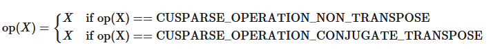
The function`cusparseSpVV_bufferSize()`returns the size of the workspace needed by`cusparseSpVV()`

<div style="overflow-x: auto; max-width: 100%; border-radius: 6px;">
<table border="1" cellpadding="6" cellspacing="0" style="border-collapse: collapse; width: 100%; font-family: -apple-system, BlinkMacSystemFont, Segoe UI, Helvetica, Arial, sans-serif; font-size: 13px; margin: 16px 0;">
<colgroup>
<col style="width: 18%"/>
<col style="width: 15%"/>
<col style="width: 7%"/>
<col style="width: 60%"/>
</colgroup>
<thead>
<tr style="border: 1px solid #d0d7de;">
<th style="background-color: #f6f8fa; font-weight: 600; text-align: left; padding: 8px 12px; border: 1px solid #d0d7de;"><p>Param.</p></th>
<th style="background-color: #f6f8fa; font-weight: 600; text-align: left; padding: 8px 12px; border: 1px solid #d0d7de;"><p>Memory</p></th>
<th style="background-color: #f6f8fa; font-weight: 600; text-align: left; padding: 8px 12px; border: 1px solid #d0d7de;"><p>In/out</p></th>
<th style="background-color: #f6f8fa; font-weight: 600; text-align: left; padding: 8px 12px; border: 1px solid #d0d7de;"><p>Meaning</p></th>
</tr>
</thead>
<tbody>
<tr style="border: 1px solid #d0d7de;">
<td style="padding: 8px 12px; border: 1px solid #d0d7de; vertical-align: top;"><p><code class="docutils literal notranslate"><span class="pre">handle</span></code></p></td>
<td style="padding: 8px 12px; border: 1px solid #d0d7de; vertical-align: top;"><p>HOST</p></td>
<td style="padding: 8px 12px; border: 1px solid #d0d7de; vertical-align: top;"><p>IN</p></td>
<td style="padding: 8px 12px; border: 1px solid #d0d7de; vertical-align: top;"><p>Handle to the cuSPARSE library context</p></td>
</tr>
<tr style="border: 1px solid #d0d7de;">
<td style="padding: 8px 12px; border: 1px solid #d0d7de; vertical-align: top;"><p><code class="docutils literal notranslate"><span class="pre">opX</span></code></p></td>
<td style="padding: 8px 12px; border: 1px solid #d0d7de; vertical-align: top;"><p>HOST</p></td>
<td style="padding: 8px 12px; border: 1px solid #d0d7de; vertical-align: top;"><p>IN</p></td>
<td style="padding: 8px 12px; border: 1px solid #d0d7de; vertical-align: top;"><p>Operation <code class="docutils literal notranslate"><span class="pre">op(X)</span></code> that is non-transpose or conjugate transpose</p></td>
</tr>
<tr style="border: 1px solid #d0d7de;">
<td style="padding: 8px 12px; border: 1px solid #d0d7de; vertical-align: top;"><p><code class="docutils literal notranslate"><span class="pre">vecX</span></code></p></td>
<td style="padding: 8px 12px; border: 1px solid #d0d7de; vertical-align: top;"><p>HOST</p></td>
<td style="padding: 8px 12px; border: 1px solid #d0d7de; vertical-align: top;"><p>IN</p></td>
<td style="padding: 8px 12px; border: 1px solid #d0d7de; vertical-align: top;"><p>Sparse vector <code class="docutils literal notranslate"><span class="pre">X</span></code></p></td>
</tr>
<tr style="border: 1px solid #d0d7de;">
<td style="padding: 8px 12px; border: 1px solid #d0d7de; vertical-align: top;"><p><code class="docutils literal notranslate"><span class="pre">vecY</span></code></p></td>
<td style="padding: 8px 12px; border: 1px solid #d0d7de; vertical-align: top;"><p>HOST</p></td>
<td style="padding: 8px 12px; border: 1px solid #d0d7de; vertical-align: top;"><p>IN</p></td>
<td style="padding: 8px 12px; border: 1px solid #d0d7de; vertical-align: top;"><p>Dense vector <code class="docutils literal notranslate"><span class="pre">Y</span></code></p></td>
</tr>
<tr style="border: 1px solid #d0d7de;">
<td style="padding: 8px 12px; border: 1px solid #d0d7de; vertical-align: top;"><p><code class="docutils literal notranslate"><span class="pre">result</span></code></p></td>
<td style="padding: 8px 12px; border: 1px solid #d0d7de; vertical-align: top;"><p>HOST or DEVICE</p></td>
<td style="padding: 8px 12px; border: 1px solid #d0d7de; vertical-align: top;"><p>OUT</p></td>
<td style="padding: 8px 12px; border: 1px solid #d0d7de; vertical-align: top;"><p>The resulting dot product</p></td>
</tr>
<tr style="border: 1px solid #d0d7de;">
<td style="padding: 8px 12px; border: 1px solid #d0d7de; vertical-align: top;"><p><code class="docutils literal notranslate"><span class="pre">computeType</span></code></p></td>
<td style="padding: 8px 12px; border: 1px solid #d0d7de; vertical-align: top;"><p>HOST</p></td>
<td style="padding: 8px 12px; border: 1px solid #d0d7de; vertical-align: top;"><p>IN</p></td>
<td style="padding: 8px 12px; border: 1px solid #d0d7de; vertical-align: top;"><p>Datatype in which the computation is executed</p></td>
</tr>
<tr style="border: 1px solid #d0d7de;">
<td style="padding: 8px 12px; border: 1px solid #d0d7de; vertical-align: top;"><p><code class="docutils literal notranslate"><span class="pre">bufferSize</span></code></p></td>
<td style="padding: 8px 12px; border: 1px solid #d0d7de; vertical-align: top;"><p>HOST</p></td>
<td style="padding: 8px 12px; border: 1px solid #d0d7de; vertical-align: top;"><p>OUT</p></td>
<td style="padding: 8px 12px; border: 1px solid #d0d7de; vertical-align: top;"><p>Number of bytes of workspace needed by <code class="docutils literal notranslate"><span class="pre">cusparseSpVV</span></code></p></td>
</tr>
<tr style="border: 1px solid #d0d7de;">
<td style="padding: 8px 12px; border: 1px solid #d0d7de; vertical-align: top;"><p><code class="docutils literal notranslate"><span class="pre">externalBuffer</span></code></p></td>
<td style="padding: 8px 12px; border: 1px solid #d0d7de; vertical-align: top;"><p>DEVICE</p></td>
<td style="padding: 8px 12px; border: 1px solid #d0d7de; vertical-align: top;"><p>IN</p></td>
<td style="padding: 8px 12px; border: 1px solid #d0d7de; vertical-align: top;"><p>Pointer to a workspace buffer of at least <code class="docutils literal notranslate"><span class="pre">bufferSize</span></code> bytes</p></td>
</tr>
</tbody>
</table>
</div>

`cusparseSpVV`supports the following index type for representing the sparse vector`vecX`:
- 32-bit indices (`CUSPARSE_INDEX_32I`)
- 64-bit indices (`CUSPARSE_INDEX_64I`)
The data types combinations currently supported for`cusparseSpVV`are listed below:
Uniform-precision computation:

<div style="overflow-x: auto; max-width: 100%; border-radius: 6px;">
<table border="1" cellpadding="6" cellspacing="0" style="border-collapse: collapse; width: 100%; font-family: -apple-system, BlinkMacSystemFont, Segoe UI, Helvetica, Arial, sans-serif; font-size: 13px; margin: 16px 0;">
<colgroup>
<col style="width: 100%"/>
</colgroup>
<thead>
<tr style="border: 1px solid #d0d7de;">
<th style="background-color: #f6f8fa; font-weight: 600; text-align: left; padding: 8px 12px; border: 1px solid #d0d7de;"><p><code class="docutils literal notranslate"><span class="pre">X</span></code>/<code class="docutils literal notranslate"><span class="pre">Y</span></code>/<code class="docutils literal notranslate"><span class="pre">computeType</span></code></p></th>
</tr>
</thead>
<tbody>
<tr style="border: 1px solid #d0d7de;">
<td style="padding: 8px 12px; border: 1px solid #d0d7de; vertical-align: top;"><p><code class="docutils literal notranslate"><span class="pre">CUDA_R_32F</span></code></p></td>
</tr>
<tr style="border: 1px solid #d0d7de;">
<td style="padding: 8px 12px; border: 1px solid #d0d7de; vertical-align: top;"><p><code class="docutils literal notranslate"><span class="pre">CUDA_R_64F</span></code></p></td>
</tr>
<tr style="border: 1px solid #d0d7de;">
<td style="padding: 8px 12px; border: 1px solid #d0d7de; vertical-align: top;"><p><code class="docutils literal notranslate"><span class="pre">CUDA_C_32F</span></code></p></td>
</tr>
<tr style="border: 1px solid #d0d7de;">
<td style="padding: 8px 12px; border: 1px solid #d0d7de; vertical-align: top;"><p><code class="docutils literal notranslate"><span class="pre">CUDA_C_64F</span></code></p></td>
</tr>
</tbody>
</table>
</div>

Mixed-precision computation:

<div style="overflow-x: auto; max-width: 100%; border-radius: 6px;">
<table border="1" cellpadding="6" cellspacing="0" style="border-collapse: collapse; width: 100%; font-family: -apple-system, BlinkMacSystemFont, Segoe UI, Helvetica, Arial, sans-serif; font-size: 13px; margin: 16px 0;">
<colgroup>
<col style="width: 25%"/>
<col style="width: 43%"/>
<col style="width: 33%"/>
</colgroup>
<thead>
<tr style="border: 1px solid #d0d7de;">
<th style="background-color: #f6f8fa; font-weight: 600; text-align: left; padding: 8px 12px; border: 1px solid #d0d7de;"><p><code class="docutils literal notranslate"><span class="pre">X</span></code>/<code class="docutils literal notranslate"><span class="pre">Y</span></code></p></th>
<th style="background-color: #f6f8fa; font-weight: 600; text-align: left; padding: 8px 12px; border: 1px solid #d0d7de;"><p><code class="docutils literal notranslate"><span class="pre">computeType</span></code>/<code class="docutils literal notranslate"><span class="pre">result</span></code></p></th>
<th style="background-color: #f6f8fa; font-weight: 600; text-align: left; padding: 8px 12px; border: 1px solid #d0d7de;"><p>Notes</p></th>
</tr>
</thead>
<tbody>
<tr style="border: 1px solid #d0d7de;">
<td style="padding: 8px 12px; border: 1px solid #d0d7de; vertical-align: top;"><p><code class="docutils literal notranslate"><span class="pre">CUDA_R_8I</span></code></p></td>
<td style="padding: 8px 12px; border: 1px solid #d0d7de; vertical-align: top;"><p><code class="docutils literal notranslate"><span class="pre">CUDA_R_32I</span></code></p></td>
<td style="padding: 8px 12px; border: 1px solid #d0d7de; vertical-align: top;"></td>
</tr>
<tr style="border: 1px solid #d0d7de;">
<td style="padding: 8px 12px; border: 1px solid #d0d7de; vertical-align: top;"><p><code class="docutils literal notranslate"><span class="pre">CUDA_R_8I</span></code></p></td>
<td style="padding: 8px 12px; border: 1px solid #d0d7de; vertical-align: top;"><p><code class="docutils literal notranslate"><span class="pre">CUDA_R_32F</span></code></p></td>
<td style="padding: 8px 12px; border: 1px solid #d0d7de; vertical-align: top;"></td>
</tr>
<tr style="border: 1px solid #d0d7de;">
<td style="padding: 8px 12px; border: 1px solid #d0d7de; vertical-align: top;"><p><code class="docutils literal notranslate"><span class="pre">CUDA_R_16F</span></code></p></td>
<td style="padding: 8px 12px; border: 1px solid #d0d7de; vertical-align: top;"><p><code class="docutils literal notranslate"><span class="pre">CUDA_R_32F</span></code></p></td>
<td style="padding: 8px 12px; border: 1px solid #d0d7de; vertical-align: top;"></td>
</tr>
<tr style="border: 1px solid #d0d7de;">
<td style="padding: 8px 12px; border: 1px solid #d0d7de; vertical-align: top;"><p><code class="docutils literal notranslate"><span class="pre">CUDA_R_16BF</span></code></p></td>
<td style="padding: 8px 12px; border: 1px solid #d0d7de; vertical-align: top;"><p><code class="docutils literal notranslate"><span class="pre">CUDA_R_32F</span></code></p></td>
<td style="padding: 8px 12px; border: 1px solid #d0d7de; vertical-align: top;"></td>
</tr>
<tr style="border: 1px solid #d0d7de;">
<td style="padding: 8px 12px; border: 1px solid #d0d7de; vertical-align: top;"><p><code class="docutils literal notranslate"><span class="pre">CUDA_C_16F</span></code></p></td>
<td style="padding: 8px 12px; border: 1px solid #d0d7de; vertical-align: top;"><p><code class="docutils literal notranslate"><span class="pre">CUDA_C_32F</span></code></p></td>
<td style="padding: 8px 12px; border: 1px solid #d0d7de; vertical-align: top;"><p>[DEPRECATED]</p></td>
</tr>
<tr style="border: 1px solid #d0d7de;">
<td style="padding: 8px 12px; border: 1px solid #d0d7de; vertical-align: top;"><p><code class="docutils literal notranslate"><span class="pre">CUDA_C_16BF</span></code></p></td>
<td style="padding: 8px 12px; border: 1px solid #d0d7de; vertical-align: top;"><p><code class="docutils literal notranslate"><span class="pre">CUDA_C_32F</span></code></p></td>
<td style="padding: 8px 12px; border: 1px solid #d0d7de; vertical-align: top;"><p>[DEPRECATED]</p></td>
</tr>
</tbody>
</table>
</div>

`cusparseSpVV()`has the following constraints:
- The arrays representing the sparse vector`vecX`must be aligned to 16 bytes
`cusparseSpVV()`has the following properties:
- The routine requires no extra storage
- The routine supports asynchronous execution
- Provides deterministic (bit-wise) results for each run if the the sparse vector`vecX`indices are distinct
- The routine allows`indices`of`vecX`to be unsorted
`cusparseSpVV()`supports the followingoptimizations:
- CUDA graph capture
- Hardware Memory Compression
SeecusparseStatus_tfor the description of the return status.
Please visit[cuSPARSE Library Samples - cusparseSpVV](https://github.com/NVIDIA/CUDALibrarySamples/tree/main/cuSPARSE/spvv)for a code example.

---

### 6.6.6. cusparseSpMV()

```
cusparseStatus_t
cusparseSpMV_bufferSize(cusparseHandle_t          handle,
                        cusparseOperation_t       opA,
                        const void*               alpha,
                        cusparseConstSpMatDescr_t matA,  // non-const descriptor supported
                        cusparseConstDnVecDescr_t vecX,  // non-const descriptor supported
                        const void*               beta,
                        cusparseDnVecDescr_t      vecY,
                        cudaDataType              computeType,
                        cusparseSpMVAlg_t         alg,
                        size_t*                   bufferSize)

```

```
cusparseStatus_t
cusparseSpMV_preprocess(cusparseHandle_t          handle,
                        cusparseOperation_t       opA,
                        const void*               alpha,
                        cusparseConstSpMatDescr_t matA,  // non-const descriptor supported
                        cusparseConstDnVecDescr_t vecX,  // non-const descriptor supported
                        const void*               beta,
                        cusparseDnVecDescr_t      vecY,
                        cudaDataType              computeType,
                        cusparseSpMVAlg_t         alg,
                        void*                     externalBuffer)

```

```
cusparseStatus_t
cusparseSpMV(cusparseHandle_t          handle,
             cusparseOperation_t       opA,
             const void*               alpha,
             cusparseConstSpMatDescr_t matA,  // non-const descriptor supported
             cusparseConstDnVecDescr_t vecX,  // non-const descriptor supported
             const void*               beta,
             cusparseDnVecDescr_t      vecY,
             cudaDataType              computeType,
             cusparseSpMVAlg_t         alg,
             void*                     externalBuffer)

```

This function performs the multiplication of a sparse matrix`matA`and a dense vector`vecX`

\[\mathbf{Y} = \alpha op\left( \mathbf{A} \right) \cdot \mathbf{X} + \beta\mathbf{Y}\]
where
- `op(A)`is a sparse matrix of size$m \times k$
- `X`is a dense vector of size$k$
- `Y`is a dense vector of size$m$
- $\alpha$and$\beta$are scalars
Also, for matrix`A`
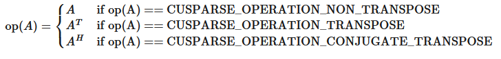
The function`cusparseSpMV_bufferSize()`returns the size of the workspace needed by`cusparseSpMV_preprocess()`and`cusparseSpMV()`

<div style="overflow-x: auto; max-width: 100%; border-radius: 6px;">
<table border="1" cellpadding="6" cellspacing="0" style="border-collapse: collapse; width: 100%; font-family: -apple-system, BlinkMacSystemFont, Segoe UI, Helvetica, Arial, sans-serif; font-size: 13px; margin: 16px 0;">
<colgroup>
<col style="width: 17%"/>
<col style="width: 14%"/>
<col style="width: 7%"/>
<col style="width: 62%"/>
</colgroup>
<thead>
<tr style="border: 1px solid #d0d7de;">
<th style="background-color: #f6f8fa; font-weight: 600; text-align: left; padding: 8px 12px; border: 1px solid #d0d7de;"><p>Param.</p></th>
<th style="background-color: #f6f8fa; font-weight: 600; text-align: left; padding: 8px 12px; border: 1px solid #d0d7de;"><p>Memory</p></th>
<th style="background-color: #f6f8fa; font-weight: 600; text-align: left; padding: 8px 12px; border: 1px solid #d0d7de;"><p>In/out</p></th>
<th style="background-color: #f6f8fa; font-weight: 600; text-align: left; padding: 8px 12px; border: 1px solid #d0d7de;"><p>Meaning</p></th>
</tr>
</thead>
<tbody>
<tr style="border: 1px solid #d0d7de;">
<td style="padding: 8px 12px; border: 1px solid #d0d7de; vertical-align: top;"><p><code class="docutils literal notranslate"><span class="pre">handle</span></code></p></td>
<td style="padding: 8px 12px; border: 1px solid #d0d7de; vertical-align: top;"><p>HOST</p></td>
<td style="padding: 8px 12px; border: 1px solid #d0d7de; vertical-align: top;"><p>IN</p></td>
<td style="padding: 8px 12px; border: 1px solid #d0d7de; vertical-align: top;"><p>Handle to the cuSPARSE library context</p></td>
</tr>
<tr style="border: 1px solid #d0d7de;">
<td style="padding: 8px 12px; border: 1px solid #d0d7de; vertical-align: top;"><p><code class="docutils literal notranslate"><span class="pre">opA</span></code></p></td>
<td style="padding: 8px 12px; border: 1px solid #d0d7de; vertical-align: top;"><p>HOST</p></td>
<td style="padding: 8px 12px; border: 1px solid #d0d7de; vertical-align: top;"><p>IN</p></td>
<td style="padding: 8px 12px; border: 1px solid #d0d7de; vertical-align: top;"><p>Operation <code class="docutils literal notranslate"><span class="pre">op(A)</span></code></p></td>
</tr>
<tr style="border: 1px solid #d0d7de;">
<td style="padding: 8px 12px; border: 1px solid #d0d7de; vertical-align: top;"><p><code class="docutils literal notranslate"><span class="pre">alpha</span></code></p></td>
<td style="padding: 8px 12px; border: 1px solid #d0d7de; vertical-align: top;"><p>HOST or DEVICE</p></td>
<td style="padding: 8px 12px; border: 1px solid #d0d7de; vertical-align: top;"><p>IN</p></td>
<td style="padding: 8px 12px; border: 1px solid #d0d7de; vertical-align: top;"><p><span class="math notranslate nohighlight">\(\alpha\)</span> scalar used for multiplication of type <code class="docutils literal notranslate"><span class="pre">computeType</span></code></p></td>
</tr>
<tr style="border: 1px solid #d0d7de;">
<td style="padding: 8px 12px; border: 1px solid #d0d7de; vertical-align: top;"><p><code class="docutils literal notranslate"><span class="pre">matA</span></code></p></td>
<td style="padding: 8px 12px; border: 1px solid #d0d7de; vertical-align: top;"><p>HOST</p></td>
<td style="padding: 8px 12px; border: 1px solid #d0d7de; vertical-align: top;"><p>IN</p></td>
<td style="padding: 8px 12px; border: 1px solid #d0d7de; vertical-align: top;"><p>Sparse matrix <code class="docutils literal notranslate"><span class="pre">A</span></code></p></td>
</tr>
<tr style="border: 1px solid #d0d7de;">
<td style="padding: 8px 12px; border: 1px solid #d0d7de; vertical-align: top;"><p><code class="docutils literal notranslate"><span class="pre">vecX</span></code></p></td>
<td style="padding: 8px 12px; border: 1px solid #d0d7de; vertical-align: top;"><p>HOST</p></td>
<td style="padding: 8px 12px; border: 1px solid #d0d7de; vertical-align: top;"><p>IN</p></td>
<td style="padding: 8px 12px; border: 1px solid #d0d7de; vertical-align: top;"><p>Dense vector <code class="docutils literal notranslate"><span class="pre">X</span></code></p></td>
</tr>
<tr style="border: 1px solid #d0d7de;">
<td style="padding: 8px 12px; border: 1px solid #d0d7de; vertical-align: top;"><p><code class="docutils literal notranslate"><span class="pre">beta</span></code></p></td>
<td style="padding: 8px 12px; border: 1px solid #d0d7de; vertical-align: top;"><p>HOST or DEVICE</p></td>
<td style="padding: 8px 12px; border: 1px solid #d0d7de; vertical-align: top;"><p>IN</p></td>
<td style="padding: 8px 12px; border: 1px solid #d0d7de; vertical-align: top;"><p><span class="math notranslate nohighlight">\(\beta\)</span> scalar used for multiplication of type <code class="docutils literal notranslate"><span class="pre">computeType</span></code></p></td>
</tr>
<tr style="border: 1px solid #d0d7de;">
<td style="padding: 8px 12px; border: 1px solid #d0d7de; vertical-align: top;"><p><code class="docutils literal notranslate"><span class="pre">vecY</span></code></p></td>
<td style="padding: 8px 12px; border: 1px solid #d0d7de; vertical-align: top;"><p>HOST</p></td>
<td style="padding: 8px 12px; border: 1px solid #d0d7de; vertical-align: top;"><p>IN/OUT</p></td>
<td style="padding: 8px 12px; border: 1px solid #d0d7de; vertical-align: top;"><p>Dense vector <code class="docutils literal notranslate"><span class="pre">Y</span></code></p></td>
</tr>
<tr style="border: 1px solid #d0d7de;">
<td style="padding: 8px 12px; border: 1px solid #d0d7de; vertical-align: top;"><p><code class="docutils literal notranslate"><span class="pre">computeType</span></code></p></td>
<td style="padding: 8px 12px; border: 1px solid #d0d7de; vertical-align: top;"><p>HOST</p></td>
<td style="padding: 8px 12px; border: 1px solid #d0d7de; vertical-align: top;"><p>IN</p></td>
<td style="padding: 8px 12px; border: 1px solid #d0d7de; vertical-align: top;"><p>Datatype in which the computation is executed</p></td>
</tr>
<tr style="border: 1px solid #d0d7de;">
<td style="padding: 8px 12px; border: 1px solid #d0d7de; vertical-align: top;"><p><code class="docutils literal notranslate"><span class="pre">alg</span></code></p></td>
<td style="padding: 8px 12px; border: 1px solid #d0d7de; vertical-align: top;"><p>HOST</p></td>
<td style="padding: 8px 12px; border: 1px solid #d0d7de; vertical-align: top;"><p>IN</p></td>
<td style="padding: 8px 12px; border: 1px solid #d0d7de; vertical-align: top;"><p>Algorithm for the computation</p></td>
</tr>
<tr style="border: 1px solid #d0d7de;">
<td style="padding: 8px 12px; border: 1px solid #d0d7de; vertical-align: top;"><p><code class="docutils literal notranslate"><span class="pre">bufferSize</span></code></p></td>
<td style="padding: 8px 12px; border: 1px solid #d0d7de; vertical-align: top;"><p>HOST</p></td>
<td style="padding: 8px 12px; border: 1px solid #d0d7de; vertical-align: top;"><p>OUT</p></td>
<td style="padding: 8px 12px; border: 1px solid #d0d7de; vertical-align: top;"><p>Number of bytes of workspace needed by <code class="docutils literal notranslate"><span class="pre">cusparseSpMV</span></code></p></td>
</tr>
<tr style="border: 1px solid #d0d7de;">
<td style="padding: 8px 12px; border: 1px solid #d0d7de; vertical-align: top;"><p><code class="docutils literal notranslate"><span class="pre">externalBuffer</span></code></p></td>
<td style="padding: 8px 12px; border: 1px solid #d0d7de; vertical-align: top;"><p>DEVICE</p></td>
<td style="padding: 8px 12px; border: 1px solid #d0d7de; vertical-align: top;"><p>IN</p></td>
<td style="padding: 8px 12px; border: 1px solid #d0d7de; vertical-align: top;"><p>Pointer to a workspace buffer of at least <code class="docutils literal notranslate"><span class="pre">bufferSize</span></code> bytes</p></td>
</tr>
</tbody>
</table>
</div>

The sparse matrix formats currently supported are listed below:
- `CUSPARSE_FORMAT_COO`
- `CUSPARSE_FORMAT_CSR`
- `CUSPARSE_FORMAT_CSC`
- `CUSPARSE_FORMAT_BSR`
- `CUSPARSE_FORMAT_SLICED_ELL`
`cusparseSpMV`supports the following index type for representing the sparse matrix`matA`:
- 32-bit indices (`CUSPARSE_INDEX_32I`)
- 64-bit indices (`CUSPARSE_INDEX_64I`)
`cusparseSpMV`supports the following data types:
Uniform-precision computation:

<div style="overflow-x: auto; max-width: 100%; border-radius: 6px;">
<table border="1" cellpadding="6" cellspacing="0" style="border-collapse: collapse; width: 100%; font-family: -apple-system, BlinkMacSystemFont, Segoe UI, Helvetica, Arial, sans-serif; font-size: 13px; margin: 16px 0;">
<colgroup>
<col style="width: 100%"/>
</colgroup>
<thead>
<tr style="border: 1px solid #d0d7de;">
<th style="background-color: #f6f8fa; font-weight: 600; text-align: left; padding: 8px 12px; border: 1px solid #d0d7de;"><p><code class="docutils literal notranslate"><span class="pre">A</span></code>/<code class="docutils literal notranslate"><span class="pre">X</span></code>/ <code class="docutils literal notranslate"><span class="pre">Y</span></code>/<code class="docutils literal notranslate"><span class="pre">computeType</span></code></p></th>
</tr>
</thead>
<tbody>
<tr style="border: 1px solid #d0d7de;">
<td style="padding: 8px 12px; border: 1px solid #d0d7de; vertical-align: top;"><p><code class="docutils literal notranslate"><span class="pre">CUDA_R_32F</span></code></p></td>
</tr>
<tr style="border: 1px solid #d0d7de;">
<td style="padding: 8px 12px; border: 1px solid #d0d7de; vertical-align: top;"><p><code class="docutils literal notranslate"><span class="pre">CUDA_R_64F</span></code></p></td>
</tr>
<tr style="border: 1px solid #d0d7de;">
<td style="padding: 8px 12px; border: 1px solid #d0d7de; vertical-align: top;"><p><code class="docutils literal notranslate"><span class="pre">CUDA_C_32F</span></code></p></td>
</tr>
<tr style="border: 1px solid #d0d7de;">
<td style="padding: 8px 12px; border: 1px solid #d0d7de; vertical-align: top;"><p><code class="docutils literal notranslate"><span class="pre">CUDA_C_64F</span></code></p></td>
</tr>
</tbody>
</table>
</div>

Mixed-precision computation:

<div style="overflow-x: auto; max-width: 100%; border-radius: 6px;">
<table border="1" cellpadding="6" cellspacing="0" style="border-collapse: collapse; width: 100%; font-family: -apple-system, BlinkMacSystemFont, Segoe UI, Helvetica, Arial, sans-serif; font-size: 13px; margin: 16px 0;">
<colgroup>
<col style="width: 25%"/>
<col style="width: 25%"/>
<col style="width: 25%"/>
<col style="width: 25%"/>
</colgroup>
<thead>
<tr style="border: 1px solid #d0d7de;">
<th style="background-color: #f6f8fa; font-weight: 600; text-align: left; padding: 8px 12px; border: 1px solid #d0d7de;"><p><code class="docutils literal notranslate"><span class="pre">A</span></code>/<code class="docutils literal notranslate"><span class="pre">X</span></code></p></th>
<th style="background-color: #f6f8fa; font-weight: 600; text-align: left; padding: 8px 12px; border: 1px solid #d0d7de;"><p><code class="docutils literal notranslate"><span class="pre">Y</span></code></p></th>
<th style="background-color: #f6f8fa; font-weight: 600; text-align: left; padding: 8px 12px; border: 1px solid #d0d7de;"><p><code class="docutils literal notranslate"><span class="pre">computeType</span></code></p></th>
<th style="background-color: #f6f8fa; font-weight: 600; text-align: left; padding: 8px 12px; border: 1px solid #d0d7de;"><p>Notes</p></th>
</tr>
</thead>
<tbody>
<tr style="border: 1px solid #d0d7de;">
<td style="padding: 8px 12px; border: 1px solid #d0d7de; vertical-align: top;"><p><code class="docutils literal notranslate"><span class="pre">CUDA_R_8I</span></code></p></td>
<td style="padding: 8px 12px; border: 1px solid #d0d7de; vertical-align: top;"><p><code class="docutils literal notranslate"><span class="pre">CUDA_R_32I</span></code></p></td>
<td style="padding: 8px 12px; border: 1px solid #d0d7de; vertical-align: top;"><p><code class="docutils literal notranslate"><span class="pre">CUDA_R_32I</span></code></p></td>
<td style="padding: 8px 12px; border: 1px solid #d0d7de; vertical-align: top;"></td>
</tr>
<tr style="border: 1px solid #d0d7de;">
<td style="padding: 8px 12px; border: 1px solid #d0d7de; vertical-align: top;"><p><code class="docutils literal notranslate"><span class="pre">CUDA_R_8I</span></code></p></td>
<td rowspan="3" style="padding: 8px 12px; border: 1px solid #d0d7de; vertical-align: top;"><p><code class="docutils literal notranslate"><span class="pre">CUDA_R_32F</span></code></p></td>
<td rowspan="5" style="padding: 8px 12px; border: 1px solid #d0d7de; vertical-align: top;"><p><code class="docutils literal notranslate"><span class="pre">CUDA_R_32F</span></code></p></td>
<td rowspan="5" style="padding: 8px 12px; border: 1px solid #d0d7de; vertical-align: top;"></td>
</tr>
<tr style="border: 1px solid #d0d7de;">
<td style="padding: 8px 12px; border: 1px solid #d0d7de; vertical-align: top;"><p><code class="docutils literal notranslate"><span class="pre">CUDA_R_16F</span></code></p></td>
</tr>
<tr style="border: 1px solid #d0d7de;">
<td style="padding: 8px 12px; border: 1px solid #d0d7de; vertical-align: top;"><p><code class="docutils literal notranslate"><span class="pre">CUDA_R_16BF</span></code></p></td>
</tr>
<tr style="border: 1px solid #d0d7de;">
<td style="padding: 8px 12px; border: 1px solid #d0d7de; vertical-align: top;"><p><code class="docutils literal notranslate"><span class="pre">CUDA_R_16F</span></code></p></td>
<td style="padding: 8px 12px; border: 1px solid #d0d7de; vertical-align: top;"><p><code class="docutils literal notranslate"><span class="pre">CUDA_R_16F</span></code></p></td>
</tr>
<tr style="border: 1px solid #d0d7de;">
<td style="padding: 8px 12px; border: 1px solid #d0d7de; vertical-align: top;"><p><code class="docutils literal notranslate"><span class="pre">CUDA_R_16BF</span></code></p></td>
<td style="padding: 8px 12px; border: 1px solid #d0d7de; vertical-align: top;"><p><code class="docutils literal notranslate"><span class="pre">CUDA_R_16BF</span></code></p></td>
</tr>
<tr style="border: 1px solid #d0d7de;">
<td style="padding: 8px 12px; border: 1px solid #d0d7de; vertical-align: top;"><p><code class="docutils literal notranslate"><span class="pre">CUDA_C_32F</span></code></p></td>
<td style="padding: 8px 12px; border: 1px solid #d0d7de; vertical-align: top;"><p><code class="docutils literal notranslate"><span class="pre">CUDA_C_32F</span></code></p></td>
<td rowspan="3" style="padding: 8px 12px; border: 1px solid #d0d7de; vertical-align: top;"><p><code class="docutils literal notranslate"><span class="pre">CUDA_C_32F</span></code></p></td>
<td style="padding: 8px 12px; border: 1px solid #d0d7de; vertical-align: top;"></td>
</tr>
<tr style="border: 1px solid #d0d7de;">
<td style="padding: 8px 12px; border: 1px solid #d0d7de; vertical-align: top;"><p><code class="docutils literal notranslate"><span class="pre">CUDA_C_16F</span></code></p></td>
<td style="padding: 8px 12px; border: 1px solid #d0d7de; vertical-align: top;"><p><code class="docutils literal notranslate"><span class="pre">CUDA_C_16F</span></code></p></td>
<td style="padding: 8px 12px; border: 1px solid #d0d7de; vertical-align: top;"><p>[DEPRECATED]</p></td>
</tr>
<tr style="border: 1px solid #d0d7de;">
<td style="padding: 8px 12px; border: 1px solid #d0d7de; vertical-align: top;"><p><code class="docutils literal notranslate"><span class="pre">CUDA_C_16BF</span></code></p></td>
<td style="padding: 8px 12px; border: 1px solid #d0d7de; vertical-align: top;"><p><code class="docutils literal notranslate"><span class="pre">CUDA_C_16BF</span></code></p></td>
<td style="padding: 8px 12px; border: 1px solid #d0d7de; vertical-align: top;"><p>[DEPRECATED]</p></td>
</tr>
</tbody>
</table>
</div>

<div style="overflow-x: auto; max-width: 100%; border-radius: 6px;">
<table border="1" cellpadding="6" cellspacing="0" style="border-collapse: collapse; width: 100%; font-family: -apple-system, BlinkMacSystemFont, Segoe UI, Helvetica, Arial, sans-serif; font-size: 13px; margin: 16px 0;">
<colgroup>
<col style="width: 33%"/>
<col style="width: 67%"/>
</colgroup>
<thead>
<tr style="border: 1px solid #d0d7de;">
<th style="background-color: #f6f8fa; font-weight: 600; text-align: left; padding: 8px 12px; border: 1px solid #d0d7de;"><p><code class="docutils literal notranslate"><span class="pre">A</span></code></p></th>
<th style="background-color: #f6f8fa; font-weight: 600; text-align: left; padding: 8px 12px; border: 1px solid #d0d7de;"><p><code class="docutils literal notranslate"><span class="pre">X</span></code>/<code class="docutils literal notranslate"><span class="pre">Y</span></code>/<code class="docutils literal notranslate"><span class="pre">computeType</span></code></p></th>
</tr>
</thead>
<tbody>
<tr style="border: 1px solid #d0d7de;">
<td style="padding: 8px 12px; border: 1px solid #d0d7de; vertical-align: top;"><p><code class="docutils literal notranslate"><span class="pre">CUDA_R_32F</span></code></p></td>
<td style="padding: 8px 12px; border: 1px solid #d0d7de; vertical-align: top;"><p><code class="docutils literal notranslate"><span class="pre">CUDA_R_64F</span></code></p></td>
</tr>
</tbody>
</table>
</div>

Mixed Regular/Complex computation:

<div style="overflow-x: auto; max-width: 100%; border-radius: 6px;">
<table border="1" cellpadding="6" cellspacing="0" style="border-collapse: collapse; width: 100%; font-family: -apple-system, BlinkMacSystemFont, Segoe UI, Helvetica, Arial, sans-serif; font-size: 13px; margin: 16px 0;">
<colgroup>
<col style="width: 34%"/>
<col style="width: 66%"/>
</colgroup>
<thead>
<tr style="border: 1px solid #d0d7de;">
<th style="background-color: #f6f8fa; font-weight: 600; text-align: left; padding: 8px 12px; border: 1px solid #d0d7de;"><p><code class="docutils literal notranslate"><span class="pre">A</span></code></p></th>
<th style="background-color: #f6f8fa; font-weight: 600; text-align: left; padding: 8px 12px; border: 1px solid #d0d7de;"><p><code class="docutils literal notranslate"><span class="pre">X</span></code>/<code class="docutils literal notranslate"><span class="pre">Y</span></code>/<code class="docutils literal notranslate"><span class="pre">computeType</span></code></p></th>
</tr>
</thead>
<tbody>
<tr style="border: 1px solid #d0d7de;">
<td style="padding: 8px 12px; border: 1px solid #d0d7de; vertical-align: top;"><p><code class="docutils literal notranslate"><span class="pre">CUDA_R_32F</span></code></p></td>
<td style="padding: 8px 12px; border: 1px solid #d0d7de; vertical-align: top;"><p><code class="docutils literal notranslate"><span class="pre">CUDA_C_32F</span></code></p></td>
</tr>
<tr style="border: 1px solid #d0d7de;">
<td style="padding: 8px 12px; border: 1px solid #d0d7de; vertical-align: top;"><p><code class="docutils literal notranslate"><span class="pre">CUDA_R_64F</span></code></p></td>
<td style="padding: 8px 12px; border: 1px solid #d0d7de; vertical-align: top;"><p><code class="docutils literal notranslate"><span class="pre">CUDA_C_64F</span></code></p></td>
</tr>
</tbody>
</table>
</div>

NOTE:`CUDA_R_16F`,`CUDA_R_16BF`,`CUDA_C_16F`, and`CUDA_C_16BF`data types always imply mixed-precision computation.
`cusparseSpMV()`supports the following algorithms:

<div style="overflow-x: auto; max-width: 100%; border-radius: 6px;">
<table border="1" cellpadding="6" cellspacing="0" style="border-collapse: collapse; width: 100%; font-family: -apple-system, BlinkMacSystemFont, Segoe UI, Helvetica, Arial, sans-serif; font-size: 13px; margin: 16px 0;">
<colgroup>
<col style="width: 29%"/>
<col style="width: 71%"/>
</colgroup>
<thead>
<tr style="border: 1px solid #d0d7de;">
<th style="background-color: #f6f8fa; font-weight: 600; text-align: left; padding: 8px 12px; border: 1px solid #d0d7de;"><p>Algorithm</p></th>
<th style="background-color: #f6f8fa; font-weight: 600; text-align: left; padding: 8px 12px; border: 1px solid #d0d7de;"><p>Notes</p></th>
</tr>
</thead>
<tbody>
<tr style="border: 1px solid #d0d7de;">
<td style="padding: 8px 12px; border: 1px solid #d0d7de; vertical-align: top;"><p><code class="docutils literal notranslate"><span class="pre">CUSPARSE_SPMV_ALG_DEFAULT</span></code></p></td>
<td style="padding: 8px 12px; border: 1px solid #d0d7de; vertical-align: top;"><p>Default algorithm for any sparse matrix format.</p></td>
</tr>
<tr style="border: 1px solid #d0d7de;">
<td style="padding: 8px 12px; border: 1px solid #d0d7de; vertical-align: top;"><p><code class="docutils literal notranslate"><span class="pre">CUSPARSE_SPMV_COO_ALG1</span></code></p></td>
<td style="padding: 8px 12px; border: 1px solid #d0d7de; vertical-align: top;"><p>Default algorithm for COO sparse matrix format. May produce slightly different results during different runs with the same input parameters.</p></td>
</tr>
<tr style="border: 1px solid #d0d7de;">
<td style="padding: 8px 12px; border: 1px solid #d0d7de; vertical-align: top;"><p><code class="docutils literal notranslate"><span class="pre">CUSPARSE_SPMV_COO_ALG2</span></code></p></td>
<td style="padding: 8px 12px; border: 1px solid #d0d7de; vertical-align: top;"><p>Provides deterministic (bit-wise) results for each run. If <code class="docutils literal notranslate"><span class="pre">opA</span> <span class="pre">!=</span> <span class="pre">CUSPARSE_OPERATION_NON_TRANSPOSE</span></code>, it is identical to <code class="docutils literal notranslate"><span class="pre">CUSPARSE_SPMV_COO_ALG1</span></code>.</p></td>
</tr>
<tr style="border: 1px solid #d0d7de;">
<td style="padding: 8px 12px; border: 1px solid #d0d7de; vertical-align: top;"><p><code class="docutils literal notranslate"><span class="pre">CUSPARSE_SPMV_CSR_ALG1</span></code></p></td>
<td style="padding: 8px 12px; border: 1px solid #d0d7de; vertical-align: top;"><p>Default algorithm for CSR/CSC sparse matrix format. May produce slightly different results during different runs with the same input parameters.</p></td>
</tr>
<tr style="border: 1px solid #d0d7de;">
<td style="padding: 8px 12px; border: 1px solid #d0d7de; vertical-align: top;"><p><code class="docutils literal notranslate"><span class="pre">CUSPARSE_SPMV_CSR_ALG2</span></code></p></td>
<td style="padding: 8px 12px; border: 1px solid #d0d7de; vertical-align: top;"><p>Provides deterministic (bit-wise) results for each run. If <code class="docutils literal notranslate"><span class="pre">opA</span> <span class="pre">!=</span> <span class="pre">CUSPARSE_OPERATION_NON_TRANSPOSE</span></code>, it is identical to <code class="docutils literal notranslate"><span class="pre">CUSPARSE_SPMV_CSR_ALG1</span></code>.</p></td>
</tr>
<tr style="border: 1px solid #d0d7de;">
<td style="padding: 8px 12px; border: 1px solid #d0d7de; vertical-align: top;"><p><code class="docutils literal notranslate"><span class="pre">CUSPARSE_SPMV_SELL_ALG1</span></code></p></td>
<td style="padding: 8px 12px; border: 1px solid #d0d7de; vertical-align: top;"><p>Default algorithm for Sliced Ellpack sparse matrix format. Provides deterministic (bit-wise) results for each run.</p></td>
</tr>
<tr style="border: 1px solid #d0d7de;">
<td style="padding: 8px 12px; border: 1px solid #d0d7de; vertical-align: top;"><p><code class="docutils literal notranslate"><span class="pre">CUSPARSE_SPMV_BSR_ALG1</span></code></p></td>
<td style="padding: 8px 12px; border: 1px solid #d0d7de; vertical-align: top;"><p>Default algorithm for BSR sparse matrix format. Provides deterministic (bit-wise) results for each run.
Supports only <code class="docutils literal notranslate"><span class="pre">opA</span> <span class="pre">==</span> <span class="pre">CUSPARSE_OPERATION_NON_TRANSPOSE</span></code>. Supports both row-major and column-major block layouts in <code class="docutils literal notranslate"><span class="pre">A</span></code>.</p></td>
</tr>
</tbody>
</table>
</div>

Calling`cusparseSpMV_preprocess()`is optional.
It may accelerate subsequent calls to`cusparseSpMV()`.
It is useful when`cusparseSpMV()`is called multiple times with the same sparsity pattern (`matA`).
Calling`cusparseSpMV_preprocess()`with`buffer`makes that buffer “active” for`matA`SpMV calls.
Subsequent calls to`cusparseSpMV()`with`matA`and the active buffer
must use the same values for all parameters as the call to`cusparseSpMV_preprocess()`.
The exceptions are:`alpha`,`beta`,`vecX`,`vecY`, and the values (but not indices) of`matA`may be different.
Importantly, the buffer contents must be unmodified since the call to`cusparseSpMV_preprocess()`.
When`cusparseSpMV()`is called with`matA`and its active buffer, it may read acceleration data from the buffer.
Calling`cusparseSpMV_preprocess()`again with`matA`and a new buffer will make the new buffer active,
forgetting about the previously-active buffer and making it inactive.
For`cusparseSpMV()`, there can only be one active buffer per sparse matrix at a time.
To get the effect of multiple active buffers for a single sparse matrix,
create multiple matrix handles that all point to the same index and value buffers,
and call`cusparseSpMV_preprocess()`once per handle with different workspace buffers.
Calling`cusparseSpMV()`with an inactive buffer is always permitted.
However, there may be no acceleration from the preprocessing in that case.
For the purposes ofthread safety,
`cusparseSpMV_preprocess()`is writing to`matA`internal state.
**Performance notes:**
- `CUSPARSE_SPMV_COO_ALG1`and`CUSPARSE_SPMV_CSR_ALG1`provide higher performance than`CUSPARSE_SPMV_COO_ALG2`and`CUSPARSE_SPMV_CSR_ALG2`.
- In general,`opA == CUSPARSE_OPERATION_NON_TRANSPOSE`is 3x faster than`opA != CUSPARSE_OPERATION_NON_TRANSPOSE`.
- Using`cusparseSpMV_preprocess()`helps improve performance of`cusparseSpMV()`in CSR. It is beneficial when we need to run`cusparseSpMV()`multiple times with a same matrix (`cusparseSpMV_preprocess()`is executed only once).
`cusparseSpMV()`has the following properties:
- The routine requires extra storage for CSR/CSC format (all algorithms) and for COO format with`CUSPARSE_SPMV_COO_ALG2`algorithm.
- Provides deterministic (bit-wise) results for each run only for`CUSPARSE_SPMV_COO_ALG2`,`CUSPARSE_SPMV_CSR_ALG2`and`CUSPARSE_SPMV_BSR_ALG1`algorithms, and`opA == CUSPARSE_OPERATION_NON_TRANSPOSE`.
- The routine supports asynchronous execution.
- compute-sanitizer could report false race conditions for this routine when`beta == 0`. This is for optimization purposes and does not affect the correctness of the computation.
- The routine allows the indices of`matA`to be unsorted.
`cusparseSpMV()`supports the followingoptimizations:
- CUDA graph capture
- Hardware Memory Compression
SeecusparseStatus_tfor the description of the return status.
Please visit[cuSPARSE Library Samples - cusparseSpMV CSR](https://github.com/NVIDIA/CUDALibrarySamples/tree/main/cuSPARSE/spmv_csr)and[cusparseSpMV COO](https://github.com/NVIDIA/CUDALibrarySamples/tree/main/cuSPARSE/spmv_coo)for a code example.

---

### 6.6.7. cusparseSpMVOp() [EXPERIMENTAL]

```
cusparseStatus_t
cusparseSpMVOp_bufferSize(cusparseHandle_t          handle,
                          cusparseOperation_t       opA,
                          cusparseConstSpMatDescr_t matA,  // non-const descriptor supported
                          cusparseConstDnVecDescr_t vecX,  // non-const descriptor supported
                          cusparseDnVecDescr_t      vecY,
                          cusparseDnVecDescr_t      vecZ,
                          cudaDataType              computeType,
                          size_t*                   bufferSize)

```

```
cusparseStatus_t
cusparseSpMVOp_createDescr(cusparseHandle_t          handle,
                           cusparseSpMVOpDescr_t*    desc,
                           cusparseOperation_t       opA,
                           cusparseConstSpMatDescr_t matA,  // non-const descriptor supported
                           cusparseConstDnVecDescr_t vecX,  // non-const descriptor supported
                           cusparseDnVecDescr_t      vecY,
                           cusparseDnVecDescr_t      vecZ,
                           cudaDataType              computeType,
                           void*                     externalBuffer)

```

```
cusparseStatus_t
cusparseSpMVOp_destroyDescr(cusparseSpMVOpDescr_t desc)

```

```
cusparseStatus_t
cusparseSpMVOp_createPlan(cusparseHandle_t      handle,
                          cusparseSpMVOpDescr_t desc,
                          cusparseSpMVOpPlan_t* plan,
                          const void*           epilogueLTOBuffer,
                          size_t                epilogueBufferSize)

```

```
cusparseStatus_t
cusparseSpMVOp_destroyPlan(cusparseSpMVOpPlan_t plan)

```

```
cusparseStatus_t
cusparseSpMVOp_setGlobalUserData(cusparseHandle_t     handle,
                                 cusparseSpMVOpPlan_t plan,
                                 const char*          epilogueDataName,
                                 void*                epilogueData,
                                 size_t               epilogueDataSize)

```

```
cusparseStatus_t
cusparseSpMVOp(cusparseHandle_t          handle,
               cusparseSpMVOpPlan_t      plan,
               const void*               alpha,
               const void*               beta,
               cusparseConstDnVecDescr_t vecX,
               cusparseConstDnVecDescr_t vecY,
               cusparseDnVecDescr_t      vecZ)

```

*Experimental*: This function is only available if macro`CUSPARSE_ENABLE_EXPERIMENTAL_API`is defined. It performs the multiplication of a sparse matrix`matA`and a dense vector`vecX`.

\[\mathbf{Z}_{i} = \text{epilogue}\left( \alpha \sum_{k}\left( op\left( \mathbf{A}_{ik} \right) \cdot \mathbf{X}_{k} \right) + \beta\mathbf{Y}_{i} \right)\]
where
- `op(A)`is a sparse matrix of size$m \times k$
- `X`is a dense vector of size$k$
- `Y`is a dense vector of size$m$
- `Z`is a dense vector of size$m$. It is allowed to alias`Y`.
- $\alpha$and$\beta$are scalars
- $\text{epilogue}$is a custom function with the following signature

```
__device__ <computetype> spmv_op_epilogue(int64_t row, <computetype> value);

```

`cusparseSpMVOp()`supports 32-bit indices (`CUSPARSE_INDEX_32I`), sparse format`CUSPARSE_FORMAT_CSR`, and`opA=CUSPARSE_OPERATION_NON_TRANSPOSE`.
`cusparseSpMVOp()`supports the following uniform-precision computations:

<div style="overflow-x: auto; max-width: 100%; border-radius: 6px;">
<table border="1" cellpadding="6" cellspacing="0" style="border-collapse: collapse; width: 100%; font-family: -apple-system, BlinkMacSystemFont, Segoe UI, Helvetica, Arial, sans-serif; font-size: 13px; margin: 16px 0;">
<colgroup>
<col style="width: 100%"/>
</colgroup>
<thead>
<tr style="border: 1px solid #d0d7de;">
<th style="background-color: #f6f8fa; font-weight: 600; text-align: left; padding: 8px 12px; border: 1px solid #d0d7de;"><p><code class="docutils literal notranslate"><span class="pre">A</span></code>/<code class="docutils literal notranslate"><span class="pre">X</span></code>/ <code class="docutils literal notranslate"><span class="pre">Y</span></code>/<code class="docutils literal notranslate"><span class="pre">Z</span></code>/<code class="docutils literal notranslate"><span class="pre">computeType</span></code></p></th>
</tr>
</thead>
<tbody>
<tr style="border: 1px solid #d0d7de;">
<td style="padding: 8px 12px; border: 1px solid #d0d7de; vertical-align: top;"><p><code class="docutils literal notranslate"><span class="pre">CUDA_R_64F</span></code></p></td>
</tr>
</tbody>
</table>
</div>

The function`cusparseSpMVOp_bufferSize()`returns the size of the workspace needed by`cusparseSpMVOp_createDescr()`and`cusparseSpMVOp()`. Currently, it accept`NULL`for`vecX`,`vecY`and`vecZ`.
The function`cusparseSpMVOp_createDescr()`prepares the internal data represented by the descriptor which is needed by`cusparseSpMVOp_createPlan()`and`cusparseSpMVOp()`.
The passed-in device buffer must remain valid and unmodified until the associated descriptor is destroyed.
It supports passing dummy`vecX`,`vecY`and`vecZ`objects, as long as their data type attributes are valid. Other attributes are ignored during the descriptor creation.
If`epilogueLTOBuffer`is`NULL`or`epilogueLTOSize`is`0`, the default epilogue will be employed:

```
__device__ <computetype> spmv_op_epilogue(int64_t row, <computetype> value) { return value; }

```

The function`cusparseSpMVOp_createPlan()`takes in the descriptor and the LTO-IR of the custom epilogue, and returns the execution plan. The same descriptor can be used to create multiple execution plans, each with its own epilogue and epilogue auxiliary data.
The function`cusparseSpMVOp_setGlobalUserData()`specifies the auxiliary device data - located in global or constant memory – that the epilogue function uses. The invocation is optional; it should be called only if the epilogue requires auxiliary data. It can be invoked repeatedly before`cusparseSpMVOp()`to set or modify the auxiliary data used by the epilogue function.

<div style="overflow-x: auto; max-width: 100%; border-radius: 6px;">
<table border="1" cellpadding="6" cellspacing="0" style="border-collapse: collapse; width: 100%; font-family: -apple-system, BlinkMacSystemFont, Segoe UI, Helvetica, Arial, sans-serif; font-size: 13px; margin: 16px 0;">
<colgroup>
<col style="width: 17%"/>
<col style="width: 12%"/>
<col style="width: 6%"/>
<col style="width: 65%"/>
</colgroup>
<thead>
<tr style="border: 1px solid #d0d7de;">
<th style="background-color: #f6f8fa; font-weight: 600; text-align: left; padding: 8px 12px; border: 1px solid #d0d7de;"><p>Param.</p></th>
<th style="background-color: #f6f8fa; font-weight: 600; text-align: left; padding: 8px 12px; border: 1px solid #d0d7de;"><p>Memory</p></th>
<th style="background-color: #f6f8fa; font-weight: 600; text-align: left; padding: 8px 12px; border: 1px solid #d0d7de;"><p>In/out</p></th>
<th style="background-color: #f6f8fa; font-weight: 600; text-align: left; padding: 8px 12px; border: 1px solid #d0d7de;"><p>Meaning</p></th>
</tr>
</thead>
<tbody>
<tr style="border: 1px solid #d0d7de;">
<td style="padding: 8px 12px; border: 1px solid #d0d7de; vertical-align: top;"><p><code class="docutils literal notranslate"><span class="pre">handle</span></code></p></td>
<td style="padding: 8px 12px; border: 1px solid #d0d7de; vertical-align: top;"><p>HOST</p></td>
<td style="padding: 8px 12px; border: 1px solid #d0d7de; vertical-align: top;"><p>IN</p></td>
<td style="padding: 8px 12px; border: 1px solid #d0d7de; vertical-align: top;"><p>Handle to the cuSPARSE library context</p></td>
</tr>
<tr style="border: 1px solid #d0d7de;">
<td style="padding: 8px 12px; border: 1px solid #d0d7de; vertical-align: top;"><p><code class="docutils literal notranslate"><span class="pre">descr</span></code></p></td>
<td style="padding: 8px 12px; border: 1px solid #d0d7de; vertical-align: top;"><p>HOST</p></td>
<td style="padding: 8px 12px; border: 1px solid #d0d7de; vertical-align: top;"><p>IN/OUT</p></td>
<td style="padding: 8px 12px; border: 1px solid #d0d7de; vertical-align: top;"><p>Opaque descriptor for storing internal data used across the setup and execution steps</p></td>
</tr>
<tr style="border: 1px solid #d0d7de;">
<td style="padding: 8px 12px; border: 1px solid #d0d7de; vertical-align: top;"><p><code class="docutils literal notranslate"><span class="pre">plan</span></code></p></td>
<td style="padding: 8px 12px; border: 1px solid #d0d7de; vertical-align: top;"><p>HOST</p></td>
<td style="padding: 8px 12px; border: 1px solid #d0d7de; vertical-align: top;"><p>IN/OUT</p></td>
<td style="padding: 8px 12px; border: 1px solid #d0d7de; vertical-align: top;"><p>Opaque descriptor for storing the multiplication execution plan,
namely all the information necessary to execute <code class="docutils literal notranslate"><span class="pre">cusparseSpMVOp()</span></code></p></td>
</tr>
<tr style="border: 1px solid #d0d7de;">
<td style="padding: 8px 12px; border: 1px solid #d0d7de; vertical-align: top;"><p><code class="docutils literal notranslate"><span class="pre">opA</span></code></p></td>
<td style="padding: 8px 12px; border: 1px solid #d0d7de; vertical-align: top;"><p>HOST</p></td>
<td style="padding: 8px 12px; border: 1px solid #d0d7de; vertical-align: top;"><p>IN</p></td>
<td style="padding: 8px 12px; border: 1px solid #d0d7de; vertical-align: top;"><p>Operation <code class="docutils literal notranslate"><span class="pre">op(A)</span></code></p></td>
</tr>
<tr style="border: 1px solid #d0d7de;">
<td style="padding: 8px 12px; border: 1px solid #d0d7de; vertical-align: top;"><p><code class="docutils literal notranslate"><span class="pre">alpha</span></code></p></td>
<td style="padding: 8px 12px; border: 1px solid #d0d7de; vertical-align: top;"><p>HOST or DEVICE</p></td>
<td style="padding: 8px 12px; border: 1px solid #d0d7de; vertical-align: top;"><p>IN</p></td>
<td style="padding: 8px 12px; border: 1px solid #d0d7de; vertical-align: top;"><p><span class="math notranslate nohighlight">\(\alpha\)</span> scalar used for multiplication of type <code class="docutils literal notranslate"><span class="pre">computeType</span></code></p></td>
</tr>
<tr style="border: 1px solid #d0d7de;">
<td style="padding: 8px 12px; border: 1px solid #d0d7de; vertical-align: top;"><p><code class="docutils literal notranslate"><span class="pre">matA</span></code></p></td>
<td style="padding: 8px 12px; border: 1px solid #d0d7de; vertical-align: top;"><p>HOST</p></td>
<td style="padding: 8px 12px; border: 1px solid #d0d7de; vertical-align: top;"><p>IN</p></td>
<td style="padding: 8px 12px; border: 1px solid #d0d7de; vertical-align: top;"><p>Sparse matrix <code class="docutils literal notranslate"><span class="pre">A</span></code></p></td>
</tr>
<tr style="border: 1px solid #d0d7de;">
<td style="padding: 8px 12px; border: 1px solid #d0d7de; vertical-align: top;"><p><code class="docutils literal notranslate"><span class="pre">vecX</span></code></p></td>
<td style="padding: 8px 12px; border: 1px solid #d0d7de; vertical-align: top;"><p>HOST</p></td>
<td style="padding: 8px 12px; border: 1px solid #d0d7de; vertical-align: top;"><p>IN</p></td>
<td style="padding: 8px 12px; border: 1px solid #d0d7de; vertical-align: top;"><p>Dense vector <code class="docutils literal notranslate"><span class="pre">X</span></code></p></td>
</tr>
<tr style="border: 1px solid #d0d7de;">
<td style="padding: 8px 12px; border: 1px solid #d0d7de; vertical-align: top;"><p><code class="docutils literal notranslate"><span class="pre">beta</span></code></p></td>
<td style="padding: 8px 12px; border: 1px solid #d0d7de; vertical-align: top;"><p>HOST or DEVICE</p></td>
<td style="padding: 8px 12px; border: 1px solid #d0d7de; vertical-align: top;"><p>IN</p></td>
<td style="padding: 8px 12px; border: 1px solid #d0d7de; vertical-align: top;"><p><span class="math notranslate nohighlight">\(\beta\)</span> scalar used for multiplication of type <code class="docutils literal notranslate"><span class="pre">computeType</span></code></p></td>
</tr>
<tr style="border: 1px solid #d0d7de;">
<td style="padding: 8px 12px; border: 1px solid #d0d7de; vertical-align: top;"><p><code class="docutils literal notranslate"><span class="pre">vecY</span></code></p></td>
<td style="padding: 8px 12px; border: 1px solid #d0d7de; vertical-align: top;"><p>HOST</p></td>
<td style="padding: 8px 12px; border: 1px solid #d0d7de; vertical-align: top;"><p>IN</p></td>
<td style="padding: 8px 12px; border: 1px solid #d0d7de; vertical-align: top;"><p>Dense vector <code class="docutils literal notranslate"><span class="pre">Y</span></code></p></td>
</tr>
<tr style="border: 1px solid #d0d7de;">
<td style="padding: 8px 12px; border: 1px solid #d0d7de; vertical-align: top;"><p><code class="docutils literal notranslate"><span class="pre">vecZ</span></code></p></td>
<td style="padding: 8px 12px; border: 1px solid #d0d7de; vertical-align: top;"><p>HOST</p></td>
<td style="padding: 8px 12px; border: 1px solid #d0d7de; vertical-align: top;"><p>IN/OUT</p></td>
<td style="padding: 8px 12px; border: 1px solid #d0d7de; vertical-align: top;"><p>Dense vector <code class="docutils literal notranslate"><span class="pre">Z</span></code></p></td>
</tr>
<tr style="border: 1px solid #d0d7de;">
<td style="padding: 8px 12px; border: 1px solid #d0d7de; vertical-align: top;"><p><code class="docutils literal notranslate"><span class="pre">computeType</span></code></p></td>
<td style="padding: 8px 12px; border: 1px solid #d0d7de; vertical-align: top;"><p>HOST</p></td>
<td style="padding: 8px 12px; border: 1px solid #d0d7de; vertical-align: top;"><p>IN</p></td>
<td style="padding: 8px 12px; border: 1px solid #d0d7de; vertical-align: top;"><p>Datatype in which the computation is executed</p></td>
</tr>
<tr style="border: 1px solid #d0d7de;">
<td style="padding: 8px 12px; border: 1px solid #d0d7de; vertical-align: top;"><p><code class="docutils literal notranslate"><span class="pre">epilogueLTOBuffer</span></code></p></td>
<td style="padding: 8px 12px; border: 1px solid #d0d7de; vertical-align: top;"><p>HOST</p></td>
<td style="padding: 8px 12px; border: 1px solid #d0d7de; vertical-align: top;"><p>IN</p></td>
<td style="padding: 8px 12px; border: 1px solid #d0d7de; vertical-align: top;"><p>Pointer to the LTO-IR buffer containing the custom epilogue function</p></td>
</tr>
<tr style="border: 1px solid #d0d7de;">
<td style="padding: 8px 12px; border: 1px solid #d0d7de; vertical-align: top;"><p><code class="docutils literal notranslate"><span class="pre">epilogueBufferSize</span></code></p></td>
<td style="padding: 8px 12px; border: 1px solid #d0d7de; vertical-align: top;"><p>HOST</p></td>
<td style="padding: 8px 12px; border: 1px solid #d0d7de; vertical-align: top;"><p>IN</p></td>
<td style="padding: 8px 12px; border: 1px solid #d0d7de; vertical-align: top;"><p>Size in bytes of <code class="docutils literal notranslate"><span class="pre">epilogueLTOBuffer</span></code></p></td>
</tr>
<tr style="border: 1px solid #d0d7de;">
<td style="padding: 8px 12px; border: 1px solid #d0d7de; vertical-align: top;"><p><code class="docutils literal notranslate"><span class="pre">epilogueData</span></code></p></td>
<td style="padding: 8px 12px; border: 1px solid #d0d7de; vertical-align: top;"><p>HOST</p></td>
<td style="padding: 8px 12px; border: 1px solid #d0d7de; vertical-align: top;"><p>IN</p></td>
<td style="padding: 8px 12px; border: 1px solid #d0d7de; vertical-align: top;"><p>Poiinter to the auxiliary data used by the epilogue</p></td>
</tr>
<tr style="border: 1px solid #d0d7de;">
<td style="padding: 8px 12px; border: 1px solid #d0d7de; vertical-align: top;"><p><code class="docutils literal notranslate"><span class="pre">epilogueDataSize</span></code></p></td>
<td style="padding: 8px 12px; border: 1px solid #d0d7de; vertical-align: top;"><p>HOST</p></td>
<td style="padding: 8px 12px; border: 1px solid #d0d7de; vertical-align: top;"><p>IN</p></td>
<td style="padding: 8px 12px; border: 1px solid #d0d7de; vertical-align: top;"><p>Size in bytes of <code class="docutils literal notranslate"><span class="pre">epilgoueData</span></code></p></td>
</tr>
<tr style="border: 1px solid #d0d7de;">
<td style="padding: 8px 12px; border: 1px solid #d0d7de; vertical-align: top;"><p><code class="docutils literal notranslate"><span class="pre">epilogueDataName</span></code></p></td>
<td style="padding: 8px 12px; border: 1px solid #d0d7de; vertical-align: top;"><p>HOST</p></td>
<td style="padding: 8px 12px; border: 1px solid #d0d7de; vertical-align: top;"><p>IN</p></td>
<td style="padding: 8px 12px; border: 1px solid #d0d7de; vertical-align: top;"><p>Name of the auxiliary data <code class="docutils literal notranslate"><span class="pre">epilgoueData</span></code></p></td>
</tr>
<tr style="border: 1px solid #d0d7de;">
<td style="padding: 8px 12px; border: 1px solid #d0d7de; vertical-align: top;"><p><code class="docutils literal notranslate"><span class="pre">externalBuffer</span></code></p></td>
<td style="padding: 8px 12px; border: 1px solid #d0d7de; vertical-align: top;"><p>DEVICE</p></td>
<td style="padding: 8px 12px; border: 1px solid #d0d7de; vertical-align: top;"><p>IN</p></td>
<td style="padding: 8px 12px; border: 1px solid #d0d7de; vertical-align: top;"><p>Pointer to a workspace buffer of at least <code class="docutils literal notranslate"><span class="pre">bufferSize</span></code> bytes</p></td>
</tr>
<tr style="border: 1px solid #d0d7de;">
<td style="padding: 8px 12px; border: 1px solid #d0d7de; vertical-align: top;"><p><code class="docutils literal notranslate"><span class="pre">bufferSize</span></code></p></td>
<td style="padding: 8px 12px; border: 1px solid #d0d7de; vertical-align: top;"><p>HOST</p></td>
<td style="padding: 8px 12px; border: 1px solid #d0d7de; vertical-align: top;"><p>OUT</p></td>
<td style="padding: 8px 12px; border: 1px solid #d0d7de; vertical-align: top;"><p>Number of bytes of workspace needed by <code class="docutils literal notranslate"><span class="pre">cusparseSpMVOp_createDescr</span></code></p></td>
</tr>
</tbody>
</table>
</div>

`cusparseSpMVOp()`has the following properties:
- It supports a customizable epilogue function, enabling users to apply additional elementwise and more complex operations to the output vector.
- It provides improved numerical accuracy than`cusparseSpMV()`due to the fact that accumulation is partially performed using Kahan’s summation.
- The routine produces deterministic (bit-wise) results for each run, assuming that the epilgoue function is deterministic.
- In general, it is significantly faster than`cusparseSpMV()`with the deterministic algorithm`CUSPARSE_SPMV_CSR_ALG2`, at the cost of more buffer usage.
- The routine supports asynchronous execution.
- The routine allows the indices of`matA`to be unsorted.
- It supports CUDA graph captureoptimizations.
SeecusparseStatus_tfor the description of the return status.
Please visit[cuSPARSE Library Samples - cusparseSpMVOp](https://github.com/NVIDIA/CUDALibrarySamples/tree/main/cuSPARSE/spmvop_csr)for a code example.

---

### 6.6.8. cusparseSpSV()

```
cusparseStatus_t
cusparseSpSV_createDescr(cusparseSpSVDescr_t* spsvDescr);

cusparseStatus_t
cusparseSpSV_destroyDescr(cusparseSpSVDescr_t spsvDescr);

```

```
cusparseStatus_t
cusparseSpSV_bufferSize(cusparseHandle_t          handle,
                        cusparseOperation_t       opA,
                        const void*               alpha,
                        cusparseConstSpMatDescr_t matA,  // non-const descriptor supported
                        cusparseConstDnVecDescr_t vecX,  // non-const descriptor supported
                        cusparseDnVecDescr_t      vecY,
                        cudaDataType              computeType,
                        cusparseSpSVAlg_t         alg,
                        cusparseSpSVDescr_t       spsvDescr,
                        size_t*                   bufferSize)

```

```
cusparseStatus_t
cusparseSpSV_analysis(cusparseHandle_t          handle,
                      cusparseOperation_t       opA,
                      const void*               alpha,
                      cusparseConstSpMatDescr_t matA,  // non-const descriptor supported
                      cusparseConstDnVecDescr_t vecX,  // non-const descriptor supported
                      cusparseDnVecDescr_t      vecY,
                      cudaDataType              computeType,
                      cusparseSpSVAlg_t         alg,
                      cusparseSpSVDescr_t       spsvDescr
                      void*                     externalBuffer)

```

```
cusparseStatus_t
cusparseSpSV_solve(cusparseHandle_t          handle,
                   cusparseOperation_t       opA,
                   const void*               alpha,
                   cusparseConstSpMatDescr_t matA,  // non-const descriptor supported
                   cusparseConstDnVecDescr_t vecX,  // non-const descriptor supported
                   cusparseDnVecDescr_t      vecY,
                   cudaDataType              computeType,
                   cusparseSpSVAlg_t         alg,
                   cusparseSpSVDescr_t       spsvDescr)

```

```
cusparseStatus_t
cusparseSpSV_updateMatrix(cusparseHandle_t     handle,
                          cusparseSpSVDescr_t  spsvDescr,
                          void*                newValues,
                          cusparseSpSVUpdate_t updatePart)

```

The function solves a system of linear equations whose coefficients are represented in a sparse triangular matrix:

\[op\left( \mathbf{A} \right) \cdot \mathbf{Y} = \alpha\mathbf{X}\]
where
- `op(A)`is a sparse square matrix of size$m \times m$
- `X`is a dense vector of size$m$
- `Y`is a dense vector of size$m$
- $\alpha$is a scalar
Also, for matrix`A`

The function`cusparseSpSV_bufferSize()`returns the size of the workspace needed by`cusparseSpSV_analysis()`and`cusparseSpSV_solve()`.
The function`cusparseSpSV_analysis()`performs the analysis phase, while`cusparseSpSV_solve()`executes the solve phase for a sparse triangular linear system.
The opaque data structure`spsvDescr`is used to share information among all functions.
The function`cusparseSpSV_updateMatrix()`updates`spsvDescr`with new matrix values.
The routine supports arbitrary sparsity for the input matrix, but only the upper or lower triangular part is taken into account in the computation.
*NOTE:*all parameters must be consistent across`cusparseSpSV`API calls and the matrix descriptions and`externalBuffer`must not be modified between`cusparseSpSV_analysis()`and`cusparseSpSV_solve()`. The function`cusparseSpSV_updateMatrix()`can be used to update the values on the sparse matrix stored inside the opaque data structure`spsvDescr`

<div style="overflow-x: auto; max-width: 100%; border-radius: 6px;">
<table border="1" cellpadding="6" cellspacing="0" style="border-collapse: collapse; width: 100%; font-family: -apple-system, BlinkMacSystemFont, Segoe UI, Helvetica, Arial, sans-serif; font-size: 13px; margin: 16px 0;">
<colgroup>
<col style="width: 11%"/>
<col style="width: 9%"/>
<col style="width: 4%"/>
<col style="width: 75%"/>
</colgroup>
<thead>
<tr style="border: 1px solid #d0d7de;">
<th style="background-color: #f6f8fa; font-weight: 600; text-align: left; padding: 8px 12px; border: 1px solid #d0d7de;"><p>Param.</p></th>
<th style="background-color: #f6f8fa; font-weight: 600; text-align: left; padding: 8px 12px; border: 1px solid #d0d7de;"><p>Memory</p></th>
<th style="background-color: #f6f8fa; font-weight: 600; text-align: left; padding: 8px 12px; border: 1px solid #d0d7de;"><p>In/out</p></th>
<th style="background-color: #f6f8fa; font-weight: 600; text-align: left; padding: 8px 12px; border: 1px solid #d0d7de;"><p>Meaning</p></th>
</tr>
</thead>
<tbody>
<tr style="border: 1px solid #d0d7de;">
<td style="padding: 8px 12px; border: 1px solid #d0d7de; vertical-align: top;"><p><code class="docutils literal notranslate"><span class="pre">handle</span></code></p></td>
<td style="padding: 8px 12px; border: 1px solid #d0d7de; vertical-align: top;"><p>HOST</p></td>
<td style="padding: 8px 12px; border: 1px solid #d0d7de; vertical-align: top;"><p>IN</p></td>
<td style="padding: 8px 12px; border: 1px solid #d0d7de; vertical-align: top;"><p>Handle to the cuSPARSE library context</p></td>
</tr>
<tr style="border: 1px solid #d0d7de;">
<td style="padding: 8px 12px; border: 1px solid #d0d7de; vertical-align: top;"><p><code class="docutils literal notranslate"><span class="pre">opA</span></code></p></td>
<td style="padding: 8px 12px; border: 1px solid #d0d7de; vertical-align: top;"><p>HOST</p></td>
<td style="padding: 8px 12px; border: 1px solid #d0d7de; vertical-align: top;"><p>IN</p></td>
<td style="padding: 8px 12px; border: 1px solid #d0d7de; vertical-align: top;"><p>Operation <code class="docutils literal notranslate"><span class="pre">op(A)</span></code></p></td>
</tr>
<tr style="border: 1px solid #d0d7de;">
<td style="padding: 8px 12px; border: 1px solid #d0d7de; vertical-align: top;"><p><code class="docutils literal notranslate"><span class="pre">alpha</span></code></p></td>
<td style="padding: 8px 12px; border: 1px solid #d0d7de; vertical-align: top;"><p>HOST or DEVICE</p></td>
<td style="padding: 8px 12px; border: 1px solid #d0d7de; vertical-align: top;"><p>IN</p></td>
<td style="padding: 8px 12px; border: 1px solid #d0d7de; vertical-align: top;"><p><span class="math notranslate nohighlight">\(\alpha\)</span> scalar used for multiplication of type <code class="docutils literal notranslate"><span class="pre">computeType</span></code></p></td>
</tr>
<tr style="border: 1px solid #d0d7de;">
<td style="padding: 8px 12px; border: 1px solid #d0d7de; vertical-align: top;"><p><code class="docutils literal notranslate"><span class="pre">matA</span></code></p></td>
<td style="padding: 8px 12px; border: 1px solid #d0d7de; vertical-align: top;"><p>HOST</p></td>
<td style="padding: 8px 12px; border: 1px solid #d0d7de; vertical-align: top;"><p>IN</p></td>
<td style="padding: 8px 12px; border: 1px solid #d0d7de; vertical-align: top;"><p>Sparse matrix <code class="docutils literal notranslate"><span class="pre">A</span></code></p></td>
</tr>
<tr style="border: 1px solid #d0d7de;">
<td style="padding: 8px 12px; border: 1px solid #d0d7de; vertical-align: top;"><p><code class="docutils literal notranslate"><span class="pre">vecX</span></code></p></td>
<td style="padding: 8px 12px; border: 1px solid #d0d7de; vertical-align: top;"><p>HOST</p></td>
<td style="padding: 8px 12px; border: 1px solid #d0d7de; vertical-align: top;"><p>IN</p></td>
<td style="padding: 8px 12px; border: 1px solid #d0d7de; vertical-align: top;"><p>Dense vector <code class="docutils literal notranslate"><span class="pre">X</span></code></p></td>
</tr>
<tr style="border: 1px solid #d0d7de;">
<td style="padding: 8px 12px; border: 1px solid #d0d7de; vertical-align: top;"><p><code class="docutils literal notranslate"><span class="pre">vecY</span></code></p></td>
<td style="padding: 8px 12px; border: 1px solid #d0d7de; vertical-align: top;"><p>HOST</p></td>
<td style="padding: 8px 12px; border: 1px solid #d0d7de; vertical-align: top;"><p>IN/OUT</p></td>
<td style="padding: 8px 12px; border: 1px solid #d0d7de; vertical-align: top;"><p>Dense vector <code class="docutils literal notranslate"><span class="pre">Y</span></code></p></td>
</tr>
<tr style="border: 1px solid #d0d7de;">
<td style="padding: 8px 12px; border: 1px solid #d0d7de; vertical-align: top;"><p><code class="docutils literal notranslate"><span class="pre">computeType</span></code></p></td>
<td style="padding: 8px 12px; border: 1px solid #d0d7de; vertical-align: top;"><p>HOST</p></td>
<td style="padding: 8px 12px; border: 1px solid #d0d7de; vertical-align: top;"><p>IN</p></td>
<td style="padding: 8px 12px; border: 1px solid #d0d7de; vertical-align: top;"><p>Datatype in which the computation is executed</p></td>
</tr>
<tr style="border: 1px solid #d0d7de;">
<td style="padding: 8px 12px; border: 1px solid #d0d7de; vertical-align: top;"><p><code class="docutils literal notranslate"><span class="pre">alg</span></code></p></td>
<td style="padding: 8px 12px; border: 1px solid #d0d7de; vertical-align: top;"><p>HOST</p></td>
<td style="padding: 8px 12px; border: 1px solid #d0d7de; vertical-align: top;"><p>IN</p></td>
<td style="padding: 8px 12px; border: 1px solid #d0d7de; vertical-align: top;"><p>Algorithm for the computation</p></td>
</tr>
<tr style="border: 1px solid #d0d7de;">
<td style="padding: 8px 12px; border: 1px solid #d0d7de; vertical-align: top;"><p><code class="docutils literal notranslate"><span class="pre">bufferSize</span></code></p></td>
<td style="padding: 8px 12px; border: 1px solid #d0d7de; vertical-align: top;"><p>HOST</p></td>
<td style="padding: 8px 12px; border: 1px solid #d0d7de; vertical-align: top;"><p>OUT</p></td>
<td style="padding: 8px 12px; border: 1px solid #d0d7de; vertical-align: top;"><p>Number of bytes of workspace needed by <code class="docutils literal notranslate"><span class="pre">cusparseSpSV_analysis()</span></code> and <code class="docutils literal notranslate"><span class="pre">cusparseSpSV_solve()</span></code></p></td>
</tr>
<tr style="border: 1px solid #d0d7de;">
<td style="padding: 8px 12px; border: 1px solid #d0d7de; vertical-align: top;"><p><code class="docutils literal notranslate"><span class="pre">externalBuffer</span></code></p></td>
<td style="padding: 8px 12px; border: 1px solid #d0d7de; vertical-align: top;"><p>DEVICE</p></td>
<td style="padding: 8px 12px; border: 1px solid #d0d7de; vertical-align: top;"><p>IN/OUT</p></td>
<td style="padding: 8px 12px; border: 1px solid #d0d7de; vertical-align: top;"><p>Pointer to a workspace buffer of at least <code class="docutils literal notranslate"><span class="pre">bufferSize</span></code> bytes. It is used by <code class="docutils literal notranslate"><span class="pre">cusparseSpSV_analysis</span></code> and <code class="docutils literal notranslate"><span class="pre">cusparseSpSV_solve()</span></code></p></td>
</tr>
<tr style="border: 1px solid #d0d7de;">
<td style="padding: 8px 12px; border: 1px solid #d0d7de; vertical-align: top;"><p><code class="docutils literal notranslate"><span class="pre">spsvDescr</span></code></p></td>
<td style="padding: 8px 12px; border: 1px solid #d0d7de; vertical-align: top;"><p>HOST</p></td>
<td style="padding: 8px 12px; border: 1px solid #d0d7de; vertical-align: top;"><p>IN/OUT</p></td>
<td style="padding: 8px 12px; border: 1px solid #d0d7de; vertical-align: top;"><p>Opaque descriptor for storing internal data used across the three steps</p></td>
</tr>
</tbody>
</table>
</div>

The sparse matrix formats currently supported are listed below:
- `CUSPARSE_FORMAT_CSR`
- `CUSPARSE_FORMAT_COO`
- `CUSPARSE_FORMAT_SLICED_ELL`
The`cusparseSpSV()`supports the following shapes and properties:
- `CUSPARSE_FILL_MODE_LOWER`and`CUSPARSE_FILL_MODE_UPPER`fill modes
- `CUSPARSE_DIAG_TYPE_NON_UNIT`and`CUSPARSE_DIAG_TYPE_UNIT`diagonal types
The fill mode and diagonal type can be set bycusparseSpMatSetAttribute().
`cusparseSpSV()`supports the following index type for representing the sparse matrix`matA`:
- 32-bit indices (`CUSPARSE_INDEX_32I`)
- 64-bit indices (`CUSPARSE_INDEX_64I`)
`cusparseSpSV()`supports the following data types:
Uniform-precision computation:

<div style="overflow-x: auto; max-width: 100%; border-radius: 6px;">
<table border="1" cellpadding="6" cellspacing="0" style="border-collapse: collapse; width: 100%; font-family: -apple-system, BlinkMacSystemFont, Segoe UI, Helvetica, Arial, sans-serif; font-size: 13px; margin: 16px 0;">
<colgroup>
<col style="width: 100%"/>
</colgroup>
<thead>
<tr style="border: 1px solid #d0d7de;">
<th style="background-color: #f6f8fa; font-weight: 600; text-align: left; padding: 8px 12px; border: 1px solid #d0d7de;"><p><code class="docutils literal notranslate"><span class="pre">A</span></code>/<code class="docutils literal notranslate"><span class="pre">X</span></code>/ <code class="docutils literal notranslate"><span class="pre">Y</span></code>/<code class="docutils literal notranslate"><span class="pre">computeType</span></code></p></th>
</tr>
</thead>
<tbody>
<tr style="border: 1px solid #d0d7de;">
<td style="padding: 8px 12px; border: 1px solid #d0d7de; vertical-align: top;"><p><code class="docutils literal notranslate"><span class="pre">CUDA_R_32F</span></code></p></td>
</tr>
<tr style="border: 1px solid #d0d7de;">
<td style="padding: 8px 12px; border: 1px solid #d0d7de; vertical-align: top;"><p><code class="docutils literal notranslate"><span class="pre">CUDA_R_64F</span></code></p></td>
</tr>
<tr style="border: 1px solid #d0d7de;">
<td style="padding: 8px 12px; border: 1px solid #d0d7de; vertical-align: top;"><p><code class="docutils literal notranslate"><span class="pre">CUDA_C_32F</span></code></p></td>
</tr>
<tr style="border: 1px solid #d0d7de;">
<td style="padding: 8px 12px; border: 1px solid #d0d7de; vertical-align: top;"><p><code class="docutils literal notranslate"><span class="pre">CUDA_C_64F</span></code></p></td>
</tr>
</tbody>
</table>
</div>

`cusparseSpSV()`supports the following algorithms:

<div style="overflow-x: auto; max-width: 100%; border-radius: 6px;">
<table border="1" cellpadding="6" cellspacing="0" style="border-collapse: collapse; width: 100%; font-family: -apple-system, BlinkMacSystemFont, Segoe UI, Helvetica, Arial, sans-serif; font-size: 13px; margin: 16px 0;">
<colgroup>
<col style="width: 63%"/>
<col style="width: 37%"/>
</colgroup>
<thead>
<tr style="border: 1px solid #d0d7de;">
<th style="background-color: #f6f8fa; font-weight: 600; text-align: left; padding: 8px 12px; border: 1px solid #d0d7de;"><p>Algorithm</p></th>
<th style="background-color: #f6f8fa; font-weight: 600; text-align: left; padding: 8px 12px; border: 1px solid #d0d7de;"><p>Notes</p></th>
</tr>
</thead>
<tbody>
<tr style="border: 1px solid #d0d7de;">
<td style="padding: 8px 12px; border: 1px solid #d0d7de; vertical-align: top;"><p><code class="docutils literal notranslate"><span class="pre">CUSPARSE_SPSV_ALG_DEFAULT</span></code></p></td>
<td style="padding: 8px 12px; border: 1px solid #d0d7de; vertical-align: top;"><p>Default algorithm</p></td>
</tr>
</tbody>
</table>
</div>

`cusparseSpSV()`has the following properties:
- The routine requires extra storage for the analysis phase which is proportional to number of non-zero entries of the sparse matrix
- Provides deterministic (bit-wise) results for each run for the solving phase`cusparseSpSV_solve()`
- The routine supports in-place operation
- The`cusparseSpSV_solve()`routine supports asynchronous execution
- `cusparseSpSV_bufferSize()`and`cusparseSpSV_analysis()`routines accept`NULL`for`vecX`and`vecY`
- The routine allows the indices of`matA`to be unsorted
`cusparseSpSV()`supports the followingoptimizations:
- CUDA graph capture
- Hardware Memory Compression
`cusparseSpSV_updateMatrix()`updates the sparse matrix after calling the analysis phase. This functions supports the following update strategies (`updatePart`):

<div style="overflow-x: auto; max-width: 100%; border-radius: 6px;">
<table border="1" cellpadding="6" cellspacing="0" style="border-collapse: collapse; width: 100%; font-family: -apple-system, BlinkMacSystemFont, Segoe UI, Helvetica, Arial, sans-serif; font-size: 13px; margin: 16px 0;">
<colgroup>
<col style="width: 20%"/>
<col style="width: 80%"/>
</colgroup>
<thead>
<tr style="border: 1px solid #d0d7de;">
<th style="background-color: #f6f8fa; font-weight: 600; text-align: left; padding: 8px 12px; border: 1px solid #d0d7de;"><p>Strategy</p></th>
<th style="background-color: #f6f8fa; font-weight: 600; text-align: left; padding: 8px 12px; border: 1px solid #d0d7de;"><p>Notes</p></th>
</tr>
</thead>
<tbody>
<tr style="border: 1px solid #d0d7de;">
<td style="padding: 8px 12px; border: 1px solid #d0d7de; vertical-align: top;"><p><code class="docutils literal notranslate"><span class="pre">CUSPARSE_SPSV_UPDATE_GENERAL</span></code></p></td>
<td style="padding: 8px 12px; border: 1px solid #d0d7de; vertical-align: top;"><p>Updates the sparse matrix values with values of <code class="docutils literal notranslate"><span class="pre">newValues</span></code> array</p></td>
</tr>
<tr style="border: 1px solid #d0d7de;">
<td style="padding: 8px 12px; border: 1px solid #d0d7de; vertical-align: top;"><p><code class="docutils literal notranslate"><span class="pre">CUSPARSE_SPSV_UPDATE_DIAGONAL</span></code></p></td>
<td style="padding: 8px 12px; border: 1px solid #d0d7de; vertical-align: top;"><p>Updates the diagonal part of the matrix with diagonal values stored in <code class="docutils literal notranslate"><span class="pre">newValues</span></code> array. That is, <code class="docutils literal notranslate"><span class="pre">newValues</span></code> has the new diagonal values only</p></td>
</tr>
</tbody>
</table>
</div>

SeecusparseStatus_tfor the description of the return status.
Please visit[cuSPARSE Library Samples - cusparseSpSV CSR](https://github.com/NVIDIA/CUDALibrarySamples/tree/main/cuSPARSE/spsv_csr)and[cuSPARSE Library Samples - cusparseSpSV COO](https://github.com/NVIDIA/CUDALibrarySamples/tree/main/cuSPARSE/spsv_coo)for code examples.

---

### 6.6.9. cusparseSpMM()

```
cusparseStatus_t
cusparseSpMM_bufferSize(cusparseHandle_t          handle,
                        cusparseOperation_t       opA,
                        cusparseOperation_t       opB,
                        const void*               alpha,
                        cusparseConstSpMatDescr_t matA,  // non-const descriptor supported
                        cusparseConstDnMatDescr_t matB,  // non-const descriptor supported
                        const void*               beta,
                        cusparseDnMatDescr_t      matC,
                        cudaDataType              computeType,
                        cusparseSpMMAlg_t         alg,
                        size_t*                   bufferSize)

```

```
cusparseStatus_t
cusparseSpMM_preprocess(cusparseHandle_t          handle,
                        cusparseOperation_t       opA,
                        cusparseOperation_t       opB,
                        const void*               alpha,
                        cusparseConstSpMatDescr_t matA,  // non-const descriptor supported
                        cusparseConstDnMatDescr_t matB,  // non-const descriptor supported
                        const void*               beta,
                        cusparseDnMatDescr_t      matC,
                        cudaDataType              computeType,
                        cusparseSpMMAlg_t         alg,
                        void*                     externalBuffer)

```

```
cusparseStatus_t
cusparseSpMM(cusparseHandle_t          handle,
             cusparseOperation_t       opA,
             cusparseOperation_t       opB,
             const void*               alpha,
             cusparseConstSpMatDescr_t matA,  // non-const descriptor supported
             cusparseConstDnMatDescr_t matB,  // non-const descriptor supported
             const void*               beta,
             cusparseDnMatDescr_t      matC,
             cudaDataType              computeType,
             cusparseSpMMAlg_t         alg,
             void*                     externalBuffer)

```

The function performs the multiplication of a sparse matrix`matA`and a dense matrix`matB`.

\[\mathbf{C} = \alpha op\left( \mathbf{A} \right) \cdot op\left( \mathbf{B} \right) + \beta\mathbf{C}\]
where
- `op(A)`is a sparse matrix of size$m \times k$
- `op(B)`is a dense matrix of size$k \times n$
- `C`is a dense matrix of size$m \times n$
- $\alpha$and$\beta$are scalars
The routine can be also used to perform the multiplication of a dense matrix and a sparse matrix by switching the dense matrices layout:

\[\begin{split}\begin{array}{l}
 \left. \mathbf{C}_{C} = \mathbf{B}_{C} \cdot \mathbf{A} + \beta\mathbf{C}_{C}\rightarrow \right. \\
 {\mathbf{C}_{R} = \mathbf{A}^{T} \cdot \mathbf{B}_{R} + \beta\mathbf{C}_{R}} \\
 \end{array}\end{split}\]
where$\mathbf{B}_{C}$,$\mathbf{C}_{C}$indicate column-major layout, while$\mathbf{B}_{R}$,$\mathbf{C}_{R}$refer to row-major layout
Also, for matrix`A`and`B`

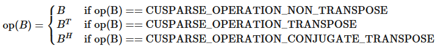
When using the (conjugate) transpose of the sparse matrix`A`, this routine may produce slightly different results during different runs with the same input parameters.
The function`cusparseSpMM_bufferSize()`returns the size of the workspace needed by`cusparseSpMM()`
Calling`cusparseSpMM_preprocess()`is optional.
It may accelerate subsequent calls to`cusparseSpMM()`.
It is useful when`cusparseSpMM()`is called multiple times with the same sparsity pattern (`matA`).
It provides performance advantages with`CUSPARSE_SPMM_CSR_ALG1`or`CUSPARSE_SPMM_CSR_ALG3`.
For all other formats and algorithms have no effect.
Calling`cusparseSpMM_preprocess()`with`buffer`makes that buffer “active” for`matA`SpMM calls.
Subsequent calls to`cusparseSpMM()`with`matA`and the active buffer
must use the same values for all parameters as the call to`cusparseSpMM_preprocess()`.
The exceptions are:`alpha`,`beta`,`matX`,`matY`, and the values (but not indices) of`matA`may be different.
Importantly, the buffer contents must be unmodified since the call to`cusparseSpMM_preprocess()`.
When`cusparseSpMM()`is called with`matA`and its active buffer, it may read acceleration data from the buffer.
Calling`cusparseSpMM_preprocess()`again with`matA`and a new buffer will make the new buffer active,
forgetting about the previously-active buffer and making it inactive.
For`cusparseSpMM()`, there can only be one active buffer per sparse matrix at a time.
To get the effect of multiple active buffers for a single sparse matrix,
create multiple matrix handles that all point to the same index and value buffers,
and call`cusparseSpMM_preprocess()`once per handle with different workspace buffers.
Calling`cusparseSpMM()`with an inactive buffer is always permitted.
However, there may be no acceleration from the preprocessing in that case.
For the purposes ofthread safety,
`cusparseSpMM_preprocess()`is writing to`matA`internal state.

<div style="overflow-x: auto; max-width: 100%; border-radius: 6px;">
<table border="1" cellpadding="6" cellspacing="0" style="border-collapse: collapse; width: 100%; font-family: -apple-system, BlinkMacSystemFont, Segoe UI, Helvetica, Arial, sans-serif; font-size: 13px; margin: 16px 0;">
<colgroup>
<col style="width: 17%"/>
<col style="width: 14%"/>
<col style="width: 7%"/>
<col style="width: 62%"/>
</colgroup>
<thead>
<tr style="border: 1px solid #d0d7de;">
<th style="background-color: #f6f8fa; font-weight: 600; text-align: left; padding: 8px 12px; border: 1px solid #d0d7de;"><p>Param.</p></th>
<th style="background-color: #f6f8fa; font-weight: 600; text-align: left; padding: 8px 12px; border: 1px solid #d0d7de;"><p>Memory</p></th>
<th style="background-color: #f6f8fa; font-weight: 600; text-align: left; padding: 8px 12px; border: 1px solid #d0d7de;"><p>In/out</p></th>
<th style="background-color: #f6f8fa; font-weight: 600; text-align: left; padding: 8px 12px; border: 1px solid #d0d7de;"><p>Meaning</p></th>
</tr>
</thead>
<tbody>
<tr style="border: 1px solid #d0d7de;">
<td style="padding: 8px 12px; border: 1px solid #d0d7de; vertical-align: top;"><p><code class="docutils literal notranslate"><span class="pre">handle</span></code></p></td>
<td style="padding: 8px 12px; border: 1px solid #d0d7de; vertical-align: top;"><p>HOST</p></td>
<td style="padding: 8px 12px; border: 1px solid #d0d7de; vertical-align: top;"><p>IN</p></td>
<td style="padding: 8px 12px; border: 1px solid #d0d7de; vertical-align: top;"><p>Handle to the cuSPARSE library context</p></td>
</tr>
<tr style="border: 1px solid #d0d7de;">
<td style="padding: 8px 12px; border: 1px solid #d0d7de; vertical-align: top;"><p><code class="docutils literal notranslate"><span class="pre">opA</span></code></p></td>
<td style="padding: 8px 12px; border: 1px solid #d0d7de; vertical-align: top;"><p>HOST</p></td>
<td style="padding: 8px 12px; border: 1px solid #d0d7de; vertical-align: top;"><p>IN</p></td>
<td style="padding: 8px 12px; border: 1px solid #d0d7de; vertical-align: top;"><p>Operation <code class="docutils literal notranslate"><span class="pre">op(A)</span></code></p></td>
</tr>
<tr style="border: 1px solid #d0d7de;">
<td style="padding: 8px 12px; border: 1px solid #d0d7de; vertical-align: top;"><p><code class="docutils literal notranslate"><span class="pre">opB</span></code></p></td>
<td style="padding: 8px 12px; border: 1px solid #d0d7de; vertical-align: top;"><p>HOST</p></td>
<td style="padding: 8px 12px; border: 1px solid #d0d7de; vertical-align: top;"><p>IN</p></td>
<td style="padding: 8px 12px; border: 1px solid #d0d7de; vertical-align: top;"><p>Operation <code class="docutils literal notranslate"><span class="pre">op(B)</span></code></p></td>
</tr>
<tr style="border: 1px solid #d0d7de;">
<td style="padding: 8px 12px; border: 1px solid #d0d7de; vertical-align: top;"><p><code class="docutils literal notranslate"><span class="pre">alpha</span></code></p></td>
<td style="padding: 8px 12px; border: 1px solid #d0d7de; vertical-align: top;"><p>HOST or DEVICE</p></td>
<td style="padding: 8px 12px; border: 1px solid #d0d7de; vertical-align: top;"><p>IN</p></td>
<td style="padding: 8px 12px; border: 1px solid #d0d7de; vertical-align: top;"><p><span class="math notranslate nohighlight">\(\alpha\)</span> scalar used for multiplication of type <code class="docutils literal notranslate"><span class="pre">computeType</span></code></p></td>
</tr>
<tr style="border: 1px solid #d0d7de;">
<td style="padding: 8px 12px; border: 1px solid #d0d7de; vertical-align: top;"><p><code class="docutils literal notranslate"><span class="pre">matA</span></code></p></td>
<td style="padding: 8px 12px; border: 1px solid #d0d7de; vertical-align: top;"><p>HOST</p></td>
<td style="padding: 8px 12px; border: 1px solid #d0d7de; vertical-align: top;"><p>IN</p></td>
<td style="padding: 8px 12px; border: 1px solid #d0d7de; vertical-align: top;"><p>Sparse matrix <code class="docutils literal notranslate"><span class="pre">A</span></code></p></td>
</tr>
<tr style="border: 1px solid #d0d7de;">
<td style="padding: 8px 12px; border: 1px solid #d0d7de; vertical-align: top;"><p><code class="docutils literal notranslate"><span class="pre">matB</span></code></p></td>
<td style="padding: 8px 12px; border: 1px solid #d0d7de; vertical-align: top;"><p>HOST</p></td>
<td style="padding: 8px 12px; border: 1px solid #d0d7de; vertical-align: top;"><p>IN</p></td>
<td style="padding: 8px 12px; border: 1px solid #d0d7de; vertical-align: top;"><p>Dense matrix <code class="docutils literal notranslate"><span class="pre">B</span></code></p></td>
</tr>
<tr style="border: 1px solid #d0d7de;">
<td style="padding: 8px 12px; border: 1px solid #d0d7de; vertical-align: top;"><p><code class="docutils literal notranslate"><span class="pre">beta</span></code></p></td>
<td style="padding: 8px 12px; border: 1px solid #d0d7de; vertical-align: top;"><p>HOST or DEVICE</p></td>
<td style="padding: 8px 12px; border: 1px solid #d0d7de; vertical-align: top;"><p>IN</p></td>
<td style="padding: 8px 12px; border: 1px solid #d0d7de; vertical-align: top;"><p><span class="math notranslate nohighlight">\(\beta\)</span> scalar used for multiplication of type <code class="docutils literal notranslate"><span class="pre">computeType</span></code></p></td>
</tr>
<tr style="border: 1px solid #d0d7de;">
<td style="padding: 8px 12px; border: 1px solid #d0d7de; vertical-align: top;"><p><code class="docutils literal notranslate"><span class="pre">matC</span></code></p></td>
<td style="padding: 8px 12px; border: 1px solid #d0d7de; vertical-align: top;"><p>HOST</p></td>
<td style="padding: 8px 12px; border: 1px solid #d0d7de; vertical-align: top;"><p>IN/OUT</p></td>
<td style="padding: 8px 12px; border: 1px solid #d0d7de; vertical-align: top;"><p>Dense matrix <code class="docutils literal notranslate"><span class="pre">C</span></code></p></td>
</tr>
<tr style="border: 1px solid #d0d7de;">
<td style="padding: 8px 12px; border: 1px solid #d0d7de; vertical-align: top;"><p><code class="docutils literal notranslate"><span class="pre">computeType</span></code></p></td>
<td style="padding: 8px 12px; border: 1px solid #d0d7de; vertical-align: top;"><p>HOST</p></td>
<td style="padding: 8px 12px; border: 1px solid #d0d7de; vertical-align: top;"><p>IN</p></td>
<td style="padding: 8px 12px; border: 1px solid #d0d7de; vertical-align: top;"><p>Datatype in which the computation is executed</p></td>
</tr>
<tr style="border: 1px solid #d0d7de;">
<td style="padding: 8px 12px; border: 1px solid #d0d7de; vertical-align: top;"><p><code class="docutils literal notranslate"><span class="pre">alg</span></code></p></td>
<td style="padding: 8px 12px; border: 1px solid #d0d7de; vertical-align: top;"><p>HOST</p></td>
<td style="padding: 8px 12px; border: 1px solid #d0d7de; vertical-align: top;"><p>IN</p></td>
<td style="padding: 8px 12px; border: 1px solid #d0d7de; vertical-align: top;"><p>Algorithm for the computation</p></td>
</tr>
<tr style="border: 1px solid #d0d7de;">
<td style="padding: 8px 12px; border: 1px solid #d0d7de; vertical-align: top;"><p><code class="docutils literal notranslate"><span class="pre">bufferSize</span></code></p></td>
<td style="padding: 8px 12px; border: 1px solid #d0d7de; vertical-align: top;"><p>HOST</p></td>
<td style="padding: 8px 12px; border: 1px solid #d0d7de; vertical-align: top;"><p>OUT</p></td>
<td style="padding: 8px 12px; border: 1px solid #d0d7de; vertical-align: top;"><p>Number of bytes of workspace needed by <code class="docutils literal notranslate"><span class="pre">cusparseSpMM</span></code></p></td>
</tr>
<tr style="border: 1px solid #d0d7de;">
<td style="padding: 8px 12px; border: 1px solid #d0d7de; vertical-align: top;"><p><code class="docutils literal notranslate"><span class="pre">externalBuffer</span></code></p></td>
<td style="padding: 8px 12px; border: 1px solid #d0d7de; vertical-align: top;"><p>DEVICE</p></td>
<td style="padding: 8px 12px; border: 1px solid #d0d7de; vertical-align: top;"><p>IN</p></td>
<td style="padding: 8px 12px; border: 1px solid #d0d7de; vertical-align: top;"><p>Pointer to workspace buffer of at least <code class="docutils literal notranslate"><span class="pre">bufferSize</span></code> bytes</p></td>
</tr>
</tbody>
</table>
</div>

`cusparseSpMM`supports the following sparse matrix formats:
- `CUSPARSE_FORMAT_COO`
- `CUSPARSE_FORMAT_CSR`
- `CUSPARSE_FORMAT_CSC`
- `CUSPARSE_FORMAT_BSR`
- `CUSPARSE_FORMAT_BLOCKED_ELL`

<div style="overflow-x: auto; max-width: 100%; border-radius: 6px;">
<table border="1" cellpadding="6" cellspacing="0" style="border-collapse: collapse; width: 100%; font-family: -apple-system, BlinkMacSystemFont, Segoe UI, Helvetica, Arial, sans-serif; font-size: 13px; margin: 16px 0;">
<colgroup>
<col style="width: 21%"/>
<col style="width: 79%"/>
</colgroup>
<tbody>
<tr style="border: 1px solid #d0d7de;">
<td style="padding: 8px 12px; border: 1px solid #d0d7de; vertical-align: top;"><p><strong>(1)</strong></p></td>
<td style="padding: 8px 12px; border: 1px solid #d0d7de; vertical-align: top;"><p><strong>COO/CSR/CSC/BSR FORMATS</strong></p></td>
</tr>
</tbody>
</table>
</div>

`cusparseSpMM`supports the following index type for representing the sparse matrix`matA`:
- 32-bit indices (`CUSPARSE_INDEX_32I`)
- 64-bit indices (`CUSPARSE_INDEX_64I`)
`cusparseSpMM`supports the following data types:
Uniform-precision computation:

<div style="overflow-x: auto; max-width: 100%; border-radius: 6px;">
<table border="1" cellpadding="6" cellspacing="0" style="border-collapse: collapse; width: 100%; font-family: -apple-system, BlinkMacSystemFont, Segoe UI, Helvetica, Arial, sans-serif; font-size: 13px; margin: 16px 0;">
<colgroup>
<col style="width: 100%"/>
</colgroup>
<thead>
<tr style="border: 1px solid #d0d7de;">
<th style="background-color: #f6f8fa; font-weight: 600; text-align: left; padding: 8px 12px; border: 1px solid #d0d7de;"><p><code class="docutils literal notranslate"><span class="pre">A</span></code>/<code class="docutils literal notranslate"><span class="pre">B</span></code>/ <code class="docutils literal notranslate"><span class="pre">C</span></code>/<code class="docutils literal notranslate"><span class="pre">computeType</span></code></p></th>
</tr>
</thead>
<tbody>
<tr style="border: 1px solid #d0d7de;">
<td style="padding: 8px 12px; border: 1px solid #d0d7de; vertical-align: top;"><p><code class="docutils literal notranslate"><span class="pre">CUDA_R_32F</span></code></p></td>
</tr>
<tr style="border: 1px solid #d0d7de;">
<td style="padding: 8px 12px; border: 1px solid #d0d7de; vertical-align: top;"><p><code class="docutils literal notranslate"><span class="pre">CUDA_R_64F</span></code></p></td>
</tr>
<tr style="border: 1px solid #d0d7de;">
<td style="padding: 8px 12px; border: 1px solid #d0d7de; vertical-align: top;"><p><code class="docutils literal notranslate"><span class="pre">CUDA_C_32F</span></code></p></td>
</tr>
<tr style="border: 1px solid #d0d7de;">
<td style="padding: 8px 12px; border: 1px solid #d0d7de; vertical-align: top;"><p><code class="docutils literal notranslate"><span class="pre">CUDA_C_64F</span></code></p></td>
</tr>
</tbody>
</table>
</div>

Mixed-precision computation:

<div style="overflow-x: auto; max-width: 100%; border-radius: 6px;">
<table border="1" cellpadding="6" cellspacing="0" style="border-collapse: collapse; width: 100%; font-family: -apple-system, BlinkMacSystemFont, Segoe UI, Helvetica, Arial, sans-serif; font-size: 13px; margin: 16px 0;">
<colgroup>
<col style="width: 24%"/>
<col style="width: 24%"/>
<col style="width: 24%"/>
<col style="width: 29%"/>
</colgroup>
<thead>
<tr style="border: 1px solid #d0d7de;">
<th style="background-color: #f6f8fa; font-weight: 600; text-align: left; padding: 8px 12px; border: 1px solid #d0d7de;"><p><code class="docutils literal notranslate"><span class="pre">A</span></code>/<code class="docutils literal notranslate"><span class="pre">B</span></code></p></th>
<th style="background-color: #f6f8fa; font-weight: 600; text-align: left; padding: 8px 12px; border: 1px solid #d0d7de;"><p><code class="docutils literal notranslate"><span class="pre">C</span></code></p></th>
<th style="background-color: #f6f8fa; font-weight: 600; text-align: left; padding: 8px 12px; border: 1px solid #d0d7de;"><p><code class="docutils literal notranslate"><span class="pre">computeType</span></code></p></th>
<th style="background-color: #f6f8fa; font-weight: 600; text-align: left; padding: 8px 12px; border: 1px solid #d0d7de;"></th>
</tr>
</thead>
<tbody>
<tr style="border: 1px solid #d0d7de;">
<td style="padding: 8px 12px; border: 1px solid #d0d7de; vertical-align: top;"><p><code class="docutils literal notranslate"><span class="pre">CUDA_R_8I</span></code></p></td>
<td style="padding: 8px 12px; border: 1px solid #d0d7de; vertical-align: top;"><p><code class="docutils literal notranslate"><span class="pre">CUDA_R_32I</span></code></p></td>
<td style="padding: 8px 12px; border: 1px solid #d0d7de; vertical-align: top;"><p><code class="docutils literal notranslate"><span class="pre">CUDA_R_32I</span></code></p></td>
<td style="padding: 8px 12px; border: 1px solid #d0d7de; vertical-align: top;"></td>
</tr>
<tr style="border: 1px solid #d0d7de;">
<td style="padding: 8px 12px; border: 1px solid #d0d7de; vertical-align: top;"><p><code class="docutils literal notranslate"><span class="pre">CUDA_R_8I</span></code></p></td>
<td rowspan="3" style="padding: 8px 12px; border: 1px solid #d0d7de; vertical-align: top;"><p><code class="docutils literal notranslate"><span class="pre">CUDA_R_32F</span></code></p></td>
<td rowspan="5" style="padding: 8px 12px; border: 1px solid #d0d7de; vertical-align: top;"><p><code class="docutils literal notranslate"><span class="pre">CUDA_R_32F</span></code></p></td>
<td rowspan="5" style="padding: 8px 12px; border: 1px solid #d0d7de; vertical-align: top;"></td>
</tr>
<tr style="border: 1px solid #d0d7de;">
<td style="padding: 8px 12px; border: 1px solid #d0d7de; vertical-align: top;"><p><code class="docutils literal notranslate"><span class="pre">CUDA_R_16F</span></code></p></td>
</tr>
<tr style="border: 1px solid #d0d7de;">
<td style="padding: 8px 12px; border: 1px solid #d0d7de; vertical-align: top;"><p><code class="docutils literal notranslate"><span class="pre">CUDA_R_16BF</span></code></p></td>
</tr>
<tr style="border: 1px solid #d0d7de;">
<td style="padding: 8px 12px; border: 1px solid #d0d7de; vertical-align: top;"><p><code class="docutils literal notranslate"><span class="pre">CUDA_R_16F</span></code></p></td>
<td style="padding: 8px 12px; border: 1px solid #d0d7de; vertical-align: top;"><p><code class="docutils literal notranslate"><span class="pre">CUDA_R_16F</span></code></p></td>
</tr>
<tr style="border: 1px solid #d0d7de;">
<td style="padding: 8px 12px; border: 1px solid #d0d7de; vertical-align: top;"><p><code class="docutils literal notranslate"><span class="pre">CUDA_R_16BF</span></code></p></td>
<td style="padding: 8px 12px; border: 1px solid #d0d7de; vertical-align: top;"><p><code class="docutils literal notranslate"><span class="pre">CUDA_R_16BF</span></code></p></td>
</tr>
<tr style="border: 1px solid #d0d7de;">
<td style="padding: 8px 12px; border: 1px solid #d0d7de; vertical-align: top;"><p><code class="docutils literal notranslate"><span class="pre">CUDA_C_16F</span></code></p></td>
<td style="padding: 8px 12px; border: 1px solid #d0d7de; vertical-align: top;"><p><code class="docutils literal notranslate"><span class="pre">CUDA_C_16F</span></code></p></td>
<td rowspan="2" style="padding: 8px 12px; border: 1px solid #d0d7de; vertical-align: top;"><p><code class="docutils literal notranslate"><span class="pre">CUDA_C_32F</span></code></p></td>
<td style="padding: 8px 12px; border: 1px solid #d0d7de; vertical-align: top;"><p>[DEPRECATED]</p></td>
</tr>
<tr style="border: 1px solid #d0d7de;">
<td style="padding: 8px 12px; border: 1px solid #d0d7de; vertical-align: top;"><p><code class="docutils literal notranslate"><span class="pre">CUDA_C_16BF</span></code></p></td>
<td style="padding: 8px 12px; border: 1px solid #d0d7de; vertical-align: top;"><p><code class="docutils literal notranslate"><span class="pre">CUDA_C_16BF</span></code></p></td>
<td style="padding: 8px 12px; border: 1px solid #d0d7de; vertical-align: top;"><p>[DEPRECATED]</p></td>
</tr>
</tbody>
</table>
</div>

NOTE:`CUDA_R_16F`,`CUDA_R_16BF`,`CUDA_C_16F`, and`CUDA_C_16BF`data types always imply mixed-precision computation.
`cusparseSpMM`supports the following algorithms:

<div style="overflow-x: auto; max-width: 100%; border-radius: 6px;">
<table border="1" cellpadding="6" cellspacing="0" style="border-collapse: collapse; width: 100%; font-family: -apple-system, BlinkMacSystemFont, Segoe UI, Helvetica, Arial, sans-serif; font-size: 13px; margin: 16px 0;">
<colgroup>
<col style="width: 38%"/>
<col style="width: 62%"/>
</colgroup>
<thead>
<tr style="border: 1px solid #d0d7de;">
<th style="background-color: #f6f8fa; font-weight: 600; text-align: left; padding: 8px 12px; border: 1px solid #d0d7de;"><p>Algorithm</p></th>
<th style="background-color: #f6f8fa; font-weight: 600; text-align: left; padding: 8px 12px; border: 1px solid #d0d7de;"><p>Notes</p></th>
</tr>
</thead>
<tbody>
<tr style="border: 1px solid #d0d7de;">
<td style="padding: 8px 12px; border: 1px solid #d0d7de; vertical-align: top;"><p><code class="docutils literal notranslate"><span class="pre">CUSPARSE_SPMM_ALG_DEFAULT</span></code></p></td>
<td style="padding: 8px 12px; border: 1px solid #d0d7de; vertical-align: top;"><p>Default algorithm for any sparse matrix format</p></td>
</tr>
<tr style="border: 1px solid #d0d7de;">
<td style="padding: 8px 12px; border: 1px solid #d0d7de; vertical-align: top;"><p><code class="docutils literal notranslate"><span class="pre">CUSPARSE_SPMM_COO_ALG1</span></code></p></td>
<td style="padding: 8px 12px; border: 1px solid #d0d7de; vertical-align: top;">
<p>Algorithm 1 for COO sparse matrix format</p>
<ul class="simple">
<li><p>May provide better performance for small number of nnz</p></li>
<li><p>Provides the best performance with column-major layout</p></li>
<li><p>It supports batched computation</p></li>
<li><p>May produce slightly different results during different runs with the same input parameters</p></li>
</ul>
</td>
</tr>
<tr style="border: 1px solid #d0d7de;">
<td style="padding: 8px 12px; border: 1px solid #d0d7de; vertical-align: top;"><p><code class="docutils literal notranslate"><span class="pre">CUSPARSE_SPMM_COO_ALG2</span></code></p></td>
<td style="padding: 8px 12px; border: 1px solid #d0d7de; vertical-align: top;">
<p>Algorithm 2 for COO sparse matrix format</p>
<ul class="simple">
<li><p>It provides deterministic result</p></li>
<li><p>Provides the best performance with column-major layout</p></li>
<li><p>In general, slower than Algorithm 1</p></li>
<li><p>It supports batched computation</p></li>
<li><p>It requires additional memory</p></li>
<li><p>If <code class="docutils literal notranslate"><span class="pre">opA</span> <span class="pre">!=</span> <span class="pre">CUSPARSE_OPERATION_NON_TRANSPOSE</span></code>, it is identical to <code class="docutils literal notranslate"><span class="pre">CUSPARSE_SPMM_COO_ALG1</span></code></p></li>
</ul>
</td>
</tr>
<tr style="border: 1px solid #d0d7de;">
<td style="padding: 8px 12px; border: 1px solid #d0d7de; vertical-align: top;"><p><code class="docutils literal notranslate"><span class="pre">CUSPARSE_SPMM_COO_ALG3</span></code></p></td>
<td style="padding: 8px 12px; border: 1px solid #d0d7de; vertical-align: top;">
<p>Algorithm 3 for COO sparse matrix format</p>
<ul class="simple">
<li><p>May provide better performance for large number of nnz</p></li>
<li><p>May produce slightly different results during different runs with the same input parameters</p></li>
</ul>
</td>
</tr>
<tr style="border: 1px solid #d0d7de;">
<td style="padding: 8px 12px; border: 1px solid #d0d7de; vertical-align: top;"><p><code class="docutils literal notranslate"><span class="pre">CUSPARSE_SPMM_COO_ALG4</span></code></p></td>
<td style="padding: 8px 12px; border: 1px solid #d0d7de; vertical-align: top;">
<p>Algorithm 4 for COO sparse matrix format</p>
<ul class="simple">
<li><p>Provides better performance with row-major layout</p></li>
<li><p>It supports batched computation</p></li>
<li><p>May produce slightly different results during different runs with the same input parameters</p></li>
</ul>
</td>
</tr>
<tr style="border: 1px solid #d0d7de;">
<td style="padding: 8px 12px; border: 1px solid #d0d7de; vertical-align: top;"><p><code class="docutils literal notranslate"><span class="pre">CUSPARSE_SPMM_CSR_ALG1</span></code></p></td>
<td style="padding: 8px 12px; border: 1px solid #d0d7de; vertical-align: top;">
<p>Algorithm 1 for CSR/CSC sparse matrix format</p>
<ul class="simple">
<li><p>Provides the best performance with column-major layout</p></li>
<li><p>It supports batched computation</p></li>
<li><p>It requires additional memory</p></li>
<li><p>May produce slightly different results during different runs with the same input parameters</p></li>
</ul>
</td>
</tr>
<tr style="border: 1px solid #d0d7de;">
<td style="padding: 8px 12px; border: 1px solid #d0d7de; vertical-align: top;"><p><code class="docutils literal notranslate"><span class="pre">CUSPARSE_SPMM_CSR_ALG2</span></code></p></td>
<td style="padding: 8px 12px; border: 1px solid #d0d7de; vertical-align: top;">
<p>Algorithm 2 for CSR/CSC sparse matrix format</p>
<ul class="simple">
<li><p>Provides the best performance with row-major layout</p></li>
<li><p>It supports batched computation</p></li>
<li><p>It requires additional memory</p></li>
<li><p>May produce slightly different results during different runs with the same input parameters</p></li>
</ul>
</td>
</tr>
<tr style="border: 1px solid #d0d7de;">
<td style="padding: 8px 12px; border: 1px solid #d0d7de; vertical-align: top;"><p><code class="docutils literal notranslate"><span class="pre">CUSPARSE_SPMM_CSR_ALG3</span></code></p></td>
<td style="padding: 8px 12px; border: 1px solid #d0d7de; vertical-align: top;">
<p>Algorithm 3 for CSR sparse matrix format</p>
<ul class="simple">
<li><p>It provides deterministic result</p></li>
<li><p>It requires additional memory</p></li>
<li><p>It supports only CSR matrix and <code class="docutils literal notranslate"><span class="pre">opA</span> <span class="pre">==</span> <span class="pre">CUSPARSE_OPERATION_NON_TRANSPOSE</span></code></p></li>
<li><p>It does not support  <code class="docutils literal notranslate"><span class="pre">opB</span> <span class="pre">==</span> <span class="pre">CUSPARSE_OPERATION_CONJUGATE_TRANSPOSE</span></code></p></li>
<li><p>It does not support <code class="docutils literal notranslate"><span class="pre">CUDA_C_16F</span> <span class="pre">and</span> <span class="pre">CUDA_C_16BF</span></code> data types</p></li>
</ul>
</td>
</tr>
<tr style="border: 1px solid #d0d7de;">
<td style="padding: 8px 12px; border: 1px solid #d0d7de; vertical-align: top;"><p><code class="docutils literal notranslate"><span class="pre">CUSPARSE_SPMM_BSR_ALG1</span></code></p></td>
<td style="padding: 8px 12px; border: 1px solid #d0d7de; vertical-align: top;">
<p>Algorithm 1 for BSR sparse matrix format</p>
<ul class="simple">
<li><p>It provides deterministic result</p></li>
<li><p>It requires no additional memory</p></li>
<li><p>It supports only <code class="docutils literal notranslate"><span class="pre">opA</span> <span class="pre">==</span> <span class="pre">CUSPARSE_OPERATION_NON_TRANSPOSE</span></code></p></li>
<li><p>It does not support <code class="docutils literal notranslate"><span class="pre">CUDA_C_16F</span></code> and <code class="docutils literal notranslate"><span class="pre">CUDA_C_16BF</span></code> data types</p></li>
<li><p>It does not support column-major blocks in <code class="docutils literal notranslate"><span class="pre">A</span></code></p></li>
</ul>
</td>
</tr>
</tbody>
</table>
</div>

NOTE: When using`cusparseSpMM`for mixed-precision computation on COO or CSR matrices, it defaults to algorithms`CUSPARSE_SPMM_COO_ALG2`and`CUSPARSE_SPMM_CSR_ALG3`, respectively. If the required computation isn’t supported by those algorithms, the mixed-precision operation will fail.
**Performance notes:**
- Row-major layout provides higher performance than column-major
- `CUSPARSE_SPMM_COO_ALG4`and`CUSPARSE_SPMM_CSR_ALG2`should be used with row-major layout, while`CUSPARSE_SPMM_COO_ALG1`,`CUSPARSE_SPMM_COO_ALG2`,`CUSPARSE_SPMM_COO_ALG3`, and`CUSPARSE_SPMM_CSR_ALG1`with column-major layout
- For`beta != 1`, most algorithms scale the output matrix before the main computation
- For`n == 1`, the routine may use`cusparseSpMV()`
`cusparseSpMM()`with all algorithms support the following batch modes except for`CUSPARSE_SPMM_CSR_ALG3`:
- $C_{i} = A \cdot B_{i}$
- $C_{i} = A_{i} \cdot B$
- $C_{i} = A_{i} \cdot B_{i}$
The number of batches and their strides can be set by using`cusparseCooSetStridedBatch`,`cusparseCsrSetStridedBatch`, and`cusparseDnMatSetStridedBatch`. The maximum number of batches for`cusparseSpMM()`is 65,535.
`cusparseSpMM()`has the following properties:
- The routine requires no extra storage for`CUSPARSE_SPMM_COO_ALG1`,`CUSPARSE_SPMM_COO_ALG3`,`CUSPARSE_SPMM_COO_ALG4`,`CUSPARSE_SPMM_BSR_ALG1`
- The routine supports asynchronous execution
- Provides deterministic (bit-wise) results for each run only for`CUSPARSE_SPMM_COO_ALG2`,`CUSPARSE_SPMM_CSR_ALG3`, and`CUSPARSE_SPMM_BSR_ALG1`algorithms
- `compute-sanitizer`could report false race conditions for this routine. This is for optimization purposes and does not affect the correctness of the computation
- The routine allows the indices of`matA`to be unsorted
`cusparseSpMM()`supports the followingoptimizations:
- CUDA graph capture
- Hardware Memory Compression
Please visit[cuSPARSE Library Samples - cusparseSpMM CSR](https://github.com/NVIDIA/CUDALibrarySamples/tree/main/cuSPARSE/spmm_csr)and[cusparseSpMM COO](https://github.com/NVIDIA/CUDALibrarySamples/tree/main/cuSPARSE/spmm_coo)for a code example. For batched computation please visit[cusparseSpMM CSR Batched](https://github.com/NVIDIA/CUDALibrarySamples/tree/main/cuSPARSE/spmm_csr_batched)and[cusparseSpMM COO Batched](https://github.com/NVIDIA/CUDALibrarySamples/tree/main/cuSPARSE/spmm_coo_batched).

<div style="overflow-x: auto; max-width: 100%; border-radius: 6px;">
<table border="1" cellpadding="6" cellspacing="0" style="border-collapse: collapse; width: 100%; font-family: -apple-system, BlinkMacSystemFont, Segoe UI, Helvetica, Arial, sans-serif; font-size: 13px; margin: 16px 0;">
<colgroup>
<col style="width: 21%"/>
<col style="width: 79%"/>
</colgroup>
<tbody>
<tr style="border: 1px solid #d0d7de;">
<td style="padding: 8px 12px; border: 1px solid #d0d7de; vertical-align: top;"><p><strong>(2)</strong></p></td>
<td style="padding: 8px 12px; border: 1px solid #d0d7de; vertical-align: top;"><p><strong>BLOCKED-ELLPACK FORMAT</strong></p></td>
</tr>
</tbody>
</table>
</div>

`cusparseSpMM`supports the following data types for`CUSPARSE_FORMAT_BLOCKED_ELL`format and the following GPU architectures for exploiting NVIDIA Tensor Cores:

<div style="overflow-x: auto; max-width: 100%; border-radius: 6px;">
<table border="1" cellpadding="6" cellspacing="0" style="border-collapse: collapse; width: 100%; font-family: -apple-system, BlinkMacSystemFont, Segoe UI, Helvetica, Arial, sans-serif; font-size: 13px; margin: 16px 0;">
<colgroup>
<col style="width: 18%"/>
<col style="width: 18%"/>
<col style="width: 18%"/>
<col style="width: 23%"/>
<col style="width: 25%"/>
</colgroup>
<thead>
<tr style="border: 1px solid #d0d7de;">
<th style="background-color: #f6f8fa; font-weight: 600; text-align: left; padding: 8px 12px; border: 1px solid #d0d7de;"><p><code class="docutils literal notranslate"><span class="pre">A</span></code>/<code class="docutils literal notranslate"><span class="pre">B</span></code></p></th>
<th style="background-color: #f6f8fa; font-weight: 600; text-align: left; padding: 8px 12px; border: 1px solid #d0d7de;"><p><code class="docutils literal notranslate"><span class="pre">C</span></code></p></th>
<th style="background-color: #f6f8fa; font-weight: 600; text-align: left; padding: 8px 12px; border: 1px solid #d0d7de;"><p><code class="docutils literal notranslate"><span class="pre">computeType</span></code></p></th>
<th style="background-color: #f6f8fa; font-weight: 600; text-align: left; padding: 8px 12px; border: 1px solid #d0d7de;"><p><code class="docutils literal notranslate"><span class="pre">opB</span></code></p></th>
<th style="background-color: #f6f8fa; font-weight: 600; text-align: left; padding: 8px 12px; border: 1px solid #d0d7de;"><p><code class="docutils literal notranslate"><span class="pre">Compute</span> <span class="pre">Capability</span></code></p></th>
</tr>
</thead>
<tbody>
<tr style="border: 1px solid #d0d7de;">
<td style="padding: 8px 12px; border: 1px solid #d0d7de; vertical-align: top;"><p><code class="docutils literal notranslate"><span class="pre">CUDA_R_16F</span></code></p></td>
<td style="padding: 8px 12px; border: 1px solid #d0d7de; vertical-align: top;"><p><code class="docutils literal notranslate"><span class="pre">CUDA_R_16F</span></code></p></td>
<td style="padding: 8px 12px; border: 1px solid #d0d7de; vertical-align: top;"><p><code class="docutils literal notranslate"><span class="pre">CUDA_R_16F</span></code></p></td>
<td style="padding: 8px 12px; border: 1px solid #d0d7de; vertical-align: top;"><p><code class="docutils literal notranslate"><span class="pre">N</span></code>, <code class="docutils literal notranslate"><span class="pre">T</span></code></p></td>
<td style="padding: 8px 12px; border: 1px solid #d0d7de; vertical-align: top;"><p><code class="docutils literal notranslate"><span class="pre">≥</span> <span class="pre">70</span></code></p></td>
</tr>
<tr style="border: 1px solid #d0d7de;">
<td style="padding: 8px 12px; border: 1px solid #d0d7de; vertical-align: top;"><p><code class="docutils literal notranslate"><span class="pre">CUDA_R_16F</span></code></p></td>
<td style="padding: 8px 12px; border: 1px solid #d0d7de; vertical-align: top;"><p><code class="docutils literal notranslate"><span class="pre">CUDA_R_16F</span></code></p></td>
<td style="padding: 8px 12px; border: 1px solid #d0d7de; vertical-align: top;"><p><code class="docutils literal notranslate"><span class="pre">CUDA_R_32F</span></code></p></td>
<td style="padding: 8px 12px; border: 1px solid #d0d7de; vertical-align: top;"><p><code class="docutils literal notranslate"><span class="pre">N</span></code>, <code class="docutils literal notranslate"><span class="pre">T</span></code></p></td>
<td style="padding: 8px 12px; border: 1px solid #d0d7de; vertical-align: top;"><p><code class="docutils literal notranslate"><span class="pre">≥</span> <span class="pre">70</span></code></p></td>
</tr>
<tr style="border: 1px solid #d0d7de;">
<td style="padding: 8px 12px; border: 1px solid #d0d7de; vertical-align: top;"><p><code class="docutils literal notranslate"><span class="pre">CUDA_R_16F</span></code></p></td>
<td style="padding: 8px 12px; border: 1px solid #d0d7de; vertical-align: top;"><p><code class="docutils literal notranslate"><span class="pre">CUDA_R_32F</span></code></p></td>
<td style="padding: 8px 12px; border: 1px solid #d0d7de; vertical-align: top;"><p><code class="docutils literal notranslate"><span class="pre">CUDA_R_32F</span></code></p></td>
<td style="padding: 8px 12px; border: 1px solid #d0d7de; vertical-align: top;"><p><code class="docutils literal notranslate"><span class="pre">N</span></code>, <code class="docutils literal notranslate"><span class="pre">T</span></code></p></td>
<td style="padding: 8px 12px; border: 1px solid #d0d7de; vertical-align: top;"><p><code class="docutils literal notranslate"><span class="pre">≥</span> <span class="pre">70</span></code></p></td>
</tr>
<tr style="border: 1px solid #d0d7de;">
<td rowspan="2" style="padding: 8px 12px; border: 1px solid #d0d7de; vertical-align: top;"><p><code class="docutils literal notranslate"><span class="pre">CUDA_R_8I</span></code></p></td>
<td rowspan="2" style="padding: 8px 12px; border: 1px solid #d0d7de; vertical-align: top;"><p><code class="docutils literal notranslate"><span class="pre">CUDA_R_32I</span></code></p></td>
<td rowspan="2" style="padding: 8px 12px; border: 1px solid #d0d7de; vertical-align: top;"><p><code class="docutils literal notranslate"><span class="pre">CUDA_R_32I</span></code></p></td>
<td style="padding: 8px 12px; border: 1px solid #d0d7de; vertical-align: top;"><p><code class="docutils literal notranslate"><span class="pre">N</span></code> column-major</p></td>
<td rowspan="2" style="padding: 8px 12px; border: 1px solid #d0d7de; vertical-align: top;"><p><code class="docutils literal notranslate"><span class="pre">≥</span> <span class="pre">75</span></code></p></td>
</tr>
<tr style="border: 1px solid #d0d7de;">
<td style="padding: 8px 12px; border: 1px solid #d0d7de; vertical-align: top;"><p><code class="docutils literal notranslate"><span class="pre">T</span></code> row-major</p></td>
</tr>
<tr style="border: 1px solid #d0d7de;">
<td style="padding: 8px 12px; border: 1px solid #d0d7de; vertical-align: top;"><p><code class="docutils literal notranslate"><span class="pre">CUDA_R_16BF</span></code></p></td>
<td style="padding: 8px 12px; border: 1px solid #d0d7de; vertical-align: top;"><p><code class="docutils literal notranslate"><span class="pre">CUDA_R_16BF</span></code></p></td>
<td style="padding: 8px 12px; border: 1px solid #d0d7de; vertical-align: top;"><p><code class="docutils literal notranslate"><span class="pre">CUDA_R_32F</span></code></p></td>
<td style="padding: 8px 12px; border: 1px solid #d0d7de; vertical-align: top;"><p><code class="docutils literal notranslate"><span class="pre">N</span></code>, <code class="docutils literal notranslate"><span class="pre">T</span></code></p></td>
<td style="padding: 8px 12px; border: 1px solid #d0d7de; vertical-align: top;"><p><code class="docutils literal notranslate"><span class="pre">≥</span> <span class="pre">80</span></code></p></td>
</tr>
<tr style="border: 1px solid #d0d7de;">
<td style="padding: 8px 12px; border: 1px solid #d0d7de; vertical-align: top;"><p><code class="docutils literal notranslate"><span class="pre">CUDA_R_16BF</span></code></p></td>
<td style="padding: 8px 12px; border: 1px solid #d0d7de; vertical-align: top;"><p><code class="docutils literal notranslate"><span class="pre">CUDA_R_32F</span></code></p></td>
<td style="padding: 8px 12px; border: 1px solid #d0d7de; vertical-align: top;"><p><code class="docutils literal notranslate"><span class="pre">CUDA_R_32F</span></code></p></td>
<td style="padding: 8px 12px; border: 1px solid #d0d7de; vertical-align: top;"><p><code class="docutils literal notranslate"><span class="pre">N</span></code>, <code class="docutils literal notranslate"><span class="pre">T</span></code></p></td>
<td style="padding: 8px 12px; border: 1px solid #d0d7de; vertical-align: top;"><p><code class="docutils literal notranslate"><span class="pre">≥</span> <span class="pre">80</span></code></p></td>
</tr>
<tr style="border: 1px solid #d0d7de;">
<td style="padding: 8px 12px; border: 1px solid #d0d7de; vertical-align: top;"><p><code class="docutils literal notranslate"><span class="pre">CUDA_R_32F</span></code></p></td>
<td style="padding: 8px 12px; border: 1px solid #d0d7de; vertical-align: top;"><p><code class="docutils literal notranslate"><span class="pre">CUDA_R_32F</span></code></p></td>
<td style="padding: 8px 12px; border: 1px solid #d0d7de; vertical-align: top;"><p><code class="docutils literal notranslate"><span class="pre">CUDA_R_32F</span></code></p></td>
<td style="padding: 8px 12px; border: 1px solid #d0d7de; vertical-align: top;"><p><code class="docutils literal notranslate"><span class="pre">N</span></code>, <code class="docutils literal notranslate"><span class="pre">T</span></code></p></td>
<td style="padding: 8px 12px; border: 1px solid #d0d7de; vertical-align: top;"><p><code class="docutils literal notranslate"><span class="pre">≥</span> <span class="pre">80</span></code></p></td>
</tr>
<tr style="border: 1px solid #d0d7de;">
<td style="padding: 8px 12px; border: 1px solid #d0d7de; vertical-align: top;"><p><code class="docutils literal notranslate"><span class="pre">CUDA_R_64F</span></code></p></td>
<td style="padding: 8px 12px; border: 1px solid #d0d7de; vertical-align: top;"><p><code class="docutils literal notranslate"><span class="pre">CUDA_R_64F</span></code></p></td>
<td style="padding: 8px 12px; border: 1px solid #d0d7de; vertical-align: top;"><p><code class="docutils literal notranslate"><span class="pre">CUDA_R_64F</span></code></p></td>
<td style="padding: 8px 12px; border: 1px solid #d0d7de; vertical-align: top;"><p><code class="docutils literal notranslate"><span class="pre">N</span></code>, <code class="docutils literal notranslate"><span class="pre">T</span></code></p></td>
<td style="padding: 8px 12px; border: 1px solid #d0d7de; vertical-align: top;"><p><code class="docutils literal notranslate"><span class="pre">≥</span> <span class="pre">80</span></code></p></td>
</tr>
</tbody>
</table>
</div>

`cusparseSpMM`supports the following algorithms with`CUSPARSE_FORMAT_BLOCKED_ELL`format:

<div style="overflow-x: auto; max-width: 100%; border-radius: 6px;">
<table border="1" cellpadding="6" cellspacing="0" style="border-collapse: collapse; width: 100%; font-family: -apple-system, BlinkMacSystemFont, Segoe UI, Helvetica, Arial, sans-serif; font-size: 13px; margin: 16px 0;">
<colgroup>
<col style="width: 58%"/>
<col style="width: 42%"/>
</colgroup>
<thead>
<tr style="border: 1px solid #d0d7de;">
<th style="background-color: #f6f8fa; font-weight: 600; text-align: left; padding: 8px 12px; border: 1px solid #d0d7de;"><p>Algorithm</p></th>
<th style="background-color: #f6f8fa; font-weight: 600; text-align: left; padding: 8px 12px; border: 1px solid #d0d7de;"><p>Notes</p></th>
</tr>
</thead>
<tbody>
<tr style="border: 1px solid #d0d7de;">
<td style="padding: 8px 12px; border: 1px solid #d0d7de; vertical-align: top;"><p><code class="docutils literal notranslate"><span class="pre">CUSPARSE_SPMM_ALG_DEFAULT</span></code></p></td>
<td style="padding: 8px 12px; border: 1px solid #d0d7de; vertical-align: top;"><p>Default algorithm for any sparse matrix format</p></td>
</tr>
<tr style="border: 1px solid #d0d7de;">
<td style="padding: 8px 12px; border: 1px solid #d0d7de; vertical-align: top;"><p><code class="docutils literal notranslate"><span class="pre">CUSPARSE_SPMM_BLOCKED_ELL_ALG1</span></code></p></td>
<td style="padding: 8px 12px; border: 1px solid #d0d7de; vertical-align: top;"><p>Default algorithm for Blocked-ELL format</p></td>
</tr>
</tbody>
</table>
</div>

**Performance notes:**
- Blocked-ELL SpMM provides the best performance with Power-of-2 Block-Sizes.
- Large Block-Sizes (e.g. ≥ 64) provide the best performance.
The function has the following limitations:
- The pointer mode must be equal to`CUSPARSE_POINTER_MODE_HOST`
- Only`opA == CUSPARSE_OPERATION_NON_TRANSPOSE`is supported.
- `opB == CUSPARSE_OPERATION_CONJUGATE_TRANSPOSE`is not supported.
- Only`CUSPARSE_INDEX_32I`is supported.
Please visit[cuSPARSE Library Samples - cusparseSpMM Blocked-ELL](https://github.com/NVIDIA/CUDALibrarySamples/tree/main/cuSPARSE/spmm_blockedell)for a code example.
SeecusparseStatus_tfor the description of the return status.

---

### 6.6.10. cusparseSpMMOp()

```
cusparseStatus_t CUSPARSEAPI
cusparseSpMMOp_createPlan(cusparseHandle_t          handle,
                          cusparseSpMMOpPlan_t*     plan,
                          cusparseOperation_t       opA,
                          cusparseOperation_t       opB,
                          cusparseConstSpMatDescr_t matA,  // non-const descriptor supported
                          cusparseConstDnMatDescr_t matB,  // non-const descriptor supported
                          cusparseDnMatDescr_t      matC,
                          cudaDataType              computeType,
                          cusparseSpMMOpAlg_t       alg,
                          const void*               addOperationLTOBuffer,
                          size_t                    addOperationBufferSize,
                          const void*               mulOperationLTOBuffer,
                          size_t                    mulOperationBufferSize,
                          const void*               epilogueLTOBuffer,
                          size_t                    epilogueBufferSize,
                          size_t*                   SpMMWorkspaceSize)

cusparseStatus_t
cusparseSpMMOp_destroyPlan(cusparseSpMMOpPlan_t plan)

```

```
cusparseStatus_t
cusparseSpMMOp(cusparseSpMMOpPlan_t plan,
               void*                externalBuffer)

```

*NOTE 1:*NVRTC and nvJitLink are not currently available on Arm64 Android platforms.
*NOTE 2:*The routine does not support Android and Tegra platforms except Judy (sm87).
*Experimental*: The function performs the multiplication of a sparse matrix`matA`and a dense matrix`matB`with custom operators.

\[{C^{\prime}}_{ij} = \text{epilogue}\left( {\sum_{k}^{\oplus}{op\left( A_{ik} \right) \otimes op\left( B_{kj} \right),C_{ij}}} \right)\]
where
- `op(A)`is a sparse matrix of size$m \times k$
- `op(B)`is a dense matrix of size$k \times n$
- `C`is a dense matrix of size$m \times n$
- $\oplus$,$\otimes$, and$\text{epilogue}$are custom**add**,**mul**, and**epilogue**operators respectively.
Also, for matrix`A`and`B`
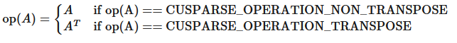
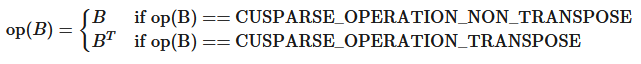
Only`opA == CUSPARSE_OPERATION_NON_TRANSPOSE`is currently supported
The function`cusparseSpMMOp_createPlan()`returns the size of the workspace and the compiled kernel needed by`cusparseSpMMOp()`

<div style="overflow-x: auto; max-width: 100%; border-radius: 6px;">
<table border="1" cellpadding="6" cellspacing="0" style="border-collapse: collapse; width: 100%; font-family: -apple-system, BlinkMacSystemFont, Segoe UI, Helvetica, Arial, sans-serif; font-size: 13px; margin: 16px 0;">
<colgroup>
<col style="width: 24%"/>
<col style="width: 7%"/>
<col style="width: 7%"/>
<col style="width: 63%"/>
</colgroup>
<thead>
<tr style="border: 1px solid #d0d7de;">
<th style="background-color: #f6f8fa; font-weight: 600; text-align: left; padding: 8px 12px; border: 1px solid #d0d7de;"><p>Param.</p></th>
<th style="background-color: #f6f8fa; font-weight: 600; text-align: left; padding: 8px 12px; border: 1px solid #d0d7de;"><p>Memory</p></th>
<th style="background-color: #f6f8fa; font-weight: 600; text-align: left; padding: 8px 12px; border: 1px solid #d0d7de;"><p>In/out</p></th>
<th style="background-color: #f6f8fa; font-weight: 600; text-align: left; padding: 8px 12px; border: 1px solid #d0d7de;"><p>Meaning</p></th>
</tr>
</thead>
<tbody>
<tr style="border: 1px solid #d0d7de;">
<td style="padding: 8px 12px; border: 1px solid #d0d7de; vertical-align: top;"><p><code class="docutils literal notranslate"><span class="pre">handle</span></code></p></td>
<td style="padding: 8px 12px; border: 1px solid #d0d7de; vertical-align: top;"><p>HOST</p></td>
<td style="padding: 8px 12px; border: 1px solid #d0d7de; vertical-align: top;"><p>IN</p></td>
<td style="padding: 8px 12px; border: 1px solid #d0d7de; vertical-align: top;"><p>Handle to the cuSPARSE library context</p></td>
</tr>
<tr style="border: 1px solid #d0d7de;">
<td style="padding: 8px 12px; border: 1px solid #d0d7de; vertical-align: top;"><p><code class="docutils literal notranslate"><span class="pre">opA</span></code></p></td>
<td style="padding: 8px 12px; border: 1px solid #d0d7de; vertical-align: top;"><p>HOST</p></td>
<td style="padding: 8px 12px; border: 1px solid #d0d7de; vertical-align: top;"><p>IN</p></td>
<td style="padding: 8px 12px; border: 1px solid #d0d7de; vertical-align: top;"><p>Operation <code class="docutils literal notranslate"><span class="pre">op(A)</span></code></p></td>
</tr>
<tr style="border: 1px solid #d0d7de;">
<td style="padding: 8px 12px; border: 1px solid #d0d7de; vertical-align: top;"><p><code class="docutils literal notranslate"><span class="pre">opB</span></code></p></td>
<td style="padding: 8px 12px; border: 1px solid #d0d7de; vertical-align: top;"><p>HOST</p></td>
<td style="padding: 8px 12px; border: 1px solid #d0d7de; vertical-align: top;"><p>IN</p></td>
<td style="padding: 8px 12px; border: 1px solid #d0d7de; vertical-align: top;"><p>Operation <code class="docutils literal notranslate"><span class="pre">op(B)</span></code></p></td>
</tr>
<tr style="border: 1px solid #d0d7de;">
<td style="padding: 8px 12px; border: 1px solid #d0d7de; vertical-align: top;"><p><code class="docutils literal notranslate"><span class="pre">matA</span></code></p></td>
<td style="padding: 8px 12px; border: 1px solid #d0d7de; vertical-align: top;"><p>HOST</p></td>
<td style="padding: 8px 12px; border: 1px solid #d0d7de; vertical-align: top;"><p>IN</p></td>
<td style="padding: 8px 12px; border: 1px solid #d0d7de; vertical-align: top;"><p>Sparse matrix <code class="docutils literal notranslate"><span class="pre">A</span></code></p></td>
</tr>
<tr style="border: 1px solid #d0d7de;">
<td style="padding: 8px 12px; border: 1px solid #d0d7de; vertical-align: top;"><p><code class="docutils literal notranslate"><span class="pre">matB</span></code></p></td>
<td style="padding: 8px 12px; border: 1px solid #d0d7de; vertical-align: top;"><p>HOST</p></td>
<td style="padding: 8px 12px; border: 1px solid #d0d7de; vertical-align: top;"><p>IN</p></td>
<td style="padding: 8px 12px; border: 1px solid #d0d7de; vertical-align: top;"><p>Dense matrix <code class="docutils literal notranslate"><span class="pre">B</span></code></p></td>
</tr>
<tr style="border: 1px solid #d0d7de;">
<td style="padding: 8px 12px; border: 1px solid #d0d7de; vertical-align: top;"><p><code class="docutils literal notranslate"><span class="pre">matC</span></code></p></td>
<td style="padding: 8px 12px; border: 1px solid #d0d7de; vertical-align: top;"><p>HOST</p></td>
<td style="padding: 8px 12px; border: 1px solid #d0d7de; vertical-align: top;"><p>IN/OUT</p></td>
<td style="padding: 8px 12px; border: 1px solid #d0d7de; vertical-align: top;"><p>Dense matrix <code class="docutils literal notranslate"><span class="pre">C</span></code></p></td>
</tr>
<tr style="border: 1px solid #d0d7de;">
<td style="padding: 8px 12px; border: 1px solid #d0d7de; vertical-align: top;"><p><code class="docutils literal notranslate"><span class="pre">computeType</span></code></p></td>
<td style="padding: 8px 12px; border: 1px solid #d0d7de; vertical-align: top;"><p>HOST</p></td>
<td style="padding: 8px 12px; border: 1px solid #d0d7de; vertical-align: top;"><p>IN</p></td>
<td style="padding: 8px 12px; border: 1px solid #d0d7de; vertical-align: top;"><p>Datatype in which the computation is executed</p></td>
</tr>
<tr style="border: 1px solid #d0d7de;">
<td style="padding: 8px 12px; border: 1px solid #d0d7de; vertical-align: top;"><p><code class="docutils literal notranslate"><span class="pre">alg</span></code></p></td>
<td style="padding: 8px 12px; border: 1px solid #d0d7de; vertical-align: top;"><p>HOST</p></td>
<td style="padding: 8px 12px; border: 1px solid #d0d7de; vertical-align: top;"><p>IN</p></td>
<td style="padding: 8px 12px; border: 1px solid #d0d7de; vertical-align: top;"><p>Algorithm for the computation</p></td>
</tr>
<tr style="border: 1px solid #d0d7de;">
<td style="padding: 8px 12px; border: 1px solid #d0d7de; vertical-align: top;"><p><code class="docutils literal notranslate"><span class="pre">addOperationLTOBuffer</span></code></p></td>
<td style="padding: 8px 12px; border: 1px solid #d0d7de; vertical-align: top;"><p>HOST</p></td>
<td style="padding: 8px 12px; border: 1px solid #d0d7de; vertical-align: top;"><p>IN</p></td>
<td style="padding: 8px 12px; border: 1px solid #d0d7de; vertical-align: top;"><p>Pointer to the LTO-IR buffer containing the custom <strong>add</strong> operator</p></td>
</tr>
<tr style="border: 1px solid #d0d7de;">
<td style="padding: 8px 12px; border: 1px solid #d0d7de; vertical-align: top;"><p><code class="docutils literal notranslate"><span class="pre">addOperationBufferSize</span></code></p></td>
<td style="padding: 8px 12px; border: 1px solid #d0d7de; vertical-align: top;"><p>HOST</p></td>
<td style="padding: 8px 12px; border: 1px solid #d0d7de; vertical-align: top;"><p>IN</p></td>
<td style="padding: 8px 12px; border: 1px solid #d0d7de; vertical-align: top;"><p>Size in bytes of <code class="docutils literal notranslate"><span class="pre">addOperationLTOBuffer</span></code></p></td>
</tr>
<tr style="border: 1px solid #d0d7de;">
<td style="padding: 8px 12px; border: 1px solid #d0d7de; vertical-align: top;"><p><code class="docutils literal notranslate"><span class="pre">mulOperationLTOBuffer</span></code></p></td>
<td style="padding: 8px 12px; border: 1px solid #d0d7de; vertical-align: top;"><p>HOST</p></td>
<td style="padding: 8px 12px; border: 1px solid #d0d7de; vertical-align: top;"><p>IN</p></td>
<td style="padding: 8px 12px; border: 1px solid #d0d7de; vertical-align: top;"><p>Pointer to the LTO-IR buffer containing the custom <strong>mul</strong> operator</p></td>
</tr>
<tr style="border: 1px solid #d0d7de;">
<td style="padding: 8px 12px; border: 1px solid #d0d7de; vertical-align: top;"><p><code class="docutils literal notranslate"><span class="pre">mulOperationBufferSize</span></code></p></td>
<td style="padding: 8px 12px; border: 1px solid #d0d7de; vertical-align: top;"><p>HOST</p></td>
<td style="padding: 8px 12px; border: 1px solid #d0d7de; vertical-align: top;"><p>IN</p></td>
<td style="padding: 8px 12px; border: 1px solid #d0d7de; vertical-align: top;"><p>Size in bytes of <code class="docutils literal notranslate"><span class="pre">mulOperationLTOBuffer</span></code></p></td>
</tr>
<tr style="border: 1px solid #d0d7de;">
<td style="padding: 8px 12px; border: 1px solid #d0d7de; vertical-align: top;"><p><code class="docutils literal notranslate"><span class="pre">epilogueLTOBuffer</span></code></p></td>
<td style="padding: 8px 12px; border: 1px solid #d0d7de; vertical-align: top;"><p>HOST</p></td>
<td style="padding: 8px 12px; border: 1px solid #d0d7de; vertical-align: top;"><p>IN</p></td>
<td style="padding: 8px 12px; border: 1px solid #d0d7de; vertical-align: top;"><p>Pointer to the LTO-IR buffer containing the custom <strong>epilogue</strong> operator</p></td>
</tr>
<tr style="border: 1px solid #d0d7de;">
<td style="padding: 8px 12px; border: 1px solid #d0d7de; vertical-align: top;"><p><code class="docutils literal notranslate"><span class="pre">epilogueBufferSize</span></code></p></td>
<td style="padding: 8px 12px; border: 1px solid #d0d7de; vertical-align: top;"><p>HOST</p></td>
<td style="padding: 8px 12px; border: 1px solid #d0d7de; vertical-align: top;"><p>IN</p></td>
<td style="padding: 8px 12px; border: 1px solid #d0d7de; vertical-align: top;"><p>Size in bytes of <code class="docutils literal notranslate"><span class="pre">epilogueLTOBuffer</span></code></p></td>
</tr>
<tr style="border: 1px solid #d0d7de;">
<td style="padding: 8px 12px; border: 1px solid #d0d7de; vertical-align: top;"><p><code class="docutils literal notranslate"><span class="pre">SpMMWorkspaceSize</span></code></p></td>
<td style="padding: 8px 12px; border: 1px solid #d0d7de; vertical-align: top;"><p>HOST</p></td>
<td style="padding: 8px 12px; border: 1px solid #d0d7de; vertical-align: top;"><p>OUT</p></td>
<td style="padding: 8px 12px; border: 1px solid #d0d7de; vertical-align: top;"><p>Number of bytes of workspace needed by <code class="docutils literal notranslate"><span class="pre">cusparseSpMMOp</span></code></p></td>
</tr>
</tbody>
</table>
</div>

The operators must have the following signature and return type

```
__device__ <computetype> add_op(<computetype> value1, <computetype> value2);

__device__ <computetype> mul_op(<computetype> value1, <computetype> value2);

__device__ <computetype> epilogue(<computetype> value1, <computetype> value2);

```

`<computetype>`is one of`float`,`double`,`cuComplex`,`cuDoubleComplex`, or`int`,
`cusparseSpMMOp`supports the following sparse matrix formats:
- `CUSPARSE_FORMAT_CSR`
`cusparseSpMMOp`supports the following index type for representing the sparse matrix`matA`:
- 32-bit indices (`CUSPARSE_INDEX_32I`)
- 64-bit indices (`CUSPARSE_INDEX_64I`)
`cusparseSpMMOp`supports the following data types:
Uniform-precision computation:

<div style="overflow-x: auto; max-width: 100%; border-radius: 6px;">
<table border="1" cellpadding="6" cellspacing="0" style="border-collapse: collapse; width: 100%; font-family: -apple-system, BlinkMacSystemFont, Segoe UI, Helvetica, Arial, sans-serif; font-size: 13px; margin: 16px 0;">
<colgroup>
<col style="width: 100%"/>
</colgroup>
<thead>
<tr style="border: 1px solid #d0d7de;">
<th style="background-color: #f6f8fa; font-weight: 600; text-align: left; padding: 8px 12px; border: 1px solid #d0d7de;"><p><code class="docutils literal notranslate"><span class="pre">A</span></code>/<code class="docutils literal notranslate"><span class="pre">B</span></code>/ <code class="docutils literal notranslate"><span class="pre">C</span></code>/<code class="docutils literal notranslate"><span class="pre">computeType</span></code></p></th>
</tr>
</thead>
<tbody>
<tr style="border: 1px solid #d0d7de;">
<td style="padding: 8px 12px; border: 1px solid #d0d7de; vertical-align: top;"><p><code class="docutils literal notranslate"><span class="pre">CUDA_R_32F</span></code></p></td>
</tr>
<tr style="border: 1px solid #d0d7de;">
<td style="padding: 8px 12px; border: 1px solid #d0d7de; vertical-align: top;"><p><code class="docutils literal notranslate"><span class="pre">CUDA_R_64F</span></code></p></td>
</tr>
<tr style="border: 1px solid #d0d7de;">
<td style="padding: 8px 12px; border: 1px solid #d0d7de; vertical-align: top;"><p><code class="docutils literal notranslate"><span class="pre">CUDA_C_32F</span></code></p></td>
</tr>
<tr style="border: 1px solid #d0d7de;">
<td style="padding: 8px 12px; border: 1px solid #d0d7de; vertical-align: top;"><p><code class="docutils literal notranslate"><span class="pre">CUDA_C_64F</span></code></p></td>
</tr>
</tbody>
</table>
</div>

Mixed-precision computation:

<div style="overflow-x: auto; max-width: 100%; border-radius: 6px;">
<table border="1" cellpadding="6" cellspacing="0" style="border-collapse: collapse; width: 100%; font-family: -apple-system, BlinkMacSystemFont, Segoe UI, Helvetica, Arial, sans-serif; font-size: 13px; margin: 16px 0;">
<colgroup>
<col style="width: 33%"/>
<col style="width: 33%"/>
<col style="width: 33%"/>
</colgroup>
<thead>
<tr style="border: 1px solid #d0d7de;">
<th style="background-color: #f6f8fa; font-weight: 600; text-align: left; padding: 8px 12px; border: 1px solid #d0d7de;"><p><code class="docutils literal notranslate"><span class="pre">A</span></code>/<code class="docutils literal notranslate"><span class="pre">B</span></code></p></th>
<th style="background-color: #f6f8fa; font-weight: 600; text-align: left; padding: 8px 12px; border: 1px solid #d0d7de;"><p><code class="docutils literal notranslate"><span class="pre">C</span></code></p></th>
<th style="background-color: #f6f8fa; font-weight: 600; text-align: left; padding: 8px 12px; border: 1px solid #d0d7de;"><p><code class="docutils literal notranslate"><span class="pre">computeType</span></code></p></th>
</tr>
</thead>
<tbody>
<tr style="border: 1px solid #d0d7de;">
<td style="padding: 8px 12px; border: 1px solid #d0d7de; vertical-align: top;"><p><code class="docutils literal notranslate"><span class="pre">CUDA_R_8I</span></code></p></td>
<td style="padding: 8px 12px; border: 1px solid #d0d7de; vertical-align: top;"><p><code class="docutils literal notranslate"><span class="pre">CUDA_R_32I</span></code></p></td>
<td style="padding: 8px 12px; border: 1px solid #d0d7de; vertical-align: top;"><p><code class="docutils literal notranslate"><span class="pre">CUDA_R_32I</span></code></p></td>
</tr>
<tr style="border: 1px solid #d0d7de;">
<td style="padding: 8px 12px; border: 1px solid #d0d7de; vertical-align: top;"><p><code class="docutils literal notranslate"><span class="pre">CUDA_R_8I</span></code></p></td>
<td rowspan="3" style="padding: 8px 12px; border: 1px solid #d0d7de; vertical-align: top;"><p><code class="docutils literal notranslate"><span class="pre">CUDA_R_32F</span></code></p></td>
<td rowspan="5" style="padding: 8px 12px; border: 1px solid #d0d7de; vertical-align: top;"><p><code class="docutils literal notranslate"><span class="pre">CUDA_R_32F</span></code></p></td>
</tr>
<tr style="border: 1px solid #d0d7de;">
<td style="padding: 8px 12px; border: 1px solid #d0d7de; vertical-align: top;"><p><code class="docutils literal notranslate"><span class="pre">CUDA_R_16F</span></code></p></td>
</tr>
<tr style="border: 1px solid #d0d7de;">
<td style="padding: 8px 12px; border: 1px solid #d0d7de; vertical-align: top;"><p><code class="docutils literal notranslate"><span class="pre">CUDA_R_16BF</span></code></p></td>
</tr>
<tr style="border: 1px solid #d0d7de;">
<td style="padding: 8px 12px; border: 1px solid #d0d7de; vertical-align: top;"><p><code class="docutils literal notranslate"><span class="pre">CUDA_R_16F</span></code></p></td>
<td style="padding: 8px 12px; border: 1px solid #d0d7de; vertical-align: top;"><p><code class="docutils literal notranslate"><span class="pre">CUDA_R_16F</span></code></p></td>
</tr>
<tr style="border: 1px solid #d0d7de;">
<td style="padding: 8px 12px; border: 1px solid #d0d7de; vertical-align: top;"><p><code class="docutils literal notranslate"><span class="pre">CUDA_R_16BF</span></code></p></td>
<td style="padding: 8px 12px; border: 1px solid #d0d7de; vertical-align: top;"><p><code class="docutils literal notranslate"><span class="pre">CUDA_R_16BF</span></code></p></td>
</tr>
</tbody>
</table>
</div>

`cusparseSpMMOp`supports the following algorithms:

<div style="overflow-x: auto; max-width: 100%; border-radius: 6px;">
<table border="1" cellpadding="6" cellspacing="0" style="border-collapse: collapse; width: 100%; font-family: -apple-system, BlinkMacSystemFont, Segoe UI, Helvetica, Arial, sans-serif; font-size: 13px; margin: 16px 0;">
<colgroup>
<col style="width: 41%"/>
<col style="width: 59%"/>
</colgroup>
<thead>
<tr style="border: 1px solid #d0d7de;">
<th style="background-color: #f6f8fa; font-weight: 600; text-align: left; padding: 8px 12px; border: 1px solid #d0d7de;"><p>Algorithm</p></th>
<th style="background-color: #f6f8fa; font-weight: 600; text-align: left; padding: 8px 12px; border: 1px solid #d0d7de;"><p>Notes</p></th>
</tr>
</thead>
<tbody>
<tr style="border: 1px solid #d0d7de;">
<td style="padding: 8px 12px; border: 1px solid #d0d7de; vertical-align: top;"><p><code class="docutils literal notranslate"><span class="pre">CUSPARSE_SPMM_OP_ALG_DEFAULT</span></code></p></td>
<td style="padding: 8px 12px; border: 1px solid #d0d7de; vertical-align: top;"><p>Default algorithm for any sparse matrix format</p></td>
</tr>
</tbody>
</table>
</div>

**Performance notes:**
- Row-major layout provides higher performance than column-major.
`cusparseSpMMOp()`has the following properties:
- The routine requires extra storage
- The routine supports asynchronous execution
- Provides deterministic (bit-wise) results for each run
- The routine allows the indices of`matA`to be unsorted
`cusparseSpMMOp()`supports the followingoptimizations:
- CUDA graph capture
- Hardware Memory Compression
Please visit[cuSPARSE Library Samples - cusparseSpMMOp](https://github.com/NVIDIA/CUDALibrarySamples/tree/main/cuSPARSE/spmm_csr_op)
SeecusparseStatus_tfor the description of the return status.

---

### 6.6.11. cusparseSpSM()

```
cusparseStatus_t
cusparseSpSM_createDescr(cusparseSpSMDescr_t* spsmDescr);
cusparseStatus_t
cusparseSpSM_destroyDescr(cusparseSpSMDescr_t spsmDescr);

```

```
cusparseStatus_t
cusparseSpSM_bufferSize(cusparseHandle_t     handle,
                        cusparseOperation_t  opA,
                        cusparseOperation_t  opB,
                        const void*          alpha,
                        cusparseConstSpMatDescr_t matA,  // non-const descriptor supported
                        cusparseConstDnMatDescr_t matB,  // non-const descriptor supported
                        cusparseDnMatDescr_t matC,
                        cudaDataType         computeType,
                        cusparseSpSMAlg_t    alg,
                        cusparseSpSMDescr_t  spsmDescr,
                        size_t*              bufferSize)

```

```
cusparseStatus_t
cusparseSpSM_analysis(cusparseHandle_t          handle,
                      cusparseOperation_t       opA,
                      cusparseOperation_t       opB,
                      const void*               alpha,
                      cusparseConstSpMatDescr_t matA,  // non-const descriptor supported
                      cusparseConstDnMatDescr_t matB,  // non-const descriptor supported
                      cusparseDnMatDescr_t      matC,
                      cudaDataType              computeType,
                      cusparseSpSMAlg_t         alg,
                      cusparseSpSMDescr_t       spsmDescr,
                      void*                     externalBuffer)

```

```
cusparseStatus_t
cusparseSpSM_solve(cusparseHandle_t          handle,
                   cusparseOperation_t       opA,
                   cusparseOperation_t       opB,
                   const void*               alpha,
                   cusparseConstSpMatDescr_t matA,  // non-const descriptor supported
                   cusparseConstDnMatDescr_t matB,  // non-const descriptor supported
                   cusparseDnMatDescr_t      matC,
                   cudaDataType              computeType,
                   cusparseSpSMAlg_t         alg,
                   cusparseSpSMDescr_t       spsmDescr)

```

```
cusparseStatus_t
cusparseSpSM_updateMatrix(cusparseHandle_t     handle,
                          cusparseSpSMDescr_t  spsmDescr,
                          void*                newValues,
                          cusparseSpSMUpdate_t updatePart)

```

The function solves a system of linear equations whose coefficients are represented in a sparse triangular matrix:

\[op\left( \mathbf{A} \right) \cdot \mathbf{C} = \mathbf{\alpha}op\left( \mathbf{B} \right)\]
where
- `op(A)`is a sparse square matrix of size$m \times m$
- `op(B)`is a dense matrix of size$m \times n$
- `C`is a dense matrix of size$m \times n$
- $\alpha$is a scalar
Also, for matrix`A`

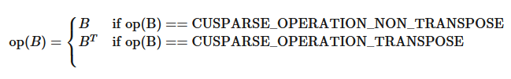
The function`cusparseSpSM_bufferSize()`returns the size of the workspace needed by`cusparseSpSM_analysis()`and`cusparseSpSM_solve()`.
The function`cusparseSpSM_analysis()`performs the analysis phase, while`cusparseSpSM_solve()`executes the solve phase for a sparse triangular linear system.
The opaque data structure`spsmDescr`is used to share information among all functions.
The function`cusparseSpSM_updateMatrix()`updates`spsmDescr`with new matrix values.
The routine supports arbitrary sparsity for the input matrix, but only the upper or lower triangular part is taken into account in the computation.
`cusparseSpSM_bufferSize()`requires a buffer size for the analysis phase which is proportional to number of non-zero entries of the sparse matrix
The`externalBuffer`is stored into`spsmDescr`and used by`cusparseSpSM_solve()`. For this reason, the device memory buffer must be deallocated only after`cusparseSpSM_solve()`
*NOTE:*all parameters must be consistent across`cusparseSpSM`API calls and the matrix descriptions and`externalBuffer`must not be modified between`cusparseSpSM_analysis()`and`cusparseSpSM_solve()`

<div style="overflow-x: auto; max-width: 100%; border-radius: 6px;">
<table border="1" cellpadding="6" cellspacing="0" style="border-collapse: collapse; width: 100%; font-family: -apple-system, BlinkMacSystemFont, Segoe UI, Helvetica, Arial, sans-serif; font-size: 13px; margin: 16px 0;">
<colgroup>
<col style="width: 11%"/>
<col style="width: 9%"/>
<col style="width: 4%"/>
<col style="width: 75%"/>
</colgroup>
<thead>
<tr style="border: 1px solid #d0d7de;">
<th style="background-color: #f6f8fa; font-weight: 600; text-align: left; padding: 8px 12px; border: 1px solid #d0d7de;"><p>Param.</p></th>
<th style="background-color: #f6f8fa; font-weight: 600; text-align: left; padding: 8px 12px; border: 1px solid #d0d7de;"><p>Memory</p></th>
<th style="background-color: #f6f8fa; font-weight: 600; text-align: left; padding: 8px 12px; border: 1px solid #d0d7de;"><p>In/out</p></th>
<th style="background-color: #f6f8fa; font-weight: 600; text-align: left; padding: 8px 12px; border: 1px solid #d0d7de;"><p>Meaning</p></th>
</tr>
</thead>
<tbody>
<tr style="border: 1px solid #d0d7de;">
<td style="padding: 8px 12px; border: 1px solid #d0d7de; vertical-align: top;"><p><code class="docutils literal notranslate"><span class="pre">handle</span></code></p></td>
<td style="padding: 8px 12px; border: 1px solid #d0d7de; vertical-align: top;"><p>HOST</p></td>
<td style="padding: 8px 12px; border: 1px solid #d0d7de; vertical-align: top;"><p>IN</p></td>
<td style="padding: 8px 12px; border: 1px solid #d0d7de; vertical-align: top;"><p>Handle to the cuSPARSE library context</p></td>
</tr>
<tr style="border: 1px solid #d0d7de;">
<td style="padding: 8px 12px; border: 1px solid #d0d7de; vertical-align: top;"><p><code class="docutils literal notranslate"><span class="pre">opA</span></code></p></td>
<td style="padding: 8px 12px; border: 1px solid #d0d7de; vertical-align: top;"><p>HOST</p></td>
<td style="padding: 8px 12px; border: 1px solid #d0d7de; vertical-align: top;"><p>IN</p></td>
<td style="padding: 8px 12px; border: 1px solid #d0d7de; vertical-align: top;"><p>Operation <code class="docutils literal notranslate"><span class="pre">op(A)</span></code></p></td>
</tr>
<tr style="border: 1px solid #d0d7de;">
<td style="padding: 8px 12px; border: 1px solid #d0d7de; vertical-align: top;"><p><code class="docutils literal notranslate"><span class="pre">opB</span></code></p></td>
<td style="padding: 8px 12px; border: 1px solid #d0d7de; vertical-align: top;"><p>HOST</p></td>
<td style="padding: 8px 12px; border: 1px solid #d0d7de; vertical-align: top;"><p>IN</p></td>
<td style="padding: 8px 12px; border: 1px solid #d0d7de; vertical-align: top;"><p>Operation <code class="docutils literal notranslate"><span class="pre">op(B)</span></code></p></td>
</tr>
<tr style="border: 1px solid #d0d7de;">
<td style="padding: 8px 12px; border: 1px solid #d0d7de; vertical-align: top;"><p><code class="docutils literal notranslate"><span class="pre">alpha</span></code></p></td>
<td style="padding: 8px 12px; border: 1px solid #d0d7de; vertical-align: top;"><p>HOST or DEVICE</p></td>
<td style="padding: 8px 12px; border: 1px solid #d0d7de; vertical-align: top;"><p>IN</p></td>
<td style="padding: 8px 12px; border: 1px solid #d0d7de; vertical-align: top;"><p><span class="math notranslate nohighlight">\(\alpha\)</span> scalar used for multiplication of type <code class="docutils literal notranslate"><span class="pre">computeType</span></code></p></td>
</tr>
<tr style="border: 1px solid #d0d7de;">
<td style="padding: 8px 12px; border: 1px solid #d0d7de; vertical-align: top;"><p><code class="docutils literal notranslate"><span class="pre">matA</span></code></p></td>
<td style="padding: 8px 12px; border: 1px solid #d0d7de; vertical-align: top;"><p>HOST</p></td>
<td style="padding: 8px 12px; border: 1px solid #d0d7de; vertical-align: top;"><p>IN</p></td>
<td style="padding: 8px 12px; border: 1px solid #d0d7de; vertical-align: top;"><p>Sparse matrix <code class="docutils literal notranslate"><span class="pre">A</span></code></p></td>
</tr>
<tr style="border: 1px solid #d0d7de;">
<td style="padding: 8px 12px; border: 1px solid #d0d7de; vertical-align: top;"><p><code class="docutils literal notranslate"><span class="pre">matB</span></code></p></td>
<td style="padding: 8px 12px; border: 1px solid #d0d7de; vertical-align: top;"><p>HOST</p></td>
<td style="padding: 8px 12px; border: 1px solid #d0d7de; vertical-align: top;"><p>IN</p></td>
<td style="padding: 8px 12px; border: 1px solid #d0d7de; vertical-align: top;"><p>Dense matrix <code class="docutils literal notranslate"><span class="pre">B</span></code></p></td>
</tr>
<tr style="border: 1px solid #d0d7de;">
<td style="padding: 8px 12px; border: 1px solid #d0d7de; vertical-align: top;"><p><code class="docutils literal notranslate"><span class="pre">matC</span></code></p></td>
<td style="padding: 8px 12px; border: 1px solid #d0d7de; vertical-align: top;"><p>HOST</p></td>
<td style="padding: 8px 12px; border: 1px solid #d0d7de; vertical-align: top;"><p>IN/OUT</p></td>
<td style="padding: 8px 12px; border: 1px solid #d0d7de; vertical-align: top;"><p>Dense matrix <code class="docutils literal notranslate"><span class="pre">C</span></code></p></td>
</tr>
<tr style="border: 1px solid #d0d7de;">
<td style="padding: 8px 12px; border: 1px solid #d0d7de; vertical-align: top;"><p><code class="docutils literal notranslate"><span class="pre">computeType</span></code></p></td>
<td style="padding: 8px 12px; border: 1px solid #d0d7de; vertical-align: top;"><p>HOST</p></td>
<td style="padding: 8px 12px; border: 1px solid #d0d7de; vertical-align: top;"><p>IN</p></td>
<td style="padding: 8px 12px; border: 1px solid #d0d7de; vertical-align: top;"><p>Datatype in which the computation is executed</p></td>
</tr>
<tr style="border: 1px solid #d0d7de;">
<td style="padding: 8px 12px; border: 1px solid #d0d7de; vertical-align: top;"><p><code class="docutils literal notranslate"><span class="pre">alg</span></code></p></td>
<td style="padding: 8px 12px; border: 1px solid #d0d7de; vertical-align: top;"><p>HOST</p></td>
<td style="padding: 8px 12px; border: 1px solid #d0d7de; vertical-align: top;"><p>IN</p></td>
<td style="padding: 8px 12px; border: 1px solid #d0d7de; vertical-align: top;"><p>Algorithm for the computation</p></td>
</tr>
<tr style="border: 1px solid #d0d7de;">
<td style="padding: 8px 12px; border: 1px solid #d0d7de; vertical-align: top;"><p><code class="docutils literal notranslate"><span class="pre">bufferSize</span></code></p></td>
<td style="padding: 8px 12px; border: 1px solid #d0d7de; vertical-align: top;"><p>HOST</p></td>
<td style="padding: 8px 12px; border: 1px solid #d0d7de; vertical-align: top;"><p>OUT</p></td>
<td style="padding: 8px 12px; border: 1px solid #d0d7de; vertical-align: top;"><p>Number of bytes of workspace needed by <code class="docutils literal notranslate"><span class="pre">cusparseSpSM_analysis()</span></code> and <code class="docutils literal notranslate"><span class="pre">cusparseSpSM_solve()</span></code></p></td>
</tr>
<tr style="border: 1px solid #d0d7de;">
<td style="padding: 8px 12px; border: 1px solid #d0d7de; vertical-align: top;"><p><code class="docutils literal notranslate"><span class="pre">externalBuffer</span></code></p></td>
<td style="padding: 8px 12px; border: 1px solid #d0d7de; vertical-align: top;"><p>DEVICE</p></td>
<td style="padding: 8px 12px; border: 1px solid #d0d7de; vertical-align: top;"><p>IN/OUT</p></td>
<td style="padding: 8px 12px; border: 1px solid #d0d7de; vertical-align: top;"><p>Pointer to a workspace buffer of at least <code class="docutils literal notranslate"><span class="pre">bufferSize</span></code> bytes. It is used by <code class="docutils literal notranslate"><span class="pre">cusparseSpSM_analysis</span></code> and <code class="docutils literal notranslate"><span class="pre">cusparseSpSM_solve()</span></code></p></td>
</tr>
<tr style="border: 1px solid #d0d7de;">
<td style="padding: 8px 12px; border: 1px solid #d0d7de; vertical-align: top;"><p><code class="docutils literal notranslate"><span class="pre">spsmDescr</span></code></p></td>
<td style="padding: 8px 12px; border: 1px solid #d0d7de; vertical-align: top;"><p>HOST</p></td>
<td style="padding: 8px 12px; border: 1px solid #d0d7de; vertical-align: top;"><p>IN/OUT</p></td>
<td style="padding: 8px 12px; border: 1px solid #d0d7de; vertical-align: top;"><p>Opaque descriptor for storing internal data used across the three steps</p></td>
</tr>
</tbody>
</table>
</div>

The sparse matrix formats currently supported are listed below:
- `CUSPARSE_FORMAT_CSR`
- `CUSPARSE_FORMAT_COO`
The`cusparseSpSM()`supports the following shapes and properties:
- `CUSPARSE_FILL_MODE_LOWER`and`CUSPARSE_FILL_MODE_UPPER`fill modes
- `CUSPARSE_DIAG_TYPE_NON_UNIT`and`CUSPARSE_DIAG_TYPE_UNIT`diagonal types
The fill mode and diagonal type can be set bycusparseSpMatSetAttribute().
`cusparseSpSM()`supports the following index type for representing the sparse matrix`matA`:
- 32-bit indices (`CUSPARSE_INDEX_32I`)
- 64-bit indices (`CUSPARSE_INDEX_64I`)
`cusparseSpSM()`supports the following data types:
Uniform-precision computation:

<div style="overflow-x: auto; max-width: 100%; border-radius: 6px;">
<table border="1" cellpadding="6" cellspacing="0" style="border-collapse: collapse; width: 100%; font-family: -apple-system, BlinkMacSystemFont, Segoe UI, Helvetica, Arial, sans-serif; font-size: 13px; margin: 16px 0;">
<colgroup>
<col style="width: 100%"/>
</colgroup>
<thead>
<tr style="border: 1px solid #d0d7de;">
<th style="background-color: #f6f8fa; font-weight: 600; text-align: left; padding: 8px 12px; border: 1px solid #d0d7de;"><p><code class="docutils literal notranslate"><span class="pre">A</span></code>/<code class="docutils literal notranslate"><span class="pre">B</span></code>/ <code class="docutils literal notranslate"><span class="pre">C</span></code>/<code class="docutils literal notranslate"><span class="pre">computeType</span></code></p></th>
</tr>
</thead>
<tbody>
<tr style="border: 1px solid #d0d7de;">
<td style="padding: 8px 12px; border: 1px solid #d0d7de; vertical-align: top;"><p><code class="docutils literal notranslate"><span class="pre">CUDA_R_32F</span></code></p></td>
</tr>
<tr style="border: 1px solid #d0d7de;">
<td style="padding: 8px 12px; border: 1px solid #d0d7de; vertical-align: top;"><p><code class="docutils literal notranslate"><span class="pre">CUDA_R_64F</span></code></p></td>
</tr>
<tr style="border: 1px solid #d0d7de;">
<td style="padding: 8px 12px; border: 1px solid #d0d7de; vertical-align: top;"><p><code class="docutils literal notranslate"><span class="pre">CUDA_C_32F</span></code></p></td>
</tr>
<tr style="border: 1px solid #d0d7de;">
<td style="padding: 8px 12px; border: 1px solid #d0d7de; vertical-align: top;"><p><code class="docutils literal notranslate"><span class="pre">CUDA_C_64F</span></code></p></td>
</tr>
</tbody>
</table>
</div>

`cusparseSpSM()`supports the following algorithms:

<div style="overflow-x: auto; max-width: 100%; border-radius: 6px;">
<table border="1" cellpadding="6" cellspacing="0" style="border-collapse: collapse; width: 100%; font-family: -apple-system, BlinkMacSystemFont, Segoe UI, Helvetica, Arial, sans-serif; font-size: 13px; margin: 16px 0;">
<colgroup>
<col style="width: 63%"/>
<col style="width: 37%"/>
</colgroup>
<thead>
<tr style="border: 1px solid #d0d7de;">
<th style="background-color: #f6f8fa; font-weight: 600; text-align: left; padding: 8px 12px; border: 1px solid #d0d7de;"><p>Algorithm</p></th>
<th style="background-color: #f6f8fa; font-weight: 600; text-align: left; padding: 8px 12px; border: 1px solid #d0d7de;"><p>Notes</p></th>
</tr>
</thead>
<tbody>
<tr style="border: 1px solid #d0d7de;">
<td style="padding: 8px 12px; border: 1px solid #d0d7de; vertical-align: top;"><p><code class="docutils literal notranslate"><span class="pre">CUSPARSE_SPSM_ALG_DEFAULT</span></code></p></td>
<td style="padding: 8px 12px; border: 1px solid #d0d7de; vertical-align: top;"><p>Default algorithm</p></td>
</tr>
</tbody>
</table>
</div>

`cusparseSpSM()`has the following properties:
- The routine requires no extra storage
- Provides deterministic (bit-wise) results for each run for the solving phase`cusparseSpSM_solve()`
- The`cusparseSpSM_solve()`routine supports asynchronous execution
- The routine supports in-place operation. The same device pointer must be provided to the`values`parameter of the dense matrices`matB`and`matC`. All other dense matrix descriptor parameters (e.g.,`order`) can be set independently
- `cusparseSpSM_bufferSize()`and`cusparseSpSM_analysis()`routines accept descriptors of`NULL`values for`matB`and`matC`. These two routines do not accept`NULL`descriptors
- The routine allows the indices of`matA`to be unsorted
`cusparseSpSM()`supports the followingoptimizations:
- CUDA graph capture
- Hardware Memory Compression
`cusparseSpSM_updateMatrix()`updates the sparse matrix after calling the analysis phase. This functions supports the following update strategies (`updatePart`):

<div style="overflow-x: auto; max-width: 100%; border-radius: 6px;">
<table border="1" cellpadding="6" cellspacing="0" style="border-collapse: collapse; width: 100%; font-family: -apple-system, BlinkMacSystemFont, Segoe UI, Helvetica, Arial, sans-serif; font-size: 13px; margin: 16px 0;">
<colgroup>
<col style="width: 20%"/>
<col style="width: 80%"/>
</colgroup>
<thead>
<tr style="border: 1px solid #d0d7de;">
<th style="background-color: #f6f8fa; font-weight: 600; text-align: left; padding: 8px 12px; border: 1px solid #d0d7de;"><p>Strategy</p></th>
<th style="background-color: #f6f8fa; font-weight: 600; text-align: left; padding: 8px 12px; border: 1px solid #d0d7de;"><p>Notes</p></th>
</tr>
</thead>
<tbody>
<tr style="border: 1px solid #d0d7de;">
<td style="padding: 8px 12px; border: 1px solid #d0d7de; vertical-align: top;"><p><code class="docutils literal notranslate"><span class="pre">CUSPARSE_SPSM_UPDATE_GENERAL</span></code></p></td>
<td style="padding: 8px 12px; border: 1px solid #d0d7de; vertical-align: top;"><p>Updates the sparse matrix values with values of <code class="docutils literal notranslate"><span class="pre">newValues</span></code> array</p></td>
</tr>
<tr style="border: 1px solid #d0d7de;">
<td style="padding: 8px 12px; border: 1px solid #d0d7de; vertical-align: top;"><p><code class="docutils literal notranslate"><span class="pre">CUSPARSE_SPSM_UPDATE_DIAGONAL</span></code></p></td>
<td style="padding: 8px 12px; border: 1px solid #d0d7de; vertical-align: top;"><p>Updates the diagonal part of the matrix with diagonal values stored in <code class="docutils literal notranslate"><span class="pre">newValues</span></code> array. That is, <code class="docutils literal notranslate"><span class="pre">newValues</span></code> has the new diagonal values only</p></td>
</tr>
</tbody>
</table>
</div>

SeecusparseStatus_tfor the description of the return status.
Please visit[cuSPARSE Library Samples - cusparseSpSM CSR](https://github.com/NVIDIA/CUDALibrarySamples/tree/main/cuSPARSE/spsm_csr)and[cuSPARSE Library Samples - cusparseSpSM COO](https://github.com/NVIDIA/CUDALibrarySamples/tree/main/cuSPARSE/spsm_coo)for code examples.

---

### 6.6.12. cusparseSDDMM()

```
cusparseStatus_t
cusparseSDDMM_bufferSize(cusparseHandle_t          handle,
                         cusparseOperation_t       opA,
                         cusparseOperation_t       opB,
                         const void*               alpha,
                         cusparseConstDnMatDescr_t matA,  // non-const descriptor supported
                         cusparseConstDnMatDescr_t matB,  // non-const descriptor supported
                         const void*               beta,
                         cusparseSpMatDescr_t      matC,
                         cudaDataType              computeType,
                         cusparseSDDMMAlg_t        alg,
                         size_t*                   bufferSize)

```

```
cusparseStatus_t
cusparseSDDMM_preprocess(cusparseHandle_t          handle,
                         cusparseOperation_t       opA,
                         cusparseOperation_t       opB,
                         const void*               alpha,
                         cusparseConstDnMatDescr_t matA,  // non-const descriptor supported
                         cusparseConstDnMatDescr_t matB,  // non-const descriptor supported
                         const void*               beta,
                         cusparseSpMatDescr_t      matC,
                         cudaDataType              computeType,
                         cusparseSDDMMAlg_t        alg,
                         void*                     externalBuffer)

```

```
cusparseStatus_t
cusparseSDDMM(cusparseHandle_t          handle,
              cusparseOperation_t       opA,
              cusparseOperation_t       opB,
              const void*               alpha,
              cusparseConstDnMatDescr_t matA,  // non-const descriptor supported
              cusparseConstDnMatDescr_t matB,  // non-const descriptor supported
              const void*               beta,
              cusparseSpMatDescr_t      matC,
              cudaDataType              computeType,
              cusparseSDDMMAlg_t        alg,
              void*                     externalBuffer)

```

This function performs the multiplication of`matA`and`matB`, followed by an element-wise multiplication with the sparsity pattern of`matC`. Formally, it performs the following operation:

\[\mathbf{C} = \alpha({op}(\mathbf{A}) \cdot {op}(\mathbf{B})) \circ {spy}(\mathbf{C}) + \beta\mathbf{C}\]
where
- `op(A)`is a dense matrix of size$m \times k$
- `op(B)`is a dense matrix of size$k \times n$
- `C`is a sparse matrix of size$m \times n$
- $\alpha$and$\beta$are scalars
- $\circ$denotes the Hadamard (entry-wise) matrix product, and${spy}\left( \mathbf{C} \right)$is the structural sparsity pattern matrix of`C`defined as:
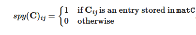
Also, for matrix`A`and`B`


The function`cusparseSDDMM_bufferSize()`returns the size of the workspace needed by`cusparseSDDMM`or`cusparseSDDMM_preprocess`.
Calling`cusparseSDDMM_preprocess()`is optional.
It may accelerate subsequent calls to`cusparseSDDMM()`.
It is useful when`cusparseSDDMM()`is called multiple times with the same sparsity pattern (`matC`).
Calling`cusparseSDDMM_preprocess()`with`buffer`makes that buffer “active” for`matC`SDDMM calls.
Subsequent calls to`cusparseSDDMM()`with`matC`and the active buffer
must use the same values for all parameters as the call to`cusparseSDDMM_preprocess()`.
The exceptions are:`alpha`,`beta`,`matA`,`matB`, and the values (but not indices) of`matC`may be different.
Importantly, the buffer contents must be unmodified since the call to`cusparseSDDMM_preprocess()`.
When`cusparseSDDMM()`is called with`matC`and its active buffer, it may read acceleration data from the buffer.
Calling`cusparseSDDMM_preprocess()`again with`matC`and a new buffer will make the new buffer active,
forgetting about the previously-active buffer and making it inactive.
For`cusparseSDDMM()`, there can only be one active buffer per sparse matrix at a time.
To get the effect of multiple active buffers for a single sparse matrix,
create multiple matrix handles that all point to the same index and value buffers,
and call`cusparseSDDMM_preprocess()`once per handle with different workspace buffers.
Calling`cusparseSDDMM()`with an inactive buffer is always permitted.
However, there may be no acceleration from the preprocessing in that case.
For the purposes ofthread safety,
`cusparseSDDMM_preprocess()`is writing to`matC`internal state.

<div style="overflow-x: auto; max-width: 100%; border-radius: 6px;">
<table border="1" cellpadding="6" cellspacing="0" style="border-collapse: collapse; width: 100%; font-family: -apple-system, BlinkMacSystemFont, Segoe UI, Helvetica, Arial, sans-serif; font-size: 13px; margin: 16px 0;">
<colgroup>
<col style="width: 17%"/>
<col style="width: 14%"/>
<col style="width: 7%"/>
<col style="width: 62%"/>
</colgroup>
<thead>
<tr style="border: 1px solid #d0d7de;">
<th style="background-color: #f6f8fa; font-weight: 600; text-align: left; padding: 8px 12px; border: 1px solid #d0d7de;"><p>Param.</p></th>
<th style="background-color: #f6f8fa; font-weight: 600; text-align: left; padding: 8px 12px; border: 1px solid #d0d7de;"><p>Memory</p></th>
<th style="background-color: #f6f8fa; font-weight: 600; text-align: left; padding: 8px 12px; border: 1px solid #d0d7de;"><p>In/out</p></th>
<th style="background-color: #f6f8fa; font-weight: 600; text-align: left; padding: 8px 12px; border: 1px solid #d0d7de;"><p>Meaning</p></th>
</tr>
</thead>
<tbody>
<tr style="border: 1px solid #d0d7de;">
<td style="padding: 8px 12px; border: 1px solid #d0d7de; vertical-align: top;"><p><code class="docutils literal notranslate"><span class="pre">handle</span></code></p></td>
<td style="padding: 8px 12px; border: 1px solid #d0d7de; vertical-align: top;"><p>HOST</p></td>
<td style="padding: 8px 12px; border: 1px solid #d0d7de; vertical-align: top;"><p>IN</p></td>
<td style="padding: 8px 12px; border: 1px solid #d0d7de; vertical-align: top;"><p>Handle to the cuSPARSE library context</p></td>
</tr>
<tr style="border: 1px solid #d0d7de;">
<td style="padding: 8px 12px; border: 1px solid #d0d7de; vertical-align: top;"><p><code class="docutils literal notranslate"><span class="pre">opA</span></code></p></td>
<td style="padding: 8px 12px; border: 1px solid #d0d7de; vertical-align: top;"><p>HOST</p></td>
<td style="padding: 8px 12px; border: 1px solid #d0d7de; vertical-align: top;"><p>IN</p></td>
<td style="padding: 8px 12px; border: 1px solid #d0d7de; vertical-align: top;"><p>Operation <code class="docutils literal notranslate"><span class="pre">op(A)</span></code></p></td>
</tr>
<tr style="border: 1px solid #d0d7de;">
<td style="padding: 8px 12px; border: 1px solid #d0d7de; vertical-align: top;"><p><code class="docutils literal notranslate"><span class="pre">opB</span></code></p></td>
<td style="padding: 8px 12px; border: 1px solid #d0d7de; vertical-align: top;"><p>HOST</p></td>
<td style="padding: 8px 12px; border: 1px solid #d0d7de; vertical-align: top;"><p>IN</p></td>
<td style="padding: 8px 12px; border: 1px solid #d0d7de; vertical-align: top;"><p>Operation <code class="docutils literal notranslate"><span class="pre">op(B)</span></code></p></td>
</tr>
<tr style="border: 1px solid #d0d7de;">
<td style="padding: 8px 12px; border: 1px solid #d0d7de; vertical-align: top;"><p><code class="docutils literal notranslate"><span class="pre">alpha</span></code></p></td>
<td style="padding: 8px 12px; border: 1px solid #d0d7de; vertical-align: top;"><p>HOST or DEVICE</p></td>
<td style="padding: 8px 12px; border: 1px solid #d0d7de; vertical-align: top;"><p>IN</p></td>
<td style="padding: 8px 12px; border: 1px solid #d0d7de; vertical-align: top;"><p><span class="math notranslate nohighlight">\(\alpha\)</span> scalar used for multiplication of type <code class="docutils literal notranslate"><span class="pre">computeType</span></code></p></td>
</tr>
<tr style="border: 1px solid #d0d7de;">
<td style="padding: 8px 12px; border: 1px solid #d0d7de; vertical-align: top;"><p><code class="docutils literal notranslate"><span class="pre">matA</span></code></p></td>
<td style="padding: 8px 12px; border: 1px solid #d0d7de; vertical-align: top;"><p>HOST</p></td>
<td style="padding: 8px 12px; border: 1px solid #d0d7de; vertical-align: top;"><p>IN</p></td>
<td style="padding: 8px 12px; border: 1px solid #d0d7de; vertical-align: top;"><p>Dense matrix <code class="docutils literal notranslate"><span class="pre">matA</span></code></p></td>
</tr>
<tr style="border: 1px solid #d0d7de;">
<td style="padding: 8px 12px; border: 1px solid #d0d7de; vertical-align: top;"><p><code class="docutils literal notranslate"><span class="pre">matB</span></code></p></td>
<td style="padding: 8px 12px; border: 1px solid #d0d7de; vertical-align: top;"><p>HOST</p></td>
<td style="padding: 8px 12px; border: 1px solid #d0d7de; vertical-align: top;"><p>IN</p></td>
<td style="padding: 8px 12px; border: 1px solid #d0d7de; vertical-align: top;"><p>Dense matrix <code class="docutils literal notranslate"><span class="pre">matB</span></code></p></td>
</tr>
<tr style="border: 1px solid #d0d7de;">
<td style="padding: 8px 12px; border: 1px solid #d0d7de; vertical-align: top;"><p><code class="docutils literal notranslate"><span class="pre">beta</span></code></p></td>
<td style="padding: 8px 12px; border: 1px solid #d0d7de; vertical-align: top;"><p>HOST or DEVICE</p></td>
<td style="padding: 8px 12px; border: 1px solid #d0d7de; vertical-align: top;"><p>IN</p></td>
<td style="padding: 8px 12px; border: 1px solid #d0d7de; vertical-align: top;"><p><span class="math notranslate nohighlight">\(\beta\)</span> scalar used for multiplication of type <code class="docutils literal notranslate"><span class="pre">computeType</span></code></p></td>
</tr>
<tr style="border: 1px solid #d0d7de;">
<td style="padding: 8px 12px; border: 1px solid #d0d7de; vertical-align: top;"><p><code class="docutils literal notranslate"><span class="pre">matC</span></code></p></td>
<td style="padding: 8px 12px; border: 1px solid #d0d7de; vertical-align: top;"><p>HOST</p></td>
<td style="padding: 8px 12px; border: 1px solid #d0d7de; vertical-align: top;"><p>IN/OUT</p></td>
<td style="padding: 8px 12px; border: 1px solid #d0d7de; vertical-align: top;"><p>Sparse matrix <code class="docutils literal notranslate"><span class="pre">matC</span></code></p></td>
</tr>
<tr style="border: 1px solid #d0d7de;">
<td style="padding: 8px 12px; border: 1px solid #d0d7de; vertical-align: top;"><p><code class="docutils literal notranslate"><span class="pre">computeType</span></code></p></td>
<td style="padding: 8px 12px; border: 1px solid #d0d7de; vertical-align: top;"><p>HOST</p></td>
<td style="padding: 8px 12px; border: 1px solid #d0d7de; vertical-align: top;"><p>IN</p></td>
<td style="padding: 8px 12px; border: 1px solid #d0d7de; vertical-align: top;"><p>Datatype in which the computation is executed</p></td>
</tr>
<tr style="border: 1px solid #d0d7de;">
<td style="padding: 8px 12px; border: 1px solid #d0d7de; vertical-align: top;"><p><code class="docutils literal notranslate"><span class="pre">alg</span></code></p></td>
<td style="padding: 8px 12px; border: 1px solid #d0d7de; vertical-align: top;"><p>HOST</p></td>
<td style="padding: 8px 12px; border: 1px solid #d0d7de; vertical-align: top;"><p>IN</p></td>
<td style="padding: 8px 12px; border: 1px solid #d0d7de; vertical-align: top;"><p>Algorithm for the computation</p></td>
</tr>
<tr style="border: 1px solid #d0d7de;">
<td style="padding: 8px 12px; border: 1px solid #d0d7de; vertical-align: top;"><p><code class="docutils literal notranslate"><span class="pre">bufferSize</span></code></p></td>
<td style="padding: 8px 12px; border: 1px solid #d0d7de; vertical-align: top;"><p>HOST</p></td>
<td style="padding: 8px 12px; border: 1px solid #d0d7de; vertical-align: top;"><p>OUT</p></td>
<td style="padding: 8px 12px; border: 1px solid #d0d7de; vertical-align: top;"><p>Number of bytes of workspace needed by <code class="docutils literal notranslate"><span class="pre">cusparseSDDMM</span></code></p></td>
</tr>
<tr style="border: 1px solid #d0d7de;">
<td style="padding: 8px 12px; border: 1px solid #d0d7de; vertical-align: top;"><p><code class="docutils literal notranslate"><span class="pre">externalBuffer</span></code></p></td>
<td style="padding: 8px 12px; border: 1px solid #d0d7de; vertical-align: top;"><p>DEVICE</p></td>
<td style="padding: 8px 12px; border: 1px solid #d0d7de; vertical-align: top;"><p>IN</p></td>
<td style="padding: 8px 12px; border: 1px solid #d0d7de; vertical-align: top;"><p>Pointer to a workspace buffer of at least <code class="docutils literal notranslate"><span class="pre">bufferSize</span></code> bytes</p></td>
</tr>
</tbody>
</table>
</div>

Currently supported sparse matrix formats:
- `CUSPARSE_FORMAT_CSR`
- `CUSPARSE_FORMAT_BSR`
`cusparseSDDMM()`supports the following index type for representing the sparse matrix`matA`:
- 32-bit indices (`CUSPARSE_INDEX_32I`)
- 64-bit indices (`CUSPARSE_INDEX_64I`)
The data types combinations currently supported for`cusparseSDDMM`are listed below:
Uniform-precision computation:

<div style="overflow-x: auto; max-width: 100%; border-radius: 6px;">
<table border="1" cellpadding="6" cellspacing="0" style="border-collapse: collapse; width: 100%; font-family: -apple-system, BlinkMacSystemFont, Segoe UI, Helvetica, Arial, sans-serif; font-size: 13px; margin: 16px 0;">
<colgroup>
<col style="width: 100%"/>
</colgroup>
<thead>
<tr style="border: 1px solid #d0d7de;">
<th style="background-color: #f6f8fa; font-weight: 600; text-align: left; padding: 8px 12px; border: 1px solid #d0d7de;"><p><code class="docutils literal notranslate"><span class="pre">A</span></code>/<code class="docutils literal notranslate"><span class="pre">X</span></code>/ <code class="docutils literal notranslate"><span class="pre">Y</span></code>/<code class="docutils literal notranslate"><span class="pre">computeType</span></code></p></th>
</tr>
</thead>
<tbody>
<tr style="border: 1px solid #d0d7de;">
<td style="padding: 8px 12px; border: 1px solid #d0d7de; vertical-align: top;"><p><code class="docutils literal notranslate"><span class="pre">CUDA_R_32F</span></code></p></td>
</tr>
<tr style="border: 1px solid #d0d7de;">
<td style="padding: 8px 12px; border: 1px solid #d0d7de; vertical-align: top;"><p><code class="docutils literal notranslate"><span class="pre">CUDA_R_64F</span></code></p></td>
</tr>
<tr style="border: 1px solid #d0d7de;">
<td style="padding: 8px 12px; border: 1px solid #d0d7de; vertical-align: top;"><p><code class="docutils literal notranslate"><span class="pre">CUDA_C_32F</span></code></p></td>
</tr>
<tr style="border: 1px solid #d0d7de;">
<td style="padding: 8px 12px; border: 1px solid #d0d7de; vertical-align: top;"><p><code class="docutils literal notranslate"><span class="pre">CUDA_C_64F</span></code></p></td>
</tr>
</tbody>
</table>
</div>

Mixed-precision computation:

<div style="overflow-x: auto; max-width: 100%; border-radius: 6px;">
<table border="1" cellpadding="6" cellspacing="0" style="border-collapse: collapse; width: 100%; font-family: -apple-system, BlinkMacSystemFont, Segoe UI, Helvetica, Arial, sans-serif; font-size: 13px; margin: 16px 0;">
<colgroup>
<col style="width: 33%"/>
<col style="width: 33%"/>
<col style="width: 33%"/>
</colgroup>
<thead>
<tr style="border: 1px solid #d0d7de;">
<th style="background-color: #f6f8fa; font-weight: 600; text-align: left; padding: 8px 12px; border: 1px solid #d0d7de;"><p><code class="docutils literal notranslate"><span class="pre">A</span></code>/<code class="docutils literal notranslate"><span class="pre">B</span></code></p></th>
<th style="background-color: #f6f8fa; font-weight: 600; text-align: left; padding: 8px 12px; border: 1px solid #d0d7de;"><p><code class="docutils literal notranslate"><span class="pre">C</span></code></p></th>
<th style="background-color: #f6f8fa; font-weight: 600; text-align: left; padding: 8px 12px; border: 1px solid #d0d7de;"><p><code class="docutils literal notranslate"><span class="pre">computeType</span></code></p></th>
</tr>
</thead>
<tbody>
<tr style="border: 1px solid #d0d7de;">
<td style="padding: 8px 12px; border: 1px solid #d0d7de; vertical-align: top;"><p><code class="docutils literal notranslate"><span class="pre">CUDA_R_16F</span></code></p></td>
<td style="padding: 8px 12px; border: 1px solid #d0d7de; vertical-align: top;"><p><code class="docutils literal notranslate"><span class="pre">CUDA_R_32F</span></code></p></td>
<td rowspan="2" style="padding: 8px 12px; border: 1px solid #d0d7de; vertical-align: top;"><p><code class="docutils literal notranslate"><span class="pre">CUDA_R_32F</span></code></p></td>
</tr>
<tr style="border: 1px solid #d0d7de;">
<td style="padding: 8px 12px; border: 1px solid #d0d7de; vertical-align: top;"><p><code class="docutils literal notranslate"><span class="pre">CUDA_R_16F</span></code></p></td>
<td style="padding: 8px 12px; border: 1px solid #d0d7de; vertical-align: top;"><p><code class="docutils literal notranslate"><span class="pre">CUDA_R_16F</span></code></p></td>
</tr>
</tbody>
</table>
</div>

`cusparseSDDMM`for`CUSPARSE_FORMAT_BSR`also supports the following mixed-precision computation:

<div style="overflow-x: auto; max-width: 100%; border-radius: 6px;">
<table border="1" cellpadding="6" cellspacing="0" style="border-collapse: collapse; width: 100%; font-family: -apple-system, BlinkMacSystemFont, Segoe UI, Helvetica, Arial, sans-serif; font-size: 13px; margin: 16px 0;">
<colgroup>
<col style="width: 33%"/>
<col style="width: 33%"/>
<col style="width: 33%"/>
</colgroup>
<thead>
<tr style="border: 1px solid #d0d7de;">
<th style="background-color: #f6f8fa; font-weight: 600; text-align: left; padding: 8px 12px; border: 1px solid #d0d7de;"><p><code class="docutils literal notranslate"><span class="pre">A</span></code>/<code class="docutils literal notranslate"><span class="pre">B</span></code></p></th>
<th style="background-color: #f6f8fa; font-weight: 600; text-align: left; padding: 8px 12px; border: 1px solid #d0d7de;"><p><code class="docutils literal notranslate"><span class="pre">C</span></code></p></th>
<th style="background-color: #f6f8fa; font-weight: 600; text-align: left; padding: 8px 12px; border: 1px solid #d0d7de;"><p><code class="docutils literal notranslate"><span class="pre">computeType</span></code></p></th>
</tr>
</thead>
<tbody>
<tr style="border: 1px solid #d0d7de;">
<td style="padding: 8px 12px; border: 1px solid #d0d7de; vertical-align: top;"><p><code class="docutils literal notranslate"><span class="pre">CUDA_R_16BF</span></code></p></td>
<td style="padding: 8px 12px; border: 1px solid #d0d7de; vertical-align: top;"><p><code class="docutils literal notranslate"><span class="pre">CUDA_R_32F</span></code></p></td>
<td rowspan="2" style="padding: 8px 12px; border: 1px solid #d0d7de; vertical-align: top;"><p><code class="docutils literal notranslate"><span class="pre">CUDA_R_32F</span></code></p></td>
</tr>
<tr style="border: 1px solid #d0d7de;">
<td style="padding: 8px 12px; border: 1px solid #d0d7de; vertical-align: top;"><p><code class="docutils literal notranslate"><span class="pre">CUDA_R_16BF</span></code></p></td>
<td style="padding: 8px 12px; border: 1px solid #d0d7de; vertical-align: top;"><p><code class="docutils literal notranslate"><span class="pre">CUDA_R_16BF</span></code></p></td>
</tr>
</tbody>
</table>
</div>

NOTE:`CUDA_R_16F`,`CUDA_R_16BF`data types always imply mixed-precision computation.
`cusparseSDDMM()`for`CUSPASRE_FORMAT_BSR`supports block sizes of 2, 4, 8, 16, 32, 64 and 128.
`cusparseSDDMM()`supports the following algorithms:

<div style="overflow-x: auto; max-width: 100%; border-radius: 6px;">
<table border="1" cellpadding="6" cellspacing="0" style="border-collapse: collapse; width: 100%; font-family: -apple-system, BlinkMacSystemFont, Segoe UI, Helvetica, Arial, sans-serif; font-size: 13px; margin: 16px 0;">
<colgroup>
<col style="width: 38%"/>
<col style="width: 62%"/>
</colgroup>
<thead>
<tr style="border: 1px solid #d0d7de;">
<th style="background-color: #f6f8fa; font-weight: 600; text-align: left; padding: 8px 12px; border: 1px solid #d0d7de;"><p>Algorithm</p></th>
<th style="background-color: #f6f8fa; font-weight: 600; text-align: left; padding: 8px 12px; border: 1px solid #d0d7de;"><p>Notes</p></th>
</tr>
</thead>
<tbody>
<tr style="border: 1px solid #d0d7de;">
<td style="padding: 8px 12px; border: 1px solid #d0d7de; vertical-align: top;"><p><code class="docutils literal notranslate"><span class="pre">CUSPARSE_SDDMM_ALG_DEFAULT</span></code></p></td>
<td style="padding: 8px 12px; border: 1px solid #d0d7de; vertical-align: top;"><p>Default algorithm. It supports batched computation.</p></td>
</tr>
</tbody>
</table>
</div>

Performance notes:`cusparseSDDMM()`for`CUSPARSE_FORMAT_CSR`provides the best performance when`matA`and`matB`satisfy:
- `matA`:
  - `matA`is in row-major order and`opA`is`CUSPARSE_OPERATION_NON_TRANSPOSE`, or
  - `matA`is in col-major order and`opA`is not`CUSPARSE_OPERATION_NON_TRANSPOSE`
- `matB`:
  - `matB`is in col-major order and`opB`is`CUSPARSE_OPERATION_NON_TRANSPOSE`, or
  - `matB`is in row-major order and`opB`is not`CUSPARSE_OPERATION_NON_TRANSPOSE`
`cusparseSDDMM()`for`CUSPARSE_FORMAT_BSR`provides the best performance when`matA`and`matB`satisfy:
- `matA`:
  - `matA`is in row-major order and`opA`is`CUSPARSE_OPERATION_NON_TRANSPOSE`, or
  - `matA`is in col-major order and`opA`is not`CUSPARSE_OPERATION_NON_TRANSPOSE`
- `matB`:
  - `matB`is in row-major order and`opB`is`CUSPARSE_OPERATION_NON_TRANSPOSE`, or
  - `matB`is in col-major order and`opB`is not`CUSPARSE_OPERATION_NON_TRANSPOSE`
`cusparseSDDMM()`supports the following batch modes:
- $C_{i} = (A \cdot B) \circ C_{i}$
- $C_{i} = \left( A_{i} \cdot B \right) \circ C_{i}$
- $C_{i} = \left( A \cdot B_{i} \right) \circ C_{i}$
- $C_{i} = \left( A_{i} \cdot B_{i} \right) \circ C_{i}$
The number of batches and their strides can be set by using`cusparseCsrSetStridedBatch`and`cusparseDnMatSetStridedBatch`. The maximum number of batches for`cusparseSDDMM()`is 65,535.
`cusparseSDDMM()`has the following properties:
- The routine requires no extra storage
- Provides deterministic (bit-wise) results for each run
- The routine supports asynchronous execution
- The routine allows the indices of`matC`to be unsorted
`cusparseSDDMM()`supports the followingoptimizations:
- CUDA graph capture
- Hardware Memory Compression
SeecusparseStatus_tfor the description of the return status.
Please visit[cuSPARSE Library Samples - cusparseSDDMM](https://github.com/NVIDIA/CUDALibrarySamples/blob/main/cuSPARSE/sddmm_csr)for a code example. For batched computation please visit[cusparseSDDMM CSR Batched](https://github.com/NVIDIA/CUDALibrarySamples/tree/main/cuSPARSE/sddmm_csr_batched).

---

### 6.6.13. cusparseSpGEMM()

```
cusparseStatus_t
cusparseSpGEMM_createDescr(cusparseSpGEMMDescr_t* descr)

cusparseStatus_t
cusparseSpGEMM_destroyDescr(cusparseSpGEMMDescr_t descr)

```

```
cusparseStatus_t
cusparseSpGEMM_workEstimation(cusparseHandle_t          handle,
                              cusparseOperation_t       opA,
                              cusparseOperation_t       opB,
                              const void*               alpha,
                              cusparseConstSpMatDescr_t matA,  // non-const descriptor supported
                              cusparseConstSpMatDescr_t matB,  // non-const descriptor supported
                              const void*               beta,
                              cusparseSpMatDescr_t      matC,
                              cudaDataType              computeType,
                              cusparseSpGEMMAlg_t       alg,
                              cusparseSpGEMMDescr_t     spgemmDescr,
                              size_t*                   bufferSize1,
                              void*                     externalBuffer1)

cusparseStatus_t
cusparseSpGEMM_getNumProducts(cusparseSpGEMMDescr_t spgemmDescr,
                              int64_t*              num_prods)

cusparseStatus_t
cusparseSpGEMM_estimateMemory(cusparseHandle_t          handle,
                              cusparseOperation_t       opA,
                              cusparseOperation_t       opB,
                              const void*               alpha,
                              cusparseConstSpMatDescr_t matA,  // non-const descriptor supported
                              cusparseConstSpMatDescr_t matB,  // non-const descriptor supported
                              const void*               beta,
                              cusparseSpMatDescr_t      matC,
                              cudaDataType              computeType,
                              cusparseSpGEMMAlg_t       alg,
                              cusparseSpGEMMDescr_t     spgemmDescr,
                              float                     chunk_fraction,
                              size_t*                   bufferSize3,
                              void*                     externalBuffer3,
                              size_t*                   bufferSize2)

cusparseStatus_t
cusparseSpGEMM_compute(cusparseHandle_t          handle,
                       cusparseOperation_t       opA,
                       cusparseOperation_t       opB,
                       const void*               alpha,
                       cusparseConstSpMatDescr_t matA,  // non-const descriptor supported
                       cusparseConstSpMatDescr_t matB,  // non-const descriptor supported
                       const void*               beta,
                       cusparseSpMatDescr_t      matC,
                       cudaDataType              computeType,
                       cusparseSpGEMMAlg_t       alg,
                       cusparseSpGEMMDescr_t     spgemmDescr,
                       size_t*                   bufferSize2,
                       void*                     externalBuffer2)

cusparseStatus_t
cusparseSpGEMM_copy(cusparseHandle_t          handle,
                    cusparseOperation_t       opA,
                    cusparseOperation_t       opB,
                    const void*               alpha,
                    cusparseConstSpMatDescr_t matA,  // non-const descriptor supported
                    cusparseConstSpMatDescr_t matB,  // non-const descriptor supported
                    const void*               beta,
                    cusparseSpMatDescr_t      matC,
                    cudaDataType              computeType,
                    cusparseSpGEMMAlg_t       alg,
                    cusparseSpGEMMDescr_t     spgemmDescr)

```

This function performs the multiplication of two sparse matrices`matA`and`matB`.

\[\mathbf{C^{\prime}} = \alpha op\left( \mathbf{A} \right) \cdot op\left( \mathbf{B} \right) + \beta\mathbf{C}\]
where$\alpha,$$\beta$are scalars, and$\mathbf{C},$$\mathbf{C^{\prime}}$have the same sparsity pattern.
The functions`cusparseSpGEMM_workEstimation()`,`cusparseSpGEMM_estimateMemory()`, and`cusparseSpGEMM_compute()`are used for both determining the buffer size and performing the actual computation.

<div style="overflow-x: auto; max-width: 100%; border-radius: 6px;">
<table border="1" cellpadding="6" cellspacing="0" style="border-collapse: collapse; width: 100%; font-family: -apple-system, BlinkMacSystemFont, Segoe UI, Helvetica, Arial, sans-serif; font-size: 13px; margin: 16px 0;">
<colgroup>
<col style="width: 12%"/>
<col style="width: 9%"/>
<col style="width: 4%"/>
<col style="width: 75%"/>
</colgroup>
<thead>
<tr style="border: 1px solid #d0d7de;">
<th style="background-color: #f6f8fa; font-weight: 600; text-align: left; padding: 8px 12px; border: 1px solid #d0d7de;"><p>Param.</p></th>
<th style="background-color: #f6f8fa; font-weight: 600; text-align: left; padding: 8px 12px; border: 1px solid #d0d7de;"><p>Memory</p></th>
<th style="background-color: #f6f8fa; font-weight: 600; text-align: left; padding: 8px 12px; border: 1px solid #d0d7de;"><p>In/out</p></th>
<th style="background-color: #f6f8fa; font-weight: 600; text-align: left; padding: 8px 12px; border: 1px solid #d0d7de;"><p>Meaning</p></th>
</tr>
</thead>
<tbody>
<tr style="border: 1px solid #d0d7de;">
<td style="padding: 8px 12px; border: 1px solid #d0d7de; vertical-align: top;"><p><code class="docutils literal notranslate"><span class="pre">handle</span></code></p></td>
<td style="padding: 8px 12px; border: 1px solid #d0d7de; vertical-align: top;"><p>HOST</p></td>
<td style="padding: 8px 12px; border: 1px solid #d0d7de; vertical-align: top;"><p>IN</p></td>
<td style="padding: 8px 12px; border: 1px solid #d0d7de; vertical-align: top;"><p>Handle to the cuSPARSE library context</p></td>
</tr>
<tr style="border: 1px solid #d0d7de;">
<td style="padding: 8px 12px; border: 1px solid #d0d7de; vertical-align: top;"><p><code class="docutils literal notranslate"><span class="pre">opA</span></code></p></td>
<td style="padding: 8px 12px; border: 1px solid #d0d7de; vertical-align: top;"><p>HOST</p></td>
<td style="padding: 8px 12px; border: 1px solid #d0d7de; vertical-align: top;"><p>IN</p></td>
<td style="padding: 8px 12px; border: 1px solid #d0d7de; vertical-align: top;"><p>Operation <code class="docutils literal notranslate"><span class="pre">op(A)</span></code></p></td>
</tr>
<tr style="border: 1px solid #d0d7de;">
<td style="padding: 8px 12px; border: 1px solid #d0d7de; vertical-align: top;"><p><code class="docutils literal notranslate"><span class="pre">opB</span></code></p></td>
<td style="padding: 8px 12px; border: 1px solid #d0d7de; vertical-align: top;"><p>HOST</p></td>
<td style="padding: 8px 12px; border: 1px solid #d0d7de; vertical-align: top;"><p>IN</p></td>
<td style="padding: 8px 12px; border: 1px solid #d0d7de; vertical-align: top;"><p>Operation <code class="docutils literal notranslate"><span class="pre">op(B)</span></code></p></td>
</tr>
<tr style="border: 1px solid #d0d7de;">
<td style="padding: 8px 12px; border: 1px solid #d0d7de; vertical-align: top;"><p><code class="docutils literal notranslate"><span class="pre">alpha</span></code></p></td>
<td style="padding: 8px 12px; border: 1px solid #d0d7de; vertical-align: top;"><p>HOST or DEVICE</p></td>
<td style="padding: 8px 12px; border: 1px solid #d0d7de; vertical-align: top;"><p>IN</p></td>
<td style="padding: 8px 12px; border: 1px solid #d0d7de; vertical-align: top;"><p><span class="math notranslate nohighlight">\(\alpha\)</span> scalar used for multiplication</p></td>
</tr>
<tr style="border: 1px solid #d0d7de;">
<td style="padding: 8px 12px; border: 1px solid #d0d7de; vertical-align: top;"><p><code class="docutils literal notranslate"><span class="pre">matA</span></code></p></td>
<td style="padding: 8px 12px; border: 1px solid #d0d7de; vertical-align: top;"><p>HOST</p></td>
<td style="padding: 8px 12px; border: 1px solid #d0d7de; vertical-align: top;"><p>IN</p></td>
<td style="padding: 8px 12px; border: 1px solid #d0d7de; vertical-align: top;"><p>Sparse matrix <code class="docutils literal notranslate"><span class="pre">A</span></code></p></td>
</tr>
<tr style="border: 1px solid #d0d7de;">
<td style="padding: 8px 12px; border: 1px solid #d0d7de; vertical-align: top;"><p><code class="docutils literal notranslate"><span class="pre">matB</span></code></p></td>
<td style="padding: 8px 12px; border: 1px solid #d0d7de; vertical-align: top;"><p>HOST</p></td>
<td style="padding: 8px 12px; border: 1px solid #d0d7de; vertical-align: top;"><p>IN</p></td>
<td style="padding: 8px 12px; border: 1px solid #d0d7de; vertical-align: top;"><p>Sparse matrix <code class="docutils literal notranslate"><span class="pre">B</span></code></p></td>
</tr>
<tr style="border: 1px solid #d0d7de;">
<td style="padding: 8px 12px; border: 1px solid #d0d7de; vertical-align: top;"><p><code class="docutils literal notranslate"><span class="pre">beta</span></code></p></td>
<td style="padding: 8px 12px; border: 1px solid #d0d7de; vertical-align: top;"><p>HOST or DEVICE</p></td>
<td style="padding: 8px 12px; border: 1px solid #d0d7de; vertical-align: top;"><p>IN</p></td>
<td style="padding: 8px 12px; border: 1px solid #d0d7de; vertical-align: top;"><p><span class="math notranslate nohighlight">\(\beta\)</span> scalar used for multiplication</p></td>
</tr>
<tr style="border: 1px solid #d0d7de;">
<td style="padding: 8px 12px; border: 1px solid #d0d7de; vertical-align: top;"><p><code class="docutils literal notranslate"><span class="pre">matC</span></code></p></td>
<td style="padding: 8px 12px; border: 1px solid #d0d7de; vertical-align: top;"><p>HOST</p></td>
<td style="padding: 8px 12px; border: 1px solid #d0d7de; vertical-align: top;"><p>IN/OUT</p></td>
<td style="padding: 8px 12px; border: 1px solid #d0d7de; vertical-align: top;"><p>Sparse matrix <code class="docutils literal notranslate"><span class="pre">C</span></code></p></td>
</tr>
<tr style="border: 1px solid #d0d7de;">
<td style="padding: 8px 12px; border: 1px solid #d0d7de; vertical-align: top;"><p><code class="docutils literal notranslate"><span class="pre">computeType</span></code></p></td>
<td style="padding: 8px 12px; border: 1px solid #d0d7de; vertical-align: top;"><p>HOST</p></td>
<td style="padding: 8px 12px; border: 1px solid #d0d7de; vertical-align: top;"><p>IN</p></td>
<td style="padding: 8px 12px; border: 1px solid #d0d7de; vertical-align: top;"><p>Enumerator specifying the datatype in which the computation is executed</p></td>
</tr>
<tr style="border: 1px solid #d0d7de;">
<td style="padding: 8px 12px; border: 1px solid #d0d7de; vertical-align: top;"><p><code class="docutils literal notranslate"><span class="pre">alg</span></code></p></td>
<td style="padding: 8px 12px; border: 1px solid #d0d7de; vertical-align: top;"><p>HOST</p></td>
<td style="padding: 8px 12px; border: 1px solid #d0d7de; vertical-align: top;"><p>IN</p></td>
<td style="padding: 8px 12px; border: 1px solid #d0d7de; vertical-align: top;"><p>Enumerator specifying the algorithm for the computation</p></td>
</tr>
<tr style="border: 1px solid #d0d7de;">
<td style="padding: 8px 12px; border: 1px solid #d0d7de; vertical-align: top;"><p><code class="docutils literal notranslate"><span class="pre">spgemmDescr</span></code></p></td>
<td style="padding: 8px 12px; border: 1px solid #d0d7de; vertical-align: top;"><p>HOST</p></td>
<td style="padding: 8px 12px; border: 1px solid #d0d7de; vertical-align: top;"><p>IN/OUT</p></td>
<td style="padding: 8px 12px; border: 1px solid #d0d7de; vertical-align: top;"><p>Opaque descriptor for storing internal data used across the three steps</p></td>
</tr>
<tr style="border: 1px solid #d0d7de;">
<td style="padding: 8px 12px; border: 1px solid #d0d7de; vertical-align: top;"><p><code class="docutils literal notranslate"><span class="pre">num_prods</span></code></p></td>
<td style="padding: 8px 12px; border: 1px solid #d0d7de; vertical-align: top;"><p>HOST</p></td>
<td style="padding: 8px 12px; border: 1px solid #d0d7de; vertical-align: top;"><p>OUT</p></td>
<td style="padding: 8px 12px; border: 1px solid #d0d7de; vertical-align: top;"><p>Pointer to a 64-bit integer that stores the number of intermediate products calculated by <code class="docutils literal notranslate"><span class="pre">cusparseSpGEMM_workEstimation</span></code></p></td>
</tr>
<tr style="border: 1px solid #d0d7de;">
<td style="padding: 8px 12px; border: 1px solid #d0d7de; vertical-align: top;"><p><code class="docutils literal notranslate"><span class="pre">chunk_fraction</span></code></p></td>
<td style="padding: 8px 12px; border: 1px solid #d0d7de; vertical-align: top;"><p>HOST</p></td>
<td style="padding: 8px 12px; border: 1px solid #d0d7de; vertical-align: top;"><p>IN</p></td>
<td style="padding: 8px 12px; border: 1px solid #d0d7de; vertical-align: top;"><p>The fraction of total intermediate products being computed in a chunk. Used by <code class="docutils literal notranslate"><span class="pre">CUSPARSE_SPGEMM_ALG3</span></code> only. Value is in range (0,1].</p></td>
</tr>
<tr style="border: 1px solid #d0d7de;">
<td style="padding: 8px 12px; border: 1px solid #d0d7de; vertical-align: top;"><p><code class="docutils literal notranslate"><span class="pre">bufferSize1</span></code></p></td>
<td style="padding: 8px 12px; border: 1px solid #d0d7de; vertical-align: top;"><p>HOST</p></td>
<td style="padding: 8px 12px; border: 1px solid #d0d7de; vertical-align: top;"><p>IN/OUT</p></td>
<td style="padding: 8px 12px; border: 1px solid #d0d7de; vertical-align: top;"><p>Number of bytes of workspace requested by <code class="docutils literal notranslate"><span class="pre">cusparseSpGEMM_workEstimation</span></code></p></td>
</tr>
<tr style="border: 1px solid #d0d7de;">
<td style="padding: 8px 12px; border: 1px solid #d0d7de; vertical-align: top;"><p><code class="docutils literal notranslate"><span class="pre">bufferSize2</span></code></p></td>
<td style="padding: 8px 12px; border: 1px solid #d0d7de; vertical-align: top;"><p>HOST</p></td>
<td style="padding: 8px 12px; border: 1px solid #d0d7de; vertical-align: top;"><p>IN/OUT</p></td>
<td style="padding: 8px 12px; border: 1px solid #d0d7de; vertical-align: top;"><p>Number of bytes of workspace requested by <code class="docutils literal notranslate"><span class="pre">cusparseSpGEMM_compute</span></code></p></td>
</tr>
<tr style="border: 1px solid #d0d7de;">
<td style="padding: 8px 12px; border: 1px solid #d0d7de; vertical-align: top;"><p><code class="docutils literal notranslate"><span class="pre">bufferSize3</span></code></p></td>
<td style="padding: 8px 12px; border: 1px solid #d0d7de; vertical-align: top;"><p>HOST</p></td>
<td style="padding: 8px 12px; border: 1px solid #d0d7de; vertical-align: top;"><p>IN/OUT</p></td>
<td style="padding: 8px 12px; border: 1px solid #d0d7de; vertical-align: top;"><p>Number of bytes of workspace requested by <code class="docutils literal notranslate"><span class="pre">cusparseSpGEMM_estimateMemory</span></code></p></td>
</tr>
<tr style="border: 1px solid #d0d7de;">
<td style="padding: 8px 12px; border: 1px solid #d0d7de; vertical-align: top;"><p><code class="docutils literal notranslate"><span class="pre">externalBuffer1</span></code></p></td>
<td style="padding: 8px 12px; border: 1px solid #d0d7de; vertical-align: top;"><p>DEVICE</p></td>
<td style="padding: 8px 12px; border: 1px solid #d0d7de; vertical-align: top;"><p>IN</p></td>
<td style="padding: 8px 12px; border: 1px solid #d0d7de; vertical-align: top;"><p>Pointer to workspace buffer needed by <code class="docutils literal notranslate"><span class="pre">cusparseSpGEMM_workEstimation</span></code> and <code class="docutils literal notranslate"><span class="pre">cusparseSpGEMM_compute</span></code></p></td>
</tr>
<tr style="border: 1px solid #d0d7de;">
<td style="padding: 8px 12px; border: 1px solid #d0d7de; vertical-align: top;"><p><code class="docutils literal notranslate"><span class="pre">externalBuffer2</span></code></p></td>
<td style="padding: 8px 12px; border: 1px solid #d0d7de; vertical-align: top;"><p>DEVICE</p></td>
<td style="padding: 8px 12px; border: 1px solid #d0d7de; vertical-align: top;"><p>IN</p></td>
<td style="padding: 8px 12px; border: 1px solid #d0d7de; vertical-align: top;"><p>Pointer to workspace buffer needed by <code class="docutils literal notranslate"><span class="pre">cusparseSpGEMM_compute</span></code> and <code class="docutils literal notranslate"><span class="pre">cusparseSpGEMM_copy</span></code></p></td>
</tr>
<tr style="border: 1px solid #d0d7de;">
<td style="padding: 8px 12px; border: 1px solid #d0d7de; vertical-align: top;"><p><code class="docutils literal notranslate"><span class="pre">externalBuffer3</span></code></p></td>
<td style="padding: 8px 12px; border: 1px solid #d0d7de; vertical-align: top;"><p>DEVICE</p></td>
<td style="padding: 8px 12px; border: 1px solid #d0d7de; vertical-align: top;"><p>IN</p></td>
<td style="padding: 8px 12px; border: 1px solid #d0d7de; vertical-align: top;"><p>Pointer to workspace buffer needed by <code class="docutils literal notranslate"><span class="pre">cusparseSpGEMM_estimateMemory</span></code></p></td>
</tr>
</tbody>
</table>
</div>

`cusparseSpGEMM`supports the following index type for representing the sparse matrix`A`,`B`and`C`(all matrices must have the same index type):
- 32-bit indices (`CUSPARSE_INDEX_32I`)
- 64-bit indices (`CUSPARSE_INDEX_64I`)
Currently, the function has the following limitations:
- Only CSR format`CUSPARSE_FORMAT_CSR`is supported
- Only`opA`,`opB`equal to`CUSPARSE_OPERATION_NON_TRANSPOSE`are supported
The data types combinations currently supported for`cusparseSpGEMM`are listed below :
Uniform-precision computation:

<div style="overflow-x: auto; max-width: 100%; border-radius: 6px;">
<table border="1" cellpadding="6" cellspacing="0" style="border-collapse: collapse; width: 100%; font-family: -apple-system, BlinkMacSystemFont, Segoe UI, Helvetica, Arial, sans-serif; font-size: 13px; margin: 16px 0;">
<colgroup>
<col style="width: 100%"/>
</colgroup>
<thead>
<tr style="border: 1px solid #d0d7de;">
<th style="background-color: #f6f8fa; font-weight: 600; text-align: left; padding: 8px 12px; border: 1px solid #d0d7de;"><p><code class="docutils literal notranslate"><span class="pre">A</span></code>/<code class="docutils literal notranslate"><span class="pre">B</span></code>/ <code class="docutils literal notranslate"><span class="pre">C</span></code>/<code class="docutils literal notranslate"><span class="pre">computeType</span></code></p></th>
</tr>
</thead>
<tbody>
<tr style="border: 1px solid #d0d7de;">
<td style="padding: 8px 12px; border: 1px solid #d0d7de; vertical-align: top;"><p><code class="docutils literal notranslate"><span class="pre">CUDA_R_16F</span></code>  [DEPRECATED]</p></td>
</tr>
<tr style="border: 1px solid #d0d7de;">
<td style="padding: 8px 12px; border: 1px solid #d0d7de; vertical-align: top;"><p><code class="docutils literal notranslate"><span class="pre">CUDA_R_16BF</span></code> [DEPRECATED]</p></td>
</tr>
<tr style="border: 1px solid #d0d7de;">
<td style="padding: 8px 12px; border: 1px solid #d0d7de; vertical-align: top;"><p><code class="docutils literal notranslate"><span class="pre">CUDA_R_32F</span></code></p></td>
</tr>
<tr style="border: 1px solid #d0d7de;">
<td style="padding: 8px 12px; border: 1px solid #d0d7de; vertical-align: top;"><p><code class="docutils literal notranslate"><span class="pre">CUDA_R_64F</span></code></p></td>
</tr>
<tr style="border: 1px solid #d0d7de;">
<td style="padding: 8px 12px; border: 1px solid #d0d7de; vertical-align: top;"><p><code class="docutils literal notranslate"><span class="pre">CUDA_C_16F</span></code>  [DEPRECATED]</p></td>
</tr>
<tr style="border: 1px solid #d0d7de;">
<td style="padding: 8px 12px; border: 1px solid #d0d7de; vertical-align: top;"><p><code class="docutils literal notranslate"><span class="pre">CUDA_C_16BF</span></code> [DEPRECATED]</p></td>
</tr>
<tr style="border: 1px solid #d0d7de;">
<td style="padding: 8px 12px; border: 1px solid #d0d7de; vertical-align: top;"><p><code class="docutils literal notranslate"><span class="pre">CUDA_C_32F</span></code></p></td>
</tr>
<tr style="border: 1px solid #d0d7de;">
<td style="padding: 8px 12px; border: 1px solid #d0d7de; vertical-align: top;"><p><code class="docutils literal notranslate"><span class="pre">CUDA_C_64F</span></code></p></td>
</tr>
</tbody>
</table>
</div>

`cusparseSpGEMM`routine runs for the following algorithms:

<div style="overflow-x: auto; max-width: 100%; border-radius: 6px;">
<table border="1" cellpadding="6" cellspacing="0" style="border-collapse: collapse; width: 100%; font-family: -apple-system, BlinkMacSystemFont, Segoe UI, Helvetica, Arial, sans-serif; font-size: 13px; margin: 16px 0;">
<colgroup>
<col style="width: 13%"/>
<col style="width: 87%"/>
</colgroup>
<thead>
<tr style="border: 1px solid #d0d7de;">
<th style="background-color: #f6f8fa; font-weight: 600; text-align: left; padding: 8px 12px; border: 1px solid #d0d7de;"><p>Algorithm</p></th>
<th style="background-color: #f6f8fa; font-weight: 600; text-align: left; padding: 8px 12px; border: 1px solid #d0d7de;"><p>Notes</p></th>
</tr>
</thead>
<tbody>
<tr style="border: 1px solid #d0d7de;">
<td style="padding: 8px 12px; border: 1px solid #d0d7de; vertical-align: top;"><p><code class="docutils literal notranslate"><span class="pre">CUSPARSE_SPGEMM_DEFAULT</span></code></p></td>
<td style="padding: 8px 12px; border: 1px solid #d0d7de; vertical-align: top;"><p>Default algorithm. Currently, it is <code class="docutils literal notranslate"><span class="pre">CUSPARSE_SPGEMM_ALG1</span></code>.</p></td>
</tr>
<tr style="border: 1px solid #d0d7de;">
<td style="padding: 8px 12px; border: 1px solid #d0d7de; vertical-align: top;"><p><code class="docutils literal notranslate"><span class="pre">CUSPARSE_SPGEMM_ALG1</span></code></p></td>
<td style="padding: 8px 12px; border: 1px solid #d0d7de; vertical-align: top;">
<p>Algorithm 1</p>
<ul class="simple">
<li><p>Invokes <code class="docutils literal notranslate"><span class="pre">cusparseSpGEMM_compute</span></code> twice. The first invocation provides an upper bound of the memory required for the computation.</p></li>
<li><p>The required memory is generally several times larger of the actual memory used.</p></li>
<li><p>The user can provide an arbitrary buffer size bufferSize2 in the second invocation. If it is not sufficient, the routine will returns <code class="docutils literal notranslate"><span class="pre">CUSPARSE_STATUS_INSUFFICIENT_RESOURCES</span></code> status.</p></li>
<li><p>Provides better performance than other algorithms.</p></li>
<li><p>Provides deterministic (bit-wise) results for each run.</p></li>
</ul>
</td>
</tr>
<tr style="border: 1px solid #d0d7de;">
<td style="padding: 8px 12px; border: 1px solid #d0d7de; vertical-align: top;"><p><code class="docutils literal notranslate"><span class="pre">CUSPARSE_SPGEMM_ALG2</span></code></p></td>
<td style="padding: 8px 12px; border: 1px solid #d0d7de; vertical-align: top;">
<p>Algorithm 2</p>
<ul class="simple">
<li><p>Invokes <code class="docutils literal notranslate"><span class="pre">cusparseSpGEMM_estimateMemory</span></code> to get the amount of the memory required for the computation.</p></li>
<li><p>Requires less memory for the computation than Algorithm 1.</p></li>
<li><p>Performance is lower than Algorithm 1, higher than Algorithm 3.</p></li>
<li><p>Provides deterministic (bit-wise) results for each run.</p></li>
</ul>
</td>
</tr>
<tr style="border: 1px solid #d0d7de;">
<td style="padding: 8px 12px; border: 1px solid #d0d7de; vertical-align: top;"><p><code class="docutils literal notranslate"><span class="pre">CUSPARSE_SPGEMM_ALG3</span></code></p></td>
<td style="padding: 8px 12px; border: 1px solid #d0d7de; vertical-align: top;">
<p>Algorithm 3</p>
<ul class="simple">
<li><p>Computes the intermediate products in chunks, one chunk at a time.</p></li>
<li><p>Invokes <code class="docutils literal notranslate"><span class="pre">cusparseSpGEMM_estimateMemory</span></code> to get the amount of the memory required for the computation.</p></li>
<li><p>The user can control the amount of required memory by changing the chunk size via <code class="docutils literal notranslate"><span class="pre">chunk_fraction</span></code>.</p></li>
<li><p>The chunk size is a fraction of total intermediate products: <code class="docutils literal notranslate"><span class="pre">chunk_fraction</span> <span class="pre">*</span> <span class="pre">(*num_prods)</span></code>.</p></li>
<li><p>Provides deterministic (bit-wise) results for each run.</p></li>
</ul>
</td>
</tr>
</tbody>
</table>
</div>

`cusparseSpGEMM()`has the following properties:
- The routine requires no extra storage
- The routine supports asynchronous execution
- The routine allows the indices of`matA`and`matB`to be unsorted
- The routine guarantees the indices of`matC`to be sorted
`cusparseSpGEMM()`supports the followingoptimizations:
- CUDA graph capture
- Hardware Memory Compression
SeecusparseStatus_tfor the description of the return status.
Please visit[cuSPARSE Library Samples - cusparseSpGEMM](https://github.com/NVIDIA/CUDALibrarySamples/tree/main/cuSPARSE/spgemm)for a code example for`CUSPARSE_SPGEMM_DEFAULT`and`CUSPARSE_SPGEMM_ALG1`, and[cuSPARSE Library Samples - memory-optimzed cusparseSpGEMM](https://github.com/NVIDIA/CUDALibrarySamples/tree/main/cuSPARSE/spgemm_mem)for a code example for`CUSPARSE_SPGEMM_ALG2`and`CUSPARSE_SPGEMM_ALG3`.

---

### 6.6.14. cusparseSpGEMMreuse()

```
cusparseStatus_t
cusparseSpGEMM_createDescr(cusparseSpGEMMDescr_t* descr)

cusparseStatus_t
cusparseSpGEMM_destroyDescr(cusparseSpGEMMDescr_t descr)

```

```
cusparseStatus_t
cusparseSpGEMMreuse_workEstimation(cusparseHandle_t      handle,
                                   cusparseOperation_t   opA,
                                   cusparseOperation_t   opB,
                                   cusparseSpMatDescr_t  matA,  // non-const descriptor supported
                                   cusparseSpMatDescr_t  matB,  // non-const descriptor supported
                                   cusparseSpMatDescr_t  matC,
                                   cusparseSpGEMMAlg_t   alg,
                                   cusparseSpGEMMDescr_t spgemmDescr,
                                   size_t*               bufferSize1,
                                   void*                 externalBuffer1)

cusparseStatus_t
cusparseSpGEMMreuse_nnz(cusparseHandle_t      handle,
                        cusparseOperation_t   opA,
                        cusparseOperation_t   opB,
                        cusparseSpMatDescr_t  matA,  // non-const descriptor supported
                        cusparseSpMatDescr_t  matB,  // non-const descriptor supported
                        cusparseSpMatDescr_t  matC,
                        cusparseSpGEMMAlg_t   alg,
                        cusparseSpGEMMDescr_t spgemmDescr,
                        size_t*               bufferSize2,
                        void*                 externalBuffer2,
                        size_t*               bufferSize3,
                        void*                 externalBuffer3,
                        size_t*               bufferSize4,
                        void*                 externalBuffer4)

cusparseStatus_t CUSPARSEAPI
cusparseSpGEMMreuse_copy(cusparseHandle_t      handle,
                         cusparseOperation_t   opA,
                         cusparseOperation_t   opB,
                         cusparseSpMatDescr_t  matA,  // non-const descriptor supported
                         cusparseSpMatDescr_t  matB,  // non-const descriptor supported
                         cusparseSpMatDescr_t  matC,
                         cusparseSpGEMMAlg_t   alg,
                         cusparseSpGEMMDescr_t spgemmDescr,
                         size_t*               bufferSize5,
                         void*                 externalBuffer5)

cusparseStatus_t CUSPARSEAPI
cusparseSpGEMMreuse_compute(cusparseHandle_t      handle,
                            cusparseOperation_t   opA,
                            cusparseOperation_t   opB,
                            const void*           alpha,
                            cusparseSpMatDescr_t  matA,  // non-const descriptor supported
                            cusparseSpMatDescr_t  matB,  // non-const descriptor supported
                            const void*           beta,
                            cusparseSpMatDescr_t  matC,
                            cudaDataType          computeType,
                            cusparseSpGEMMAlg_t   alg,
                            cusparseSpGEMMDescr_t spgemmDescr)

```

This function performs the multiplication of two sparse matrices`matA`and`matB`where the structure of the output matrix`matC`can be reused for multiple computations with different values.

\[\mathbf{C^{\prime}} = \alpha op\left( \mathbf{A} \right) \cdot op\left( \mathbf{B} \right) + \beta\mathbf{C}\]
where$\alpha$and$\beta$are scalars.
The functions`cusparseSpGEMMreuse_workEstimation()`,`cusparseSpGEMMreuse_nnz()`, and`cusparseSpGEMMreuse_copy()`are used for determining the buffer size and performing the actual computation.
Note:`cusparseSpGEMMreuse()`output CSR matrix (`matC`) is sorted by column indices.
MEMORY REQUIREMENT:`cusparseSpGEMMreuse`requires to keep in memory all intermediate products to reuse the structure of the output matrix. On the other hand, the number of intermediate products is orders of magnitude higher than the number of non-zero entries in general. In order to minimize the memory requirements, the routine uses multiple buffers that can be deallocated after they are no more needed. If the number of intermediate product exceeds`2^31-1`, the routine will returns`CUSPARSE_STATUS_INSUFFICIENT_RESOURCES`status.
Currently, the function has the following limitations:
- Only 32-bit indices`CUSPARSE_INDEX_32I`is supported
- Only CSR format`CUSPARSE_FORMAT_CSR`is supported
- Only`opA`,`opB`equal to`CUSPARSE_OPERATION_NON_TRANSPOSE`are supported
The data types combinations currently supported for`cusparseSpGEMMreuse`are listed below.
Uniform-precision computation:

<div style="overflow-x: auto; max-width: 100%; border-radius: 6px;">
<table border="1" cellpadding="6" cellspacing="0" style="border-collapse: collapse; width: 100%; font-family: -apple-system, BlinkMacSystemFont, Segoe UI, Helvetica, Arial, sans-serif; font-size: 13px; margin: 16px 0;">
<colgroup>
<col style="width: 100%"/>
</colgroup>
<thead>
<tr style="border: 1px solid #d0d7de;">
<th style="background-color: #f6f8fa; font-weight: 600; text-align: left; padding: 8px 12px; border: 1px solid #d0d7de;"><p><code class="docutils literal notranslate"><span class="pre">A</span></code>/<code class="docutils literal notranslate"><span class="pre">B</span></code>/ <code class="docutils literal notranslate"><span class="pre">C</span></code>/<code class="docutils literal notranslate"><span class="pre">computeType</span></code></p></th>
</tr>
</thead>
<tbody>
<tr style="border: 1px solid #d0d7de;">
<td style="padding: 8px 12px; border: 1px solid #d0d7de; vertical-align: top;"><p><code class="docutils literal notranslate"><span class="pre">CUDA_R_32F</span></code></p></td>
</tr>
<tr style="border: 1px solid #d0d7de;">
<td style="padding: 8px 12px; border: 1px solid #d0d7de; vertical-align: top;"><p><code class="docutils literal notranslate"><span class="pre">CUDA_R_64F</span></code></p></td>
</tr>
<tr style="border: 1px solid #d0d7de;">
<td style="padding: 8px 12px; border: 1px solid #d0d7de; vertical-align: top;"><p><code class="docutils literal notranslate"><span class="pre">CUDA_C_16F</span></code>  [DEPRECATED]</p></td>
</tr>
<tr style="border: 1px solid #d0d7de;">
<td style="padding: 8px 12px; border: 1px solid #d0d7de; vertical-align: top;"><p><code class="docutils literal notranslate"><span class="pre">CUDA_C_16BF</span></code> [DEPRECATED]</p></td>
</tr>
<tr style="border: 1px solid #d0d7de;">
<td style="padding: 8px 12px; border: 1px solid #d0d7de; vertical-align: top;"><p><code class="docutils literal notranslate"><span class="pre">CUDA_C_32F</span></code></p></td>
</tr>
<tr style="border: 1px solid #d0d7de;">
<td style="padding: 8px 12px; border: 1px solid #d0d7de; vertical-align: top;"><p><code class="docutils literal notranslate"><span class="pre">CUDA_C_64F</span></code></p></td>
</tr>
</tbody>
</table>
</div>

Mixed-precision computation: [DEPRECATED]

<div style="overflow-x: auto; max-width: 100%; border-radius: 6px;">
<table border="1" cellpadding="6" cellspacing="0" style="border-collapse: collapse; width: 100%; font-family: -apple-system, BlinkMacSystemFont, Segoe UI, Helvetica, Arial, sans-serif; font-size: 13px; margin: 16px 0;">
<colgroup>
<col style="width: 33%"/>
<col style="width: 33%"/>
<col style="width: 33%"/>
</colgroup>
<thead>
<tr style="border: 1px solid #d0d7de;">
<th style="background-color: #f6f8fa; font-weight: 600; text-align: left; padding: 8px 12px; border: 1px solid #d0d7de;"><p><code class="docutils literal notranslate"><span class="pre">A</span></code>/<code class="docutils literal notranslate"><span class="pre">B</span></code></p></th>
<th style="background-color: #f6f8fa; font-weight: 600; text-align: left; padding: 8px 12px; border: 1px solid #d0d7de;"><p><code class="docutils literal notranslate"><span class="pre">C</span></code></p></th>
<th style="background-color: #f6f8fa; font-weight: 600; text-align: left; padding: 8px 12px; border: 1px solid #d0d7de;"><p><code class="docutils literal notranslate"><span class="pre">computeType</span></code></p></th>
</tr>
</thead>
<tbody>
<tr style="border: 1px solid #d0d7de;">
<td style="padding: 8px 12px; border: 1px solid #d0d7de; vertical-align: top;"><p><code class="docutils literal notranslate"><span class="pre">CUDA_R_16F</span></code></p></td>
<td style="padding: 8px 12px; border: 1px solid #d0d7de; vertical-align: top;"><p><code class="docutils literal notranslate"><span class="pre">CUDA_R_16F</span></code></p></td>
<td style="padding: 8px 12px; border: 1px solid #d0d7de; vertical-align: top;"><p><code class="docutils literal notranslate"><span class="pre">CUDA_R_32F</span></code></p></td>
</tr>
<tr style="border: 1px solid #d0d7de;">
<td style="padding: 8px 12px; border: 1px solid #d0d7de; vertical-align: top;"><p><code class="docutils literal notranslate"><span class="pre">CUDA_R_16BF</span></code></p></td>
<td style="padding: 8px 12px; border: 1px solid #d0d7de; vertical-align: top;"><p><code class="docutils literal notranslate"><span class="pre">CUDA_R_16BF</span></code></p></td>
<td style="padding: 8px 12px; border: 1px solid #d0d7de; vertical-align: top;"><p><code class="docutils literal notranslate"><span class="pre">CUDA_R_32F</span></code></p></td>
</tr>
</tbody>
</table>
</div>

`cusparseSpGEMMreuse`routine runs for the following algorithm:

<div style="overflow-x: auto; max-width: 100%; border-radius: 6px;">
<table border="1" cellpadding="6" cellspacing="0" style="border-collapse: collapse; width: 100%; font-family: -apple-system, BlinkMacSystemFont, Segoe UI, Helvetica, Arial, sans-serif; font-size: 13px; margin: 16px 0;">
<colgroup>
<col style="width: 24%"/>
<col style="width: 76%"/>
</colgroup>
<thead>
<tr style="border: 1px solid #d0d7de;">
<th style="background-color: #f6f8fa; font-weight: 600; text-align: left; padding: 8px 12px; border: 1px solid #d0d7de;"><p>Algorithm</p></th>
<th style="background-color: #f6f8fa; font-weight: 600; text-align: left; padding: 8px 12px; border: 1px solid #d0d7de;"><p>Notes</p></th>
</tr>
</thead>
<tbody>
<tr style="border: 1px solid #d0d7de;">
<td style="padding: 8px 12px; border: 1px solid #d0d7de; vertical-align: top;">
<p><code class="docutils literal notranslate"><span class="pre">CUSPARSE_SPGEMM_DEFAULT</span></code></p>
<p><code class="docutils literal notranslate"><span class="pre">CUSPARSE_SPGEMM_CSR_ALG_NONDETERMINITIC</span></code></p>
</td>
<td style="padding: 8px 12px; border: 1px solid #d0d7de; vertical-align: top;"><p>Default algorithm. Provides deterministic (bit-wise) structure for the output matrix for each run, while value computation is not deterministic.</p></td>
</tr>
<tr style="border: 1px solid #d0d7de;">
<td style="padding: 8px 12px; border: 1px solid #d0d7de; vertical-align: top;"><p><code class="docutils literal notranslate"><span class="pre">CUSPARSE_SPGEMM_CSR_ALG_DETERMINITIC</span></code></p></td>
<td style="padding: 8px 12px; border: 1px solid #d0d7de; vertical-align: top;"><p>Provides deterministic (bit-wise) structure for the output matrix and value computation for each run.</p></td>
</tr>
</tbody>
</table>
</div>

`cusparseSpGEMMreuse()`has the following properties:
- The routine requires no extra storage
- The routine supports asynchronous execution
- The routine allows the indices of`matA`and`matB`to be unsorted
- The routine guarantees the indices of`matC`to be sorted
`cusparseSpGEMMreuse()`supports the followingoptimizations:
- CUDA graph capture
- Hardware Memory Compression
Refer tocusparseStatus_tfor the description of the return status.
Please visit[cuSPARSE Library Samples - cusparseSpGEMMreuse](https://github.com/NVIDIA/CUDALibrarySamples/tree/main/cuSPARSE/spgemm_reuse)for a code example.

---

### 6.6.15. cusparseSparseToDense()

```
cusparseStatus_t
cusparseSparseToDense_bufferSize(cusparseHandle_t           handle,
                                 cusparseConstSpMatDescr_t  matA,  // non-const descriptor supported
                                 cusparseDnMatDescr_t       matB,
                                 cusparseSparseToDenseAlg_t alg,
                                 size_t*                    bufferSize)

```

```
cusparseStatus_t
cusparseSparseToDense(cusparseHandle_t           handle,
                      cusparseConstSpMatDescr_t  matA,  // non-const descriptor supported
                      cusparseDnMatDescr_t       matB,
                      cusparseSparseToDenseAlg_t alg,
                      void*                      buffer)

```

The function converts the sparse matrix`matA`in CSR, CSC, or COO format into its dense representation`matB`. Blocked-ELL is not currently supported.
The function`cusparseSparseToDense_bufferSize()`returns the size of the workspace needed by`cusparseSparseToDense()`.

<div style="overflow-x: auto; max-width: 100%; border-radius: 6px;">
<table border="1" cellpadding="6" cellspacing="0" style="border-collapse: collapse; width: 100%; font-family: -apple-system, BlinkMacSystemFont, Segoe UI, Helvetica, Arial, sans-serif; font-size: 13px; margin: 16px 0;">
<colgroup>
<col style="width: 16%"/>
<col style="width: 8%"/>
<col style="width: 8%"/>
<col style="width: 68%"/>
</colgroup>
<thead>
<tr style="border: 1px solid #d0d7de;">
<th style="background-color: #f6f8fa; font-weight: 600; text-align: left; padding: 8px 12px; border: 1px solid #d0d7de;"><p>Param.</p></th>
<th style="background-color: #f6f8fa; font-weight: 600; text-align: left; padding: 8px 12px; border: 1px solid #d0d7de;"><p>Memory</p></th>
<th style="background-color: #f6f8fa; font-weight: 600; text-align: left; padding: 8px 12px; border: 1px solid #d0d7de;"><p>In/out</p></th>
<th style="background-color: #f6f8fa; font-weight: 600; text-align: left; padding: 8px 12px; border: 1px solid #d0d7de;"><p>Meaning</p></th>
</tr>
</thead>
<tbody>
<tr style="border: 1px solid #d0d7de;">
<td style="padding: 8px 12px; border: 1px solid #d0d7de; vertical-align: top;"><p><code class="docutils literal notranslate"><span class="pre">handle</span></code></p></td>
<td style="padding: 8px 12px; border: 1px solid #d0d7de; vertical-align: top;"><p>HOST</p></td>
<td style="padding: 8px 12px; border: 1px solid #d0d7de; vertical-align: top;"><p>IN</p></td>
<td style="padding: 8px 12px; border: 1px solid #d0d7de; vertical-align: top;"><p>Handle to the cuSPARSE library context</p></td>
</tr>
<tr style="border: 1px solid #d0d7de;">
<td style="padding: 8px 12px; border: 1px solid #d0d7de; vertical-align: top;"><p><code class="docutils literal notranslate"><span class="pre">matA</span></code></p></td>
<td style="padding: 8px 12px; border: 1px solid #d0d7de; vertical-align: top;"><p>HOST</p></td>
<td style="padding: 8px 12px; border: 1px solid #d0d7de; vertical-align: top;"><p>IN</p></td>
<td style="padding: 8px 12px; border: 1px solid #d0d7de; vertical-align: top;"><p>Sparse matrix <code class="docutils literal notranslate"><span class="pre">A</span></code></p></td>
</tr>
<tr style="border: 1px solid #d0d7de;">
<td style="padding: 8px 12px; border: 1px solid #d0d7de; vertical-align: top;"><p><code class="docutils literal notranslate"><span class="pre">matB</span></code></p></td>
<td style="padding: 8px 12px; border: 1px solid #d0d7de; vertical-align: top;"><p>HOST</p></td>
<td style="padding: 8px 12px; border: 1px solid #d0d7de; vertical-align: top;"><p>OUT</p></td>
<td style="padding: 8px 12px; border: 1px solid #d0d7de; vertical-align: top;"><p>Dense matrix <code class="docutils literal notranslate"><span class="pre">B</span></code></p></td>
</tr>
<tr style="border: 1px solid #d0d7de;">
<td style="padding: 8px 12px; border: 1px solid #d0d7de; vertical-align: top;"><p><code class="docutils literal notranslate"><span class="pre">alg</span></code></p></td>
<td style="padding: 8px 12px; border: 1px solid #d0d7de; vertical-align: top;"><p>HOST</p></td>
<td style="padding: 8px 12px; border: 1px solid #d0d7de; vertical-align: top;"><p>IN</p></td>
<td style="padding: 8px 12px; border: 1px solid #d0d7de; vertical-align: top;"><p>Algorithm for the computation</p></td>
</tr>
<tr style="border: 1px solid #d0d7de;">
<td style="padding: 8px 12px; border: 1px solid #d0d7de; vertical-align: top;"><p><code class="docutils literal notranslate"><span class="pre">bufferSize</span></code></p></td>
<td style="padding: 8px 12px; border: 1px solid #d0d7de; vertical-align: top;"><p>HOST</p></td>
<td style="padding: 8px 12px; border: 1px solid #d0d7de; vertical-align: top;"><p>OUT</p></td>
<td style="padding: 8px 12px; border: 1px solid #d0d7de; vertical-align: top;"><p>Number of bytes of workspace needed by <code class="docutils literal notranslate"><span class="pre">cusparseSparseToDense()</span></code></p></td>
</tr>
<tr style="border: 1px solid #d0d7de;">
<td style="padding: 8px 12px; border: 1px solid #d0d7de; vertical-align: top;"><p><code class="docutils literal notranslate"><span class="pre">buffer</span></code></p></td>
<td style="padding: 8px 12px; border: 1px solid #d0d7de; vertical-align: top;"><p>DEVICE</p></td>
<td style="padding: 8px 12px; border: 1px solid #d0d7de; vertical-align: top;"><p>IN</p></td>
<td style="padding: 8px 12px; border: 1px solid #d0d7de; vertical-align: top;"><p>Pointer to workspace buffer</p></td>
</tr>
</tbody>
</table>
</div>

`cusparseSparseToDense()`supports the following index type for representing the sparse matrix`matA`:
- 32-bit indices (`CUSPARSE_INDEX_32I`)
- 64-bit indices (`CUSPARSE_INDEX_64I`)
`cusparseSparseToDense()`supports the following data types:

<div style="overflow-x: auto; max-width: 100%; border-radius: 6px;">
<table border="1" cellpadding="6" cellspacing="0" style="border-collapse: collapse; width: 100%; font-family: -apple-system, BlinkMacSystemFont, Segoe UI, Helvetica, Arial, sans-serif; font-size: 13px; margin: 16px 0;">
<colgroup>
<col style="width: 100%"/>
</colgroup>
<thead>
<tr style="border: 1px solid #d0d7de;">
<th style="background-color: #f6f8fa; font-weight: 600; text-align: left; padding: 8px 12px; border: 1px solid #d0d7de;"><p><code class="docutils literal notranslate"><span class="pre">A</span></code>/<code class="docutils literal notranslate"><span class="pre">B</span></code></p></th>
</tr>
</thead>
<tbody>
<tr style="border: 1px solid #d0d7de;">
<td style="padding: 8px 12px; border: 1px solid #d0d7de; vertical-align: top;"><p><code class="docutils literal notranslate"><span class="pre">CUDA_R_8I</span></code></p></td>
</tr>
<tr style="border: 1px solid #d0d7de;">
<td style="padding: 8px 12px; border: 1px solid #d0d7de; vertical-align: top;"><p><code class="docutils literal notranslate"><span class="pre">CUDA_R_16F</span></code></p></td>
</tr>
<tr style="border: 1px solid #d0d7de;">
<td style="padding: 8px 12px; border: 1px solid #d0d7de; vertical-align: top;"><p><code class="docutils literal notranslate"><span class="pre">CUDA_R_16BF</span></code></p></td>
</tr>
<tr style="border: 1px solid #d0d7de;">
<td style="padding: 8px 12px; border: 1px solid #d0d7de; vertical-align: top;"><p><code class="docutils literal notranslate"><span class="pre">CUDA_R_32F</span></code></p></td>
</tr>
<tr style="border: 1px solid #d0d7de;">
<td style="padding: 8px 12px; border: 1px solid #d0d7de; vertical-align: top;"><p><code class="docutils literal notranslate"><span class="pre">CUDA_R_64F</span></code></p></td>
</tr>
<tr style="border: 1px solid #d0d7de;">
<td style="padding: 8px 12px; border: 1px solid #d0d7de; vertical-align: top;"><p><code class="docutils literal notranslate"><span class="pre">CUDA_C_16F</span></code>  [DEPRECATED]</p></td>
</tr>
<tr style="border: 1px solid #d0d7de;">
<td style="padding: 8px 12px; border: 1px solid #d0d7de; vertical-align: top;"><p><code class="docutils literal notranslate"><span class="pre">CUDA_C_16BF</span></code> [DEPRECATED]</p></td>
</tr>
<tr style="border: 1px solid #d0d7de;">
<td style="padding: 8px 12px; border: 1px solid #d0d7de; vertical-align: top;"><p><code class="docutils literal notranslate"><span class="pre">CUDA_C_32F</span></code></p></td>
</tr>
<tr style="border: 1px solid #d0d7de;">
<td style="padding: 8px 12px; border: 1px solid #d0d7de; vertical-align: top;"><p><code class="docutils literal notranslate"><span class="pre">CUDA_C_64F</span></code></p></td>
</tr>
</tbody>
</table>
</div>

`cusparseSparse2Dense()`supports the following algorithm:

<div style="overflow-x: auto; max-width: 100%; border-radius: 6px;">
<table border="1" cellpadding="6" cellspacing="0" style="border-collapse: collapse; width: 100%; font-family: -apple-system, BlinkMacSystemFont, Segoe UI, Helvetica, Arial, sans-serif; font-size: 13px; margin: 16px 0;">
<colgroup>
<col style="width: 69%"/>
<col style="width: 31%"/>
</colgroup>
<thead>
<tr style="border: 1px solid #d0d7de;">
<th style="background-color: #f6f8fa; font-weight: 600; text-align: left; padding: 8px 12px; border: 1px solid #d0d7de;"><p>Algorithm</p></th>
<th style="background-color: #f6f8fa; font-weight: 600; text-align: left; padding: 8px 12px; border: 1px solid #d0d7de;"><p>Notes</p></th>
</tr>
</thead>
<tbody>
<tr style="border: 1px solid #d0d7de;">
<td style="padding: 8px 12px; border: 1px solid #d0d7de; vertical-align: top;"><p><code class="docutils literal notranslate"><span class="pre">CUSPARSE_SPARSETODENSE_ALG_DEFAULT</span></code></p></td>
<td style="padding: 8px 12px; border: 1px solid #d0d7de; vertical-align: top;"><p>Default algorithm</p></td>
</tr>
</tbody>
</table>
</div>

`cusparseSparseToDense()`has the following properties:
- The routine requires no extra storage
- The routine supports asynchronous execution
- Provides deterministic (bit-wise) results for each run
- The routine allows the indices of`matA`to be unsorted
`cusparseSparseToDense()`supports the followingoptimizations:
- CUDA graph capture
- Hardware Memory Compression
SeecusparseStatus_tfor the description of the return status.
Please visit[cuSPARSE Library Samples - cusparseSparseToDense](https://github.com/NVIDIA/CUDALibrarySamples/tree/main/cuSPARSE/sparse2dense_csr)for a code example.

---

### 6.6.16. cusparseDenseToSparse()

```
cusparseStatus_t
cusparseDenseToSparse_bufferSize(cusparseHandle_t           handle,
                                 cusparseConstDnMatDescr_t  matA,  // non-const descriptor supported
                                 cusparseSpMatDescr_t       matB,
                                 cusparseDenseToSparseAlg_t alg,
                                 size_t*                    bufferSize)

```

```
cusparseStatus_t
cusparseDenseToSparse_analysis(cusparseHandle_t           handle,
                               cusparseConstDnMatDescr_t  matA,  // non-const descriptor supported
                               cusparseSpMatDescr_t       matB,
                               cusparseDenseToSparseAlg_t alg,
                               void*                      buffer)

```

```
cusparseStatus_t
cusparseDenseToSparse_convert(cusparseHandle_t           handle,
                              cusparseConstDnMatDescr_t  matA,  // non-const descriptor supported
                              cusparseSpMatDescr_t       matB,
                              cusparseDenseToSparseAlg_t alg,
                              void*                      buffer)

```

The function converts the dense matrix`matA`into a sparse matrix`matB`in CSR, CSC, COO, or Blocked-ELL format.
The function`cusparseDenseToSparse_bufferSize()`returns the size of the workspace needed by`cusparseDenseToSparse_analysis()`.
The function`cusparseDenseToSparse_analysis()`updates the number of non-zero elements in the sparse matrix descriptor`matB`. The user is responsible to allocate the memory required by the sparse matrix:
- Row/Column indices and value arrays for CSC and CSR respectively
- Row, column, value arrays for COO
- Column (`ellColInd`), value (`ellValue`) arrays for Blocked-ELL
Finally, we call`cusparseDenseToSparse_convert()`for filling the arrays allocated in the previous step.

<div style="overflow-x: auto; max-width: 100%; border-radius: 6px;">
<table border="1" cellpadding="6" cellspacing="0" style="border-collapse: collapse; width: 100%; font-family: -apple-system, BlinkMacSystemFont, Segoe UI, Helvetica, Arial, sans-serif; font-size: 13px; margin: 16px 0;">
<colgroup>
<col style="width: 15%"/>
<col style="width: 7%"/>
<col style="width: 7%"/>
<col style="width: 71%"/>
</colgroup>
<thead>
<tr style="border: 1px solid #d0d7de;">
<th style="background-color: #f6f8fa; font-weight: 600; text-align: left; padding: 8px 12px; border: 1px solid #d0d7de;"><p>Param.</p></th>
<th style="background-color: #f6f8fa; font-weight: 600; text-align: left; padding: 8px 12px; border: 1px solid #d0d7de;"><p>Memory</p></th>
<th style="background-color: #f6f8fa; font-weight: 600; text-align: left; padding: 8px 12px; border: 1px solid #d0d7de;"><p>In/out</p></th>
<th style="background-color: #f6f8fa; font-weight: 600; text-align: left; padding: 8px 12px; border: 1px solid #d0d7de;"><p>Meaning</p></th>
</tr>
</thead>
<tbody>
<tr style="border: 1px solid #d0d7de;">
<td style="padding: 8px 12px; border: 1px solid #d0d7de; vertical-align: top;"><p><code class="docutils literal notranslate"><span class="pre">handle</span></code></p></td>
<td style="padding: 8px 12px; border: 1px solid #d0d7de; vertical-align: top;"><p>HOST</p></td>
<td style="padding: 8px 12px; border: 1px solid #d0d7de; vertical-align: top;"><p>IN</p></td>
<td style="padding: 8px 12px; border: 1px solid #d0d7de; vertical-align: top;"><p>Handle to the cuSPARSE library context</p></td>
</tr>
<tr style="border: 1px solid #d0d7de;">
<td style="padding: 8px 12px; border: 1px solid #d0d7de; vertical-align: top;"><p><code class="docutils literal notranslate"><span class="pre">matA</span></code></p></td>
<td style="padding: 8px 12px; border: 1px solid #d0d7de; vertical-align: top;"><p>HOST</p></td>
<td style="padding: 8px 12px; border: 1px solid #d0d7de; vertical-align: top;"><p>IN</p></td>
<td style="padding: 8px 12px; border: 1px solid #d0d7de; vertical-align: top;"><p>Dense matrix <code class="docutils literal notranslate"><span class="pre">A</span></code></p></td>
</tr>
<tr style="border: 1px solid #d0d7de;">
<td style="padding: 8px 12px; border: 1px solid #d0d7de; vertical-align: top;"><p><code class="docutils literal notranslate"><span class="pre">matB</span></code></p></td>
<td style="padding: 8px 12px; border: 1px solid #d0d7de; vertical-align: top;"><p>HOST</p></td>
<td style="padding: 8px 12px; border: 1px solid #d0d7de; vertical-align: top;"><p>OUT</p></td>
<td style="padding: 8px 12px; border: 1px solid #d0d7de; vertical-align: top;"><p>Sparse matrix <code class="docutils literal notranslate"><span class="pre">B</span></code></p></td>
</tr>
<tr style="border: 1px solid #d0d7de;">
<td style="padding: 8px 12px; border: 1px solid #d0d7de; vertical-align: top;"><p><code class="docutils literal notranslate"><span class="pre">alg</span></code></p></td>
<td style="padding: 8px 12px; border: 1px solid #d0d7de; vertical-align: top;"><p>HOST</p></td>
<td style="padding: 8px 12px; border: 1px solid #d0d7de; vertical-align: top;"><p>IN</p></td>
<td style="padding: 8px 12px; border: 1px solid #d0d7de; vertical-align: top;"><p>Algorithm for the computation</p></td>
</tr>
<tr style="border: 1px solid #d0d7de;">
<td style="padding: 8px 12px; border: 1px solid #d0d7de; vertical-align: top;"><p><code class="docutils literal notranslate"><span class="pre">bufferSize</span></code></p></td>
<td style="padding: 8px 12px; border: 1px solid #d0d7de; vertical-align: top;"><p>HOST</p></td>
<td style="padding: 8px 12px; border: 1px solid #d0d7de; vertical-align: top;"><p>OUT</p></td>
<td style="padding: 8px 12px; border: 1px solid #d0d7de; vertical-align: top;"><p>Number of bytes of workspace needed by <code class="docutils literal notranslate"><span class="pre">cusparseDenseToSparse_analysis()</span></code></p></td>
</tr>
<tr style="border: 1px solid #d0d7de;">
<td style="padding: 8px 12px; border: 1px solid #d0d7de; vertical-align: top;"><p><code class="docutils literal notranslate"><span class="pre">buffer</span></code></p></td>
<td style="padding: 8px 12px; border: 1px solid #d0d7de; vertical-align: top;"><p>DEVICE</p></td>
<td style="padding: 8px 12px; border: 1px solid #d0d7de; vertical-align: top;"><p>IN</p></td>
<td style="padding: 8px 12px; border: 1px solid #d0d7de; vertical-align: top;"><p>Pointer to workspace buffer</p></td>
</tr>
</tbody>
</table>
</div>

`cusparseDenseToSparse()`supports the following index type for representing the sparse vector`matB`:
- 32-bit indices (`CUSPARSE_INDEX_32I`)
- 64-bit indices (`CUSPARSE_INDEX_64I`)
`cusparseDenseToSparse()`supports the following data types:

<div style="overflow-x: auto; max-width: 100%; border-radius: 6px;">
<table border="1" cellpadding="6" cellspacing="0" style="border-collapse: collapse; width: 100%; font-family: -apple-system, BlinkMacSystemFont, Segoe UI, Helvetica, Arial, sans-serif; font-size: 13px; margin: 16px 0;">
<colgroup>
<col style="width: 100%"/>
</colgroup>
<thead>
<tr style="border: 1px solid #d0d7de;">
<th style="background-color: #f6f8fa; font-weight: 600; text-align: left; padding: 8px 12px; border: 1px solid #d0d7de;"><p><code class="docutils literal notranslate"><span class="pre">A</span></code>/<code class="docutils literal notranslate"><span class="pre">B</span></code></p></th>
</tr>
</thead>
<tbody>
<tr style="border: 1px solid #d0d7de;">
<td style="padding: 8px 12px; border: 1px solid #d0d7de; vertical-align: top;"><p><code class="docutils literal notranslate"><span class="pre">CUDA_R_*8I</span></code></p></td>
</tr>
<tr style="border: 1px solid #d0d7de;">
<td style="padding: 8px 12px; border: 1px solid #d0d7de; vertical-align: top;"><p><code class="docutils literal notranslate"><span class="pre">CUDA_R_16F</span></code></p></td>
</tr>
<tr style="border: 1px solid #d0d7de;">
<td style="padding: 8px 12px; border: 1px solid #d0d7de; vertical-align: top;"><p><code class="docutils literal notranslate"><span class="pre">CUDA_R_16BF</span></code></p></td>
</tr>
<tr style="border: 1px solid #d0d7de;">
<td style="padding: 8px 12px; border: 1px solid #d0d7de; vertical-align: top;"><p><code class="docutils literal notranslate"><span class="pre">CUDA_R_32F</span></code></p></td>
</tr>
<tr style="border: 1px solid #d0d7de;">
<td style="padding: 8px 12px; border: 1px solid #d0d7de; vertical-align: top;"><p><code class="docutils literal notranslate"><span class="pre">CUDA_R_64F</span></code></p></td>
</tr>
<tr style="border: 1px solid #d0d7de;">
<td style="padding: 8px 12px; border: 1px solid #d0d7de; vertical-align: top;"><p><code class="docutils literal notranslate"><span class="pre">CUDA_C_16F</span></code>  [DEPRECATED]</p></td>
</tr>
<tr style="border: 1px solid #d0d7de;">
<td style="padding: 8px 12px; border: 1px solid #d0d7de; vertical-align: top;"><p><code class="docutils literal notranslate"><span class="pre">CUDA_C_16BF</span></code> [DEPRECATED]</p></td>
</tr>
<tr style="border: 1px solid #d0d7de;">
<td style="padding: 8px 12px; border: 1px solid #d0d7de; vertical-align: top;"><p><code class="docutils literal notranslate"><span class="pre">CUDA_C_32F</span></code></p></td>
</tr>
<tr style="border: 1px solid #d0d7de;">
<td style="padding: 8px 12px; border: 1px solid #d0d7de; vertical-align: top;"><p><code class="docutils literal notranslate"><span class="pre">CUDA_C_64F</span></code></p></td>
</tr>
</tbody>
</table>
</div>

`cusparseDense2Sparse()`supports the following algorithm:

<div style="overflow-x: auto; max-width: 100%; border-radius: 6px;">
<table border="1" cellpadding="6" cellspacing="0" style="border-collapse: collapse; width: 100%; font-family: -apple-system, BlinkMacSystemFont, Segoe UI, Helvetica, Arial, sans-serif; font-size: 13px; margin: 16px 0;">
<colgroup>
<col style="width: 69%"/>
<col style="width: 31%"/>
</colgroup>
<thead>
<tr style="border: 1px solid #d0d7de;">
<th style="background-color: #f6f8fa; font-weight: 600; text-align: left; padding: 8px 12px; border: 1px solid #d0d7de;"><p>Algorithm</p></th>
<th style="background-color: #f6f8fa; font-weight: 600; text-align: left; padding: 8px 12px; border: 1px solid #d0d7de;"><p>Notes</p></th>
</tr>
</thead>
<tbody>
<tr style="border: 1px solid #d0d7de;">
<td style="padding: 8px 12px; border: 1px solid #d0d7de; vertical-align: top;"><p><code class="docutils literal notranslate"><span class="pre">CUSPARSE_DENSETOSPARSE_ALG_DEFAULT</span></code></p></td>
<td style="padding: 8px 12px; border: 1px solid #d0d7de; vertical-align: top;"><p>Default algorithm</p></td>
</tr>
</tbody>
</table>
</div>

`cusparseDenseToSparse()`has the following properties:
- The routine requires no extra storage
- The routine supports asynchronous execution
- Provides deterministic (bit-wise) results for each run
- The routine does not guarantee the indices of`matB`to be sorted
`cusparseDenseToSparse()`supports the followingoptimizations:
- CUDA graph capture
- Hardware Memory Compression
SeecusparseStatus_tfor the description of the return status.
Please visit[cuSPARSE Library Samples - cusparseDenseToSparse (CSR)](https://github.com/NVIDIA/CUDALibrarySamples/tree/main/cuSPARSE/dense2sparse_csr)and[cuSPARSE Library Samples - cusparseDenseToSparse (Blocked-ELL)](https://github.com/NVIDIA/CUDALibrarySamples/tree/main/cuSPARSE/dense2sparse_blockedell)for code examples.

---

# 7. cuSPARSE Fortran Bindings
The cuSPARSE library is implemented using the C-based CUDA toolchain, and it thus provides a C-style API that makes interfacing to applications written in C or C++ trivial. There are also many applications implemented in Fortran that would benefit from using cuSPARSE, and therefore a cuSPARSE Fortran interface has been developed.
Unfortunately, Fortran-to-C calling conventions are not standardized and differ by platform and toolchain. In particular, differences may exist in the following areas:
- Symbol names (capitalization, name decoration)
- Argument passing (by value or reference)
- Passing of pointer arguments (size of the pointer)
To provide maximum flexibility in addressing those differences, the cuSPARSE Fortran interface is provided in the form of wrapper functions, which are written in C and are located in the file`cusparse_fortran.c`. This file also contains a few additional wrapper functions (for`cudaMalloc()`,`cudaMemset`, and so on) that can be used to allocate memory on the GPU.
The cuSPARSE Fortran wrapper code is provided as an example only and needs to be compiled into an application for it to call the cuSPARSE API functions. Providing this source code allows users to make any changes necessary for a particular platform and toolchain.
The cuSPARSE Fortran wrapper code has been used to demonstrate interoperability with the compilers g95 0.91 (on 32-bit and 64-bit Linux) and g95 0.92 (on 32-bit and 64-bit Mac OS X). In order to use other compilers, users have to make any changes to the wrapper code that may be required.
The direct wrappers, intended for production code, substitute device pointers for vector and matrix arguments in all cuSPARSE functions. To use these interfaces, existing applications need to be modified slightly to allocate and deallocate data structures in GPU memory space (using`CUDA_MALLOC()`and`CUDA_FREE()`) and to copy data between GPU and CPU memory spaces (using the`CUDA_MEMCPY()`routines). The sample wrappers provided in`cusparse_fortran.c`map device pointers to the OS-dependent type`size_t`, which is 32 bits wide on 32-bit platforms and 64 bits wide on a 64-bit platforms.
One approach to dealing with index arithmetic on device pointers in Fortran code is to use C-style macros and to use the C preprocessor to expand them. On Linux and Mac OS X, preprocessing can be done by using the option`'-cpp'`with g95 or gfortran. The function`GET_SHIFTED_ADDRESS()`, provided with the cuSPARSE Fortran wrappers, can also be used, as shown in example B.
Example B shows the the C++ of example A implemented in Fortran 77 on the host. This example should be compiled with`ARCH_64`defined as 1 on a 64-bit OS system and as undefined on a 32-bit OS system. For example, on g95 or gfortran, it can be done directly on the command line using the option`-cpp -DARCH_64=1`.

## 7.1. Fortran Application

```
c     #define ARCH_64 0
c     #define ARCH_64 1

      program cusparse_fortran_example
      implicit none
      integer cuda_malloc
      external cuda_free
      integer cuda_memcpy_c2fort_int
      integer cuda_memcpy_c2fort_real
      integer cuda_memcpy_fort2c_int
      integer cuda_memcpy_fort2c_real
      integer cuda_memset
      integer cusparse_create
      external cusparse_destroy
      integer cusparse_get_version
      integer cusparse_create_mat_descr
      external cusparse_destroy_mat_descr
      integer cusparse_set_mat_type
      integer cusparse_get_mat_type
      integer cusparse_get_mat_fill_mode
      integer cusparse_get_mat_diag_type
      integer cusparse_set_mat_index_base
      integer cusparse_get_mat_index_base
      integer cusparse_xcoo2csr
      integer cusparse_dsctr
      integer cusparse_dcsrmv
      integer cusparse_dcsrmm
      external get_shifted_address
#if ARCH_64
      integer*8 handle
      integer*8 descrA
      integer*8 cooRowIndex
      integer*8 cooColIndex
      integer*8 cooVal
      integer*8 xInd
      integer*8 xVal
      integer*8 y
      integer*8 z
      integer*8 csrRowPtr
      integer*8 ynp1
#else
      integer*4 handle
      integer*4 descrA
      integer*4 cooRowIndex
      integer*4 cooColIndex
      integer*4 cooVal
      integer*4 xInd
      integer*4 xVal
      integer*4 y
      integer*4 z
      integer*4 csrRowPtr
      integer*4 ynp1
#endif
      integer status
      integer cudaStat1,cudaStat2,cudaStat3
      integer cudaStat4,cudaStat5,cudaStat6
      integer n, nnz, nnz_vector
      parameter (n=4, nnz=9, nnz_vector=3)
      integer cooRowIndexHostPtr(nnz)
      integer cooColIndexHostPtr(nnz)
      real*8  cooValHostPtr(nnz)
      integer xIndHostPtr(nnz_vector)
      real*8  xValHostPtr(nnz_vector)
      real*8  yHostPtr(2*n)
      real*8  zHostPtr(2*(n+1))
      integer i, j
      integer version, mtype, fmode, dtype, ibase
      real*8  dzero,dtwo,dthree,dfive
      real*8  epsilon

      write(*,*) "testing fortran example"

c     predefined constants (need to be careful with them)
      dzero = 0.0
      dtwo  = 2.0
      dthree= 3.0
      dfive = 5.0
c     create the following sparse test matrix in COO format
c     (notice one-based indexing)
c     |1.0     2.0 3.0|
c     |    4.0        |
c     |5.0     6.0 7.0|
c     |    8.0     9.0|
      cooRowIndexHostPtr(1)=1
      cooColIndexHostPtr(1)=1
      cooValHostPtr(1)     =1.0
      cooRowIndexHostPtr(2)=1
      cooColIndexHostPtr(2)=3
      cooValHostPtr(2)     =2.0
      cooRowIndexHostPtr(3)=1
      cooColIndexHostPtr(3)=4
      cooValHostPtr(3)     =3.0
      cooRowIndexHostPtr(4)=2
      cooColIndexHostPtr(4)=2
      cooValHostPtr(4)     =4.0
      cooRowIndexHostPtr(5)=3
      cooColIndexHostPtr(5)=1
      cooValHostPtr(5)     =5.0
      cooRowIndexHostPtr(6)=3
      cooColIndexHostPtr(6)=3
      cooValHostPtr(6)     =6.0
      cooRowIndexHostPtr(7)=3
      cooColIndexHostPtr(7)=4
      cooValHostPtr(7)     =7.0
      cooRowIndexHostPtr(8)=4
      cooColIndexHostPtr(8)=2
      cooValHostPtr(8)     =8.0
      cooRowIndexHostPtr(9)=4
      cooColIndexHostPtr(9)=4
      cooValHostPtr(9)     =9.0
c     print the matrix
      write(*,*) "Input data:"
      do i=1,nnz
         write(*,*) "cooRowIndexHostPtr[",i,"]=",cooRowIndexHostPtr(i)
         write(*,*) "cooColIndexHostPtr[",i,"]=",cooColIndexHostPtr(i)
         write(*,*) "cooValHostPtr[",     i,"]=",cooValHostPtr(i)
      enddo

c     create a sparse and dense vector
c     xVal= [100.0 200.0 400.0]   (sparse)
c     xInd= [0     1     3    ]
c     y   = [10.0 20.0 30.0 40.0 | 50.0 60.0 70.0 80.0] (dense)
c     (notice one-based indexing)
      yHostPtr(1) = 10.0
      yHostPtr(2) = 20.0
      yHostPtr(3) = 30.0
      yHostPtr(4) = 40.0
      yHostPtr(5) = 50.0
      yHostPtr(6) = 60.0
      yHostPtr(7) = 70.0
      yHostPtr(8) = 80.0
      xIndHostPtr(1)=1
      xValHostPtr(1)=100.0
      xIndHostPtr(2)=2
      xValHostPtr(2)=200.0
      xIndHostPtr(3)=4
      xValHostPtr(3)=400.0
c     print the vectors
      do j=1,2
         do i=1,n
            write(*,*) "yHostPtr[",i,",",j,"]=",yHostPtr(i+n*(j-1))
         enddo
      enddo
      do i=1,nnz_vector
         write(*,*) "xIndHostPtr[",i,"]=",xIndHostPtr(i)
         write(*,*) "xValHostPtr[",i,"]=",xValHostPtr(i)
      enddo

c     allocate GPU memory and copy the matrix and vectors into it
c     cudaSuccess=0
c     cudaMemcpyHostToDevice=1
      cudaStat1 = cuda_malloc(cooRowIndex,nnz*4)
      cudaStat2 = cuda_malloc(cooColIndex,nnz*4)
      cudaStat3 = cuda_malloc(cooVal,     nnz*8)
      cudaStat4 = cuda_malloc(y,          2*n*8)
      cudaStat5 = cuda_malloc(xInd,nnz_vector*4)
      cudaStat6 = cuda_malloc(xVal,nnz_vector*8)
      if ((cudaStat1 /= 0) .OR.
     $    (cudaStat2 /= 0) .OR.
     $    (cudaStat3 /= 0) .OR.
     $    (cudaStat4 /= 0) .OR.
     $    (cudaStat5 /= 0) .OR.
     $    (cudaStat6 /= 0)) then
         write(*,*) "Device malloc failed"
         write(*,*) "cudaStat1=",cudaStat1
         write(*,*) "cudaStat2=",cudaStat2
         write(*,*) "cudaStat3=",cudaStat3
         write(*,*) "cudaStat4=",cudaStat4
         write(*,*) "cudaStat5=",cudaStat5
         write(*,*) "cudaStat6=",cudaStat6
         stop 2
      endif
      cudaStat1 = cuda_memcpy_fort2c_int(cooRowIndex,cooRowIndexHostPtr,
     $                                   nnz*4,1)
      cudaStat2 = cuda_memcpy_fort2c_int(cooColIndex,cooColIndexHostPtr,
     $                                   nnz*4,1)
      cudaStat3 = cuda_memcpy_fort2c_real(cooVal,    cooValHostPtr,
     $                                    nnz*8,1)
      cudaStat4 = cuda_memcpy_fort2c_real(y,      yHostPtr,
     $                                    2*n*8,1)
      cudaStat5 = cuda_memcpy_fort2c_int(xInd,       xIndHostPtr,
     $                                   nnz_vector*4,1)
      cudaStat6 = cuda_memcpy_fort2c_real(xVal,      xValHostPtr,
     $                                    nnz_vector*8,1)
      if ((cudaStat1 /= 0) .OR.
     $    (cudaStat2 /= 0) .OR.
     $    (cudaStat3 /= 0) .OR.
     $    (cudaStat4 /= 0) .OR.
     $    (cudaStat5 /= 0) .OR.
     $    (cudaStat6 /= 0)) then
         write(*,*) "Memcpy from Host to Device failed"
         write(*,*) "cudaStat1=",cudaStat1
         write(*,*) "cudaStat2=",cudaStat2
         write(*,*) "cudaStat3=",cudaStat3
         write(*,*) "cudaStat4=",cudaStat4
         write(*,*) "cudaStat5=",cudaStat5
         write(*,*) "cudaStat6=",cudaStat6
         call cuda_free(cooRowIndex)
         call cuda_free(cooColIndex)
         call cuda_free(cooVal)
         call cuda_free(xInd)
         call cuda_free(xVal)
         call cuda_free(y)
         stop 1
      endif

c     initialize cusparse library
c     CUSPARSE_STATUS_SUCCESS=0
      status = cusparse_create(handle)
      if (status /= 0) then
         write(*,*) "CUSPARSE Library initialization failed"
         call cuda_free(cooRowIndex)
         call cuda_free(cooColIndex)
         call cuda_free(cooVal)
         call cuda_free(xInd)
         call cuda_free(xVal)
         call cuda_free(y)
         stop 1
      endif
c     get version
c     CUSPARSE_STATUS_SUCCESS=0
      status = cusparse_get_version(handle,version)
      if (status /= 0) then
         write(*,*) "CUSPARSE Library initialization failed"
         call cuda_free(cooRowIndex)
         call cuda_free(cooColIndex)
         call cuda_free(cooVal)
         call cuda_free(xInd)
         call cuda_free(xVal)
         call cuda_free(y)
         call cusparse_destroy(handle)
         stop 1
      endif
      write(*,*) "CUSPARSE Library version",version

c     create and setup the matrix descriptor
c     CUSPARSE_STATUS_SUCCESS=0
c     CUSPARSE_MATRIX_TYPE_GENERAL=0
c     CUSPARSE_INDEX_BASE_ONE=1
      status= cusparse_create_mat_descr(descrA)
      if (status /= 0) then
         write(*,*) "Creating matrix descriptor failed"
         call cuda_free(cooRowIndex)
         call cuda_free(cooColIndex)
         call cuda_free(cooVal)
         call cuda_free(xInd)
         call cuda_free(xVal)
         call cuda_free(y)
         call cusparse_destroy(handle)
         stop 1
      endif
      status = cusparse_set_mat_type(descrA,0)
      status = cusparse_set_mat_index_base(descrA,1)
c     print the matrix descriptor
      mtype = cusparse_get_mat_type(descrA)
      fmode = cusparse_get_mat_fill_mode(descrA)
      dtype = cusparse_get_mat_diag_type(descrA)
      ibase = cusparse_get_mat_index_base(descrA)
      write (*,*) "matrix descriptor:"
      write (*,*) "t=",mtype,"m=",fmode,"d=",dtype,"b=",ibase

c     exercise conversion routines (convert matrix from COO 2 CSR format)
c     cudaSuccess=0
c     CUSPARSE_STATUS_SUCCESS=0
c     CUSPARSE_INDEX_BASE_ONE=1
      cudaStat1 = cuda_malloc(csrRowPtr,(n+1)*4)
      if (cudaStat1 /= 0) then
         call cuda_free(cooRowIndex)
         call cuda_free(cooColIndex)
         call cuda_free(cooVal)
         call cuda_free(xInd)
         call cuda_free(xVal)
         call cuda_free(y)
         call cusparse_destroy_mat_descr(descrA)
         call cusparse_destroy(handle)
         write(*,*) "Device malloc failed (csrRowPtr)"
         stop 2
      endif
      status= cusparse_xcoo2csr(handle,cooRowIndex,nnz,n,
     $                          csrRowPtr,1)
      if (status /= 0) then
         call cuda_free(cooRowIndex)
         call cuda_free(cooColIndex)
         call cuda_free(cooVal)
         call cuda_free(xInd)
         call cuda_free(xVal)
         call cuda_free(y)
         call cuda_free(csrRowPtr)
         call cusparse_destroy_mat_descr(descrA)
         call cusparse_destroy(handle)
         write(*,*) "Conversion from COO to CSR format failed"
         stop 1
      endif
c     csrRowPtr = [0 3 4 7 9]

c     exercise Level 1 routines (scatter vector elements)
c     CUSPARSE_STATUS_SUCCESS=0
c     CUSPARSE_INDEX_BASE_ONE=1
      call get_shifted_address(y,n*8,ynp1)
      status= cusparse_dsctr(handle, nnz_vector, xVal, xInd,
     $                       ynp1, 1)
      if (status /= 0) then
         call cuda_free(cooRowIndex)
         call cuda_free(cooColIndex)
         call cuda_free(cooVal)
         call cuda_free(xInd)
         call cuda_free(xVal)
         call cuda_free(y)
         call cuda_free(csrRowPtr)
         call cusparse_destroy_mat_descr(descrA)
         call cusparse_destroy(handle)
         write(*,*) "Scatter from sparse to dense vector failed"
         stop 1
      endif
c     y = [10 20 30 40 | 100 200 70 400]

c     exercise Level 2 routines (csrmv)
c     CUSPARSE_STATUS_SUCCESS=0
c     CUSPARSE_OPERATION_NON_TRANSPOSE=0
      status= cusparse_dcsrmv(handle, 0, n, n, nnz, dtwo,
     $                       descrA, cooVal, csrRowPtr, cooColIndex,
     $                       y, dthree, ynp1)
      if (status /= 0) then
         call cuda_free(cooRowIndex)
         call cuda_free(cooColIndex)
         call cuda_free(cooVal)
         call cuda_free(xInd)
         call cuda_free(xVal)
         call cuda_free(y)
         call cuda_free(csrRowPtr)
         call cusparse_destroy_mat_descr(descrA)
         call cusparse_destroy(handle)
         write(*,*) "Matrix-vector multiplication failed"
         stop 1
      endif

c     print intermediate results (y)
c     y = [10 20 30 40 | 680 760 1230 2240]
c     cudaSuccess=0
c     cudaMemcpyDeviceToHost=2
      cudaStat1 = cuda_memcpy_c2fort_real(yHostPtr, y, 2*n*8, 2)
      if (cudaStat1 /= 0) then
         call cuda_free(cooRowIndex)
         call cuda_free(cooColIndex)
         call cuda_free(cooVal)
         call cuda_free(xInd)
         call cuda_free(xVal)
         call cuda_free(y)
         call cuda_free(csrRowPtr)
         call cusparse_destroy_mat_descr(descrA)
         call cusparse_destroy(handle)
         write(*,*) "Memcpy from Device to Host failed"
         stop 1
      endif
      write(*,*) "Intermediate results:"
      do j=1,2
         do i=1,n
             write(*,*) "yHostPtr[",i,",",j,"]=",yHostPtr(i+n*(j-1))
         enddo
      enddo

c     exercise Level 3 routines (csrmm)
c     cudaSuccess=0
c     CUSPARSE_STATUS_SUCCESS=0
c     CUSPARSE_OPERATION_NON_TRANSPOSE=0
      cudaStat1 = cuda_malloc(z, 2*(n+1)*8)
      if (cudaStat1 /= 0) then
         call cuda_free(cooRowIndex)
         call cuda_free(cooColIndex)
         call cuda_free(cooVal)
         call cuda_free(xInd)
         call cuda_free(xVal)
         call cuda_free(y)
         call cuda_free(csrRowPtr)
         call cusparse_destroy_mat_descr(descrA)
         call cusparse_destroy(handle)
         write(*,*) "Device malloc failed (z)"
         stop 2
      endif
      cudaStat1 = cuda_memset(z, 0, 2*(n+1)*8)
      if (cudaStat1 /= 0) then
         call cuda_free(cooRowIndex)
         call cuda_free(cooColIndex)
         call cuda_free(cooVal)
         call cuda_free(xInd)
         call cuda_free(xVal)
         call cuda_free(y)
         call cuda_free(z)
         call cuda_free(csrRowPtr)
         call cusparse_destroy_mat_descr(descrA)
         call cusparse_destroy(handle)
         write(*,*) "Memset on Device failed"
         stop 1
      endif
      status= cusparse_dcsrmm(handle, 0, n, 2, n, nnz, dfive,
     $                        descrA, cooVal, csrRowPtr, cooColIndex,
     $                        y, n, dzero, z, n+1)
      if (status /= 0) then
         call cuda_free(cooRowIndex)
         call cuda_free(cooColIndex)
         call cuda_free(cooVal)
         call cuda_free(xInd)
         call cuda_free(xVal)
         call cuda_free(y)
         call cuda_free(z)
         call cuda_free(csrRowPtr)
         call cusparse_destroy_mat_descr(descrA)
         call cusparse_destroy(handle)
         write(*,*) "Matrix-matrix multiplication failed"
         stop 1
      endif

c     print final results (z)
c     cudaSuccess=0
c     cudaMemcpyDeviceToHost=2
      cudaStat1 = cuda_memcpy_c2fort_real(zHostPtr, z, 2*(n+1)*8, 2)
      if (cudaStat1 /= 0) then
         call cuda_free(cooRowIndex)
         call cuda_free(cooColIndex)
         call cuda_free(cooVal)
         call cuda_free(xInd)
         call cuda_free(xVal)
         call cuda_free(y)
         call cuda_free(z)
         call cuda_free(csrRowPtr)
         call cusparse_destroy_mat_descr(descrA)
         call cusparse_destroy(handle)
         write(*,*) "Memcpy from Device to Host failed"
         stop 1
      endif
c     z = [950 400 2550 2600 0 | 49300 15200 132300 131200 0]
      write(*,*) "Final results:"
      do j=1,2
         do i=1,n+1
            write(*,*) "z[",i,",",j,"]=",zHostPtr(i+(n+1)*(j-1))
         enddo
      enddo

c     check the results
      epsilon = 0.00000000000001
      if ((DABS(zHostPtr(1) - 950.0)   .GT. epsilon)  .OR.
     $    (DABS(zHostPtr(2) - 400.0)   .GT. epsilon)  .OR.
     $    (DABS(zHostPtr(3) - 2550.0)  .GT. epsilon)  .OR.
     $    (DABS(zHostPtr(4) - 2600.0)  .GT. epsilon)  .OR.
     $    (DABS(zHostPtr(5) - 0.0)     .GT. epsilon)  .OR.
     $    (DABS(zHostPtr(6) - 49300.0) .GT. epsilon)  .OR.
     $    (DABS(zHostPtr(7) - 15200.0) .GT. epsilon)  .OR.
     $    (DABS(zHostPtr(8) - 132300.0).GT. epsilon)  .OR.
     $    (DABS(zHostPtr(9) - 131200.0).GT. epsilon)  .OR.
     $    (DABS(zHostPtr(10) - 0.0)    .GT. epsilon)  .OR.
     $    (DABS(yHostPtr(1) - 10.0)    .GT. epsilon)  .OR.
     $    (DABS(yHostPtr(2) - 20.0)    .GT. epsilon)  .OR.
     $    (DABS(yHostPtr(3) - 30.0)    .GT. epsilon)  .OR.
     $    (DABS(yHostPtr(4) - 40.0)    .GT. epsilon)  .OR.
     $    (DABS(yHostPtr(5) - 680.0)   .GT. epsilon)  .OR.
     $    (DABS(yHostPtr(6) - 760.0)   .GT. epsilon)  .OR.
     $    (DABS(yHostPtr(7) - 1230.0)  .GT. epsilon)  .OR.
     $    (DABS(yHostPtr(8) - 2240.0)  .GT. epsilon)) then
          write(*,*) "fortran example test FAILED"
       else
          write(*,*) "fortran example test PASSED"
       endif

c      deallocate GPU memory and exit
       call cuda_free(cooRowIndex)
       call cuda_free(cooColIndex)
       call cuda_free(cooVal)
       call cuda_free(xInd)
       call cuda_free(xVal)
       call cuda_free(y)
       call cuda_free(z)
       call cuda_free(csrRowPtr)
       call cusparse_destroy_mat_descr(descrA)
       call cusparse_destroy(handle)

       stop 0
       end

```

# 8. Acknowledgements
NVIDIA would like to thank the following individuals and institutions for their contributions:
- The cusparse<t>gtsv implementation is derived from a version developed by Li-Wen Chang from the University of Illinois.
- The cusparse<t>gtsvInterleavedBatch adopts cuThomasBatch developed by Pedro Valero-Lara and Ivan Martínez-Pérez from Barcelona Supercomputing Center and BSC/UPC NVIDIA GPU Center of Excellence.
- This product includes {fmt} - A modern formatting library[https://fmt.dev](https://fmt.dev)Copyright (c) 2012 - present, Victor Zverovich.

# 9. Bibliography
[1] N. Bell and M. Garland,[“Implementing Sparse Matrix-Vector Multiplication on Throughput-Oriented Processors”](http://www.nvidia.com/object/nvidia_research_pub_013.html), Supercomputing, 2009.
[2] R. Grimes, D. Kincaid, and D. Young, “ITPACK 2.0 User’s Guide”, Technical Report CNA-150, Center for Numerical Analysis, University of Texas, 1979.
[3] M. Naumov,[“Incomplete-LU and Cholesky Preconditioned Iterative Methods Using cuSPARSE and cuBLAS”](http://developer.nvidia.com/content/accelerated-solution-sparse-linear-systems), Technical Report and White Paper, 2011.
[4] Pedro Valero-Lara, Ivan Martínez-Pérez, Raül Sirvent, Xavier Martorell, and Antonio J. Peña. NVIDIA GPUs Scalability to Solve Multiple (Batch) Tridiagonal Systems. Implementation of cuThomasBatch. In Parallel Processing and Applied Mathematics - 12th International Conference (PPAM), 2017.

# 10. Notices

## 10.1. Notice
This document is provided for information purposes only and shall not be regarded as a warranty of a certain functionality, condition, or quality of a product. NVIDIA Corporation (“NVIDIA”) makes no representations or warranties, expressed or implied, as to the accuracy or completeness of the information contained in this document and assumes no responsibility for any errors contained herein. NVIDIA shall have no liability for the consequences or use of such information or for any infringement of patents or other rights of third parties that may result from its use. This document is not a commitment to develop, release, or deliver any Material (defined below), code, or functionality.
NVIDIA reserves the right to make corrections, modifications, enhancements, improvements, and any other changes to this document, at any time without notice.
Customer should obtain the latest relevant information before placing orders and should verify that such information is current and complete.
NVIDIA products are sold subject to the NVIDIA standard terms and conditions of sale supplied at the time of order acknowledgement, unless otherwise agreed in an individual sales agreement signed by authorized representatives of NVIDIA and customer (“Terms of Sale”). NVIDIA hereby expressly objects to applying any customer general terms and conditions with regards to the purchase of the NVIDIA product referenced in this document. No contractual obligations are formed either directly or indirectly by this document.
NVIDIA products are not designed, authorized, or warranted to be suitable for use in medical, military, aircraft, space, or life support equipment, nor in applications where failure or malfunction of the NVIDIA product can reasonably be expected to result in personal injury, death, or property or environmental damage. NVIDIA accepts no liability for inclusion and/or use of NVIDIA products in such equipment or applications and therefore such inclusion and/or use is at customer’s own risk.
NVIDIA makes no representation or warranty that products based on this document will be suitable for any specified use. Testing of all parameters of each product is not necessarily performed by NVIDIA. It is customer’s sole responsibility to evaluate and determine the applicability of any information contained in this document, ensure the product is suitable and fit for the application planned by customer, and perform the necessary testing for the application in order to avoid a default of the application or the product. Weaknesses in customer’s product designs may affect the quality and reliability of the NVIDIA product and may result in additional or different conditions and/or requirements beyond those contained in this document. NVIDIA accepts no liability related to any default, damage, costs, or problem which may be based on or attributable to: (i) the use of the NVIDIA product in any manner that is contrary to this document or (ii) customer product designs.
No license, either expressed or implied, is granted under any NVIDIA patent right, copyright, or other NVIDIA intellectual property right under this document. Information published by NVIDIA regarding third-party products or services does not constitute a license from NVIDIA to use such products or services or a warranty or endorsement thereof. Use of such information may require a license from a third party under the patents or other intellectual property rights of the third party, or a license from NVIDIA under the patents or other intellectual property rights of NVIDIA.
Reproduction of information in this document is permissible only if approved in advance by NVIDIA in writing, reproduced without alteration and in full compliance with all applicable export laws and regulations, and accompanied by all associated conditions, limitations, and notices.
THIS DOCUMENT AND ALL NVIDIA DESIGN SPECIFICATIONS, REFERENCE BOARDS, FILES, DRAWINGS, DIAGNOSTICS, LISTS, AND OTHER DOCUMENTS (TOGETHER AND SEPARATELY, “MATERIALS”) ARE BEING PROVIDED “AS IS.” NVIDIA MAKES NO WARRANTIES, EXPRESSED, IMPLIED, STATUTORY, OR OTHERWISE WITH RESPECT TO THE MATERIALS, AND EXPRESSLY DISCLAIMS ALL IMPLIED WARRANTIES OF NONINFRINGEMENT, MERCHANTABILITY, AND FITNESS FOR A PARTICULAR PURPOSE. TO THE EXTENT NOT PROHIBITED BY LAW, IN NO EVENT WILL NVIDIA BE LIABLE FOR ANY DAMAGES, INCLUDING WITHOUT LIMITATION ANY DIRECT, INDIRECT, SPECIAL, INCIDENTAL, PUNITIVE, OR CONSEQUENTIAL DAMAGES, HOWEVER CAUSED AND REGARDLESS OF THE THEORY OF LIABILITY, ARISING OUT OF ANY USE OF THIS DOCUMENT, EVEN IF NVIDIA HAS BEEN ADVISED OF THE POSSIBILITY OF SUCH DAMAGES. Notwithstanding any damages that customer might incur for any reason whatsoever, NVIDIA’s aggregate and cumulative liability towards customer for the products described herein shall be limited in accordance with the Terms of Sale for the product.

## 10.2. OpenCL
OpenCL is a trademark of Apple Inc. used under license to the Khronos Group Inc.

## 10.3. Trademarks
NVIDIA and the NVIDIA logo are trademarks or registered trademarks of NVIDIA Corporation in the U.S. and other countries. Other company and product names may be trademarks of the respective companies with which they are associated.