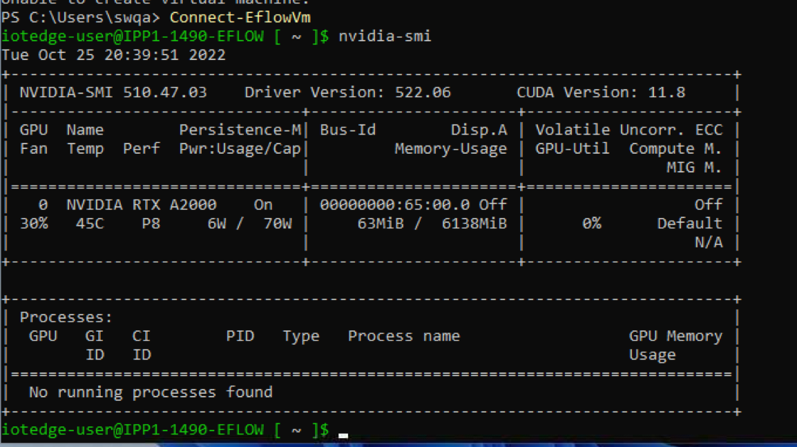

# 1. EFLOW User’s Guide — EFLOW User's Guide 13.2 documentation

**来源**: [https://docs.nvidia.com/cuda/eflow-users-guide/index.html](https://docs.nvidia.com/cuda/eflow-users-guide/index.html)

---

EFLOW User’s Guide
Describes how CUDA and NVIDIA GPU accelerated cloud native applications can be deployed on EFLOW enabled Windows devices.

# 1. EFLOW User’s Guide

## 1.1. Introduction
Azure IoT Edge For Linux on Windows, otherwise referred to as EFLOW, is a Microsoft Technology for the deployment of Linux AI containers on Windows Edge devices. This document details how NVIDIA® CUDA® and NVIDIA GPU accelerated cloud native applications can be deployed on such EFLOW-enabled Windows devices.
EFLOW has the following components:
> - The Windows host OS with virtualization enabled
> - A Linux virtual machine
> - IoT Edge Runtime
> - IoT Edge Modules, or otherwise any docker-compatible containerized application (runs on moby/containerd)
GPU-accelerated IoT Edge Modules support for GeForce RTX GPUs is based on the GPU Paravirtualization that was foundational to CUDA on Windows Subsystem on Linux. So CUDA and compute support for EFLOW comes by virtue of existing CUDA support on WSL 2.
CUDA on WSL 2 boosted the productivity of CUDA developers by enabling them to build, develop, and containerize GPU accelerated NVIDIA AI/ML Linux applications on Windows desktop computers before deployment on Linux instances on the cloud. But EFLOW is aimed at deployment for AI at the edge. A containerized NVIDIA GPU accelerated Linux application that is either hosted on Azure IoT Hub or NGC registry can be seamlessly deployed at the edge such as a retail service center or hospitals. These edge deployments are typically IT managed devices entrenched with Windows devices for manageability but the advent of AI/ML use cases in this space seek the convergence for Linux and Windows applications not only to coexist but also seamlessly communicate on the same device.
Because CUDA support on EFLOW is predominantly based on WSL 2, refer to the Software Support, Limitations and Known Issues sections in the CUDA on WSL 2 document to stay abreast of the scope of NVIDIA software support available on EFLOW as well. Any additional prerequisites for EFLOW are covered in this document.
The following sections details installation of EFLOW, prerequisites for out-of-the-box CUDA support, followed by sample instructions for running an existing GPU accelerated container on EFLOW.

## 1.2. Setup and Installation
Follow the Microsoft EFLOW documentation page for various installation options suiting your needs:
> - For up-to-date installation instructions, visit[http://aka.ms/AzEFLOW-install](http://aka.ms/AzEFLOW-install).
> - For details on the EFLOW PowerShell API, visit[http://aka.ms/AzEFLOW-PowerShell](http://aka.ms/AzEFLOW-PowerShell).
For quick setup, we have included the steps for installation through Powershell in the following sections.

### 1.2.1. Driver Installation
On the target Windows device, first install an NVIDIA GeForce or NVIDIA RTX GPU Windows driver that is compatible with the NVIDIA GPU on your device. EFLOW VM supports deploying containerized CUDA applications and hence only the driver must be installed on the host system. CUDA Toolkit cannot be installed directly within EFLOW.
NVIDIA-provided CUDA containers from the NGC registry can be deployed directly. If you are preparing a CUDA docker container, ensure that the necessary toolchains are installed.
Because EFLOW is based on WSL, the restrictions of the software stack for a hybrid Linux on Windows environment apply, and not all of the NVIDIA software stack is supported. Refer to the user’s guide of the SDK that you are interested in to determine support.

### 1.2.2. Installation of EFLOW
In an elevated powershell prompt perform the following:
1. **Enable HyperV.**
  Enable-WindowsOptionalFeature -Online -FeatureName Microsoft-Hyper-V -All
  
  ```
  Path          :
  Online        : True
  RestartNeeded : False
  
  ```
2. **Set execution policy and verify.**
  
  ```
  Set-ExecutionPolicy -ExecutionPolicy AllSigned -Force
  
  Get-ExecutionPolicy
  AllSigned
  
  ```
3. **Download and install EFLOW.**
  
  ```
  $msiPath = $([io.Path]::Combine($env:TEMP, 'AzureIoTEdge.msi'))
  $ProgressPreference = 'SilentlyContinue'
  Invoke-WebRequest "https://aka.ms/AzEFLOWMSI_1_4_LTS_X64" -OutFile $msiPath
  
  Start-Process -Wait msiexec -ArgumentList "/i","$([io.Path]::Combine($env:TEMP, 'AzureIoTEdge.msi'))","/qn"
  
  ```
4. **Determine host OS configuration.**
  
  ```
  >Get-EflowHostConfiguration | format-list
  
  FreePhysicalMemoryInMB    : 35502
  NumberOfLogicalProcessors : {64, 64}
  DiskInfo                  : @{Drive=C:; FreeSizeInGB=798}
  GpuInfo                   : @{Count=1; SupportedPassthroughTypes=System.Object[]; Name=NVIDIA RTX A2000}
  
  ```
5. **Deploy EFLOW.**
  Deploying EFLOW will set up the EFLOW runtime and virtual machine.
  By default, EFLOW only reserves 1024MB of system memory for use for the workloads and that is insufficient to support GPU accelerated configurations. For GPU acceleration, you will have to reserve system memory explicitly at EFLOW deployment; otherwise there will not be sufficient system memory for your containerized applications to run. In order to prevent out of memory errors, reserve memory explicitly as required; see example below. (Refer to command line argument options available for deploying EFLOW in the official documentation for more details).

### 1.2.3. Prerequisites for CUDA Support
- x86 64-bit support only.
- GeForce RTX GPU products.
- Windows 10/11 (Pro, Enterprise, IoT Enterprise) - Windows 10 users must use the November 2021 update build 19044.1620 or higher.
- Deploy-Eflow only allocates 1024 MB memory by default, set it to a larger value to prevent OOM issue, check MS documents for more details at[https://learn.microsoft.com/en-us/azure/iot-edge/reference-iot-edge-for-linux-on-windows-functions#deploy-eflow](https://learn.microsoft.com/en-us/azure/iot-edge/reference-iot-edge-for-linux-on-windows-functions#deploy-eflow).
Other prerequisites specific to the platform also apply. Refer to[https://learn.microsoft.com/en-us/azure/iot-edge/gpu-acceleration?view=iotedge-1.4](https://learn.microsoft.com/en-us/azure/iot-edge/gpu-acceleration?view=iotedge-1.4).

## 1.3. Connecting to the EFLOW VM

```
Get-EflowVmAddr

[10/13/2022 11:41:16] Querying IP and MAC addresses from virtual machine (IPP1-1490-EFLOW)

 - Virtual machine MAC: 00:15:5d:b2:40:c7
 - Virtual machine IP : 172.24.14.242 retrieved directly from virtual machine
00:15:5d:b2:40:c7
172.24.14.242

Connect-EflowVm

```

## 1.4. Running nvidia-smi
[](https://docs.nvidia.com/cuda/eflow-users-guide/_images/nvidia-smi.png)

## 1.5. Running GPU-accelerated Containers
Let us run an N-body simulation containerized CUDA sample from NGC, but this time inside EFLOW.

```
iotedge-user@IPP1-1490-EFLOW [ ~ ]$ sudo docker run --gpus all --env NVIDIA_DISABLE_REQUIRE=1 nvcr.io/nvidia/k8s/cuda-sample:nbody nbody -gpu -benchmark

Unable to find image 'nvcr.io/nvidia/k8s/cuda-sample:nbody' locally
nbody: Pulling from nvidia/k8s/cuda-sample
22c5ef60a68e: Pull complete
1939e4248814: Pull complete
548afb82c856: Pull complete
a424d45fd86f: Pull complete
207b64ab7ce6: Pull complete
f65423f1b49b: Pull complete
2b60900a3ea5: Pull complete
e9bff09d04df: Pull complete
edc14edf1b04: Pull complete
1f37f461c076: Pull complete
9026fb14bf88: Pull complete
Digest: sha256:59261e419d6d48a772aad5bb213f9f1588fcdb042b115ceb7166c89a51f03363
Status: Downloaded newer image for nvcr.io/nvidia/k8s/cuda-sample:nbody
Run "nbody -benchmark [-numbodies=<numBodies>]" to measure performance.
        -fullscreen       (run n-body simulation in fullscreen mode)
        -fp64             (use double precision floating point values for simulation)
        -hostmem          (stores simulation data in host memory)
        -benchmark        (run benchmark to measure performance)
        -numbodies=<N>    (number of bodies (>= 1) to run in simulation)
        -device=<d>       (where d=0,1,2.... for the CUDA device to use)
        -numdevices=<i>   (where i=(number of CUDA devices > 0) to use for simulation)
        -compare          (compares simulation results running once on the default GPU and once on the CPU)
        -cpu              (run n-body simulation on the CPU)
        -tipsy=<file.bin> (load a tipsy model file for simulation)

NOTE: The CUDA Samples are not meant for performance measurements. Results may vary when GPU Boost is enabled.

> Windowed mode
> Simulation data stored in video memory
> Single precision floating point simulation
> 1 Devices used for simulation
GPU Device 0: "Ampere" with compute capability 8.6

> Compute 8.6 CUDA device: [NVIDIA RTX A2000]
26624 bodies, total time for 10 iterations: 31.984 ms
= 221.625 billion interactions per second
= 4432.503 single-precision GFLOP/s at 20 flops per interaction
iotedge-user@IPP1-1490-EFLOW [ ~ ]$

```

## 1.6. Troubleshooting
**nvidia-container-cli: requirement error: unsatisfied condition: cuda>=11.7”, need add “–env NVIDIA_DISABLE_REQUIRE=1”**
The CUDA version cannot be determined correctly from the driver on the host when launching the container.
**Out of memory**
In case of out of memory errors, increase the system memory reserved by EFLOW. Refer to[https://learn.microsoft.com/en-us/azure/iot-edge/reference-iot-edge-for-linux-on-windows-functions#deploy-eflow](https://learn.microsoft.com/en-us/azure/iot-edge/reference-iot-edge-for-linux-on-windows-functions#deploy-eflow).

# 2. Notices

## 2.1. Notice
This document is provided for information purposes only and shall not be regarded as a warranty of a certain functionality, condition, or quality of a product. NVIDIA Corporation (“NVIDIA”) makes no representations or warranties, expressed or implied, as to the accuracy or completeness of the information contained in this document and assumes no responsibility for any errors contained herein. NVIDIA shall have no liability for the consequences or use of such information or for any infringement of patents or other rights of third parties that may result from its use. This document is not a commitment to develop, release, or deliver any Material (defined below), code, or functionality.
NVIDIA reserves the right to make corrections, modifications, enhancements, improvements, and any other changes to this document, at any time without notice.
Customer should obtain the latest relevant information before placing orders and should verify that such information is current and complete.
NVIDIA products are sold subject to the NVIDIA standard terms and conditions of sale supplied at the time of order acknowledgement, unless otherwise agreed in an individual sales agreement signed by authorized representatives of NVIDIA and customer (“Terms of Sale”). NVIDIA hereby expressly objects to applying any customer general terms and conditions with regards to the purchase of the NVIDIA product referenced in this document. No contractual obligations are formed either directly or indirectly by this document.
NVIDIA products are not designed, authorized, or warranted to be suitable for use in medical, military, aircraft, space, or life support equipment, nor in applications where failure or malfunction of the NVIDIA product can reasonably be expected to result in personal injury, death, or property or environmental damage. NVIDIA accepts no liability for inclusion and/or use of NVIDIA products in such equipment or applications and therefore such inclusion and/or use is at customer’s own risk.
NVIDIA makes no representation or warranty that products based on this document will be suitable for any specified use. Testing of all parameters of each product is not necessarily performed by NVIDIA. It is customer’s sole responsibility to evaluate and determine the applicability of any information contained in this document, ensure the product is suitable and fit for the application planned by customer, and perform the necessary testing for the application in order to avoid a default of the application or the product. Weaknesses in customer’s product designs may affect the quality and reliability of the NVIDIA product and may result in additional or different conditions and/or requirements beyond those contained in this document. NVIDIA accepts no liability related to any default, damage, costs, or problem which may be based on or attributable to: (i) the use of the NVIDIA product in any manner that is contrary to this document or (ii) customer product designs.
No license, either expressed or implied, is granted under any NVIDIA patent right, copyright, or other NVIDIA intellectual property right under this document. Information published by NVIDIA regarding third-party products or services does not constitute a license from NVIDIA to use such products or services or a warranty or endorsement thereof. Use of such information may require a license from a third party under the patents or other intellectual property rights of the third party, or a license from NVIDIA under the patents or other intellectual property rights of NVIDIA.
Reproduction of information in this document is permissible only if approved in advance by NVIDIA in writing, reproduced without alteration and in full compliance with all applicable export laws and regulations, and accompanied by all associated conditions, limitations, and notices.
THIS DOCUMENT AND ALL NVIDIA DESIGN SPECIFICATIONS, REFERENCE BOARDS, FILES, DRAWINGS, DIAGNOSTICS, LISTS, AND OTHER DOCUMENTS (TOGETHER AND SEPARATELY, “MATERIALS”) ARE BEING PROVIDED “AS IS.” NVIDIA MAKES NO WARRANTIES, EXPRESSED, IMPLIED, STATUTORY, OR OTHERWISE WITH RESPECT TO THE MATERIALS, AND EXPRESSLY DISCLAIMS ALL IMPLIED WARRANTIES OF NONINFRINGEMENT, MERCHANTABILITY, AND FITNESS FOR A PARTICULAR PURPOSE. TO THE EXTENT NOT PROHIBITED BY LAW, IN NO EVENT WILL NVIDIA BE LIABLE FOR ANY DAMAGES, INCLUDING WITHOUT LIMITATION ANY DIRECT, INDIRECT, SPECIAL, INCIDENTAL, PUNITIVE, OR CONSEQUENTIAL DAMAGES, HOWEVER CAUSED AND REGARDLESS OF THE THEORY OF LIABILITY, ARISING OUT OF ANY USE OF THIS DOCUMENT, EVEN IF NVIDIA HAS BEEN ADVISED OF THE POSSIBILITY OF SUCH DAMAGES. Notwithstanding any damages that customer might incur for any reason whatsoever, NVIDIA’s aggregate and cumulative liability towards customer for the products described herein shall be limited in accordance with the Terms of Sale for the product.

## 2.2. OpenCL
OpenCL is a trademark of Apple Inc. used under license to the Khronos Group Inc.

## 2.3. Trademarks
NVIDIA and the NVIDIA logo are trademarks or registered trademarks of NVIDIA Corporation in the U.S. and other countries. Other company and product names may be trademarks of the respective companies with which they are associated.