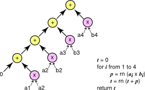
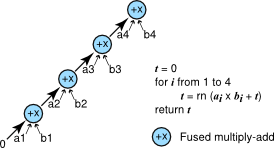
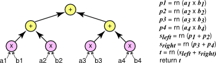

# 1. Introduction — Floating Point and IEEE 754 13.2 documentation

**来源**: [https://docs.nvidia.com/cuda/floating-point/index.html](https://docs.nvidia.com/cuda/floating-point/index.html)

---

Floating Point and IEEE 754 Compliance for NVIDIA GPUs
White paper covering the most common issues related to NVIDIA GPUs.
A number of issues related to floating point accuracy and compliance are a frequent source of confusion on both CPUs and GPUs. The purpose of this white paper is to discuss the most common issues related to NVIDIA GPUs and to supplement the documentation in the CUDA C++ Programming Guide.

# 1. Introduction
Since the widespread adoption in 1985 of the IEEE Standard for*Binary Floating-Point Arithmetic*(IEEE 754-1985[[1]](https://docs.nvidia.com/cuda/floating-point/index.html#references__1)) virtually all mainstream computing systems have implemented the standard, including NVIDIA with the CUDA architecture. IEEE 754 standardizes how arithmetic results should be*approximated*in floating point. Whenever working with inexact results, programming decisions can affect accuracy. It is important to consider many aspects of floating point behavior in order to achieve the highest performance with the precision required for any specific application. This is especially true in a heterogeneous computing environment where operations will be performed on different types of hardware.
Understanding some of the intricacies of floating point and the specifics of how NVIDIA hardware handles floating point is obviously important to CUDA programmers striving to implement correct numerical algorithms. In addition, users of libraries such as*cuBLAS*and*cuFFT*will also find it informative to learn how NVIDIA handles floating point under the hood.
We review some of the basic properties of floating point calculations in[Chapter 2](https://docs.nvidia.com/cuda/floating-point/index.html#floating-point). We also discuss the fused multiply-add operator, which was added to the IEEE 754 standard in 2008[[2]](https://docs.nvidia.com/cuda/floating-point/index.html#references__2)and is built into the hardware of NVIDIA GPUs. In[Chapter 3](https://docs.nvidia.com/cuda/floating-point/index.html#dot-product-accuracy-example)we work through an example of computing the dot product of two short vectors to illustrate how different choices of implementation affect the accuracy of the final result. In[Chapter 4](https://docs.nvidia.com/cuda/floating-point/index.html#cuda-and-floating-point)we describe NVIDIA hardware versions and NVCC compiler options that affect floating point calculations. In[Chapter 5](https://docs.nvidia.com/cuda/floating-point/index.html#considerations-for-heterogeneous-world)we consider some issues regarding the comparison of CPU and GPU results. Finally, in[Chapter 6](https://docs.nvidia.com/cuda/floating-point/index.html#concrete-recommendations)we conclude with concrete recommendations to programmers that deal with numeric issues relating to floating point on the GPU.

# 2. Floating Point

## 2.1. Formats
Floating point encodings and functionality are defined in the IEEE 754 Standard[[2]](https://docs.nvidia.com/cuda/floating-point/index.html#references__2)last revised in 2008. Goldberg[[5]](https://docs.nvidia.com/cuda/floating-point/index.html#references__5)gives a good introduction to floating point and many of the issues that arise.
The standard mandates binary floating point data be encoded on three fields: a one bit sign field, followed by exponent bits encoding the exponent offset by a numeric bias specific to each format, and bits encoding the significand (or fraction).

In order to ensure consistent computations across platforms and to exchange floating point data, IEEE 754 defines basic and interchange formats. The 32 and 64 bit basic binary floating point formats correspond to the C data types`float`and`double`. Their corresponding representations have the following bit lengths:

For numerical data representing finite values, the sign is either negative or positive, the exponent field encodes the exponent in base 2, and the fraction field encodes the significand without the most significant non-zero bit. For example, the value -192 equals (-1)[^1]x 2[^7]x 1.5, and can be represented as having a negative sign, an exponent of 7, and a fractional part .5. The exponents are biased by 127 and 1023, respectively, to allow exponents to extend from negative to positive. Hence the exponent 7 is represented by bit strings with values 134 for float and 1030 for double. The integral part of 1. is implicit in the fraction.

Also, encodings to represent infinity and not-a-number (NaN) data are reserved. The IEEE 754 Standard[[2]](https://docs.nvidia.com/cuda/floating-point/index.html#references__2)describes floating point encodings in full.
Given that the fraction field uses a limited number of bits, not all real numbers can be represented exactly. For example the mathematical value of the fraction 2/3 represented in binary is 0.10101010… which has an infinite number of bits after the binary point. The value 2/3 must be rounded first in order to be represented as a floating point number with limited precision. The rules for rounding and the rounding modes are specified in IEEE 754. The most frequently used is the round-to-nearest-or-even mode (abbreviated as round-to-nearest). The value 2/3 rounded in this mode is represented in binary as:

The sign is positive and the stored exponent value represents an exponent of -1.

## 2.2. Operations and Accuracy
The IEEE 754 standard requires support for a handful of operations. These include the arithmetic operations add, subtract, multiply, divide, square root, fused-multiply-add, remainder, conversion operations, scaling, sign operations, and comparisons. The results of these operations are guaranteed to be the same for all implementations of the standard, for a given format and rounding mode.
The rules and properties of mathematical arithmetic do not hold directly for floating point arithmetic because of floating point’s limited precision. For example, the table below shows single precision values*A*,*B*, and*C*, and the mathematical exact value of their sum computed using different associativity.
$\begin{matrix}
A & = & {2^{1} \times 1.00000000000000000000001} \\
B & = & {2^{0} \times 1.00000000000000000000001} \\
C & = & {2^{3} \times 1.00000000000000000000001} \\
{(A + B) + C} & = & {2^{3} \times 1.01100000000000000000001011} \\
{A + (B + C)} & = & {2^{3} \times 1.01100000000000000000001011} \\
\end{matrix}$
Mathematically, (*A*+*B*) +*C*does equal*A*+ (*B*+*C*).
Let rn(*x*) denote one rounding step on*x*. Performing these same computations in single precision floating point arithmetic in round-to-nearest mode according to IEEE 754, we obtain:
$\begin{matrix}
{A + B} & = & {2^{1} \times 1.1000000000000000000000110000...} \\
{\text{rn}(A + B)} & = & {2^{1} \times 1.10000000000000000000010} \\
{B + C} & = & {2^{3} \times 1.0010000000000000000000100100...} \\
{\text{rn}(B + C)} & = & {2^{3} \times 1.00100000000000000000001} \\
{A + B + C} & = & {2^{3} \times 1.0110000000000000000000101100...} \\
{\text{rn}\left( \text{rn}(A + B) + C \right)} & = & {2^{3} \times 1.01100000000000000000010} \\
{\text{rn}\left( A + \text{rn}(B + C) \right)} & = & {2^{3} \times 1.01100000000000000000001} \\
\end{matrix}$
For reference, the exact, mathematical results are computed as well in the table above. Not only are the results computed according to IEEE 754 different from the exact mathematical results, but also the results corresponding to the sum rn(rn(A + B) + C) and the sum rn(A + rn(B + C)) are different from each other. In this case, rn(A + rn(B + C)) is closer to the correct mathematical result than rn(rn(A + B) + C).
This example highlights that seemingly identical computations can produce different results even if all basic operations are computed in compliance with IEEE 754.
Here, the order in which operations are executed affects the accuracy of the result. The results are independent of the host system. These same results would be obtained using any microprocessor, CPU or GPU, which supports single precision floating point.

## 2.3. The Fused Multiply-Add (FMA)
In 2008 the IEEE 754 standard was revised to include the fused multiply-add operation (*FMA*). The FMA operation computes$\text{rn}(X \times Y + Z)$with only one rounding step. Without the FMA operation the result would have to be computed as$\text{rn}\left( \text{rn}(X \times Y) + Z \right)$with two rounding steps, one for multiply and one for add. Because the FMA uses only a single rounding step the result is computed more accurately.
Let’s consider an example to illustrate how the FMA operation works using decimal arithmetic first for clarity. Let’s compute$x^{2} - 1$with four digits of precision after the decimal point, or a total of five digits of precision including the leading digit before the decimal point.
For$x = 1.0008$, the correct mathematical result is$x^{2} - 1 = 1.60064 \times 10^{- 4}$. The closest number using only four digits after the decimal point is$1.6006 \times 10^{- 4}$. In this case$\text{rn}\left( x^{2} - 1 \right) = 1.6006 \times 10^{- 4}$which corresponds to the fused multiply-add operation$\text{rn}\left( x \times x + ( - 1) \right)$. The alternative is to compute separate multiply and add steps. For the multiply,$x^{2} = 1.00160064$, so$\text{rn}\left( x^{2} \right) = 1.0016$. The final result is$\text{rn}\left( \text{rn}\left( x^{2} \right) - 1 \right) = 1.6000 \times 10^{- 4}$.
Rounding the multiply and add separately yields a result that is off by 0.00064. The corresponding FMA computation is wrong by only 0.00004, and its result is closest to the correct mathematical answer. The results are summarized below:
$\begin{matrix}
x & = & 1.0008 & \\
x^{2} & = & 1.00160064 & \\
{x^{2} - 1} & = & {1.60064 \times 10^{- 4}\text{~~}} & \text{true\ value} \\
{\text{rn}\left( x^{2} - 1 \right)} & = & {1.6006 \times 10^{- 4}} & \text{fused\ multiply-add} \\
{\text{rn}\left( x^{2} \right)} & = & {1.0016 \times 10^{- 4}} & \\
{\text{rn}\left( \text{rn}\left( x^{2} \right) - 1 \right)} & = & {1.6000 \times 10^{- 4}} & \text{multiply,\ then\ add} \\
\end{matrix}$
Below is another example, using binary single precision values:
$\begin{matrix}
A & = & & 2^{0} & {\times 1.00000000000000000000001} \\
B & = & - & 2^{0} & {\times 1.00000000000000000000010} \\
{\text{rn}(A \times A + B)} & = & & 2^{- 46} & {\times 1.00000000000000000000000} \\
{\text{rn}\left( \text{rn}(A \times A) + B \right)} & = & & 0 & \\
\end{matrix}$
In this particular case, computing$\text{rn}\left( \text{rn}(A \times A) + B \right)$as an IEEE 754 multiply followed by an IEEE 754 add loses all bits of precision, and the computed result is 0. The alternative of computing the FMA$\text{rn}(A \times A + B)$provides a result equal to the mathematical value. In general, the fused-multiply-add operation generates more accurate results than computing one multiply followed by one add. The choice of whether or not to use the fused operation depends on whether the platform provides the operation and also on how the code is compiled.
[Figure 1](https://docs.nvidia.com/cuda/floating-point/index.html#fused-multiply-add-fma__multiply-and-add-code-fragment-and-output-for-x86-and-nvidia-fermi-gpu)shows CUDA C++ code and output corresponding to inputs*A*and*B*and operations from the example above. The code is executed on two different hardware platforms: an x86-class CPU using*SSE*in single precision, and an NVIDIA GPU with compute capability 2.0. At the time this paper is written (Spring 2011) there are no commercially available x86 CPUs which offer hardware FMA. Because of this, the computed result in single precision in SSE would be 0. NVIDIA GPUs with compute capability 2.0 do offer hardware FMAs, so the result of executing this code will be the more accurate one by default. However, both results are correct according to the IEEE 754 standard. The code fragment was compiled without any special intrinsics or compiler options for either platform.
The fused multiply-add helps avoid loss of precision during subtractive cancellation. Subtractive cancellation occurs during the addition of quantities of similar magnitude with opposite signs. In this case many of the leading bits cancel, leaving fewer meaningful bits of precision in the result. The fused multiply-add computes a double-width product during the multiplication. Thus even if subtractive cancellation occurs during the addition there are still enough valid bits remaining in the product to get a precise result with no loss of precision.

# 3. Dot Product: An Accuracy Example
Consider the problem of finding the dot product of two short vectors$\overset{\rightarrow}{a}$and$\overset{\rightarrow}{b}$, both with four elements.
- $\overset{\rightharpoonup}{a} = \begin{bmatrix}
  a_{1} \\
  a_{2} \\
  a_{3} \\
  a_{4} \\
  \end{bmatrix}\mspace{2mu}\quad\overset{\rightharpoonup}{b} = \begin{bmatrix}
  b_{1} \\
  b_{2} \\
  b_{3} \\
  b_{4} \\
  \end{bmatrix}\quad\overset{\rightharpoonup}{a} \cdot \overset{\rightharpoonup}{b} = a_{1}b_{1} + a_{2}b_{2} + a_{3}b_{3} + a_{4}b_{4}$
This operation is easy to write mathematically, but its implementation in software involves several choices. All of the strategies we will discuss use purely IEEE 754 compliant operations.

## 3.1. Example Algorithms
We present three algorithms which differ in how the multiplications, additions, and possibly fused multiply-adds are organized. These algorithms are presented in[Figure 2](https://docs.nvidia.com/cuda/floating-point/index.html#example-algorithms__serial-method-to-compute-vectors-dot-product),[Figure 3](https://docs.nvidia.com/cuda/floating-point/index.html#example-algorithms__fma-method-to-compute-vectors-dot-product), and[Figure 4](https://docs.nvidia.com/cuda/floating-point/index.html#comparison__parallel-method-to-reduce-individual-elements-products-into-final-sum). Each of the three algorithms is represented graphically. Individual operation are shown as a circle with arrows pointing from arguments to operations.
The simplest way to compute the dot product is using a short loop as shown in[Figure 2](https://docs.nvidia.com/cuda/floating-point/index.html#example-algorithms__serial-method-to-compute-vectors-dot-product). The multiplications and additions are done separately.

Serial Method to Compute Vectors Dot Product.

The serial method uses a simple loop with separate multiplies and adds to compute the do t product of the vectors. The final result can be represented as ((((a1x b1) + (a2x b2)) + (a3x b3)) + (a4x b4)).

FMA Method to Compute Vector Dot Product.

The FMA method uses a simple loop with fused multiply-adds to compute the dot product of the vectors. The final result can be represented as a4x b4= (a3x b3+ (a2x b2+ (a1x b1+ 0))).
A simple improvement to the algorithm is to use the fused multiply-add to do the multiply and addition in one step to improve accuracy.[Figure 3](https://docs.nvidia.com/cuda/floating-point/index.html#example-algorithms__fma-method-to-compute-vectors-dot-product)shows this version.
Yet another way to compute the dot product is to use a divide-and-conquer strategy in which we first find the dot products of the first half and the second half of the vectors, then combine these results using addition. This is a recursive strategy; the base case is the dot product of vectors of length 1 which is a single multiply.[Figure 4](https://docs.nvidia.com/cuda/floating-point/index.html#comparison__parallel-method-to-reduce-individual-elements-products-into-final-sum)graphically illustrates this approach. We call this algorithm the parallel algorithm because the two sub-problems can be computed in parallel as they have no dependencies. The algorithm does not require a parallel implementation, however; it can still be implemented with a single thread.

## 3.2. Comparison
All three algorithms for computing a dot product use IEEE 754 arithmetic and can be implemented on any system that supports the IEEE standard. In fact, an implementation of the serial algorithm on multiple systems will give exactly the same result. So will implementations of the FMA or parallel algorithms. However, results computed by an implementation of the serial algorithm may differ from those computed by an implementation of the other two algorithms.

The Parallel Method to Reduce Individual Elements Products into a Final Sum.

The parallel method uses a tree to reduce all the products of individual elements into a final sum. The final result can be represented as ((a1x b1) + (a2x b2)) + ((a3x b3) + (a4x b4)).

# 4. CUDA and Floating Point
NVIDIA has extended the capabilities of GPUs with each successive hardware generation. Current generations of the NVIDIA architecture such as*Tesla Kxx*,*GTX 8xx*, and*GTX 9xx*, support both single and double precision with*IEEE 754*precision and include hardware support for fused multiply-add in both single and double precision. In CUDA, the features supported by the GPU are encoded in the*compute capability*number. The runtime library supports a function call to determine the compute capability of a GPU at runtime; the CUDA C++ Programming Guide also includes a table of compute capabilities for many different devices[[7]](https://docs.nvidia.com/cuda/floating-point/index.html#references__7).

## 4.1. Compute Capability 2.0 and Above
Devices with compute capability*2.0 and above*support both single and double precision*IEEE 754*including fused multiply-add in both single and double precision. Operations such as square root and division will result in the floating point value closest to the correct mathematical result in both single and double precision, by default.

## 4.2. Rounding Modes
The*IEEE 754*standard defines four rounding modes: round-to-nearest, round towards positive, round towards negative, and round towards zero. CUDA supports all four modes. By default, operations use round-to-nearest. Compiler intrinsics like the ones listed in the tables below can be used to select other rounding modes for individual operations.

<table border="1" cellpadding="6" cellspacing="0" style="border-collapse: collapse; width: 100%; font-family: -apple-system, BlinkMacSystemFont, Segoe UI, Helvetica, Arial, sans-serif; font-size: 13px; margin: 16px 0;">
<colgroup>
<col style="width: 11%"/>
<col style="width: 89%"/>
</colgroup>
<thead>
<tr style="border: 1px solid #d0d7de;">
<th style="background-color: #f6f8fa; font-weight: 600; text-align: left; padding: 8px 12px; border: 1px solid #d0d7de;">
mode
</th>
<th style="background-color: #f6f8fa; font-weight: 600; text-align: left; padding: 8px 12px; border: 1px solid #d0d7de;">
interpretation
</th>
</tr>
</thead>
<tbody>
<tr style="border: 1px solid #d0d7de;">
<td style="padding: 8px 12px; border: 1px solid #d0d7de; vertical-align: top;">
rn
</td>
<td style="padding: 8px 12px; border: 1px solid #d0d7de; vertical-align: top;">
round to nearest, ties to even
</td>
</tr>
<tr style="border: 1px solid #d0d7de;">
<td style="padding: 8px 12px; border: 1px solid #d0d7de; vertical-align: top;">
rz
</td>
<td style="padding: 8px 12px; border: 1px solid #d0d7de; vertical-align: top;">
round towards zero
</td>
</tr>
<tr style="border: 1px solid #d0d7de;">
<td style="padding: 8px 12px; border: 1px solid #d0d7de; vertical-align: top;">
ru
</td>
<td style="padding: 8px 12px; border: 1px solid #d0d7de; vertical-align: top;">
round towards \(+ \text{∞}\)
</td>
</tr>
<tr style="border: 1px solid #d0d7de;">
<td style="padding: 8px 12px; border: 1px solid #d0d7de; vertical-align: top;">
rd
</td>
<td style="padding: 8px 12px; border: 1px solid #d0d7de; vertical-align: top;">
round towards \(- \text{∞}\)
</td>
</tr>
</tbody>
</table>

<table border="1" cellpadding="6" cellspacing="0" style="border-collapse: collapse; width: 100%; font-family: -apple-system, BlinkMacSystemFont, Segoe UI, Helvetica, Arial, sans-serif; font-size: 13px; margin: 16px 0;">
<colgroup>
<col style="width: 55%"/>
<col style="width: 45%"/>
</colgroup>
<tbody>
<tr style="border: 1px solid #d0d7de;">
<td style="padding: 8px 12px; border: 1px solid #d0d7de; vertical-align: top;">

<code class="docutils literal notranslate">x + y</code>

<code class="docutils literal notranslate">__fadd_[rn | rz | ru | rd] (x, y)</code>

</td>
<td style="padding: 8px 12px; border: 1px solid #d0d7de; vertical-align: top;">
addition
</td>
</tr>
<tr style="border: 1px solid #d0d7de;">
<td style="padding: 8px 12px; border: 1px solid #d0d7de; vertical-align: top;">

<code class="docutils literal notranslate">x * y</code>

<code class="docutils literal notranslate">__fmul_[rn | rz | ru | rd] (x, y)</code>

</td>
<td style="padding: 8px 12px; border: 1px solid #d0d7de; vertical-align: top;">
multiplication
</td>
</tr>
<tr style="border: 1px solid #d0d7de;">
<td style="padding: 8px 12px; border: 1px solid #d0d7de; vertical-align: top;">

<code class="docutils literal notranslate">fmaf (x, y, z)</code>

<code class="docutils literal notranslate">__fmaf_[rn | rz | ru | rd] (x, y, z)</code>

</td>
<td style="padding: 8px 12px; border: 1px solid #d0d7de; vertical-align: top;">
FMA
</td>
</tr>
<tr style="border: 1px solid #d0d7de;">
<td style="padding: 8px 12px; border: 1px solid #d0d7de; vertical-align: top;">

<code class="docutils literal notranslate">1.0f / x</code>

<code class="docutils literal notranslate">__frcp_[rn | rz | ru | rd] (x)</code>

</td>
<td style="padding: 8px 12px; border: 1px solid #d0d7de; vertical-align: top;">
reciprocal
</td>
</tr>
<tr style="border: 1px solid #d0d7de;">
<td style="padding: 8px 12px; border: 1px solid #d0d7de; vertical-align: top;">

<code class="docutils literal notranslate">x / y</code>

<code class="docutils literal notranslate">__fdiv_[rn | rz | ru | rd] (x, y)</code>

</td>
<td style="padding: 8px 12px; border: 1px solid #d0d7de; vertical-align: top;">
division
</td>
</tr>
<tr style="border: 1px solid #d0d7de;">
<td style="padding: 8px 12px; border: 1px solid #d0d7de; vertical-align: top;">

<code class="docutils literal notranslate">sqrtf(x)</code>

<code class="docutils literal notranslate">__fsqrt_[rn | rz | ru | rd] (x)</code>

</td>
<td style="padding: 8px 12px; border: 1px solid #d0d7de; vertical-align: top;">
square root
</td>
</tr>
</tbody>
</table>

<table border="1" cellpadding="6" cellspacing="0" style="border-collapse: collapse; width: 100%; font-family: -apple-system, BlinkMacSystemFont, Segoe UI, Helvetica, Arial, sans-serif; font-size: 13px; margin: 16px 0;">
<colgroup>
<col style="width: 54%"/>
<col style="width: 46%"/>
</colgroup>
<tbody>
<tr style="border: 1px solid #d0d7de;">
<td style="padding: 8px 12px; border: 1px solid #d0d7de; vertical-align: top;">

<code class="docutils literal notranslate">x + y</code>

<code class="docutils literal notranslate">__dadd_[rn | rz | ru | rd] (x, y)</code>

</td>
<td style="padding: 8px 12px; border: 1px solid #d0d7de; vertical-align: top;">
addition
</td>
</tr>
<tr style="border: 1px solid #d0d7de;">
<td style="padding: 8px 12px; border: 1px solid #d0d7de; vertical-align: top;">

<code class="docutils literal notranslate">x * y</code>

<code class="docutils literal notranslate">__dmul_[rn | rz | ru | rd] (x, y)</code>

</td>
<td style="padding: 8px 12px; border: 1px solid #d0d7de; vertical-align: top;">
multiplication
</td>
</tr>
<tr style="border: 1px solid #d0d7de;">
<td style="padding: 8px 12px; border: 1px solid #d0d7de; vertical-align: top;">

<code class="docutils literal notranslate">fma (x, y, z)</code>

<code class="docutils literal notranslate">__fma_[rn | rz | ru | rd] (x, y, z)</code>

</td>
<td style="padding: 8px 12px; border: 1px solid #d0d7de; vertical-align: top;">
FMA
</td>
</tr>
<tr style="border: 1px solid #d0d7de;">
<td style="padding: 8px 12px; border: 1px solid #d0d7de; vertical-align: top;">

<code class="docutils literal notranslate">1.0 / x</code>

<code class="docutils literal notranslate">__drcp_[rn | rz | ru | rd] (x)</code>

</td>
<td style="padding: 8px 12px; border: 1px solid #d0d7de; vertical-align: top;">
reciprocal
</td>
</tr>
<tr style="border: 1px solid #d0d7de;">
<td style="padding: 8px 12px; border: 1px solid #d0d7de; vertical-align: top;">

<code class="docutils literal notranslate">x / y</code>

<code class="docutils literal notranslate">__ddiv_[rn | rz | ru | rd] (x, y)</code>

</td>
<td style="padding: 8px 12px; border: 1px solid #d0d7de; vertical-align: top;">
division
</td>
</tr>
<tr style="border: 1px solid #d0d7de;">
<td style="padding: 8px 12px; border: 1px solid #d0d7de; vertical-align: top;">

<code class="docutils literal notranslate">sqrtf(x)</code>

<code class="docutils literal notranslate">__dsqrt_[rn | rz | ru | rd] (x)</code>

</td>
<td style="padding: 8px 12px; border: 1px solid #d0d7de; vertical-align: top;">
square root
</td>
</tr>
</tbody>
</table>

## 4.3. Controlling Fused Multiply-add
In general, the fused multiply-add operation is faster and more accurate than performing separate multiply and add operations. However, on occasion you may wish to*disable*the merging of multiplies and adds into fused multiply-add instructions. To inhibit this optimization one can write the multiplies and additions using intrinsics with explicit rounding mode as shown in the previous tables. Operations written directly as intrinsics are guaranteed to remain independent and will not be merged into fused multiply-add instructions. It is also possible to disable FMA merging via a compiler flag.

## 4.4. Compiler Flags
Compiler flags relevant to*IEEE 754*operations are`-ftz={true|false}`,`-prec-div={true|false}`, and`-prec-sqrt={true|false}`. These flags control single precision operations on devices of compute capability of 2.0 or later.

<table border="1" cellpadding="6" cellspacing="0" style="border-collapse: collapse; width: 100%; font-family: -apple-system, BlinkMacSystemFont, Segoe UI, Helvetica, Arial, sans-serif; font-size: 13px; margin: 16px 0;">
<colgroup>
<col style="width: 50%"/>
<col style="width: 50%"/>
</colgroup>
<thead>
<tr style="border: 1px solid #d0d7de;">
<th style="background-color: #f6f8fa; font-weight: 600; text-align: left; padding: 8px 12px; border: 1px solid #d0d7de;">
mode
</th>
<th style="background-color: #f6f8fa; font-weight: 600; text-align: left; padding: 8px 12px; border: 1px solid #d0d7de;">
flags
</th>
</tr>
</thead>
<tbody>
<tr style="border: 1px solid #d0d7de;">
<td style="padding: 8px 12px; border: 1px solid #d0d7de; vertical-align: top;">
IEEE 754 mode (default)
</td>
<td style="padding: 8px 12px; border: 1px solid #d0d7de; vertical-align: top;">

-ftz=false

-prec-div=true

-prec-sqrt=true

</td>
</tr>
<tr style="border: 1px solid #d0d7de;">
<td style="padding: 8px 12px; border: 1px solid #d0d7de; vertical-align: top;">
fast mode
</td>
<td style="padding: 8px 12px; border: 1px solid #d0d7de; vertical-align: top;">

-ftz=true

-prec-div=false

-prec-sqrt=false

</td>
</tr>
</tbody>
</table>

The default*IEEE 754 mode*means that single precision operations are correctly rounded and support denormals, as per the IEEE 754 standard. In the*fast mode*denormal numbers are flushed to zero, and the operations division and square root are not computed to the nearest floating point value. The flags have no effect on double precision or on devices of compute capability below 2.0.

## 4.5. Differences from x86
NVIDIA GPUs differ from the x86 architecture in that rounding modes are encoded within each floating point instruction instead of dynamically using a floating point control word. Trap handlers for floating point exceptions are not supported. On the GPU there is no status flag to indicate when calculations have overflowed, underflowed, or have involved inexact arithmetic. Like*SSE*, the precision of each GPU operation is encoded in the instruction (for x87 the precision is controlled dynamically by the floating point control word).

# 5. Considerations for a Heterogeneous World

## 5.1. Mathematical Function Accuracy
So far we have only considered simple math operations such as addition, multiplication, division, and square root. These operations are simple enough that computing the best floating point result (e.g., the closest in round-to-nearest) is reasonable. For other mathematical operations computing the best floating point result is harder.
The problem is called the*table maker’s dilemma*. To guarantee the correctly rounded result, it is not generally enough to compute the function to a fixed high accuracy. There might still be rare cases where the error in the high accuracy result affects the rounding step at the lower accuracy.
It is possible to solve the dilemma for particular functions by doing mathematical analysis and formal proofs[[4]](https://docs.nvidia.com/cuda/floating-point/index.html#references__4), but most math libraries choose instead to give up the guarantee of correct rounding. Instead they provide implementations of math functions and document bounds on the relative error of the functions over the input range. For example, the double precision`sin`function in CUDA is guaranteed to be accurate to within 2 units in the last place (ulp) of the correctly rounded result. In other words, the difference between the computed result and the mathematical result is at most ±2 with respect to the least significant bit position of the fraction part of the floating point result.
For most inputs the`sin`function produces the correctly rounded result. Take for example the C code sequence shown in[Figure 6](https://docs.nvidia.com/cuda/floating-point/index.html#mathematical-function-accuracy__cosine-computation-using-glibc-math-library-when-compiled-with-m32-and-m64). We compiled the code sequence on a 64-bit x86 platform using gcc version 4.4.3 (Ubuntu 4.3.3-4ubuntu5).
This shows that the result of computing cos(5992555.0) using a common library differs depending on whether the code is compiled in 32-bit mode or 64-bit mode.
The consequence is that different math libraries cannot be expected to compute exactly the same result for a given input. This applies to GPU programming as well. Functions compiled for the GPU will use the NVIDIA CUDA math library implementation while functions compiled for the CPU will use the host compiler math library implementation (e.g.,*glibc*on Linux). Because these implementations are independent and neither is guaranteed to be correctly rounded, the results will often differ slightly.

## 5.2. x87 and SSE
One of the unfortunate realities of C compilers is that they are often poor at preserving IEEE 754 semantics of floating point operations[[6]](https://docs.nvidia.com/cuda/floating-point/index.html#references__6). This can be particularly confusing on platforms that support x87 and SSE operations. Just like CUDA operations, SSE operations are performed on single or double precision values, while x87 operations often use an additional internal 80-bit precision format. Sometimes the results of a computation using x87 can depend on whether an intermediate result was allocated to a register or stored to memory. Values stored to memory are rounded to the declared precision (e.g., single precision for`float`and double precision for`double`). Values kept in registers can remain in extended precision. Also, x87 instructions will often be used by default for 32-bit compiles but SSE instructions will be used by default for 64-bit compiles.
Because of these issues, guaranteeing a specific precision level on the CPU can sometimes be tricky. When comparing CPU results to results computed on the GPU, it is generally best to compare using SSE instructions. SSE instructions follow IEEE 754 for single and doubleprecision.
On 32-bit x86 targets without SSE it can be helpful to declare variables using`volatile`and force floating point values to be stored to memory (`/Op`in Visual Studio and`-ffloat-store`in`gcc`). This moves results from extended precision registers into memory, where the precision is precisely single or double precision. Alternately, the x87 control word can be updated to set the precision to 24 or 53 bits using the assembly instruction`fldcw`or a compiler option such as`-mpc32`or`-mpc64`in`gcc`.

## 5.3. Core Counts
As we have shown in[Section 3](https://docs.nvidia.com/cuda/floating-point/index.html#dot-product-accuracy-example), the final values computed using*IEEE 754*arithmetic can depend on implementation choices such as whether to use fused multiply-add or whether additions are organized in series or parallel. These differences affect computation on the CPU and on the GPU.
One way such differences can arise is from differences between the number of concurrent threads involved in a computation. On the GPU, a common design pattern is to have all threads in a block coordinate to do a parallel reduction on data within the block, followed by a serial reduction of the results from each block. Changing the number of threads per block reorganizes the reduction; if the reduction is addition, then the change rearranges parentheses in the long string of additions.
Even if the same general strategy such as parallel reduction is used on the CPU and GPU, it is common to have widely different numbers of threads on the GPU compared to the CPU. For example, the GPU implementation might launch blocks with 128 threads per block, while the CPU implementation might use 4 threads in total.

## 5.4. Verifying GPU Results
The same inputs will give the same results for individual*IEEE 754*operations to a given precision on the CPU and GPU. As we have explained, there are many reasons why the same sequence of operations may not be performed on the CPU and GPU. The GPU has fused multiply-add while the CPU does not. Parallelizing algorithms may rearrange operations, yielding different numeric results. The CPU may be computing results in a precision higher than expected. Finally, many common mathematical functions are not required by the IEEE 754 standard to be correctly rounded so should not be expected to yield identical results between implementations.
When porting numeric code from the CPU to the GPU of course it makes sense to use the x86 CPU results as a reference. But differences between the CPU result and GPU result must be interpreted carefully. Differences are not automatically evidence that the result computed by the GPU is wrong or that there is a problem on the GPU.
Computing results in a high precision and then comparing to results computed in a lower precision can be helpful to see if the lower precision is adequate for a particular application. However, rounding high precision results to a lower precision is not equivalent to performing the entire computation in lower precision. This can sometimes be a problem when using x87 and comparing results against the GPU. The results of the CPU may be computed to an unexpectedly high extended precision for some or all of the operations. The GPU result will be computed using single or double precision only.

# 6. Concrete Recommendations
The key points we have covered are the following:

Use the fused multiply-add operator.

The fused multiply-add operator on the GPU has high performance and increases the accuracy of computations. No special flags or function calls are needed to gain this benefit in CUDA programs. Understand that a hardware fused multiply-add operation is not yet available on the CPU, which can cause differences in numerical results.

Compare results carefully.

Even in the strict world of*IEEE 754*operations, minor details such as organization of parentheses or thread counts can affect the final result. Take this into account when doing comparisons between implementations.

Know the capabilities of your GPU.

The numerical capabilities are encoded in the compute capability number of your GPU. Devices of compute capability 2.0 and later are capable of single and double precision arithmetic following the IEEE 754 standard, and have hardware units for performing fused multiply-add in both single and double precision.

Take advantage of the CUDA math library functions.

These functions are documented in the CUDA C++ Programming Guide[[7]](https://docs.nvidia.com/cuda/floating-point/index.html#references__7). The math library includes all the math functions listed in the C99 standard[[3]](https://docs.nvidia.com/cuda/floating-point/index.html#references__3)plus some additional useful functions. These functions have been tuned for a reasonable compromise between performance and accuracy.
We constantly strive to improve the quality of our math library functionality. Please let us know about any functions that you require that we do not provide, or if the accuracy or performance of any of our functions does not meet your needs. Leave comments in the NVIDIA CUDA forum[^1]or join the Registered Developer Program[^2]and file a bug with your feedback.

# 7. Acknowledgements
This paper was authored by Nathan Whitehead and Alex Fit-Florea for NVIDIA Corporation.
Thanks to Ujval Kapasi, Kurt Wall, Paul Sidenblad, Massimiliano Fatica, Everett Phillips, Norbert Juffa, and Will Ramey for their helpful comments and suggestions.
Permission to make digital or hard copies of all or part of this work for any use is granted without fee provided that copies bear this notice and the full citation on the first page.

# 8. References
[1] ANSI/IEEE 754-1985. American National Standard - IEEE Standard for Binary Floating-Point Arithmetic. American National Standards Institute, Inc., New York, 1985.
[2] IEEE 754-2008. IEEE 754–2008 Standard for Floating-Point Arithmetic. August 2008.
[3] ISO/IEC 9899:1999(E). Programming languages - C. American National Standards Institute, Inc., New York, 1999.
[4] Catherine Daramy-Loirat, David Defour, Florent de Dinechin, Matthieu Gallet, Nicolas Gast, and Jean-Michel Muller. CR-LIBM: A library of correctly rounded elementary functions in double-precision, February 2005.
[5] David Goldberg. What every computer scientist should know about floating-point arithmetic. ACM Computing Surveys, March 1991. Edited reprint available at:[http://download.oracle.com/docs/cd/E19957-01/806-3568/ncg_goldberg.html](http://download.oracle.com/docs/cd/E19957-01/806-3568/ncg_goldberg.html).
[6] David Monniaux. The pitfalls of verifying floating-point computations. ACM Transactions on Programming Languages and Systems, May 2008.
[7] NVIDIA. CUDA C++ Programming Guide Version 10.2, 2019.

# 9. Notices

## 9.1. Notice
This document is provided for information purposes only and shall not be regarded as a warranty of a certain functionality, condition, or quality of a product. NVIDIA Corporation (“NVIDIA”) makes no representations or warranties, expressed or implied, as to the accuracy or completeness of the information contained in this document and assumes no responsibility for any errors contained herein. NVIDIA shall have no liability for the consequences or use of such information or for any infringement of patents or other rights of third parties that may result from its use. This document is not a commitment to develop, release, or deliver any Material (defined below), code, or functionality.
NVIDIA reserves the right to make corrections, modifications, enhancements, improvements, and any other changes to this document, at any time without notice.
Customer should obtain the latest relevant information before placing orders and should verify that such information is current and complete.
NVIDIA products are sold subject to the NVIDIA standard terms and conditions of sale supplied at the time of order acknowledgement, unless otherwise agreed in an individual sales agreement signed by authorized representatives of NVIDIA and customer (“Terms of Sale”). NVIDIA hereby expressly objects to applying any customer general terms and conditions with regards to the purchase of the NVIDIA product referenced in this document. No contractual obligations are formed either directly or indirectly by this document.
NVIDIA products are not designed, authorized, or warranted to be suitable for use in medical, military, aircraft, space, or life support equipment, nor in applications where failure or malfunction of the NVIDIA product can reasonably be expected to result in personal injury, death, or property or environmental damage. NVIDIA accepts no liability for inclusion and/or use of NVIDIA products in such equipment or applications and therefore such inclusion and/or use is at customer’s own risk.
NVIDIA makes no representation or warranty that products based on this document will be suitable for any specified use. Testing of all parameters of each product is not necessarily performed by NVIDIA. It is customer’s sole responsibility to evaluate and determine the applicability of any information contained in this document, ensure the product is suitable and fit for the application planned by customer, and perform the necessary testing for the application in order to avoid a default of the application or the product. Weaknesses in customer’s product designs may affect the quality and reliability of the NVIDIA product and may result in additional or different conditions and/or requirements beyond those contained in this document. NVIDIA accepts no liability related to any default, damage, costs, or problem which may be based on or attributable to: (i) the use of the NVIDIA product in any manner that is contrary to this document or (ii) customer product designs.
No license, either expressed or implied, is granted under any NVIDIA patent right, copyright, or other NVIDIA intellectual property right under this document. Information published by NVIDIA regarding third-party products or services does not constitute a license from NVIDIA to use such products or services or a warranty or endorsement thereof. Use of such information may require a license from a third party under the patents or other intellectual property rights of the third party, or a license from NVIDIA under the patents or other intellectual property rights of NVIDIA.
Reproduction of information in this document is permissible only if approved in advance by NVIDIA in writing, reproduced without alteration and in full compliance with all applicable export laws and regulations, and accompanied by all associated conditions, limitations, and notices.
THIS DOCUMENT AND ALL NVIDIA DESIGN SPECIFICATIONS, REFERENCE BOARDS, FILES, DRAWINGS, DIAGNOSTICS, LISTS, AND OTHER DOCUMENTS (TOGETHER AND SEPARATELY, “MATERIALS”) ARE BEING PROVIDED “AS IS.” NVIDIA MAKES NO WARRANTIES, EXPRESSED, IMPLIED, STATUTORY, OR OTHERWISE WITH RESPECT TO THE MATERIALS, AND EXPRESSLY DISCLAIMS ALL IMPLIED WARRANTIES OF NONINFRINGEMENT, MERCHANTABILITY, AND FITNESS FOR A PARTICULAR PURPOSE. TO THE EXTENT NOT PROHIBITED BY LAW, IN NO EVENT WILL NVIDIA BE LIABLE FOR ANY DAMAGES, INCLUDING WITHOUT LIMITATION ANY DIRECT, INDIRECT, SPECIAL, INCIDENTAL, PUNITIVE, OR CONSEQUENTIAL DAMAGES, HOWEVER CAUSED AND REGARDLESS OF THE THEORY OF LIABILITY, ARISING OUT OF ANY USE OF THIS DOCUMENT, EVEN IF NVIDIA HAS BEEN ADVISED OF THE POSSIBILITY OF SUCH DAMAGES. Notwithstanding any damages that customer might incur for any reason whatsoever, NVIDIA’s aggregate and cumulative liability towards customer for the products described herein shall be limited in accordance with the Terms of Sale for the product.

## 9.2. OpenCL
OpenCL is a trademark of Apple Inc. used under license to the Khronos Group Inc.

## 9.3. Trademarks
NVIDIA and the NVIDIA logo are trademarks or registered trademarks of NVIDIA Corporation in the U.S. and other countries. Other company and product names may be trademarks of the respective companies with which they are associated.

[^1]: [https://forums.nvidia.com/index.php?showforum=62](https://forums.nvidia.com/index.php?showforum=62)

[^2]: [https://developer.nvidia.com/](http://developer.nvidia.com/join-nvidia-registered-developer-program)[join-nvidia-registered-developer-program](http://developer.nvidia.com/join-nvidia-registered-developer-program)