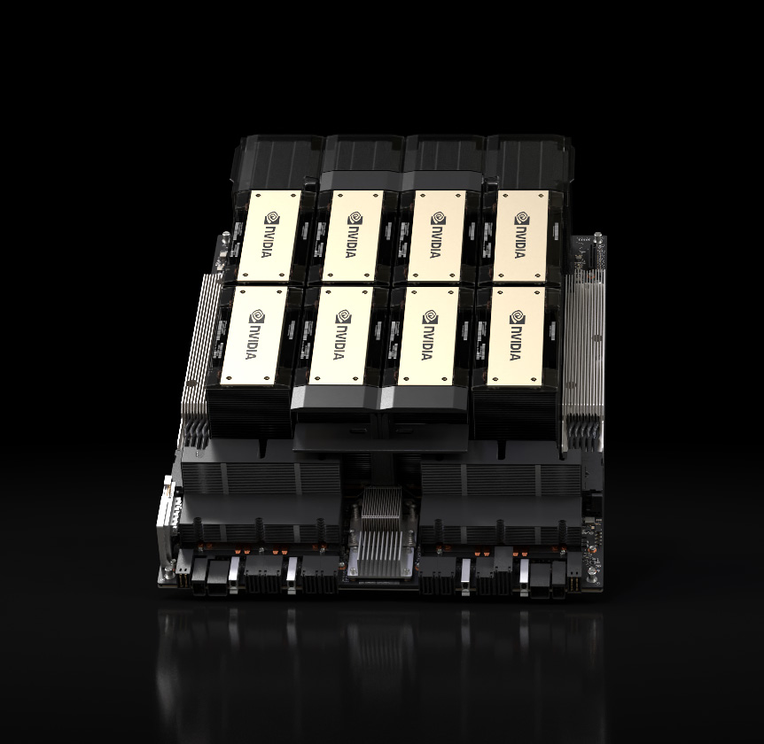
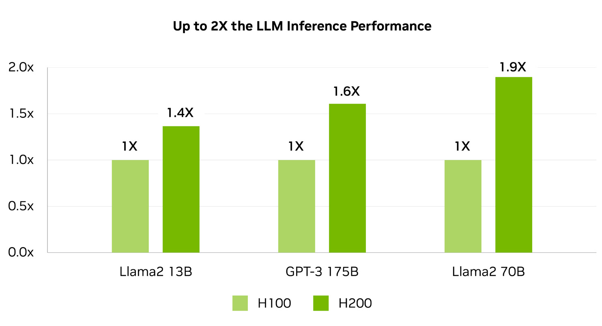
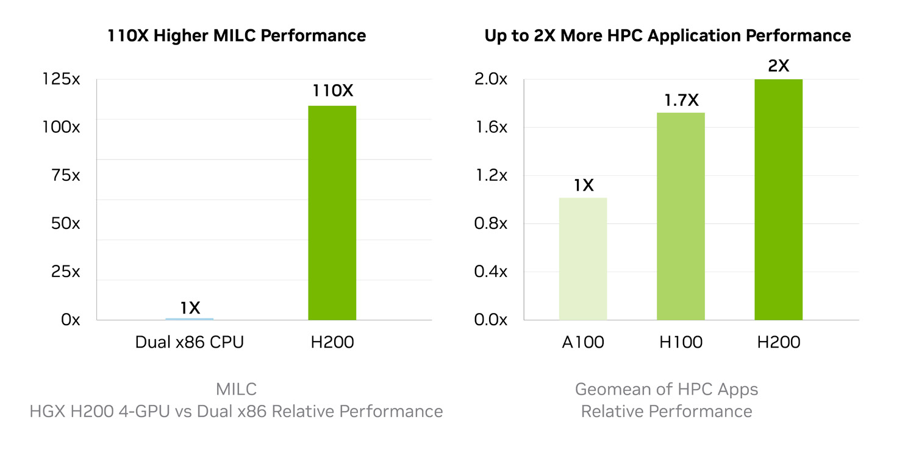
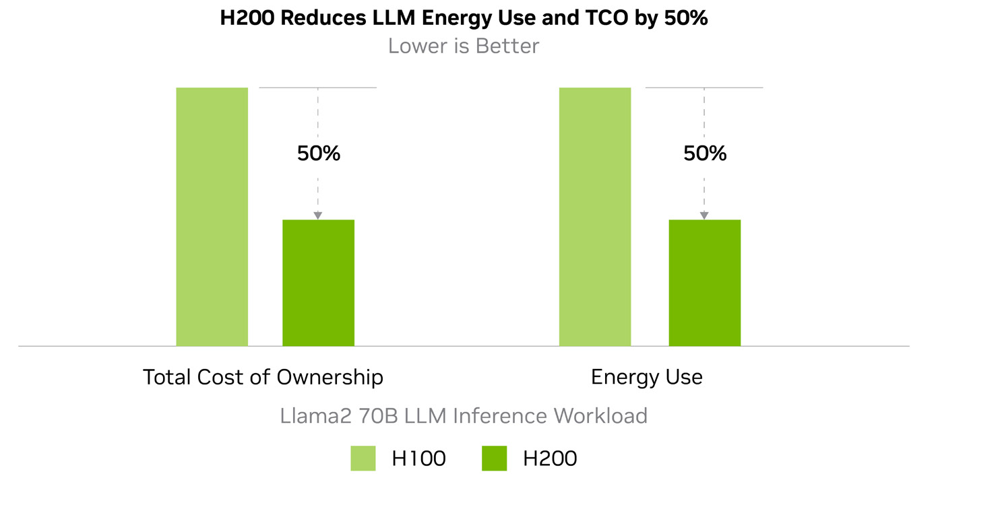
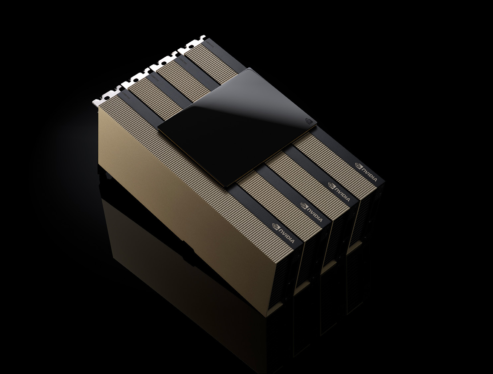
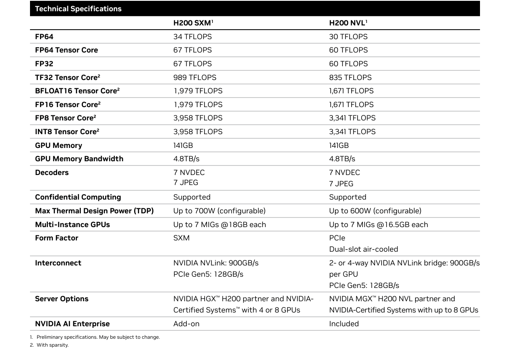

# hpc-datasheet-sc24-h200-datasheet-3002446

<!-- Page 1 -->

# NVIDIA H200 Tensor Core GPU

### Supercharging AI and HPC workloads.

- Higher Performance With Larger, Faster Memory
- Key Features
- The NVIDIA H200 Tensor Core GPU supercharges generative AI and high-
141GB of HBM3e GPU memory performance computing (HPC) workloads with game-changing performance and memory capabilities.
- 4.8TB/s of memory bandwidth
4 petaFLOPS of FP8 performance offer 141 gigabytes (GB) of HBM3e memory at 4.8 terabytes per second (TB/s)—
2X LLM inference performance that’s nearly double the capacity of the NVIDIA H100 Tensor Core GPU with
1.4X more memory bandwidth. The H200’s larger and faster memory accelerates
110X HPC performance generative AI and large language models, while advancing scientific computing for
HPC workloads with better energy efficiency and lower total cost of ownership.
- Unlock Insights With High-Performance LLM Inference
In the ever-evolving landscape of AI, businesses rely on large language models to address a diverse range of inference needs. An AI inference accelerator must deliver the
highest throughput at the lowest TCO when deployed at scale for a massive user base.
The H200 doubles inference performance compared to H100 GPUs when handling large language models such as Llama2 70B.
.
Preliminary specifications. May be subject to change.
Llama2 13B: ISL 128, OSL 2K | Throughput | H100 SXM 1x GPU BS 64 | H200 SXM 1x GPU BS 128

---

<!-- Page 2 -->

transfer and reduces complex processing bottlenecks. For memory-intensive
HPC applications like simulations, scientific research, and artificial intelligence, the H200’s higher memory bandwidth ensures that data can be accessed and manipulated efficiently, leading to 110X faster time to results.
Preliminary specifications. May be subject to change.
HPC MILC- dataset NERSC Apex Medium | HGX H200 4-GPU | dual Sapphire Rapids 8480
HPC Apps- CP2K: dataset H2O-32-RI-dRPA-96points | GROMACS: dataset STMV | ICON: dataset r2b5 | MILC: dataset NERSC
Apex Medium | Chroma: dataset HMC Medium | Quantum Espresso: dataset AUSURF112 | 1x H100 SXM | 1x H200 SXM.

## Reduce Energy and TCO

- With the introduction of H200, energy efficiency and TCO reach new levels. This
cutting-edge technology offers unparalleled performance, all within the same power profile as the H100 Tensor Core GPU. AI factories and supercomputing systems that
are not only faster but also more eco-friendly deliver an economic edge that propels the AI and scientific communities forward.
Preliminary specifications. May be subject to change.
Llama2 70B: ISL 2K, OSL 128 | Throughput | H100 SXM 1x GPU BS 8 | H200 SXM 1x GPU BS 32

---

<!-- Page 3 -->

NVIDIA H200 NVL is ideal for lower-power, air-cooled enterprise rack designs that require flexible configurations, delivering acceleration for every AI and HPC workload regardless of size. With up to four GPUs connected by NVIDIA NVLink™ and a 1.5X
memory increase, large language model (LLM) inference can be accelerated up to 1.7X and HPC applications achieve up to 1.3X more performance over the H100 NVL.
- Enterprise-Ready: AI Software Streamlines Development and Deployment
NVIDIA H200 NVL comes with a five-year NVIDIA AI Enterprise subscription and simplifies the way you build an enterprise AI-ready platform. H200 accelerates
AI development and deployment for production-ready generative AI solutions, including computer vision, speech AI, retrieval augmented generation (RAG), and more. NVIDIA AI Enterprise includes NVIDIA NIM™, a set of easy-to-use
microservices designed to speed up enterprise generative AI deployment. Together,
deployments have enterprise-grade security, manageability, stability, and support.
This results in performance-optimized AI solutions that deliver faster business value and actionable insights.

---

<!-- Page 4 -->

