# nvidia-h100-tensor-core-hopper-whitepaper

<!-- Page 1 -->

### NVIDIA H100 Tensor Core GPU

### Architecture

- EXCEPTIONAL PERFORMANCE, SCALABILITY, AND SECURITY
- FOR THE DATA CENTER

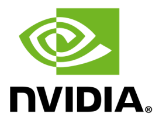

---

<!-- Page 2 -->

# Table of Contents

- Introduction
- NVIDIA H100 GPU Key Feature Summary
- NVIDIA GPU-Accelerated Data Centers
- H100 SXM5 GPU
- H100 PCIe Gen 5 GPU
- DGX H100 and DGX SuperPOD
- HGX H100
- H100 CNX Converged Accelerator
- H100 SM Architecture
- H100 SM Key Feature Summary
- H100 Tensor Core Architecture
- Hopper FP8 Data Format
- New DPX Instructions for Accelerated Dynamic Programming
- Combined L1 Data Cache and Shared Memory
- H100 Compute Performance Summary
- H100 GPU Hierarchy and Asynchrony Improvements
- Thread Block Clusters
- Distributed Shared Memory
- Asynchronous Execution
- Tensor Memory Accelerator (TMA)
- Asynchronous Transaction Barrier
- H100 HBM and L2 Cache Memory Architectures
- H100 HBM3 and HBM2e DRAM Subsystems
- H100 L2 Cache
- Memory Subsystem RAS Features
- ECC Memory Resiliency
- Memory Row Remapping

---

<!-- Page 3 -->

- Compute Capability
- Second-Generation Secure MIG
- MIG Technology Review
- H100 MIG Enhancements
- Transformer Engine
- Fourth-Generation NVLink and NVLink Network
- Third-Generation NVSwitch
- New NVLink Switch System
- PCIe Gen 5
- Security Enhancements and Confidential Computing
- NVIDIA Confidential Computing
- Measure of Success
- H100 Video / IO Features
- NVDEC for DL
- NVJPG (JPEG) Decode
- Appendix A - NVIDIA DGX - The Foundational Building Blocks of Data Center AI
- NVIDIA DGX H100 - The World’s Most Complete AI Platform
- DGX H100 overview
- Unmatched Data Center Scalability
- NVIDIA DGX H100 System Specifications
- Appendix B - NVIDIA CUDA Platform Update
- High-Performance Libraries and Frameworks
- System Software
- Documentation and Training
- Languages and Compilers
- Appendix C - Genomics Acceleration using DPX Instructions

---

<!-- Page 4 -->

# List of Figures

Figure 1.
Modern cloud datacenter workloads require NVIDIA GPU acceleration .................... 7
Figure 2
NVIDIA H100 GPU on new SXM5 Module ................................................................ 8
Figure 3.
H100 Enables Next-Generation AI and HPC Breakthroughs .................................... 9
Figure 4.
Grace Hopper Superchip .........................................................................................10
Figure 5.
New Technologies in Hopper H100 .........................................................................13
Figure 6.
GH100 Full GPU with 144 SMs ...............................................................................19
Figure 7.
GH100 Streaming Multiprocessor (SM) ...................................................................21
Figure 8.
H100 FP16 Tensor Core has 3x throughput compared to A100 FP16 Tensor Core 23
Figure 9.
New Hopper FP8 Precisions - 2x throughput and half the footprint of FP16 / BF16 .24
Figure 10.
H100 FP8 Tensor Core 6x throughput compared to A100 FP16 Tensor Core......24
Figure 11.
H100 TF32, FP64, and INT8 Tensor Cores all have 3x throughput versus A100 .25
Figure 12.
DPX Instructions Accelerate Dynamic Programming ............................................27
Figure 13.
H100 Compute Improvement Summary ...............................................................28
Figure 14.
Thread Block Clusters and Grids with Clusters ....................................................30
Figure 15.
Thread Block to Thread Block data exchange (A100 vs H100 with Clusters) .......30
Figure 16.
Cluster versus non-Cluster Performance Comparisons ........................................31
Figure 17.
Asynchronous Execution Concurrency and Enhancements in Hopper .................32
Figure 18.
TMA Address Generation via Copy Descriptor .....................................................33
Figure 19.
Asynchronous Memory Copy with TMA on H100 vs LDGSTS on A100 ...............34
Figure 20.
Asynchronous Barrier in A100 vs Asynchronous Transaction Barrier in H100......35
Figure 21.
World’s First HBM3 GPU Memory Architecture, 2x Delivered Bandwidth .............37
Figure 22.
Example CSP MIG Configuration .........................................................................42
Figure 23.
Secure MIG Example in Multi-Tenant Single GPU Configuration .........................44
Figure 24.
Transformers Model Sizes Increasing Exponentially with Different Use Cases ....45
Figure 25.
Transformer Engine Conceptual Operation. .........................................................46
Figure 26.
DGX A100 vs DGX H100 32-node, 256 GPU NVIDIA SuperPOD Comparison ....49
Figure 27.
Confidential Computing Protects Multiple ISV Scenarios .....................................53
Figure 28.
Confidential Computing for Different Use Cases ..................................................54
Figure 29.
Confidential Federated Learning ..........................................................................55
Figure 30.
NVIDIA CC Off vs CC On VM Isolation ................................................................56
Figure 31.
The NVIDIA CUDA platform and its ecosystem ....................................................64
Figure 32.
High-level language Frontends ............................................................................65
Figure 33.
NVCC split compilation model and NVC++ unified compilation model .................66
Figure 34.
Unified toolchain supports execution-space inference ..........................................67
Figure 35.
NVIDIA CLARA Parabricks Accelerated Framework ............................................69
Figure 36.
Smith-Waterman Algorithm for Genome sequencing ...........................................70

---

<!-- Page 5 -->

# List of Tables

Table 1.
NVIDIA H100 Tensor Core GPU Performance Specs .............................................20
Table 2.
H100 speedup over A100 (H100 Performance, TC=Tensor Core) ...........................26
Table 3.
Comparison of NVIDIA A100 and H1001 Data Center GPUs ...................................39
Table 4.
Compute Capability: V100 vs A100 vs H100 ...........................................................41
Table 5.
Comparison of A100 to H100 video decode (number of streams): ...........................58
Table 6.
H100 Hardware Decode Support .............................................................................58
Table 7.
NVJPG Decode Performance ..................................................................................59
Table 8.
NVIDIA DGX H100 System Specifications ...............................................................62

---

<!-- Page 6 -->

## Introduction

NVIDIA® accelerated computing technologies tackle computational challenges far beyond the capabilities of ordinary computers. Accelerated computing requires more than just powerful
- GPUs. The combination of NVIDIA® CUDA® general purpose programmable GPUs and
numerous GPU-accelerated SDKs, APIs, and algorithms provides full-stack computing solutions to deliver incredible application speed-ups across multiple domains. Distributed GPU computing
systems and software scale processing across an entire data center. Cloud data centers
worldwide are increasingly scaling up and scaling out with NVIDIA GPU-accelerated systems and architectures, running a diverse set of AI, HPC, and data analytics applications.
Over 15 years ago, NVIDIA introduced the CUDA parallel computing platform with the G80
GPU. Since that time, CUDA tools and libraries have been downloaded over 30 million times
and used by nearly 3 million developers. The CUDA platform has been continuously improved,
optimized, and expanded with more powerful CUDA-enabled GPUs, new and diverse sets of
- GPU-accelerated libraries, workstations, servers, and applications to broaden the reach of
NVIDIA accelerated computing.
NVIDIA now has full stack solutions for different industries, fields of science, and applications.
Over 450 NVIDIA SDKs, toolkits, libraries, and models serve industries and applications from gaming and design, to life and earth sciences, robotics, self-driving cars, quantum computing, supply-chain logistics, cybersecurity, 5G, climate science, digital biology, and more. Over
25,000 companies use NVIDIA AI technologies today.
The ease of programming and richness of NVIDIA’s CUDA platform allows designers, researchers, and engineers to innovate quickly. And with continued platform software
optimizations, it’s common for users to experience speed-ups of multiple X-factors through the life of the NVIDIA products.
NVIDIA GPUs are used in many of the world’s largest data centers, providing tremendous speed-ups for AI, HPC, and data analytics systems and applications. Cloud data centers are
rapidly scaling-up AI training and scaling-out inference applications with NVIDIA GPUs. Many
different types of AI models are now matured and industrialized for broad enterprise use, and have been trained and continuously improved by using NVIDIA GPUs. Examples of matured AI
models include: computer vision models, speech recognition, recommender systems, graphs and trees, time series models, generative models, variable encoders, and large language models. In fact, customizing large language models for new languages and domains will likely
be one of the largest supercomputing applications ever.
NVIDIA’s new Omniverse™ platform will power numerous metaverse environments and require massive GPU computational abilities. In addition to the NVIDIA RTX GPUs that will power the
real-time rendering and simulation in many Omniverse-enabled metaverses, we expect H100- enabled systems to add additional AI and simulation horsepower for complex digital twin challenges. One of the largest supercomputing endeavors will be NVIDIA’s own Earth-2
Supercomputer project which will continuously stream enormous amounts of data into a digital

---

<!-- Page 7 -->

twin of the Earth running physical simulations in Omniverse to predict future weather patterns worldwide.
Figure 1.
- Modern cloud datacenter workloads require NVIDIA GPU acceleration
In this whitepaper we introduce the new NVIDIA H100 Tensor Core GPU, our next-generation, accelerate AI training and inference, HPC, and data analytics applications in cloud data centers, servers, systems at the edge, and workstations.
A high-level overview of H100, new H100-based DGX, DGX SuperPOD, and HGX systems, and a new H100-based Converged Accelerator is followed by a deep dive into H100 hardware architecture, efficiency improvements, and new programming features.

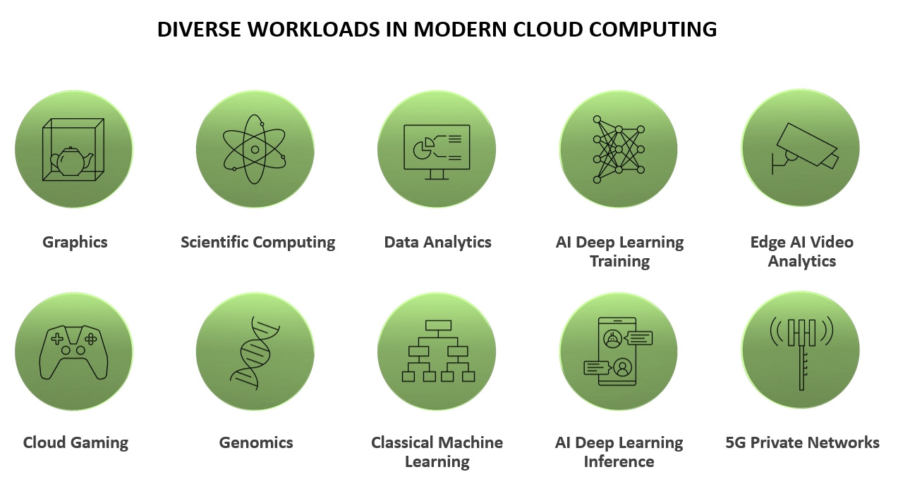

---

<!-- Page 8 -->

The complexity of artificial intelligence (AI), high-performance computing (HPC), and data analytics is increasing exponentially, requiring scientists and engineers to use the most performance computing with low latency, and integrates a full stack of capabilities for computing at data center scale.
delivers the next massive leap in accelerated computing performance for NVIDIA’s data center platforms. H100 securely accelerates diverse workloads from small enterprise workloads, to
exascale HPC, to trillion parameter AI models.
Implemented using TSMC’s 4N process customized for NVIDIA with 80 billion transistors, and including numerous architectural advances, H100 is the world’s most advanced chip ever built.
Figure 2
- NVIDIA H100 GPU on new SXM5 Module
H100 is NVIDIA’s 9th-generation data center GPU designed to deliver an order-of-magnitude performance leap for large-scale AI and HPC over our prior generation NVIDIA A100 Tensor
Core GPU. H100 carries over the major design focus of A100 to improve strong scaling for AI
and HPC workloads, with substantial improvements in architectural efficiency.
For today’s mainstream AI and HPC models, H100 with InfiniBand interconnect delivers up to 30 times the performance of A100 (see Figure 3).
With the new NVLink Switch System interconnect targeted at some of the largest and most challenging computing workloads that require model parallelism across multiple GPU-

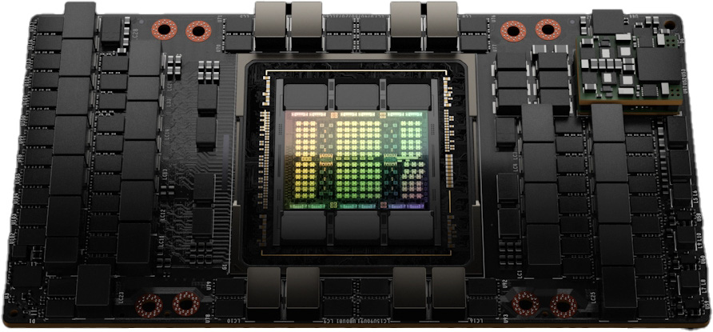

---

<!-- Page 9 -->

accelerated nodes to fit, these workloads receive yet another generational performance leap, in some cases tripling performance yet again over H100 with InfiniBand.
All performance numbers are preliminary based on current expectations and subject to change in shipping products. A100 cluster: HDR IB network.
H100 cluster: NDR IB network with NVLink Switch System where indicated. Note that NVLink Switch System technology is not available with H100
systems now, but systems and availability will be announced in the future.
# GPUs: Climate Modeling 1K, LQCD 1K, Genomics 8, 3D-FFT 256, MT-NLG 32 (batch sizes: 4 for A100, 60 for H100 at 1 sec, 8 for A100 and 64 for
H100 at 1.5 and 2sec),MRCNN 8 (batch 32),GPT-3 16B 512 (batch 256), DLRM 128 (batch 64K), GPT-3 16K (batch 512), MoE 8K (batch 512, one expert per GPU)

### Figure 3.

### H100 Enables Next-Generation AI and HPC Breakthroughs

At GTC Spring 2022, the new NVIDIA Grace Hopper Superchip product was announced. The
Hopper H100 Tensor Core GPU will power the NVIDIA Grace Hopper Superchip CPU+GPU architecture, purpose-built for terabyte-scale accelerated computing and providing 10x higher performance on large-model AI and HPC.
server architecture designed from the ground up for accelerated computing. H100 is paired to
Grace with NVIDIA’s ultra-fast chip-to-chip interconnect, delivering 900GB/s of bandwidth, 7x faster than PCIe Gen5. This innovative design will deliver up to 30x higher aggregate bandwidth
compared to today's fastest servers and up to 10x higher performance for applications running terabytes of data.

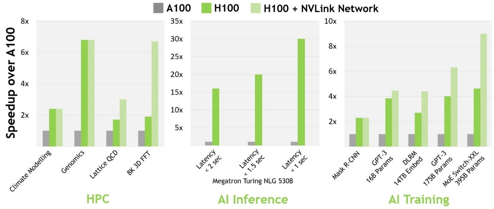

---

<!-- Page 10 -->

- Grace Hopper Superchip
Figure 4.

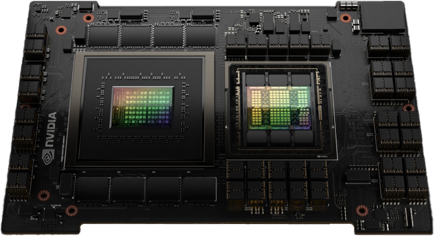

---

<!-- Page 11 -->

### NVIDIA H100 GPU Key Feature Summary

- New Streaming Multiprocessor (SM) has many performance and efficiency improvements. Key new features include:
- New fourth-generation Tensor Cores are up to 6x faster chip-to-chip compared to A100, including per-SM speedup, additional SM count, and higher clocks of
- H100. On a per SM basis, the Tensor Cores deliver 2x the MMA (Matrix Multiply-
- Accumulate) computational rates of the A100 SM on equivalent data types, and
4x the rate of A100 using the new FP8 data type, compared to previous generation 16-bit floating point options. The Sparsity feature exploits fine-grained
structured sparsity in deep learning networks, doubling the performance of standard Tensor Core operations.
- New DPX Instructions accelerate Dynamic Programming algorithms by up to 7x over the A100 GPU. Two examples include the Smith-Waterman algorithm for
genomics processing, and the Floyd-Warshall algorithm used to find optimal routes for a fleet of robots through a dynamic warehouse environment.
- 3x faster IEEE FP64 and FP32 processing rates chip-to-chip compared to A100, due to 2x faster clock-for-clock performance per SM, plus additional SM counts and higher clocks of H100.
- New Thread Block Cluster feature allows programmatic control of locality at a granularity larger than a single Thread Block on a single SM. This extends the
CUDA programming model by adding another level to the programming hierarchy to now include Threads, Thread Blocks, Thread Block Clusters, and Grids.
Clusters enable multiple Thread Blocks running concurrently across multiple SMs to synchronize and collaboratively fetch and exchange data.
- New Asynchronous Execution features include a new Tensor Memory
Accelerator (TMA) unit that can transfer large blocks of data very efficiently between global memory and shared memory. TMA also supports asynchronous
copies between Thread Blocks in a Cluster. There is also a new Asynchronous
Transaction Barrier for doing atomic data movement and synchronization.
- New Transformer Engine uses a combination of software and custom Hopper Tensor
Core technology designed specifically to accelerate Transformer model training and inference. The Transformer Engine intelligently manages and dynamically chooses
between FP8 and 16-bit calculations, automatically handling re-casting and scaling between FP8 and 16-bit in each layer to deliver up to 9x faster AI training and up to 30x faster AI inference speedups on large language models compared to the prior generation A100.
- HBM3 memory subsystem provides nearly a 2x bandwidth increase over the previous generation. The H100 SXM5 GPU is the world’s first GPU with HBM3 memory delivering
a class-leading 3 TB/sec of memory bandwidth.
- 50 MB L2 cache architecture caches large portions of models and datasets for repeated access, reducing trips to HBM3.
- Second-generation Multi-Instance GPU (MIG) technology provides approximately 3x more compute capacity and nearly 2x more memory bandwidth per GPU Instance

---

<!-- Page 12 -->

compared to A100. Confidential Computing capability with MIG-level Trusted Execution
Environments (TEE) is now provided for the first time. Up to seven individual GPU
Instances are supported, each with dedicated NVDEC and NVJPG units. Each Instance
now includes its own set of performance monitors that work with NVIDIA developer tools.
- New Confidential Computing support protects user data, defends against hardware and software attacks, and better isolates and protects VMs from each other in virtualized and MIG environments. H100 implements the world's first native Confidential Computing
GPU and extends the Trusted Execution Environment with CPUs at full PCIe line rate.
- Fourth-generation NVIDIA NVLink® provides a 3x bandwidth increase on all-reduce operations and a 50% general bandwidth increase over the prior generation NVLink with 900 GB/sec total bandwidth for multi-GPU IO operating at 7x the bandwidth of PCIe Gen 5.
- Third-generation NVSwitch technology includes switches residing both inside and outside of nodes to connect multiple GPUs in servers, clusters, and data center environments. Each NVSwitch inside a node provides 64 ports of fourth-generation
NVLink links to accelerate multi-GPU connectivity. Total switch throughput increases to 13.6 Tbits/sec from 7.2 Tbits/sec in the prior generation. New third-generation NVSwitch
technology also provides hardware acceleration for collective operations with multicast and NVIDIA SHARP in-network reductions.
- New NVLink Switch System interconnect technology and new second-level NVLink
Switches based on third-gen NVSwitch technology introduce address space isolation and protection, enabling up to 32 nodes or 256 GPUs to be connected over NVLink in a
2:1 tapered, fat tree topology. These connected nodes are capable of delivering 57.6
TB/sec of all-to-all bandwidth and can supply an incredible one exaFLOP of FP8 sparse
AI compute.
- PCIe Gen 5 provides 128 GB/sec total bandwidth (64 GB/sec in each direction) compared to 64 GB/sec total bandwidth (32GB/sec in each direction) in Gen 4 PCIe.
PCIe Gen 5 enables H100 to interface with the highest performing x86 CPUs and
SmartNICs / DPUs (Data Processing Units).
Many other new features are also included to improve strong scaling, reduce latencies and overheads, and generally simplify GPU programming.
The NVIDIA-Accelerated Data Centers section in this whitepaper discusses new H100-based
DGX, HGX, Converged Accelerators, and AI supercomputing systems.
architectural features, new programming capabilities, and performance improvements.

---

<!-- Page 13 -->

Figure 5.
- New Technologies in Hopper H100

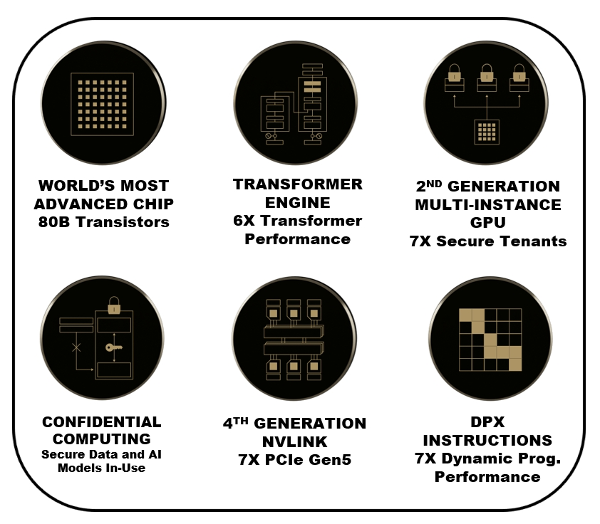

---

<!-- Page 14 -->

## NVIDIA GPU-Accelerated Data Centers

From AI and data analytics to high-performance computing (HPC), data centers are key to solving some of the most important challenges. End-to-end NVIDIA accelerated computing
platforms, integrated across hardware and software, gives enterprises the blueprint to a robust, secure infrastructure that supports develop-to-deploy implementations across all modern workloads.
Deep learning datasets are becoming larger and more complex, with workloads like conversational AI, recommender systems, and computer vision becoming increasingly prevalent across industries. NVIDIA data center platforms, including hardware and software, significantly
accelerates AI training, resulting in highly productive data science teams, significant cost savings, and faster time to ROI.
Accelerating inference workloads in the data center requires an agile, elastic infrastructure that can scale out and utilize every bit of compute resources available. With new technologies like
Multi-Instance GPU (MIG), NVIDIA solutions are uniquely positioned to accelerate inference workloads like image recognition, recommender systems, and natural language processing, providing the highest throughput and real-time responsiveness needed to bring AI to applications.
HPC is one of the most essential tools fueling the advancement of science in the data center.
NVIDIA GPUs are the engine of the modern HPC data center. By delivering breakthrough
performance with fewer servers resulting in faster insights and dramatically lower costs, NVIDIA data center platforms pave the way to scientific discovery.
Businesses are generating and collecting unprecedented amounts of data. The more data
available to analyze, the more that can be learned. With NVIDIA data center platforms and
analytics solutions, businesses can derive actionable insights from their data faster than ever before.
NVIDIA GPU acceleration for data centers is available through a broad range of servers from
NVIDIA's vast ecosystem of partner server makers. H100 GPUs are available in different
configurations to support the different requirements of server designs.
The following sections provide brief descriptions of NVIDIA data center-ready H100-based systems and boards, including H100 GPUs in SMX5 and PCIe Gen 5 form-factors, DGX H100 and DGX SuperPOD systems, HGX H100, and the H100 CNX Converged Accelerator that combines the power of the NVIDIA H100 GPU with the advanced networking capabilities of the
- NVIDIA® ConnectX-7 SmartNIC. See Appendix A - NVIDIA DGX - The Foundational
Building Blocks of Data Center AI for more details on DGX H100 systems.

---

<!-- Page 15 -->

### H100 SXM5 GPU

The H100 SXM5 configuration using NVIDIA’s custom-built SXM5 board that houses the H100
GPU and HBM3 memory stacks, and also provides fourth-generation NVLink and PCIe Gen 5 connectivity, provides the highest application performance. This configuration is ideal for
customers with applications scaling to multiple GPUs in a server, and across servers. It’s
available through HGX H100 server boards with 4-GPU and 8-GPU configurations. While the 4-
GPU configuration includes point-to-point NVLink connections between GPUs and provides a higher CPU-to-GPU ratio in the server, the 8-GPU configuration includes NVSwitch to provide
- SHARP in-network reductions and full NVLink bandwidth of 900 GB/s between any pair of
GPUs. The H100 SXM5 GPU is also used in the powerful new DGX H100 servers and DGX
SuperPOD systems.

### H100 PCIe Gen 5 GPU

- The H100 PCIe Gen 5 configuration provides all the capabilities of H100 SXM5 GPUs in just
350 Watts of Thermal Design Power (TDP). This configuration can optionally use the NVLink
bridge for connecting up to two GPUs at 600 GB/s of bandwidth, nearly five times PCIe Gen5.
Well suited for mainstream accelerated servers that go into standard racks offering lower power per server, H100 PCIe provides great performance for applications that scale to 1 or 2 GPUs at a time, including AI Inference and some HPC applications. On a basket of 10 top data analytics,
AI and HPC applications, a single H100 PCIe GPU efficiently provides 65% delivered performance of the H100 SXM5 GPU while consuming 50% of the power.

### DGX H100 and DGX SuperPOD

NVIDIA DGX H100 is a universal high-performance AI system for training, inference, and analytics. DGX H100 is equipped with Bluefield-3, NDR InfiniBand, and second-generation MIG
technology. A single DGX H100 system delivers an unmatched 16 petaFLOPS of FP16 sparse
- AI compute performance. This performance can be easily scaled up by connecting multiple
- DGX H100 systems into clusters known as DGX PODs or even DGX SuperPODs. A DGX
- SuperPOD starts with 32 DGX H100 systems, referred to as a “scalable unit”, which integrates
256 H100 GPUs connected via the new second-level NVLink switches based on third- generation NVSwitch technology, delivering an unprecedented one exaFLOP of FP8 sparse AI compute performance. DGX H100 SuperPOD will support both InfiniBand and NVLINK Switch
network options.
See Appendix A - NVIDIA DGX - The Foundational Building Blocks of Data Center AI for more details.

---

<!-- Page 16 -->

### HGX H100

As workloads explode in complexity there’s a need for multiple GPUs to work together with extremely fast communication between them. NVIDIA HGX H100™ combines multiple H100
GPUs with the high-speed interconnect powered by NVLink and NVSwitch to enable the creation of the world’s most powerful scale-up servers.
HGX H100 is available as a server building block in the form of integrated baseboards in four or eight H100 GPUs configurations. Four GPU HGX H100 offers fully interconnected point to point
NVLink connections between GPUs, while the eight GPU configuration offers full GPU-to-GPU bandwidth through NVSwitch. Leveraging the power of H100 multi-precision Tensor Cores, an
8-way HGX H100 provides over 32 petaFLOPS of deep learning compute performance using sparse FP8 operations. HGX H100 enables standardized high-performance servers that provide
predictable performance on various application workloads, while also enabling faster time to market for NVIDIA’s ecosystem of partner server makers.

### H100 CNX Converged Accelerator

NVIDIA H100 CNX combines the power of the NVIDIA H100 GPU with the advanced networking capabilities of the NVIDIA® ConnectX-7 SmartNIC, which delivers up to 400Gb/s of bandwidth and includes innovative features such as NVIDIA ASAP2 (Accelerated Switching and
Packet Processing), and in-line hardware acceleration for TLS/IPsec/MACsec encryption/decryption. This unique architecture delivers unprecedented performance for GPU-
powered I/O intensive workloads, such as distributed AI training in the enterprise data center, or
5G signal processing at the edge.

---

<!-- Page 17 -->

innovations:
- New fourth-generation Tensor Cores perform faster matrix computations than ever before on an even broader array of AI and HPC tasks.
- A new Transformer Engine enables H100 to deliver up to 9x faster AI training and up to 30x faster AI inference speedups on large language models compared to the prior generation A100.
- The new NVLink Network interconnect enables GPU-to-GPU communication among up to 256 GPUs across multiple compute nodes
- Secure MIG partitions the GPU into isolated, right-size instances to maximize QoS
(quality of service) for smaller workloads.
NVIDIA’s H100 is the first truly asynchronous GPU. H100 extends A100’s global-to-shared
asynchronous transfers across all address spaces, and adds support for tensor memory access patterns. It enables applications to build end-to-end asynchronous pipelines that move data into
and off the chip, completely overlapping and hiding data movement with computation.
Only a small number of CUDA threads are now required to manage the full memory bandwidth of H100 using the new Tensor Memory Accelerator, while most other CUDA threads can be focused on general-purpose computations, such as pre-processing and post-processing data for the new generation of Tensor Cores.
H100 grows the CUDA thread group hierarchy with a new level called the Thread Block Cluster.
A Cluster is a group of Thread Blocks that are guaranteed to be concurrently scheduled, and enable efficient cooperation and data sharing for threads across multiple SMs. A Cluster also
cooperatively drives asynchronous units like the Tensor Memory Accelerator and the Tensor
Cores more efficiently.
Orchestrating the growing number of on-chip accelerators and diverse groups of general- purpose threads requires synchronization. For example, threads and accelerators that consume
outputs must wait on threads and accelerators that produce them.
NVIDIA’s Asynchronous Transaction Barrier enables general-purpose CUDA threads and on- chip accelerators within a Cluster to synchronize efficiently, even if they reside on separate
SMs. All these new features enable every user and application to fully utilize all units of their
H100 GPUs at all times, making H100 the most powerful, most programmable, and power- efficient GPU to date.
The full GH100 GPU that powers the H100 GPU is fabricated using TSMC’s 4N process customized for NVIDIA, with 80 billion transistors, a die size of 814 mm2, and higher frequency design.

---

<!-- Page 18 -->

The NVIDIA GH100 GPU is composed of multiple GPU Processing Clusters (GPCs), Texture
Processing Clusters (TPCs), Streaming Multiprocessors (SMs), L2 cache, and HBM3 memory controllers.
- The full implementation of the GH100 GPU includes the following units:
- 8 GPCs, 72 TPCs (9 TPCs/GPC), 2 SMs/TPC, 144 SMs per full GPU
- 128 FP32 CUDA Cores per SM, 18432 FP32 CUDA Cores per full GPU
- 4 Fourth-Generation Tensor Cores per SM, 576 per full GPU
- 6 HBM3 or HBM2e stacks, 12 512-bit Memory Controllers
- 60 MB L2 Cache
- Fourth-Generation NVLink and PCIe Gen 5
- The NVIDIA H100 GPU with SXM5 board form-factor includes the following units:
- 8 GPCs, 66 TPCs, 2 SMs/TPC, 132 SMs per GPU
- 128 FP32 CUDA Cores per SM, 16896 FP32 CUDA Cores per GPU
- 4 Fourth-generation Tensor Cores per SM, 528 per GPU
- 80 GB HBM3, 5 HBM3 stacks, 10 512-bit Memory Controllers
- 50 MB L2 Cache
- Fourth-Generation NVLink and PCIe Gen 5
- The NVIDIA H100 GPU with a PCIe Gen 5 board form-factor includes the following units:
- 7 or 8 GPCs, 57 TPCs, 2 SMs/TPC, 114 SMs per GPU
- 128 FP32 CUDA Cores/SM, 14592 FP32 CUDA Cores per GPU
- 4 Fourth-generation Tensor Cores per SM, 456 per GPU
- 80 GB HBM2e, 5 HBM2e stacks, 10 512-bit Memory Controllers
- 50 MB L2 Cache
- Fourth-Generation NVLink and PCIe Gen 5
Using the TSMC 4N fabrication process allows H100 to increase GPU core frequency, improve performance per watt, and incorporate more GPCs, TPCs, and SMs than the prior generation
GA100 GPU, which was based on the TSMC 7nm N7 process.
Figure 6 shows a full GH100 GPU with 144 SMs. The H100 SXM5 GPU has 132 SMs, and the
PCIe version has 114 SMs. Note that the H100 GPUs are primarily built for executing
datacenter and edge compute workloads for AI, HPC, and data analytics, but not graphics processing. Only two TPCs in both the SXM5 and PCIe H100 GPUs are graphics-capable (that
is, they can run vertex, geometry, and pixel shaders).

---

<!-- Page 19 -->

Figure 6.
- GH100 Full GPU with 144 SMs

### H100 SM Architecture

A100’s peak per-SM floating point computational power, due to the introduction of FP8, and doubles A100’s raw SM computational power on all previous Tensor Core and FP32 / FP64 data types, clock-for-clock.
The new Transformer Engine, combined with Hopper’s FP8 Tensor Cores, delivers up to 9x faster AI training and 30x faster AI inference speedups on large language models compared to the prior generation A100. Hopper’s new DPX instructions enable up to 7x faster Smith-
Waterman algorithm processing for genomics and protein sequencing.
- Hopper’s new fourth-generation Tensor Core, Tensor Memory Accelerator, and many other new
SM and general H100 architecture improvements together deliver up to 3x faster HPC and AI performance in many other cases.

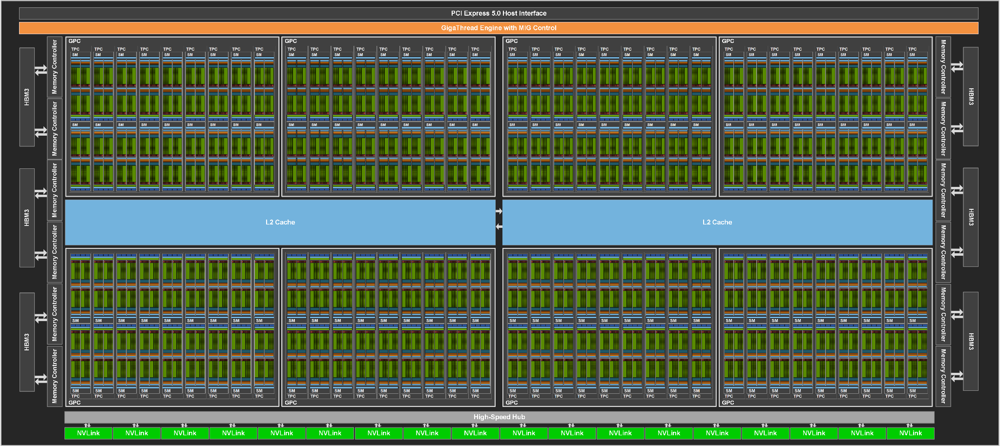

---

<!-- Page 20 -->

**Table 1. NVIDIA H100 Tensor Core GPU Performance Specs**

<table style="border-collapse: collapse; width: 100%; margin: 1em 0;">
  <tr>
    <th style="border: 1px solid #ddd; padding: 8px; text-align: left; background-color: #4472C4; color: white;"></th>
    <th style="border: 1px solid #ddd; padding: 8px; text-align: left; background-color: #4472C4; color: white;"></th>
    <th style="border: 1px solid #ddd; padding: 8px; text-align: left; background-color: #4472C4; color: white;">NVIDIA H100 SXM5</th>
    <th style="border: 1px solid #ddd; padding: 8px; text-align: left; background-color: #4472C4; color: white;">NVIDIA H100 PCIe</th>
  </tr>
  <tr>
    <td style="border: 1px solid #ddd; padding: 8px; background-color: #f2f2f2;">Peak FP64</td>
    <td style="border: 1px solid #ddd; padding: 8px; background-color: #f2f2f2;"></td>
    <td style="border: 1px solid #ddd; padding: 8px; background-color: #f2f2f2;">33.5 TFLOPS</td>
    <td style="border: 1px solid #ddd; padding: 8px; background-color: #f2f2f2;">25.6 TFLOPS</td>
  </tr>
  <tr>
    <td style="border: 1px solid #ddd; padding: 8px; background-color: white;">Peak FP64 Tensor Core</td>
    <td style="border: 1px solid #ddd; padding: 8px; background-color: white;"></td>
    <td style="border: 1px solid #ddd; padding: 8px; background-color: white;">66.9 TFLOPS</td>
    <td style="border: 1px solid #ddd; padding: 8px; background-color: white;">51.2 TFLOPS</td>
  </tr>
  <tr>
    <td style="border: 1px solid #ddd; padding: 8px; background-color: #f2f2f2;">Peak FP32</td>
    <td style="border: 1px solid #ddd; padding: 8px; background-color: #f2f2f2;"></td>
    <td style="border: 1px solid #ddd; padding: 8px; background-color: #f2f2f2;">66.9 TFLOPS</td>
    <td style="border: 1px solid #ddd; padding: 8px; background-color: #f2f2f2;">51.2 TFLOPS</td>
  </tr>
  <tr>
    <td style="border: 1px solid #ddd; padding: 8px; background-color: white;">Peak FP16</td>
    <td style="border: 1px solid #ddd; padding: 8px; background-color: white;"></td>
    <td style="border: 1px solid #ddd; padding: 8px; background-color: white;">133.8 TFLOPS</td>
    <td style="border: 1px solid #ddd; padding: 8px; background-color: white;">102.4 TFLOPS</td>
  </tr>
  <tr>
    <td style="border: 1px solid #ddd; padding: 8px; background-color: #f2f2f2;">Peak BF16</td>
    <td style="border: 1px solid #ddd; padding: 8px; background-color: #f2f2f2;"></td>
    <td style="border: 1px solid #ddd; padding: 8px; background-color: #f2f2f2;">133.8 TFLOPS</td>
    <td style="border: 1px solid #ddd; padding: 8px; background-color: #f2f2f2;">102.4 TFLOPS</td>
  </tr>
  <tr>
    <td style="border: 1px solid #ddd; padding: 8px; background-color: white;">Peak TF32 Tensor Core</td>
    <td style="border: 1px solid #ddd; padding: 8px; background-color: white;"></td>
    <td style="border: 1px solid #ddd; padding: 8px; background-color: white;">494.7 TFLOPS | 989.4 TFLOPS1</td>
    <td style="border: 1px solid #ddd; padding: 8px; background-color: white;">378 TFLOPS | 756 TFLOPS1</td>
  </tr>
  <tr>
    <td style="border: 1px solid #ddd; padding: 8px; background-color: #f2f2f2;">Peak FP16 Tensor Core</td>
    <td style="border: 1px solid #ddd; padding: 8px; background-color: #f2f2f2;"></td>
    <td style="border: 1px solid #ddd; padding: 8px; background-color: #f2f2f2;">989.4 TFLOPS | 1978.9 TFLOPS1</td>
    <td style="border: 1px solid #ddd; padding: 8px; background-color: #f2f2f2;">756 TFLOPS | 1513 TFLOPS1</td>
  </tr>
  <tr>
    <td style="border: 1px solid #ddd; padding: 8px; background-color: white;">Peak BF16 Tensor Core</td>
    <td style="border: 1px solid #ddd; padding: 8px; background-color: white;"></td>
    <td style="border: 1px solid #ddd; padding: 8px; background-color: white;">989.4 TFLOPS | 1978.9 TFLOPS1</td>
    <td style="border: 1px solid #ddd; padding: 8px; background-color: white;">756 TFLOPS | 1513 TFLOPS2</td>
  </tr>
  <tr>
    <td style="border: 1px solid #ddd; padding: 8px; background-color: #f2f2f2;">Peak FP8 Tensor Core</td>
    <td style="border: 1px solid #ddd; padding: 8px; background-color: #f2f2f2;"></td>
    <td style="border: 1px solid #ddd; padding: 8px; background-color: #f2f2f2;">1978.9 TFLOPS | 3957.8 TFLOPS1</td>
    <td style="border: 1px solid #ddd; padding: 8px; background-color: #f2f2f2;">1513 TFLOPS | 3026 TFLOPS1</td>
  </tr>
  <tr>
    <td style="border: 1px solid #ddd; padding: 8px; background-color: white;">Peak INT8 Tensor Core</td>
    <td style="border: 1px solid #ddd; padding: 8px; background-color: white;"></td>
    <td style="border: 1px solid #ddd; padding: 8px; background-color: white;">1978.9 TOPS | 3957.8 TOPS1</td>
    <td style="border: 1px solid #ddd; padding: 8px; background-color: white;">1513 TOPS | 3026 TOPS1</td>
  </tr>
</table>

---

<!-- Page 21 -->

Figure 7.
- GH100 Streaming Multiprocessor (SM)

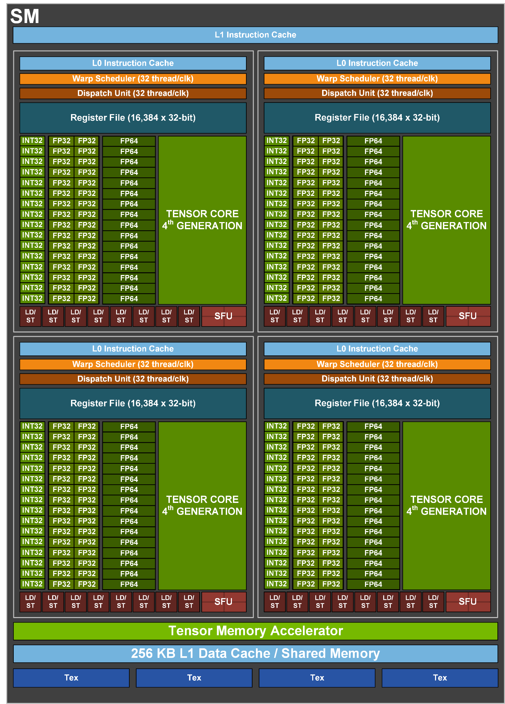

---

<!-- Page 22 -->

- H100 SM Key Feature Summary
- Fourth-generation Tensor Cores:
- Up to 6x faster chip-to-chip compared to A100, including per-SM speedup, additional SM count, and higher clocks of H100.
- On a per SM basis, the Tensor Cores deliver 2x the MMA (Matrix Multiply-
- Accumulate) computational rates of the A100 SM on equivalent data types, and
4x the rate of A100 using the new FP8 data type, compared to previous generation 16-bit floating point options.
- Sparsity feature exploits fine-grained structured sparsity in deep learning networks, doubling the performance of standard Tensor Core operations.
- New DPX Instructions accelerate Dynamic Programming algorithms by up to 7x over the A100 GPU. Two examples include the Smith-Waterman algorithm for genomics
processing, and the Floyd-Warshall algorithm used to find optimal routes for a fleet of robots through a dynamic warehouse environment.
- 3x faster IEEE FP64 and FP32 processing rates chip-to-chip compared to A100, due to 2x faster clock-for-clock performance per SM, plus additional SM counts and higher clocks of H100.
- 256 KB of combined shared memory and L1 data cache, 1.33x larger than A100.
- New Asynchronous Execution features include a new Tensor Memory Accelerator
(TMA) unit that can efficiently transfer large blocks of data between global memory and shared memory. TMA also supports asynchronous copies between Thread Blocks in a
Cluster. There is also a new Asynchronous Transaction Barrier for doing atomic data
movement and synchronization.
- New Thread Block Cluster feature exposes control of locality across multiple SMs.
- Distributed Shared Memory allows direct SM-to-SM communications for loads, stores, and atomics across multiple SM shared memory blocks.
- H100 Tensor Core Architecture
Tensor Cores are specialized high-performance compute cores for matrix multiply and accumulate (MMA) math operations that provide groundbreaking performance for AI and HPC applications. Tensor Cores operating in parallel across SMs in one NVIDIA GPU deliver
massive increases in throughput and efficiency compared to standard Floating-Point (FP),
Integer (INT), and FMA (Fused Multiply-Accumulate) operations. Tensor Cores were first
introduced in the NVIDIA Tesla® V100 GPU, and further enhanced in each new NVIDIA GPU architecture generation.
The new fourth-generation Tensor Core architecture in H100 delivers double the raw dense and sparse matrix math throughput per SM, clock-for-clock, compared to A100, and even more when considering the higher GPU Boost clock of H100 over A100. FP8, FP16, BF16, TF32,
FP64, and INT8 MMA data types are supported. The new Tensor Cores also have more
efficient data management, saving up to 30% operand delivery power.

---

<!-- Page 23 -->

Figure 8.
H100 FP16 Tensor Core has 3x throughput compared to A100 FP16
- Tensor Core
- Hopper FP8 Data Format
- The H100 GPU adds FP8 Tensor Cores to accelerate both AI training and inference. As shown
in Figure 9, FP8 Tensor Cores support FP32 and FP16 accumulators, and two new FP8 input types:
- E4M3 with 4 exponent bits, 3 mantissa bits, and 1 sign bit
- E5M2, with 5 exponent bits, 2 mantissa bits, and 1 sign bit.
E4M3 supports computations requiring less dynamic range with more precision, while E5M2 provides a wider dynamic range and less precision. FP8 halves data storage requirements and
doubles throughput compared to FP16 or BF16.
The new Transformer Engine (described in a section below) utilizes both FP8 and FP16 precisions to reduce memory usage and increase performance, while still maintaining accuracy for large language and other models.

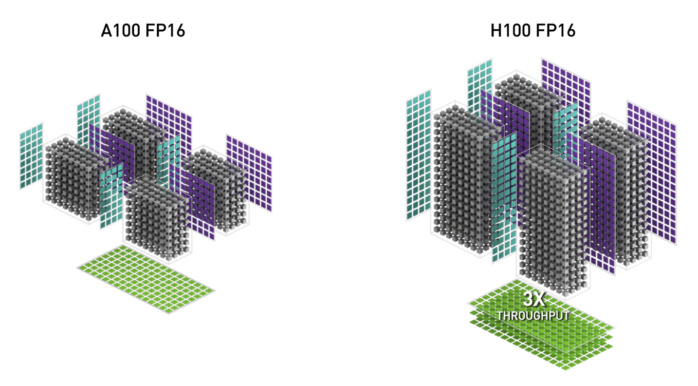

---

<!-- Page 24 -->

Figure 9.
- New Hopper FP8 Precisions - 2x throughput and half the footprint of
- H100 FP16 / BF16
Figure 10. H100 FP8 Tensor Core 6x throughput compared to A100 FP16
- Tensor Core

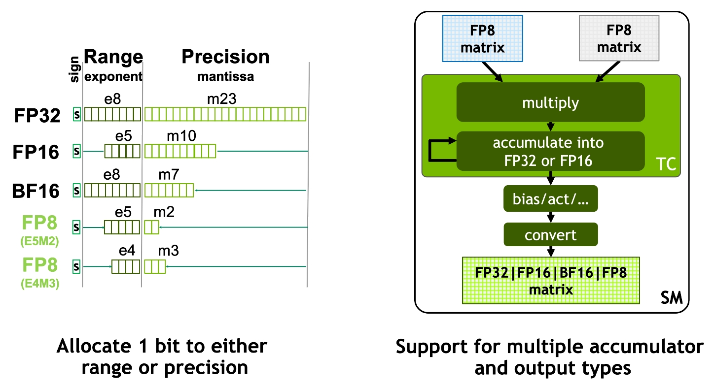

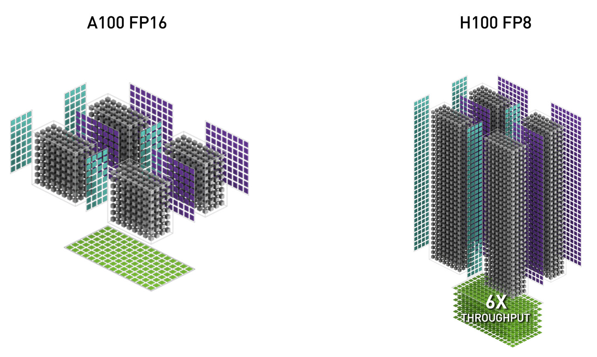

---

<!-- Page 25 -->

Figure 11. H100 TF32, FP64, and INT8 Tensor Cores all have 3x throughput
versus A100

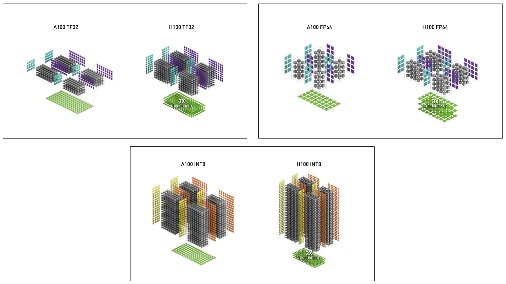

---

<!-- Page 26 -->

**Table 2. H100 speedup over A100 (H100 Performance, TC=Tensor Core)**

<table style="border-collapse: collapse; width: 100%; margin: 1em 0;">
  <tr>
    <th style="border: 1px solid #ddd; padding: 8px; text-align: left; background-color: #4472C4; color: white;"></th>
    <th style="border: 1px solid #ddd; padding: 8px; text-align: left; background-color: #4472C4; color: white;">A100</th>
    <th style="border: 1px solid #ddd; padding: 8px; text-align: left; background-color: #4472C4; color: white;">A100 Sparse</th>
    <th style="border: 1px solid #ddd; padding: 8px; text-align: left; background-color: #4472C4; color: white;">H100 SXM5</th>
    <th style="border: 1px solid #ddd; padding: 8px; text-align: left; background-color: #4472C4; color: white;">H100 SXM5 Sparse</th>
    <th style="border: 1px solid #ddd; padding: 8px; text-align: left; background-color: #4472C4; color: white;">H100 SXM5 Speedup vs A100</th>
  </tr>
  <tr>
    <td style="border: 1px solid #ddd; padding: 8px; background-color: #f2f2f2;">FP8 Tensor Core</td>
    <td style="border: 1px solid #ddd; padding: 8px; background-color: #f2f2f2;">NA</td>
    <td style="border: 1px solid #ddd; padding: 8px; background-color: #f2f2f2;">NA</td>
    <td style="border: 1px solid #ddd; padding: 8px; background-color: #f2f2f2;">1978.9 TFLOPS</td>
    <td style="border: 1px solid #ddd; padding: 8px; background-color: #f2f2f2;">3957.8 TFLOPS</td>
    <td style="border: 1px solid #ddd; padding: 8px; background-color: #f2f2f2;">6.3x vs A100 FP16 TC</td>
  </tr>
  <tr>
    <td style="border: 1px solid #ddd; padding: 8px; background-color: white;">FP16</td>
    <td style="border: 1px solid #ddd; padding: 8px; background-color: white;">78 TFLOPS</td>
    <td style="border: 1px solid #ddd; padding: 8px; background-color: white;">NA</td>
    <td style="border: 1px solid #ddd; padding: 8px; background-color: white;">133.8 TFLOPS</td>
    <td style="border: 1px solid #ddd; padding: 8px; background-color: white;">NA</td>
    <td style="border: 1px solid #ddd; padding: 8px; background-color: white;">1.7x</td>
  </tr>
  <tr>
    <td style="border: 1px solid #ddd; padding: 8px; background-color: #f2f2f2;">FP16 Tensor Core</td>
    <td style="border: 1px solid #ddd; padding: 8px; background-color: #f2f2f2;">312 TFLOPS</td>
    <td style="border: 1px solid #ddd; padding: 8px; background-color: #f2f2f2;">624 TFLOPS</td>
    <td style="border: 1px solid #ddd; padding: 8px; background-color: #f2f2f2;">989.4 TFLOPS</td>
    <td style="border: 1px solid #ddd; padding: 8px; background-color: #f2f2f2;">1978.9 TFLOPS</td>
    <td style="border: 1px solid #ddd; padding: 8px; background-color: #f2f2f2;">3.2x</td>
  </tr>
  <tr>
    <td style="border: 1px solid #ddd; padding: 8px; background-color: white;">BF16 Tensor Core</td>
    <td style="border: 1px solid #ddd; padding: 8px; background-color: white;">312 TFLOPS</td>
    <td style="border: 1px solid #ddd; padding: 8px; background-color: white;">624 TFLOPS</td>
    <td style="border: 1px solid #ddd; padding: 8px; background-color: white;">989.4 TFLOPS</td>
    <td style="border: 1px solid #ddd; padding: 8px; background-color: white;">1978.9 TFLOPS</td>
    <td style="border: 1px solid #ddd; padding: 8px; background-color: white;">3.2x</td>
  </tr>
  <tr>
    <td style="border: 1px solid #ddd; padding: 8px; background-color: #f2f2f2;">FP32</td>
    <td style="border: 1px solid #ddd; padding: 8px; background-color: #f2f2f2;">19.5 TFLOPS</td>
    <td style="border: 1px solid #ddd; padding: 8px; background-color: #f2f2f2;">NA</td>
    <td style="border: 1px solid #ddd; padding: 8px; background-color: #f2f2f2;">66.9 TFLOPS</td>
    <td style="border: 1px solid #ddd; padding: 8px; background-color: #f2f2f2;">NA</td>
    <td style="border: 1px solid #ddd; padding: 8px; background-color: #f2f2f2;">3.4x</td>
  </tr>
  <tr>
    <td style="border: 1px solid #ddd; padding: 8px; background-color: white;">TF32 Tensor Core</td>
    <td style="border: 1px solid #ddd; padding: 8px; background-color: white;">156 TFLOPS</td>
    <td style="border: 1px solid #ddd; padding: 8px; background-color: white;">312 TFLOPS</td>
    <td style="border: 1px solid #ddd; padding: 8px; background-color: white;">494.7 TFLOPS</td>
    <td style="border: 1px solid #ddd; padding: 8px; background-color: white;">989.4 TFLOPS</td>
    <td style="border: 1px solid #ddd; padding: 8px; background-color: white;">3.2x</td>
  </tr>
  <tr>
    <td style="border: 1px solid #ddd; padding: 8px; background-color: #f2f2f2;">FP64</td>
    <td style="border: 1px solid #ddd; padding: 8px; background-color: #f2f2f2;">9.7 TFLOPS</td>
    <td style="border: 1px solid #ddd; padding: 8px; background-color: #f2f2f2;">NA</td>
    <td style="border: 1px solid #ddd; padding: 8px; background-color: #f2f2f2;">33.5 TFLOPS</td>
    <td style="border: 1px solid #ddd; padding: 8px; background-color: #f2f2f2;">NA</td>
    <td style="border: 1px solid #ddd; padding: 8px; background-color: #f2f2f2;">3.5x</td>
  </tr>
  <tr>
    <td style="border: 1px solid #ddd; padding: 8px; background-color: white;">FP64 Tensor Core</td>
    <td style="border: 1px solid #ddd; padding: 8px; background-color: white;">19.5 TFLOPS</td>
    <td style="border: 1px solid #ddd; padding: 8px; background-color: white;">NA</td>
    <td style="border: 1px solid #ddd; padding: 8px; background-color: white;">66.9 TFLOPS</td>
    <td style="border: 1px solid #ddd; padding: 8px; background-color: white;">NA</td>
    <td style="border: 1px solid #ddd; padding: 8px; background-color: white;">3.4x</td>
  </tr>
  <tr>
    <td style="border: 1px solid #ddd; padding: 8px; background-color: #f2f2f2;">INT8 Tensor Core</td>
    <td style="border: 1px solid #ddd; padding: 8px; background-color: #f2f2f2;">624 TOPS</td>
    <td style="border: 1px solid #ddd; padding: 8px; background-color: #f2f2f2;">1248 TOPS</td>
    <td style="border: 1px solid #ddd; padding: 8px; background-color: #f2f2f2;">1978.9 TFLOPS</td>
    <td style="border: 1px solid #ddd; padding: 8px; background-color: #f2f2f2;">3957.8 TFLOPS</td>
    <td style="border: 1px solid #ddd; padding: 8px; background-color: #f2f2f2;">3.2x</td>
  </tr>
</table>

---

<!-- Page 27 -->

- New DPX Instructions for Accelerated Dynamic Programming
Many “brute force” optimization algorithms have the property that a sub-problem solution is reused many times when solving the larger problem. Dynamic Programming is an algorithmic
technique for solving a complex recursive problem by breaking it down into simpler sub- problems. By storing the results of sub-problems, without the need to recompute them when
needed later, Dynamic Programming algorithms reduce the computational complexity of exponential problem sets to a linear scale.
Dynamic programming is commonly used in a broad range of optimization, data processing, and genomics algorithms. In the rapidly growing field of genome sequencing, the Smith-Waterman
dynamic programming algorithm is one of the most important methods in use. In the robotics
space, Floyd-Warshall is a key algorithm used to find optimal routes for a fleet of robots through a dynamic warehouse environment in real-time.
H100 introduces DPX instructions to accelerate the performance of Dynamic Programming algorithms by up to 7x compared to Ampere GPUs. These new instructions provide support for
advanced fused operands for the inner loop of many DP algorithms. This will lead to
dramatically faster times-to-solutions in disease diagnosis, logistics routing optimizations, and even graph analytics.
Figure 12. DPX Instructions Accelerate Dynamic Programming
- Combined L1 Data Cache and Shared Memory
First introduced in Volta V100, the NVIDIA combined L1 data cache and shared memory subsystem architecture significantly improves performance, while also simplifying programming and reducing the tuning required to attain at or near-peak application performance. Combining
data cache and shared memory functionality into a single memory block provides the best overall performance for both types of memory accesses. The combined capacity of the L1 data
cache and shared memory is 256 KB/SM in H100 versus 192 KB/SM in A100. SM shared
memory size itself is configurable up to 228 KB in H100.

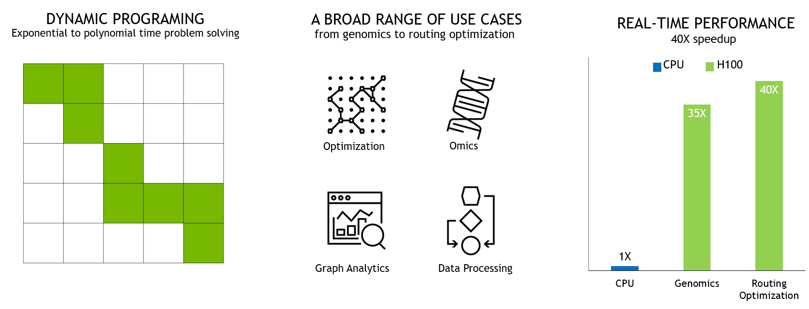

---

<!-- Page 28 -->

- H100 Compute Performance Summary
Overall, H100 provides approximately 6x compute performance improvement over A100 when factoring in all the new compute technology advances in H100. Figure 13 summarizes the
improvements in H100 in a cascading manner, starting with its 132 SMs providing a 22% SM count increase over A100’s 108 SMs. Each of the H100 SMs is 2x faster thanks to its new 4th
- Generation Tensor Core. And within each Tensor Core, the new FP8 format and associated
- Transformer Engine provide another 2x improvement. Finally, increased clock frequencies in
- H100 deliver another approximately 1.3x performance improvement. In total, these
improvements give H100 approximately 6x the peak compute throughput of A100, a major leap for the world’s most compute-hungry workloads.
- H100 provides 6x throughput for the world’s most compute-hungry workloads
Figure 13. H100 Compute Improvement Summary

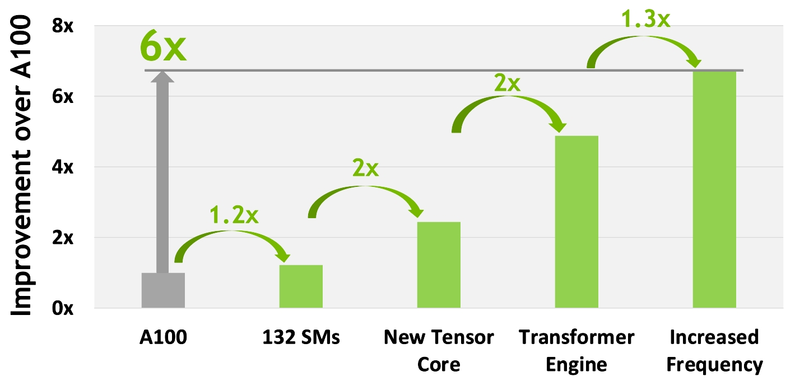

---

<!-- Page 29 -->

### H100 GPU Hierarchy and Asynchrony Improvements

Two essential keys to achieving high performance in parallel programs are data locality and asynchronous execution. By moving program data as close as possible to the execution units, a
programmer can exploit the performance that comes from having lower latency and higher bandwidth access to local data. Asynchronous execution involves finding independent tasks to
overlap with memory transfers and other processing. The goal is to keep all the units in the GPU
fully utilized. We will explore an important new tier added to the GPU programming hierarchy in
Hopper that exposes locality at a scale larger than a single Thread Block on a single SM. We’ll
also describe new asynchronous execution features that improve performance and reduce synchronization overhead.
- Thread Block Clusters
The CUDA programming model has long relied on a GPU compute architecture that uses Grids containing multiple Thread Blocks to leverage locality in a program. A Thread Block contains
multiple threads that run concurrently on a single SM, where the threads can synchronize with fast barriers and exchange data using the SM’s shared memory. However, as GPUs grow
beyond 100 SMs, and compute programs become more complex, the Thread Block as the only unit of locality expressed in the programming model is insufficient to maximize execution efficiency.
H100 introduces a new Thread Block Cluster architecture that exposes control of locality at a granularity larger than a single Thread Block on a single SM. Thread Block Clusters extend the
CUDA programming model and add another level to the GPU’s physical programming hierarchy to now include Threads, Thread Blocks, Thread Block Clusters, and Grids. A Cluster is a group
of Thread Blocks that are guaranteed to be concurrently scheduled onto a group of SMs, where the goal is to enable efficient cooperation of threads across multiple SMs.
The Clusters in H100 run concurrently across SMs within a GPC. A GPC is a group of SMs in
the hardware hierarchy that are always physically close together. Clusters have hardware-
accelerated barriers and new memory access collaboration capabilities discussed in the following sections. A dedicated SM-to-SM network for SMs in a GPC provides fast data sharing
between threads in a Cluster. In CUDA, Thread Blocks in a Grid can optionally be grouped at
kernel launch into Clusters as shown in Figure 14, and cluster capabilities can be leveraged from the CUDA cooperative_groups API.

---

<!-- Page 30 -->

A Grid is composed of Thread Blocks in the legacy CUDA programming model as in A100, shown in the left half of the above diagram. The Hopper architecture adds an optional Cluster hierarchy, shown in the right half of the
diagram.
Figure 14. Thread Block Clusters and Grids with Clusters
- Distributed Shared Memory
With Clusters, it is possible for all the threads to directly access other SM’s shared memory with load, store, and atomic operations. This feature is called Distributed Shared Memory (DSMEM)
because the shared memory’s virtual address space is logically distributed across all the Blocks in the Cluster. DSMEM enables more efficient data exchange between SMs, where data no
longer needs to be written to and read from global memory to pass the data. The dedicated SM-
to-SM network for Clusters ensures fast, low latency access to remote DSMEM. Compared to
using global memory, DSMEM accelerates data exchange between Thread Blocks by about 7x.
Figure 15. Thread Block to Thread Block data exchange (A100 vs H100 with
- Clusters)
At the CUDA level, all the DSMEM segments from all Thread Blocks in the Cluster are mapped into the generic address space of each thread, such that all of DSMEM can be referenced directly with simple pointers. CUDA users can leverage the cooperative_groups API to construct
generic pointers to any Thread Block in the cluster. DSMEM transfers can also be expressed as
asynchronous copy operations synchronized with shared memory-based barriers for tracking completion.
Figure 16 below shows the performance advantage of using Clusters on different algorithms.
- Clusters improve the performance by allowing the programmer to directly control a larger portion

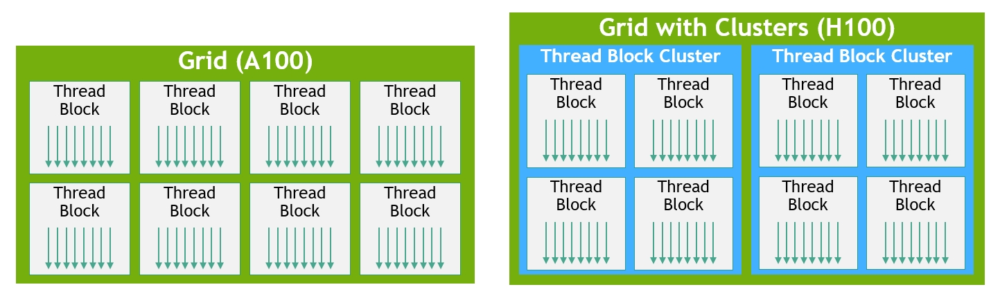

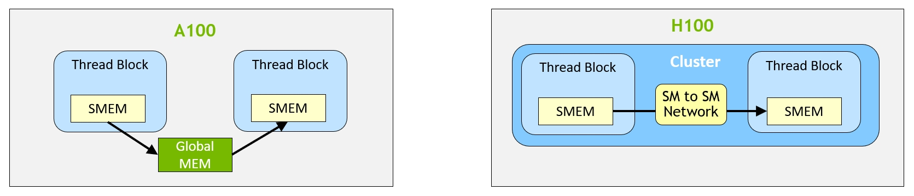

---

<!-- Page 31 -->

of the GPU than just a single SM. Clusters allow cooperative execution with a larger number of
threads, with access to a larger pool of shared memory than is possible with just a single
Thread Block.
Figure 16. Cluster versus non-Cluster Performance Comparisons
Preliminary performance estimates for H100 based on current expectations and subject to change in the shipping products
- Asynchronous Execution
Each new generation of NVIDIA GPUs includes numerous architectural enhancements to improve performance, programmability, power efficiency, GPU utilization, and many other factors. Recent NVIDIA GPU generations have included asynchronous execution capabilities to
allow more overlap of data movement, computation, and synchronization. The Hopper
architecture provides new features that improve asynchronous execution and allow further overlap of memory copies with computation and other independent work, while also minimizing synchronization points.
- A new async memory copy unit called the Tensor Memory Accelerator (TMA) and a new Async
Transaction Barrier are described below.

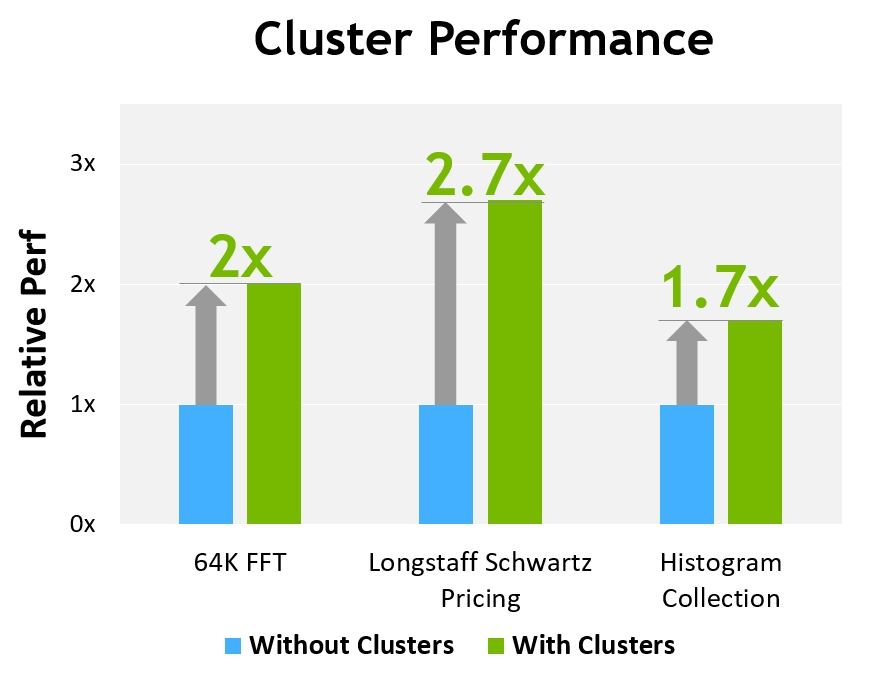

---

<!-- Page 32 -->

Programmatic overlap of data movement, computation, and synchronization. Asynchronous concurrency and
minimizing synchronization points are keys to performance.
Figure 17. Asynchronous Execution Concurrency and Enhancements in
- Hopper
- Tensor Memory Accelerator (TMA)
To help feed the powerful new H100 Tensor Cores, data fetch efficiency is improved with a new
Tensor Memory Accelerator (TMA) that can transfer large blocks of data and multi-dimensional tensors from global memory to shared memory and vice-versa.
TMA operations are launched using a copy descriptor which specifies data transfers using tensor dimensions and block coordinates instead of per-element addressing (see Figure 18 below). Large blocks of data (up to the shared memory capacity) can be specified and loaded
from global memory into shared memory or stored from shared memory back to global memory.
TMA significantly reduces addressing overhead and improves efficiency with support for different tensor layouts (1D-5D tensors), different memory access modes, reductions, and other features.

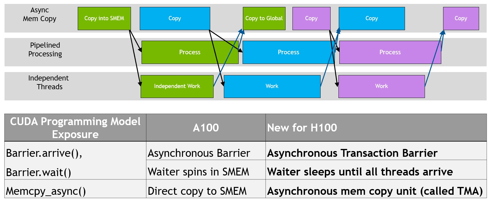

---

<!-- Page 33 -->

Figure 18. TMA Address Generation via Copy Descriptor
The TMA operation is asynchronous and leverages the shared memory-based asynchronous barriers introduced in A100. Additionally, the TMA programming model is single-threaded,
where a single thread in a warp is elected to issue an asynchronous TMA operation
(cuda::memcpy_async) to copy a tensor, and subsequently multiple threads can wait on a cuda::barrier for completion of the data transfer. To further improve performance, the H100 SM
adds hardware to accelerate these asynchronous barrier wait operations.
A key advantage of TMA is it frees the threads to execute other independent work. On A100, in
the left part of Figure 19, asynchronous memory copies were executed using a special
LoadGlobalStoreShared instruction, so the threads were responsible for generating all addresses and looping across the whole copy region.
- On Hopper, TMA takes care of everything. A single thread creates a copy descriptor before
launching the TMA, and from then on address generation and data movement are handled in hardware. TMA provides a much simpler programming model because it takes over the task of
computing stride, offset, and boundary calculations when copying segments of a tensor.

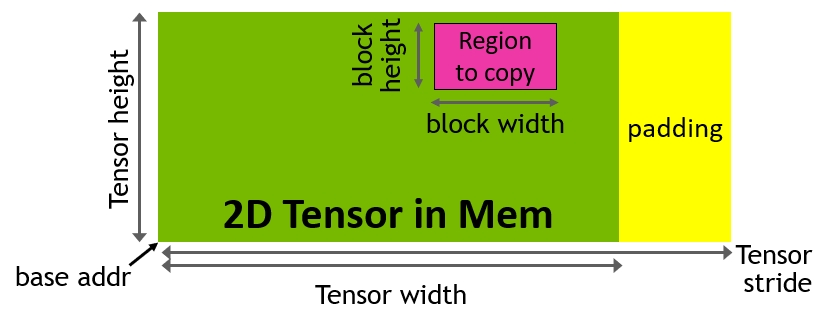

---

<!-- Page 34 -->

Figure 19. Asynchronous Memory Copy with TMA on H100 vs LDGSTS on
- A100
- Asynchronous Transaction Barrier
Asynchronous Barriers were originally introduced in the Ampere GPU architecture.  See the left
part of Figure 20. Consider an example where a set of threads are producing data that they will
all consume after a barrier. Asynchronous barriers split the synchronization process into two
steps. First, threads signal “Arrive” when they are done producing their portion of the shared
data. This “Arrive” is non-blocking so the threads are free to execute other independent work.
Eventually the threads need the data produced by all the other threads. At this point they do a
“Wait” which blocks them until every thread has signaled “Arrive”.
The advantage of Asynchronous Barriers is they allow threads that arrive early to execute independent work while waiting. This overlap is the source of extra performance. If there is
enough independent work for all threads, the barrier effectively becomes “free” because the
Wait instruction can retire immediately, since all threads have already Arrived.
New for Hopper is the ability for “Waiting” threads to sleep until all other threads arrive. On
previous chips, Waiting threads would spin on the barrier object in shared memory.
While Asynchronous Barriers are still part of the Hopper programming model, Hopper adds a new form of barrier called an Asynchronous Transaction Barrier. The asynchronous transaction
barrier is very similar to an Asynchronous Barrier. See the right part of Figure 20. It too is a split
barrier, but instead of counting just thread arrivals, it also counts transactions. Hopper includes
a new command for writing Shared Memory that passes both the data to be written and a transaction count. The transaction count is essentially a byte count. The asynchronous
transaction barrier will block threads at the Wait command until all the producer threads have performed an Arrive, and the sum of all the transaction counts reaches an expected value.

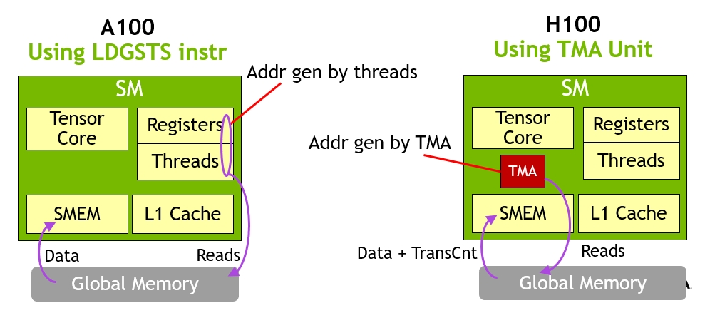

---

<!-- Page 35 -->

Asynchronous Transaction Barriers are a powerful new primitive for async mem copies or data exchanges. As mentioned earlier, Clusters can do Thread Block-to-Thread Block
communication for a data exchange with implied synchronization, and that Cluster capability is built on top of Asynchronous Transaction barriers.
Figure 20. Asynchronous Barrier in A100 vs Asynchronous Transaction Barrier
in H100

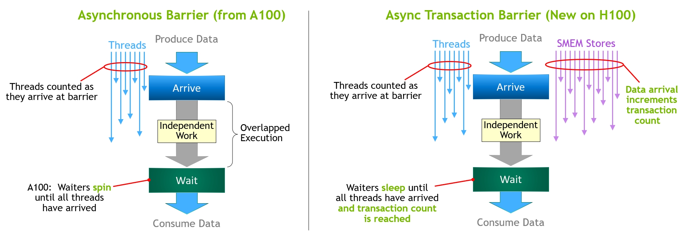

---

<!-- Page 36 -->

### H100 HBM and L2 Cache Memory Architectures

The design of a GPU’s memory architecture and hierarchy is critical to application performance, and impacts GPU size, cost, power usage, and programmability. Many different memory
subsystems exist in a GPU, from the large complement of off-chip DRAM (frame buffer) device memory, to varying levels and types of on-chip memories, to the register files used in computations in the SM.
High-performance HBM3 and HBM2e are the DRAM technologies used in the H100 SXM5 and
PCIe H100 GPUs, respectively. HBM memory is composed of memory stacks located on the
same physical package as the GPU, providing substantial power and area savings compared to traditional GDDR5/6 memory designs, allowing more GPUs to be installed in systems.
The global and local memory areas accessed by CUDA programs reside in HBM memory space and is referred to as “device memory” in CUDA parlance. Constant memory space resides in
device memory and is cached in the constant cache. Texture and surface memory spaces
reside in device memory and are cached in texture cache. The Level 2 (L2) cache caches reads
from and writes to HBM (device) memory, and services memory requests from various subsystems within the GPU. HBM and L2 memory spaces are accessible to all SMs and all
applications running on the GPU.
- H100 HBM3 and HBM2e DRAM Subsystems
As HPC, AI, and data analytics datasets continue to grow in size, and computing problems get increasingly more complex, greater GPU memory capacity and bandwidth is a necessity. The
memory technology, and the NVIDIA V100 provided an even faster, more efficient, and higher capacity HBM2 implementation. The NVIDIA A100 GPU further increased HBM2 performance
and capacity.
- The H100 SXM5 GPU raises the bar considerably by supporting 80 GB (five stacks) of fast
HBM3 memory, delivering over 3 TB/sec of memory bandwidth, effectively a 2x increase over the memory bandwidth of A100 that was launched just two years ago. The PCIe H100 provides
80 GB of fast HBM2e with over 2 TB/sec of memory bandwidth.

---

<!-- Page 37 -->

Memory data rates not finalized and subject to change in the final product.
Figure 21. World’s First HBM3 GPU Memory Architecture, 2x Delivered
- Bandwidth
- H100 L2 Cache
A 50 MB L2 cache in H100 is 1.25x larger than A100’s 40 MB L2. It enables caching of even
larger portions of models and datasets for repeated access, reducing trips to HBM3 or HBM2e
DRAM and improving performance. Using a partitioned crossbar structure, the L2 cache
localizes and caches data for memory accesses from SMs in GPCs directly connected to the partition. L2 cache residency controls optimize capacity utilization, allowing the programmer to
selectively manage data that should remain in cache or be evicted.
Both the HBM3 or HBM2e DRAM and L2 cache subsystems support data compression and decompression technology to optimize memory and cache usage and performance.
- Memory Subsystem RAS Features
The following two major RAS (Reliability, Availability and Serviceability) features are implemented for the HBM3 and HBM2e memory subsystems in H100.

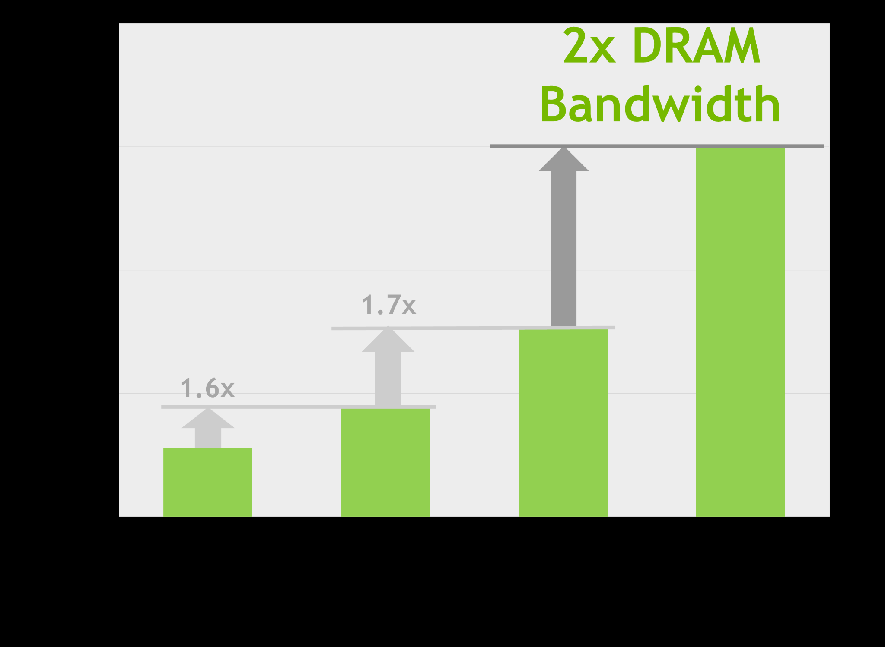

---

<!-- Page 38 -->

- ECC Memory Resiliency
- The H100 HBM3/2e memory subsystems support Single-Error Correcting Double-Error
- Detecting (SECDED) Error Correction Code (ECC) to protect data. ECC provides higher
reliability for compute applications that are sensitive to data corruption. It is especially important
in large-scale cluster computing environments where GPUs process very large datasets and/or run applications for extended periods. H100 supports “Sideband ECC” for its HBM3/2e
memories, where a small memory region, separate from the main HBM memory, is used for
ECC bits (which is in contrast to “Inline ECC”, where a portion of main memory is carved out to store ECC bits). Other key memory structures in H100 are also protected by SECDED ECC
including the L2 cache and the L1 caches and register files inside all the SMs.
- Memory Row Remapping
The H100 HBM3/HBM2e subsystems can invalidate memory rows that have memory cells that generated ECC errors and replace the rows at boot time with reserved known-good rows using row remapping logic. A number of memory rows in each HBM3/HBM2e memory bank are set
aside as spare rows and can be activated if needed to replace rows determined to be bad.

---

<!-- Page 39 -->

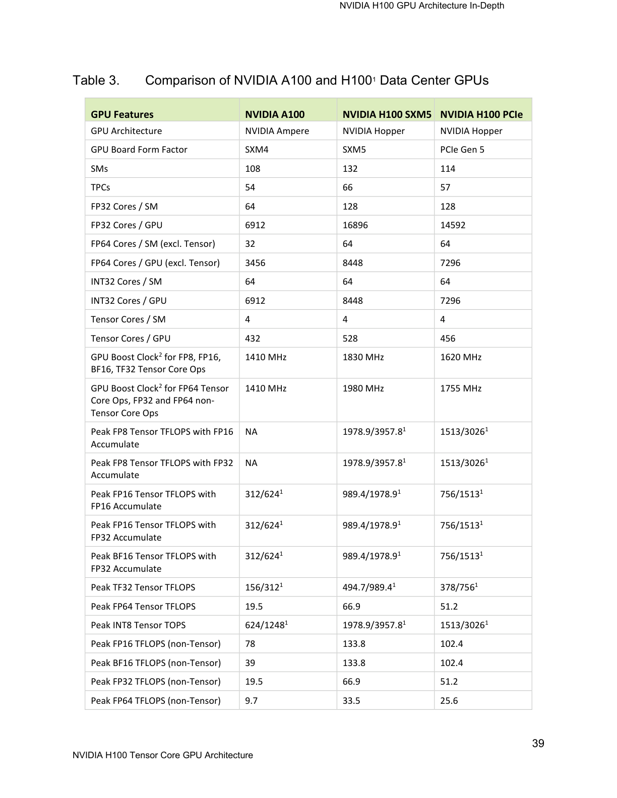

---

<!-- Page 40 -->

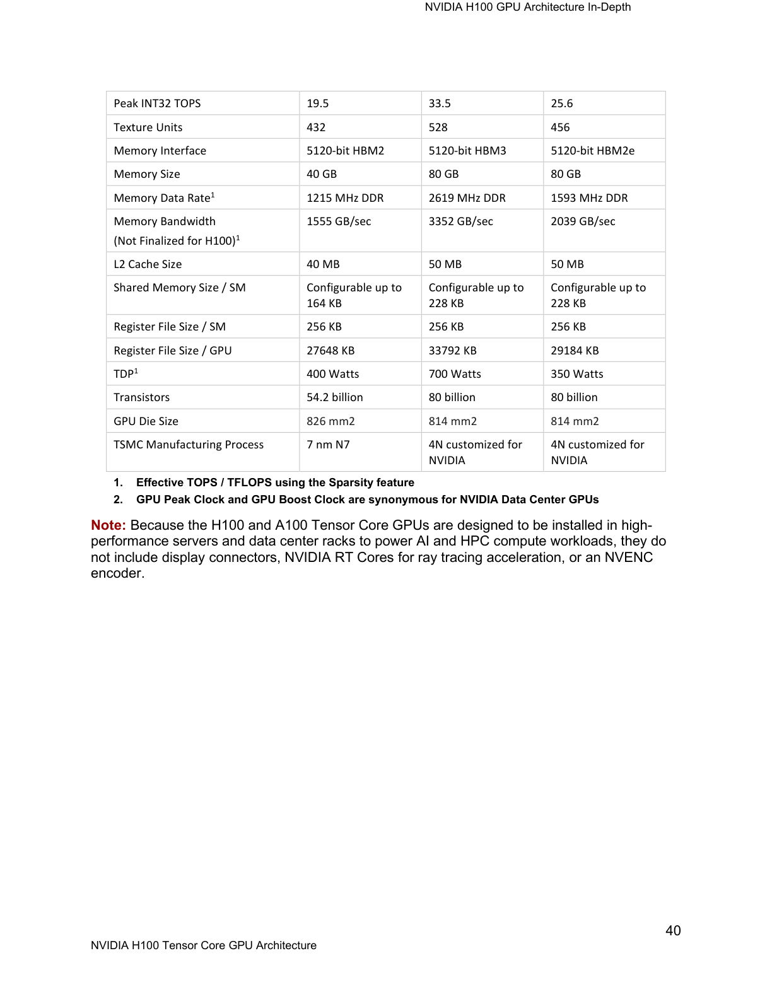

---

<!-- Page 41 -->

**Table 4. Compute Capability: V100 vs A100 vs H100**

<table style="border-collapse: collapse; width: 100%; margin: 1em 0;">
  <tr>
    <th style="border: 1px solid #ddd; padding: 8px; text-align: left; background-color: #4472C4; color: white;">Data Center GPU</th>
    <th style="border: 1px solid #ddd; padding: 8px; text-align: left; background-color: #4472C4; color: white;">NVIDIA Tesla V100</th>
    <th style="border: 1px solid #ddd; padding: 8px; text-align: left; background-color: #4472C4; color: white;">NVIDIA A100</th>
    <th style="border: 1px solid #ddd; padding: 8px; text-align: left; background-color: #4472C4; color: white;">NVIDIA H100</th>
  </tr>
  <tr>
    <td style="border: 1px solid #ddd; padding: 8px; background-color: #f2f2f2;">GPU Architecture</td>
    <td style="border: 1px solid #ddd; padding: 8px; background-color: #f2f2f2;">NVIDIA Volta</td>
    <td style="border: 1px solid #ddd; padding: 8px; background-color: #f2f2f2;">NVIDIA Ampere</td>
    <td style="border: 1px solid #ddd; padding: 8px; background-color: #f2f2f2;">NVIDIA Hopper</td>
  </tr>
  <tr>
    <td style="border: 1px solid #ddd; padding: 8px; background-color: white;">Compute Capability</td>
    <td style="border: 1px solid #ddd; padding: 8px; background-color: white;">7.0</td>
    <td style="border: 1px solid #ddd; padding: 8px; background-color: white;">8.0</td>
    <td style="border: 1px solid #ddd; padding: 8px; background-color: white;">9.0</td>
  </tr>
  <tr>
    <td style="border: 1px solid #ddd; padding: 8px; background-color: #f2f2f2;">Threads / Warp</td>
    <td style="border: 1px solid #ddd; padding: 8px; background-color: #f2f2f2;">32</td>
    <td style="border: 1px solid #ddd; padding: 8px; background-color: #f2f2f2;">32</td>
    <td style="border: 1px solid #ddd; padding: 8px; background-color: #f2f2f2;">32</td>
  </tr>
  <tr>
    <td style="border: 1px solid #ddd; padding: 8px; background-color: white;">Max Warps / SM</td>
    <td style="border: 1px solid #ddd; padding: 8px; background-color: white;">64</td>
    <td style="border: 1px solid #ddd; padding: 8px; background-color: white;">64</td>
    <td style="border: 1px solid #ddd; padding: 8px; background-color: white;">64</td>
  </tr>
  <tr>
    <td style="border: 1px solid #ddd; padding: 8px; background-color: #f2f2f2;">Max Threads / SM</td>
    <td style="border: 1px solid #ddd; padding: 8px; background-color: #f2f2f2;">2048</td>
    <td style="border: 1px solid #ddd; padding: 8px; background-color: #f2f2f2;">2048</td>
    <td style="border: 1px solid #ddd; padding: 8px; background-color: #f2f2f2;">2048</td>
  </tr>
  <tr>
    <td style="border: 1px solid #ddd; padding: 8px; background-color: white;">Max Thread Blocks (CTAs) / SM</td>
    <td style="border: 1px solid #ddd; padding: 8px; background-color: white;">32</td>
    <td style="border: 1px solid #ddd; padding: 8px; background-color: white;">32</td>
    <td style="border: 1px solid #ddd; padding: 8px; background-color: white;">32</td>
  </tr>
  <tr>
    <td style="border: 1px solid #ddd; padding: 8px; background-color: #f2f2f2;">Max Thread Blocks / Thread Block Clusters</td>
    <td style="border: 1px solid #ddd; padding: 8px; background-color: #f2f2f2;">NA</td>
    <td style="border: 1px solid #ddd; padding: 8px; background-color: #f2f2f2;">NA</td>
    <td style="border: 1px solid #ddd; padding: 8px; background-color: #f2f2f2;">16</td>
  </tr>
  <tr>
    <td style="border: 1px solid #ddd; padding: 8px; background-color: white;">Max 32-bit Registers / SM</td>
    <td style="border: 1px solid #ddd; padding: 8px; background-color: white;">65536</td>
    <td style="border: 1px solid #ddd; padding: 8px; background-color: white;">65536</td>
    <td style="border: 1px solid #ddd; padding: 8px; background-color: white;">65536</td>
  </tr>
  <tr>
    <td style="border: 1px solid #ddd; padding: 8px; background-color: #f2f2f2;">Max Registers / Thread Block (CTA)</td>
    <td style="border: 1px solid #ddd; padding: 8px; background-color: #f2f2f2;">65536</td>
    <td style="border: 1px solid #ddd; padding: 8px; background-color: #f2f2f2;">65536</td>
    <td style="border: 1px solid #ddd; padding: 8px; background-color: #f2f2f2;">65536</td>
  </tr>
  <tr>
    <td style="border: 1px solid #ddd; padding: 8px; background-color: white;">Max Registers / Thread</td>
    <td style="border: 1px solid #ddd; padding: 8px; background-color: white;">255</td>
    <td style="border: 1px solid #ddd; padding: 8px; background-color: white;">255</td>
    <td style="border: 1px solid #ddd; padding: 8px; background-color: white;">255</td>
  </tr>
  <tr>
    <td style="border: 1px solid #ddd; padding: 8px; background-color: #f2f2f2;">Max Thread Block Size (# of threads)</td>
    <td style="border: 1px solid #ddd; padding: 8px; background-color: #f2f2f2;">1024</td>
    <td style="border: 1px solid #ddd; padding: 8px; background-color: #f2f2f2;">1024</td>
    <td style="border: 1px solid #ddd; padding: 8px; background-color: #f2f2f2;">1024</td>
  </tr>
  <tr>
    <td style="border: 1px solid #ddd; padding: 8px; background-color: white;">FP32 Cores / SM</td>
    <td style="border: 1px solid #ddd; padding: 8px; background-color: white;">64</td>
    <td style="border: 1px solid #ddd; padding: 8px; background-color: white;">64</td>
    <td style="border: 1px solid #ddd; padding: 8px; background-color: white;">128</td>
  </tr>
  <tr>
    <td style="border: 1px solid #ddd; padding: 8px; background-color: #f2f2f2;">Ratio of SM Registers to FP32 Cores</td>
    <td style="border: 1px solid #ddd; padding: 8px; background-color: #f2f2f2;">1024</td>
    <td style="border: 1px solid #ddd; padding: 8px; background-color: #f2f2f2;">1024</td>
    <td style="border: 1px solid #ddd; padding: 8px; background-color: #f2f2f2;">512</td>
  </tr>
  <tr>
    <td style="border: 1px solid #ddd; padding: 8px; background-color: white;">Shared Memory Size / SM</td>
    <td style="border: 1px solid #ddd; padding: 8px; background-color: white;">Configurable up to 96 KB</td>
    <td style="border: 1px solid #ddd; padding: 8px; background-color: white;">Configurable up to 164 KB</td>
    <td style="border: 1px solid #ddd; padding: 8px; background-color: white;">Configurable up to 228 KB</td>
  </tr>
</table>

---

<!-- Page 42 -->

### Second-Generation Secure MIG

NVIDIA Multi-Instance GPU (MIG) technology was introduced in the NVIDIA Ampere architecture-based A100 Tensor Core GPU. MIG has become an extremely important feature
for scaling out Cloud Service Provider (CSP) data centers by providing independent, fully- isolated, and secure GPU Instances for multiple users sharing the same GPU.
- MIG Technology Review
MIG technology allows partitioning of each A100 or H100 GPU (both H100 SXM5 and H100
PCIe versions) into as many as seven GPU Instances for optimal GPU utilization, and it provides a defined QoS and isolation between different clients (such as VMs, containers, and processes). MIG is especially beneficial for Cloud Service Providers who have multi-tenant use
cases, and it ensures one client cannot impact the work or scheduling of other clients, in addition to providing enhanced security and allowing GPU utilization guarantees for customers.
This CSP MIG diagram shows how multiple independent users from the same or different organizations can be assigned their own dedicated, protected, and isolated GPU Instance within a single physical GPU.
Figure 22. Example CSP MIG Configuration

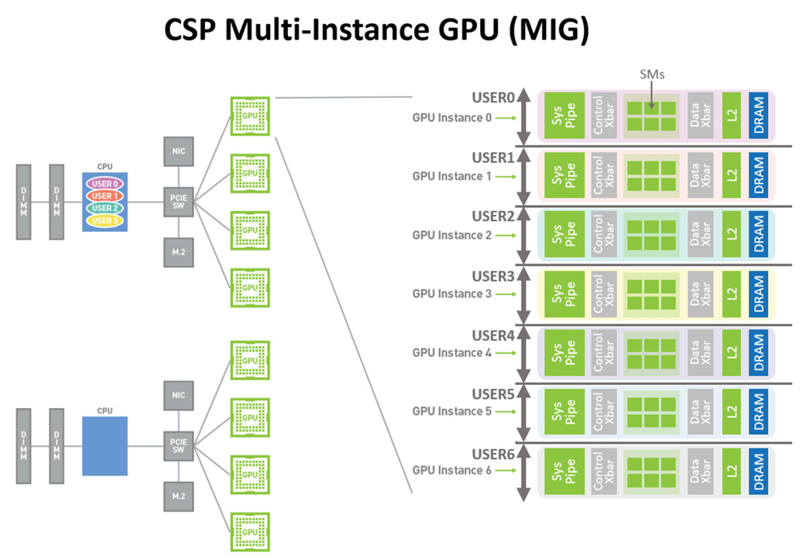

---

<!-- Page 43 -->

An important MIG feature to manage, tune, service, and load-balance vGPU (virtual GPU) virtual machine (VM) configurations is the ability to migrate vGPUs between GPU Instances on a single GPU, and more frequently between different GPUs in a cluster.
Each GPU Instance has separate and isolated paths through the entire memory system - the on-chip crossbar ports, L2 cache banks, memory controllers, and DRAM address busses are all assigned uniquely to an individual instance. This ensures that an individual user’s workload can
run with predictable throughput and latency, with the same L2 cache allocation and DRAM bandwidth, even if other tasks are thrashing their own caches or saturating their DRAM interfaces.
(For more details on basic MIG technology refer to the NVIDIA A100 Tensor Core GPU whitepaper.)
- H100 MIG Enhancements
The new second-generation of MIG technology in H100 provides approximately 3x more compute capacity and nearly 2x more memory bandwidth per GPU Instance compared to A100.
multi-tenant, multi-user MIG configurations. Up to seven GPU Instances can be securely
isolated from each other with new Confidential Computing features at the hardware and hypervisor levels (see Security Enhancements and Confidential Computing section below for more details on Confidential Computing).
Figure 23 shows an example system configuration of CPU and GPU cooperatively providing multiple Trusted Execution Environments (TEEs) for multiple users sharing a single GPU. The
- CPU side provides multiple confidential VMs with secure NVIDIA drivers. The H100 GPU in this
example is divided into four Secure MIG instances. Encrypted transfers occur between CPU
and GPU. GPU hardware virtualization is provided using PCIe SR-IOV (with one Virtual
Function (VF) per MIG Instance). Confidentiality and data integrity are provided by multiple
hardware-based security features, and hardware firewalls provide memory isolation between the
GPU Instances.

---

<!-- Page 44 -->

Figure 23. Secure MIG Example in Multi-Tenant Single GPU Configuration
- Hopper architecture also now permits dedicated image and video decoders for each GPU
Instance to deliver secure, high throughput intelligent video analytics (IVA) on shared infrastructure. Each MIG GPU Instance can receive at least one NVDEC and NVJPG unit.
In addition, H100 MIG Instances now include their own sets of performance monitors that work with NVIDIA developer tools. With Hopper’s concurrent profiling, administrators can monitor
right-sized GPU acceleration and optimally allocate resources among users seamlessly.

### Transformer Engine

Transformer models are the backbone of language models used widely today from BERT to
- GPT-3 and require enormous compute resources. Initially developed for natural language
processing (NLP) Transformers are increasingly applied across diverse fields such as computer vision, drug discovery, and more. Their size continues to increase exponentially, now reaching
trillions of parameters and causing their training times to stretch into months, which is impractical for business needs due to the large compute requirements. For example, Megatron
Turing NLG (MT-NLG) requires 2048 NVIDIA A100 GPUs running for eight weeks to train.
Overall, transformer models have been growing much faster than most other AI models at the rate of 275x every two years for the past five years (see Figure 24).

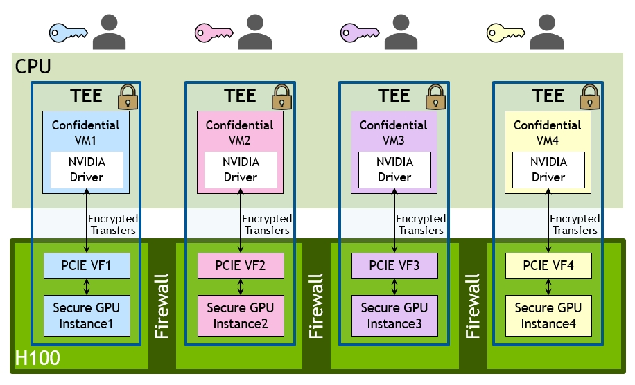

---

<!-- Page 45 -->

Figure 24. Transformers Model Sizes Increasing Exponentially with Different
- Use Cases
H100 includes a new Transformer Engine that is a custom Hopper Tensor Core technology to dramatically accelerate the AI calculations for Transformers.

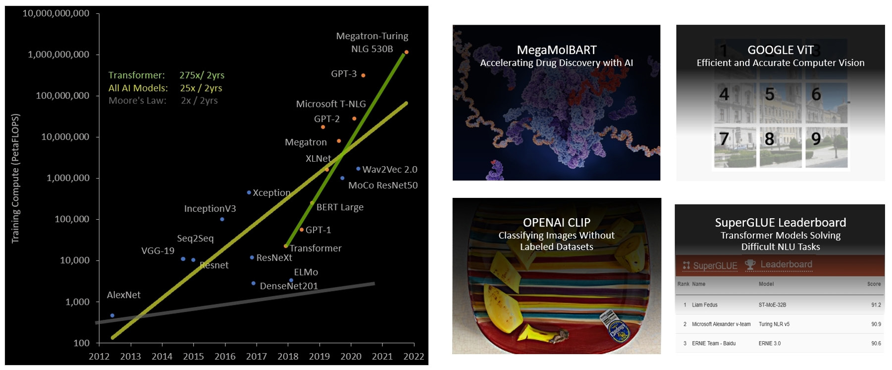

---

<!-- Page 46 -->

Figure 25. Transformer Engine Conceptual Operation.
The goal of mixed precision is to intelligently manage the precision to maintain accuracy, while still gaining the performance of smaller, faster numerical formats. At each layer of a Transformer
model, the Transformer Engine analyzes the statistics of the output values produced by the
- Tensor Core. With knowledge about which type of neural network layer comes next and what
precision it requires, the Transformer Engine also decides which target format to convert the tensor to before storing it to memory. FP8 has a more limited range than other numerical
formats. To optimally use the available range, the Transformer Engine also dynamically scales
tensor data into the representable range using scaling factors computed from the tensor statistics. Therefore, every layer operates with exactly the range it requires and is accelerated in
an optimal manner.

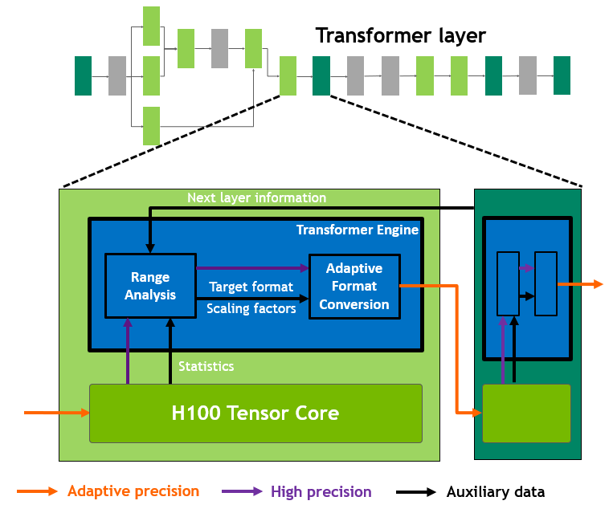

---

<!-- Page 47 -->

### Fourth-Generation NVLink and NVLink Network

The emerging class of exascale HPC and trillion parameter AI models for tasks like superhuman conversational AI require months to train, even on supercomputers. Compressing this extended
training time from months to days to be more useful for businesses requires high-speed, seamless communication between every GPU in a server cluster. PCIe creates a bottleneck
with its limited bandwidth. To build the most powerful end-to-end computing platform, a faster,
more scalable NVLink interconnect is needed.
NVLink is NVIDIA’s high-bandwidth, energy efficient, low-latency, lossless GPU-to-GPU interconnect that includes resiliency features, such as link-level error detection and packet replay mechanisms to guarantee successful transmission of data. The new fourth-generation of
NVLink is implemented in H100 GPUs and delivers 1.5x the communications bandwidth compared to the prior third-generation NVLink used in the NVIDIA A100 Tensor Core GPU.
Operating at 900 GB/sec total bandwidth for multi-GPU IO and shared memory accesses, the new NVLink provides 7x the bandwidth of PCIe Gen 5. While third-generation NVLink in the
A100 GPU uses four differential pairs (4 lanes) in each direction to create a single link delivering 25 GB/sec effective bandwidth in each direction, fourth-generation NVLink uses only two high- speed differential pairs in each direction to form a single link, also delivering 25 GB/sec effective bandwidth in each direction. H100 includes 18 fourth-generation NVLink links to provide 900
GB/sec total bandwidth, while A100 includes 12 third-generation NVLink links to provide 600
GB/sec total bandwidth.
On top of fourth-generation NVLink, H100 also introduces the new NVLink Network interconnect, a scalable version of NVLink that enables GPU-to-GPU communication among up to 256 GPUs across multiple compute nodes.
Unlike regular NVLink, where all GPUs share a common address space and requests are routed directly using GPU physical addresses, NVLink Network introduces a new Network
Address Space supported by new address translation hardware in H100 to isolate all GPUs’ address spaces from one another and from the network address space. This enables NVLink
Network to scale securely to larger numbers of GPUs.
- Because NVLink Network endpoints do not share a common memory address space, NVLink
Network connections are not automatically established across the entire system. Instead, similar
to other networking interfaces such as InfiniBand, the user software should explicitly establish connections between endpoints as needed.

### Third-Generation NVSwitch

New third-generation NVSwitch technology includes switches residing both inside and outside of nodes to connect multiple GPUs in servers, clusters, and data center environments. Each new
third-generation NVSwitch inside a node provides 64 ports of fourth-generation NVLink links to

---

<!-- Page 48 -->

accelerate multi-GPU connectivity. Total switch throughput increases to 13.6 Tbits/sec from 7.2
Tbits/sec in the prior generation.
The new third-generation NVSwitch also provides hardware acceleration of collective operations with multicast and NVIDIA SHARP in-network reductions. Accelerated collectives include write
broadcast (all_gather), reduce_scatter, and broadcast atomics. In-fabric multicast and
reductions provide up to 2x throughput gain while significantly reducing latency for small block size collectives over using NCCL (NVIDIA Collective Communications Library) on A100.
NVSwitch acceleration of collectives significantly reduces the load on SMs for collective communications.

### New NVLink Switch System

- Combining the new NVLINK Network technology and new third-generation NVSwitch enables
NVIDIA to build large scale-up NVLink Switch System networks with unheard-of levels of communication bandwidth. Each GPU node exposes a 2:1 tapered level of all the NVLink
bandwidth of the GPUs in the node. The nodes are connected together through a second level
of NVSwitches contained in NVLink Switch modules that reside outside of the compute nodes and connect multiple nodes together.
NVLink Switch System supports up to 256 GPUs. The connected nodes are capable of
delivering 57.6 TBs of all-to-all bandwidth and can supply an incredible one exaFLOP of FP8 sparse AI compute. See Figure 26 for a comparison of 32 node, 256 GPU DGX SuperPODs
based on A100 versus H100. Note that performance numbers in Figure 26 are for reference
purposes only. NVLink Switch System technology is not available with H100 systems now, but
systems and availability will be announced in the future.

---

<!-- Page 49 -->

DGX H100 SuperPODs can span up to 256 GPUs, fully connected over NVLink Switch System using the new NVLink
Switch based on third-generation NVSwitch technology. The NVLink Network interconnect in 2:1 tapered fat tree
topology enables a staggering 9x increase in bisection bandwidth, for example, for all-to-all exchanges, and a 4.5x increase in allreduce throughput over the previous-generation InfiniBand system. Note that performance numbers in
this figure are for reference purposes only. NVLink Switch System technology is not available with H100 systems
now, but systems and availability will be announced in the future.
Figure 26. DGX A100 vs DGX H100 32-node, 256 GPU NVIDIA SuperPOD
- Comparison
Maximum cable length switch-to-switch is increased from 5 meters to 20 meters. OSFP (Octal
Small Form Factor Pluggable) LinkX cables made by NVIDIA are now supported. They feature
- Quad-Port optical transceivers per OSFP, and 8-channels of 100G PAM4 signaling. The Quad-
Port OSFP transceiver innovations enable a total of 128 NVLink ports in a single 1 RU, 32-cage
NVLink Switch with each port transferring data at 25 GB/sec.

### PCIe Gen 5

H100 incorporates a PCI Express Gen 5 x16 lane interface, providing 128 GB/sec total bandwidth (64 GB/sec in each direction) compared to 64 GB/sec total bandwidth (32GB/sec in each direction) in Gen 4 PCIe included in A100.
Using its PCIe Gen 5 interface, H100 can interface with the highest performing x86 CPUs and
SmartNICs / DPUs (Data Processing Units). H100 is designed for optimal connectivity with
NVIDIA BlueField-3 DPUs for 400 Gb/s Ethernet or NDR (Next Data Rate) 400 Gb/s InfiniBand networking acceleration for secure HPC and AI workloads.

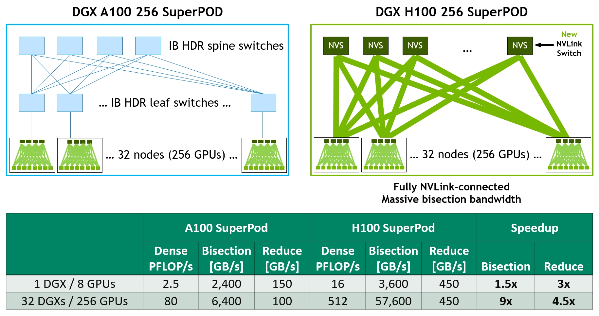

---

<!-- Page 50 -->

H100 adds support for native PCIe atomic operations like atomic CAS, atomic exchange, and atomic fetch add for 32-and 64-bit data types, accelerating synchronization and atomic operations between CPU and GPU. H100 also supports Single Root Input/Output Virtualization
(SR-IOV) that allows sharing and virtualizing of a single PCIe-connected GPU for multiple processes or Virtual Machines (VMs). H100 also allows a Virtual Function (VF) or Physical
Function (PF) from a single SR-IOV PCIe-connected GPU to access a peer GPU over NVLink.

---

<!-- Page 51 -->

### Security Enhancements and Confidential Computing

NVIDIA is increasingly selling more GPUs into security-sensitive markets. Cloud Service
Providers (CSPs), automotive manufacturers, national laboratories, healthcare, financial, and many other industries and organizations demand high levels of security. Each new generation of
NVIDIA GPUs continues to improve security features.
Massive volumes of sensitive data are being generated, stored, and processed everyday subject to increasing regulatory and cyberattack business risks. While there are advanced
encryption techniques for protecting data at rest in storage, and in transit across a network, there is a big gap today in protecting data when it is being processed or in-use. New
Confidential Computing technology addresses this gap by protecting data and applications in- use and providing increased security for organizations that manage sensitive and regulated data.
NVIDIA H100 includes a number of security features to restrict access to GPU contents ensuring only authorized entities have access, provide secure boot and attestation capabilities, and actively monitor against attacks while a system is running. In addition, specialized on-chip
security processors, support for multiple types and levels of encryption, hardware-protected memory regions, privileged access control registers, on-die sensors, and many other features to deliver secure GPU processing for our customers and their data.
H100 is the world’s first GPU with Confidential Computing capabilities. Users can protect the
confidentiality and integrity of their data and applications “in-use” while accessing the unprecedented acceleration of H100 GPUs. H100 provides a broad range of other security
features to protect user data, defend against hardware and software attacks, and better isolate and protect VMs from each other in virtualized and MIG environments.
- Major goals of NVIDIA H100 GPU comprehensive security features include:
- Data Protection and Isolation: Prevent unauthorized entities from gaining access to another user's data, where an entity can be a user, the OS, the hypervisor, or the GPU firmware.
- Content Protection: Prevent unauthorized entities from gaining access to protected content stored on or processed by the GPU.
- Physical Damage Protection: Prevent physical damage to the GPU whether it is caused by a malicious actor, or by accident.
- NVIDIA Confidential Computing
NVIDIA is a member of the Confidential Computing Consortium (C3), The C3 is composed of an international combination of vendors, academic institutions, open source projects, and software developers collaborating to develop initiatives and technologies to reduce security threats and

---

<!-- Page 52 -->

protect sensitive data and applications in-use across public clouds services, on-premise data centers, and edge systems and devices.
The formal definition of the term Confidential Computing is “the protection of data in use by performing computation in a hardware-based Trusted Execution Environment (TEE)”. The
definition is independent of where data is in use, whether in the cloud, or end-user devices, or somewhere in between. It is also independent of which processor is protecting data, or which
protection technique is used. C3 defines a TEE as “an environment that provides a level of
assurance for three key properties - data confidentiality, data integrity, and code integrity”.
Today, data is often protected at rest, in storage, and in transit across the network, but is not protected from the OS / hypervisor while in use. This requirement to trust the OS / hypervisor
leaves a big gap in the protection of data and code for users. Additionally, the ability to protect
data and code while it is in use is limited in conventional computing infrastructure. Organizations
that handle sensitive data such as Personally Identifiable Information (PII), financial and health data, or are required to meet data localization regulations, need to mitigate threats that target the confidentiality and integrity of their applications, models, and data at all stages.
Confidential Computing protects confidentiality of ISV customer data and trained AI models in the Cloud, On-Premise, and at the Edge

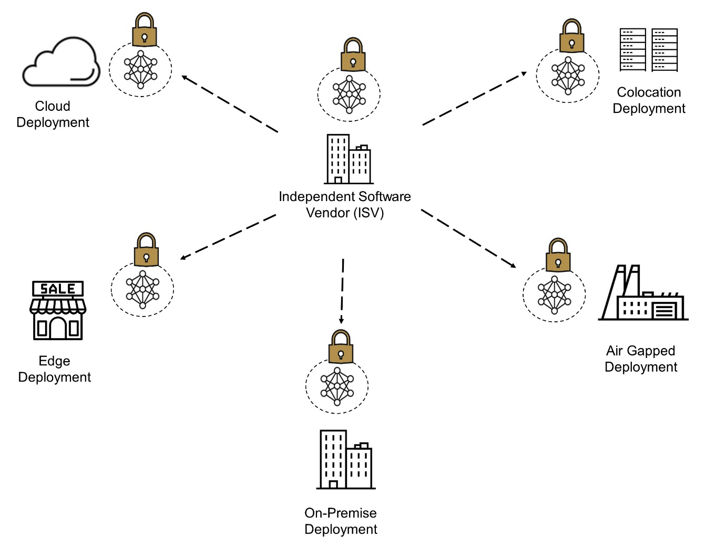

---

<!-- Page 53 -->

Figure 27. Confidential Computing Protects Multiple ISV Scenarios
Existing confidential computing solutions were CPU-based and too slow for compute-intensive workloads like AI and HPC. CPU-based confidential computing generally reduces system
performance, which can impact productivity or be non-viable in latency sensitive data processing workloads.
With NVIDIA Confidential Computing, a new security feature introduced in the NVIDIA Hopper architecture, H100 is the world's first GPU that can protect the confidentiality and integrity of both data and code in use. H100 brings accelerated computing into the world of confidential
computing and extends the CPU’s Trusted Execution Environment to the GPU. H100 opens the
door to many use-cases where using a shared infrastructure (cloud, colocation, edge) was not possible in the past because of the need to protect data and code when in-use, and the fact that previous Confidential Computing solutions are not performant or flexible enough for many workloads.
- NVIDIA Confidential Computing creates a hardware-based Trusted Execution Environment
(TEE) that secures and isolates the entire workload running on a single H100 GPU, multiple
H100 GPUs within a node, or on the individual secured Multi-Instance GPU (MIG) instances.
- The Trusted Execution Environment (TEE) establishes a secure channel between a Confidential
VM on the GPU and its counterpart in the CPU. The TEE provides two modes of operation.

## 1. An entire GPU is exclusively assigned to a single VM (a single VM may have multiple

GPUs simultaneously assigned as well).

## 2. An NVIDIA H100 GPU is partitioned and supports multiple VMs using MIG technology,

enabling Multi-tenant Confidential Computing. GPU-accelerated applications can run
unchanged within the TEE and do not have to be partitioned manually.
Users can combine the rich portfolio and power of NVIDIA software for AI and HPC with the security of a Hardware Root of Trust offered by NVIDIA Confidential Computing to deliver security and data protection at the lowest GPU architecture level. Users can run and attest
applications on shared or remote infrastructure, and be assured that any unauthorized entities, including the hypervisor, host OS, system admin, infrastructure owner, or anyone with physical access, cannot view or modify the application code and data when it is in-use within the TEE.

---

<!-- Page 54 -->

Figure 28. Confidential Computing for Different Use Cases
The Confidential Computing capability of Hopper architecture further amplifies and accelerates security for collaborative multi-party computing use-cases like Federated Learning. Federated
Learning enables multiple organizations to work together to train or evaluate AI models without having to share each group’s proprietary datasets. Confidential Federated Learning with H100
ensures that data and AI models are protected from unauthorized access by external or internal threats, at each participating site, and each site can understand and attest the software running at their peers. This increases confidence in secure collaboration and drives advancement of
medical research, expedites drug development, mitigates insurance and financial fraud, and a host of other applications - while maintaining security, privacy, and regulatory compliance.

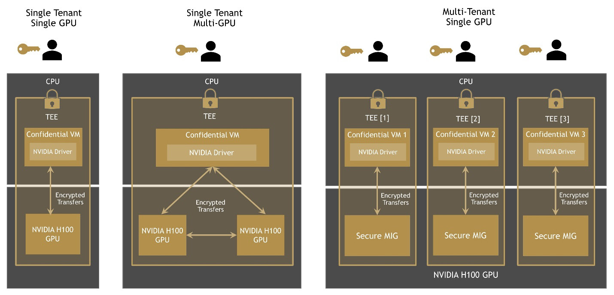

---

<!-- Page 55 -->

Figure 29. Confidential Federated Learning
Although many components are involved in providing Confidential Computing capability in the
GPU, one of the more important features is Secure and Measured Boot, as described below.
- Measure of Success
Measured Boot, which is required for Confidential Computing compliance. We’ll briefly discuss
the concepts and components of secure and measured boot as implemented in H100.
Secure boot is the set of hardware and software systems that ensure the GPU is started from a known secure state permitting only authenticated firmware and microcode that was authored and reviewed by NVIDIA to run while the GPU is being booted. Measured boot is the process
for collecting, securely storing, and reporting characteristics of the boot process that determines the GPU’s secure state. Attestation and verification are the means of comparing measurements
to reference values to ensure that the device is an expected secure state. NVIDIA provides the
attestors, reference values, and endorsement signatures.
Deployment workflows leverage measurements provided through measured boot, compared to reference values provided by NVIDIA or service providers, to determine if the system is in a

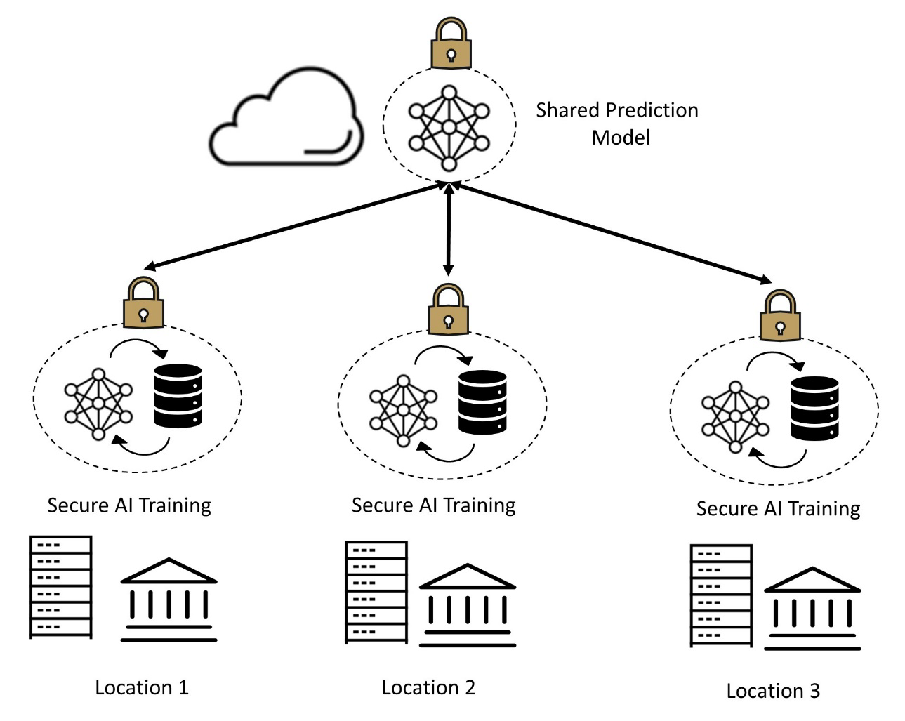

---

<!-- Page 56 -->

ready and secure state to begin operating on customer data. Once the system is validated,
customers may launch applications as though they ran the same application in a non- confidential compute environment.
where the Host OS and hypervisor have full access to the devices, such as the GPU. The right
side with NVIDIA CC On shows full VM isolation from the other elements.
Figure 30. NVIDIA CC Off vs CC On VM Isolation
Full VM TEE and GPU TEE isolation to form a confidential compute environment is provided by strong hardware-based security, including three key elements as partly explained earlier:
- On-Die Root of Trust (RoT) - before the OS can communicate to the GPU, the GPU uses the RoT to ensure that the firmware running on the device is authentic and has not been tampered with by the device owner (CSP, etc.)

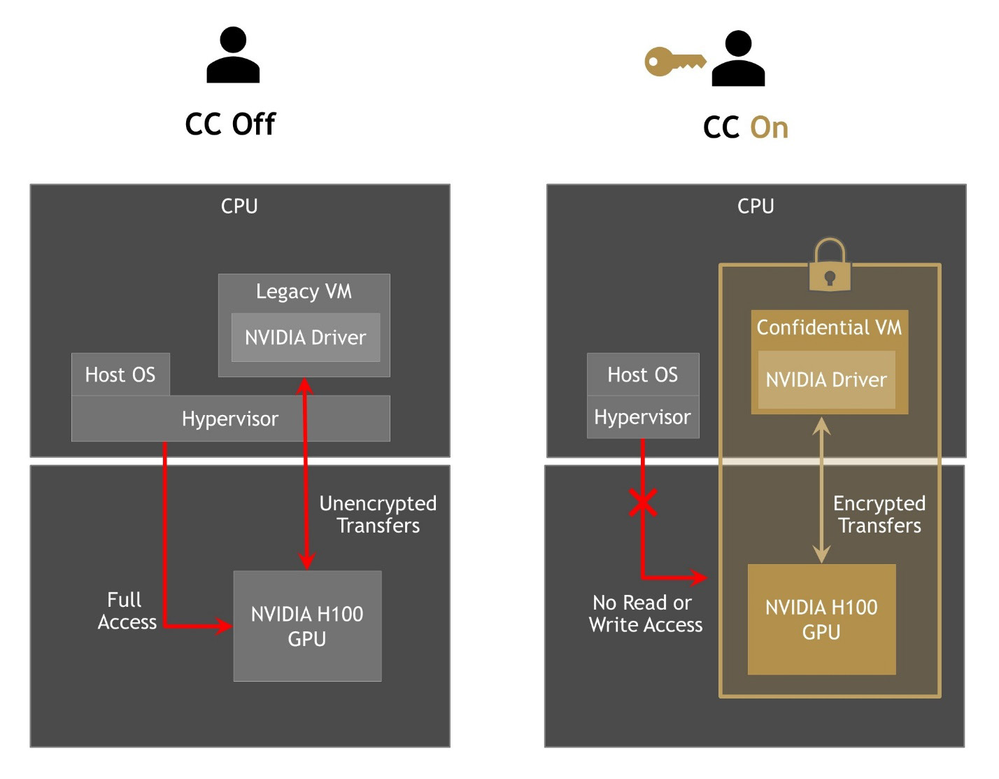

---

<!-- Page 57 -->

- Device Attestation - Allows users to ensure they are communicating with authentic
NVIDIA GPUs with confidential computing enabled and the security state of the GPU matches a known, trusted secure state including firmware and hardware configuration.
- AES-GCM 256 – Data transfers between the CPU and H100 GPU are encrypted/decrypted at PCIe line rate using a hardware implementation of AES256-GCM. This provides both
confidentiality and integrity for data transferred across the bus with keys exclusively available to the CPU and GPU TEEs The cryptographic implementation will be certified to FIPS 140-3 level 2.
Note that no CUDA application code changes are required to use the NVIDIA confidential computing technology.

---

<!-- Page 58 -->

**Table 5. Comparison of A100 to H100 video decode (number of streams):**

<table style="border-collapse: collapse; width: 100%; margin: 1em 0;">
  <tr>
    <th style="border: 1px solid #ddd; padding: 8px; text-align: left; background-color: #4472C4; color: white;">#1080p30 streams</th>
    <th style="border: 1px solid #ddd; padding: 8px; text-align: left; background-color: #4472C4; color: white;">HEVC decode</th>
    <th style="border: 1px solid #ddd; padding: 8px; text-align: left; background-color: #4472C4; color: white;">H264 decode</th>
    <th style="border: 1px solid #ddd; padding: 8px; text-align: left; background-color: #4472C4; color: white;">VP9 decode</th>
  </tr>
  <tr>
    <td style="border: 1px solid #ddd; padding: 8px; background-color: #f2f2f2;">H100</td>
    <td style="border: 1px solid #ddd; padding: 8px; background-color: #f2f2f2;">340</td>
    <td style="border: 1px solid #ddd; padding: 8px; background-color: #f2f2f2;">170</td>
    <td style="border: 1px solid #ddd; padding: 8px; background-color: #f2f2f2;">260</td>
  </tr>
  <tr>
    <td style="border: 1px solid #ddd; padding: 8px; background-color: white;">A100</td>
    <td style="border: 1px solid #ddd; padding: 8px; background-color: white;">157</td>
    <td style="border: 1px solid #ddd; padding: 8px; background-color: white;">75</td>
    <td style="border: 1px solid #ddd; padding: 8px; background-color: white;">108</td>
  </tr>
</table>

**Table 6. H100 Hardware Decode Support**

<table style="border-collapse: collapse; width: 100%; margin: 1em 0;">
  <tr>
    <th style="border: 1px solid #ddd; padding: 8px; text-align: left; background-color: #4472C4; color: white;"></th>
    <th style="border: 1px solid #ddd; padding: 8px; text-align: left; background-color: #4472C4; color: white;">Bit depth</th>
    <th style="border: 1px solid #ddd; padding: 8px; text-align: left; background-color: #4472C4; color: white;">Chroma format</th>
  </tr>
  <tr>
    <td style="border: 1px solid #ddd; padding: 8px; background-color: #f2f2f2;">H264</td>
    <td style="border: 1px solid #ddd; padding: 8px; background-color: #f2f2f2;">8-bit</td>
    <td style="border: 1px solid #ddd; padding: 8px; background-color: #f2f2f2;">4:2:0</td>
  </tr>
  <tr>
    <td style="border: 1px solid #ddd; padding: 8px; background-color: white;">HEVC</td>
    <td style="border: 1px solid #ddd; padding: 8px; background-color: white;">8/10/12 bit</td>
    <td style="border: 1px solid #ddd; padding: 8px; background-color: white;">4:2:0 / 4:4:4</td>
  </tr>
  <tr>
    <td style="border: 1px solid #ddd; padding: 8px; background-color: #f2f2f2;">VP9</td>
    <td style="border: 1px solid #ddd; padding: 8px; background-color: #f2f2f2;">8/10/12 bit</td>
    <td style="border: 1px solid #ddd; padding: 8px; background-color: #f2f2f2;">4:2:0</td>
  </tr>
</table>

---

<!-- Page 59 -->

**Table 7. NVJPG Decode Performance**

<table style="border-collapse: collapse; width: 100%; margin: 1em 0;">
  <tr>
    <th style="border: 1px solid #ddd; padding: 8px; text-align: left; background-color: #4472C4; color: white;">Images/sec @ 1080p resolution</th>
    <th style="border: 1px solid #ddd; padding: 8px; text-align: left; background-color: #4472C4; color: white;">JPEG 444 decode</th>
    <th style="border: 1px solid #ddd; padding: 8px; text-align: left; background-color: #4472C4; color: white;">JPEG 420 decode</th>
  </tr>
  <tr>
    <td style="border: 1px solid #ddd; padding: 8px; background-color: #f2f2f2;">H100</td>
    <td style="border: 1px solid #ddd; padding: 8px; background-color: #f2f2f2;">3310</td>
    <td style="border: 1px solid #ddd; padding: 8px; background-color: #f2f2f2;">6350</td>
  </tr>
  <tr>
    <td style="border: 1px solid #ddd; padding: 8px; background-color: white;">A100</td>
    <td style="border: 1px solid #ddd; padding: 8px; background-color: white;">1490</td>
    <td style="border: 1px solid #ddd; padding: 8px; background-color: white;">2950</td>
  </tr>
</table>

---

<!-- Page 60 -->

## Appendix A - NVIDIA DGX - The Foundational

## Building Blocks of Data Center AI

Artificial Intelligence (AI) is now the go-to approach for solving difficult business challenges.
Whether through improving customer service, optimizing supply chains, extracting business intelligence, or designing cutting-edge products and services across nearly every industry, AI gives organizations the mechanism to realize innovation. And as a pioneer in AI infrastructure,
NVIDIA DGX systems provide the most powerful and complete AI platform for bringing these essential ideas to fruition.
- NVIDIA DGX H100 - The World’s Most Complete AI Platform
- NVIDIA DGX H100 powers business innovation and optimization. The latest iteration of
NVIDIA’s legendary DGX systems and the foundation of NVIDIA DGX SuperPOD, DGX H100 is an AI powerhouse that features the groundbreaking NVIDIA H100 Tensor Core GPU. The
system is designed for the singular purpose of maximizing AI throughput, providing enterprises with a highly refined, systemized, and scalable platform to help them achieve breakthroughs in natural language processing, recommender systems, data analytics, and much more. Available
on-premises and through a wide variety of access and deployment options, DGX H100 delivers the performance needed for enterprises to solve the biggest challenges with AI.
- DGX H100 overview
NVIDIA DGX H100 is a universal high-performance AI system for training, inference, and analytics. DGX H100 is cloud-native ready with Bluefield-3, NDR InfiniBand, and second-
generation MIG technology. A single DGX H100 system delivers an unmatched 32 petaFLOPS
of performance. This performance can be easily scaled up by connecting multiple DGX H100
systems into clusters known as DGX PODs or even DGX SuperPODs.
- Each DGX H100 system consists of:
- 8 x H100 Tensor Core GPUs
- 4th gen Tensor Cores
- 4th gen NVLink
- 3rd gen NVSwitch (x4)
- 8x ConnectX-7 (400Gb/s InfiniBand / Ethernet)
- 2x Bluefield-3 DPUs
- PCIe Gen5 enabled

---

<!-- Page 61 -->

- Unmatched Data Center Scalability
NVIDIA DGX H100 is the foundational building block for large AI clusters such as NVIDIA DGX
SuperPOD, the enterprise blueprint for scalable AI infrastructure. The eight NVIDIA H100 GPUs
in the DGX H100 use the new high-performance fourth-generation NVLink technology to interconnect through four third-generation NVSwitches. The fourth generation NVLink
technology delivers 1.5x the communications bandwidth of the prior generation and is up to 7x faster than PCIe Gen5.  It delivers up 7.2 TB/sec of total GPU-to-GPU throughput, almost a
1.5X improvement compared to the prior generation DGX A100. Along with included eight
NVIDIA ConnectX-7 InfiniBand / Ethernet adapters, each running at 400 Gb/sec, the DGX H100 system provides a powerful high-speed fabric for large scale AI workloads.
Each DGX H100 also includes two NVIDIA BlueField-3 DPU (Data Processing Units) for intelligent, hardware-accelerated storage, security, and network management functions.
BlueField-3 DPUs transform traditional computing environments into secure and accelerated virtual private clouds, allowing organizations to run application workloads in secure, multi-tenant environments. Decoupling data center infrastructure from business applications, BlueField-3
enhances data center security, streamlines operations, and reduces total cost of ownership.
Featuring NVIDIA’s in-network computing technology, BlueField-3 enables the next generation of supercomputing platforms, delivering optimal bare-metal performance and native support for multi-node tenant isolation.
The combination of massive GPU-accelerated compute, state-of-the-art networking hardware, and software optimizations means NVIDIA DGX H100 can scale to hundreds or thousands of nodes to meet the biggest challenges of the next generation of AI applications.

---

<!-- Page 62 -->

**Table 8. NVIDIA DGX H100 System Specifications**

<table style="border-collapse: collapse; width: 100%; margin: 1em 0;">
  <tr>
    <th style="border: 1px solid #ddd; padding: 8px; text-align: left; background-color: #4472C4; color: white;">Specification</th>
    <th style="border: 1px solid #ddd; padding: 8px; text-align: left; background-color: #4472C4; color: white;">DGX A100</th>
    <th style="border: 1px solid #ddd; padding: 8px; text-align: left; background-color: #4472C4; color: white;">DGX H100</th>
  </tr>
  <tr>
    <td style="border: 1px solid #ddd; padding: 8px; background-color: #f2f2f2;">GPUs</td>
    <td style="border: 1px solid #ddd; padding: 8px; background-color: #f2f2f2;">8x NVIDIA A100 GPUs</td>
    <td style="border: 1px solid #ddd; padding: 8px; background-color: #f2f2f2;">8x NVIDIA H100 GPUs</td>
  </tr>
  <tr>
    <td style="border: 1px solid #ddd; padding: 8px; background-color: white;">TFLOPS</td>
    <td style="border: 1px solid #ddd; padding: 8px; background-color: white;">5 GPU Tensor PFLOP</td>
    <td style="border: 1px solid #ddd; padding: 8px; background-color: white;">32 GPU Tensor PFLOP</td>
  </tr>
  <tr>
    <td style="border: 1px solid #ddd; padding: 8px; background-color: #f2f2f2;">GPU Memory</td>
    <td style="border: 1px solid #ddd; padding: 8px; background-color: #f2f2f2;">80GB per GPU/640 GB per DGX A100 Node</td>
    <td style="border: 1px solid #ddd; padding: 8px; background-color: #f2f2f2;">80GB per GPU/640 GB per DGX H100 Node</td>
  </tr>
  <tr>
    <td style="border: 1px solid #ddd; padding: 8px; background-color: white;">System Memory</td>
    <td style="border: 1px solid #ddd; padding: 8px; background-color: white;">1 TB 3200 MHz DDR4 base config, additional 1TB can be ordered to get to 2TB max</td>
    <td style="border: 1px solid #ddd; padding: 8px; background-color: white;">2TB</td>
  </tr>
  <tr>
    <td style="border: 1px solid #ddd; padding: 8px; background-color: #f2f2f2;">Storage</td>
    <td style="border: 1px solid #ddd; padding: 8px; background-color: #f2f2f2;">Data cache drives: 15TB (4x 3.84TB gen4 NVME. Can add 15TB optional to get 30TB max) OS drives: 2x 1.92TB NVME SSDs</td>
    <td style="border: 1px solid #ddd; padding: 8px; background-color: #f2f2f2;">Data cache drives: 30TB (8x 3.84TB) OS drives: 2x 1.92TB NVME SSDs</td>
  </tr>
  <tr>
    <td style="border: 1px solid #ddd; padding: 8px; background-color: white;">Network</td>
    <td style="border: 1px solid #ddd; padding: 8px; background-color: white;">8 single port NVIDIA ConnectX-6 HDR InfiniBand 200Gb/s 2 dual-port NVIDIA ConnectX- 6 10/25/40/50/100/200Gb/s Ethernet</td>
    <td style="border: 1px solid #ddd; padding: 8px; background-color: white;">4x OSFP ports serving 8x single- port NVIDIA ConnectX-7 400Gb/s InfiniBand/Ethernet 2x dual-port NVIDIA BlueField- 3DPUs VPI 1x 400Gb/s InfiniBand/Ethernet 1x 200Gb/s InfiniBand/Ethernet</td>
  </tr>
  <tr>
    <td style="border: 1px solid #ddd; padding: 8px; background-color: #f2f2f2;">Cooling</td>
    <td style="border: 1px solid #ddd; padding: 8px; background-color: #f2f2f2;">Air</td>
    <td style="border: 1px solid #ddd; padding: 8px; background-color: #f2f2f2;">Air</td>
  </tr>
</table>

---

<!-- Page 63 -->

## Appendix B - NVIDIA CUDA Platform Update

NVIDIA CUDA is a comprehensive, productive, and high-performing platform for accelerated computing. It accelerates end-user applications at all levels, from system software to
application-specific libraries and frameworks (see Figure 31), using GPUs, CPUs, DPUs, and in- network computing. Its mature and user-friendly toolchains, developer tools, and documentation
provide the best developer experience for accelerated heterogeneous applications.

### High-Performance Libraries and Frameworks

CUDA libraries maximize the performance of common math (CUDA Math Library), parallel algorithms (CUB and Thrust), linear algebra (cuBLAS), dense and sparse linear solvers
(cuSOLVER and cuSPARSE), FFTs (cuFFT), random number generation (cuRAND), tensor manipulation (cuTENSOR), image and signal processing (NPP), JPEG decoding (nvJPEG), and
GPU management (NVML). cuNumeric transparently accelerates and distributes NumPy programs to machines of any scale via Legate and the Legion runtime without any code modifications. libcu++ provides heterogeneous synchronization and data-movement primitives to enable highly-concurrent, heterogeneous, ISO-standard compliant C++ applications.
In addition, the CUDA platform communication libraries enable standards-based scalable systems programming. HPC-X is a CUDA-aware MPI library with support for GPUDirect for
sending and receiving GPU buffers directly using RDMA. The NVIDIA Collective
Communications Library (NCCL) implements highly optimized multi-node collective communication primitives. NVSHMEM is based on OpenSHMEM and provides heterogeneous
multi-node communication primitives for both host and device threads. cuFile and MAGNUM IO enable heterogeneous applications with high-performance file I/O via GPUDirect Storage.
An extensive suite of domain-specific libraries and frameworks further accelerate main algorithms in a wide range of application domains, e.g., deep neural networks (cuDNN), linear solvers for simulations and implicit unstructured methods (AmgX), quantum computing
(cuQuantum), data science and machine learning (RAPIDS), data loading and pre-processing for machine learning (DALI), and real-time 3D simulation and design collaboration (Omniverse), among many others. More than 150 Software Development Kits leverage these libraries to help
developers become highly productive in a large set of application domains, including high- performance computing (NVIDIA HPC SDK), AI, Machine Learning, Deep Learning, and Data
- Science, genomics (NVIDIA CLARA), smart cities (NVIDIA Metropolis), autonomous driving
(NVIDIA Drive SDKs), telecoms (NVIDIA Aerial SDK), robotics (NVIDIA Isaac SDK),
Cybersecurity (NVIDIA Morpheus SDK), Computer Vision, and many more.

---

<!-- Page 64 -->

Figure 31. The NVIDIA CUDA platform and its ecosystem
- System Software
The NVIDIA CUDA platform also provides flexible system software components that help users deploy, manage, and optimize large heterogeneous systems productively and efficiently. The
offering spans from device drivers (CUDA driver), device management software (NVML,
NVIDIA-smi, DCGM, and Unified Fabric Manager), GPUDirect for heterogeneous network and file I/O, to container-aware job-scheduling systems and operating systems (DGX OS).
- Documentation and Training
The large CUDA software ecosystem is complemented with excellent documentation for our programming models, e.g., C++ parallel algorithms, libraries, e.g., libcu++, frameworks, e.g.,
RAPIDS AI, and SDKs, e.g., HPC SDK.
The NVIDIA Deep Learning Institute (DLI) offers self-paced and live training, e.g., at conferences like Supercomputing and the International Supercomputing Conference, that enable individuals to advance their knowledge in AI, accelerated computing, accelerated data

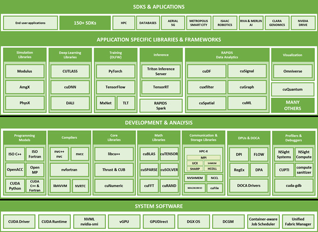

---

<!-- Page 65 -->

science, graphics and simulation, and more. DLI trains and certifies qualified educators as DLI
- Ambassadors, at research institutions and HPC centers, enabling them to teach and tailor the
DLI content to their needs.
Beyond our official documentation, NVIDIA partners with different communities and HPC sites to provide the GPU Hackathon and Bootcamp program. It pairs teams of domain scientists and
research software engineers (RSEs) with GPU mentors from NVIDIA and the HPC community to transfer the software development, parallel computing, and optimization skills required to effectively use modern heterogenous computing systems. Every year, NVIDIA holds its GPU
Technology Conference (GTC) with focus on educating developers on the latest NVIDIA platform and technology. The talks cover NVIDIA programming models, hardware details, and
the applications of accelerated computing to a wide range of domains. All these talks are
recorded and available at GTC on demand.

### Languages and Compilers

The CUDA platform exposes a unified and flexible compiler stack for generating highly- optimized device binaries via NVIDIA’s NVVM IR and NVIDIA’s libNVVM. NVVM IR is a
compiler Intermediate Representation (IR), based on LLVM 7, providing a front-end compiler target for generating GPU compute kernels. libNVVM is a library for compiling and optimizing
- NVVM IR to PTX, the virtual ISA of NVIDIA GPUs. All NVIDIA Compute compilers use libNVVM
to target NVIDIA GPUs (Figure 32) and it enables users and frameworks to bring their programming language of choice to the CUDA platform with the same code generation quality and optimization as CUDA C++ itself.
- Frontends use libNVVM to compile NVVM IR programs to PTX and run them on GPUs
Figure 32. High-level language Frontends
PTX, the virtual ISA of NVIDIA GPUs, is a public ISA targeted by third-party producers to run efficiently on our target architectures. PTX also has the advantages of being forward compatible
and can be assembled offline or at runtime.

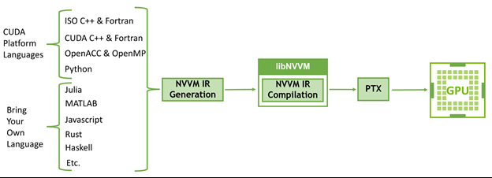

---

<!-- Page 66 -->

In many applications, the GPU compute kernels to be generated depend on the program inputs.
While these applications could generate NVVM IR, the NVIDIA Runtime Compiler significantly improves the productivity of these applications and their users by allowing them to generate familiar CUDA C++ instead. NVRTC compiles CUDA C++ at runtime to PTX using libNVVM or
to native GPU binary code by using an embedded PTX assembler as well. This enables
applications, e.g., Python programs, to dynamically generate kernels for the program a user input and, e.g., C++ programs, to specialize compute kernels at runtime depending on program inputs.
The NVIDIA HPC SDK is a set of toolchains for heterogeneous systems. NVCC is a CUDA
C++ compiler that provides a split compilation model that pairs GPU compilation with an external host compiler such as GCC (Figure 33: left). The NVIDIA HPC compilers - NVC,
NVC++, and NVFortran - provide a unified heterogeneous compilation model (Figure 33: right).
Figure 33. NVCC split compilation model and NVC++ unified compilation model
The unified compiler parses and optimizes the program only once before splitting the compilation process for different targets. This model enables certain features that are not
available in nvcc. For example, with nvcc, CUDA C++ device code requires __device__
annotations (Figure 34, left). The NVC++ compiler does not require these annotations (Figure
34, right), if the program uses a function from a particular target and its definition is reachable, the compiler attempts to compile it.

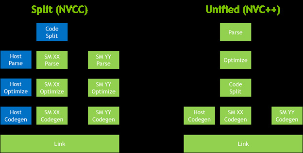

---

<!-- Page 67 -->

Figure 34. Unified toolchain supports execution-space inference
Unified compilation simplifies development, making GPU programming more accessible for beginners while enabling experienced developers to be more productive. It also increases code
reuse between host and device targets, simplifying the process of accelerating GPU applications.

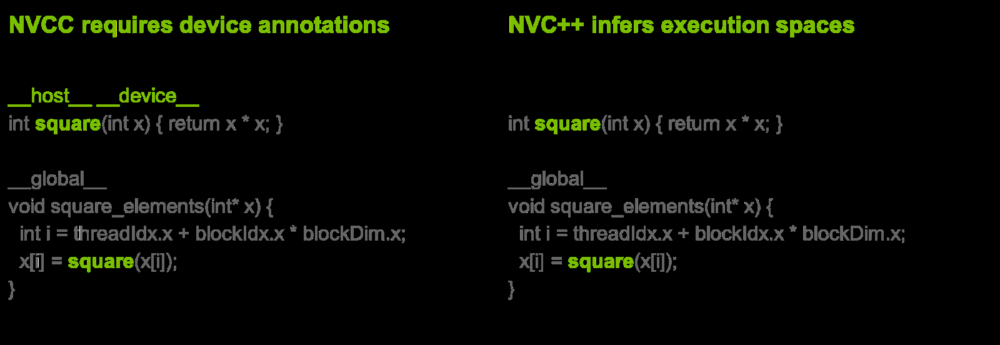

---

<!-- Page 68 -->

## Appendix C - Genomics Acceleration using DPX

## Instructions

- NVIDIA H100 can accelerate numerous different types of applications and algorithms by varying
- X-factors over prior GPUs and over CPUs. In this section, we highlight a significant speedup
provided by H100 in the area of genomics. Genome and protein analysis has never been more
critical to the human race as it has been in the past few years with the rise of infectious diseases and the dangers of global pandemics.
H100 introduces the new DPX instructions, which are new dedicated hardware instructions to accelerate Dynamic Programming algorithms such as the Smith-Waterman algorithm used for
DNA gene sequencing, and for protein classification and folding. H100 delivers up to a 7x
speedup for Smith-Waterman compared to the NVIDIA Ampere A100 GPU, enabling much faster times to solutions in disease diagnosis, virus mutation studies, and vaccine development.
A short tutorial on genomics and gene sequencing is given below.
The field of genomics is growing exponentially, transforming the healthcare, agriculture, and life sciences industries, as well as being one of our sharpest weapons in the fight against SARS-
- CoV-2 and COVID-19. Sequencing the human genome—either in whole or in selected parts—is
critical to our understanding of how it works, which allows us to identify the genetic variants that can cause disease, provide protection, and be targeted for therapeutics. As organizations utilize
the genome to understand disease, discover drugs, and enhance patient care, data analysis and management are becoming the main tools for extracting the genome’s value.
Since the introduction of next-generation sequencing (NGS) in 2005, the industry has experienced a data explosion and created new industries built around the human genome, from resolving family histories to clinical care. Genomics benefits from advanced computing systems
that can accelerate the computationally-intensive steps needed to transform raw instrument data into biological insights. An individual’s genome is roughly 100 gigabytes (GB) in raw data
size. That grows to a total data footprint of over 225 GB after analysis, which utilizes complex
algorithms and applications such as deep learning and natural language processing.
Accelerating mathematical models with GPUs provides clear benefits for traditional genomics analysis, such as sequencing read processing and variant identification, but it also has the potential to revolutionize our understanding of how specific genomic variants impact disease and health.
NVIDIA Clara™ Parabricks® is an accelerated compute framework for next-generation sequencing data, supporting end-to-end data analysis workflows for DNA and RNA applications.
Running on a suite of NVIDIA GPU platforms, Clara Parabricks provides over 50 accelerated tools, including a GPU-accelerated Burrows-Wheeler Aligner (BWA-MEM), Picard, and Samtools, along with a suite of utilities that annotates, filters, and combines multiple variant

---

<!-- Page 69 -->

call formats (VCFs). The combination of accelerated tools across the entire workflow means
results can be generated in minutes as opposed to hours or days.
Figure 35. NVIDIA CLARA Parabricks Accelerated Framework
A genome is an organism's complete set of deoxyribonucleic acid (DNA), a chemical compound that contains the genetic instructions needed to develop and direct the activities of every organism. DNA molecules are made of two twisting, paired strands. Each strand is made of four
chemical units, called nucleotide bases. The bases are adenine (A), thymine (T), guanine (G)
and cytosine (C). Bases on opposite strands pair specifically; an A always pairs with a T, and a
C always with a G. The human genome contains approximately 3 billion of these base pairs,
which reside in the 23 pairs of chromosomes within the nucleus of all our cells. Sequencing the
genome means determining the exact order of the base pairs in a segment of DNA.
- The sequencing process of an individual’s DNA starts with the chemical process of splitting the
DNA into complementary pairs, chopping the DNA strand into specific sized chunks (that may be 100 to 2000 base pairs long), and sequencing these small chunks (called reads) through a sequencing machine that generates a sequence of computer-readable base pair codes. These
sequenced chunks are then reassembled by searching for the location of the sequences in a reference genome, or by De Novo methods that assemble sequenced chunks by looking for overlapping patterns of bases, instead of relying on reference genome sequence.
From a computational perspective, the problem boils down to searching for and matching a set of “reads” from a reference genome that is billions of base pairs long, or assembling a genome from scratch through pattern matching algorithms that compare millions of reads to find overlaps, and align them in the right order. During this process the algorithms may need to
insert, edit, or delete sequences to resolve mismatches, and also specify the cost of various types of mismatches that may be encountered. Therefore, the computational hardware
architecture for pattern matching needs to be flexible to accommodate these requirements, and also support other types of similar algorithms used for other problems in genomics such as protein sequencing.
The Smith-Waterman algorithm for DNA sequencing is used in the GPU-accelerated BWA-MEM module of the NVIDIA CLARA Parabricks accelerated computing framework. The algorithm
basically creates a scoring matrix by comparing two strings of base reads and then identifies the best matching pattern for the two strings based on a traceback of scores in the matrix. A good
explanation of how this algorithm is used in genome sequencing is available here.

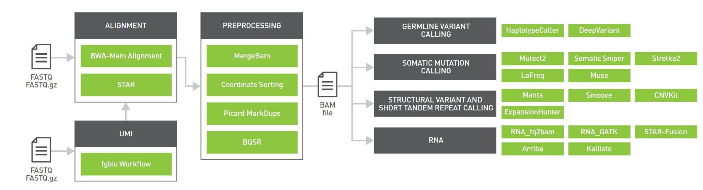

---

<!-- Page 70 -->

Figure 36. Smith-Waterman Algorithm for Genome sequencing1
In the above illustration, each cell update of the matrix requires 5 basic computations.
1. add a value of x (x = 3 in this illustration) from a diagonal element on a match
2. subtract a value of x from a diagonal element on a mismatch
3. subtract a value of y (y = 2 in this illustration) on a vertical element mismatch
4. subtract a value of z (z =2 in this illustration) on a horizontal element mismatch

## 5. Find the maximum value of the above four operations (if the result is negative, then zero

out the cell).
The new DPX instructions in H100 are optimized to accelerate the above set of computations and other similar algorithms.
1 Sourced from https://en.wikipedia.org/wiki/Smith%E2%80%93Waterman_algorithm

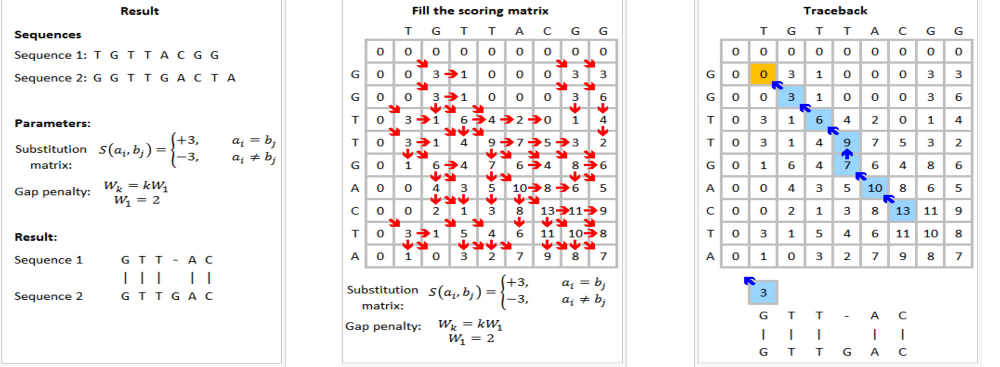

---

<!-- Page 71 -->

### Notice

The information provided in this specification is believed to be accurate and reliable as of the date provided. However, NVIDIA
Corporation (“NVIDIA”) does not give any representations or warranties, expressed or implied, as to the accuracy or completeness of such information. NVIDIA shall have no liability for the consequences or use of such information or for any infringement of patents
or other rights of third parties that may result from its use. This publication supersedes and replaces all other specifications for the
product that may have been previously supplied.
NVIDIA reserves the right to make corrections, modifications, enhancements, improvements, and other changes to this specification, at any time and/or to discontinue any product or service without notice. Customer should obtain the latest relevant
specification before placing orders and should verify that such information is current and complete.
NVIDIA products are sold subject to the NVIDIA standard terms and conditions of sale supplied at the time of order acknowledgement, unless otherwise agreed in an individual sales agreement signed by authorized representatives of NVIDIA and customer. NVIDIA hereby expressly objects to applying any customer general terms and conditions with regard to the purchase of
the NVIDIA product referenced in this specification.
NVIDIA products are not designed, authorized or warranted to be suitable for use in medical, military, aircraft, space or life support equipment, nor in applications where failure or malfunction of the NVIDIA product can reasonably be expected to result in personal injury, death or property or environmental damage. NVIDIA accepts no liability for inclusion and/or use of NVIDIA products in such
equipment or applications and therefore such inclusion and/or use is at customer’s own risk.
NVIDIA makes no representation or warranty that products based on these specifications will be suitable for any specified use without further testing or modification. Testing of all parameters of each product is not necessarily performed by NVIDIA. It is
customer’s sole responsibility to ensure the product is suitable and fit for the application planned by customer and to do the necessary testing for the application in order to avoid a default of the application or the product. Weaknesses in customer’s product
designs may affect the quality and reliability of the NVIDIA product and may result in additional or different conditions and/or requirements beyond those contained in this specification. NVIDIA does not accept any liability related to any default, damage, costs
or problem which may be based on or attributable to: (i) the use of the NVIDIA product in any manner that is contrary to this specification, or (ii) customer product designs.
No license, either expressed or implied, is granted under any NVIDIA patent right, copyright, or other NVIDIA intellectual property right under this specification. Information published by NVIDIA regarding third-party products or services does not constitute a
license from NVIDIA to use such products or services or a warranty or endorsement thereof. Use of such information may require a
license from a third party under the patents or other intellectual property rights of the third party, or a license from NVIDIA under the patents or other intellectual property rights of NVIDIA. Reproduction of information in this specification is permissible only if
reproduction is approved by NVIDIA in writing, is reproduced without alteration, and is accompanied by all associated conditions, limitations, and notices.
- ALL NVIDIA DESIGN SPECIFICATIONS, REFERENCE BOARDS, FILES, DRAWINGS, DIAGNOSTICS, LISTS, AND OTHER
DOCUMENTS (TOGETHER AND SEPARATELY, “MATERIALS”) ARE BEING PROVIDED “AS IS.” NVIDIA MAKES NO
- WARRANTIES, EXPRESSED, IMPLIED, STATUTORY, OR OTHERWISE WITH RESPECT TO THE MATERIALS, AND
- EXPRESSLY DISCLAIMS ALL IMPLIED WARRANTIES OF NONINFRINGEMENT, MERCHANTABILITY, AND FITNESS FOR A
PARTICULAR PURPOSE. Notwithstanding any damages that customer might incur for any reason whatsoever, NVIDIA’s aggregate
and cumulative liability towards customer for the products described herein shall be limited in accordance with the NVIDIA terms and conditions of sale for the product.
- Trademarks
NVIDIA, the NVIDIA logo, NVIDIA CUDA, NVIDIA Omniverse, NVIDIA RTX, NVIDIA Tesla, NVIDIA Turing, NVIDIA Volta, NVIDIA
Jetson AGX Xavier, NVIDIA DGX, NVIDIA HGX, NVIDIA EGA, NVIDIA CUDA-X, NVIDIA GPU Cloud, GeForce, Quadro, CUDA,
GeForce RTX, NVIDIA NVLink, NVIDIA NVSwitch, NVIDIA DGX POD, NVIDIA DGX SuperPOD, and NVIDIA TensorRT, are trademarks and/or registered trademarks of NVIDIA Corporation in the U.S. and other countries. Other company and product names
may be trademarks of the respective companies with which they are associated.
© 2023 NVIDIA Corporation. All rights reserved.
- Copyright
