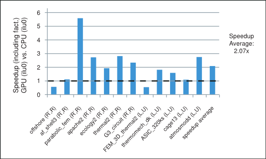
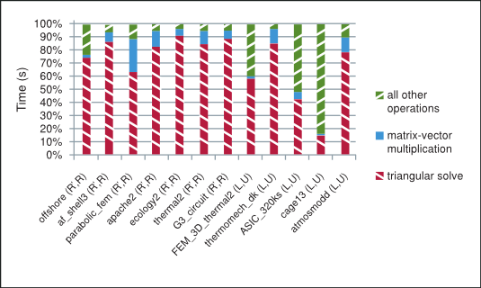
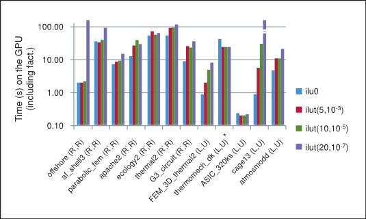
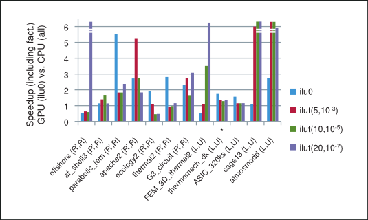
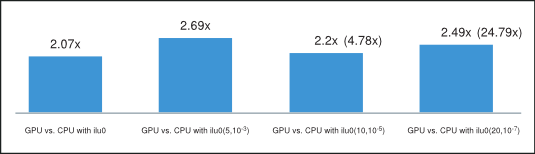

# 1. Introduction — Incomplete-LU and Cholesky Preconditioned Iterative Methods 13.2 documentation

**来源**: [https://docs.nvidia.com/cuda/incomplete-lu-cholesky/index.html](https://docs.nvidia.com/cuda/incomplete-lu-cholesky/index.html)

---

Incomplete-LU and Cholesky Preconditioned Iterative Methods Using cuSPARSE and cuBLAS
White paper describing how to use the cuSPARSE and cuBLAS libraries to achieve a 2x speedup over CPU in the incomplete-LU and Cholesky preconditioned iterative methods.

# 1. Introduction
The solution of large sparse linear systems is an important problem in computational mechanics, atmospheric modeling, geophysics, biology, circuit simulation and many other applications in the field of computational science and engineering. In general, these linear systems can be solved using direct or preconditioned iterative methods. Although the direct methods are often more reliable, they usually have large memory requirements and do not scale well on massively parallel computer platforms.
The iterative methods are more amenable to parallelism and therefore can be used to solve larger problems. Currently, the most popular iterative schemes belong to the Krylov subspace family of methods. They include*Bi-Conjugate Gradient Stabilized*(BiCGStab) and*Conjugate Gradient*(CG) iterative methods for nonsymmetric and*symmetric positive definite*(s.p.d.) linear systems, respectively[[2]](https://docs.nvidia.com/cuda/incomplete-lu-cholesky/index.html#references),[[11]](https://docs.nvidia.com/cuda/incomplete-lu-cholesky/index.html#references). We describe these methods in more detail in the next section.
In practice, we often use a variety of preconditioning techniques to improve the convergence of the iterative methods. In this white paper we focus on the incomplete-LU and Cholesky preconditioning[[11]](https://docs.nvidia.com/cuda/incomplete-lu-cholesky/index.html#references), which is one of the most popular of these preconditioning techniques. It computes an incomplete factorization of the coefficient matrix and requires a solution of lower and upper triangular linear systems in every iteration of the iterative method.
In order to implement the preconditioned BiCGStab and CG we use the sparse matrix-vector multiplication[[3]](https://docs.nvidia.com/cuda/incomplete-lu-cholesky/index.html#references),[[15]](https://docs.nvidia.com/cuda/incomplete-lu-cholesky/index.html#references)and the sparse triangular solve[[8]](https://docs.nvidia.com/cuda/incomplete-lu-cholesky/index.html#references),[[16]](https://docs.nvidia.com/cuda/incomplete-lu-cholesky/index.html#references)implemented in the cuSPARSE library. We point out that the underlying implementation of these algorithms takes advantage of the CUDA parallel programming paradigm[[5]](https://docs.nvidia.com/cuda/incomplete-lu-cholesky/index.html#references),[[9]](https://docs.nvidia.com/cuda/incomplete-lu-cholesky/index.html#references),[[13]](https://docs.nvidia.com/cuda/incomplete-lu-cholesky/index.html#references), which allows us to explore the computational resources of the graphical processing unit (GPU). In our numerical experiments the incomplete factorization is performed on the CPU (host) and the resulting lower and upper triangular factors are then transferred to the GPU (device) memory before starting the iterative method. However, the computation of the incomplete factorization could also be accelerated on the GPU.
We point out that the parallelism available in these iterative methods depends highly on the sparsity pattern of the coefficient matrix at hand. In our numerical experiments the incomplete-LU and Cholesky preconditioned iterative methods achieve on average more than 2x speedup using the cuSPARSE and cuBLAS libraries on the GPU over the MKL[[17]](https://docs.nvidia.com/cuda/incomplete-lu-cholesky/index.html#references)implementation on the CPU. For example, the speedup for the preconditioned iterative methods with the incomplete-LU and Cholesky factorization with 0 fill-in (ilu0) is shown in[Figure 1](https://docs.nvidia.com/cuda/incomplete-lu-cholesky/index.html#introduction-speedup-of-incomplete-lu-cholesky-with-0-fill-in)for matrices resulting from a variety of applications. It will be described in more detail in the last section.



Speedup of the Incomplete-LU Cholesky (with 0 fill-in) Prec. Iterative Methods

In the next sections we briefly describe the methods of interest and comment on the role played in them by the parallel sparse matrix-vector multiplication and triangular solve algorithms.

# 2. Preconditioned Iterative Methods
Let us consider the linear system

<div style="overflow-x: auto; max-width: 100%; border-radius: 6px;">
<table border="1" cellpadding="6" cellspacing="0" style="border-collapse: collapse; width: 100%; font-family: -apple-system, BlinkMacSystemFont, Segoe UI, Helvetica, Arial, sans-serif; font-size: 13px; margin: 16px 0;">
<colgroup>
<col style="width: 91%"/>
<col style="width: 9%"/>
</colgroup>
<tbody>
<tr style="border: 1px solid #d0d7de;">
<td style="padding: 8px 12px; border: 1px solid #d0d7de; vertical-align: top;"><p><span class="math notranslate nohighlight">\(A\mathbf{x} = \mathbf{f}\)</span></p></td>
<td style="padding: 8px 12px; border: 1px solid #d0d7de; vertical-align: top;">
<ol class="arabic simple">
<li>
</li></ol>
</td>
</tr>
</tbody>
</table>
</div>

where$A \in \mathbb{R}^{n \times n}$is a nonsingular coefficient matrix and$\mathbf{x},\mathbf{f} \in \mathbb{R}^{n}$are the solution and right-hand-side vectors.
In general, the iterative methods start with an initial guess and perform a series of steps that find more accurate approximations to the solution. There are two types of iterative methods: (i) the stationary iterative methods, such as the splitting-based*Jacobi*and*Gauss-Seidel*(GS), and (ii) the nonstationary iterative methods, such as the*Krylov*subspace family of methods, which includes*CG*and*BiCGStab*. As we mentioned earlier we focus on the latter in this white paper.
The convergence of the iterative methods depends highly on the spectrum of the coefficient matrix and can be significantly improved using preconditioning. The preconditioning modifies the spectrum of the coefficient matrix of the linear system in order to reduce the number of iterative steps required for convergence. It often involves finding a preconditioning matrix$M$, such that$M^{- 1}$is a good approximation of$A^{- 1}$and the systems with$M$are relatively easy to solve.
For the s.p.d. matrix$A$we can let$M$be its incomplete-Cholesky factorization, so that$A \approx M = {\widetilde{R}}^{T}\widetilde{R}$, where$\widetilde{R}$is an upper triangular matrix. Let us assume that$M$is nonsingular, then${\widetilde{R}}^{- T}A{\widetilde{R}}^{- 1}$is s.p.d. and instead of solving the linear system[(1)](https://docs.nvidia.com/cuda/incomplete-lu-cholesky/index.html#preconditioned-iterative-methods-eq-1), we can solve the preconditioned linear system

<div style="overflow-x: auto; max-width: 100%; border-radius: 6px;">
<table border="1" cellpadding="6" cellspacing="0" style="border-collapse: collapse; width: 100%; font-family: -apple-system, BlinkMacSystemFont, Segoe UI, Helvetica, Arial, sans-serif; font-size: 13px; margin: 16px 0;">
<colgroup>
<col style="width: 97%"/>
<col style="width: 3%"/>
</colgroup>
<tbody>
<tr style="border: 1px solid #d0d7de;">
<td style="padding: 8px 12px; border: 1px solid #d0d7de; vertical-align: top;"><p><span class="math notranslate nohighlight">\(\left( {{\widetilde{R}}^{- T}A{\widetilde{R}}^{- 1}} \right)\left( {\widetilde{R}\mathbf{x}} \right) = {\widetilde{R}}^{- T}\mathbf{f}\)</span></p></td>
<td style="padding: 8px 12px; border: 1px solid #d0d7de; vertical-align: top;">
<ol class="arabic simple" start="2">
<li>
</li></ol>
</td>
</tr>
</tbody>
</table>
</div>

The pseudocode for the preconditioned CG iterative method is shown in[Algorithm 1](https://docs.nvidia.com/cuda/incomplete-lu-cholesky/index.html#preconditioned-iterative-methods-algorithm-1-conjugate-gradient-cg).

## 2.1. Algorithm 1 Conjugate Gradient (CG)

<div style="overflow-x: auto; max-width: 100%; border-radius: 6px;">
<table border="1" cellpadding="6" cellspacing="0" style="border-collapse: collapse; width: 100%; font-family: -apple-system, BlinkMacSystemFont, Segoe UI, Helvetica, Arial, sans-serif; font-size: 13px; margin: 16px 0;">
<colgroup>
<col style="width: 2%"/>
<col style="width: 61%"/>
<col style="width: 37%"/>
</colgroup>
<tbody>
<tr style="border: 1px solid #d0d7de;">
<td style="padding: 8px 12px; border: 1px solid #d0d7de; vertical-align: top;"><p>1:</p></td>
<td style="padding: 8px 12px; border: 1px solid #d0d7de; vertical-align: top;"><p><span class="math notranslate nohighlight">\(\text{Letting initial guess be }\mathbf{x}_{0}\text{, compute }\mathbf{r}\leftarrow\mathbf{f} - A\mathbf{x}_{0}\)</span></p></td>
<td style="padding: 8px 12px; border: 1px solid #d0d7de; vertical-align: top;"></td>
</tr>
<tr style="border: 1px solid #d0d7de;">
<td style="padding: 8px 12px; border: 1px solid #d0d7de; vertical-align: top;"><p>2:</p></td>
<td style="padding: 8px 12px; border: 1px solid #d0d7de; vertical-align: top;"><p><span class="math notranslate nohighlight">\(\textbf{for }i\leftarrow 1,2,...\text{ until convergence }\textbf{do}\)</span></p></td>
<td style="padding: 8px 12px; border: 1px solid #d0d7de; vertical-align: top;"></td>
</tr>
<tr style="border: 1px solid #d0d7de;">
<td style="padding: 8px 12px; border: 1px solid #d0d7de; vertical-align: top;"><p>3:</p></td>
<td style="padding: 8px 12px; border: 1px solid #d0d7de; vertical-align: top;"><p><span class="math notranslate nohighlight">\(\quad\quad\text{Solve }M\mathbf{z}\leftarrow\mathbf{r}\)</span></p></td>
<td style="padding: 8px 12px; border: 1px solid #d0d7de; vertical-align: top;"><p><span class="math notranslate nohighlight">\(\vartriangleright \text{Sparse lower and upper triangular solves}\)</span></p></td>
</tr>
<tr style="border: 1px solid #d0d7de;">
<td style="padding: 8px 12px; border: 1px solid #d0d7de; vertical-align: top;"><p>4:</p></td>
<td style="padding: 8px 12px; border: 1px solid #d0d7de; vertical-align: top;"><p><span class="math notranslate nohighlight">\(\quad\quad\rho_{i}\leftarrow\mathbf{r}^{T}\mathbf{z}\)</span></p></td>
<td style="padding: 8px 12px; border: 1px solid #d0d7de; vertical-align: top;"></td>
</tr>
<tr style="border: 1px solid #d0d7de;">
<td style="padding: 8px 12px; border: 1px solid #d0d7de; vertical-align: top;"><p>5:</p></td>
<td style="padding: 8px 12px; border: 1px solid #d0d7de; vertical-align: top;"><p><span class="math notranslate nohighlight">\(\quad\quad\textbf{if }i==1\textbf{ then}\)</span></p></td>
<td style="padding: 8px 12px; border: 1px solid #d0d7de; vertical-align: top;"></td>
</tr>
<tr style="border: 1px solid #d0d7de;">
<td style="padding: 8px 12px; border: 1px solid #d0d7de; vertical-align: top;"><p>6:</p></td>
<td style="padding: 8px 12px; border: 1px solid #d0d7de; vertical-align: top;"><p><span class="math notranslate nohighlight">\(\quad\quad\quad\quad\mathbf{p}\leftarrow\mathbf{z}\)</span></p></td>
<td style="padding: 8px 12px; border: 1px solid #d0d7de; vertical-align: top;"></td>
</tr>
<tr style="border: 1px solid #d0d7de;">
<td style="padding: 8px 12px; border: 1px solid #d0d7de; vertical-align: top;"><p>7:</p></td>
<td style="padding: 8px 12px; border: 1px solid #d0d7de; vertical-align: top;"><p><span class="math notranslate nohighlight">\(\quad\quad\textbf{else}\)</span></p></td>
<td style="padding: 8px 12px; border: 1px solid #d0d7de; vertical-align: top;"></td>
</tr>
<tr style="border: 1px solid #d0d7de;">
<td style="padding: 8px 12px; border: 1px solid #d0d7de; vertical-align: top;"><p>8:</p></td>
<td style="padding: 8px 12px; border: 1px solid #d0d7de; vertical-align: top;"><p><span class="math notranslate nohighlight">\(\quad\quad\quad\quad\beta\leftarrow\frac{\rho_{i}}{\rho_{i - 1}}\)</span></p></td>
<td style="padding: 8px 12px; border: 1px solid #d0d7de; vertical-align: top;"></td>
</tr>
<tr style="border: 1px solid #d0d7de;">
<td style="padding: 8px 12px; border: 1px solid #d0d7de; vertical-align: top;"><p>9:</p></td>
<td style="padding: 8px 12px; border: 1px solid #d0d7de; vertical-align: top;"><p><span class="math notranslate nohighlight">\(\quad\quad\quad\quad\mathbf{p}\leftarrow\mathbf{z} + \beta\mathbf{p}\)</span></p></td>
<td style="padding: 8px 12px; border: 1px solid #d0d7de; vertical-align: top;"></td>
</tr>
<tr style="border: 1px solid #d0d7de;">
<td style="padding: 8px 12px; border: 1px solid #d0d7de; vertical-align: top;"><p>10:</p></td>
<td style="padding: 8px 12px; border: 1px solid #d0d7de; vertical-align: top;"><p><span class="math notranslate nohighlight">\(\quad\quad\textbf{end if}\)</span></p></td>
<td style="padding: 8px 12px; border: 1px solid #d0d7de; vertical-align: top;"></td>
</tr>
<tr style="border: 1px solid #d0d7de;">
<td style="padding: 8px 12px; border: 1px solid #d0d7de; vertical-align: top;"><p>11:</p></td>
<td style="padding: 8px 12px; border: 1px solid #d0d7de; vertical-align: top;"><p><span class="math notranslate nohighlight">\(\quad\quad\text{Compute }\mathbf{q}\leftarrow A\mathbf{p}\)</span></p></td>
<td style="padding: 8px 12px; border: 1px solid #d0d7de; vertical-align: top;"><p><span class="math notranslate nohighlight">\(\vartriangleright \text{Sparse matrix-vector multiplication}\)</span></p></td>
</tr>
<tr style="border: 1px solid #d0d7de;">
<td style="padding: 8px 12px; border: 1px solid #d0d7de; vertical-align: top;"><p>12:</p></td>
<td style="padding: 8px 12px; border: 1px solid #d0d7de; vertical-align: top;"><p><span class="math notranslate nohighlight">\(\quad\quad\alpha\leftarrow\frac{\rho_{i}}{\mathbf{p}^{T}\mathbf{q}}\)</span></p></td>
<td style="padding: 8px 12px; border: 1px solid #d0d7de; vertical-align: top;"></td>
</tr>
<tr style="border: 1px solid #d0d7de;">
<td style="padding: 8px 12px; border: 1px solid #d0d7de; vertical-align: top;"><p>13:</p></td>
<td style="padding: 8px 12px; border: 1px solid #d0d7de; vertical-align: top;"><p><span class="math notranslate nohighlight">\(\quad\quad\mathbf{x}\leftarrow\mathbf{x} + \alpha\mathbf{p}\)</span></p></td>
<td style="padding: 8px 12px; border: 1px solid #d0d7de; vertical-align: top;"></td>
</tr>
<tr style="border: 1px solid #d0d7de;">
<td style="padding: 8px 12px; border: 1px solid #d0d7de; vertical-align: top;"><p>14:</p></td>
<td style="padding: 8px 12px; border: 1px solid #d0d7de; vertical-align: top;"><p><span class="math notranslate nohighlight">\(\quad\quad\mathbf{r}\leftarrow\mathbf{r} - \alpha\mathbf{q}\)</span></p></td>
<td style="padding: 8px 12px; border: 1px solid #d0d7de; vertical-align: top;"></td>
</tr>
<tr style="border: 1px solid #d0d7de;">
<td style="padding: 8px 12px; border: 1px solid #d0d7de; vertical-align: top;"><p>15:</p></td>
<td style="padding: 8px 12px; border: 1px solid #d0d7de; vertical-align: top;"><p><span class="math notranslate nohighlight">\(\textbf{end for}\)</span></p></td>
<td style="padding: 8px 12px; border: 1px solid #d0d7de; vertical-align: top;"></td>
</tr>
</tbody>
</table>
</div>

Notice that in every iteration of the incomplete-Cholesky preconditioned CG iterative method we need to perform one sparse matrix-vector multiplication and two triangular solves. The corresponding CG code using the cuSPARSE and cuBLAS libraries in C programming language is shown below.

```
/***** CG Code *****/
/* ASSUMPTIONS:
   1. The cuSPARSE and cuBLAS libraries have been initialized.
   2. The appropriate memory has been allocated and set to zero.
   3. The matrix A (valA, csrRowPtrA, csrColIndA) and the incomplete-
      Cholesky upper triangular factor R (valR, csrRowPtrR, csrColIndR)
      have been computed and are present in the device (GPU) memory. */

//create the info and analyse the lower and upper triangular factors
cusparseCreateSolveAnalysisInfo(&inforRt);
cusparseCreateSolveAnalysisInfo(&inforR);
cusparseDcsrsv_analysis(handle,CUSPARSE_OPERATION_TRANSPOSE,
                      n, descrR, valR, csrRowPtrR, csrColIndR, inforRt);
cusparseDcsrsv_analysis(handle,CUSPARSE_OPERATION_NON_TRANSPOSE,
                      n, descrR, valR, csrRowPtrR, csrColIndR, inforR);

//1: compute initial residual r = f -  A x0 (using initial guess in x)
cusparseDcsrmv(handle, CUSPARSE_OPERATION_NON_TRANSPOSE, n, n, 1.0,
               descrA, valA, csrRowPtrA, csrColIndA, x, 0.0, r);
cublasDscal(n,-1.0, r, 1);
cublasDaxpy(n, 1.0, f, 1, r, 1);
nrmr0 = cublasDnrm2(n, r, 1);

//2: repeat until convergence (based on max. it. and relative residual)
for (i=0; i<maxit; i++){
    //3: Solve M z = r (sparse lower and upper triangular solves)
    cusparseDcsrsv_solve(handle, CUSPARSE_OPERATION_TRANSPOSE,
                         n, 1.0, descrpR, valR, csrRowPtrR, csrColIndR,
                         inforRt, r, t);
    cusparseDcsrsv_solve(handle, CUSPARSE_OPERATION_NON_TRANSPOSE,
                         n, 1.0, descrpR, valR, csrRowPtrR, csrColIndR,
                         inforR, t, z);

    //4: \rho = r^{T} z
    rhop= rho;
    rho = cublasDdot(n, r, 1, z, 1);
    if (i == 0){
        //6: p = z
        cublasDcopy(n, z, 1, p, 1);
    }
    else{
        //8: \beta = rho_{i} / \rho_{i-1}
        beta= rho/rhop;
        //9: p = z + \beta p
        cublasDaxpy(n, beta, p, 1, z, 1);
        cublasDcopy(n, z, 1, p, 1);
    }

    //11: Compute q = A p (sparse matrix-vector multiplication)
    cusparseDcsrmv(handle, CUSPARSE_OPERATION_NON_TRANSPOSE, n, n, 1.0,
                   descrA, valA, csrRowPtrA, csrColIndA, p, 0.0, q);

    //12: \alpha = \rho_{i} / (p^{T} q)
    temp = cublasDdot(n, p, 1, q, 1);
    alpha= rho/temp;
    //13: x = x + \alpha p
    cublasDaxpy(n, alpha, p, 1, x, 1);
    //14: r = r - \alpha q
    cublasDaxpy(n,-alpha, q, 1, r, 1);

    //check for convergence
    nrmr = cublasDnrm2(n, r, 1);
    if (nrmr/nrmr0 < tol){
        break;
    }
}

//destroy the analysis info (for lower and upper triangular factors)
cusparseDestroySolveAnalysisInfo(inforRt);
cusparseDestroySolveAnalysisInfo(inforR);

```

For the nonsymmetric matrix$A$we can let$M$be its incomplete-LU factorization, so that$A \nvdash M = \widetilde{L}\widetilde{U}$, where$\widetilde{L}$and$\widetilde{U}$are lower and upper triangular matrices, respectively. Let us assume that$M$is nonsingular, then$M^{- 1}A$is nonsingular and instead of solving the linear system[(1)](https://docs.nvidia.com/cuda/incomplete-lu-cholesky/index.html#preconditioned-iterative-methods-eq-1), we can solve the preconditioned linear system

<div style="overflow-x: auto; max-width: 100%; border-radius: 6px;">
<table border="1" cellpadding="6" cellspacing="0" style="border-collapse: collapse; width: 100%; font-family: -apple-system, BlinkMacSystemFont, Segoe UI, Helvetica, Arial, sans-serif; font-size: 13px; margin: 16px 0;">
<colgroup>
<col style="width: 95%"/>
<col style="width: 5%"/>
</colgroup>
<tbody>
<tr style="border: 1px solid #d0d7de;">
<td style="padding: 8px 12px; border: 1px solid #d0d7de; vertical-align: top;"><p><span class="math notranslate nohighlight">\(\left( {M^{- 1}A} \right)\mathbf{x} = M^{- 1}\mathbf{f}\)</span></p></td>
<td style="padding: 8px 12px; border: 1px solid #d0d7de; vertical-align: top;">
<ol class="arabic simple" start="3">
<li>
</li></ol>
</td>
</tr>
</tbody>
</table>
</div>

The pseudocode for the preconditioned BiCGStab iterative method is shown in[Algorithm 2](https://docs.nvidia.com/cuda/incomplete-lu-cholesky/index.html#preconditioned-iterative-methods__algorithm-2-bi-conjugate-gradient-stabilized-bicgstab).

## 2.2. Algorithm 2 Bi-Conjugate Gradient Stabilized (BiCGStab)

<div style="overflow-x: auto; max-width: 100%; border-radius: 6px;">
<table border="1" cellpadding="6" cellspacing="0" style="border-collapse: collapse; width: 100%; font-family: -apple-system, BlinkMacSystemFont, Segoe UI, Helvetica, Arial, sans-serif; font-size: 13px; margin: 16px 0;">
<colgroup>
<col style="width: 2%"/>
<col style="width: 68%"/>
<col style="width: 30%"/>
</colgroup>
<tbody>
<tr style="border: 1px solid #d0d7de;">
<td style="padding: 8px 12px; border: 1px solid #d0d7de; vertical-align: top;"><p>1:</p></td>
<td style="padding: 8px 12px; border: 1px solid #d0d7de; vertical-align: top;"><p><span class="math notranslate nohighlight">\(\text{Letting initial guess be }\mathbf{x}_{0}\text{, compute }\mathbf{r}\leftarrow\mathbf{f} - A\mathbf{x}_{0}\)</span></p></td>
<td style="padding: 8px 12px; border: 1px solid #d0d7de; vertical-align: top;"></td>
</tr>
<tr style="border: 1px solid #d0d7de;">
<td style="padding: 8px 12px; border: 1px solid #d0d7de; vertical-align: top;"><p>2:</p></td>
<td style="padding: 8px 12px; border: 1px solid #d0d7de; vertical-align: top;"><p><span class="math notranslate nohighlight">\(\text{Set }\mathbf{p}\leftarrow\mathbf{r}\text{ and choose }\widetilde{\mathbf{r}}\text{, for example you can set }\widetilde{\mathbf{r}}\leftarrow\mathbf{r}\)</span></p></td>
<td style="padding: 8px 12px; border: 1px solid #d0d7de; vertical-align: top;"></td>
</tr>
<tr style="border: 1px solid #d0d7de;">
<td style="padding: 8px 12px; border: 1px solid #d0d7de; vertical-align: top;"></td>
<td style="padding: 8px 12px; border: 1px solid #d0d7de; vertical-align: top;"></td>
<td style="padding: 8px 12px; border: 1px solid #d0d7de; vertical-align: top;"></td>
</tr>
<tr style="border: 1px solid #d0d7de;">
<td style="padding: 8px 12px; border: 1px solid #d0d7de; vertical-align: top;"><p>3:</p></td>
<td style="padding: 8px 12px; border: 1px solid #d0d7de; vertical-align: top;"><p><span class="math notranslate nohighlight">\(\textbf{for }i\leftarrow 1,2,...\text{ until convergence }\textbf{do}\)</span></p></td>
<td style="padding: 8px 12px; border: 1px solid #d0d7de; vertical-align: top;"></td>
</tr>
<tr style="border: 1px solid #d0d7de;">
<td style="padding: 8px 12px; border: 1px solid #d0d7de; vertical-align: top;"><p>4:</p></td>
<td style="padding: 8px 12px; border: 1px solid #d0d7de; vertical-align: top;"><p><span class="math notranslate nohighlight">\(\quad\quad\rho_{i}\leftarrow{\widetilde{\mathbf{r}}}^{T}\mathbf{r}\)</span></p></td>
<td style="padding: 8px 12px; border: 1px solid #d0d7de; vertical-align: top;"></td>
</tr>
<tr style="border: 1px solid #d0d7de;">
<td style="padding: 8px 12px; border: 1px solid #d0d7de; vertical-align: top;"><p>5:</p></td>
<td style="padding: 8px 12px; border: 1px solid #d0d7de; vertical-align: top;"><p><span class="math notranslate nohighlight">\(\quad\quad\textbf{if }\rho_{i}==0.0\textbf{ then}\)</span></p></td>
<td style="padding: 8px 12px; border: 1px solid #d0d7de; vertical-align: top;"></td>
</tr>
<tr style="border: 1px solid #d0d7de;">
<td style="padding: 8px 12px; border: 1px solid #d0d7de; vertical-align: top;"><p>6:</p></td>
<td style="padding: 8px 12px; border: 1px solid #d0d7de; vertical-align: top;"><p><span class="math notranslate nohighlight">\(\quad\quad\quad\quad\text{method failed}\)</span></p></td>
<td style="padding: 8px 12px; border: 1px solid #d0d7de; vertical-align: top;"></td>
</tr>
<tr style="border: 1px solid #d0d7de;">
<td style="padding: 8px 12px; border: 1px solid #d0d7de; vertical-align: top;"><p>7:</p></td>
<td style="padding: 8px 12px; border: 1px solid #d0d7de; vertical-align: top;"><p><span class="math notranslate nohighlight">\(\quad\quad\textbf{end if}\)</span></p></td>
<td style="padding: 8px 12px; border: 1px solid #d0d7de; vertical-align: top;"></td>
</tr>
<tr style="border: 1px solid #d0d7de;">
<td style="padding: 8px 12px; border: 1px solid #d0d7de; vertical-align: top;"><p>8:</p></td>
<td style="padding: 8px 12px; border: 1px solid #d0d7de; vertical-align: top;"><p><span class="math notranslate nohighlight">\(\quad\quad\textbf{if }i &gt; 1\textbf{ then}\)</span></p></td>
<td style="padding: 8px 12px; border: 1px solid #d0d7de; vertical-align: top;"></td>
</tr>
<tr style="border: 1px solid #d0d7de;">
<td style="padding: 8px 12px; border: 1px solid #d0d7de; vertical-align: top;"><p>9:</p></td>
<td style="padding: 8px 12px; border: 1px solid #d0d7de; vertical-align: top;"><p><span class="math notranslate nohighlight">\(\quad\quad\quad\quad\textbf{if }\omega==0.0\textbf{ then}\)</span></p></td>
<td style="padding: 8px 12px; border: 1px solid #d0d7de; vertical-align: top;"></td>
</tr>
<tr style="border: 1px solid #d0d7de;">
<td style="padding: 8px 12px; border: 1px solid #d0d7de; vertical-align: top;"><p>10:</p></td>
<td style="padding: 8px 12px; border: 1px solid #d0d7de; vertical-align: top;"><p><span class="math notranslate nohighlight">\(\quad\quad\quad\quad\quad\quad\text{method failed}\)</span></p></td>
<td style="padding: 8px 12px; border: 1px solid #d0d7de; vertical-align: top;"></td>
</tr>
<tr style="border: 1px solid #d0d7de;">
<td style="padding: 8px 12px; border: 1px solid #d0d7de; vertical-align: top;"><p>11:</p></td>
<td style="padding: 8px 12px; border: 1px solid #d0d7de; vertical-align: top;"><p><span class="math notranslate nohighlight">\(\quad\quad\textbf{end if}\)</span></p></td>
<td style="padding: 8px 12px; border: 1px solid #d0d7de; vertical-align: top;"></td>
</tr>
<tr style="border: 1px solid #d0d7de;">
<td style="padding: 8px 12px; border: 1px solid #d0d7de; vertical-align: top;"><p>12:</p></td>
<td style="padding: 8px 12px; border: 1px solid #d0d7de; vertical-align: top;"><p><span class="math notranslate nohighlight">\(\quad\quad\quad\quad\beta\leftarrow\frac{\rho_{i}}{\rho_{i - 1}} times \frac{\alpha}{\omega}\)</span></p></td>
<td style="padding: 8px 12px; border: 1px solid #d0d7de; vertical-align: top;"></td>
</tr>
<tr style="border: 1px solid #d0d7de;">
<td style="padding: 8px 12px; border: 1px solid #d0d7de; vertical-align: top;"><p>13:</p></td>
<td style="padding: 8px 12px; border: 1px solid #d0d7de; vertical-align: top;"><p><span class="math notranslate nohighlight">\(\quad\quad\quad\quad\mathbf{p}\leftarrow\mathbf{r} + \beta\left( {\mathbf{p} - \omega\mathbf{v}} \right)\)</span></p></td>
<td style="padding: 8px 12px; border: 1px solid #d0d7de; vertical-align: top;"></td>
</tr>
<tr style="border: 1px solid #d0d7de;">
<td style="padding: 8px 12px; border: 1px solid #d0d7de; vertical-align: top;"><p>14:</p></td>
<td style="padding: 8px 12px; border: 1px solid #d0d7de; vertical-align: top;"><p><span class="math notranslate nohighlight">\(\quad\quad\textbf{end if}\)</span></p></td>
<td style="padding: 8px 12px; border: 1px solid #d0d7de; vertical-align: top;"></td>
</tr>
<tr style="border: 1px solid #d0d7de;">
<td style="padding: 8px 12px; border: 1px solid #d0d7de; vertical-align: top;"><p>15:</p></td>
<td style="padding: 8px 12px; border: 1px solid #d0d7de; vertical-align: top;"><p><span class="math notranslate nohighlight">\(\quad\quad\text{Solve }M\hat{\mathbf{p}}\leftarrow\mathbf{p}\)</span></p></td>
<td style="padding: 8px 12px; border: 1px solid #d0d7de; vertical-align: top;"><p><span class="math notranslate nohighlight">\(\vartriangleright \text{Sparse lower and upper triangular solves}\)</span></p></td>
</tr>
<tr style="border: 1px solid #d0d7de;">
<td style="padding: 8px 12px; border: 1px solid #d0d7de; vertical-align: top;"><p>16:</p></td>
<td style="padding: 8px 12px; border: 1px solid #d0d7de; vertical-align: top;"><p><span class="math notranslate nohighlight">\(\quad\quad\text{Compute }\mathbf{q}\leftarrow A\hat{\mathbf{p}}\)</span></p></td>
<td style="padding: 8px 12px; border: 1px solid #d0d7de; vertical-align: top;"><p><span class="math notranslate nohighlight">\(\vartriangleright \text{Sparse matrix-vector multiplication}\)</span></p></td>
</tr>
<tr style="border: 1px solid #d0d7de;">
<td style="padding: 8px 12px; border: 1px solid #d0d7de; vertical-align: top;"><p>17:</p></td>
<td style="padding: 8px 12px; border: 1px solid #d0d7de; vertical-align: top;"><p><span class="math notranslate nohighlight">\(\quad\quad\alpha\leftarrow\frac{\rho_{i}}{{\widetilde{\mathbf{r}}}^{T}\mathbf{q}}\)</span></p></td>
<td style="padding: 8px 12px; border: 1px solid #d0d7de; vertical-align: top;"></td>
</tr>
<tr style="border: 1px solid #d0d7de;">
<td style="padding: 8px 12px; border: 1px solid #d0d7de; vertical-align: top;"><p>18:</p></td>
<td style="padding: 8px 12px; border: 1px solid #d0d7de; vertical-align: top;"><p><span class="math notranslate nohighlight">\(\quad\quad\mathbf{s}\leftarrow\mathbf{r} - \alpha\mathbf{q}\)</span></p></td>
<td style="padding: 8px 12px; border: 1px solid #d0d7de; vertical-align: top;"></td>
</tr>
<tr style="border: 1px solid #d0d7de;">
<td style="padding: 8px 12px; border: 1px solid #d0d7de; vertical-align: top;"><p>19:</p></td>
<td style="padding: 8px 12px; border: 1px solid #d0d7de; vertical-align: top;"><p><span class="math notranslate nohighlight">\(\quad\quad\mathbf{x}\leftarrow\mathbf{x} + \alpha\hat{\mathbf{p}}\)</span></p></td>
<td style="padding: 8px 12px; border: 1px solid #d0d7de; vertical-align: top;"></td>
</tr>
<tr style="border: 1px solid #d0d7de;">
<td style="padding: 8px 12px; border: 1px solid #d0d7de; vertical-align: top;"><p>20:</p></td>
<td style="padding: 8px 12px; border: 1px solid #d0d7de; vertical-align: top;"><p><span class="math notranslate nohighlight">\(\quad\quad\textbf{if }\left\| s \right\|_{2} \leq \mathit{tol}\textbf{ then}\)</span></p></td>
<td style="padding: 8px 12px; border: 1px solid #d0d7de; vertical-align: top;"></td>
</tr>
<tr style="border: 1px solid #d0d7de;">
<td style="padding: 8px 12px; border: 1px solid #d0d7de; vertical-align: top;"><p>21:</p></td>
<td style="padding: 8px 12px; border: 1px solid #d0d7de; vertical-align: top;"><p><span class="math notranslate nohighlight">\(\quad\quad\quad\quad\text{method converged}\)</span></p></td>
<td style="padding: 8px 12px; border: 1px solid #d0d7de; vertical-align: top;"></td>
</tr>
<tr style="border: 1px solid #d0d7de;">
<td style="padding: 8px 12px; border: 1px solid #d0d7de; vertical-align: top;"><p>22:</p></td>
<td style="padding: 8px 12px; border: 1px solid #d0d7de; vertical-align: top;"><p><span class="math notranslate nohighlight">\(\quad\quad\textbf{end if}\)</span></p></td>
<td style="padding: 8px 12px; border: 1px solid #d0d7de; vertical-align: top;"></td>
</tr>
<tr style="border: 1px solid #d0d7de;">
<td style="padding: 8px 12px; border: 1px solid #d0d7de; vertical-align: top;"><p>23:</p></td>
<td style="padding: 8px 12px; border: 1px solid #d0d7de; vertical-align: top;"><p><span class="math notranslate nohighlight">\(\quad\quad\text{Solve }M\hat{\mathbf{s}}\leftarrow\mathbf{s}\)</span></p></td>
<td style="padding: 8px 12px; border: 1px solid #d0d7de; vertical-align: top;"><p><span class="math notranslate nohighlight">\(\vartriangleright \text{Sparse lower and upper triangular solves}\)</span></p></td>
</tr>
<tr style="border: 1px solid #d0d7de;">
<td style="padding: 8px 12px; border: 1px solid #d0d7de; vertical-align: top;"><p>24:</p></td>
<td style="padding: 8px 12px; border: 1px solid #d0d7de; vertical-align: top;"><p><span class="math notranslate nohighlight">\(\quad\quad\text{Compute }\mathbf{t}\leftarrow A\hat{\mathbf{s}}\)</span></p></td>
<td style="padding: 8px 12px; border: 1px solid #d0d7de; vertical-align: top;"><p><span class="math notranslate nohighlight">\(\vartriangleright \text{Sparse matrix-vector multiplication}\)</span></p></td>
</tr>
<tr style="border: 1px solid #d0d7de;">
<td style="padding: 8px 12px; border: 1px solid #d0d7de; vertical-align: top;"><p>25:</p></td>
<td style="padding: 8px 12px; border: 1px solid #d0d7de; vertical-align: top;"><p><span class="math notranslate nohighlight">\(\quad\quad\omega\leftarrow\frac{\mathbf{t}^{T}\mathbf{s}}{\mathbf{t}^{T}\mathbf{t}}\)</span></p></td>
<td style="padding: 8px 12px; border: 1px solid #d0d7de; vertical-align: top;"></td>
</tr>
<tr style="border: 1px solid #d0d7de;">
<td style="padding: 8px 12px; border: 1px solid #d0d7de; vertical-align: top;"><p>26:</p></td>
<td style="padding: 8px 12px; border: 1px solid #d0d7de; vertical-align: top;"><p><span class="math notranslate nohighlight">\(\quad\quad\mathbf{x}\leftarrow\mathbf{x} + \omega\hat{\mathbf{s}}\)</span></p></td>
<td style="padding: 8px 12px; border: 1px solid #d0d7de; vertical-align: top;"></td>
</tr>
<tr style="border: 1px solid #d0d7de;">
<td style="padding: 8px 12px; border: 1px solid #d0d7de; vertical-align: top;"><p>27:</p></td>
<td style="padding: 8px 12px; border: 1px solid #d0d7de; vertical-align: top;"><p><span class="math notranslate nohighlight">\(\quad\quad\mathbf{r}\leftarrow\mathbf{s} - \omega\mathbf{t}\)</span></p></td>
<td style="padding: 8px 12px; border: 1px solid #d0d7de; vertical-align: top;"></td>
</tr>
<tr style="border: 1px solid #d0d7de;">
<td style="padding: 8px 12px; border: 1px solid #d0d7de; vertical-align: top;"><p>28:</p></td>
<td style="padding: 8px 12px; border: 1px solid #d0d7de; vertical-align: top;"><p><span class="math notranslate nohighlight">\(\textbf{end for}\)</span></p></td>
<td style="padding: 8px 12px; border: 1px solid #d0d7de; vertical-align: top;"></td>
</tr>
</tbody>
</table>
</div>

Notice that in every iteration of the incomplete-LU preconditioned BiCGStab iterative method we need to perform two sparse matrix-vector multiplications and four triangular solves. The corresponding BiCGStab code using the cuSPARSE and cuBLAS libraries in C programming language is shown below.

```
/***** BiCGStab Code *****/
/* ASSUMPTIONS:
   1. The cuSPARSE and cuBLAS libraries have been initialized.
   2. The appropriate memory has been allocated and set to zero.
   3. The matrix A (valA, csrRowPtrA, csrColIndA) and the incomplete-
      LU lower L (valL, csrRowPtrL, csrColIndL)  and upper U (valU,
      csrRowPtrU, csrColIndU) triangular factors have been
      computed and are present in the device (GPU) memory. */

//create the info and analyse the lower and upper triangular factors
cusparseCreateSolveAnalysisInfo(&infoL);
cusparseCreateSolveAnalysisInfo(&infoU);
cusparseDcsrsv_analysis(handle, CUSPARSE_OPERATION_NON_TRANSPOSE,
                        n, descrL, valL, csrRowPtrL, csrColIndL, infoL);
cusparseDcsrsv_analysis(handle, CUSPARSE_OPERATION_NON_TRANSPOSE,
                        n, descrU, valU, csrRowPtrU, csrColIndU, infoU);

//1: compute initial residual r = b - A x0 (using initial guess in x)
cusparseDcsrmv(handle, CUSPARSE_OPERATION_NON_TRANSPOSE, n, n, 1.0,
               descrA, valA, csrRowPtrA, csrColIndA, x, 0.0, r);
cublasDscal(n,-1.0, r, 1);
cublasDaxpy(n, 1.0, f, 1, r, 1);
//2: Set p=r and \tilde{r}=r
cublasDcopy(n, r, 1, p, 1);
cublasDcopy(n, r, 1, rw,1);
nrmr0 = cublasDnrm2(n, r, 1);

//3: repeat until convergence (based on max. it. and relative residual)
for (i=0; i<maxit; i++){
    //4: \rho = \tilde{r}^{T} r
    rhop= rho;
    rho = cublasDdot(n, rw, 1, r, 1);
    if (i > 0){
        //12: \beta = (\rho_{i} / \rho_{i-1}) ( \alpha / \omega )
        beta= (rho/rhop)*(alpha/omega);
        //13: p = r + \beta (p - \omega v)
        cublasDaxpy(n,-omega,q, 1, p, 1);
        cublasDscal(n, beta, p, 1);
        cublasDaxpy(n, 1.0,  r, 1, p, 1);
    }
    //15: M \hat{p} = p (sparse lower and upper triangular solves)
    cusparseDcsrsv_solve(handle, CUSPARSE_OPERATION_NON_TRANSPOSE,
                         n, 1.0, descrL, valL, csrRowPtrL, csrColIndL,
                         infoL, p, t);
    cusparseDcsrsv_solve(handle, CUSPARSE_OPERATION_NON_TRANSPOSE,
                         n, 1.0, descrU, valU, csrRowPtrU, csrColIndU,
                         infoU, t, ph);

    //16: q = A \hat{p} (sparse matrix-vector multiplication)
    cusparseDcsrmv(handle, CUSPARSE_OPERATION_NON_TRANSPOSE, n, n, 1.0,
                   descrA, valA, csrRowPtrA, csrColIndA, ph, 0.0, q);

    //17: \alpha = \rho_{i} / (\tilde{r}^{T} q)
    temp = cublasDdot(n, rw, 1, q, 1);
    alpha= rho/temp;
    //18: s = r - \alpha q
    cublasDaxpy(n,-alpha, q, 1, r, 1);
    //19: x = x + \alpha \hat{p}
    cublasDaxpy(n, alpha, ph,1, x, 1);

    //20: check for convergence
    nrmr = cublasDnrm2(n, r, 1);
    if (nrmr/nrmr0 < tol){
        break;
    }

    //23: M \hat{s} = r (sparse lower and upper triangular solves)
    cusparseDcsrsv_solve(handle, CUSPARSE_OPERATION_NON_TRANSPOSE,
                         n, 1.0, descrL, valL, csrRowPtrL, csrColIndL,
                         infoL, r, t);
    cusparseDcsrsv_solve(handle, CUSPARSE_OPERATION_NON_TRANSPOSE,
                         n, 1.0, descrU, valU, csrRowPtrU, csrColIndU,
                         infoU, t, s);

    //24: t = A \hat{s} (sparse matrix-vector multiplication)
    cusparseDcsrmv(handle, CUSPARSE_OPERATION_NON_TRANSPOSE, n, n, 1.0,
                   descrA, valA, csrRowPtrA, csrColIndA, s, 0.0, t);

    //25: \omega = (t^{T} s) / (t^{T} t)
    temp = cublasDdot(n, t, 1, r, 1);
    temp2= cublasDdot(n, t, 1, t, 1);
    omega= temp/temp2;
    //26: x = x + \omega \hat{s}
    cublasDaxpy(n, omega, s, 1, x, 1);
    //27: r = s - \omega t
    cublasDaxpy(n,-omega, t, 1, r, 1);

    //check for convergence
    nrmr = cublasDnrm2(n, r, 1);
    if (nrmr/nrmr0 < tol){
        break;
    }
}

//destroy the analysis info (for lower and upper triangular factors)
cusparseDestroySolveAnalysisInfo(infoL);
cusparseDestroySolveAnalysisInfo(infoU);

```

As shown in[Figure 2](https://docs.nvidia.com/cuda/incomplete-lu-cholesky/index.html#preconditioned-iterative-methods-splitting-of-total-time-taken-on-gpu-by-preconditioned-iterative-method)the majority of time in each iteration of the incomplete-LU and Cholesky preconditioned iterative methods is spent in the sparse matrix-vector multiplication and triangular solve. The sparse matrix-vector multiplication has already been extensively studied in the following references[[3]](https://docs.nvidia.com/cuda/incomplete-lu-cholesky/index.html#references),[[15]](https://docs.nvidia.com/cuda/incomplete-lu-cholesky/index.html#references). The sparse triangular solve is not as well known, so we briefly point out the strategy used to explore parallelism in it and refer the reader to the NVIDIA technical report[[8]](https://docs.nvidia.com/cuda/incomplete-lu-cholesky/index.html#references)for further details.



The Splitting of Total Time Taken on the GPU by the Preconditioned Iterative Method

To understand the main ideas behind the sparse triangular solve, notice that although the forward and back substitution is an inherently sequential algorithm for dense triangular systems, the dependencies on the previously obtained elements of the solution do not necessarily exist for the sparse triangular systems. We pursue the strategy that takes advantage of the lack of these dependencies and split the solution process into two phases as mentioned in[[1]](https://docs.nvidia.com/cuda/incomplete-lu-cholesky/index.html#references),[[4]](https://docs.nvidia.com/cuda/incomplete-lu-cholesky/index.html#references),[[6]](https://docs.nvidia.com/cuda/incomplete-lu-cholesky/index.html#references),[[7]](https://docs.nvidia.com/cuda/incomplete-lu-cholesky/index.html#references),[[8]](https://docs.nvidia.com/cuda/incomplete-lu-cholesky/index.html#references),[[10]](https://docs.nvidia.com/cuda/incomplete-lu-cholesky/index.html#references),[[12]](https://docs.nvidia.com/cuda/incomplete-lu-cholesky/index.html#references),[[14]](https://docs.nvidia.com/cuda/incomplete-lu-cholesky/index.html#references).
The*analysis*phase builds the data dependency graph that groups independent rows into levels based on the matrix sparsity pattern. The*solve*phase iterates across the constructed levels one-by-one and computes all elements of the solution corresponding to the rows at a single level in parallel. Notice that by construction the rows within each level are independent of each other, but are dependent on at least one row from the previous level.
The*analysis*phase needs to be performed only once and is usually significantly slower than the*solve*phase, which can be performed multiple times. This arrangement is ideally suited for the incomplete-LU and Cholesky preconditioned iterative methods.

# 3. Numerical Experiments
In this section we study the performance of the incomplete-LU and Cholesky preconditioned*BiCGStab*and CG iterative methods. We use twelve matrices selected from The University of Florida Sparse Matrix Collection[[18]](https://docs.nvidia.com/cuda/incomplete-lu-cholesky/index.html#references)in our numerical experiments. The seven s.p.d. and five nonsymmetric matrices with the respective number of rows (m), columns (n=m) and non-zero elements (nnz) are grouped and shown according to their increasing order in[Table 1](https://docs.nvidia.com/cuda/incomplete-lu-cholesky/index.html#numerical-experiments-symmetric-positive-definite-spd-and-nonsymmetric-test-matrices).

<div style="overflow-x: auto; max-width: 100%; border-radius: 6px;">
<table border="1" cellpadding="6" cellspacing="0" style="border-collapse: collapse; width: 100%; font-family: -apple-system, BlinkMacSystemFont, Segoe UI, Helvetica, Arial, sans-serif; font-size: 13px; margin: 16px 0;">
<caption>Table 1. Symmetric Positive Definite (s.p.d.) and Nonsymmetric Test Matrices</caption>
<colgroup>
<col style="width: 5%"/>
<col style="width: 24%"/>
<col style="width: 15%"/>
<col style="width: 18%"/>
<col style="width: 10%"/>
<col style="width: 29%"/>
</colgroup>
<thead>
<tr style="border: 1px solid #d0d7de;">
<th style="background-color: #f6f8fa; font-weight: 600; text-align: left; padding: 8px 12px; border: 1px solid #d0d7de;"><p>#</p></th>
<th style="background-color: #f6f8fa; font-weight: 600; text-align: left; padding: 8px 12px; border: 1px solid #d0d7de;"><p>Matrix</p></th>
<th style="background-color: #f6f8fa; font-weight: 600; text-align: left; padding: 8px 12px; border: 1px solid #d0d7de;"><p>m,n</p></th>
<th style="background-color: #f6f8fa; font-weight: 600; text-align: left; padding: 8px 12px; border: 1px solid #d0d7de;"><p>nnz</p></th>
<th style="background-color: #f6f8fa; font-weight: 600; text-align: left; padding: 8px 12px; border: 1px solid #d0d7de;"><p>s.p.d.</p></th>
<th style="background-color: #f6f8fa; font-weight: 600; text-align: left; padding: 8px 12px; border: 1px solid #d0d7de;"><p>Application</p></th>
</tr>
</thead>
<tbody>
<tr style="border: 1px solid #d0d7de;">
<td style="padding: 8px 12px; border: 1px solid #d0d7de; vertical-align: top;"><p>1</p></td>
<td style="padding: 8px 12px; border: 1px solid #d0d7de; vertical-align: top;"><p>offshore</p></td>
<td style="padding: 8px 12px; border: 1px solid #d0d7de; vertical-align: top;"><p>259,789</p></td>
<td style="padding: 8px 12px; border: 1px solid #d0d7de; vertical-align: top;"><p>4,242,673</p></td>
<td style="padding: 8px 12px; border: 1px solid #d0d7de; vertical-align: top;"><p>yes</p></td>
<td style="padding: 8px 12px; border: 1px solid #d0d7de; vertical-align: top;"><p>Geophysics</p></td>
</tr>
<tr style="border: 1px solid #d0d7de;">
<td style="padding: 8px 12px; border: 1px solid #d0d7de; vertical-align: top;"><p>2</p></td>
<td style="padding: 8px 12px; border: 1px solid #d0d7de; vertical-align: top;"><p>af_shell3</p></td>
<td style="padding: 8px 12px; border: 1px solid #d0d7de; vertical-align: top;"><p>504,855</p></td>
<td style="padding: 8px 12px; border: 1px solid #d0d7de; vertical-align: top;"><p>17,562,051</p></td>
<td style="padding: 8px 12px; border: 1px solid #d0d7de; vertical-align: top;"><p>yes</p></td>
<td style="padding: 8px 12px; border: 1px solid #d0d7de; vertical-align: top;"><p>Mechanics</p></td>
</tr>
<tr style="border: 1px solid #d0d7de;">
<td style="padding: 8px 12px; border: 1px solid #d0d7de; vertical-align: top;"><p>3</p></td>
<td style="padding: 8px 12px; border: 1px solid #d0d7de; vertical-align: top;"><p>parabolic_fem</p></td>
<td style="padding: 8px 12px; border: 1px solid #d0d7de; vertical-align: top;"><p>525,825</p></td>
<td style="padding: 8px 12px; border: 1px solid #d0d7de; vertical-align: top;"><p>3,674,625</p></td>
<td style="padding: 8px 12px; border: 1px solid #d0d7de; vertical-align: top;"><p>yes</p></td>
<td style="padding: 8px 12px; border: 1px solid #d0d7de; vertical-align: top;"><p>General</p></td>
</tr>
<tr style="border: 1px solid #d0d7de;">
<td style="padding: 8px 12px; border: 1px solid #d0d7de; vertical-align: top;"><p>4</p></td>
<td style="padding: 8px 12px; border: 1px solid #d0d7de; vertical-align: top;"><p>apache2</p></td>
<td style="padding: 8px 12px; border: 1px solid #d0d7de; vertical-align: top;"><p>715,176</p></td>
<td style="padding: 8px 12px; border: 1px solid #d0d7de; vertical-align: top;"><p>4,817,870</p></td>
<td style="padding: 8px 12px; border: 1px solid #d0d7de; vertical-align: top;"><p>yes</p></td>
<td style="padding: 8px 12px; border: 1px solid #d0d7de; vertical-align: top;"><p>Mechanics</p></td>
</tr>
<tr style="border: 1px solid #d0d7de;">
<td style="padding: 8px 12px; border: 1px solid #d0d7de; vertical-align: top;"><p>5</p></td>
<td style="padding: 8px 12px; border: 1px solid #d0d7de; vertical-align: top;"><p>ecology2</p></td>
<td style="padding: 8px 12px; border: 1px solid #d0d7de; vertical-align: top;"><p>999,999</p></td>
<td style="padding: 8px 12px; border: 1px solid #d0d7de; vertical-align: top;"><p>4,995,991</p></td>
<td style="padding: 8px 12px; border: 1px solid #d0d7de; vertical-align: top;"><p>yes</p></td>
<td style="padding: 8px 12px; border: 1px solid #d0d7de; vertical-align: top;"><p>Biology</p></td>
</tr>
<tr style="border: 1px solid #d0d7de;">
<td style="padding: 8px 12px; border: 1px solid #d0d7de; vertical-align: top;"><p>6</p></td>
<td style="padding: 8px 12px; border: 1px solid #d0d7de; vertical-align: top;"><p>thermal2</p></td>
<td style="padding: 8px 12px; border: 1px solid #d0d7de; vertical-align: top;"><p>1,228,045</p></td>
<td style="padding: 8px 12px; border: 1px solid #d0d7de; vertical-align: top;"><p>8,580,313</p></td>
<td style="padding: 8px 12px; border: 1px solid #d0d7de; vertical-align: top;"><p>yes</p></td>
<td style="padding: 8px 12px; border: 1px solid #d0d7de; vertical-align: top;"><p>Thermal Simulation</p></td>
</tr>
<tr style="border: 1px solid #d0d7de;">
<td style="padding: 8px 12px; border: 1px solid #d0d7de; vertical-align: top;"><p>7</p></td>
<td style="padding: 8px 12px; border: 1px solid #d0d7de; vertical-align: top;"><p>G3_circuit</p></td>
<td style="padding: 8px 12px; border: 1px solid #d0d7de; vertical-align: top;"><p>1,585,478</p></td>
<td style="padding: 8px 12px; border: 1px solid #d0d7de; vertical-align: top;"><p>7,660,826</p></td>
<td style="padding: 8px 12px; border: 1px solid #d0d7de; vertical-align: top;"><p>yes</p></td>
<td style="padding: 8px 12px; border: 1px solid #d0d7de; vertical-align: top;"><p>Circuit Simulation</p></td>
</tr>
<tr style="border: 1px solid #d0d7de;">
<td style="padding: 8px 12px; border: 1px solid #d0d7de; vertical-align: top;"><p>8</p></td>
<td style="padding: 8px 12px; border: 1px solid #d0d7de; vertical-align: top;"><p>FEM_3D_thermal2</p></td>
<td style="padding: 8px 12px; border: 1px solid #d0d7de; vertical-align: top;"><p>147,900</p></td>
<td style="padding: 8px 12px; border: 1px solid #d0d7de; vertical-align: top;"><p>3,489,300</p></td>
<td style="padding: 8px 12px; border: 1px solid #d0d7de; vertical-align: top;"><p>no</p></td>
<td style="padding: 8px 12px; border: 1px solid #d0d7de; vertical-align: top;"><p>Mechanics</p></td>
</tr>
<tr style="border: 1px solid #d0d7de;">
<td style="padding: 8px 12px; border: 1px solid #d0d7de; vertical-align: top;"><p>9</p></td>
<td style="padding: 8px 12px; border: 1px solid #d0d7de; vertical-align: top;"><p>thermomech_dK</p></td>
<td style="padding: 8px 12px; border: 1px solid #d0d7de; vertical-align: top;"><p>204,316</p></td>
<td style="padding: 8px 12px; border: 1px solid #d0d7de; vertical-align: top;"><p>2,846,228</p></td>
<td style="padding: 8px 12px; border: 1px solid #d0d7de; vertical-align: top;"><p>no</p></td>
<td style="padding: 8px 12px; border: 1px solid #d0d7de; vertical-align: top;"><p>Mechanics</p></td>
</tr>
<tr style="border: 1px solid #d0d7de;">
<td style="padding: 8px 12px; border: 1px solid #d0d7de; vertical-align: top;"><p>10</p></td>
<td style="padding: 8px 12px; border: 1px solid #d0d7de; vertical-align: top;"><p>ASIC_320ks</p></td>
<td style="padding: 8px 12px; border: 1px solid #d0d7de; vertical-align: top;"><p>321,671</p></td>
<td style="padding: 8px 12px; border: 1px solid #d0d7de; vertical-align: top;"><p>1,316,08511</p></td>
<td style="padding: 8px 12px; border: 1px solid #d0d7de; vertical-align: top;"><p>no</p></td>
<td style="padding: 8px 12px; border: 1px solid #d0d7de; vertical-align: top;"><p>Circuit Simulation</p></td>
</tr>
<tr style="border: 1px solid #d0d7de;">
<td style="padding: 8px 12px; border: 1px solid #d0d7de; vertical-align: top;"><p>11</p></td>
<td style="padding: 8px 12px; border: 1px solid #d0d7de; vertical-align: top;"><p>cage13</p></td>
<td style="padding: 8px 12px; border: 1px solid #d0d7de; vertical-align: top;"><p>445,315</p></td>
<td style="padding: 8px 12px; border: 1px solid #d0d7de; vertical-align: top;"><p>7,479,343</p></td>
<td style="padding: 8px 12px; border: 1px solid #d0d7de; vertical-align: top;"><p>no</p></td>
<td style="padding: 8px 12px; border: 1px solid #d0d7de; vertical-align: top;"><p>Biology</p></td>
</tr>
<tr style="border: 1px solid #d0d7de;">
<td style="padding: 8px 12px; border: 1px solid #d0d7de; vertical-align: top;"><p>12</p></td>
<td style="padding: 8px 12px; border: 1px solid #d0d7de; vertical-align: top;"><p>atmosmodd</p></td>
<td style="padding: 8px 12px; border: 1px solid #d0d7de; vertical-align: top;"><p>1,270,432</p></td>
<td style="padding: 8px 12px; border: 1px solid #d0d7de; vertical-align: top;"><p>8,814,880</p></td>
<td style="padding: 8px 12px; border: 1px solid #d0d7de; vertical-align: top;"><p>no</p></td>
<td style="padding: 8px 12px; border: 1px solid #d0d7de; vertical-align: top;"><p>Atmospheric Model</p></td>
</tr>
</tbody>
</table>
</div>

In the following experiments we use the hardware system with NVIDIA C2050 (ECC on) GPU and Intel Core i7 CPU 950 @ 3.07GHz, using the 64-bit Linux operating system Ubuntu 10.04 LTS, cuSPARSE library 4.0 and MKL 10.2.3.029. The MKL_NUM_THREADS and MKL_DYNAMIC environment variables are left unset to allow MKL to use the optimal number of threads.
We compute the incomplete-LU and Cholesky factorizations using the MKL routines`csrilu0`and`csrilut`with 0 and threshold fill-in, respectively. In the`csrilut`routine we allow three different levels of fill-in denoted by (5,10-3), (10,10-5) and (20,10-7). In general, the$\left( k,\mathit{tol} \right)$fill-in is based on$nnz/n + k$maximum allowed number of elements per row and the dropping of elements with magnitude$\left| l_{ij} \middle| , \middle| u_{ij} \middle| < \mathit{tol} \times \left\| \mathbf{a}_{i}^{T} \right\|_{2} \right.$, where$l_{ij}$,$u_{ij}$and$\mathbf{a}_{i}^{T}$are the elements of the lower$L$, upper$U$triangular factors and the*i*-th row of the coefficient matrix$A$, respectively.
We compare the implementation of the BiCGStab and CG iterative methods using the cuSPARSE and cuBLAS libraries on the GPU and MKL on the CPU. In our experiments we let the initial guess be zero, the right-hand-side$\mathbf{f} = A\mathbf{e}$where$\mathbf{e}^{T}{= (1,\ldots,1)}^{T}$, and the stopping criteria be the maximum number of iterations 2000 or relative residual$\left\| \mathbf{r}_{i} \right\|_{2}/\left\| \mathbf{r}_{0} \right\|_{2} < 10^{- 7}$, where$\mathbf{r}_{i} = \mathbf{f} - A\mathbf{x}_{i}$is the residual at*i*-th iteration.

<div style="overflow-x: auto; max-width: 100%; border-radius: 6px;">
<table border="1" cellpadding="6" cellspacing="0" style="border-collapse: collapse; width: 100%; font-family: -apple-system, BlinkMacSystemFont, Segoe UI, Helvetica, Arial, sans-serif; font-size: 13px; margin: 16px 0;">
<caption>Table 2.csrilu 0 Preconditioned CG and BiCGStab Methods</caption>
<colgroup>
<col style="width: 2%"/>
<col style="width: 6%"/>
<col style="width: 5%"/>
<col style="width: 6%"/>
<col style="width: 34%"/>
<col style="width: 3%"/>
<col style="width: 6%"/>
<col style="width: 34%"/>
<col style="width: 3%"/>
<col style="width: 4%"/>
</colgroup>
<thead>
<tr style="border: 1px solid #d0d7de;">
<th style="background-color: #f6f8fa; font-weight: 600; text-align: left; padding: 8px 12px; border: 1px solid #d0d7de;"></th>
<th colspan="2" style="background-color: #f6f8fa; font-weight: 600; text-align: left; padding: 8px 12px; border: 1px solid #d0d7de;"><p>ilu0</p></th>
<th style="background-color: #f6f8fa; font-weight: 600; text-align: left; padding: 8px 12px; border: 1px solid #d0d7de;"><p>CPU</p></th>
<th colspan="2" style="background-color: #f6f8fa; font-weight: 600; text-align: left; padding: 8px 12px; border: 1px solid #d0d7de;"></th>
<th colspan="3" style="background-color: #f6f8fa; font-weight: 600; text-align: left; padding: 8px 12px; border: 1px solid #d0d7de;"><p>GPU</p></th>
<th style="background-color: #f6f8fa; font-weight: 600; text-align: left; padding: 8px 12px; border: 1px solid #d0d7de;"><p>Speedup</p></th>
</tr>
</thead>
<tbody>
<tr style="border: 1px solid #d0d7de;">
<td style="padding: 8px 12px; border: 1px solid #d0d7de; vertical-align: top;"><p>#</p></td>
<td style="padding: 8px 12px; border: 1px solid #d0d7de; vertical-align: top;"><p>fact. time(s)</p></td>
<td style="padding: 8px 12px; border: 1px solid #d0d7de; vertical-align: top;"><p>copy time(s)</p></td>
<td style="padding: 8px 12px; border: 1px solid #d0d7de; vertical-align: top;"><p>solve time(s)</p></td>
<td style="padding: 8px 12px; border: 1px solid #d0d7de; vertical-align: top;"><p><span class="math notranslate nohighlight">\(\frac{\left\| \mathbf{r}_{i} \right\|_{2}}{\left\| \mathbf{r}_{0} \right\|_{2}}\)</span></p></td>
<td style="padding: 8px 12px; border: 1px solid #d0d7de; vertical-align: top;"><p># it.</p></td>
<td style="padding: 8px 12px; border: 1px solid #d0d7de; vertical-align: top;"><p>solve time(s)</p></td>
<td style="padding: 8px 12px; border: 1px solid #d0d7de; vertical-align: top;"><p><span class="math notranslate nohighlight">\(\frac{\left\| \mathbf{r}_{i} \right\|_{2}}{\left\| \mathbf{r}_{0} \right\|_{2}}\)</span></p></td>
<td style="padding: 8px 12px; border: 1px solid #d0d7de; vertical-align: top;"><p># it.</p></td>
<td style="padding: 8px 12px; border: 1px solid #d0d7de; vertical-align: top;"><p>vs. ilu0</p></td>
</tr>
<tr style="border: 1px solid #d0d7de;">
<td style="padding: 8px 12px; border: 1px solid #d0d7de; vertical-align: top;"><p>1</p></td>
<td style="padding: 8px 12px; border: 1px solid #d0d7de; vertical-align: top;"><p>0.38</p></td>
<td style="padding: 8px 12px; border: 1px solid #d0d7de; vertical-align: top;"><p>0.02</p></td>
<td style="padding: 8px 12px; border: 1px solid #d0d7de; vertical-align: top;"><p>0.72</p></td>
<td style="padding: 8px 12px; border: 1px solid #d0d7de; vertical-align: top;"><p>8.83E-08</p></td>
<td style="padding: 8px 12px; border: 1px solid #d0d7de; vertical-align: top;"><p>25</p></td>
<td style="padding: 8px 12px; border: 1px solid #d0d7de; vertical-align: top;"><p>1.52</p></td>
<td style="padding: 8px 12px; border: 1px solid #d0d7de; vertical-align: top;"><p>8.83E-08</p></td>
<td style="padding: 8px 12px; border: 1px solid #d0d7de; vertical-align: top;"><p>25</p></td>
<td style="padding: 8px 12px; border: 1px solid #d0d7de; vertical-align: top;"><p>0.57</p></td>
</tr>
<tr style="border: 1px solid #d0d7de;">
<td style="padding: 8px 12px; border: 1px solid #d0d7de; vertical-align: top;"><p>2</p></td>
<td style="padding: 8px 12px; border: 1px solid #d0d7de; vertical-align: top;"><p>1.62</p></td>
<td style="padding: 8px 12px; border: 1px solid #d0d7de; vertical-align: top;"><p>0.04</p></td>
<td style="padding: 8px 12px; border: 1px solid #d0d7de; vertical-align: top;"><p>38.5</p></td>
<td style="padding: 8px 12px; border: 1px solid #d0d7de; vertical-align: top;"><p>1.00E-07</p></td>
<td style="padding: 8px 12px; border: 1px solid #d0d7de; vertical-align: top;"><p>569</p></td>
<td style="padding: 8px 12px; border: 1px solid #d0d7de; vertical-align: top;"><p>33.9</p></td>
<td style="padding: 8px 12px; border: 1px solid #d0d7de; vertical-align: top;"><p>9.69E-08</p></td>
<td style="padding: 8px 12px; border: 1px solid #d0d7de; vertical-align: top;"><p>571</p></td>
<td style="padding: 8px 12px; border: 1px solid #d0d7de; vertical-align: top;"><p>1.13</p></td>
</tr>
<tr style="border: 1px solid #d0d7de;">
<td style="padding: 8px 12px; border: 1px solid #d0d7de; vertical-align: top;"><p>3</p></td>
<td style="padding: 8px 12px; border: 1px solid #d0d7de; vertical-align: top;"><p>0.13</p></td>
<td style="padding: 8px 12px; border: 1px solid #d0d7de; vertical-align: top;"><p>0.01</p></td>
<td style="padding: 8px 12px; border: 1px solid #d0d7de; vertical-align: top;"><p>39.2</p></td>
<td style="padding: 8px 12px; border: 1px solid #d0d7de; vertical-align: top;"><p>9.84E-08</p></td>
<td style="padding: 8px 12px; border: 1px solid #d0d7de; vertical-align: top;"><p>1044</p></td>
<td style="padding: 8px 12px; border: 1px solid #d0d7de; vertical-align: top;"><p>6.91</p></td>
<td style="padding: 8px 12px; border: 1px solid #d0d7de; vertical-align: top;"><p>9.84E-08</p></td>
<td style="padding: 8px 12px; border: 1px solid #d0d7de; vertical-align: top;"><p>1044</p></td>
<td style="padding: 8px 12px; border: 1px solid #d0d7de; vertical-align: top;"><p>5.59</p></td>
</tr>
<tr style="border: 1px solid #d0d7de;">
<td style="padding: 8px 12px; border: 1px solid #d0d7de; vertical-align: top;"><p>4</p></td>
<td style="padding: 8px 12px; border: 1px solid #d0d7de; vertical-align: top;"><p>0.12</p></td>
<td style="padding: 8px 12px; border: 1px solid #d0d7de; vertical-align: top;"><p>0.01</p></td>
<td style="padding: 8px 12px; border: 1px solid #d0d7de; vertical-align: top;"><p>35.0</p></td>
<td style="padding: 8px 12px; border: 1px solid #d0d7de; vertical-align: top;"><p>9.97E-08</p></td>
<td style="padding: 8px 12px; border: 1px solid #d0d7de; vertical-align: top;"><p>713</p></td>
<td style="padding: 8px 12px; border: 1px solid #d0d7de; vertical-align: top;"><p>12.8</p></td>
<td style="padding: 8px 12px; border: 1px solid #d0d7de; vertical-align: top;"><p>9.97E-08</p></td>
<td style="padding: 8px 12px; border: 1px solid #d0d7de; vertical-align: top;"><p>713</p></td>
<td style="padding: 8px 12px; border: 1px solid #d0d7de; vertical-align: top;"><p>2.72</p></td>
</tr>
<tr style="border: 1px solid #d0d7de;">
<td style="padding: 8px 12px; border: 1px solid #d0d7de; vertical-align: top;"><p>5</p></td>
<td style="padding: 8px 12px; border: 1px solid #d0d7de; vertical-align: top;"><p>0.09</p></td>
<td style="padding: 8px 12px; border: 1px solid #d0d7de; vertical-align: top;"><p>0.01</p></td>
<td style="padding: 8px 12px; border: 1px solid #d0d7de; vertical-align: top;"><p>107</p></td>
<td style="padding: 8px 12px; border: 1px solid #d0d7de; vertical-align: top;"><p>9.98E-08</p></td>
<td style="padding: 8px 12px; border: 1px solid #d0d7de; vertical-align: top;"><p>1746</p></td>
<td style="padding: 8px 12px; border: 1px solid #d0d7de; vertical-align: top;"><p>55.3</p></td>
<td style="padding: 8px 12px; border: 1px solid #d0d7de; vertical-align: top;"><p>9.98E-08</p></td>
<td style="padding: 8px 12px; border: 1px solid #d0d7de; vertical-align: top;"><p>1746</p></td>
<td style="padding: 8px 12px; border: 1px solid #d0d7de; vertical-align: top;"><p>1.92</p></td>
</tr>
<tr style="border: 1px solid #d0d7de;">
<td style="padding: 8px 12px; border: 1px solid #d0d7de; vertical-align: top;"><p>6</p></td>
<td style="padding: 8px 12px; border: 1px solid #d0d7de; vertical-align: top;"><p>0.40</p></td>
<td style="padding: 8px 12px; border: 1px solid #d0d7de; vertical-align: top;"><p>0.02</p></td>
<td style="padding: 8px 12px; border: 1px solid #d0d7de; vertical-align: top;"><p>155</p></td>
<td style="padding: 8px 12px; border: 1px solid #d0d7de; vertical-align: top;"><p>9.96E-08</p></td>
<td style="padding: 8px 12px; border: 1px solid #d0d7de; vertical-align: top;"><p>1656</p></td>
<td style="padding: 8px 12px; border: 1px solid #d0d7de; vertical-align: top;"><p>54.4</p></td>
<td style="padding: 8px 12px; border: 1px solid #d0d7de; vertical-align: top;"><p>9.79E-08</p></td>
<td style="padding: 8px 12px; border: 1px solid #d0d7de; vertical-align: top;"><p>1656</p></td>
<td style="padding: 8px 12px; border: 1px solid #d0d7de; vertical-align: top;"><p>2.83</p></td>
</tr>
<tr style="border: 1px solid #d0d7de;">
<td style="padding: 8px 12px; border: 1px solid #d0d7de; vertical-align: top;"><p>7</p></td>
<td style="padding: 8px 12px; border: 1px solid #d0d7de; vertical-align: top;"><p>0.16</p></td>
<td style="padding: 8px 12px; border: 1px solid #d0d7de; vertical-align: top;"><p>0.02</p></td>
<td style="padding: 8px 12px; border: 1px solid #d0d7de; vertical-align: top;"><p>20.2</p></td>
<td style="padding: 8px 12px; border: 1px solid #d0d7de; vertical-align: top;"><p>8.70E-08</p></td>
<td style="padding: 8px 12px; border: 1px solid #d0d7de; vertical-align: top;"><p>183</p></td>
<td style="padding: 8px 12px; border: 1px solid #d0d7de; vertical-align: top;"><p>8.61</p></td>
<td style="padding: 8px 12px; border: 1px solid #d0d7de; vertical-align: top;"><p>8.22E-08</p></td>
<td style="padding: 8px 12px; border: 1px solid #d0d7de; vertical-align: top;"><p>183</p></td>
<td style="padding: 8px 12px; border: 1px solid #d0d7de; vertical-align: top;"><p>2.32</p></td>
</tr>
<tr style="border: 1px solid #d0d7de;">
<td style="padding: 8px 12px; border: 1px solid #d0d7de; vertical-align: top;"><p>8</p></td>
<td style="padding: 8px 12px; border: 1px solid #d0d7de; vertical-align: top;"><p>0.32</p></td>
<td style="padding: 8px 12px; border: 1px solid #d0d7de; vertical-align: top;"><p>0.02</p></td>
<td style="padding: 8px 12px; border: 1px solid #d0d7de; vertical-align: top;"><p>0.13</p></td>
<td style="padding: 8px 12px; border: 1px solid #d0d7de; vertical-align: top;"><p>5.25E-08</p></td>
<td style="padding: 8px 12px; border: 1px solid #d0d7de; vertical-align: top;"><p>4</p></td>
<td style="padding: 8px 12px; border: 1px solid #d0d7de; vertical-align: top;"><p>0.52</p></td>
<td style="padding: 8px 12px; border: 1px solid #d0d7de; vertical-align: top;"><p>5.25E-08</p></td>
<td style="padding: 8px 12px; border: 1px solid #d0d7de; vertical-align: top;"><p>4</p></td>
<td style="padding: 8px 12px; border: 1px solid #d0d7de; vertical-align: top;"><p>0.53</p></td>
</tr>
<tr style="border: 1px solid #d0d7de;">
<td style="padding: 8px 12px; border: 1px solid #d0d7de; vertical-align: top;"><p>9</p></td>
<td style="padding: 8px 12px; border: 1px solid #d0d7de; vertical-align: top;"><p>0.20</p></td>
<td style="padding: 8px 12px; border: 1px solid #d0d7de; vertical-align: top;"><p>0.01</p></td>
<td style="padding: 8px 12px; border: 1px solid #d0d7de; vertical-align: top;"><p>72.7</p></td>
<td style="padding: 8px 12px; border: 1px solid #d0d7de; vertical-align: top;"><p>1.96E-04</p></td>
<td style="padding: 8px 12px; border: 1px solid #d0d7de; vertical-align: top;"><p>2000</p></td>
<td style="padding: 8px 12px; border: 1px solid #d0d7de; vertical-align: top;"><p>40.0</p></td>
<td style="padding: 8px 12px; border: 1px solid #d0d7de; vertical-align: top;"><p>2.08E-04</p></td>
<td style="padding: 8px 12px; border: 1px solid #d0d7de; vertical-align: top;"><p>2000</p></td>
<td style="padding: 8px 12px; border: 1px solid #d0d7de; vertical-align: top;"><p>1.80</p></td>
</tr>
<tr style="border: 1px solid #d0d7de;">
<td style="padding: 8px 12px; border: 1px solid #d0d7de; vertical-align: top;"><p>10</p></td>
<td style="padding: 8px 12px; border: 1px solid #d0d7de; vertical-align: top;"><p>0.11</p></td>
<td style="padding: 8px 12px; border: 1px solid #d0d7de; vertical-align: top;"><p>0.01</p></td>
<td style="padding: 8px 12px; border: 1px solid #d0d7de; vertical-align: top;"><p>0.27</p></td>
<td style="padding: 8px 12px; border: 1px solid #d0d7de; vertical-align: top;"><p>6.33E-08</p></td>
<td style="padding: 8px 12px; border: 1px solid #d0d7de; vertical-align: top;"><p>6</p></td>
<td style="padding: 8px 12px; border: 1px solid #d0d7de; vertical-align: top;"><p>0.12</p></td>
<td style="padding: 8px 12px; border: 1px solid #d0d7de; vertical-align: top;"><p>6.33E-08</p></td>
<td style="padding: 8px 12px; border: 1px solid #d0d7de; vertical-align: top;"><p>6</p></td>
<td style="padding: 8px 12px; border: 1px solid #d0d7de; vertical-align: top;"><p>1.59</p></td>
</tr>
<tr style="border: 1px solid #d0d7de;">
<td style="padding: 8px 12px; border: 1px solid #d0d7de; vertical-align: top;"><p>11</p></td>
<td style="padding: 8px 12px; border: 1px solid #d0d7de; vertical-align: top;"><p>0.70</p></td>
<td style="padding: 8px 12px; border: 1px solid #d0d7de; vertical-align: top;"><p>0.03</p></td>
<td style="padding: 8px 12px; border: 1px solid #d0d7de; vertical-align: top;"><p>0.28</p></td>
<td style="padding: 8px 12px; border: 1px solid #d0d7de; vertical-align: top;"><p>2.52E-08</p></td>
<td style="padding: 8px 12px; border: 1px solid #d0d7de; vertical-align: top;"><p>2.5</p></td>
<td style="padding: 8px 12px; border: 1px solid #d0d7de; vertical-align: top;"><p>0.15</p></td>
<td style="padding: 8px 12px; border: 1px solid #d0d7de; vertical-align: top;"><p>2.52E-08</p></td>
<td style="padding: 8px 12px; border: 1px solid #d0d7de; vertical-align: top;"><p>2.5</p></td>
<td style="padding: 8px 12px; border: 1px solid #d0d7de; vertical-align: top;"><p>1.10</p></td>
</tr>
<tr style="border: 1px solid #d0d7de;">
<td style="padding: 8px 12px; border: 1px solid #d0d7de; vertical-align: top;"><p>12</p></td>
<td style="padding: 8px 12px; border: 1px solid #d0d7de; vertical-align: top;"><p>0.25</p></td>
<td style="padding: 8px 12px; border: 1px solid #d0d7de; vertical-align: top;"><p>0.04</p></td>
<td style="padding: 8px 12px; border: 1px solid #d0d7de; vertical-align: top;"><p>12.5</p></td>
<td style="padding: 8px 12px; border: 1px solid #d0d7de; vertical-align: top;"><p>7.33E-08</p></td>
<td style="padding: 8px 12px; border: 1px solid #d0d7de; vertical-align: top;"><p>76.5</p></td>
<td style="padding: 8px 12px; border: 1px solid #d0d7de; vertical-align: top;"><p>4.30</p></td>
<td style="padding: 8px 12px; border: 1px solid #d0d7de; vertical-align: top;"><p>9.69E-08</p></td>
<td style="padding: 8px 12px; border: 1px solid #d0d7de; vertical-align: top;"><p>74.5</p></td>
<td style="padding: 8px 12px; border: 1px solid #d0d7de; vertical-align: top;"><p>2.79</p></td>
</tr>
</tbody>
</table>
</div>

<div style="overflow-x: auto; max-width: 100%; border-radius: 6px;">
<table border="1" cellpadding="6" cellspacing="0" style="border-collapse: collapse; width: 100%; font-family: -apple-system, BlinkMacSystemFont, Segoe UI, Helvetica, Arial, sans-serif; font-size: 13px; margin: 16px 0;">
<caption>Table 3.csrilut(5,10-3) Preconditioned CG and BiCGStab Methods</caption>
<colgroup>
<col style="width: 1%"/>
<col style="width: 8%"/>
<col style="width: 5%"/>
<col style="width: 5%"/>
<col style="width: 30%"/>
<col style="width: 2%"/>
<col style="width: 5%"/>
<col style="width: 30%"/>
<col style="width: 2%"/>
<col style="width: 9%"/>
<col style="width: 3%"/>
</colgroup>
<thead>
<tr style="border: 1px solid #d0d7de;">
<th style="background-color: #f6f8fa; font-weight: 600; text-align: left; padding: 8px 12px; border: 1px solid #d0d7de;"></th>
<th colspan="2" style="background-color: #f6f8fa; font-weight: 600; text-align: left; padding: 8px 12px; border: 1px solid #d0d7de;"><p>ilut(5,10<sup>-3</sup>)</p></th>
<th colspan="3" style="background-color: #f6f8fa; font-weight: 600; text-align: left; padding: 8px 12px; border: 1px solid #d0d7de;"><p>CPU</p></th>
<th colspan="3" style="background-color: #f6f8fa; font-weight: 600; text-align: left; padding: 8px 12px; border: 1px solid #d0d7de;"><p>GPU</p></th>
<th colspan="2" style="background-color: #f6f8fa; font-weight: 600; text-align: left; padding: 8px 12px; border: 1px solid #d0d7de;"><p>Speedup</p></th>
</tr>
</thead>
<tbody>
<tr style="border: 1px solid #d0d7de;">
<td style="padding: 8px 12px; border: 1px solid #d0d7de; vertical-align: top;"><p>#</p></td>
<td style="padding: 8px 12px; border: 1px solid #d0d7de; vertical-align: top;"><p>fact. time(s)</p></td>
<td style="padding: 8px 12px; border: 1px solid #d0d7de; vertical-align: top;"><p>copy time(s)</p></td>
<td style="padding: 8px 12px; border: 1px solid #d0d7de; vertical-align: top;"><p>solve time(s)</p></td>
<td style="padding: 8px 12px; border: 1px solid #d0d7de; vertical-align: top;"><p><span class="math notranslate nohighlight">\(\frac{\left\| \mathbf{r}_{i} \right\|_{2}}{\left\| \mathbf{r}_{0} \right\|_{2}}\)</span></p></td>
<td style="padding: 8px 12px; border: 1px solid #d0d7de; vertical-align: top;"><p># it.</p></td>
<td style="padding: 8px 12px; border: 1px solid #d0d7de; vertical-align: top;"><p>solve time(s)</p></td>
<td style="padding: 8px 12px; border: 1px solid #d0d7de; vertical-align: top;"><p><span class="math notranslate nohighlight">\(\frac{\left\| \mathbf{r}_{i} \right\|_{2}}{\left\| \mathbf{r}_{0} \right\|_{2}}\)</span></p></td>
<td style="padding: 8px 12px; border: 1px solid #d0d7de; vertical-align: top;"><p># it.</p></td>
<td style="padding: 8px 12px; border: 1px solid #d0d7de; vertical-align: top;"><p>vs. ilut (5,10<sup>-3</sup>)</p></td>
<td style="padding: 8px 12px; border: 1px solid #d0d7de; vertical-align: top;"><p>vs. ilu0</p></td>
</tr>
<tr style="border: 1px solid #d0d7de;">
<td style="padding: 8px 12px; border: 1px solid #d0d7de; vertical-align: top;"><p>1</p></td>
<td style="padding: 8px 12px; border: 1px solid #d0d7de; vertical-align: top;"><p>0.14</p></td>
<td style="padding: 8px 12px; border: 1px solid #d0d7de; vertical-align: top;"><p>0.01</p></td>
<td style="padding: 8px 12px; border: 1px solid #d0d7de; vertical-align: top;"><p>1.17</p></td>
<td style="padding: 8px 12px; border: 1px solid #d0d7de; vertical-align: top;"><p>9.70E-08</p></td>
<td style="padding: 8px 12px; border: 1px solid #d0d7de; vertical-align: top;"><p>32</p></td>
<td style="padding: 8px 12px; border: 1px solid #d0d7de; vertical-align: top;"><p>1.82</p></td>
<td style="padding: 8px 12px; border: 1px solid #d0d7de; vertical-align: top;"><p>9.70E-08</p></td>
<td style="padding: 8px 12px; border: 1px solid #d0d7de; vertical-align: top;"><p>32</p></td>
<td style="padding: 8px 12px; border: 1px solid #d0d7de; vertical-align: top;"><p>0.67</p></td>
<td style="padding: 8px 12px; border: 1px solid #d0d7de; vertical-align: top;"><p>0.69</p></td>
</tr>
<tr style="border: 1px solid #d0d7de;">
<td style="padding: 8px 12px; border: 1px solid #d0d7de; vertical-align: top;"><p>2</p></td>
<td style="padding: 8px 12px; border: 1px solid #d0d7de; vertical-align: top;"><p>0.51</p></td>
<td style="padding: 8px 12px; border: 1px solid #d0d7de; vertical-align: top;"><p>0.03</p></td>
<td style="padding: 8px 12px; border: 1px solid #d0d7de; vertical-align: top;"><p>49.1</p></td>
<td style="padding: 8px 12px; border: 1px solid #d0d7de; vertical-align: top;"><p>9.89E-08</p></td>
<td style="padding: 8px 12px; border: 1px solid #d0d7de; vertical-align: top;"><p>748</p></td>
<td style="padding: 8px 12px; border: 1px solid #d0d7de; vertical-align: top;"><p>33.6</p></td>
<td style="padding: 8px 12px; border: 1px solid #d0d7de; vertical-align: top;"><p>9.89E-08</p></td>
<td style="padding: 8px 12px; border: 1px solid #d0d7de; vertical-align: top;"><p>748</p></td>
<td style="padding: 8px 12px; border: 1px solid #d0d7de; vertical-align: top;"><p>1.45</p></td>
<td style="padding: 8px 12px; border: 1px solid #d0d7de; vertical-align: top;"><p>1.39</p></td>
</tr>
<tr style="border: 1px solid #d0d7de;">
<td style="padding: 8px 12px; border: 1px solid #d0d7de; vertical-align: top;"><p>3</p></td>
<td style="padding: 8px 12px; border: 1px solid #d0d7de; vertical-align: top;"><p>1.47</p></td>
<td style="padding: 8px 12px; border: 1px solid #d0d7de; vertical-align: top;"><p>0.02</p></td>
<td style="padding: 8px 12px; border: 1px solid #d0d7de; vertical-align: top;"><p>11.7</p></td>
<td style="padding: 8px 12px; border: 1px solid #d0d7de; vertical-align: top;"><p>9.72E-08</p></td>
<td style="padding: 8px 12px; border: 1px solid #d0d7de; vertical-align: top;"><p>216</p></td>
<td style="padding: 8px 12px; border: 1px solid #d0d7de; vertical-align: top;"><p>6.93</p></td>
<td style="padding: 8px 12px; border: 1px solid #d0d7de; vertical-align: top;"><p>9.72E-08</p></td>
<td style="padding: 8px 12px; border: 1px solid #d0d7de; vertical-align: top;"><p>216</p></td>
<td style="padding: 8px 12px; border: 1px solid #d0d7de; vertical-align: top;"><p>1.56</p></td>
<td style="padding: 8px 12px; border: 1px solid #d0d7de; vertical-align: top;"><p>1.86</p></td>
</tr>
<tr style="border: 1px solid #d0d7de;">
<td style="padding: 8px 12px; border: 1px solid #d0d7de; vertical-align: top;"><p>4</p></td>
<td style="padding: 8px 12px; border: 1px solid #d0d7de; vertical-align: top;"><p>0.17</p></td>
<td style="padding: 8px 12px; border: 1px solid #d0d7de; vertical-align: top;"><p>0.01</p></td>
<td style="padding: 8px 12px; border: 1px solid #d0d7de; vertical-align: top;"><p>67.9</p></td>
<td style="padding: 8px 12px; border: 1px solid #d0d7de; vertical-align: top;"><p>9.96E-08</p></td>
<td style="padding: 8px 12px; border: 1px solid #d0d7de; vertical-align: top;"><p>1495</p></td>
<td style="padding: 8px 12px; border: 1px solid #d0d7de; vertical-align: top;"><p>26.5</p></td>
<td style="padding: 8px 12px; border: 1px solid #d0d7de; vertical-align: top;"><p>9.96E-08</p></td>
<td style="padding: 8px 12px; border: 1px solid #d0d7de; vertical-align: top;"><p>1495</p></td>
<td style="padding: 8px 12px; border: 1px solid #d0d7de; vertical-align: top;"><p>2.56</p></td>
<td style="padding: 8px 12px; border: 1px solid #d0d7de; vertical-align: top;"><p>5.27</p></td>
</tr>
<tr style="border: 1px solid #d0d7de;">
<td style="padding: 8px 12px; border: 1px solid #d0d7de; vertical-align: top;"><p>5</p></td>
<td style="padding: 8px 12px; border: 1px solid #d0d7de; vertical-align: top;"><p>0.55</p></td>
<td style="padding: 8px 12px; border: 1px solid #d0d7de; vertical-align: top;"><p>0.04</p></td>
<td style="padding: 8px 12px; border: 1px solid #d0d7de; vertical-align: top;"><p>59.5</p></td>
<td style="padding: 8px 12px; border: 1px solid #d0d7de; vertical-align: top;"><p>9.22E-08</p></td>
<td style="padding: 8px 12px; border: 1px solid #d0d7de; vertical-align: top;"><p>653</p></td>
<td style="padding: 8px 12px; border: 1px solid #d0d7de; vertical-align: top;"><p>71.6</p></td>
<td style="padding: 8px 12px; border: 1px solid #d0d7de; vertical-align: top;"><p>9.22E-08</p></td>
<td style="padding: 8px 12px; border: 1px solid #d0d7de; vertical-align: top;"><p>653</p></td>
<td style="padding: 8px 12px; border: 1px solid #d0d7de; vertical-align: top;"><p>0.83</p></td>
<td style="padding: 8px 12px; border: 1px solid #d0d7de; vertical-align: top;"><p>1.08</p></td>
</tr>
<tr style="border: 1px solid #d0d7de;">
<td style="padding: 8px 12px; border: 1px solid #d0d7de; vertical-align: top;"><p>6</p></td>
<td style="padding: 8px 12px; border: 1px solid #d0d7de; vertical-align: top;"><p>3.59</p></td>
<td style="padding: 8px 12px; border: 1px solid #d0d7de; vertical-align: top;"><p>0.05</p></td>
<td style="padding: 8px 12px; border: 1px solid #d0d7de; vertical-align: top;"><p>47.0</p></td>
<td style="padding: 8px 12px; border: 1px solid #d0d7de; vertical-align: top;"><p>9.50E-08</p></td>
<td style="padding: 8px 12px; border: 1px solid #d0d7de; vertical-align: top;"><p>401</p></td>
<td style="padding: 8px 12px; border: 1px solid #d0d7de; vertical-align: top;"><p>90.1</p></td>
<td style="padding: 8px 12px; border: 1px solid #d0d7de; vertical-align: top;"><p>9.64E-08</p></td>
<td style="padding: 8px 12px; border: 1px solid #d0d7de; vertical-align: top;"><p>401</p></td>
<td style="padding: 8px 12px; border: 1px solid #d0d7de; vertical-align: top;"><p>0.54</p></td>
<td style="padding: 8px 12px; border: 1px solid #d0d7de; vertical-align: top;"><p>0.92</p></td>
</tr>
<tr style="border: 1px solid #d0d7de;">
<td style="padding: 8px 12px; border: 1px solid #d0d7de; vertical-align: top;"><p>7</p></td>
<td style="padding: 8px 12px; border: 1px solid #d0d7de; vertical-align: top;"><p>1.24</p></td>
<td style="padding: 8px 12px; border: 1px solid #d0d7de; vertical-align: top;"><p>0.05</p></td>
<td style="padding: 8px 12px; border: 1px solid #d0d7de; vertical-align: top;"><p>23.1</p></td>
<td style="padding: 8px 12px; border: 1px solid #d0d7de; vertical-align: top;"><p>8.08E-08</p></td>
<td style="padding: 8px 12px; border: 1px solid #d0d7de; vertical-align: top;"><p>153</p></td>
<td style="padding: 8px 12px; border: 1px solid #d0d7de; vertical-align: top;"><p>24.8</p></td>
<td style="padding: 8px 12px; border: 1px solid #d0d7de; vertical-align: top;"><p>8.08E-08</p></td>
<td style="padding: 8px 12px; border: 1px solid #d0d7de; vertical-align: top;"><p>153</p></td>
<td style="padding: 8px 12px; border: 1px solid #d0d7de; vertical-align: top;"><p>0.93</p></td>
<td style="padding: 8px 12px; border: 1px solid #d0d7de; vertical-align: top;"><p>2.77</p></td>
</tr>
<tr style="border: 1px solid #d0d7de;">
<td style="padding: 8px 12px; border: 1px solid #d0d7de; vertical-align: top;"><p>8</p></td>
<td style="padding: 8px 12px; border: 1px solid #d0d7de; vertical-align: top;"><p>0.82</p></td>
<td style="padding: 8px 12px; border: 1px solid #d0d7de; vertical-align: top;"><p>0.03</p></td>
<td style="padding: 8px 12px; border: 1px solid #d0d7de; vertical-align: top;"><p>0.12</p></td>
<td style="padding: 8px 12px; border: 1px solid #d0d7de; vertical-align: top;"><p>3.97E-08</p></td>
<td style="padding: 8px 12px; border: 1px solid #d0d7de; vertical-align: top;"><p>2</p></td>
<td style="padding: 8px 12px; border: 1px solid #d0d7de; vertical-align: top;"><p>1.12</p></td>
<td style="padding: 8px 12px; border: 1px solid #d0d7de; vertical-align: top;"><p>3.97E-08</p></td>
<td style="padding: 8px 12px; border: 1px solid #d0d7de; vertical-align: top;"><p>2</p></td>
<td style="padding: 8px 12px; border: 1px solid #d0d7de; vertical-align: top;"><p>0.48</p></td>
<td style="padding: 8px 12px; border: 1px solid #d0d7de; vertical-align: top;"><p>1.10</p></td>
</tr>
<tr style="border: 1px solid #d0d7de;">
<td style="padding: 8px 12px; border: 1px solid #d0d7de; vertical-align: top;"><p>9</p></td>
<td style="padding: 8px 12px; border: 1px solid #d0d7de; vertical-align: top;"><p>0.10</p></td>
<td style="padding: 8px 12px; border: 1px solid #d0d7de; vertical-align: top;"><p>0.01</p></td>
<td style="padding: 8px 12px; border: 1px solid #d0d7de; vertical-align: top;"><p>54.3</p></td>
<td style="padding: 8px 12px; border: 1px solid #d0d7de; vertical-align: top;"><p>5.68E-04</p></td>
<td style="padding: 8px 12px; border: 1px solid #d0d7de; vertical-align: top;"><p>2000</p></td>
<td style="padding: 8px 12px; border: 1px solid #d0d7de; vertical-align: top;"><p>24.5</p></td>
<td style="padding: 8px 12px; border: 1px solid #d0d7de; vertical-align: top;"><p>1.58E-04</p></td>
<td style="padding: 8px 12px; border: 1px solid #d0d7de; vertical-align: top;"><p>2000</p></td>
<td style="padding: 8px 12px; border: 1px solid #d0d7de; vertical-align: top;"><p>2.21</p></td>
<td style="padding: 8px 12px; border: 1px solid #d0d7de; vertical-align: top;"><p>1.34</p></td>
</tr>
<tr style="border: 1px solid #d0d7de;">
<td style="padding: 8px 12px; border: 1px solid #d0d7de; vertical-align: top;"><p>10</p></td>
<td style="padding: 8px 12px; border: 1px solid #d0d7de; vertical-align: top;"><p>0.12</p></td>
<td style="padding: 8px 12px; border: 1px solid #d0d7de; vertical-align: top;"><p>0.01</p></td>
<td style="padding: 8px 12px; border: 1px solid #d0d7de; vertical-align: top;"><p>0.16</p></td>
<td style="padding: 8px 12px; border: 1px solid #d0d7de; vertical-align: top;"><p>4.89E-08</p></td>
<td style="padding: 8px 12px; border: 1px solid #d0d7de; vertical-align: top;"><p>4</p></td>
<td style="padding: 8px 12px; border: 1px solid #d0d7de; vertical-align: top;"><p>0.08</p></td>
<td style="padding: 8px 12px; border: 1px solid #d0d7de; vertical-align: top;"><p>6.45E-08</p></td>
<td style="padding: 8px 12px; border: 1px solid #d0d7de; vertical-align: top;"><p>4</p></td>
<td style="padding: 8px 12px; border: 1px solid #d0d7de; vertical-align: top;"><p>1.37</p></td>
<td style="padding: 8px 12px; border: 1px solid #d0d7de; vertical-align: top;"><p>1.15</p></td>
</tr>
<tr style="border: 1px solid #d0d7de;">
<td style="padding: 8px 12px; border: 1px solid #d0d7de; vertical-align: top;"><p>11</p></td>
<td style="padding: 8px 12px; border: 1px solid #d0d7de; vertical-align: top;"><p>4.99</p></td>
<td style="padding: 8px 12px; border: 1px solid #d0d7de; vertical-align: top;"><p>0.07</p></td>
<td style="padding: 8px 12px; border: 1px solid #d0d7de; vertical-align: top;"><p>0.36</p></td>
<td style="padding: 8px 12px; border: 1px solid #d0d7de; vertical-align: top;"><p>1.40E-08</p></td>
<td style="padding: 8px 12px; border: 1px solid #d0d7de; vertical-align: top;"><p>2.5</p></td>
<td style="padding: 8px 12px; border: 1px solid #d0d7de; vertical-align: top;"><p>0.37</p></td>
<td style="padding: 8px 12px; border: 1px solid #d0d7de; vertical-align: top;"><p>1.40E-08</p></td>
<td style="padding: 8px 12px; border: 1px solid #d0d7de; vertical-align: top;"><p>2.5</p></td>
<td style="padding: 8px 12px; border: 1px solid #d0d7de; vertical-align: top;"><p>0.99</p></td>
<td style="padding: 8px 12px; border: 1px solid #d0d7de; vertical-align: top;"><p>6.05</p></td>
</tr>
<tr style="border: 1px solid #d0d7de;">
<td style="padding: 8px 12px; border: 1px solid #d0d7de; vertical-align: top;"><p>12</p></td>
<td style="padding: 8px 12px; border: 1px solid #d0d7de; vertical-align: top;"><p>0.32</p></td>
<td style="padding: 8px 12px; border: 1px solid #d0d7de; vertical-align: top;"><p>0.03</p></td>
<td style="padding: 8px 12px; border: 1px solid #d0d7de; vertical-align: top;"><p>39.2</p></td>
<td style="padding: 8px 12px; border: 1px solid #d0d7de; vertical-align: top;"><p>7.05E-08</p></td>
<td style="padding: 8px 12px; border: 1px solid #d0d7de; vertical-align: top;"><p>278.5</p></td>
<td style="padding: 8px 12px; border: 1px solid #d0d7de; vertical-align: top;"><p>10.6</p></td>
<td style="padding: 8px 12px; border: 1px solid #d0d7de; vertical-align: top;"><p>8.82E-08</p></td>
<td style="padding: 8px 12px; border: 1px solid #d0d7de; vertical-align: top;"><p>270.5</p></td>
<td style="padding: 8px 12px; border: 1px solid #d0d7de; vertical-align: top;"><p>3.60</p></td>
<td style="padding: 8px 12px; border: 1px solid #d0d7de; vertical-align: top;"><p>8.60</p></td>
</tr>
</tbody>
</table>
</div>

The results of the numerical experiments are shown in[Table 2](https://docs.nvidia.com/cuda/incomplete-lu-cholesky/index.html#numerical-experiments-csrilu0-preconditioned-cg-and-bicgstab-methods)through[Table 5](https://docs.nvidia.com/cuda/incomplete-lu-cholesky/index.html#numerical-experiments-csrilut-20-10-preconditioned-cg-and-bicgstab-methods), where we state the speedup obtained by the iterative method on the GPU over CPU (speedup), number of iterations required for convergence (# it.), achieved relative residual ($\frac{\left\| \mathbf{r}_{i} \right\|_{2}}{\left\| \mathbf{r}_{0} \right\|_{2}}$) and time in seconds taken by the factorization (fact.), iterative solution of the linear system (solve), and`cudaMemcpy`of the lower and upper triangular factors to the GPU (copy). We include the time taken to compute the incomplete-LU and Cholesky factorization as well as to transfer the triangular factors from the CPU to the GPU memory in the computed speedup.

<div style="overflow-x: auto; max-width: 100%; border-radius: 6px;">
<table border="1" cellpadding="6" cellspacing="0" style="border-collapse: collapse; width: 100%; font-family: -apple-system, BlinkMacSystemFont, Segoe UI, Helvetica, Arial, sans-serif; font-size: 13px; margin: 16px 0;">
<caption>Table 4.csrilut(10,10-5) Preconditioned CG and BiCGStab Methods</caption>
<colgroup>
<col style="width: 1%"/>
<col style="width: 8%"/>
<col style="width: 5%"/>
<col style="width: 5%"/>
<col style="width: 29%"/>
<col style="width: 2%"/>
<col style="width: 5%"/>
<col style="width: 29%"/>
<col style="width: 2%"/>
<col style="width: 10%"/>
<col style="width: 3%"/>
</colgroup>
<thead>
<tr style="border: 1px solid #d0d7de;">
<th style="background-color: #f6f8fa; font-weight: 600; text-align: left; padding: 8px 12px; border: 1px solid #d0d7de;"></th>
<th colspan="2" style="background-color: #f6f8fa; font-weight: 600; text-align: left; padding: 8px 12px; border: 1px solid #d0d7de;"><p>ilut(10,10<sup>-5</sup>)</p></th>
<th colspan="3" style="background-color: #f6f8fa; font-weight: 600; text-align: left; padding: 8px 12px; border: 1px solid #d0d7de;"><p>CPU</p></th>
<th colspan="3" style="background-color: #f6f8fa; font-weight: 600; text-align: left; padding: 8px 12px; border: 1px solid #d0d7de;"><p>GPU</p></th>
<th colspan="2" style="background-color: #f6f8fa; font-weight: 600; text-align: left; padding: 8px 12px; border: 1px solid #d0d7de;"><p>Speedup</p></th>
</tr>
</thead>
<tbody>
<tr style="border: 1px solid #d0d7de;">
<td style="padding: 8px 12px; border: 1px solid #d0d7de; vertical-align: top;"><p>#</p></td>
<td style="padding: 8px 12px; border: 1px solid #d0d7de; vertical-align: top;"><p>fact. time(s)</p></td>
<td style="padding: 8px 12px; border: 1px solid #d0d7de; vertical-align: top;"><p>copy time(s)</p></td>
<td style="padding: 8px 12px; border: 1px solid #d0d7de; vertical-align: top;"><p>solve time(s)</p></td>
<td style="padding: 8px 12px; border: 1px solid #d0d7de; vertical-align: top;"><p><span class="math notranslate nohighlight">\(\frac{\left\| \mathbf{r}_{i} \right\|_{2}}{\left\| \mathbf{r}_{0} \right\|_{2}}\)</span></p></td>
<td style="padding: 8px 12px; border: 1px solid #d0d7de; vertical-align: top;"><p># it.</p></td>
<td style="padding: 8px 12px; border: 1px solid #d0d7de; vertical-align: top;"><p>solve time(s)</p></td>
<td style="padding: 8px 12px; border: 1px solid #d0d7de; vertical-align: top;"><p><span class="math notranslate nohighlight">\(\frac{\left\| \mathbf{r}_{i} \right\|_{2}}{\left\| \mathbf{r}_{0} \right\|_{2}}\)</span></p></td>
<td style="padding: 8px 12px; border: 1px solid #d0d7de; vertical-align: top;"><p># it.</p></td>
<td style="padding: 8px 12px; border: 1px solid #d0d7de; vertical-align: top;"><p>vs. ilut (10,10<sup>-5</sup>)</p></td>
<td style="padding: 8px 12px; border: 1px solid #d0d7de; vertical-align: top;"><p>vs. ilu0</p></td>
</tr>
<tr style="border: 1px solid #d0d7de;">
<td style="padding: 8px 12px; border: 1px solid #d0d7de; vertical-align: top;"><p>1</p></td>
<td style="padding: 8px 12px; border: 1px solid #d0d7de; vertical-align: top;"><p>0.15</p></td>
<td style="padding: 8px 12px; border: 1px solid #d0d7de; vertical-align: top;"><p>0.01</p></td>
<td style="padding: 8px 12px; border: 1px solid #d0d7de; vertical-align: top;"><p>1.06</p></td>
<td style="padding: 8px 12px; border: 1px solid #d0d7de; vertical-align: top;"><p>8.79E-08</p></td>
<td style="padding: 8px 12px; border: 1px solid #d0d7de; vertical-align: top;"><p>34</p></td>
<td style="padding: 8px 12px; border: 1px solid #d0d7de; vertical-align: top;"><p>1.96</p></td>
<td style="padding: 8px 12px; border: 1px solid #d0d7de; vertical-align: top;"><p>8.79E-08</p></td>
<td style="padding: 8px 12px; border: 1px solid #d0d7de; vertical-align: top;"><p>34</p></td>
<td style="padding: 8px 12px; border: 1px solid #d0d7de; vertical-align: top;"><p>0.57</p></td>
<td style="padding: 8px 12px; border: 1px solid #d0d7de; vertical-align: top;"><p>0.63</p></td>
</tr>
<tr style="border: 1px solid #d0d7de;">
<td style="padding: 8px 12px; border: 1px solid #d0d7de; vertical-align: top;"><p>2</p></td>
<td style="padding: 8px 12px; border: 1px solid #d0d7de; vertical-align: top;"><p>0.52</p></td>
<td style="padding: 8px 12px; border: 1px solid #d0d7de; vertical-align: top;"><p>0.03</p></td>
<td style="padding: 8px 12px; border: 1px solid #d0d7de; vertical-align: top;"><p>60.0</p></td>
<td style="padding: 8px 12px; border: 1px solid #d0d7de; vertical-align: top;"><p>9.86E-08</p></td>
<td style="padding: 8px 12px; border: 1px solid #d0d7de; vertical-align: top;"><p>748</p></td>
<td style="padding: 8px 12px; border: 1px solid #d0d7de; vertical-align: top;"><p>38.7</p></td>
<td style="padding: 8px 12px; border: 1px solid #d0d7de; vertical-align: top;"><p>9.86E-08</p></td>
<td style="padding: 8px 12px; border: 1px solid #d0d7de; vertical-align: top;"><p>748</p></td>
<td style="padding: 8px 12px; border: 1px solid #d0d7de; vertical-align: top;"><p>1.54</p></td>
<td style="padding: 8px 12px; border: 1px solid #d0d7de; vertical-align: top;"><p>1.70</p></td>
</tr>
<tr style="border: 1px solid #d0d7de;">
<td style="padding: 8px 12px; border: 1px solid #d0d7de; vertical-align: top;"><p>3</p></td>
<td style="padding: 8px 12px; border: 1px solid #d0d7de; vertical-align: top;"><p>3.89</p></td>
<td style="padding: 8px 12px; border: 1px solid #d0d7de; vertical-align: top;"><p>0.03</p></td>
<td style="padding: 8px 12px; border: 1px solid #d0d7de; vertical-align: top;"><p>9.02</p></td>
<td style="padding: 8px 12px; border: 1px solid #d0d7de; vertical-align: top;"><p>9.79E-08</p></td>
<td style="padding: 8px 12px; border: 1px solid #d0d7de; vertical-align: top;"><p>147</p></td>
<td style="padding: 8px 12px; border: 1px solid #d0d7de; vertical-align: top;"><p>5.42</p></td>
<td style="padding: 8px 12px; border: 1px solid #d0d7de; vertical-align: top;"><p>9.78E-08</p></td>
<td style="padding: 8px 12px; border: 1px solid #d0d7de; vertical-align: top;"><p>147</p></td>
<td style="padding: 8px 12px; border: 1px solid #d0d7de; vertical-align: top;"><p>1.38</p></td>
<td style="padding: 8px 12px; border: 1px solid #d0d7de; vertical-align: top;"><p>1.83</p></td>
</tr>
<tr style="border: 1px solid #d0d7de;">
<td style="padding: 8px 12px; border: 1px solid #d0d7de; vertical-align: top;"><p>4</p></td>
<td style="padding: 8px 12px; border: 1px solid #d0d7de; vertical-align: top;"><p>1.09</p></td>
<td style="padding: 8px 12px; border: 1px solid #d0d7de; vertical-align: top;"><p>0.03</p></td>
<td style="padding: 8px 12px; border: 1px solid #d0d7de; vertical-align: top;"><p>34.5</p></td>
<td style="padding: 8px 12px; border: 1px solid #d0d7de; vertical-align: top;"><p>9.83E-08</p></td>
<td style="padding: 8px 12px; border: 1px solid #d0d7de; vertical-align: top;"><p>454</p></td>
<td style="padding: 8px 12px; border: 1px solid #d0d7de; vertical-align: top;"><p>38.2</p></td>
<td style="padding: 8px 12px; border: 1px solid #d0d7de; vertical-align: top;"><p>9.83E-08</p></td>
<td style="padding: 8px 12px; border: 1px solid #d0d7de; vertical-align: top;"><p>454</p></td>
<td style="padding: 8px 12px; border: 1px solid #d0d7de; vertical-align: top;"><p>0.91</p></td>
<td style="padding: 8px 12px; border: 1px solid #d0d7de; vertical-align: top;"><p>2.76</p></td>
</tr>
<tr style="border: 1px solid #d0d7de;">
<td style="padding: 8px 12px; border: 1px solid #d0d7de; vertical-align: top;"><p>5</p></td>
<td style="padding: 8px 12px; border: 1px solid #d0d7de; vertical-align: top;"><p>3.25</p></td>
<td style="padding: 8px 12px; border: 1px solid #d0d7de; vertical-align: top;"><p>0.06</p></td>
<td style="padding: 8px 12px; border: 1px solid #d0d7de; vertical-align: top;"><p>26.3</p></td>
<td style="padding: 8px 12px; border: 1px solid #d0d7de; vertical-align: top;"><p>9.71E-08</p></td>
<td style="padding: 8px 12px; border: 1px solid #d0d7de; vertical-align: top;"><p>272</p></td>
<td style="padding: 8px 12px; border: 1px solid #d0d7de; vertical-align: top;"><p>55.2</p></td>
<td style="padding: 8px 12px; border: 1px solid #d0d7de; vertical-align: top;"><p>9.71E-08</p></td>
<td style="padding: 8px 12px; border: 1px solid #d0d7de; vertical-align: top;"><p>272</p></td>
<td style="padding: 8px 12px; border: 1px solid #d0d7de; vertical-align: top;"><p>0.51</p></td>
<td style="padding: 8px 12px; border: 1px solid #d0d7de; vertical-align: top;"><p>0.53</p></td>
</tr>
<tr style="border: 1px solid #d0d7de;">
<td style="padding: 8px 12px; border: 1px solid #d0d7de; vertical-align: top;"><p>6</p></td>
<td style="padding: 8px 12px; border: 1px solid #d0d7de; vertical-align: top;"><p>11.0</p></td>
<td style="padding: 8px 12px; border: 1px solid #d0d7de; vertical-align: top;"><p>0.07</p></td>
<td style="padding: 8px 12px; border: 1px solid #d0d7de; vertical-align: top;"><p>44.7</p></td>
<td style="padding: 8px 12px; border: 1px solid #d0d7de; vertical-align: top;"><p>9.42E-08</p></td>
<td style="padding: 8px 12px; border: 1px solid #d0d7de; vertical-align: top;"><p>263</p></td>
<td style="padding: 8px 12px; border: 1px solid #d0d7de; vertical-align: top;"><p>84.0</p></td>
<td style="padding: 8px 12px; border: 1px solid #d0d7de; vertical-align: top;"><p>9.44E-08</p></td>
<td style="padding: 8px 12px; border: 1px solid #d0d7de; vertical-align: top;"><p>263</p></td>
<td style="padding: 8px 12px; border: 1px solid #d0d7de; vertical-align: top;"><p>0.59</p></td>
<td style="padding: 8px 12px; border: 1px solid #d0d7de; vertical-align: top;"><p>1.02</p></td>
</tr>
<tr style="border: 1px solid #d0d7de;">
<td style="padding: 8px 12px; border: 1px solid #d0d7de; vertical-align: top;"><p>7</p></td>
<td style="padding: 8px 12px; border: 1px solid #d0d7de; vertical-align: top;"><p>5.95</p></td>
<td style="padding: 8px 12px; border: 1px solid #d0d7de; vertical-align: top;"><p>0.09</p></td>
<td style="padding: 8px 12px; border: 1px solid #d0d7de; vertical-align: top;"><p>8.84</p></td>
<td style="padding: 8px 12px; border: 1px solid #d0d7de; vertical-align: top;"><p>8.53E-08</p></td>
<td style="padding: 8px 12px; border: 1px solid #d0d7de; vertical-align: top;"><p>43</p></td>
<td style="padding: 8px 12px; border: 1px solid #d0d7de; vertical-align: top;"><p>17.0</p></td>
<td style="padding: 8px 12px; border: 1px solid #d0d7de; vertical-align: top;"><p>8.53E-08</p></td>
<td style="padding: 8px 12px; border: 1px solid #d0d7de; vertical-align: top;"><p>43</p></td>
<td style="padding: 8px 12px; border: 1px solid #d0d7de; vertical-align: top;"><p>0.64</p></td>
<td style="padding: 8px 12px; border: 1px solid #d0d7de; vertical-align: top;"><p>1.68</p></td>
</tr>
<tr style="border: 1px solid #d0d7de;">
<td style="padding: 8px 12px; border: 1px solid #d0d7de; vertical-align: top;"><p>8</p></td>
<td style="padding: 8px 12px; border: 1px solid #d0d7de; vertical-align: top;"><p>2.94</p></td>
<td style="padding: 8px 12px; border: 1px solid #d0d7de; vertical-align: top;"><p>0.04</p></td>
<td style="padding: 8px 12px; border: 1px solid #d0d7de; vertical-align: top;"><p>0.09</p></td>
<td style="padding: 8px 12px; border: 1px solid #d0d7de; vertical-align: top;"><p>2.10E-08</p></td>
<td style="padding: 8px 12px; border: 1px solid #d0d7de; vertical-align: top;"><p>1.5</p></td>
<td style="padding: 8px 12px; border: 1px solid #d0d7de; vertical-align: top;"><p>1.75</p></td>
<td style="padding: 8px 12px; border: 1px solid #d0d7de; vertical-align: top;"><p>2.10E-08</p></td>
<td style="padding: 8px 12px; border: 1px solid #d0d7de; vertical-align: top;"><p>1.5</p></td>
<td style="padding: 8px 12px; border: 1px solid #d0d7de; vertical-align: top;"><p>0.64</p></td>
<td style="padding: 8px 12px; border: 1px solid #d0d7de; vertical-align: top;"><p>3.54</p></td>
</tr>
<tr style="border: 1px solid #d0d7de;">
<td style="padding: 8px 12px; border: 1px solid #d0d7de; vertical-align: top;"><p>9</p></td>
<td style="padding: 8px 12px; border: 1px solid #d0d7de; vertical-align: top;"><p>0.11</p></td>
<td style="padding: 8px 12px; border: 1px solid #d0d7de; vertical-align: top;"><p>0.01</p></td>
<td style="padding: 8px 12px; border: 1px solid #d0d7de; vertical-align: top;"><p>53.2</p></td>
<td style="padding: 8px 12px; border: 1px solid #d0d7de; vertical-align: top;"><p>4.24E-03</p></td>
<td style="padding: 8px 12px; border: 1px solid #d0d7de; vertical-align: top;"><p>2000</p></td>
<td style="padding: 8px 12px; border: 1px solid #d0d7de; vertical-align: top;"><p>24.4</p></td>
<td style="padding: 8px 12px; border: 1px solid #d0d7de; vertical-align: top;"><p>4.92E-03</p></td>
<td style="padding: 8px 12px; border: 1px solid #d0d7de; vertical-align: top;"><p>2000</p></td>
<td style="padding: 8px 12px; border: 1px solid #d0d7de; vertical-align: top;"><p>2.18</p></td>
<td style="padding: 8px 12px; border: 1px solid #d0d7de; vertical-align: top;"><p>1.31</p></td>
</tr>
<tr style="border: 1px solid #d0d7de;">
<td style="padding: 8px 12px; border: 1px solid #d0d7de; vertical-align: top;"><p>10</p></td>
<td style="padding: 8px 12px; border: 1px solid #d0d7de; vertical-align: top;"><p>0.12</p></td>
<td style="padding: 8px 12px; border: 1px solid #d0d7de; vertical-align: top;"><p>0.01</p></td>
<td style="padding: 8px 12px; border: 1px solid #d0d7de; vertical-align: top;"><p>0.16</p></td>
<td style="padding: 8px 12px; border: 1px solid #d0d7de; vertical-align: top;"><p>4.89E-11</p></td>
<td style="padding: 8px 12px; border: 1px solid #d0d7de; vertical-align: top;"><p>4</p></td>
<td style="padding: 8px 12px; border: 1px solid #d0d7de; vertical-align: top;"><p>0.08</p></td>
<td style="padding: 8px 12px; border: 1px solid #d0d7de; vertical-align: top;"><p>6.45E-11</p></td>
<td style="padding: 8px 12px; border: 1px solid #d0d7de; vertical-align: top;"><p>4</p></td>
<td style="padding: 8px 12px; border: 1px solid #d0d7de; vertical-align: top;"><p>1.36</p></td>
<td style="padding: 8px 12px; border: 1px solid #d0d7de; vertical-align: top;"><p>1.18</p></td>
</tr>
<tr style="border: 1px solid #d0d7de;">
<td style="padding: 8px 12px; border: 1px solid #d0d7de; vertical-align: top;"><p>11</p></td>
<td style="padding: 8px 12px; border: 1px solid #d0d7de; vertical-align: top;"><p>2.89</p></td>
<td style="padding: 8px 12px; border: 1px solid #d0d7de; vertical-align: top;"><p>0.09</p></td>
<td style="padding: 8px 12px; border: 1px solid #d0d7de; vertical-align: top;"><p>0.44</p></td>
<td style="padding: 8px 12px; border: 1px solid #d0d7de; vertical-align: top;"><p>6.10E-09</p></td>
<td style="padding: 8px 12px; border: 1px solid #d0d7de; vertical-align: top;"><p>2.5</p></td>
<td style="padding: 8px 12px; border: 1px solid #d0d7de; vertical-align: top;"><p>0.48</p></td>
<td style="padding: 8px 12px; border: 1px solid #d0d7de; vertical-align: top;"><p>6.10E-09</p></td>
<td style="padding: 8px 12px; border: 1px solid #d0d7de; vertical-align: top;"><p>2.5</p></td>
<td style="padding: 8px 12px; border: 1px solid #d0d7de; vertical-align: top;"><p>1.00</p></td>
<td style="padding: 8px 12px; border: 1px solid #d0d7de; vertical-align: top;"><p>33.2</p></td>
</tr>
<tr style="border: 1px solid #d0d7de;">
<td style="padding: 8px 12px; border: 1px solid #d0d7de; vertical-align: top;"><p>12</p></td>
<td style="padding: 8px 12px; border: 1px solid #d0d7de; vertical-align: top;"><p>0.36</p></td>
<td style="padding: 8px 12px; border: 1px solid #d0d7de; vertical-align: top;"><p>0.03</p></td>
<td style="padding: 8px 12px; border: 1px solid #d0d7de; vertical-align: top;"><p>36.6</p></td>
<td style="padding: 8px 12px; border: 1px solid #d0d7de; vertical-align: top;"><p>7.05E-08</p></td>
<td style="padding: 8px 12px; border: 1px solid #d0d7de; vertical-align: top;"><p>278.5</p></td>
<td style="padding: 8px 12px; border: 1px solid #d0d7de; vertical-align: top;"><p>10.6</p></td>
<td style="padding: 8px 12px; border: 1px solid #d0d7de; vertical-align: top;"><p>8.82E-08</p></td>
<td style="padding: 8px 12px; border: 1px solid #d0d7de; vertical-align: top;"><p>270.5</p></td>
<td style="padding: 8px 12px; border: 1px solid #d0d7de; vertical-align: top;"><p>3.35</p></td>
<td style="padding: 8px 12px; border: 1px solid #d0d7de; vertical-align: top;"><p>8.04</p></td>
</tr>
</tbody>
</table>
</div>

<div style="overflow-x: auto; max-width: 100%; border-radius: 6px;">
<table border="1" cellpadding="6" cellspacing="0" style="border-collapse: collapse; width: 100%; font-family: -apple-system, BlinkMacSystemFont, Segoe UI, Helvetica, Arial, sans-serif; font-size: 13px; margin: 16px 0;">
<caption>Table 5.csrilut(20,10-7) Preconditioned CG and BiCGStab Methods</caption>
<colgroup>
<col style="width: 1%"/>
<col style="width: 8%"/>
<col style="width: 5%"/>
<col style="width: 5%"/>
<col style="width: 29%"/>
<col style="width: 2%"/>
<col style="width: 5%"/>
<col style="width: 29%"/>
<col style="width: 2%"/>
<col style="width: 10%"/>
<col style="width: 3%"/>
</colgroup>
<thead>
<tr style="border: 1px solid #d0d7de;">
<th style="background-color: #f6f8fa; font-weight: 600; text-align: left; padding: 8px 12px; border: 1px solid #d0d7de;"></th>
<th colspan="2" style="background-color: #f6f8fa; font-weight: 600; text-align: left; padding: 8px 12px; border: 1px solid #d0d7de;"><p>ilut(20,10<sup>-7</sup>)</p></th>
<th colspan="3" style="background-color: #f6f8fa; font-weight: 600; text-align: left; padding: 8px 12px; border: 1px solid #d0d7de;"><p>CPU</p></th>
<th colspan="3" style="background-color: #f6f8fa; font-weight: 600; text-align: left; padding: 8px 12px; border: 1px solid #d0d7de;"><p>GPU</p></th>
<th colspan="2" style="background-color: #f6f8fa; font-weight: 600; text-align: left; padding: 8px 12px; border: 1px solid #d0d7de;"><p>Speedup</p></th>
</tr>
</thead>
<tbody>
<tr style="border: 1px solid #d0d7de;">
<td style="padding: 8px 12px; border: 1px solid #d0d7de; vertical-align: top;"><p>#</p></td>
<td style="padding: 8px 12px; border: 1px solid #d0d7de; vertical-align: top;"><p>fact. time(s)</p></td>
<td style="padding: 8px 12px; border: 1px solid #d0d7de; vertical-align: top;"><p>copy time(s)</p></td>
<td style="padding: 8px 12px; border: 1px solid #d0d7de; vertical-align: top;"><p>solve time(s)</p></td>
<td style="padding: 8px 12px; border: 1px solid #d0d7de; vertical-align: top;"><p><span class="math notranslate nohighlight">\(\frac{\left\| \mathbf{r}_{i} \right\|_{2}}{\left\| \mathbf{r}_{0} \right\|_{2}}\)</span></p></td>
<td style="padding: 8px 12px; border: 1px solid #d0d7de; vertical-align: top;"><p># it.</p></td>
<td style="padding: 8px 12px; border: 1px solid #d0d7de; vertical-align: top;"><p>solve time(s)</p></td>
<td style="padding: 8px 12px; border: 1px solid #d0d7de; vertical-align: top;"><p><span class="math notranslate nohighlight">\(\frac{\left\| \mathbf{r}_{i} \right\|_{2}}{\left\| \mathbf{r}_{0} \right\|_{2}}\)</span></p></td>
<td style="padding: 8px 12px; border: 1px solid #d0d7de; vertical-align: top;"><p># it.</p></td>
<td style="padding: 8px 12px; border: 1px solid #d0d7de; vertical-align: top;"><p>vs. ilut (20,10<sup>-7</sup>)</p></td>
<td style="padding: 8px 12px; border: 1px solid #d0d7de; vertical-align: top;"><p>vs. ilu0</p></td>
</tr>
<tr style="border: 1px solid #d0d7de;">
<td style="padding: 8px 12px; border: 1px solid #d0d7de; vertical-align: top;"><p>1</p></td>
<td style="padding: 8px 12px; border: 1px solid #d0d7de; vertical-align: top;"><p>0.82</p></td>
<td style="padding: 8px 12px; border: 1px solid #d0d7de; vertical-align: top;"><p>0.02</p></td>
<td style="padding: 8px 12px; border: 1px solid #d0d7de; vertical-align: top;"><p>47.6</p></td>
<td style="padding: 8px 12px; border: 1px solid #d0d7de; vertical-align: top;"><p>9.90E-08</p></td>
<td style="padding: 8px 12px; border: 1px solid #d0d7de; vertical-align: top;"><p>1297</p></td>
<td style="padding: 8px 12px; border: 1px solid #d0d7de; vertical-align: top;"><p>159</p></td>
<td style="padding: 8px 12px; border: 1px solid #d0d7de; vertical-align: top;"><p>9.86E-08</p></td>
<td style="padding: 8px 12px; border: 1px solid #d0d7de; vertical-align: top;"><p>1292</p></td>
<td style="padding: 8px 12px; border: 1px solid #d0d7de; vertical-align: top;"><p>0.30</p></td>
<td style="padding: 8px 12px; border: 1px solid #d0d7de; vertical-align: top;"><p>25.2</p></td>
</tr>
<tr style="border: 1px solid #d0d7de;">
<td style="padding: 8px 12px; border: 1px solid #d0d7de; vertical-align: top;"><p>2</p></td>
<td style="padding: 8px 12px; border: 1px solid #d0d7de; vertical-align: top;"><p>9.21</p></td>
<td style="padding: 8px 12px; border: 1px solid #d0d7de; vertical-align: top;"><p>0.11</p></td>
<td style="padding: 8px 12px; border: 1px solid #d0d7de; vertical-align: top;"><p>32.1</p></td>
<td style="padding: 8px 12px; border: 1px solid #d0d7de; vertical-align: top;"><p>8.69E-08</p></td>
<td style="padding: 8px 12px; border: 1px solid #d0d7de; vertical-align: top;"><p>193</p></td>
<td style="padding: 8px 12px; border: 1px solid #d0d7de; vertical-align: top;"><p>84.6</p></td>
<td style="padding: 8px 12px; border: 1px solid #d0d7de; vertical-align: top;"><p>8.67E-08</p></td>
<td style="padding: 8px 12px; border: 1px solid #d0d7de; vertical-align: top;"><p>193</p></td>
<td style="padding: 8px 12px; border: 1px solid #d0d7de; vertical-align: top;"><p>0.44</p></td>
<td style="padding: 8px 12px; border: 1px solid #d0d7de; vertical-align: top;"><p>1.16</p></td>
</tr>
<tr style="border: 1px solid #d0d7de;">
<td style="padding: 8px 12px; border: 1px solid #d0d7de; vertical-align: top;"><p>3</p></td>
<td style="padding: 8px 12px; border: 1px solid #d0d7de; vertical-align: top;"><p>10.04</p></td>
<td style="padding: 8px 12px; border: 1px solid #d0d7de; vertical-align: top;"><p>0.04</p></td>
<td style="padding: 8px 12px; border: 1px solid #d0d7de; vertical-align: top;"><p>6.26</p></td>
<td style="padding: 8px 12px; border: 1px solid #d0d7de; vertical-align: top;"><p>9.64E-08</p></td>
<td style="padding: 8px 12px; border: 1px solid #d0d7de; vertical-align: top;"><p>90</p></td>
<td style="padding: 8px 12px; border: 1px solid #d0d7de; vertical-align: top;"><p>4.75</p></td>
<td style="padding: 8px 12px; border: 1px solid #d0d7de; vertical-align: top;"><p>9.64E-08</p></td>
<td style="padding: 8px 12px; border: 1px solid #d0d7de; vertical-align: top;"><p>90</p></td>
<td style="padding: 8px 12px; border: 1px solid #d0d7de; vertical-align: top;"><p>1.10</p></td>
<td style="padding: 8px 12px; border: 1px solid #d0d7de; vertical-align: top;"><p>2.36</p></td>
</tr>
<tr style="border: 1px solid #d0d7de;">
<td style="padding: 8px 12px; border: 1px solid #d0d7de; vertical-align: top;"><p>4</p></td>
<td style="padding: 8px 12px; border: 1px solid #d0d7de; vertical-align: top;"><p>8.12</p></td>
<td style="padding: 8px 12px; border: 1px solid #d0d7de; vertical-align: top;"><p>0.10</p></td>
<td style="padding: 8px 12px; border: 1px solid #d0d7de; vertical-align: top;"><p>15.7</p></td>
<td style="padding: 8px 12px; border: 1px solid #d0d7de; vertical-align: top;"><p>9.02E-08</p></td>
<td style="padding: 8px 12px; border: 1px solid #d0d7de; vertical-align: top;"><p>148</p></td>
<td style="padding: 8px 12px; border: 1px solid #d0d7de; vertical-align: top;"><p>22.5</p></td>
<td style="padding: 8px 12px; border: 1px solid #d0d7de; vertical-align: top;"><p>9.02E-08</p></td>
<td style="padding: 8px 12px; border: 1px solid #d0d7de; vertical-align: top;"><p>148</p></td>
<td style="padding: 8px 12px; border: 1px solid #d0d7de; vertical-align: top;"><p>0.78</p></td>
<td style="padding: 8px 12px; border: 1px solid #d0d7de; vertical-align: top;"><p>1.84</p></td>
</tr>
<tr style="border: 1px solid #d0d7de;">
<td style="padding: 8px 12px; border: 1px solid #d0d7de; vertical-align: top;"><p>5</p></td>
<td style="padding: 8px 12px; border: 1px solid #d0d7de; vertical-align: top;"><p>8.60</p></td>
<td style="padding: 8px 12px; border: 1px solid #d0d7de; vertical-align: top;"><p>0.10</p></td>
<td style="padding: 8px 12px; border: 1px solid #d0d7de; vertical-align: top;"><p>21.2</p></td>
<td style="padding: 8px 12px; border: 1px solid #d0d7de; vertical-align: top;"><p>9.52E-08</p></td>
<td style="padding: 8px 12px; border: 1px solid #d0d7de; vertical-align: top;"><p>158</p></td>
<td style="padding: 8px 12px; border: 1px solid #d0d7de; vertical-align: top;"><p>53.6</p></td>
<td style="padding: 8px 12px; border: 1px solid #d0d7de; vertical-align: top;"><p>9.52E-08</p></td>
<td style="padding: 8px 12px; border: 1px solid #d0d7de; vertical-align: top;"><p>158</p></td>
<td style="padding: 8px 12px; border: 1px solid #d0d7de; vertical-align: top;"><p>0.48</p></td>
<td style="padding: 8px 12px; border: 1px solid #d0d7de; vertical-align: top;"><p>0.54</p></td>
</tr>
<tr style="border: 1px solid #d0d7de;">
<td style="padding: 8px 12px; border: 1px solid #d0d7de; vertical-align: top;"><p>6</p></td>
<td style="padding: 8px 12px; border: 1px solid #d0d7de; vertical-align: top;"><p>35.2</p></td>
<td style="padding: 8px 12px; border: 1px solid #d0d7de; vertical-align: top;"><p>0.11</p></td>
<td style="padding: 8px 12px; border: 1px solid #d0d7de; vertical-align: top;"><p>29.2</p></td>
<td style="padding: 8px 12px; border: 1px solid #d0d7de; vertical-align: top;"><p>9.88E-08</p></td>
<td style="padding: 8px 12px; border: 1px solid #d0d7de; vertical-align: top;"><p>162</p></td>
<td style="padding: 8px 12px; border: 1px solid #d0d7de; vertical-align: top;"><p>80.5</p></td>
<td style="padding: 8px 12px; border: 1px solid #d0d7de; vertical-align: top;"><p>9.88E-08</p></td>
<td style="padding: 8px 12px; border: 1px solid #d0d7de; vertical-align: top;"><p>162</p></td>
<td style="padding: 8px 12px; border: 1px solid #d0d7de; vertical-align: top;"><p>0.56</p></td>
<td style="padding: 8px 12px; border: 1px solid #d0d7de; vertical-align: top;"><p>1.18</p></td>
</tr>
<tr style="border: 1px solid #d0d7de;">
<td style="padding: 8px 12px; border: 1px solid #d0d7de; vertical-align: top;"><p>7</p></td>
<td style="padding: 8px 12px; border: 1px solid #d0d7de; vertical-align: top;"><p>23.1</p></td>
<td style="padding: 8px 12px; border: 1px solid #d0d7de; vertical-align: top;"><p>0.14</p></td>
<td style="padding: 8px 12px; border: 1px solid #d0d7de; vertical-align: top;"><p>3.79</p></td>
<td style="padding: 8px 12px; border: 1px solid #d0d7de; vertical-align: top;"><p>7.50E-08</p></td>
<td style="padding: 8px 12px; border: 1px solid #d0d7de; vertical-align: top;"><p>14</p></td>
<td style="padding: 8px 12px; border: 1px solid #d0d7de; vertical-align: top;"><p>12.1</p></td>
<td style="padding: 8px 12px; border: 1px solid #d0d7de; vertical-align: top;"><p>7.50E-08</p></td>
<td style="padding: 8px 12px; border: 1px solid #d0d7de; vertical-align: top;"><p>14</p></td>
<td style="padding: 8px 12px; border: 1px solid #d0d7de; vertical-align: top;"><p>0.76</p></td>
<td style="padding: 8px 12px; border: 1px solid #d0d7de; vertical-align: top;"><p>3.06</p></td>
</tr>
<tr style="border: 1px solid #d0d7de;">
<td style="padding: 8px 12px; border: 1px solid #d0d7de; vertical-align: top;"><p>8</p></td>
<td style="padding: 8px 12px; border: 1px solid #d0d7de; vertical-align: top;"><p>5.23</p></td>
<td style="padding: 8px 12px; border: 1px solid #d0d7de; vertical-align: top;"><p>0.05</p></td>
<td style="padding: 8px 12px; border: 1px solid #d0d7de; vertical-align: top;"><p>0.14</p></td>
<td style="padding: 8px 12px; border: 1px solid #d0d7de; vertical-align: top;"><p>1.19E-09</p></td>
<td style="padding: 8px 12px; border: 1px solid #d0d7de; vertical-align: top;"><p>1.5</p></td>
<td style="padding: 8px 12px; border: 1px solid #d0d7de; vertical-align: top;"><p>2.37</p></td>
<td style="padding: 8px 12px; border: 1px solid #d0d7de; vertical-align: top;"><p>1.19E-09</p></td>
<td style="padding: 8px 12px; border: 1px solid #d0d7de; vertical-align: top;"><p>1.5</p></td>
<td style="padding: 8px 12px; border: 1px solid #d0d7de; vertical-align: top;"><p>0.70</p></td>
<td style="padding: 8px 12px; border: 1px solid #d0d7de; vertical-align: top;"><p>6.28</p></td>
</tr>
<tr style="border: 1px solid #d0d7de;">
<td style="padding: 8px 12px; border: 1px solid #d0d7de; vertical-align: top;"><p>9</p></td>
<td style="padding: 8px 12px; border: 1px solid #d0d7de; vertical-align: top;"><p>0.12</p></td>
<td style="padding: 8px 12px; border: 1px solid #d0d7de; vertical-align: top;"><p>0.01</p></td>
<td style="padding: 8px 12px; border: 1px solid #d0d7de; vertical-align: top;"><p>55.1</p></td>
<td style="padding: 8px 12px; border: 1px solid #d0d7de; vertical-align: top;"><p>3.91E-03</p></td>
<td style="padding: 8px 12px; border: 1px solid #d0d7de; vertical-align: top;"><p>2000</p></td>
<td style="padding: 8px 12px; border: 1px solid #d0d7de; vertical-align: top;"><p>24.4</p></td>
<td style="padding: 8px 12px; border: 1px solid #d0d7de; vertical-align: top;"><p>2.27E-03</p></td>
<td style="padding: 8px 12px; border: 1px solid #d0d7de; vertical-align: top;"><p>2000</p></td>
<td style="padding: 8px 12px; border: 1px solid #d0d7de; vertical-align: top;"><p>2.25</p></td>
<td style="padding: 8px 12px; border: 1px solid #d0d7de; vertical-align: top;"><p>1.36</p></td>
</tr>
<tr style="border: 1px solid #d0d7de;">
<td style="padding: 8px 12px; border: 1px solid #d0d7de; vertical-align: top;"><p>10</p></td>
<td style="padding: 8px 12px; border: 1px solid #d0d7de; vertical-align: top;"><p>0.14</p></td>
<td style="padding: 8px 12px; border: 1px solid #d0d7de; vertical-align: top;"><p>0.01</p></td>
<td style="padding: 8px 12px; border: 1px solid #d0d7de; vertical-align: top;"><p>0.14</p></td>
<td style="padding: 8px 12px; border: 1px solid #d0d7de; vertical-align: top;"><p>9.35E-08</p></td>
<td style="padding: 8px 12px; border: 1px solid #d0d7de; vertical-align: top;"><p>3.5</p></td>
<td style="padding: 8px 12px; border: 1px solid #d0d7de; vertical-align: top;"><p>0.07</p></td>
<td style="padding: 8px 12px; border: 1px solid #d0d7de; vertical-align: top;"><p>7.19E-08</p></td>
<td style="padding: 8px 12px; border: 1px solid #d0d7de; vertical-align: top;"><p>3.5</p></td>
<td style="padding: 8px 12px; border: 1px solid #d0d7de; vertical-align: top;"><p>1.28</p></td>
<td style="padding: 8px 12px; border: 1px solid #d0d7de; vertical-align: top;"><p>1.18</p></td>
</tr>
<tr style="border: 1px solid #d0d7de;">
<td style="padding: 8px 12px; border: 1px solid #d0d7de; vertical-align: top;"><p>11</p></td>
<td style="padding: 8px 12px; border: 1px solid #d0d7de; vertical-align: top;"><p>218</p></td>
<td style="padding: 8px 12px; border: 1px solid #d0d7de; vertical-align: top;"><p>0.12</p></td>
<td style="padding: 8px 12px; border: 1px solid #d0d7de; vertical-align: top;"><p>0.43</p></td>
<td style="padding: 8px 12px; border: 1px solid #d0d7de; vertical-align: top;"><p>9.80E-08</p></td>
<td style="padding: 8px 12px; border: 1px solid #d0d7de; vertical-align: top;"><p>2</p></td>
<td style="padding: 8px 12px; border: 1px solid #d0d7de; vertical-align: top;"><p>0.66</p></td>
<td style="padding: 8px 12px; border: 1px solid #d0d7de; vertical-align: top;"><p>9.80E-08</p></td>
<td style="padding: 8px 12px; border: 1px solid #d0d7de; vertical-align: top;"><p>2</p></td>
<td style="padding: 8px 12px; border: 1px solid #d0d7de; vertical-align: top;"><p>1.00</p></td>
<td style="padding: 8px 12px; border: 1px solid #d0d7de; vertical-align: top;">
<ol class="arabic simple" start="247">
<li>
</li></ol>
</td>
</tr>
<tr style="border: 1px solid #d0d7de;">
<td style="padding: 8px 12px; border: 1px solid #d0d7de; vertical-align: top;"><p>12</p></td>
<td style="padding: 8px 12px; border: 1px solid #d0d7de; vertical-align: top;"><p>15.0</p></td>
<td style="padding: 8px 12px; border: 1px solid #d0d7de; vertical-align: top;"><p>0.21</p></td>
<td style="padding: 8px 12px; border: 1px solid #d0d7de; vertical-align: top;"><p>12.2</p></td>
<td style="padding: 8px 12px; border: 1px solid #d0d7de; vertical-align: top;"><p>3.45E-08</p></td>
<td style="padding: 8px 12px; border: 1px solid #d0d7de; vertical-align: top;"><p>31</p></td>
<td style="padding: 8px 12px; border: 1px solid #d0d7de; vertical-align: top;"><p>4.95</p></td>
<td style="padding: 8px 12px; border: 1px solid #d0d7de; vertical-align: top;"><p>3.45E-08</p></td>
<td style="padding: 8px 12px; border: 1px solid #d0d7de; vertical-align: top;"><p>31</p></td>
<td style="padding: 8px 12px; border: 1px solid #d0d7de; vertical-align: top;"><p>1.35</p></td>
<td style="padding: 8px 12px; border: 1px solid #d0d7de; vertical-align: top;"><p>5.93</p></td>
</tr>
</tbody>
</table>
</div>

The summary of performance of BiCGStab and CG iterative methods preconditioned with different incomplete factorizations on the GPU is shown in[Figure 3](https://docs.nvidia.com/cuda/incomplete-lu-cholesky/index.html#numerical-experiments-performance-of-bicgstab-and-cg-with-incomplete-lu-cholesky), where “*” indicates that the method did not converge to the required tolerance. Notice that in general in our numerical experiments the performance for the incomplete factorizations decreases as the threshold parameters are relaxed and the factorization becomes more dense, thus inhibiting parallelism due to data dependencies between rows in the sparse triangular solve. For this reason, the best performance on the GPU is obtained for the incomplete-LU and Cholesky factorization with 0 fill-in, which will be our point of reference.



Performance of BiCGStab and CG with Incomplete-LU Cholesky Preconditioning

Although the incomplete factorizations with a more relaxed threshold are often closer to the exact factorization and thus result in fewer iterative steps, they are also much more expensive to compute. Moreover, notice that even though the number of iterative steps decreases, each step is more computationally expensive. As a result of these tradeoffs the total time, the sum of the time taken by the factorization and the iterative solve, for the iterative method does not necessarily decrease with a more relaxed threshold in our numerical experiments.
The speedup based on the total time taken by the preconditioned iterative method on the GPU with`csrilu0`preconditioner and CPU with all four preconditioners is shown in[Figure 4](https://docs.nvidia.com/cuda/incomplete-lu-cholesky/index.html#numerical-experiments-speedup-of-prec-bicgstab-and-cg-on-gpu-with-csrilu0-vs-cpu-with-all). Notice that for majority of matrices in our numerical experiments the implementation of the iterative method using the cuSPARSE and cuBLAS libraries does indeed outperform the MKL.



Speedup of prec. BiCGStab and CG on GPU (with`csrilu0`) vs. CPU (with all)

Finally, the average of the obtained speedups is shown in[Figure 5](https://docs.nvidia.com/cuda/incomplete-lu-cholesky/index.html#numerical-experiments-average-speedup-of-bicgstab-and-cg-on-gpu-with-csrilu0-and-cpu-with-all), where we have excluded the runs with cage13 matrix for`ilut`(10,10-5) and runs with offshore and cage13 matrices for`ilut`(20,10-7) incomplete factorizations because of their disproportional speedup. However, the speedup including these runs is shown in parenthesis on the same plot. Consequently, we can conclude that the incomplete-LU and Cholesky preconditioned BiCGStab and CG iterative methods obtain on average more than 2x speedup on the GPU over their CPU implementation.



Average Speedup of BiCGStab and CG on GPU (with`csrilu0`) and CPU (with all)

# 4. Conclusion
The performance of the iterative methods depends highly on the sparsity pattern of the coefficient matrix at hand. In our numerical experiments the incomplete-LU and Cholesky preconditioned BiCGStab and CG iterative methods implemented on the GPU using the cuSPARSE and cuBLAS libraries achieved an average of 2x speedup over their MKL implementation.
The sparse matrix-vector multiplication and triangular solve, which is split into a slower*analysis*phase that needs to be performed only once and a faster*solve*phase that can be performed multiple times, were the essential building blocks of these iterative methods. In fact the obtained speedup was usually mostly influenced by the time taken by the*solve*phase of the algorithm.
Finally, we point out that the use of multiple-right-hand-sides would increase the available parallelism and can result in a significant relative performance improvement in the preconditioned iterative methods. Also, the development of incomplete-LU and Cholesky factorizations using CUDA parallel programming paradigm can further improve the obtained speedup.

# 5. Acknowledgements
This white paper was authored by Maxim Naumov for NVIDIA Corporation.
Permission to make digital or hard copies of all or part of this work for any use is granted without fee provided that copies bear this notice and the full citation on the first page.

# 6. References
[1] E. Anderson and Y. Saad Solving Sparse Triangular Linear Systems on Parallel Computers, Int. J. High Speed Comput., pp. 73-95, 1989.
[2] R. Barrett, M. Berry, T. F. Chan, J. Demmel, J. Donato, J. Dongarra, V. Eijkhout, R. Pozo, C. Romine, H. van der Vorst, Templates for the Solution of Linear Systems: Building Blocks for Iterative Methods, SIAM, Philadelphia, PA, 1994.
[3] N. Bell and M. Garland, Implementing Sparse Matrix-Vector Multiplication on Throughput-Oriented Processors, Proc. Conf. HPC Networking, Storage and Analysis (SC09), ACM, pp. 1-11, 2009.
[4] A. Greenbaum, Solving Sparse Triangular Linear Systems using Fortran with Parallel Extensions on the NYU Ultracomputer Prototype, Report 99, NYU Ultracomputer Note, New York University, NY, April, 1986.
[5] D. B. Kirk and W. W. Hwu, Programming Massively Parallel Processors: A Hands-on Approach, Elsevier, 2010.
[6] J. Mayer, Parallel Algorithms for Solving Linear Systems with Sparse Triangular Matrices, Computing, pp. 291-312 (86), 2009.
[7] R. Mirchandaney, J. H. Saltz and D. Baxter, Run-Time Parallelization and Scheduling of Loops, IEEE Transactions on Computers, pp. (40), 1991.
[8] M. Naumov, Parallel Solution of Sparse Triangular Linear Systems in the Preconditioned Iterative Methods on the GPU, NVIDIA Technical Report, NVR-2011-001, 2011.
[9] J. Nickolls, I. Buck, M. Garland and K. Skadron, Scalable Parallel Programming with CUDA, Queue, pp. 40-53 (6-2), 2008.
[10] E. Rothberg and A. Gupta, Parallel ICCG on a Hierarchical Memory Multiprocessor - Addressing the Triangular Solve Bottleneck, Parallel Comput., pp. 719-741 (18), 1992.
[11] Y. Saad, Iterative Methods for Sparse Linear Systems, SIAM, Philadelphia, PA, 2nd Ed., 2003.
[12] J. H. Saltz, Aggregation Methods for Solving Sparse Triangular Systems on Multiprocessors, SIAM J. Sci. Statist. Comput., pp. 123-144 (11), 1990.
[13] J. Sanders and E. Kandrot, CUDA by Example: An Introduction to General-Purpose GPU Programming, Addison-Wesley, 2010.
[14] M. Wolf, M. Heroux and E. Boman, Factors Impacting Performance of Multithreaded Sparse Triangular Solve, 9th Int. Meet. HPC Comput. Sci. (VECPAR), 2010.
[15] S. Williams, L. Oliker, R. Vuduc, J. Shalf, K. Yelick and J. Demmel, Optimization of Sparse Matrix-Vector Multiplication on Emerging Multicore Platforms, Parallel Comput., pp. 178-194 (35-3), 2009.
[16] NVIDIA cuSPARSE and cuBLAS Libraries,[http://www.nvidia.com/object/cuda_develop.html](http://www.nvidia.com/object/cuda_develop.html)
[17] Intel Math Kernel Library,[http://software.intel.com/en-us/articles/intel-mkl](http://software.intel.com/en-us/articles/intel-mkl)
[18] The University of Florida Sparse Matrix Collection,[http://www.cise.ufl.edu/research/sparse/matrices/](http://www.cise.ufl.edu/research/sparse/matrices/).

# 7. Notices

## 7.1. Notice
This document is provided for information purposes only and shall not be regarded as a warranty of a certain functionality, condition, or quality of a product. NVIDIA Corporation (“NVIDIA”) makes no representations or warranties, expressed or implied, as to the accuracy or completeness of the information contained in this document and assumes no responsibility for any errors contained herein. NVIDIA shall have no liability for the consequences or use of such information or for any infringement of patents or other rights of third parties that may result from its use. This document is not a commitment to develop, release, or deliver any Material (defined below), code, or functionality.
NVIDIA reserves the right to make corrections, modifications, enhancements, improvements, and any other changes to this document, at any time without notice.
Customer should obtain the latest relevant information before placing orders and should verify that such information is current and complete.
NVIDIA products are sold subject to the NVIDIA standard terms and conditions of sale supplied at the time of order acknowledgement, unless otherwise agreed in an individual sales agreement signed by authorized representatives of NVIDIA and customer (“Terms of Sale”). NVIDIA hereby expressly objects to applying any customer general terms and conditions with regards to the purchase of the NVIDIA product referenced in this document. No contractual obligations are formed either directly or indirectly by this document.
NVIDIA products are not designed, authorized, or warranted to be suitable for use in medical, military, aircraft, space, or life support equipment, nor in applications where failure or malfunction of the NVIDIA product can reasonably be expected to result in personal injury, death, or property or environmental damage. NVIDIA accepts no liability for inclusion and/or use of NVIDIA products in such equipment or applications and therefore such inclusion and/or use is at customer’s own risk.
NVIDIA makes no representation or warranty that products based on this document will be suitable for any specified use. Testing of all parameters of each product is not necessarily performed by NVIDIA. It is customer’s sole responsibility to evaluate and determine the applicability of any information contained in this document, ensure the product is suitable and fit for the application planned by customer, and perform the necessary testing for the application in order to avoid a default of the application or the product. Weaknesses in customer’s product designs may affect the quality and reliability of the NVIDIA product and may result in additional or different conditions and/or requirements beyond those contained in this document. NVIDIA accepts no liability related to any default, damage, costs, or problem which may be based on or attributable to: (i) the use of the NVIDIA product in any manner that is contrary to this document or (ii) customer product designs.
No license, either expressed or implied, is granted under any NVIDIA patent right, copyright, or other NVIDIA intellectual property right under this document. Information published by NVIDIA regarding third-party products or services does not constitute a license from NVIDIA to use such products or services or a warranty or endorsement thereof. Use of such information may require a license from a third party under the patents or other intellectual property rights of the third party, or a license from NVIDIA under the patents or other intellectual property rights of NVIDIA.
Reproduction of information in this document is permissible only if approved in advance by NVIDIA in writing, reproduced without alteration and in full compliance with all applicable export laws and regulations, and accompanied by all associated conditions, limitations, and notices.
THIS DOCUMENT AND ALL NVIDIA DESIGN SPECIFICATIONS, REFERENCE BOARDS, FILES, DRAWINGS, DIAGNOSTICS, LISTS, AND OTHER DOCUMENTS (TOGETHER AND SEPARATELY, “MATERIALS”) ARE BEING PROVIDED “AS IS.” NVIDIA MAKES NO WARRANTIES, EXPRESSED, IMPLIED, STATUTORY, OR OTHERWISE WITH RESPECT TO THE MATERIALS, AND EXPRESSLY DISCLAIMS ALL IMPLIED WARRANTIES OF NONINFRINGEMENT, MERCHANTABILITY, AND FITNESS FOR A PARTICULAR PURPOSE. TO THE EXTENT NOT PROHIBITED BY LAW, IN NO EVENT WILL NVIDIA BE LIABLE FOR ANY DAMAGES, INCLUDING WITHOUT LIMITATION ANY DIRECT, INDIRECT, SPECIAL, INCIDENTAL, PUNITIVE, OR CONSEQUENTIAL DAMAGES, HOWEVER CAUSED AND REGARDLESS OF THE THEORY OF LIABILITY, ARISING OUT OF ANY USE OF THIS DOCUMENT, EVEN IF NVIDIA HAS BEEN ADVISED OF THE POSSIBILITY OF SUCH DAMAGES. Notwithstanding any damages that customer might incur for any reason whatsoever, NVIDIA’s aggregate and cumulative liability towards customer for the products described herein shall be limited in accordance with the Terms of Sale for the product.

## 7.2. OpenCL
OpenCL is a trademark of Apple Inc. used under license to the Khronos Group Inc.

## 7.3. Trademarks
NVIDIA and the NVIDIA logo are trademarks or registered trademarks of NVIDIA Corporation in the U.S. and other countries. Other company and product names may be trademarks of the respective companies with which they are associated.