# 1. Introduction — Nsight Eclipse Plugins Guide 13.2 documentation

**来源**: [https://docs.nvidia.com/cuda/nsight-eclipse-plugins-guide/index.html](https://docs.nvidia.com/cuda/nsight-eclipse-plugins-guide/index.html)

---

Nsight Eclipse Plugins Edition Getting Started Guide
The user guide for using Nsight Eclipse Plugins Edition.

# 1. Introduction
This guide introduces Nsight Eclipse Plugins Edition and provides instructions necessary to start using this tool. Nsight Eclipse is based on Eclipse CDT project. For a detailed description of Eclipse CDT features consult the integrated help “C/C++ Development User Guide” available from inside Nsight (through Help->Help Contents menu).

## 1.1. About Nsight Eclipse Plugins Edition
NVIDIA®Nsight™ Eclipse Edition is a unified CPU plus GPU integrated development environment (IDE) for developing CUDA®applications on Linux for the x86 and ARM platforms. It is designed to help developers on all stages of the software development process. Nsight Eclipse Plugins can be installed on vanilla Eclipse using the standard Help->Install New Software.. Menu. The principal features are as follows:
- Edit, build and debug CUDA-C applications
- CUDA aware source code editor – syntax highlighting, code completion and inline help
- Graphical user interface for debugging heterogeneous applications
For more information about Eclipse Platform, visit[http://eclipse.org](http://eclipse.org)

# 2. Using Nsight Eclipse Edition

## 2.1. Installing Nsight Eclipse Edition
Nsight Eclipse Plugins archive is part of the CUDA Toolkit. Nsight Eclipse Plugins archive can be installed using the Help -> Install New Software… Menu on Eclipse

### 2.1.1. Installing CUDA Toolkit
To install CUDA Toolkit:
1. Visit the NVIDIA CUDA Toolkit download page:[https://developer.nvidia.com/cuda-downloads](https://developer.nvidia.com/cuda-downloads)
2. Select appropriate operating system. Nsight Eclipse Edition is available in Linux toolkit packages.
3. Download and install the CUDA Driver.
4. Download and install the CUDA Toolkit.
5. Follow instructions to configure CUDA Driver and Toolkit on your system.

### 2.1.2. Configure CUDA Toolkit Path

When Eclipse is first launched with Nsight Eclipse plugins in the new workspace, NVIDIA usage data collection dialog will be displayed as below. Click Yes to enable usage collection. This can be disabled later from the CUDA preference page.

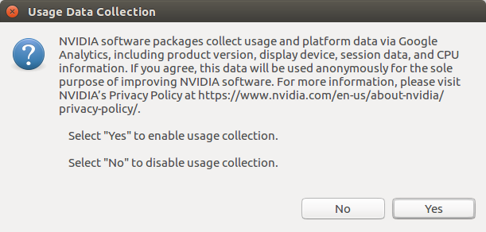

Usage data collection page

To get started, CUDA Toolkit path must be configured in Eclipse with Nsight Plugins:
1. Open the Preferences page, Window > Preferences.
2. Go to CUDA toolkit section.
3. Select the CUDA toolkit path to be used by Nsight. CUDA tookits that are installed in the default location will automatically appear.
  
  [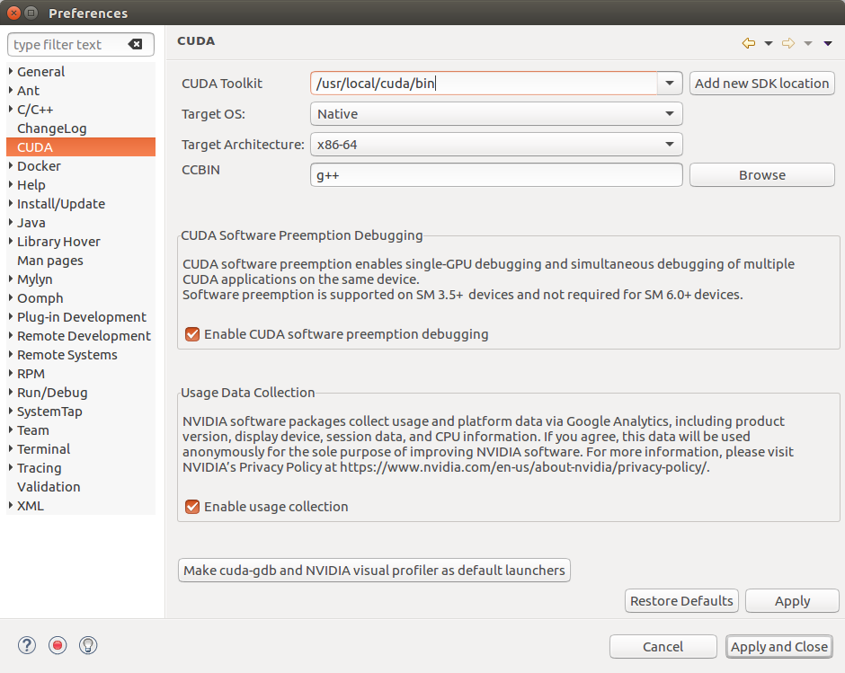](https://docs.nvidia.com/cuda/nsight-eclipse-plugins-guide/_images/cudatoolkit_preference.png)
4. CUDA toolkit path can be also specified in the project properties page in order to use different toolkit for a project.
5. Enable usage data collection if you wish to send usage data to NVIDIA.
6. Click on the button to set cuda-gdb as the default launcher.
7. **For QNX:**When QNX is selected as Target OS, a dialog will be displayed to set the QNX_HOST and QNX_TARGET environment variables if they were not already set.
  
  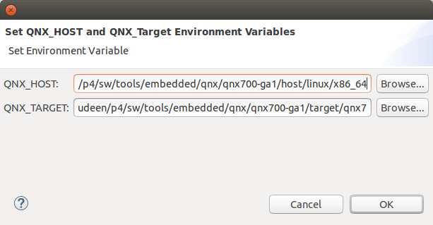
  
  QNX_HOST environment variable identifies the directory that holds the host-related components:
  
  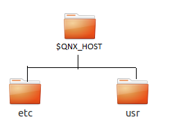
  
  QNX_TARGET environment variable identifies the directory that holds the target-related components:
  
  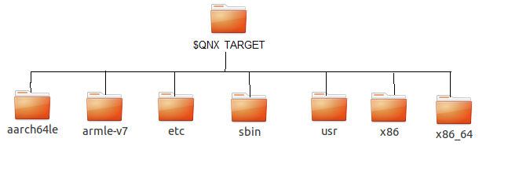

## 2.2. Nsight Eclipse Main Window
On the first run Eclipse will ask to pick a workspace location. The workspace is a folder where Nsight will store its settings, local files history and caches. An empty folder should be selected to avoid overwriting existing files.
The main Nsight window will open after the workspace location is selected. The main window is divided into the following areas:
- Editor - displays source files that are opened for editing.
- Project Explorer - displays project files
- Outline - displays structure of the source file in the current editor.
- Problems - displays errors and warnings detected by static code analysis in IDE or by a compiler during the build.
- Console - displays make output during the build or output from the running application.

## 2.3. Creating a New Project
1. From the main menu, open the new project wizard - File > New… > CUDA C/C++ Project
2. Specify the project name and project files location.
3. Specify the project type like executable project.
4. Specify the CUDA toolchain from the list of toolchains.
5. Specify the project configurations on the next wizard page.
6. Complete the wizard. The project will be shown in the Project Explorer view and source editor will be opened.
7. Build the project by clicking on the hammer button on the main toolbar.

[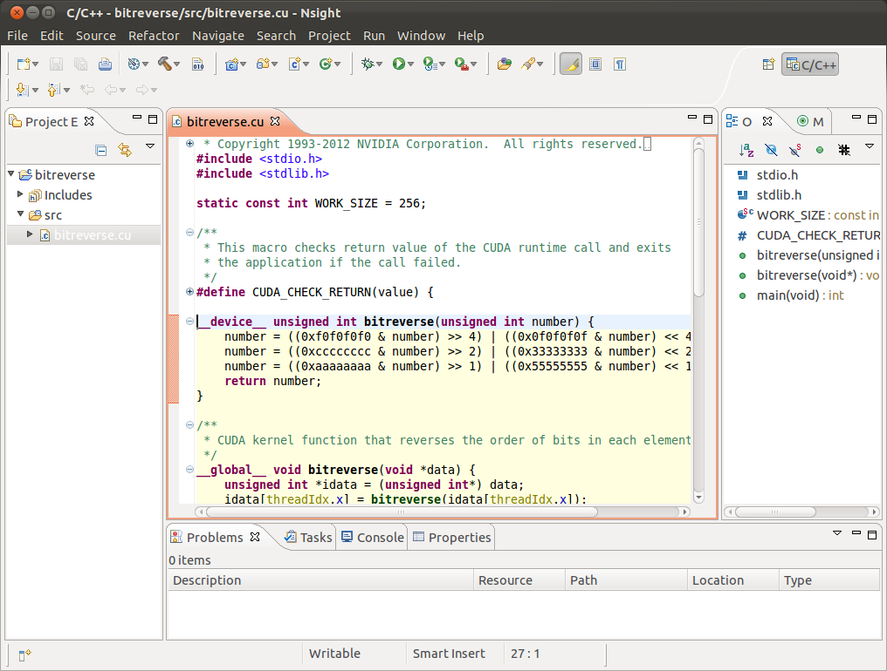](https://docs.nvidia.com/cuda/nsight-eclipse-plugins-guide/_images/newproject.png)

Nsight main window after creating a new project

## 2.4. Importing CUDA Samples
The CUDA samples are an optional component of the CUDA Toolkit installation. Nsight provides a mechanism to import these samples and work with them easily:

Note
Samples that use the CUDA driver API (suffixed with “Drv”) are not supported by Nsight.

1. From the main menu, open the new project wizard - File > New… > CUDA C/C++ Project
2. Specify the project name and project files location.
3. Select Import CUDA Sample under Executable in the Project type tree.
4. Select CUDA toolchain from the Toolchains option. location.
5. On the next wizard page select project sample you want to import. Also select the target CPU architecture. Press Next…
6. Specify the project parameters on the next wizard page.
7. Complete the wizard. The project will be shown in the Project Explorer view and source editor will be opened.
8. Build the project by clicking on the hammer button on the main toolbar.

## 2.5. CMake CUDA Samples

### 2.5.1. Making of CUDA Samples using CMake
Prerequisites
- Eclipse IDE (with C/C++ support)
- CMake installed and available in your system path
- CUDA Toolkit installed (e.g/usr/local/cuda-13.0)
- NVIDIA CUDA Samples downloaded and extracted
1. Open a terminal and navigate to the sample directory:
  
  ```
  $ cd NVIDIA_CUDA-13.0_Samples/Samples/0_Introduction/matrixMul
  
  ```
2. Create a new build directory:
  
  ```
  $ mkdir -p build && cd build
  
  ```
3. Run CMake with the Eclipse CDT generator:
  
  ```
  $ cmake -G "Eclipse CDT4 - Unix Makefiles" \
    -DCMAKE_BUILD_TYPE=Debug \
    -DENABLE_CUDA_DEBUG=True ..
  
  ```
> Upon configuration, CMake generates the project’s Makefile within the designated build directory.

### 2.5.2. Creating a New Project
1. From the main menu, Go to File -> Import -> General -> Existing Projects into Workspace
2. In the Import Projects wizard, Set the Root Directory to the project build path
3. Eclipse will automatically detect the generated project
4. Click Finish to import.
5. project will be shown in the Project Explorer view and source editor will be opened.
6. Build the project by clicking on the hammer button on the main toolbar.

## 2.6. Configure Build Settings

To define build settings: In the C/C++ Projects view, right-click your project, and select Properties. Select C/C++ Build, Settings from the list.

[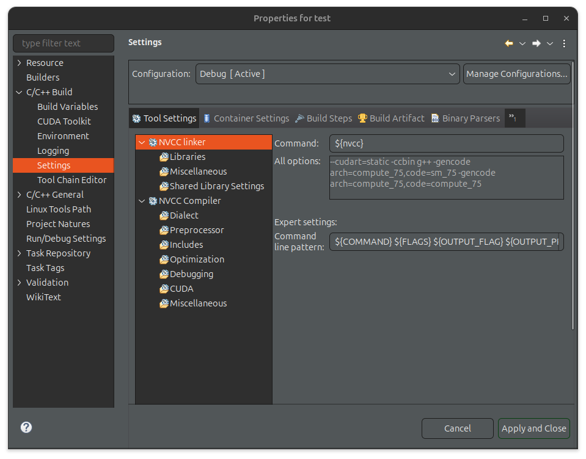](https://docs.nvidia.com/cuda/nsight-eclipse-plugins-guide/_images/project_build_settings.png)

The following are the categories of Nvcc linker settings that can be configured for the selected project.

Note
All options field in the main page is not editable and it’s the collection of options set in the child categories.

- Libraries - Configure library search path(-L) and to include linker libraries(-l). When you are cross compiling for different target os, the library search path should point to the appropriate location where the target os libraries are present.
  
  [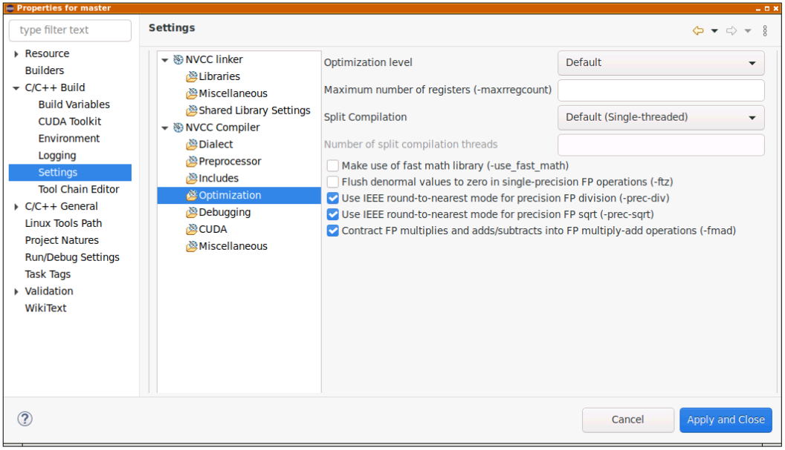](https://docs.nvidia.com/cuda/nsight-eclipse-plugins-guide/_images/library_settings.png)
- Miscellaneous - Set additional linker options and option to link with OpenGL libraries.
- Shared Library Settings - Set option to build a shared library.
The following are the categories of Nvcc Compiler settings that can be configured for the selected project.

Note
All options field in the main page is not editable and it’s the collection of options set in the child categories.

- Dialect - Select the language standard and dialect options.
- Preprocessor - Add the defined and undefined symbols for the preprocessor.
- Includes - Set include paths and include files for the compiler.
- Optimization - Set the optimization level used by the compiler for code generation. Additionally, set the number of threads that the compiler will use during the compiliation process (“split compilation”). Split compilation is either basic or extended, both cannot be used at the same time.
- Debugging - Set the options to generate debug information.
- CUDA - Generate code for different real architectures with the PTX for the same vitrual architectures.

Note
As of CUDA Toolkit 12.8, Nsight Eclipse plugins will no longer be included in Tegra (SOC) packages, such as DriveOS or Jetson. Users of these packages are encouraged to use[Nsight Visual Studio Code](https://docs.nvidia.com/nsight-visual-studio-code-edition), available in the VSCode Extension Gallery or from the[Microsoft VSCode Marketplace](https://marketplace.visualstudio.com/items?itemName=NVIDIA.nsight-vscode-edition).

## 2.7. Debugging CUDA Applications
Nsight must be running and at least one project must exist.
1. In the Project Explorer view, select project you want to debug. Make sure the project executable is compiled and no error markers are shown on the project.
2. Right click on the project and go to Debug As > NVIDIA CUDA GDB Debugger menu.
3. You will be offered to switch perspective when you run debugger for the first time. Click “Yes”. Perspective is a window layout preset specifically designed for a particular task.
4. Application will suspend in the main function. At this point there is no GPU code running.
5. Add a breakpoint in the device code. Resume the application.
Debugger will break when application reaches the breakpoint. You can now explore your CUDA device state, step through your GPU code or resume the application.

[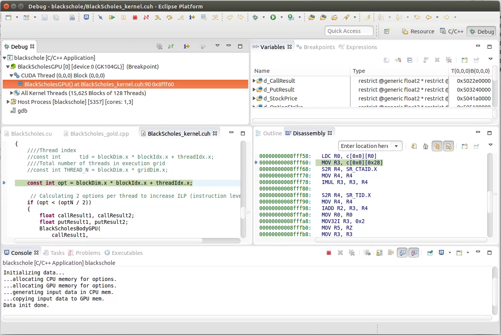](https://docs.nvidia.com/cuda/nsight-eclipse-plugins-guide/_images/debugger.png)

Debugging CUDA application

Additional debugger options can be set in the debug configuration dialog through Run > Debug Configurations .. menu..

[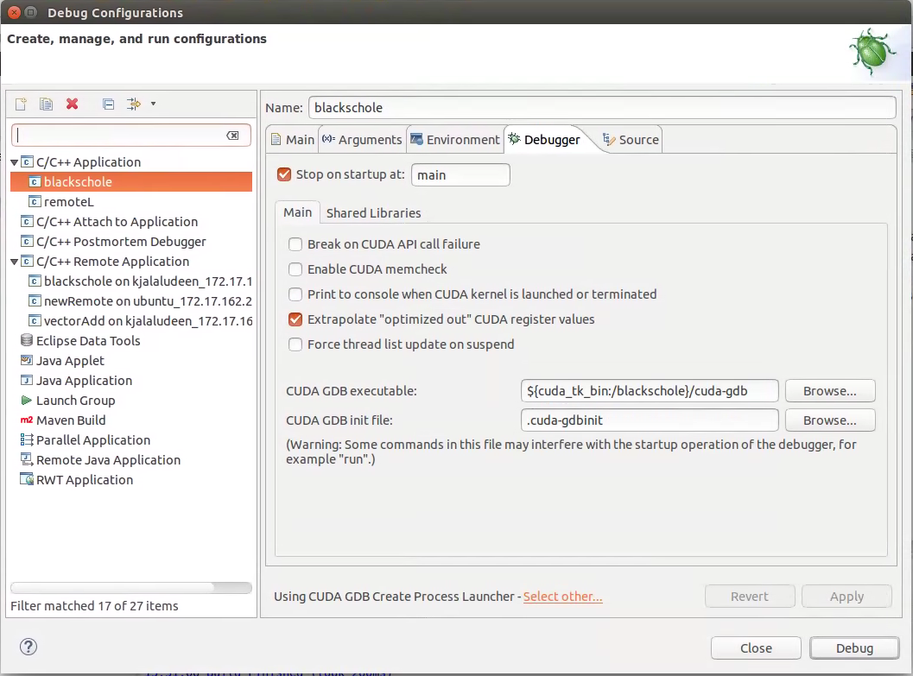](https://docs.nvidia.com/cuda/nsight-eclipse-plugins-guide/_images/debugger_options.png)

Debugging CUDA application

## 2.8. Remote development of CUDA Applications
Nsight Eclipse Edition also supports remote development of CUDA application starting with CUDA Toolkit 6.0. The picture below shows how Nsight Eclipse Edition can be used for local as well as remote development:

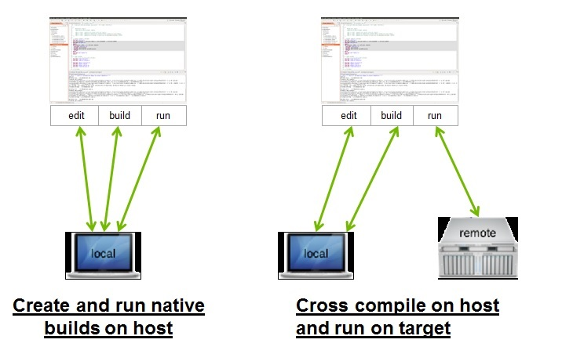

For remote development you do not need any NVIDIA GPU on your host system. The remote target system can be a Linux x86 system with an NVIDIA GPU or an Tegra-based ARM system. Nsight IDE and UI tools can only be hosted on x86 systems.
Nsight Eclipse Plugins supports the cross compilation mode for remote devices.
In the**cross compilation mode**the project resides on the host system and the cross compilation is also done on the host system. The cross compilation mode is only supported on an Ubuntu x86 host system.

To cross compile select the target cross compile architecture in CPU architecture drop down in the project properties page:

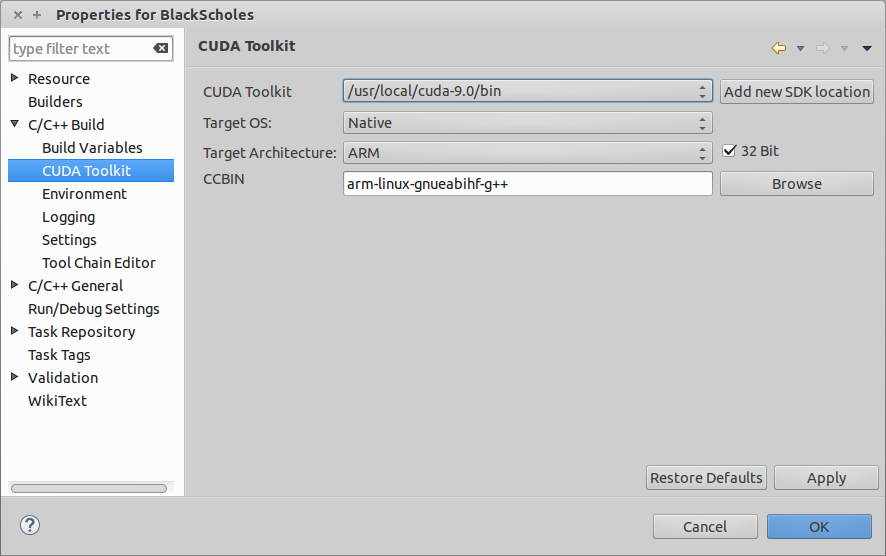

## 2.9. Postmortem Debugging Using Nsight Eclipse Edition
1. Introduction
  - Postmortem debugging allows developers to analyze the state of an application after it crashes by loading a core dump file into Nsight Eclipse Edition (Nsight EE).
2. Requirements for Postmortem Debugging
  - Before beginning a postmortem debugging session, ensure you have:
  > - The executable binary produced by the build
  > - A CUDA core dump file generated from a crash
  > - The correct`cuda-gdb`binary matching your CUDA version
  > - Nsight Eclipse Edition installed and configured
3. Creating a Postmortem Debug Configuration
  - Open Debug Configurations:
  > - Navigate to**Run → Debug Configurations**
  > - Select**C/C++ Postmortem Debugger**
  > - Click**New**to create a new configuration
  - Provide Basic Configuration Details:
  > - Enter a configuration name
  > - Specify the path to the executable built in the earlier steps
4. Selecting the Debug Launcher
  - Configure the CUDA Debug Core Launcher:
  > - Click**Select Other…**
  > - Choose**CUDA GDB Debug Core Launcher**
  > - Confirm and apply the selection
5. Selecting Required Files
  - Choose the CUDA Core Dump:
  > - Browse and select the CUDA core dump file you want to debug
  - Specify the`cuda-gdb`Executable:
  > - Browse and select the correct`cuda-gdb`binary associated with your CUDA Toolkit (for example,`cuda-gdb`under CUDA 13.x)
6. Launching the Postmortem Debugger
  > - Click**Debug**to start the session
  > - Nsight will load the core file and display the program state at the time of the crash
7. Analyzing the Loaded Core File
  - Once the core file is loaded, you may:
  > - Examine the call stack
  > - Inspect local and global variables
  > - View GPU kernel execution context
  > - Analyze memory and device state
  > - Step through source code to determine the cause of failure

## 2.10. Debugging Remote CUDA Applications
Remote debugging is available starting with CUDA Toolkit 5.5. A dedicated GPU is not required to use Nsight remote debugging UI. A dedicated GPU is still required on the debug target. Only Linux targets are supported. Debug host and target may run different operating systems or have different CPU architectures. The remote machine must be accessible via SSH and CUDA Toolkit must be installed on both machines.

Note
If there is a firewall between the host and the target, it must be set up to let RSP messages through, or SSH port-forwarding must be used.

1. Select the project and right click then go to Debug As…>NVIDIA CUDA GDB Debugger(Remote) menu item.
  
  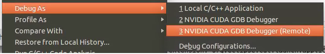
2. Type the full path to a local executable or select one using the Local file… button.
  
  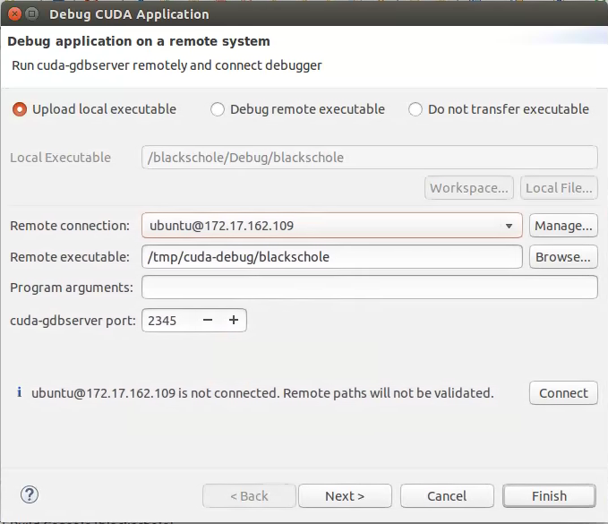
3. Select a remote connection from a drop-down list or press the Add connection… button to create a new one.
4. If you are creating a new remote connection, enter the host name(or IP address) as well as the user name. Select the SSH as system type. Also select the QNX check box for QNX targets and then press Finish.
  
  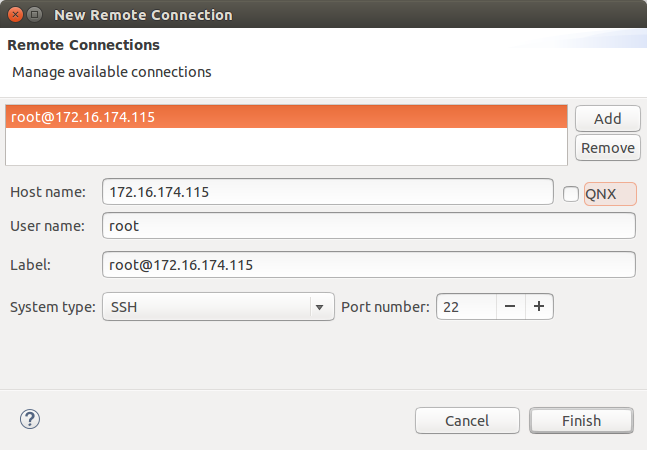
5. **For Android devices:**To configure the remote connection using Android debug bridge, select the Android debug bridge from the Remote Connection drop-down list, Android device must be connected to the host system using USB port.
  
  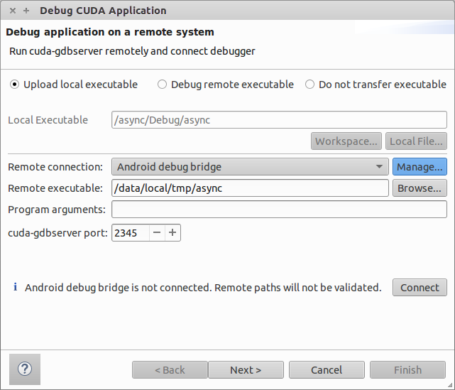
  
  Press Manage button, and enter or select the path to adb utility. You need to install Android SDK platform tools to use Android debug bridge. press Detect button to find the android device available through ADB.
  
  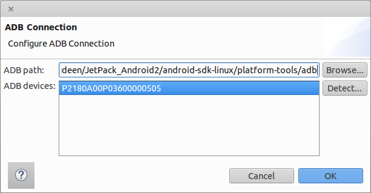
6. **Optional:**Press Connect to verify the selected remote connection.
7. Press the Next button.
8. Type the full path to cuda-gdbserver on the remote system or select one using the Browse… button.
  
  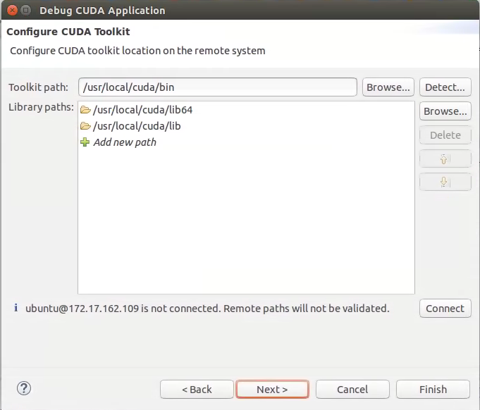
9. Click on “Add new path” or on the Browse… button to specify the path to the shared libraries the remote application depends on.
10. Click on the Finish button to finish the new debug configuration wizard and start debugging the application.
11. You will be offered to switch perspective when you run the debugger for the first time. Click Yes. Perspective is a window layout preset specifically designed for a particular task.
The debugger will stop at the application main routine. You can now set breakpoints, or resume the application.

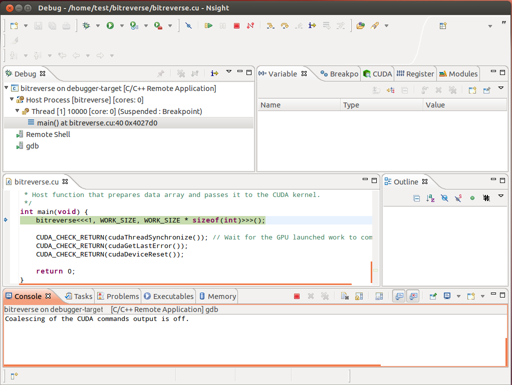

Debugging remote CUDA application

### 2.10.1. Improving Remote Debugging Performance
When doing remote debugging, it can be useful to host copies of the target libraries in a local sysroot. Starting with CUDA 11.5, this feature is available on the**Debugger Configurations -> Debugger**tab. You can modify ‘CUDA GDB sysroot (for remote debugging)’ to point to a local sysroot directory to improve debugging performance.

[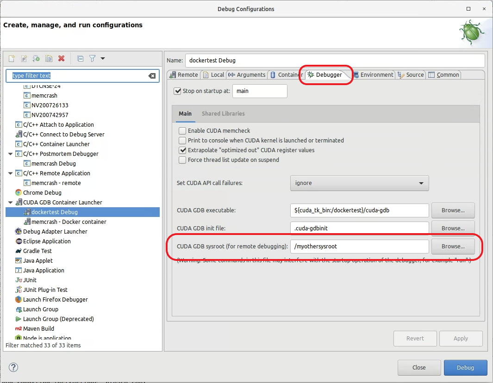](https://docs.nvidia.com/cuda/nsight-eclipse-plugins-guide/_images/Eclipse-remote-sysroot.png)

## 2.11. Build CUDA Projects inside a Docker Container
You can build and debug C/C++ and CUDA projects in a Docker container using Nsight Eclipse Edition. To get started, you need to first pull and install the Docker image that encapsulates the CUDA toolkit and cross platform tool chains. You can get the Docker images from NVIDIA GPU Cloud.Then you can use Nsight Eclipse Edition to build CUDA projects in a Docker container.
1. Open Nsight Eclipse Edition and configure the container settings.
2. Open the Preferences page, Window > Preferences and go to: CUDA > Container Settings
  
  [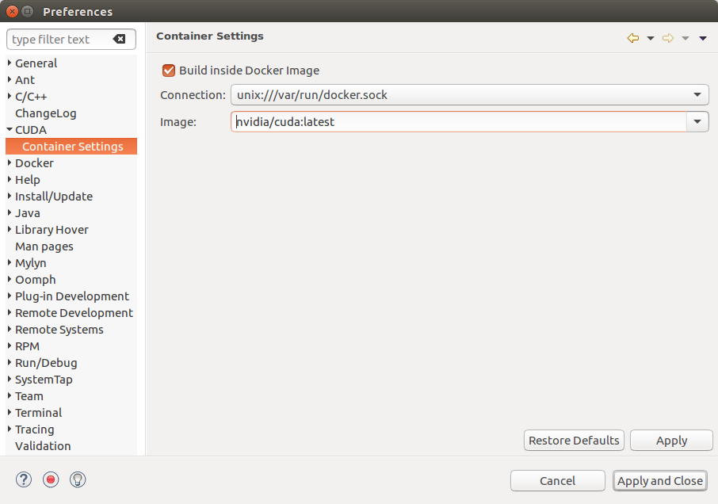](https://docs.nvidia.com/cuda/nsight-eclipse-plugins-guide/_images/container-preferences.png)
3. Select the option if you want to build the projects inside the Docker container. Make sure the CUDA toolkit path that is specified in the CUDA preferences is the path of the CUDA toolkit inside a Docker container.
4. Select the Connection and the Image dropdown will display all the Docker images that are currently installed. Choose the docker image that you want to use to build/debug the projects. The preferences that are set here will be automatically displayed in the project setup wizard. You can choose to modify the container settings for the individual projects from the project setup wizard.
5. To create a project, From the main menu, open the new project wizard: File > New… > CUDA C/C++ Project
6. Specify the project name and project files location. And select the CUDA toolchain from the list of toolchains.
7. In the last page of project setup wizard, the container options will be displayed. The default container settings from the preference page will be displayed here. You can choose to modify the settings for this project in this Container settings page.
  
  [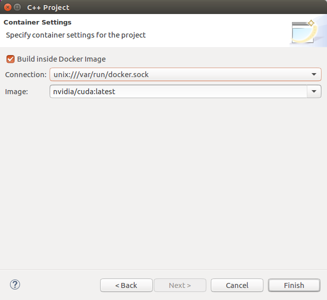](https://docs.nvidia.com/cuda/nsight-eclipse-plugins-guide/_images/container-proj-settings.png)
8. Complete the project setup wizard. The project will be created and shown in the Project Explorer view.
9. The project source directories will be automatically mounted to the docker container.
10. If you need to mount any other directories that contains the include files/libraries and etc to the docker container, you can mount those directories from the project property page.
11. Right click on the project and go to Properties. Select C/C++ Build > Settings > Container Settigns Tab. Additional directories can be mounted from this property page.
  
  [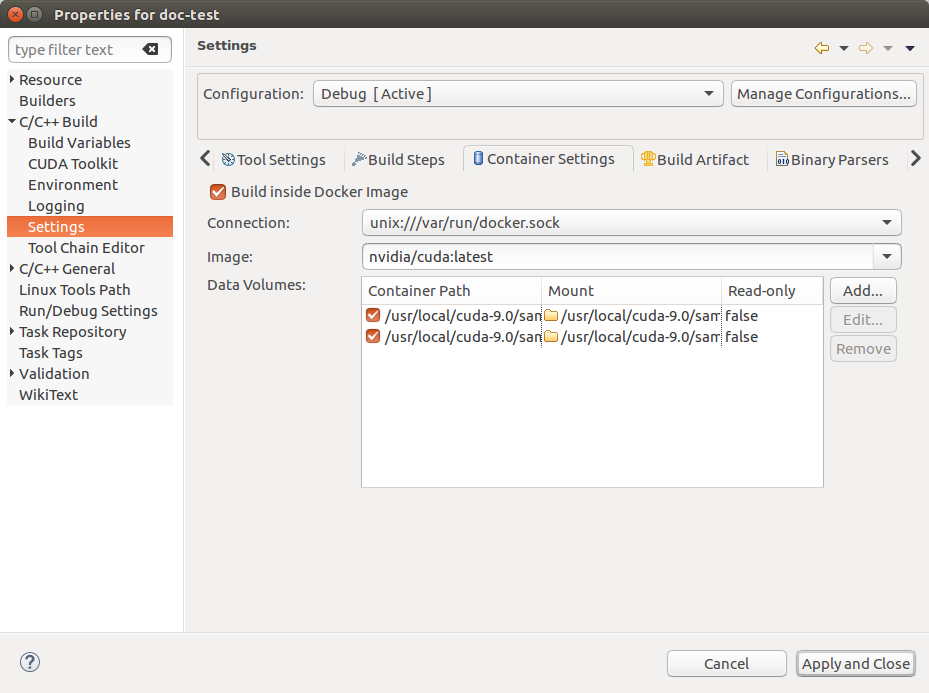](https://docs.nvidia.com/cuda/nsight-eclipse-plugins-guide/_images/container-proj-properties.png)
12. Build the project by hitting the hammer button on the main toolbar. The project is now built in the chosen Docker container the executable will be available on the host.

## 2.12. Remote debugging using CUDA GDB inside Docker container
From Nsight Eclipse, you can remote debug the applications running on the target using the CUDA GDB inside the Docker container running on the host. Docker images with CUDA GDB and CUDA toolkit must be already installed on the host. The remote machine must be accessible via SSH and CUDA Toolkit must be installed on target machine.

Note
If there is a firewall between the host and the target, it must be set up to let RSP messages through, or SSH port-forwarding must be used.

1. From the main menu, goto Run>Debug Configurations… menu item.
2. Create a new debug configuration under CUDA GDB Container Launcher either double clicking or using right click menu.
3. Configure the remote connection details in the “Remote” tab. If you are creating a new remote connection, click on the manage button in Remote Connection enter the host name(or IP address) as well as the user name. Select the SSH as system type. Also select the CUDA toolkit location on the target and choose the location to where to upload the executable.
  
  [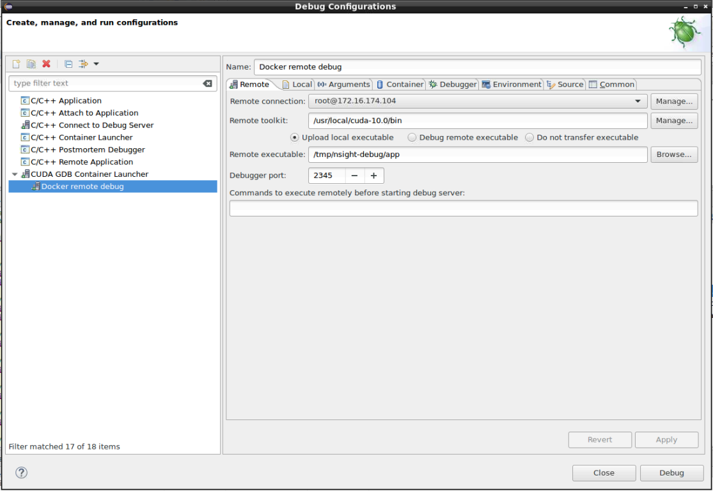](https://docs.nvidia.com/cuda/nsight-eclipse-plugins-guide/_images/remote_debug_docker_connection.png)
4. Choose the project and the executable to upload to the target in the “Local” tab.
5. From the “Container” tab, select the connection and Docker image that contains the CUDA GDB. Also you can select any host directories required to mounted to the Docker container.
  
  [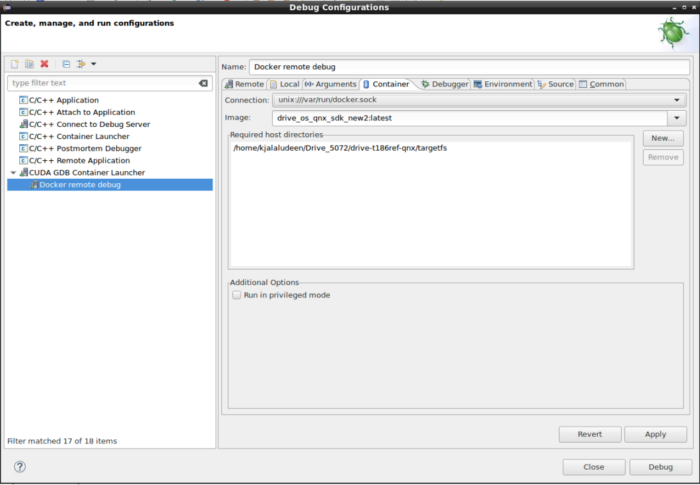](https://docs.nvidia.com/cuda/nsight-eclipse-plugins-guide/_images/remote_debug_docker_container.png)
6. Select the debugger options from the “Debugger” Tab. Make sure to enter the CUDA GDB executable path inside Docker container. And add the required environment variables in the “Environment” tab.
7. Click on the Apply button to save the changes and click on the Debug button to start the debug session. This action will upload the local executable to the target system and will start CUDA GDB Server on the target. And the Docker container will be started on the host and CUDA GDB running inside the docker container will establish the remote debug session with the target.
8. You will be offered to switch perspective when you run the debugger for the first time. Click Yes. Perspective is a window layout preset specifically designed for a particular task.
The debugger will stop at the application main routine. You can now set breakpoints, or resume the application.

[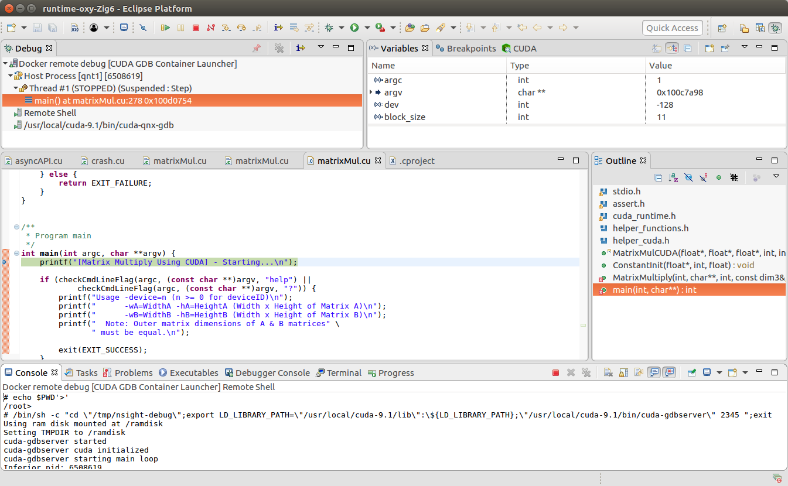](https://docs.nvidia.com/cuda/nsight-eclipse-plugins-guide/_images/remote_debug_docker_perspective.png)

Debugging remote CUDA application

## 2.13. Importing Nsight Eclipse Projects
The projects that are created with Nsight Eclipse Edition can be imported into the Eclipse workbench with Nsight Eclipse plugins.
1. Open Nsight Eclipse edition and select the project that needs to be exported.
2. Right click on the Nsight Eclipse project and go to - Export > C/C++ > C/C++ Project Settings > Next menu.
  
  [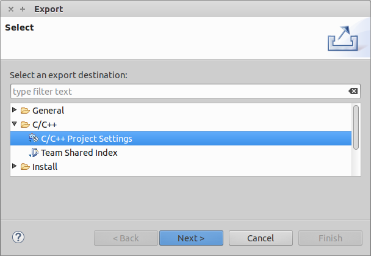](https://docs.nvidia.com/cuda/nsight-eclipse-plugins-guide/_images/export-proj-settings.png)
3. Select the project and settings to export.
4. Specify the “Export to file” location.
5. Settings will be stored in the given XML file.
6. Go to Eclipse workbench where the project settings needs to be imported.
7. Create a CUDA C/C++ Project from the main menu File > New > CUDA C/C++ Project
8. Specify the project name and choose Empty project type with CUDA toolchains.
9. Right click on the project to import the source files. Import > General > File System >(From directory) or copy the source files from the existing project.
10. Import the project settings like include paths and symbols using the following right click menu Import > C/C++ > C/C++ Project Settings >Next…
11. Select the location of the project settigns file and select the project and configuration on the next wizard page.
  
  [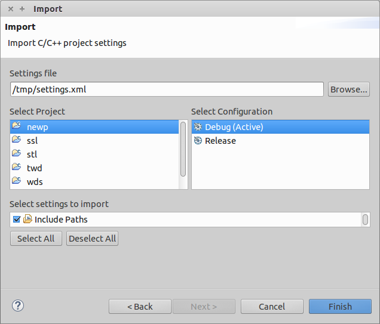](https://docs.nvidia.com/cuda/nsight-eclipse-plugins-guide/_images/import-proj-settings.png)
12. Complete the wizard. The project settings will be imported from the file exported from Nsight Eclipse Edition.
13. Build the project by clicking on the hammer button on the main toolbar.

## 2.14. Enabling Dark Theme in Eclipse
To work comfortably in dark environments, Eclipse offers a dark theme mode that’s easy to activate:
1. Open Eclipse Preferences:
  > - Click on “Windows” in the top menu.
  > - Choose “Preferences” from the dropdown.
2. Access Appearance Settings:
  > - In the Preferences window, select “General” on the left.
  > - Click on “Appearance.”
3. Choose Dark Theme:
  > - Find the “Theme” dropdown.
  > - Select your preferred dark theme option.
4. Apply and Enjoy:
  > - Click “Apply and Close” to save settings.
  > - Witness Eclipse transform with the new dark theme.
Enjoy coding with reduced eye strain and a sleek new look!

## 2.15. More Information
More information about the Eclipse CDT features and other topics is available in the Help contents. To access Help contents select Help->Help Contents from the Nsight main menu.
More information about CUDA, CUDA Toolkit and other tools is available on CUDA web page at[http://developer.nvidia.com/cuda](http://developer.nvidia.com/cuda)

# 3. Known Issues
**Executable must exist in order to start debug session for the first time**
Nsight will not automatically perform build when starting debug session for a given project for the first time. Build must be invoked manually. Nsight will automatically rebuild executable when starting subsequent debug sessions.

Note
To manually build the project, select it (or any file within the project) in a Project Explorer view and click hammer icon on the main window toolbar.

**Source editors may show error markers on a valid code for the files in newly created projects.**
These markers will be cleared after Nsight indexes included header files.
**Nsight Eclipse Plugin Edition does not provide compilation support for using the QNX qcc and q++ compilers.**
The workaround to compile using qcc and q++ is
- Specify the q++ path in CCBIN field on toolkit configuration page on project properties dialog as shown below. You can access toolkit configuration page by clicking main menu Project > Properties > C/C++ Build > CUDA Toolkit
  
  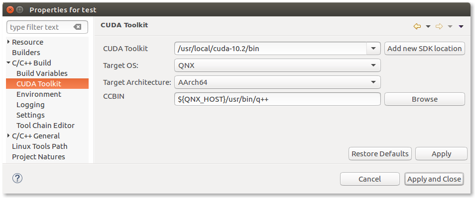
- Change default CONF to gcc_ntoaarch64le in the file ${QNX_HOST}/etc/qcc/gcc/5.4.0/default as below
  
  ```
  CONF=gcc_ntoaarch64le
  
  ```

# 4. Additional Licensing Obligations
For more details on licensing, please visit the CUDA Toolkit Supplement to NVIDIA SDKs License Agreement page:[https://developer.nvidia.com/cuda-downloads](https://developer.nvidia.com/cuda-downloads)

# 5. Notices

## 5.1. Notice
This document is provided for information purposes only and shall not be regarded as a warranty of a certain functionality, condition, or quality of a product. NVIDIA Corporation (“NVIDIA”) makes no representations or warranties, expressed or implied, as to the accuracy or completeness of the information contained in this document and assumes no responsibility for any errors contained herein. NVIDIA shall have no liability for the consequences or use of such information or for any infringement of patents or other rights of third parties that may result from its use. This document is not a commitment to develop, release, or deliver any Material (defined below), code, or functionality.
NVIDIA reserves the right to make corrections, modifications, enhancements, improvements, and any other changes to this document, at any time without notice.
Customer should obtain the latest relevant information before placing orders and should verify that such information is current and complete.
NVIDIA products are sold subject to the NVIDIA standard terms and conditions of sale supplied at the time of order acknowledgement, unless otherwise agreed in an individual sales agreement signed by authorized representatives of NVIDIA and customer (“Terms of Sale”). NVIDIA hereby expressly objects to applying any customer general terms and conditions with regards to the purchase of the NVIDIA product referenced in this document. No contractual obligations are formed either directly or indirectly by this document.
NVIDIA products are not designed, authorized, or warranted to be suitable for use in medical, military, aircraft, space, or life support equipment, nor in applications where failure or malfunction of the NVIDIA product can reasonably be expected to result in personal injury, death, or property or environmental damage. NVIDIA accepts no liability for inclusion and/or use of NVIDIA products in such equipment or applications and therefore such inclusion and/or use is at customer’s own risk.
NVIDIA makes no representation or warranty that products based on this document will be suitable for any specified use. Testing of all parameters of each product is not necessarily performed by NVIDIA. It is customer’s sole responsibility to evaluate and determine the applicability of any information contained in this document, ensure the product is suitable and fit for the application planned by customer, and perform the necessary testing for the application in order to avoid a default of the application or the product. Weaknesses in customer’s product designs may affect the quality and reliability of the NVIDIA product and may result in additional or different conditions and/or requirements beyond those contained in this document. NVIDIA accepts no liability related to any default, damage, costs, or problem which may be based on or attributable to: (i) the use of the NVIDIA product in any manner that is contrary to this document or (ii) customer product designs.
No license, either expressed or implied, is granted under any NVIDIA patent right, copyright, or other NVIDIA intellectual property right under this document. Information published by NVIDIA regarding third-party products or services does not constitute a license from NVIDIA to use such products or services or a warranty or endorsement thereof. Use of such information may require a license from a third party under the patents or other intellectual property rights of the third party, or a license from NVIDIA under the patents or other intellectual property rights of NVIDIA.
Reproduction of information in this document is permissible only if approved in advance by NVIDIA in writing, reproduced without alteration and in full compliance with all applicable export laws and regulations, and accompanied by all associated conditions, limitations, and notices.
THIS DOCUMENT AND ALL NVIDIA DESIGN SPECIFICATIONS, REFERENCE BOARDS, FILES, DRAWINGS, DIAGNOSTICS, LISTS, AND OTHER DOCUMENTS (TOGETHER AND SEPARATELY, “MATERIALS”) ARE BEING PROVIDED “AS IS.” NVIDIA MAKES NO WARRANTIES, EXPRESSED, IMPLIED, STATUTORY, OR OTHERWISE WITH RESPECT TO THE MATERIALS, AND EXPRESSLY DISCLAIMS ALL IMPLIED WARRANTIES OF NONINFRINGEMENT, MERCHANTABILITY, AND FITNESS FOR A PARTICULAR PURPOSE. TO THE EXTENT NOT PROHIBITED BY LAW, IN NO EVENT WILL NVIDIA BE LIABLE FOR ANY DAMAGES, INCLUDING WITHOUT LIMITATION ANY DIRECT, INDIRECT, SPECIAL, INCIDENTAL, PUNITIVE, OR CONSEQUENTIAL DAMAGES, HOWEVER CAUSED AND REGARDLESS OF THE THEORY OF LIABILITY, ARISING OUT OF ANY USE OF THIS DOCUMENT, EVEN IF NVIDIA HAS BEEN ADVISED OF THE POSSIBILITY OF SUCH DAMAGES. Notwithstanding any damages that customer might incur for any reason whatsoever, NVIDIA’s aggregate and cumulative liability towards customer for the products described herein shall be limited in accordance with the Terms of Sale for the product.

## 5.2. OpenCL
OpenCL is a trademark of Apple Inc. used under license to the Khronos Group Inc.

## 5.3. Trademarks
NVIDIA and the NVIDIA logo are trademarks or registered trademarks of NVIDIA Corporation in the U.S. and other countries. Other company and product names may be trademarks of the respective companies with which they are associated.