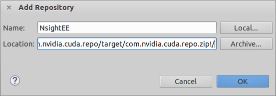
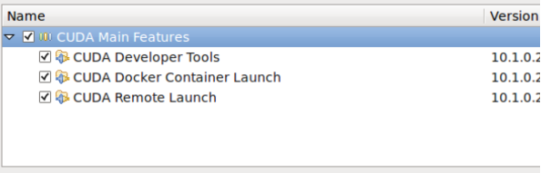
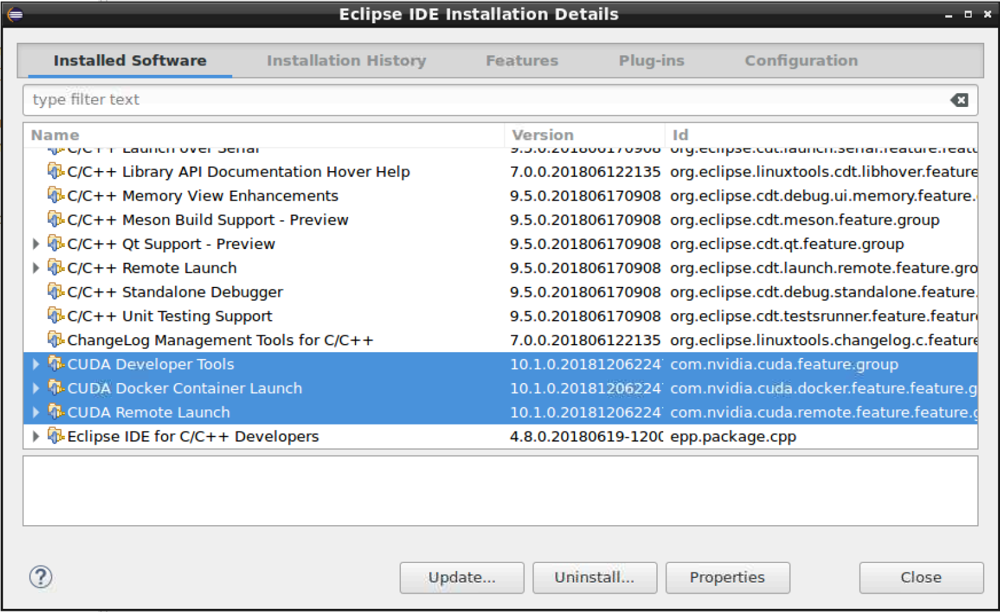

# 1. Introduction — Nsight Eclipse Plugins Installation Guide 13.2 documentation

**来源**: [https://docs.nvidia.com/cuda/nsightee-plugins-install-guide/index.html](https://docs.nvidia.com/cuda/nsightee-plugins-install-guide/index.html)

---

Nsight Eclipse Plugins Installation Guide
The user guide for installing Nsight Eclipse Plugins.

# 1. Introduction
This guide provides the procedures to install the Nsight Eclipse Edition Plugins in users own eclipse environment.
Nsight Eclipse Plugins offers full-featured IDE that provides an all-in-one integrated environment to edit, build, debug and profile CUDA-C applications.

## 1.1. Install plugins using Eclipse IDE
1. You can install Nsight Eclipse plugins in your own Eclipse environment or download and install[Eclipse IDE for C/C++ developers](https://eclipse.org/downloads/eclipse-packages).
2. Launch Eclipse and go to Help > Install New Software.. menu.
3. Click on the Add Button
4. Enter name (ex: NsightEE) in the Name field. Choose the the zip file(com.nvidia.cuda.repo.zip) that contains the plugins using Archive button or Enter the full path of zip file. Nsight EE plugns zip file can be found in /usr/local/cuda-11.8/nsightee_plugins directory.
  [](https://docs.nvidia.com/cuda/nsightee-plugins-install-guide/_images/add_repository.png)
5. Click OK button
6. Select “Cuda Main Features” option and go to next page.
  [](https://docs.nvidia.com/cuda/nsightee-plugins-install-guide/_images/nsight-eclipse-install-cuda-main-features.png)
7. Accept the license agreement and click on Finish button to install the plugins.
8. Click OK on the “Security Warning” dialog to ignore the warning message about unsigned content (This warning message is displayed for all the plugins that are not signed by Eclipse.org).
9. Restart eclipse when prompted.
Nsight Eclipse plugins installation is now complete.Go to Help > Installation Details.. Menu to verify the “Cuda Developer Tools” and “Cuda Remote Launch” plugins are installed

## 1.2. Uninstall plugins using Eclipse IDE
1. Launch Eclipse and go to Help > Installation Details menu.
2. Select “Cuda Developer Tools” and “Cuda Remote Launch” options from the dialog
  [](https://docs.nvidia.com/cuda/nsightee-plugins-install-guide/_images/NsightEE_plugins_uninstall.png)
3. Click on the Uninstall button.
4. Click Finish button when asked to review and confirm.
5. Restart eclipse when prompted.
Nsight Eclipse plugins will be uninstalled after restarting eclipse. Go to Help > Installation Details.. menu to verify.

## 1.3. Install Using Script
To install or uninstall the Nsight Eclipse Plugins using the script, run the installation script provided in the bin directory of the toolkit. By default, it is located in`/usr/local/cuda-11.8/bin`:
The usage of the script is as follows:

```
Usage: ./nsight_ee_plugins_manage.sh  <action>  <eclipse_dir>

     <action> : 'install' or 'uninstall'

     <eclipse_dir> : eclipse installation directory

```

To install the Nsight Eclipse Plugins, run the following command:

```
$ /usr/local/cuda-11.8/bin/nsight_ee_plugins_manage.sh install <eclipse_dir>

```

To uninstall the Nsight Eclipse Plugins, run the following command:

```
$ /usr/local/cuda-11.8/bin/nsight_ee_plugins_manage.sh uninstall <eclipse_dir>

```

Note
As of CUDA Toolkit 12.8, Nsight Eclipse plugins will no longer be included in Tegra (SOC) packages, such as DriveOS or Jetson. Users of these packages are encouraged to use[Nsight Visual Studio Code](https://docs.nvidia.com/nsight-visual-studio-code-edition), available in the VSCode Extension Gallery or from the[Microsoft VSCode Marketplace](https://marketplace.visualstudio.com/items?itemName=NVIDIA.nsight-vscode-edition).

# 2. Notices

## 2.1. Notice
This document is provided for information purposes only and shall not be regarded as a warranty of a certain functionality, condition, or quality of a product. NVIDIA Corporation (“NVIDIA”) makes no representations or warranties, expressed or implied, as to the accuracy or completeness of the information contained in this document and assumes no responsibility for any errors contained herein. NVIDIA shall have no liability for the consequences or use of such information or for any infringement of patents or other rights of third parties that may result from its use. This document is not a commitment to develop, release, or deliver any Material (defined below), code, or functionality.
NVIDIA reserves the right to make corrections, modifications, enhancements, improvements, and any other changes to this document, at any time without notice.
Customer should obtain the latest relevant information before placing orders and should verify that such information is current and complete.
NVIDIA products are sold subject to the NVIDIA standard terms and conditions of sale supplied at the time of order acknowledgement, unless otherwise agreed in an individual sales agreement signed by authorized representatives of NVIDIA and customer (“Terms of Sale”). NVIDIA hereby expressly objects to applying any customer general terms and conditions with regards to the purchase of the NVIDIA product referenced in this document. No contractual obligations are formed either directly or indirectly by this document.
NVIDIA products are not designed, authorized, or warranted to be suitable for use in medical, military, aircraft, space, or life support equipment, nor in applications where failure or malfunction of the NVIDIA product can reasonably be expected to result in personal injury, death, or property or environmental damage. NVIDIA accepts no liability for inclusion and/or use of NVIDIA products in such equipment or applications and therefore such inclusion and/or use is at customer’s own risk.
NVIDIA makes no representation or warranty that products based on this document will be suitable for any specified use. Testing of all parameters of each product is not necessarily performed by NVIDIA. It is customer’s sole responsibility to evaluate and determine the applicability of any information contained in this document, ensure the product is suitable and fit for the application planned by customer, and perform the necessary testing for the application in order to avoid a default of the application or the product. Weaknesses in customer’s product designs may affect the quality and reliability of the NVIDIA product and may result in additional or different conditions and/or requirements beyond those contained in this document. NVIDIA accepts no liability related to any default, damage, costs, or problem which may be based on or attributable to: (i) the use of the NVIDIA product in any manner that is contrary to this document or (ii) customer product designs.
No license, either expressed or implied, is granted under any NVIDIA patent right, copyright, or other NVIDIA intellectual property right under this document. Information published by NVIDIA regarding third-party products or services does not constitute a license from NVIDIA to use such products or services or a warranty or endorsement thereof. Use of such information may require a license from a third party under the patents or other intellectual property rights of the third party, or a license from NVIDIA under the patents or other intellectual property rights of NVIDIA.
Reproduction of information in this document is permissible only if approved in advance by NVIDIA in writing, reproduced without alteration and in full compliance with all applicable export laws and regulations, and accompanied by all associated conditions, limitations, and notices.
THIS DOCUMENT AND ALL NVIDIA DESIGN SPECIFICATIONS, REFERENCE BOARDS, FILES, DRAWINGS, DIAGNOSTICS, LISTS, AND OTHER DOCUMENTS (TOGETHER AND SEPARATELY, “MATERIALS”) ARE BEING PROVIDED “AS IS.” NVIDIA MAKES NO WARRANTIES, EXPRESSED, IMPLIED, STATUTORY, OR OTHERWISE WITH RESPECT TO THE MATERIALS, AND EXPRESSLY DISCLAIMS ALL IMPLIED WARRANTIES OF NONINFRINGEMENT, MERCHANTABILITY, AND FITNESS FOR A PARTICULAR PURPOSE. TO THE EXTENT NOT PROHIBITED BY LAW, IN NO EVENT WILL NVIDIA BE LIABLE FOR ANY DAMAGES, INCLUDING WITHOUT LIMITATION ANY DIRECT, INDIRECT, SPECIAL, INCIDENTAL, PUNITIVE, OR CONSEQUENTIAL DAMAGES, HOWEVER CAUSED AND REGARDLESS OF THE THEORY OF LIABILITY, ARISING OUT OF ANY USE OF THIS DOCUMENT, EVEN IF NVIDIA HAS BEEN ADVISED OF THE POSSIBILITY OF SUCH DAMAGES. Notwithstanding any damages that customer might incur for any reason whatsoever, NVIDIA’s aggregate and cumulative liability towards customer for the products described herein shall be limited in accordance with the Terms of Sale for the product.

## 2.2. OpenCL
OpenCL is a trademark of Apple Inc. used under license to the Khronos Group Inc.

## 2.3. Trademarks
NVIDIA and the NVIDIA logo are trademarks or registered trademarks of NVIDIA Corporation in the U.S. and other countries. Other company and product names may be trademarks of the respective companies with which they are associated.