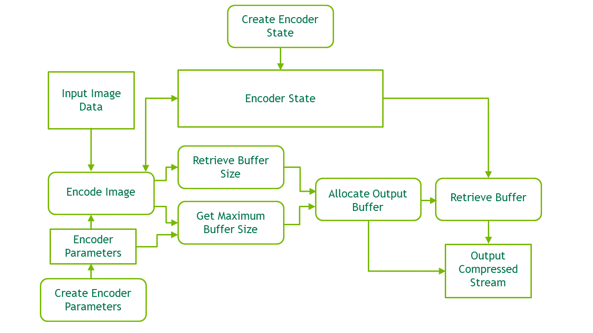

# 1. Introduction — nvJPEG 13.2 documentation

**来源**: [https://docs.nvidia.com/cuda/nvjpeg/index.html](https://docs.nvidia.com/cuda/nvjpeg/index.html)

---

nvJPEG
A GPU accelerated JPEG codec library.

# 1. Introduction

## 1.1. nvJPEG Decoder
The nvJPEG library provides high-performance, GPU accelerated JPEG decoding functionality for image formats commonly used in deep learning and hyperscale multimedia applications. The library offers single and batched JPEG decoding capabilities which efficiently utilize the available GPU resources for optimum performance; and the flexibility for users to manage the memory allocation needed for decoding.
The nvJPEG library enables the following functions: use the JPEG image data stream as input; retrieve the width and height of the image from the data stream, and use this retrieved information to manage the GPU memory allocation and the decoding. A dedicated API is provided for retrieving the image information from the raw JPEG image data stream.

Note
Throughout this document, the terms “CPU” and “Host” are used synonymously. Similarly, the terms “GPU” and “Device” are synonymous.

The nvJPEG library supports the following:
**JPEG options:**
- Baseline and Progressive JPEG decoding/encoding
- 8 bits per pixel
- Huffman bitstream decoding
- Upto 4 channel JPEG bitstreams
- 8- and 16-bit quantization tables
- The following chroma subsampling for the 3 color channels Y, Cb, Cr (Y, U, V):
  - 4:4:4
  - 4:2:2
  - 4:2:0
  - 4:4:0
  - 4:1:1
  - 4:1:0
**Features:**
- Hybrid decoding using both the CPU (i.e., host) and the GPU (i.e., device).
- Hardware acceleration for baseline JPEG decode onHardware Acceleration.
- Input to the library is in the host memory, and the output is in the GPU memory.
- Single image and batched image decoding.
- Single phase and multiple phases decoding.
- Color space conversion.
- User-provided memory manager for the device and pinned host memory allocations.

## 1.2. nvJPEG Encoder
The encoding functions of the nvJPEG library perform GPU-accelerated compression of user’s image data to the JPEG bitstream. User can provide input data in a number of formats and colorspaces, and control the encoding process with parameters. Encoding functionality will allocate temporary buffers using user-provided memory allocator.
Before calling the encoding functions the user should perform a few prerequisite steps using the helper functions described innvJPEG Encoder Helper API Reference.

## 1.3. Thread Safety
Not all nvJPEG types are thread safe.
When using decoder APIs across multiple threads, the following decoder types should be instantiated separately for each thread:nvJPEG Bitstream Handle,nvJPEG Opaque JPEG Decoding State Handle,nvJPEG Decode Device Buffer Handle,nvJPEG Decode Pinned Buffer Handle
When using encoder APIs across multiple threads,nvjpegEncoderState_tshould be instantiated separately for each thread.
For user-provided allocators (inputs tonvjpegCreateEx()), the user needs to ensure thread safety.

## 1.4. Multi-GPU support
The nvJPEG states and handles are bound to the device that was set as current during their creation. Using these states and handles with another device set as current is undefined. The user is responsible of keeping track of the current device.

## 1.5. Hardware Acceleration
Hardware accelerated JPEG decode is available on the following GPUs architectures -
- Ampere (A100, A30)
- Hopper
- Ada
- Blackwell
- Jetson Thor
Platforms which support hardware accelerated JPEG decode:
- Windows
- Linux (x86_64, ARM64)
Hardware accelerated JPEG encode is available on Jetson Thor, running Linux ARM64.

# 2. JPEG Decoding

## 2.1. Using JPEG Decoding
The nvJPEG library provides functions for both the decoding of a single image, and batched decoding of multiple images.

### 2.1.1. Single Image Decoding
For single-image decoding you provide the data size and a pointer to the file data, and the decoded image is placed in the output buffer.
To use the nvJPEG library, start by calling the helper functions for initialization.
1. Create nvJPEG library handle with one of the helper functions`nvjpegCreateSimple() or nvjpegCreateEx()`.
2. Create JPEG state with the helper function`nvjpegJpegStateCreate()`. SeenvJPEG Type Declarationsand`nvjpegJpegStateCreate()`.
  The following helper functions are available in the nvJPEG library:
  - `nvjpegStatus_t nvjpegGetProperty(libraryPropertyType type, int *value);`
  - `[DEPRECATED] nvjpegStatus_t nvjpegCreate(nvjpegBackend_t backend, nvjpegHandle_t *handle , nvjpeg_dev_allocator allocator);`
  - `nvjpegStatus_t nvjpegCreateSimple(nvjpegHandle_t *handle);`
  - `nvjpegStatus_t nvjpegCreateEx(nvjpegBackend_t backend, nvjpegDevAllocator_t *dev_allocator, nvjpegPinnedAllocator_t *pinned_allocator, unsigned int flags, nvjpegHandle_t *handle);`
  - `nvjpegStatus_t nvjpegDestroy(nvjpegHandle_t handle);`
  - `nvjpegStatus_t nvjpegJpegStateCreate(nvjpegHandle_t handle, nvjpegJpegState_t *jpeg_handle);`
  - `nvjpegStatus_t nvjpegJpegStateDestroy(nvjpegJpegState handle);`
  - Other helper functions such as`nvjpegSet*()`and`nvjpegGet*()`can be used to configure the library functionality on per-handle basis. Refer to thenvJPEG Helper API Referencefor more details.
3. Retrieve the width and height information from the JPEG-encoded image by using the`nvjpegGetImageInfo()`function.
  Below is the signature of`nvjpegGetImageInfo()`function:
  
  ```
  nvjpegStatus_t nvjpegGetImageInfo(
  nvjpegHandle_t              handle,
  const unsigned char         *data,
  size_t                      length,
  int                         *nComponents,
  nvjpegChromaSubsampling_t   *subsampling,
  int                         *widths,
  int                         *heights);
  
  ```
  
  For each image to be decoded, pass the JPEG data pointer and data length to the above function. The`nvjpegGetImageInfo()`function is thread safe.
4. One of the outputs of the above`nvjpegGetImageInfo()`function is`nvjpegChromaSubsampling_t`. This parameter is an enum type, and its enumerator list is composed of the chroma subsampling property retrieved from the JPEG image. SeenvJPEG Chroma Subsampling.
5. Use the`nvjpegDecode()`function in the nvJPEG library to decode this single JPEG image. See the signature of this function below:
  
  ```
  nvjpegStatus_t nvjpegDecode(
  nvjpegHandle_t          handle,
  nvjpegJpegState_t       jpeg_handle,
  const unsigned char     *data,
  size_t                  length,
  nvjpegOutputFormat_t    output_format,
  nvjpegImage_t           *destination,
  cudaStream_t            stream);
  
  ```
  
  In the above`nvjpegDecode()`function, the parameters`nvjpegOutputFormat_t`,`nvjpegImage_t`, and`cudaStream_t`can be used to set the output behavior of the`nvjpegDecode()`function. You provide the`cudaStream_t`parameter to indicate the stream to which your asynchronous tasks are submitted.
6. **The ``nvjpegOutputFormat_t`` parameter:**
  The`nvjpegOutputFormat_t`parameter can be set to one of the`output_format`settings below:
  
  <div style="overflow-x: auto; max-width: 100%; border-radius: 6px;">
  <table border="1" cellpadding="6" cellspacing="0" style="border-collapse: collapse; width: 100%; font-family: -apple-system, BlinkMacSystemFont, Segoe UI, Helvetica, Arial, sans-serif; font-size: 13px; margin: 16px 0;">
  <colgroup>
  <col style="width: 25%"/>
  <col style="width: 75%"/>
  </colgroup>
  <tbody>
  <tr style="border: 1px solid #d0d7de;">
  <td style="padding: 8px 12px; border: 1px solid #d0d7de; vertical-align: top;"><p><strong>output_format</strong></p></td>
  <td style="padding: 8px 12px; border: 1px solid #d0d7de; vertical-align: top;"><p><strong>Meaning</strong></p></td>
  </tr>
  <tr style="border: 1px solid #d0d7de;">
  <td style="padding: 8px 12px; border: 1px solid #d0d7de; vertical-align: top;"><p><code class="docutils literal notranslate"><span class="pre">NVJPEG_OUTPUT_UNCHANGED</span></code></p></td>
  <td style="padding: 8px 12px; border: 1px solid #d0d7de; vertical-align: top;"><p>Return the decoded image planar format.</p></td>
  </tr>
  <tr style="border: 1px solid #d0d7de;">
  <td style="padding: 8px 12px; border: 1px solid #d0d7de; vertical-align: top;"><p><code class="docutils literal notranslate"><span class="pre">NVJPEG_OUTPUT_RGB</span></code></p></td>
  <td style="padding: 8px 12px; border: 1px solid #d0d7de; vertical-align: top;"><p>Convert to planar RGB.</p></td>
  </tr>
  <tr style="border: 1px solid #d0d7de;">
  <td style="padding: 8px 12px; border: 1px solid #d0d7de; vertical-align: top;"><p><code class="docutils literal notranslate"><span class="pre">NVJPEG_OUTPUT_BGR</span></code></p></td>
  <td style="padding: 8px 12px; border: 1px solid #d0d7de; vertical-align: top;"><p>Convert to planar BGR.</p></td>
  </tr>
  <tr style="border: 1px solid #d0d7de;">
  <td style="padding: 8px 12px; border: 1px solid #d0d7de; vertical-align: top;"><p><code class="docutils literal notranslate"><span class="pre">NVJPEG_OUTPUT_RGBI</span></code></p></td>
  <td style="padding: 8px 12px; border: 1px solid #d0d7de; vertical-align: top;"><p>Convert to interleaved RGB.</p></td>
  </tr>
  <tr style="border: 1px solid #d0d7de;">
  <td style="padding: 8px 12px; border: 1px solid #d0d7de; vertical-align: top;"><p><code class="docutils literal notranslate"><span class="pre">NVJPEG_OUTPUT_BGRI</span></code></p></td>
  <td style="padding: 8px 12px; border: 1px solid #d0d7de; vertical-align: top;"><p>Convert to interleaved BGR.</p></td>
  </tr>
  <tr style="border: 1px solid #d0d7de;">
  <td style="padding: 8px 12px; border: 1px solid #d0d7de; vertical-align: top;"><p><code class="docutils literal notranslate"><span class="pre">NVJPEG_OUTPUT_Y</span></code></p></td>
  <td style="padding: 8px 12px; border: 1px solid #d0d7de; vertical-align: top;"><p>Return the Y component only.</p></td>
  </tr>
  <tr style="border: 1px solid #d0d7de;">
  <td style="padding: 8px 12px; border: 1px solid #d0d7de; vertical-align: top;"><p><code class="docutils literal notranslate"><span class="pre">NVJPEG_OUTPUT_YUV</span></code></p></td>
  <td style="padding: 8px 12px; border: 1px solid #d0d7de; vertical-align: top;"><p>Return in the YUV planar format.</p></td>
  </tr>
  <tr style="border: 1px solid #d0d7de;">
  <td style="padding: 8px 12px; border: 1px solid #d0d7de; vertical-align: top;"><p><code class="docutils literal notranslate"><span class="pre">NVJPEG_OUTPUT_NV12</span></code></p></td>
  <td style="padding: 8px 12px; border: 1px solid #d0d7de; vertical-align: top;"><p>Return in the NV12 format (separate Y and interleaved UV). <strong>Requires chroma subsampling 4:2:0.</strong></p></td>
  </tr>
  <tr style="border: 1px solid #d0d7de;">
  <td style="padding: 8px 12px; border: 1px solid #d0d7de; vertical-align: top;"><p><code class="docutils literal notranslate"><span class="pre">NVJPEG_OUTPUT_YUY2</span></code></p></td>
  <td style="padding: 8px 12px; border: 1px solid #d0d7de; vertical-align: top;"><p>Return in the YUY2 format (interleaved YUYV). <strong>Requires chroma subsampling is 4:2:2.</strong></p></td>
  </tr>
  <tr style="border: 1px solid #d0d7de;">
  <td style="padding: 8px 12px; border: 1px solid #d0d7de; vertical-align: top;"><p><code class="docutils literal notranslate"><span class="pre">NVJPEG_OUTPUT_UNCHANGEDI_U16</span></code></p></td>
  <td style="padding: 8px 12px; border: 1px solid #d0d7de; vertical-align: top;"><p>Return the decoded image interleaved format.</p></td>
  </tr>
  </tbody>
  </table>
  </div>
  
  > For example, if`output_format`is set to`NVJPEG_OUTPUT_Y`or`NVJPEG_OUTPUT_RGBI`, or`NVJPEG_OUTPUT_BGRI`then the output is written only to channel[0] of`nvjpegImage_t`, and the other channels are not touched.
  > Alternately, in the case of planar output, the data is written to the corresponding channels of the`nvjpegImage_t`destination structure.
  > Finally, in the case of grayscale JPEG and RGB output, the luminance is used to create the grayscale RGB.
  > The below table explains the combinations of the output formats and the number of channels supported by the library.

<div style="overflow-x: auto; max-width: 100%; border-radius: 6px;">
<table border="1" cellpadding="6" cellspacing="0" style="border-collapse: collapse; width: 100%; font-family: -apple-system, BlinkMacSystemFont, Segoe UI, Helvetica, Arial, sans-serif; font-size: 13px; margin: 16px 0;">
<colgroup>
<col style="width: 60%"/>
<col style="width: 10%"/>
<col style="width: 10%"/>
<col style="width: 10%"/>
<col style="width: 10%"/>
</colgroup>
<tbody>
<tr style="border: 1px solid #d0d7de;">
<td style="padding: 8px 12px; border: 1px solid #d0d7de; vertical-align: top;"><p><strong>No of Channels in bitstream</strong></p></td>
<td rowspan="2" style="padding: 8px 12px; border: 1px solid #d0d7de; vertical-align: top;"><p>1</p></td>
<td rowspan="2" style="padding: 8px 12px; border: 1px solid #d0d7de; vertical-align: top;"><p>2</p></td>
<td rowspan="2" style="padding: 8px 12px; border: 1px solid #d0d7de; vertical-align: top;"><p>3</p></td>
<td rowspan="2" style="padding: 8px 12px; border: 1px solid #d0d7de; vertical-align: top;"><p>4</p></td>
</tr>
<tr style="border: 1px solid #d0d7de;">
<td style="padding: 8px 12px; border: 1px solid #d0d7de; vertical-align: top;"><p><strong>Output Format</strong></p></td>
</tr>
<tr style="border: 1px solid #d0d7de;">
<td style="padding: 8px 12px; border: 1px solid #d0d7de; vertical-align: top;"><p>NVJPEG_OUTPUT_UNCHANGED</p></td>
<td style="padding: 8px 12px; border: 1px solid #d0d7de; vertical-align: top;"><p>Yes</p></td>
<td style="padding: 8px 12px; border: 1px solid #d0d7de; vertical-align: top;"><p>Yes</p></td>
<td style="padding: 8px 12px; border: 1px solid #d0d7de; vertical-align: top;"><p>Yes</p></td>
<td style="padding: 8px 12px; border: 1px solid #d0d7de; vertical-align: top;"><p>Yes</p></td>
</tr>
<tr style="border: 1px solid #d0d7de;">
<td style="padding: 8px 12px; border: 1px solid #d0d7de; vertical-align: top;"><p>NVJPEG_OUTPUT_YUV</p></td>
<td style="padding: 8px 12px; border: 1px solid #d0d7de; vertical-align: top;"><p>Only the first channel of the output is populated</p></td>
<td style="padding: 8px 12px; border: 1px solid #d0d7de; vertical-align: top;"><p>No</p></td>
<td style="padding: 8px 12px; border: 1px solid #d0d7de; vertical-align: top;"><p>Yes</p></td>
<td style="padding: 8px 12px; border: 1px solid #d0d7de; vertical-align: top;"><p>No</p></td>
</tr>
<tr style="border: 1px solid #d0d7de;">
<td style="padding: 8px 12px; border: 1px solid #d0d7de; vertical-align: top;"><p>NVJPEG_OUTPUT_NV12</p></td>
<td style="padding: 8px 12px; border: 1px solid #d0d7de; vertical-align: top;"><p>No</p></td>
<td style="padding: 8px 12px; border: 1px solid #d0d7de; vertical-align: top;"><p>No</p></td>
<td style="padding: 8px 12px; border: 1px solid #d0d7de; vertical-align: top;"><p>Yes</p></td>
<td style="padding: 8px 12px; border: 1px solid #d0d7de; vertical-align: top;"><p>No</p></td>
</tr>
<tr style="border: 1px solid #d0d7de;">
<td style="padding: 8px 12px; border: 1px solid #d0d7de; vertical-align: top;"><p>NVJPEG_OUTPUT_YUY2</p></td>
<td style="padding: 8px 12px; border: 1px solid #d0d7de; vertical-align: top;"><p>No</p></td>
<td style="padding: 8px 12px; border: 1px solid #d0d7de; vertical-align: top;"><p>No</p></td>
<td style="padding: 8px 12px; border: 1px solid #d0d7de; vertical-align: top;"><p>Yes</p></td>
<td style="padding: 8px 12px; border: 1px solid #d0d7de; vertical-align: top;"><p>No</p></td>
</tr>
<tr style="border: 1px solid #d0d7de;">
<td style="padding: 8px 12px; border: 1px solid #d0d7de; vertical-align: top;"><p>NVJPEG_OUTPUT_Y</p></td>
<td style="padding: 8px 12px; border: 1px solid #d0d7de; vertical-align: top;"><p>Yes</p></td>
<td style="padding: 8px 12px; border: 1px solid #d0d7de; vertical-align: top;"><p>No</p></td>
<td style="padding: 8px 12px; border: 1px solid #d0d7de; vertical-align: top;"><p>Yes</p></td>
<td style="padding: 8px 12px; border: 1px solid #d0d7de; vertical-align: top;"><p>Yes<a class="reference external" href="index.html#nvjpeg-single-image-decoding__first">(a)</a></p></td>
</tr>
<tr style="border: 1px solid #d0d7de;">
<td style="padding: 8px 12px; border: 1px solid #d0d7de; vertical-align: top;"><p>NVJPEG_OUTPUT_RGB</p></td>
<td style="padding: 8px 12px; border: 1px solid #d0d7de; vertical-align: top;"><p>Yes<a class="reference external" href="index.html#nvjpeg-single-image-decoding__second">(b)</a></p></td>
<td style="padding: 8px 12px; border: 1px solid #d0d7de; vertical-align: top;"><p>No</p></td>
<td style="padding: 8px 12px; border: 1px solid #d0d7de; vertical-align: top;"><p>Yes</p></td>
<td style="padding: 8px 12px; border: 1px solid #d0d7de; vertical-align: top;"><p>Yes<a class="reference external" href="index.html#nvjpeg-single-image-decoding__first">(a)</a></p></td>
</tr>
<tr style="border: 1px solid #d0d7de;">
<td style="padding: 8px 12px; border: 1px solid #d0d7de; vertical-align: top;"><p>NVJPEG_OUTPUT_BGR</p></td>
<td style="padding: 8px 12px; border: 1px solid #d0d7de; vertical-align: top;"><p>Yes<a class="reference external" href="index.html#nvjpeg-single-image-decoding__second">(b)</a></p></td>
<td style="padding: 8px 12px; border: 1px solid #d0d7de; vertical-align: top;"><p>No</p></td>
<td style="padding: 8px 12px; border: 1px solid #d0d7de; vertical-align: top;"><p>Yes</p></td>
<td style="padding: 8px 12px; border: 1px solid #d0d7de; vertical-align: top;"><p>Yes<a class="reference external" href="index.html#nvjpeg-single-image-decoding__first">(a)</a></p></td>
</tr>
<tr style="border: 1px solid #d0d7de;">
<td style="padding: 8px 12px; border: 1px solid #d0d7de; vertical-align: top;"><p>NVJPEG_OUTPUT_RGBI</p></td>
<td style="padding: 8px 12px; border: 1px solid #d0d7de; vertical-align: top;"><p>Yes<a class="reference external" href="index.html#nvjpeg-single-image-decoding__second">(b)</a></p></td>
<td style="padding: 8px 12px; border: 1px solid #d0d7de; vertical-align: top;"><p>No</p></td>
<td style="padding: 8px 12px; border: 1px solid #d0d7de; vertical-align: top;"><p>Yes</p></td>
<td style="padding: 8px 12px; border: 1px solid #d0d7de; vertical-align: top;"><p>Yes<a class="reference external" href="index.html#nvjpeg-single-image-decoding__first">(a)</a></p></td>
</tr>
<tr style="border: 1px solid #d0d7de;">
<td style="padding: 8px 12px; border: 1px solid #d0d7de; vertical-align: top;"><p>NVJPEG_OUTPUT_BGRI</p></td>
<td style="padding: 8px 12px; border: 1px solid #d0d7de; vertical-align: top;"><p>Yes<a class="reference external" href="index.html#nvjpeg-single-image-decoding__second">(b)</a></p></td>
<td style="padding: 8px 12px; border: 1px solid #d0d7de; vertical-align: top;"><p>No</p></td>
<td style="padding: 8px 12px; border: 1px solid #d0d7de; vertical-align: top;"><p>Yes</p></td>
<td style="padding: 8px 12px; border: 1px solid #d0d7de; vertical-align: top;"><p>Yes<a class="reference external" href="index.html#nvjpeg-single-image-decoding__first">(a)</a></p></td>
</tr>
<tr style="border: 1px solid #d0d7de;">
<td style="padding: 8px 12px; border: 1px solid #d0d7de; vertical-align: top;"><p>NVJPEG_OUTPUT_UNCHANGEDI_U16</p></td>
<td style="padding: 8px 12px; border: 1px solid #d0d7de; vertical-align: top;"><p>Yes(c)</p></td>
<td style="padding: 8px 12px; border: 1px solid #d0d7de; vertical-align: top;"><p>Yes</p></td>
<td style="padding: 8px 12px; border: 1px solid #d0d7de; vertical-align: top;"><p>No</p></td>
<td style="padding: 8px 12px; border: 1px solid #d0d7de; vertical-align: top;"><p>No</p></td>
</tr>
<tr style="border: 1px solid #d0d7de;">
<td style="padding: 8px 12px; border: 1px solid #d0d7de; vertical-align: top;">
<p><strong>NOTES:</strong></p>
<ol class="loweralpha simple">
<li><p>Must be enabled using <a class="reference external" href="index.html#nvjpeg-decode-params-set-allow-cmyk">nvjpegDecodeParamsSetAllowCMYK()</a>.</p></li>
<li><p>Luminance is used to create the grayscale RGB.</p></li>
<li><p>Supported only by <code class="docutils literal notranslate"><span class="pre">NVJPEG_BACKEND_LOSSLESS_JPEG</span></code> backend.</p></li>
</ol>
</td>
<td style="padding: 8px 12px; border: 1px solid #d0d7de; vertical-align: top;"></td>
<td style="padding: 8px 12px; border: 1px solid #d0d7de; vertical-align: top;"></td>
<td style="padding: 8px 12px; border: 1px solid #d0d7de; vertical-align: top;"></td>
<td style="padding: 8px 12px; border: 1px solid #d0d7de; vertical-align: top;"></td>
</tr>
</tbody>
</table>
</div>

1. As mentioned above, an important benefit of the`nvjpegGetImageInfo()`function is the ability to utilize the image information retrieved from the the input JPEG image to allocate proper GPU memory for your decoding operation.
  The`nvjpegGetImageInfo()`function returns the`widths`,`heights`and`nComponents`parameters.
  
  ```
  nvjpegStatus_t nvjpegGetImageInfo(
  nvjpegHandle_t             handle,
  const unsigned char        *data,
  size_t                     length,
  int                        *nComponents,
  nvjpegChromaSubsampling_t  *subsampling,
  int                        *widths,
  int                        *heights);
  
  ```
  
  You can use the retrieved parameters,`widths`,`heights`and`nComponents`, to calculate the required size for the output buffers, either for a single decoded JPEG, or for every decoded JPEG in a batch.
  To optimally set the`destination`parameter for the`nvjpegDecode()`function, use the following guidelines:
  
  <div style="overflow-x: auto; max-width: 100%; border-radius: 6px;">
  <table border="1" cellpadding="6" cellspacing="0" style="border-collapse: collapse; width: 100%; font-family: -apple-system, BlinkMacSystemFont, Segoe UI, Helvetica, Arial, sans-serif; font-size: 13px; margin: 16px 0;">
  <colgroup>
  <col style="width: 23%"/>
  <col style="width: 30%"/>
  <col style="width: 47%"/>
  </colgroup>
  <tbody>
  <tr style="border: 1px solid #d0d7de;">
  <td style="padding: 8px 12px; border: 1px solid #d0d7de; vertical-align: top;">
  <p><strong>For the output_format:</strong></p>
  <p>NVJPEG_OUTPUT_Y</p>
  </td>
  <td style="padding: 8px 12px; border: 1px solid #d0d7de; vertical-align: top;"><p><strong>destination.pitch[0] should be at least:</strong> width[0]</p></td>
  <td style="padding: 8px 12px; border: 1px solid #d0d7de; vertical-align: top;"><p><strong>destination.channel[0] should be at least of size:</strong> destination.pitch[0]*height[0]</p></td>
  </tr>
  <tr style="border: 1px solid #d0d7de;">
  <td style="padding: 8px 12px; border: 1px solid #d0d7de; vertical-align: top;"><p><strong>For the output_format</strong></p></td>
  <td style="padding: 8px 12px; border: 1px solid #d0d7de; vertical-align: top;"><p><strong>destination.pitch[c] should be at least:</strong></p></td>
  <td style="padding: 8px 12px; border: 1px solid #d0d7de; vertical-align: top;"><p><strong>destination.channel[c] should be at least of size:</strong></p></td>
  </tr>
  <tr style="border: 1px solid #d0d7de;">
  <td style="padding: 8px 12px; border: 1px solid #d0d7de; vertical-align: top;"><p>NVJPEG_OUTPUT_YUV</p></td>
  <td style="padding: 8px 12px; border: 1px solid #d0d7de; vertical-align: top;"><p>width[c] for c = 0, 1, 2</p></td>
  <td style="padding: 8px 12px; border: 1px solid #d0d7de; vertical-align: top;"><p>destination.pitch[c]*height[c] for c = 0, 1, 2</p></td>
  </tr>
  <tr style="border: 1px solid #d0d7de;">
  <td style="padding: 8px 12px; border: 1px solid #d0d7de; vertical-align: top;"><p>NVJPEG_OUTPUT_NV12</p></td>
  <td style="padding: 8px 12px; border: 1px solid #d0d7de; vertical-align: top;"><p>width[c] for c = 0, and width[c]*2 for c = 1</p></td>
  <td style="padding: 8px 12px; border: 1px solid #d0d7de; vertical-align: top;"><p>destination.pitch[c]*height[c] for c = 0, 1</p></td>
  </tr>
  <tr style="border: 1px solid #d0d7de;">
  <td style="padding: 8px 12px; border: 1px solid #d0d7de; vertical-align: top;"><p>NVJPEG_OUTPUT_YUY2</p></td>
  <td style="padding: 8px 12px; border: 1px solid #d0d7de; vertical-align: top;"><p>width[1]*4 for c = 0</p></td>
  <td style="padding: 8px 12px; border: 1px solid #d0d7de; vertical-align: top;"><p>destination.pitch[0]*height[0]</p></td>
  </tr>
  <tr style="border: 1px solid #d0d7de;">
  <td style="padding: 8px 12px; border: 1px solid #d0d7de; vertical-align: top;"><p>NVJPEG_OUTPUT_RGB and NVJPEG_OUTPUT_BGR</p></td>
  <td style="padding: 8px 12px; border: 1px solid #d0d7de; vertical-align: top;"><p>width[0] for c = 0, 1, 2</p></td>
  <td style="padding: 8px 12px; border: 1px solid #d0d7de; vertical-align: top;"><p>destination.pitch[0]*height[0] for c = 0, 1, 2</p></td>
  </tr>
  <tr style="border: 1px solid #d0d7de;">
  <td style="padding: 8px 12px; border: 1px solid #d0d7de; vertical-align: top;"><p>NVJPEG_OUTPUT_RGBI and NVJPEG_OUTPUT_BGRI</p></td>
  <td style="padding: 8px 12px; border: 1px solid #d0d7de; vertical-align: top;"><p>width[0]*3</p></td>
  <td style="padding: 8px 12px; border: 1px solid #d0d7de; vertical-align: top;"><p>destination.pitch[0]*height[0]</p></td>
  </tr>
  <tr style="border: 1px solid #d0d7de;">
  <td style="padding: 8px 12px; border: 1px solid #d0d7de; vertical-align: top;"><p>NVJPEG_OUTPUT_UNCHANGED</p></td>
  <td style="padding: 8px 12px; border: 1px solid #d0d7de; vertical-align: top;"><p>width[c] for c = [ 0, nComponents - 1 ]</p></td>
  <td style="padding: 8px 12px; border: 1px solid #d0d7de; vertical-align: top;"><p>destination.pitch[c]*height[c] for c = [ 0, nComponents - 1]</p></td>
  </tr>
  <tr style="border: 1px solid #d0d7de;">
  <td style="padding: 8px 12px; border: 1px solid #d0d7de; vertical-align: top;"><p>NVJPEG_OUTPUT_UNCHANGEDI_U16</p></td>
  <td style="padding: 8px 12px; border: 1px solid #d0d7de; vertical-align: top;"><p>width[c]* nComponents* sizeof(unsigned short)</p></td>
  <td style="padding: 8px 12px; border: 1px solid #d0d7de; vertical-align: top;"><p>destination.pitch[c]*height[c] for c = [ 0, nComponents - 1]</p></td>
  </tr>
  </tbody>
  </table>
  </div>
2. Ensure that thenvJPEG Imagestructure (or structures, in the case of batched decode) is filled with the pointers and pitches of allocated buffers. The`nvjpegImage_t`structure that holds the output pointers is defined as follows:
  
  ```
  typedef struct
  {
     unsigned char * channel[NVJPEG_MAX_COMPONENT];
     size_t pitch[NVJPEG_MAX_COMPONENT];
  } nvjpegImage_t;
  
  ```
  
  NVJPEG_MAX_COMPONENT is the maximum number of color components the nvJPEG library supports in the current release. For generic images, this is the maximum number of encoded channels that the library is able to decompress.
3. Finally, when you call the`nvjpegDecode()`function with the parameters as described above, the`nvjpegDecode()`function fills the output buffers with the decoded data.

### 2.1.2. Decode using Decoupled Phases
The nvJPEG library allows further separation of the host and device phases of the decode process. The host phase of the decoding will not need to access to device resources.
A few examples of decoupled APIs can be found underDecode API—Decoupled Decoding.
Below is the sequence of API calls to decode a single image
1. Initialize all the items that are used in the decoding process:
  1. Create the library handle using one of the library handle initialization routines.
  2. Choose decoder implementation`nvjpegBackend_t`, and create decoder using`nvjpegDecoderCreate()`.
  3. Create JPEG decoder state using`nvjpegDecoderStateCreate()`.
  4. Create JPEG stream using`nvjpegJpegStreamCreate()`.
  5. Create the pinned and device buffers used by the decoder using the below APIs respectively. These buffers are used to store intermediate decoding results.
    - `nvjpegBufferPinnedCreate()`
    - `nvjpegBufferDeviceCreate()`
  6. Link the buffers to the JPEG state using the following APIs respectively:
    - `nvjpegStateAttachPinnedBuffer()`
    - `nvjpegStateAttachDeviceBuffer()`
  7. Create decode parameters using the below API. This is used to set the output format, and enable ROI decode:
    `nvjpegDecodeParamsCreate()`
2. Perform decoding:
  1. Parse the jpeg bit-stream using`nvjpegJpegStreamParse()`
    - Encoded bitstream information, like channel dimensions, can be retrieved using the below API. This information is used to allocate the output pointers in`nvjpegImage_t`.
      - `nvjpegJpegStreamGetComponentsNum()`
      - `nvjpegJpegStreamGetComponentDimensions()`
  
  Note
  Ensure that`nvjpegJpegStreamParse()`returns success before calling nvjpegDecodeJpeg* APIs in the next step.
  
  1. Call the decode API in the below sequence to decode the image. All the APIs in the below sequence must return`NVJPEG_STATUS_SUCCESS`to ensure correct decoding:
    - `nvjpegDecodeJpegHost()`
    - `nvjpegDecodeJpegTransferToDevice()`
    - `nvjpegDecodeJpegDevice()`

### 2.1.3. Batched Image Decoding
For the batched image decoding you provide pointers to multiple file data in the memory, and also provide the buffer sizes for each file data. The nvJPEG library will decode these multiple images, and will place the decoded data in the output buffers that you specified in the parameters.

#### 2.1.3.1. Single Phase
For batched image decoding in single phase, follow these steps:
1. Call`nvjpegDecodeBatchedInitialize()`function to initialize the batched decoder. Specify the batch size in the`batch_size`parameter. See`nvjpegDecodeBatchedInitialize()`.
2. Next, call`nvjpegDecodeBatched()`for each new batch. Make sure to pass the parameters that are correct to the specific batch of images. If the size of the batch changes, or if the batch decoding fails, then call the`nvjpegDecodeBatchedInitialize()`function again.

## 2.2. nvJPEG Type Declarations

### 2.2.1. nvJPEG Backend

```
typedef enum {
    NVJPEG_BACKEND_DEFAULT = 0,
    NVJPEG_BACKEND_HYBRID = 1,
    NVJPEG_BACKEND_GPU_HYBRID = 2,
    NVJPEG_BACKEND_HARDWARE = 3,
    NVJPEG_BACKEND_GPU_HYBRID_DEVICE = 4,
    NVJPEG_BACKEND_HARDWARE_DEVICE = 5,
    NVJPEG_BACKEND_LOSSLESS_JPEG = 6
} nvjpegBackend_t;

```

The`nvjpegBackend_t`enum is used to select either default back-end by default, or use GPU decoding for baseline JPEG images, or use CPU for Huffman decoding.

<div style="overflow-x: auto; max-width: 100%; border-radius: 6px;">
<table border="1" cellpadding="6" cellspacing="0" style="border-collapse: collapse; width: 100%; font-family: -apple-system, BlinkMacSystemFont, Segoe UI, Helvetica, Arial, sans-serif; font-size: 13px; margin: 16px 0;">
<colgroup>
<col style="width: 40%"/>
<col style="width: 60%"/>
</colgroup>
<tbody>
<tr style="border: 1px solid #d0d7de;">
<td style="padding: 8px 12px; border: 1px solid #d0d7de; vertical-align: top;"><p><strong>Member</strong></p></td>
<td style="padding: 8px 12px; border: 1px solid #d0d7de; vertical-align: top;"><p><strong>Description</strong></p></td>
</tr>
<tr style="border: 1px solid #d0d7de;">
<td style="padding: 8px 12px; border: 1px solid #d0d7de; vertical-align: top;"><p>NVJPEG_BACKEND_DEFAULT</p></td>
<td style="padding: 8px 12px; border: 1px solid #d0d7de; vertical-align: top;"><p>Back-end is selected internally.</p></td>
</tr>
<tr style="border: 1px solid #d0d7de;">
<td style="padding: 8px 12px; border: 1px solid #d0d7de; vertical-align: top;"><p>NVJPEG_BACKEND_HYBRID</p></td>
<td style="padding: 8px 12px; border: 1px solid #d0d7de; vertical-align: top;"><p>Uses CPU for Huffman decoding.</p></td>
</tr>
<tr style="border: 1px solid #d0d7de;">
<td style="padding: 8px 12px; border: 1px solid #d0d7de; vertical-align: top;"><p>NVJPEG_BACKEND_GPU_HYBRID</p></td>
<td style="padding: 8px 12px; border: 1px solid #d0d7de; vertical-align: top;"><p>Uses GPU for Huffman decoding. <code class="docutils literal notranslate"><span class="pre">nvjpegDecodeBatched</span></code> will use GPU decoding for baseline JPEG images with interleaved scan when batch size is greater than 50. The <a class="reference internal" href="#nvjpeg-decoupled-decode-api"><span class="std std-ref">Decode API—Decoupled Decoding</span></a> will use GPU assisted Huffman decoding.</p></td>
</tr>
<tr style="border: 1px solid #d0d7de;">
<td style="padding: 8px 12px; border: 1px solid #d0d7de; vertical-align: top;"><p>NVJPEG_BACKEND_HARDWARE</p></td>
<td style="padding: 8px 12px; border: 1px solid #d0d7de; vertical-align: top;"><p>Uses <a class="reference internal" href="#nvjpeg-hardware-accelaration"><span class="std std-ref">Hardware Acceleration</span></a> for decode. Supports baseline JPEG images with single scan with 1 or 3 channels. 410 and 411 chroma subsamplings are not supported.</p></td>
</tr>
<tr style="border: 1px solid #d0d7de;">
<td style="padding: 8px 12px; border: 1px solid #d0d7de; vertical-align: top;"><p>NVJPEG_BACKEND_GPU_HYBRID_DEVICE</p></td>
<td style="padding: 8px 12px; border: 1px solid #d0d7de; vertical-align: top;"><p>Supports input bitstream on device memory. Can be used only with batched decode APIs for baseline JPEG images without restart intervals.</p></td>
</tr>
<tr style="border: 1px solid #d0d7de;">
<td style="padding: 8px 12px; border: 1px solid #d0d7de; vertical-align: top;"><p>NVJPEG_BACKEND_HARDWARE_DEVICE</p></td>
<td style="padding: 8px 12px; border: 1px solid #d0d7de; vertical-align: top;"><p>Supports input bitstream on device memory. Can be used only with batched decode APIs. Uses <a class="reference internal" href="#nvjpeg-hardware-accelaration"><span class="std std-ref">Hardware Acceleration</span></a> for decode. Supports baseline JPEG images with single scan with 1 or 3 channels. 410 and 411 chroma subsamplings are not supported.</p></td>
</tr>
<tr style="border: 1px solid #d0d7de;">
<td style="padding: 8px 12px; border: 1px solid #d0d7de; vertical-align: top;"><p>NVJPEG_BACKEND_LOSSLESS_JPEG</p></td>
<td style="padding: 8px 12px; border: 1px solid #d0d7de; vertical-align: top;"><p>Supports lossless jpeg bitstreams as defined in the jpeg 92 standard. Bitstreams with up to 2 channels and prediction mode 1 are supported.</p></td>
</tr>
</tbody>
</table>
</div>

### 2.2.2. nvJPEG Bitstream Handle

```
struct nvjpegJpegStream;
typedef struct nvjpegJpegStream* nvjpegJpegStream_t;

```

This handle stores the bit-stream parameters on the host. This helps retrieve bitstream meta-data using APIs defined innvJPEG Stream API.

### 2.2.3. nvJPEG Decode Device Buffer Handle

```
struct nvjpegBufferDevice;
typedef struct nvjpegBufferDevice* nvjpegBufferDevice_t;

```

This`nvjpegBufferDevice_t`is used by decoder states to store the intermediate information in device memory.

### 2.2.4. nvJPEG Decode Parameter Handle

```
struct nvjpegDecodeParams;
typedef struct nvjpegDecodeParams* nvjpegDecodeParams_t;

```

This decoder parameter handle stores the parameters like output format, and the ROI decode parameters that are set using APIs defined innvJPEG Chroma Subsampling.

### 2.2.5. nvJPEG Decode Pinned Buffer Handle

```
struct nvjpegBufferPinned;
typedef struct nvjpegBufferPinned* nvjpegBufferPinned_t;

```

This`nvjpegBufferPinned_t`handle is used by decoder states to store the intermediate information on pinned memory.

### 2.2.6. nvJPEG Decoder Handle

```
struct nvjpegJpegDecoder;
typedef struct nvjpegJpegDecoder* nvjpegJpegDecoder_t;

```

This decoder handle stores the intermediate decoder data, which is shared across the decoding stages. This decoder handle is initialized for a given`nvjpegBackend_t`. It is used as input to theDecode API—Decoupled Decoding.

### 2.2.7. nvJPEG Host Pinned Memory Allocator Interface

```
typedef int (*tPinnedMalloc)(void**, size_t, unsigned int flags);
typedef int (*tPinnedFree)(void*);
typedef struct {
    tPinnedMalloc pinned_malloc;
    tPinnedFree pinned_free;
} nvjpegPinnedAllocator_t;

```

When the`nvjpegPinnedAllocator_t *allocator`parameter in the`nvjpegCreateEx()`function is set as a pointer to the above`nvjpegPinnedAllocator_t`structure, then this structure will be used for allocating and releasing host pinned memory for copying data to/from device. The function prototypes for the memory allocation and memory freeing functions are similar to the`cudaHostAlloc()`and`cudaFreeHost()`functions. They will return 0 in case of success, and non-zero otherwise.
However, if the`nvjpegPinnedAllocator_t *allocator`parameter in the`nvjpegCreateEx()`function is set to NULL, then the default memory allocation functions`cudaHostAlloc()`and`cudaFreeHost()`will be used. When using`nvjpegCreate()`or`nvjpegCreateSimple()`function to create library handle, the default host pinned memory allocator will be used.

### 2.2.8. nvJPEG Extended Host Pinned Memory Allocator Interface

```
typedef int (*tPinnedMallocV2)(void* ctx, void **ptr, size_t size, cudaStream_t stream);
typedef int (*tPinnedFreeV2)(void* ctx, void *ptr, size_t size, cudaStream_t stream);
typedef struct
{
tPinnedMallocV2 pinned_malloc;
tPinnedFreeV2 pinned_free;
void *pinned_ctx;
} nvjpegPinnedAllocatorV2_t;

```

Extended pinned allocators support stream ordered allocations along with user defined context information`pinned_ctx`. When invoking the allocators, nvJPEG will pass`pinned_ctx`as input to the extended pinned allocators.

### 2.2.9. nvJPEG Image

```
typedef struct {
    unsigned char * channel[NVJPEG_MAX_COMPONENT];
    size_t pitch[NVJPEG_MAX_COMPONENT];
} nvjpegImage_t;

```

The`nvjpegImage_t`structure (or structures, in the case of batched decode) is used to fill with the pointers and pitches of allocated buffers. The`nvjpegImage_t`structure that holds the output pointers.

<div style="overflow-x: auto; max-width: 100%; border-radius: 6px;">
<table border="1" cellpadding="6" cellspacing="0" style="border-collapse: collapse; width: 100%; font-family: -apple-system, BlinkMacSystemFont, Segoe UI, Helvetica, Arial, sans-serif; font-size: 13px; margin: 16px 0;">
<colgroup>
<col style="width: 40%"/>
<col style="width: 60%"/>
</colgroup>
<tbody>
<tr style="border: 1px solid #d0d7de;">
<td style="padding: 8px 12px; border: 1px solid #d0d7de; vertical-align: top;"><p><strong>Member</strong></p></td>
<td style="padding: 8px 12px; border: 1px solid #d0d7de; vertical-align: top;"><p><strong>Description</strong></p></td>
</tr>
<tr style="border: 1px solid #d0d7de;">
<td style="padding: 8px 12px; border: 1px solid #d0d7de; vertical-align: top;"><p>NVJPEG_MAX_COMPONENT</p></td>
<td style="padding: 8px 12px; border: 1px solid #d0d7de; vertical-align: top;"><p>Maximum number of color components the nvJPEG library supports. For generic images, this is the maximum number of encoded channels that the library is able to decompress.</p></td>
</tr>
</tbody>
</table>
</div>

### 2.2.10. nvJPEG Device Memory Allocator Interface

```
typedef int (*tDevMalloc)(void**, size_t);
typedef int (*tDevFree)(void*);
typedef struct {
    tDevMalloc dev_malloc;
    tDevFree dev_free;
} nvjpegDevAllocator_t;

```

Users can tell the library to use their own device memory allocator. The function prototypes for the memory allocation and memory freeing functions are similar to the`cudaMalloc()`and`cudaFree()`functions. They should return 0 in case of success, and non-zero otherwise. A pointer to the`nvjpegDevAllocator_t`structure, with properly filled fields, should be provided to the`nvjpegCreate()`function. NULL is accepted, in which case the default memory allocation functions`cudaMalloc()`and`cudaFree()`is used.
When the`nvjpegDevAllocator_t *allocator`parameter in the`nvjpegCreate()`or`nvjpegCreateEx()`function is set as a pointer to the above`nvjpegDevAllocator_t`structure, then this structure is used for allocating and releasing the device memory. The function prototypes for the memory allocation and memory freeing functions are similar to the`cudaMalloc()`and`cudaFree()`functions. They should return 0 in case of success, and non-zero otherwise.
However, if the`nvjpegDevAllocator_t *allocator`parameter in the`nvjpegCreate()`or`nvjpegCreateEx()`function is set to NULL, then the default memory allocation functions`cudaMalloc()`and`cudaFree()`will be used. When using`nvjpegCreateSimple()`function to create library handle the default device memory allocator will be used.

### 2.2.11. nvJPEG Extended Device Memory Allocator Interface

```
typedef int (*tDevMallocV2)(void* ctx, void **ptr, size_t size, cudaStream_t stream);
typedef int (*tDevFreeV2)(void* ctx, void *ptr, size_t size, cudaStream_t stream);
typedef struct
  {
    tDevMallocV2 dev_malloc;
    tDevFreeV2 dev_free;
    void *dev_ctx;
  } nvjpegDevAllocatorV2_t;

```

Extended device allocators support stream ordered allocations along with user defined context information`dev_ctx`. When invoking the allocators, nvJPEG will pass`dev_ctx`as input to the extended device allocators.

### 2.2.12. nvJPEG Opaque JPEG Decoding State Handle

```
struct nvjpegJpegState;
typedef struct nvjpegJpegState* nvjpegJpegState_t;

```

The`nvjpegJpegState`structure stores the temporary JPEG information. It should be initialized before any usage. This JPEG state handle can be reused after being used in another decoding. The same JPEG handle should be used across the decoding phases for the same image or batch. Multiple threads are allowed to share the JPEG state handle only when processing same batch during first phase (`nvjpegDecodePhaseOne`) .

### 2.2.13. nvJPEG Opaque Library Handle Struct

```
struct nvjpegHandle;
typedef struct nvjpegHandle* nvjpegHandle_t;

```

The library handle is used in any consecutive nvJPEG library calls, and should be initialized first.
The library handle is thread safe, and can be used by multiple threads simultaneously.

### 2.2.14. nvJPEG Output Pointer Struct

```
typedef struct {
    unsigned char * channel[NVJPEG_MAX_COMPONENT];
    size_t pitch[NVJPEG_MAX_COMPONENT];
} nvjpegImage_t;

```

The`nvjpegImage_t`struct holds the pointers to the output buffers, and holds the corresponding strides of those buffers for the image decoding.
Refer toSingle Image Decodingon how to set up the`nvjpegImage_t`struct.

### 2.2.15. nvJPEG Jpeg Encoding

```
typedef enum {
    NVJPEG_ENCODING_UNKNOWN                         = 0x0,
    NVJPEG_ENCODING_BASELINE_DCT                    = 0xc0,
    NVJPEG_ENCODING_EXTENDED_SEQUENTIAL_DCT_HUFFMAN = 0xc1,
    NVJPEG_ENCODING_PROGRESSIVE_DCT_HUFFMAN         = 0xc2,
    NVJPEG_ENCODING_LOSSLESS_HUFFMAN                = 0xc3
} nvjpegJpegEncoding_t;

```

The`nvjpegJpegEncoding_t`enum lists the JPEG encoding types that are supported by the nvJPEG library The enum values are based on the markers defined in the JPEG specification

<div style="overflow-x: auto; max-width: 100%; border-radius: 6px;">
<table border="1" cellpadding="6" cellspacing="0" style="border-collapse: collapse; width: 100%; font-family: -apple-system, BlinkMacSystemFont, Segoe UI, Helvetica, Arial, sans-serif; font-size: 13px; margin: 16px 0;">
<colgroup>
<col style="width: 60%"/>
<col style="width: 40%"/>
</colgroup>
<tbody>
<tr style="border: 1px solid #d0d7de;">
<td style="padding: 8px 12px; border: 1px solid #d0d7de; vertical-align: top;"><p><strong>Member</strong></p></td>
<td style="padding: 8px 12px; border: 1px solid #d0d7de; vertical-align: top;"><p><strong>Description</strong></p></td>
</tr>
<tr style="border: 1px solid #d0d7de;">
<td style="padding: 8px 12px; border: 1px solid #d0d7de; vertical-align: top;"><p>NVJPEG_ENCODING_UNKNOWN</p></td>
<td style="padding: 8px 12px; border: 1px solid #d0d7de; vertical-align: top;"><p>This value is returned for all the JPEG markers not supported by the nvJPEG library.</p></td>
</tr>
<tr style="border: 1px solid #d0d7de;">
<td style="padding: 8px 12px; border: 1px solid #d0d7de; vertical-align: top;"><p>NVJPEG_ENCODING_BASELINE_DCT</p></td>
<td style="padding: 8px 12px; border: 1px solid #d0d7de; vertical-align: top;"><p>Corresponds to the JPEG marker 0xc0, refer to the JPEG spec for more details.</p></td>
</tr>
<tr style="border: 1px solid #d0d7de;">
<td style="padding: 8px 12px; border: 1px solid #d0d7de; vertical-align: top;"><p>NVJPEG_ENCODING_EXTENDED_SEQUENTIAL_DCT_HUFFMAN</p></td>
<td style="padding: 8px 12px; border: 1px solid #d0d7de; vertical-align: top;"><p>Corresponds to the JPEG marker 0xc1, refer to the JPEG spec for more details.</p></td>
</tr>
<tr style="border: 1px solid #d0d7de;">
<td style="padding: 8px 12px; border: 1px solid #d0d7de; vertical-align: top;"><p>NVJPEG_ENCODING_PROGRESSIVE_DCT_HUFFMAN</p></td>
<td style="padding: 8px 12px; border: 1px solid #d0d7de; vertical-align: top;"><p>Corresponds to the JPEG marker 0xc2, refer to the JPEG spec for more details.</p></td>
</tr>
<tr style="border: 1px solid #d0d7de;">
<td style="padding: 8px 12px; border: 1px solid #d0d7de; vertical-align: top;"><p>NVJPEG_ENCODING_LOSSLESS_HUFFMAN</p></td>
<td style="padding: 8px 12px; border: 1px solid #d0d7de; vertical-align: top;"><p>Corresponds to the JPEG marker 0xc3, refer to the JPEG spec for more details.</p></td>
</tr>
</tbody>
</table>
</div>

### 2.2.16. nvJPEG Scale Factor

```
typedef enum {
    NVJPEG_SCALE_NONE = 0,
    NVJPEG_SCALE_1_BY_2 = 1,
    NVJPEG_SCALE_1_BY_4 = 2,
    NVJPEG_SCALE_1_BY_8 = 3
} nvjpegScaleFactor_t;

```

The`nvjpegScaleFactor_t`enum lists all the scale factors supported by the library. This feature is supported when nvjpeg handles are intstaniated using NVJPEG_BACKEND_HARDWARE

<div style="overflow-x: auto; max-width: 100%; border-radius: 6px;">
<table border="1" cellpadding="6" cellspacing="0" style="border-collapse: collapse; width: 100%; font-family: -apple-system, BlinkMacSystemFont, Segoe UI, Helvetica, Arial, sans-serif; font-size: 13px; margin: 16px 0;">
<colgroup>
<col style="width: 40%"/>
<col style="width: 60%"/>
</colgroup>
<tbody>
<tr style="border: 1px solid #d0d7de;">
<td style="padding: 8px 12px; border: 1px solid #d0d7de; vertical-align: top;"><p><strong>Member</strong></p></td>
<td style="padding: 8px 12px; border: 1px solid #d0d7de; vertical-align: top;"><p><strong>Description</strong></p></td>
</tr>
<tr style="border: 1px solid #d0d7de;">
<td style="padding: 8px 12px; border: 1px solid #d0d7de; vertical-align: top;"><p>NVJPEG_SCALE_NONE</p></td>
<td style="padding: 8px 12px; border: 1px solid #d0d7de; vertical-align: top;"><p>Decoded output is not scaled</p></td>
</tr>
<tr style="border: 1px solid #d0d7de;">
<td style="padding: 8px 12px; border: 1px solid #d0d7de; vertical-align: top;"><p>NVJPEG_SCALE_1_BY_2</p></td>
<td style="padding: 8px 12px; border: 1px solid #d0d7de; vertical-align: top;"><p>Decoded output width and height are scaled by a factor of 1/2</p></td>
</tr>
<tr style="border: 1px solid #d0d7de;">
<td style="padding: 8px 12px; border: 1px solid #d0d7de; vertical-align: top;"><p>NVJPEG_SCALE_1_BY_4</p></td>
<td style="padding: 8px 12px; border: 1px solid #d0d7de; vertical-align: top;"><p>Decoded output width and height are scaled by a factor of 1/4</p></td>
</tr>
<tr style="border: 1px solid #d0d7de;">
<td style="padding: 8px 12px; border: 1px solid #d0d7de; vertical-align: top;"><p>NVJPEG_SCALE_1_BY_8</p></td>
<td style="padding: 8px 12px; border: 1px solid #d0d7de; vertical-align: top;"><p>Decoded output width and height are scaled by a factor of 1/8</p></td>
</tr>
</tbody>
</table>
</div>

### 2.2.17. nvJPEG Flags

```
#define NVJPEG_FLAGS_DEFAULT 0

```

```
#define NVJPEG_FLAGS_HW_DECODE_NO_PIPELINE 1

```

```
#define NVJPEG_FLAGS_ENABLE_MEMORY_POOLS   2

```

```
#define NVJPEG_FLAGS_BITSTREAM_STRICT      4

```

```
#define NVJPEG_FLAGS_REDUCED_MEMORY_DECODE            8

```

```
#define NVJPEG_FLAGS_REDUCED_MEMORY_DECODE_ZERO_COPY 16

```

```
#define NVJPEG_FLAGS_UPSAMPLING_WITH_INTERPOLATION   32

```

nvJPEG flags provide additional controls when initializing the library usingnvjpegCreateEx()ornvjpegCreateExV2(). It is possible to combine the flags as they are bit fields.

<div style="overflow-x: auto; max-width: 100%; border-radius: 6px;">
<table border="1" cellpadding="6" cellspacing="0" style="border-collapse: collapse; width: 100%; font-family: -apple-system, BlinkMacSystemFont, Segoe UI, Helvetica, Arial, sans-serif; font-size: 13px; margin: 16px 0;">
<colgroup>
<col style="width: 60%"/>
<col style="width: 40%"/>
</colgroup>
<tbody>
<tr style="border: 1px solid #d0d7de;">
<td style="padding: 8px 12px; border: 1px solid #d0d7de; vertical-align: top;"><p><strong>Member</strong></p></td>
<td style="padding: 8px 12px; border: 1px solid #d0d7de; vertical-align: top;"><p><strong>Description</strong></p></td>
</tr>
<tr style="border: 1px solid #d0d7de;">
<td style="padding: 8px 12px; border: 1px solid #d0d7de; vertical-align: top;"><p>NVJPEG_FLAGS_DEFAULT</p></td>
<td style="padding: 8px 12px; border: 1px solid #d0d7de; vertical-align: top;"><p>Corresponds to default library behavior.</p></td>
</tr>
<tr style="border: 1px solid #d0d7de;">
<td style="padding: 8px 12px; border: 1px solid #d0d7de; vertical-align: top;"><p>NVJPEG_FLAGS_HW_DECODE_NO_PIPELINE</p></td>
<td style="padding: 8px 12px; border: 1px solid #d0d7de; vertical-align: top;"><p>To be used when the library is initialized with NVJPEG_BACKEND_HARDWARE. It will be ignored for other back-ends. nvjpeg in batched decode mode buffers additional images to achieve optimal performance. Use this flag to disable buffering of additional images.</p></td>
</tr>
<tr style="border: 1px solid #d0d7de;">
<td style="padding: 8px 12px; border: 1px solid #d0d7de; vertical-align: top;"><p>NVJPEG_FLAGS_ENABLE_MEMORY_POOLS [Deprecated]</p></td>
<td style="padding: 8px 12px; border: 1px solid #d0d7de; vertical-align: top;"><p>Starting with CUDA 11.1 this flag will be ignored.</p></td>
</tr>
<tr style="border: 1px solid #d0d7de;">
<td style="padding: 8px 12px; border: 1px solid #d0d7de; vertical-align: top;"><p>NVJPEG_FLAGS_BITSTREAM_STRICT</p></td>
<td style="padding: 8px 12px; border: 1px solid #d0d7de; vertical-align: top;"><p>nvJPEG library will try to decode a bitstream even if it doesn’t strictly follow the JPEG specification. Using this flag will return an error in such cases.</p></td>
</tr>
<tr style="border: 1px solid #d0d7de;">
<td style="padding: 8px 12px; border: 1px solid #d0d7de; vertical-align: top;"><p>NVJPEG_FLAGS_REDUCED_MEMORY_DECODE</p></td>
<td style="padding: 8px 12px; border: 1px solid #d0d7de; vertical-align: top;"><p>When using <code class="docutils literal notranslate"><span class="pre">NVJPEG_BACKEND_HYBRID</span></code> or <code class="docutils literal notranslate"><span class="pre">NVJPEG_BACKEND_GPU_HYBRID</span></code> backends, enabling this flag will reduce the memory usage of the decoding whenever possible.</p></td>
</tr>
<tr style="border: 1px solid #d0d7de;">
<td style="padding: 8px 12px; border: 1px solid #d0d7de; vertical-align: top;"><p>NVJPEG_FLAGS_REDUCED_MEMORY_DECODE_ZERO_COPY</p></td>
<td style="padding: 8px 12px; border: 1px solid #d0d7de; vertical-align: top;"><p>Using this flag enables zero-copy memory when feasible on supported platforms.</p></td>
</tr>
<tr style="border: 1px solid #d0d7de;">
<td style="padding: 8px 12px; border: 1px solid #d0d7de; vertical-align: top;"><p>NVJPEG_FLAGS_UPSAMPLING_WITH_INTERPOLATION</p></td>
<td style="padding: 8px 12px; border: 1px solid #d0d7de; vertical-align: top;"><p>Using this flag enables the decoder to use interpolation when performing chroma upsampling during the YCbCr to RGB conversion stage.</p></td>
</tr>
</tbody>
</table>
</div>

### 2.2.18. nvJPEG Exif Orientation

```
typedef enum {
    NVJPEG_ORIENTATION_UNKNOWN = 0,
    NVJPEG_ORIENTATION_NORMAL = 1,
    NVJPEG_ORIENTATION_FLIP_HORIZONTAL = 2,
    NVJPEG_ORIENTATION_ROTATE_180 = 3,
    NVJPEG_ORIENTATION_FLIP_VERTICAL = 4,
    NVJPEG_ORIENTATION_TRANSPOSE = 5,
    NVJPEG_ORIENTATION_ROTATE_90 = 6,
    NVJPEG_ORIENTATION_TRANSVERSE = 7,
    NVJPEG_ORIENTATION_ROTATE_270 = 8
} nvjpegExifOrientation_t;

```

The`nvjpegExifOrientation_t`enum represents the exif orientation in a jfif(jpeg) file. Exif orientation information is typically used to denote the digital camera sensor orientation at the time of image capture.

<div style="overflow-x: auto; max-width: 100%; border-radius: 6px;">
<table border="1" cellpadding="6" cellspacing="0" style="border-collapse: collapse; width: 100%; font-family: -apple-system, BlinkMacSystemFont, Segoe UI, Helvetica, Arial, sans-serif; font-size: 13px; margin: 16px 0;">
<colgroup>
<col style="width: 50%"/>
<col style="width: 50%"/>
</colgroup>
<tbody>
<tr style="border: 1px solid #d0d7de;">
<td style="padding: 8px 12px; border: 1px solid #d0d7de; vertical-align: top;"><p><strong>Member</strong></p></td>
<td style="padding: 8px 12px; border: 1px solid #d0d7de; vertical-align: top;"><p><strong>Description</strong></p></td>
</tr>
<tr style="border: 1px solid #d0d7de;">
<td style="padding: 8px 12px; border: 1px solid #d0d7de; vertical-align: top;"><p>NVJPEG_ORIENTATION_UNKNOWN</p></td>
<td style="padding: 8px 12px; border: 1px solid #d0d7de; vertical-align: top;"><p>Exif orientation information is not available in the bitstream.</p></td>
</tr>
<tr style="border: 1px solid #d0d7de;">
<td style="padding: 8px 12px; border: 1px solid #d0d7de; vertical-align: top;"><p>NVJPEG_ORIENTATION_NORMAL</p></td>
<td style="padding: 8px 12px; border: 1px solid #d0d7de; vertical-align: top;"><p>Decode output remains unchanged.</p></td>
</tr>
<tr style="border: 1px solid #d0d7de;">
<td style="padding: 8px 12px; border: 1px solid #d0d7de; vertical-align: top;"><p>NVJPEG_ORIENTATION_FLIP_HORIZONTAL</p></td>
<td style="padding: 8px 12px; border: 1px solid #d0d7de; vertical-align: top;"><p>Decoded output should be mirrored/flipped horizontally.</p></td>
</tr>
<tr style="border: 1px solid #d0d7de;">
<td style="padding: 8px 12px; border: 1px solid #d0d7de; vertical-align: top;"><p>NVJPEG_ORIENTATION_ROTATE_180</p></td>
<td style="padding: 8px 12px; border: 1px solid #d0d7de; vertical-align: top;"><p>Decoded output should be rotated 180 degrees.</p></td>
</tr>
<tr style="border: 1px solid #d0d7de;">
<td style="padding: 8px 12px; border: 1px solid #d0d7de; vertical-align: top;"><p>NVJPEG_ORIENTATION_FLIP_VERTICAL</p></td>
<td style="padding: 8px 12px; border: 1px solid #d0d7de; vertical-align: top;"><p>Decoded output should be mirrored/flipped vertically.</p></td>
</tr>
<tr style="border: 1px solid #d0d7de;">
<td style="padding: 8px 12px; border: 1px solid #d0d7de; vertical-align: top;"><p>NVJPEG_ORIENTATION_TRANSPOSE</p></td>
<td style="padding: 8px 12px; border: 1px solid #d0d7de; vertical-align: top;"><p>Decoded output should be flipped/mirrored horizontally followed by a 90 degrees counter-clockwise rotation.</p></td>
</tr>
<tr style="border: 1px solid #d0d7de;">
<td style="padding: 8px 12px; border: 1px solid #d0d7de; vertical-align: top;"><p>NVJPEG_ORIENTATION_ROTATE_90</p></td>
<td style="padding: 8px 12px; border: 1px solid #d0d7de; vertical-align: top;"><p>Decoded output should be rotated 90 degrees counter-clockwise.</p></td>
</tr>
<tr style="border: 1px solid #d0d7de;">
<td style="padding: 8px 12px; border: 1px solid #d0d7de; vertical-align: top;"><p>NVJPEG_ORIENTATION_TRANSVERSE</p></td>
<td style="padding: 8px 12px; border: 1px solid #d0d7de; vertical-align: top;"><p>Decoded output should be flipped/mirrored horizontally followed by a 270 degrees counter-clockwise rotation.</p></td>
</tr>
<tr style="border: 1px solid #d0d7de;">
<td style="padding: 8px 12px; border: 1px solid #d0d7de; vertical-align: top;"><p>NVJPEG_ORIENTATION_ROTATE_270</p></td>
<td style="padding: 8px 12px; border: 1px solid #d0d7de; vertical-align: top;"><p>Decoded output should be rotated 270 degrees counter-clockwise.</p></td>
</tr>
</tbody>
</table>
</div>

## 2.3. nvJPEG API Reference
This section describes the nvJPEG decoder API.

### 2.3.1. nvJPEG Helper API Reference

#### 2.3.1.1. nvjpegGetProperty()
Gets the numeric value for the major or minor version, or the patch level, of the nvJPEG library.
**Signature:**

```
nvjpegStatus_t nvjpegGetProperty(
    libraryPropertyType   type,
    int                   *value);

```

**Parameters:**

<div style="overflow-x: auto; max-width: 100%; border-radius: 6px;">
<table border="1" cellpadding="6" cellspacing="0" style="border-collapse: collapse; width: 100%; font-family: -apple-system, BlinkMacSystemFont, Segoe UI, Helvetica, Arial, sans-serif; font-size: 13px; margin: 16px 0;">
<colgroup>
<col style="width: 30%"/>
<col style="width: 20%"/>
<col style="width: 20%"/>
<col style="width: 30%"/>
</colgroup>
<tbody>
<tr style="border: 1px solid #d0d7de;">
<td style="padding: 8px 12px; border: 1px solid #d0d7de; vertical-align: top;"><p><strong>Parameter</strong></p></td>
<td style="padding: 8px 12px; border: 1px solid #d0d7de; vertical-align: top;"><p><strong>Input / Output</strong></p></td>
<td style="padding: 8px 12px; border: 1px solid #d0d7de; vertical-align: top;"><p><strong>Memory</strong></p></td>
<td style="padding: 8px 12px; border: 1px solid #d0d7de; vertical-align: top;"><p><strong>Description</strong></p></td>
</tr>
<tr style="border: 1px solid #d0d7de;">
<td style="padding: 8px 12px; border: 1px solid #d0d7de; vertical-align: top;"><p><code class="docutils literal notranslate"><span class="pre">libraryPropertyType</span> <span class="pre">type</span></code></p></td>
<td style="padding: 8px 12px; border: 1px solid #d0d7de; vertical-align: top;"><p>Input</p></td>
<td style="padding: 8px 12px; border: 1px solid #d0d7de; vertical-align: top;"><p>Host</p></td>
<td style="padding: 8px 12px; border: 1px solid #d0d7de; vertical-align: top;"><p>One of the supported <code class="docutils literal notranslate"><span class="pre">libraryPropertyType</span></code> values, that is, MAJOR_VERSION, MINOR_VERSION or PATCH_LEVEL.</p></td>
</tr>
<tr style="border: 1px solid #d0d7de;">
<td style="padding: 8px 12px; border: 1px solid #d0d7de; vertical-align: top;"><p><code class="docutils literal notranslate"><span class="pre">int</span> <span class="pre">*value</span></code></p></td>
<td style="padding: 8px 12px; border: 1px solid #d0d7de; vertical-align: top;"><p>Output</p></td>
<td style="padding: 8px 12px; border: 1px solid #d0d7de; vertical-align: top;"><p>Host</p></td>
<td style="padding: 8px 12px; border: 1px solid #d0d7de; vertical-align: top;"><p>The numeric value corresponding to the specific <code class="docutils literal notranslate"><span class="pre">libraryPropertyType</span></code> requested.</p></td>
</tr>
</tbody>
</table>
</div>

**Returns:**
`nvjpegStatus_t`— An error code as specified innvJPEG API Return Codes.

#### 2.3.1.2. nvjpegGetCudartProperty()
Gets the numeric value for the major version, minor version, or the patch level of the CUDA toolkit that was used to build nvJPEG library. For the same information on the nvJPEG library itself, seenvjpegGetProperty().
**Signature:**

```
nvjpegStatus_t nvjpegGetCudartProperty(
    libraryPropertyType   type,
    int                   *value);

```

**Parameters:**

<div style="overflow-x: auto; max-width: 100%; border-radius: 6px;">
<table border="1" cellpadding="6" cellspacing="0" style="border-collapse: collapse; width: 100%; font-family: -apple-system, BlinkMacSystemFont, Segoe UI, Helvetica, Arial, sans-serif; font-size: 13px; margin: 16px 0;">
<colgroup>
<col style="width: 30%"/>
<col style="width: 20%"/>
<col style="width: 20%"/>
<col style="width: 30%"/>
</colgroup>
<tbody>
<tr style="border: 1px solid #d0d7de;">
<td style="padding: 8px 12px; border: 1px solid #d0d7de; vertical-align: top;"><p><strong>Parameter</strong></p></td>
<td style="padding: 8px 12px; border: 1px solid #d0d7de; vertical-align: top;"><p><strong>Input / Output</strong></p></td>
<td style="padding: 8px 12px; border: 1px solid #d0d7de; vertical-align: top;"><p><strong>Memory</strong></p></td>
<td style="padding: 8px 12px; border: 1px solid #d0d7de; vertical-align: top;"><p><strong>Description</strong></p></td>
</tr>
<tr style="border: 1px solid #d0d7de;">
<td style="padding: 8px 12px; border: 1px solid #d0d7de; vertical-align: top;"><p><code class="docutils literal notranslate"><span class="pre">libraryPropertyType</span> <span class="pre">type</span></code></p></td>
<td style="padding: 8px 12px; border: 1px solid #d0d7de; vertical-align: top;"><p>Input</p></td>
<td style="padding: 8px 12px; border: 1px solid #d0d7de; vertical-align: top;"><p>Host</p></td>
<td style="padding: 8px 12px; border: 1px solid #d0d7de; vertical-align: top;"><p>One of the supported <code class="docutils literal notranslate"><span class="pre">libraryPropertyType</span></code> values, that is, MAJOR_VERSION, MINOR_VERSION or PATCH_LEVEL.</p></td>
</tr>
<tr style="border: 1px solid #d0d7de;">
<td style="padding: 8px 12px; border: 1px solid #d0d7de; vertical-align: top;"><p><code class="docutils literal notranslate"><span class="pre">int</span> <span class="pre">*value</span></code></p></td>
<td style="padding: 8px 12px; border: 1px solid #d0d7de; vertical-align: top;"><p>Output</p></td>
<td style="padding: 8px 12px; border: 1px solid #d0d7de; vertical-align: top;"><p>Host</p></td>
<td style="padding: 8px 12px; border: 1px solid #d0d7de; vertical-align: top;"><p>The numeric value corresponding to the specific <code class="docutils literal notranslate"><span class="pre">libraryPropertyType</span></code> requested.</p></td>
</tr>
</tbody>
</table>
</div>

**Returns:**
`nvjpegStatus_t`— An error code as specified innvJPEG API Return Codes.

#### 2.3.1.3. nvjpegCreate() [DEPRECATED]
Allocates and initializes the library handle.

Note
This function is deprecated. Use either`nvjpegCreateSimple()`or`nvjpegCreateEx()`functions to create the library handle.

**Signature:**

```
nvjpegStatus_t nvjpegCreate(
    nvjpegBackend_t         backend,
    nvjpegDevAllocator_t        *allocator,
    nvjpegHandle_t          *handle);

```

**Parameters:**

<div style="overflow-x: auto; max-width: 100%; border-radius: 6px;">
<table border="1" cellpadding="6" cellspacing="0" style="border-collapse: collapse; width: 100%; font-family: -apple-system, BlinkMacSystemFont, Segoe UI, Helvetica, Arial, sans-serif; font-size: 13px; margin: 16px 0;">
<colgroup>
<col style="width: 30%"/>
<col style="width: 20%"/>
<col style="width: 20%"/>
<col style="width: 30%"/>
</colgroup>
<tbody>
<tr style="border: 1px solid #d0d7de;">
<td style="padding: 8px 12px; border: 1px solid #d0d7de; vertical-align: top;"><p><strong>Parameter</strong></p></td>
<td style="padding: 8px 12px; border: 1px solid #d0d7de; vertical-align: top;"><p><strong>Input / Output</strong></p></td>
<td style="padding: 8px 12px; border: 1px solid #d0d7de; vertical-align: top;"><p><strong>Memory</strong></p></td>
<td style="padding: 8px 12px; border: 1px solid #d0d7de; vertical-align: top;"><p><strong>Description</strong></p></td>
</tr>
<tr style="border: 1px solid #d0d7de;">
<td style="padding: 8px 12px; border: 1px solid #d0d7de; vertical-align: top;"><p><code class="docutils literal notranslate"><span class="pre">nvjpegBackend_t</span> <span class="pre">backend</span></code></p></td>
<td style="padding: 8px 12px; border: 1px solid #d0d7de; vertical-align: top;"><p>Input</p></td>
<td style="padding: 8px 12px; border: 1px solid #d0d7de; vertical-align: top;"><p>Host</p></td>
<td style="padding: 8px 12px; border: 1px solid #d0d7de; vertical-align: top;"><p>Backend parameter for <a class="reference internal" href="#nvjpeg-decode-batched"><span class="std std-ref">​nvjpegDecodeBatched()</span></a> API. If this is set to DEFAULT then it automatically chooses one of the underlying algorithms.</p></td>
</tr>
<tr style="border: 1px solid #d0d7de;">
<td style="padding: 8px 12px; border: 1px solid #d0d7de; vertical-align: top;"><p><code class="docutils literal notranslate"><span class="pre">nvjpegDevAllocator_t</span> <span class="pre">*allocator</span></code></p></td>
<td style="padding: 8px 12px; border: 1px solid #d0d7de; vertical-align: top;"><p>Input</p></td>
<td style="padding: 8px 12px; border: 1px solid #d0d7de; vertical-align: top;"><p>Host</p></td>
<td style="padding: 8px 12px; border: 1px solid #d0d7de; vertical-align: top;"><p>Device memory allocator. See <a class="reference internal" href="#nvjpeg-memory-allocator-interface"><span class="std std-ref">nvJPEG Device Memory Allocator Interface</span></a> structure description. If NULL is provided, then the default CUDA runtime <code class="docutils literal notranslate"><span class="pre">cudaMalloc()</span></code>and <code class="docutils literal notranslate"><span class="pre">cudaFree()</span></code> functions will be used.</p></td>
</tr>
<tr style="border: 1px solid #d0d7de;">
<td style="padding: 8px 12px; border: 1px solid #d0d7de; vertical-align: top;"><p><code class="docutils literal notranslate"><span class="pre">nvjpegHandle_t</span> <span class="pre">*handle</span></code></p></td>
<td style="padding: 8px 12px; border: 1px solid #d0d7de; vertical-align: top;"><p>Input/Output</p></td>
<td style="padding: 8px 12px; border: 1px solid #d0d7de; vertical-align: top;"><p>Host</p></td>
<td style="padding: 8px 12px; border: 1px solid #d0d7de; vertical-align: top;"><p>The library handle.</p></td>
</tr>
</tbody>
</table>
</div>

The`nvjpegBackend_t`parameter is an`enum`type, with the below enumerated list values:

```
typedef enum {
    NVJPEG_BACKEND_DEFAULT = 0,
    NVJPEG_BACKEND_HYBRID = 1,
} nvjpegBackend_t;

```

**Returns:**
`nvjpegStatus_t`- An error code as specified innvJPEG API Return Codes.

#### 2.3.1.4. nvjpegCreateSimple()
Allocates and initializes the library handle, with default codec implementations selected by library and default memory allocators.
**Signature:**

```
nvjpegStatus_t nvjpegCreateSimple(nvjpegHandle_t *handle);

```

**Parameters:**

<div style="overflow-x: auto; max-width: 100%; border-radius: 6px;">
<table border="1" cellpadding="6" cellspacing="0" style="border-collapse: collapse; width: 100%; font-family: -apple-system, BlinkMacSystemFont, Segoe UI, Helvetica, Arial, sans-serif; font-size: 13px; margin: 16px 0;">
<colgroup>
<col style="width: 30%"/>
<col style="width: 20%"/>
<col style="width: 20%"/>
<col style="width: 30%"/>
</colgroup>
<tbody>
<tr style="border: 1px solid #d0d7de;">
<td style="padding: 8px 12px; border: 1px solid #d0d7de; vertical-align: top;"><p><strong>Parameter</strong></p></td>
<td style="padding: 8px 12px; border: 1px solid #d0d7de; vertical-align: top;"><p><strong>Input / Output</strong></p></td>
<td style="padding: 8px 12px; border: 1px solid #d0d7de; vertical-align: top;"><p><strong>Memory</strong></p></td>
<td style="padding: 8px 12px; border: 1px solid #d0d7de; vertical-align: top;"><p><strong>Description</strong></p></td>
</tr>
<tr style="border: 1px solid #d0d7de;">
<td style="padding: 8px 12px; border: 1px solid #d0d7de; vertical-align: top;"><p><code class="docutils literal notranslate"><span class="pre">nvjpegHandle_t</span> <span class="pre">*handle</span></code></p></td>
<td style="padding: 8px 12px; border: 1px solid #d0d7de; vertical-align: top;"><p>Input/Output</p></td>
<td style="padding: 8px 12px; border: 1px solid #d0d7de; vertical-align: top;"><p>Host</p></td>
<td style="padding: 8px 12px; border: 1px solid #d0d7de; vertical-align: top;"><p>The library handle.</p></td>
</tr>
</tbody>
</table>
</div>

**Returns:**
`nvjpegStatus_t`- An error code as specified innvJPEG API Return Codes.

#### 2.3.1.5. nvjpegCreateEx()
Allocates and initializes the library handle using the provided arguments.
**Signature:**

```
nvjpegStatus_t nvjpegCreateEx(nvjpegBackend_t backend,
    nvjpegDevAllocator_t *dev_allocator,
    nvjpegPinnedAllocator_t *pinned_allocator,
    unsigned int flags,
    nvjpegHandle_t *handle);

```

**Parameters:**

<div style="overflow-x: auto; max-width: 100%; border-radius: 6px;">
<table border="1" cellpadding="6" cellspacing="0" style="border-collapse: collapse; width: 100%; font-family: -apple-system, BlinkMacSystemFont, Segoe UI, Helvetica, Arial, sans-serif; font-size: 13px; margin: 16px 0;">
<colgroup>
<col style="width: 30%"/>
<col style="width: 20%"/>
<col style="width: 20%"/>
<col style="width: 30%"/>
</colgroup>
<tbody>
<tr style="border: 1px solid #d0d7de;">
<td style="padding: 8px 12px; border: 1px solid #d0d7de; vertical-align: top;"><p><strong>Parameter</strong></p></td>
<td style="padding: 8px 12px; border: 1px solid #d0d7de; vertical-align: top;"><p><strong>Input / Output</strong></p></td>
<td style="padding: 8px 12px; border: 1px solid #d0d7de; vertical-align: top;"><p><strong>Memory</strong></p></td>
<td style="padding: 8px 12px; border: 1px solid #d0d7de; vertical-align: top;"><p><strong>Description</strong></p></td>
</tr>
<tr style="border: 1px solid #d0d7de;">
<td style="padding: 8px 12px; border: 1px solid #d0d7de; vertical-align: top;"><p><code class="docutils literal notranslate"><span class="pre">nvjpegBackend_t</span> <span class="pre">backend</span></code></p></td>
<td style="padding: 8px 12px; border: 1px solid #d0d7de; vertical-align: top;"><p>Input</p></td>
<td style="padding: 8px 12px; border: 1px solid #d0d7de; vertical-align: top;"><p>Host</p></td>
<td style="padding: 8px 12px; border: 1px solid #d0d7de; vertical-align: top;"><p>Backend parameter for <a class="reference internal" href="#nvjpeg-decode-batched"><span class="std std-ref">​nvjpegDecodeBatched()</span></a> API. If this is set to DEFAULT then it automatically chooses one of the underlying algorithms.</p></td>
</tr>
<tr style="border: 1px solid #d0d7de;">
<td style="padding: 8px 12px; border: 1px solid #d0d7de; vertical-align: top;"><p><code class="docutils literal notranslate"><span class="pre">nvjpegDevAllocator_t</span> <span class="pre">*dev_allocator</span></code></p></td>
<td style="padding: 8px 12px; border: 1px solid #d0d7de; vertical-align: top;"><p>Input</p></td>
<td style="padding: 8px 12px; border: 1px solid #d0d7de; vertical-align: top;"><p>Host</p></td>
<td style="padding: 8px 12px; border: 1px solid #d0d7de; vertical-align: top;"><p>Device memory allocator. See <code class="docutils literal notranslate"><span class="pre">nvjpegDevAllocator_t</span></code> structure description. If NULL is provided, then the default CUDA runtime functions <code class="docutils literal notranslate"><span class="pre">cudaMalloc()</span></code> and <code class="docutils literal notranslate"><span class="pre">cudaFree()</span></code> will be used.</p></td>
</tr>
<tr style="border: 1px solid #d0d7de;">
<td style="padding: 8px 12px; border: 1px solid #d0d7de; vertical-align: top;"><p><code class="docutils literal notranslate"><span class="pre">nvjpegPinnedAllocator_t</span> <span class="pre">*pinned_allocator</span></code></p></td>
<td style="padding: 8px 12px; border: 1px solid #d0d7de; vertical-align: top;"><p>Input</p></td>
<td style="padding: 8px 12px; border: 1px solid #d0d7de; vertical-align: top;"><p>Host</p></td>
<td style="padding: 8px 12px; border: 1px solid #d0d7de; vertical-align: top;"><p>Pinned host memory allocator. See <code class="docutils literal notranslate"><span class="pre">nvjpegPinnedAllocator_t</span></code>structure description. If NULL is provided, then the default CUDA runtime functions <code class="docutils literal notranslate"><span class="pre">cudaHostAlloc()</span></code> and <code class="docutils literal notranslate"><span class="pre">cudaFreeHost()</span></code> will be used.</p></td>
</tr>
<tr style="border: 1px solid #d0d7de;">
<td style="padding: 8px 12px; border: 1px solid #d0d7de; vertical-align: top;"><p><code class="docutils literal notranslate"><span class="pre">unsigned</span> <span class="pre">int</span> <span class="pre">flags</span></code></p></td>
<td style="padding: 8px 12px; border: 1px solid #d0d7de; vertical-align: top;"><p>Input</p></td>
<td style="padding: 8px 12px; border: 1px solid #d0d7de; vertical-align: top;"><p>Host</p></td>
<td style="padding: 8px 12px; border: 1px solid #d0d7de; vertical-align: top;"><p>Refer to <a class="reference internal" href="#nvjpeg-flags"><span class="std std-ref">nvJPEG Flags</span></a> for details.</p></td>
</tr>
<tr style="border: 1px solid #d0d7de;">
<td style="padding: 8px 12px; border: 1px solid #d0d7de; vertical-align: top;"><p><code class="docutils literal notranslate"><span class="pre">nvjpegHandle_t</span> <span class="pre">*handle</span></code></p></td>
<td style="padding: 8px 12px; border: 1px solid #d0d7de; vertical-align: top;"><p>Input/Output</p></td>
<td style="padding: 8px 12px; border: 1px solid #d0d7de; vertical-align: top;"><p>Host</p></td>
<td style="padding: 8px 12px; border: 1px solid #d0d7de; vertical-align: top;"><p>The library handle.</p></td>
</tr>
</tbody>
</table>
</div>

**Returns:**
`nvjpegStatus_t`— An error code as specified innvJPEG API Return Codes.

#### 2.3.1.6. nvjpegCreateExV2()
Allocates and initializes the library handle using the provided arguments.
**Signature:**

```
nvjpegStatus_t nvjpegCreateExV2(nvjpegBackend_t backend,
          nvjpegDevAllocatorV2_t *dev_allocator,
          nvjpegPinnedAllocatorV2_t *pinned_allocator,
          unsigned int flags,
          nvjpegHandle_t *handle);

```

**Parameters:**

<div style="overflow-x: auto; max-width: 100%; border-radius: 6px;">
<table border="1" cellpadding="6" cellspacing="0" style="border-collapse: collapse; width: 100%; font-family: -apple-system, BlinkMacSystemFont, Segoe UI, Helvetica, Arial, sans-serif; font-size: 13px; margin: 16px 0;">
<colgroup>
<col style="width: 30%"/>
<col style="width: 20%"/>
<col style="width: 20%"/>
<col style="width: 30%"/>
</colgroup>
<tbody>
<tr style="border: 1px solid #d0d7de;">
<td style="padding: 8px 12px; border: 1px solid #d0d7de; vertical-align: top;"><p><strong>Parameter</strong></p></td>
<td style="padding: 8px 12px; border: 1px solid #d0d7de; vertical-align: top;"><p><strong>Input / Output</strong></p></td>
<td style="padding: 8px 12px; border: 1px solid #d0d7de; vertical-align: top;"><p><strong>Memory</strong></p></td>
<td style="padding: 8px 12px; border: 1px solid #d0d7de; vertical-align: top;"><p><strong>Description</strong></p></td>
</tr>
<tr style="border: 1px solid #d0d7de;">
<td style="padding: 8px 12px; border: 1px solid #d0d7de; vertical-align: top;"><p><code class="docutils literal notranslate"><span class="pre">nvjpegBackend_t</span> <span class="pre">backend</span></code></p></td>
<td style="padding: 8px 12px; border: 1px solid #d0d7de; vertical-align: top;"><p>Input</p></td>
<td style="padding: 8px 12px; border: 1px solid #d0d7de; vertical-align: top;"><p>Host</p></td>
<td style="padding: 8px 12px; border: 1px solid #d0d7de; vertical-align: top;"><p>Backend parameter for <a class="reference internal" href="#nvjpeg-decode-batched"><span class="std std-ref">​nvjpegDecodeBatched()</span></a> API. If this is set to DEFAULT then it automatically chooses one of the underlying algorithms.</p></td>
</tr>
<tr style="border: 1px solid #d0d7de;">
<td style="padding: 8px 12px; border: 1px solid #d0d7de; vertical-align: top;"><p><code class="docutils literal notranslate"><span class="pre">nvjpegDevAllocatorV2_t</span> <span class="pre">*dev_allocator</span></code></p></td>
<td style="padding: 8px 12px; border: 1px solid #d0d7de; vertical-align: top;"><p>Input</p></td>
<td style="padding: 8px 12px; border: 1px solid #d0d7de; vertical-align: top;"><p>Host</p></td>
<td style="padding: 8px 12px; border: 1px solid #d0d7de; vertical-align: top;"><p>Extended device memory allocator. See <code class="docutils literal notranslate"><span class="pre">nvjpegDevAllocatorV2_t_t</span></code> structure description. Cannot be NULL.</p></td>
</tr>
<tr style="border: 1px solid #d0d7de;">
<td style="padding: 8px 12px; border: 1px solid #d0d7de; vertical-align: top;"><p><code class="docutils literal notranslate"><span class="pre">nvjpegPinnedAllocatorV2_t</span> <span class="pre">*pinned_allocator</span></code></p></td>
<td style="padding: 8px 12px; border: 1px solid #d0d7de; vertical-align: top;"><p>Input</p></td>
<td style="padding: 8px 12px; border: 1px solid #d0d7de; vertical-align: top;"><p>Host</p></td>
<td style="padding: 8px 12px; border: 1px solid #d0d7de; vertical-align: top;"><p>Extended pinned memory allocator. See <code class="docutils literal notranslate"><span class="pre">nvjpegPinnedAllocatorV2_t</span></code>structure description. Cannot be NULL.</p></td>
</tr>
<tr style="border: 1px solid #d0d7de;">
<td style="padding: 8px 12px; border: 1px solid #d0d7de; vertical-align: top;"><p><code class="docutils literal notranslate"><span class="pre">unsigned</span> <span class="pre">int</span> <span class="pre">flags</span></code></p></td>
<td style="padding: 8px 12px; border: 1px solid #d0d7de; vertical-align: top;"><p>Input</p></td>
<td style="padding: 8px 12px; border: 1px solid #d0d7de; vertical-align: top;"><p>Host</p></td>
<td style="padding: 8px 12px; border: 1px solid #d0d7de; vertical-align: top;"><p>Refer to <a class="reference internal" href="#nvjpeg-flags"><span class="std std-ref">nvJPEG Flags</span></a> for details.</p></td>
</tr>
<tr style="border: 1px solid #d0d7de;">
<td style="padding: 8px 12px; border: 1px solid #d0d7de; vertical-align: top;"><p><code class="docutils literal notranslate"><span class="pre">nvjpegHandle_t</span> <span class="pre">*handle</span></code></p></td>
<td style="padding: 8px 12px; border: 1px solid #d0d7de; vertical-align: top;"><p>Input/Output</p></td>
<td style="padding: 8px 12px; border: 1px solid #d0d7de; vertical-align: top;"><p>Host</p></td>
<td style="padding: 8px 12px; border: 1px solid #d0d7de; vertical-align: top;"><p>The library handle.</p></td>
</tr>
</tbody>
</table>
</div>

**Returns:**
`nvjpegStatus_t`- An error code as specified innvJPEG API Return Codes.

#### 2.3.1.7. nvjpegDestroy()
Releases the library handle.
**Signature:**

```
nvjpegStatus_t nvjpegDestroy(nvjpegHandle_t handle);

```

**Parameters:**

<div style="overflow-x: auto; max-width: 100%; border-radius: 6px;">
<table border="1" cellpadding="6" cellspacing="0" style="border-collapse: collapse; width: 100%; font-family: -apple-system, BlinkMacSystemFont, Segoe UI, Helvetica, Arial, sans-serif; font-size: 13px; margin: 16px 0;">
<colgroup>
<col style="width: 30%"/>
<col style="width: 20%"/>
<col style="width: 20%"/>
<col style="width: 30%"/>
</colgroup>
<tbody>
<tr style="border: 1px solid #d0d7de;">
<td style="padding: 8px 12px; border: 1px solid #d0d7de; vertical-align: top;"><p><strong>Parameter</strong></p></td>
<td style="padding: 8px 12px; border: 1px solid #d0d7de; vertical-align: top;"><p><strong>Input / Output</strong></p></td>
<td style="padding: 8px 12px; border: 1px solid #d0d7de; vertical-align: top;"><p><strong>Memory</strong></p></td>
<td style="padding: 8px 12px; border: 1px solid #d0d7de; vertical-align: top;"><p><strong>Description</strong></p></td>
</tr>
<tr style="border: 1px solid #d0d7de;">
<td style="padding: 8px 12px; border: 1px solid #d0d7de; vertical-align: top;"><p><code class="docutils literal notranslate"><span class="pre">nvjpegHandle_t</span> <span class="pre">handle</span></code></p></td>
<td style="padding: 8px 12px; border: 1px solid #d0d7de; vertical-align: top;"><p>Input/Output</p></td>
<td style="padding: 8px 12px; border: 1px solid #d0d7de; vertical-align: top;"><p>Host</p></td>
<td style="padding: 8px 12px; border: 1px solid #d0d7de; vertical-align: top;"><p>The library handle to release.</p></td>
</tr>
</tbody>
</table>
</div>

**Returns:**
`nvjpegStatus_t`- An error code as specified innvJPEG API Return Codes.

#### 2.3.1.8. nvjpegSetDeviceMemoryPadding()
Use the provided padding for all device memory allocations with specified library handle. A large number will help to amortize the need for device memory reallocations when needed.
**Signature:**

```
nvjpegStatus_t nvjpegSetDeviceMemoryPadding(
    size_t padding,
    nvjpegHandle_t handle);

```

**Parameters:**

<div style="overflow-x: auto; max-width: 100%; border-radius: 6px;">
<table border="1" cellpadding="6" cellspacing="0" style="border-collapse: collapse; width: 100%; font-family: -apple-system, BlinkMacSystemFont, Segoe UI, Helvetica, Arial, sans-serif; font-size: 13px; margin: 16px 0;">
<colgroup>
<col style="width: 30%"/>
<col style="width: 20%"/>
<col style="width: 20%"/>
<col style="width: 30%"/>
</colgroup>
<tbody>
<tr style="border: 1px solid #d0d7de;">
<td style="padding: 8px 12px; border: 1px solid #d0d7de; vertical-align: top;"><p><strong>Parameter</strong></p></td>
<td style="padding: 8px 12px; border: 1px solid #d0d7de; vertical-align: top;"><p><strong>Input / Output</strong></p></td>
<td style="padding: 8px 12px; border: 1px solid #d0d7de; vertical-align: top;"><p><strong>Memory</strong></p></td>
<td style="padding: 8px 12px; border: 1px solid #d0d7de; vertical-align: top;"><p><strong>Description</strong></p></td>
</tr>
<tr style="border: 1px solid #d0d7de;">
<td style="padding: 8px 12px; border: 1px solid #d0d7de; vertical-align: top;"><p><code class="docutils literal notranslate"><span class="pre">size_t</span> <span class="pre">padding</span></code></p></td>
<td style="padding: 8px 12px; border: 1px solid #d0d7de; vertical-align: top;"><p>Input</p></td>
<td style="padding: 8px 12px; border: 1px solid #d0d7de; vertical-align: top;"><p>Host</p></td>
<td style="padding: 8px 12px; border: 1px solid #d0d7de; vertical-align: top;"><p>Device memory padding to use for all further device memory allocations.</p></td>
</tr>
<tr style="border: 1px solid #d0d7de;">
<td style="padding: 8px 12px; border: 1px solid #d0d7de; vertical-align: top;"><p><code class="docutils literal notranslate"><span class="pre">nvjpegHandle_t</span> <span class="pre">handle</span></code></p></td>
<td style="padding: 8px 12px; border: 1px solid #d0d7de; vertical-align: top;"><p>Input/Output</p></td>
<td style="padding: 8px 12px; border: 1px solid #d0d7de; vertical-align: top;"><p>Host</p></td>
<td style="padding: 8px 12px; border: 1px solid #d0d7de; vertical-align: top;"><p>The library handle.</p></td>
</tr>
</tbody>
</table>
</div>

**Returns:**
`nvjpegStatus_t`- An error code as specified innvJPEG API Return Codes.

#### 2.3.1.9. nvjpegGetDeviceMemoryPadding()
Retrieve the device memory padding that is currently used for the specified library handle.
**Signature:**

```
nvjpegStatus_t nvjpegGetDeviceMemoryPadding(
    size_t *padding,
    nvjpegHandle_t handle);

```

**Parameters:**

<div style="overflow-x: auto; max-width: 100%; border-radius: 6px;">
<table border="1" cellpadding="6" cellspacing="0" style="border-collapse: collapse; width: 100%; font-family: -apple-system, BlinkMacSystemFont, Segoe UI, Helvetica, Arial, sans-serif; font-size: 13px; margin: 16px 0;">
<colgroup>
<col style="width: 30%"/>
<col style="width: 20%"/>
<col style="width: 20%"/>
<col style="width: 30%"/>
</colgroup>
<tbody>
<tr style="border: 1px solid #d0d7de;">
<td style="padding: 8px 12px; border: 1px solid #d0d7de; vertical-align: top;"><p><strong>Parameter</strong></p></td>
<td style="padding: 8px 12px; border: 1px solid #d0d7de; vertical-align: top;"><p><strong>Input / Output</strong></p></td>
<td style="padding: 8px 12px; border: 1px solid #d0d7de; vertical-align: top;"><p><strong>Memory</strong></p></td>
<td style="padding: 8px 12px; border: 1px solid #d0d7de; vertical-align: top;"><p><strong>Description</strong></p></td>
</tr>
<tr style="border: 1px solid #d0d7de;">
<td style="padding: 8px 12px; border: 1px solid #d0d7de; vertical-align: top;"><p><code class="docutils literal notranslate"><span class="pre">size_t</span> <span class="pre">*padding</span></code></p></td>
<td style="padding: 8px 12px; border: 1px solid #d0d7de; vertical-align: top;"><p>Output</p></td>
<td style="padding: 8px 12px; border: 1px solid #d0d7de; vertical-align: top;"><p>Host</p></td>
<td style="padding: 8px 12px; border: 1px solid #d0d7de; vertical-align: top;"><p>Device memory padding that is currently used for device memory allocations.</p></td>
</tr>
<tr style="border: 1px solid #d0d7de;">
<td style="padding: 8px 12px; border: 1px solid #d0d7de; vertical-align: top;"><p><code class="docutils literal notranslate"><span class="pre">nvjpegHandle_t</span> <span class="pre">handle</span></code></p></td>
<td style="padding: 8px 12px; border: 1px solid #d0d7de; vertical-align: top;"><p>Input/Output</p></td>
<td style="padding: 8px 12px; border: 1px solid #d0d7de; vertical-align: top;"><p>Host</p></td>
<td style="padding: 8px 12px; border: 1px solid #d0d7de; vertical-align: top;"><p>The library handle.</p></td>
</tr>
</tbody>
</table>
</div>

**Returns:**
`nvjpegStatus_t`- An error code as specified innvJPEG API Return Codes.

#### 2.3.1.10. nvjpegSetPinnedMemoryPadding()
Use the provided padding for all pinned host memory allocations with specified library handle. A large number will help to amortize the need for pinned host memory reallocations when needed.
**Signature:**

```
nvjpegStatus_t nvjpegSetPinnedMemoryPadding(
    size_t padding,
    nvjpegHandle_t handle);

```

**Parameters:**

<div style="overflow-x: auto; max-width: 100%; border-radius: 6px;">
<table border="1" cellpadding="6" cellspacing="0" style="border-collapse: collapse; width: 100%; font-family: -apple-system, BlinkMacSystemFont, Segoe UI, Helvetica, Arial, sans-serif; font-size: 13px; margin: 16px 0;">
<colgroup>
<col style="width: 30%"/>
<col style="width: 20%"/>
<col style="width: 20%"/>
<col style="width: 30%"/>
</colgroup>
<tbody>
<tr style="border: 1px solid #d0d7de;">
<td style="padding: 8px 12px; border: 1px solid #d0d7de; vertical-align: top;"><p><strong>Parameter</strong></p></td>
<td style="padding: 8px 12px; border: 1px solid #d0d7de; vertical-align: top;"><p><strong>Input / Output</strong></p></td>
<td style="padding: 8px 12px; border: 1px solid #d0d7de; vertical-align: top;"><p><strong>Memory</strong></p></td>
<td style="padding: 8px 12px; border: 1px solid #d0d7de; vertical-align: top;"><p><strong>Description</strong></p></td>
</tr>
<tr style="border: 1px solid #d0d7de;">
<td style="padding: 8px 12px; border: 1px solid #d0d7de; vertical-align: top;"><p><code class="docutils literal notranslate"><span class="pre">size_t</span> <span class="pre">padding</span></code></p></td>
<td style="padding: 8px 12px; border: 1px solid #d0d7de; vertical-align: top;"><p>Input</p></td>
<td style="padding: 8px 12px; border: 1px solid #d0d7de; vertical-align: top;"><p>Host</p></td>
<td style="padding: 8px 12px; border: 1px solid #d0d7de; vertical-align: top;"><p>Pinned host memory padding to use for all further pinned host memory allocations.</p></td>
</tr>
<tr style="border: 1px solid #d0d7de;">
<td style="padding: 8px 12px; border: 1px solid #d0d7de; vertical-align: top;"><p><code class="docutils literal notranslate"><span class="pre">nvjpegHandle_t</span> <span class="pre">handle</span></code></p></td>
<td style="padding: 8px 12px; border: 1px solid #d0d7de; vertical-align: top;"><p>Input/Output</p></td>
<td style="padding: 8px 12px; border: 1px solid #d0d7de; vertical-align: top;"><p>Host</p></td>
<td style="padding: 8px 12px; border: 1px solid #d0d7de; vertical-align: top;"><p>The library handle.</p></td>
</tr>
</tbody>
</table>
</div>

**Returns:**
`nvjpegStatus_t`- An error code as specified innvJPEG API Return Codes.

#### 2.3.1.11. nvjpegGetPinnedMemoryPadding()
Retrieve the pinned host memory padding that is currently used for specified library handle.
**Signature:**

```
nvjpegStatus_t nvjpegGetPinnedMemoryPadding(
    size_t *padding,
    nvjpegHandle_t handle);

```

**Parameters:**

<div style="overflow-x: auto; max-width: 100%; border-radius: 6px;">
<table border="1" cellpadding="6" cellspacing="0" style="border-collapse: collapse; width: 100%; font-family: -apple-system, BlinkMacSystemFont, Segoe UI, Helvetica, Arial, sans-serif; font-size: 13px; margin: 16px 0;">
<colgroup>
<col style="width: 30%"/>
<col style="width: 20%"/>
<col style="width: 20%"/>
<col style="width: 30%"/>
</colgroup>
<tbody>
<tr style="border: 1px solid #d0d7de;">
<td style="padding: 8px 12px; border: 1px solid #d0d7de; vertical-align: top;"><p><strong>Parameter</strong></p></td>
<td style="padding: 8px 12px; border: 1px solid #d0d7de; vertical-align: top;"><p><strong>Input / Output</strong></p></td>
<td style="padding: 8px 12px; border: 1px solid #d0d7de; vertical-align: top;"><p><strong>Memory</strong></p></td>
<td style="padding: 8px 12px; border: 1px solid #d0d7de; vertical-align: top;"><p><strong>Description</strong></p></td>
</tr>
<tr style="border: 1px solid #d0d7de;">
<td style="padding: 8px 12px; border: 1px solid #d0d7de; vertical-align: top;"><p><code class="docutils literal notranslate"><span class="pre">size_t</span> <span class="pre">*padding</span></code></p></td>
<td style="padding: 8px 12px; border: 1px solid #d0d7de; vertical-align: top;"><p>Output</p></td>
<td style="padding: 8px 12px; border: 1px solid #d0d7de; vertical-align: top;"><p>Host</p></td>
<td style="padding: 8px 12px; border: 1px solid #d0d7de; vertical-align: top;"><p>Pinned host memory padding that is currently used for pinned host memory allocations.</p></td>
</tr>
<tr style="border: 1px solid #d0d7de;">
<td style="padding: 8px 12px; border: 1px solid #d0d7de; vertical-align: top;"><p><code class="docutils literal notranslate"><span class="pre">nvjpegHandle_t</span> <span class="pre">handle</span></code></p></td>
<td style="padding: 8px 12px; border: 1px solid #d0d7de; vertical-align: top;"><p>Input/Output</p></td>
<td style="padding: 8px 12px; border: 1px solid #d0d7de; vertical-align: top;"><p>Host</p></td>
<td style="padding: 8px 12px; border: 1px solid #d0d7de; vertical-align: top;"><p>The library handle.</p></td>
</tr>
</tbody>
</table>
</div>

**Returns:**
`nvjpegStatus_t`— An error code as specified innvJPEG API Return Codes.

#### 2.3.1.12. nvjpegGetHardwareDecoderInfo()
Retrieve hardware decoder details such as number of engines and number of cores available in each engine.
**Signature:**

```
nvjpegStatus_t nvjpegGetHardwareDecoderInfo(nvjpegHandle_t handle,
        unsigned int* num_engines,
        unsigned int* num_cores_per_engine);

```

**Parameters:**

<div style="overflow-x: auto; max-width: 100%; border-radius: 6px;">
<table border="1" cellpadding="6" cellspacing="0" style="border-collapse: collapse; width: 100%; font-family: -apple-system, BlinkMacSystemFont, Segoe UI, Helvetica, Arial, sans-serif; font-size: 13px; margin: 16px 0;">
<colgroup>
<col style="width: 30%"/>
<col style="width: 20%"/>
<col style="width: 20%"/>
<col style="width: 30%"/>
</colgroup>
<tbody>
<tr style="border: 1px solid #d0d7de;">
<td style="padding: 8px 12px; border: 1px solid #d0d7de; vertical-align: top;"><p><code class="docutils literal notranslate"><span class="pre">nvjpegHandle_t</span> <span class="pre">handle</span></code></p></td>
<td style="padding: 8px 12px; border: 1px solid #d0d7de; vertical-align: top;"><p>Input</p></td>
<td style="padding: 8px 12px; border: 1px solid #d0d7de; vertical-align: top;"><p>Host</p></td>
<td style="padding: 8px 12px; border: 1px solid #d0d7de; vertical-align: top;"><p>The library handle.</p></td>
</tr>
<tr style="border: 1px solid #d0d7de;">
<td style="padding: 8px 12px; border: 1px solid #d0d7de; vertical-align: top;"><p><code class="docutils literal notranslate"><span class="pre">unsigned</span> <span class="pre">int*</span> <span class="pre">num_engines</span></code></p></td>
<td style="padding: 8px 12px; border: 1px solid #d0d7de; vertical-align: top;"><p>Input/Output</p></td>
<td style="padding: 8px 12px; border: 1px solid #d0d7de; vertical-align: top;"><p>Host</p></td>
<td style="padding: 8px 12px; border: 1px solid #d0d7de; vertical-align: top;"><p>Retrieves number of engines available for decode. Return value of 0 indicates that hardware decoder is not available.</p></td>
</tr>
<tr style="border: 1px solid #d0d7de;">
<td style="padding: 8px 12px; border: 1px solid #d0d7de; vertical-align: top;"><p><code class="docutils literal notranslate"><span class="pre">unsigned</span> <span class="pre">int*</span> <span class="pre">num_cores_per_engine</span></code></p></td>
<td style="padding: 8px 12px; border: 1px solid #d0d7de; vertical-align: top;"><p>Input/Output</p></td>
<td style="padding: 8px 12px; border: 1px solid #d0d7de; vertical-align: top;"><p>Host</p></td>
<td style="padding: 8px 12px; border: 1px solid #d0d7de; vertical-align: top;"><p>Retrieves number of cores per engine. Return value of 0 indicates that hardware decoder is not available.</p></td>
</tr>
</tbody>
</table>
</div>

**Returns:**
`nvjpegStatus_t`- An error code as specified innvJPEG API Return Codes.

#### 2.3.1.13. nvjpegJpegStateCreate()
Allocates and initializes the internal structure required for the JPEG processing.
**Signature:**

```
nvjpegStatus_t nvjpegJpegStateCreate(
    nvjpegHandle_t      handle,
    nvjpegJpegState_t   *jpeg_handle);

```

**Parameters:**

<div style="overflow-x: auto; max-width: 100%; border-radius: 6px;">
<table border="1" cellpadding="6" cellspacing="0" style="border-collapse: collapse; width: 100%; font-family: -apple-system, BlinkMacSystemFont, Segoe UI, Helvetica, Arial, sans-serif; font-size: 13px; margin: 16px 0;">
<colgroup>
<col style="width: 30%"/>
<col style="width: 20%"/>
<col style="width: 20%"/>
<col style="width: 30%"/>
</colgroup>
<tbody>
<tr style="border: 1px solid #d0d7de;">
<td style="padding: 8px 12px; border: 1px solid #d0d7de; vertical-align: top;"><p><strong>Parameter</strong></p></td>
<td style="padding: 8px 12px; border: 1px solid #d0d7de; vertical-align: top;"><p><strong>Input / Output</strong></p></td>
<td style="padding: 8px 12px; border: 1px solid #d0d7de; vertical-align: top;"><p><strong>Memory</strong></p></td>
<td style="padding: 8px 12px; border: 1px solid #d0d7de; vertical-align: top;"><p><strong>Description</strong></p></td>
</tr>
<tr style="border: 1px solid #d0d7de;">
<td style="padding: 8px 12px; border: 1px solid #d0d7de; vertical-align: top;"><p><code class="docutils literal notranslate"><span class="pre">nvjpegHandle_t</span> <span class="pre">handle</span></code></p></td>
<td style="padding: 8px 12px; border: 1px solid #d0d7de; vertical-align: top;"><p>Input</p></td>
<td style="padding: 8px 12px; border: 1px solid #d0d7de; vertical-align: top;"><p>Host</p></td>
<td style="padding: 8px 12px; border: 1px solid #d0d7de; vertical-align: top;"><p>The library handle.</p></td>
</tr>
<tr style="border: 1px solid #d0d7de;">
<td style="padding: 8px 12px; border: 1px solid #d0d7de; vertical-align: top;"><p><code class="docutils literal notranslate"><span class="pre">nvjpegJpegState_t</span> <span class="pre">*jpeg_handle</span></code></p></td>
<td style="padding: 8px 12px; border: 1px solid #d0d7de; vertical-align: top;"><p>Input/Output</p></td>
<td style="padding: 8px 12px; border: 1px solid #d0d7de; vertical-align: top;"><p>Host</p></td>
<td style="padding: 8px 12px; border: 1px solid #d0d7de; vertical-align: top;"><p>The image state handle.</p></td>
</tr>
</tbody>
</table>
</div>

**Returns:**
`nvjpegStatus_t`— An error code as specified innvJPEG API Return Codes.

#### 2.3.1.14. nvjpegJpegStateDestroy()
Releases the image internal structure.
**Signature:**

```
nvjpegStatus_t nvjpegJpegStateDestroy(nvjpegJpegState handle);

```

**Parameters:**

<div style="overflow-x: auto; max-width: 100%; border-radius: 6px;">
<table border="1" cellpadding="6" cellspacing="0" style="border-collapse: collapse; width: 100%; font-family: -apple-system, BlinkMacSystemFont, Segoe UI, Helvetica, Arial, sans-serif; font-size: 13px; margin: 16px 0;">
<colgroup>
<col style="width: 30%"/>
<col style="width: 20%"/>
<col style="width: 20%"/>
<col style="width: 30%"/>
</colgroup>
<tbody>
<tr style="border: 1px solid #d0d7de;">
<td style="padding: 8px 12px; border: 1px solid #d0d7de; vertical-align: top;"><p><strong>Parameter</strong></p></td>
<td style="padding: 8px 12px; border: 1px solid #d0d7de; vertical-align: top;"><p><strong>Input / Output</strong></p></td>
<td style="padding: 8px 12px; border: 1px solid #d0d7de; vertical-align: top;"><p><strong>Memory</strong></p></td>
<td style="padding: 8px 12px; border: 1px solid #d0d7de; vertical-align: top;"><p><strong>Description</strong></p></td>
</tr>
<tr style="border: 1px solid #d0d7de;">
<td style="padding: 8px 12px; border: 1px solid #d0d7de; vertical-align: top;"><p><code class="docutils literal notranslate"><span class="pre">nvjpegJpegState</span> <span class="pre">handle</span></code></p></td>
<td style="padding: 8px 12px; border: 1px solid #d0d7de; vertical-align: top;"><p>Input/Output</p></td>
<td style="padding: 8px 12px; border: 1px solid #d0d7de; vertical-align: top;"><p>Host</p></td>
<td style="padding: 8px 12px; border: 1px solid #d0d7de; vertical-align: top;"><p>The image state handle.</p></td>
</tr>
</tbody>
</table>
</div>

**Returns:**
`nvjpegStatus_t`- An error code as specified innvJPEG API Return Codes.

#### 2.3.1.15. nvjpegDecoderCreate()
Creates a decoder handle.
**Signature:**

```
nvjpegStatus_t nvjpegDecoderCreate(
    nvjpegHandle_t nvjpeg_handle,
    nvjpegBackend_t implementation,
    nvjpegJpegDecoder_t* decoder_handle);

```

**Parameters:**

<div style="overflow-x: auto; max-width: 100%; border-radius: 6px;">
<table border="1" cellpadding="6" cellspacing="0" style="border-collapse: collapse; width: 100%; font-family: -apple-system, BlinkMacSystemFont, Segoe UI, Helvetica, Arial, sans-serif; font-size: 13px; margin: 16px 0;">
<colgroup>
<col style="width: 30%"/>
<col style="width: 20%"/>
<col style="width: 20%"/>
<col style="width: 30%"/>
</colgroup>
<tbody>
<tr style="border: 1px solid #d0d7de;">
<td style="padding: 8px 12px; border: 1px solid #d0d7de; vertical-align: top;"><p><strong>Parameter</strong></p></td>
<td style="padding: 8px 12px; border: 1px solid #d0d7de; vertical-align: top;"><p><strong>Input / Output</strong></p></td>
<td style="padding: 8px 12px; border: 1px solid #d0d7de; vertical-align: top;"><p><strong>Memory</strong></p></td>
<td style="padding: 8px 12px; border: 1px solid #d0d7de; vertical-align: top;"><p><strong>Description</strong></p></td>
</tr>
<tr style="border: 1px solid #d0d7de;">
<td style="padding: 8px 12px; border: 1px solid #d0d7de; vertical-align: top;"><p><code class="docutils literal notranslate"><span class="pre">nvjpegHandle_t</span> <span class="pre">nvjpeg_handle</span></code></p></td>
<td style="padding: 8px 12px; border: 1px solid #d0d7de; vertical-align: top;"><p>Input</p></td>
<td style="padding: 8px 12px; border: 1px solid #d0d7de; vertical-align: top;"><p>Host</p></td>
<td style="padding: 8px 12px; border: 1px solid #d0d7de; vertical-align: top;"><p>Library handle.</p></td>
</tr>
<tr style="border: 1px solid #d0d7de;">
<td style="padding: 8px 12px; border: 1px solid #d0d7de; vertical-align: top;"><p><code class="docutils literal notranslate"><span class="pre">nvjpegBackend_t</span> <span class="pre">backend</span></code></p></td>
<td style="padding: 8px 12px; border: 1px solid #d0d7de; vertical-align: top;"><p>Input</p></td>
<td style="padding: 8px 12px; border: 1px solid #d0d7de; vertical-align: top;"><p>Host</p></td>
<td style="padding: 8px 12px; border: 1px solid #d0d7de; vertical-align: top;"><p>Backend parameter for the decoder_handle.The back end applies to all the functions under the <a class="reference internal" href="#nvjpeg-decoupled-decode-api"><span class="std std-ref">decoupled API</span></a>, when called with this handle.</p></td>
</tr>
<tr style="border: 1px solid #d0d7de;">
<td style="padding: 8px 12px; border: 1px solid #d0d7de; vertical-align: top;"><p><code class="docutils literal notranslate"><span class="pre">nvjpegJpegDecoder_t</span> <span class="pre">decoder_handle</span></code></p></td>
<td style="padding: 8px 12px; border: 1px solid #d0d7de; vertical-align: top;"><p>Input/Output</p></td>
<td style="padding: 8px 12px; border: 1px solid #d0d7de; vertical-align: top;"><p>Host</p></td>
<td style="padding: 8px 12px; border: 1px solid #d0d7de; vertical-align: top;"><p>Decoder state handle.</p></td>
</tr>
</tbody>
</table>
</div>

**Returns:**
`nvjpegStatus_t`— An error code as specified innvJPEG API Return Codes.

#### 2.3.1.16. nvjpegDecoderDestroy()
Destroys the decoder handle.
**Signature:**

```
nvjpegStatus_t nvjpegDecoderDestroy(
    nvjpegJpegDecoder_t decoder_handle);

```

**Parameters:**

<div style="overflow-x: auto; max-width: 100%; border-radius: 6px;">
<table border="1" cellpadding="6" cellspacing="0" style="border-collapse: collapse; width: 100%; font-family: -apple-system, BlinkMacSystemFont, Segoe UI, Helvetica, Arial, sans-serif; font-size: 13px; margin: 16px 0;">
<colgroup>
<col style="width: 30%"/>
<col style="width: 20%"/>
<col style="width: 20%"/>
<col style="width: 30%"/>
</colgroup>
<tbody>
<tr style="border: 1px solid #d0d7de;">
<td style="padding: 8px 12px; border: 1px solid #d0d7de; vertical-align: top;"><p><strong>Parameter</strong></p></td>
<td style="padding: 8px 12px; border: 1px solid #d0d7de; vertical-align: top;"><p><strong>Input / Output</strong></p></td>
<td style="padding: 8px 12px; border: 1px solid #d0d7de; vertical-align: top;"><p><strong>Memory</strong></p></td>
<td style="padding: 8px 12px; border: 1px solid #d0d7de; vertical-align: top;"><p><strong>Description</strong></p></td>
</tr>
<tr style="border: 1px solid #d0d7de;">
<td style="padding: 8px 12px; border: 1px solid #d0d7de; vertical-align: top;"><p><code class="docutils literal notranslate"><span class="pre">nvjpegJpegDecoder_t</span> <span class="pre">decoder_handle</span></code></p></td>
<td style="padding: 8px 12px; border: 1px solid #d0d7de; vertical-align: top;"><p>Input/Output</p></td>
<td style="padding: 8px 12px; border: 1px solid #d0d7de; vertical-align: top;"><p>Host</p></td>
<td style="padding: 8px 12px; border: 1px solid #d0d7de; vertical-align: top;"><p>Decoder handle.</p></td>
</tr>
</tbody>
</table>
</div>

**Returns:**
`nvjpegStatus_t`— An error code as specified innvJPEG API Return Codes.

#### 2.3.1.17. nvjpegDecoderJpegSupported()
Determines whether the`decoder_handle`is able to handle the bit-stream stored in`jpeg_stream`.
**Signature:**

```
nvjpegStatus_t nvjpegDecoderJpegSupported(
    nvjpegJpegDecoder_t decoder_handle,
    nvjpegJpegStream_t jpeg_stream,
    nvjpegDecodeParams_t decode_params,
    int* is_supported);

```

**Parameters:**

<div style="overflow-x: auto; max-width: 100%; border-radius: 6px;">
<table border="1" cellpadding="6" cellspacing="0" style="border-collapse: collapse; width: 100%; font-family: -apple-system, BlinkMacSystemFont, Segoe UI, Helvetica, Arial, sans-serif; font-size: 13px; margin: 16px 0;">
<colgroup>
<col style="width: 30%"/>
<col style="width: 20%"/>
<col style="width: 20%"/>
<col style="width: 30%"/>
</colgroup>
<tbody>
<tr style="border: 1px solid #d0d7de;">
<td style="padding: 8px 12px; border: 1px solid #d0d7de; vertical-align: top;"><p><strong>Parameter</strong></p></td>
<td style="padding: 8px 12px; border: 1px solid #d0d7de; vertical-align: top;"><p><strong>Input / Output</strong></p></td>
<td style="padding: 8px 12px; border: 1px solid #d0d7de; vertical-align: top;"><p><strong>Memory</strong></p></td>
<td style="padding: 8px 12px; border: 1px solid #d0d7de; vertical-align: top;"><p><strong>Description</strong></p></td>
</tr>
<tr style="border: 1px solid #d0d7de;">
<td style="padding: 8px 12px; border: 1px solid #d0d7de; vertical-align: top;"><p><code class="docutils literal notranslate"><span class="pre">nvjpegJpegDecoder_t</span> <span class="pre">decoder_handle</span></code></p></td>
<td style="padding: 8px 12px; border: 1px solid #d0d7de; vertical-align: top;"><p>Input</p></td>
<td style="padding: 8px 12px; border: 1px solid #d0d7de; vertical-align: top;"><p>Host</p></td>
<td style="padding: 8px 12px; border: 1px solid #d0d7de; vertical-align: top;"><p>Decoder state handle</p></td>
</tr>
<tr style="border: 1px solid #d0d7de;">
<td style="padding: 8px 12px; border: 1px solid #d0d7de; vertical-align: top;"><p><code class="docutils literal notranslate"><span class="pre">nvjpegJpegStream_t</span> <span class="pre">jpeg_stream</span></code></p></td>
<td style="padding: 8px 12px; border: 1px solid #d0d7de; vertical-align: top;"><p>Input</p></td>
<td style="padding: 8px 12px; border: 1px solid #d0d7de; vertical-align: top;"><p>Host</p></td>
<td style="padding: 8px 12px; border: 1px solid #d0d7de; vertical-align: top;"><p>Bit stream meta-data</p></td>
</tr>
<tr style="border: 1px solid #d0d7de;">
<td style="padding: 8px 12px; border: 1px solid #d0d7de; vertical-align: top;"><p><code class="docutils literal notranslate"><span class="pre">nvjpegDecodeParams_t</span> <span class="pre">decode_params</span></code></p></td>
<td style="padding: 8px 12px; border: 1px solid #d0d7de; vertical-align: top;"><p>Input</p></td>
<td style="padding: 8px 12px; border: 1px solid #d0d7de; vertical-align: top;"><p>Host</p></td>
<td style="padding: 8px 12px; border: 1px solid #d0d7de; vertical-align: top;"><p>Decoder output configuration</p></td>
</tr>
<tr style="border: 1px solid #d0d7de;">
<td style="padding: 8px 12px; border: 1px solid #d0d7de; vertical-align: top;"><p><code class="docutils literal notranslate"><span class="pre">int*</span> <span class="pre">is_supported</span></code></p></td>
<td style="padding: 8px 12px; border: 1px solid #d0d7de; vertical-align: top;"><p>Output</p></td>
<td style="padding: 8px 12px; border: 1px solid #d0d7de; vertical-align: top;"><p>Host</p></td>
<td style="padding: 8px 12px; border: 1px solid #d0d7de; vertical-align: top;"><p>Return value of 0 indicates bitstream can be decoded by the <code class="docutils literal notranslate"><span class="pre">decoder_handle</span></code>, non zero value indicates that the bitstream is not supported</p></td>
</tr>
</tbody>
</table>
</div>

**Returns:**
`nvjpegStatus_t`— An error code as specified innvJPEG API Return Codes.

#### 2.3.1.18. nvjpegDecoderStateCreate()
Creates the`decoder_state`internal structure. The`decoder_state`is associated with thenvJPEG Backendimplementation that was used to create the`decoder_handle`.
**Signature:**

```
nvjpegStatus_t nvjpegDecoderStateCreate(
    nvjpegHandle_t nvjpeg_handle,
    nvjpegJpegDecoder_t decoder_handle,
    nvjpegJpegState_t* decoder_state);

```

**Parameters:**

<div style="overflow-x: auto; max-width: 100%; border-radius: 6px;">
<table border="1" cellpadding="6" cellspacing="0" style="border-collapse: collapse; width: 100%; font-family: -apple-system, BlinkMacSystemFont, Segoe UI, Helvetica, Arial, sans-serif; font-size: 13px; margin: 16px 0;">
<colgroup>
<col style="width: 30%"/>
<col style="width: 20%"/>
<col style="width: 20%"/>
<col style="width: 30%"/>
</colgroup>
<tbody>
<tr style="border: 1px solid #d0d7de;">
<td style="padding: 8px 12px; border: 1px solid #d0d7de; vertical-align: top;"><p><strong>Parameter</strong></p></td>
<td style="padding: 8px 12px; border: 1px solid #d0d7de; vertical-align: top;"><p><strong>Input / Output</strong></p></td>
<td style="padding: 8px 12px; border: 1px solid #d0d7de; vertical-align: top;"><p><strong>Memory</strong></p></td>
<td style="padding: 8px 12px; border: 1px solid #d0d7de; vertical-align: top;"><p><strong>Description</strong></p></td>
</tr>
<tr style="border: 1px solid #d0d7de;">
<td style="padding: 8px 12px; border: 1px solid #d0d7de; vertical-align: top;"><p><code class="docutils literal notranslate"><span class="pre">nvjpegHandle_t</span> <span class="pre">nvjpeg_handle</span></code></p></td>
<td style="padding: 8px 12px; border: 1px solid #d0d7de; vertical-align: top;"><p>Input</p></td>
<td style="padding: 8px 12px; border: 1px solid #d0d7de; vertical-align: top;"><p>Host</p></td>
<td style="padding: 8px 12px; border: 1px solid #d0d7de; vertical-align: top;"><p>Library handle.</p></td>
</tr>
<tr style="border: 1px solid #d0d7de;">
<td style="padding: 8px 12px; border: 1px solid #d0d7de; vertical-align: top;"><p><code class="docutils literal notranslate"><span class="pre">nvjpegJpegDecoder_t</span> <span class="pre">decoder_handle</span></code></p></td>
<td style="padding: 8px 12px; border: 1px solid #d0d7de; vertical-align: top;"><p>Input</p></td>
<td style="padding: 8px 12px; border: 1px solid #d0d7de; vertical-align: top;"><p>Host</p></td>
<td style="padding: 8px 12px; border: 1px solid #d0d7de; vertical-align: top;"><p>Decoder handle.</p></td>
</tr>
<tr style="border: 1px solid #d0d7de;">
<td style="padding: 8px 12px; border: 1px solid #d0d7de; vertical-align: top;"><p><code class="docutils literal notranslate"><span class="pre">nvjpegJpegState_t*</span> <span class="pre">decoder_state</span></code></p></td>
<td style="padding: 8px 12px; border: 1px solid #d0d7de; vertical-align: top;"><p>Input/Output</p></td>
<td style="padding: 8px 12px; border: 1px solid #d0d7de; vertical-align: top;"><p>Host</p></td>
<td style="padding: 8px 12px; border: 1px solid #d0d7de; vertical-align: top;"><p>nvJPEG Image State Handle.</p></td>
</tr>
</tbody>
</table>
</div>

**Returns:**
`nvjpegStatus_t`— An error code as specified innvJPEG API Return Codes.

#### 2.3.1.19. nvjpegJpegStreamCreate()
Creates`jpeg_stream`that is used to parse the JPEG bitstream and store bitstream parameters.
**Signature:**

```
nvjpegStatus_t nvjpegJpegStreamCreate(
    nvjpegHandle_t handle,
    nvjpegJpegStream_t *jpeg_stream);

```

**Parameters:**

<div style="overflow-x: auto; max-width: 100%; border-radius: 6px;">
<table border="1" cellpadding="6" cellspacing="0" style="border-collapse: collapse; width: 100%; font-family: -apple-system, BlinkMacSystemFont, Segoe UI, Helvetica, Arial, sans-serif; font-size: 13px; margin: 16px 0;">
<colgroup>
<col style="width: 30%"/>
<col style="width: 20%"/>
<col style="width: 20%"/>
<col style="width: 30%"/>
</colgroup>
<tbody>
<tr style="border: 1px solid #d0d7de;">
<td style="padding: 8px 12px; border: 1px solid #d0d7de; vertical-align: top;"><p><strong>Parameter</strong></p></td>
<td style="padding: 8px 12px; border: 1px solid #d0d7de; vertical-align: top;"><p><strong>Input / Output</strong></p></td>
<td style="padding: 8px 12px; border: 1px solid #d0d7de; vertical-align: top;"><p><strong>Memory</strong></p></td>
<td style="padding: 8px 12px; border: 1px solid #d0d7de; vertical-align: top;"><p><strong>Description</strong></p></td>
</tr>
<tr style="border: 1px solid #d0d7de;">
<td style="padding: 8px 12px; border: 1px solid #d0d7de; vertical-align: top;"><p><code class="docutils literal notranslate"><span class="pre">nvjpegHandle_t</span> <span class="pre">handle</span></code></p></td>
<td style="padding: 8px 12px; border: 1px solid #d0d7de; vertical-align: top;"><p>Input</p></td>
<td style="padding: 8px 12px; border: 1px solid #d0d7de; vertical-align: top;"><p>Host</p></td>
<td style="padding: 8px 12px; border: 1px solid #d0d7de; vertical-align: top;"><p>Library handle</p></td>
</tr>
<tr style="border: 1px solid #d0d7de;">
<td style="padding: 8px 12px; border: 1px solid #d0d7de; vertical-align: top;"><p><code class="docutils literal notranslate"><span class="pre">nvjpegJpegStream_t</span> <span class="pre">*jpeg_stream</span></code></p></td>
<td style="padding: 8px 12px; border: 1px solid #d0d7de; vertical-align: top;"><p>Input</p></td>
<td style="padding: 8px 12px; border: 1px solid #d0d7de; vertical-align: top;"><p>Host</p></td>
<td style="padding: 8px 12px; border: 1px solid #d0d7de; vertical-align: top;"><p>Bitstream handle</p></td>
</tr>
</tbody>
</table>
</div>

**Returns:**
`nvjpegStatus_t`— An error code as specified innvJPEG API Return Codes.

#### 2.3.1.20. nvjpegJpegStreamDestroy()
Destroys the`jpeg_stream`structure.
**Signature:**

```
nvjpegStatus_t nvjpegJpegStreamDestroy(
    nvjpegJpegStream_t *jpeg_stream);

```

**Parameters:**

<div style="overflow-x: auto; max-width: 100%; border-radius: 6px;">
<table border="1" cellpadding="6" cellspacing="0" style="border-collapse: collapse; width: 100%; font-family: -apple-system, BlinkMacSystemFont, Segoe UI, Helvetica, Arial, sans-serif; font-size: 13px; margin: 16px 0;">
<colgroup>
<col style="width: 30%"/>
<col style="width: 20%"/>
<col style="width: 20%"/>
<col style="width: 30%"/>
</colgroup>
<tbody>
<tr style="border: 1px solid #d0d7de;">
<td style="padding: 8px 12px; border: 1px solid #d0d7de; vertical-align: top;"><p><strong>Parameter</strong></p></td>
<td style="padding: 8px 12px; border: 1px solid #d0d7de; vertical-align: top;"><p><strong>Input / Output</strong></p></td>
<td style="padding: 8px 12px; border: 1px solid #d0d7de; vertical-align: top;"><p><strong>Memory</strong></p></td>
<td style="padding: 8px 12px; border: 1px solid #d0d7de; vertical-align: top;"><p><strong>Description</strong></p></td>
</tr>
<tr style="border: 1px solid #d0d7de;">
<td style="padding: 8px 12px; border: 1px solid #d0d7de; vertical-align: top;"><p><code class="docutils literal notranslate"><span class="pre">nvjpegJpegStream_t</span> <span class="pre">*jpeg_stream</span></code></p></td>
<td style="padding: 8px 12px; border: 1px solid #d0d7de; vertical-align: top;"><p>Input</p></td>
<td style="padding: 8px 12px; border: 1px solid #d0d7de; vertical-align: top;"><p>Host</p></td>
<td style="padding: 8px 12px; border: 1px solid #d0d7de; vertical-align: top;"><p>Bitstream handle</p></td>
</tr>
</tbody>
</table>
</div>

**Returns:**
`nvjpegStatus_t`— An error code as specified innvJPEG API Return Codes.

#### 2.3.1.21. nvjpegBufferPinnedCreate()
Creates a pinned buffer handle.
**Signature:**

```
nvjpegStatus_t nvjpegBufferPinnedCreate(
    nvjpegHandle_t handle,
    nvjpegPinnedAllocator_t* pinned_allocator,
    nvjpegBufferPinned_t* buffer);

```

**Parameters:**

<div style="overflow-x: auto; max-width: 100%; border-radius: 6px;">
<table border="1" cellpadding="6" cellspacing="0" style="border-collapse: collapse; width: 100%; font-family: -apple-system, BlinkMacSystemFont, Segoe UI, Helvetica, Arial, sans-serif; font-size: 13px; margin: 16px 0;">
<colgroup>
<col style="width: 30%"/>
<col style="width: 20%"/>
<col style="width: 20%"/>
<col style="width: 30%"/>
</colgroup>
<tbody>
<tr style="border: 1px solid #d0d7de;">
<td style="padding: 8px 12px; border: 1px solid #d0d7de; vertical-align: top;"><p><strong>Parameter</strong></p></td>
<td style="padding: 8px 12px; border: 1px solid #d0d7de; vertical-align: top;"><p><strong>Input / Output</strong></p></td>
<td style="padding: 8px 12px; border: 1px solid #d0d7de; vertical-align: top;"><p><strong>Memory</strong></p></td>
<td style="padding: 8px 12px; border: 1px solid #d0d7de; vertical-align: top;"><p><strong>Description</strong></p></td>
</tr>
<tr style="border: 1px solid #d0d7de;">
<td style="padding: 8px 12px; border: 1px solid #d0d7de; vertical-align: top;"><p><code class="docutils literal notranslate"><span class="pre">nvjpegHandle_t</span> <span class="pre">handle</span></code></p></td>
<td style="padding: 8px 12px; border: 1px solid #d0d7de; vertical-align: top;"><p>Input</p></td>
<td style="padding: 8px 12px; border: 1px solid #d0d7de; vertical-align: top;"><p>Host</p></td>
<td style="padding: 8px 12px; border: 1px solid #d0d7de; vertical-align: top;"><p>Library handle.</p></td>
</tr>
<tr style="border: 1px solid #d0d7de;">
<td style="padding: 8px 12px; border: 1px solid #d0d7de; vertical-align: top;"><p><code class="docutils literal notranslate"><span class="pre">nvjpegPinnedAllocator_t*</span> <span class="pre">pinned_allocator</span></code></p></td>
<td style="padding: 8px 12px; border: 1px solid #d0d7de; vertical-align: top;"><p>Input</p></td>
<td style="padding: 8px 12px; border: 1px solid #d0d7de; vertical-align: top;"><p>Host</p></td>
<td style="padding: 8px 12px; border: 1px solid #d0d7de; vertical-align: top;"><p>Pinned host memory allocator. See <code class="docutils literal notranslate"><span class="pre">nvjpegPinnedAllocator_t</span></code> structure description.</p></td>
</tr>
<tr style="border: 1px solid #d0d7de;">
<td style="padding: 8px 12px; border: 1px solid #d0d7de; vertical-align: top;"><p><code class="docutils literal notranslate"><span class="pre">nvjpegBufferPinned_t*</span> <span class="pre">buffer</span></code></p></td>
<td style="padding: 8px 12px; border: 1px solid #d0d7de; vertical-align: top;"><p>Input/Output</p></td>
<td style="padding: 8px 12px; border: 1px solid #d0d7de; vertical-align: top;"><p>Host</p></td>
<td style="padding: 8px 12px; border: 1px solid #d0d7de; vertical-align: top;"><p>nvJPEG pinned buffer object.</p></td>
</tr>
</tbody>
</table>
</div>

**Returns:**
`nvjpegStatus_t`— An error code as specified innvJPEG API Return Codes.

#### 2.3.1.22. nvjpegBufferPinnedCreateV2()
Creates a pinned buffer handle using extended allocators.
**Signature:**

```
nvjpegStatus_t nvjpegBufferPinnedCreateV2(
    nvjpegHandle_t handle,
    nvjpegPinnedAllocatorV2_t* pinned_allocator,
    nvjpegBufferPinned_t* buffer);

```

**Parameters:**

<div style="overflow-x: auto; max-width: 100%; border-radius: 6px;">
<table border="1" cellpadding="6" cellspacing="0" style="border-collapse: collapse; width: 100%; font-family: -apple-system, BlinkMacSystemFont, Segoe UI, Helvetica, Arial, sans-serif; font-size: 13px; margin: 16px 0;">
<colgroup>
<col style="width: 30%"/>
<col style="width: 20%"/>
<col style="width: 20%"/>
<col style="width: 30%"/>
</colgroup>
<tbody>
<tr style="border: 1px solid #d0d7de;">
<td style="padding: 8px 12px; border: 1px solid #d0d7de; vertical-align: top;"><p><strong>Parameter</strong></p></td>
<td style="padding: 8px 12px; border: 1px solid #d0d7de; vertical-align: top;"><p><strong>Input / Output</strong></p></td>
<td style="padding: 8px 12px; border: 1px solid #d0d7de; vertical-align: top;"><p><strong>Memory</strong></p></td>
<td style="padding: 8px 12px; border: 1px solid #d0d7de; vertical-align: top;"><p><strong>Description</strong></p></td>
</tr>
<tr style="border: 1px solid #d0d7de;">
<td style="padding: 8px 12px; border: 1px solid #d0d7de; vertical-align: top;"><p>nvjpegHandle_t handle</p></td>
<td style="padding: 8px 12px; border: 1px solid #d0d7de; vertical-align: top;"><p>Input</p></td>
<td style="padding: 8px 12px; border: 1px solid #d0d7de; vertical-align: top;"><p>Host</p></td>
<td style="padding: 8px 12px; border: 1px solid #d0d7de; vertical-align: top;"><p>Library handle.</p></td>
</tr>
<tr style="border: 1px solid #d0d7de;">
<td style="padding: 8px 12px; border: 1px solid #d0d7de; vertical-align: top;"><p>nvjpegPinnedAllocatorV2_t* pinned_allocator</p></td>
<td style="padding: 8px 12px; border: 1px solid #d0d7de; vertical-align: top;"><p>Input</p></td>
<td style="padding: 8px 12px; border: 1px solid #d0d7de; vertical-align: top;"><p>Host</p></td>
<td style="padding: 8px 12px; border: 1px solid #d0d7de; vertical-align: top;"><p>Extended pinned host memory allocator. See <a class="reference internal" href="#nvjpeg-host-pinned-memory-allocator-interface-v2"><span class="std std-ref">nvJPEG Extended Host Pinned Memory Allocator Interface</span></a> structure description.</p></td>
</tr>
<tr style="border: 1px solid #d0d7de;">
<td style="padding: 8px 12px; border: 1px solid #d0d7de; vertical-align: top;"><p>nvjpegBufferPinned_t* buffer</p></td>
<td style="padding: 8px 12px; border: 1px solid #d0d7de; vertical-align: top;"><p>Input/Output</p></td>
<td style="padding: 8px 12px; border: 1px solid #d0d7de; vertical-align: top;"><p>Host</p></td>
<td style="padding: 8px 12px; border: 1px solid #d0d7de; vertical-align: top;"><p>nvJPEG pinned buffer object.</p></td>
</tr>
</tbody>
</table>
</div>

**Returns:**
`nvjpegStatus_t`- An error code as specified innvJPEG API Return Codes.

#### 2.3.1.23. nvjpegBufferPinnedDestroy()
Destroys a pinned buffer handle.
**Signature:**

```
nvjpegStatus_t nvjpegBufferPinnedDestroy(
    nvjpegBufferPinned_t buffer);

```

**Parameters:**

<div style="overflow-x: auto; max-width: 100%; border-radius: 6px;">
<table border="1" cellpadding="6" cellspacing="0" style="border-collapse: collapse; width: 100%; font-family: -apple-system, BlinkMacSystemFont, Segoe UI, Helvetica, Arial, sans-serif; font-size: 13px; margin: 16px 0;">
<colgroup>
<col style="width: 30%"/>
<col style="width: 20%"/>
<col style="width: 20%"/>
<col style="width: 30%"/>
</colgroup>
<tbody>
<tr style="border: 1px solid #d0d7de;">
<td style="padding: 8px 12px; border: 1px solid #d0d7de; vertical-align: top;"><p><strong>Parameter</strong></p></td>
<td style="padding: 8px 12px; border: 1px solid #d0d7de; vertical-align: top;"><p><strong>Input / Output</strong></p></td>
<td style="padding: 8px 12px; border: 1px solid #d0d7de; vertical-align: top;"><p><strong>Memory</strong></p></td>
<td style="padding: 8px 12px; border: 1px solid #d0d7de; vertical-align: top;"><p><strong>Description</strong></p></td>
</tr>
<tr style="border: 1px solid #d0d7de;">
<td style="padding: 8px 12px; border: 1px solid #d0d7de; vertical-align: top;"><p><code class="docutils literal notranslate"><span class="pre">nvjpegBufferPinned_t</span> <span class="pre">buffer</span></code></p></td>
<td style="padding: 8px 12px; border: 1px solid #d0d7de; vertical-align: top;"><p>Input</p></td>
<td style="padding: 8px 12px; border: 1px solid #d0d7de; vertical-align: top;"><p>Host</p></td>
<td style="padding: 8px 12px; border: 1px solid #d0d7de; vertical-align: top;"><p>nvJPEG pinned buffer object.</p></td>
</tr>
</tbody>
</table>
</div>

**Returns:**
`nvjpegStatus_t`— An error code as specified innvJPEG API Return Codes.

#### 2.3.1.24. nvjpegStateAttachPinnedBuffer()
Link the nvJPEG pinned buffer handle to`decoder_state`. The`pinned_buffer`is used by the decoder to store the intermediate information that is used across the decoding stages. Pinned buffer can be attached to different decoder states, which helps to switch between implementations without allocating extra memory.
**Signature:**

```
nvjpegStatus_t nvjpegStateAttachPinnedBuffer(
    nvjpegJpegState_t decoder_state,
    nvjpegBufferPinned_t pinned_buffer);

```

**Parameters:**

<div style="overflow-x: auto; max-width: 100%; border-radius: 6px;">
<table border="1" cellpadding="6" cellspacing="0" style="border-collapse: collapse; width: 100%; font-family: -apple-system, BlinkMacSystemFont, Segoe UI, Helvetica, Arial, sans-serif; font-size: 13px; margin: 16px 0;">
<colgroup>
<col style="width: 30%"/>
<col style="width: 20%"/>
<col style="width: 20%"/>
<col style="width: 30%"/>
</colgroup>
<tbody>
<tr style="border: 1px solid #d0d7de;">
<td style="padding: 8px 12px; border: 1px solid #d0d7de; vertical-align: top;"><p><strong>Parameter</strong></p></td>
<td style="padding: 8px 12px; border: 1px solid #d0d7de; vertical-align: top;"><p><strong>Input / Output</strong></p></td>
<td style="padding: 8px 12px; border: 1px solid #d0d7de; vertical-align: top;"><p><strong>Memory</strong></p></td>
<td style="padding: 8px 12px; border: 1px solid #d0d7de; vertical-align: top;"><p><strong>Description</strong></p></td>
</tr>
<tr style="border: 1px solid #d0d7de;">
<td style="padding: 8px 12px; border: 1px solid #d0d7de; vertical-align: top;"><p><code class="docutils literal notranslate"><span class="pre">nvjpegJpegState_t</span> <span class="pre">decoder_state</span></code></p></td>
<td style="padding: 8px 12px; border: 1px solid #d0d7de; vertical-align: top;"><p>Input</p></td>
<td style="padding: 8px 12px; border: 1px solid #d0d7de; vertical-align: top;"><p>Host</p></td>
<td style="padding: 8px 12px; border: 1px solid #d0d7de; vertical-align: top;"><p>nvJPEG decoder state.</p></td>
</tr>
<tr style="border: 1px solid #d0d7de;">
<td style="padding: 8px 12px; border: 1px solid #d0d7de; vertical-align: top;"><p><code class="docutils literal notranslate"><span class="pre">nvjpegBufferPinned_t</span> <span class="pre">pinned_buffer</span></code></p></td>
<td style="padding: 8px 12px; border: 1px solid #d0d7de; vertical-align: top;"><p>Input</p></td>
<td style="padding: 8px 12px; border: 1px solid #d0d7de; vertical-align: top;"><p>Host</p></td>
<td style="padding: 8px 12px; border: 1px solid #d0d7de; vertical-align: top;"><p>nvJPEG pinned buffer container.</p></td>
</tr>
</tbody>
</table>
</div>

**Returns:**
`nvjpegStatus_t`— An error code as specified innvJPEG API Return Codes.

#### 2.3.1.25. nvjpegBufferPinnedRetrieve()
Retrieves the pinned memory pointer and size from the nvJPEG pinned buffer handle. Allows the application to re-use the memory once the decode is complete.
**Signature:**

```
nvjpegStatus_t nvjpegBufferPinnedRetrieve(
    nvjpegBufferPinned_t buffer,
    size_t* size, void** ptr);

```

**Parameters:**

<div style="overflow-x: auto; max-width: 100%; border-radius: 6px;">
<table border="1" cellpadding="6" cellspacing="0" style="border-collapse: collapse; width: 100%; font-family: -apple-system, BlinkMacSystemFont, Segoe UI, Helvetica, Arial, sans-serif; font-size: 13px; margin: 16px 0;">
<colgroup>
<col style="width: 30%"/>
<col style="width: 20%"/>
<col style="width: 20%"/>
<col style="width: 30%"/>
</colgroup>
<tbody>
<tr style="border: 1px solid #d0d7de;">
<td style="padding: 8px 12px; border: 1px solid #d0d7de; vertical-align: top;"><p><strong>Parameter</strong></p></td>
<td style="padding: 8px 12px; border: 1px solid #d0d7de; vertical-align: top;"><p><strong>Input / Output</strong></p></td>
<td style="padding: 8px 12px; border: 1px solid #d0d7de; vertical-align: top;"><p><strong>Memory</strong></p></td>
<td style="padding: 8px 12px; border: 1px solid #d0d7de; vertical-align: top;"><p><strong>Description</strong></p></td>
</tr>
<tr style="border: 1px solid #d0d7de;">
<td style="padding: 8px 12px; border: 1px solid #d0d7de; vertical-align: top;"><p><code class="docutils literal notranslate"><span class="pre">nvjpegBufferPinned_t</span> <span class="pre">buffer</span></code></p></td>
<td style="padding: 8px 12px; border: 1px solid #d0d7de; vertical-align: top;"><p>Input</p></td>
<td style="padding: 8px 12px; border: 1px solid #d0d7de; vertical-align: top;"><p>Host</p></td>
<td style="padding: 8px 12px; border: 1px solid #d0d7de; vertical-align: top;"><p>nvJPEG pinned buffer container.</p></td>
</tr>
<tr style="border: 1px solid #d0d7de;">
<td style="padding: 8px 12px; border: 1px solid #d0d7de; vertical-align: top;"><p><code class="docutils literal notranslate"><span class="pre">size_t*</span> <span class="pre">size</span></code></p></td>
<td style="padding: 8px 12px; border: 1px solid #d0d7de; vertical-align: top;"><p>Input/Output</p></td>
<td style="padding: 8px 12px; border: 1px solid #d0d7de; vertical-align: top;"><p>Host</p></td>
<td style="padding: 8px 12px; border: 1px solid #d0d7de; vertical-align: top;"><p>Size in bytes of the pinned buffer.</p></td>
</tr>
<tr style="border: 1px solid #d0d7de;">
<td style="padding: 8px 12px; border: 1px solid #d0d7de; vertical-align: top;"><p><code class="docutils literal notranslate"><span class="pre">void**</span> <span class="pre">ptr</span></code></p></td>
<td style="padding: 8px 12px; border: 1px solid #d0d7de; vertical-align: top;"><p>Input/Output</p></td>
<td style="padding: 8px 12px; border: 1px solid #d0d7de; vertical-align: top;"><p>Host</p></td>
<td style="padding: 8px 12px; border: 1px solid #d0d7de; vertical-align: top;"><p>Pointer to the pinned buffer.</p></td>
</tr>
</tbody>
</table>
</div>

**Returns:**
`nvjpegStatus_t`— An error code as specified innvJPEG API Return Codes.

#### 2.3.1.26. nvjpegBufferPinnedResize()
Resize the pinned buffer to the specified size in bytes. This API can be used to pre-allocate the pinned buffer
to a large value and avoid allocator calls during decode.
**Signature:**

```
nvjpegStatus_t nvjpegBufferPinnedResize(nvjpegBufferPinned_t buffer,
   size_t size,
   cudaStream_t stream);

```

**Parameters:**

<div style="overflow-x: auto; max-width: 100%; border-radius: 6px;">
<table border="1" cellpadding="6" cellspacing="0" style="border-collapse: collapse; width: 100%; font-family: -apple-system, BlinkMacSystemFont, Segoe UI, Helvetica, Arial, sans-serif; font-size: 13px; margin: 16px 0;">
<colgroup>
<col style="width: 19%"/>
<col style="width: 12%"/>
<col style="width: 7%"/>
<col style="width: 62%"/>
</colgroup>
<tbody>
<tr style="border: 1px solid #d0d7de;">
<td style="padding: 8px 12px; border: 1px solid #d0d7de; vertical-align: top;"><p><strong>Parameter</strong></p></td>
<td style="padding: 8px 12px; border: 1px solid #d0d7de; vertical-align: top;"><p><strong>Input / Output</strong></p></td>
<td style="padding: 8px 12px; border: 1px solid #d0d7de; vertical-align: top;"><p><strong>Memory</strong></p></td>
<td style="padding: 8px 12px; border: 1px solid #d0d7de; vertical-align: top;"><p><strong>Description</strong></p></td>
</tr>
<tr style="border: 1px solid #d0d7de;">
<td style="padding: 8px 12px; border: 1px solid #d0d7de; vertical-align: top;"><p><code class="docutils literal notranslate"><span class="pre">nvjpegBufferPinned_t</span> <span class="pre">buffer</span></code></p></td>
<td style="padding: 8px 12px; border: 1px solid #d0d7de; vertical-align: top;"><p>Input</p></td>
<td style="padding: 8px 12px; border: 1px solid #d0d7de; vertical-align: top;"><p>Host</p></td>
<td style="padding: 8px 12px; border: 1px solid #d0d7de; vertical-align: top;"><p>nvJPEG pinned buffer container.</p></td>
</tr>
<tr style="border: 1px solid #d0d7de;">
<td style="padding: 8px 12px; border: 1px solid #d0d7de; vertical-align: top;"><p><code class="docutils literal notranslate"><span class="pre">size_t*</span> <span class="pre">size</span></code></p></td>
<td style="padding: 8px 12px; border: 1px solid #d0d7de; vertical-align: top;"><p>Input</p></td>
<td style="padding: 8px 12px; border: 1px solid #d0d7de; vertical-align: top;"><p>Host</p></td>
<td style="padding: 8px 12px; border: 1px solid #d0d7de; vertical-align: top;"><p>Size in bytes of the pinned buffer.</p></td>
</tr>
<tr style="border: 1px solid #d0d7de;">
<td style="padding: 8px 12px; border: 1px solid #d0d7de; vertical-align: top;"><p><code class="docutils literal notranslate"><span class="pre">cudaStream_t</span> <span class="pre">stream</span></code></p></td>
<td style="padding: 8px 12px; border: 1px solid #d0d7de; vertical-align: top;"><p>Input</p></td>
<td style="padding: 8px 12px; border: 1px solid #d0d7de; vertical-align: top;"><p>Host</p></td>
<td style="padding: 8px 12px; border: 1px solid #d0d7de; vertical-align: top;"><p>CUDA stream to use when <code class="docutils literal notranslate"><span class="pre">nvjpegBufferPinned_t</span> <span class="pre">buffer</span></code> is initialized using stream ordered allocators.</p></td>
</tr>
</tbody>
</table>
</div>

**Returns:**
`nvjpegStatus_t`— An error code as specified innvJPEG API Return Codes.

#### 2.3.1.27. nvjpegBufferDeviceCreate()
Creates the device buffer handle.
**Signature:**

```
nvjpegStatus_t nvjpegBufferDeviceCreate(
    nvjpegHandle_t handle,
    nvjpegDevAllocator_t* device_allocator,
    nvjpegBufferDevice_t* buffer);

```

**Parameters:**

<div style="overflow-x: auto; max-width: 100%; border-radius: 6px;">
<table border="1" cellpadding="6" cellspacing="0" style="border-collapse: collapse; width: 100%; font-family: -apple-system, BlinkMacSystemFont, Segoe UI, Helvetica, Arial, sans-serif; font-size: 13px; margin: 16px 0;">
<colgroup>
<col style="width: 30%"/>
<col style="width: 20%"/>
<col style="width: 20%"/>
<col style="width: 30%"/>
</colgroup>
<tbody>
<tr style="border: 1px solid #d0d7de;">
<td style="padding: 8px 12px; border: 1px solid #d0d7de; vertical-align: top;"><p><strong>Parameter</strong></p></td>
<td style="padding: 8px 12px; border: 1px solid #d0d7de; vertical-align: top;"><p><strong>Input / Output</strong></p></td>
<td style="padding: 8px 12px; border: 1px solid #d0d7de; vertical-align: top;"><p><strong>Memory</strong></p></td>
<td style="padding: 8px 12px; border: 1px solid #d0d7de; vertical-align: top;"><p><strong>Description</strong></p></td>
</tr>
<tr style="border: 1px solid #d0d7de;">
<td style="padding: 8px 12px; border: 1px solid #d0d7de; vertical-align: top;"><p><code class="docutils literal notranslate"><span class="pre">nvjpegHandle_t</span> <span class="pre">handle</span></code></p></td>
<td style="padding: 8px 12px; border: 1px solid #d0d7de; vertical-align: top;"><p>Input</p></td>
<td style="padding: 8px 12px; border: 1px solid #d0d7de; vertical-align: top;"><p>Host</p></td>
<td style="padding: 8px 12px; border: 1px solid #d0d7de; vertical-align: top;"><p>Library handle.</p></td>
</tr>
<tr style="border: 1px solid #d0d7de;">
<td style="padding: 8px 12px; border: 1px solid #d0d7de; vertical-align: top;"><p><code class="docutils literal notranslate"><span class="pre">nvjpegDevAllocator_t*</span> <span class="pre">device_allocator</span></code></p></td>
<td style="padding: 8px 12px; border: 1px solid #d0d7de; vertical-align: top;"><p>Input</p></td>
<td style="padding: 8px 12px; border: 1px solid #d0d7de; vertical-align: top;"><p>Host</p></td>
<td style="padding: 8px 12px; border: 1px solid #d0d7de; vertical-align: top;"><p>Device memory allocator. See the <a class="reference internal" href="#nvjpeg-memory-allocator-interface"><span class="std std-ref">nvJPEG Device Memory Allocator Interface</span></a> structure description.</p></td>
</tr>
<tr style="border: 1px solid #d0d7de;">
<td style="padding: 8px 12px; border: 1px solid #d0d7de; vertical-align: top;"><p><code class="docutils literal notranslate"><span class="pre">nvjpegBufferDevice_t*</span> <span class="pre">buffer</span></code></p></td>
<td style="padding: 8px 12px; border: 1px solid #d0d7de; vertical-align: top;"><p>Input/Output</p></td>
<td style="padding: 8px 12px; border: 1px solid #d0d7de; vertical-align: top;"><p>Host</p></td>
<td style="padding: 8px 12px; border: 1px solid #d0d7de; vertical-align: top;"><p>nvJPEG device buffer container.</p></td>
</tr>
</tbody>
</table>
</div>

**Returns:**
`nvjpegStatus_t`— An error code as specified innvJPEG API Return Codes.

#### 2.3.1.28. nvjpegBufferDeviceCreateV2()
Creates the device buffer handle using extended allocators.
**Signature:**

```
nvjpegStatus_t nvjpegBufferDeviceCreateV2(
    nvjpegHandle_t handle,
    nvjpegDevAllocatorV2_t* device_allocator,
    nvjpegBufferDevice_t* buffer);

```

**Parameters:**

<div style="overflow-x: auto; max-width: 100%; border-radius: 6px;">
<table border="1" cellpadding="6" cellspacing="0" style="border-collapse: collapse; width: 100%; font-family: -apple-system, BlinkMacSystemFont, Segoe UI, Helvetica, Arial, sans-serif; font-size: 13px; margin: 16px 0;">
<colgroup>
<col style="width: 30%"/>
<col style="width: 20%"/>
<col style="width: 20%"/>
<col style="width: 30%"/>
</colgroup>
<tbody>
<tr style="border: 1px solid #d0d7de;">
<td style="padding: 8px 12px; border: 1px solid #d0d7de; vertical-align: top;"><p><strong>Parameter</strong></p></td>
<td style="padding: 8px 12px; border: 1px solid #d0d7de; vertical-align: top;"><p><strong>Input / Output</strong></p></td>
<td style="padding: 8px 12px; border: 1px solid #d0d7de; vertical-align: top;"><p><strong>Memory</strong></p></td>
<td style="padding: 8px 12px; border: 1px solid #d0d7de; vertical-align: top;"><p><strong>Description</strong></p></td>
</tr>
<tr style="border: 1px solid #d0d7de;">
<td style="padding: 8px 12px; border: 1px solid #d0d7de; vertical-align: top;"><p>nvjpegHandle_t handle</p></td>
<td style="padding: 8px 12px; border: 1px solid #d0d7de; vertical-align: top;"><p>Input</p></td>
<td style="padding: 8px 12px; border: 1px solid #d0d7de; vertical-align: top;"><p>Host</p></td>
<td style="padding: 8px 12px; border: 1px solid #d0d7de; vertical-align: top;"><p>Library handle.</p></td>
</tr>
<tr style="border: 1px solid #d0d7de;">
<td style="padding: 8px 12px; border: 1px solid #d0d7de; vertical-align: top;"><p>nvjpegDevAllocatorV2_t* device_allocator</p></td>
<td style="padding: 8px 12px; border: 1px solid #d0d7de; vertical-align: top;"><p>Input</p></td>
<td style="padding: 8px 12px; border: 1px solid #d0d7de; vertical-align: top;"><p>Host</p></td>
<td style="padding: 8px 12px; border: 1px solid #d0d7de; vertical-align: top;"><p>Extended device memory allocator. See <code class="docutils literal notranslate"><span class="pre">nvjpegDevAllocatorV2_t_t</span></code> structure description.</p></td>
</tr>
<tr style="border: 1px solid #d0d7de;">
<td style="padding: 8px 12px; border: 1px solid #d0d7de; vertical-align: top;"><p>nvjpegBufferDevice_t* buffer</p></td>
<td style="padding: 8px 12px; border: 1px solid #d0d7de; vertical-align: top;"><p>Input/Output</p></td>
<td style="padding: 8px 12px; border: 1px solid #d0d7de; vertical-align: top;"><p>Host</p></td>
<td style="padding: 8px 12px; border: 1px solid #d0d7de; vertical-align: top;"><p>nvJPEG device buffer container.</p></td>
</tr>
</tbody>
</table>
</div>

**Returns:**
`nvjpegStatus_t`- An error code as specified innvJPEG API Return Codes.

#### 2.3.1.29. nvjpegBufferDeviceDestroy()
Destroys the device buffer handle.
**Signature:**

```
nvjpegStatus_t nvjpegBufferDeviceDestroy(
    nvjpegBufferDevice_t buffer);

```

**Parameters:**

<div style="overflow-x: auto; max-width: 100%; border-radius: 6px;">
<table border="1" cellpadding="6" cellspacing="0" style="border-collapse: collapse; width: 100%; font-family: -apple-system, BlinkMacSystemFont, Segoe UI, Helvetica, Arial, sans-serif; font-size: 13px; margin: 16px 0;">
<colgroup>
<col style="width: 30%"/>
<col style="width: 20%"/>
<col style="width: 20%"/>
<col style="width: 30%"/>
</colgroup>
<tbody>
<tr style="border: 1px solid #d0d7de;">
<td style="padding: 8px 12px; border: 1px solid #d0d7de; vertical-align: top;"><p><strong>Parameter</strong></p></td>
<td style="padding: 8px 12px; border: 1px solid #d0d7de; vertical-align: top;"><p><strong>Input / Output</strong></p></td>
<td style="padding: 8px 12px; border: 1px solid #d0d7de; vertical-align: top;"><p><strong>Memory</strong></p></td>
<td style="padding: 8px 12px; border: 1px solid #d0d7de; vertical-align: top;"><p><strong>Description</strong></p></td>
</tr>
<tr style="border: 1px solid #d0d7de;">
<td style="padding: 8px 12px; border: 1px solid #d0d7de; vertical-align: top;"><p><code class="docutils literal notranslate"><span class="pre">nvjpegBufferDevice_t</span> <span class="pre">buffer</span></code></p></td>
<td style="padding: 8px 12px; border: 1px solid #d0d7de; vertical-align: top;"><p>Input</p></td>
<td style="padding: 8px 12px; border: 1px solid #d0d7de; vertical-align: top;"><p>Host/Device</p></td>
<td style="padding: 8px 12px; border: 1px solid #d0d7de; vertical-align: top;"><p>nvJPEG device buffer container. Device pointers are stored within the host structures.</p></td>
</tr>
</tbody>
</table>
</div>

**Returns:**
`nvjpegStatus_t`— An error code as specified innvJPEG API Return Codes.

#### 2.3.1.30. nvjpegStateAttachDeviceBuffer()
Link the nvJPEG device buffer handle to the`decoder_state`. The`device_buffer`is used by the decoder to store the intermediate information that is used across the decoding stages. Device buffer can be attached to different decoder states, which helps to switch between implementations without allocating extra memory.
**Signature:**

```
nvjpegStatus_t nvjpegStateAttachDeviceBuffer(
    nvjpegJpegState_t decoder_state,
    nvjpegBufferDevice_t device_buffer);

```

**Parameters:**

<div style="overflow-x: auto; max-width: 100%; border-radius: 6px;">
<table border="1" cellpadding="6" cellspacing="0" style="border-collapse: collapse; width: 100%; font-family: -apple-system, BlinkMacSystemFont, Segoe UI, Helvetica, Arial, sans-serif; font-size: 13px; margin: 16px 0;">
<colgroup>
<col style="width: 30%"/>
<col style="width: 20%"/>
<col style="width: 20%"/>
<col style="width: 30%"/>
</colgroup>
<tbody>
<tr style="border: 1px solid #d0d7de;">
<td style="padding: 8px 12px; border: 1px solid #d0d7de; vertical-align: top;"><p><strong>Parameter</strong></p></td>
<td style="padding: 8px 12px; border: 1px solid #d0d7de; vertical-align: top;"><p><strong>Input / Output</strong></p></td>
<td style="padding: 8px 12px; border: 1px solid #d0d7de; vertical-align: top;"><p><strong>Memory</strong></p></td>
<td style="padding: 8px 12px; border: 1px solid #d0d7de; vertical-align: top;"><p><strong>Description</strong></p></td>
</tr>
<tr style="border: 1px solid #d0d7de;">
<td style="padding: 8px 12px; border: 1px solid #d0d7de; vertical-align: top;"><p><code class="docutils literal notranslate"><span class="pre">nvjpegJpegState_t</span> <span class="pre">decoder_state</span></code></p></td>
<td style="padding: 8px 12px; border: 1px solid #d0d7de; vertical-align: top;"><p>Input</p></td>
<td style="padding: 8px 12px; border: 1px solid #d0d7de; vertical-align: top;"><p>Host</p></td>
<td style="padding: 8px 12px; border: 1px solid #d0d7de; vertical-align: top;"><p>nvJPEG decoder state.</p></td>
</tr>
<tr style="border: 1px solid #d0d7de;">
<td style="padding: 8px 12px; border: 1px solid #d0d7de; vertical-align: top;"><p><code class="docutils literal notranslate"><span class="pre">nvjpegBufferDevice_t</span> <span class="pre">device</span> <span class="pre">buffer</span></code></p></td>
<td style="padding: 8px 12px; border: 1px solid #d0d7de; vertical-align: top;"><p>Input</p></td>
<td style="padding: 8px 12px; border: 1px solid #d0d7de; vertical-align: top;"><p>Host/Device</p></td>
<td style="padding: 8px 12px; border: 1px solid #d0d7de; vertical-align: top;"><p>nvJPEG device buffer container. Device pointers are stored within the host structures.</p></td>
</tr>
</tbody>
</table>
</div>

**Returns:**
`nvjpegStatus_t`— An error code as specified innvJPEG API Return Codes.

#### 2.3.1.31. nvjpegBufferDeviceRetrieve()
Retrieve the device memory pointer and size from the nvJPEG device buffer handle. Allows the application to re-use the memory after the decode is complete.
**Signature:**

```
nvjpegStatus_t nvjpegBufferDeviceRetrieve(
    nvjpegBufferDevice_t buffer,
    size_t* size,
    void** ptr);

```

**Parameters:**

<div style="overflow-x: auto; max-width: 100%; border-radius: 6px;">
<table border="1" cellpadding="6" cellspacing="0" style="border-collapse: collapse; width: 100%; font-family: -apple-system, BlinkMacSystemFont, Segoe UI, Helvetica, Arial, sans-serif; font-size: 13px; margin: 16px 0;">
<colgroup>
<col style="width: 30%"/>
<col style="width: 20%"/>
<col style="width: 20%"/>
<col style="width: 30%"/>
</colgroup>
<tbody>
<tr style="border: 1px solid #d0d7de;">
<td style="padding: 8px 12px; border: 1px solid #d0d7de; vertical-align: top;"><p><strong>Parameter</strong></p></td>
<td style="padding: 8px 12px; border: 1px solid #d0d7de; vertical-align: top;"><p><strong>Input / Output</strong></p></td>
<td style="padding: 8px 12px; border: 1px solid #d0d7de; vertical-align: top;"><p><strong>Memory</strong></p></td>
<td style="padding: 8px 12px; border: 1px solid #d0d7de; vertical-align: top;"><p><strong>Description</strong></p></td>
</tr>
<tr style="border: 1px solid #d0d7de;">
<td style="padding: 8px 12px; border: 1px solid #d0d7de; vertical-align: top;"><p><code class="docutils literal notranslate"><span class="pre">nvjpegBufferDevice_t</span> <span class="pre">buffer</span></code></p></td>
<td style="padding: 8px 12px; border: 1px solid #d0d7de; vertical-align: top;"><p>Input</p></td>
<td style="padding: 8px 12px; border: 1px solid #d0d7de; vertical-align: top;"><p>Host</p></td>
<td style="padding: 8px 12px; border: 1px solid #d0d7de; vertical-align: top;"><p>nvJPEG device buffer container.</p></td>
</tr>
<tr style="border: 1px solid #d0d7de;">
<td style="padding: 8px 12px; border: 1px solid #d0d7de; vertical-align: top;"><p><code class="docutils literal notranslate"><span class="pre">size_t*</span> <span class="pre">size</span></code></p></td>
<td style="padding: 8px 12px; border: 1px solid #d0d7de; vertical-align: top;"><p>Input/Output</p></td>
<td style="padding: 8px 12px; border: 1px solid #d0d7de; vertical-align: top;"><p>Host</p></td>
<td style="padding: 8px 12px; border: 1px solid #d0d7de; vertical-align: top;"><p>Device buffer size in bytes.</p></td>
</tr>
<tr style="border: 1px solid #d0d7de;">
<td style="padding: 8px 12px; border: 1px solid #d0d7de; vertical-align: top;"><p><code class="docutils literal notranslate"><span class="pre">void**</span> <span class="pre">ptr</span></code></p></td>
<td style="padding: 8px 12px; border: 1px solid #d0d7de; vertical-align: top;"><p>Input/Output</p></td>
<td style="padding: 8px 12px; border: 1px solid #d0d7de; vertical-align: top;"><p>Host</p></td>
<td style="padding: 8px 12px; border: 1px solid #d0d7de; vertical-align: top;"><p>Pointer to the device buffer.</p></td>
</tr>
</tbody>
</table>
</div>

**Returns:**
`nvjpegStatus_t`— An error code as specified innvJPEG API Return Codes.

#### 2.3.1.32. nvjpegBufferDeviceResize()
Resize the device buffer to the specified size in bytes. This API can be used to pre-allocate the device buffer
to a large value and avoid allocator calls during decode.
**Signature:**

```
nvjpegStatus_t nvjpegBufferDeviceResize(nvjpegBufferDevice_t buffer,
   size_t size,
   cudaStream_t stream);

```

**Parameters:**

<div style="overflow-x: auto; max-width: 100%; border-radius: 6px;">
<table border="1" cellpadding="6" cellspacing="0" style="border-collapse: collapse; width: 100%; font-family: -apple-system, BlinkMacSystemFont, Segoe UI, Helvetica, Arial, sans-serif; font-size: 13px; margin: 16px 0;">
<colgroup>
<col style="width: 19%"/>
<col style="width: 12%"/>
<col style="width: 7%"/>
<col style="width: 62%"/>
</colgroup>
<tbody>
<tr style="border: 1px solid #d0d7de;">
<td style="padding: 8px 12px; border: 1px solid #d0d7de; vertical-align: top;"><p><strong>Parameter</strong></p></td>
<td style="padding: 8px 12px; border: 1px solid #d0d7de; vertical-align: top;"><p><strong>Input / Output</strong></p></td>
<td style="padding: 8px 12px; border: 1px solid #d0d7de; vertical-align: top;"><p><strong>Memory</strong></p></td>
<td style="padding: 8px 12px; border: 1px solid #d0d7de; vertical-align: top;"><p><strong>Description</strong></p></td>
</tr>
<tr style="border: 1px solid #d0d7de;">
<td style="padding: 8px 12px; border: 1px solid #d0d7de; vertical-align: top;"><p><code class="docutils literal notranslate"><span class="pre">nvjpegBufferDevice_t</span> <span class="pre">buffer</span></code></p></td>
<td style="padding: 8px 12px; border: 1px solid #d0d7de; vertical-align: top;"><p>Input</p></td>
<td style="padding: 8px 12px; border: 1px solid #d0d7de; vertical-align: top;"><p>Host</p></td>
<td style="padding: 8px 12px; border: 1px solid #d0d7de; vertical-align: top;"><p>nvJPEG device buffer container.</p></td>
</tr>
<tr style="border: 1px solid #d0d7de;">
<td style="padding: 8px 12px; border: 1px solid #d0d7de; vertical-align: top;"><p><code class="docutils literal notranslate"><span class="pre">size_t*</span> <span class="pre">size</span></code></p></td>
<td style="padding: 8px 12px; border: 1px solid #d0d7de; vertical-align: top;"><p>Input</p></td>
<td style="padding: 8px 12px; border: 1px solid #d0d7de; vertical-align: top;"><p>Host</p></td>
<td style="padding: 8px 12px; border: 1px solid #d0d7de; vertical-align: top;"><p>Size in bytes of the device buffer.</p></td>
</tr>
<tr style="border: 1px solid #d0d7de;">
<td style="padding: 8px 12px; border: 1px solid #d0d7de; vertical-align: top;"><p><code class="docutils literal notranslate"><span class="pre">cudaStream_t</span> <span class="pre">stream</span></code></p></td>
<td style="padding: 8px 12px; border: 1px solid #d0d7de; vertical-align: top;"><p>Input</p></td>
<td style="padding: 8px 12px; border: 1px solid #d0d7de; vertical-align: top;"><p>Host</p></td>
<td style="padding: 8px 12px; border: 1px solid #d0d7de; vertical-align: top;"><p>CUDA stream to use when <code class="docutils literal notranslate"><span class="pre">nvjpegBufferDevice_t</span> <span class="pre">buffer</span></code> is initialized using stream ordered allocators.</p></td>
</tr>
</tbody>
</table>
</div>

**Returns:**
`nvjpegStatus_t`— An error code as specified innvJPEG API Return Codes.

#### 2.3.1.33. nvjpegDecodeParamsCreate()
Creates a handle for the parameters. The parameters that can be programmed include: output format, ROI decode, CMYK to RGB conversion.
**Signature:**

```
nvjpegStatus_t nvjpegDecodeParamsCreate(
    nvjpegHandle_t handle,
    nvjpegDecodeParams_t *decode_params);

```

**Parameters:**

<div style="overflow-x: auto; max-width: 100%; border-radius: 6px;">
<table border="1" cellpadding="6" cellspacing="0" style="border-collapse: collapse; width: 100%; font-family: -apple-system, BlinkMacSystemFont, Segoe UI, Helvetica, Arial, sans-serif; font-size: 13px; margin: 16px 0;">
<colgroup>
<col style="width: 30%"/>
<col style="width: 20%"/>
<col style="width: 20%"/>
<col style="width: 30%"/>
</colgroup>
<tbody>
<tr style="border: 1px solid #d0d7de;">
<td style="padding: 8px 12px; border: 1px solid #d0d7de; vertical-align: top;"><p><strong>Parameter</strong></p></td>
<td style="padding: 8px 12px; border: 1px solid #d0d7de; vertical-align: top;"><p><strong>Input / Output</strong></p></td>
<td style="padding: 8px 12px; border: 1px solid #d0d7de; vertical-align: top;"><p><strong>Memory</strong></p></td>
<td style="padding: 8px 12px; border: 1px solid #d0d7de; vertical-align: top;"><p><strong>Description</strong></p></td>
</tr>
<tr style="border: 1px solid #d0d7de;">
<td style="padding: 8px 12px; border: 1px solid #d0d7de; vertical-align: top;"><p><code class="docutils literal notranslate"><span class="pre">nvjpegHandle_t</span> <span class="pre">handle</span></code></p></td>
<td style="padding: 8px 12px; border: 1px solid #d0d7de; vertical-align: top;"><p>Input</p></td>
<td style="padding: 8px 12px; border: 1px solid #d0d7de; vertical-align: top;"><p>Host</p></td>
<td style="padding: 8px 12px; border: 1px solid #d0d7de; vertical-align: top;"><p>Library handle.</p></td>
</tr>
<tr style="border: 1px solid #d0d7de;">
<td style="padding: 8px 12px; border: 1px solid #d0d7de; vertical-align: top;"><p><code class="docutils literal notranslate"><span class="pre">nvjpegDecodeParams_t</span> <span class="pre">*decode_params</span></code></p></td>
<td style="padding: 8px 12px; border: 1px solid #d0d7de; vertical-align: top;"><p>Input/Output</p></td>
<td style="padding: 8px 12px; border: 1px solid #d0d7de; vertical-align: top;"><p>Host</p></td>
<td style="padding: 8px 12px; border: 1px solid #d0d7de; vertical-align: top;"><p>Decode output parameters.</p></td>
</tr>
</tbody>
</table>
</div>

**Returns:**
`nvjpegStatus_t`— An error code as specified innvJPEG API Return Codes.

#### 2.3.1.34. nvjpegDecodeParamsDestroy()
Destroys the`decode_params`handle.
**Signature:**

```
nvjpegStatus_t nvjpegDecodeParamsDestroy(
    nvjpegDecodeParams_t *decode_params);

```

**Parameters:**

<div style="overflow-x: auto; max-width: 100%; border-radius: 6px;">
<table border="1" cellpadding="6" cellspacing="0" style="border-collapse: collapse; width: 100%; font-family: -apple-system, BlinkMacSystemFont, Segoe UI, Helvetica, Arial, sans-serif; font-size: 13px; margin: 16px 0;">
<colgroup>
<col style="width: 30%"/>
<col style="width: 20%"/>
<col style="width: 20%"/>
<col style="width: 30%"/>
</colgroup>
<tbody>
<tr style="border: 1px solid #d0d7de;">
<td style="padding: 8px 12px; border: 1px solid #d0d7de; vertical-align: top;"><p><strong>Parameter</strong></p></td>
<td style="padding: 8px 12px; border: 1px solid #d0d7de; vertical-align: top;"><p><strong>Input / Output</strong></p></td>
<td style="padding: 8px 12px; border: 1px solid #d0d7de; vertical-align: top;"><p><strong>Memory</strong></p></td>
<td style="padding: 8px 12px; border: 1px solid #d0d7de; vertical-align: top;"><p><strong>Description</strong></p></td>
</tr>
<tr style="border: 1px solid #d0d7de;">
<td style="padding: 8px 12px; border: 1px solid #d0d7de; vertical-align: top;"><p><code class="docutils literal notranslate"><span class="pre">nvjpegDecodeParams_t</span> <span class="pre">*decode_params</span></code></p></td>
<td style="padding: 8px 12px; border: 1px solid #d0d7de; vertical-align: top;"><p>Input/Output</p></td>
<td style="padding: 8px 12px; border: 1px solid #d0d7de; vertical-align: top;"><p>Host</p></td>
<td style="padding: 8px 12px; border: 1px solid #d0d7de; vertical-align: top;"><p>Decode output parameters.</p></td>
</tr>
</tbody>
</table>
</div>

**Returns:**
`nvjpegStatus_t`— An error code as specified innvJPEG API Return Codes.

### 2.3.2. Retrieve Encoded Image Information API
The helper functions for retrieving the encoded image information.

#### 2.3.2.1. nvjpegGetImageInfo()
Decodes the JPEG header and retrieves the basic information about the image.
**Signature:**

```
nvjpegStatus_t nvjpegGetImageInfo(
    nvjpegHandle_t              handle,
    const unsigned char         *data,
    size_t                      length,
    int                         *nComponents,
    nvjpegChromaSubsampling_t   *subsampling,
    int                         *widths,
    int                         *heights);

```

**Parameters:**

<div style="overflow-x: auto; max-width: 100%; border-radius: 6px;">
<table border="1" cellpadding="6" cellspacing="0" style="border-collapse: collapse; width: 100%; font-family: -apple-system, BlinkMacSystemFont, Segoe UI, Helvetica, Arial, sans-serif; font-size: 13px; margin: 16px 0;">
<colgroup>
<col style="width: 30%"/>
<col style="width: 20%"/>
<col style="width: 20%"/>
<col style="width: 30%"/>
</colgroup>
<tbody>
<tr style="border: 1px solid #d0d7de;">
<td style="padding: 8px 12px; border: 1px solid #d0d7de; vertical-align: top;"><p><strong>Parameter</strong></p></td>
<td style="padding: 8px 12px; border: 1px solid #d0d7de; vertical-align: top;"><p><strong>Input / Output</strong></p></td>
<td style="padding: 8px 12px; border: 1px solid #d0d7de; vertical-align: top;"><p><strong>Memory</strong></p></td>
<td style="padding: 8px 12px; border: 1px solid #d0d7de; vertical-align: top;"><p><strong>Description</strong></p></td>
</tr>
<tr style="border: 1px solid #d0d7de;">
<td style="padding: 8px 12px; border: 1px solid #d0d7de; vertical-align: top;"><p><code class="docutils literal notranslate"><span class="pre">nvjpegHandle_t</span> <span class="pre">handle</span></code></p></td>
<td style="padding: 8px 12px; border: 1px solid #d0d7de; vertical-align: top;"><p>Input</p></td>
<td style="padding: 8px 12px; border: 1px solid #d0d7de; vertical-align: top;"><p>Host</p></td>
<td style="padding: 8px 12px; border: 1px solid #d0d7de; vertical-align: top;"><p>The library handle.</p></td>
</tr>
<tr style="border: 1px solid #d0d7de;">
<td style="padding: 8px 12px; border: 1px solid #d0d7de; vertical-align: top;"><p><code class="docutils literal notranslate"><span class="pre">const</span> <span class="pre">unsigned</span> <span class="pre">char</span> <span class="pre">*data</span></code></p></td>
<td style="padding: 8px 12px; border: 1px solid #d0d7de; vertical-align: top;"><p>Input</p></td>
<td style="padding: 8px 12px; border: 1px solid #d0d7de; vertical-align: top;"><p>Host</p></td>
<td style="padding: 8px 12px; border: 1px solid #d0d7de; vertical-align: top;"><p>Pointer to the encoded data.</p></td>
</tr>
<tr style="border: 1px solid #d0d7de;">
<td style="padding: 8px 12px; border: 1px solid #d0d7de; vertical-align: top;"><p><code class="docutils literal notranslate"><span class="pre">size_t</span> <span class="pre">length</span></code></p></td>
<td style="padding: 8px 12px; border: 1px solid #d0d7de; vertical-align: top;"><p>Input</p></td>
<td style="padding: 8px 12px; border: 1px solid #d0d7de; vertical-align: top;"><p>Host</p></td>
<td style="padding: 8px 12px; border: 1px solid #d0d7de; vertical-align: top;"><p>Size of the encoded data in bytes.</p></td>
</tr>
<tr style="border: 1px solid #d0d7de;">
<td style="padding: 8px 12px; border: 1px solid #d0d7de; vertical-align: top;"><p><code class="docutils literal notranslate"><span class="pre">int</span> <span class="pre">*nComponents</span></code></p></td>
<td style="padding: 8px 12px; border: 1px solid #d0d7de; vertical-align: top;"><p>Output</p></td>
<td style="padding: 8px 12px; border: 1px solid #d0d7de; vertical-align: top;"><p>Host</p></td>
<td style="padding: 8px 12px; border: 1px solid #d0d7de; vertical-align: top;"><p>Number of channels in the jpeg encoded data.</p></td>
</tr>
<tr style="border: 1px solid #d0d7de;">
<td style="padding: 8px 12px; border: 1px solid #d0d7de; vertical-align: top;"><p><code class="docutils literal notranslate"><span class="pre">nvjpegChromaSubsampling_t</span> <span class="pre">*subsampling</span></code></p></td>
<td style="padding: 8px 12px; border: 1px solid #d0d7de; vertical-align: top;"><p>Output</p></td>
<td style="padding: 8px 12px; border: 1px solid #d0d7de; vertical-align: top;"><p>Host</p></td>
<td style="padding: 8px 12px; border: 1px solid #d0d7de; vertical-align: top;"><p>Chroma subsampling for the 1- or 3- channel encoding.</p></td>
</tr>
<tr style="border: 1px solid #d0d7de;">
<td style="padding: 8px 12px; border: 1px solid #d0d7de; vertical-align: top;"><p><code class="docutils literal notranslate"><span class="pre">int</span> <span class="pre">*widths</span></code></p></td>
<td style="padding: 8px 12px; border: 1px solid #d0d7de; vertical-align: top;"><p>Output</p></td>
<td style="padding: 8px 12px; border: 1px solid #d0d7de; vertical-align: top;"><p>Host</p></td>
<td style="padding: 8px 12px; border: 1px solid #d0d7de; vertical-align: top;"><p>Pointer to the first element of array of size NVJPEG_MAX_COMPONENT, where the width of each channel (up to NVJPEG_MAX_COMPONENT) will be saved. If the channel is not encoded, then the corresponding value would be zero.</p></td>
</tr>
<tr style="border: 1px solid #d0d7de;">
<td style="padding: 8px 12px; border: 1px solid #d0d7de; vertical-align: top;"><p><code class="docutils literal notranslate"><span class="pre">int</span> <span class="pre">*heights</span></code></p></td>
<td style="padding: 8px 12px; border: 1px solid #d0d7de; vertical-align: top;"><p>Output</p></td>
<td style="padding: 8px 12px; border: 1px solid #d0d7de; vertical-align: top;"><p>Host</p></td>
<td style="padding: 8px 12px; border: 1px solid #d0d7de; vertical-align: top;"><p>Pointer to the first element of array of size NVJPEG_MAX_COMPONENT, where the height of each channel (up to NVJPEG_MAX_COMPONENT) will be saved. If the channel is not encoded, then the corresponding value would be zero.</p></td>
</tr>
</tbody>
</table>
</div>

**Returns:**
`nvjpegStatus_t`— An error code as specified innvJPEG API Return Codes.

#### 2.3.2.2. nvJPEG Stream API
These functions store the parsed bit-stream data on the host.

##### 2.3.2.2.1. nvjpegJpegStreamParse()
Parses the bitstream and stores the metadata in the`jpeg_stream`struct.
**Signature:**

```
nvjpegStatus_t nvjpegJpegStreamParse(
    nvjpegHandle_t handle,
    const unsigned char *data,
    size_t length,
    int save_metadata,
    int save_stream,
    nvjpegJpegStream_t jpeg_stream);

```

**Parameters:**

<div style="overflow-x: auto; max-width: 100%; border-radius: 6px;">
<table border="1" cellpadding="6" cellspacing="0" style="border-collapse: collapse; width: 100%; font-family: -apple-system, BlinkMacSystemFont, Segoe UI, Helvetica, Arial, sans-serif; font-size: 13px; margin: 16px 0;">
<colgroup>
<col style="width: 30%"/>
<col style="width: 20%"/>
<col style="width: 20%"/>
<col style="width: 30%"/>
</colgroup>
<tbody>
<tr style="border: 1px solid #d0d7de;">
<td style="padding: 8px 12px; border: 1px solid #d0d7de; vertical-align: top;"><p><strong>Parameter</strong></p></td>
<td style="padding: 8px 12px; border: 1px solid #d0d7de; vertical-align: top;"><p><strong>Input / Output</strong></p></td>
<td style="padding: 8px 12px; border: 1px solid #d0d7de; vertical-align: top;"><p><strong>Memory</strong></p></td>
<td style="padding: 8px 12px; border: 1px solid #d0d7de; vertical-align: top;"><p><strong>Description</strong></p></td>
</tr>
<tr style="border: 1px solid #d0d7de;">
<td style="padding: 8px 12px; border: 1px solid #d0d7de; vertical-align: top;"><p><code class="docutils literal notranslate"><span class="pre">nvjpegHandle_t</span> <span class="pre">handle</span></code></p></td>
<td style="padding: 8px 12px; border: 1px solid #d0d7de; vertical-align: top;"><p>Input</p></td>
<td style="padding: 8px 12px; border: 1px solid #d0d7de; vertical-align: top;"><p>Host</p></td>
<td style="padding: 8px 12px; border: 1px solid #d0d7de; vertical-align: top;"><p>The library handle.</p></td>
</tr>
<tr style="border: 1px solid #d0d7de;">
<td style="padding: 8px 12px; border: 1px solid #d0d7de; vertical-align: top;"><p><code class="docutils literal notranslate"><span class="pre">const</span> <span class="pre">unsigned</span> <span class="pre">char</span> <span class="pre">*data</span></code></p></td>
<td style="padding: 8px 12px; border: 1px solid #d0d7de; vertical-align: top;"><p>Input</p></td>
<td style="padding: 8px 12px; border: 1px solid #d0d7de; vertical-align: top;"><p>Host</p></td>
<td style="padding: 8px 12px; border: 1px solid #d0d7de; vertical-align: top;"><p>Pointer to the bit-stream.</p></td>
</tr>
<tr style="border: 1px solid #d0d7de;">
<td style="padding: 8px 12px; border: 1px solid #d0d7de; vertical-align: top;"><p><code class="docutils literal notranslate"><span class="pre">size_t</span> <span class="pre">length</span></code></p></td>
<td style="padding: 8px 12px; border: 1px solid #d0d7de; vertical-align: top;"><p>Input</p></td>
<td style="padding: 8px 12px; border: 1px solid #d0d7de; vertical-align: top;"><p>Host</p></td>
<td style="padding: 8px 12px; border: 1px solid #d0d7de; vertical-align: top;"><p>Bit-stream size.</p></td>
</tr>
<tr style="border: 1px solid #d0d7de;">
<td style="padding: 8px 12px; border: 1px solid #d0d7de; vertical-align: top;"><p><code class="docutils literal notranslate"><span class="pre">int</span> <span class="pre">save_metadata</span></code></p></td>
<td style="padding: 8px 12px; border: 1px solid #d0d7de; vertical-align: top;"><p>Input</p></td>
<td style="padding: 8px 12px; border: 1px solid #d0d7de; vertical-align: top;"><p>Host</p></td>
<td style="padding: 8px 12px; border: 1px solid #d0d7de; vertical-align: top;"><p>(Not enabled. Marked for future use). If not 0, then the JPEG stream metadata (headers, app markers, etc.) will be saved in the internal <code class="docutils literal notranslate"><span class="pre">JpegStream</span></code> structure for future usage.
If 0, then the meta data (headers, app markerms etc.) will be discarded.</p></td>
</tr>
<tr style="border: 1px solid #d0d7de;">
<td style="padding: 8px 12px; border: 1px solid #d0d7de; vertical-align: top;"><p><code class="docutils literal notranslate"><span class="pre">int</span> <span class="pre">save_stream</span></code></p></td>
<td style="padding: 8px 12px; border: 1px solid #d0d7de; vertical-align: top;"><p>Input</p></td>
<td style="padding: 8px 12px; border: 1px solid #d0d7de; vertical-align: top;"><p>Host</p></td>
<td style="padding: 8px 12px; border: 1px solid #d0d7de; vertical-align: top;"><p>If not 0, then the whole jpeg stream will be copied to the internal JpegStream structure, and the pointer to the JPEG file data will not be needed after this call.
If 0, then <code class="docutils literal notranslate"><span class="pre">JpegStream</span></code> will just save the pointers (to JPEG file data), and these pointers will be used later during the image decoding.</p></td>
</tr>
<tr style="border: 1px solid #d0d7de;">
<td style="padding: 8px 12px; border: 1px solid #d0d7de; vertical-align: top;"><p><code class="docutils literal notranslate"><span class="pre">nvjpegJpegStream_t</span> <span class="pre">jpeg_stream</span></code></p></td>
<td style="padding: 8px 12px; border: 1px solid #d0d7de; vertical-align: top;"><p>Input/Output</p></td>
<td style="padding: 8px 12px; border: 1px solid #d0d7de; vertical-align: top;"><p>Host/Device</p></td>
<td style="padding: 8px 12px; border: 1px solid #d0d7de; vertical-align: top;"><p>The nvJPEG bitstream handle that stores the parsed bitstream information.</p></td>
</tr>
</tbody>
</table>
</div>

**Returns:**
`nvjpegStatus_t`— An error code as specified innvJPEG API Return Codes.

##### 2.3.2.2.2. nvjpegJpegStreamParseHeader()
Parses only the header of the bit-stream and stores the header information in the`jpeg_stream`struct.
**Signature:**

```
nvjpegStatus_t nvjpegJpegStreamParseHeader(
    nvjpegHandle_t handle,
    const unsigned char *data,
    size_t length,
    nvjpegJpegStream_t jpeg_stream);

```

**Parameters:**

<div style="overflow-x: auto; max-width: 100%; border-radius: 6px;">
<table border="1" cellpadding="6" cellspacing="0" style="border-collapse: collapse; width: 100%; font-family: -apple-system, BlinkMacSystemFont, Segoe UI, Helvetica, Arial, sans-serif; font-size: 13px; margin: 16px 0;">
<colgroup>
<col style="width: 30%"/>
<col style="width: 20%"/>
<col style="width: 20%"/>
<col style="width: 30%"/>
</colgroup>
<tbody>
<tr style="border: 1px solid #d0d7de;">
<td style="padding: 8px 12px; border: 1px solid #d0d7de; vertical-align: top;"><p><strong>Parameter</strong></p></td>
<td style="padding: 8px 12px; border: 1px solid #d0d7de; vertical-align: top;"><p><strong>Input / Output</strong></p></td>
<td style="padding: 8px 12px; border: 1px solid #d0d7de; vertical-align: top;"><p><strong>Memory</strong></p></td>
<td style="padding: 8px 12px; border: 1px solid #d0d7de; vertical-align: top;"><p><strong>Description</strong></p></td>
</tr>
<tr style="border: 1px solid #d0d7de;">
<td style="padding: 8px 12px; border: 1px solid #d0d7de; vertical-align: top;"><p><code class="docutils literal notranslate"><span class="pre">nvjpegHandle_t</span> <span class="pre">handle</span></code></p></td>
<td style="padding: 8px 12px; border: 1px solid #d0d7de; vertical-align: top;"><p>Input</p></td>
<td style="padding: 8px 12px; border: 1px solid #d0d7de; vertical-align: top;"><p>Host</p></td>
<td style="padding: 8px 12px; border: 1px solid #d0d7de; vertical-align: top;"><p>The library handle.</p></td>
</tr>
<tr style="border: 1px solid #d0d7de;">
<td style="padding: 8px 12px; border: 1px solid #d0d7de; vertical-align: top;"><p><code class="docutils literal notranslate"><span class="pre">const</span> <span class="pre">unsigned</span> <span class="pre">char</span> <span class="pre">*data</span></code></p></td>
<td style="padding: 8px 12px; border: 1px solid #d0d7de; vertical-align: top;"><p>Input</p></td>
<td style="padding: 8px 12px; border: 1px solid #d0d7de; vertical-align: top;"><p>Host</p></td>
<td style="padding: 8px 12px; border: 1px solid #d0d7de; vertical-align: top;"><p>Pointer to the bit-stream.</p></td>
</tr>
<tr style="border: 1px solid #d0d7de;">
<td style="padding: 8px 12px; border: 1px solid #d0d7de; vertical-align: top;"><p><code class="docutils literal notranslate"><span class="pre">size_t</span> <span class="pre">length</span></code></p></td>
<td style="padding: 8px 12px; border: 1px solid #d0d7de; vertical-align: top;"><p>Input</p></td>
<td style="padding: 8px 12px; border: 1px solid #d0d7de; vertical-align: top;"><p>Host</p></td>
<td style="padding: 8px 12px; border: 1px solid #d0d7de; vertical-align: top;"><p>Bit-stream size.</p></td>
</tr>
<tr style="border: 1px solid #d0d7de;">
<td style="padding: 8px 12px; border: 1px solid #d0d7de; vertical-align: top;"><p><code class="docutils literal notranslate"><span class="pre">nvjpegJpegStream_t</span> <span class="pre">jpeg_stream</span></code></p></td>
<td style="padding: 8px 12px; border: 1px solid #d0d7de; vertical-align: top;"><p>Input/Output</p></td>
<td style="padding: 8px 12px; border: 1px solid #d0d7de; vertical-align: top;"><p>Host/Device</p></td>
<td style="padding: 8px 12px; border: 1px solid #d0d7de; vertical-align: top;"><p>The nvJPEG bitstream handle that stores the parsed bitstream information.</p></td>
</tr>
</tbody>
</table>
</div>

**Returns:**
`nvjpegStatus_t`— An error code as specified innvJPEG API Return Codes.

##### 2.3.2.2.3. nvjpegJpegStreamParseTables()
To be used when decoding TIFF files with JPEG compression. Parses the JPEG tables bitstream and stores the jpeg tables in`jpeg_stream`
**Signature:**

```
nvjpegStatus_t nvjpegJpegStreamParseHeader(
    nvjpegHandle_t handle,
    const unsigned char *data,
    size_t length,
    nvjpegJpegStream_t jpeg_stream);

```

**Parameters:**

<div style="overflow-x: auto; max-width: 100%; border-radius: 6px;">
<table border="1" cellpadding="6" cellspacing="0" style="border-collapse: collapse; width: 100%; font-family: -apple-system, BlinkMacSystemFont, Segoe UI, Helvetica, Arial, sans-serif; font-size: 13px; margin: 16px 0;">
<colgroup>
<col style="width: 30%"/>
<col style="width: 20%"/>
<col style="width: 20%"/>
<col style="width: 30%"/>
</colgroup>
<tbody>
<tr style="border: 1px solid #d0d7de;">
<td style="padding: 8px 12px; border: 1px solid #d0d7de; vertical-align: top;"><p><strong>Parameter</strong></p></td>
<td style="padding: 8px 12px; border: 1px solid #d0d7de; vertical-align: top;"><p><strong>Input / Output</strong></p></td>
<td style="padding: 8px 12px; border: 1px solid #d0d7de; vertical-align: top;"><p><strong>Memory</strong></p></td>
<td style="padding: 8px 12px; border: 1px solid #d0d7de; vertical-align: top;"><p><strong>Description</strong></p></td>
</tr>
<tr style="border: 1px solid #d0d7de;">
<td style="padding: 8px 12px; border: 1px solid #d0d7de; vertical-align: top;"><p><code class="docutils literal notranslate"><span class="pre">nvjpegHandle_t</span> <span class="pre">handle</span></code></p></td>
<td style="padding: 8px 12px; border: 1px solid #d0d7de; vertical-align: top;"><p>Input</p></td>
<td style="padding: 8px 12px; border: 1px solid #d0d7de; vertical-align: top;"><p>Host</p></td>
<td style="padding: 8px 12px; border: 1px solid #d0d7de; vertical-align: top;"><p>The library handle.</p></td>
</tr>
<tr style="border: 1px solid #d0d7de;">
<td style="padding: 8px 12px; border: 1px solid #d0d7de; vertical-align: top;"><p><code class="docutils literal notranslate"><span class="pre">const</span> <span class="pre">unsigned</span> <span class="pre">char</span> <span class="pre">*data</span></code></p></td>
<td style="padding: 8px 12px; border: 1px solid #d0d7de; vertical-align: top;"><p>Input</p></td>
<td style="padding: 8px 12px; border: 1px solid #d0d7de; vertical-align: top;"><p>Host</p></td>
<td style="padding: 8px 12px; border: 1px solid #d0d7de; vertical-align: top;"><p>Pointer to the JPEG tables bitstream. Can be set to NULL to reset the JPEG tables.</p></td>
</tr>
<tr style="border: 1px solid #d0d7de;">
<td style="padding: 8px 12px; border: 1px solid #d0d7de; vertical-align: top;"><p><code class="docutils literal notranslate"><span class="pre">size_t</span> <span class="pre">length</span></code></p></td>
<td style="padding: 8px 12px; border: 1px solid #d0d7de; vertical-align: top;"><p>Input</p></td>
<td style="padding: 8px 12px; border: 1px solid #d0d7de; vertical-align: top;"><p>Host</p></td>
<td style="padding: 8px 12px; border: 1px solid #d0d7de; vertical-align: top;"><p>JPEG tables bitstream size.</p></td>
</tr>
<tr style="border: 1px solid #d0d7de;">
<td style="padding: 8px 12px; border: 1px solid #d0d7de; vertical-align: top;"><p><code class="docutils literal notranslate"><span class="pre">nvjpegJpegStream_t</span> <span class="pre">jpeg_stream</span></code></p></td>
<td style="padding: 8px 12px; border: 1px solid #d0d7de; vertical-align: top;"><p>Input/Output</p></td>
<td style="padding: 8px 12px; border: 1px solid #d0d7de; vertical-align: top;"><p>Host</p></td>
<td style="padding: 8px 12px; border: 1px solid #d0d7de; vertical-align: top;"><p>The nvJPEG bitstream handle that stores the parsed bitstream information.</p></td>
</tr>
</tbody>
</table>
</div>

**Returns:**
`nvjpegStatus_t`— An error code as specified innvJPEG API Return Codes.

##### 2.3.2.2.4. nvjpegJpegStreamGetFrameDimensions()
Extracts the JPEG frame dimensions from the bitstream.
**Signature:**

```
nvjpegStatus_t nvjpegJpegStreamGetFrameDimensions(
    nvjpegJpegStream_t jpeg_stream,
    unsigned int* width,
    unsigned int* height);

```

**Parameters:**

<div style="overflow-x: auto; max-width: 100%; border-radius: 6px;">
<table border="1" cellpadding="6" cellspacing="0" style="border-collapse: collapse; width: 100%; font-family: -apple-system, BlinkMacSystemFont, Segoe UI, Helvetica, Arial, sans-serif; font-size: 13px; margin: 16px 0;">
<colgroup>
<col style="width: 30%"/>
<col style="width: 20%"/>
<col style="width: 20%"/>
<col style="width: 30%"/>
</colgroup>
<tbody>
<tr style="border: 1px solid #d0d7de;">
<td style="padding: 8px 12px; border: 1px solid #d0d7de; vertical-align: top;"><p><strong>Parameter</strong></p></td>
<td style="padding: 8px 12px; border: 1px solid #d0d7de; vertical-align: top;"><p><strong>Input / Output</strong></p></td>
<td style="padding: 8px 12px; border: 1px solid #d0d7de; vertical-align: top;"><p><strong>Memory</strong></p></td>
<td style="padding: 8px 12px; border: 1px solid #d0d7de; vertical-align: top;"><p><strong>Description</strong></p></td>
</tr>
<tr style="border: 1px solid #d0d7de;">
<td style="padding: 8px 12px; border: 1px solid #d0d7de; vertical-align: top;"><p><code class="docutils literal notranslate"><span class="pre">nvjpegJpegStream_t</span> <span class="pre">jpeg_stream</span></code></p></td>
<td style="padding: 8px 12px; border: 1px solid #d0d7de; vertical-align: top;"><p>Input</p></td>
<td style="padding: 8px 12px; border: 1px solid #d0d7de; vertical-align: top;"><p>Host</p></td>
<td style="padding: 8px 12px; border: 1px solid #d0d7de; vertical-align: top;"><p>Bitstream handle.</p></td>
</tr>
<tr style="border: 1px solid #d0d7de;">
<td style="padding: 8px 12px; border: 1px solid #d0d7de; vertical-align: top;"><p><code class="docutils literal notranslate"><span class="pre">unsigned</span> <span class="pre">int*</span> <span class="pre">width</span></code></p></td>
<td style="padding: 8px 12px; border: 1px solid #d0d7de; vertical-align: top;"><p>Output</p></td>
<td style="padding: 8px 12px; border: 1px solid #d0d7de; vertical-align: top;"><p>Host</p></td>
<td style="padding: 8px 12px; border: 1px solid #d0d7de; vertical-align: top;"><p>Frame height.</p></td>
</tr>
<tr style="border: 1px solid #d0d7de;">
<td style="padding: 8px 12px; border: 1px solid #d0d7de; vertical-align: top;"><p><code class="docutils literal notranslate"><span class="pre">unsigned</span> <span class="pre">int*</span> <span class="pre">height</span></code></p></td>
<td style="padding: 8px 12px; border: 1px solid #d0d7de; vertical-align: top;"><p>Output</p></td>
<td style="padding: 8px 12px; border: 1px solid #d0d7de; vertical-align: top;"><p>Host</p></td>
<td style="padding: 8px 12px; border: 1px solid #d0d7de; vertical-align: top;"><p>Frame width.</p></td>
</tr>
</tbody>
</table>
</div>

**Returns:**
`nvjpegStatus_t`— An error code as specified innvJPEG API Return Codes.

##### 2.3.2.2.5. nvjpegJpegStreamGetComponentsNum()
Extracts the JPEG frame dimensions from the bitstream.
**Signature:**

```
nvjpegStatus_t nvjpegJpegStreamGetComponentsNum(
    nvjpegJpegStream_t jpeg_stream,
    unsigned int* components_num);

```

**Parameters:**

<div style="overflow-x: auto; max-width: 100%; border-radius: 6px;">
<table border="1" cellpadding="6" cellspacing="0" style="border-collapse: collapse; width: 100%; font-family: -apple-system, BlinkMacSystemFont, Segoe UI, Helvetica, Arial, sans-serif; font-size: 13px; margin: 16px 0;">
<colgroup>
<col style="width: 30%"/>
<col style="width: 20%"/>
<col style="width: 20%"/>
<col style="width: 30%"/>
</colgroup>
<tbody>
<tr style="border: 1px solid #d0d7de;">
<td style="padding: 8px 12px; border: 1px solid #d0d7de; vertical-align: top;"><p><strong>Parameter</strong></p></td>
<td style="padding: 8px 12px; border: 1px solid #d0d7de; vertical-align: top;"><p><strong>Input / Output</strong></p></td>
<td style="padding: 8px 12px; border: 1px solid #d0d7de; vertical-align: top;"><p><strong>Memory</strong></p></td>
<td style="padding: 8px 12px; border: 1px solid #d0d7de; vertical-align: top;"><p><strong>Description</strong></p></td>
</tr>
<tr style="border: 1px solid #d0d7de;">
<td style="padding: 8px 12px; border: 1px solid #d0d7de; vertical-align: top;"><p><code class="docutils literal notranslate"><span class="pre">nvjpegJpegStream_t</span> <span class="pre">jpeg_stream</span></code></p></td>
<td style="padding: 8px 12px; border: 1px solid #d0d7de; vertical-align: top;"><p>Input</p></td>
<td style="padding: 8px 12px; border: 1px solid #d0d7de; vertical-align: top;"><p>Host</p></td>
<td style="padding: 8px 12px; border: 1px solid #d0d7de; vertical-align: top;"><p>Bitstream handle.</p></td>
</tr>
<tr style="border: 1px solid #d0d7de;">
<td style="padding: 8px 12px; border: 1px solid #d0d7de; vertical-align: top;"><p><code class="docutils literal notranslate"><span class="pre">unsigned</span> <span class="pre">int*</span> <span class="pre">components_num</span></code></p></td>
<td style="padding: 8px 12px; border: 1px solid #d0d7de; vertical-align: top;"><p>Output</p></td>
<td style="padding: 8px 12px; border: 1px solid #d0d7de; vertical-align: top;"><p>Host</p></td>
<td style="padding: 8px 12px; border: 1px solid #d0d7de; vertical-align: top;"><p>Number of encoded channels in the input.</p></td>
</tr>
</tbody>
</table>
</div>

**Returns:**
`nvjpegStatus_t`— An error code as specified innvJPEG API Return Codes.

##### 2.3.2.2.6. nvjpegJpegStreamGetComponentDimensions()
Extracts the component dimensions from the bitstream.
**Signature:**

```
nvjpegStatus_t nvjpegJpegStreamGetComponentDimensions(
    nvjpegJpegStream_t jpeg_stream,
    unsigned int component,
    unsigned int* width,
    unsigned int* height)

```

**Parameters:**

<div style="overflow-x: auto; max-width: 100%; border-radius: 6px;">
<table border="1" cellpadding="6" cellspacing="0" style="border-collapse: collapse; width: 100%; font-family: -apple-system, BlinkMacSystemFont, Segoe UI, Helvetica, Arial, sans-serif; font-size: 13px; margin: 16px 0;">
<colgroup>
<col style="width: 30%"/>
<col style="width: 20%"/>
<col style="width: 20%"/>
<col style="width: 30%"/>
</colgroup>
<tbody>
<tr style="border: 1px solid #d0d7de;">
<td style="padding: 8px 12px; border: 1px solid #d0d7de; vertical-align: top;"><p><strong>Parameter</strong></p></td>
<td style="padding: 8px 12px; border: 1px solid #d0d7de; vertical-align: top;"><p><strong>Input / Output</strong></p></td>
<td style="padding: 8px 12px; border: 1px solid #d0d7de; vertical-align: top;"><p><strong>Memory</strong></p></td>
<td style="padding: 8px 12px; border: 1px solid #d0d7de; vertical-align: top;"><p><strong>Description</strong></p></td>
</tr>
<tr style="border: 1px solid #d0d7de;">
<td style="padding: 8px 12px; border: 1px solid #d0d7de; vertical-align: top;"><p><code class="docutils literal notranslate"><span class="pre">nvjpegJpegStream_t</span> <span class="pre">jpeg_stream</span></code></p></td>
<td style="padding: 8px 12px; border: 1px solid #d0d7de; vertical-align: top;"><p>Input</p></td>
<td style="padding: 8px 12px; border: 1px solid #d0d7de; vertical-align: top;"><p>Host</p></td>
<td style="padding: 8px 12px; border: 1px solid #d0d7de; vertical-align: top;"><p>Bitstream handle.</p></td>
</tr>
<tr style="border: 1px solid #d0d7de;">
<td style="padding: 8px 12px; border: 1px solid #d0d7de; vertical-align: top;"><p><code class="docutils literal notranslate"><span class="pre">unsigned</span> <span class="pre">int</span> <span class="pre">component</span></code></p></td>
<td style="padding: 8px 12px; border: 1px solid #d0d7de; vertical-align: top;"><p>Input</p></td>
<td style="padding: 8px 12px; border: 1px solid #d0d7de; vertical-align: top;"><p>Host</p></td>
<td style="padding: 8px 12px; border: 1px solid #d0d7de; vertical-align: top;"><p>Component index.</p></td>
</tr>
<tr style="border: 1px solid #d0d7de;">
<td style="padding: 8px 12px; border: 1px solid #d0d7de; vertical-align: top;"><p><code class="docutils literal notranslate"><span class="pre">unsigned</span> <span class="pre">int*</span> <span class="pre">width</span></code></p></td>
<td style="padding: 8px 12px; border: 1px solid #d0d7de; vertical-align: top;"><p>Output</p></td>
<td style="padding: 8px 12px; border: 1px solid #d0d7de; vertical-align: top;"><p>Host</p></td>
<td style="padding: 8px 12px; border: 1px solid #d0d7de; vertical-align: top;"><p>Component height.</p></td>
</tr>
<tr style="border: 1px solid #d0d7de;">
<td style="padding: 8px 12px; border: 1px solid #d0d7de; vertical-align: top;"><p><code class="docutils literal notranslate"><span class="pre">unsigned</span> <span class="pre">int*</span> <span class="pre">height</span></code></p></td>
<td style="padding: 8px 12px; border: 1px solid #d0d7de; vertical-align: top;"><p>Output</p></td>
<td style="padding: 8px 12px; border: 1px solid #d0d7de; vertical-align: top;"><p>Host</p></td>
<td style="padding: 8px 12px; border: 1px solid #d0d7de; vertical-align: top;"><p>Component width.</p></td>
</tr>
</tbody>
</table>
</div>

**Returns:**
`nvjpegStatus_t`— An error code as specified innvJPEG API Return Codes.

##### 2.3.2.2.7. nvjpegJpegStreamGetChromaSubsampling()
Gets the chroma subsampling from the`jpeg_stream`. For grayscale (single channel) images it returns NVJPEG_CSS_GRAY. For 3-channel images it tries to assign one of the known chroma sub-sampling values based on the sampling information present in the bitstream, else it returns NVJPEG_CSS_UNKNOWN. If the number of channels is 2 or 4, then it returns NVJPEG_CSS_UNKNOWN.
**Signature:**

```
nvjpegStatus_t nvjpegJpegStreamGetChromaSubsampling(
    nvjpegJpegStream_t jpeg_stream,
    nvjpegChromaSubsampling_t* chroma_subsampling);

```

**Parameters:**

<div style="overflow-x: auto; max-width: 100%; border-radius: 6px;">
<table border="1" cellpadding="6" cellspacing="0" style="border-collapse: collapse; width: 100%; font-family: -apple-system, BlinkMacSystemFont, Segoe UI, Helvetica, Arial, sans-serif; font-size: 13px; margin: 16px 0;">
<colgroup>
<col style="width: 30%"/>
<col style="width: 20%"/>
<col style="width: 20%"/>
<col style="width: 30%"/>
</colgroup>
<tbody>
<tr style="border: 1px solid #d0d7de;">
<td style="padding: 8px 12px; border: 1px solid #d0d7de; vertical-align: top;"><p><strong>Parameter</strong></p></td>
<td style="padding: 8px 12px; border: 1px solid #d0d7de; vertical-align: top;"><p><strong>Input / Output</strong></p></td>
<td style="padding: 8px 12px; border: 1px solid #d0d7de; vertical-align: top;"><p><strong>Memory</strong></p></td>
<td style="padding: 8px 12px; border: 1px solid #d0d7de; vertical-align: top;"><p><strong>Description</strong></p></td>
</tr>
<tr style="border: 1px solid #d0d7de;">
<td style="padding: 8px 12px; border: 1px solid #d0d7de; vertical-align: top;"><p><code class="docutils literal notranslate"><span class="pre">nvjpegJpegStream_t</span> <span class="pre">jpeg_stream</span></code></p></td>
<td style="padding: 8px 12px; border: 1px solid #d0d7de; vertical-align: top;"><p>Input</p></td>
<td style="padding: 8px 12px; border: 1px solid #d0d7de; vertical-align: top;"><p>Host</p></td>
<td style="padding: 8px 12px; border: 1px solid #d0d7de; vertical-align: top;"><p>Bitstream handle.</p></td>
</tr>
<tr style="border: 1px solid #d0d7de;">
<td style="padding: 8px 12px; border: 1px solid #d0d7de; vertical-align: top;"><p><code class="docutils literal notranslate"><span class="pre">nvjpegChromaSubsampling_t*</span> <span class="pre">chroma_subsampling</span></code></p></td>
<td style="padding: 8px 12px; border: 1px solid #d0d7de; vertical-align: top;"><p>Output</p></td>
<td style="padding: 8px 12px; border: 1px solid #d0d7de; vertical-align: top;"><p>Host</p></td>
<td style="padding: 8px 12px; border: 1px solid #d0d7de; vertical-align: top;"><p>Chroma subsampling for the 1- or 3- channel encoding.</p></td>
</tr>
</tbody>
</table>
</div>

**Returns:**
`nvjpegStatus_t`— An error code as specified innvJPEG API Return Codes.

##### 2.3.2.2.8. nvjpegJpegStreamGetJpegEncoding()
This function obtains the JPEG encoding type from the`jpeg_stream`. For baseline images it returns NVJPEG_ENCODING_BASELINE_DCT. For progressive images it returns NVJPEG_ENCODING_PROGRESSIVE_DCT_HUFFMAN.
**Signature:**

```
nvjpegStatus_t nvjpegJpegStreamGetJpegEncoding(
    nvjpegJpegStream_t jpeg_stream,
    nvjpegJpegEncoding_t* jpeg_encoding);

```

**Parameters:**

<div style="overflow-x: auto; max-width: 100%; border-radius: 6px;">
<table border="1" cellpadding="6" cellspacing="0" style="border-collapse: collapse; width: 100%; font-family: -apple-system, BlinkMacSystemFont, Segoe UI, Helvetica, Arial, sans-serif; font-size: 13px; margin: 16px 0;">
<colgroup>
<col style="width: 30%"/>
<col style="width: 20%"/>
<col style="width: 20%"/>
<col style="width: 30%"/>
</colgroup>
<tbody>
<tr style="border: 1px solid #d0d7de;">
<td style="padding: 8px 12px; border: 1px solid #d0d7de; vertical-align: top;"><p><strong>Parameter</strong></p></td>
<td style="padding: 8px 12px; border: 1px solid #d0d7de; vertical-align: top;"><p><strong>Input / Output</strong></p></td>
<td style="padding: 8px 12px; border: 1px solid #d0d7de; vertical-align: top;"><p><strong>Memory</strong></p></td>
<td style="padding: 8px 12px; border: 1px solid #d0d7de; vertical-align: top;"><p><strong>Description</strong></p></td>
</tr>
<tr style="border: 1px solid #d0d7de;">
<td style="padding: 8px 12px; border: 1px solid #d0d7de; vertical-align: top;"><p><code class="docutils literal notranslate"><span class="pre">jpeg_stream</span></code></p></td>
<td style="padding: 8px 12px; border: 1px solid #d0d7de; vertical-align: top;"><p>In</p></td>
<td style="padding: 8px 12px; border: 1px solid #d0d7de; vertical-align: top;"><p>Host</p></td>
<td style="padding: 8px 12px; border: 1px solid #d0d7de; vertical-align: top;"><p>Input bitstream handle.</p></td>
</tr>
<tr style="border: 1px solid #d0d7de;">
<td style="padding: 8px 12px; border: 1px solid #d0d7de; vertical-align: top;"><p><code class="docutils literal notranslate"><span class="pre">jpeg_encoding</span></code></p></td>
<td style="padding: 8px 12px; border: 1px solid #d0d7de; vertical-align: top;"><p>Out</p></td>
<td style="padding: 8px 12px; border: 1px solid #d0d7de; vertical-align: top;"><p>Host</p></td>
<td style="padding: 8px 12px; border: 1px solid #d0d7de; vertical-align: top;"><p>Encoding type obtained—baseline or progressive.</p></td>
</tr>
</tbody>
</table>
</div>

**Returns:**
`nvjpegStatus_t`— An error code as specified innvJPEG API Return Codes.

##### 2.3.2.2.9. nvjpegJpegStreamGetExifOrientation()
Extracts the exif orientation from the bitstream. Returns`NVJPEG_ORIENTATION_UNKNOWN`if the exif marker/orientation information is not present.
**Signature:**

```
nvjpegStatus_t NVJPEGAPI nvjpegJpegStreamGetExifOrientation(
    nvjpegJpegStream_t jpeg_stream,
    nvjpegExifOrientation_t *orientation_flag);

```

**Parameters:**

<div style="overflow-x: auto; max-width: 100%; border-radius: 6px;">
<table border="1" cellpadding="6" cellspacing="0" style="border-collapse: collapse; width: 100%; font-family: -apple-system, BlinkMacSystemFont, Segoe UI, Helvetica, Arial, sans-serif; font-size: 13px; margin: 16px 0;">
<colgroup>
<col style="width: 30%"/>
<col style="width: 20%"/>
<col style="width: 20%"/>
<col style="width: 30%"/>
</colgroup>
<tbody>
<tr style="border: 1px solid #d0d7de;">
<td style="padding: 8px 12px; border: 1px solid #d0d7de; vertical-align: top;"><p><strong>Parameter</strong></p></td>
<td style="padding: 8px 12px; border: 1px solid #d0d7de; vertical-align: top;"><p><strong>Input / Output</strong></p></td>
<td style="padding: 8px 12px; border: 1px solid #d0d7de; vertical-align: top;"><p><strong>Memory</strong></p></td>
<td style="padding: 8px 12px; border: 1px solid #d0d7de; vertical-align: top;"><p><strong>Description</strong></p></td>
</tr>
<tr style="border: 1px solid #d0d7de;">
<td style="padding: 8px 12px; border: 1px solid #d0d7de; vertical-align: top;"><p><code class="docutils literal notranslate"><span class="pre">nvjpegJpegStream_t</span> <span class="pre">jpeg_stream</span></code></p></td>
<td style="padding: 8px 12px; border: 1px solid #d0d7de; vertical-align: top;"><p>Input</p></td>
<td style="padding: 8px 12px; border: 1px solid #d0d7de; vertical-align: top;"><p>Host</p></td>
<td style="padding: 8px 12px; border: 1px solid #d0d7de; vertical-align: top;"><p>Bitstream handle.</p></td>
</tr>
<tr style="border: 1px solid #d0d7de;">
<td style="padding: 8px 12px; border: 1px solid #d0d7de; vertical-align: top;"><p><code class="docutils literal notranslate"><span class="pre">nvjpegExifOrientation_t</span> <span class="pre">*orientation_flag</span></code></p></td>
<td style="padding: 8px 12px; border: 1px solid #d0d7de; vertical-align: top;"><p>Output</p></td>
<td style="padding: 8px 12px; border: 1px solid #d0d7de; vertical-align: top;"><p>Host</p></td>
<td style="padding: 8px 12px; border: 1px solid #d0d7de; vertical-align: top;"><p>Exif orientation in JPEG stream.</p></td>
</tr>
</tbody>
</table>
</div>

**Returns:**
`nvjpegStatus_t`— An error code as specified innvJPEG API Return Codes.

##### 2.3.2.2.10. nvjpegJpegStreamGetSamplePrecision()
Extracts the sample precision(bit depth) from the bitstream.
**Signature:**

```
nvjpegStatus_t NVJPEGAPI nvjpegJpegStreamGetSamplePrecision(
  nvjpegJpegStream_t jpeg_stream,
  unsigned int *precision);

```

**Parameters:**

<div style="overflow-x: auto; max-width: 100%; border-radius: 6px;">
<table border="1" cellpadding="6" cellspacing="0" style="border-collapse: collapse; width: 100%; font-family: -apple-system, BlinkMacSystemFont, Segoe UI, Helvetica, Arial, sans-serif; font-size: 13px; margin: 16px 0;">
<colgroup>
<col style="width: 30%"/>
<col style="width: 20%"/>
<col style="width: 20%"/>
<col style="width: 30%"/>
</colgroup>
<tbody>
<tr style="border: 1px solid #d0d7de;">
<td style="padding: 8px 12px; border: 1px solid #d0d7de; vertical-align: top;"><p><strong>Parameter</strong></p></td>
<td style="padding: 8px 12px; border: 1px solid #d0d7de; vertical-align: top;"><p><strong>Input / Output</strong></p></td>
<td style="padding: 8px 12px; border: 1px solid #d0d7de; vertical-align: top;"><p><strong>Memory</strong></p></td>
<td style="padding: 8px 12px; border: 1px solid #d0d7de; vertical-align: top;"><p><strong>Description</strong></p></td>
</tr>
<tr style="border: 1px solid #d0d7de;">
<td style="padding: 8px 12px; border: 1px solid #d0d7de; vertical-align: top;"><p><code class="docutils literal notranslate"><span class="pre">nvjpegJpegStream_t</span> <span class="pre">jpeg_stream</span></code></p></td>
<td style="padding: 8px 12px; border: 1px solid #d0d7de; vertical-align: top;"><p>Input</p></td>
<td style="padding: 8px 12px; border: 1px solid #d0d7de; vertical-align: top;"><p>Host</p></td>
<td style="padding: 8px 12px; border: 1px solid #d0d7de; vertical-align: top;"><p>Bitstream handle.</p></td>
</tr>
<tr style="border: 1px solid #d0d7de;">
<td style="padding: 8px 12px; border: 1px solid #d0d7de; vertical-align: top;"><p><code class="docutils literal notranslate"><span class="pre">unsigned</span> <span class="pre">int</span> <span class="pre">*precision</span></code></p></td>
<td style="padding: 8px 12px; border: 1px solid #d0d7de; vertical-align: top;"><p>Output</p></td>
<td style="padding: 8px 12px; border: 1px solid #d0d7de; vertical-align: top;"><p>Host</p></td>
<td style="padding: 8px 12px; border: 1px solid #d0d7de; vertical-align: top;"><p>Sample precision value.</p></td>
</tr>
</tbody>
</table>
</div>

**Returns:**
`nvjpegStatus_t`— An error code as specified innvJPEG API Return Codes.

### 2.3.3. Decode API—Single Phase
Functions for decoding single image or batched images in a single phase.

#### 2.3.3.1. nvjpegDecode()
Decodes a single image, and writes the decoded image in the desired format to the output buffers. This function is asynchronous with respect to the host. All GPU tasks for this function will be submitted to the provided stream.
From CUDA 11 onwards,`nvjpegDecode()`picks the best available back-end for a given image, user no longer has control on this. If there is a need to select the back-end, then consider usingnvjpegDecodeJpeg(). This is a new API added in CUDA 11 which allows user to control the back-end.
**Signature:**

```
nvjpegStatus_t nvjpegDecode(
    nvjpegHandle_t          handle,
    nvjpegJpegState_t       jpeg_handle,
    const unsigned char     *data,
    size_t                  length,
    nvjpegOutputFormat_t    output_format,
    nvjpegImage_t           *destination,
    cudaStream_t            stream);

```

**Parameters:**

<div style="overflow-x: auto; max-width: 100%; border-radius: 6px;">
<table border="1" cellpadding="6" cellspacing="0" style="border-collapse: collapse; width: 100%; font-family: -apple-system, BlinkMacSystemFont, Segoe UI, Helvetica, Arial, sans-serif; font-size: 13px; margin: 16px 0;">
<colgroup>
<col style="width: 30%"/>
<col style="width: 20%"/>
<col style="width: 20%"/>
<col style="width: 30%"/>
</colgroup>
<tbody>
<tr style="border: 1px solid #d0d7de;">
<td style="padding: 8px 12px; border: 1px solid #d0d7de; vertical-align: top;"><p><strong>Parameter</strong></p></td>
<td style="padding: 8px 12px; border: 1px solid #d0d7de; vertical-align: top;"><p><strong>Input / Output</strong></p></td>
<td style="padding: 8px 12px; border: 1px solid #d0d7de; vertical-align: top;"><p><strong>Memory</strong></p></td>
<td style="padding: 8px 12px; border: 1px solid #d0d7de; vertical-align: top;"><p><strong>Description</strong></p></td>
</tr>
<tr style="border: 1px solid #d0d7de;">
<td style="padding: 8px 12px; border: 1px solid #d0d7de; vertical-align: top;"><p><code class="docutils literal notranslate"><span class="pre">nvjpegHandle_t</span> <span class="pre">handle</span></code></p></td>
<td style="padding: 8px 12px; border: 1px solid #d0d7de; vertical-align: top;"><p>Input</p></td>
<td style="padding: 8px 12px; border: 1px solid #d0d7de; vertical-align: top;"><p>Host</p></td>
<td style="padding: 8px 12px; border: 1px solid #d0d7de; vertical-align: top;"><p>The library handle.</p></td>
</tr>
<tr style="border: 1px solid #d0d7de;">
<td style="padding: 8px 12px; border: 1px solid #d0d7de; vertical-align: top;"><p><code class="docutils literal notranslate"><span class="pre">nvjpegJpegState_t</span> <span class="pre">jpeg_handle</span></code></p></td>
<td style="padding: 8px 12px; border: 1px solid #d0d7de; vertical-align: top;"><p>Input</p></td>
<td style="padding: 8px 12px; border: 1px solid #d0d7de; vertical-align: top;"><p>Host</p></td>
<td style="padding: 8px 12px; border: 1px solid #d0d7de; vertical-align: top;"><p>The image state handle.</p></td>
</tr>
<tr style="border: 1px solid #d0d7de;">
<td style="padding: 8px 12px; border: 1px solid #d0d7de; vertical-align: top;"><p><code class="docutils literal notranslate"><span class="pre">const</span> <span class="pre">unsigned</span> <span class="pre">char</span> <span class="pre">*data</span></code></p></td>
<td style="padding: 8px 12px; border: 1px solid #d0d7de; vertical-align: top;"><p>Input</p></td>
<td style="padding: 8px 12px; border: 1px solid #d0d7de; vertical-align: top;"><p>Host</p></td>
<td style="padding: 8px 12px; border: 1px solid #d0d7de; vertical-align: top;"><p>Pointer to the encoded data.</p></td>
</tr>
<tr style="border: 1px solid #d0d7de;">
<td style="padding: 8px 12px; border: 1px solid #d0d7de; vertical-align: top;"><p><code class="docutils literal notranslate"><span class="pre">size_t</span> <span class="pre">length</span></code></p></td>
<td style="padding: 8px 12px; border: 1px solid #d0d7de; vertical-align: top;"><p>Input</p></td>
<td style="padding: 8px 12px; border: 1px solid #d0d7de; vertical-align: top;"><p>Host</p></td>
<td style="padding: 8px 12px; border: 1px solid #d0d7de; vertical-align: top;"><p>Size of the encoded data in bytes.</p></td>
</tr>
<tr style="border: 1px solid #d0d7de;">
<td style="padding: 8px 12px; border: 1px solid #d0d7de; vertical-align: top;"><p><code class="docutils literal notranslate"><span class="pre">nvjpegOutputFormat_t</span> <span class="pre">output_format</span></code></p></td>
<td style="padding: 8px 12px; border: 1px solid #d0d7de; vertical-align: top;"><p>Input</p></td>
<td style="padding: 8px 12px; border: 1px solid #d0d7de; vertical-align: top;"><p>Host</p></td>
<td style="padding: 8px 12px; border: 1px solid #d0d7de; vertical-align: top;"><p>Format in which the decoded output will be saved.</p></td>
</tr>
<tr style="border: 1px solid #d0d7de;">
<td style="padding: 8px 12px; border: 1px solid #d0d7de; vertical-align: top;"><p><code class="docutils literal notranslate"><span class="pre">nvjpegImage_t</span> <span class="pre">*destination</span></code></p></td>
<td style="padding: 8px 12px; border: 1px solid #d0d7de; vertical-align: top;"><p>Input/Output</p></td>
<td style="padding: 8px 12px; border: 1px solid #d0d7de; vertical-align: top;"><p>Host/Device</p></td>
<td style="padding: 8px 12px; border: 1px solid #d0d7de; vertical-align: top;"><p>Pointer to the structure that describes the output destination. This structure should be on the host (CPU), but the pointers in this structure should be pointing to the device (i.e., GPU) memory. See <code class="docutils literal notranslate"><span class="pre">nvjpegImage_t.</span></code></p></td>
</tr>
<tr style="border: 1px solid #d0d7de;">
<td style="padding: 8px 12px; border: 1px solid #d0d7de; vertical-align: top;"><p><code class="docutils literal notranslate"><span class="pre">cudaStream_t</span> <span class="pre">stream</span></code></p></td>
<td style="padding: 8px 12px; border: 1px solid #d0d7de; vertical-align: top;"><p>Input</p></td>
<td style="padding: 8px 12px; border: 1px solid #d0d7de; vertical-align: top;"><p>Host</p></td>
<td style="padding: 8px 12px; border: 1px solid #d0d7de; vertical-align: top;"><p>The CUDA stream where all of the GPU work will be submitted.</p></td>
</tr>
</tbody>
</table>
</div>

**Returns:**
`nvjpegStatus_t`— An error code as specified innvJPEG API Return Codes.

#### 2.3.3.2. nvjpegDecodeBatchedInitialize()
This function initializes the batched decoder state. The initialization parameters include the batch size, the maximum number of CPU threads, and the specific output format in which the decoded image will be saved. This function should be called once, prior to decoding the batches of images. Any currently running batched decoding should be finished before calling this function.
**Signature:**

```
nvjpegStatus_t nvjpegDecodeBatchedInitialize(
    nvjpegHandle_t          handle,
    nvjpegJpegState_t       jpeg_handle,
    int                     batch_size,
    int                     max_cpu_threads,
    nvjpegOutputFormat_t    output_format);

```

**Parameters:**

<div style="overflow-x: auto; max-width: 100%; border-radius: 6px;">
<table border="1" cellpadding="6" cellspacing="0" style="border-collapse: collapse; width: 100%; font-family: -apple-system, BlinkMacSystemFont, Segoe UI, Helvetica, Arial, sans-serif; font-size: 13px; margin: 16px 0;">
<colgroup>
<col style="width: 30%"/>
<col style="width: 20%"/>
<col style="width: 20%"/>
<col style="width: 30%"/>
</colgroup>
<tbody>
<tr style="border: 1px solid #d0d7de;">
<td style="padding: 8px 12px; border: 1px solid #d0d7de; vertical-align: top;"><p><strong>Parameter</strong></p></td>
<td style="padding: 8px 12px; border: 1px solid #d0d7de; vertical-align: top;"><p><strong>Input / Output</strong></p></td>
<td style="padding: 8px 12px; border: 1px solid #d0d7de; vertical-align: top;"><p><strong>Memory</strong></p></td>
<td style="padding: 8px 12px; border: 1px solid #d0d7de; vertical-align: top;"><p><strong>Description</strong></p></td>
</tr>
<tr style="border: 1px solid #d0d7de;">
<td style="padding: 8px 12px; border: 1px solid #d0d7de; vertical-align: top;"><p><code class="docutils literal notranslate"><span class="pre">nvjpegHandle_t</span> <span class="pre">handle</span></code></p></td>
<td style="padding: 8px 12px; border: 1px solid #d0d7de; vertical-align: top;"><p>Input</p></td>
<td style="padding: 8px 12px; border: 1px solid #d0d7de; vertical-align: top;"><p>Host</p></td>
<td style="padding: 8px 12px; border: 1px solid #d0d7de; vertical-align: top;"><p>The library handle.</p></td>
</tr>
<tr style="border: 1px solid #d0d7de;">
<td style="padding: 8px 12px; border: 1px solid #d0d7de; vertical-align: top;"><p><code class="docutils literal notranslate"><span class="pre">nvjpegJpegState_t</span> <span class="pre">jpeg_handle</span></code></p></td>
<td style="padding: 8px 12px; border: 1px solid #d0d7de; vertical-align: top;"><p>Input</p></td>
<td style="padding: 8px 12px; border: 1px solid #d0d7de; vertical-align: top;"><p>Host</p></td>
<td style="padding: 8px 12px; border: 1px solid #d0d7de; vertical-align: top;"><p>The image state handle.</p></td>
</tr>
<tr style="border: 1px solid #d0d7de;">
<td style="padding: 8px 12px; border: 1px solid #d0d7de; vertical-align: top;"><p><code class="docutils literal notranslate"><span class="pre">int</span> <span class="pre">batch_size</span></code></p></td>
<td style="padding: 8px 12px; border: 1px solid #d0d7de; vertical-align: top;"><p>Input</p></td>
<td style="padding: 8px 12px; border: 1px solid #d0d7de; vertical-align: top;"><p>Host</p></td>
<td style="padding: 8px 12px; border: 1px solid #d0d7de; vertical-align: top;"><p>Batch size.</p></td>
</tr>
<tr style="border: 1px solid #d0d7de;">
<td style="padding: 8px 12px; border: 1px solid #d0d7de; vertical-align: top;"><p><code class="docutils literal notranslate"><span class="pre">int</span> <span class="pre">max_cpu_threads</span></code></p></td>
<td style="padding: 8px 12px; border: 1px solid #d0d7de; vertical-align: top;"><p>Input</p></td>
<td style="padding: 8px 12px; border: 1px solid #d0d7de; vertical-align: top;"><p>Host</p></td>
<td style="padding: 8px 12px; border: 1px solid #d0d7de; vertical-align: top;"><p>This parameter is no longer used by the library.</p></td>
</tr>
<tr style="border: 1px solid #d0d7de;">
<td style="padding: 8px 12px; border: 1px solid #d0d7de; vertical-align: top;"><p><code class="docutils literal notranslate"><span class="pre">nvjpegOutputFormat_t</span> <span class="pre">output_format</span></code></p></td>
<td style="padding: 8px 12px; border: 1px solid #d0d7de; vertical-align: top;"><p>Input</p></td>
<td style="padding: 8px 12px; border: 1px solid #d0d7de; vertical-align: top;"><p>Host</p></td>
<td style="padding: 8px 12px; border: 1px solid #d0d7de; vertical-align: top;"><p>Format in which the decoded output will be saved.</p></td>
</tr>
</tbody>
</table>
</div>

**Returns:**
`nvjpegStatus_t`— An error code as specified innvJPEG API Return Codes.

#### 2.3.3.3. nvjpegDecodeBatched()
Decodes the batch of images, and writes them to the buffers described in the`destination`parameter in a format provided to`nvjpegDecodeBatchedInitialize()`function. This function is asynchronous with respect to the host. All GPU tasks for this function will be submitted to the provided stream.
**Signature:**

```
nvjpegStatus_t nvjpegDecodeBatched(
    nvjpegHandle_t             handle,
    nvjpegJpegState_t          jpeg_handle,
    const unsigned char *const *data,
    const size_t               *lengths,
    nvjpegImage_t              *destinations,
    cudaStream_t               stream);

```

**Parameters:**

<div style="overflow-x: auto; max-width: 100%; border-radius: 6px;">
<table border="1" cellpadding="6" cellspacing="0" style="border-collapse: collapse; width: 100%; font-family: -apple-system, BlinkMacSystemFont, Segoe UI, Helvetica, Arial, sans-serif; font-size: 13px; margin: 16px 0;">
<colgroup>
<col style="width: 30%"/>
<col style="width: 20%"/>
<col style="width: 20%"/>
<col style="width: 30%"/>
</colgroup>
<tbody>
<tr style="border: 1px solid #d0d7de;">
<td style="padding: 8px 12px; border: 1px solid #d0d7de; vertical-align: top;"><p><strong>Parameter</strong></p></td>
<td style="padding: 8px 12px; border: 1px solid #d0d7de; vertical-align: top;"><p><strong>Input / Output</strong></p></td>
<td style="padding: 8px 12px; border: 1px solid #d0d7de; vertical-align: top;"><p><strong>Memory</strong></p></td>
<td style="padding: 8px 12px; border: 1px solid #d0d7de; vertical-align: top;"><p><strong>Description</strong></p></td>
</tr>
<tr style="border: 1px solid #d0d7de;">
<td style="padding: 8px 12px; border: 1px solid #d0d7de; vertical-align: top;"><p><code class="docutils literal notranslate"><span class="pre">nvjpegHandle_t</span> <span class="pre">handle</span></code></p></td>
<td style="padding: 8px 12px; border: 1px solid #d0d7de; vertical-align: top;"><p>Input</p></td>
<td style="padding: 8px 12px; border: 1px solid #d0d7de; vertical-align: top;"><p>Host</p></td>
<td style="padding: 8px 12px; border: 1px solid #d0d7de; vertical-align: top;"><p>The library handle.</p></td>
</tr>
<tr style="border: 1px solid #d0d7de;">
<td style="padding: 8px 12px; border: 1px solid #d0d7de; vertical-align: top;"><p><code class="docutils literal notranslate"><span class="pre">nvjpegJpegState_t</span> <span class="pre">jpeg_handle</span></code></p></td>
<td style="padding: 8px 12px; border: 1px solid #d0d7de; vertical-align: top;"><p>Input</p></td>
<td style="padding: 8px 12px; border: 1px solid #d0d7de; vertical-align: top;"><p>Host</p></td>
<td style="padding: 8px 12px; border: 1px solid #d0d7de; vertical-align: top;"><p>The image state handle.</p></td>
</tr>
<tr style="border: 1px solid #d0d7de;">
<td style="padding: 8px 12px; border: 1px solid #d0d7de; vertical-align: top;"><p><code class="docutils literal notranslate"><span class="pre">const</span> <span class="pre">unsigned</span> <span class="pre">char</span> <span class="pre">*const</span> <span class="pre">*data</span></code></p></td>
<td style="padding: 8px 12px; border: 1px solid #d0d7de; vertical-align: top;"><p>Input</p></td>
<td style="padding: 8px 12px; border: 1px solid #d0d7de; vertical-align: top;"><p>Host</p></td>
<td style="padding: 8px 12px; border: 1px solid #d0d7de; vertical-align: top;"><p>Pointer to the first element of array of the input data. The size of the array is assumed to be batch_size provided to <code class="docutils literal notranslate"><span class="pre">nvjpegDecodeBatchedInitialize()</span></code> batch initialization function.</p></td>
</tr>
<tr style="border: 1px solid #d0d7de;">
<td style="padding: 8px 12px; border: 1px solid #d0d7de; vertical-align: top;"><p><code class="docutils literal notranslate"><span class="pre">const</span> <span class="pre">size_t</span> <span class="pre">*lengths</span></code></p></td>
<td style="padding: 8px 12px; border: 1px solid #d0d7de; vertical-align: top;"><p>Input</p></td>
<td style="padding: 8px 12px; border: 1px solid #d0d7de; vertical-align: top;"><p>Host</p></td>
<td style="padding: 8px 12px; border: 1px solid #d0d7de; vertical-align: top;"><p>Pointer to the first element of array of input sizes. Size of array is assumed to be batch_size provided to <code class="docutils literal notranslate"><span class="pre">nvjpegDecodeBatchedInitialize()</span></code>, the batch initialization function.</p></td>
</tr>
<tr style="border: 1px solid #d0d7de;">
<td style="padding: 8px 12px; border: 1px solid #d0d7de; vertical-align: top;"><p><code class="docutils literal notranslate"><span class="pre">nvjpegImage_t</span> <span class="pre">*destinations</span></code></p></td>
<td style="padding: 8px 12px; border: 1px solid #d0d7de; vertical-align: top;"><p>Input/Output</p></td>
<td style="padding: 8px 12px; border: 1px solid #d0d7de; vertical-align: top;"><p>Host/Device</p></td>
<td style="padding: 8px 12px; border: 1px solid #d0d7de; vertical-align: top;"><p>Pointer to the first element of array of output descriptors. The size of array is assumed to be batch_size provided to <code class="docutils literal notranslate"><span class="pre">nvjpegDecodeBatchedInitialize(),</span></code> the batch initialization function. See also <code class="docutils literal notranslate"><span class="pre">nvjpegImage_t</span></code>.</p></td>
</tr>
<tr style="border: 1px solid #d0d7de;">
<td style="padding: 8px 12px; border: 1px solid #d0d7de; vertical-align: top;"><p><code class="docutils literal notranslate"><span class="pre">cudaStream_t</span> <span class="pre">stream</span></code></p></td>
<td style="padding: 8px 12px; border: 1px solid #d0d7de; vertical-align: top;"><p>Input</p></td>
<td style="padding: 8px 12px; border: 1px solid #d0d7de; vertical-align: top;"><p>Host</p></td>
<td style="padding: 8px 12px; border: 1px solid #d0d7de; vertical-align: top;"><p>The CUDA stream where all the GPU work will be submitted.</p></td>
</tr>
</tbody>
</table>
</div>

**Returns:**
`nvjpegStatus_t`— An error code as specified innvJPEG API Return Codes.

#### 2.3.3.4. nvjpegDecodeBatchedEx()
This API helps to Decodes the batch of images with ROI, and writes them to the buffers described in the`destination`parameter in a format provided to`nvjpegDecodeBatchedInitialize()`function. This function is asynchronous with respect to the host. All GPU tasks for this function will be submitted to the provided stream.
**Signature:**

```
nvjpegStatus_t nvjpegDecodeBatchedEx(
    nvjpegHandle_t handle,
    nvjpegJpegState_t jpeg_handle,
    const unsigned char *const *data,
    const size_t *lengths,
    nvjpegImage_t *destinations,
    nvjpegDecodeParams_t *decode_params,
    cudaStream_t stream);

```

**Parameters:**

<div style="overflow-x: auto; max-width: 100%; border-radius: 6px;">
<table border="1" cellpadding="6" cellspacing="0" style="border-collapse: collapse; width: 100%; font-family: -apple-system, BlinkMacSystemFont, Segoe UI, Helvetica, Arial, sans-serif; font-size: 13px; margin: 16px 0;">
<colgroup>
<col style="width: 30%"/>
<col style="width: 20%"/>
<col style="width: 20%"/>
<col style="width: 30%"/>
</colgroup>
<tbody>
<tr style="border: 1px solid #d0d7de;">
<td style="padding: 8px 12px; border: 1px solid #d0d7de; vertical-align: top;"><p><strong>Parameter</strong></p></td>
<td style="padding: 8px 12px; border: 1px solid #d0d7de; vertical-align: top;"><p><strong>Input / Output</strong></p></td>
<td style="padding: 8px 12px; border: 1px solid #d0d7de; vertical-align: top;"><p><strong>Memory</strong></p></td>
<td style="padding: 8px 12px; border: 1px solid #d0d7de; vertical-align: top;"><p><strong>Description</strong></p></td>
</tr>
<tr style="border: 1px solid #d0d7de;">
<td style="padding: 8px 12px; border: 1px solid #d0d7de; vertical-align: top;"><p><code class="docutils literal notranslate"><span class="pre">nvjpegHandle_t</span> <span class="pre">handle</span></code></p></td>
<td style="padding: 8px 12px; border: 1px solid #d0d7de; vertical-align: top;"><p>Input</p></td>
<td style="padding: 8px 12px; border: 1px solid #d0d7de; vertical-align: top;"><p>Host</p></td>
<td style="padding: 8px 12px; border: 1px solid #d0d7de; vertical-align: top;"><p>nvjpeg library handle.</p></td>
</tr>
<tr style="border: 1px solid #d0d7de;">
<td style="padding: 8px 12px; border: 1px solid #d0d7de; vertical-align: top;"><p><code class="docutils literal notranslate"><span class="pre">nvjpegJpegState_t</span> <span class="pre">jpeg_handle</span></code></p></td>
<td style="padding: 8px 12px; border: 1px solid #d0d7de; vertical-align: top;"><p>Input</p></td>
<td style="padding: 8px 12px; border: 1px solid #d0d7de; vertical-align: top;"><p>Host</p></td>
<td style="padding: 8px 12px; border: 1px solid #d0d7de; vertical-align: top;"><p>The image state handle.</p></td>
</tr>
<tr style="border: 1px solid #d0d7de;">
<td style="padding: 8px 12px; border: 1px solid #d0d7de; vertical-align: top;"><p><code class="docutils literal notranslate"><span class="pre">const</span> <span class="pre">unsigned</span> <span class="pre">char</span> <span class="pre">*const</span> <span class="pre">*data</span></code></p></td>
<td style="padding: 8px 12px; border: 1px solid #d0d7de; vertical-align: top;"><p>Input</p></td>
<td style="padding: 8px 12px; border: 1px solid #d0d7de; vertical-align: top;"><p>Host</p></td>
<td style="padding: 8px 12px; border: 1px solid #d0d7de; vertical-align: top;"><p>Pointer to the first element of array of the input data. The size of the array is assumed to be <code class="docutils literal notranslate"><span class="pre">batch_size</span></code> provided to <code class="docutils literal notranslate"><span class="pre">nvjpegDecodeBatchedInitialize()</span></code> batch initialization function.</p></td>
</tr>
<tr style="border: 1px solid #d0d7de;">
<td style="padding: 8px 12px; border: 1px solid #d0d7de; vertical-align: top;"><p><code class="docutils literal notranslate"><span class="pre">const</span> <span class="pre">size_t</span> <span class="pre">*lengths</span></code></p></td>
<td style="padding: 8px 12px; border: 1px solid #d0d7de; vertical-align: top;"><p>Input</p></td>
<td style="padding: 8px 12px; border: 1px solid #d0d7de; vertical-align: top;"><p>Host</p></td>
<td style="padding: 8px 12px; border: 1px solid #d0d7de; vertical-align: top;"><p>Pointer to the first element of array of input sizes.</p></td>
</tr>
<tr style="border: 1px solid #d0d7de;">
<td style="padding: 8px 12px; border: 1px solid #d0d7de; vertical-align: top;"><p><code class="docutils literal notranslate"><span class="pre">nvjpegImage_t</span> <span class="pre">*destinations</span></code></p></td>
<td style="padding: 8px 12px; border: 1px solid #d0d7de; vertical-align: top;"><p>Input/Output</p></td>
<td style="padding: 8px 12px; border: 1px solid #d0d7de; vertical-align: top;"><p>Host/Device</p></td>
<td style="padding: 8px 12px; border: 1px solid #d0d7de; vertical-align: top;"><p>Pointer to the first element of array of output descriptors. The size of array is assumed to be <code class="docutils literal notranslate"><span class="pre">batch_size</span></code> provided to <code class="docutils literal notranslate"><span class="pre">nvjpegDecodeBatchedInitialize()</span></code>, the batch initialization function. See also <code class="docutils literal notranslate"><span class="pre">nvjpegImage_t</span></code>.</p></td>
</tr>
<tr style="border: 1px solid #d0d7de;">
<td style="padding: 8px 12px; border: 1px solid #d0d7de; vertical-align: top;"><p><code class="docutils literal notranslate"><span class="pre">nvjpegDecodeParams_t</span> <span class="pre">*decode_params</span></code></p></td>
<td style="padding: 8px 12px; border: 1px solid #d0d7de; vertical-align: top;"><p>Input</p></td>
<td style="padding: 8px 12px; border: 1px solid #d0d7de; vertical-align: top;"><p>Host</p></td>
<td style="padding: 8px 12px; border: 1px solid #d0d7de; vertical-align: top;"><p>Setting ROI Decode parameters</p></td>
</tr>
<tr style="border: 1px solid #d0d7de;">
<td style="padding: 8px 12px; border: 1px solid #d0d7de; vertical-align: top;"><p><code class="docutils literal notranslate"><span class="pre">cudaStream_t</span> <span class="pre">stream</span></code></p></td>
<td style="padding: 8px 12px; border: 1px solid #d0d7de; vertical-align: top;"><p>Input</p></td>
<td style="padding: 8px 12px; border: 1px solid #d0d7de; vertical-align: top;"><p>Host</p></td>
<td style="padding: 8px 12px; border: 1px solid #d0d7de; vertical-align: top;"><p>The CUDA stream where all the GPU work will be submitted.</p></td>
</tr>
</tbody>
</table>
</div>

**Returns:**
`nvjpegStatus_t`— An error code as specified innvJPEG API Return Codes.

#### 2.3.3.5. nvjpegDecodeBatchedSupported()
This API helps determine whether an image can be decoded bynvjpegDecodeBatched(). User can parse the bitstream header usingnvjpegJpegStreamParseHeader()and then call this API to determine whether the image can be decoded.
**Signature:**

```
nvjpegStatus_t nvjpegDecodeBatchedSupported(
    nvjpegHandle_t handle,
    nvjpegJpegStream_t jpeg_stream,
    int* is_supported);

```

**Parameters:**

<div style="overflow-x: auto; max-width: 100%; border-radius: 6px;">
<table border="1" cellpadding="6" cellspacing="0" style="border-collapse: collapse; width: 100%; font-family: -apple-system, BlinkMacSystemFont, Segoe UI, Helvetica, Arial, sans-serif; font-size: 13px; margin: 16px 0;">
<colgroup>
<col style="width: 30%"/>
<col style="width: 20%"/>
<col style="width: 20%"/>
<col style="width: 30%"/>
</colgroup>
<tbody>
<tr style="border: 1px solid #d0d7de;">
<td style="padding: 8px 12px; border: 1px solid #d0d7de; vertical-align: top;"><p><strong>Parameter</strong></p></td>
<td style="padding: 8px 12px; border: 1px solid #d0d7de; vertical-align: top;"><p><strong>Input / Output</strong></p></td>
<td style="padding: 8px 12px; border: 1px solid #d0d7de; vertical-align: top;"><p><strong>Memory</strong></p></td>
<td style="padding: 8px 12px; border: 1px solid #d0d7de; vertical-align: top;"><p><strong>Description</strong></p></td>
</tr>
<tr style="border: 1px solid #d0d7de;">
<td style="padding: 8px 12px; border: 1px solid #d0d7de; vertical-align: top;"><p><code class="docutils literal notranslate"><span class="pre">nvjpegHandle_t</span> <span class="pre">handle</span></code></p></td>
<td style="padding: 8px 12px; border: 1px solid #d0d7de; vertical-align: top;"><p>Input</p></td>
<td style="padding: 8px 12px; border: 1px solid #d0d7de; vertical-align: top;"><p>Host</p></td>
<td style="padding: 8px 12px; border: 1px solid #d0d7de; vertical-align: top;"><p>nvjpeg library handle.</p></td>
</tr>
<tr style="border: 1px solid #d0d7de;">
<td style="padding: 8px 12px; border: 1px solid #d0d7de; vertical-align: top;"><p><code class="docutils literal notranslate"><span class="pre">nvjpegJpegStream_t</span> <span class="pre">jpeg_stream</span></code></p></td>
<td style="padding: 8px 12px; border: 1px solid #d0d7de; vertical-align: top;"><p>Input</p></td>
<td style="padding: 8px 12px; border: 1px solid #d0d7de; vertical-align: top;"><p>Host</p></td>
<td style="padding: 8px 12px; border: 1px solid #d0d7de; vertical-align: top;"><p>Bit stream meta-data.</p></td>
</tr>
<tr style="border: 1px solid #d0d7de;">
<td style="padding: 8px 12px; border: 1px solid #d0d7de; vertical-align: top;"><p><code class="docutils literal notranslate"><span class="pre">int*</span> <span class="pre">is_supported</span></code></p></td>
<td style="padding: 8px 12px; border: 1px solid #d0d7de; vertical-align: top;"><p>Output</p></td>
<td style="padding: 8px 12px; border: 1px solid #d0d7de; vertical-align: top;"><p>Host</p></td>
<td style="padding: 8px 12px; border: 1px solid #d0d7de; vertical-align: top;"><p>Return value of 0 indicates bitstream can be decoded by the <code class="docutils literal notranslate"><span class="pre">decoder_handle</span></code>, non zero value indicates that the bitstream is not supported.</p></td>
</tr>
</tbody>
</table>
</div>

**Returns:**
`nvjpegStatus_t`— An error code as specified innvJPEG API Return Codes.

#### 2.3.3.6. nvjpegDecodeBatchedSupportedEx()
This API helps determine whether an image can be decoded bynvjpegDecodeBatched(). User can parse the bitstream header usingnvjpegJpegStreamParseHeader()and set the ROI in the decode params then call this API to determine whether the image can be decoded.
**Signature:**

```
nvjpegStatus_t nvjpegDecodeBatchedSupportedEx(
    nvjpegHandle_t handle,
    nvjpegJpegStream_t jpeg_stream,
    nvjpegDecodeParams_t decode_params,
    int* is_supported);

```

**Parameters:**

<div style="overflow-x: auto; max-width: 100%; border-radius: 6px;">
<table border="1" cellpadding="6" cellspacing="0" style="border-collapse: collapse; width: 100%; font-family: -apple-system, BlinkMacSystemFont, Segoe UI, Helvetica, Arial, sans-serif; font-size: 13px; margin: 16px 0;">
<colgroup>
<col style="width: 30%"/>
<col style="width: 20%"/>
<col style="width: 20%"/>
<col style="width: 30%"/>
</colgroup>
<tbody>
<tr style="border: 1px solid #d0d7de;">
<td style="padding: 8px 12px; border: 1px solid #d0d7de; vertical-align: top;"><p><strong>Parameter</strong></p></td>
<td style="padding: 8px 12px; border: 1px solid #d0d7de; vertical-align: top;"><p><strong>Input / Output</strong></p></td>
<td style="padding: 8px 12px; border: 1px solid #d0d7de; vertical-align: top;"><p><strong>Memory</strong></p></td>
<td style="padding: 8px 12px; border: 1px solid #d0d7de; vertical-align: top;"><p><strong>Description</strong></p></td>
</tr>
<tr style="border: 1px solid #d0d7de;">
<td style="padding: 8px 12px; border: 1px solid #d0d7de; vertical-align: top;"><p><code class="docutils literal notranslate"><span class="pre">nvjpegHandle_t</span> <span class="pre">handle</span></code></p></td>
<td style="padding: 8px 12px; border: 1px solid #d0d7de; vertical-align: top;"><p>Input</p></td>
<td style="padding: 8px 12px; border: 1px solid #d0d7de; vertical-align: top;"><p>Host</p></td>
<td style="padding: 8px 12px; border: 1px solid #d0d7de; vertical-align: top;"><p>nvjpeg library handle.</p></td>
</tr>
<tr style="border: 1px solid #d0d7de;">
<td style="padding: 8px 12px; border: 1px solid #d0d7de; vertical-align: top;"><p><code class="docutils literal notranslate"><span class="pre">nvjpegJpegStream_t</span> <span class="pre">jpeg_stream</span></code></p></td>
<td style="padding: 8px 12px; border: 1px solid #d0d7de; vertical-align: top;"><p>Input</p></td>
<td style="padding: 8px 12px; border: 1px solid #d0d7de; vertical-align: top;"><p>Host</p></td>
<td style="padding: 8px 12px; border: 1px solid #d0d7de; vertical-align: top;"><p>Bit stream meta-data.</p></td>
</tr>
<tr style="border: 1px solid #d0d7de;">
<td style="padding: 8px 12px; border: 1px solid #d0d7de; vertical-align: top;"><p><code class="docutils literal notranslate"><span class="pre">nvjpegDecodeParams_t</span> <span class="pre">decode_params</span></code></p></td>
<td style="padding: 8px 12px; border: 1px solid #d0d7de; vertical-align: top;"><p>Input</p></td>
<td style="padding: 8px 12px; border: 1px solid #d0d7de; vertical-align: top;"><p>Host</p></td>
<td style="padding: 8px 12px; border: 1px solid #d0d7de; vertical-align: top;"><p>Setting ROI Decode parameters.</p></td>
</tr>
<tr style="border: 1px solid #d0d7de;">
<td style="padding: 8px 12px; border: 1px solid #d0d7de; vertical-align: top;"><p><code class="docutils literal notranslate"><span class="pre">int*</span> <span class="pre">is_supported</span></code></p></td>
<td style="padding: 8px 12px; border: 1px solid #d0d7de; vertical-align: top;"><p>Output</p></td>
<td style="padding: 8px 12px; border: 1px solid #d0d7de; vertical-align: top;"><p>Host</p></td>
<td style="padding: 8px 12px; border: 1px solid #d0d7de; vertical-align: top;"><p>Return value of 0 indicates bitstream can be decoded by the <code class="docutils literal notranslate"><span class="pre">decoder_handle</span></code>, a non zero value indicates that the bitstream is not supported.</p></td>
</tr>
</tbody>
</table>
</div>

**Returns:**
`nvjpegStatus_t`— An error code as specified innvJPEG API Return Codes.

#### 2.3.3.7. nvjpegDecodeBatchedPreAllocate()
This is an experimental API that can be used withnvjpegDecodeBatched(). When decoding images with varying sizes and chroma subsampling, performance is limited by the repeated cuda calls made by the library to free/allocate device memory. This API attempts to avoid this problem by allocating device memory prior to the actual decoding. Users have the option to call this API with values that are unlikely to be exceeded whennvjpegDecodeBatched()is called.

Note
Note:
This functionality is available only when the`nvjpegHandle_t`is instantiated using NVJPEG_BACKEND_HARDWARE. It is currently a No Op for other backends.
This API only provides a hint for initial allocation. If the image dimensions at the time of decode exceed what was provided, then the library will resize the device buffers.
If the images being decoded have different chroma subsamplings, then the`chroma_subsampling`field should be set to NVJPEG_CSS_444 to ensure that the device memory can be reused.

**Signature:**

```
nvjpegStatus_t nvjpegDecodeBatchedPreAllocate(
    nvjpegHandle_t          handle,
    nvjpegJpegState_t       jpeg_handle,
    int                     batch_size,
    int                     width,
    int                     height,
    nvjpegChromaSubsampling_t chroma_subsampling,
    nvjpegOutputFormat_t    output_format);

```

**Parameters:**

<div style="overflow-x: auto; max-width: 100%; border-radius: 6px;">
<table border="1" cellpadding="6" cellspacing="0" style="border-collapse: collapse; width: 100%; font-family: -apple-system, BlinkMacSystemFont, Segoe UI, Helvetica, Arial, sans-serif; font-size: 13px; margin: 16px 0;">
<colgroup>
<col style="width: 30%"/>
<col style="width: 20%"/>
<col style="width: 20%"/>
<col style="width: 30%"/>
</colgroup>
<tbody>
<tr style="border: 1px solid #d0d7de;">
<td style="padding: 8px 12px; border: 1px solid #d0d7de; vertical-align: top;"><p><strong>Parameter</strong></p></td>
<td style="padding: 8px 12px; border: 1px solid #d0d7de; vertical-align: top;"><p><strong>Input / Output</strong></p></td>
<td style="padding: 8px 12px; border: 1px solid #d0d7de; vertical-align: top;"><p><strong>Memory</strong></p></td>
<td style="padding: 8px 12px; border: 1px solid #d0d7de; vertical-align: top;"><p><strong>Description</strong></p></td>
</tr>
<tr style="border: 1px solid #d0d7de;">
<td style="padding: 8px 12px; border: 1px solid #d0d7de; vertical-align: top;"><p><code class="docutils literal notranslate"><span class="pre">nvjpegHandle_t</span> <span class="pre">handle</span></code></p></td>
<td style="padding: 8px 12px; border: 1px solid #d0d7de; vertical-align: top;"><p>Input</p></td>
<td style="padding: 8px 12px; border: 1px solid #d0d7de; vertical-align: top;"><p>Host</p></td>
<td style="padding: 8px 12px; border: 1px solid #d0d7de; vertical-align: top;"><p>The library handle.</p></td>
</tr>
<tr style="border: 1px solid #d0d7de;">
<td style="padding: 8px 12px; border: 1px solid #d0d7de; vertical-align: top;"><p><code class="docutils literal notranslate"><span class="pre">nvjpegJpegState_t</span> <span class="pre">jpeg_handle</span></code></p></td>
<td style="padding: 8px 12px; border: 1px solid #d0d7de; vertical-align: top;"><p>Input</p></td>
<td style="padding: 8px 12px; border: 1px solid #d0d7de; vertical-align: top;"><p>Host</p></td>
<td style="padding: 8px 12px; border: 1px solid #d0d7de; vertical-align: top;"><p>The image state handle.</p></td>
</tr>
<tr style="border: 1px solid #d0d7de;">
<td style="padding: 8px 12px; border: 1px solid #d0d7de; vertical-align: top;"><p><code class="docutils literal notranslate"><span class="pre">int</span> <span class="pre">batch_size</span></code></p></td>
<td style="padding: 8px 12px; border: 1px solid #d0d7de; vertical-align: top;"><p>Input</p></td>
<td style="padding: 8px 12px; border: 1px solid #d0d7de; vertical-align: top;"><p>Host</p></td>
<td style="padding: 8px 12px; border: 1px solid #d0d7de; vertical-align: top;"><p>Batch size.</p></td>
</tr>
<tr style="border: 1px solid #d0d7de;">
<td style="padding: 8px 12px; border: 1px solid #d0d7de; vertical-align: top;"><p><code class="docutils literal notranslate"><span class="pre">int</span> <span class="pre">width</span></code></p></td>
<td style="padding: 8px 12px; border: 1px solid #d0d7de; vertical-align: top;"><p>Input</p></td>
<td style="padding: 8px 12px; border: 1px solid #d0d7de; vertical-align: top;"><p>Host</p></td>
<td style="padding: 8px 12px; border: 1px solid #d0d7de; vertical-align: top;"><p>Maximum width of image that will be decoded.</p></td>
</tr>
<tr style="border: 1px solid #d0d7de;">
<td style="padding: 8px 12px; border: 1px solid #d0d7de; vertical-align: top;"><p><code class="docutils literal notranslate"><span class="pre">int</span> <span class="pre">height</span></code></p></td>
<td style="padding: 8px 12px; border: 1px solid #d0d7de; vertical-align: top;"><p>Input</p></td>
<td style="padding: 8px 12px; border: 1px solid #d0d7de; vertical-align: top;"><p>Host</p></td>
<td style="padding: 8px 12px; border: 1px solid #d0d7de; vertical-align: top;"><p>Maximum height of image that will be decoded.</p></td>
</tr>
<tr style="border: 1px solid #d0d7de;">
<td style="padding: 8px 12px; border: 1px solid #d0d7de; vertical-align: top;"><p><code class="docutils literal notranslate"><span class="pre">nvjpegChromaSubsampling_t</span> <span class="pre">chroma_subsampling</span></code></p></td>
<td style="padding: 8px 12px; border: 1px solid #d0d7de; vertical-align: top;"><p>Input</p></td>
<td style="padding: 8px 12px; border: 1px solid #d0d7de; vertical-align: top;"><p>Host</p></td>
<td style="padding: 8px 12px; border: 1px solid #d0d7de; vertical-align: top;"><p>Chroma-subsampling of the images.</p></td>
</tr>
<tr style="border: 1px solid #d0d7de;">
<td style="padding: 8px 12px; border: 1px solid #d0d7de; vertical-align: top;"><p><code class="docutils literal notranslate"><span class="pre">nvjpegOutputFormat_t</span> <span class="pre">output_format</span></code></p></td>
<td style="padding: 8px 12px; border: 1px solid #d0d7de; vertical-align: top;"><p>Input</p></td>
<td style="padding: 8px 12px; border: 1px solid #d0d7de; vertical-align: top;"><p>Host</p></td>
<td style="padding: 8px 12px; border: 1px solid #d0d7de; vertical-align: top;"><p>Format in which the decoded output will be saved.</p></td>
</tr>
</tbody>
</table>
</div>

**Returns:**
`nvjpegStatus_t`— An error code as specified innvJPEG API Return Codes.

#### 2.3.3.8. nvjpegDecodeBatchedParseJpegTables()
To be used along with batched decode APIs when decoding JPEG bitstreams from a TIFF file. This function parses the JPEG tables bitstream to extract the JPEG tables. The external Huffman and quantization tables will be applied to all the JPEG bitstreams in the batch.
**Signature:**

```
nvjpegStatus_t nvjpegDecodeBatchedParseJpegTables(
    nvjpegHandle_t handle,
    nvjpegJpegState_t jpeg_handle,
    const unsigned char *data,
    const size_t length);

```

**Parameters:**

<div style="overflow-x: auto; max-width: 100%; border-radius: 6px;">
<table border="1" cellpadding="6" cellspacing="0" style="border-collapse: collapse; width: 100%; font-family: -apple-system, BlinkMacSystemFont, Segoe UI, Helvetica, Arial, sans-serif; font-size: 13px; margin: 16px 0;">
<colgroup>
<col style="width: 30%"/>
<col style="width: 20%"/>
<col style="width: 20%"/>
<col style="width: 30%"/>
</colgroup>
<tbody>
<tr style="border: 1px solid #d0d7de;">
<td style="padding: 8px 12px; border: 1px solid #d0d7de; vertical-align: top;"><p><strong>Parameter</strong></p></td>
<td style="padding: 8px 12px; border: 1px solid #d0d7de; vertical-align: top;"><p><strong>Input / Output</strong></p></td>
<td style="padding: 8px 12px; border: 1px solid #d0d7de; vertical-align: top;"><p><strong>Memory</strong></p></td>
<td style="padding: 8px 12px; border: 1px solid #d0d7de; vertical-align: top;"><p><strong>Description</strong></p></td>
</tr>
<tr style="border: 1px solid #d0d7de;">
<td style="padding: 8px 12px; border: 1px solid #d0d7de; vertical-align: top;"><p><code class="docutils literal notranslate"><span class="pre">nvjpegHandle_t</span> <span class="pre">handle</span></code></p></td>
<td style="padding: 8px 12px; border: 1px solid #d0d7de; vertical-align: top;"><p>Input</p></td>
<td style="padding: 8px 12px; border: 1px solid #d0d7de; vertical-align: top;"><p>Host</p></td>
<td style="padding: 8px 12px; border: 1px solid #d0d7de; vertical-align: top;"><p>The library handle.</p></td>
</tr>
<tr style="border: 1px solid #d0d7de;">
<td style="padding: 8px 12px; border: 1px solid #d0d7de; vertical-align: top;"><p><code class="docutils literal notranslate"><span class="pre">nvjpegJpegState_t</span> <span class="pre">jpeg_handle</span></code></p></td>
<td style="padding: 8px 12px; border: 1px solid #d0d7de; vertical-align: top;"><p>Input/Output</p></td>
<td style="padding: 8px 12px; border: 1px solid #d0d7de; vertical-align: top;"><p>Host/Device</p></td>
<td style="padding: 8px 12px; border: 1px solid #d0d7de; vertical-align: top;"><p>The image state handle.</p></td>
</tr>
<tr style="border: 1px solid #d0d7de;">
<td style="padding: 8px 12px; border: 1px solid #d0d7de; vertical-align: top;"><p><code class="docutils literal notranslate"><span class="pre">const</span> <span class="pre">unsigned</span> <span class="pre">char</span> <span class="pre">*data</span></code></p></td>
<td style="padding: 8px 12px; border: 1px solid #d0d7de; vertical-align: top;"><p>Input</p></td>
<td style="padding: 8px 12px; border: 1px solid #d0d7de; vertical-align: top;"><p>Host</p></td>
<td style="padding: 8px 12px; border: 1px solid #d0d7de; vertical-align: top;"><p>Pointer to the JPEG tables bitstream. Can be set to NULL to reset the jpeg tables.</p></td>
</tr>
<tr style="border: 1px solid #d0d7de;">
<td style="padding: 8px 12px; border: 1px solid #d0d7de; vertical-align: top;"><p><code class="docutils literal notranslate"><span class="pre">size_t</span> <span class="pre">length</span></code></p></td>
<td style="padding: 8px 12px; border: 1px solid #d0d7de; vertical-align: top;"><p>Input</p></td>
<td style="padding: 8px 12px; border: 1px solid #d0d7de; vertical-align: top;"><p>Host</p></td>
<td style="padding: 8px 12px; border: 1px solid #d0d7de; vertical-align: top;"><p>JPEG tables bitstream size.</p></td>
</tr>
</tbody>
</table>
</div>

**Returns:**
`nvjpegStatus_t`— An error code as specified innvJPEG API Return Codes.

### 2.3.4. Decode API—Decoupled Decoding
This set of decoding API works with the bitstream handles, decode parameter handles, pinned and device buffers handles as input, thus decoupling JPEG bitstream parse, buffer management and setting up decoder parameters from the decode process itself.
Currently only multiphase decoding is available. Multiphase decoupled single image decoding consists of three phases:
- Host
- Mixed
- Device
Each of the above decodings is carried on according to its individual semantics. Phases on different images can be carried out with different decoding state handles simultaneously, while sharing of some helper objects is possible. See the details of semantics in the individual phases descriptions.
Below are a couple of examples of using decoupled API.
The following snippet explains how to use the API to prefetch the host stage of the processing: first do all of the host work on the host, and then submit the rest of decoding work to the device.

```
#define BATCH_SIZE 2
nvjpegHandle_t nvjpeg_handle;
nvjpegJpegState_t nvjpeg_decoder_state[BATCH_SIZE];
nvjpegBufferPinned_t nvjpeg_pinned_buffer[BATCH_SIZE];
nvjpegBufferDevice_t nvjpeg_device_buffer;
nvjpegJpegStream_t nvjpeg_jpeg_stream[BATCH_SIZE];
nvjpegDecodeParams_t nvjpeg_decode_params;
nvjpegJpegDecoder_t nvjpeg_decoder;
nvjpegBackend_t impl = NVJPEG_BACKEND_DEFAULT;

unsigned char* bitstream[BATCH_SIZE] // pointers jpeg bitstreams
size_t  length[BATCH_SIZE]; // bitstream sizes

nvjpegImage_t output_images[BATCH_SIZE];

// all the images in the batch will be decoded as RGBI
nvjpegDecodeParamsSetOutputFormat(nvjpeg_decode_params,NVJPEG_OUTPUT_RGBI );

// call host phase for two bitstreams
for (int i = 0; i < BATCH_SIZE; i++)
{
    nvjpegJpegStreamParse(nvjpeg_handle, bitstream[i], length[i], 0, 0, nvjpeg_jpeg_stream[i]);
    nvjpegStateAttachPinnedBuffer(nvjpeg_decoder_state[i], nvjpeg_pinned_buffer[i]);
    nvjpegDecodeJpegHost(nvjpeg_handle, nvjpeg_decoder, nvjpeg_decoder_state[i], nvjpeg_decode_params, nvjpeg_jpeg_stream[i])
}

for (int i = 0; i < BATCH_SIZE; i++)
{
    // same device buffer being used for decoding bitstreams
    nvjpegStateAttachDeviceBuffer(nvjpeg_decoder_state[i], nvjpeg_device_buffer);

    // cuda stream set to NULL
    nvjpegDecodeJpegTransferToDevice(nvjpeg_handle, nvjpeg_decoder, nvjpeg_decoder_state[i], nvjpeg_jpeg_stream[i], NULL);
    // cuda stream set to NULL
    nvjpegDecodeJpegDevice(nvjpeg_handle, nvjpeg_decoder, nvjpeg_decoder_state[i], &output_images[i], NULL);
    cudaDeviceSynchronize();
}

```

The following snippet explains how pinned and device buffers can be shared across two instances ofnvJPEG Decoder Handle.

```
#define BATCH_SIZE 4
nvjpegHandle_t nvjpeg_handle;
nvjpegJpegDecoder_t nvjpeg_decoder_impl1;
nvjpegJpegDecoder_t nvjpeg_decoder_impl2;
nvjpegJpegState_t nvjpeg_decoder_state_impl1;
nvjpegJpegState_t nvjpeg_decoder_state_impl2;
nvjpegBufferPinned_t nvjpeg_pinned_buffer;
nvjpegBufferDevice_t nvjpeg_device_buffer;
nvjpegJpegStream_t nvjpeg_jpeg_stream;
nvjpegDecodeParams_t nvjpeg_decode_params;

unsigned char* bitstream[BATCH_SIZE] // pointers jpeg bitstreams
size_t  length[BATCH_SIZE]; // bitstream sizes

// populate bitstream and length correctly for this code to work
nvjpegImage_t output_images[BATCH_SIZE];

// allocate device memory for output images, for this snippet to work
nvjpegStateAttachPinnedBuffer(nvjpeg_decoder_state_impl1, nvjpeg_pinned_buffer);
nvjpegStateAttachPinnedBuffer(nvjpeg_decoder_state_impl2, nvjpeg_pinned_buffer);
nvjpegStateAttachDeviceBuffer(nvjpeg_decoder_state_impl1, nvjpeg_device_buffer);
nvjpegStateAttachDeviceBuffer(nvjpeg_decoder_state_impl2, nvjpeg_device_buffer);

// all the images in the batch will be decoded as RGBI
nvjpegDecodeParamsSetOutputFormat(nvjpeg_decode_params,NVJPEG_OUTPUT_RGBI );

for (int i = 0; i < BATCH_SIZE; i++)
{
    nvjpegJpegStreamParse(nvjpeg_handle,bitstream[i],length[i],0,0,nvjpeg_jpeg_stream);

    // decide which implementation to use, based on image size
    unsigned int frame_width;
    unsigned int frame_height;
    nvjpegJpegStreamGetFrameDimensions(nvjpeg_jpeg_stream,&frame_width, &frame_height));
    nvjpegJpegDecoder_t& decoder = (frame_height*frame_width > 1024 * 768 ) ? nvjpeg_decoder_impl2: nvjpeg_decoder_impl1;
    nvjpegJpegState_t& decoder_state = (frame_height * frame_width > 1024 * 768) ? nvjpeg_decoder_state_impl2:nvjpeg_decoder_state_impl1;

    nvjpegDecodeJpegHost(nvjpeg_handle,decoder,decoder_state,nvjpeg_decode_params,nvjpeg_jpeg_stream);

    // cuda stream set to NULL
    nvjpegDecodeJpegTransferToDevice(nvjpeg_handle,decoder,decoder_state,nvjpeg_jpeg_stream,NULL);

    // cuda stream set to NULL
    nvjpegDecodeJpegDevice(nvjpeg_handle,nvjpeg_decoder,decoder_state,&output_images, NULL);
    cudaDeviceSynchronize();
}

```

#### 2.3.4.1. nvjpegDecodeJpegHost()
This is the first stage of the decoupled decoding process. It is done entirely on the host, hence it is synchronous with respect to the host.
If a pinned buffer is attached to the decoder state, then the pinned buffer object will be used to allocate the pinned memory required for the host decoding phase. There wouldn’t be allocation if the pinned buffer object already handles the required amount of pinned memory.
If a pinned buffer object is not attached, then the state will use heap host memory to allocate the memory required for the host processing.
In this phase, device is not participating. Hence the device selection, device initialization, and device memory initialization can be done later in the decoding process.
This function works on a parsed stream. The parsed stream handle that is available after calling thenvjpegJpegStreamParse()function should be provided to this function.

Note
nvjpegJpegStreamParse()should return`NVJPEG_STATUS_SUCCESS`before`nvjpegDecodeJpegHost`is called.

**Signature:**

```
nvjpegStatus_t nvjpegDecodeJpegHost(
    nvjpegHandle_t handle,
    nvjpegJpegDecoder_t decoder,
    nvjpegJpegState_t decoder_state,
    nvjpegDecodeParams_t decode_params,
    nvjpegJpegStream_t jpeg_stream);

```

**Parameters:**

<div style="overflow-x: auto; max-width: 100%; border-radius: 6px;">
<table border="1" cellpadding="6" cellspacing="0" style="border-collapse: collapse; width: 100%; font-family: -apple-system, BlinkMacSystemFont, Segoe UI, Helvetica, Arial, sans-serif; font-size: 13px; margin: 16px 0;">
<colgroup>
<col style="width: 30%"/>
<col style="width: 20%"/>
<col style="width: 20%"/>
<col style="width: 30%"/>
</colgroup>
<tbody>
<tr style="border: 1px solid #d0d7de;">
<td style="padding: 8px 12px; border: 1px solid #d0d7de; vertical-align: top;"><p><strong>Parameter</strong></p></td>
<td style="padding: 8px 12px; border: 1px solid #d0d7de; vertical-align: top;"><p><strong>Input / Output</strong></p></td>
<td style="padding: 8px 12px; border: 1px solid #d0d7de; vertical-align: top;"><p><strong>Memory</strong></p></td>
<td style="padding: 8px 12px; border: 1px solid #d0d7de; vertical-align: top;"><p><strong>Description</strong></p></td>
</tr>
<tr style="border: 1px solid #d0d7de;">
<td style="padding: 8px 12px; border: 1px solid #d0d7de; vertical-align: top;"><p><code class="docutils literal notranslate"><span class="pre">nvjpegHandle_t</span> <span class="pre">handle</span></code></p></td>
<td style="padding: 8px 12px; border: 1px solid #d0d7de; vertical-align: top;"><p>Input</p></td>
<td style="padding: 8px 12px; border: 1px solid #d0d7de; vertical-align: top;"><p>Host</p></td>
<td style="padding: 8px 12px; border: 1px solid #d0d7de; vertical-align: top;"><p>The library handle.</p></td>
</tr>
<tr style="border: 1px solid #d0d7de;">
<td style="padding: 8px 12px; border: 1px solid #d0d7de; vertical-align: top;"><p><code class="docutils literal notranslate"><span class="pre">nvjpegJpegDecoder_t</span> <span class="pre">decoder</span></code></p></td>
<td style="padding: 8px 12px; border: 1px solid #d0d7de; vertical-align: top;"><p>Input</p></td>
<td style="padding: 8px 12px; border: 1px solid #d0d7de; vertical-align: top;"><p>Host</p></td>
<td style="padding: 8px 12px; border: 1px solid #d0d7de; vertical-align: top;"><p>The nvJPEG decoder handle.</p></td>
</tr>
<tr style="border: 1px solid #d0d7de;">
<td style="padding: 8px 12px; border: 1px solid #d0d7de; vertical-align: top;"><p><code class="docutils literal notranslate"><span class="pre">nvjpegJpegState_t</span> <span class="pre">decoder_state</span></code></p></td>
<td style="padding: 8px 12px; border: 1px solid #d0d7de; vertical-align: top;"><p>Input</p></td>
<td style="padding: 8px 12px; border: 1px solid #d0d7de; vertical-align: top;"><p>Host</p></td>
<td style="padding: 8px 12px; border: 1px solid #d0d7de; vertical-align: top;"><p>The nvJPEG decoder state handle.</p></td>
</tr>
<tr style="border: 1px solid #d0d7de;">
<td style="padding: 8px 12px; border: 1px solid #d0d7de; vertical-align: top;"><p><code class="docutils literal notranslate"><span class="pre">nvjpegDecodeParams_t</span> <span class="pre">decode_params</span></code></p></td>
<td style="padding: 8px 12px; border: 1px solid #d0d7de; vertical-align: top;"><p>Input</p></td>
<td style="padding: 8px 12px; border: 1px solid #d0d7de; vertical-align: top;"><p>Host</p></td>
<td style="padding: 8px 12px; border: 1px solid #d0d7de; vertical-align: top;"><p>Handle to decode the output properties.</p></td>
</tr>
<tr style="border: 1px solid #d0d7de;">
<td style="padding: 8px 12px; border: 1px solid #d0d7de; vertical-align: top;"><p><code class="docutils literal notranslate"><span class="pre">nvjpegJpegStream_t</span> <span class="pre">jpeg_stream</span></code></p></td>
<td style="padding: 8px 12px; border: 1px solid #d0d7de; vertical-align: top;"><p>Input</p></td>
<td style="padding: 8px 12px; border: 1px solid #d0d7de; vertical-align: top;"><p>Host</p></td>
<td style="padding: 8px 12px; border: 1px solid #d0d7de; vertical-align: top;"><p>Handle to the parsed bitstream data.</p></td>
</tr>
</tbody>
</table>
</div>

**Returns:**
`nvjpegStatus_t`— An error code as specified innvJPEG API Return Codes.

#### 2.3.4.2. nvjpegDecodeJpegTransferToDevice()
This phase contains both host and device operations. Hence it is a mix of synchronous and asynchronous operations with respect to the host. All the device operations will be submitted to the provided stream.
This phase should be called only after the host phase with the same decoder handle, decoder state handle and parsed jpeg stream handle. Device should be initialized and device
buffer should be attached to`decoder_state`handle usingnvjpegStateAttachDeviceBuffer()prior to calling this API. This device buffer object will be
resized to the required amount of memory if needed. For the host memory buffer, this phase will use whatever was used in the host phase: either the attached pinned buffer or the state’s host memory buffer.

Note
nvjpegDecodeJpegHost()should return`NVJPEG_STATUS_SUCCESS`before`nvjpegDecodeJpegTransferToDevice`is called.

**Signature:**

```
nvjpegStatus_t nvjpegDecodeJpegTransferToDevice(
    nvjpegHandle_t handle,
    nvjpegJpegDecoder_t decoder,
    nvjpegJpegState_t decoder_state,
    nvjpegJpegStream_t jpeg_stream,
    cudaStream_t stream);

```

**Parameters:**

<div style="overflow-x: auto; max-width: 100%; border-radius: 6px;">
<table border="1" cellpadding="6" cellspacing="0" style="border-collapse: collapse; width: 100%; font-family: -apple-system, BlinkMacSystemFont, Segoe UI, Helvetica, Arial, sans-serif; font-size: 13px; margin: 16px 0;">
<colgroup>
<col style="width: 30%"/>
<col style="width: 20%"/>
<col style="width: 20%"/>
<col style="width: 30%"/>
</colgroup>
<tbody>
<tr style="border: 1px solid #d0d7de;">
<td style="padding: 8px 12px; border: 1px solid #d0d7de; vertical-align: top;"><p><strong>Parameter</strong></p></td>
<td style="padding: 8px 12px; border: 1px solid #d0d7de; vertical-align: top;"><p><strong>Input / Output</strong></p></td>
<td style="padding: 8px 12px; border: 1px solid #d0d7de; vertical-align: top;"><p><strong>Memory</strong></p></td>
<td style="padding: 8px 12px; border: 1px solid #d0d7de; vertical-align: top;"><p><strong>Description</strong></p></td>
</tr>
<tr style="border: 1px solid #d0d7de;">
<td style="padding: 8px 12px; border: 1px solid #d0d7de; vertical-align: top;"><p><code class="docutils literal notranslate"><span class="pre">nvjpegHandle_t</span> <span class="pre">handle</span></code></p></td>
<td style="padding: 8px 12px; border: 1px solid #d0d7de; vertical-align: top;"><p>Input</p></td>
<td style="padding: 8px 12px; border: 1px solid #d0d7de; vertical-align: top;"><p>Host</p></td>
<td style="padding: 8px 12px; border: 1px solid #d0d7de; vertical-align: top;"><p>The library handle.</p></td>
</tr>
<tr style="border: 1px solid #d0d7de;">
<td style="padding: 8px 12px; border: 1px solid #d0d7de; vertical-align: top;"><p><code class="docutils literal notranslate"><span class="pre">nvjpegJpegDecoder_t</span> <span class="pre">decoder</span></code></p></td>
<td style="padding: 8px 12px; border: 1px solid #d0d7de; vertical-align: top;"><p>Input</p></td>
<td style="padding: 8px 12px; border: 1px solid #d0d7de; vertical-align: top;"><p>Host</p></td>
<td style="padding: 8px 12px; border: 1px solid #d0d7de; vertical-align: top;"><p>The nvJPEG decoder handle.</p></td>
</tr>
<tr style="border: 1px solid #d0d7de;">
<td style="padding: 8px 12px; border: 1px solid #d0d7de; vertical-align: top;"><p><code class="docutils literal notranslate"><span class="pre">nvjpegJpegState_t</span> <span class="pre">decoder_state</span></code></p></td>
<td style="padding: 8px 12px; border: 1px solid #d0d7de; vertical-align: top;"><p>Input</p></td>
<td style="padding: 8px 12px; border: 1px solid #d0d7de; vertical-align: top;"><p>Host</p></td>
<td style="padding: 8px 12px; border: 1px solid #d0d7de; vertical-align: top;"><p>The nvJPEG decoder state handle.</p></td>
</tr>
<tr style="border: 1px solid #d0d7de;">
<td style="padding: 8px 12px; border: 1px solid #d0d7de; vertical-align: top;"><p><code class="docutils literal notranslate"><span class="pre">nvjpegJpegStream_t</span> <span class="pre">jpeg_stream</span></code></p></td>
<td style="padding: 8px 12px; border: 1px solid #d0d7de; vertical-align: top;"><p>Input</p></td>
<td style="padding: 8px 12px; border: 1px solid #d0d7de; vertical-align: top;"><p>Host</p></td>
<td style="padding: 8px 12px; border: 1px solid #d0d7de; vertical-align: top;"><p>Handle to the parsed bitstream data.</p></td>
</tr>
<tr style="border: 1px solid #d0d7de;">
<td style="padding: 8px 12px; border: 1px solid #d0d7de; vertical-align: top;"><p><code class="docutils literal notranslate"><span class="pre">cudaStream_t</span> <span class="pre">stream</span></code></p></td>
<td style="padding: 8px 12px; border: 1px solid #d0d7de; vertical-align: top;"><p>Input</p></td>
<td style="padding: 8px 12px; border: 1px solid #d0d7de; vertical-align: top;"><p>Host</p></td>
<td style="padding: 8px 12px; border: 1px solid #d0d7de; vertical-align: top;"><p>The CUDA stream to which all the GPU tasks will be submitted.</p></td>
</tr>
</tbody>
</table>
</div>

**Returns:**
`nvjpegStatus_t`— An error code as specified innvJPEG API Return Codes.

#### 2.3.4.3. nvjpegDecodeJpegDevice()
This phase consists of decode operations that take place mainly on the device (no significant host side computation is done). Hence this phase is asynchronous with respect to the host. This phase should be called afternvjpegDecodeJpegTransferToDevice()for a given`decoder_state`handle and decoder handle.
In this function call, the host memory buffers are not used, so if the pinned buffer was attached to the state, then it can be reused somewhere else. Note that at this point the Jpeg stream handle is not needed anymore, since parts that are needed for device decoding will be copied to the device memory in the previous phase.

Note
nvjpegDecodeJpegTransferToDevice()should return`NVJPEG_STATUS_SUCCESS`before`nvjpegDecodeJpegDevice`is called.

**Signature:**

```
nvjpegStatus_t nvjpegDecodeJpegDevice(
    nvjpegHandle_t handle,
    nvjpegJpegDecoder_t decoder,
    nvjpegJpegState_t decoder_state,
    nvjpegImage_t *destination,
    cudaStream_t stream);

```

**Parameters:**

<div style="overflow-x: auto; max-width: 100%; border-radius: 6px;">
<table border="1" cellpadding="6" cellspacing="0" style="border-collapse: collapse; width: 100%; font-family: -apple-system, BlinkMacSystemFont, Segoe UI, Helvetica, Arial, sans-serif; font-size: 13px; margin: 16px 0;">
<colgroup>
<col style="width: 30%"/>
<col style="width: 20%"/>
<col style="width: 20%"/>
<col style="width: 30%"/>
</colgroup>
<tbody>
<tr style="border: 1px solid #d0d7de;">
<td style="padding: 8px 12px; border: 1px solid #d0d7de; vertical-align: top;"><p><strong>Parameter</strong></p></td>
<td style="padding: 8px 12px; border: 1px solid #d0d7de; vertical-align: top;"><p><strong>Input / Output</strong></p></td>
<td style="padding: 8px 12px; border: 1px solid #d0d7de; vertical-align: top;"><p><strong>Memory</strong></p></td>
<td style="padding: 8px 12px; border: 1px solid #d0d7de; vertical-align: top;"><p><strong>Description</strong></p></td>
</tr>
<tr style="border: 1px solid #d0d7de;">
<td style="padding: 8px 12px; border: 1px solid #d0d7de; vertical-align: top;"><p><code class="docutils literal notranslate"><span class="pre">nvjpegHandle_t</span> <span class="pre">handle</span></code></p></td>
<td style="padding: 8px 12px; border: 1px solid #d0d7de; vertical-align: top;"><p>Input</p></td>
<td style="padding: 8px 12px; border: 1px solid #d0d7de; vertical-align: top;"><p>Host</p></td>
<td style="padding: 8px 12px; border: 1px solid #d0d7de; vertical-align: top;"><p>The library handle.</p></td>
</tr>
<tr style="border: 1px solid #d0d7de;">
<td style="padding: 8px 12px; border: 1px solid #d0d7de; vertical-align: top;"><p><code class="docutils literal notranslate"><span class="pre">nvjpegJpegDecoder_t</span> <span class="pre">decoder</span></code></p></td>
<td style="padding: 8px 12px; border: 1px solid #d0d7de; vertical-align: top;"><p>Input</p></td>
<td style="padding: 8px 12px; border: 1px solid #d0d7de; vertical-align: top;"><p>Host</p></td>
<td style="padding: 8px 12px; border: 1px solid #d0d7de; vertical-align: top;"><p>The nvJPEG decoder handle.</p></td>
</tr>
<tr style="border: 1px solid #d0d7de;">
<td style="padding: 8px 12px; border: 1px solid #d0d7de; vertical-align: top;"><p><code class="docutils literal notranslate"><span class="pre">nvjpegJpegState_t</span> <span class="pre">decoder_state</span></code></p></td>
<td style="padding: 8px 12px; border: 1px solid #d0d7de; vertical-align: top;"><p>Input</p></td>
<td style="padding: 8px 12px; border: 1px solid #d0d7de; vertical-align: top;"><p>Host</p></td>
<td style="padding: 8px 12px; border: 1px solid #d0d7de; vertical-align: top;"><p>The nvJPEG decoder state handle.</p></td>
</tr>
<tr style="border: 1px solid #d0d7de;">
<td style="padding: 8px 12px; border: 1px solid #d0d7de; vertical-align: top;"><p><code class="docutils literal notranslate"><span class="pre">nvjpegImage_t</span> <span class="pre">*destination</span></code></p></td>
<td style="padding: 8px 12px; border: 1px solid #d0d7de; vertical-align: top;"><p>Input/Output</p></td>
<td style="padding: 8px 12px; border: 1px solid #d0d7de; vertical-align: top;"><p>Host/Device</p></td>
<td style="padding: 8px 12px; border: 1px solid #d0d7de; vertical-align: top;"><p>Pointer to a structure that describes the output destination. This structure should be on host, but the pointers in this structure should be pointing to the device memory. See <a class="reference internal" href="#nvjpeg-image"><span class="std std-ref">nvJPEG Image</span></a> for details.</p></td>
</tr>
<tr style="border: 1px solid #d0d7de;">
<td style="padding: 8px 12px; border: 1px solid #d0d7de; vertical-align: top;"><p><code class="docutils literal notranslate"><span class="pre">cudaStream_t</span> <span class="pre">stream</span></code></p></td>
<td style="padding: 8px 12px; border: 1px solid #d0d7de; vertical-align: top;"><p>Input</p></td>
<td style="padding: 8px 12px; border: 1px solid #d0d7de; vertical-align: top;"><p>Host</p></td>
<td style="padding: 8px 12px; border: 1px solid #d0d7de; vertical-align: top;"><p>The CUDA stream to which all the GPU tasks will be submitted.</p></td>
</tr>
</tbody>
</table>
</div>

**Returns:**
`nvjpegStatus_t`— An error code as specified innvJPEG API Return Codes.

#### 2.3.4.4. nvjpegDecodeJpeg()
This is a single phase API with the flexibility to select nvJPEG back-end when creating an`nvjpegJpegDecoder_t`object. The user has the option to call this API instead of making three separate calls tonvjpegDecodeJpegHost(),nvjpegDecodeJpegTransferToDevice(), andnvjpegDecodeJpegDevice().
It is required to atttach the device buffer to the decoder state before calling this API. The pinned buffer is optional. If the pinned buffer is not attached, then heap memory will be used for host processing.
This function works on a parsed stream. The parsed stream handle that is available after calling thenvjpegJpegStreamParse()function should be provided to this function.

Note
nvjpegJpegStreamParse()should return`NVJPEG_STATUS_SUCCESS`before`nvjpegDecodeJpeg`is called.

**Signature:**

```
nvjpegStatus_t nvjpegDecodeJpeg(
    nvjpegHandle_t handle,
    nvjpegJpegDecoder_t decoder,
    nvjpegJpegState_t decoder_state,
    nvjpegJpegStream_t jpeg_bitstream,
    nvjpegImage_t *destination,
    nvjpegDecodeParams_t decode_params,
    cudaStream_t stream);

```

**Parameters:**

<div style="overflow-x: auto; max-width: 100%; border-radius: 6px;">
<table border="1" cellpadding="6" cellspacing="0" style="border-collapse: collapse; width: 100%; font-family: -apple-system, BlinkMacSystemFont, Segoe UI, Helvetica, Arial, sans-serif; font-size: 13px; margin: 16px 0;">
<colgroup>
<col style="width: 30%"/>
<col style="width: 20%"/>
<col style="width: 20%"/>
<col style="width: 30%"/>
</colgroup>
<tbody>
<tr style="border: 1px solid #d0d7de;">
<td style="padding: 8px 12px; border: 1px solid #d0d7de; vertical-align: top;"><p><strong>Parameter</strong></p></td>
<td style="padding: 8px 12px; border: 1px solid #d0d7de; vertical-align: top;"><p><strong>Input / Output</strong></p></td>
<td style="padding: 8px 12px; border: 1px solid #d0d7de; vertical-align: top;"><p><strong>Memory</strong></p></td>
<td style="padding: 8px 12px; border: 1px solid #d0d7de; vertical-align: top;"><p><strong>Description</strong></p></td>
</tr>
<tr style="border: 1px solid #d0d7de;">
<td style="padding: 8px 12px; border: 1px solid #d0d7de; vertical-align: top;"><p><code class="docutils literal notranslate"><span class="pre">nvjpegHandle_t</span> <span class="pre">handle</span></code></p></td>
<td style="padding: 8px 12px; border: 1px solid #d0d7de; vertical-align: top;"><p>Input</p></td>
<td style="padding: 8px 12px; border: 1px solid #d0d7de; vertical-align: top;"><p>Host</p></td>
<td style="padding: 8px 12px; border: 1px solid #d0d7de; vertical-align: top;"><p>The library handle.</p></td>
</tr>
<tr style="border: 1px solid #d0d7de;">
<td style="padding: 8px 12px; border: 1px solid #d0d7de; vertical-align: top;"><p><code class="docutils literal notranslate"><span class="pre">nvjpegJpegDecoder_t</span> <span class="pre">decoder</span></code></p></td>
<td style="padding: 8px 12px; border: 1px solid #d0d7de; vertical-align: top;"><p>Input</p></td>
<td style="padding: 8px 12px; border: 1px solid #d0d7de; vertical-align: top;"><p>Host</p></td>
<td style="padding: 8px 12px; border: 1px solid #d0d7de; vertical-align: top;"><p>The nvJPEG decoder handle.</p></td>
</tr>
<tr style="border: 1px solid #d0d7de;">
<td style="padding: 8px 12px; border: 1px solid #d0d7de; vertical-align: top;"><p><code class="docutils literal notranslate"><span class="pre">nvjpegJpegState_t</span> <span class="pre">decoder_state</span></code></p></td>
<td style="padding: 8px 12px; border: 1px solid #d0d7de; vertical-align: top;"><p>Input</p></td>
<td style="padding: 8px 12px; border: 1px solid #d0d7de; vertical-align: top;"><p>Host</p></td>
<td style="padding: 8px 12px; border: 1px solid #d0d7de; vertical-align: top;"><p>The nvJPEG decoder state handle.</p></td>
</tr>
<tr style="border: 1px solid #d0d7de;">
<td style="padding: 8px 12px; border: 1px solid #d0d7de; vertical-align: top;"><p><code class="docutils literal notranslate"><span class="pre">nvjpegJpegStream_t</span> <span class="pre">jpeg_stream</span></code></p></td>
<td style="padding: 8px 12px; border: 1px solid #d0d7de; vertical-align: top;"><p>Input</p></td>
<td style="padding: 8px 12px; border: 1px solid #d0d7de; vertical-align: top;"><p>Host</p></td>
<td style="padding: 8px 12px; border: 1px solid #d0d7de; vertical-align: top;"><p>Handle to the parsed bitstream data.</p></td>
</tr>
<tr style="border: 1px solid #d0d7de;">
<td style="padding: 8px 12px; border: 1px solid #d0d7de; vertical-align: top;"><p><code class="docutils literal notranslate"><span class="pre">nvjpegImage_t</span> <span class="pre">*destination</span></code></p></td>
<td style="padding: 8px 12px; border: 1px solid #d0d7de; vertical-align: top;"><p>Input/Output</p></td>
<td style="padding: 8px 12px; border: 1px solid #d0d7de; vertical-align: top;"><p>Host/Device</p></td>
<td style="padding: 8px 12px; border: 1px solid #d0d7de; vertical-align: top;"><p>Pointer to a structure that describes the output destination. This structure should be on the host, but the pointers in this structure should be pointing to the device memory. See <a class="reference internal" href="#nvjpeg-image"><span class="std std-ref">nvJPEG Image</span></a> for details.</p></td>
</tr>
<tr style="border: 1px solid #d0d7de;">
<td style="padding: 8px 12px; border: 1px solid #d0d7de; vertical-align: top;"><p><code class="docutils literal notranslate"><span class="pre">nvjpegDecodeParams_t</span> <span class="pre">decode_params</span></code></p></td>
<td style="padding: 8px 12px; border: 1px solid #d0d7de; vertical-align: top;"><p>Input</p></td>
<td style="padding: 8px 12px; border: 1px solid #d0d7de; vertical-align: top;"><p>Host</p></td>
<td style="padding: 8px 12px; border: 1px solid #d0d7de; vertical-align: top;"><p>The handle which stores the decode output properties.</p></td>
</tr>
<tr style="border: 1px solid #d0d7de;">
<td style="padding: 8px 12px; border: 1px solid #d0d7de; vertical-align: top;"><p><code class="docutils literal notranslate"><span class="pre">cudaStream_t</span> <span class="pre">stream</span></code></p></td>
<td style="padding: 8px 12px; border: 1px solid #d0d7de; vertical-align: top;"><p>Input</p></td>
<td style="padding: 8px 12px; border: 1px solid #d0d7de; vertical-align: top;"><p>Host</p></td>
<td style="padding: 8px 12px; border: 1px solid #d0d7de; vertical-align: top;"><p>The CUDA stream to which all the GPU tasks will be submitted.</p></td>
</tr>
</tbody>
</table>
</div>

**Returns:**
`nvjpegStatus_t`— An error code as specified innvJPEG API Return Codes.

### 2.3.5. nvJPEG Decode Parameters
This category of APIs is used to set the decoding parameters. These APIs should be used with the decode APIs defined inDecode API—Decoupled Decoding.

#### 2.3.5.1. nvjpegDecodeParamsSetOutputFormat()
This function is used to set the decode output format. See`nvjpegOutputFormat_t`described in step 6 ofSingle Image Decoding. The output parameter of`nvjpegOutputFormat_t`defaults to`NVJPEG_OUTPUT_UNCHANGED`if not set using this API.
**Signature:**

```
nvjpegStatus_t nvjpegDecodeParamsSetOutputFormat(
    nvjpegDecodeParams_t decode_params,
    nvjpegOutputFormat_t output_format);

```

**Parameters:**

<div style="overflow-x: auto; max-width: 100%; border-radius: 6px;">
<table border="1" cellpadding="6" cellspacing="0" style="border-collapse: collapse; width: 100%; font-family: -apple-system, BlinkMacSystemFont, Segoe UI, Helvetica, Arial, sans-serif; font-size: 13px; margin: 16px 0;">
<colgroup>
<col style="width: 30%"/>
<col style="width: 20%"/>
<col style="width: 20%"/>
<col style="width: 30%"/>
</colgroup>
<tbody>
<tr style="border: 1px solid #d0d7de;">
<td style="padding: 8px 12px; border: 1px solid #d0d7de; vertical-align: top;"><p><strong>Parameter</strong></p></td>
<td style="padding: 8px 12px; border: 1px solid #d0d7de; vertical-align: top;"><p><strong>Input / Output</strong></p></td>
<td style="padding: 8px 12px; border: 1px solid #d0d7de; vertical-align: top;"><p><strong>Memory</strong></p></td>
<td style="padding: 8px 12px; border: 1px solid #d0d7de; vertical-align: top;"><p><strong>Description</strong></p></td>
</tr>
<tr style="border: 1px solid #d0d7de;">
<td style="padding: 8px 12px; border: 1px solid #d0d7de; vertical-align: top;"><p><code class="docutils literal notranslate"><span class="pre">nvjpegDecodeParams_t</span> <span class="pre">decode_params</span></code></p></td>
<td style="padding: 8px 12px; border: 1px solid #d0d7de; vertical-align: top;"><p>Input</p></td>
<td style="padding: 8px 12px; border: 1px solid #d0d7de; vertical-align: top;"><p>Host</p></td>
<td style="padding: 8px 12px; border: 1px solid #d0d7de; vertical-align: top;"><p>Decode output parameter handle.</p></td>
</tr>
<tr style="border: 1px solid #d0d7de;">
<td style="padding: 8px 12px; border: 1px solid #d0d7de; vertical-align: top;"><p><code class="docutils literal notranslate"><span class="pre">nvjpegOutputFormat_t</span> <span class="pre">output_format</span></code></p></td>
<td style="padding: 8px 12px; border: 1px solid #d0d7de; vertical-align: top;"><p>Input</p></td>
<td style="padding: 8px 12px; border: 1px solid #d0d7de; vertical-align: top;"><p>Host</p></td>
<td style="padding: 8px 12px; border: 1px solid #d0d7de; vertical-align: top;"><p>See step 6 of <a class="reference internal" href="#nvjpeg-single-image-decoding"><span class="std std-ref">Single Image Decoding</span></a>.</p></td>
</tr>
</tbody>
</table>
</div>

**Returns:**
`nvjpegStatus_t`— An error code as specified innvJPEG API Return Codes.

#### 2.3.5.2. nvjpegDecodeParamsSetROI()
This function enables the region of interest-only (ROI-only) decode. To disable the ROI-only, i.e., to decode the whole image, set:
- `offset_x`= 0,
- `offset_y`= 0,
- `roi_width`= -1, and
- `roi_height`= -1.

Note
ROI decode is disabled by default. It is not supported when the nvJPEG decoder handle is created using NVJPEG_BACKEND_HARDWARE.

The ROI window cannot go out of image bounds. That is:
- `offset_x`cannot be lower than zero, or
- `offset_x + roi_width`cannot be larger than the JPEG image width.
If the output format is NVJPEG_OUTPUT_YUV or NVJPEG_OUTPUT_UNCHANGED, then the`offset_x`and`offset_y`values have to be multiples of the maximum subsampling factor, as defined in the JPEG standard.
**Signature:**

```
nvjpegStatus_t nvjpegDecodeParamsSetROI(
    nvjpegDecodeParams_t decode_params,
    int offset_x,
    int offset_y,
    int roi_width,
    int roi_height);

```

**Parameters:**

<div style="overflow-x: auto; max-width: 100%; border-radius: 6px;">
<table border="1" cellpadding="6" cellspacing="0" style="border-collapse: collapse; width: 100%; font-family: -apple-system, BlinkMacSystemFont, Segoe UI, Helvetica, Arial, sans-serif; font-size: 13px; margin: 16px 0;">
<colgroup>
<col style="width: 30%"/>
<col style="width: 20%"/>
<col style="width: 20%"/>
<col style="width: 30%"/>
</colgroup>
<tbody>
<tr style="border: 1px solid #d0d7de;">
<td style="padding: 8px 12px; border: 1px solid #d0d7de; vertical-align: top;"><p><strong>Parameter</strong></p></td>
<td style="padding: 8px 12px; border: 1px solid #d0d7de; vertical-align: top;"><p><strong>Input / Output</strong></p></td>
<td style="padding: 8px 12px; border: 1px solid #d0d7de; vertical-align: top;"><p><strong>Memory</strong></p></td>
<td style="padding: 8px 12px; border: 1px solid #d0d7de; vertical-align: top;"><p><strong>Description</strong></p></td>
</tr>
<tr style="border: 1px solid #d0d7de;">
<td style="padding: 8px 12px; border: 1px solid #d0d7de; vertical-align: top;"><p><code class="docutils literal notranslate"><span class="pre">nvjpegDecodeParams_t</span> <span class="pre">decode_params</span></code></p></td>
<td style="padding: 8px 12px; border: 1px solid #d0d7de; vertical-align: top;"><p>Input</p></td>
<td style="padding: 8px 12px; border: 1px solid #d0d7de; vertical-align: top;"><p>Host</p></td>
<td style="padding: 8px 12px; border: 1px solid #d0d7de; vertical-align: top;"><p>The decode output parameter handle.</p></td>
</tr>
<tr style="border: 1px solid #d0d7de;">
<td style="padding: 8px 12px; border: 1px solid #d0d7de; vertical-align: top;"><p><code class="docutils literal notranslate"><span class="pre">int</span> <span class="pre">offset_x</span></code></p></td>
<td style="padding: 8px 12px; border: 1px solid #d0d7de; vertical-align: top;"><p>Input</p></td>
<td style="padding: 8px 12px; border: 1px solid #d0d7de; vertical-align: top;"><p>Host</p></td>
<td style="padding: 8px 12px; border: 1px solid #d0d7de; vertical-align: top;"><p>Image offset along the horizontal direction relative to the top left corner.</p></td>
</tr>
<tr style="border: 1px solid #d0d7de;">
<td style="padding: 8px 12px; border: 1px solid #d0d7de; vertical-align: top;"><p><code class="docutils literal notranslate"><span class="pre">int</span> <span class="pre">offset_y</span></code></p></td>
<td style="padding: 8px 12px; border: 1px solid #d0d7de; vertical-align: top;"><p>Input</p></td>
<td style="padding: 8px 12px; border: 1px solid #d0d7de; vertical-align: top;"><p>Host</p></td>
<td style="padding: 8px 12px; border: 1px solid #d0d7de; vertical-align: top;"><p>Image offset along the vertical direction relative to the top left corner.</p></td>
</tr>
<tr style="border: 1px solid #d0d7de;">
<td style="padding: 8px 12px; border: 1px solid #d0d7de; vertical-align: top;"><p><code class="docutils literal notranslate"><span class="pre">int</span> <span class="pre">roi_width</span></code></p></td>
<td style="padding: 8px 12px; border: 1px solid #d0d7de; vertical-align: top;"><p>Input</p></td>
<td style="padding: 8px 12px; border: 1px solid #d0d7de; vertical-align: top;"><p>Host</p></td>
<td style="padding: 8px 12px; border: 1px solid #d0d7de; vertical-align: top;"><p>Image width relative to <code class="docutils literal notranslate"><span class="pre">offset_x</span></code>.</p></td>
</tr>
<tr style="border: 1px solid #d0d7de;">
<td style="padding: 8px 12px; border: 1px solid #d0d7de; vertical-align: top;"><p><code class="docutils literal notranslate"><span class="pre">int</span> <span class="pre">roi_height</span></code></p></td>
<td style="padding: 8px 12px; border: 1px solid #d0d7de; vertical-align: top;"><p>Input</p></td>
<td style="padding: 8px 12px; border: 1px solid #d0d7de; vertical-align: top;"><p>Host</p></td>
<td style="padding: 8px 12px; border: 1px solid #d0d7de; vertical-align: top;"><p>Image height relative to <code class="docutils literal notranslate"><span class="pre">offset_y</span></code>.</p></td>
</tr>
</tbody>
</table>
</div>

**Returns:**
`nvjpegStatus_t`— An error code as specified innvJPEG API Return Codes.

#### 2.3.5.3. nvjpegDecodeParamsSetAllowCMYK()
If enabled, the nvJPEG library assumes that the JPEG with 4 encoded color components is in CMYK colorspace, and enables the conversion to RGB/YUV colorspace. The CMYK-to-RGB conversion is disabled by default. The conversion is based on the subtractive scheme—this behavior matches OpenCV’s handling of 4-component JPEGs.
**Signature:**

```
nvjpegStatus_t nvjpegDecodeParamsSetAllowCMYK(
    nvjpegDecodeParams_t decode_params,
    int allow_cmyk);

```

**Parameters:**

<div style="overflow-x: auto; max-width: 100%; border-radius: 6px;">
<table border="1" cellpadding="6" cellspacing="0" style="border-collapse: collapse; width: 100%; font-family: -apple-system, BlinkMacSystemFont, Segoe UI, Helvetica, Arial, sans-serif; font-size: 13px; margin: 16px 0;">
<colgroup>
<col style="width: 30%"/>
<col style="width: 20%"/>
<col style="width: 20%"/>
<col style="width: 30%"/>
</colgroup>
<tbody>
<tr style="border: 1px solid #d0d7de;">
<td style="padding: 8px 12px; border: 1px solid #d0d7de; vertical-align: top;"><p><strong>Parameter</strong></p></td>
<td style="padding: 8px 12px; border: 1px solid #d0d7de; vertical-align: top;"><p><strong>Input / Output</strong></p></td>
<td style="padding: 8px 12px; border: 1px solid #d0d7de; vertical-align: top;"><p><strong>Memory</strong></p></td>
<td style="padding: 8px 12px; border: 1px solid #d0d7de; vertical-align: top;"><p><strong>Description</strong></p></td>
</tr>
<tr style="border: 1px solid #d0d7de;">
<td style="padding: 8px 12px; border: 1px solid #d0d7de; vertical-align: top;"><p><code class="docutils literal notranslate"><span class="pre">nvjpegDecodeParams_t</span> <span class="pre">decode_params</span></code></p></td>
<td style="padding: 8px 12px; border: 1px solid #d0d7de; vertical-align: top;"><p>Input</p></td>
<td style="padding: 8px 12px; border: 1px solid #d0d7de; vertical-align: top;"><p>Host</p></td>
<td style="padding: 8px 12px; border: 1px solid #d0d7de; vertical-align: top;"><p>Decode output parameter handle.</p></td>
</tr>
<tr style="border: 1px solid #d0d7de;">
<td style="padding: 8px 12px; border: 1px solid #d0d7de; vertical-align: top;"><p><code class="docutils literal notranslate"><span class="pre">int</span> <span class="pre">allow_cmyk</span></code></p></td>
<td style="padding: 8px 12px; border: 1px solid #d0d7de; vertical-align: top;"><p>Input</p></td>
<td style="padding: 8px 12px; border: 1px solid #d0d7de; vertical-align: top;"><p>Host</p></td>
<td style="padding: 8px 12px; border: 1px solid #d0d7de; vertical-align: top;"><p>Enable CMYK to RGB conversion.</p></td>
</tr>
</tbody>
</table>
</div>

**Returns:**
`nvjpegStatus_t`— An error code as specified innvJPEG API Return Codes.

#### 2.3.5.4. nvjpegDecodeParamsSetScaleFactor()
Allows the user to scale decode output.

Note
This feature is currently supported only when nvJPEG decoder handle is created using NVJPEG_BACKEND_HARDWARE.

**Signature:**

```
nvjpegStatus_t nvjpegDecodeParamsSetScaleFactor(
    nvjpegDecodeParams_t decode_params,
    nvjpegScaleFactor_t scale_factor);

```

**Parameters:**

<div style="overflow-x: auto; max-width: 100%; border-radius: 6px;">
<table border="1" cellpadding="6" cellspacing="0" style="border-collapse: collapse; width: 100%; font-family: -apple-system, BlinkMacSystemFont, Segoe UI, Helvetica, Arial, sans-serif; font-size: 13px; margin: 16px 0;">
<colgroup>
<col style="width: 30%"/>
<col style="width: 20%"/>
<col style="width: 20%"/>
<col style="width: 30%"/>
</colgroup>
<tbody>
<tr style="border: 1px solid #d0d7de;">
<td style="padding: 8px 12px; border: 1px solid #d0d7de; vertical-align: top;"><p><strong>Parameter</strong></p></td>
<td style="padding: 8px 12px; border: 1px solid #d0d7de; vertical-align: top;"><p><strong>Input / Output</strong></p></td>
<td style="padding: 8px 12px; border: 1px solid #d0d7de; vertical-align: top;"><p><strong>Memory</strong></p></td>
<td style="padding: 8px 12px; border: 1px solid #d0d7de; vertical-align: top;"><p><strong>Description</strong></p></td>
</tr>
<tr style="border: 1px solid #d0d7de;">
<td style="padding: 8px 12px; border: 1px solid #d0d7de; vertical-align: top;"><p><code class="docutils literal notranslate"><span class="pre">nvjpegDecodeParams_t</span> <span class="pre">decode_params</span></code></p></td>
<td style="padding: 8px 12px; border: 1px solid #d0d7de; vertical-align: top;"><p>Input</p></td>
<td style="padding: 8px 12px; border: 1px solid #d0d7de; vertical-align: top;"><p>Host</p></td>
<td style="padding: 8px 12px; border: 1px solid #d0d7de; vertical-align: top;"><p>Decode output parameter handle.</p></td>
</tr>
<tr style="border: 1px solid #d0d7de;">
<td style="padding: 8px 12px; border: 1px solid #d0d7de; vertical-align: top;"><p><code class="docutils literal notranslate"><span class="pre">nvjpegScaleFactor_t</span> <span class="pre">scale_factor</span></code></p></td>
<td style="padding: 8px 12px; border: 1px solid #d0d7de; vertical-align: top;"><p>Input</p></td>
<td style="padding: 8px 12px; border: 1px solid #d0d7de; vertical-align: top;"><p>Host</p></td>
<td style="padding: 8px 12px; border: 1px solid #d0d7de; vertical-align: top;"><p>Set the scaling factor for the decode output.</p></td>
</tr>
</tbody>
</table>
</div>

The scale factor is set to NVJPEG_SCALE_NONE by default. The supported values are listednvJPEG Scale Factor.
When setting a scale factor value, the recommended allocation of the destination parameters is as follows:
- UsenvjpegGetImageInfo(), ornvjpegJpegStreamGetFrameDimensions()to extract the dimensions of each channel.
- Let height[NVJPEG_MAX_COMPONENT] and width[NVJPEG_MAX_COMPONENT] be 2 arrays which store the height and width. The index to these arrays correspond to the channel id.
- For a channel c, the scaled dimensions are calculated as follows:
  - scaled_height[c] = (height[c] + rounding_factor - 1)/rounding_factor
  - scaled_width[c] = (width[c] + rounding_factor - 1)/rounding_factor
  - when scale_factor = NVJPEG_SCALE_NONE, rounding_factor = 1
  - when scale_factor = NVJPEG_SCALE_1_BY_2, rounding_factor = 2
  - when scale_factor = NVJPEG_SCALE_1_BY_4, rounding_factor = 4
  - when scale_factor = NVJPEG_SCALE_1_BY_8, rounding_factor = 8

<div style="overflow-x: auto; max-width: 100%; border-radius: 6px;">
<table border="1" cellpadding="6" cellspacing="0" style="border-collapse: collapse; width: 100%; font-family: -apple-system, BlinkMacSystemFont, Segoe UI, Helvetica, Arial, sans-serif; font-size: 13px; margin: 16px 0;">
<colgroup>
<col style="width: 23%"/>
<col style="width: 30%"/>
<col style="width: 47%"/>
</colgroup>
<tbody>
<tr style="border: 1px solid #d0d7de;">
<td style="padding: 8px 12px; border: 1px solid #d0d7de; vertical-align: top;">
<p><strong>For the output_format:</strong></p>
<p>NVJPEG_OUTPUT_Y</p>
</td>
<td style="padding: 8px 12px; border: 1px solid #d0d7de; vertical-align: top;"><p><strong>destination.pitch[0] should be at least:</strong> width[0]</p></td>
<td style="padding: 8px 12px; border: 1px solid #d0d7de; vertical-align: top;"><p><strong>destination.channel[0] should be at least of size:</strong> destination.pitch[0]*height[0]</p></td>
</tr>
<tr style="border: 1px solid #d0d7de;">
<td style="padding: 8px 12px; border: 1px solid #d0d7de; vertical-align: top;"><p><strong>For the output_format</strong></p></td>
<td style="padding: 8px 12px; border: 1px solid #d0d7de; vertical-align: top;"><p><strong>destination.pitch[c] should be at least:</strong></p></td>
<td style="padding: 8px 12px; border: 1px solid #d0d7de; vertical-align: top;"><p><strong>destination.channel[c] should be at least of size:</strong></p></td>
</tr>
<tr style="border: 1px solid #d0d7de;">
<td style="padding: 8px 12px; border: 1px solid #d0d7de; vertical-align: top;"><p>NVJPEG_OUTPUT_YUV</p></td>
<td style="padding: 8px 12px; border: 1px solid #d0d7de; vertical-align: top;"><p>width[c] for c = 0, 1, 2</p></td>
<td style="padding: 8px 12px; border: 1px solid #d0d7de; vertical-align: top;"><p>destination.pitch[c]*height[c] for c = 0, 1, 2</p></td>
</tr>
<tr style="border: 1px solid #d0d7de;">
<td style="padding: 8px 12px; border: 1px solid #d0d7de; vertical-align: top;"><p>NVJPEG_OUTPUT_NV12</p></td>
<td style="padding: 8px 12px; border: 1px solid #d0d7de; vertical-align: top;"><p>width[c] for c = 0, and width[c]*2 for c = 1</p></td>
<td style="padding: 8px 12px; border: 1px solid #d0d7de; vertical-align: top;"><p>destination.pitch[c]*height[c] for c = 0, 1</p></td>
</tr>
<tr style="border: 1px solid #d0d7de;">
<td style="padding: 8px 12px; border: 1px solid #d0d7de; vertical-align: top;"><p>NVJPEG_OUTPUT_YUY2</p></td>
<td style="padding: 8px 12px; border: 1px solid #d0d7de; vertical-align: top;"><p>width[1]*4 for c = 0</p></td>
<td style="padding: 8px 12px; border: 1px solid #d0d7de; vertical-align: top;"><p>destination.pitch[0]*height[0]</p></td>
</tr>
<tr style="border: 1px solid #d0d7de;">
<td style="padding: 8px 12px; border: 1px solid #d0d7de; vertical-align: top;"><p>NVJPEG_OUTPUT_RGB and NVJPEG_OUTPUT_BGR</p></td>
<td style="padding: 8px 12px; border: 1px solid #d0d7de; vertical-align: top;"><p>width[0] for c = 0, 1, 2</p></td>
<td style="padding: 8px 12px; border: 1px solid #d0d7de; vertical-align: top;"><p>destination.pitch[0]*height[0] for c = 0, 1, 2</p></td>
</tr>
<tr style="border: 1px solid #d0d7de;">
<td style="padding: 8px 12px; border: 1px solid #d0d7de; vertical-align: top;"><p>NVJPEG_OUTPUT_RGBI and NVJPEG_OUTPUT_BGRI</p></td>
<td style="padding: 8px 12px; border: 1px solid #d0d7de; vertical-align: top;"><p>width[0]*3</p></td>
<td style="padding: 8px 12px; border: 1px solid #d0d7de; vertical-align: top;"><p>destination.pitch[0]*height[0]</p></td>
</tr>
<tr style="border: 1px solid #d0d7de;">
<td style="padding: 8px 12px; border: 1px solid #d0d7de; vertical-align: top;"><p>NVJPEG_OUTPUT_UNCHANGED</p></td>
<td style="padding: 8px 12px; border: 1px solid #d0d7de; vertical-align: top;"><p>width[c] for c = [ 0, nComponents - 1 ]</p></td>
<td style="padding: 8px 12px; border: 1px solid #d0d7de; vertical-align: top;"><p>destination.pitch[c]*height[c] for c = [ 0, nComponents - 1]</p></td>
</tr>
</tbody>
</table>
</div>

**Returns:**
`nvjpegStatus_t`— An error code as specified innvJPEG API Return Codes.

#### 2.3.5.5. nvjpegDecodeParamsSetExifOrientation()
This function is used to generate the decoded output based on the exif orientation parameter. When ExifOrientation is enabled, the output buffers should be allocated based on the rotated dimensions. If the orientation is set as`NVJPEG_ORIENTATION_UNKNOWN`, the library will default to`NVJPEG_ORIENTATION_HORIZONTAL`.
**ROI Decode and EXIF rotation**
Exif rotation and ROI Decode can be enabled together. The ROI coordinates should be in the rotated space.
**Signature:**

```
nvjpegStatus_t nvjpegDecodeParamsSetExifOrientation(
    nvjpegDecodeParams_t decode_params,
    nvjpegExifOrientation_t orientation);

```

**Parameters:**

<div style="overflow-x: auto; max-width: 100%; border-radius: 6px;">
<table border="1" cellpadding="6" cellspacing="0" style="border-collapse: collapse; width: 100%; font-family: -apple-system, BlinkMacSystemFont, Segoe UI, Helvetica, Arial, sans-serif; font-size: 13px; margin: 16px 0;">
<colgroup>
<col style="width: 30%"/>
<col style="width: 20%"/>
<col style="width: 20%"/>
<col style="width: 30%"/>
</colgroup>
<tbody>
<tr style="border: 1px solid #d0d7de;">
<td style="padding: 8px 12px; border: 1px solid #d0d7de; vertical-align: top;"><p><strong>Parameter</strong></p></td>
<td style="padding: 8px 12px; border: 1px solid #d0d7de; vertical-align: top;"><p><strong>Input / Output</strong></p></td>
<td style="padding: 8px 12px; border: 1px solid #d0d7de; vertical-align: top;"><p><strong>Memory</strong></p></td>
<td style="padding: 8px 12px; border: 1px solid #d0d7de; vertical-align: top;"><p><strong>Description</strong></p></td>
</tr>
<tr style="border: 1px solid #d0d7de;">
<td style="padding: 8px 12px; border: 1px solid #d0d7de; vertical-align: top;"><p><code class="docutils literal notranslate"><span class="pre">nvjpegDecodeParams_t</span> <span class="pre">decode_params</span></code></p></td>
<td style="padding: 8px 12px; border: 1px solid #d0d7de; vertical-align: top;"><p>Input</p></td>
<td style="padding: 8px 12px; border: 1px solid #d0d7de; vertical-align: top;"><p>Host</p></td>
<td style="padding: 8px 12px; border: 1px solid #d0d7de; vertical-align: top;"><p>Decode output parameter handle.</p></td>
</tr>
<tr style="border: 1px solid #d0d7de;">
<td style="padding: 8px 12px; border: 1px solid #d0d7de; vertical-align: top;"><p><code class="docutils literal notranslate"><span class="pre">nvjpegExifOrientation_t</span> <span class="pre">orientation</span></code></p></td>
<td style="padding: 8px 12px; border: 1px solid #d0d7de; vertical-align: top;"><p>Input</p></td>
<td style="padding: 8px 12px; border: 1px solid #d0d7de; vertical-align: top;"><p>Host</p></td>
<td style="padding: 8px 12px; border: 1px solid #d0d7de; vertical-align: top;"><p>Set the exif orientation for the decode output.</p></td>
</tr>
</tbody>
</table>
</div>

**Returns:**
`nvjpegStatus_t`— An error code as specified innvJPEG API Return Codes.

### 2.3.6. nvJPEG API Return Codes
The nvJPEG API adheres to the following return codes and their indicators:

```
typedef enum {
    NVJPEG_STATUS_SUCCESS = 0,
    NVJPEG_STATUS_NOT_INITIALIZED = 1,
    NVJPEG_STATUS_INVALID_PARAMETER = 2,
    NVJPEG_STATUS_BAD_JPEG = 3,
    NVJPEG_STATUS_JPEG_NOT_SUPPORTED = 4,
    NVJPEG_STATUS_ALLOCATOR_FAILURE = 5,
    NVJPEG_STATUS_EXECUTION_FAILED = 6,
    NVJPEG_STATUS_ARCH_MISMATCH = 7,
    NVJPEG_STATUS_INTERNAL_ERROR = 8,
    NVJPEG_STATUS_IMPLEMENTATION_NOT_SUPPORTED = 9
} nvjpegStatus_t;

```

**Description of the returned error codes:**

<div style="overflow-x: auto; max-width: 100%; border-radius: 6px;">
<table border="1" cellpadding="6" cellspacing="0" style="border-collapse: collapse; width: 100%; font-family: -apple-system, BlinkMacSystemFont, Segoe UI, Helvetica, Arial, sans-serif; font-size: 13px; margin: 16px 0;">
<colgroup>
<col style="width: 50%"/>
<col style="width: 50%"/>
</colgroup>
<tbody>
<tr style="border: 1px solid #d0d7de;">
<td style="padding: 8px 12px; border: 1px solid #d0d7de; vertical-align: top;"><p><strong>Returned Error (Returned Code)</strong></p></td>
<td style="padding: 8px 12px; border: 1px solid #d0d7de; vertical-align: top;"><p><strong>Description</strong></p></td>
</tr>
<tr style="border: 1px solid #d0d7de;">
<td style="padding: 8px 12px; border: 1px solid #d0d7de; vertical-align: top;"><p><code class="docutils literal notranslate"><span class="pre">NVJPEG_STATUS_SUCCESS</span> <span class="pre">(0)</span></code></p></td>
<td style="padding: 8px 12px; border: 1px solid #d0d7de; vertical-align: top;"><p>The API call has finished successfully. Note that many of the calls are asynchronous and some of the errors may be seen only after synchronization.</p></td>
</tr>
<tr style="border: 1px solid #d0d7de;">
<td style="padding: 8px 12px; border: 1px solid #d0d7de; vertical-align: top;"><p><code class="docutils literal notranslate"><span class="pre">NVJPEG_STATUS_NOT_INITIALIZED</span> <span class="pre">(1)</span></code></p></td>
<td style="padding: 8px 12px; border: 1px solid #d0d7de; vertical-align: top;"><p>The library handle was not initialized. A call to <code class="docutils literal notranslate"><span class="pre">nvjpegCreate()</span></code> is required to initialize the handle.</p></td>
</tr>
<tr style="border: 1px solid #d0d7de;">
<td style="padding: 8px 12px; border: 1px solid #d0d7de; vertical-align: top;"><p><code class="docutils literal notranslate"><span class="pre">NVJPEG_STATUS_INVALID_PARAMETER</span> <span class="pre">(2)</span></code></p></td>
<td style="padding: 8px 12px; border: 1px solid #d0d7de; vertical-align: top;"><p>Wrong parameter was passed. For example, a null pointer as input data, or an image index not in the allowed range.</p></td>
</tr>
<tr style="border: 1px solid #d0d7de;">
<td style="padding: 8px 12px; border: 1px solid #d0d7de; vertical-align: top;"><p><code class="docutils literal notranslate"><span class="pre">NVJPEG_STATUS_BAD_JPEG</span> <span class="pre">(3)</span></code></p></td>
<td style="padding: 8px 12px; border: 1px solid #d0d7de; vertical-align: top;"><p>Cannot parse the JPEG stream. Check that the encoded JPEG stream and its size parameters are correct.</p></td>
</tr>
<tr style="border: 1px solid #d0d7de;">
<td style="padding: 8px 12px; border: 1px solid #d0d7de; vertical-align: top;"><p><code class="docutils literal notranslate"><span class="pre">NVJPEG_STATUS_JPEG_NOT_SUPPORTED</span> <span class="pre">(4)</span></code></p></td>
<td style="padding: 8px 12px; border: 1px solid #d0d7de; vertical-align: top;"><p>Attempting to decode a JPEG stream that is not supported by the nvJPEG library.</p></td>
</tr>
<tr style="border: 1px solid #d0d7de;">
<td style="padding: 8px 12px; border: 1px solid #d0d7de; vertical-align: top;"><p><code class="docutils literal notranslate"><span class="pre">NVJPEG_STATUS_ALLOCATOR_FAILURE</span> <span class="pre">(5)</span></code></p></td>
<td style="padding: 8px 12px; border: 1px solid #d0d7de; vertical-align: top;"><p>The user-provided allocator functions, for either memory allocation or for releasing the memory, returned a non-zero code.</p></td>
</tr>
<tr style="border: 1px solid #d0d7de;">
<td style="padding: 8px 12px; border: 1px solid #d0d7de; vertical-align: top;"><p><code class="docutils literal notranslate"><span class="pre">NVJPEG_STATUS_EXECUTION_FAILED</span> <span class="pre">(6)</span></code></p></td>
<td style="padding: 8px 12px; border: 1px solid #d0d7de; vertical-align: top;"><p>Error during the execution of the device tasks.</p></td>
</tr>
<tr style="border: 1px solid #d0d7de;">
<td style="padding: 8px 12px; border: 1px solid #d0d7de; vertical-align: top;"><p><code class="docutils literal notranslate"><span class="pre">NVJPEG_STATUS_ARCH_MISMATCH</span> <span class="pre">(7)</span></code></p></td>
<td style="padding: 8px 12px; border: 1px solid #d0d7de; vertical-align: top;"><p>The device capabilities are not enough for the set of input parameters provided (input parameters such as backend, encoded stream parameters, output format).</p></td>
</tr>
<tr style="border: 1px solid #d0d7de;">
<td style="padding: 8px 12px; border: 1px solid #d0d7de; vertical-align: top;"><p><code class="docutils literal notranslate"><span class="pre">NVJPEG_STATUS_INTERNAL_ERROR</span> <span class="pre">(8)</span></code></p></td>
<td style="padding: 8px 12px; border: 1px solid #d0d7de; vertical-align: top;"><p>Error during the execution of the device tasks.</p></td>
</tr>
<tr style="border: 1px solid #d0d7de;">
<td style="padding: 8px 12px; border: 1px solid #d0d7de; vertical-align: top;"><p><code class="docutils literal notranslate"><span class="pre">NVJPEG_STATUS_IMPLEMENTATION_NOT_SUPPORTED</span> <span class="pre">(9)</span></code></p></td>
<td style="padding: 8px 12px; border: 1px solid #d0d7de; vertical-align: top;"><p>Not supported.</p></td>
</tr>
<tr style="border: 1px solid #d0d7de;">
<td style="padding: 8px 12px; border: 1px solid #d0d7de; vertical-align: top;"><p><code class="docutils literal notranslate"><span class="pre">NVJPEG_STATUS_INCOMPLETE_BITSTREAM</span> <span class="pre">(10)</span></code></p></td>
<td style="padding: 8px 12px; border: 1px solid #d0d7de; vertical-align: top;"><p>Bitstream input data incomplete</p></td>
</tr>
</tbody>
</table>
</div>

### 2.3.7. nvJPEG Chroma Subsampling
One of the outputs of the`nvjpegGetImageInfo()`API is`nvjpegChromaSubsampling_t`. This parameter is an`enum`type, and its enumerator list comprises of the chroma subsampling property retrieved from the encoded JPEG image. The`nvjpegGetImageInfo()`function currently supports the following chroma subsampling types:

```
typedef enum {
    NVJPEG_CSS_444,
    NVJPEG_CSS_422,
    NVJPEG_CSS_420,
    NVJPEG_CSS_440,
    NVJPEG_CSS_411,
    NVJPEG_CSS_410,
    NVJPEG_CSS_GRAY,
    NVJPEG_CSS_410V,
    NVJPEG_CSS_UNKNOWN
} nvjpegChromaSubsampling_t;

```

### 2.3.8. Reference Documents
Refer to the JPEG standard:[https://jpeg.org/jpeg/](https://jpeg.org/jpeg/)

## 2.4. Examples of nvJPEG
nvJPEG samples can be found here:[https://github.com/NVIDIA/CUDALibrarySamples/tree/main/nvJPEG](https://github.com/NVIDIA/CUDALibrarySamples/tree/main/nvJPEG)

# 3. JPEG Encoding
This section describes the encoding functions of the nvJPEG Library.

## 3.1. Using the Encoder
The user should perform the below prerequisite steps before calling the nvJPEG encoding functions. See alsonvJPEG Encoder Helper API Reference.

### 3.1.1. Encode Parameters
The user should create an encode parameters structure with`nvjpegEncoderParamsCreate()`function. The function will be initialized with default parameters. User can use an appropriate`nvjpegEncoderParamsSet*()`function to set a specific parameter.
The quality parameter can be set, using the`nvjpegEncoderParamsSetQuality()`function, to an integer value between 1 and 100, and this quality parameter will be used as a base for generating the JPEG quantization tables.
The parameters structure should be passed to compression functions.

Note
The encode parameters structure can be reused to compress multiple images simultaneously, but no changes to the parameters should be made during the ongoing encoding, or the encoding result will be undefined.

### 3.1.2. Encode State
The user should create the encode state structure using either the`nvjpegEncoderStateCreate()`or the`nvjpegEncoderStateCreateWithBackend()`function.
The encode state object holds intermediate buffers for the encoding process, and should be passed to the compression functions (`nvjpegEncode*`).
The`nvjpegEncoderStateCreateWithBackend()`function is useful on GPU hardware with JPEG encoding engines, such as Jetson Thor.
It allows to specify whether the hardware engines are to be used for encoding (seenvjpegEncBackend_t).

Note
The encode state structure can be reused to encode a series of images, but no encoding should be performed on multiple images with the same encode state at the same time—otherwise the result of the encodings will be undefined.

### 3.1.3. Encoding the Image
The nvJPEG library provides a few interfaces for compressing the image in different formats and colorspaces. See below.

#### 3.1.3.1. nvjpegEncodeYUV
Input for this function is an image in YUV colorspace. SeenvjpegEncodeYUV(). The`source`argument should be filled with the corresponding YUV planar data. The`chroma_subsampling`argument should have the chroma subsampling of the input data. If the chroma subsampling in the encode parameters is the same as input chroma subsampling, then the user’s input data will be directly used in the JPEG compression. Otherwise chroma will be resampled to match the chroma subsampling of the encode parameters.
Input data should be provided with respect to the subsampling factors. That is, the chrominance image planes should have sizes aligned to the corresponding subsamplings. For example:
- Image dimensions: 123x321
- Input chroma subsampling: NVJPEG_CSS_410
- Chroma subsampling factor for this chroma subsampling: 4x2
- Given the above, the encoder library expects the user to provide:
  - Y plane with size: 123 x 321
  - Cb and Cr plane with size: 31 x 161

#### 3.1.3.2. nvjpegEncodeImage
SeenvjpegEncodeImage(). Input for this function, i.e., how data should be provided in the`source`argument, is determined by the`input_format`argument. For the interleaved formats (ending with**I**) only the first channel is used. For the non-interleaved formats, all the channels in the input format are used.
For example, if the user has interleaved the RGB image of size`W x H`, stored continuously, and the pointer to it is`pImage`, then`source`should be:
- `source.channel[0] = pImage`
- `source.pitch[0] = W*3`
When the same image is stored in planar format, with image planes pointers stored continuously in the array`pImage[3]`, then`source`should be:
- `source.channel[0] = pImage[0]`
- `source.channel[1] = pImage[1]`
- `source.channel[2] = pImage[2]`
The`pitch`values for each channel in the`source`parameter should be set accordingly to the data layout.
The nvJPEG library will perform the color transformation to the YCbCr, and will compress the result.

#### 3.1.3.3. nvjpegEncode
If the input format is`NVJPEG_INPUT_NV12`, neither`nvjpegEncodeYUV()`nor`nvjpegEncodeImage()`can be used.
Instead,nvjpegEncode()must be used.
This function can also be used in lieu of the above two encoding functions in general.
If the`nvjpegInputFormat_t`parameter is set to`NVJPEG_INPUT_YUV`, it will forward to`nvjpegEncodeYUV()`, else, it will forward to`nvjpegEncodeImage()`.
Example: when input format is`NVJPEG_INPUT_NV12`
- Image dimensions: 123x321
- Input chroma subsampling: must be NVJPEG_CSS_420
- Chroma subsampling factor for this chroma subsampling: 2x2
- Given the above, the encoder library expects the user to provide:
  - Y plane with size 123x321
  - Interleaved U(Cb) and V(Cr) channels with size 62x161 each (so the UV plane is of size 124x161)

### 3.1.4. Retrieving the Compressed Stream
Often it is not feasible to accurately predict the final compressed data size of the final JPEG stream for any input data and parameters. The nvJPEG library, while encoding, will calculate the size of the final stream, allocate temporary buffer in the encoder state and save the compressed data in the encode state’s buffer. In order to get final compressed JPEG stream, the user should provide the memory buffer large enough to store this compressed data. There are two options for how to do this:
1. Use the upper bound on compressed JPEG stream size for the given parameters and image dimensions:
  1. Use the`nvjpegEncodeRetrieveBitstream()`function to retrieve the maximum possible JPEG stream size at any given time.
  2. Allocate the memory buffer at any given time.
  3. Encode the image using one of the encoding functions.
  4. Retrieve the compressed JPEG stream from the encoder state after successful encoding, using the`nvjpegEncodeRetrieveBitstream()`and the allocated buffer.
2. Wait for the encoding to complete, and retrieve the exact size of required buffer, as below:
  1. Encode the image using one of the encoding functions.
  2. Use the`nvjpegEncodeRetrieveBitstream()`function to retrieve the size in bytes of the compressed JPEG stream.
  3. Allocate the memory buffer of at least this size.
  4. Use the`nvjpegEncodeRetrieveBitstream()`function to populate your buffer with the compressed JPEG stream.

Note
As the same encoding image state can be reused to compress a series of images, the`nvjpegEncodeRetrieveBitstream()`function will return the result for the last compressed image.

### 3.1.5. JPEG Encoding Example
See below the example code, and the block diagram shown inFigure 1 <nvjpeg-encode-examples__fig-nvjpeg-encode-example>, for encoding with nvJPEG Encoder.

[](https://docs.nvidia.com/cuda/nvjpeg/_images/nvjpeg-encoding-flow.png)

JPEG Encoding Using nvJPEG Encoder

```
nvjpegHandle_t nv_handle;
nvjpegEncoderState_t nv_enc_state;
nvjpegEncoderParams_t nv_enc_params;
cudaStream_t stream;

// initialize nvjpeg structures
nvjpegCreateSimple(&nv_handle);
nvjpegEncoderStateCreate(nv_handle, &nv_enc_state, stream);
nvjpegEncoderParamsCreate(nv_handle, &nv_enc_params, stream);

nvjpegImage_t nv_image;
// Fill nv_image with image data, let's say 640x480 image in RGB format

// Compress image
nvjpegEncodeImage(nv_handle, nv_enc_state, nv_enc_params,
    &nv_image, NVJPEG_INPUT_RGB, 640, 480, stream);

// get compressed stream size
size_t length;
nvjpegEncodeRetrieveBitstream(nv_handle, nv_enc_state, NULL, &length, stream);
// get stream itself
cudaStreamSynchronize(stream);
std::vector<char> jpeg(length);
nvjpegEncodeRetrieveBitstream(nv_handle, nv_enc_state, jpeg.data(), &length, 0);

// write stream to file
cudaStreamSynchronize(stream);
std::ofstream output_file("test.jpg", std::ios::out | std::ios::binary);
output_file.write(jpeg.data(), length);
output_file.close();

```

## 3.2. nvJPEG Encoder Type Declarations
This section describes the nvJPEG Encoder Type Declarations.

### 3.2.1. nvjpegInputFormat_t

```
typedef enum {
    NVJPEG_INPUT_YUV         = 1,
    NVJPEG_INPUT_RGB         = 3,
    NVJPEG_INPUT_BGR         = 4,
    NVJPEG_INPUT_RGBI        = 5,
    NVJPEG_INPUT_BGRI        = 6,
    NVJPEG_INPUT_NV12        = 8
} nvjpegInputFormat_t;

```

The`nvjpegInputFormat_t`enum is used to select the color model and pixel format of the input image.

<div style="overflow-x: auto; max-width: 100%; border-radius: 6px;">
<table border="1" cellpadding="6" cellspacing="0" style="border-collapse: collapse; width: 100%; font-family: -apple-system, BlinkMacSystemFont, Segoe UI, Helvetica, Arial, sans-serif; font-size: 13px; margin: 16px 0;">
<colgroup>
<col style="width: 17%"/>
<col style="width: 83%"/>
</colgroup>
<tbody>
<tr style="border: 1px solid #d0d7de;">
<td style="padding: 8px 12px; border: 1px solid #d0d7de; vertical-align: top;"><p><strong>Member</strong></p></td>
<td style="padding: 8px 12px; border: 1px solid #d0d7de; vertical-align: top;"><p><strong>Description</strong></p></td>
</tr>
<tr style="border: 1px solid #d0d7de;">
<td style="padding: 8px 12px; border: 1px solid #d0d7de; vertical-align: top;"><p>NVJPEG_INPUT_YUV</p></td>
<td style="padding: 8px 12px; border: 1px solid #d0d7de; vertical-align: top;"><p>Input image is in YUV color model. Pixel format is planar YUV.</p></td>
</tr>
<tr style="border: 1px solid #d0d7de;">
<td style="padding: 8px 12px; border: 1px solid #d0d7de; vertical-align: top;"><p>NVJPEG_INPUT_RGB</p></td>
<td style="padding: 8px 12px; border: 1px solid #d0d7de; vertical-align: top;"><p>Input image is in RGB color model. Pixel format is planar RGB.</p></td>
</tr>
<tr style="border: 1px solid #d0d7de;">
<td style="padding: 8px 12px; border: 1px solid #d0d7de; vertical-align: top;"><p>NVJPEG_INPUT_BGR</p></td>
<td style="padding: 8px 12px; border: 1px solid #d0d7de; vertical-align: top;"><p>Input image is in RGB color model. Pixel format is planar BGR.</p></td>
</tr>
<tr style="border: 1px solid #d0d7de;">
<td style="padding: 8px 12px; border: 1px solid #d0d7de; vertical-align: top;"><p>NVJPEG_INPUT_RGBI</p></td>
<td style="padding: 8px 12px; border: 1px solid #d0d7de; vertical-align: top;"><p>Input image is in RGB color model. Pixel format is interleaved RGB.</p></td>
</tr>
<tr style="border: 1px solid #d0d7de;">
<td style="padding: 8px 12px; border: 1px solid #d0d7de; vertical-align: top;"><p>NVJPEG_INPUT_BGRI</p></td>
<td style="padding: 8px 12px; border: 1px solid #d0d7de; vertical-align: top;"><p>Input image is in RGB color model. Pixel format is interleaved BGR.</p></td>
</tr>
<tr style="border: 1px solid #d0d7de;">
<td style="padding: 8px 12px; border: 1px solid #d0d7de; vertical-align: top;"><p>NVJPEG_INPUT_NV12</p></td>
<td style="padding: 8px 12px; border: 1px solid #d0d7de; vertical-align: top;"><p>Input image is in YUV color model. Pixel format is NV12 with separated Y and interleaved UV.</p></td>
</tr>
</tbody>
</table>
</div>

If the input format is`NVJPEG_INPUT_NV12`, the input subsampling (parameter to the`nvjpegEncode*`functions) and the subsampling factor set by`nvjpegEncoderParamsSetSamplingFactors`must both be`NVJPEG_CSS_420`. If this condition is not met, the`nvjpegEncode*`functions will return`NVJPEG_STATUS_INVALID_PARAMETER`.

### 3.2.2. nvjpegEncBackend_t

```
typedef enum {
   NVJPEG_ENC_BACKEND_DEFAULT   = 0,
   NVJPEG_ENC_BACKEND_GPU       = 1,
   NVJPEG_ENC_BACKEND_HARDWARE  = 2,
} nvjpegEncBackend_t;

```

The`nvjpegEncBackend_t`enum is used to select the encoder backend.

<div style="overflow-x: auto; max-width: 100%; border-radius: 6px;">
<table border="1" cellpadding="6" cellspacing="0" style="border-collapse: collapse; width: 100%; font-family: -apple-system, BlinkMacSystemFont, Segoe UI, Helvetica, Arial, sans-serif; font-size: 13px; margin: 16px 0;">
<colgroup>
<col style="width: 30%"/>
<col style="width: 70%"/>
</colgroup>
<tbody>
<tr style="border: 1px solid #d0d7de;">
<td style="padding: 8px 12px; border: 1px solid #d0d7de; vertical-align: top;"><p><strong>Member</strong></p></td>
<td style="padding: 8px 12px; border: 1px solid #d0d7de; vertical-align: top;"><p><strong>Description</strong></p></td>
</tr>
<tr style="border: 1px solid #d0d7de;">
<td style="padding: 8px 12px; border: 1px solid #d0d7de; vertical-align: top;"><p>NVJPEG_ENC_BACKEND_DEFAULT</p></td>
<td style="padding: 8px 12px; border: 1px solid #d0d7de; vertical-align: top;"><p>Use hardware engine if possible. If not, fallback to CUDA encoder.</p></td>
</tr>
<tr style="border: 1px solid #d0d7de;">
<td style="padding: 8px 12px; border: 1px solid #d0d7de; vertical-align: top;"><p>NVJPEG_ENC_BACKEND_GPU</p></td>
<td style="padding: 8px 12px; border: 1px solid #d0d7de; vertical-align: top;"><p>Always use CUDA encoder.</p></td>
</tr>
<tr style="border: 1px solid #d0d7de;">
<td style="padding: 8px 12px; border: 1px solid #d0d7de; vertical-align: top;"><p>NVJPEG_ENC_BACKEND_HARDWARE</p></td>
<td style="padding: 8px 12px; border: 1px solid #d0d7de; vertical-align: top;"><p>Always use hardware engine. Do not fallback to CUDA.</p></td>
</tr>
</tbody>
</table>
</div>

Hardware engines can only be used if all of the following conditions are met:
- Hardware engines are available.
- Either`NVJPEG_ENC_BACKEND_DEFAULT`or`NVJPEG_ENC_BACKEND_HARDWARE`is used. Note that`NVJPEG_ENC_BACKEND_DEFAULT\` is implied by \`\`nvjpegEncoderStateCreate()`.
- Input subsampling (parameter to the`nvjpegEncode*`functions) and the subsampling factor set by`nvjpegEncoderParamsSetSamplingFactors`are both`NVJPEG_CSS_420`.
- Optimized Huffman is not used.
- Baseline JPEG only.
- Image width and height are even numbers between 16 and 16384.
When at least one condition is not met, nvJPEG will either
- Fallback to use CUDA encoder if`NVJPEG_ENC_BACKEND_DEFAULT`is used.
- Return`NVJPEG_STATUS_INVALID_PARAMETER`if`NVJPEG_ENC_BACKEND_HARDWARE`is used.

### 3.2.3. nvjpegEncoderState_t
The`nvjpegEncoderState_t`structure stores intermediate buffers and variables used for compression.

Note
To use multiple hardware encoder engines if available, create multiple encoder states with this function.
Each state object will be automatically associated with a different hardware engine, in a round-robin fashion.

### 3.2.4. nvjpegEncoderParams_t
The`nvjpegEncoderParams_t`structure stores JPEG encode parameters.

## 3.3. nvJPEG Encoder Helper API Reference
The nvJPEG Encoder helper functions are used for initializing.

### 3.3.1. nvjpegGetHardwareEncoderInfo()
Retrieve the number of hardware encoder engines.
**Signature:**

```
nvjpegStatus_t nvjpegGetHardwareEncoderInfo(nvjpegHandle_t handle,
        unsigned int* num_engines);

```

**Parameters:**

<div style="overflow-x: auto; max-width: 100%; border-radius: 6px;">
<table border="1" cellpadding="6" cellspacing="0" style="border-collapse: collapse; width: 100%; font-family: -apple-system, BlinkMacSystemFont, Segoe UI, Helvetica, Arial, sans-serif; font-size: 13px; margin: 16px 0;">
<colgroup>
<col style="width: 30%"/>
<col style="width: 20%"/>
<col style="width: 20%"/>
<col style="width: 30%"/>
</colgroup>
<tbody>
<tr style="border: 1px solid #d0d7de;">
<td style="padding: 8px 12px; border: 1px solid #d0d7de; vertical-align: top;"><p><code class="docutils literal notranslate"><span class="pre">nvjpegHandle_t</span> <span class="pre">handle</span></code></p></td>
<td style="padding: 8px 12px; border: 1px solid #d0d7de; vertical-align: top;"><p>Input</p></td>
<td style="padding: 8px 12px; border: 1px solid #d0d7de; vertical-align: top;"><p>Host</p></td>
<td style="padding: 8px 12px; border: 1px solid #d0d7de; vertical-align: top;"><p>The library handle.</p></td>
</tr>
<tr style="border: 1px solid #d0d7de;">
<td style="padding: 8px 12px; border: 1px solid #d0d7de; vertical-align: top;"><p><code class="docutils literal notranslate"><span class="pre">unsigned</span> <span class="pre">int*</span> <span class="pre">num_engines</span></code></p></td>
<td style="padding: 8px 12px; border: 1px solid #d0d7de; vertical-align: top;"><p>Input/Output</p></td>
<td style="padding: 8px 12px; border: 1px solid #d0d7de; vertical-align: top;"><p>Host</p></td>
<td style="padding: 8px 12px; border: 1px solid #d0d7de; vertical-align: top;"><p>Retrieves number of engines available for encode. Return value of 0 indicates that hardware encoder is not available.</p></td>
</tr>
</tbody>
</table>
</div>

**Returns:**
`nvjpegStatus_t`- An error code as specified in[nvJPEG API Return Codes](https://docs.nvidia.com/cuda/nvjpeg/index.html#nvjpeg-api-return-codes).

### 3.3.2. nvjpegEncoderStateCreate()
Creates encoder state that stores intermediate buffers used in compression.
**Signature:**

```
nvjpegStatus_t nvjpegEncoderStateCreate(
    nvjpegHandle_t handle,
    nvjpegEncoderState_t *encoder_state,
    cudaStream_t stream);

```

**Parameters:**

<div style="overflow-x: auto; max-width: 100%; border-radius: 6px;">
<table border="1" cellpadding="6" cellspacing="0" style="border-collapse: collapse; width: 100%; font-family: -apple-system, BlinkMacSystemFont, Segoe UI, Helvetica, Arial, sans-serif; font-size: 13px; margin: 16px 0;">
<colgroup>
<col style="width: 15%"/>
<col style="width: 16%"/>
<col style="width: 9%"/>
<col style="width: 60%"/>
</colgroup>
<tbody>
<tr style="border: 1px solid #d0d7de;">
<td style="padding: 8px 12px; border: 1px solid #d0d7de; vertical-align: top;"><p><strong>Parameter</strong></p></td>
<td style="padding: 8px 12px; border: 1px solid #d0d7de; vertical-align: top;"><p><strong>Input / Output</strong></p></td>
<td style="padding: 8px 12px; border: 1px solid #d0d7de; vertical-align: top;"><p><strong>Memory</strong></p></td>
<td style="padding: 8px 12px; border: 1px solid #d0d7de; vertical-align: top;"><p><strong>Description</strong></p></td>
</tr>
<tr style="border: 1px solid #d0d7de;">
<td style="padding: 8px 12px; border: 1px solid #d0d7de; vertical-align: top;"><p><code class="docutils literal notranslate"><span class="pre">handle</span></code></p></td>
<td style="padding: 8px 12px; border: 1px solid #d0d7de; vertical-align: top;"><p>Input</p></td>
<td style="padding: 8px 12px; border: 1px solid #d0d7de; vertical-align: top;"><p>Host</p></td>
<td style="padding: 8px 12px; border: 1px solid #d0d7de; vertical-align: top;"><p>Library handle</p></td>
</tr>
<tr style="border: 1px solid #d0d7de;">
<td style="padding: 8px 12px; border: 1px solid #d0d7de; vertical-align: top;"><p><code class="docutils literal notranslate"><span class="pre">encoder_state</span></code></p></td>
<td style="padding: 8px 12px; border: 1px solid #d0d7de; vertical-align: top;"><p>Output</p></td>
<td style="padding: 8px 12px; border: 1px solid #d0d7de; vertical-align: top;"><p>Host</p></td>
<td style="padding: 8px 12px; border: 1px solid #d0d7de; vertical-align: top;"><p>Pointer to the encoder state structure, where the new state will be placed.</p></td>
</tr>
<tr style="border: 1px solid #d0d7de;">
<td style="padding: 8px 12px; border: 1px solid #d0d7de; vertical-align: top;"><p><code class="docutils literal notranslate"><span class="pre">stream</span></code></p></td>
<td style="padding: 8px 12px; border: 1px solid #d0d7de; vertical-align: top;"><p>Inputt</p></td>
<td style="padding: 8px 12px; border: 1px solid #d0d7de; vertical-align: top;"><p>Host</p></td>
<td style="padding: 8px 12px; border: 1px solid #d0d7de; vertical-align: top;"><p>CUDA stream where all the required device operations will be placed.</p></td>
</tr>
</tbody>
</table>
</div>

### 3.3.3. nvjpegEncoderStateCreateWithBackend()
Creates encoder state with a specified encoder backend, that stores intermediate buffers used in compression.
**Signature:**

```
nvjpegStatus_t nvjpegEncoderStateCreateWithBackend(
    nvjpegHandle_t handle,
    nvjpegEncoderState_t *encoder_state,
    nvjpegEncBackend_t backend,
    cudaStream_t stream);

```

**Parameters:**

<div style="overflow-x: auto; max-width: 100%; border-radius: 6px;">
<table border="1" cellpadding="6" cellspacing="0" style="border-collapse: collapse; width: 100%; font-family: -apple-system, BlinkMacSystemFont, Segoe UI, Helvetica, Arial, sans-serif; font-size: 13px; margin: 16px 0;">
<colgroup>
<col style="width: 15%"/>
<col style="width: 16%"/>
<col style="width: 9%"/>
<col style="width: 60%"/>
</colgroup>
<tbody>
<tr style="border: 1px solid #d0d7de;">
<td style="padding: 8px 12px; border: 1px solid #d0d7de; vertical-align: top;"><p><strong>Parameter</strong></p></td>
<td style="padding: 8px 12px; border: 1px solid #d0d7de; vertical-align: top;"><p><strong>Input / Output</strong></p></td>
<td style="padding: 8px 12px; border: 1px solid #d0d7de; vertical-align: top;"><p><strong>Memory</strong></p></td>
<td style="padding: 8px 12px; border: 1px solid #d0d7de; vertical-align: top;"><p><strong>Description</strong></p></td>
</tr>
<tr style="border: 1px solid #d0d7de;">
<td style="padding: 8px 12px; border: 1px solid #d0d7de; vertical-align: top;"><p><code class="docutils literal notranslate"><span class="pre">handle</span></code></p></td>
<td style="padding: 8px 12px; border: 1px solid #d0d7de; vertical-align: top;"><p>Input</p></td>
<td style="padding: 8px 12px; border: 1px solid #d0d7de; vertical-align: top;"><p>Host</p></td>
<td style="padding: 8px 12px; border: 1px solid #d0d7de; vertical-align: top;"><p>Library handle</p></td>
</tr>
<tr style="border: 1px solid #d0d7de;">
<td style="padding: 8px 12px; border: 1px solid #d0d7de; vertical-align: top;"><p><code class="docutils literal notranslate"><span class="pre">encoder_state</span></code></p></td>
<td style="padding: 8px 12px; border: 1px solid #d0d7de; vertical-align: top;"><p>Output</p></td>
<td style="padding: 8px 12px; border: 1px solid #d0d7de; vertical-align: top;"><p>Host</p></td>
<td style="padding: 8px 12px; border: 1px solid #d0d7de; vertical-align: top;"><p>Pointer to the encoder state structure, where the new state will be placed.</p></td>
</tr>
<tr style="border: 1px solid #d0d7de;">
<td style="padding: 8px 12px; border: 1px solid #d0d7de; vertical-align: top;"><p><code class="docutils literal notranslate"><span class="pre">backend</span></code></p></td>
<td style="padding: 8px 12px; border: 1px solid #d0d7de; vertical-align: top;"><p>Input</p></td>
<td style="padding: 8px 12px; border: 1px solid #d0d7de; vertical-align: top;"><p>Host</p></td>
<td style="padding: 8px 12px; border: 1px solid #d0d7de; vertical-align: top;"><p>The encoder backend to use. See <a class="reference internal" href="#nvjpegencoderstate-t">nvjpegEncoderState_t</a>.</p></td>
</tr>
<tr style="border: 1px solid #d0d7de;">
<td style="padding: 8px 12px; border: 1px solid #d0d7de; vertical-align: top;"><p><code class="docutils literal notranslate"><span class="pre">stream</span></code></p></td>
<td style="padding: 8px 12px; border: 1px solid #d0d7de; vertical-align: top;"><p>Inputt</p></td>
<td style="padding: 8px 12px; border: 1px solid #d0d7de; vertical-align: top;"><p>Host</p></td>
<td style="padding: 8px 12px; border: 1px solid #d0d7de; vertical-align: top;"><p>CUDA stream where all the required device operations will be placed.</p></td>
</tr>
</tbody>
</table>
</div>

When hardware engines are not available, attempting to use`NVJPEG_ENC_BACKEND_HARDWARE`will return`NVJPEG_STATUS_ARCH_MISMATCH`.

Note
Calling`nvjpegEncoderStateCreate()`is equivalent to calling`nvjpegEncoderStateCreateWithBackend()`with`NVJPEG_ENC_BACKEND_DEFAULT`.

### 3.3.4. nvjpegEncoderStateDestroy()
Destroys the encoder state.
**Signature:**

```
nvjpegStatus_t nvjpegEncoderStateDestroy(
    nvjpegEncoderState_t encoder_state);

```

**Parameters:**

<div style="overflow-x: auto; max-width: 100%; border-radius: 6px;">
<table border="1" cellpadding="6" cellspacing="0" style="border-collapse: collapse; width: 100%; font-family: -apple-system, BlinkMacSystemFont, Segoe UI, Helvetica, Arial, sans-serif; font-size: 13px; margin: 16px 0;">
<colgroup>
<col style="width: 19%"/>
<col style="width: 20%"/>
<col style="width: 12%"/>
<col style="width: 48%"/>
</colgroup>
<tbody>
<tr style="border: 1px solid #d0d7de;">
<td style="padding: 8px 12px; border: 1px solid #d0d7de; vertical-align: top;"><p><strong>Parameter</strong></p></td>
<td style="padding: 8px 12px; border: 1px solid #d0d7de; vertical-align: top;"><p><strong>Input / Output</strong></p></td>
<td style="padding: 8px 12px; border: 1px solid #d0d7de; vertical-align: top;"><p><strong>Memory</strong></p></td>
<td style="padding: 8px 12px; border: 1px solid #d0d7de; vertical-align: top;"><p><strong>Description</strong></p></td>
</tr>
<tr style="border: 1px solid #d0d7de;">
<td style="padding: 8px 12px; border: 1px solid #d0d7de; vertical-align: top;"><p><code class="docutils literal notranslate"><span class="pre">encoder_state</span></code></p></td>
<td style="padding: 8px 12px; border: 1px solid #d0d7de; vertical-align: top;"><p>Input/Output</p></td>
<td style="padding: 8px 12px; border: 1px solid #d0d7de; vertical-align: top;"><p>Host</p></td>
<td style="padding: 8px 12px; border: 1px solid #d0d7de; vertical-align: top;"><p>Encoder state structure that will be released.</p></td>
</tr>
</tbody>
</table>
</div>

### 3.3.5. nvjpegEncoderParamsCreate()
Creates the structure that holds the compression parameters.
**Signature:**

```
nvjpegStatus_t nvjpegEncoderParamsCreate(
    nvjpegHandle_t handle,
    nvjpegEncoderParams_t *encoder_params,
    cudaStream_t stream);

```

**Parameters:**

<div style="overflow-x: auto; max-width: 100%; border-radius: 6px;">
<table border="1" cellpadding="6" cellspacing="0" style="border-collapse: collapse; width: 100%; font-family: -apple-system, BlinkMacSystemFont, Segoe UI, Helvetica, Arial, sans-serif; font-size: 13px; margin: 16px 0;">
<colgroup>
<col style="width: 16%"/>
<col style="width: 16%"/>
<col style="width: 9%"/>
<col style="width: 59%"/>
</colgroup>
<tbody>
<tr style="border: 1px solid #d0d7de;">
<td style="padding: 8px 12px; border: 1px solid #d0d7de; vertical-align: top;"><p><strong>Parameter</strong></p></td>
<td style="padding: 8px 12px; border: 1px solid #d0d7de; vertical-align: top;"><p><strong>Input / Output</strong></p></td>
<td style="padding: 8px 12px; border: 1px solid #d0d7de; vertical-align: top;"><p><strong>Memory</strong></p></td>
<td style="padding: 8px 12px; border: 1px solid #d0d7de; vertical-align: top;"><p><strong>Description</strong></p></td>
</tr>
<tr style="border: 1px solid #d0d7de;">
<td style="padding: 8px 12px; border: 1px solid #d0d7de; vertical-align: top;"><p><code class="docutils literal notranslate"><span class="pre">handle</span></code></p></td>
<td style="padding: 8px 12px; border: 1px solid #d0d7de; vertical-align: top;"><p>Input</p></td>
<td style="padding: 8px 12px; border: 1px solid #d0d7de; vertical-align: top;"><p>Host</p></td>
<td style="padding: 8px 12px; border: 1px solid #d0d7de; vertical-align: top;"><p>Library handle.</p></td>
</tr>
<tr style="border: 1px solid #d0d7de;">
<td style="padding: 8px 12px; border: 1px solid #d0d7de; vertical-align: top;"><p><code class="docutils literal notranslate"><span class="pre">encoder_params</span></code></p></td>
<td style="padding: 8px 12px; border: 1px solid #d0d7de; vertical-align: top;"><p>Output</p></td>
<td style="padding: 8px 12px; border: 1px solid #d0d7de; vertical-align: top;"><p>Host</p></td>
<td style="padding: 8px 12px; border: 1px solid #d0d7de; vertical-align: top;"><p>Pointer to the location where the new parameters structure will be placed.</p></td>
</tr>
<tr style="border: 1px solid #d0d7de;">
<td style="padding: 8px 12px; border: 1px solid #d0d7de; vertical-align: top;"><p><code class="docutils literal notranslate"><span class="pre">stream</span></code></p></td>
<td style="padding: 8px 12px; border: 1px solid #d0d7de; vertical-align: top;"><p>Inputt</p></td>
<td style="padding: 8px 12px; border: 1px solid #d0d7de; vertical-align: top;"><p>Host</p></td>
<td style="padding: 8px 12px; border: 1px solid #d0d7de; vertical-align: top;"><p>CUDA stream where all the required device operations will be placed.</p></td>
</tr>
</tbody>
</table>
</div>

### 3.3.6. nvjpegEncoderParamsDestroy()
Destroys the encoder parameters structure.
**Signature:**

```
nvjpegEncoderParamsDestroy(
    nvjpegEncoderParams_t encoder_params);

```

**Parameters:**

<div style="overflow-x: auto; max-width: 100%; border-radius: 6px;">
<table border="1" cellpadding="6" cellspacing="0" style="border-collapse: collapse; width: 100%; font-family: -apple-system, BlinkMacSystemFont, Segoe UI, Helvetica, Arial, sans-serif; font-size: 13px; margin: 16px 0;">
<colgroup>
<col style="width: 20%"/>
<col style="width: 20%"/>
<col style="width: 12%"/>
<col style="width: 49%"/>
</colgroup>
<tbody>
<tr style="border: 1px solid #d0d7de;">
<td style="padding: 8px 12px; border: 1px solid #d0d7de; vertical-align: top;"><p><strong>Parameter</strong></p></td>
<td style="padding: 8px 12px; border: 1px solid #d0d7de; vertical-align: top;"><p><strong>Input / Output</strong></p></td>
<td style="padding: 8px 12px; border: 1px solid #d0d7de; vertical-align: top;"><p><strong>Memory</strong></p></td>
<td style="padding: 8px 12px; border: 1px solid #d0d7de; vertical-align: top;"><p><strong>Description</strong></p></td>
</tr>
<tr style="border: 1px solid #d0d7de;">
<td style="padding: 8px 12px; border: 1px solid #d0d7de; vertical-align: top;"><p><code class="docutils literal notranslate"><span class="pre">encoder_params</span></code></p></td>
<td style="padding: 8px 12px; border: 1px solid #d0d7de; vertical-align: top;"><p>Input/Output</p></td>
<td style="padding: 8px 12px; border: 1px solid #d0d7de; vertical-align: top;"><p>Host</p></td>
<td style="padding: 8px 12px; border: 1px solid #d0d7de; vertical-align: top;"><p>Encoder params structure that will be released.</p></td>
</tr>
</tbody>
</table>
</div>

### 3.3.7. nvjpegEncoderParamsSetEncoding()
Sets the parameter quality in the encoder parameters structure.
**Signature:**

```
nvjpegStatus_t nvjpegEncoderParamsSetEncoding(
    nvjpegEncoderParams_t encoder_params,
    nvjpegJpegEncoding_t etype,
    cudaStream_t stream);

```

**Parameters:**

<div style="overflow-x: auto; max-width: 100%; border-radius: 6px;">
<table border="1" cellpadding="6" cellspacing="0" style="border-collapse: collapse; width: 100%; font-family: -apple-system, BlinkMacSystemFont, Segoe UI, Helvetica, Arial, sans-serif; font-size: 13px; margin: 16px 0;">
<colgroup>
<col style="width: 16%"/>
<col style="width: 16%"/>
<col style="width: 10%"/>
<col style="width: 57%"/>
</colgroup>
<tbody>
<tr style="border: 1px solid #d0d7de;">
<td style="padding: 8px 12px; border: 1px solid #d0d7de; vertical-align: top;"><p><strong>Parameter</strong></p></td>
<td style="padding: 8px 12px; border: 1px solid #d0d7de; vertical-align: top;"><p><strong>Input / Output</strong></p></td>
<td style="padding: 8px 12px; border: 1px solid #d0d7de; vertical-align: top;"><p><strong>Memory</strong></p></td>
<td style="padding: 8px 12px; border: 1px solid #d0d7de; vertical-align: top;"><p><strong>Description</strong></p></td>
</tr>
<tr style="border: 1px solid #d0d7de;">
<td style="padding: 8px 12px; border: 1px solid #d0d7de; vertical-align: top;"><p><code class="docutils literal notranslate"><span class="pre">encoder_params</span></code></p></td>
<td style="padding: 8px 12px; border: 1px solid #d0d7de; vertical-align: top;"><p>Input/Output</p></td>
<td style="padding: 8px 12px; border: 1px solid #d0d7de; vertical-align: top;"><p>Host</p></td>
<td style="padding: 8px 12px; border: 1px solid #d0d7de; vertical-align: top;"><p>Encoder parameters structure handle.</p></td>
</tr>
<tr style="border: 1px solid #d0d7de;">
<td style="padding: 8px 12px; border: 1px solid #d0d7de; vertical-align: top;"><p><code class="docutils literal notranslate"><span class="pre">etype</span></code></p></td>
<td style="padding: 8px 12px; border: 1px solid #d0d7de; vertical-align: top;"><p>Input</p></td>
<td style="padding: 8px 12px; border: 1px solid #d0d7de; vertical-align: top;"><p>Host</p></td>
<td style="padding: 8px 12px; border: 1px solid #d0d7de; vertical-align: top;"><p>Encoding type selection (Baseline/Progressive). Default is Baseline.</p></td>
</tr>
<tr style="border: 1px solid #d0d7de;">
<td style="padding: 8px 12px; border: 1px solid #d0d7de; vertical-align: top;"><p><code class="docutils literal notranslate"><span class="pre">stream</span></code></p></td>
<td style="padding: 8px 12px; border: 1px solid #d0d7de; vertical-align: top;"><p>Input</p></td>
<td style="padding: 8px 12px; border: 1px solid #d0d7de; vertical-align: top;"><p>Host</p></td>
<td style="padding: 8px 12px; border: 1px solid #d0d7de; vertical-align: top;"><p>CUDA stream where all the required device operations will be placed.</p></td>
</tr>
</tbody>
</table>
</div>

### 3.3.8. nvjpegEncoderParamsSetQuality()
Sets the parameter quality in the encoder parameters structure.
**Signature:**

```
nvjpegStatus_t nvjpegEncoderParamsSetQuality(
    nvjpegEncoderParams_t encoder_params,
    const int quality,
    cudaStream_t stream);

```

**Parameters:**

<div style="overflow-x: auto; max-width: 100%; border-radius: 6px;">
<table border="1" cellpadding="6" cellspacing="0" style="border-collapse: collapse; width: 100%; font-family: -apple-system, BlinkMacSystemFont, Segoe UI, Helvetica, Arial, sans-serif; font-size: 13px; margin: 16px 0;">
<colgroup>
<col style="width: 30%"/>
<col style="width: 20%"/>
<col style="width: 20%"/>
<col style="width: 30%"/>
</colgroup>
<tbody>
<tr style="border: 1px solid #d0d7de;">
<td style="padding: 8px 12px; border: 1px solid #d0d7de; vertical-align: top;"><p><strong>Parameter</strong></p></td>
<td style="padding: 8px 12px; border: 1px solid #d0d7de; vertical-align: top;"><p><strong>Input / Output</strong></p></td>
<td style="padding: 8px 12px; border: 1px solid #d0d7de; vertical-align: top;"><p><strong>Memory</strong></p></td>
<td style="padding: 8px 12px; border: 1px solid #d0d7de; vertical-align: top;"><p><strong>Description</strong></p></td>
</tr>
<tr style="border: 1px solid #d0d7de;">
<td style="padding: 8px 12px; border: 1px solid #d0d7de; vertical-align: top;"><p><code class="docutils literal notranslate"><span class="pre">encoder_params</span></code></p></td>
<td style="padding: 8px 12px; border: 1px solid #d0d7de; vertical-align: top;"><p>Input/Output</p></td>
<td style="padding: 8px 12px; border: 1px solid #d0d7de; vertical-align: top;"><p>Host</p></td>
<td style="padding: 8px 12px; border: 1px solid #d0d7de; vertical-align: top;"><p>Encoder parameterss structure handle.</p></td>
</tr>
<tr style="border: 1px solid #d0d7de;">
<td style="padding: 8px 12px; border: 1px solid #d0d7de; vertical-align: top;"><p><code class="docutils literal notranslate"><span class="pre">quality</span></code></p></td>
<td style="padding: 8px 12px; border: 1px solid #d0d7de; vertical-align: top;"><p>Input</p></td>
<td style="padding: 8px 12px; border: 1px solid #d0d7de; vertical-align: top;"><p>Host</p></td>
<td style="padding: 8px 12px; border: 1px solid #d0d7de; vertical-align: top;"><p>Integer value of quality between 1 and 100, where 100 is the highest quality. Default value is 70.</p></td>
</tr>
<tr style="border: 1px solid #d0d7de;">
<td style="padding: 8px 12px; border: 1px solid #d0d7de; vertical-align: top;"><p><code class="docutils literal notranslate"><span class="pre">stream</span></code></p></td>
<td style="padding: 8px 12px; border: 1px solid #d0d7de; vertical-align: top;"><p>Input</p></td>
<td style="padding: 8px 12px; border: 1px solid #d0d7de; vertical-align: top;"><p>Host</p></td>
<td style="padding: 8px 12px; border: 1px solid #d0d7de; vertical-align: top;"><p>CUDA stream where all the required device operations will be placed.</p></td>
</tr>
</tbody>
</table>
</div>

### 3.3.9. nvjpegEncoderParamsSetOptimizedHuffman()
Sets whether or not to use optimized Huffman. Using optimized Huffman produces smaller JPEG bitstream sizes with the same quality, but with slower performance.
**Signature:**

```
nvjpegStatus_t nvjpegEncoderParamsSetOptimizedHuffman(
    nvjpegEncoderParams_t encoder_params,
    const int optimized,
    cudaStream_t stream);

```

**Parameters:**

<div style="overflow-x: auto; max-width: 100%; border-radius: 6px;">
<table border="1" cellpadding="6" cellspacing="0" style="border-collapse: collapse; width: 100%; font-family: -apple-system, BlinkMacSystemFont, Segoe UI, Helvetica, Arial, sans-serif; font-size: 13px; margin: 16px 0;">
<colgroup>
<col style="width: 30%"/>
<col style="width: 20%"/>
<col style="width: 20%"/>
<col style="width: 30%"/>
</colgroup>
<tbody>
<tr style="border: 1px solid #d0d7de;">
<td style="padding: 8px 12px; border: 1px solid #d0d7de; vertical-align: top;"><p><strong>Parameter</strong></p></td>
<td style="padding: 8px 12px; border: 1px solid #d0d7de; vertical-align: top;"><p><strong>Input / Output</strong></p></td>
<td style="padding: 8px 12px; border: 1px solid #d0d7de; vertical-align: top;"><p><strong>Memory</strong></p></td>
<td style="padding: 8px 12px; border: 1px solid #d0d7de; vertical-align: top;"><p><strong>Description</strong></p></td>
</tr>
<tr style="border: 1px solid #d0d7de;">
<td style="padding: 8px 12px; border: 1px solid #d0d7de; vertical-align: top;"><p><code class="docutils literal notranslate"><span class="pre">encoder_params</span></code></p></td>
<td style="padding: 8px 12px; border: 1px solid #d0d7de; vertical-align: top;"><p>Input/Output</p></td>
<td style="padding: 8px 12px; border: 1px solid #d0d7de; vertical-align: top;"><p>Host</p></td>
<td style="padding: 8px 12px; border: 1px solid #d0d7de; vertical-align: top;"><p>Encoder parameters structure handle.</p></td>
</tr>
<tr style="border: 1px solid #d0d7de;">
<td style="padding: 8px 12px; border: 1px solid #d0d7de; vertical-align: top;"><p><code class="docutils literal notranslate"><span class="pre">optimized</span></code></p></td>
<td style="padding: 8px 12px; border: 1px solid #d0d7de; vertical-align: top;"><p>Input</p></td>
<td style="padding: 8px 12px; border: 1px solid #d0d7de; vertical-align: top;"><p>Host</p></td>
<td style="padding: 8px 12px; border: 1px solid #d0d7de; vertical-align: top;"><p>If this value is 0 then non-optimized Huffman will be used. Otherwise optimized version will be used. Default value is 0.</p></td>
</tr>
<tr style="border: 1px solid #d0d7de;">
<td style="padding: 8px 12px; border: 1px solid #d0d7de; vertical-align: top;"><p><code class="docutils literal notranslate"><span class="pre">stream</span></code></p></td>
<td style="padding: 8px 12px; border: 1px solid #d0d7de; vertical-align: top;"><p>Input</p></td>
<td style="padding: 8px 12px; border: 1px solid #d0d7de; vertical-align: top;"><p>Host</p></td>
<td style="padding: 8px 12px; border: 1px solid #d0d7de; vertical-align: top;"><p>CUDA stream where all the required device operations will be placed.</p></td>
</tr>
</tbody>
</table>
</div>

### 3.3.10. nvjpegEncoderParamsSetSamplingFactors()
Sets which chroma subsampling will be used for JPEG compression.
**Signature:**

```
nvjpegStatus_t nvjpegEncoderParamsSetSamplingFactors(
    nvjpegEncoderParams_t encoder_params,
    const nvjpegChromaSubsampling_t chroma_subsampling,
    cudaStream_t stream);

```

**Parameters:**

<div style="overflow-x: auto; max-width: 100%; border-radius: 6px;">
<table border="1" cellpadding="6" cellspacing="0" style="border-collapse: collapse; width: 100%; font-family: -apple-system, BlinkMacSystemFont, Segoe UI, Helvetica, Arial, sans-serif; font-size: 13px; margin: 16px 0;">
<colgroup>
<col style="width: 30%"/>
<col style="width: 20%"/>
<col style="width: 20%"/>
<col style="width: 30%"/>
</colgroup>
<tbody>
<tr style="border: 1px solid #d0d7de;">
<td style="padding: 8px 12px; border: 1px solid #d0d7de; vertical-align: top;"><p><strong>Parameter</strong></p></td>
<td style="padding: 8px 12px; border: 1px solid #d0d7de; vertical-align: top;"><p><strong>Input / Output</strong></p></td>
<td style="padding: 8px 12px; border: 1px solid #d0d7de; vertical-align: top;"><p><strong>Memory</strong></p></td>
<td style="padding: 8px 12px; border: 1px solid #d0d7de; vertical-align: top;"><p><strong>Description</strong></p></td>
</tr>
<tr style="border: 1px solid #d0d7de;">
<td style="padding: 8px 12px; border: 1px solid #d0d7de; vertical-align: top;"><p><code class="docutils literal notranslate"><span class="pre">encoder_params</span></code></p></td>
<td style="padding: 8px 12px; border: 1px solid #d0d7de; vertical-align: top;"><p>Input/Output</p></td>
<td style="padding: 8px 12px; border: 1px solid #d0d7de; vertical-align: top;"><p>Host</p></td>
<td style="padding: 8px 12px; border: 1px solid #d0d7de; vertical-align: top;"><p>Encoder parameters structure handle.</p></td>
</tr>
<tr style="border: 1px solid #d0d7de;">
<td style="padding: 8px 12px; border: 1px solid #d0d7de; vertical-align: top;"><p><code class="docutils literal notranslate"><span class="pre">chroma_subsampling</span></code></p></td>
<td style="padding: 8px 12px; border: 1px solid #d0d7de; vertical-align: top;"><p>Input</p></td>
<td style="padding: 8px 12px; border: 1px solid #d0d7de; vertical-align: top;"><p>Host</p></td>
<td style="padding: 8px 12px; border: 1px solid #d0d7de; vertical-align: top;"><p>Chroma subsampling that will be used for JPEG compression. If the input is in YUV color model and <code class="docutils literal notranslate"><span class="pre">chroma_subsampling</span></code> is different from the subsampling factors of source image, then the NVJPEG library will convert subsampling to the value of <code class="docutils literal notranslate"><span class="pre">chroma_subsampling</span></code>. Default value is 4:4:4.</p></td>
</tr>
<tr style="border: 1px solid #d0d7de;">
<td style="padding: 8px 12px; border: 1px solid #d0d7de; vertical-align: top;"><p><code class="docutils literal notranslate"><span class="pre">stream</span></code></p></td>
<td style="padding: 8px 12px; border: 1px solid #d0d7de; vertical-align: top;"><p>Input</p></td>
<td style="padding: 8px 12px; border: 1px solid #d0d7de; vertical-align: top;"><p>Host</p></td>
<td style="padding: 8px 12px; border: 1px solid #d0d7de; vertical-align: top;"><p>CUDA stream where all the required device operations will be placed.</p></td>
</tr>
</tbody>
</table>
</div>

### 3.3.11. nvjpegEncoderParamsSetRestartInterval()
Sets which restart interval will be used for JPEG compression.
The restart interval is the number of Minimum Coded Units (MCUs) between restart markers.
Restart interval is only supported when hardware encode engines are available, otherwise it is ignored.
**Signature:**

```
nvjpegStatus_t nvjpegEncoderParamsSetRestartInterval(
    nvjpegEncoderParams_t encoder_params,
    unsigned int restart_interval,
    cudaStream_t stream);

```

**Parameters:**

<div style="overflow-x: auto; max-width: 100%; border-radius: 6px;">
<table border="1" cellpadding="6" cellspacing="0" style="border-collapse: collapse; width: 100%; font-family: -apple-system, BlinkMacSystemFont, Segoe UI, Helvetica, Arial, sans-serif; font-size: 13px; margin: 16px 0;">
<colgroup>
<col style="width: 30%"/>
<col style="width: 20%"/>
<col style="width: 20%"/>
<col style="width: 30%"/>
</colgroup>
<tbody>
<tr style="border: 1px solid #d0d7de;">
<td style="padding: 8px 12px; border: 1px solid #d0d7de; vertical-align: top;"><p><strong>Parameter</strong></p></td>
<td style="padding: 8px 12px; border: 1px solid #d0d7de; vertical-align: top;"><p><strong>Input / Output</strong></p></td>
<td style="padding: 8px 12px; border: 1px solid #d0d7de; vertical-align: top;"><p><strong>Memory</strong></p></td>
<td style="padding: 8px 12px; border: 1px solid #d0d7de; vertical-align: top;"><p><strong>Description</strong></p></td>
</tr>
<tr style="border: 1px solid #d0d7de;">
<td style="padding: 8px 12px; border: 1px solid #d0d7de; vertical-align: top;"><p><code class="docutils literal notranslate"><span class="pre">encoder_params</span></code></p></td>
<td style="padding: 8px 12px; border: 1px solid #d0d7de; vertical-align: top;"><p>Input/Output</p></td>
<td style="padding: 8px 12px; border: 1px solid #d0d7de; vertical-align: top;"><p>Host</p></td>
<td style="padding: 8px 12px; border: 1px solid #d0d7de; vertical-align: top;"><p>Encoder parameters structure handle.</p></td>
</tr>
<tr style="border: 1px solid #d0d7de;">
<td style="padding: 8px 12px; border: 1px solid #d0d7de; vertical-align: top;"><p><code class="docutils literal notranslate"><span class="pre">restart_interval</span></code></p></td>
<td style="padding: 8px 12px; border: 1px solid #d0d7de; vertical-align: top;"><p>Input</p></td>
<td style="padding: 8px 12px; border: 1px solid #d0d7de; vertical-align: top;"><p>Host</p></td>
<td style="padding: 8px 12px; border: 1px solid #d0d7de; vertical-align: top;"><p>Restart interval that will be used for JPEG compression. Default value is 0 (no restart markers).</p></td>
</tr>
<tr style="border: 1px solid #d0d7de;">
<td style="padding: 8px 12px; border: 1px solid #d0d7de; vertical-align: top;"><p><code class="docutils literal notranslate"><span class="pre">stream</span></code></p></td>
<td style="padding: 8px 12px; border: 1px solid #d0d7de; vertical-align: top;"><p>Input</p></td>
<td style="padding: 8px 12px; border: 1px solid #d0d7de; vertical-align: top;"><p>Host</p></td>
<td style="padding: 8px 12px; border: 1px solid #d0d7de; vertical-align: top;"><p>CUDA stream where all the required device operations will be placed.</p></td>
</tr>
</tbody>
</table>
</div>

## 3.4. nvJPEG Encoder API Reference
This section describes the nvJPEG Encoder API.

### 3.4.1. nvjpegEncodeGetBufferSize()
Returns the maximum possible buffer size that is needed to store the compressed JPEG stream, for the given input parameters.
**Signature:**

```
nvjpegStatus_t nvjpegEncodeGetBufferSize(
    nvjpegHandle_t handle,
    const nvjpegEncoderParams_t encoder_params,
    int image_width,
    int image_height,
    size_t *max_stream_length);

```

**Parameters:**

<div style="overflow-x: auto; max-width: 100%; border-radius: 6px;">
<table border="1" cellpadding="6" cellspacing="0" style="border-collapse: collapse; width: 100%; font-family: -apple-system, BlinkMacSystemFont, Segoe UI, Helvetica, Arial, sans-serif; font-size: 13px; margin: 16px 0;">
<colgroup>
<col style="width: 30%"/>
<col style="width: 20%"/>
<col style="width: 20%"/>
<col style="width: 30%"/>
</colgroup>
<tbody>
<tr style="border: 1px solid #d0d7de;">
<td style="padding: 8px 12px; border: 1px solid #d0d7de; vertical-align: top;"><p><strong>Parameter</strong></p></td>
<td style="padding: 8px 12px; border: 1px solid #d0d7de; vertical-align: top;"><p><strong>Input / Output</strong></p></td>
<td style="padding: 8px 12px; border: 1px solid #d0d7de; vertical-align: top;"><p><strong>Memory</strong></p></td>
<td style="padding: 8px 12px; border: 1px solid #d0d7de; vertical-align: top;"><p><strong>Description</strong></p></td>
</tr>
<tr style="border: 1px solid #d0d7de;">
<td style="padding: 8px 12px; border: 1px solid #d0d7de; vertical-align: top;"><p><code class="docutils literal notranslate"><span class="pre">handle</span></code></p></td>
<td style="padding: 8px 12px; border: 1px solid #d0d7de; vertical-align: top;"><p>Input</p></td>
<td style="padding: 8px 12px; border: 1px solid #d0d7de; vertical-align: top;"><p>Host</p></td>
<td style="padding: 8px 12px; border: 1px solid #d0d7de; vertical-align: top;"><p>Library handle.</p></td>
</tr>
<tr style="border: 1px solid #d0d7de;">
<td style="padding: 8px 12px; border: 1px solid #d0d7de; vertical-align: top;"><p><code class="docutils literal notranslate"><span class="pre">encoder_params</span></code></p></td>
<td style="padding: 8px 12px; border: 1px solid #d0d7de; vertical-align: top;"><p>Input/Output</p></td>
<td style="padding: 8px 12px; border: 1px solid #d0d7de; vertical-align: top;"><p>Host</p></td>
<td style="padding: 8px 12px; border: 1px solid #d0d7de; vertical-align: top;"><p>Encoder parameters structure handle.</p></td>
</tr>
<tr style="border: 1px solid #d0d7de;">
<td style="padding: 8px 12px; border: 1px solid #d0d7de; vertical-align: top;"><p><code class="docutils literal notranslate"><span class="pre">image_width</span></code></p></td>
<td style="padding: 8px 12px; border: 1px solid #d0d7de; vertical-align: top;"><p>Input</p></td>
<td style="padding: 8px 12px; border: 1px solid #d0d7de; vertical-align: top;"><p>Host</p></td>
<td style="padding: 8px 12px; border: 1px solid #d0d7de; vertical-align: top;"><p>Input image width.</p></td>
</tr>
<tr style="border: 1px solid #d0d7de;">
<td style="padding: 8px 12px; border: 1px solid #d0d7de; vertical-align: top;"><p><code class="docutils literal notranslate"><span class="pre">image_height</span></code></p></td>
<td style="padding: 8px 12px; border: 1px solid #d0d7de; vertical-align: top;"><p>Input</p></td>
<td style="padding: 8px 12px; border: 1px solid #d0d7de; vertical-align: top;"><p>Host</p></td>
<td style="padding: 8px 12px; border: 1px solid #d0d7de; vertical-align: top;"><p>Input image height.</p></td>
</tr>
<tr style="border: 1px solid #d0d7de;">
<td style="padding: 8px 12px; border: 1px solid #d0d7de; vertical-align: top;"><p><code class="docutils literal notranslate"><span class="pre">stream</span></code></p></td>
<td style="padding: 8px 12px; border: 1px solid #d0d7de; vertical-align: top;"><p>Input</p></td>
<td style="padding: 8px 12px; border: 1px solid #d0d7de; vertical-align: top;"><p>Host</p></td>
<td style="padding: 8px 12px; border: 1px solid #d0d7de; vertical-align: top;"><p>CUDA stream where all the required device operations will be placed.</p></td>
</tr>
</tbody>
</table>
</div>

### 3.4.2. nvjpegEncodeYUV()
Compresses the image in YUV colorspace to JPEG stream using the provided parameters, and stores it in the state structure.
**Signature:**

```
nvjpegStatus_t nvjpegEncodeYUV(
    nvjpegHandle_t handle,
    nvjpegEncoderState_t encoder_state,
    const nvjpegEncoderParams_t encoder_params,
    const nvjpegImage_t *source,
    nvjpegChromaSubsampling_t chroma_subsampling,
    int image_width,
    int image_height,
    cudaStream_t stream);

```

**Parameters:**

<div style="overflow-x: auto; max-width: 100%; border-radius: 6px;">
<table border="1" cellpadding="6" cellspacing="0" style="border-collapse: collapse; width: 100%; font-family: -apple-system, BlinkMacSystemFont, Segoe UI, Helvetica, Arial, sans-serif; font-size: 13px; margin: 16px 0;">
<colgroup>
<col style="width: 30%"/>
<col style="width: 20%"/>
<col style="width: 20%"/>
<col style="width: 30%"/>
</colgroup>
<tbody>
<tr style="border: 1px solid #d0d7de;">
<td style="padding: 8px 12px; border: 1px solid #d0d7de; vertical-align: top;"><p><strong>Parameter</strong></p></td>
<td style="padding: 8px 12px; border: 1px solid #d0d7de; vertical-align: top;"><p><strong>Input / Output</strong></p></td>
<td style="padding: 8px 12px; border: 1px solid #d0d7de; vertical-align: top;"><p><strong>Memory</strong></p></td>
<td style="padding: 8px 12px; border: 1px solid #d0d7de; vertical-align: top;"><p><strong>Description</strong></p></td>
</tr>
<tr style="border: 1px solid #d0d7de;">
<td style="padding: 8px 12px; border: 1px solid #d0d7de; vertical-align: top;"><p><code class="docutils literal notranslate"><span class="pre">handle</span></code></p></td>
<td style="padding: 8px 12px; border: 1px solid #d0d7de; vertical-align: top;"><p>Input</p></td>
<td style="padding: 8px 12px; border: 1px solid #d0d7de; vertical-align: top;"><p>Host</p></td>
<td style="padding: 8px 12px; border: 1px solid #d0d7de; vertical-align: top;"><p>Library handle.</p></td>
</tr>
<tr style="border: 1px solid #d0d7de;">
<td style="padding: 8px 12px; border: 1px solid #d0d7de; vertical-align: top;"><p><code class="docutils literal notranslate"><span class="pre">encoder_state</span></code></p></td>
<td style="padding: 8px 12px; border: 1px solid #d0d7de; vertical-align: top;"><p>Input/Output</p></td>
<td style="padding: 8px 12px; border: 1px solid #d0d7de; vertical-align: top;"><p>Host</p></td>
<td style="padding: 8px 12px; border: 1px solid #d0d7de; vertical-align: top;"><p>Internal structure that holds the temporary buffers required for the compression and also stores the final compressed JPEG stream.</p></td>
</tr>
<tr style="border: 1px solid #d0d7de;">
<td style="padding: 8px 12px; border: 1px solid #d0d7de; vertical-align: top;"><p><code class="docutils literal notranslate"><span class="pre">encoder_params</span></code></p></td>
<td style="padding: 8px 12px; border: 1px solid #d0d7de; vertical-align: top;"><p>Input</p></td>
<td style="padding: 8px 12px; border: 1px solid #d0d7de; vertical-align: top;"><p>Host</p></td>
<td style="padding: 8px 12px; border: 1px solid #d0d7de; vertical-align: top;"><p>Encoder parameters structure handle.</p></td>
</tr>
<tr style="border: 1px solid #d0d7de;">
<td style="padding: 8px 12px; border: 1px solid #d0d7de; vertical-align: top;"><p><code class="docutils literal notranslate"><span class="pre">source</span></code></p></td>
<td style="padding: 8px 12px; border: 1px solid #d0d7de; vertical-align: top;"><p>Input</p></td>
<td style="padding: 8px 12px; border: 1px solid #d0d7de; vertical-align: top;"><p>Host</p></td>
<td style="padding: 8px 12px; border: 1px solid #d0d7de; vertical-align: top;"><p>Pointer to the <code class="docutils literal notranslate"><span class="pre">nvjpeg</span></code> structure that holds the device pointers to the <code class="docutils literal notranslate"><span class="pre">Y,</span> <span class="pre">U(Cb)</span> <span class="pre">and</span> <span class="pre">V(Cr)</span></code> image planes and the respective strides.</p></td>
</tr>
<tr style="border: 1px solid #d0d7de;">
<td style="padding: 8px 12px; border: 1px solid #d0d7de; vertical-align: top;"><p><code class="docutils literal notranslate"><span class="pre">chroma_subsampling</span></code></p></td>
<td style="padding: 8px 12px; border: 1px solid #d0d7de; vertical-align: top;"><p>Input</p></td>
<td style="padding: 8px 12px; border: 1px solid #d0d7de; vertical-align: top;"><p>Host</p></td>
<td style="padding: 8px 12px; border: 1px solid #d0d7de; vertical-align: top;"><p>Chroma subsampling of the input data.</p></td>
</tr>
<tr style="border: 1px solid #d0d7de;">
<td style="padding: 8px 12px; border: 1px solid #d0d7de; vertical-align: top;"><p><code class="docutils literal notranslate"><span class="pre">image_width</span></code></p></td>
<td style="padding: 8px 12px; border: 1px solid #d0d7de; vertical-align: top;"><p>Input</p></td>
<td style="padding: 8px 12px; border: 1px solid #d0d7de; vertical-align: top;"><p>Host</p></td>
<td style="padding: 8px 12px; border: 1px solid #d0d7de; vertical-align: top;"><p>Input image width.</p></td>
</tr>
<tr style="border: 1px solid #d0d7de;">
<td style="padding: 8px 12px; border: 1px solid #d0d7de; vertical-align: top;"><p><code class="docutils literal notranslate"><span class="pre">image_height</span></code></p></td>
<td style="padding: 8px 12px; border: 1px solid #d0d7de; vertical-align: top;"><p>Input</p></td>
<td style="padding: 8px 12px; border: 1px solid #d0d7de; vertical-align: top;"><p>Host</p></td>
<td style="padding: 8px 12px; border: 1px solid #d0d7de; vertical-align: top;"><p>Input image height.</p></td>
</tr>
<tr style="border: 1px solid #d0d7de;">
<td style="padding: 8px 12px; border: 1px solid #d0d7de; vertical-align: top;"><p><code class="docutils literal notranslate"><span class="pre">stream</span></code></p></td>
<td style="padding: 8px 12px; border: 1px solid #d0d7de; vertical-align: top;"><p>Input</p></td>
<td style="padding: 8px 12px; border: 1px solid #d0d7de; vertical-align: top;"><p>Host</p></td>
<td style="padding: 8px 12px; border: 1px solid #d0d7de; vertical-align: top;"><p>CUDA stream where all the required device operations will be placed.</p></td>
</tr>
</tbody>
</table>
</div>

### 3.4.3. nvjpegEncodeImage()
Compresses the image in the provided format to the JPEG stream using the provided parameters, and stores it in the state structure.
**Signature:**

```
nvjpegStatus_t nvjpegEncodeImage(
    nvjpegHandle_t handle,
    nvjpegEncoderState_t encoder_state,
    const nvjpegEncoderParams_t encoder_params,
    const nvjpegImage_t *source,
    nvjpegInputFormat_t input_format,
    int image_width,
    int image_height,
    cudaStream_t stream);

```

**Parameters:**

<div style="overflow-x: auto; max-width: 100%; border-radius: 6px;">
<table border="1" cellpadding="6" cellspacing="0" style="border-collapse: collapse; width: 100%; font-family: -apple-system, BlinkMacSystemFont, Segoe UI, Helvetica, Arial, sans-serif; font-size: 13px; margin: 16px 0;">
<colgroup>
<col style="width: 30%"/>
<col style="width: 20%"/>
<col style="width: 20%"/>
<col style="width: 30%"/>
</colgroup>
<tbody>
<tr style="border: 1px solid #d0d7de;">
<td style="padding: 8px 12px; border: 1px solid #d0d7de; vertical-align: top;"><p><strong>Parameter</strong></p></td>
<td style="padding: 8px 12px; border: 1px solid #d0d7de; vertical-align: top;"><p><strong>Input / Output</strong></p></td>
<td style="padding: 8px 12px; border: 1px solid #d0d7de; vertical-align: top;"><p><strong>Memory</strong></p></td>
<td style="padding: 8px 12px; border: 1px solid #d0d7de; vertical-align: top;"><p><strong>Description</strong></p></td>
</tr>
<tr style="border: 1px solid #d0d7de;">
<td style="padding: 8px 12px; border: 1px solid #d0d7de; vertical-align: top;"><p><code class="docutils literal notranslate"><span class="pre">handle</span></code></p></td>
<td style="padding: 8px 12px; border: 1px solid #d0d7de; vertical-align: top;"><p>Input</p></td>
<td style="padding: 8px 12px; border: 1px solid #d0d7de; vertical-align: top;"><p>Host</p></td>
<td style="padding: 8px 12px; border: 1px solid #d0d7de; vertical-align: top;"><p>Library handle.</p></td>
</tr>
<tr style="border: 1px solid #d0d7de;">
<td style="padding: 8px 12px; border: 1px solid #d0d7de; vertical-align: top;"><p><code class="docutils literal notranslate"><span class="pre">encoder_state</span></code></p></td>
<td style="padding: 8px 12px; border: 1px solid #d0d7de; vertical-align: top;"><p>Input/Output</p></td>
<td style="padding: 8px 12px; border: 1px solid #d0d7de; vertical-align: top;"><p>Host</p></td>
<td style="padding: 8px 12px; border: 1px solid #d0d7de; vertical-align: top;"><p>Internal structure that holds the temporary buffers required for the compression and also stores the final compressed JPEG stream.</p></td>
</tr>
<tr style="border: 1px solid #d0d7de;">
<td style="padding: 8px 12px; border: 1px solid #d0d7de; vertical-align: top;"><p><code class="docutils literal notranslate"><span class="pre">encoder_params</span></code></p></td>
<td style="padding: 8px 12px; border: 1px solid #d0d7de; vertical-align: top;"><p>Input</p></td>
<td style="padding: 8px 12px; border: 1px solid #d0d7de; vertical-align: top;"><p>Host</p></td>
<td style="padding: 8px 12px; border: 1px solid #d0d7de; vertical-align: top;"><p>Encoder parameters structure handle.</p></td>
</tr>
<tr style="border: 1px solid #d0d7de;">
<td style="padding: 8px 12px; border: 1px solid #d0d7de; vertical-align: top;"><p><code class="docutils literal notranslate"><span class="pre">source</span></code></p></td>
<td style="padding: 8px 12px; border: 1px solid #d0d7de; vertical-align: top;"><p>Input</p></td>
<td style="padding: 8px 12px; border: 1px solid #d0d7de; vertical-align: top;"><p>Host</p></td>
<td style="padding: 8px 12px; border: 1px solid #d0d7de; vertical-align: top;"><p>Pointer to the <code class="docutils literal notranslate"><span class="pre">nvjpeg</span></code> structure that holds the device pointers to the <code class="docutils literal notranslate"><span class="pre">Y,</span> <span class="pre">U(Cb)</span> <span class="pre">and</span> <span class="pre">V(Cr)</span></code> image planes and the respective strides.</p></td>
</tr>
<tr style="border: 1px solid #d0d7de;">
<td style="padding: 8px 12px; border: 1px solid #d0d7de; vertical-align: top;"><p><code class="docutils literal notranslate"><span class="pre">input_format</span></code></p></td>
<td style="padding: 8px 12px; border: 1px solid #d0d7de; vertical-align: top;"><p>Input</p></td>
<td style="padding: 8px 12px; border: 1px solid #d0d7de; vertical-align: top;"><p>Host</p></td>
<td style="padding: 8px 12px; border: 1px solid #d0d7de; vertical-align: top;"><p>Value of <code class="docutils literal notranslate"><span class="pre">nvjpegInputFormat_t</span></code> type that describes the input data.</p></td>
</tr>
<tr style="border: 1px solid #d0d7de;">
<td style="padding: 8px 12px; border: 1px solid #d0d7de; vertical-align: top;"><p><code class="docutils literal notranslate"><span class="pre">image_width</span></code></p></td>
<td style="padding: 8px 12px; border: 1px solid #d0d7de; vertical-align: top;"><p>Input</p></td>
<td style="padding: 8px 12px; border: 1px solid #d0d7de; vertical-align: top;"><p>Host</p></td>
<td style="padding: 8px 12px; border: 1px solid #d0d7de; vertical-align: top;"><p>Input image width.</p></td>
</tr>
<tr style="border: 1px solid #d0d7de;">
<td style="padding: 8px 12px; border: 1px solid #d0d7de; vertical-align: top;"><p><code class="docutils literal notranslate"><span class="pre">image_height</span></code></p></td>
<td style="padding: 8px 12px; border: 1px solid #d0d7de; vertical-align: top;"><p>Input</p></td>
<td style="padding: 8px 12px; border: 1px solid #d0d7de; vertical-align: top;"><p>Host</p></td>
<td style="padding: 8px 12px; border: 1px solid #d0d7de; vertical-align: top;"><p>Input image height.</p></td>
</tr>
<tr style="border: 1px solid #d0d7de;">
<td style="padding: 8px 12px; border: 1px solid #d0d7de; vertical-align: top;"><p><code class="docutils literal notranslate"><span class="pre">stream</span></code></p></td>
<td style="padding: 8px 12px; border: 1px solid #d0d7de; vertical-align: top;"><p>Input</p></td>
<td style="padding: 8px 12px; border: 1px solid #d0d7de; vertical-align: top;"><p>Host</p></td>
<td style="padding: 8px 12px; border: 1px solid #d0d7de; vertical-align: top;"><p>CUDA stream where all the required device operations will be placed.</p></td>
</tr>
</tbody>
</table>
</div>

### 3.4.4. nvjpegEncode()
Compresses the image in the provided format to the JPEG stream using the provided parameters, and stores it in the state structure.
This function is more general than both`nvjpegEncodeYUV`and`nvjpegEncodeImage`, and can be used instead of those two.
It also must be used when the input format is`NVJPEG_INPUT_NV12`.
**Signature:**

```
nvjpegStatus_t nvjpegEncode(
    nvjpegHandle_t handle,
    nvjpegEncoderState_t encoder_state,
    const nvjpegEncoderParams_t encoder_params,
    const nvjpegImage_t *source,
    nvjpegChromaSubsampling_t input_subsampling,
    nvjpegInputFormat_t input_format,
    int image_width,
    int image_height,
    cudaStream_t stream);

```

**Parameters:**

<div style="overflow-x: auto; max-width: 100%; border-radius: 6px;">
<table border="1" cellpadding="6" cellspacing="0" style="border-collapse: collapse; width: 100%; font-family: -apple-system, BlinkMacSystemFont, Segoe UI, Helvetica, Arial, sans-serif; font-size: 13px; margin: 16px 0;">
<colgroup>
<col style="width: 30%"/>
<col style="width: 20%"/>
<col style="width: 20%"/>
<col style="width: 30%"/>
</colgroup>
<tbody>
<tr style="border: 1px solid #d0d7de;">
<td style="padding: 8px 12px; border: 1px solid #d0d7de; vertical-align: top;"><p><strong>Parameter</strong></p></td>
<td style="padding: 8px 12px; border: 1px solid #d0d7de; vertical-align: top;"><p><strong>Input / Output</strong></p></td>
<td style="padding: 8px 12px; border: 1px solid #d0d7de; vertical-align: top;"><p><strong>Memory</strong></p></td>
<td style="padding: 8px 12px; border: 1px solid #d0d7de; vertical-align: top;"><p><strong>Description</strong></p></td>
</tr>
<tr style="border: 1px solid #d0d7de;">
<td style="padding: 8px 12px; border: 1px solid #d0d7de; vertical-align: top;"><p><code class="docutils literal notranslate"><span class="pre">handle</span></code></p></td>
<td style="padding: 8px 12px; border: 1px solid #d0d7de; vertical-align: top;"><p>Input</p></td>
<td style="padding: 8px 12px; border: 1px solid #d0d7de; vertical-align: top;"><p>Host</p></td>
<td style="padding: 8px 12px; border: 1px solid #d0d7de; vertical-align: top;"><p>Library handle.</p></td>
</tr>
<tr style="border: 1px solid #d0d7de;">
<td style="padding: 8px 12px; border: 1px solid #d0d7de; vertical-align: top;"><p><code class="docutils literal notranslate"><span class="pre">encoder_state</span></code></p></td>
<td style="padding: 8px 12px; border: 1px solid #d0d7de; vertical-align: top;"><p>Input/Output</p></td>
<td style="padding: 8px 12px; border: 1px solid #d0d7de; vertical-align: top;"><p>Host</p></td>
<td style="padding: 8px 12px; border: 1px solid #d0d7de; vertical-align: top;"><p>Internal structure that holds the temporary buffers required for the compression and also stores the final compressed JPEG stream.</p></td>
</tr>
<tr style="border: 1px solid #d0d7de;">
<td style="padding: 8px 12px; border: 1px solid #d0d7de; vertical-align: top;"><p><code class="docutils literal notranslate"><span class="pre">encoder_params</span></code></p></td>
<td style="padding: 8px 12px; border: 1px solid #d0d7de; vertical-align: top;"><p>Input</p></td>
<td style="padding: 8px 12px; border: 1px solid #d0d7de; vertical-align: top;"><p>Host</p></td>
<td style="padding: 8px 12px; border: 1px solid #d0d7de; vertical-align: top;"><p>Encoder parameters structure handle.</p></td>
</tr>
<tr style="border: 1px solid #d0d7de;">
<td style="padding: 8px 12px; border: 1px solid #d0d7de; vertical-align: top;"><p><code class="docutils literal notranslate"><span class="pre">source</span></code></p></td>
<td style="padding: 8px 12px; border: 1px solid #d0d7de; vertical-align: top;"><p>Input</p></td>
<td style="padding: 8px 12px; border: 1px solid #d0d7de; vertical-align: top;"><p>Host</p></td>
<td style="padding: 8px 12px; border: 1px solid #d0d7de; vertical-align: top;"><p>Pointer to the <code class="docutils literal notranslate"><span class="pre">nvjpeg</span></code> structure that holds the device pointers to the <code class="docutils literal notranslate"><span class="pre">Y,</span> <span class="pre">U(Cb)</span> <span class="pre">and</span> <span class="pre">V(Cr)</span></code> image planes and the respective strides.</p></td>
</tr>
<tr style="border: 1px solid #d0d7de;">
<td style="padding: 8px 12px; border: 1px solid #d0d7de; vertical-align: top;"><p><code class="docutils literal notranslate"><span class="pre">input_subsampling</span></code></p></td>
<td style="padding: 8px 12px; border: 1px solid #d0d7de; vertical-align: top;"><p>Input</p></td>
<td style="padding: 8px 12px; border: 1px solid #d0d7de; vertical-align: top;"><p>Host</p></td>
<td style="padding: 8px 12px; border: 1px solid #d0d7de; vertical-align: top;"><p>Value of <code class="docutils literal notranslate"><span class="pre">nvjpegChromaSubsampling_t</span></code> type that describes the input data. Ignored for non-YUV input formats.</p></td>
</tr>
<tr style="border: 1px solid #d0d7de;">
<td style="padding: 8px 12px; border: 1px solid #d0d7de; vertical-align: top;"><p><code class="docutils literal notranslate"><span class="pre">input_format</span></code></p></td>
<td style="padding: 8px 12px; border: 1px solid #d0d7de; vertical-align: top;"><p>Input</p></td>
<td style="padding: 8px 12px; border: 1px solid #d0d7de; vertical-align: top;"><p>Host</p></td>
<td style="padding: 8px 12px; border: 1px solid #d0d7de; vertical-align: top;"><p>Value of <code class="docutils literal notranslate"><span class="pre">nvjpegInputFormat_t</span></code> type that describes the input data.</p></td>
</tr>
<tr style="border: 1px solid #d0d7de;">
<td style="padding: 8px 12px; border: 1px solid #d0d7de; vertical-align: top;"><p><code class="docutils literal notranslate"><span class="pre">image_width</span></code></p></td>
<td style="padding: 8px 12px; border: 1px solid #d0d7de; vertical-align: top;"><p>Input</p></td>
<td style="padding: 8px 12px; border: 1px solid #d0d7de; vertical-align: top;"><p>Host</p></td>
<td style="padding: 8px 12px; border: 1px solid #d0d7de; vertical-align: top;"><p>Input image width.</p></td>
</tr>
<tr style="border: 1px solid #d0d7de;">
<td style="padding: 8px 12px; border: 1px solid #d0d7de; vertical-align: top;"><p><code class="docutils literal notranslate"><span class="pre">image_height</span></code></p></td>
<td style="padding: 8px 12px; border: 1px solid #d0d7de; vertical-align: top;"><p>Input</p></td>
<td style="padding: 8px 12px; border: 1px solid #d0d7de; vertical-align: top;"><p>Host</p></td>
<td style="padding: 8px 12px; border: 1px solid #d0d7de; vertical-align: top;"><p>Input image height.</p></td>
</tr>
<tr style="border: 1px solid #d0d7de;">
<td style="padding: 8px 12px; border: 1px solid #d0d7de; vertical-align: top;"><p><code class="docutils literal notranslate"><span class="pre">stream</span></code></p></td>
<td style="padding: 8px 12px; border: 1px solid #d0d7de; vertical-align: top;"><p>Input</p></td>
<td style="padding: 8px 12px; border: 1px solid #d0d7de; vertical-align: top;"><p>Host</p></td>
<td style="padding: 8px 12px; border: 1px solid #d0d7de; vertical-align: top;"><p>CUDA stream where all the required device operations will be placed.</p></td>
</tr>
</tbody>
</table>
</div>

### 3.4.5. nvjpegEncodeRetrieveBitstream()
Retrieves the compressed stream from the encoder state that was previously used in one of the encoder functions.
- If`data`parameter is NULL then the encoder will return compressed stream size in the`length`parameter.
- If`data`is not NULL then the provided`length`parameter should contain the`data`buffer size.
- If the provided`length`is less than compressed stream size, then an error will be returned. Otherwise the compressed stream will be stored in the`data`buffer and the actual compressed buffer size will be stored in the`length`parameter.
**Signature:**

```
nvjpegStatus_t nvjpegEncodeRetrieveBitstream(
    nvjpegHandle_t handle,
    nvjpegEncoderState_t encoder_state,
    unsigned char *data,
    size_t *length,
    cudaStream_t stream);

```

**Parameters:**

<div style="overflow-x: auto; max-width: 100%; border-radius: 6px;">
<table border="1" cellpadding="6" cellspacing="0" style="border-collapse: collapse; width: 100%; font-family: -apple-system, BlinkMacSystemFont, Segoe UI, Helvetica, Arial, sans-serif; font-size: 13px; margin: 16px 0;">
<colgroup>
<col style="width: 30%"/>
<col style="width: 20%"/>
<col style="width: 20%"/>
<col style="width: 30%"/>
</colgroup>
<tbody>
<tr style="border: 1px solid #d0d7de;">
<td style="padding: 8px 12px; border: 1px solid #d0d7de; vertical-align: top;"><p><strong>Parameter</strong></p></td>
<td style="padding: 8px 12px; border: 1px solid #d0d7de; vertical-align: top;"><p><strong>Input / Output</strong></p></td>
<td style="padding: 8px 12px; border: 1px solid #d0d7de; vertical-align: top;"><p><strong>Memory</strong></p></td>
<td style="padding: 8px 12px; border: 1px solid #d0d7de; vertical-align: top;"><p><strong>Description</strong></p></td>
</tr>
<tr style="border: 1px solid #d0d7de;">
<td style="padding: 8px 12px; border: 1px solid #d0d7de; vertical-align: top;"><p><code class="docutils literal notranslate"><span class="pre">handle</span></code></p></td>
<td style="padding: 8px 12px; border: 1px solid #d0d7de; vertical-align: top;"><p>Input</p></td>
<td style="padding: 8px 12px; border: 1px solid #d0d7de; vertical-align: top;"><p>Host</p></td>
<td style="padding: 8px 12px; border: 1px solid #d0d7de; vertical-align: top;"><p>Library handle.</p></td>
</tr>
<tr style="border: 1px solid #d0d7de;">
<td style="padding: 8px 12px; border: 1px solid #d0d7de; vertical-align: top;"><p><code class="docutils literal notranslate"><span class="pre">encoder_state</span></code></p></td>
<td style="padding: 8px 12px; border: 1px solid #d0d7de; vertical-align: top;"><p>Input/Output</p></td>
<td style="padding: 8px 12px; border: 1px solid #d0d7de; vertical-align: top;"><p>Host</p></td>
<td style="padding: 8px 12px; border: 1px solid #d0d7de; vertical-align: top;"><p>The <code class="docutils literal notranslate"><span class="pre">encoder_state</span></code> that was previously used in one of the encoder functions.</p></td>
</tr>
<tr style="border: 1px solid #d0d7de;">
<td style="padding: 8px 12px; border: 1px solid #d0d7de; vertical-align: top;"><p><code class="docutils literal notranslate"><span class="pre">data</span></code></p></td>
<td style="padding: 8px 12px; border: 1px solid #d0d7de; vertical-align: top;"><p>Input/Output</p></td>
<td style="padding: 8px 12px; border: 1px solid #d0d7de; vertical-align: top;"><p>Host</p></td>
<td style="padding: 8px 12px; border: 1px solid #d0d7de; vertical-align: top;"><p>Pointer to the buffer in the host memory where the compressed stream will be stored. Can be NULL (see description).</p></td>
</tr>
<tr style="border: 1px solid #d0d7de;">
<td style="padding: 8px 12px; border: 1px solid #d0d7de; vertical-align: top;"><p><code class="docutils literal notranslate"><span class="pre">length</span></code></p></td>
<td style="padding: 8px 12px; border: 1px solid #d0d7de; vertical-align: top;"><p>Input/Output</p></td>
<td style="padding: 8px 12px; border: 1px solid #d0d7de; vertical-align: top;"><p>Host</p></td>
<td style="padding: 8px 12px; border: 1px solid #d0d7de; vertical-align: top;"><p>Pointer to the input buffer size. On return the NVJPEG library will store the actual compressed stream size in this parameter.</p></td>
</tr>
<tr style="border: 1px solid #d0d7de;">
<td style="padding: 8px 12px; border: 1px solid #d0d7de; vertical-align: top;"><p><code class="docutils literal notranslate"><span class="pre">stream</span></code></p></td>
<td style="padding: 8px 12px; border: 1px solid #d0d7de; vertical-align: top;"><p>Input</p></td>
<td style="padding: 8px 12px; border: 1px solid #d0d7de; vertical-align: top;"><p>Host</p></td>
<td style="padding: 8px 12px; border: 1px solid #d0d7de; vertical-align: top;"><p>CUDA stream where all the required device operations will be placed.</p></td>
</tr>
</tbody>
</table>
</div>

### 3.4.6. nvjpegEncodeRetrieveBitstreamDevice()
Retrieves the compressed stream from the encoder state that was previously used in one of the encoder functions.
- `data`parameter should be on device memory
- If`data`parameter is NULL then the encoder will return compressed stream size in the`length`parameter.
- If`data`is not NULL then the provided`length`parameter should contain the`data`buffer size.
- If the provided`length`is less than compressed stream size, then an error will be returned. Otherwise the compressed stream will be stored in the`data`buffer and the actual compressed buffer size will be stored in the`length`parameter.
**Signature:**

```
nvjpegStatus_t nvjpegEncodeRetrieveBitstreamDevice(
    nvjpegHandle_t handle,
    nvjpegEncoderState_t encoder_state,
    unsigned char *data,
    size_t *length,
    cudaStream_t stream);

```

**Parameters:**

<div style="overflow-x: auto; max-width: 100%; border-radius: 6px;">
<table border="1" cellpadding="6" cellspacing="0" style="border-collapse: collapse; width: 100%; font-family: -apple-system, BlinkMacSystemFont, Segoe UI, Helvetica, Arial, sans-serif; font-size: 13px; margin: 16px 0;">
<colgroup>
<col style="width: 30%"/>
<col style="width: 20%"/>
<col style="width: 20%"/>
<col style="width: 30%"/>
</colgroup>
<tbody>
<tr style="border: 1px solid #d0d7de;">
<td style="padding: 8px 12px; border: 1px solid #d0d7de; vertical-align: top;"><p><strong>Parameter</strong></p></td>
<td style="padding: 8px 12px; border: 1px solid #d0d7de; vertical-align: top;"><p><strong>Input / Output</strong></p></td>
<td style="padding: 8px 12px; border: 1px solid #d0d7de; vertical-align: top;"><p><strong>Memory</strong></p></td>
<td style="padding: 8px 12px; border: 1px solid #d0d7de; vertical-align: top;"><p><strong>Description</strong></p></td>
</tr>
<tr style="border: 1px solid #d0d7de;">
<td style="padding: 8px 12px; border: 1px solid #d0d7de; vertical-align: top;"><p><code class="docutils literal notranslate"><span class="pre">handle</span></code></p></td>
<td style="padding: 8px 12px; border: 1px solid #d0d7de; vertical-align: top;"><p>Input</p></td>
<td style="padding: 8px 12px; border: 1px solid #d0d7de; vertical-align: top;"><p>Host</p></td>
<td style="padding: 8px 12px; border: 1px solid #d0d7de; vertical-align: top;"><p>Library handle.</p></td>
</tr>
<tr style="border: 1px solid #d0d7de;">
<td style="padding: 8px 12px; border: 1px solid #d0d7de; vertical-align: top;"><p><code class="docutils literal notranslate"><span class="pre">encoder_state</span></code></p></td>
<td style="padding: 8px 12px; border: 1px solid #d0d7de; vertical-align: top;"><p>Input/Output</p></td>
<td style="padding: 8px 12px; border: 1px solid #d0d7de; vertical-align: top;"><p>Host</p></td>
<td style="padding: 8px 12px; border: 1px solid #d0d7de; vertical-align: top;"><p>The <code class="docutils literal notranslate"><span class="pre">encoder_state</span></code> that was previously used in one of the encoder functions.</p></td>
</tr>
<tr style="border: 1px solid #d0d7de;">
<td style="padding: 8px 12px; border: 1px solid #d0d7de; vertical-align: top;"><p><code class="docutils literal notranslate"><span class="pre">data</span></code></p></td>
<td style="padding: 8px 12px; border: 1px solid #d0d7de; vertical-align: top;"><p>Input/Output</p></td>
<td style="padding: 8px 12px; border: 1px solid #d0d7de; vertical-align: top;"><p>Device</p></td>
<td style="padding: 8px 12px; border: 1px solid #d0d7de; vertical-align: top;"><p>Pointer to the buffer in the device memory where the compressed stream will be stored. Can be NULL (see description).</p></td>
</tr>
<tr style="border: 1px solid #d0d7de;">
<td style="padding: 8px 12px; border: 1px solid #d0d7de; vertical-align: top;"><p><code class="docutils literal notranslate"><span class="pre">length</span></code></p></td>
<td style="padding: 8px 12px; border: 1px solid #d0d7de; vertical-align: top;"><p>Input/Output</p></td>
<td style="padding: 8px 12px; border: 1px solid #d0d7de; vertical-align: top;"><p>Host</p></td>
<td style="padding: 8px 12px; border: 1px solid #d0d7de; vertical-align: top;"><p>Pointer to the input buffer size. On return the NVJPEG library will store the actual compressed stream size in this parameter.</p></td>
</tr>
<tr style="border: 1px solid #d0d7de;">
<td style="padding: 8px 12px; border: 1px solid #d0d7de; vertical-align: top;"><p><code class="docutils literal notranslate"><span class="pre">stream</span></code></p></td>
<td style="padding: 8px 12px; border: 1px solid #d0d7de; vertical-align: top;"><p>Input</p></td>
<td style="padding: 8px 12px; border: 1px solid #d0d7de; vertical-align: top;"><p>Host</p></td>
<td style="padding: 8px 12px; border: 1px solid #d0d7de; vertical-align: top;"><p>CUDA stream where all the required device operations will be placed.</p></td>
</tr>
</tbody>
</table>
</div>

# 4. JPEG Transcoding
This section describes the transcoding functions of the nvJPEG Library.

## 4.1. nvJPEG Transcoder Helper API Reference
This section describes the nvJPEG Transcoder helper API.

### 4.1.1. nvjpegEncoderParamsCopyMetadata()
Copies the metadata (JFIF, APP, EXT, and COM markers) from the parsed stream.
**Signature:**

```
nvjpegStatus_t nvjpegEncoderParamsCopyMetadata(
    nvjpegEncoderState_t encoder_state,
    nvjpegEncoderParams_t encode_params,
    nvjpegJpegStream_t jpeg_stream,
    cudaStream_t stream);

```

**Parameters:**

<div style="overflow-x: auto; max-width: 100%; border-radius: 6px;">
<table border="1" cellpadding="6" cellspacing="0" style="border-collapse: collapse; width: 100%; font-family: -apple-system, BlinkMacSystemFont, Segoe UI, Helvetica, Arial, sans-serif; font-size: 13px; margin: 16px 0;">
<colgroup>
<col style="width: 30%"/>
<col style="width: 20%"/>
<col style="width: 20%"/>
<col style="width: 30%"/>
</colgroup>
<tbody>
<tr style="border: 1px solid #d0d7de;">
<td style="padding: 8px 12px; border: 1px solid #d0d7de; vertical-align: top;"><p><strong>Parameter</strong></p></td>
<td style="padding: 8px 12px; border: 1px solid #d0d7de; vertical-align: top;"><p><strong>Input / Output</strong></p></td>
<td style="padding: 8px 12px; border: 1px solid #d0d7de; vertical-align: top;"><p><strong>Memory</strong></p></td>
<td style="padding: 8px 12px; border: 1px solid #d0d7de; vertical-align: top;"><p><strong>Description</strong></p></td>
</tr>
<tr style="border: 1px solid #d0d7de;">
<td style="padding: 8px 12px; border: 1px solid #d0d7de; vertical-align: top;"><p><code class="docutils literal notranslate"><span class="pre">encoder_state</span></code></p></td>
<td style="padding: 8px 12px; border: 1px solid #d0d7de; vertical-align: top;"><p>In/Out</p></td>
<td style="padding: 8px 12px; border: 1px solid #d0d7de; vertical-align: top;"><p>Host</p></td>
<td style="padding: 8px 12px; border: 1px solid #d0d7de; vertical-align: top;"><p>Internal structure that stores the temporary buffers required for the compression.</p></td>
</tr>
<tr style="border: 1px solid #d0d7de;">
<td style="padding: 8px 12px; border: 1px solid #d0d7de; vertical-align: top;"><p><code class="docutils literal notranslate"><span class="pre">encode_params</span></code></p></td>
<td style="padding: 8px 12px; border: 1px solid #d0d7de; vertical-align: top;"><p>Out</p></td>
<td style="padding: 8px 12px; border: 1px solid #d0d7de; vertical-align: top;"><p>Host</p></td>
<td style="padding: 8px 12px; border: 1px solid #d0d7de; vertical-align: top;"><p>Encoder parameters that will be used for compression.</p></td>
</tr>
<tr style="border: 1px solid #d0d7de;">
<td style="padding: 8px 12px; border: 1px solid #d0d7de; vertical-align: top;"><p><code class="docutils literal notranslate"><span class="pre">jpeg_stream</span></code></p></td>
<td style="padding: 8px 12px; border: 1px solid #d0d7de; vertical-align: top;"><p>In</p></td>
<td style="padding: 8px 12px; border: 1px solid #d0d7de; vertical-align: top;"><p>Host</p></td>
<td style="padding: 8px 12px; border: 1px solid #d0d7de; vertical-align: top;"><p>Input parsed stream.</p></td>
</tr>
<tr style="border: 1px solid #d0d7de;">
<td style="padding: 8px 12px; border: 1px solid #d0d7de; vertical-align: top;"><p><code class="docutils literal notranslate"><span class="pre">stream</span></code></p></td>
<td style="padding: 8px 12px; border: 1px solid #d0d7de; vertical-align: top;"><p>In</p></td>
<td style="padding: 8px 12px; border: 1px solid #d0d7de; vertical-align: top;"><p>Host</p></td>
<td style="padding: 8px 12px; border: 1px solid #d0d7de; vertical-align: top;"><p>CUDA stream where all the required device operations will be placed.</p></td>
</tr>
</tbody>
</table>
</div>

### 4.1.2. nvjpegEncoderParamsCopyQuantizationTables()
Copies the quantization tables from the parsed stream.
**Signature:**

```
nvjpegStatus_t nvjpegEncoderParamsCopyQuantizationTables(
    nvjpegEncoderParams_t encode_params,
    nvjpegJpegStream_t jpeg_stream,
    cudaStream_t stream);

```

**Parameters:**

<div style="overflow-x: auto; max-width: 100%; border-radius: 6px;">
<table border="1" cellpadding="6" cellspacing="0" style="border-collapse: collapse; width: 100%; font-family: -apple-system, BlinkMacSystemFont, Segoe UI, Helvetica, Arial, sans-serif; font-size: 13px; margin: 16px 0;">
<colgroup>
<col style="width: 30%"/>
<col style="width: 20%"/>
<col style="width: 20%"/>
<col style="width: 30%"/>
</colgroup>
<tbody>
<tr style="border: 1px solid #d0d7de;">
<td style="padding: 8px 12px; border: 1px solid #d0d7de; vertical-align: top;"><p><strong>Parameter</strong></p></td>
<td style="padding: 8px 12px; border: 1px solid #d0d7de; vertical-align: top;"><p><strong>Input / Output</strong></p></td>
<td style="padding: 8px 12px; border: 1px solid #d0d7de; vertical-align: top;"><p><strong>Memory</strong></p></td>
<td style="padding: 8px 12px; border: 1px solid #d0d7de; vertical-align: top;"><p><strong>Description</strong></p></td>
</tr>
<tr style="border: 1px solid #d0d7de;">
<td style="padding: 8px 12px; border: 1px solid #d0d7de; vertical-align: top;"><p><code class="docutils literal notranslate"><span class="pre">encode_params</span></code></p></td>
<td style="padding: 8px 12px; border: 1px solid #d0d7de; vertical-align: top;"><p>Out</p></td>
<td style="padding: 8px 12px; border: 1px solid #d0d7de; vertical-align: top;"><p>Host</p></td>
<td style="padding: 8px 12px; border: 1px solid #d0d7de; vertical-align: top;"><p>Encoder parameters that will be used for compression.</p></td>
</tr>
<tr style="border: 1px solid #d0d7de;">
<td style="padding: 8px 12px; border: 1px solid #d0d7de; vertical-align: top;"><p><code class="docutils literal notranslate"><span class="pre">jpeg_stream</span></code></p></td>
<td style="padding: 8px 12px; border: 1px solid #d0d7de; vertical-align: top;"><p>In</p></td>
<td style="padding: 8px 12px; border: 1px solid #d0d7de; vertical-align: top;"><p>Host</p></td>
<td style="padding: 8px 12px; border: 1px solid #d0d7de; vertical-align: top;"><p>Input parsed stream.</p></td>
</tr>
<tr style="border: 1px solid #d0d7de;">
<td style="padding: 8px 12px; border: 1px solid #d0d7de; vertical-align: top;"><p><code class="docutils literal notranslate"><span class="pre">stream</span></code></p></td>
<td style="padding: 8px 12px; border: 1px solid #d0d7de; vertical-align: top;"><p>In</p></td>
<td style="padding: 8px 12px; border: 1px solid #d0d7de; vertical-align: top;"><p>Host</p></td>
<td style="padding: 8px 12px; border: 1px solid #d0d7de; vertical-align: top;"><p>CUDA stream where all the required device operations will be placed.</p></td>
</tr>
</tbody>
</table>
</div>

## 4.2. JPEG Transcoding Example
See below the example code.

```
cudaStream_t stream;
// create library handle
nvjpegHandle_t handle;
nvjpegCreateSimple(&handle);

/////////////////////////////////// nvJPEG decoding ////////////////////////////////////////
// create bitstream object
nvjpegJpegStream_t jpeg_stream;
nvjpegJpegStreamCreate(handle, &jpeg_stream);

// parse jpeg stream
nvjpegJpegStreamParse(handle,
    data_ptr,
    data_size,
    1,  // save metadata in the jpegStream structure
    0,
    jpeg_stream);

// create decoder and decoder state
nvjpegJpegDecoder_t decoder;
nvjpegJpegState_t decoder_state;
nvjpegDecoderCreate(handle, NVJPEG_BACKEND_DEFAULT, &decoder);
nvjpegDecoderStateCreate(handle, decoder, &decoder_state);

// create and set up decoder parameters
nvjpegDecodeParams_t decode_params;
nvjpegDecodeParamsCreate(handle, &decode_params);
nvjpegDecodeParamsSetOutputFormat(decode_params, NVJPEG_OUTPUT_RGBI);

// decode image
nvjpegImage_t output_image;
nvjpegDecodeJpeg(handle, decoder, decode_params, jpeg_stream, decoder_state, &output_image, stream);

/////////////////////////////////// nvJPEG Transcode and encode API ///////////////////////////////////
nvjpegEncoderState_t encoder_state;
nvjpegEncoderParams_t encode_params;

// get encoding from the jpeg stream and copy it to the encode parameters
nvjpegJpegEncoding_t jpeg_encoding;
nvjpegJpegStreamGetJpegEncoding(jpeg_stream, &jpeg_encoding);
nvjpegEncoderParamsSetEncoding(encode_params, jpeg_encoding);

// copies according data to the encode parameters
nvjpegEncoderParamsCopyMetadata(encode_params, jpeg_stream, stream);
nvjpegEncoderParamsCopyQuantizationTables(encode_params, jpeg_stream, stream);
nvjpegEncoderParamsCopyHuffmanTables(encode_params, jpeg_stream, stream);

// retrieve frame dimensions
unsigned width, height;
nvjpegJpegStreamGetFrameDimensions(jpeg_stream, &width, &height);

// encode using encode parameters
nvjpegEncodeImage(nvjpeg_handle, encoder_state, encode_params, &output_image,
    input_format, width, height, stream);

// get compressed stream size
size_t length;
nvjpegEncodeRetrieveBitstream(nvjpeg_handle, encoder_state, NULL, &length, stream);
// get stream itself
cudaStreamSynchronize(stream);
std::vector<char> jpeg(length);
nvjpegEncodeRetrieveBitstream(nvjpeg_handle, encoder_state, jpeg.data(), &length, 0);

```

# 5. List of Dropped APIs
The following APIs are dropped starting CUDA 11.0:

```
nvjpegStatus_t nvjpegDecodePhaseOne(
    nvjpegHandle_t          handle,
    nvjpegJpegState_t       jpeg_handle,
    const unsigned char     *data,
    size_t                  length,
    nvjpegOutputFormat_t    output_format,
    cudaStream_t            stream);

```

```
nvjpegStatus_t nvjpegDecodePhaseTwo(
    nvjpegHandle_t       handle,
    nvjpegJpegState_t    jpeg_handle,
    cudaStream_t         stream);

```

```
nvjpegStatus_t nvjpegDecodePhaseThree(
    nvjpegHandle_t       handle,
    nvjpegJpegState_t    jpeg_handle,
    nvjpegImage_t        *destination,
    cudaStream_t         stream);

```

```
nvjpegStatus_t nvjpegDecodeBatchedPhaseOne(
    nvjpegHandle_t          handle,
    nvjpegJpegState_t       jpeg_handle,
    const unsigned char     *data,
    size_t                  length,
    int                     image_idx,
    int                     thread_idx,
    cudaStream_t            stream);

```

```
nvjpegStatus_t nvjpegDecodeBatchedPhaseTwo(
    nvjpegHandle_t          handle,
    nvjpegJpegState_t       jpeg_handle,
    cudaStream_t            stream);

```

```
nvjpegStatus_t nvjpegDecodeBatchedPhaseThree(
    nvjpegHandle_t            handle,
    nvjpegJpegState_t         jpeg_handle,
    nvjpegImage_t             *destinations,
    cudaStream_t              stream);

```

The following APIs are dropped starting CUDA 13.0:

```
nvjpegStatus_t nvjpegEncoderParamsCopyHuffmanTables(
    nvjpegEncoderState_t        encoder_state,
    nvjpegEncoderParams_t       encode_params,
    nvjpegJpegStream_t          jpeg_stream,
    cudaStream_t                stream);

```

# 6. Known Issues
Decoupled APIs, when initialized with`NVJPEG_BACKEND_GPU_HYBRID`, may not be able to correctly decode jpeg bitstreams which have out of bound run length codes.

# 7. Notices

## 7.1. Notice
This document is provided for information purposes only and shall not be regarded as a warranty of a certain functionality, condition, or quality of a product. NVIDIA Corporation (“NVIDIA”) makes no representations or warranties, expressed or implied, as to the accuracy or completeness of the information contained in this document and assumes no responsibility for any errors contained herein. NVIDIA shall have no liability for the consequences or use of such information or for any infringement of patents or other rights of third parties that may result from its use. This document is not a commitment to develop, release, or deliver any Material (defined below), code, or functionality.
NVIDIA reserves the right to make corrections, modifications, enhancements, improvements, and any other changes to this document, at any time without notice.
Customer should obtain the latest relevant information before placing orders and should verify that such information is current and complete.
NVIDIA products are sold subject to the NVIDIA standard terms and conditions of sale supplied at the time of order acknowledgement, unless otherwise agreed in an individual sales agreement signed by authorized representatives of NVIDIA and customer (“Terms of Sale”). NVIDIA hereby expressly objects to applying any customer general terms and conditions with regards to the purchase of the NVIDIA product referenced in this document. No contractual obligations are formed either directly or indirectly by this document.
NVIDIA products are not designed, authorized, or warranted to be suitable for use in medical, military, aircraft, space, or life support equipment, nor in applications where failure or malfunction of the NVIDIA product can reasonably be expected to result in personal injury, death, or property or environmental damage. NVIDIA accepts no liability for inclusion and/or use of NVIDIA products in such equipment or applications and therefore such inclusion and/or use is at customer’s own risk.
NVIDIA makes no representation or warranty that products based on this document will be suitable for any specified use. Testing of all parameters of each product is not necessarily performed by NVIDIA. It is customer’s sole responsibility to evaluate and determine the applicability of any information contained in this document, ensure the product is suitable and fit for the application planned by customer, and perform the necessary testing for the application in order to avoid a default of the application or the product. Weaknesses in customer’s product designs may affect the quality and reliability of the NVIDIA product and may result in additional or different conditions and/or requirements beyond those contained in this document. NVIDIA accepts no liability related to any default, damage, costs, or problem which may be based on or attributable to: (i) the use of the NVIDIA product in any manner that is contrary to this document or (ii) customer product designs.
No license, either expressed or implied, is granted under any NVIDIA patent right, copyright, or other NVIDIA intellectual property right under this document. Information published by NVIDIA regarding third-party products or services does not constitute a license from NVIDIA to use such products or services or a warranty or endorsement thereof. Use of such information may require a license from a third party under the patents or other intellectual property rights of the third party, or a license from NVIDIA under the patents or other intellectual property rights of NVIDIA.
Reproduction of information in this document is permissible only if approved in advance by NVIDIA in writing, reproduced without alteration and in full compliance with all applicable export laws and regulations, and accompanied by all associated conditions, limitations, and notices.
THIS DOCUMENT AND ALL NVIDIA DESIGN SPECIFICATIONS, REFERENCE BOARDS, FILES, DRAWINGS, DIAGNOSTICS, LISTS, AND OTHER DOCUMENTS (TOGETHER AND SEPARATELY, “MATERIALS”) ARE BEING PROVIDED “AS IS.” NVIDIA MAKES NO WARRANTIES, EXPRESSED, IMPLIED, STATUTORY, OR OTHERWISE WITH RESPECT TO THE MATERIALS, AND EXPRESSLY DISCLAIMS ALL IMPLIED WARRANTIES OF NONINFRINGEMENT, MERCHANTABILITY, AND FITNESS FOR A PARTICULAR PURPOSE. TO THE EXTENT NOT PROHIBITED BY LAW, IN NO EVENT WILL NVIDIA BE LIABLE FOR ANY DAMAGES, INCLUDING WITHOUT LIMITATION ANY DIRECT, INDIRECT, SPECIAL, INCIDENTAL, PUNITIVE, OR CONSEQUENTIAL DAMAGES, HOWEVER CAUSED AND REGARDLESS OF THE THEORY OF LIABILITY, ARISING OUT OF ANY USE OF THIS DOCUMENT, EVEN IF NVIDIA HAS BEEN ADVISED OF THE POSSIBILITY OF SUCH DAMAGES. Notwithstanding any damages that customer might incur for any reason whatsoever, NVIDIA’s aggregate and cumulative liability towards customer for the products described herein shall be limited in accordance with the Terms of Sale for the product.

## 7.2. OpenCL
OpenCL is a trademark of Apple Inc. used under license to the Khronos Group Inc.

## 7.3. Trademarks
NVIDIA and the NVIDIA logo are trademarks or registered trademarks of NVIDIA Corporation in the U.S. and other countries. Other company and product names may be trademarks of the respective companies with which they are associated.