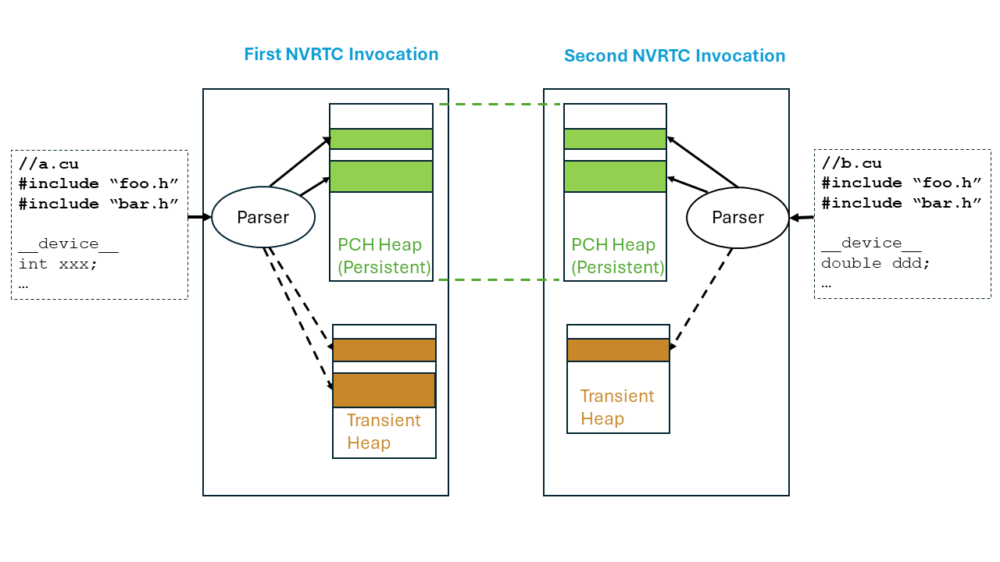

# 1. Introduction — NVRTC 13.2 documentation

**来源**: [https://docs.nvidia.com/cuda/nvrtc/index.html](https://docs.nvidia.com/cuda/nvrtc/index.html)

---

nvrtc
The User guide for the NVRTC library.

# 1. Introduction
NVRTC is a runtime compilation library for CUDA C++. It accepts CUDA C++ source code in
character string form and creates handles that can be used to obtain the PTX. The PTX
string generated by NVRTC can be loaded by[cuModuleLoadData](https://docs.nvidia.com/cuda/cuda-driver-api/group__CUDA__MODULE.html#group__CUDA__MODULE_1g04ce266ce03720f479eab76136b90c0b)and[cuModuleLoadDataEx](https://docs.nvidia.com/cuda/cuda-driver-api/group__CUDA__MODULE.html#group__CUDA__MODULE_1g9e8047e9dbf725f0cd7cafd18bfd4d12), and
linked with other modules by using the nvJitLink library or using[cuLinkAddData](https://docs.nvidia.com/cuda/cuda-driver-api/group__CUDA__MODULE.html#group__CUDA__MODULE_1g3ebcd2ccb772ba9c120937a2d2831b77)of the
CUDA Driver API. This facility can often provide optimizations and performance not
possible in a purely offline static compilation.
In the absence of NVRTC (or any runtime compilation support in CUDA), users needed to
spawn a separate process to execute nvcc at runtime if they wished to implement runtime
compilation in their applications or libraries, and, unfortunately, this approach has
the following drawbacks:
- The compilation overhead tends to be higher than necessary.
- End users are required to install nvcc and related tools which make it complicated to distribute applications that use runtime compilation.
NVRTC addresses these issues by providing a library interface that eliminates overhead associated with spawning separate processes, disk I/O,and so on, while keeping application deployment simple.

# 2. Getting Started

## 2.1. System Requirements
NVRTC is supported on the following platforms: Linux x86_64, Linux ppc64le, Linux aarch64, Windows x86_64.
**Note**: NVRTC does not depend on any other libraries or headers from the CUDA toolkit, and can be run on a system without a GPU.

## 2.2. Installation
NVRTC is part of the CUDA Toolkit release and the components are organized as follows in the CUDA toolkit installation directory:
- On Windows:
  - `include\nvrtc.h`
  - `bin\nvrtc64_Major Release Version_0.dll`
  - `bin\nvrtc-builtins64_Major Release VersionMinor Release Version.dll`
  - `lib\x64\nvrtc.lib`
  - `lib\x64\nvrtc_static.lib`
  - `lib\x64\nvrtc-builtins_static.lib`
  - `doc\pdf\NVRTC_User_Guide.pdf`
- On Linux:
  - `include/nvrtc.h`
  - `lib64/libnvrtc.so`
  - `lib64/libnvrtc.so.Major Release Version`
  - `lib64/libnvrtc.so.Major Release Version.Minor Release Version.<build version>`
  - `lib64/libnvrtc-builtins.so`
  - `lib64/libnvrtc-builtins.so.Major Release Version.Minor Release Version`
  - `lib64/libnvrtc-builtins.so.Major Release Version.Minor Release Version.<build version>`
  - `lib64/libnvrtc_static.a`
  - `lib64/libnvrtc-builtins_static.a`
  - `doc/pdf/NVRTC_User_Guide.pdf`

# 3. User Interface
This chapter presents the API of NVRTC. Basic usage of the API is explained inBasic Usage.
> - Error Handling
> - General Information Query
> - Compilation
> - Supported Compile Options
> - Precompiled header (PCH) (CUDA 12.8+)
> - Host Helper

## 3.1. Error Handling
NVRTC defines the following enumeration type and function for API call error handling.
Enumerations

nvrtcResult

The enumerated type nvrtcResult defines API call result codes.

Functions

const char *nvrtcGetErrorString(nvrtcResult result)

nvrtcGetErrorString is a helper function that returns a string describing the given nvrtcResult code, e.g., NVRTC_SUCCESS to`"NVRTC_SUCCESS"`.

### 3.1.1. Enumerations

enumnvrtcResult

The enumerated type nvrtcResult defines API call result codes.
NVRTC API functions return nvrtcResult to indicate the call result.
*Values:*

enumeratorNVRTC_SUCCESS

enumeratorNVRTC_ERROR_OUT_OF_MEMORY

enumeratorNVRTC_ERROR_PROGRAM_CREATION_FAILURE

enumeratorNVRTC_ERROR_INVALID_INPUT

enumeratorNVRTC_ERROR_INVALID_PROGRAM

enumeratorNVRTC_ERROR_INVALID_OPTION

enumeratorNVRTC_ERROR_COMPILATION

enumeratorNVRTC_ERROR_BUILTIN_OPERATION_FAILURE

enumeratorNVRTC_ERROR_NO_NAME_EXPRESSIONS_AFTER_COMPILATION

enumeratorNVRTC_ERROR_NO_LOWERED_NAMES_BEFORE_COMPILATION

enumeratorNVRTC_ERROR_NAME_EXPRESSION_NOT_VALID

enumeratorNVRTC_ERROR_INTERNAL_ERROR

enumeratorNVRTC_ERROR_TIME_FILE_WRITE_FAILED

enumeratorNVRTC_ERROR_NO_PCH_CREATE_ATTEMPTED

enumeratorNVRTC_ERROR_PCH_CREATE_HEAP_EXHAUSTED

enumeratorNVRTC_ERROR_PCH_CREATE

enumeratorNVRTC_ERROR_CANCELLED

enumeratorNVRTC_ERROR_TIME_TRACE_FILE_WRITE_FAILED

### 3.1.2. Functions

constchar*nvrtcGetErrorString(nvrtcResultresult)

nvrtcGetErrorString is a helper function that returns a string describing the given nvrtcResult code, e.g., NVRTC_SUCCESS to`"NVRTC_SUCCESS"`.
For unrecognized enumeration values, it returns`"NVRTC_ERROR unknown"`.

Parameters

**result**–**[in]**CUDA Runtime Compilation API result code.

Returns

Message string for the givennvrtcResultcode.

## 3.2. General Information Query
NVRTC defines the following function for general information query.
Functions

nvrtcResultnvrtcGetNumSupportedArchs(int *numArchs)

nvrtcGetNumSupportedArchs sets the output parameter`numArchs`with the number of architectures supported by NVRTC.

nvrtcResultnvrtcGetSupportedArchs(int *supportedArchs)

nvrtcGetSupportedArchs populates the array passed via the output parameter`supportedArchs`with the architectures supported by NVRTC.

nvrtcResultnvrtcVersion(int *major, int *minor)

nvrtcVersion sets the output parameters`major`and`minor`with the CUDA Runtime Compilation version number.

### 3.2.1. Functions

nvrtcResultnvrtcGetNumSupportedArchs(int*numArchs)

nvrtcGetNumSupportedArchs sets the output parameter`numArchs`with the number of architectures supported by NVRTC.
This can then be used to pass an array tonvrtcGetSupportedArchsto get the supported architectures.

seenvrtcGetSupportedArchs

Parameters

**numArchs**–**[out]**number of supported architectures.

Returns

- NVRTC_SUCCESS
- NVRTC_ERROR_INVALID_INPUT

nvrtcResultnvrtcGetSupportedArchs(int*supportedArchs)

nvrtcGetSupportedArchs populates the array passed via the output parameter`supportedArchs`with the architectures supported by NVRTC.
The array is sorted in the ascending order. The size of the array to be passed can be determined usingnvrtcGetNumSupportedArchs.

seenvrtcGetNumSupportedArchs

Parameters

**supportedArchs**–**[out]**sorted array of supported architectures.

Returns

- NVRTC_SUCCESS
- NVRTC_ERROR_INVALID_INPUT

nvrtcResultnvrtcVersion(int*major,int*minor)

nvrtcVersion sets the output parameters`major`and`minor`with the CUDA Runtime Compilation version number.

Parameters

- **major**–**[out]**CUDA Runtime Compilation major version number.
- **minor**–**[out]**CUDA Runtime Compilation minor version number.

Returns

- NVRTC_SUCCESS
- NVRTC_ERROR_INVALID_INPUT

## 3.3. Compilation
NVRTC defines the following type and functions for actual compilation.
Functions

nvrtcResultnvrtcAddNameExpression(nvrtcProgram prog, const char *const name_expression)

nvrtcAddNameExpression notes the given name expression denoting the address of a**global**function or**device**/__constant__ variable.

nvrtcResultnvrtcCompileProgram(nvrtcProgram prog, int numOptions, const char *const *options)

nvrtcCompileProgram compiles the given program.

nvrtcResultnvrtcCreateProgram(nvrtcProgram *prog, const char *src, const char *name, int numHeaders, const char *const *headers, const char *const *includeNames)

nvrtcCreateProgram creates an instance of nvrtcProgram with the given input parameters, and sets the output parameter`prog`with it.

nvrtcResultnvrtcDestroyProgram(nvrtcProgram *prog)

nvrtcDestroyProgram destroys the given program.

nvrtcResultnvrtcGetCUBIN(nvrtcProgram prog, char *cubin)

nvrtcGetCUBIN stores the cubin generated by the previous compilation of`prog`in the memory pointed by`cubin`.

nvrtcResultnvrtcGetCUBINSize(nvrtcProgram prog, size_t *cubinSizeRet)

nvrtcGetCUBINSize sets the value of`cubinSizeRet`with the size of the cubin generated by the previous compilation of`prog`.

nvrtcResultnvrtcGetLTOIR(nvrtcProgram prog, char *LTOIR)

nvrtcGetLTOIR stores the LTO IR generated by the previous compilation of`prog`in the memory pointed by`LTOIR`.

nvrtcResultnvrtcGetLTOIRSize(nvrtcProgram prog, size_t *LTOIRSizeRet)

nvrtcGetLTOIRSize sets the value of`LTOIRSizeRet`with the size of the LTO IR generated by the previous compilation of`prog`.

nvrtcResultnvrtcGetLoweredName(nvrtcProgram prog, const char *const name_expression, const char **lowered_name)

nvrtcGetLoweredName extracts the lowered (mangled) name for a**global**function or**device**/__constant__ variable, and updates *lowered_name to point to it.

nvrtcResultnvrtcGetOptiXIR(nvrtcProgram prog, char *optixir)

nvrtcGetOptiXIR stores the OptiX IR generated by the previous compilation of`prog`in the memory pointed by`optixir`.

nvrtcResultnvrtcGetOptiXIRSize(nvrtcProgram prog, size_t *optixirSizeRet)

nvrtcGetOptiXIRSize sets the value of`optixirSizeRet`with the size of the OptiX IR generated by the previous compilation of`prog`.

nvrtcResultnvrtcGetPTX(nvrtcProgram prog, char *ptx)

nvrtcGetPTX stores the PTX generated by the previous compilation of`prog`in the memory pointed by`ptx`.

nvrtcResultnvrtcGetPTXSize(nvrtcProgram prog, size_t *ptxSizeRet)

nvrtcGetPTXSize sets the value of`ptxSizeRet`with the size of the PTX generated by the previous compilation of`prog`(including the trailing`NULL`).

nvrtcResultnvrtcGetProgramLog(nvrtcProgram prog, char *log)

nvrtcGetProgramLog stores the log generated by the previous compilation of`prog`in the memory pointed by`log`.

nvrtcResultnvrtcGetProgramLogSize(nvrtcProgram prog, size_t *logSizeRet)

nvrtcGetProgramLogSize sets`logSizeRet`with the size of the log generated by the previous compilation of`prog`(including the trailing`NULL`).

nvrtcResultnvrtcSetFlowCallback(nvrtcProgram prog, int(*callback)(void *, void *), void *payload)

nvrtcSetFlowCallback registers a callback function that the compiler will invoke at different points during a call to nvrtcCompileProgram, and the callback function can decide whether to cancel compilation by returning specific values.

Typedefs

nvrtcProgram

nvrtcProgram is the unit of compilation, and an opaque handle for a program.

### 3.3.1. Functions

nvrtcResultnvrtcAddNameExpression(nvrtcProgramprog,constchar*constname_expression)

nvrtcAddNameExpression notes the given name expression denoting the address of a**global**function or**device**/__constant__ variable.
The identical name expression string must be provided on a subsequent call to nvrtcGetLoweredName to extract the lowered name.

See also
nvrtcGetLoweredName

Parameters

- **prog**–**[in]**CUDA Runtime Compilation program.
- **name_expression**–**[in]**constant expression denoting the address of a**global**function or**device**/__constant__ variable.

Returns

- NVRTC_SUCCESS
- NVRTC_ERROR_INVALID_PROGRAM
- NVRTC_ERROR_INVALID_INPUT
- NVRTC_ERROR_NO_NAME_EXPRESSIONS_AFTER_COMPILATION

nvrtcResultnvrtcCompileProgram(nvrtcProgramprog,intnumOptions,constchar*const*options)

nvrtcCompileProgram compiles the given program.

It supports compile options listed inSupported Compile Options.

Parameters

- **prog**–**[in]**CUDA Runtime Compilation program.
- **numOptions**–**[in]**Number of compiler options passed.
- **options**–**[in]**Compiler options in the form of C string array.`options`can be`NULL`when`numOptions`is 0.

Returns

- NVRTC_SUCCESS
- NVRTC_ERROR_OUT_OF_MEMORY
- NVRTC_ERROR_INVALID_INPUT
- NVRTC_ERROR_INVALID_PROGRAM
- NVRTC_ERROR_INVALID_OPTION
- NVRTC_ERROR_COMPILATION
- NVRTC_ERROR_BUILTIN_OPERATION_FAILURE
- NVRTC_ERROR_TIME_FILE_WRITE_FAILED
- NVRTC_ERROR_CANCELLED

nvrtcResultnvrtcCreateProgram(nvrtcProgram*prog,constchar*src,constchar*name,intnumHeaders,constchar*const*headers,constchar*const*includeNames)

nvrtcCreateProgram creates an instance of nvrtcProgram with the given input parameters, and sets the output parameter`prog`with it.

See also
nvrtcDestroyProgram

Parameters

- **prog**–**[out]**CUDA Runtime Compilation program.
- **src**–**[in]**CUDA program source.
- **name**–**[in]**CUDA program name.`name`can be`NULL`;`"default_program"`is used when`name`is`NULL`or “”.
- **numHeaders**–**[in]**Number of headers used.`numHeaders`must be greater than or equal to 0.
- **headers**–**[in]**Sources of the headers.`headers`can be`NULL`when`numHeaders`is 0.
- **includeNames**–**[in]**Name of each header by which they can be included in the CUDA program source.`includeNames`can be`NULL`when`numHeaders`is 0. These headers must be included with the exact names specified here.

Returns

- NVRTC_SUCCESS
- NVRTC_ERROR_OUT_OF_MEMORY
- NVRTC_ERROR_PROGRAM_CREATION_FAILURE
- NVRTC_ERROR_INVALID_INPUT
- NVRTC_ERROR_INVALID_PROGRAM

nvrtcResultnvrtcDestroyProgram(nvrtcProgram*prog)

nvrtcDestroyProgram destroys the given program.

See also
nvrtcCreateProgram

Parameters

**prog**–**[in]**CUDA Runtime Compilation program.

Returns

- NVRTC_SUCCESS
- NVRTC_ERROR_INVALID_PROGRAM

nvrtcResultnvrtcGetCUBIN(nvrtcProgramprog,char*cubin)

nvrtcGetCUBIN stores the cubin generated by the previous compilation of`prog`in the memory pointed by`cubin`.
No cubin is available if the value specified to`-arch`is a virtual architecture instead of an actual architecture.

See also
nvrtcGetCUBINSize

Parameters

- **prog**–**[in]**CUDA Runtime Compilation program.
- **cubin**–**[out]**Compiled and assembled result.

Returns

- NVRTC_SUCCESS
- NVRTC_ERROR_INVALID_INPUT
- NVRTC_ERROR_INVALID_PROGRAM

nvrtcResultnvrtcGetCUBINSize(nvrtcProgramprog,size_t*cubinSizeRet)

nvrtcGetCUBINSize sets the value of`cubinSizeRet`with the size of the cubin generated by the previous compilation of`prog`.
The value of cubinSizeRet is set to 0 if the value specified to`-arch`is a virtual architecture instead of an actual architecture.

See also
nvrtcGetCUBIN

Parameters

- **prog**–**[in]**CUDA Runtime Compilation program.
- **cubinSizeRet**–**[out]**Size of the generated cubin.

Returns

- NVRTC_SUCCESS
- NVRTC_ERROR_INVALID_INPUT
- NVRTC_ERROR_INVALID_PROGRAM

nvrtcResultnvrtcGetLTOIR(nvrtcProgramprog,char*LTOIR)

nvrtcGetLTOIR stores the LTO IR generated by the previous compilation of`prog`in the memory pointed by`LTOIR`.
No LTO IR is available if the program was compiled without`-dlto`.

See also
nvrtcGetLTOIRSize

Parameters

- **prog**–**[in]**CUDA Runtime Compilation program.
- **LTOIR**–**[out]**Compiled result.

Returns

- NVRTC_SUCCESS
- NVRTC_ERROR_INVALID_INPUT
- NVRTC_ERROR_INVALID_PROGRAM

nvrtcResultnvrtcGetLTOIRSize(nvrtcProgramprog,size_t*LTOIRSizeRet)

nvrtcGetLTOIRSize sets the value of`LTOIRSizeRet`with the size of the LTO IR generated by the previous compilation of`prog`.
The value of LTOIRSizeRet is set to 0 if the program was not compiled with`-dlto`.

See also
nvrtcGetLTOIR

Parameters

- **prog**–**[in]**CUDA Runtime Compilation program.
- **LTOIRSizeRet**–**[out]**Size of the generated LTO IR.

Returns

- NVRTC_SUCCESS
- NVRTC_ERROR_INVALID_INPUT
- NVRTC_ERROR_INVALID_PROGRAM

nvrtcResultnvrtcGetLoweredName(nvrtcProgramprog,constchar*constname_expression,constchar**lowered_name)

nvrtcGetLoweredName extracts the lowered (mangled) name for a**global**function or**device**/__constant__ variable, and updates *lowered_name to point to it.
The memory containing the name is released when the NVRTC program is destroyed by nvrtcDestroyProgram. The identical name expression must have been previously provided to nvrtcAddNameExpression.

See also
nvrtcAddNameExpression

Parameters

- **prog**–**[in]**CUDA Runtime Compilation program.
- **name_expression**–**[in]**constant expression denoting the address of a**global**function or**device**/__constant__ variable.
- **lowered_name**–**[out]**initialized by the function to point to a C string containing the lowered (mangled) name corresponding to the provided name expression.

Returns

- NVRTC_SUCCESS
- NVRTC_ERROR_NO_LOWERED_NAMES_BEFORE_COMPILATION
- NVRTC_ERROR_INVALID_PROGRAM
- NVRTC_ERROR_INVALID_INPUT
- NVRTC_ERROR_NAME_EXPRESSION_NOT_VALID

nvrtcResultnvrtcGetOptiXIR(nvrtcProgramprog,char*optixir)

nvrtcGetOptiXIR stores the OptiX IR generated by the previous compilation of`prog`in the memory pointed by`optixir`.
No OptiX IR is available if the program was compiled with options incompatible with OptiX IR generation.

See also
nvrtcGetOptiXIRSize

Parameters

- **prog**–**[in]**CUDA Runtime Compilation program.
- **optixir**–**[out]**Optix IR Compiled result.

Returns

- NVRTC_SUCCESS
- NVRTC_ERROR_INVALID_INPUT
- NVRTC_ERROR_INVALID_PROGRAM

nvrtcResultnvrtcGetOptiXIRSize(nvrtcProgramprog,size_t*optixirSizeRet)

nvrtcGetOptiXIRSize sets the value of`optixirSizeRet`with the size of the OptiX IR generated by the previous compilation of`prog`.
The value of nvrtcGetOptiXIRSize is set to 0 if the program was compiled with options incompatible with OptiX IR generation.

See also
nvrtcGetOptiXIR

Parameters

- **prog**–**[in]**CUDA Runtime Compilation program.
- **optixirSizeRet**–**[out]**Size of the generated LTO IR.

Returns

- NVRTC_SUCCESS
- NVRTC_ERROR_INVALID_INPUT
- NVRTC_ERROR_INVALID_PROGRAM

nvrtcResultnvrtcGetPTX(nvrtcProgramprog,char*ptx)

nvrtcGetPTX stores the PTX generated by the previous compilation of`prog`in the memory pointed by`ptx`.

See also
nvrtcGetPTXSize

Parameters

- **prog**–**[in]**CUDA Runtime Compilation program.
- **ptx**–**[out]**Compiled result.

Returns

- NVRTC_SUCCESS
- NVRTC_ERROR_INVALID_INPUT
- NVRTC_ERROR_INVALID_PROGRAM

nvrtcResultnvrtcGetPTXSize(nvrtcProgramprog,size_t*ptxSizeRet)

nvrtcGetPTXSize sets the value of`ptxSizeRet`with the size of the PTX generated by the previous compilation of`prog`(including the trailing`NULL`).

See also
nvrtcGetPTX

Parameters

- **prog**–**[in]**CUDA Runtime Compilation program.
- **ptxSizeRet**–**[out]**Size of the generated PTX (including the trailing`NULL`).

Returns

- NVRTC_SUCCESS
- NVRTC_ERROR_INVALID_INPUT
- NVRTC_ERROR_INVALID_PROGRAM

nvrtcResultnvrtcGetProgramLog(nvrtcProgramprog,char*log)

nvrtcGetProgramLog stores the log generated by the previous compilation of`prog`in the memory pointed by`log`.

See also
nvrtcGetProgramLogSize

Parameters

- **prog**–**[in]**CUDA Runtime Compilation program.
- **log**–**[out]**Compilation log.

Returns

- NVRTC_SUCCESS
- NVRTC_ERROR_INVALID_INPUT
- NVRTC_ERROR_INVALID_PROGRAM

nvrtcResultnvrtcGetProgramLogSize(nvrtcProgramprog,size_t*logSizeRet)

nvrtcGetProgramLogSize sets`logSizeRet`with the size of the log generated by the previous compilation of`prog`(including the trailing`NULL`).
Note that compilation log may be generated with warnings and informative messages, even when the compilation of`prog`succeeds.

See also
nvrtcGetProgramLog

Parameters

- **prog**–**[in]**CUDA Runtime Compilation program.
- **logSizeRet**–**[out]**Size of the compilation log (including the trailing`NULL`).

Returns

- NVRTC_SUCCESS
- NVRTC_ERROR_INVALID_INPUT
- NVRTC_ERROR_INVALID_PROGRAM

nvrtcResultnvrtcSetFlowCallback(nvrtcProgramprog,int(*callback)(void*,void*),void*payload)

nvrtcSetFlowCallback registers a callback function that the compiler will invoke at different points during a call to nvrtcCompileProgram, and the callback function can decide whether to cancel compilation by returning specific values.
The callback function must satisfy the following constraints:
(1) Its signature should be:

```
int callback(void* param1, void* param2);

```

 When invoking the callback, the compiler will always pass`payload`to param1 so that the callback may make decisions based on`payload`. It’ll always pass NULL to param2 for now which is reserved for future extensions.
(2) It must return 1 to cancel compilation or 0 to continue. Other return values are reserved for future use.
(3) It must return consistent values. Once it returns 1 at one point, it must return 1 in all following invocations during the current nvrtcCompileProgram call in progress.
(4) It must be thread-safe.
(5) It must not invoke any nvrtc/libnvvm/ptx APIs.

Parameters

- **prog**–**[in]**CUDA Runtime Compilation program.
- **callback**–**[in]**the callback that issues cancellation signal.
- **payload**–**[in]**to be passed as a parameter when invoking the callback.

Returns

- NVRTC_SUCCESS
- NVRTC_ERROR_INVALID_PROGRAM
- NVRTC_ERROR_INVALID_INPUT

### 3.3.2. Typedefs

typedefstruct_nvrtcProgram*nvrtcProgram

nvrtcProgram is the unit of compilation, and an opaque handle for a program.
To compile a CUDA program string, an instance of nvrtcProgram must be created first withnvrtcCreateProgram, then compiled withnvrtcCompileProgram.

## 3.4. Supported Compile Options
NVRTC supports the compile options below.
Option names with two preceding dashs (`--`) are long option names and option names with one preceding dash (`-`) are short option names. Short option names can be used instead of long option names. When a compile option takes an argument, an assignment operator (`=`) is used to separate the compile option argument from the compile option name, e.g.,`"--gpu-architecture=compute_100"`. Alternatively, the compile option name and the argument can be specified in separate strings without an assignment operator, .e.g,`"--gpu-architecture"``"compute_100"`. Single-character short option names, such as`-D`,`-U`, and`-I`, do not require an assignment operator, and the compile option name and the argument can be present in the same string with or without spaces between them. For instance,`"-D=<def>"`,`"-D<def>"`, and`"-D <def>"`are all supported.
The valid compiler options are:

- Compilation targets
  - `--gpu-architecture=<arch>`(`-arch`)
    Specify the name of the class of GPU architectures for which the input must be compiled.
    - Valid`<arch>`s:
      - `compute_75`
      - `compute_80`
      - `compute_86`
      - `compute_87`
      - `compute_89`
      - `compute_90`
      - `compute_90a`
      - `compute_100`
      - `compute_100f`
      - `compute_100a`
      - `compute_101`
      - `compute_101f`
      - `compute_101a`
      - `compute_103`
      - `compute_103f`
      - `compute_103a`
      - `compute_120`
      - `compute_120f`
      - `compute_120a`
      - `compute_121`
      - `compute_121f`
      - `compute_121a`
      - `sm_75`
      - `sm_80`
      - `sm_86`
      - `sm_87`
      - `sm_89`
      - `sm_90`
      - `sm_90a`
      - `sm_100`
      - `sm_100f`
      - `sm_100a`
      - `sm_101`
      - `sm_101f`
      - `sm_101a`
      - `sm_103`
      - `sm_103f`
      - `sm_103a`
      - `sm_120`
      - `sm_120f`
      - `sm_120a`
      - `sm_121`
      - `sm_121f`
      - `sm_121a`
    - Default:`compute_75`
- Separate compilation / whole-program compilation
  - `--device-c`(`-dc`)
    Generate relocatable code that can be linked with other relocatable device code. It is equivalent to`--relocatable-device-code=true`.
  - `--device-w`(`-dw`)
    Generate non-relocatable code. It is equivalent to`--relocatable-device-code=false`.
  - `--relocatable-device-code={true|false}`(`-rdc`)
    Enable (disable) the generation of relocatable device code.
    - Default:`false`
  - `--extensible-whole-program`(`-ewp`)
    Do extensible whole program compilation of device code.
    - Default:`false`
- Debugging support
  - `--device-debug`(`-G`)
    Generate debug information. If`--dopt`is not specified, then turns off all optimizations.
  - `--generate-line-info`(`-lineinfo`)
    Generate line-number information.
- Code generation
  - `--dopt``on`(`-dopt`)
  - `--dopt=on`
    Enable device code optimization. When specified along with`-G`, enables limited debug information generation for optimized device code (currently, only line number information). When`-G`is not specified,`-dopt=on`is implicit.
  - `--Ofast-compile={0|min|mid|max}`(`-Ofc`)
    Specify the fast-compile level for device code, which controls the tradeoff between compilation speed and runtime performance by disabling certain optimizations at varying levels.
    - Levels:
      - `max:`Focus only on the fastest compilation speed, disabling many optimizations.
      - `mid:`Balance compile time and runtime, disabling expensive optimizations.
      - `min:`More minimal impact on both compile time and runtime, minimizing some expensive optimizations.
      - `0`: Disable fast-compile.
    - The option is disabled by default.
  - `--ptxas-options`<options> (`-Xptxas`)
  - `--ptxas-options=<options>`
    Specify options directly to ptxas, the PTX optimizing assembler.
  - `--maxrregcount=<N>`(`-maxrregcount`)
    Specify the maximum amount of registers that GPU functions can use. Until a function-specific limit, a higher value will generally increase the performance of individual GPU threads that execute this function. However, because thread registers are allocated from a global register pool on each GPU, a higher value of this option will also reduce the maximum thread block size, thereby reducing the amount of thread parallelism. Hence, a good maxrregcount value is the result of a trade-off. If this option is not specified, then no maximum is assumed. Value less than the minimum registers required by ABI will be bumped up by the compiler to ABI minimum limit.
  - `--ftz={true|false}`(`-ftz`)
    When performing single-precision floating-point operations, flush denormal values to zero or preserve denormal values.
    `--use_fast_math`implies`--ftz=true`.
    - Default:`false`
  - `--prec-sqrt={true|false}`(`-prec-sqrt`)
    For single-precision floating-point square root, use IEEE round-to-nearest mode or use a faster approximation.`--use_fast_math`implies`--prec-sqrt=false`.
    - Default:`true`
  - `--prec-div={true|false}`(`-prec-div`) For single-precision floating-point division and reciprocals, use IEEE round-to-nearest mode or use a faster approximation.`--use_fast_math`implies`--prec-div=false`.
    - Default:`true`
  - `--fmad={true|false}`(`-fmad`)
    Enables (disables) the contraction of floating-point multiplies and adds/subtracts into floating-point multiply-add operations (FMAD, FFMA, or DFMA).`--use_fast_math`implies`--fmad=true`.
    - Default:`true`
  - `--use_fast_math`(`-use_fast_math`)
    Make use of fast math operations.`--use_fast_math`implies`--ftz=true``--prec-div=false``--prec-sqrt=false``--fmad=true`.
  - `--extra-device-vectorization`(`-extra-device-vectorization`)
    Enables more aggressive device code vectorization in the NVVM optimizer.
  - `--modify-stack-limit={true|false}`(`-modify-stack-limit`)
    On Linux, during compilation, use`setrlimit()`to increase stack size to maximum allowed. The limit is reset to the previous value at the end of compilation. Note:`setrlimit()`changes the value for the entire process.
    - Default:`true`
  - `--dlink-time-opt`(`-dlto`)
    Generate intermediate code for later link-time optimization. It implies`-rdc=true`. Note: when this option is used the`nvrtcGetLTOIR`API should be used, as PTX or Cubin will not be generated.
  - `--gen-opt-lto`(`-gen-opt-lto`)
    Run the optimizer passes before generating the LTO IR.
  - `--optix-ir`(`-optix-ir`)
    Generate OptiX IR. The Optix IR is only intended for consumption by OptiX through appropriate APIs. This feature is not supported with link-time-optimization (`-dlto`).
    Note: when this option is used the nvrtcGetOptiX API should be used, as PTX or Cubin will not be generated.
  - `--jump-table-density=`[0-101] (`-jtd`)
    Specify the case density percentage in switch statements, and use it as a minimal threshold to determine whether jump table(brx.idx instruction) will be used to implement a switch statement. Default value is 101. The percentage ranges from 0 to 101 inclusively.
  - `--device-stack-protector={true|false}`(`-device-stack-protector`)
    Enable (disable) the generation of stack canaries in device code.
    - Default:`false`
  - `--no-cache`(`-no-cache`)
    Disable the use of cache for both ptx and cubin code generation.
  - `--frandom-seed`(`-frandom-seed`)
    The user specified random seed will be used to replace random numbers used in generating symbol names and variable names. The option can be used to generate deterministically identical ptx and object files. If the input value is a valid number (decimal, octal, or hex), it will be used directly as the random seed. Otherwise, the CRC value of the passed string will be used instead.
- Preprocessing
  - `--define-macro=<def>`(`-D`)
    `<def>`can be either`<name>`or`<name=definitions>`.
    - `<name>`
      Predefine`<name>`as a macro with definition`1`.
    - `<name>=<definition>`
      The contents of`<definition>`are tokenized and preprocessed as if they appeared during translation phase three in a`#define`directive. In particular, the definition will be truncated by embedded new line characters.
  - `--undefine-macro=<def>`(`-U`)
    Cancel any previous definition of`<def>`.
  - `--include-path=<dir>`(`-I`)
    Add the directory`<dir>`to the list of directories to be searched for headers. These paths are searched after the list of headers given tonvrtcCreateProgram.
  - `--pre-include=<header>`(`-include`)
    Preinclude`<header>`during preprocessing.
  - `--no-source-include`(`-no-source-include`)
    The preprocessor by default adds the directory of each input sources to the include path. This option disables this feature and only considers the path specified explicitly.
- Language Dialect
  - `--std={c++03|c++11|c++14|c++17|c++20}`(`-std`)
    Set language dialect to C++03, C++11, C++14, C++17 or C++20
    - Default:`c++17`
  - `--builtin-move-forward={true|false}`(`-builtin-move-forward`)
    Provide builtin definitions of`std::move`and`std::forward`, when C++11 or later language dialect is selected.
    - Default:`true`
  - `--builtin-initializer-list={true|false}`(`-builtin-initializer-list`)
    Provide builtin definitions of`std::initializer_list`class and member functions when C++11 or later language dialect is selected.
    - Default:`true`
- Precompiled header support (CUDA 12.8+)
  - `--pch`(`-pch`)
    Enable automatic PCH processing.
  - `--create-pch=<file-name>`(`-create-pch`)
    Create a PCH file.
  - `--use-pch=<file-name>`(`-use-pch`)
    Use the specified PCH file.
  - `--pch-dir=<directory-name>`(`-pch-dir`)
    When using automatic PCH (`-pch`), look for and create PCH files in the specified directory. When using explicit PCH (`-create-pch`or`-use-pch`), the directory name is prefixed before the specified file name, unless the file name is an absolute path name.
  - `--pch-verbose={true|false}`(`-pch-verbose`)
    In automatic PCH mode, for each PCH file that could not be used in current compilation, print the reason in the compilation log.
    - Default:`true`
  - `--pch-messages={true|false}`(`-pch-messages`)
    Print a message in the compilation log, if a PCH file was created or used in the current compilation.
    - Default:`true`
  - `--instantiate-templates-in-pch={true|false}`(`-instantiate-templates-in-pch`)
    Enable or disable instantiatiation of templates before PCH creation. Instantiating templates may increase the size of the PCH file, while reducing the compilation cost when using the PCH file (since some template instantiations can be skipped).
    - Default:`true`
- Misc.
  - `--disable-warnings`(`-w`)
    Inhibit all warning messages.
  - `--Wreorder`(`-Wreorder`)
    Generate warnings when member initializers are reordered.
  - `--warning-as-error=`<kind>,… (`-Werror`)
    Make warnings of the specified kinds into errors. The following is the list of warning kinds accepted by this option:
    - `all-warnings`: treat all warnings as errors.
    - `reorder`: generate errors when member initializers are reordered.
    - `deprecated-declarations`: generate error on use of a deprecated entity.
  - `--restrict`(`-restrict`)
    Programmer assertion that all kernel pointer parameters are restrict pointers.
  - `--device-as-default-execution-space`(`-default-device`)
    Treat entities with no execution space annotation as`__device__`entities.
  - `--device-int128`(`-device-int128`)
    Allow the`__int128`type in device code. Also causes the macro`__CUDACC_RTC_INT128__`to be defined.
  - `--device-float128`(`-device-float128`)
    Allow the`__float128`and`_Float128`types in device code. Also causes the macro`D__CUDACC_RTC_FLOAT128__`to be defined.
  - `--optimization-info=<kind>`(`-opt-info`)
    Provide optimization reports for the specified kind of optimization. The following kind tags are supported:
    - `inline`: emit a remark when a function is inlined.
  - `--display-error-number`(`-err-no`)
    Display diagnostic number for warning messages. (Default)
  - `--no-display-error-number`(`-no-err-no`)
    Disables the display of a diagnostic number for warning messages.
  - `--diag-error=<error-number>`,… (`-diag-error`)
    Emit error for specified diagnostic message number(s). Message numbers can be separated by comma.
  - `--diag-suppress=<error-number>`,… (`-diag-suppress`)
    Suppress specified diagnostic message number(s). Message numbers can be separated by comma.
  - `--diag-warn=<error-number>`,… (`-diag-warn`)
    Emit warning for specified diagnostic message number(s). Message numbers can be separated by comma.
  - `--brief-diagnostics={true|false}`(`-brief-diag`)
    This option disables or enables showing source line and column info in a diagnostic. The`--brief-diagnostics=true`will not show the source line and column info.
    - Default:`false`
  - `--time=<file-name>`(`-time`)
    Generate a comma separated value table with the time taken by each compilation phase, and append it at the end of the file given as the option argument. If the file does not exist, the column headings are generated in the first row of the table. If the file name is ‘-’, the timing data is written to the compilation log.
  - `--split-compile=<number-of-threads>`(`-split-compile=<number-of-threads>`)
    Perform compiler optimizations in parallel. Split compilation attempts to reduce compile time by enabling the compiler to run certain optimization passes concurrently. This option accepts a numerical value that specifies the maximum number of threads the compiler can use. One can also allow the compiler to use the maximum threads available on the system by setting`--split-compile=0`. Setting`--split-compile=1`will cause this option to be ignored.
  - `--fdevice-syntax-only`(`-fdevice-syntax-only`)
    Ends device compilation after front-end syntax checking. This option does not generate valid device code.
  - `--minimal`(`-minimal`)
    Omit certain language features to reduce compile time for small programs. In particular, the following are omitted:
    - Texture and surface functions and associated types, e.g.,`cudaTextureObject_t`.
    - CUDA Runtime Functions that are provided by the cudadevrt device code library, typically named with prefix “cuda”, e.g.,`cudaMalloc`.
    - Kernel launch from device code.
    - Types and macros associated with CUDA Runtime and Driver APIs, provided by`cuda/tools/cudart/driver_types.h`, typically named with prefix “cuda”, e.g.,`cudaError_t`.
  - `--device-stack-protector`(`-device-stack-protector`)
    Enable stack canaries in device code. Stack canaries make it more difficult to exploit certain types of memory safety bugs involving stack-local variables. The compiler uses heuristics to assess the risk of such a bug in each function. Only those functions which are deemed high-risk make use of a stack canary.
  - `--fdevice-time-trace=<file-name>`(`-fdevice-time-trace=<file-name>`) Enables the time profiler, outputting a JSON file based on given <file-name>. Results can be analyzed on chrome://tracing for a flamegraph visualization.

## 3.5. Precompiled header (PCH) (CUDA 12.8+)
NVRTC defines the following function related to PCH.
Also see PCH related flags passed to nvrtcCompileProgram.
Functions

nvrtcResultnvrtcGetPCHCreateStatus(nvrtcProgram prog)

returns the PCH creation status.

nvrtcResultnvrtcGetPCHHeapSize(size_t *ret)

retrieve the current size of the PCH Heap.

nvrtcResultnvrtcGetPCHHeapSizeRequired(nvrtcProgram prog, size_t *size)

retrieve the required size of the PCH heap required to compile the given program.

nvrtcResultnvrtcSetPCHHeapSize(size_t size)

set the size of the PCH Heap.

### 3.5.1. Functions

nvrtcResultnvrtcGetPCHCreateStatus(nvrtcProgramprog)

returns the PCH creation status.

NVRTC_SUCCESS indicates that the PCH was successfully created. NVRTC_ERROR_NO_PCH_CREATE_ATTEMPTED indicates that no PCH creation was attempted, either because PCH functionality was not requested during the preceding nvrtcCompileProgram call, or automatic PCH processing was requested, and compiler chose not to create a PCH file. NVRTC_ERROR_PCH_CREATE_HEAP_EXHAUSTED indicates that a PCH file could potentially have been created, but the compiler ran out space in the PCH heap. In this scenario, thenvrtcGetPCHHeapSizeRequired()can be used to query the required heap size, the heap can be reallocated for this size withnvrtcSetPCHHeapSize()and PCH creation may be reattempted again invokingnvrtcCompileProgram()with a new NVRTC program instance. NVRTC_ERROR_PCH_CREATE indicates that an error condition prevented the PCH file from being created.

Parameters

**prog**–**[in]**CUDA Runtime Compilation program.

Returns

- NVRTC_SUCCESS
- NVRTC_ERROR_NO_PCH_CREATE_ATTEMPTED
- NVRTC_ERROR_PCH_CREATE
- NVRTC_ERROR_PCH_CREATE_HEAP_EXHAUSTED
- NVRTC_ERROR_INVALID_PROGRAM

nvrtcResultnvrtcGetPCHHeapSize(size_t*ret)

retrieve the current size of the PCH Heap.

Parameters

**ret**–**[out]**pointer to location where the size of the PCH Heap will be stored

Returns

- NVRTC_SUCCESS
- NVRTC_ERROR_INVALID_INPUT

nvrtcResultnvrtcGetPCHHeapSizeRequired(nvrtcProgramprog,size_t*size)

retrieve the required size of the PCH heap required to compile the given program.

Parameters

- **prog**–**[in]**CUDA Runtime Compilation program.
- **size**–**[out]**pointer to location where the required size of the PCH Heap will be stored

Returns

- NVRTC_SUCCESS
- NVRTC_ERROR_INVALID_PROGRAM
- NVRTC_ERROR_INVALID_INPUTThe size retrieved using this function is only valid ifnvrtcGetPCHCreateStatus()returned NVRTC_SUCCESS or NVRTC_ERROR_PCH_CREATE_HEAP_EXHAUSTED

nvrtcResultnvrtcSetPCHHeapSize(size_tsize)

set the size of the PCH Heap.

The requested size may be rounded up to a platform dependent alignment (e.g. page size). If the PCH Heap has already been allocated, the heap memory will be freed and a new PCH Heap will be allocated.

Parameters

**size**–**[in]**requested size of the PCH Heap, in bytes

Returns

- NVRTC_SUCCESS

## 3.6. Host Helper
NVRTC defines the following functions for easier interaction with host code.
Functions

nvrtcResultnvrtcGetTypeName(const std::type_info &tinfo, std::string *result)

nvrtcGetTypeName stores the source level name of a type in the given std::string location.

nvrtcResultnvrtcGetTypeName(std::string *result)

nvrtcGetTypeName stores the source level name of the template type argument T in the given std::string location.

### 3.6.1. Functions

inlinenvrtcResultnvrtcGetTypeName(conststd::type_info&tinfo,std::string*result)

nvrtcGetTypeName stores the source level name of a type in the given std::string location.
This function is only provided when the macro NVRTC_GET_TYPE_NAME is defined with a non-zero value. It uses abi::__cxa_demangle or UnDecorateSymbolName function calls to extract the type name, when using gcc/clang or cl.exe compilers, respectively. If the name extraction fails, it will return NVRTC_INTERNAL_ERROR, otherwise *result is initialized with the extracted name.
Windows-specific notes:
- nvrtcGetTypeName()is not multi-thread safe because it calls UnDecorateSymbolName(), which is not multi-thread safe.
- The returned string may contain Microsoft-specific keywords such as __ptr64 and __cdecl.

Parameters

- **tinfo**–**[in]**reference to object of type std::type_info for a given type.
- **result**–**[in]**pointer to std::string in which to store the type name.

Returns

- NVRTC_SUCCESS
- NVRTC_ERROR_INTERNAL_ERROR

template<typenameT>
nvrtcResultnvrtcGetTypeName(std::string*result)

nvrtcGetTypeName stores the source level name of the template type argument T in the given std::string location.
This function is only provided when the macro NVRTC_GET_TYPE_NAME is defined with a non-zero value. It uses abi::__cxa_demangle or UnDecorateSymbolName function calls to extract the type name, when using gcc/clang or cl.exe compilers, respectively. If the name extraction fails, it will return NVRTC_INTERNAL_ERROR, otherwise *result is initialized with the extracted name.
Windows-specific notes:
- nvrtcGetTypeName()is not multi-thread safe because it calls UnDecorateSymbolName(), which is not multi-thread safe.
- The returned string may contain Microsoft-specific keywords such as __ptr64 and __cdecl.

Parameters

**result**–**[in]**pointer to std::string in which to store the type name.

Returns

- NVRTC_SUCCESS
- NVRTC_ERROR_INTERNAL_ERROR

# 4. Language
Unlike the offline nvcc compiler, NVRTC is meant for compiling only device CUDA C++ code. It does not accept host code or host compiler extensions in the input code, unless otherwise noted.

## 4.1. Execution Space
NVRTC uses`__host__`as the default execution space, and it generates an error if it encounters any host code in the input. That is, if the input contains entities with explicit`__host__`annotations or no execution space annotation, NVRTC will emit an error.`__host__ __device__`functions are treated as device functions.
NVRTC provides a compile option,`--device-as-default-execution-space`(refer toSupported Compile Options), that enables an alternative compilation mode, in which entities with no execution space annotations are treated as`__device__ entities`.

## 4.2. Separate Compilation
NVRTC itself does not provide any linker. Users can, however, use the nvJitLink library or`cuLinkAddData`in the CUDA Driver API to link the generated relocatable PTX code with other relocatable code. To generate relocatable PTX code, the compile option`--relocatable-device-code=true`or`--device-c`is required.

## 4.3. Dynamic Parallelism
NVRTC supports dynamic parallelism under the following conditions:
- Compilation target must be compute 35 or higher.
- Either separate compilation (`--relocatable-device-code=true`or`--device-c`) or extensible whole program compilation (`--extensible-whole-program`) must be enabled.
- Generated PTX must be linked against the CUDA device runtime (cudadevrt) library (refer toSeparate Compilation).
Example:Dynamic Parallelismprovides a simple example.

## 4.4. Integer Size
Different operating systems define integer type sizes differently.
Linux x86_64 implements LP64, and Windows x86_64 implements LLP64.

<div style="overflow-x: auto; max-width: 100%; border-radius: 6px;">
<table border="1" cellpadding="6" cellspacing="0" style="border-collapse: collapse; width: 100%; font-family: -apple-system, BlinkMacSystemFont, Segoe UI, Helvetica, Arial, sans-serif; font-size: 13px; margin: 16px 0;">
<caption>Table 1. Integer sizes in bits for LLP 64 and LP 64</caption>
<colgroup>
<col style="width: 9%"/>
<col style="width: 13%"/>
<col style="width: 11%"/>
<col style="width: 12%"/>
<col style="width: 24%"/>
<col style="width: 30%"/>
</colgroup>
<thead>
<tr style="border: 1px solid #d0d7de;">
<th style="background-color: #f6f8fa; font-weight: 600; text-align: left; padding: 8px 12px; border: 1px solid #d0d7de;"></th>
<th style="background-color: #f6f8fa; font-weight: 600; text-align: left; padding: 8px 12px; border: 1px solid #d0d7de;"><p><code class="docutils literal notranslate"><span class="pre">short</span></code></p></th>
<th style="background-color: #f6f8fa; font-weight: 600; text-align: left; padding: 8px 12px; border: 1px solid #d0d7de;"><p><code class="docutils literal notranslate"><span class="pre">int</span></code></p></th>
<th style="background-color: #f6f8fa; font-weight: 600; text-align: left; padding: 8px 12px; border: 1px solid #d0d7de;"><p><code class="docutils literal notranslate"><span class="pre">long</span></code></p></th>
<th style="background-color: #f6f8fa; font-weight: 600; text-align: left; padding: 8px 12px; border: 1px solid #d0d7de;"><p><code class="docutils literal notranslate"><span class="pre">long</span> <span class="pre">long</span></code></p></th>
<th style="background-color: #f6f8fa; font-weight: 600; text-align: left; padding: 8px 12px; border: 1px solid #d0d7de;"><p>pointers and <code class="docutils literal notranslate"><span class="pre">size_t</span></code></p></th>
</tr>
</thead>
<tbody>
<tr style="border: 1px solid #d0d7de;">
<td style="padding: 8px 12px; border: 1px solid #d0d7de; vertical-align: top;"><p>LLP64</p></td>
<td style="padding: 8px 12px; border: 1px solid #d0d7de; vertical-align: top;"><p>16</p></td>
<td style="padding: 8px 12px; border: 1px solid #d0d7de; vertical-align: top;"><p>32</p></td>
<td style="padding: 8px 12px; border: 1px solid #d0d7de; vertical-align: top;"><p>32</p></td>
<td style="padding: 8px 12px; border: 1px solid #d0d7de; vertical-align: top;"><p>64</p></td>
<td style="padding: 8px 12px; border: 1px solid #d0d7de; vertical-align: top;"><p>64</p></td>
</tr>
<tr style="border: 1px solid #d0d7de;">
<td style="padding: 8px 12px; border: 1px solid #d0d7de; vertical-align: top;"><p>LP64</p></td>
<td style="padding: 8px 12px; border: 1px solid #d0d7de; vertical-align: top;"><p>16</p></td>
<td style="padding: 8px 12px; border: 1px solid #d0d7de; vertical-align: top;"><p>32</p></td>
<td style="padding: 8px 12px; border: 1px solid #d0d7de; vertical-align: top;"><p>64</p></td>
<td style="padding: 8px 12px; border: 1px solid #d0d7de; vertical-align: top;"><p>64</p></td>
<td style="padding: 8px 12px; border: 1px solid #d0d7de; vertical-align: top;"><p>64</p></td>
</tr>
</tbody>
</table>
</div>

NVRTC implements LP64 on Linux and LLP64 on Windows.
NVRTC supports 128-bit integer types through the`__int128`type. This can be enabled with the`--device-int128`flag. 128-bit integer support is not available on Windows.

## 4.5. Include Syntax
When`nvrtcCompileProgram()`is called, the current working directory is added to the header search path used for locating files included with the quoted syntax (for example,`#include "foo.h"`), before the code is compiled.

## 4.6. Predefined Macros
- `__CUDACC_RTC__`: useful for distinguishing between runtime and offline`nvcc`compilation in user code.
- `__CUDACC__`: defined with same semantics as with offline`nvcc`compilation.
- `__CUDACC_RDC__`: defined with same semantics as with offline`nvcc`compilation.
- `__CUDACC_EWP__`: defined with same semantics as with offline`nvcc`compilation.
- `__CUDACC_DEBUG__`: defined with same semantics as with offline`nvcc`compilation.
- `__CUDA_ARCH__`: defined with same semantics as with offline`nvcc`compilation.
- `__CUDA_ARCH_LIST__`: defined with same semantics as with offline`nvcc`compilation.
- `__CUDACC_VER_MAJOR__`: defined with the major version number as returned by`nvrtcVersion`.
- `__CUDACC_VER_MINOR__`: defined with the minor version number as returned by`nvrtcVersion`.
- `__CUDACC_VER_BUILD__`: defined with the build version number.
- `__NVCC_DIAG_PRAGMA_SUPPORT__`: defined with same semantics as with offline`nvcc`compilation.
- `__CUDACC_RTC_INT128__`: defined when`-device-int128`flag is specified during compilation, and indicates that`__int128`type is supported.
- `NULL`: null pointer constant.
- `va_start`
- `va_end`
- `va_arg`
- `va_copy`: defined when language dialect C++11 or later is selected.
- `__cplusplus`
- `_WIN64`: defined on Windows platforms.
- `__LP64__`: defined on non-Windows platforms where`long int`and pointer types are 64-bits.
- `__cdecl`: defined to empty on all platforms.
- `__ptr64`: defined to empty on Windows platforms.
- `__CUDACC_RTC_MINIMAL__`: defined when`-minimal`flag is specified during compilation (since CUDA 12.4).
- Macros defined in nv/target header are implicitly provided, e.g.,`NV_IF_TARGET`.
- `__CUDACC_DEVICE_ATOMIC_BUILTINS__`: defined when device atomic compiler builtins are supported. Refer to the[CUDA C++ Programming Guide](https://docs.nvidia.com/cuda/cuda-c-programming-guide/index.html)for more details.

## 4.7. Predefined Types
- `clock_t`
- `size_t`
- `ptrdiff_t`
- `va_list`: Note that the definition of this type may be different than the one selected by nvcc when compiling CUDA code.
- Predefined types such as`dim3`,`char4`, etc., that are available in the CUDA Runtime headers when compiling offline with`nvcc`are also available, unless otherwise noted.
- `std::initializer_list<T>`: implicitly provided in C++11 and later dialects, unless`-builtin-initializer-list=false`is specified.
- `std::move<T>, std::forward<T>`: implicitly provided in C++11 and later dialects, unless`-builtin-move-forward=false`is specified.

## 4.8. Builtin Functions
Builtin functions provided by the CUDA Runtime headers when compiling offline with`nvcc`are available, unless otherwise noted.

## 4.9. Default C++ Dialect
The default C++ dialect is C++17. Other dialects can be selected using the`-std`flag.

# 5. Basic Usage
This section of the document uses a simple example,*Single-Precision α⋅X Plus Y*(SAXPY), shown in[Figure 1](https://docs.nvidia.com/cuda/nvrtc/index.html#basic-usage__cuda-source-string-for-saxpy)to explain what is involved in runtime compilation with NVRTC. For brevity and readability, error checks on the API return values are not shown. The complete code listing is available in[Example: SAXPY](https://docs.nvidia.com/cuda/nvrtc/index.html#example-saxpy).
Figure 1. CUDA source string for SAXPY

```
const char *saxpy = "                                          \n\
extern \"C\" __global__                                        \n\
void saxpy(float a, float *x, float *y, float *out, size_t n)  \n\
{                                                              \n\
   size_t tid = blockIdx.x * blockDim.x + threadIdx.x;         \n\
   if (tid < n) {                                              \n\
      out[tid] = a * x[tid] + y[tid];                          \n\
   }                                                           \n\
}                                                              \n";

```

First, an instance of`nvrtcProgram`needs to be created. Figure 2 shows creation of`nvrtcProgram`for SAXPY. As SAXPY does not require any header, 0 is passed as`numHeaders`, and NULL as`headers`and`includeNames`.
Figure 2. nvrtcProgram creation for SAXPY
> ```
> nvrtcProgram prog;
> nvrtcCreateProgram(&prog, // prog
>         saxpy,         // buffer
>         "saxpy.cu",    // name
>         0,             // numHeaders
>         NULL,          // headers
>         NULL);         // includeNames
> 
> ```
If SAXPY had any #include directives, the contents of the files that are
#include’d can be passed as elements of headers, and their names as elements
of includeNames. For example,`#include <foo.h>`and`#include <bar.h>`would
require 2 as`numHeaders`,`{ "<contents of foo.h>", "<contents of bar.h>" }`
as headers, and`{ "foo.h", "bar.h" }`as`includeNames`(`<contents of foo.h>`
and`<contents of bar.h>`must be replaced by the actual contents of`foo.h`
and`bar.h`). Alternatively, the compile option`-I`can be used if the header
is guaranteed to exist in the file system at runtime.
Once the instance of`nvrtcProgram`for compilation is created, it can be
compiled by`nvrtcCompileProgram`as shown in Figure 3. Two compile options
are used in this example,`--gpu-architecture=compute_80`and`--fmad=false`,
to generate code for the compute_80 architecture and to disable the
contraction of floating-point multiplies and adds/subtracts into
floating-point multiply-add operations. Other combinations of compile
options can be used as needed and Supported Compile Options lists valid
compile options.
Figure 3. Compilation of SAXPY for compute_80 with FMAD enabled
> ```
> const char *opts[] = {"--gpu-architecture=compute_80",
>          "--fmad=false"};
> nvrtcCompileProgram(prog,     // prog
>          2,        // numOptions
>          opts);    // options
> 
> ```
After the compilation completes, users can obtain the program compilation
log and the generated PTX as Figure 4 shows. NVRTC does not generate valid
PTX when the compilation fails, and it may generate program compilation log
even when the compilation succeeds if needed.
An`nvrtcProgram`can be compiled by`nvrtcCompileProgram`multiple times with
different compile options, and users can only retrieve the PTX and the log
generated by the last compilation.
> Figure 4. Obtaining generated PTX and program compilation log
> 
> ```
> // Obtain compilation log from the program.
> 
> size_t logSize;
> 
> nvrtcGetProgramLogSize(prog, &logSize);
> char *log = new char[logSize];
> nvrtcGetProgramLog(prog, log);
> // Obtain PTX from the program.
> size_t ptxSize;
> nvrtcGetPTXSize(prog, &ptxSize);
> char *ptx = new char[ptxSize];
> nvrtcGetPTX(prog, ptx);
> 
> ```
When the instance of`nvrtcProgram`is no longer needed, it can be destroyed by`nvrtcDestroyProgram`as shown in Figure 5.
Figure 5. Destruction of nvrtcProgram
> ```
> nvrtcDestroyProgram(&prog);
> 
> ```
The generated PTX can be further manipulated by the CUDA Driver API for execution or linking. Figure 6 shows an example code sequence for execution of the generated PTX.
Figure 6. Execution of SAXPY using the PTX generated by NVRTC
> ```
> CUdevice cuDevice;
> CUcontext context;
> CUmodule module;
> CUfunction kernel;
> cuInit(0);
> cuDeviceGet(&cuDevice, 0);
> cuCtxCreate(&context, NULL, 0, cuDevice);
> cuModuleLoadDataEx(&module, ptx, 0, 0, 0);
> cuModuleGetFunction(&kernel, module, "saxpy");
> size_t n = size_t n = NUM_THREADS * NUM_BLOCKS;
> size_t bufferSize = n * sizeof(float);
> float a = ...;
> float *hX = ..., *hY = ..., *hOut = ...;
> CUdeviceptr dX, dY, dOut;
> cuMemAlloc(&dX, bufferSize);
> cuMemAlloc(&dY, bufferSize);
> cuMemAlloc(&dOut, bufferSize);
> cuMemcpyHtoD(dX, hX, bufferSize);
> cuMemcpyHtoD(dY, hY, bufferSize);
> void *args[] = { &a, &dX, &dY, &dOut, &n };
> cuLaunchKernel(kernel,
>             NUM_THREADS, 1, 1,   // grid dim
>             NUM_BLOCKS, 1, 1,    // block dim
>             0, NULL,             // shared mem and stream
>             args,                // arguments
>             0);
> cuCtxSynchronize();
> cuMemcpyDtoH(hOut, dOut, bufferSize);
> 
> ```

# 6. Precompiled Headers (CUDA 12.8+)

## 6.1. Overview
Precompiled Headers (PCH) is a compile time optimization feature for use when the same set of ‘prefix’ header files is compiled in successive compiler invocations. For example, consider two translation units`a.cu`and`b.cu`that include the same set of header files:

```
//a.cu
#include "foo.h"
#include "bar.h"

//<-- 'header stop' point
int xxx;

```

```
//b.cu
#include "foo.h"
#include "bar.h"

//<-- 'header stop' point
double ddd;

```

Consider that`a.cu`is compiled with NVRTC, followed by`b.cu`. If the PCH feature is activated, while compiling`a.cu`, the compiler recognizes the*header stop point*, which is typically the first token in the primary source file that does not belong to a preprocessing directive3The compiler then saves its internal state to a PCH file. Later, when compiling`b.cu`, the compiler determines the prefix of preprocessor directives up to the header stop point, checks if a compatible PCH file is available, and skips parsing the header files, by reloading its internal state from the PCH file and continuing compilation.
If the header files are large, this can lead to dramatic savings in compile time. The compiler supports both*automatic*and*explicit*PCH modes. The*automatic*mode is specified by the`-pch`flag; in this mode the compiler will automatically create and use PCH files. In the*explicit*mode, a PCH file is explicitly created with the`--create-pch=filename`flag, and specified for use in successive compilations with`--use-pch=filename`flag.

[^3]: see details on header stop point determination later in the document.

## 6.2. Implementation overview
The PCH compiler implementation saves and restores the internal state of the compiler. The internal state includes the contents of memory buffers that contain pointers to data structures. Unfortunately, on modern operating systems, a security feature called*address space layout randomization*([ASLR](https://en.wikipedia.org/wiki/Address_space_layout_randomization)) causes addresses returned by dynamic memory allocation (e.g.`malloc/mmap`) to be different on every invocation of a binary. As a result, the PCH file created during one program invocation is usually not compatible with the next run of the program, since the memory addresses returned by dynamic allocation no longer match the object addresses in the saved compiler state in the PCH file.

[](https://docs.nvidia.com/cuda/nvrtc/_images/pch_heap.png)

NVRTC PCH Processing

Therefore,**PCH files must be created and used in the same dynamic instance of the NVRTC library**.[Figure 1](https://docs.nvidia.com/cuda/nvrtc/index.html#nvrtc-pch-processing)shows an overview of the compiler implementation. There are 2 NVRTC invocations in succession, the first to compile`a.cu`and the next to compile`b.cu`. Internally, the compiler has two different heaps - the*PCH heap*and the*transient heap*. The*PCH heap*is lazily allocated when PCH processing is requested. Once allocated, the address space allocated for the PCH heap is not returned back to the operating system at the end of the NVRTC invocation for`a.cu`(however, the backing memory is ‘decommitted’, so that it can be reused by the operating system). On the next NVRTC invocation for`b.cu`, with PCH processing, memory objects are allocated from the PCH heap. If the sequence of memory allocations is the same as in the previous NVRTC invocation, the addresses returned by the memory allocator now match the values returned in the previous NVRTC invocation (since the PCH heap’s address space was preserved). This allows the preserved state of the compiler to be successfully restored from the PCH file created during compilation of`a.cu`.
Once the PCH heap is exhausted, or if PCH processing is not active, the compiler will allocate from the*transient heap*. The transient heap is freed after the current NVRTC compilation call is finished. The compiler will report an error (`NVRTC_ERROR_PCH_CREATE_HEAP_EXHAUSTED`) if it runs out of PCH heap space when PCH creation is requested; the amount of memory required to create the PCH file can be queried using`nvrtcGetPCHHeapSizeRequired()`. PCH creation can be attempted again after adjusting the PCH heap size with`nvrtcSetPCHHeapSize()`.
When creating a PCH file, the compiler will save a metadata prefix that will be used to check if the PCH file is compatible. The metadata prefix includes the following information:
- Initial sequence of preprocessing directives from the primary source file, up to the header stop point.
- The command line options.
- Compiler version.
- Base address of the PCH heap.
When a PCH file is being considered for use, the information in the metadata prefix is checked for compatibility.

## 6.3. Automatic PCH
Automatic PCH mode is activated by passing`-pch`to the NVRTC compilation call. In automatic PCH mode, the compiler will first detect the header stop point. Then it will look for compatible PCH files from the file system with extension`.pch`. The location of the directory to search for PCH files can also be explicitly specified with the`-pch-dir`flag. If a suitable PCH file is found, it will be used, and the compiler will skip parsing the sequence of header files up to the header stop point. The compiler will print messages to the compilation log for each PCH file that was considered incompatible for use, and also provide the reason for the incompatibility. In addition, the compiler may also choose to create new PCH files. If PCH file could not be created, compilation will still succeed; the function`nvrtcGetPCHCreateStatus()`can be used to retrieve the status of PCH creation and will report one of`NVRTC_SUCCESS`(success),`NVRTC_ERROR_NO_PCH_CREATE_ATTEMPTED`,`NVRTC_ERROR_PCH_CREATE_HEAP_EXHAUSTED`or`NVRTC_ERROR_PCH_CREATE`.
PCH files created by the compiler during automatic PCH processing are deleted when the NVRTC library is unloaded.
If –pch-dir is not specified, NVRTC will create the PCH file in a unique folder per NVRTC process. The unique folder, whose name begins with__nvrtc_auto_pch, will be created under the machine’s temporary folder. The temporary folder location is determined as follows:
- On Linux, the folder is the value of the environment variable TMPDIR if set, otherwise it is “/tmp”.
- On Windows, the folder is the value of the environment variable TEMP if set, otherwise it is “c:/windows/temp”
Example: Automatic PCH (CUDA 12.8+)demonstrates use of automatic PCH.

## 6.4. Explicit PCH Creation and Use
Alternately, PCH files can be explicitly created with`--create-pch=filename`and used with`--use-pch=filename`. As with automatic PCH, when creating a PCH file,`nvrtcGetPCHCreateStatus()`can be used to check the status of PCH creation.
Example: Explicit PCH Create/Use (CUDA 12.8+)demonstrates explicit creation and use of PCH files.

## 6.5. Determining the header stop point
The PCH file contains the compiler state parsing up to the header stop point. The header stop point is typically the first token in the primary source file that does not belong to a preprocessing directive. For example:

```
#include "foo.h"
#include "bar.h"
int qqq;

```

Here the header stop point is ‘int’. Alternatively`#pragma nv_hdrstop`can be used to specify the header stop point:

```
#include "foo.h"
#pragma nv_hdrstop

#include "bar.h"
int qqq;

```

If the prospective header stop point or`#pragma nv_hdrstop`is inside an`#if`, the header stop point is the outermost enclosing`if`:

```
#include "aaa.h"
#ifndef FOO_H
#define FOO_H 1
#include "bbb.h"
#endif
#if MYMACRO
int qqq;
#endif

```

Here, the first non-preprocessing token is`int`, however, the header stop is the start of the enclosing`#if MYMACRO`block.

## 6.6. PCH failure conditions
A PCH file may be deemed incompatible for use due to mismatch between the compiler invocation that created the file versus the current invocation, for any of these aspects:
- NVRTC command line arguments.
- The initial sequence of preprocessing directives (e.g.`#include`) for the primary source file.
- The PCH heap base address. This could occur if the PCH file was created by a different dynamic instance of the NVRTC library, or if the PCH heap was resized with`nvrtcSetPCHHeapSize()`after the PCH file was created.
- The compiler version.
**Note:**The compiler does not store the file modification times for the sequence of header files referenced in PCH prefix. It is the user’s responsibility to ensure that the header contents4have not changed since the PCH file was created.
PCH file creation may fail for the following reasons:
- There were errors in the code preceding the header stop.
- The`__DATE__`or`__TIME__`macro was encountered.
- The pragma`#pragma nv_no_pch`was encountered.
- The directive`#line`was encountered in the primary source buffer.
- The header stop was not between top level declarations. Example:

```
// foo.h
static

// foo.cu
#include "foo.h"
int qqq;

```

- The PCH heap was exhausted before the header stop point was reached. If this occurs,`nvrtcGetPCHCreateStatus()`will report`NVRTC_ERROR_PCH_CREATE_HEAP_EXHAUSTED`. The required heap size can be retrieved by calling`nvrtcGetPCHHeapSizeRequired()`and the heap size increased by calling`nvrtcSetPCHHeapSize()`, and PCH creation can be attempted again.Example: PCH Heap Resizing (CUDA 12.8+)demonstrates this pattern.

[^4]: both the headers read from the file system as well as the headers specified directly as strings to`nvrtcCreateProgram()`.

## 6.7. PCH Heap controls
The PCH heap is lazily allocated when PCH processing is first requested. At the end of that compilation call, the backing memory for the PCH heap is returned to the operating system (‘decommitted’), but the address space is not freed. During the next invocation of NVRTC that needs PCH processing, the backing memory for the PCH heap is reacquired from the operating system.
The default PCH heap size is`256 MB`. The environment variable`NVRTC_PCH_HEAP_SIZE`is read when the NVRTC library is initialized, and can be used to modify the default PCH heap allocation size in bytes. The PCH heap size in bytes can be retrieved using`nvrtcGetPCHHeapSize()`and set using`nvrtcSetPCHHeapSize()`. The user specified PCH heap size is rounded up to a platform dependent value5.
**Note**: Setting the PCH heap size to`0`will free the PCH heap and disable PCH processing.
The PCH heap base address is encoded in the generated PCH file.`nvrtcSetPCHHeapSize()`will free the currently allocated PCH heap and allocate a new heap. Therefore a PCH file created before`nvrtcSetPCHHeapSize()`call will likely not be compatible with future compilations, because the PCH heap base address would have almost certainly changed.
Example: PCH Heap Resizing (CUDA 12.8+)lists a complete runnable example demonstrating PCH heap resizing.

[^5]: e.g., the page size on the platform.

## 6.8. Miscellaneous Controls

### 6.8.1. Environment variables
These variables are read during NVRTC initialization:
- `NVRTC_PCH_HEAP_SIZE <size>`: Set the default PCH heap size in bytes. The heap is lazily allocated when PCH processing is first requested.
- `NVRTC_DISABLE_PCH`: Disable PCH processing for all NVRTC invocations.

### 6.8.2. Pragmas
The following pragmas are supported:
- `#pragma nv_hdrstop`: Indicate PCH header stop.
- `#pragma nv_no_pch`: Disable PCH file creation for the current source file.

### 6.8.3. Flags
SeeSupported Compile Optionsfor PCH related flags supported by`nvrtCompileProgram`.

### 6.8.4. Template instantiation before creating PCH
The flag`-instantiate-templates-in-pch={true|false}`can be used to control whether templates are instantiated before the PCH file is created. This may increase the size of the PCH file, while speeding up the compilation that uses the PCH file (since template instantiations do not need to be done again). This flag is turned on by default.

# 7. Accessing Lowered Names
NVRTC will mangle`__global__`function names and names of`__device__`
and`__constant__`variables as specified by the IA64 ABI. If the generated
PTX is being loaded using the CUDA Driver API, the kernel function or
`__device__`/`__constant__`variable must be looked up by name, but this
is hard to do when the name has been mangled. To address this problem,
NVRTC provides API functions that map source level`__global__`function
or`__device__`/`__constant__`variable names to the mangled names present
in the generated PTX.
The two API functions`nvrtcAddNameExpression`and`nvrtcGetLoweredName`
work together to provide this functionality. First, a ‘name expression’
string denoting the address for the`__global__`function or
`__device__`/`__constant__`variable is provided to`nvrtcAddNameExpression`.
Then, the program is compiled with`nvrtcCompileProgram`. During compilation,
NVRTC will parse the name expression string as a C++ constant expression at
the end of the user program. The constant expression must provide the address
of the`__global__`function or`__device__`/`__constant__`variable. Finally,
the function`nvrtcGetLoweredName`is called with the original name expression
and it returns a pointer to the lowered name. The lowered name can be used
to refer to the kernel or variable in the CUDA Driver API.
NVRTC guarantees that any`__global__`function or`__device__/__constant__`
variable referenced in a call to`nvrtcAddNameExpression`will be present in
the generated PTX (if the definition is available in the input source code).

## 7.1. Example
Example: Using Lowered Namelists a complete runnable example. Some relevant snippets:
1. The GPU source code (‘gpu_program’) contains definitions of various`__global__`functions/function templates and`__device__`/`__constant__`variables:
  
  ```
  const char *gpu_program = "                                     \n\
  __device__ int V1; // set from host code                        \n\
  static __global__ void f1(int *result) { *result = V1 + 10; }   \n\
  namespace N1 {                                                  \n\
     namespace N2 {                                               \n\
        __constant__ int V2; // set from host code                \n\
        __global__ void f2(int *result) { *result = V2 + 20; }    \n\
     }                                                            \n\
  }                                                               \n\
  template<typename T>                                            \n\
  __global__ void f3(int *result) { *result = sizeof(T); }        \n\
  
  ```
2. The host source code invokes`nvrtcAddNameExpression`with various name expressions referring to the address of`__global__`functions and`__device__`/`__constant__`variables:
  
  ```
  kernel_name_vec.push_back("&f1");
  ..
  kernel_name_vec.push_back("N1::N2::f2");
  ..
  kernel_name_vec.push_back("f3<int>");
  ..
  kernel_name_vec.push_back("f3<double>");
  
  // add name expressions to NVRTC. Note this must be done before
  // the program is compiled.
  for (size_t i = 0; i < name_vec.size(); ++i)
  NVRTC_SAFE_CALL(nvrtcAddNameExpression(prog, kernel_name_vec[i].c_str()));
  ..
  // add expressions for  __device__ / __constant__ variables to NVRTC
  variable_name_vec.push_back("&V1");
  ..
  variable_name_vec.push_back("&N1::N2::V2");
  ..
  for (size_t i = 0; i < variable_name_vec.size(); ++i)
  NVRTC_SAFE_CALL(nvrtcAddNameExpression(prog,
  variable_name_vec[i].c_str()));
  
  ```
3. The GPU program is then compiled with`nvrtcCompileProgram`. The generated PTX is loaded on the GPU. The mangled names of the`__device__`/`__constant__`variables and`__global__`functions are looked up:
  
  ```
  // note: this call must be made after NVRTC program has been
  // compiled and before it has been destroyed.
  NVRTC_SAFE_CALL(nvrtcGetLoweredName(
  prog,
  variable_name_vec[i].c_str(), // name expression
  &name                         // lowered name
  ));
  ..
  NVRTC_SAFE_CALL(nvrtcGetLoweredName(
  prog,
  kernel_name_vec[i].c_str(), // name expression
  &name // lowered name
  ));
  
  ```
4. The mangled name of the`__device__`/`__constant__`variable is then used to lookup the variable in the module and update its value using the CUDA Driver API:
  
  ```
  CUdeviceptr variable_addr;
  CUDA_SAFE_CALL(cuModuleGetGlobal(&variable_addr, NULL, module, name));
  CUDA_SAFE_CALL(cuMemcpyHtoD(variable_addr,
  &initial_value, sizeof(initial_value)));
  
  ```
5. The mangled name of the kernel is then used to launch it using the CUDA Driver API:
  
  ```
  CUfunction kernel;
  CUDA_SAFE_CALL(cuModuleGetFunction(&kernel, module, name));
  ...
  CUDA_SAFE_CALL(
  cuLaunchKernel(kernel,
  1, 1, 1, // grid dim
  1, 1, 1, // block dim
  0, NULL, // shared mem and stream
  args, 0));
  
  ```

## 7.2. Notes
- Sequence of calls: All name expressions must be added using`nvrtcAddNameExpression`
  before the NVRTC program is compiled with`nvrtcCompileProgram`. This is required
  because the name expressions are parsed at the end of the user program, and may
  trigger template instantiations. The lowered names must be looked up by calling
  `nvrtcGetLoweredName`only after the NVRTC program has been compiled, and before it
  has been destroyed. The pointer returned by`nvrtcGetLoweredName`points to memory
  owned by NVRTC, and this memory is freed when the NVRTC program has been destroyed
  (`nvrtcDestroyProgram`). Thus the correct sequence of calls is:`nvrtcAddNameExpression`,
  `nvrtcCompileProgram`,`nvrtcGetLoweredName`,`nvrtcDestroyProgram`.
- Identical Name Expressions: The name expression string passed to`nvrtcAddNameExpression`
  and`nvrtcGetLoweredName`must have identical characters. For example, “foo” and “foo ”
  are not identical strings, even though semantically they refer to the same entity (foo),
  because the second string has a extra whitespace character.
- Constant Expressions: The characters in the name expression string are parsed as a C++
  constant expression at the end of the user program. Any errors during parsing will cause
  compilation failure and compiler diagnostics will be generated in the compilation log.
  The constant expression must refer to the address of a`__global__`function or
  `__device__/__constant__`variable.
- Address of overloaded function: If the NVRTC source code has multiple overloaded
  `__global__`functions, then the name expression must use a cast operation to disambiguate.
  However, casts are not allowed in constant expression for C++ dialects before C++11.
  If using such name expressions, please compile the code in C++11 or later dialect
  using the`-std`command line flag. Example: Consider that the GPU code string contains:
  
  ```
  __global__ void foo(int) { }
  __global__ void foo(char) { }
  
  ```
  
  The name expression`(void(*)(int))foo`correctly disambiguates`foo(int)`, but the program must be compiled in C++11 or later dialect (such as`-std=c++11`) because casts are not allowed in pre-C++11 constant expressions.

# 8. Interfacing With Template Host Code
In some scenarios, it is useful to instantiate`__global__`function templates in device
code based on template arguments in host code. The NVRTC helper function nvrtcGetTypeName
can be used to extract the source level name of a type in host code, and this string can be
used to instantiate a`__global__`function template and get the mangled name of the
instantiation using the`nvrtcAddNameExpression`and`nvrtcGetLoweredName`functions.
`nvrtcGetTypeName`is defined inline in the NVRTC header file, and is available when the
macro`NVRTC_GET_TYPE_NAME`is defined with a non-zero value. It uses the`abi::__cxa_demangle`
and`UnDecorateSymbolName`host code functions when using gcc/clang and cl.exe compilers,
respectively. Users may need to specify additional header paths and libraries to find the
host functions used (`abi::__cxa_demangle / UnDecorateSymbolName`). Refer to the build instructions
for the example below for reference (nvrtcGetTypeName Build Instructions).

## 8.1. Template Host Code Example
Example: Using nvrtcGetTypeNamelists a complete runnable example. Some relevant snippets:
1. The GPU source code (`gpu_program`) contains definitions of a`__global__`function template:
  
  ```
  const char *gpu_program = " \n\
  namespace N1 { struct S1_t { int i; double d; }; } \n\
  template<typename T> \n\
  __global__ void f3(int *result) { *result = sizeof(T); } \n\
  \n";
  
  ```
2. The host code function`getKernelNameForType`creates the name expression for a`__global__`function template instantiation based on the host template type T. The name of the type T is extracted using`nvrtcGetTypeName`:
  
  ```
  template <typename T>
  std::string getKernelNameForType(void)
  {
  // Look up the source level name string for the type "T" using
  // nvrtcGetTypeName() and use it to create the kernel name
  std::string type_name;
  NVRTC_SAFE_CALL(nvrtcGetTypeName<T>(&type_name));
  return std::string("f3<") + type_name + ">";
  }
  
  ```
3. The name expressions are presented to NVRTC using the`nvrtcAddNameExpression`function:
  
  ```
  name_vec.push_back(getKernelNameForType<int>());
  ..
  name_vec.push_back(getKernelNameForType<double>());
  ..
  name_vec.push_back(getKernelNameForType<N1::S1_t>());
  ..
  for (size_t i = 0; i < name_vec.size(); ++i)
  NVRTC_SAFE_CALL(nvrtcAddNameExpression(prog, name_vec[i].c_str()));
  
  ```
4. The GPU program is then compiled with`nvrtcCompileProgram`. The generated PTX is loaded on the GPU. The mangled names of the`__global__`function template instantiations are looked up:
  
  ```
  // note: this call must be made after NVRTC program has been
  // compiled and before it has been destroyed.
  NVRTC_SAFE_CALL(nvrtcGetLoweredName(
  prog,
  name_vec[i].c_str(), // name expression
  &name // lowered name
  ));
  
  ```
5. The mangled name is then used to launch the kernel using the CUDA Driver API:
  
  ```
  CUfunction kernel;
  CUDA_SAFE_CALL(cuModuleGetFunction(&kernel, module, name));
  ...
  CUDA_SAFE_CALL(
  cuLaunchKernel(kernel,
  1, 1, 1, // grid dim
  1, 1, 1, // block dim
  0, NULL, // shared mem and stream
  args, 0));
  
  ```

# 9. Versioning Scheme

## 9.1. NVRTC Shared Library Versioning
In the following, MAJOR and MINOR denote the major and minor versions of the CUDA Toolkit. For example, for CUDA 11.2, MAJOR is “11” and MINOR is “2”.
- Linux:
  - In CUDA toolkits prior to CUDA 11.3, the soname was set to “MAJOR.MINOR”.
  - In CUDA 11.3 and later 11.x toolkits, the soname field is set to “11.2”.
  - In CUDA toolkits with major version > 11 (e.g. CUDA 12.x), the soname field is set to “MAJOR”.
- Windows:
  - In CUDA toolkits prior to cuda 11.3, the DLL name was of the form “nvrtc64_XY_0.dll”, where X = MAJOR, Y = MINOR.
  - In CUDA 11.3 and later 11.x toolkits, the DLL name is “nvrtc64_112_0.dll”.
  - In CUDA toolkits with major version > 11 (e.g. CUDA 12.x), the DLL name is of the form “nvrtc64_X0_0.dll” where X = MAJOR.
Consider a CUDA toolkit with major version > 11. The NVRTC shared library in this CUDA toolkit will have the same soname (Linux) or DLL name (Windows) as an NVRTC shared library in a previous minor version of the same CUDA toolkit. Similarly, the NVRTC shared library in CUDA 11.3 and later 11.x releases will have the same soname (Linux) or DLL name (Windows) as the NVRTC shared library in CUDA 11.2.
As a consequence of the versioning scheme described above, an NVRTC client that links
against a particular NVRTC shared library will continue to work with a future NVRTC shared
library with a matching soname (Linux) or DLL name (Windows). This allows the NVRTC client
to take advantage of bug fixes and enhancements available in the more recent NVRTC shared
library1. However, the more recent NVRTC shared library may generate PTX with a version that
is not accepted by the CUDA Driver API functions of an older CUDA driver, as explained in the
[Best Practices Guide](https://docs.nvidia.com/cuda/cuda-c-best-practices-guide/index.html#dynamic-code-generation).
Some approaches to resolving this issue:
- Install a more recent CUDA driver that is compatible with the CUDA toolkit containing the NVRTC library being used.
- Compile directly to SASS instead of PTX with NVRTC (refer to[Best Practices Guide](https://docs.nvidia.com/cuda/cuda-c-best-practices-guide/index.html#dynamic-code-generation)).
Alternately, an NVRTC client can either link against the static NVRTC library or redistribute
a specific version of the NVRTC shared library and use dlopen (Linux) or LoadLibrary (Windows)
functions to use that library at run time. Either approach allows the NVRTC client to maintain
control over the version of NVRTC being used during deployment, to ensure predictable functionality and performance.

## 9.2. NVRTC-builtins Library
The NVRTC-builtins library contains helper code that is part of the NVRTC package.
It is only used by the NVRTC library internally. Each NVRTC library is only compatible
with the NVRTC-builtins library from the same CUDA toolkit.

# 10. Caching (CUDA 12.9+)
By default, NVRTC will query a cache for translating the NVVM IR generated by the frontend parser into PTX or SASS (cubin). The cache is implemented in the CUDA driver library (`libcuda.so.1/nvcuda.dll`). On the first`nvrtcCompileProgram()`call, NVRTC will load the CUDA driver library and invoke`cuInit()`. If either of these steps fails, the cache will not be used for the current and subsequent`nvrtcCompileProgram()`calls.
The use of the cache can be turned off by setting the environment variable`CUDA_CACHE_DISABLE`, or by adding`-no-cache`to the NVRTC command line.
**Note**: In some situations, the use of the cache may slow down compilation:
1. **CUDA persistence mode is turned off**(usually affects only non-Windows platforms)
- Please see[Driver Persistence](https://docs.nvidia.com/deploy/driver-persistence/index.html)for details.
- If the CUDA driver has been unloaded, the call to`cuInit()`to initialize the driver may take a long time, especially affecting the first`nvrtcCompileProgram()`call.
- To resolve the issue, please turn on persistent mode with[nvidia-smi](https://docs.nvidia.com/deploy/driver-persistence/index.html#persistence-mode)or run the[Persistence Daemon](https://docs.nvidia.com/deploy/driver-persistence/index.html#persistence-daemon)- the latter solution is preferred.
1. **CUDA cache is on a shared or network file system**
- Access to the cache may be slow if there is high contention for the file system or file accesses are slow.
- Can change the cache location by setting`CUDA_CACHE_PATH`to a location in the local file system (e.g.`/tmp`).
1. **CUDA cache is too small**
- The default size is 1 GiB (desktop) / 4 GiB (embedded), and the maximum size is 4 GiB. Change the size by setting the environment variable`CUDA_CACHE_MAXSIZE`.
See[CUDA Environment Variables](https://docs.nvidia.com/cuda/cuda-c-programming-guide/index.html?highlight=CUDA_CACHE_DISABLE#cuda-environment-variables)for details on the environment variables`CUDA_CACHE_DISABLE`,`CUDA_CACHE_PATH`and`CUDA_CACHE_MAXSIZE`.

# 11. Miscellaneous Notes

## 11.1. Thread Safety
Multiple threads can invoke NVRTC API functions concurrently, as long as there is no race
condition. In this context, a race condition is defined to occur if multiple threads
concurrently invoke NVRTC API functions with the same nvrtcProgram argument, where at
least one thread is invoking either`nvrtcCompileProgram`or`nvrtcAddNameExpression`2.
Since CUDA 12.3, NVRTC allows concurrent invocations of`nvrtcCompileProgram`
to potentially concurrently also invoke the embedded NVVM optimizer/codegen phase.
Setting the environment variable`NVRTC_DISABLE_CONCURRENT_NVVM`disables this behavior,
i.e., invocations of the embedded NVVM optimizer/codegen phase will be serialized.

## 11.2. Stack Size
On Linux, NVRTC will increase the stack size to the maximum allowed using the`setrlimit()`function during compilation. This reduces the chance that the compiler will run out of stack when processing complex input sources. The stack size is reset to the previous value when compilation is completed.
Because`setrlimit()`changes the stack size for the entire process, it will also affect
other application threads that may be executing concurrently. The command line flag
`-modify-stack-limit=false`will prevent NVRTC from modifying the stack limit.

## 11.3. NVRTC Static Library
The NVRTC static library references functions defined in the NVRTC-builtins static library and the PTX compiler static library. Please see Build Instructions for an example.

# 12. Example: SAXPY

## 12.1. Code (saxpy.cpp)

```
#include <nvrtc.h>
#include <cuda.h>
#include <iostream>

#define NUM_THREADS 128
#define NUM_BLOCKS 32
#define NVRTC_SAFE_CALL(x)                                        \
  do {                                                            \
    nvrtcResult result = x;                                       \
    if (result != NVRTC_SUCCESS) {                                \
      std::cerr << "\nerror: " #x " failed with error "           \
                << nvrtcGetErrorString(result) << '\n';           \
      exit(1);                                                    \
    }                                                             \
} while(0)
#define CUDA_SAFE_CALL(x)                                         \
  do {                                                            \
    CUresult result = x;                                          \
    if (result != CUDA_SUCCESS) {                                 \
      const char *msg;                                            \
      cuGetErrorName(result, &msg);                               \
      std::cerr << "\nerror: " #x " failed with error "           \
                << msg << '\n';                                   \
      exit(1);                                                    \
    }                                                             \
} while(0)

const char *saxpy = "                                           \n\
extern \"C\" __global__                                         \n\
void saxpy(float a, float *x, float *y, float *out, size_t n)   \n\
{                                                               \n\
  size_t tid = blockIdx.x * blockDim.x + threadIdx.x;           \n\
  if (tid < n) {                                                \n\
    out[tid] = a * x[tid] + y[tid];                             \n\
  }                                                             \n\
}                                                               \n";

int main()
{
   // Create an instance of nvrtcProgram with the SAXPY code string.
   nvrtcProgram prog;
   NVRTC_SAFE_CALL(
      nvrtcCreateProgram(&prog,         // prog
                        saxpy,         // buffer
                        "saxpy.cu",    // name
                        0,             // numHeaders
                        NULL,          // headers
                        NULL));        // includeNames
   // Compile the program with fmad disabled.
   // Note: Can specify GPU target architecture explicitly with '-arch' flag.
   const char *opts[] = {"--fmad=false"};
   nvrtcResult compileResult = nvrtcCompileProgram(prog,  // prog
                                                   1,     // numOptions
                                                   opts); // options
   // Obtain compilation log from the program.
   size_t logSize;
   NVRTC_SAFE_CALL(nvrtcGetProgramLogSize(prog, &logSize));
   char *log = new char[logSize];
   NVRTC_SAFE_CALL(nvrtcGetProgramLog(prog, log));
   std::cout << log << '\n';
   delete[] log;
   if (compileResult != NVRTC_SUCCESS) {
      exit(1);
   }
   // Obtain PTX from the program.
   size_t ptxSize;
   NVRTC_SAFE_CALL(nvrtcGetPTXSize(prog, &ptxSize));
   char *ptx = new char[ptxSize];
   NVRTC_SAFE_CALL(nvrtcGetPTX(prog, ptx));
   // Destroy the program.
   NVRTC_SAFE_CALL(nvrtcDestroyProgram(&prog));
   // Load the generated PTX and get a handle to the SAXPY kernel.
   CUdevice cuDevice;
   CUcontext context;
   CUmodule module;
   CUfunction kernel;
   CUDA_SAFE_CALL(cuInit(0));
   CUDA_SAFE_CALL(cuDeviceGet(&cuDevice, 0));
   CUDA_SAFE_CALL(cuCtxCreate(&context, NULL, 0, cuDevice));
   CUDA_SAFE_CALL(cuModuleLoadDataEx(&module, ptx, 0, 0, 0));
   CUDA_SAFE_CALL(cuModuleGetFunction(&kernel, module, "saxpy"));
   // Generate input for execution, and create output buffers.
   size_t n = NUM_THREADS * NUM_BLOCKS;
   size_t bufferSize = n * sizeof(float);
   float a = 5.1f;
   float *hX = new float[n], *hY = new float[n], *hOut = new float[n];
   for (size_t i = 0; i < n; ++i) {
      hX[i] = static_cast<float>(i);
      hY[i] = static_cast<float>(i * 2);
   }
   CUdeviceptr dX, dY, dOut;
   CUDA_SAFE_CALL(cuMemAlloc(&dX, bufferSize));
   CUDA_SAFE_CALL(cuMemAlloc(&dY, bufferSize));
   CUDA_SAFE_CALL(cuMemAlloc(&dOut, bufferSize));
   CUDA_SAFE_CALL(cuMemcpyHtoD(dX, hX, bufferSize));
   CUDA_SAFE_CALL(cuMemcpyHtoD(dY, hY, bufferSize));
   // Execute SAXPY.
   void *args[] = { &a, &dX, &dY, &dOut, &n };
   CUDA_SAFE_CALL(
      cuLaunchKernel(kernel,
                     NUM_BLOCKS, 1, 1,    // grid dim
                     NUM_THREADS, 1, 1,   // block dim
                     0, NULL,             // shared mem and stream
                     args, 0));           // arguments
   CUDA_SAFE_CALL(cuCtxSynchronize());
   // Retrieve and print output.
   CUDA_SAFE_CALL(cuMemcpyDtoH(hOut, dOut, bufferSize));
   for (size_t i = 0; i < n; ++i) {
      std::cout << a << " * " << hX[i] << " + " << hY[i]
               << " = " << hOut[i] << '\n';
   }
   // Release resources.
   CUDA_SAFE_CALL(cuMemFree(dX));
   CUDA_SAFE_CALL(cuMemFree(dY));
   CUDA_SAFE_CALL(cuMemFree(dOut));
   CUDA_SAFE_CALL(cuModuleUnload(module));
   CUDA_SAFE_CALL(cuCtxDestroy(context));
   delete[] hX;
   delete[] hY;
   delete[] hOut;
   delete[] ptx;
   return 0;
}

```

## 12.2. Saxpy Build Instructions
Assuming the environment variable`CUDA_PATH`points to the CUDA Toolkit installation directory, build this example as:
- With NVRTC shared library:
  - Windows:
    
    ```
    cl.exe saxpy.cpp /Fesaxpy ^
       /I "%CUDA_PATH%"\include ^
       "%CUDA_PATH%"\lib\x64\nvrtc.lib "%CUDA_PATH%"\lib\x64\cuda.lib
    
    ```
  - Linux:
    
    ```
    g++ saxpy.cpp -o saxpy \
       -I $CUDA_PATH/include \
       -L $CUDA_PATH/lib64 \
       -lnvrtc -lcuda \
       -Wl,-rpath,$CUDA_PATH/lib64
    
    ```
- With NVRTC static library:
  - Windows:
    
    ```
    cl.exe saxpy.cpp /Fesaxpy  ^
        /I "%CUDA_PATH%"\include ^
        "%CUDA_PATH%"\lib\x64\nvrtc_static.lib ^
        "%CUDA_PATH%"\lib\x64\nvrtc-builtins_static.lib ^
        "%CUDA_PATH%"\lib\x64\nvptxcompiler_static.lib ^
        "%CUDA_PATH%"\lib\x64\cuda.lib user32.lib Ws2_32.lib
    
    ```
  - Linux:
    
    ```
    g++ saxpy.cpp -o saxpy \
       -I $CUDA_PATH/include \
       -L $CUDA_PATH/lib64 \
       -lnvrtc_static -lnvrtc-builtins_static -lnvptxcompiler_static -lcuda \
       -lpthread
    
    ```

# 13. Example: Using Lowered Name

## 13.1. Code (lowered-name.cpp)

```
#include <nvrtc.h>
#include <cuda.h>
#include <iostream>
#include <vector>
#include <string>

#define NVRTC_SAFE_CALL(x)                                        \
do {                                                              \
   nvrtcResult result = x;                                        \
   if (result != NVRTC_SUCCESS) {                                 \
      std::cerr << "\nerror: " #x " failed with error "           \
               << nvrtcGetErrorString(result) << '\n';            \
      exit(1);                                                    \
   }                                                              \
} while(0)
#define CUDA_SAFE_CALL(x)                                         \
do {                                                              \
   CUresult result = x;                                           \
   if (result != CUDA_SUCCESS) {                                  \
      const char *msg;                                            \
      cuGetErrorName(result, &msg);                               \
      std::cerr << "\nerror: " #x " failed with error "           \
               << msg << '\n';                                    \
      exit(1);                                                    \
   }                                                              \
} while(0)

const char *gpu_program = "
  __device__ int V1; // set from host code                        \n\
  static __global__ void f1(int *result) { *result = V1 + 10; }   \n\
  namespace N1 {                                                  \n\
    namespace N2 {                                                \n\
       __constant__ int V2; // set from host code                 \n\
       __global__ void f2(int *result) { *result = V2 + 20; }     \n\
      }                                                           \n\
   }                                                              \n\
   template<typename T>                                           \n\
   __global__ void f3(int *result) { *result = sizeof(T); }       \n\
                                                                  \n";

int main()
{
   // Create an instance of nvrtcProgram
   nvrtcProgram prog;
   NVRTC_SAFE_CALL(nvrtcCreateProgram(&prog,         // prog
                                       gpu_program,   // buffer
                                       "prog.cu",     // name
                                       0,             // numHeaders
                                       NULL,          // headers
                                       NULL));        // includeNames

   // add all name expressions for kernels
   std::vector<std::string> kernel_name_vec;
   std::vector<std::string> variable_name_vec;
   std::vector<int> variable_initial_value;

   std::vector<int> expected_result;

   // note the name expressions are parsed as constant expressions
   kernel_name_vec.push_back("&f1");
   expected_result.push_back(10 + 100);

   kernel_name_vec.push_back("N1::N2::f2");
   expected_result.push_back(20 + 200);

   kernel_name_vec.push_back("f3<int>");
   expected_result.push_back(sizeof(int));

   kernel_name_vec.push_back("f3<double>");
   expected_result.push_back(sizeof(double));

   // add kernel name expressions to NVRTC. Note this must be done before
   // the program is compiled.
   for (size_t i = 0; i < kernel_name_vec.size(); ++i)
      NVRTC_SAFE_CALL(nvrtcAddNameExpression(prog, kernel_name_vec[i].c_str()));

   // add expressions for  __device__ / __constant__ variables to NVRTC
   variable_name_vec.push_back("&V1");
   variable_initial_value.push_back(100);

   variable_name_vec.push_back("&N1::N2::V2");
   variable_initial_value.push_back(200);

   for (size_t i = 0; i < variable_name_vec.size(); ++i)
      NVRTC_SAFE_CALL(nvrtcAddNameExpression(prog, variable_name_vec[i].c_str()));

   nvrtcResult compileResult = nvrtcCompileProgram(prog,  // prog
                                                   0,     // numOptions
                                                   NULL); // options
   // Obtain compilation log from the program.
   size_t logSize;
   NVRTC_SAFE_CALL(nvrtcGetProgramLogSize(prog, &logSize));
   char *log = new char[logSize];
   NVRTC_SAFE_CALL(nvrtcGetProgramLog(prog, log));
   std::cout << log << '\n';
   delete[] log;
   if (compileResult != NVRTC_SUCCESS) {
      exit(1);
   }
   // Obtain PTX from the program.
   size_t ptxSize;
   NVRTC_SAFE_CALL(nvrtcGetPTXSize(prog, &ptxSize));
   char *ptx = new char[ptxSize];
   NVRTC_SAFE_CALL(nvrtcGetPTX(prog, ptx));
   // Load the generated PTX
   CUdevice cuDevice;
   CUcontext context;
   CUmodule module;

   CUDA_SAFE_CALL(cuInit(0));
   CUDA_SAFE_CALL(cuDeviceGet(&cuDevice, 0));
   CUDA_SAFE_CALL(cuCtxCreate(&context, NULL, 0, cuDevice));
   CUDA_SAFE_CALL(cuModuleLoadDataEx(&module, ptx, 0, 0, 0));

   CUdeviceptr dResult;
   int hResult = 0;
   CUDA_SAFE_CALL(cuMemAlloc(&dResult, sizeof(hResult)));
   CUDA_SAFE_CALL(cuMemcpyHtoD(dResult, &hResult, sizeof(hResult)));

   // for each of the __device__/__constant__ variable address
   // expressions provided to NVRTC, extract the lowered name for the
   // corresponding variable, and set its value
   for (size_t i = 0; i < variable_name_vec.size(); ++i) {
      const char *name;

      // note: this call must be made after NVRTC program has been
      // compiled and before it has been destroyed.
      NVRTC_SAFE_CALL(nvrtcGetLoweredName(
                           prog,
            variable_name_vec[i].c_str(), // name expression
            &name                         // lowered name
                                          ));
      int initial_value = variable_initial_value[i];

      // get pointer to variable using lowered name, and set its
      // initial value
      CUdeviceptr variable_addr;
      CUDA_SAFE_CALL(cuModuleGetGlobal(&variable_addr, NULL, module, name));
      CUDA_SAFE_CALL(cuMemcpyHtoD(variable_addr, &initial_value, sizeof(initial_value)));
   }

   // for each of the kernel name expressions previously provided to NVRTC,
   // extract the lowered name for corresponding __global__ function,
   // and launch it.

   for (size_t i = 0; i < kernel_name_vec.size(); ++i) {
      const char *name;

      // note: this call must be made after NVRTC program has been
      // compiled and before it has been destroyed.
      NVRTC_SAFE_CALL(nvrtcGetLoweredName(
                           prog,
            kernel_name_vec[i].c_str(), // name expression
            &name                // lowered name
                                          ));

      // get pointer to kernel from loaded PTX
      CUfunction kernel;
      CUDA_SAFE_CALL(cuModuleGetFunction(&kernel, module, name));

      // launch the kernel
      std::cout << "\nlaunching " << name << " ("
            << kernel_name_vec[i] << ")" << std::endl;

      void *args[] = { &dResult };
      CUDA_SAFE_CALL(
         cuLaunchKernel(kernel,
            1, 1, 1,             // grid dim
            1, 1, 1,             // block dim
            0, NULL,             // shared mem and stream
            args, 0));           // arguments
      CUDA_SAFE_CALL(cuCtxSynchronize());

      // Retrieve the result
      CUDA_SAFE_CALL(cuMemcpyDtoH(&hResult, dResult, sizeof(hResult)));

      // check against expected value
      if (expected_result[i] != hResult) {
         std::cout << "\n Error: expected result = " << expected_result[i]
                  << " , actual result = " << hResult << std::endl;
         exit(1);
      }
   }  // for

   // Release resources.
   CUDA_SAFE_CALL(cuMemFree(dResult));
   CUDA_SAFE_CALL(cuModuleUnload(module));
   CUDA_SAFE_CALL(cuCtxDestroy(context));
   delete[] ptx;

   // Destroy the program.
   NVRTC_SAFE_CALL(nvrtcDestroyProgram(&prog));

   return 0;
}

```

## 13.2. Lowered Name Build Instructions
Assuming the environment variable`CUDA_PATH`points to CUDA Toolkit installation directory, build this example as:
- With NVRTC shared library:
  - Windows:
    
    ```
    cl.exe lowered-name.cpp /Felowered-name ^
    /I "%CUDA_PATH%"\include ^
    "%CUDA_PATH%"\lib\x64\nvrtc.lib "%CUDA_PATH%"\lib\x64\cuda.lib
    
    ```
  - Linux:
    
    ```
    g++ lowered-name.cpp -o lowered-name \
    -I $CUDA_PATH/include \
    -L $CUDA_PATH/lib64 \
    -lnvrtc -lcuda \
    -Wl,-rpath,$CUDA_PATH/lib64
    
    ```
- With NVRTC static library:
  - Windows:
    
    ```
    cl.exe lowered-name.cpp /Felowered-name  ^
    /I "%CUDA_PATH%"\include ^
    "%CUDA_PATH%"\lib\x64\nvrtc_static.lib ^
    "%CUDA_PATH%"\lib\x64\nvrtc-builtins_static.lib ^
    "%CUDA_PATH%"\lib\x64\nvptxcompiler_static.lib ^
    "%CUDA_PATH%"\lib\x64\cuda.lib user32.lib Ws2_32.lib
    
    ```
  - Linux:
    
    ```
    g++ lowered-name.cpp -o lowered-name \
    -I $CUDA_PATH/include \
    -L $CUDA_PATH/lib64 \
    -lnvrtc_static -lnvrtc-builtins_static -lnvptxcompiler_static \
    -lcuda -lpthread
    
    ```

# 14. Example: Using nvrtcGetTypeName

## 14.1. Code (host-type-name.cpp)

```
#include <nvrtc.h>
#include <cuda.h>
#include <iostream>
#include <vector>
#include <string>

#define NVRTC_SAFE_CALL(x)                                        \
do {                                                            \
   nvrtcResult result = x;                                       \
   if (result != NVRTC_SUCCESS) {                                \
      std::cerr << "\nerror: " #x " failed with error "           \
               << nvrtcGetErrorString(result) << '\n';           \
      exit(1);                                                    \
   }                                                             \
} while(0)
#define CUDA_SAFE_CALL(x)                                         \
do {                                                            \
   CUresult result = x;                                          \
   if (result != CUDA_SUCCESS) {                                 \
      const char *msg;                                            \
      cuGetErrorName(result, &msg);                               \
      std::cerr << "\nerror: " #x " failed with error "           \
               << msg << '\n';                                   \
      exit(1);                                                    \
   }                                                             \
} while(0)

const char *gpu_program = "                                     \n\
namespace N1 { struct S1_t { int i; double d; }; }              \n\
template<typename T>                                            \n\
__global__ void f3(int *result) { *result = sizeof(T); }        \n\
                                                               \n";

// note: this structure is also defined in GPU code string. Should ideally
// be in a header file included by both GPU code string and by CPU code.
namespace N1 { struct S1_t { int i; double d; }; };
template <typename T>
std::string getKernelNameForType(void)
{
   // Look up the source level name string for the type "T" using
   // nvrtcGetTypeName() and use it to create the kernel name
   std::string type_name;
   NVRTC_SAFE_CALL(nvrtcGetTypeName<T>(&type_name));
   return std::string("f3<") + type_name + ">";
}

int main()
{
// Create an instance of nvrtcProgram
nvrtcProgram prog;
NVRTC_SAFE_CALL(
   nvrtcCreateProgram(&prog,         // prog
                     gpu_program,   // buffer
                     "gpu_program.cu",    // name
                     0,             // numHeaders
                     NULL,          // headers
                     NULL));        // includeNames

// add all name expressions for kernels
std::vector<std::string> name_vec;
std::vector<int> expected_result;

// note the name expressions are parsed as constant expressions
name_vec.push_back(getKernelNameForType<int>());
expected_result.push_back(sizeof(int));

name_vec.push_back(getKernelNameForType<double>());
expected_result.push_back(sizeof(double));

name_vec.push_back(getKernelNameForType<N1::S1_t>());
expected_result.push_back(sizeof(N1::S1_t));

// add name expressions to NVRTC. Note this must be done before
// the program is compiled.
for (size_t i = 0; i < name_vec.size(); ++i)
   NVRTC_SAFE_CALL(nvrtcAddNameExpression(prog, name_vec[i].c_str()));

nvrtcResult compileResult = nvrtcCompileProgram(prog,  // prog
                                                0,     // numOptions
                                                NULL); // options
// Obtain compilation log from the program.
size_t logSize;
NVRTC_SAFE_CALL(nvrtcGetProgramLogSize(prog, &logSize));
char *log = new char[logSize];
NVRTC_SAFE_CALL(nvrtcGetProgramLog(prog, log));
std::cout << log << '\n';
delete[] log;
if (compileResult != NVRTC_SUCCESS) {
   exit(1);
}
// Obtain PTX from the program.
size_t ptxSize;
NVRTC_SAFE_CALL(nvrtcGetPTXSize(prog, &ptxSize));
char *ptx = new char[ptxSize];
NVRTC_SAFE_CALL(nvrtcGetPTX(prog, ptx));

// Load the generated PTX
CUdevice cuDevice;
CUcontext context;
CUmodule module;

CUDA_SAFE_CALL(cuInit(0));
CUDA_SAFE_CALL(cuDeviceGet(&cuDevice, 0));
CUDA_SAFE_CALL(cuCtxCreate(&context, NULL, 0, cuDevice));
CUDA_SAFE_CALL(cuModuleLoadDataEx(&module, ptx, 0, 0, 0));

CUdeviceptr dResult;
int hResult = 0;
CUDA_SAFE_CALL(cuMemAlloc(&dResult, sizeof(hResult)));
CUDA_SAFE_CALL(cuMemcpyHtoD(dResult, &hResult, sizeof(hResult)));

// for each of the name expressions previously provided to NVRTC,
// extract the lowered name for corresponding __global__ function,
// and launch it.

for (size_t i = 0; i < name_vec.size(); ++i) {
   const char *name;

   // note: this call must be made after NVRTC program has been
   // compiled and before it has been destroyed.
   NVRTC_SAFE_CALL(nvrtcGetLoweredName(
                        prog,
         name_vec[i].c_str(), // name expression
         &name                // lowered name
                                       ));

   // get pointer to kernel from loaded PTX
   CUfunction kernel;
   CUDA_SAFE_CALL(cuModuleGetFunction(&kernel, module, name));

   // launch the kernel
   std::cout << "\nlaunching " << name << " ("
         << name_vec[i] << ")" << std::endl;

   void *args[] = { &dResult };
   CUDA_SAFE_CALL(
      cuLaunchKernel(kernel,
         1, 1, 1,             // grid dim
         1, 1, 1,             // block dim
         0, NULL,             // shared mem and stream
         args, 0));           // arguments
   CUDA_SAFE_CALL(cuCtxSynchronize());

   // Retrieve the result
   CUDA_SAFE_CALL(cuMemcpyDtoH(&hResult, dResult, sizeof(hResult)));

   // check against expected value
   if (expected_result[i] != hResult) {
      std::cout << "\n Error: expected result = " << expected_result[i]
      << " , actual result = " << hResult << std::endl;
      exit(1);
   }
}  // for

// Release resources.
CUDA_SAFE_CALL(cuMemFree(dResult));
CUDA_SAFE_CALL(cuModuleUnload(module));
CUDA_SAFE_CALL(cuCtxDestroy(context));
delete[] ptx;

// Destroy the program.
NVRTC_SAFE_CALL(nvrtcDestroyProgram(&prog));

return 0;
}

```

## 14.2. nvrtcGetTypeName Build Instructions
Assuming the environment variable`CUDA_PATH`points to CUDA Toolkit installation
directory, build this example as:
- With NVRTC shared library:
  - Windows:
    
    ```
    cl.exe -DNVRTC_GET_TYPE_NAME=1 host-type-name.cpp /Fehost-type-name ^
       /I "%CUDA_PATH%"\include ^
       "%CUDA_PATH%"\lib\x64\nvrtc.lib "%CUDA_PATH%"\lib\x64\cuda.lib DbgHelp.lib
    
    ```
  - Linux:
    
    ```
    g++ -DNVRTC_GET_TYPE_NAME=1 host-type-name.cpp -o host-type-name \
       -I $CUDA_PATH/include \
       -L $CUDA_PATH/lib64 \
       -lnvrtc -lcuda \
       -Wl,-rpath,$CUDA_PATH/lib64
    
    ```
- With NVRTC static library:
  - Windows:
    
    ```
    cl.exe -DNVRTC_GET_TYPE_NAME=1 host-type-name.cpp /Fehost-type-name  ^
       /I "%CUDA_PATH%"\include ^
       "%CUDA_PATH%"\lib\x64\nvrtc_static.lib ^
       "%CUDA_PATH%"\lib\x64\nvrtc-builtins_static.lib ^
       "%CUDA_PATH%"\lib\x64\nvptxcompiler_static.lib ^
       "%CUDA_PATH%"\lib\x64\cuda.lib DbgHelp.lib user32.lib Ws2_32.lib
    
    ```
  - Linux:
    
    ```
    g++ -DNVRTC_GET_TYPE_NAME=1 host-type-name.cpp -o host-type-name \
       -I $CUDA_PATH/include \
       -L $CUDA_PATH/lib64 \
       -lnvrtc_static -lnvrtc-builtins_static -lnvptxcompiler_static \
       -lcuda -lpthread
    
    ```

# 15. Example: Dynamic Parallelism
Code (dynamic-parallelism.cpp)

```
#include <nvrtc.h>
#include <cuda.h>
#include <iostream>

#define NVRTC_SAFE_CALL(x)                                        \
do {                                                              \
   nvrtcResult result = x;                                        \
   if (result != NVRTC_SUCCESS) {                                 \
      std::cerr << "\nerror: " #x " failed with error "           \
                << nvrtcGetErrorString(result) << '\n';           \
      exit(1);                                                    \
   }                                                              \
} while(0)
#define CUDA_SAFE_CALL(x)                                         \
do {                                                              \
   CUresult result = x;                                           \
   if (result != CUDA_SUCCESS) {                                  \
      const char *msg;                                            \
      cuGetErrorName(result, &msg);                               \
      std::cerr << "\nerror: " #x " failed with error "           \
                << msg << '\n';                                   \
      exit(1);                                                    \
   }                                                              \
} while(0)

const char *dynamic_parallelism = "                             \n\
extern \"C\" __global__                                         \n\
void child(float *out, size_t n)                                \n\
{                                                               \n\
   size_t tid = blockIdx.x * blockDim.x + threadIdx.x;          \n\
   if (tid < n) {                                               \n\
      out[tid] = tid;                                           \n\
   }                                                            \n\
}                                                               \n\
                                                                \n\
extern \"C\" __global__                                         \n\
void parent(float *out, size_t n,                               \n\
            size_t numBlocks, size_t numThreads)                \n\
{                                                               \n\
   child<<<numBlocks, numThreads>>>(out, n);                    \n\
   cudaDeviceSynchronize();                                     \n\
}                                                               \n";
int main(int argc, char *argv[])
{
if (argc < 2) {
   std::cout << "Usage: dynamic-parallelism <path to cudadevrt library>\n\n"
             << "<path to cudadevrt library> must include the cudadevrt\n"
             << "library name itself, e.g., Z:\\path\\to\\cudadevrt.lib on \n"
             << "Windows and /path/to/libcudadevrt.a on Linux.\n";
   exit(1);
}
size_t numBlocks = 32;
size_t numThreads = 128;
// Create an instance of nvrtcProgram with the code string.
nvrtcProgram prog;
NVRTC_SAFE_CALL(
   nvrtcCreateProgram(&prog,                       // prog
                     dynamic_parallelism,          // buffer
                     "dynamic_parallelism.cu",     // name
                     0,                            // numHeaders
                     NULL,                         // headers
                     NULL));                       // includeNames
// Compile the program for compute_75 with rdc enabled.
const char *opts[] = {"--gpu-architecture=compute_75",
                        "--relocatable-device-code=true"};
nvrtcResult compileResult = nvrtcCompileProgram(prog,  // prog
                                                2,     // numOptions
                                                opts); // options
// Obtain compilation log from the program.
size_t logSize;
NVRTC_SAFE_CALL(nvrtcGetProgramLogSize(prog, &logSize));
char *log = new char[logSize];
NVRTC_SAFE_CALL(nvrtcGetProgramLog(prog, log));
std::cout << log << '\n';
delete[] log;
if (compileResult != NVRTC_SUCCESS) {
   exit(1);
}
// Obtain PTX from the program.
size_t ptxSize;
NVRTC_SAFE_CALL(nvrtcGetPTXSize(prog, &ptxSize));
char *ptx = new char[ptxSize];
NVRTC_SAFE_CALL(nvrtcGetPTX(prog, ptx));
// Destroy the program.
NVRTC_SAFE_CALL(nvrtcDestroyProgram(&prog));
// Load the generated PTX and get a handle to the parent kernel.
CUdevice cuDevice;
CUcontext context;
CUlinkState linkState;
CUmodule module;
CUfunction kernel;
CUDA_SAFE_CALL(cuInit(0));
CUDA_SAFE_CALL(cuDeviceGet(&cuDevice, 0));
CUDA_SAFE_CALL(cuCtxCreate(&context, NULL, 0, cuDevice));
CUDA_SAFE_CALL(cuLinkCreate(0, 0, 0, &linkState));
CUDA_SAFE_CALL(cuLinkAddFile(linkState, CU_JIT_INPUT_LIBRARY, argv[1],
                              0, 0, 0));
CUDA_SAFE_CALL(cuLinkAddData(linkState, CU_JIT_INPUT_PTX,
                              (void *)ptx, ptxSize, "dynamic_parallelism.ptx",
                              0, 0, 0));
size_t cubinSize;
void *cubin;
CUDA_SAFE_CALL(cuLinkComplete(linkState, &cubin, &cubinSize));
CUDA_SAFE_CALL(cuModuleLoadData(&module, cubin));
CUDA_SAFE_CALL(cuModuleGetFunction(&kernel, module, "parent"));
// Generate input for execution, and create output buffers.
size_t n = numBlocks * numThreads;
size_t bufferSize = n * sizeof(float);
float *hOut = new float[n];
CUdeviceptr dX, dY, dOut;
CUDA_SAFE_CALL(cuMemAlloc(&dOut, bufferSize));
// Execute parent kernel.
void *args[] = { &dOut, &n, &numBlocks, &numThreads };
CUDA_SAFE_CALL(
   cuLaunchKernel(kernel,
                  1, 1, 1,    // grid dim
                  1, 1, 1,    // block dim
                  0, NULL,    // shared mem and stream
                  args, 0));  // arguments
CUDA_SAFE_CALL(cuCtxSynchronize());
// Retrieve and print output.
CUDA_SAFE_CALL(cuMemcpyDtoH(hOut, dOut, bufferSize));

for (size_t i = 0; i < n; ++i) {
   std::cout << hOut[i] << '\n';
}
// Release resources.
CUDA_SAFE_CALL(cuMemFree(dOut));
CUDA_SAFE_CALL(cuModuleUnload(module));
CUDA_SAFE_CALL(cuLinkDestroy(linkState));
CUDA_SAFE_CALL(cuCtxDestroy(context));
delete[] hOut;
delete[] ptx;
return 0;
}

```

## 15.1. Dynamic Parallelism Build Instructions
Assuming the environment variable`CUDA_PATH`points to CUDA Toolkit installation directory, build this example as:
- With NVRTC shared library:
  - Windows:
    
    ```
    cl.exe dynamic-parallelism.cpp /Fedynamic-parallelism ^
       /I "%CUDA_PATH%\include" ^
       "%CUDA_PATH%"\lib\x64\nvrtc.lib "%CUDA_PATH%"\lib\x64\cuda.lib
    
    ```
  - Linux:
    
    ```
    g++ dynamic-parallelism.cpp -o dynamic-parallelism \
       -I $CUDA_PATH/include \
       -L $CUDA_PATH/lib64 \
       -lnvrtc -lcuda \
       -Wl,-rpath,$CUDA_PATH/lib64
    
    ```
- With NVRTC static library:
  > - Windows:
  >   
  >   ```
  >   cl.exe dynamic-parallelism.cpp /Fedynamic-parallelism  ^
  >      /I "%CUDA_PATH%"\include ^
  >      "%CUDA_PATH%"\lib\x64\nvrtc_static.lib ^
  >      "%CUDA_PATH%"\lib\x64\nvrtc-builtins_static.lib ^
  >      "%CUDA_PATH%"\lib\x64\nvptxcompiler_static.lib ^
  >     "%CUDA_PATH%"\lib\x64\cuda.lib user32.lib Ws2_32.lib
  >   
  >   ```
  > - Linux:
  >   > ```
  >   > g++ dynamic-parallelism.cpp -o dynamic-parallelism \
  >   >    -I $CUDA_PATH/include \
  >   >    -L $CUDA_PATH/lib64 \
  >   >    -lnvrtc_static -lnvrtc-builtins_static -lnvptxcompiler_static -lcuda \
  >   >    -lpthread
  >   > 
  >   > ```

# 16. Example: Device LTO (link time optimization)
This section demonstrates device link time optimization (LTO).
There are two units of LTO IR. The first unit is generated offline using nvcc, by specifying the architecture as`-arch lto_XX`(refer toCode (offline.cu)).
The generated LTO IR is packaged in a fatbinary.
The second unit is generated online using NVRTC, by specifying the flag`-dlto`(refer toCode (online.cpp)).
These two units are then passed to`libnvJitLink*`API functions, which link together the LTO IR, run the optimizer on the linked IR and generate a cubin (refer toCode (online.cpp)). The cubin is then loaded on the GPU and executed.

## 16.1. Code (offline.cu)

```
__device__  float compute(float a, float x, float y) {
return a * x + y;
}

```

## 16.2. Code (online.cpp)

```
#include <nvrtc.h>
#include <cuda.h>
#include <nvJitLink.h>
#include <iostream>

#define NUM_THREADS 128
#define NUM_BLOCKS 32

#define NVRTC_SAFE_CALL(x)                                        \
do {                                                              \
   nvrtcResult result = x;                                        \
   if (result != NVRTC_SUCCESS) {                                 \
      std::cerr << "\nerror: " #x " failed with error "           \
                << nvrtcGetErrorString(result) << '\n';           \
      exit(1);                                                    \
   }                                                              \
} while(0)

#define CUDA_SAFE_CALL(x)                                         \
do {                                                              \
   CUresult result = x;                                           \
   if (result != CUDA_SUCCESS) {                                  \
      const char *msg;                                            \
      cuGetErrorName(result, &msg);                               \
      std::cerr << "\nerror: " #x " failed with error "           \
                << msg << '\n';                                   \
      exit(1);                                                    \
   }                                                              \
} while(0)

#define NVJITLINK_SAFE_CALL(h,x)                                  \
do {                                                              \
   nvJitLinkResult result = x;                                    \
   if (result != NVJITLINK_SUCCESS) {                             \
      std::cerr << "\nerror: " #x " failed with error "           \
                << result << '\n';                                \
      size_t lsize;                                               \
      result = nvJitLinkGetErrorLogSize(h, &lsize);               \
      if (result == NVJITLINK_SUCCESS && lsize > 0) {             \
         char *log = (char*)malloc(lsize);                        \
         result = nvJitLinkGetErrorLog(h, log);                   \
         if (result == NVJITLINK_SUCCESS) {                       \
            std::cerr << "error: " << log << '\n';                \
            free(log);                                            \
         }                                                        \
      }                                                           \
      exit(1);                                                    \
   }                                                              \
} while(0)

const char *lto_saxpy = "                                       \n\
extern __device__ float compute(float a, float x, float y);     \n\
                                                                \n\
extern \"C\" __global__                                         \n\
void saxpy(float a, float *x, float *y, float *out, size_t n)   \n\
{                                                               \n\
   size_t tid = blockIdx.x * blockDim.x + threadIdx.x;          \n\
   if (tid < n) {                                               \n\
      out[tid] = compute(a, x[tid], y[tid]);                    \n\
   }                                                            \n\
} \n";

int main(int argc, char *argv[])
{
   size_t numBlocks = 32;
   size_t numThreads = 128;
   // Create an instance of nvrtcProgram with the code string.
   nvrtcProgram prog;
   NVRTC_SAFE_CALL(
      nvrtcCreateProgram(&prog,                      // prog
                        lto_saxpy,                   // buffer
                        "lto_saxpy.cu",              // name
                        0,                           // numHeaders
                        NULL,                        // headers
                        NULL));                      // includeNames

   // specify that LTO IR should be generated for LTO operation
   const char *opts[] = {"-dlto",
                           "--relocatable-device-code=true"};
   nvrtcResult compileResult = nvrtcCompileProgram(prog,  // prog
                                                   2,     // numOptions
                                                   opts); // options
   // Obtain compilation log from the program.
   size_t logSize;
   NVRTC_SAFE_CALL(nvrtcGetProgramLogSize(prog, &logSize));
   char *log = new char[logSize];
   NVRTC_SAFE_CALL(nvrtcGetProgramLog(prog, log));
   std::cout << log << '\n';
   delete[] log;
   if (compileResult != NVRTC_SUCCESS) {
      exit(1);
   }
   // Obtain generated LTO IR from the program.
   size_t LTOIRSize;
   NVRTC_SAFE_CALL(nvrtcGetLTOIRSize(prog, &LTOIRSize));
   char *LTOIR = new char[LTOIRSize];
   NVRTC_SAFE_CALL(nvrtcGetLTOIR(prog, LTOIR));
   // Destroy the program.
   NVRTC_SAFE_CALL(nvrtcDestroyProgram(&prog));

   CUdevice cuDevice;
   CUcontext context;
   CUmodule module;
   CUfunction kernel;
   CUDA_SAFE_CALL(cuInit(0));
   CUDA_SAFE_CALL(cuDeviceGet(&cuDevice, 0));
   CUDA_SAFE_CALL(cuCtxCreate(&context, NULL, 0, cuDevice));

   // Load the generated LTO IR and the LTO IR generated offline
   // and link them together.
   nvJitLinkHandle handle;
   // Dynamically determine the arch to link for
   int major = 0;
   int minor = 0;
   CUDA_SAFE_CALL(cuDeviceGetAttribute(&major,
                     CU_DEVICE_ATTRIBUTE_COMPUTE_CAPABILITY_MAJOR, cuDevice));
   CUDA_SAFE_CALL(cuDeviceGetAttribute(&minor,
                     CU_DEVICE_ATTRIBUTE_COMPUTE_CAPABILITY_MINOR, cuDevice));
   int arch = major*10 + minor;
   char smbuf[16];
   sprintf(smbuf, "-arch=sm_%d", arch);
   const char *lopts[] = {"-dlto", smbuf};
   NVJITLINK_SAFE_CALL(handle, nvJitLinkCreate(&handle, 2, lopts));

   // NOTE: assumes "offline.fatbin" is in the current directory
   // The fatbinary contains LTO IR generated offline using nvcc
   NVJITLINK_SAFE_CALL(handle, nvJitLinkAddFile(handle, NVJITLINK_INPUT_FATBIN,
                                 "offline.fatbin"));
   NVJITLINK_SAFE_CALL(handle, nvJitLinkAddData(handle, NVJITLINK_INPUT_LTOIR,
                              (void *)LTOIR, LTOIRSize, "lto_online"));

   // The call to nvJitLinkComplete causes linker to link together the two
   // LTO IR modules (offline and online), do optimization on the linked LTO IR,
   // and generate cubin from it.
   NVJITLINK_SAFE_CALL(handle, nvJitLinkComplete(handle));
   size_t cubinSize;
   NVJITLINK_SAFE_CALL(handle, nvJitLinkGetLinkedCubinSize(handle, &cubinSize));
   void *cubin = malloc(cubinSize);
   NVJITLINK_SAFE_CALL(handle, nvJitLinkGetLinkedCubin(handle, cubin));
   NVJITLINK_SAFE_CALL(handle, nvJitLinkDestroy(&handle));

   CUDA_SAFE_CALL(cuModuleLoadData(&module, cubin));
   CUDA_SAFE_CALL(cuModuleGetFunction(&kernel, module, "saxpy"));

   // Generate input for execution, and create output buffers.
   size_t n = NUM_THREADS * NUM_BLOCKS;
   size_t bufferSize = n * sizeof(float);
   float a = 5.1f;
   float *hX = new float[n], *hY = new float[n], *hOut = new float[n];
   for (size_t i = 0; i < n; ++i) {
      hX[i] = static_cast<float>(i);
      hY[i] = static_cast<float>(i * 2);
   }
   CUdeviceptr dX, dY, dOut;
   CUDA_SAFE_CALL(cuMemAlloc(&dX, bufferSize));
   CUDA_SAFE_CALL(cuMemAlloc(&dY, bufferSize));
   CUDA_SAFE_CALL(cuMemAlloc(&dOut, bufferSize));
   CUDA_SAFE_CALL(cuMemcpyHtoD(dX, hX, bufferSize));
   CUDA_SAFE_CALL(cuMemcpyHtoD(dY, hY, bufferSize));
   // Execute SAXPY.
   void *args[] = { &a, &dX, &dY, &dOut, &n };
   CUDA_SAFE_CALL(
      cuLaunchKernel(kernel,
                     NUM_BLOCKS, 1, 1,    // grid dim
                     NUM_THREADS, 1, 1,   // block dim
                     0, NULL,             // shared mem and stream
                     args, 0));           // arguments
   CUDA_SAFE_CALL(cuCtxSynchronize());
   // Retrieve and print output.
   CUDA_SAFE_CALL(cuMemcpyDtoH(hOut, dOut, bufferSize));

   for (size_t i = 0; i < n; ++i) {
      std::cout << a << " * " << hX[i] << " + " << hY[i]
               << " = " << hOut[i] << '\n';
   }
   // Release resources.
   CUDA_SAFE_CALL(cuMemFree(dX));
   CUDA_SAFE_CALL(cuMemFree(dY));
   CUDA_SAFE_CALL(cuMemFree(dOut));
   CUDA_SAFE_CALL(cuModuleUnload(module));
   CUDA_SAFE_CALL(cuCtxDestroy(context));
   free(cubin);
   delete[] hX;
   delete[] hY;
   delete[] hOut;
   delete[] LTOIR;
   return 0;
}

```

## 16.3. Device LTO Build Instructions
Assuming the environment variable`CUDA_PATH`points to the CUDA Toolkit installation directory, build this example as:
- Compile offline.cu to fatbinary containing LTO IR (change`lto_75`to a different lto_XX architecture as appropriate).
  
  ```
  nvcc -arch lto_75 -rdc=true -fatbin offline.cu
  
  ```
- With NVRTC shared library:
  - Windows:
    
    ```
    cl.exe online.cpp /Feonline ^
       /I "%CUDA_PATH%\include" ^
       "%CUDA_PATH%"\lib\x64\nvrtc.lib ^
       "%CUDA_PATH%"\lib\x64\nvJitLink.lib ^
       "%CUDA_PATH%"\lib\x64\cuda.lib
    
    ```
  - Linux:
    
    ```
    g++ online.cpp -o online \
       -I $CUDA_PATH/include \
       -L $CUDA_PATH/lib64 \
       -lnvrtc -lnvJitLink -lcuda \
       -Wl,-rpath,$CUDA_PATH/lib64
    
    ```
- With NVRTC static library:
  - Windows:
    
    ```
    cl.exe online.cpp /Feonline  ^
       /I "%CUDA_PATH%"\include ^
       "%CUDA_PATH%"\lib\x64\nvrtc_static.lib ^
       "%CUDA_PATH%"\lib\x64\nvrtc-builtins_static.lib ^
       "%CUDA_PATH%"\lib\x64\nvJitLink_static.lib ^
       "%CUDA_PATH%"\lib\x64\nvptxcompiler_static.lib ^
       "%CUDA_PATH%"\lib\x64\cuda.lib user32.lib Ws2_32.lib
    
    ```
  - Linux:
    
    ```
    g++ online.cpp -o online \
       -I $CUDA_PATH/include \
       -L $CUDA_PATH/lib64 \
       -lnvrtc_static -lnvrtc-builtins_static -lnvJitLink_static -lnvptxcompiler_static -lcuda \
       -lpthread
    
    ```

# 17. Example: Automatic PCH (CUDA 12.8+)
This example demonstrates*automatic PCH*mode, which is enabled by passing
`-pch`to the`nvrtcCompileProgram`invocation. There are 2 different programs
`first`and`second`that include the same header:

```
const char *first  = "#include \"auto_pch_common.h\" \n"
                     "__global__ void foo(double *ptr) {\n"
                     "*ptr = doit();\n}\n";

const char *second  = "#include \"auto_pch_common.h\" \n"
                      "__global__ void other(double *a, double *b) {\n"
                      "*a = *b + doit();\n}\n";

```

When`first`is compiled with NVRTC with`-pch`, the compiler will create a PCH file for the inclusion
of the`auto_pch_common.h`header. When`second`is compiled with`-pch`, the compiler will transparently
use the previously created PCH file.
Here’s the output of the program when run:

```
compiling first program
"default_program": creating precompiled header file "default_program.pch"

 nvrtcGetPCHCreateStatus returned : NVRTC_SUCCESS

 compiling second program (expect to use PCH)
"default_program": using precompiled header file "default_program.pch"

 nvrtcGetPCHCreateStatus returned : NVRTC_ERROR_NO_PCH_CREATE_ATTEMPTED

```

When compiling the`first`program, the PCH file is successfully created. When compiling the`second`program,
the PCH file is successfully used, but the compiler chose not to create another PCH file (hence
`nvrtcGetPCHCreateStatus()`returned`NVRC_ERROR_NO_PCH_CREATE_ATTEMPTED`- this is expected).

## 17.1. Code (auto_pch_common.h)

```
__device__ double qqq = 10;

template <typename T>
__device__ double get(T in) { return sin(in) + qqq; }

__device__  double doit() { return get<double>(0.5); }

```

## 17.2. Code (auto_pch.cpp)

```
#include <iostream>
#include <nvrtc.h>

#define NVRTC_SAFE_CALL(x)                                        \
  do {                                                            \
    nvrtcResult result = x;                                       \
    if (result != NVRTC_SUCCESS) {                                \
      std::cerr << "\nerror: " #x " failed with error "           \
                << nvrtcGetErrorString(result) << '\n';           \
      exit(1);                                                    \
    }                                                             \
  } while(0)

const char *docompile(const char *progstr)
{
  nvrtcProgram prog;

  NVRTC_SAFE_CALL(
    nvrtcCreateProgram(&prog,
      progstr,         // buffer
      "",              // name
      0,               // numHeaders
      NULL,            // headers
      NULL));          // includeNames

  const char *opts[] = { "-pch" /* automatic PCH */
                       };

  nvrtcResult compileResult = nvrtcCompileProgram(prog,  // prog
    sizeof(opts) / sizeof(opts[0]),     // numOptions
    opts); // options

  // Obtain compilation log from the program.
  size_t logSize;
  NVRTC_SAFE_CALL(nvrtcGetProgramLogSize(prog, &logSize));
  char* log = new char[logSize];
  NVRTC_SAFE_CALL(nvrtcGetProgramLog(prog, log));
  std::cout << log;
  delete[] log;
  if (compileResult != NVRTC_SUCCESS) {
    exit(1);
  }
  nvrtcResult err = nvrtcGetPCHCreateStatus(prog);
  std::cout << "\n nvrtcGetPCHCreateStatus returned : "
            << nvrtcGetErrorString(err) << std::endl;

  // Obtain PTX from the program.
  size_t ptxSize;
  NVRTC_SAFE_CALL(nvrtcGetPTXSize(prog, &ptxSize));
  char* ptx = new char[ptxSize];
  NVRTC_SAFE_CALL(nvrtcGetPTX(prog, ptx));
  // Destroy the program.
  NVRTC_SAFE_CALL(nvrtcDestroyProgram(&prog));

  return ptx;
}

int main()
{
const char *first  = "#include \"auto_pch_common.h\" \n"
                     "__global__ void foo(double *ptr) {\n"
                     "*ptr = doit();\n}\n";

const char *second  = "#include \"auto_pch_common.h\" \n"
                     "__global__ void other(double *a, double *b) {\n"
                     "*a = *b + doit();\n}\n";

std::cout << "\n compiling first program\n";
const char *ptr1 = docompile(first);

std::cout << "\n compiling second program (expect to use PCH)\n";
const char *ptr2 = docompile(second);

delete [] ptr1;
delete [] ptr2;

}

```

## 17.3. Automatic PCH Build Instructions
Assuming the environment variable`CUDA_PATH`points to the CUDA Toolkit installation directory, build this example as:
- With NVRTC shared library:
  - Windows:
    
    ```
    cl.exe auto_pch.cpp /Feauto_pch ^
       /I "%CUDA_PATH%"\include ^
       "%CUDA_PATH%"\lib\x64\nvrtc.lib "%CUDA_PATH%"\lib\x64\cuda.lib
    
    ```
  - Linux:
    
    ```
    g++ auto_pch.cpp -o auto_pch \
       -I $CUDA_PATH/include \
       -L $CUDA_PATH/lib64 \
       -lnvrtc -lcuda \
       -Wl,-rpath,$CUDA_PATH/lib64
    
    ```
- With NVRTC static library:
  - Windows:
    
    ```
    cl.exe auto_pch.cpp /Feauto_pch  ^
        /I "%CUDA_PATH%"\include ^
        "%CUDA_PATH%"\lib\x64\nvrtc_static.lib ^
        "%CUDA_PATH%"\lib\x64\nvrtc-builtins_static.lib ^
        "%CUDA_PATH%"\lib\x64\nvptxcompiler_static.lib ^
        "%CUDA_PATH%"\lib\x64\cuda.lib user32.lib Ws2_32.lib
    
    ```
  - Linux:
    
    ```
    g++ auto_pch.cpp -o auto_pch \
       -I $CUDA_PATH/include \
       -L $CUDA_PATH/lib64 \
       -lnvrtc_static -lnvrtc-builtins_static -lnvptxcompiler_static -lcuda \
       -lpthread
    
    ```

# 18. Example: Explicit PCH Create/Use (CUDA 12.8+)
This example demonstrates*explicit PCH*mode, where user code can explicitly create and use
PCH files with “-create-pch=filename” and “-use-pch=filename” NVRTC flags, respectively.
. There are 2 different programs`first`and`second`that include the same header:

```
const char *first  = "#include \"common.h\" \n"
                     "__global__ void foo(double *ptr) {\n"
                     "*ptr = doit();\n}\n";

const char *second  = "#include \"common.h\" \n"
                      "__global__ void other(double *a, double *b) {\n"
                      "*a = *b + doit();\n}\n";

```

When`first`is compiled with NVRTC with`-create-pch=foo.pch`, the compiler will create a PCH file (“foo.pch”)
for the inclusion of the`common.h`header. When`second`is compiled with`-use-pch=foo.pch`, the compiler will use the specified PCH file “foo.pch”.
Here’s the output of the program when run:

```
compiling first program
"default_program": creating precompiled header file "foo.pch"

 nvrtcGetPCHCreateStatus returned : NVRTC_SUCCESS

 compiling second program (expect to use PCH)
"default_program": using precompiled header file "foo.pch"

 nvrtcGetPCHCreateStatus returned : NVRTC_ERROR_NO_PCH_CREATE_ATTEMPTED

```

When compiling the`first`program, the PCH file “foo.pch” is successfully created. When compiling the`second`program,
the PCH file “foo.pch” is successfully used; but no PCH files are created (hence
`nvrtcGetPCHCreateStatus()`returned`NVRC_ERROR_NO_PCH_CREATE_ATTEMPTED`).

## 18.1. Code (common.h)

```
__device__ double qqq = 10;

template <typename T>
__device__ double get(T in) { return sin(in) + qqq; }

__device__  double doit() { return get<double>(0.5); }

```

## 18.2. Code (explicit_pch.cpp)

```
#include <iostream>
#include <nvrtc.h>

#define NVRTC_SAFE_CALL(x)                                        \
  do {                                                            \
    nvrtcResult result = x;                                       \
    if (result != NVRTC_SUCCESS) {                                \
      std::cerr << "\nerror: " #x " failed with error "           \
                << nvrtcGetErrorString(result) << '\n';           \
      exit(1);                                                    \
    }                                                             \
  } while(0)

const char *docompile(const char *progstr, const char *pch_mode)
{
  nvrtcProgram prog;

  NVRTC_SAFE_CALL(
    nvrtcCreateProgram(&prog,
      progstr,         // buffer
      "",              // name
      0,               // numHeaders
      NULL,            // headers
      NULL));          // includeNames

  const char *opts[] = { pch_mode /*create/use PCH */
                       };

  nvrtcResult compileResult = nvrtcCompileProgram(prog,  // prog
    sizeof(opts) / sizeof(opts[0]),     // numOptions
    opts); // options

  // Obtain compilation log from the program.
  size_t logSize;
  NVRTC_SAFE_CALL(nvrtcGetProgramLogSize(prog, &logSize));
  char* log = new char[logSize];
  NVRTC_SAFE_CALL(nvrtcGetProgramLog(prog, log));
  std::cout << log;
  delete[] log;
  if (compileResult != NVRTC_SUCCESS) {
    exit(1);
  }
  nvrtcResult err = nvrtcGetPCHCreateStatus(prog);
  std::cout << "\n nvrtcGetPCHCreateStatus returned : " << nvrtcGetErrorString(err) << std::endl;

  // Obtain PTX from the program.
  size_t ptxSize;
  NVRTC_SAFE_CALL(nvrtcGetPTXSize(prog, &ptxSize));
  char* ptx = new char[ptxSize];
  NVRTC_SAFE_CALL(nvrtcGetPTX(prog, ptx));
  // Destroy the program.
  NVRTC_SAFE_CALL(nvrtcDestroyProgram(&prog));

  return ptx;
}

int main()
{
const char *first  = "#include \"common.h\" \n"
                     "__global__ void foo(double *ptr) {\n"
                     "*ptr = doit();\n}\n";

const char *second  = "#include \"common.h\" \n"
                     "__global__ void other(double *a, double *b) {\n"
                     "*a = *b + doit();\n}\n";

std::cout << "\n compiling first program\n";
const char *ptr1 = docompile(first, "-create-pch=foo.pch");

std::cout << "\n compiling second program (expect to use PCH)\n";
const char *ptr2 = docompile(second, "-use-pch=foo.pch");

delete [] ptr1;
delete [] ptr2;

}

```

## 18.3. Explicit PCH Build Instructions
Assuming the environment variable`CUDA_PATH`points to the CUDA Toolkit installation directory, build this example as:
- With NVRTC shared library:
  - Windows:
    
    ```
    cl.exe explicit_pch.cpp /Feexplicit_pch ^
       /I "%CUDA_PATH%"\include ^
       "%CUDA_PATH%"\lib\x64\nvrtc.lib "%CUDA_PATH%"\lib\x64\cuda.lib
    
    ```
  - Linux:
    
    ```
    g++ explicit_pch.cpp -o explicit_pch \
       -I $CUDA_PATH/include \
       -L $CUDA_PATH/lib64 \
       -lnvrtc -lcuda \
       -Wl,-rpath,$CUDA_PATH/lib64
    
    ```
- With NVRTC static library:
  - Windows:
    
    ```
    cl.exe explicit_pch.cpp /Feexplicit_pch  ^
        /I "%CUDA_PATH%"\include ^
        "%CUDA_PATH%"\lib\x64\nvrtc_static.lib ^
        "%CUDA_PATH%"\lib\x64\nvrtc-builtins_static.lib ^
        "%CUDA_PATH%"\lib\x64\nvptxcompiler_static.lib ^
        "%CUDA_PATH%"\lib\x64\cuda.lib user32.lib Ws2_32.lib
    
    ```
  - Linux:
    
    ```
    g++ explicit_pch.cpp -o explicit_pch \
       -I $CUDA_PATH/include \
       -L $CUDA_PATH/lib64 \
       -lnvrtc_static -lnvrtc-builtins_static -lnvptxcompiler_static -lcuda \
       -lpthread
    
    ```

# 19. Example: PCH Heap Resizing (CUDA 12.8+)
The PCH heap is persistent across`nvrtcCompileProgram()`calls. In memory constrained environments, there may be a need to size the PCH heap to a smaller value than the default. This example shows how to size the PCH heap. First, the heap size is set to a low value (8 KB)6:

```
NVRTC_SAFE_CALL(nvrtcSetPCHHeapSize(8*1024));

```

Then,`nvrtcCompileProgram()`is invoked with`-pch`. PCH creation is expected to fail, with`nvrtcGetPCHCreateStatus()`returning
`NVRTC_ERROR_PCH_CREATE_HEAP_EXHAUSTED`. The required PCH heap size can then be retrieved by calling`nvrtcGetPCHHeapSizeRequired()`, and
the PCH heap can be resized by invoking`nvrtcSetPCHHeapSize()`:

```
nvrtcResult err = nvrtcGetPCHCreateStatus(prog);
std::cout << "\nnvrtcGetPCHCreateStatus returned : " << nvrtcGetErrorString(err) << std::endl;

if (err == NVRTC_ERROR_PCH_CREATE_HEAP_EXHAUSTED) {
    size_t size;
    NVRTC_SAFE_CALL(nvrtcGetPCHHeapSize(&size));
    ...
    NVRTC_SAFE_CALL(nvrtcGetPCHHeapSizeRequired(prog, &size));
    ..
    NVRTC_SAFE_CALL(nvrtcSetPCHHeapSize(size));
}

```

The next NVRTC compilation to request PCH creation with the same file is now expected to succeed. Here is the output of the program:

```
compiling first program
auto_pch_common.h(7): warning #639-D: insufficient preallocated memory for generation of precompiled header file (4481024 bytes required)
  __device__  double doit() { return get<double>(0.5); }
                                                       ^

Remark: The warnings can be suppressed with "-diag-suppress <warning-number>"

nvrtcGetPCHCreateStatus returned : NVRTC_ERROR_PCH_CREATE_HEAP_EXHAUSTED
nvrtcGetPCHHeapSize() before: 8192
nvrtcGetPCHHeapSizeRequired() reports: 4481024
nvrtcGetPCHHeapSize() after: 4481024

 compiling second program (expect to use PCH)
"default_program": creating precompiled header file "default_program.pch"

nvrtcGetPCHCreateStatus returned : NVRTC_SUCCESS

```

[^6]: But not`0`, since that disable PCH operation.

## 19.1. Code (auto_pch_common.h)

```
__device__ double qqq = 10;

template <typename T>
__device__ double get(T in) { return sin(in) + qqq; }

__device__  double doit() { return get<double>(0.5); }

```

## 19.2. Code (pch_resize.cpp)

```
#include <iostream>
#include <nvrtc.h>

#define NVRTC_SAFE_CALL(x)                                        \
  do {                                                            \
    nvrtcResult result = x;                                       \
    if (result != NVRTC_SUCCESS) {                                \
      std::cerr << "\nerror: " #x " failed with error "           \
                << nvrtcGetErrorString(result) << '\n';           \
      exit(1);                                                    \
    }                                                             \
  } while(0)

const char *docompile(const char *progstr)
{
  nvrtcProgram prog;

  NVRTC_SAFE_CALL(
    nvrtcCreateProgram(&prog,
      progstr,         // buffer
      "",              // name
      0,               // numHeaders
      NULL,            // headers
      NULL));          // includeNames

  const char *opts[] = { "-pch"  /* automatic PCH */
                       };

  nvrtcResult compileResult = nvrtcCompileProgram(prog,  // prog
    sizeof(opts) / sizeof(opts[0]),     // numOptions
    opts); // options

  // Obtain compilation log from the program.
  size_t logSize;
  NVRTC_SAFE_CALL(nvrtcGetProgramLogSize(prog, &logSize));
  char* log = new char[logSize];
  NVRTC_SAFE_CALL(nvrtcGetProgramLog(prog, log));
  std::cout << log;
  delete[] log;
  if (compileResult != NVRTC_SUCCESS) {
    exit(1);
  }
  nvrtcResult err = nvrtcGetPCHCreateStatus(prog);
  std::cout << "\nnvrtcGetPCHCreateStatus returned : " << nvrtcGetErrorString(err) << std::endl;

  if (err == NVRTC_ERROR_PCH_CREATE_HEAP_EXHAUSTED) {
    size_t size;
    NVRTC_SAFE_CALL(nvrtcGetPCHHeapSize(&size));
    std::cout << "nvrtcGetPCHHeapSize() before: " << size << std::endl;
    NVRTC_SAFE_CALL(nvrtcGetPCHHeapSizeRequired(prog, &size));
    std::cout << "nvrtcGetPCHHeapSizeRequired() reports: " << size << std::endl;
    NVRTC_SAFE_CALL(nvrtcSetPCHHeapSize(size));
    NVRTC_SAFE_CALL(nvrtcGetPCHHeapSize(&size));
    std::cout << "nvrtcGetPCHHeapSize() after: " << size << std::endl;
  }

  // Obtain PTX from the program.
  size_t ptxSize;
  NVRTC_SAFE_CALL(nvrtcGetPTXSize(prog, &ptxSize));
  char* ptx = new char[ptxSize];
  NVRTC_SAFE_CALL(nvrtcGetPTX(prog, ptx));
  // Destroy the program.
  NVRTC_SAFE_CALL(nvrtcDestroyProgram(&prog));

  return ptx;
}

int main()
{
const char *first  = "#include \"auto_pch_common.h\" \n"
                     "__global__ void foo(double *ptr) {\n"
                     "*ptr = doit();\n}\n";

const char *second  = "#include \"auto_pch_common.h\" \n"
                     "__global__ void other(double *a, double *b) {\n"
                     "*a = *b + doit();\n}\n";

//set NVRTC PCH heap to a low initial value (8 KB) (note: don't use 0)
NVRTC_SAFE_CALL(nvrtcSetPCHHeapSize(8*1024));

std::cout << "\n compiling first program\n";
const char *ptr1 = docompile(first);

std::cout << "\n compiling second program (expect to use PCH)\n";
const char *ptr2 = docompile(second);

delete [] ptr1;
delete [] ptr2;

}

```

## 19.3. PCH Heap Resizing Build Instructions
Assuming the environment variable`CUDA_PATH`points to the CUDA Toolkit installation directory, build this example as:
- With NVRTC shared library:
  - Windows:
    
    ```
    cl.exe pch_resize.cpp /Fepch_resize ^
       /I "%CUDA_PATH%"\include ^
       "%CUDA_PATH%"\lib\x64\nvrtc.lib "%CUDA_PATH%"\lib\x64\cuda.lib
    
    ```
  - Linux:
    
    ```
    g++ pch_resize.cpp -o pch_resize \
       -I $CUDA_PATH/include \
       -L $CUDA_PATH/lib64 \
       -lnvrtc -lcuda \
       -Wl,-rpath,$CUDA_PATH/lib64
    
    ```
- With NVRTC static library:
  - Windows:
    
    ```
    cl.exe pch_resize.cpp /Fepch_resize  ^
        /I "%CUDA_PATH%"\include ^
        "%CUDA_PATH%"\lib\x64\nvrtc_static.lib ^
        "%CUDA_PATH%"\lib\x64\nvrtc-builtins_static.lib ^
        "%CUDA_PATH%"\lib\x64\nvptxcompiler_static.lib ^
        "%CUDA_PATH%"\lib\x64\cuda.lib user32.lib Ws2_32.lib
    
    ```
  - Linux:
    
    ```
    g++ pch_resize.cpp -o pch_resize \
       -I $CUDA_PATH/include \
       -L $CUDA_PATH/lib64 \
       -lnvrtc_static -lnvrtc-builtins_static -lnvptxcompiler_static -lcuda \
       -lpthread
    
    ```

## 19.4. Notices

### 19.4.1. Notice
This document is provided for information purposes only and shall not be regarded as a warranty of a certain functionality, condition, or quality of a product. NVIDIA Corporation (“NVIDIA”) makes no representations or warranties, expressed or implied, as to the accuracy or completeness of the information contained in this document and assumes no responsibility for any errors contained herein. NVIDIA shall have no liability for the consequences or use of such information or for any infringement of patents or other rights of third parties that may result from its use. This document is not a commitment to develop, release, or deliver any Material (defined below), code, or functionality.
NVIDIA reserves the right to make corrections, modifications, enhancements, improvements, and any other changes to this document, at any time without notice.
Customer should obtain the latest relevant information before placing orders and should verify that such information is current and complete.
NVIDIA products are sold subject to the NVIDIA standard terms and conditions of sale supplied at the time of order acknowledgement, unless otherwise agreed in an individual sales agreement signed by authorized representatives of NVIDIA and customer (“Terms of Sale”). NVIDIA hereby expressly objects to applying any customer general terms and conditions with regards to the purchase of the NVIDIA product referenced in this document. No contractual obligations are formed either directly or indirectly by this document.
NVIDIA products are not designed, authorized, or warranted to be suitable for use in medical, military, aircraft, space, or life support equipment, nor in applications where failure or malfunction of the NVIDIA product can reasonably be expected to result in personal injury, death, or property or environmental damage. NVIDIA accepts no liability for inclusion and/or use of NVIDIA products in such equipment or applications and therefore such inclusion and/or use is at customer’s own risk.
NVIDIA makes no representation or warranty that products based on this document will be suitable for any specified use. Testing of all parameters of each product is not necessarily performed by NVIDIA. It is customer’s sole responsibility to evaluate and determine the applicability of any information contained in this document, ensure the product is suitable and fit for the application planned by customer, and perform the necessary testing for the application in order to avoid a default of the application or the product. Weaknesses in customer’s product designs may affect the quality and reliability of the NVIDIA product and may result in additional or different conditions and/or requirements beyond those contained in this document. NVIDIA accepts no liability related to any default, damage, costs, or problem which may be based on or attributable to: (i) the use of the NVIDIA product in any manner that is contrary to this document or (ii) customer product designs.
No license, either expressed or implied, is granted under any NVIDIA patent right, copyright, or other NVIDIA intellectual property right under this document. Information published by NVIDIA regarding third-party products or services does not constitute a license from NVIDIA to use such products or services or a warranty or endorsement thereof. Use of such information may require a license from a third party under the patents or other intellectual property rights of the third party, or a license from NVIDIA under the patents or other intellectual property rights of NVIDIA.
Reproduction of information in this document is permissible only if approved in advance by NVIDIA in writing, reproduced without alteration and in full compliance with all applicable export laws and regulations, and accompanied by all associated conditions, limitations, and notices.
THIS DOCUMENT AND ALL NVIDIA DESIGN SPECIFICATIONS, REFERENCE BOARDS, FILES, DRAWINGS, DIAGNOSTICS, LISTS, AND OTHER DOCUMENTS (TOGETHER AND SEPARATELY, “MATERIALS”) ARE BEING PROVIDED “AS IS.” NVIDIA MAKES NO WARRANTIES, EXPRESSED, IMPLIED, STATUTORY, OR OTHERWISE WITH RESPECT TO THE MATERIALS, AND EXPRESSLY DISCLAIMS ALL IMPLIED WARRANTIES OF NONINFRINGEMENT, MERCHANTABILITY, AND FITNESS FOR A PARTICULAR PURPOSE. TO THE EXTENT NOT PROHIBITED BY LAW, IN NO EVENT WILL NVIDIA BE LIABLE FOR ANY DAMAGES, INCLUDING WITHOUT LIMITATION ANY DIRECT, INDIRECT, SPECIAL, INCIDENTAL, PUNITIVE, OR CONSEQUENTIAL DAMAGES, HOWEVER CAUSED AND REGARDLESS OF THE THEORY OF LIABILITY, ARISING OUT OF ANY USE OF THIS DOCUMENT, EVEN IF NVIDIA HAS BEEN ADVISED OF THE POSSIBILITY OF SUCH DAMAGES. Notwithstanding any damages that customer might incur for any reason whatsoever, NVIDIA’s aggregate and cumulative liability towards customer for the products described herein shall be limited in accordance with the Terms of Sale for the product.

### 19.4.2. OpenCL
OpenCL is a trademark of Apple Inc. used under license to the Khronos Group Inc.

### 19.4.3. Trademarks
NVIDIA and the NVIDIA logo are trademarks or registered trademarks of NVIDIA Corporation in the U.S. and other countries. Other company and product names may be trademarks of the respective companies with which they are associated.

[^1]: Changes to compiler optimizer heuristics in the newer NVRTC shared library may also potentially cause performance perturbations for generated code.

[^2]: These API functions modify the state of the associated`nvrtcProgram`.