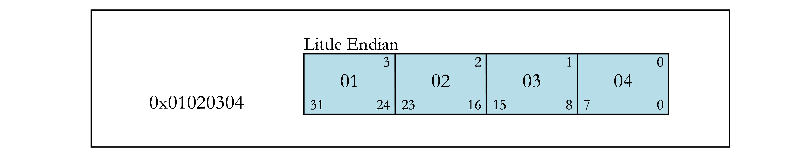
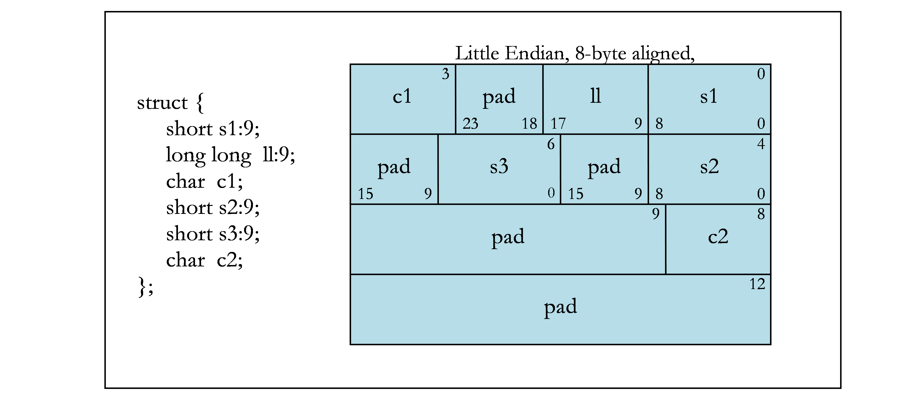

# 1. Introduction — PTX Interoperability 13.2 documentation

**来源**: [https://docs.nvidia.com/cuda/ptx-writers-guide-to-interoperability/index.html](https://docs.nvidia.com/cuda/ptx-writers-guide-to-interoperability/index.html)

---

PTX Writer’s Guide to Interoperability
The guide to writing ABI-compliant PTX.

# 1. Introduction
This document defines the Application Binary Interface (ABI) for the CUDA®architecture when generating PTX. By following the ABI, external developers can generate compliant PTX code that can be linked with other code.
PTX is a low-level parallel-thread-execution virtual machine and ISA (Instruction Set Architecture). PTX can be output from multiple tools or written directly by developers. PTX is meant to be GPU-architecture independent, so that the same code can be reused for different GPU architectures. For more information on PTX, refer to the latest version of the[PTX ISA reference document](https://docs.nvidia.com/cuda/parallel-thread-execution/index.html).
There are multiple CUDA architecture families, each with their own ISA; e.g. SM 5.x is the Maxwell family, SM 6.x is the Pascal family. This document describes the high-level ABI for all architectures. Programs conforming to an ABI are expected to be executed on the appropriate architecture GPU, and can assume that instructions from that ISA are available.

# 2. Data Representation

## 2.1. Fundamental Types
The below table shows the native scalar PTX types that are supported. Any PTX producer must use these sizes and alignments in order for its PTX to be compatible with PTX generated by other producers. PTX also supports native vector types, which are discussed in[Aggregates and Unions](https://docs.nvidia.com/cuda/ptx-writers-guide-to-interoperability/index.html#aggregates-unions).
The sizes of types are defined by the host. For example, pointer size and long int size are dictated by the hosts ABI. PTX has an .address_size directive that specifies the address size used throughout the PTX code. The size of pointers is 32 bits on a 32-bit host or 64 bits on a 64-bit host. However, addresses of the local and shared memory spaces are always 32 bits in size.
During separate compilation we store info about the host platform in each object file. The linker will fail to link object files generated for incompatible host platforms.

<div style="overflow-x: auto; max-width: 100%; border-radius: 6px;">
<table border="1" cellpadding="6" cellspacing="0" style="border-collapse: collapse; width: 100%; font-family: -apple-system, BlinkMacSystemFont, Segoe UI, Helvetica, Arial, sans-serif; font-size: 13px; margin: 16px 0;">
<colgroup>
<col style="width: 13%"/>
<col style="width: 20%"/>
<col style="width: 21%"/>
<col style="width: 46%"/>
</colgroup>
<thead>
<tr style="border: 1px solid #d0d7de;">
<th style="background-color: #f6f8fa; font-weight: 600; text-align: left; padding: 8px 12px; border: 1px solid #d0d7de;"><p>PTX Type</p></th>
<th style="background-color: #f6f8fa; font-weight: 600; text-align: left; padding: 8px 12px; border: 1px solid #d0d7de;"><p>Size (bytes)</p></th>
<th style="background-color: #f6f8fa; font-weight: 600; text-align: left; padding: 8px 12px; border: 1px solid #d0d7de;"><p>Align (bytes)</p></th>
<th style="background-color: #f6f8fa; font-weight: 600; text-align: left; padding: 8px 12px; border: 1px solid #d0d7de;"><p>Hardware Representation</p></th>
</tr>
</thead>
<tbody>
<tr style="border: 1px solid #d0d7de;">
<td style="padding: 8px 12px; border: 1px solid #d0d7de; vertical-align: top;"><p>.b8</p></td>
<td style="padding: 8px 12px; border: 1px solid #d0d7de; vertical-align: top;"><p>1</p></td>
<td style="padding: 8px 12px; border: 1px solid #d0d7de; vertical-align: top;"><p>1</p></td>
<td style="padding: 8px 12px; border: 1px solid #d0d7de; vertical-align: top;"><p>untyped byte</p></td>
</tr>
<tr style="border: 1px solid #d0d7de;">
<td style="padding: 8px 12px; border: 1px solid #d0d7de; vertical-align: top;"><p>.b16</p></td>
<td style="padding: 8px 12px; border: 1px solid #d0d7de; vertical-align: top;"><p>2</p></td>
<td style="padding: 8px 12px; border: 1px solid #d0d7de; vertical-align: top;"><p>2</p></td>
<td style="padding: 8px 12px; border: 1px solid #d0d7de; vertical-align: top;"><p>untyped halfword</p></td>
</tr>
<tr style="border: 1px solid #d0d7de;">
<td style="padding: 8px 12px; border: 1px solid #d0d7de; vertical-align: top;"><p>.b32</p></td>
<td style="padding: 8px 12px; border: 1px solid #d0d7de; vertical-align: top;"><p>4</p></td>
<td style="padding: 8px 12px; border: 1px solid #d0d7de; vertical-align: top;"><p>4</p></td>
<td style="padding: 8px 12px; border: 1px solid #d0d7de; vertical-align: top;"><p>untyped word</p></td>
</tr>
<tr style="border: 1px solid #d0d7de;">
<td style="padding: 8px 12px; border: 1px solid #d0d7de; vertical-align: top;"><p>.b64</p></td>
<td style="padding: 8px 12px; border: 1px solid #d0d7de; vertical-align: top;"><p>8</p></td>
<td style="padding: 8px 12px; border: 1px solid #d0d7de; vertical-align: top;"><p>8</p></td>
<td style="padding: 8px 12px; border: 1px solid #d0d7de; vertical-align: top;"><p>untyped doubleword</p></td>
</tr>
<tr style="border: 1px solid #d0d7de;">
<td style="padding: 8px 12px; border: 1px solid #d0d7de; vertical-align: top;"><p>.s8</p></td>
<td style="padding: 8px 12px; border: 1px solid #d0d7de; vertical-align: top;"><p>1</p></td>
<td style="padding: 8px 12px; border: 1px solid #d0d7de; vertical-align: top;"><p>1</p></td>
<td style="padding: 8px 12px; border: 1px solid #d0d7de; vertical-align: top;"><p>signed integral byte</p></td>
</tr>
<tr style="border: 1px solid #d0d7de;">
<td style="padding: 8px 12px; border: 1px solid #d0d7de; vertical-align: top;"><p>.s16</p></td>
<td style="padding: 8px 12px; border: 1px solid #d0d7de; vertical-align: top;"><p>2</p></td>
<td style="padding: 8px 12px; border: 1px solid #d0d7de; vertical-align: top;"><p>2</p></td>
<td style="padding: 8px 12px; border: 1px solid #d0d7de; vertical-align: top;"><p>signed integral halfword</p></td>
</tr>
<tr style="border: 1px solid #d0d7de;">
<td style="padding: 8px 12px; border: 1px solid #d0d7de; vertical-align: top;"><p>.s32</p></td>
<td style="padding: 8px 12px; border: 1px solid #d0d7de; vertical-align: top;"><p>4</p></td>
<td style="padding: 8px 12px; border: 1px solid #d0d7de; vertical-align: top;"><p>4</p></td>
<td style="padding: 8px 12px; border: 1px solid #d0d7de; vertical-align: top;"><p>signed integral word</p></td>
</tr>
<tr style="border: 1px solid #d0d7de;">
<td style="padding: 8px 12px; border: 1px solid #d0d7de; vertical-align: top;"><p>.s64</p></td>
<td style="padding: 8px 12px; border: 1px solid #d0d7de; vertical-align: top;"><p>8</p></td>
<td style="padding: 8px 12px; border: 1px solid #d0d7de; vertical-align: top;"><p>8</p></td>
<td style="padding: 8px 12px; border: 1px solid #d0d7de; vertical-align: top;"><p>signed integral doubleword</p></td>
</tr>
<tr style="border: 1px solid #d0d7de;">
<td style="padding: 8px 12px; border: 1px solid #d0d7de; vertical-align: top;"><p>.u8</p></td>
<td style="padding: 8px 12px; border: 1px solid #d0d7de; vertical-align: top;"><p>1</p></td>
<td style="padding: 8px 12px; border: 1px solid #d0d7de; vertical-align: top;"><p>1</p></td>
<td style="padding: 8px 12px; border: 1px solid #d0d7de; vertical-align: top;"><p>unsigned integral byte</p></td>
</tr>
<tr style="border: 1px solid #d0d7de;">
<td style="padding: 8px 12px; border: 1px solid #d0d7de; vertical-align: top;"><p>.u16</p></td>
<td style="padding: 8px 12px; border: 1px solid #d0d7de; vertical-align: top;"><p>2</p></td>
<td style="padding: 8px 12px; border: 1px solid #d0d7de; vertical-align: top;"><p>2</p></td>
<td style="padding: 8px 12px; border: 1px solid #d0d7de; vertical-align: top;"><p>unsigned integral halfword</p></td>
</tr>
<tr style="border: 1px solid #d0d7de;">
<td style="padding: 8px 12px; border: 1px solid #d0d7de; vertical-align: top;"><p>.u32</p></td>
<td style="padding: 8px 12px; border: 1px solid #d0d7de; vertical-align: top;"><p>4</p></td>
<td style="padding: 8px 12px; border: 1px solid #d0d7de; vertical-align: top;"><p>4</p></td>
<td style="padding: 8px 12px; border: 1px solid #d0d7de; vertical-align: top;"><p>unsigned integral word</p></td>
</tr>
<tr style="border: 1px solid #d0d7de;">
<td style="padding: 8px 12px; border: 1px solid #d0d7de; vertical-align: top;"><p>.u64</p></td>
<td style="padding: 8px 12px; border: 1px solid #d0d7de; vertical-align: top;"><p>8</p></td>
<td style="padding: 8px 12px; border: 1px solid #d0d7de; vertical-align: top;"><p>8</p></td>
<td style="padding: 8px 12px; border: 1px solid #d0d7de; vertical-align: top;"><p>unsigned integral doubleword</p></td>
</tr>
<tr style="border: 1px solid #d0d7de;">
<td style="padding: 8px 12px; border: 1px solid #d0d7de; vertical-align: top;"><p>.f16</p></td>
<td style="padding: 8px 12px; border: 1px solid #d0d7de; vertical-align: top;"><p>2</p></td>
<td style="padding: 8px 12px; border: 1px solid #d0d7de; vertical-align: top;"><p>2</p></td>
<td style="padding: 8px 12px; border: 1px solid #d0d7de; vertical-align: top;"><p>IEEE half precision</p></td>
</tr>
<tr style="border: 1px solid #d0d7de;">
<td style="padding: 8px 12px; border: 1px solid #d0d7de; vertical-align: top;"><p>.f32</p></td>
<td style="padding: 8px 12px; border: 1px solid #d0d7de; vertical-align: top;"><p>4</p></td>
<td style="padding: 8px 12px; border: 1px solid #d0d7de; vertical-align: top;"><p>4</p></td>
<td style="padding: 8px 12px; border: 1px solid #d0d7de; vertical-align: top;"><p>IEEE single precision</p></td>
</tr>
<tr style="border: 1px solid #d0d7de;">
<td style="padding: 8px 12px; border: 1px solid #d0d7de; vertical-align: top;"><p>.f64</p></td>
<td style="padding: 8px 12px; border: 1px solid #d0d7de; vertical-align: top;"><p>8</p></td>
<td style="padding: 8px 12px; border: 1px solid #d0d7de; vertical-align: top;"><p>8</p></td>
<td style="padding: 8px 12px; border: 1px solid #d0d7de; vertical-align: top;"><p>IEEE double precision</p></td>
</tr>
</tbody>
</table>
</div>

## 2.2. Aggregates and Unions
Beyond the scalar types, PTX also supports native-vector types of these scalar types, with both its vector syntax and its byte-array syntax. For scalar types with a size no greater than four bytes, vector types with 1, 2, 3, and 4 elements exist; for all other types, only 1 and 2 element vector types exist.
All aggregates and unions can be supported in PTX with its byte-array syntax.
The following are the size-and-alignment rules for all aggregates and unions.
- For a non-native-vector type, an entire aggregate or union is aligned on the same boundary as its most strictly aligned member. This rule is not followed if the alignments are defined by the input language. For example, in OpenCL built-in vector data types have their alignment set to the size of the built-in data type in bytes.
- For a native vector type – discussed at the start of this section – the alignment is defined as follows. (For the definitions below, the native vector has n elements and has an element type t.)
  - For a vector with an odd number of elements, its alignment is the same as its member: alignof(t).
  - For a vector with an even number of elements, its alignment is set to number of elements times the alignment of its member: n*alignof(t).
- Each member is assigned to the lowest available offset with the appropriate alignment. This may require internal padding, depending on the previous member.
- The size of an aggregate or union, if necessary, is increased to make it a multiple of the alignment of the aggregate or union. This may require tail padding, depending on the last member.

## 2.3. Bit Fields
C structure and union definitions may have bit fields that define integral objects with a specified number of bits.

<div style="overflow-x: auto; max-width: 100%; border-radius: 6px;">
<table border="1" cellpadding="6" cellspacing="0" style="border-collapse: collapse; width: 100%; font-family: -apple-system, BlinkMacSystemFont, Segoe UI, Helvetica, Arial, sans-serif; font-size: 13px; margin: 16px 0;">
<colgroup>
<col style="width: 30%"/>
<col style="width: 12%"/>
<col style="width: 58%"/>
</colgroup>
<thead>
<tr style="border: 1px solid #d0d7de;">
<th style="background-color: #f6f8fa; font-weight: 600; text-align: left; padding: 8px 12px; border: 1px solid #d0d7de;"><p>Bit Field Type</p></th>
<th style="background-color: #f6f8fa; font-weight: 600; text-align: left; padding: 8px 12px; border: 1px solid #d0d7de;"><p>Width w</p></th>
<th style="background-color: #f6f8fa; font-weight: 600; text-align: left; padding: 8px 12px; border: 1px solid #d0d7de;"><p>Range</p></th>
</tr>
</thead>
<tbody>
<tr style="border: 1px solid #d0d7de;">
<td style="padding: 8px 12px; border: 1px solid #d0d7de; vertical-align: top;"><p>signed char</p></td>
<td style="padding: 8px 12px; border: 1px solid #d0d7de; vertical-align: top;"><p>1 to 8</p></td>
<td style="padding: 8px 12px; border: 1px solid #d0d7de; vertical-align: top;"><p>-2<sup>w-1</sup> to 2<sup>w-1</sup> - 1</p></td>
</tr>
<tr style="border: 1px solid #d0d7de;">
<td style="padding: 8px 12px; border: 1px solid #d0d7de; vertical-align: top;"><p>unsigned char</p></td>
<td style="padding: 8px 12px; border: 1px solid #d0d7de; vertical-align: top;"><p>1 to 8</p></td>
<td style="padding: 8px 12px; border: 1px solid #d0d7de; vertical-align: top;"><p>0 to 2<sup>w</sup> - 1</p></td>
</tr>
<tr style="border: 1px solid #d0d7de;">
<td style="padding: 8px 12px; border: 1px solid #d0d7de; vertical-align: top;"><p>signed short</p></td>
<td style="padding: 8px 12px; border: 1px solid #d0d7de; vertical-align: top;"><p>1 to 16</p></td>
<td style="padding: 8px 12px; border: 1px solid #d0d7de; vertical-align: top;"><p>-2<sup>w-1</sup> to 2<sup>w-1</sup> - 1</p></td>
</tr>
<tr style="border: 1px solid #d0d7de;">
<td style="padding: 8px 12px; border: 1px solid #d0d7de; vertical-align: top;"><p>unsigned short</p></td>
<td style="padding: 8px 12px; border: 1px solid #d0d7de; vertical-align: top;"><p>1 to 16</p></td>
<td style="padding: 8px 12px; border: 1px solid #d0d7de; vertical-align: top;"><p>0 to 2<sup>w</sup> - 1</p></td>
</tr>
<tr style="border: 1px solid #d0d7de;">
<td style="padding: 8px 12px; border: 1px solid #d0d7de; vertical-align: top;"><p>signed int</p></td>
<td style="padding: 8px 12px; border: 1px solid #d0d7de; vertical-align: top;"><p>1 to 32</p></td>
<td style="padding: 8px 12px; border: 1px solid #d0d7de; vertical-align: top;"><p>-2<sup>w-1</sup> to 2<sup>w-1</sup> - 1</p></td>
</tr>
<tr style="border: 1px solid #d0d7de;">
<td style="padding: 8px 12px; border: 1px solid #d0d7de; vertical-align: top;"><p>unsigned int</p></td>
<td style="padding: 8px 12px; border: 1px solid #d0d7de; vertical-align: top;"><p>1 to 32</p></td>
<td style="padding: 8px 12px; border: 1px solid #d0d7de; vertical-align: top;"><p>0 to 2<sup>w</sup> - 1</p></td>
</tr>
<tr style="border: 1px solid #d0d7de;">
<td style="padding: 8px 12px; border: 1px solid #d0d7de; vertical-align: top;"><p>signed long long</p></td>
<td style="padding: 8px 12px; border: 1px solid #d0d7de; vertical-align: top;"><p>1 to 64</p></td>
<td style="padding: 8px 12px; border: 1px solid #d0d7de; vertical-align: top;"><p>-2<sup>w-1</sup> to 2<sup>w-1</sup> - 1</p></td>
</tr>
<tr style="border: 1px solid #d0d7de;">
<td style="padding: 8px 12px; border: 1px solid #d0d7de; vertical-align: top;"><p>unsigned long long</p></td>
<td style="padding: 8px 12px; border: 1px solid #d0d7de; vertical-align: top;"><p>1 to 64</p></td>
<td style="padding: 8px 12px; border: 1px solid #d0d7de; vertical-align: top;"><p>0 to 2<sup>w</sup> - 1</p></td>
</tr>
</tbody>
</table>
</div>

Current GPUs only support little-endian memory, so the below assumes little-endian layout.
The following are rules that apply to bit fields.
- Plain bit fields (neither signed nor unsigned is specified) are treated as signed.
- When no type is provided (e.g., signed : 6 is specified), the type defaults to int.
Bit fields obey the same size and alignment rules as other structure and union members, with the following modifications.
- Bit fields are allocated in memory from right to left (least to more significant) for little endian.
- A bit field must entirely reside in a storage unit appropriate for its declared type. A bit field should never cross its unit boundary.
- Bit fields may share a storage unit with other structure and union members, including members that are not bit fields, as long as there is enough space within the storage unit.
- Unnamed bit fields do not affect the alignment of a structure or union.
- Zero-length bit fields force the alignment of the following member of a structure to the next alignment boundary corresponding to the bit-field type. An unnamed, zero-length bit field will not force the external alignment of the structure to that boundary. If an unnamed, zero-length bit field has a stricter alignment than the external alignment, there is no guarantee that the stricter alignment will be maintained when the structure or union gets allocated to memory.
The following figures contain examples of bit fields. Figure 1 shows the byte offsets (upper corners) and the bit numbers (lower corners) that are used in the examples. The remaining figures show different bit-field examples.



Bit Numbering


Bit-field Allocation



Boundary Alignment


Storage Unit Sharing


Union Allocation


Unnamed Bit Fields

## 2.4. Texture, Sampler, and Surface Types
Texture, sampler and surface types are used to define references to texture and surface memory. The CUDA architecture provides hardware and instructions to efficiently read data from texture or surface memory as opposed to global memory.
References to textures are bound through runtime functions to device read-only regions of memory, called a texture memory, before they can be used by a kernel. A texture reference has several attributes e.g. normalized mode, addressing mode, and texture filtering etc. A sampler reference can be used to sample a texture when read in a kernel. A surface reference is used to read or write data from and to the surface memory. It also has various attributes similar to a texture.
At the PTX level objects that access texture or surface memory are referred to as opaque objects. Textures are expressed by either a .texref or .samplerref type and surfaces are expressed by the .surfref type. The data of opaque objects can be accessed by specific instructions (TEX for .texref/.samplerref and SULD/SUST for .surfref). The attributes of opaque objects are implemented by allocating a descriptor in memory which is populated by the driver. PTX TXQ/SUQ instructions get translated into memory reads of fields of the descriptor. The internal format of the descriptor varies with each architecture and should not be relied on by the user. The data and the attributes of an opaque object may be accessed directly if the texture or surface reference is known at compile time or indirectly. If the reference is not known during compile time all information required to read data and attributes is contained in a .b64 value called the handle. The handle can be used to pass and return oqaque object references to and from functions as well as to reference external textures, samplers and surfaces.

# 3. Function Calling Sequence
This section describes the PTX-level function calling sequence, including register usage, stack-frame layout, and parameter passing. The PTX-level function calling sequence describes what gets represented in PTX to enable function calls. There is an abstraction at this level. Most of the details associated with the function calling sequence are handled at the SASS level.
PTX versions earlier than 2.0 do not conform to the ABI defined in this document, and cannot perform ABI compatible function calls. For the calling convention to work PTX version 2.0 or greater must be used.

## 3.1. Registers
At the PTX level, the registers that are specified are virtual. Register allocation occurs during PTX-to-SASS translation. The PTX-to-SASS translation also converts parameters and return values to physical registers or stack locations.

## 3.2. Stack Frame
The PTX level has no concept of the software stack. Manipulation of the stack is completely defined at the SASS level, and gets allocated during the PTX-to-SASS translation process.

## 3.3. Parameter Passing
At the PTX level, all parameters and return values present in a device function use the parameter state space (.param). The below table contains the rules for handling parameters and return values that are defined at the source level. For each source-level type, the corresponding PTX-level type that should be used is provided.

<div style="overflow-x: auto; max-width: 100%; border-radius: 6px;">
<table border="1" cellpadding="6" cellspacing="0" style="border-collapse: collapse; width: 100%; font-family: -apple-system, BlinkMacSystemFont, Segoe UI, Helvetica, Arial, sans-serif; font-size: 13px; margin: 16px 0;">
<colgroup>
<col style="width: 11%"/>
<col style="width: 10%"/>
<col style="width: 79%"/>
</colgroup>
<thead>
<tr style="border: 1px solid #d0d7de;">
<th style="background-color: #f6f8fa; font-weight: 600; text-align: left; padding: 8px 12px; border: 1px solid #d0d7de;"><p>Source Type</p></th>
<th style="background-color: #f6f8fa; font-weight: 600; text-align: left; padding: 8px 12px; border: 1px solid #d0d7de;"><p>Size in Bits</p></th>
<th style="background-color: #f6f8fa; font-weight: 600; text-align: left; padding: 8px 12px; border: 1px solid #d0d7de;"><p>PTX Type</p></th>
</tr>
</thead>
<tbody>
<tr style="border: 1px solid #d0d7de;">
<td style="padding: 8px 12px; border: 1px solid #d0d7de; vertical-align: top;"><p>Integral types</p></td>
<td style="padding: 8px 12px; border: 1px solid #d0d7de; vertical-align: top;"><p>8 to 32 (A)</p></td>
<td style="padding: 8px 12px; border: 1px solid #d0d7de; vertical-align: top;"><p>.u32 (if unsigned) or .s32 (if signed)</p></td>
</tr>
<tr style="border: 1px solid #d0d7de;">
<td style="padding: 8px 12px; border: 1px solid #d0d7de; vertical-align: top;"><p>Integral types</p></td>
<td style="padding: 8px 12px; border: 1px solid #d0d7de; vertical-align: top;"><p>64</p></td>
<td style="padding: 8px 12px; border: 1px solid #d0d7de; vertical-align: top;"><p>.u64 (if unsigned) or .s64 (if signed)</p></td>
</tr>
<tr style="border: 1px solid #d0d7de;">
<td style="padding: 8px 12px; border: 1px solid #d0d7de; vertical-align: top;"><p>Pointers (B)</p></td>
<td style="padding: 8px 12px; border: 1px solid #d0d7de; vertical-align: top;"><p>32</p></td>
<td style="padding: 8px 12px; border: 1px solid #d0d7de; vertical-align: top;"><p>.u32</p></td>
</tr>
<tr style="border: 1px solid #d0d7de;">
<td style="padding: 8px 12px; border: 1px solid #d0d7de; vertical-align: top;"><p>Pointers (B)</p></td>
<td style="padding: 8px 12px; border: 1px solid #d0d7de; vertical-align: top;"><p>64</p></td>
<td style="padding: 8px 12px; border: 1px solid #d0d7de; vertical-align: top;"><p>.u64</p></td>
</tr>
<tr style="border: 1px solid #d0d7de;">
<td style="padding: 8px 12px; border: 1px solid #d0d7de; vertical-align: top;"><p>Floating-point types (C)</p></td>
<td style="padding: 8px 12px; border: 1px solid #d0d7de; vertical-align: top;"><p>32</p></td>
<td style="padding: 8px 12px; border: 1px solid #d0d7de; vertical-align: top;"><p>.f32</p></td>
</tr>
<tr style="border: 1px solid #d0d7de;">
<td style="padding: 8px 12px; border: 1px solid #d0d7de; vertical-align: top;"><p>Floating-point types (C)</p></td>
<td style="padding: 8px 12px; border: 1px solid #d0d7de; vertical-align: top;"><p>64</p></td>
<td style="padding: 8px 12px; border: 1px solid #d0d7de; vertical-align: top;"><p>.f64</p></td>
</tr>
<tr style="border: 1px solid #d0d7de;">
<td style="padding: 8px 12px; border: 1px solid #d0d7de; vertical-align: top;"><p>Aggregates or unions</p></td>
<td style="padding: 8px 12px; border: 1px solid #d0d7de; vertical-align: top;"><p>Any size</p></td>
<td style="padding: 8px 12px; border: 1px solid #d0d7de; vertical-align: top;">
<p>.align <code class="docutils literal notranslate"><span class="pre">align</span></code> .b8 <code class="docutils literal notranslate"><span class="pre">name</span></code>[<code class="docutils literal notranslate"><span class="pre">size</span></code>]</p>
<p>Where <code class="docutils literal notranslate"><span class="pre">align</span></code> is overall aggregate-or-union alignment in bytes (D), <code class="docutils literal notranslate"><span class="pre">name</span></code> is variable name associated with aggregate or union, and <code class="docutils literal notranslate"><span class="pre">size</span></code> is the aggregate-or-union size in bytes.</p>
</td>
</tr>
<tr style="border: 1px solid #d0d7de;">
<td style="padding: 8px 12px; border: 1px solid #d0d7de; vertical-align: top;"><p>Handles (E)</p></td>
<td style="padding: 8px 12px; border: 1px solid #d0d7de; vertical-align: top;"><p>64</p></td>
<td style="padding: 8px 12px; border: 1px solid #d0d7de; vertical-align: top;"><p>.b64 (assigned from .texref, .sampleref, .surfref)</p></td>
</tr>
</tbody>
</table>
</div>

NOTES:
1. Values shorter than 32-bits are sign extended or zero extended, depending on whether they are signed or unsigned types.
2. Unless the memory type is specified in the function declaration, all pointers passed at the PTX level must use a generic address.
3. 16-bit floating-point types are only used for storage. Therefore, they cannot be used for parameters or return values.
4. The alignment must be 1, 2, 4, 8, 16, 32, 64, or 128 bytes.
5. The PTX built-in opaque types such as texture, sampler, and surface types are can be passed into functions as parameters and be returned by them through 64-bit handles. The handle contains the necessary information to access the actual data from the texture or surface memory as well as the attributes of the object stored in its type descriptor. See section[Texture, Sampler, and Surface Types](https://docs.nvidia.com/cuda/ptx-writers-guide-to-interoperability/index.html#textures-surfaces-samplers)for more information on handles.

# 4. System Calls
System calls are calls into the driver operating system code. In PTX they look like regular calls, but the function definition is not given. A prototype must be provided in the PTX file, but the implementation of the function is provided by the driver.
The prototype for the vprintf system call is:

```
.extern .func (.param .s32 status) vprintf (.param t1 format, .param t2 valist)

```

The following are the definitions for the vprintf parameters and return value.
- status : The status value that is returned by vprintf.
- format : A pointer to the format specifier input. For 32-bit addresses, type t1 is .b32. For 64-bit addresses, type t1 is .b64.
- valist : A pointer to the valist input. For 32-bit addresses, type t2 is .b32. For 64-bit addresses, type t2 is .b64.
A call to vprintf using 32-bit addresses looks like:

```
cvta.global.b32    %r2, _fmt;
st.param.b32  [param0], %r2;
cvta.local.b32  %r3, _valist_array;
st.param.b32  [param1], %r3;
call.uni (_), vprintf, (param0, param1);

```

For this code, _fmt is the format string in global memory, and _valist_array is the valist of arguments. Note that any pointers must be converted to generic space. The vprintf syscall is emitted as part of the printf function defined in “stdio.h”.
The prototype for the malloc system call is:

```
.extern .func (.param t1 ptr) malloc (.param t2 size)

```

The following are the definitions for the malloc parameters and return value.
- ptr : The pointer to the memory that was allocated by malloc. For 32-bit addresses, type t1 is .b32. For 64-bit addresses, type t1 is .b64.
- size : The size of memory needed from malloc. This size is defined by the type size_t. When size_t is 32 bits, type t2 is .b32. When size_t is 64 bits, type t2 is .b64.
The prototype for the free system call is:

```
.extern .func free (.param t1 ptr)

```

The following is the definition for the free parameter.
- ptr : The pointer to the memory that should be freed. For 32-bit addresses, type t1 is .b32. For 64-bit addresses, type t1 is .b64.
The malloc and free system calls are emitted as part of the malloc and free functions defined in “malloc.h”.
In order to support assert, the PTX function call __assertfail is used whenever the assert expression produces a false value. The prototype for the __assertfail system call is:

```
.extern .func __assertfail (.param t1 message, .param t1 file, .param .b32 line, .param t1 function, .param t2 charSize)

```

The following are the definitions for the __assertfail parameters.
- message : The pointer to the string that should be output. For 32-bit addresses, type t1 is .b32. For 64-bit addresses, type t1 is .b64.
- file : The pointer to the file name string associated with the assert. For 32-bit addresses, type t1 is .b32. For 64-bit addresses, type t1 is .b64.
- line : The line number associated with the assert.
- function : The pointer to the function name string associated with the assert. For 32-bit addresses, type t1 is .b32. For 64-bit addresses, type t1 is .b64.
- charSize : The size in bytes of the characters contained in the __assertfail parameter strings. The only supported character size is 1. The character size is defined by the type size_t. When size_t is 32 bits, type t2 is .b32. When size_t is 64 bits, type t2 is .b64.
The __assertfail system call is emitted as part of the assert macro defined in “assert.h”.

# 5. Atomics Application Binary Interface
The mappings of programming languages’ atomic operations to the PTX ISA need to
be implemented in a consistent manner across all programming languages that may
concurrently access shared memory.
The mapping from C++11 atomics for the CUDA architecture are proven correct in
[A Formal Analysis of the NVIDIA PTX Memory Consistency Model](https://dl.acm.org/doi/10.1145/3297858.3304043).
The PTX ISA provides atomic memory operations and fences for acquire, release,
acquire-release, and relaxed C++ memory ordering semantics.

Note
The memory order parameter is monotonic, and so it is valid to strengthen any such parameter. For example, it is valid to
strengthen`fence.sc.<scope>; ld.relaxed.<scope>;`to`fence.sc.<scope>; ld.acquire.<scope>;`for sequentially consistent
loads. The same applies for all mappings below.

Note
Where there is a choice of PTX ABI ISA mapping for a given C, C++, or CUDA C++ API it is acceptable to pick either and to
mix mappings within the same binary.

The PTX ABI for C++ sequentially consistent atomic operations is the following:

<div style="overflow-x: auto; max-width: 100%; border-radius: 6px;">
<table border="1" cellpadding="6" cellspacing="0" style="border-collapse: collapse; width: 100%; font-family: -apple-system, BlinkMacSystemFont, Segoe UI, Helvetica, Arial, sans-serif; font-size: 13px; margin: 16px 0;">
<colgroup>
<col style="width: 47%"/>
<col style="width: 53%"/>
</colgroup>
<thead>
<tr style="border: 1px solid #d0d7de;">
<th style="background-color: #f6f8fa; font-weight: 600; text-align: left; padding: 8px 12px; border: 1px solid #d0d7de;"><p>C or C++ or CUDA C++ API</p></th>
<th style="background-color: #f6f8fa; font-weight: 600; text-align: left; padding: 8px 12px; border: 1px solid #d0d7de;"><p>PTX ABI ISA mapping</p></th>
</tr>
</thead>
<tbody>
<tr style="border: 1px solid #d0d7de;">
<td style="padding: 8px 12px; border: 1px solid #d0d7de; vertical-align: top;"><p><code class="docutils literal notranslate"><span class="pre">atomic_thread_fence(memory_order_seq_cst,</span> <span class="pre">thread_scope_&lt;scope&gt;)</span></code></p></td>
<td style="padding: 8px 12px; border: 1px solid #d0d7de; vertical-align: top;"><p><code class="docutils literal notranslate"><span class="pre">fence.sc.&lt;scope&gt;;</span></code></p></td>
</tr>
<tr style="border: 1px solid #d0d7de;">
<td style="padding: 8px 12px; border: 1px solid #d0d7de; vertical-align: top;"><p><code class="docutils literal notranslate"><span class="pre">atomic_load(memory_order_seq_cst,</span> <span class="pre">thread_scope_&lt;scope&gt;)</span></code></p></td>
<td style="padding: 8px 12px; border: 1px solid #d0d7de; vertical-align: top;">
<div class="line-block">
<div class="line">
<code class="docutils literal notranslate"><span class="pre">fence.sc.&lt;scope&gt;;</span> <span class="pre">ld.acquire.&lt;scope&gt;;</span></code> (recommended) OR</div>
<div class="line"><code class="docutils literal notranslate"><span class="pre">fence.sc.&lt;scope&gt;;</span> <span class="pre">ld.relaxed.&lt;scope&gt;;</span> <span class="pre">fence.acquire.&lt;scope&gt;;</span></code></div>
</div>
</td>
</tr>
<tr style="border: 1px solid #d0d7de;">
<td style="padding: 8px 12px; border: 1px solid #d0d7de; vertical-align: top;"><p><code class="docutils literal notranslate"><span class="pre">atomic_store(memory_order_seq_cst,</span> <span class="pre">thread_scope_&lt;scope&gt;)</span></code></p></td>
<td style="padding: 8px 12px; border: 1px solid #d0d7de; vertical-align: top;"><p><code class="docutils literal notranslate"><span class="pre">fence.sc.&lt;scope&gt;;</span> <span class="pre">st.relaxed.&lt;scope&gt;;</span></code></p></td>
</tr>
<tr style="border: 1px solid #d0d7de;">
<td style="padding: 8px 12px; border: 1px solid #d0d7de; vertical-align: top;"><p><code class="docutils literal notranslate"><span class="pre">atomic_&lt;rmw</span> <span class="pre">op&gt;(memory_order_seq_cst,</span> <span class="pre">thread_scope_&lt;scope&gt;)</span></code></p></td>
<td style="padding: 8px 12px; border: 1px solid #d0d7de; vertical-align: top;">
<div class="line-block">
<div class="line">
<code class="docutils literal notranslate"><span class="pre">fence.sc.&lt;scope&gt;;</span> <span class="pre">atom.acquire.&lt;scope&gt;.&lt;rmw</span> <span class="pre">op&gt;;</span></code> (recommended) OR</div>
<div class="line"><code class="docutils literal notranslate"><span class="pre">fence.sc.&lt;scope&gt;;</span> <span class="pre">atom.relaxed.&lt;scope&gt;.&lt;rmw</span> <span class="pre">op&gt;;</span> <span class="pre">fence.acquire.&lt;scope&gt;;</span></code></div>
</div>
</td>
</tr>
</tbody>
</table>
</div>

The PTX ABI for C++ release atomic operations is the following:

<div style="overflow-x: auto; max-width: 100%; border-radius: 6px;">
<table border="1" cellpadding="6" cellspacing="0" style="border-collapse: collapse; width: 100%; font-family: -apple-system, BlinkMacSystemFont, Segoe UI, Helvetica, Arial, sans-serif; font-size: 13px; margin: 16px 0;">
<colgroup>
<col style="width: 53%"/>
<col style="width: 47%"/>
</colgroup>
<thead>
<tr style="border: 1px solid #d0d7de;">
<th style="background-color: #f6f8fa; font-weight: 600; text-align: left; padding: 8px 12px; border: 1px solid #d0d7de;"><p>C or C++ or CUDA C++ API</p></th>
<th style="background-color: #f6f8fa; font-weight: 600; text-align: left; padding: 8px 12px; border: 1px solid #d0d7de;"><p>PTX ABI ISA mapping</p></th>
</tr>
</thead>
<tbody>
<tr style="border: 1px solid #d0d7de;">
<td style="padding: 8px 12px; border: 1px solid #d0d7de; vertical-align: top;"><p><code class="docutils literal notranslate"><span class="pre">atomic_thread_fence(memory_order_release,</span> <span class="pre">thread_scope_&lt;scope&gt;)</span></code></p></td>
<td style="padding: 8px 12px; border: 1px solid #d0d7de; vertical-align: top;"><p><code class="docutils literal notranslate"><span class="pre">fence.release.&lt;scope&gt;;</span></code></p></td>
</tr>
<tr style="border: 1px solid #d0d7de;">
<td style="padding: 8px 12px; border: 1px solid #d0d7de; vertical-align: top;"><p><code class="docutils literal notranslate"><span class="pre">atomic_store(memory_order_release,</span> <span class="pre">thread_scope_&lt;scope&gt;)</span></code></p></td>
<td style="padding: 8px 12px; border: 1px solid #d0d7de; vertical-align: top;">
<div class="line-block">
<div class="line">
<code class="docutils literal notranslate"><span class="pre">st.release.&lt;scope&gt;;</span></code> (recommended) OR</div>
<div class="line"><code class="docutils literal notranslate"><span class="pre">fence.release.&lt;scope&gt;;</span> <span class="pre">st.relaxed.&lt;scope&gt;;</span></code></div>
</div>
</td>
</tr>
<tr style="border: 1px solid #d0d7de;">
<td style="padding: 8px 12px; border: 1px solid #d0d7de; vertical-align: top;"><p><code class="docutils literal notranslate"><span class="pre">atomic_&lt;rmw</span> <span class="pre">op&gt;(memory_order_release,</span> <span class="pre">thread_scope_&lt;scope&gt;)</span></code></p></td>
<td style="padding: 8px 12px; border: 1px solid #d0d7de; vertical-align: top;">
<div class="line-block">
<div class="line">
<code class="docutils literal notranslate"><span class="pre">atom.release.&lt;scope&gt;.&lt;rmw</span> <span class="pre">op&gt;;</span></code> (recommended) OR</div>
<div class="line"><code class="docutils literal notranslate"><span class="pre">fence.release.&lt;scope&gt;;</span> <span class="pre">atom.relaxed.&lt;scope&gt;.&lt;rmw</span> <span class="pre">op&gt;;</span></code></div>
</div>
</td>
</tr>
</tbody>
</table>
</div>

The PTX ABI for C++ acquire atomic operations is the following:

<div style="overflow-x: auto; max-width: 100%; border-radius: 6px;">
<table border="1" cellpadding="6" cellspacing="0" style="border-collapse: collapse; width: 100%; font-family: -apple-system, BlinkMacSystemFont, Segoe UI, Helvetica, Arial, sans-serif; font-size: 13px; margin: 16px 0;">
<colgroup>
<col style="width: 53%"/>
<col style="width: 47%"/>
</colgroup>
<thead>
<tr style="border: 1px solid #d0d7de;">
<th style="background-color: #f6f8fa; font-weight: 600; text-align: left; padding: 8px 12px; border: 1px solid #d0d7de;"><p>C or C++ or CUDA C++ API</p></th>
<th style="background-color: #f6f8fa; font-weight: 600; text-align: left; padding: 8px 12px; border: 1px solid #d0d7de;"><p>PTX ABI ISA mapping</p></th>
</tr>
</thead>
<tbody>
<tr style="border: 1px solid #d0d7de;">
<td style="padding: 8px 12px; border: 1px solid #d0d7de; vertical-align: top;"><p><code class="docutils literal notranslate"><span class="pre">atomic_thread_fence(memory_order_acquire,</span> <span class="pre">thread_scope_&lt;scope&gt;)</span></code></p></td>
<td style="padding: 8px 12px; border: 1px solid #d0d7de; vertical-align: top;"><p><code class="docutils literal notranslate"><span class="pre">fence.acquire.&lt;scope&gt;;</span></code></p></td>
</tr>
<tr style="border: 1px solid #d0d7de;">
<td style="padding: 8px 12px; border: 1px solid #d0d7de; vertical-align: top;"><p><code class="docutils literal notranslate"><span class="pre">atomic_load(memory_order_acquire,</span> <span class="pre">thread_scope_&lt;scope&gt;)</span></code></p></td>
<td style="padding: 8px 12px; border: 1px solid #d0d7de; vertical-align: top;">
<div class="line-block">
<div class="line">
<code class="docutils literal notranslate"><span class="pre">ld.acquire.&lt;scope&gt;;</span></code> (recommended) OR</div>
<div class="line"><code class="docutils literal notranslate"><span class="pre">ld.relaxed.&lt;scope&gt;;</span> <span class="pre">fence.acquire.&lt;scope&gt;;</span></code></div>
</div>
</td>
</tr>
<tr style="border: 1px solid #d0d7de;">
<td style="padding: 8px 12px; border: 1px solid #d0d7de; vertical-align: top;"><p><code class="docutils literal notranslate"><span class="pre">atomic_&lt;rmw</span> <span class="pre">op&gt;(memory_order_acquire,</span> <span class="pre">thread_scope_&lt;scope&gt;)</span></code></p></td>
<td style="padding: 8px 12px; border: 1px solid #d0d7de; vertical-align: top;">
<div class="line-block">
<div class="line">
<code class="docutils literal notranslate"><span class="pre">atom.acquire.&lt;scope&gt;.&lt;rmw</span> <span class="pre">op&gt;;</span></code> (recommended) OR</div>
<div class="line"><code class="docutils literal notranslate"><span class="pre">atom.relaxed.&lt;scope&gt;.&lt;rmw</span> <span class="pre">op&gt;;</span> <span class="pre">fence.acquire.&lt;scope&gt;;</span></code></div>
</div>
</td>
</tr>
</tbody>
</table>
</div>

The PTX ABI for C++ acquire-release atomic operations is the following:

<div style="overflow-x: auto; max-width: 100%; border-radius: 6px;">
<table border="1" cellpadding="6" cellspacing="0" style="border-collapse: collapse; width: 100%; font-family: -apple-system, BlinkMacSystemFont, Segoe UI, Helvetica, Arial, sans-serif; font-size: 13px; margin: 16px 0;">
<colgroup>
<col style="width: 45%"/>
<col style="width: 55%"/>
</colgroup>
<thead>
<tr style="border: 1px solid #d0d7de;">
<th style="background-color: #f6f8fa; font-weight: 600; text-align: left; padding: 8px 12px; border: 1px solid #d0d7de;"><p>C or C++ or CUDA C++ API</p></th>
<th style="background-color: #f6f8fa; font-weight: 600; text-align: left; padding: 8px 12px; border: 1px solid #d0d7de;"><p>PTX ABI ISA mapping</p></th>
</tr>
</thead>
<tbody>
<tr style="border: 1px solid #d0d7de;">
<td style="padding: 8px 12px; border: 1px solid #d0d7de; vertical-align: top;"><p><code class="docutils literal notranslate"><span class="pre">atomic_thread_fence(memory_order_acq_rel,</span> <span class="pre">thread_scope_&lt;scope&gt;)</span></code></p></td>
<td style="padding: 8px 12px; border: 1px solid #d0d7de; vertical-align: top;"><p><code class="docutils literal notranslate"><span class="pre">fence.acq_rel.&lt;scope&gt;;</span></code></p></td>
</tr>
<tr style="border: 1px solid #d0d7de;">
<td style="padding: 8px 12px; border: 1px solid #d0d7de; vertical-align: top;"><p><code class="docutils literal notranslate"><span class="pre">atomic_&lt;rmw</span> <span class="pre">op&gt;(memory_order_acq_rel,</span> <span class="pre">thread_scope_&lt;scope&gt;)</span></code></p></td>
<td style="padding: 8px 12px; border: 1px solid #d0d7de; vertical-align: top;">
<div class="line-block">
<div class="line">
<code class="docutils literal notranslate"><span class="pre">atom.acq_rel.&lt;scope&gt;.&lt;rmw</span> <span class="pre">op&gt;;</span></code> (recommended) OR</div>
<div class="line">
<code class="docutils literal notranslate"><span class="pre">fence.release.&lt;scope&gt;;</span> <span class="pre">atom.acquire.&lt;scope&gt;.&lt;rmw</span> <span class="pre">op&gt;;</span></code> OR</div>
<div class="line"><code class="docutils literal notranslate"><span class="pre">fence.release.&lt;scope&gt;;</span> <span class="pre">atom.relaxed.&lt;scope&gt;.&lt;rmw</span> <span class="pre">op&gt;;</span> <span class="pre">fence.acquire.&lt;scope&gt;;</span></code></div>
</div>
</td>
</tr>
</tbody>
</table>
</div>

The PTX ABI for C++ relaxed atomic operations is the following:

<div style="overflow-x: auto; max-width: 100%; border-radius: 6px;">
<table border="1" cellpadding="6" cellspacing="0" style="border-collapse: collapse; width: 100%; font-family: -apple-system, BlinkMacSystemFont, Segoe UI, Helvetica, Arial, sans-serif; font-size: 13px; margin: 16px 0;">
<colgroup>
<col style="width: 54%"/>
<col style="width: 46%"/>
</colgroup>
<thead>
<tr style="border: 1px solid #d0d7de;">
<th style="background-color: #f6f8fa; font-weight: 600; text-align: left; padding: 8px 12px; border: 1px solid #d0d7de;"><p>C or C++ or CUDA C++ API</p></th>
<th style="background-color: #f6f8fa; font-weight: 600; text-align: left; padding: 8px 12px; border: 1px solid #d0d7de;"><p>PTX ABI ISA mapping</p></th>
</tr>
</thead>
<tbody>
<tr style="border: 1px solid #d0d7de;">
<td style="padding: 8px 12px; border: 1px solid #d0d7de; vertical-align: top;"><p><code class="docutils literal notranslate"><span class="pre">atomic_load(memory_order_relaxed,</span> <span class="pre">thread_scope_&lt;scope&gt;)</span></code></p></td>
<td style="padding: 8px 12px; border: 1px solid #d0d7de; vertical-align: top;"><p><code class="docutils literal notranslate"><span class="pre">ld.relaxed.&lt;scope&gt;;</span></code></p></td>
</tr>
<tr style="border: 1px solid #d0d7de;">
<td style="padding: 8px 12px; border: 1px solid #d0d7de; vertical-align: top;"><p><code class="docutils literal notranslate"><span class="pre">atomic_store(memory_order_relaxed,</span> <span class="pre">thread_scope_&lt;scope&gt;)</span></code></p></td>
<td style="padding: 8px 12px; border: 1px solid #d0d7de; vertical-align: top;"><p><code class="docutils literal notranslate"><span class="pre">st.relaxed.&lt;scope&gt;;</span></code></p></td>
</tr>
<tr style="border: 1px solid #d0d7de;">
<td style="padding: 8px 12px; border: 1px solid #d0d7de; vertical-align: top;"><p><code class="docutils literal notranslate"><span class="pre">atomic_&lt;rmw</span> <span class="pre">op&gt;(memory_order_relaxed,</span> <span class="pre">thread_scope_&lt;scope&gt;)</span></code></p></td>
<td style="padding: 8px 12px; border: 1px solid #d0d7de; vertical-align: top;"><p><code class="docutils literal notranslate"><span class="pre">atom.relaxed.&lt;scope&gt;.&lt;rmw</span> <span class="pre">op&gt;;</span></code></p></td>
</tr>
</tbody>
</table>
</div>

# 6. Debug Information
Debug information is encoded in DWARF (Debug With Arbitrary Record Format).

## 6.1. Generation of Debug Information
The responsibility for generating debug information is split between the PTX producer and the PTX-to-SASS backend. The PTX producer is responsible for emitting binary DWARF into the PTX file, using the .section and .b8-.b16-.b32-and-.b64 directives in PTX. This should contain the .debug_info and .debug_abbrev sections, and possibly optional sections .debug_pubnames and .debug_aranges. These sections are standard DWARF2 sections that refer to labels and registers in the PTX.
The PTX-to-SASS backend is responsible for generating the .debug_line section from the .file and .loc directives in the PTX file. This section maps source lines to SASS addresses. The backend also generates the .debug_frame section.

## 6.2. CUDA-Specific DWARF Definitions
In order to support debugging of multiple memory segments, address class codes are defined to reflect the memory space of variables. The address-class values are emitted as the DW_AT_address_class attribute for all variable and parameter Debugging Information Entries. The address class codes are defined in the below table.

<div style="overflow-x: auto; max-width: 100%; border-radius: 6px;">
<table border="1" cellpadding="6" cellspacing="0" style="border-collapse: collapse; width: 100%; font-family: -apple-system, BlinkMacSystemFont, Segoe UI, Helvetica, Arial, sans-serif; font-size: 13px; margin: 16px 0;">
<colgroup>
<col style="width: 43%"/>
<col style="width: 10%"/>
<col style="width: 47%"/>
</colgroup>
<thead>
<tr style="border: 1px solid #d0d7de;">
<th style="background-color: #f6f8fa; font-weight: 600; text-align: left; padding: 8px 12px; border: 1px solid #d0d7de;"><p>Code</p></th>
<th style="background-color: #f6f8fa; font-weight: 600; text-align: left; padding: 8px 12px; border: 1px solid #d0d7de;"><p>Value</p></th>
<th style="background-color: #f6f8fa; font-weight: 600; text-align: left; padding: 8px 12px; border: 1px solid #d0d7de;"><p>Description</p></th>
</tr>
</thead>
<tbody>
<tr style="border: 1px solid #d0d7de;">
<td style="padding: 8px 12px; border: 1px solid #d0d7de; vertical-align: top;"><p>ADDR_code_space</p></td>
<td style="padding: 8px 12px; border: 1px solid #d0d7de; vertical-align: top;"><p>1</p></td>
<td style="padding: 8px 12px; border: 1px solid #d0d7de; vertical-align: top;"><p>Code storage</p></td>
</tr>
<tr style="border: 1px solid #d0d7de;">
<td style="padding: 8px 12px; border: 1px solid #d0d7de; vertical-align: top;"><p>ADDR_reg_space</p></td>
<td style="padding: 8px 12px; border: 1px solid #d0d7de; vertical-align: top;"><p>2</p></td>
<td style="padding: 8px 12px; border: 1px solid #d0d7de; vertical-align: top;"><p>Register storage</p></td>
</tr>
<tr style="border: 1px solid #d0d7de;">
<td style="padding: 8px 12px; border: 1px solid #d0d7de; vertical-align: top;"><p>ADDR_sreg_space</p></td>
<td style="padding: 8px 12px; border: 1px solid #d0d7de; vertical-align: top;"><p>3</p></td>
<td style="padding: 8px 12px; border: 1px solid #d0d7de; vertical-align: top;"><p>Special register storage</p></td>
</tr>
<tr style="border: 1px solid #d0d7de;">
<td style="padding: 8px 12px; border: 1px solid #d0d7de; vertical-align: top;"><p>ADDR_const_space</p></td>
<td style="padding: 8px 12px; border: 1px solid #d0d7de; vertical-align: top;"><p>4</p></td>
<td style="padding: 8px 12px; border: 1px solid #d0d7de; vertical-align: top;"><p>Constant storage</p></td>
</tr>
<tr style="border: 1px solid #d0d7de;">
<td style="padding: 8px 12px; border: 1px solid #d0d7de; vertical-align: top;"><p>ADDR_global_space</p></td>
<td style="padding: 8px 12px; border: 1px solid #d0d7de; vertical-align: top;"><p>5</p></td>
<td style="padding: 8px 12px; border: 1px solid #d0d7de; vertical-align: top;"><p>Global storage</p></td>
</tr>
<tr style="border: 1px solid #d0d7de;">
<td style="padding: 8px 12px; border: 1px solid #d0d7de; vertical-align: top;"><p>ADDR_local_space</p></td>
<td style="padding: 8px 12px; border: 1px solid #d0d7de; vertical-align: top;"><p>6</p></td>
<td style="padding: 8px 12px; border: 1px solid #d0d7de; vertical-align: top;"><p>Local storage</p></td>
</tr>
<tr style="border: 1px solid #d0d7de;">
<td style="padding: 8px 12px; border: 1px solid #d0d7de; vertical-align: top;"><p>ADDR_param_space</p></td>
<td style="padding: 8px 12px; border: 1px solid #d0d7de; vertical-align: top;"><p>7</p></td>
<td style="padding: 8px 12px; border: 1px solid #d0d7de; vertical-align: top;"><p>Parameter storage</p></td>
</tr>
<tr style="border: 1px solid #d0d7de;">
<td style="padding: 8px 12px; border: 1px solid #d0d7de; vertical-align: top;"><p>ADDR_shared_space</p></td>
<td style="padding: 8px 12px; border: 1px solid #d0d7de; vertical-align: top;"><p>8</p></td>
<td style="padding: 8px 12px; border: 1px solid #d0d7de; vertical-align: top;"><p>Shared storage</p></td>
</tr>
<tr style="border: 1px solid #d0d7de;">
<td style="padding: 8px 12px; border: 1px solid #d0d7de; vertical-align: top;"><p>ADDR_surf_space</p></td>
<td style="padding: 8px 12px; border: 1px solid #d0d7de; vertical-align: top;"><p>9</p></td>
<td style="padding: 8px 12px; border: 1px solid #d0d7de; vertical-align: top;"><p>Surface storage</p></td>
</tr>
<tr style="border: 1px solid #d0d7de;">
<td style="padding: 8px 12px; border: 1px solid #d0d7de; vertical-align: top;"><p>ADDR_tex_space</p></td>
<td style="padding: 8px 12px; border: 1px solid #d0d7de; vertical-align: top;"><p>10</p></td>
<td style="padding: 8px 12px; border: 1px solid #d0d7de; vertical-align: top;"><p>Texture storage</p></td>
</tr>
<tr style="border: 1px solid #d0d7de;">
<td style="padding: 8px 12px; border: 1px solid #d0d7de; vertical-align: top;"><p>ADDR_tex_sampler_space</p></td>
<td style="padding: 8px 12px; border: 1px solid #d0d7de; vertical-align: top;"><p>11</p></td>
<td style="padding: 8px 12px; border: 1px solid #d0d7de; vertical-align: top;"><p>Texture sampler storage</p></td>
</tr>
<tr style="border: 1px solid #d0d7de;">
<td style="padding: 8px 12px; border: 1px solid #d0d7de; vertical-align: top;"><p>ADDR_generic_space</p></td>
<td style="padding: 8px 12px; border: 1px solid #d0d7de; vertical-align: top;"><p>12</p></td>
<td style="padding: 8px 12px; border: 1px solid #d0d7de; vertical-align: top;"><p>Generic-address storage</p></td>
</tr>
</tbody>
</table>
</div>

# 7. Example
The following is example PTX with debug information for implementing the following program that makes a call:

```
__device__ __noinline__ int foo (int i, int j)
{
  return i+j;
}

__global__ void test (int *p)
{
  *p = foo(1, 2);
}

```

The resulting PTX would be something like:

```
.version 4.2
.target sm_20, debug
.address_size 64

 .file   1 "call_example.cu"

.visible .func  (.param .b32 func_retval0) // return value
_Z3fooii(
        .param .b32 _Z3fooii_param_0, // parameter "i"
        .param .b32 _Z3fooii_param_1) // parameter "j"
{
        .reg .s32       %r<4>;
        .loc 1 1 1      // following instructions are for line 1

func_begin0:
        ld.param.u32    %r1, [_Z3fooii_param_0]; // load 1st param
        ld.param.u32    %r2, [_Z3fooii_param_1]; // load 2nd param
        .loc    1 3 1   // following instructions are for line 3
        add.s32         %r3, %r1, %r2;
        st.param.b32    [func_retval0+0], %r3; // store return value
        ret;
func_end0:
}

.visible .entry _Z4testPi(
        .param .u64 _Z4testPi_param_0) // parameter *p
{
        .reg .s32       %r<4>;
        .reg .s64       %rd<2>;
        .loc 1 6 1

func_begin1:
        ld.param.u64    %rd1, [_Z4testPi_param_0]; // load *p
        mov.u32         %r1, 1;
        mov.u32         %r2, 2;
        .loc    1 8 9
        .param .b32 param0;
        st.param.b32    [param0+0], %r1; // store 1
        .param .b32 param1;
        st.param.b32    [param1+0], %r2; // store 2
        .param .b32 retval0;
        call.uni (retval0), _Z3fooii, ( param0, param1); // call foo
        ld.param.b32    %r3, [retval0+0]; // get return value
        st.u32  [%rd1], %r3;              // *p = return value
        .loc    1 9 2
        ret;
func_end1:
}

```

```
.section .debug_info {
 .b32 262
 .b8 2, 0
 .b32 .debug_abbrev
 .b8 8, 1, 108, 103, 101, 110, 102, 101, 58, 32, 69, 68, 71, 32, 52, 46, 57
 .b8 0, 4, 99, 97, 108, 108, 49, 46, 99, 117, 0
 .b64 0
 .b32 .debug_line // the .debug_line section will be created by ptxas from the .loc
 .b8 47, 104, 111, 109, 101, 47, 109, 109, 117, 114, 112, 104, 121, 47, 116
 .b8 101, 115, 116, 0, 2, 95, 90, 51, 102, 111, 111, 105, 105, 0, 95, 90
 .b8 51, 102, 111, 111, 105, 105, 0
 .b32 1, 1, 164
 .b8 1
 .b64 func_begin0 // start and end location of foo
 .b64 func_end0
 .b8 1, 156, 3, 105, 0
 .b32 1, 1, 164
 .b8 5, 144, 177, 228, 149, 1, 2, 3, 106, 0
 .b32 1, 1, 164
 .b8 5, 144, 178, 228, 149, 1, 2, 0, 4, 105, 110, 116, 0, 5
 .b32 4
 .b8 2, 95, 90, 52, 116, 101, 115, 116, 80, 105, 0, 95, 90, 52, 116, 101
 .b8 115, 116, 80, 105, 0
 .b32 1, 6, 253
 .b8 1
 .b64 func_begin1 // start and end location of test
 .b64 func_end1
 .b8 1, 156, 3, 112, 0
 .b32 1, 6, 259
 .b8 9, 3
 .b64 _Z4testPi_param_0
 .b8 7, 0, 5, 118, 111, 105, 100, 0, 6
 .b32 164
 .b8 12, 0
}
.section .debug_abbrev {
 .b8 1, 17, 1, 37, 8, 19, 11, 3, 8, 17, 1, 16, 6, 27, 8, 0, 0, 2, 46, 1, 135
 .b8 64, 8, 3, 8, 58, 6, 59, 6, 73, 19, 63, 12, 17, 1, 18, 1, 64, 10, 0, 0
 .b8 3, 5, 0, 3, 8, 58, 6, 59, 6, 73, 19, 2, 10, 51, 11, 0, 0, 4, 36, 0, 3
 .b8 8, 62, 11, 11, 6, 0, 0, 5, 59, 0, 3, 8, 0, 0, 6, 15, 0, 73, 19, 51, 11
 .b8 0, 0, 0
}
.section .debug_pubnames {
 .b32 41
 .b8 2, 0
 .b32 .debug_info
 .b32 262, 69
 .b8 95, 90, 51, 102, 111, 111, 105, 105, 0
 .b32 174
 .b8 95, 90, 52, 116, 101, 115, 116, 80, 105, 0
 .b32 0
}

```

# 8. C++
The C++ implementation for device functions follows the Itanium C++ ABI. However, not everything in C++ is supported. In particular, the following are not supported in device code.
- Exceptions and try/catch blocks
- RTTI
- STL library
- Global constructors and destructors
- Virtual functions and classes across host and device (i.e., vtables cannot be used across host and device)
There are also a few C features that are not currently supported:
- stdio other than printf

# 9. Notices

## 9.1. Notice
This document is provided for information purposes only and shall not be regarded as a warranty of a certain functionality, condition, or quality of a product. NVIDIA Corporation (“NVIDIA”) makes no representations or warranties, expressed or implied, as to the accuracy or completeness of the information contained in this document and assumes no responsibility for any errors contained herein. NVIDIA shall have no liability for the consequences or use of such information or for any infringement of patents or other rights of third parties that may result from its use. This document is not a commitment to develop, release, or deliver any Material (defined below), code, or functionality.
NVIDIA reserves the right to make corrections, modifications, enhancements, improvements, and any other changes to this document, at any time without notice.
Customer should obtain the latest relevant information before placing orders and should verify that such information is current and complete.
NVIDIA products are sold subject to the NVIDIA standard terms and conditions of sale supplied at the time of order acknowledgement, unless otherwise agreed in an individual sales agreement signed by authorized representatives of NVIDIA and customer (“Terms of Sale”). NVIDIA hereby expressly objects to applying any customer general terms and conditions with regards to the purchase of the NVIDIA product referenced in this document. No contractual obligations are formed either directly or indirectly by this document.
NVIDIA products are not designed, authorized, or warranted to be suitable for use in medical, military, aircraft, space, or life support equipment, nor in applications where failure or malfunction of the NVIDIA product can reasonably be expected to result in personal injury, death, or property or environmental damage. NVIDIA accepts no liability for inclusion and/or use of NVIDIA products in such equipment or applications and therefore such inclusion and/or use is at customer’s own risk.
NVIDIA makes no representation or warranty that products based on this document will be suitable for any specified use. Testing of all parameters of each product is not necessarily performed by NVIDIA. It is customer’s sole responsibility to evaluate and determine the applicability of any information contained in this document, ensure the product is suitable and fit for the application planned by customer, and perform the necessary testing for the application in order to avoid a default of the application or the product. Weaknesses in customer’s product designs may affect the quality and reliability of the NVIDIA product and may result in additional or different conditions and/or requirements beyond those contained in this document. NVIDIA accepts no liability related to any default, damage, costs, or problem which may be based on or attributable to: (i) the use of the NVIDIA product in any manner that is contrary to this document or (ii) customer product designs.
No license, either expressed or implied, is granted under any NVIDIA patent right, copyright, or other NVIDIA intellectual property right under this document. Information published by NVIDIA regarding third-party products or services does not constitute a license from NVIDIA to use such products or services or a warranty or endorsement thereof. Use of such information may require a license from a third party under the patents or other intellectual property rights of the third party, or a license from NVIDIA under the patents or other intellectual property rights of NVIDIA.
Reproduction of information in this document is permissible only if approved in advance by NVIDIA in writing, reproduced without alteration and in full compliance with all applicable export laws and regulations, and accompanied by all associated conditions, limitations, and notices.
THIS DOCUMENT AND ALL NVIDIA DESIGN SPECIFICATIONS, REFERENCE BOARDS, FILES, DRAWINGS, DIAGNOSTICS, LISTS, AND OTHER DOCUMENTS (TOGETHER AND SEPARATELY, “MATERIALS”) ARE BEING PROVIDED “AS IS.” NVIDIA MAKES NO WARRANTIES, EXPRESSED, IMPLIED, STATUTORY, OR OTHERWISE WITH RESPECT TO THE MATERIALS, AND EXPRESSLY DISCLAIMS ALL IMPLIED WARRANTIES OF NONINFRINGEMENT, MERCHANTABILITY, AND FITNESS FOR A PARTICULAR PURPOSE. TO THE EXTENT NOT PROHIBITED BY LAW, IN NO EVENT WILL NVIDIA BE LIABLE FOR ANY DAMAGES, INCLUDING WITHOUT LIMITATION ANY DIRECT, INDIRECT, SPECIAL, INCIDENTAL, PUNITIVE, OR CONSEQUENTIAL DAMAGES, HOWEVER CAUSED AND REGARDLESS OF THE THEORY OF LIABILITY, ARISING OUT OF ANY USE OF THIS DOCUMENT, EVEN IF NVIDIA HAS BEEN ADVISED OF THE POSSIBILITY OF SUCH DAMAGES. Notwithstanding any damages that customer might incur for any reason whatsoever, NVIDIA’s aggregate and cumulative liability towards customer for the products described herein shall be limited in accordance with the Terms of Sale for the product.

## 9.2. OpenCL
OpenCL is a trademark of Apple Inc. used under license to the Khronos Group Inc.

## 9.3. Trademarks
NVIDIA and the NVIDIA logo are trademarks or registered trademarks of NVIDIA Corporation in the U.S. and other countries. Other company and product names may be trademarks of the respective companies with which they are associated.