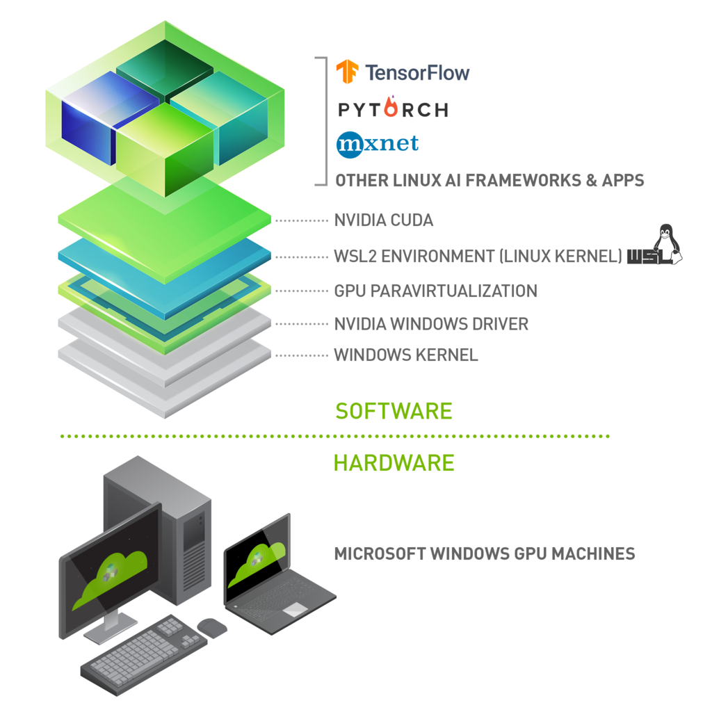
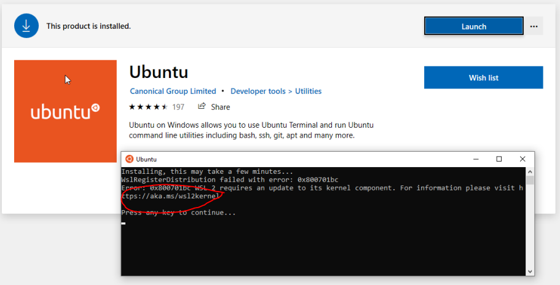

# CUDA on WSL User Guide — CUDA on WSL 13.2 documentation

**来源**: [https://docs.nvidia.com/cuda/wsl-user-guide/index.html](https://docs.nvidia.com/cuda/wsl-user-guide/index.html)

---

CUDA on WSL User Guide

# 1. Overview
The CUDA on WSL User Guide provides a comprehensive overview of how to run NVIDIA CUDA applications on Windows Subsystem for Linux (WSL). It details the setup process, hardware and software requirements, installation steps for the CUDA toolkit, and usage of popular libraries like cuDNN and TensorRT. The guide highlights WSL’s capability to enable native Linux tools and workflows on Windows while leveraging the GPU acceleration provided by NVIDIA drivers. It also offers troubleshooting tips and links to additional resources, making it a key reference for developers using CUDA within a Windows environment.

# 2. NVIDIA GPU Computing on WSL 2
WSL or Windows Subsystem for Linux is a Windows feature that enables users to run native Linux applications, containers and command-line tools directly on Windows 11 and later OS builds. CUDA support in this user guide is specifically for WSL 2, which is the second generation of WSL that offers the following benefits
- Linux applications can run as is in WSL 2. WSL 2 is characteristically a VM with a Linux WSL Kernel in it that provides full compatibility with mainstream Linux kernel allowing support for native Linux applications including popular Linux distros.
- Faster file system support and that’s more performant.
- WSL 2 is tightly integrated with the Microsoft Windows operating system, which allows it to run Linux applications alongside and even interop with other Windows desktop and modern store apps.
For the rest of this user guide, WSL and WSL 2 may be used interchangeably.
Typically, developers working across both Linux and Windows environments have a very disruptive workflow. They either have to:
- Use different systems for Linux and Windows, or
- Dual Boot i.e. install Linux and Windows in separate partitions on the same or different hard disks on the system and boot to the OS of choice.
In both cases, developers have to stop all the work and then switch the system or reboot. Also this has historically restricted the development of seamless, well integrated tools and software systems across two dominant ecosystems.
WSL enables users to have a seamless transition across the two environments without the need for a resource intensive traditional virtual machine and to improve productivity and develop using tools and integrate their workflow. More importantly WSL 2 enables applications that were hitherto only available on Linux to be available on Windows. WSL 2 support for GPU allows for these applications to benefit from GPU accelerated computing and expands the domain of applications that can be developed on WSL 2.
With NVIDIA CUDA support for WSL 2, developers can leverage NVIDIA GPU accelerated computing technology for data science, machine learning and inference on Windows through WSL. GPU acceleration also serves to bring down the performance overhead of running an application inside a WSL like environment close to near-native by being able to pipeline more parallel work on the GPU with less CPU intervention.
NVIDIA driver support for WSL 2 includes not only CUDA but also DirectX and Direct ML support. For some helpful examples, see[https://docs.microsoft.com/en-us/windows/win32/direct3d12/gpu-tensorflow-wsl](https://docs.microsoft.com/en-us/windows/win32/direct3d12/gpu-tensorflow-wsl).
WSL 2 is a key enabler in making GPU acceleration to be seamlessly shared between Windows and Linux applications on the same system a reality. This offers flexibility and versatility while also serving to open up GPU accelerated computing by making it more accessible.

[](https://docs.nvidia.com/cuda/wsl-user-guide/_images/wsl-launch-upt-0625-rz.png)

Figure 1. Illustration of the possibilities with NVIDIA CUDA software stack on WSL 2

This document describes a workflow for getting started with running CUDA applications or containers in a WSL 2 environment.

## 2.1. NVIDIA Compute Software Support on WSL 2
This table captures the readiness and suggested software versions for NVIDIA software stack for WSL 2.

<div style="overflow-x: auto; max-width: 100%; border-radius: 6px;">
<table border="1" cellpadding="6" cellspacing="0" style="border-collapse: collapse; width: 100%; font-family: -apple-system, BlinkMacSystemFont, Segoe UI, Helvetica, Arial, sans-serif; font-size: 13px; margin: 16px 0;">
<colgroup>
<col style="width: 30%"/>
<col style="width: 30%"/>
<col style="width: 40%"/>
</colgroup>
<thead>
<tr style="border: 1px solid #d0d7de;">
<th style="background-color: #f6f8fa; font-weight: 600; text-align: left; padding: 8px 12px; border: 1px solid #d0d7de;"><p>Package</p></th>
<th style="background-color: #f6f8fa; font-weight: 600; text-align: left; padding: 8px 12px; border: 1px solid #d0d7de;"><p>Suggested Versions</p></th>
<th style="background-color: #f6f8fa; font-weight: 600; text-align: left; padding: 8px 12px; border: 1px solid #d0d7de;"><p>Installation</p></th>
</tr>
</thead>
<tbody>
<tr style="border: 1px solid #d0d7de;">
<td style="padding: 8px 12px; border: 1px solid #d0d7de; vertical-align: top;"><p>NVIDIA Windows Driver x86</p></td>
<td style="padding: 8px 12px; border: 1px solid #d0d7de; vertical-align: top;">
<p>Use the latest Windows x86 production driver. R495 and later windows will have CUDA support for WSL 2.
NVIDIA-SMI will have a Limited Feature Set on WSL 2.</p>
<p>Legacy CUDA IPC APIs are support from R510.</p>
</td>
<td style="padding: 8px 12px; border: 1px solid #d0d7de; vertical-align: top;"><p>Windows x86 drivers can be directly downloaded from <a class="reference external" href="https://www.nvidia.com/Download/index.aspx">https://www.nvidia.com/Download/index.aspx</a> for WSL 2 support on Pascal or later GPUs.</p></td>
</tr>
<tr style="border: 1px solid #d0d7de;">
<td style="padding: 8px 12px; border: 1px solid #d0d7de; vertical-align: top;"><p>Docker support</p></td>
<td style="padding: 8px 12px; border: 1px solid #d0d7de; vertical-align: top;">
<p>Supported.</p>
<p>NVIDIA Container Toolkit - Minimum versions - v2.6.0 with libnvidia-container - 1.5.1+</p>
<p>CLI and Docker Desktop Supported.</p>
</td>
<td style="padding: 8px 12px; border: 1px solid #d0d7de; vertical-align: top;"><p>Refer to <a class="reference external" href="https://docs.nvidia.com/ai-enterprise/deployment-guide-vmware/0.1.0/docker.html">https://docs.nvidia.com/ai-enterprise/deployment-guide-vmware/0.1.0/docker.html</a>.</p></td>
</tr>
<tr style="border: 1px solid #d0d7de;">
<td style="padding: 8px 12px; border: 1px solid #d0d7de; vertical-align: top;"><p>CUDA Toolkit and CUDA Developer Tools</p></td>
<td style="padding: 8px 12px; border: 1px solid #d0d7de; vertical-align: top;">
<p>Preview Support</p>
<p>Compute Sanitizer - Pascal and later</p>
<p>Nsight Systems CLI, and CUPTI (Trace) - Volta and later</p>
<p>Developer tools - Debuggers - Pascal and later (Using driver r535+)</p>
<p>Developer tools - Profilers - Volta and later (Using Windows 10 OS build 19044+ with driver r545+ or
using Windows 11 with driver r525+ )</p>
</td>
<td style="padding: 8px 12px; border: 1px solid #d0d7de; vertical-align: top;"><p>Latest Linux CUDA toolkit package - WSL-Ubuntu from 12.x releases can be downloaded from <a class="reference external" href="https://developer.nvidia.com/cuda-downloads">https://developer.nvidia.com/cuda-downloads</a>.</p></td>
</tr>
<tr style="border: 1px solid #d0d7de;">
<td style="padding: 8px 12px; border: 1px solid #d0d7de; vertical-align: top;"><p>RAPIDS</p></td>
<td style="padding: 8px 12px; border: 1px solid #d0d7de; vertical-align: top;"><p>22.04 or later 1.10 - Experimental Support for single GPU.</p></td>
<td style="padding: 8px 12px; border: 1px solid #d0d7de; vertical-align: top;"><p><a class="reference external" href="https://docs.rapids.ai/notices/rgn0024/">https://docs.rapids.ai/notices/rgn0024/</a></p></td>
</tr>
<tr style="border: 1px solid #d0d7de;">
<td style="padding: 8px 12px; border: 1px solid #d0d7de; vertical-align: top;"><p>NCCL</p></td>
<td style="padding: 8px 12px; border: 1px solid #d0d7de; vertical-align: top;"><p>2.12 or later 1.4+</p></td>
<td style="padding: 8px 12px; border: 1px solid #d0d7de; vertical-align: top;"><p>Refer to the <a class="reference external" href="https://docs.nvidia.com/deeplearning/nccl/install-guide/index.html#down">NCCL Installation guide for Linux x86</a>.</p></td>
</tr>
</tbody>
</table>
</div>

# 3. Getting Started with CUDA on WSL 2
To get started with running CUDA on WSL, complete these steps in order:

## 3.1. Step 1: Install NVIDIA Driver for GPU Support
- Install NVIDIA GeForce Game Ready or NVIDIA RTX Quadro Windows 11 display driver on your system with a compatible GeForce or NVIDIA RTX/Quadro card from[https://www.nvidia.com/Download/index.aspx](https://www.nvidia.com/Download/index.aspx). Refer to the system requirements in the Appendix.)
> Note
> **This is the only driver you need to install. Do not install any Linux display driver in WSL.**

## 3.2. Step 2: Install WSL 2
1. Launch your preferred Windows Terminal / Command Prompt / Powershell and install WSL:
  
  ```
  wsl.exe --install
  
  ```
2. Ensure you have the latest WSL kernel:
  
  ```
  wsl.exe --update
  
  ```

## 3.3. Step 3: Set Up a Linux Development Environment
From a Windows terminal, enter WSL:

```
C:\> wsl.exe

```

The default distro is Ubuntu. To update the distro to your favorite distro from the command line and to review other WSL commands, refer to the following resources:
- [https://docs.microsoft.com/en-us/windows/wsl/install](https://docs.microsoft.com/en-us/windows/wsl/install)
- [https://docs.microsoft.com/en-us/windows/wsl/basic-commands](https://docs.microsoft.com/en-us/windows/wsl/basic-commands)
From this point you should be able to run any existing Linux application which requires CUDA. Do not install any driver within the WSL environment. For building a CUDA application, you will need CUDA Toolkit. Read the next section for further information.

# 4. CUDA Support for WSL 2
The[latest NVIDIA Windows GPU Driver](https://www.nvidia.com/Download/index.aspx?lang=en-us)will fully support WSL 2. With CUDA support in the driver, existing applications (compiled elsewhere on a Linux system for the same target GPU) can run unmodified within the WSL environment.
To compile new CUDA applications, a CUDA Toolkit for Linux x86 is needed. CUDA Toolkit support for WSL is still in preview stage as developer tools such as profilers are not available yet. However, CUDA application development is fully supported in the WSL2 environment, as a result, users should be able to compile new CUDA Linux applications with the latest CUDA Toolkit for x86 Linux.
Once a Windows NVIDIA GPU driver is installed on the system, CUDA becomes available within WSL 2. The CUDA driver installed on Windows host will be stubbed inside the WSL 2 as`libcuda.so`, therefore**users must not install any NVIDIA GPU Linux driver within WSL 2**. One has to be very careful here as the default CUDA Toolkit comes packaged with a driver, and it is easy to overwrite the WSL 2 NVIDIA driver with the default installation. We recommend developers to use a separate CUDA Toolkit for WSL 2 (Ubuntu) available from the[CUDA Toolkit Downloads](https://developer.nvidia.com/cuda-downloads?target_os=Linux&target_arch=x86_64&Distribution=WSL-Ubuntu&target_version=2.0)page to avoid this overwriting. This WSL-Ubuntu CUDA toolkit installer will not overwrite the NVIDIA driver that was already mapped into the WSL 2 environment. To learn how to compile CUDA applications, please read the CUDA documentation for Linux.
First, remove the old GPG key:

```
sudo apt-key del 7fa2af80

```

**Option 1: Installation of Linux x86 CUDA Toolkit using WSL-Ubuntu Package - Recommended**
The CUDA WSL-Ubuntu local installer does not contain the NVIDIA Linux GPU driver, so by following the steps on the CUDA[download page for WSL-Ubuntu](https://developer.nvidia.com/cuda-downloads?target_os=Linux&target_arch=x86_64&Distribution=WSL-Ubuntu&target_version=2.0&target_type=deb_local), you will be able to get just the CUDA toolkit installed on WSL.
**Option 2: Installation of Linux x86 CUDA Toolkit using Meta Package**
If you installed the toolkit using the WSL-Ubuntu package, please skip this section. Meta packages do not contain the driver, so by following the steps on the download page for[Ubuntu](https://developer.nvidia.com/cuda-downloads?target_os=Linux&target_arch=x86_64&Distribution=Ubuntu&target_version=20.04&target_type=deb_local), you will be able to get just the CUDA toolkit installed on WSL.
The installation instructions for the CUDA Toolkit can be found in the CUDA Toolkit download page for each installer. But DO NOT choose the “`cuda`”, “`cuda-12-x`”, or “`cuda-drivers`” meta-packages under WSL 2 as these packages will result in an attempt to install the Linux NVIDIA driver under WSL 2. Install the`cuda-toolkit-12-x`metapackage only.
You can also install other components of the toolkit by choosing the right[meta-package](https://docs.nvidia.com/cuda/cuda-installation-guide-linux/index.html#meta-packages).

# 5. WSL 2 Support Constraints
- WSL 2 GPU acceleration will be available on Pascal and later GPU architecture on both GeForce and Quadro product SKUs in WDDM mode. It will not be available on Quadro GPUs in TCC mode or Tesla GPUs yet.
- Ensure you are on the latest WSL Kernel or at least 4.19.121+. We recommend 5.10.16.3 or later for better performance and functional fixes.
- If you are on Windows 11, you no longer need to be on Windows Insider Program to use WSL. Refer to Windows11[system requirements in the Microsoft Blog](https://blogs.windows.com/windows-insider/2021/06/28/update-on-windows-11-minimum-system-requirements/).
- If you are continuing to use Windows 10, seeWindows Insider Preview and Windows 10 Support.

## 5.1. Known Limitations for Linux CUDA Applications
The following table lists the known limitations on WSL 2 that may affect CUDA applications that use some of these features that are fully supported on Linux.

<div style="overflow-x: auto; max-width: 100%; border-radius: 6px;">
<table border="1" cellpadding="6" cellspacing="0" style="border-collapse: collapse; width: 100%; font-family: -apple-system, BlinkMacSystemFont, Segoe UI, Helvetica, Arial, sans-serif; font-size: 13px; margin: 16px 0;">
<colgroup>
<col style="width: 50%"/>
<col style="width: 50%"/>
</colgroup>
<thead>
<tr style="border: 1px solid #d0d7de;">
<th style="background-color: #f6f8fa; font-weight: 600; text-align: left; padding: 8px 12px; border: 1px solid #d0d7de;"><p>Limitations</p></th>
<th style="background-color: #f6f8fa; font-weight: 600; text-align: left; padding: 8px 12px; border: 1px solid #d0d7de;"><p>Impact</p></th>
</tr>
</thead>
<tbody>
<tr style="border: 1px solid #d0d7de;">
<td style="padding: 8px 12px; border: 1px solid #d0d7de; vertical-align: top;"><p>Maxwell GPU is not supported.</p></td>
<td style="padding: 8px 12px; border: 1px solid #d0d7de; vertical-align: top;"><p>Maxwell GPUs are not officially supported in WSL 2, but it may still work. Pascal and later GPU is recommended.</p></td>
</tr>
<tr style="border: 1px solid #d0d7de;">
<td style="padding: 8px 12px; border: 1px solid #d0d7de; vertical-align: top;"><p>Unified Memory - Full Managed Memory Support is not available on Windows native and therefore WSL 2 will not support it for the foreseeable future.</p></td>
<td style="padding: 8px 12px; border: 1px solid #d0d7de; vertical-align: top;">
<p>UVM full features will not be available and therefore applications relying on UVM full features may not work.</p>
<p>If your application is using Managed Memory, your application could see reduced performance and high system memory usage.</p>
<p>Concurrent CPU/GPU access is not supported. CUDA queries will say whether it is supported or not and applications are expected to check this.</p>
</td>
</tr>
<tr style="border: 1px solid #d0d7de;">
<td style="padding: 8px 12px; border: 1px solid #d0d7de; vertical-align: top;"><p>Pinned system memory (example: System memory that an application makes resident for GPU accesses) availability for applications is limited.</p></td>
<td style="padding: 8px 12px; border: 1px solid #d0d7de; vertical-align: top;"><p>For example, some deep learning training workloads, depending on the framework, model and dataset size used, can exceed this limit and may not work.</p></td>
</tr>
<tr style="border: 1px solid #d0d7de;">
<td style="padding: 8px 12px; border: 1px solid #d0d7de; vertical-align: top;"><p>Root user on bare metal (not containers) will not find nvidia-smi at the expected location.</p></td>
<td style="padding: 8px 12px; border: 1px solid #d0d7de; vertical-align: top;"><p>Use <code class="docutils literal notranslate"><span class="pre">/usr/lib/wsl/lib/nvidia-smi</span></code> or manually add <code class="docutils literal notranslate"><span class="pre">/usr/lib/wsl/lib/</span></code> to the PATH).</p></td>
</tr>
<tr style="border: 1px solid #d0d7de;">
<td style="padding: 8px 12px; border: 1px solid #d0d7de; vertical-align: top;"><p>With the NVIDIA Container Toolkit for Docker 19.03, only <code class="docutils literal notranslate"><span class="pre">--gpus</span> <span class="pre">all</span></code> is supported.</p></td>
<td style="padding: 8px 12px; border: 1px solid #d0d7de; vertical-align: top;"><p>On multi-GPU systems it is not possible to filter for specific GPU devices by using specific index numbers to enumerate GPUs.</p></td>
</tr>
</tbody>
</table>
</div>

## 5.2. Features Not Yet Supported
The following table lists the set of features that are currently not supported.

<div style="overflow-x: auto; max-width: 100%; border-radius: 6px;">
<table border="1" cellpadding="6" cellspacing="0" style="border-collapse: collapse; width: 100%; font-family: -apple-system, BlinkMacSystemFont, Segoe UI, Helvetica, Arial, sans-serif; font-size: 13px; margin: 16px 0;">
<colgroup>
<col style="width: 50%"/>
<col style="width: 50%"/>
</colgroup>
<thead>
<tr style="border: 1px solid #d0d7de;">
<th style="background-color: #f6f8fa; font-weight: 600; text-align: left; padding: 8px 12px; border: 1px solid #d0d7de;"><p>Limitations</p></th>
<th style="background-color: #f6f8fa; font-weight: 600; text-align: left; padding: 8px 12px; border: 1px solid #d0d7de;"><p>Impact</p></th>
</tr>
</thead>
<tbody>
<tr style="border: 1px solid #d0d7de;">
<td style="padding: 8px 12px; border: 1px solid #d0d7de; vertical-align: top;"><p>NVML (nvidia-smi) does not support all the queries yet.</p></td>
<td style="padding: 8px 12px; border: 1px solid #d0d7de; vertical-align: top;"><p>GPU utilization, active compute process are some queries that are not yet supported. Modifiable state features (ECC, Compute mode, Persistence mode) will not be supported.</p></td>
</tr>
<tr style="border: 1px solid #d0d7de;">
<td style="padding: 8px 12px; border: 1px solid #d0d7de; vertical-align: top;"><p>OpenGL-CUDA Interop is not yet supported.</p></td>
<td style="padding: 8px 12px; border: 1px solid #d0d7de; vertical-align: top;"><p>Applications relying on OpenGL will not work.</p></td>
</tr>
</tbody>
</table>
</div>

# 6. Appendix

## 6.1. Windows Insider Preview and Windows 10 Support
- If you are on Windows 11 please skip this section. Windows 11 is generally available to the public and therefore does not require special registration. All the instructions at the beginning of this user guide were mainly focused toward Windows 11 users.
- If you are looking to use WSL 2 on Windows 10 or to be on the bleeding edge of WSL 2 development, you may want to register for the[Windows Insider Program](https://insider.windows.com/en-us/getting-started/#register)and choose the appropriate[flighting channel](https://docs.microsoft.com/en-us/windows-insider/flighting#switching-between-channels)(previously fast rings) and get the latest build for your needs.
- Learn more on[Releasing Windows 10 Build 19043.1263 (21H1) to Release Preview Channel](https://blogs.windows.com/windows-insider/2021/09/23/releasing-windows-10-build-19043-1263-21h1-to-release-preview-channel/).
- You can check your build version number by running`winver`via the Run command.

## 6.2. Troubleshooting

### 6.2.1. Container Runtime Initialization Errors
In some cases, when running a Docker container, you may encounter`nvidia-container-cli : initialization error`:

```
$ sudo docker run --gpus all nvcr.io/nvidia/k8s/cuda-sample:nbody nbody -gpu -benchmark
docker: Error response from daemon: OCI runtime create failed: container_linux.go:349: starting container process caused "process_linux.go:449: container init caused \"process_linux.go:432: running prestart hook 0 caused \\\"error running hook: exit status 1, stdout: , stderr: nvidia-container-cli: initialization error: driver error: failed to process request\\\\n\\\"\"": unknown.
ERRO[0000] error waiting for container: context canceled

```

This usually indicates that the right Windows OS build or Microsoft Windows Insider Preview Builds (Windows 10 only), WSL 2, NVIDIA drivers and NVIDIA Container Toolkit may not be installed correctly. Review the known issues and changelog sections to ensure the right versions of the driver and container toolkit are installed.
Ensure you have followed through the steps listed under Setup under Running CUDA containers; especially ensure that the`docker`daemon is still running.

```
$ sudo service docker stop
$ sudo service docker start

```

Or start the daemon directly and see if that resolves the issue:

```
$ sudo dockerd

```

If you are still running into this issue, use the`dxdiag`tools from the Run dialog and provide the diagnostic logs to NVIDIA by posting in the[Developer Forums](https://forums.developer.nvidia.com/c/accelerated-computing/cuda/cuda-on-windows-subsystem-for-linux/303)or by filing a[report](https://forums.developer.nvidia.com/t/how-to-report-a-bug/).
You can also use the CUDA on WSL 2[Developer Forums](https://forums.developer.nvidia.com/c/accelerated-computing/cuda/cuda-on-windows-subsystem-for-linux/303)to get in touch with NVIDIA product and engineering teams for help.

### 6.2.2. Checking WSL Kernel Version
1. Ensure you have the latest kernel by running the following command in PowerShell:
  
  ```
  $ wsl cat /proc/version
  
  Linux version 5.10.16.3-microsoft-standard-WSL2
  (x86_64-msft-linux-gcc (GCC) 9.3.0, GNU ld (GNU Binutils) 2.34.0.20200220) #1 SMP Fri Apr 2 22:23:49 UTC 2021
  
  ```
2. If you don’t have the latest WSL kernel, you will see the following blocking warning upon trying to launch a Linux distribution within the WSL 2 container:
  

## 6.3. Traditional Virtual Machines vs WSL 2
Whether to efficiently use hardware resources or to improve productivity, virtualization is a more widely used solution in both consumer and enterprise space. There are different types of virtualizations, and it is beyond the scope of this document to delve into the specifics. But traditional virtualization solutions require installation and setup of a virtualization management software to manage the guest virtual machines.
Although WSL 2 is itself a Virtual Machine, unlike traditional VMs it is easy to setup as it is provided by the host operating system provider and is quite lightweight. Applications running within WSL see less overhead compared to traditional VMs especially if they require access to the hardware or perform privileged operations compared to when run directly on the system. This is especially important for GPU accelerated workload. While VMs allow applications to be run unmodified, due to constraints from setup and performance overhead, they are not the best option in many situations.

## 6.4. Containers vs WSL 2
While a VM provides a secure self-contained, execution environment with a complete user space for the application, containers enable application composability without the overhead of VMs. Containers compose all the dependencies of the applications such as libraries, files etc., to be bundled together for development and easy and predictable deployment. Containers run on the operating system that is installed on the system directly and therefore do not provide full isolation from other containers like a VM does, but keeps overhead negligible as a result.
To learn more about differences between VMs and containers, refer to[https://docs.microsoft.com/en-us/virtualization/windowscontainers/about/containers-vs-vm](https://docs.microsoft.com/en-us/virtualization/windowscontainers/about/containers-vs-vm).

# 7. Notices

## 7.1. Notice
This document is provided for information purposes only and shall not be regarded as a warranty of a certain functionality, condition, or quality of a product. NVIDIA Corporation (“NVIDIA”) makes no representations or warranties, expressed or implied, as to the accuracy or completeness of the information contained in this document and assumes no responsibility for any errors contained herein. NVIDIA shall have no liability for the consequences or use of such information or for any infringement of patents or other rights of third parties that may result from its use. This document is not a commitment to develop, release, or deliver any Material (defined below), code, or functionality.
NVIDIA reserves the right to make corrections, modifications, enhancements, improvements, and any other changes to this document, at any time without notice.
Customer should obtain the latest relevant information before placing orders and should verify that such information is current and complete.
NVIDIA products are sold subject to the NVIDIA standard terms and conditions of sale supplied at the time of order acknowledgement, unless otherwise agreed in an individual sales agreement signed by authorized representatives of NVIDIA and customer (“Terms of Sale”). NVIDIA hereby expressly objects to applying any customer general terms and conditions with regards to the purchase of the NVIDIA product referenced in this document. No contractual obligations are formed either directly or indirectly by this document.
NVIDIA products are not designed, authorized, or warranted to be suitable for use in medical, military, aircraft, space, or life support equipment, nor in applications where failure or malfunction of the NVIDIA product can reasonably be expected to result in personal injury, death, or property or environmental damage. NVIDIA accepts no liability for inclusion and/or use of NVIDIA products in such equipment or applications and therefore such inclusion and/or use is at customer’s own risk.
NVIDIA makes no representation or warranty that products based on this document will be suitable for any specified use. Testing of all parameters of each product is not necessarily performed by NVIDIA. It is customer’s sole responsibility to evaluate and determine the applicability of any information contained in this document, ensure the product is suitable and fit for the application planned by customer, and perform the necessary testing for the application in order to avoid a default of the application or the product. Weaknesses in customer’s product designs may affect the quality and reliability of the NVIDIA product and may result in additional or different conditions and/or requirements beyond those contained in this document. NVIDIA accepts no liability related to any default, damage, costs, or problem which may be based on or attributable to: (i) the use of the NVIDIA product in any manner that is contrary to this document or (ii) customer product designs.
No license, either expressed or implied, is granted under any NVIDIA patent right, copyright, or other NVIDIA intellectual property right under this document. Information published by NVIDIA regarding third-party products or services does not constitute a license from NVIDIA to use such products or services or a warranty or endorsement thereof. Use of such information may require a license from a third party under the patents or other intellectual property rights of the third party, or a license from NVIDIA under the patents or other intellectual property rights of NVIDIA.
Reproduction of information in this document is permissible only if approved in advance by NVIDIA in writing, reproduced without alteration and in full compliance with all applicable export laws and regulations, and accompanied by all associated conditions, limitations, and notices.
THIS DOCUMENT AND ALL NVIDIA DESIGN SPECIFICATIONS, REFERENCE BOARDS, FILES, DRAWINGS, DIAGNOSTICS, LISTS, AND OTHER DOCUMENTS (TOGETHER AND SEPARATELY, “MATERIALS”) ARE BEING PROVIDED “AS IS.” NVIDIA MAKES NO WARRANTIES, EXPRESSED, IMPLIED, STATUTORY, OR OTHERWISE WITH RESPECT TO THE MATERIALS, AND EXPRESSLY DISCLAIMS ALL IMPLIED WARRANTIES OF NONINFRINGEMENT, MERCHANTABILITY, AND FITNESS FOR A PARTICULAR PURPOSE. TO THE EXTENT NOT PROHIBITED BY LAW, IN NO EVENT WILL NVIDIA BE LIABLE FOR ANY DAMAGES, INCLUDING WITHOUT LIMITATION ANY DIRECT, INDIRECT, SPECIAL, INCIDENTAL, PUNITIVE, OR CONSEQUENTIAL DAMAGES, HOWEVER CAUSED AND REGARDLESS OF THE THEORY OF LIABILITY, ARISING OUT OF ANY USE OF THIS DOCUMENT, EVEN IF NVIDIA HAS BEEN ADVISED OF THE POSSIBILITY OF SUCH DAMAGES. Notwithstanding any damages that customer might incur for any reason whatsoever, NVIDIA’s aggregate and cumulative liability towards customer for the products described herein shall be limited in accordance with the Terms of Sale for the product.

## 7.2. OpenCL
OpenCL is a trademark of Apple Inc. used under license to the Khronos Group Inc.

## 7.3. Trademarks
NVIDIA and the NVIDIA logo are trademarks or registered trademarks of NVIDIA Corporation in the U.S. and other countries. Other company and product names may be trademarks of the respective companies with which they are associated.